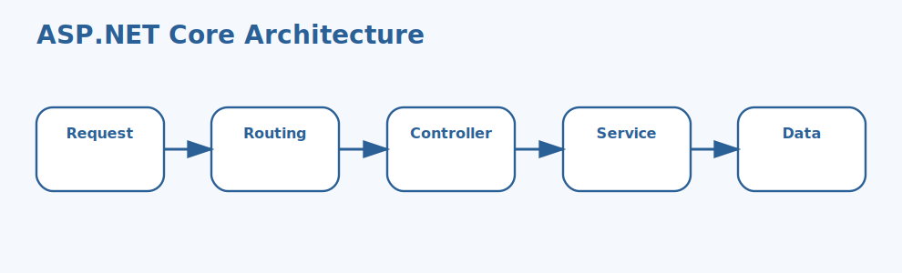

# ASP.NET Core Fundamentals Interview Questions



This guide covers practical ASP.NET Core fundamentals from application bootstrapping to routing, configuration, environments, security basics, and built-in services. It follows the corrected format of **100 interview questions for each subtopic**, and every answer includes a C# code example with rotated real-world scenarios so the examples do not repeat verbatim.

## How To Use This Page

- Questions 1-100 cover Framework overview.
- Questions 101-200 cover Project structure.
- Questions 201-300 cover Routing.
- Questions 301-400 cover Controllers and APIs.
- Questions 401-500 cover Dependency injection.
- Questions 501-600 cover Middleware basics.
- Questions 601-700 cover Configuration.
- Questions 701-800 cover Environments.
- Questions 801-900 cover Authentication and authorization basics.
- Questions 901-1000 cover Built-in tooling and services.

## 1. Framework overview

> This section contains **100 interview questions** focused on **Framework overview**. Every answer includes a C# code example, and the scenarios rotate so they do not repeat verbatim.

### Q1.1 What is ASP.NET Core role as a modern web framework in ASP.NET Core fundamentals?

**Answer:** Asp.net core role as a modern web framework means ASP.NET Core provides a cross-platform hosting and request-processing framework for APIs and web applications. Teams should focus on it when explaining framework overview in real systems, they compare it with framework-as-just-a-library thinking, and they should avoid the trap of explaining ASP.NET Core without its hosting and pipeline model. Example: while reviewing a service-registration design, so deployment behavior becomes easier to validate. Another example: during an API startup review, so the startup choice becomes easier to defend.

**Code Example:**

```csharp
using System;
using System.Collections.Generic;
using System.Linq;
using System.Security.Claims;
using Microsoft.AspNetCore.Builder;
using Microsoft.AspNetCore.Http;
using Microsoft.AspNetCore.Mvc;
using Microsoft.Extensions.DependencyInjection;
using Microsoft.Extensions.Logging;

public static class Demo1_1
{
    public static void Run()
    {
        var builder = WebApplication.CreateBuilder();
        var app = builder.Build();
        app.MapGet("/", () => "ok");
        Console.WriteLine(app is not null);
    }
}
```

### Q1.2 How does minimal hosting model basics in ASP.NET Core fundamentals?

**Answer:** Minimal hosting model basics means modern ASP.NET Core apps usually start from a lightweight builder and web application host. Teams should focus on it when explaining framework overview in real systems, they compare it with older startup patterns only, and they should avoid the trap of ignoring how newer templates shape bootstrapping. Example: during an authentication setup review, so the startup choice becomes easier to defend. Another example: while reviewing a service-registration design, so maintenance risk stays lower.

**Code Example:**

```csharp
using System;
using System.Collections.Generic;
using System.Linq;
using System.Security.Claims;
using Microsoft.AspNetCore.Builder;
using Microsoft.AspNetCore.Http;
using Microsoft.AspNetCore.Mvc;
using Microsoft.Extensions.DependencyInjection;
using Microsoft.Extensions.Logging;

public static class Demo1_2
{
    public static void Run()
    {
        var builder = WebApplication.CreateBuilder();
        Console.WriteLine(builder.Environment.ApplicationName is not null);
    }
}
```

### Q1.3 Why does cross platform and cloud readiness in ASP.NET Core fundamentals?

**Answer:** Cross platform and cloud readiness means the framework is designed for Linux Windows containers and cloud-native hosting scenarios. Teams should focus on it when explaining framework overview in real systems, they compare it with Windows-only assumptions, and they should avoid the trap of describing deployment as if platform options do not matter. Example: while tracing an environment-specific behavior change, so maintenance risk stays lower. Another example: during an authentication setup review, so the service wiring becomes easier to predict.

**Code Example:**

```csharp
using System;
using System.Collections.Generic;
using System.Linq;
using System.Security.Claims;
using Microsoft.AspNetCore.Builder;
using Microsoft.AspNetCore.Http;
using Microsoft.AspNetCore.Mvc;
using Microsoft.Extensions.DependencyInjection;
using Microsoft.Extensions.Logging;

public static class Demo1_3
{
    public static void Run()
    {
        string platform = OperatingSystem.IsLinux() ? "linux" : "other";
        Console.WriteLine(platform);
    }
}
```

### Q1.4 When should you use request pipeline orientation in ASP.NET Core fundamentals?

**Answer:** Request pipeline orientation means ASP.NET Core handles requests through a configurable middleware pipeline and endpoint model. Teams should focus on it when explaining framework overview in real systems, they compare it with controller-only mental models, and they should avoid the trap of ignoring the pipeline beneath endpoints. Example: during a routing regression investigation, so the service wiring becomes easier to predict. Another example: while tracing an environment-specific behavior change, so the request flow becomes easier to reason about.

**Code Example:**

```csharp
using System;
using System.Collections.Generic;
using System.Linq;
using System.Security.Claims;
using Microsoft.AspNetCore.Builder;
using Microsoft.AspNetCore.Http;
using Microsoft.AspNetCore.Mvc;
using Microsoft.Extensions.DependencyInjection;
using Microsoft.Extensions.Logging;

public static class Demo1_4
{
    public static void Run()
    {
        var builder = WebApplication.CreateBuilder();
        var app = builder.Build();
        app.MapGet("/status", () => Results.Ok(new { Ready = true }));
        Console.WriteLine(app is not null);
    }
}
```

### Q1.5 What problem does web app versus API use cases in ASP.NET Core fundamentals?

**Answer:** Web app versus api use cases means the same platform supports APIs web apps background integration points and hybrid services. Teams should focus on it when explaining framework overview in real systems, they compare it with single-template thinking, and they should avoid the trap of assuming one app style defines the whole platform. Example: while preparing a deployment checklist, so the request flow becomes easier to reason about. Another example: during a routing regression investigation, so the API shape becomes easier to justify.

**Code Example:**

```csharp
using System;
using System.Collections.Generic;
using System.Linq;
using System.Security.Claims;
using Microsoft.AspNetCore.Builder;
using Microsoft.AspNetCore.Http;
using Microsoft.AspNetCore.Mvc;
using Microsoft.Extensions.DependencyInjection;
using Microsoft.Extensions.Logging;

public static class Demo1_5
{
    public static void Run()
    {
        bool apiStyle = true;
        Console.WriteLine(apiStyle ? "api" : "web");
    }
}
```

### Q1.6 How would you explain framework overview interview framing in ASP.NET Core fundamentals?

**Answer:** Framework overview interview framing means strong answers connect hosting routing middleware and deployment behavior together. Teams should focus on it when explaining framework overview in real systems, they compare it with marketing slogans only, and they should avoid the trap of skipping runtime architecture. Example: during a project-template cleanup, so the API shape becomes easier to justify. Another example: while preparing a deployment checklist, so the bug becomes easier to isolate.

**Code Example:**

```csharp
using System;
using System.Collections.Generic;
using System.Linq;
using System.Security.Claims;
using Microsoft.AspNetCore.Builder;
using Microsoft.AspNetCore.Http;
using Microsoft.AspNetCore.Mvc;
using Microsoft.Extensions.DependencyInjection;
using Microsoft.Extensions.Logging;

public static class Demo1_6
{
    public static void Run()
    {
        Console.WriteLine("Hosting, middleware, routing, and DI all work together");
    }
}
```

### Q1.7 Why is ASP.NET Core role as a modern web framework in ASP.NET Core fundamentals?

**Answer:** Asp.net core role as a modern web framework means ASP.NET Core provides a cross-platform hosting and request-processing framework for APIs and web applications. Teams should focus on it when explaining framework overview in real systems, they compare it with framework-as-just-a-library thinking, and they should avoid the trap of explaining ASP.NET Core without its hosting and pipeline model. Example: while debugging a configuration issue, so the bug becomes easier to isolate. Another example: during a project-template cleanup, so the framework boundary becomes easier to explain.

**Code Example:**

```csharp
using System;
using System.Collections.Generic;
using System.Linq;
using System.Security.Claims;
using Microsoft.AspNetCore.Builder;
using Microsoft.AspNetCore.Http;
using Microsoft.AspNetCore.Mvc;
using Microsoft.Extensions.DependencyInjection;
using Microsoft.Extensions.Logging;

public static class Demo1_7
{
    public static void Run()
    {
        var builder = WebApplication.CreateBuilder();
        var app = builder.Build();
        app.MapGet("/", () => "ok");
        Console.WriteLine(app is not null);
    }
}
```

### Q1.8 How can minimal hosting model basics in ASP.NET Core fundamentals?

**Answer:** Minimal hosting model basics means modern ASP.NET Core apps usually start from a lightweight builder and web application host. Teams should focus on it when explaining framework overview in real systems, they compare it with older startup patterns only, and they should avoid the trap of ignoring how newer templates shape bootstrapping. Example: during a middleware ordering bug, so the framework boundary becomes easier to explain. Another example: while debugging a configuration issue, so deployment behavior becomes easier to validate.

**Code Example:**

```csharp
using System;
using System.Collections.Generic;
using System.Linq;
using System.Security.Claims;
using Microsoft.AspNetCore.Builder;
using Microsoft.AspNetCore.Http;
using Microsoft.AspNetCore.Mvc;
using Microsoft.Extensions.DependencyInjection;
using Microsoft.Extensions.Logging;

public static class Demo1_8
{
    public static void Run()
    {
        var builder = WebApplication.CreateBuilder();
        Console.WriteLine(builder.Environment.ApplicationName is not null);
    }
}
```

### Q1.9 What is cross platform and cloud readiness in ASP.NET Core fundamentals?

**Answer:** Cross platform and cloud readiness means the framework is designed for Linux Windows containers and cloud-native hosting scenarios. Teams should focus on it when explaining framework overview in real systems, they compare it with Windows-only assumptions, and they should avoid the trap of describing deployment as if platform options do not matter. Example: while onboarding a team to ASP.NET Core, so deployment behavior becomes easier to validate. Another example: during a middleware ordering bug, so the startup choice becomes easier to defend.

**Code Example:**

```csharp
using System;
using System.Collections.Generic;
using System.Linq;
using System.Security.Claims;
using Microsoft.AspNetCore.Builder;
using Microsoft.AspNetCore.Http;
using Microsoft.AspNetCore.Mvc;
using Microsoft.Extensions.DependencyInjection;
using Microsoft.Extensions.Logging;

public static class Demo1_9
{
    public static void Run()
    {
        string platform = OperatingSystem.IsLinux() ? "linux" : "other";
        Console.WriteLine(platform);
    }
}
```

### Q1.10 How does request pipeline orientation in ASP.NET Core fundamentals?

**Answer:** Request pipeline orientation means ASP.NET Core handles requests through a configurable middleware pipeline and endpoint model. Teams should focus on it when explaining framework overview in real systems, they compare it with controller-only mental models, and they should avoid the trap of ignoring the pipeline beneath endpoints. Example: during an API startup review, so the startup choice becomes easier to defend. Another example: while onboarding a team to ASP.NET Core, so maintenance risk stays lower.

**Code Example:**

```csharp
using System;
using System.Collections.Generic;
using System.Linq;
using System.Security.Claims;
using Microsoft.AspNetCore.Builder;
using Microsoft.AspNetCore.Http;
using Microsoft.AspNetCore.Mvc;
using Microsoft.Extensions.DependencyInjection;
using Microsoft.Extensions.Logging;

public static class Demo1_10
{
    public static void Run()
    {
        var builder = WebApplication.CreateBuilder();
        var app = builder.Build();
        app.MapGet("/status", () => Results.Ok(new { Ready = true }));
        Console.WriteLine(app is not null);
    }
}
```

### Q1.11 Why does web app versus API use cases in ASP.NET Core fundamentals?

**Answer:** Web app versus api use cases means the same platform supports APIs web apps background integration points and hybrid services. Teams should focus on it when explaining framework overview in real systems, they compare it with single-template thinking, and they should avoid the trap of assuming one app style defines the whole platform. Example: while reviewing a service-registration design, so maintenance risk stays lower. Another example: during an API startup review, so the service wiring becomes easier to predict.

**Code Example:**

```csharp
using System;
using System.Collections.Generic;
using System.Linq;
using System.Security.Claims;
using Microsoft.AspNetCore.Builder;
using Microsoft.AspNetCore.Http;
using Microsoft.AspNetCore.Mvc;
using Microsoft.Extensions.DependencyInjection;
using Microsoft.Extensions.Logging;

public static class Demo1_11
{
    public static void Run()
    {
        bool apiStyle = true;
        Console.WriteLine(apiStyle ? "api" : "web");
    }
}
```

### Q1.12 When should you use framework overview interview framing in ASP.NET Core fundamentals?

**Answer:** Framework overview interview framing means strong answers connect hosting routing middleware and deployment behavior together. Teams should focus on it when explaining framework overview in real systems, they compare it with marketing slogans only, and they should avoid the trap of skipping runtime architecture. Example: during an authentication setup review, so the service wiring becomes easier to predict. Another example: while reviewing a service-registration design, so the request flow becomes easier to reason about.

**Code Example:**

```csharp
using System;
using System.Collections.Generic;
using System.Linq;
using System.Security.Claims;
using Microsoft.AspNetCore.Builder;
using Microsoft.AspNetCore.Http;
using Microsoft.AspNetCore.Mvc;
using Microsoft.Extensions.DependencyInjection;
using Microsoft.Extensions.Logging;

public static class Demo1_12
{
    public static void Run()
    {
        Console.WriteLine("Hosting, middleware, routing, and DI all work together");
    }
}
```

### Q1.13 What problem does ASP.NET Core role as a modern web framework in ASP.NET Core fundamentals?

**Answer:** Asp.net core role as a modern web framework means ASP.NET Core provides a cross-platform hosting and request-processing framework for APIs and web applications. Teams should focus on it when explaining framework overview in real systems, they compare it with framework-as-just-a-library thinking, and they should avoid the trap of explaining ASP.NET Core without its hosting and pipeline model. Example: while tracing an environment-specific behavior change, so the request flow becomes easier to reason about. Another example: during an authentication setup review, so the API shape becomes easier to justify.

**Code Example:**

```csharp
using System;
using System.Collections.Generic;
using System.Linq;
using System.Security.Claims;
using Microsoft.AspNetCore.Builder;
using Microsoft.AspNetCore.Http;
using Microsoft.AspNetCore.Mvc;
using Microsoft.Extensions.DependencyInjection;
using Microsoft.Extensions.Logging;

public static class Demo1_13
{
    public static void Run()
    {
        var builder = WebApplication.CreateBuilder();
        var app = builder.Build();
        app.MapGet("/", () => "ok");
        Console.WriteLine(app is not null);
    }
}
```

### Q1.14 How would you explain minimal hosting model basics in ASP.NET Core fundamentals?

**Answer:** Minimal hosting model basics means modern ASP.NET Core apps usually start from a lightweight builder and web application host. Teams should focus on it when explaining framework overview in real systems, they compare it with older startup patterns only, and they should avoid the trap of ignoring how newer templates shape bootstrapping. Example: during a routing regression investigation, so the API shape becomes easier to justify. Another example: while tracing an environment-specific behavior change, so the bug becomes easier to isolate.

**Code Example:**

```csharp
using System;
using System.Collections.Generic;
using System.Linq;
using System.Security.Claims;
using Microsoft.AspNetCore.Builder;
using Microsoft.AspNetCore.Http;
using Microsoft.AspNetCore.Mvc;
using Microsoft.Extensions.DependencyInjection;
using Microsoft.Extensions.Logging;

public static class Demo1_14
{
    public static void Run()
    {
        var builder = WebApplication.CreateBuilder();
        Console.WriteLine(builder.Environment.ApplicationName is not null);
    }
}
```

### Q1.15 Why is cross platform and cloud readiness in ASP.NET Core fundamentals?

**Answer:** Cross platform and cloud readiness means the framework is designed for Linux Windows containers and cloud-native hosting scenarios. Teams should focus on it when explaining framework overview in real systems, they compare it with Windows-only assumptions, and they should avoid the trap of describing deployment as if platform options do not matter. Example: while preparing a deployment checklist, so the bug becomes easier to isolate. Another example: during a routing regression investigation, so the framework boundary becomes easier to explain.

**Code Example:**

```csharp
using System;
using System.Collections.Generic;
using System.Linq;
using System.Security.Claims;
using Microsoft.AspNetCore.Builder;
using Microsoft.AspNetCore.Http;
using Microsoft.AspNetCore.Mvc;
using Microsoft.Extensions.DependencyInjection;
using Microsoft.Extensions.Logging;

public static class Demo1_15
{
    public static void Run()
    {
        string platform = OperatingSystem.IsLinux() ? "linux" : "other";
        Console.WriteLine(platform);
    }
}
```

### Q1.16 How can request pipeline orientation in ASP.NET Core fundamentals?

**Answer:** Request pipeline orientation means ASP.NET Core handles requests through a configurable middleware pipeline and endpoint model. Teams should focus on it when explaining framework overview in real systems, they compare it with controller-only mental models, and they should avoid the trap of ignoring the pipeline beneath endpoints. Example: during a project-template cleanup, so the framework boundary becomes easier to explain. Another example: while preparing a deployment checklist, so deployment behavior becomes easier to validate.

**Code Example:**

```csharp
using System;
using System.Collections.Generic;
using System.Linq;
using System.Security.Claims;
using Microsoft.AspNetCore.Builder;
using Microsoft.AspNetCore.Http;
using Microsoft.AspNetCore.Mvc;
using Microsoft.Extensions.DependencyInjection;
using Microsoft.Extensions.Logging;

public static class Demo1_16
{
    public static void Run()
    {
        var builder = WebApplication.CreateBuilder();
        var app = builder.Build();
        app.MapGet("/status", () => Results.Ok(new { Ready = true }));
        Console.WriteLine(app is not null);
    }
}
```

### Q1.17 What is web app versus API use cases in ASP.NET Core fundamentals?

**Answer:** Web app versus api use cases means the same platform supports APIs web apps background integration points and hybrid services. Teams should focus on it when explaining framework overview in real systems, they compare it with single-template thinking, and they should avoid the trap of assuming one app style defines the whole platform. Example: while debugging a configuration issue, so deployment behavior becomes easier to validate. Another example: during a project-template cleanup, so the startup choice becomes easier to defend.

**Code Example:**

```csharp
using System;
using System.Collections.Generic;
using System.Linq;
using System.Security.Claims;
using Microsoft.AspNetCore.Builder;
using Microsoft.AspNetCore.Http;
using Microsoft.AspNetCore.Mvc;
using Microsoft.Extensions.DependencyInjection;
using Microsoft.Extensions.Logging;

public static class Demo1_17
{
    public static void Run()
    {
        bool apiStyle = true;
        Console.WriteLine(apiStyle ? "api" : "web");
    }
}
```

### Q1.18 How does framework overview interview framing in ASP.NET Core fundamentals?

**Answer:** Framework overview interview framing means strong answers connect hosting routing middleware and deployment behavior together. Teams should focus on it when explaining framework overview in real systems, they compare it with marketing slogans only, and they should avoid the trap of skipping runtime architecture. Example: during a middleware ordering bug, so the startup choice becomes easier to defend. Another example: while debugging a configuration issue, so maintenance risk stays lower.

**Code Example:**

```csharp
using System;
using System.Collections.Generic;
using System.Linq;
using System.Security.Claims;
using Microsoft.AspNetCore.Builder;
using Microsoft.AspNetCore.Http;
using Microsoft.AspNetCore.Mvc;
using Microsoft.Extensions.DependencyInjection;
using Microsoft.Extensions.Logging;

public static class Demo1_18
{
    public static void Run()
    {
        Console.WriteLine("Hosting, middleware, routing, and DI all work together");
    }
}
```

### Q1.19 Why does ASP.NET Core role as a modern web framework in ASP.NET Core fundamentals?

**Answer:** Asp.net core role as a modern web framework means ASP.NET Core provides a cross-platform hosting and request-processing framework for APIs and web applications. Teams should focus on it when explaining framework overview in real systems, they compare it with framework-as-just-a-library thinking, and they should avoid the trap of explaining ASP.NET Core without its hosting and pipeline model. Example: while onboarding a team to ASP.NET Core, so maintenance risk stays lower. Another example: during a middleware ordering bug, so the service wiring becomes easier to predict.

**Code Example:**

```csharp
using System;
using System.Collections.Generic;
using System.Linq;
using System.Security.Claims;
using Microsoft.AspNetCore.Builder;
using Microsoft.AspNetCore.Http;
using Microsoft.AspNetCore.Mvc;
using Microsoft.Extensions.DependencyInjection;
using Microsoft.Extensions.Logging;

public static class Demo1_19
{
    public static void Run()
    {
        var builder = WebApplication.CreateBuilder();
        var app = builder.Build();
        app.MapGet("/", () => "ok");
        Console.WriteLine(app is not null);
    }
}
```

### Q1.20 When should you use minimal hosting model basics in ASP.NET Core fundamentals?

**Answer:** Minimal hosting model basics means modern ASP.NET Core apps usually start from a lightweight builder and web application host. Teams should focus on it when explaining framework overview in real systems, they compare it with older startup patterns only, and they should avoid the trap of ignoring how newer templates shape bootstrapping. Example: during an API startup review, so the service wiring becomes easier to predict. Another example: while onboarding a team to ASP.NET Core, so the request flow becomes easier to reason about.

**Code Example:**

```csharp
using System;
using System.Collections.Generic;
using System.Linq;
using System.Security.Claims;
using Microsoft.AspNetCore.Builder;
using Microsoft.AspNetCore.Http;
using Microsoft.AspNetCore.Mvc;
using Microsoft.Extensions.DependencyInjection;
using Microsoft.Extensions.Logging;

public static class Demo1_20
{
    public static void Run()
    {
        var builder = WebApplication.CreateBuilder();
        Console.WriteLine(builder.Environment.ApplicationName is not null);
    }
}
```

### Q1.21 What problem does cross platform and cloud readiness in ASP.NET Core fundamentals?

**Answer:** Cross platform and cloud readiness means the framework is designed for Linux Windows containers and cloud-native hosting scenarios. Teams should focus on it when explaining framework overview in real systems, they compare it with Windows-only assumptions, and they should avoid the trap of describing deployment as if platform options do not matter. Example: while reviewing a service-registration design, so the request flow becomes easier to reason about. Another example: during an API startup review, so the API shape becomes easier to justify.

**Code Example:**

```csharp
using System;
using System.Collections.Generic;
using System.Linq;
using System.Security.Claims;
using Microsoft.AspNetCore.Builder;
using Microsoft.AspNetCore.Http;
using Microsoft.AspNetCore.Mvc;
using Microsoft.Extensions.DependencyInjection;
using Microsoft.Extensions.Logging;

public static class Demo1_21
{
    public static void Run()
    {
        string platform = OperatingSystem.IsLinux() ? "linux" : "other";
        Console.WriteLine(platform);
    }
}
```

### Q1.22 How would you explain request pipeline orientation in ASP.NET Core fundamentals?

**Answer:** Request pipeline orientation means ASP.NET Core handles requests through a configurable middleware pipeline and endpoint model. Teams should focus on it when explaining framework overview in real systems, they compare it with controller-only mental models, and they should avoid the trap of ignoring the pipeline beneath endpoints. Example: during an authentication setup review, so the API shape becomes easier to justify. Another example: while reviewing a service-registration design, so the bug becomes easier to isolate.

**Code Example:**

```csharp
using System;
using System.Collections.Generic;
using System.Linq;
using System.Security.Claims;
using Microsoft.AspNetCore.Builder;
using Microsoft.AspNetCore.Http;
using Microsoft.AspNetCore.Mvc;
using Microsoft.Extensions.DependencyInjection;
using Microsoft.Extensions.Logging;

public static class Demo1_22
{
    public static void Run()
    {
        var builder = WebApplication.CreateBuilder();
        var app = builder.Build();
        app.MapGet("/status", () => Results.Ok(new { Ready = true }));
        Console.WriteLine(app is not null);
    }
}
```

### Q1.23 Why is web app versus API use cases in ASP.NET Core fundamentals?

**Answer:** Web app versus api use cases means the same platform supports APIs web apps background integration points and hybrid services. Teams should focus on it when explaining framework overview in real systems, they compare it with single-template thinking, and they should avoid the trap of assuming one app style defines the whole platform. Example: while tracing an environment-specific behavior change, so the bug becomes easier to isolate. Another example: during an authentication setup review, so the framework boundary becomes easier to explain.

**Code Example:**

```csharp
using System;
using System.Collections.Generic;
using System.Linq;
using System.Security.Claims;
using Microsoft.AspNetCore.Builder;
using Microsoft.AspNetCore.Http;
using Microsoft.AspNetCore.Mvc;
using Microsoft.Extensions.DependencyInjection;
using Microsoft.Extensions.Logging;

public static class Demo1_23
{
    public static void Run()
    {
        bool apiStyle = true;
        Console.WriteLine(apiStyle ? "api" : "web");
    }
}
```

### Q1.24 How can framework overview interview framing in ASP.NET Core fundamentals?

**Answer:** Framework overview interview framing means strong answers connect hosting routing middleware and deployment behavior together. Teams should focus on it when explaining framework overview in real systems, they compare it with marketing slogans only, and they should avoid the trap of skipping runtime architecture. Example: during a routing regression investigation, so the framework boundary becomes easier to explain. Another example: while tracing an environment-specific behavior change, so deployment behavior becomes easier to validate.

**Code Example:**

```csharp
using System;
using System.Collections.Generic;
using System.Linq;
using System.Security.Claims;
using Microsoft.AspNetCore.Builder;
using Microsoft.AspNetCore.Http;
using Microsoft.AspNetCore.Mvc;
using Microsoft.Extensions.DependencyInjection;
using Microsoft.Extensions.Logging;

public static class Demo1_24
{
    public static void Run()
    {
        Console.WriteLine("Hosting, middleware, routing, and DI all work together");
    }
}
```

### Q1.25 What is ASP.NET Core role as a modern web framework in ASP.NET Core fundamentals?

**Answer:** Asp.net core role as a modern web framework means ASP.NET Core provides a cross-platform hosting and request-processing framework for APIs and web applications. Teams should focus on it when explaining framework overview in real systems, they compare it with framework-as-just-a-library thinking, and they should avoid the trap of explaining ASP.NET Core without its hosting and pipeline model. Example: while preparing a deployment checklist, so deployment behavior becomes easier to validate. Another example: during a routing regression investigation, so the startup choice becomes easier to defend.

**Code Example:**

```csharp
using System;
using System.Collections.Generic;
using System.Linq;
using System.Security.Claims;
using Microsoft.AspNetCore.Builder;
using Microsoft.AspNetCore.Http;
using Microsoft.AspNetCore.Mvc;
using Microsoft.Extensions.DependencyInjection;
using Microsoft.Extensions.Logging;

public static class Demo1_25
{
    public static void Run()
    {
        var builder = WebApplication.CreateBuilder();
        var app = builder.Build();
        app.MapGet("/", () => "ok");
        Console.WriteLine(app is not null);
    }
}
```

### Q1.26 How does minimal hosting model basics in ASP.NET Core fundamentals?

**Answer:** Minimal hosting model basics means modern ASP.NET Core apps usually start from a lightweight builder and web application host. Teams should focus on it when explaining framework overview in real systems, they compare it with older startup patterns only, and they should avoid the trap of ignoring how newer templates shape bootstrapping. Example: during a project-template cleanup, so the startup choice becomes easier to defend. Another example: while preparing a deployment checklist, so maintenance risk stays lower.

**Code Example:**

```csharp
using System;
using System.Collections.Generic;
using System.Linq;
using System.Security.Claims;
using Microsoft.AspNetCore.Builder;
using Microsoft.AspNetCore.Http;
using Microsoft.AspNetCore.Mvc;
using Microsoft.Extensions.DependencyInjection;
using Microsoft.Extensions.Logging;

public static class Demo1_26
{
    public static void Run()
    {
        var builder = WebApplication.CreateBuilder();
        Console.WriteLine(builder.Environment.ApplicationName is not null);
    }
}
```

### Q1.27 Why does cross platform and cloud readiness in ASP.NET Core fundamentals?

**Answer:** Cross platform and cloud readiness means the framework is designed for Linux Windows containers and cloud-native hosting scenarios. Teams should focus on it when explaining framework overview in real systems, they compare it with Windows-only assumptions, and they should avoid the trap of describing deployment as if platform options do not matter. Example: while debugging a configuration issue, so maintenance risk stays lower. Another example: during a project-template cleanup, so the service wiring becomes easier to predict.

**Code Example:**

```csharp
using System;
using System.Collections.Generic;
using System.Linq;
using System.Security.Claims;
using Microsoft.AspNetCore.Builder;
using Microsoft.AspNetCore.Http;
using Microsoft.AspNetCore.Mvc;
using Microsoft.Extensions.DependencyInjection;
using Microsoft.Extensions.Logging;

public static class Demo1_27
{
    public static void Run()
    {
        string platform = OperatingSystem.IsLinux() ? "linux" : "other";
        Console.WriteLine(platform);
    }
}
```

### Q1.28 When should you use request pipeline orientation in ASP.NET Core fundamentals?

**Answer:** Request pipeline orientation means ASP.NET Core handles requests through a configurable middleware pipeline and endpoint model. Teams should focus on it when explaining framework overview in real systems, they compare it with controller-only mental models, and they should avoid the trap of ignoring the pipeline beneath endpoints. Example: during a middleware ordering bug, so the service wiring becomes easier to predict. Another example: while debugging a configuration issue, so the request flow becomes easier to reason about.

**Code Example:**

```csharp
using System;
using System.Collections.Generic;
using System.Linq;
using System.Security.Claims;
using Microsoft.AspNetCore.Builder;
using Microsoft.AspNetCore.Http;
using Microsoft.AspNetCore.Mvc;
using Microsoft.Extensions.DependencyInjection;
using Microsoft.Extensions.Logging;

public static class Demo1_28
{
    public static void Run()
    {
        var builder = WebApplication.CreateBuilder();
        var app = builder.Build();
        app.MapGet("/status", () => Results.Ok(new { Ready = true }));
        Console.WriteLine(app is not null);
    }
}
```

### Q1.29 What problem does web app versus API use cases in ASP.NET Core fundamentals?

**Answer:** Web app versus api use cases means the same platform supports APIs web apps background integration points and hybrid services. Teams should focus on it when explaining framework overview in real systems, they compare it with single-template thinking, and they should avoid the trap of assuming one app style defines the whole platform. Example: while onboarding a team to ASP.NET Core, so the request flow becomes easier to reason about. Another example: during a middleware ordering bug, so the API shape becomes easier to justify.

**Code Example:**

```csharp
using System;
using System.Collections.Generic;
using System.Linq;
using System.Security.Claims;
using Microsoft.AspNetCore.Builder;
using Microsoft.AspNetCore.Http;
using Microsoft.AspNetCore.Mvc;
using Microsoft.Extensions.DependencyInjection;
using Microsoft.Extensions.Logging;

public static class Demo1_29
{
    public static void Run()
    {
        bool apiStyle = true;
        Console.WriteLine(apiStyle ? "api" : "web");
    }
}
```

### Q1.30 How would you explain framework overview interview framing in ASP.NET Core fundamentals?

**Answer:** Framework overview interview framing means strong answers connect hosting routing middleware and deployment behavior together. Teams should focus on it when explaining framework overview in real systems, they compare it with marketing slogans only, and they should avoid the trap of skipping runtime architecture. Example: during an API startup review, so the API shape becomes easier to justify. Another example: while onboarding a team to ASP.NET Core, so the bug becomes easier to isolate.

**Code Example:**

```csharp
using System;
using System.Collections.Generic;
using System.Linq;
using System.Security.Claims;
using Microsoft.AspNetCore.Builder;
using Microsoft.AspNetCore.Http;
using Microsoft.AspNetCore.Mvc;
using Microsoft.Extensions.DependencyInjection;
using Microsoft.Extensions.Logging;

public static class Demo1_30
{
    public static void Run()
    {
        Console.WriteLine("Hosting, middleware, routing, and DI all work together");
    }
}
```

### Q1.31 Why is ASP.NET Core role as a modern web framework in ASP.NET Core fundamentals?

**Answer:** Asp.net core role as a modern web framework means ASP.NET Core provides a cross-platform hosting and request-processing framework for APIs and web applications. Teams should focus on it when explaining framework overview in real systems, they compare it with framework-as-just-a-library thinking, and they should avoid the trap of explaining ASP.NET Core without its hosting and pipeline model. Example: while reviewing a service-registration design, so the bug becomes easier to isolate. Another example: during an API startup review, so the framework boundary becomes easier to explain.

**Code Example:**

```csharp
using System;
using System.Collections.Generic;
using System.Linq;
using System.Security.Claims;
using Microsoft.AspNetCore.Builder;
using Microsoft.AspNetCore.Http;
using Microsoft.AspNetCore.Mvc;
using Microsoft.Extensions.DependencyInjection;
using Microsoft.Extensions.Logging;

public static class Demo1_31
{
    public static void Run()
    {
        var builder = WebApplication.CreateBuilder();
        var app = builder.Build();
        app.MapGet("/", () => "ok");
        Console.WriteLine(app is not null);
    }
}
```

### Q1.32 How can minimal hosting model basics in ASP.NET Core fundamentals?

**Answer:** Minimal hosting model basics means modern ASP.NET Core apps usually start from a lightweight builder and web application host. Teams should focus on it when explaining framework overview in real systems, they compare it with older startup patterns only, and they should avoid the trap of ignoring how newer templates shape bootstrapping. Example: during an authentication setup review, so the framework boundary becomes easier to explain. Another example: while reviewing a service-registration design, so deployment behavior becomes easier to validate.

**Code Example:**

```csharp
using System;
using System.Collections.Generic;
using System.Linq;
using System.Security.Claims;
using Microsoft.AspNetCore.Builder;
using Microsoft.AspNetCore.Http;
using Microsoft.AspNetCore.Mvc;
using Microsoft.Extensions.DependencyInjection;
using Microsoft.Extensions.Logging;

public static class Demo1_32
{
    public static void Run()
    {
        var builder = WebApplication.CreateBuilder();
        Console.WriteLine(builder.Environment.ApplicationName is not null);
    }
}
```

### Q1.33 What is cross platform and cloud readiness in ASP.NET Core fundamentals?

**Answer:** Cross platform and cloud readiness means the framework is designed for Linux Windows containers and cloud-native hosting scenarios. Teams should focus on it when explaining framework overview in real systems, they compare it with Windows-only assumptions, and they should avoid the trap of describing deployment as if platform options do not matter. Example: while tracing an environment-specific behavior change, so deployment behavior becomes easier to validate. Another example: during an authentication setup review, so the startup choice becomes easier to defend.

**Code Example:**

```csharp
using System;
using System.Collections.Generic;
using System.Linq;
using System.Security.Claims;
using Microsoft.AspNetCore.Builder;
using Microsoft.AspNetCore.Http;
using Microsoft.AspNetCore.Mvc;
using Microsoft.Extensions.DependencyInjection;
using Microsoft.Extensions.Logging;

public static class Demo1_33
{
    public static void Run()
    {
        string platform = OperatingSystem.IsLinux() ? "linux" : "other";
        Console.WriteLine(platform);
    }
}
```

### Q1.34 How does request pipeline orientation in ASP.NET Core fundamentals?

**Answer:** Request pipeline orientation means ASP.NET Core handles requests through a configurable middleware pipeline and endpoint model. Teams should focus on it when explaining framework overview in real systems, they compare it with controller-only mental models, and they should avoid the trap of ignoring the pipeline beneath endpoints. Example: during a routing regression investigation, so the startup choice becomes easier to defend. Another example: while tracing an environment-specific behavior change, so maintenance risk stays lower.

**Code Example:**

```csharp
using System;
using System.Collections.Generic;
using System.Linq;
using System.Security.Claims;
using Microsoft.AspNetCore.Builder;
using Microsoft.AspNetCore.Http;
using Microsoft.AspNetCore.Mvc;
using Microsoft.Extensions.DependencyInjection;
using Microsoft.Extensions.Logging;

public static class Demo1_34
{
    public static void Run()
    {
        var builder = WebApplication.CreateBuilder();
        var app = builder.Build();
        app.MapGet("/status", () => Results.Ok(new { Ready = true }));
        Console.WriteLine(app is not null);
    }
}
```

### Q1.35 Why does web app versus API use cases in ASP.NET Core fundamentals?

**Answer:** Web app versus api use cases means the same platform supports APIs web apps background integration points and hybrid services. Teams should focus on it when explaining framework overview in real systems, they compare it with single-template thinking, and they should avoid the trap of assuming one app style defines the whole platform. Example: while preparing a deployment checklist, so maintenance risk stays lower. Another example: during a routing regression investigation, so the service wiring becomes easier to predict.

**Code Example:**

```csharp
using System;
using System.Collections.Generic;
using System.Linq;
using System.Security.Claims;
using Microsoft.AspNetCore.Builder;
using Microsoft.AspNetCore.Http;
using Microsoft.AspNetCore.Mvc;
using Microsoft.Extensions.DependencyInjection;
using Microsoft.Extensions.Logging;

public static class Demo1_35
{
    public static void Run()
    {
        bool apiStyle = true;
        Console.WriteLine(apiStyle ? "api" : "web");
    }
}
```

### Q1.36 When should you use framework overview interview framing in ASP.NET Core fundamentals?

**Answer:** Framework overview interview framing means strong answers connect hosting routing middleware and deployment behavior together. Teams should focus on it when explaining framework overview in real systems, they compare it with marketing slogans only, and they should avoid the trap of skipping runtime architecture. Example: during a project-template cleanup, so the service wiring becomes easier to predict. Another example: while preparing a deployment checklist, so the request flow becomes easier to reason about.

**Code Example:**

```csharp
using System;
using System.Collections.Generic;
using System.Linq;
using System.Security.Claims;
using Microsoft.AspNetCore.Builder;
using Microsoft.AspNetCore.Http;
using Microsoft.AspNetCore.Mvc;
using Microsoft.Extensions.DependencyInjection;
using Microsoft.Extensions.Logging;

public static class Demo1_36
{
    public static void Run()
    {
        Console.WriteLine("Hosting, middleware, routing, and DI all work together");
    }
}
```

### Q1.37 What problem does ASP.NET Core role as a modern web framework in ASP.NET Core fundamentals?

**Answer:** Asp.net core role as a modern web framework means ASP.NET Core provides a cross-platform hosting and request-processing framework for APIs and web applications. Teams should focus on it when explaining framework overview in real systems, they compare it with framework-as-just-a-library thinking, and they should avoid the trap of explaining ASP.NET Core without its hosting and pipeline model. Example: while debugging a configuration issue, so the request flow becomes easier to reason about. Another example: during a project-template cleanup, so the API shape becomes easier to justify.

**Code Example:**

```csharp
using System;
using System.Collections.Generic;
using System.Linq;
using System.Security.Claims;
using Microsoft.AspNetCore.Builder;
using Microsoft.AspNetCore.Http;
using Microsoft.AspNetCore.Mvc;
using Microsoft.Extensions.DependencyInjection;
using Microsoft.Extensions.Logging;

public static class Demo1_37
{
    public static void Run()
    {
        var builder = WebApplication.CreateBuilder();
        var app = builder.Build();
        app.MapGet("/", () => "ok");
        Console.WriteLine(app is not null);
    }
}
```

### Q1.38 How would you explain minimal hosting model basics in ASP.NET Core fundamentals?

**Answer:** Minimal hosting model basics means modern ASP.NET Core apps usually start from a lightweight builder and web application host. Teams should focus on it when explaining framework overview in real systems, they compare it with older startup patterns only, and they should avoid the trap of ignoring how newer templates shape bootstrapping. Example: during a middleware ordering bug, so the API shape becomes easier to justify. Another example: while debugging a configuration issue, so the bug becomes easier to isolate.

**Code Example:**

```csharp
using System;
using System.Collections.Generic;
using System.Linq;
using System.Security.Claims;
using Microsoft.AspNetCore.Builder;
using Microsoft.AspNetCore.Http;
using Microsoft.AspNetCore.Mvc;
using Microsoft.Extensions.DependencyInjection;
using Microsoft.Extensions.Logging;

public static class Demo1_38
{
    public static void Run()
    {
        var builder = WebApplication.CreateBuilder();
        Console.WriteLine(builder.Environment.ApplicationName is not null);
    }
}
```

### Q1.39 Why is cross platform and cloud readiness in ASP.NET Core fundamentals?

**Answer:** Cross platform and cloud readiness means the framework is designed for Linux Windows containers and cloud-native hosting scenarios. Teams should focus on it when explaining framework overview in real systems, they compare it with Windows-only assumptions, and they should avoid the trap of describing deployment as if platform options do not matter. Example: while onboarding a team to ASP.NET Core, so the bug becomes easier to isolate. Another example: during a middleware ordering bug, so the framework boundary becomes easier to explain.

**Code Example:**

```csharp
using System;
using System.Collections.Generic;
using System.Linq;
using System.Security.Claims;
using Microsoft.AspNetCore.Builder;
using Microsoft.AspNetCore.Http;
using Microsoft.AspNetCore.Mvc;
using Microsoft.Extensions.DependencyInjection;
using Microsoft.Extensions.Logging;

public static class Demo1_39
{
    public static void Run()
    {
        string platform = OperatingSystem.IsLinux() ? "linux" : "other";
        Console.WriteLine(platform);
    }
}
```

### Q1.40 How can request pipeline orientation in ASP.NET Core fundamentals?

**Answer:** Request pipeline orientation means ASP.NET Core handles requests through a configurable middleware pipeline and endpoint model. Teams should focus on it when explaining framework overview in real systems, they compare it with controller-only mental models, and they should avoid the trap of ignoring the pipeline beneath endpoints. Example: during an API startup review, so the framework boundary becomes easier to explain. Another example: while onboarding a team to ASP.NET Core, so deployment behavior becomes easier to validate.

**Code Example:**

```csharp
using System;
using System.Collections.Generic;
using System.Linq;
using System.Security.Claims;
using Microsoft.AspNetCore.Builder;
using Microsoft.AspNetCore.Http;
using Microsoft.AspNetCore.Mvc;
using Microsoft.Extensions.DependencyInjection;
using Microsoft.Extensions.Logging;

public static class Demo1_40
{
    public static void Run()
    {
        var builder = WebApplication.CreateBuilder();
        var app = builder.Build();
        app.MapGet("/status", () => Results.Ok(new { Ready = true }));
        Console.WriteLine(app is not null);
    }
}
```

### Q1.41 What is web app versus API use cases in ASP.NET Core fundamentals?

**Answer:** Web app versus api use cases means the same platform supports APIs web apps background integration points and hybrid services. Teams should focus on it when explaining framework overview in real systems, they compare it with single-template thinking, and they should avoid the trap of assuming one app style defines the whole platform. Example: while reviewing a service-registration design, so deployment behavior becomes easier to validate. Another example: during an API startup review, so the startup choice becomes easier to defend.

**Code Example:**

```csharp
using System;
using System.Collections.Generic;
using System.Linq;
using System.Security.Claims;
using Microsoft.AspNetCore.Builder;
using Microsoft.AspNetCore.Http;
using Microsoft.AspNetCore.Mvc;
using Microsoft.Extensions.DependencyInjection;
using Microsoft.Extensions.Logging;

public static class Demo1_41
{
    public static void Run()
    {
        bool apiStyle = true;
        Console.WriteLine(apiStyle ? "api" : "web");
    }
}
```

### Q1.42 How does framework overview interview framing in ASP.NET Core fundamentals?

**Answer:** Framework overview interview framing means strong answers connect hosting routing middleware and deployment behavior together. Teams should focus on it when explaining framework overview in real systems, they compare it with marketing slogans only, and they should avoid the trap of skipping runtime architecture. Example: during an authentication setup review, so the startup choice becomes easier to defend. Another example: while reviewing a service-registration design, so maintenance risk stays lower.

**Code Example:**

```csharp
using System;
using System.Collections.Generic;
using System.Linq;
using System.Security.Claims;
using Microsoft.AspNetCore.Builder;
using Microsoft.AspNetCore.Http;
using Microsoft.AspNetCore.Mvc;
using Microsoft.Extensions.DependencyInjection;
using Microsoft.Extensions.Logging;

public static class Demo1_42
{
    public static void Run()
    {
        Console.WriteLine("Hosting, middleware, routing, and DI all work together");
    }
}
```

### Q1.43 Why does ASP.NET Core role as a modern web framework in ASP.NET Core fundamentals?

**Answer:** Asp.net core role as a modern web framework means ASP.NET Core provides a cross-platform hosting and request-processing framework for APIs and web applications. Teams should focus on it when explaining framework overview in real systems, they compare it with framework-as-just-a-library thinking, and they should avoid the trap of explaining ASP.NET Core without its hosting and pipeline model. Example: while tracing an environment-specific behavior change, so maintenance risk stays lower. Another example: during an authentication setup review, so the service wiring becomes easier to predict.

**Code Example:**

```csharp
using System;
using System.Collections.Generic;
using System.Linq;
using System.Security.Claims;
using Microsoft.AspNetCore.Builder;
using Microsoft.AspNetCore.Http;
using Microsoft.AspNetCore.Mvc;
using Microsoft.Extensions.DependencyInjection;
using Microsoft.Extensions.Logging;

public static class Demo1_43
{
    public static void Run()
    {
        var builder = WebApplication.CreateBuilder();
        var app = builder.Build();
        app.MapGet("/", () => "ok");
        Console.WriteLine(app is not null);
    }
}
```

### Q1.44 When should you use minimal hosting model basics in ASP.NET Core fundamentals?

**Answer:** Minimal hosting model basics means modern ASP.NET Core apps usually start from a lightweight builder and web application host. Teams should focus on it when explaining framework overview in real systems, they compare it with older startup patterns only, and they should avoid the trap of ignoring how newer templates shape bootstrapping. Example: during a routing regression investigation, so the service wiring becomes easier to predict. Another example: while tracing an environment-specific behavior change, so the request flow becomes easier to reason about.

**Code Example:**

```csharp
using System;
using System.Collections.Generic;
using System.Linq;
using System.Security.Claims;
using Microsoft.AspNetCore.Builder;
using Microsoft.AspNetCore.Http;
using Microsoft.AspNetCore.Mvc;
using Microsoft.Extensions.DependencyInjection;
using Microsoft.Extensions.Logging;

public static class Demo1_44
{
    public static void Run()
    {
        var builder = WebApplication.CreateBuilder();
        Console.WriteLine(builder.Environment.ApplicationName is not null);
    }
}
```

### Q1.45 What problem does cross platform and cloud readiness in ASP.NET Core fundamentals?

**Answer:** Cross platform and cloud readiness means the framework is designed for Linux Windows containers and cloud-native hosting scenarios. Teams should focus on it when explaining framework overview in real systems, they compare it with Windows-only assumptions, and they should avoid the trap of describing deployment as if platform options do not matter. Example: while preparing a deployment checklist, so the request flow becomes easier to reason about. Another example: during a routing regression investigation, so the API shape becomes easier to justify.

**Code Example:**

```csharp
using System;
using System.Collections.Generic;
using System.Linq;
using System.Security.Claims;
using Microsoft.AspNetCore.Builder;
using Microsoft.AspNetCore.Http;
using Microsoft.AspNetCore.Mvc;
using Microsoft.Extensions.DependencyInjection;
using Microsoft.Extensions.Logging;

public static class Demo1_45
{
    public static void Run()
    {
        string platform = OperatingSystem.IsLinux() ? "linux" : "other";
        Console.WriteLine(platform);
    }
}
```

### Q1.46 How would you explain request pipeline orientation in ASP.NET Core fundamentals?

**Answer:** Request pipeline orientation means ASP.NET Core handles requests through a configurable middleware pipeline and endpoint model. Teams should focus on it when explaining framework overview in real systems, they compare it with controller-only mental models, and they should avoid the trap of ignoring the pipeline beneath endpoints. Example: during a project-template cleanup, so the API shape becomes easier to justify. Another example: while preparing a deployment checklist, so the bug becomes easier to isolate.

**Code Example:**

```csharp
using System;
using System.Collections.Generic;
using System.Linq;
using System.Security.Claims;
using Microsoft.AspNetCore.Builder;
using Microsoft.AspNetCore.Http;
using Microsoft.AspNetCore.Mvc;
using Microsoft.Extensions.DependencyInjection;
using Microsoft.Extensions.Logging;

public static class Demo1_46
{
    public static void Run()
    {
        var builder = WebApplication.CreateBuilder();
        var app = builder.Build();
        app.MapGet("/status", () => Results.Ok(new { Ready = true }));
        Console.WriteLine(app is not null);
    }
}
```

### Q1.47 Why is web app versus API use cases in ASP.NET Core fundamentals?

**Answer:** Web app versus api use cases means the same platform supports APIs web apps background integration points and hybrid services. Teams should focus on it when explaining framework overview in real systems, they compare it with single-template thinking, and they should avoid the trap of assuming one app style defines the whole platform. Example: while debugging a configuration issue, so the bug becomes easier to isolate. Another example: during a project-template cleanup, so the framework boundary becomes easier to explain.

**Code Example:**

```csharp
using System;
using System.Collections.Generic;
using System.Linq;
using System.Security.Claims;
using Microsoft.AspNetCore.Builder;
using Microsoft.AspNetCore.Http;
using Microsoft.AspNetCore.Mvc;
using Microsoft.Extensions.DependencyInjection;
using Microsoft.Extensions.Logging;

public static class Demo1_47
{
    public static void Run()
    {
        bool apiStyle = true;
        Console.WriteLine(apiStyle ? "api" : "web");
    }
}
```

### Q1.48 How can framework overview interview framing in ASP.NET Core fundamentals?

**Answer:** Framework overview interview framing means strong answers connect hosting routing middleware and deployment behavior together. Teams should focus on it when explaining framework overview in real systems, they compare it with marketing slogans only, and they should avoid the trap of skipping runtime architecture. Example: during a middleware ordering bug, so the framework boundary becomes easier to explain. Another example: while debugging a configuration issue, so deployment behavior becomes easier to validate.

**Code Example:**

```csharp
using System;
using System.Collections.Generic;
using System.Linq;
using System.Security.Claims;
using Microsoft.AspNetCore.Builder;
using Microsoft.AspNetCore.Http;
using Microsoft.AspNetCore.Mvc;
using Microsoft.Extensions.DependencyInjection;
using Microsoft.Extensions.Logging;

public static class Demo1_48
{
    public static void Run()
    {
        Console.WriteLine("Hosting, middleware, routing, and DI all work together");
    }
}
```

### Q1.49 What is ASP.NET Core role as a modern web framework in ASP.NET Core fundamentals?

**Answer:** Asp.net core role as a modern web framework means ASP.NET Core provides a cross-platform hosting and request-processing framework for APIs and web applications. Teams should focus on it when explaining framework overview in real systems, they compare it with framework-as-just-a-library thinking, and they should avoid the trap of explaining ASP.NET Core without its hosting and pipeline model. Example: while onboarding a team to ASP.NET Core, so deployment behavior becomes easier to validate. Another example: during a middleware ordering bug, so the startup choice becomes easier to defend.

**Code Example:**

```csharp
using System;
using System.Collections.Generic;
using System.Linq;
using System.Security.Claims;
using Microsoft.AspNetCore.Builder;
using Microsoft.AspNetCore.Http;
using Microsoft.AspNetCore.Mvc;
using Microsoft.Extensions.DependencyInjection;
using Microsoft.Extensions.Logging;

public static class Demo1_49
{
    public static void Run()
    {
        var builder = WebApplication.CreateBuilder();
        var app = builder.Build();
        app.MapGet("/", () => "ok");
        Console.WriteLine(app is not null);
    }
}
```

### Q1.50 How does minimal hosting model basics in ASP.NET Core fundamentals?

**Answer:** Minimal hosting model basics means modern ASP.NET Core apps usually start from a lightweight builder and web application host. Teams should focus on it when explaining framework overview in real systems, they compare it with older startup patterns only, and they should avoid the trap of ignoring how newer templates shape bootstrapping. Example: during an API startup review, so the startup choice becomes easier to defend. Another example: while onboarding a team to ASP.NET Core, so maintenance risk stays lower.

**Code Example:**

```csharp
using System;
using System.Collections.Generic;
using System.Linq;
using System.Security.Claims;
using Microsoft.AspNetCore.Builder;
using Microsoft.AspNetCore.Http;
using Microsoft.AspNetCore.Mvc;
using Microsoft.Extensions.DependencyInjection;
using Microsoft.Extensions.Logging;

public static class Demo1_50
{
    public static void Run()
    {
        var builder = WebApplication.CreateBuilder();
        Console.WriteLine(builder.Environment.ApplicationName is not null);
    }
}
```

### Q1.51 Why does cross platform and cloud readiness in ASP.NET Core fundamentals?

**Answer:** Cross platform and cloud readiness means the framework is designed for Linux Windows containers and cloud-native hosting scenarios. Teams should focus on it when explaining framework overview in real systems, they compare it with Windows-only assumptions, and they should avoid the trap of describing deployment as if platform options do not matter. Example: while reviewing a service-registration design, so maintenance risk stays lower. Another example: during an API startup review, so the service wiring becomes easier to predict.

**Code Example:**

```csharp
using System;
using System.Collections.Generic;
using System.Linq;
using System.Security.Claims;
using Microsoft.AspNetCore.Builder;
using Microsoft.AspNetCore.Http;
using Microsoft.AspNetCore.Mvc;
using Microsoft.Extensions.DependencyInjection;
using Microsoft.Extensions.Logging;

public static class Demo1_51
{
    public static void Run()
    {
        string platform = OperatingSystem.IsLinux() ? "linux" : "other";
        Console.WriteLine(platform);
    }
}
```

### Q1.52 When should you use request pipeline orientation in ASP.NET Core fundamentals?

**Answer:** Request pipeline orientation means ASP.NET Core handles requests through a configurable middleware pipeline and endpoint model. Teams should focus on it when explaining framework overview in real systems, they compare it with controller-only mental models, and they should avoid the trap of ignoring the pipeline beneath endpoints. Example: during an authentication setup review, so the service wiring becomes easier to predict. Another example: while reviewing a service-registration design, so the request flow becomes easier to reason about.

**Code Example:**

```csharp
using System;
using System.Collections.Generic;
using System.Linq;
using System.Security.Claims;
using Microsoft.AspNetCore.Builder;
using Microsoft.AspNetCore.Http;
using Microsoft.AspNetCore.Mvc;
using Microsoft.Extensions.DependencyInjection;
using Microsoft.Extensions.Logging;

public static class Demo1_52
{
    public static void Run()
    {
        var builder = WebApplication.CreateBuilder();
        var app = builder.Build();
        app.MapGet("/status", () => Results.Ok(new { Ready = true }));
        Console.WriteLine(app is not null);
    }
}
```

### Q1.53 What problem does web app versus API use cases in ASP.NET Core fundamentals?

**Answer:** Web app versus api use cases means the same platform supports APIs web apps background integration points and hybrid services. Teams should focus on it when explaining framework overview in real systems, they compare it with single-template thinking, and they should avoid the trap of assuming one app style defines the whole platform. Example: while tracing an environment-specific behavior change, so the request flow becomes easier to reason about. Another example: during an authentication setup review, so the API shape becomes easier to justify.

**Code Example:**

```csharp
using System;
using System.Collections.Generic;
using System.Linq;
using System.Security.Claims;
using Microsoft.AspNetCore.Builder;
using Microsoft.AspNetCore.Http;
using Microsoft.AspNetCore.Mvc;
using Microsoft.Extensions.DependencyInjection;
using Microsoft.Extensions.Logging;

public static class Demo1_53
{
    public static void Run()
    {
        bool apiStyle = true;
        Console.WriteLine(apiStyle ? "api" : "web");
    }
}
```

### Q1.54 How would you explain framework overview interview framing in ASP.NET Core fundamentals?

**Answer:** Framework overview interview framing means strong answers connect hosting routing middleware and deployment behavior together. Teams should focus on it when explaining framework overview in real systems, they compare it with marketing slogans only, and they should avoid the trap of skipping runtime architecture. Example: during a routing regression investigation, so the API shape becomes easier to justify. Another example: while tracing an environment-specific behavior change, so the bug becomes easier to isolate.

**Code Example:**

```csharp
using System;
using System.Collections.Generic;
using System.Linq;
using System.Security.Claims;
using Microsoft.AspNetCore.Builder;
using Microsoft.AspNetCore.Http;
using Microsoft.AspNetCore.Mvc;
using Microsoft.Extensions.DependencyInjection;
using Microsoft.Extensions.Logging;

public static class Demo1_54
{
    public static void Run()
    {
        Console.WriteLine("Hosting, middleware, routing, and DI all work together");
    }
}
```

### Q1.55 Why is ASP.NET Core role as a modern web framework in ASP.NET Core fundamentals?

**Answer:** Asp.net core role as a modern web framework means ASP.NET Core provides a cross-platform hosting and request-processing framework for APIs and web applications. Teams should focus on it when explaining framework overview in real systems, they compare it with framework-as-just-a-library thinking, and they should avoid the trap of explaining ASP.NET Core without its hosting and pipeline model. Example: while preparing a deployment checklist, so the bug becomes easier to isolate. Another example: during a routing regression investigation, so the framework boundary becomes easier to explain.

**Code Example:**

```csharp
using System;
using System.Collections.Generic;
using System.Linq;
using System.Security.Claims;
using Microsoft.AspNetCore.Builder;
using Microsoft.AspNetCore.Http;
using Microsoft.AspNetCore.Mvc;
using Microsoft.Extensions.DependencyInjection;
using Microsoft.Extensions.Logging;

public static class Demo1_55
{
    public static void Run()
    {
        var builder = WebApplication.CreateBuilder();
        var app = builder.Build();
        app.MapGet("/", () => "ok");
        Console.WriteLine(app is not null);
    }
}
```

### Q1.56 How can minimal hosting model basics in ASP.NET Core fundamentals?

**Answer:** Minimal hosting model basics means modern ASP.NET Core apps usually start from a lightweight builder and web application host. Teams should focus on it when explaining framework overview in real systems, they compare it with older startup patterns only, and they should avoid the trap of ignoring how newer templates shape bootstrapping. Example: during a project-template cleanup, so the framework boundary becomes easier to explain. Another example: while preparing a deployment checklist, so deployment behavior becomes easier to validate.

**Code Example:**

```csharp
using System;
using System.Collections.Generic;
using System.Linq;
using System.Security.Claims;
using Microsoft.AspNetCore.Builder;
using Microsoft.AspNetCore.Http;
using Microsoft.AspNetCore.Mvc;
using Microsoft.Extensions.DependencyInjection;
using Microsoft.Extensions.Logging;

public static class Demo1_56
{
    public static void Run()
    {
        var builder = WebApplication.CreateBuilder();
        Console.WriteLine(builder.Environment.ApplicationName is not null);
    }
}
```

### Q1.57 What is cross platform and cloud readiness in ASP.NET Core fundamentals?

**Answer:** Cross platform and cloud readiness means the framework is designed for Linux Windows containers and cloud-native hosting scenarios. Teams should focus on it when explaining framework overview in real systems, they compare it with Windows-only assumptions, and they should avoid the trap of describing deployment as if platform options do not matter. Example: while debugging a configuration issue, so deployment behavior becomes easier to validate. Another example: during a project-template cleanup, so the startup choice becomes easier to defend.

**Code Example:**

```csharp
using System;
using System.Collections.Generic;
using System.Linq;
using System.Security.Claims;
using Microsoft.AspNetCore.Builder;
using Microsoft.AspNetCore.Http;
using Microsoft.AspNetCore.Mvc;
using Microsoft.Extensions.DependencyInjection;
using Microsoft.Extensions.Logging;

public static class Demo1_57
{
    public static void Run()
    {
        string platform = OperatingSystem.IsLinux() ? "linux" : "other";
        Console.WriteLine(platform);
    }
}
```

### Q1.58 How does request pipeline orientation in ASP.NET Core fundamentals?

**Answer:** Request pipeline orientation means ASP.NET Core handles requests through a configurable middleware pipeline and endpoint model. Teams should focus on it when explaining framework overview in real systems, they compare it with controller-only mental models, and they should avoid the trap of ignoring the pipeline beneath endpoints. Example: during a middleware ordering bug, so the startup choice becomes easier to defend. Another example: while debugging a configuration issue, so maintenance risk stays lower.

**Code Example:**

```csharp
using System;
using System.Collections.Generic;
using System.Linq;
using System.Security.Claims;
using Microsoft.AspNetCore.Builder;
using Microsoft.AspNetCore.Http;
using Microsoft.AspNetCore.Mvc;
using Microsoft.Extensions.DependencyInjection;
using Microsoft.Extensions.Logging;

public static class Demo1_58
{
    public static void Run()
    {
        var builder = WebApplication.CreateBuilder();
        var app = builder.Build();
        app.MapGet("/status", () => Results.Ok(new { Ready = true }));
        Console.WriteLine(app is not null);
    }
}
```

### Q1.59 Why does web app versus API use cases in ASP.NET Core fundamentals?

**Answer:** Web app versus api use cases means the same platform supports APIs web apps background integration points and hybrid services. Teams should focus on it when explaining framework overview in real systems, they compare it with single-template thinking, and they should avoid the trap of assuming one app style defines the whole platform. Example: while onboarding a team to ASP.NET Core, so maintenance risk stays lower. Another example: during a middleware ordering bug, so the service wiring becomes easier to predict.

**Code Example:**

```csharp
using System;
using System.Collections.Generic;
using System.Linq;
using System.Security.Claims;
using Microsoft.AspNetCore.Builder;
using Microsoft.AspNetCore.Http;
using Microsoft.AspNetCore.Mvc;
using Microsoft.Extensions.DependencyInjection;
using Microsoft.Extensions.Logging;

public static class Demo1_59
{
    public static void Run()
    {
        bool apiStyle = true;
        Console.WriteLine(apiStyle ? "api" : "web");
    }
}
```

### Q1.60 When should you use framework overview interview framing in ASP.NET Core fundamentals?

**Answer:** Framework overview interview framing means strong answers connect hosting routing middleware and deployment behavior together. Teams should focus on it when explaining framework overview in real systems, they compare it with marketing slogans only, and they should avoid the trap of skipping runtime architecture. Example: during an API startup review, so the service wiring becomes easier to predict. Another example: while onboarding a team to ASP.NET Core, so the request flow becomes easier to reason about.

**Code Example:**

```csharp
using System;
using System.Collections.Generic;
using System.Linq;
using System.Security.Claims;
using Microsoft.AspNetCore.Builder;
using Microsoft.AspNetCore.Http;
using Microsoft.AspNetCore.Mvc;
using Microsoft.Extensions.DependencyInjection;
using Microsoft.Extensions.Logging;

public static class Demo1_60
{
    public static void Run()
    {
        Console.WriteLine("Hosting, middleware, routing, and DI all work together");
    }
}
```

### Q1.61 What problem does ASP.NET Core role as a modern web framework in ASP.NET Core fundamentals?

**Answer:** Asp.net core role as a modern web framework means ASP.NET Core provides a cross-platform hosting and request-processing framework for APIs and web applications. Teams should focus on it when explaining framework overview in real systems, they compare it with framework-as-just-a-library thinking, and they should avoid the trap of explaining ASP.NET Core without its hosting and pipeline model. Example: while reviewing a service-registration design, so the request flow becomes easier to reason about. Another example: during an API startup review, so the API shape becomes easier to justify.

**Code Example:**

```csharp
using System;
using System.Collections.Generic;
using System.Linq;
using System.Security.Claims;
using Microsoft.AspNetCore.Builder;
using Microsoft.AspNetCore.Http;
using Microsoft.AspNetCore.Mvc;
using Microsoft.Extensions.DependencyInjection;
using Microsoft.Extensions.Logging;

public static class Demo1_61
{
    public static void Run()
    {
        var builder = WebApplication.CreateBuilder();
        var app = builder.Build();
        app.MapGet("/", () => "ok");
        Console.WriteLine(app is not null);
    }
}
```

### Q1.62 How would you explain minimal hosting model basics in ASP.NET Core fundamentals?

**Answer:** Minimal hosting model basics means modern ASP.NET Core apps usually start from a lightweight builder and web application host. Teams should focus on it when explaining framework overview in real systems, they compare it with older startup patterns only, and they should avoid the trap of ignoring how newer templates shape bootstrapping. Example: during an authentication setup review, so the API shape becomes easier to justify. Another example: while reviewing a service-registration design, so the bug becomes easier to isolate.

**Code Example:**

```csharp
using System;
using System.Collections.Generic;
using System.Linq;
using System.Security.Claims;
using Microsoft.AspNetCore.Builder;
using Microsoft.AspNetCore.Http;
using Microsoft.AspNetCore.Mvc;
using Microsoft.Extensions.DependencyInjection;
using Microsoft.Extensions.Logging;

public static class Demo1_62
{
    public static void Run()
    {
        var builder = WebApplication.CreateBuilder();
        Console.WriteLine(builder.Environment.ApplicationName is not null);
    }
}
```

### Q1.63 Why is cross platform and cloud readiness in ASP.NET Core fundamentals?

**Answer:** Cross platform and cloud readiness means the framework is designed for Linux Windows containers and cloud-native hosting scenarios. Teams should focus on it when explaining framework overview in real systems, they compare it with Windows-only assumptions, and they should avoid the trap of describing deployment as if platform options do not matter. Example: while tracing an environment-specific behavior change, so the bug becomes easier to isolate. Another example: during an authentication setup review, so the framework boundary becomes easier to explain.

**Code Example:**

```csharp
using System;
using System.Collections.Generic;
using System.Linq;
using System.Security.Claims;
using Microsoft.AspNetCore.Builder;
using Microsoft.AspNetCore.Http;
using Microsoft.AspNetCore.Mvc;
using Microsoft.Extensions.DependencyInjection;
using Microsoft.Extensions.Logging;

public static class Demo1_63
{
    public static void Run()
    {
        string platform = OperatingSystem.IsLinux() ? "linux" : "other";
        Console.WriteLine(platform);
    }
}
```

### Q1.64 How can request pipeline orientation in ASP.NET Core fundamentals?

**Answer:** Request pipeline orientation means ASP.NET Core handles requests through a configurable middleware pipeline and endpoint model. Teams should focus on it when explaining framework overview in real systems, they compare it with controller-only mental models, and they should avoid the trap of ignoring the pipeline beneath endpoints. Example: during a routing regression investigation, so the framework boundary becomes easier to explain. Another example: while tracing an environment-specific behavior change, so deployment behavior becomes easier to validate.

**Code Example:**

```csharp
using System;
using System.Collections.Generic;
using System.Linq;
using System.Security.Claims;
using Microsoft.AspNetCore.Builder;
using Microsoft.AspNetCore.Http;
using Microsoft.AspNetCore.Mvc;
using Microsoft.Extensions.DependencyInjection;
using Microsoft.Extensions.Logging;

public static class Demo1_64
{
    public static void Run()
    {
        var builder = WebApplication.CreateBuilder();
        var app = builder.Build();
        app.MapGet("/status", () => Results.Ok(new { Ready = true }));
        Console.WriteLine(app is not null);
    }
}
```

### Q1.65 What is web app versus API use cases in ASP.NET Core fundamentals?

**Answer:** Web app versus api use cases means the same platform supports APIs web apps background integration points and hybrid services. Teams should focus on it when explaining framework overview in real systems, they compare it with single-template thinking, and they should avoid the trap of assuming one app style defines the whole platform. Example: while preparing a deployment checklist, so deployment behavior becomes easier to validate. Another example: during a routing regression investigation, so the startup choice becomes easier to defend.

**Code Example:**

```csharp
using System;
using System.Collections.Generic;
using System.Linq;
using System.Security.Claims;
using Microsoft.AspNetCore.Builder;
using Microsoft.AspNetCore.Http;
using Microsoft.AspNetCore.Mvc;
using Microsoft.Extensions.DependencyInjection;
using Microsoft.Extensions.Logging;

public static class Demo1_65
{
    public static void Run()
    {
        bool apiStyle = true;
        Console.WriteLine(apiStyle ? "api" : "web");
    }
}
```

### Q1.66 How does framework overview interview framing in ASP.NET Core fundamentals?

**Answer:** Framework overview interview framing means strong answers connect hosting routing middleware and deployment behavior together. Teams should focus on it when explaining framework overview in real systems, they compare it with marketing slogans only, and they should avoid the trap of skipping runtime architecture. Example: during a project-template cleanup, so the startup choice becomes easier to defend. Another example: while preparing a deployment checklist, so maintenance risk stays lower.

**Code Example:**

```csharp
using System;
using System.Collections.Generic;
using System.Linq;
using System.Security.Claims;
using Microsoft.AspNetCore.Builder;
using Microsoft.AspNetCore.Http;
using Microsoft.AspNetCore.Mvc;
using Microsoft.Extensions.DependencyInjection;
using Microsoft.Extensions.Logging;

public static class Demo1_66
{
    public static void Run()
    {
        Console.WriteLine("Hosting, middleware, routing, and DI all work together");
    }
}
```

### Q1.67 Why does ASP.NET Core role as a modern web framework in ASP.NET Core fundamentals?

**Answer:** Asp.net core role as a modern web framework means ASP.NET Core provides a cross-platform hosting and request-processing framework for APIs and web applications. Teams should focus on it when explaining framework overview in real systems, they compare it with framework-as-just-a-library thinking, and they should avoid the trap of explaining ASP.NET Core without its hosting and pipeline model. Example: while debugging a configuration issue, so maintenance risk stays lower. Another example: during a project-template cleanup, so the service wiring becomes easier to predict.

**Code Example:**

```csharp
using System;
using System.Collections.Generic;
using System.Linq;
using System.Security.Claims;
using Microsoft.AspNetCore.Builder;
using Microsoft.AspNetCore.Http;
using Microsoft.AspNetCore.Mvc;
using Microsoft.Extensions.DependencyInjection;
using Microsoft.Extensions.Logging;

public static class Demo1_67
{
    public static void Run()
    {
        var builder = WebApplication.CreateBuilder();
        var app = builder.Build();
        app.MapGet("/", () => "ok");
        Console.WriteLine(app is not null);
    }
}
```

### Q1.68 When should you use minimal hosting model basics in ASP.NET Core fundamentals?

**Answer:** Minimal hosting model basics means modern ASP.NET Core apps usually start from a lightweight builder and web application host. Teams should focus on it when explaining framework overview in real systems, they compare it with older startup patterns only, and they should avoid the trap of ignoring how newer templates shape bootstrapping. Example: during a middleware ordering bug, so the service wiring becomes easier to predict. Another example: while debugging a configuration issue, so the request flow becomes easier to reason about.

**Code Example:**

```csharp
using System;
using System.Collections.Generic;
using System.Linq;
using System.Security.Claims;
using Microsoft.AspNetCore.Builder;
using Microsoft.AspNetCore.Http;
using Microsoft.AspNetCore.Mvc;
using Microsoft.Extensions.DependencyInjection;
using Microsoft.Extensions.Logging;

public static class Demo1_68
{
    public static void Run()
    {
        var builder = WebApplication.CreateBuilder();
        Console.WriteLine(builder.Environment.ApplicationName is not null);
    }
}
```

### Q1.69 What problem does cross platform and cloud readiness in ASP.NET Core fundamentals?

**Answer:** Cross platform and cloud readiness means the framework is designed for Linux Windows containers and cloud-native hosting scenarios. Teams should focus on it when explaining framework overview in real systems, they compare it with Windows-only assumptions, and they should avoid the trap of describing deployment as if platform options do not matter. Example: while onboarding a team to ASP.NET Core, so the request flow becomes easier to reason about. Another example: during a middleware ordering bug, so the API shape becomes easier to justify.

**Code Example:**

```csharp
using System;
using System.Collections.Generic;
using System.Linq;
using System.Security.Claims;
using Microsoft.AspNetCore.Builder;
using Microsoft.AspNetCore.Http;
using Microsoft.AspNetCore.Mvc;
using Microsoft.Extensions.DependencyInjection;
using Microsoft.Extensions.Logging;

public static class Demo1_69
{
    public static void Run()
    {
        string platform = OperatingSystem.IsLinux() ? "linux" : "other";
        Console.WriteLine(platform);
    }
}
```

### Q1.70 How would you explain request pipeline orientation in ASP.NET Core fundamentals?

**Answer:** Request pipeline orientation means ASP.NET Core handles requests through a configurable middleware pipeline and endpoint model. Teams should focus on it when explaining framework overview in real systems, they compare it with controller-only mental models, and they should avoid the trap of ignoring the pipeline beneath endpoints. Example: during an API startup review, so the API shape becomes easier to justify. Another example: while onboarding a team to ASP.NET Core, so the bug becomes easier to isolate.

**Code Example:**

```csharp
using System;
using System.Collections.Generic;
using System.Linq;
using System.Security.Claims;
using Microsoft.AspNetCore.Builder;
using Microsoft.AspNetCore.Http;
using Microsoft.AspNetCore.Mvc;
using Microsoft.Extensions.DependencyInjection;
using Microsoft.Extensions.Logging;

public static class Demo1_70
{
    public static void Run()
    {
        var builder = WebApplication.CreateBuilder();
        var app = builder.Build();
        app.MapGet("/status", () => Results.Ok(new { Ready = true }));
        Console.WriteLine(app is not null);
    }
}
```

### Q1.71 Why is web app versus API use cases in ASP.NET Core fundamentals?

**Answer:** Web app versus api use cases means the same platform supports APIs web apps background integration points and hybrid services. Teams should focus on it when explaining framework overview in real systems, they compare it with single-template thinking, and they should avoid the trap of assuming one app style defines the whole platform. Example: while reviewing a service-registration design, so the bug becomes easier to isolate. Another example: during an API startup review, so the framework boundary becomes easier to explain.

**Code Example:**

```csharp
using System;
using System.Collections.Generic;
using System.Linq;
using System.Security.Claims;
using Microsoft.AspNetCore.Builder;
using Microsoft.AspNetCore.Http;
using Microsoft.AspNetCore.Mvc;
using Microsoft.Extensions.DependencyInjection;
using Microsoft.Extensions.Logging;

public static class Demo1_71
{
    public static void Run()
    {
        bool apiStyle = true;
        Console.WriteLine(apiStyle ? "api" : "web");
    }
}
```

### Q1.72 How can framework overview interview framing in ASP.NET Core fundamentals?

**Answer:** Framework overview interview framing means strong answers connect hosting routing middleware and deployment behavior together. Teams should focus on it when explaining framework overview in real systems, they compare it with marketing slogans only, and they should avoid the trap of skipping runtime architecture. Example: during an authentication setup review, so the framework boundary becomes easier to explain. Another example: while reviewing a service-registration design, so deployment behavior becomes easier to validate.

**Code Example:**

```csharp
using System;
using System.Collections.Generic;
using System.Linq;
using System.Security.Claims;
using Microsoft.AspNetCore.Builder;
using Microsoft.AspNetCore.Http;
using Microsoft.AspNetCore.Mvc;
using Microsoft.Extensions.DependencyInjection;
using Microsoft.Extensions.Logging;

public static class Demo1_72
{
    public static void Run()
    {
        Console.WriteLine("Hosting, middleware, routing, and DI all work together");
    }
}
```

### Q1.73 What is ASP.NET Core role as a modern web framework in ASP.NET Core fundamentals?

**Answer:** Asp.net core role as a modern web framework means ASP.NET Core provides a cross-platform hosting and request-processing framework for APIs and web applications. Teams should focus on it when explaining framework overview in real systems, they compare it with framework-as-just-a-library thinking, and they should avoid the trap of explaining ASP.NET Core without its hosting and pipeline model. Example: while tracing an environment-specific behavior change, so deployment behavior becomes easier to validate. Another example: during an authentication setup review, so the startup choice becomes easier to defend.

**Code Example:**

```csharp
using System;
using System.Collections.Generic;
using System.Linq;
using System.Security.Claims;
using Microsoft.AspNetCore.Builder;
using Microsoft.AspNetCore.Http;
using Microsoft.AspNetCore.Mvc;
using Microsoft.Extensions.DependencyInjection;
using Microsoft.Extensions.Logging;

public static class Demo1_73
{
    public static void Run()
    {
        var builder = WebApplication.CreateBuilder();
        var app = builder.Build();
        app.MapGet("/", () => "ok");
        Console.WriteLine(app is not null);
    }
}
```

### Q1.74 How does minimal hosting model basics in ASP.NET Core fundamentals?

**Answer:** Minimal hosting model basics means modern ASP.NET Core apps usually start from a lightweight builder and web application host. Teams should focus on it when explaining framework overview in real systems, they compare it with older startup patterns only, and they should avoid the trap of ignoring how newer templates shape bootstrapping. Example: during a routing regression investigation, so the startup choice becomes easier to defend. Another example: while tracing an environment-specific behavior change, so maintenance risk stays lower.

**Code Example:**

```csharp
using System;
using System.Collections.Generic;
using System.Linq;
using System.Security.Claims;
using Microsoft.AspNetCore.Builder;
using Microsoft.AspNetCore.Http;
using Microsoft.AspNetCore.Mvc;
using Microsoft.Extensions.DependencyInjection;
using Microsoft.Extensions.Logging;

public static class Demo1_74
{
    public static void Run()
    {
        var builder = WebApplication.CreateBuilder();
        Console.WriteLine(builder.Environment.ApplicationName is not null);
    }
}
```

### Q1.75 Why does cross platform and cloud readiness in ASP.NET Core fundamentals?

**Answer:** Cross platform and cloud readiness means the framework is designed for Linux Windows containers and cloud-native hosting scenarios. Teams should focus on it when explaining framework overview in real systems, they compare it with Windows-only assumptions, and they should avoid the trap of describing deployment as if platform options do not matter. Example: while preparing a deployment checklist, so maintenance risk stays lower. Another example: during a routing regression investigation, so the service wiring becomes easier to predict.

**Code Example:**

```csharp
using System;
using System.Collections.Generic;
using System.Linq;
using System.Security.Claims;
using Microsoft.AspNetCore.Builder;
using Microsoft.AspNetCore.Http;
using Microsoft.AspNetCore.Mvc;
using Microsoft.Extensions.DependencyInjection;
using Microsoft.Extensions.Logging;

public static class Demo1_75
{
    public static void Run()
    {
        string platform = OperatingSystem.IsLinux() ? "linux" : "other";
        Console.WriteLine(platform);
    }
}
```

### Q1.76 When should you use request pipeline orientation in ASP.NET Core fundamentals?

**Answer:** Request pipeline orientation means ASP.NET Core handles requests through a configurable middleware pipeline and endpoint model. Teams should focus on it when explaining framework overview in real systems, they compare it with controller-only mental models, and they should avoid the trap of ignoring the pipeline beneath endpoints. Example: during a project-template cleanup, so the service wiring becomes easier to predict. Another example: while preparing a deployment checklist, so the request flow becomes easier to reason about.

**Code Example:**

```csharp
using System;
using System.Collections.Generic;
using System.Linq;
using System.Security.Claims;
using Microsoft.AspNetCore.Builder;
using Microsoft.AspNetCore.Http;
using Microsoft.AspNetCore.Mvc;
using Microsoft.Extensions.DependencyInjection;
using Microsoft.Extensions.Logging;

public static class Demo1_76
{
    public static void Run()
    {
        var builder = WebApplication.CreateBuilder();
        var app = builder.Build();
        app.MapGet("/status", () => Results.Ok(new { Ready = true }));
        Console.WriteLine(app is not null);
    }
}
```

### Q1.77 What problem does web app versus API use cases in ASP.NET Core fundamentals?

**Answer:** Web app versus api use cases means the same platform supports APIs web apps background integration points and hybrid services. Teams should focus on it when explaining framework overview in real systems, they compare it with single-template thinking, and they should avoid the trap of assuming one app style defines the whole platform. Example: while debugging a configuration issue, so the request flow becomes easier to reason about. Another example: during a project-template cleanup, so the API shape becomes easier to justify.

**Code Example:**

```csharp
using System;
using System.Collections.Generic;
using System.Linq;
using System.Security.Claims;
using Microsoft.AspNetCore.Builder;
using Microsoft.AspNetCore.Http;
using Microsoft.AspNetCore.Mvc;
using Microsoft.Extensions.DependencyInjection;
using Microsoft.Extensions.Logging;

public static class Demo1_77
{
    public static void Run()
    {
        bool apiStyle = true;
        Console.WriteLine(apiStyle ? "api" : "web");
    }
}
```

### Q1.78 How would you explain framework overview interview framing in ASP.NET Core fundamentals?

**Answer:** Framework overview interview framing means strong answers connect hosting routing middleware and deployment behavior together. Teams should focus on it when explaining framework overview in real systems, they compare it with marketing slogans only, and they should avoid the trap of skipping runtime architecture. Example: during a middleware ordering bug, so the API shape becomes easier to justify. Another example: while debugging a configuration issue, so the bug becomes easier to isolate.

**Code Example:**

```csharp
using System;
using System.Collections.Generic;
using System.Linq;
using System.Security.Claims;
using Microsoft.AspNetCore.Builder;
using Microsoft.AspNetCore.Http;
using Microsoft.AspNetCore.Mvc;
using Microsoft.Extensions.DependencyInjection;
using Microsoft.Extensions.Logging;

public static class Demo1_78
{
    public static void Run()
    {
        Console.WriteLine("Hosting, middleware, routing, and DI all work together");
    }
}
```

### Q1.79 Why is ASP.NET Core role as a modern web framework in ASP.NET Core fundamentals?

**Answer:** Asp.net core role as a modern web framework means ASP.NET Core provides a cross-platform hosting and request-processing framework for APIs and web applications. Teams should focus on it when explaining framework overview in real systems, they compare it with framework-as-just-a-library thinking, and they should avoid the trap of explaining ASP.NET Core without its hosting and pipeline model. Example: while onboarding a team to ASP.NET Core, so the bug becomes easier to isolate. Another example: during a middleware ordering bug, so the framework boundary becomes easier to explain.

**Code Example:**

```csharp
using System;
using System.Collections.Generic;
using System.Linq;
using System.Security.Claims;
using Microsoft.AspNetCore.Builder;
using Microsoft.AspNetCore.Http;
using Microsoft.AspNetCore.Mvc;
using Microsoft.Extensions.DependencyInjection;
using Microsoft.Extensions.Logging;

public static class Demo1_79
{
    public static void Run()
    {
        var builder = WebApplication.CreateBuilder();
        var app = builder.Build();
        app.MapGet("/", () => "ok");
        Console.WriteLine(app is not null);
    }
}
```

### Q1.80 How can minimal hosting model basics in ASP.NET Core fundamentals?

**Answer:** Minimal hosting model basics means modern ASP.NET Core apps usually start from a lightweight builder and web application host. Teams should focus on it when explaining framework overview in real systems, they compare it with older startup patterns only, and they should avoid the trap of ignoring how newer templates shape bootstrapping. Example: during an API startup review, so the framework boundary becomes easier to explain. Another example: while onboarding a team to ASP.NET Core, so deployment behavior becomes easier to validate.

**Code Example:**

```csharp
using System;
using System.Collections.Generic;
using System.Linq;
using System.Security.Claims;
using Microsoft.AspNetCore.Builder;
using Microsoft.AspNetCore.Http;
using Microsoft.AspNetCore.Mvc;
using Microsoft.Extensions.DependencyInjection;
using Microsoft.Extensions.Logging;

public static class Demo1_80
{
    public static void Run()
    {
        var builder = WebApplication.CreateBuilder();
        Console.WriteLine(builder.Environment.ApplicationName is not null);
    }
}
```

### Q1.81 What is cross platform and cloud readiness in ASP.NET Core fundamentals?

**Answer:** Cross platform and cloud readiness means the framework is designed for Linux Windows containers and cloud-native hosting scenarios. Teams should focus on it when explaining framework overview in real systems, they compare it with Windows-only assumptions, and they should avoid the trap of describing deployment as if platform options do not matter. Example: while reviewing a service-registration design, so deployment behavior becomes easier to validate. Another example: during an API startup review, so the startup choice becomes easier to defend.

**Code Example:**

```csharp
using System;
using System.Collections.Generic;
using System.Linq;
using System.Security.Claims;
using Microsoft.AspNetCore.Builder;
using Microsoft.AspNetCore.Http;
using Microsoft.AspNetCore.Mvc;
using Microsoft.Extensions.DependencyInjection;
using Microsoft.Extensions.Logging;

public static class Demo1_81
{
    public static void Run()
    {
        string platform = OperatingSystem.IsLinux() ? "linux" : "other";
        Console.WriteLine(platform);
    }
}
```

### Q1.82 How does request pipeline orientation in ASP.NET Core fundamentals?

**Answer:** Request pipeline orientation means ASP.NET Core handles requests through a configurable middleware pipeline and endpoint model. Teams should focus on it when explaining framework overview in real systems, they compare it with controller-only mental models, and they should avoid the trap of ignoring the pipeline beneath endpoints. Example: during an authentication setup review, so the startup choice becomes easier to defend. Another example: while reviewing a service-registration design, so maintenance risk stays lower.

**Code Example:**

```csharp
using System;
using System.Collections.Generic;
using System.Linq;
using System.Security.Claims;
using Microsoft.AspNetCore.Builder;
using Microsoft.AspNetCore.Http;
using Microsoft.AspNetCore.Mvc;
using Microsoft.Extensions.DependencyInjection;
using Microsoft.Extensions.Logging;

public static class Demo1_82
{
    public static void Run()
    {
        var builder = WebApplication.CreateBuilder();
        var app = builder.Build();
        app.MapGet("/status", () => Results.Ok(new { Ready = true }));
        Console.WriteLine(app is not null);
    }
}
```

### Q1.83 Why does web app versus API use cases in ASP.NET Core fundamentals?

**Answer:** Web app versus api use cases means the same platform supports APIs web apps background integration points and hybrid services. Teams should focus on it when explaining framework overview in real systems, they compare it with single-template thinking, and they should avoid the trap of assuming one app style defines the whole platform. Example: while tracing an environment-specific behavior change, so maintenance risk stays lower. Another example: during an authentication setup review, so the service wiring becomes easier to predict.

**Code Example:**

```csharp
using System;
using System.Collections.Generic;
using System.Linq;
using System.Security.Claims;
using Microsoft.AspNetCore.Builder;
using Microsoft.AspNetCore.Http;
using Microsoft.AspNetCore.Mvc;
using Microsoft.Extensions.DependencyInjection;
using Microsoft.Extensions.Logging;

public static class Demo1_83
{
    public static void Run()
    {
        bool apiStyle = true;
        Console.WriteLine(apiStyle ? "api" : "web");
    }
}
```

### Q1.84 When should you use framework overview interview framing in ASP.NET Core fundamentals?

**Answer:** Framework overview interview framing means strong answers connect hosting routing middleware and deployment behavior together. Teams should focus on it when explaining framework overview in real systems, they compare it with marketing slogans only, and they should avoid the trap of skipping runtime architecture. Example: during a routing regression investigation, so the service wiring becomes easier to predict. Another example: while tracing an environment-specific behavior change, so the request flow becomes easier to reason about.

**Code Example:**

```csharp
using System;
using System.Collections.Generic;
using System.Linq;
using System.Security.Claims;
using Microsoft.AspNetCore.Builder;
using Microsoft.AspNetCore.Http;
using Microsoft.AspNetCore.Mvc;
using Microsoft.Extensions.DependencyInjection;
using Microsoft.Extensions.Logging;

public static class Demo1_84
{
    public static void Run()
    {
        Console.WriteLine("Hosting, middleware, routing, and DI all work together");
    }
}
```

### Q1.85 What problem does ASP.NET Core role as a modern web framework in ASP.NET Core fundamentals?

**Answer:** Asp.net core role as a modern web framework means ASP.NET Core provides a cross-platform hosting and request-processing framework for APIs and web applications. Teams should focus on it when explaining framework overview in real systems, they compare it with framework-as-just-a-library thinking, and they should avoid the trap of explaining ASP.NET Core without its hosting and pipeline model. Example: while preparing a deployment checklist, so the request flow becomes easier to reason about. Another example: during a routing regression investigation, so the API shape becomes easier to justify.

**Code Example:**

```csharp
using System;
using System.Collections.Generic;
using System.Linq;
using System.Security.Claims;
using Microsoft.AspNetCore.Builder;
using Microsoft.AspNetCore.Http;
using Microsoft.AspNetCore.Mvc;
using Microsoft.Extensions.DependencyInjection;
using Microsoft.Extensions.Logging;

public static class Demo1_85
{
    public static void Run()
    {
        var builder = WebApplication.CreateBuilder();
        var app = builder.Build();
        app.MapGet("/", () => "ok");
        Console.WriteLine(app is not null);
    }
}
```

### Q1.86 How would you explain minimal hosting model basics in ASP.NET Core fundamentals?

**Answer:** Minimal hosting model basics means modern ASP.NET Core apps usually start from a lightweight builder and web application host. Teams should focus on it when explaining framework overview in real systems, they compare it with older startup patterns only, and they should avoid the trap of ignoring how newer templates shape bootstrapping. Example: during a project-template cleanup, so the API shape becomes easier to justify. Another example: while preparing a deployment checklist, so the bug becomes easier to isolate.

**Code Example:**

```csharp
using System;
using System.Collections.Generic;
using System.Linq;
using System.Security.Claims;
using Microsoft.AspNetCore.Builder;
using Microsoft.AspNetCore.Http;
using Microsoft.AspNetCore.Mvc;
using Microsoft.Extensions.DependencyInjection;
using Microsoft.Extensions.Logging;

public static class Demo1_86
{
    public static void Run()
    {
        var builder = WebApplication.CreateBuilder();
        Console.WriteLine(builder.Environment.ApplicationName is not null);
    }
}
```

### Q1.87 Why is cross platform and cloud readiness in ASP.NET Core fundamentals?

**Answer:** Cross platform and cloud readiness means the framework is designed for Linux Windows containers and cloud-native hosting scenarios. Teams should focus on it when explaining framework overview in real systems, they compare it with Windows-only assumptions, and they should avoid the trap of describing deployment as if platform options do not matter. Example: while debugging a configuration issue, so the bug becomes easier to isolate. Another example: during a project-template cleanup, so the framework boundary becomes easier to explain.

**Code Example:**

```csharp
using System;
using System.Collections.Generic;
using System.Linq;
using System.Security.Claims;
using Microsoft.AspNetCore.Builder;
using Microsoft.AspNetCore.Http;
using Microsoft.AspNetCore.Mvc;
using Microsoft.Extensions.DependencyInjection;
using Microsoft.Extensions.Logging;

public static class Demo1_87
{
    public static void Run()
    {
        string platform = OperatingSystem.IsLinux() ? "linux" : "other";
        Console.WriteLine(platform);
    }
}
```

### Q1.88 How can request pipeline orientation in ASP.NET Core fundamentals?

**Answer:** Request pipeline orientation means ASP.NET Core handles requests through a configurable middleware pipeline and endpoint model. Teams should focus on it when explaining framework overview in real systems, they compare it with controller-only mental models, and they should avoid the trap of ignoring the pipeline beneath endpoints. Example: during a middleware ordering bug, so the framework boundary becomes easier to explain. Another example: while debugging a configuration issue, so deployment behavior becomes easier to validate.

**Code Example:**

```csharp
using System;
using System.Collections.Generic;
using System.Linq;
using System.Security.Claims;
using Microsoft.AspNetCore.Builder;
using Microsoft.AspNetCore.Http;
using Microsoft.AspNetCore.Mvc;
using Microsoft.Extensions.DependencyInjection;
using Microsoft.Extensions.Logging;

public static class Demo1_88
{
    public static void Run()
    {
        var builder = WebApplication.CreateBuilder();
        var app = builder.Build();
        app.MapGet("/status", () => Results.Ok(new { Ready = true }));
        Console.WriteLine(app is not null);
    }
}
```

### Q1.89 What is web app versus API use cases in ASP.NET Core fundamentals?

**Answer:** Web app versus api use cases means the same platform supports APIs web apps background integration points and hybrid services. Teams should focus on it when explaining framework overview in real systems, they compare it with single-template thinking, and they should avoid the trap of assuming one app style defines the whole platform. Example: while onboarding a team to ASP.NET Core, so deployment behavior becomes easier to validate. Another example: during a middleware ordering bug, so the startup choice becomes easier to defend.

**Code Example:**

```csharp
using System;
using System.Collections.Generic;
using System.Linq;
using System.Security.Claims;
using Microsoft.AspNetCore.Builder;
using Microsoft.AspNetCore.Http;
using Microsoft.AspNetCore.Mvc;
using Microsoft.Extensions.DependencyInjection;
using Microsoft.Extensions.Logging;

public static class Demo1_89
{
    public static void Run()
    {
        bool apiStyle = true;
        Console.WriteLine(apiStyle ? "api" : "web");
    }
}
```

### Q1.90 How does framework overview interview framing in ASP.NET Core fundamentals?

**Answer:** Framework overview interview framing means strong answers connect hosting routing middleware and deployment behavior together. Teams should focus on it when explaining framework overview in real systems, they compare it with marketing slogans only, and they should avoid the trap of skipping runtime architecture. Example: during an API startup review, so the startup choice becomes easier to defend. Another example: while onboarding a team to ASP.NET Core, so maintenance risk stays lower.

**Code Example:**

```csharp
using System;
using System.Collections.Generic;
using System.Linq;
using System.Security.Claims;
using Microsoft.AspNetCore.Builder;
using Microsoft.AspNetCore.Http;
using Microsoft.AspNetCore.Mvc;
using Microsoft.Extensions.DependencyInjection;
using Microsoft.Extensions.Logging;

public static class Demo1_90
{
    public static void Run()
    {
        Console.WriteLine("Hosting, middleware, routing, and DI all work together");
    }
}
```

### Q1.91 Why does ASP.NET Core role as a modern web framework in ASP.NET Core fundamentals?

**Answer:** Asp.net core role as a modern web framework means ASP.NET Core provides a cross-platform hosting and request-processing framework for APIs and web applications. Teams should focus on it when explaining framework overview in real systems, they compare it with framework-as-just-a-library thinking, and they should avoid the trap of explaining ASP.NET Core without its hosting and pipeline model. Example: while reviewing a service-registration design, so maintenance risk stays lower. Another example: during an API startup review, so the service wiring becomes easier to predict.

**Code Example:**

```csharp
using System;
using System.Collections.Generic;
using System.Linq;
using System.Security.Claims;
using Microsoft.AspNetCore.Builder;
using Microsoft.AspNetCore.Http;
using Microsoft.AspNetCore.Mvc;
using Microsoft.Extensions.DependencyInjection;
using Microsoft.Extensions.Logging;

public static class Demo1_91
{
    public static void Run()
    {
        var builder = WebApplication.CreateBuilder();
        var app = builder.Build();
        app.MapGet("/", () => "ok");
        Console.WriteLine(app is not null);
    }
}
```

### Q1.92 When should you use minimal hosting model basics in ASP.NET Core fundamentals?

**Answer:** Minimal hosting model basics means modern ASP.NET Core apps usually start from a lightweight builder and web application host. Teams should focus on it when explaining framework overview in real systems, they compare it with older startup patterns only, and they should avoid the trap of ignoring how newer templates shape bootstrapping. Example: during an authentication setup review, so the service wiring becomes easier to predict. Another example: while reviewing a service-registration design, so the request flow becomes easier to reason about.

**Code Example:**

```csharp
using System;
using System.Collections.Generic;
using System.Linq;
using System.Security.Claims;
using Microsoft.AspNetCore.Builder;
using Microsoft.AspNetCore.Http;
using Microsoft.AspNetCore.Mvc;
using Microsoft.Extensions.DependencyInjection;
using Microsoft.Extensions.Logging;

public static class Demo1_92
{
    public static void Run()
    {
        var builder = WebApplication.CreateBuilder();
        Console.WriteLine(builder.Environment.ApplicationName is not null);
    }
}
```

### Q1.93 What problem does cross platform and cloud readiness in ASP.NET Core fundamentals?

**Answer:** Cross platform and cloud readiness means the framework is designed for Linux Windows containers and cloud-native hosting scenarios. Teams should focus on it when explaining framework overview in real systems, they compare it with Windows-only assumptions, and they should avoid the trap of describing deployment as if platform options do not matter. Example: while tracing an environment-specific behavior change, so the request flow becomes easier to reason about. Another example: during an authentication setup review, so the API shape becomes easier to justify.

**Code Example:**

```csharp
using System;
using System.Collections.Generic;
using System.Linq;
using System.Security.Claims;
using Microsoft.AspNetCore.Builder;
using Microsoft.AspNetCore.Http;
using Microsoft.AspNetCore.Mvc;
using Microsoft.Extensions.DependencyInjection;
using Microsoft.Extensions.Logging;

public static class Demo1_93
{
    public static void Run()
    {
        string platform = OperatingSystem.IsLinux() ? "linux" : "other";
        Console.WriteLine(platform);
    }
}
```

### Q1.94 How would you explain request pipeline orientation in ASP.NET Core fundamentals?

**Answer:** Request pipeline orientation means ASP.NET Core handles requests through a configurable middleware pipeline and endpoint model. Teams should focus on it when explaining framework overview in real systems, they compare it with controller-only mental models, and they should avoid the trap of ignoring the pipeline beneath endpoints. Example: during a routing regression investigation, so the API shape becomes easier to justify. Another example: while tracing an environment-specific behavior change, so the bug becomes easier to isolate.

**Code Example:**

```csharp
using System;
using System.Collections.Generic;
using System.Linq;
using System.Security.Claims;
using Microsoft.AspNetCore.Builder;
using Microsoft.AspNetCore.Http;
using Microsoft.AspNetCore.Mvc;
using Microsoft.Extensions.DependencyInjection;
using Microsoft.Extensions.Logging;

public static class Demo1_94
{
    public static void Run()
    {
        var builder = WebApplication.CreateBuilder();
        var app = builder.Build();
        app.MapGet("/status", () => Results.Ok(new { Ready = true }));
        Console.WriteLine(app is not null);
    }
}
```

### Q1.95 Why is web app versus API use cases in ASP.NET Core fundamentals?

**Answer:** Web app versus api use cases means the same platform supports APIs web apps background integration points and hybrid services. Teams should focus on it when explaining framework overview in real systems, they compare it with single-template thinking, and they should avoid the trap of assuming one app style defines the whole platform. Example: while preparing a deployment checklist, so the bug becomes easier to isolate. Another example: during a routing regression investigation, so the framework boundary becomes easier to explain.

**Code Example:**

```csharp
using System;
using System.Collections.Generic;
using System.Linq;
using System.Security.Claims;
using Microsoft.AspNetCore.Builder;
using Microsoft.AspNetCore.Http;
using Microsoft.AspNetCore.Mvc;
using Microsoft.Extensions.DependencyInjection;
using Microsoft.Extensions.Logging;

public static class Demo1_95
{
    public static void Run()
    {
        bool apiStyle = true;
        Console.WriteLine(apiStyle ? "api" : "web");
    }
}
```

### Q1.96 How can framework overview interview framing in ASP.NET Core fundamentals?

**Answer:** Framework overview interview framing means strong answers connect hosting routing middleware and deployment behavior together. Teams should focus on it when explaining framework overview in real systems, they compare it with marketing slogans only, and they should avoid the trap of skipping runtime architecture. Example: during a project-template cleanup, so the framework boundary becomes easier to explain. Another example: while preparing a deployment checklist, so deployment behavior becomes easier to validate.

**Code Example:**

```csharp
using System;
using System.Collections.Generic;
using System.Linq;
using System.Security.Claims;
using Microsoft.AspNetCore.Builder;
using Microsoft.AspNetCore.Http;
using Microsoft.AspNetCore.Mvc;
using Microsoft.Extensions.DependencyInjection;
using Microsoft.Extensions.Logging;

public static class Demo1_96
{
    public static void Run()
    {
        Console.WriteLine("Hosting, middleware, routing, and DI all work together");
    }
}
```

### Q1.97 What is ASP.NET Core role as a modern web framework in ASP.NET Core fundamentals?

**Answer:** Asp.net core role as a modern web framework means ASP.NET Core provides a cross-platform hosting and request-processing framework for APIs and web applications. Teams should focus on it when explaining framework overview in real systems, they compare it with framework-as-just-a-library thinking, and they should avoid the trap of explaining ASP.NET Core without its hosting and pipeline model. Example: while debugging a configuration issue, so deployment behavior becomes easier to validate. Another example: during a project-template cleanup, so the startup choice becomes easier to defend.

**Code Example:**

```csharp
using System;
using System.Collections.Generic;
using System.Linq;
using System.Security.Claims;
using Microsoft.AspNetCore.Builder;
using Microsoft.AspNetCore.Http;
using Microsoft.AspNetCore.Mvc;
using Microsoft.Extensions.DependencyInjection;
using Microsoft.Extensions.Logging;

public static class Demo1_97
{
    public static void Run()
    {
        var builder = WebApplication.CreateBuilder();
        var app = builder.Build();
        app.MapGet("/", () => "ok");
        Console.WriteLine(app is not null);
    }
}
```

### Q1.98 How does minimal hosting model basics in ASP.NET Core fundamentals?

**Answer:** Minimal hosting model basics means modern ASP.NET Core apps usually start from a lightweight builder and web application host. Teams should focus on it when explaining framework overview in real systems, they compare it with older startup patterns only, and they should avoid the trap of ignoring how newer templates shape bootstrapping. Example: during a middleware ordering bug, so the startup choice becomes easier to defend. Another example: while debugging a configuration issue, so maintenance risk stays lower.

**Code Example:**

```csharp
using System;
using System.Collections.Generic;
using System.Linq;
using System.Security.Claims;
using Microsoft.AspNetCore.Builder;
using Microsoft.AspNetCore.Http;
using Microsoft.AspNetCore.Mvc;
using Microsoft.Extensions.DependencyInjection;
using Microsoft.Extensions.Logging;

public static class Demo1_98
{
    public static void Run()
    {
        var builder = WebApplication.CreateBuilder();
        Console.WriteLine(builder.Environment.ApplicationName is not null);
    }
}
```

### Q1.99 Why does cross platform and cloud readiness in ASP.NET Core fundamentals?

**Answer:** Cross platform and cloud readiness means the framework is designed for Linux Windows containers and cloud-native hosting scenarios. Teams should focus on it when explaining framework overview in real systems, they compare it with Windows-only assumptions, and they should avoid the trap of describing deployment as if platform options do not matter. Example: while onboarding a team to ASP.NET Core, so maintenance risk stays lower. Another example: during a middleware ordering bug, so the service wiring becomes easier to predict.

**Code Example:**

```csharp
using System;
using System.Collections.Generic;
using System.Linq;
using System.Security.Claims;
using Microsoft.AspNetCore.Builder;
using Microsoft.AspNetCore.Http;
using Microsoft.AspNetCore.Mvc;
using Microsoft.Extensions.DependencyInjection;
using Microsoft.Extensions.Logging;

public static class Demo1_99
{
    public static void Run()
    {
        string platform = OperatingSystem.IsLinux() ? "linux" : "other";
        Console.WriteLine(platform);
    }
}
```

### Q1.100 When should you use request pipeline orientation in ASP.NET Core fundamentals?

**Answer:** Request pipeline orientation means ASP.NET Core handles requests through a configurable middleware pipeline and endpoint model. Teams should focus on it when explaining framework overview in real systems, they compare it with controller-only mental models, and they should avoid the trap of ignoring the pipeline beneath endpoints. Example: during an API startup review, so the service wiring becomes easier to predict. Another example: while onboarding a team to ASP.NET Core, so the request flow becomes easier to reason about.

**Code Example:**

```csharp
using System;
using System.Collections.Generic;
using System.Linq;
using System.Security.Claims;
using Microsoft.AspNetCore.Builder;
using Microsoft.AspNetCore.Http;
using Microsoft.AspNetCore.Mvc;
using Microsoft.Extensions.DependencyInjection;
using Microsoft.Extensions.Logging;

public static class Demo1_100
{
    public static void Run()
    {
        var builder = WebApplication.CreateBuilder();
        var app = builder.Build();
        app.MapGet("/status", () => Results.Ok(new { Ready = true }));
        Console.WriteLine(app is not null);
    }
}
```

## 2. Project structure

> This section contains **100 interview questions** focused on **Project structure**. Every answer includes a C# code example, and the scenarios rotate so they do not repeat verbatim.

### Q2.1 What problem does solution and project layout basics in ASP.NET Core fundamentals?

**Answer:** Solution and project layout basics means ASP.NET Core projects benefit from clear separation of startup, endpoints, services, models, and configuration. Teams should focus on it when explaining project structure in real systems, they compare it with one-file projects forever, and they should avoid the trap of letting structure drift as the app grows. Example: while reviewing a service-registration design, so the request flow becomes easier to reason about. Another example: during an API startup review, so the API shape becomes easier to justify.

**Code Example:**

```csharp
using System;
using System.Collections.Generic;
using System.Linq;
using System.Security.Claims;
using Microsoft.AspNetCore.Builder;
using Microsoft.AspNetCore.Http;
using Microsoft.AspNetCore.Mvc;
using Microsoft.Extensions.DependencyInjection;
using Microsoft.Extensions.Logging;

public static class Demo2_1
{
    public static void Run()
    {
        var folders = new[] { "Controllers", "Services", "Models" };
        Console.WriteLine(folders.Length);
    }
}
```

### Q2.2 How would you explain Program.cs role in ASP.NET Core fundamentals?

**Answer:** Program.cs role means Program.cs is the main bootstrap point where services middleware and endpoints are typically wired. Teams should focus on it when explaining project structure in real systems, they compare it with random startup code anywhere, and they should avoid the trap of spreading bootstrapping logic across unrelated files. Example: during an authentication setup review, so the API shape becomes easier to justify. Another example: while reviewing a service-registration design, so the bug becomes easier to isolate.

**Code Example:**

```csharp
using System;
using System.Collections.Generic;
using System.Linq;
using System.Security.Claims;
using Microsoft.AspNetCore.Builder;
using Microsoft.AspNetCore.Http;
using Microsoft.AspNetCore.Mvc;
using Microsoft.Extensions.DependencyInjection;
using Microsoft.Extensions.Logging;

public static class Demo2_2
{
    public static void Run()
    {
        var builder = WebApplication.CreateBuilder();
        builder.Services.AddEndpointsApiExplorer();
        Console.WriteLine(builder.Services.Count > 0);
    }
}
```

### Q2.3 Why is folder organization by responsibility in ASP.NET Core fundamentals?

**Answer:** Folder organization by responsibility means folders should reflect application responsibilities such as controllers services middleware and contracts. Teams should focus on it when explaining project structure in real systems, they compare it with flat folder dumping grounds, and they should avoid the trap of organizing only by file type with no ownership meaning. Example: while tracing an environment-specific behavior change, so the bug becomes easier to isolate. Another example: during an authentication setup review, so the framework boundary becomes easier to explain.

**Code Example:**

```csharp
using System;
using System.Collections.Generic;
using System.Linq;
using System.Security.Claims;
using Microsoft.AspNetCore.Builder;
using Microsoft.AspNetCore.Http;
using Microsoft.AspNetCore.Mvc;
using Microsoft.Extensions.DependencyInjection;
using Microsoft.Extensions.Logging;

public static class Demo2_3
{
    public static void Run()
    {
        string layer = "Services";
        Console.WriteLine(layer);
    }
}
```

### Q2.4 How can separation between web and domain concerns in ASP.NET Core fundamentals?

**Answer:** Separation between web and domain concerns means the web layer should not swallow all business logic or persistence details. Teams should focus on it when explaining project structure in real systems, they compare it with controller-centric everything, and they should avoid the trap of mixing web concerns with core rules. Example: during a routing regression investigation, so the framework boundary becomes easier to explain. Another example: while tracing an environment-specific behavior change, so deployment behavior becomes easier to validate.

**Code Example:**

```csharp
using System;
using System.Collections.Generic;
using System.Linq;
using System.Security.Claims;
using Microsoft.AspNetCore.Builder;
using Microsoft.AspNetCore.Http;
using Microsoft.AspNetCore.Mvc;
using Microsoft.Extensions.DependencyInjection;
using Microsoft.Extensions.Logging;

public static class Demo2_4
{
    public static void Run()
    {
        bool thinWebLayer = true;
        Console.WriteLine(thinWebLayer);
    }
}
```

### Q2.5 What is project references and modular boundaries in ASP.NET Core fundamentals?

**Answer:** Project references and modular boundaries means larger solutions benefit from explicit boundaries between API application infrastructure and shared contracts. Teams should focus on it when explaining project structure in real systems, they compare it with single-project growth forever, and they should avoid the trap of ignoring modular seams. Example: while preparing a deployment checklist, so deployment behavior becomes easier to validate. Another example: during a routing regression investigation, so the startup choice becomes easier to defend.

**Code Example:**

```csharp
using System;
using System.Collections.Generic;
using System.Linq;
using System.Security.Claims;
using Microsoft.AspNetCore.Builder;
using Microsoft.AspNetCore.Http;
using Microsoft.AspNetCore.Mvc;
using Microsoft.Extensions.DependencyInjection;
using Microsoft.Extensions.Logging;

public static class Demo2_5
{
    public static void Run()
    {
        var references = new[] { "Api", "Application", "Infrastructure" };
        Console.WriteLine(string.Join(",", references));
    }
}
```

### Q2.6 How does project structure interview framing in ASP.NET Core fundamentals?

**Answer:** Project structure interview framing means good answers connect project layout to maintainability onboarding and change safety. Teams should focus on it when explaining project structure in real systems, they compare it with folder-name memorization only, and they should avoid the trap of skipping why structure matters. Example: during a project-template cleanup, so the startup choice becomes easier to defend. Another example: while preparing a deployment checklist, so maintenance risk stays lower.

**Code Example:**

```csharp
using System;
using System.Collections.Generic;
using System.Linq;
using System.Security.Claims;
using Microsoft.AspNetCore.Builder;
using Microsoft.AspNetCore.Http;
using Microsoft.AspNetCore.Mvc;
using Microsoft.Extensions.DependencyInjection;
using Microsoft.Extensions.Logging;

public static class Demo2_6
{
    public static void Run()
    {
        Console.WriteLine("Project structure should follow responsibilities");
    }
}
```

### Q2.7 Why does solution and project layout basics in ASP.NET Core fundamentals?

**Answer:** Solution and project layout basics means ASP.NET Core projects benefit from clear separation of startup, endpoints, services, models, and configuration. Teams should focus on it when explaining project structure in real systems, they compare it with one-file projects forever, and they should avoid the trap of letting structure drift as the app grows. Example: while debugging a configuration issue, so maintenance risk stays lower. Another example: during a project-template cleanup, so the service wiring becomes easier to predict.

**Code Example:**

```csharp
using System;
using System.Collections.Generic;
using System.Linq;
using System.Security.Claims;
using Microsoft.AspNetCore.Builder;
using Microsoft.AspNetCore.Http;
using Microsoft.AspNetCore.Mvc;
using Microsoft.Extensions.DependencyInjection;
using Microsoft.Extensions.Logging;

public static class Demo2_7
{
    public static void Run()
    {
        var folders = new[] { "Controllers", "Services", "Models" };
        Console.WriteLine(folders.Length);
    }
}
```

### Q2.8 When should you use Program.cs role in ASP.NET Core fundamentals?

**Answer:** Program.cs role means Program.cs is the main bootstrap point where services middleware and endpoints are typically wired. Teams should focus on it when explaining project structure in real systems, they compare it with random startup code anywhere, and they should avoid the trap of spreading bootstrapping logic across unrelated files. Example: during a middleware ordering bug, so the service wiring becomes easier to predict. Another example: while debugging a configuration issue, so the request flow becomes easier to reason about.

**Code Example:**

```csharp
using System;
using System.Collections.Generic;
using System.Linq;
using System.Security.Claims;
using Microsoft.AspNetCore.Builder;
using Microsoft.AspNetCore.Http;
using Microsoft.AspNetCore.Mvc;
using Microsoft.Extensions.DependencyInjection;
using Microsoft.Extensions.Logging;

public static class Demo2_8
{
    public static void Run()
    {
        var builder = WebApplication.CreateBuilder();
        builder.Services.AddEndpointsApiExplorer();
        Console.WriteLine(builder.Services.Count > 0);
    }
}
```

### Q2.9 What problem does folder organization by responsibility in ASP.NET Core fundamentals?

**Answer:** Folder organization by responsibility means folders should reflect application responsibilities such as controllers services middleware and contracts. Teams should focus on it when explaining project structure in real systems, they compare it with flat folder dumping grounds, and they should avoid the trap of organizing only by file type with no ownership meaning. Example: while onboarding a team to ASP.NET Core, so the request flow becomes easier to reason about. Another example: during a middleware ordering bug, so the API shape becomes easier to justify.

**Code Example:**

```csharp
using System;
using System.Collections.Generic;
using System.Linq;
using System.Security.Claims;
using Microsoft.AspNetCore.Builder;
using Microsoft.AspNetCore.Http;
using Microsoft.AspNetCore.Mvc;
using Microsoft.Extensions.DependencyInjection;
using Microsoft.Extensions.Logging;

public static class Demo2_9
{
    public static void Run()
    {
        string layer = "Services";
        Console.WriteLine(layer);
    }
}
```

### Q2.10 How would you explain separation between web and domain concerns in ASP.NET Core fundamentals?

**Answer:** Separation between web and domain concerns means the web layer should not swallow all business logic or persistence details. Teams should focus on it when explaining project structure in real systems, they compare it with controller-centric everything, and they should avoid the trap of mixing web concerns with core rules. Example: during an API startup review, so the API shape becomes easier to justify. Another example: while onboarding a team to ASP.NET Core, so the bug becomes easier to isolate.

**Code Example:**

```csharp
using System;
using System.Collections.Generic;
using System.Linq;
using System.Security.Claims;
using Microsoft.AspNetCore.Builder;
using Microsoft.AspNetCore.Http;
using Microsoft.AspNetCore.Mvc;
using Microsoft.Extensions.DependencyInjection;
using Microsoft.Extensions.Logging;

public static class Demo2_10
{
    public static void Run()
    {
        bool thinWebLayer = true;
        Console.WriteLine(thinWebLayer);
    }
}
```

### Q2.11 Why is project references and modular boundaries in ASP.NET Core fundamentals?

**Answer:** Project references and modular boundaries means larger solutions benefit from explicit boundaries between API application infrastructure and shared contracts. Teams should focus on it when explaining project structure in real systems, they compare it with single-project growth forever, and they should avoid the trap of ignoring modular seams. Example: while reviewing a service-registration design, so the bug becomes easier to isolate. Another example: during an API startup review, so the framework boundary becomes easier to explain.

**Code Example:**

```csharp
using System;
using System.Collections.Generic;
using System.Linq;
using System.Security.Claims;
using Microsoft.AspNetCore.Builder;
using Microsoft.AspNetCore.Http;
using Microsoft.AspNetCore.Mvc;
using Microsoft.Extensions.DependencyInjection;
using Microsoft.Extensions.Logging;

public static class Demo2_11
{
    public static void Run()
    {
        var references = new[] { "Api", "Application", "Infrastructure" };
        Console.WriteLine(string.Join(",", references));
    }
}
```

### Q2.12 How can project structure interview framing in ASP.NET Core fundamentals?

**Answer:** Project structure interview framing means good answers connect project layout to maintainability onboarding and change safety. Teams should focus on it when explaining project structure in real systems, they compare it with folder-name memorization only, and they should avoid the trap of skipping why structure matters. Example: during an authentication setup review, so the framework boundary becomes easier to explain. Another example: while reviewing a service-registration design, so deployment behavior becomes easier to validate.

**Code Example:**

```csharp
using System;
using System.Collections.Generic;
using System.Linq;
using System.Security.Claims;
using Microsoft.AspNetCore.Builder;
using Microsoft.AspNetCore.Http;
using Microsoft.AspNetCore.Mvc;
using Microsoft.Extensions.DependencyInjection;
using Microsoft.Extensions.Logging;

public static class Demo2_12
{
    public static void Run()
    {
        Console.WriteLine("Project structure should follow responsibilities");
    }
}
```

### Q2.13 What is solution and project layout basics in ASP.NET Core fundamentals?

**Answer:** Solution and project layout basics means ASP.NET Core projects benefit from clear separation of startup, endpoints, services, models, and configuration. Teams should focus on it when explaining project structure in real systems, they compare it with one-file projects forever, and they should avoid the trap of letting structure drift as the app grows. Example: while tracing an environment-specific behavior change, so deployment behavior becomes easier to validate. Another example: during an authentication setup review, so the startup choice becomes easier to defend.

**Code Example:**

```csharp
using System;
using System.Collections.Generic;
using System.Linq;
using System.Security.Claims;
using Microsoft.AspNetCore.Builder;
using Microsoft.AspNetCore.Http;
using Microsoft.AspNetCore.Mvc;
using Microsoft.Extensions.DependencyInjection;
using Microsoft.Extensions.Logging;

public static class Demo2_13
{
    public static void Run()
    {
        var folders = new[] { "Controllers", "Services", "Models" };
        Console.WriteLine(folders.Length);
    }
}
```

### Q2.14 How does Program.cs role in ASP.NET Core fundamentals?

**Answer:** Program.cs role means Program.cs is the main bootstrap point where services middleware and endpoints are typically wired. Teams should focus on it when explaining project structure in real systems, they compare it with random startup code anywhere, and they should avoid the trap of spreading bootstrapping logic across unrelated files. Example: during a routing regression investigation, so the startup choice becomes easier to defend. Another example: while tracing an environment-specific behavior change, so maintenance risk stays lower.

**Code Example:**

```csharp
using System;
using System.Collections.Generic;
using System.Linq;
using System.Security.Claims;
using Microsoft.AspNetCore.Builder;
using Microsoft.AspNetCore.Http;
using Microsoft.AspNetCore.Mvc;
using Microsoft.Extensions.DependencyInjection;
using Microsoft.Extensions.Logging;

public static class Demo2_14
{
    public static void Run()
    {
        var builder = WebApplication.CreateBuilder();
        builder.Services.AddEndpointsApiExplorer();
        Console.WriteLine(builder.Services.Count > 0);
    }
}
```

### Q2.15 Why does folder organization by responsibility in ASP.NET Core fundamentals?

**Answer:** Folder organization by responsibility means folders should reflect application responsibilities such as controllers services middleware and contracts. Teams should focus on it when explaining project structure in real systems, they compare it with flat folder dumping grounds, and they should avoid the trap of organizing only by file type with no ownership meaning. Example: while preparing a deployment checklist, so maintenance risk stays lower. Another example: during a routing regression investigation, so the service wiring becomes easier to predict.

**Code Example:**

```csharp
using System;
using System.Collections.Generic;
using System.Linq;
using System.Security.Claims;
using Microsoft.AspNetCore.Builder;
using Microsoft.AspNetCore.Http;
using Microsoft.AspNetCore.Mvc;
using Microsoft.Extensions.DependencyInjection;
using Microsoft.Extensions.Logging;

public static class Demo2_15
{
    public static void Run()
    {
        string layer = "Services";
        Console.WriteLine(layer);
    }
}
```

### Q2.16 When should you use separation between web and domain concerns in ASP.NET Core fundamentals?

**Answer:** Separation between web and domain concerns means the web layer should not swallow all business logic or persistence details. Teams should focus on it when explaining project structure in real systems, they compare it with controller-centric everything, and they should avoid the trap of mixing web concerns with core rules. Example: during a project-template cleanup, so the service wiring becomes easier to predict. Another example: while preparing a deployment checklist, so the request flow becomes easier to reason about.

**Code Example:**

```csharp
using System;
using System.Collections.Generic;
using System.Linq;
using System.Security.Claims;
using Microsoft.AspNetCore.Builder;
using Microsoft.AspNetCore.Http;
using Microsoft.AspNetCore.Mvc;
using Microsoft.Extensions.DependencyInjection;
using Microsoft.Extensions.Logging;

public static class Demo2_16
{
    public static void Run()
    {
        bool thinWebLayer = true;
        Console.WriteLine(thinWebLayer);
    }
}
```

### Q2.17 What problem does project references and modular boundaries in ASP.NET Core fundamentals?

**Answer:** Project references and modular boundaries means larger solutions benefit from explicit boundaries between API application infrastructure and shared contracts. Teams should focus on it when explaining project structure in real systems, they compare it with single-project growth forever, and they should avoid the trap of ignoring modular seams. Example: while debugging a configuration issue, so the request flow becomes easier to reason about. Another example: during a project-template cleanup, so the API shape becomes easier to justify.

**Code Example:**

```csharp
using System;
using System.Collections.Generic;
using System.Linq;
using System.Security.Claims;
using Microsoft.AspNetCore.Builder;
using Microsoft.AspNetCore.Http;
using Microsoft.AspNetCore.Mvc;
using Microsoft.Extensions.DependencyInjection;
using Microsoft.Extensions.Logging;

public static class Demo2_17
{
    public static void Run()
    {
        var references = new[] { "Api", "Application", "Infrastructure" };
        Console.WriteLine(string.Join(",", references));
    }
}
```

### Q2.18 How would you explain project structure interview framing in ASP.NET Core fundamentals?

**Answer:** Project structure interview framing means good answers connect project layout to maintainability onboarding and change safety. Teams should focus on it when explaining project structure in real systems, they compare it with folder-name memorization only, and they should avoid the trap of skipping why structure matters. Example: during a middleware ordering bug, so the API shape becomes easier to justify. Another example: while debugging a configuration issue, so the bug becomes easier to isolate.

**Code Example:**

```csharp
using System;
using System.Collections.Generic;
using System.Linq;
using System.Security.Claims;
using Microsoft.AspNetCore.Builder;
using Microsoft.AspNetCore.Http;
using Microsoft.AspNetCore.Mvc;
using Microsoft.Extensions.DependencyInjection;
using Microsoft.Extensions.Logging;

public static class Demo2_18
{
    public static void Run()
    {
        Console.WriteLine("Project structure should follow responsibilities");
    }
}
```

### Q2.19 Why is solution and project layout basics in ASP.NET Core fundamentals?

**Answer:** Solution and project layout basics means ASP.NET Core projects benefit from clear separation of startup, endpoints, services, models, and configuration. Teams should focus on it when explaining project structure in real systems, they compare it with one-file projects forever, and they should avoid the trap of letting structure drift as the app grows. Example: while onboarding a team to ASP.NET Core, so the bug becomes easier to isolate. Another example: during a middleware ordering bug, so the framework boundary becomes easier to explain.

**Code Example:**

```csharp
using System;
using System.Collections.Generic;
using System.Linq;
using System.Security.Claims;
using Microsoft.AspNetCore.Builder;
using Microsoft.AspNetCore.Http;
using Microsoft.AspNetCore.Mvc;
using Microsoft.Extensions.DependencyInjection;
using Microsoft.Extensions.Logging;

public static class Demo2_19
{
    public static void Run()
    {
        var folders = new[] { "Controllers", "Services", "Models" };
        Console.WriteLine(folders.Length);
    }
}
```

### Q2.20 How can Program.cs role in ASP.NET Core fundamentals?

**Answer:** Program.cs role means Program.cs is the main bootstrap point where services middleware and endpoints are typically wired. Teams should focus on it when explaining project structure in real systems, they compare it with random startup code anywhere, and they should avoid the trap of spreading bootstrapping logic across unrelated files. Example: during an API startup review, so the framework boundary becomes easier to explain. Another example: while onboarding a team to ASP.NET Core, so deployment behavior becomes easier to validate.

**Code Example:**

```csharp
using System;
using System.Collections.Generic;
using System.Linq;
using System.Security.Claims;
using Microsoft.AspNetCore.Builder;
using Microsoft.AspNetCore.Http;
using Microsoft.AspNetCore.Mvc;
using Microsoft.Extensions.DependencyInjection;
using Microsoft.Extensions.Logging;

public static class Demo2_20
{
    public static void Run()
    {
        var builder = WebApplication.CreateBuilder();
        builder.Services.AddEndpointsApiExplorer();
        Console.WriteLine(builder.Services.Count > 0);
    }
}
```

### Q2.21 What is folder organization by responsibility in ASP.NET Core fundamentals?

**Answer:** Folder organization by responsibility means folders should reflect application responsibilities such as controllers services middleware and contracts. Teams should focus on it when explaining project structure in real systems, they compare it with flat folder dumping grounds, and they should avoid the trap of organizing only by file type with no ownership meaning. Example: while reviewing a service-registration design, so deployment behavior becomes easier to validate. Another example: during an API startup review, so the startup choice becomes easier to defend.

**Code Example:**

```csharp
using System;
using System.Collections.Generic;
using System.Linq;
using System.Security.Claims;
using Microsoft.AspNetCore.Builder;
using Microsoft.AspNetCore.Http;
using Microsoft.AspNetCore.Mvc;
using Microsoft.Extensions.DependencyInjection;
using Microsoft.Extensions.Logging;

public static class Demo2_21
{
    public static void Run()
    {
        string layer = "Services";
        Console.WriteLine(layer);
    }
}
```

### Q2.22 How does separation between web and domain concerns in ASP.NET Core fundamentals?

**Answer:** Separation between web and domain concerns means the web layer should not swallow all business logic or persistence details. Teams should focus on it when explaining project structure in real systems, they compare it with controller-centric everything, and they should avoid the trap of mixing web concerns with core rules. Example: during an authentication setup review, so the startup choice becomes easier to defend. Another example: while reviewing a service-registration design, so maintenance risk stays lower.

**Code Example:**

```csharp
using System;
using System.Collections.Generic;
using System.Linq;
using System.Security.Claims;
using Microsoft.AspNetCore.Builder;
using Microsoft.AspNetCore.Http;
using Microsoft.AspNetCore.Mvc;
using Microsoft.Extensions.DependencyInjection;
using Microsoft.Extensions.Logging;

public static class Demo2_22
{
    public static void Run()
    {
        bool thinWebLayer = true;
        Console.WriteLine(thinWebLayer);
    }
}
```

### Q2.23 Why does project references and modular boundaries in ASP.NET Core fundamentals?

**Answer:** Project references and modular boundaries means larger solutions benefit from explicit boundaries between API application infrastructure and shared contracts. Teams should focus on it when explaining project structure in real systems, they compare it with single-project growth forever, and they should avoid the trap of ignoring modular seams. Example: while tracing an environment-specific behavior change, so maintenance risk stays lower. Another example: during an authentication setup review, so the service wiring becomes easier to predict.

**Code Example:**

```csharp
using System;
using System.Collections.Generic;
using System.Linq;
using System.Security.Claims;
using Microsoft.AspNetCore.Builder;
using Microsoft.AspNetCore.Http;
using Microsoft.AspNetCore.Mvc;
using Microsoft.Extensions.DependencyInjection;
using Microsoft.Extensions.Logging;

public static class Demo2_23
{
    public static void Run()
    {
        var references = new[] { "Api", "Application", "Infrastructure" };
        Console.WriteLine(string.Join(",", references));
    }
}
```

### Q2.24 When should you use project structure interview framing in ASP.NET Core fundamentals?

**Answer:** Project structure interview framing means good answers connect project layout to maintainability onboarding and change safety. Teams should focus on it when explaining project structure in real systems, they compare it with folder-name memorization only, and they should avoid the trap of skipping why structure matters. Example: during a routing regression investigation, so the service wiring becomes easier to predict. Another example: while tracing an environment-specific behavior change, so the request flow becomes easier to reason about.

**Code Example:**

```csharp
using System;
using System.Collections.Generic;
using System.Linq;
using System.Security.Claims;
using Microsoft.AspNetCore.Builder;
using Microsoft.AspNetCore.Http;
using Microsoft.AspNetCore.Mvc;
using Microsoft.Extensions.DependencyInjection;
using Microsoft.Extensions.Logging;

public static class Demo2_24
{
    public static void Run()
    {
        Console.WriteLine("Project structure should follow responsibilities");
    }
}
```

### Q2.25 What problem does solution and project layout basics in ASP.NET Core fundamentals?

**Answer:** Solution and project layout basics means ASP.NET Core projects benefit from clear separation of startup, endpoints, services, models, and configuration. Teams should focus on it when explaining project structure in real systems, they compare it with one-file projects forever, and they should avoid the trap of letting structure drift as the app grows. Example: while preparing a deployment checklist, so the request flow becomes easier to reason about. Another example: during a routing regression investigation, so the API shape becomes easier to justify.

**Code Example:**

```csharp
using System;
using System.Collections.Generic;
using System.Linq;
using System.Security.Claims;
using Microsoft.AspNetCore.Builder;
using Microsoft.AspNetCore.Http;
using Microsoft.AspNetCore.Mvc;
using Microsoft.Extensions.DependencyInjection;
using Microsoft.Extensions.Logging;

public static class Demo2_25
{
    public static void Run()
    {
        var folders = new[] { "Controllers", "Services", "Models" };
        Console.WriteLine(folders.Length);
    }
}
```

### Q2.26 How would you explain Program.cs role in ASP.NET Core fundamentals?

**Answer:** Program.cs role means Program.cs is the main bootstrap point where services middleware and endpoints are typically wired. Teams should focus on it when explaining project structure in real systems, they compare it with random startup code anywhere, and they should avoid the trap of spreading bootstrapping logic across unrelated files. Example: during a project-template cleanup, so the API shape becomes easier to justify. Another example: while preparing a deployment checklist, so the bug becomes easier to isolate.

**Code Example:**

```csharp
using System;
using System.Collections.Generic;
using System.Linq;
using System.Security.Claims;
using Microsoft.AspNetCore.Builder;
using Microsoft.AspNetCore.Http;
using Microsoft.AspNetCore.Mvc;
using Microsoft.Extensions.DependencyInjection;
using Microsoft.Extensions.Logging;

public static class Demo2_26
{
    public static void Run()
    {
        var builder = WebApplication.CreateBuilder();
        builder.Services.AddEndpointsApiExplorer();
        Console.WriteLine(builder.Services.Count > 0);
    }
}
```

### Q2.27 Why is folder organization by responsibility in ASP.NET Core fundamentals?

**Answer:** Folder organization by responsibility means folders should reflect application responsibilities such as controllers services middleware and contracts. Teams should focus on it when explaining project structure in real systems, they compare it with flat folder dumping grounds, and they should avoid the trap of organizing only by file type with no ownership meaning. Example: while debugging a configuration issue, so the bug becomes easier to isolate. Another example: during a project-template cleanup, so the framework boundary becomes easier to explain.

**Code Example:**

```csharp
using System;
using System.Collections.Generic;
using System.Linq;
using System.Security.Claims;
using Microsoft.AspNetCore.Builder;
using Microsoft.AspNetCore.Http;
using Microsoft.AspNetCore.Mvc;
using Microsoft.Extensions.DependencyInjection;
using Microsoft.Extensions.Logging;

public static class Demo2_27
{
    public static void Run()
    {
        string layer = "Services";
        Console.WriteLine(layer);
    }
}
```

### Q2.28 How can separation between web and domain concerns in ASP.NET Core fundamentals?

**Answer:** Separation between web and domain concerns means the web layer should not swallow all business logic or persistence details. Teams should focus on it when explaining project structure in real systems, they compare it with controller-centric everything, and they should avoid the trap of mixing web concerns with core rules. Example: during a middleware ordering bug, so the framework boundary becomes easier to explain. Another example: while debugging a configuration issue, so deployment behavior becomes easier to validate.

**Code Example:**

```csharp
using System;
using System.Collections.Generic;
using System.Linq;
using System.Security.Claims;
using Microsoft.AspNetCore.Builder;
using Microsoft.AspNetCore.Http;
using Microsoft.AspNetCore.Mvc;
using Microsoft.Extensions.DependencyInjection;
using Microsoft.Extensions.Logging;

public static class Demo2_28
{
    public static void Run()
    {
        bool thinWebLayer = true;
        Console.WriteLine(thinWebLayer);
    }
}
```

### Q2.29 What is project references and modular boundaries in ASP.NET Core fundamentals?

**Answer:** Project references and modular boundaries means larger solutions benefit from explicit boundaries between API application infrastructure and shared contracts. Teams should focus on it when explaining project structure in real systems, they compare it with single-project growth forever, and they should avoid the trap of ignoring modular seams. Example: while onboarding a team to ASP.NET Core, so deployment behavior becomes easier to validate. Another example: during a middleware ordering bug, so the startup choice becomes easier to defend.

**Code Example:**

```csharp
using System;
using System.Collections.Generic;
using System.Linq;
using System.Security.Claims;
using Microsoft.AspNetCore.Builder;
using Microsoft.AspNetCore.Http;
using Microsoft.AspNetCore.Mvc;
using Microsoft.Extensions.DependencyInjection;
using Microsoft.Extensions.Logging;

public static class Demo2_29
{
    public static void Run()
    {
        var references = new[] { "Api", "Application", "Infrastructure" };
        Console.WriteLine(string.Join(",", references));
    }
}
```

### Q2.30 How does project structure interview framing in ASP.NET Core fundamentals?

**Answer:** Project structure interview framing means good answers connect project layout to maintainability onboarding and change safety. Teams should focus on it when explaining project structure in real systems, they compare it with folder-name memorization only, and they should avoid the trap of skipping why structure matters. Example: during an API startup review, so the startup choice becomes easier to defend. Another example: while onboarding a team to ASP.NET Core, so maintenance risk stays lower.

**Code Example:**

```csharp
using System;
using System.Collections.Generic;
using System.Linq;
using System.Security.Claims;
using Microsoft.AspNetCore.Builder;
using Microsoft.AspNetCore.Http;
using Microsoft.AspNetCore.Mvc;
using Microsoft.Extensions.DependencyInjection;
using Microsoft.Extensions.Logging;

public static class Demo2_30
{
    public static void Run()
    {
        Console.WriteLine("Project structure should follow responsibilities");
    }
}
```

### Q2.31 Why does solution and project layout basics in ASP.NET Core fundamentals?

**Answer:** Solution and project layout basics means ASP.NET Core projects benefit from clear separation of startup, endpoints, services, models, and configuration. Teams should focus on it when explaining project structure in real systems, they compare it with one-file projects forever, and they should avoid the trap of letting structure drift as the app grows. Example: while reviewing a service-registration design, so maintenance risk stays lower. Another example: during an API startup review, so the service wiring becomes easier to predict.

**Code Example:**

```csharp
using System;
using System.Collections.Generic;
using System.Linq;
using System.Security.Claims;
using Microsoft.AspNetCore.Builder;
using Microsoft.AspNetCore.Http;
using Microsoft.AspNetCore.Mvc;
using Microsoft.Extensions.DependencyInjection;
using Microsoft.Extensions.Logging;

public static class Demo2_31
{
    public static void Run()
    {
        var folders = new[] { "Controllers", "Services", "Models" };
        Console.WriteLine(folders.Length);
    }
}
```

### Q2.32 When should you use Program.cs role in ASP.NET Core fundamentals?

**Answer:** Program.cs role means Program.cs is the main bootstrap point where services middleware and endpoints are typically wired. Teams should focus on it when explaining project structure in real systems, they compare it with random startup code anywhere, and they should avoid the trap of spreading bootstrapping logic across unrelated files. Example: during an authentication setup review, so the service wiring becomes easier to predict. Another example: while reviewing a service-registration design, so the request flow becomes easier to reason about.

**Code Example:**

```csharp
using System;
using System.Collections.Generic;
using System.Linq;
using System.Security.Claims;
using Microsoft.AspNetCore.Builder;
using Microsoft.AspNetCore.Http;
using Microsoft.AspNetCore.Mvc;
using Microsoft.Extensions.DependencyInjection;
using Microsoft.Extensions.Logging;

public static class Demo2_32
{
    public static void Run()
    {
        var builder = WebApplication.CreateBuilder();
        builder.Services.AddEndpointsApiExplorer();
        Console.WriteLine(builder.Services.Count > 0);
    }
}
```

### Q2.33 What problem does folder organization by responsibility in ASP.NET Core fundamentals?

**Answer:** Folder organization by responsibility means folders should reflect application responsibilities such as controllers services middleware and contracts. Teams should focus on it when explaining project structure in real systems, they compare it with flat folder dumping grounds, and they should avoid the trap of organizing only by file type with no ownership meaning. Example: while tracing an environment-specific behavior change, so the request flow becomes easier to reason about. Another example: during an authentication setup review, so the API shape becomes easier to justify.

**Code Example:**

```csharp
using System;
using System.Collections.Generic;
using System.Linq;
using System.Security.Claims;
using Microsoft.AspNetCore.Builder;
using Microsoft.AspNetCore.Http;
using Microsoft.AspNetCore.Mvc;
using Microsoft.Extensions.DependencyInjection;
using Microsoft.Extensions.Logging;

public static class Demo2_33
{
    public static void Run()
    {
        string layer = "Services";
        Console.WriteLine(layer);
    }
}
```

### Q2.34 How would you explain separation between web and domain concerns in ASP.NET Core fundamentals?

**Answer:** Separation between web and domain concerns means the web layer should not swallow all business logic or persistence details. Teams should focus on it when explaining project structure in real systems, they compare it with controller-centric everything, and they should avoid the trap of mixing web concerns with core rules. Example: during a routing regression investigation, so the API shape becomes easier to justify. Another example: while tracing an environment-specific behavior change, so the bug becomes easier to isolate.

**Code Example:**

```csharp
using System;
using System.Collections.Generic;
using System.Linq;
using System.Security.Claims;
using Microsoft.AspNetCore.Builder;
using Microsoft.AspNetCore.Http;
using Microsoft.AspNetCore.Mvc;
using Microsoft.Extensions.DependencyInjection;
using Microsoft.Extensions.Logging;

public static class Demo2_34
{
    public static void Run()
    {
        bool thinWebLayer = true;
        Console.WriteLine(thinWebLayer);
    }
}
```

### Q2.35 Why is project references and modular boundaries in ASP.NET Core fundamentals?

**Answer:** Project references and modular boundaries means larger solutions benefit from explicit boundaries between API application infrastructure and shared contracts. Teams should focus on it when explaining project structure in real systems, they compare it with single-project growth forever, and they should avoid the trap of ignoring modular seams. Example: while preparing a deployment checklist, so the bug becomes easier to isolate. Another example: during a routing regression investigation, so the framework boundary becomes easier to explain.

**Code Example:**

```csharp
using System;
using System.Collections.Generic;
using System.Linq;
using System.Security.Claims;
using Microsoft.AspNetCore.Builder;
using Microsoft.AspNetCore.Http;
using Microsoft.AspNetCore.Mvc;
using Microsoft.Extensions.DependencyInjection;
using Microsoft.Extensions.Logging;

public static class Demo2_35
{
    public static void Run()
    {
        var references = new[] { "Api", "Application", "Infrastructure" };
        Console.WriteLine(string.Join(",", references));
    }
}
```

### Q2.36 How can project structure interview framing in ASP.NET Core fundamentals?

**Answer:** Project structure interview framing means good answers connect project layout to maintainability onboarding and change safety. Teams should focus on it when explaining project structure in real systems, they compare it with folder-name memorization only, and they should avoid the trap of skipping why structure matters. Example: during a project-template cleanup, so the framework boundary becomes easier to explain. Another example: while preparing a deployment checklist, so deployment behavior becomes easier to validate.

**Code Example:**

```csharp
using System;
using System.Collections.Generic;
using System.Linq;
using System.Security.Claims;
using Microsoft.AspNetCore.Builder;
using Microsoft.AspNetCore.Http;
using Microsoft.AspNetCore.Mvc;
using Microsoft.Extensions.DependencyInjection;
using Microsoft.Extensions.Logging;

public static class Demo2_36
{
    public static void Run()
    {
        Console.WriteLine("Project structure should follow responsibilities");
    }
}
```

### Q2.37 What is solution and project layout basics in ASP.NET Core fundamentals?

**Answer:** Solution and project layout basics means ASP.NET Core projects benefit from clear separation of startup, endpoints, services, models, and configuration. Teams should focus on it when explaining project structure in real systems, they compare it with one-file projects forever, and they should avoid the trap of letting structure drift as the app grows. Example: while debugging a configuration issue, so deployment behavior becomes easier to validate. Another example: during a project-template cleanup, so the startup choice becomes easier to defend.

**Code Example:**

```csharp
using System;
using System.Collections.Generic;
using System.Linq;
using System.Security.Claims;
using Microsoft.AspNetCore.Builder;
using Microsoft.AspNetCore.Http;
using Microsoft.AspNetCore.Mvc;
using Microsoft.Extensions.DependencyInjection;
using Microsoft.Extensions.Logging;

public static class Demo2_37
{
    public static void Run()
    {
        var folders = new[] { "Controllers", "Services", "Models" };
        Console.WriteLine(folders.Length);
    }
}
```

### Q2.38 How does Program.cs role in ASP.NET Core fundamentals?

**Answer:** Program.cs role means Program.cs is the main bootstrap point where services middleware and endpoints are typically wired. Teams should focus on it when explaining project structure in real systems, they compare it with random startup code anywhere, and they should avoid the trap of spreading bootstrapping logic across unrelated files. Example: during a middleware ordering bug, so the startup choice becomes easier to defend. Another example: while debugging a configuration issue, so maintenance risk stays lower.

**Code Example:**

```csharp
using System;
using System.Collections.Generic;
using System.Linq;
using System.Security.Claims;
using Microsoft.AspNetCore.Builder;
using Microsoft.AspNetCore.Http;
using Microsoft.AspNetCore.Mvc;
using Microsoft.Extensions.DependencyInjection;
using Microsoft.Extensions.Logging;

public static class Demo2_38
{
    public static void Run()
    {
        var builder = WebApplication.CreateBuilder();
        builder.Services.AddEndpointsApiExplorer();
        Console.WriteLine(builder.Services.Count > 0);
    }
}
```

### Q2.39 Why does folder organization by responsibility in ASP.NET Core fundamentals?

**Answer:** Folder organization by responsibility means folders should reflect application responsibilities such as controllers services middleware and contracts. Teams should focus on it when explaining project structure in real systems, they compare it with flat folder dumping grounds, and they should avoid the trap of organizing only by file type with no ownership meaning. Example: while onboarding a team to ASP.NET Core, so maintenance risk stays lower. Another example: during a middleware ordering bug, so the service wiring becomes easier to predict.

**Code Example:**

```csharp
using System;
using System.Collections.Generic;
using System.Linq;
using System.Security.Claims;
using Microsoft.AspNetCore.Builder;
using Microsoft.AspNetCore.Http;
using Microsoft.AspNetCore.Mvc;
using Microsoft.Extensions.DependencyInjection;
using Microsoft.Extensions.Logging;

public static class Demo2_39
{
    public static void Run()
    {
        string layer = "Services";
        Console.WriteLine(layer);
    }
}
```

### Q2.40 When should you use separation between web and domain concerns in ASP.NET Core fundamentals?

**Answer:** Separation between web and domain concerns means the web layer should not swallow all business logic or persistence details. Teams should focus on it when explaining project structure in real systems, they compare it with controller-centric everything, and they should avoid the trap of mixing web concerns with core rules. Example: during an API startup review, so the service wiring becomes easier to predict. Another example: while onboarding a team to ASP.NET Core, so the request flow becomes easier to reason about.

**Code Example:**

```csharp
using System;
using System.Collections.Generic;
using System.Linq;
using System.Security.Claims;
using Microsoft.AspNetCore.Builder;
using Microsoft.AspNetCore.Http;
using Microsoft.AspNetCore.Mvc;
using Microsoft.Extensions.DependencyInjection;
using Microsoft.Extensions.Logging;

public static class Demo2_40
{
    public static void Run()
    {
        bool thinWebLayer = true;
        Console.WriteLine(thinWebLayer);
    }
}
```

### Q2.41 What problem does project references and modular boundaries in ASP.NET Core fundamentals?

**Answer:** Project references and modular boundaries means larger solutions benefit from explicit boundaries between API application infrastructure and shared contracts. Teams should focus on it when explaining project structure in real systems, they compare it with single-project growth forever, and they should avoid the trap of ignoring modular seams. Example: while reviewing a service-registration design, so the request flow becomes easier to reason about. Another example: during an API startup review, so the API shape becomes easier to justify.

**Code Example:**

```csharp
using System;
using System.Collections.Generic;
using System.Linq;
using System.Security.Claims;
using Microsoft.AspNetCore.Builder;
using Microsoft.AspNetCore.Http;
using Microsoft.AspNetCore.Mvc;
using Microsoft.Extensions.DependencyInjection;
using Microsoft.Extensions.Logging;

public static class Demo2_41
{
    public static void Run()
    {
        var references = new[] { "Api", "Application", "Infrastructure" };
        Console.WriteLine(string.Join(",", references));
    }
}
```

### Q2.42 How would you explain project structure interview framing in ASP.NET Core fundamentals?

**Answer:** Project structure interview framing means good answers connect project layout to maintainability onboarding and change safety. Teams should focus on it when explaining project structure in real systems, they compare it with folder-name memorization only, and they should avoid the trap of skipping why structure matters. Example: during an authentication setup review, so the API shape becomes easier to justify. Another example: while reviewing a service-registration design, so the bug becomes easier to isolate.

**Code Example:**

```csharp
using System;
using System.Collections.Generic;
using System.Linq;
using System.Security.Claims;
using Microsoft.AspNetCore.Builder;
using Microsoft.AspNetCore.Http;
using Microsoft.AspNetCore.Mvc;
using Microsoft.Extensions.DependencyInjection;
using Microsoft.Extensions.Logging;

public static class Demo2_42
{
    public static void Run()
    {
        Console.WriteLine("Project structure should follow responsibilities");
    }
}
```

### Q2.43 Why is solution and project layout basics in ASP.NET Core fundamentals?

**Answer:** Solution and project layout basics means ASP.NET Core projects benefit from clear separation of startup, endpoints, services, models, and configuration. Teams should focus on it when explaining project structure in real systems, they compare it with one-file projects forever, and they should avoid the trap of letting structure drift as the app grows. Example: while tracing an environment-specific behavior change, so the bug becomes easier to isolate. Another example: during an authentication setup review, so the framework boundary becomes easier to explain.

**Code Example:**

```csharp
using System;
using System.Collections.Generic;
using System.Linq;
using System.Security.Claims;
using Microsoft.AspNetCore.Builder;
using Microsoft.AspNetCore.Http;
using Microsoft.AspNetCore.Mvc;
using Microsoft.Extensions.DependencyInjection;
using Microsoft.Extensions.Logging;

public static class Demo2_43
{
    public static void Run()
    {
        var folders = new[] { "Controllers", "Services", "Models" };
        Console.WriteLine(folders.Length);
    }
}
```

### Q2.44 How can Program.cs role in ASP.NET Core fundamentals?

**Answer:** Program.cs role means Program.cs is the main bootstrap point where services middleware and endpoints are typically wired. Teams should focus on it when explaining project structure in real systems, they compare it with random startup code anywhere, and they should avoid the trap of spreading bootstrapping logic across unrelated files. Example: during a routing regression investigation, so the framework boundary becomes easier to explain. Another example: while tracing an environment-specific behavior change, so deployment behavior becomes easier to validate.

**Code Example:**

```csharp
using System;
using System.Collections.Generic;
using System.Linq;
using System.Security.Claims;
using Microsoft.AspNetCore.Builder;
using Microsoft.AspNetCore.Http;
using Microsoft.AspNetCore.Mvc;
using Microsoft.Extensions.DependencyInjection;
using Microsoft.Extensions.Logging;

public static class Demo2_44
{
    public static void Run()
    {
        var builder = WebApplication.CreateBuilder();
        builder.Services.AddEndpointsApiExplorer();
        Console.WriteLine(builder.Services.Count > 0);
    }
}
```

### Q2.45 What is folder organization by responsibility in ASP.NET Core fundamentals?

**Answer:** Folder organization by responsibility means folders should reflect application responsibilities such as controllers services middleware and contracts. Teams should focus on it when explaining project structure in real systems, they compare it with flat folder dumping grounds, and they should avoid the trap of organizing only by file type with no ownership meaning. Example: while preparing a deployment checklist, so deployment behavior becomes easier to validate. Another example: during a routing regression investigation, so the startup choice becomes easier to defend.

**Code Example:**

```csharp
using System;
using System.Collections.Generic;
using System.Linq;
using System.Security.Claims;
using Microsoft.AspNetCore.Builder;
using Microsoft.AspNetCore.Http;
using Microsoft.AspNetCore.Mvc;
using Microsoft.Extensions.DependencyInjection;
using Microsoft.Extensions.Logging;

public static class Demo2_45
{
    public static void Run()
    {
        string layer = "Services";
        Console.WriteLine(layer);
    }
}
```

### Q2.46 How does separation between web and domain concerns in ASP.NET Core fundamentals?

**Answer:** Separation between web and domain concerns means the web layer should not swallow all business logic or persistence details. Teams should focus on it when explaining project structure in real systems, they compare it with controller-centric everything, and they should avoid the trap of mixing web concerns with core rules. Example: during a project-template cleanup, so the startup choice becomes easier to defend. Another example: while preparing a deployment checklist, so maintenance risk stays lower.

**Code Example:**

```csharp
using System;
using System.Collections.Generic;
using System.Linq;
using System.Security.Claims;
using Microsoft.AspNetCore.Builder;
using Microsoft.AspNetCore.Http;
using Microsoft.AspNetCore.Mvc;
using Microsoft.Extensions.DependencyInjection;
using Microsoft.Extensions.Logging;

public static class Demo2_46
{
    public static void Run()
    {
        bool thinWebLayer = true;
        Console.WriteLine(thinWebLayer);
    }
}
```

### Q2.47 Why does project references and modular boundaries in ASP.NET Core fundamentals?

**Answer:** Project references and modular boundaries means larger solutions benefit from explicit boundaries between API application infrastructure and shared contracts. Teams should focus on it when explaining project structure in real systems, they compare it with single-project growth forever, and they should avoid the trap of ignoring modular seams. Example: while debugging a configuration issue, so maintenance risk stays lower. Another example: during a project-template cleanup, so the service wiring becomes easier to predict.

**Code Example:**

```csharp
using System;
using System.Collections.Generic;
using System.Linq;
using System.Security.Claims;
using Microsoft.AspNetCore.Builder;
using Microsoft.AspNetCore.Http;
using Microsoft.AspNetCore.Mvc;
using Microsoft.Extensions.DependencyInjection;
using Microsoft.Extensions.Logging;

public static class Demo2_47
{
    public static void Run()
    {
        var references = new[] { "Api", "Application", "Infrastructure" };
        Console.WriteLine(string.Join(",", references));
    }
}
```

### Q2.48 When should you use project structure interview framing in ASP.NET Core fundamentals?

**Answer:** Project structure interview framing means good answers connect project layout to maintainability onboarding and change safety. Teams should focus on it when explaining project structure in real systems, they compare it with folder-name memorization only, and they should avoid the trap of skipping why structure matters. Example: during a middleware ordering bug, so the service wiring becomes easier to predict. Another example: while debugging a configuration issue, so the request flow becomes easier to reason about.

**Code Example:**

```csharp
using System;
using System.Collections.Generic;
using System.Linq;
using System.Security.Claims;
using Microsoft.AspNetCore.Builder;
using Microsoft.AspNetCore.Http;
using Microsoft.AspNetCore.Mvc;
using Microsoft.Extensions.DependencyInjection;
using Microsoft.Extensions.Logging;

public static class Demo2_48
{
    public static void Run()
    {
        Console.WriteLine("Project structure should follow responsibilities");
    }
}
```

### Q2.49 What problem does solution and project layout basics in ASP.NET Core fundamentals?

**Answer:** Solution and project layout basics means ASP.NET Core projects benefit from clear separation of startup, endpoints, services, models, and configuration. Teams should focus on it when explaining project structure in real systems, they compare it with one-file projects forever, and they should avoid the trap of letting structure drift as the app grows. Example: while onboarding a team to ASP.NET Core, so the request flow becomes easier to reason about. Another example: during a middleware ordering bug, so the API shape becomes easier to justify.

**Code Example:**

```csharp
using System;
using System.Collections.Generic;
using System.Linq;
using System.Security.Claims;
using Microsoft.AspNetCore.Builder;
using Microsoft.AspNetCore.Http;
using Microsoft.AspNetCore.Mvc;
using Microsoft.Extensions.DependencyInjection;
using Microsoft.Extensions.Logging;

public static class Demo2_49
{
    public static void Run()
    {
        var folders = new[] { "Controllers", "Services", "Models" };
        Console.WriteLine(folders.Length);
    }
}
```

### Q2.50 How would you explain Program.cs role in ASP.NET Core fundamentals?

**Answer:** Program.cs role means Program.cs is the main bootstrap point where services middleware and endpoints are typically wired. Teams should focus on it when explaining project structure in real systems, they compare it with random startup code anywhere, and they should avoid the trap of spreading bootstrapping logic across unrelated files. Example: during an API startup review, so the API shape becomes easier to justify. Another example: while onboarding a team to ASP.NET Core, so the bug becomes easier to isolate.

**Code Example:**

```csharp
using System;
using System.Collections.Generic;
using System.Linq;
using System.Security.Claims;
using Microsoft.AspNetCore.Builder;
using Microsoft.AspNetCore.Http;
using Microsoft.AspNetCore.Mvc;
using Microsoft.Extensions.DependencyInjection;
using Microsoft.Extensions.Logging;

public static class Demo2_50
{
    public static void Run()
    {
        var builder = WebApplication.CreateBuilder();
        builder.Services.AddEndpointsApiExplorer();
        Console.WriteLine(builder.Services.Count > 0);
    }
}
```

### Q2.51 Why is folder organization by responsibility in ASP.NET Core fundamentals?

**Answer:** Folder organization by responsibility means folders should reflect application responsibilities such as controllers services middleware and contracts. Teams should focus on it when explaining project structure in real systems, they compare it with flat folder dumping grounds, and they should avoid the trap of organizing only by file type with no ownership meaning. Example: while reviewing a service-registration design, so the bug becomes easier to isolate. Another example: during an API startup review, so the framework boundary becomes easier to explain.

**Code Example:**

```csharp
using System;
using System.Collections.Generic;
using System.Linq;
using System.Security.Claims;
using Microsoft.AspNetCore.Builder;
using Microsoft.AspNetCore.Http;
using Microsoft.AspNetCore.Mvc;
using Microsoft.Extensions.DependencyInjection;
using Microsoft.Extensions.Logging;

public static class Demo2_51
{
    public static void Run()
    {
        string layer = "Services";
        Console.WriteLine(layer);
    }
}
```

### Q2.52 How can separation between web and domain concerns in ASP.NET Core fundamentals?

**Answer:** Separation between web and domain concerns means the web layer should not swallow all business logic or persistence details. Teams should focus on it when explaining project structure in real systems, they compare it with controller-centric everything, and they should avoid the trap of mixing web concerns with core rules. Example: during an authentication setup review, so the framework boundary becomes easier to explain. Another example: while reviewing a service-registration design, so deployment behavior becomes easier to validate.

**Code Example:**

```csharp
using System;
using System.Collections.Generic;
using System.Linq;
using System.Security.Claims;
using Microsoft.AspNetCore.Builder;
using Microsoft.AspNetCore.Http;
using Microsoft.AspNetCore.Mvc;
using Microsoft.Extensions.DependencyInjection;
using Microsoft.Extensions.Logging;

public static class Demo2_52
{
    public static void Run()
    {
        bool thinWebLayer = true;
        Console.WriteLine(thinWebLayer);
    }
}
```

### Q2.53 What is project references and modular boundaries in ASP.NET Core fundamentals?

**Answer:** Project references and modular boundaries means larger solutions benefit from explicit boundaries between API application infrastructure and shared contracts. Teams should focus on it when explaining project structure in real systems, they compare it with single-project growth forever, and they should avoid the trap of ignoring modular seams. Example: while tracing an environment-specific behavior change, so deployment behavior becomes easier to validate. Another example: during an authentication setup review, so the startup choice becomes easier to defend.

**Code Example:**

```csharp
using System;
using System.Collections.Generic;
using System.Linq;
using System.Security.Claims;
using Microsoft.AspNetCore.Builder;
using Microsoft.AspNetCore.Http;
using Microsoft.AspNetCore.Mvc;
using Microsoft.Extensions.DependencyInjection;
using Microsoft.Extensions.Logging;

public static class Demo2_53
{
    public static void Run()
    {
        var references = new[] { "Api", "Application", "Infrastructure" };
        Console.WriteLine(string.Join(",", references));
    }
}
```

### Q2.54 How does project structure interview framing in ASP.NET Core fundamentals?

**Answer:** Project structure interview framing means good answers connect project layout to maintainability onboarding and change safety. Teams should focus on it when explaining project structure in real systems, they compare it with folder-name memorization only, and they should avoid the trap of skipping why structure matters. Example: during a routing regression investigation, so the startup choice becomes easier to defend. Another example: while tracing an environment-specific behavior change, so maintenance risk stays lower.

**Code Example:**

```csharp
using System;
using System.Collections.Generic;
using System.Linq;
using System.Security.Claims;
using Microsoft.AspNetCore.Builder;
using Microsoft.AspNetCore.Http;
using Microsoft.AspNetCore.Mvc;
using Microsoft.Extensions.DependencyInjection;
using Microsoft.Extensions.Logging;

public static class Demo2_54
{
    public static void Run()
    {
        Console.WriteLine("Project structure should follow responsibilities");
    }
}
```

### Q2.55 Why does solution and project layout basics in ASP.NET Core fundamentals?

**Answer:** Solution and project layout basics means ASP.NET Core projects benefit from clear separation of startup, endpoints, services, models, and configuration. Teams should focus on it when explaining project structure in real systems, they compare it with one-file projects forever, and they should avoid the trap of letting structure drift as the app grows. Example: while preparing a deployment checklist, so maintenance risk stays lower. Another example: during a routing regression investigation, so the service wiring becomes easier to predict.

**Code Example:**

```csharp
using System;
using System.Collections.Generic;
using System.Linq;
using System.Security.Claims;
using Microsoft.AspNetCore.Builder;
using Microsoft.AspNetCore.Http;
using Microsoft.AspNetCore.Mvc;
using Microsoft.Extensions.DependencyInjection;
using Microsoft.Extensions.Logging;

public static class Demo2_55
{
    public static void Run()
    {
        var folders = new[] { "Controllers", "Services", "Models" };
        Console.WriteLine(folders.Length);
    }
}
```

### Q2.56 When should you use Program.cs role in ASP.NET Core fundamentals?

**Answer:** Program.cs role means Program.cs is the main bootstrap point where services middleware and endpoints are typically wired. Teams should focus on it when explaining project structure in real systems, they compare it with random startup code anywhere, and they should avoid the trap of spreading bootstrapping logic across unrelated files. Example: during a project-template cleanup, so the service wiring becomes easier to predict. Another example: while preparing a deployment checklist, so the request flow becomes easier to reason about.

**Code Example:**

```csharp
using System;
using System.Collections.Generic;
using System.Linq;
using System.Security.Claims;
using Microsoft.AspNetCore.Builder;
using Microsoft.AspNetCore.Http;
using Microsoft.AspNetCore.Mvc;
using Microsoft.Extensions.DependencyInjection;
using Microsoft.Extensions.Logging;

public static class Demo2_56
{
    public static void Run()
    {
        var builder = WebApplication.CreateBuilder();
        builder.Services.AddEndpointsApiExplorer();
        Console.WriteLine(builder.Services.Count > 0);
    }
}
```

### Q2.57 What problem does folder organization by responsibility in ASP.NET Core fundamentals?

**Answer:** Folder organization by responsibility means folders should reflect application responsibilities such as controllers services middleware and contracts. Teams should focus on it when explaining project structure in real systems, they compare it with flat folder dumping grounds, and they should avoid the trap of organizing only by file type with no ownership meaning. Example: while debugging a configuration issue, so the request flow becomes easier to reason about. Another example: during a project-template cleanup, so the API shape becomes easier to justify.

**Code Example:**

```csharp
using System;
using System.Collections.Generic;
using System.Linq;
using System.Security.Claims;
using Microsoft.AspNetCore.Builder;
using Microsoft.AspNetCore.Http;
using Microsoft.AspNetCore.Mvc;
using Microsoft.Extensions.DependencyInjection;
using Microsoft.Extensions.Logging;

public static class Demo2_57
{
    public static void Run()
    {
        string layer = "Services";
        Console.WriteLine(layer);
    }
}
```

### Q2.58 How would you explain separation between web and domain concerns in ASP.NET Core fundamentals?

**Answer:** Separation between web and domain concerns means the web layer should not swallow all business logic or persistence details. Teams should focus on it when explaining project structure in real systems, they compare it with controller-centric everything, and they should avoid the trap of mixing web concerns with core rules. Example: during a middleware ordering bug, so the API shape becomes easier to justify. Another example: while debugging a configuration issue, so the bug becomes easier to isolate.

**Code Example:**

```csharp
using System;
using System.Collections.Generic;
using System.Linq;
using System.Security.Claims;
using Microsoft.AspNetCore.Builder;
using Microsoft.AspNetCore.Http;
using Microsoft.AspNetCore.Mvc;
using Microsoft.Extensions.DependencyInjection;
using Microsoft.Extensions.Logging;

public static class Demo2_58
{
    public static void Run()
    {
        bool thinWebLayer = true;
        Console.WriteLine(thinWebLayer);
    }
}
```

### Q2.59 Why is project references and modular boundaries in ASP.NET Core fundamentals?

**Answer:** Project references and modular boundaries means larger solutions benefit from explicit boundaries between API application infrastructure and shared contracts. Teams should focus on it when explaining project structure in real systems, they compare it with single-project growth forever, and they should avoid the trap of ignoring modular seams. Example: while onboarding a team to ASP.NET Core, so the bug becomes easier to isolate. Another example: during a middleware ordering bug, so the framework boundary becomes easier to explain.

**Code Example:**

```csharp
using System;
using System.Collections.Generic;
using System.Linq;
using System.Security.Claims;
using Microsoft.AspNetCore.Builder;
using Microsoft.AspNetCore.Http;
using Microsoft.AspNetCore.Mvc;
using Microsoft.Extensions.DependencyInjection;
using Microsoft.Extensions.Logging;

public static class Demo2_59
{
    public static void Run()
    {
        var references = new[] { "Api", "Application", "Infrastructure" };
        Console.WriteLine(string.Join(",", references));
    }
}
```

### Q2.60 How can project structure interview framing in ASP.NET Core fundamentals?

**Answer:** Project structure interview framing means good answers connect project layout to maintainability onboarding and change safety. Teams should focus on it when explaining project structure in real systems, they compare it with folder-name memorization only, and they should avoid the trap of skipping why structure matters. Example: during an API startup review, so the framework boundary becomes easier to explain. Another example: while onboarding a team to ASP.NET Core, so deployment behavior becomes easier to validate.

**Code Example:**

```csharp
using System;
using System.Collections.Generic;
using System.Linq;
using System.Security.Claims;
using Microsoft.AspNetCore.Builder;
using Microsoft.AspNetCore.Http;
using Microsoft.AspNetCore.Mvc;
using Microsoft.Extensions.DependencyInjection;
using Microsoft.Extensions.Logging;

public static class Demo2_60
{
    public static void Run()
    {
        Console.WriteLine("Project structure should follow responsibilities");
    }
}
```

### Q2.61 What is solution and project layout basics in ASP.NET Core fundamentals?

**Answer:** Solution and project layout basics means ASP.NET Core projects benefit from clear separation of startup, endpoints, services, models, and configuration. Teams should focus on it when explaining project structure in real systems, they compare it with one-file projects forever, and they should avoid the trap of letting structure drift as the app grows. Example: while reviewing a service-registration design, so deployment behavior becomes easier to validate. Another example: during an API startup review, so the startup choice becomes easier to defend.

**Code Example:**

```csharp
using System;
using System.Collections.Generic;
using System.Linq;
using System.Security.Claims;
using Microsoft.AspNetCore.Builder;
using Microsoft.AspNetCore.Http;
using Microsoft.AspNetCore.Mvc;
using Microsoft.Extensions.DependencyInjection;
using Microsoft.Extensions.Logging;

public static class Demo2_61
{
    public static void Run()
    {
        var folders = new[] { "Controllers", "Services", "Models" };
        Console.WriteLine(folders.Length);
    }
}
```

### Q2.62 How does Program.cs role in ASP.NET Core fundamentals?

**Answer:** Program.cs role means Program.cs is the main bootstrap point where services middleware and endpoints are typically wired. Teams should focus on it when explaining project structure in real systems, they compare it with random startup code anywhere, and they should avoid the trap of spreading bootstrapping logic across unrelated files. Example: during an authentication setup review, so the startup choice becomes easier to defend. Another example: while reviewing a service-registration design, so maintenance risk stays lower.

**Code Example:**

```csharp
using System;
using System.Collections.Generic;
using System.Linq;
using System.Security.Claims;
using Microsoft.AspNetCore.Builder;
using Microsoft.AspNetCore.Http;
using Microsoft.AspNetCore.Mvc;
using Microsoft.Extensions.DependencyInjection;
using Microsoft.Extensions.Logging;

public static class Demo2_62
{
    public static void Run()
    {
        var builder = WebApplication.CreateBuilder();
        builder.Services.AddEndpointsApiExplorer();
        Console.WriteLine(builder.Services.Count > 0);
    }
}
```

### Q2.63 Why does folder organization by responsibility in ASP.NET Core fundamentals?

**Answer:** Folder organization by responsibility means folders should reflect application responsibilities such as controllers services middleware and contracts. Teams should focus on it when explaining project structure in real systems, they compare it with flat folder dumping grounds, and they should avoid the trap of organizing only by file type with no ownership meaning. Example: while tracing an environment-specific behavior change, so maintenance risk stays lower. Another example: during an authentication setup review, so the service wiring becomes easier to predict.

**Code Example:**

```csharp
using System;
using System.Collections.Generic;
using System.Linq;
using System.Security.Claims;
using Microsoft.AspNetCore.Builder;
using Microsoft.AspNetCore.Http;
using Microsoft.AspNetCore.Mvc;
using Microsoft.Extensions.DependencyInjection;
using Microsoft.Extensions.Logging;

public static class Demo2_63
{
    public static void Run()
    {
        string layer = "Services";
        Console.WriteLine(layer);
    }
}
```

### Q2.64 When should you use separation between web and domain concerns in ASP.NET Core fundamentals?

**Answer:** Separation between web and domain concerns means the web layer should not swallow all business logic or persistence details. Teams should focus on it when explaining project structure in real systems, they compare it with controller-centric everything, and they should avoid the trap of mixing web concerns with core rules. Example: during a routing regression investigation, so the service wiring becomes easier to predict. Another example: while tracing an environment-specific behavior change, so the request flow becomes easier to reason about.

**Code Example:**

```csharp
using System;
using System.Collections.Generic;
using System.Linq;
using System.Security.Claims;
using Microsoft.AspNetCore.Builder;
using Microsoft.AspNetCore.Http;
using Microsoft.AspNetCore.Mvc;
using Microsoft.Extensions.DependencyInjection;
using Microsoft.Extensions.Logging;

public static class Demo2_64
{
    public static void Run()
    {
        bool thinWebLayer = true;
        Console.WriteLine(thinWebLayer);
    }
}
```

### Q2.65 What problem does project references and modular boundaries in ASP.NET Core fundamentals?

**Answer:** Project references and modular boundaries means larger solutions benefit from explicit boundaries between API application infrastructure and shared contracts. Teams should focus on it when explaining project structure in real systems, they compare it with single-project growth forever, and they should avoid the trap of ignoring modular seams. Example: while preparing a deployment checklist, so the request flow becomes easier to reason about. Another example: during a routing regression investigation, so the API shape becomes easier to justify.

**Code Example:**

```csharp
using System;
using System.Collections.Generic;
using System.Linq;
using System.Security.Claims;
using Microsoft.AspNetCore.Builder;
using Microsoft.AspNetCore.Http;
using Microsoft.AspNetCore.Mvc;
using Microsoft.Extensions.DependencyInjection;
using Microsoft.Extensions.Logging;

public static class Demo2_65
{
    public static void Run()
    {
        var references = new[] { "Api", "Application", "Infrastructure" };
        Console.WriteLine(string.Join(",", references));
    }
}
```

### Q2.66 How would you explain project structure interview framing in ASP.NET Core fundamentals?

**Answer:** Project structure interview framing means good answers connect project layout to maintainability onboarding and change safety. Teams should focus on it when explaining project structure in real systems, they compare it with folder-name memorization only, and they should avoid the trap of skipping why structure matters. Example: during a project-template cleanup, so the API shape becomes easier to justify. Another example: while preparing a deployment checklist, so the bug becomes easier to isolate.

**Code Example:**

```csharp
using System;
using System.Collections.Generic;
using System.Linq;
using System.Security.Claims;
using Microsoft.AspNetCore.Builder;
using Microsoft.AspNetCore.Http;
using Microsoft.AspNetCore.Mvc;
using Microsoft.Extensions.DependencyInjection;
using Microsoft.Extensions.Logging;

public static class Demo2_66
{
    public static void Run()
    {
        Console.WriteLine("Project structure should follow responsibilities");
    }
}
```

### Q2.67 Why is solution and project layout basics in ASP.NET Core fundamentals?

**Answer:** Solution and project layout basics means ASP.NET Core projects benefit from clear separation of startup, endpoints, services, models, and configuration. Teams should focus on it when explaining project structure in real systems, they compare it with one-file projects forever, and they should avoid the trap of letting structure drift as the app grows. Example: while debugging a configuration issue, so the bug becomes easier to isolate. Another example: during a project-template cleanup, so the framework boundary becomes easier to explain.

**Code Example:**

```csharp
using System;
using System.Collections.Generic;
using System.Linq;
using System.Security.Claims;
using Microsoft.AspNetCore.Builder;
using Microsoft.AspNetCore.Http;
using Microsoft.AspNetCore.Mvc;
using Microsoft.Extensions.DependencyInjection;
using Microsoft.Extensions.Logging;

public static class Demo2_67
{
    public static void Run()
    {
        var folders = new[] { "Controllers", "Services", "Models" };
        Console.WriteLine(folders.Length);
    }
}
```

### Q2.68 How can Program.cs role in ASP.NET Core fundamentals?

**Answer:** Program.cs role means Program.cs is the main bootstrap point where services middleware and endpoints are typically wired. Teams should focus on it when explaining project structure in real systems, they compare it with random startup code anywhere, and they should avoid the trap of spreading bootstrapping logic across unrelated files. Example: during a middleware ordering bug, so the framework boundary becomes easier to explain. Another example: while debugging a configuration issue, so deployment behavior becomes easier to validate.

**Code Example:**

```csharp
using System;
using System.Collections.Generic;
using System.Linq;
using System.Security.Claims;
using Microsoft.AspNetCore.Builder;
using Microsoft.AspNetCore.Http;
using Microsoft.AspNetCore.Mvc;
using Microsoft.Extensions.DependencyInjection;
using Microsoft.Extensions.Logging;

public static class Demo2_68
{
    public static void Run()
    {
        var builder = WebApplication.CreateBuilder();
        builder.Services.AddEndpointsApiExplorer();
        Console.WriteLine(builder.Services.Count > 0);
    }
}
```

### Q2.69 What is folder organization by responsibility in ASP.NET Core fundamentals?

**Answer:** Folder organization by responsibility means folders should reflect application responsibilities such as controllers services middleware and contracts. Teams should focus on it when explaining project structure in real systems, they compare it with flat folder dumping grounds, and they should avoid the trap of organizing only by file type with no ownership meaning. Example: while onboarding a team to ASP.NET Core, so deployment behavior becomes easier to validate. Another example: during a middleware ordering bug, so the startup choice becomes easier to defend.

**Code Example:**

```csharp
using System;
using System.Collections.Generic;
using System.Linq;
using System.Security.Claims;
using Microsoft.AspNetCore.Builder;
using Microsoft.AspNetCore.Http;
using Microsoft.AspNetCore.Mvc;
using Microsoft.Extensions.DependencyInjection;
using Microsoft.Extensions.Logging;

public static class Demo2_69
{
    public static void Run()
    {
        string layer = "Services";
        Console.WriteLine(layer);
    }
}
```

### Q2.70 How does separation between web and domain concerns in ASP.NET Core fundamentals?

**Answer:** Separation between web and domain concerns means the web layer should not swallow all business logic or persistence details. Teams should focus on it when explaining project structure in real systems, they compare it with controller-centric everything, and they should avoid the trap of mixing web concerns with core rules. Example: during an API startup review, so the startup choice becomes easier to defend. Another example: while onboarding a team to ASP.NET Core, so maintenance risk stays lower.

**Code Example:**

```csharp
using System;
using System.Collections.Generic;
using System.Linq;
using System.Security.Claims;
using Microsoft.AspNetCore.Builder;
using Microsoft.AspNetCore.Http;
using Microsoft.AspNetCore.Mvc;
using Microsoft.Extensions.DependencyInjection;
using Microsoft.Extensions.Logging;

public static class Demo2_70
{
    public static void Run()
    {
        bool thinWebLayer = true;
        Console.WriteLine(thinWebLayer);
    }
}
```

### Q2.71 Why does project references and modular boundaries in ASP.NET Core fundamentals?

**Answer:** Project references and modular boundaries means larger solutions benefit from explicit boundaries between API application infrastructure and shared contracts. Teams should focus on it when explaining project structure in real systems, they compare it with single-project growth forever, and they should avoid the trap of ignoring modular seams. Example: while reviewing a service-registration design, so maintenance risk stays lower. Another example: during an API startup review, so the service wiring becomes easier to predict.

**Code Example:**

```csharp
using System;
using System.Collections.Generic;
using System.Linq;
using System.Security.Claims;
using Microsoft.AspNetCore.Builder;
using Microsoft.AspNetCore.Http;
using Microsoft.AspNetCore.Mvc;
using Microsoft.Extensions.DependencyInjection;
using Microsoft.Extensions.Logging;

public static class Demo2_71
{
    public static void Run()
    {
        var references = new[] { "Api", "Application", "Infrastructure" };
        Console.WriteLine(string.Join(",", references));
    }
}
```

### Q2.72 When should you use project structure interview framing in ASP.NET Core fundamentals?

**Answer:** Project structure interview framing means good answers connect project layout to maintainability onboarding and change safety. Teams should focus on it when explaining project structure in real systems, they compare it with folder-name memorization only, and they should avoid the trap of skipping why structure matters. Example: during an authentication setup review, so the service wiring becomes easier to predict. Another example: while reviewing a service-registration design, so the request flow becomes easier to reason about.

**Code Example:**

```csharp
using System;
using System.Collections.Generic;
using System.Linq;
using System.Security.Claims;
using Microsoft.AspNetCore.Builder;
using Microsoft.AspNetCore.Http;
using Microsoft.AspNetCore.Mvc;
using Microsoft.Extensions.DependencyInjection;
using Microsoft.Extensions.Logging;

public static class Demo2_72
{
    public static void Run()
    {
        Console.WriteLine("Project structure should follow responsibilities");
    }
}
```

### Q2.73 What problem does solution and project layout basics in ASP.NET Core fundamentals?

**Answer:** Solution and project layout basics means ASP.NET Core projects benefit from clear separation of startup, endpoints, services, models, and configuration. Teams should focus on it when explaining project structure in real systems, they compare it with one-file projects forever, and they should avoid the trap of letting structure drift as the app grows. Example: while tracing an environment-specific behavior change, so the request flow becomes easier to reason about. Another example: during an authentication setup review, so the API shape becomes easier to justify.

**Code Example:**

```csharp
using System;
using System.Collections.Generic;
using System.Linq;
using System.Security.Claims;
using Microsoft.AspNetCore.Builder;
using Microsoft.AspNetCore.Http;
using Microsoft.AspNetCore.Mvc;
using Microsoft.Extensions.DependencyInjection;
using Microsoft.Extensions.Logging;

public static class Demo2_73
{
    public static void Run()
    {
        var folders = new[] { "Controllers", "Services", "Models" };
        Console.WriteLine(folders.Length);
    }
}
```

### Q2.74 How would you explain Program.cs role in ASP.NET Core fundamentals?

**Answer:** Program.cs role means Program.cs is the main bootstrap point where services middleware and endpoints are typically wired. Teams should focus on it when explaining project structure in real systems, they compare it with random startup code anywhere, and they should avoid the trap of spreading bootstrapping logic across unrelated files. Example: during a routing regression investigation, so the API shape becomes easier to justify. Another example: while tracing an environment-specific behavior change, so the bug becomes easier to isolate.

**Code Example:**

```csharp
using System;
using System.Collections.Generic;
using System.Linq;
using System.Security.Claims;
using Microsoft.AspNetCore.Builder;
using Microsoft.AspNetCore.Http;
using Microsoft.AspNetCore.Mvc;
using Microsoft.Extensions.DependencyInjection;
using Microsoft.Extensions.Logging;

public static class Demo2_74
{
    public static void Run()
    {
        var builder = WebApplication.CreateBuilder();
        builder.Services.AddEndpointsApiExplorer();
        Console.WriteLine(builder.Services.Count > 0);
    }
}
```

### Q2.75 Why is folder organization by responsibility in ASP.NET Core fundamentals?

**Answer:** Folder organization by responsibility means folders should reflect application responsibilities such as controllers services middleware and contracts. Teams should focus on it when explaining project structure in real systems, they compare it with flat folder dumping grounds, and they should avoid the trap of organizing only by file type with no ownership meaning. Example: while preparing a deployment checklist, so the bug becomes easier to isolate. Another example: during a routing regression investigation, so the framework boundary becomes easier to explain.

**Code Example:**

```csharp
using System;
using System.Collections.Generic;
using System.Linq;
using System.Security.Claims;
using Microsoft.AspNetCore.Builder;
using Microsoft.AspNetCore.Http;
using Microsoft.AspNetCore.Mvc;
using Microsoft.Extensions.DependencyInjection;
using Microsoft.Extensions.Logging;

public static class Demo2_75
{
    public static void Run()
    {
        string layer = "Services";
        Console.WriteLine(layer);
    }
}
```

### Q2.76 How can separation between web and domain concerns in ASP.NET Core fundamentals?

**Answer:** Separation between web and domain concerns means the web layer should not swallow all business logic or persistence details. Teams should focus on it when explaining project structure in real systems, they compare it with controller-centric everything, and they should avoid the trap of mixing web concerns with core rules. Example: during a project-template cleanup, so the framework boundary becomes easier to explain. Another example: while preparing a deployment checklist, so deployment behavior becomes easier to validate.

**Code Example:**

```csharp
using System;
using System.Collections.Generic;
using System.Linq;
using System.Security.Claims;
using Microsoft.AspNetCore.Builder;
using Microsoft.AspNetCore.Http;
using Microsoft.AspNetCore.Mvc;
using Microsoft.Extensions.DependencyInjection;
using Microsoft.Extensions.Logging;

public static class Demo2_76
{
    public static void Run()
    {
        bool thinWebLayer = true;
        Console.WriteLine(thinWebLayer);
    }
}
```

### Q2.77 What is project references and modular boundaries in ASP.NET Core fundamentals?

**Answer:** Project references and modular boundaries means larger solutions benefit from explicit boundaries between API application infrastructure and shared contracts. Teams should focus on it when explaining project structure in real systems, they compare it with single-project growth forever, and they should avoid the trap of ignoring modular seams. Example: while debugging a configuration issue, so deployment behavior becomes easier to validate. Another example: during a project-template cleanup, so the startup choice becomes easier to defend.

**Code Example:**

```csharp
using System;
using System.Collections.Generic;
using System.Linq;
using System.Security.Claims;
using Microsoft.AspNetCore.Builder;
using Microsoft.AspNetCore.Http;
using Microsoft.AspNetCore.Mvc;
using Microsoft.Extensions.DependencyInjection;
using Microsoft.Extensions.Logging;

public static class Demo2_77
{
    public static void Run()
    {
        var references = new[] { "Api", "Application", "Infrastructure" };
        Console.WriteLine(string.Join(",", references));
    }
}
```

### Q2.78 How does project structure interview framing in ASP.NET Core fundamentals?

**Answer:** Project structure interview framing means good answers connect project layout to maintainability onboarding and change safety. Teams should focus on it when explaining project structure in real systems, they compare it with folder-name memorization only, and they should avoid the trap of skipping why structure matters. Example: during a middleware ordering bug, so the startup choice becomes easier to defend. Another example: while debugging a configuration issue, so maintenance risk stays lower.

**Code Example:**

```csharp
using System;
using System.Collections.Generic;
using System.Linq;
using System.Security.Claims;
using Microsoft.AspNetCore.Builder;
using Microsoft.AspNetCore.Http;
using Microsoft.AspNetCore.Mvc;
using Microsoft.Extensions.DependencyInjection;
using Microsoft.Extensions.Logging;

public static class Demo2_78
{
    public static void Run()
    {
        Console.WriteLine("Project structure should follow responsibilities");
    }
}
```

### Q2.79 Why does solution and project layout basics in ASP.NET Core fundamentals?

**Answer:** Solution and project layout basics means ASP.NET Core projects benefit from clear separation of startup, endpoints, services, models, and configuration. Teams should focus on it when explaining project structure in real systems, they compare it with one-file projects forever, and they should avoid the trap of letting structure drift as the app grows. Example: while onboarding a team to ASP.NET Core, so maintenance risk stays lower. Another example: during a middleware ordering bug, so the service wiring becomes easier to predict.

**Code Example:**

```csharp
using System;
using System.Collections.Generic;
using System.Linq;
using System.Security.Claims;
using Microsoft.AspNetCore.Builder;
using Microsoft.AspNetCore.Http;
using Microsoft.AspNetCore.Mvc;
using Microsoft.Extensions.DependencyInjection;
using Microsoft.Extensions.Logging;

public static class Demo2_79
{
    public static void Run()
    {
        var folders = new[] { "Controllers", "Services", "Models" };
        Console.WriteLine(folders.Length);
    }
}
```

### Q2.80 When should you use Program.cs role in ASP.NET Core fundamentals?

**Answer:** Program.cs role means Program.cs is the main bootstrap point where services middleware and endpoints are typically wired. Teams should focus on it when explaining project structure in real systems, they compare it with random startup code anywhere, and they should avoid the trap of spreading bootstrapping logic across unrelated files. Example: during an API startup review, so the service wiring becomes easier to predict. Another example: while onboarding a team to ASP.NET Core, so the request flow becomes easier to reason about.

**Code Example:**

```csharp
using System;
using System.Collections.Generic;
using System.Linq;
using System.Security.Claims;
using Microsoft.AspNetCore.Builder;
using Microsoft.AspNetCore.Http;
using Microsoft.AspNetCore.Mvc;
using Microsoft.Extensions.DependencyInjection;
using Microsoft.Extensions.Logging;

public static class Demo2_80
{
    public static void Run()
    {
        var builder = WebApplication.CreateBuilder();
        builder.Services.AddEndpointsApiExplorer();
        Console.WriteLine(builder.Services.Count > 0);
    }
}
```

### Q2.81 What problem does folder organization by responsibility in ASP.NET Core fundamentals?

**Answer:** Folder organization by responsibility means folders should reflect application responsibilities such as controllers services middleware and contracts. Teams should focus on it when explaining project structure in real systems, they compare it with flat folder dumping grounds, and they should avoid the trap of organizing only by file type with no ownership meaning. Example: while reviewing a service-registration design, so the request flow becomes easier to reason about. Another example: during an API startup review, so the API shape becomes easier to justify.

**Code Example:**

```csharp
using System;
using System.Collections.Generic;
using System.Linq;
using System.Security.Claims;
using Microsoft.AspNetCore.Builder;
using Microsoft.AspNetCore.Http;
using Microsoft.AspNetCore.Mvc;
using Microsoft.Extensions.DependencyInjection;
using Microsoft.Extensions.Logging;

public static class Demo2_81
{
    public static void Run()
    {
        string layer = "Services";
        Console.WriteLine(layer);
    }
}
```

### Q2.82 How would you explain separation between web and domain concerns in ASP.NET Core fundamentals?

**Answer:** Separation between web and domain concerns means the web layer should not swallow all business logic or persistence details. Teams should focus on it when explaining project structure in real systems, they compare it with controller-centric everything, and they should avoid the trap of mixing web concerns with core rules. Example: during an authentication setup review, so the API shape becomes easier to justify. Another example: while reviewing a service-registration design, so the bug becomes easier to isolate.

**Code Example:**

```csharp
using System;
using System.Collections.Generic;
using System.Linq;
using System.Security.Claims;
using Microsoft.AspNetCore.Builder;
using Microsoft.AspNetCore.Http;
using Microsoft.AspNetCore.Mvc;
using Microsoft.Extensions.DependencyInjection;
using Microsoft.Extensions.Logging;

public static class Demo2_82
{
    public static void Run()
    {
        bool thinWebLayer = true;
        Console.WriteLine(thinWebLayer);
    }
}
```

### Q2.83 Why is project references and modular boundaries in ASP.NET Core fundamentals?

**Answer:** Project references and modular boundaries means larger solutions benefit from explicit boundaries between API application infrastructure and shared contracts. Teams should focus on it when explaining project structure in real systems, they compare it with single-project growth forever, and they should avoid the trap of ignoring modular seams. Example: while tracing an environment-specific behavior change, so the bug becomes easier to isolate. Another example: during an authentication setup review, so the framework boundary becomes easier to explain.

**Code Example:**

```csharp
using System;
using System.Collections.Generic;
using System.Linq;
using System.Security.Claims;
using Microsoft.AspNetCore.Builder;
using Microsoft.AspNetCore.Http;
using Microsoft.AspNetCore.Mvc;
using Microsoft.Extensions.DependencyInjection;
using Microsoft.Extensions.Logging;

public static class Demo2_83
{
    public static void Run()
    {
        var references = new[] { "Api", "Application", "Infrastructure" };
        Console.WriteLine(string.Join(",", references));
    }
}
```

### Q2.84 How can project structure interview framing in ASP.NET Core fundamentals?

**Answer:** Project structure interview framing means good answers connect project layout to maintainability onboarding and change safety. Teams should focus on it when explaining project structure in real systems, they compare it with folder-name memorization only, and they should avoid the trap of skipping why structure matters. Example: during a routing regression investigation, so the framework boundary becomes easier to explain. Another example: while tracing an environment-specific behavior change, so deployment behavior becomes easier to validate.

**Code Example:**

```csharp
using System;
using System.Collections.Generic;
using System.Linq;
using System.Security.Claims;
using Microsoft.AspNetCore.Builder;
using Microsoft.AspNetCore.Http;
using Microsoft.AspNetCore.Mvc;
using Microsoft.Extensions.DependencyInjection;
using Microsoft.Extensions.Logging;

public static class Demo2_84
{
    public static void Run()
    {
        Console.WriteLine("Project structure should follow responsibilities");
    }
}
```

### Q2.85 What is solution and project layout basics in ASP.NET Core fundamentals?

**Answer:** Solution and project layout basics means ASP.NET Core projects benefit from clear separation of startup, endpoints, services, models, and configuration. Teams should focus on it when explaining project structure in real systems, they compare it with one-file projects forever, and they should avoid the trap of letting structure drift as the app grows. Example: while preparing a deployment checklist, so deployment behavior becomes easier to validate. Another example: during a routing regression investigation, so the startup choice becomes easier to defend.

**Code Example:**

```csharp
using System;
using System.Collections.Generic;
using System.Linq;
using System.Security.Claims;
using Microsoft.AspNetCore.Builder;
using Microsoft.AspNetCore.Http;
using Microsoft.AspNetCore.Mvc;
using Microsoft.Extensions.DependencyInjection;
using Microsoft.Extensions.Logging;

public static class Demo2_85
{
    public static void Run()
    {
        var folders = new[] { "Controllers", "Services", "Models" };
        Console.WriteLine(folders.Length);
    }
}
```

### Q2.86 How does Program.cs role in ASP.NET Core fundamentals?

**Answer:** Program.cs role means Program.cs is the main bootstrap point where services middleware and endpoints are typically wired. Teams should focus on it when explaining project structure in real systems, they compare it with random startup code anywhere, and they should avoid the trap of spreading bootstrapping logic across unrelated files. Example: during a project-template cleanup, so the startup choice becomes easier to defend. Another example: while preparing a deployment checklist, so maintenance risk stays lower.

**Code Example:**

```csharp
using System;
using System.Collections.Generic;
using System.Linq;
using System.Security.Claims;
using Microsoft.AspNetCore.Builder;
using Microsoft.AspNetCore.Http;
using Microsoft.AspNetCore.Mvc;
using Microsoft.Extensions.DependencyInjection;
using Microsoft.Extensions.Logging;

public static class Demo2_86
{
    public static void Run()
    {
        var builder = WebApplication.CreateBuilder();
        builder.Services.AddEndpointsApiExplorer();
        Console.WriteLine(builder.Services.Count > 0);
    }
}
```

### Q2.87 Why does folder organization by responsibility in ASP.NET Core fundamentals?

**Answer:** Folder organization by responsibility means folders should reflect application responsibilities such as controllers services middleware and contracts. Teams should focus on it when explaining project structure in real systems, they compare it with flat folder dumping grounds, and they should avoid the trap of organizing only by file type with no ownership meaning. Example: while debugging a configuration issue, so maintenance risk stays lower. Another example: during a project-template cleanup, so the service wiring becomes easier to predict.

**Code Example:**

```csharp
using System;
using System.Collections.Generic;
using System.Linq;
using System.Security.Claims;
using Microsoft.AspNetCore.Builder;
using Microsoft.AspNetCore.Http;
using Microsoft.AspNetCore.Mvc;
using Microsoft.Extensions.DependencyInjection;
using Microsoft.Extensions.Logging;

public static class Demo2_87
{
    public static void Run()
    {
        string layer = "Services";
        Console.WriteLine(layer);
    }
}
```

### Q2.88 When should you use separation between web and domain concerns in ASP.NET Core fundamentals?

**Answer:** Separation between web and domain concerns means the web layer should not swallow all business logic or persistence details. Teams should focus on it when explaining project structure in real systems, they compare it with controller-centric everything, and they should avoid the trap of mixing web concerns with core rules. Example: during a middleware ordering bug, so the service wiring becomes easier to predict. Another example: while debugging a configuration issue, so the request flow becomes easier to reason about.

**Code Example:**

```csharp
using System;
using System.Collections.Generic;
using System.Linq;
using System.Security.Claims;
using Microsoft.AspNetCore.Builder;
using Microsoft.AspNetCore.Http;
using Microsoft.AspNetCore.Mvc;
using Microsoft.Extensions.DependencyInjection;
using Microsoft.Extensions.Logging;

public static class Demo2_88
{
    public static void Run()
    {
        bool thinWebLayer = true;
        Console.WriteLine(thinWebLayer);
    }
}
```

### Q2.89 What problem does project references and modular boundaries in ASP.NET Core fundamentals?

**Answer:** Project references and modular boundaries means larger solutions benefit from explicit boundaries between API application infrastructure and shared contracts. Teams should focus on it when explaining project structure in real systems, they compare it with single-project growth forever, and they should avoid the trap of ignoring modular seams. Example: while onboarding a team to ASP.NET Core, so the request flow becomes easier to reason about. Another example: during a middleware ordering bug, so the API shape becomes easier to justify.

**Code Example:**

```csharp
using System;
using System.Collections.Generic;
using System.Linq;
using System.Security.Claims;
using Microsoft.AspNetCore.Builder;
using Microsoft.AspNetCore.Http;
using Microsoft.AspNetCore.Mvc;
using Microsoft.Extensions.DependencyInjection;
using Microsoft.Extensions.Logging;

public static class Demo2_89
{
    public static void Run()
    {
        var references = new[] { "Api", "Application", "Infrastructure" };
        Console.WriteLine(string.Join(",", references));
    }
}
```

### Q2.90 How would you explain project structure interview framing in ASP.NET Core fundamentals?

**Answer:** Project structure interview framing means good answers connect project layout to maintainability onboarding and change safety. Teams should focus on it when explaining project structure in real systems, they compare it with folder-name memorization only, and they should avoid the trap of skipping why structure matters. Example: during an API startup review, so the API shape becomes easier to justify. Another example: while onboarding a team to ASP.NET Core, so the bug becomes easier to isolate.

**Code Example:**

```csharp
using System;
using System.Collections.Generic;
using System.Linq;
using System.Security.Claims;
using Microsoft.AspNetCore.Builder;
using Microsoft.AspNetCore.Http;
using Microsoft.AspNetCore.Mvc;
using Microsoft.Extensions.DependencyInjection;
using Microsoft.Extensions.Logging;

public static class Demo2_90
{
    public static void Run()
    {
        Console.WriteLine("Project structure should follow responsibilities");
    }
}
```

### Q2.91 Why is solution and project layout basics in ASP.NET Core fundamentals?

**Answer:** Solution and project layout basics means ASP.NET Core projects benefit from clear separation of startup, endpoints, services, models, and configuration. Teams should focus on it when explaining project structure in real systems, they compare it with one-file projects forever, and they should avoid the trap of letting structure drift as the app grows. Example: while reviewing a service-registration design, so the bug becomes easier to isolate. Another example: during an API startup review, so the framework boundary becomes easier to explain.

**Code Example:**

```csharp
using System;
using System.Collections.Generic;
using System.Linq;
using System.Security.Claims;
using Microsoft.AspNetCore.Builder;
using Microsoft.AspNetCore.Http;
using Microsoft.AspNetCore.Mvc;
using Microsoft.Extensions.DependencyInjection;
using Microsoft.Extensions.Logging;

public static class Demo2_91
{
    public static void Run()
    {
        var folders = new[] { "Controllers", "Services", "Models" };
        Console.WriteLine(folders.Length);
    }
}
```

### Q2.92 How can Program.cs role in ASP.NET Core fundamentals?

**Answer:** Program.cs role means Program.cs is the main bootstrap point where services middleware and endpoints are typically wired. Teams should focus on it when explaining project structure in real systems, they compare it with random startup code anywhere, and they should avoid the trap of spreading bootstrapping logic across unrelated files. Example: during an authentication setup review, so the framework boundary becomes easier to explain. Another example: while reviewing a service-registration design, so deployment behavior becomes easier to validate.

**Code Example:**

```csharp
using System;
using System.Collections.Generic;
using System.Linq;
using System.Security.Claims;
using Microsoft.AspNetCore.Builder;
using Microsoft.AspNetCore.Http;
using Microsoft.AspNetCore.Mvc;
using Microsoft.Extensions.DependencyInjection;
using Microsoft.Extensions.Logging;

public static class Demo2_92
{
    public static void Run()
    {
        var builder = WebApplication.CreateBuilder();
        builder.Services.AddEndpointsApiExplorer();
        Console.WriteLine(builder.Services.Count > 0);
    }
}
```

### Q2.93 What is folder organization by responsibility in ASP.NET Core fundamentals?

**Answer:** Folder organization by responsibility means folders should reflect application responsibilities such as controllers services middleware and contracts. Teams should focus on it when explaining project structure in real systems, they compare it with flat folder dumping grounds, and they should avoid the trap of organizing only by file type with no ownership meaning. Example: while tracing an environment-specific behavior change, so deployment behavior becomes easier to validate. Another example: during an authentication setup review, so the startup choice becomes easier to defend.

**Code Example:**

```csharp
using System;
using System.Collections.Generic;
using System.Linq;
using System.Security.Claims;
using Microsoft.AspNetCore.Builder;
using Microsoft.AspNetCore.Http;
using Microsoft.AspNetCore.Mvc;
using Microsoft.Extensions.DependencyInjection;
using Microsoft.Extensions.Logging;

public static class Demo2_93
{
    public static void Run()
    {
        string layer = "Services";
        Console.WriteLine(layer);
    }
}
```

### Q2.94 How does separation between web and domain concerns in ASP.NET Core fundamentals?

**Answer:** Separation between web and domain concerns means the web layer should not swallow all business logic or persistence details. Teams should focus on it when explaining project structure in real systems, they compare it with controller-centric everything, and they should avoid the trap of mixing web concerns with core rules. Example: during a routing regression investigation, so the startup choice becomes easier to defend. Another example: while tracing an environment-specific behavior change, so maintenance risk stays lower.

**Code Example:**

```csharp
using System;
using System.Collections.Generic;
using System.Linq;
using System.Security.Claims;
using Microsoft.AspNetCore.Builder;
using Microsoft.AspNetCore.Http;
using Microsoft.AspNetCore.Mvc;
using Microsoft.Extensions.DependencyInjection;
using Microsoft.Extensions.Logging;

public static class Demo2_94
{
    public static void Run()
    {
        bool thinWebLayer = true;
        Console.WriteLine(thinWebLayer);
    }
}
```

### Q2.95 Why does project references and modular boundaries in ASP.NET Core fundamentals?

**Answer:** Project references and modular boundaries means larger solutions benefit from explicit boundaries between API application infrastructure and shared contracts. Teams should focus on it when explaining project structure in real systems, they compare it with single-project growth forever, and they should avoid the trap of ignoring modular seams. Example: while preparing a deployment checklist, so maintenance risk stays lower. Another example: during a routing regression investigation, so the service wiring becomes easier to predict.

**Code Example:**

```csharp
using System;
using System.Collections.Generic;
using System.Linq;
using System.Security.Claims;
using Microsoft.AspNetCore.Builder;
using Microsoft.AspNetCore.Http;
using Microsoft.AspNetCore.Mvc;
using Microsoft.Extensions.DependencyInjection;
using Microsoft.Extensions.Logging;

public static class Demo2_95
{
    public static void Run()
    {
        var references = new[] { "Api", "Application", "Infrastructure" };
        Console.WriteLine(string.Join(",", references));
    }
}
```

### Q2.96 When should you use project structure interview framing in ASP.NET Core fundamentals?

**Answer:** Project structure interview framing means good answers connect project layout to maintainability onboarding and change safety. Teams should focus on it when explaining project structure in real systems, they compare it with folder-name memorization only, and they should avoid the trap of skipping why structure matters. Example: during a project-template cleanup, so the service wiring becomes easier to predict. Another example: while preparing a deployment checklist, so the request flow becomes easier to reason about.

**Code Example:**

```csharp
using System;
using System.Collections.Generic;
using System.Linq;
using System.Security.Claims;
using Microsoft.AspNetCore.Builder;
using Microsoft.AspNetCore.Http;
using Microsoft.AspNetCore.Mvc;
using Microsoft.Extensions.DependencyInjection;
using Microsoft.Extensions.Logging;

public static class Demo2_96
{
    public static void Run()
    {
        Console.WriteLine("Project structure should follow responsibilities");
    }
}
```

### Q2.97 What problem does solution and project layout basics in ASP.NET Core fundamentals?

**Answer:** Solution and project layout basics means ASP.NET Core projects benefit from clear separation of startup, endpoints, services, models, and configuration. Teams should focus on it when explaining project structure in real systems, they compare it with one-file projects forever, and they should avoid the trap of letting structure drift as the app grows. Example: while debugging a configuration issue, so the request flow becomes easier to reason about. Another example: during a project-template cleanup, so the API shape becomes easier to justify.

**Code Example:**

```csharp
using System;
using System.Collections.Generic;
using System.Linq;
using System.Security.Claims;
using Microsoft.AspNetCore.Builder;
using Microsoft.AspNetCore.Http;
using Microsoft.AspNetCore.Mvc;
using Microsoft.Extensions.DependencyInjection;
using Microsoft.Extensions.Logging;

public static class Demo2_97
{
    public static void Run()
    {
        var folders = new[] { "Controllers", "Services", "Models" };
        Console.WriteLine(folders.Length);
    }
}
```

### Q2.98 How would you explain Program.cs role in ASP.NET Core fundamentals?

**Answer:** Program.cs role means Program.cs is the main bootstrap point where services middleware and endpoints are typically wired. Teams should focus on it when explaining project structure in real systems, they compare it with random startup code anywhere, and they should avoid the trap of spreading bootstrapping logic across unrelated files. Example: during a middleware ordering bug, so the API shape becomes easier to justify. Another example: while debugging a configuration issue, so the bug becomes easier to isolate.

**Code Example:**

```csharp
using System;
using System.Collections.Generic;
using System.Linq;
using System.Security.Claims;
using Microsoft.AspNetCore.Builder;
using Microsoft.AspNetCore.Http;
using Microsoft.AspNetCore.Mvc;
using Microsoft.Extensions.DependencyInjection;
using Microsoft.Extensions.Logging;

public static class Demo2_98
{
    public static void Run()
    {
        var builder = WebApplication.CreateBuilder();
        builder.Services.AddEndpointsApiExplorer();
        Console.WriteLine(builder.Services.Count > 0);
    }
}
```

### Q2.99 Why is folder organization by responsibility in ASP.NET Core fundamentals?

**Answer:** Folder organization by responsibility means folders should reflect application responsibilities such as controllers services middleware and contracts. Teams should focus on it when explaining project structure in real systems, they compare it with flat folder dumping grounds, and they should avoid the trap of organizing only by file type with no ownership meaning. Example: while onboarding a team to ASP.NET Core, so the bug becomes easier to isolate. Another example: during a middleware ordering bug, so the framework boundary becomes easier to explain.

**Code Example:**

```csharp
using System;
using System.Collections.Generic;
using System.Linq;
using System.Security.Claims;
using Microsoft.AspNetCore.Builder;
using Microsoft.AspNetCore.Http;
using Microsoft.AspNetCore.Mvc;
using Microsoft.Extensions.DependencyInjection;
using Microsoft.Extensions.Logging;

public static class Demo2_99
{
    public static void Run()
    {
        string layer = "Services";
        Console.WriteLine(layer);
    }
}
```

### Q2.100 How can separation between web and domain concerns in ASP.NET Core fundamentals?

**Answer:** Separation between web and domain concerns means the web layer should not swallow all business logic or persistence details. Teams should focus on it when explaining project structure in real systems, they compare it with controller-centric everything, and they should avoid the trap of mixing web concerns with core rules. Example: during an API startup review, so the framework boundary becomes easier to explain. Another example: while onboarding a team to ASP.NET Core, so deployment behavior becomes easier to validate.

**Code Example:**

```csharp
using System;
using System.Collections.Generic;
using System.Linq;
using System.Security.Claims;
using Microsoft.AspNetCore.Builder;
using Microsoft.AspNetCore.Http;
using Microsoft.AspNetCore.Mvc;
using Microsoft.Extensions.DependencyInjection;
using Microsoft.Extensions.Logging;

public static class Demo2_100
{
    public static void Run()
    {
        bool thinWebLayer = true;
        Console.WriteLine(thinWebLayer);
    }
}
```

## 3. Routing

> This section contains **100 interview questions** focused on **Routing**. Every answer includes a C# code example, and the scenarios rotate so they do not repeat verbatim.

### Q3.1 What is endpoint routing basics in ASP.NET Core fundamentals?

**Answer:** Endpoint routing basics means routing maps incoming requests to handlers controllers or pages based on HTTP metadata and patterns. Teams should focus on it when explaining routing in real systems, they compare it with URL handling as ad hoc string checks, and they should avoid the trap of ignoring centralized endpoint matching. Example: while reviewing a service-registration design, so deployment behavior becomes easier to validate. Another example: during an API startup review, so the startup choice becomes easier to defend.

**Code Example:**

```csharp
using System;
using System.Collections.Generic;
using System.Linq;
using System.Security.Claims;
using Microsoft.AspNetCore.Builder;
using Microsoft.AspNetCore.Http;
using Microsoft.AspNetCore.Mvc;
using Microsoft.Extensions.DependencyInjection;
using Microsoft.Extensions.Logging;

public static class Demo3_1
{
    public static void Run()
    {
        var builder = WebApplication.CreateBuilder();
        var app = builder.Build();
        app.MapGet("/orders/{id:int}", (int id) => id);
        Console.WriteLine(app is not null);
    }
}
```

### Q3.2 How does route templates and parameters in ASP.NET Core fundamentals?

**Answer:** Route templates and parameters means route templates capture values and shape resource-oriented API design. Teams should focus on it when explaining routing in real systems, they compare it with hard-coded path parsing, and they should avoid the trap of designing routes without parameter clarity. Example: during an authentication setup review, so the startup choice becomes easier to defend. Another example: while reviewing a service-registration design, so maintenance risk stays lower.

**Code Example:**

```csharp
using System;
using System.Collections.Generic;
using System.Linq;
using System.Security.Claims;
using Microsoft.AspNetCore.Builder;
using Microsoft.AspNetCore.Http;
using Microsoft.AspNetCore.Mvc;
using Microsoft.Extensions.DependencyInjection;
using Microsoft.Extensions.Logging;

public static class Demo3_2
{
    public static void Run()
    {
        string template = "/customers/{customerId}";
        Console.WriteLine(template);
    }
}
```

### Q3.3 Why does conventional versus attribute routing in ASP.NET Core fundamentals?

**Answer:** Conventional versus attribute routing means ASP.NET Core supports different routing styles depending on explicitness and team preference. Teams should focus on it when explaining routing in real systems, they compare it with one routing style is always best, and they should avoid the trap of mixing styles without intent. Example: while tracing an environment-specific behavior change, so maintenance risk stays lower. Another example: during an authentication setup review, so the service wiring becomes easier to predict.

**Code Example:**

```csharp
using System;
using System.Collections.Generic;
using System.Linq;
using System.Security.Claims;
using Microsoft.AspNetCore.Builder;
using Microsoft.AspNetCore.Http;
using Microsoft.AspNetCore.Mvc;
using Microsoft.Extensions.DependencyInjection;
using Microsoft.Extensions.Logging;

public static class Demo3_3
{
    public static void Run()
    {
        bool attributeStyle = false;
        Console.WriteLine(attributeStyle);
    }
}
```

### Q3.4 When should you use route matching order and specificity in ASP.NET Core fundamentals?

**Answer:** Route matching order and specificity means route design should consider specificity and overlap so requests land where expected. Teams should focus on it when explaining routing in real systems, they compare it with all routes are equally safe, and they should avoid the trap of creating ambiguous patterns. Example: during a routing regression investigation, so the service wiring becomes easier to predict. Another example: while tracing an environment-specific behavior change, so the request flow becomes easier to reason about.

**Code Example:**

```csharp
using System;
using System.Collections.Generic;
using System.Linq;
using System.Security.Claims;
using Microsoft.AspNetCore.Builder;
using Microsoft.AspNetCore.Http;
using Microsoft.AspNetCore.Mvc;
using Microsoft.Extensions.DependencyInjection;
using Microsoft.Extensions.Logging;

public static class Demo3_4
{
    public static void Run()
    {
        var patterns = new[] { "/orders/{id}", "/orders/open" };
        Console.WriteLine(patterns.Length);
    }
}
```

### Q3.5 What problem does minimal API mapping in ASP.NET Core fundamentals?

**Answer:** Minimal api mapping means minimal APIs map routes directly in Program.cs and emphasize lean endpoint setup. Teams should focus on it when explaining routing in real systems, they compare it with controller-only assumptions, and they should avoid the trap of ignoring when minimal mapping fits better. Example: while preparing a deployment checklist, so the request flow becomes easier to reason about. Another example: during a routing regression investigation, so the API shape becomes easier to justify.

**Code Example:**

```csharp
using System;
using System.Collections.Generic;
using System.Linq;
using System.Security.Claims;
using Microsoft.AspNetCore.Builder;
using Microsoft.AspNetCore.Http;
using Microsoft.AspNetCore.Mvc;
using Microsoft.Extensions.DependencyInjection;
using Microsoft.Extensions.Logging;

public static class Demo3_5
{
    public static void Run()
    {
        var builder = WebApplication.CreateBuilder();
        var app = builder.Build();
        app.MapPost("/orders", () => Results.Created("/orders/1", new { Id = 1 }));
        Console.WriteLine(app is not null);
    }
}
```

### Q3.6 How would you explain routing interview framing in ASP.NET Core fundamentals?

**Answer:** Routing interview framing means strong answers connect route design to maintainability URL clarity and endpoint matching behavior. Teams should focus on it when explaining routing in real systems, they compare it with template syntax only, and they should avoid the trap of skipping runtime matching concerns. Example: during a project-template cleanup, so the API shape becomes easier to justify. Another example: while preparing a deployment checklist, so the bug becomes easier to isolate.

**Code Example:**

```csharp
using System;
using System.Collections.Generic;
using System.Linq;
using System.Security.Claims;
using Microsoft.AspNetCore.Builder;
using Microsoft.AspNetCore.Http;
using Microsoft.AspNetCore.Mvc;
using Microsoft.Extensions.DependencyInjection;
using Microsoft.Extensions.Logging;

public static class Demo3_6
{
    public static void Run()
    {
        Console.WriteLine("Specific routes should not accidentally overlap broad ones");
    }
}
```

### Q3.7 Why is endpoint routing basics in ASP.NET Core fundamentals?

**Answer:** Endpoint routing basics means routing maps incoming requests to handlers controllers or pages based on HTTP metadata and patterns. Teams should focus on it when explaining routing in real systems, they compare it with URL handling as ad hoc string checks, and they should avoid the trap of ignoring centralized endpoint matching. Example: while debugging a configuration issue, so the bug becomes easier to isolate. Another example: during a project-template cleanup, so the framework boundary becomes easier to explain.

**Code Example:**

```csharp
using System;
using System.Collections.Generic;
using System.Linq;
using System.Security.Claims;
using Microsoft.AspNetCore.Builder;
using Microsoft.AspNetCore.Http;
using Microsoft.AspNetCore.Mvc;
using Microsoft.Extensions.DependencyInjection;
using Microsoft.Extensions.Logging;

public static class Demo3_7
{
    public static void Run()
    {
        var builder = WebApplication.CreateBuilder();
        var app = builder.Build();
        app.MapGet("/orders/{id:int}", (int id) => id);
        Console.WriteLine(app is not null);
    }
}
```

### Q3.8 How can route templates and parameters in ASP.NET Core fundamentals?

**Answer:** Route templates and parameters means route templates capture values and shape resource-oriented API design. Teams should focus on it when explaining routing in real systems, they compare it with hard-coded path parsing, and they should avoid the trap of designing routes without parameter clarity. Example: during a middleware ordering bug, so the framework boundary becomes easier to explain. Another example: while debugging a configuration issue, so deployment behavior becomes easier to validate.

**Code Example:**

```csharp
using System;
using System.Collections.Generic;
using System.Linq;
using System.Security.Claims;
using Microsoft.AspNetCore.Builder;
using Microsoft.AspNetCore.Http;
using Microsoft.AspNetCore.Mvc;
using Microsoft.Extensions.DependencyInjection;
using Microsoft.Extensions.Logging;

public static class Demo3_8
{
    public static void Run()
    {
        string template = "/customers/{customerId}";
        Console.WriteLine(template);
    }
}
```

### Q3.9 What is conventional versus attribute routing in ASP.NET Core fundamentals?

**Answer:** Conventional versus attribute routing means ASP.NET Core supports different routing styles depending on explicitness and team preference. Teams should focus on it when explaining routing in real systems, they compare it with one routing style is always best, and they should avoid the trap of mixing styles without intent. Example: while onboarding a team to ASP.NET Core, so deployment behavior becomes easier to validate. Another example: during a middleware ordering bug, so the startup choice becomes easier to defend.

**Code Example:**

```csharp
using System;
using System.Collections.Generic;
using System.Linq;
using System.Security.Claims;
using Microsoft.AspNetCore.Builder;
using Microsoft.AspNetCore.Http;
using Microsoft.AspNetCore.Mvc;
using Microsoft.Extensions.DependencyInjection;
using Microsoft.Extensions.Logging;

public static class Demo3_9
{
    public static void Run()
    {
        bool attributeStyle = false;
        Console.WriteLine(attributeStyle);
    }
}
```

### Q3.10 How does route matching order and specificity in ASP.NET Core fundamentals?

**Answer:** Route matching order and specificity means route design should consider specificity and overlap so requests land where expected. Teams should focus on it when explaining routing in real systems, they compare it with all routes are equally safe, and they should avoid the trap of creating ambiguous patterns. Example: during an API startup review, so the startup choice becomes easier to defend. Another example: while onboarding a team to ASP.NET Core, so maintenance risk stays lower.

**Code Example:**

```csharp
using System;
using System.Collections.Generic;
using System.Linq;
using System.Security.Claims;
using Microsoft.AspNetCore.Builder;
using Microsoft.AspNetCore.Http;
using Microsoft.AspNetCore.Mvc;
using Microsoft.Extensions.DependencyInjection;
using Microsoft.Extensions.Logging;

public static class Demo3_10
{
    public static void Run()
    {
        var patterns = new[] { "/orders/{id}", "/orders/open" };
        Console.WriteLine(patterns.Length);
    }
}
```

### Q3.11 Why does minimal API mapping in ASP.NET Core fundamentals?

**Answer:** Minimal api mapping means minimal APIs map routes directly in Program.cs and emphasize lean endpoint setup. Teams should focus on it when explaining routing in real systems, they compare it with controller-only assumptions, and they should avoid the trap of ignoring when minimal mapping fits better. Example: while reviewing a service-registration design, so maintenance risk stays lower. Another example: during an API startup review, so the service wiring becomes easier to predict.

**Code Example:**

```csharp
using System;
using System.Collections.Generic;
using System.Linq;
using System.Security.Claims;
using Microsoft.AspNetCore.Builder;
using Microsoft.AspNetCore.Http;
using Microsoft.AspNetCore.Mvc;
using Microsoft.Extensions.DependencyInjection;
using Microsoft.Extensions.Logging;

public static class Demo3_11
{
    public static void Run()
    {
        var builder = WebApplication.CreateBuilder();
        var app = builder.Build();
        app.MapPost("/orders", () => Results.Created("/orders/1", new { Id = 1 }));
        Console.WriteLine(app is not null);
    }
}
```

### Q3.12 When should you use routing interview framing in ASP.NET Core fundamentals?

**Answer:** Routing interview framing means strong answers connect route design to maintainability URL clarity and endpoint matching behavior. Teams should focus on it when explaining routing in real systems, they compare it with template syntax only, and they should avoid the trap of skipping runtime matching concerns. Example: during an authentication setup review, so the service wiring becomes easier to predict. Another example: while reviewing a service-registration design, so the request flow becomes easier to reason about.

**Code Example:**

```csharp
using System;
using System.Collections.Generic;
using System.Linq;
using System.Security.Claims;
using Microsoft.AspNetCore.Builder;
using Microsoft.AspNetCore.Http;
using Microsoft.AspNetCore.Mvc;
using Microsoft.Extensions.DependencyInjection;
using Microsoft.Extensions.Logging;

public static class Demo3_12
{
    public static void Run()
    {
        Console.WriteLine("Specific routes should not accidentally overlap broad ones");
    }
}
```

### Q3.13 What problem does endpoint routing basics in ASP.NET Core fundamentals?

**Answer:** Endpoint routing basics means routing maps incoming requests to handlers controllers or pages based on HTTP metadata and patterns. Teams should focus on it when explaining routing in real systems, they compare it with URL handling as ad hoc string checks, and they should avoid the trap of ignoring centralized endpoint matching. Example: while tracing an environment-specific behavior change, so the request flow becomes easier to reason about. Another example: during an authentication setup review, so the API shape becomes easier to justify.

**Code Example:**

```csharp
using System;
using System.Collections.Generic;
using System.Linq;
using System.Security.Claims;
using Microsoft.AspNetCore.Builder;
using Microsoft.AspNetCore.Http;
using Microsoft.AspNetCore.Mvc;
using Microsoft.Extensions.DependencyInjection;
using Microsoft.Extensions.Logging;

public static class Demo3_13
{
    public static void Run()
    {
        var builder = WebApplication.CreateBuilder();
        var app = builder.Build();
        app.MapGet("/orders/{id:int}", (int id) => id);
        Console.WriteLine(app is not null);
    }
}
```

### Q3.14 How would you explain route templates and parameters in ASP.NET Core fundamentals?

**Answer:** Route templates and parameters means route templates capture values and shape resource-oriented API design. Teams should focus on it when explaining routing in real systems, they compare it with hard-coded path parsing, and they should avoid the trap of designing routes without parameter clarity. Example: during a routing regression investigation, so the API shape becomes easier to justify. Another example: while tracing an environment-specific behavior change, so the bug becomes easier to isolate.

**Code Example:**

```csharp
using System;
using System.Collections.Generic;
using System.Linq;
using System.Security.Claims;
using Microsoft.AspNetCore.Builder;
using Microsoft.AspNetCore.Http;
using Microsoft.AspNetCore.Mvc;
using Microsoft.Extensions.DependencyInjection;
using Microsoft.Extensions.Logging;

public static class Demo3_14
{
    public static void Run()
    {
        string template = "/customers/{customerId}";
        Console.WriteLine(template);
    }
}
```

### Q3.15 Why is conventional versus attribute routing in ASP.NET Core fundamentals?

**Answer:** Conventional versus attribute routing means ASP.NET Core supports different routing styles depending on explicitness and team preference. Teams should focus on it when explaining routing in real systems, they compare it with one routing style is always best, and they should avoid the trap of mixing styles without intent. Example: while preparing a deployment checklist, so the bug becomes easier to isolate. Another example: during a routing regression investigation, so the framework boundary becomes easier to explain.

**Code Example:**

```csharp
using System;
using System.Collections.Generic;
using System.Linq;
using System.Security.Claims;
using Microsoft.AspNetCore.Builder;
using Microsoft.AspNetCore.Http;
using Microsoft.AspNetCore.Mvc;
using Microsoft.Extensions.DependencyInjection;
using Microsoft.Extensions.Logging;

public static class Demo3_15
{
    public static void Run()
    {
        bool attributeStyle = false;
        Console.WriteLine(attributeStyle);
    }
}
```

### Q3.16 How can route matching order and specificity in ASP.NET Core fundamentals?

**Answer:** Route matching order and specificity means route design should consider specificity and overlap so requests land where expected. Teams should focus on it when explaining routing in real systems, they compare it with all routes are equally safe, and they should avoid the trap of creating ambiguous patterns. Example: during a project-template cleanup, so the framework boundary becomes easier to explain. Another example: while preparing a deployment checklist, so deployment behavior becomes easier to validate.

**Code Example:**

```csharp
using System;
using System.Collections.Generic;
using System.Linq;
using System.Security.Claims;
using Microsoft.AspNetCore.Builder;
using Microsoft.AspNetCore.Http;
using Microsoft.AspNetCore.Mvc;
using Microsoft.Extensions.DependencyInjection;
using Microsoft.Extensions.Logging;

public static class Demo3_16
{
    public static void Run()
    {
        var patterns = new[] { "/orders/{id}", "/orders/open" };
        Console.WriteLine(patterns.Length);
    }
}
```

### Q3.17 What is minimal API mapping in ASP.NET Core fundamentals?

**Answer:** Minimal api mapping means minimal APIs map routes directly in Program.cs and emphasize lean endpoint setup. Teams should focus on it when explaining routing in real systems, they compare it with controller-only assumptions, and they should avoid the trap of ignoring when minimal mapping fits better. Example: while debugging a configuration issue, so deployment behavior becomes easier to validate. Another example: during a project-template cleanup, so the startup choice becomes easier to defend.

**Code Example:**

```csharp
using System;
using System.Collections.Generic;
using System.Linq;
using System.Security.Claims;
using Microsoft.AspNetCore.Builder;
using Microsoft.AspNetCore.Http;
using Microsoft.AspNetCore.Mvc;
using Microsoft.Extensions.DependencyInjection;
using Microsoft.Extensions.Logging;

public static class Demo3_17
{
    public static void Run()
    {
        var builder = WebApplication.CreateBuilder();
        var app = builder.Build();
        app.MapPost("/orders", () => Results.Created("/orders/1", new { Id = 1 }));
        Console.WriteLine(app is not null);
    }
}
```

### Q3.18 How does routing interview framing in ASP.NET Core fundamentals?

**Answer:** Routing interview framing means strong answers connect route design to maintainability URL clarity and endpoint matching behavior. Teams should focus on it when explaining routing in real systems, they compare it with template syntax only, and they should avoid the trap of skipping runtime matching concerns. Example: during a middleware ordering bug, so the startup choice becomes easier to defend. Another example: while debugging a configuration issue, so maintenance risk stays lower.

**Code Example:**

```csharp
using System;
using System.Collections.Generic;
using System.Linq;
using System.Security.Claims;
using Microsoft.AspNetCore.Builder;
using Microsoft.AspNetCore.Http;
using Microsoft.AspNetCore.Mvc;
using Microsoft.Extensions.DependencyInjection;
using Microsoft.Extensions.Logging;

public static class Demo3_18
{
    public static void Run()
    {
        Console.WriteLine("Specific routes should not accidentally overlap broad ones");
    }
}
```

### Q3.19 Why does endpoint routing basics in ASP.NET Core fundamentals?

**Answer:** Endpoint routing basics means routing maps incoming requests to handlers controllers or pages based on HTTP metadata and patterns. Teams should focus on it when explaining routing in real systems, they compare it with URL handling as ad hoc string checks, and they should avoid the trap of ignoring centralized endpoint matching. Example: while onboarding a team to ASP.NET Core, so maintenance risk stays lower. Another example: during a middleware ordering bug, so the service wiring becomes easier to predict.

**Code Example:**

```csharp
using System;
using System.Collections.Generic;
using System.Linq;
using System.Security.Claims;
using Microsoft.AspNetCore.Builder;
using Microsoft.AspNetCore.Http;
using Microsoft.AspNetCore.Mvc;
using Microsoft.Extensions.DependencyInjection;
using Microsoft.Extensions.Logging;

public static class Demo3_19
{
    public static void Run()
    {
        var builder = WebApplication.CreateBuilder();
        var app = builder.Build();
        app.MapGet("/orders/{id:int}", (int id) => id);
        Console.WriteLine(app is not null);
    }
}
```

### Q3.20 When should you use route templates and parameters in ASP.NET Core fundamentals?

**Answer:** Route templates and parameters means route templates capture values and shape resource-oriented API design. Teams should focus on it when explaining routing in real systems, they compare it with hard-coded path parsing, and they should avoid the trap of designing routes without parameter clarity. Example: during an API startup review, so the service wiring becomes easier to predict. Another example: while onboarding a team to ASP.NET Core, so the request flow becomes easier to reason about.

**Code Example:**

```csharp
using System;
using System.Collections.Generic;
using System.Linq;
using System.Security.Claims;
using Microsoft.AspNetCore.Builder;
using Microsoft.AspNetCore.Http;
using Microsoft.AspNetCore.Mvc;
using Microsoft.Extensions.DependencyInjection;
using Microsoft.Extensions.Logging;

public static class Demo3_20
{
    public static void Run()
    {
        string template = "/customers/{customerId}";
        Console.WriteLine(template);
    }
}
```

### Q3.21 What problem does conventional versus attribute routing in ASP.NET Core fundamentals?

**Answer:** Conventional versus attribute routing means ASP.NET Core supports different routing styles depending on explicitness and team preference. Teams should focus on it when explaining routing in real systems, they compare it with one routing style is always best, and they should avoid the trap of mixing styles without intent. Example: while reviewing a service-registration design, so the request flow becomes easier to reason about. Another example: during an API startup review, so the API shape becomes easier to justify.

**Code Example:**

```csharp
using System;
using System.Collections.Generic;
using System.Linq;
using System.Security.Claims;
using Microsoft.AspNetCore.Builder;
using Microsoft.AspNetCore.Http;
using Microsoft.AspNetCore.Mvc;
using Microsoft.Extensions.DependencyInjection;
using Microsoft.Extensions.Logging;

public static class Demo3_21
{
    public static void Run()
    {
        bool attributeStyle = false;
        Console.WriteLine(attributeStyle);
    }
}
```

### Q3.22 How would you explain route matching order and specificity in ASP.NET Core fundamentals?

**Answer:** Route matching order and specificity means route design should consider specificity and overlap so requests land where expected. Teams should focus on it when explaining routing in real systems, they compare it with all routes are equally safe, and they should avoid the trap of creating ambiguous patterns. Example: during an authentication setup review, so the API shape becomes easier to justify. Another example: while reviewing a service-registration design, so the bug becomes easier to isolate.

**Code Example:**

```csharp
using System;
using System.Collections.Generic;
using System.Linq;
using System.Security.Claims;
using Microsoft.AspNetCore.Builder;
using Microsoft.AspNetCore.Http;
using Microsoft.AspNetCore.Mvc;
using Microsoft.Extensions.DependencyInjection;
using Microsoft.Extensions.Logging;

public static class Demo3_22
{
    public static void Run()
    {
        var patterns = new[] { "/orders/{id}", "/orders/open" };
        Console.WriteLine(patterns.Length);
    }
}
```

### Q3.23 Why is minimal API mapping in ASP.NET Core fundamentals?

**Answer:** Minimal api mapping means minimal APIs map routes directly in Program.cs and emphasize lean endpoint setup. Teams should focus on it when explaining routing in real systems, they compare it with controller-only assumptions, and they should avoid the trap of ignoring when minimal mapping fits better. Example: while tracing an environment-specific behavior change, so the bug becomes easier to isolate. Another example: during an authentication setup review, so the framework boundary becomes easier to explain.

**Code Example:**

```csharp
using System;
using System.Collections.Generic;
using System.Linq;
using System.Security.Claims;
using Microsoft.AspNetCore.Builder;
using Microsoft.AspNetCore.Http;
using Microsoft.AspNetCore.Mvc;
using Microsoft.Extensions.DependencyInjection;
using Microsoft.Extensions.Logging;

public static class Demo3_23
{
    public static void Run()
    {
        var builder = WebApplication.CreateBuilder();
        var app = builder.Build();
        app.MapPost("/orders", () => Results.Created("/orders/1", new { Id = 1 }));
        Console.WriteLine(app is not null);
    }
}
```

### Q3.24 How can routing interview framing in ASP.NET Core fundamentals?

**Answer:** Routing interview framing means strong answers connect route design to maintainability URL clarity and endpoint matching behavior. Teams should focus on it when explaining routing in real systems, they compare it with template syntax only, and they should avoid the trap of skipping runtime matching concerns. Example: during a routing regression investigation, so the framework boundary becomes easier to explain. Another example: while tracing an environment-specific behavior change, so deployment behavior becomes easier to validate.

**Code Example:**

```csharp
using System;
using System.Collections.Generic;
using System.Linq;
using System.Security.Claims;
using Microsoft.AspNetCore.Builder;
using Microsoft.AspNetCore.Http;
using Microsoft.AspNetCore.Mvc;
using Microsoft.Extensions.DependencyInjection;
using Microsoft.Extensions.Logging;

public static class Demo3_24
{
    public static void Run()
    {
        Console.WriteLine("Specific routes should not accidentally overlap broad ones");
    }
}
```

### Q3.25 What is endpoint routing basics in ASP.NET Core fundamentals?

**Answer:** Endpoint routing basics means routing maps incoming requests to handlers controllers or pages based on HTTP metadata and patterns. Teams should focus on it when explaining routing in real systems, they compare it with URL handling as ad hoc string checks, and they should avoid the trap of ignoring centralized endpoint matching. Example: while preparing a deployment checklist, so deployment behavior becomes easier to validate. Another example: during a routing regression investigation, so the startup choice becomes easier to defend.

**Code Example:**

```csharp
using System;
using System.Collections.Generic;
using System.Linq;
using System.Security.Claims;
using Microsoft.AspNetCore.Builder;
using Microsoft.AspNetCore.Http;
using Microsoft.AspNetCore.Mvc;
using Microsoft.Extensions.DependencyInjection;
using Microsoft.Extensions.Logging;

public static class Demo3_25
{
    public static void Run()
    {
        var builder = WebApplication.CreateBuilder();
        var app = builder.Build();
        app.MapGet("/orders/{id:int}", (int id) => id);
        Console.WriteLine(app is not null);
    }
}
```

### Q3.26 How does route templates and parameters in ASP.NET Core fundamentals?

**Answer:** Route templates and parameters means route templates capture values and shape resource-oriented API design. Teams should focus on it when explaining routing in real systems, they compare it with hard-coded path parsing, and they should avoid the trap of designing routes without parameter clarity. Example: during a project-template cleanup, so the startup choice becomes easier to defend. Another example: while preparing a deployment checklist, so maintenance risk stays lower.

**Code Example:**

```csharp
using System;
using System.Collections.Generic;
using System.Linq;
using System.Security.Claims;
using Microsoft.AspNetCore.Builder;
using Microsoft.AspNetCore.Http;
using Microsoft.AspNetCore.Mvc;
using Microsoft.Extensions.DependencyInjection;
using Microsoft.Extensions.Logging;

public static class Demo3_26
{
    public static void Run()
    {
        string template = "/customers/{customerId}";
        Console.WriteLine(template);
    }
}
```

### Q3.27 Why does conventional versus attribute routing in ASP.NET Core fundamentals?

**Answer:** Conventional versus attribute routing means ASP.NET Core supports different routing styles depending on explicitness and team preference. Teams should focus on it when explaining routing in real systems, they compare it with one routing style is always best, and they should avoid the trap of mixing styles without intent. Example: while debugging a configuration issue, so maintenance risk stays lower. Another example: during a project-template cleanup, so the service wiring becomes easier to predict.

**Code Example:**

```csharp
using System;
using System.Collections.Generic;
using System.Linq;
using System.Security.Claims;
using Microsoft.AspNetCore.Builder;
using Microsoft.AspNetCore.Http;
using Microsoft.AspNetCore.Mvc;
using Microsoft.Extensions.DependencyInjection;
using Microsoft.Extensions.Logging;

public static class Demo3_27
{
    public static void Run()
    {
        bool attributeStyle = false;
        Console.WriteLine(attributeStyle);
    }
}
```

### Q3.28 When should you use route matching order and specificity in ASP.NET Core fundamentals?

**Answer:** Route matching order and specificity means route design should consider specificity and overlap so requests land where expected. Teams should focus on it when explaining routing in real systems, they compare it with all routes are equally safe, and they should avoid the trap of creating ambiguous patterns. Example: during a middleware ordering bug, so the service wiring becomes easier to predict. Another example: while debugging a configuration issue, so the request flow becomes easier to reason about.

**Code Example:**

```csharp
using System;
using System.Collections.Generic;
using System.Linq;
using System.Security.Claims;
using Microsoft.AspNetCore.Builder;
using Microsoft.AspNetCore.Http;
using Microsoft.AspNetCore.Mvc;
using Microsoft.Extensions.DependencyInjection;
using Microsoft.Extensions.Logging;

public static class Demo3_28
{
    public static void Run()
    {
        var patterns = new[] { "/orders/{id}", "/orders/open" };
        Console.WriteLine(patterns.Length);
    }
}
```

### Q3.29 What problem does minimal API mapping in ASP.NET Core fundamentals?

**Answer:** Minimal api mapping means minimal APIs map routes directly in Program.cs and emphasize lean endpoint setup. Teams should focus on it when explaining routing in real systems, they compare it with controller-only assumptions, and they should avoid the trap of ignoring when minimal mapping fits better. Example: while onboarding a team to ASP.NET Core, so the request flow becomes easier to reason about. Another example: during a middleware ordering bug, so the API shape becomes easier to justify.

**Code Example:**

```csharp
using System;
using System.Collections.Generic;
using System.Linq;
using System.Security.Claims;
using Microsoft.AspNetCore.Builder;
using Microsoft.AspNetCore.Http;
using Microsoft.AspNetCore.Mvc;
using Microsoft.Extensions.DependencyInjection;
using Microsoft.Extensions.Logging;

public static class Demo3_29
{
    public static void Run()
    {
        var builder = WebApplication.CreateBuilder();
        var app = builder.Build();
        app.MapPost("/orders", () => Results.Created("/orders/1", new { Id = 1 }));
        Console.WriteLine(app is not null);
    }
}
```

### Q3.30 How would you explain routing interview framing in ASP.NET Core fundamentals?

**Answer:** Routing interview framing means strong answers connect route design to maintainability URL clarity and endpoint matching behavior. Teams should focus on it when explaining routing in real systems, they compare it with template syntax only, and they should avoid the trap of skipping runtime matching concerns. Example: during an API startup review, so the API shape becomes easier to justify. Another example: while onboarding a team to ASP.NET Core, so the bug becomes easier to isolate.

**Code Example:**

```csharp
using System;
using System.Collections.Generic;
using System.Linq;
using System.Security.Claims;
using Microsoft.AspNetCore.Builder;
using Microsoft.AspNetCore.Http;
using Microsoft.AspNetCore.Mvc;
using Microsoft.Extensions.DependencyInjection;
using Microsoft.Extensions.Logging;

public static class Demo3_30
{
    public static void Run()
    {
        Console.WriteLine("Specific routes should not accidentally overlap broad ones");
    }
}
```

### Q3.31 Why is endpoint routing basics in ASP.NET Core fundamentals?

**Answer:** Endpoint routing basics means routing maps incoming requests to handlers controllers or pages based on HTTP metadata and patterns. Teams should focus on it when explaining routing in real systems, they compare it with URL handling as ad hoc string checks, and they should avoid the trap of ignoring centralized endpoint matching. Example: while reviewing a service-registration design, so the bug becomes easier to isolate. Another example: during an API startup review, so the framework boundary becomes easier to explain.

**Code Example:**

```csharp
using System;
using System.Collections.Generic;
using System.Linq;
using System.Security.Claims;
using Microsoft.AspNetCore.Builder;
using Microsoft.AspNetCore.Http;
using Microsoft.AspNetCore.Mvc;
using Microsoft.Extensions.DependencyInjection;
using Microsoft.Extensions.Logging;

public static class Demo3_31
{
    public static void Run()
    {
        var builder = WebApplication.CreateBuilder();
        var app = builder.Build();
        app.MapGet("/orders/{id:int}", (int id) => id);
        Console.WriteLine(app is not null);
    }
}
```

### Q3.32 How can route templates and parameters in ASP.NET Core fundamentals?

**Answer:** Route templates and parameters means route templates capture values and shape resource-oriented API design. Teams should focus on it when explaining routing in real systems, they compare it with hard-coded path parsing, and they should avoid the trap of designing routes without parameter clarity. Example: during an authentication setup review, so the framework boundary becomes easier to explain. Another example: while reviewing a service-registration design, so deployment behavior becomes easier to validate.

**Code Example:**

```csharp
using System;
using System.Collections.Generic;
using System.Linq;
using System.Security.Claims;
using Microsoft.AspNetCore.Builder;
using Microsoft.AspNetCore.Http;
using Microsoft.AspNetCore.Mvc;
using Microsoft.Extensions.DependencyInjection;
using Microsoft.Extensions.Logging;

public static class Demo3_32
{
    public static void Run()
    {
        string template = "/customers/{customerId}";
        Console.WriteLine(template);
    }
}
```

### Q3.33 What is conventional versus attribute routing in ASP.NET Core fundamentals?

**Answer:** Conventional versus attribute routing means ASP.NET Core supports different routing styles depending on explicitness and team preference. Teams should focus on it when explaining routing in real systems, they compare it with one routing style is always best, and they should avoid the trap of mixing styles without intent. Example: while tracing an environment-specific behavior change, so deployment behavior becomes easier to validate. Another example: during an authentication setup review, so the startup choice becomes easier to defend.

**Code Example:**

```csharp
using System;
using System.Collections.Generic;
using System.Linq;
using System.Security.Claims;
using Microsoft.AspNetCore.Builder;
using Microsoft.AspNetCore.Http;
using Microsoft.AspNetCore.Mvc;
using Microsoft.Extensions.DependencyInjection;
using Microsoft.Extensions.Logging;

public static class Demo3_33
{
    public static void Run()
    {
        bool attributeStyle = false;
        Console.WriteLine(attributeStyle);
    }
}
```

### Q3.34 How does route matching order and specificity in ASP.NET Core fundamentals?

**Answer:** Route matching order and specificity means route design should consider specificity and overlap so requests land where expected. Teams should focus on it when explaining routing in real systems, they compare it with all routes are equally safe, and they should avoid the trap of creating ambiguous patterns. Example: during a routing regression investigation, so the startup choice becomes easier to defend. Another example: while tracing an environment-specific behavior change, so maintenance risk stays lower.

**Code Example:**

```csharp
using System;
using System.Collections.Generic;
using System.Linq;
using System.Security.Claims;
using Microsoft.AspNetCore.Builder;
using Microsoft.AspNetCore.Http;
using Microsoft.AspNetCore.Mvc;
using Microsoft.Extensions.DependencyInjection;
using Microsoft.Extensions.Logging;

public static class Demo3_34
{
    public static void Run()
    {
        var patterns = new[] { "/orders/{id}", "/orders/open" };
        Console.WriteLine(patterns.Length);
    }
}
```

### Q3.35 Why does minimal API mapping in ASP.NET Core fundamentals?

**Answer:** Minimal api mapping means minimal APIs map routes directly in Program.cs and emphasize lean endpoint setup. Teams should focus on it when explaining routing in real systems, they compare it with controller-only assumptions, and they should avoid the trap of ignoring when minimal mapping fits better. Example: while preparing a deployment checklist, so maintenance risk stays lower. Another example: during a routing regression investigation, so the service wiring becomes easier to predict.

**Code Example:**

```csharp
using System;
using System.Collections.Generic;
using System.Linq;
using System.Security.Claims;
using Microsoft.AspNetCore.Builder;
using Microsoft.AspNetCore.Http;
using Microsoft.AspNetCore.Mvc;
using Microsoft.Extensions.DependencyInjection;
using Microsoft.Extensions.Logging;

public static class Demo3_35
{
    public static void Run()
    {
        var builder = WebApplication.CreateBuilder();
        var app = builder.Build();
        app.MapPost("/orders", () => Results.Created("/orders/1", new { Id = 1 }));
        Console.WriteLine(app is not null);
    }
}
```

### Q3.36 When should you use routing interview framing in ASP.NET Core fundamentals?

**Answer:** Routing interview framing means strong answers connect route design to maintainability URL clarity and endpoint matching behavior. Teams should focus on it when explaining routing in real systems, they compare it with template syntax only, and they should avoid the trap of skipping runtime matching concerns. Example: during a project-template cleanup, so the service wiring becomes easier to predict. Another example: while preparing a deployment checklist, so the request flow becomes easier to reason about.

**Code Example:**

```csharp
using System;
using System.Collections.Generic;
using System.Linq;
using System.Security.Claims;
using Microsoft.AspNetCore.Builder;
using Microsoft.AspNetCore.Http;
using Microsoft.AspNetCore.Mvc;
using Microsoft.Extensions.DependencyInjection;
using Microsoft.Extensions.Logging;

public static class Demo3_36
{
    public static void Run()
    {
        Console.WriteLine("Specific routes should not accidentally overlap broad ones");
    }
}
```

### Q3.37 What problem does endpoint routing basics in ASP.NET Core fundamentals?

**Answer:** Endpoint routing basics means routing maps incoming requests to handlers controllers or pages based on HTTP metadata and patterns. Teams should focus on it when explaining routing in real systems, they compare it with URL handling as ad hoc string checks, and they should avoid the trap of ignoring centralized endpoint matching. Example: while debugging a configuration issue, so the request flow becomes easier to reason about. Another example: during a project-template cleanup, so the API shape becomes easier to justify.

**Code Example:**

```csharp
using System;
using System.Collections.Generic;
using System.Linq;
using System.Security.Claims;
using Microsoft.AspNetCore.Builder;
using Microsoft.AspNetCore.Http;
using Microsoft.AspNetCore.Mvc;
using Microsoft.Extensions.DependencyInjection;
using Microsoft.Extensions.Logging;

public static class Demo3_37
{
    public static void Run()
    {
        var builder = WebApplication.CreateBuilder();
        var app = builder.Build();
        app.MapGet("/orders/{id:int}", (int id) => id);
        Console.WriteLine(app is not null);
    }
}
```

### Q3.38 How would you explain route templates and parameters in ASP.NET Core fundamentals?

**Answer:** Route templates and parameters means route templates capture values and shape resource-oriented API design. Teams should focus on it when explaining routing in real systems, they compare it with hard-coded path parsing, and they should avoid the trap of designing routes without parameter clarity. Example: during a middleware ordering bug, so the API shape becomes easier to justify. Another example: while debugging a configuration issue, so the bug becomes easier to isolate.

**Code Example:**

```csharp
using System;
using System.Collections.Generic;
using System.Linq;
using System.Security.Claims;
using Microsoft.AspNetCore.Builder;
using Microsoft.AspNetCore.Http;
using Microsoft.AspNetCore.Mvc;
using Microsoft.Extensions.DependencyInjection;
using Microsoft.Extensions.Logging;

public static class Demo3_38
{
    public static void Run()
    {
        string template = "/customers/{customerId}";
        Console.WriteLine(template);
    }
}
```

### Q3.39 Why is conventional versus attribute routing in ASP.NET Core fundamentals?

**Answer:** Conventional versus attribute routing means ASP.NET Core supports different routing styles depending on explicitness and team preference. Teams should focus on it when explaining routing in real systems, they compare it with one routing style is always best, and they should avoid the trap of mixing styles without intent. Example: while onboarding a team to ASP.NET Core, so the bug becomes easier to isolate. Another example: during a middleware ordering bug, so the framework boundary becomes easier to explain.

**Code Example:**

```csharp
using System;
using System.Collections.Generic;
using System.Linq;
using System.Security.Claims;
using Microsoft.AspNetCore.Builder;
using Microsoft.AspNetCore.Http;
using Microsoft.AspNetCore.Mvc;
using Microsoft.Extensions.DependencyInjection;
using Microsoft.Extensions.Logging;

public static class Demo3_39
{
    public static void Run()
    {
        bool attributeStyle = false;
        Console.WriteLine(attributeStyle);
    }
}
```

### Q3.40 How can route matching order and specificity in ASP.NET Core fundamentals?

**Answer:** Route matching order and specificity means route design should consider specificity and overlap so requests land where expected. Teams should focus on it when explaining routing in real systems, they compare it with all routes are equally safe, and they should avoid the trap of creating ambiguous patterns. Example: during an API startup review, so the framework boundary becomes easier to explain. Another example: while onboarding a team to ASP.NET Core, so deployment behavior becomes easier to validate.

**Code Example:**

```csharp
using System;
using System.Collections.Generic;
using System.Linq;
using System.Security.Claims;
using Microsoft.AspNetCore.Builder;
using Microsoft.AspNetCore.Http;
using Microsoft.AspNetCore.Mvc;
using Microsoft.Extensions.DependencyInjection;
using Microsoft.Extensions.Logging;

public static class Demo3_40
{
    public static void Run()
    {
        var patterns = new[] { "/orders/{id}", "/orders/open" };
        Console.WriteLine(patterns.Length);
    }
}
```

### Q3.41 What is minimal API mapping in ASP.NET Core fundamentals?

**Answer:** Minimal api mapping means minimal APIs map routes directly in Program.cs and emphasize lean endpoint setup. Teams should focus on it when explaining routing in real systems, they compare it with controller-only assumptions, and they should avoid the trap of ignoring when minimal mapping fits better. Example: while reviewing a service-registration design, so deployment behavior becomes easier to validate. Another example: during an API startup review, so the startup choice becomes easier to defend.

**Code Example:**

```csharp
using System;
using System.Collections.Generic;
using System.Linq;
using System.Security.Claims;
using Microsoft.AspNetCore.Builder;
using Microsoft.AspNetCore.Http;
using Microsoft.AspNetCore.Mvc;
using Microsoft.Extensions.DependencyInjection;
using Microsoft.Extensions.Logging;

public static class Demo3_41
{
    public static void Run()
    {
        var builder = WebApplication.CreateBuilder();
        var app = builder.Build();
        app.MapPost("/orders", () => Results.Created("/orders/1", new { Id = 1 }));
        Console.WriteLine(app is not null);
    }
}
```

### Q3.42 How does routing interview framing in ASP.NET Core fundamentals?

**Answer:** Routing interview framing means strong answers connect route design to maintainability URL clarity and endpoint matching behavior. Teams should focus on it when explaining routing in real systems, they compare it with template syntax only, and they should avoid the trap of skipping runtime matching concerns. Example: during an authentication setup review, so the startup choice becomes easier to defend. Another example: while reviewing a service-registration design, so maintenance risk stays lower.

**Code Example:**

```csharp
using System;
using System.Collections.Generic;
using System.Linq;
using System.Security.Claims;
using Microsoft.AspNetCore.Builder;
using Microsoft.AspNetCore.Http;
using Microsoft.AspNetCore.Mvc;
using Microsoft.Extensions.DependencyInjection;
using Microsoft.Extensions.Logging;

public static class Demo3_42
{
    public static void Run()
    {
        Console.WriteLine("Specific routes should not accidentally overlap broad ones");
    }
}
```

### Q3.43 Why does endpoint routing basics in ASP.NET Core fundamentals?

**Answer:** Endpoint routing basics means routing maps incoming requests to handlers controllers or pages based on HTTP metadata and patterns. Teams should focus on it when explaining routing in real systems, they compare it with URL handling as ad hoc string checks, and they should avoid the trap of ignoring centralized endpoint matching. Example: while tracing an environment-specific behavior change, so maintenance risk stays lower. Another example: during an authentication setup review, so the service wiring becomes easier to predict.

**Code Example:**

```csharp
using System;
using System.Collections.Generic;
using System.Linq;
using System.Security.Claims;
using Microsoft.AspNetCore.Builder;
using Microsoft.AspNetCore.Http;
using Microsoft.AspNetCore.Mvc;
using Microsoft.Extensions.DependencyInjection;
using Microsoft.Extensions.Logging;

public static class Demo3_43
{
    public static void Run()
    {
        var builder = WebApplication.CreateBuilder();
        var app = builder.Build();
        app.MapGet("/orders/{id:int}", (int id) => id);
        Console.WriteLine(app is not null);
    }
}
```

### Q3.44 When should you use route templates and parameters in ASP.NET Core fundamentals?

**Answer:** Route templates and parameters means route templates capture values and shape resource-oriented API design. Teams should focus on it when explaining routing in real systems, they compare it with hard-coded path parsing, and they should avoid the trap of designing routes without parameter clarity. Example: during a routing regression investigation, so the service wiring becomes easier to predict. Another example: while tracing an environment-specific behavior change, so the request flow becomes easier to reason about.

**Code Example:**

```csharp
using System;
using System.Collections.Generic;
using System.Linq;
using System.Security.Claims;
using Microsoft.AspNetCore.Builder;
using Microsoft.AspNetCore.Http;
using Microsoft.AspNetCore.Mvc;
using Microsoft.Extensions.DependencyInjection;
using Microsoft.Extensions.Logging;

public static class Demo3_44
{
    public static void Run()
    {
        string template = "/customers/{customerId}";
        Console.WriteLine(template);
    }
}
```

### Q3.45 What problem does conventional versus attribute routing in ASP.NET Core fundamentals?

**Answer:** Conventional versus attribute routing means ASP.NET Core supports different routing styles depending on explicitness and team preference. Teams should focus on it when explaining routing in real systems, they compare it with one routing style is always best, and they should avoid the trap of mixing styles without intent. Example: while preparing a deployment checklist, so the request flow becomes easier to reason about. Another example: during a routing regression investigation, so the API shape becomes easier to justify.

**Code Example:**

```csharp
using System;
using System.Collections.Generic;
using System.Linq;
using System.Security.Claims;
using Microsoft.AspNetCore.Builder;
using Microsoft.AspNetCore.Http;
using Microsoft.AspNetCore.Mvc;
using Microsoft.Extensions.DependencyInjection;
using Microsoft.Extensions.Logging;

public static class Demo3_45
{
    public static void Run()
    {
        bool attributeStyle = false;
        Console.WriteLine(attributeStyle);
    }
}
```

### Q3.46 How would you explain route matching order and specificity in ASP.NET Core fundamentals?

**Answer:** Route matching order and specificity means route design should consider specificity and overlap so requests land where expected. Teams should focus on it when explaining routing in real systems, they compare it with all routes are equally safe, and they should avoid the trap of creating ambiguous patterns. Example: during a project-template cleanup, so the API shape becomes easier to justify. Another example: while preparing a deployment checklist, so the bug becomes easier to isolate.

**Code Example:**

```csharp
using System;
using System.Collections.Generic;
using System.Linq;
using System.Security.Claims;
using Microsoft.AspNetCore.Builder;
using Microsoft.AspNetCore.Http;
using Microsoft.AspNetCore.Mvc;
using Microsoft.Extensions.DependencyInjection;
using Microsoft.Extensions.Logging;

public static class Demo3_46
{
    public static void Run()
    {
        var patterns = new[] { "/orders/{id}", "/orders/open" };
        Console.WriteLine(patterns.Length);
    }
}
```

### Q3.47 Why is minimal API mapping in ASP.NET Core fundamentals?

**Answer:** Minimal api mapping means minimal APIs map routes directly in Program.cs and emphasize lean endpoint setup. Teams should focus on it when explaining routing in real systems, they compare it with controller-only assumptions, and they should avoid the trap of ignoring when minimal mapping fits better. Example: while debugging a configuration issue, so the bug becomes easier to isolate. Another example: during a project-template cleanup, so the framework boundary becomes easier to explain.

**Code Example:**

```csharp
using System;
using System.Collections.Generic;
using System.Linq;
using System.Security.Claims;
using Microsoft.AspNetCore.Builder;
using Microsoft.AspNetCore.Http;
using Microsoft.AspNetCore.Mvc;
using Microsoft.Extensions.DependencyInjection;
using Microsoft.Extensions.Logging;

public static class Demo3_47
{
    public static void Run()
    {
        var builder = WebApplication.CreateBuilder();
        var app = builder.Build();
        app.MapPost("/orders", () => Results.Created("/orders/1", new { Id = 1 }));
        Console.WriteLine(app is not null);
    }
}
```

### Q3.48 How can routing interview framing in ASP.NET Core fundamentals?

**Answer:** Routing interview framing means strong answers connect route design to maintainability URL clarity and endpoint matching behavior. Teams should focus on it when explaining routing in real systems, they compare it with template syntax only, and they should avoid the trap of skipping runtime matching concerns. Example: during a middleware ordering bug, so the framework boundary becomes easier to explain. Another example: while debugging a configuration issue, so deployment behavior becomes easier to validate.

**Code Example:**

```csharp
using System;
using System.Collections.Generic;
using System.Linq;
using System.Security.Claims;
using Microsoft.AspNetCore.Builder;
using Microsoft.AspNetCore.Http;
using Microsoft.AspNetCore.Mvc;
using Microsoft.Extensions.DependencyInjection;
using Microsoft.Extensions.Logging;

public static class Demo3_48
{
    public static void Run()
    {
        Console.WriteLine("Specific routes should not accidentally overlap broad ones");
    }
}
```

### Q3.49 What is endpoint routing basics in ASP.NET Core fundamentals?

**Answer:** Endpoint routing basics means routing maps incoming requests to handlers controllers or pages based on HTTP metadata and patterns. Teams should focus on it when explaining routing in real systems, they compare it with URL handling as ad hoc string checks, and they should avoid the trap of ignoring centralized endpoint matching. Example: while onboarding a team to ASP.NET Core, so deployment behavior becomes easier to validate. Another example: during a middleware ordering bug, so the startup choice becomes easier to defend.

**Code Example:**

```csharp
using System;
using System.Collections.Generic;
using System.Linq;
using System.Security.Claims;
using Microsoft.AspNetCore.Builder;
using Microsoft.AspNetCore.Http;
using Microsoft.AspNetCore.Mvc;
using Microsoft.Extensions.DependencyInjection;
using Microsoft.Extensions.Logging;

public static class Demo3_49
{
    public static void Run()
    {
        var builder = WebApplication.CreateBuilder();
        var app = builder.Build();
        app.MapGet("/orders/{id:int}", (int id) => id);
        Console.WriteLine(app is not null);
    }
}
```

### Q3.50 How does route templates and parameters in ASP.NET Core fundamentals?

**Answer:** Route templates and parameters means route templates capture values and shape resource-oriented API design. Teams should focus on it when explaining routing in real systems, they compare it with hard-coded path parsing, and they should avoid the trap of designing routes without parameter clarity. Example: during an API startup review, so the startup choice becomes easier to defend. Another example: while onboarding a team to ASP.NET Core, so maintenance risk stays lower.

**Code Example:**

```csharp
using System;
using System.Collections.Generic;
using System.Linq;
using System.Security.Claims;
using Microsoft.AspNetCore.Builder;
using Microsoft.AspNetCore.Http;
using Microsoft.AspNetCore.Mvc;
using Microsoft.Extensions.DependencyInjection;
using Microsoft.Extensions.Logging;

public static class Demo3_50
{
    public static void Run()
    {
        string template = "/customers/{customerId}";
        Console.WriteLine(template);
    }
}
```

### Q3.51 Why does conventional versus attribute routing in ASP.NET Core fundamentals?

**Answer:** Conventional versus attribute routing means ASP.NET Core supports different routing styles depending on explicitness and team preference. Teams should focus on it when explaining routing in real systems, they compare it with one routing style is always best, and they should avoid the trap of mixing styles without intent. Example: while reviewing a service-registration design, so maintenance risk stays lower. Another example: during an API startup review, so the service wiring becomes easier to predict.

**Code Example:**

```csharp
using System;
using System.Collections.Generic;
using System.Linq;
using System.Security.Claims;
using Microsoft.AspNetCore.Builder;
using Microsoft.AspNetCore.Http;
using Microsoft.AspNetCore.Mvc;
using Microsoft.Extensions.DependencyInjection;
using Microsoft.Extensions.Logging;

public static class Demo3_51
{
    public static void Run()
    {
        bool attributeStyle = false;
        Console.WriteLine(attributeStyle);
    }
}
```

### Q3.52 When should you use route matching order and specificity in ASP.NET Core fundamentals?

**Answer:** Route matching order and specificity means route design should consider specificity and overlap so requests land where expected. Teams should focus on it when explaining routing in real systems, they compare it with all routes are equally safe, and they should avoid the trap of creating ambiguous patterns. Example: during an authentication setup review, so the service wiring becomes easier to predict. Another example: while reviewing a service-registration design, so the request flow becomes easier to reason about.

**Code Example:**

```csharp
using System;
using System.Collections.Generic;
using System.Linq;
using System.Security.Claims;
using Microsoft.AspNetCore.Builder;
using Microsoft.AspNetCore.Http;
using Microsoft.AspNetCore.Mvc;
using Microsoft.Extensions.DependencyInjection;
using Microsoft.Extensions.Logging;

public static class Demo3_52
{
    public static void Run()
    {
        var patterns = new[] { "/orders/{id}", "/orders/open" };
        Console.WriteLine(patterns.Length);
    }
}
```

### Q3.53 What problem does minimal API mapping in ASP.NET Core fundamentals?

**Answer:** Minimal api mapping means minimal APIs map routes directly in Program.cs and emphasize lean endpoint setup. Teams should focus on it when explaining routing in real systems, they compare it with controller-only assumptions, and they should avoid the trap of ignoring when minimal mapping fits better. Example: while tracing an environment-specific behavior change, so the request flow becomes easier to reason about. Another example: during an authentication setup review, so the API shape becomes easier to justify.

**Code Example:**

```csharp
using System;
using System.Collections.Generic;
using System.Linq;
using System.Security.Claims;
using Microsoft.AspNetCore.Builder;
using Microsoft.AspNetCore.Http;
using Microsoft.AspNetCore.Mvc;
using Microsoft.Extensions.DependencyInjection;
using Microsoft.Extensions.Logging;

public static class Demo3_53
{
    public static void Run()
    {
        var builder = WebApplication.CreateBuilder();
        var app = builder.Build();
        app.MapPost("/orders", () => Results.Created("/orders/1", new { Id = 1 }));
        Console.WriteLine(app is not null);
    }
}
```

### Q3.54 How would you explain routing interview framing in ASP.NET Core fundamentals?

**Answer:** Routing interview framing means strong answers connect route design to maintainability URL clarity and endpoint matching behavior. Teams should focus on it when explaining routing in real systems, they compare it with template syntax only, and they should avoid the trap of skipping runtime matching concerns. Example: during a routing regression investigation, so the API shape becomes easier to justify. Another example: while tracing an environment-specific behavior change, so the bug becomes easier to isolate.

**Code Example:**

```csharp
using System;
using System.Collections.Generic;
using System.Linq;
using System.Security.Claims;
using Microsoft.AspNetCore.Builder;
using Microsoft.AspNetCore.Http;
using Microsoft.AspNetCore.Mvc;
using Microsoft.Extensions.DependencyInjection;
using Microsoft.Extensions.Logging;

public static class Demo3_54
{
    public static void Run()
    {
        Console.WriteLine("Specific routes should not accidentally overlap broad ones");
    }
}
```

### Q3.55 Why is endpoint routing basics in ASP.NET Core fundamentals?

**Answer:** Endpoint routing basics means routing maps incoming requests to handlers controllers or pages based on HTTP metadata and patterns. Teams should focus on it when explaining routing in real systems, they compare it with URL handling as ad hoc string checks, and they should avoid the trap of ignoring centralized endpoint matching. Example: while preparing a deployment checklist, so the bug becomes easier to isolate. Another example: during a routing regression investigation, so the framework boundary becomes easier to explain.

**Code Example:**

```csharp
using System;
using System.Collections.Generic;
using System.Linq;
using System.Security.Claims;
using Microsoft.AspNetCore.Builder;
using Microsoft.AspNetCore.Http;
using Microsoft.AspNetCore.Mvc;
using Microsoft.Extensions.DependencyInjection;
using Microsoft.Extensions.Logging;

public static class Demo3_55
{
    public static void Run()
    {
        var builder = WebApplication.CreateBuilder();
        var app = builder.Build();
        app.MapGet("/orders/{id:int}", (int id) => id);
        Console.WriteLine(app is not null);
    }
}
```

### Q3.56 How can route templates and parameters in ASP.NET Core fundamentals?

**Answer:** Route templates and parameters means route templates capture values and shape resource-oriented API design. Teams should focus on it when explaining routing in real systems, they compare it with hard-coded path parsing, and they should avoid the trap of designing routes without parameter clarity. Example: during a project-template cleanup, so the framework boundary becomes easier to explain. Another example: while preparing a deployment checklist, so deployment behavior becomes easier to validate.

**Code Example:**

```csharp
using System;
using System.Collections.Generic;
using System.Linq;
using System.Security.Claims;
using Microsoft.AspNetCore.Builder;
using Microsoft.AspNetCore.Http;
using Microsoft.AspNetCore.Mvc;
using Microsoft.Extensions.DependencyInjection;
using Microsoft.Extensions.Logging;

public static class Demo3_56
{
    public static void Run()
    {
        string template = "/customers/{customerId}";
        Console.WriteLine(template);
    }
}
```

### Q3.57 What is conventional versus attribute routing in ASP.NET Core fundamentals?

**Answer:** Conventional versus attribute routing means ASP.NET Core supports different routing styles depending on explicitness and team preference. Teams should focus on it when explaining routing in real systems, they compare it with one routing style is always best, and they should avoid the trap of mixing styles without intent. Example: while debugging a configuration issue, so deployment behavior becomes easier to validate. Another example: during a project-template cleanup, so the startup choice becomes easier to defend.

**Code Example:**

```csharp
using System;
using System.Collections.Generic;
using System.Linq;
using System.Security.Claims;
using Microsoft.AspNetCore.Builder;
using Microsoft.AspNetCore.Http;
using Microsoft.AspNetCore.Mvc;
using Microsoft.Extensions.DependencyInjection;
using Microsoft.Extensions.Logging;

public static class Demo3_57
{
    public static void Run()
    {
        bool attributeStyle = false;
        Console.WriteLine(attributeStyle);
    }
}
```

### Q3.58 How does route matching order and specificity in ASP.NET Core fundamentals?

**Answer:** Route matching order and specificity means route design should consider specificity and overlap so requests land where expected. Teams should focus on it when explaining routing in real systems, they compare it with all routes are equally safe, and they should avoid the trap of creating ambiguous patterns. Example: during a middleware ordering bug, so the startup choice becomes easier to defend. Another example: while debugging a configuration issue, so maintenance risk stays lower.

**Code Example:**

```csharp
using System;
using System.Collections.Generic;
using System.Linq;
using System.Security.Claims;
using Microsoft.AspNetCore.Builder;
using Microsoft.AspNetCore.Http;
using Microsoft.AspNetCore.Mvc;
using Microsoft.Extensions.DependencyInjection;
using Microsoft.Extensions.Logging;

public static class Demo3_58
{
    public static void Run()
    {
        var patterns = new[] { "/orders/{id}", "/orders/open" };
        Console.WriteLine(patterns.Length);
    }
}
```

### Q3.59 Why does minimal API mapping in ASP.NET Core fundamentals?

**Answer:** Minimal api mapping means minimal APIs map routes directly in Program.cs and emphasize lean endpoint setup. Teams should focus on it when explaining routing in real systems, they compare it with controller-only assumptions, and they should avoid the trap of ignoring when minimal mapping fits better. Example: while onboarding a team to ASP.NET Core, so maintenance risk stays lower. Another example: during a middleware ordering bug, so the service wiring becomes easier to predict.

**Code Example:**

```csharp
using System;
using System.Collections.Generic;
using System.Linq;
using System.Security.Claims;
using Microsoft.AspNetCore.Builder;
using Microsoft.AspNetCore.Http;
using Microsoft.AspNetCore.Mvc;
using Microsoft.Extensions.DependencyInjection;
using Microsoft.Extensions.Logging;

public static class Demo3_59
{
    public static void Run()
    {
        var builder = WebApplication.CreateBuilder();
        var app = builder.Build();
        app.MapPost("/orders", () => Results.Created("/orders/1", new { Id = 1 }));
        Console.WriteLine(app is not null);
    }
}
```

### Q3.60 When should you use routing interview framing in ASP.NET Core fundamentals?

**Answer:** Routing interview framing means strong answers connect route design to maintainability URL clarity and endpoint matching behavior. Teams should focus on it when explaining routing in real systems, they compare it with template syntax only, and they should avoid the trap of skipping runtime matching concerns. Example: during an API startup review, so the service wiring becomes easier to predict. Another example: while onboarding a team to ASP.NET Core, so the request flow becomes easier to reason about.

**Code Example:**

```csharp
using System;
using System.Collections.Generic;
using System.Linq;
using System.Security.Claims;
using Microsoft.AspNetCore.Builder;
using Microsoft.AspNetCore.Http;
using Microsoft.AspNetCore.Mvc;
using Microsoft.Extensions.DependencyInjection;
using Microsoft.Extensions.Logging;

public static class Demo3_60
{
    public static void Run()
    {
        Console.WriteLine("Specific routes should not accidentally overlap broad ones");
    }
}
```

### Q3.61 What problem does endpoint routing basics in ASP.NET Core fundamentals?

**Answer:** Endpoint routing basics means routing maps incoming requests to handlers controllers or pages based on HTTP metadata and patterns. Teams should focus on it when explaining routing in real systems, they compare it with URL handling as ad hoc string checks, and they should avoid the trap of ignoring centralized endpoint matching. Example: while reviewing a service-registration design, so the request flow becomes easier to reason about. Another example: during an API startup review, so the API shape becomes easier to justify.

**Code Example:**

```csharp
using System;
using System.Collections.Generic;
using System.Linq;
using System.Security.Claims;
using Microsoft.AspNetCore.Builder;
using Microsoft.AspNetCore.Http;
using Microsoft.AspNetCore.Mvc;
using Microsoft.Extensions.DependencyInjection;
using Microsoft.Extensions.Logging;

public static class Demo3_61
{
    public static void Run()
    {
        var builder = WebApplication.CreateBuilder();
        var app = builder.Build();
        app.MapGet("/orders/{id:int}", (int id) => id);
        Console.WriteLine(app is not null);
    }
}
```

### Q3.62 How would you explain route templates and parameters in ASP.NET Core fundamentals?

**Answer:** Route templates and parameters means route templates capture values and shape resource-oriented API design. Teams should focus on it when explaining routing in real systems, they compare it with hard-coded path parsing, and they should avoid the trap of designing routes without parameter clarity. Example: during an authentication setup review, so the API shape becomes easier to justify. Another example: while reviewing a service-registration design, so the bug becomes easier to isolate.

**Code Example:**

```csharp
using System;
using System.Collections.Generic;
using System.Linq;
using System.Security.Claims;
using Microsoft.AspNetCore.Builder;
using Microsoft.AspNetCore.Http;
using Microsoft.AspNetCore.Mvc;
using Microsoft.Extensions.DependencyInjection;
using Microsoft.Extensions.Logging;

public static class Demo3_62
{
    public static void Run()
    {
        string template = "/customers/{customerId}";
        Console.WriteLine(template);
    }
}
```

### Q3.63 Why is conventional versus attribute routing in ASP.NET Core fundamentals?

**Answer:** Conventional versus attribute routing means ASP.NET Core supports different routing styles depending on explicitness and team preference. Teams should focus on it when explaining routing in real systems, they compare it with one routing style is always best, and they should avoid the trap of mixing styles without intent. Example: while tracing an environment-specific behavior change, so the bug becomes easier to isolate. Another example: during an authentication setup review, so the framework boundary becomes easier to explain.

**Code Example:**

```csharp
using System;
using System.Collections.Generic;
using System.Linq;
using System.Security.Claims;
using Microsoft.AspNetCore.Builder;
using Microsoft.AspNetCore.Http;
using Microsoft.AspNetCore.Mvc;
using Microsoft.Extensions.DependencyInjection;
using Microsoft.Extensions.Logging;

public static class Demo3_63
{
    public static void Run()
    {
        bool attributeStyle = false;
        Console.WriteLine(attributeStyle);
    }
}
```

### Q3.64 How can route matching order and specificity in ASP.NET Core fundamentals?

**Answer:** Route matching order and specificity means route design should consider specificity and overlap so requests land where expected. Teams should focus on it when explaining routing in real systems, they compare it with all routes are equally safe, and they should avoid the trap of creating ambiguous patterns. Example: during a routing regression investigation, so the framework boundary becomes easier to explain. Another example: while tracing an environment-specific behavior change, so deployment behavior becomes easier to validate.

**Code Example:**

```csharp
using System;
using System.Collections.Generic;
using System.Linq;
using System.Security.Claims;
using Microsoft.AspNetCore.Builder;
using Microsoft.AspNetCore.Http;
using Microsoft.AspNetCore.Mvc;
using Microsoft.Extensions.DependencyInjection;
using Microsoft.Extensions.Logging;

public static class Demo3_64
{
    public static void Run()
    {
        var patterns = new[] { "/orders/{id}", "/orders/open" };
        Console.WriteLine(patterns.Length);
    }
}
```

### Q3.65 What is minimal API mapping in ASP.NET Core fundamentals?

**Answer:** Minimal api mapping means minimal APIs map routes directly in Program.cs and emphasize lean endpoint setup. Teams should focus on it when explaining routing in real systems, they compare it with controller-only assumptions, and they should avoid the trap of ignoring when minimal mapping fits better. Example: while preparing a deployment checklist, so deployment behavior becomes easier to validate. Another example: during a routing regression investigation, so the startup choice becomes easier to defend.

**Code Example:**

```csharp
using System;
using System.Collections.Generic;
using System.Linq;
using System.Security.Claims;
using Microsoft.AspNetCore.Builder;
using Microsoft.AspNetCore.Http;
using Microsoft.AspNetCore.Mvc;
using Microsoft.Extensions.DependencyInjection;
using Microsoft.Extensions.Logging;

public static class Demo3_65
{
    public static void Run()
    {
        var builder = WebApplication.CreateBuilder();
        var app = builder.Build();
        app.MapPost("/orders", () => Results.Created("/orders/1", new { Id = 1 }));
        Console.WriteLine(app is not null);
    }
}
```

### Q3.66 How does routing interview framing in ASP.NET Core fundamentals?

**Answer:** Routing interview framing means strong answers connect route design to maintainability URL clarity and endpoint matching behavior. Teams should focus on it when explaining routing in real systems, they compare it with template syntax only, and they should avoid the trap of skipping runtime matching concerns. Example: during a project-template cleanup, so the startup choice becomes easier to defend. Another example: while preparing a deployment checklist, so maintenance risk stays lower.

**Code Example:**

```csharp
using System;
using System.Collections.Generic;
using System.Linq;
using System.Security.Claims;
using Microsoft.AspNetCore.Builder;
using Microsoft.AspNetCore.Http;
using Microsoft.AspNetCore.Mvc;
using Microsoft.Extensions.DependencyInjection;
using Microsoft.Extensions.Logging;

public static class Demo3_66
{
    public static void Run()
    {
        Console.WriteLine("Specific routes should not accidentally overlap broad ones");
    }
}
```

### Q3.67 Why does endpoint routing basics in ASP.NET Core fundamentals?

**Answer:** Endpoint routing basics means routing maps incoming requests to handlers controllers or pages based on HTTP metadata and patterns. Teams should focus on it when explaining routing in real systems, they compare it with URL handling as ad hoc string checks, and they should avoid the trap of ignoring centralized endpoint matching. Example: while debugging a configuration issue, so maintenance risk stays lower. Another example: during a project-template cleanup, so the service wiring becomes easier to predict.

**Code Example:**

```csharp
using System;
using System.Collections.Generic;
using System.Linq;
using System.Security.Claims;
using Microsoft.AspNetCore.Builder;
using Microsoft.AspNetCore.Http;
using Microsoft.AspNetCore.Mvc;
using Microsoft.Extensions.DependencyInjection;
using Microsoft.Extensions.Logging;

public static class Demo3_67
{
    public static void Run()
    {
        var builder = WebApplication.CreateBuilder();
        var app = builder.Build();
        app.MapGet("/orders/{id:int}", (int id) => id);
        Console.WriteLine(app is not null);
    }
}
```

### Q3.68 When should you use route templates and parameters in ASP.NET Core fundamentals?

**Answer:** Route templates and parameters means route templates capture values and shape resource-oriented API design. Teams should focus on it when explaining routing in real systems, they compare it with hard-coded path parsing, and they should avoid the trap of designing routes without parameter clarity. Example: during a middleware ordering bug, so the service wiring becomes easier to predict. Another example: while debugging a configuration issue, so the request flow becomes easier to reason about.

**Code Example:**

```csharp
using System;
using System.Collections.Generic;
using System.Linq;
using System.Security.Claims;
using Microsoft.AspNetCore.Builder;
using Microsoft.AspNetCore.Http;
using Microsoft.AspNetCore.Mvc;
using Microsoft.Extensions.DependencyInjection;
using Microsoft.Extensions.Logging;

public static class Demo3_68
{
    public static void Run()
    {
        string template = "/customers/{customerId}";
        Console.WriteLine(template);
    }
}
```

### Q3.69 What problem does conventional versus attribute routing in ASP.NET Core fundamentals?

**Answer:** Conventional versus attribute routing means ASP.NET Core supports different routing styles depending on explicitness and team preference. Teams should focus on it when explaining routing in real systems, they compare it with one routing style is always best, and they should avoid the trap of mixing styles without intent. Example: while onboarding a team to ASP.NET Core, so the request flow becomes easier to reason about. Another example: during a middleware ordering bug, so the API shape becomes easier to justify.

**Code Example:**

```csharp
using System;
using System.Collections.Generic;
using System.Linq;
using System.Security.Claims;
using Microsoft.AspNetCore.Builder;
using Microsoft.AspNetCore.Http;
using Microsoft.AspNetCore.Mvc;
using Microsoft.Extensions.DependencyInjection;
using Microsoft.Extensions.Logging;

public static class Demo3_69
{
    public static void Run()
    {
        bool attributeStyle = false;
        Console.WriteLine(attributeStyle);
    }
}
```

### Q3.70 How would you explain route matching order and specificity in ASP.NET Core fundamentals?

**Answer:** Route matching order and specificity means route design should consider specificity and overlap so requests land where expected. Teams should focus on it when explaining routing in real systems, they compare it with all routes are equally safe, and they should avoid the trap of creating ambiguous patterns. Example: during an API startup review, so the API shape becomes easier to justify. Another example: while onboarding a team to ASP.NET Core, so the bug becomes easier to isolate.

**Code Example:**

```csharp
using System;
using System.Collections.Generic;
using System.Linq;
using System.Security.Claims;
using Microsoft.AspNetCore.Builder;
using Microsoft.AspNetCore.Http;
using Microsoft.AspNetCore.Mvc;
using Microsoft.Extensions.DependencyInjection;
using Microsoft.Extensions.Logging;

public static class Demo3_70
{
    public static void Run()
    {
        var patterns = new[] { "/orders/{id}", "/orders/open" };
        Console.WriteLine(patterns.Length);
    }
}
```

### Q3.71 Why is minimal API mapping in ASP.NET Core fundamentals?

**Answer:** Minimal api mapping means minimal APIs map routes directly in Program.cs and emphasize lean endpoint setup. Teams should focus on it when explaining routing in real systems, they compare it with controller-only assumptions, and they should avoid the trap of ignoring when minimal mapping fits better. Example: while reviewing a service-registration design, so the bug becomes easier to isolate. Another example: during an API startup review, so the framework boundary becomes easier to explain.

**Code Example:**

```csharp
using System;
using System.Collections.Generic;
using System.Linq;
using System.Security.Claims;
using Microsoft.AspNetCore.Builder;
using Microsoft.AspNetCore.Http;
using Microsoft.AspNetCore.Mvc;
using Microsoft.Extensions.DependencyInjection;
using Microsoft.Extensions.Logging;

public static class Demo3_71
{
    public static void Run()
    {
        var builder = WebApplication.CreateBuilder();
        var app = builder.Build();
        app.MapPost("/orders", () => Results.Created("/orders/1", new { Id = 1 }));
        Console.WriteLine(app is not null);
    }
}
```

### Q3.72 How can routing interview framing in ASP.NET Core fundamentals?

**Answer:** Routing interview framing means strong answers connect route design to maintainability URL clarity and endpoint matching behavior. Teams should focus on it when explaining routing in real systems, they compare it with template syntax only, and they should avoid the trap of skipping runtime matching concerns. Example: during an authentication setup review, so the framework boundary becomes easier to explain. Another example: while reviewing a service-registration design, so deployment behavior becomes easier to validate.

**Code Example:**

```csharp
using System;
using System.Collections.Generic;
using System.Linq;
using System.Security.Claims;
using Microsoft.AspNetCore.Builder;
using Microsoft.AspNetCore.Http;
using Microsoft.AspNetCore.Mvc;
using Microsoft.Extensions.DependencyInjection;
using Microsoft.Extensions.Logging;

public static class Demo3_72
{
    public static void Run()
    {
        Console.WriteLine("Specific routes should not accidentally overlap broad ones");
    }
}
```

### Q3.73 What is endpoint routing basics in ASP.NET Core fundamentals?

**Answer:** Endpoint routing basics means routing maps incoming requests to handlers controllers or pages based on HTTP metadata and patterns. Teams should focus on it when explaining routing in real systems, they compare it with URL handling as ad hoc string checks, and they should avoid the trap of ignoring centralized endpoint matching. Example: while tracing an environment-specific behavior change, so deployment behavior becomes easier to validate. Another example: during an authentication setup review, so the startup choice becomes easier to defend.

**Code Example:**

```csharp
using System;
using System.Collections.Generic;
using System.Linq;
using System.Security.Claims;
using Microsoft.AspNetCore.Builder;
using Microsoft.AspNetCore.Http;
using Microsoft.AspNetCore.Mvc;
using Microsoft.Extensions.DependencyInjection;
using Microsoft.Extensions.Logging;

public static class Demo3_73
{
    public static void Run()
    {
        var builder = WebApplication.CreateBuilder();
        var app = builder.Build();
        app.MapGet("/orders/{id:int}", (int id) => id);
        Console.WriteLine(app is not null);
    }
}
```

### Q3.74 How does route templates and parameters in ASP.NET Core fundamentals?

**Answer:** Route templates and parameters means route templates capture values and shape resource-oriented API design. Teams should focus on it when explaining routing in real systems, they compare it with hard-coded path parsing, and they should avoid the trap of designing routes without parameter clarity. Example: during a routing regression investigation, so the startup choice becomes easier to defend. Another example: while tracing an environment-specific behavior change, so maintenance risk stays lower.

**Code Example:**

```csharp
using System;
using System.Collections.Generic;
using System.Linq;
using System.Security.Claims;
using Microsoft.AspNetCore.Builder;
using Microsoft.AspNetCore.Http;
using Microsoft.AspNetCore.Mvc;
using Microsoft.Extensions.DependencyInjection;
using Microsoft.Extensions.Logging;

public static class Demo3_74
{
    public static void Run()
    {
        string template = "/customers/{customerId}";
        Console.WriteLine(template);
    }
}
```

### Q3.75 Why does conventional versus attribute routing in ASP.NET Core fundamentals?

**Answer:** Conventional versus attribute routing means ASP.NET Core supports different routing styles depending on explicitness and team preference. Teams should focus on it when explaining routing in real systems, they compare it with one routing style is always best, and they should avoid the trap of mixing styles without intent. Example: while preparing a deployment checklist, so maintenance risk stays lower. Another example: during a routing regression investigation, so the service wiring becomes easier to predict.

**Code Example:**

```csharp
using System;
using System.Collections.Generic;
using System.Linq;
using System.Security.Claims;
using Microsoft.AspNetCore.Builder;
using Microsoft.AspNetCore.Http;
using Microsoft.AspNetCore.Mvc;
using Microsoft.Extensions.DependencyInjection;
using Microsoft.Extensions.Logging;

public static class Demo3_75
{
    public static void Run()
    {
        bool attributeStyle = false;
        Console.WriteLine(attributeStyle);
    }
}
```

### Q3.76 When should you use route matching order and specificity in ASP.NET Core fundamentals?

**Answer:** Route matching order and specificity means route design should consider specificity and overlap so requests land where expected. Teams should focus on it when explaining routing in real systems, they compare it with all routes are equally safe, and they should avoid the trap of creating ambiguous patterns. Example: during a project-template cleanup, so the service wiring becomes easier to predict. Another example: while preparing a deployment checklist, so the request flow becomes easier to reason about.

**Code Example:**

```csharp
using System;
using System.Collections.Generic;
using System.Linq;
using System.Security.Claims;
using Microsoft.AspNetCore.Builder;
using Microsoft.AspNetCore.Http;
using Microsoft.AspNetCore.Mvc;
using Microsoft.Extensions.DependencyInjection;
using Microsoft.Extensions.Logging;

public static class Demo3_76
{
    public static void Run()
    {
        var patterns = new[] { "/orders/{id}", "/orders/open" };
        Console.WriteLine(patterns.Length);
    }
}
```

### Q3.77 What problem does minimal API mapping in ASP.NET Core fundamentals?

**Answer:** Minimal api mapping means minimal APIs map routes directly in Program.cs and emphasize lean endpoint setup. Teams should focus on it when explaining routing in real systems, they compare it with controller-only assumptions, and they should avoid the trap of ignoring when minimal mapping fits better. Example: while debugging a configuration issue, so the request flow becomes easier to reason about. Another example: during a project-template cleanup, so the API shape becomes easier to justify.

**Code Example:**

```csharp
using System;
using System.Collections.Generic;
using System.Linq;
using System.Security.Claims;
using Microsoft.AspNetCore.Builder;
using Microsoft.AspNetCore.Http;
using Microsoft.AspNetCore.Mvc;
using Microsoft.Extensions.DependencyInjection;
using Microsoft.Extensions.Logging;

public static class Demo3_77
{
    public static void Run()
    {
        var builder = WebApplication.CreateBuilder();
        var app = builder.Build();
        app.MapPost("/orders", () => Results.Created("/orders/1", new { Id = 1 }));
        Console.WriteLine(app is not null);
    }
}
```

### Q3.78 How would you explain routing interview framing in ASP.NET Core fundamentals?

**Answer:** Routing interview framing means strong answers connect route design to maintainability URL clarity and endpoint matching behavior. Teams should focus on it when explaining routing in real systems, they compare it with template syntax only, and they should avoid the trap of skipping runtime matching concerns. Example: during a middleware ordering bug, so the API shape becomes easier to justify. Another example: while debugging a configuration issue, so the bug becomes easier to isolate.

**Code Example:**

```csharp
using System;
using System.Collections.Generic;
using System.Linq;
using System.Security.Claims;
using Microsoft.AspNetCore.Builder;
using Microsoft.AspNetCore.Http;
using Microsoft.AspNetCore.Mvc;
using Microsoft.Extensions.DependencyInjection;
using Microsoft.Extensions.Logging;

public static class Demo3_78
{
    public static void Run()
    {
        Console.WriteLine("Specific routes should not accidentally overlap broad ones");
    }
}
```

### Q3.79 Why is endpoint routing basics in ASP.NET Core fundamentals?

**Answer:** Endpoint routing basics means routing maps incoming requests to handlers controllers or pages based on HTTP metadata and patterns. Teams should focus on it when explaining routing in real systems, they compare it with URL handling as ad hoc string checks, and they should avoid the trap of ignoring centralized endpoint matching. Example: while onboarding a team to ASP.NET Core, so the bug becomes easier to isolate. Another example: during a middleware ordering bug, so the framework boundary becomes easier to explain.

**Code Example:**

```csharp
using System;
using System.Collections.Generic;
using System.Linq;
using System.Security.Claims;
using Microsoft.AspNetCore.Builder;
using Microsoft.AspNetCore.Http;
using Microsoft.AspNetCore.Mvc;
using Microsoft.Extensions.DependencyInjection;
using Microsoft.Extensions.Logging;

public static class Demo3_79
{
    public static void Run()
    {
        var builder = WebApplication.CreateBuilder();
        var app = builder.Build();
        app.MapGet("/orders/{id:int}", (int id) => id);
        Console.WriteLine(app is not null);
    }
}
```

### Q3.80 How can route templates and parameters in ASP.NET Core fundamentals?

**Answer:** Route templates and parameters means route templates capture values and shape resource-oriented API design. Teams should focus on it when explaining routing in real systems, they compare it with hard-coded path parsing, and they should avoid the trap of designing routes without parameter clarity. Example: during an API startup review, so the framework boundary becomes easier to explain. Another example: while onboarding a team to ASP.NET Core, so deployment behavior becomes easier to validate.

**Code Example:**

```csharp
using System;
using System.Collections.Generic;
using System.Linq;
using System.Security.Claims;
using Microsoft.AspNetCore.Builder;
using Microsoft.AspNetCore.Http;
using Microsoft.AspNetCore.Mvc;
using Microsoft.Extensions.DependencyInjection;
using Microsoft.Extensions.Logging;

public static class Demo3_80
{
    public static void Run()
    {
        string template = "/customers/{customerId}";
        Console.WriteLine(template);
    }
}
```

### Q3.81 What is conventional versus attribute routing in ASP.NET Core fundamentals?

**Answer:** Conventional versus attribute routing means ASP.NET Core supports different routing styles depending on explicitness and team preference. Teams should focus on it when explaining routing in real systems, they compare it with one routing style is always best, and they should avoid the trap of mixing styles without intent. Example: while reviewing a service-registration design, so deployment behavior becomes easier to validate. Another example: during an API startup review, so the startup choice becomes easier to defend.

**Code Example:**

```csharp
using System;
using System.Collections.Generic;
using System.Linq;
using System.Security.Claims;
using Microsoft.AspNetCore.Builder;
using Microsoft.AspNetCore.Http;
using Microsoft.AspNetCore.Mvc;
using Microsoft.Extensions.DependencyInjection;
using Microsoft.Extensions.Logging;

public static class Demo3_81
{
    public static void Run()
    {
        bool attributeStyle = false;
        Console.WriteLine(attributeStyle);
    }
}
```

### Q3.82 How does route matching order and specificity in ASP.NET Core fundamentals?

**Answer:** Route matching order and specificity means route design should consider specificity and overlap so requests land where expected. Teams should focus on it when explaining routing in real systems, they compare it with all routes are equally safe, and they should avoid the trap of creating ambiguous patterns. Example: during an authentication setup review, so the startup choice becomes easier to defend. Another example: while reviewing a service-registration design, so maintenance risk stays lower.

**Code Example:**

```csharp
using System;
using System.Collections.Generic;
using System.Linq;
using System.Security.Claims;
using Microsoft.AspNetCore.Builder;
using Microsoft.AspNetCore.Http;
using Microsoft.AspNetCore.Mvc;
using Microsoft.Extensions.DependencyInjection;
using Microsoft.Extensions.Logging;

public static class Demo3_82
{
    public static void Run()
    {
        var patterns = new[] { "/orders/{id}", "/orders/open" };
        Console.WriteLine(patterns.Length);
    }
}
```

### Q3.83 Why does minimal API mapping in ASP.NET Core fundamentals?

**Answer:** Minimal api mapping means minimal APIs map routes directly in Program.cs and emphasize lean endpoint setup. Teams should focus on it when explaining routing in real systems, they compare it with controller-only assumptions, and they should avoid the trap of ignoring when minimal mapping fits better. Example: while tracing an environment-specific behavior change, so maintenance risk stays lower. Another example: during an authentication setup review, so the service wiring becomes easier to predict.

**Code Example:**

```csharp
using System;
using System.Collections.Generic;
using System.Linq;
using System.Security.Claims;
using Microsoft.AspNetCore.Builder;
using Microsoft.AspNetCore.Http;
using Microsoft.AspNetCore.Mvc;
using Microsoft.Extensions.DependencyInjection;
using Microsoft.Extensions.Logging;

public static class Demo3_83
{
    public static void Run()
    {
        var builder = WebApplication.CreateBuilder();
        var app = builder.Build();
        app.MapPost("/orders", () => Results.Created("/orders/1", new { Id = 1 }));
        Console.WriteLine(app is not null);
    }
}
```

### Q3.84 When should you use routing interview framing in ASP.NET Core fundamentals?

**Answer:** Routing interview framing means strong answers connect route design to maintainability URL clarity and endpoint matching behavior. Teams should focus on it when explaining routing in real systems, they compare it with template syntax only, and they should avoid the trap of skipping runtime matching concerns. Example: during a routing regression investigation, so the service wiring becomes easier to predict. Another example: while tracing an environment-specific behavior change, so the request flow becomes easier to reason about.

**Code Example:**

```csharp
using System;
using System.Collections.Generic;
using System.Linq;
using System.Security.Claims;
using Microsoft.AspNetCore.Builder;
using Microsoft.AspNetCore.Http;
using Microsoft.AspNetCore.Mvc;
using Microsoft.Extensions.DependencyInjection;
using Microsoft.Extensions.Logging;

public static class Demo3_84
{
    public static void Run()
    {
        Console.WriteLine("Specific routes should not accidentally overlap broad ones");
    }
}
```

### Q3.85 What problem does endpoint routing basics in ASP.NET Core fundamentals?

**Answer:** Endpoint routing basics means routing maps incoming requests to handlers controllers or pages based on HTTP metadata and patterns. Teams should focus on it when explaining routing in real systems, they compare it with URL handling as ad hoc string checks, and they should avoid the trap of ignoring centralized endpoint matching. Example: while preparing a deployment checklist, so the request flow becomes easier to reason about. Another example: during a routing regression investigation, so the API shape becomes easier to justify.

**Code Example:**

```csharp
using System;
using System.Collections.Generic;
using System.Linq;
using System.Security.Claims;
using Microsoft.AspNetCore.Builder;
using Microsoft.AspNetCore.Http;
using Microsoft.AspNetCore.Mvc;
using Microsoft.Extensions.DependencyInjection;
using Microsoft.Extensions.Logging;

public static class Demo3_85
{
    public static void Run()
    {
        var builder = WebApplication.CreateBuilder();
        var app = builder.Build();
        app.MapGet("/orders/{id:int}", (int id) => id);
        Console.WriteLine(app is not null);
    }
}
```

### Q3.86 How would you explain route templates and parameters in ASP.NET Core fundamentals?

**Answer:** Route templates and parameters means route templates capture values and shape resource-oriented API design. Teams should focus on it when explaining routing in real systems, they compare it with hard-coded path parsing, and they should avoid the trap of designing routes without parameter clarity. Example: during a project-template cleanup, so the API shape becomes easier to justify. Another example: while preparing a deployment checklist, so the bug becomes easier to isolate.

**Code Example:**

```csharp
using System;
using System.Collections.Generic;
using System.Linq;
using System.Security.Claims;
using Microsoft.AspNetCore.Builder;
using Microsoft.AspNetCore.Http;
using Microsoft.AspNetCore.Mvc;
using Microsoft.Extensions.DependencyInjection;
using Microsoft.Extensions.Logging;

public static class Demo3_86
{
    public static void Run()
    {
        string template = "/customers/{customerId}";
        Console.WriteLine(template);
    }
}
```

### Q3.87 Why is conventional versus attribute routing in ASP.NET Core fundamentals?

**Answer:** Conventional versus attribute routing means ASP.NET Core supports different routing styles depending on explicitness and team preference. Teams should focus on it when explaining routing in real systems, they compare it with one routing style is always best, and they should avoid the trap of mixing styles without intent. Example: while debugging a configuration issue, so the bug becomes easier to isolate. Another example: during a project-template cleanup, so the framework boundary becomes easier to explain.

**Code Example:**

```csharp
using System;
using System.Collections.Generic;
using System.Linq;
using System.Security.Claims;
using Microsoft.AspNetCore.Builder;
using Microsoft.AspNetCore.Http;
using Microsoft.AspNetCore.Mvc;
using Microsoft.Extensions.DependencyInjection;
using Microsoft.Extensions.Logging;

public static class Demo3_87
{
    public static void Run()
    {
        bool attributeStyle = false;
        Console.WriteLine(attributeStyle);
    }
}
```

### Q3.88 How can route matching order and specificity in ASP.NET Core fundamentals?

**Answer:** Route matching order and specificity means route design should consider specificity and overlap so requests land where expected. Teams should focus on it when explaining routing in real systems, they compare it with all routes are equally safe, and they should avoid the trap of creating ambiguous patterns. Example: during a middleware ordering bug, so the framework boundary becomes easier to explain. Another example: while debugging a configuration issue, so deployment behavior becomes easier to validate.

**Code Example:**

```csharp
using System;
using System.Collections.Generic;
using System.Linq;
using System.Security.Claims;
using Microsoft.AspNetCore.Builder;
using Microsoft.AspNetCore.Http;
using Microsoft.AspNetCore.Mvc;
using Microsoft.Extensions.DependencyInjection;
using Microsoft.Extensions.Logging;

public static class Demo3_88
{
    public static void Run()
    {
        var patterns = new[] { "/orders/{id}", "/orders/open" };
        Console.WriteLine(patterns.Length);
    }
}
```

### Q3.89 What is minimal API mapping in ASP.NET Core fundamentals?

**Answer:** Minimal api mapping means minimal APIs map routes directly in Program.cs and emphasize lean endpoint setup. Teams should focus on it when explaining routing in real systems, they compare it with controller-only assumptions, and they should avoid the trap of ignoring when minimal mapping fits better. Example: while onboarding a team to ASP.NET Core, so deployment behavior becomes easier to validate. Another example: during a middleware ordering bug, so the startup choice becomes easier to defend.

**Code Example:**

```csharp
using System;
using System.Collections.Generic;
using System.Linq;
using System.Security.Claims;
using Microsoft.AspNetCore.Builder;
using Microsoft.AspNetCore.Http;
using Microsoft.AspNetCore.Mvc;
using Microsoft.Extensions.DependencyInjection;
using Microsoft.Extensions.Logging;

public static class Demo3_89
{
    public static void Run()
    {
        var builder = WebApplication.CreateBuilder();
        var app = builder.Build();
        app.MapPost("/orders", () => Results.Created("/orders/1", new { Id = 1 }));
        Console.WriteLine(app is not null);
    }
}
```

### Q3.90 How does routing interview framing in ASP.NET Core fundamentals?

**Answer:** Routing interview framing means strong answers connect route design to maintainability URL clarity and endpoint matching behavior. Teams should focus on it when explaining routing in real systems, they compare it with template syntax only, and they should avoid the trap of skipping runtime matching concerns. Example: during an API startup review, so the startup choice becomes easier to defend. Another example: while onboarding a team to ASP.NET Core, so maintenance risk stays lower.

**Code Example:**

```csharp
using System;
using System.Collections.Generic;
using System.Linq;
using System.Security.Claims;
using Microsoft.AspNetCore.Builder;
using Microsoft.AspNetCore.Http;
using Microsoft.AspNetCore.Mvc;
using Microsoft.Extensions.DependencyInjection;
using Microsoft.Extensions.Logging;

public static class Demo3_90
{
    public static void Run()
    {
        Console.WriteLine("Specific routes should not accidentally overlap broad ones");
    }
}
```

### Q3.91 Why does endpoint routing basics in ASP.NET Core fundamentals?

**Answer:** Endpoint routing basics means routing maps incoming requests to handlers controllers or pages based on HTTP metadata and patterns. Teams should focus on it when explaining routing in real systems, they compare it with URL handling as ad hoc string checks, and they should avoid the trap of ignoring centralized endpoint matching. Example: while reviewing a service-registration design, so maintenance risk stays lower. Another example: during an API startup review, so the service wiring becomes easier to predict.

**Code Example:**

```csharp
using System;
using System.Collections.Generic;
using System.Linq;
using System.Security.Claims;
using Microsoft.AspNetCore.Builder;
using Microsoft.AspNetCore.Http;
using Microsoft.AspNetCore.Mvc;
using Microsoft.Extensions.DependencyInjection;
using Microsoft.Extensions.Logging;

public static class Demo3_91
{
    public static void Run()
    {
        var builder = WebApplication.CreateBuilder();
        var app = builder.Build();
        app.MapGet("/orders/{id:int}", (int id) => id);
        Console.WriteLine(app is not null);
    }
}
```

### Q3.92 When should you use route templates and parameters in ASP.NET Core fundamentals?

**Answer:** Route templates and parameters means route templates capture values and shape resource-oriented API design. Teams should focus on it when explaining routing in real systems, they compare it with hard-coded path parsing, and they should avoid the trap of designing routes without parameter clarity. Example: during an authentication setup review, so the service wiring becomes easier to predict. Another example: while reviewing a service-registration design, so the request flow becomes easier to reason about.

**Code Example:**

```csharp
using System;
using System.Collections.Generic;
using System.Linq;
using System.Security.Claims;
using Microsoft.AspNetCore.Builder;
using Microsoft.AspNetCore.Http;
using Microsoft.AspNetCore.Mvc;
using Microsoft.Extensions.DependencyInjection;
using Microsoft.Extensions.Logging;

public static class Demo3_92
{
    public static void Run()
    {
        string template = "/customers/{customerId}";
        Console.WriteLine(template);
    }
}
```

### Q3.93 What problem does conventional versus attribute routing in ASP.NET Core fundamentals?

**Answer:** Conventional versus attribute routing means ASP.NET Core supports different routing styles depending on explicitness and team preference. Teams should focus on it when explaining routing in real systems, they compare it with one routing style is always best, and they should avoid the trap of mixing styles without intent. Example: while tracing an environment-specific behavior change, so the request flow becomes easier to reason about. Another example: during an authentication setup review, so the API shape becomes easier to justify.

**Code Example:**

```csharp
using System;
using System.Collections.Generic;
using System.Linq;
using System.Security.Claims;
using Microsoft.AspNetCore.Builder;
using Microsoft.AspNetCore.Http;
using Microsoft.AspNetCore.Mvc;
using Microsoft.Extensions.DependencyInjection;
using Microsoft.Extensions.Logging;

public static class Demo3_93
{
    public static void Run()
    {
        bool attributeStyle = false;
        Console.WriteLine(attributeStyle);
    }
}
```

### Q3.94 How would you explain route matching order and specificity in ASP.NET Core fundamentals?

**Answer:** Route matching order and specificity means route design should consider specificity and overlap so requests land where expected. Teams should focus on it when explaining routing in real systems, they compare it with all routes are equally safe, and they should avoid the trap of creating ambiguous patterns. Example: during a routing regression investigation, so the API shape becomes easier to justify. Another example: while tracing an environment-specific behavior change, so the bug becomes easier to isolate.

**Code Example:**

```csharp
using System;
using System.Collections.Generic;
using System.Linq;
using System.Security.Claims;
using Microsoft.AspNetCore.Builder;
using Microsoft.AspNetCore.Http;
using Microsoft.AspNetCore.Mvc;
using Microsoft.Extensions.DependencyInjection;
using Microsoft.Extensions.Logging;

public static class Demo3_94
{
    public static void Run()
    {
        var patterns = new[] { "/orders/{id}", "/orders/open" };
        Console.WriteLine(patterns.Length);
    }
}
```

### Q3.95 Why is minimal API mapping in ASP.NET Core fundamentals?

**Answer:** Minimal api mapping means minimal APIs map routes directly in Program.cs and emphasize lean endpoint setup. Teams should focus on it when explaining routing in real systems, they compare it with controller-only assumptions, and they should avoid the trap of ignoring when minimal mapping fits better. Example: while preparing a deployment checklist, so the bug becomes easier to isolate. Another example: during a routing regression investigation, so the framework boundary becomes easier to explain.

**Code Example:**

```csharp
using System;
using System.Collections.Generic;
using System.Linq;
using System.Security.Claims;
using Microsoft.AspNetCore.Builder;
using Microsoft.AspNetCore.Http;
using Microsoft.AspNetCore.Mvc;
using Microsoft.Extensions.DependencyInjection;
using Microsoft.Extensions.Logging;

public static class Demo3_95
{
    public static void Run()
    {
        var builder = WebApplication.CreateBuilder();
        var app = builder.Build();
        app.MapPost("/orders", () => Results.Created("/orders/1", new { Id = 1 }));
        Console.WriteLine(app is not null);
    }
}
```

### Q3.96 How can routing interview framing in ASP.NET Core fundamentals?

**Answer:** Routing interview framing means strong answers connect route design to maintainability URL clarity and endpoint matching behavior. Teams should focus on it when explaining routing in real systems, they compare it with template syntax only, and they should avoid the trap of skipping runtime matching concerns. Example: during a project-template cleanup, so the framework boundary becomes easier to explain. Another example: while preparing a deployment checklist, so deployment behavior becomes easier to validate.

**Code Example:**

```csharp
using System;
using System.Collections.Generic;
using System.Linq;
using System.Security.Claims;
using Microsoft.AspNetCore.Builder;
using Microsoft.AspNetCore.Http;
using Microsoft.AspNetCore.Mvc;
using Microsoft.Extensions.DependencyInjection;
using Microsoft.Extensions.Logging;

public static class Demo3_96
{
    public static void Run()
    {
        Console.WriteLine("Specific routes should not accidentally overlap broad ones");
    }
}
```

### Q3.97 What is endpoint routing basics in ASP.NET Core fundamentals?

**Answer:** Endpoint routing basics means routing maps incoming requests to handlers controllers or pages based on HTTP metadata and patterns. Teams should focus on it when explaining routing in real systems, they compare it with URL handling as ad hoc string checks, and they should avoid the trap of ignoring centralized endpoint matching. Example: while debugging a configuration issue, so deployment behavior becomes easier to validate. Another example: during a project-template cleanup, so the startup choice becomes easier to defend.

**Code Example:**

```csharp
using System;
using System.Collections.Generic;
using System.Linq;
using System.Security.Claims;
using Microsoft.AspNetCore.Builder;
using Microsoft.AspNetCore.Http;
using Microsoft.AspNetCore.Mvc;
using Microsoft.Extensions.DependencyInjection;
using Microsoft.Extensions.Logging;

public static class Demo3_97
{
    public static void Run()
    {
        var builder = WebApplication.CreateBuilder();
        var app = builder.Build();
        app.MapGet("/orders/{id:int}", (int id) => id);
        Console.WriteLine(app is not null);
    }
}
```

### Q3.98 How does route templates and parameters in ASP.NET Core fundamentals?

**Answer:** Route templates and parameters means route templates capture values and shape resource-oriented API design. Teams should focus on it when explaining routing in real systems, they compare it with hard-coded path parsing, and they should avoid the trap of designing routes without parameter clarity. Example: during a middleware ordering bug, so the startup choice becomes easier to defend. Another example: while debugging a configuration issue, so maintenance risk stays lower.

**Code Example:**

```csharp
using System;
using System.Collections.Generic;
using System.Linq;
using System.Security.Claims;
using Microsoft.AspNetCore.Builder;
using Microsoft.AspNetCore.Http;
using Microsoft.AspNetCore.Mvc;
using Microsoft.Extensions.DependencyInjection;
using Microsoft.Extensions.Logging;

public static class Demo3_98
{
    public static void Run()
    {
        string template = "/customers/{customerId}";
        Console.WriteLine(template);
    }
}
```

### Q3.99 Why does conventional versus attribute routing in ASP.NET Core fundamentals?

**Answer:** Conventional versus attribute routing means ASP.NET Core supports different routing styles depending on explicitness and team preference. Teams should focus on it when explaining routing in real systems, they compare it with one routing style is always best, and they should avoid the trap of mixing styles without intent. Example: while onboarding a team to ASP.NET Core, so maintenance risk stays lower. Another example: during a middleware ordering bug, so the service wiring becomes easier to predict.

**Code Example:**

```csharp
using System;
using System.Collections.Generic;
using System.Linq;
using System.Security.Claims;
using Microsoft.AspNetCore.Builder;
using Microsoft.AspNetCore.Http;
using Microsoft.AspNetCore.Mvc;
using Microsoft.Extensions.DependencyInjection;
using Microsoft.Extensions.Logging;

public static class Demo3_99
{
    public static void Run()
    {
        bool attributeStyle = false;
        Console.WriteLine(attributeStyle);
    }
}
```

### Q3.100 When should you use route matching order and specificity in ASP.NET Core fundamentals?

**Answer:** Route matching order and specificity means route design should consider specificity and overlap so requests land where expected. Teams should focus on it when explaining routing in real systems, they compare it with all routes are equally safe, and they should avoid the trap of creating ambiguous patterns. Example: during an API startup review, so the service wiring becomes easier to predict. Another example: while onboarding a team to ASP.NET Core, so the request flow becomes easier to reason about.

**Code Example:**

```csharp
using System;
using System.Collections.Generic;
using System.Linq;
using System.Security.Claims;
using Microsoft.AspNetCore.Builder;
using Microsoft.AspNetCore.Http;
using Microsoft.AspNetCore.Mvc;
using Microsoft.Extensions.DependencyInjection;
using Microsoft.Extensions.Logging;

public static class Demo3_100
{
    public static void Run()
    {
        var patterns = new[] { "/orders/{id}", "/orders/open" };
        Console.WriteLine(patterns.Length);
    }
}
```

## 4. Controllers and APIs

> This section contains **100 interview questions** focused on **Controllers and APIs**. Every answer includes a C# code example, and the scenarios rotate so they do not repeat verbatim.

### Q4.1 What problem does controller purpose in ASP.NET Core in ASP.NET Core fundamentals?

**Answer:** Controller purpose in asp.net core means controllers organize HTTP actions model binding and response behavior for API endpoints. Teams should focus on it when explaining controllers and apis in real systems, they compare it with controller-as-business-logic bucket, and they should avoid the trap of putting all application logic in controllers. Example: while reviewing a service-registration design, so the request flow becomes easier to reason about. Another example: during an API startup review, so the API shape becomes easier to justify.

**Code Example:**

```csharp
using System;
using System.Collections.Generic;
using System.Linq;
using System.Security.Claims;
using Microsoft.AspNetCore.Builder;
using Microsoft.AspNetCore.Http;
using Microsoft.AspNetCore.Mvc;
using Microsoft.Extensions.DependencyInjection;
using Microsoft.Extensions.Logging;

public static class Demo4_1
{
    public static void Run()
    {
        [ApiController]
        [Route("api/orders")]
        public class OrdersController : ControllerBase
        {
            [HttpGet("{id:int}")] public ActionResult<int> Get(int id) => Ok(id);
        }
    }
}
```

### Q4.2 How would you explain action methods and HTTP verbs in ASP.NET Core fundamentals?

**Answer:** Action methods and http verbs means API actions should map clearly to HTTP behaviors and resource intent. Teams should focus on it when explaining controllers and apis in real systems, they compare it with verb confusion, and they should avoid the trap of using actions without clear semantic mapping. Example: during an authentication setup review, so the API shape becomes easier to justify. Another example: while reviewing a service-registration design, so the bug becomes easier to isolate.

**Code Example:**

```csharp
using System;
using System.Collections.Generic;
using System.Linq;
using System.Security.Claims;
using Microsoft.AspNetCore.Builder;
using Microsoft.AspNetCore.Http;
using Microsoft.AspNetCore.Mvc;
using Microsoft.Extensions.DependencyInjection;
using Microsoft.Extensions.Logging;

public static class Demo4_2
{
    public static void Run()
    {
        string verb = "GET";
        Console.WriteLine(verb);
    }
}
```

### Q4.3 Why is model binding basics in ASP.NET Core fundamentals?

**Answer:** Model binding basics means ASP.NET Core binds route query header and body values into action inputs automatically through conventions. Teams should focus on it when explaining controllers and apis in real systems, they compare it with manual request parsing everywhere, and they should avoid the trap of ignoring binding source clarity. Example: while tracing an environment-specific behavior change, so the bug becomes easier to isolate. Another example: during an authentication setup review, so the framework boundary becomes easier to explain.

**Code Example:**

```csharp
using System;
using System.Collections.Generic;
using System.Linq;
using System.Security.Claims;
using Microsoft.AspNetCore.Builder;
using Microsoft.AspNetCore.Http;
using Microsoft.AspNetCore.Mvc;
using Microsoft.Extensions.DependencyInjection;
using Microsoft.Extensions.Logging;

public static class Demo4_3
{
    public static void Run()
    {
        [ApiController]
        public class CustomersController : ControllerBase
        {
            [HttpPost] public ActionResult Create([FromBody] CustomerDto dto) => Ok(dto.Name);
        }
        public record CustomerDto(string Name);
    }
}
```

### Q4.4 How can action results and response shaping in ASP.NET Core fundamentals?

**Answer:** Action results and response shaping means API actions should return deliberate status codes and response shapes. Teams should focus on it when explaining controllers and apis in real systems, they compare it with always returning raw objects only, and they should avoid the trap of skipping error and boundary semantics. Example: during a routing regression investigation, so the framework boundary becomes easier to explain. Another example: while tracing an environment-specific behavior change, so deployment behavior becomes easier to validate.

**Code Example:**

```csharp
using System;
using System.Collections.Generic;
using System.Linq;
using System.Security.Claims;
using Microsoft.AspNetCore.Builder;
using Microsoft.AspNetCore.Http;
using Microsoft.AspNetCore.Mvc;
using Microsoft.Extensions.DependencyInjection;
using Microsoft.Extensions.Logging;

public static class Demo4_4
{
    public static void Run()
    {
        IResult result = Results.BadRequest(new { Message = "Invalid payload" });
        Console.WriteLine(result is not null);
    }
}
```

### Q4.5 What is validation and API boundaries in ASP.NET Core fundamentals?

**Answer:** Validation and api boundaries means controllers often validate incoming models before deeper processing continues. Teams should focus on it when explaining controllers and apis in real systems, they compare it with blind trust in payloads, and they should avoid the trap of letting bad data travel through the stack. Example: while preparing a deployment checklist, so deployment behavior becomes easier to validate. Another example: during a routing regression investigation, so the startup choice becomes easier to defend.

**Code Example:**

```csharp
using System;
using System.Collections.Generic;
using System.Linq;
using System.Security.Claims;
using Microsoft.AspNetCore.Builder;
using Microsoft.AspNetCore.Http;
using Microsoft.AspNetCore.Mvc;
using Microsoft.Extensions.DependencyInjection;
using Microsoft.Extensions.Logging;

public static class Demo4_5
{
    public static void Run()
    {
        bool modelValid = true;
        Console.WriteLine(modelValid);
    }
}
```

### Q4.6 How does controller interview framing in ASP.NET Core fundamentals?

**Answer:** Controller interview framing means good answers connect controllers to HTTP boundaries and thin-endpoint design. Teams should focus on it when explaining controllers and apis in real systems, they compare it with attribute recall only, and they should avoid the trap of skipping response and validation behavior. Example: during a project-template cleanup, so the startup choice becomes easier to defend. Another example: while preparing a deployment checklist, so maintenance risk stays lower.

**Code Example:**

```csharp
using System;
using System.Collections.Generic;
using System.Linq;
using System.Security.Claims;
using Microsoft.AspNetCore.Builder;
using Microsoft.AspNetCore.Http;
using Microsoft.AspNetCore.Mvc;
using Microsoft.Extensions.DependencyInjection;
using Microsoft.Extensions.Logging;

public static class Demo4_6
{
    public static void Run()
    {
        Console.WriteLine("Controllers should stay thin at the HTTP boundary");
    }
}
```

### Q4.7 Why does controller purpose in ASP.NET Core in ASP.NET Core fundamentals?

**Answer:** Controller purpose in asp.net core means controllers organize HTTP actions model binding and response behavior for API endpoints. Teams should focus on it when explaining controllers and apis in real systems, they compare it with controller-as-business-logic bucket, and they should avoid the trap of putting all application logic in controllers. Example: while debugging a configuration issue, so maintenance risk stays lower. Another example: during a project-template cleanup, so the service wiring becomes easier to predict.

**Code Example:**

```csharp
using System;
using System.Collections.Generic;
using System.Linq;
using System.Security.Claims;
using Microsoft.AspNetCore.Builder;
using Microsoft.AspNetCore.Http;
using Microsoft.AspNetCore.Mvc;
using Microsoft.Extensions.DependencyInjection;
using Microsoft.Extensions.Logging;

public static class Demo4_7
{
    public static void Run()
    {
        [ApiController]
        [Route("api/orders")]
        public class OrdersController : ControllerBase
        {
            [HttpGet("{id:int}")] public ActionResult<int> Get(int id) => Ok(id);
        }
    }
}
```

### Q4.8 When should you use action methods and HTTP verbs in ASP.NET Core fundamentals?

**Answer:** Action methods and http verbs means API actions should map clearly to HTTP behaviors and resource intent. Teams should focus on it when explaining controllers and apis in real systems, they compare it with verb confusion, and they should avoid the trap of using actions without clear semantic mapping. Example: during a middleware ordering bug, so the service wiring becomes easier to predict. Another example: while debugging a configuration issue, so the request flow becomes easier to reason about.

**Code Example:**

```csharp
using System;
using System.Collections.Generic;
using System.Linq;
using System.Security.Claims;
using Microsoft.AspNetCore.Builder;
using Microsoft.AspNetCore.Http;
using Microsoft.AspNetCore.Mvc;
using Microsoft.Extensions.DependencyInjection;
using Microsoft.Extensions.Logging;

public static class Demo4_8
{
    public static void Run()
    {
        string verb = "GET";
        Console.WriteLine(verb);
    }
}
```

### Q4.9 What problem does model binding basics in ASP.NET Core fundamentals?

**Answer:** Model binding basics means ASP.NET Core binds route query header and body values into action inputs automatically through conventions. Teams should focus on it when explaining controllers and apis in real systems, they compare it with manual request parsing everywhere, and they should avoid the trap of ignoring binding source clarity. Example: while onboarding a team to ASP.NET Core, so the request flow becomes easier to reason about. Another example: during a middleware ordering bug, so the API shape becomes easier to justify.

**Code Example:**

```csharp
using System;
using System.Collections.Generic;
using System.Linq;
using System.Security.Claims;
using Microsoft.AspNetCore.Builder;
using Microsoft.AspNetCore.Http;
using Microsoft.AspNetCore.Mvc;
using Microsoft.Extensions.DependencyInjection;
using Microsoft.Extensions.Logging;

public static class Demo4_9
{
    public static void Run()
    {
        [ApiController]
        public class CustomersController : ControllerBase
        {
            [HttpPost] public ActionResult Create([FromBody] CustomerDto dto) => Ok(dto.Name);
        }
        public record CustomerDto(string Name);
    }
}
```

### Q4.10 How would you explain action results and response shaping in ASP.NET Core fundamentals?

**Answer:** Action results and response shaping means API actions should return deliberate status codes and response shapes. Teams should focus on it when explaining controllers and apis in real systems, they compare it with always returning raw objects only, and they should avoid the trap of skipping error and boundary semantics. Example: during an API startup review, so the API shape becomes easier to justify. Another example: while onboarding a team to ASP.NET Core, so the bug becomes easier to isolate.

**Code Example:**

```csharp
using System;
using System.Collections.Generic;
using System.Linq;
using System.Security.Claims;
using Microsoft.AspNetCore.Builder;
using Microsoft.AspNetCore.Http;
using Microsoft.AspNetCore.Mvc;
using Microsoft.Extensions.DependencyInjection;
using Microsoft.Extensions.Logging;

public static class Demo4_10
{
    public static void Run()
    {
        IResult result = Results.BadRequest(new { Message = "Invalid payload" });
        Console.WriteLine(result is not null);
    }
}
```

### Q4.11 Why is validation and API boundaries in ASP.NET Core fundamentals?

**Answer:** Validation and api boundaries means controllers often validate incoming models before deeper processing continues. Teams should focus on it when explaining controllers and apis in real systems, they compare it with blind trust in payloads, and they should avoid the trap of letting bad data travel through the stack. Example: while reviewing a service-registration design, so the bug becomes easier to isolate. Another example: during an API startup review, so the framework boundary becomes easier to explain.

**Code Example:**

```csharp
using System;
using System.Collections.Generic;
using System.Linq;
using System.Security.Claims;
using Microsoft.AspNetCore.Builder;
using Microsoft.AspNetCore.Http;
using Microsoft.AspNetCore.Mvc;
using Microsoft.Extensions.DependencyInjection;
using Microsoft.Extensions.Logging;

public static class Demo4_11
{
    public static void Run()
    {
        bool modelValid = true;
        Console.WriteLine(modelValid);
    }
}
```

### Q4.12 How can controller interview framing in ASP.NET Core fundamentals?

**Answer:** Controller interview framing means good answers connect controllers to HTTP boundaries and thin-endpoint design. Teams should focus on it when explaining controllers and apis in real systems, they compare it with attribute recall only, and they should avoid the trap of skipping response and validation behavior. Example: during an authentication setup review, so the framework boundary becomes easier to explain. Another example: while reviewing a service-registration design, so deployment behavior becomes easier to validate.

**Code Example:**

```csharp
using System;
using System.Collections.Generic;
using System.Linq;
using System.Security.Claims;
using Microsoft.AspNetCore.Builder;
using Microsoft.AspNetCore.Http;
using Microsoft.AspNetCore.Mvc;
using Microsoft.Extensions.DependencyInjection;
using Microsoft.Extensions.Logging;

public static class Demo4_12
{
    public static void Run()
    {
        Console.WriteLine("Controllers should stay thin at the HTTP boundary");
    }
}
```

### Q4.13 What is controller purpose in ASP.NET Core in ASP.NET Core fundamentals?

**Answer:** Controller purpose in asp.net core means controllers organize HTTP actions model binding and response behavior for API endpoints. Teams should focus on it when explaining controllers and apis in real systems, they compare it with controller-as-business-logic bucket, and they should avoid the trap of putting all application logic in controllers. Example: while tracing an environment-specific behavior change, so deployment behavior becomes easier to validate. Another example: during an authentication setup review, so the startup choice becomes easier to defend.

**Code Example:**

```csharp
using System;
using System.Collections.Generic;
using System.Linq;
using System.Security.Claims;
using Microsoft.AspNetCore.Builder;
using Microsoft.AspNetCore.Http;
using Microsoft.AspNetCore.Mvc;
using Microsoft.Extensions.DependencyInjection;
using Microsoft.Extensions.Logging;

public static class Demo4_13
{
    public static void Run()
    {
        [ApiController]
        [Route("api/orders")]
        public class OrdersController : ControllerBase
        {
            [HttpGet("{id:int}")] public ActionResult<int> Get(int id) => Ok(id);
        }
    }
}
```

### Q4.14 How does action methods and HTTP verbs in ASP.NET Core fundamentals?

**Answer:** Action methods and http verbs means API actions should map clearly to HTTP behaviors and resource intent. Teams should focus on it when explaining controllers and apis in real systems, they compare it with verb confusion, and they should avoid the trap of using actions without clear semantic mapping. Example: during a routing regression investigation, so the startup choice becomes easier to defend. Another example: while tracing an environment-specific behavior change, so maintenance risk stays lower.

**Code Example:**

```csharp
using System;
using System.Collections.Generic;
using System.Linq;
using System.Security.Claims;
using Microsoft.AspNetCore.Builder;
using Microsoft.AspNetCore.Http;
using Microsoft.AspNetCore.Mvc;
using Microsoft.Extensions.DependencyInjection;
using Microsoft.Extensions.Logging;

public static class Demo4_14
{
    public static void Run()
    {
        string verb = "GET";
        Console.WriteLine(verb);
    }
}
```

### Q4.15 Why does model binding basics in ASP.NET Core fundamentals?

**Answer:** Model binding basics means ASP.NET Core binds route query header and body values into action inputs automatically through conventions. Teams should focus on it when explaining controllers and apis in real systems, they compare it with manual request parsing everywhere, and they should avoid the trap of ignoring binding source clarity. Example: while preparing a deployment checklist, so maintenance risk stays lower. Another example: during a routing regression investigation, so the service wiring becomes easier to predict.

**Code Example:**

```csharp
using System;
using System.Collections.Generic;
using System.Linq;
using System.Security.Claims;
using Microsoft.AspNetCore.Builder;
using Microsoft.AspNetCore.Http;
using Microsoft.AspNetCore.Mvc;
using Microsoft.Extensions.DependencyInjection;
using Microsoft.Extensions.Logging;

public static class Demo4_15
{
    public static void Run()
    {
        [ApiController]
        public class CustomersController : ControllerBase
        {
            [HttpPost] public ActionResult Create([FromBody] CustomerDto dto) => Ok(dto.Name);
        }
        public record CustomerDto(string Name);
    }
}
```

### Q4.16 When should you use action results and response shaping in ASP.NET Core fundamentals?

**Answer:** Action results and response shaping means API actions should return deliberate status codes and response shapes. Teams should focus on it when explaining controllers and apis in real systems, they compare it with always returning raw objects only, and they should avoid the trap of skipping error and boundary semantics. Example: during a project-template cleanup, so the service wiring becomes easier to predict. Another example: while preparing a deployment checklist, so the request flow becomes easier to reason about.

**Code Example:**

```csharp
using System;
using System.Collections.Generic;
using System.Linq;
using System.Security.Claims;
using Microsoft.AspNetCore.Builder;
using Microsoft.AspNetCore.Http;
using Microsoft.AspNetCore.Mvc;
using Microsoft.Extensions.DependencyInjection;
using Microsoft.Extensions.Logging;

public static class Demo4_16
{
    public static void Run()
    {
        IResult result = Results.BadRequest(new { Message = "Invalid payload" });
        Console.WriteLine(result is not null);
    }
}
```

### Q4.17 What problem does validation and API boundaries in ASP.NET Core fundamentals?

**Answer:** Validation and api boundaries means controllers often validate incoming models before deeper processing continues. Teams should focus on it when explaining controllers and apis in real systems, they compare it with blind trust in payloads, and they should avoid the trap of letting bad data travel through the stack. Example: while debugging a configuration issue, so the request flow becomes easier to reason about. Another example: during a project-template cleanup, so the API shape becomes easier to justify.

**Code Example:**

```csharp
using System;
using System.Collections.Generic;
using System.Linq;
using System.Security.Claims;
using Microsoft.AspNetCore.Builder;
using Microsoft.AspNetCore.Http;
using Microsoft.AspNetCore.Mvc;
using Microsoft.Extensions.DependencyInjection;
using Microsoft.Extensions.Logging;

public static class Demo4_17
{
    public static void Run()
    {
        bool modelValid = true;
        Console.WriteLine(modelValid);
    }
}
```

### Q4.18 How would you explain controller interview framing in ASP.NET Core fundamentals?

**Answer:** Controller interview framing means good answers connect controllers to HTTP boundaries and thin-endpoint design. Teams should focus on it when explaining controllers and apis in real systems, they compare it with attribute recall only, and they should avoid the trap of skipping response and validation behavior. Example: during a middleware ordering bug, so the API shape becomes easier to justify. Another example: while debugging a configuration issue, so the bug becomes easier to isolate.

**Code Example:**

```csharp
using System;
using System.Collections.Generic;
using System.Linq;
using System.Security.Claims;
using Microsoft.AspNetCore.Builder;
using Microsoft.AspNetCore.Http;
using Microsoft.AspNetCore.Mvc;
using Microsoft.Extensions.DependencyInjection;
using Microsoft.Extensions.Logging;

public static class Demo4_18
{
    public static void Run()
    {
        Console.WriteLine("Controllers should stay thin at the HTTP boundary");
    }
}
```

### Q4.19 Why is controller purpose in ASP.NET Core in ASP.NET Core fundamentals?

**Answer:** Controller purpose in asp.net core means controllers organize HTTP actions model binding and response behavior for API endpoints. Teams should focus on it when explaining controllers and apis in real systems, they compare it with controller-as-business-logic bucket, and they should avoid the trap of putting all application logic in controllers. Example: while onboarding a team to ASP.NET Core, so the bug becomes easier to isolate. Another example: during a middleware ordering bug, so the framework boundary becomes easier to explain.

**Code Example:**

```csharp
using System;
using System.Collections.Generic;
using System.Linq;
using System.Security.Claims;
using Microsoft.AspNetCore.Builder;
using Microsoft.AspNetCore.Http;
using Microsoft.AspNetCore.Mvc;
using Microsoft.Extensions.DependencyInjection;
using Microsoft.Extensions.Logging;

public static class Demo4_19
{
    public static void Run()
    {
        [ApiController]
        [Route("api/orders")]
        public class OrdersController : ControllerBase
        {
            [HttpGet("{id:int}")] public ActionResult<int> Get(int id) => Ok(id);
        }
    }
}
```

### Q4.20 How can action methods and HTTP verbs in ASP.NET Core fundamentals?

**Answer:** Action methods and http verbs means API actions should map clearly to HTTP behaviors and resource intent. Teams should focus on it when explaining controllers and apis in real systems, they compare it with verb confusion, and they should avoid the trap of using actions without clear semantic mapping. Example: during an API startup review, so the framework boundary becomes easier to explain. Another example: while onboarding a team to ASP.NET Core, so deployment behavior becomes easier to validate.

**Code Example:**

```csharp
using System;
using System.Collections.Generic;
using System.Linq;
using System.Security.Claims;
using Microsoft.AspNetCore.Builder;
using Microsoft.AspNetCore.Http;
using Microsoft.AspNetCore.Mvc;
using Microsoft.Extensions.DependencyInjection;
using Microsoft.Extensions.Logging;

public static class Demo4_20
{
    public static void Run()
    {
        string verb = "GET";
        Console.WriteLine(verb);
    }
}
```

### Q4.21 What is model binding basics in ASP.NET Core fundamentals?

**Answer:** Model binding basics means ASP.NET Core binds route query header and body values into action inputs automatically through conventions. Teams should focus on it when explaining controllers and apis in real systems, they compare it with manual request parsing everywhere, and they should avoid the trap of ignoring binding source clarity. Example: while reviewing a service-registration design, so deployment behavior becomes easier to validate. Another example: during an API startup review, so the startup choice becomes easier to defend.

**Code Example:**

```csharp
using System;
using System.Collections.Generic;
using System.Linq;
using System.Security.Claims;
using Microsoft.AspNetCore.Builder;
using Microsoft.AspNetCore.Http;
using Microsoft.AspNetCore.Mvc;
using Microsoft.Extensions.DependencyInjection;
using Microsoft.Extensions.Logging;

public static class Demo4_21
{
    public static void Run()
    {
        [ApiController]
        public class CustomersController : ControllerBase
        {
            [HttpPost] public ActionResult Create([FromBody] CustomerDto dto) => Ok(dto.Name);
        }
        public record CustomerDto(string Name);
    }
}
```

### Q4.22 How does action results and response shaping in ASP.NET Core fundamentals?

**Answer:** Action results and response shaping means API actions should return deliberate status codes and response shapes. Teams should focus on it when explaining controllers and apis in real systems, they compare it with always returning raw objects only, and they should avoid the trap of skipping error and boundary semantics. Example: during an authentication setup review, so the startup choice becomes easier to defend. Another example: while reviewing a service-registration design, so maintenance risk stays lower.

**Code Example:**

```csharp
using System;
using System.Collections.Generic;
using System.Linq;
using System.Security.Claims;
using Microsoft.AspNetCore.Builder;
using Microsoft.AspNetCore.Http;
using Microsoft.AspNetCore.Mvc;
using Microsoft.Extensions.DependencyInjection;
using Microsoft.Extensions.Logging;

public static class Demo4_22
{
    public static void Run()
    {
        IResult result = Results.BadRequest(new { Message = "Invalid payload" });
        Console.WriteLine(result is not null);
    }
}
```

### Q4.23 Why does validation and API boundaries in ASP.NET Core fundamentals?

**Answer:** Validation and api boundaries means controllers often validate incoming models before deeper processing continues. Teams should focus on it when explaining controllers and apis in real systems, they compare it with blind trust in payloads, and they should avoid the trap of letting bad data travel through the stack. Example: while tracing an environment-specific behavior change, so maintenance risk stays lower. Another example: during an authentication setup review, so the service wiring becomes easier to predict.

**Code Example:**

```csharp
using System;
using System.Collections.Generic;
using System.Linq;
using System.Security.Claims;
using Microsoft.AspNetCore.Builder;
using Microsoft.AspNetCore.Http;
using Microsoft.AspNetCore.Mvc;
using Microsoft.Extensions.DependencyInjection;
using Microsoft.Extensions.Logging;

public static class Demo4_23
{
    public static void Run()
    {
        bool modelValid = true;
        Console.WriteLine(modelValid);
    }
}
```

### Q4.24 When should you use controller interview framing in ASP.NET Core fundamentals?

**Answer:** Controller interview framing means good answers connect controllers to HTTP boundaries and thin-endpoint design. Teams should focus on it when explaining controllers and apis in real systems, they compare it with attribute recall only, and they should avoid the trap of skipping response and validation behavior. Example: during a routing regression investigation, so the service wiring becomes easier to predict. Another example: while tracing an environment-specific behavior change, so the request flow becomes easier to reason about.

**Code Example:**

```csharp
using System;
using System.Collections.Generic;
using System.Linq;
using System.Security.Claims;
using Microsoft.AspNetCore.Builder;
using Microsoft.AspNetCore.Http;
using Microsoft.AspNetCore.Mvc;
using Microsoft.Extensions.DependencyInjection;
using Microsoft.Extensions.Logging;

public static class Demo4_24
{
    public static void Run()
    {
        Console.WriteLine("Controllers should stay thin at the HTTP boundary");
    }
}
```

### Q4.25 What problem does controller purpose in ASP.NET Core in ASP.NET Core fundamentals?

**Answer:** Controller purpose in asp.net core means controllers organize HTTP actions model binding and response behavior for API endpoints. Teams should focus on it when explaining controllers and apis in real systems, they compare it with controller-as-business-logic bucket, and they should avoid the trap of putting all application logic in controllers. Example: while preparing a deployment checklist, so the request flow becomes easier to reason about. Another example: during a routing regression investigation, so the API shape becomes easier to justify.

**Code Example:**

```csharp
using System;
using System.Collections.Generic;
using System.Linq;
using System.Security.Claims;
using Microsoft.AspNetCore.Builder;
using Microsoft.AspNetCore.Http;
using Microsoft.AspNetCore.Mvc;
using Microsoft.Extensions.DependencyInjection;
using Microsoft.Extensions.Logging;

public static class Demo4_25
{
    public static void Run()
    {
        [ApiController]
        [Route("api/orders")]
        public class OrdersController : ControllerBase
        {
            [HttpGet("{id:int}")] public ActionResult<int> Get(int id) => Ok(id);
        }
    }
}
```

### Q4.26 How would you explain action methods and HTTP verbs in ASP.NET Core fundamentals?

**Answer:** Action methods and http verbs means API actions should map clearly to HTTP behaviors and resource intent. Teams should focus on it when explaining controllers and apis in real systems, they compare it with verb confusion, and they should avoid the trap of using actions without clear semantic mapping. Example: during a project-template cleanup, so the API shape becomes easier to justify. Another example: while preparing a deployment checklist, so the bug becomes easier to isolate.

**Code Example:**

```csharp
using System;
using System.Collections.Generic;
using System.Linq;
using System.Security.Claims;
using Microsoft.AspNetCore.Builder;
using Microsoft.AspNetCore.Http;
using Microsoft.AspNetCore.Mvc;
using Microsoft.Extensions.DependencyInjection;
using Microsoft.Extensions.Logging;

public static class Demo4_26
{
    public static void Run()
    {
        string verb = "GET";
        Console.WriteLine(verb);
    }
}
```

### Q4.27 Why is model binding basics in ASP.NET Core fundamentals?

**Answer:** Model binding basics means ASP.NET Core binds route query header and body values into action inputs automatically through conventions. Teams should focus on it when explaining controllers and apis in real systems, they compare it with manual request parsing everywhere, and they should avoid the trap of ignoring binding source clarity. Example: while debugging a configuration issue, so the bug becomes easier to isolate. Another example: during a project-template cleanup, so the framework boundary becomes easier to explain.

**Code Example:**

```csharp
using System;
using System.Collections.Generic;
using System.Linq;
using System.Security.Claims;
using Microsoft.AspNetCore.Builder;
using Microsoft.AspNetCore.Http;
using Microsoft.AspNetCore.Mvc;
using Microsoft.Extensions.DependencyInjection;
using Microsoft.Extensions.Logging;

public static class Demo4_27
{
    public static void Run()
    {
        [ApiController]
        public class CustomersController : ControllerBase
        {
            [HttpPost] public ActionResult Create([FromBody] CustomerDto dto) => Ok(dto.Name);
        }
        public record CustomerDto(string Name);
    }
}
```

### Q4.28 How can action results and response shaping in ASP.NET Core fundamentals?

**Answer:** Action results and response shaping means API actions should return deliberate status codes and response shapes. Teams should focus on it when explaining controllers and apis in real systems, they compare it with always returning raw objects only, and they should avoid the trap of skipping error and boundary semantics. Example: during a middleware ordering bug, so the framework boundary becomes easier to explain. Another example: while debugging a configuration issue, so deployment behavior becomes easier to validate.

**Code Example:**

```csharp
using System;
using System.Collections.Generic;
using System.Linq;
using System.Security.Claims;
using Microsoft.AspNetCore.Builder;
using Microsoft.AspNetCore.Http;
using Microsoft.AspNetCore.Mvc;
using Microsoft.Extensions.DependencyInjection;
using Microsoft.Extensions.Logging;

public static class Demo4_28
{
    public static void Run()
    {
        IResult result = Results.BadRequest(new { Message = "Invalid payload" });
        Console.WriteLine(result is not null);
    }
}
```

### Q4.29 What is validation and API boundaries in ASP.NET Core fundamentals?

**Answer:** Validation and api boundaries means controllers often validate incoming models before deeper processing continues. Teams should focus on it when explaining controllers and apis in real systems, they compare it with blind trust in payloads, and they should avoid the trap of letting bad data travel through the stack. Example: while onboarding a team to ASP.NET Core, so deployment behavior becomes easier to validate. Another example: during a middleware ordering bug, so the startup choice becomes easier to defend.

**Code Example:**

```csharp
using System;
using System.Collections.Generic;
using System.Linq;
using System.Security.Claims;
using Microsoft.AspNetCore.Builder;
using Microsoft.AspNetCore.Http;
using Microsoft.AspNetCore.Mvc;
using Microsoft.Extensions.DependencyInjection;
using Microsoft.Extensions.Logging;

public static class Demo4_29
{
    public static void Run()
    {
        bool modelValid = true;
        Console.WriteLine(modelValid);
    }
}
```

### Q4.30 How does controller interview framing in ASP.NET Core fundamentals?

**Answer:** Controller interview framing means good answers connect controllers to HTTP boundaries and thin-endpoint design. Teams should focus on it when explaining controllers and apis in real systems, they compare it with attribute recall only, and they should avoid the trap of skipping response and validation behavior. Example: during an API startup review, so the startup choice becomes easier to defend. Another example: while onboarding a team to ASP.NET Core, so maintenance risk stays lower.

**Code Example:**

```csharp
using System;
using System.Collections.Generic;
using System.Linq;
using System.Security.Claims;
using Microsoft.AspNetCore.Builder;
using Microsoft.AspNetCore.Http;
using Microsoft.AspNetCore.Mvc;
using Microsoft.Extensions.DependencyInjection;
using Microsoft.Extensions.Logging;

public static class Demo4_30
{
    public static void Run()
    {
        Console.WriteLine("Controllers should stay thin at the HTTP boundary");
    }
}
```

### Q4.31 Why does controller purpose in ASP.NET Core in ASP.NET Core fundamentals?

**Answer:** Controller purpose in asp.net core means controllers organize HTTP actions model binding and response behavior for API endpoints. Teams should focus on it when explaining controllers and apis in real systems, they compare it with controller-as-business-logic bucket, and they should avoid the trap of putting all application logic in controllers. Example: while reviewing a service-registration design, so maintenance risk stays lower. Another example: during an API startup review, so the service wiring becomes easier to predict.

**Code Example:**

```csharp
using System;
using System.Collections.Generic;
using System.Linq;
using System.Security.Claims;
using Microsoft.AspNetCore.Builder;
using Microsoft.AspNetCore.Http;
using Microsoft.AspNetCore.Mvc;
using Microsoft.Extensions.DependencyInjection;
using Microsoft.Extensions.Logging;

public static class Demo4_31
{
    public static void Run()
    {
        [ApiController]
        [Route("api/orders")]
        public class OrdersController : ControllerBase
        {
            [HttpGet("{id:int}")] public ActionResult<int> Get(int id) => Ok(id);
        }
    }
}
```

### Q4.32 When should you use action methods and HTTP verbs in ASP.NET Core fundamentals?

**Answer:** Action methods and http verbs means API actions should map clearly to HTTP behaviors and resource intent. Teams should focus on it when explaining controllers and apis in real systems, they compare it with verb confusion, and they should avoid the trap of using actions without clear semantic mapping. Example: during an authentication setup review, so the service wiring becomes easier to predict. Another example: while reviewing a service-registration design, so the request flow becomes easier to reason about.

**Code Example:**

```csharp
using System;
using System.Collections.Generic;
using System.Linq;
using System.Security.Claims;
using Microsoft.AspNetCore.Builder;
using Microsoft.AspNetCore.Http;
using Microsoft.AspNetCore.Mvc;
using Microsoft.Extensions.DependencyInjection;
using Microsoft.Extensions.Logging;

public static class Demo4_32
{
    public static void Run()
    {
        string verb = "GET";
        Console.WriteLine(verb);
    }
}
```

### Q4.33 What problem does model binding basics in ASP.NET Core fundamentals?

**Answer:** Model binding basics means ASP.NET Core binds route query header and body values into action inputs automatically through conventions. Teams should focus on it when explaining controllers and apis in real systems, they compare it with manual request parsing everywhere, and they should avoid the trap of ignoring binding source clarity. Example: while tracing an environment-specific behavior change, so the request flow becomes easier to reason about. Another example: during an authentication setup review, so the API shape becomes easier to justify.

**Code Example:**

```csharp
using System;
using System.Collections.Generic;
using System.Linq;
using System.Security.Claims;
using Microsoft.AspNetCore.Builder;
using Microsoft.AspNetCore.Http;
using Microsoft.AspNetCore.Mvc;
using Microsoft.Extensions.DependencyInjection;
using Microsoft.Extensions.Logging;

public static class Demo4_33
{
    public static void Run()
    {
        [ApiController]
        public class CustomersController : ControllerBase
        {
            [HttpPost] public ActionResult Create([FromBody] CustomerDto dto) => Ok(dto.Name);
        }
        public record CustomerDto(string Name);
    }
}
```

### Q4.34 How would you explain action results and response shaping in ASP.NET Core fundamentals?

**Answer:** Action results and response shaping means API actions should return deliberate status codes and response shapes. Teams should focus on it when explaining controllers and apis in real systems, they compare it with always returning raw objects only, and they should avoid the trap of skipping error and boundary semantics. Example: during a routing regression investigation, so the API shape becomes easier to justify. Another example: while tracing an environment-specific behavior change, so the bug becomes easier to isolate.

**Code Example:**

```csharp
using System;
using System.Collections.Generic;
using System.Linq;
using System.Security.Claims;
using Microsoft.AspNetCore.Builder;
using Microsoft.AspNetCore.Http;
using Microsoft.AspNetCore.Mvc;
using Microsoft.Extensions.DependencyInjection;
using Microsoft.Extensions.Logging;

public static class Demo4_34
{
    public static void Run()
    {
        IResult result = Results.BadRequest(new { Message = "Invalid payload" });
        Console.WriteLine(result is not null);
    }
}
```

### Q4.35 Why is validation and API boundaries in ASP.NET Core fundamentals?

**Answer:** Validation and api boundaries means controllers often validate incoming models before deeper processing continues. Teams should focus on it when explaining controllers and apis in real systems, they compare it with blind trust in payloads, and they should avoid the trap of letting bad data travel through the stack. Example: while preparing a deployment checklist, so the bug becomes easier to isolate. Another example: during a routing regression investigation, so the framework boundary becomes easier to explain.

**Code Example:**

```csharp
using System;
using System.Collections.Generic;
using System.Linq;
using System.Security.Claims;
using Microsoft.AspNetCore.Builder;
using Microsoft.AspNetCore.Http;
using Microsoft.AspNetCore.Mvc;
using Microsoft.Extensions.DependencyInjection;
using Microsoft.Extensions.Logging;

public static class Demo4_35
{
    public static void Run()
    {
        bool modelValid = true;
        Console.WriteLine(modelValid);
    }
}
```

### Q4.36 How can controller interview framing in ASP.NET Core fundamentals?

**Answer:** Controller interview framing means good answers connect controllers to HTTP boundaries and thin-endpoint design. Teams should focus on it when explaining controllers and apis in real systems, they compare it with attribute recall only, and they should avoid the trap of skipping response and validation behavior. Example: during a project-template cleanup, so the framework boundary becomes easier to explain. Another example: while preparing a deployment checklist, so deployment behavior becomes easier to validate.

**Code Example:**

```csharp
using System;
using System.Collections.Generic;
using System.Linq;
using System.Security.Claims;
using Microsoft.AspNetCore.Builder;
using Microsoft.AspNetCore.Http;
using Microsoft.AspNetCore.Mvc;
using Microsoft.Extensions.DependencyInjection;
using Microsoft.Extensions.Logging;

public static class Demo4_36
{
    public static void Run()
    {
        Console.WriteLine("Controllers should stay thin at the HTTP boundary");
    }
}
```

### Q4.37 What is controller purpose in ASP.NET Core in ASP.NET Core fundamentals?

**Answer:** Controller purpose in asp.net core means controllers organize HTTP actions model binding and response behavior for API endpoints. Teams should focus on it when explaining controllers and apis in real systems, they compare it with controller-as-business-logic bucket, and they should avoid the trap of putting all application logic in controllers. Example: while debugging a configuration issue, so deployment behavior becomes easier to validate. Another example: during a project-template cleanup, so the startup choice becomes easier to defend.

**Code Example:**

```csharp
using System;
using System.Collections.Generic;
using System.Linq;
using System.Security.Claims;
using Microsoft.AspNetCore.Builder;
using Microsoft.AspNetCore.Http;
using Microsoft.AspNetCore.Mvc;
using Microsoft.Extensions.DependencyInjection;
using Microsoft.Extensions.Logging;

public static class Demo4_37
{
    public static void Run()
    {
        [ApiController]
        [Route("api/orders")]
        public class OrdersController : ControllerBase
        {
            [HttpGet("{id:int}")] public ActionResult<int> Get(int id) => Ok(id);
        }
    }
}
```

### Q4.38 How does action methods and HTTP verbs in ASP.NET Core fundamentals?

**Answer:** Action methods and http verbs means API actions should map clearly to HTTP behaviors and resource intent. Teams should focus on it when explaining controllers and apis in real systems, they compare it with verb confusion, and they should avoid the trap of using actions without clear semantic mapping. Example: during a middleware ordering bug, so the startup choice becomes easier to defend. Another example: while debugging a configuration issue, so maintenance risk stays lower.

**Code Example:**

```csharp
using System;
using System.Collections.Generic;
using System.Linq;
using System.Security.Claims;
using Microsoft.AspNetCore.Builder;
using Microsoft.AspNetCore.Http;
using Microsoft.AspNetCore.Mvc;
using Microsoft.Extensions.DependencyInjection;
using Microsoft.Extensions.Logging;

public static class Demo4_38
{
    public static void Run()
    {
        string verb = "GET";
        Console.WriteLine(verb);
    }
}
```

### Q4.39 Why does model binding basics in ASP.NET Core fundamentals?

**Answer:** Model binding basics means ASP.NET Core binds route query header and body values into action inputs automatically through conventions. Teams should focus on it when explaining controllers and apis in real systems, they compare it with manual request parsing everywhere, and they should avoid the trap of ignoring binding source clarity. Example: while onboarding a team to ASP.NET Core, so maintenance risk stays lower. Another example: during a middleware ordering bug, so the service wiring becomes easier to predict.

**Code Example:**

```csharp
using System;
using System.Collections.Generic;
using System.Linq;
using System.Security.Claims;
using Microsoft.AspNetCore.Builder;
using Microsoft.AspNetCore.Http;
using Microsoft.AspNetCore.Mvc;
using Microsoft.Extensions.DependencyInjection;
using Microsoft.Extensions.Logging;

public static class Demo4_39
{
    public static void Run()
    {
        [ApiController]
        public class CustomersController : ControllerBase
        {
            [HttpPost] public ActionResult Create([FromBody] CustomerDto dto) => Ok(dto.Name);
        }
        public record CustomerDto(string Name);
    }
}
```

### Q4.40 When should you use action results and response shaping in ASP.NET Core fundamentals?

**Answer:** Action results and response shaping means API actions should return deliberate status codes and response shapes. Teams should focus on it when explaining controllers and apis in real systems, they compare it with always returning raw objects only, and they should avoid the trap of skipping error and boundary semantics. Example: during an API startup review, so the service wiring becomes easier to predict. Another example: while onboarding a team to ASP.NET Core, so the request flow becomes easier to reason about.

**Code Example:**

```csharp
using System;
using System.Collections.Generic;
using System.Linq;
using System.Security.Claims;
using Microsoft.AspNetCore.Builder;
using Microsoft.AspNetCore.Http;
using Microsoft.AspNetCore.Mvc;
using Microsoft.Extensions.DependencyInjection;
using Microsoft.Extensions.Logging;

public static class Demo4_40
{
    public static void Run()
    {
        IResult result = Results.BadRequest(new { Message = "Invalid payload" });
        Console.WriteLine(result is not null);
    }
}
```

### Q4.41 What problem does validation and API boundaries in ASP.NET Core fundamentals?

**Answer:** Validation and api boundaries means controllers often validate incoming models before deeper processing continues. Teams should focus on it when explaining controllers and apis in real systems, they compare it with blind trust in payloads, and they should avoid the trap of letting bad data travel through the stack. Example: while reviewing a service-registration design, so the request flow becomes easier to reason about. Another example: during an API startup review, so the API shape becomes easier to justify.

**Code Example:**

```csharp
using System;
using System.Collections.Generic;
using System.Linq;
using System.Security.Claims;
using Microsoft.AspNetCore.Builder;
using Microsoft.AspNetCore.Http;
using Microsoft.AspNetCore.Mvc;
using Microsoft.Extensions.DependencyInjection;
using Microsoft.Extensions.Logging;

public static class Demo4_41
{
    public static void Run()
    {
        bool modelValid = true;
        Console.WriteLine(modelValid);
    }
}
```

### Q4.42 How would you explain controller interview framing in ASP.NET Core fundamentals?

**Answer:** Controller interview framing means good answers connect controllers to HTTP boundaries and thin-endpoint design. Teams should focus on it when explaining controllers and apis in real systems, they compare it with attribute recall only, and they should avoid the trap of skipping response and validation behavior. Example: during an authentication setup review, so the API shape becomes easier to justify. Another example: while reviewing a service-registration design, so the bug becomes easier to isolate.

**Code Example:**

```csharp
using System;
using System.Collections.Generic;
using System.Linq;
using System.Security.Claims;
using Microsoft.AspNetCore.Builder;
using Microsoft.AspNetCore.Http;
using Microsoft.AspNetCore.Mvc;
using Microsoft.Extensions.DependencyInjection;
using Microsoft.Extensions.Logging;

public static class Demo4_42
{
    public static void Run()
    {
        Console.WriteLine("Controllers should stay thin at the HTTP boundary");
    }
}
```

### Q4.43 Why is controller purpose in ASP.NET Core in ASP.NET Core fundamentals?

**Answer:** Controller purpose in asp.net core means controllers organize HTTP actions model binding and response behavior for API endpoints. Teams should focus on it when explaining controllers and apis in real systems, they compare it with controller-as-business-logic bucket, and they should avoid the trap of putting all application logic in controllers. Example: while tracing an environment-specific behavior change, so the bug becomes easier to isolate. Another example: during an authentication setup review, so the framework boundary becomes easier to explain.

**Code Example:**

```csharp
using System;
using System.Collections.Generic;
using System.Linq;
using System.Security.Claims;
using Microsoft.AspNetCore.Builder;
using Microsoft.AspNetCore.Http;
using Microsoft.AspNetCore.Mvc;
using Microsoft.Extensions.DependencyInjection;
using Microsoft.Extensions.Logging;

public static class Demo4_43
{
    public static void Run()
    {
        [ApiController]
        [Route("api/orders")]
        public class OrdersController : ControllerBase
        {
            [HttpGet("{id:int}")] public ActionResult<int> Get(int id) => Ok(id);
        }
    }
}
```

### Q4.44 How can action methods and HTTP verbs in ASP.NET Core fundamentals?

**Answer:** Action methods and http verbs means API actions should map clearly to HTTP behaviors and resource intent. Teams should focus on it when explaining controllers and apis in real systems, they compare it with verb confusion, and they should avoid the trap of using actions without clear semantic mapping. Example: during a routing regression investigation, so the framework boundary becomes easier to explain. Another example: while tracing an environment-specific behavior change, so deployment behavior becomes easier to validate.

**Code Example:**

```csharp
using System;
using System.Collections.Generic;
using System.Linq;
using System.Security.Claims;
using Microsoft.AspNetCore.Builder;
using Microsoft.AspNetCore.Http;
using Microsoft.AspNetCore.Mvc;
using Microsoft.Extensions.DependencyInjection;
using Microsoft.Extensions.Logging;

public static class Demo4_44
{
    public static void Run()
    {
        string verb = "GET";
        Console.WriteLine(verb);
    }
}
```

### Q4.45 What is model binding basics in ASP.NET Core fundamentals?

**Answer:** Model binding basics means ASP.NET Core binds route query header and body values into action inputs automatically through conventions. Teams should focus on it when explaining controllers and apis in real systems, they compare it with manual request parsing everywhere, and they should avoid the trap of ignoring binding source clarity. Example: while preparing a deployment checklist, so deployment behavior becomes easier to validate. Another example: during a routing regression investigation, so the startup choice becomes easier to defend.

**Code Example:**

```csharp
using System;
using System.Collections.Generic;
using System.Linq;
using System.Security.Claims;
using Microsoft.AspNetCore.Builder;
using Microsoft.AspNetCore.Http;
using Microsoft.AspNetCore.Mvc;
using Microsoft.Extensions.DependencyInjection;
using Microsoft.Extensions.Logging;

public static class Demo4_45
{
    public static void Run()
    {
        [ApiController]
        public class CustomersController : ControllerBase
        {
            [HttpPost] public ActionResult Create([FromBody] CustomerDto dto) => Ok(dto.Name);
        }
        public record CustomerDto(string Name);
    }
}
```

### Q4.46 How does action results and response shaping in ASP.NET Core fundamentals?

**Answer:** Action results and response shaping means API actions should return deliberate status codes and response shapes. Teams should focus on it when explaining controllers and apis in real systems, they compare it with always returning raw objects only, and they should avoid the trap of skipping error and boundary semantics. Example: during a project-template cleanup, so the startup choice becomes easier to defend. Another example: while preparing a deployment checklist, so maintenance risk stays lower.

**Code Example:**

```csharp
using System;
using System.Collections.Generic;
using System.Linq;
using System.Security.Claims;
using Microsoft.AspNetCore.Builder;
using Microsoft.AspNetCore.Http;
using Microsoft.AspNetCore.Mvc;
using Microsoft.Extensions.DependencyInjection;
using Microsoft.Extensions.Logging;

public static class Demo4_46
{
    public static void Run()
    {
        IResult result = Results.BadRequest(new { Message = "Invalid payload" });
        Console.WriteLine(result is not null);
    }
}
```

### Q4.47 Why does validation and API boundaries in ASP.NET Core fundamentals?

**Answer:** Validation and api boundaries means controllers often validate incoming models before deeper processing continues. Teams should focus on it when explaining controllers and apis in real systems, they compare it with blind trust in payloads, and they should avoid the trap of letting bad data travel through the stack. Example: while debugging a configuration issue, so maintenance risk stays lower. Another example: during a project-template cleanup, so the service wiring becomes easier to predict.

**Code Example:**

```csharp
using System;
using System.Collections.Generic;
using System.Linq;
using System.Security.Claims;
using Microsoft.AspNetCore.Builder;
using Microsoft.AspNetCore.Http;
using Microsoft.AspNetCore.Mvc;
using Microsoft.Extensions.DependencyInjection;
using Microsoft.Extensions.Logging;

public static class Demo4_47
{
    public static void Run()
    {
        bool modelValid = true;
        Console.WriteLine(modelValid);
    }
}
```

### Q4.48 When should you use controller interview framing in ASP.NET Core fundamentals?

**Answer:** Controller interview framing means good answers connect controllers to HTTP boundaries and thin-endpoint design. Teams should focus on it when explaining controllers and apis in real systems, they compare it with attribute recall only, and they should avoid the trap of skipping response and validation behavior. Example: during a middleware ordering bug, so the service wiring becomes easier to predict. Another example: while debugging a configuration issue, so the request flow becomes easier to reason about.

**Code Example:**

```csharp
using System;
using System.Collections.Generic;
using System.Linq;
using System.Security.Claims;
using Microsoft.AspNetCore.Builder;
using Microsoft.AspNetCore.Http;
using Microsoft.AspNetCore.Mvc;
using Microsoft.Extensions.DependencyInjection;
using Microsoft.Extensions.Logging;

public static class Demo4_48
{
    public static void Run()
    {
        Console.WriteLine("Controllers should stay thin at the HTTP boundary");
    }
}
```

### Q4.49 What problem does controller purpose in ASP.NET Core in ASP.NET Core fundamentals?

**Answer:** Controller purpose in asp.net core means controllers organize HTTP actions model binding and response behavior for API endpoints. Teams should focus on it when explaining controllers and apis in real systems, they compare it with controller-as-business-logic bucket, and they should avoid the trap of putting all application logic in controllers. Example: while onboarding a team to ASP.NET Core, so the request flow becomes easier to reason about. Another example: during a middleware ordering bug, so the API shape becomes easier to justify.

**Code Example:**

```csharp
using System;
using System.Collections.Generic;
using System.Linq;
using System.Security.Claims;
using Microsoft.AspNetCore.Builder;
using Microsoft.AspNetCore.Http;
using Microsoft.AspNetCore.Mvc;
using Microsoft.Extensions.DependencyInjection;
using Microsoft.Extensions.Logging;

public static class Demo4_49
{
    public static void Run()
    {
        [ApiController]
        [Route("api/orders")]
        public class OrdersController : ControllerBase
        {
            [HttpGet("{id:int}")] public ActionResult<int> Get(int id) => Ok(id);
        }
    }
}
```

### Q4.50 How would you explain action methods and HTTP verbs in ASP.NET Core fundamentals?

**Answer:** Action methods and http verbs means API actions should map clearly to HTTP behaviors and resource intent. Teams should focus on it when explaining controllers and apis in real systems, they compare it with verb confusion, and they should avoid the trap of using actions without clear semantic mapping. Example: during an API startup review, so the API shape becomes easier to justify. Another example: while onboarding a team to ASP.NET Core, so the bug becomes easier to isolate.

**Code Example:**

```csharp
using System;
using System.Collections.Generic;
using System.Linq;
using System.Security.Claims;
using Microsoft.AspNetCore.Builder;
using Microsoft.AspNetCore.Http;
using Microsoft.AspNetCore.Mvc;
using Microsoft.Extensions.DependencyInjection;
using Microsoft.Extensions.Logging;

public static class Demo4_50
{
    public static void Run()
    {
        string verb = "GET";
        Console.WriteLine(verb);
    }
}
```

### Q4.51 Why is model binding basics in ASP.NET Core fundamentals?

**Answer:** Model binding basics means ASP.NET Core binds route query header and body values into action inputs automatically through conventions. Teams should focus on it when explaining controllers and apis in real systems, they compare it with manual request parsing everywhere, and they should avoid the trap of ignoring binding source clarity. Example: while reviewing a service-registration design, so the bug becomes easier to isolate. Another example: during an API startup review, so the framework boundary becomes easier to explain.

**Code Example:**

```csharp
using System;
using System.Collections.Generic;
using System.Linq;
using System.Security.Claims;
using Microsoft.AspNetCore.Builder;
using Microsoft.AspNetCore.Http;
using Microsoft.AspNetCore.Mvc;
using Microsoft.Extensions.DependencyInjection;
using Microsoft.Extensions.Logging;

public static class Demo4_51
{
    public static void Run()
    {
        [ApiController]
        public class CustomersController : ControllerBase
        {
            [HttpPost] public ActionResult Create([FromBody] CustomerDto dto) => Ok(dto.Name);
        }
        public record CustomerDto(string Name);
    }
}
```

### Q4.52 How can action results and response shaping in ASP.NET Core fundamentals?

**Answer:** Action results and response shaping means API actions should return deliberate status codes and response shapes. Teams should focus on it when explaining controllers and apis in real systems, they compare it with always returning raw objects only, and they should avoid the trap of skipping error and boundary semantics. Example: during an authentication setup review, so the framework boundary becomes easier to explain. Another example: while reviewing a service-registration design, so deployment behavior becomes easier to validate.

**Code Example:**

```csharp
using System;
using System.Collections.Generic;
using System.Linq;
using System.Security.Claims;
using Microsoft.AspNetCore.Builder;
using Microsoft.AspNetCore.Http;
using Microsoft.AspNetCore.Mvc;
using Microsoft.Extensions.DependencyInjection;
using Microsoft.Extensions.Logging;

public static class Demo4_52
{
    public static void Run()
    {
        IResult result = Results.BadRequest(new { Message = "Invalid payload" });
        Console.WriteLine(result is not null);
    }
}
```

### Q4.53 What is validation and API boundaries in ASP.NET Core fundamentals?

**Answer:** Validation and api boundaries means controllers often validate incoming models before deeper processing continues. Teams should focus on it when explaining controllers and apis in real systems, they compare it with blind trust in payloads, and they should avoid the trap of letting bad data travel through the stack. Example: while tracing an environment-specific behavior change, so deployment behavior becomes easier to validate. Another example: during an authentication setup review, so the startup choice becomes easier to defend.

**Code Example:**

```csharp
using System;
using System.Collections.Generic;
using System.Linq;
using System.Security.Claims;
using Microsoft.AspNetCore.Builder;
using Microsoft.AspNetCore.Http;
using Microsoft.AspNetCore.Mvc;
using Microsoft.Extensions.DependencyInjection;
using Microsoft.Extensions.Logging;

public static class Demo4_53
{
    public static void Run()
    {
        bool modelValid = true;
        Console.WriteLine(modelValid);
    }
}
```

### Q4.54 How does controller interview framing in ASP.NET Core fundamentals?

**Answer:** Controller interview framing means good answers connect controllers to HTTP boundaries and thin-endpoint design. Teams should focus on it when explaining controllers and apis in real systems, they compare it with attribute recall only, and they should avoid the trap of skipping response and validation behavior. Example: during a routing regression investigation, so the startup choice becomes easier to defend. Another example: while tracing an environment-specific behavior change, so maintenance risk stays lower.

**Code Example:**

```csharp
using System;
using System.Collections.Generic;
using System.Linq;
using System.Security.Claims;
using Microsoft.AspNetCore.Builder;
using Microsoft.AspNetCore.Http;
using Microsoft.AspNetCore.Mvc;
using Microsoft.Extensions.DependencyInjection;
using Microsoft.Extensions.Logging;

public static class Demo4_54
{
    public static void Run()
    {
        Console.WriteLine("Controllers should stay thin at the HTTP boundary");
    }
}
```

### Q4.55 Why does controller purpose in ASP.NET Core in ASP.NET Core fundamentals?

**Answer:** Controller purpose in asp.net core means controllers organize HTTP actions model binding and response behavior for API endpoints. Teams should focus on it when explaining controllers and apis in real systems, they compare it with controller-as-business-logic bucket, and they should avoid the trap of putting all application logic in controllers. Example: while preparing a deployment checklist, so maintenance risk stays lower. Another example: during a routing regression investigation, so the service wiring becomes easier to predict.

**Code Example:**

```csharp
using System;
using System.Collections.Generic;
using System.Linq;
using System.Security.Claims;
using Microsoft.AspNetCore.Builder;
using Microsoft.AspNetCore.Http;
using Microsoft.AspNetCore.Mvc;
using Microsoft.Extensions.DependencyInjection;
using Microsoft.Extensions.Logging;

public static class Demo4_55
{
    public static void Run()
    {
        [ApiController]
        [Route("api/orders")]
        public class OrdersController : ControllerBase
        {
            [HttpGet("{id:int}")] public ActionResult<int> Get(int id) => Ok(id);
        }
    }
}
```

### Q4.56 When should you use action methods and HTTP verbs in ASP.NET Core fundamentals?

**Answer:** Action methods and http verbs means API actions should map clearly to HTTP behaviors and resource intent. Teams should focus on it when explaining controllers and apis in real systems, they compare it with verb confusion, and they should avoid the trap of using actions without clear semantic mapping. Example: during a project-template cleanup, so the service wiring becomes easier to predict. Another example: while preparing a deployment checklist, so the request flow becomes easier to reason about.

**Code Example:**

```csharp
using System;
using System.Collections.Generic;
using System.Linq;
using System.Security.Claims;
using Microsoft.AspNetCore.Builder;
using Microsoft.AspNetCore.Http;
using Microsoft.AspNetCore.Mvc;
using Microsoft.Extensions.DependencyInjection;
using Microsoft.Extensions.Logging;

public static class Demo4_56
{
    public static void Run()
    {
        string verb = "GET";
        Console.WriteLine(verb);
    }
}
```

### Q4.57 What problem does model binding basics in ASP.NET Core fundamentals?

**Answer:** Model binding basics means ASP.NET Core binds route query header and body values into action inputs automatically through conventions. Teams should focus on it when explaining controllers and apis in real systems, they compare it with manual request parsing everywhere, and they should avoid the trap of ignoring binding source clarity. Example: while debugging a configuration issue, so the request flow becomes easier to reason about. Another example: during a project-template cleanup, so the API shape becomes easier to justify.

**Code Example:**

```csharp
using System;
using System.Collections.Generic;
using System.Linq;
using System.Security.Claims;
using Microsoft.AspNetCore.Builder;
using Microsoft.AspNetCore.Http;
using Microsoft.AspNetCore.Mvc;
using Microsoft.Extensions.DependencyInjection;
using Microsoft.Extensions.Logging;

public static class Demo4_57
{
    public static void Run()
    {
        [ApiController]
        public class CustomersController : ControllerBase
        {
            [HttpPost] public ActionResult Create([FromBody] CustomerDto dto) => Ok(dto.Name);
        }
        public record CustomerDto(string Name);
    }
}
```

### Q4.58 How would you explain action results and response shaping in ASP.NET Core fundamentals?

**Answer:** Action results and response shaping means API actions should return deliberate status codes and response shapes. Teams should focus on it when explaining controllers and apis in real systems, they compare it with always returning raw objects only, and they should avoid the trap of skipping error and boundary semantics. Example: during a middleware ordering bug, so the API shape becomes easier to justify. Another example: while debugging a configuration issue, so the bug becomes easier to isolate.

**Code Example:**

```csharp
using System;
using System.Collections.Generic;
using System.Linq;
using System.Security.Claims;
using Microsoft.AspNetCore.Builder;
using Microsoft.AspNetCore.Http;
using Microsoft.AspNetCore.Mvc;
using Microsoft.Extensions.DependencyInjection;
using Microsoft.Extensions.Logging;

public static class Demo4_58
{
    public static void Run()
    {
        IResult result = Results.BadRequest(new { Message = "Invalid payload" });
        Console.WriteLine(result is not null);
    }
}
```

### Q4.59 Why is validation and API boundaries in ASP.NET Core fundamentals?

**Answer:** Validation and api boundaries means controllers often validate incoming models before deeper processing continues. Teams should focus on it when explaining controllers and apis in real systems, they compare it with blind trust in payloads, and they should avoid the trap of letting bad data travel through the stack. Example: while onboarding a team to ASP.NET Core, so the bug becomes easier to isolate. Another example: during a middleware ordering bug, so the framework boundary becomes easier to explain.

**Code Example:**

```csharp
using System;
using System.Collections.Generic;
using System.Linq;
using System.Security.Claims;
using Microsoft.AspNetCore.Builder;
using Microsoft.AspNetCore.Http;
using Microsoft.AspNetCore.Mvc;
using Microsoft.Extensions.DependencyInjection;
using Microsoft.Extensions.Logging;

public static class Demo4_59
{
    public static void Run()
    {
        bool modelValid = true;
        Console.WriteLine(modelValid);
    }
}
```

### Q4.60 How can controller interview framing in ASP.NET Core fundamentals?

**Answer:** Controller interview framing means good answers connect controllers to HTTP boundaries and thin-endpoint design. Teams should focus on it when explaining controllers and apis in real systems, they compare it with attribute recall only, and they should avoid the trap of skipping response and validation behavior. Example: during an API startup review, so the framework boundary becomes easier to explain. Another example: while onboarding a team to ASP.NET Core, so deployment behavior becomes easier to validate.

**Code Example:**

```csharp
using System;
using System.Collections.Generic;
using System.Linq;
using System.Security.Claims;
using Microsoft.AspNetCore.Builder;
using Microsoft.AspNetCore.Http;
using Microsoft.AspNetCore.Mvc;
using Microsoft.Extensions.DependencyInjection;
using Microsoft.Extensions.Logging;

public static class Demo4_60
{
    public static void Run()
    {
        Console.WriteLine("Controllers should stay thin at the HTTP boundary");
    }
}
```

### Q4.61 What is controller purpose in ASP.NET Core in ASP.NET Core fundamentals?

**Answer:** Controller purpose in asp.net core means controllers organize HTTP actions model binding and response behavior for API endpoints. Teams should focus on it when explaining controllers and apis in real systems, they compare it with controller-as-business-logic bucket, and they should avoid the trap of putting all application logic in controllers. Example: while reviewing a service-registration design, so deployment behavior becomes easier to validate. Another example: during an API startup review, so the startup choice becomes easier to defend.

**Code Example:**

```csharp
using System;
using System.Collections.Generic;
using System.Linq;
using System.Security.Claims;
using Microsoft.AspNetCore.Builder;
using Microsoft.AspNetCore.Http;
using Microsoft.AspNetCore.Mvc;
using Microsoft.Extensions.DependencyInjection;
using Microsoft.Extensions.Logging;

public static class Demo4_61
{
    public static void Run()
    {
        [ApiController]
        [Route("api/orders")]
        public class OrdersController : ControllerBase
        {
            [HttpGet("{id:int}")] public ActionResult<int> Get(int id) => Ok(id);
        }
    }
}
```

### Q4.62 How does action methods and HTTP verbs in ASP.NET Core fundamentals?

**Answer:** Action methods and http verbs means API actions should map clearly to HTTP behaviors and resource intent. Teams should focus on it when explaining controllers and apis in real systems, they compare it with verb confusion, and they should avoid the trap of using actions without clear semantic mapping. Example: during an authentication setup review, so the startup choice becomes easier to defend. Another example: while reviewing a service-registration design, so maintenance risk stays lower.

**Code Example:**

```csharp
using System;
using System.Collections.Generic;
using System.Linq;
using System.Security.Claims;
using Microsoft.AspNetCore.Builder;
using Microsoft.AspNetCore.Http;
using Microsoft.AspNetCore.Mvc;
using Microsoft.Extensions.DependencyInjection;
using Microsoft.Extensions.Logging;

public static class Demo4_62
{
    public static void Run()
    {
        string verb = "GET";
        Console.WriteLine(verb);
    }
}
```

### Q4.63 Why does model binding basics in ASP.NET Core fundamentals?

**Answer:** Model binding basics means ASP.NET Core binds route query header and body values into action inputs automatically through conventions. Teams should focus on it when explaining controllers and apis in real systems, they compare it with manual request parsing everywhere, and they should avoid the trap of ignoring binding source clarity. Example: while tracing an environment-specific behavior change, so maintenance risk stays lower. Another example: during an authentication setup review, so the service wiring becomes easier to predict.

**Code Example:**

```csharp
using System;
using System.Collections.Generic;
using System.Linq;
using System.Security.Claims;
using Microsoft.AspNetCore.Builder;
using Microsoft.AspNetCore.Http;
using Microsoft.AspNetCore.Mvc;
using Microsoft.Extensions.DependencyInjection;
using Microsoft.Extensions.Logging;

public static class Demo4_63
{
    public static void Run()
    {
        [ApiController]
        public class CustomersController : ControllerBase
        {
            [HttpPost] public ActionResult Create([FromBody] CustomerDto dto) => Ok(dto.Name);
        }
        public record CustomerDto(string Name);
    }
}
```

### Q4.64 When should you use action results and response shaping in ASP.NET Core fundamentals?

**Answer:** Action results and response shaping means API actions should return deliberate status codes and response shapes. Teams should focus on it when explaining controllers and apis in real systems, they compare it with always returning raw objects only, and they should avoid the trap of skipping error and boundary semantics. Example: during a routing regression investigation, so the service wiring becomes easier to predict. Another example: while tracing an environment-specific behavior change, so the request flow becomes easier to reason about.

**Code Example:**

```csharp
using System;
using System.Collections.Generic;
using System.Linq;
using System.Security.Claims;
using Microsoft.AspNetCore.Builder;
using Microsoft.AspNetCore.Http;
using Microsoft.AspNetCore.Mvc;
using Microsoft.Extensions.DependencyInjection;
using Microsoft.Extensions.Logging;

public static class Demo4_64
{
    public static void Run()
    {
        IResult result = Results.BadRequest(new { Message = "Invalid payload" });
        Console.WriteLine(result is not null);
    }
}
```

### Q4.65 What problem does validation and API boundaries in ASP.NET Core fundamentals?

**Answer:** Validation and api boundaries means controllers often validate incoming models before deeper processing continues. Teams should focus on it when explaining controllers and apis in real systems, they compare it with blind trust in payloads, and they should avoid the trap of letting bad data travel through the stack. Example: while preparing a deployment checklist, so the request flow becomes easier to reason about. Another example: during a routing regression investigation, so the API shape becomes easier to justify.

**Code Example:**

```csharp
using System;
using System.Collections.Generic;
using System.Linq;
using System.Security.Claims;
using Microsoft.AspNetCore.Builder;
using Microsoft.AspNetCore.Http;
using Microsoft.AspNetCore.Mvc;
using Microsoft.Extensions.DependencyInjection;
using Microsoft.Extensions.Logging;

public static class Demo4_65
{
    public static void Run()
    {
        bool modelValid = true;
        Console.WriteLine(modelValid);
    }
}
```

### Q4.66 How would you explain controller interview framing in ASP.NET Core fundamentals?

**Answer:** Controller interview framing means good answers connect controllers to HTTP boundaries and thin-endpoint design. Teams should focus on it when explaining controllers and apis in real systems, they compare it with attribute recall only, and they should avoid the trap of skipping response and validation behavior. Example: during a project-template cleanup, so the API shape becomes easier to justify. Another example: while preparing a deployment checklist, so the bug becomes easier to isolate.

**Code Example:**

```csharp
using System;
using System.Collections.Generic;
using System.Linq;
using System.Security.Claims;
using Microsoft.AspNetCore.Builder;
using Microsoft.AspNetCore.Http;
using Microsoft.AspNetCore.Mvc;
using Microsoft.Extensions.DependencyInjection;
using Microsoft.Extensions.Logging;

public static class Demo4_66
{
    public static void Run()
    {
        Console.WriteLine("Controllers should stay thin at the HTTP boundary");
    }
}
```

### Q4.67 Why is controller purpose in ASP.NET Core in ASP.NET Core fundamentals?

**Answer:** Controller purpose in asp.net core means controllers organize HTTP actions model binding and response behavior for API endpoints. Teams should focus on it when explaining controllers and apis in real systems, they compare it with controller-as-business-logic bucket, and they should avoid the trap of putting all application logic in controllers. Example: while debugging a configuration issue, so the bug becomes easier to isolate. Another example: during a project-template cleanup, so the framework boundary becomes easier to explain.

**Code Example:**

```csharp
using System;
using System.Collections.Generic;
using System.Linq;
using System.Security.Claims;
using Microsoft.AspNetCore.Builder;
using Microsoft.AspNetCore.Http;
using Microsoft.AspNetCore.Mvc;
using Microsoft.Extensions.DependencyInjection;
using Microsoft.Extensions.Logging;

public static class Demo4_67
{
    public static void Run()
    {
        [ApiController]
        [Route("api/orders")]
        public class OrdersController : ControllerBase
        {
            [HttpGet("{id:int}")] public ActionResult<int> Get(int id) => Ok(id);
        }
    }
}
```

### Q4.68 How can action methods and HTTP verbs in ASP.NET Core fundamentals?

**Answer:** Action methods and http verbs means API actions should map clearly to HTTP behaviors and resource intent. Teams should focus on it when explaining controllers and apis in real systems, they compare it with verb confusion, and they should avoid the trap of using actions without clear semantic mapping. Example: during a middleware ordering bug, so the framework boundary becomes easier to explain. Another example: while debugging a configuration issue, so deployment behavior becomes easier to validate.

**Code Example:**

```csharp
using System;
using System.Collections.Generic;
using System.Linq;
using System.Security.Claims;
using Microsoft.AspNetCore.Builder;
using Microsoft.AspNetCore.Http;
using Microsoft.AspNetCore.Mvc;
using Microsoft.Extensions.DependencyInjection;
using Microsoft.Extensions.Logging;

public static class Demo4_68
{
    public static void Run()
    {
        string verb = "GET";
        Console.WriteLine(verb);
    }
}
```

### Q4.69 What is model binding basics in ASP.NET Core fundamentals?

**Answer:** Model binding basics means ASP.NET Core binds route query header and body values into action inputs automatically through conventions. Teams should focus on it when explaining controllers and apis in real systems, they compare it with manual request parsing everywhere, and they should avoid the trap of ignoring binding source clarity. Example: while onboarding a team to ASP.NET Core, so deployment behavior becomes easier to validate. Another example: during a middleware ordering bug, so the startup choice becomes easier to defend.

**Code Example:**

```csharp
using System;
using System.Collections.Generic;
using System.Linq;
using System.Security.Claims;
using Microsoft.AspNetCore.Builder;
using Microsoft.AspNetCore.Http;
using Microsoft.AspNetCore.Mvc;
using Microsoft.Extensions.DependencyInjection;
using Microsoft.Extensions.Logging;

public static class Demo4_69
{
    public static void Run()
    {
        [ApiController]
        public class CustomersController : ControllerBase
        {
            [HttpPost] public ActionResult Create([FromBody] CustomerDto dto) => Ok(dto.Name);
        }
        public record CustomerDto(string Name);
    }
}
```

### Q4.70 How does action results and response shaping in ASP.NET Core fundamentals?

**Answer:** Action results and response shaping means API actions should return deliberate status codes and response shapes. Teams should focus on it when explaining controllers and apis in real systems, they compare it with always returning raw objects only, and they should avoid the trap of skipping error and boundary semantics. Example: during an API startup review, so the startup choice becomes easier to defend. Another example: while onboarding a team to ASP.NET Core, so maintenance risk stays lower.

**Code Example:**

```csharp
using System;
using System.Collections.Generic;
using System.Linq;
using System.Security.Claims;
using Microsoft.AspNetCore.Builder;
using Microsoft.AspNetCore.Http;
using Microsoft.AspNetCore.Mvc;
using Microsoft.Extensions.DependencyInjection;
using Microsoft.Extensions.Logging;

public static class Demo4_70
{
    public static void Run()
    {
        IResult result = Results.BadRequest(new { Message = "Invalid payload" });
        Console.WriteLine(result is not null);
    }
}
```

### Q4.71 Why does validation and API boundaries in ASP.NET Core fundamentals?

**Answer:** Validation and api boundaries means controllers often validate incoming models before deeper processing continues. Teams should focus on it when explaining controllers and apis in real systems, they compare it with blind trust in payloads, and they should avoid the trap of letting bad data travel through the stack. Example: while reviewing a service-registration design, so maintenance risk stays lower. Another example: during an API startup review, so the service wiring becomes easier to predict.

**Code Example:**

```csharp
using System;
using System.Collections.Generic;
using System.Linq;
using System.Security.Claims;
using Microsoft.AspNetCore.Builder;
using Microsoft.AspNetCore.Http;
using Microsoft.AspNetCore.Mvc;
using Microsoft.Extensions.DependencyInjection;
using Microsoft.Extensions.Logging;

public static class Demo4_71
{
    public static void Run()
    {
        bool modelValid = true;
        Console.WriteLine(modelValid);
    }
}
```

### Q4.72 When should you use controller interview framing in ASP.NET Core fundamentals?

**Answer:** Controller interview framing means good answers connect controllers to HTTP boundaries and thin-endpoint design. Teams should focus on it when explaining controllers and apis in real systems, they compare it with attribute recall only, and they should avoid the trap of skipping response and validation behavior. Example: during an authentication setup review, so the service wiring becomes easier to predict. Another example: while reviewing a service-registration design, so the request flow becomes easier to reason about.

**Code Example:**

```csharp
using System;
using System.Collections.Generic;
using System.Linq;
using System.Security.Claims;
using Microsoft.AspNetCore.Builder;
using Microsoft.AspNetCore.Http;
using Microsoft.AspNetCore.Mvc;
using Microsoft.Extensions.DependencyInjection;
using Microsoft.Extensions.Logging;

public static class Demo4_72
{
    public static void Run()
    {
        Console.WriteLine("Controllers should stay thin at the HTTP boundary");
    }
}
```

### Q4.73 What problem does controller purpose in ASP.NET Core in ASP.NET Core fundamentals?

**Answer:** Controller purpose in asp.net core means controllers organize HTTP actions model binding and response behavior for API endpoints. Teams should focus on it when explaining controllers and apis in real systems, they compare it with controller-as-business-logic bucket, and they should avoid the trap of putting all application logic in controllers. Example: while tracing an environment-specific behavior change, so the request flow becomes easier to reason about. Another example: during an authentication setup review, so the API shape becomes easier to justify.

**Code Example:**

```csharp
using System;
using System.Collections.Generic;
using System.Linq;
using System.Security.Claims;
using Microsoft.AspNetCore.Builder;
using Microsoft.AspNetCore.Http;
using Microsoft.AspNetCore.Mvc;
using Microsoft.Extensions.DependencyInjection;
using Microsoft.Extensions.Logging;

public static class Demo4_73
{
    public static void Run()
    {
        [ApiController]
        [Route("api/orders")]
        public class OrdersController : ControllerBase
        {
            [HttpGet("{id:int}")] public ActionResult<int> Get(int id) => Ok(id);
        }
    }
}
```

### Q4.74 How would you explain action methods and HTTP verbs in ASP.NET Core fundamentals?

**Answer:** Action methods and http verbs means API actions should map clearly to HTTP behaviors and resource intent. Teams should focus on it when explaining controllers and apis in real systems, they compare it with verb confusion, and they should avoid the trap of using actions without clear semantic mapping. Example: during a routing regression investigation, so the API shape becomes easier to justify. Another example: while tracing an environment-specific behavior change, so the bug becomes easier to isolate.

**Code Example:**

```csharp
using System;
using System.Collections.Generic;
using System.Linq;
using System.Security.Claims;
using Microsoft.AspNetCore.Builder;
using Microsoft.AspNetCore.Http;
using Microsoft.AspNetCore.Mvc;
using Microsoft.Extensions.DependencyInjection;
using Microsoft.Extensions.Logging;

public static class Demo4_74
{
    public static void Run()
    {
        string verb = "GET";
        Console.WriteLine(verb);
    }
}
```

### Q4.75 Why is model binding basics in ASP.NET Core fundamentals?

**Answer:** Model binding basics means ASP.NET Core binds route query header and body values into action inputs automatically through conventions. Teams should focus on it when explaining controllers and apis in real systems, they compare it with manual request parsing everywhere, and they should avoid the trap of ignoring binding source clarity. Example: while preparing a deployment checklist, so the bug becomes easier to isolate. Another example: during a routing regression investigation, so the framework boundary becomes easier to explain.

**Code Example:**

```csharp
using System;
using System.Collections.Generic;
using System.Linq;
using System.Security.Claims;
using Microsoft.AspNetCore.Builder;
using Microsoft.AspNetCore.Http;
using Microsoft.AspNetCore.Mvc;
using Microsoft.Extensions.DependencyInjection;
using Microsoft.Extensions.Logging;

public static class Demo4_75
{
    public static void Run()
    {
        [ApiController]
        public class CustomersController : ControllerBase
        {
            [HttpPost] public ActionResult Create([FromBody] CustomerDto dto) => Ok(dto.Name);
        }
        public record CustomerDto(string Name);
    }
}
```

### Q4.76 How can action results and response shaping in ASP.NET Core fundamentals?

**Answer:** Action results and response shaping means API actions should return deliberate status codes and response shapes. Teams should focus on it when explaining controllers and apis in real systems, they compare it with always returning raw objects only, and they should avoid the trap of skipping error and boundary semantics. Example: during a project-template cleanup, so the framework boundary becomes easier to explain. Another example: while preparing a deployment checklist, so deployment behavior becomes easier to validate.

**Code Example:**

```csharp
using System;
using System.Collections.Generic;
using System.Linq;
using System.Security.Claims;
using Microsoft.AspNetCore.Builder;
using Microsoft.AspNetCore.Http;
using Microsoft.AspNetCore.Mvc;
using Microsoft.Extensions.DependencyInjection;
using Microsoft.Extensions.Logging;

public static class Demo4_76
{
    public static void Run()
    {
        IResult result = Results.BadRequest(new { Message = "Invalid payload" });
        Console.WriteLine(result is not null);
    }
}
```

### Q4.77 What is validation and API boundaries in ASP.NET Core fundamentals?

**Answer:** Validation and api boundaries means controllers often validate incoming models before deeper processing continues. Teams should focus on it when explaining controllers and apis in real systems, they compare it with blind trust in payloads, and they should avoid the trap of letting bad data travel through the stack. Example: while debugging a configuration issue, so deployment behavior becomes easier to validate. Another example: during a project-template cleanup, so the startup choice becomes easier to defend.

**Code Example:**

```csharp
using System;
using System.Collections.Generic;
using System.Linq;
using System.Security.Claims;
using Microsoft.AspNetCore.Builder;
using Microsoft.AspNetCore.Http;
using Microsoft.AspNetCore.Mvc;
using Microsoft.Extensions.DependencyInjection;
using Microsoft.Extensions.Logging;

public static class Demo4_77
{
    public static void Run()
    {
        bool modelValid = true;
        Console.WriteLine(modelValid);
    }
}
```

### Q4.78 How does controller interview framing in ASP.NET Core fundamentals?

**Answer:** Controller interview framing means good answers connect controllers to HTTP boundaries and thin-endpoint design. Teams should focus on it when explaining controllers and apis in real systems, they compare it with attribute recall only, and they should avoid the trap of skipping response and validation behavior. Example: during a middleware ordering bug, so the startup choice becomes easier to defend. Another example: while debugging a configuration issue, so maintenance risk stays lower.

**Code Example:**

```csharp
using System;
using System.Collections.Generic;
using System.Linq;
using System.Security.Claims;
using Microsoft.AspNetCore.Builder;
using Microsoft.AspNetCore.Http;
using Microsoft.AspNetCore.Mvc;
using Microsoft.Extensions.DependencyInjection;
using Microsoft.Extensions.Logging;

public static class Demo4_78
{
    public static void Run()
    {
        Console.WriteLine("Controllers should stay thin at the HTTP boundary");
    }
}
```

### Q4.79 Why does controller purpose in ASP.NET Core in ASP.NET Core fundamentals?

**Answer:** Controller purpose in asp.net core means controllers organize HTTP actions model binding and response behavior for API endpoints. Teams should focus on it when explaining controllers and apis in real systems, they compare it with controller-as-business-logic bucket, and they should avoid the trap of putting all application logic in controllers. Example: while onboarding a team to ASP.NET Core, so maintenance risk stays lower. Another example: during a middleware ordering bug, so the service wiring becomes easier to predict.

**Code Example:**

```csharp
using System;
using System.Collections.Generic;
using System.Linq;
using System.Security.Claims;
using Microsoft.AspNetCore.Builder;
using Microsoft.AspNetCore.Http;
using Microsoft.AspNetCore.Mvc;
using Microsoft.Extensions.DependencyInjection;
using Microsoft.Extensions.Logging;

public static class Demo4_79
{
    public static void Run()
    {
        [ApiController]
        [Route("api/orders")]
        public class OrdersController : ControllerBase
        {
            [HttpGet("{id:int}")] public ActionResult<int> Get(int id) => Ok(id);
        }
    }
}
```

### Q4.80 When should you use action methods and HTTP verbs in ASP.NET Core fundamentals?

**Answer:** Action methods and http verbs means API actions should map clearly to HTTP behaviors and resource intent. Teams should focus on it when explaining controllers and apis in real systems, they compare it with verb confusion, and they should avoid the trap of using actions without clear semantic mapping. Example: during an API startup review, so the service wiring becomes easier to predict. Another example: while onboarding a team to ASP.NET Core, so the request flow becomes easier to reason about.

**Code Example:**

```csharp
using System;
using System.Collections.Generic;
using System.Linq;
using System.Security.Claims;
using Microsoft.AspNetCore.Builder;
using Microsoft.AspNetCore.Http;
using Microsoft.AspNetCore.Mvc;
using Microsoft.Extensions.DependencyInjection;
using Microsoft.Extensions.Logging;

public static class Demo4_80
{
    public static void Run()
    {
        string verb = "GET";
        Console.WriteLine(verb);
    }
}
```

### Q4.81 What problem does model binding basics in ASP.NET Core fundamentals?

**Answer:** Model binding basics means ASP.NET Core binds route query header and body values into action inputs automatically through conventions. Teams should focus on it when explaining controllers and apis in real systems, they compare it with manual request parsing everywhere, and they should avoid the trap of ignoring binding source clarity. Example: while reviewing a service-registration design, so the request flow becomes easier to reason about. Another example: during an API startup review, so the API shape becomes easier to justify.

**Code Example:**

```csharp
using System;
using System.Collections.Generic;
using System.Linq;
using System.Security.Claims;
using Microsoft.AspNetCore.Builder;
using Microsoft.AspNetCore.Http;
using Microsoft.AspNetCore.Mvc;
using Microsoft.Extensions.DependencyInjection;
using Microsoft.Extensions.Logging;

public static class Demo4_81
{
    public static void Run()
    {
        [ApiController]
        public class CustomersController : ControllerBase
        {
            [HttpPost] public ActionResult Create([FromBody] CustomerDto dto) => Ok(dto.Name);
        }
        public record CustomerDto(string Name);
    }
}
```

### Q4.82 How would you explain action results and response shaping in ASP.NET Core fundamentals?

**Answer:** Action results and response shaping means API actions should return deliberate status codes and response shapes. Teams should focus on it when explaining controllers and apis in real systems, they compare it with always returning raw objects only, and they should avoid the trap of skipping error and boundary semantics. Example: during an authentication setup review, so the API shape becomes easier to justify. Another example: while reviewing a service-registration design, so the bug becomes easier to isolate.

**Code Example:**

```csharp
using System;
using System.Collections.Generic;
using System.Linq;
using System.Security.Claims;
using Microsoft.AspNetCore.Builder;
using Microsoft.AspNetCore.Http;
using Microsoft.AspNetCore.Mvc;
using Microsoft.Extensions.DependencyInjection;
using Microsoft.Extensions.Logging;

public static class Demo4_82
{
    public static void Run()
    {
        IResult result = Results.BadRequest(new { Message = "Invalid payload" });
        Console.WriteLine(result is not null);
    }
}
```

### Q4.83 Why is validation and API boundaries in ASP.NET Core fundamentals?

**Answer:** Validation and api boundaries means controllers often validate incoming models before deeper processing continues. Teams should focus on it when explaining controllers and apis in real systems, they compare it with blind trust in payloads, and they should avoid the trap of letting bad data travel through the stack. Example: while tracing an environment-specific behavior change, so the bug becomes easier to isolate. Another example: during an authentication setup review, so the framework boundary becomes easier to explain.

**Code Example:**

```csharp
using System;
using System.Collections.Generic;
using System.Linq;
using System.Security.Claims;
using Microsoft.AspNetCore.Builder;
using Microsoft.AspNetCore.Http;
using Microsoft.AspNetCore.Mvc;
using Microsoft.Extensions.DependencyInjection;
using Microsoft.Extensions.Logging;

public static class Demo4_83
{
    public static void Run()
    {
        bool modelValid = true;
        Console.WriteLine(modelValid);
    }
}
```

### Q4.84 How can controller interview framing in ASP.NET Core fundamentals?

**Answer:** Controller interview framing means good answers connect controllers to HTTP boundaries and thin-endpoint design. Teams should focus on it when explaining controllers and apis in real systems, they compare it with attribute recall only, and they should avoid the trap of skipping response and validation behavior. Example: during a routing regression investigation, so the framework boundary becomes easier to explain. Another example: while tracing an environment-specific behavior change, so deployment behavior becomes easier to validate.

**Code Example:**

```csharp
using System;
using System.Collections.Generic;
using System.Linq;
using System.Security.Claims;
using Microsoft.AspNetCore.Builder;
using Microsoft.AspNetCore.Http;
using Microsoft.AspNetCore.Mvc;
using Microsoft.Extensions.DependencyInjection;
using Microsoft.Extensions.Logging;

public static class Demo4_84
{
    public static void Run()
    {
        Console.WriteLine("Controllers should stay thin at the HTTP boundary");
    }
}
```

### Q4.85 What is controller purpose in ASP.NET Core in ASP.NET Core fundamentals?

**Answer:** Controller purpose in asp.net core means controllers organize HTTP actions model binding and response behavior for API endpoints. Teams should focus on it when explaining controllers and apis in real systems, they compare it with controller-as-business-logic bucket, and they should avoid the trap of putting all application logic in controllers. Example: while preparing a deployment checklist, so deployment behavior becomes easier to validate. Another example: during a routing regression investigation, so the startup choice becomes easier to defend.

**Code Example:**

```csharp
using System;
using System.Collections.Generic;
using System.Linq;
using System.Security.Claims;
using Microsoft.AspNetCore.Builder;
using Microsoft.AspNetCore.Http;
using Microsoft.AspNetCore.Mvc;
using Microsoft.Extensions.DependencyInjection;
using Microsoft.Extensions.Logging;

public static class Demo4_85
{
    public static void Run()
    {
        [ApiController]
        [Route("api/orders")]
        public class OrdersController : ControllerBase
        {
            [HttpGet("{id:int}")] public ActionResult<int> Get(int id) => Ok(id);
        }
    }
}
```

### Q4.86 How does action methods and HTTP verbs in ASP.NET Core fundamentals?

**Answer:** Action methods and http verbs means API actions should map clearly to HTTP behaviors and resource intent. Teams should focus on it when explaining controllers and apis in real systems, they compare it with verb confusion, and they should avoid the trap of using actions without clear semantic mapping. Example: during a project-template cleanup, so the startup choice becomes easier to defend. Another example: while preparing a deployment checklist, so maintenance risk stays lower.

**Code Example:**

```csharp
using System;
using System.Collections.Generic;
using System.Linq;
using System.Security.Claims;
using Microsoft.AspNetCore.Builder;
using Microsoft.AspNetCore.Http;
using Microsoft.AspNetCore.Mvc;
using Microsoft.Extensions.DependencyInjection;
using Microsoft.Extensions.Logging;

public static class Demo4_86
{
    public static void Run()
    {
        string verb = "GET";
        Console.WriteLine(verb);
    }
}
```

### Q4.87 Why does model binding basics in ASP.NET Core fundamentals?

**Answer:** Model binding basics means ASP.NET Core binds route query header and body values into action inputs automatically through conventions. Teams should focus on it when explaining controllers and apis in real systems, they compare it with manual request parsing everywhere, and they should avoid the trap of ignoring binding source clarity. Example: while debugging a configuration issue, so maintenance risk stays lower. Another example: during a project-template cleanup, so the service wiring becomes easier to predict.

**Code Example:**

```csharp
using System;
using System.Collections.Generic;
using System.Linq;
using System.Security.Claims;
using Microsoft.AspNetCore.Builder;
using Microsoft.AspNetCore.Http;
using Microsoft.AspNetCore.Mvc;
using Microsoft.Extensions.DependencyInjection;
using Microsoft.Extensions.Logging;

public static class Demo4_87
{
    public static void Run()
    {
        [ApiController]
        public class CustomersController : ControllerBase
        {
            [HttpPost] public ActionResult Create([FromBody] CustomerDto dto) => Ok(dto.Name);
        }
        public record CustomerDto(string Name);
    }
}
```

### Q4.88 When should you use action results and response shaping in ASP.NET Core fundamentals?

**Answer:** Action results and response shaping means API actions should return deliberate status codes and response shapes. Teams should focus on it when explaining controllers and apis in real systems, they compare it with always returning raw objects only, and they should avoid the trap of skipping error and boundary semantics. Example: during a middleware ordering bug, so the service wiring becomes easier to predict. Another example: while debugging a configuration issue, so the request flow becomes easier to reason about.

**Code Example:**

```csharp
using System;
using System.Collections.Generic;
using System.Linq;
using System.Security.Claims;
using Microsoft.AspNetCore.Builder;
using Microsoft.AspNetCore.Http;
using Microsoft.AspNetCore.Mvc;
using Microsoft.Extensions.DependencyInjection;
using Microsoft.Extensions.Logging;

public static class Demo4_88
{
    public static void Run()
    {
        IResult result = Results.BadRequest(new { Message = "Invalid payload" });
        Console.WriteLine(result is not null);
    }
}
```

### Q4.89 What problem does validation and API boundaries in ASP.NET Core fundamentals?

**Answer:** Validation and api boundaries means controllers often validate incoming models before deeper processing continues. Teams should focus on it when explaining controllers and apis in real systems, they compare it with blind trust in payloads, and they should avoid the trap of letting bad data travel through the stack. Example: while onboarding a team to ASP.NET Core, so the request flow becomes easier to reason about. Another example: during a middleware ordering bug, so the API shape becomes easier to justify.

**Code Example:**

```csharp
using System;
using System.Collections.Generic;
using System.Linq;
using System.Security.Claims;
using Microsoft.AspNetCore.Builder;
using Microsoft.AspNetCore.Http;
using Microsoft.AspNetCore.Mvc;
using Microsoft.Extensions.DependencyInjection;
using Microsoft.Extensions.Logging;

public static class Demo4_89
{
    public static void Run()
    {
        bool modelValid = true;
        Console.WriteLine(modelValid);
    }
}
```

### Q4.90 How would you explain controller interview framing in ASP.NET Core fundamentals?

**Answer:** Controller interview framing means good answers connect controllers to HTTP boundaries and thin-endpoint design. Teams should focus on it when explaining controllers and apis in real systems, they compare it with attribute recall only, and they should avoid the trap of skipping response and validation behavior. Example: during an API startup review, so the API shape becomes easier to justify. Another example: while onboarding a team to ASP.NET Core, so the bug becomes easier to isolate.

**Code Example:**

```csharp
using System;
using System.Collections.Generic;
using System.Linq;
using System.Security.Claims;
using Microsoft.AspNetCore.Builder;
using Microsoft.AspNetCore.Http;
using Microsoft.AspNetCore.Mvc;
using Microsoft.Extensions.DependencyInjection;
using Microsoft.Extensions.Logging;

public static class Demo4_90
{
    public static void Run()
    {
        Console.WriteLine("Controllers should stay thin at the HTTP boundary");
    }
}
```

### Q4.91 Why is controller purpose in ASP.NET Core in ASP.NET Core fundamentals?

**Answer:** Controller purpose in asp.net core means controllers organize HTTP actions model binding and response behavior for API endpoints. Teams should focus on it when explaining controllers and apis in real systems, they compare it with controller-as-business-logic bucket, and they should avoid the trap of putting all application logic in controllers. Example: while reviewing a service-registration design, so the bug becomes easier to isolate. Another example: during an API startup review, so the framework boundary becomes easier to explain.

**Code Example:**

```csharp
using System;
using System.Collections.Generic;
using System.Linq;
using System.Security.Claims;
using Microsoft.AspNetCore.Builder;
using Microsoft.AspNetCore.Http;
using Microsoft.AspNetCore.Mvc;
using Microsoft.Extensions.DependencyInjection;
using Microsoft.Extensions.Logging;

public static class Demo4_91
{
    public static void Run()
    {
        [ApiController]
        [Route("api/orders")]
        public class OrdersController : ControllerBase
        {
            [HttpGet("{id:int}")] public ActionResult<int> Get(int id) => Ok(id);
        }
    }
}
```

### Q4.92 How can action methods and HTTP verbs in ASP.NET Core fundamentals?

**Answer:** Action methods and http verbs means API actions should map clearly to HTTP behaviors and resource intent. Teams should focus on it when explaining controllers and apis in real systems, they compare it with verb confusion, and they should avoid the trap of using actions without clear semantic mapping. Example: during an authentication setup review, so the framework boundary becomes easier to explain. Another example: while reviewing a service-registration design, so deployment behavior becomes easier to validate.

**Code Example:**

```csharp
using System;
using System.Collections.Generic;
using System.Linq;
using System.Security.Claims;
using Microsoft.AspNetCore.Builder;
using Microsoft.AspNetCore.Http;
using Microsoft.AspNetCore.Mvc;
using Microsoft.Extensions.DependencyInjection;
using Microsoft.Extensions.Logging;

public static class Demo4_92
{
    public static void Run()
    {
        string verb = "GET";
        Console.WriteLine(verb);
    }
}
```

### Q4.93 What is model binding basics in ASP.NET Core fundamentals?

**Answer:** Model binding basics means ASP.NET Core binds route query header and body values into action inputs automatically through conventions. Teams should focus on it when explaining controllers and apis in real systems, they compare it with manual request parsing everywhere, and they should avoid the trap of ignoring binding source clarity. Example: while tracing an environment-specific behavior change, so deployment behavior becomes easier to validate. Another example: during an authentication setup review, so the startup choice becomes easier to defend.

**Code Example:**

```csharp
using System;
using System.Collections.Generic;
using System.Linq;
using System.Security.Claims;
using Microsoft.AspNetCore.Builder;
using Microsoft.AspNetCore.Http;
using Microsoft.AspNetCore.Mvc;
using Microsoft.Extensions.DependencyInjection;
using Microsoft.Extensions.Logging;

public static class Demo4_93
{
    public static void Run()
    {
        [ApiController]
        public class CustomersController : ControllerBase
        {
            [HttpPost] public ActionResult Create([FromBody] CustomerDto dto) => Ok(dto.Name);
        }
        public record CustomerDto(string Name);
    }
}
```

### Q4.94 How does action results and response shaping in ASP.NET Core fundamentals?

**Answer:** Action results and response shaping means API actions should return deliberate status codes and response shapes. Teams should focus on it when explaining controllers and apis in real systems, they compare it with always returning raw objects only, and they should avoid the trap of skipping error and boundary semantics. Example: during a routing regression investigation, so the startup choice becomes easier to defend. Another example: while tracing an environment-specific behavior change, so maintenance risk stays lower.

**Code Example:**

```csharp
using System;
using System.Collections.Generic;
using System.Linq;
using System.Security.Claims;
using Microsoft.AspNetCore.Builder;
using Microsoft.AspNetCore.Http;
using Microsoft.AspNetCore.Mvc;
using Microsoft.Extensions.DependencyInjection;
using Microsoft.Extensions.Logging;

public static class Demo4_94
{
    public static void Run()
    {
        IResult result = Results.BadRequest(new { Message = "Invalid payload" });
        Console.WriteLine(result is not null);
    }
}
```

### Q4.95 Why does validation and API boundaries in ASP.NET Core fundamentals?

**Answer:** Validation and api boundaries means controllers often validate incoming models before deeper processing continues. Teams should focus on it when explaining controllers and apis in real systems, they compare it with blind trust in payloads, and they should avoid the trap of letting bad data travel through the stack. Example: while preparing a deployment checklist, so maintenance risk stays lower. Another example: during a routing regression investigation, so the service wiring becomes easier to predict.

**Code Example:**

```csharp
using System;
using System.Collections.Generic;
using System.Linq;
using System.Security.Claims;
using Microsoft.AspNetCore.Builder;
using Microsoft.AspNetCore.Http;
using Microsoft.AspNetCore.Mvc;
using Microsoft.Extensions.DependencyInjection;
using Microsoft.Extensions.Logging;

public static class Demo4_95
{
    public static void Run()
    {
        bool modelValid = true;
        Console.WriteLine(modelValid);
    }
}
```

### Q4.96 When should you use controller interview framing in ASP.NET Core fundamentals?

**Answer:** Controller interview framing means good answers connect controllers to HTTP boundaries and thin-endpoint design. Teams should focus on it when explaining controllers and apis in real systems, they compare it with attribute recall only, and they should avoid the trap of skipping response and validation behavior. Example: during a project-template cleanup, so the service wiring becomes easier to predict. Another example: while preparing a deployment checklist, so the request flow becomes easier to reason about.

**Code Example:**

```csharp
using System;
using System.Collections.Generic;
using System.Linq;
using System.Security.Claims;
using Microsoft.AspNetCore.Builder;
using Microsoft.AspNetCore.Http;
using Microsoft.AspNetCore.Mvc;
using Microsoft.Extensions.DependencyInjection;
using Microsoft.Extensions.Logging;

public static class Demo4_96
{
    public static void Run()
    {
        Console.WriteLine("Controllers should stay thin at the HTTP boundary");
    }
}
```

### Q4.97 What problem does controller purpose in ASP.NET Core in ASP.NET Core fundamentals?

**Answer:** Controller purpose in asp.net core means controllers organize HTTP actions model binding and response behavior for API endpoints. Teams should focus on it when explaining controllers and apis in real systems, they compare it with controller-as-business-logic bucket, and they should avoid the trap of putting all application logic in controllers. Example: while debugging a configuration issue, so the request flow becomes easier to reason about. Another example: during a project-template cleanup, so the API shape becomes easier to justify.

**Code Example:**

```csharp
using System;
using System.Collections.Generic;
using System.Linq;
using System.Security.Claims;
using Microsoft.AspNetCore.Builder;
using Microsoft.AspNetCore.Http;
using Microsoft.AspNetCore.Mvc;
using Microsoft.Extensions.DependencyInjection;
using Microsoft.Extensions.Logging;

public static class Demo4_97
{
    public static void Run()
    {
        [ApiController]
        [Route("api/orders")]
        public class OrdersController : ControllerBase
        {
            [HttpGet("{id:int}")] public ActionResult<int> Get(int id) => Ok(id);
        }
    }
}
```

### Q4.98 How would you explain action methods and HTTP verbs in ASP.NET Core fundamentals?

**Answer:** Action methods and http verbs means API actions should map clearly to HTTP behaviors and resource intent. Teams should focus on it when explaining controllers and apis in real systems, they compare it with verb confusion, and they should avoid the trap of using actions without clear semantic mapping. Example: during a middleware ordering bug, so the API shape becomes easier to justify. Another example: while debugging a configuration issue, so the bug becomes easier to isolate.

**Code Example:**

```csharp
using System;
using System.Collections.Generic;
using System.Linq;
using System.Security.Claims;
using Microsoft.AspNetCore.Builder;
using Microsoft.AspNetCore.Http;
using Microsoft.AspNetCore.Mvc;
using Microsoft.Extensions.DependencyInjection;
using Microsoft.Extensions.Logging;

public static class Demo4_98
{
    public static void Run()
    {
        string verb = "GET";
        Console.WriteLine(verb);
    }
}
```

### Q4.99 Why is model binding basics in ASP.NET Core fundamentals?

**Answer:** Model binding basics means ASP.NET Core binds route query header and body values into action inputs automatically through conventions. Teams should focus on it when explaining controllers and apis in real systems, they compare it with manual request parsing everywhere, and they should avoid the trap of ignoring binding source clarity. Example: while onboarding a team to ASP.NET Core, so the bug becomes easier to isolate. Another example: during a middleware ordering bug, so the framework boundary becomes easier to explain.

**Code Example:**

```csharp
using System;
using System.Collections.Generic;
using System.Linq;
using System.Security.Claims;
using Microsoft.AspNetCore.Builder;
using Microsoft.AspNetCore.Http;
using Microsoft.AspNetCore.Mvc;
using Microsoft.Extensions.DependencyInjection;
using Microsoft.Extensions.Logging;

public static class Demo4_99
{
    public static void Run()
    {
        [ApiController]
        public class CustomersController : ControllerBase
        {
            [HttpPost] public ActionResult Create([FromBody] CustomerDto dto) => Ok(dto.Name);
        }
        public record CustomerDto(string Name);
    }
}
```

### Q4.100 How can action results and response shaping in ASP.NET Core fundamentals?

**Answer:** Action results and response shaping means API actions should return deliberate status codes and response shapes. Teams should focus on it when explaining controllers and apis in real systems, they compare it with always returning raw objects only, and they should avoid the trap of skipping error and boundary semantics. Example: during an API startup review, so the framework boundary becomes easier to explain. Another example: while onboarding a team to ASP.NET Core, so deployment behavior becomes easier to validate.

**Code Example:**

```csharp
using System;
using System.Collections.Generic;
using System.Linq;
using System.Security.Claims;
using Microsoft.AspNetCore.Builder;
using Microsoft.AspNetCore.Http;
using Microsoft.AspNetCore.Mvc;
using Microsoft.Extensions.DependencyInjection;
using Microsoft.Extensions.Logging;

public static class Demo4_100
{
    public static void Run()
    {
        IResult result = Results.BadRequest(new { Message = "Invalid payload" });
        Console.WriteLine(result is not null);
    }
}
```

## 5. Dependency injection

> This section contains **100 interview questions** focused on **Dependency injection**. Every answer includes a C# code example, and the scenarios rotate so they do not repeat verbatim.

### Q5.1 What is built in DI container role in ASP.NET Core fundamentals?

**Answer:** Built in di container role means ASP.NET Core includes a DI container for wiring services and managing dependency graphs at startup. Teams should focus on it when explaining dependency injection in real systems, they compare it with manual new chains everywhere, and they should avoid the trap of pretending service creation has no lifetime impact. Example: while reviewing a service-registration design, so deployment behavior becomes easier to validate. Another example: during an API startup review, so the startup choice becomes easier to defend.

**Code Example:**

```csharp
using System;
using System.Collections.Generic;
using System.Linq;
using System.Security.Claims;
using Microsoft.AspNetCore.Builder;
using Microsoft.AspNetCore.Http;
using Microsoft.AspNetCore.Mvc;
using Microsoft.Extensions.DependencyInjection;
using Microsoft.Extensions.Logging;

public static class Demo5_1
{
    public static void Run()
    {
        var builder = WebApplication.CreateBuilder();
        builder.Services.AddSingleton<IClock, SystemClock>();
        Console.WriteLine(builder.Services.Count > 0);
        interface IClock { DateTime UtcNow { get; } }
        class SystemClock : IClock { public DateTime UtcNow => DateTime.UtcNow; }
    }
}
```

### Q5.2 How does service registration patterns in ASP.NET Core fundamentals?

**Answer:** Service registration patterns means services are typically registered against interfaces or concrete types with intended lifetimes. Teams should focus on it when explaining dependency injection in real systems, they compare it with registration by guesswork, and they should avoid the trap of adding services without lifetime reasoning. Example: during an authentication setup review, so the startup choice becomes easier to defend. Another example: while reviewing a service-registration design, so maintenance risk stays lower.

**Code Example:**

```csharp
using System;
using System.Collections.Generic;
using System.Linq;
using System.Security.Claims;
using Microsoft.AspNetCore.Builder;
using Microsoft.AspNetCore.Http;
using Microsoft.AspNetCore.Mvc;
using Microsoft.Extensions.DependencyInjection;
using Microsoft.Extensions.Logging;

public static class Demo5_2
{
    public static void Run()
    {
        var builder = WebApplication.CreateBuilder();
        builder.Services.AddScoped<OrderService>();
        Console.WriteLine(builder.Services.Count > 0);
        class OrderService { }
    }
}
```

### Q5.3 Why does constructor injection basics in ASP.NET Core fundamentals?

**Answer:** Constructor injection basics means constructor injection makes dependencies explicit and easier to test or replace. Teams should focus on it when explaining dependency injection in real systems, they compare it with service locator patterns by default, and they should avoid the trap of hiding required dependencies. Example: while tracing an environment-specific behavior change, so maintenance risk stays lower. Another example: during an authentication setup review, so the service wiring becomes easier to predict.

**Code Example:**

```csharp
using System;
using System.Collections.Generic;
using System.Linq;
using System.Security.Claims;
using Microsoft.AspNetCore.Builder;
using Microsoft.AspNetCore.Http;
using Microsoft.AspNetCore.Mvc;
using Microsoft.Extensions.DependencyInjection;
using Microsoft.Extensions.Logging;

public static class Demo5_3
{
    public static void Run()
    {
        class InvoiceService { public InvoiceService(IClock clock) { } }
        interface IClock { }
        Console.WriteLine(typeof(InvoiceService).GetConstructors().Length);
    }
}
```

### Q5.4 When should you use singleton scoped transient lifetimes in ASP.NET Core fundamentals?

**Answer:** Singleton scoped transient lifetimes means service lifetime selection affects reuse disposal request boundaries and thread safety. Teams should focus on it when explaining dependency injection in real systems, they compare it with all services can share one lifetime, and they should avoid the trap of choosing lifetimes without ownership thinking. Example: during a routing regression investigation, so the service wiring becomes easier to predict. Another example: while tracing an environment-specific behavior change, so the request flow becomes easier to reason about.

**Code Example:**

```csharp
using System;
using System.Collections.Generic;
using System.Linq;
using System.Security.Claims;
using Microsoft.AspNetCore.Builder;
using Microsoft.AspNetCore.Http;
using Microsoft.AspNetCore.Mvc;
using Microsoft.Extensions.DependencyInjection;
using Microsoft.Extensions.Logging;

public static class Demo5_4
{
    public static void Run()
    {
        var builder = WebApplication.CreateBuilder();
        builder.Services.AddTransient<Worker>();
        Console.WriteLine(builder.Services.Count > 0);
        class Worker { }
    }
}
```

### Q5.5 What problem does DI and composition root thinking in ASP.NET Core fundamentals?

**Answer:** Di and composition root thinking means service wiring belongs near startup boundaries rather than deep inside feature code. Teams should focus on it when explaining dependency injection in real systems, they compare it with registration scattered across random logic, and they should avoid the trap of losing control of composition root behavior. Example: while preparing a deployment checklist, so the request flow becomes easier to reason about. Another example: during a routing regression investigation, so the API shape becomes easier to justify.

**Code Example:**

```csharp
using System;
using System.Collections.Generic;
using System.Linq;
using System.Security.Claims;
using Microsoft.AspNetCore.Builder;
using Microsoft.AspNetCore.Http;
using Microsoft.AspNetCore.Mvc;
using Microsoft.Extensions.DependencyInjection;
using Microsoft.Extensions.Logging;

public static class Demo5_5
{
    public static void Run()
    {
        var builder = WebApplication.CreateBuilder();
        builder.Services.AddSingleton<Guid>(_ => Guid.NewGuid());
        Console.WriteLine(builder.Services.Count > 0);
    }
}
```

### Q5.6 How would you explain DI interview framing in ASP.NET Core fundamentals?

**Answer:** Di interview framing means strong answers tie DI to lifetime management testability and startup composition. Teams should focus on it when explaining dependency injection in real systems, they compare it with container buzzwords only, and they should avoid the trap of skipping runtime consequences. Example: during a project-template cleanup, so the API shape becomes easier to justify. Another example: while preparing a deployment checklist, so the bug becomes easier to isolate.

**Code Example:**

```csharp
using System;
using System.Collections.Generic;
using System.Linq;
using System.Security.Claims;
using Microsoft.AspNetCore.Builder;
using Microsoft.AspNetCore.Http;
using Microsoft.AspNetCore.Mvc;
using Microsoft.Extensions.DependencyInjection;
using Microsoft.Extensions.Logging;

public static class Demo5_6
{
    public static void Run()
    {
        Console.WriteLine("Service registration belongs near the composition root");
    }
}
```

### Q5.7 Why is built in DI container role in ASP.NET Core fundamentals?

**Answer:** Built in di container role means ASP.NET Core includes a DI container for wiring services and managing dependency graphs at startup. Teams should focus on it when explaining dependency injection in real systems, they compare it with manual new chains everywhere, and they should avoid the trap of pretending service creation has no lifetime impact. Example: while debugging a configuration issue, so the bug becomes easier to isolate. Another example: during a project-template cleanup, so the framework boundary becomes easier to explain.

**Code Example:**

```csharp
using System;
using System.Collections.Generic;
using System.Linq;
using System.Security.Claims;
using Microsoft.AspNetCore.Builder;
using Microsoft.AspNetCore.Http;
using Microsoft.AspNetCore.Mvc;
using Microsoft.Extensions.DependencyInjection;
using Microsoft.Extensions.Logging;

public static class Demo5_7
{
    public static void Run()
    {
        var builder = WebApplication.CreateBuilder();
        builder.Services.AddSingleton<IClock, SystemClock>();
        Console.WriteLine(builder.Services.Count > 0);
        interface IClock { DateTime UtcNow { get; } }
        class SystemClock : IClock { public DateTime UtcNow => DateTime.UtcNow; }
    }
}
```

### Q5.8 How can service registration patterns in ASP.NET Core fundamentals?

**Answer:** Service registration patterns means services are typically registered against interfaces or concrete types with intended lifetimes. Teams should focus on it when explaining dependency injection in real systems, they compare it with registration by guesswork, and they should avoid the trap of adding services without lifetime reasoning. Example: during a middleware ordering bug, so the framework boundary becomes easier to explain. Another example: while debugging a configuration issue, so deployment behavior becomes easier to validate.

**Code Example:**

```csharp
using System;
using System.Collections.Generic;
using System.Linq;
using System.Security.Claims;
using Microsoft.AspNetCore.Builder;
using Microsoft.AspNetCore.Http;
using Microsoft.AspNetCore.Mvc;
using Microsoft.Extensions.DependencyInjection;
using Microsoft.Extensions.Logging;

public static class Demo5_8
{
    public static void Run()
    {
        var builder = WebApplication.CreateBuilder();
        builder.Services.AddScoped<OrderService>();
        Console.WriteLine(builder.Services.Count > 0);
        class OrderService { }
    }
}
```

### Q5.9 What is constructor injection basics in ASP.NET Core fundamentals?

**Answer:** Constructor injection basics means constructor injection makes dependencies explicit and easier to test or replace. Teams should focus on it when explaining dependency injection in real systems, they compare it with service locator patterns by default, and they should avoid the trap of hiding required dependencies. Example: while onboarding a team to ASP.NET Core, so deployment behavior becomes easier to validate. Another example: during a middleware ordering bug, so the startup choice becomes easier to defend.

**Code Example:**

```csharp
using System;
using System.Collections.Generic;
using System.Linq;
using System.Security.Claims;
using Microsoft.AspNetCore.Builder;
using Microsoft.AspNetCore.Http;
using Microsoft.AspNetCore.Mvc;
using Microsoft.Extensions.DependencyInjection;
using Microsoft.Extensions.Logging;

public static class Demo5_9
{
    public static void Run()
    {
        class InvoiceService { public InvoiceService(IClock clock) { } }
        interface IClock { }
        Console.WriteLine(typeof(InvoiceService).GetConstructors().Length);
    }
}
```

### Q5.10 How does singleton scoped transient lifetimes in ASP.NET Core fundamentals?

**Answer:** Singleton scoped transient lifetimes means service lifetime selection affects reuse disposal request boundaries and thread safety. Teams should focus on it when explaining dependency injection in real systems, they compare it with all services can share one lifetime, and they should avoid the trap of choosing lifetimes without ownership thinking. Example: during an API startup review, so the startup choice becomes easier to defend. Another example: while onboarding a team to ASP.NET Core, so maintenance risk stays lower.

**Code Example:**

```csharp
using System;
using System.Collections.Generic;
using System.Linq;
using System.Security.Claims;
using Microsoft.AspNetCore.Builder;
using Microsoft.AspNetCore.Http;
using Microsoft.AspNetCore.Mvc;
using Microsoft.Extensions.DependencyInjection;
using Microsoft.Extensions.Logging;

public static class Demo5_10
{
    public static void Run()
    {
        var builder = WebApplication.CreateBuilder();
        builder.Services.AddTransient<Worker>();
        Console.WriteLine(builder.Services.Count > 0);
        class Worker { }
    }
}
```

### Q5.11 Why does DI and composition root thinking in ASP.NET Core fundamentals?

**Answer:** Di and composition root thinking means service wiring belongs near startup boundaries rather than deep inside feature code. Teams should focus on it when explaining dependency injection in real systems, they compare it with registration scattered across random logic, and they should avoid the trap of losing control of composition root behavior. Example: while reviewing a service-registration design, so maintenance risk stays lower. Another example: during an API startup review, so the service wiring becomes easier to predict.

**Code Example:**

```csharp
using System;
using System.Collections.Generic;
using System.Linq;
using System.Security.Claims;
using Microsoft.AspNetCore.Builder;
using Microsoft.AspNetCore.Http;
using Microsoft.AspNetCore.Mvc;
using Microsoft.Extensions.DependencyInjection;
using Microsoft.Extensions.Logging;

public static class Demo5_11
{
    public static void Run()
    {
        var builder = WebApplication.CreateBuilder();
        builder.Services.AddSingleton<Guid>(_ => Guid.NewGuid());
        Console.WriteLine(builder.Services.Count > 0);
    }
}
```

### Q5.12 When should you use DI interview framing in ASP.NET Core fundamentals?

**Answer:** Di interview framing means strong answers tie DI to lifetime management testability and startup composition. Teams should focus on it when explaining dependency injection in real systems, they compare it with container buzzwords only, and they should avoid the trap of skipping runtime consequences. Example: during an authentication setup review, so the service wiring becomes easier to predict. Another example: while reviewing a service-registration design, so the request flow becomes easier to reason about.

**Code Example:**

```csharp
using System;
using System.Collections.Generic;
using System.Linq;
using System.Security.Claims;
using Microsoft.AspNetCore.Builder;
using Microsoft.AspNetCore.Http;
using Microsoft.AspNetCore.Mvc;
using Microsoft.Extensions.DependencyInjection;
using Microsoft.Extensions.Logging;

public static class Demo5_12
{
    public static void Run()
    {
        Console.WriteLine("Service registration belongs near the composition root");
    }
}
```

### Q5.13 What problem does built in DI container role in ASP.NET Core fundamentals?

**Answer:** Built in di container role means ASP.NET Core includes a DI container for wiring services and managing dependency graphs at startup. Teams should focus on it when explaining dependency injection in real systems, they compare it with manual new chains everywhere, and they should avoid the trap of pretending service creation has no lifetime impact. Example: while tracing an environment-specific behavior change, so the request flow becomes easier to reason about. Another example: during an authentication setup review, so the API shape becomes easier to justify.

**Code Example:**

```csharp
using System;
using System.Collections.Generic;
using System.Linq;
using System.Security.Claims;
using Microsoft.AspNetCore.Builder;
using Microsoft.AspNetCore.Http;
using Microsoft.AspNetCore.Mvc;
using Microsoft.Extensions.DependencyInjection;
using Microsoft.Extensions.Logging;

public static class Demo5_13
{
    public static void Run()
    {
        var builder = WebApplication.CreateBuilder();
        builder.Services.AddSingleton<IClock, SystemClock>();
        Console.WriteLine(builder.Services.Count > 0);
        interface IClock { DateTime UtcNow { get; } }
        class SystemClock : IClock { public DateTime UtcNow => DateTime.UtcNow; }
    }
}
```

### Q5.14 How would you explain service registration patterns in ASP.NET Core fundamentals?

**Answer:** Service registration patterns means services are typically registered against interfaces or concrete types with intended lifetimes. Teams should focus on it when explaining dependency injection in real systems, they compare it with registration by guesswork, and they should avoid the trap of adding services without lifetime reasoning. Example: during a routing regression investigation, so the API shape becomes easier to justify. Another example: while tracing an environment-specific behavior change, so the bug becomes easier to isolate.

**Code Example:**

```csharp
using System;
using System.Collections.Generic;
using System.Linq;
using System.Security.Claims;
using Microsoft.AspNetCore.Builder;
using Microsoft.AspNetCore.Http;
using Microsoft.AspNetCore.Mvc;
using Microsoft.Extensions.DependencyInjection;
using Microsoft.Extensions.Logging;

public static class Demo5_14
{
    public static void Run()
    {
        var builder = WebApplication.CreateBuilder();
        builder.Services.AddScoped<OrderService>();
        Console.WriteLine(builder.Services.Count > 0);
        class OrderService { }
    }
}
```

### Q5.15 Why is constructor injection basics in ASP.NET Core fundamentals?

**Answer:** Constructor injection basics means constructor injection makes dependencies explicit and easier to test or replace. Teams should focus on it when explaining dependency injection in real systems, they compare it with service locator patterns by default, and they should avoid the trap of hiding required dependencies. Example: while preparing a deployment checklist, so the bug becomes easier to isolate. Another example: during a routing regression investigation, so the framework boundary becomes easier to explain.

**Code Example:**

```csharp
using System;
using System.Collections.Generic;
using System.Linq;
using System.Security.Claims;
using Microsoft.AspNetCore.Builder;
using Microsoft.AspNetCore.Http;
using Microsoft.AspNetCore.Mvc;
using Microsoft.Extensions.DependencyInjection;
using Microsoft.Extensions.Logging;

public static class Demo5_15
{
    public static void Run()
    {
        class InvoiceService { public InvoiceService(IClock clock) { } }
        interface IClock { }
        Console.WriteLine(typeof(InvoiceService).GetConstructors().Length);
    }
}
```

### Q5.16 How can singleton scoped transient lifetimes in ASP.NET Core fundamentals?

**Answer:** Singleton scoped transient lifetimes means service lifetime selection affects reuse disposal request boundaries and thread safety. Teams should focus on it when explaining dependency injection in real systems, they compare it with all services can share one lifetime, and they should avoid the trap of choosing lifetimes without ownership thinking. Example: during a project-template cleanup, so the framework boundary becomes easier to explain. Another example: while preparing a deployment checklist, so deployment behavior becomes easier to validate.

**Code Example:**

```csharp
using System;
using System.Collections.Generic;
using System.Linq;
using System.Security.Claims;
using Microsoft.AspNetCore.Builder;
using Microsoft.AspNetCore.Http;
using Microsoft.AspNetCore.Mvc;
using Microsoft.Extensions.DependencyInjection;
using Microsoft.Extensions.Logging;

public static class Demo5_16
{
    public static void Run()
    {
        var builder = WebApplication.CreateBuilder();
        builder.Services.AddTransient<Worker>();
        Console.WriteLine(builder.Services.Count > 0);
        class Worker { }
    }
}
```

### Q5.17 What is DI and composition root thinking in ASP.NET Core fundamentals?

**Answer:** Di and composition root thinking means service wiring belongs near startup boundaries rather than deep inside feature code. Teams should focus on it when explaining dependency injection in real systems, they compare it with registration scattered across random logic, and they should avoid the trap of losing control of composition root behavior. Example: while debugging a configuration issue, so deployment behavior becomes easier to validate. Another example: during a project-template cleanup, so the startup choice becomes easier to defend.

**Code Example:**

```csharp
using System;
using System.Collections.Generic;
using System.Linq;
using System.Security.Claims;
using Microsoft.AspNetCore.Builder;
using Microsoft.AspNetCore.Http;
using Microsoft.AspNetCore.Mvc;
using Microsoft.Extensions.DependencyInjection;
using Microsoft.Extensions.Logging;

public static class Demo5_17
{
    public static void Run()
    {
        var builder = WebApplication.CreateBuilder();
        builder.Services.AddSingleton<Guid>(_ => Guid.NewGuid());
        Console.WriteLine(builder.Services.Count > 0);
    }
}
```

### Q5.18 How does DI interview framing in ASP.NET Core fundamentals?

**Answer:** Di interview framing means strong answers tie DI to lifetime management testability and startup composition. Teams should focus on it when explaining dependency injection in real systems, they compare it with container buzzwords only, and they should avoid the trap of skipping runtime consequences. Example: during a middleware ordering bug, so the startup choice becomes easier to defend. Another example: while debugging a configuration issue, so maintenance risk stays lower.

**Code Example:**

```csharp
using System;
using System.Collections.Generic;
using System.Linq;
using System.Security.Claims;
using Microsoft.AspNetCore.Builder;
using Microsoft.AspNetCore.Http;
using Microsoft.AspNetCore.Mvc;
using Microsoft.Extensions.DependencyInjection;
using Microsoft.Extensions.Logging;

public static class Demo5_18
{
    public static void Run()
    {
        Console.WriteLine("Service registration belongs near the composition root");
    }
}
```

### Q5.19 Why does built in DI container role in ASP.NET Core fundamentals?

**Answer:** Built in di container role means ASP.NET Core includes a DI container for wiring services and managing dependency graphs at startup. Teams should focus on it when explaining dependency injection in real systems, they compare it with manual new chains everywhere, and they should avoid the trap of pretending service creation has no lifetime impact. Example: while onboarding a team to ASP.NET Core, so maintenance risk stays lower. Another example: during a middleware ordering bug, so the service wiring becomes easier to predict.

**Code Example:**

```csharp
using System;
using System.Collections.Generic;
using System.Linq;
using System.Security.Claims;
using Microsoft.AspNetCore.Builder;
using Microsoft.AspNetCore.Http;
using Microsoft.AspNetCore.Mvc;
using Microsoft.Extensions.DependencyInjection;
using Microsoft.Extensions.Logging;

public static class Demo5_19
{
    public static void Run()
    {
        var builder = WebApplication.CreateBuilder();
        builder.Services.AddSingleton<IClock, SystemClock>();
        Console.WriteLine(builder.Services.Count > 0);
        interface IClock { DateTime UtcNow { get; } }
        class SystemClock : IClock { public DateTime UtcNow => DateTime.UtcNow; }
    }
}
```

### Q5.20 When should you use service registration patterns in ASP.NET Core fundamentals?

**Answer:** Service registration patterns means services are typically registered against interfaces or concrete types with intended lifetimes. Teams should focus on it when explaining dependency injection in real systems, they compare it with registration by guesswork, and they should avoid the trap of adding services without lifetime reasoning. Example: during an API startup review, so the service wiring becomes easier to predict. Another example: while onboarding a team to ASP.NET Core, so the request flow becomes easier to reason about.

**Code Example:**

```csharp
using System;
using System.Collections.Generic;
using System.Linq;
using System.Security.Claims;
using Microsoft.AspNetCore.Builder;
using Microsoft.AspNetCore.Http;
using Microsoft.AspNetCore.Mvc;
using Microsoft.Extensions.DependencyInjection;
using Microsoft.Extensions.Logging;

public static class Demo5_20
{
    public static void Run()
    {
        var builder = WebApplication.CreateBuilder();
        builder.Services.AddScoped<OrderService>();
        Console.WriteLine(builder.Services.Count > 0);
        class OrderService { }
    }
}
```

### Q5.21 What problem does constructor injection basics in ASP.NET Core fundamentals?

**Answer:** Constructor injection basics means constructor injection makes dependencies explicit and easier to test or replace. Teams should focus on it when explaining dependency injection in real systems, they compare it with service locator patterns by default, and they should avoid the trap of hiding required dependencies. Example: while reviewing a service-registration design, so the request flow becomes easier to reason about. Another example: during an API startup review, so the API shape becomes easier to justify.

**Code Example:**

```csharp
using System;
using System.Collections.Generic;
using System.Linq;
using System.Security.Claims;
using Microsoft.AspNetCore.Builder;
using Microsoft.AspNetCore.Http;
using Microsoft.AspNetCore.Mvc;
using Microsoft.Extensions.DependencyInjection;
using Microsoft.Extensions.Logging;

public static class Demo5_21
{
    public static void Run()
    {
        class InvoiceService { public InvoiceService(IClock clock) { } }
        interface IClock { }
        Console.WriteLine(typeof(InvoiceService).GetConstructors().Length);
    }
}
```

### Q5.22 How would you explain singleton scoped transient lifetimes in ASP.NET Core fundamentals?

**Answer:** Singleton scoped transient lifetimes means service lifetime selection affects reuse disposal request boundaries and thread safety. Teams should focus on it when explaining dependency injection in real systems, they compare it with all services can share one lifetime, and they should avoid the trap of choosing lifetimes without ownership thinking. Example: during an authentication setup review, so the API shape becomes easier to justify. Another example: while reviewing a service-registration design, so the bug becomes easier to isolate.

**Code Example:**

```csharp
using System;
using System.Collections.Generic;
using System.Linq;
using System.Security.Claims;
using Microsoft.AspNetCore.Builder;
using Microsoft.AspNetCore.Http;
using Microsoft.AspNetCore.Mvc;
using Microsoft.Extensions.DependencyInjection;
using Microsoft.Extensions.Logging;

public static class Demo5_22
{
    public static void Run()
    {
        var builder = WebApplication.CreateBuilder();
        builder.Services.AddTransient<Worker>();
        Console.WriteLine(builder.Services.Count > 0);
        class Worker { }
    }
}
```

### Q5.23 Why is DI and composition root thinking in ASP.NET Core fundamentals?

**Answer:** Di and composition root thinking means service wiring belongs near startup boundaries rather than deep inside feature code. Teams should focus on it when explaining dependency injection in real systems, they compare it with registration scattered across random logic, and they should avoid the trap of losing control of composition root behavior. Example: while tracing an environment-specific behavior change, so the bug becomes easier to isolate. Another example: during an authentication setup review, so the framework boundary becomes easier to explain.

**Code Example:**

```csharp
using System;
using System.Collections.Generic;
using System.Linq;
using System.Security.Claims;
using Microsoft.AspNetCore.Builder;
using Microsoft.AspNetCore.Http;
using Microsoft.AspNetCore.Mvc;
using Microsoft.Extensions.DependencyInjection;
using Microsoft.Extensions.Logging;

public static class Demo5_23
{
    public static void Run()
    {
        var builder = WebApplication.CreateBuilder();
        builder.Services.AddSingleton<Guid>(_ => Guid.NewGuid());
        Console.WriteLine(builder.Services.Count > 0);
    }
}
```

### Q5.24 How can DI interview framing in ASP.NET Core fundamentals?

**Answer:** Di interview framing means strong answers tie DI to lifetime management testability and startup composition. Teams should focus on it when explaining dependency injection in real systems, they compare it with container buzzwords only, and they should avoid the trap of skipping runtime consequences. Example: during a routing regression investigation, so the framework boundary becomes easier to explain. Another example: while tracing an environment-specific behavior change, so deployment behavior becomes easier to validate.

**Code Example:**

```csharp
using System;
using System.Collections.Generic;
using System.Linq;
using System.Security.Claims;
using Microsoft.AspNetCore.Builder;
using Microsoft.AspNetCore.Http;
using Microsoft.AspNetCore.Mvc;
using Microsoft.Extensions.DependencyInjection;
using Microsoft.Extensions.Logging;

public static class Demo5_24
{
    public static void Run()
    {
        Console.WriteLine("Service registration belongs near the composition root");
    }
}
```

### Q5.25 What is built in DI container role in ASP.NET Core fundamentals?

**Answer:** Built in di container role means ASP.NET Core includes a DI container for wiring services and managing dependency graphs at startup. Teams should focus on it when explaining dependency injection in real systems, they compare it with manual new chains everywhere, and they should avoid the trap of pretending service creation has no lifetime impact. Example: while preparing a deployment checklist, so deployment behavior becomes easier to validate. Another example: during a routing regression investigation, so the startup choice becomes easier to defend.

**Code Example:**

```csharp
using System;
using System.Collections.Generic;
using System.Linq;
using System.Security.Claims;
using Microsoft.AspNetCore.Builder;
using Microsoft.AspNetCore.Http;
using Microsoft.AspNetCore.Mvc;
using Microsoft.Extensions.DependencyInjection;
using Microsoft.Extensions.Logging;

public static class Demo5_25
{
    public static void Run()
    {
        var builder = WebApplication.CreateBuilder();
        builder.Services.AddSingleton<IClock, SystemClock>();
        Console.WriteLine(builder.Services.Count > 0);
        interface IClock { DateTime UtcNow { get; } }
        class SystemClock : IClock { public DateTime UtcNow => DateTime.UtcNow; }
    }
}
```

### Q5.26 How does service registration patterns in ASP.NET Core fundamentals?

**Answer:** Service registration patterns means services are typically registered against interfaces or concrete types with intended lifetimes. Teams should focus on it when explaining dependency injection in real systems, they compare it with registration by guesswork, and they should avoid the trap of adding services without lifetime reasoning. Example: during a project-template cleanup, so the startup choice becomes easier to defend. Another example: while preparing a deployment checklist, so maintenance risk stays lower.

**Code Example:**

```csharp
using System;
using System.Collections.Generic;
using System.Linq;
using System.Security.Claims;
using Microsoft.AspNetCore.Builder;
using Microsoft.AspNetCore.Http;
using Microsoft.AspNetCore.Mvc;
using Microsoft.Extensions.DependencyInjection;
using Microsoft.Extensions.Logging;

public static class Demo5_26
{
    public static void Run()
    {
        var builder = WebApplication.CreateBuilder();
        builder.Services.AddScoped<OrderService>();
        Console.WriteLine(builder.Services.Count > 0);
        class OrderService { }
    }
}
```

### Q5.27 Why does constructor injection basics in ASP.NET Core fundamentals?

**Answer:** Constructor injection basics means constructor injection makes dependencies explicit and easier to test or replace. Teams should focus on it when explaining dependency injection in real systems, they compare it with service locator patterns by default, and they should avoid the trap of hiding required dependencies. Example: while debugging a configuration issue, so maintenance risk stays lower. Another example: during a project-template cleanup, so the service wiring becomes easier to predict.

**Code Example:**

```csharp
using System;
using System.Collections.Generic;
using System.Linq;
using System.Security.Claims;
using Microsoft.AspNetCore.Builder;
using Microsoft.AspNetCore.Http;
using Microsoft.AspNetCore.Mvc;
using Microsoft.Extensions.DependencyInjection;
using Microsoft.Extensions.Logging;

public static class Demo5_27
{
    public static void Run()
    {
        class InvoiceService { public InvoiceService(IClock clock) { } }
        interface IClock { }
        Console.WriteLine(typeof(InvoiceService).GetConstructors().Length);
    }
}
```

### Q5.28 When should you use singleton scoped transient lifetimes in ASP.NET Core fundamentals?

**Answer:** Singleton scoped transient lifetimes means service lifetime selection affects reuse disposal request boundaries and thread safety. Teams should focus on it when explaining dependency injection in real systems, they compare it with all services can share one lifetime, and they should avoid the trap of choosing lifetimes without ownership thinking. Example: during a middleware ordering bug, so the service wiring becomes easier to predict. Another example: while debugging a configuration issue, so the request flow becomes easier to reason about.

**Code Example:**

```csharp
using System;
using System.Collections.Generic;
using System.Linq;
using System.Security.Claims;
using Microsoft.AspNetCore.Builder;
using Microsoft.AspNetCore.Http;
using Microsoft.AspNetCore.Mvc;
using Microsoft.Extensions.DependencyInjection;
using Microsoft.Extensions.Logging;

public static class Demo5_28
{
    public static void Run()
    {
        var builder = WebApplication.CreateBuilder();
        builder.Services.AddTransient<Worker>();
        Console.WriteLine(builder.Services.Count > 0);
        class Worker { }
    }
}
```

### Q5.29 What problem does DI and composition root thinking in ASP.NET Core fundamentals?

**Answer:** Di and composition root thinking means service wiring belongs near startup boundaries rather than deep inside feature code. Teams should focus on it when explaining dependency injection in real systems, they compare it with registration scattered across random logic, and they should avoid the trap of losing control of composition root behavior. Example: while onboarding a team to ASP.NET Core, so the request flow becomes easier to reason about. Another example: during a middleware ordering bug, so the API shape becomes easier to justify.

**Code Example:**

```csharp
using System;
using System.Collections.Generic;
using System.Linq;
using System.Security.Claims;
using Microsoft.AspNetCore.Builder;
using Microsoft.AspNetCore.Http;
using Microsoft.AspNetCore.Mvc;
using Microsoft.Extensions.DependencyInjection;
using Microsoft.Extensions.Logging;

public static class Demo5_29
{
    public static void Run()
    {
        var builder = WebApplication.CreateBuilder();
        builder.Services.AddSingleton<Guid>(_ => Guid.NewGuid());
        Console.WriteLine(builder.Services.Count > 0);
    }
}
```

### Q5.30 How would you explain DI interview framing in ASP.NET Core fundamentals?

**Answer:** Di interview framing means strong answers tie DI to lifetime management testability and startup composition. Teams should focus on it when explaining dependency injection in real systems, they compare it with container buzzwords only, and they should avoid the trap of skipping runtime consequences. Example: during an API startup review, so the API shape becomes easier to justify. Another example: while onboarding a team to ASP.NET Core, so the bug becomes easier to isolate.

**Code Example:**

```csharp
using System;
using System.Collections.Generic;
using System.Linq;
using System.Security.Claims;
using Microsoft.AspNetCore.Builder;
using Microsoft.AspNetCore.Http;
using Microsoft.AspNetCore.Mvc;
using Microsoft.Extensions.DependencyInjection;
using Microsoft.Extensions.Logging;

public static class Demo5_30
{
    public static void Run()
    {
        Console.WriteLine("Service registration belongs near the composition root");
    }
}
```

### Q5.31 Why is built in DI container role in ASP.NET Core fundamentals?

**Answer:** Built in di container role means ASP.NET Core includes a DI container for wiring services and managing dependency graphs at startup. Teams should focus on it when explaining dependency injection in real systems, they compare it with manual new chains everywhere, and they should avoid the trap of pretending service creation has no lifetime impact. Example: while reviewing a service-registration design, so the bug becomes easier to isolate. Another example: during an API startup review, so the framework boundary becomes easier to explain.

**Code Example:**

```csharp
using System;
using System.Collections.Generic;
using System.Linq;
using System.Security.Claims;
using Microsoft.AspNetCore.Builder;
using Microsoft.AspNetCore.Http;
using Microsoft.AspNetCore.Mvc;
using Microsoft.Extensions.DependencyInjection;
using Microsoft.Extensions.Logging;

public static class Demo5_31
{
    public static void Run()
    {
        var builder = WebApplication.CreateBuilder();
        builder.Services.AddSingleton<IClock, SystemClock>();
        Console.WriteLine(builder.Services.Count > 0);
        interface IClock { DateTime UtcNow { get; } }
        class SystemClock : IClock { public DateTime UtcNow => DateTime.UtcNow; }
    }
}
```

### Q5.32 How can service registration patterns in ASP.NET Core fundamentals?

**Answer:** Service registration patterns means services are typically registered against interfaces or concrete types with intended lifetimes. Teams should focus on it when explaining dependency injection in real systems, they compare it with registration by guesswork, and they should avoid the trap of adding services without lifetime reasoning. Example: during an authentication setup review, so the framework boundary becomes easier to explain. Another example: while reviewing a service-registration design, so deployment behavior becomes easier to validate.

**Code Example:**

```csharp
using System;
using System.Collections.Generic;
using System.Linq;
using System.Security.Claims;
using Microsoft.AspNetCore.Builder;
using Microsoft.AspNetCore.Http;
using Microsoft.AspNetCore.Mvc;
using Microsoft.Extensions.DependencyInjection;
using Microsoft.Extensions.Logging;

public static class Demo5_32
{
    public static void Run()
    {
        var builder = WebApplication.CreateBuilder();
        builder.Services.AddScoped<OrderService>();
        Console.WriteLine(builder.Services.Count > 0);
        class OrderService { }
    }
}
```

### Q5.33 What is constructor injection basics in ASP.NET Core fundamentals?

**Answer:** Constructor injection basics means constructor injection makes dependencies explicit and easier to test or replace. Teams should focus on it when explaining dependency injection in real systems, they compare it with service locator patterns by default, and they should avoid the trap of hiding required dependencies. Example: while tracing an environment-specific behavior change, so deployment behavior becomes easier to validate. Another example: during an authentication setup review, so the startup choice becomes easier to defend.

**Code Example:**

```csharp
using System;
using System.Collections.Generic;
using System.Linq;
using System.Security.Claims;
using Microsoft.AspNetCore.Builder;
using Microsoft.AspNetCore.Http;
using Microsoft.AspNetCore.Mvc;
using Microsoft.Extensions.DependencyInjection;
using Microsoft.Extensions.Logging;

public static class Demo5_33
{
    public static void Run()
    {
        class InvoiceService { public InvoiceService(IClock clock) { } }
        interface IClock { }
        Console.WriteLine(typeof(InvoiceService).GetConstructors().Length);
    }
}
```

### Q5.34 How does singleton scoped transient lifetimes in ASP.NET Core fundamentals?

**Answer:** Singleton scoped transient lifetimes means service lifetime selection affects reuse disposal request boundaries and thread safety. Teams should focus on it when explaining dependency injection in real systems, they compare it with all services can share one lifetime, and they should avoid the trap of choosing lifetimes without ownership thinking. Example: during a routing regression investigation, so the startup choice becomes easier to defend. Another example: while tracing an environment-specific behavior change, so maintenance risk stays lower.

**Code Example:**

```csharp
using System;
using System.Collections.Generic;
using System.Linq;
using System.Security.Claims;
using Microsoft.AspNetCore.Builder;
using Microsoft.AspNetCore.Http;
using Microsoft.AspNetCore.Mvc;
using Microsoft.Extensions.DependencyInjection;
using Microsoft.Extensions.Logging;

public static class Demo5_34
{
    public static void Run()
    {
        var builder = WebApplication.CreateBuilder();
        builder.Services.AddTransient<Worker>();
        Console.WriteLine(builder.Services.Count > 0);
        class Worker { }
    }
}
```

### Q5.35 Why does DI and composition root thinking in ASP.NET Core fundamentals?

**Answer:** Di and composition root thinking means service wiring belongs near startup boundaries rather than deep inside feature code. Teams should focus on it when explaining dependency injection in real systems, they compare it with registration scattered across random logic, and they should avoid the trap of losing control of composition root behavior. Example: while preparing a deployment checklist, so maintenance risk stays lower. Another example: during a routing regression investigation, so the service wiring becomes easier to predict.

**Code Example:**

```csharp
using System;
using System.Collections.Generic;
using System.Linq;
using System.Security.Claims;
using Microsoft.AspNetCore.Builder;
using Microsoft.AspNetCore.Http;
using Microsoft.AspNetCore.Mvc;
using Microsoft.Extensions.DependencyInjection;
using Microsoft.Extensions.Logging;

public static class Demo5_35
{
    public static void Run()
    {
        var builder = WebApplication.CreateBuilder();
        builder.Services.AddSingleton<Guid>(_ => Guid.NewGuid());
        Console.WriteLine(builder.Services.Count > 0);
    }
}
```

### Q5.36 When should you use DI interview framing in ASP.NET Core fundamentals?

**Answer:** Di interview framing means strong answers tie DI to lifetime management testability and startup composition. Teams should focus on it when explaining dependency injection in real systems, they compare it with container buzzwords only, and they should avoid the trap of skipping runtime consequences. Example: during a project-template cleanup, so the service wiring becomes easier to predict. Another example: while preparing a deployment checklist, so the request flow becomes easier to reason about.

**Code Example:**

```csharp
using System;
using System.Collections.Generic;
using System.Linq;
using System.Security.Claims;
using Microsoft.AspNetCore.Builder;
using Microsoft.AspNetCore.Http;
using Microsoft.AspNetCore.Mvc;
using Microsoft.Extensions.DependencyInjection;
using Microsoft.Extensions.Logging;

public static class Demo5_36
{
    public static void Run()
    {
        Console.WriteLine("Service registration belongs near the composition root");
    }
}
```

### Q5.37 What problem does built in DI container role in ASP.NET Core fundamentals?

**Answer:** Built in di container role means ASP.NET Core includes a DI container for wiring services and managing dependency graphs at startup. Teams should focus on it when explaining dependency injection in real systems, they compare it with manual new chains everywhere, and they should avoid the trap of pretending service creation has no lifetime impact. Example: while debugging a configuration issue, so the request flow becomes easier to reason about. Another example: during a project-template cleanup, so the API shape becomes easier to justify.

**Code Example:**

```csharp
using System;
using System.Collections.Generic;
using System.Linq;
using System.Security.Claims;
using Microsoft.AspNetCore.Builder;
using Microsoft.AspNetCore.Http;
using Microsoft.AspNetCore.Mvc;
using Microsoft.Extensions.DependencyInjection;
using Microsoft.Extensions.Logging;

public static class Demo5_37
{
    public static void Run()
    {
        var builder = WebApplication.CreateBuilder();
        builder.Services.AddSingleton<IClock, SystemClock>();
        Console.WriteLine(builder.Services.Count > 0);
        interface IClock { DateTime UtcNow { get; } }
        class SystemClock : IClock { public DateTime UtcNow => DateTime.UtcNow; }
    }
}
```

### Q5.38 How would you explain service registration patterns in ASP.NET Core fundamentals?

**Answer:** Service registration patterns means services are typically registered against interfaces or concrete types with intended lifetimes. Teams should focus on it when explaining dependency injection in real systems, they compare it with registration by guesswork, and they should avoid the trap of adding services without lifetime reasoning. Example: during a middleware ordering bug, so the API shape becomes easier to justify. Another example: while debugging a configuration issue, so the bug becomes easier to isolate.

**Code Example:**

```csharp
using System;
using System.Collections.Generic;
using System.Linq;
using System.Security.Claims;
using Microsoft.AspNetCore.Builder;
using Microsoft.AspNetCore.Http;
using Microsoft.AspNetCore.Mvc;
using Microsoft.Extensions.DependencyInjection;
using Microsoft.Extensions.Logging;

public static class Demo5_38
{
    public static void Run()
    {
        var builder = WebApplication.CreateBuilder();
        builder.Services.AddScoped<OrderService>();
        Console.WriteLine(builder.Services.Count > 0);
        class OrderService { }
    }
}
```

### Q5.39 Why is constructor injection basics in ASP.NET Core fundamentals?

**Answer:** Constructor injection basics means constructor injection makes dependencies explicit and easier to test or replace. Teams should focus on it when explaining dependency injection in real systems, they compare it with service locator patterns by default, and they should avoid the trap of hiding required dependencies. Example: while onboarding a team to ASP.NET Core, so the bug becomes easier to isolate. Another example: during a middleware ordering bug, so the framework boundary becomes easier to explain.

**Code Example:**

```csharp
using System;
using System.Collections.Generic;
using System.Linq;
using System.Security.Claims;
using Microsoft.AspNetCore.Builder;
using Microsoft.AspNetCore.Http;
using Microsoft.AspNetCore.Mvc;
using Microsoft.Extensions.DependencyInjection;
using Microsoft.Extensions.Logging;

public static class Demo5_39
{
    public static void Run()
    {
        class InvoiceService { public InvoiceService(IClock clock) { } }
        interface IClock { }
        Console.WriteLine(typeof(InvoiceService).GetConstructors().Length);
    }
}
```

### Q5.40 How can singleton scoped transient lifetimes in ASP.NET Core fundamentals?

**Answer:** Singleton scoped transient lifetimes means service lifetime selection affects reuse disposal request boundaries and thread safety. Teams should focus on it when explaining dependency injection in real systems, they compare it with all services can share one lifetime, and they should avoid the trap of choosing lifetimes without ownership thinking. Example: during an API startup review, so the framework boundary becomes easier to explain. Another example: while onboarding a team to ASP.NET Core, so deployment behavior becomes easier to validate.

**Code Example:**

```csharp
using System;
using System.Collections.Generic;
using System.Linq;
using System.Security.Claims;
using Microsoft.AspNetCore.Builder;
using Microsoft.AspNetCore.Http;
using Microsoft.AspNetCore.Mvc;
using Microsoft.Extensions.DependencyInjection;
using Microsoft.Extensions.Logging;

public static class Demo5_40
{
    public static void Run()
    {
        var builder = WebApplication.CreateBuilder();
        builder.Services.AddTransient<Worker>();
        Console.WriteLine(builder.Services.Count > 0);
        class Worker { }
    }
}
```

### Q5.41 What is DI and composition root thinking in ASP.NET Core fundamentals?

**Answer:** Di and composition root thinking means service wiring belongs near startup boundaries rather than deep inside feature code. Teams should focus on it when explaining dependency injection in real systems, they compare it with registration scattered across random logic, and they should avoid the trap of losing control of composition root behavior. Example: while reviewing a service-registration design, so deployment behavior becomes easier to validate. Another example: during an API startup review, so the startup choice becomes easier to defend.

**Code Example:**

```csharp
using System;
using System.Collections.Generic;
using System.Linq;
using System.Security.Claims;
using Microsoft.AspNetCore.Builder;
using Microsoft.AspNetCore.Http;
using Microsoft.AspNetCore.Mvc;
using Microsoft.Extensions.DependencyInjection;
using Microsoft.Extensions.Logging;

public static class Demo5_41
{
    public static void Run()
    {
        var builder = WebApplication.CreateBuilder();
        builder.Services.AddSingleton<Guid>(_ => Guid.NewGuid());
        Console.WriteLine(builder.Services.Count > 0);
    }
}
```

### Q5.42 How does DI interview framing in ASP.NET Core fundamentals?

**Answer:** Di interview framing means strong answers tie DI to lifetime management testability and startup composition. Teams should focus on it when explaining dependency injection in real systems, they compare it with container buzzwords only, and they should avoid the trap of skipping runtime consequences. Example: during an authentication setup review, so the startup choice becomes easier to defend. Another example: while reviewing a service-registration design, so maintenance risk stays lower.

**Code Example:**

```csharp
using System;
using System.Collections.Generic;
using System.Linq;
using System.Security.Claims;
using Microsoft.AspNetCore.Builder;
using Microsoft.AspNetCore.Http;
using Microsoft.AspNetCore.Mvc;
using Microsoft.Extensions.DependencyInjection;
using Microsoft.Extensions.Logging;

public static class Demo5_42
{
    public static void Run()
    {
        Console.WriteLine("Service registration belongs near the composition root");
    }
}
```

### Q5.43 Why does built in DI container role in ASP.NET Core fundamentals?

**Answer:** Built in di container role means ASP.NET Core includes a DI container for wiring services and managing dependency graphs at startup. Teams should focus on it when explaining dependency injection in real systems, they compare it with manual new chains everywhere, and they should avoid the trap of pretending service creation has no lifetime impact. Example: while tracing an environment-specific behavior change, so maintenance risk stays lower. Another example: during an authentication setup review, so the service wiring becomes easier to predict.

**Code Example:**

```csharp
using System;
using System.Collections.Generic;
using System.Linq;
using System.Security.Claims;
using Microsoft.AspNetCore.Builder;
using Microsoft.AspNetCore.Http;
using Microsoft.AspNetCore.Mvc;
using Microsoft.Extensions.DependencyInjection;
using Microsoft.Extensions.Logging;

public static class Demo5_43
{
    public static void Run()
    {
        var builder = WebApplication.CreateBuilder();
        builder.Services.AddSingleton<IClock, SystemClock>();
        Console.WriteLine(builder.Services.Count > 0);
        interface IClock { DateTime UtcNow { get; } }
        class SystemClock : IClock { public DateTime UtcNow => DateTime.UtcNow; }
    }
}
```

### Q5.44 When should you use service registration patterns in ASP.NET Core fundamentals?

**Answer:** Service registration patterns means services are typically registered against interfaces or concrete types with intended lifetimes. Teams should focus on it when explaining dependency injection in real systems, they compare it with registration by guesswork, and they should avoid the trap of adding services without lifetime reasoning. Example: during a routing regression investigation, so the service wiring becomes easier to predict. Another example: while tracing an environment-specific behavior change, so the request flow becomes easier to reason about.

**Code Example:**

```csharp
using System;
using System.Collections.Generic;
using System.Linq;
using System.Security.Claims;
using Microsoft.AspNetCore.Builder;
using Microsoft.AspNetCore.Http;
using Microsoft.AspNetCore.Mvc;
using Microsoft.Extensions.DependencyInjection;
using Microsoft.Extensions.Logging;

public static class Demo5_44
{
    public static void Run()
    {
        var builder = WebApplication.CreateBuilder();
        builder.Services.AddScoped<OrderService>();
        Console.WriteLine(builder.Services.Count > 0);
        class OrderService { }
    }
}
```

### Q5.45 What problem does constructor injection basics in ASP.NET Core fundamentals?

**Answer:** Constructor injection basics means constructor injection makes dependencies explicit and easier to test or replace. Teams should focus on it when explaining dependency injection in real systems, they compare it with service locator patterns by default, and they should avoid the trap of hiding required dependencies. Example: while preparing a deployment checklist, so the request flow becomes easier to reason about. Another example: during a routing regression investigation, so the API shape becomes easier to justify.

**Code Example:**

```csharp
using System;
using System.Collections.Generic;
using System.Linq;
using System.Security.Claims;
using Microsoft.AspNetCore.Builder;
using Microsoft.AspNetCore.Http;
using Microsoft.AspNetCore.Mvc;
using Microsoft.Extensions.DependencyInjection;
using Microsoft.Extensions.Logging;

public static class Demo5_45
{
    public static void Run()
    {
        class InvoiceService { public InvoiceService(IClock clock) { } }
        interface IClock { }
        Console.WriteLine(typeof(InvoiceService).GetConstructors().Length);
    }
}
```

### Q5.46 How would you explain singleton scoped transient lifetimes in ASP.NET Core fundamentals?

**Answer:** Singleton scoped transient lifetimes means service lifetime selection affects reuse disposal request boundaries and thread safety. Teams should focus on it when explaining dependency injection in real systems, they compare it with all services can share one lifetime, and they should avoid the trap of choosing lifetimes without ownership thinking. Example: during a project-template cleanup, so the API shape becomes easier to justify. Another example: while preparing a deployment checklist, so the bug becomes easier to isolate.

**Code Example:**

```csharp
using System;
using System.Collections.Generic;
using System.Linq;
using System.Security.Claims;
using Microsoft.AspNetCore.Builder;
using Microsoft.AspNetCore.Http;
using Microsoft.AspNetCore.Mvc;
using Microsoft.Extensions.DependencyInjection;
using Microsoft.Extensions.Logging;

public static class Demo5_46
{
    public static void Run()
    {
        var builder = WebApplication.CreateBuilder();
        builder.Services.AddTransient<Worker>();
        Console.WriteLine(builder.Services.Count > 0);
        class Worker { }
    }
}
```

### Q5.47 Why is DI and composition root thinking in ASP.NET Core fundamentals?

**Answer:** Di and composition root thinking means service wiring belongs near startup boundaries rather than deep inside feature code. Teams should focus on it when explaining dependency injection in real systems, they compare it with registration scattered across random logic, and they should avoid the trap of losing control of composition root behavior. Example: while debugging a configuration issue, so the bug becomes easier to isolate. Another example: during a project-template cleanup, so the framework boundary becomes easier to explain.

**Code Example:**

```csharp
using System;
using System.Collections.Generic;
using System.Linq;
using System.Security.Claims;
using Microsoft.AspNetCore.Builder;
using Microsoft.AspNetCore.Http;
using Microsoft.AspNetCore.Mvc;
using Microsoft.Extensions.DependencyInjection;
using Microsoft.Extensions.Logging;

public static class Demo5_47
{
    public static void Run()
    {
        var builder = WebApplication.CreateBuilder();
        builder.Services.AddSingleton<Guid>(_ => Guid.NewGuid());
        Console.WriteLine(builder.Services.Count > 0);
    }
}
```

### Q5.48 How can DI interview framing in ASP.NET Core fundamentals?

**Answer:** Di interview framing means strong answers tie DI to lifetime management testability and startup composition. Teams should focus on it when explaining dependency injection in real systems, they compare it with container buzzwords only, and they should avoid the trap of skipping runtime consequences. Example: during a middleware ordering bug, so the framework boundary becomes easier to explain. Another example: while debugging a configuration issue, so deployment behavior becomes easier to validate.

**Code Example:**

```csharp
using System;
using System.Collections.Generic;
using System.Linq;
using System.Security.Claims;
using Microsoft.AspNetCore.Builder;
using Microsoft.AspNetCore.Http;
using Microsoft.AspNetCore.Mvc;
using Microsoft.Extensions.DependencyInjection;
using Microsoft.Extensions.Logging;

public static class Demo5_48
{
    public static void Run()
    {
        Console.WriteLine("Service registration belongs near the composition root");
    }
}
```

### Q5.49 What is built in DI container role in ASP.NET Core fundamentals?

**Answer:** Built in di container role means ASP.NET Core includes a DI container for wiring services and managing dependency graphs at startup. Teams should focus on it when explaining dependency injection in real systems, they compare it with manual new chains everywhere, and they should avoid the trap of pretending service creation has no lifetime impact. Example: while onboarding a team to ASP.NET Core, so deployment behavior becomes easier to validate. Another example: during a middleware ordering bug, so the startup choice becomes easier to defend.

**Code Example:**

```csharp
using System;
using System.Collections.Generic;
using System.Linq;
using System.Security.Claims;
using Microsoft.AspNetCore.Builder;
using Microsoft.AspNetCore.Http;
using Microsoft.AspNetCore.Mvc;
using Microsoft.Extensions.DependencyInjection;
using Microsoft.Extensions.Logging;

public static class Demo5_49
{
    public static void Run()
    {
        var builder = WebApplication.CreateBuilder();
        builder.Services.AddSingleton<IClock, SystemClock>();
        Console.WriteLine(builder.Services.Count > 0);
        interface IClock { DateTime UtcNow { get; } }
        class SystemClock : IClock { public DateTime UtcNow => DateTime.UtcNow; }
    }
}
```

### Q5.50 How does service registration patterns in ASP.NET Core fundamentals?

**Answer:** Service registration patterns means services are typically registered against interfaces or concrete types with intended lifetimes. Teams should focus on it when explaining dependency injection in real systems, they compare it with registration by guesswork, and they should avoid the trap of adding services without lifetime reasoning. Example: during an API startup review, so the startup choice becomes easier to defend. Another example: while onboarding a team to ASP.NET Core, so maintenance risk stays lower.

**Code Example:**

```csharp
using System;
using System.Collections.Generic;
using System.Linq;
using System.Security.Claims;
using Microsoft.AspNetCore.Builder;
using Microsoft.AspNetCore.Http;
using Microsoft.AspNetCore.Mvc;
using Microsoft.Extensions.DependencyInjection;
using Microsoft.Extensions.Logging;

public static class Demo5_50
{
    public static void Run()
    {
        var builder = WebApplication.CreateBuilder();
        builder.Services.AddScoped<OrderService>();
        Console.WriteLine(builder.Services.Count > 0);
        class OrderService { }
    }
}
```

### Q5.51 Why does constructor injection basics in ASP.NET Core fundamentals?

**Answer:** Constructor injection basics means constructor injection makes dependencies explicit and easier to test or replace. Teams should focus on it when explaining dependency injection in real systems, they compare it with service locator patterns by default, and they should avoid the trap of hiding required dependencies. Example: while reviewing a service-registration design, so maintenance risk stays lower. Another example: during an API startup review, so the service wiring becomes easier to predict.

**Code Example:**

```csharp
using System;
using System.Collections.Generic;
using System.Linq;
using System.Security.Claims;
using Microsoft.AspNetCore.Builder;
using Microsoft.AspNetCore.Http;
using Microsoft.AspNetCore.Mvc;
using Microsoft.Extensions.DependencyInjection;
using Microsoft.Extensions.Logging;

public static class Demo5_51
{
    public static void Run()
    {
        class InvoiceService { public InvoiceService(IClock clock) { } }
        interface IClock { }
        Console.WriteLine(typeof(InvoiceService).GetConstructors().Length);
    }
}
```

### Q5.52 When should you use singleton scoped transient lifetimes in ASP.NET Core fundamentals?

**Answer:** Singleton scoped transient lifetimes means service lifetime selection affects reuse disposal request boundaries and thread safety. Teams should focus on it when explaining dependency injection in real systems, they compare it with all services can share one lifetime, and they should avoid the trap of choosing lifetimes without ownership thinking. Example: during an authentication setup review, so the service wiring becomes easier to predict. Another example: while reviewing a service-registration design, so the request flow becomes easier to reason about.

**Code Example:**

```csharp
using System;
using System.Collections.Generic;
using System.Linq;
using System.Security.Claims;
using Microsoft.AspNetCore.Builder;
using Microsoft.AspNetCore.Http;
using Microsoft.AspNetCore.Mvc;
using Microsoft.Extensions.DependencyInjection;
using Microsoft.Extensions.Logging;

public static class Demo5_52
{
    public static void Run()
    {
        var builder = WebApplication.CreateBuilder();
        builder.Services.AddTransient<Worker>();
        Console.WriteLine(builder.Services.Count > 0);
        class Worker { }
    }
}
```

### Q5.53 What problem does DI and composition root thinking in ASP.NET Core fundamentals?

**Answer:** Di and composition root thinking means service wiring belongs near startup boundaries rather than deep inside feature code. Teams should focus on it when explaining dependency injection in real systems, they compare it with registration scattered across random logic, and they should avoid the trap of losing control of composition root behavior. Example: while tracing an environment-specific behavior change, so the request flow becomes easier to reason about. Another example: during an authentication setup review, so the API shape becomes easier to justify.

**Code Example:**

```csharp
using System;
using System.Collections.Generic;
using System.Linq;
using System.Security.Claims;
using Microsoft.AspNetCore.Builder;
using Microsoft.AspNetCore.Http;
using Microsoft.AspNetCore.Mvc;
using Microsoft.Extensions.DependencyInjection;
using Microsoft.Extensions.Logging;

public static class Demo5_53
{
    public static void Run()
    {
        var builder = WebApplication.CreateBuilder();
        builder.Services.AddSingleton<Guid>(_ => Guid.NewGuid());
        Console.WriteLine(builder.Services.Count > 0);
    }
}
```

### Q5.54 How would you explain DI interview framing in ASP.NET Core fundamentals?

**Answer:** Di interview framing means strong answers tie DI to lifetime management testability and startup composition. Teams should focus on it when explaining dependency injection in real systems, they compare it with container buzzwords only, and they should avoid the trap of skipping runtime consequences. Example: during a routing regression investigation, so the API shape becomes easier to justify. Another example: while tracing an environment-specific behavior change, so the bug becomes easier to isolate.

**Code Example:**

```csharp
using System;
using System.Collections.Generic;
using System.Linq;
using System.Security.Claims;
using Microsoft.AspNetCore.Builder;
using Microsoft.AspNetCore.Http;
using Microsoft.AspNetCore.Mvc;
using Microsoft.Extensions.DependencyInjection;
using Microsoft.Extensions.Logging;

public static class Demo5_54
{
    public static void Run()
    {
        Console.WriteLine("Service registration belongs near the composition root");
    }
}
```

### Q5.55 Why is built in DI container role in ASP.NET Core fundamentals?

**Answer:** Built in di container role means ASP.NET Core includes a DI container for wiring services and managing dependency graphs at startup. Teams should focus on it when explaining dependency injection in real systems, they compare it with manual new chains everywhere, and they should avoid the trap of pretending service creation has no lifetime impact. Example: while preparing a deployment checklist, so the bug becomes easier to isolate. Another example: during a routing regression investigation, so the framework boundary becomes easier to explain.

**Code Example:**

```csharp
using System;
using System.Collections.Generic;
using System.Linq;
using System.Security.Claims;
using Microsoft.AspNetCore.Builder;
using Microsoft.AspNetCore.Http;
using Microsoft.AspNetCore.Mvc;
using Microsoft.Extensions.DependencyInjection;
using Microsoft.Extensions.Logging;

public static class Demo5_55
{
    public static void Run()
    {
        var builder = WebApplication.CreateBuilder();
        builder.Services.AddSingleton<IClock, SystemClock>();
        Console.WriteLine(builder.Services.Count > 0);
        interface IClock { DateTime UtcNow { get; } }
        class SystemClock : IClock { public DateTime UtcNow => DateTime.UtcNow; }
    }
}
```

### Q5.56 How can service registration patterns in ASP.NET Core fundamentals?

**Answer:** Service registration patterns means services are typically registered against interfaces or concrete types with intended lifetimes. Teams should focus on it when explaining dependency injection in real systems, they compare it with registration by guesswork, and they should avoid the trap of adding services without lifetime reasoning. Example: during a project-template cleanup, so the framework boundary becomes easier to explain. Another example: while preparing a deployment checklist, so deployment behavior becomes easier to validate.

**Code Example:**

```csharp
using System;
using System.Collections.Generic;
using System.Linq;
using System.Security.Claims;
using Microsoft.AspNetCore.Builder;
using Microsoft.AspNetCore.Http;
using Microsoft.AspNetCore.Mvc;
using Microsoft.Extensions.DependencyInjection;
using Microsoft.Extensions.Logging;

public static class Demo5_56
{
    public static void Run()
    {
        var builder = WebApplication.CreateBuilder();
        builder.Services.AddScoped<OrderService>();
        Console.WriteLine(builder.Services.Count > 0);
        class OrderService { }
    }
}
```

### Q5.57 What is constructor injection basics in ASP.NET Core fundamentals?

**Answer:** Constructor injection basics means constructor injection makes dependencies explicit and easier to test or replace. Teams should focus on it when explaining dependency injection in real systems, they compare it with service locator patterns by default, and they should avoid the trap of hiding required dependencies. Example: while debugging a configuration issue, so deployment behavior becomes easier to validate. Another example: during a project-template cleanup, so the startup choice becomes easier to defend.

**Code Example:**

```csharp
using System;
using System.Collections.Generic;
using System.Linq;
using System.Security.Claims;
using Microsoft.AspNetCore.Builder;
using Microsoft.AspNetCore.Http;
using Microsoft.AspNetCore.Mvc;
using Microsoft.Extensions.DependencyInjection;
using Microsoft.Extensions.Logging;

public static class Demo5_57
{
    public static void Run()
    {
        class InvoiceService { public InvoiceService(IClock clock) { } }
        interface IClock { }
        Console.WriteLine(typeof(InvoiceService).GetConstructors().Length);
    }
}
```

### Q5.58 How does singleton scoped transient lifetimes in ASP.NET Core fundamentals?

**Answer:** Singleton scoped transient lifetimes means service lifetime selection affects reuse disposal request boundaries and thread safety. Teams should focus on it when explaining dependency injection in real systems, they compare it with all services can share one lifetime, and they should avoid the trap of choosing lifetimes without ownership thinking. Example: during a middleware ordering bug, so the startup choice becomes easier to defend. Another example: while debugging a configuration issue, so maintenance risk stays lower.

**Code Example:**

```csharp
using System;
using System.Collections.Generic;
using System.Linq;
using System.Security.Claims;
using Microsoft.AspNetCore.Builder;
using Microsoft.AspNetCore.Http;
using Microsoft.AspNetCore.Mvc;
using Microsoft.Extensions.DependencyInjection;
using Microsoft.Extensions.Logging;

public static class Demo5_58
{
    public static void Run()
    {
        var builder = WebApplication.CreateBuilder();
        builder.Services.AddTransient<Worker>();
        Console.WriteLine(builder.Services.Count > 0);
        class Worker { }
    }
}
```

### Q5.59 Why does DI and composition root thinking in ASP.NET Core fundamentals?

**Answer:** Di and composition root thinking means service wiring belongs near startup boundaries rather than deep inside feature code. Teams should focus on it when explaining dependency injection in real systems, they compare it with registration scattered across random logic, and they should avoid the trap of losing control of composition root behavior. Example: while onboarding a team to ASP.NET Core, so maintenance risk stays lower. Another example: during a middleware ordering bug, so the service wiring becomes easier to predict.

**Code Example:**

```csharp
using System;
using System.Collections.Generic;
using System.Linq;
using System.Security.Claims;
using Microsoft.AspNetCore.Builder;
using Microsoft.AspNetCore.Http;
using Microsoft.AspNetCore.Mvc;
using Microsoft.Extensions.DependencyInjection;
using Microsoft.Extensions.Logging;

public static class Demo5_59
{
    public static void Run()
    {
        var builder = WebApplication.CreateBuilder();
        builder.Services.AddSingleton<Guid>(_ => Guid.NewGuid());
        Console.WriteLine(builder.Services.Count > 0);
    }
}
```

### Q5.60 When should you use DI interview framing in ASP.NET Core fundamentals?

**Answer:** Di interview framing means strong answers tie DI to lifetime management testability and startup composition. Teams should focus on it when explaining dependency injection in real systems, they compare it with container buzzwords only, and they should avoid the trap of skipping runtime consequences. Example: during an API startup review, so the service wiring becomes easier to predict. Another example: while onboarding a team to ASP.NET Core, so the request flow becomes easier to reason about.

**Code Example:**

```csharp
using System;
using System.Collections.Generic;
using System.Linq;
using System.Security.Claims;
using Microsoft.AspNetCore.Builder;
using Microsoft.AspNetCore.Http;
using Microsoft.AspNetCore.Mvc;
using Microsoft.Extensions.DependencyInjection;
using Microsoft.Extensions.Logging;

public static class Demo5_60
{
    public static void Run()
    {
        Console.WriteLine("Service registration belongs near the composition root");
    }
}
```

### Q5.61 What problem does built in DI container role in ASP.NET Core fundamentals?

**Answer:** Built in di container role means ASP.NET Core includes a DI container for wiring services and managing dependency graphs at startup. Teams should focus on it when explaining dependency injection in real systems, they compare it with manual new chains everywhere, and they should avoid the trap of pretending service creation has no lifetime impact. Example: while reviewing a service-registration design, so the request flow becomes easier to reason about. Another example: during an API startup review, so the API shape becomes easier to justify.

**Code Example:**

```csharp
using System;
using System.Collections.Generic;
using System.Linq;
using System.Security.Claims;
using Microsoft.AspNetCore.Builder;
using Microsoft.AspNetCore.Http;
using Microsoft.AspNetCore.Mvc;
using Microsoft.Extensions.DependencyInjection;
using Microsoft.Extensions.Logging;

public static class Demo5_61
{
    public static void Run()
    {
        var builder = WebApplication.CreateBuilder();
        builder.Services.AddSingleton<IClock, SystemClock>();
        Console.WriteLine(builder.Services.Count > 0);
        interface IClock { DateTime UtcNow { get; } }
        class SystemClock : IClock { public DateTime UtcNow => DateTime.UtcNow; }
    }
}
```

### Q5.62 How would you explain service registration patterns in ASP.NET Core fundamentals?

**Answer:** Service registration patterns means services are typically registered against interfaces or concrete types with intended lifetimes. Teams should focus on it when explaining dependency injection in real systems, they compare it with registration by guesswork, and they should avoid the trap of adding services without lifetime reasoning. Example: during an authentication setup review, so the API shape becomes easier to justify. Another example: while reviewing a service-registration design, so the bug becomes easier to isolate.

**Code Example:**

```csharp
using System;
using System.Collections.Generic;
using System.Linq;
using System.Security.Claims;
using Microsoft.AspNetCore.Builder;
using Microsoft.AspNetCore.Http;
using Microsoft.AspNetCore.Mvc;
using Microsoft.Extensions.DependencyInjection;
using Microsoft.Extensions.Logging;

public static class Demo5_62
{
    public static void Run()
    {
        var builder = WebApplication.CreateBuilder();
        builder.Services.AddScoped<OrderService>();
        Console.WriteLine(builder.Services.Count > 0);
        class OrderService { }
    }
}
```

### Q5.63 Why is constructor injection basics in ASP.NET Core fundamentals?

**Answer:** Constructor injection basics means constructor injection makes dependencies explicit and easier to test or replace. Teams should focus on it when explaining dependency injection in real systems, they compare it with service locator patterns by default, and they should avoid the trap of hiding required dependencies. Example: while tracing an environment-specific behavior change, so the bug becomes easier to isolate. Another example: during an authentication setup review, so the framework boundary becomes easier to explain.

**Code Example:**

```csharp
using System;
using System.Collections.Generic;
using System.Linq;
using System.Security.Claims;
using Microsoft.AspNetCore.Builder;
using Microsoft.AspNetCore.Http;
using Microsoft.AspNetCore.Mvc;
using Microsoft.Extensions.DependencyInjection;
using Microsoft.Extensions.Logging;

public static class Demo5_63
{
    public static void Run()
    {
        class InvoiceService { public InvoiceService(IClock clock) { } }
        interface IClock { }
        Console.WriteLine(typeof(InvoiceService).GetConstructors().Length);
    }
}
```

### Q5.64 How can singleton scoped transient lifetimes in ASP.NET Core fundamentals?

**Answer:** Singleton scoped transient lifetimes means service lifetime selection affects reuse disposal request boundaries and thread safety. Teams should focus on it when explaining dependency injection in real systems, they compare it with all services can share one lifetime, and they should avoid the trap of choosing lifetimes without ownership thinking. Example: during a routing regression investigation, so the framework boundary becomes easier to explain. Another example: while tracing an environment-specific behavior change, so deployment behavior becomes easier to validate.

**Code Example:**

```csharp
using System;
using System.Collections.Generic;
using System.Linq;
using System.Security.Claims;
using Microsoft.AspNetCore.Builder;
using Microsoft.AspNetCore.Http;
using Microsoft.AspNetCore.Mvc;
using Microsoft.Extensions.DependencyInjection;
using Microsoft.Extensions.Logging;

public static class Demo5_64
{
    public static void Run()
    {
        var builder = WebApplication.CreateBuilder();
        builder.Services.AddTransient<Worker>();
        Console.WriteLine(builder.Services.Count > 0);
        class Worker { }
    }
}
```

### Q5.65 What is DI and composition root thinking in ASP.NET Core fundamentals?

**Answer:** Di and composition root thinking means service wiring belongs near startup boundaries rather than deep inside feature code. Teams should focus on it when explaining dependency injection in real systems, they compare it with registration scattered across random logic, and they should avoid the trap of losing control of composition root behavior. Example: while preparing a deployment checklist, so deployment behavior becomes easier to validate. Another example: during a routing regression investigation, so the startup choice becomes easier to defend.

**Code Example:**

```csharp
using System;
using System.Collections.Generic;
using System.Linq;
using System.Security.Claims;
using Microsoft.AspNetCore.Builder;
using Microsoft.AspNetCore.Http;
using Microsoft.AspNetCore.Mvc;
using Microsoft.Extensions.DependencyInjection;
using Microsoft.Extensions.Logging;

public static class Demo5_65
{
    public static void Run()
    {
        var builder = WebApplication.CreateBuilder();
        builder.Services.AddSingleton<Guid>(_ => Guid.NewGuid());
        Console.WriteLine(builder.Services.Count > 0);
    }
}
```

### Q5.66 How does DI interview framing in ASP.NET Core fundamentals?

**Answer:** Di interview framing means strong answers tie DI to lifetime management testability and startup composition. Teams should focus on it when explaining dependency injection in real systems, they compare it with container buzzwords only, and they should avoid the trap of skipping runtime consequences. Example: during a project-template cleanup, so the startup choice becomes easier to defend. Another example: while preparing a deployment checklist, so maintenance risk stays lower.

**Code Example:**

```csharp
using System;
using System.Collections.Generic;
using System.Linq;
using System.Security.Claims;
using Microsoft.AspNetCore.Builder;
using Microsoft.AspNetCore.Http;
using Microsoft.AspNetCore.Mvc;
using Microsoft.Extensions.DependencyInjection;
using Microsoft.Extensions.Logging;

public static class Demo5_66
{
    public static void Run()
    {
        Console.WriteLine("Service registration belongs near the composition root");
    }
}
```

### Q5.67 Why does built in DI container role in ASP.NET Core fundamentals?

**Answer:** Built in di container role means ASP.NET Core includes a DI container for wiring services and managing dependency graphs at startup. Teams should focus on it when explaining dependency injection in real systems, they compare it with manual new chains everywhere, and they should avoid the trap of pretending service creation has no lifetime impact. Example: while debugging a configuration issue, so maintenance risk stays lower. Another example: during a project-template cleanup, so the service wiring becomes easier to predict.

**Code Example:**

```csharp
using System;
using System.Collections.Generic;
using System.Linq;
using System.Security.Claims;
using Microsoft.AspNetCore.Builder;
using Microsoft.AspNetCore.Http;
using Microsoft.AspNetCore.Mvc;
using Microsoft.Extensions.DependencyInjection;
using Microsoft.Extensions.Logging;

public static class Demo5_67
{
    public static void Run()
    {
        var builder = WebApplication.CreateBuilder();
        builder.Services.AddSingleton<IClock, SystemClock>();
        Console.WriteLine(builder.Services.Count > 0);
        interface IClock { DateTime UtcNow { get; } }
        class SystemClock : IClock { public DateTime UtcNow => DateTime.UtcNow; }
    }
}
```

### Q5.68 When should you use service registration patterns in ASP.NET Core fundamentals?

**Answer:** Service registration patterns means services are typically registered against interfaces or concrete types with intended lifetimes. Teams should focus on it when explaining dependency injection in real systems, they compare it with registration by guesswork, and they should avoid the trap of adding services without lifetime reasoning. Example: during a middleware ordering bug, so the service wiring becomes easier to predict. Another example: while debugging a configuration issue, so the request flow becomes easier to reason about.

**Code Example:**

```csharp
using System;
using System.Collections.Generic;
using System.Linq;
using System.Security.Claims;
using Microsoft.AspNetCore.Builder;
using Microsoft.AspNetCore.Http;
using Microsoft.AspNetCore.Mvc;
using Microsoft.Extensions.DependencyInjection;
using Microsoft.Extensions.Logging;

public static class Demo5_68
{
    public static void Run()
    {
        var builder = WebApplication.CreateBuilder();
        builder.Services.AddScoped<OrderService>();
        Console.WriteLine(builder.Services.Count > 0);
        class OrderService { }
    }
}
```

### Q5.69 What problem does constructor injection basics in ASP.NET Core fundamentals?

**Answer:** Constructor injection basics means constructor injection makes dependencies explicit and easier to test or replace. Teams should focus on it when explaining dependency injection in real systems, they compare it with service locator patterns by default, and they should avoid the trap of hiding required dependencies. Example: while onboarding a team to ASP.NET Core, so the request flow becomes easier to reason about. Another example: during a middleware ordering bug, so the API shape becomes easier to justify.

**Code Example:**

```csharp
using System;
using System.Collections.Generic;
using System.Linq;
using System.Security.Claims;
using Microsoft.AspNetCore.Builder;
using Microsoft.AspNetCore.Http;
using Microsoft.AspNetCore.Mvc;
using Microsoft.Extensions.DependencyInjection;
using Microsoft.Extensions.Logging;

public static class Demo5_69
{
    public static void Run()
    {
        class InvoiceService { public InvoiceService(IClock clock) { } }
        interface IClock { }
        Console.WriteLine(typeof(InvoiceService).GetConstructors().Length);
    }
}
```

### Q5.70 How would you explain singleton scoped transient lifetimes in ASP.NET Core fundamentals?

**Answer:** Singleton scoped transient lifetimes means service lifetime selection affects reuse disposal request boundaries and thread safety. Teams should focus on it when explaining dependency injection in real systems, they compare it with all services can share one lifetime, and they should avoid the trap of choosing lifetimes without ownership thinking. Example: during an API startup review, so the API shape becomes easier to justify. Another example: while onboarding a team to ASP.NET Core, so the bug becomes easier to isolate.

**Code Example:**

```csharp
using System;
using System.Collections.Generic;
using System.Linq;
using System.Security.Claims;
using Microsoft.AspNetCore.Builder;
using Microsoft.AspNetCore.Http;
using Microsoft.AspNetCore.Mvc;
using Microsoft.Extensions.DependencyInjection;
using Microsoft.Extensions.Logging;

public static class Demo5_70
{
    public static void Run()
    {
        var builder = WebApplication.CreateBuilder();
        builder.Services.AddTransient<Worker>();
        Console.WriteLine(builder.Services.Count > 0);
        class Worker { }
    }
}
```

### Q5.71 Why is DI and composition root thinking in ASP.NET Core fundamentals?

**Answer:** Di and composition root thinking means service wiring belongs near startup boundaries rather than deep inside feature code. Teams should focus on it when explaining dependency injection in real systems, they compare it with registration scattered across random logic, and they should avoid the trap of losing control of composition root behavior. Example: while reviewing a service-registration design, so the bug becomes easier to isolate. Another example: during an API startup review, so the framework boundary becomes easier to explain.

**Code Example:**

```csharp
using System;
using System.Collections.Generic;
using System.Linq;
using System.Security.Claims;
using Microsoft.AspNetCore.Builder;
using Microsoft.AspNetCore.Http;
using Microsoft.AspNetCore.Mvc;
using Microsoft.Extensions.DependencyInjection;
using Microsoft.Extensions.Logging;

public static class Demo5_71
{
    public static void Run()
    {
        var builder = WebApplication.CreateBuilder();
        builder.Services.AddSingleton<Guid>(_ => Guid.NewGuid());
        Console.WriteLine(builder.Services.Count > 0);
    }
}
```

### Q5.72 How can DI interview framing in ASP.NET Core fundamentals?

**Answer:** Di interview framing means strong answers tie DI to lifetime management testability and startup composition. Teams should focus on it when explaining dependency injection in real systems, they compare it with container buzzwords only, and they should avoid the trap of skipping runtime consequences. Example: during an authentication setup review, so the framework boundary becomes easier to explain. Another example: while reviewing a service-registration design, so deployment behavior becomes easier to validate.

**Code Example:**

```csharp
using System;
using System.Collections.Generic;
using System.Linq;
using System.Security.Claims;
using Microsoft.AspNetCore.Builder;
using Microsoft.AspNetCore.Http;
using Microsoft.AspNetCore.Mvc;
using Microsoft.Extensions.DependencyInjection;
using Microsoft.Extensions.Logging;

public static class Demo5_72
{
    public static void Run()
    {
        Console.WriteLine("Service registration belongs near the composition root");
    }
}
```

### Q5.73 What is built in DI container role in ASP.NET Core fundamentals?

**Answer:** Built in di container role means ASP.NET Core includes a DI container for wiring services and managing dependency graphs at startup. Teams should focus on it when explaining dependency injection in real systems, they compare it with manual new chains everywhere, and they should avoid the trap of pretending service creation has no lifetime impact. Example: while tracing an environment-specific behavior change, so deployment behavior becomes easier to validate. Another example: during an authentication setup review, so the startup choice becomes easier to defend.

**Code Example:**

```csharp
using System;
using System.Collections.Generic;
using System.Linq;
using System.Security.Claims;
using Microsoft.AspNetCore.Builder;
using Microsoft.AspNetCore.Http;
using Microsoft.AspNetCore.Mvc;
using Microsoft.Extensions.DependencyInjection;
using Microsoft.Extensions.Logging;

public static class Demo5_73
{
    public static void Run()
    {
        var builder = WebApplication.CreateBuilder();
        builder.Services.AddSingleton<IClock, SystemClock>();
        Console.WriteLine(builder.Services.Count > 0);
        interface IClock { DateTime UtcNow { get; } }
        class SystemClock : IClock { public DateTime UtcNow => DateTime.UtcNow; }
    }
}
```

### Q5.74 How does service registration patterns in ASP.NET Core fundamentals?

**Answer:** Service registration patterns means services are typically registered against interfaces or concrete types with intended lifetimes. Teams should focus on it when explaining dependency injection in real systems, they compare it with registration by guesswork, and they should avoid the trap of adding services without lifetime reasoning. Example: during a routing regression investigation, so the startup choice becomes easier to defend. Another example: while tracing an environment-specific behavior change, so maintenance risk stays lower.

**Code Example:**

```csharp
using System;
using System.Collections.Generic;
using System.Linq;
using System.Security.Claims;
using Microsoft.AspNetCore.Builder;
using Microsoft.AspNetCore.Http;
using Microsoft.AspNetCore.Mvc;
using Microsoft.Extensions.DependencyInjection;
using Microsoft.Extensions.Logging;

public static class Demo5_74
{
    public static void Run()
    {
        var builder = WebApplication.CreateBuilder();
        builder.Services.AddScoped<OrderService>();
        Console.WriteLine(builder.Services.Count > 0);
        class OrderService { }
    }
}
```

### Q5.75 Why does constructor injection basics in ASP.NET Core fundamentals?

**Answer:** Constructor injection basics means constructor injection makes dependencies explicit and easier to test or replace. Teams should focus on it when explaining dependency injection in real systems, they compare it with service locator patterns by default, and they should avoid the trap of hiding required dependencies. Example: while preparing a deployment checklist, so maintenance risk stays lower. Another example: during a routing regression investigation, so the service wiring becomes easier to predict.

**Code Example:**

```csharp
using System;
using System.Collections.Generic;
using System.Linq;
using System.Security.Claims;
using Microsoft.AspNetCore.Builder;
using Microsoft.AspNetCore.Http;
using Microsoft.AspNetCore.Mvc;
using Microsoft.Extensions.DependencyInjection;
using Microsoft.Extensions.Logging;

public static class Demo5_75
{
    public static void Run()
    {
        class InvoiceService { public InvoiceService(IClock clock) { } }
        interface IClock { }
        Console.WriteLine(typeof(InvoiceService).GetConstructors().Length);
    }
}
```

### Q5.76 When should you use singleton scoped transient lifetimes in ASP.NET Core fundamentals?

**Answer:** Singleton scoped transient lifetimes means service lifetime selection affects reuse disposal request boundaries and thread safety. Teams should focus on it when explaining dependency injection in real systems, they compare it with all services can share one lifetime, and they should avoid the trap of choosing lifetimes without ownership thinking. Example: during a project-template cleanup, so the service wiring becomes easier to predict. Another example: while preparing a deployment checklist, so the request flow becomes easier to reason about.

**Code Example:**

```csharp
using System;
using System.Collections.Generic;
using System.Linq;
using System.Security.Claims;
using Microsoft.AspNetCore.Builder;
using Microsoft.AspNetCore.Http;
using Microsoft.AspNetCore.Mvc;
using Microsoft.Extensions.DependencyInjection;
using Microsoft.Extensions.Logging;

public static class Demo5_76
{
    public static void Run()
    {
        var builder = WebApplication.CreateBuilder();
        builder.Services.AddTransient<Worker>();
        Console.WriteLine(builder.Services.Count > 0);
        class Worker { }
    }
}
```

### Q5.77 What problem does DI and composition root thinking in ASP.NET Core fundamentals?

**Answer:** Di and composition root thinking means service wiring belongs near startup boundaries rather than deep inside feature code. Teams should focus on it when explaining dependency injection in real systems, they compare it with registration scattered across random logic, and they should avoid the trap of losing control of composition root behavior. Example: while debugging a configuration issue, so the request flow becomes easier to reason about. Another example: during a project-template cleanup, so the API shape becomes easier to justify.

**Code Example:**

```csharp
using System;
using System.Collections.Generic;
using System.Linq;
using System.Security.Claims;
using Microsoft.AspNetCore.Builder;
using Microsoft.AspNetCore.Http;
using Microsoft.AspNetCore.Mvc;
using Microsoft.Extensions.DependencyInjection;
using Microsoft.Extensions.Logging;

public static class Demo5_77
{
    public static void Run()
    {
        var builder = WebApplication.CreateBuilder();
        builder.Services.AddSingleton<Guid>(_ => Guid.NewGuid());
        Console.WriteLine(builder.Services.Count > 0);
    }
}
```

### Q5.78 How would you explain DI interview framing in ASP.NET Core fundamentals?

**Answer:** Di interview framing means strong answers tie DI to lifetime management testability and startup composition. Teams should focus on it when explaining dependency injection in real systems, they compare it with container buzzwords only, and they should avoid the trap of skipping runtime consequences. Example: during a middleware ordering bug, so the API shape becomes easier to justify. Another example: while debugging a configuration issue, so the bug becomes easier to isolate.

**Code Example:**

```csharp
using System;
using System.Collections.Generic;
using System.Linq;
using System.Security.Claims;
using Microsoft.AspNetCore.Builder;
using Microsoft.AspNetCore.Http;
using Microsoft.AspNetCore.Mvc;
using Microsoft.Extensions.DependencyInjection;
using Microsoft.Extensions.Logging;

public static class Demo5_78
{
    public static void Run()
    {
        Console.WriteLine("Service registration belongs near the composition root");
    }
}
```

### Q5.79 Why is built in DI container role in ASP.NET Core fundamentals?

**Answer:** Built in di container role means ASP.NET Core includes a DI container for wiring services and managing dependency graphs at startup. Teams should focus on it when explaining dependency injection in real systems, they compare it with manual new chains everywhere, and they should avoid the trap of pretending service creation has no lifetime impact. Example: while onboarding a team to ASP.NET Core, so the bug becomes easier to isolate. Another example: during a middleware ordering bug, so the framework boundary becomes easier to explain.

**Code Example:**

```csharp
using System;
using System.Collections.Generic;
using System.Linq;
using System.Security.Claims;
using Microsoft.AspNetCore.Builder;
using Microsoft.AspNetCore.Http;
using Microsoft.AspNetCore.Mvc;
using Microsoft.Extensions.DependencyInjection;
using Microsoft.Extensions.Logging;

public static class Demo5_79
{
    public static void Run()
    {
        var builder = WebApplication.CreateBuilder();
        builder.Services.AddSingleton<IClock, SystemClock>();
        Console.WriteLine(builder.Services.Count > 0);
        interface IClock { DateTime UtcNow { get; } }
        class SystemClock : IClock { public DateTime UtcNow => DateTime.UtcNow; }
    }
}
```

### Q5.80 How can service registration patterns in ASP.NET Core fundamentals?

**Answer:** Service registration patterns means services are typically registered against interfaces or concrete types with intended lifetimes. Teams should focus on it when explaining dependency injection in real systems, they compare it with registration by guesswork, and they should avoid the trap of adding services without lifetime reasoning. Example: during an API startup review, so the framework boundary becomes easier to explain. Another example: while onboarding a team to ASP.NET Core, so deployment behavior becomes easier to validate.

**Code Example:**

```csharp
using System;
using System.Collections.Generic;
using System.Linq;
using System.Security.Claims;
using Microsoft.AspNetCore.Builder;
using Microsoft.AspNetCore.Http;
using Microsoft.AspNetCore.Mvc;
using Microsoft.Extensions.DependencyInjection;
using Microsoft.Extensions.Logging;

public static class Demo5_80
{
    public static void Run()
    {
        var builder = WebApplication.CreateBuilder();
        builder.Services.AddScoped<OrderService>();
        Console.WriteLine(builder.Services.Count > 0);
        class OrderService { }
    }
}
```

### Q5.81 What is constructor injection basics in ASP.NET Core fundamentals?

**Answer:** Constructor injection basics means constructor injection makes dependencies explicit and easier to test or replace. Teams should focus on it when explaining dependency injection in real systems, they compare it with service locator patterns by default, and they should avoid the trap of hiding required dependencies. Example: while reviewing a service-registration design, so deployment behavior becomes easier to validate. Another example: during an API startup review, so the startup choice becomes easier to defend.

**Code Example:**

```csharp
using System;
using System.Collections.Generic;
using System.Linq;
using System.Security.Claims;
using Microsoft.AspNetCore.Builder;
using Microsoft.AspNetCore.Http;
using Microsoft.AspNetCore.Mvc;
using Microsoft.Extensions.DependencyInjection;
using Microsoft.Extensions.Logging;

public static class Demo5_81
{
    public static void Run()
    {
        class InvoiceService { public InvoiceService(IClock clock) { } }
        interface IClock { }
        Console.WriteLine(typeof(InvoiceService).GetConstructors().Length);
    }
}
```

### Q5.82 How does singleton scoped transient lifetimes in ASP.NET Core fundamentals?

**Answer:** Singleton scoped transient lifetimes means service lifetime selection affects reuse disposal request boundaries and thread safety. Teams should focus on it when explaining dependency injection in real systems, they compare it with all services can share one lifetime, and they should avoid the trap of choosing lifetimes without ownership thinking. Example: during an authentication setup review, so the startup choice becomes easier to defend. Another example: while reviewing a service-registration design, so maintenance risk stays lower.

**Code Example:**

```csharp
using System;
using System.Collections.Generic;
using System.Linq;
using System.Security.Claims;
using Microsoft.AspNetCore.Builder;
using Microsoft.AspNetCore.Http;
using Microsoft.AspNetCore.Mvc;
using Microsoft.Extensions.DependencyInjection;
using Microsoft.Extensions.Logging;

public static class Demo5_82
{
    public static void Run()
    {
        var builder = WebApplication.CreateBuilder();
        builder.Services.AddTransient<Worker>();
        Console.WriteLine(builder.Services.Count > 0);
        class Worker { }
    }
}
```

### Q5.83 Why does DI and composition root thinking in ASP.NET Core fundamentals?

**Answer:** Di and composition root thinking means service wiring belongs near startup boundaries rather than deep inside feature code. Teams should focus on it when explaining dependency injection in real systems, they compare it with registration scattered across random logic, and they should avoid the trap of losing control of composition root behavior. Example: while tracing an environment-specific behavior change, so maintenance risk stays lower. Another example: during an authentication setup review, so the service wiring becomes easier to predict.

**Code Example:**

```csharp
using System;
using System.Collections.Generic;
using System.Linq;
using System.Security.Claims;
using Microsoft.AspNetCore.Builder;
using Microsoft.AspNetCore.Http;
using Microsoft.AspNetCore.Mvc;
using Microsoft.Extensions.DependencyInjection;
using Microsoft.Extensions.Logging;

public static class Demo5_83
{
    public static void Run()
    {
        var builder = WebApplication.CreateBuilder();
        builder.Services.AddSingleton<Guid>(_ => Guid.NewGuid());
        Console.WriteLine(builder.Services.Count > 0);
    }
}
```

### Q5.84 When should you use DI interview framing in ASP.NET Core fundamentals?

**Answer:** Di interview framing means strong answers tie DI to lifetime management testability and startup composition. Teams should focus on it when explaining dependency injection in real systems, they compare it with container buzzwords only, and they should avoid the trap of skipping runtime consequences. Example: during a routing regression investigation, so the service wiring becomes easier to predict. Another example: while tracing an environment-specific behavior change, so the request flow becomes easier to reason about.

**Code Example:**

```csharp
using System;
using System.Collections.Generic;
using System.Linq;
using System.Security.Claims;
using Microsoft.AspNetCore.Builder;
using Microsoft.AspNetCore.Http;
using Microsoft.AspNetCore.Mvc;
using Microsoft.Extensions.DependencyInjection;
using Microsoft.Extensions.Logging;

public static class Demo5_84
{
    public static void Run()
    {
        Console.WriteLine("Service registration belongs near the composition root");
    }
}
```

### Q5.85 What problem does built in DI container role in ASP.NET Core fundamentals?

**Answer:** Built in di container role means ASP.NET Core includes a DI container for wiring services and managing dependency graphs at startup. Teams should focus on it when explaining dependency injection in real systems, they compare it with manual new chains everywhere, and they should avoid the trap of pretending service creation has no lifetime impact. Example: while preparing a deployment checklist, so the request flow becomes easier to reason about. Another example: during a routing regression investigation, so the API shape becomes easier to justify.

**Code Example:**

```csharp
using System;
using System.Collections.Generic;
using System.Linq;
using System.Security.Claims;
using Microsoft.AspNetCore.Builder;
using Microsoft.AspNetCore.Http;
using Microsoft.AspNetCore.Mvc;
using Microsoft.Extensions.DependencyInjection;
using Microsoft.Extensions.Logging;

public static class Demo5_85
{
    public static void Run()
    {
        var builder = WebApplication.CreateBuilder();
        builder.Services.AddSingleton<IClock, SystemClock>();
        Console.WriteLine(builder.Services.Count > 0);
        interface IClock { DateTime UtcNow { get; } }
        class SystemClock : IClock { public DateTime UtcNow => DateTime.UtcNow; }
    }
}
```

### Q5.86 How would you explain service registration patterns in ASP.NET Core fundamentals?

**Answer:** Service registration patterns means services are typically registered against interfaces or concrete types with intended lifetimes. Teams should focus on it when explaining dependency injection in real systems, they compare it with registration by guesswork, and they should avoid the trap of adding services without lifetime reasoning. Example: during a project-template cleanup, so the API shape becomes easier to justify. Another example: while preparing a deployment checklist, so the bug becomes easier to isolate.

**Code Example:**

```csharp
using System;
using System.Collections.Generic;
using System.Linq;
using System.Security.Claims;
using Microsoft.AspNetCore.Builder;
using Microsoft.AspNetCore.Http;
using Microsoft.AspNetCore.Mvc;
using Microsoft.Extensions.DependencyInjection;
using Microsoft.Extensions.Logging;

public static class Demo5_86
{
    public static void Run()
    {
        var builder = WebApplication.CreateBuilder();
        builder.Services.AddScoped<OrderService>();
        Console.WriteLine(builder.Services.Count > 0);
        class OrderService { }
    }
}
```

### Q5.87 Why is constructor injection basics in ASP.NET Core fundamentals?

**Answer:** Constructor injection basics means constructor injection makes dependencies explicit and easier to test or replace. Teams should focus on it when explaining dependency injection in real systems, they compare it with service locator patterns by default, and they should avoid the trap of hiding required dependencies. Example: while debugging a configuration issue, so the bug becomes easier to isolate. Another example: during a project-template cleanup, so the framework boundary becomes easier to explain.

**Code Example:**

```csharp
using System;
using System.Collections.Generic;
using System.Linq;
using System.Security.Claims;
using Microsoft.AspNetCore.Builder;
using Microsoft.AspNetCore.Http;
using Microsoft.AspNetCore.Mvc;
using Microsoft.Extensions.DependencyInjection;
using Microsoft.Extensions.Logging;

public static class Demo5_87
{
    public static void Run()
    {
        class InvoiceService { public InvoiceService(IClock clock) { } }
        interface IClock { }
        Console.WriteLine(typeof(InvoiceService).GetConstructors().Length);
    }
}
```

### Q5.88 How can singleton scoped transient lifetimes in ASP.NET Core fundamentals?

**Answer:** Singleton scoped transient lifetimes means service lifetime selection affects reuse disposal request boundaries and thread safety. Teams should focus on it when explaining dependency injection in real systems, they compare it with all services can share one lifetime, and they should avoid the trap of choosing lifetimes without ownership thinking. Example: during a middleware ordering bug, so the framework boundary becomes easier to explain. Another example: while debugging a configuration issue, so deployment behavior becomes easier to validate.

**Code Example:**

```csharp
using System;
using System.Collections.Generic;
using System.Linq;
using System.Security.Claims;
using Microsoft.AspNetCore.Builder;
using Microsoft.AspNetCore.Http;
using Microsoft.AspNetCore.Mvc;
using Microsoft.Extensions.DependencyInjection;
using Microsoft.Extensions.Logging;

public static class Demo5_88
{
    public static void Run()
    {
        var builder = WebApplication.CreateBuilder();
        builder.Services.AddTransient<Worker>();
        Console.WriteLine(builder.Services.Count > 0);
        class Worker { }
    }
}
```

### Q5.89 What is DI and composition root thinking in ASP.NET Core fundamentals?

**Answer:** Di and composition root thinking means service wiring belongs near startup boundaries rather than deep inside feature code. Teams should focus on it when explaining dependency injection in real systems, they compare it with registration scattered across random logic, and they should avoid the trap of losing control of composition root behavior. Example: while onboarding a team to ASP.NET Core, so deployment behavior becomes easier to validate. Another example: during a middleware ordering bug, so the startup choice becomes easier to defend.

**Code Example:**

```csharp
using System;
using System.Collections.Generic;
using System.Linq;
using System.Security.Claims;
using Microsoft.AspNetCore.Builder;
using Microsoft.AspNetCore.Http;
using Microsoft.AspNetCore.Mvc;
using Microsoft.Extensions.DependencyInjection;
using Microsoft.Extensions.Logging;

public static class Demo5_89
{
    public static void Run()
    {
        var builder = WebApplication.CreateBuilder();
        builder.Services.AddSingleton<Guid>(_ => Guid.NewGuid());
        Console.WriteLine(builder.Services.Count > 0);
    }
}
```

### Q5.90 How does DI interview framing in ASP.NET Core fundamentals?

**Answer:** Di interview framing means strong answers tie DI to lifetime management testability and startup composition. Teams should focus on it when explaining dependency injection in real systems, they compare it with container buzzwords only, and they should avoid the trap of skipping runtime consequences. Example: during an API startup review, so the startup choice becomes easier to defend. Another example: while onboarding a team to ASP.NET Core, so maintenance risk stays lower.

**Code Example:**

```csharp
using System;
using System.Collections.Generic;
using System.Linq;
using System.Security.Claims;
using Microsoft.AspNetCore.Builder;
using Microsoft.AspNetCore.Http;
using Microsoft.AspNetCore.Mvc;
using Microsoft.Extensions.DependencyInjection;
using Microsoft.Extensions.Logging;

public static class Demo5_90
{
    public static void Run()
    {
        Console.WriteLine("Service registration belongs near the composition root");
    }
}
```

### Q5.91 Why does built in DI container role in ASP.NET Core fundamentals?

**Answer:** Built in di container role means ASP.NET Core includes a DI container for wiring services and managing dependency graphs at startup. Teams should focus on it when explaining dependency injection in real systems, they compare it with manual new chains everywhere, and they should avoid the trap of pretending service creation has no lifetime impact. Example: while reviewing a service-registration design, so maintenance risk stays lower. Another example: during an API startup review, so the service wiring becomes easier to predict.

**Code Example:**

```csharp
using System;
using System.Collections.Generic;
using System.Linq;
using System.Security.Claims;
using Microsoft.AspNetCore.Builder;
using Microsoft.AspNetCore.Http;
using Microsoft.AspNetCore.Mvc;
using Microsoft.Extensions.DependencyInjection;
using Microsoft.Extensions.Logging;

public static class Demo5_91
{
    public static void Run()
    {
        var builder = WebApplication.CreateBuilder();
        builder.Services.AddSingleton<IClock, SystemClock>();
        Console.WriteLine(builder.Services.Count > 0);
        interface IClock { DateTime UtcNow { get; } }
        class SystemClock : IClock { public DateTime UtcNow => DateTime.UtcNow; }
    }
}
```

### Q5.92 When should you use service registration patterns in ASP.NET Core fundamentals?

**Answer:** Service registration patterns means services are typically registered against interfaces or concrete types with intended lifetimes. Teams should focus on it when explaining dependency injection in real systems, they compare it with registration by guesswork, and they should avoid the trap of adding services without lifetime reasoning. Example: during an authentication setup review, so the service wiring becomes easier to predict. Another example: while reviewing a service-registration design, so the request flow becomes easier to reason about.

**Code Example:**

```csharp
using System;
using System.Collections.Generic;
using System.Linq;
using System.Security.Claims;
using Microsoft.AspNetCore.Builder;
using Microsoft.AspNetCore.Http;
using Microsoft.AspNetCore.Mvc;
using Microsoft.Extensions.DependencyInjection;
using Microsoft.Extensions.Logging;

public static class Demo5_92
{
    public static void Run()
    {
        var builder = WebApplication.CreateBuilder();
        builder.Services.AddScoped<OrderService>();
        Console.WriteLine(builder.Services.Count > 0);
        class OrderService { }
    }
}
```

### Q5.93 What problem does constructor injection basics in ASP.NET Core fundamentals?

**Answer:** Constructor injection basics means constructor injection makes dependencies explicit and easier to test or replace. Teams should focus on it when explaining dependency injection in real systems, they compare it with service locator patterns by default, and they should avoid the trap of hiding required dependencies. Example: while tracing an environment-specific behavior change, so the request flow becomes easier to reason about. Another example: during an authentication setup review, so the API shape becomes easier to justify.

**Code Example:**

```csharp
using System;
using System.Collections.Generic;
using System.Linq;
using System.Security.Claims;
using Microsoft.AspNetCore.Builder;
using Microsoft.AspNetCore.Http;
using Microsoft.AspNetCore.Mvc;
using Microsoft.Extensions.DependencyInjection;
using Microsoft.Extensions.Logging;

public static class Demo5_93
{
    public static void Run()
    {
        class InvoiceService { public InvoiceService(IClock clock) { } }
        interface IClock { }
        Console.WriteLine(typeof(InvoiceService).GetConstructors().Length);
    }
}
```

### Q5.94 How would you explain singleton scoped transient lifetimes in ASP.NET Core fundamentals?

**Answer:** Singleton scoped transient lifetimes means service lifetime selection affects reuse disposal request boundaries and thread safety. Teams should focus on it when explaining dependency injection in real systems, they compare it with all services can share one lifetime, and they should avoid the trap of choosing lifetimes without ownership thinking. Example: during a routing regression investigation, so the API shape becomes easier to justify. Another example: while tracing an environment-specific behavior change, so the bug becomes easier to isolate.

**Code Example:**

```csharp
using System;
using System.Collections.Generic;
using System.Linq;
using System.Security.Claims;
using Microsoft.AspNetCore.Builder;
using Microsoft.AspNetCore.Http;
using Microsoft.AspNetCore.Mvc;
using Microsoft.Extensions.DependencyInjection;
using Microsoft.Extensions.Logging;

public static class Demo5_94
{
    public static void Run()
    {
        var builder = WebApplication.CreateBuilder();
        builder.Services.AddTransient<Worker>();
        Console.WriteLine(builder.Services.Count > 0);
        class Worker { }
    }
}
```

### Q5.95 Why is DI and composition root thinking in ASP.NET Core fundamentals?

**Answer:** Di and composition root thinking means service wiring belongs near startup boundaries rather than deep inside feature code. Teams should focus on it when explaining dependency injection in real systems, they compare it with registration scattered across random logic, and they should avoid the trap of losing control of composition root behavior. Example: while preparing a deployment checklist, so the bug becomes easier to isolate. Another example: during a routing regression investigation, so the framework boundary becomes easier to explain.

**Code Example:**

```csharp
using System;
using System.Collections.Generic;
using System.Linq;
using System.Security.Claims;
using Microsoft.AspNetCore.Builder;
using Microsoft.AspNetCore.Http;
using Microsoft.AspNetCore.Mvc;
using Microsoft.Extensions.DependencyInjection;
using Microsoft.Extensions.Logging;

public static class Demo5_95
{
    public static void Run()
    {
        var builder = WebApplication.CreateBuilder();
        builder.Services.AddSingleton<Guid>(_ => Guid.NewGuid());
        Console.WriteLine(builder.Services.Count > 0);
    }
}
```

### Q5.96 How can DI interview framing in ASP.NET Core fundamentals?

**Answer:** Di interview framing means strong answers tie DI to lifetime management testability and startup composition. Teams should focus on it when explaining dependency injection in real systems, they compare it with container buzzwords only, and they should avoid the trap of skipping runtime consequences. Example: during a project-template cleanup, so the framework boundary becomes easier to explain. Another example: while preparing a deployment checklist, so deployment behavior becomes easier to validate.

**Code Example:**

```csharp
using System;
using System.Collections.Generic;
using System.Linq;
using System.Security.Claims;
using Microsoft.AspNetCore.Builder;
using Microsoft.AspNetCore.Http;
using Microsoft.AspNetCore.Mvc;
using Microsoft.Extensions.DependencyInjection;
using Microsoft.Extensions.Logging;

public static class Demo5_96
{
    public static void Run()
    {
        Console.WriteLine("Service registration belongs near the composition root");
    }
}
```

### Q5.97 What is built in DI container role in ASP.NET Core fundamentals?

**Answer:** Built in di container role means ASP.NET Core includes a DI container for wiring services and managing dependency graphs at startup. Teams should focus on it when explaining dependency injection in real systems, they compare it with manual new chains everywhere, and they should avoid the trap of pretending service creation has no lifetime impact. Example: while debugging a configuration issue, so deployment behavior becomes easier to validate. Another example: during a project-template cleanup, so the startup choice becomes easier to defend.

**Code Example:**

```csharp
using System;
using System.Collections.Generic;
using System.Linq;
using System.Security.Claims;
using Microsoft.AspNetCore.Builder;
using Microsoft.AspNetCore.Http;
using Microsoft.AspNetCore.Mvc;
using Microsoft.Extensions.DependencyInjection;
using Microsoft.Extensions.Logging;

public static class Demo5_97
{
    public static void Run()
    {
        var builder = WebApplication.CreateBuilder();
        builder.Services.AddSingleton<IClock, SystemClock>();
        Console.WriteLine(builder.Services.Count > 0);
        interface IClock { DateTime UtcNow { get; } }
        class SystemClock : IClock { public DateTime UtcNow => DateTime.UtcNow; }
    }
}
```

### Q5.98 How does service registration patterns in ASP.NET Core fundamentals?

**Answer:** Service registration patterns means services are typically registered against interfaces or concrete types with intended lifetimes. Teams should focus on it when explaining dependency injection in real systems, they compare it with registration by guesswork, and they should avoid the trap of adding services without lifetime reasoning. Example: during a middleware ordering bug, so the startup choice becomes easier to defend. Another example: while debugging a configuration issue, so maintenance risk stays lower.

**Code Example:**

```csharp
using System;
using System.Collections.Generic;
using System.Linq;
using System.Security.Claims;
using Microsoft.AspNetCore.Builder;
using Microsoft.AspNetCore.Http;
using Microsoft.AspNetCore.Mvc;
using Microsoft.Extensions.DependencyInjection;
using Microsoft.Extensions.Logging;

public static class Demo5_98
{
    public static void Run()
    {
        var builder = WebApplication.CreateBuilder();
        builder.Services.AddScoped<OrderService>();
        Console.WriteLine(builder.Services.Count > 0);
        class OrderService { }
    }
}
```

### Q5.99 Why does constructor injection basics in ASP.NET Core fundamentals?

**Answer:** Constructor injection basics means constructor injection makes dependencies explicit and easier to test or replace. Teams should focus on it when explaining dependency injection in real systems, they compare it with service locator patterns by default, and they should avoid the trap of hiding required dependencies. Example: while onboarding a team to ASP.NET Core, so maintenance risk stays lower. Another example: during a middleware ordering bug, so the service wiring becomes easier to predict.

**Code Example:**

```csharp
using System;
using System.Collections.Generic;
using System.Linq;
using System.Security.Claims;
using Microsoft.AspNetCore.Builder;
using Microsoft.AspNetCore.Http;
using Microsoft.AspNetCore.Mvc;
using Microsoft.Extensions.DependencyInjection;
using Microsoft.Extensions.Logging;

public static class Demo5_99
{
    public static void Run()
    {
        class InvoiceService { public InvoiceService(IClock clock) { } }
        interface IClock { }
        Console.WriteLine(typeof(InvoiceService).GetConstructors().Length);
    }
}
```

### Q5.100 When should you use singleton scoped transient lifetimes in ASP.NET Core fundamentals?

**Answer:** Singleton scoped transient lifetimes means service lifetime selection affects reuse disposal request boundaries and thread safety. Teams should focus on it when explaining dependency injection in real systems, they compare it with all services can share one lifetime, and they should avoid the trap of choosing lifetimes without ownership thinking. Example: during an API startup review, so the service wiring becomes easier to predict. Another example: while onboarding a team to ASP.NET Core, so the request flow becomes easier to reason about.

**Code Example:**

```csharp
using System;
using System.Collections.Generic;
using System.Linq;
using System.Security.Claims;
using Microsoft.AspNetCore.Builder;
using Microsoft.AspNetCore.Http;
using Microsoft.AspNetCore.Mvc;
using Microsoft.Extensions.DependencyInjection;
using Microsoft.Extensions.Logging;

public static class Demo5_100
{
    public static void Run()
    {
        var builder = WebApplication.CreateBuilder();
        builder.Services.AddTransient<Worker>();
        Console.WriteLine(builder.Services.Count > 0);
        class Worker { }
    }
}
```

## 6. Middleware basics

> This section contains **100 interview questions** focused on **Middleware basics**. Every answer includes a C# code example, and the scenarios rotate so they do not repeat verbatim.

### Q6.1 What problem does middleware pipeline role in ASP.NET Core fundamentals?

**Answer:** Middleware pipeline role means middleware components handle requests in sequence and shape cross-cutting behavior before endpoints run. Teams should focus on it when explaining middleware basics in real systems, they compare it with controller-only thinking, and they should avoid the trap of forgetting that pipeline order changes behavior. Example: while reviewing a service-registration design, so the request flow becomes easier to reason about. Another example: during an API startup review, so the API shape becomes easier to justify.

**Code Example:**

```csharp
using System;
using System.Collections.Generic;
using System.Linq;
using System.Security.Claims;
using Microsoft.AspNetCore.Builder;
using Microsoft.AspNetCore.Http;
using Microsoft.AspNetCore.Mvc;
using Microsoft.Extensions.DependencyInjection;
using Microsoft.Extensions.Logging;

public static class Demo6_1
{
    public static void Run()
    {
        var builder = WebApplication.CreateBuilder();
        var app = builder.Build();
        app.Use(async (ctx, next) => { await next(); });
        Console.WriteLine(app is not null);
    }
}
```

### Q6.2 How would you explain request and response flow through middleware in ASP.NET Core fundamentals?

**Answer:** Request and response flow through middleware means middleware can inspect short-circuit or enrich requests and responses as they pass through. Teams should focus on it when explaining middleware basics in real systems, they compare it with one-way processing assumptions, and they should avoid the trap of ignoring downstream and upstream flow. Example: during an authentication setup review, so the API shape becomes easier to justify. Another example: while reviewing a service-registration design, so the bug becomes easier to isolate.

**Code Example:**

```csharp
using System;
using System.Collections.Generic;
using System.Linq;
using System.Security.Claims;
using Microsoft.AspNetCore.Builder;
using Microsoft.AspNetCore.Http;
using Microsoft.AspNetCore.Mvc;
using Microsoft.Extensions.DependencyInjection;
using Microsoft.Extensions.Logging;

public static class Demo6_2
{
    public static void Run()
    {
        Console.WriteLine("Request enters middleware before endpoint execution");
    }
}
```

### Q6.3 Why is ordering rules and side effects in ASP.NET Core fundamentals?

**Answer:** Ordering rules and side effects means middleware must be ordered carefully so authentication routing and error handling work correctly. Teams should focus on it when explaining middleware basics in real systems, they compare it with arbitrary ordering, and they should avoid the trap of moving middleware without understanding dependencies. Example: while tracing an environment-specific behavior change, so the bug becomes easier to isolate. Another example: during an authentication setup review, so the framework boundary becomes easier to explain.

**Code Example:**

```csharp
using System;
using System.Collections.Generic;
using System.Linq;
using System.Security.Claims;
using Microsoft.AspNetCore.Builder;
using Microsoft.AspNetCore.Http;
using Microsoft.AspNetCore.Mvc;
using Microsoft.Extensions.DependencyInjection;
using Microsoft.Extensions.Logging;

public static class Demo6_3
{
    public static void Run()
    {
        var order = new[] { "Exception", "Https", "Routing", "Auth" };
        Console.WriteLine(string.Join(",", order));
    }
}
```

### Q6.4 How can custom middleware seams in ASP.NET Core fundamentals?

**Answer:** Custom middleware seams means custom middleware is useful for reusable cross-cutting concerns that do not belong in controllers. Teams should focus on it when explaining middleware basics in real systems, they compare it with controller filters for everything, and they should avoid the trap of putting every concern into middleware without boundary discipline. Example: during a routing regression investigation, so the framework boundary becomes easier to explain. Another example: while tracing an environment-specific behavior change, so deployment behavior becomes easier to validate.

**Code Example:**

```csharp
using System;
using System.Collections.Generic;
using System.Linq;
using System.Security.Claims;
using Microsoft.AspNetCore.Builder;
using Microsoft.AspNetCore.Http;
using Microsoft.AspNetCore.Mvc;
using Microsoft.Extensions.DependencyInjection;
using Microsoft.Extensions.Logging;

public static class Demo6_4
{
    public static void Run()
    {
        var builder = WebApplication.CreateBuilder();
        var app = builder.Build();
        app.Use(async (ctx, next) => { ctx.Response.Headers["X-Demo"] = "1"; await next(); });
        Console.WriteLine(app is not null);
    }
}
```

### Q6.5 What is short circuit behavior in ASP.NET Core fundamentals?

**Answer:** Short circuit behavior means middleware can end the pipeline early for errors auth failures or static responses. Teams should focus on it when explaining middleware basics in real systems, they compare it with all requests must reach endpoints, and they should avoid the trap of forgetting short-circuit implications. Example: while preparing a deployment checklist, so deployment behavior becomes easier to validate. Another example: during a routing regression investigation, so the startup choice becomes easier to defend.

**Code Example:**

```csharp
using System;
using System.Collections.Generic;
using System.Linq;
using System.Security.Claims;
using Microsoft.AspNetCore.Builder;
using Microsoft.AspNetCore.Http;
using Microsoft.AspNetCore.Mvc;
using Microsoft.Extensions.DependencyInjection;
using Microsoft.Extensions.Logging;

public static class Demo6_5
{
    public static void Run()
    {
        bool shortCircuit = true;
        Console.WriteLine(shortCircuit);
    }
}
```

### Q6.6 How does middleware interview framing in ASP.NET Core fundamentals?

**Answer:** Middleware interview framing means good answers connect ordering flow and cross-cutting design rather than only saying request pipeline. Teams should focus on it when explaining middleware basics in real systems, they compare it with definition-only answers, and they should avoid the trap of skipping order-sensitive behavior. Example: during a project-template cleanup, so the startup choice becomes easier to defend. Another example: while preparing a deployment checklist, so maintenance risk stays lower.

**Code Example:**

```csharp
using System;
using System.Collections.Generic;
using System.Linq;
using System.Security.Claims;
using Microsoft.AspNetCore.Builder;
using Microsoft.AspNetCore.Http;
using Microsoft.AspNetCore.Mvc;
using Microsoft.Extensions.DependencyInjection;
using Microsoft.Extensions.Logging;

public static class Demo6_6
{
    public static void Run()
    {
        Console.WriteLine("Middleware order changes runtime behavior");
    }
}
```

### Q6.7 Why does middleware pipeline role in ASP.NET Core fundamentals?

**Answer:** Middleware pipeline role means middleware components handle requests in sequence and shape cross-cutting behavior before endpoints run. Teams should focus on it when explaining middleware basics in real systems, they compare it with controller-only thinking, and they should avoid the trap of forgetting that pipeline order changes behavior. Example: while debugging a configuration issue, so maintenance risk stays lower. Another example: during a project-template cleanup, so the service wiring becomes easier to predict.

**Code Example:**

```csharp
using System;
using System.Collections.Generic;
using System.Linq;
using System.Security.Claims;
using Microsoft.AspNetCore.Builder;
using Microsoft.AspNetCore.Http;
using Microsoft.AspNetCore.Mvc;
using Microsoft.Extensions.DependencyInjection;
using Microsoft.Extensions.Logging;

public static class Demo6_7
{
    public static void Run()
    {
        var builder = WebApplication.CreateBuilder();
        var app = builder.Build();
        app.Use(async (ctx, next) => { await next(); });
        Console.WriteLine(app is not null);
    }
}
```

### Q6.8 When should you use request and response flow through middleware in ASP.NET Core fundamentals?

**Answer:** Request and response flow through middleware means middleware can inspect short-circuit or enrich requests and responses as they pass through. Teams should focus on it when explaining middleware basics in real systems, they compare it with one-way processing assumptions, and they should avoid the trap of ignoring downstream and upstream flow. Example: during a middleware ordering bug, so the service wiring becomes easier to predict. Another example: while debugging a configuration issue, so the request flow becomes easier to reason about.

**Code Example:**

```csharp
using System;
using System.Collections.Generic;
using System.Linq;
using System.Security.Claims;
using Microsoft.AspNetCore.Builder;
using Microsoft.AspNetCore.Http;
using Microsoft.AspNetCore.Mvc;
using Microsoft.Extensions.DependencyInjection;
using Microsoft.Extensions.Logging;

public static class Demo6_8
{
    public static void Run()
    {
        Console.WriteLine("Request enters middleware before endpoint execution");
    }
}
```

### Q6.9 What problem does ordering rules and side effects in ASP.NET Core fundamentals?

**Answer:** Ordering rules and side effects means middleware must be ordered carefully so authentication routing and error handling work correctly. Teams should focus on it when explaining middleware basics in real systems, they compare it with arbitrary ordering, and they should avoid the trap of moving middleware without understanding dependencies. Example: while onboarding a team to ASP.NET Core, so the request flow becomes easier to reason about. Another example: during a middleware ordering bug, so the API shape becomes easier to justify.

**Code Example:**

```csharp
using System;
using System.Collections.Generic;
using System.Linq;
using System.Security.Claims;
using Microsoft.AspNetCore.Builder;
using Microsoft.AspNetCore.Http;
using Microsoft.AspNetCore.Mvc;
using Microsoft.Extensions.DependencyInjection;
using Microsoft.Extensions.Logging;

public static class Demo6_9
{
    public static void Run()
    {
        var order = new[] { "Exception", "Https", "Routing", "Auth" };
        Console.WriteLine(string.Join(",", order));
    }
}
```

### Q6.10 How would you explain custom middleware seams in ASP.NET Core fundamentals?

**Answer:** Custom middleware seams means custom middleware is useful for reusable cross-cutting concerns that do not belong in controllers. Teams should focus on it when explaining middleware basics in real systems, they compare it with controller filters for everything, and they should avoid the trap of putting every concern into middleware without boundary discipline. Example: during an API startup review, so the API shape becomes easier to justify. Another example: while onboarding a team to ASP.NET Core, so the bug becomes easier to isolate.

**Code Example:**

```csharp
using System;
using System.Collections.Generic;
using System.Linq;
using System.Security.Claims;
using Microsoft.AspNetCore.Builder;
using Microsoft.AspNetCore.Http;
using Microsoft.AspNetCore.Mvc;
using Microsoft.Extensions.DependencyInjection;
using Microsoft.Extensions.Logging;

public static class Demo6_10
{
    public static void Run()
    {
        var builder = WebApplication.CreateBuilder();
        var app = builder.Build();
        app.Use(async (ctx, next) => { ctx.Response.Headers["X-Demo"] = "1"; await next(); });
        Console.WriteLine(app is not null);
    }
}
```

### Q6.11 Why is short circuit behavior in ASP.NET Core fundamentals?

**Answer:** Short circuit behavior means middleware can end the pipeline early for errors auth failures or static responses. Teams should focus on it when explaining middleware basics in real systems, they compare it with all requests must reach endpoints, and they should avoid the trap of forgetting short-circuit implications. Example: while reviewing a service-registration design, so the bug becomes easier to isolate. Another example: during an API startup review, so the framework boundary becomes easier to explain.

**Code Example:**

```csharp
using System;
using System.Collections.Generic;
using System.Linq;
using System.Security.Claims;
using Microsoft.AspNetCore.Builder;
using Microsoft.AspNetCore.Http;
using Microsoft.AspNetCore.Mvc;
using Microsoft.Extensions.DependencyInjection;
using Microsoft.Extensions.Logging;

public static class Demo6_11
{
    public static void Run()
    {
        bool shortCircuit = true;
        Console.WriteLine(shortCircuit);
    }
}
```

### Q6.12 How can middleware interview framing in ASP.NET Core fundamentals?

**Answer:** Middleware interview framing means good answers connect ordering flow and cross-cutting design rather than only saying request pipeline. Teams should focus on it when explaining middleware basics in real systems, they compare it with definition-only answers, and they should avoid the trap of skipping order-sensitive behavior. Example: during an authentication setup review, so the framework boundary becomes easier to explain. Another example: while reviewing a service-registration design, so deployment behavior becomes easier to validate.

**Code Example:**

```csharp
using System;
using System.Collections.Generic;
using System.Linq;
using System.Security.Claims;
using Microsoft.AspNetCore.Builder;
using Microsoft.AspNetCore.Http;
using Microsoft.AspNetCore.Mvc;
using Microsoft.Extensions.DependencyInjection;
using Microsoft.Extensions.Logging;

public static class Demo6_12
{
    public static void Run()
    {
        Console.WriteLine("Middleware order changes runtime behavior");
    }
}
```

### Q6.13 What is middleware pipeline role in ASP.NET Core fundamentals?

**Answer:** Middleware pipeline role means middleware components handle requests in sequence and shape cross-cutting behavior before endpoints run. Teams should focus on it when explaining middleware basics in real systems, they compare it with controller-only thinking, and they should avoid the trap of forgetting that pipeline order changes behavior. Example: while tracing an environment-specific behavior change, so deployment behavior becomes easier to validate. Another example: during an authentication setup review, so the startup choice becomes easier to defend.

**Code Example:**

```csharp
using System;
using System.Collections.Generic;
using System.Linq;
using System.Security.Claims;
using Microsoft.AspNetCore.Builder;
using Microsoft.AspNetCore.Http;
using Microsoft.AspNetCore.Mvc;
using Microsoft.Extensions.DependencyInjection;
using Microsoft.Extensions.Logging;

public static class Demo6_13
{
    public static void Run()
    {
        var builder = WebApplication.CreateBuilder();
        var app = builder.Build();
        app.Use(async (ctx, next) => { await next(); });
        Console.WriteLine(app is not null);
    }
}
```

### Q6.14 How does request and response flow through middleware in ASP.NET Core fundamentals?

**Answer:** Request and response flow through middleware means middleware can inspect short-circuit or enrich requests and responses as they pass through. Teams should focus on it when explaining middleware basics in real systems, they compare it with one-way processing assumptions, and they should avoid the trap of ignoring downstream and upstream flow. Example: during a routing regression investigation, so the startup choice becomes easier to defend. Another example: while tracing an environment-specific behavior change, so maintenance risk stays lower.

**Code Example:**

```csharp
using System;
using System.Collections.Generic;
using System.Linq;
using System.Security.Claims;
using Microsoft.AspNetCore.Builder;
using Microsoft.AspNetCore.Http;
using Microsoft.AspNetCore.Mvc;
using Microsoft.Extensions.DependencyInjection;
using Microsoft.Extensions.Logging;

public static class Demo6_14
{
    public static void Run()
    {
        Console.WriteLine("Request enters middleware before endpoint execution");
    }
}
```

### Q6.15 Why does ordering rules and side effects in ASP.NET Core fundamentals?

**Answer:** Ordering rules and side effects means middleware must be ordered carefully so authentication routing and error handling work correctly. Teams should focus on it when explaining middleware basics in real systems, they compare it with arbitrary ordering, and they should avoid the trap of moving middleware without understanding dependencies. Example: while preparing a deployment checklist, so maintenance risk stays lower. Another example: during a routing regression investigation, so the service wiring becomes easier to predict.

**Code Example:**

```csharp
using System;
using System.Collections.Generic;
using System.Linq;
using System.Security.Claims;
using Microsoft.AspNetCore.Builder;
using Microsoft.AspNetCore.Http;
using Microsoft.AspNetCore.Mvc;
using Microsoft.Extensions.DependencyInjection;
using Microsoft.Extensions.Logging;

public static class Demo6_15
{
    public static void Run()
    {
        var order = new[] { "Exception", "Https", "Routing", "Auth" };
        Console.WriteLine(string.Join(",", order));
    }
}
```

### Q6.16 When should you use custom middleware seams in ASP.NET Core fundamentals?

**Answer:** Custom middleware seams means custom middleware is useful for reusable cross-cutting concerns that do not belong in controllers. Teams should focus on it when explaining middleware basics in real systems, they compare it with controller filters for everything, and they should avoid the trap of putting every concern into middleware without boundary discipline. Example: during a project-template cleanup, so the service wiring becomes easier to predict. Another example: while preparing a deployment checklist, so the request flow becomes easier to reason about.

**Code Example:**

```csharp
using System;
using System.Collections.Generic;
using System.Linq;
using System.Security.Claims;
using Microsoft.AspNetCore.Builder;
using Microsoft.AspNetCore.Http;
using Microsoft.AspNetCore.Mvc;
using Microsoft.Extensions.DependencyInjection;
using Microsoft.Extensions.Logging;

public static class Demo6_16
{
    public static void Run()
    {
        var builder = WebApplication.CreateBuilder();
        var app = builder.Build();
        app.Use(async (ctx, next) => { ctx.Response.Headers["X-Demo"] = "1"; await next(); });
        Console.WriteLine(app is not null);
    }
}
```

### Q6.17 What problem does short circuit behavior in ASP.NET Core fundamentals?

**Answer:** Short circuit behavior means middleware can end the pipeline early for errors auth failures or static responses. Teams should focus on it when explaining middleware basics in real systems, they compare it with all requests must reach endpoints, and they should avoid the trap of forgetting short-circuit implications. Example: while debugging a configuration issue, so the request flow becomes easier to reason about. Another example: during a project-template cleanup, so the API shape becomes easier to justify.

**Code Example:**

```csharp
using System;
using System.Collections.Generic;
using System.Linq;
using System.Security.Claims;
using Microsoft.AspNetCore.Builder;
using Microsoft.AspNetCore.Http;
using Microsoft.AspNetCore.Mvc;
using Microsoft.Extensions.DependencyInjection;
using Microsoft.Extensions.Logging;

public static class Demo6_17
{
    public static void Run()
    {
        bool shortCircuit = true;
        Console.WriteLine(shortCircuit);
    }
}
```

### Q6.18 How would you explain middleware interview framing in ASP.NET Core fundamentals?

**Answer:** Middleware interview framing means good answers connect ordering flow and cross-cutting design rather than only saying request pipeline. Teams should focus on it when explaining middleware basics in real systems, they compare it with definition-only answers, and they should avoid the trap of skipping order-sensitive behavior. Example: during a middleware ordering bug, so the API shape becomes easier to justify. Another example: while debugging a configuration issue, so the bug becomes easier to isolate.

**Code Example:**

```csharp
using System;
using System.Collections.Generic;
using System.Linq;
using System.Security.Claims;
using Microsoft.AspNetCore.Builder;
using Microsoft.AspNetCore.Http;
using Microsoft.AspNetCore.Mvc;
using Microsoft.Extensions.DependencyInjection;
using Microsoft.Extensions.Logging;

public static class Demo6_18
{
    public static void Run()
    {
        Console.WriteLine("Middleware order changes runtime behavior");
    }
}
```

### Q6.19 Why is middleware pipeline role in ASP.NET Core fundamentals?

**Answer:** Middleware pipeline role means middleware components handle requests in sequence and shape cross-cutting behavior before endpoints run. Teams should focus on it when explaining middleware basics in real systems, they compare it with controller-only thinking, and they should avoid the trap of forgetting that pipeline order changes behavior. Example: while onboarding a team to ASP.NET Core, so the bug becomes easier to isolate. Another example: during a middleware ordering bug, so the framework boundary becomes easier to explain.

**Code Example:**

```csharp
using System;
using System.Collections.Generic;
using System.Linq;
using System.Security.Claims;
using Microsoft.AspNetCore.Builder;
using Microsoft.AspNetCore.Http;
using Microsoft.AspNetCore.Mvc;
using Microsoft.Extensions.DependencyInjection;
using Microsoft.Extensions.Logging;

public static class Demo6_19
{
    public static void Run()
    {
        var builder = WebApplication.CreateBuilder();
        var app = builder.Build();
        app.Use(async (ctx, next) => { await next(); });
        Console.WriteLine(app is not null);
    }
}
```

### Q6.20 How can request and response flow through middleware in ASP.NET Core fundamentals?

**Answer:** Request and response flow through middleware means middleware can inspect short-circuit or enrich requests and responses as they pass through. Teams should focus on it when explaining middleware basics in real systems, they compare it with one-way processing assumptions, and they should avoid the trap of ignoring downstream and upstream flow. Example: during an API startup review, so the framework boundary becomes easier to explain. Another example: while onboarding a team to ASP.NET Core, so deployment behavior becomes easier to validate.

**Code Example:**

```csharp
using System;
using System.Collections.Generic;
using System.Linq;
using System.Security.Claims;
using Microsoft.AspNetCore.Builder;
using Microsoft.AspNetCore.Http;
using Microsoft.AspNetCore.Mvc;
using Microsoft.Extensions.DependencyInjection;
using Microsoft.Extensions.Logging;

public static class Demo6_20
{
    public static void Run()
    {
        Console.WriteLine("Request enters middleware before endpoint execution");
    }
}
```

### Q6.21 What is ordering rules and side effects in ASP.NET Core fundamentals?

**Answer:** Ordering rules and side effects means middleware must be ordered carefully so authentication routing and error handling work correctly. Teams should focus on it when explaining middleware basics in real systems, they compare it with arbitrary ordering, and they should avoid the trap of moving middleware without understanding dependencies. Example: while reviewing a service-registration design, so deployment behavior becomes easier to validate. Another example: during an API startup review, so the startup choice becomes easier to defend.

**Code Example:**

```csharp
using System;
using System.Collections.Generic;
using System.Linq;
using System.Security.Claims;
using Microsoft.AspNetCore.Builder;
using Microsoft.AspNetCore.Http;
using Microsoft.AspNetCore.Mvc;
using Microsoft.Extensions.DependencyInjection;
using Microsoft.Extensions.Logging;

public static class Demo6_21
{
    public static void Run()
    {
        var order = new[] { "Exception", "Https", "Routing", "Auth" };
        Console.WriteLine(string.Join(",", order));
    }
}
```

### Q6.22 How does custom middleware seams in ASP.NET Core fundamentals?

**Answer:** Custom middleware seams means custom middleware is useful for reusable cross-cutting concerns that do not belong in controllers. Teams should focus on it when explaining middleware basics in real systems, they compare it with controller filters for everything, and they should avoid the trap of putting every concern into middleware without boundary discipline. Example: during an authentication setup review, so the startup choice becomes easier to defend. Another example: while reviewing a service-registration design, so maintenance risk stays lower.

**Code Example:**

```csharp
using System;
using System.Collections.Generic;
using System.Linq;
using System.Security.Claims;
using Microsoft.AspNetCore.Builder;
using Microsoft.AspNetCore.Http;
using Microsoft.AspNetCore.Mvc;
using Microsoft.Extensions.DependencyInjection;
using Microsoft.Extensions.Logging;

public static class Demo6_22
{
    public static void Run()
    {
        var builder = WebApplication.CreateBuilder();
        var app = builder.Build();
        app.Use(async (ctx, next) => { ctx.Response.Headers["X-Demo"] = "1"; await next(); });
        Console.WriteLine(app is not null);
    }
}
```

### Q6.23 Why does short circuit behavior in ASP.NET Core fundamentals?

**Answer:** Short circuit behavior means middleware can end the pipeline early for errors auth failures or static responses. Teams should focus on it when explaining middleware basics in real systems, they compare it with all requests must reach endpoints, and they should avoid the trap of forgetting short-circuit implications. Example: while tracing an environment-specific behavior change, so maintenance risk stays lower. Another example: during an authentication setup review, so the service wiring becomes easier to predict.

**Code Example:**

```csharp
using System;
using System.Collections.Generic;
using System.Linq;
using System.Security.Claims;
using Microsoft.AspNetCore.Builder;
using Microsoft.AspNetCore.Http;
using Microsoft.AspNetCore.Mvc;
using Microsoft.Extensions.DependencyInjection;
using Microsoft.Extensions.Logging;

public static class Demo6_23
{
    public static void Run()
    {
        bool shortCircuit = true;
        Console.WriteLine(shortCircuit);
    }
}
```

### Q6.24 When should you use middleware interview framing in ASP.NET Core fundamentals?

**Answer:** Middleware interview framing means good answers connect ordering flow and cross-cutting design rather than only saying request pipeline. Teams should focus on it when explaining middleware basics in real systems, they compare it with definition-only answers, and they should avoid the trap of skipping order-sensitive behavior. Example: during a routing regression investigation, so the service wiring becomes easier to predict. Another example: while tracing an environment-specific behavior change, so the request flow becomes easier to reason about.

**Code Example:**

```csharp
using System;
using System.Collections.Generic;
using System.Linq;
using System.Security.Claims;
using Microsoft.AspNetCore.Builder;
using Microsoft.AspNetCore.Http;
using Microsoft.AspNetCore.Mvc;
using Microsoft.Extensions.DependencyInjection;
using Microsoft.Extensions.Logging;

public static class Demo6_24
{
    public static void Run()
    {
        Console.WriteLine("Middleware order changes runtime behavior");
    }
}
```

### Q6.25 What problem does middleware pipeline role in ASP.NET Core fundamentals?

**Answer:** Middleware pipeline role means middleware components handle requests in sequence and shape cross-cutting behavior before endpoints run. Teams should focus on it when explaining middleware basics in real systems, they compare it with controller-only thinking, and they should avoid the trap of forgetting that pipeline order changes behavior. Example: while preparing a deployment checklist, so the request flow becomes easier to reason about. Another example: during a routing regression investigation, so the API shape becomes easier to justify.

**Code Example:**

```csharp
using System;
using System.Collections.Generic;
using System.Linq;
using System.Security.Claims;
using Microsoft.AspNetCore.Builder;
using Microsoft.AspNetCore.Http;
using Microsoft.AspNetCore.Mvc;
using Microsoft.Extensions.DependencyInjection;
using Microsoft.Extensions.Logging;

public static class Demo6_25
{
    public static void Run()
    {
        var builder = WebApplication.CreateBuilder();
        var app = builder.Build();
        app.Use(async (ctx, next) => { await next(); });
        Console.WriteLine(app is not null);
    }
}
```

### Q6.26 How would you explain request and response flow through middleware in ASP.NET Core fundamentals?

**Answer:** Request and response flow through middleware means middleware can inspect short-circuit or enrich requests and responses as they pass through. Teams should focus on it when explaining middleware basics in real systems, they compare it with one-way processing assumptions, and they should avoid the trap of ignoring downstream and upstream flow. Example: during a project-template cleanup, so the API shape becomes easier to justify. Another example: while preparing a deployment checklist, so the bug becomes easier to isolate.

**Code Example:**

```csharp
using System;
using System.Collections.Generic;
using System.Linq;
using System.Security.Claims;
using Microsoft.AspNetCore.Builder;
using Microsoft.AspNetCore.Http;
using Microsoft.AspNetCore.Mvc;
using Microsoft.Extensions.DependencyInjection;
using Microsoft.Extensions.Logging;

public static class Demo6_26
{
    public static void Run()
    {
        Console.WriteLine("Request enters middleware before endpoint execution");
    }
}
```

### Q6.27 Why is ordering rules and side effects in ASP.NET Core fundamentals?

**Answer:** Ordering rules and side effects means middleware must be ordered carefully so authentication routing and error handling work correctly. Teams should focus on it when explaining middleware basics in real systems, they compare it with arbitrary ordering, and they should avoid the trap of moving middleware without understanding dependencies. Example: while debugging a configuration issue, so the bug becomes easier to isolate. Another example: during a project-template cleanup, so the framework boundary becomes easier to explain.

**Code Example:**

```csharp
using System;
using System.Collections.Generic;
using System.Linq;
using System.Security.Claims;
using Microsoft.AspNetCore.Builder;
using Microsoft.AspNetCore.Http;
using Microsoft.AspNetCore.Mvc;
using Microsoft.Extensions.DependencyInjection;
using Microsoft.Extensions.Logging;

public static class Demo6_27
{
    public static void Run()
    {
        var order = new[] { "Exception", "Https", "Routing", "Auth" };
        Console.WriteLine(string.Join(",", order));
    }
}
```

### Q6.28 How can custom middleware seams in ASP.NET Core fundamentals?

**Answer:** Custom middleware seams means custom middleware is useful for reusable cross-cutting concerns that do not belong in controllers. Teams should focus on it when explaining middleware basics in real systems, they compare it with controller filters for everything, and they should avoid the trap of putting every concern into middleware without boundary discipline. Example: during a middleware ordering bug, so the framework boundary becomes easier to explain. Another example: while debugging a configuration issue, so deployment behavior becomes easier to validate.

**Code Example:**

```csharp
using System;
using System.Collections.Generic;
using System.Linq;
using System.Security.Claims;
using Microsoft.AspNetCore.Builder;
using Microsoft.AspNetCore.Http;
using Microsoft.AspNetCore.Mvc;
using Microsoft.Extensions.DependencyInjection;
using Microsoft.Extensions.Logging;

public static class Demo6_28
{
    public static void Run()
    {
        var builder = WebApplication.CreateBuilder();
        var app = builder.Build();
        app.Use(async (ctx, next) => { ctx.Response.Headers["X-Demo"] = "1"; await next(); });
        Console.WriteLine(app is not null);
    }
}
```

### Q6.29 What is short circuit behavior in ASP.NET Core fundamentals?

**Answer:** Short circuit behavior means middleware can end the pipeline early for errors auth failures or static responses. Teams should focus on it when explaining middleware basics in real systems, they compare it with all requests must reach endpoints, and they should avoid the trap of forgetting short-circuit implications. Example: while onboarding a team to ASP.NET Core, so deployment behavior becomes easier to validate. Another example: during a middleware ordering bug, so the startup choice becomes easier to defend.

**Code Example:**

```csharp
using System;
using System.Collections.Generic;
using System.Linq;
using System.Security.Claims;
using Microsoft.AspNetCore.Builder;
using Microsoft.AspNetCore.Http;
using Microsoft.AspNetCore.Mvc;
using Microsoft.Extensions.DependencyInjection;
using Microsoft.Extensions.Logging;

public static class Demo6_29
{
    public static void Run()
    {
        bool shortCircuit = true;
        Console.WriteLine(shortCircuit);
    }
}
```

### Q6.30 How does middleware interview framing in ASP.NET Core fundamentals?

**Answer:** Middleware interview framing means good answers connect ordering flow and cross-cutting design rather than only saying request pipeline. Teams should focus on it when explaining middleware basics in real systems, they compare it with definition-only answers, and they should avoid the trap of skipping order-sensitive behavior. Example: during an API startup review, so the startup choice becomes easier to defend. Another example: while onboarding a team to ASP.NET Core, so maintenance risk stays lower.

**Code Example:**

```csharp
using System;
using System.Collections.Generic;
using System.Linq;
using System.Security.Claims;
using Microsoft.AspNetCore.Builder;
using Microsoft.AspNetCore.Http;
using Microsoft.AspNetCore.Mvc;
using Microsoft.Extensions.DependencyInjection;
using Microsoft.Extensions.Logging;

public static class Demo6_30
{
    public static void Run()
    {
        Console.WriteLine("Middleware order changes runtime behavior");
    }
}
```

### Q6.31 Why does middleware pipeline role in ASP.NET Core fundamentals?

**Answer:** Middleware pipeline role means middleware components handle requests in sequence and shape cross-cutting behavior before endpoints run. Teams should focus on it when explaining middleware basics in real systems, they compare it with controller-only thinking, and they should avoid the trap of forgetting that pipeline order changes behavior. Example: while reviewing a service-registration design, so maintenance risk stays lower. Another example: during an API startup review, so the service wiring becomes easier to predict.

**Code Example:**

```csharp
using System;
using System.Collections.Generic;
using System.Linq;
using System.Security.Claims;
using Microsoft.AspNetCore.Builder;
using Microsoft.AspNetCore.Http;
using Microsoft.AspNetCore.Mvc;
using Microsoft.Extensions.DependencyInjection;
using Microsoft.Extensions.Logging;

public static class Demo6_31
{
    public static void Run()
    {
        var builder = WebApplication.CreateBuilder();
        var app = builder.Build();
        app.Use(async (ctx, next) => { await next(); });
        Console.WriteLine(app is not null);
    }
}
```

### Q6.32 When should you use request and response flow through middleware in ASP.NET Core fundamentals?

**Answer:** Request and response flow through middleware means middleware can inspect short-circuit or enrich requests and responses as they pass through. Teams should focus on it when explaining middleware basics in real systems, they compare it with one-way processing assumptions, and they should avoid the trap of ignoring downstream and upstream flow. Example: during an authentication setup review, so the service wiring becomes easier to predict. Another example: while reviewing a service-registration design, so the request flow becomes easier to reason about.

**Code Example:**

```csharp
using System;
using System.Collections.Generic;
using System.Linq;
using System.Security.Claims;
using Microsoft.AspNetCore.Builder;
using Microsoft.AspNetCore.Http;
using Microsoft.AspNetCore.Mvc;
using Microsoft.Extensions.DependencyInjection;
using Microsoft.Extensions.Logging;

public static class Demo6_32
{
    public static void Run()
    {
        Console.WriteLine("Request enters middleware before endpoint execution");
    }
}
```

### Q6.33 What problem does ordering rules and side effects in ASP.NET Core fundamentals?

**Answer:** Ordering rules and side effects means middleware must be ordered carefully so authentication routing and error handling work correctly. Teams should focus on it when explaining middleware basics in real systems, they compare it with arbitrary ordering, and they should avoid the trap of moving middleware without understanding dependencies. Example: while tracing an environment-specific behavior change, so the request flow becomes easier to reason about. Another example: during an authentication setup review, so the API shape becomes easier to justify.

**Code Example:**

```csharp
using System;
using System.Collections.Generic;
using System.Linq;
using System.Security.Claims;
using Microsoft.AspNetCore.Builder;
using Microsoft.AspNetCore.Http;
using Microsoft.AspNetCore.Mvc;
using Microsoft.Extensions.DependencyInjection;
using Microsoft.Extensions.Logging;

public static class Demo6_33
{
    public static void Run()
    {
        var order = new[] { "Exception", "Https", "Routing", "Auth" };
        Console.WriteLine(string.Join(",", order));
    }
}
```

### Q6.34 How would you explain custom middleware seams in ASP.NET Core fundamentals?

**Answer:** Custom middleware seams means custom middleware is useful for reusable cross-cutting concerns that do not belong in controllers. Teams should focus on it when explaining middleware basics in real systems, they compare it with controller filters for everything, and they should avoid the trap of putting every concern into middleware without boundary discipline. Example: during a routing regression investigation, so the API shape becomes easier to justify. Another example: while tracing an environment-specific behavior change, so the bug becomes easier to isolate.

**Code Example:**

```csharp
using System;
using System.Collections.Generic;
using System.Linq;
using System.Security.Claims;
using Microsoft.AspNetCore.Builder;
using Microsoft.AspNetCore.Http;
using Microsoft.AspNetCore.Mvc;
using Microsoft.Extensions.DependencyInjection;
using Microsoft.Extensions.Logging;

public static class Demo6_34
{
    public static void Run()
    {
        var builder = WebApplication.CreateBuilder();
        var app = builder.Build();
        app.Use(async (ctx, next) => { ctx.Response.Headers["X-Demo"] = "1"; await next(); });
        Console.WriteLine(app is not null);
    }
}
```

### Q6.35 Why is short circuit behavior in ASP.NET Core fundamentals?

**Answer:** Short circuit behavior means middleware can end the pipeline early for errors auth failures or static responses. Teams should focus on it when explaining middleware basics in real systems, they compare it with all requests must reach endpoints, and they should avoid the trap of forgetting short-circuit implications. Example: while preparing a deployment checklist, so the bug becomes easier to isolate. Another example: during a routing regression investigation, so the framework boundary becomes easier to explain.

**Code Example:**

```csharp
using System;
using System.Collections.Generic;
using System.Linq;
using System.Security.Claims;
using Microsoft.AspNetCore.Builder;
using Microsoft.AspNetCore.Http;
using Microsoft.AspNetCore.Mvc;
using Microsoft.Extensions.DependencyInjection;
using Microsoft.Extensions.Logging;

public static class Demo6_35
{
    public static void Run()
    {
        bool shortCircuit = true;
        Console.WriteLine(shortCircuit);
    }
}
```

### Q6.36 How can middleware interview framing in ASP.NET Core fundamentals?

**Answer:** Middleware interview framing means good answers connect ordering flow and cross-cutting design rather than only saying request pipeline. Teams should focus on it when explaining middleware basics in real systems, they compare it with definition-only answers, and they should avoid the trap of skipping order-sensitive behavior. Example: during a project-template cleanup, so the framework boundary becomes easier to explain. Another example: while preparing a deployment checklist, so deployment behavior becomes easier to validate.

**Code Example:**

```csharp
using System;
using System.Collections.Generic;
using System.Linq;
using System.Security.Claims;
using Microsoft.AspNetCore.Builder;
using Microsoft.AspNetCore.Http;
using Microsoft.AspNetCore.Mvc;
using Microsoft.Extensions.DependencyInjection;
using Microsoft.Extensions.Logging;

public static class Demo6_36
{
    public static void Run()
    {
        Console.WriteLine("Middleware order changes runtime behavior");
    }
}
```

### Q6.37 What is middleware pipeline role in ASP.NET Core fundamentals?

**Answer:** Middleware pipeline role means middleware components handle requests in sequence and shape cross-cutting behavior before endpoints run. Teams should focus on it when explaining middleware basics in real systems, they compare it with controller-only thinking, and they should avoid the trap of forgetting that pipeline order changes behavior. Example: while debugging a configuration issue, so deployment behavior becomes easier to validate. Another example: during a project-template cleanup, so the startup choice becomes easier to defend.

**Code Example:**

```csharp
using System;
using System.Collections.Generic;
using System.Linq;
using System.Security.Claims;
using Microsoft.AspNetCore.Builder;
using Microsoft.AspNetCore.Http;
using Microsoft.AspNetCore.Mvc;
using Microsoft.Extensions.DependencyInjection;
using Microsoft.Extensions.Logging;

public static class Demo6_37
{
    public static void Run()
    {
        var builder = WebApplication.CreateBuilder();
        var app = builder.Build();
        app.Use(async (ctx, next) => { await next(); });
        Console.WriteLine(app is not null);
    }
}
```

### Q6.38 How does request and response flow through middleware in ASP.NET Core fundamentals?

**Answer:** Request and response flow through middleware means middleware can inspect short-circuit or enrich requests and responses as they pass through. Teams should focus on it when explaining middleware basics in real systems, they compare it with one-way processing assumptions, and they should avoid the trap of ignoring downstream and upstream flow. Example: during a middleware ordering bug, so the startup choice becomes easier to defend. Another example: while debugging a configuration issue, so maintenance risk stays lower.

**Code Example:**

```csharp
using System;
using System.Collections.Generic;
using System.Linq;
using System.Security.Claims;
using Microsoft.AspNetCore.Builder;
using Microsoft.AspNetCore.Http;
using Microsoft.AspNetCore.Mvc;
using Microsoft.Extensions.DependencyInjection;
using Microsoft.Extensions.Logging;

public static class Demo6_38
{
    public static void Run()
    {
        Console.WriteLine("Request enters middleware before endpoint execution");
    }
}
```

### Q6.39 Why does ordering rules and side effects in ASP.NET Core fundamentals?

**Answer:** Ordering rules and side effects means middleware must be ordered carefully so authentication routing and error handling work correctly. Teams should focus on it when explaining middleware basics in real systems, they compare it with arbitrary ordering, and they should avoid the trap of moving middleware without understanding dependencies. Example: while onboarding a team to ASP.NET Core, so maintenance risk stays lower. Another example: during a middleware ordering bug, so the service wiring becomes easier to predict.

**Code Example:**

```csharp
using System;
using System.Collections.Generic;
using System.Linq;
using System.Security.Claims;
using Microsoft.AspNetCore.Builder;
using Microsoft.AspNetCore.Http;
using Microsoft.AspNetCore.Mvc;
using Microsoft.Extensions.DependencyInjection;
using Microsoft.Extensions.Logging;

public static class Demo6_39
{
    public static void Run()
    {
        var order = new[] { "Exception", "Https", "Routing", "Auth" };
        Console.WriteLine(string.Join(",", order));
    }
}
```

### Q6.40 When should you use custom middleware seams in ASP.NET Core fundamentals?

**Answer:** Custom middleware seams means custom middleware is useful for reusable cross-cutting concerns that do not belong in controllers. Teams should focus on it when explaining middleware basics in real systems, they compare it with controller filters for everything, and they should avoid the trap of putting every concern into middleware without boundary discipline. Example: during an API startup review, so the service wiring becomes easier to predict. Another example: while onboarding a team to ASP.NET Core, so the request flow becomes easier to reason about.

**Code Example:**

```csharp
using System;
using System.Collections.Generic;
using System.Linq;
using System.Security.Claims;
using Microsoft.AspNetCore.Builder;
using Microsoft.AspNetCore.Http;
using Microsoft.AspNetCore.Mvc;
using Microsoft.Extensions.DependencyInjection;
using Microsoft.Extensions.Logging;

public static class Demo6_40
{
    public static void Run()
    {
        var builder = WebApplication.CreateBuilder();
        var app = builder.Build();
        app.Use(async (ctx, next) => { ctx.Response.Headers["X-Demo"] = "1"; await next(); });
        Console.WriteLine(app is not null);
    }
}
```

### Q6.41 What problem does short circuit behavior in ASP.NET Core fundamentals?

**Answer:** Short circuit behavior means middleware can end the pipeline early for errors auth failures or static responses. Teams should focus on it when explaining middleware basics in real systems, they compare it with all requests must reach endpoints, and they should avoid the trap of forgetting short-circuit implications. Example: while reviewing a service-registration design, so the request flow becomes easier to reason about. Another example: during an API startup review, so the API shape becomes easier to justify.

**Code Example:**

```csharp
using System;
using System.Collections.Generic;
using System.Linq;
using System.Security.Claims;
using Microsoft.AspNetCore.Builder;
using Microsoft.AspNetCore.Http;
using Microsoft.AspNetCore.Mvc;
using Microsoft.Extensions.DependencyInjection;
using Microsoft.Extensions.Logging;

public static class Demo6_41
{
    public static void Run()
    {
        bool shortCircuit = true;
        Console.WriteLine(shortCircuit);
    }
}
```

### Q6.42 How would you explain middleware interview framing in ASP.NET Core fundamentals?

**Answer:** Middleware interview framing means good answers connect ordering flow and cross-cutting design rather than only saying request pipeline. Teams should focus on it when explaining middleware basics in real systems, they compare it with definition-only answers, and they should avoid the trap of skipping order-sensitive behavior. Example: during an authentication setup review, so the API shape becomes easier to justify. Another example: while reviewing a service-registration design, so the bug becomes easier to isolate.

**Code Example:**

```csharp
using System;
using System.Collections.Generic;
using System.Linq;
using System.Security.Claims;
using Microsoft.AspNetCore.Builder;
using Microsoft.AspNetCore.Http;
using Microsoft.AspNetCore.Mvc;
using Microsoft.Extensions.DependencyInjection;
using Microsoft.Extensions.Logging;

public static class Demo6_42
{
    public static void Run()
    {
        Console.WriteLine("Middleware order changes runtime behavior");
    }
}
```

### Q6.43 Why is middleware pipeline role in ASP.NET Core fundamentals?

**Answer:** Middleware pipeline role means middleware components handle requests in sequence and shape cross-cutting behavior before endpoints run. Teams should focus on it when explaining middleware basics in real systems, they compare it with controller-only thinking, and they should avoid the trap of forgetting that pipeline order changes behavior. Example: while tracing an environment-specific behavior change, so the bug becomes easier to isolate. Another example: during an authentication setup review, so the framework boundary becomes easier to explain.

**Code Example:**

```csharp
using System;
using System.Collections.Generic;
using System.Linq;
using System.Security.Claims;
using Microsoft.AspNetCore.Builder;
using Microsoft.AspNetCore.Http;
using Microsoft.AspNetCore.Mvc;
using Microsoft.Extensions.DependencyInjection;
using Microsoft.Extensions.Logging;

public static class Demo6_43
{
    public static void Run()
    {
        var builder = WebApplication.CreateBuilder();
        var app = builder.Build();
        app.Use(async (ctx, next) => { await next(); });
        Console.WriteLine(app is not null);
    }
}
```

### Q6.44 How can request and response flow through middleware in ASP.NET Core fundamentals?

**Answer:** Request and response flow through middleware means middleware can inspect short-circuit or enrich requests and responses as they pass through. Teams should focus on it when explaining middleware basics in real systems, they compare it with one-way processing assumptions, and they should avoid the trap of ignoring downstream and upstream flow. Example: during a routing regression investigation, so the framework boundary becomes easier to explain. Another example: while tracing an environment-specific behavior change, so deployment behavior becomes easier to validate.

**Code Example:**

```csharp
using System;
using System.Collections.Generic;
using System.Linq;
using System.Security.Claims;
using Microsoft.AspNetCore.Builder;
using Microsoft.AspNetCore.Http;
using Microsoft.AspNetCore.Mvc;
using Microsoft.Extensions.DependencyInjection;
using Microsoft.Extensions.Logging;

public static class Demo6_44
{
    public static void Run()
    {
        Console.WriteLine("Request enters middleware before endpoint execution");
    }
}
```

### Q6.45 What is ordering rules and side effects in ASP.NET Core fundamentals?

**Answer:** Ordering rules and side effects means middleware must be ordered carefully so authentication routing and error handling work correctly. Teams should focus on it when explaining middleware basics in real systems, they compare it with arbitrary ordering, and they should avoid the trap of moving middleware without understanding dependencies. Example: while preparing a deployment checklist, so deployment behavior becomes easier to validate. Another example: during a routing regression investigation, so the startup choice becomes easier to defend.

**Code Example:**

```csharp
using System;
using System.Collections.Generic;
using System.Linq;
using System.Security.Claims;
using Microsoft.AspNetCore.Builder;
using Microsoft.AspNetCore.Http;
using Microsoft.AspNetCore.Mvc;
using Microsoft.Extensions.DependencyInjection;
using Microsoft.Extensions.Logging;

public static class Demo6_45
{
    public static void Run()
    {
        var order = new[] { "Exception", "Https", "Routing", "Auth" };
        Console.WriteLine(string.Join(",", order));
    }
}
```

### Q6.46 How does custom middleware seams in ASP.NET Core fundamentals?

**Answer:** Custom middleware seams means custom middleware is useful for reusable cross-cutting concerns that do not belong in controllers. Teams should focus on it when explaining middleware basics in real systems, they compare it with controller filters for everything, and they should avoid the trap of putting every concern into middleware without boundary discipline. Example: during a project-template cleanup, so the startup choice becomes easier to defend. Another example: while preparing a deployment checklist, so maintenance risk stays lower.

**Code Example:**

```csharp
using System;
using System.Collections.Generic;
using System.Linq;
using System.Security.Claims;
using Microsoft.AspNetCore.Builder;
using Microsoft.AspNetCore.Http;
using Microsoft.AspNetCore.Mvc;
using Microsoft.Extensions.DependencyInjection;
using Microsoft.Extensions.Logging;

public static class Demo6_46
{
    public static void Run()
    {
        var builder = WebApplication.CreateBuilder();
        var app = builder.Build();
        app.Use(async (ctx, next) => { ctx.Response.Headers["X-Demo"] = "1"; await next(); });
        Console.WriteLine(app is not null);
    }
}
```

### Q6.47 Why does short circuit behavior in ASP.NET Core fundamentals?

**Answer:** Short circuit behavior means middleware can end the pipeline early for errors auth failures or static responses. Teams should focus on it when explaining middleware basics in real systems, they compare it with all requests must reach endpoints, and they should avoid the trap of forgetting short-circuit implications. Example: while debugging a configuration issue, so maintenance risk stays lower. Another example: during a project-template cleanup, so the service wiring becomes easier to predict.

**Code Example:**

```csharp
using System;
using System.Collections.Generic;
using System.Linq;
using System.Security.Claims;
using Microsoft.AspNetCore.Builder;
using Microsoft.AspNetCore.Http;
using Microsoft.AspNetCore.Mvc;
using Microsoft.Extensions.DependencyInjection;
using Microsoft.Extensions.Logging;

public static class Demo6_47
{
    public static void Run()
    {
        bool shortCircuit = true;
        Console.WriteLine(shortCircuit);
    }
}
```

### Q6.48 When should you use middleware interview framing in ASP.NET Core fundamentals?

**Answer:** Middleware interview framing means good answers connect ordering flow and cross-cutting design rather than only saying request pipeline. Teams should focus on it when explaining middleware basics in real systems, they compare it with definition-only answers, and they should avoid the trap of skipping order-sensitive behavior. Example: during a middleware ordering bug, so the service wiring becomes easier to predict. Another example: while debugging a configuration issue, so the request flow becomes easier to reason about.

**Code Example:**

```csharp
using System;
using System.Collections.Generic;
using System.Linq;
using System.Security.Claims;
using Microsoft.AspNetCore.Builder;
using Microsoft.AspNetCore.Http;
using Microsoft.AspNetCore.Mvc;
using Microsoft.Extensions.DependencyInjection;
using Microsoft.Extensions.Logging;

public static class Demo6_48
{
    public static void Run()
    {
        Console.WriteLine("Middleware order changes runtime behavior");
    }
}
```

### Q6.49 What problem does middleware pipeline role in ASP.NET Core fundamentals?

**Answer:** Middleware pipeline role means middleware components handle requests in sequence and shape cross-cutting behavior before endpoints run. Teams should focus on it when explaining middleware basics in real systems, they compare it with controller-only thinking, and they should avoid the trap of forgetting that pipeline order changes behavior. Example: while onboarding a team to ASP.NET Core, so the request flow becomes easier to reason about. Another example: during a middleware ordering bug, so the API shape becomes easier to justify.

**Code Example:**

```csharp
using System;
using System.Collections.Generic;
using System.Linq;
using System.Security.Claims;
using Microsoft.AspNetCore.Builder;
using Microsoft.AspNetCore.Http;
using Microsoft.AspNetCore.Mvc;
using Microsoft.Extensions.DependencyInjection;
using Microsoft.Extensions.Logging;

public static class Demo6_49
{
    public static void Run()
    {
        var builder = WebApplication.CreateBuilder();
        var app = builder.Build();
        app.Use(async (ctx, next) => { await next(); });
        Console.WriteLine(app is not null);
    }
}
```

### Q6.50 How would you explain request and response flow through middleware in ASP.NET Core fundamentals?

**Answer:** Request and response flow through middleware means middleware can inspect short-circuit or enrich requests and responses as they pass through. Teams should focus on it when explaining middleware basics in real systems, they compare it with one-way processing assumptions, and they should avoid the trap of ignoring downstream and upstream flow. Example: during an API startup review, so the API shape becomes easier to justify. Another example: while onboarding a team to ASP.NET Core, so the bug becomes easier to isolate.

**Code Example:**

```csharp
using System;
using System.Collections.Generic;
using System.Linq;
using System.Security.Claims;
using Microsoft.AspNetCore.Builder;
using Microsoft.AspNetCore.Http;
using Microsoft.AspNetCore.Mvc;
using Microsoft.Extensions.DependencyInjection;
using Microsoft.Extensions.Logging;

public static class Demo6_50
{
    public static void Run()
    {
        Console.WriteLine("Request enters middleware before endpoint execution");
    }
}
```

### Q6.51 Why is ordering rules and side effects in ASP.NET Core fundamentals?

**Answer:** Ordering rules and side effects means middleware must be ordered carefully so authentication routing and error handling work correctly. Teams should focus on it when explaining middleware basics in real systems, they compare it with arbitrary ordering, and they should avoid the trap of moving middleware without understanding dependencies. Example: while reviewing a service-registration design, so the bug becomes easier to isolate. Another example: during an API startup review, so the framework boundary becomes easier to explain.

**Code Example:**

```csharp
using System;
using System.Collections.Generic;
using System.Linq;
using System.Security.Claims;
using Microsoft.AspNetCore.Builder;
using Microsoft.AspNetCore.Http;
using Microsoft.AspNetCore.Mvc;
using Microsoft.Extensions.DependencyInjection;
using Microsoft.Extensions.Logging;

public static class Demo6_51
{
    public static void Run()
    {
        var order = new[] { "Exception", "Https", "Routing", "Auth" };
        Console.WriteLine(string.Join(",", order));
    }
}
```

### Q6.52 How can custom middleware seams in ASP.NET Core fundamentals?

**Answer:** Custom middleware seams means custom middleware is useful for reusable cross-cutting concerns that do not belong in controllers. Teams should focus on it when explaining middleware basics in real systems, they compare it with controller filters for everything, and they should avoid the trap of putting every concern into middleware without boundary discipline. Example: during an authentication setup review, so the framework boundary becomes easier to explain. Another example: while reviewing a service-registration design, so deployment behavior becomes easier to validate.

**Code Example:**

```csharp
using System;
using System.Collections.Generic;
using System.Linq;
using System.Security.Claims;
using Microsoft.AspNetCore.Builder;
using Microsoft.AspNetCore.Http;
using Microsoft.AspNetCore.Mvc;
using Microsoft.Extensions.DependencyInjection;
using Microsoft.Extensions.Logging;

public static class Demo6_52
{
    public static void Run()
    {
        var builder = WebApplication.CreateBuilder();
        var app = builder.Build();
        app.Use(async (ctx, next) => { ctx.Response.Headers["X-Demo"] = "1"; await next(); });
        Console.WriteLine(app is not null);
    }
}
```

### Q6.53 What is short circuit behavior in ASP.NET Core fundamentals?

**Answer:** Short circuit behavior means middleware can end the pipeline early for errors auth failures or static responses. Teams should focus on it when explaining middleware basics in real systems, they compare it with all requests must reach endpoints, and they should avoid the trap of forgetting short-circuit implications. Example: while tracing an environment-specific behavior change, so deployment behavior becomes easier to validate. Another example: during an authentication setup review, so the startup choice becomes easier to defend.

**Code Example:**

```csharp
using System;
using System.Collections.Generic;
using System.Linq;
using System.Security.Claims;
using Microsoft.AspNetCore.Builder;
using Microsoft.AspNetCore.Http;
using Microsoft.AspNetCore.Mvc;
using Microsoft.Extensions.DependencyInjection;
using Microsoft.Extensions.Logging;

public static class Demo6_53
{
    public static void Run()
    {
        bool shortCircuit = true;
        Console.WriteLine(shortCircuit);
    }
}
```

### Q6.54 How does middleware interview framing in ASP.NET Core fundamentals?

**Answer:** Middleware interview framing means good answers connect ordering flow and cross-cutting design rather than only saying request pipeline. Teams should focus on it when explaining middleware basics in real systems, they compare it with definition-only answers, and they should avoid the trap of skipping order-sensitive behavior. Example: during a routing regression investigation, so the startup choice becomes easier to defend. Another example: while tracing an environment-specific behavior change, so maintenance risk stays lower.

**Code Example:**

```csharp
using System;
using System.Collections.Generic;
using System.Linq;
using System.Security.Claims;
using Microsoft.AspNetCore.Builder;
using Microsoft.AspNetCore.Http;
using Microsoft.AspNetCore.Mvc;
using Microsoft.Extensions.DependencyInjection;
using Microsoft.Extensions.Logging;

public static class Demo6_54
{
    public static void Run()
    {
        Console.WriteLine("Middleware order changes runtime behavior");
    }
}
```

### Q6.55 Why does middleware pipeline role in ASP.NET Core fundamentals?

**Answer:** Middleware pipeline role means middleware components handle requests in sequence and shape cross-cutting behavior before endpoints run. Teams should focus on it when explaining middleware basics in real systems, they compare it with controller-only thinking, and they should avoid the trap of forgetting that pipeline order changes behavior. Example: while preparing a deployment checklist, so maintenance risk stays lower. Another example: during a routing regression investigation, so the service wiring becomes easier to predict.

**Code Example:**

```csharp
using System;
using System.Collections.Generic;
using System.Linq;
using System.Security.Claims;
using Microsoft.AspNetCore.Builder;
using Microsoft.AspNetCore.Http;
using Microsoft.AspNetCore.Mvc;
using Microsoft.Extensions.DependencyInjection;
using Microsoft.Extensions.Logging;

public static class Demo6_55
{
    public static void Run()
    {
        var builder = WebApplication.CreateBuilder();
        var app = builder.Build();
        app.Use(async (ctx, next) => { await next(); });
        Console.WriteLine(app is not null);
    }
}
```

### Q6.56 When should you use request and response flow through middleware in ASP.NET Core fundamentals?

**Answer:** Request and response flow through middleware means middleware can inspect short-circuit or enrich requests and responses as they pass through. Teams should focus on it when explaining middleware basics in real systems, they compare it with one-way processing assumptions, and they should avoid the trap of ignoring downstream and upstream flow. Example: during a project-template cleanup, so the service wiring becomes easier to predict. Another example: while preparing a deployment checklist, so the request flow becomes easier to reason about.

**Code Example:**

```csharp
using System;
using System.Collections.Generic;
using System.Linq;
using System.Security.Claims;
using Microsoft.AspNetCore.Builder;
using Microsoft.AspNetCore.Http;
using Microsoft.AspNetCore.Mvc;
using Microsoft.Extensions.DependencyInjection;
using Microsoft.Extensions.Logging;

public static class Demo6_56
{
    public static void Run()
    {
        Console.WriteLine("Request enters middleware before endpoint execution");
    }
}
```

### Q6.57 What problem does ordering rules and side effects in ASP.NET Core fundamentals?

**Answer:** Ordering rules and side effects means middleware must be ordered carefully so authentication routing and error handling work correctly. Teams should focus on it when explaining middleware basics in real systems, they compare it with arbitrary ordering, and they should avoid the trap of moving middleware without understanding dependencies. Example: while debugging a configuration issue, so the request flow becomes easier to reason about. Another example: during a project-template cleanup, so the API shape becomes easier to justify.

**Code Example:**

```csharp
using System;
using System.Collections.Generic;
using System.Linq;
using System.Security.Claims;
using Microsoft.AspNetCore.Builder;
using Microsoft.AspNetCore.Http;
using Microsoft.AspNetCore.Mvc;
using Microsoft.Extensions.DependencyInjection;
using Microsoft.Extensions.Logging;

public static class Demo6_57
{
    public static void Run()
    {
        var order = new[] { "Exception", "Https", "Routing", "Auth" };
        Console.WriteLine(string.Join(",", order));
    }
}
```

### Q6.58 How would you explain custom middleware seams in ASP.NET Core fundamentals?

**Answer:** Custom middleware seams means custom middleware is useful for reusable cross-cutting concerns that do not belong in controllers. Teams should focus on it when explaining middleware basics in real systems, they compare it with controller filters for everything, and they should avoid the trap of putting every concern into middleware without boundary discipline. Example: during a middleware ordering bug, so the API shape becomes easier to justify. Another example: while debugging a configuration issue, so the bug becomes easier to isolate.

**Code Example:**

```csharp
using System;
using System.Collections.Generic;
using System.Linq;
using System.Security.Claims;
using Microsoft.AspNetCore.Builder;
using Microsoft.AspNetCore.Http;
using Microsoft.AspNetCore.Mvc;
using Microsoft.Extensions.DependencyInjection;
using Microsoft.Extensions.Logging;

public static class Demo6_58
{
    public static void Run()
    {
        var builder = WebApplication.CreateBuilder();
        var app = builder.Build();
        app.Use(async (ctx, next) => { ctx.Response.Headers["X-Demo"] = "1"; await next(); });
        Console.WriteLine(app is not null);
    }
}
```

### Q6.59 Why is short circuit behavior in ASP.NET Core fundamentals?

**Answer:** Short circuit behavior means middleware can end the pipeline early for errors auth failures or static responses. Teams should focus on it when explaining middleware basics in real systems, they compare it with all requests must reach endpoints, and they should avoid the trap of forgetting short-circuit implications. Example: while onboarding a team to ASP.NET Core, so the bug becomes easier to isolate. Another example: during a middleware ordering bug, so the framework boundary becomes easier to explain.

**Code Example:**

```csharp
using System;
using System.Collections.Generic;
using System.Linq;
using System.Security.Claims;
using Microsoft.AspNetCore.Builder;
using Microsoft.AspNetCore.Http;
using Microsoft.AspNetCore.Mvc;
using Microsoft.Extensions.DependencyInjection;
using Microsoft.Extensions.Logging;

public static class Demo6_59
{
    public static void Run()
    {
        bool shortCircuit = true;
        Console.WriteLine(shortCircuit);
    }
}
```

### Q6.60 How can middleware interview framing in ASP.NET Core fundamentals?

**Answer:** Middleware interview framing means good answers connect ordering flow and cross-cutting design rather than only saying request pipeline. Teams should focus on it when explaining middleware basics in real systems, they compare it with definition-only answers, and they should avoid the trap of skipping order-sensitive behavior. Example: during an API startup review, so the framework boundary becomes easier to explain. Another example: while onboarding a team to ASP.NET Core, so deployment behavior becomes easier to validate.

**Code Example:**

```csharp
using System;
using System.Collections.Generic;
using System.Linq;
using System.Security.Claims;
using Microsoft.AspNetCore.Builder;
using Microsoft.AspNetCore.Http;
using Microsoft.AspNetCore.Mvc;
using Microsoft.Extensions.DependencyInjection;
using Microsoft.Extensions.Logging;

public static class Demo6_60
{
    public static void Run()
    {
        Console.WriteLine("Middleware order changes runtime behavior");
    }
}
```

### Q6.61 What is middleware pipeline role in ASP.NET Core fundamentals?

**Answer:** Middleware pipeline role means middleware components handle requests in sequence and shape cross-cutting behavior before endpoints run. Teams should focus on it when explaining middleware basics in real systems, they compare it with controller-only thinking, and they should avoid the trap of forgetting that pipeline order changes behavior. Example: while reviewing a service-registration design, so deployment behavior becomes easier to validate. Another example: during an API startup review, so the startup choice becomes easier to defend.

**Code Example:**

```csharp
using System;
using System.Collections.Generic;
using System.Linq;
using System.Security.Claims;
using Microsoft.AspNetCore.Builder;
using Microsoft.AspNetCore.Http;
using Microsoft.AspNetCore.Mvc;
using Microsoft.Extensions.DependencyInjection;
using Microsoft.Extensions.Logging;

public static class Demo6_61
{
    public static void Run()
    {
        var builder = WebApplication.CreateBuilder();
        var app = builder.Build();
        app.Use(async (ctx, next) => { await next(); });
        Console.WriteLine(app is not null);
    }
}
```

### Q6.62 How does request and response flow through middleware in ASP.NET Core fundamentals?

**Answer:** Request and response flow through middleware means middleware can inspect short-circuit or enrich requests and responses as they pass through. Teams should focus on it when explaining middleware basics in real systems, they compare it with one-way processing assumptions, and they should avoid the trap of ignoring downstream and upstream flow. Example: during an authentication setup review, so the startup choice becomes easier to defend. Another example: while reviewing a service-registration design, so maintenance risk stays lower.

**Code Example:**

```csharp
using System;
using System.Collections.Generic;
using System.Linq;
using System.Security.Claims;
using Microsoft.AspNetCore.Builder;
using Microsoft.AspNetCore.Http;
using Microsoft.AspNetCore.Mvc;
using Microsoft.Extensions.DependencyInjection;
using Microsoft.Extensions.Logging;

public static class Demo6_62
{
    public static void Run()
    {
        Console.WriteLine("Request enters middleware before endpoint execution");
    }
}
```

### Q6.63 Why does ordering rules and side effects in ASP.NET Core fundamentals?

**Answer:** Ordering rules and side effects means middleware must be ordered carefully so authentication routing and error handling work correctly. Teams should focus on it when explaining middleware basics in real systems, they compare it with arbitrary ordering, and they should avoid the trap of moving middleware without understanding dependencies. Example: while tracing an environment-specific behavior change, so maintenance risk stays lower. Another example: during an authentication setup review, so the service wiring becomes easier to predict.

**Code Example:**

```csharp
using System;
using System.Collections.Generic;
using System.Linq;
using System.Security.Claims;
using Microsoft.AspNetCore.Builder;
using Microsoft.AspNetCore.Http;
using Microsoft.AspNetCore.Mvc;
using Microsoft.Extensions.DependencyInjection;
using Microsoft.Extensions.Logging;

public static class Demo6_63
{
    public static void Run()
    {
        var order = new[] { "Exception", "Https", "Routing", "Auth" };
        Console.WriteLine(string.Join(",", order));
    }
}
```

### Q6.64 When should you use custom middleware seams in ASP.NET Core fundamentals?

**Answer:** Custom middleware seams means custom middleware is useful for reusable cross-cutting concerns that do not belong in controllers. Teams should focus on it when explaining middleware basics in real systems, they compare it with controller filters for everything, and they should avoid the trap of putting every concern into middleware without boundary discipline. Example: during a routing regression investigation, so the service wiring becomes easier to predict. Another example: while tracing an environment-specific behavior change, so the request flow becomes easier to reason about.

**Code Example:**

```csharp
using System;
using System.Collections.Generic;
using System.Linq;
using System.Security.Claims;
using Microsoft.AspNetCore.Builder;
using Microsoft.AspNetCore.Http;
using Microsoft.AspNetCore.Mvc;
using Microsoft.Extensions.DependencyInjection;
using Microsoft.Extensions.Logging;

public static class Demo6_64
{
    public static void Run()
    {
        var builder = WebApplication.CreateBuilder();
        var app = builder.Build();
        app.Use(async (ctx, next) => { ctx.Response.Headers["X-Demo"] = "1"; await next(); });
        Console.WriteLine(app is not null);
    }
}
```

### Q6.65 What problem does short circuit behavior in ASP.NET Core fundamentals?

**Answer:** Short circuit behavior means middleware can end the pipeline early for errors auth failures or static responses. Teams should focus on it when explaining middleware basics in real systems, they compare it with all requests must reach endpoints, and they should avoid the trap of forgetting short-circuit implications. Example: while preparing a deployment checklist, so the request flow becomes easier to reason about. Another example: during a routing regression investigation, so the API shape becomes easier to justify.

**Code Example:**

```csharp
using System;
using System.Collections.Generic;
using System.Linq;
using System.Security.Claims;
using Microsoft.AspNetCore.Builder;
using Microsoft.AspNetCore.Http;
using Microsoft.AspNetCore.Mvc;
using Microsoft.Extensions.DependencyInjection;
using Microsoft.Extensions.Logging;

public static class Demo6_65
{
    public static void Run()
    {
        bool shortCircuit = true;
        Console.WriteLine(shortCircuit);
    }
}
```

### Q6.66 How would you explain middleware interview framing in ASP.NET Core fundamentals?

**Answer:** Middleware interview framing means good answers connect ordering flow and cross-cutting design rather than only saying request pipeline. Teams should focus on it when explaining middleware basics in real systems, they compare it with definition-only answers, and they should avoid the trap of skipping order-sensitive behavior. Example: during a project-template cleanup, so the API shape becomes easier to justify. Another example: while preparing a deployment checklist, so the bug becomes easier to isolate.

**Code Example:**

```csharp
using System;
using System.Collections.Generic;
using System.Linq;
using System.Security.Claims;
using Microsoft.AspNetCore.Builder;
using Microsoft.AspNetCore.Http;
using Microsoft.AspNetCore.Mvc;
using Microsoft.Extensions.DependencyInjection;
using Microsoft.Extensions.Logging;

public static class Demo6_66
{
    public static void Run()
    {
        Console.WriteLine("Middleware order changes runtime behavior");
    }
}
```

### Q6.67 Why is middleware pipeline role in ASP.NET Core fundamentals?

**Answer:** Middleware pipeline role means middleware components handle requests in sequence and shape cross-cutting behavior before endpoints run. Teams should focus on it when explaining middleware basics in real systems, they compare it with controller-only thinking, and they should avoid the trap of forgetting that pipeline order changes behavior. Example: while debugging a configuration issue, so the bug becomes easier to isolate. Another example: during a project-template cleanup, so the framework boundary becomes easier to explain.

**Code Example:**

```csharp
using System;
using System.Collections.Generic;
using System.Linq;
using System.Security.Claims;
using Microsoft.AspNetCore.Builder;
using Microsoft.AspNetCore.Http;
using Microsoft.AspNetCore.Mvc;
using Microsoft.Extensions.DependencyInjection;
using Microsoft.Extensions.Logging;

public static class Demo6_67
{
    public static void Run()
    {
        var builder = WebApplication.CreateBuilder();
        var app = builder.Build();
        app.Use(async (ctx, next) => { await next(); });
        Console.WriteLine(app is not null);
    }
}
```

### Q6.68 How can request and response flow through middleware in ASP.NET Core fundamentals?

**Answer:** Request and response flow through middleware means middleware can inspect short-circuit or enrich requests and responses as they pass through. Teams should focus on it when explaining middleware basics in real systems, they compare it with one-way processing assumptions, and they should avoid the trap of ignoring downstream and upstream flow. Example: during a middleware ordering bug, so the framework boundary becomes easier to explain. Another example: while debugging a configuration issue, so deployment behavior becomes easier to validate.

**Code Example:**

```csharp
using System;
using System.Collections.Generic;
using System.Linq;
using System.Security.Claims;
using Microsoft.AspNetCore.Builder;
using Microsoft.AspNetCore.Http;
using Microsoft.AspNetCore.Mvc;
using Microsoft.Extensions.DependencyInjection;
using Microsoft.Extensions.Logging;

public static class Demo6_68
{
    public static void Run()
    {
        Console.WriteLine("Request enters middleware before endpoint execution");
    }
}
```

### Q6.69 What is ordering rules and side effects in ASP.NET Core fundamentals?

**Answer:** Ordering rules and side effects means middleware must be ordered carefully so authentication routing and error handling work correctly. Teams should focus on it when explaining middleware basics in real systems, they compare it with arbitrary ordering, and they should avoid the trap of moving middleware without understanding dependencies. Example: while onboarding a team to ASP.NET Core, so deployment behavior becomes easier to validate. Another example: during a middleware ordering bug, so the startup choice becomes easier to defend.

**Code Example:**

```csharp
using System;
using System.Collections.Generic;
using System.Linq;
using System.Security.Claims;
using Microsoft.AspNetCore.Builder;
using Microsoft.AspNetCore.Http;
using Microsoft.AspNetCore.Mvc;
using Microsoft.Extensions.DependencyInjection;
using Microsoft.Extensions.Logging;

public static class Demo6_69
{
    public static void Run()
    {
        var order = new[] { "Exception", "Https", "Routing", "Auth" };
        Console.WriteLine(string.Join(",", order));
    }
}
```

### Q6.70 How does custom middleware seams in ASP.NET Core fundamentals?

**Answer:** Custom middleware seams means custom middleware is useful for reusable cross-cutting concerns that do not belong in controllers. Teams should focus on it when explaining middleware basics in real systems, they compare it with controller filters for everything, and they should avoid the trap of putting every concern into middleware without boundary discipline. Example: during an API startup review, so the startup choice becomes easier to defend. Another example: while onboarding a team to ASP.NET Core, so maintenance risk stays lower.

**Code Example:**

```csharp
using System;
using System.Collections.Generic;
using System.Linq;
using System.Security.Claims;
using Microsoft.AspNetCore.Builder;
using Microsoft.AspNetCore.Http;
using Microsoft.AspNetCore.Mvc;
using Microsoft.Extensions.DependencyInjection;
using Microsoft.Extensions.Logging;

public static class Demo6_70
{
    public static void Run()
    {
        var builder = WebApplication.CreateBuilder();
        var app = builder.Build();
        app.Use(async (ctx, next) => { ctx.Response.Headers["X-Demo"] = "1"; await next(); });
        Console.WriteLine(app is not null);
    }
}
```

### Q6.71 Why does short circuit behavior in ASP.NET Core fundamentals?

**Answer:** Short circuit behavior means middleware can end the pipeline early for errors auth failures or static responses. Teams should focus on it when explaining middleware basics in real systems, they compare it with all requests must reach endpoints, and they should avoid the trap of forgetting short-circuit implications. Example: while reviewing a service-registration design, so maintenance risk stays lower. Another example: during an API startup review, so the service wiring becomes easier to predict.

**Code Example:**

```csharp
using System;
using System.Collections.Generic;
using System.Linq;
using System.Security.Claims;
using Microsoft.AspNetCore.Builder;
using Microsoft.AspNetCore.Http;
using Microsoft.AspNetCore.Mvc;
using Microsoft.Extensions.DependencyInjection;
using Microsoft.Extensions.Logging;

public static class Demo6_71
{
    public static void Run()
    {
        bool shortCircuit = true;
        Console.WriteLine(shortCircuit);
    }
}
```

### Q6.72 When should you use middleware interview framing in ASP.NET Core fundamentals?

**Answer:** Middleware interview framing means good answers connect ordering flow and cross-cutting design rather than only saying request pipeline. Teams should focus on it when explaining middleware basics in real systems, they compare it with definition-only answers, and they should avoid the trap of skipping order-sensitive behavior. Example: during an authentication setup review, so the service wiring becomes easier to predict. Another example: while reviewing a service-registration design, so the request flow becomes easier to reason about.

**Code Example:**

```csharp
using System;
using System.Collections.Generic;
using System.Linq;
using System.Security.Claims;
using Microsoft.AspNetCore.Builder;
using Microsoft.AspNetCore.Http;
using Microsoft.AspNetCore.Mvc;
using Microsoft.Extensions.DependencyInjection;
using Microsoft.Extensions.Logging;

public static class Demo6_72
{
    public static void Run()
    {
        Console.WriteLine("Middleware order changes runtime behavior");
    }
}
```

### Q6.73 What problem does middleware pipeline role in ASP.NET Core fundamentals?

**Answer:** Middleware pipeline role means middleware components handle requests in sequence and shape cross-cutting behavior before endpoints run. Teams should focus on it when explaining middleware basics in real systems, they compare it with controller-only thinking, and they should avoid the trap of forgetting that pipeline order changes behavior. Example: while tracing an environment-specific behavior change, so the request flow becomes easier to reason about. Another example: during an authentication setup review, so the API shape becomes easier to justify.

**Code Example:**

```csharp
using System;
using System.Collections.Generic;
using System.Linq;
using System.Security.Claims;
using Microsoft.AspNetCore.Builder;
using Microsoft.AspNetCore.Http;
using Microsoft.AspNetCore.Mvc;
using Microsoft.Extensions.DependencyInjection;
using Microsoft.Extensions.Logging;

public static class Demo6_73
{
    public static void Run()
    {
        var builder = WebApplication.CreateBuilder();
        var app = builder.Build();
        app.Use(async (ctx, next) => { await next(); });
        Console.WriteLine(app is not null);
    }
}
```

### Q6.74 How would you explain request and response flow through middleware in ASP.NET Core fundamentals?

**Answer:** Request and response flow through middleware means middleware can inspect short-circuit or enrich requests and responses as they pass through. Teams should focus on it when explaining middleware basics in real systems, they compare it with one-way processing assumptions, and they should avoid the trap of ignoring downstream and upstream flow. Example: during a routing regression investigation, so the API shape becomes easier to justify. Another example: while tracing an environment-specific behavior change, so the bug becomes easier to isolate.

**Code Example:**

```csharp
using System;
using System.Collections.Generic;
using System.Linq;
using System.Security.Claims;
using Microsoft.AspNetCore.Builder;
using Microsoft.AspNetCore.Http;
using Microsoft.AspNetCore.Mvc;
using Microsoft.Extensions.DependencyInjection;
using Microsoft.Extensions.Logging;

public static class Demo6_74
{
    public static void Run()
    {
        Console.WriteLine("Request enters middleware before endpoint execution");
    }
}
```

### Q6.75 Why is ordering rules and side effects in ASP.NET Core fundamentals?

**Answer:** Ordering rules and side effects means middleware must be ordered carefully so authentication routing and error handling work correctly. Teams should focus on it when explaining middleware basics in real systems, they compare it with arbitrary ordering, and they should avoid the trap of moving middleware without understanding dependencies. Example: while preparing a deployment checklist, so the bug becomes easier to isolate. Another example: during a routing regression investigation, so the framework boundary becomes easier to explain.

**Code Example:**

```csharp
using System;
using System.Collections.Generic;
using System.Linq;
using System.Security.Claims;
using Microsoft.AspNetCore.Builder;
using Microsoft.AspNetCore.Http;
using Microsoft.AspNetCore.Mvc;
using Microsoft.Extensions.DependencyInjection;
using Microsoft.Extensions.Logging;

public static class Demo6_75
{
    public static void Run()
    {
        var order = new[] { "Exception", "Https", "Routing", "Auth" };
        Console.WriteLine(string.Join(",", order));
    }
}
```

### Q6.76 How can custom middleware seams in ASP.NET Core fundamentals?

**Answer:** Custom middleware seams means custom middleware is useful for reusable cross-cutting concerns that do not belong in controllers. Teams should focus on it when explaining middleware basics in real systems, they compare it with controller filters for everything, and they should avoid the trap of putting every concern into middleware without boundary discipline. Example: during a project-template cleanup, so the framework boundary becomes easier to explain. Another example: while preparing a deployment checklist, so deployment behavior becomes easier to validate.

**Code Example:**

```csharp
using System;
using System.Collections.Generic;
using System.Linq;
using System.Security.Claims;
using Microsoft.AspNetCore.Builder;
using Microsoft.AspNetCore.Http;
using Microsoft.AspNetCore.Mvc;
using Microsoft.Extensions.DependencyInjection;
using Microsoft.Extensions.Logging;

public static class Demo6_76
{
    public static void Run()
    {
        var builder = WebApplication.CreateBuilder();
        var app = builder.Build();
        app.Use(async (ctx, next) => { ctx.Response.Headers["X-Demo"] = "1"; await next(); });
        Console.WriteLine(app is not null);
    }
}
```

### Q6.77 What is short circuit behavior in ASP.NET Core fundamentals?

**Answer:** Short circuit behavior means middleware can end the pipeline early for errors auth failures or static responses. Teams should focus on it when explaining middleware basics in real systems, they compare it with all requests must reach endpoints, and they should avoid the trap of forgetting short-circuit implications. Example: while debugging a configuration issue, so deployment behavior becomes easier to validate. Another example: during a project-template cleanup, so the startup choice becomes easier to defend.

**Code Example:**

```csharp
using System;
using System.Collections.Generic;
using System.Linq;
using System.Security.Claims;
using Microsoft.AspNetCore.Builder;
using Microsoft.AspNetCore.Http;
using Microsoft.AspNetCore.Mvc;
using Microsoft.Extensions.DependencyInjection;
using Microsoft.Extensions.Logging;

public static class Demo6_77
{
    public static void Run()
    {
        bool shortCircuit = true;
        Console.WriteLine(shortCircuit);
    }
}
```

### Q6.78 How does middleware interview framing in ASP.NET Core fundamentals?

**Answer:** Middleware interview framing means good answers connect ordering flow and cross-cutting design rather than only saying request pipeline. Teams should focus on it when explaining middleware basics in real systems, they compare it with definition-only answers, and they should avoid the trap of skipping order-sensitive behavior. Example: during a middleware ordering bug, so the startup choice becomes easier to defend. Another example: while debugging a configuration issue, so maintenance risk stays lower.

**Code Example:**

```csharp
using System;
using System.Collections.Generic;
using System.Linq;
using System.Security.Claims;
using Microsoft.AspNetCore.Builder;
using Microsoft.AspNetCore.Http;
using Microsoft.AspNetCore.Mvc;
using Microsoft.Extensions.DependencyInjection;
using Microsoft.Extensions.Logging;

public static class Demo6_78
{
    public static void Run()
    {
        Console.WriteLine("Middleware order changes runtime behavior");
    }
}
```

### Q6.79 Why does middleware pipeline role in ASP.NET Core fundamentals?

**Answer:** Middleware pipeline role means middleware components handle requests in sequence and shape cross-cutting behavior before endpoints run. Teams should focus on it when explaining middleware basics in real systems, they compare it with controller-only thinking, and they should avoid the trap of forgetting that pipeline order changes behavior. Example: while onboarding a team to ASP.NET Core, so maintenance risk stays lower. Another example: during a middleware ordering bug, so the service wiring becomes easier to predict.

**Code Example:**

```csharp
using System;
using System.Collections.Generic;
using System.Linq;
using System.Security.Claims;
using Microsoft.AspNetCore.Builder;
using Microsoft.AspNetCore.Http;
using Microsoft.AspNetCore.Mvc;
using Microsoft.Extensions.DependencyInjection;
using Microsoft.Extensions.Logging;

public static class Demo6_79
{
    public static void Run()
    {
        var builder = WebApplication.CreateBuilder();
        var app = builder.Build();
        app.Use(async (ctx, next) => { await next(); });
        Console.WriteLine(app is not null);
    }
}
```

### Q6.80 When should you use request and response flow through middleware in ASP.NET Core fundamentals?

**Answer:** Request and response flow through middleware means middleware can inspect short-circuit or enrich requests and responses as they pass through. Teams should focus on it when explaining middleware basics in real systems, they compare it with one-way processing assumptions, and they should avoid the trap of ignoring downstream and upstream flow. Example: during an API startup review, so the service wiring becomes easier to predict. Another example: while onboarding a team to ASP.NET Core, so the request flow becomes easier to reason about.

**Code Example:**

```csharp
using System;
using System.Collections.Generic;
using System.Linq;
using System.Security.Claims;
using Microsoft.AspNetCore.Builder;
using Microsoft.AspNetCore.Http;
using Microsoft.AspNetCore.Mvc;
using Microsoft.Extensions.DependencyInjection;
using Microsoft.Extensions.Logging;

public static class Demo6_80
{
    public static void Run()
    {
        Console.WriteLine("Request enters middleware before endpoint execution");
    }
}
```

### Q6.81 What problem does ordering rules and side effects in ASP.NET Core fundamentals?

**Answer:** Ordering rules and side effects means middleware must be ordered carefully so authentication routing and error handling work correctly. Teams should focus on it when explaining middleware basics in real systems, they compare it with arbitrary ordering, and they should avoid the trap of moving middleware without understanding dependencies. Example: while reviewing a service-registration design, so the request flow becomes easier to reason about. Another example: during an API startup review, so the API shape becomes easier to justify.

**Code Example:**

```csharp
using System;
using System.Collections.Generic;
using System.Linq;
using System.Security.Claims;
using Microsoft.AspNetCore.Builder;
using Microsoft.AspNetCore.Http;
using Microsoft.AspNetCore.Mvc;
using Microsoft.Extensions.DependencyInjection;
using Microsoft.Extensions.Logging;

public static class Demo6_81
{
    public static void Run()
    {
        var order = new[] { "Exception", "Https", "Routing", "Auth" };
        Console.WriteLine(string.Join(",", order));
    }
}
```

### Q6.82 How would you explain custom middleware seams in ASP.NET Core fundamentals?

**Answer:** Custom middleware seams means custom middleware is useful for reusable cross-cutting concerns that do not belong in controllers. Teams should focus on it when explaining middleware basics in real systems, they compare it with controller filters for everything, and they should avoid the trap of putting every concern into middleware without boundary discipline. Example: during an authentication setup review, so the API shape becomes easier to justify. Another example: while reviewing a service-registration design, so the bug becomes easier to isolate.

**Code Example:**

```csharp
using System;
using System.Collections.Generic;
using System.Linq;
using System.Security.Claims;
using Microsoft.AspNetCore.Builder;
using Microsoft.AspNetCore.Http;
using Microsoft.AspNetCore.Mvc;
using Microsoft.Extensions.DependencyInjection;
using Microsoft.Extensions.Logging;

public static class Demo6_82
{
    public static void Run()
    {
        var builder = WebApplication.CreateBuilder();
        var app = builder.Build();
        app.Use(async (ctx, next) => { ctx.Response.Headers["X-Demo"] = "1"; await next(); });
        Console.WriteLine(app is not null);
    }
}
```

### Q6.83 Why is short circuit behavior in ASP.NET Core fundamentals?

**Answer:** Short circuit behavior means middleware can end the pipeline early for errors auth failures or static responses. Teams should focus on it when explaining middleware basics in real systems, they compare it with all requests must reach endpoints, and they should avoid the trap of forgetting short-circuit implications. Example: while tracing an environment-specific behavior change, so the bug becomes easier to isolate. Another example: during an authentication setup review, so the framework boundary becomes easier to explain.

**Code Example:**

```csharp
using System;
using System.Collections.Generic;
using System.Linq;
using System.Security.Claims;
using Microsoft.AspNetCore.Builder;
using Microsoft.AspNetCore.Http;
using Microsoft.AspNetCore.Mvc;
using Microsoft.Extensions.DependencyInjection;
using Microsoft.Extensions.Logging;

public static class Demo6_83
{
    public static void Run()
    {
        bool shortCircuit = true;
        Console.WriteLine(shortCircuit);
    }
}
```

### Q6.84 How can middleware interview framing in ASP.NET Core fundamentals?

**Answer:** Middleware interview framing means good answers connect ordering flow and cross-cutting design rather than only saying request pipeline. Teams should focus on it when explaining middleware basics in real systems, they compare it with definition-only answers, and they should avoid the trap of skipping order-sensitive behavior. Example: during a routing regression investigation, so the framework boundary becomes easier to explain. Another example: while tracing an environment-specific behavior change, so deployment behavior becomes easier to validate.

**Code Example:**

```csharp
using System;
using System.Collections.Generic;
using System.Linq;
using System.Security.Claims;
using Microsoft.AspNetCore.Builder;
using Microsoft.AspNetCore.Http;
using Microsoft.AspNetCore.Mvc;
using Microsoft.Extensions.DependencyInjection;
using Microsoft.Extensions.Logging;

public static class Demo6_84
{
    public static void Run()
    {
        Console.WriteLine("Middleware order changes runtime behavior");
    }
}
```

### Q6.85 What is middleware pipeline role in ASP.NET Core fundamentals?

**Answer:** Middleware pipeline role means middleware components handle requests in sequence and shape cross-cutting behavior before endpoints run. Teams should focus on it when explaining middleware basics in real systems, they compare it with controller-only thinking, and they should avoid the trap of forgetting that pipeline order changes behavior. Example: while preparing a deployment checklist, so deployment behavior becomes easier to validate. Another example: during a routing regression investigation, so the startup choice becomes easier to defend.

**Code Example:**

```csharp
using System;
using System.Collections.Generic;
using System.Linq;
using System.Security.Claims;
using Microsoft.AspNetCore.Builder;
using Microsoft.AspNetCore.Http;
using Microsoft.AspNetCore.Mvc;
using Microsoft.Extensions.DependencyInjection;
using Microsoft.Extensions.Logging;

public static class Demo6_85
{
    public static void Run()
    {
        var builder = WebApplication.CreateBuilder();
        var app = builder.Build();
        app.Use(async (ctx, next) => { await next(); });
        Console.WriteLine(app is not null);
    }
}
```

### Q6.86 How does request and response flow through middleware in ASP.NET Core fundamentals?

**Answer:** Request and response flow through middleware means middleware can inspect short-circuit or enrich requests and responses as they pass through. Teams should focus on it when explaining middleware basics in real systems, they compare it with one-way processing assumptions, and they should avoid the trap of ignoring downstream and upstream flow. Example: during a project-template cleanup, so the startup choice becomes easier to defend. Another example: while preparing a deployment checklist, so maintenance risk stays lower.

**Code Example:**

```csharp
using System;
using System.Collections.Generic;
using System.Linq;
using System.Security.Claims;
using Microsoft.AspNetCore.Builder;
using Microsoft.AspNetCore.Http;
using Microsoft.AspNetCore.Mvc;
using Microsoft.Extensions.DependencyInjection;
using Microsoft.Extensions.Logging;

public static class Demo6_86
{
    public static void Run()
    {
        Console.WriteLine("Request enters middleware before endpoint execution");
    }
}
```

### Q6.87 Why does ordering rules and side effects in ASP.NET Core fundamentals?

**Answer:** Ordering rules and side effects means middleware must be ordered carefully so authentication routing and error handling work correctly. Teams should focus on it when explaining middleware basics in real systems, they compare it with arbitrary ordering, and they should avoid the trap of moving middleware without understanding dependencies. Example: while debugging a configuration issue, so maintenance risk stays lower. Another example: during a project-template cleanup, so the service wiring becomes easier to predict.

**Code Example:**

```csharp
using System;
using System.Collections.Generic;
using System.Linq;
using System.Security.Claims;
using Microsoft.AspNetCore.Builder;
using Microsoft.AspNetCore.Http;
using Microsoft.AspNetCore.Mvc;
using Microsoft.Extensions.DependencyInjection;
using Microsoft.Extensions.Logging;

public static class Demo6_87
{
    public static void Run()
    {
        var order = new[] { "Exception", "Https", "Routing", "Auth" };
        Console.WriteLine(string.Join(",", order));
    }
}
```

### Q6.88 When should you use custom middleware seams in ASP.NET Core fundamentals?

**Answer:** Custom middleware seams means custom middleware is useful for reusable cross-cutting concerns that do not belong in controllers. Teams should focus on it when explaining middleware basics in real systems, they compare it with controller filters for everything, and they should avoid the trap of putting every concern into middleware without boundary discipline. Example: during a middleware ordering bug, so the service wiring becomes easier to predict. Another example: while debugging a configuration issue, so the request flow becomes easier to reason about.

**Code Example:**

```csharp
using System;
using System.Collections.Generic;
using System.Linq;
using System.Security.Claims;
using Microsoft.AspNetCore.Builder;
using Microsoft.AspNetCore.Http;
using Microsoft.AspNetCore.Mvc;
using Microsoft.Extensions.DependencyInjection;
using Microsoft.Extensions.Logging;

public static class Demo6_88
{
    public static void Run()
    {
        var builder = WebApplication.CreateBuilder();
        var app = builder.Build();
        app.Use(async (ctx, next) => { ctx.Response.Headers["X-Demo"] = "1"; await next(); });
        Console.WriteLine(app is not null);
    }
}
```

### Q6.89 What problem does short circuit behavior in ASP.NET Core fundamentals?

**Answer:** Short circuit behavior means middleware can end the pipeline early for errors auth failures or static responses. Teams should focus on it when explaining middleware basics in real systems, they compare it with all requests must reach endpoints, and they should avoid the trap of forgetting short-circuit implications. Example: while onboarding a team to ASP.NET Core, so the request flow becomes easier to reason about. Another example: during a middleware ordering bug, so the API shape becomes easier to justify.

**Code Example:**

```csharp
using System;
using System.Collections.Generic;
using System.Linq;
using System.Security.Claims;
using Microsoft.AspNetCore.Builder;
using Microsoft.AspNetCore.Http;
using Microsoft.AspNetCore.Mvc;
using Microsoft.Extensions.DependencyInjection;
using Microsoft.Extensions.Logging;

public static class Demo6_89
{
    public static void Run()
    {
        bool shortCircuit = true;
        Console.WriteLine(shortCircuit);
    }
}
```

### Q6.90 How would you explain middleware interview framing in ASP.NET Core fundamentals?

**Answer:** Middleware interview framing means good answers connect ordering flow and cross-cutting design rather than only saying request pipeline. Teams should focus on it when explaining middleware basics in real systems, they compare it with definition-only answers, and they should avoid the trap of skipping order-sensitive behavior. Example: during an API startup review, so the API shape becomes easier to justify. Another example: while onboarding a team to ASP.NET Core, so the bug becomes easier to isolate.

**Code Example:**

```csharp
using System;
using System.Collections.Generic;
using System.Linq;
using System.Security.Claims;
using Microsoft.AspNetCore.Builder;
using Microsoft.AspNetCore.Http;
using Microsoft.AspNetCore.Mvc;
using Microsoft.Extensions.DependencyInjection;
using Microsoft.Extensions.Logging;

public static class Demo6_90
{
    public static void Run()
    {
        Console.WriteLine("Middleware order changes runtime behavior");
    }
}
```

### Q6.91 Why is middleware pipeline role in ASP.NET Core fundamentals?

**Answer:** Middleware pipeline role means middleware components handle requests in sequence and shape cross-cutting behavior before endpoints run. Teams should focus on it when explaining middleware basics in real systems, they compare it with controller-only thinking, and they should avoid the trap of forgetting that pipeline order changes behavior. Example: while reviewing a service-registration design, so the bug becomes easier to isolate. Another example: during an API startup review, so the framework boundary becomes easier to explain.

**Code Example:**

```csharp
using System;
using System.Collections.Generic;
using System.Linq;
using System.Security.Claims;
using Microsoft.AspNetCore.Builder;
using Microsoft.AspNetCore.Http;
using Microsoft.AspNetCore.Mvc;
using Microsoft.Extensions.DependencyInjection;
using Microsoft.Extensions.Logging;

public static class Demo6_91
{
    public static void Run()
    {
        var builder = WebApplication.CreateBuilder();
        var app = builder.Build();
        app.Use(async (ctx, next) => { await next(); });
        Console.WriteLine(app is not null);
    }
}
```

### Q6.92 How can request and response flow through middleware in ASP.NET Core fundamentals?

**Answer:** Request and response flow through middleware means middleware can inspect short-circuit or enrich requests and responses as they pass through. Teams should focus on it when explaining middleware basics in real systems, they compare it with one-way processing assumptions, and they should avoid the trap of ignoring downstream and upstream flow. Example: during an authentication setup review, so the framework boundary becomes easier to explain. Another example: while reviewing a service-registration design, so deployment behavior becomes easier to validate.

**Code Example:**

```csharp
using System;
using System.Collections.Generic;
using System.Linq;
using System.Security.Claims;
using Microsoft.AspNetCore.Builder;
using Microsoft.AspNetCore.Http;
using Microsoft.AspNetCore.Mvc;
using Microsoft.Extensions.DependencyInjection;
using Microsoft.Extensions.Logging;

public static class Demo6_92
{
    public static void Run()
    {
        Console.WriteLine("Request enters middleware before endpoint execution");
    }
}
```

### Q6.93 What is ordering rules and side effects in ASP.NET Core fundamentals?

**Answer:** Ordering rules and side effects means middleware must be ordered carefully so authentication routing and error handling work correctly. Teams should focus on it when explaining middleware basics in real systems, they compare it with arbitrary ordering, and they should avoid the trap of moving middleware without understanding dependencies. Example: while tracing an environment-specific behavior change, so deployment behavior becomes easier to validate. Another example: during an authentication setup review, so the startup choice becomes easier to defend.

**Code Example:**

```csharp
using System;
using System.Collections.Generic;
using System.Linq;
using System.Security.Claims;
using Microsoft.AspNetCore.Builder;
using Microsoft.AspNetCore.Http;
using Microsoft.AspNetCore.Mvc;
using Microsoft.Extensions.DependencyInjection;
using Microsoft.Extensions.Logging;

public static class Demo6_93
{
    public static void Run()
    {
        var order = new[] { "Exception", "Https", "Routing", "Auth" };
        Console.WriteLine(string.Join(",", order));
    }
}
```

### Q6.94 How does custom middleware seams in ASP.NET Core fundamentals?

**Answer:** Custom middleware seams means custom middleware is useful for reusable cross-cutting concerns that do not belong in controllers. Teams should focus on it when explaining middleware basics in real systems, they compare it with controller filters for everything, and they should avoid the trap of putting every concern into middleware without boundary discipline. Example: during a routing regression investigation, so the startup choice becomes easier to defend. Another example: while tracing an environment-specific behavior change, so maintenance risk stays lower.

**Code Example:**

```csharp
using System;
using System.Collections.Generic;
using System.Linq;
using System.Security.Claims;
using Microsoft.AspNetCore.Builder;
using Microsoft.AspNetCore.Http;
using Microsoft.AspNetCore.Mvc;
using Microsoft.Extensions.DependencyInjection;
using Microsoft.Extensions.Logging;

public static class Demo6_94
{
    public static void Run()
    {
        var builder = WebApplication.CreateBuilder();
        var app = builder.Build();
        app.Use(async (ctx, next) => { ctx.Response.Headers["X-Demo"] = "1"; await next(); });
        Console.WriteLine(app is not null);
    }
}
```

### Q6.95 Why does short circuit behavior in ASP.NET Core fundamentals?

**Answer:** Short circuit behavior means middleware can end the pipeline early for errors auth failures or static responses. Teams should focus on it when explaining middleware basics in real systems, they compare it with all requests must reach endpoints, and they should avoid the trap of forgetting short-circuit implications. Example: while preparing a deployment checklist, so maintenance risk stays lower. Another example: during a routing regression investigation, so the service wiring becomes easier to predict.

**Code Example:**

```csharp
using System;
using System.Collections.Generic;
using System.Linq;
using System.Security.Claims;
using Microsoft.AspNetCore.Builder;
using Microsoft.AspNetCore.Http;
using Microsoft.AspNetCore.Mvc;
using Microsoft.Extensions.DependencyInjection;
using Microsoft.Extensions.Logging;

public static class Demo6_95
{
    public static void Run()
    {
        bool shortCircuit = true;
        Console.WriteLine(shortCircuit);
    }
}
```

### Q6.96 When should you use middleware interview framing in ASP.NET Core fundamentals?

**Answer:** Middleware interview framing means good answers connect ordering flow and cross-cutting design rather than only saying request pipeline. Teams should focus on it when explaining middleware basics in real systems, they compare it with definition-only answers, and they should avoid the trap of skipping order-sensitive behavior. Example: during a project-template cleanup, so the service wiring becomes easier to predict. Another example: while preparing a deployment checklist, so the request flow becomes easier to reason about.

**Code Example:**

```csharp
using System;
using System.Collections.Generic;
using System.Linq;
using System.Security.Claims;
using Microsoft.AspNetCore.Builder;
using Microsoft.AspNetCore.Http;
using Microsoft.AspNetCore.Mvc;
using Microsoft.Extensions.DependencyInjection;
using Microsoft.Extensions.Logging;

public static class Demo6_96
{
    public static void Run()
    {
        Console.WriteLine("Middleware order changes runtime behavior");
    }
}
```

### Q6.97 What problem does middleware pipeline role in ASP.NET Core fundamentals?

**Answer:** Middleware pipeline role means middleware components handle requests in sequence and shape cross-cutting behavior before endpoints run. Teams should focus on it when explaining middleware basics in real systems, they compare it with controller-only thinking, and they should avoid the trap of forgetting that pipeline order changes behavior. Example: while debugging a configuration issue, so the request flow becomes easier to reason about. Another example: during a project-template cleanup, so the API shape becomes easier to justify.

**Code Example:**

```csharp
using System;
using System.Collections.Generic;
using System.Linq;
using System.Security.Claims;
using Microsoft.AspNetCore.Builder;
using Microsoft.AspNetCore.Http;
using Microsoft.AspNetCore.Mvc;
using Microsoft.Extensions.DependencyInjection;
using Microsoft.Extensions.Logging;

public static class Demo6_97
{
    public static void Run()
    {
        var builder = WebApplication.CreateBuilder();
        var app = builder.Build();
        app.Use(async (ctx, next) => { await next(); });
        Console.WriteLine(app is not null);
    }
}
```

### Q6.98 How would you explain request and response flow through middleware in ASP.NET Core fundamentals?

**Answer:** Request and response flow through middleware means middleware can inspect short-circuit or enrich requests and responses as they pass through. Teams should focus on it when explaining middleware basics in real systems, they compare it with one-way processing assumptions, and they should avoid the trap of ignoring downstream and upstream flow. Example: during a middleware ordering bug, so the API shape becomes easier to justify. Another example: while debugging a configuration issue, so the bug becomes easier to isolate.

**Code Example:**

```csharp
using System;
using System.Collections.Generic;
using System.Linq;
using System.Security.Claims;
using Microsoft.AspNetCore.Builder;
using Microsoft.AspNetCore.Http;
using Microsoft.AspNetCore.Mvc;
using Microsoft.Extensions.DependencyInjection;
using Microsoft.Extensions.Logging;

public static class Demo6_98
{
    public static void Run()
    {
        Console.WriteLine("Request enters middleware before endpoint execution");
    }
}
```

### Q6.99 Why is ordering rules and side effects in ASP.NET Core fundamentals?

**Answer:** Ordering rules and side effects means middleware must be ordered carefully so authentication routing and error handling work correctly. Teams should focus on it when explaining middleware basics in real systems, they compare it with arbitrary ordering, and they should avoid the trap of moving middleware without understanding dependencies. Example: while onboarding a team to ASP.NET Core, so the bug becomes easier to isolate. Another example: during a middleware ordering bug, so the framework boundary becomes easier to explain.

**Code Example:**

```csharp
using System;
using System.Collections.Generic;
using System.Linq;
using System.Security.Claims;
using Microsoft.AspNetCore.Builder;
using Microsoft.AspNetCore.Http;
using Microsoft.AspNetCore.Mvc;
using Microsoft.Extensions.DependencyInjection;
using Microsoft.Extensions.Logging;

public static class Demo6_99
{
    public static void Run()
    {
        var order = new[] { "Exception", "Https", "Routing", "Auth" };
        Console.WriteLine(string.Join(",", order));
    }
}
```

### Q6.100 How can custom middleware seams in ASP.NET Core fundamentals?

**Answer:** Custom middleware seams means custom middleware is useful for reusable cross-cutting concerns that do not belong in controllers. Teams should focus on it when explaining middleware basics in real systems, they compare it with controller filters for everything, and they should avoid the trap of putting every concern into middleware without boundary discipline. Example: during an API startup review, so the framework boundary becomes easier to explain. Another example: while onboarding a team to ASP.NET Core, so deployment behavior becomes easier to validate.

**Code Example:**

```csharp
using System;
using System.Collections.Generic;
using System.Linq;
using System.Security.Claims;
using Microsoft.AspNetCore.Builder;
using Microsoft.AspNetCore.Http;
using Microsoft.AspNetCore.Mvc;
using Microsoft.Extensions.DependencyInjection;
using Microsoft.Extensions.Logging;

public static class Demo6_100
{
    public static void Run()
    {
        var builder = WebApplication.CreateBuilder();
        var app = builder.Build();
        app.Use(async (ctx, next) => { ctx.Response.Headers["X-Demo"] = "1"; await next(); });
        Console.WriteLine(app is not null);
    }
}
```

## 7. Configuration

> This section contains **100 interview questions** focused on **Configuration**. Every answer includes a C# code example, and the scenarios rotate so they do not repeat verbatim.

### Q7.1 What is configuration provider model in ASP.NET Core fundamentals?

**Answer:** Configuration provider model means ASP.NET Core builds configuration from layered providers such as files environment variables and secrets. Teams should focus on it when explaining configuration in real systems, they compare it with single-source config assumptions, and they should avoid the trap of forgetting source precedence. Example: while reviewing a service-registration design, so deployment behavior becomes easier to validate. Another example: during an API startup review, so the startup choice becomes easier to defend.

**Code Example:**

```csharp
using System;
using System.Collections.Generic;
using System.Linq;
using System.Security.Claims;
using Microsoft.AspNetCore.Builder;
using Microsoft.AspNetCore.Http;
using Microsoft.AspNetCore.Mvc;
using Microsoft.Extensions.DependencyInjection;
using Microsoft.Extensions.Logging;

public static class Demo7_1
{
    public static void Run()
    {
        var builder = WebApplication.CreateBuilder();
        string? envName = builder.Configuration["ASPNETCORE_ENVIRONMENT"];
        Console.WriteLine(envName ?? "not-set");
    }
}
```

### Q7.2 How does options binding basics in ASP.NET Core fundamentals?

**Answer:** Options binding basics means strongly typed options let apps map configuration into structured objects safely. Teams should focus on it when explaining configuration in real systems, they compare it with string-literal config access everywhere, and they should avoid the trap of sprinkling key names across code. Example: during an authentication setup review, so the startup choice becomes easier to defend. Another example: while reviewing a service-registration design, so maintenance risk stays lower.

**Code Example:**

```csharp
using System;
using System.Collections.Generic;
using System.Linq;
using System.Security.Claims;
using Microsoft.AspNetCore.Builder;
using Microsoft.AspNetCore.Http;
using Microsoft.AspNetCore.Mvc;
using Microsoft.Extensions.DependencyInjection;
using Microsoft.Extensions.Logging;

public static class Demo7_2
{
    public static void Run()
    {
        var options = new DemoOptions { Name = "Orders" };
        Console.WriteLine(options.Name);
        class DemoOptions { public string Name { get; set; } = string.Empty; }
    }
}
```

### Q7.3 Why does configuration precedence in ASP.NET Core fundamentals?

**Answer:** Configuration precedence means later providers can override earlier values so environment and deployment layers work predictably. Teams should focus on it when explaining configuration in real systems, they compare it with flat config assumptions, and they should avoid the trap of debugging wrong values without checking provider order. Example: while tracing an environment-specific behavior change, so maintenance risk stays lower. Another example: during an authentication setup review, so the service wiring becomes easier to predict.

**Code Example:**

```csharp
using System;
using System.Collections.Generic;
using System.Linq;
using System.Security.Claims;
using Microsoft.AspNetCore.Builder;
using Microsoft.AspNetCore.Http;
using Microsoft.AspNetCore.Mvc;
using Microsoft.Extensions.DependencyInjection;
using Microsoft.Extensions.Logging;

public static class Demo7_3
{
    public static void Run()
    {
        var values = new[] { "appsettings.json", "appsettings.Production.json", "EnvironmentVariables" };
        Console.WriteLine(values.Length);
    }
}
```

### Q7.4 When should you use config in startup and services in ASP.NET Core fundamentals?

**Answer:** Config in startup and services means configuration influences service registration middleware behavior and runtime options. Teams should focus on it when explaining configuration in real systems, they compare it with startup code with hard-coded values, and they should avoid the trap of ignoring configuration as part of composition. Example: during a routing regression investigation, so the service wiring becomes easier to predict. Another example: while tracing an environment-specific behavior change, so the request flow becomes easier to reason about.

**Code Example:**

```csharp
using System;
using System.Collections.Generic;
using System.Linq;
using System.Security.Claims;
using Microsoft.AspNetCore.Builder;
using Microsoft.AspNetCore.Http;
using Microsoft.AspNetCore.Mvc;
using Microsoft.Extensions.DependencyInjection;
using Microsoft.Extensions.Logging;

public static class Demo7_4
{
    public static void Run()
    {
        var builder = WebApplication.CreateBuilder();
        builder.Services.Configure<DemoOptions>(_ => { });
        Console.WriteLine(builder.Services.Count > 0);
        class DemoOptions { }
    }
}
```

### Q7.5 What problem does sensitive configuration handling in ASP.NET Core fundamentals?

**Answer:** Sensitive configuration handling means secrets and sensitive values require safer sources than committed files. Teams should focus on it when explaining configuration in real systems, they compare it with everything in appsettings forever, and they should avoid the trap of checking secrets into source control. Example: while preparing a deployment checklist, so the request flow becomes easier to reason about. Another example: during a routing regression investigation, so the API shape becomes easier to justify.

**Code Example:**

```csharp
using System;
using System.Collections.Generic;
using System.Linq;
using System.Security.Claims;
using Microsoft.AspNetCore.Builder;
using Microsoft.AspNetCore.Http;
using Microsoft.AspNetCore.Mvc;
using Microsoft.Extensions.DependencyInjection;
using Microsoft.Extensions.Logging;

public static class Demo7_5
{
    public static void Run()
    {
        string secretSource = "UserSecrets";
        Console.WriteLine(secretSource);
    }
}
```

### Q7.6 How would you explain configuration interview framing in ASP.NET Core fundamentals?

**Answer:** Configuration interview framing means strong answers connect providers options binding and deployment behavior. Teams should focus on it when explaining configuration in real systems, they compare it with file-name recall only, and they should avoid the trap of skipping precedence and safety. Example: during a project-template cleanup, so the API shape becomes easier to justify. Another example: while preparing a deployment checklist, so the bug becomes easier to isolate.

**Code Example:**

```csharp
using System;
using System.Collections.Generic;
using System.Linq;
using System.Security.Claims;
using Microsoft.AspNetCore.Builder;
using Microsoft.AspNetCore.Http;
using Microsoft.AspNetCore.Mvc;
using Microsoft.Extensions.DependencyInjection;
using Microsoft.Extensions.Logging;

public static class Demo7_6
{
    public static void Run()
    {
        Console.WriteLine("Configuration provider order affects final values");
    }
}
```

### Q7.7 Why is configuration provider model in ASP.NET Core fundamentals?

**Answer:** Configuration provider model means ASP.NET Core builds configuration from layered providers such as files environment variables and secrets. Teams should focus on it when explaining configuration in real systems, they compare it with single-source config assumptions, and they should avoid the trap of forgetting source precedence. Example: while debugging a configuration issue, so the bug becomes easier to isolate. Another example: during a project-template cleanup, so the framework boundary becomes easier to explain.

**Code Example:**

```csharp
using System;
using System.Collections.Generic;
using System.Linq;
using System.Security.Claims;
using Microsoft.AspNetCore.Builder;
using Microsoft.AspNetCore.Http;
using Microsoft.AspNetCore.Mvc;
using Microsoft.Extensions.DependencyInjection;
using Microsoft.Extensions.Logging;

public static class Demo7_7
{
    public static void Run()
    {
        var builder = WebApplication.CreateBuilder();
        string? envName = builder.Configuration["ASPNETCORE_ENVIRONMENT"];
        Console.WriteLine(envName ?? "not-set");
    }
}
```

### Q7.8 How can options binding basics in ASP.NET Core fundamentals?

**Answer:** Options binding basics means strongly typed options let apps map configuration into structured objects safely. Teams should focus on it when explaining configuration in real systems, they compare it with string-literal config access everywhere, and they should avoid the trap of sprinkling key names across code. Example: during a middleware ordering bug, so the framework boundary becomes easier to explain. Another example: while debugging a configuration issue, so deployment behavior becomes easier to validate.

**Code Example:**

```csharp
using System;
using System.Collections.Generic;
using System.Linq;
using System.Security.Claims;
using Microsoft.AspNetCore.Builder;
using Microsoft.AspNetCore.Http;
using Microsoft.AspNetCore.Mvc;
using Microsoft.Extensions.DependencyInjection;
using Microsoft.Extensions.Logging;

public static class Demo7_8
{
    public static void Run()
    {
        var options = new DemoOptions { Name = "Orders" };
        Console.WriteLine(options.Name);
        class DemoOptions { public string Name { get; set; } = string.Empty; }
    }
}
```

### Q7.9 What is configuration precedence in ASP.NET Core fundamentals?

**Answer:** Configuration precedence means later providers can override earlier values so environment and deployment layers work predictably. Teams should focus on it when explaining configuration in real systems, they compare it with flat config assumptions, and they should avoid the trap of debugging wrong values without checking provider order. Example: while onboarding a team to ASP.NET Core, so deployment behavior becomes easier to validate. Another example: during a middleware ordering bug, so the startup choice becomes easier to defend.

**Code Example:**

```csharp
using System;
using System.Collections.Generic;
using System.Linq;
using System.Security.Claims;
using Microsoft.AspNetCore.Builder;
using Microsoft.AspNetCore.Http;
using Microsoft.AspNetCore.Mvc;
using Microsoft.Extensions.DependencyInjection;
using Microsoft.Extensions.Logging;

public static class Demo7_9
{
    public static void Run()
    {
        var values = new[] { "appsettings.json", "appsettings.Production.json", "EnvironmentVariables" };
        Console.WriteLine(values.Length);
    }
}
```

### Q7.10 How does config in startup and services in ASP.NET Core fundamentals?

**Answer:** Config in startup and services means configuration influences service registration middleware behavior and runtime options. Teams should focus on it when explaining configuration in real systems, they compare it with startup code with hard-coded values, and they should avoid the trap of ignoring configuration as part of composition. Example: during an API startup review, so the startup choice becomes easier to defend. Another example: while onboarding a team to ASP.NET Core, so maintenance risk stays lower.

**Code Example:**

```csharp
using System;
using System.Collections.Generic;
using System.Linq;
using System.Security.Claims;
using Microsoft.AspNetCore.Builder;
using Microsoft.AspNetCore.Http;
using Microsoft.AspNetCore.Mvc;
using Microsoft.Extensions.DependencyInjection;
using Microsoft.Extensions.Logging;

public static class Demo7_10
{
    public static void Run()
    {
        var builder = WebApplication.CreateBuilder();
        builder.Services.Configure<DemoOptions>(_ => { });
        Console.WriteLine(builder.Services.Count > 0);
        class DemoOptions { }
    }
}
```

### Q7.11 Why does sensitive configuration handling in ASP.NET Core fundamentals?

**Answer:** Sensitive configuration handling means secrets and sensitive values require safer sources than committed files. Teams should focus on it when explaining configuration in real systems, they compare it with everything in appsettings forever, and they should avoid the trap of checking secrets into source control. Example: while reviewing a service-registration design, so maintenance risk stays lower. Another example: during an API startup review, so the service wiring becomes easier to predict.

**Code Example:**

```csharp
using System;
using System.Collections.Generic;
using System.Linq;
using System.Security.Claims;
using Microsoft.AspNetCore.Builder;
using Microsoft.AspNetCore.Http;
using Microsoft.AspNetCore.Mvc;
using Microsoft.Extensions.DependencyInjection;
using Microsoft.Extensions.Logging;

public static class Demo7_11
{
    public static void Run()
    {
        string secretSource = "UserSecrets";
        Console.WriteLine(secretSource);
    }
}
```

### Q7.12 When should you use configuration interview framing in ASP.NET Core fundamentals?

**Answer:** Configuration interview framing means strong answers connect providers options binding and deployment behavior. Teams should focus on it when explaining configuration in real systems, they compare it with file-name recall only, and they should avoid the trap of skipping precedence and safety. Example: during an authentication setup review, so the service wiring becomes easier to predict. Another example: while reviewing a service-registration design, so the request flow becomes easier to reason about.

**Code Example:**

```csharp
using System;
using System.Collections.Generic;
using System.Linq;
using System.Security.Claims;
using Microsoft.AspNetCore.Builder;
using Microsoft.AspNetCore.Http;
using Microsoft.AspNetCore.Mvc;
using Microsoft.Extensions.DependencyInjection;
using Microsoft.Extensions.Logging;

public static class Demo7_12
{
    public static void Run()
    {
        Console.WriteLine("Configuration provider order affects final values");
    }
}
```

### Q7.13 What problem does configuration provider model in ASP.NET Core fundamentals?

**Answer:** Configuration provider model means ASP.NET Core builds configuration from layered providers such as files environment variables and secrets. Teams should focus on it when explaining configuration in real systems, they compare it with single-source config assumptions, and they should avoid the trap of forgetting source precedence. Example: while tracing an environment-specific behavior change, so the request flow becomes easier to reason about. Another example: during an authentication setup review, so the API shape becomes easier to justify.

**Code Example:**

```csharp
using System;
using System.Collections.Generic;
using System.Linq;
using System.Security.Claims;
using Microsoft.AspNetCore.Builder;
using Microsoft.AspNetCore.Http;
using Microsoft.AspNetCore.Mvc;
using Microsoft.Extensions.DependencyInjection;
using Microsoft.Extensions.Logging;

public static class Demo7_13
{
    public static void Run()
    {
        var builder = WebApplication.CreateBuilder();
        string? envName = builder.Configuration["ASPNETCORE_ENVIRONMENT"];
        Console.WriteLine(envName ?? "not-set");
    }
}
```

### Q7.14 How would you explain options binding basics in ASP.NET Core fundamentals?

**Answer:** Options binding basics means strongly typed options let apps map configuration into structured objects safely. Teams should focus on it when explaining configuration in real systems, they compare it with string-literal config access everywhere, and they should avoid the trap of sprinkling key names across code. Example: during a routing regression investigation, so the API shape becomes easier to justify. Another example: while tracing an environment-specific behavior change, so the bug becomes easier to isolate.

**Code Example:**

```csharp
using System;
using System.Collections.Generic;
using System.Linq;
using System.Security.Claims;
using Microsoft.AspNetCore.Builder;
using Microsoft.AspNetCore.Http;
using Microsoft.AspNetCore.Mvc;
using Microsoft.Extensions.DependencyInjection;
using Microsoft.Extensions.Logging;

public static class Demo7_14
{
    public static void Run()
    {
        var options = new DemoOptions { Name = "Orders" };
        Console.WriteLine(options.Name);
        class DemoOptions { public string Name { get; set; } = string.Empty; }
    }
}
```

### Q7.15 Why is configuration precedence in ASP.NET Core fundamentals?

**Answer:** Configuration precedence means later providers can override earlier values so environment and deployment layers work predictably. Teams should focus on it when explaining configuration in real systems, they compare it with flat config assumptions, and they should avoid the trap of debugging wrong values without checking provider order. Example: while preparing a deployment checklist, so the bug becomes easier to isolate. Another example: during a routing regression investigation, so the framework boundary becomes easier to explain.

**Code Example:**

```csharp
using System;
using System.Collections.Generic;
using System.Linq;
using System.Security.Claims;
using Microsoft.AspNetCore.Builder;
using Microsoft.AspNetCore.Http;
using Microsoft.AspNetCore.Mvc;
using Microsoft.Extensions.DependencyInjection;
using Microsoft.Extensions.Logging;

public static class Demo7_15
{
    public static void Run()
    {
        var values = new[] { "appsettings.json", "appsettings.Production.json", "EnvironmentVariables" };
        Console.WriteLine(values.Length);
    }
}
```

### Q7.16 How can config in startup and services in ASP.NET Core fundamentals?

**Answer:** Config in startup and services means configuration influences service registration middleware behavior and runtime options. Teams should focus on it when explaining configuration in real systems, they compare it with startup code with hard-coded values, and they should avoid the trap of ignoring configuration as part of composition. Example: during a project-template cleanup, so the framework boundary becomes easier to explain. Another example: while preparing a deployment checklist, so deployment behavior becomes easier to validate.

**Code Example:**

```csharp
using System;
using System.Collections.Generic;
using System.Linq;
using System.Security.Claims;
using Microsoft.AspNetCore.Builder;
using Microsoft.AspNetCore.Http;
using Microsoft.AspNetCore.Mvc;
using Microsoft.Extensions.DependencyInjection;
using Microsoft.Extensions.Logging;

public static class Demo7_16
{
    public static void Run()
    {
        var builder = WebApplication.CreateBuilder();
        builder.Services.Configure<DemoOptions>(_ => { });
        Console.WriteLine(builder.Services.Count > 0);
        class DemoOptions { }
    }
}
```

### Q7.17 What is sensitive configuration handling in ASP.NET Core fundamentals?

**Answer:** Sensitive configuration handling means secrets and sensitive values require safer sources than committed files. Teams should focus on it when explaining configuration in real systems, they compare it with everything in appsettings forever, and they should avoid the trap of checking secrets into source control. Example: while debugging a configuration issue, so deployment behavior becomes easier to validate. Another example: during a project-template cleanup, so the startup choice becomes easier to defend.

**Code Example:**

```csharp
using System;
using System.Collections.Generic;
using System.Linq;
using System.Security.Claims;
using Microsoft.AspNetCore.Builder;
using Microsoft.AspNetCore.Http;
using Microsoft.AspNetCore.Mvc;
using Microsoft.Extensions.DependencyInjection;
using Microsoft.Extensions.Logging;

public static class Demo7_17
{
    public static void Run()
    {
        string secretSource = "UserSecrets";
        Console.WriteLine(secretSource);
    }
}
```

### Q7.18 How does configuration interview framing in ASP.NET Core fundamentals?

**Answer:** Configuration interview framing means strong answers connect providers options binding and deployment behavior. Teams should focus on it when explaining configuration in real systems, they compare it with file-name recall only, and they should avoid the trap of skipping precedence and safety. Example: during a middleware ordering bug, so the startup choice becomes easier to defend. Another example: while debugging a configuration issue, so maintenance risk stays lower.

**Code Example:**

```csharp
using System;
using System.Collections.Generic;
using System.Linq;
using System.Security.Claims;
using Microsoft.AspNetCore.Builder;
using Microsoft.AspNetCore.Http;
using Microsoft.AspNetCore.Mvc;
using Microsoft.Extensions.DependencyInjection;
using Microsoft.Extensions.Logging;

public static class Demo7_18
{
    public static void Run()
    {
        Console.WriteLine("Configuration provider order affects final values");
    }
}
```

### Q7.19 Why does configuration provider model in ASP.NET Core fundamentals?

**Answer:** Configuration provider model means ASP.NET Core builds configuration from layered providers such as files environment variables and secrets. Teams should focus on it when explaining configuration in real systems, they compare it with single-source config assumptions, and they should avoid the trap of forgetting source precedence. Example: while onboarding a team to ASP.NET Core, so maintenance risk stays lower. Another example: during a middleware ordering bug, so the service wiring becomes easier to predict.

**Code Example:**

```csharp
using System;
using System.Collections.Generic;
using System.Linq;
using System.Security.Claims;
using Microsoft.AspNetCore.Builder;
using Microsoft.AspNetCore.Http;
using Microsoft.AspNetCore.Mvc;
using Microsoft.Extensions.DependencyInjection;
using Microsoft.Extensions.Logging;

public static class Demo7_19
{
    public static void Run()
    {
        var builder = WebApplication.CreateBuilder();
        string? envName = builder.Configuration["ASPNETCORE_ENVIRONMENT"];
        Console.WriteLine(envName ?? "not-set");
    }
}
```

### Q7.20 When should you use options binding basics in ASP.NET Core fundamentals?

**Answer:** Options binding basics means strongly typed options let apps map configuration into structured objects safely. Teams should focus on it when explaining configuration in real systems, they compare it with string-literal config access everywhere, and they should avoid the trap of sprinkling key names across code. Example: during an API startup review, so the service wiring becomes easier to predict. Another example: while onboarding a team to ASP.NET Core, so the request flow becomes easier to reason about.

**Code Example:**

```csharp
using System;
using System.Collections.Generic;
using System.Linq;
using System.Security.Claims;
using Microsoft.AspNetCore.Builder;
using Microsoft.AspNetCore.Http;
using Microsoft.AspNetCore.Mvc;
using Microsoft.Extensions.DependencyInjection;
using Microsoft.Extensions.Logging;

public static class Demo7_20
{
    public static void Run()
    {
        var options = new DemoOptions { Name = "Orders" };
        Console.WriteLine(options.Name);
        class DemoOptions { public string Name { get; set; } = string.Empty; }
    }
}
```

### Q7.21 What problem does configuration precedence in ASP.NET Core fundamentals?

**Answer:** Configuration precedence means later providers can override earlier values so environment and deployment layers work predictably. Teams should focus on it when explaining configuration in real systems, they compare it with flat config assumptions, and they should avoid the trap of debugging wrong values without checking provider order. Example: while reviewing a service-registration design, so the request flow becomes easier to reason about. Another example: during an API startup review, so the API shape becomes easier to justify.

**Code Example:**

```csharp
using System;
using System.Collections.Generic;
using System.Linq;
using System.Security.Claims;
using Microsoft.AspNetCore.Builder;
using Microsoft.AspNetCore.Http;
using Microsoft.AspNetCore.Mvc;
using Microsoft.Extensions.DependencyInjection;
using Microsoft.Extensions.Logging;

public static class Demo7_21
{
    public static void Run()
    {
        var values = new[] { "appsettings.json", "appsettings.Production.json", "EnvironmentVariables" };
        Console.WriteLine(values.Length);
    }
}
```

### Q7.22 How would you explain config in startup and services in ASP.NET Core fundamentals?

**Answer:** Config in startup and services means configuration influences service registration middleware behavior and runtime options. Teams should focus on it when explaining configuration in real systems, they compare it with startup code with hard-coded values, and they should avoid the trap of ignoring configuration as part of composition. Example: during an authentication setup review, so the API shape becomes easier to justify. Another example: while reviewing a service-registration design, so the bug becomes easier to isolate.

**Code Example:**

```csharp
using System;
using System.Collections.Generic;
using System.Linq;
using System.Security.Claims;
using Microsoft.AspNetCore.Builder;
using Microsoft.AspNetCore.Http;
using Microsoft.AspNetCore.Mvc;
using Microsoft.Extensions.DependencyInjection;
using Microsoft.Extensions.Logging;

public static class Demo7_22
{
    public static void Run()
    {
        var builder = WebApplication.CreateBuilder();
        builder.Services.Configure<DemoOptions>(_ => { });
        Console.WriteLine(builder.Services.Count > 0);
        class DemoOptions { }
    }
}
```

### Q7.23 Why is sensitive configuration handling in ASP.NET Core fundamentals?

**Answer:** Sensitive configuration handling means secrets and sensitive values require safer sources than committed files. Teams should focus on it when explaining configuration in real systems, they compare it with everything in appsettings forever, and they should avoid the trap of checking secrets into source control. Example: while tracing an environment-specific behavior change, so the bug becomes easier to isolate. Another example: during an authentication setup review, so the framework boundary becomes easier to explain.

**Code Example:**

```csharp
using System;
using System.Collections.Generic;
using System.Linq;
using System.Security.Claims;
using Microsoft.AspNetCore.Builder;
using Microsoft.AspNetCore.Http;
using Microsoft.AspNetCore.Mvc;
using Microsoft.Extensions.DependencyInjection;
using Microsoft.Extensions.Logging;

public static class Demo7_23
{
    public static void Run()
    {
        string secretSource = "UserSecrets";
        Console.WriteLine(secretSource);
    }
}
```

### Q7.24 How can configuration interview framing in ASP.NET Core fundamentals?

**Answer:** Configuration interview framing means strong answers connect providers options binding and deployment behavior. Teams should focus on it when explaining configuration in real systems, they compare it with file-name recall only, and they should avoid the trap of skipping precedence and safety. Example: during a routing regression investigation, so the framework boundary becomes easier to explain. Another example: while tracing an environment-specific behavior change, so deployment behavior becomes easier to validate.

**Code Example:**

```csharp
using System;
using System.Collections.Generic;
using System.Linq;
using System.Security.Claims;
using Microsoft.AspNetCore.Builder;
using Microsoft.AspNetCore.Http;
using Microsoft.AspNetCore.Mvc;
using Microsoft.Extensions.DependencyInjection;
using Microsoft.Extensions.Logging;

public static class Demo7_24
{
    public static void Run()
    {
        Console.WriteLine("Configuration provider order affects final values");
    }
}
```

### Q7.25 What is configuration provider model in ASP.NET Core fundamentals?

**Answer:** Configuration provider model means ASP.NET Core builds configuration from layered providers such as files environment variables and secrets. Teams should focus on it when explaining configuration in real systems, they compare it with single-source config assumptions, and they should avoid the trap of forgetting source precedence. Example: while preparing a deployment checklist, so deployment behavior becomes easier to validate. Another example: during a routing regression investigation, so the startup choice becomes easier to defend.

**Code Example:**

```csharp
using System;
using System.Collections.Generic;
using System.Linq;
using System.Security.Claims;
using Microsoft.AspNetCore.Builder;
using Microsoft.AspNetCore.Http;
using Microsoft.AspNetCore.Mvc;
using Microsoft.Extensions.DependencyInjection;
using Microsoft.Extensions.Logging;

public static class Demo7_25
{
    public static void Run()
    {
        var builder = WebApplication.CreateBuilder();
        string? envName = builder.Configuration["ASPNETCORE_ENVIRONMENT"];
        Console.WriteLine(envName ?? "not-set");
    }
}
```

### Q7.26 How does options binding basics in ASP.NET Core fundamentals?

**Answer:** Options binding basics means strongly typed options let apps map configuration into structured objects safely. Teams should focus on it when explaining configuration in real systems, they compare it with string-literal config access everywhere, and they should avoid the trap of sprinkling key names across code. Example: during a project-template cleanup, so the startup choice becomes easier to defend. Another example: while preparing a deployment checklist, so maintenance risk stays lower.

**Code Example:**

```csharp
using System;
using System.Collections.Generic;
using System.Linq;
using System.Security.Claims;
using Microsoft.AspNetCore.Builder;
using Microsoft.AspNetCore.Http;
using Microsoft.AspNetCore.Mvc;
using Microsoft.Extensions.DependencyInjection;
using Microsoft.Extensions.Logging;

public static class Demo7_26
{
    public static void Run()
    {
        var options = new DemoOptions { Name = "Orders" };
        Console.WriteLine(options.Name);
        class DemoOptions { public string Name { get; set; } = string.Empty; }
    }
}
```

### Q7.27 Why does configuration precedence in ASP.NET Core fundamentals?

**Answer:** Configuration precedence means later providers can override earlier values so environment and deployment layers work predictably. Teams should focus on it when explaining configuration in real systems, they compare it with flat config assumptions, and they should avoid the trap of debugging wrong values without checking provider order. Example: while debugging a configuration issue, so maintenance risk stays lower. Another example: during a project-template cleanup, so the service wiring becomes easier to predict.

**Code Example:**

```csharp
using System;
using System.Collections.Generic;
using System.Linq;
using System.Security.Claims;
using Microsoft.AspNetCore.Builder;
using Microsoft.AspNetCore.Http;
using Microsoft.AspNetCore.Mvc;
using Microsoft.Extensions.DependencyInjection;
using Microsoft.Extensions.Logging;

public static class Demo7_27
{
    public static void Run()
    {
        var values = new[] { "appsettings.json", "appsettings.Production.json", "EnvironmentVariables" };
        Console.WriteLine(values.Length);
    }
}
```

### Q7.28 When should you use config in startup and services in ASP.NET Core fundamentals?

**Answer:** Config in startup and services means configuration influences service registration middleware behavior and runtime options. Teams should focus on it when explaining configuration in real systems, they compare it with startup code with hard-coded values, and they should avoid the trap of ignoring configuration as part of composition. Example: during a middleware ordering bug, so the service wiring becomes easier to predict. Another example: while debugging a configuration issue, so the request flow becomes easier to reason about.

**Code Example:**

```csharp
using System;
using System.Collections.Generic;
using System.Linq;
using System.Security.Claims;
using Microsoft.AspNetCore.Builder;
using Microsoft.AspNetCore.Http;
using Microsoft.AspNetCore.Mvc;
using Microsoft.Extensions.DependencyInjection;
using Microsoft.Extensions.Logging;

public static class Demo7_28
{
    public static void Run()
    {
        var builder = WebApplication.CreateBuilder();
        builder.Services.Configure<DemoOptions>(_ => { });
        Console.WriteLine(builder.Services.Count > 0);
        class DemoOptions { }
    }
}
```

### Q7.29 What problem does sensitive configuration handling in ASP.NET Core fundamentals?

**Answer:** Sensitive configuration handling means secrets and sensitive values require safer sources than committed files. Teams should focus on it when explaining configuration in real systems, they compare it with everything in appsettings forever, and they should avoid the trap of checking secrets into source control. Example: while onboarding a team to ASP.NET Core, so the request flow becomes easier to reason about. Another example: during a middleware ordering bug, so the API shape becomes easier to justify.

**Code Example:**

```csharp
using System;
using System.Collections.Generic;
using System.Linq;
using System.Security.Claims;
using Microsoft.AspNetCore.Builder;
using Microsoft.AspNetCore.Http;
using Microsoft.AspNetCore.Mvc;
using Microsoft.Extensions.DependencyInjection;
using Microsoft.Extensions.Logging;

public static class Demo7_29
{
    public static void Run()
    {
        string secretSource = "UserSecrets";
        Console.WriteLine(secretSource);
    }
}
```

### Q7.30 How would you explain configuration interview framing in ASP.NET Core fundamentals?

**Answer:** Configuration interview framing means strong answers connect providers options binding and deployment behavior. Teams should focus on it when explaining configuration in real systems, they compare it with file-name recall only, and they should avoid the trap of skipping precedence and safety. Example: during an API startup review, so the API shape becomes easier to justify. Another example: while onboarding a team to ASP.NET Core, so the bug becomes easier to isolate.

**Code Example:**

```csharp
using System;
using System.Collections.Generic;
using System.Linq;
using System.Security.Claims;
using Microsoft.AspNetCore.Builder;
using Microsoft.AspNetCore.Http;
using Microsoft.AspNetCore.Mvc;
using Microsoft.Extensions.DependencyInjection;
using Microsoft.Extensions.Logging;

public static class Demo7_30
{
    public static void Run()
    {
        Console.WriteLine("Configuration provider order affects final values");
    }
}
```

### Q7.31 Why is configuration provider model in ASP.NET Core fundamentals?

**Answer:** Configuration provider model means ASP.NET Core builds configuration from layered providers such as files environment variables and secrets. Teams should focus on it when explaining configuration in real systems, they compare it with single-source config assumptions, and they should avoid the trap of forgetting source precedence. Example: while reviewing a service-registration design, so the bug becomes easier to isolate. Another example: during an API startup review, so the framework boundary becomes easier to explain.

**Code Example:**

```csharp
using System;
using System.Collections.Generic;
using System.Linq;
using System.Security.Claims;
using Microsoft.AspNetCore.Builder;
using Microsoft.AspNetCore.Http;
using Microsoft.AspNetCore.Mvc;
using Microsoft.Extensions.DependencyInjection;
using Microsoft.Extensions.Logging;

public static class Demo7_31
{
    public static void Run()
    {
        var builder = WebApplication.CreateBuilder();
        string? envName = builder.Configuration["ASPNETCORE_ENVIRONMENT"];
        Console.WriteLine(envName ?? "not-set");
    }
}
```

### Q7.32 How can options binding basics in ASP.NET Core fundamentals?

**Answer:** Options binding basics means strongly typed options let apps map configuration into structured objects safely. Teams should focus on it when explaining configuration in real systems, they compare it with string-literal config access everywhere, and they should avoid the trap of sprinkling key names across code. Example: during an authentication setup review, so the framework boundary becomes easier to explain. Another example: while reviewing a service-registration design, so deployment behavior becomes easier to validate.

**Code Example:**

```csharp
using System;
using System.Collections.Generic;
using System.Linq;
using System.Security.Claims;
using Microsoft.AspNetCore.Builder;
using Microsoft.AspNetCore.Http;
using Microsoft.AspNetCore.Mvc;
using Microsoft.Extensions.DependencyInjection;
using Microsoft.Extensions.Logging;

public static class Demo7_32
{
    public static void Run()
    {
        var options = new DemoOptions { Name = "Orders" };
        Console.WriteLine(options.Name);
        class DemoOptions { public string Name { get; set; } = string.Empty; }
    }
}
```

### Q7.33 What is configuration precedence in ASP.NET Core fundamentals?

**Answer:** Configuration precedence means later providers can override earlier values so environment and deployment layers work predictably. Teams should focus on it when explaining configuration in real systems, they compare it with flat config assumptions, and they should avoid the trap of debugging wrong values without checking provider order. Example: while tracing an environment-specific behavior change, so deployment behavior becomes easier to validate. Another example: during an authentication setup review, so the startup choice becomes easier to defend.

**Code Example:**

```csharp
using System;
using System.Collections.Generic;
using System.Linq;
using System.Security.Claims;
using Microsoft.AspNetCore.Builder;
using Microsoft.AspNetCore.Http;
using Microsoft.AspNetCore.Mvc;
using Microsoft.Extensions.DependencyInjection;
using Microsoft.Extensions.Logging;

public static class Demo7_33
{
    public static void Run()
    {
        var values = new[] { "appsettings.json", "appsettings.Production.json", "EnvironmentVariables" };
        Console.WriteLine(values.Length);
    }
}
```

### Q7.34 How does config in startup and services in ASP.NET Core fundamentals?

**Answer:** Config in startup and services means configuration influences service registration middleware behavior and runtime options. Teams should focus on it when explaining configuration in real systems, they compare it with startup code with hard-coded values, and they should avoid the trap of ignoring configuration as part of composition. Example: during a routing regression investigation, so the startup choice becomes easier to defend. Another example: while tracing an environment-specific behavior change, so maintenance risk stays lower.

**Code Example:**

```csharp
using System;
using System.Collections.Generic;
using System.Linq;
using System.Security.Claims;
using Microsoft.AspNetCore.Builder;
using Microsoft.AspNetCore.Http;
using Microsoft.AspNetCore.Mvc;
using Microsoft.Extensions.DependencyInjection;
using Microsoft.Extensions.Logging;

public static class Demo7_34
{
    public static void Run()
    {
        var builder = WebApplication.CreateBuilder();
        builder.Services.Configure<DemoOptions>(_ => { });
        Console.WriteLine(builder.Services.Count > 0);
        class DemoOptions { }
    }
}
```

### Q7.35 Why does sensitive configuration handling in ASP.NET Core fundamentals?

**Answer:** Sensitive configuration handling means secrets and sensitive values require safer sources than committed files. Teams should focus on it when explaining configuration in real systems, they compare it with everything in appsettings forever, and they should avoid the trap of checking secrets into source control. Example: while preparing a deployment checklist, so maintenance risk stays lower. Another example: during a routing regression investigation, so the service wiring becomes easier to predict.

**Code Example:**

```csharp
using System;
using System.Collections.Generic;
using System.Linq;
using System.Security.Claims;
using Microsoft.AspNetCore.Builder;
using Microsoft.AspNetCore.Http;
using Microsoft.AspNetCore.Mvc;
using Microsoft.Extensions.DependencyInjection;
using Microsoft.Extensions.Logging;

public static class Demo7_35
{
    public static void Run()
    {
        string secretSource = "UserSecrets";
        Console.WriteLine(secretSource);
    }
}
```

### Q7.36 When should you use configuration interview framing in ASP.NET Core fundamentals?

**Answer:** Configuration interview framing means strong answers connect providers options binding and deployment behavior. Teams should focus on it when explaining configuration in real systems, they compare it with file-name recall only, and they should avoid the trap of skipping precedence and safety. Example: during a project-template cleanup, so the service wiring becomes easier to predict. Another example: while preparing a deployment checklist, so the request flow becomes easier to reason about.

**Code Example:**

```csharp
using System;
using System.Collections.Generic;
using System.Linq;
using System.Security.Claims;
using Microsoft.AspNetCore.Builder;
using Microsoft.AspNetCore.Http;
using Microsoft.AspNetCore.Mvc;
using Microsoft.Extensions.DependencyInjection;
using Microsoft.Extensions.Logging;

public static class Demo7_36
{
    public static void Run()
    {
        Console.WriteLine("Configuration provider order affects final values");
    }
}
```

### Q7.37 What problem does configuration provider model in ASP.NET Core fundamentals?

**Answer:** Configuration provider model means ASP.NET Core builds configuration from layered providers such as files environment variables and secrets. Teams should focus on it when explaining configuration in real systems, they compare it with single-source config assumptions, and they should avoid the trap of forgetting source precedence. Example: while debugging a configuration issue, so the request flow becomes easier to reason about. Another example: during a project-template cleanup, so the API shape becomes easier to justify.

**Code Example:**

```csharp
using System;
using System.Collections.Generic;
using System.Linq;
using System.Security.Claims;
using Microsoft.AspNetCore.Builder;
using Microsoft.AspNetCore.Http;
using Microsoft.AspNetCore.Mvc;
using Microsoft.Extensions.DependencyInjection;
using Microsoft.Extensions.Logging;

public static class Demo7_37
{
    public static void Run()
    {
        var builder = WebApplication.CreateBuilder();
        string? envName = builder.Configuration["ASPNETCORE_ENVIRONMENT"];
        Console.WriteLine(envName ?? "not-set");
    }
}
```

### Q7.38 How would you explain options binding basics in ASP.NET Core fundamentals?

**Answer:** Options binding basics means strongly typed options let apps map configuration into structured objects safely. Teams should focus on it when explaining configuration in real systems, they compare it with string-literal config access everywhere, and they should avoid the trap of sprinkling key names across code. Example: during a middleware ordering bug, so the API shape becomes easier to justify. Another example: while debugging a configuration issue, so the bug becomes easier to isolate.

**Code Example:**

```csharp
using System;
using System.Collections.Generic;
using System.Linq;
using System.Security.Claims;
using Microsoft.AspNetCore.Builder;
using Microsoft.AspNetCore.Http;
using Microsoft.AspNetCore.Mvc;
using Microsoft.Extensions.DependencyInjection;
using Microsoft.Extensions.Logging;

public static class Demo7_38
{
    public static void Run()
    {
        var options = new DemoOptions { Name = "Orders" };
        Console.WriteLine(options.Name);
        class DemoOptions { public string Name { get; set; } = string.Empty; }
    }
}
```

### Q7.39 Why is configuration precedence in ASP.NET Core fundamentals?

**Answer:** Configuration precedence means later providers can override earlier values so environment and deployment layers work predictably. Teams should focus on it when explaining configuration in real systems, they compare it with flat config assumptions, and they should avoid the trap of debugging wrong values without checking provider order. Example: while onboarding a team to ASP.NET Core, so the bug becomes easier to isolate. Another example: during a middleware ordering bug, so the framework boundary becomes easier to explain.

**Code Example:**

```csharp
using System;
using System.Collections.Generic;
using System.Linq;
using System.Security.Claims;
using Microsoft.AspNetCore.Builder;
using Microsoft.AspNetCore.Http;
using Microsoft.AspNetCore.Mvc;
using Microsoft.Extensions.DependencyInjection;
using Microsoft.Extensions.Logging;

public static class Demo7_39
{
    public static void Run()
    {
        var values = new[] { "appsettings.json", "appsettings.Production.json", "EnvironmentVariables" };
        Console.WriteLine(values.Length);
    }
}
```

### Q7.40 How can config in startup and services in ASP.NET Core fundamentals?

**Answer:** Config in startup and services means configuration influences service registration middleware behavior and runtime options. Teams should focus on it when explaining configuration in real systems, they compare it with startup code with hard-coded values, and they should avoid the trap of ignoring configuration as part of composition. Example: during an API startup review, so the framework boundary becomes easier to explain. Another example: while onboarding a team to ASP.NET Core, so deployment behavior becomes easier to validate.

**Code Example:**

```csharp
using System;
using System.Collections.Generic;
using System.Linq;
using System.Security.Claims;
using Microsoft.AspNetCore.Builder;
using Microsoft.AspNetCore.Http;
using Microsoft.AspNetCore.Mvc;
using Microsoft.Extensions.DependencyInjection;
using Microsoft.Extensions.Logging;

public static class Demo7_40
{
    public static void Run()
    {
        var builder = WebApplication.CreateBuilder();
        builder.Services.Configure<DemoOptions>(_ => { });
        Console.WriteLine(builder.Services.Count > 0);
        class DemoOptions { }
    }
}
```

### Q7.41 What is sensitive configuration handling in ASP.NET Core fundamentals?

**Answer:** Sensitive configuration handling means secrets and sensitive values require safer sources than committed files. Teams should focus on it when explaining configuration in real systems, they compare it with everything in appsettings forever, and they should avoid the trap of checking secrets into source control. Example: while reviewing a service-registration design, so deployment behavior becomes easier to validate. Another example: during an API startup review, so the startup choice becomes easier to defend.

**Code Example:**

```csharp
using System;
using System.Collections.Generic;
using System.Linq;
using System.Security.Claims;
using Microsoft.AspNetCore.Builder;
using Microsoft.AspNetCore.Http;
using Microsoft.AspNetCore.Mvc;
using Microsoft.Extensions.DependencyInjection;
using Microsoft.Extensions.Logging;

public static class Demo7_41
{
    public static void Run()
    {
        string secretSource = "UserSecrets";
        Console.WriteLine(secretSource);
    }
}
```

### Q7.42 How does configuration interview framing in ASP.NET Core fundamentals?

**Answer:** Configuration interview framing means strong answers connect providers options binding and deployment behavior. Teams should focus on it when explaining configuration in real systems, they compare it with file-name recall only, and they should avoid the trap of skipping precedence and safety. Example: during an authentication setup review, so the startup choice becomes easier to defend. Another example: while reviewing a service-registration design, so maintenance risk stays lower.

**Code Example:**

```csharp
using System;
using System.Collections.Generic;
using System.Linq;
using System.Security.Claims;
using Microsoft.AspNetCore.Builder;
using Microsoft.AspNetCore.Http;
using Microsoft.AspNetCore.Mvc;
using Microsoft.Extensions.DependencyInjection;
using Microsoft.Extensions.Logging;

public static class Demo7_42
{
    public static void Run()
    {
        Console.WriteLine("Configuration provider order affects final values");
    }
}
```

### Q7.43 Why does configuration provider model in ASP.NET Core fundamentals?

**Answer:** Configuration provider model means ASP.NET Core builds configuration from layered providers such as files environment variables and secrets. Teams should focus on it when explaining configuration in real systems, they compare it with single-source config assumptions, and they should avoid the trap of forgetting source precedence. Example: while tracing an environment-specific behavior change, so maintenance risk stays lower. Another example: during an authentication setup review, so the service wiring becomes easier to predict.

**Code Example:**

```csharp
using System;
using System.Collections.Generic;
using System.Linq;
using System.Security.Claims;
using Microsoft.AspNetCore.Builder;
using Microsoft.AspNetCore.Http;
using Microsoft.AspNetCore.Mvc;
using Microsoft.Extensions.DependencyInjection;
using Microsoft.Extensions.Logging;

public static class Demo7_43
{
    public static void Run()
    {
        var builder = WebApplication.CreateBuilder();
        string? envName = builder.Configuration["ASPNETCORE_ENVIRONMENT"];
        Console.WriteLine(envName ?? "not-set");
    }
}
```

### Q7.44 When should you use options binding basics in ASP.NET Core fundamentals?

**Answer:** Options binding basics means strongly typed options let apps map configuration into structured objects safely. Teams should focus on it when explaining configuration in real systems, they compare it with string-literal config access everywhere, and they should avoid the trap of sprinkling key names across code. Example: during a routing regression investigation, so the service wiring becomes easier to predict. Another example: while tracing an environment-specific behavior change, so the request flow becomes easier to reason about.

**Code Example:**

```csharp
using System;
using System.Collections.Generic;
using System.Linq;
using System.Security.Claims;
using Microsoft.AspNetCore.Builder;
using Microsoft.AspNetCore.Http;
using Microsoft.AspNetCore.Mvc;
using Microsoft.Extensions.DependencyInjection;
using Microsoft.Extensions.Logging;

public static class Demo7_44
{
    public static void Run()
    {
        var options = new DemoOptions { Name = "Orders" };
        Console.WriteLine(options.Name);
        class DemoOptions { public string Name { get; set; } = string.Empty; }
    }
}
```

### Q7.45 What problem does configuration precedence in ASP.NET Core fundamentals?

**Answer:** Configuration precedence means later providers can override earlier values so environment and deployment layers work predictably. Teams should focus on it when explaining configuration in real systems, they compare it with flat config assumptions, and they should avoid the trap of debugging wrong values without checking provider order. Example: while preparing a deployment checklist, so the request flow becomes easier to reason about. Another example: during a routing regression investigation, so the API shape becomes easier to justify.

**Code Example:**

```csharp
using System;
using System.Collections.Generic;
using System.Linq;
using System.Security.Claims;
using Microsoft.AspNetCore.Builder;
using Microsoft.AspNetCore.Http;
using Microsoft.AspNetCore.Mvc;
using Microsoft.Extensions.DependencyInjection;
using Microsoft.Extensions.Logging;

public static class Demo7_45
{
    public static void Run()
    {
        var values = new[] { "appsettings.json", "appsettings.Production.json", "EnvironmentVariables" };
        Console.WriteLine(values.Length);
    }
}
```

### Q7.46 How would you explain config in startup and services in ASP.NET Core fundamentals?

**Answer:** Config in startup and services means configuration influences service registration middleware behavior and runtime options. Teams should focus on it when explaining configuration in real systems, they compare it with startup code with hard-coded values, and they should avoid the trap of ignoring configuration as part of composition. Example: during a project-template cleanup, so the API shape becomes easier to justify. Another example: while preparing a deployment checklist, so the bug becomes easier to isolate.

**Code Example:**

```csharp
using System;
using System.Collections.Generic;
using System.Linq;
using System.Security.Claims;
using Microsoft.AspNetCore.Builder;
using Microsoft.AspNetCore.Http;
using Microsoft.AspNetCore.Mvc;
using Microsoft.Extensions.DependencyInjection;
using Microsoft.Extensions.Logging;

public static class Demo7_46
{
    public static void Run()
    {
        var builder = WebApplication.CreateBuilder();
        builder.Services.Configure<DemoOptions>(_ => { });
        Console.WriteLine(builder.Services.Count > 0);
        class DemoOptions { }
    }
}
```

### Q7.47 Why is sensitive configuration handling in ASP.NET Core fundamentals?

**Answer:** Sensitive configuration handling means secrets and sensitive values require safer sources than committed files. Teams should focus on it when explaining configuration in real systems, they compare it with everything in appsettings forever, and they should avoid the trap of checking secrets into source control. Example: while debugging a configuration issue, so the bug becomes easier to isolate. Another example: during a project-template cleanup, so the framework boundary becomes easier to explain.

**Code Example:**

```csharp
using System;
using System.Collections.Generic;
using System.Linq;
using System.Security.Claims;
using Microsoft.AspNetCore.Builder;
using Microsoft.AspNetCore.Http;
using Microsoft.AspNetCore.Mvc;
using Microsoft.Extensions.DependencyInjection;
using Microsoft.Extensions.Logging;

public static class Demo7_47
{
    public static void Run()
    {
        string secretSource = "UserSecrets";
        Console.WriteLine(secretSource);
    }
}
```

### Q7.48 How can configuration interview framing in ASP.NET Core fundamentals?

**Answer:** Configuration interview framing means strong answers connect providers options binding and deployment behavior. Teams should focus on it when explaining configuration in real systems, they compare it with file-name recall only, and they should avoid the trap of skipping precedence and safety. Example: during a middleware ordering bug, so the framework boundary becomes easier to explain. Another example: while debugging a configuration issue, so deployment behavior becomes easier to validate.

**Code Example:**

```csharp
using System;
using System.Collections.Generic;
using System.Linq;
using System.Security.Claims;
using Microsoft.AspNetCore.Builder;
using Microsoft.AspNetCore.Http;
using Microsoft.AspNetCore.Mvc;
using Microsoft.Extensions.DependencyInjection;
using Microsoft.Extensions.Logging;

public static class Demo7_48
{
    public static void Run()
    {
        Console.WriteLine("Configuration provider order affects final values");
    }
}
```

### Q7.49 What is configuration provider model in ASP.NET Core fundamentals?

**Answer:** Configuration provider model means ASP.NET Core builds configuration from layered providers such as files environment variables and secrets. Teams should focus on it when explaining configuration in real systems, they compare it with single-source config assumptions, and they should avoid the trap of forgetting source precedence. Example: while onboarding a team to ASP.NET Core, so deployment behavior becomes easier to validate. Another example: during a middleware ordering bug, so the startup choice becomes easier to defend.

**Code Example:**

```csharp
using System;
using System.Collections.Generic;
using System.Linq;
using System.Security.Claims;
using Microsoft.AspNetCore.Builder;
using Microsoft.AspNetCore.Http;
using Microsoft.AspNetCore.Mvc;
using Microsoft.Extensions.DependencyInjection;
using Microsoft.Extensions.Logging;

public static class Demo7_49
{
    public static void Run()
    {
        var builder = WebApplication.CreateBuilder();
        string? envName = builder.Configuration["ASPNETCORE_ENVIRONMENT"];
        Console.WriteLine(envName ?? "not-set");
    }
}
```

### Q7.50 How does options binding basics in ASP.NET Core fundamentals?

**Answer:** Options binding basics means strongly typed options let apps map configuration into structured objects safely. Teams should focus on it when explaining configuration in real systems, they compare it with string-literal config access everywhere, and they should avoid the trap of sprinkling key names across code. Example: during an API startup review, so the startup choice becomes easier to defend. Another example: while onboarding a team to ASP.NET Core, so maintenance risk stays lower.

**Code Example:**

```csharp
using System;
using System.Collections.Generic;
using System.Linq;
using System.Security.Claims;
using Microsoft.AspNetCore.Builder;
using Microsoft.AspNetCore.Http;
using Microsoft.AspNetCore.Mvc;
using Microsoft.Extensions.DependencyInjection;
using Microsoft.Extensions.Logging;

public static class Demo7_50
{
    public static void Run()
    {
        var options = new DemoOptions { Name = "Orders" };
        Console.WriteLine(options.Name);
        class DemoOptions { public string Name { get; set; } = string.Empty; }
    }
}
```

### Q7.51 Why does configuration precedence in ASP.NET Core fundamentals?

**Answer:** Configuration precedence means later providers can override earlier values so environment and deployment layers work predictably. Teams should focus on it when explaining configuration in real systems, they compare it with flat config assumptions, and they should avoid the trap of debugging wrong values without checking provider order. Example: while reviewing a service-registration design, so maintenance risk stays lower. Another example: during an API startup review, so the service wiring becomes easier to predict.

**Code Example:**

```csharp
using System;
using System.Collections.Generic;
using System.Linq;
using System.Security.Claims;
using Microsoft.AspNetCore.Builder;
using Microsoft.AspNetCore.Http;
using Microsoft.AspNetCore.Mvc;
using Microsoft.Extensions.DependencyInjection;
using Microsoft.Extensions.Logging;

public static class Demo7_51
{
    public static void Run()
    {
        var values = new[] { "appsettings.json", "appsettings.Production.json", "EnvironmentVariables" };
        Console.WriteLine(values.Length);
    }
}
```

### Q7.52 When should you use config in startup and services in ASP.NET Core fundamentals?

**Answer:** Config in startup and services means configuration influences service registration middleware behavior and runtime options. Teams should focus on it when explaining configuration in real systems, they compare it with startup code with hard-coded values, and they should avoid the trap of ignoring configuration as part of composition. Example: during an authentication setup review, so the service wiring becomes easier to predict. Another example: while reviewing a service-registration design, so the request flow becomes easier to reason about.

**Code Example:**

```csharp
using System;
using System.Collections.Generic;
using System.Linq;
using System.Security.Claims;
using Microsoft.AspNetCore.Builder;
using Microsoft.AspNetCore.Http;
using Microsoft.AspNetCore.Mvc;
using Microsoft.Extensions.DependencyInjection;
using Microsoft.Extensions.Logging;

public static class Demo7_52
{
    public static void Run()
    {
        var builder = WebApplication.CreateBuilder();
        builder.Services.Configure<DemoOptions>(_ => { });
        Console.WriteLine(builder.Services.Count > 0);
        class DemoOptions { }
    }
}
```

### Q7.53 What problem does sensitive configuration handling in ASP.NET Core fundamentals?

**Answer:** Sensitive configuration handling means secrets and sensitive values require safer sources than committed files. Teams should focus on it when explaining configuration in real systems, they compare it with everything in appsettings forever, and they should avoid the trap of checking secrets into source control. Example: while tracing an environment-specific behavior change, so the request flow becomes easier to reason about. Another example: during an authentication setup review, so the API shape becomes easier to justify.

**Code Example:**

```csharp
using System;
using System.Collections.Generic;
using System.Linq;
using System.Security.Claims;
using Microsoft.AspNetCore.Builder;
using Microsoft.AspNetCore.Http;
using Microsoft.AspNetCore.Mvc;
using Microsoft.Extensions.DependencyInjection;
using Microsoft.Extensions.Logging;

public static class Demo7_53
{
    public static void Run()
    {
        string secretSource = "UserSecrets";
        Console.WriteLine(secretSource);
    }
}
```

### Q7.54 How would you explain configuration interview framing in ASP.NET Core fundamentals?

**Answer:** Configuration interview framing means strong answers connect providers options binding and deployment behavior. Teams should focus on it when explaining configuration in real systems, they compare it with file-name recall only, and they should avoid the trap of skipping precedence and safety. Example: during a routing regression investigation, so the API shape becomes easier to justify. Another example: while tracing an environment-specific behavior change, so the bug becomes easier to isolate.

**Code Example:**

```csharp
using System;
using System.Collections.Generic;
using System.Linq;
using System.Security.Claims;
using Microsoft.AspNetCore.Builder;
using Microsoft.AspNetCore.Http;
using Microsoft.AspNetCore.Mvc;
using Microsoft.Extensions.DependencyInjection;
using Microsoft.Extensions.Logging;

public static class Demo7_54
{
    public static void Run()
    {
        Console.WriteLine("Configuration provider order affects final values");
    }
}
```

### Q7.55 Why is configuration provider model in ASP.NET Core fundamentals?

**Answer:** Configuration provider model means ASP.NET Core builds configuration from layered providers such as files environment variables and secrets. Teams should focus on it when explaining configuration in real systems, they compare it with single-source config assumptions, and they should avoid the trap of forgetting source precedence. Example: while preparing a deployment checklist, so the bug becomes easier to isolate. Another example: during a routing regression investigation, so the framework boundary becomes easier to explain.

**Code Example:**

```csharp
using System;
using System.Collections.Generic;
using System.Linq;
using System.Security.Claims;
using Microsoft.AspNetCore.Builder;
using Microsoft.AspNetCore.Http;
using Microsoft.AspNetCore.Mvc;
using Microsoft.Extensions.DependencyInjection;
using Microsoft.Extensions.Logging;

public static class Demo7_55
{
    public static void Run()
    {
        var builder = WebApplication.CreateBuilder();
        string? envName = builder.Configuration["ASPNETCORE_ENVIRONMENT"];
        Console.WriteLine(envName ?? "not-set");
    }
}
```

### Q7.56 How can options binding basics in ASP.NET Core fundamentals?

**Answer:** Options binding basics means strongly typed options let apps map configuration into structured objects safely. Teams should focus on it when explaining configuration in real systems, they compare it with string-literal config access everywhere, and they should avoid the trap of sprinkling key names across code. Example: during a project-template cleanup, so the framework boundary becomes easier to explain. Another example: while preparing a deployment checklist, so deployment behavior becomes easier to validate.

**Code Example:**

```csharp
using System;
using System.Collections.Generic;
using System.Linq;
using System.Security.Claims;
using Microsoft.AspNetCore.Builder;
using Microsoft.AspNetCore.Http;
using Microsoft.AspNetCore.Mvc;
using Microsoft.Extensions.DependencyInjection;
using Microsoft.Extensions.Logging;

public static class Demo7_56
{
    public static void Run()
    {
        var options = new DemoOptions { Name = "Orders" };
        Console.WriteLine(options.Name);
        class DemoOptions { public string Name { get; set; } = string.Empty; }
    }
}
```

### Q7.57 What is configuration precedence in ASP.NET Core fundamentals?

**Answer:** Configuration precedence means later providers can override earlier values so environment and deployment layers work predictably. Teams should focus on it when explaining configuration in real systems, they compare it with flat config assumptions, and they should avoid the trap of debugging wrong values without checking provider order. Example: while debugging a configuration issue, so deployment behavior becomes easier to validate. Another example: during a project-template cleanup, so the startup choice becomes easier to defend.

**Code Example:**

```csharp
using System;
using System.Collections.Generic;
using System.Linq;
using System.Security.Claims;
using Microsoft.AspNetCore.Builder;
using Microsoft.AspNetCore.Http;
using Microsoft.AspNetCore.Mvc;
using Microsoft.Extensions.DependencyInjection;
using Microsoft.Extensions.Logging;

public static class Demo7_57
{
    public static void Run()
    {
        var values = new[] { "appsettings.json", "appsettings.Production.json", "EnvironmentVariables" };
        Console.WriteLine(values.Length);
    }
}
```

### Q7.58 How does config in startup and services in ASP.NET Core fundamentals?

**Answer:** Config in startup and services means configuration influences service registration middleware behavior and runtime options. Teams should focus on it when explaining configuration in real systems, they compare it with startup code with hard-coded values, and they should avoid the trap of ignoring configuration as part of composition. Example: during a middleware ordering bug, so the startup choice becomes easier to defend. Another example: while debugging a configuration issue, so maintenance risk stays lower.

**Code Example:**

```csharp
using System;
using System.Collections.Generic;
using System.Linq;
using System.Security.Claims;
using Microsoft.AspNetCore.Builder;
using Microsoft.AspNetCore.Http;
using Microsoft.AspNetCore.Mvc;
using Microsoft.Extensions.DependencyInjection;
using Microsoft.Extensions.Logging;

public static class Demo7_58
{
    public static void Run()
    {
        var builder = WebApplication.CreateBuilder();
        builder.Services.Configure<DemoOptions>(_ => { });
        Console.WriteLine(builder.Services.Count > 0);
        class DemoOptions { }
    }
}
```

### Q7.59 Why does sensitive configuration handling in ASP.NET Core fundamentals?

**Answer:** Sensitive configuration handling means secrets and sensitive values require safer sources than committed files. Teams should focus on it when explaining configuration in real systems, they compare it with everything in appsettings forever, and they should avoid the trap of checking secrets into source control. Example: while onboarding a team to ASP.NET Core, so maintenance risk stays lower. Another example: during a middleware ordering bug, so the service wiring becomes easier to predict.

**Code Example:**

```csharp
using System;
using System.Collections.Generic;
using System.Linq;
using System.Security.Claims;
using Microsoft.AspNetCore.Builder;
using Microsoft.AspNetCore.Http;
using Microsoft.AspNetCore.Mvc;
using Microsoft.Extensions.DependencyInjection;
using Microsoft.Extensions.Logging;

public static class Demo7_59
{
    public static void Run()
    {
        string secretSource = "UserSecrets";
        Console.WriteLine(secretSource);
    }
}
```

### Q7.60 When should you use configuration interview framing in ASP.NET Core fundamentals?

**Answer:** Configuration interview framing means strong answers connect providers options binding and deployment behavior. Teams should focus on it when explaining configuration in real systems, they compare it with file-name recall only, and they should avoid the trap of skipping precedence and safety. Example: during an API startup review, so the service wiring becomes easier to predict. Another example: while onboarding a team to ASP.NET Core, so the request flow becomes easier to reason about.

**Code Example:**

```csharp
using System;
using System.Collections.Generic;
using System.Linq;
using System.Security.Claims;
using Microsoft.AspNetCore.Builder;
using Microsoft.AspNetCore.Http;
using Microsoft.AspNetCore.Mvc;
using Microsoft.Extensions.DependencyInjection;
using Microsoft.Extensions.Logging;

public static class Demo7_60
{
    public static void Run()
    {
        Console.WriteLine("Configuration provider order affects final values");
    }
}
```

### Q7.61 What problem does configuration provider model in ASP.NET Core fundamentals?

**Answer:** Configuration provider model means ASP.NET Core builds configuration from layered providers such as files environment variables and secrets. Teams should focus on it when explaining configuration in real systems, they compare it with single-source config assumptions, and they should avoid the trap of forgetting source precedence. Example: while reviewing a service-registration design, so the request flow becomes easier to reason about. Another example: during an API startup review, so the API shape becomes easier to justify.

**Code Example:**

```csharp
using System;
using System.Collections.Generic;
using System.Linq;
using System.Security.Claims;
using Microsoft.AspNetCore.Builder;
using Microsoft.AspNetCore.Http;
using Microsoft.AspNetCore.Mvc;
using Microsoft.Extensions.DependencyInjection;
using Microsoft.Extensions.Logging;

public static class Demo7_61
{
    public static void Run()
    {
        var builder = WebApplication.CreateBuilder();
        string? envName = builder.Configuration["ASPNETCORE_ENVIRONMENT"];
        Console.WriteLine(envName ?? "not-set");
    }
}
```

### Q7.62 How would you explain options binding basics in ASP.NET Core fundamentals?

**Answer:** Options binding basics means strongly typed options let apps map configuration into structured objects safely. Teams should focus on it when explaining configuration in real systems, they compare it with string-literal config access everywhere, and they should avoid the trap of sprinkling key names across code. Example: during an authentication setup review, so the API shape becomes easier to justify. Another example: while reviewing a service-registration design, so the bug becomes easier to isolate.

**Code Example:**

```csharp
using System;
using System.Collections.Generic;
using System.Linq;
using System.Security.Claims;
using Microsoft.AspNetCore.Builder;
using Microsoft.AspNetCore.Http;
using Microsoft.AspNetCore.Mvc;
using Microsoft.Extensions.DependencyInjection;
using Microsoft.Extensions.Logging;

public static class Demo7_62
{
    public static void Run()
    {
        var options = new DemoOptions { Name = "Orders" };
        Console.WriteLine(options.Name);
        class DemoOptions { public string Name { get; set; } = string.Empty; }
    }
}
```

### Q7.63 Why is configuration precedence in ASP.NET Core fundamentals?

**Answer:** Configuration precedence means later providers can override earlier values so environment and deployment layers work predictably. Teams should focus on it when explaining configuration in real systems, they compare it with flat config assumptions, and they should avoid the trap of debugging wrong values without checking provider order. Example: while tracing an environment-specific behavior change, so the bug becomes easier to isolate. Another example: during an authentication setup review, so the framework boundary becomes easier to explain.

**Code Example:**

```csharp
using System;
using System.Collections.Generic;
using System.Linq;
using System.Security.Claims;
using Microsoft.AspNetCore.Builder;
using Microsoft.AspNetCore.Http;
using Microsoft.AspNetCore.Mvc;
using Microsoft.Extensions.DependencyInjection;
using Microsoft.Extensions.Logging;

public static class Demo7_63
{
    public static void Run()
    {
        var values = new[] { "appsettings.json", "appsettings.Production.json", "EnvironmentVariables" };
        Console.WriteLine(values.Length);
    }
}
```

### Q7.64 How can config in startup and services in ASP.NET Core fundamentals?

**Answer:** Config in startup and services means configuration influences service registration middleware behavior and runtime options. Teams should focus on it when explaining configuration in real systems, they compare it with startup code with hard-coded values, and they should avoid the trap of ignoring configuration as part of composition. Example: during a routing regression investigation, so the framework boundary becomes easier to explain. Another example: while tracing an environment-specific behavior change, so deployment behavior becomes easier to validate.

**Code Example:**

```csharp
using System;
using System.Collections.Generic;
using System.Linq;
using System.Security.Claims;
using Microsoft.AspNetCore.Builder;
using Microsoft.AspNetCore.Http;
using Microsoft.AspNetCore.Mvc;
using Microsoft.Extensions.DependencyInjection;
using Microsoft.Extensions.Logging;

public static class Demo7_64
{
    public static void Run()
    {
        var builder = WebApplication.CreateBuilder();
        builder.Services.Configure<DemoOptions>(_ => { });
        Console.WriteLine(builder.Services.Count > 0);
        class DemoOptions { }
    }
}
```

### Q7.65 What is sensitive configuration handling in ASP.NET Core fundamentals?

**Answer:** Sensitive configuration handling means secrets and sensitive values require safer sources than committed files. Teams should focus on it when explaining configuration in real systems, they compare it with everything in appsettings forever, and they should avoid the trap of checking secrets into source control. Example: while preparing a deployment checklist, so deployment behavior becomes easier to validate. Another example: during a routing regression investigation, so the startup choice becomes easier to defend.

**Code Example:**

```csharp
using System;
using System.Collections.Generic;
using System.Linq;
using System.Security.Claims;
using Microsoft.AspNetCore.Builder;
using Microsoft.AspNetCore.Http;
using Microsoft.AspNetCore.Mvc;
using Microsoft.Extensions.DependencyInjection;
using Microsoft.Extensions.Logging;

public static class Demo7_65
{
    public static void Run()
    {
        string secretSource = "UserSecrets";
        Console.WriteLine(secretSource);
    }
}
```

### Q7.66 How does configuration interview framing in ASP.NET Core fundamentals?

**Answer:** Configuration interview framing means strong answers connect providers options binding and deployment behavior. Teams should focus on it when explaining configuration in real systems, they compare it with file-name recall only, and they should avoid the trap of skipping precedence and safety. Example: during a project-template cleanup, so the startup choice becomes easier to defend. Another example: while preparing a deployment checklist, so maintenance risk stays lower.

**Code Example:**

```csharp
using System;
using System.Collections.Generic;
using System.Linq;
using System.Security.Claims;
using Microsoft.AspNetCore.Builder;
using Microsoft.AspNetCore.Http;
using Microsoft.AspNetCore.Mvc;
using Microsoft.Extensions.DependencyInjection;
using Microsoft.Extensions.Logging;

public static class Demo7_66
{
    public static void Run()
    {
        Console.WriteLine("Configuration provider order affects final values");
    }
}
```

### Q7.67 Why does configuration provider model in ASP.NET Core fundamentals?

**Answer:** Configuration provider model means ASP.NET Core builds configuration from layered providers such as files environment variables and secrets. Teams should focus on it when explaining configuration in real systems, they compare it with single-source config assumptions, and they should avoid the trap of forgetting source precedence. Example: while debugging a configuration issue, so maintenance risk stays lower. Another example: during a project-template cleanup, so the service wiring becomes easier to predict.

**Code Example:**

```csharp
using System;
using System.Collections.Generic;
using System.Linq;
using System.Security.Claims;
using Microsoft.AspNetCore.Builder;
using Microsoft.AspNetCore.Http;
using Microsoft.AspNetCore.Mvc;
using Microsoft.Extensions.DependencyInjection;
using Microsoft.Extensions.Logging;

public static class Demo7_67
{
    public static void Run()
    {
        var builder = WebApplication.CreateBuilder();
        string? envName = builder.Configuration["ASPNETCORE_ENVIRONMENT"];
        Console.WriteLine(envName ?? "not-set");
    }
}
```

### Q7.68 When should you use options binding basics in ASP.NET Core fundamentals?

**Answer:** Options binding basics means strongly typed options let apps map configuration into structured objects safely. Teams should focus on it when explaining configuration in real systems, they compare it with string-literal config access everywhere, and they should avoid the trap of sprinkling key names across code. Example: during a middleware ordering bug, so the service wiring becomes easier to predict. Another example: while debugging a configuration issue, so the request flow becomes easier to reason about.

**Code Example:**

```csharp
using System;
using System.Collections.Generic;
using System.Linq;
using System.Security.Claims;
using Microsoft.AspNetCore.Builder;
using Microsoft.AspNetCore.Http;
using Microsoft.AspNetCore.Mvc;
using Microsoft.Extensions.DependencyInjection;
using Microsoft.Extensions.Logging;

public static class Demo7_68
{
    public static void Run()
    {
        var options = new DemoOptions { Name = "Orders" };
        Console.WriteLine(options.Name);
        class DemoOptions { public string Name { get; set; } = string.Empty; }
    }
}
```

### Q7.69 What problem does configuration precedence in ASP.NET Core fundamentals?

**Answer:** Configuration precedence means later providers can override earlier values so environment and deployment layers work predictably. Teams should focus on it when explaining configuration in real systems, they compare it with flat config assumptions, and they should avoid the trap of debugging wrong values without checking provider order. Example: while onboarding a team to ASP.NET Core, so the request flow becomes easier to reason about. Another example: during a middleware ordering bug, so the API shape becomes easier to justify.

**Code Example:**

```csharp
using System;
using System.Collections.Generic;
using System.Linq;
using System.Security.Claims;
using Microsoft.AspNetCore.Builder;
using Microsoft.AspNetCore.Http;
using Microsoft.AspNetCore.Mvc;
using Microsoft.Extensions.DependencyInjection;
using Microsoft.Extensions.Logging;

public static class Demo7_69
{
    public static void Run()
    {
        var values = new[] { "appsettings.json", "appsettings.Production.json", "EnvironmentVariables" };
        Console.WriteLine(values.Length);
    }
}
```

### Q7.70 How would you explain config in startup and services in ASP.NET Core fundamentals?

**Answer:** Config in startup and services means configuration influences service registration middleware behavior and runtime options. Teams should focus on it when explaining configuration in real systems, they compare it with startup code with hard-coded values, and they should avoid the trap of ignoring configuration as part of composition. Example: during an API startup review, so the API shape becomes easier to justify. Another example: while onboarding a team to ASP.NET Core, so the bug becomes easier to isolate.

**Code Example:**

```csharp
using System;
using System.Collections.Generic;
using System.Linq;
using System.Security.Claims;
using Microsoft.AspNetCore.Builder;
using Microsoft.AspNetCore.Http;
using Microsoft.AspNetCore.Mvc;
using Microsoft.Extensions.DependencyInjection;
using Microsoft.Extensions.Logging;

public static class Demo7_70
{
    public static void Run()
    {
        var builder = WebApplication.CreateBuilder();
        builder.Services.Configure<DemoOptions>(_ => { });
        Console.WriteLine(builder.Services.Count > 0);
        class DemoOptions { }
    }
}
```

### Q7.71 Why is sensitive configuration handling in ASP.NET Core fundamentals?

**Answer:** Sensitive configuration handling means secrets and sensitive values require safer sources than committed files. Teams should focus on it when explaining configuration in real systems, they compare it with everything in appsettings forever, and they should avoid the trap of checking secrets into source control. Example: while reviewing a service-registration design, so the bug becomes easier to isolate. Another example: during an API startup review, so the framework boundary becomes easier to explain.

**Code Example:**

```csharp
using System;
using System.Collections.Generic;
using System.Linq;
using System.Security.Claims;
using Microsoft.AspNetCore.Builder;
using Microsoft.AspNetCore.Http;
using Microsoft.AspNetCore.Mvc;
using Microsoft.Extensions.DependencyInjection;
using Microsoft.Extensions.Logging;

public static class Demo7_71
{
    public static void Run()
    {
        string secretSource = "UserSecrets";
        Console.WriteLine(secretSource);
    }
}
```

### Q7.72 How can configuration interview framing in ASP.NET Core fundamentals?

**Answer:** Configuration interview framing means strong answers connect providers options binding and deployment behavior. Teams should focus on it when explaining configuration in real systems, they compare it with file-name recall only, and they should avoid the trap of skipping precedence and safety. Example: during an authentication setup review, so the framework boundary becomes easier to explain. Another example: while reviewing a service-registration design, so deployment behavior becomes easier to validate.

**Code Example:**

```csharp
using System;
using System.Collections.Generic;
using System.Linq;
using System.Security.Claims;
using Microsoft.AspNetCore.Builder;
using Microsoft.AspNetCore.Http;
using Microsoft.AspNetCore.Mvc;
using Microsoft.Extensions.DependencyInjection;
using Microsoft.Extensions.Logging;

public static class Demo7_72
{
    public static void Run()
    {
        Console.WriteLine("Configuration provider order affects final values");
    }
}
```

### Q7.73 What is configuration provider model in ASP.NET Core fundamentals?

**Answer:** Configuration provider model means ASP.NET Core builds configuration from layered providers such as files environment variables and secrets. Teams should focus on it when explaining configuration in real systems, they compare it with single-source config assumptions, and they should avoid the trap of forgetting source precedence. Example: while tracing an environment-specific behavior change, so deployment behavior becomes easier to validate. Another example: during an authentication setup review, so the startup choice becomes easier to defend.

**Code Example:**

```csharp
using System;
using System.Collections.Generic;
using System.Linq;
using System.Security.Claims;
using Microsoft.AspNetCore.Builder;
using Microsoft.AspNetCore.Http;
using Microsoft.AspNetCore.Mvc;
using Microsoft.Extensions.DependencyInjection;
using Microsoft.Extensions.Logging;

public static class Demo7_73
{
    public static void Run()
    {
        var builder = WebApplication.CreateBuilder();
        string? envName = builder.Configuration["ASPNETCORE_ENVIRONMENT"];
        Console.WriteLine(envName ?? "not-set");
    }
}
```

### Q7.74 How does options binding basics in ASP.NET Core fundamentals?

**Answer:** Options binding basics means strongly typed options let apps map configuration into structured objects safely. Teams should focus on it when explaining configuration in real systems, they compare it with string-literal config access everywhere, and they should avoid the trap of sprinkling key names across code. Example: during a routing regression investigation, so the startup choice becomes easier to defend. Another example: while tracing an environment-specific behavior change, so maintenance risk stays lower.

**Code Example:**

```csharp
using System;
using System.Collections.Generic;
using System.Linq;
using System.Security.Claims;
using Microsoft.AspNetCore.Builder;
using Microsoft.AspNetCore.Http;
using Microsoft.AspNetCore.Mvc;
using Microsoft.Extensions.DependencyInjection;
using Microsoft.Extensions.Logging;

public static class Demo7_74
{
    public static void Run()
    {
        var options = new DemoOptions { Name = "Orders" };
        Console.WriteLine(options.Name);
        class DemoOptions { public string Name { get; set; } = string.Empty; }
    }
}
```

### Q7.75 Why does configuration precedence in ASP.NET Core fundamentals?

**Answer:** Configuration precedence means later providers can override earlier values so environment and deployment layers work predictably. Teams should focus on it when explaining configuration in real systems, they compare it with flat config assumptions, and they should avoid the trap of debugging wrong values without checking provider order. Example: while preparing a deployment checklist, so maintenance risk stays lower. Another example: during a routing regression investigation, so the service wiring becomes easier to predict.

**Code Example:**

```csharp
using System;
using System.Collections.Generic;
using System.Linq;
using System.Security.Claims;
using Microsoft.AspNetCore.Builder;
using Microsoft.AspNetCore.Http;
using Microsoft.AspNetCore.Mvc;
using Microsoft.Extensions.DependencyInjection;
using Microsoft.Extensions.Logging;

public static class Demo7_75
{
    public static void Run()
    {
        var values = new[] { "appsettings.json", "appsettings.Production.json", "EnvironmentVariables" };
        Console.WriteLine(values.Length);
    }
}
```

### Q7.76 When should you use config in startup and services in ASP.NET Core fundamentals?

**Answer:** Config in startup and services means configuration influences service registration middleware behavior and runtime options. Teams should focus on it when explaining configuration in real systems, they compare it with startup code with hard-coded values, and they should avoid the trap of ignoring configuration as part of composition. Example: during a project-template cleanup, so the service wiring becomes easier to predict. Another example: while preparing a deployment checklist, so the request flow becomes easier to reason about.

**Code Example:**

```csharp
using System;
using System.Collections.Generic;
using System.Linq;
using System.Security.Claims;
using Microsoft.AspNetCore.Builder;
using Microsoft.AspNetCore.Http;
using Microsoft.AspNetCore.Mvc;
using Microsoft.Extensions.DependencyInjection;
using Microsoft.Extensions.Logging;

public static class Demo7_76
{
    public static void Run()
    {
        var builder = WebApplication.CreateBuilder();
        builder.Services.Configure<DemoOptions>(_ => { });
        Console.WriteLine(builder.Services.Count > 0);
        class DemoOptions { }
    }
}
```

### Q7.77 What problem does sensitive configuration handling in ASP.NET Core fundamentals?

**Answer:** Sensitive configuration handling means secrets and sensitive values require safer sources than committed files. Teams should focus on it when explaining configuration in real systems, they compare it with everything in appsettings forever, and they should avoid the trap of checking secrets into source control. Example: while debugging a configuration issue, so the request flow becomes easier to reason about. Another example: during a project-template cleanup, so the API shape becomes easier to justify.

**Code Example:**

```csharp
using System;
using System.Collections.Generic;
using System.Linq;
using System.Security.Claims;
using Microsoft.AspNetCore.Builder;
using Microsoft.AspNetCore.Http;
using Microsoft.AspNetCore.Mvc;
using Microsoft.Extensions.DependencyInjection;
using Microsoft.Extensions.Logging;

public static class Demo7_77
{
    public static void Run()
    {
        string secretSource = "UserSecrets";
        Console.WriteLine(secretSource);
    }
}
```

### Q7.78 How would you explain configuration interview framing in ASP.NET Core fundamentals?

**Answer:** Configuration interview framing means strong answers connect providers options binding and deployment behavior. Teams should focus on it when explaining configuration in real systems, they compare it with file-name recall only, and they should avoid the trap of skipping precedence and safety. Example: during a middleware ordering bug, so the API shape becomes easier to justify. Another example: while debugging a configuration issue, so the bug becomes easier to isolate.

**Code Example:**

```csharp
using System;
using System.Collections.Generic;
using System.Linq;
using System.Security.Claims;
using Microsoft.AspNetCore.Builder;
using Microsoft.AspNetCore.Http;
using Microsoft.AspNetCore.Mvc;
using Microsoft.Extensions.DependencyInjection;
using Microsoft.Extensions.Logging;

public static class Demo7_78
{
    public static void Run()
    {
        Console.WriteLine("Configuration provider order affects final values");
    }
}
```

### Q7.79 Why is configuration provider model in ASP.NET Core fundamentals?

**Answer:** Configuration provider model means ASP.NET Core builds configuration from layered providers such as files environment variables and secrets. Teams should focus on it when explaining configuration in real systems, they compare it with single-source config assumptions, and they should avoid the trap of forgetting source precedence. Example: while onboarding a team to ASP.NET Core, so the bug becomes easier to isolate. Another example: during a middleware ordering bug, so the framework boundary becomes easier to explain.

**Code Example:**

```csharp
using System;
using System.Collections.Generic;
using System.Linq;
using System.Security.Claims;
using Microsoft.AspNetCore.Builder;
using Microsoft.AspNetCore.Http;
using Microsoft.AspNetCore.Mvc;
using Microsoft.Extensions.DependencyInjection;
using Microsoft.Extensions.Logging;

public static class Demo7_79
{
    public static void Run()
    {
        var builder = WebApplication.CreateBuilder();
        string? envName = builder.Configuration["ASPNETCORE_ENVIRONMENT"];
        Console.WriteLine(envName ?? "not-set");
    }
}
```

### Q7.80 How can options binding basics in ASP.NET Core fundamentals?

**Answer:** Options binding basics means strongly typed options let apps map configuration into structured objects safely. Teams should focus on it when explaining configuration in real systems, they compare it with string-literal config access everywhere, and they should avoid the trap of sprinkling key names across code. Example: during an API startup review, so the framework boundary becomes easier to explain. Another example: while onboarding a team to ASP.NET Core, so deployment behavior becomes easier to validate.

**Code Example:**

```csharp
using System;
using System.Collections.Generic;
using System.Linq;
using System.Security.Claims;
using Microsoft.AspNetCore.Builder;
using Microsoft.AspNetCore.Http;
using Microsoft.AspNetCore.Mvc;
using Microsoft.Extensions.DependencyInjection;
using Microsoft.Extensions.Logging;

public static class Demo7_80
{
    public static void Run()
    {
        var options = new DemoOptions { Name = "Orders" };
        Console.WriteLine(options.Name);
        class DemoOptions { public string Name { get; set; } = string.Empty; }
    }
}
```

### Q7.81 What is configuration precedence in ASP.NET Core fundamentals?

**Answer:** Configuration precedence means later providers can override earlier values so environment and deployment layers work predictably. Teams should focus on it when explaining configuration in real systems, they compare it with flat config assumptions, and they should avoid the trap of debugging wrong values without checking provider order. Example: while reviewing a service-registration design, so deployment behavior becomes easier to validate. Another example: during an API startup review, so the startup choice becomes easier to defend.

**Code Example:**

```csharp
using System;
using System.Collections.Generic;
using System.Linq;
using System.Security.Claims;
using Microsoft.AspNetCore.Builder;
using Microsoft.AspNetCore.Http;
using Microsoft.AspNetCore.Mvc;
using Microsoft.Extensions.DependencyInjection;
using Microsoft.Extensions.Logging;

public static class Demo7_81
{
    public static void Run()
    {
        var values = new[] { "appsettings.json", "appsettings.Production.json", "EnvironmentVariables" };
        Console.WriteLine(values.Length);
    }
}
```

### Q7.82 How does config in startup and services in ASP.NET Core fundamentals?

**Answer:** Config in startup and services means configuration influences service registration middleware behavior and runtime options. Teams should focus on it when explaining configuration in real systems, they compare it with startup code with hard-coded values, and they should avoid the trap of ignoring configuration as part of composition. Example: during an authentication setup review, so the startup choice becomes easier to defend. Another example: while reviewing a service-registration design, so maintenance risk stays lower.

**Code Example:**

```csharp
using System;
using System.Collections.Generic;
using System.Linq;
using System.Security.Claims;
using Microsoft.AspNetCore.Builder;
using Microsoft.AspNetCore.Http;
using Microsoft.AspNetCore.Mvc;
using Microsoft.Extensions.DependencyInjection;
using Microsoft.Extensions.Logging;

public static class Demo7_82
{
    public static void Run()
    {
        var builder = WebApplication.CreateBuilder();
        builder.Services.Configure<DemoOptions>(_ => { });
        Console.WriteLine(builder.Services.Count > 0);
        class DemoOptions { }
    }
}
```

### Q7.83 Why does sensitive configuration handling in ASP.NET Core fundamentals?

**Answer:** Sensitive configuration handling means secrets and sensitive values require safer sources than committed files. Teams should focus on it when explaining configuration in real systems, they compare it with everything in appsettings forever, and they should avoid the trap of checking secrets into source control. Example: while tracing an environment-specific behavior change, so maintenance risk stays lower. Another example: during an authentication setup review, so the service wiring becomes easier to predict.

**Code Example:**

```csharp
using System;
using System.Collections.Generic;
using System.Linq;
using System.Security.Claims;
using Microsoft.AspNetCore.Builder;
using Microsoft.AspNetCore.Http;
using Microsoft.AspNetCore.Mvc;
using Microsoft.Extensions.DependencyInjection;
using Microsoft.Extensions.Logging;

public static class Demo7_83
{
    public static void Run()
    {
        string secretSource = "UserSecrets";
        Console.WriteLine(secretSource);
    }
}
```

### Q7.84 When should you use configuration interview framing in ASP.NET Core fundamentals?

**Answer:** Configuration interview framing means strong answers connect providers options binding and deployment behavior. Teams should focus on it when explaining configuration in real systems, they compare it with file-name recall only, and they should avoid the trap of skipping precedence and safety. Example: during a routing regression investigation, so the service wiring becomes easier to predict. Another example: while tracing an environment-specific behavior change, so the request flow becomes easier to reason about.

**Code Example:**

```csharp
using System;
using System.Collections.Generic;
using System.Linq;
using System.Security.Claims;
using Microsoft.AspNetCore.Builder;
using Microsoft.AspNetCore.Http;
using Microsoft.AspNetCore.Mvc;
using Microsoft.Extensions.DependencyInjection;
using Microsoft.Extensions.Logging;

public static class Demo7_84
{
    public static void Run()
    {
        Console.WriteLine("Configuration provider order affects final values");
    }
}
```

### Q7.85 What problem does configuration provider model in ASP.NET Core fundamentals?

**Answer:** Configuration provider model means ASP.NET Core builds configuration from layered providers such as files environment variables and secrets. Teams should focus on it when explaining configuration in real systems, they compare it with single-source config assumptions, and they should avoid the trap of forgetting source precedence. Example: while preparing a deployment checklist, so the request flow becomes easier to reason about. Another example: during a routing regression investigation, so the API shape becomes easier to justify.

**Code Example:**

```csharp
using System;
using System.Collections.Generic;
using System.Linq;
using System.Security.Claims;
using Microsoft.AspNetCore.Builder;
using Microsoft.AspNetCore.Http;
using Microsoft.AspNetCore.Mvc;
using Microsoft.Extensions.DependencyInjection;
using Microsoft.Extensions.Logging;

public static class Demo7_85
{
    public static void Run()
    {
        var builder = WebApplication.CreateBuilder();
        string? envName = builder.Configuration["ASPNETCORE_ENVIRONMENT"];
        Console.WriteLine(envName ?? "not-set");
    }
}
```

### Q7.86 How would you explain options binding basics in ASP.NET Core fundamentals?

**Answer:** Options binding basics means strongly typed options let apps map configuration into structured objects safely. Teams should focus on it when explaining configuration in real systems, they compare it with string-literal config access everywhere, and they should avoid the trap of sprinkling key names across code. Example: during a project-template cleanup, so the API shape becomes easier to justify. Another example: while preparing a deployment checklist, so the bug becomes easier to isolate.

**Code Example:**

```csharp
using System;
using System.Collections.Generic;
using System.Linq;
using System.Security.Claims;
using Microsoft.AspNetCore.Builder;
using Microsoft.AspNetCore.Http;
using Microsoft.AspNetCore.Mvc;
using Microsoft.Extensions.DependencyInjection;
using Microsoft.Extensions.Logging;

public static class Demo7_86
{
    public static void Run()
    {
        var options = new DemoOptions { Name = "Orders" };
        Console.WriteLine(options.Name);
        class DemoOptions { public string Name { get; set; } = string.Empty; }
    }
}
```

### Q7.87 Why is configuration precedence in ASP.NET Core fundamentals?

**Answer:** Configuration precedence means later providers can override earlier values so environment and deployment layers work predictably. Teams should focus on it when explaining configuration in real systems, they compare it with flat config assumptions, and they should avoid the trap of debugging wrong values without checking provider order. Example: while debugging a configuration issue, so the bug becomes easier to isolate. Another example: during a project-template cleanup, so the framework boundary becomes easier to explain.

**Code Example:**

```csharp
using System;
using System.Collections.Generic;
using System.Linq;
using System.Security.Claims;
using Microsoft.AspNetCore.Builder;
using Microsoft.AspNetCore.Http;
using Microsoft.AspNetCore.Mvc;
using Microsoft.Extensions.DependencyInjection;
using Microsoft.Extensions.Logging;

public static class Demo7_87
{
    public static void Run()
    {
        var values = new[] { "appsettings.json", "appsettings.Production.json", "EnvironmentVariables" };
        Console.WriteLine(values.Length);
    }
}
```

### Q7.88 How can config in startup and services in ASP.NET Core fundamentals?

**Answer:** Config in startup and services means configuration influences service registration middleware behavior and runtime options. Teams should focus on it when explaining configuration in real systems, they compare it with startup code with hard-coded values, and they should avoid the trap of ignoring configuration as part of composition. Example: during a middleware ordering bug, so the framework boundary becomes easier to explain. Another example: while debugging a configuration issue, so deployment behavior becomes easier to validate.

**Code Example:**

```csharp
using System;
using System.Collections.Generic;
using System.Linq;
using System.Security.Claims;
using Microsoft.AspNetCore.Builder;
using Microsoft.AspNetCore.Http;
using Microsoft.AspNetCore.Mvc;
using Microsoft.Extensions.DependencyInjection;
using Microsoft.Extensions.Logging;

public static class Demo7_88
{
    public static void Run()
    {
        var builder = WebApplication.CreateBuilder();
        builder.Services.Configure<DemoOptions>(_ => { });
        Console.WriteLine(builder.Services.Count > 0);
        class DemoOptions { }
    }
}
```

### Q7.89 What is sensitive configuration handling in ASP.NET Core fundamentals?

**Answer:** Sensitive configuration handling means secrets and sensitive values require safer sources than committed files. Teams should focus on it when explaining configuration in real systems, they compare it with everything in appsettings forever, and they should avoid the trap of checking secrets into source control. Example: while onboarding a team to ASP.NET Core, so deployment behavior becomes easier to validate. Another example: during a middleware ordering bug, so the startup choice becomes easier to defend.

**Code Example:**

```csharp
using System;
using System.Collections.Generic;
using System.Linq;
using System.Security.Claims;
using Microsoft.AspNetCore.Builder;
using Microsoft.AspNetCore.Http;
using Microsoft.AspNetCore.Mvc;
using Microsoft.Extensions.DependencyInjection;
using Microsoft.Extensions.Logging;

public static class Demo7_89
{
    public static void Run()
    {
        string secretSource = "UserSecrets";
        Console.WriteLine(secretSource);
    }
}
```

### Q7.90 How does configuration interview framing in ASP.NET Core fundamentals?

**Answer:** Configuration interview framing means strong answers connect providers options binding and deployment behavior. Teams should focus on it when explaining configuration in real systems, they compare it with file-name recall only, and they should avoid the trap of skipping precedence and safety. Example: during an API startup review, so the startup choice becomes easier to defend. Another example: while onboarding a team to ASP.NET Core, so maintenance risk stays lower.

**Code Example:**

```csharp
using System;
using System.Collections.Generic;
using System.Linq;
using System.Security.Claims;
using Microsoft.AspNetCore.Builder;
using Microsoft.AspNetCore.Http;
using Microsoft.AspNetCore.Mvc;
using Microsoft.Extensions.DependencyInjection;
using Microsoft.Extensions.Logging;

public static class Demo7_90
{
    public static void Run()
    {
        Console.WriteLine("Configuration provider order affects final values");
    }
}
```

### Q7.91 Why does configuration provider model in ASP.NET Core fundamentals?

**Answer:** Configuration provider model means ASP.NET Core builds configuration from layered providers such as files environment variables and secrets. Teams should focus on it when explaining configuration in real systems, they compare it with single-source config assumptions, and they should avoid the trap of forgetting source precedence. Example: while reviewing a service-registration design, so maintenance risk stays lower. Another example: during an API startup review, so the service wiring becomes easier to predict.

**Code Example:**

```csharp
using System;
using System.Collections.Generic;
using System.Linq;
using System.Security.Claims;
using Microsoft.AspNetCore.Builder;
using Microsoft.AspNetCore.Http;
using Microsoft.AspNetCore.Mvc;
using Microsoft.Extensions.DependencyInjection;
using Microsoft.Extensions.Logging;

public static class Demo7_91
{
    public static void Run()
    {
        var builder = WebApplication.CreateBuilder();
        string? envName = builder.Configuration["ASPNETCORE_ENVIRONMENT"];
        Console.WriteLine(envName ?? "not-set");
    }
}
```

### Q7.92 When should you use options binding basics in ASP.NET Core fundamentals?

**Answer:** Options binding basics means strongly typed options let apps map configuration into structured objects safely. Teams should focus on it when explaining configuration in real systems, they compare it with string-literal config access everywhere, and they should avoid the trap of sprinkling key names across code. Example: during an authentication setup review, so the service wiring becomes easier to predict. Another example: while reviewing a service-registration design, so the request flow becomes easier to reason about.

**Code Example:**

```csharp
using System;
using System.Collections.Generic;
using System.Linq;
using System.Security.Claims;
using Microsoft.AspNetCore.Builder;
using Microsoft.AspNetCore.Http;
using Microsoft.AspNetCore.Mvc;
using Microsoft.Extensions.DependencyInjection;
using Microsoft.Extensions.Logging;

public static class Demo7_92
{
    public static void Run()
    {
        var options = new DemoOptions { Name = "Orders" };
        Console.WriteLine(options.Name);
        class DemoOptions { public string Name { get; set; } = string.Empty; }
    }
}
```

### Q7.93 What problem does configuration precedence in ASP.NET Core fundamentals?

**Answer:** Configuration precedence means later providers can override earlier values so environment and deployment layers work predictably. Teams should focus on it when explaining configuration in real systems, they compare it with flat config assumptions, and they should avoid the trap of debugging wrong values without checking provider order. Example: while tracing an environment-specific behavior change, so the request flow becomes easier to reason about. Another example: during an authentication setup review, so the API shape becomes easier to justify.

**Code Example:**

```csharp
using System;
using System.Collections.Generic;
using System.Linq;
using System.Security.Claims;
using Microsoft.AspNetCore.Builder;
using Microsoft.AspNetCore.Http;
using Microsoft.AspNetCore.Mvc;
using Microsoft.Extensions.DependencyInjection;
using Microsoft.Extensions.Logging;

public static class Demo7_93
{
    public static void Run()
    {
        var values = new[] { "appsettings.json", "appsettings.Production.json", "EnvironmentVariables" };
        Console.WriteLine(values.Length);
    }
}
```

### Q7.94 How would you explain config in startup and services in ASP.NET Core fundamentals?

**Answer:** Config in startup and services means configuration influences service registration middleware behavior and runtime options. Teams should focus on it when explaining configuration in real systems, they compare it with startup code with hard-coded values, and they should avoid the trap of ignoring configuration as part of composition. Example: during a routing regression investigation, so the API shape becomes easier to justify. Another example: while tracing an environment-specific behavior change, so the bug becomes easier to isolate.

**Code Example:**

```csharp
using System;
using System.Collections.Generic;
using System.Linq;
using System.Security.Claims;
using Microsoft.AspNetCore.Builder;
using Microsoft.AspNetCore.Http;
using Microsoft.AspNetCore.Mvc;
using Microsoft.Extensions.DependencyInjection;
using Microsoft.Extensions.Logging;

public static class Demo7_94
{
    public static void Run()
    {
        var builder = WebApplication.CreateBuilder();
        builder.Services.Configure<DemoOptions>(_ => { });
        Console.WriteLine(builder.Services.Count > 0);
        class DemoOptions { }
    }
}
```

### Q7.95 Why is sensitive configuration handling in ASP.NET Core fundamentals?

**Answer:** Sensitive configuration handling means secrets and sensitive values require safer sources than committed files. Teams should focus on it when explaining configuration in real systems, they compare it with everything in appsettings forever, and they should avoid the trap of checking secrets into source control. Example: while preparing a deployment checklist, so the bug becomes easier to isolate. Another example: during a routing regression investigation, so the framework boundary becomes easier to explain.

**Code Example:**

```csharp
using System;
using System.Collections.Generic;
using System.Linq;
using System.Security.Claims;
using Microsoft.AspNetCore.Builder;
using Microsoft.AspNetCore.Http;
using Microsoft.AspNetCore.Mvc;
using Microsoft.Extensions.DependencyInjection;
using Microsoft.Extensions.Logging;

public static class Demo7_95
{
    public static void Run()
    {
        string secretSource = "UserSecrets";
        Console.WriteLine(secretSource);
    }
}
```

### Q7.96 How can configuration interview framing in ASP.NET Core fundamentals?

**Answer:** Configuration interview framing means strong answers connect providers options binding and deployment behavior. Teams should focus on it when explaining configuration in real systems, they compare it with file-name recall only, and they should avoid the trap of skipping precedence and safety. Example: during a project-template cleanup, so the framework boundary becomes easier to explain. Another example: while preparing a deployment checklist, so deployment behavior becomes easier to validate.

**Code Example:**

```csharp
using System;
using System.Collections.Generic;
using System.Linq;
using System.Security.Claims;
using Microsoft.AspNetCore.Builder;
using Microsoft.AspNetCore.Http;
using Microsoft.AspNetCore.Mvc;
using Microsoft.Extensions.DependencyInjection;
using Microsoft.Extensions.Logging;

public static class Demo7_96
{
    public static void Run()
    {
        Console.WriteLine("Configuration provider order affects final values");
    }
}
```

### Q7.97 What is configuration provider model in ASP.NET Core fundamentals?

**Answer:** Configuration provider model means ASP.NET Core builds configuration from layered providers such as files environment variables and secrets. Teams should focus on it when explaining configuration in real systems, they compare it with single-source config assumptions, and they should avoid the trap of forgetting source precedence. Example: while debugging a configuration issue, so deployment behavior becomes easier to validate. Another example: during a project-template cleanup, so the startup choice becomes easier to defend.

**Code Example:**

```csharp
using System;
using System.Collections.Generic;
using System.Linq;
using System.Security.Claims;
using Microsoft.AspNetCore.Builder;
using Microsoft.AspNetCore.Http;
using Microsoft.AspNetCore.Mvc;
using Microsoft.Extensions.DependencyInjection;
using Microsoft.Extensions.Logging;

public static class Demo7_97
{
    public static void Run()
    {
        var builder = WebApplication.CreateBuilder();
        string? envName = builder.Configuration["ASPNETCORE_ENVIRONMENT"];
        Console.WriteLine(envName ?? "not-set");
    }
}
```

### Q7.98 How does options binding basics in ASP.NET Core fundamentals?

**Answer:** Options binding basics means strongly typed options let apps map configuration into structured objects safely. Teams should focus on it when explaining configuration in real systems, they compare it with string-literal config access everywhere, and they should avoid the trap of sprinkling key names across code. Example: during a middleware ordering bug, so the startup choice becomes easier to defend. Another example: while debugging a configuration issue, so maintenance risk stays lower.

**Code Example:**

```csharp
using System;
using System.Collections.Generic;
using System.Linq;
using System.Security.Claims;
using Microsoft.AspNetCore.Builder;
using Microsoft.AspNetCore.Http;
using Microsoft.AspNetCore.Mvc;
using Microsoft.Extensions.DependencyInjection;
using Microsoft.Extensions.Logging;

public static class Demo7_98
{
    public static void Run()
    {
        var options = new DemoOptions { Name = "Orders" };
        Console.WriteLine(options.Name);
        class DemoOptions { public string Name { get; set; } = string.Empty; }
    }
}
```

### Q7.99 Why does configuration precedence in ASP.NET Core fundamentals?

**Answer:** Configuration precedence means later providers can override earlier values so environment and deployment layers work predictably. Teams should focus on it when explaining configuration in real systems, they compare it with flat config assumptions, and they should avoid the trap of debugging wrong values without checking provider order. Example: while onboarding a team to ASP.NET Core, so maintenance risk stays lower. Another example: during a middleware ordering bug, so the service wiring becomes easier to predict.

**Code Example:**

```csharp
using System;
using System.Collections.Generic;
using System.Linq;
using System.Security.Claims;
using Microsoft.AspNetCore.Builder;
using Microsoft.AspNetCore.Http;
using Microsoft.AspNetCore.Mvc;
using Microsoft.Extensions.DependencyInjection;
using Microsoft.Extensions.Logging;

public static class Demo7_99
{
    public static void Run()
    {
        var values = new[] { "appsettings.json", "appsettings.Production.json", "EnvironmentVariables" };
        Console.WriteLine(values.Length);
    }
}
```

### Q7.100 When should you use config in startup and services in ASP.NET Core fundamentals?

**Answer:** Config in startup and services means configuration influences service registration middleware behavior and runtime options. Teams should focus on it when explaining configuration in real systems, they compare it with startup code with hard-coded values, and they should avoid the trap of ignoring configuration as part of composition. Example: during an API startup review, so the service wiring becomes easier to predict. Another example: while onboarding a team to ASP.NET Core, so the request flow becomes easier to reason about.

**Code Example:**

```csharp
using System;
using System.Collections.Generic;
using System.Linq;
using System.Security.Claims;
using Microsoft.AspNetCore.Builder;
using Microsoft.AspNetCore.Http;
using Microsoft.AspNetCore.Mvc;
using Microsoft.Extensions.DependencyInjection;
using Microsoft.Extensions.Logging;

public static class Demo7_100
{
    public static void Run()
    {
        var builder = WebApplication.CreateBuilder();
        builder.Services.Configure<DemoOptions>(_ => { });
        Console.WriteLine(builder.Services.Count > 0);
        class DemoOptions { }
    }
}
```

## 8. Environments

> This section contains **100 interview questions** focused on **Environments**. Every answer includes a C# code example, and the scenarios rotate so they do not repeat verbatim.

### Q8.1 What problem does environment names and purpose in ASP.NET Core fundamentals?

**Answer:** Environment names and purpose means environments let apps vary behavior across Development Staging and Production style contexts. Teams should focus on it when explaining environments in real systems, they compare it with one behavior everywhere, and they should avoid the trap of ignoring environment-specific needs. Example: while reviewing a service-registration design, so the request flow becomes easier to reason about. Another example: during an API startup review, so the API shape becomes easier to justify.

**Code Example:**

```csharp
using System;
using System.Collections.Generic;
using System.Linq;
using System.Security.Claims;
using Microsoft.AspNetCore.Builder;
using Microsoft.AspNetCore.Http;
using Microsoft.AspNetCore.Mvc;
using Microsoft.Extensions.DependencyInjection;
using Microsoft.Extensions.Logging;

public static class Demo8_1
{
    public static void Run()
    {
        var builder = WebApplication.CreateBuilder();
        Console.WriteLine(builder.Environment.EnvironmentName);
    }
}
```

### Q8.2 How would you explain environment-specific configuration in ASP.NET Core fundamentals?

**Answer:** Environment-specific configuration means ASP.NET Core commonly overlays settings per environment to change behavior safely. Teams should focus on it when explaining environments in real systems, they compare it with single config file for all stages, and they should avoid the trap of managing staging and production differences manually. Example: during an authentication setup review, so the API shape becomes easier to justify. Another example: while reviewing a service-registration design, so the bug becomes easier to isolate.

**Code Example:**

```csharp
using System;
using System.Collections.Generic;
using System.Linq;
using System.Security.Claims;
using Microsoft.AspNetCore.Builder;
using Microsoft.AspNetCore.Http;
using Microsoft.AspNetCore.Mvc;
using Microsoft.Extensions.DependencyInjection;
using Microsoft.Extensions.Logging;

public static class Demo8_2
{
    public static void Run()
    {
        string file = "appsettings.Development.json";
        Console.WriteLine(file);
    }
}
```

### Q8.3 Why is conditional middleware and diagnostics in ASP.NET Core fundamentals?

**Answer:** Conditional middleware and diagnostics means some middleware and diagnostics should differ by environment for safety and supportability. Teams should focus on it when explaining environments in real systems, they compare it with dev diagnostics in production, and they should avoid the trap of exposing detailed internals unintentionally. Example: while tracing an environment-specific behavior change, so the bug becomes easier to isolate. Another example: during an authentication setup review, so the framework boundary becomes easier to explain.

**Code Example:**

```csharp
using System;
using System.Collections.Generic;
using System.Linq;
using System.Security.Claims;
using Microsoft.AspNetCore.Builder;
using Microsoft.AspNetCore.Http;
using Microsoft.AspNetCore.Mvc;
using Microsoft.Extensions.DependencyInjection;
using Microsoft.Extensions.Logging;

public static class Demo8_3
{
    public static void Run()
    {
        bool devExceptions = true;
        Console.WriteLine(devExceptions);
    }
}
```

### Q8.4 How can deployment alignment with environments in ASP.NET Core fundamentals?

**Answer:** Deployment alignment with environments means environment handling should match actual deployment stages and release practices. Teams should focus on it when explaining environments in real systems, they compare it with names with no operational meaning, and they should avoid the trap of treating environments as decorative labels. Example: during a routing regression investigation, so the framework boundary becomes easier to explain. Another example: while tracing an environment-specific behavior change, so deployment behavior becomes easier to validate.

**Code Example:**

```csharp
using System;
using System.Collections.Generic;
using System.Linq;
using System.Security.Claims;
using Microsoft.AspNetCore.Builder;
using Microsoft.AspNetCore.Http;
using Microsoft.AspNetCore.Mvc;
using Microsoft.Extensions.DependencyInjection;
using Microsoft.Extensions.Logging;

public static class Demo8_4
{
    public static void Run()
    {
        string stage = "Production";
        Console.WriteLine(stage);
    }
}
```

### Q8.5 What is testing environment-sensitive behavior in ASP.NET Core fundamentals?

**Answer:** Testing environment-sensitive behavior means teams should verify that environment-dependent code paths behave as intended. Teams should focus on it when explaining environments in real systems, they compare it with best-effort environment assumptions, and they should avoid the trap of shipping with untested environment switches. Example: while preparing a deployment checklist, so deployment behavior becomes easier to validate. Another example: during a routing regression investigation, so the startup choice becomes easier to defend.

**Code Example:**

```csharp
using System;
using System.Collections.Generic;
using System.Linq;
using System.Security.Claims;
using Microsoft.AspNetCore.Builder;
using Microsoft.AspNetCore.Http;
using Microsoft.AspNetCore.Mvc;
using Microsoft.Extensions.DependencyInjection;
using Microsoft.Extensions.Logging;

public static class Demo8_5
{
    public static void Run()
    {
        bool tested = true;
        Console.WriteLine(tested);
    }
}
```

### Q8.6 How does environment interview framing in ASP.NET Core fundamentals?

**Answer:** Environment interview framing means good answers connect environments to safety diagnostics and deployment discipline. Teams should focus on it when explaining environments in real systems, they compare it with just naming Development and Production, and they should avoid the trap of skipping operational consequences. Example: during a project-template cleanup, so the startup choice becomes easier to defend. Another example: while preparing a deployment checklist, so maintenance risk stays lower.

**Code Example:**

```csharp
using System;
using System.Collections.Generic;
using System.Linq;
using System.Security.Claims;
using Microsoft.AspNetCore.Builder;
using Microsoft.AspNetCore.Http;
using Microsoft.AspNetCore.Mvc;
using Microsoft.Extensions.DependencyInjection;
using Microsoft.Extensions.Logging;

public static class Demo8_6
{
    public static void Run()
    {
        Console.WriteLine("Environment names should map to real deployment meaning");
    }
}
```

### Q8.7 Why does environment names and purpose in ASP.NET Core fundamentals?

**Answer:** Environment names and purpose means environments let apps vary behavior across Development Staging and Production style contexts. Teams should focus on it when explaining environments in real systems, they compare it with one behavior everywhere, and they should avoid the trap of ignoring environment-specific needs. Example: while debugging a configuration issue, so maintenance risk stays lower. Another example: during a project-template cleanup, so the service wiring becomes easier to predict.

**Code Example:**

```csharp
using System;
using System.Collections.Generic;
using System.Linq;
using System.Security.Claims;
using Microsoft.AspNetCore.Builder;
using Microsoft.AspNetCore.Http;
using Microsoft.AspNetCore.Mvc;
using Microsoft.Extensions.DependencyInjection;
using Microsoft.Extensions.Logging;

public static class Demo8_7
{
    public static void Run()
    {
        var builder = WebApplication.CreateBuilder();
        Console.WriteLine(builder.Environment.EnvironmentName);
    }
}
```

### Q8.8 When should you use environment-specific configuration in ASP.NET Core fundamentals?

**Answer:** Environment-specific configuration means ASP.NET Core commonly overlays settings per environment to change behavior safely. Teams should focus on it when explaining environments in real systems, they compare it with single config file for all stages, and they should avoid the trap of managing staging and production differences manually. Example: during a middleware ordering bug, so the service wiring becomes easier to predict. Another example: while debugging a configuration issue, so the request flow becomes easier to reason about.

**Code Example:**

```csharp
using System;
using System.Collections.Generic;
using System.Linq;
using System.Security.Claims;
using Microsoft.AspNetCore.Builder;
using Microsoft.AspNetCore.Http;
using Microsoft.AspNetCore.Mvc;
using Microsoft.Extensions.DependencyInjection;
using Microsoft.Extensions.Logging;

public static class Demo8_8
{
    public static void Run()
    {
        string file = "appsettings.Development.json";
        Console.WriteLine(file);
    }
}
```

### Q8.9 What problem does conditional middleware and diagnostics in ASP.NET Core fundamentals?

**Answer:** Conditional middleware and diagnostics means some middleware and diagnostics should differ by environment for safety and supportability. Teams should focus on it when explaining environments in real systems, they compare it with dev diagnostics in production, and they should avoid the trap of exposing detailed internals unintentionally. Example: while onboarding a team to ASP.NET Core, so the request flow becomes easier to reason about. Another example: during a middleware ordering bug, so the API shape becomes easier to justify.

**Code Example:**

```csharp
using System;
using System.Collections.Generic;
using System.Linq;
using System.Security.Claims;
using Microsoft.AspNetCore.Builder;
using Microsoft.AspNetCore.Http;
using Microsoft.AspNetCore.Mvc;
using Microsoft.Extensions.DependencyInjection;
using Microsoft.Extensions.Logging;

public static class Demo8_9
{
    public static void Run()
    {
        bool devExceptions = true;
        Console.WriteLine(devExceptions);
    }
}
```

### Q8.10 How would you explain deployment alignment with environments in ASP.NET Core fundamentals?

**Answer:** Deployment alignment with environments means environment handling should match actual deployment stages and release practices. Teams should focus on it when explaining environments in real systems, they compare it with names with no operational meaning, and they should avoid the trap of treating environments as decorative labels. Example: during an API startup review, so the API shape becomes easier to justify. Another example: while onboarding a team to ASP.NET Core, so the bug becomes easier to isolate.

**Code Example:**

```csharp
using System;
using System.Collections.Generic;
using System.Linq;
using System.Security.Claims;
using Microsoft.AspNetCore.Builder;
using Microsoft.AspNetCore.Http;
using Microsoft.AspNetCore.Mvc;
using Microsoft.Extensions.DependencyInjection;
using Microsoft.Extensions.Logging;

public static class Demo8_10
{
    public static void Run()
    {
        string stage = "Production";
        Console.WriteLine(stage);
    }
}
```

### Q8.11 Why is testing environment-sensitive behavior in ASP.NET Core fundamentals?

**Answer:** Testing environment-sensitive behavior means teams should verify that environment-dependent code paths behave as intended. Teams should focus on it when explaining environments in real systems, they compare it with best-effort environment assumptions, and they should avoid the trap of shipping with untested environment switches. Example: while reviewing a service-registration design, so the bug becomes easier to isolate. Another example: during an API startup review, so the framework boundary becomes easier to explain.

**Code Example:**

```csharp
using System;
using System.Collections.Generic;
using System.Linq;
using System.Security.Claims;
using Microsoft.AspNetCore.Builder;
using Microsoft.AspNetCore.Http;
using Microsoft.AspNetCore.Mvc;
using Microsoft.Extensions.DependencyInjection;
using Microsoft.Extensions.Logging;

public static class Demo8_11
{
    public static void Run()
    {
        bool tested = true;
        Console.WriteLine(tested);
    }
}
```

### Q8.12 How can environment interview framing in ASP.NET Core fundamentals?

**Answer:** Environment interview framing means good answers connect environments to safety diagnostics and deployment discipline. Teams should focus on it when explaining environments in real systems, they compare it with just naming Development and Production, and they should avoid the trap of skipping operational consequences. Example: during an authentication setup review, so the framework boundary becomes easier to explain. Another example: while reviewing a service-registration design, so deployment behavior becomes easier to validate.

**Code Example:**

```csharp
using System;
using System.Collections.Generic;
using System.Linq;
using System.Security.Claims;
using Microsoft.AspNetCore.Builder;
using Microsoft.AspNetCore.Http;
using Microsoft.AspNetCore.Mvc;
using Microsoft.Extensions.DependencyInjection;
using Microsoft.Extensions.Logging;

public static class Demo8_12
{
    public static void Run()
    {
        Console.WriteLine("Environment names should map to real deployment meaning");
    }
}
```

### Q8.13 What is environment names and purpose in ASP.NET Core fundamentals?

**Answer:** Environment names and purpose means environments let apps vary behavior across Development Staging and Production style contexts. Teams should focus on it when explaining environments in real systems, they compare it with one behavior everywhere, and they should avoid the trap of ignoring environment-specific needs. Example: while tracing an environment-specific behavior change, so deployment behavior becomes easier to validate. Another example: during an authentication setup review, so the startup choice becomes easier to defend.

**Code Example:**

```csharp
using System;
using System.Collections.Generic;
using System.Linq;
using System.Security.Claims;
using Microsoft.AspNetCore.Builder;
using Microsoft.AspNetCore.Http;
using Microsoft.AspNetCore.Mvc;
using Microsoft.Extensions.DependencyInjection;
using Microsoft.Extensions.Logging;

public static class Demo8_13
{
    public static void Run()
    {
        var builder = WebApplication.CreateBuilder();
        Console.WriteLine(builder.Environment.EnvironmentName);
    }
}
```

### Q8.14 How does environment-specific configuration in ASP.NET Core fundamentals?

**Answer:** Environment-specific configuration means ASP.NET Core commonly overlays settings per environment to change behavior safely. Teams should focus on it when explaining environments in real systems, they compare it with single config file for all stages, and they should avoid the trap of managing staging and production differences manually. Example: during a routing regression investigation, so the startup choice becomes easier to defend. Another example: while tracing an environment-specific behavior change, so maintenance risk stays lower.

**Code Example:**

```csharp
using System;
using System.Collections.Generic;
using System.Linq;
using System.Security.Claims;
using Microsoft.AspNetCore.Builder;
using Microsoft.AspNetCore.Http;
using Microsoft.AspNetCore.Mvc;
using Microsoft.Extensions.DependencyInjection;
using Microsoft.Extensions.Logging;

public static class Demo8_14
{
    public static void Run()
    {
        string file = "appsettings.Development.json";
        Console.WriteLine(file);
    }
}
```

### Q8.15 Why does conditional middleware and diagnostics in ASP.NET Core fundamentals?

**Answer:** Conditional middleware and diagnostics means some middleware and diagnostics should differ by environment for safety and supportability. Teams should focus on it when explaining environments in real systems, they compare it with dev diagnostics in production, and they should avoid the trap of exposing detailed internals unintentionally. Example: while preparing a deployment checklist, so maintenance risk stays lower. Another example: during a routing regression investigation, so the service wiring becomes easier to predict.

**Code Example:**

```csharp
using System;
using System.Collections.Generic;
using System.Linq;
using System.Security.Claims;
using Microsoft.AspNetCore.Builder;
using Microsoft.AspNetCore.Http;
using Microsoft.AspNetCore.Mvc;
using Microsoft.Extensions.DependencyInjection;
using Microsoft.Extensions.Logging;

public static class Demo8_15
{
    public static void Run()
    {
        bool devExceptions = true;
        Console.WriteLine(devExceptions);
    }
}
```

### Q8.16 When should you use deployment alignment with environments in ASP.NET Core fundamentals?

**Answer:** Deployment alignment with environments means environment handling should match actual deployment stages and release practices. Teams should focus on it when explaining environments in real systems, they compare it with names with no operational meaning, and they should avoid the trap of treating environments as decorative labels. Example: during a project-template cleanup, so the service wiring becomes easier to predict. Another example: while preparing a deployment checklist, so the request flow becomes easier to reason about.

**Code Example:**

```csharp
using System;
using System.Collections.Generic;
using System.Linq;
using System.Security.Claims;
using Microsoft.AspNetCore.Builder;
using Microsoft.AspNetCore.Http;
using Microsoft.AspNetCore.Mvc;
using Microsoft.Extensions.DependencyInjection;
using Microsoft.Extensions.Logging;

public static class Demo8_16
{
    public static void Run()
    {
        string stage = "Production";
        Console.WriteLine(stage);
    }
}
```

### Q8.17 What problem does testing environment-sensitive behavior in ASP.NET Core fundamentals?

**Answer:** Testing environment-sensitive behavior means teams should verify that environment-dependent code paths behave as intended. Teams should focus on it when explaining environments in real systems, they compare it with best-effort environment assumptions, and they should avoid the trap of shipping with untested environment switches. Example: while debugging a configuration issue, so the request flow becomes easier to reason about. Another example: during a project-template cleanup, so the API shape becomes easier to justify.

**Code Example:**

```csharp
using System;
using System.Collections.Generic;
using System.Linq;
using System.Security.Claims;
using Microsoft.AspNetCore.Builder;
using Microsoft.AspNetCore.Http;
using Microsoft.AspNetCore.Mvc;
using Microsoft.Extensions.DependencyInjection;
using Microsoft.Extensions.Logging;

public static class Demo8_17
{
    public static void Run()
    {
        bool tested = true;
        Console.WriteLine(tested);
    }
}
```

### Q8.18 How would you explain environment interview framing in ASP.NET Core fundamentals?

**Answer:** Environment interview framing means good answers connect environments to safety diagnostics and deployment discipline. Teams should focus on it when explaining environments in real systems, they compare it with just naming Development and Production, and they should avoid the trap of skipping operational consequences. Example: during a middleware ordering bug, so the API shape becomes easier to justify. Another example: while debugging a configuration issue, so the bug becomes easier to isolate.

**Code Example:**

```csharp
using System;
using System.Collections.Generic;
using System.Linq;
using System.Security.Claims;
using Microsoft.AspNetCore.Builder;
using Microsoft.AspNetCore.Http;
using Microsoft.AspNetCore.Mvc;
using Microsoft.Extensions.DependencyInjection;
using Microsoft.Extensions.Logging;

public static class Demo8_18
{
    public static void Run()
    {
        Console.WriteLine("Environment names should map to real deployment meaning");
    }
}
```

### Q8.19 Why is environment names and purpose in ASP.NET Core fundamentals?

**Answer:** Environment names and purpose means environments let apps vary behavior across Development Staging and Production style contexts. Teams should focus on it when explaining environments in real systems, they compare it with one behavior everywhere, and they should avoid the trap of ignoring environment-specific needs. Example: while onboarding a team to ASP.NET Core, so the bug becomes easier to isolate. Another example: during a middleware ordering bug, so the framework boundary becomes easier to explain.

**Code Example:**

```csharp
using System;
using System.Collections.Generic;
using System.Linq;
using System.Security.Claims;
using Microsoft.AspNetCore.Builder;
using Microsoft.AspNetCore.Http;
using Microsoft.AspNetCore.Mvc;
using Microsoft.Extensions.DependencyInjection;
using Microsoft.Extensions.Logging;

public static class Demo8_19
{
    public static void Run()
    {
        var builder = WebApplication.CreateBuilder();
        Console.WriteLine(builder.Environment.EnvironmentName);
    }
}
```

### Q8.20 How can environment-specific configuration in ASP.NET Core fundamentals?

**Answer:** Environment-specific configuration means ASP.NET Core commonly overlays settings per environment to change behavior safely. Teams should focus on it when explaining environments in real systems, they compare it with single config file for all stages, and they should avoid the trap of managing staging and production differences manually. Example: during an API startup review, so the framework boundary becomes easier to explain. Another example: while onboarding a team to ASP.NET Core, so deployment behavior becomes easier to validate.

**Code Example:**

```csharp
using System;
using System.Collections.Generic;
using System.Linq;
using System.Security.Claims;
using Microsoft.AspNetCore.Builder;
using Microsoft.AspNetCore.Http;
using Microsoft.AspNetCore.Mvc;
using Microsoft.Extensions.DependencyInjection;
using Microsoft.Extensions.Logging;

public static class Demo8_20
{
    public static void Run()
    {
        string file = "appsettings.Development.json";
        Console.WriteLine(file);
    }
}
```

### Q8.21 What is conditional middleware and diagnostics in ASP.NET Core fundamentals?

**Answer:** Conditional middleware and diagnostics means some middleware and diagnostics should differ by environment for safety and supportability. Teams should focus on it when explaining environments in real systems, they compare it with dev diagnostics in production, and they should avoid the trap of exposing detailed internals unintentionally. Example: while reviewing a service-registration design, so deployment behavior becomes easier to validate. Another example: during an API startup review, so the startup choice becomes easier to defend.

**Code Example:**

```csharp
using System;
using System.Collections.Generic;
using System.Linq;
using System.Security.Claims;
using Microsoft.AspNetCore.Builder;
using Microsoft.AspNetCore.Http;
using Microsoft.AspNetCore.Mvc;
using Microsoft.Extensions.DependencyInjection;
using Microsoft.Extensions.Logging;

public static class Demo8_21
{
    public static void Run()
    {
        bool devExceptions = true;
        Console.WriteLine(devExceptions);
    }
}
```

### Q8.22 How does deployment alignment with environments in ASP.NET Core fundamentals?

**Answer:** Deployment alignment with environments means environment handling should match actual deployment stages and release practices. Teams should focus on it when explaining environments in real systems, they compare it with names with no operational meaning, and they should avoid the trap of treating environments as decorative labels. Example: during an authentication setup review, so the startup choice becomes easier to defend. Another example: while reviewing a service-registration design, so maintenance risk stays lower.

**Code Example:**

```csharp
using System;
using System.Collections.Generic;
using System.Linq;
using System.Security.Claims;
using Microsoft.AspNetCore.Builder;
using Microsoft.AspNetCore.Http;
using Microsoft.AspNetCore.Mvc;
using Microsoft.Extensions.DependencyInjection;
using Microsoft.Extensions.Logging;

public static class Demo8_22
{
    public static void Run()
    {
        string stage = "Production";
        Console.WriteLine(stage);
    }
}
```

### Q8.23 Why does testing environment-sensitive behavior in ASP.NET Core fundamentals?

**Answer:** Testing environment-sensitive behavior means teams should verify that environment-dependent code paths behave as intended. Teams should focus on it when explaining environments in real systems, they compare it with best-effort environment assumptions, and they should avoid the trap of shipping with untested environment switches. Example: while tracing an environment-specific behavior change, so maintenance risk stays lower. Another example: during an authentication setup review, so the service wiring becomes easier to predict.

**Code Example:**

```csharp
using System;
using System.Collections.Generic;
using System.Linq;
using System.Security.Claims;
using Microsoft.AspNetCore.Builder;
using Microsoft.AspNetCore.Http;
using Microsoft.AspNetCore.Mvc;
using Microsoft.Extensions.DependencyInjection;
using Microsoft.Extensions.Logging;

public static class Demo8_23
{
    public static void Run()
    {
        bool tested = true;
        Console.WriteLine(tested);
    }
}
```

### Q8.24 When should you use environment interview framing in ASP.NET Core fundamentals?

**Answer:** Environment interview framing means good answers connect environments to safety diagnostics and deployment discipline. Teams should focus on it when explaining environments in real systems, they compare it with just naming Development and Production, and they should avoid the trap of skipping operational consequences. Example: during a routing regression investigation, so the service wiring becomes easier to predict. Another example: while tracing an environment-specific behavior change, so the request flow becomes easier to reason about.

**Code Example:**

```csharp
using System;
using System.Collections.Generic;
using System.Linq;
using System.Security.Claims;
using Microsoft.AspNetCore.Builder;
using Microsoft.AspNetCore.Http;
using Microsoft.AspNetCore.Mvc;
using Microsoft.Extensions.DependencyInjection;
using Microsoft.Extensions.Logging;

public static class Demo8_24
{
    public static void Run()
    {
        Console.WriteLine("Environment names should map to real deployment meaning");
    }
}
```

### Q8.25 What problem does environment names and purpose in ASP.NET Core fundamentals?

**Answer:** Environment names and purpose means environments let apps vary behavior across Development Staging and Production style contexts. Teams should focus on it when explaining environments in real systems, they compare it with one behavior everywhere, and they should avoid the trap of ignoring environment-specific needs. Example: while preparing a deployment checklist, so the request flow becomes easier to reason about. Another example: during a routing regression investigation, so the API shape becomes easier to justify.

**Code Example:**

```csharp
using System;
using System.Collections.Generic;
using System.Linq;
using System.Security.Claims;
using Microsoft.AspNetCore.Builder;
using Microsoft.AspNetCore.Http;
using Microsoft.AspNetCore.Mvc;
using Microsoft.Extensions.DependencyInjection;
using Microsoft.Extensions.Logging;

public static class Demo8_25
{
    public static void Run()
    {
        var builder = WebApplication.CreateBuilder();
        Console.WriteLine(builder.Environment.EnvironmentName);
    }
}
```

### Q8.26 How would you explain environment-specific configuration in ASP.NET Core fundamentals?

**Answer:** Environment-specific configuration means ASP.NET Core commonly overlays settings per environment to change behavior safely. Teams should focus on it when explaining environments in real systems, they compare it with single config file for all stages, and they should avoid the trap of managing staging and production differences manually. Example: during a project-template cleanup, so the API shape becomes easier to justify. Another example: while preparing a deployment checklist, so the bug becomes easier to isolate.

**Code Example:**

```csharp
using System;
using System.Collections.Generic;
using System.Linq;
using System.Security.Claims;
using Microsoft.AspNetCore.Builder;
using Microsoft.AspNetCore.Http;
using Microsoft.AspNetCore.Mvc;
using Microsoft.Extensions.DependencyInjection;
using Microsoft.Extensions.Logging;

public static class Demo8_26
{
    public static void Run()
    {
        string file = "appsettings.Development.json";
        Console.WriteLine(file);
    }
}
```

### Q8.27 Why is conditional middleware and diagnostics in ASP.NET Core fundamentals?

**Answer:** Conditional middleware and diagnostics means some middleware and diagnostics should differ by environment for safety and supportability. Teams should focus on it when explaining environments in real systems, they compare it with dev diagnostics in production, and they should avoid the trap of exposing detailed internals unintentionally. Example: while debugging a configuration issue, so the bug becomes easier to isolate. Another example: during a project-template cleanup, so the framework boundary becomes easier to explain.

**Code Example:**

```csharp
using System;
using System.Collections.Generic;
using System.Linq;
using System.Security.Claims;
using Microsoft.AspNetCore.Builder;
using Microsoft.AspNetCore.Http;
using Microsoft.AspNetCore.Mvc;
using Microsoft.Extensions.DependencyInjection;
using Microsoft.Extensions.Logging;

public static class Demo8_27
{
    public static void Run()
    {
        bool devExceptions = true;
        Console.WriteLine(devExceptions);
    }
}
```

### Q8.28 How can deployment alignment with environments in ASP.NET Core fundamentals?

**Answer:** Deployment alignment with environments means environment handling should match actual deployment stages and release practices. Teams should focus on it when explaining environments in real systems, they compare it with names with no operational meaning, and they should avoid the trap of treating environments as decorative labels. Example: during a middleware ordering bug, so the framework boundary becomes easier to explain. Another example: while debugging a configuration issue, so deployment behavior becomes easier to validate.

**Code Example:**

```csharp
using System;
using System.Collections.Generic;
using System.Linq;
using System.Security.Claims;
using Microsoft.AspNetCore.Builder;
using Microsoft.AspNetCore.Http;
using Microsoft.AspNetCore.Mvc;
using Microsoft.Extensions.DependencyInjection;
using Microsoft.Extensions.Logging;

public static class Demo8_28
{
    public static void Run()
    {
        string stage = "Production";
        Console.WriteLine(stage);
    }
}
```

### Q8.29 What is testing environment-sensitive behavior in ASP.NET Core fundamentals?

**Answer:** Testing environment-sensitive behavior means teams should verify that environment-dependent code paths behave as intended. Teams should focus on it when explaining environments in real systems, they compare it with best-effort environment assumptions, and they should avoid the trap of shipping with untested environment switches. Example: while onboarding a team to ASP.NET Core, so deployment behavior becomes easier to validate. Another example: during a middleware ordering bug, so the startup choice becomes easier to defend.

**Code Example:**

```csharp
using System;
using System.Collections.Generic;
using System.Linq;
using System.Security.Claims;
using Microsoft.AspNetCore.Builder;
using Microsoft.AspNetCore.Http;
using Microsoft.AspNetCore.Mvc;
using Microsoft.Extensions.DependencyInjection;
using Microsoft.Extensions.Logging;

public static class Demo8_29
{
    public static void Run()
    {
        bool tested = true;
        Console.WriteLine(tested);
    }
}
```

### Q8.30 How does environment interview framing in ASP.NET Core fundamentals?

**Answer:** Environment interview framing means good answers connect environments to safety diagnostics and deployment discipline. Teams should focus on it when explaining environments in real systems, they compare it with just naming Development and Production, and they should avoid the trap of skipping operational consequences. Example: during an API startup review, so the startup choice becomes easier to defend. Another example: while onboarding a team to ASP.NET Core, so maintenance risk stays lower.

**Code Example:**

```csharp
using System;
using System.Collections.Generic;
using System.Linq;
using System.Security.Claims;
using Microsoft.AspNetCore.Builder;
using Microsoft.AspNetCore.Http;
using Microsoft.AspNetCore.Mvc;
using Microsoft.Extensions.DependencyInjection;
using Microsoft.Extensions.Logging;

public static class Demo8_30
{
    public static void Run()
    {
        Console.WriteLine("Environment names should map to real deployment meaning");
    }
}
```

### Q8.31 Why does environment names and purpose in ASP.NET Core fundamentals?

**Answer:** Environment names and purpose means environments let apps vary behavior across Development Staging and Production style contexts. Teams should focus on it when explaining environments in real systems, they compare it with one behavior everywhere, and they should avoid the trap of ignoring environment-specific needs. Example: while reviewing a service-registration design, so maintenance risk stays lower. Another example: during an API startup review, so the service wiring becomes easier to predict.

**Code Example:**

```csharp
using System;
using System.Collections.Generic;
using System.Linq;
using System.Security.Claims;
using Microsoft.AspNetCore.Builder;
using Microsoft.AspNetCore.Http;
using Microsoft.AspNetCore.Mvc;
using Microsoft.Extensions.DependencyInjection;
using Microsoft.Extensions.Logging;

public static class Demo8_31
{
    public static void Run()
    {
        var builder = WebApplication.CreateBuilder();
        Console.WriteLine(builder.Environment.EnvironmentName);
    }
}
```

### Q8.32 When should you use environment-specific configuration in ASP.NET Core fundamentals?

**Answer:** Environment-specific configuration means ASP.NET Core commonly overlays settings per environment to change behavior safely. Teams should focus on it when explaining environments in real systems, they compare it with single config file for all stages, and they should avoid the trap of managing staging and production differences manually. Example: during an authentication setup review, so the service wiring becomes easier to predict. Another example: while reviewing a service-registration design, so the request flow becomes easier to reason about.

**Code Example:**

```csharp
using System;
using System.Collections.Generic;
using System.Linq;
using System.Security.Claims;
using Microsoft.AspNetCore.Builder;
using Microsoft.AspNetCore.Http;
using Microsoft.AspNetCore.Mvc;
using Microsoft.Extensions.DependencyInjection;
using Microsoft.Extensions.Logging;

public static class Demo8_32
{
    public static void Run()
    {
        string file = "appsettings.Development.json";
        Console.WriteLine(file);
    }
}
```

### Q8.33 What problem does conditional middleware and diagnostics in ASP.NET Core fundamentals?

**Answer:** Conditional middleware and diagnostics means some middleware and diagnostics should differ by environment for safety and supportability. Teams should focus on it when explaining environments in real systems, they compare it with dev diagnostics in production, and they should avoid the trap of exposing detailed internals unintentionally. Example: while tracing an environment-specific behavior change, so the request flow becomes easier to reason about. Another example: during an authentication setup review, so the API shape becomes easier to justify.

**Code Example:**

```csharp
using System;
using System.Collections.Generic;
using System.Linq;
using System.Security.Claims;
using Microsoft.AspNetCore.Builder;
using Microsoft.AspNetCore.Http;
using Microsoft.AspNetCore.Mvc;
using Microsoft.Extensions.DependencyInjection;
using Microsoft.Extensions.Logging;

public static class Demo8_33
{
    public static void Run()
    {
        bool devExceptions = true;
        Console.WriteLine(devExceptions);
    }
}
```

### Q8.34 How would you explain deployment alignment with environments in ASP.NET Core fundamentals?

**Answer:** Deployment alignment with environments means environment handling should match actual deployment stages and release practices. Teams should focus on it when explaining environments in real systems, they compare it with names with no operational meaning, and they should avoid the trap of treating environments as decorative labels. Example: during a routing regression investigation, so the API shape becomes easier to justify. Another example: while tracing an environment-specific behavior change, so the bug becomes easier to isolate.

**Code Example:**

```csharp
using System;
using System.Collections.Generic;
using System.Linq;
using System.Security.Claims;
using Microsoft.AspNetCore.Builder;
using Microsoft.AspNetCore.Http;
using Microsoft.AspNetCore.Mvc;
using Microsoft.Extensions.DependencyInjection;
using Microsoft.Extensions.Logging;

public static class Demo8_34
{
    public static void Run()
    {
        string stage = "Production";
        Console.WriteLine(stage);
    }
}
```

### Q8.35 Why is testing environment-sensitive behavior in ASP.NET Core fundamentals?

**Answer:** Testing environment-sensitive behavior means teams should verify that environment-dependent code paths behave as intended. Teams should focus on it when explaining environments in real systems, they compare it with best-effort environment assumptions, and they should avoid the trap of shipping with untested environment switches. Example: while preparing a deployment checklist, so the bug becomes easier to isolate. Another example: during a routing regression investigation, so the framework boundary becomes easier to explain.

**Code Example:**

```csharp
using System;
using System.Collections.Generic;
using System.Linq;
using System.Security.Claims;
using Microsoft.AspNetCore.Builder;
using Microsoft.AspNetCore.Http;
using Microsoft.AspNetCore.Mvc;
using Microsoft.Extensions.DependencyInjection;
using Microsoft.Extensions.Logging;

public static class Demo8_35
{
    public static void Run()
    {
        bool tested = true;
        Console.WriteLine(tested);
    }
}
```

### Q8.36 How can environment interview framing in ASP.NET Core fundamentals?

**Answer:** Environment interview framing means good answers connect environments to safety diagnostics and deployment discipline. Teams should focus on it when explaining environments in real systems, they compare it with just naming Development and Production, and they should avoid the trap of skipping operational consequences. Example: during a project-template cleanup, so the framework boundary becomes easier to explain. Another example: while preparing a deployment checklist, so deployment behavior becomes easier to validate.

**Code Example:**

```csharp
using System;
using System.Collections.Generic;
using System.Linq;
using System.Security.Claims;
using Microsoft.AspNetCore.Builder;
using Microsoft.AspNetCore.Http;
using Microsoft.AspNetCore.Mvc;
using Microsoft.Extensions.DependencyInjection;
using Microsoft.Extensions.Logging;

public static class Demo8_36
{
    public static void Run()
    {
        Console.WriteLine("Environment names should map to real deployment meaning");
    }
}
```

### Q8.37 What is environment names and purpose in ASP.NET Core fundamentals?

**Answer:** Environment names and purpose means environments let apps vary behavior across Development Staging and Production style contexts. Teams should focus on it when explaining environments in real systems, they compare it with one behavior everywhere, and they should avoid the trap of ignoring environment-specific needs. Example: while debugging a configuration issue, so deployment behavior becomes easier to validate. Another example: during a project-template cleanup, so the startup choice becomes easier to defend.

**Code Example:**

```csharp
using System;
using System.Collections.Generic;
using System.Linq;
using System.Security.Claims;
using Microsoft.AspNetCore.Builder;
using Microsoft.AspNetCore.Http;
using Microsoft.AspNetCore.Mvc;
using Microsoft.Extensions.DependencyInjection;
using Microsoft.Extensions.Logging;

public static class Demo8_37
{
    public static void Run()
    {
        var builder = WebApplication.CreateBuilder();
        Console.WriteLine(builder.Environment.EnvironmentName);
    }
}
```

### Q8.38 How does environment-specific configuration in ASP.NET Core fundamentals?

**Answer:** Environment-specific configuration means ASP.NET Core commonly overlays settings per environment to change behavior safely. Teams should focus on it when explaining environments in real systems, they compare it with single config file for all stages, and they should avoid the trap of managing staging and production differences manually. Example: during a middleware ordering bug, so the startup choice becomes easier to defend. Another example: while debugging a configuration issue, so maintenance risk stays lower.

**Code Example:**

```csharp
using System;
using System.Collections.Generic;
using System.Linq;
using System.Security.Claims;
using Microsoft.AspNetCore.Builder;
using Microsoft.AspNetCore.Http;
using Microsoft.AspNetCore.Mvc;
using Microsoft.Extensions.DependencyInjection;
using Microsoft.Extensions.Logging;

public static class Demo8_38
{
    public static void Run()
    {
        string file = "appsettings.Development.json";
        Console.WriteLine(file);
    }
}
```

### Q8.39 Why does conditional middleware and diagnostics in ASP.NET Core fundamentals?

**Answer:** Conditional middleware and diagnostics means some middleware and diagnostics should differ by environment for safety and supportability. Teams should focus on it when explaining environments in real systems, they compare it with dev diagnostics in production, and they should avoid the trap of exposing detailed internals unintentionally. Example: while onboarding a team to ASP.NET Core, so maintenance risk stays lower. Another example: during a middleware ordering bug, so the service wiring becomes easier to predict.

**Code Example:**

```csharp
using System;
using System.Collections.Generic;
using System.Linq;
using System.Security.Claims;
using Microsoft.AspNetCore.Builder;
using Microsoft.AspNetCore.Http;
using Microsoft.AspNetCore.Mvc;
using Microsoft.Extensions.DependencyInjection;
using Microsoft.Extensions.Logging;

public static class Demo8_39
{
    public static void Run()
    {
        bool devExceptions = true;
        Console.WriteLine(devExceptions);
    }
}
```

### Q8.40 When should you use deployment alignment with environments in ASP.NET Core fundamentals?

**Answer:** Deployment alignment with environments means environment handling should match actual deployment stages and release practices. Teams should focus on it when explaining environments in real systems, they compare it with names with no operational meaning, and they should avoid the trap of treating environments as decorative labels. Example: during an API startup review, so the service wiring becomes easier to predict. Another example: while onboarding a team to ASP.NET Core, so the request flow becomes easier to reason about.

**Code Example:**

```csharp
using System;
using System.Collections.Generic;
using System.Linq;
using System.Security.Claims;
using Microsoft.AspNetCore.Builder;
using Microsoft.AspNetCore.Http;
using Microsoft.AspNetCore.Mvc;
using Microsoft.Extensions.DependencyInjection;
using Microsoft.Extensions.Logging;

public static class Demo8_40
{
    public static void Run()
    {
        string stage = "Production";
        Console.WriteLine(stage);
    }
}
```

### Q8.41 What problem does testing environment-sensitive behavior in ASP.NET Core fundamentals?

**Answer:** Testing environment-sensitive behavior means teams should verify that environment-dependent code paths behave as intended. Teams should focus on it when explaining environments in real systems, they compare it with best-effort environment assumptions, and they should avoid the trap of shipping with untested environment switches. Example: while reviewing a service-registration design, so the request flow becomes easier to reason about. Another example: during an API startup review, so the API shape becomes easier to justify.

**Code Example:**

```csharp
using System;
using System.Collections.Generic;
using System.Linq;
using System.Security.Claims;
using Microsoft.AspNetCore.Builder;
using Microsoft.AspNetCore.Http;
using Microsoft.AspNetCore.Mvc;
using Microsoft.Extensions.DependencyInjection;
using Microsoft.Extensions.Logging;

public static class Demo8_41
{
    public static void Run()
    {
        bool tested = true;
        Console.WriteLine(tested);
    }
}
```

### Q8.42 How would you explain environment interview framing in ASP.NET Core fundamentals?

**Answer:** Environment interview framing means good answers connect environments to safety diagnostics and deployment discipline. Teams should focus on it when explaining environments in real systems, they compare it with just naming Development and Production, and they should avoid the trap of skipping operational consequences. Example: during an authentication setup review, so the API shape becomes easier to justify. Another example: while reviewing a service-registration design, so the bug becomes easier to isolate.

**Code Example:**

```csharp
using System;
using System.Collections.Generic;
using System.Linq;
using System.Security.Claims;
using Microsoft.AspNetCore.Builder;
using Microsoft.AspNetCore.Http;
using Microsoft.AspNetCore.Mvc;
using Microsoft.Extensions.DependencyInjection;
using Microsoft.Extensions.Logging;

public static class Demo8_42
{
    public static void Run()
    {
        Console.WriteLine("Environment names should map to real deployment meaning");
    }
}
```

### Q8.43 Why is environment names and purpose in ASP.NET Core fundamentals?

**Answer:** Environment names and purpose means environments let apps vary behavior across Development Staging and Production style contexts. Teams should focus on it when explaining environments in real systems, they compare it with one behavior everywhere, and they should avoid the trap of ignoring environment-specific needs. Example: while tracing an environment-specific behavior change, so the bug becomes easier to isolate. Another example: during an authentication setup review, so the framework boundary becomes easier to explain.

**Code Example:**

```csharp
using System;
using System.Collections.Generic;
using System.Linq;
using System.Security.Claims;
using Microsoft.AspNetCore.Builder;
using Microsoft.AspNetCore.Http;
using Microsoft.AspNetCore.Mvc;
using Microsoft.Extensions.DependencyInjection;
using Microsoft.Extensions.Logging;

public static class Demo8_43
{
    public static void Run()
    {
        var builder = WebApplication.CreateBuilder();
        Console.WriteLine(builder.Environment.EnvironmentName);
    }
}
```

### Q8.44 How can environment-specific configuration in ASP.NET Core fundamentals?

**Answer:** Environment-specific configuration means ASP.NET Core commonly overlays settings per environment to change behavior safely. Teams should focus on it when explaining environments in real systems, they compare it with single config file for all stages, and they should avoid the trap of managing staging and production differences manually. Example: during a routing regression investigation, so the framework boundary becomes easier to explain. Another example: while tracing an environment-specific behavior change, so deployment behavior becomes easier to validate.

**Code Example:**

```csharp
using System;
using System.Collections.Generic;
using System.Linq;
using System.Security.Claims;
using Microsoft.AspNetCore.Builder;
using Microsoft.AspNetCore.Http;
using Microsoft.AspNetCore.Mvc;
using Microsoft.Extensions.DependencyInjection;
using Microsoft.Extensions.Logging;

public static class Demo8_44
{
    public static void Run()
    {
        string file = "appsettings.Development.json";
        Console.WriteLine(file);
    }
}
```

### Q8.45 What is conditional middleware and diagnostics in ASP.NET Core fundamentals?

**Answer:** Conditional middleware and diagnostics means some middleware and diagnostics should differ by environment for safety and supportability. Teams should focus on it when explaining environments in real systems, they compare it with dev diagnostics in production, and they should avoid the trap of exposing detailed internals unintentionally. Example: while preparing a deployment checklist, so deployment behavior becomes easier to validate. Another example: during a routing regression investigation, so the startup choice becomes easier to defend.

**Code Example:**

```csharp
using System;
using System.Collections.Generic;
using System.Linq;
using System.Security.Claims;
using Microsoft.AspNetCore.Builder;
using Microsoft.AspNetCore.Http;
using Microsoft.AspNetCore.Mvc;
using Microsoft.Extensions.DependencyInjection;
using Microsoft.Extensions.Logging;

public static class Demo8_45
{
    public static void Run()
    {
        bool devExceptions = true;
        Console.WriteLine(devExceptions);
    }
}
```

### Q8.46 How does deployment alignment with environments in ASP.NET Core fundamentals?

**Answer:** Deployment alignment with environments means environment handling should match actual deployment stages and release practices. Teams should focus on it when explaining environments in real systems, they compare it with names with no operational meaning, and they should avoid the trap of treating environments as decorative labels. Example: during a project-template cleanup, so the startup choice becomes easier to defend. Another example: while preparing a deployment checklist, so maintenance risk stays lower.

**Code Example:**

```csharp
using System;
using System.Collections.Generic;
using System.Linq;
using System.Security.Claims;
using Microsoft.AspNetCore.Builder;
using Microsoft.AspNetCore.Http;
using Microsoft.AspNetCore.Mvc;
using Microsoft.Extensions.DependencyInjection;
using Microsoft.Extensions.Logging;

public static class Demo8_46
{
    public static void Run()
    {
        string stage = "Production";
        Console.WriteLine(stage);
    }
}
```

### Q8.47 Why does testing environment-sensitive behavior in ASP.NET Core fundamentals?

**Answer:** Testing environment-sensitive behavior means teams should verify that environment-dependent code paths behave as intended. Teams should focus on it when explaining environments in real systems, they compare it with best-effort environment assumptions, and they should avoid the trap of shipping with untested environment switches. Example: while debugging a configuration issue, so maintenance risk stays lower. Another example: during a project-template cleanup, so the service wiring becomes easier to predict.

**Code Example:**

```csharp
using System;
using System.Collections.Generic;
using System.Linq;
using System.Security.Claims;
using Microsoft.AspNetCore.Builder;
using Microsoft.AspNetCore.Http;
using Microsoft.AspNetCore.Mvc;
using Microsoft.Extensions.DependencyInjection;
using Microsoft.Extensions.Logging;

public static class Demo8_47
{
    public static void Run()
    {
        bool tested = true;
        Console.WriteLine(tested);
    }
}
```

### Q8.48 When should you use environment interview framing in ASP.NET Core fundamentals?

**Answer:** Environment interview framing means good answers connect environments to safety diagnostics and deployment discipline. Teams should focus on it when explaining environments in real systems, they compare it with just naming Development and Production, and they should avoid the trap of skipping operational consequences. Example: during a middleware ordering bug, so the service wiring becomes easier to predict. Another example: while debugging a configuration issue, so the request flow becomes easier to reason about.

**Code Example:**

```csharp
using System;
using System.Collections.Generic;
using System.Linq;
using System.Security.Claims;
using Microsoft.AspNetCore.Builder;
using Microsoft.AspNetCore.Http;
using Microsoft.AspNetCore.Mvc;
using Microsoft.Extensions.DependencyInjection;
using Microsoft.Extensions.Logging;

public static class Demo8_48
{
    public static void Run()
    {
        Console.WriteLine("Environment names should map to real deployment meaning");
    }
}
```

### Q8.49 What problem does environment names and purpose in ASP.NET Core fundamentals?

**Answer:** Environment names and purpose means environments let apps vary behavior across Development Staging and Production style contexts. Teams should focus on it when explaining environments in real systems, they compare it with one behavior everywhere, and they should avoid the trap of ignoring environment-specific needs. Example: while onboarding a team to ASP.NET Core, so the request flow becomes easier to reason about. Another example: during a middleware ordering bug, so the API shape becomes easier to justify.

**Code Example:**

```csharp
using System;
using System.Collections.Generic;
using System.Linq;
using System.Security.Claims;
using Microsoft.AspNetCore.Builder;
using Microsoft.AspNetCore.Http;
using Microsoft.AspNetCore.Mvc;
using Microsoft.Extensions.DependencyInjection;
using Microsoft.Extensions.Logging;

public static class Demo8_49
{
    public static void Run()
    {
        var builder = WebApplication.CreateBuilder();
        Console.WriteLine(builder.Environment.EnvironmentName);
    }
}
```

### Q8.50 How would you explain environment-specific configuration in ASP.NET Core fundamentals?

**Answer:** Environment-specific configuration means ASP.NET Core commonly overlays settings per environment to change behavior safely. Teams should focus on it when explaining environments in real systems, they compare it with single config file for all stages, and they should avoid the trap of managing staging and production differences manually. Example: during an API startup review, so the API shape becomes easier to justify. Another example: while onboarding a team to ASP.NET Core, so the bug becomes easier to isolate.

**Code Example:**

```csharp
using System;
using System.Collections.Generic;
using System.Linq;
using System.Security.Claims;
using Microsoft.AspNetCore.Builder;
using Microsoft.AspNetCore.Http;
using Microsoft.AspNetCore.Mvc;
using Microsoft.Extensions.DependencyInjection;
using Microsoft.Extensions.Logging;

public static class Demo8_50
{
    public static void Run()
    {
        string file = "appsettings.Development.json";
        Console.WriteLine(file);
    }
}
```

### Q8.51 Why is conditional middleware and diagnostics in ASP.NET Core fundamentals?

**Answer:** Conditional middleware and diagnostics means some middleware and diagnostics should differ by environment for safety and supportability. Teams should focus on it when explaining environments in real systems, they compare it with dev diagnostics in production, and they should avoid the trap of exposing detailed internals unintentionally. Example: while reviewing a service-registration design, so the bug becomes easier to isolate. Another example: during an API startup review, so the framework boundary becomes easier to explain.

**Code Example:**

```csharp
using System;
using System.Collections.Generic;
using System.Linq;
using System.Security.Claims;
using Microsoft.AspNetCore.Builder;
using Microsoft.AspNetCore.Http;
using Microsoft.AspNetCore.Mvc;
using Microsoft.Extensions.DependencyInjection;
using Microsoft.Extensions.Logging;

public static class Demo8_51
{
    public static void Run()
    {
        bool devExceptions = true;
        Console.WriteLine(devExceptions);
    }
}
```

### Q8.52 How can deployment alignment with environments in ASP.NET Core fundamentals?

**Answer:** Deployment alignment with environments means environment handling should match actual deployment stages and release practices. Teams should focus on it when explaining environments in real systems, they compare it with names with no operational meaning, and they should avoid the trap of treating environments as decorative labels. Example: during an authentication setup review, so the framework boundary becomes easier to explain. Another example: while reviewing a service-registration design, so deployment behavior becomes easier to validate.

**Code Example:**

```csharp
using System;
using System.Collections.Generic;
using System.Linq;
using System.Security.Claims;
using Microsoft.AspNetCore.Builder;
using Microsoft.AspNetCore.Http;
using Microsoft.AspNetCore.Mvc;
using Microsoft.Extensions.DependencyInjection;
using Microsoft.Extensions.Logging;

public static class Demo8_52
{
    public static void Run()
    {
        string stage = "Production";
        Console.WriteLine(stage);
    }
}
```

### Q8.53 What is testing environment-sensitive behavior in ASP.NET Core fundamentals?

**Answer:** Testing environment-sensitive behavior means teams should verify that environment-dependent code paths behave as intended. Teams should focus on it when explaining environments in real systems, they compare it with best-effort environment assumptions, and they should avoid the trap of shipping with untested environment switches. Example: while tracing an environment-specific behavior change, so deployment behavior becomes easier to validate. Another example: during an authentication setup review, so the startup choice becomes easier to defend.

**Code Example:**

```csharp
using System;
using System.Collections.Generic;
using System.Linq;
using System.Security.Claims;
using Microsoft.AspNetCore.Builder;
using Microsoft.AspNetCore.Http;
using Microsoft.AspNetCore.Mvc;
using Microsoft.Extensions.DependencyInjection;
using Microsoft.Extensions.Logging;

public static class Demo8_53
{
    public static void Run()
    {
        bool tested = true;
        Console.WriteLine(tested);
    }
}
```

### Q8.54 How does environment interview framing in ASP.NET Core fundamentals?

**Answer:** Environment interview framing means good answers connect environments to safety diagnostics and deployment discipline. Teams should focus on it when explaining environments in real systems, they compare it with just naming Development and Production, and they should avoid the trap of skipping operational consequences. Example: during a routing regression investigation, so the startup choice becomes easier to defend. Another example: while tracing an environment-specific behavior change, so maintenance risk stays lower.

**Code Example:**

```csharp
using System;
using System.Collections.Generic;
using System.Linq;
using System.Security.Claims;
using Microsoft.AspNetCore.Builder;
using Microsoft.AspNetCore.Http;
using Microsoft.AspNetCore.Mvc;
using Microsoft.Extensions.DependencyInjection;
using Microsoft.Extensions.Logging;

public static class Demo8_54
{
    public static void Run()
    {
        Console.WriteLine("Environment names should map to real deployment meaning");
    }
}
```

### Q8.55 Why does environment names and purpose in ASP.NET Core fundamentals?

**Answer:** Environment names and purpose means environments let apps vary behavior across Development Staging and Production style contexts. Teams should focus on it when explaining environments in real systems, they compare it with one behavior everywhere, and they should avoid the trap of ignoring environment-specific needs. Example: while preparing a deployment checklist, so maintenance risk stays lower. Another example: during a routing regression investigation, so the service wiring becomes easier to predict.

**Code Example:**

```csharp
using System;
using System.Collections.Generic;
using System.Linq;
using System.Security.Claims;
using Microsoft.AspNetCore.Builder;
using Microsoft.AspNetCore.Http;
using Microsoft.AspNetCore.Mvc;
using Microsoft.Extensions.DependencyInjection;
using Microsoft.Extensions.Logging;

public static class Demo8_55
{
    public static void Run()
    {
        var builder = WebApplication.CreateBuilder();
        Console.WriteLine(builder.Environment.EnvironmentName);
    }
}
```

### Q8.56 When should you use environment-specific configuration in ASP.NET Core fundamentals?

**Answer:** Environment-specific configuration means ASP.NET Core commonly overlays settings per environment to change behavior safely. Teams should focus on it when explaining environments in real systems, they compare it with single config file for all stages, and they should avoid the trap of managing staging and production differences manually. Example: during a project-template cleanup, so the service wiring becomes easier to predict. Another example: while preparing a deployment checklist, so the request flow becomes easier to reason about.

**Code Example:**

```csharp
using System;
using System.Collections.Generic;
using System.Linq;
using System.Security.Claims;
using Microsoft.AspNetCore.Builder;
using Microsoft.AspNetCore.Http;
using Microsoft.AspNetCore.Mvc;
using Microsoft.Extensions.DependencyInjection;
using Microsoft.Extensions.Logging;

public static class Demo8_56
{
    public static void Run()
    {
        string file = "appsettings.Development.json";
        Console.WriteLine(file);
    }
}
```

### Q8.57 What problem does conditional middleware and diagnostics in ASP.NET Core fundamentals?

**Answer:** Conditional middleware and diagnostics means some middleware and diagnostics should differ by environment for safety and supportability. Teams should focus on it when explaining environments in real systems, they compare it with dev diagnostics in production, and they should avoid the trap of exposing detailed internals unintentionally. Example: while debugging a configuration issue, so the request flow becomes easier to reason about. Another example: during a project-template cleanup, so the API shape becomes easier to justify.

**Code Example:**

```csharp
using System;
using System.Collections.Generic;
using System.Linq;
using System.Security.Claims;
using Microsoft.AspNetCore.Builder;
using Microsoft.AspNetCore.Http;
using Microsoft.AspNetCore.Mvc;
using Microsoft.Extensions.DependencyInjection;
using Microsoft.Extensions.Logging;

public static class Demo8_57
{
    public static void Run()
    {
        bool devExceptions = true;
        Console.WriteLine(devExceptions);
    }
}
```

### Q8.58 How would you explain deployment alignment with environments in ASP.NET Core fundamentals?

**Answer:** Deployment alignment with environments means environment handling should match actual deployment stages and release practices. Teams should focus on it when explaining environments in real systems, they compare it with names with no operational meaning, and they should avoid the trap of treating environments as decorative labels. Example: during a middleware ordering bug, so the API shape becomes easier to justify. Another example: while debugging a configuration issue, so the bug becomes easier to isolate.

**Code Example:**

```csharp
using System;
using System.Collections.Generic;
using System.Linq;
using System.Security.Claims;
using Microsoft.AspNetCore.Builder;
using Microsoft.AspNetCore.Http;
using Microsoft.AspNetCore.Mvc;
using Microsoft.Extensions.DependencyInjection;
using Microsoft.Extensions.Logging;

public static class Demo8_58
{
    public static void Run()
    {
        string stage = "Production";
        Console.WriteLine(stage);
    }
}
```

### Q8.59 Why is testing environment-sensitive behavior in ASP.NET Core fundamentals?

**Answer:** Testing environment-sensitive behavior means teams should verify that environment-dependent code paths behave as intended. Teams should focus on it when explaining environments in real systems, they compare it with best-effort environment assumptions, and they should avoid the trap of shipping with untested environment switches. Example: while onboarding a team to ASP.NET Core, so the bug becomes easier to isolate. Another example: during a middleware ordering bug, so the framework boundary becomes easier to explain.

**Code Example:**

```csharp
using System;
using System.Collections.Generic;
using System.Linq;
using System.Security.Claims;
using Microsoft.AspNetCore.Builder;
using Microsoft.AspNetCore.Http;
using Microsoft.AspNetCore.Mvc;
using Microsoft.Extensions.DependencyInjection;
using Microsoft.Extensions.Logging;

public static class Demo8_59
{
    public static void Run()
    {
        bool tested = true;
        Console.WriteLine(tested);
    }
}
```

### Q8.60 How can environment interview framing in ASP.NET Core fundamentals?

**Answer:** Environment interview framing means good answers connect environments to safety diagnostics and deployment discipline. Teams should focus on it when explaining environments in real systems, they compare it with just naming Development and Production, and they should avoid the trap of skipping operational consequences. Example: during an API startup review, so the framework boundary becomes easier to explain. Another example: while onboarding a team to ASP.NET Core, so deployment behavior becomes easier to validate.

**Code Example:**

```csharp
using System;
using System.Collections.Generic;
using System.Linq;
using System.Security.Claims;
using Microsoft.AspNetCore.Builder;
using Microsoft.AspNetCore.Http;
using Microsoft.AspNetCore.Mvc;
using Microsoft.Extensions.DependencyInjection;
using Microsoft.Extensions.Logging;

public static class Demo8_60
{
    public static void Run()
    {
        Console.WriteLine("Environment names should map to real deployment meaning");
    }
}
```

### Q8.61 What is environment names and purpose in ASP.NET Core fundamentals?

**Answer:** Environment names and purpose means environments let apps vary behavior across Development Staging and Production style contexts. Teams should focus on it when explaining environments in real systems, they compare it with one behavior everywhere, and they should avoid the trap of ignoring environment-specific needs. Example: while reviewing a service-registration design, so deployment behavior becomes easier to validate. Another example: during an API startup review, so the startup choice becomes easier to defend.

**Code Example:**

```csharp
using System;
using System.Collections.Generic;
using System.Linq;
using System.Security.Claims;
using Microsoft.AspNetCore.Builder;
using Microsoft.AspNetCore.Http;
using Microsoft.AspNetCore.Mvc;
using Microsoft.Extensions.DependencyInjection;
using Microsoft.Extensions.Logging;

public static class Demo8_61
{
    public static void Run()
    {
        var builder = WebApplication.CreateBuilder();
        Console.WriteLine(builder.Environment.EnvironmentName);
    }
}
```

### Q8.62 How does environment-specific configuration in ASP.NET Core fundamentals?

**Answer:** Environment-specific configuration means ASP.NET Core commonly overlays settings per environment to change behavior safely. Teams should focus on it when explaining environments in real systems, they compare it with single config file for all stages, and they should avoid the trap of managing staging and production differences manually. Example: during an authentication setup review, so the startup choice becomes easier to defend. Another example: while reviewing a service-registration design, so maintenance risk stays lower.

**Code Example:**

```csharp
using System;
using System.Collections.Generic;
using System.Linq;
using System.Security.Claims;
using Microsoft.AspNetCore.Builder;
using Microsoft.AspNetCore.Http;
using Microsoft.AspNetCore.Mvc;
using Microsoft.Extensions.DependencyInjection;
using Microsoft.Extensions.Logging;

public static class Demo8_62
{
    public static void Run()
    {
        string file = "appsettings.Development.json";
        Console.WriteLine(file);
    }
}
```

### Q8.63 Why does conditional middleware and diagnostics in ASP.NET Core fundamentals?

**Answer:** Conditional middleware and diagnostics means some middleware and diagnostics should differ by environment for safety and supportability. Teams should focus on it when explaining environments in real systems, they compare it with dev diagnostics in production, and they should avoid the trap of exposing detailed internals unintentionally. Example: while tracing an environment-specific behavior change, so maintenance risk stays lower. Another example: during an authentication setup review, so the service wiring becomes easier to predict.

**Code Example:**

```csharp
using System;
using System.Collections.Generic;
using System.Linq;
using System.Security.Claims;
using Microsoft.AspNetCore.Builder;
using Microsoft.AspNetCore.Http;
using Microsoft.AspNetCore.Mvc;
using Microsoft.Extensions.DependencyInjection;
using Microsoft.Extensions.Logging;

public static class Demo8_63
{
    public static void Run()
    {
        bool devExceptions = true;
        Console.WriteLine(devExceptions);
    }
}
```

### Q8.64 When should you use deployment alignment with environments in ASP.NET Core fundamentals?

**Answer:** Deployment alignment with environments means environment handling should match actual deployment stages and release practices. Teams should focus on it when explaining environments in real systems, they compare it with names with no operational meaning, and they should avoid the trap of treating environments as decorative labels. Example: during a routing regression investigation, so the service wiring becomes easier to predict. Another example: while tracing an environment-specific behavior change, so the request flow becomes easier to reason about.

**Code Example:**

```csharp
using System;
using System.Collections.Generic;
using System.Linq;
using System.Security.Claims;
using Microsoft.AspNetCore.Builder;
using Microsoft.AspNetCore.Http;
using Microsoft.AspNetCore.Mvc;
using Microsoft.Extensions.DependencyInjection;
using Microsoft.Extensions.Logging;

public static class Demo8_64
{
    public static void Run()
    {
        string stage = "Production";
        Console.WriteLine(stage);
    }
}
```

### Q8.65 What problem does testing environment-sensitive behavior in ASP.NET Core fundamentals?

**Answer:** Testing environment-sensitive behavior means teams should verify that environment-dependent code paths behave as intended. Teams should focus on it when explaining environments in real systems, they compare it with best-effort environment assumptions, and they should avoid the trap of shipping with untested environment switches. Example: while preparing a deployment checklist, so the request flow becomes easier to reason about. Another example: during a routing regression investigation, so the API shape becomes easier to justify.

**Code Example:**

```csharp
using System;
using System.Collections.Generic;
using System.Linq;
using System.Security.Claims;
using Microsoft.AspNetCore.Builder;
using Microsoft.AspNetCore.Http;
using Microsoft.AspNetCore.Mvc;
using Microsoft.Extensions.DependencyInjection;
using Microsoft.Extensions.Logging;

public static class Demo8_65
{
    public static void Run()
    {
        bool tested = true;
        Console.WriteLine(tested);
    }
}
```

### Q8.66 How would you explain environment interview framing in ASP.NET Core fundamentals?

**Answer:** Environment interview framing means good answers connect environments to safety diagnostics and deployment discipline. Teams should focus on it when explaining environments in real systems, they compare it with just naming Development and Production, and they should avoid the trap of skipping operational consequences. Example: during a project-template cleanup, so the API shape becomes easier to justify. Another example: while preparing a deployment checklist, so the bug becomes easier to isolate.

**Code Example:**

```csharp
using System;
using System.Collections.Generic;
using System.Linq;
using System.Security.Claims;
using Microsoft.AspNetCore.Builder;
using Microsoft.AspNetCore.Http;
using Microsoft.AspNetCore.Mvc;
using Microsoft.Extensions.DependencyInjection;
using Microsoft.Extensions.Logging;

public static class Demo8_66
{
    public static void Run()
    {
        Console.WriteLine("Environment names should map to real deployment meaning");
    }
}
```

### Q8.67 Why is environment names and purpose in ASP.NET Core fundamentals?

**Answer:** Environment names and purpose means environments let apps vary behavior across Development Staging and Production style contexts. Teams should focus on it when explaining environments in real systems, they compare it with one behavior everywhere, and they should avoid the trap of ignoring environment-specific needs. Example: while debugging a configuration issue, so the bug becomes easier to isolate. Another example: during a project-template cleanup, so the framework boundary becomes easier to explain.

**Code Example:**

```csharp
using System;
using System.Collections.Generic;
using System.Linq;
using System.Security.Claims;
using Microsoft.AspNetCore.Builder;
using Microsoft.AspNetCore.Http;
using Microsoft.AspNetCore.Mvc;
using Microsoft.Extensions.DependencyInjection;
using Microsoft.Extensions.Logging;

public static class Demo8_67
{
    public static void Run()
    {
        var builder = WebApplication.CreateBuilder();
        Console.WriteLine(builder.Environment.EnvironmentName);
    }
}
```

### Q8.68 How can environment-specific configuration in ASP.NET Core fundamentals?

**Answer:** Environment-specific configuration means ASP.NET Core commonly overlays settings per environment to change behavior safely. Teams should focus on it when explaining environments in real systems, they compare it with single config file for all stages, and they should avoid the trap of managing staging and production differences manually. Example: during a middleware ordering bug, so the framework boundary becomes easier to explain. Another example: while debugging a configuration issue, so deployment behavior becomes easier to validate.

**Code Example:**

```csharp
using System;
using System.Collections.Generic;
using System.Linq;
using System.Security.Claims;
using Microsoft.AspNetCore.Builder;
using Microsoft.AspNetCore.Http;
using Microsoft.AspNetCore.Mvc;
using Microsoft.Extensions.DependencyInjection;
using Microsoft.Extensions.Logging;

public static class Demo8_68
{
    public static void Run()
    {
        string file = "appsettings.Development.json";
        Console.WriteLine(file);
    }
}
```

### Q8.69 What is conditional middleware and diagnostics in ASP.NET Core fundamentals?

**Answer:** Conditional middleware and diagnostics means some middleware and diagnostics should differ by environment for safety and supportability. Teams should focus on it when explaining environments in real systems, they compare it with dev diagnostics in production, and they should avoid the trap of exposing detailed internals unintentionally. Example: while onboarding a team to ASP.NET Core, so deployment behavior becomes easier to validate. Another example: during a middleware ordering bug, so the startup choice becomes easier to defend.

**Code Example:**

```csharp
using System;
using System.Collections.Generic;
using System.Linq;
using System.Security.Claims;
using Microsoft.AspNetCore.Builder;
using Microsoft.AspNetCore.Http;
using Microsoft.AspNetCore.Mvc;
using Microsoft.Extensions.DependencyInjection;
using Microsoft.Extensions.Logging;

public static class Demo8_69
{
    public static void Run()
    {
        bool devExceptions = true;
        Console.WriteLine(devExceptions);
    }
}
```

### Q8.70 How does deployment alignment with environments in ASP.NET Core fundamentals?

**Answer:** Deployment alignment with environments means environment handling should match actual deployment stages and release practices. Teams should focus on it when explaining environments in real systems, they compare it with names with no operational meaning, and they should avoid the trap of treating environments as decorative labels. Example: during an API startup review, so the startup choice becomes easier to defend. Another example: while onboarding a team to ASP.NET Core, so maintenance risk stays lower.

**Code Example:**

```csharp
using System;
using System.Collections.Generic;
using System.Linq;
using System.Security.Claims;
using Microsoft.AspNetCore.Builder;
using Microsoft.AspNetCore.Http;
using Microsoft.AspNetCore.Mvc;
using Microsoft.Extensions.DependencyInjection;
using Microsoft.Extensions.Logging;

public static class Demo8_70
{
    public static void Run()
    {
        string stage = "Production";
        Console.WriteLine(stage);
    }
}
```

### Q8.71 Why does testing environment-sensitive behavior in ASP.NET Core fundamentals?

**Answer:** Testing environment-sensitive behavior means teams should verify that environment-dependent code paths behave as intended. Teams should focus on it when explaining environments in real systems, they compare it with best-effort environment assumptions, and they should avoid the trap of shipping with untested environment switches. Example: while reviewing a service-registration design, so maintenance risk stays lower. Another example: during an API startup review, so the service wiring becomes easier to predict.

**Code Example:**

```csharp
using System;
using System.Collections.Generic;
using System.Linq;
using System.Security.Claims;
using Microsoft.AspNetCore.Builder;
using Microsoft.AspNetCore.Http;
using Microsoft.AspNetCore.Mvc;
using Microsoft.Extensions.DependencyInjection;
using Microsoft.Extensions.Logging;

public static class Demo8_71
{
    public static void Run()
    {
        bool tested = true;
        Console.WriteLine(tested);
    }
}
```

### Q8.72 When should you use environment interview framing in ASP.NET Core fundamentals?

**Answer:** Environment interview framing means good answers connect environments to safety diagnostics and deployment discipline. Teams should focus on it when explaining environments in real systems, they compare it with just naming Development and Production, and they should avoid the trap of skipping operational consequences. Example: during an authentication setup review, so the service wiring becomes easier to predict. Another example: while reviewing a service-registration design, so the request flow becomes easier to reason about.

**Code Example:**

```csharp
using System;
using System.Collections.Generic;
using System.Linq;
using System.Security.Claims;
using Microsoft.AspNetCore.Builder;
using Microsoft.AspNetCore.Http;
using Microsoft.AspNetCore.Mvc;
using Microsoft.Extensions.DependencyInjection;
using Microsoft.Extensions.Logging;

public static class Demo8_72
{
    public static void Run()
    {
        Console.WriteLine("Environment names should map to real deployment meaning");
    }
}
```

### Q8.73 What problem does environment names and purpose in ASP.NET Core fundamentals?

**Answer:** Environment names and purpose means environments let apps vary behavior across Development Staging and Production style contexts. Teams should focus on it when explaining environments in real systems, they compare it with one behavior everywhere, and they should avoid the trap of ignoring environment-specific needs. Example: while tracing an environment-specific behavior change, so the request flow becomes easier to reason about. Another example: during an authentication setup review, so the API shape becomes easier to justify.

**Code Example:**

```csharp
using System;
using System.Collections.Generic;
using System.Linq;
using System.Security.Claims;
using Microsoft.AspNetCore.Builder;
using Microsoft.AspNetCore.Http;
using Microsoft.AspNetCore.Mvc;
using Microsoft.Extensions.DependencyInjection;
using Microsoft.Extensions.Logging;

public static class Demo8_73
{
    public static void Run()
    {
        var builder = WebApplication.CreateBuilder();
        Console.WriteLine(builder.Environment.EnvironmentName);
    }
}
```

### Q8.74 How would you explain environment-specific configuration in ASP.NET Core fundamentals?

**Answer:** Environment-specific configuration means ASP.NET Core commonly overlays settings per environment to change behavior safely. Teams should focus on it when explaining environments in real systems, they compare it with single config file for all stages, and they should avoid the trap of managing staging and production differences manually. Example: during a routing regression investigation, so the API shape becomes easier to justify. Another example: while tracing an environment-specific behavior change, so the bug becomes easier to isolate.

**Code Example:**

```csharp
using System;
using System.Collections.Generic;
using System.Linq;
using System.Security.Claims;
using Microsoft.AspNetCore.Builder;
using Microsoft.AspNetCore.Http;
using Microsoft.AspNetCore.Mvc;
using Microsoft.Extensions.DependencyInjection;
using Microsoft.Extensions.Logging;

public static class Demo8_74
{
    public static void Run()
    {
        string file = "appsettings.Development.json";
        Console.WriteLine(file);
    }
}
```

### Q8.75 Why is conditional middleware and diagnostics in ASP.NET Core fundamentals?

**Answer:** Conditional middleware and diagnostics means some middleware and diagnostics should differ by environment for safety and supportability. Teams should focus on it when explaining environments in real systems, they compare it with dev diagnostics in production, and they should avoid the trap of exposing detailed internals unintentionally. Example: while preparing a deployment checklist, so the bug becomes easier to isolate. Another example: during a routing regression investigation, so the framework boundary becomes easier to explain.

**Code Example:**

```csharp
using System;
using System.Collections.Generic;
using System.Linq;
using System.Security.Claims;
using Microsoft.AspNetCore.Builder;
using Microsoft.AspNetCore.Http;
using Microsoft.AspNetCore.Mvc;
using Microsoft.Extensions.DependencyInjection;
using Microsoft.Extensions.Logging;

public static class Demo8_75
{
    public static void Run()
    {
        bool devExceptions = true;
        Console.WriteLine(devExceptions);
    }
}
```

### Q8.76 How can deployment alignment with environments in ASP.NET Core fundamentals?

**Answer:** Deployment alignment with environments means environment handling should match actual deployment stages and release practices. Teams should focus on it when explaining environments in real systems, they compare it with names with no operational meaning, and they should avoid the trap of treating environments as decorative labels. Example: during a project-template cleanup, so the framework boundary becomes easier to explain. Another example: while preparing a deployment checklist, so deployment behavior becomes easier to validate.

**Code Example:**

```csharp
using System;
using System.Collections.Generic;
using System.Linq;
using System.Security.Claims;
using Microsoft.AspNetCore.Builder;
using Microsoft.AspNetCore.Http;
using Microsoft.AspNetCore.Mvc;
using Microsoft.Extensions.DependencyInjection;
using Microsoft.Extensions.Logging;

public static class Demo8_76
{
    public static void Run()
    {
        string stage = "Production";
        Console.WriteLine(stage);
    }
}
```

### Q8.77 What is testing environment-sensitive behavior in ASP.NET Core fundamentals?

**Answer:** Testing environment-sensitive behavior means teams should verify that environment-dependent code paths behave as intended. Teams should focus on it when explaining environments in real systems, they compare it with best-effort environment assumptions, and they should avoid the trap of shipping with untested environment switches. Example: while debugging a configuration issue, so deployment behavior becomes easier to validate. Another example: during a project-template cleanup, so the startup choice becomes easier to defend.

**Code Example:**

```csharp
using System;
using System.Collections.Generic;
using System.Linq;
using System.Security.Claims;
using Microsoft.AspNetCore.Builder;
using Microsoft.AspNetCore.Http;
using Microsoft.AspNetCore.Mvc;
using Microsoft.Extensions.DependencyInjection;
using Microsoft.Extensions.Logging;

public static class Demo8_77
{
    public static void Run()
    {
        bool tested = true;
        Console.WriteLine(tested);
    }
}
```

### Q8.78 How does environment interview framing in ASP.NET Core fundamentals?

**Answer:** Environment interview framing means good answers connect environments to safety diagnostics and deployment discipline. Teams should focus on it when explaining environments in real systems, they compare it with just naming Development and Production, and they should avoid the trap of skipping operational consequences. Example: during a middleware ordering bug, so the startup choice becomes easier to defend. Another example: while debugging a configuration issue, so maintenance risk stays lower.

**Code Example:**

```csharp
using System;
using System.Collections.Generic;
using System.Linq;
using System.Security.Claims;
using Microsoft.AspNetCore.Builder;
using Microsoft.AspNetCore.Http;
using Microsoft.AspNetCore.Mvc;
using Microsoft.Extensions.DependencyInjection;
using Microsoft.Extensions.Logging;

public static class Demo8_78
{
    public static void Run()
    {
        Console.WriteLine("Environment names should map to real deployment meaning");
    }
}
```

### Q8.79 Why does environment names and purpose in ASP.NET Core fundamentals?

**Answer:** Environment names and purpose means environments let apps vary behavior across Development Staging and Production style contexts. Teams should focus on it when explaining environments in real systems, they compare it with one behavior everywhere, and they should avoid the trap of ignoring environment-specific needs. Example: while onboarding a team to ASP.NET Core, so maintenance risk stays lower. Another example: during a middleware ordering bug, so the service wiring becomes easier to predict.

**Code Example:**

```csharp
using System;
using System.Collections.Generic;
using System.Linq;
using System.Security.Claims;
using Microsoft.AspNetCore.Builder;
using Microsoft.AspNetCore.Http;
using Microsoft.AspNetCore.Mvc;
using Microsoft.Extensions.DependencyInjection;
using Microsoft.Extensions.Logging;

public static class Demo8_79
{
    public static void Run()
    {
        var builder = WebApplication.CreateBuilder();
        Console.WriteLine(builder.Environment.EnvironmentName);
    }
}
```

### Q8.80 When should you use environment-specific configuration in ASP.NET Core fundamentals?

**Answer:** Environment-specific configuration means ASP.NET Core commonly overlays settings per environment to change behavior safely. Teams should focus on it when explaining environments in real systems, they compare it with single config file for all stages, and they should avoid the trap of managing staging and production differences manually. Example: during an API startup review, so the service wiring becomes easier to predict. Another example: while onboarding a team to ASP.NET Core, so the request flow becomes easier to reason about.

**Code Example:**

```csharp
using System;
using System.Collections.Generic;
using System.Linq;
using System.Security.Claims;
using Microsoft.AspNetCore.Builder;
using Microsoft.AspNetCore.Http;
using Microsoft.AspNetCore.Mvc;
using Microsoft.Extensions.DependencyInjection;
using Microsoft.Extensions.Logging;

public static class Demo8_80
{
    public static void Run()
    {
        string file = "appsettings.Development.json";
        Console.WriteLine(file);
    }
}
```

### Q8.81 What problem does conditional middleware and diagnostics in ASP.NET Core fundamentals?

**Answer:** Conditional middleware and diagnostics means some middleware and diagnostics should differ by environment for safety and supportability. Teams should focus on it when explaining environments in real systems, they compare it with dev diagnostics in production, and they should avoid the trap of exposing detailed internals unintentionally. Example: while reviewing a service-registration design, so the request flow becomes easier to reason about. Another example: during an API startup review, so the API shape becomes easier to justify.

**Code Example:**

```csharp
using System;
using System.Collections.Generic;
using System.Linq;
using System.Security.Claims;
using Microsoft.AspNetCore.Builder;
using Microsoft.AspNetCore.Http;
using Microsoft.AspNetCore.Mvc;
using Microsoft.Extensions.DependencyInjection;
using Microsoft.Extensions.Logging;

public static class Demo8_81
{
    public static void Run()
    {
        bool devExceptions = true;
        Console.WriteLine(devExceptions);
    }
}
```

### Q8.82 How would you explain deployment alignment with environments in ASP.NET Core fundamentals?

**Answer:** Deployment alignment with environments means environment handling should match actual deployment stages and release practices. Teams should focus on it when explaining environments in real systems, they compare it with names with no operational meaning, and they should avoid the trap of treating environments as decorative labels. Example: during an authentication setup review, so the API shape becomes easier to justify. Another example: while reviewing a service-registration design, so the bug becomes easier to isolate.

**Code Example:**

```csharp
using System;
using System.Collections.Generic;
using System.Linq;
using System.Security.Claims;
using Microsoft.AspNetCore.Builder;
using Microsoft.AspNetCore.Http;
using Microsoft.AspNetCore.Mvc;
using Microsoft.Extensions.DependencyInjection;
using Microsoft.Extensions.Logging;

public static class Demo8_82
{
    public static void Run()
    {
        string stage = "Production";
        Console.WriteLine(stage);
    }
}
```

### Q8.83 Why is testing environment-sensitive behavior in ASP.NET Core fundamentals?

**Answer:** Testing environment-sensitive behavior means teams should verify that environment-dependent code paths behave as intended. Teams should focus on it when explaining environments in real systems, they compare it with best-effort environment assumptions, and they should avoid the trap of shipping with untested environment switches. Example: while tracing an environment-specific behavior change, so the bug becomes easier to isolate. Another example: during an authentication setup review, so the framework boundary becomes easier to explain.

**Code Example:**

```csharp
using System;
using System.Collections.Generic;
using System.Linq;
using System.Security.Claims;
using Microsoft.AspNetCore.Builder;
using Microsoft.AspNetCore.Http;
using Microsoft.AspNetCore.Mvc;
using Microsoft.Extensions.DependencyInjection;
using Microsoft.Extensions.Logging;

public static class Demo8_83
{
    public static void Run()
    {
        bool tested = true;
        Console.WriteLine(tested);
    }
}
```

### Q8.84 How can environment interview framing in ASP.NET Core fundamentals?

**Answer:** Environment interview framing means good answers connect environments to safety diagnostics and deployment discipline. Teams should focus on it when explaining environments in real systems, they compare it with just naming Development and Production, and they should avoid the trap of skipping operational consequences. Example: during a routing regression investigation, so the framework boundary becomes easier to explain. Another example: while tracing an environment-specific behavior change, so deployment behavior becomes easier to validate.

**Code Example:**

```csharp
using System;
using System.Collections.Generic;
using System.Linq;
using System.Security.Claims;
using Microsoft.AspNetCore.Builder;
using Microsoft.AspNetCore.Http;
using Microsoft.AspNetCore.Mvc;
using Microsoft.Extensions.DependencyInjection;
using Microsoft.Extensions.Logging;

public static class Demo8_84
{
    public static void Run()
    {
        Console.WriteLine("Environment names should map to real deployment meaning");
    }
}
```

### Q8.85 What is environment names and purpose in ASP.NET Core fundamentals?

**Answer:** Environment names and purpose means environments let apps vary behavior across Development Staging and Production style contexts. Teams should focus on it when explaining environments in real systems, they compare it with one behavior everywhere, and they should avoid the trap of ignoring environment-specific needs. Example: while preparing a deployment checklist, so deployment behavior becomes easier to validate. Another example: during a routing regression investigation, so the startup choice becomes easier to defend.

**Code Example:**

```csharp
using System;
using System.Collections.Generic;
using System.Linq;
using System.Security.Claims;
using Microsoft.AspNetCore.Builder;
using Microsoft.AspNetCore.Http;
using Microsoft.AspNetCore.Mvc;
using Microsoft.Extensions.DependencyInjection;
using Microsoft.Extensions.Logging;

public static class Demo8_85
{
    public static void Run()
    {
        var builder = WebApplication.CreateBuilder();
        Console.WriteLine(builder.Environment.EnvironmentName);
    }
}
```

### Q8.86 How does environment-specific configuration in ASP.NET Core fundamentals?

**Answer:** Environment-specific configuration means ASP.NET Core commonly overlays settings per environment to change behavior safely. Teams should focus on it when explaining environments in real systems, they compare it with single config file for all stages, and they should avoid the trap of managing staging and production differences manually. Example: during a project-template cleanup, so the startup choice becomes easier to defend. Another example: while preparing a deployment checklist, so maintenance risk stays lower.

**Code Example:**

```csharp
using System;
using System.Collections.Generic;
using System.Linq;
using System.Security.Claims;
using Microsoft.AspNetCore.Builder;
using Microsoft.AspNetCore.Http;
using Microsoft.AspNetCore.Mvc;
using Microsoft.Extensions.DependencyInjection;
using Microsoft.Extensions.Logging;

public static class Demo8_86
{
    public static void Run()
    {
        string file = "appsettings.Development.json";
        Console.WriteLine(file);
    }
}
```

### Q8.87 Why does conditional middleware and diagnostics in ASP.NET Core fundamentals?

**Answer:** Conditional middleware and diagnostics means some middleware and diagnostics should differ by environment for safety and supportability. Teams should focus on it when explaining environments in real systems, they compare it with dev diagnostics in production, and they should avoid the trap of exposing detailed internals unintentionally. Example: while debugging a configuration issue, so maintenance risk stays lower. Another example: during a project-template cleanup, so the service wiring becomes easier to predict.

**Code Example:**

```csharp
using System;
using System.Collections.Generic;
using System.Linq;
using System.Security.Claims;
using Microsoft.AspNetCore.Builder;
using Microsoft.AspNetCore.Http;
using Microsoft.AspNetCore.Mvc;
using Microsoft.Extensions.DependencyInjection;
using Microsoft.Extensions.Logging;

public static class Demo8_87
{
    public static void Run()
    {
        bool devExceptions = true;
        Console.WriteLine(devExceptions);
    }
}
```

### Q8.88 When should you use deployment alignment with environments in ASP.NET Core fundamentals?

**Answer:** Deployment alignment with environments means environment handling should match actual deployment stages and release practices. Teams should focus on it when explaining environments in real systems, they compare it with names with no operational meaning, and they should avoid the trap of treating environments as decorative labels. Example: during a middleware ordering bug, so the service wiring becomes easier to predict. Another example: while debugging a configuration issue, so the request flow becomes easier to reason about.

**Code Example:**

```csharp
using System;
using System.Collections.Generic;
using System.Linq;
using System.Security.Claims;
using Microsoft.AspNetCore.Builder;
using Microsoft.AspNetCore.Http;
using Microsoft.AspNetCore.Mvc;
using Microsoft.Extensions.DependencyInjection;
using Microsoft.Extensions.Logging;

public static class Demo8_88
{
    public static void Run()
    {
        string stage = "Production";
        Console.WriteLine(stage);
    }
}
```

### Q8.89 What problem does testing environment-sensitive behavior in ASP.NET Core fundamentals?

**Answer:** Testing environment-sensitive behavior means teams should verify that environment-dependent code paths behave as intended. Teams should focus on it when explaining environments in real systems, they compare it with best-effort environment assumptions, and they should avoid the trap of shipping with untested environment switches. Example: while onboarding a team to ASP.NET Core, so the request flow becomes easier to reason about. Another example: during a middleware ordering bug, so the API shape becomes easier to justify.

**Code Example:**

```csharp
using System;
using System.Collections.Generic;
using System.Linq;
using System.Security.Claims;
using Microsoft.AspNetCore.Builder;
using Microsoft.AspNetCore.Http;
using Microsoft.AspNetCore.Mvc;
using Microsoft.Extensions.DependencyInjection;
using Microsoft.Extensions.Logging;

public static class Demo8_89
{
    public static void Run()
    {
        bool tested = true;
        Console.WriteLine(tested);
    }
}
```

### Q8.90 How would you explain environment interview framing in ASP.NET Core fundamentals?

**Answer:** Environment interview framing means good answers connect environments to safety diagnostics and deployment discipline. Teams should focus on it when explaining environments in real systems, they compare it with just naming Development and Production, and they should avoid the trap of skipping operational consequences. Example: during an API startup review, so the API shape becomes easier to justify. Another example: while onboarding a team to ASP.NET Core, so the bug becomes easier to isolate.

**Code Example:**

```csharp
using System;
using System.Collections.Generic;
using System.Linq;
using System.Security.Claims;
using Microsoft.AspNetCore.Builder;
using Microsoft.AspNetCore.Http;
using Microsoft.AspNetCore.Mvc;
using Microsoft.Extensions.DependencyInjection;
using Microsoft.Extensions.Logging;

public static class Demo8_90
{
    public static void Run()
    {
        Console.WriteLine("Environment names should map to real deployment meaning");
    }
}
```

### Q8.91 Why is environment names and purpose in ASP.NET Core fundamentals?

**Answer:** Environment names and purpose means environments let apps vary behavior across Development Staging and Production style contexts. Teams should focus on it when explaining environments in real systems, they compare it with one behavior everywhere, and they should avoid the trap of ignoring environment-specific needs. Example: while reviewing a service-registration design, so the bug becomes easier to isolate. Another example: during an API startup review, so the framework boundary becomes easier to explain.

**Code Example:**

```csharp
using System;
using System.Collections.Generic;
using System.Linq;
using System.Security.Claims;
using Microsoft.AspNetCore.Builder;
using Microsoft.AspNetCore.Http;
using Microsoft.AspNetCore.Mvc;
using Microsoft.Extensions.DependencyInjection;
using Microsoft.Extensions.Logging;

public static class Demo8_91
{
    public static void Run()
    {
        var builder = WebApplication.CreateBuilder();
        Console.WriteLine(builder.Environment.EnvironmentName);
    }
}
```

### Q8.92 How can environment-specific configuration in ASP.NET Core fundamentals?

**Answer:** Environment-specific configuration means ASP.NET Core commonly overlays settings per environment to change behavior safely. Teams should focus on it when explaining environments in real systems, they compare it with single config file for all stages, and they should avoid the trap of managing staging and production differences manually. Example: during an authentication setup review, so the framework boundary becomes easier to explain. Another example: while reviewing a service-registration design, so deployment behavior becomes easier to validate.

**Code Example:**

```csharp
using System;
using System.Collections.Generic;
using System.Linq;
using System.Security.Claims;
using Microsoft.AspNetCore.Builder;
using Microsoft.AspNetCore.Http;
using Microsoft.AspNetCore.Mvc;
using Microsoft.Extensions.DependencyInjection;
using Microsoft.Extensions.Logging;

public static class Demo8_92
{
    public static void Run()
    {
        string file = "appsettings.Development.json";
        Console.WriteLine(file);
    }
}
```

### Q8.93 What is conditional middleware and diagnostics in ASP.NET Core fundamentals?

**Answer:** Conditional middleware and diagnostics means some middleware and diagnostics should differ by environment for safety and supportability. Teams should focus on it when explaining environments in real systems, they compare it with dev diagnostics in production, and they should avoid the trap of exposing detailed internals unintentionally. Example: while tracing an environment-specific behavior change, so deployment behavior becomes easier to validate. Another example: during an authentication setup review, so the startup choice becomes easier to defend.

**Code Example:**

```csharp
using System;
using System.Collections.Generic;
using System.Linq;
using System.Security.Claims;
using Microsoft.AspNetCore.Builder;
using Microsoft.AspNetCore.Http;
using Microsoft.AspNetCore.Mvc;
using Microsoft.Extensions.DependencyInjection;
using Microsoft.Extensions.Logging;

public static class Demo8_93
{
    public static void Run()
    {
        bool devExceptions = true;
        Console.WriteLine(devExceptions);
    }
}
```

### Q8.94 How does deployment alignment with environments in ASP.NET Core fundamentals?

**Answer:** Deployment alignment with environments means environment handling should match actual deployment stages and release practices. Teams should focus on it when explaining environments in real systems, they compare it with names with no operational meaning, and they should avoid the trap of treating environments as decorative labels. Example: during a routing regression investigation, so the startup choice becomes easier to defend. Another example: while tracing an environment-specific behavior change, so maintenance risk stays lower.

**Code Example:**

```csharp
using System;
using System.Collections.Generic;
using System.Linq;
using System.Security.Claims;
using Microsoft.AspNetCore.Builder;
using Microsoft.AspNetCore.Http;
using Microsoft.AspNetCore.Mvc;
using Microsoft.Extensions.DependencyInjection;
using Microsoft.Extensions.Logging;

public static class Demo8_94
{
    public static void Run()
    {
        string stage = "Production";
        Console.WriteLine(stage);
    }
}
```

### Q8.95 Why does testing environment-sensitive behavior in ASP.NET Core fundamentals?

**Answer:** Testing environment-sensitive behavior means teams should verify that environment-dependent code paths behave as intended. Teams should focus on it when explaining environments in real systems, they compare it with best-effort environment assumptions, and they should avoid the trap of shipping with untested environment switches. Example: while preparing a deployment checklist, so maintenance risk stays lower. Another example: during a routing regression investigation, so the service wiring becomes easier to predict.

**Code Example:**

```csharp
using System;
using System.Collections.Generic;
using System.Linq;
using System.Security.Claims;
using Microsoft.AspNetCore.Builder;
using Microsoft.AspNetCore.Http;
using Microsoft.AspNetCore.Mvc;
using Microsoft.Extensions.DependencyInjection;
using Microsoft.Extensions.Logging;

public static class Demo8_95
{
    public static void Run()
    {
        bool tested = true;
        Console.WriteLine(tested);
    }
}
```

### Q8.96 When should you use environment interview framing in ASP.NET Core fundamentals?

**Answer:** Environment interview framing means good answers connect environments to safety diagnostics and deployment discipline. Teams should focus on it when explaining environments in real systems, they compare it with just naming Development and Production, and they should avoid the trap of skipping operational consequences. Example: during a project-template cleanup, so the service wiring becomes easier to predict. Another example: while preparing a deployment checklist, so the request flow becomes easier to reason about.

**Code Example:**

```csharp
using System;
using System.Collections.Generic;
using System.Linq;
using System.Security.Claims;
using Microsoft.AspNetCore.Builder;
using Microsoft.AspNetCore.Http;
using Microsoft.AspNetCore.Mvc;
using Microsoft.Extensions.DependencyInjection;
using Microsoft.Extensions.Logging;

public static class Demo8_96
{
    public static void Run()
    {
        Console.WriteLine("Environment names should map to real deployment meaning");
    }
}
```

### Q8.97 What problem does environment names and purpose in ASP.NET Core fundamentals?

**Answer:** Environment names and purpose means environments let apps vary behavior across Development Staging and Production style contexts. Teams should focus on it when explaining environments in real systems, they compare it with one behavior everywhere, and they should avoid the trap of ignoring environment-specific needs. Example: while debugging a configuration issue, so the request flow becomes easier to reason about. Another example: during a project-template cleanup, so the API shape becomes easier to justify.

**Code Example:**

```csharp
using System;
using System.Collections.Generic;
using System.Linq;
using System.Security.Claims;
using Microsoft.AspNetCore.Builder;
using Microsoft.AspNetCore.Http;
using Microsoft.AspNetCore.Mvc;
using Microsoft.Extensions.DependencyInjection;
using Microsoft.Extensions.Logging;

public static class Demo8_97
{
    public static void Run()
    {
        var builder = WebApplication.CreateBuilder();
        Console.WriteLine(builder.Environment.EnvironmentName);
    }
}
```

### Q8.98 How would you explain environment-specific configuration in ASP.NET Core fundamentals?

**Answer:** Environment-specific configuration means ASP.NET Core commonly overlays settings per environment to change behavior safely. Teams should focus on it when explaining environments in real systems, they compare it with single config file for all stages, and they should avoid the trap of managing staging and production differences manually. Example: during a middleware ordering bug, so the API shape becomes easier to justify. Another example: while debugging a configuration issue, so the bug becomes easier to isolate.

**Code Example:**

```csharp
using System;
using System.Collections.Generic;
using System.Linq;
using System.Security.Claims;
using Microsoft.AspNetCore.Builder;
using Microsoft.AspNetCore.Http;
using Microsoft.AspNetCore.Mvc;
using Microsoft.Extensions.DependencyInjection;
using Microsoft.Extensions.Logging;

public static class Demo8_98
{
    public static void Run()
    {
        string file = "appsettings.Development.json";
        Console.WriteLine(file);
    }
}
```

### Q8.99 Why is conditional middleware and diagnostics in ASP.NET Core fundamentals?

**Answer:** Conditional middleware and diagnostics means some middleware and diagnostics should differ by environment for safety and supportability. Teams should focus on it when explaining environments in real systems, they compare it with dev diagnostics in production, and they should avoid the trap of exposing detailed internals unintentionally. Example: while onboarding a team to ASP.NET Core, so the bug becomes easier to isolate. Another example: during a middleware ordering bug, so the framework boundary becomes easier to explain.

**Code Example:**

```csharp
using System;
using System.Collections.Generic;
using System.Linq;
using System.Security.Claims;
using Microsoft.AspNetCore.Builder;
using Microsoft.AspNetCore.Http;
using Microsoft.AspNetCore.Mvc;
using Microsoft.Extensions.DependencyInjection;
using Microsoft.Extensions.Logging;

public static class Demo8_99
{
    public static void Run()
    {
        bool devExceptions = true;
        Console.WriteLine(devExceptions);
    }
}
```

### Q8.100 How can deployment alignment with environments in ASP.NET Core fundamentals?

**Answer:** Deployment alignment with environments means environment handling should match actual deployment stages and release practices. Teams should focus on it when explaining environments in real systems, they compare it with names with no operational meaning, and they should avoid the trap of treating environments as decorative labels. Example: during an API startup review, so the framework boundary becomes easier to explain. Another example: while onboarding a team to ASP.NET Core, so deployment behavior becomes easier to validate.

**Code Example:**

```csharp
using System;
using System.Collections.Generic;
using System.Linq;
using System.Security.Claims;
using Microsoft.AspNetCore.Builder;
using Microsoft.AspNetCore.Http;
using Microsoft.AspNetCore.Mvc;
using Microsoft.Extensions.DependencyInjection;
using Microsoft.Extensions.Logging;

public static class Demo8_100
{
    public static void Run()
    {
        string stage = "Production";
        Console.WriteLine(stage);
    }
}
```

## 9. Authentication and authorization basics

> This section contains **100 interview questions** focused on **Authentication and authorization basics**. Every answer includes a C# code example, and the scenarios rotate so they do not repeat verbatim.

### Q9.1 What is authentication middleware role in ASP.NET Core fundamentals?

**Answer:** Authentication middleware role means authentication establishes caller identity before protected logic proceeds. Teams should focus on it when explaining authentication and authorization basics in real systems, they compare it with authorization-only thinking, and they should avoid the trap of using access rules before identity is established. Example: while reviewing a service-registration design, so deployment behavior becomes easier to validate. Another example: during an API startup review, so the startup choice becomes easier to defend.

**Code Example:**

```csharp
using System;
using System.Collections.Generic;
using System.Linq;
using System.Security.Claims;
using Microsoft.AspNetCore.Builder;
using Microsoft.AspNetCore.Http;
using Microsoft.AspNetCore.Mvc;
using Microsoft.Extensions.DependencyInjection;
using Microsoft.Extensions.Logging;

public static class Demo9_1
{
    public static void Run()
    {
        var builder = WebApplication.CreateBuilder();
        builder.Services.AddAuthentication();
        builder.Services.AddAuthorization();
        Console.WriteLine(builder.Services.Count > 0);
    }
}
```

### Q9.2 How does authorization policies and roles in ASP.NET Core fundamentals?

**Answer:** Authorization policies and roles means authorization controls what an authenticated principal may do based on roles policies or claims. Teams should focus on it when explaining authentication and authorization basics in real systems, they compare it with single boolean auth checks everywhere, and they should avoid the trap of spreading access logic without policy thinking. Example: during an authentication setup review, so the startup choice becomes easier to defend. Another example: while reviewing a service-registration design, so maintenance risk stays lower.

**Code Example:**

```csharp
using System;
using System.Collections.Generic;
using System.Linq;
using System.Security.Claims;
using Microsoft.AspNetCore.Builder;
using Microsoft.AspNetCore.Http;
using Microsoft.AspNetCore.Mvc;
using Microsoft.Extensions.DependencyInjection;
using Microsoft.Extensions.Logging;

public static class Demo9_2
{
    public static void Run()
    {
        var claims = new[] { new Claim(ClaimTypes.Role, "Admin") };
        var principal = new ClaimsPrincipal(new ClaimsIdentity(claims, "Bearer"));
        Console.WriteLine(principal.IsInRole("Admin"));
    }
}
```

### Q9.3 Why does pipeline placement for auth in ASP.NET Core fundamentals?

**Answer:** Pipeline placement for auth means auth middleware ordering matters so identity and access decisions happen in the right place. Teams should focus on it when explaining authentication and authorization basics in real systems, they compare it with arbitrary auth placement, and they should avoid the trap of misordering auth components in the pipeline. Example: while tracing an environment-specific behavior change, so maintenance risk stays lower. Another example: during an authentication setup review, so the service wiring becomes easier to predict.

**Code Example:**

```csharp
using System;
using System.Collections.Generic;
using System.Linq;
using System.Security.Claims;
using Microsoft.AspNetCore.Builder;
using Microsoft.AspNetCore.Http;
using Microsoft.AspNetCore.Mvc;
using Microsoft.Extensions.DependencyInjection;
using Microsoft.Extensions.Logging;

public static class Demo9_3
{
    public static void Run()
    {
        var order = new[] { "Routing", "Authentication", "Authorization" };
        Console.WriteLine(string.Join(" -> ", order));
    }
}
```

### Q9.4 When should you use endpoint protection basics in ASP.NET Core fundamentals?

**Answer:** Endpoint protection basics means endpoints should clearly declare or enforce the protection they require. Teams should focus on it when explaining authentication and authorization basics in real systems, they compare it with security by convention only, and they should avoid the trap of leaving sensitive endpoints effectively open. Example: during a routing regression investigation, so the service wiring becomes easier to predict. Another example: while tracing an environment-specific behavior change, so the request flow becomes easier to reason about.

**Code Example:**

```csharp
using System;
using System.Collections.Generic;
using System.Linq;
using System.Security.Claims;
using Microsoft.AspNetCore.Builder;
using Microsoft.AspNetCore.Http;
using Microsoft.AspNetCore.Mvc;
using Microsoft.Extensions.DependencyInjection;
using Microsoft.Extensions.Logging;

public static class Demo9_4
{
    public static void Run()
    {
        bool protectedEndpoint = true;
        Console.WriteLine(protectedEndpoint);
    }
}
```

### Q9.5 What problem does claims and principal usage in ASP.NET Core fundamentals?

**Answer:** Claims and principal usage means security decisions often depend on claims carried on the current principal. Teams should focus on it when explaining authentication and authorization basics in real systems, they compare it with string-only user checks, and they should avoid the trap of ignoring richer identity context. Example: while preparing a deployment checklist, so the request flow becomes easier to reason about. Another example: during a routing regression investigation, so the API shape becomes easier to justify.

**Code Example:**

```csharp
using System;
using System.Collections.Generic;
using System.Linq;
using System.Security.Claims;
using Microsoft.AspNetCore.Builder;
using Microsoft.AspNetCore.Http;
using Microsoft.AspNetCore.Mvc;
using Microsoft.Extensions.DependencyInjection;
using Microsoft.Extensions.Logging;

public static class Demo9_5
{
    public static void Run()
    {
        var user = new ClaimsPrincipal(new ClaimsIdentity(new[] { new Claim("scope", "orders.read") }, "Bearer"));
        Console.WriteLine(user.HasClaim("scope", "orders.read"));
    }
}
```

### Q9.6 How would you explain security basics interview framing in ASP.NET Core fundamentals?

**Answer:** Security basics interview framing means strong answers connect auth basics to middleware ordering endpoint safety and least privilege. Teams should focus on it when explaining authentication and authorization basics in real systems, they compare it with keyword listing only, and they should avoid the trap of skipping trust boundaries. Example: during a project-template cleanup, so the API shape becomes easier to justify. Another example: while preparing a deployment checklist, so the bug becomes easier to isolate.

**Code Example:**

```csharp
using System;
using System.Collections.Generic;
using System.Linq;
using System.Security.Claims;
using Microsoft.AspNetCore.Builder;
using Microsoft.AspNetCore.Http;
using Microsoft.AspNetCore.Mvc;
using Microsoft.Extensions.DependencyInjection;
using Microsoft.Extensions.Logging;

public static class Demo9_6
{
    public static void Run()
    {
        Console.WriteLine("Least privilege starts at the endpoint boundary");
    }
}
```

### Q9.7 Why is authentication middleware role in ASP.NET Core fundamentals?

**Answer:** Authentication middleware role means authentication establishes caller identity before protected logic proceeds. Teams should focus on it when explaining authentication and authorization basics in real systems, they compare it with authorization-only thinking, and they should avoid the trap of using access rules before identity is established. Example: while debugging a configuration issue, so the bug becomes easier to isolate. Another example: during a project-template cleanup, so the framework boundary becomes easier to explain.

**Code Example:**

```csharp
using System;
using System.Collections.Generic;
using System.Linq;
using System.Security.Claims;
using Microsoft.AspNetCore.Builder;
using Microsoft.AspNetCore.Http;
using Microsoft.AspNetCore.Mvc;
using Microsoft.Extensions.DependencyInjection;
using Microsoft.Extensions.Logging;

public static class Demo9_7
{
    public static void Run()
    {
        var builder = WebApplication.CreateBuilder();
        builder.Services.AddAuthentication();
        builder.Services.AddAuthorization();
        Console.WriteLine(builder.Services.Count > 0);
    }
}
```

### Q9.8 How can authorization policies and roles in ASP.NET Core fundamentals?

**Answer:** Authorization policies and roles means authorization controls what an authenticated principal may do based on roles policies or claims. Teams should focus on it when explaining authentication and authorization basics in real systems, they compare it with single boolean auth checks everywhere, and they should avoid the trap of spreading access logic without policy thinking. Example: during a middleware ordering bug, so the framework boundary becomes easier to explain. Another example: while debugging a configuration issue, so deployment behavior becomes easier to validate.

**Code Example:**

```csharp
using System;
using System.Collections.Generic;
using System.Linq;
using System.Security.Claims;
using Microsoft.AspNetCore.Builder;
using Microsoft.AspNetCore.Http;
using Microsoft.AspNetCore.Mvc;
using Microsoft.Extensions.DependencyInjection;
using Microsoft.Extensions.Logging;

public static class Demo9_8
{
    public static void Run()
    {
        var claims = new[] { new Claim(ClaimTypes.Role, "Admin") };
        var principal = new ClaimsPrincipal(new ClaimsIdentity(claims, "Bearer"));
        Console.WriteLine(principal.IsInRole("Admin"));
    }
}
```

### Q9.9 What is pipeline placement for auth in ASP.NET Core fundamentals?

**Answer:** Pipeline placement for auth means auth middleware ordering matters so identity and access decisions happen in the right place. Teams should focus on it when explaining authentication and authorization basics in real systems, they compare it with arbitrary auth placement, and they should avoid the trap of misordering auth components in the pipeline. Example: while onboarding a team to ASP.NET Core, so deployment behavior becomes easier to validate. Another example: during a middleware ordering bug, so the startup choice becomes easier to defend.

**Code Example:**

```csharp
using System;
using System.Collections.Generic;
using System.Linq;
using System.Security.Claims;
using Microsoft.AspNetCore.Builder;
using Microsoft.AspNetCore.Http;
using Microsoft.AspNetCore.Mvc;
using Microsoft.Extensions.DependencyInjection;
using Microsoft.Extensions.Logging;

public static class Demo9_9
{
    public static void Run()
    {
        var order = new[] { "Routing", "Authentication", "Authorization" };
        Console.WriteLine(string.Join(" -> ", order));
    }
}
```

### Q9.10 How does endpoint protection basics in ASP.NET Core fundamentals?

**Answer:** Endpoint protection basics means endpoints should clearly declare or enforce the protection they require. Teams should focus on it when explaining authentication and authorization basics in real systems, they compare it with security by convention only, and they should avoid the trap of leaving sensitive endpoints effectively open. Example: during an API startup review, so the startup choice becomes easier to defend. Another example: while onboarding a team to ASP.NET Core, so maintenance risk stays lower.

**Code Example:**

```csharp
using System;
using System.Collections.Generic;
using System.Linq;
using System.Security.Claims;
using Microsoft.AspNetCore.Builder;
using Microsoft.AspNetCore.Http;
using Microsoft.AspNetCore.Mvc;
using Microsoft.Extensions.DependencyInjection;
using Microsoft.Extensions.Logging;

public static class Demo9_10
{
    public static void Run()
    {
        bool protectedEndpoint = true;
        Console.WriteLine(protectedEndpoint);
    }
}
```

### Q9.11 Why does claims and principal usage in ASP.NET Core fundamentals?

**Answer:** Claims and principal usage means security decisions often depend on claims carried on the current principal. Teams should focus on it when explaining authentication and authorization basics in real systems, they compare it with string-only user checks, and they should avoid the trap of ignoring richer identity context. Example: while reviewing a service-registration design, so maintenance risk stays lower. Another example: during an API startup review, so the service wiring becomes easier to predict.

**Code Example:**

```csharp
using System;
using System.Collections.Generic;
using System.Linq;
using System.Security.Claims;
using Microsoft.AspNetCore.Builder;
using Microsoft.AspNetCore.Http;
using Microsoft.AspNetCore.Mvc;
using Microsoft.Extensions.DependencyInjection;
using Microsoft.Extensions.Logging;

public static class Demo9_11
{
    public static void Run()
    {
        var user = new ClaimsPrincipal(new ClaimsIdentity(new[] { new Claim("scope", "orders.read") }, "Bearer"));
        Console.WriteLine(user.HasClaim("scope", "orders.read"));
    }
}
```

### Q9.12 When should you use security basics interview framing in ASP.NET Core fundamentals?

**Answer:** Security basics interview framing means strong answers connect auth basics to middleware ordering endpoint safety and least privilege. Teams should focus on it when explaining authentication and authorization basics in real systems, they compare it with keyword listing only, and they should avoid the trap of skipping trust boundaries. Example: during an authentication setup review, so the service wiring becomes easier to predict. Another example: while reviewing a service-registration design, so the request flow becomes easier to reason about.

**Code Example:**

```csharp
using System;
using System.Collections.Generic;
using System.Linq;
using System.Security.Claims;
using Microsoft.AspNetCore.Builder;
using Microsoft.AspNetCore.Http;
using Microsoft.AspNetCore.Mvc;
using Microsoft.Extensions.DependencyInjection;
using Microsoft.Extensions.Logging;

public static class Demo9_12
{
    public static void Run()
    {
        Console.WriteLine("Least privilege starts at the endpoint boundary");
    }
}
```

### Q9.13 What problem does authentication middleware role in ASP.NET Core fundamentals?

**Answer:** Authentication middleware role means authentication establishes caller identity before protected logic proceeds. Teams should focus on it when explaining authentication and authorization basics in real systems, they compare it with authorization-only thinking, and they should avoid the trap of using access rules before identity is established. Example: while tracing an environment-specific behavior change, so the request flow becomes easier to reason about. Another example: during an authentication setup review, so the API shape becomes easier to justify.

**Code Example:**

```csharp
using System;
using System.Collections.Generic;
using System.Linq;
using System.Security.Claims;
using Microsoft.AspNetCore.Builder;
using Microsoft.AspNetCore.Http;
using Microsoft.AspNetCore.Mvc;
using Microsoft.Extensions.DependencyInjection;
using Microsoft.Extensions.Logging;

public static class Demo9_13
{
    public static void Run()
    {
        var builder = WebApplication.CreateBuilder();
        builder.Services.AddAuthentication();
        builder.Services.AddAuthorization();
        Console.WriteLine(builder.Services.Count > 0);
    }
}
```

### Q9.14 How would you explain authorization policies and roles in ASP.NET Core fundamentals?

**Answer:** Authorization policies and roles means authorization controls what an authenticated principal may do based on roles policies or claims. Teams should focus on it when explaining authentication and authorization basics in real systems, they compare it with single boolean auth checks everywhere, and they should avoid the trap of spreading access logic without policy thinking. Example: during a routing regression investigation, so the API shape becomes easier to justify. Another example: while tracing an environment-specific behavior change, so the bug becomes easier to isolate.

**Code Example:**

```csharp
using System;
using System.Collections.Generic;
using System.Linq;
using System.Security.Claims;
using Microsoft.AspNetCore.Builder;
using Microsoft.AspNetCore.Http;
using Microsoft.AspNetCore.Mvc;
using Microsoft.Extensions.DependencyInjection;
using Microsoft.Extensions.Logging;

public static class Demo9_14
{
    public static void Run()
    {
        var claims = new[] { new Claim(ClaimTypes.Role, "Admin") };
        var principal = new ClaimsPrincipal(new ClaimsIdentity(claims, "Bearer"));
        Console.WriteLine(principal.IsInRole("Admin"));
    }
}
```

### Q9.15 Why is pipeline placement for auth in ASP.NET Core fundamentals?

**Answer:** Pipeline placement for auth means auth middleware ordering matters so identity and access decisions happen in the right place. Teams should focus on it when explaining authentication and authorization basics in real systems, they compare it with arbitrary auth placement, and they should avoid the trap of misordering auth components in the pipeline. Example: while preparing a deployment checklist, so the bug becomes easier to isolate. Another example: during a routing regression investigation, so the framework boundary becomes easier to explain.

**Code Example:**

```csharp
using System;
using System.Collections.Generic;
using System.Linq;
using System.Security.Claims;
using Microsoft.AspNetCore.Builder;
using Microsoft.AspNetCore.Http;
using Microsoft.AspNetCore.Mvc;
using Microsoft.Extensions.DependencyInjection;
using Microsoft.Extensions.Logging;

public static class Demo9_15
{
    public static void Run()
    {
        var order = new[] { "Routing", "Authentication", "Authorization" };
        Console.WriteLine(string.Join(" -> ", order));
    }
}
```

### Q9.16 How can endpoint protection basics in ASP.NET Core fundamentals?

**Answer:** Endpoint protection basics means endpoints should clearly declare or enforce the protection they require. Teams should focus on it when explaining authentication and authorization basics in real systems, they compare it with security by convention only, and they should avoid the trap of leaving sensitive endpoints effectively open. Example: during a project-template cleanup, so the framework boundary becomes easier to explain. Another example: while preparing a deployment checklist, so deployment behavior becomes easier to validate.

**Code Example:**

```csharp
using System;
using System.Collections.Generic;
using System.Linq;
using System.Security.Claims;
using Microsoft.AspNetCore.Builder;
using Microsoft.AspNetCore.Http;
using Microsoft.AspNetCore.Mvc;
using Microsoft.Extensions.DependencyInjection;
using Microsoft.Extensions.Logging;

public static class Demo9_16
{
    public static void Run()
    {
        bool protectedEndpoint = true;
        Console.WriteLine(protectedEndpoint);
    }
}
```

### Q9.17 What is claims and principal usage in ASP.NET Core fundamentals?

**Answer:** Claims and principal usage means security decisions often depend on claims carried on the current principal. Teams should focus on it when explaining authentication and authorization basics in real systems, they compare it with string-only user checks, and they should avoid the trap of ignoring richer identity context. Example: while debugging a configuration issue, so deployment behavior becomes easier to validate. Another example: during a project-template cleanup, so the startup choice becomes easier to defend.

**Code Example:**

```csharp
using System;
using System.Collections.Generic;
using System.Linq;
using System.Security.Claims;
using Microsoft.AspNetCore.Builder;
using Microsoft.AspNetCore.Http;
using Microsoft.AspNetCore.Mvc;
using Microsoft.Extensions.DependencyInjection;
using Microsoft.Extensions.Logging;

public static class Demo9_17
{
    public static void Run()
    {
        var user = new ClaimsPrincipal(new ClaimsIdentity(new[] { new Claim("scope", "orders.read") }, "Bearer"));
        Console.WriteLine(user.HasClaim("scope", "orders.read"));
    }
}
```

### Q9.18 How does security basics interview framing in ASP.NET Core fundamentals?

**Answer:** Security basics interview framing means strong answers connect auth basics to middleware ordering endpoint safety and least privilege. Teams should focus on it when explaining authentication and authorization basics in real systems, they compare it with keyword listing only, and they should avoid the trap of skipping trust boundaries. Example: during a middleware ordering bug, so the startup choice becomes easier to defend. Another example: while debugging a configuration issue, so maintenance risk stays lower.

**Code Example:**

```csharp
using System;
using System.Collections.Generic;
using System.Linq;
using System.Security.Claims;
using Microsoft.AspNetCore.Builder;
using Microsoft.AspNetCore.Http;
using Microsoft.AspNetCore.Mvc;
using Microsoft.Extensions.DependencyInjection;
using Microsoft.Extensions.Logging;

public static class Demo9_18
{
    public static void Run()
    {
        Console.WriteLine("Least privilege starts at the endpoint boundary");
    }
}
```

### Q9.19 Why does authentication middleware role in ASP.NET Core fundamentals?

**Answer:** Authentication middleware role means authentication establishes caller identity before protected logic proceeds. Teams should focus on it when explaining authentication and authorization basics in real systems, they compare it with authorization-only thinking, and they should avoid the trap of using access rules before identity is established. Example: while onboarding a team to ASP.NET Core, so maintenance risk stays lower. Another example: during a middleware ordering bug, so the service wiring becomes easier to predict.

**Code Example:**

```csharp
using System;
using System.Collections.Generic;
using System.Linq;
using System.Security.Claims;
using Microsoft.AspNetCore.Builder;
using Microsoft.AspNetCore.Http;
using Microsoft.AspNetCore.Mvc;
using Microsoft.Extensions.DependencyInjection;
using Microsoft.Extensions.Logging;

public static class Demo9_19
{
    public static void Run()
    {
        var builder = WebApplication.CreateBuilder();
        builder.Services.AddAuthentication();
        builder.Services.AddAuthorization();
        Console.WriteLine(builder.Services.Count > 0);
    }
}
```

### Q9.20 When should you use authorization policies and roles in ASP.NET Core fundamentals?

**Answer:** Authorization policies and roles means authorization controls what an authenticated principal may do based on roles policies or claims. Teams should focus on it when explaining authentication and authorization basics in real systems, they compare it with single boolean auth checks everywhere, and they should avoid the trap of spreading access logic without policy thinking. Example: during an API startup review, so the service wiring becomes easier to predict. Another example: while onboarding a team to ASP.NET Core, so the request flow becomes easier to reason about.

**Code Example:**

```csharp
using System;
using System.Collections.Generic;
using System.Linq;
using System.Security.Claims;
using Microsoft.AspNetCore.Builder;
using Microsoft.AspNetCore.Http;
using Microsoft.AspNetCore.Mvc;
using Microsoft.Extensions.DependencyInjection;
using Microsoft.Extensions.Logging;

public static class Demo9_20
{
    public static void Run()
    {
        var claims = new[] { new Claim(ClaimTypes.Role, "Admin") };
        var principal = new ClaimsPrincipal(new ClaimsIdentity(claims, "Bearer"));
        Console.WriteLine(principal.IsInRole("Admin"));
    }
}
```

### Q9.21 What problem does pipeline placement for auth in ASP.NET Core fundamentals?

**Answer:** Pipeline placement for auth means auth middleware ordering matters so identity and access decisions happen in the right place. Teams should focus on it when explaining authentication and authorization basics in real systems, they compare it with arbitrary auth placement, and they should avoid the trap of misordering auth components in the pipeline. Example: while reviewing a service-registration design, so the request flow becomes easier to reason about. Another example: during an API startup review, so the API shape becomes easier to justify.

**Code Example:**

```csharp
using System;
using System.Collections.Generic;
using System.Linq;
using System.Security.Claims;
using Microsoft.AspNetCore.Builder;
using Microsoft.AspNetCore.Http;
using Microsoft.AspNetCore.Mvc;
using Microsoft.Extensions.DependencyInjection;
using Microsoft.Extensions.Logging;

public static class Demo9_21
{
    public static void Run()
    {
        var order = new[] { "Routing", "Authentication", "Authorization" };
        Console.WriteLine(string.Join(" -> ", order));
    }
}
```

### Q9.22 How would you explain endpoint protection basics in ASP.NET Core fundamentals?

**Answer:** Endpoint protection basics means endpoints should clearly declare or enforce the protection they require. Teams should focus on it when explaining authentication and authorization basics in real systems, they compare it with security by convention only, and they should avoid the trap of leaving sensitive endpoints effectively open. Example: during an authentication setup review, so the API shape becomes easier to justify. Another example: while reviewing a service-registration design, so the bug becomes easier to isolate.

**Code Example:**

```csharp
using System;
using System.Collections.Generic;
using System.Linq;
using System.Security.Claims;
using Microsoft.AspNetCore.Builder;
using Microsoft.AspNetCore.Http;
using Microsoft.AspNetCore.Mvc;
using Microsoft.Extensions.DependencyInjection;
using Microsoft.Extensions.Logging;

public static class Demo9_22
{
    public static void Run()
    {
        bool protectedEndpoint = true;
        Console.WriteLine(protectedEndpoint);
    }
}
```

### Q9.23 Why is claims and principal usage in ASP.NET Core fundamentals?

**Answer:** Claims and principal usage means security decisions often depend on claims carried on the current principal. Teams should focus on it when explaining authentication and authorization basics in real systems, they compare it with string-only user checks, and they should avoid the trap of ignoring richer identity context. Example: while tracing an environment-specific behavior change, so the bug becomes easier to isolate. Another example: during an authentication setup review, so the framework boundary becomes easier to explain.

**Code Example:**

```csharp
using System;
using System.Collections.Generic;
using System.Linq;
using System.Security.Claims;
using Microsoft.AspNetCore.Builder;
using Microsoft.AspNetCore.Http;
using Microsoft.AspNetCore.Mvc;
using Microsoft.Extensions.DependencyInjection;
using Microsoft.Extensions.Logging;

public static class Demo9_23
{
    public static void Run()
    {
        var user = new ClaimsPrincipal(new ClaimsIdentity(new[] { new Claim("scope", "orders.read") }, "Bearer"));
        Console.WriteLine(user.HasClaim("scope", "orders.read"));
    }
}
```

### Q9.24 How can security basics interview framing in ASP.NET Core fundamentals?

**Answer:** Security basics interview framing means strong answers connect auth basics to middleware ordering endpoint safety and least privilege. Teams should focus on it when explaining authentication and authorization basics in real systems, they compare it with keyword listing only, and they should avoid the trap of skipping trust boundaries. Example: during a routing regression investigation, so the framework boundary becomes easier to explain. Another example: while tracing an environment-specific behavior change, so deployment behavior becomes easier to validate.

**Code Example:**

```csharp
using System;
using System.Collections.Generic;
using System.Linq;
using System.Security.Claims;
using Microsoft.AspNetCore.Builder;
using Microsoft.AspNetCore.Http;
using Microsoft.AspNetCore.Mvc;
using Microsoft.Extensions.DependencyInjection;
using Microsoft.Extensions.Logging;

public static class Demo9_24
{
    public static void Run()
    {
        Console.WriteLine("Least privilege starts at the endpoint boundary");
    }
}
```

### Q9.25 What is authentication middleware role in ASP.NET Core fundamentals?

**Answer:** Authentication middleware role means authentication establishes caller identity before protected logic proceeds. Teams should focus on it when explaining authentication and authorization basics in real systems, they compare it with authorization-only thinking, and they should avoid the trap of using access rules before identity is established. Example: while preparing a deployment checklist, so deployment behavior becomes easier to validate. Another example: during a routing regression investigation, so the startup choice becomes easier to defend.

**Code Example:**

```csharp
using System;
using System.Collections.Generic;
using System.Linq;
using System.Security.Claims;
using Microsoft.AspNetCore.Builder;
using Microsoft.AspNetCore.Http;
using Microsoft.AspNetCore.Mvc;
using Microsoft.Extensions.DependencyInjection;
using Microsoft.Extensions.Logging;

public static class Demo9_25
{
    public static void Run()
    {
        var builder = WebApplication.CreateBuilder();
        builder.Services.AddAuthentication();
        builder.Services.AddAuthorization();
        Console.WriteLine(builder.Services.Count > 0);
    }
}
```

### Q9.26 How does authorization policies and roles in ASP.NET Core fundamentals?

**Answer:** Authorization policies and roles means authorization controls what an authenticated principal may do based on roles policies or claims. Teams should focus on it when explaining authentication and authorization basics in real systems, they compare it with single boolean auth checks everywhere, and they should avoid the trap of spreading access logic without policy thinking. Example: during a project-template cleanup, so the startup choice becomes easier to defend. Another example: while preparing a deployment checklist, so maintenance risk stays lower.

**Code Example:**

```csharp
using System;
using System.Collections.Generic;
using System.Linq;
using System.Security.Claims;
using Microsoft.AspNetCore.Builder;
using Microsoft.AspNetCore.Http;
using Microsoft.AspNetCore.Mvc;
using Microsoft.Extensions.DependencyInjection;
using Microsoft.Extensions.Logging;

public static class Demo9_26
{
    public static void Run()
    {
        var claims = new[] { new Claim(ClaimTypes.Role, "Admin") };
        var principal = new ClaimsPrincipal(new ClaimsIdentity(claims, "Bearer"));
        Console.WriteLine(principal.IsInRole("Admin"));
    }
}
```

### Q9.27 Why does pipeline placement for auth in ASP.NET Core fundamentals?

**Answer:** Pipeline placement for auth means auth middleware ordering matters so identity and access decisions happen in the right place. Teams should focus on it when explaining authentication and authorization basics in real systems, they compare it with arbitrary auth placement, and they should avoid the trap of misordering auth components in the pipeline. Example: while debugging a configuration issue, so maintenance risk stays lower. Another example: during a project-template cleanup, so the service wiring becomes easier to predict.

**Code Example:**

```csharp
using System;
using System.Collections.Generic;
using System.Linq;
using System.Security.Claims;
using Microsoft.AspNetCore.Builder;
using Microsoft.AspNetCore.Http;
using Microsoft.AspNetCore.Mvc;
using Microsoft.Extensions.DependencyInjection;
using Microsoft.Extensions.Logging;

public static class Demo9_27
{
    public static void Run()
    {
        var order = new[] { "Routing", "Authentication", "Authorization" };
        Console.WriteLine(string.Join(" -> ", order));
    }
}
```

### Q9.28 When should you use endpoint protection basics in ASP.NET Core fundamentals?

**Answer:** Endpoint protection basics means endpoints should clearly declare or enforce the protection they require. Teams should focus on it when explaining authentication and authorization basics in real systems, they compare it with security by convention only, and they should avoid the trap of leaving sensitive endpoints effectively open. Example: during a middleware ordering bug, so the service wiring becomes easier to predict. Another example: while debugging a configuration issue, so the request flow becomes easier to reason about.

**Code Example:**

```csharp
using System;
using System.Collections.Generic;
using System.Linq;
using System.Security.Claims;
using Microsoft.AspNetCore.Builder;
using Microsoft.AspNetCore.Http;
using Microsoft.AspNetCore.Mvc;
using Microsoft.Extensions.DependencyInjection;
using Microsoft.Extensions.Logging;

public static class Demo9_28
{
    public static void Run()
    {
        bool protectedEndpoint = true;
        Console.WriteLine(protectedEndpoint);
    }
}
```

### Q9.29 What problem does claims and principal usage in ASP.NET Core fundamentals?

**Answer:** Claims and principal usage means security decisions often depend on claims carried on the current principal. Teams should focus on it when explaining authentication and authorization basics in real systems, they compare it with string-only user checks, and they should avoid the trap of ignoring richer identity context. Example: while onboarding a team to ASP.NET Core, so the request flow becomes easier to reason about. Another example: during a middleware ordering bug, so the API shape becomes easier to justify.

**Code Example:**

```csharp
using System;
using System.Collections.Generic;
using System.Linq;
using System.Security.Claims;
using Microsoft.AspNetCore.Builder;
using Microsoft.AspNetCore.Http;
using Microsoft.AspNetCore.Mvc;
using Microsoft.Extensions.DependencyInjection;
using Microsoft.Extensions.Logging;

public static class Demo9_29
{
    public static void Run()
    {
        var user = new ClaimsPrincipal(new ClaimsIdentity(new[] { new Claim("scope", "orders.read") }, "Bearer"));
        Console.WriteLine(user.HasClaim("scope", "orders.read"));
    }
}
```

### Q9.30 How would you explain security basics interview framing in ASP.NET Core fundamentals?

**Answer:** Security basics interview framing means strong answers connect auth basics to middleware ordering endpoint safety and least privilege. Teams should focus on it when explaining authentication and authorization basics in real systems, they compare it with keyword listing only, and they should avoid the trap of skipping trust boundaries. Example: during an API startup review, so the API shape becomes easier to justify. Another example: while onboarding a team to ASP.NET Core, so the bug becomes easier to isolate.

**Code Example:**

```csharp
using System;
using System.Collections.Generic;
using System.Linq;
using System.Security.Claims;
using Microsoft.AspNetCore.Builder;
using Microsoft.AspNetCore.Http;
using Microsoft.AspNetCore.Mvc;
using Microsoft.Extensions.DependencyInjection;
using Microsoft.Extensions.Logging;

public static class Demo9_30
{
    public static void Run()
    {
        Console.WriteLine("Least privilege starts at the endpoint boundary");
    }
}
```

### Q9.31 Why is authentication middleware role in ASP.NET Core fundamentals?

**Answer:** Authentication middleware role means authentication establishes caller identity before protected logic proceeds. Teams should focus on it when explaining authentication and authorization basics in real systems, they compare it with authorization-only thinking, and they should avoid the trap of using access rules before identity is established. Example: while reviewing a service-registration design, so the bug becomes easier to isolate. Another example: during an API startup review, so the framework boundary becomes easier to explain.

**Code Example:**

```csharp
using System;
using System.Collections.Generic;
using System.Linq;
using System.Security.Claims;
using Microsoft.AspNetCore.Builder;
using Microsoft.AspNetCore.Http;
using Microsoft.AspNetCore.Mvc;
using Microsoft.Extensions.DependencyInjection;
using Microsoft.Extensions.Logging;

public static class Demo9_31
{
    public static void Run()
    {
        var builder = WebApplication.CreateBuilder();
        builder.Services.AddAuthentication();
        builder.Services.AddAuthorization();
        Console.WriteLine(builder.Services.Count > 0);
    }
}
```

### Q9.32 How can authorization policies and roles in ASP.NET Core fundamentals?

**Answer:** Authorization policies and roles means authorization controls what an authenticated principal may do based on roles policies or claims. Teams should focus on it when explaining authentication and authorization basics in real systems, they compare it with single boolean auth checks everywhere, and they should avoid the trap of spreading access logic without policy thinking. Example: during an authentication setup review, so the framework boundary becomes easier to explain. Another example: while reviewing a service-registration design, so deployment behavior becomes easier to validate.

**Code Example:**

```csharp
using System;
using System.Collections.Generic;
using System.Linq;
using System.Security.Claims;
using Microsoft.AspNetCore.Builder;
using Microsoft.AspNetCore.Http;
using Microsoft.AspNetCore.Mvc;
using Microsoft.Extensions.DependencyInjection;
using Microsoft.Extensions.Logging;

public static class Demo9_32
{
    public static void Run()
    {
        var claims = new[] { new Claim(ClaimTypes.Role, "Admin") };
        var principal = new ClaimsPrincipal(new ClaimsIdentity(claims, "Bearer"));
        Console.WriteLine(principal.IsInRole("Admin"));
    }
}
```

### Q9.33 What is pipeline placement for auth in ASP.NET Core fundamentals?

**Answer:** Pipeline placement for auth means auth middleware ordering matters so identity and access decisions happen in the right place. Teams should focus on it when explaining authentication and authorization basics in real systems, they compare it with arbitrary auth placement, and they should avoid the trap of misordering auth components in the pipeline. Example: while tracing an environment-specific behavior change, so deployment behavior becomes easier to validate. Another example: during an authentication setup review, so the startup choice becomes easier to defend.

**Code Example:**

```csharp
using System;
using System.Collections.Generic;
using System.Linq;
using System.Security.Claims;
using Microsoft.AspNetCore.Builder;
using Microsoft.AspNetCore.Http;
using Microsoft.AspNetCore.Mvc;
using Microsoft.Extensions.DependencyInjection;
using Microsoft.Extensions.Logging;

public static class Demo9_33
{
    public static void Run()
    {
        var order = new[] { "Routing", "Authentication", "Authorization" };
        Console.WriteLine(string.Join(" -> ", order));
    }
}
```

### Q9.34 How does endpoint protection basics in ASP.NET Core fundamentals?

**Answer:** Endpoint protection basics means endpoints should clearly declare or enforce the protection they require. Teams should focus on it when explaining authentication and authorization basics in real systems, they compare it with security by convention only, and they should avoid the trap of leaving sensitive endpoints effectively open. Example: during a routing regression investigation, so the startup choice becomes easier to defend. Another example: while tracing an environment-specific behavior change, so maintenance risk stays lower.

**Code Example:**

```csharp
using System;
using System.Collections.Generic;
using System.Linq;
using System.Security.Claims;
using Microsoft.AspNetCore.Builder;
using Microsoft.AspNetCore.Http;
using Microsoft.AspNetCore.Mvc;
using Microsoft.Extensions.DependencyInjection;
using Microsoft.Extensions.Logging;

public static class Demo9_34
{
    public static void Run()
    {
        bool protectedEndpoint = true;
        Console.WriteLine(protectedEndpoint);
    }
}
```

### Q9.35 Why does claims and principal usage in ASP.NET Core fundamentals?

**Answer:** Claims and principal usage means security decisions often depend on claims carried on the current principal. Teams should focus on it when explaining authentication and authorization basics in real systems, they compare it with string-only user checks, and they should avoid the trap of ignoring richer identity context. Example: while preparing a deployment checklist, so maintenance risk stays lower. Another example: during a routing regression investigation, so the service wiring becomes easier to predict.

**Code Example:**

```csharp
using System;
using System.Collections.Generic;
using System.Linq;
using System.Security.Claims;
using Microsoft.AspNetCore.Builder;
using Microsoft.AspNetCore.Http;
using Microsoft.AspNetCore.Mvc;
using Microsoft.Extensions.DependencyInjection;
using Microsoft.Extensions.Logging;

public static class Demo9_35
{
    public static void Run()
    {
        var user = new ClaimsPrincipal(new ClaimsIdentity(new[] { new Claim("scope", "orders.read") }, "Bearer"));
        Console.WriteLine(user.HasClaim("scope", "orders.read"));
    }
}
```

### Q9.36 When should you use security basics interview framing in ASP.NET Core fundamentals?

**Answer:** Security basics interview framing means strong answers connect auth basics to middleware ordering endpoint safety and least privilege. Teams should focus on it when explaining authentication and authorization basics in real systems, they compare it with keyword listing only, and they should avoid the trap of skipping trust boundaries. Example: during a project-template cleanup, so the service wiring becomes easier to predict. Another example: while preparing a deployment checklist, so the request flow becomes easier to reason about.

**Code Example:**

```csharp
using System;
using System.Collections.Generic;
using System.Linq;
using System.Security.Claims;
using Microsoft.AspNetCore.Builder;
using Microsoft.AspNetCore.Http;
using Microsoft.AspNetCore.Mvc;
using Microsoft.Extensions.DependencyInjection;
using Microsoft.Extensions.Logging;

public static class Demo9_36
{
    public static void Run()
    {
        Console.WriteLine("Least privilege starts at the endpoint boundary");
    }
}
```

### Q9.37 What problem does authentication middleware role in ASP.NET Core fundamentals?

**Answer:** Authentication middleware role means authentication establishes caller identity before protected logic proceeds. Teams should focus on it when explaining authentication and authorization basics in real systems, they compare it with authorization-only thinking, and they should avoid the trap of using access rules before identity is established. Example: while debugging a configuration issue, so the request flow becomes easier to reason about. Another example: during a project-template cleanup, so the API shape becomes easier to justify.

**Code Example:**

```csharp
using System;
using System.Collections.Generic;
using System.Linq;
using System.Security.Claims;
using Microsoft.AspNetCore.Builder;
using Microsoft.AspNetCore.Http;
using Microsoft.AspNetCore.Mvc;
using Microsoft.Extensions.DependencyInjection;
using Microsoft.Extensions.Logging;

public static class Demo9_37
{
    public static void Run()
    {
        var builder = WebApplication.CreateBuilder();
        builder.Services.AddAuthentication();
        builder.Services.AddAuthorization();
        Console.WriteLine(builder.Services.Count > 0);
    }
}
```

### Q9.38 How would you explain authorization policies and roles in ASP.NET Core fundamentals?

**Answer:** Authorization policies and roles means authorization controls what an authenticated principal may do based on roles policies or claims. Teams should focus on it when explaining authentication and authorization basics in real systems, they compare it with single boolean auth checks everywhere, and they should avoid the trap of spreading access logic without policy thinking. Example: during a middleware ordering bug, so the API shape becomes easier to justify. Another example: while debugging a configuration issue, so the bug becomes easier to isolate.

**Code Example:**

```csharp
using System;
using System.Collections.Generic;
using System.Linq;
using System.Security.Claims;
using Microsoft.AspNetCore.Builder;
using Microsoft.AspNetCore.Http;
using Microsoft.AspNetCore.Mvc;
using Microsoft.Extensions.DependencyInjection;
using Microsoft.Extensions.Logging;

public static class Demo9_38
{
    public static void Run()
    {
        var claims = new[] { new Claim(ClaimTypes.Role, "Admin") };
        var principal = new ClaimsPrincipal(new ClaimsIdentity(claims, "Bearer"));
        Console.WriteLine(principal.IsInRole("Admin"));
    }
}
```

### Q9.39 Why is pipeline placement for auth in ASP.NET Core fundamentals?

**Answer:** Pipeline placement for auth means auth middleware ordering matters so identity and access decisions happen in the right place. Teams should focus on it when explaining authentication and authorization basics in real systems, they compare it with arbitrary auth placement, and they should avoid the trap of misordering auth components in the pipeline. Example: while onboarding a team to ASP.NET Core, so the bug becomes easier to isolate. Another example: during a middleware ordering bug, so the framework boundary becomes easier to explain.

**Code Example:**

```csharp
using System;
using System.Collections.Generic;
using System.Linq;
using System.Security.Claims;
using Microsoft.AspNetCore.Builder;
using Microsoft.AspNetCore.Http;
using Microsoft.AspNetCore.Mvc;
using Microsoft.Extensions.DependencyInjection;
using Microsoft.Extensions.Logging;

public static class Demo9_39
{
    public static void Run()
    {
        var order = new[] { "Routing", "Authentication", "Authorization" };
        Console.WriteLine(string.Join(" -> ", order));
    }
}
```

### Q9.40 How can endpoint protection basics in ASP.NET Core fundamentals?

**Answer:** Endpoint protection basics means endpoints should clearly declare or enforce the protection they require. Teams should focus on it when explaining authentication and authorization basics in real systems, they compare it with security by convention only, and they should avoid the trap of leaving sensitive endpoints effectively open. Example: during an API startup review, so the framework boundary becomes easier to explain. Another example: while onboarding a team to ASP.NET Core, so deployment behavior becomes easier to validate.

**Code Example:**

```csharp
using System;
using System.Collections.Generic;
using System.Linq;
using System.Security.Claims;
using Microsoft.AspNetCore.Builder;
using Microsoft.AspNetCore.Http;
using Microsoft.AspNetCore.Mvc;
using Microsoft.Extensions.DependencyInjection;
using Microsoft.Extensions.Logging;

public static class Demo9_40
{
    public static void Run()
    {
        bool protectedEndpoint = true;
        Console.WriteLine(protectedEndpoint);
    }
}
```

### Q9.41 What is claims and principal usage in ASP.NET Core fundamentals?

**Answer:** Claims and principal usage means security decisions often depend on claims carried on the current principal. Teams should focus on it when explaining authentication and authorization basics in real systems, they compare it with string-only user checks, and they should avoid the trap of ignoring richer identity context. Example: while reviewing a service-registration design, so deployment behavior becomes easier to validate. Another example: during an API startup review, so the startup choice becomes easier to defend.

**Code Example:**

```csharp
using System;
using System.Collections.Generic;
using System.Linq;
using System.Security.Claims;
using Microsoft.AspNetCore.Builder;
using Microsoft.AspNetCore.Http;
using Microsoft.AspNetCore.Mvc;
using Microsoft.Extensions.DependencyInjection;
using Microsoft.Extensions.Logging;

public static class Demo9_41
{
    public static void Run()
    {
        var user = new ClaimsPrincipal(new ClaimsIdentity(new[] { new Claim("scope", "orders.read") }, "Bearer"));
        Console.WriteLine(user.HasClaim("scope", "orders.read"));
    }
}
```

### Q9.42 How does security basics interview framing in ASP.NET Core fundamentals?

**Answer:** Security basics interview framing means strong answers connect auth basics to middleware ordering endpoint safety and least privilege. Teams should focus on it when explaining authentication and authorization basics in real systems, they compare it with keyword listing only, and they should avoid the trap of skipping trust boundaries. Example: during an authentication setup review, so the startup choice becomes easier to defend. Another example: while reviewing a service-registration design, so maintenance risk stays lower.

**Code Example:**

```csharp
using System;
using System.Collections.Generic;
using System.Linq;
using System.Security.Claims;
using Microsoft.AspNetCore.Builder;
using Microsoft.AspNetCore.Http;
using Microsoft.AspNetCore.Mvc;
using Microsoft.Extensions.DependencyInjection;
using Microsoft.Extensions.Logging;

public static class Demo9_42
{
    public static void Run()
    {
        Console.WriteLine("Least privilege starts at the endpoint boundary");
    }
}
```

### Q9.43 Why does authentication middleware role in ASP.NET Core fundamentals?

**Answer:** Authentication middleware role means authentication establishes caller identity before protected logic proceeds. Teams should focus on it when explaining authentication and authorization basics in real systems, they compare it with authorization-only thinking, and they should avoid the trap of using access rules before identity is established. Example: while tracing an environment-specific behavior change, so maintenance risk stays lower. Another example: during an authentication setup review, so the service wiring becomes easier to predict.

**Code Example:**

```csharp
using System;
using System.Collections.Generic;
using System.Linq;
using System.Security.Claims;
using Microsoft.AspNetCore.Builder;
using Microsoft.AspNetCore.Http;
using Microsoft.AspNetCore.Mvc;
using Microsoft.Extensions.DependencyInjection;
using Microsoft.Extensions.Logging;

public static class Demo9_43
{
    public static void Run()
    {
        var builder = WebApplication.CreateBuilder();
        builder.Services.AddAuthentication();
        builder.Services.AddAuthorization();
        Console.WriteLine(builder.Services.Count > 0);
    }
}
```

### Q9.44 When should you use authorization policies and roles in ASP.NET Core fundamentals?

**Answer:** Authorization policies and roles means authorization controls what an authenticated principal may do based on roles policies or claims. Teams should focus on it when explaining authentication and authorization basics in real systems, they compare it with single boolean auth checks everywhere, and they should avoid the trap of spreading access logic without policy thinking. Example: during a routing regression investigation, so the service wiring becomes easier to predict. Another example: while tracing an environment-specific behavior change, so the request flow becomes easier to reason about.

**Code Example:**

```csharp
using System;
using System.Collections.Generic;
using System.Linq;
using System.Security.Claims;
using Microsoft.AspNetCore.Builder;
using Microsoft.AspNetCore.Http;
using Microsoft.AspNetCore.Mvc;
using Microsoft.Extensions.DependencyInjection;
using Microsoft.Extensions.Logging;

public static class Demo9_44
{
    public static void Run()
    {
        var claims = new[] { new Claim(ClaimTypes.Role, "Admin") };
        var principal = new ClaimsPrincipal(new ClaimsIdentity(claims, "Bearer"));
        Console.WriteLine(principal.IsInRole("Admin"));
    }
}
```

### Q9.45 What problem does pipeline placement for auth in ASP.NET Core fundamentals?

**Answer:** Pipeline placement for auth means auth middleware ordering matters so identity and access decisions happen in the right place. Teams should focus on it when explaining authentication and authorization basics in real systems, they compare it with arbitrary auth placement, and they should avoid the trap of misordering auth components in the pipeline. Example: while preparing a deployment checklist, so the request flow becomes easier to reason about. Another example: during a routing regression investigation, so the API shape becomes easier to justify.

**Code Example:**

```csharp
using System;
using System.Collections.Generic;
using System.Linq;
using System.Security.Claims;
using Microsoft.AspNetCore.Builder;
using Microsoft.AspNetCore.Http;
using Microsoft.AspNetCore.Mvc;
using Microsoft.Extensions.DependencyInjection;
using Microsoft.Extensions.Logging;

public static class Demo9_45
{
    public static void Run()
    {
        var order = new[] { "Routing", "Authentication", "Authorization" };
        Console.WriteLine(string.Join(" -> ", order));
    }
}
```

### Q9.46 How would you explain endpoint protection basics in ASP.NET Core fundamentals?

**Answer:** Endpoint protection basics means endpoints should clearly declare or enforce the protection they require. Teams should focus on it when explaining authentication and authorization basics in real systems, they compare it with security by convention only, and they should avoid the trap of leaving sensitive endpoints effectively open. Example: during a project-template cleanup, so the API shape becomes easier to justify. Another example: while preparing a deployment checklist, so the bug becomes easier to isolate.

**Code Example:**

```csharp
using System;
using System.Collections.Generic;
using System.Linq;
using System.Security.Claims;
using Microsoft.AspNetCore.Builder;
using Microsoft.AspNetCore.Http;
using Microsoft.AspNetCore.Mvc;
using Microsoft.Extensions.DependencyInjection;
using Microsoft.Extensions.Logging;

public static class Demo9_46
{
    public static void Run()
    {
        bool protectedEndpoint = true;
        Console.WriteLine(protectedEndpoint);
    }
}
```

### Q9.47 Why is claims and principal usage in ASP.NET Core fundamentals?

**Answer:** Claims and principal usage means security decisions often depend on claims carried on the current principal. Teams should focus on it when explaining authentication and authorization basics in real systems, they compare it with string-only user checks, and they should avoid the trap of ignoring richer identity context. Example: while debugging a configuration issue, so the bug becomes easier to isolate. Another example: during a project-template cleanup, so the framework boundary becomes easier to explain.

**Code Example:**

```csharp
using System;
using System.Collections.Generic;
using System.Linq;
using System.Security.Claims;
using Microsoft.AspNetCore.Builder;
using Microsoft.AspNetCore.Http;
using Microsoft.AspNetCore.Mvc;
using Microsoft.Extensions.DependencyInjection;
using Microsoft.Extensions.Logging;

public static class Demo9_47
{
    public static void Run()
    {
        var user = new ClaimsPrincipal(new ClaimsIdentity(new[] { new Claim("scope", "orders.read") }, "Bearer"));
        Console.WriteLine(user.HasClaim("scope", "orders.read"));
    }
}
```

### Q9.48 How can security basics interview framing in ASP.NET Core fundamentals?

**Answer:** Security basics interview framing means strong answers connect auth basics to middleware ordering endpoint safety and least privilege. Teams should focus on it when explaining authentication and authorization basics in real systems, they compare it with keyword listing only, and they should avoid the trap of skipping trust boundaries. Example: during a middleware ordering bug, so the framework boundary becomes easier to explain. Another example: while debugging a configuration issue, so deployment behavior becomes easier to validate.

**Code Example:**

```csharp
using System;
using System.Collections.Generic;
using System.Linq;
using System.Security.Claims;
using Microsoft.AspNetCore.Builder;
using Microsoft.AspNetCore.Http;
using Microsoft.AspNetCore.Mvc;
using Microsoft.Extensions.DependencyInjection;
using Microsoft.Extensions.Logging;

public static class Demo9_48
{
    public static void Run()
    {
        Console.WriteLine("Least privilege starts at the endpoint boundary");
    }
}
```

### Q9.49 What is authentication middleware role in ASP.NET Core fundamentals?

**Answer:** Authentication middleware role means authentication establishes caller identity before protected logic proceeds. Teams should focus on it when explaining authentication and authorization basics in real systems, they compare it with authorization-only thinking, and they should avoid the trap of using access rules before identity is established. Example: while onboarding a team to ASP.NET Core, so deployment behavior becomes easier to validate. Another example: during a middleware ordering bug, so the startup choice becomes easier to defend.

**Code Example:**

```csharp
using System;
using System.Collections.Generic;
using System.Linq;
using System.Security.Claims;
using Microsoft.AspNetCore.Builder;
using Microsoft.AspNetCore.Http;
using Microsoft.AspNetCore.Mvc;
using Microsoft.Extensions.DependencyInjection;
using Microsoft.Extensions.Logging;

public static class Demo9_49
{
    public static void Run()
    {
        var builder = WebApplication.CreateBuilder();
        builder.Services.AddAuthentication();
        builder.Services.AddAuthorization();
        Console.WriteLine(builder.Services.Count > 0);
    }
}
```

### Q9.50 How does authorization policies and roles in ASP.NET Core fundamentals?

**Answer:** Authorization policies and roles means authorization controls what an authenticated principal may do based on roles policies or claims. Teams should focus on it when explaining authentication and authorization basics in real systems, they compare it with single boolean auth checks everywhere, and they should avoid the trap of spreading access logic without policy thinking. Example: during an API startup review, so the startup choice becomes easier to defend. Another example: while onboarding a team to ASP.NET Core, so maintenance risk stays lower.

**Code Example:**

```csharp
using System;
using System.Collections.Generic;
using System.Linq;
using System.Security.Claims;
using Microsoft.AspNetCore.Builder;
using Microsoft.AspNetCore.Http;
using Microsoft.AspNetCore.Mvc;
using Microsoft.Extensions.DependencyInjection;
using Microsoft.Extensions.Logging;

public static class Demo9_50
{
    public static void Run()
    {
        var claims = new[] { new Claim(ClaimTypes.Role, "Admin") };
        var principal = new ClaimsPrincipal(new ClaimsIdentity(claims, "Bearer"));
        Console.WriteLine(principal.IsInRole("Admin"));
    }
}
```

### Q9.51 Why does pipeline placement for auth in ASP.NET Core fundamentals?

**Answer:** Pipeline placement for auth means auth middleware ordering matters so identity and access decisions happen in the right place. Teams should focus on it when explaining authentication and authorization basics in real systems, they compare it with arbitrary auth placement, and they should avoid the trap of misordering auth components in the pipeline. Example: while reviewing a service-registration design, so maintenance risk stays lower. Another example: during an API startup review, so the service wiring becomes easier to predict.

**Code Example:**

```csharp
using System;
using System.Collections.Generic;
using System.Linq;
using System.Security.Claims;
using Microsoft.AspNetCore.Builder;
using Microsoft.AspNetCore.Http;
using Microsoft.AspNetCore.Mvc;
using Microsoft.Extensions.DependencyInjection;
using Microsoft.Extensions.Logging;

public static class Demo9_51
{
    public static void Run()
    {
        var order = new[] { "Routing", "Authentication", "Authorization" };
        Console.WriteLine(string.Join(" -> ", order));
    }
}
```

### Q9.52 When should you use endpoint protection basics in ASP.NET Core fundamentals?

**Answer:** Endpoint protection basics means endpoints should clearly declare or enforce the protection they require. Teams should focus on it when explaining authentication and authorization basics in real systems, they compare it with security by convention only, and they should avoid the trap of leaving sensitive endpoints effectively open. Example: during an authentication setup review, so the service wiring becomes easier to predict. Another example: while reviewing a service-registration design, so the request flow becomes easier to reason about.

**Code Example:**

```csharp
using System;
using System.Collections.Generic;
using System.Linq;
using System.Security.Claims;
using Microsoft.AspNetCore.Builder;
using Microsoft.AspNetCore.Http;
using Microsoft.AspNetCore.Mvc;
using Microsoft.Extensions.DependencyInjection;
using Microsoft.Extensions.Logging;

public static class Demo9_52
{
    public static void Run()
    {
        bool protectedEndpoint = true;
        Console.WriteLine(protectedEndpoint);
    }
}
```

### Q9.53 What problem does claims and principal usage in ASP.NET Core fundamentals?

**Answer:** Claims and principal usage means security decisions often depend on claims carried on the current principal. Teams should focus on it when explaining authentication and authorization basics in real systems, they compare it with string-only user checks, and they should avoid the trap of ignoring richer identity context. Example: while tracing an environment-specific behavior change, so the request flow becomes easier to reason about. Another example: during an authentication setup review, so the API shape becomes easier to justify.

**Code Example:**

```csharp
using System;
using System.Collections.Generic;
using System.Linq;
using System.Security.Claims;
using Microsoft.AspNetCore.Builder;
using Microsoft.AspNetCore.Http;
using Microsoft.AspNetCore.Mvc;
using Microsoft.Extensions.DependencyInjection;
using Microsoft.Extensions.Logging;

public static class Demo9_53
{
    public static void Run()
    {
        var user = new ClaimsPrincipal(new ClaimsIdentity(new[] { new Claim("scope", "orders.read") }, "Bearer"));
        Console.WriteLine(user.HasClaim("scope", "orders.read"));
    }
}
```

### Q9.54 How would you explain security basics interview framing in ASP.NET Core fundamentals?

**Answer:** Security basics interview framing means strong answers connect auth basics to middleware ordering endpoint safety and least privilege. Teams should focus on it when explaining authentication and authorization basics in real systems, they compare it with keyword listing only, and they should avoid the trap of skipping trust boundaries. Example: during a routing regression investigation, so the API shape becomes easier to justify. Another example: while tracing an environment-specific behavior change, so the bug becomes easier to isolate.

**Code Example:**

```csharp
using System;
using System.Collections.Generic;
using System.Linq;
using System.Security.Claims;
using Microsoft.AspNetCore.Builder;
using Microsoft.AspNetCore.Http;
using Microsoft.AspNetCore.Mvc;
using Microsoft.Extensions.DependencyInjection;
using Microsoft.Extensions.Logging;

public static class Demo9_54
{
    public static void Run()
    {
        Console.WriteLine("Least privilege starts at the endpoint boundary");
    }
}
```

### Q9.55 Why is authentication middleware role in ASP.NET Core fundamentals?

**Answer:** Authentication middleware role means authentication establishes caller identity before protected logic proceeds. Teams should focus on it when explaining authentication and authorization basics in real systems, they compare it with authorization-only thinking, and they should avoid the trap of using access rules before identity is established. Example: while preparing a deployment checklist, so the bug becomes easier to isolate. Another example: during a routing regression investigation, so the framework boundary becomes easier to explain.

**Code Example:**

```csharp
using System;
using System.Collections.Generic;
using System.Linq;
using System.Security.Claims;
using Microsoft.AspNetCore.Builder;
using Microsoft.AspNetCore.Http;
using Microsoft.AspNetCore.Mvc;
using Microsoft.Extensions.DependencyInjection;
using Microsoft.Extensions.Logging;

public static class Demo9_55
{
    public static void Run()
    {
        var builder = WebApplication.CreateBuilder();
        builder.Services.AddAuthentication();
        builder.Services.AddAuthorization();
        Console.WriteLine(builder.Services.Count > 0);
    }
}
```

### Q9.56 How can authorization policies and roles in ASP.NET Core fundamentals?

**Answer:** Authorization policies and roles means authorization controls what an authenticated principal may do based on roles policies or claims. Teams should focus on it when explaining authentication and authorization basics in real systems, they compare it with single boolean auth checks everywhere, and they should avoid the trap of spreading access logic without policy thinking. Example: during a project-template cleanup, so the framework boundary becomes easier to explain. Another example: while preparing a deployment checklist, so deployment behavior becomes easier to validate.

**Code Example:**

```csharp
using System;
using System.Collections.Generic;
using System.Linq;
using System.Security.Claims;
using Microsoft.AspNetCore.Builder;
using Microsoft.AspNetCore.Http;
using Microsoft.AspNetCore.Mvc;
using Microsoft.Extensions.DependencyInjection;
using Microsoft.Extensions.Logging;

public static class Demo9_56
{
    public static void Run()
    {
        var claims = new[] { new Claim(ClaimTypes.Role, "Admin") };
        var principal = new ClaimsPrincipal(new ClaimsIdentity(claims, "Bearer"));
        Console.WriteLine(principal.IsInRole("Admin"));
    }
}
```

### Q9.57 What is pipeline placement for auth in ASP.NET Core fundamentals?

**Answer:** Pipeline placement for auth means auth middleware ordering matters so identity and access decisions happen in the right place. Teams should focus on it when explaining authentication and authorization basics in real systems, they compare it with arbitrary auth placement, and they should avoid the trap of misordering auth components in the pipeline. Example: while debugging a configuration issue, so deployment behavior becomes easier to validate. Another example: during a project-template cleanup, so the startup choice becomes easier to defend.

**Code Example:**

```csharp
using System;
using System.Collections.Generic;
using System.Linq;
using System.Security.Claims;
using Microsoft.AspNetCore.Builder;
using Microsoft.AspNetCore.Http;
using Microsoft.AspNetCore.Mvc;
using Microsoft.Extensions.DependencyInjection;
using Microsoft.Extensions.Logging;

public static class Demo9_57
{
    public static void Run()
    {
        var order = new[] { "Routing", "Authentication", "Authorization" };
        Console.WriteLine(string.Join(" -> ", order));
    }
}
```

### Q9.58 How does endpoint protection basics in ASP.NET Core fundamentals?

**Answer:** Endpoint protection basics means endpoints should clearly declare or enforce the protection they require. Teams should focus on it when explaining authentication and authorization basics in real systems, they compare it with security by convention only, and they should avoid the trap of leaving sensitive endpoints effectively open. Example: during a middleware ordering bug, so the startup choice becomes easier to defend. Another example: while debugging a configuration issue, so maintenance risk stays lower.

**Code Example:**

```csharp
using System;
using System.Collections.Generic;
using System.Linq;
using System.Security.Claims;
using Microsoft.AspNetCore.Builder;
using Microsoft.AspNetCore.Http;
using Microsoft.AspNetCore.Mvc;
using Microsoft.Extensions.DependencyInjection;
using Microsoft.Extensions.Logging;

public static class Demo9_58
{
    public static void Run()
    {
        bool protectedEndpoint = true;
        Console.WriteLine(protectedEndpoint);
    }
}
```

### Q9.59 Why does claims and principal usage in ASP.NET Core fundamentals?

**Answer:** Claims and principal usage means security decisions often depend on claims carried on the current principal. Teams should focus on it when explaining authentication and authorization basics in real systems, they compare it with string-only user checks, and they should avoid the trap of ignoring richer identity context. Example: while onboarding a team to ASP.NET Core, so maintenance risk stays lower. Another example: during a middleware ordering bug, so the service wiring becomes easier to predict.

**Code Example:**

```csharp
using System;
using System.Collections.Generic;
using System.Linq;
using System.Security.Claims;
using Microsoft.AspNetCore.Builder;
using Microsoft.AspNetCore.Http;
using Microsoft.AspNetCore.Mvc;
using Microsoft.Extensions.DependencyInjection;
using Microsoft.Extensions.Logging;

public static class Demo9_59
{
    public static void Run()
    {
        var user = new ClaimsPrincipal(new ClaimsIdentity(new[] { new Claim("scope", "orders.read") }, "Bearer"));
        Console.WriteLine(user.HasClaim("scope", "orders.read"));
    }
}
```

### Q9.60 When should you use security basics interview framing in ASP.NET Core fundamentals?

**Answer:** Security basics interview framing means strong answers connect auth basics to middleware ordering endpoint safety and least privilege. Teams should focus on it when explaining authentication and authorization basics in real systems, they compare it with keyword listing only, and they should avoid the trap of skipping trust boundaries. Example: during an API startup review, so the service wiring becomes easier to predict. Another example: while onboarding a team to ASP.NET Core, so the request flow becomes easier to reason about.

**Code Example:**

```csharp
using System;
using System.Collections.Generic;
using System.Linq;
using System.Security.Claims;
using Microsoft.AspNetCore.Builder;
using Microsoft.AspNetCore.Http;
using Microsoft.AspNetCore.Mvc;
using Microsoft.Extensions.DependencyInjection;
using Microsoft.Extensions.Logging;

public static class Demo9_60
{
    public static void Run()
    {
        Console.WriteLine("Least privilege starts at the endpoint boundary");
    }
}
```

### Q9.61 What problem does authentication middleware role in ASP.NET Core fundamentals?

**Answer:** Authentication middleware role means authentication establishes caller identity before protected logic proceeds. Teams should focus on it when explaining authentication and authorization basics in real systems, they compare it with authorization-only thinking, and they should avoid the trap of using access rules before identity is established. Example: while reviewing a service-registration design, so the request flow becomes easier to reason about. Another example: during an API startup review, so the API shape becomes easier to justify.

**Code Example:**

```csharp
using System;
using System.Collections.Generic;
using System.Linq;
using System.Security.Claims;
using Microsoft.AspNetCore.Builder;
using Microsoft.AspNetCore.Http;
using Microsoft.AspNetCore.Mvc;
using Microsoft.Extensions.DependencyInjection;
using Microsoft.Extensions.Logging;

public static class Demo9_61
{
    public static void Run()
    {
        var builder = WebApplication.CreateBuilder();
        builder.Services.AddAuthentication();
        builder.Services.AddAuthorization();
        Console.WriteLine(builder.Services.Count > 0);
    }
}
```

### Q9.62 How would you explain authorization policies and roles in ASP.NET Core fundamentals?

**Answer:** Authorization policies and roles means authorization controls what an authenticated principal may do based on roles policies or claims. Teams should focus on it when explaining authentication and authorization basics in real systems, they compare it with single boolean auth checks everywhere, and they should avoid the trap of spreading access logic without policy thinking. Example: during an authentication setup review, so the API shape becomes easier to justify. Another example: while reviewing a service-registration design, so the bug becomes easier to isolate.

**Code Example:**

```csharp
using System;
using System.Collections.Generic;
using System.Linq;
using System.Security.Claims;
using Microsoft.AspNetCore.Builder;
using Microsoft.AspNetCore.Http;
using Microsoft.AspNetCore.Mvc;
using Microsoft.Extensions.DependencyInjection;
using Microsoft.Extensions.Logging;

public static class Demo9_62
{
    public static void Run()
    {
        var claims = new[] { new Claim(ClaimTypes.Role, "Admin") };
        var principal = new ClaimsPrincipal(new ClaimsIdentity(claims, "Bearer"));
        Console.WriteLine(principal.IsInRole("Admin"));
    }
}
```

### Q9.63 Why is pipeline placement for auth in ASP.NET Core fundamentals?

**Answer:** Pipeline placement for auth means auth middleware ordering matters so identity and access decisions happen in the right place. Teams should focus on it when explaining authentication and authorization basics in real systems, they compare it with arbitrary auth placement, and they should avoid the trap of misordering auth components in the pipeline. Example: while tracing an environment-specific behavior change, so the bug becomes easier to isolate. Another example: during an authentication setup review, so the framework boundary becomes easier to explain.

**Code Example:**

```csharp
using System;
using System.Collections.Generic;
using System.Linq;
using System.Security.Claims;
using Microsoft.AspNetCore.Builder;
using Microsoft.AspNetCore.Http;
using Microsoft.AspNetCore.Mvc;
using Microsoft.Extensions.DependencyInjection;
using Microsoft.Extensions.Logging;

public static class Demo9_63
{
    public static void Run()
    {
        var order = new[] { "Routing", "Authentication", "Authorization" };
        Console.WriteLine(string.Join(" -> ", order));
    }
}
```

### Q9.64 How can endpoint protection basics in ASP.NET Core fundamentals?

**Answer:** Endpoint protection basics means endpoints should clearly declare or enforce the protection they require. Teams should focus on it when explaining authentication and authorization basics in real systems, they compare it with security by convention only, and they should avoid the trap of leaving sensitive endpoints effectively open. Example: during a routing regression investigation, so the framework boundary becomes easier to explain. Another example: while tracing an environment-specific behavior change, so deployment behavior becomes easier to validate.

**Code Example:**

```csharp
using System;
using System.Collections.Generic;
using System.Linq;
using System.Security.Claims;
using Microsoft.AspNetCore.Builder;
using Microsoft.AspNetCore.Http;
using Microsoft.AspNetCore.Mvc;
using Microsoft.Extensions.DependencyInjection;
using Microsoft.Extensions.Logging;

public static class Demo9_64
{
    public static void Run()
    {
        bool protectedEndpoint = true;
        Console.WriteLine(protectedEndpoint);
    }
}
```

### Q9.65 What is claims and principal usage in ASP.NET Core fundamentals?

**Answer:** Claims and principal usage means security decisions often depend on claims carried on the current principal. Teams should focus on it when explaining authentication and authorization basics in real systems, they compare it with string-only user checks, and they should avoid the trap of ignoring richer identity context. Example: while preparing a deployment checklist, so deployment behavior becomes easier to validate. Another example: during a routing regression investigation, so the startup choice becomes easier to defend.

**Code Example:**

```csharp
using System;
using System.Collections.Generic;
using System.Linq;
using System.Security.Claims;
using Microsoft.AspNetCore.Builder;
using Microsoft.AspNetCore.Http;
using Microsoft.AspNetCore.Mvc;
using Microsoft.Extensions.DependencyInjection;
using Microsoft.Extensions.Logging;

public static class Demo9_65
{
    public static void Run()
    {
        var user = new ClaimsPrincipal(new ClaimsIdentity(new[] { new Claim("scope", "orders.read") }, "Bearer"));
        Console.WriteLine(user.HasClaim("scope", "orders.read"));
    }
}
```

### Q9.66 How does security basics interview framing in ASP.NET Core fundamentals?

**Answer:** Security basics interview framing means strong answers connect auth basics to middleware ordering endpoint safety and least privilege. Teams should focus on it when explaining authentication and authorization basics in real systems, they compare it with keyword listing only, and they should avoid the trap of skipping trust boundaries. Example: during a project-template cleanup, so the startup choice becomes easier to defend. Another example: while preparing a deployment checklist, so maintenance risk stays lower.

**Code Example:**

```csharp
using System;
using System.Collections.Generic;
using System.Linq;
using System.Security.Claims;
using Microsoft.AspNetCore.Builder;
using Microsoft.AspNetCore.Http;
using Microsoft.AspNetCore.Mvc;
using Microsoft.Extensions.DependencyInjection;
using Microsoft.Extensions.Logging;

public static class Demo9_66
{
    public static void Run()
    {
        Console.WriteLine("Least privilege starts at the endpoint boundary");
    }
}
```

### Q9.67 Why does authentication middleware role in ASP.NET Core fundamentals?

**Answer:** Authentication middleware role means authentication establishes caller identity before protected logic proceeds. Teams should focus on it when explaining authentication and authorization basics in real systems, they compare it with authorization-only thinking, and they should avoid the trap of using access rules before identity is established. Example: while debugging a configuration issue, so maintenance risk stays lower. Another example: during a project-template cleanup, so the service wiring becomes easier to predict.

**Code Example:**

```csharp
using System;
using System.Collections.Generic;
using System.Linq;
using System.Security.Claims;
using Microsoft.AspNetCore.Builder;
using Microsoft.AspNetCore.Http;
using Microsoft.AspNetCore.Mvc;
using Microsoft.Extensions.DependencyInjection;
using Microsoft.Extensions.Logging;

public static class Demo9_67
{
    public static void Run()
    {
        var builder = WebApplication.CreateBuilder();
        builder.Services.AddAuthentication();
        builder.Services.AddAuthorization();
        Console.WriteLine(builder.Services.Count > 0);
    }
}
```

### Q9.68 When should you use authorization policies and roles in ASP.NET Core fundamentals?

**Answer:** Authorization policies and roles means authorization controls what an authenticated principal may do based on roles policies or claims. Teams should focus on it when explaining authentication and authorization basics in real systems, they compare it with single boolean auth checks everywhere, and they should avoid the trap of spreading access logic without policy thinking. Example: during a middleware ordering bug, so the service wiring becomes easier to predict. Another example: while debugging a configuration issue, so the request flow becomes easier to reason about.

**Code Example:**

```csharp
using System;
using System.Collections.Generic;
using System.Linq;
using System.Security.Claims;
using Microsoft.AspNetCore.Builder;
using Microsoft.AspNetCore.Http;
using Microsoft.AspNetCore.Mvc;
using Microsoft.Extensions.DependencyInjection;
using Microsoft.Extensions.Logging;

public static class Demo9_68
{
    public static void Run()
    {
        var claims = new[] { new Claim(ClaimTypes.Role, "Admin") };
        var principal = new ClaimsPrincipal(new ClaimsIdentity(claims, "Bearer"));
        Console.WriteLine(principal.IsInRole("Admin"));
    }
}
```

### Q9.69 What problem does pipeline placement for auth in ASP.NET Core fundamentals?

**Answer:** Pipeline placement for auth means auth middleware ordering matters so identity and access decisions happen in the right place. Teams should focus on it when explaining authentication and authorization basics in real systems, they compare it with arbitrary auth placement, and they should avoid the trap of misordering auth components in the pipeline. Example: while onboarding a team to ASP.NET Core, so the request flow becomes easier to reason about. Another example: during a middleware ordering bug, so the API shape becomes easier to justify.

**Code Example:**

```csharp
using System;
using System.Collections.Generic;
using System.Linq;
using System.Security.Claims;
using Microsoft.AspNetCore.Builder;
using Microsoft.AspNetCore.Http;
using Microsoft.AspNetCore.Mvc;
using Microsoft.Extensions.DependencyInjection;
using Microsoft.Extensions.Logging;

public static class Demo9_69
{
    public static void Run()
    {
        var order = new[] { "Routing", "Authentication", "Authorization" };
        Console.WriteLine(string.Join(" -> ", order));
    }
}
```

### Q9.70 How would you explain endpoint protection basics in ASP.NET Core fundamentals?

**Answer:** Endpoint protection basics means endpoints should clearly declare or enforce the protection they require. Teams should focus on it when explaining authentication and authorization basics in real systems, they compare it with security by convention only, and they should avoid the trap of leaving sensitive endpoints effectively open. Example: during an API startup review, so the API shape becomes easier to justify. Another example: while onboarding a team to ASP.NET Core, so the bug becomes easier to isolate.

**Code Example:**

```csharp
using System;
using System.Collections.Generic;
using System.Linq;
using System.Security.Claims;
using Microsoft.AspNetCore.Builder;
using Microsoft.AspNetCore.Http;
using Microsoft.AspNetCore.Mvc;
using Microsoft.Extensions.DependencyInjection;
using Microsoft.Extensions.Logging;

public static class Demo9_70
{
    public static void Run()
    {
        bool protectedEndpoint = true;
        Console.WriteLine(protectedEndpoint);
    }
}
```

### Q9.71 Why is claims and principal usage in ASP.NET Core fundamentals?

**Answer:** Claims and principal usage means security decisions often depend on claims carried on the current principal. Teams should focus on it when explaining authentication and authorization basics in real systems, they compare it with string-only user checks, and they should avoid the trap of ignoring richer identity context. Example: while reviewing a service-registration design, so the bug becomes easier to isolate. Another example: during an API startup review, so the framework boundary becomes easier to explain.

**Code Example:**

```csharp
using System;
using System.Collections.Generic;
using System.Linq;
using System.Security.Claims;
using Microsoft.AspNetCore.Builder;
using Microsoft.AspNetCore.Http;
using Microsoft.AspNetCore.Mvc;
using Microsoft.Extensions.DependencyInjection;
using Microsoft.Extensions.Logging;

public static class Demo9_71
{
    public static void Run()
    {
        var user = new ClaimsPrincipal(new ClaimsIdentity(new[] { new Claim("scope", "orders.read") }, "Bearer"));
        Console.WriteLine(user.HasClaim("scope", "orders.read"));
    }
}
```

### Q9.72 How can security basics interview framing in ASP.NET Core fundamentals?

**Answer:** Security basics interview framing means strong answers connect auth basics to middleware ordering endpoint safety and least privilege. Teams should focus on it when explaining authentication and authorization basics in real systems, they compare it with keyword listing only, and they should avoid the trap of skipping trust boundaries. Example: during an authentication setup review, so the framework boundary becomes easier to explain. Another example: while reviewing a service-registration design, so deployment behavior becomes easier to validate.

**Code Example:**

```csharp
using System;
using System.Collections.Generic;
using System.Linq;
using System.Security.Claims;
using Microsoft.AspNetCore.Builder;
using Microsoft.AspNetCore.Http;
using Microsoft.AspNetCore.Mvc;
using Microsoft.Extensions.DependencyInjection;
using Microsoft.Extensions.Logging;

public static class Demo9_72
{
    public static void Run()
    {
        Console.WriteLine("Least privilege starts at the endpoint boundary");
    }
}
```

### Q9.73 What is authentication middleware role in ASP.NET Core fundamentals?

**Answer:** Authentication middleware role means authentication establishes caller identity before protected logic proceeds. Teams should focus on it when explaining authentication and authorization basics in real systems, they compare it with authorization-only thinking, and they should avoid the trap of using access rules before identity is established. Example: while tracing an environment-specific behavior change, so deployment behavior becomes easier to validate. Another example: during an authentication setup review, so the startup choice becomes easier to defend.

**Code Example:**

```csharp
using System;
using System.Collections.Generic;
using System.Linq;
using System.Security.Claims;
using Microsoft.AspNetCore.Builder;
using Microsoft.AspNetCore.Http;
using Microsoft.AspNetCore.Mvc;
using Microsoft.Extensions.DependencyInjection;
using Microsoft.Extensions.Logging;

public static class Demo9_73
{
    public static void Run()
    {
        var builder = WebApplication.CreateBuilder();
        builder.Services.AddAuthentication();
        builder.Services.AddAuthorization();
        Console.WriteLine(builder.Services.Count > 0);
    }
}
```

### Q9.74 How does authorization policies and roles in ASP.NET Core fundamentals?

**Answer:** Authorization policies and roles means authorization controls what an authenticated principal may do based on roles policies or claims. Teams should focus on it when explaining authentication and authorization basics in real systems, they compare it with single boolean auth checks everywhere, and they should avoid the trap of spreading access logic without policy thinking. Example: during a routing regression investigation, so the startup choice becomes easier to defend. Another example: while tracing an environment-specific behavior change, so maintenance risk stays lower.

**Code Example:**

```csharp
using System;
using System.Collections.Generic;
using System.Linq;
using System.Security.Claims;
using Microsoft.AspNetCore.Builder;
using Microsoft.AspNetCore.Http;
using Microsoft.AspNetCore.Mvc;
using Microsoft.Extensions.DependencyInjection;
using Microsoft.Extensions.Logging;

public static class Demo9_74
{
    public static void Run()
    {
        var claims = new[] { new Claim(ClaimTypes.Role, "Admin") };
        var principal = new ClaimsPrincipal(new ClaimsIdentity(claims, "Bearer"));
        Console.WriteLine(principal.IsInRole("Admin"));
    }
}
```

### Q9.75 Why does pipeline placement for auth in ASP.NET Core fundamentals?

**Answer:** Pipeline placement for auth means auth middleware ordering matters so identity and access decisions happen in the right place. Teams should focus on it when explaining authentication and authorization basics in real systems, they compare it with arbitrary auth placement, and they should avoid the trap of misordering auth components in the pipeline. Example: while preparing a deployment checklist, so maintenance risk stays lower. Another example: during a routing regression investigation, so the service wiring becomes easier to predict.

**Code Example:**

```csharp
using System;
using System.Collections.Generic;
using System.Linq;
using System.Security.Claims;
using Microsoft.AspNetCore.Builder;
using Microsoft.AspNetCore.Http;
using Microsoft.AspNetCore.Mvc;
using Microsoft.Extensions.DependencyInjection;
using Microsoft.Extensions.Logging;

public static class Demo9_75
{
    public static void Run()
    {
        var order = new[] { "Routing", "Authentication", "Authorization" };
        Console.WriteLine(string.Join(" -> ", order));
    }
}
```

### Q9.76 When should you use endpoint protection basics in ASP.NET Core fundamentals?

**Answer:** Endpoint protection basics means endpoints should clearly declare or enforce the protection they require. Teams should focus on it when explaining authentication and authorization basics in real systems, they compare it with security by convention only, and they should avoid the trap of leaving sensitive endpoints effectively open. Example: during a project-template cleanup, so the service wiring becomes easier to predict. Another example: while preparing a deployment checklist, so the request flow becomes easier to reason about.

**Code Example:**

```csharp
using System;
using System.Collections.Generic;
using System.Linq;
using System.Security.Claims;
using Microsoft.AspNetCore.Builder;
using Microsoft.AspNetCore.Http;
using Microsoft.AspNetCore.Mvc;
using Microsoft.Extensions.DependencyInjection;
using Microsoft.Extensions.Logging;

public static class Demo9_76
{
    public static void Run()
    {
        bool protectedEndpoint = true;
        Console.WriteLine(protectedEndpoint);
    }
}
```

### Q9.77 What problem does claims and principal usage in ASP.NET Core fundamentals?

**Answer:** Claims and principal usage means security decisions often depend on claims carried on the current principal. Teams should focus on it when explaining authentication and authorization basics in real systems, they compare it with string-only user checks, and they should avoid the trap of ignoring richer identity context. Example: while debugging a configuration issue, so the request flow becomes easier to reason about. Another example: during a project-template cleanup, so the API shape becomes easier to justify.

**Code Example:**

```csharp
using System;
using System.Collections.Generic;
using System.Linq;
using System.Security.Claims;
using Microsoft.AspNetCore.Builder;
using Microsoft.AspNetCore.Http;
using Microsoft.AspNetCore.Mvc;
using Microsoft.Extensions.DependencyInjection;
using Microsoft.Extensions.Logging;

public static class Demo9_77
{
    public static void Run()
    {
        var user = new ClaimsPrincipal(new ClaimsIdentity(new[] { new Claim("scope", "orders.read") }, "Bearer"));
        Console.WriteLine(user.HasClaim("scope", "orders.read"));
    }
}
```

### Q9.78 How would you explain security basics interview framing in ASP.NET Core fundamentals?

**Answer:** Security basics interview framing means strong answers connect auth basics to middleware ordering endpoint safety and least privilege. Teams should focus on it when explaining authentication and authorization basics in real systems, they compare it with keyword listing only, and they should avoid the trap of skipping trust boundaries. Example: during a middleware ordering bug, so the API shape becomes easier to justify. Another example: while debugging a configuration issue, so the bug becomes easier to isolate.

**Code Example:**

```csharp
using System;
using System.Collections.Generic;
using System.Linq;
using System.Security.Claims;
using Microsoft.AspNetCore.Builder;
using Microsoft.AspNetCore.Http;
using Microsoft.AspNetCore.Mvc;
using Microsoft.Extensions.DependencyInjection;
using Microsoft.Extensions.Logging;

public static class Demo9_78
{
    public static void Run()
    {
        Console.WriteLine("Least privilege starts at the endpoint boundary");
    }
}
```

### Q9.79 Why is authentication middleware role in ASP.NET Core fundamentals?

**Answer:** Authentication middleware role means authentication establishes caller identity before protected logic proceeds. Teams should focus on it when explaining authentication and authorization basics in real systems, they compare it with authorization-only thinking, and they should avoid the trap of using access rules before identity is established. Example: while onboarding a team to ASP.NET Core, so the bug becomes easier to isolate. Another example: during a middleware ordering bug, so the framework boundary becomes easier to explain.

**Code Example:**

```csharp
using System;
using System.Collections.Generic;
using System.Linq;
using System.Security.Claims;
using Microsoft.AspNetCore.Builder;
using Microsoft.AspNetCore.Http;
using Microsoft.AspNetCore.Mvc;
using Microsoft.Extensions.DependencyInjection;
using Microsoft.Extensions.Logging;

public static class Demo9_79
{
    public static void Run()
    {
        var builder = WebApplication.CreateBuilder();
        builder.Services.AddAuthentication();
        builder.Services.AddAuthorization();
        Console.WriteLine(builder.Services.Count > 0);
    }
}
```

### Q9.80 How can authorization policies and roles in ASP.NET Core fundamentals?

**Answer:** Authorization policies and roles means authorization controls what an authenticated principal may do based on roles policies or claims. Teams should focus on it when explaining authentication and authorization basics in real systems, they compare it with single boolean auth checks everywhere, and they should avoid the trap of spreading access logic without policy thinking. Example: during an API startup review, so the framework boundary becomes easier to explain. Another example: while onboarding a team to ASP.NET Core, so deployment behavior becomes easier to validate.

**Code Example:**

```csharp
using System;
using System.Collections.Generic;
using System.Linq;
using System.Security.Claims;
using Microsoft.AspNetCore.Builder;
using Microsoft.AspNetCore.Http;
using Microsoft.AspNetCore.Mvc;
using Microsoft.Extensions.DependencyInjection;
using Microsoft.Extensions.Logging;

public static class Demo9_80
{
    public static void Run()
    {
        var claims = new[] { new Claim(ClaimTypes.Role, "Admin") };
        var principal = new ClaimsPrincipal(new ClaimsIdentity(claims, "Bearer"));
        Console.WriteLine(principal.IsInRole("Admin"));
    }
}
```

### Q9.81 What is pipeline placement for auth in ASP.NET Core fundamentals?

**Answer:** Pipeline placement for auth means auth middleware ordering matters so identity and access decisions happen in the right place. Teams should focus on it when explaining authentication and authorization basics in real systems, they compare it with arbitrary auth placement, and they should avoid the trap of misordering auth components in the pipeline. Example: while reviewing a service-registration design, so deployment behavior becomes easier to validate. Another example: during an API startup review, so the startup choice becomes easier to defend.

**Code Example:**

```csharp
using System;
using System.Collections.Generic;
using System.Linq;
using System.Security.Claims;
using Microsoft.AspNetCore.Builder;
using Microsoft.AspNetCore.Http;
using Microsoft.AspNetCore.Mvc;
using Microsoft.Extensions.DependencyInjection;
using Microsoft.Extensions.Logging;

public static class Demo9_81
{
    public static void Run()
    {
        var order = new[] { "Routing", "Authentication", "Authorization" };
        Console.WriteLine(string.Join(" -> ", order));
    }
}
```

### Q9.82 How does endpoint protection basics in ASP.NET Core fundamentals?

**Answer:** Endpoint protection basics means endpoints should clearly declare or enforce the protection they require. Teams should focus on it when explaining authentication and authorization basics in real systems, they compare it with security by convention only, and they should avoid the trap of leaving sensitive endpoints effectively open. Example: during an authentication setup review, so the startup choice becomes easier to defend. Another example: while reviewing a service-registration design, so maintenance risk stays lower.

**Code Example:**

```csharp
using System;
using System.Collections.Generic;
using System.Linq;
using System.Security.Claims;
using Microsoft.AspNetCore.Builder;
using Microsoft.AspNetCore.Http;
using Microsoft.AspNetCore.Mvc;
using Microsoft.Extensions.DependencyInjection;
using Microsoft.Extensions.Logging;

public static class Demo9_82
{
    public static void Run()
    {
        bool protectedEndpoint = true;
        Console.WriteLine(protectedEndpoint);
    }
}
```

### Q9.83 Why does claims and principal usage in ASP.NET Core fundamentals?

**Answer:** Claims and principal usage means security decisions often depend on claims carried on the current principal. Teams should focus on it when explaining authentication and authorization basics in real systems, they compare it with string-only user checks, and they should avoid the trap of ignoring richer identity context. Example: while tracing an environment-specific behavior change, so maintenance risk stays lower. Another example: during an authentication setup review, so the service wiring becomes easier to predict.

**Code Example:**

```csharp
using System;
using System.Collections.Generic;
using System.Linq;
using System.Security.Claims;
using Microsoft.AspNetCore.Builder;
using Microsoft.AspNetCore.Http;
using Microsoft.AspNetCore.Mvc;
using Microsoft.Extensions.DependencyInjection;
using Microsoft.Extensions.Logging;

public static class Demo9_83
{
    public static void Run()
    {
        var user = new ClaimsPrincipal(new ClaimsIdentity(new[] { new Claim("scope", "orders.read") }, "Bearer"));
        Console.WriteLine(user.HasClaim("scope", "orders.read"));
    }
}
```

### Q9.84 When should you use security basics interview framing in ASP.NET Core fundamentals?

**Answer:** Security basics interview framing means strong answers connect auth basics to middleware ordering endpoint safety and least privilege. Teams should focus on it when explaining authentication and authorization basics in real systems, they compare it with keyword listing only, and they should avoid the trap of skipping trust boundaries. Example: during a routing regression investigation, so the service wiring becomes easier to predict. Another example: while tracing an environment-specific behavior change, so the request flow becomes easier to reason about.

**Code Example:**

```csharp
using System;
using System.Collections.Generic;
using System.Linq;
using System.Security.Claims;
using Microsoft.AspNetCore.Builder;
using Microsoft.AspNetCore.Http;
using Microsoft.AspNetCore.Mvc;
using Microsoft.Extensions.DependencyInjection;
using Microsoft.Extensions.Logging;

public static class Demo9_84
{
    public static void Run()
    {
        Console.WriteLine("Least privilege starts at the endpoint boundary");
    }
}
```

### Q9.85 What problem does authentication middleware role in ASP.NET Core fundamentals?

**Answer:** Authentication middleware role means authentication establishes caller identity before protected logic proceeds. Teams should focus on it when explaining authentication and authorization basics in real systems, they compare it with authorization-only thinking, and they should avoid the trap of using access rules before identity is established. Example: while preparing a deployment checklist, so the request flow becomes easier to reason about. Another example: during a routing regression investigation, so the API shape becomes easier to justify.

**Code Example:**

```csharp
using System;
using System.Collections.Generic;
using System.Linq;
using System.Security.Claims;
using Microsoft.AspNetCore.Builder;
using Microsoft.AspNetCore.Http;
using Microsoft.AspNetCore.Mvc;
using Microsoft.Extensions.DependencyInjection;
using Microsoft.Extensions.Logging;

public static class Demo9_85
{
    public static void Run()
    {
        var builder = WebApplication.CreateBuilder();
        builder.Services.AddAuthentication();
        builder.Services.AddAuthorization();
        Console.WriteLine(builder.Services.Count > 0);
    }
}
```

### Q9.86 How would you explain authorization policies and roles in ASP.NET Core fundamentals?

**Answer:** Authorization policies and roles means authorization controls what an authenticated principal may do based on roles policies or claims. Teams should focus on it when explaining authentication and authorization basics in real systems, they compare it with single boolean auth checks everywhere, and they should avoid the trap of spreading access logic without policy thinking. Example: during a project-template cleanup, so the API shape becomes easier to justify. Another example: while preparing a deployment checklist, so the bug becomes easier to isolate.

**Code Example:**

```csharp
using System;
using System.Collections.Generic;
using System.Linq;
using System.Security.Claims;
using Microsoft.AspNetCore.Builder;
using Microsoft.AspNetCore.Http;
using Microsoft.AspNetCore.Mvc;
using Microsoft.Extensions.DependencyInjection;
using Microsoft.Extensions.Logging;

public static class Demo9_86
{
    public static void Run()
    {
        var claims = new[] { new Claim(ClaimTypes.Role, "Admin") };
        var principal = new ClaimsPrincipal(new ClaimsIdentity(claims, "Bearer"));
        Console.WriteLine(principal.IsInRole("Admin"));
    }
}
```

### Q9.87 Why is pipeline placement for auth in ASP.NET Core fundamentals?

**Answer:** Pipeline placement for auth means auth middleware ordering matters so identity and access decisions happen in the right place. Teams should focus on it when explaining authentication and authorization basics in real systems, they compare it with arbitrary auth placement, and they should avoid the trap of misordering auth components in the pipeline. Example: while debugging a configuration issue, so the bug becomes easier to isolate. Another example: during a project-template cleanup, so the framework boundary becomes easier to explain.

**Code Example:**

```csharp
using System;
using System.Collections.Generic;
using System.Linq;
using System.Security.Claims;
using Microsoft.AspNetCore.Builder;
using Microsoft.AspNetCore.Http;
using Microsoft.AspNetCore.Mvc;
using Microsoft.Extensions.DependencyInjection;
using Microsoft.Extensions.Logging;

public static class Demo9_87
{
    public static void Run()
    {
        var order = new[] { "Routing", "Authentication", "Authorization" };
        Console.WriteLine(string.Join(" -> ", order));
    }
}
```

### Q9.88 How can endpoint protection basics in ASP.NET Core fundamentals?

**Answer:** Endpoint protection basics means endpoints should clearly declare or enforce the protection they require. Teams should focus on it when explaining authentication and authorization basics in real systems, they compare it with security by convention only, and they should avoid the trap of leaving sensitive endpoints effectively open. Example: during a middleware ordering bug, so the framework boundary becomes easier to explain. Another example: while debugging a configuration issue, so deployment behavior becomes easier to validate.

**Code Example:**

```csharp
using System;
using System.Collections.Generic;
using System.Linq;
using System.Security.Claims;
using Microsoft.AspNetCore.Builder;
using Microsoft.AspNetCore.Http;
using Microsoft.AspNetCore.Mvc;
using Microsoft.Extensions.DependencyInjection;
using Microsoft.Extensions.Logging;

public static class Demo9_88
{
    public static void Run()
    {
        bool protectedEndpoint = true;
        Console.WriteLine(protectedEndpoint);
    }
}
```

### Q9.89 What is claims and principal usage in ASP.NET Core fundamentals?

**Answer:** Claims and principal usage means security decisions often depend on claims carried on the current principal. Teams should focus on it when explaining authentication and authorization basics in real systems, they compare it with string-only user checks, and they should avoid the trap of ignoring richer identity context. Example: while onboarding a team to ASP.NET Core, so deployment behavior becomes easier to validate. Another example: during a middleware ordering bug, so the startup choice becomes easier to defend.

**Code Example:**

```csharp
using System;
using System.Collections.Generic;
using System.Linq;
using System.Security.Claims;
using Microsoft.AspNetCore.Builder;
using Microsoft.AspNetCore.Http;
using Microsoft.AspNetCore.Mvc;
using Microsoft.Extensions.DependencyInjection;
using Microsoft.Extensions.Logging;

public static class Demo9_89
{
    public static void Run()
    {
        var user = new ClaimsPrincipal(new ClaimsIdentity(new[] { new Claim("scope", "orders.read") }, "Bearer"));
        Console.WriteLine(user.HasClaim("scope", "orders.read"));
    }
}
```

### Q9.90 How does security basics interview framing in ASP.NET Core fundamentals?

**Answer:** Security basics interview framing means strong answers connect auth basics to middleware ordering endpoint safety and least privilege. Teams should focus on it when explaining authentication and authorization basics in real systems, they compare it with keyword listing only, and they should avoid the trap of skipping trust boundaries. Example: during an API startup review, so the startup choice becomes easier to defend. Another example: while onboarding a team to ASP.NET Core, so maintenance risk stays lower.

**Code Example:**

```csharp
using System;
using System.Collections.Generic;
using System.Linq;
using System.Security.Claims;
using Microsoft.AspNetCore.Builder;
using Microsoft.AspNetCore.Http;
using Microsoft.AspNetCore.Mvc;
using Microsoft.Extensions.DependencyInjection;
using Microsoft.Extensions.Logging;

public static class Demo9_90
{
    public static void Run()
    {
        Console.WriteLine("Least privilege starts at the endpoint boundary");
    }
}
```

### Q9.91 Why does authentication middleware role in ASP.NET Core fundamentals?

**Answer:** Authentication middleware role means authentication establishes caller identity before protected logic proceeds. Teams should focus on it when explaining authentication and authorization basics in real systems, they compare it with authorization-only thinking, and they should avoid the trap of using access rules before identity is established. Example: while reviewing a service-registration design, so maintenance risk stays lower. Another example: during an API startup review, so the service wiring becomes easier to predict.

**Code Example:**

```csharp
using System;
using System.Collections.Generic;
using System.Linq;
using System.Security.Claims;
using Microsoft.AspNetCore.Builder;
using Microsoft.AspNetCore.Http;
using Microsoft.AspNetCore.Mvc;
using Microsoft.Extensions.DependencyInjection;
using Microsoft.Extensions.Logging;

public static class Demo9_91
{
    public static void Run()
    {
        var builder = WebApplication.CreateBuilder();
        builder.Services.AddAuthentication();
        builder.Services.AddAuthorization();
        Console.WriteLine(builder.Services.Count > 0);
    }
}
```

### Q9.92 When should you use authorization policies and roles in ASP.NET Core fundamentals?

**Answer:** Authorization policies and roles means authorization controls what an authenticated principal may do based on roles policies or claims. Teams should focus on it when explaining authentication and authorization basics in real systems, they compare it with single boolean auth checks everywhere, and they should avoid the trap of spreading access logic without policy thinking. Example: during an authentication setup review, so the service wiring becomes easier to predict. Another example: while reviewing a service-registration design, so the request flow becomes easier to reason about.

**Code Example:**

```csharp
using System;
using System.Collections.Generic;
using System.Linq;
using System.Security.Claims;
using Microsoft.AspNetCore.Builder;
using Microsoft.AspNetCore.Http;
using Microsoft.AspNetCore.Mvc;
using Microsoft.Extensions.DependencyInjection;
using Microsoft.Extensions.Logging;

public static class Demo9_92
{
    public static void Run()
    {
        var claims = new[] { new Claim(ClaimTypes.Role, "Admin") };
        var principal = new ClaimsPrincipal(new ClaimsIdentity(claims, "Bearer"));
        Console.WriteLine(principal.IsInRole("Admin"));
    }
}
```

### Q9.93 What problem does pipeline placement for auth in ASP.NET Core fundamentals?

**Answer:** Pipeline placement for auth means auth middleware ordering matters so identity and access decisions happen in the right place. Teams should focus on it when explaining authentication and authorization basics in real systems, they compare it with arbitrary auth placement, and they should avoid the trap of misordering auth components in the pipeline. Example: while tracing an environment-specific behavior change, so the request flow becomes easier to reason about. Another example: during an authentication setup review, so the API shape becomes easier to justify.

**Code Example:**

```csharp
using System;
using System.Collections.Generic;
using System.Linq;
using System.Security.Claims;
using Microsoft.AspNetCore.Builder;
using Microsoft.AspNetCore.Http;
using Microsoft.AspNetCore.Mvc;
using Microsoft.Extensions.DependencyInjection;
using Microsoft.Extensions.Logging;

public static class Demo9_93
{
    public static void Run()
    {
        var order = new[] { "Routing", "Authentication", "Authorization" };
        Console.WriteLine(string.Join(" -> ", order));
    }
}
```

### Q9.94 How would you explain endpoint protection basics in ASP.NET Core fundamentals?

**Answer:** Endpoint protection basics means endpoints should clearly declare or enforce the protection they require. Teams should focus on it when explaining authentication and authorization basics in real systems, they compare it with security by convention only, and they should avoid the trap of leaving sensitive endpoints effectively open. Example: during a routing regression investigation, so the API shape becomes easier to justify. Another example: while tracing an environment-specific behavior change, so the bug becomes easier to isolate.

**Code Example:**

```csharp
using System;
using System.Collections.Generic;
using System.Linq;
using System.Security.Claims;
using Microsoft.AspNetCore.Builder;
using Microsoft.AspNetCore.Http;
using Microsoft.AspNetCore.Mvc;
using Microsoft.Extensions.DependencyInjection;
using Microsoft.Extensions.Logging;

public static class Demo9_94
{
    public static void Run()
    {
        bool protectedEndpoint = true;
        Console.WriteLine(protectedEndpoint);
    }
}
```

### Q9.95 Why is claims and principal usage in ASP.NET Core fundamentals?

**Answer:** Claims and principal usage means security decisions often depend on claims carried on the current principal. Teams should focus on it when explaining authentication and authorization basics in real systems, they compare it with string-only user checks, and they should avoid the trap of ignoring richer identity context. Example: while preparing a deployment checklist, so the bug becomes easier to isolate. Another example: during a routing regression investigation, so the framework boundary becomes easier to explain.

**Code Example:**

```csharp
using System;
using System.Collections.Generic;
using System.Linq;
using System.Security.Claims;
using Microsoft.AspNetCore.Builder;
using Microsoft.AspNetCore.Http;
using Microsoft.AspNetCore.Mvc;
using Microsoft.Extensions.DependencyInjection;
using Microsoft.Extensions.Logging;

public static class Demo9_95
{
    public static void Run()
    {
        var user = new ClaimsPrincipal(new ClaimsIdentity(new[] { new Claim("scope", "orders.read") }, "Bearer"));
        Console.WriteLine(user.HasClaim("scope", "orders.read"));
    }
}
```

### Q9.96 How can security basics interview framing in ASP.NET Core fundamentals?

**Answer:** Security basics interview framing means strong answers connect auth basics to middleware ordering endpoint safety and least privilege. Teams should focus on it when explaining authentication and authorization basics in real systems, they compare it with keyword listing only, and they should avoid the trap of skipping trust boundaries. Example: during a project-template cleanup, so the framework boundary becomes easier to explain. Another example: while preparing a deployment checklist, so deployment behavior becomes easier to validate.

**Code Example:**

```csharp
using System;
using System.Collections.Generic;
using System.Linq;
using System.Security.Claims;
using Microsoft.AspNetCore.Builder;
using Microsoft.AspNetCore.Http;
using Microsoft.AspNetCore.Mvc;
using Microsoft.Extensions.DependencyInjection;
using Microsoft.Extensions.Logging;

public static class Demo9_96
{
    public static void Run()
    {
        Console.WriteLine("Least privilege starts at the endpoint boundary");
    }
}
```

### Q9.97 What is authentication middleware role in ASP.NET Core fundamentals?

**Answer:** Authentication middleware role means authentication establishes caller identity before protected logic proceeds. Teams should focus on it when explaining authentication and authorization basics in real systems, they compare it with authorization-only thinking, and they should avoid the trap of using access rules before identity is established. Example: while debugging a configuration issue, so deployment behavior becomes easier to validate. Another example: during a project-template cleanup, so the startup choice becomes easier to defend.

**Code Example:**

```csharp
using System;
using System.Collections.Generic;
using System.Linq;
using System.Security.Claims;
using Microsoft.AspNetCore.Builder;
using Microsoft.AspNetCore.Http;
using Microsoft.AspNetCore.Mvc;
using Microsoft.Extensions.DependencyInjection;
using Microsoft.Extensions.Logging;

public static class Demo9_97
{
    public static void Run()
    {
        var builder = WebApplication.CreateBuilder();
        builder.Services.AddAuthentication();
        builder.Services.AddAuthorization();
        Console.WriteLine(builder.Services.Count > 0);
    }
}
```

### Q9.98 How does authorization policies and roles in ASP.NET Core fundamentals?

**Answer:** Authorization policies and roles means authorization controls what an authenticated principal may do based on roles policies or claims. Teams should focus on it when explaining authentication and authorization basics in real systems, they compare it with single boolean auth checks everywhere, and they should avoid the trap of spreading access logic without policy thinking. Example: during a middleware ordering bug, so the startup choice becomes easier to defend. Another example: while debugging a configuration issue, so maintenance risk stays lower.

**Code Example:**

```csharp
using System;
using System.Collections.Generic;
using System.Linq;
using System.Security.Claims;
using Microsoft.AspNetCore.Builder;
using Microsoft.AspNetCore.Http;
using Microsoft.AspNetCore.Mvc;
using Microsoft.Extensions.DependencyInjection;
using Microsoft.Extensions.Logging;

public static class Demo9_98
{
    public static void Run()
    {
        var claims = new[] { new Claim(ClaimTypes.Role, "Admin") };
        var principal = new ClaimsPrincipal(new ClaimsIdentity(claims, "Bearer"));
        Console.WriteLine(principal.IsInRole("Admin"));
    }
}
```

### Q9.99 Why does pipeline placement for auth in ASP.NET Core fundamentals?

**Answer:** Pipeline placement for auth means auth middleware ordering matters so identity and access decisions happen in the right place. Teams should focus on it when explaining authentication and authorization basics in real systems, they compare it with arbitrary auth placement, and they should avoid the trap of misordering auth components in the pipeline. Example: while onboarding a team to ASP.NET Core, so maintenance risk stays lower. Another example: during a middleware ordering bug, so the service wiring becomes easier to predict.

**Code Example:**

```csharp
using System;
using System.Collections.Generic;
using System.Linq;
using System.Security.Claims;
using Microsoft.AspNetCore.Builder;
using Microsoft.AspNetCore.Http;
using Microsoft.AspNetCore.Mvc;
using Microsoft.Extensions.DependencyInjection;
using Microsoft.Extensions.Logging;

public static class Demo9_99
{
    public static void Run()
    {
        var order = new[] { "Routing", "Authentication", "Authorization" };
        Console.WriteLine(string.Join(" -> ", order));
    }
}
```

### Q9.100 When should you use endpoint protection basics in ASP.NET Core fundamentals?

**Answer:** Endpoint protection basics means endpoints should clearly declare or enforce the protection they require. Teams should focus on it when explaining authentication and authorization basics in real systems, they compare it with security by convention only, and they should avoid the trap of leaving sensitive endpoints effectively open. Example: during an API startup review, so the service wiring becomes easier to predict. Another example: while onboarding a team to ASP.NET Core, so the request flow becomes easier to reason about.

**Code Example:**

```csharp
using System;
using System.Collections.Generic;
using System.Linq;
using System.Security.Claims;
using Microsoft.AspNetCore.Builder;
using Microsoft.AspNetCore.Http;
using Microsoft.AspNetCore.Mvc;
using Microsoft.Extensions.DependencyInjection;
using Microsoft.Extensions.Logging;

public static class Demo9_100
{
    public static void Run()
    {
        bool protectedEndpoint = true;
        Console.WriteLine(protectedEndpoint);
    }
}
```

## 10. Built-in tooling and services

> This section contains **100 interview questions** focused on **Built-in tooling and services**. Every answer includes a C# code example, and the scenarios rotate so they do not repeat verbatim.

### Q10.1 What problem does logging and diagnostics services in ASP.NET Core fundamentals?

**Answer:** Logging and diagnostics services means ASP.NET Core includes built-in logging and diagnostics integration to support operations and debugging. Teams should focus on it when explaining built-in tooling and services in real systems, they compare it with console output only, and they should avoid the trap of ignoring structured diagnostics. Example: while reviewing a service-registration design, so the request flow becomes easier to reason about. Another example: during an API startup review, so the API shape becomes easier to justify.

**Code Example:**

```csharp
using System;
using System.Collections.Generic;
using System.Linq;
using System.Security.Claims;
using Microsoft.AspNetCore.Builder;
using Microsoft.AspNetCore.Http;
using Microsoft.AspNetCore.Mvc;
using Microsoft.Extensions.DependencyInjection;
using Microsoft.Extensions.Logging;

public static class Demo10_1
{
    public static void Run()
    {
        var builder = WebApplication.CreateBuilder();
        builder.Logging.AddConsole();
        Console.WriteLine(builder.Logging is not null);
    }
}
```

### Q10.2 How would you explain health checks and operational endpoints in ASP.NET Core fundamentals?

**Answer:** Health checks and operational endpoints means built-in services can expose health signals and startup readiness information. Teams should focus on it when explaining built-in tooling and services in real systems, they compare it with manual ad hoc ping logic, and they should avoid the trap of skipping operability concerns. Example: during an authentication setup review, so the API shape becomes easier to justify. Another example: while reviewing a service-registration design, so the bug becomes easier to isolate.

**Code Example:**

```csharp
using System;
using System.Collections.Generic;
using System.Linq;
using System.Security.Claims;
using Microsoft.AspNetCore.Builder;
using Microsoft.AspNetCore.Http;
using Microsoft.AspNetCore.Mvc;
using Microsoft.Extensions.DependencyInjection;
using Microsoft.Extensions.Logging;

public static class Demo10_2
{
    public static void Run()
    {
        var builder = WebApplication.CreateBuilder();
        builder.Services.AddHealthChecks();
        Console.WriteLine(builder.Services.Count > 0);
    }
}
```

### Q10.3 Why is dependency injection and hosting services in ASP.NET Core fundamentals?

**Answer:** Dependency injection and hosting services means the platform provides default hosting logging and configuration services out of the box. Teams should focus on it when explaining built-in tooling and services in real systems, they compare it with reinventing platform basics, and they should avoid the trap of ignoring what the framework already supplies. Example: while tracing an environment-specific behavior change, so the bug becomes easier to isolate. Another example: during an authentication setup review, so the framework boundary becomes easier to explain.

**Code Example:**

```csharp
using System;
using System.Collections.Generic;
using System.Linq;
using System.Security.Claims;
using Microsoft.AspNetCore.Builder;
using Microsoft.AspNetCore.Http;
using Microsoft.AspNetCore.Mvc;
using Microsoft.Extensions.DependencyInjection;
using Microsoft.Extensions.Logging;

public static class Demo10_3
{
    public static void Run()
    {
        var builder = WebApplication.CreateBuilder();
        Console.WriteLine(builder.Services.Count >= 0);
    }
}
```

### Q10.4 How can developer tooling and local workflow in ASP.NET Core fundamentals?

**Answer:** Developer tooling and local workflow means templates hot reload test runners and CLI tools shape day-to-day developer productivity. Teams should focus on it when explaining built-in tooling and services in real systems, they compare it with runtime-only thinking, and they should avoid the trap of ignoring build and local feedback tools. Example: during a routing regression investigation, so the framework boundary becomes easier to explain. Another example: while tracing an environment-specific behavior change, so deployment behavior becomes easier to validate.

**Code Example:**

```csharp
using System;
using System.Collections.Generic;
using System.Linq;
using System.Security.Claims;
using Microsoft.AspNetCore.Builder;
using Microsoft.AspNetCore.Http;
using Microsoft.AspNetCore.Mvc;
using Microsoft.Extensions.DependencyInjection;
using Microsoft.Extensions.Logging;

public static class Demo10_4
{
    public static void Run()
    {
        string tool = "dotnet watch";
        Console.WriteLine(tool);
    }
}
```

### Q10.5 What is observability and support workflows in ASP.NET Core fundamentals?

**Answer:** Observability and support workflows means built-in services help form the baseline for monitoring tracing and support troubleshooting. Teams should focus on it when explaining built-in tooling and services in real systems, they compare it with feature-only app thinking, and they should avoid the trap of leaving operations as an afterthought. Example: while preparing a deployment checklist, so deployment behavior becomes easier to validate. Another example: during a routing regression investigation, so the startup choice becomes easier to defend.

**Code Example:**

```csharp
using System;
using System.Collections.Generic;
using System.Linq;
using System.Security.Claims;
using Microsoft.AspNetCore.Builder;
using Microsoft.AspNetCore.Http;
using Microsoft.AspNetCore.Mvc;
using Microsoft.Extensions.DependencyInjection;
using Microsoft.Extensions.Logging;

public static class Demo10_5
{
    public static void Run()
    {
        var signals = new[] { "logs", "metrics", "health" };
        Console.WriteLine(signals.Length);
    }
}
```

### Q10.6 How does tooling interview framing in ASP.NET Core fundamentals?

**Answer:** Tooling interview framing means good answers connect built-in services to delivery diagnostics and operability. Teams should focus on it when explaining built-in tooling and services in real systems, they compare it with tool-name recitation only, and they should avoid the trap of skipping why teams rely on them. Example: during a project-template cleanup, so the startup choice becomes easier to defend. Another example: while preparing a deployment checklist, so maintenance risk stays lower.

**Code Example:**

```csharp
using System;
using System.Collections.Generic;
using System.Linq;
using System.Security.Claims;
using Microsoft.AspNetCore.Builder;
using Microsoft.AspNetCore.Http;
using Microsoft.AspNetCore.Mvc;
using Microsoft.Extensions.DependencyInjection;
using Microsoft.Extensions.Logging;

public static class Demo10_6
{
    public static void Run()
    {
        Console.WriteLine("Built-in services support operability as well as features");
    }
}
```

### Q10.7 Why does logging and diagnostics services in ASP.NET Core fundamentals?

**Answer:** Logging and diagnostics services means ASP.NET Core includes built-in logging and diagnostics integration to support operations and debugging. Teams should focus on it when explaining built-in tooling and services in real systems, they compare it with console output only, and they should avoid the trap of ignoring structured diagnostics. Example: while debugging a configuration issue, so maintenance risk stays lower. Another example: during a project-template cleanup, so the service wiring becomes easier to predict.

**Code Example:**

```csharp
using System;
using System.Collections.Generic;
using System.Linq;
using System.Security.Claims;
using Microsoft.AspNetCore.Builder;
using Microsoft.AspNetCore.Http;
using Microsoft.AspNetCore.Mvc;
using Microsoft.Extensions.DependencyInjection;
using Microsoft.Extensions.Logging;

public static class Demo10_7
{
    public static void Run()
    {
        var builder = WebApplication.CreateBuilder();
        builder.Logging.AddConsole();
        Console.WriteLine(builder.Logging is not null);
    }
}
```

### Q10.8 When should you use health checks and operational endpoints in ASP.NET Core fundamentals?

**Answer:** Health checks and operational endpoints means built-in services can expose health signals and startup readiness information. Teams should focus on it when explaining built-in tooling and services in real systems, they compare it with manual ad hoc ping logic, and they should avoid the trap of skipping operability concerns. Example: during a middleware ordering bug, so the service wiring becomes easier to predict. Another example: while debugging a configuration issue, so the request flow becomes easier to reason about.

**Code Example:**

```csharp
using System;
using System.Collections.Generic;
using System.Linq;
using System.Security.Claims;
using Microsoft.AspNetCore.Builder;
using Microsoft.AspNetCore.Http;
using Microsoft.AspNetCore.Mvc;
using Microsoft.Extensions.DependencyInjection;
using Microsoft.Extensions.Logging;

public static class Demo10_8
{
    public static void Run()
    {
        var builder = WebApplication.CreateBuilder();
        builder.Services.AddHealthChecks();
        Console.WriteLine(builder.Services.Count > 0);
    }
}
```

### Q10.9 What problem does dependency injection and hosting services in ASP.NET Core fundamentals?

**Answer:** Dependency injection and hosting services means the platform provides default hosting logging and configuration services out of the box. Teams should focus on it when explaining built-in tooling and services in real systems, they compare it with reinventing platform basics, and they should avoid the trap of ignoring what the framework already supplies. Example: while onboarding a team to ASP.NET Core, so the request flow becomes easier to reason about. Another example: during a middleware ordering bug, so the API shape becomes easier to justify.

**Code Example:**

```csharp
using System;
using System.Collections.Generic;
using System.Linq;
using System.Security.Claims;
using Microsoft.AspNetCore.Builder;
using Microsoft.AspNetCore.Http;
using Microsoft.AspNetCore.Mvc;
using Microsoft.Extensions.DependencyInjection;
using Microsoft.Extensions.Logging;

public static class Demo10_9
{
    public static void Run()
    {
        var builder = WebApplication.CreateBuilder();
        Console.WriteLine(builder.Services.Count >= 0);
    }
}
```

### Q10.10 How would you explain developer tooling and local workflow in ASP.NET Core fundamentals?

**Answer:** Developer tooling and local workflow means templates hot reload test runners and CLI tools shape day-to-day developer productivity. Teams should focus on it when explaining built-in tooling and services in real systems, they compare it with runtime-only thinking, and they should avoid the trap of ignoring build and local feedback tools. Example: during an API startup review, so the API shape becomes easier to justify. Another example: while onboarding a team to ASP.NET Core, so the bug becomes easier to isolate.

**Code Example:**

```csharp
using System;
using System.Collections.Generic;
using System.Linq;
using System.Security.Claims;
using Microsoft.AspNetCore.Builder;
using Microsoft.AspNetCore.Http;
using Microsoft.AspNetCore.Mvc;
using Microsoft.Extensions.DependencyInjection;
using Microsoft.Extensions.Logging;

public static class Demo10_10
{
    public static void Run()
    {
        string tool = "dotnet watch";
        Console.WriteLine(tool);
    }
}
```

### Q10.11 Why is observability and support workflows in ASP.NET Core fundamentals?

**Answer:** Observability and support workflows means built-in services help form the baseline for monitoring tracing and support troubleshooting. Teams should focus on it when explaining built-in tooling and services in real systems, they compare it with feature-only app thinking, and they should avoid the trap of leaving operations as an afterthought. Example: while reviewing a service-registration design, so the bug becomes easier to isolate. Another example: during an API startup review, so the framework boundary becomes easier to explain.

**Code Example:**

```csharp
using System;
using System.Collections.Generic;
using System.Linq;
using System.Security.Claims;
using Microsoft.AspNetCore.Builder;
using Microsoft.AspNetCore.Http;
using Microsoft.AspNetCore.Mvc;
using Microsoft.Extensions.DependencyInjection;
using Microsoft.Extensions.Logging;

public static class Demo10_11
{
    public static void Run()
    {
        var signals = new[] { "logs", "metrics", "health" };
        Console.WriteLine(signals.Length);
    }
}
```

### Q10.12 How can tooling interview framing in ASP.NET Core fundamentals?

**Answer:** Tooling interview framing means good answers connect built-in services to delivery diagnostics and operability. Teams should focus on it when explaining built-in tooling and services in real systems, they compare it with tool-name recitation only, and they should avoid the trap of skipping why teams rely on them. Example: during an authentication setup review, so the framework boundary becomes easier to explain. Another example: while reviewing a service-registration design, so deployment behavior becomes easier to validate.

**Code Example:**

```csharp
using System;
using System.Collections.Generic;
using System.Linq;
using System.Security.Claims;
using Microsoft.AspNetCore.Builder;
using Microsoft.AspNetCore.Http;
using Microsoft.AspNetCore.Mvc;
using Microsoft.Extensions.DependencyInjection;
using Microsoft.Extensions.Logging;

public static class Demo10_12
{
    public static void Run()
    {
        Console.WriteLine("Built-in services support operability as well as features");
    }
}
```

### Q10.13 What is logging and diagnostics services in ASP.NET Core fundamentals?

**Answer:** Logging and diagnostics services means ASP.NET Core includes built-in logging and diagnostics integration to support operations and debugging. Teams should focus on it when explaining built-in tooling and services in real systems, they compare it with console output only, and they should avoid the trap of ignoring structured diagnostics. Example: while tracing an environment-specific behavior change, so deployment behavior becomes easier to validate. Another example: during an authentication setup review, so the startup choice becomes easier to defend.

**Code Example:**

```csharp
using System;
using System.Collections.Generic;
using System.Linq;
using System.Security.Claims;
using Microsoft.AspNetCore.Builder;
using Microsoft.AspNetCore.Http;
using Microsoft.AspNetCore.Mvc;
using Microsoft.Extensions.DependencyInjection;
using Microsoft.Extensions.Logging;

public static class Demo10_13
{
    public static void Run()
    {
        var builder = WebApplication.CreateBuilder();
        builder.Logging.AddConsole();
        Console.WriteLine(builder.Logging is not null);
    }
}
```

### Q10.14 How does health checks and operational endpoints in ASP.NET Core fundamentals?

**Answer:** Health checks and operational endpoints means built-in services can expose health signals and startup readiness information. Teams should focus on it when explaining built-in tooling and services in real systems, they compare it with manual ad hoc ping logic, and they should avoid the trap of skipping operability concerns. Example: during a routing regression investigation, so the startup choice becomes easier to defend. Another example: while tracing an environment-specific behavior change, so maintenance risk stays lower.

**Code Example:**

```csharp
using System;
using System.Collections.Generic;
using System.Linq;
using System.Security.Claims;
using Microsoft.AspNetCore.Builder;
using Microsoft.AspNetCore.Http;
using Microsoft.AspNetCore.Mvc;
using Microsoft.Extensions.DependencyInjection;
using Microsoft.Extensions.Logging;

public static class Demo10_14
{
    public static void Run()
    {
        var builder = WebApplication.CreateBuilder();
        builder.Services.AddHealthChecks();
        Console.WriteLine(builder.Services.Count > 0);
    }
}
```

### Q10.15 Why does dependency injection and hosting services in ASP.NET Core fundamentals?

**Answer:** Dependency injection and hosting services means the platform provides default hosting logging and configuration services out of the box. Teams should focus on it when explaining built-in tooling and services in real systems, they compare it with reinventing platform basics, and they should avoid the trap of ignoring what the framework already supplies. Example: while preparing a deployment checklist, so maintenance risk stays lower. Another example: during a routing regression investigation, so the service wiring becomes easier to predict.

**Code Example:**

```csharp
using System;
using System.Collections.Generic;
using System.Linq;
using System.Security.Claims;
using Microsoft.AspNetCore.Builder;
using Microsoft.AspNetCore.Http;
using Microsoft.AspNetCore.Mvc;
using Microsoft.Extensions.DependencyInjection;
using Microsoft.Extensions.Logging;

public static class Demo10_15
{
    public static void Run()
    {
        var builder = WebApplication.CreateBuilder();
        Console.WriteLine(builder.Services.Count >= 0);
    }
}
```

### Q10.16 When should you use developer tooling and local workflow in ASP.NET Core fundamentals?

**Answer:** Developer tooling and local workflow means templates hot reload test runners and CLI tools shape day-to-day developer productivity. Teams should focus on it when explaining built-in tooling and services in real systems, they compare it with runtime-only thinking, and they should avoid the trap of ignoring build and local feedback tools. Example: during a project-template cleanup, so the service wiring becomes easier to predict. Another example: while preparing a deployment checklist, so the request flow becomes easier to reason about.

**Code Example:**

```csharp
using System;
using System.Collections.Generic;
using System.Linq;
using System.Security.Claims;
using Microsoft.AspNetCore.Builder;
using Microsoft.AspNetCore.Http;
using Microsoft.AspNetCore.Mvc;
using Microsoft.Extensions.DependencyInjection;
using Microsoft.Extensions.Logging;

public static class Demo10_16
{
    public static void Run()
    {
        string tool = "dotnet watch";
        Console.WriteLine(tool);
    }
}
```

### Q10.17 What problem does observability and support workflows in ASP.NET Core fundamentals?

**Answer:** Observability and support workflows means built-in services help form the baseline for monitoring tracing and support troubleshooting. Teams should focus on it when explaining built-in tooling and services in real systems, they compare it with feature-only app thinking, and they should avoid the trap of leaving operations as an afterthought. Example: while debugging a configuration issue, so the request flow becomes easier to reason about. Another example: during a project-template cleanup, so the API shape becomes easier to justify.

**Code Example:**

```csharp
using System;
using System.Collections.Generic;
using System.Linq;
using System.Security.Claims;
using Microsoft.AspNetCore.Builder;
using Microsoft.AspNetCore.Http;
using Microsoft.AspNetCore.Mvc;
using Microsoft.Extensions.DependencyInjection;
using Microsoft.Extensions.Logging;

public static class Demo10_17
{
    public static void Run()
    {
        var signals = new[] { "logs", "metrics", "health" };
        Console.WriteLine(signals.Length);
    }
}
```

### Q10.18 How would you explain tooling interview framing in ASP.NET Core fundamentals?

**Answer:** Tooling interview framing means good answers connect built-in services to delivery diagnostics and operability. Teams should focus on it when explaining built-in tooling and services in real systems, they compare it with tool-name recitation only, and they should avoid the trap of skipping why teams rely on them. Example: during a middleware ordering bug, so the API shape becomes easier to justify. Another example: while debugging a configuration issue, so the bug becomes easier to isolate.

**Code Example:**

```csharp
using System;
using System.Collections.Generic;
using System.Linq;
using System.Security.Claims;
using Microsoft.AspNetCore.Builder;
using Microsoft.AspNetCore.Http;
using Microsoft.AspNetCore.Mvc;
using Microsoft.Extensions.DependencyInjection;
using Microsoft.Extensions.Logging;

public static class Demo10_18
{
    public static void Run()
    {
        Console.WriteLine("Built-in services support operability as well as features");
    }
}
```

### Q10.19 Why is logging and diagnostics services in ASP.NET Core fundamentals?

**Answer:** Logging and diagnostics services means ASP.NET Core includes built-in logging and diagnostics integration to support operations and debugging. Teams should focus on it when explaining built-in tooling and services in real systems, they compare it with console output only, and they should avoid the trap of ignoring structured diagnostics. Example: while onboarding a team to ASP.NET Core, so the bug becomes easier to isolate. Another example: during a middleware ordering bug, so the framework boundary becomes easier to explain.

**Code Example:**

```csharp
using System;
using System.Collections.Generic;
using System.Linq;
using System.Security.Claims;
using Microsoft.AspNetCore.Builder;
using Microsoft.AspNetCore.Http;
using Microsoft.AspNetCore.Mvc;
using Microsoft.Extensions.DependencyInjection;
using Microsoft.Extensions.Logging;

public static class Demo10_19
{
    public static void Run()
    {
        var builder = WebApplication.CreateBuilder();
        builder.Logging.AddConsole();
        Console.WriteLine(builder.Logging is not null);
    }
}
```

### Q10.20 How can health checks and operational endpoints in ASP.NET Core fundamentals?

**Answer:** Health checks and operational endpoints means built-in services can expose health signals and startup readiness information. Teams should focus on it when explaining built-in tooling and services in real systems, they compare it with manual ad hoc ping logic, and they should avoid the trap of skipping operability concerns. Example: during an API startup review, so the framework boundary becomes easier to explain. Another example: while onboarding a team to ASP.NET Core, so deployment behavior becomes easier to validate.

**Code Example:**

```csharp
using System;
using System.Collections.Generic;
using System.Linq;
using System.Security.Claims;
using Microsoft.AspNetCore.Builder;
using Microsoft.AspNetCore.Http;
using Microsoft.AspNetCore.Mvc;
using Microsoft.Extensions.DependencyInjection;
using Microsoft.Extensions.Logging;

public static class Demo10_20
{
    public static void Run()
    {
        var builder = WebApplication.CreateBuilder();
        builder.Services.AddHealthChecks();
        Console.WriteLine(builder.Services.Count > 0);
    }
}
```

### Q10.21 What is dependency injection and hosting services in ASP.NET Core fundamentals?

**Answer:** Dependency injection and hosting services means the platform provides default hosting logging and configuration services out of the box. Teams should focus on it when explaining built-in tooling and services in real systems, they compare it with reinventing platform basics, and they should avoid the trap of ignoring what the framework already supplies. Example: while reviewing a service-registration design, so deployment behavior becomes easier to validate. Another example: during an API startup review, so the startup choice becomes easier to defend.

**Code Example:**

```csharp
using System;
using System.Collections.Generic;
using System.Linq;
using System.Security.Claims;
using Microsoft.AspNetCore.Builder;
using Microsoft.AspNetCore.Http;
using Microsoft.AspNetCore.Mvc;
using Microsoft.Extensions.DependencyInjection;
using Microsoft.Extensions.Logging;

public static class Demo10_21
{
    public static void Run()
    {
        var builder = WebApplication.CreateBuilder();
        Console.WriteLine(builder.Services.Count >= 0);
    }
}
```

### Q10.22 How does developer tooling and local workflow in ASP.NET Core fundamentals?

**Answer:** Developer tooling and local workflow means templates hot reload test runners and CLI tools shape day-to-day developer productivity. Teams should focus on it when explaining built-in tooling and services in real systems, they compare it with runtime-only thinking, and they should avoid the trap of ignoring build and local feedback tools. Example: during an authentication setup review, so the startup choice becomes easier to defend. Another example: while reviewing a service-registration design, so maintenance risk stays lower.

**Code Example:**

```csharp
using System;
using System.Collections.Generic;
using System.Linq;
using System.Security.Claims;
using Microsoft.AspNetCore.Builder;
using Microsoft.AspNetCore.Http;
using Microsoft.AspNetCore.Mvc;
using Microsoft.Extensions.DependencyInjection;
using Microsoft.Extensions.Logging;

public static class Demo10_22
{
    public static void Run()
    {
        string tool = "dotnet watch";
        Console.WriteLine(tool);
    }
}
```

### Q10.23 Why does observability and support workflows in ASP.NET Core fundamentals?

**Answer:** Observability and support workflows means built-in services help form the baseline for monitoring tracing and support troubleshooting. Teams should focus on it when explaining built-in tooling and services in real systems, they compare it with feature-only app thinking, and they should avoid the trap of leaving operations as an afterthought. Example: while tracing an environment-specific behavior change, so maintenance risk stays lower. Another example: during an authentication setup review, so the service wiring becomes easier to predict.

**Code Example:**

```csharp
using System;
using System.Collections.Generic;
using System.Linq;
using System.Security.Claims;
using Microsoft.AspNetCore.Builder;
using Microsoft.AspNetCore.Http;
using Microsoft.AspNetCore.Mvc;
using Microsoft.Extensions.DependencyInjection;
using Microsoft.Extensions.Logging;

public static class Demo10_23
{
    public static void Run()
    {
        var signals = new[] { "logs", "metrics", "health" };
        Console.WriteLine(signals.Length);
    }
}
```

### Q10.24 When should you use tooling interview framing in ASP.NET Core fundamentals?

**Answer:** Tooling interview framing means good answers connect built-in services to delivery diagnostics and operability. Teams should focus on it when explaining built-in tooling and services in real systems, they compare it with tool-name recitation only, and they should avoid the trap of skipping why teams rely on them. Example: during a routing regression investigation, so the service wiring becomes easier to predict. Another example: while tracing an environment-specific behavior change, so the request flow becomes easier to reason about.

**Code Example:**

```csharp
using System;
using System.Collections.Generic;
using System.Linq;
using System.Security.Claims;
using Microsoft.AspNetCore.Builder;
using Microsoft.AspNetCore.Http;
using Microsoft.AspNetCore.Mvc;
using Microsoft.Extensions.DependencyInjection;
using Microsoft.Extensions.Logging;

public static class Demo10_24
{
    public static void Run()
    {
        Console.WriteLine("Built-in services support operability as well as features");
    }
}
```

### Q10.25 What problem does logging and diagnostics services in ASP.NET Core fundamentals?

**Answer:** Logging and diagnostics services means ASP.NET Core includes built-in logging and diagnostics integration to support operations and debugging. Teams should focus on it when explaining built-in tooling and services in real systems, they compare it with console output only, and they should avoid the trap of ignoring structured diagnostics. Example: while preparing a deployment checklist, so the request flow becomes easier to reason about. Another example: during a routing regression investigation, so the API shape becomes easier to justify.

**Code Example:**

```csharp
using System;
using System.Collections.Generic;
using System.Linq;
using System.Security.Claims;
using Microsoft.AspNetCore.Builder;
using Microsoft.AspNetCore.Http;
using Microsoft.AspNetCore.Mvc;
using Microsoft.Extensions.DependencyInjection;
using Microsoft.Extensions.Logging;

public static class Demo10_25
{
    public static void Run()
    {
        var builder = WebApplication.CreateBuilder();
        builder.Logging.AddConsole();
        Console.WriteLine(builder.Logging is not null);
    }
}
```

### Q10.26 How would you explain health checks and operational endpoints in ASP.NET Core fundamentals?

**Answer:** Health checks and operational endpoints means built-in services can expose health signals and startup readiness information. Teams should focus on it when explaining built-in tooling and services in real systems, they compare it with manual ad hoc ping logic, and they should avoid the trap of skipping operability concerns. Example: during a project-template cleanup, so the API shape becomes easier to justify. Another example: while preparing a deployment checklist, so the bug becomes easier to isolate.

**Code Example:**

```csharp
using System;
using System.Collections.Generic;
using System.Linq;
using System.Security.Claims;
using Microsoft.AspNetCore.Builder;
using Microsoft.AspNetCore.Http;
using Microsoft.AspNetCore.Mvc;
using Microsoft.Extensions.DependencyInjection;
using Microsoft.Extensions.Logging;

public static class Demo10_26
{
    public static void Run()
    {
        var builder = WebApplication.CreateBuilder();
        builder.Services.AddHealthChecks();
        Console.WriteLine(builder.Services.Count > 0);
    }
}
```

### Q10.27 Why is dependency injection and hosting services in ASP.NET Core fundamentals?

**Answer:** Dependency injection and hosting services means the platform provides default hosting logging and configuration services out of the box. Teams should focus on it when explaining built-in tooling and services in real systems, they compare it with reinventing platform basics, and they should avoid the trap of ignoring what the framework already supplies. Example: while debugging a configuration issue, so the bug becomes easier to isolate. Another example: during a project-template cleanup, so the framework boundary becomes easier to explain.

**Code Example:**

```csharp
using System;
using System.Collections.Generic;
using System.Linq;
using System.Security.Claims;
using Microsoft.AspNetCore.Builder;
using Microsoft.AspNetCore.Http;
using Microsoft.AspNetCore.Mvc;
using Microsoft.Extensions.DependencyInjection;
using Microsoft.Extensions.Logging;

public static class Demo10_27
{
    public static void Run()
    {
        var builder = WebApplication.CreateBuilder();
        Console.WriteLine(builder.Services.Count >= 0);
    }
}
```

### Q10.28 How can developer tooling and local workflow in ASP.NET Core fundamentals?

**Answer:** Developer tooling and local workflow means templates hot reload test runners and CLI tools shape day-to-day developer productivity. Teams should focus on it when explaining built-in tooling and services in real systems, they compare it with runtime-only thinking, and they should avoid the trap of ignoring build and local feedback tools. Example: during a middleware ordering bug, so the framework boundary becomes easier to explain. Another example: while debugging a configuration issue, so deployment behavior becomes easier to validate.

**Code Example:**

```csharp
using System;
using System.Collections.Generic;
using System.Linq;
using System.Security.Claims;
using Microsoft.AspNetCore.Builder;
using Microsoft.AspNetCore.Http;
using Microsoft.AspNetCore.Mvc;
using Microsoft.Extensions.DependencyInjection;
using Microsoft.Extensions.Logging;

public static class Demo10_28
{
    public static void Run()
    {
        string tool = "dotnet watch";
        Console.WriteLine(tool);
    }
}
```

### Q10.29 What is observability and support workflows in ASP.NET Core fundamentals?

**Answer:** Observability and support workflows means built-in services help form the baseline for monitoring tracing and support troubleshooting. Teams should focus on it when explaining built-in tooling and services in real systems, they compare it with feature-only app thinking, and they should avoid the trap of leaving operations as an afterthought. Example: while onboarding a team to ASP.NET Core, so deployment behavior becomes easier to validate. Another example: during a middleware ordering bug, so the startup choice becomes easier to defend.

**Code Example:**

```csharp
using System;
using System.Collections.Generic;
using System.Linq;
using System.Security.Claims;
using Microsoft.AspNetCore.Builder;
using Microsoft.AspNetCore.Http;
using Microsoft.AspNetCore.Mvc;
using Microsoft.Extensions.DependencyInjection;
using Microsoft.Extensions.Logging;

public static class Demo10_29
{
    public static void Run()
    {
        var signals = new[] { "logs", "metrics", "health" };
        Console.WriteLine(signals.Length);
    }
}
```

### Q10.30 How does tooling interview framing in ASP.NET Core fundamentals?

**Answer:** Tooling interview framing means good answers connect built-in services to delivery diagnostics and operability. Teams should focus on it when explaining built-in tooling and services in real systems, they compare it with tool-name recitation only, and they should avoid the trap of skipping why teams rely on them. Example: during an API startup review, so the startup choice becomes easier to defend. Another example: while onboarding a team to ASP.NET Core, so maintenance risk stays lower.

**Code Example:**

```csharp
using System;
using System.Collections.Generic;
using System.Linq;
using System.Security.Claims;
using Microsoft.AspNetCore.Builder;
using Microsoft.AspNetCore.Http;
using Microsoft.AspNetCore.Mvc;
using Microsoft.Extensions.DependencyInjection;
using Microsoft.Extensions.Logging;

public static class Demo10_30
{
    public static void Run()
    {
        Console.WriteLine("Built-in services support operability as well as features");
    }
}
```

### Q10.31 Why does logging and diagnostics services in ASP.NET Core fundamentals?

**Answer:** Logging and diagnostics services means ASP.NET Core includes built-in logging and diagnostics integration to support operations and debugging. Teams should focus on it when explaining built-in tooling and services in real systems, they compare it with console output only, and they should avoid the trap of ignoring structured diagnostics. Example: while reviewing a service-registration design, so maintenance risk stays lower. Another example: during an API startup review, so the service wiring becomes easier to predict.

**Code Example:**

```csharp
using System;
using System.Collections.Generic;
using System.Linq;
using System.Security.Claims;
using Microsoft.AspNetCore.Builder;
using Microsoft.AspNetCore.Http;
using Microsoft.AspNetCore.Mvc;
using Microsoft.Extensions.DependencyInjection;
using Microsoft.Extensions.Logging;

public static class Demo10_31
{
    public static void Run()
    {
        var builder = WebApplication.CreateBuilder();
        builder.Logging.AddConsole();
        Console.WriteLine(builder.Logging is not null);
    }
}
```

### Q10.32 When should you use health checks and operational endpoints in ASP.NET Core fundamentals?

**Answer:** Health checks and operational endpoints means built-in services can expose health signals and startup readiness information. Teams should focus on it when explaining built-in tooling and services in real systems, they compare it with manual ad hoc ping logic, and they should avoid the trap of skipping operability concerns. Example: during an authentication setup review, so the service wiring becomes easier to predict. Another example: while reviewing a service-registration design, so the request flow becomes easier to reason about.

**Code Example:**

```csharp
using System;
using System.Collections.Generic;
using System.Linq;
using System.Security.Claims;
using Microsoft.AspNetCore.Builder;
using Microsoft.AspNetCore.Http;
using Microsoft.AspNetCore.Mvc;
using Microsoft.Extensions.DependencyInjection;
using Microsoft.Extensions.Logging;

public static class Demo10_32
{
    public static void Run()
    {
        var builder = WebApplication.CreateBuilder();
        builder.Services.AddHealthChecks();
        Console.WriteLine(builder.Services.Count > 0);
    }
}
```

### Q10.33 What problem does dependency injection and hosting services in ASP.NET Core fundamentals?

**Answer:** Dependency injection and hosting services means the platform provides default hosting logging and configuration services out of the box. Teams should focus on it when explaining built-in tooling and services in real systems, they compare it with reinventing platform basics, and they should avoid the trap of ignoring what the framework already supplies. Example: while tracing an environment-specific behavior change, so the request flow becomes easier to reason about. Another example: during an authentication setup review, so the API shape becomes easier to justify.

**Code Example:**

```csharp
using System;
using System.Collections.Generic;
using System.Linq;
using System.Security.Claims;
using Microsoft.AspNetCore.Builder;
using Microsoft.AspNetCore.Http;
using Microsoft.AspNetCore.Mvc;
using Microsoft.Extensions.DependencyInjection;
using Microsoft.Extensions.Logging;

public static class Demo10_33
{
    public static void Run()
    {
        var builder = WebApplication.CreateBuilder();
        Console.WriteLine(builder.Services.Count >= 0);
    }
}
```

### Q10.34 How would you explain developer tooling and local workflow in ASP.NET Core fundamentals?

**Answer:** Developer tooling and local workflow means templates hot reload test runners and CLI tools shape day-to-day developer productivity. Teams should focus on it when explaining built-in tooling and services in real systems, they compare it with runtime-only thinking, and they should avoid the trap of ignoring build and local feedback tools. Example: during a routing regression investigation, so the API shape becomes easier to justify. Another example: while tracing an environment-specific behavior change, so the bug becomes easier to isolate.

**Code Example:**

```csharp
using System;
using System.Collections.Generic;
using System.Linq;
using System.Security.Claims;
using Microsoft.AspNetCore.Builder;
using Microsoft.AspNetCore.Http;
using Microsoft.AspNetCore.Mvc;
using Microsoft.Extensions.DependencyInjection;
using Microsoft.Extensions.Logging;

public static class Demo10_34
{
    public static void Run()
    {
        string tool = "dotnet watch";
        Console.WriteLine(tool);
    }
}
```

### Q10.35 Why is observability and support workflows in ASP.NET Core fundamentals?

**Answer:** Observability and support workflows means built-in services help form the baseline for monitoring tracing and support troubleshooting. Teams should focus on it when explaining built-in tooling and services in real systems, they compare it with feature-only app thinking, and they should avoid the trap of leaving operations as an afterthought. Example: while preparing a deployment checklist, so the bug becomes easier to isolate. Another example: during a routing regression investigation, so the framework boundary becomes easier to explain.

**Code Example:**

```csharp
using System;
using System.Collections.Generic;
using System.Linq;
using System.Security.Claims;
using Microsoft.AspNetCore.Builder;
using Microsoft.AspNetCore.Http;
using Microsoft.AspNetCore.Mvc;
using Microsoft.Extensions.DependencyInjection;
using Microsoft.Extensions.Logging;

public static class Demo10_35
{
    public static void Run()
    {
        var signals = new[] { "logs", "metrics", "health" };
        Console.WriteLine(signals.Length);
    }
}
```

### Q10.36 How can tooling interview framing in ASP.NET Core fundamentals?

**Answer:** Tooling interview framing means good answers connect built-in services to delivery diagnostics and operability. Teams should focus on it when explaining built-in tooling and services in real systems, they compare it with tool-name recitation only, and they should avoid the trap of skipping why teams rely on them. Example: during a project-template cleanup, so the framework boundary becomes easier to explain. Another example: while preparing a deployment checklist, so deployment behavior becomes easier to validate.

**Code Example:**

```csharp
using System;
using System.Collections.Generic;
using System.Linq;
using System.Security.Claims;
using Microsoft.AspNetCore.Builder;
using Microsoft.AspNetCore.Http;
using Microsoft.AspNetCore.Mvc;
using Microsoft.Extensions.DependencyInjection;
using Microsoft.Extensions.Logging;

public static class Demo10_36
{
    public static void Run()
    {
        Console.WriteLine("Built-in services support operability as well as features");
    }
}
```

### Q10.37 What is logging and diagnostics services in ASP.NET Core fundamentals?

**Answer:** Logging and diagnostics services means ASP.NET Core includes built-in logging and diagnostics integration to support operations and debugging. Teams should focus on it when explaining built-in tooling and services in real systems, they compare it with console output only, and they should avoid the trap of ignoring structured diagnostics. Example: while debugging a configuration issue, so deployment behavior becomes easier to validate. Another example: during a project-template cleanup, so the startup choice becomes easier to defend.

**Code Example:**

```csharp
using System;
using System.Collections.Generic;
using System.Linq;
using System.Security.Claims;
using Microsoft.AspNetCore.Builder;
using Microsoft.AspNetCore.Http;
using Microsoft.AspNetCore.Mvc;
using Microsoft.Extensions.DependencyInjection;
using Microsoft.Extensions.Logging;

public static class Demo10_37
{
    public static void Run()
    {
        var builder = WebApplication.CreateBuilder();
        builder.Logging.AddConsole();
        Console.WriteLine(builder.Logging is not null);
    }
}
```

### Q10.38 How does health checks and operational endpoints in ASP.NET Core fundamentals?

**Answer:** Health checks and operational endpoints means built-in services can expose health signals and startup readiness information. Teams should focus on it when explaining built-in tooling and services in real systems, they compare it with manual ad hoc ping logic, and they should avoid the trap of skipping operability concerns. Example: during a middleware ordering bug, so the startup choice becomes easier to defend. Another example: while debugging a configuration issue, so maintenance risk stays lower.

**Code Example:**

```csharp
using System;
using System.Collections.Generic;
using System.Linq;
using System.Security.Claims;
using Microsoft.AspNetCore.Builder;
using Microsoft.AspNetCore.Http;
using Microsoft.AspNetCore.Mvc;
using Microsoft.Extensions.DependencyInjection;
using Microsoft.Extensions.Logging;

public static class Demo10_38
{
    public static void Run()
    {
        var builder = WebApplication.CreateBuilder();
        builder.Services.AddHealthChecks();
        Console.WriteLine(builder.Services.Count > 0);
    }
}
```

### Q10.39 Why does dependency injection and hosting services in ASP.NET Core fundamentals?

**Answer:** Dependency injection and hosting services means the platform provides default hosting logging and configuration services out of the box. Teams should focus on it when explaining built-in tooling and services in real systems, they compare it with reinventing platform basics, and they should avoid the trap of ignoring what the framework already supplies. Example: while onboarding a team to ASP.NET Core, so maintenance risk stays lower. Another example: during a middleware ordering bug, so the service wiring becomes easier to predict.

**Code Example:**

```csharp
using System;
using System.Collections.Generic;
using System.Linq;
using System.Security.Claims;
using Microsoft.AspNetCore.Builder;
using Microsoft.AspNetCore.Http;
using Microsoft.AspNetCore.Mvc;
using Microsoft.Extensions.DependencyInjection;
using Microsoft.Extensions.Logging;

public static class Demo10_39
{
    public static void Run()
    {
        var builder = WebApplication.CreateBuilder();
        Console.WriteLine(builder.Services.Count >= 0);
    }
}
```

### Q10.40 When should you use developer tooling and local workflow in ASP.NET Core fundamentals?

**Answer:** Developer tooling and local workflow means templates hot reload test runners and CLI tools shape day-to-day developer productivity. Teams should focus on it when explaining built-in tooling and services in real systems, they compare it with runtime-only thinking, and they should avoid the trap of ignoring build and local feedback tools. Example: during an API startup review, so the service wiring becomes easier to predict. Another example: while onboarding a team to ASP.NET Core, so the request flow becomes easier to reason about.

**Code Example:**

```csharp
using System;
using System.Collections.Generic;
using System.Linq;
using System.Security.Claims;
using Microsoft.AspNetCore.Builder;
using Microsoft.AspNetCore.Http;
using Microsoft.AspNetCore.Mvc;
using Microsoft.Extensions.DependencyInjection;
using Microsoft.Extensions.Logging;

public static class Demo10_40
{
    public static void Run()
    {
        string tool = "dotnet watch";
        Console.WriteLine(tool);
    }
}
```

### Q10.41 What problem does observability and support workflows in ASP.NET Core fundamentals?

**Answer:** Observability and support workflows means built-in services help form the baseline for monitoring tracing and support troubleshooting. Teams should focus on it when explaining built-in tooling and services in real systems, they compare it with feature-only app thinking, and they should avoid the trap of leaving operations as an afterthought. Example: while reviewing a service-registration design, so the request flow becomes easier to reason about. Another example: during an API startup review, so the API shape becomes easier to justify.

**Code Example:**

```csharp
using System;
using System.Collections.Generic;
using System.Linq;
using System.Security.Claims;
using Microsoft.AspNetCore.Builder;
using Microsoft.AspNetCore.Http;
using Microsoft.AspNetCore.Mvc;
using Microsoft.Extensions.DependencyInjection;
using Microsoft.Extensions.Logging;

public static class Demo10_41
{
    public static void Run()
    {
        var signals = new[] { "logs", "metrics", "health" };
        Console.WriteLine(signals.Length);
    }
}
```

### Q10.42 How would you explain tooling interview framing in ASP.NET Core fundamentals?

**Answer:** Tooling interview framing means good answers connect built-in services to delivery diagnostics and operability. Teams should focus on it when explaining built-in tooling and services in real systems, they compare it with tool-name recitation only, and they should avoid the trap of skipping why teams rely on them. Example: during an authentication setup review, so the API shape becomes easier to justify. Another example: while reviewing a service-registration design, so the bug becomes easier to isolate.

**Code Example:**

```csharp
using System;
using System.Collections.Generic;
using System.Linq;
using System.Security.Claims;
using Microsoft.AspNetCore.Builder;
using Microsoft.AspNetCore.Http;
using Microsoft.AspNetCore.Mvc;
using Microsoft.Extensions.DependencyInjection;
using Microsoft.Extensions.Logging;

public static class Demo10_42
{
    public static void Run()
    {
        Console.WriteLine("Built-in services support operability as well as features");
    }
}
```

### Q10.43 Why is logging and diagnostics services in ASP.NET Core fundamentals?

**Answer:** Logging and diagnostics services means ASP.NET Core includes built-in logging and diagnostics integration to support operations and debugging. Teams should focus on it when explaining built-in tooling and services in real systems, they compare it with console output only, and they should avoid the trap of ignoring structured diagnostics. Example: while tracing an environment-specific behavior change, so the bug becomes easier to isolate. Another example: during an authentication setup review, so the framework boundary becomes easier to explain.

**Code Example:**

```csharp
using System;
using System.Collections.Generic;
using System.Linq;
using System.Security.Claims;
using Microsoft.AspNetCore.Builder;
using Microsoft.AspNetCore.Http;
using Microsoft.AspNetCore.Mvc;
using Microsoft.Extensions.DependencyInjection;
using Microsoft.Extensions.Logging;

public static class Demo10_43
{
    public static void Run()
    {
        var builder = WebApplication.CreateBuilder();
        builder.Logging.AddConsole();
        Console.WriteLine(builder.Logging is not null);
    }
}
```

### Q10.44 How can health checks and operational endpoints in ASP.NET Core fundamentals?

**Answer:** Health checks and operational endpoints means built-in services can expose health signals and startup readiness information. Teams should focus on it when explaining built-in tooling and services in real systems, they compare it with manual ad hoc ping logic, and they should avoid the trap of skipping operability concerns. Example: during a routing regression investigation, so the framework boundary becomes easier to explain. Another example: while tracing an environment-specific behavior change, so deployment behavior becomes easier to validate.

**Code Example:**

```csharp
using System;
using System.Collections.Generic;
using System.Linq;
using System.Security.Claims;
using Microsoft.AspNetCore.Builder;
using Microsoft.AspNetCore.Http;
using Microsoft.AspNetCore.Mvc;
using Microsoft.Extensions.DependencyInjection;
using Microsoft.Extensions.Logging;

public static class Demo10_44
{
    public static void Run()
    {
        var builder = WebApplication.CreateBuilder();
        builder.Services.AddHealthChecks();
        Console.WriteLine(builder.Services.Count > 0);
    }
}
```

### Q10.45 What is dependency injection and hosting services in ASP.NET Core fundamentals?

**Answer:** Dependency injection and hosting services means the platform provides default hosting logging and configuration services out of the box. Teams should focus on it when explaining built-in tooling and services in real systems, they compare it with reinventing platform basics, and they should avoid the trap of ignoring what the framework already supplies. Example: while preparing a deployment checklist, so deployment behavior becomes easier to validate. Another example: during a routing regression investigation, so the startup choice becomes easier to defend.

**Code Example:**

```csharp
using System;
using System.Collections.Generic;
using System.Linq;
using System.Security.Claims;
using Microsoft.AspNetCore.Builder;
using Microsoft.AspNetCore.Http;
using Microsoft.AspNetCore.Mvc;
using Microsoft.Extensions.DependencyInjection;
using Microsoft.Extensions.Logging;

public static class Demo10_45
{
    public static void Run()
    {
        var builder = WebApplication.CreateBuilder();
        Console.WriteLine(builder.Services.Count >= 0);
    }
}
```

### Q10.46 How does developer tooling and local workflow in ASP.NET Core fundamentals?

**Answer:** Developer tooling and local workflow means templates hot reload test runners and CLI tools shape day-to-day developer productivity. Teams should focus on it when explaining built-in tooling and services in real systems, they compare it with runtime-only thinking, and they should avoid the trap of ignoring build and local feedback tools. Example: during a project-template cleanup, so the startup choice becomes easier to defend. Another example: while preparing a deployment checklist, so maintenance risk stays lower.

**Code Example:**

```csharp
using System;
using System.Collections.Generic;
using System.Linq;
using System.Security.Claims;
using Microsoft.AspNetCore.Builder;
using Microsoft.AspNetCore.Http;
using Microsoft.AspNetCore.Mvc;
using Microsoft.Extensions.DependencyInjection;
using Microsoft.Extensions.Logging;

public static class Demo10_46
{
    public static void Run()
    {
        string tool = "dotnet watch";
        Console.WriteLine(tool);
    }
}
```

### Q10.47 Why does observability and support workflows in ASP.NET Core fundamentals?

**Answer:** Observability and support workflows means built-in services help form the baseline for monitoring tracing and support troubleshooting. Teams should focus on it when explaining built-in tooling and services in real systems, they compare it with feature-only app thinking, and they should avoid the trap of leaving operations as an afterthought. Example: while debugging a configuration issue, so maintenance risk stays lower. Another example: during a project-template cleanup, so the service wiring becomes easier to predict.

**Code Example:**

```csharp
using System;
using System.Collections.Generic;
using System.Linq;
using System.Security.Claims;
using Microsoft.AspNetCore.Builder;
using Microsoft.AspNetCore.Http;
using Microsoft.AspNetCore.Mvc;
using Microsoft.Extensions.DependencyInjection;
using Microsoft.Extensions.Logging;

public static class Demo10_47
{
    public static void Run()
    {
        var signals = new[] { "logs", "metrics", "health" };
        Console.WriteLine(signals.Length);
    }
}
```

### Q10.48 When should you use tooling interview framing in ASP.NET Core fundamentals?

**Answer:** Tooling interview framing means good answers connect built-in services to delivery diagnostics and operability. Teams should focus on it when explaining built-in tooling and services in real systems, they compare it with tool-name recitation only, and they should avoid the trap of skipping why teams rely on them. Example: during a middleware ordering bug, so the service wiring becomes easier to predict. Another example: while debugging a configuration issue, so the request flow becomes easier to reason about.

**Code Example:**

```csharp
using System;
using System.Collections.Generic;
using System.Linq;
using System.Security.Claims;
using Microsoft.AspNetCore.Builder;
using Microsoft.AspNetCore.Http;
using Microsoft.AspNetCore.Mvc;
using Microsoft.Extensions.DependencyInjection;
using Microsoft.Extensions.Logging;

public static class Demo10_48
{
    public static void Run()
    {
        Console.WriteLine("Built-in services support operability as well as features");
    }
}
```

### Q10.49 What problem does logging and diagnostics services in ASP.NET Core fundamentals?

**Answer:** Logging and diagnostics services means ASP.NET Core includes built-in logging and diagnostics integration to support operations and debugging. Teams should focus on it when explaining built-in tooling and services in real systems, they compare it with console output only, and they should avoid the trap of ignoring structured diagnostics. Example: while onboarding a team to ASP.NET Core, so the request flow becomes easier to reason about. Another example: during a middleware ordering bug, so the API shape becomes easier to justify.

**Code Example:**

```csharp
using System;
using System.Collections.Generic;
using System.Linq;
using System.Security.Claims;
using Microsoft.AspNetCore.Builder;
using Microsoft.AspNetCore.Http;
using Microsoft.AspNetCore.Mvc;
using Microsoft.Extensions.DependencyInjection;
using Microsoft.Extensions.Logging;

public static class Demo10_49
{
    public static void Run()
    {
        var builder = WebApplication.CreateBuilder();
        builder.Logging.AddConsole();
        Console.WriteLine(builder.Logging is not null);
    }
}
```

### Q10.50 How would you explain health checks and operational endpoints in ASP.NET Core fundamentals?

**Answer:** Health checks and operational endpoints means built-in services can expose health signals and startup readiness information. Teams should focus on it when explaining built-in tooling and services in real systems, they compare it with manual ad hoc ping logic, and they should avoid the trap of skipping operability concerns. Example: during an API startup review, so the API shape becomes easier to justify. Another example: while onboarding a team to ASP.NET Core, so the bug becomes easier to isolate.

**Code Example:**

```csharp
using System;
using System.Collections.Generic;
using System.Linq;
using System.Security.Claims;
using Microsoft.AspNetCore.Builder;
using Microsoft.AspNetCore.Http;
using Microsoft.AspNetCore.Mvc;
using Microsoft.Extensions.DependencyInjection;
using Microsoft.Extensions.Logging;

public static class Demo10_50
{
    public static void Run()
    {
        var builder = WebApplication.CreateBuilder();
        builder.Services.AddHealthChecks();
        Console.WriteLine(builder.Services.Count > 0);
    }
}
```

### Q10.51 Why is dependency injection and hosting services in ASP.NET Core fundamentals?

**Answer:** Dependency injection and hosting services means the platform provides default hosting logging and configuration services out of the box. Teams should focus on it when explaining built-in tooling and services in real systems, they compare it with reinventing platform basics, and they should avoid the trap of ignoring what the framework already supplies. Example: while reviewing a service-registration design, so the bug becomes easier to isolate. Another example: during an API startup review, so the framework boundary becomes easier to explain.

**Code Example:**

```csharp
using System;
using System.Collections.Generic;
using System.Linq;
using System.Security.Claims;
using Microsoft.AspNetCore.Builder;
using Microsoft.AspNetCore.Http;
using Microsoft.AspNetCore.Mvc;
using Microsoft.Extensions.DependencyInjection;
using Microsoft.Extensions.Logging;

public static class Demo10_51
{
    public static void Run()
    {
        var builder = WebApplication.CreateBuilder();
        Console.WriteLine(builder.Services.Count >= 0);
    }
}
```

### Q10.52 How can developer tooling and local workflow in ASP.NET Core fundamentals?

**Answer:** Developer tooling and local workflow means templates hot reload test runners and CLI tools shape day-to-day developer productivity. Teams should focus on it when explaining built-in tooling and services in real systems, they compare it with runtime-only thinking, and they should avoid the trap of ignoring build and local feedback tools. Example: during an authentication setup review, so the framework boundary becomes easier to explain. Another example: while reviewing a service-registration design, so deployment behavior becomes easier to validate.

**Code Example:**

```csharp
using System;
using System.Collections.Generic;
using System.Linq;
using System.Security.Claims;
using Microsoft.AspNetCore.Builder;
using Microsoft.AspNetCore.Http;
using Microsoft.AspNetCore.Mvc;
using Microsoft.Extensions.DependencyInjection;
using Microsoft.Extensions.Logging;

public static class Demo10_52
{
    public static void Run()
    {
        string tool = "dotnet watch";
        Console.WriteLine(tool);
    }
}
```

### Q10.53 What is observability and support workflows in ASP.NET Core fundamentals?

**Answer:** Observability and support workflows means built-in services help form the baseline for monitoring tracing and support troubleshooting. Teams should focus on it when explaining built-in tooling and services in real systems, they compare it with feature-only app thinking, and they should avoid the trap of leaving operations as an afterthought. Example: while tracing an environment-specific behavior change, so deployment behavior becomes easier to validate. Another example: during an authentication setup review, so the startup choice becomes easier to defend.

**Code Example:**

```csharp
using System;
using System.Collections.Generic;
using System.Linq;
using System.Security.Claims;
using Microsoft.AspNetCore.Builder;
using Microsoft.AspNetCore.Http;
using Microsoft.AspNetCore.Mvc;
using Microsoft.Extensions.DependencyInjection;
using Microsoft.Extensions.Logging;

public static class Demo10_53
{
    public static void Run()
    {
        var signals = new[] { "logs", "metrics", "health" };
        Console.WriteLine(signals.Length);
    }
}
```

### Q10.54 How does tooling interview framing in ASP.NET Core fundamentals?

**Answer:** Tooling interview framing means good answers connect built-in services to delivery diagnostics and operability. Teams should focus on it when explaining built-in tooling and services in real systems, they compare it with tool-name recitation only, and they should avoid the trap of skipping why teams rely on them. Example: during a routing regression investigation, so the startup choice becomes easier to defend. Another example: while tracing an environment-specific behavior change, so maintenance risk stays lower.

**Code Example:**

```csharp
using System;
using System.Collections.Generic;
using System.Linq;
using System.Security.Claims;
using Microsoft.AspNetCore.Builder;
using Microsoft.AspNetCore.Http;
using Microsoft.AspNetCore.Mvc;
using Microsoft.Extensions.DependencyInjection;
using Microsoft.Extensions.Logging;

public static class Demo10_54
{
    public static void Run()
    {
        Console.WriteLine("Built-in services support operability as well as features");
    }
}
```

### Q10.55 Why does logging and diagnostics services in ASP.NET Core fundamentals?

**Answer:** Logging and diagnostics services means ASP.NET Core includes built-in logging and diagnostics integration to support operations and debugging. Teams should focus on it when explaining built-in tooling and services in real systems, they compare it with console output only, and they should avoid the trap of ignoring structured diagnostics. Example: while preparing a deployment checklist, so maintenance risk stays lower. Another example: during a routing regression investigation, so the service wiring becomes easier to predict.

**Code Example:**

```csharp
using System;
using System.Collections.Generic;
using System.Linq;
using System.Security.Claims;
using Microsoft.AspNetCore.Builder;
using Microsoft.AspNetCore.Http;
using Microsoft.AspNetCore.Mvc;
using Microsoft.Extensions.DependencyInjection;
using Microsoft.Extensions.Logging;

public static class Demo10_55
{
    public static void Run()
    {
        var builder = WebApplication.CreateBuilder();
        builder.Logging.AddConsole();
        Console.WriteLine(builder.Logging is not null);
    }
}
```

### Q10.56 When should you use health checks and operational endpoints in ASP.NET Core fundamentals?

**Answer:** Health checks and operational endpoints means built-in services can expose health signals and startup readiness information. Teams should focus on it when explaining built-in tooling and services in real systems, they compare it with manual ad hoc ping logic, and they should avoid the trap of skipping operability concerns. Example: during a project-template cleanup, so the service wiring becomes easier to predict. Another example: while preparing a deployment checklist, so the request flow becomes easier to reason about.

**Code Example:**

```csharp
using System;
using System.Collections.Generic;
using System.Linq;
using System.Security.Claims;
using Microsoft.AspNetCore.Builder;
using Microsoft.AspNetCore.Http;
using Microsoft.AspNetCore.Mvc;
using Microsoft.Extensions.DependencyInjection;
using Microsoft.Extensions.Logging;

public static class Demo10_56
{
    public static void Run()
    {
        var builder = WebApplication.CreateBuilder();
        builder.Services.AddHealthChecks();
        Console.WriteLine(builder.Services.Count > 0);
    }
}
```

### Q10.57 What problem does dependency injection and hosting services in ASP.NET Core fundamentals?

**Answer:** Dependency injection and hosting services means the platform provides default hosting logging and configuration services out of the box. Teams should focus on it when explaining built-in tooling and services in real systems, they compare it with reinventing platform basics, and they should avoid the trap of ignoring what the framework already supplies. Example: while debugging a configuration issue, so the request flow becomes easier to reason about. Another example: during a project-template cleanup, so the API shape becomes easier to justify.

**Code Example:**

```csharp
using System;
using System.Collections.Generic;
using System.Linq;
using System.Security.Claims;
using Microsoft.AspNetCore.Builder;
using Microsoft.AspNetCore.Http;
using Microsoft.AspNetCore.Mvc;
using Microsoft.Extensions.DependencyInjection;
using Microsoft.Extensions.Logging;

public static class Demo10_57
{
    public static void Run()
    {
        var builder = WebApplication.CreateBuilder();
        Console.WriteLine(builder.Services.Count >= 0);
    }
}
```

### Q10.58 How would you explain developer tooling and local workflow in ASP.NET Core fundamentals?

**Answer:** Developer tooling and local workflow means templates hot reload test runners and CLI tools shape day-to-day developer productivity. Teams should focus on it when explaining built-in tooling and services in real systems, they compare it with runtime-only thinking, and they should avoid the trap of ignoring build and local feedback tools. Example: during a middleware ordering bug, so the API shape becomes easier to justify. Another example: while debugging a configuration issue, so the bug becomes easier to isolate.

**Code Example:**

```csharp
using System;
using System.Collections.Generic;
using System.Linq;
using System.Security.Claims;
using Microsoft.AspNetCore.Builder;
using Microsoft.AspNetCore.Http;
using Microsoft.AspNetCore.Mvc;
using Microsoft.Extensions.DependencyInjection;
using Microsoft.Extensions.Logging;

public static class Demo10_58
{
    public static void Run()
    {
        string tool = "dotnet watch";
        Console.WriteLine(tool);
    }
}
```

### Q10.59 Why is observability and support workflows in ASP.NET Core fundamentals?

**Answer:** Observability and support workflows means built-in services help form the baseline for monitoring tracing and support troubleshooting. Teams should focus on it when explaining built-in tooling and services in real systems, they compare it with feature-only app thinking, and they should avoid the trap of leaving operations as an afterthought. Example: while onboarding a team to ASP.NET Core, so the bug becomes easier to isolate. Another example: during a middleware ordering bug, so the framework boundary becomes easier to explain.

**Code Example:**

```csharp
using System;
using System.Collections.Generic;
using System.Linq;
using System.Security.Claims;
using Microsoft.AspNetCore.Builder;
using Microsoft.AspNetCore.Http;
using Microsoft.AspNetCore.Mvc;
using Microsoft.Extensions.DependencyInjection;
using Microsoft.Extensions.Logging;

public static class Demo10_59
{
    public static void Run()
    {
        var signals = new[] { "logs", "metrics", "health" };
        Console.WriteLine(signals.Length);
    }
}
```

### Q10.60 How can tooling interview framing in ASP.NET Core fundamentals?

**Answer:** Tooling interview framing means good answers connect built-in services to delivery diagnostics and operability. Teams should focus on it when explaining built-in tooling and services in real systems, they compare it with tool-name recitation only, and they should avoid the trap of skipping why teams rely on them. Example: during an API startup review, so the framework boundary becomes easier to explain. Another example: while onboarding a team to ASP.NET Core, so deployment behavior becomes easier to validate.

**Code Example:**

```csharp
using System;
using System.Collections.Generic;
using System.Linq;
using System.Security.Claims;
using Microsoft.AspNetCore.Builder;
using Microsoft.AspNetCore.Http;
using Microsoft.AspNetCore.Mvc;
using Microsoft.Extensions.DependencyInjection;
using Microsoft.Extensions.Logging;

public static class Demo10_60
{
    public static void Run()
    {
        Console.WriteLine("Built-in services support operability as well as features");
    }
}
```

### Q10.61 What is logging and diagnostics services in ASP.NET Core fundamentals?

**Answer:** Logging and diagnostics services means ASP.NET Core includes built-in logging and diagnostics integration to support operations and debugging. Teams should focus on it when explaining built-in tooling and services in real systems, they compare it with console output only, and they should avoid the trap of ignoring structured diagnostics. Example: while reviewing a service-registration design, so deployment behavior becomes easier to validate. Another example: during an API startup review, so the startup choice becomes easier to defend.

**Code Example:**

```csharp
using System;
using System.Collections.Generic;
using System.Linq;
using System.Security.Claims;
using Microsoft.AspNetCore.Builder;
using Microsoft.AspNetCore.Http;
using Microsoft.AspNetCore.Mvc;
using Microsoft.Extensions.DependencyInjection;
using Microsoft.Extensions.Logging;

public static class Demo10_61
{
    public static void Run()
    {
        var builder = WebApplication.CreateBuilder();
        builder.Logging.AddConsole();
        Console.WriteLine(builder.Logging is not null);
    }
}
```

### Q10.62 How does health checks and operational endpoints in ASP.NET Core fundamentals?

**Answer:** Health checks and operational endpoints means built-in services can expose health signals and startup readiness information. Teams should focus on it when explaining built-in tooling and services in real systems, they compare it with manual ad hoc ping logic, and they should avoid the trap of skipping operability concerns. Example: during an authentication setup review, so the startup choice becomes easier to defend. Another example: while reviewing a service-registration design, so maintenance risk stays lower.

**Code Example:**

```csharp
using System;
using System.Collections.Generic;
using System.Linq;
using System.Security.Claims;
using Microsoft.AspNetCore.Builder;
using Microsoft.AspNetCore.Http;
using Microsoft.AspNetCore.Mvc;
using Microsoft.Extensions.DependencyInjection;
using Microsoft.Extensions.Logging;

public static class Demo10_62
{
    public static void Run()
    {
        var builder = WebApplication.CreateBuilder();
        builder.Services.AddHealthChecks();
        Console.WriteLine(builder.Services.Count > 0);
    }
}
```

### Q10.63 Why does dependency injection and hosting services in ASP.NET Core fundamentals?

**Answer:** Dependency injection and hosting services means the platform provides default hosting logging and configuration services out of the box. Teams should focus on it when explaining built-in tooling and services in real systems, they compare it with reinventing platform basics, and they should avoid the trap of ignoring what the framework already supplies. Example: while tracing an environment-specific behavior change, so maintenance risk stays lower. Another example: during an authentication setup review, so the service wiring becomes easier to predict.

**Code Example:**

```csharp
using System;
using System.Collections.Generic;
using System.Linq;
using System.Security.Claims;
using Microsoft.AspNetCore.Builder;
using Microsoft.AspNetCore.Http;
using Microsoft.AspNetCore.Mvc;
using Microsoft.Extensions.DependencyInjection;
using Microsoft.Extensions.Logging;

public static class Demo10_63
{
    public static void Run()
    {
        var builder = WebApplication.CreateBuilder();
        Console.WriteLine(builder.Services.Count >= 0);
    }
}
```

### Q10.64 When should you use developer tooling and local workflow in ASP.NET Core fundamentals?

**Answer:** Developer tooling and local workflow means templates hot reload test runners and CLI tools shape day-to-day developer productivity. Teams should focus on it when explaining built-in tooling and services in real systems, they compare it with runtime-only thinking, and they should avoid the trap of ignoring build and local feedback tools. Example: during a routing regression investigation, so the service wiring becomes easier to predict. Another example: while tracing an environment-specific behavior change, so the request flow becomes easier to reason about.

**Code Example:**

```csharp
using System;
using System.Collections.Generic;
using System.Linq;
using System.Security.Claims;
using Microsoft.AspNetCore.Builder;
using Microsoft.AspNetCore.Http;
using Microsoft.AspNetCore.Mvc;
using Microsoft.Extensions.DependencyInjection;
using Microsoft.Extensions.Logging;

public static class Demo10_64
{
    public static void Run()
    {
        string tool = "dotnet watch";
        Console.WriteLine(tool);
    }
}
```

### Q10.65 What problem does observability and support workflows in ASP.NET Core fundamentals?

**Answer:** Observability and support workflows means built-in services help form the baseline for monitoring tracing and support troubleshooting. Teams should focus on it when explaining built-in tooling and services in real systems, they compare it with feature-only app thinking, and they should avoid the trap of leaving operations as an afterthought. Example: while preparing a deployment checklist, so the request flow becomes easier to reason about. Another example: during a routing regression investigation, so the API shape becomes easier to justify.

**Code Example:**

```csharp
using System;
using System.Collections.Generic;
using System.Linq;
using System.Security.Claims;
using Microsoft.AspNetCore.Builder;
using Microsoft.AspNetCore.Http;
using Microsoft.AspNetCore.Mvc;
using Microsoft.Extensions.DependencyInjection;
using Microsoft.Extensions.Logging;

public static class Demo10_65
{
    public static void Run()
    {
        var signals = new[] { "logs", "metrics", "health" };
        Console.WriteLine(signals.Length);
    }
}
```

### Q10.66 How would you explain tooling interview framing in ASP.NET Core fundamentals?

**Answer:** Tooling interview framing means good answers connect built-in services to delivery diagnostics and operability. Teams should focus on it when explaining built-in tooling and services in real systems, they compare it with tool-name recitation only, and they should avoid the trap of skipping why teams rely on them. Example: during a project-template cleanup, so the API shape becomes easier to justify. Another example: while preparing a deployment checklist, so the bug becomes easier to isolate.

**Code Example:**

```csharp
using System;
using System.Collections.Generic;
using System.Linq;
using System.Security.Claims;
using Microsoft.AspNetCore.Builder;
using Microsoft.AspNetCore.Http;
using Microsoft.AspNetCore.Mvc;
using Microsoft.Extensions.DependencyInjection;
using Microsoft.Extensions.Logging;

public static class Demo10_66
{
    public static void Run()
    {
        Console.WriteLine("Built-in services support operability as well as features");
    }
}
```

### Q10.67 Why is logging and diagnostics services in ASP.NET Core fundamentals?

**Answer:** Logging and diagnostics services means ASP.NET Core includes built-in logging and diagnostics integration to support operations and debugging. Teams should focus on it when explaining built-in tooling and services in real systems, they compare it with console output only, and they should avoid the trap of ignoring structured diagnostics. Example: while debugging a configuration issue, so the bug becomes easier to isolate. Another example: during a project-template cleanup, so the framework boundary becomes easier to explain.

**Code Example:**

```csharp
using System;
using System.Collections.Generic;
using System.Linq;
using System.Security.Claims;
using Microsoft.AspNetCore.Builder;
using Microsoft.AspNetCore.Http;
using Microsoft.AspNetCore.Mvc;
using Microsoft.Extensions.DependencyInjection;
using Microsoft.Extensions.Logging;

public static class Demo10_67
{
    public static void Run()
    {
        var builder = WebApplication.CreateBuilder();
        builder.Logging.AddConsole();
        Console.WriteLine(builder.Logging is not null);
    }
}
```

### Q10.68 How can health checks and operational endpoints in ASP.NET Core fundamentals?

**Answer:** Health checks and operational endpoints means built-in services can expose health signals and startup readiness information. Teams should focus on it when explaining built-in tooling and services in real systems, they compare it with manual ad hoc ping logic, and they should avoid the trap of skipping operability concerns. Example: during a middleware ordering bug, so the framework boundary becomes easier to explain. Another example: while debugging a configuration issue, so deployment behavior becomes easier to validate.

**Code Example:**

```csharp
using System;
using System.Collections.Generic;
using System.Linq;
using System.Security.Claims;
using Microsoft.AspNetCore.Builder;
using Microsoft.AspNetCore.Http;
using Microsoft.AspNetCore.Mvc;
using Microsoft.Extensions.DependencyInjection;
using Microsoft.Extensions.Logging;

public static class Demo10_68
{
    public static void Run()
    {
        var builder = WebApplication.CreateBuilder();
        builder.Services.AddHealthChecks();
        Console.WriteLine(builder.Services.Count > 0);
    }
}
```

### Q10.69 What is dependency injection and hosting services in ASP.NET Core fundamentals?

**Answer:** Dependency injection and hosting services means the platform provides default hosting logging and configuration services out of the box. Teams should focus on it when explaining built-in tooling and services in real systems, they compare it with reinventing platform basics, and they should avoid the trap of ignoring what the framework already supplies. Example: while onboarding a team to ASP.NET Core, so deployment behavior becomes easier to validate. Another example: during a middleware ordering bug, so the startup choice becomes easier to defend.

**Code Example:**

```csharp
using System;
using System.Collections.Generic;
using System.Linq;
using System.Security.Claims;
using Microsoft.AspNetCore.Builder;
using Microsoft.AspNetCore.Http;
using Microsoft.AspNetCore.Mvc;
using Microsoft.Extensions.DependencyInjection;
using Microsoft.Extensions.Logging;

public static class Demo10_69
{
    public static void Run()
    {
        var builder = WebApplication.CreateBuilder();
        Console.WriteLine(builder.Services.Count >= 0);
    }
}
```

### Q10.70 How does developer tooling and local workflow in ASP.NET Core fundamentals?

**Answer:** Developer tooling and local workflow means templates hot reload test runners and CLI tools shape day-to-day developer productivity. Teams should focus on it when explaining built-in tooling and services in real systems, they compare it with runtime-only thinking, and they should avoid the trap of ignoring build and local feedback tools. Example: during an API startup review, so the startup choice becomes easier to defend. Another example: while onboarding a team to ASP.NET Core, so maintenance risk stays lower.

**Code Example:**

```csharp
using System;
using System.Collections.Generic;
using System.Linq;
using System.Security.Claims;
using Microsoft.AspNetCore.Builder;
using Microsoft.AspNetCore.Http;
using Microsoft.AspNetCore.Mvc;
using Microsoft.Extensions.DependencyInjection;
using Microsoft.Extensions.Logging;

public static class Demo10_70
{
    public static void Run()
    {
        string tool = "dotnet watch";
        Console.WriteLine(tool);
    }
}
```

### Q10.71 Why does observability and support workflows in ASP.NET Core fundamentals?

**Answer:** Observability and support workflows means built-in services help form the baseline for monitoring tracing and support troubleshooting. Teams should focus on it when explaining built-in tooling and services in real systems, they compare it with feature-only app thinking, and they should avoid the trap of leaving operations as an afterthought. Example: while reviewing a service-registration design, so maintenance risk stays lower. Another example: during an API startup review, so the service wiring becomes easier to predict.

**Code Example:**

```csharp
using System;
using System.Collections.Generic;
using System.Linq;
using System.Security.Claims;
using Microsoft.AspNetCore.Builder;
using Microsoft.AspNetCore.Http;
using Microsoft.AspNetCore.Mvc;
using Microsoft.Extensions.DependencyInjection;
using Microsoft.Extensions.Logging;

public static class Demo10_71
{
    public static void Run()
    {
        var signals = new[] { "logs", "metrics", "health" };
        Console.WriteLine(signals.Length);
    }
}
```

### Q10.72 When should you use tooling interview framing in ASP.NET Core fundamentals?

**Answer:** Tooling interview framing means good answers connect built-in services to delivery diagnostics and operability. Teams should focus on it when explaining built-in tooling and services in real systems, they compare it with tool-name recitation only, and they should avoid the trap of skipping why teams rely on them. Example: during an authentication setup review, so the service wiring becomes easier to predict. Another example: while reviewing a service-registration design, so the request flow becomes easier to reason about.

**Code Example:**

```csharp
using System;
using System.Collections.Generic;
using System.Linq;
using System.Security.Claims;
using Microsoft.AspNetCore.Builder;
using Microsoft.AspNetCore.Http;
using Microsoft.AspNetCore.Mvc;
using Microsoft.Extensions.DependencyInjection;
using Microsoft.Extensions.Logging;

public static class Demo10_72
{
    public static void Run()
    {
        Console.WriteLine("Built-in services support operability as well as features");
    }
}
```

### Q10.73 What problem does logging and diagnostics services in ASP.NET Core fundamentals?

**Answer:** Logging and diagnostics services means ASP.NET Core includes built-in logging and diagnostics integration to support operations and debugging. Teams should focus on it when explaining built-in tooling and services in real systems, they compare it with console output only, and they should avoid the trap of ignoring structured diagnostics. Example: while tracing an environment-specific behavior change, so the request flow becomes easier to reason about. Another example: during an authentication setup review, so the API shape becomes easier to justify.

**Code Example:**

```csharp
using System;
using System.Collections.Generic;
using System.Linq;
using System.Security.Claims;
using Microsoft.AspNetCore.Builder;
using Microsoft.AspNetCore.Http;
using Microsoft.AspNetCore.Mvc;
using Microsoft.Extensions.DependencyInjection;
using Microsoft.Extensions.Logging;

public static class Demo10_73
{
    public static void Run()
    {
        var builder = WebApplication.CreateBuilder();
        builder.Logging.AddConsole();
        Console.WriteLine(builder.Logging is not null);
    }
}
```

### Q10.74 How would you explain health checks and operational endpoints in ASP.NET Core fundamentals?

**Answer:** Health checks and operational endpoints means built-in services can expose health signals and startup readiness information. Teams should focus on it when explaining built-in tooling and services in real systems, they compare it with manual ad hoc ping logic, and they should avoid the trap of skipping operability concerns. Example: during a routing regression investigation, so the API shape becomes easier to justify. Another example: while tracing an environment-specific behavior change, so the bug becomes easier to isolate.

**Code Example:**

```csharp
using System;
using System.Collections.Generic;
using System.Linq;
using System.Security.Claims;
using Microsoft.AspNetCore.Builder;
using Microsoft.AspNetCore.Http;
using Microsoft.AspNetCore.Mvc;
using Microsoft.Extensions.DependencyInjection;
using Microsoft.Extensions.Logging;

public static class Demo10_74
{
    public static void Run()
    {
        var builder = WebApplication.CreateBuilder();
        builder.Services.AddHealthChecks();
        Console.WriteLine(builder.Services.Count > 0);
    }
}
```

### Q10.75 Why is dependency injection and hosting services in ASP.NET Core fundamentals?

**Answer:** Dependency injection and hosting services means the platform provides default hosting logging and configuration services out of the box. Teams should focus on it when explaining built-in tooling and services in real systems, they compare it with reinventing platform basics, and they should avoid the trap of ignoring what the framework already supplies. Example: while preparing a deployment checklist, so the bug becomes easier to isolate. Another example: during a routing regression investigation, so the framework boundary becomes easier to explain.

**Code Example:**

```csharp
using System;
using System.Collections.Generic;
using System.Linq;
using System.Security.Claims;
using Microsoft.AspNetCore.Builder;
using Microsoft.AspNetCore.Http;
using Microsoft.AspNetCore.Mvc;
using Microsoft.Extensions.DependencyInjection;
using Microsoft.Extensions.Logging;

public static class Demo10_75
{
    public static void Run()
    {
        var builder = WebApplication.CreateBuilder();
        Console.WriteLine(builder.Services.Count >= 0);
    }
}
```

### Q10.76 How can developer tooling and local workflow in ASP.NET Core fundamentals?

**Answer:** Developer tooling and local workflow means templates hot reload test runners and CLI tools shape day-to-day developer productivity. Teams should focus on it when explaining built-in tooling and services in real systems, they compare it with runtime-only thinking, and they should avoid the trap of ignoring build and local feedback tools. Example: during a project-template cleanup, so the framework boundary becomes easier to explain. Another example: while preparing a deployment checklist, so deployment behavior becomes easier to validate.

**Code Example:**

```csharp
using System;
using System.Collections.Generic;
using System.Linq;
using System.Security.Claims;
using Microsoft.AspNetCore.Builder;
using Microsoft.AspNetCore.Http;
using Microsoft.AspNetCore.Mvc;
using Microsoft.Extensions.DependencyInjection;
using Microsoft.Extensions.Logging;

public static class Demo10_76
{
    public static void Run()
    {
        string tool = "dotnet watch";
        Console.WriteLine(tool);
    }
}
```

### Q10.77 What is observability and support workflows in ASP.NET Core fundamentals?

**Answer:** Observability and support workflows means built-in services help form the baseline for monitoring tracing and support troubleshooting. Teams should focus on it when explaining built-in tooling and services in real systems, they compare it with feature-only app thinking, and they should avoid the trap of leaving operations as an afterthought. Example: while debugging a configuration issue, so deployment behavior becomes easier to validate. Another example: during a project-template cleanup, so the startup choice becomes easier to defend.

**Code Example:**

```csharp
using System;
using System.Collections.Generic;
using System.Linq;
using System.Security.Claims;
using Microsoft.AspNetCore.Builder;
using Microsoft.AspNetCore.Http;
using Microsoft.AspNetCore.Mvc;
using Microsoft.Extensions.DependencyInjection;
using Microsoft.Extensions.Logging;

public static class Demo10_77
{
    public static void Run()
    {
        var signals = new[] { "logs", "metrics", "health" };
        Console.WriteLine(signals.Length);
    }
}
```

### Q10.78 How does tooling interview framing in ASP.NET Core fundamentals?

**Answer:** Tooling interview framing means good answers connect built-in services to delivery diagnostics and operability. Teams should focus on it when explaining built-in tooling and services in real systems, they compare it with tool-name recitation only, and they should avoid the trap of skipping why teams rely on them. Example: during a middleware ordering bug, so the startup choice becomes easier to defend. Another example: while debugging a configuration issue, so maintenance risk stays lower.

**Code Example:**

```csharp
using System;
using System.Collections.Generic;
using System.Linq;
using System.Security.Claims;
using Microsoft.AspNetCore.Builder;
using Microsoft.AspNetCore.Http;
using Microsoft.AspNetCore.Mvc;
using Microsoft.Extensions.DependencyInjection;
using Microsoft.Extensions.Logging;

public static class Demo10_78
{
    public static void Run()
    {
        Console.WriteLine("Built-in services support operability as well as features");
    }
}
```

### Q10.79 Why does logging and diagnostics services in ASP.NET Core fundamentals?

**Answer:** Logging and diagnostics services means ASP.NET Core includes built-in logging and diagnostics integration to support operations and debugging. Teams should focus on it when explaining built-in tooling and services in real systems, they compare it with console output only, and they should avoid the trap of ignoring structured diagnostics. Example: while onboarding a team to ASP.NET Core, so maintenance risk stays lower. Another example: during a middleware ordering bug, so the service wiring becomes easier to predict.

**Code Example:**

```csharp
using System;
using System.Collections.Generic;
using System.Linq;
using System.Security.Claims;
using Microsoft.AspNetCore.Builder;
using Microsoft.AspNetCore.Http;
using Microsoft.AspNetCore.Mvc;
using Microsoft.Extensions.DependencyInjection;
using Microsoft.Extensions.Logging;

public static class Demo10_79
{
    public static void Run()
    {
        var builder = WebApplication.CreateBuilder();
        builder.Logging.AddConsole();
        Console.WriteLine(builder.Logging is not null);
    }
}
```

### Q10.80 When should you use health checks and operational endpoints in ASP.NET Core fundamentals?

**Answer:** Health checks and operational endpoints means built-in services can expose health signals and startup readiness information. Teams should focus on it when explaining built-in tooling and services in real systems, they compare it with manual ad hoc ping logic, and they should avoid the trap of skipping operability concerns. Example: during an API startup review, so the service wiring becomes easier to predict. Another example: while onboarding a team to ASP.NET Core, so the request flow becomes easier to reason about.

**Code Example:**

```csharp
using System;
using System.Collections.Generic;
using System.Linq;
using System.Security.Claims;
using Microsoft.AspNetCore.Builder;
using Microsoft.AspNetCore.Http;
using Microsoft.AspNetCore.Mvc;
using Microsoft.Extensions.DependencyInjection;
using Microsoft.Extensions.Logging;

public static class Demo10_80
{
    public static void Run()
    {
        var builder = WebApplication.CreateBuilder();
        builder.Services.AddHealthChecks();
        Console.WriteLine(builder.Services.Count > 0);
    }
}
```

### Q10.81 What problem does dependency injection and hosting services in ASP.NET Core fundamentals?

**Answer:** Dependency injection and hosting services means the platform provides default hosting logging and configuration services out of the box. Teams should focus on it when explaining built-in tooling and services in real systems, they compare it with reinventing platform basics, and they should avoid the trap of ignoring what the framework already supplies. Example: while reviewing a service-registration design, so the request flow becomes easier to reason about. Another example: during an API startup review, so the API shape becomes easier to justify.

**Code Example:**

```csharp
using System;
using System.Collections.Generic;
using System.Linq;
using System.Security.Claims;
using Microsoft.AspNetCore.Builder;
using Microsoft.AspNetCore.Http;
using Microsoft.AspNetCore.Mvc;
using Microsoft.Extensions.DependencyInjection;
using Microsoft.Extensions.Logging;

public static class Demo10_81
{
    public static void Run()
    {
        var builder = WebApplication.CreateBuilder();
        Console.WriteLine(builder.Services.Count >= 0);
    }
}
```

### Q10.82 How would you explain developer tooling and local workflow in ASP.NET Core fundamentals?

**Answer:** Developer tooling and local workflow means templates hot reload test runners and CLI tools shape day-to-day developer productivity. Teams should focus on it when explaining built-in tooling and services in real systems, they compare it with runtime-only thinking, and they should avoid the trap of ignoring build and local feedback tools. Example: during an authentication setup review, so the API shape becomes easier to justify. Another example: while reviewing a service-registration design, so the bug becomes easier to isolate.

**Code Example:**

```csharp
using System;
using System.Collections.Generic;
using System.Linq;
using System.Security.Claims;
using Microsoft.AspNetCore.Builder;
using Microsoft.AspNetCore.Http;
using Microsoft.AspNetCore.Mvc;
using Microsoft.Extensions.DependencyInjection;
using Microsoft.Extensions.Logging;

public static class Demo10_82
{
    public static void Run()
    {
        string tool = "dotnet watch";
        Console.WriteLine(tool);
    }
}
```

### Q10.83 Why is observability and support workflows in ASP.NET Core fundamentals?

**Answer:** Observability and support workflows means built-in services help form the baseline for monitoring tracing and support troubleshooting. Teams should focus on it when explaining built-in tooling and services in real systems, they compare it with feature-only app thinking, and they should avoid the trap of leaving operations as an afterthought. Example: while tracing an environment-specific behavior change, so the bug becomes easier to isolate. Another example: during an authentication setup review, so the framework boundary becomes easier to explain.

**Code Example:**

```csharp
using System;
using System.Collections.Generic;
using System.Linq;
using System.Security.Claims;
using Microsoft.AspNetCore.Builder;
using Microsoft.AspNetCore.Http;
using Microsoft.AspNetCore.Mvc;
using Microsoft.Extensions.DependencyInjection;
using Microsoft.Extensions.Logging;

public static class Demo10_83
{
    public static void Run()
    {
        var signals = new[] { "logs", "metrics", "health" };
        Console.WriteLine(signals.Length);
    }
}
```

### Q10.84 How can tooling interview framing in ASP.NET Core fundamentals?

**Answer:** Tooling interview framing means good answers connect built-in services to delivery diagnostics and operability. Teams should focus on it when explaining built-in tooling and services in real systems, they compare it with tool-name recitation only, and they should avoid the trap of skipping why teams rely on them. Example: during a routing regression investigation, so the framework boundary becomes easier to explain. Another example: while tracing an environment-specific behavior change, so deployment behavior becomes easier to validate.

**Code Example:**

```csharp
using System;
using System.Collections.Generic;
using System.Linq;
using System.Security.Claims;
using Microsoft.AspNetCore.Builder;
using Microsoft.AspNetCore.Http;
using Microsoft.AspNetCore.Mvc;
using Microsoft.Extensions.DependencyInjection;
using Microsoft.Extensions.Logging;

public static class Demo10_84
{
    public static void Run()
    {
        Console.WriteLine("Built-in services support operability as well as features");
    }
}
```

### Q10.85 What is logging and diagnostics services in ASP.NET Core fundamentals?

**Answer:** Logging and diagnostics services means ASP.NET Core includes built-in logging and diagnostics integration to support operations and debugging. Teams should focus on it when explaining built-in tooling and services in real systems, they compare it with console output only, and they should avoid the trap of ignoring structured diagnostics. Example: while preparing a deployment checklist, so deployment behavior becomes easier to validate. Another example: during a routing regression investigation, so the startup choice becomes easier to defend.

**Code Example:**

```csharp
using System;
using System.Collections.Generic;
using System.Linq;
using System.Security.Claims;
using Microsoft.AspNetCore.Builder;
using Microsoft.AspNetCore.Http;
using Microsoft.AspNetCore.Mvc;
using Microsoft.Extensions.DependencyInjection;
using Microsoft.Extensions.Logging;

public static class Demo10_85
{
    public static void Run()
    {
        var builder = WebApplication.CreateBuilder();
        builder.Logging.AddConsole();
        Console.WriteLine(builder.Logging is not null);
    }
}
```

### Q10.86 How does health checks and operational endpoints in ASP.NET Core fundamentals?

**Answer:** Health checks and operational endpoints means built-in services can expose health signals and startup readiness information. Teams should focus on it when explaining built-in tooling and services in real systems, they compare it with manual ad hoc ping logic, and they should avoid the trap of skipping operability concerns. Example: during a project-template cleanup, so the startup choice becomes easier to defend. Another example: while preparing a deployment checklist, so maintenance risk stays lower.

**Code Example:**

```csharp
using System;
using System.Collections.Generic;
using System.Linq;
using System.Security.Claims;
using Microsoft.AspNetCore.Builder;
using Microsoft.AspNetCore.Http;
using Microsoft.AspNetCore.Mvc;
using Microsoft.Extensions.DependencyInjection;
using Microsoft.Extensions.Logging;

public static class Demo10_86
{
    public static void Run()
    {
        var builder = WebApplication.CreateBuilder();
        builder.Services.AddHealthChecks();
        Console.WriteLine(builder.Services.Count > 0);
    }
}
```

### Q10.87 Why does dependency injection and hosting services in ASP.NET Core fundamentals?

**Answer:** Dependency injection and hosting services means the platform provides default hosting logging and configuration services out of the box. Teams should focus on it when explaining built-in tooling and services in real systems, they compare it with reinventing platform basics, and they should avoid the trap of ignoring what the framework already supplies. Example: while debugging a configuration issue, so maintenance risk stays lower. Another example: during a project-template cleanup, so the service wiring becomes easier to predict.

**Code Example:**

```csharp
using System;
using System.Collections.Generic;
using System.Linq;
using System.Security.Claims;
using Microsoft.AspNetCore.Builder;
using Microsoft.AspNetCore.Http;
using Microsoft.AspNetCore.Mvc;
using Microsoft.Extensions.DependencyInjection;
using Microsoft.Extensions.Logging;

public static class Demo10_87
{
    public static void Run()
    {
        var builder = WebApplication.CreateBuilder();
        Console.WriteLine(builder.Services.Count >= 0);
    }
}
```

### Q10.88 When should you use developer tooling and local workflow in ASP.NET Core fundamentals?

**Answer:** Developer tooling and local workflow means templates hot reload test runners and CLI tools shape day-to-day developer productivity. Teams should focus on it when explaining built-in tooling and services in real systems, they compare it with runtime-only thinking, and they should avoid the trap of ignoring build and local feedback tools. Example: during a middleware ordering bug, so the service wiring becomes easier to predict. Another example: while debugging a configuration issue, so the request flow becomes easier to reason about.

**Code Example:**

```csharp
using System;
using System.Collections.Generic;
using System.Linq;
using System.Security.Claims;
using Microsoft.AspNetCore.Builder;
using Microsoft.AspNetCore.Http;
using Microsoft.AspNetCore.Mvc;
using Microsoft.Extensions.DependencyInjection;
using Microsoft.Extensions.Logging;

public static class Demo10_88
{
    public static void Run()
    {
        string tool = "dotnet watch";
        Console.WriteLine(tool);
    }
}
```

### Q10.89 What problem does observability and support workflows in ASP.NET Core fundamentals?

**Answer:** Observability and support workflows means built-in services help form the baseline for monitoring tracing and support troubleshooting. Teams should focus on it when explaining built-in tooling and services in real systems, they compare it with feature-only app thinking, and they should avoid the trap of leaving operations as an afterthought. Example: while onboarding a team to ASP.NET Core, so the request flow becomes easier to reason about. Another example: during a middleware ordering bug, so the API shape becomes easier to justify.

**Code Example:**

```csharp
using System;
using System.Collections.Generic;
using System.Linq;
using System.Security.Claims;
using Microsoft.AspNetCore.Builder;
using Microsoft.AspNetCore.Http;
using Microsoft.AspNetCore.Mvc;
using Microsoft.Extensions.DependencyInjection;
using Microsoft.Extensions.Logging;

public static class Demo10_89
{
    public static void Run()
    {
        var signals = new[] { "logs", "metrics", "health" };
        Console.WriteLine(signals.Length);
    }
}
```

### Q10.90 How would you explain tooling interview framing in ASP.NET Core fundamentals?

**Answer:** Tooling interview framing means good answers connect built-in services to delivery diagnostics and operability. Teams should focus on it when explaining built-in tooling and services in real systems, they compare it with tool-name recitation only, and they should avoid the trap of skipping why teams rely on them. Example: during an API startup review, so the API shape becomes easier to justify. Another example: while onboarding a team to ASP.NET Core, so the bug becomes easier to isolate.

**Code Example:**

```csharp
using System;
using System.Collections.Generic;
using System.Linq;
using System.Security.Claims;
using Microsoft.AspNetCore.Builder;
using Microsoft.AspNetCore.Http;
using Microsoft.AspNetCore.Mvc;
using Microsoft.Extensions.DependencyInjection;
using Microsoft.Extensions.Logging;

public static class Demo10_90
{
    public static void Run()
    {
        Console.WriteLine("Built-in services support operability as well as features");
    }
}
```

### Q10.91 Why is logging and diagnostics services in ASP.NET Core fundamentals?

**Answer:** Logging and diagnostics services means ASP.NET Core includes built-in logging and diagnostics integration to support operations and debugging. Teams should focus on it when explaining built-in tooling and services in real systems, they compare it with console output only, and they should avoid the trap of ignoring structured diagnostics. Example: while reviewing a service-registration design, so the bug becomes easier to isolate. Another example: during an API startup review, so the framework boundary becomes easier to explain.

**Code Example:**

```csharp
using System;
using System.Collections.Generic;
using System.Linq;
using System.Security.Claims;
using Microsoft.AspNetCore.Builder;
using Microsoft.AspNetCore.Http;
using Microsoft.AspNetCore.Mvc;
using Microsoft.Extensions.DependencyInjection;
using Microsoft.Extensions.Logging;

public static class Demo10_91
{
    public static void Run()
    {
        var builder = WebApplication.CreateBuilder();
        builder.Logging.AddConsole();
        Console.WriteLine(builder.Logging is not null);
    }
}
```

### Q10.92 How can health checks and operational endpoints in ASP.NET Core fundamentals?

**Answer:** Health checks and operational endpoints means built-in services can expose health signals and startup readiness information. Teams should focus on it when explaining built-in tooling and services in real systems, they compare it with manual ad hoc ping logic, and they should avoid the trap of skipping operability concerns. Example: during an authentication setup review, so the framework boundary becomes easier to explain. Another example: while reviewing a service-registration design, so deployment behavior becomes easier to validate.

**Code Example:**

```csharp
using System;
using System.Collections.Generic;
using System.Linq;
using System.Security.Claims;
using Microsoft.AspNetCore.Builder;
using Microsoft.AspNetCore.Http;
using Microsoft.AspNetCore.Mvc;
using Microsoft.Extensions.DependencyInjection;
using Microsoft.Extensions.Logging;

public static class Demo10_92
{
    public static void Run()
    {
        var builder = WebApplication.CreateBuilder();
        builder.Services.AddHealthChecks();
        Console.WriteLine(builder.Services.Count > 0);
    }
}
```

### Q10.93 What is dependency injection and hosting services in ASP.NET Core fundamentals?

**Answer:** Dependency injection and hosting services means the platform provides default hosting logging and configuration services out of the box. Teams should focus on it when explaining built-in tooling and services in real systems, they compare it with reinventing platform basics, and they should avoid the trap of ignoring what the framework already supplies. Example: while tracing an environment-specific behavior change, so deployment behavior becomes easier to validate. Another example: during an authentication setup review, so the startup choice becomes easier to defend.

**Code Example:**

```csharp
using System;
using System.Collections.Generic;
using System.Linq;
using System.Security.Claims;
using Microsoft.AspNetCore.Builder;
using Microsoft.AspNetCore.Http;
using Microsoft.AspNetCore.Mvc;
using Microsoft.Extensions.DependencyInjection;
using Microsoft.Extensions.Logging;

public static class Demo10_93
{
    public static void Run()
    {
        var builder = WebApplication.CreateBuilder();
        Console.WriteLine(builder.Services.Count >= 0);
    }
}
```

### Q10.94 How does developer tooling and local workflow in ASP.NET Core fundamentals?

**Answer:** Developer tooling and local workflow means templates hot reload test runners and CLI tools shape day-to-day developer productivity. Teams should focus on it when explaining built-in tooling and services in real systems, they compare it with runtime-only thinking, and they should avoid the trap of ignoring build and local feedback tools. Example: during a routing regression investigation, so the startup choice becomes easier to defend. Another example: while tracing an environment-specific behavior change, so maintenance risk stays lower.

**Code Example:**

```csharp
using System;
using System.Collections.Generic;
using System.Linq;
using System.Security.Claims;
using Microsoft.AspNetCore.Builder;
using Microsoft.AspNetCore.Http;
using Microsoft.AspNetCore.Mvc;
using Microsoft.Extensions.DependencyInjection;
using Microsoft.Extensions.Logging;

public static class Demo10_94
{
    public static void Run()
    {
        string tool = "dotnet watch";
        Console.WriteLine(tool);
    }
}
```

### Q10.95 Why does observability and support workflows in ASP.NET Core fundamentals?

**Answer:** Observability and support workflows means built-in services help form the baseline for monitoring tracing and support troubleshooting. Teams should focus on it when explaining built-in tooling and services in real systems, they compare it with feature-only app thinking, and they should avoid the trap of leaving operations as an afterthought. Example: while preparing a deployment checklist, so maintenance risk stays lower. Another example: during a routing regression investigation, so the service wiring becomes easier to predict.

**Code Example:**

```csharp
using System;
using System.Collections.Generic;
using System.Linq;
using System.Security.Claims;
using Microsoft.AspNetCore.Builder;
using Microsoft.AspNetCore.Http;
using Microsoft.AspNetCore.Mvc;
using Microsoft.Extensions.DependencyInjection;
using Microsoft.Extensions.Logging;

public static class Demo10_95
{
    public static void Run()
    {
        var signals = new[] { "logs", "metrics", "health" };
        Console.WriteLine(signals.Length);
    }
}
```

### Q10.96 When should you use tooling interview framing in ASP.NET Core fundamentals?

**Answer:** Tooling interview framing means good answers connect built-in services to delivery diagnostics and operability. Teams should focus on it when explaining built-in tooling and services in real systems, they compare it with tool-name recitation only, and they should avoid the trap of skipping why teams rely on them. Example: during a project-template cleanup, so the service wiring becomes easier to predict. Another example: while preparing a deployment checklist, so the request flow becomes easier to reason about.

**Code Example:**

```csharp
using System;
using System.Collections.Generic;
using System.Linq;
using System.Security.Claims;
using Microsoft.AspNetCore.Builder;
using Microsoft.AspNetCore.Http;
using Microsoft.AspNetCore.Mvc;
using Microsoft.Extensions.DependencyInjection;
using Microsoft.Extensions.Logging;

public static class Demo10_96
{
    public static void Run()
    {
        Console.WriteLine("Built-in services support operability as well as features");
    }
}
```

### Q10.97 What problem does logging and diagnostics services in ASP.NET Core fundamentals?

**Answer:** Logging and diagnostics services means ASP.NET Core includes built-in logging and diagnostics integration to support operations and debugging. Teams should focus on it when explaining built-in tooling and services in real systems, they compare it with console output only, and they should avoid the trap of ignoring structured diagnostics. Example: while debugging a configuration issue, so the request flow becomes easier to reason about. Another example: during a project-template cleanup, so the API shape becomes easier to justify.

**Code Example:**

```csharp
using System;
using System.Collections.Generic;
using System.Linq;
using System.Security.Claims;
using Microsoft.AspNetCore.Builder;
using Microsoft.AspNetCore.Http;
using Microsoft.AspNetCore.Mvc;
using Microsoft.Extensions.DependencyInjection;
using Microsoft.Extensions.Logging;

public static class Demo10_97
{
    public static void Run()
    {
        var builder = WebApplication.CreateBuilder();
        builder.Logging.AddConsole();
        Console.WriteLine(builder.Logging is not null);
    }
}
```

### Q10.98 How would you explain health checks and operational endpoints in ASP.NET Core fundamentals?

**Answer:** Health checks and operational endpoints means built-in services can expose health signals and startup readiness information. Teams should focus on it when explaining built-in tooling and services in real systems, they compare it with manual ad hoc ping logic, and they should avoid the trap of skipping operability concerns. Example: during a middleware ordering bug, so the API shape becomes easier to justify. Another example: while debugging a configuration issue, so the bug becomes easier to isolate.

**Code Example:**

```csharp
using System;
using System.Collections.Generic;
using System.Linq;
using System.Security.Claims;
using Microsoft.AspNetCore.Builder;
using Microsoft.AspNetCore.Http;
using Microsoft.AspNetCore.Mvc;
using Microsoft.Extensions.DependencyInjection;
using Microsoft.Extensions.Logging;

public static class Demo10_98
{
    public static void Run()
    {
        var builder = WebApplication.CreateBuilder();
        builder.Services.AddHealthChecks();
        Console.WriteLine(builder.Services.Count > 0);
    }
}
```

### Q10.99 Why is dependency injection and hosting services in ASP.NET Core fundamentals?

**Answer:** Dependency injection and hosting services means the platform provides default hosting logging and configuration services out of the box. Teams should focus on it when explaining built-in tooling and services in real systems, they compare it with reinventing platform basics, and they should avoid the trap of ignoring what the framework already supplies. Example: while onboarding a team to ASP.NET Core, so the bug becomes easier to isolate. Another example: during a middleware ordering bug, so the framework boundary becomes easier to explain.

**Code Example:**

```csharp
using System;
using System.Collections.Generic;
using System.Linq;
using System.Security.Claims;
using Microsoft.AspNetCore.Builder;
using Microsoft.AspNetCore.Http;
using Microsoft.AspNetCore.Mvc;
using Microsoft.Extensions.DependencyInjection;
using Microsoft.Extensions.Logging;

public static class Demo10_99
{
    public static void Run()
    {
        var builder = WebApplication.CreateBuilder();
        Console.WriteLine(builder.Services.Count >= 0);
    }
}
```

### Q10.100 How can developer tooling and local workflow in ASP.NET Core fundamentals?

**Answer:** Developer tooling and local workflow means templates hot reload test runners and CLI tools shape day-to-day developer productivity. Teams should focus on it when explaining built-in tooling and services in real systems, they compare it with runtime-only thinking, and they should avoid the trap of ignoring build and local feedback tools. Example: during an API startup review, so the framework boundary becomes easier to explain. Another example: while onboarding a team to ASP.NET Core, so deployment behavior becomes easier to validate.

**Code Example:**

```csharp
using System;
using System.Collections.Generic;
using System.Linq;
using System.Security.Claims;
using Microsoft.AspNetCore.Builder;
using Microsoft.AspNetCore.Http;
using Microsoft.AspNetCore.Mvc;
using Microsoft.Extensions.DependencyInjection;
using Microsoft.Extensions.Logging;

public static class Demo10_100
{
    public static void Run()
    {
        string tool = "dotnet watch";
        Console.WriteLine(tool);
    }
}
```
