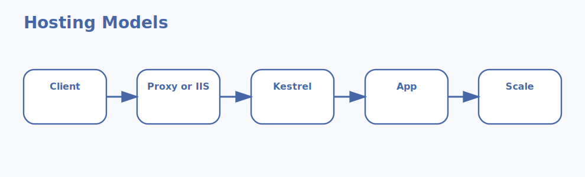

# ASP.NET Core Hosting Models Interview Questions



This guide explains how ASP.NET Core applications are hosted in IIS, Kestrel, reverse-proxy, container, and service-based deployments. It follows the corrected format of **100 interview questions for each subtopic**, and every answer includes a C# code example with rotated production scenarios so the examples do not repeat verbatim.

## How To Use This Page

- Questions 1-100 cover In-process hosting.
- Questions 101-200 cover Out-of-process hosting.
- Questions 201-300 cover IIS integration.
- Questions 301-400 cover Kestrel-only hosting.
- Questions 401-500 cover Reverse proxy pattern.
- Questions 501-600 cover Container hosting.
- Questions 601-700 cover Ports and endpoints.
- Questions 701-800 cover Performance tradeoffs.
- Questions 801-900 cover Operational concerns.
- Questions 901-1000 cover Choosing a hosting model.

## 1. In-process hosting

### Q1.1 What is iis in-process model in ASP.NET Core hosting?

**Answer:**

IIS in-process model matters in ASP.NET Core hosting because it affects when the ASP.NET Core app runs inside the IIS worker process. In a real system like a corporate intranet API deployed on Windows Server with existing IIS operations, a strong answer should explain request flow, deployment ownership, security boundaries, and operational impact instead of giving a one-line definition. A senior engineer also ties the choice to measurable trade-offs so the hosting decision is tied to workload fit instead of habit.

**Code Example:**

```csharp
var builder = WebApplication.CreateBuilder(args);
Console.WriteLine("IIS in-process hosting keeps the app inside w3wp.");
Console.WriteLine(builder.Environment.EnvironmentName);
```

### Q1.2 Why does request path efficiency matter in production hosting decisions?

**Answer:**

Request path efficiency matters in ASP.NET Core hosting because it affects when fewer hops can improve request handling. In a real system like a public e-commerce service fronted by Nginx in Linux virtual machines, a strong answer should explain request flow, deployment ownership, security boundaries, and operational impact instead of giving a one-line definition. A senior engineer also ties the choice to measurable trade-offs so support teams can troubleshoot the stack without guessing which layer owns the failure.

**Code Example:**

```csharp
var processName = System.Diagnostics.Process.GetCurrentProcess().ProcessName;
Console.WriteLine(processName);
Console.WriteLine("Useful when discussing Windows-hosted process context.");
```

### Q1.3 When should a team choose tight iis integration?

**Answer:**

Tight IIS integration matters in ASP.NET Core hosting because it affects when Windows hosting features are heavily used. In a real system like a healthcare portal moving from legacy IIS-only hosting to mixed environments, a strong answer should explain request flow, deployment ownership, security boundaries, and operational impact instead of giving a one-line definition. A senior engineer also ties the choice to measurable trade-offs so security boundaries are clearer before the app goes live.

**Code Example:**

```csharp
var requirements = new[]
{
    "Windows Server",
    "IIS installed",
    "ASP.NET Core Hosting Bundle"
};

foreach (var item in requirements)
{
    Console.WriteLine(item);
}
```

### Q1.4 How would you explain operational boundaries in a real architecture discussion?

**Answer:**

Operational boundaries matters in ASP.NET Core hosting because it affects when app and IIS process behavior are closely coupled. In a real system like a SaaS platform deploying the same service into Kubernetes across regions, a strong answer should explain request flow, deployment ownership, security boundaries, and operational impact instead of giving a one-line definition. A senior engineer also ties the choice to measurable trade-offs so performance expectations are matched to the actual deployment shape.

**Code Example:**

```csharp
bool windowsOnly = true;
Console.WriteLine(windowsOnly
    ? "In-process IIS hosting is a Windows-centric choice."
    : "Use a cross-platform hosting model instead.");
```

### Q1.5 What is a common interview trap around windows-only suitability?

**Answer:**

Windows-only suitability matters in ASP.NET Core hosting because it affects when hosting choice depends on OS constraints. In a real system like a banking API where TLS, logging, and restart behavior are tightly controlled, a strong answer should explain request flow, deployment ownership, security boundaries, and operational impact instead of giving a one-line definition. A senior engineer also ties the choice to measurable trade-offs so the team avoids vague claims like 'just use IIS' or 'just use containers'.

**Code Example:**

```csharp
var note = new
{
    Model = "InProcess",
    Benefit = "Fewer hops through the hosting stack"
};

Console.WriteLine(note);
```

### Q1.6 How do you apply iis in-process model safely in production?

**Answer:**

IIS in-process model matters in ASP.NET Core hosting because it affects when the ASP.NET Core app runs inside the IIS worker process. In a real system like a CMS platform hosted behind a reverse proxy with sticky sessions removed, a strong answer should explain request flow, deployment ownership, security boundaries, and operational impact instead of giving a one-line definition. A senior engineer also ties the choice to measurable trade-offs so certificate, proxy, and application responsibilities are easier to document.

**Code Example:**

```csharp
var builder = WebApplication.CreateBuilder(args);
Console.WriteLine("IIS in-process hosting keeps the app inside w3wp.");
Console.WriteLine(builder.Environment.EnvironmentName);
```

### Q1.7 What outage pattern usually exposes weak understanding of request path efficiency?

**Answer:**

Request path efficiency matters in ASP.NET Core hosting because it affects when fewer hops can improve request handling. In a real system like a manufacturing dashboard published to isolated on-prem servers, a strong answer should explain request flow, deployment ownership, security boundaries, and operational impact instead of giving a one-line definition. A senior engineer also ties the choice to measurable trade-offs so rollout and restart behavior become predictable in operations.

**Code Example:**

```csharp
var processName = System.Diagnostics.Process.GetCurrentProcess().ProcessName;
Console.WriteLine(processName);
Console.WriteLine("Useful when discussing Windows-hosted process context.");
```

### Q1.8 How would a senior engineer justify tight iis integration to an operations team?

**Answer:**

Tight IIS integration matters in ASP.NET Core hosting because it affects when Windows hosting features are heavily used. In a real system like a logistics service running as containers behind a cloud load balancer, a strong answer should explain request flow, deployment ownership, security boundaries, and operational impact instead of giving a one-line definition. A senior engineer also ties the choice to measurable trade-offs so architecture reviews can compare options using concrete trade-offs.

**Code Example:**

```csharp
var requirements = new[]
{
    "Windows Server",
    "IIS installed",
    "ASP.NET Core Hosting Bundle"
};

foreach (var item in requirements)
{
    Console.WriteLine(item);
}
```

### Q1.9 What trade-off does operational boundaries introduce?

**Answer:**

Operational boundaries matters in ASP.NET Core hosting because it affects when app and IIS process behavior are closely coupled. In a real system like a customer-support platform where rollout safety matters more than raw speed, a strong answer should explain request flow, deployment ownership, security boundaries, and operational impact instead of giving a one-line definition. A senior engineer also ties the choice to measurable trade-offs so migration choices stay incremental instead of risky big-bang changes.

**Code Example:**

```csharp
bool windowsOnly = true;
Console.WriteLine(windowsOnly
    ? "In-process IIS hosting is a Windows-centric choice."
    : "Use a cross-platform hosting model instead.");
```

### Q1.10 How do you answer a tricky follow-up about windows-only suitability?

**Answer:**

Windows-only suitability matters in ASP.NET Core hosting because it affects when hosting choice depends on OS constraints. In a real system like an internal admin site that must balance Windows integration with modernization goals, a strong answer should explain request flow, deployment ownership, security boundaries, and operational impact instead of giving a one-line definition. A senior engineer also ties the choice to measurable trade-offs so production incidents are less likely to be caused by misunderstood hosting behavior.

**Code Example:**

```csharp
var note = new
{
    Model = "InProcess",
    Benefit = "Fewer hops through the hosting stack"
};

Console.WriteLine(note);
```

### Q1.11 What is iis in-process model in ASP.NET Core hosting?

**Answer:**

IIS in-process model matters in ASP.NET Core hosting because it affects when the ASP.NET Core app runs inside the IIS worker process. In a real system like a corporate intranet API deployed on Windows Server with existing IIS operations, a strong answer should explain request flow, deployment ownership, security boundaries, and operational impact instead of giving a one-line definition. A senior engineer also ties the choice to measurable trade-offs so the hosting decision is tied to workload fit instead of habit.

**Code Example:**

```csharp
var builder = WebApplication.CreateBuilder(args);
Console.WriteLine("IIS in-process hosting keeps the app inside w3wp.");
Console.WriteLine(builder.Environment.EnvironmentName);
```

### Q1.12 Why does request path efficiency matter in production hosting decisions?

**Answer:**

Request path efficiency matters in ASP.NET Core hosting because it affects when fewer hops can improve request handling. In a real system like a public e-commerce service fronted by Nginx in Linux virtual machines, a strong answer should explain request flow, deployment ownership, security boundaries, and operational impact instead of giving a one-line definition. A senior engineer also ties the choice to measurable trade-offs so support teams can troubleshoot the stack without guessing which layer owns the failure.

**Code Example:**

```csharp
var processName = System.Diagnostics.Process.GetCurrentProcess().ProcessName;
Console.WriteLine(processName);
Console.WriteLine("Useful when discussing Windows-hosted process context.");
```

### Q1.13 When should a team choose tight iis integration?

**Answer:**

Tight IIS integration matters in ASP.NET Core hosting because it affects when Windows hosting features are heavily used. In a real system like a healthcare portal moving from legacy IIS-only hosting to mixed environments, a strong answer should explain request flow, deployment ownership, security boundaries, and operational impact instead of giving a one-line definition. A senior engineer also ties the choice to measurable trade-offs so security boundaries are clearer before the app goes live.

**Code Example:**

```csharp
var requirements = new[]
{
    "Windows Server",
    "IIS installed",
    "ASP.NET Core Hosting Bundle"
};

foreach (var item in requirements)
{
    Console.WriteLine(item);
}
```

### Q1.14 How would you explain operational boundaries in a real architecture discussion?

**Answer:**

Operational boundaries matters in ASP.NET Core hosting because it affects when app and IIS process behavior are closely coupled. In a real system like a SaaS platform deploying the same service into Kubernetes across regions, a strong answer should explain request flow, deployment ownership, security boundaries, and operational impact instead of giving a one-line definition. A senior engineer also ties the choice to measurable trade-offs so performance expectations are matched to the actual deployment shape.

**Code Example:**

```csharp
bool windowsOnly = true;
Console.WriteLine(windowsOnly
    ? "In-process IIS hosting is a Windows-centric choice."
    : "Use a cross-platform hosting model instead.");
```

### Q1.15 What is a common interview trap around windows-only suitability?

**Answer:**

Windows-only suitability matters in ASP.NET Core hosting because it affects when hosting choice depends on OS constraints. In a real system like a banking API where TLS, logging, and restart behavior are tightly controlled, a strong answer should explain request flow, deployment ownership, security boundaries, and operational impact instead of giving a one-line definition. A senior engineer also ties the choice to measurable trade-offs so the team avoids vague claims like 'just use IIS' or 'just use containers'.

**Code Example:**

```csharp
var note = new
{
    Model = "InProcess",
    Benefit = "Fewer hops through the hosting stack"
};

Console.WriteLine(note);
```

### Q1.16 How do you apply iis in-process model safely in production?

**Answer:**

IIS in-process model matters in ASP.NET Core hosting because it affects when the ASP.NET Core app runs inside the IIS worker process. In a real system like a CMS platform hosted behind a reverse proxy with sticky sessions removed, a strong answer should explain request flow, deployment ownership, security boundaries, and operational impact instead of giving a one-line definition. A senior engineer also ties the choice to measurable trade-offs so certificate, proxy, and application responsibilities are easier to document.

**Code Example:**

```csharp
var builder = WebApplication.CreateBuilder(args);
Console.WriteLine("IIS in-process hosting keeps the app inside w3wp.");
Console.WriteLine(builder.Environment.EnvironmentName);
```

### Q1.17 What outage pattern usually exposes weak understanding of request path efficiency?

**Answer:**

Request path efficiency matters in ASP.NET Core hosting because it affects when fewer hops can improve request handling. In a real system like a manufacturing dashboard published to isolated on-prem servers, a strong answer should explain request flow, deployment ownership, security boundaries, and operational impact instead of giving a one-line definition. A senior engineer also ties the choice to measurable trade-offs so rollout and restart behavior become predictable in operations.

**Code Example:**

```csharp
var processName = System.Diagnostics.Process.GetCurrentProcess().ProcessName;
Console.WriteLine(processName);
Console.WriteLine("Useful when discussing Windows-hosted process context.");
```

### Q1.18 How would a senior engineer justify tight iis integration to an operations team?

**Answer:**

Tight IIS integration matters in ASP.NET Core hosting because it affects when Windows hosting features are heavily used. In a real system like a logistics service running as containers behind a cloud load balancer, a strong answer should explain request flow, deployment ownership, security boundaries, and operational impact instead of giving a one-line definition. A senior engineer also ties the choice to measurable trade-offs so architecture reviews can compare options using concrete trade-offs.

**Code Example:**

```csharp
var requirements = new[]
{
    "Windows Server",
    "IIS installed",
    "ASP.NET Core Hosting Bundle"
};

foreach (var item in requirements)
{
    Console.WriteLine(item);
}
```

### Q1.19 What trade-off does operational boundaries introduce?

**Answer:**

Operational boundaries matters in ASP.NET Core hosting because it affects when app and IIS process behavior are closely coupled. In a real system like a customer-support platform where rollout safety matters more than raw speed, a strong answer should explain request flow, deployment ownership, security boundaries, and operational impact instead of giving a one-line definition. A senior engineer also ties the choice to measurable trade-offs so migration choices stay incremental instead of risky big-bang changes.

**Code Example:**

```csharp
bool windowsOnly = true;
Console.WriteLine(windowsOnly
    ? "In-process IIS hosting is a Windows-centric choice."
    : "Use a cross-platform hosting model instead.");
```

### Q1.20 How do you answer a tricky follow-up about windows-only suitability?

**Answer:**

Windows-only suitability matters in ASP.NET Core hosting because it affects when hosting choice depends on OS constraints. In a real system like an internal admin site that must balance Windows integration with modernization goals, a strong answer should explain request flow, deployment ownership, security boundaries, and operational impact instead of giving a one-line definition. A senior engineer also ties the choice to measurable trade-offs so production incidents are less likely to be caused by misunderstood hosting behavior.

**Code Example:**

```csharp
var note = new
{
    Model = "InProcess",
    Benefit = "Fewer hops through the hosting stack"
};

Console.WriteLine(note);
```

### Q1.21 What is iis in-process model in ASP.NET Core hosting?

**Answer:**

IIS in-process model matters in ASP.NET Core hosting because it affects when the ASP.NET Core app runs inside the IIS worker process. In a real system like a corporate intranet API deployed on Windows Server with existing IIS operations, a strong answer should explain request flow, deployment ownership, security boundaries, and operational impact instead of giving a one-line definition. A senior engineer also ties the choice to measurable trade-offs so the hosting decision is tied to workload fit instead of habit.

**Code Example:**

```csharp
var builder = WebApplication.CreateBuilder(args);
Console.WriteLine("IIS in-process hosting keeps the app inside w3wp.");
Console.WriteLine(builder.Environment.EnvironmentName);
```

### Q1.22 Why does request path efficiency matter in production hosting decisions?

**Answer:**

Request path efficiency matters in ASP.NET Core hosting because it affects when fewer hops can improve request handling. In a real system like a public e-commerce service fronted by Nginx in Linux virtual machines, a strong answer should explain request flow, deployment ownership, security boundaries, and operational impact instead of giving a one-line definition. A senior engineer also ties the choice to measurable trade-offs so support teams can troubleshoot the stack without guessing which layer owns the failure.

**Code Example:**

```csharp
var processName = System.Diagnostics.Process.GetCurrentProcess().ProcessName;
Console.WriteLine(processName);
Console.WriteLine("Useful when discussing Windows-hosted process context.");
```

### Q1.23 When should a team choose tight iis integration?

**Answer:**

Tight IIS integration matters in ASP.NET Core hosting because it affects when Windows hosting features are heavily used. In a real system like a healthcare portal moving from legacy IIS-only hosting to mixed environments, a strong answer should explain request flow, deployment ownership, security boundaries, and operational impact instead of giving a one-line definition. A senior engineer also ties the choice to measurable trade-offs so security boundaries are clearer before the app goes live.

**Code Example:**

```csharp
var requirements = new[]
{
    "Windows Server",
    "IIS installed",
    "ASP.NET Core Hosting Bundle"
};

foreach (var item in requirements)
{
    Console.WriteLine(item);
}
```

### Q1.24 How would you explain operational boundaries in a real architecture discussion?

**Answer:**

Operational boundaries matters in ASP.NET Core hosting because it affects when app and IIS process behavior are closely coupled. In a real system like a SaaS platform deploying the same service into Kubernetes across regions, a strong answer should explain request flow, deployment ownership, security boundaries, and operational impact instead of giving a one-line definition. A senior engineer also ties the choice to measurable trade-offs so performance expectations are matched to the actual deployment shape.

**Code Example:**

```csharp
bool windowsOnly = true;
Console.WriteLine(windowsOnly
    ? "In-process IIS hosting is a Windows-centric choice."
    : "Use a cross-platform hosting model instead.");
```

### Q1.25 What is a common interview trap around windows-only suitability?

**Answer:**

Windows-only suitability matters in ASP.NET Core hosting because it affects when hosting choice depends on OS constraints. In a real system like a banking API where TLS, logging, and restart behavior are tightly controlled, a strong answer should explain request flow, deployment ownership, security boundaries, and operational impact instead of giving a one-line definition. A senior engineer also ties the choice to measurable trade-offs so the team avoids vague claims like 'just use IIS' or 'just use containers'.

**Code Example:**

```csharp
var note = new
{
    Model = "InProcess",
    Benefit = "Fewer hops through the hosting stack"
};

Console.WriteLine(note);
```

### Q1.26 How do you apply iis in-process model safely in production?

**Answer:**

IIS in-process model matters in ASP.NET Core hosting because it affects when the ASP.NET Core app runs inside the IIS worker process. In a real system like a CMS platform hosted behind a reverse proxy with sticky sessions removed, a strong answer should explain request flow, deployment ownership, security boundaries, and operational impact instead of giving a one-line definition. A senior engineer also ties the choice to measurable trade-offs so certificate, proxy, and application responsibilities are easier to document.

**Code Example:**

```csharp
var builder = WebApplication.CreateBuilder(args);
Console.WriteLine("IIS in-process hosting keeps the app inside w3wp.");
Console.WriteLine(builder.Environment.EnvironmentName);
```

### Q1.27 What outage pattern usually exposes weak understanding of request path efficiency?

**Answer:**

Request path efficiency matters in ASP.NET Core hosting because it affects when fewer hops can improve request handling. In a real system like a manufacturing dashboard published to isolated on-prem servers, a strong answer should explain request flow, deployment ownership, security boundaries, and operational impact instead of giving a one-line definition. A senior engineer also ties the choice to measurable trade-offs so rollout and restart behavior become predictable in operations.

**Code Example:**

```csharp
var processName = System.Diagnostics.Process.GetCurrentProcess().ProcessName;
Console.WriteLine(processName);
Console.WriteLine("Useful when discussing Windows-hosted process context.");
```

### Q1.28 How would a senior engineer justify tight iis integration to an operations team?

**Answer:**

Tight IIS integration matters in ASP.NET Core hosting because it affects when Windows hosting features are heavily used. In a real system like a logistics service running as containers behind a cloud load balancer, a strong answer should explain request flow, deployment ownership, security boundaries, and operational impact instead of giving a one-line definition. A senior engineer also ties the choice to measurable trade-offs so architecture reviews can compare options using concrete trade-offs.

**Code Example:**

```csharp
var requirements = new[]
{
    "Windows Server",
    "IIS installed",
    "ASP.NET Core Hosting Bundle"
};

foreach (var item in requirements)
{
    Console.WriteLine(item);
}
```

### Q1.29 What trade-off does operational boundaries introduce?

**Answer:**

Operational boundaries matters in ASP.NET Core hosting because it affects when app and IIS process behavior are closely coupled. In a real system like a customer-support platform where rollout safety matters more than raw speed, a strong answer should explain request flow, deployment ownership, security boundaries, and operational impact instead of giving a one-line definition. A senior engineer also ties the choice to measurable trade-offs so migration choices stay incremental instead of risky big-bang changes.

**Code Example:**

```csharp
bool windowsOnly = true;
Console.WriteLine(windowsOnly
    ? "In-process IIS hosting is a Windows-centric choice."
    : "Use a cross-platform hosting model instead.");
```

### Q1.30 How do you answer a tricky follow-up about windows-only suitability?

**Answer:**

Windows-only suitability matters in ASP.NET Core hosting because it affects when hosting choice depends on OS constraints. In a real system like an internal admin site that must balance Windows integration with modernization goals, a strong answer should explain request flow, deployment ownership, security boundaries, and operational impact instead of giving a one-line definition. A senior engineer also ties the choice to measurable trade-offs so production incidents are less likely to be caused by misunderstood hosting behavior.

**Code Example:**

```csharp
var note = new
{
    Model = "InProcess",
    Benefit = "Fewer hops through the hosting stack"
};

Console.WriteLine(note);
```

### Q1.31 What is iis in-process model in ASP.NET Core hosting?

**Answer:**

IIS in-process model matters in ASP.NET Core hosting because it affects when the ASP.NET Core app runs inside the IIS worker process. In a real system like a corporate intranet API deployed on Windows Server with existing IIS operations, a strong answer should explain request flow, deployment ownership, security boundaries, and operational impact instead of giving a one-line definition. A senior engineer also ties the choice to measurable trade-offs so the hosting decision is tied to workload fit instead of habit.

**Code Example:**

```csharp
var builder = WebApplication.CreateBuilder(args);
Console.WriteLine("IIS in-process hosting keeps the app inside w3wp.");
Console.WriteLine(builder.Environment.EnvironmentName);
```

### Q1.32 Why does request path efficiency matter in production hosting decisions?

**Answer:**

Request path efficiency matters in ASP.NET Core hosting because it affects when fewer hops can improve request handling. In a real system like a public e-commerce service fronted by Nginx in Linux virtual machines, a strong answer should explain request flow, deployment ownership, security boundaries, and operational impact instead of giving a one-line definition. A senior engineer also ties the choice to measurable trade-offs so support teams can troubleshoot the stack without guessing which layer owns the failure.

**Code Example:**

```csharp
var processName = System.Diagnostics.Process.GetCurrentProcess().ProcessName;
Console.WriteLine(processName);
Console.WriteLine("Useful when discussing Windows-hosted process context.");
```

### Q1.33 When should a team choose tight iis integration?

**Answer:**

Tight IIS integration matters in ASP.NET Core hosting because it affects when Windows hosting features are heavily used. In a real system like a healthcare portal moving from legacy IIS-only hosting to mixed environments, a strong answer should explain request flow, deployment ownership, security boundaries, and operational impact instead of giving a one-line definition. A senior engineer also ties the choice to measurable trade-offs so security boundaries are clearer before the app goes live.

**Code Example:**

```csharp
var requirements = new[]
{
    "Windows Server",
    "IIS installed",
    "ASP.NET Core Hosting Bundle"
};

foreach (var item in requirements)
{
    Console.WriteLine(item);
}
```

### Q1.34 How would you explain operational boundaries in a real architecture discussion?

**Answer:**

Operational boundaries matters in ASP.NET Core hosting because it affects when app and IIS process behavior are closely coupled. In a real system like a SaaS platform deploying the same service into Kubernetes across regions, a strong answer should explain request flow, deployment ownership, security boundaries, and operational impact instead of giving a one-line definition. A senior engineer also ties the choice to measurable trade-offs so performance expectations are matched to the actual deployment shape.

**Code Example:**

```csharp
bool windowsOnly = true;
Console.WriteLine(windowsOnly
    ? "In-process IIS hosting is a Windows-centric choice."
    : "Use a cross-platform hosting model instead.");
```

### Q1.35 What is a common interview trap around windows-only suitability?

**Answer:**

Windows-only suitability matters in ASP.NET Core hosting because it affects when hosting choice depends on OS constraints. In a real system like a banking API where TLS, logging, and restart behavior are tightly controlled, a strong answer should explain request flow, deployment ownership, security boundaries, and operational impact instead of giving a one-line definition. A senior engineer also ties the choice to measurable trade-offs so the team avoids vague claims like 'just use IIS' or 'just use containers'.

**Code Example:**

```csharp
var note = new
{
    Model = "InProcess",
    Benefit = "Fewer hops through the hosting stack"
};

Console.WriteLine(note);
```

### Q1.36 How do you apply iis in-process model safely in production?

**Answer:**

IIS in-process model matters in ASP.NET Core hosting because it affects when the ASP.NET Core app runs inside the IIS worker process. In a real system like a CMS platform hosted behind a reverse proxy with sticky sessions removed, a strong answer should explain request flow, deployment ownership, security boundaries, and operational impact instead of giving a one-line definition. A senior engineer also ties the choice to measurable trade-offs so certificate, proxy, and application responsibilities are easier to document.

**Code Example:**

```csharp
var builder = WebApplication.CreateBuilder(args);
Console.WriteLine("IIS in-process hosting keeps the app inside w3wp.");
Console.WriteLine(builder.Environment.EnvironmentName);
```

### Q1.37 What outage pattern usually exposes weak understanding of request path efficiency?

**Answer:**

Request path efficiency matters in ASP.NET Core hosting because it affects when fewer hops can improve request handling. In a real system like a manufacturing dashboard published to isolated on-prem servers, a strong answer should explain request flow, deployment ownership, security boundaries, and operational impact instead of giving a one-line definition. A senior engineer also ties the choice to measurable trade-offs so rollout and restart behavior become predictable in operations.

**Code Example:**

```csharp
var processName = System.Diagnostics.Process.GetCurrentProcess().ProcessName;
Console.WriteLine(processName);
Console.WriteLine("Useful when discussing Windows-hosted process context.");
```

### Q1.38 How would a senior engineer justify tight iis integration to an operations team?

**Answer:**

Tight IIS integration matters in ASP.NET Core hosting because it affects when Windows hosting features are heavily used. In a real system like a logistics service running as containers behind a cloud load balancer, a strong answer should explain request flow, deployment ownership, security boundaries, and operational impact instead of giving a one-line definition. A senior engineer also ties the choice to measurable trade-offs so architecture reviews can compare options using concrete trade-offs.

**Code Example:**

```csharp
var requirements = new[]
{
    "Windows Server",
    "IIS installed",
    "ASP.NET Core Hosting Bundle"
};

foreach (var item in requirements)
{
    Console.WriteLine(item);
}
```

### Q1.39 What trade-off does operational boundaries introduce?

**Answer:**

Operational boundaries matters in ASP.NET Core hosting because it affects when app and IIS process behavior are closely coupled. In a real system like a customer-support platform where rollout safety matters more than raw speed, a strong answer should explain request flow, deployment ownership, security boundaries, and operational impact instead of giving a one-line definition. A senior engineer also ties the choice to measurable trade-offs so migration choices stay incremental instead of risky big-bang changes.

**Code Example:**

```csharp
bool windowsOnly = true;
Console.WriteLine(windowsOnly
    ? "In-process IIS hosting is a Windows-centric choice."
    : "Use a cross-platform hosting model instead.");
```

### Q1.40 How do you answer a tricky follow-up about windows-only suitability?

**Answer:**

Windows-only suitability matters in ASP.NET Core hosting because it affects when hosting choice depends on OS constraints. In a real system like an internal admin site that must balance Windows integration with modernization goals, a strong answer should explain request flow, deployment ownership, security boundaries, and operational impact instead of giving a one-line definition. A senior engineer also ties the choice to measurable trade-offs so production incidents are less likely to be caused by misunderstood hosting behavior.

**Code Example:**

```csharp
var note = new
{
    Model = "InProcess",
    Benefit = "Fewer hops through the hosting stack"
};

Console.WriteLine(note);
```

### Q1.41 What is iis in-process model in ASP.NET Core hosting?

**Answer:**

IIS in-process model matters in ASP.NET Core hosting because it affects when the ASP.NET Core app runs inside the IIS worker process. In a real system like a corporate intranet API deployed on Windows Server with existing IIS operations, a strong answer should explain request flow, deployment ownership, security boundaries, and operational impact instead of giving a one-line definition. A senior engineer also ties the choice to measurable trade-offs so the hosting decision is tied to workload fit instead of habit.

**Code Example:**

```csharp
var builder = WebApplication.CreateBuilder(args);
Console.WriteLine("IIS in-process hosting keeps the app inside w3wp.");
Console.WriteLine(builder.Environment.EnvironmentName);
```

### Q1.42 Why does request path efficiency matter in production hosting decisions?

**Answer:**

Request path efficiency matters in ASP.NET Core hosting because it affects when fewer hops can improve request handling. In a real system like a public e-commerce service fronted by Nginx in Linux virtual machines, a strong answer should explain request flow, deployment ownership, security boundaries, and operational impact instead of giving a one-line definition. A senior engineer also ties the choice to measurable trade-offs so support teams can troubleshoot the stack without guessing which layer owns the failure.

**Code Example:**

```csharp
var processName = System.Diagnostics.Process.GetCurrentProcess().ProcessName;
Console.WriteLine(processName);
Console.WriteLine("Useful when discussing Windows-hosted process context.");
```

### Q1.43 When should a team choose tight iis integration?

**Answer:**

Tight IIS integration matters in ASP.NET Core hosting because it affects when Windows hosting features are heavily used. In a real system like a healthcare portal moving from legacy IIS-only hosting to mixed environments, a strong answer should explain request flow, deployment ownership, security boundaries, and operational impact instead of giving a one-line definition. A senior engineer also ties the choice to measurable trade-offs so security boundaries are clearer before the app goes live.

**Code Example:**

```csharp
var requirements = new[]
{
    "Windows Server",
    "IIS installed",
    "ASP.NET Core Hosting Bundle"
};

foreach (var item in requirements)
{
    Console.WriteLine(item);
}
```

### Q1.44 How would you explain operational boundaries in a real architecture discussion?

**Answer:**

Operational boundaries matters in ASP.NET Core hosting because it affects when app and IIS process behavior are closely coupled. In a real system like a SaaS platform deploying the same service into Kubernetes across regions, a strong answer should explain request flow, deployment ownership, security boundaries, and operational impact instead of giving a one-line definition. A senior engineer also ties the choice to measurable trade-offs so performance expectations are matched to the actual deployment shape.

**Code Example:**

```csharp
bool windowsOnly = true;
Console.WriteLine(windowsOnly
    ? "In-process IIS hosting is a Windows-centric choice."
    : "Use a cross-platform hosting model instead.");
```

### Q1.45 What is a common interview trap around windows-only suitability?

**Answer:**

Windows-only suitability matters in ASP.NET Core hosting because it affects when hosting choice depends on OS constraints. In a real system like a banking API where TLS, logging, and restart behavior are tightly controlled, a strong answer should explain request flow, deployment ownership, security boundaries, and operational impact instead of giving a one-line definition. A senior engineer also ties the choice to measurable trade-offs so the team avoids vague claims like 'just use IIS' or 'just use containers'.

**Code Example:**

```csharp
var note = new
{
    Model = "InProcess",
    Benefit = "Fewer hops through the hosting stack"
};

Console.WriteLine(note);
```

### Q1.46 How do you apply iis in-process model safely in production?

**Answer:**

IIS in-process model matters in ASP.NET Core hosting because it affects when the ASP.NET Core app runs inside the IIS worker process. In a real system like a CMS platform hosted behind a reverse proxy with sticky sessions removed, a strong answer should explain request flow, deployment ownership, security boundaries, and operational impact instead of giving a one-line definition. A senior engineer also ties the choice to measurable trade-offs so certificate, proxy, and application responsibilities are easier to document.

**Code Example:**

```csharp
var builder = WebApplication.CreateBuilder(args);
Console.WriteLine("IIS in-process hosting keeps the app inside w3wp.");
Console.WriteLine(builder.Environment.EnvironmentName);
```

### Q1.47 What outage pattern usually exposes weak understanding of request path efficiency?

**Answer:**

Request path efficiency matters in ASP.NET Core hosting because it affects when fewer hops can improve request handling. In a real system like a manufacturing dashboard published to isolated on-prem servers, a strong answer should explain request flow, deployment ownership, security boundaries, and operational impact instead of giving a one-line definition. A senior engineer also ties the choice to measurable trade-offs so rollout and restart behavior become predictable in operations.

**Code Example:**

```csharp
var processName = System.Diagnostics.Process.GetCurrentProcess().ProcessName;
Console.WriteLine(processName);
Console.WriteLine("Useful when discussing Windows-hosted process context.");
```

### Q1.48 How would a senior engineer justify tight iis integration to an operations team?

**Answer:**

Tight IIS integration matters in ASP.NET Core hosting because it affects when Windows hosting features are heavily used. In a real system like a logistics service running as containers behind a cloud load balancer, a strong answer should explain request flow, deployment ownership, security boundaries, and operational impact instead of giving a one-line definition. A senior engineer also ties the choice to measurable trade-offs so architecture reviews can compare options using concrete trade-offs.

**Code Example:**

```csharp
var requirements = new[]
{
    "Windows Server",
    "IIS installed",
    "ASP.NET Core Hosting Bundle"
};

foreach (var item in requirements)
{
    Console.WriteLine(item);
}
```

### Q1.49 What trade-off does operational boundaries introduce?

**Answer:**

Operational boundaries matters in ASP.NET Core hosting because it affects when app and IIS process behavior are closely coupled. In a real system like a customer-support platform where rollout safety matters more than raw speed, a strong answer should explain request flow, deployment ownership, security boundaries, and operational impact instead of giving a one-line definition. A senior engineer also ties the choice to measurable trade-offs so migration choices stay incremental instead of risky big-bang changes.

**Code Example:**

```csharp
bool windowsOnly = true;
Console.WriteLine(windowsOnly
    ? "In-process IIS hosting is a Windows-centric choice."
    : "Use a cross-platform hosting model instead.");
```

### Q1.50 How do you answer a tricky follow-up about windows-only suitability?

**Answer:**

Windows-only suitability matters in ASP.NET Core hosting because it affects when hosting choice depends on OS constraints. In a real system like an internal admin site that must balance Windows integration with modernization goals, a strong answer should explain request flow, deployment ownership, security boundaries, and operational impact instead of giving a one-line definition. A senior engineer also ties the choice to measurable trade-offs so production incidents are less likely to be caused by misunderstood hosting behavior.

**Code Example:**

```csharp
var note = new
{
    Model = "InProcess",
    Benefit = "Fewer hops through the hosting stack"
};

Console.WriteLine(note);
```

### Q1.51 What is iis in-process model in ASP.NET Core hosting?

**Answer:**

IIS in-process model matters in ASP.NET Core hosting because it affects when the ASP.NET Core app runs inside the IIS worker process. In a real system like a corporate intranet API deployed on Windows Server with existing IIS operations, a strong answer should explain request flow, deployment ownership, security boundaries, and operational impact instead of giving a one-line definition. A senior engineer also ties the choice to measurable trade-offs so the hosting decision is tied to workload fit instead of habit.

**Code Example:**

```csharp
var builder = WebApplication.CreateBuilder(args);
Console.WriteLine("IIS in-process hosting keeps the app inside w3wp.");
Console.WriteLine(builder.Environment.EnvironmentName);
```

### Q1.52 Why does request path efficiency matter in production hosting decisions?

**Answer:**

Request path efficiency matters in ASP.NET Core hosting because it affects when fewer hops can improve request handling. In a real system like a public e-commerce service fronted by Nginx in Linux virtual machines, a strong answer should explain request flow, deployment ownership, security boundaries, and operational impact instead of giving a one-line definition. A senior engineer also ties the choice to measurable trade-offs so support teams can troubleshoot the stack without guessing which layer owns the failure.

**Code Example:**

```csharp
var processName = System.Diagnostics.Process.GetCurrentProcess().ProcessName;
Console.WriteLine(processName);
Console.WriteLine("Useful when discussing Windows-hosted process context.");
```

### Q1.53 When should a team choose tight iis integration?

**Answer:**

Tight IIS integration matters in ASP.NET Core hosting because it affects when Windows hosting features are heavily used. In a real system like a healthcare portal moving from legacy IIS-only hosting to mixed environments, a strong answer should explain request flow, deployment ownership, security boundaries, and operational impact instead of giving a one-line definition. A senior engineer also ties the choice to measurable trade-offs so security boundaries are clearer before the app goes live.

**Code Example:**

```csharp
var requirements = new[]
{
    "Windows Server",
    "IIS installed",
    "ASP.NET Core Hosting Bundle"
};

foreach (var item in requirements)
{
    Console.WriteLine(item);
}
```

### Q1.54 How would you explain operational boundaries in a real architecture discussion?

**Answer:**

Operational boundaries matters in ASP.NET Core hosting because it affects when app and IIS process behavior are closely coupled. In a real system like a SaaS platform deploying the same service into Kubernetes across regions, a strong answer should explain request flow, deployment ownership, security boundaries, and operational impact instead of giving a one-line definition. A senior engineer also ties the choice to measurable trade-offs so performance expectations are matched to the actual deployment shape.

**Code Example:**

```csharp
bool windowsOnly = true;
Console.WriteLine(windowsOnly
    ? "In-process IIS hosting is a Windows-centric choice."
    : "Use a cross-platform hosting model instead.");
```

### Q1.55 What is a common interview trap around windows-only suitability?

**Answer:**

Windows-only suitability matters in ASP.NET Core hosting because it affects when hosting choice depends on OS constraints. In a real system like a banking API where TLS, logging, and restart behavior are tightly controlled, a strong answer should explain request flow, deployment ownership, security boundaries, and operational impact instead of giving a one-line definition. A senior engineer also ties the choice to measurable trade-offs so the team avoids vague claims like 'just use IIS' or 'just use containers'.

**Code Example:**

```csharp
var note = new
{
    Model = "InProcess",
    Benefit = "Fewer hops through the hosting stack"
};

Console.WriteLine(note);
```

### Q1.56 How do you apply iis in-process model safely in production?

**Answer:**

IIS in-process model matters in ASP.NET Core hosting because it affects when the ASP.NET Core app runs inside the IIS worker process. In a real system like a CMS platform hosted behind a reverse proxy with sticky sessions removed, a strong answer should explain request flow, deployment ownership, security boundaries, and operational impact instead of giving a one-line definition. A senior engineer also ties the choice to measurable trade-offs so certificate, proxy, and application responsibilities are easier to document.

**Code Example:**

```csharp
var builder = WebApplication.CreateBuilder(args);
Console.WriteLine("IIS in-process hosting keeps the app inside w3wp.");
Console.WriteLine(builder.Environment.EnvironmentName);
```

### Q1.57 What outage pattern usually exposes weak understanding of request path efficiency?

**Answer:**

Request path efficiency matters in ASP.NET Core hosting because it affects when fewer hops can improve request handling. In a real system like a manufacturing dashboard published to isolated on-prem servers, a strong answer should explain request flow, deployment ownership, security boundaries, and operational impact instead of giving a one-line definition. A senior engineer also ties the choice to measurable trade-offs so rollout and restart behavior become predictable in operations.

**Code Example:**

```csharp
var processName = System.Diagnostics.Process.GetCurrentProcess().ProcessName;
Console.WriteLine(processName);
Console.WriteLine("Useful when discussing Windows-hosted process context.");
```

### Q1.58 How would a senior engineer justify tight iis integration to an operations team?

**Answer:**

Tight IIS integration matters in ASP.NET Core hosting because it affects when Windows hosting features are heavily used. In a real system like a logistics service running as containers behind a cloud load balancer, a strong answer should explain request flow, deployment ownership, security boundaries, and operational impact instead of giving a one-line definition. A senior engineer also ties the choice to measurable trade-offs so architecture reviews can compare options using concrete trade-offs.

**Code Example:**

```csharp
var requirements = new[]
{
    "Windows Server",
    "IIS installed",
    "ASP.NET Core Hosting Bundle"
};

foreach (var item in requirements)
{
    Console.WriteLine(item);
}
```

### Q1.59 What trade-off does operational boundaries introduce?

**Answer:**

Operational boundaries matters in ASP.NET Core hosting because it affects when app and IIS process behavior are closely coupled. In a real system like a customer-support platform where rollout safety matters more than raw speed, a strong answer should explain request flow, deployment ownership, security boundaries, and operational impact instead of giving a one-line definition. A senior engineer also ties the choice to measurable trade-offs so migration choices stay incremental instead of risky big-bang changes.

**Code Example:**

```csharp
bool windowsOnly = true;
Console.WriteLine(windowsOnly
    ? "In-process IIS hosting is a Windows-centric choice."
    : "Use a cross-platform hosting model instead.");
```

### Q1.60 How do you answer a tricky follow-up about windows-only suitability?

**Answer:**

Windows-only suitability matters in ASP.NET Core hosting because it affects when hosting choice depends on OS constraints. In a real system like an internal admin site that must balance Windows integration with modernization goals, a strong answer should explain request flow, deployment ownership, security boundaries, and operational impact instead of giving a one-line definition. A senior engineer also ties the choice to measurable trade-offs so production incidents are less likely to be caused by misunderstood hosting behavior.

**Code Example:**

```csharp
var note = new
{
    Model = "InProcess",
    Benefit = "Fewer hops through the hosting stack"
};

Console.WriteLine(note);
```

### Q1.61 What is iis in-process model in ASP.NET Core hosting?

**Answer:**

IIS in-process model matters in ASP.NET Core hosting because it affects when the ASP.NET Core app runs inside the IIS worker process. In a real system like a corporate intranet API deployed on Windows Server with existing IIS operations, a strong answer should explain request flow, deployment ownership, security boundaries, and operational impact instead of giving a one-line definition. A senior engineer also ties the choice to measurable trade-offs so the hosting decision is tied to workload fit instead of habit.

**Code Example:**

```csharp
var builder = WebApplication.CreateBuilder(args);
Console.WriteLine("IIS in-process hosting keeps the app inside w3wp.");
Console.WriteLine(builder.Environment.EnvironmentName);
```

### Q1.62 Why does request path efficiency matter in production hosting decisions?

**Answer:**

Request path efficiency matters in ASP.NET Core hosting because it affects when fewer hops can improve request handling. In a real system like a public e-commerce service fronted by Nginx in Linux virtual machines, a strong answer should explain request flow, deployment ownership, security boundaries, and operational impact instead of giving a one-line definition. A senior engineer also ties the choice to measurable trade-offs so support teams can troubleshoot the stack without guessing which layer owns the failure.

**Code Example:**

```csharp
var processName = System.Diagnostics.Process.GetCurrentProcess().ProcessName;
Console.WriteLine(processName);
Console.WriteLine("Useful when discussing Windows-hosted process context.");
```

### Q1.63 When should a team choose tight iis integration?

**Answer:**

Tight IIS integration matters in ASP.NET Core hosting because it affects when Windows hosting features are heavily used. In a real system like a healthcare portal moving from legacy IIS-only hosting to mixed environments, a strong answer should explain request flow, deployment ownership, security boundaries, and operational impact instead of giving a one-line definition. A senior engineer also ties the choice to measurable trade-offs so security boundaries are clearer before the app goes live.

**Code Example:**

```csharp
var requirements = new[]
{
    "Windows Server",
    "IIS installed",
    "ASP.NET Core Hosting Bundle"
};

foreach (var item in requirements)
{
    Console.WriteLine(item);
}
```

### Q1.64 How would you explain operational boundaries in a real architecture discussion?

**Answer:**

Operational boundaries matters in ASP.NET Core hosting because it affects when app and IIS process behavior are closely coupled. In a real system like a SaaS platform deploying the same service into Kubernetes across regions, a strong answer should explain request flow, deployment ownership, security boundaries, and operational impact instead of giving a one-line definition. A senior engineer also ties the choice to measurable trade-offs so performance expectations are matched to the actual deployment shape.

**Code Example:**

```csharp
bool windowsOnly = true;
Console.WriteLine(windowsOnly
    ? "In-process IIS hosting is a Windows-centric choice."
    : "Use a cross-platform hosting model instead.");
```

### Q1.65 What is a common interview trap around windows-only suitability?

**Answer:**

Windows-only suitability matters in ASP.NET Core hosting because it affects when hosting choice depends on OS constraints. In a real system like a banking API where TLS, logging, and restart behavior are tightly controlled, a strong answer should explain request flow, deployment ownership, security boundaries, and operational impact instead of giving a one-line definition. A senior engineer also ties the choice to measurable trade-offs so the team avoids vague claims like 'just use IIS' or 'just use containers'.

**Code Example:**

```csharp
var note = new
{
    Model = "InProcess",
    Benefit = "Fewer hops through the hosting stack"
};

Console.WriteLine(note);
```

### Q1.66 How do you apply iis in-process model safely in production?

**Answer:**

IIS in-process model matters in ASP.NET Core hosting because it affects when the ASP.NET Core app runs inside the IIS worker process. In a real system like a CMS platform hosted behind a reverse proxy with sticky sessions removed, a strong answer should explain request flow, deployment ownership, security boundaries, and operational impact instead of giving a one-line definition. A senior engineer also ties the choice to measurable trade-offs so certificate, proxy, and application responsibilities are easier to document.

**Code Example:**

```csharp
var builder = WebApplication.CreateBuilder(args);
Console.WriteLine("IIS in-process hosting keeps the app inside w3wp.");
Console.WriteLine(builder.Environment.EnvironmentName);
```

### Q1.67 What outage pattern usually exposes weak understanding of request path efficiency?

**Answer:**

Request path efficiency matters in ASP.NET Core hosting because it affects when fewer hops can improve request handling. In a real system like a manufacturing dashboard published to isolated on-prem servers, a strong answer should explain request flow, deployment ownership, security boundaries, and operational impact instead of giving a one-line definition. A senior engineer also ties the choice to measurable trade-offs so rollout and restart behavior become predictable in operations.

**Code Example:**

```csharp
var processName = System.Diagnostics.Process.GetCurrentProcess().ProcessName;
Console.WriteLine(processName);
Console.WriteLine("Useful when discussing Windows-hosted process context.");
```

### Q1.68 How would a senior engineer justify tight iis integration to an operations team?

**Answer:**

Tight IIS integration matters in ASP.NET Core hosting because it affects when Windows hosting features are heavily used. In a real system like a logistics service running as containers behind a cloud load balancer, a strong answer should explain request flow, deployment ownership, security boundaries, and operational impact instead of giving a one-line definition. A senior engineer also ties the choice to measurable trade-offs so architecture reviews can compare options using concrete trade-offs.

**Code Example:**

```csharp
var requirements = new[]
{
    "Windows Server",
    "IIS installed",
    "ASP.NET Core Hosting Bundle"
};

foreach (var item in requirements)
{
    Console.WriteLine(item);
}
```

### Q1.69 What trade-off does operational boundaries introduce?

**Answer:**

Operational boundaries matters in ASP.NET Core hosting because it affects when app and IIS process behavior are closely coupled. In a real system like a customer-support platform where rollout safety matters more than raw speed, a strong answer should explain request flow, deployment ownership, security boundaries, and operational impact instead of giving a one-line definition. A senior engineer also ties the choice to measurable trade-offs so migration choices stay incremental instead of risky big-bang changes.

**Code Example:**

```csharp
bool windowsOnly = true;
Console.WriteLine(windowsOnly
    ? "In-process IIS hosting is a Windows-centric choice."
    : "Use a cross-platform hosting model instead.");
```

### Q1.70 How do you answer a tricky follow-up about windows-only suitability?

**Answer:**

Windows-only suitability matters in ASP.NET Core hosting because it affects when hosting choice depends on OS constraints. In a real system like an internal admin site that must balance Windows integration with modernization goals, a strong answer should explain request flow, deployment ownership, security boundaries, and operational impact instead of giving a one-line definition. A senior engineer also ties the choice to measurable trade-offs so production incidents are less likely to be caused by misunderstood hosting behavior.

**Code Example:**

```csharp
var note = new
{
    Model = "InProcess",
    Benefit = "Fewer hops through the hosting stack"
};

Console.WriteLine(note);
```

### Q1.71 What is iis in-process model in ASP.NET Core hosting?

**Answer:**

IIS in-process model matters in ASP.NET Core hosting because it affects when the ASP.NET Core app runs inside the IIS worker process. In a real system like a corporate intranet API deployed on Windows Server with existing IIS operations, a strong answer should explain request flow, deployment ownership, security boundaries, and operational impact instead of giving a one-line definition. A senior engineer also ties the choice to measurable trade-offs so the hosting decision is tied to workload fit instead of habit.

**Code Example:**

```csharp
var builder = WebApplication.CreateBuilder(args);
Console.WriteLine("IIS in-process hosting keeps the app inside w3wp.");
Console.WriteLine(builder.Environment.EnvironmentName);
```

### Q1.72 Why does request path efficiency matter in production hosting decisions?

**Answer:**

Request path efficiency matters in ASP.NET Core hosting because it affects when fewer hops can improve request handling. In a real system like a public e-commerce service fronted by Nginx in Linux virtual machines, a strong answer should explain request flow, deployment ownership, security boundaries, and operational impact instead of giving a one-line definition. A senior engineer also ties the choice to measurable trade-offs so support teams can troubleshoot the stack without guessing which layer owns the failure.

**Code Example:**

```csharp
var processName = System.Diagnostics.Process.GetCurrentProcess().ProcessName;
Console.WriteLine(processName);
Console.WriteLine("Useful when discussing Windows-hosted process context.");
```

### Q1.73 When should a team choose tight iis integration?

**Answer:**

Tight IIS integration matters in ASP.NET Core hosting because it affects when Windows hosting features are heavily used. In a real system like a healthcare portal moving from legacy IIS-only hosting to mixed environments, a strong answer should explain request flow, deployment ownership, security boundaries, and operational impact instead of giving a one-line definition. A senior engineer also ties the choice to measurable trade-offs so security boundaries are clearer before the app goes live.

**Code Example:**

```csharp
var requirements = new[]
{
    "Windows Server",
    "IIS installed",
    "ASP.NET Core Hosting Bundle"
};

foreach (var item in requirements)
{
    Console.WriteLine(item);
}
```

### Q1.74 How would you explain operational boundaries in a real architecture discussion?

**Answer:**

Operational boundaries matters in ASP.NET Core hosting because it affects when app and IIS process behavior are closely coupled. In a real system like a SaaS platform deploying the same service into Kubernetes across regions, a strong answer should explain request flow, deployment ownership, security boundaries, and operational impact instead of giving a one-line definition. A senior engineer also ties the choice to measurable trade-offs so performance expectations are matched to the actual deployment shape.

**Code Example:**

```csharp
bool windowsOnly = true;
Console.WriteLine(windowsOnly
    ? "In-process IIS hosting is a Windows-centric choice."
    : "Use a cross-platform hosting model instead.");
```

### Q1.75 What is a common interview trap around windows-only suitability?

**Answer:**

Windows-only suitability matters in ASP.NET Core hosting because it affects when hosting choice depends on OS constraints. In a real system like a banking API where TLS, logging, and restart behavior are tightly controlled, a strong answer should explain request flow, deployment ownership, security boundaries, and operational impact instead of giving a one-line definition. A senior engineer also ties the choice to measurable trade-offs so the team avoids vague claims like 'just use IIS' or 'just use containers'.

**Code Example:**

```csharp
var note = new
{
    Model = "InProcess",
    Benefit = "Fewer hops through the hosting stack"
};

Console.WriteLine(note);
```

### Q1.76 How do you apply iis in-process model safely in production?

**Answer:**

IIS in-process model matters in ASP.NET Core hosting because it affects when the ASP.NET Core app runs inside the IIS worker process. In a real system like a CMS platform hosted behind a reverse proxy with sticky sessions removed, a strong answer should explain request flow, deployment ownership, security boundaries, and operational impact instead of giving a one-line definition. A senior engineer also ties the choice to measurable trade-offs so certificate, proxy, and application responsibilities are easier to document.

**Code Example:**

```csharp
var builder = WebApplication.CreateBuilder(args);
Console.WriteLine("IIS in-process hosting keeps the app inside w3wp.");
Console.WriteLine(builder.Environment.EnvironmentName);
```

### Q1.77 What outage pattern usually exposes weak understanding of request path efficiency?

**Answer:**

Request path efficiency matters in ASP.NET Core hosting because it affects when fewer hops can improve request handling. In a real system like a manufacturing dashboard published to isolated on-prem servers, a strong answer should explain request flow, deployment ownership, security boundaries, and operational impact instead of giving a one-line definition. A senior engineer also ties the choice to measurable trade-offs so rollout and restart behavior become predictable in operations.

**Code Example:**

```csharp
var processName = System.Diagnostics.Process.GetCurrentProcess().ProcessName;
Console.WriteLine(processName);
Console.WriteLine("Useful when discussing Windows-hosted process context.");
```

### Q1.78 How would a senior engineer justify tight iis integration to an operations team?

**Answer:**

Tight IIS integration matters in ASP.NET Core hosting because it affects when Windows hosting features are heavily used. In a real system like a logistics service running as containers behind a cloud load balancer, a strong answer should explain request flow, deployment ownership, security boundaries, and operational impact instead of giving a one-line definition. A senior engineer also ties the choice to measurable trade-offs so architecture reviews can compare options using concrete trade-offs.

**Code Example:**

```csharp
var requirements = new[]
{
    "Windows Server",
    "IIS installed",
    "ASP.NET Core Hosting Bundle"
};

foreach (var item in requirements)
{
    Console.WriteLine(item);
}
```

### Q1.79 What trade-off does operational boundaries introduce?

**Answer:**

Operational boundaries matters in ASP.NET Core hosting because it affects when app and IIS process behavior are closely coupled. In a real system like a customer-support platform where rollout safety matters more than raw speed, a strong answer should explain request flow, deployment ownership, security boundaries, and operational impact instead of giving a one-line definition. A senior engineer also ties the choice to measurable trade-offs so migration choices stay incremental instead of risky big-bang changes.

**Code Example:**

```csharp
bool windowsOnly = true;
Console.WriteLine(windowsOnly
    ? "In-process IIS hosting is a Windows-centric choice."
    : "Use a cross-platform hosting model instead.");
```

### Q1.80 How do you answer a tricky follow-up about windows-only suitability?

**Answer:**

Windows-only suitability matters in ASP.NET Core hosting because it affects when hosting choice depends on OS constraints. In a real system like an internal admin site that must balance Windows integration with modernization goals, a strong answer should explain request flow, deployment ownership, security boundaries, and operational impact instead of giving a one-line definition. A senior engineer also ties the choice to measurable trade-offs so production incidents are less likely to be caused by misunderstood hosting behavior.

**Code Example:**

```csharp
var note = new
{
    Model = "InProcess",
    Benefit = "Fewer hops through the hosting stack"
};

Console.WriteLine(note);
```

### Q1.81 What is iis in-process model in ASP.NET Core hosting?

**Answer:**

IIS in-process model matters in ASP.NET Core hosting because it affects when the ASP.NET Core app runs inside the IIS worker process. In a real system like a corporate intranet API deployed on Windows Server with existing IIS operations, a strong answer should explain request flow, deployment ownership, security boundaries, and operational impact instead of giving a one-line definition. A senior engineer also ties the choice to measurable trade-offs so the hosting decision is tied to workload fit instead of habit.

**Code Example:**

```csharp
var builder = WebApplication.CreateBuilder(args);
Console.WriteLine("IIS in-process hosting keeps the app inside w3wp.");
Console.WriteLine(builder.Environment.EnvironmentName);
```

### Q1.82 Why does request path efficiency matter in production hosting decisions?

**Answer:**

Request path efficiency matters in ASP.NET Core hosting because it affects when fewer hops can improve request handling. In a real system like a public e-commerce service fronted by Nginx in Linux virtual machines, a strong answer should explain request flow, deployment ownership, security boundaries, and operational impact instead of giving a one-line definition. A senior engineer also ties the choice to measurable trade-offs so support teams can troubleshoot the stack without guessing which layer owns the failure.

**Code Example:**

```csharp
var processName = System.Diagnostics.Process.GetCurrentProcess().ProcessName;
Console.WriteLine(processName);
Console.WriteLine("Useful when discussing Windows-hosted process context.");
```

### Q1.83 When should a team choose tight iis integration?

**Answer:**

Tight IIS integration matters in ASP.NET Core hosting because it affects when Windows hosting features are heavily used. In a real system like a healthcare portal moving from legacy IIS-only hosting to mixed environments, a strong answer should explain request flow, deployment ownership, security boundaries, and operational impact instead of giving a one-line definition. A senior engineer also ties the choice to measurable trade-offs so security boundaries are clearer before the app goes live.

**Code Example:**

```csharp
var requirements = new[]
{
    "Windows Server",
    "IIS installed",
    "ASP.NET Core Hosting Bundle"
};

foreach (var item in requirements)
{
    Console.WriteLine(item);
}
```

### Q1.84 How would you explain operational boundaries in a real architecture discussion?

**Answer:**

Operational boundaries matters in ASP.NET Core hosting because it affects when app and IIS process behavior are closely coupled. In a real system like a SaaS platform deploying the same service into Kubernetes across regions, a strong answer should explain request flow, deployment ownership, security boundaries, and operational impact instead of giving a one-line definition. A senior engineer also ties the choice to measurable trade-offs so performance expectations are matched to the actual deployment shape.

**Code Example:**

```csharp
bool windowsOnly = true;
Console.WriteLine(windowsOnly
    ? "In-process IIS hosting is a Windows-centric choice."
    : "Use a cross-platform hosting model instead.");
```

### Q1.85 What is a common interview trap around windows-only suitability?

**Answer:**

Windows-only suitability matters in ASP.NET Core hosting because it affects when hosting choice depends on OS constraints. In a real system like a banking API where TLS, logging, and restart behavior are tightly controlled, a strong answer should explain request flow, deployment ownership, security boundaries, and operational impact instead of giving a one-line definition. A senior engineer also ties the choice to measurable trade-offs so the team avoids vague claims like 'just use IIS' or 'just use containers'.

**Code Example:**

```csharp
var note = new
{
    Model = "InProcess",
    Benefit = "Fewer hops through the hosting stack"
};

Console.WriteLine(note);
```

### Q1.86 How do you apply iis in-process model safely in production?

**Answer:**

IIS in-process model matters in ASP.NET Core hosting because it affects when the ASP.NET Core app runs inside the IIS worker process. In a real system like a CMS platform hosted behind a reverse proxy with sticky sessions removed, a strong answer should explain request flow, deployment ownership, security boundaries, and operational impact instead of giving a one-line definition. A senior engineer also ties the choice to measurable trade-offs so certificate, proxy, and application responsibilities are easier to document.

**Code Example:**

```csharp
var builder = WebApplication.CreateBuilder(args);
Console.WriteLine("IIS in-process hosting keeps the app inside w3wp.");
Console.WriteLine(builder.Environment.EnvironmentName);
```

### Q1.87 What outage pattern usually exposes weak understanding of request path efficiency?

**Answer:**

Request path efficiency matters in ASP.NET Core hosting because it affects when fewer hops can improve request handling. In a real system like a manufacturing dashboard published to isolated on-prem servers, a strong answer should explain request flow, deployment ownership, security boundaries, and operational impact instead of giving a one-line definition. A senior engineer also ties the choice to measurable trade-offs so rollout and restart behavior become predictable in operations.

**Code Example:**

```csharp
var processName = System.Diagnostics.Process.GetCurrentProcess().ProcessName;
Console.WriteLine(processName);
Console.WriteLine("Useful when discussing Windows-hosted process context.");
```

### Q1.88 How would a senior engineer justify tight iis integration to an operations team?

**Answer:**

Tight IIS integration matters in ASP.NET Core hosting because it affects when Windows hosting features are heavily used. In a real system like a logistics service running as containers behind a cloud load balancer, a strong answer should explain request flow, deployment ownership, security boundaries, and operational impact instead of giving a one-line definition. A senior engineer also ties the choice to measurable trade-offs so architecture reviews can compare options using concrete trade-offs.

**Code Example:**

```csharp
var requirements = new[]
{
    "Windows Server",
    "IIS installed",
    "ASP.NET Core Hosting Bundle"
};

foreach (var item in requirements)
{
    Console.WriteLine(item);
}
```

### Q1.89 What trade-off does operational boundaries introduce?

**Answer:**

Operational boundaries matters in ASP.NET Core hosting because it affects when app and IIS process behavior are closely coupled. In a real system like a customer-support platform where rollout safety matters more than raw speed, a strong answer should explain request flow, deployment ownership, security boundaries, and operational impact instead of giving a one-line definition. A senior engineer also ties the choice to measurable trade-offs so migration choices stay incremental instead of risky big-bang changes.

**Code Example:**

```csharp
bool windowsOnly = true;
Console.WriteLine(windowsOnly
    ? "In-process IIS hosting is a Windows-centric choice."
    : "Use a cross-platform hosting model instead.");
```

### Q1.90 How do you answer a tricky follow-up about windows-only suitability?

**Answer:**

Windows-only suitability matters in ASP.NET Core hosting because it affects when hosting choice depends on OS constraints. In a real system like an internal admin site that must balance Windows integration with modernization goals, a strong answer should explain request flow, deployment ownership, security boundaries, and operational impact instead of giving a one-line definition. A senior engineer also ties the choice to measurable trade-offs so production incidents are less likely to be caused by misunderstood hosting behavior.

**Code Example:**

```csharp
var note = new
{
    Model = "InProcess",
    Benefit = "Fewer hops through the hosting stack"
};

Console.WriteLine(note);
```

### Q1.91 What is iis in-process model in ASP.NET Core hosting?

**Answer:**

IIS in-process model matters in ASP.NET Core hosting because it affects when the ASP.NET Core app runs inside the IIS worker process. In a real system like a corporate intranet API deployed on Windows Server with existing IIS operations, a strong answer should explain request flow, deployment ownership, security boundaries, and operational impact instead of giving a one-line definition. A senior engineer also ties the choice to measurable trade-offs so the hosting decision is tied to workload fit instead of habit.

**Code Example:**

```csharp
var builder = WebApplication.CreateBuilder(args);
Console.WriteLine("IIS in-process hosting keeps the app inside w3wp.");
Console.WriteLine(builder.Environment.EnvironmentName);
```

### Q1.92 Why does request path efficiency matter in production hosting decisions?

**Answer:**

Request path efficiency matters in ASP.NET Core hosting because it affects when fewer hops can improve request handling. In a real system like a public e-commerce service fronted by Nginx in Linux virtual machines, a strong answer should explain request flow, deployment ownership, security boundaries, and operational impact instead of giving a one-line definition. A senior engineer also ties the choice to measurable trade-offs so support teams can troubleshoot the stack without guessing which layer owns the failure.

**Code Example:**

```csharp
var processName = System.Diagnostics.Process.GetCurrentProcess().ProcessName;
Console.WriteLine(processName);
Console.WriteLine("Useful when discussing Windows-hosted process context.");
```

### Q1.93 When should a team choose tight iis integration?

**Answer:**

Tight IIS integration matters in ASP.NET Core hosting because it affects when Windows hosting features are heavily used. In a real system like a healthcare portal moving from legacy IIS-only hosting to mixed environments, a strong answer should explain request flow, deployment ownership, security boundaries, and operational impact instead of giving a one-line definition. A senior engineer also ties the choice to measurable trade-offs so security boundaries are clearer before the app goes live.

**Code Example:**

```csharp
var requirements = new[]
{
    "Windows Server",
    "IIS installed",
    "ASP.NET Core Hosting Bundle"
};

foreach (var item in requirements)
{
    Console.WriteLine(item);
}
```

### Q1.94 How would you explain operational boundaries in a real architecture discussion?

**Answer:**

Operational boundaries matters in ASP.NET Core hosting because it affects when app and IIS process behavior are closely coupled. In a real system like a SaaS platform deploying the same service into Kubernetes across regions, a strong answer should explain request flow, deployment ownership, security boundaries, and operational impact instead of giving a one-line definition. A senior engineer also ties the choice to measurable trade-offs so performance expectations are matched to the actual deployment shape.

**Code Example:**

```csharp
bool windowsOnly = true;
Console.WriteLine(windowsOnly
    ? "In-process IIS hosting is a Windows-centric choice."
    : "Use a cross-platform hosting model instead.");
```

### Q1.95 What is a common interview trap around windows-only suitability?

**Answer:**

Windows-only suitability matters in ASP.NET Core hosting because it affects when hosting choice depends on OS constraints. In a real system like a banking API where TLS, logging, and restart behavior are tightly controlled, a strong answer should explain request flow, deployment ownership, security boundaries, and operational impact instead of giving a one-line definition. A senior engineer also ties the choice to measurable trade-offs so the team avoids vague claims like 'just use IIS' or 'just use containers'.

**Code Example:**

```csharp
var note = new
{
    Model = "InProcess",
    Benefit = "Fewer hops through the hosting stack"
};

Console.WriteLine(note);
```

### Q1.96 How do you apply iis in-process model safely in production?

**Answer:**

IIS in-process model matters in ASP.NET Core hosting because it affects when the ASP.NET Core app runs inside the IIS worker process. In a real system like a CMS platform hosted behind a reverse proxy with sticky sessions removed, a strong answer should explain request flow, deployment ownership, security boundaries, and operational impact instead of giving a one-line definition. A senior engineer also ties the choice to measurable trade-offs so certificate, proxy, and application responsibilities are easier to document.

**Code Example:**

```csharp
var builder = WebApplication.CreateBuilder(args);
Console.WriteLine("IIS in-process hosting keeps the app inside w3wp.");
Console.WriteLine(builder.Environment.EnvironmentName);
```

### Q1.97 What outage pattern usually exposes weak understanding of request path efficiency?

**Answer:**

Request path efficiency matters in ASP.NET Core hosting because it affects when fewer hops can improve request handling. In a real system like a manufacturing dashboard published to isolated on-prem servers, a strong answer should explain request flow, deployment ownership, security boundaries, and operational impact instead of giving a one-line definition. A senior engineer also ties the choice to measurable trade-offs so rollout and restart behavior become predictable in operations.

**Code Example:**

```csharp
var processName = System.Diagnostics.Process.GetCurrentProcess().ProcessName;
Console.WriteLine(processName);
Console.WriteLine("Useful when discussing Windows-hosted process context.");
```

### Q1.98 How would a senior engineer justify tight iis integration to an operations team?

**Answer:**

Tight IIS integration matters in ASP.NET Core hosting because it affects when Windows hosting features are heavily used. In a real system like a logistics service running as containers behind a cloud load balancer, a strong answer should explain request flow, deployment ownership, security boundaries, and operational impact instead of giving a one-line definition. A senior engineer also ties the choice to measurable trade-offs so architecture reviews can compare options using concrete trade-offs.

**Code Example:**

```csharp
var requirements = new[]
{
    "Windows Server",
    "IIS installed",
    "ASP.NET Core Hosting Bundle"
};

foreach (var item in requirements)
{
    Console.WriteLine(item);
}
```

### Q1.99 What trade-off does operational boundaries introduce?

**Answer:**

Operational boundaries matters in ASP.NET Core hosting because it affects when app and IIS process behavior are closely coupled. In a real system like a customer-support platform where rollout safety matters more than raw speed, a strong answer should explain request flow, deployment ownership, security boundaries, and operational impact instead of giving a one-line definition. A senior engineer also ties the choice to measurable trade-offs so migration choices stay incremental instead of risky big-bang changes.

**Code Example:**

```csharp
bool windowsOnly = true;
Console.WriteLine(windowsOnly
    ? "In-process IIS hosting is a Windows-centric choice."
    : "Use a cross-platform hosting model instead.");
```

### Q1.100 How do you answer a tricky follow-up about windows-only suitability?

**Answer:**

Windows-only suitability matters in ASP.NET Core hosting because it affects when hosting choice depends on OS constraints. In a real system like an internal admin site that must balance Windows integration with modernization goals, a strong answer should explain request flow, deployment ownership, security boundaries, and operational impact instead of giving a one-line definition. A senior engineer also ties the choice to measurable trade-offs so production incidents are less likely to be caused by misunderstood hosting behavior.

**Code Example:**

```csharp
var note = new
{
    Model = "InProcess",
    Benefit = "Fewer hops through the hosting stack"
};

Console.WriteLine(note);
```

## 2. Out-of-process hosting

### Q2.1 What is separate process model in ASP.NET Core hosting?

**Answer:**

Separate process model matters in ASP.NET Core hosting because it affects when Kestrel runs as its own process behind IIS. In a real system like a corporate intranet API deployed on Windows Server with existing IIS operations, a strong answer should explain request flow, deployment ownership, security boundaries, and operational impact instead of giving a one-line definition. A senior engineer also ties the choice to measurable trade-offs so the hosting decision is tied to workload fit instead of habit.

**Code Example:**

```csharp
var builder = WebApplication.CreateBuilder(args);
var app = builder.Build();
app.MapGet("/", () => "Kestrel behind IIS");
app.Run();
```

### Q2.2 Why does process isolation matter in production hosting decisions?

**Answer:**

Process isolation matters in ASP.NET Core hosting because it affects when teams want clearer separation from the front-end server. In a real system like a public e-commerce service fronted by Nginx in Linux virtual machines, a strong answer should explain request flow, deployment ownership, security boundaries, and operational impact instead of giving a one-line definition. A senior engineer also ties the choice to measurable trade-offs so support teams can troubleshoot the stack without guessing which layer owns the failure.

**Code Example:**

```csharp
var processName = System.Diagnostics.Process.GetCurrentProcess().ProcessName;
Console.WriteLine($"App process: {{processName}}");
Console.WriteLine("Out-of-process hosting keeps the app separate from IIS.");
```

### Q2.3 When should a team choose proxy forwarding flow?

**Answer:**

Proxy forwarding flow matters in ASP.NET Core hosting because it affects when requests move from IIS to Kestrel. In a real system like a healthcare portal moving from legacy IIS-only hosting to mixed environments, a strong answer should explain request flow, deployment ownership, security boundaries, and operational impact instead of giving a one-line definition. A senior engineer also ties the choice to measurable trade-offs so security boundaries are clearer before the app goes live.

**Code Example:**

```csharp
var layers = new[] { "Client", "IIS", "ASP.NET Core Module", "Kestrel" };
foreach (var layer in layers)
{
    Console.WriteLine(layer);
}
```

### Q2.4 How would you explain cross-platform alignment in a real architecture discussion?

**Answer:**

Cross-platform alignment matters in ASP.NET Core hosting because it affects when hosting choices should map to Linux and container patterns. In a real system like a SaaS platform deploying the same service into Kubernetes across regions, a strong answer should explain request flow, deployment ownership, security boundaries, and operational impact instead of giving a one-line definition. A senior engineer also ties the choice to measurable trade-offs so performance expectations are matched to the actual deployment shape.

**Code Example:**

```csharp
var isolationBenefit = new
{
    Model = "OutOfProcess",
    Benefit = "Clearer separation between web server and app process"
};

Console.WriteLine(isolationBenefit);
```

### Q2.5 What is a common interview trap around debugging boundaries?

**Answer:**

Debugging boundaries matters in ASP.NET Core hosting because it affects when failures must be traced across proxy and app layers. In a real system like a banking API where TLS, logging, and restart behavior are tightly controlled, a strong answer should explain request flow, deployment ownership, security boundaries, and operational impact instead of giving a one-line definition. A senior engineer also ties the choice to measurable trade-offs so the team avoids vague claims like 'just use IIS' or 'just use containers'.

**Code Example:**

```csharp
var supportsLinuxLikePattern = true;
Console.WriteLine(supportsLinuxLikePattern
    ? "Out-of-process aligns better with reverse-proxy patterns."
    : "Use only when that boundary adds value.");
```

### Q2.6 How do you apply separate process model safely in production?

**Answer:**

Separate process model matters in ASP.NET Core hosting because it affects when Kestrel runs as its own process behind IIS. In a real system like a CMS platform hosted behind a reverse proxy with sticky sessions removed, a strong answer should explain request flow, deployment ownership, security boundaries, and operational impact instead of giving a one-line definition. A senior engineer also ties the choice to measurable trade-offs so certificate, proxy, and application responsibilities are easier to document.

**Code Example:**

```csharp
var builder = WebApplication.CreateBuilder(args);
var app = builder.Build();
app.MapGet("/", () => "Kestrel behind IIS");
app.Run();
```

### Q2.7 What outage pattern usually exposes weak understanding of process isolation?

**Answer:**

Process isolation matters in ASP.NET Core hosting because it affects when teams want clearer separation from the front-end server. In a real system like a manufacturing dashboard published to isolated on-prem servers, a strong answer should explain request flow, deployment ownership, security boundaries, and operational impact instead of giving a one-line definition. A senior engineer also ties the choice to measurable trade-offs so rollout and restart behavior become predictable in operations.

**Code Example:**

```csharp
var processName = System.Diagnostics.Process.GetCurrentProcess().ProcessName;
Console.WriteLine($"App process: {{processName}}");
Console.WriteLine("Out-of-process hosting keeps the app separate from IIS.");
```

### Q2.8 How would a senior engineer justify proxy forwarding flow to an operations team?

**Answer:**

Proxy forwarding flow matters in ASP.NET Core hosting because it affects when requests move from IIS to Kestrel. In a real system like a logistics service running as containers behind a cloud load balancer, a strong answer should explain request flow, deployment ownership, security boundaries, and operational impact instead of giving a one-line definition. A senior engineer also ties the choice to measurable trade-offs so architecture reviews can compare options using concrete trade-offs.

**Code Example:**

```csharp
var layers = new[] { "Client", "IIS", "ASP.NET Core Module", "Kestrel" };
foreach (var layer in layers)
{
    Console.WriteLine(layer);
}
```

### Q2.9 What trade-off does cross-platform alignment introduce?

**Answer:**

Cross-platform alignment matters in ASP.NET Core hosting because it affects when hosting choices should map to Linux and container patterns. In a real system like a customer-support platform where rollout safety matters more than raw speed, a strong answer should explain request flow, deployment ownership, security boundaries, and operational impact instead of giving a one-line definition. A senior engineer also ties the choice to measurable trade-offs so migration choices stay incremental instead of risky big-bang changes.

**Code Example:**

```csharp
var isolationBenefit = new
{
    Model = "OutOfProcess",
    Benefit = "Clearer separation between web server and app process"
};

Console.WriteLine(isolationBenefit);
```

### Q2.10 How do you answer a tricky follow-up about debugging boundaries?

**Answer:**

Debugging boundaries matters in ASP.NET Core hosting because it affects when failures must be traced across proxy and app layers. In a real system like an internal admin site that must balance Windows integration with modernization goals, a strong answer should explain request flow, deployment ownership, security boundaries, and operational impact instead of giving a one-line definition. A senior engineer also ties the choice to measurable trade-offs so production incidents are less likely to be caused by misunderstood hosting behavior.

**Code Example:**

```csharp
var supportsLinuxLikePattern = true;
Console.WriteLine(supportsLinuxLikePattern
    ? "Out-of-process aligns better with reverse-proxy patterns."
    : "Use only when that boundary adds value.");
```

### Q2.11 What is separate process model in ASP.NET Core hosting?

**Answer:**

Separate process model matters in ASP.NET Core hosting because it affects when Kestrel runs as its own process behind IIS. In a real system like a corporate intranet API deployed on Windows Server with existing IIS operations, a strong answer should explain request flow, deployment ownership, security boundaries, and operational impact instead of giving a one-line definition. A senior engineer also ties the choice to measurable trade-offs so the hosting decision is tied to workload fit instead of habit.

**Code Example:**

```csharp
var builder = WebApplication.CreateBuilder(args);
var app = builder.Build();
app.MapGet("/", () => "Kestrel behind IIS");
app.Run();
```

### Q2.12 Why does process isolation matter in production hosting decisions?

**Answer:**

Process isolation matters in ASP.NET Core hosting because it affects when teams want clearer separation from the front-end server. In a real system like a public e-commerce service fronted by Nginx in Linux virtual machines, a strong answer should explain request flow, deployment ownership, security boundaries, and operational impact instead of giving a one-line definition. A senior engineer also ties the choice to measurable trade-offs so support teams can troubleshoot the stack without guessing which layer owns the failure.

**Code Example:**

```csharp
var processName = System.Diagnostics.Process.GetCurrentProcess().ProcessName;
Console.WriteLine($"App process: {{processName}}");
Console.WriteLine("Out-of-process hosting keeps the app separate from IIS.");
```

### Q2.13 When should a team choose proxy forwarding flow?

**Answer:**

Proxy forwarding flow matters in ASP.NET Core hosting because it affects when requests move from IIS to Kestrel. In a real system like a healthcare portal moving from legacy IIS-only hosting to mixed environments, a strong answer should explain request flow, deployment ownership, security boundaries, and operational impact instead of giving a one-line definition. A senior engineer also ties the choice to measurable trade-offs so security boundaries are clearer before the app goes live.

**Code Example:**

```csharp
var layers = new[] { "Client", "IIS", "ASP.NET Core Module", "Kestrel" };
foreach (var layer in layers)
{
    Console.WriteLine(layer);
}
```

### Q2.14 How would you explain cross-platform alignment in a real architecture discussion?

**Answer:**

Cross-platform alignment matters in ASP.NET Core hosting because it affects when hosting choices should map to Linux and container patterns. In a real system like a SaaS platform deploying the same service into Kubernetes across regions, a strong answer should explain request flow, deployment ownership, security boundaries, and operational impact instead of giving a one-line definition. A senior engineer also ties the choice to measurable trade-offs so performance expectations are matched to the actual deployment shape.

**Code Example:**

```csharp
var isolationBenefit = new
{
    Model = "OutOfProcess",
    Benefit = "Clearer separation between web server and app process"
};

Console.WriteLine(isolationBenefit);
```

### Q2.15 What is a common interview trap around debugging boundaries?

**Answer:**

Debugging boundaries matters in ASP.NET Core hosting because it affects when failures must be traced across proxy and app layers. In a real system like a banking API where TLS, logging, and restart behavior are tightly controlled, a strong answer should explain request flow, deployment ownership, security boundaries, and operational impact instead of giving a one-line definition. A senior engineer also ties the choice to measurable trade-offs so the team avoids vague claims like 'just use IIS' or 'just use containers'.

**Code Example:**

```csharp
var supportsLinuxLikePattern = true;
Console.WriteLine(supportsLinuxLikePattern
    ? "Out-of-process aligns better with reverse-proxy patterns."
    : "Use only when that boundary adds value.");
```

### Q2.16 How do you apply separate process model safely in production?

**Answer:**

Separate process model matters in ASP.NET Core hosting because it affects when Kestrel runs as its own process behind IIS. In a real system like a CMS platform hosted behind a reverse proxy with sticky sessions removed, a strong answer should explain request flow, deployment ownership, security boundaries, and operational impact instead of giving a one-line definition. A senior engineer also ties the choice to measurable trade-offs so certificate, proxy, and application responsibilities are easier to document.

**Code Example:**

```csharp
var builder = WebApplication.CreateBuilder(args);
var app = builder.Build();
app.MapGet("/", () => "Kestrel behind IIS");
app.Run();
```

### Q2.17 What outage pattern usually exposes weak understanding of process isolation?

**Answer:**

Process isolation matters in ASP.NET Core hosting because it affects when teams want clearer separation from the front-end server. In a real system like a manufacturing dashboard published to isolated on-prem servers, a strong answer should explain request flow, deployment ownership, security boundaries, and operational impact instead of giving a one-line definition. A senior engineer also ties the choice to measurable trade-offs so rollout and restart behavior become predictable in operations.

**Code Example:**

```csharp
var processName = System.Diagnostics.Process.GetCurrentProcess().ProcessName;
Console.WriteLine($"App process: {{processName}}");
Console.WriteLine("Out-of-process hosting keeps the app separate from IIS.");
```

### Q2.18 How would a senior engineer justify proxy forwarding flow to an operations team?

**Answer:**

Proxy forwarding flow matters in ASP.NET Core hosting because it affects when requests move from IIS to Kestrel. In a real system like a logistics service running as containers behind a cloud load balancer, a strong answer should explain request flow, deployment ownership, security boundaries, and operational impact instead of giving a one-line definition. A senior engineer also ties the choice to measurable trade-offs so architecture reviews can compare options using concrete trade-offs.

**Code Example:**

```csharp
var layers = new[] { "Client", "IIS", "ASP.NET Core Module", "Kestrel" };
foreach (var layer in layers)
{
    Console.WriteLine(layer);
}
```

### Q2.19 What trade-off does cross-platform alignment introduce?

**Answer:**

Cross-platform alignment matters in ASP.NET Core hosting because it affects when hosting choices should map to Linux and container patterns. In a real system like a customer-support platform where rollout safety matters more than raw speed, a strong answer should explain request flow, deployment ownership, security boundaries, and operational impact instead of giving a one-line definition. A senior engineer also ties the choice to measurable trade-offs so migration choices stay incremental instead of risky big-bang changes.

**Code Example:**

```csharp
var isolationBenefit = new
{
    Model = "OutOfProcess",
    Benefit = "Clearer separation between web server and app process"
};

Console.WriteLine(isolationBenefit);
```

### Q2.20 How do you answer a tricky follow-up about debugging boundaries?

**Answer:**

Debugging boundaries matters in ASP.NET Core hosting because it affects when failures must be traced across proxy and app layers. In a real system like an internal admin site that must balance Windows integration with modernization goals, a strong answer should explain request flow, deployment ownership, security boundaries, and operational impact instead of giving a one-line definition. A senior engineer also ties the choice to measurable trade-offs so production incidents are less likely to be caused by misunderstood hosting behavior.

**Code Example:**

```csharp
var supportsLinuxLikePattern = true;
Console.WriteLine(supportsLinuxLikePattern
    ? "Out-of-process aligns better with reverse-proxy patterns."
    : "Use only when that boundary adds value.");
```

### Q2.21 What is separate process model in ASP.NET Core hosting?

**Answer:**

Separate process model matters in ASP.NET Core hosting because it affects when Kestrel runs as its own process behind IIS. In a real system like a corporate intranet API deployed on Windows Server with existing IIS operations, a strong answer should explain request flow, deployment ownership, security boundaries, and operational impact instead of giving a one-line definition. A senior engineer also ties the choice to measurable trade-offs so the hosting decision is tied to workload fit instead of habit.

**Code Example:**

```csharp
var builder = WebApplication.CreateBuilder(args);
var app = builder.Build();
app.MapGet("/", () => "Kestrel behind IIS");
app.Run();
```

### Q2.22 Why does process isolation matter in production hosting decisions?

**Answer:**

Process isolation matters in ASP.NET Core hosting because it affects when teams want clearer separation from the front-end server. In a real system like a public e-commerce service fronted by Nginx in Linux virtual machines, a strong answer should explain request flow, deployment ownership, security boundaries, and operational impact instead of giving a one-line definition. A senior engineer also ties the choice to measurable trade-offs so support teams can troubleshoot the stack without guessing which layer owns the failure.

**Code Example:**

```csharp
var processName = System.Diagnostics.Process.GetCurrentProcess().ProcessName;
Console.WriteLine($"App process: {{processName}}");
Console.WriteLine("Out-of-process hosting keeps the app separate from IIS.");
```

### Q2.23 When should a team choose proxy forwarding flow?

**Answer:**

Proxy forwarding flow matters in ASP.NET Core hosting because it affects when requests move from IIS to Kestrel. In a real system like a healthcare portal moving from legacy IIS-only hosting to mixed environments, a strong answer should explain request flow, deployment ownership, security boundaries, and operational impact instead of giving a one-line definition. A senior engineer also ties the choice to measurable trade-offs so security boundaries are clearer before the app goes live.

**Code Example:**

```csharp
var layers = new[] { "Client", "IIS", "ASP.NET Core Module", "Kestrel" };
foreach (var layer in layers)
{
    Console.WriteLine(layer);
}
```

### Q2.24 How would you explain cross-platform alignment in a real architecture discussion?

**Answer:**

Cross-platform alignment matters in ASP.NET Core hosting because it affects when hosting choices should map to Linux and container patterns. In a real system like a SaaS platform deploying the same service into Kubernetes across regions, a strong answer should explain request flow, deployment ownership, security boundaries, and operational impact instead of giving a one-line definition. A senior engineer also ties the choice to measurable trade-offs so performance expectations are matched to the actual deployment shape.

**Code Example:**

```csharp
var isolationBenefit = new
{
    Model = "OutOfProcess",
    Benefit = "Clearer separation between web server and app process"
};

Console.WriteLine(isolationBenefit);
```

### Q2.25 What is a common interview trap around debugging boundaries?

**Answer:**

Debugging boundaries matters in ASP.NET Core hosting because it affects when failures must be traced across proxy and app layers. In a real system like a banking API where TLS, logging, and restart behavior are tightly controlled, a strong answer should explain request flow, deployment ownership, security boundaries, and operational impact instead of giving a one-line definition. A senior engineer also ties the choice to measurable trade-offs so the team avoids vague claims like 'just use IIS' or 'just use containers'.

**Code Example:**

```csharp
var supportsLinuxLikePattern = true;
Console.WriteLine(supportsLinuxLikePattern
    ? "Out-of-process aligns better with reverse-proxy patterns."
    : "Use only when that boundary adds value.");
```

### Q2.26 How do you apply separate process model safely in production?

**Answer:**

Separate process model matters in ASP.NET Core hosting because it affects when Kestrel runs as its own process behind IIS. In a real system like a CMS platform hosted behind a reverse proxy with sticky sessions removed, a strong answer should explain request flow, deployment ownership, security boundaries, and operational impact instead of giving a one-line definition. A senior engineer also ties the choice to measurable trade-offs so certificate, proxy, and application responsibilities are easier to document.

**Code Example:**

```csharp
var builder = WebApplication.CreateBuilder(args);
var app = builder.Build();
app.MapGet("/", () => "Kestrel behind IIS");
app.Run();
```

### Q2.27 What outage pattern usually exposes weak understanding of process isolation?

**Answer:**

Process isolation matters in ASP.NET Core hosting because it affects when teams want clearer separation from the front-end server. In a real system like a manufacturing dashboard published to isolated on-prem servers, a strong answer should explain request flow, deployment ownership, security boundaries, and operational impact instead of giving a one-line definition. A senior engineer also ties the choice to measurable trade-offs so rollout and restart behavior become predictable in operations.

**Code Example:**

```csharp
var processName = System.Diagnostics.Process.GetCurrentProcess().ProcessName;
Console.WriteLine($"App process: {{processName}}");
Console.WriteLine("Out-of-process hosting keeps the app separate from IIS.");
```

### Q2.28 How would a senior engineer justify proxy forwarding flow to an operations team?

**Answer:**

Proxy forwarding flow matters in ASP.NET Core hosting because it affects when requests move from IIS to Kestrel. In a real system like a logistics service running as containers behind a cloud load balancer, a strong answer should explain request flow, deployment ownership, security boundaries, and operational impact instead of giving a one-line definition. A senior engineer also ties the choice to measurable trade-offs so architecture reviews can compare options using concrete trade-offs.

**Code Example:**

```csharp
var layers = new[] { "Client", "IIS", "ASP.NET Core Module", "Kestrel" };
foreach (var layer in layers)
{
    Console.WriteLine(layer);
}
```

### Q2.29 What trade-off does cross-platform alignment introduce?

**Answer:**

Cross-platform alignment matters in ASP.NET Core hosting because it affects when hosting choices should map to Linux and container patterns. In a real system like a customer-support platform where rollout safety matters more than raw speed, a strong answer should explain request flow, deployment ownership, security boundaries, and operational impact instead of giving a one-line definition. A senior engineer also ties the choice to measurable trade-offs so migration choices stay incremental instead of risky big-bang changes.

**Code Example:**

```csharp
var isolationBenefit = new
{
    Model = "OutOfProcess",
    Benefit = "Clearer separation between web server and app process"
};

Console.WriteLine(isolationBenefit);
```

### Q2.30 How do you answer a tricky follow-up about debugging boundaries?

**Answer:**

Debugging boundaries matters in ASP.NET Core hosting because it affects when failures must be traced across proxy and app layers. In a real system like an internal admin site that must balance Windows integration with modernization goals, a strong answer should explain request flow, deployment ownership, security boundaries, and operational impact instead of giving a one-line definition. A senior engineer also ties the choice to measurable trade-offs so production incidents are less likely to be caused by misunderstood hosting behavior.

**Code Example:**

```csharp
var supportsLinuxLikePattern = true;
Console.WriteLine(supportsLinuxLikePattern
    ? "Out-of-process aligns better with reverse-proxy patterns."
    : "Use only when that boundary adds value.");
```

### Q2.31 What is separate process model in ASP.NET Core hosting?

**Answer:**

Separate process model matters in ASP.NET Core hosting because it affects when Kestrel runs as its own process behind IIS. In a real system like a corporate intranet API deployed on Windows Server with existing IIS operations, a strong answer should explain request flow, deployment ownership, security boundaries, and operational impact instead of giving a one-line definition. A senior engineer also ties the choice to measurable trade-offs so the hosting decision is tied to workload fit instead of habit.

**Code Example:**

```csharp
var builder = WebApplication.CreateBuilder(args);
var app = builder.Build();
app.MapGet("/", () => "Kestrel behind IIS");
app.Run();
```

### Q2.32 Why does process isolation matter in production hosting decisions?

**Answer:**

Process isolation matters in ASP.NET Core hosting because it affects when teams want clearer separation from the front-end server. In a real system like a public e-commerce service fronted by Nginx in Linux virtual machines, a strong answer should explain request flow, deployment ownership, security boundaries, and operational impact instead of giving a one-line definition. A senior engineer also ties the choice to measurable trade-offs so support teams can troubleshoot the stack without guessing which layer owns the failure.

**Code Example:**

```csharp
var processName = System.Diagnostics.Process.GetCurrentProcess().ProcessName;
Console.WriteLine($"App process: {{processName}}");
Console.WriteLine("Out-of-process hosting keeps the app separate from IIS.");
```

### Q2.33 When should a team choose proxy forwarding flow?

**Answer:**

Proxy forwarding flow matters in ASP.NET Core hosting because it affects when requests move from IIS to Kestrel. In a real system like a healthcare portal moving from legacy IIS-only hosting to mixed environments, a strong answer should explain request flow, deployment ownership, security boundaries, and operational impact instead of giving a one-line definition. A senior engineer also ties the choice to measurable trade-offs so security boundaries are clearer before the app goes live.

**Code Example:**

```csharp
var layers = new[] { "Client", "IIS", "ASP.NET Core Module", "Kestrel" };
foreach (var layer in layers)
{
    Console.WriteLine(layer);
}
```

### Q2.34 How would you explain cross-platform alignment in a real architecture discussion?

**Answer:**

Cross-platform alignment matters in ASP.NET Core hosting because it affects when hosting choices should map to Linux and container patterns. In a real system like a SaaS platform deploying the same service into Kubernetes across regions, a strong answer should explain request flow, deployment ownership, security boundaries, and operational impact instead of giving a one-line definition. A senior engineer also ties the choice to measurable trade-offs so performance expectations are matched to the actual deployment shape.

**Code Example:**

```csharp
var isolationBenefit = new
{
    Model = "OutOfProcess",
    Benefit = "Clearer separation between web server and app process"
};

Console.WriteLine(isolationBenefit);
```

### Q2.35 What is a common interview trap around debugging boundaries?

**Answer:**

Debugging boundaries matters in ASP.NET Core hosting because it affects when failures must be traced across proxy and app layers. In a real system like a banking API where TLS, logging, and restart behavior are tightly controlled, a strong answer should explain request flow, deployment ownership, security boundaries, and operational impact instead of giving a one-line definition. A senior engineer also ties the choice to measurable trade-offs so the team avoids vague claims like 'just use IIS' or 'just use containers'.

**Code Example:**

```csharp
var supportsLinuxLikePattern = true;
Console.WriteLine(supportsLinuxLikePattern
    ? "Out-of-process aligns better with reverse-proxy patterns."
    : "Use only when that boundary adds value.");
```

### Q2.36 How do you apply separate process model safely in production?

**Answer:**

Separate process model matters in ASP.NET Core hosting because it affects when Kestrel runs as its own process behind IIS. In a real system like a CMS platform hosted behind a reverse proxy with sticky sessions removed, a strong answer should explain request flow, deployment ownership, security boundaries, and operational impact instead of giving a one-line definition. A senior engineer also ties the choice to measurable trade-offs so certificate, proxy, and application responsibilities are easier to document.

**Code Example:**

```csharp
var builder = WebApplication.CreateBuilder(args);
var app = builder.Build();
app.MapGet("/", () => "Kestrel behind IIS");
app.Run();
```

### Q2.37 What outage pattern usually exposes weak understanding of process isolation?

**Answer:**

Process isolation matters in ASP.NET Core hosting because it affects when teams want clearer separation from the front-end server. In a real system like a manufacturing dashboard published to isolated on-prem servers, a strong answer should explain request flow, deployment ownership, security boundaries, and operational impact instead of giving a one-line definition. A senior engineer also ties the choice to measurable trade-offs so rollout and restart behavior become predictable in operations.

**Code Example:**

```csharp
var processName = System.Diagnostics.Process.GetCurrentProcess().ProcessName;
Console.WriteLine($"App process: {{processName}}");
Console.WriteLine("Out-of-process hosting keeps the app separate from IIS.");
```

### Q2.38 How would a senior engineer justify proxy forwarding flow to an operations team?

**Answer:**

Proxy forwarding flow matters in ASP.NET Core hosting because it affects when requests move from IIS to Kestrel. In a real system like a logistics service running as containers behind a cloud load balancer, a strong answer should explain request flow, deployment ownership, security boundaries, and operational impact instead of giving a one-line definition. A senior engineer also ties the choice to measurable trade-offs so architecture reviews can compare options using concrete trade-offs.

**Code Example:**

```csharp
var layers = new[] { "Client", "IIS", "ASP.NET Core Module", "Kestrel" };
foreach (var layer in layers)
{
    Console.WriteLine(layer);
}
```

### Q2.39 What trade-off does cross-platform alignment introduce?

**Answer:**

Cross-platform alignment matters in ASP.NET Core hosting because it affects when hosting choices should map to Linux and container patterns. In a real system like a customer-support platform where rollout safety matters more than raw speed, a strong answer should explain request flow, deployment ownership, security boundaries, and operational impact instead of giving a one-line definition. A senior engineer also ties the choice to measurable trade-offs so migration choices stay incremental instead of risky big-bang changes.

**Code Example:**

```csharp
var isolationBenefit = new
{
    Model = "OutOfProcess",
    Benefit = "Clearer separation between web server and app process"
};

Console.WriteLine(isolationBenefit);
```

### Q2.40 How do you answer a tricky follow-up about debugging boundaries?

**Answer:**

Debugging boundaries matters in ASP.NET Core hosting because it affects when failures must be traced across proxy and app layers. In a real system like an internal admin site that must balance Windows integration with modernization goals, a strong answer should explain request flow, deployment ownership, security boundaries, and operational impact instead of giving a one-line definition. A senior engineer also ties the choice to measurable trade-offs so production incidents are less likely to be caused by misunderstood hosting behavior.

**Code Example:**

```csharp
var supportsLinuxLikePattern = true;
Console.WriteLine(supportsLinuxLikePattern
    ? "Out-of-process aligns better with reverse-proxy patterns."
    : "Use only when that boundary adds value.");
```

### Q2.41 What is separate process model in ASP.NET Core hosting?

**Answer:**

Separate process model matters in ASP.NET Core hosting because it affects when Kestrel runs as its own process behind IIS. In a real system like a corporate intranet API deployed on Windows Server with existing IIS operations, a strong answer should explain request flow, deployment ownership, security boundaries, and operational impact instead of giving a one-line definition. A senior engineer also ties the choice to measurable trade-offs so the hosting decision is tied to workload fit instead of habit.

**Code Example:**

```csharp
var builder = WebApplication.CreateBuilder(args);
var app = builder.Build();
app.MapGet("/", () => "Kestrel behind IIS");
app.Run();
```

### Q2.42 Why does process isolation matter in production hosting decisions?

**Answer:**

Process isolation matters in ASP.NET Core hosting because it affects when teams want clearer separation from the front-end server. In a real system like a public e-commerce service fronted by Nginx in Linux virtual machines, a strong answer should explain request flow, deployment ownership, security boundaries, and operational impact instead of giving a one-line definition. A senior engineer also ties the choice to measurable trade-offs so support teams can troubleshoot the stack without guessing which layer owns the failure.

**Code Example:**

```csharp
var processName = System.Diagnostics.Process.GetCurrentProcess().ProcessName;
Console.WriteLine($"App process: {{processName}}");
Console.WriteLine("Out-of-process hosting keeps the app separate from IIS.");
```

### Q2.43 When should a team choose proxy forwarding flow?

**Answer:**

Proxy forwarding flow matters in ASP.NET Core hosting because it affects when requests move from IIS to Kestrel. In a real system like a healthcare portal moving from legacy IIS-only hosting to mixed environments, a strong answer should explain request flow, deployment ownership, security boundaries, and operational impact instead of giving a one-line definition. A senior engineer also ties the choice to measurable trade-offs so security boundaries are clearer before the app goes live.

**Code Example:**

```csharp
var layers = new[] { "Client", "IIS", "ASP.NET Core Module", "Kestrel" };
foreach (var layer in layers)
{
    Console.WriteLine(layer);
}
```

### Q2.44 How would you explain cross-platform alignment in a real architecture discussion?

**Answer:**

Cross-platform alignment matters in ASP.NET Core hosting because it affects when hosting choices should map to Linux and container patterns. In a real system like a SaaS platform deploying the same service into Kubernetes across regions, a strong answer should explain request flow, deployment ownership, security boundaries, and operational impact instead of giving a one-line definition. A senior engineer also ties the choice to measurable trade-offs so performance expectations are matched to the actual deployment shape.

**Code Example:**

```csharp
var isolationBenefit = new
{
    Model = "OutOfProcess",
    Benefit = "Clearer separation between web server and app process"
};

Console.WriteLine(isolationBenefit);
```

### Q2.45 What is a common interview trap around debugging boundaries?

**Answer:**

Debugging boundaries matters in ASP.NET Core hosting because it affects when failures must be traced across proxy and app layers. In a real system like a banking API where TLS, logging, and restart behavior are tightly controlled, a strong answer should explain request flow, deployment ownership, security boundaries, and operational impact instead of giving a one-line definition. A senior engineer also ties the choice to measurable trade-offs so the team avoids vague claims like 'just use IIS' or 'just use containers'.

**Code Example:**

```csharp
var supportsLinuxLikePattern = true;
Console.WriteLine(supportsLinuxLikePattern
    ? "Out-of-process aligns better with reverse-proxy patterns."
    : "Use only when that boundary adds value.");
```

### Q2.46 How do you apply separate process model safely in production?

**Answer:**

Separate process model matters in ASP.NET Core hosting because it affects when Kestrel runs as its own process behind IIS. In a real system like a CMS platform hosted behind a reverse proxy with sticky sessions removed, a strong answer should explain request flow, deployment ownership, security boundaries, and operational impact instead of giving a one-line definition. A senior engineer also ties the choice to measurable trade-offs so certificate, proxy, and application responsibilities are easier to document.

**Code Example:**

```csharp
var builder = WebApplication.CreateBuilder(args);
var app = builder.Build();
app.MapGet("/", () => "Kestrel behind IIS");
app.Run();
```

### Q2.47 What outage pattern usually exposes weak understanding of process isolation?

**Answer:**

Process isolation matters in ASP.NET Core hosting because it affects when teams want clearer separation from the front-end server. In a real system like a manufacturing dashboard published to isolated on-prem servers, a strong answer should explain request flow, deployment ownership, security boundaries, and operational impact instead of giving a one-line definition. A senior engineer also ties the choice to measurable trade-offs so rollout and restart behavior become predictable in operations.

**Code Example:**

```csharp
var processName = System.Diagnostics.Process.GetCurrentProcess().ProcessName;
Console.WriteLine($"App process: {{processName}}");
Console.WriteLine("Out-of-process hosting keeps the app separate from IIS.");
```

### Q2.48 How would a senior engineer justify proxy forwarding flow to an operations team?

**Answer:**

Proxy forwarding flow matters in ASP.NET Core hosting because it affects when requests move from IIS to Kestrel. In a real system like a logistics service running as containers behind a cloud load balancer, a strong answer should explain request flow, deployment ownership, security boundaries, and operational impact instead of giving a one-line definition. A senior engineer also ties the choice to measurable trade-offs so architecture reviews can compare options using concrete trade-offs.

**Code Example:**

```csharp
var layers = new[] { "Client", "IIS", "ASP.NET Core Module", "Kestrel" };
foreach (var layer in layers)
{
    Console.WriteLine(layer);
}
```

### Q2.49 What trade-off does cross-platform alignment introduce?

**Answer:**

Cross-platform alignment matters in ASP.NET Core hosting because it affects when hosting choices should map to Linux and container patterns. In a real system like a customer-support platform where rollout safety matters more than raw speed, a strong answer should explain request flow, deployment ownership, security boundaries, and operational impact instead of giving a one-line definition. A senior engineer also ties the choice to measurable trade-offs so migration choices stay incremental instead of risky big-bang changes.

**Code Example:**

```csharp
var isolationBenefit = new
{
    Model = "OutOfProcess",
    Benefit = "Clearer separation between web server and app process"
};

Console.WriteLine(isolationBenefit);
```

### Q2.50 How do you answer a tricky follow-up about debugging boundaries?

**Answer:**

Debugging boundaries matters in ASP.NET Core hosting because it affects when failures must be traced across proxy and app layers. In a real system like an internal admin site that must balance Windows integration with modernization goals, a strong answer should explain request flow, deployment ownership, security boundaries, and operational impact instead of giving a one-line definition. A senior engineer also ties the choice to measurable trade-offs so production incidents are less likely to be caused by misunderstood hosting behavior.

**Code Example:**

```csharp
var supportsLinuxLikePattern = true;
Console.WriteLine(supportsLinuxLikePattern
    ? "Out-of-process aligns better with reverse-proxy patterns."
    : "Use only when that boundary adds value.");
```

### Q2.51 What is separate process model in ASP.NET Core hosting?

**Answer:**

Separate process model matters in ASP.NET Core hosting because it affects when Kestrel runs as its own process behind IIS. In a real system like a corporate intranet API deployed on Windows Server with existing IIS operations, a strong answer should explain request flow, deployment ownership, security boundaries, and operational impact instead of giving a one-line definition. A senior engineer also ties the choice to measurable trade-offs so the hosting decision is tied to workload fit instead of habit.

**Code Example:**

```csharp
var builder = WebApplication.CreateBuilder(args);
var app = builder.Build();
app.MapGet("/", () => "Kestrel behind IIS");
app.Run();
```

### Q2.52 Why does process isolation matter in production hosting decisions?

**Answer:**

Process isolation matters in ASP.NET Core hosting because it affects when teams want clearer separation from the front-end server. In a real system like a public e-commerce service fronted by Nginx in Linux virtual machines, a strong answer should explain request flow, deployment ownership, security boundaries, and operational impact instead of giving a one-line definition. A senior engineer also ties the choice to measurable trade-offs so support teams can troubleshoot the stack without guessing which layer owns the failure.

**Code Example:**

```csharp
var processName = System.Diagnostics.Process.GetCurrentProcess().ProcessName;
Console.WriteLine($"App process: {{processName}}");
Console.WriteLine("Out-of-process hosting keeps the app separate from IIS.");
```

### Q2.53 When should a team choose proxy forwarding flow?

**Answer:**

Proxy forwarding flow matters in ASP.NET Core hosting because it affects when requests move from IIS to Kestrel. In a real system like a healthcare portal moving from legacy IIS-only hosting to mixed environments, a strong answer should explain request flow, deployment ownership, security boundaries, and operational impact instead of giving a one-line definition. A senior engineer also ties the choice to measurable trade-offs so security boundaries are clearer before the app goes live.

**Code Example:**

```csharp
var layers = new[] { "Client", "IIS", "ASP.NET Core Module", "Kestrel" };
foreach (var layer in layers)
{
    Console.WriteLine(layer);
}
```

### Q2.54 How would you explain cross-platform alignment in a real architecture discussion?

**Answer:**

Cross-platform alignment matters in ASP.NET Core hosting because it affects when hosting choices should map to Linux and container patterns. In a real system like a SaaS platform deploying the same service into Kubernetes across regions, a strong answer should explain request flow, deployment ownership, security boundaries, and operational impact instead of giving a one-line definition. A senior engineer also ties the choice to measurable trade-offs so performance expectations are matched to the actual deployment shape.

**Code Example:**

```csharp
var isolationBenefit = new
{
    Model = "OutOfProcess",
    Benefit = "Clearer separation between web server and app process"
};

Console.WriteLine(isolationBenefit);
```

### Q2.55 What is a common interview trap around debugging boundaries?

**Answer:**

Debugging boundaries matters in ASP.NET Core hosting because it affects when failures must be traced across proxy and app layers. In a real system like a banking API where TLS, logging, and restart behavior are tightly controlled, a strong answer should explain request flow, deployment ownership, security boundaries, and operational impact instead of giving a one-line definition. A senior engineer also ties the choice to measurable trade-offs so the team avoids vague claims like 'just use IIS' or 'just use containers'.

**Code Example:**

```csharp
var supportsLinuxLikePattern = true;
Console.WriteLine(supportsLinuxLikePattern
    ? "Out-of-process aligns better with reverse-proxy patterns."
    : "Use only when that boundary adds value.");
```

### Q2.56 How do you apply separate process model safely in production?

**Answer:**

Separate process model matters in ASP.NET Core hosting because it affects when Kestrel runs as its own process behind IIS. In a real system like a CMS platform hosted behind a reverse proxy with sticky sessions removed, a strong answer should explain request flow, deployment ownership, security boundaries, and operational impact instead of giving a one-line definition. A senior engineer also ties the choice to measurable trade-offs so certificate, proxy, and application responsibilities are easier to document.

**Code Example:**

```csharp
var builder = WebApplication.CreateBuilder(args);
var app = builder.Build();
app.MapGet("/", () => "Kestrel behind IIS");
app.Run();
```

### Q2.57 What outage pattern usually exposes weak understanding of process isolation?

**Answer:**

Process isolation matters in ASP.NET Core hosting because it affects when teams want clearer separation from the front-end server. In a real system like a manufacturing dashboard published to isolated on-prem servers, a strong answer should explain request flow, deployment ownership, security boundaries, and operational impact instead of giving a one-line definition. A senior engineer also ties the choice to measurable trade-offs so rollout and restart behavior become predictable in operations.

**Code Example:**

```csharp
var processName = System.Diagnostics.Process.GetCurrentProcess().ProcessName;
Console.WriteLine($"App process: {{processName}}");
Console.WriteLine("Out-of-process hosting keeps the app separate from IIS.");
```

### Q2.58 How would a senior engineer justify proxy forwarding flow to an operations team?

**Answer:**

Proxy forwarding flow matters in ASP.NET Core hosting because it affects when requests move from IIS to Kestrel. In a real system like a logistics service running as containers behind a cloud load balancer, a strong answer should explain request flow, deployment ownership, security boundaries, and operational impact instead of giving a one-line definition. A senior engineer also ties the choice to measurable trade-offs so architecture reviews can compare options using concrete trade-offs.

**Code Example:**

```csharp
var layers = new[] { "Client", "IIS", "ASP.NET Core Module", "Kestrel" };
foreach (var layer in layers)
{
    Console.WriteLine(layer);
}
```

### Q2.59 What trade-off does cross-platform alignment introduce?

**Answer:**

Cross-platform alignment matters in ASP.NET Core hosting because it affects when hosting choices should map to Linux and container patterns. In a real system like a customer-support platform where rollout safety matters more than raw speed, a strong answer should explain request flow, deployment ownership, security boundaries, and operational impact instead of giving a one-line definition. A senior engineer also ties the choice to measurable trade-offs so migration choices stay incremental instead of risky big-bang changes.

**Code Example:**

```csharp
var isolationBenefit = new
{
    Model = "OutOfProcess",
    Benefit = "Clearer separation between web server and app process"
};

Console.WriteLine(isolationBenefit);
```

### Q2.60 How do you answer a tricky follow-up about debugging boundaries?

**Answer:**

Debugging boundaries matters in ASP.NET Core hosting because it affects when failures must be traced across proxy and app layers. In a real system like an internal admin site that must balance Windows integration with modernization goals, a strong answer should explain request flow, deployment ownership, security boundaries, and operational impact instead of giving a one-line definition. A senior engineer also ties the choice to measurable trade-offs so production incidents are less likely to be caused by misunderstood hosting behavior.

**Code Example:**

```csharp
var supportsLinuxLikePattern = true;
Console.WriteLine(supportsLinuxLikePattern
    ? "Out-of-process aligns better with reverse-proxy patterns."
    : "Use only when that boundary adds value.");
```

### Q2.61 What is separate process model in ASP.NET Core hosting?

**Answer:**

Separate process model matters in ASP.NET Core hosting because it affects when Kestrel runs as its own process behind IIS. In a real system like a corporate intranet API deployed on Windows Server with existing IIS operations, a strong answer should explain request flow, deployment ownership, security boundaries, and operational impact instead of giving a one-line definition. A senior engineer also ties the choice to measurable trade-offs so the hosting decision is tied to workload fit instead of habit.

**Code Example:**

```csharp
var builder = WebApplication.CreateBuilder(args);
var app = builder.Build();
app.MapGet("/", () => "Kestrel behind IIS");
app.Run();
```

### Q2.62 Why does process isolation matter in production hosting decisions?

**Answer:**

Process isolation matters in ASP.NET Core hosting because it affects when teams want clearer separation from the front-end server. In a real system like a public e-commerce service fronted by Nginx in Linux virtual machines, a strong answer should explain request flow, deployment ownership, security boundaries, and operational impact instead of giving a one-line definition. A senior engineer also ties the choice to measurable trade-offs so support teams can troubleshoot the stack without guessing which layer owns the failure.

**Code Example:**

```csharp
var processName = System.Diagnostics.Process.GetCurrentProcess().ProcessName;
Console.WriteLine($"App process: {{processName}}");
Console.WriteLine("Out-of-process hosting keeps the app separate from IIS.");
```

### Q2.63 When should a team choose proxy forwarding flow?

**Answer:**

Proxy forwarding flow matters in ASP.NET Core hosting because it affects when requests move from IIS to Kestrel. In a real system like a healthcare portal moving from legacy IIS-only hosting to mixed environments, a strong answer should explain request flow, deployment ownership, security boundaries, and operational impact instead of giving a one-line definition. A senior engineer also ties the choice to measurable trade-offs so security boundaries are clearer before the app goes live.

**Code Example:**

```csharp
var layers = new[] { "Client", "IIS", "ASP.NET Core Module", "Kestrel" };
foreach (var layer in layers)
{
    Console.WriteLine(layer);
}
```

### Q2.64 How would you explain cross-platform alignment in a real architecture discussion?

**Answer:**

Cross-platform alignment matters in ASP.NET Core hosting because it affects when hosting choices should map to Linux and container patterns. In a real system like a SaaS platform deploying the same service into Kubernetes across regions, a strong answer should explain request flow, deployment ownership, security boundaries, and operational impact instead of giving a one-line definition. A senior engineer also ties the choice to measurable trade-offs so performance expectations are matched to the actual deployment shape.

**Code Example:**

```csharp
var isolationBenefit = new
{
    Model = "OutOfProcess",
    Benefit = "Clearer separation between web server and app process"
};

Console.WriteLine(isolationBenefit);
```

### Q2.65 What is a common interview trap around debugging boundaries?

**Answer:**

Debugging boundaries matters in ASP.NET Core hosting because it affects when failures must be traced across proxy and app layers. In a real system like a banking API where TLS, logging, and restart behavior are tightly controlled, a strong answer should explain request flow, deployment ownership, security boundaries, and operational impact instead of giving a one-line definition. A senior engineer also ties the choice to measurable trade-offs so the team avoids vague claims like 'just use IIS' or 'just use containers'.

**Code Example:**

```csharp
var supportsLinuxLikePattern = true;
Console.WriteLine(supportsLinuxLikePattern
    ? "Out-of-process aligns better with reverse-proxy patterns."
    : "Use only when that boundary adds value.");
```

### Q2.66 How do you apply separate process model safely in production?

**Answer:**

Separate process model matters in ASP.NET Core hosting because it affects when Kestrel runs as its own process behind IIS. In a real system like a CMS platform hosted behind a reverse proxy with sticky sessions removed, a strong answer should explain request flow, deployment ownership, security boundaries, and operational impact instead of giving a one-line definition. A senior engineer also ties the choice to measurable trade-offs so certificate, proxy, and application responsibilities are easier to document.

**Code Example:**

```csharp
var builder = WebApplication.CreateBuilder(args);
var app = builder.Build();
app.MapGet("/", () => "Kestrel behind IIS");
app.Run();
```

### Q2.67 What outage pattern usually exposes weak understanding of process isolation?

**Answer:**

Process isolation matters in ASP.NET Core hosting because it affects when teams want clearer separation from the front-end server. In a real system like a manufacturing dashboard published to isolated on-prem servers, a strong answer should explain request flow, deployment ownership, security boundaries, and operational impact instead of giving a one-line definition. A senior engineer also ties the choice to measurable trade-offs so rollout and restart behavior become predictable in operations.

**Code Example:**

```csharp
var processName = System.Diagnostics.Process.GetCurrentProcess().ProcessName;
Console.WriteLine($"App process: {{processName}}");
Console.WriteLine("Out-of-process hosting keeps the app separate from IIS.");
```

### Q2.68 How would a senior engineer justify proxy forwarding flow to an operations team?

**Answer:**

Proxy forwarding flow matters in ASP.NET Core hosting because it affects when requests move from IIS to Kestrel. In a real system like a logistics service running as containers behind a cloud load balancer, a strong answer should explain request flow, deployment ownership, security boundaries, and operational impact instead of giving a one-line definition. A senior engineer also ties the choice to measurable trade-offs so architecture reviews can compare options using concrete trade-offs.

**Code Example:**

```csharp
var layers = new[] { "Client", "IIS", "ASP.NET Core Module", "Kestrel" };
foreach (var layer in layers)
{
    Console.WriteLine(layer);
}
```

### Q2.69 What trade-off does cross-platform alignment introduce?

**Answer:**

Cross-platform alignment matters in ASP.NET Core hosting because it affects when hosting choices should map to Linux and container patterns. In a real system like a customer-support platform where rollout safety matters more than raw speed, a strong answer should explain request flow, deployment ownership, security boundaries, and operational impact instead of giving a one-line definition. A senior engineer also ties the choice to measurable trade-offs so migration choices stay incremental instead of risky big-bang changes.

**Code Example:**

```csharp
var isolationBenefit = new
{
    Model = "OutOfProcess",
    Benefit = "Clearer separation between web server and app process"
};

Console.WriteLine(isolationBenefit);
```

### Q2.70 How do you answer a tricky follow-up about debugging boundaries?

**Answer:**

Debugging boundaries matters in ASP.NET Core hosting because it affects when failures must be traced across proxy and app layers. In a real system like an internal admin site that must balance Windows integration with modernization goals, a strong answer should explain request flow, deployment ownership, security boundaries, and operational impact instead of giving a one-line definition. A senior engineer also ties the choice to measurable trade-offs so production incidents are less likely to be caused by misunderstood hosting behavior.

**Code Example:**

```csharp
var supportsLinuxLikePattern = true;
Console.WriteLine(supportsLinuxLikePattern
    ? "Out-of-process aligns better with reverse-proxy patterns."
    : "Use only when that boundary adds value.");
```

### Q2.71 What is separate process model in ASP.NET Core hosting?

**Answer:**

Separate process model matters in ASP.NET Core hosting because it affects when Kestrel runs as its own process behind IIS. In a real system like a corporate intranet API deployed on Windows Server with existing IIS operations, a strong answer should explain request flow, deployment ownership, security boundaries, and operational impact instead of giving a one-line definition. A senior engineer also ties the choice to measurable trade-offs so the hosting decision is tied to workload fit instead of habit.

**Code Example:**

```csharp
var builder = WebApplication.CreateBuilder(args);
var app = builder.Build();
app.MapGet("/", () => "Kestrel behind IIS");
app.Run();
```

### Q2.72 Why does process isolation matter in production hosting decisions?

**Answer:**

Process isolation matters in ASP.NET Core hosting because it affects when teams want clearer separation from the front-end server. In a real system like a public e-commerce service fronted by Nginx in Linux virtual machines, a strong answer should explain request flow, deployment ownership, security boundaries, and operational impact instead of giving a one-line definition. A senior engineer also ties the choice to measurable trade-offs so support teams can troubleshoot the stack without guessing which layer owns the failure.

**Code Example:**

```csharp
var processName = System.Diagnostics.Process.GetCurrentProcess().ProcessName;
Console.WriteLine($"App process: {{processName}}");
Console.WriteLine("Out-of-process hosting keeps the app separate from IIS.");
```

### Q2.73 When should a team choose proxy forwarding flow?

**Answer:**

Proxy forwarding flow matters in ASP.NET Core hosting because it affects when requests move from IIS to Kestrel. In a real system like a healthcare portal moving from legacy IIS-only hosting to mixed environments, a strong answer should explain request flow, deployment ownership, security boundaries, and operational impact instead of giving a one-line definition. A senior engineer also ties the choice to measurable trade-offs so security boundaries are clearer before the app goes live.

**Code Example:**

```csharp
var layers = new[] { "Client", "IIS", "ASP.NET Core Module", "Kestrel" };
foreach (var layer in layers)
{
    Console.WriteLine(layer);
}
```

### Q2.74 How would you explain cross-platform alignment in a real architecture discussion?

**Answer:**

Cross-platform alignment matters in ASP.NET Core hosting because it affects when hosting choices should map to Linux and container patterns. In a real system like a SaaS platform deploying the same service into Kubernetes across regions, a strong answer should explain request flow, deployment ownership, security boundaries, and operational impact instead of giving a one-line definition. A senior engineer also ties the choice to measurable trade-offs so performance expectations are matched to the actual deployment shape.

**Code Example:**

```csharp
var isolationBenefit = new
{
    Model = "OutOfProcess",
    Benefit = "Clearer separation between web server and app process"
};

Console.WriteLine(isolationBenefit);
```

### Q2.75 What is a common interview trap around debugging boundaries?

**Answer:**

Debugging boundaries matters in ASP.NET Core hosting because it affects when failures must be traced across proxy and app layers. In a real system like a banking API where TLS, logging, and restart behavior are tightly controlled, a strong answer should explain request flow, deployment ownership, security boundaries, and operational impact instead of giving a one-line definition. A senior engineer also ties the choice to measurable trade-offs so the team avoids vague claims like 'just use IIS' or 'just use containers'.

**Code Example:**

```csharp
var supportsLinuxLikePattern = true;
Console.WriteLine(supportsLinuxLikePattern
    ? "Out-of-process aligns better with reverse-proxy patterns."
    : "Use only when that boundary adds value.");
```

### Q2.76 How do you apply separate process model safely in production?

**Answer:**

Separate process model matters in ASP.NET Core hosting because it affects when Kestrel runs as its own process behind IIS. In a real system like a CMS platform hosted behind a reverse proxy with sticky sessions removed, a strong answer should explain request flow, deployment ownership, security boundaries, and operational impact instead of giving a one-line definition. A senior engineer also ties the choice to measurable trade-offs so certificate, proxy, and application responsibilities are easier to document.

**Code Example:**

```csharp
var builder = WebApplication.CreateBuilder(args);
var app = builder.Build();
app.MapGet("/", () => "Kestrel behind IIS");
app.Run();
```

### Q2.77 What outage pattern usually exposes weak understanding of process isolation?

**Answer:**

Process isolation matters in ASP.NET Core hosting because it affects when teams want clearer separation from the front-end server. In a real system like a manufacturing dashboard published to isolated on-prem servers, a strong answer should explain request flow, deployment ownership, security boundaries, and operational impact instead of giving a one-line definition. A senior engineer also ties the choice to measurable trade-offs so rollout and restart behavior become predictable in operations.

**Code Example:**

```csharp
var processName = System.Diagnostics.Process.GetCurrentProcess().ProcessName;
Console.WriteLine($"App process: {{processName}}");
Console.WriteLine("Out-of-process hosting keeps the app separate from IIS.");
```

### Q2.78 How would a senior engineer justify proxy forwarding flow to an operations team?

**Answer:**

Proxy forwarding flow matters in ASP.NET Core hosting because it affects when requests move from IIS to Kestrel. In a real system like a logistics service running as containers behind a cloud load balancer, a strong answer should explain request flow, deployment ownership, security boundaries, and operational impact instead of giving a one-line definition. A senior engineer also ties the choice to measurable trade-offs so architecture reviews can compare options using concrete trade-offs.

**Code Example:**

```csharp
var layers = new[] { "Client", "IIS", "ASP.NET Core Module", "Kestrel" };
foreach (var layer in layers)
{
    Console.WriteLine(layer);
}
```

### Q2.79 What trade-off does cross-platform alignment introduce?

**Answer:**

Cross-platform alignment matters in ASP.NET Core hosting because it affects when hosting choices should map to Linux and container patterns. In a real system like a customer-support platform where rollout safety matters more than raw speed, a strong answer should explain request flow, deployment ownership, security boundaries, and operational impact instead of giving a one-line definition. A senior engineer also ties the choice to measurable trade-offs so migration choices stay incremental instead of risky big-bang changes.

**Code Example:**

```csharp
var isolationBenefit = new
{
    Model = "OutOfProcess",
    Benefit = "Clearer separation between web server and app process"
};

Console.WriteLine(isolationBenefit);
```

### Q2.80 How do you answer a tricky follow-up about debugging boundaries?

**Answer:**

Debugging boundaries matters in ASP.NET Core hosting because it affects when failures must be traced across proxy and app layers. In a real system like an internal admin site that must balance Windows integration with modernization goals, a strong answer should explain request flow, deployment ownership, security boundaries, and operational impact instead of giving a one-line definition. A senior engineer also ties the choice to measurable trade-offs so production incidents are less likely to be caused by misunderstood hosting behavior.

**Code Example:**

```csharp
var supportsLinuxLikePattern = true;
Console.WriteLine(supportsLinuxLikePattern
    ? "Out-of-process aligns better with reverse-proxy patterns."
    : "Use only when that boundary adds value.");
```

### Q2.81 What is separate process model in ASP.NET Core hosting?

**Answer:**

Separate process model matters in ASP.NET Core hosting because it affects when Kestrel runs as its own process behind IIS. In a real system like a corporate intranet API deployed on Windows Server with existing IIS operations, a strong answer should explain request flow, deployment ownership, security boundaries, and operational impact instead of giving a one-line definition. A senior engineer also ties the choice to measurable trade-offs so the hosting decision is tied to workload fit instead of habit.

**Code Example:**

```csharp
var builder = WebApplication.CreateBuilder(args);
var app = builder.Build();
app.MapGet("/", () => "Kestrel behind IIS");
app.Run();
```

### Q2.82 Why does process isolation matter in production hosting decisions?

**Answer:**

Process isolation matters in ASP.NET Core hosting because it affects when teams want clearer separation from the front-end server. In a real system like a public e-commerce service fronted by Nginx in Linux virtual machines, a strong answer should explain request flow, deployment ownership, security boundaries, and operational impact instead of giving a one-line definition. A senior engineer also ties the choice to measurable trade-offs so support teams can troubleshoot the stack without guessing which layer owns the failure.

**Code Example:**

```csharp
var processName = System.Diagnostics.Process.GetCurrentProcess().ProcessName;
Console.WriteLine($"App process: {{processName}}");
Console.WriteLine("Out-of-process hosting keeps the app separate from IIS.");
```

### Q2.83 When should a team choose proxy forwarding flow?

**Answer:**

Proxy forwarding flow matters in ASP.NET Core hosting because it affects when requests move from IIS to Kestrel. In a real system like a healthcare portal moving from legacy IIS-only hosting to mixed environments, a strong answer should explain request flow, deployment ownership, security boundaries, and operational impact instead of giving a one-line definition. A senior engineer also ties the choice to measurable trade-offs so security boundaries are clearer before the app goes live.

**Code Example:**

```csharp
var layers = new[] { "Client", "IIS", "ASP.NET Core Module", "Kestrel" };
foreach (var layer in layers)
{
    Console.WriteLine(layer);
}
```

### Q2.84 How would you explain cross-platform alignment in a real architecture discussion?

**Answer:**

Cross-platform alignment matters in ASP.NET Core hosting because it affects when hosting choices should map to Linux and container patterns. In a real system like a SaaS platform deploying the same service into Kubernetes across regions, a strong answer should explain request flow, deployment ownership, security boundaries, and operational impact instead of giving a one-line definition. A senior engineer also ties the choice to measurable trade-offs so performance expectations are matched to the actual deployment shape.

**Code Example:**

```csharp
var isolationBenefit = new
{
    Model = "OutOfProcess",
    Benefit = "Clearer separation between web server and app process"
};

Console.WriteLine(isolationBenefit);
```

### Q2.85 What is a common interview trap around debugging boundaries?

**Answer:**

Debugging boundaries matters in ASP.NET Core hosting because it affects when failures must be traced across proxy and app layers. In a real system like a banking API where TLS, logging, and restart behavior are tightly controlled, a strong answer should explain request flow, deployment ownership, security boundaries, and operational impact instead of giving a one-line definition. A senior engineer also ties the choice to measurable trade-offs so the team avoids vague claims like 'just use IIS' or 'just use containers'.

**Code Example:**

```csharp
var supportsLinuxLikePattern = true;
Console.WriteLine(supportsLinuxLikePattern
    ? "Out-of-process aligns better with reverse-proxy patterns."
    : "Use only when that boundary adds value.");
```

### Q2.86 How do you apply separate process model safely in production?

**Answer:**

Separate process model matters in ASP.NET Core hosting because it affects when Kestrel runs as its own process behind IIS. In a real system like a CMS platform hosted behind a reverse proxy with sticky sessions removed, a strong answer should explain request flow, deployment ownership, security boundaries, and operational impact instead of giving a one-line definition. A senior engineer also ties the choice to measurable trade-offs so certificate, proxy, and application responsibilities are easier to document.

**Code Example:**

```csharp
var builder = WebApplication.CreateBuilder(args);
var app = builder.Build();
app.MapGet("/", () => "Kestrel behind IIS");
app.Run();
```

### Q2.87 What outage pattern usually exposes weak understanding of process isolation?

**Answer:**

Process isolation matters in ASP.NET Core hosting because it affects when teams want clearer separation from the front-end server. In a real system like a manufacturing dashboard published to isolated on-prem servers, a strong answer should explain request flow, deployment ownership, security boundaries, and operational impact instead of giving a one-line definition. A senior engineer also ties the choice to measurable trade-offs so rollout and restart behavior become predictable in operations.

**Code Example:**

```csharp
var processName = System.Diagnostics.Process.GetCurrentProcess().ProcessName;
Console.WriteLine($"App process: {{processName}}");
Console.WriteLine("Out-of-process hosting keeps the app separate from IIS.");
```

### Q2.88 How would a senior engineer justify proxy forwarding flow to an operations team?

**Answer:**

Proxy forwarding flow matters in ASP.NET Core hosting because it affects when requests move from IIS to Kestrel. In a real system like a logistics service running as containers behind a cloud load balancer, a strong answer should explain request flow, deployment ownership, security boundaries, and operational impact instead of giving a one-line definition. A senior engineer also ties the choice to measurable trade-offs so architecture reviews can compare options using concrete trade-offs.

**Code Example:**

```csharp
var layers = new[] { "Client", "IIS", "ASP.NET Core Module", "Kestrel" };
foreach (var layer in layers)
{
    Console.WriteLine(layer);
}
```

### Q2.89 What trade-off does cross-platform alignment introduce?

**Answer:**

Cross-platform alignment matters in ASP.NET Core hosting because it affects when hosting choices should map to Linux and container patterns. In a real system like a customer-support platform where rollout safety matters more than raw speed, a strong answer should explain request flow, deployment ownership, security boundaries, and operational impact instead of giving a one-line definition. A senior engineer also ties the choice to measurable trade-offs so migration choices stay incremental instead of risky big-bang changes.

**Code Example:**

```csharp
var isolationBenefit = new
{
    Model = "OutOfProcess",
    Benefit = "Clearer separation between web server and app process"
};

Console.WriteLine(isolationBenefit);
```

### Q2.90 How do you answer a tricky follow-up about debugging boundaries?

**Answer:**

Debugging boundaries matters in ASP.NET Core hosting because it affects when failures must be traced across proxy and app layers. In a real system like an internal admin site that must balance Windows integration with modernization goals, a strong answer should explain request flow, deployment ownership, security boundaries, and operational impact instead of giving a one-line definition. A senior engineer also ties the choice to measurable trade-offs so production incidents are less likely to be caused by misunderstood hosting behavior.

**Code Example:**

```csharp
var supportsLinuxLikePattern = true;
Console.WriteLine(supportsLinuxLikePattern
    ? "Out-of-process aligns better with reverse-proxy patterns."
    : "Use only when that boundary adds value.");
```

### Q2.91 What is separate process model in ASP.NET Core hosting?

**Answer:**

Separate process model matters in ASP.NET Core hosting because it affects when Kestrel runs as its own process behind IIS. In a real system like a corporate intranet API deployed on Windows Server with existing IIS operations, a strong answer should explain request flow, deployment ownership, security boundaries, and operational impact instead of giving a one-line definition. A senior engineer also ties the choice to measurable trade-offs so the hosting decision is tied to workload fit instead of habit.

**Code Example:**

```csharp
var builder = WebApplication.CreateBuilder(args);
var app = builder.Build();
app.MapGet("/", () => "Kestrel behind IIS");
app.Run();
```

### Q2.92 Why does process isolation matter in production hosting decisions?

**Answer:**

Process isolation matters in ASP.NET Core hosting because it affects when teams want clearer separation from the front-end server. In a real system like a public e-commerce service fronted by Nginx in Linux virtual machines, a strong answer should explain request flow, deployment ownership, security boundaries, and operational impact instead of giving a one-line definition. A senior engineer also ties the choice to measurable trade-offs so support teams can troubleshoot the stack without guessing which layer owns the failure.

**Code Example:**

```csharp
var processName = System.Diagnostics.Process.GetCurrentProcess().ProcessName;
Console.WriteLine($"App process: {{processName}}");
Console.WriteLine("Out-of-process hosting keeps the app separate from IIS.");
```

### Q2.93 When should a team choose proxy forwarding flow?

**Answer:**

Proxy forwarding flow matters in ASP.NET Core hosting because it affects when requests move from IIS to Kestrel. In a real system like a healthcare portal moving from legacy IIS-only hosting to mixed environments, a strong answer should explain request flow, deployment ownership, security boundaries, and operational impact instead of giving a one-line definition. A senior engineer also ties the choice to measurable trade-offs so security boundaries are clearer before the app goes live.

**Code Example:**

```csharp
var layers = new[] { "Client", "IIS", "ASP.NET Core Module", "Kestrel" };
foreach (var layer in layers)
{
    Console.WriteLine(layer);
}
```

### Q2.94 How would you explain cross-platform alignment in a real architecture discussion?

**Answer:**

Cross-platform alignment matters in ASP.NET Core hosting because it affects when hosting choices should map to Linux and container patterns. In a real system like a SaaS platform deploying the same service into Kubernetes across regions, a strong answer should explain request flow, deployment ownership, security boundaries, and operational impact instead of giving a one-line definition. A senior engineer also ties the choice to measurable trade-offs so performance expectations are matched to the actual deployment shape.

**Code Example:**

```csharp
var isolationBenefit = new
{
    Model = "OutOfProcess",
    Benefit = "Clearer separation between web server and app process"
};

Console.WriteLine(isolationBenefit);
```

### Q2.95 What is a common interview trap around debugging boundaries?

**Answer:**

Debugging boundaries matters in ASP.NET Core hosting because it affects when failures must be traced across proxy and app layers. In a real system like a banking API where TLS, logging, and restart behavior are tightly controlled, a strong answer should explain request flow, deployment ownership, security boundaries, and operational impact instead of giving a one-line definition. A senior engineer also ties the choice to measurable trade-offs so the team avoids vague claims like 'just use IIS' or 'just use containers'.

**Code Example:**

```csharp
var supportsLinuxLikePattern = true;
Console.WriteLine(supportsLinuxLikePattern
    ? "Out-of-process aligns better with reverse-proxy patterns."
    : "Use only when that boundary adds value.");
```

### Q2.96 How do you apply separate process model safely in production?

**Answer:**

Separate process model matters in ASP.NET Core hosting because it affects when Kestrel runs as its own process behind IIS. In a real system like a CMS platform hosted behind a reverse proxy with sticky sessions removed, a strong answer should explain request flow, deployment ownership, security boundaries, and operational impact instead of giving a one-line definition. A senior engineer also ties the choice to measurable trade-offs so certificate, proxy, and application responsibilities are easier to document.

**Code Example:**

```csharp
var builder = WebApplication.CreateBuilder(args);
var app = builder.Build();
app.MapGet("/", () => "Kestrel behind IIS");
app.Run();
```

### Q2.97 What outage pattern usually exposes weak understanding of process isolation?

**Answer:**

Process isolation matters in ASP.NET Core hosting because it affects when teams want clearer separation from the front-end server. In a real system like a manufacturing dashboard published to isolated on-prem servers, a strong answer should explain request flow, deployment ownership, security boundaries, and operational impact instead of giving a one-line definition. A senior engineer also ties the choice to measurable trade-offs so rollout and restart behavior become predictable in operations.

**Code Example:**

```csharp
var processName = System.Diagnostics.Process.GetCurrentProcess().ProcessName;
Console.WriteLine($"App process: {{processName}}");
Console.WriteLine("Out-of-process hosting keeps the app separate from IIS.");
```

### Q2.98 How would a senior engineer justify proxy forwarding flow to an operations team?

**Answer:**

Proxy forwarding flow matters in ASP.NET Core hosting because it affects when requests move from IIS to Kestrel. In a real system like a logistics service running as containers behind a cloud load balancer, a strong answer should explain request flow, deployment ownership, security boundaries, and operational impact instead of giving a one-line definition. A senior engineer also ties the choice to measurable trade-offs so architecture reviews can compare options using concrete trade-offs.

**Code Example:**

```csharp
var layers = new[] { "Client", "IIS", "ASP.NET Core Module", "Kestrel" };
foreach (var layer in layers)
{
    Console.WriteLine(layer);
}
```

### Q2.99 What trade-off does cross-platform alignment introduce?

**Answer:**

Cross-platform alignment matters in ASP.NET Core hosting because it affects when hosting choices should map to Linux and container patterns. In a real system like a customer-support platform where rollout safety matters more than raw speed, a strong answer should explain request flow, deployment ownership, security boundaries, and operational impact instead of giving a one-line definition. A senior engineer also ties the choice to measurable trade-offs so migration choices stay incremental instead of risky big-bang changes.

**Code Example:**

```csharp
var isolationBenefit = new
{
    Model = "OutOfProcess",
    Benefit = "Clearer separation between web server and app process"
};

Console.WriteLine(isolationBenefit);
```

### Q2.100 How do you answer a tricky follow-up about debugging boundaries?

**Answer:**

Debugging boundaries matters in ASP.NET Core hosting because it affects when failures must be traced across proxy and app layers. In a real system like an internal admin site that must balance Windows integration with modernization goals, a strong answer should explain request flow, deployment ownership, security boundaries, and operational impact instead of giving a one-line definition. A senior engineer also ties the choice to measurable trade-offs so production incidents are less likely to be caused by misunderstood hosting behavior.

**Code Example:**

```csharp
var supportsLinuxLikePattern = true;
Console.WriteLine(supportsLinuxLikePattern
    ? "Out-of-process aligns better with reverse-proxy patterns."
    : "Use only when that boundary adds value.");
```

## 3. IIS integration

### Q3.1 What is asp.net core module in ASP.NET Core hosting?

**Answer:**

ASP.NET Core Module matters in ASP.NET Core hosting because it affects when IIS boots or forwards traffic to the app. In a real system like a corporate intranet API deployed on Windows Server with existing IIS operations, a strong answer should explain request flow, deployment ownership, security boundaries, and operational impact instead of giving a one-line definition. A senior engineer also ties the choice to measurable trade-offs so the hosting decision is tied to workload fit instead of habit.

**Code Example:**

```csharp
var iisFeatures = new[] { "Windows Authentication", "App Pools", "Centralized IIS Ops" };
foreach (var feature in iisFeatures)
{
    Console.WriteLine(feature);
}
```

### Q3.2 Why does authentication and windows hosting features matter in production hosting decisions?

**Answer:**

Authentication and Windows hosting features matters in ASP.NET Core hosting because it affects when organizations depend on IIS capabilities. In a real system like a public e-commerce service fronted by Nginx in Linux virtual machines, a strong answer should explain request flow, deployment ownership, security boundaries, and operational impact instead of giving a one-line definition. A senior engineer also ties the choice to measurable trade-offs so support teams can troubleshoot the stack without guessing which layer owns the failure.

**Code Example:**

```csharp
var ancm = new
{
    Module = "ASP.NET Core Module",
    Role = "Starts or proxies to the app"
};

Console.WriteLine(ancm);
```

### Q3.3 When should a team choose application pool behavior?

**Answer:**

Application pool behavior matters in ASP.NET Core hosting because it affects when recycling and hosting settings affect uptime. In a real system like a healthcare portal moving from legacy IIS-only hosting to mixed environments, a strong answer should explain request flow, deployment ownership, security boundaries, and operational impact instead of giving a one-line definition. A senior engineer also ties the choice to measurable trade-offs so security boundaries are clearer before the app goes live.

**Code Example:**

```csharp
var appPool = new
{
    Name = "IntranetApiPool",
    Recycling = "Scheduled",
    Identity = "ApplicationPoolIdentity"
};

Console.WriteLine(appPool);
```

### Q3.4 How would you explain ancm configuration in a real architecture discussion?

**Answer:**

ANCM configuration matters in ASP.NET Core hosting because it affects when startup and process management matter in production. In a real system like a SaaS platform deploying the same service into Kubernetes across regions, a strong answer should explain request flow, deployment ownership, security boundaries, and operational impact instead of giving a one-line definition. A senior engineer also ties the choice to measurable trade-offs so performance expectations are matched to the actual deployment shape.

**Code Example:**

```csharp
bool windowsAuthRequired = true;
Console.WriteLine(windowsAuthRequired
    ? "IIS integration may be the easiest fit."
    : "Compare other hosting options too.");
```

### Q3.5 What is a common interview trap around enterprise windows operations?

**Answer:**

Enterprise Windows operations matters in ASP.NET Core hosting because it affects when app hosting fits existing IIS-based support teams. In a real system like a banking API where TLS, logging, and restart behavior are tightly controlled, a strong answer should explain request flow, deployment ownership, security boundaries, and operational impact instead of giving a one-line definition. A senior engineer also ties the choice to measurable trade-offs so the team avoids vague claims like 'just use IIS' or 'just use containers'.

**Code Example:**

```csharp
var startupSteps = new[]
{
    "Install Hosting Bundle",
    "Configure site in IIS",
    "Publish app",
    "Verify ANCM logs"
};

foreach (var step in startupSteps)
{
    Console.WriteLine(step);
}
```

### Q3.6 How do you apply asp.net core module safely in production?

**Answer:**

ASP.NET Core Module matters in ASP.NET Core hosting because it affects when IIS boots or forwards traffic to the app. In a real system like a CMS platform hosted behind a reverse proxy with sticky sessions removed, a strong answer should explain request flow, deployment ownership, security boundaries, and operational impact instead of giving a one-line definition. A senior engineer also ties the choice to measurable trade-offs so certificate, proxy, and application responsibilities are easier to document.

**Code Example:**

```csharp
var iisFeatures = new[] { "Windows Authentication", "App Pools", "Centralized IIS Ops" };
foreach (var feature in iisFeatures)
{
    Console.WriteLine(feature);
}
```

### Q3.7 What outage pattern usually exposes weak understanding of authentication and windows hosting features?

**Answer:**

Authentication and Windows hosting features matters in ASP.NET Core hosting because it affects when organizations depend on IIS capabilities. In a real system like a manufacturing dashboard published to isolated on-prem servers, a strong answer should explain request flow, deployment ownership, security boundaries, and operational impact instead of giving a one-line definition. A senior engineer also ties the choice to measurable trade-offs so rollout and restart behavior become predictable in operations.

**Code Example:**

```csharp
var ancm = new
{
    Module = "ASP.NET Core Module",
    Role = "Starts or proxies to the app"
};

Console.WriteLine(ancm);
```

### Q3.8 How would a senior engineer justify application pool behavior to an operations team?

**Answer:**

Application pool behavior matters in ASP.NET Core hosting because it affects when recycling and hosting settings affect uptime. In a real system like a logistics service running as containers behind a cloud load balancer, a strong answer should explain request flow, deployment ownership, security boundaries, and operational impact instead of giving a one-line definition. A senior engineer also ties the choice to measurable trade-offs so architecture reviews can compare options using concrete trade-offs.

**Code Example:**

```csharp
var appPool = new
{
    Name = "IntranetApiPool",
    Recycling = "Scheduled",
    Identity = "ApplicationPoolIdentity"
};

Console.WriteLine(appPool);
```

### Q3.9 What trade-off does ancm configuration introduce?

**Answer:**

ANCM configuration matters in ASP.NET Core hosting because it affects when startup and process management matter in production. In a real system like a customer-support platform where rollout safety matters more than raw speed, a strong answer should explain request flow, deployment ownership, security boundaries, and operational impact instead of giving a one-line definition. A senior engineer also ties the choice to measurable trade-offs so migration choices stay incremental instead of risky big-bang changes.

**Code Example:**

```csharp
bool windowsAuthRequired = true;
Console.WriteLine(windowsAuthRequired
    ? "IIS integration may be the easiest fit."
    : "Compare other hosting options too.");
```

### Q3.10 How do you answer a tricky follow-up about enterprise windows operations?

**Answer:**

Enterprise Windows operations matters in ASP.NET Core hosting because it affects when app hosting fits existing IIS-based support teams. In a real system like an internal admin site that must balance Windows integration with modernization goals, a strong answer should explain request flow, deployment ownership, security boundaries, and operational impact instead of giving a one-line definition. A senior engineer also ties the choice to measurable trade-offs so production incidents are less likely to be caused by misunderstood hosting behavior.

**Code Example:**

```csharp
var startupSteps = new[]
{
    "Install Hosting Bundle",
    "Configure site in IIS",
    "Publish app",
    "Verify ANCM logs"
};

foreach (var step in startupSteps)
{
    Console.WriteLine(step);
}
```

### Q3.11 What is asp.net core module in ASP.NET Core hosting?

**Answer:**

ASP.NET Core Module matters in ASP.NET Core hosting because it affects when IIS boots or forwards traffic to the app. In a real system like a corporate intranet API deployed on Windows Server with existing IIS operations, a strong answer should explain request flow, deployment ownership, security boundaries, and operational impact instead of giving a one-line definition. A senior engineer also ties the choice to measurable trade-offs so the hosting decision is tied to workload fit instead of habit.

**Code Example:**

```csharp
var iisFeatures = new[] { "Windows Authentication", "App Pools", "Centralized IIS Ops" };
foreach (var feature in iisFeatures)
{
    Console.WriteLine(feature);
}
```

### Q3.12 Why does authentication and windows hosting features matter in production hosting decisions?

**Answer:**

Authentication and Windows hosting features matters in ASP.NET Core hosting because it affects when organizations depend on IIS capabilities. In a real system like a public e-commerce service fronted by Nginx in Linux virtual machines, a strong answer should explain request flow, deployment ownership, security boundaries, and operational impact instead of giving a one-line definition. A senior engineer also ties the choice to measurable trade-offs so support teams can troubleshoot the stack without guessing which layer owns the failure.

**Code Example:**

```csharp
var ancm = new
{
    Module = "ASP.NET Core Module",
    Role = "Starts or proxies to the app"
};

Console.WriteLine(ancm);
```

### Q3.13 When should a team choose application pool behavior?

**Answer:**

Application pool behavior matters in ASP.NET Core hosting because it affects when recycling and hosting settings affect uptime. In a real system like a healthcare portal moving from legacy IIS-only hosting to mixed environments, a strong answer should explain request flow, deployment ownership, security boundaries, and operational impact instead of giving a one-line definition. A senior engineer also ties the choice to measurable trade-offs so security boundaries are clearer before the app goes live.

**Code Example:**

```csharp
var appPool = new
{
    Name = "IntranetApiPool",
    Recycling = "Scheduled",
    Identity = "ApplicationPoolIdentity"
};

Console.WriteLine(appPool);
```

### Q3.14 How would you explain ancm configuration in a real architecture discussion?

**Answer:**

ANCM configuration matters in ASP.NET Core hosting because it affects when startup and process management matter in production. In a real system like a SaaS platform deploying the same service into Kubernetes across regions, a strong answer should explain request flow, deployment ownership, security boundaries, and operational impact instead of giving a one-line definition. A senior engineer also ties the choice to measurable trade-offs so performance expectations are matched to the actual deployment shape.

**Code Example:**

```csharp
bool windowsAuthRequired = true;
Console.WriteLine(windowsAuthRequired
    ? "IIS integration may be the easiest fit."
    : "Compare other hosting options too.");
```

### Q3.15 What is a common interview trap around enterprise windows operations?

**Answer:**

Enterprise Windows operations matters in ASP.NET Core hosting because it affects when app hosting fits existing IIS-based support teams. In a real system like a banking API where TLS, logging, and restart behavior are tightly controlled, a strong answer should explain request flow, deployment ownership, security boundaries, and operational impact instead of giving a one-line definition. A senior engineer also ties the choice to measurable trade-offs so the team avoids vague claims like 'just use IIS' or 'just use containers'.

**Code Example:**

```csharp
var startupSteps = new[]
{
    "Install Hosting Bundle",
    "Configure site in IIS",
    "Publish app",
    "Verify ANCM logs"
};

foreach (var step in startupSteps)
{
    Console.WriteLine(step);
}
```

### Q3.16 How do you apply asp.net core module safely in production?

**Answer:**

ASP.NET Core Module matters in ASP.NET Core hosting because it affects when IIS boots or forwards traffic to the app. In a real system like a CMS platform hosted behind a reverse proxy with sticky sessions removed, a strong answer should explain request flow, deployment ownership, security boundaries, and operational impact instead of giving a one-line definition. A senior engineer also ties the choice to measurable trade-offs so certificate, proxy, and application responsibilities are easier to document.

**Code Example:**

```csharp
var iisFeatures = new[] { "Windows Authentication", "App Pools", "Centralized IIS Ops" };
foreach (var feature in iisFeatures)
{
    Console.WriteLine(feature);
}
```

### Q3.17 What outage pattern usually exposes weak understanding of authentication and windows hosting features?

**Answer:**

Authentication and Windows hosting features matters in ASP.NET Core hosting because it affects when organizations depend on IIS capabilities. In a real system like a manufacturing dashboard published to isolated on-prem servers, a strong answer should explain request flow, deployment ownership, security boundaries, and operational impact instead of giving a one-line definition. A senior engineer also ties the choice to measurable trade-offs so rollout and restart behavior become predictable in operations.

**Code Example:**

```csharp
var ancm = new
{
    Module = "ASP.NET Core Module",
    Role = "Starts or proxies to the app"
};

Console.WriteLine(ancm);
```

### Q3.18 How would a senior engineer justify application pool behavior to an operations team?

**Answer:**

Application pool behavior matters in ASP.NET Core hosting because it affects when recycling and hosting settings affect uptime. In a real system like a logistics service running as containers behind a cloud load balancer, a strong answer should explain request flow, deployment ownership, security boundaries, and operational impact instead of giving a one-line definition. A senior engineer also ties the choice to measurable trade-offs so architecture reviews can compare options using concrete trade-offs.

**Code Example:**

```csharp
var appPool = new
{
    Name = "IntranetApiPool",
    Recycling = "Scheduled",
    Identity = "ApplicationPoolIdentity"
};

Console.WriteLine(appPool);
```

### Q3.19 What trade-off does ancm configuration introduce?

**Answer:**

ANCM configuration matters in ASP.NET Core hosting because it affects when startup and process management matter in production. In a real system like a customer-support platform where rollout safety matters more than raw speed, a strong answer should explain request flow, deployment ownership, security boundaries, and operational impact instead of giving a one-line definition. A senior engineer also ties the choice to measurable trade-offs so migration choices stay incremental instead of risky big-bang changes.

**Code Example:**

```csharp
bool windowsAuthRequired = true;
Console.WriteLine(windowsAuthRequired
    ? "IIS integration may be the easiest fit."
    : "Compare other hosting options too.");
```

### Q3.20 How do you answer a tricky follow-up about enterprise windows operations?

**Answer:**

Enterprise Windows operations matters in ASP.NET Core hosting because it affects when app hosting fits existing IIS-based support teams. In a real system like an internal admin site that must balance Windows integration with modernization goals, a strong answer should explain request flow, deployment ownership, security boundaries, and operational impact instead of giving a one-line definition. A senior engineer also ties the choice to measurable trade-offs so production incidents are less likely to be caused by misunderstood hosting behavior.

**Code Example:**

```csharp
var startupSteps = new[]
{
    "Install Hosting Bundle",
    "Configure site in IIS",
    "Publish app",
    "Verify ANCM logs"
};

foreach (var step in startupSteps)
{
    Console.WriteLine(step);
}
```

### Q3.21 What is asp.net core module in ASP.NET Core hosting?

**Answer:**

ASP.NET Core Module matters in ASP.NET Core hosting because it affects when IIS boots or forwards traffic to the app. In a real system like a corporate intranet API deployed on Windows Server with existing IIS operations, a strong answer should explain request flow, deployment ownership, security boundaries, and operational impact instead of giving a one-line definition. A senior engineer also ties the choice to measurable trade-offs so the hosting decision is tied to workload fit instead of habit.

**Code Example:**

```csharp
var iisFeatures = new[] { "Windows Authentication", "App Pools", "Centralized IIS Ops" };
foreach (var feature in iisFeatures)
{
    Console.WriteLine(feature);
}
```

### Q3.22 Why does authentication and windows hosting features matter in production hosting decisions?

**Answer:**

Authentication and Windows hosting features matters in ASP.NET Core hosting because it affects when organizations depend on IIS capabilities. In a real system like a public e-commerce service fronted by Nginx in Linux virtual machines, a strong answer should explain request flow, deployment ownership, security boundaries, and operational impact instead of giving a one-line definition. A senior engineer also ties the choice to measurable trade-offs so support teams can troubleshoot the stack without guessing which layer owns the failure.

**Code Example:**

```csharp
var ancm = new
{
    Module = "ASP.NET Core Module",
    Role = "Starts or proxies to the app"
};

Console.WriteLine(ancm);
```

### Q3.23 When should a team choose application pool behavior?

**Answer:**

Application pool behavior matters in ASP.NET Core hosting because it affects when recycling and hosting settings affect uptime. In a real system like a healthcare portal moving from legacy IIS-only hosting to mixed environments, a strong answer should explain request flow, deployment ownership, security boundaries, and operational impact instead of giving a one-line definition. A senior engineer also ties the choice to measurable trade-offs so security boundaries are clearer before the app goes live.

**Code Example:**

```csharp
var appPool = new
{
    Name = "IntranetApiPool",
    Recycling = "Scheduled",
    Identity = "ApplicationPoolIdentity"
};

Console.WriteLine(appPool);
```

### Q3.24 How would you explain ancm configuration in a real architecture discussion?

**Answer:**

ANCM configuration matters in ASP.NET Core hosting because it affects when startup and process management matter in production. In a real system like a SaaS platform deploying the same service into Kubernetes across regions, a strong answer should explain request flow, deployment ownership, security boundaries, and operational impact instead of giving a one-line definition. A senior engineer also ties the choice to measurable trade-offs so performance expectations are matched to the actual deployment shape.

**Code Example:**

```csharp
bool windowsAuthRequired = true;
Console.WriteLine(windowsAuthRequired
    ? "IIS integration may be the easiest fit."
    : "Compare other hosting options too.");
```

### Q3.25 What is a common interview trap around enterprise windows operations?

**Answer:**

Enterprise Windows operations matters in ASP.NET Core hosting because it affects when app hosting fits existing IIS-based support teams. In a real system like a banking API where TLS, logging, and restart behavior are tightly controlled, a strong answer should explain request flow, deployment ownership, security boundaries, and operational impact instead of giving a one-line definition. A senior engineer also ties the choice to measurable trade-offs so the team avoids vague claims like 'just use IIS' or 'just use containers'.

**Code Example:**

```csharp
var startupSteps = new[]
{
    "Install Hosting Bundle",
    "Configure site in IIS",
    "Publish app",
    "Verify ANCM logs"
};

foreach (var step in startupSteps)
{
    Console.WriteLine(step);
}
```

### Q3.26 How do you apply asp.net core module safely in production?

**Answer:**

ASP.NET Core Module matters in ASP.NET Core hosting because it affects when IIS boots or forwards traffic to the app. In a real system like a CMS platform hosted behind a reverse proxy with sticky sessions removed, a strong answer should explain request flow, deployment ownership, security boundaries, and operational impact instead of giving a one-line definition. A senior engineer also ties the choice to measurable trade-offs so certificate, proxy, and application responsibilities are easier to document.

**Code Example:**

```csharp
var iisFeatures = new[] { "Windows Authentication", "App Pools", "Centralized IIS Ops" };
foreach (var feature in iisFeatures)
{
    Console.WriteLine(feature);
}
```

### Q3.27 What outage pattern usually exposes weak understanding of authentication and windows hosting features?

**Answer:**

Authentication and Windows hosting features matters in ASP.NET Core hosting because it affects when organizations depend on IIS capabilities. In a real system like a manufacturing dashboard published to isolated on-prem servers, a strong answer should explain request flow, deployment ownership, security boundaries, and operational impact instead of giving a one-line definition. A senior engineer also ties the choice to measurable trade-offs so rollout and restart behavior become predictable in operations.

**Code Example:**

```csharp
var ancm = new
{
    Module = "ASP.NET Core Module",
    Role = "Starts or proxies to the app"
};

Console.WriteLine(ancm);
```

### Q3.28 How would a senior engineer justify application pool behavior to an operations team?

**Answer:**

Application pool behavior matters in ASP.NET Core hosting because it affects when recycling and hosting settings affect uptime. In a real system like a logistics service running as containers behind a cloud load balancer, a strong answer should explain request flow, deployment ownership, security boundaries, and operational impact instead of giving a one-line definition. A senior engineer also ties the choice to measurable trade-offs so architecture reviews can compare options using concrete trade-offs.

**Code Example:**

```csharp
var appPool = new
{
    Name = "IntranetApiPool",
    Recycling = "Scheduled",
    Identity = "ApplicationPoolIdentity"
};

Console.WriteLine(appPool);
```

### Q3.29 What trade-off does ancm configuration introduce?

**Answer:**

ANCM configuration matters in ASP.NET Core hosting because it affects when startup and process management matter in production. In a real system like a customer-support platform where rollout safety matters more than raw speed, a strong answer should explain request flow, deployment ownership, security boundaries, and operational impact instead of giving a one-line definition. A senior engineer also ties the choice to measurable trade-offs so migration choices stay incremental instead of risky big-bang changes.

**Code Example:**

```csharp
bool windowsAuthRequired = true;
Console.WriteLine(windowsAuthRequired
    ? "IIS integration may be the easiest fit."
    : "Compare other hosting options too.");
```

### Q3.30 How do you answer a tricky follow-up about enterprise windows operations?

**Answer:**

Enterprise Windows operations matters in ASP.NET Core hosting because it affects when app hosting fits existing IIS-based support teams. In a real system like an internal admin site that must balance Windows integration with modernization goals, a strong answer should explain request flow, deployment ownership, security boundaries, and operational impact instead of giving a one-line definition. A senior engineer also ties the choice to measurable trade-offs so production incidents are less likely to be caused by misunderstood hosting behavior.

**Code Example:**

```csharp
var startupSteps = new[]
{
    "Install Hosting Bundle",
    "Configure site in IIS",
    "Publish app",
    "Verify ANCM logs"
};

foreach (var step in startupSteps)
{
    Console.WriteLine(step);
}
```

### Q3.31 What is asp.net core module in ASP.NET Core hosting?

**Answer:**

ASP.NET Core Module matters in ASP.NET Core hosting because it affects when IIS boots or forwards traffic to the app. In a real system like a corporate intranet API deployed on Windows Server with existing IIS operations, a strong answer should explain request flow, deployment ownership, security boundaries, and operational impact instead of giving a one-line definition. A senior engineer also ties the choice to measurable trade-offs so the hosting decision is tied to workload fit instead of habit.

**Code Example:**

```csharp
var iisFeatures = new[] { "Windows Authentication", "App Pools", "Centralized IIS Ops" };
foreach (var feature in iisFeatures)
{
    Console.WriteLine(feature);
}
```

### Q3.32 Why does authentication and windows hosting features matter in production hosting decisions?

**Answer:**

Authentication and Windows hosting features matters in ASP.NET Core hosting because it affects when organizations depend on IIS capabilities. In a real system like a public e-commerce service fronted by Nginx in Linux virtual machines, a strong answer should explain request flow, deployment ownership, security boundaries, and operational impact instead of giving a one-line definition. A senior engineer also ties the choice to measurable trade-offs so support teams can troubleshoot the stack without guessing which layer owns the failure.

**Code Example:**

```csharp
var ancm = new
{
    Module = "ASP.NET Core Module",
    Role = "Starts or proxies to the app"
};

Console.WriteLine(ancm);
```

### Q3.33 When should a team choose application pool behavior?

**Answer:**

Application pool behavior matters in ASP.NET Core hosting because it affects when recycling and hosting settings affect uptime. In a real system like a healthcare portal moving from legacy IIS-only hosting to mixed environments, a strong answer should explain request flow, deployment ownership, security boundaries, and operational impact instead of giving a one-line definition. A senior engineer also ties the choice to measurable trade-offs so security boundaries are clearer before the app goes live.

**Code Example:**

```csharp
var appPool = new
{
    Name = "IntranetApiPool",
    Recycling = "Scheduled",
    Identity = "ApplicationPoolIdentity"
};

Console.WriteLine(appPool);
```

### Q3.34 How would you explain ancm configuration in a real architecture discussion?

**Answer:**

ANCM configuration matters in ASP.NET Core hosting because it affects when startup and process management matter in production. In a real system like a SaaS platform deploying the same service into Kubernetes across regions, a strong answer should explain request flow, deployment ownership, security boundaries, and operational impact instead of giving a one-line definition. A senior engineer also ties the choice to measurable trade-offs so performance expectations are matched to the actual deployment shape.

**Code Example:**

```csharp
bool windowsAuthRequired = true;
Console.WriteLine(windowsAuthRequired
    ? "IIS integration may be the easiest fit."
    : "Compare other hosting options too.");
```

### Q3.35 What is a common interview trap around enterprise windows operations?

**Answer:**

Enterprise Windows operations matters in ASP.NET Core hosting because it affects when app hosting fits existing IIS-based support teams. In a real system like a banking API where TLS, logging, and restart behavior are tightly controlled, a strong answer should explain request flow, deployment ownership, security boundaries, and operational impact instead of giving a one-line definition. A senior engineer also ties the choice to measurable trade-offs so the team avoids vague claims like 'just use IIS' or 'just use containers'.

**Code Example:**

```csharp
var startupSteps = new[]
{
    "Install Hosting Bundle",
    "Configure site in IIS",
    "Publish app",
    "Verify ANCM logs"
};

foreach (var step in startupSteps)
{
    Console.WriteLine(step);
}
```

### Q3.36 How do you apply asp.net core module safely in production?

**Answer:**

ASP.NET Core Module matters in ASP.NET Core hosting because it affects when IIS boots or forwards traffic to the app. In a real system like a CMS platform hosted behind a reverse proxy with sticky sessions removed, a strong answer should explain request flow, deployment ownership, security boundaries, and operational impact instead of giving a one-line definition. A senior engineer also ties the choice to measurable trade-offs so certificate, proxy, and application responsibilities are easier to document.

**Code Example:**

```csharp
var iisFeatures = new[] { "Windows Authentication", "App Pools", "Centralized IIS Ops" };
foreach (var feature in iisFeatures)
{
    Console.WriteLine(feature);
}
```

### Q3.37 What outage pattern usually exposes weak understanding of authentication and windows hosting features?

**Answer:**

Authentication and Windows hosting features matters in ASP.NET Core hosting because it affects when organizations depend on IIS capabilities. In a real system like a manufacturing dashboard published to isolated on-prem servers, a strong answer should explain request flow, deployment ownership, security boundaries, and operational impact instead of giving a one-line definition. A senior engineer also ties the choice to measurable trade-offs so rollout and restart behavior become predictable in operations.

**Code Example:**

```csharp
var ancm = new
{
    Module = "ASP.NET Core Module",
    Role = "Starts or proxies to the app"
};

Console.WriteLine(ancm);
```

### Q3.38 How would a senior engineer justify application pool behavior to an operations team?

**Answer:**

Application pool behavior matters in ASP.NET Core hosting because it affects when recycling and hosting settings affect uptime. In a real system like a logistics service running as containers behind a cloud load balancer, a strong answer should explain request flow, deployment ownership, security boundaries, and operational impact instead of giving a one-line definition. A senior engineer also ties the choice to measurable trade-offs so architecture reviews can compare options using concrete trade-offs.

**Code Example:**

```csharp
var appPool = new
{
    Name = "IntranetApiPool",
    Recycling = "Scheduled",
    Identity = "ApplicationPoolIdentity"
};

Console.WriteLine(appPool);
```

### Q3.39 What trade-off does ancm configuration introduce?

**Answer:**

ANCM configuration matters in ASP.NET Core hosting because it affects when startup and process management matter in production. In a real system like a customer-support platform where rollout safety matters more than raw speed, a strong answer should explain request flow, deployment ownership, security boundaries, and operational impact instead of giving a one-line definition. A senior engineer also ties the choice to measurable trade-offs so migration choices stay incremental instead of risky big-bang changes.

**Code Example:**

```csharp
bool windowsAuthRequired = true;
Console.WriteLine(windowsAuthRequired
    ? "IIS integration may be the easiest fit."
    : "Compare other hosting options too.");
```

### Q3.40 How do you answer a tricky follow-up about enterprise windows operations?

**Answer:**

Enterprise Windows operations matters in ASP.NET Core hosting because it affects when app hosting fits existing IIS-based support teams. In a real system like an internal admin site that must balance Windows integration with modernization goals, a strong answer should explain request flow, deployment ownership, security boundaries, and operational impact instead of giving a one-line definition. A senior engineer also ties the choice to measurable trade-offs so production incidents are less likely to be caused by misunderstood hosting behavior.

**Code Example:**

```csharp
var startupSteps = new[]
{
    "Install Hosting Bundle",
    "Configure site in IIS",
    "Publish app",
    "Verify ANCM logs"
};

foreach (var step in startupSteps)
{
    Console.WriteLine(step);
}
```

### Q3.41 What is asp.net core module in ASP.NET Core hosting?

**Answer:**

ASP.NET Core Module matters in ASP.NET Core hosting because it affects when IIS boots or forwards traffic to the app. In a real system like a corporate intranet API deployed on Windows Server with existing IIS operations, a strong answer should explain request flow, deployment ownership, security boundaries, and operational impact instead of giving a one-line definition. A senior engineer also ties the choice to measurable trade-offs so the hosting decision is tied to workload fit instead of habit.

**Code Example:**

```csharp
var iisFeatures = new[] { "Windows Authentication", "App Pools", "Centralized IIS Ops" };
foreach (var feature in iisFeatures)
{
    Console.WriteLine(feature);
}
```

### Q3.42 Why does authentication and windows hosting features matter in production hosting decisions?

**Answer:**

Authentication and Windows hosting features matters in ASP.NET Core hosting because it affects when organizations depend on IIS capabilities. In a real system like a public e-commerce service fronted by Nginx in Linux virtual machines, a strong answer should explain request flow, deployment ownership, security boundaries, and operational impact instead of giving a one-line definition. A senior engineer also ties the choice to measurable trade-offs so support teams can troubleshoot the stack without guessing which layer owns the failure.

**Code Example:**

```csharp
var ancm = new
{
    Module = "ASP.NET Core Module",
    Role = "Starts or proxies to the app"
};

Console.WriteLine(ancm);
```

### Q3.43 When should a team choose application pool behavior?

**Answer:**

Application pool behavior matters in ASP.NET Core hosting because it affects when recycling and hosting settings affect uptime. In a real system like a healthcare portal moving from legacy IIS-only hosting to mixed environments, a strong answer should explain request flow, deployment ownership, security boundaries, and operational impact instead of giving a one-line definition. A senior engineer also ties the choice to measurable trade-offs so security boundaries are clearer before the app goes live.

**Code Example:**

```csharp
var appPool = new
{
    Name = "IntranetApiPool",
    Recycling = "Scheduled",
    Identity = "ApplicationPoolIdentity"
};

Console.WriteLine(appPool);
```

### Q3.44 How would you explain ancm configuration in a real architecture discussion?

**Answer:**

ANCM configuration matters in ASP.NET Core hosting because it affects when startup and process management matter in production. In a real system like a SaaS platform deploying the same service into Kubernetes across regions, a strong answer should explain request flow, deployment ownership, security boundaries, and operational impact instead of giving a one-line definition. A senior engineer also ties the choice to measurable trade-offs so performance expectations are matched to the actual deployment shape.

**Code Example:**

```csharp
bool windowsAuthRequired = true;
Console.WriteLine(windowsAuthRequired
    ? "IIS integration may be the easiest fit."
    : "Compare other hosting options too.");
```

### Q3.45 What is a common interview trap around enterprise windows operations?

**Answer:**

Enterprise Windows operations matters in ASP.NET Core hosting because it affects when app hosting fits existing IIS-based support teams. In a real system like a banking API where TLS, logging, and restart behavior are tightly controlled, a strong answer should explain request flow, deployment ownership, security boundaries, and operational impact instead of giving a one-line definition. A senior engineer also ties the choice to measurable trade-offs so the team avoids vague claims like 'just use IIS' or 'just use containers'.

**Code Example:**

```csharp
var startupSteps = new[]
{
    "Install Hosting Bundle",
    "Configure site in IIS",
    "Publish app",
    "Verify ANCM logs"
};

foreach (var step in startupSteps)
{
    Console.WriteLine(step);
}
```

### Q3.46 How do you apply asp.net core module safely in production?

**Answer:**

ASP.NET Core Module matters in ASP.NET Core hosting because it affects when IIS boots or forwards traffic to the app. In a real system like a CMS platform hosted behind a reverse proxy with sticky sessions removed, a strong answer should explain request flow, deployment ownership, security boundaries, and operational impact instead of giving a one-line definition. A senior engineer also ties the choice to measurable trade-offs so certificate, proxy, and application responsibilities are easier to document.

**Code Example:**

```csharp
var iisFeatures = new[] { "Windows Authentication", "App Pools", "Centralized IIS Ops" };
foreach (var feature in iisFeatures)
{
    Console.WriteLine(feature);
}
```

### Q3.47 What outage pattern usually exposes weak understanding of authentication and windows hosting features?

**Answer:**

Authentication and Windows hosting features matters in ASP.NET Core hosting because it affects when organizations depend on IIS capabilities. In a real system like a manufacturing dashboard published to isolated on-prem servers, a strong answer should explain request flow, deployment ownership, security boundaries, and operational impact instead of giving a one-line definition. A senior engineer also ties the choice to measurable trade-offs so rollout and restart behavior become predictable in operations.

**Code Example:**

```csharp
var ancm = new
{
    Module = "ASP.NET Core Module",
    Role = "Starts or proxies to the app"
};

Console.WriteLine(ancm);
```

### Q3.48 How would a senior engineer justify application pool behavior to an operations team?

**Answer:**

Application pool behavior matters in ASP.NET Core hosting because it affects when recycling and hosting settings affect uptime. In a real system like a logistics service running as containers behind a cloud load balancer, a strong answer should explain request flow, deployment ownership, security boundaries, and operational impact instead of giving a one-line definition. A senior engineer also ties the choice to measurable trade-offs so architecture reviews can compare options using concrete trade-offs.

**Code Example:**

```csharp
var appPool = new
{
    Name = "IntranetApiPool",
    Recycling = "Scheduled",
    Identity = "ApplicationPoolIdentity"
};

Console.WriteLine(appPool);
```

### Q3.49 What trade-off does ancm configuration introduce?

**Answer:**

ANCM configuration matters in ASP.NET Core hosting because it affects when startup and process management matter in production. In a real system like a customer-support platform where rollout safety matters more than raw speed, a strong answer should explain request flow, deployment ownership, security boundaries, and operational impact instead of giving a one-line definition. A senior engineer also ties the choice to measurable trade-offs so migration choices stay incremental instead of risky big-bang changes.

**Code Example:**

```csharp
bool windowsAuthRequired = true;
Console.WriteLine(windowsAuthRequired
    ? "IIS integration may be the easiest fit."
    : "Compare other hosting options too.");
```

### Q3.50 How do you answer a tricky follow-up about enterprise windows operations?

**Answer:**

Enterprise Windows operations matters in ASP.NET Core hosting because it affects when app hosting fits existing IIS-based support teams. In a real system like an internal admin site that must balance Windows integration with modernization goals, a strong answer should explain request flow, deployment ownership, security boundaries, and operational impact instead of giving a one-line definition. A senior engineer also ties the choice to measurable trade-offs so production incidents are less likely to be caused by misunderstood hosting behavior.

**Code Example:**

```csharp
var startupSteps = new[]
{
    "Install Hosting Bundle",
    "Configure site in IIS",
    "Publish app",
    "Verify ANCM logs"
};

foreach (var step in startupSteps)
{
    Console.WriteLine(step);
}
```

### Q3.51 What is asp.net core module in ASP.NET Core hosting?

**Answer:**

ASP.NET Core Module matters in ASP.NET Core hosting because it affects when IIS boots or forwards traffic to the app. In a real system like a corporate intranet API deployed on Windows Server with existing IIS operations, a strong answer should explain request flow, deployment ownership, security boundaries, and operational impact instead of giving a one-line definition. A senior engineer also ties the choice to measurable trade-offs so the hosting decision is tied to workload fit instead of habit.

**Code Example:**

```csharp
var iisFeatures = new[] { "Windows Authentication", "App Pools", "Centralized IIS Ops" };
foreach (var feature in iisFeatures)
{
    Console.WriteLine(feature);
}
```

### Q3.52 Why does authentication and windows hosting features matter in production hosting decisions?

**Answer:**

Authentication and Windows hosting features matters in ASP.NET Core hosting because it affects when organizations depend on IIS capabilities. In a real system like a public e-commerce service fronted by Nginx in Linux virtual machines, a strong answer should explain request flow, deployment ownership, security boundaries, and operational impact instead of giving a one-line definition. A senior engineer also ties the choice to measurable trade-offs so support teams can troubleshoot the stack without guessing which layer owns the failure.

**Code Example:**

```csharp
var ancm = new
{
    Module = "ASP.NET Core Module",
    Role = "Starts or proxies to the app"
};

Console.WriteLine(ancm);
```

### Q3.53 When should a team choose application pool behavior?

**Answer:**

Application pool behavior matters in ASP.NET Core hosting because it affects when recycling and hosting settings affect uptime. In a real system like a healthcare portal moving from legacy IIS-only hosting to mixed environments, a strong answer should explain request flow, deployment ownership, security boundaries, and operational impact instead of giving a one-line definition. A senior engineer also ties the choice to measurable trade-offs so security boundaries are clearer before the app goes live.

**Code Example:**

```csharp
var appPool = new
{
    Name = "IntranetApiPool",
    Recycling = "Scheduled",
    Identity = "ApplicationPoolIdentity"
};

Console.WriteLine(appPool);
```

### Q3.54 How would you explain ancm configuration in a real architecture discussion?

**Answer:**

ANCM configuration matters in ASP.NET Core hosting because it affects when startup and process management matter in production. In a real system like a SaaS platform deploying the same service into Kubernetes across regions, a strong answer should explain request flow, deployment ownership, security boundaries, and operational impact instead of giving a one-line definition. A senior engineer also ties the choice to measurable trade-offs so performance expectations are matched to the actual deployment shape.

**Code Example:**

```csharp
bool windowsAuthRequired = true;
Console.WriteLine(windowsAuthRequired
    ? "IIS integration may be the easiest fit."
    : "Compare other hosting options too.");
```

### Q3.55 What is a common interview trap around enterprise windows operations?

**Answer:**

Enterprise Windows operations matters in ASP.NET Core hosting because it affects when app hosting fits existing IIS-based support teams. In a real system like a banking API where TLS, logging, and restart behavior are tightly controlled, a strong answer should explain request flow, deployment ownership, security boundaries, and operational impact instead of giving a one-line definition. A senior engineer also ties the choice to measurable trade-offs so the team avoids vague claims like 'just use IIS' or 'just use containers'.

**Code Example:**

```csharp
var startupSteps = new[]
{
    "Install Hosting Bundle",
    "Configure site in IIS",
    "Publish app",
    "Verify ANCM logs"
};

foreach (var step in startupSteps)
{
    Console.WriteLine(step);
}
```

### Q3.56 How do you apply asp.net core module safely in production?

**Answer:**

ASP.NET Core Module matters in ASP.NET Core hosting because it affects when IIS boots or forwards traffic to the app. In a real system like a CMS platform hosted behind a reverse proxy with sticky sessions removed, a strong answer should explain request flow, deployment ownership, security boundaries, and operational impact instead of giving a one-line definition. A senior engineer also ties the choice to measurable trade-offs so certificate, proxy, and application responsibilities are easier to document.

**Code Example:**

```csharp
var iisFeatures = new[] { "Windows Authentication", "App Pools", "Centralized IIS Ops" };
foreach (var feature in iisFeatures)
{
    Console.WriteLine(feature);
}
```

### Q3.57 What outage pattern usually exposes weak understanding of authentication and windows hosting features?

**Answer:**

Authentication and Windows hosting features matters in ASP.NET Core hosting because it affects when organizations depend on IIS capabilities. In a real system like a manufacturing dashboard published to isolated on-prem servers, a strong answer should explain request flow, deployment ownership, security boundaries, and operational impact instead of giving a one-line definition. A senior engineer also ties the choice to measurable trade-offs so rollout and restart behavior become predictable in operations.

**Code Example:**

```csharp
var ancm = new
{
    Module = "ASP.NET Core Module",
    Role = "Starts or proxies to the app"
};

Console.WriteLine(ancm);
```

### Q3.58 How would a senior engineer justify application pool behavior to an operations team?

**Answer:**

Application pool behavior matters in ASP.NET Core hosting because it affects when recycling and hosting settings affect uptime. In a real system like a logistics service running as containers behind a cloud load balancer, a strong answer should explain request flow, deployment ownership, security boundaries, and operational impact instead of giving a one-line definition. A senior engineer also ties the choice to measurable trade-offs so architecture reviews can compare options using concrete trade-offs.

**Code Example:**

```csharp
var appPool = new
{
    Name = "IntranetApiPool",
    Recycling = "Scheduled",
    Identity = "ApplicationPoolIdentity"
};

Console.WriteLine(appPool);
```

### Q3.59 What trade-off does ancm configuration introduce?

**Answer:**

ANCM configuration matters in ASP.NET Core hosting because it affects when startup and process management matter in production. In a real system like a customer-support platform where rollout safety matters more than raw speed, a strong answer should explain request flow, deployment ownership, security boundaries, and operational impact instead of giving a one-line definition. A senior engineer also ties the choice to measurable trade-offs so migration choices stay incremental instead of risky big-bang changes.

**Code Example:**

```csharp
bool windowsAuthRequired = true;
Console.WriteLine(windowsAuthRequired
    ? "IIS integration may be the easiest fit."
    : "Compare other hosting options too.");
```

### Q3.60 How do you answer a tricky follow-up about enterprise windows operations?

**Answer:**

Enterprise Windows operations matters in ASP.NET Core hosting because it affects when app hosting fits existing IIS-based support teams. In a real system like an internal admin site that must balance Windows integration with modernization goals, a strong answer should explain request flow, deployment ownership, security boundaries, and operational impact instead of giving a one-line definition. A senior engineer also ties the choice to measurable trade-offs so production incidents are less likely to be caused by misunderstood hosting behavior.

**Code Example:**

```csharp
var startupSteps = new[]
{
    "Install Hosting Bundle",
    "Configure site in IIS",
    "Publish app",
    "Verify ANCM logs"
};

foreach (var step in startupSteps)
{
    Console.WriteLine(step);
}
```

### Q3.61 What is asp.net core module in ASP.NET Core hosting?

**Answer:**

ASP.NET Core Module matters in ASP.NET Core hosting because it affects when IIS boots or forwards traffic to the app. In a real system like a corporate intranet API deployed on Windows Server with existing IIS operations, a strong answer should explain request flow, deployment ownership, security boundaries, and operational impact instead of giving a one-line definition. A senior engineer also ties the choice to measurable trade-offs so the hosting decision is tied to workload fit instead of habit.

**Code Example:**

```csharp
var iisFeatures = new[] { "Windows Authentication", "App Pools", "Centralized IIS Ops" };
foreach (var feature in iisFeatures)
{
    Console.WriteLine(feature);
}
```

### Q3.62 Why does authentication and windows hosting features matter in production hosting decisions?

**Answer:**

Authentication and Windows hosting features matters in ASP.NET Core hosting because it affects when organizations depend on IIS capabilities. In a real system like a public e-commerce service fronted by Nginx in Linux virtual machines, a strong answer should explain request flow, deployment ownership, security boundaries, and operational impact instead of giving a one-line definition. A senior engineer also ties the choice to measurable trade-offs so support teams can troubleshoot the stack without guessing which layer owns the failure.

**Code Example:**

```csharp
var ancm = new
{
    Module = "ASP.NET Core Module",
    Role = "Starts or proxies to the app"
};

Console.WriteLine(ancm);
```

### Q3.63 When should a team choose application pool behavior?

**Answer:**

Application pool behavior matters in ASP.NET Core hosting because it affects when recycling and hosting settings affect uptime. In a real system like a healthcare portal moving from legacy IIS-only hosting to mixed environments, a strong answer should explain request flow, deployment ownership, security boundaries, and operational impact instead of giving a one-line definition. A senior engineer also ties the choice to measurable trade-offs so security boundaries are clearer before the app goes live.

**Code Example:**

```csharp
var appPool = new
{
    Name = "IntranetApiPool",
    Recycling = "Scheduled",
    Identity = "ApplicationPoolIdentity"
};

Console.WriteLine(appPool);
```

### Q3.64 How would you explain ancm configuration in a real architecture discussion?

**Answer:**

ANCM configuration matters in ASP.NET Core hosting because it affects when startup and process management matter in production. In a real system like a SaaS platform deploying the same service into Kubernetes across regions, a strong answer should explain request flow, deployment ownership, security boundaries, and operational impact instead of giving a one-line definition. A senior engineer also ties the choice to measurable trade-offs so performance expectations are matched to the actual deployment shape.

**Code Example:**

```csharp
bool windowsAuthRequired = true;
Console.WriteLine(windowsAuthRequired
    ? "IIS integration may be the easiest fit."
    : "Compare other hosting options too.");
```

### Q3.65 What is a common interview trap around enterprise windows operations?

**Answer:**

Enterprise Windows operations matters in ASP.NET Core hosting because it affects when app hosting fits existing IIS-based support teams. In a real system like a banking API where TLS, logging, and restart behavior are tightly controlled, a strong answer should explain request flow, deployment ownership, security boundaries, and operational impact instead of giving a one-line definition. A senior engineer also ties the choice to measurable trade-offs so the team avoids vague claims like 'just use IIS' or 'just use containers'.

**Code Example:**

```csharp
var startupSteps = new[]
{
    "Install Hosting Bundle",
    "Configure site in IIS",
    "Publish app",
    "Verify ANCM logs"
};

foreach (var step in startupSteps)
{
    Console.WriteLine(step);
}
```

### Q3.66 How do you apply asp.net core module safely in production?

**Answer:**

ASP.NET Core Module matters in ASP.NET Core hosting because it affects when IIS boots or forwards traffic to the app. In a real system like a CMS platform hosted behind a reverse proxy with sticky sessions removed, a strong answer should explain request flow, deployment ownership, security boundaries, and operational impact instead of giving a one-line definition. A senior engineer also ties the choice to measurable trade-offs so certificate, proxy, and application responsibilities are easier to document.

**Code Example:**

```csharp
var iisFeatures = new[] { "Windows Authentication", "App Pools", "Centralized IIS Ops" };
foreach (var feature in iisFeatures)
{
    Console.WriteLine(feature);
}
```

### Q3.67 What outage pattern usually exposes weak understanding of authentication and windows hosting features?

**Answer:**

Authentication and Windows hosting features matters in ASP.NET Core hosting because it affects when organizations depend on IIS capabilities. In a real system like a manufacturing dashboard published to isolated on-prem servers, a strong answer should explain request flow, deployment ownership, security boundaries, and operational impact instead of giving a one-line definition. A senior engineer also ties the choice to measurable trade-offs so rollout and restart behavior become predictable in operations.

**Code Example:**

```csharp
var ancm = new
{
    Module = "ASP.NET Core Module",
    Role = "Starts or proxies to the app"
};

Console.WriteLine(ancm);
```

### Q3.68 How would a senior engineer justify application pool behavior to an operations team?

**Answer:**

Application pool behavior matters in ASP.NET Core hosting because it affects when recycling and hosting settings affect uptime. In a real system like a logistics service running as containers behind a cloud load balancer, a strong answer should explain request flow, deployment ownership, security boundaries, and operational impact instead of giving a one-line definition. A senior engineer also ties the choice to measurable trade-offs so architecture reviews can compare options using concrete trade-offs.

**Code Example:**

```csharp
var appPool = new
{
    Name = "IntranetApiPool",
    Recycling = "Scheduled",
    Identity = "ApplicationPoolIdentity"
};

Console.WriteLine(appPool);
```

### Q3.69 What trade-off does ancm configuration introduce?

**Answer:**

ANCM configuration matters in ASP.NET Core hosting because it affects when startup and process management matter in production. In a real system like a customer-support platform where rollout safety matters more than raw speed, a strong answer should explain request flow, deployment ownership, security boundaries, and operational impact instead of giving a one-line definition. A senior engineer also ties the choice to measurable trade-offs so migration choices stay incremental instead of risky big-bang changes.

**Code Example:**

```csharp
bool windowsAuthRequired = true;
Console.WriteLine(windowsAuthRequired
    ? "IIS integration may be the easiest fit."
    : "Compare other hosting options too.");
```

### Q3.70 How do you answer a tricky follow-up about enterprise windows operations?

**Answer:**

Enterprise Windows operations matters in ASP.NET Core hosting because it affects when app hosting fits existing IIS-based support teams. In a real system like an internal admin site that must balance Windows integration with modernization goals, a strong answer should explain request flow, deployment ownership, security boundaries, and operational impact instead of giving a one-line definition. A senior engineer also ties the choice to measurable trade-offs so production incidents are less likely to be caused by misunderstood hosting behavior.

**Code Example:**

```csharp
var startupSteps = new[]
{
    "Install Hosting Bundle",
    "Configure site in IIS",
    "Publish app",
    "Verify ANCM logs"
};

foreach (var step in startupSteps)
{
    Console.WriteLine(step);
}
```

### Q3.71 What is asp.net core module in ASP.NET Core hosting?

**Answer:**

ASP.NET Core Module matters in ASP.NET Core hosting because it affects when IIS boots or forwards traffic to the app. In a real system like a corporate intranet API deployed on Windows Server with existing IIS operations, a strong answer should explain request flow, deployment ownership, security boundaries, and operational impact instead of giving a one-line definition. A senior engineer also ties the choice to measurable trade-offs so the hosting decision is tied to workload fit instead of habit.

**Code Example:**

```csharp
var iisFeatures = new[] { "Windows Authentication", "App Pools", "Centralized IIS Ops" };
foreach (var feature in iisFeatures)
{
    Console.WriteLine(feature);
}
```

### Q3.72 Why does authentication and windows hosting features matter in production hosting decisions?

**Answer:**

Authentication and Windows hosting features matters in ASP.NET Core hosting because it affects when organizations depend on IIS capabilities. In a real system like a public e-commerce service fronted by Nginx in Linux virtual machines, a strong answer should explain request flow, deployment ownership, security boundaries, and operational impact instead of giving a one-line definition. A senior engineer also ties the choice to measurable trade-offs so support teams can troubleshoot the stack without guessing which layer owns the failure.

**Code Example:**

```csharp
var ancm = new
{
    Module = "ASP.NET Core Module",
    Role = "Starts or proxies to the app"
};

Console.WriteLine(ancm);
```

### Q3.73 When should a team choose application pool behavior?

**Answer:**

Application pool behavior matters in ASP.NET Core hosting because it affects when recycling and hosting settings affect uptime. In a real system like a healthcare portal moving from legacy IIS-only hosting to mixed environments, a strong answer should explain request flow, deployment ownership, security boundaries, and operational impact instead of giving a one-line definition. A senior engineer also ties the choice to measurable trade-offs so security boundaries are clearer before the app goes live.

**Code Example:**

```csharp
var appPool = new
{
    Name = "IntranetApiPool",
    Recycling = "Scheduled",
    Identity = "ApplicationPoolIdentity"
};

Console.WriteLine(appPool);
```

### Q3.74 How would you explain ancm configuration in a real architecture discussion?

**Answer:**

ANCM configuration matters in ASP.NET Core hosting because it affects when startup and process management matter in production. In a real system like a SaaS platform deploying the same service into Kubernetes across regions, a strong answer should explain request flow, deployment ownership, security boundaries, and operational impact instead of giving a one-line definition. A senior engineer also ties the choice to measurable trade-offs so performance expectations are matched to the actual deployment shape.

**Code Example:**

```csharp
bool windowsAuthRequired = true;
Console.WriteLine(windowsAuthRequired
    ? "IIS integration may be the easiest fit."
    : "Compare other hosting options too.");
```

### Q3.75 What is a common interview trap around enterprise windows operations?

**Answer:**

Enterprise Windows operations matters in ASP.NET Core hosting because it affects when app hosting fits existing IIS-based support teams. In a real system like a banking API where TLS, logging, and restart behavior are tightly controlled, a strong answer should explain request flow, deployment ownership, security boundaries, and operational impact instead of giving a one-line definition. A senior engineer also ties the choice to measurable trade-offs so the team avoids vague claims like 'just use IIS' or 'just use containers'.

**Code Example:**

```csharp
var startupSteps = new[]
{
    "Install Hosting Bundle",
    "Configure site in IIS",
    "Publish app",
    "Verify ANCM logs"
};

foreach (var step in startupSteps)
{
    Console.WriteLine(step);
}
```

### Q3.76 How do you apply asp.net core module safely in production?

**Answer:**

ASP.NET Core Module matters in ASP.NET Core hosting because it affects when IIS boots or forwards traffic to the app. In a real system like a CMS platform hosted behind a reverse proxy with sticky sessions removed, a strong answer should explain request flow, deployment ownership, security boundaries, and operational impact instead of giving a one-line definition. A senior engineer also ties the choice to measurable trade-offs so certificate, proxy, and application responsibilities are easier to document.

**Code Example:**

```csharp
var iisFeatures = new[] { "Windows Authentication", "App Pools", "Centralized IIS Ops" };
foreach (var feature in iisFeatures)
{
    Console.WriteLine(feature);
}
```

### Q3.77 What outage pattern usually exposes weak understanding of authentication and windows hosting features?

**Answer:**

Authentication and Windows hosting features matters in ASP.NET Core hosting because it affects when organizations depend on IIS capabilities. In a real system like a manufacturing dashboard published to isolated on-prem servers, a strong answer should explain request flow, deployment ownership, security boundaries, and operational impact instead of giving a one-line definition. A senior engineer also ties the choice to measurable trade-offs so rollout and restart behavior become predictable in operations.

**Code Example:**

```csharp
var ancm = new
{
    Module = "ASP.NET Core Module",
    Role = "Starts or proxies to the app"
};

Console.WriteLine(ancm);
```

### Q3.78 How would a senior engineer justify application pool behavior to an operations team?

**Answer:**

Application pool behavior matters in ASP.NET Core hosting because it affects when recycling and hosting settings affect uptime. In a real system like a logistics service running as containers behind a cloud load balancer, a strong answer should explain request flow, deployment ownership, security boundaries, and operational impact instead of giving a one-line definition. A senior engineer also ties the choice to measurable trade-offs so architecture reviews can compare options using concrete trade-offs.

**Code Example:**

```csharp
var appPool = new
{
    Name = "IntranetApiPool",
    Recycling = "Scheduled",
    Identity = "ApplicationPoolIdentity"
};

Console.WriteLine(appPool);
```

### Q3.79 What trade-off does ancm configuration introduce?

**Answer:**

ANCM configuration matters in ASP.NET Core hosting because it affects when startup and process management matter in production. In a real system like a customer-support platform where rollout safety matters more than raw speed, a strong answer should explain request flow, deployment ownership, security boundaries, and operational impact instead of giving a one-line definition. A senior engineer also ties the choice to measurable trade-offs so migration choices stay incremental instead of risky big-bang changes.

**Code Example:**

```csharp
bool windowsAuthRequired = true;
Console.WriteLine(windowsAuthRequired
    ? "IIS integration may be the easiest fit."
    : "Compare other hosting options too.");
```

### Q3.80 How do you answer a tricky follow-up about enterprise windows operations?

**Answer:**

Enterprise Windows operations matters in ASP.NET Core hosting because it affects when app hosting fits existing IIS-based support teams. In a real system like an internal admin site that must balance Windows integration with modernization goals, a strong answer should explain request flow, deployment ownership, security boundaries, and operational impact instead of giving a one-line definition. A senior engineer also ties the choice to measurable trade-offs so production incidents are less likely to be caused by misunderstood hosting behavior.

**Code Example:**

```csharp
var startupSteps = new[]
{
    "Install Hosting Bundle",
    "Configure site in IIS",
    "Publish app",
    "Verify ANCM logs"
};

foreach (var step in startupSteps)
{
    Console.WriteLine(step);
}
```

### Q3.81 What is asp.net core module in ASP.NET Core hosting?

**Answer:**

ASP.NET Core Module matters in ASP.NET Core hosting because it affects when IIS boots or forwards traffic to the app. In a real system like a corporate intranet API deployed on Windows Server with existing IIS operations, a strong answer should explain request flow, deployment ownership, security boundaries, and operational impact instead of giving a one-line definition. A senior engineer also ties the choice to measurable trade-offs so the hosting decision is tied to workload fit instead of habit.

**Code Example:**

```csharp
var iisFeatures = new[] { "Windows Authentication", "App Pools", "Centralized IIS Ops" };
foreach (var feature in iisFeatures)
{
    Console.WriteLine(feature);
}
```

### Q3.82 Why does authentication and windows hosting features matter in production hosting decisions?

**Answer:**

Authentication and Windows hosting features matters in ASP.NET Core hosting because it affects when organizations depend on IIS capabilities. In a real system like a public e-commerce service fronted by Nginx in Linux virtual machines, a strong answer should explain request flow, deployment ownership, security boundaries, and operational impact instead of giving a one-line definition. A senior engineer also ties the choice to measurable trade-offs so support teams can troubleshoot the stack without guessing which layer owns the failure.

**Code Example:**

```csharp
var ancm = new
{
    Module = "ASP.NET Core Module",
    Role = "Starts or proxies to the app"
};

Console.WriteLine(ancm);
```

### Q3.83 When should a team choose application pool behavior?

**Answer:**

Application pool behavior matters in ASP.NET Core hosting because it affects when recycling and hosting settings affect uptime. In a real system like a healthcare portal moving from legacy IIS-only hosting to mixed environments, a strong answer should explain request flow, deployment ownership, security boundaries, and operational impact instead of giving a one-line definition. A senior engineer also ties the choice to measurable trade-offs so security boundaries are clearer before the app goes live.

**Code Example:**

```csharp
var appPool = new
{
    Name = "IntranetApiPool",
    Recycling = "Scheduled",
    Identity = "ApplicationPoolIdentity"
};

Console.WriteLine(appPool);
```

### Q3.84 How would you explain ancm configuration in a real architecture discussion?

**Answer:**

ANCM configuration matters in ASP.NET Core hosting because it affects when startup and process management matter in production. In a real system like a SaaS platform deploying the same service into Kubernetes across regions, a strong answer should explain request flow, deployment ownership, security boundaries, and operational impact instead of giving a one-line definition. A senior engineer also ties the choice to measurable trade-offs so performance expectations are matched to the actual deployment shape.

**Code Example:**

```csharp
bool windowsAuthRequired = true;
Console.WriteLine(windowsAuthRequired
    ? "IIS integration may be the easiest fit."
    : "Compare other hosting options too.");
```

### Q3.85 What is a common interview trap around enterprise windows operations?

**Answer:**

Enterprise Windows operations matters in ASP.NET Core hosting because it affects when app hosting fits existing IIS-based support teams. In a real system like a banking API where TLS, logging, and restart behavior are tightly controlled, a strong answer should explain request flow, deployment ownership, security boundaries, and operational impact instead of giving a one-line definition. A senior engineer also ties the choice to measurable trade-offs so the team avoids vague claims like 'just use IIS' or 'just use containers'.

**Code Example:**

```csharp
var startupSteps = new[]
{
    "Install Hosting Bundle",
    "Configure site in IIS",
    "Publish app",
    "Verify ANCM logs"
};

foreach (var step in startupSteps)
{
    Console.WriteLine(step);
}
```

### Q3.86 How do you apply asp.net core module safely in production?

**Answer:**

ASP.NET Core Module matters in ASP.NET Core hosting because it affects when IIS boots or forwards traffic to the app. In a real system like a CMS platform hosted behind a reverse proxy with sticky sessions removed, a strong answer should explain request flow, deployment ownership, security boundaries, and operational impact instead of giving a one-line definition. A senior engineer also ties the choice to measurable trade-offs so certificate, proxy, and application responsibilities are easier to document.

**Code Example:**

```csharp
var iisFeatures = new[] { "Windows Authentication", "App Pools", "Centralized IIS Ops" };
foreach (var feature in iisFeatures)
{
    Console.WriteLine(feature);
}
```

### Q3.87 What outage pattern usually exposes weak understanding of authentication and windows hosting features?

**Answer:**

Authentication and Windows hosting features matters in ASP.NET Core hosting because it affects when organizations depend on IIS capabilities. In a real system like a manufacturing dashboard published to isolated on-prem servers, a strong answer should explain request flow, deployment ownership, security boundaries, and operational impact instead of giving a one-line definition. A senior engineer also ties the choice to measurable trade-offs so rollout and restart behavior become predictable in operations.

**Code Example:**

```csharp
var ancm = new
{
    Module = "ASP.NET Core Module",
    Role = "Starts or proxies to the app"
};

Console.WriteLine(ancm);
```

### Q3.88 How would a senior engineer justify application pool behavior to an operations team?

**Answer:**

Application pool behavior matters in ASP.NET Core hosting because it affects when recycling and hosting settings affect uptime. In a real system like a logistics service running as containers behind a cloud load balancer, a strong answer should explain request flow, deployment ownership, security boundaries, and operational impact instead of giving a one-line definition. A senior engineer also ties the choice to measurable trade-offs so architecture reviews can compare options using concrete trade-offs.

**Code Example:**

```csharp
var appPool = new
{
    Name = "IntranetApiPool",
    Recycling = "Scheduled",
    Identity = "ApplicationPoolIdentity"
};

Console.WriteLine(appPool);
```

### Q3.89 What trade-off does ancm configuration introduce?

**Answer:**

ANCM configuration matters in ASP.NET Core hosting because it affects when startup and process management matter in production. In a real system like a customer-support platform where rollout safety matters more than raw speed, a strong answer should explain request flow, deployment ownership, security boundaries, and operational impact instead of giving a one-line definition. A senior engineer also ties the choice to measurable trade-offs so migration choices stay incremental instead of risky big-bang changes.

**Code Example:**

```csharp
bool windowsAuthRequired = true;
Console.WriteLine(windowsAuthRequired
    ? "IIS integration may be the easiest fit."
    : "Compare other hosting options too.");
```

### Q3.90 How do you answer a tricky follow-up about enterprise windows operations?

**Answer:**

Enterprise Windows operations matters in ASP.NET Core hosting because it affects when app hosting fits existing IIS-based support teams. In a real system like an internal admin site that must balance Windows integration with modernization goals, a strong answer should explain request flow, deployment ownership, security boundaries, and operational impact instead of giving a one-line definition. A senior engineer also ties the choice to measurable trade-offs so production incidents are less likely to be caused by misunderstood hosting behavior.

**Code Example:**

```csharp
var startupSteps = new[]
{
    "Install Hosting Bundle",
    "Configure site in IIS",
    "Publish app",
    "Verify ANCM logs"
};

foreach (var step in startupSteps)
{
    Console.WriteLine(step);
}
```

### Q3.91 What is asp.net core module in ASP.NET Core hosting?

**Answer:**

ASP.NET Core Module matters in ASP.NET Core hosting because it affects when IIS boots or forwards traffic to the app. In a real system like a corporate intranet API deployed on Windows Server with existing IIS operations, a strong answer should explain request flow, deployment ownership, security boundaries, and operational impact instead of giving a one-line definition. A senior engineer also ties the choice to measurable trade-offs so the hosting decision is tied to workload fit instead of habit.

**Code Example:**

```csharp
var iisFeatures = new[] { "Windows Authentication", "App Pools", "Centralized IIS Ops" };
foreach (var feature in iisFeatures)
{
    Console.WriteLine(feature);
}
```

### Q3.92 Why does authentication and windows hosting features matter in production hosting decisions?

**Answer:**

Authentication and Windows hosting features matters in ASP.NET Core hosting because it affects when organizations depend on IIS capabilities. In a real system like a public e-commerce service fronted by Nginx in Linux virtual machines, a strong answer should explain request flow, deployment ownership, security boundaries, and operational impact instead of giving a one-line definition. A senior engineer also ties the choice to measurable trade-offs so support teams can troubleshoot the stack without guessing which layer owns the failure.

**Code Example:**

```csharp
var ancm = new
{
    Module = "ASP.NET Core Module",
    Role = "Starts or proxies to the app"
};

Console.WriteLine(ancm);
```

### Q3.93 When should a team choose application pool behavior?

**Answer:**

Application pool behavior matters in ASP.NET Core hosting because it affects when recycling and hosting settings affect uptime. In a real system like a healthcare portal moving from legacy IIS-only hosting to mixed environments, a strong answer should explain request flow, deployment ownership, security boundaries, and operational impact instead of giving a one-line definition. A senior engineer also ties the choice to measurable trade-offs so security boundaries are clearer before the app goes live.

**Code Example:**

```csharp
var appPool = new
{
    Name = "IntranetApiPool",
    Recycling = "Scheduled",
    Identity = "ApplicationPoolIdentity"
};

Console.WriteLine(appPool);
```

### Q3.94 How would you explain ancm configuration in a real architecture discussion?

**Answer:**

ANCM configuration matters in ASP.NET Core hosting because it affects when startup and process management matter in production. In a real system like a SaaS platform deploying the same service into Kubernetes across regions, a strong answer should explain request flow, deployment ownership, security boundaries, and operational impact instead of giving a one-line definition. A senior engineer also ties the choice to measurable trade-offs so performance expectations are matched to the actual deployment shape.

**Code Example:**

```csharp
bool windowsAuthRequired = true;
Console.WriteLine(windowsAuthRequired
    ? "IIS integration may be the easiest fit."
    : "Compare other hosting options too.");
```

### Q3.95 What is a common interview trap around enterprise windows operations?

**Answer:**

Enterprise Windows operations matters in ASP.NET Core hosting because it affects when app hosting fits existing IIS-based support teams. In a real system like a banking API where TLS, logging, and restart behavior are tightly controlled, a strong answer should explain request flow, deployment ownership, security boundaries, and operational impact instead of giving a one-line definition. A senior engineer also ties the choice to measurable trade-offs so the team avoids vague claims like 'just use IIS' or 'just use containers'.

**Code Example:**

```csharp
var startupSteps = new[]
{
    "Install Hosting Bundle",
    "Configure site in IIS",
    "Publish app",
    "Verify ANCM logs"
};

foreach (var step in startupSteps)
{
    Console.WriteLine(step);
}
```

### Q3.96 How do you apply asp.net core module safely in production?

**Answer:**

ASP.NET Core Module matters in ASP.NET Core hosting because it affects when IIS boots or forwards traffic to the app. In a real system like a CMS platform hosted behind a reverse proxy with sticky sessions removed, a strong answer should explain request flow, deployment ownership, security boundaries, and operational impact instead of giving a one-line definition. A senior engineer also ties the choice to measurable trade-offs so certificate, proxy, and application responsibilities are easier to document.

**Code Example:**

```csharp
var iisFeatures = new[] { "Windows Authentication", "App Pools", "Centralized IIS Ops" };
foreach (var feature in iisFeatures)
{
    Console.WriteLine(feature);
}
```

### Q3.97 What outage pattern usually exposes weak understanding of authentication and windows hosting features?

**Answer:**

Authentication and Windows hosting features matters in ASP.NET Core hosting because it affects when organizations depend on IIS capabilities. In a real system like a manufacturing dashboard published to isolated on-prem servers, a strong answer should explain request flow, deployment ownership, security boundaries, and operational impact instead of giving a one-line definition. A senior engineer also ties the choice to measurable trade-offs so rollout and restart behavior become predictable in operations.

**Code Example:**

```csharp
var ancm = new
{
    Module = "ASP.NET Core Module",
    Role = "Starts or proxies to the app"
};

Console.WriteLine(ancm);
```

### Q3.98 How would a senior engineer justify application pool behavior to an operations team?

**Answer:**

Application pool behavior matters in ASP.NET Core hosting because it affects when recycling and hosting settings affect uptime. In a real system like a logistics service running as containers behind a cloud load balancer, a strong answer should explain request flow, deployment ownership, security boundaries, and operational impact instead of giving a one-line definition. A senior engineer also ties the choice to measurable trade-offs so architecture reviews can compare options using concrete trade-offs.

**Code Example:**

```csharp
var appPool = new
{
    Name = "IntranetApiPool",
    Recycling = "Scheduled",
    Identity = "ApplicationPoolIdentity"
};

Console.WriteLine(appPool);
```

### Q3.99 What trade-off does ancm configuration introduce?

**Answer:**

ANCM configuration matters in ASP.NET Core hosting because it affects when startup and process management matter in production. In a real system like a customer-support platform where rollout safety matters more than raw speed, a strong answer should explain request flow, deployment ownership, security boundaries, and operational impact instead of giving a one-line definition. A senior engineer also ties the choice to measurable trade-offs so migration choices stay incremental instead of risky big-bang changes.

**Code Example:**

```csharp
bool windowsAuthRequired = true;
Console.WriteLine(windowsAuthRequired
    ? "IIS integration may be the easiest fit."
    : "Compare other hosting options too.");
```

### Q3.100 How do you answer a tricky follow-up about enterprise windows operations?

**Answer:**

Enterprise Windows operations matters in ASP.NET Core hosting because it affects when app hosting fits existing IIS-based support teams. In a real system like an internal admin site that must balance Windows integration with modernization goals, a strong answer should explain request flow, deployment ownership, security boundaries, and operational impact instead of giving a one-line definition. A senior engineer also ties the choice to measurable trade-offs so production incidents are less likely to be caused by misunderstood hosting behavior.

**Code Example:**

```csharp
var startupSteps = new[]
{
    "Install Hosting Bundle",
    "Configure site in IIS",
    "Publish app",
    "Verify ANCM logs"
};

foreach (var step in startupSteps)
{
    Console.WriteLine(step);
}
```

## 4. Kestrel-only hosting

### Q4.1 What is edge hosting with kestrel in ASP.NET Core hosting?

**Answer:**

Edge hosting with Kestrel matters in ASP.NET Core hosting because it affects when the app listens directly without IIS in front. In a real system like a corporate intranet API deployed on Windows Server with existing IIS operations, a strong answer should explain request flow, deployment ownership, security boundaries, and operational impact instead of giving a one-line definition. A senior engineer also ties the choice to measurable trade-offs so the hosting decision is tied to workload fit instead of habit.

**Code Example:**

```csharp
var builder = WebApplication.CreateBuilder(args);
builder.WebHost.UseUrls("http://0.0.0.0:5000");

var app = builder.Build();
app.MapGet("/", () => "Kestrel-only hosting");
app.Run();
```

### Q4.2 Why does linux-native deployment matter in production hosting decisions?

**Answer:**

Linux-native deployment matters in ASP.NET Core hosting because it affects when a lightweight self-hosted model is preferred. In a real system like a public e-commerce service fronted by Nginx in Linux virtual machines, a strong answer should explain request flow, deployment ownership, security boundaries, and operational impact instead of giving a one-line definition. A senior engineer also ties the choice to measurable trade-offs so support teams can troubleshoot the stack without guessing which layer owns the failure.

**Code Example:**

```csharp
var endpoints = new[] { "http://localhost:5000", "https://localhost:5001" };
foreach (var endpoint in endpoints)
{
    Console.WriteLine(endpoint);
}
```

### Q4.3 When should a team choose certificate and endpoint control?

**Answer:**

Certificate and endpoint control matters in ASP.NET Core hosting because it affects when the app owns more of the network surface. In a real system like a healthcare portal moving from legacy IIS-only hosting to mixed environments, a strong answer should explain request flow, deployment ownership, security boundaries, and operational impact instead of giving a one-line definition. A senior engineer also ties the choice to measurable trade-offs so security boundaries are clearer before the app goes live.

**Code Example:**

```csharp
bool internetFacing = true;
Console.WriteLine(internetFacing
    ? "Review TLS, firewall, and header handling carefully."
    : "Internal edge hosting may be acceptable.");
```

### Q4.4 How would you explain direct internet exposure concerns in a real architecture discussion?

**Answer:**

Direct internet exposure concerns matters in ASP.NET Core hosting because it affects when security and TLS setup need careful review. In a real system like a SaaS platform deploying the same service into Kubernetes across regions, a strong answer should explain request flow, deployment ownership, security boundaries, and operational impact instead of giving a one-line definition. A senior engineer also ties the choice to measurable trade-offs so performance expectations are matched to the actual deployment shape.

**Code Example:**

```csharp
var hostingShape = new
{
    Model = "KestrelOnly",
    Benefit = "Fewer moving parts in the stack"
};

Console.WriteLine(hostingShape);
```

### Q4.5 What is a common interview trap around simplified hosting stack?

**Answer:**

Simplified hosting stack matters in ASP.NET Core hosting because it affects when fewer layers help operations and troubleshooting. In a real system like a banking API where TLS, logging, and restart behavior are tightly controlled, a strong answer should explain request flow, deployment ownership, security boundaries, and operational impact instead of giving a one-line definition. A senior engineer also ties the choice to measurable trade-offs so the team avoids vague claims like 'just use IIS' or 'just use containers'.

**Code Example:**

```csharp
var linuxServiceFit = true;
Console.WriteLine(linuxServiceFit
    ? "Kestrel-only hosting maps well to Linux service deployments."
    : "Consider reverse proxy requirements too.");
```

### Q4.6 How do you apply edge hosting with kestrel safely in production?

**Answer:**

Edge hosting with Kestrel matters in ASP.NET Core hosting because it affects when the app listens directly without IIS in front. In a real system like a CMS platform hosted behind a reverse proxy with sticky sessions removed, a strong answer should explain request flow, deployment ownership, security boundaries, and operational impact instead of giving a one-line definition. A senior engineer also ties the choice to measurable trade-offs so certificate, proxy, and application responsibilities are easier to document.

**Code Example:**

```csharp
var builder = WebApplication.CreateBuilder(args);
builder.WebHost.UseUrls("http://0.0.0.0:5000");

var app = builder.Build();
app.MapGet("/", () => "Kestrel-only hosting");
app.Run();
```

### Q4.7 What outage pattern usually exposes weak understanding of linux-native deployment?

**Answer:**

Linux-native deployment matters in ASP.NET Core hosting because it affects when a lightweight self-hosted model is preferred. In a real system like a manufacturing dashboard published to isolated on-prem servers, a strong answer should explain request flow, deployment ownership, security boundaries, and operational impact instead of giving a one-line definition. A senior engineer also ties the choice to measurable trade-offs so rollout and restart behavior become predictable in operations.

**Code Example:**

```csharp
var endpoints = new[] { "http://localhost:5000", "https://localhost:5001" };
foreach (var endpoint in endpoints)
{
    Console.WriteLine(endpoint);
}
```

### Q4.8 How would a senior engineer justify certificate and endpoint control to an operations team?

**Answer:**

Certificate and endpoint control matters in ASP.NET Core hosting because it affects when the app owns more of the network surface. In a real system like a logistics service running as containers behind a cloud load balancer, a strong answer should explain request flow, deployment ownership, security boundaries, and operational impact instead of giving a one-line definition. A senior engineer also ties the choice to measurable trade-offs so architecture reviews can compare options using concrete trade-offs.

**Code Example:**

```csharp
bool internetFacing = true;
Console.WriteLine(internetFacing
    ? "Review TLS, firewall, and header handling carefully."
    : "Internal edge hosting may be acceptable.");
```

### Q4.9 What trade-off does direct internet exposure concerns introduce?

**Answer:**

Direct internet exposure concerns matters in ASP.NET Core hosting because it affects when security and TLS setup need careful review. In a real system like a customer-support platform where rollout safety matters more than raw speed, a strong answer should explain request flow, deployment ownership, security boundaries, and operational impact instead of giving a one-line definition. A senior engineer also ties the choice to measurable trade-offs so migration choices stay incremental instead of risky big-bang changes.

**Code Example:**

```csharp
var hostingShape = new
{
    Model = "KestrelOnly",
    Benefit = "Fewer moving parts in the stack"
};

Console.WriteLine(hostingShape);
```

### Q4.10 How do you answer a tricky follow-up about simplified hosting stack?

**Answer:**

Simplified hosting stack matters in ASP.NET Core hosting because it affects when fewer layers help operations and troubleshooting. In a real system like an internal admin site that must balance Windows integration with modernization goals, a strong answer should explain request flow, deployment ownership, security boundaries, and operational impact instead of giving a one-line definition. A senior engineer also ties the choice to measurable trade-offs so production incidents are less likely to be caused by misunderstood hosting behavior.

**Code Example:**

```csharp
var linuxServiceFit = true;
Console.WriteLine(linuxServiceFit
    ? "Kestrel-only hosting maps well to Linux service deployments."
    : "Consider reverse proxy requirements too.");
```

### Q4.11 What is edge hosting with kestrel in ASP.NET Core hosting?

**Answer:**

Edge hosting with Kestrel matters in ASP.NET Core hosting because it affects when the app listens directly without IIS in front. In a real system like a corporate intranet API deployed on Windows Server with existing IIS operations, a strong answer should explain request flow, deployment ownership, security boundaries, and operational impact instead of giving a one-line definition. A senior engineer also ties the choice to measurable trade-offs so the hosting decision is tied to workload fit instead of habit.

**Code Example:**

```csharp
var builder = WebApplication.CreateBuilder(args);
builder.WebHost.UseUrls("http://0.0.0.0:5000");

var app = builder.Build();
app.MapGet("/", () => "Kestrel-only hosting");
app.Run();
```

### Q4.12 Why does linux-native deployment matter in production hosting decisions?

**Answer:**

Linux-native deployment matters in ASP.NET Core hosting because it affects when a lightweight self-hosted model is preferred. In a real system like a public e-commerce service fronted by Nginx in Linux virtual machines, a strong answer should explain request flow, deployment ownership, security boundaries, and operational impact instead of giving a one-line definition. A senior engineer also ties the choice to measurable trade-offs so support teams can troubleshoot the stack without guessing which layer owns the failure.

**Code Example:**

```csharp
var endpoints = new[] { "http://localhost:5000", "https://localhost:5001" };
foreach (var endpoint in endpoints)
{
    Console.WriteLine(endpoint);
}
```

### Q4.13 When should a team choose certificate and endpoint control?

**Answer:**

Certificate and endpoint control matters in ASP.NET Core hosting because it affects when the app owns more of the network surface. In a real system like a healthcare portal moving from legacy IIS-only hosting to mixed environments, a strong answer should explain request flow, deployment ownership, security boundaries, and operational impact instead of giving a one-line definition. A senior engineer also ties the choice to measurable trade-offs so security boundaries are clearer before the app goes live.

**Code Example:**

```csharp
bool internetFacing = true;
Console.WriteLine(internetFacing
    ? "Review TLS, firewall, and header handling carefully."
    : "Internal edge hosting may be acceptable.");
```

### Q4.14 How would you explain direct internet exposure concerns in a real architecture discussion?

**Answer:**

Direct internet exposure concerns matters in ASP.NET Core hosting because it affects when security and TLS setup need careful review. In a real system like a SaaS platform deploying the same service into Kubernetes across regions, a strong answer should explain request flow, deployment ownership, security boundaries, and operational impact instead of giving a one-line definition. A senior engineer also ties the choice to measurable trade-offs so performance expectations are matched to the actual deployment shape.

**Code Example:**

```csharp
var hostingShape = new
{
    Model = "KestrelOnly",
    Benefit = "Fewer moving parts in the stack"
};

Console.WriteLine(hostingShape);
```

### Q4.15 What is a common interview trap around simplified hosting stack?

**Answer:**

Simplified hosting stack matters in ASP.NET Core hosting because it affects when fewer layers help operations and troubleshooting. In a real system like a banking API where TLS, logging, and restart behavior are tightly controlled, a strong answer should explain request flow, deployment ownership, security boundaries, and operational impact instead of giving a one-line definition. A senior engineer also ties the choice to measurable trade-offs so the team avoids vague claims like 'just use IIS' or 'just use containers'.

**Code Example:**

```csharp
var linuxServiceFit = true;
Console.WriteLine(linuxServiceFit
    ? "Kestrel-only hosting maps well to Linux service deployments."
    : "Consider reverse proxy requirements too.");
```

### Q4.16 How do you apply edge hosting with kestrel safely in production?

**Answer:**

Edge hosting with Kestrel matters in ASP.NET Core hosting because it affects when the app listens directly without IIS in front. In a real system like a CMS platform hosted behind a reverse proxy with sticky sessions removed, a strong answer should explain request flow, deployment ownership, security boundaries, and operational impact instead of giving a one-line definition. A senior engineer also ties the choice to measurable trade-offs so certificate, proxy, and application responsibilities are easier to document.

**Code Example:**

```csharp
var builder = WebApplication.CreateBuilder(args);
builder.WebHost.UseUrls("http://0.0.0.0:5000");

var app = builder.Build();
app.MapGet("/", () => "Kestrel-only hosting");
app.Run();
```

### Q4.17 What outage pattern usually exposes weak understanding of linux-native deployment?

**Answer:**

Linux-native deployment matters in ASP.NET Core hosting because it affects when a lightweight self-hosted model is preferred. In a real system like a manufacturing dashboard published to isolated on-prem servers, a strong answer should explain request flow, deployment ownership, security boundaries, and operational impact instead of giving a one-line definition. A senior engineer also ties the choice to measurable trade-offs so rollout and restart behavior become predictable in operations.

**Code Example:**

```csharp
var endpoints = new[] { "http://localhost:5000", "https://localhost:5001" };
foreach (var endpoint in endpoints)
{
    Console.WriteLine(endpoint);
}
```

### Q4.18 How would a senior engineer justify certificate and endpoint control to an operations team?

**Answer:**

Certificate and endpoint control matters in ASP.NET Core hosting because it affects when the app owns more of the network surface. In a real system like a logistics service running as containers behind a cloud load balancer, a strong answer should explain request flow, deployment ownership, security boundaries, and operational impact instead of giving a one-line definition. A senior engineer also ties the choice to measurable trade-offs so architecture reviews can compare options using concrete trade-offs.

**Code Example:**

```csharp
bool internetFacing = true;
Console.WriteLine(internetFacing
    ? "Review TLS, firewall, and header handling carefully."
    : "Internal edge hosting may be acceptable.");
```

### Q4.19 What trade-off does direct internet exposure concerns introduce?

**Answer:**

Direct internet exposure concerns matters in ASP.NET Core hosting because it affects when security and TLS setup need careful review. In a real system like a customer-support platform where rollout safety matters more than raw speed, a strong answer should explain request flow, deployment ownership, security boundaries, and operational impact instead of giving a one-line definition. A senior engineer also ties the choice to measurable trade-offs so migration choices stay incremental instead of risky big-bang changes.

**Code Example:**

```csharp
var hostingShape = new
{
    Model = "KestrelOnly",
    Benefit = "Fewer moving parts in the stack"
};

Console.WriteLine(hostingShape);
```

### Q4.20 How do you answer a tricky follow-up about simplified hosting stack?

**Answer:**

Simplified hosting stack matters in ASP.NET Core hosting because it affects when fewer layers help operations and troubleshooting. In a real system like an internal admin site that must balance Windows integration with modernization goals, a strong answer should explain request flow, deployment ownership, security boundaries, and operational impact instead of giving a one-line definition. A senior engineer also ties the choice to measurable trade-offs so production incidents are less likely to be caused by misunderstood hosting behavior.

**Code Example:**

```csharp
var linuxServiceFit = true;
Console.WriteLine(linuxServiceFit
    ? "Kestrel-only hosting maps well to Linux service deployments."
    : "Consider reverse proxy requirements too.");
```

### Q4.21 What is edge hosting with kestrel in ASP.NET Core hosting?

**Answer:**

Edge hosting with Kestrel matters in ASP.NET Core hosting because it affects when the app listens directly without IIS in front. In a real system like a corporate intranet API deployed on Windows Server with existing IIS operations, a strong answer should explain request flow, deployment ownership, security boundaries, and operational impact instead of giving a one-line definition. A senior engineer also ties the choice to measurable trade-offs so the hosting decision is tied to workload fit instead of habit.

**Code Example:**

```csharp
var builder = WebApplication.CreateBuilder(args);
builder.WebHost.UseUrls("http://0.0.0.0:5000");

var app = builder.Build();
app.MapGet("/", () => "Kestrel-only hosting");
app.Run();
```

### Q4.22 Why does linux-native deployment matter in production hosting decisions?

**Answer:**

Linux-native deployment matters in ASP.NET Core hosting because it affects when a lightweight self-hosted model is preferred. In a real system like a public e-commerce service fronted by Nginx in Linux virtual machines, a strong answer should explain request flow, deployment ownership, security boundaries, and operational impact instead of giving a one-line definition. A senior engineer also ties the choice to measurable trade-offs so support teams can troubleshoot the stack without guessing which layer owns the failure.

**Code Example:**

```csharp
var endpoints = new[] { "http://localhost:5000", "https://localhost:5001" };
foreach (var endpoint in endpoints)
{
    Console.WriteLine(endpoint);
}
```

### Q4.23 When should a team choose certificate and endpoint control?

**Answer:**

Certificate and endpoint control matters in ASP.NET Core hosting because it affects when the app owns more of the network surface. In a real system like a healthcare portal moving from legacy IIS-only hosting to mixed environments, a strong answer should explain request flow, deployment ownership, security boundaries, and operational impact instead of giving a one-line definition. A senior engineer also ties the choice to measurable trade-offs so security boundaries are clearer before the app goes live.

**Code Example:**

```csharp
bool internetFacing = true;
Console.WriteLine(internetFacing
    ? "Review TLS, firewall, and header handling carefully."
    : "Internal edge hosting may be acceptable.");
```

### Q4.24 How would you explain direct internet exposure concerns in a real architecture discussion?

**Answer:**

Direct internet exposure concerns matters in ASP.NET Core hosting because it affects when security and TLS setup need careful review. In a real system like a SaaS platform deploying the same service into Kubernetes across regions, a strong answer should explain request flow, deployment ownership, security boundaries, and operational impact instead of giving a one-line definition. A senior engineer also ties the choice to measurable trade-offs so performance expectations are matched to the actual deployment shape.

**Code Example:**

```csharp
var hostingShape = new
{
    Model = "KestrelOnly",
    Benefit = "Fewer moving parts in the stack"
};

Console.WriteLine(hostingShape);
```

### Q4.25 What is a common interview trap around simplified hosting stack?

**Answer:**

Simplified hosting stack matters in ASP.NET Core hosting because it affects when fewer layers help operations and troubleshooting. In a real system like a banking API where TLS, logging, and restart behavior are tightly controlled, a strong answer should explain request flow, deployment ownership, security boundaries, and operational impact instead of giving a one-line definition. A senior engineer also ties the choice to measurable trade-offs so the team avoids vague claims like 'just use IIS' or 'just use containers'.

**Code Example:**

```csharp
var linuxServiceFit = true;
Console.WriteLine(linuxServiceFit
    ? "Kestrel-only hosting maps well to Linux service deployments."
    : "Consider reverse proxy requirements too.");
```

### Q4.26 How do you apply edge hosting with kestrel safely in production?

**Answer:**

Edge hosting with Kestrel matters in ASP.NET Core hosting because it affects when the app listens directly without IIS in front. In a real system like a CMS platform hosted behind a reverse proxy with sticky sessions removed, a strong answer should explain request flow, deployment ownership, security boundaries, and operational impact instead of giving a one-line definition. A senior engineer also ties the choice to measurable trade-offs so certificate, proxy, and application responsibilities are easier to document.

**Code Example:**

```csharp
var builder = WebApplication.CreateBuilder(args);
builder.WebHost.UseUrls("http://0.0.0.0:5000");

var app = builder.Build();
app.MapGet("/", () => "Kestrel-only hosting");
app.Run();
```

### Q4.27 What outage pattern usually exposes weak understanding of linux-native deployment?

**Answer:**

Linux-native deployment matters in ASP.NET Core hosting because it affects when a lightweight self-hosted model is preferred. In a real system like a manufacturing dashboard published to isolated on-prem servers, a strong answer should explain request flow, deployment ownership, security boundaries, and operational impact instead of giving a one-line definition. A senior engineer also ties the choice to measurable trade-offs so rollout and restart behavior become predictable in operations.

**Code Example:**

```csharp
var endpoints = new[] { "http://localhost:5000", "https://localhost:5001" };
foreach (var endpoint in endpoints)
{
    Console.WriteLine(endpoint);
}
```

### Q4.28 How would a senior engineer justify certificate and endpoint control to an operations team?

**Answer:**

Certificate and endpoint control matters in ASP.NET Core hosting because it affects when the app owns more of the network surface. In a real system like a logistics service running as containers behind a cloud load balancer, a strong answer should explain request flow, deployment ownership, security boundaries, and operational impact instead of giving a one-line definition. A senior engineer also ties the choice to measurable trade-offs so architecture reviews can compare options using concrete trade-offs.

**Code Example:**

```csharp
bool internetFacing = true;
Console.WriteLine(internetFacing
    ? "Review TLS, firewall, and header handling carefully."
    : "Internal edge hosting may be acceptable.");
```

### Q4.29 What trade-off does direct internet exposure concerns introduce?

**Answer:**

Direct internet exposure concerns matters in ASP.NET Core hosting because it affects when security and TLS setup need careful review. In a real system like a customer-support platform where rollout safety matters more than raw speed, a strong answer should explain request flow, deployment ownership, security boundaries, and operational impact instead of giving a one-line definition. A senior engineer also ties the choice to measurable trade-offs so migration choices stay incremental instead of risky big-bang changes.

**Code Example:**

```csharp
var hostingShape = new
{
    Model = "KestrelOnly",
    Benefit = "Fewer moving parts in the stack"
};

Console.WriteLine(hostingShape);
```

### Q4.30 How do you answer a tricky follow-up about simplified hosting stack?

**Answer:**

Simplified hosting stack matters in ASP.NET Core hosting because it affects when fewer layers help operations and troubleshooting. In a real system like an internal admin site that must balance Windows integration with modernization goals, a strong answer should explain request flow, deployment ownership, security boundaries, and operational impact instead of giving a one-line definition. A senior engineer also ties the choice to measurable trade-offs so production incidents are less likely to be caused by misunderstood hosting behavior.

**Code Example:**

```csharp
var linuxServiceFit = true;
Console.WriteLine(linuxServiceFit
    ? "Kestrel-only hosting maps well to Linux service deployments."
    : "Consider reverse proxy requirements too.");
```

### Q4.31 What is edge hosting with kestrel in ASP.NET Core hosting?

**Answer:**

Edge hosting with Kestrel matters in ASP.NET Core hosting because it affects when the app listens directly without IIS in front. In a real system like a corporate intranet API deployed on Windows Server with existing IIS operations, a strong answer should explain request flow, deployment ownership, security boundaries, and operational impact instead of giving a one-line definition. A senior engineer also ties the choice to measurable trade-offs so the hosting decision is tied to workload fit instead of habit.

**Code Example:**

```csharp
var builder = WebApplication.CreateBuilder(args);
builder.WebHost.UseUrls("http://0.0.0.0:5000");

var app = builder.Build();
app.MapGet("/", () => "Kestrel-only hosting");
app.Run();
```

### Q4.32 Why does linux-native deployment matter in production hosting decisions?

**Answer:**

Linux-native deployment matters in ASP.NET Core hosting because it affects when a lightweight self-hosted model is preferred. In a real system like a public e-commerce service fronted by Nginx in Linux virtual machines, a strong answer should explain request flow, deployment ownership, security boundaries, and operational impact instead of giving a one-line definition. A senior engineer also ties the choice to measurable trade-offs so support teams can troubleshoot the stack without guessing which layer owns the failure.

**Code Example:**

```csharp
var endpoints = new[] { "http://localhost:5000", "https://localhost:5001" };
foreach (var endpoint in endpoints)
{
    Console.WriteLine(endpoint);
}
```

### Q4.33 When should a team choose certificate and endpoint control?

**Answer:**

Certificate and endpoint control matters in ASP.NET Core hosting because it affects when the app owns more of the network surface. In a real system like a healthcare portal moving from legacy IIS-only hosting to mixed environments, a strong answer should explain request flow, deployment ownership, security boundaries, and operational impact instead of giving a one-line definition. A senior engineer also ties the choice to measurable trade-offs so security boundaries are clearer before the app goes live.

**Code Example:**

```csharp
bool internetFacing = true;
Console.WriteLine(internetFacing
    ? "Review TLS, firewall, and header handling carefully."
    : "Internal edge hosting may be acceptable.");
```

### Q4.34 How would you explain direct internet exposure concerns in a real architecture discussion?

**Answer:**

Direct internet exposure concerns matters in ASP.NET Core hosting because it affects when security and TLS setup need careful review. In a real system like a SaaS platform deploying the same service into Kubernetes across regions, a strong answer should explain request flow, deployment ownership, security boundaries, and operational impact instead of giving a one-line definition. A senior engineer also ties the choice to measurable trade-offs so performance expectations are matched to the actual deployment shape.

**Code Example:**

```csharp
var hostingShape = new
{
    Model = "KestrelOnly",
    Benefit = "Fewer moving parts in the stack"
};

Console.WriteLine(hostingShape);
```

### Q4.35 What is a common interview trap around simplified hosting stack?

**Answer:**

Simplified hosting stack matters in ASP.NET Core hosting because it affects when fewer layers help operations and troubleshooting. In a real system like a banking API where TLS, logging, and restart behavior are tightly controlled, a strong answer should explain request flow, deployment ownership, security boundaries, and operational impact instead of giving a one-line definition. A senior engineer also ties the choice to measurable trade-offs so the team avoids vague claims like 'just use IIS' or 'just use containers'.

**Code Example:**

```csharp
var linuxServiceFit = true;
Console.WriteLine(linuxServiceFit
    ? "Kestrel-only hosting maps well to Linux service deployments."
    : "Consider reverse proxy requirements too.");
```

### Q4.36 How do you apply edge hosting with kestrel safely in production?

**Answer:**

Edge hosting with Kestrel matters in ASP.NET Core hosting because it affects when the app listens directly without IIS in front. In a real system like a CMS platform hosted behind a reverse proxy with sticky sessions removed, a strong answer should explain request flow, deployment ownership, security boundaries, and operational impact instead of giving a one-line definition. A senior engineer also ties the choice to measurable trade-offs so certificate, proxy, and application responsibilities are easier to document.

**Code Example:**

```csharp
var builder = WebApplication.CreateBuilder(args);
builder.WebHost.UseUrls("http://0.0.0.0:5000");

var app = builder.Build();
app.MapGet("/", () => "Kestrel-only hosting");
app.Run();
```

### Q4.37 What outage pattern usually exposes weak understanding of linux-native deployment?

**Answer:**

Linux-native deployment matters in ASP.NET Core hosting because it affects when a lightweight self-hosted model is preferred. In a real system like a manufacturing dashboard published to isolated on-prem servers, a strong answer should explain request flow, deployment ownership, security boundaries, and operational impact instead of giving a one-line definition. A senior engineer also ties the choice to measurable trade-offs so rollout and restart behavior become predictable in operations.

**Code Example:**

```csharp
var endpoints = new[] { "http://localhost:5000", "https://localhost:5001" };
foreach (var endpoint in endpoints)
{
    Console.WriteLine(endpoint);
}
```

### Q4.38 How would a senior engineer justify certificate and endpoint control to an operations team?

**Answer:**

Certificate and endpoint control matters in ASP.NET Core hosting because it affects when the app owns more of the network surface. In a real system like a logistics service running as containers behind a cloud load balancer, a strong answer should explain request flow, deployment ownership, security boundaries, and operational impact instead of giving a one-line definition. A senior engineer also ties the choice to measurable trade-offs so architecture reviews can compare options using concrete trade-offs.

**Code Example:**

```csharp
bool internetFacing = true;
Console.WriteLine(internetFacing
    ? "Review TLS, firewall, and header handling carefully."
    : "Internal edge hosting may be acceptable.");
```

### Q4.39 What trade-off does direct internet exposure concerns introduce?

**Answer:**

Direct internet exposure concerns matters in ASP.NET Core hosting because it affects when security and TLS setup need careful review. In a real system like a customer-support platform where rollout safety matters more than raw speed, a strong answer should explain request flow, deployment ownership, security boundaries, and operational impact instead of giving a one-line definition. A senior engineer also ties the choice to measurable trade-offs so migration choices stay incremental instead of risky big-bang changes.

**Code Example:**

```csharp
var hostingShape = new
{
    Model = "KestrelOnly",
    Benefit = "Fewer moving parts in the stack"
};

Console.WriteLine(hostingShape);
```

### Q4.40 How do you answer a tricky follow-up about simplified hosting stack?

**Answer:**

Simplified hosting stack matters in ASP.NET Core hosting because it affects when fewer layers help operations and troubleshooting. In a real system like an internal admin site that must balance Windows integration with modernization goals, a strong answer should explain request flow, deployment ownership, security boundaries, and operational impact instead of giving a one-line definition. A senior engineer also ties the choice to measurable trade-offs so production incidents are less likely to be caused by misunderstood hosting behavior.

**Code Example:**

```csharp
var linuxServiceFit = true;
Console.WriteLine(linuxServiceFit
    ? "Kestrel-only hosting maps well to Linux service deployments."
    : "Consider reverse proxy requirements too.");
```

### Q4.41 What is edge hosting with kestrel in ASP.NET Core hosting?

**Answer:**

Edge hosting with Kestrel matters in ASP.NET Core hosting because it affects when the app listens directly without IIS in front. In a real system like a corporate intranet API deployed on Windows Server with existing IIS operations, a strong answer should explain request flow, deployment ownership, security boundaries, and operational impact instead of giving a one-line definition. A senior engineer also ties the choice to measurable trade-offs so the hosting decision is tied to workload fit instead of habit.

**Code Example:**

```csharp
var builder = WebApplication.CreateBuilder(args);
builder.WebHost.UseUrls("http://0.0.0.0:5000");

var app = builder.Build();
app.MapGet("/", () => "Kestrel-only hosting");
app.Run();
```

### Q4.42 Why does linux-native deployment matter in production hosting decisions?

**Answer:**

Linux-native deployment matters in ASP.NET Core hosting because it affects when a lightweight self-hosted model is preferred. In a real system like a public e-commerce service fronted by Nginx in Linux virtual machines, a strong answer should explain request flow, deployment ownership, security boundaries, and operational impact instead of giving a one-line definition. A senior engineer also ties the choice to measurable trade-offs so support teams can troubleshoot the stack without guessing which layer owns the failure.

**Code Example:**

```csharp
var endpoints = new[] { "http://localhost:5000", "https://localhost:5001" };
foreach (var endpoint in endpoints)
{
    Console.WriteLine(endpoint);
}
```

### Q4.43 When should a team choose certificate and endpoint control?

**Answer:**

Certificate and endpoint control matters in ASP.NET Core hosting because it affects when the app owns more of the network surface. In a real system like a healthcare portal moving from legacy IIS-only hosting to mixed environments, a strong answer should explain request flow, deployment ownership, security boundaries, and operational impact instead of giving a one-line definition. A senior engineer also ties the choice to measurable trade-offs so security boundaries are clearer before the app goes live.

**Code Example:**

```csharp
bool internetFacing = true;
Console.WriteLine(internetFacing
    ? "Review TLS, firewall, and header handling carefully."
    : "Internal edge hosting may be acceptable.");
```

### Q4.44 How would you explain direct internet exposure concerns in a real architecture discussion?

**Answer:**

Direct internet exposure concerns matters in ASP.NET Core hosting because it affects when security and TLS setup need careful review. In a real system like a SaaS platform deploying the same service into Kubernetes across regions, a strong answer should explain request flow, deployment ownership, security boundaries, and operational impact instead of giving a one-line definition. A senior engineer also ties the choice to measurable trade-offs so performance expectations are matched to the actual deployment shape.

**Code Example:**

```csharp
var hostingShape = new
{
    Model = "KestrelOnly",
    Benefit = "Fewer moving parts in the stack"
};

Console.WriteLine(hostingShape);
```

### Q4.45 What is a common interview trap around simplified hosting stack?

**Answer:**

Simplified hosting stack matters in ASP.NET Core hosting because it affects when fewer layers help operations and troubleshooting. In a real system like a banking API where TLS, logging, and restart behavior are tightly controlled, a strong answer should explain request flow, deployment ownership, security boundaries, and operational impact instead of giving a one-line definition. A senior engineer also ties the choice to measurable trade-offs so the team avoids vague claims like 'just use IIS' or 'just use containers'.

**Code Example:**

```csharp
var linuxServiceFit = true;
Console.WriteLine(linuxServiceFit
    ? "Kestrel-only hosting maps well to Linux service deployments."
    : "Consider reverse proxy requirements too.");
```

### Q4.46 How do you apply edge hosting with kestrel safely in production?

**Answer:**

Edge hosting with Kestrel matters in ASP.NET Core hosting because it affects when the app listens directly without IIS in front. In a real system like a CMS platform hosted behind a reverse proxy with sticky sessions removed, a strong answer should explain request flow, deployment ownership, security boundaries, and operational impact instead of giving a one-line definition. A senior engineer also ties the choice to measurable trade-offs so certificate, proxy, and application responsibilities are easier to document.

**Code Example:**

```csharp
var builder = WebApplication.CreateBuilder(args);
builder.WebHost.UseUrls("http://0.0.0.0:5000");

var app = builder.Build();
app.MapGet("/", () => "Kestrel-only hosting");
app.Run();
```

### Q4.47 What outage pattern usually exposes weak understanding of linux-native deployment?

**Answer:**

Linux-native deployment matters in ASP.NET Core hosting because it affects when a lightweight self-hosted model is preferred. In a real system like a manufacturing dashboard published to isolated on-prem servers, a strong answer should explain request flow, deployment ownership, security boundaries, and operational impact instead of giving a one-line definition. A senior engineer also ties the choice to measurable trade-offs so rollout and restart behavior become predictable in operations.

**Code Example:**

```csharp
var endpoints = new[] { "http://localhost:5000", "https://localhost:5001" };
foreach (var endpoint in endpoints)
{
    Console.WriteLine(endpoint);
}
```

### Q4.48 How would a senior engineer justify certificate and endpoint control to an operations team?

**Answer:**

Certificate and endpoint control matters in ASP.NET Core hosting because it affects when the app owns more of the network surface. In a real system like a logistics service running as containers behind a cloud load balancer, a strong answer should explain request flow, deployment ownership, security boundaries, and operational impact instead of giving a one-line definition. A senior engineer also ties the choice to measurable trade-offs so architecture reviews can compare options using concrete trade-offs.

**Code Example:**

```csharp
bool internetFacing = true;
Console.WriteLine(internetFacing
    ? "Review TLS, firewall, and header handling carefully."
    : "Internal edge hosting may be acceptable.");
```

### Q4.49 What trade-off does direct internet exposure concerns introduce?

**Answer:**

Direct internet exposure concerns matters in ASP.NET Core hosting because it affects when security and TLS setup need careful review. In a real system like a customer-support platform where rollout safety matters more than raw speed, a strong answer should explain request flow, deployment ownership, security boundaries, and operational impact instead of giving a one-line definition. A senior engineer also ties the choice to measurable trade-offs so migration choices stay incremental instead of risky big-bang changes.

**Code Example:**

```csharp
var hostingShape = new
{
    Model = "KestrelOnly",
    Benefit = "Fewer moving parts in the stack"
};

Console.WriteLine(hostingShape);
```

### Q4.50 How do you answer a tricky follow-up about simplified hosting stack?

**Answer:**

Simplified hosting stack matters in ASP.NET Core hosting because it affects when fewer layers help operations and troubleshooting. In a real system like an internal admin site that must balance Windows integration with modernization goals, a strong answer should explain request flow, deployment ownership, security boundaries, and operational impact instead of giving a one-line definition. A senior engineer also ties the choice to measurable trade-offs so production incidents are less likely to be caused by misunderstood hosting behavior.

**Code Example:**

```csharp
var linuxServiceFit = true;
Console.WriteLine(linuxServiceFit
    ? "Kestrel-only hosting maps well to Linux service deployments."
    : "Consider reverse proxy requirements too.");
```

### Q4.51 What is edge hosting with kestrel in ASP.NET Core hosting?

**Answer:**

Edge hosting with Kestrel matters in ASP.NET Core hosting because it affects when the app listens directly without IIS in front. In a real system like a corporate intranet API deployed on Windows Server with existing IIS operations, a strong answer should explain request flow, deployment ownership, security boundaries, and operational impact instead of giving a one-line definition. A senior engineer also ties the choice to measurable trade-offs so the hosting decision is tied to workload fit instead of habit.

**Code Example:**

```csharp
var builder = WebApplication.CreateBuilder(args);
builder.WebHost.UseUrls("http://0.0.0.0:5000");

var app = builder.Build();
app.MapGet("/", () => "Kestrel-only hosting");
app.Run();
```

### Q4.52 Why does linux-native deployment matter in production hosting decisions?

**Answer:**

Linux-native deployment matters in ASP.NET Core hosting because it affects when a lightweight self-hosted model is preferred. In a real system like a public e-commerce service fronted by Nginx in Linux virtual machines, a strong answer should explain request flow, deployment ownership, security boundaries, and operational impact instead of giving a one-line definition. A senior engineer also ties the choice to measurable trade-offs so support teams can troubleshoot the stack without guessing which layer owns the failure.

**Code Example:**

```csharp
var endpoints = new[] { "http://localhost:5000", "https://localhost:5001" };
foreach (var endpoint in endpoints)
{
    Console.WriteLine(endpoint);
}
```

### Q4.53 When should a team choose certificate and endpoint control?

**Answer:**

Certificate and endpoint control matters in ASP.NET Core hosting because it affects when the app owns more of the network surface. In a real system like a healthcare portal moving from legacy IIS-only hosting to mixed environments, a strong answer should explain request flow, deployment ownership, security boundaries, and operational impact instead of giving a one-line definition. A senior engineer also ties the choice to measurable trade-offs so security boundaries are clearer before the app goes live.

**Code Example:**

```csharp
bool internetFacing = true;
Console.WriteLine(internetFacing
    ? "Review TLS, firewall, and header handling carefully."
    : "Internal edge hosting may be acceptable.");
```

### Q4.54 How would you explain direct internet exposure concerns in a real architecture discussion?

**Answer:**

Direct internet exposure concerns matters in ASP.NET Core hosting because it affects when security and TLS setup need careful review. In a real system like a SaaS platform deploying the same service into Kubernetes across regions, a strong answer should explain request flow, deployment ownership, security boundaries, and operational impact instead of giving a one-line definition. A senior engineer also ties the choice to measurable trade-offs so performance expectations are matched to the actual deployment shape.

**Code Example:**

```csharp
var hostingShape = new
{
    Model = "KestrelOnly",
    Benefit = "Fewer moving parts in the stack"
};

Console.WriteLine(hostingShape);
```

### Q4.55 What is a common interview trap around simplified hosting stack?

**Answer:**

Simplified hosting stack matters in ASP.NET Core hosting because it affects when fewer layers help operations and troubleshooting. In a real system like a banking API where TLS, logging, and restart behavior are tightly controlled, a strong answer should explain request flow, deployment ownership, security boundaries, and operational impact instead of giving a one-line definition. A senior engineer also ties the choice to measurable trade-offs so the team avoids vague claims like 'just use IIS' or 'just use containers'.

**Code Example:**

```csharp
var linuxServiceFit = true;
Console.WriteLine(linuxServiceFit
    ? "Kestrel-only hosting maps well to Linux service deployments."
    : "Consider reverse proxy requirements too.");
```

### Q4.56 How do you apply edge hosting with kestrel safely in production?

**Answer:**

Edge hosting with Kestrel matters in ASP.NET Core hosting because it affects when the app listens directly without IIS in front. In a real system like a CMS platform hosted behind a reverse proxy with sticky sessions removed, a strong answer should explain request flow, deployment ownership, security boundaries, and operational impact instead of giving a one-line definition. A senior engineer also ties the choice to measurable trade-offs so certificate, proxy, and application responsibilities are easier to document.

**Code Example:**

```csharp
var builder = WebApplication.CreateBuilder(args);
builder.WebHost.UseUrls("http://0.0.0.0:5000");

var app = builder.Build();
app.MapGet("/", () => "Kestrel-only hosting");
app.Run();
```

### Q4.57 What outage pattern usually exposes weak understanding of linux-native deployment?

**Answer:**

Linux-native deployment matters in ASP.NET Core hosting because it affects when a lightweight self-hosted model is preferred. In a real system like a manufacturing dashboard published to isolated on-prem servers, a strong answer should explain request flow, deployment ownership, security boundaries, and operational impact instead of giving a one-line definition. A senior engineer also ties the choice to measurable trade-offs so rollout and restart behavior become predictable in operations.

**Code Example:**

```csharp
var endpoints = new[] { "http://localhost:5000", "https://localhost:5001" };
foreach (var endpoint in endpoints)
{
    Console.WriteLine(endpoint);
}
```

### Q4.58 How would a senior engineer justify certificate and endpoint control to an operations team?

**Answer:**

Certificate and endpoint control matters in ASP.NET Core hosting because it affects when the app owns more of the network surface. In a real system like a logistics service running as containers behind a cloud load balancer, a strong answer should explain request flow, deployment ownership, security boundaries, and operational impact instead of giving a one-line definition. A senior engineer also ties the choice to measurable trade-offs so architecture reviews can compare options using concrete trade-offs.

**Code Example:**

```csharp
bool internetFacing = true;
Console.WriteLine(internetFacing
    ? "Review TLS, firewall, and header handling carefully."
    : "Internal edge hosting may be acceptable.");
```

### Q4.59 What trade-off does direct internet exposure concerns introduce?

**Answer:**

Direct internet exposure concerns matters in ASP.NET Core hosting because it affects when security and TLS setup need careful review. In a real system like a customer-support platform where rollout safety matters more than raw speed, a strong answer should explain request flow, deployment ownership, security boundaries, and operational impact instead of giving a one-line definition. A senior engineer also ties the choice to measurable trade-offs so migration choices stay incremental instead of risky big-bang changes.

**Code Example:**

```csharp
var hostingShape = new
{
    Model = "KestrelOnly",
    Benefit = "Fewer moving parts in the stack"
};

Console.WriteLine(hostingShape);
```

### Q4.60 How do you answer a tricky follow-up about simplified hosting stack?

**Answer:**

Simplified hosting stack matters in ASP.NET Core hosting because it affects when fewer layers help operations and troubleshooting. In a real system like an internal admin site that must balance Windows integration with modernization goals, a strong answer should explain request flow, deployment ownership, security boundaries, and operational impact instead of giving a one-line definition. A senior engineer also ties the choice to measurable trade-offs so production incidents are less likely to be caused by misunderstood hosting behavior.

**Code Example:**

```csharp
var linuxServiceFit = true;
Console.WriteLine(linuxServiceFit
    ? "Kestrel-only hosting maps well to Linux service deployments."
    : "Consider reverse proxy requirements too.");
```

### Q4.61 What is edge hosting with kestrel in ASP.NET Core hosting?

**Answer:**

Edge hosting with Kestrel matters in ASP.NET Core hosting because it affects when the app listens directly without IIS in front. In a real system like a corporate intranet API deployed on Windows Server with existing IIS operations, a strong answer should explain request flow, deployment ownership, security boundaries, and operational impact instead of giving a one-line definition. A senior engineer also ties the choice to measurable trade-offs so the hosting decision is tied to workload fit instead of habit.

**Code Example:**

```csharp
var builder = WebApplication.CreateBuilder(args);
builder.WebHost.UseUrls("http://0.0.0.0:5000");

var app = builder.Build();
app.MapGet("/", () => "Kestrel-only hosting");
app.Run();
```

### Q4.62 Why does linux-native deployment matter in production hosting decisions?

**Answer:**

Linux-native deployment matters in ASP.NET Core hosting because it affects when a lightweight self-hosted model is preferred. In a real system like a public e-commerce service fronted by Nginx in Linux virtual machines, a strong answer should explain request flow, deployment ownership, security boundaries, and operational impact instead of giving a one-line definition. A senior engineer also ties the choice to measurable trade-offs so support teams can troubleshoot the stack without guessing which layer owns the failure.

**Code Example:**

```csharp
var endpoints = new[] { "http://localhost:5000", "https://localhost:5001" };
foreach (var endpoint in endpoints)
{
    Console.WriteLine(endpoint);
}
```

### Q4.63 When should a team choose certificate and endpoint control?

**Answer:**

Certificate and endpoint control matters in ASP.NET Core hosting because it affects when the app owns more of the network surface. In a real system like a healthcare portal moving from legacy IIS-only hosting to mixed environments, a strong answer should explain request flow, deployment ownership, security boundaries, and operational impact instead of giving a one-line definition. A senior engineer also ties the choice to measurable trade-offs so security boundaries are clearer before the app goes live.

**Code Example:**

```csharp
bool internetFacing = true;
Console.WriteLine(internetFacing
    ? "Review TLS, firewall, and header handling carefully."
    : "Internal edge hosting may be acceptable.");
```

### Q4.64 How would you explain direct internet exposure concerns in a real architecture discussion?

**Answer:**

Direct internet exposure concerns matters in ASP.NET Core hosting because it affects when security and TLS setup need careful review. In a real system like a SaaS platform deploying the same service into Kubernetes across regions, a strong answer should explain request flow, deployment ownership, security boundaries, and operational impact instead of giving a one-line definition. A senior engineer also ties the choice to measurable trade-offs so performance expectations are matched to the actual deployment shape.

**Code Example:**

```csharp
var hostingShape = new
{
    Model = "KestrelOnly",
    Benefit = "Fewer moving parts in the stack"
};

Console.WriteLine(hostingShape);
```

### Q4.65 What is a common interview trap around simplified hosting stack?

**Answer:**

Simplified hosting stack matters in ASP.NET Core hosting because it affects when fewer layers help operations and troubleshooting. In a real system like a banking API where TLS, logging, and restart behavior are tightly controlled, a strong answer should explain request flow, deployment ownership, security boundaries, and operational impact instead of giving a one-line definition. A senior engineer also ties the choice to measurable trade-offs so the team avoids vague claims like 'just use IIS' or 'just use containers'.

**Code Example:**

```csharp
var linuxServiceFit = true;
Console.WriteLine(linuxServiceFit
    ? "Kestrel-only hosting maps well to Linux service deployments."
    : "Consider reverse proxy requirements too.");
```

### Q4.66 How do you apply edge hosting with kestrel safely in production?

**Answer:**

Edge hosting with Kestrel matters in ASP.NET Core hosting because it affects when the app listens directly without IIS in front. In a real system like a CMS platform hosted behind a reverse proxy with sticky sessions removed, a strong answer should explain request flow, deployment ownership, security boundaries, and operational impact instead of giving a one-line definition. A senior engineer also ties the choice to measurable trade-offs so certificate, proxy, and application responsibilities are easier to document.

**Code Example:**

```csharp
var builder = WebApplication.CreateBuilder(args);
builder.WebHost.UseUrls("http://0.0.0.0:5000");

var app = builder.Build();
app.MapGet("/", () => "Kestrel-only hosting");
app.Run();
```

### Q4.67 What outage pattern usually exposes weak understanding of linux-native deployment?

**Answer:**

Linux-native deployment matters in ASP.NET Core hosting because it affects when a lightweight self-hosted model is preferred. In a real system like a manufacturing dashboard published to isolated on-prem servers, a strong answer should explain request flow, deployment ownership, security boundaries, and operational impact instead of giving a one-line definition. A senior engineer also ties the choice to measurable trade-offs so rollout and restart behavior become predictable in operations.

**Code Example:**

```csharp
var endpoints = new[] { "http://localhost:5000", "https://localhost:5001" };
foreach (var endpoint in endpoints)
{
    Console.WriteLine(endpoint);
}
```

### Q4.68 How would a senior engineer justify certificate and endpoint control to an operations team?

**Answer:**

Certificate and endpoint control matters in ASP.NET Core hosting because it affects when the app owns more of the network surface. In a real system like a logistics service running as containers behind a cloud load balancer, a strong answer should explain request flow, deployment ownership, security boundaries, and operational impact instead of giving a one-line definition. A senior engineer also ties the choice to measurable trade-offs so architecture reviews can compare options using concrete trade-offs.

**Code Example:**

```csharp
bool internetFacing = true;
Console.WriteLine(internetFacing
    ? "Review TLS, firewall, and header handling carefully."
    : "Internal edge hosting may be acceptable.");
```

### Q4.69 What trade-off does direct internet exposure concerns introduce?

**Answer:**

Direct internet exposure concerns matters in ASP.NET Core hosting because it affects when security and TLS setup need careful review. In a real system like a customer-support platform where rollout safety matters more than raw speed, a strong answer should explain request flow, deployment ownership, security boundaries, and operational impact instead of giving a one-line definition. A senior engineer also ties the choice to measurable trade-offs so migration choices stay incremental instead of risky big-bang changes.

**Code Example:**

```csharp
var hostingShape = new
{
    Model = "KestrelOnly",
    Benefit = "Fewer moving parts in the stack"
};

Console.WriteLine(hostingShape);
```

### Q4.70 How do you answer a tricky follow-up about simplified hosting stack?

**Answer:**

Simplified hosting stack matters in ASP.NET Core hosting because it affects when fewer layers help operations and troubleshooting. In a real system like an internal admin site that must balance Windows integration with modernization goals, a strong answer should explain request flow, deployment ownership, security boundaries, and operational impact instead of giving a one-line definition. A senior engineer also ties the choice to measurable trade-offs so production incidents are less likely to be caused by misunderstood hosting behavior.

**Code Example:**

```csharp
var linuxServiceFit = true;
Console.WriteLine(linuxServiceFit
    ? "Kestrel-only hosting maps well to Linux service deployments."
    : "Consider reverse proxy requirements too.");
```

### Q4.71 What is edge hosting with kestrel in ASP.NET Core hosting?

**Answer:**

Edge hosting with Kestrel matters in ASP.NET Core hosting because it affects when the app listens directly without IIS in front. In a real system like a corporate intranet API deployed on Windows Server with existing IIS operations, a strong answer should explain request flow, deployment ownership, security boundaries, and operational impact instead of giving a one-line definition. A senior engineer also ties the choice to measurable trade-offs so the hosting decision is tied to workload fit instead of habit.

**Code Example:**

```csharp
var builder = WebApplication.CreateBuilder(args);
builder.WebHost.UseUrls("http://0.0.0.0:5000");

var app = builder.Build();
app.MapGet("/", () => "Kestrel-only hosting");
app.Run();
```

### Q4.72 Why does linux-native deployment matter in production hosting decisions?

**Answer:**

Linux-native deployment matters in ASP.NET Core hosting because it affects when a lightweight self-hosted model is preferred. In a real system like a public e-commerce service fronted by Nginx in Linux virtual machines, a strong answer should explain request flow, deployment ownership, security boundaries, and operational impact instead of giving a one-line definition. A senior engineer also ties the choice to measurable trade-offs so support teams can troubleshoot the stack without guessing which layer owns the failure.

**Code Example:**

```csharp
var endpoints = new[] { "http://localhost:5000", "https://localhost:5001" };
foreach (var endpoint in endpoints)
{
    Console.WriteLine(endpoint);
}
```

### Q4.73 When should a team choose certificate and endpoint control?

**Answer:**

Certificate and endpoint control matters in ASP.NET Core hosting because it affects when the app owns more of the network surface. In a real system like a healthcare portal moving from legacy IIS-only hosting to mixed environments, a strong answer should explain request flow, deployment ownership, security boundaries, and operational impact instead of giving a one-line definition. A senior engineer also ties the choice to measurable trade-offs so security boundaries are clearer before the app goes live.

**Code Example:**

```csharp
bool internetFacing = true;
Console.WriteLine(internetFacing
    ? "Review TLS, firewall, and header handling carefully."
    : "Internal edge hosting may be acceptable.");
```

### Q4.74 How would you explain direct internet exposure concerns in a real architecture discussion?

**Answer:**

Direct internet exposure concerns matters in ASP.NET Core hosting because it affects when security and TLS setup need careful review. In a real system like a SaaS platform deploying the same service into Kubernetes across regions, a strong answer should explain request flow, deployment ownership, security boundaries, and operational impact instead of giving a one-line definition. A senior engineer also ties the choice to measurable trade-offs so performance expectations are matched to the actual deployment shape.

**Code Example:**

```csharp
var hostingShape = new
{
    Model = "KestrelOnly",
    Benefit = "Fewer moving parts in the stack"
};

Console.WriteLine(hostingShape);
```

### Q4.75 What is a common interview trap around simplified hosting stack?

**Answer:**

Simplified hosting stack matters in ASP.NET Core hosting because it affects when fewer layers help operations and troubleshooting. In a real system like a banking API where TLS, logging, and restart behavior are tightly controlled, a strong answer should explain request flow, deployment ownership, security boundaries, and operational impact instead of giving a one-line definition. A senior engineer also ties the choice to measurable trade-offs so the team avoids vague claims like 'just use IIS' or 'just use containers'.

**Code Example:**

```csharp
var linuxServiceFit = true;
Console.WriteLine(linuxServiceFit
    ? "Kestrel-only hosting maps well to Linux service deployments."
    : "Consider reverse proxy requirements too.");
```

### Q4.76 How do you apply edge hosting with kestrel safely in production?

**Answer:**

Edge hosting with Kestrel matters in ASP.NET Core hosting because it affects when the app listens directly without IIS in front. In a real system like a CMS platform hosted behind a reverse proxy with sticky sessions removed, a strong answer should explain request flow, deployment ownership, security boundaries, and operational impact instead of giving a one-line definition. A senior engineer also ties the choice to measurable trade-offs so certificate, proxy, and application responsibilities are easier to document.

**Code Example:**

```csharp
var builder = WebApplication.CreateBuilder(args);
builder.WebHost.UseUrls("http://0.0.0.0:5000");

var app = builder.Build();
app.MapGet("/", () => "Kestrel-only hosting");
app.Run();
```

### Q4.77 What outage pattern usually exposes weak understanding of linux-native deployment?

**Answer:**

Linux-native deployment matters in ASP.NET Core hosting because it affects when a lightweight self-hosted model is preferred. In a real system like a manufacturing dashboard published to isolated on-prem servers, a strong answer should explain request flow, deployment ownership, security boundaries, and operational impact instead of giving a one-line definition. A senior engineer also ties the choice to measurable trade-offs so rollout and restart behavior become predictable in operations.

**Code Example:**

```csharp
var endpoints = new[] { "http://localhost:5000", "https://localhost:5001" };
foreach (var endpoint in endpoints)
{
    Console.WriteLine(endpoint);
}
```

### Q4.78 How would a senior engineer justify certificate and endpoint control to an operations team?

**Answer:**

Certificate and endpoint control matters in ASP.NET Core hosting because it affects when the app owns more of the network surface. In a real system like a logistics service running as containers behind a cloud load balancer, a strong answer should explain request flow, deployment ownership, security boundaries, and operational impact instead of giving a one-line definition. A senior engineer also ties the choice to measurable trade-offs so architecture reviews can compare options using concrete trade-offs.

**Code Example:**

```csharp
bool internetFacing = true;
Console.WriteLine(internetFacing
    ? "Review TLS, firewall, and header handling carefully."
    : "Internal edge hosting may be acceptable.");
```

### Q4.79 What trade-off does direct internet exposure concerns introduce?

**Answer:**

Direct internet exposure concerns matters in ASP.NET Core hosting because it affects when security and TLS setup need careful review. In a real system like a customer-support platform where rollout safety matters more than raw speed, a strong answer should explain request flow, deployment ownership, security boundaries, and operational impact instead of giving a one-line definition. A senior engineer also ties the choice to measurable trade-offs so migration choices stay incremental instead of risky big-bang changes.

**Code Example:**

```csharp
var hostingShape = new
{
    Model = "KestrelOnly",
    Benefit = "Fewer moving parts in the stack"
};

Console.WriteLine(hostingShape);
```

### Q4.80 How do you answer a tricky follow-up about simplified hosting stack?

**Answer:**

Simplified hosting stack matters in ASP.NET Core hosting because it affects when fewer layers help operations and troubleshooting. In a real system like an internal admin site that must balance Windows integration with modernization goals, a strong answer should explain request flow, deployment ownership, security boundaries, and operational impact instead of giving a one-line definition. A senior engineer also ties the choice to measurable trade-offs so production incidents are less likely to be caused by misunderstood hosting behavior.

**Code Example:**

```csharp
var linuxServiceFit = true;
Console.WriteLine(linuxServiceFit
    ? "Kestrel-only hosting maps well to Linux service deployments."
    : "Consider reverse proxy requirements too.");
```

### Q4.81 What is edge hosting with kestrel in ASP.NET Core hosting?

**Answer:**

Edge hosting with Kestrel matters in ASP.NET Core hosting because it affects when the app listens directly without IIS in front. In a real system like a corporate intranet API deployed on Windows Server with existing IIS operations, a strong answer should explain request flow, deployment ownership, security boundaries, and operational impact instead of giving a one-line definition. A senior engineer also ties the choice to measurable trade-offs so the hosting decision is tied to workload fit instead of habit.

**Code Example:**

```csharp
var builder = WebApplication.CreateBuilder(args);
builder.WebHost.UseUrls("http://0.0.0.0:5000");

var app = builder.Build();
app.MapGet("/", () => "Kestrel-only hosting");
app.Run();
```

### Q4.82 Why does linux-native deployment matter in production hosting decisions?

**Answer:**

Linux-native deployment matters in ASP.NET Core hosting because it affects when a lightweight self-hosted model is preferred. In a real system like a public e-commerce service fronted by Nginx in Linux virtual machines, a strong answer should explain request flow, deployment ownership, security boundaries, and operational impact instead of giving a one-line definition. A senior engineer also ties the choice to measurable trade-offs so support teams can troubleshoot the stack without guessing which layer owns the failure.

**Code Example:**

```csharp
var endpoints = new[] { "http://localhost:5000", "https://localhost:5001" };
foreach (var endpoint in endpoints)
{
    Console.WriteLine(endpoint);
}
```

### Q4.83 When should a team choose certificate and endpoint control?

**Answer:**

Certificate and endpoint control matters in ASP.NET Core hosting because it affects when the app owns more of the network surface. In a real system like a healthcare portal moving from legacy IIS-only hosting to mixed environments, a strong answer should explain request flow, deployment ownership, security boundaries, and operational impact instead of giving a one-line definition. A senior engineer also ties the choice to measurable trade-offs so security boundaries are clearer before the app goes live.

**Code Example:**

```csharp
bool internetFacing = true;
Console.WriteLine(internetFacing
    ? "Review TLS, firewall, and header handling carefully."
    : "Internal edge hosting may be acceptable.");
```

### Q4.84 How would you explain direct internet exposure concerns in a real architecture discussion?

**Answer:**

Direct internet exposure concerns matters in ASP.NET Core hosting because it affects when security and TLS setup need careful review. In a real system like a SaaS platform deploying the same service into Kubernetes across regions, a strong answer should explain request flow, deployment ownership, security boundaries, and operational impact instead of giving a one-line definition. A senior engineer also ties the choice to measurable trade-offs so performance expectations are matched to the actual deployment shape.

**Code Example:**

```csharp
var hostingShape = new
{
    Model = "KestrelOnly",
    Benefit = "Fewer moving parts in the stack"
};

Console.WriteLine(hostingShape);
```

### Q4.85 What is a common interview trap around simplified hosting stack?

**Answer:**

Simplified hosting stack matters in ASP.NET Core hosting because it affects when fewer layers help operations and troubleshooting. In a real system like a banking API where TLS, logging, and restart behavior are tightly controlled, a strong answer should explain request flow, deployment ownership, security boundaries, and operational impact instead of giving a one-line definition. A senior engineer also ties the choice to measurable trade-offs so the team avoids vague claims like 'just use IIS' or 'just use containers'.

**Code Example:**

```csharp
var linuxServiceFit = true;
Console.WriteLine(linuxServiceFit
    ? "Kestrel-only hosting maps well to Linux service deployments."
    : "Consider reverse proxy requirements too.");
```

### Q4.86 How do you apply edge hosting with kestrel safely in production?

**Answer:**

Edge hosting with Kestrel matters in ASP.NET Core hosting because it affects when the app listens directly without IIS in front. In a real system like a CMS platform hosted behind a reverse proxy with sticky sessions removed, a strong answer should explain request flow, deployment ownership, security boundaries, and operational impact instead of giving a one-line definition. A senior engineer also ties the choice to measurable trade-offs so certificate, proxy, and application responsibilities are easier to document.

**Code Example:**

```csharp
var builder = WebApplication.CreateBuilder(args);
builder.WebHost.UseUrls("http://0.0.0.0:5000");

var app = builder.Build();
app.MapGet("/", () => "Kestrel-only hosting");
app.Run();
```

### Q4.87 What outage pattern usually exposes weak understanding of linux-native deployment?

**Answer:**

Linux-native deployment matters in ASP.NET Core hosting because it affects when a lightweight self-hosted model is preferred. In a real system like a manufacturing dashboard published to isolated on-prem servers, a strong answer should explain request flow, deployment ownership, security boundaries, and operational impact instead of giving a one-line definition. A senior engineer also ties the choice to measurable trade-offs so rollout and restart behavior become predictable in operations.

**Code Example:**

```csharp
var endpoints = new[] { "http://localhost:5000", "https://localhost:5001" };
foreach (var endpoint in endpoints)
{
    Console.WriteLine(endpoint);
}
```

### Q4.88 How would a senior engineer justify certificate and endpoint control to an operations team?

**Answer:**

Certificate and endpoint control matters in ASP.NET Core hosting because it affects when the app owns more of the network surface. In a real system like a logistics service running as containers behind a cloud load balancer, a strong answer should explain request flow, deployment ownership, security boundaries, and operational impact instead of giving a one-line definition. A senior engineer also ties the choice to measurable trade-offs so architecture reviews can compare options using concrete trade-offs.

**Code Example:**

```csharp
bool internetFacing = true;
Console.WriteLine(internetFacing
    ? "Review TLS, firewall, and header handling carefully."
    : "Internal edge hosting may be acceptable.");
```

### Q4.89 What trade-off does direct internet exposure concerns introduce?

**Answer:**

Direct internet exposure concerns matters in ASP.NET Core hosting because it affects when security and TLS setup need careful review. In a real system like a customer-support platform where rollout safety matters more than raw speed, a strong answer should explain request flow, deployment ownership, security boundaries, and operational impact instead of giving a one-line definition. A senior engineer also ties the choice to measurable trade-offs so migration choices stay incremental instead of risky big-bang changes.

**Code Example:**

```csharp
var hostingShape = new
{
    Model = "KestrelOnly",
    Benefit = "Fewer moving parts in the stack"
};

Console.WriteLine(hostingShape);
```

### Q4.90 How do you answer a tricky follow-up about simplified hosting stack?

**Answer:**

Simplified hosting stack matters in ASP.NET Core hosting because it affects when fewer layers help operations and troubleshooting. In a real system like an internal admin site that must balance Windows integration with modernization goals, a strong answer should explain request flow, deployment ownership, security boundaries, and operational impact instead of giving a one-line definition. A senior engineer also ties the choice to measurable trade-offs so production incidents are less likely to be caused by misunderstood hosting behavior.

**Code Example:**

```csharp
var linuxServiceFit = true;
Console.WriteLine(linuxServiceFit
    ? "Kestrel-only hosting maps well to Linux service deployments."
    : "Consider reverse proxy requirements too.");
```

### Q4.91 What is edge hosting with kestrel in ASP.NET Core hosting?

**Answer:**

Edge hosting with Kestrel matters in ASP.NET Core hosting because it affects when the app listens directly without IIS in front. In a real system like a corporate intranet API deployed on Windows Server with existing IIS operations, a strong answer should explain request flow, deployment ownership, security boundaries, and operational impact instead of giving a one-line definition. A senior engineer also ties the choice to measurable trade-offs so the hosting decision is tied to workload fit instead of habit.

**Code Example:**

```csharp
var builder = WebApplication.CreateBuilder(args);
builder.WebHost.UseUrls("http://0.0.0.0:5000");

var app = builder.Build();
app.MapGet("/", () => "Kestrel-only hosting");
app.Run();
```

### Q4.92 Why does linux-native deployment matter in production hosting decisions?

**Answer:**

Linux-native deployment matters in ASP.NET Core hosting because it affects when a lightweight self-hosted model is preferred. In a real system like a public e-commerce service fronted by Nginx in Linux virtual machines, a strong answer should explain request flow, deployment ownership, security boundaries, and operational impact instead of giving a one-line definition. A senior engineer also ties the choice to measurable trade-offs so support teams can troubleshoot the stack without guessing which layer owns the failure.

**Code Example:**

```csharp
var endpoints = new[] { "http://localhost:5000", "https://localhost:5001" };
foreach (var endpoint in endpoints)
{
    Console.WriteLine(endpoint);
}
```

### Q4.93 When should a team choose certificate and endpoint control?

**Answer:**

Certificate and endpoint control matters in ASP.NET Core hosting because it affects when the app owns more of the network surface. In a real system like a healthcare portal moving from legacy IIS-only hosting to mixed environments, a strong answer should explain request flow, deployment ownership, security boundaries, and operational impact instead of giving a one-line definition. A senior engineer also ties the choice to measurable trade-offs so security boundaries are clearer before the app goes live.

**Code Example:**

```csharp
bool internetFacing = true;
Console.WriteLine(internetFacing
    ? "Review TLS, firewall, and header handling carefully."
    : "Internal edge hosting may be acceptable.");
```

### Q4.94 How would you explain direct internet exposure concerns in a real architecture discussion?

**Answer:**

Direct internet exposure concerns matters in ASP.NET Core hosting because it affects when security and TLS setup need careful review. In a real system like a SaaS platform deploying the same service into Kubernetes across regions, a strong answer should explain request flow, deployment ownership, security boundaries, and operational impact instead of giving a one-line definition. A senior engineer also ties the choice to measurable trade-offs so performance expectations are matched to the actual deployment shape.

**Code Example:**

```csharp
var hostingShape = new
{
    Model = "KestrelOnly",
    Benefit = "Fewer moving parts in the stack"
};

Console.WriteLine(hostingShape);
```

### Q4.95 What is a common interview trap around simplified hosting stack?

**Answer:**

Simplified hosting stack matters in ASP.NET Core hosting because it affects when fewer layers help operations and troubleshooting. In a real system like a banking API where TLS, logging, and restart behavior are tightly controlled, a strong answer should explain request flow, deployment ownership, security boundaries, and operational impact instead of giving a one-line definition. A senior engineer also ties the choice to measurable trade-offs so the team avoids vague claims like 'just use IIS' or 'just use containers'.

**Code Example:**

```csharp
var linuxServiceFit = true;
Console.WriteLine(linuxServiceFit
    ? "Kestrel-only hosting maps well to Linux service deployments."
    : "Consider reverse proxy requirements too.");
```

### Q4.96 How do you apply edge hosting with kestrel safely in production?

**Answer:**

Edge hosting with Kestrel matters in ASP.NET Core hosting because it affects when the app listens directly without IIS in front. In a real system like a CMS platform hosted behind a reverse proxy with sticky sessions removed, a strong answer should explain request flow, deployment ownership, security boundaries, and operational impact instead of giving a one-line definition. A senior engineer also ties the choice to measurable trade-offs so certificate, proxy, and application responsibilities are easier to document.

**Code Example:**

```csharp
var builder = WebApplication.CreateBuilder(args);
builder.WebHost.UseUrls("http://0.0.0.0:5000");

var app = builder.Build();
app.MapGet("/", () => "Kestrel-only hosting");
app.Run();
```

### Q4.97 What outage pattern usually exposes weak understanding of linux-native deployment?

**Answer:**

Linux-native deployment matters in ASP.NET Core hosting because it affects when a lightweight self-hosted model is preferred. In a real system like a manufacturing dashboard published to isolated on-prem servers, a strong answer should explain request flow, deployment ownership, security boundaries, and operational impact instead of giving a one-line definition. A senior engineer also ties the choice to measurable trade-offs so rollout and restart behavior become predictable in operations.

**Code Example:**

```csharp
var endpoints = new[] { "http://localhost:5000", "https://localhost:5001" };
foreach (var endpoint in endpoints)
{
    Console.WriteLine(endpoint);
}
```

### Q4.98 How would a senior engineer justify certificate and endpoint control to an operations team?

**Answer:**

Certificate and endpoint control matters in ASP.NET Core hosting because it affects when the app owns more of the network surface. In a real system like a logistics service running as containers behind a cloud load balancer, a strong answer should explain request flow, deployment ownership, security boundaries, and operational impact instead of giving a one-line definition. A senior engineer also ties the choice to measurable trade-offs so architecture reviews can compare options using concrete trade-offs.

**Code Example:**

```csharp
bool internetFacing = true;
Console.WriteLine(internetFacing
    ? "Review TLS, firewall, and header handling carefully."
    : "Internal edge hosting may be acceptable.");
```

### Q4.99 What trade-off does direct internet exposure concerns introduce?

**Answer:**

Direct internet exposure concerns matters in ASP.NET Core hosting because it affects when security and TLS setup need careful review. In a real system like a customer-support platform where rollout safety matters more than raw speed, a strong answer should explain request flow, deployment ownership, security boundaries, and operational impact instead of giving a one-line definition. A senior engineer also ties the choice to measurable trade-offs so migration choices stay incremental instead of risky big-bang changes.

**Code Example:**

```csharp
var hostingShape = new
{
    Model = "KestrelOnly",
    Benefit = "Fewer moving parts in the stack"
};

Console.WriteLine(hostingShape);
```

### Q4.100 How do you answer a tricky follow-up about simplified hosting stack?

**Answer:**

Simplified hosting stack matters in ASP.NET Core hosting because it affects when fewer layers help operations and troubleshooting. In a real system like an internal admin site that must balance Windows integration with modernization goals, a strong answer should explain request flow, deployment ownership, security boundaries, and operational impact instead of giving a one-line definition. A senior engineer also ties the choice to measurable trade-offs so production incidents are less likely to be caused by misunderstood hosting behavior.

**Code Example:**

```csharp
var linuxServiceFit = true;
Console.WriteLine(linuxServiceFit
    ? "Kestrel-only hosting maps well to Linux service deployments."
    : "Consider reverse proxy requirements too.");
```

## 5. Reverse proxy pattern

### Q5.1 What is proxying to kestrel in ASP.NET Core hosting?

**Answer:**

Proxying to Kestrel matters in ASP.NET Core hosting because it affects when Nginx, Apache, or IIS sits in front of the app. In a real system like a corporate intranet API deployed on Windows Server with existing IIS operations, a strong answer should explain request flow, deployment ownership, security boundaries, and operational impact instead of giving a one-line definition. A senior engineer also ties the choice to measurable trade-offs so the hosting decision is tied to workload fit instead of habit.

**Code Example:**

```csharp
var builder = WebApplication.CreateBuilder(args);
builder.Services.Configure<ForwardedHeadersOptions>(options =>
{
    options.ForwardedHeaders = Microsoft.AspNetCore.HttpOverrides.ForwardedHeaders.XForwardedFor
        | Microsoft.AspNetCore.HttpOverrides.ForwardedHeaders.XForwardedProto;
});

var app = builder.Build();
app.UseForwardedHeaders();
app.Run();
```

### Q5.2 Why does forwarded headers matter in production hosting decisions?

**Answer:**

Forwarded headers matters in ASP.NET Core hosting because it affects when scheme, host, and client IP must be preserved. In a real system like a public e-commerce service fronted by Nginx in Linux virtual machines, a strong answer should explain request flow, deployment ownership, security boundaries, and operational impact instead of giving a one-line definition. A senior engineer also ties the choice to measurable trade-offs so support teams can troubleshoot the stack without guessing which layer owns the failure.

**Code Example:**

```csharp
var proxyResponsibilities = new[] { "TLS termination", "rate limiting", "static files", "buffering" };
foreach (var responsibility in proxyResponsibilities)
{
    Console.WriteLine(responsibility);
}
```

### Q5.3 When should a team choose tls termination choices?

**Answer:**

TLS termination choices matters in ASP.NET Core hosting because it affects when certificates may live on the proxy rather than in the app. In a real system like a healthcare portal moving from legacy IIS-only hosting to mixed environments, a strong answer should explain request flow, deployment ownership, security boundaries, and operational impact instead of giving a one-line definition. A senior engineer also ties the choice to measurable trade-offs so security boundaries are clearer before the app goes live.

**Code Example:**

```csharp
var layers = new
{
    Front = "Nginx",
    App = "Kestrel",
    Benefit = "Separation of network edge and app logic"
};

Console.WriteLine(layers);
```

### Q5.4 How would you explain separation of responsibilities in a real architecture discussion?

**Answer:**

Separation of responsibilities matters in ASP.NET Core hosting because it affects when static assets, buffering, or routing belong at the proxy. In a real system like a SaaS platform deploying the same service into Kubernetes across regions, a strong answer should explain request flow, deployment ownership, security boundaries, and operational impact instead of giving a one-line definition. A senior engineer also ties the choice to measurable trade-offs so performance expectations are matched to the actual deployment shape.

**Code Example:**

```csharp
bool proxyNeeded = true;
Console.WriteLine(proxyNeeded
    ? "Use a reverse proxy when edge concerns and app concerns should be separated."
    : "Direct Kestrel hosting may be enough internally.");
```

### Q5.5 What is a common interview trap around internet-facing hardening?

**Answer:**

Internet-facing hardening matters in ASP.NET Core hosting because it affects when public traffic should hit a hardened front layer first. In a real system like a banking API where TLS, logging, and restart behavior are tightly controlled, a strong answer should explain request flow, deployment ownership, security boundaries, and operational impact instead of giving a one-line definition. A senior engineer also ties the choice to measurable trade-offs so the team avoids vague claims like 'just use IIS' or 'just use containers'.

**Code Example:**

```csharp
var forwardedHeaderKeys = new[] { "X-Forwarded-For", "X-Forwarded-Proto", "X-Forwarded-Host" };
foreach (var key in forwardedHeaderKeys)
{
    Console.WriteLine(key);
}
```

### Q5.6 How do you apply proxying to kestrel safely in production?

**Answer:**

Proxying to Kestrel matters in ASP.NET Core hosting because it affects when Nginx, Apache, or IIS sits in front of the app. In a real system like a CMS platform hosted behind a reverse proxy with sticky sessions removed, a strong answer should explain request flow, deployment ownership, security boundaries, and operational impact instead of giving a one-line definition. A senior engineer also ties the choice to measurable trade-offs so certificate, proxy, and application responsibilities are easier to document.

**Code Example:**

```csharp
var builder = WebApplication.CreateBuilder(args);
builder.Services.Configure<ForwardedHeadersOptions>(options =>
{
    options.ForwardedHeaders = Microsoft.AspNetCore.HttpOverrides.ForwardedHeaders.XForwardedFor
        | Microsoft.AspNetCore.HttpOverrides.ForwardedHeaders.XForwardedProto;
});

var app = builder.Build();
app.UseForwardedHeaders();
app.Run();
```

### Q5.7 What outage pattern usually exposes weak understanding of forwarded headers?

**Answer:**

Forwarded headers matters in ASP.NET Core hosting because it affects when scheme, host, and client IP must be preserved. In a real system like a manufacturing dashboard published to isolated on-prem servers, a strong answer should explain request flow, deployment ownership, security boundaries, and operational impact instead of giving a one-line definition. A senior engineer also ties the choice to measurable trade-offs so rollout and restart behavior become predictable in operations.

**Code Example:**

```csharp
var proxyResponsibilities = new[] { "TLS termination", "rate limiting", "static files", "buffering" };
foreach (var responsibility in proxyResponsibilities)
{
    Console.WriteLine(responsibility);
}
```

### Q5.8 How would a senior engineer justify tls termination choices to an operations team?

**Answer:**

TLS termination choices matters in ASP.NET Core hosting because it affects when certificates may live on the proxy rather than in the app. In a real system like a logistics service running as containers behind a cloud load balancer, a strong answer should explain request flow, deployment ownership, security boundaries, and operational impact instead of giving a one-line definition. A senior engineer also ties the choice to measurable trade-offs so architecture reviews can compare options using concrete trade-offs.

**Code Example:**

```csharp
var layers = new
{
    Front = "Nginx",
    App = "Kestrel",
    Benefit = "Separation of network edge and app logic"
};

Console.WriteLine(layers);
```

### Q5.9 What trade-off does separation of responsibilities introduce?

**Answer:**

Separation of responsibilities matters in ASP.NET Core hosting because it affects when static assets, buffering, or routing belong at the proxy. In a real system like a customer-support platform where rollout safety matters more than raw speed, a strong answer should explain request flow, deployment ownership, security boundaries, and operational impact instead of giving a one-line definition. A senior engineer also ties the choice to measurable trade-offs so migration choices stay incremental instead of risky big-bang changes.

**Code Example:**

```csharp
bool proxyNeeded = true;
Console.WriteLine(proxyNeeded
    ? "Use a reverse proxy when edge concerns and app concerns should be separated."
    : "Direct Kestrel hosting may be enough internally.");
```

### Q5.10 How do you answer a tricky follow-up about internet-facing hardening?

**Answer:**

Internet-facing hardening matters in ASP.NET Core hosting because it affects when public traffic should hit a hardened front layer first. In a real system like an internal admin site that must balance Windows integration with modernization goals, a strong answer should explain request flow, deployment ownership, security boundaries, and operational impact instead of giving a one-line definition. A senior engineer also ties the choice to measurable trade-offs so production incidents are less likely to be caused by misunderstood hosting behavior.

**Code Example:**

```csharp
var forwardedHeaderKeys = new[] { "X-Forwarded-For", "X-Forwarded-Proto", "X-Forwarded-Host" };
foreach (var key in forwardedHeaderKeys)
{
    Console.WriteLine(key);
}
```

### Q5.11 What is proxying to kestrel in ASP.NET Core hosting?

**Answer:**

Proxying to Kestrel matters in ASP.NET Core hosting because it affects when Nginx, Apache, or IIS sits in front of the app. In a real system like a corporate intranet API deployed on Windows Server with existing IIS operations, a strong answer should explain request flow, deployment ownership, security boundaries, and operational impact instead of giving a one-line definition. A senior engineer also ties the choice to measurable trade-offs so the hosting decision is tied to workload fit instead of habit.

**Code Example:**

```csharp
var builder = WebApplication.CreateBuilder(args);
builder.Services.Configure<ForwardedHeadersOptions>(options =>
{
    options.ForwardedHeaders = Microsoft.AspNetCore.HttpOverrides.ForwardedHeaders.XForwardedFor
        | Microsoft.AspNetCore.HttpOverrides.ForwardedHeaders.XForwardedProto;
});

var app = builder.Build();
app.UseForwardedHeaders();
app.Run();
```

### Q5.12 Why does forwarded headers matter in production hosting decisions?

**Answer:**

Forwarded headers matters in ASP.NET Core hosting because it affects when scheme, host, and client IP must be preserved. In a real system like a public e-commerce service fronted by Nginx in Linux virtual machines, a strong answer should explain request flow, deployment ownership, security boundaries, and operational impact instead of giving a one-line definition. A senior engineer also ties the choice to measurable trade-offs so support teams can troubleshoot the stack without guessing which layer owns the failure.

**Code Example:**

```csharp
var proxyResponsibilities = new[] { "TLS termination", "rate limiting", "static files", "buffering" };
foreach (var responsibility in proxyResponsibilities)
{
    Console.WriteLine(responsibility);
}
```

### Q5.13 When should a team choose tls termination choices?

**Answer:**

TLS termination choices matters in ASP.NET Core hosting because it affects when certificates may live on the proxy rather than in the app. In a real system like a healthcare portal moving from legacy IIS-only hosting to mixed environments, a strong answer should explain request flow, deployment ownership, security boundaries, and operational impact instead of giving a one-line definition. A senior engineer also ties the choice to measurable trade-offs so security boundaries are clearer before the app goes live.

**Code Example:**

```csharp
var layers = new
{
    Front = "Nginx",
    App = "Kestrel",
    Benefit = "Separation of network edge and app logic"
};

Console.WriteLine(layers);
```

### Q5.14 How would you explain separation of responsibilities in a real architecture discussion?

**Answer:**

Separation of responsibilities matters in ASP.NET Core hosting because it affects when static assets, buffering, or routing belong at the proxy. In a real system like a SaaS platform deploying the same service into Kubernetes across regions, a strong answer should explain request flow, deployment ownership, security boundaries, and operational impact instead of giving a one-line definition. A senior engineer also ties the choice to measurable trade-offs so performance expectations are matched to the actual deployment shape.

**Code Example:**

```csharp
bool proxyNeeded = true;
Console.WriteLine(proxyNeeded
    ? "Use a reverse proxy when edge concerns and app concerns should be separated."
    : "Direct Kestrel hosting may be enough internally.");
```

### Q5.15 What is a common interview trap around internet-facing hardening?

**Answer:**

Internet-facing hardening matters in ASP.NET Core hosting because it affects when public traffic should hit a hardened front layer first. In a real system like a banking API where TLS, logging, and restart behavior are tightly controlled, a strong answer should explain request flow, deployment ownership, security boundaries, and operational impact instead of giving a one-line definition. A senior engineer also ties the choice to measurable trade-offs so the team avoids vague claims like 'just use IIS' or 'just use containers'.

**Code Example:**

```csharp
var forwardedHeaderKeys = new[] { "X-Forwarded-For", "X-Forwarded-Proto", "X-Forwarded-Host" };
foreach (var key in forwardedHeaderKeys)
{
    Console.WriteLine(key);
}
```

### Q5.16 How do you apply proxying to kestrel safely in production?

**Answer:**

Proxying to Kestrel matters in ASP.NET Core hosting because it affects when Nginx, Apache, or IIS sits in front of the app. In a real system like a CMS platform hosted behind a reverse proxy with sticky sessions removed, a strong answer should explain request flow, deployment ownership, security boundaries, and operational impact instead of giving a one-line definition. A senior engineer also ties the choice to measurable trade-offs so certificate, proxy, and application responsibilities are easier to document.

**Code Example:**

```csharp
var builder = WebApplication.CreateBuilder(args);
builder.Services.Configure<ForwardedHeadersOptions>(options =>
{
    options.ForwardedHeaders = Microsoft.AspNetCore.HttpOverrides.ForwardedHeaders.XForwardedFor
        | Microsoft.AspNetCore.HttpOverrides.ForwardedHeaders.XForwardedProto;
});

var app = builder.Build();
app.UseForwardedHeaders();
app.Run();
```

### Q5.17 What outage pattern usually exposes weak understanding of forwarded headers?

**Answer:**

Forwarded headers matters in ASP.NET Core hosting because it affects when scheme, host, and client IP must be preserved. In a real system like a manufacturing dashboard published to isolated on-prem servers, a strong answer should explain request flow, deployment ownership, security boundaries, and operational impact instead of giving a one-line definition. A senior engineer also ties the choice to measurable trade-offs so rollout and restart behavior become predictable in operations.

**Code Example:**

```csharp
var proxyResponsibilities = new[] { "TLS termination", "rate limiting", "static files", "buffering" };
foreach (var responsibility in proxyResponsibilities)
{
    Console.WriteLine(responsibility);
}
```

### Q5.18 How would a senior engineer justify tls termination choices to an operations team?

**Answer:**

TLS termination choices matters in ASP.NET Core hosting because it affects when certificates may live on the proxy rather than in the app. In a real system like a logistics service running as containers behind a cloud load balancer, a strong answer should explain request flow, deployment ownership, security boundaries, and operational impact instead of giving a one-line definition. A senior engineer also ties the choice to measurable trade-offs so architecture reviews can compare options using concrete trade-offs.

**Code Example:**

```csharp
var layers = new
{
    Front = "Nginx",
    App = "Kestrel",
    Benefit = "Separation of network edge and app logic"
};

Console.WriteLine(layers);
```

### Q5.19 What trade-off does separation of responsibilities introduce?

**Answer:**

Separation of responsibilities matters in ASP.NET Core hosting because it affects when static assets, buffering, or routing belong at the proxy. In a real system like a customer-support platform where rollout safety matters more than raw speed, a strong answer should explain request flow, deployment ownership, security boundaries, and operational impact instead of giving a one-line definition. A senior engineer also ties the choice to measurable trade-offs so migration choices stay incremental instead of risky big-bang changes.

**Code Example:**

```csharp
bool proxyNeeded = true;
Console.WriteLine(proxyNeeded
    ? "Use a reverse proxy when edge concerns and app concerns should be separated."
    : "Direct Kestrel hosting may be enough internally.");
```

### Q5.20 How do you answer a tricky follow-up about internet-facing hardening?

**Answer:**

Internet-facing hardening matters in ASP.NET Core hosting because it affects when public traffic should hit a hardened front layer first. In a real system like an internal admin site that must balance Windows integration with modernization goals, a strong answer should explain request flow, deployment ownership, security boundaries, and operational impact instead of giving a one-line definition. A senior engineer also ties the choice to measurable trade-offs so production incidents are less likely to be caused by misunderstood hosting behavior.

**Code Example:**

```csharp
var forwardedHeaderKeys = new[] { "X-Forwarded-For", "X-Forwarded-Proto", "X-Forwarded-Host" };
foreach (var key in forwardedHeaderKeys)
{
    Console.WriteLine(key);
}
```

### Q5.21 What is proxying to kestrel in ASP.NET Core hosting?

**Answer:**

Proxying to Kestrel matters in ASP.NET Core hosting because it affects when Nginx, Apache, or IIS sits in front of the app. In a real system like a corporate intranet API deployed on Windows Server with existing IIS operations, a strong answer should explain request flow, deployment ownership, security boundaries, and operational impact instead of giving a one-line definition. A senior engineer also ties the choice to measurable trade-offs so the hosting decision is tied to workload fit instead of habit.

**Code Example:**

```csharp
var builder = WebApplication.CreateBuilder(args);
builder.Services.Configure<ForwardedHeadersOptions>(options =>
{
    options.ForwardedHeaders = Microsoft.AspNetCore.HttpOverrides.ForwardedHeaders.XForwardedFor
        | Microsoft.AspNetCore.HttpOverrides.ForwardedHeaders.XForwardedProto;
});

var app = builder.Build();
app.UseForwardedHeaders();
app.Run();
```

### Q5.22 Why does forwarded headers matter in production hosting decisions?

**Answer:**

Forwarded headers matters in ASP.NET Core hosting because it affects when scheme, host, and client IP must be preserved. In a real system like a public e-commerce service fronted by Nginx in Linux virtual machines, a strong answer should explain request flow, deployment ownership, security boundaries, and operational impact instead of giving a one-line definition. A senior engineer also ties the choice to measurable trade-offs so support teams can troubleshoot the stack without guessing which layer owns the failure.

**Code Example:**

```csharp
var proxyResponsibilities = new[] { "TLS termination", "rate limiting", "static files", "buffering" };
foreach (var responsibility in proxyResponsibilities)
{
    Console.WriteLine(responsibility);
}
```

### Q5.23 When should a team choose tls termination choices?

**Answer:**

TLS termination choices matters in ASP.NET Core hosting because it affects when certificates may live on the proxy rather than in the app. In a real system like a healthcare portal moving from legacy IIS-only hosting to mixed environments, a strong answer should explain request flow, deployment ownership, security boundaries, and operational impact instead of giving a one-line definition. A senior engineer also ties the choice to measurable trade-offs so security boundaries are clearer before the app goes live.

**Code Example:**

```csharp
var layers = new
{
    Front = "Nginx",
    App = "Kestrel",
    Benefit = "Separation of network edge and app logic"
};

Console.WriteLine(layers);
```

### Q5.24 How would you explain separation of responsibilities in a real architecture discussion?

**Answer:**

Separation of responsibilities matters in ASP.NET Core hosting because it affects when static assets, buffering, or routing belong at the proxy. In a real system like a SaaS platform deploying the same service into Kubernetes across regions, a strong answer should explain request flow, deployment ownership, security boundaries, and operational impact instead of giving a one-line definition. A senior engineer also ties the choice to measurable trade-offs so performance expectations are matched to the actual deployment shape.

**Code Example:**

```csharp
bool proxyNeeded = true;
Console.WriteLine(proxyNeeded
    ? "Use a reverse proxy when edge concerns and app concerns should be separated."
    : "Direct Kestrel hosting may be enough internally.");
```

### Q5.25 What is a common interview trap around internet-facing hardening?

**Answer:**

Internet-facing hardening matters in ASP.NET Core hosting because it affects when public traffic should hit a hardened front layer first. In a real system like a banking API where TLS, logging, and restart behavior are tightly controlled, a strong answer should explain request flow, deployment ownership, security boundaries, and operational impact instead of giving a one-line definition. A senior engineer also ties the choice to measurable trade-offs so the team avoids vague claims like 'just use IIS' or 'just use containers'.

**Code Example:**

```csharp
var forwardedHeaderKeys = new[] { "X-Forwarded-For", "X-Forwarded-Proto", "X-Forwarded-Host" };
foreach (var key in forwardedHeaderKeys)
{
    Console.WriteLine(key);
}
```

### Q5.26 How do you apply proxying to kestrel safely in production?

**Answer:**

Proxying to Kestrel matters in ASP.NET Core hosting because it affects when Nginx, Apache, or IIS sits in front of the app. In a real system like a CMS platform hosted behind a reverse proxy with sticky sessions removed, a strong answer should explain request flow, deployment ownership, security boundaries, and operational impact instead of giving a one-line definition. A senior engineer also ties the choice to measurable trade-offs so certificate, proxy, and application responsibilities are easier to document.

**Code Example:**

```csharp
var builder = WebApplication.CreateBuilder(args);
builder.Services.Configure<ForwardedHeadersOptions>(options =>
{
    options.ForwardedHeaders = Microsoft.AspNetCore.HttpOverrides.ForwardedHeaders.XForwardedFor
        | Microsoft.AspNetCore.HttpOverrides.ForwardedHeaders.XForwardedProto;
});

var app = builder.Build();
app.UseForwardedHeaders();
app.Run();
```

### Q5.27 What outage pattern usually exposes weak understanding of forwarded headers?

**Answer:**

Forwarded headers matters in ASP.NET Core hosting because it affects when scheme, host, and client IP must be preserved. In a real system like a manufacturing dashboard published to isolated on-prem servers, a strong answer should explain request flow, deployment ownership, security boundaries, and operational impact instead of giving a one-line definition. A senior engineer also ties the choice to measurable trade-offs so rollout and restart behavior become predictable in operations.

**Code Example:**

```csharp
var proxyResponsibilities = new[] { "TLS termination", "rate limiting", "static files", "buffering" };
foreach (var responsibility in proxyResponsibilities)
{
    Console.WriteLine(responsibility);
}
```

### Q5.28 How would a senior engineer justify tls termination choices to an operations team?

**Answer:**

TLS termination choices matters in ASP.NET Core hosting because it affects when certificates may live on the proxy rather than in the app. In a real system like a logistics service running as containers behind a cloud load balancer, a strong answer should explain request flow, deployment ownership, security boundaries, and operational impact instead of giving a one-line definition. A senior engineer also ties the choice to measurable trade-offs so architecture reviews can compare options using concrete trade-offs.

**Code Example:**

```csharp
var layers = new
{
    Front = "Nginx",
    App = "Kestrel",
    Benefit = "Separation of network edge and app logic"
};

Console.WriteLine(layers);
```

### Q5.29 What trade-off does separation of responsibilities introduce?

**Answer:**

Separation of responsibilities matters in ASP.NET Core hosting because it affects when static assets, buffering, or routing belong at the proxy. In a real system like a customer-support platform where rollout safety matters more than raw speed, a strong answer should explain request flow, deployment ownership, security boundaries, and operational impact instead of giving a one-line definition. A senior engineer also ties the choice to measurable trade-offs so migration choices stay incremental instead of risky big-bang changes.

**Code Example:**

```csharp
bool proxyNeeded = true;
Console.WriteLine(proxyNeeded
    ? "Use a reverse proxy when edge concerns and app concerns should be separated."
    : "Direct Kestrel hosting may be enough internally.");
```

### Q5.30 How do you answer a tricky follow-up about internet-facing hardening?

**Answer:**

Internet-facing hardening matters in ASP.NET Core hosting because it affects when public traffic should hit a hardened front layer first. In a real system like an internal admin site that must balance Windows integration with modernization goals, a strong answer should explain request flow, deployment ownership, security boundaries, and operational impact instead of giving a one-line definition. A senior engineer also ties the choice to measurable trade-offs so production incidents are less likely to be caused by misunderstood hosting behavior.

**Code Example:**

```csharp
var forwardedHeaderKeys = new[] { "X-Forwarded-For", "X-Forwarded-Proto", "X-Forwarded-Host" };
foreach (var key in forwardedHeaderKeys)
{
    Console.WriteLine(key);
}
```

### Q5.31 What is proxying to kestrel in ASP.NET Core hosting?

**Answer:**

Proxying to Kestrel matters in ASP.NET Core hosting because it affects when Nginx, Apache, or IIS sits in front of the app. In a real system like a corporate intranet API deployed on Windows Server with existing IIS operations, a strong answer should explain request flow, deployment ownership, security boundaries, and operational impact instead of giving a one-line definition. A senior engineer also ties the choice to measurable trade-offs so the hosting decision is tied to workload fit instead of habit.

**Code Example:**

```csharp
var builder = WebApplication.CreateBuilder(args);
builder.Services.Configure<ForwardedHeadersOptions>(options =>
{
    options.ForwardedHeaders = Microsoft.AspNetCore.HttpOverrides.ForwardedHeaders.XForwardedFor
        | Microsoft.AspNetCore.HttpOverrides.ForwardedHeaders.XForwardedProto;
});

var app = builder.Build();
app.UseForwardedHeaders();
app.Run();
```

### Q5.32 Why does forwarded headers matter in production hosting decisions?

**Answer:**

Forwarded headers matters in ASP.NET Core hosting because it affects when scheme, host, and client IP must be preserved. In a real system like a public e-commerce service fronted by Nginx in Linux virtual machines, a strong answer should explain request flow, deployment ownership, security boundaries, and operational impact instead of giving a one-line definition. A senior engineer also ties the choice to measurable trade-offs so support teams can troubleshoot the stack without guessing which layer owns the failure.

**Code Example:**

```csharp
var proxyResponsibilities = new[] { "TLS termination", "rate limiting", "static files", "buffering" };
foreach (var responsibility in proxyResponsibilities)
{
    Console.WriteLine(responsibility);
}
```

### Q5.33 When should a team choose tls termination choices?

**Answer:**

TLS termination choices matters in ASP.NET Core hosting because it affects when certificates may live on the proxy rather than in the app. In a real system like a healthcare portal moving from legacy IIS-only hosting to mixed environments, a strong answer should explain request flow, deployment ownership, security boundaries, and operational impact instead of giving a one-line definition. A senior engineer also ties the choice to measurable trade-offs so security boundaries are clearer before the app goes live.

**Code Example:**

```csharp
var layers = new
{
    Front = "Nginx",
    App = "Kestrel",
    Benefit = "Separation of network edge and app logic"
};

Console.WriteLine(layers);
```

### Q5.34 How would you explain separation of responsibilities in a real architecture discussion?

**Answer:**

Separation of responsibilities matters in ASP.NET Core hosting because it affects when static assets, buffering, or routing belong at the proxy. In a real system like a SaaS platform deploying the same service into Kubernetes across regions, a strong answer should explain request flow, deployment ownership, security boundaries, and operational impact instead of giving a one-line definition. A senior engineer also ties the choice to measurable trade-offs so performance expectations are matched to the actual deployment shape.

**Code Example:**

```csharp
bool proxyNeeded = true;
Console.WriteLine(proxyNeeded
    ? "Use a reverse proxy when edge concerns and app concerns should be separated."
    : "Direct Kestrel hosting may be enough internally.");
```

### Q5.35 What is a common interview trap around internet-facing hardening?

**Answer:**

Internet-facing hardening matters in ASP.NET Core hosting because it affects when public traffic should hit a hardened front layer first. In a real system like a banking API where TLS, logging, and restart behavior are tightly controlled, a strong answer should explain request flow, deployment ownership, security boundaries, and operational impact instead of giving a one-line definition. A senior engineer also ties the choice to measurable trade-offs so the team avoids vague claims like 'just use IIS' or 'just use containers'.

**Code Example:**

```csharp
var forwardedHeaderKeys = new[] { "X-Forwarded-For", "X-Forwarded-Proto", "X-Forwarded-Host" };
foreach (var key in forwardedHeaderKeys)
{
    Console.WriteLine(key);
}
```

### Q5.36 How do you apply proxying to kestrel safely in production?

**Answer:**

Proxying to Kestrel matters in ASP.NET Core hosting because it affects when Nginx, Apache, or IIS sits in front of the app. In a real system like a CMS platform hosted behind a reverse proxy with sticky sessions removed, a strong answer should explain request flow, deployment ownership, security boundaries, and operational impact instead of giving a one-line definition. A senior engineer also ties the choice to measurable trade-offs so certificate, proxy, and application responsibilities are easier to document.

**Code Example:**

```csharp
var builder = WebApplication.CreateBuilder(args);
builder.Services.Configure<ForwardedHeadersOptions>(options =>
{
    options.ForwardedHeaders = Microsoft.AspNetCore.HttpOverrides.ForwardedHeaders.XForwardedFor
        | Microsoft.AspNetCore.HttpOverrides.ForwardedHeaders.XForwardedProto;
});

var app = builder.Build();
app.UseForwardedHeaders();
app.Run();
```

### Q5.37 What outage pattern usually exposes weak understanding of forwarded headers?

**Answer:**

Forwarded headers matters in ASP.NET Core hosting because it affects when scheme, host, and client IP must be preserved. In a real system like a manufacturing dashboard published to isolated on-prem servers, a strong answer should explain request flow, deployment ownership, security boundaries, and operational impact instead of giving a one-line definition. A senior engineer also ties the choice to measurable trade-offs so rollout and restart behavior become predictable in operations.

**Code Example:**

```csharp
var proxyResponsibilities = new[] { "TLS termination", "rate limiting", "static files", "buffering" };
foreach (var responsibility in proxyResponsibilities)
{
    Console.WriteLine(responsibility);
}
```

### Q5.38 How would a senior engineer justify tls termination choices to an operations team?

**Answer:**

TLS termination choices matters in ASP.NET Core hosting because it affects when certificates may live on the proxy rather than in the app. In a real system like a logistics service running as containers behind a cloud load balancer, a strong answer should explain request flow, deployment ownership, security boundaries, and operational impact instead of giving a one-line definition. A senior engineer also ties the choice to measurable trade-offs so architecture reviews can compare options using concrete trade-offs.

**Code Example:**

```csharp
var layers = new
{
    Front = "Nginx",
    App = "Kestrel",
    Benefit = "Separation of network edge and app logic"
};

Console.WriteLine(layers);
```

### Q5.39 What trade-off does separation of responsibilities introduce?

**Answer:**

Separation of responsibilities matters in ASP.NET Core hosting because it affects when static assets, buffering, or routing belong at the proxy. In a real system like a customer-support platform where rollout safety matters more than raw speed, a strong answer should explain request flow, deployment ownership, security boundaries, and operational impact instead of giving a one-line definition. A senior engineer also ties the choice to measurable trade-offs so migration choices stay incremental instead of risky big-bang changes.

**Code Example:**

```csharp
bool proxyNeeded = true;
Console.WriteLine(proxyNeeded
    ? "Use a reverse proxy when edge concerns and app concerns should be separated."
    : "Direct Kestrel hosting may be enough internally.");
```

### Q5.40 How do you answer a tricky follow-up about internet-facing hardening?

**Answer:**

Internet-facing hardening matters in ASP.NET Core hosting because it affects when public traffic should hit a hardened front layer first. In a real system like an internal admin site that must balance Windows integration with modernization goals, a strong answer should explain request flow, deployment ownership, security boundaries, and operational impact instead of giving a one-line definition. A senior engineer also ties the choice to measurable trade-offs so production incidents are less likely to be caused by misunderstood hosting behavior.

**Code Example:**

```csharp
var forwardedHeaderKeys = new[] { "X-Forwarded-For", "X-Forwarded-Proto", "X-Forwarded-Host" };
foreach (var key in forwardedHeaderKeys)
{
    Console.WriteLine(key);
}
```

### Q5.41 What is proxying to kestrel in ASP.NET Core hosting?

**Answer:**

Proxying to Kestrel matters in ASP.NET Core hosting because it affects when Nginx, Apache, or IIS sits in front of the app. In a real system like a corporate intranet API deployed on Windows Server with existing IIS operations, a strong answer should explain request flow, deployment ownership, security boundaries, and operational impact instead of giving a one-line definition. A senior engineer also ties the choice to measurable trade-offs so the hosting decision is tied to workload fit instead of habit.

**Code Example:**

```csharp
var builder = WebApplication.CreateBuilder(args);
builder.Services.Configure<ForwardedHeadersOptions>(options =>
{
    options.ForwardedHeaders = Microsoft.AspNetCore.HttpOverrides.ForwardedHeaders.XForwardedFor
        | Microsoft.AspNetCore.HttpOverrides.ForwardedHeaders.XForwardedProto;
});

var app = builder.Build();
app.UseForwardedHeaders();
app.Run();
```

### Q5.42 Why does forwarded headers matter in production hosting decisions?

**Answer:**

Forwarded headers matters in ASP.NET Core hosting because it affects when scheme, host, and client IP must be preserved. In a real system like a public e-commerce service fronted by Nginx in Linux virtual machines, a strong answer should explain request flow, deployment ownership, security boundaries, and operational impact instead of giving a one-line definition. A senior engineer also ties the choice to measurable trade-offs so support teams can troubleshoot the stack without guessing which layer owns the failure.

**Code Example:**

```csharp
var proxyResponsibilities = new[] { "TLS termination", "rate limiting", "static files", "buffering" };
foreach (var responsibility in proxyResponsibilities)
{
    Console.WriteLine(responsibility);
}
```

### Q5.43 When should a team choose tls termination choices?

**Answer:**

TLS termination choices matters in ASP.NET Core hosting because it affects when certificates may live on the proxy rather than in the app. In a real system like a healthcare portal moving from legacy IIS-only hosting to mixed environments, a strong answer should explain request flow, deployment ownership, security boundaries, and operational impact instead of giving a one-line definition. A senior engineer also ties the choice to measurable trade-offs so security boundaries are clearer before the app goes live.

**Code Example:**

```csharp
var layers = new
{
    Front = "Nginx",
    App = "Kestrel",
    Benefit = "Separation of network edge and app logic"
};

Console.WriteLine(layers);
```

### Q5.44 How would you explain separation of responsibilities in a real architecture discussion?

**Answer:**

Separation of responsibilities matters in ASP.NET Core hosting because it affects when static assets, buffering, or routing belong at the proxy. In a real system like a SaaS platform deploying the same service into Kubernetes across regions, a strong answer should explain request flow, deployment ownership, security boundaries, and operational impact instead of giving a one-line definition. A senior engineer also ties the choice to measurable trade-offs so performance expectations are matched to the actual deployment shape.

**Code Example:**

```csharp
bool proxyNeeded = true;
Console.WriteLine(proxyNeeded
    ? "Use a reverse proxy when edge concerns and app concerns should be separated."
    : "Direct Kestrel hosting may be enough internally.");
```

### Q5.45 What is a common interview trap around internet-facing hardening?

**Answer:**

Internet-facing hardening matters in ASP.NET Core hosting because it affects when public traffic should hit a hardened front layer first. In a real system like a banking API where TLS, logging, and restart behavior are tightly controlled, a strong answer should explain request flow, deployment ownership, security boundaries, and operational impact instead of giving a one-line definition. A senior engineer also ties the choice to measurable trade-offs so the team avoids vague claims like 'just use IIS' or 'just use containers'.

**Code Example:**

```csharp
var forwardedHeaderKeys = new[] { "X-Forwarded-For", "X-Forwarded-Proto", "X-Forwarded-Host" };
foreach (var key in forwardedHeaderKeys)
{
    Console.WriteLine(key);
}
```

### Q5.46 How do you apply proxying to kestrel safely in production?

**Answer:**

Proxying to Kestrel matters in ASP.NET Core hosting because it affects when Nginx, Apache, or IIS sits in front of the app. In a real system like a CMS platform hosted behind a reverse proxy with sticky sessions removed, a strong answer should explain request flow, deployment ownership, security boundaries, and operational impact instead of giving a one-line definition. A senior engineer also ties the choice to measurable trade-offs so certificate, proxy, and application responsibilities are easier to document.

**Code Example:**

```csharp
var builder = WebApplication.CreateBuilder(args);
builder.Services.Configure<ForwardedHeadersOptions>(options =>
{
    options.ForwardedHeaders = Microsoft.AspNetCore.HttpOverrides.ForwardedHeaders.XForwardedFor
        | Microsoft.AspNetCore.HttpOverrides.ForwardedHeaders.XForwardedProto;
});

var app = builder.Build();
app.UseForwardedHeaders();
app.Run();
```

### Q5.47 What outage pattern usually exposes weak understanding of forwarded headers?

**Answer:**

Forwarded headers matters in ASP.NET Core hosting because it affects when scheme, host, and client IP must be preserved. In a real system like a manufacturing dashboard published to isolated on-prem servers, a strong answer should explain request flow, deployment ownership, security boundaries, and operational impact instead of giving a one-line definition. A senior engineer also ties the choice to measurable trade-offs so rollout and restart behavior become predictable in operations.

**Code Example:**

```csharp
var proxyResponsibilities = new[] { "TLS termination", "rate limiting", "static files", "buffering" };
foreach (var responsibility in proxyResponsibilities)
{
    Console.WriteLine(responsibility);
}
```

### Q5.48 How would a senior engineer justify tls termination choices to an operations team?

**Answer:**

TLS termination choices matters in ASP.NET Core hosting because it affects when certificates may live on the proxy rather than in the app. In a real system like a logistics service running as containers behind a cloud load balancer, a strong answer should explain request flow, deployment ownership, security boundaries, and operational impact instead of giving a one-line definition. A senior engineer also ties the choice to measurable trade-offs so architecture reviews can compare options using concrete trade-offs.

**Code Example:**

```csharp
var layers = new
{
    Front = "Nginx",
    App = "Kestrel",
    Benefit = "Separation of network edge and app logic"
};

Console.WriteLine(layers);
```

### Q5.49 What trade-off does separation of responsibilities introduce?

**Answer:**

Separation of responsibilities matters in ASP.NET Core hosting because it affects when static assets, buffering, or routing belong at the proxy. In a real system like a customer-support platform where rollout safety matters more than raw speed, a strong answer should explain request flow, deployment ownership, security boundaries, and operational impact instead of giving a one-line definition. A senior engineer also ties the choice to measurable trade-offs so migration choices stay incremental instead of risky big-bang changes.

**Code Example:**

```csharp
bool proxyNeeded = true;
Console.WriteLine(proxyNeeded
    ? "Use a reverse proxy when edge concerns and app concerns should be separated."
    : "Direct Kestrel hosting may be enough internally.");
```

### Q5.50 How do you answer a tricky follow-up about internet-facing hardening?

**Answer:**

Internet-facing hardening matters in ASP.NET Core hosting because it affects when public traffic should hit a hardened front layer first. In a real system like an internal admin site that must balance Windows integration with modernization goals, a strong answer should explain request flow, deployment ownership, security boundaries, and operational impact instead of giving a one-line definition. A senior engineer also ties the choice to measurable trade-offs so production incidents are less likely to be caused by misunderstood hosting behavior.

**Code Example:**

```csharp
var forwardedHeaderKeys = new[] { "X-Forwarded-For", "X-Forwarded-Proto", "X-Forwarded-Host" };
foreach (var key in forwardedHeaderKeys)
{
    Console.WriteLine(key);
}
```

### Q5.51 What is proxying to kestrel in ASP.NET Core hosting?

**Answer:**

Proxying to Kestrel matters in ASP.NET Core hosting because it affects when Nginx, Apache, or IIS sits in front of the app. In a real system like a corporate intranet API deployed on Windows Server with existing IIS operations, a strong answer should explain request flow, deployment ownership, security boundaries, and operational impact instead of giving a one-line definition. A senior engineer also ties the choice to measurable trade-offs so the hosting decision is tied to workload fit instead of habit.

**Code Example:**

```csharp
var builder = WebApplication.CreateBuilder(args);
builder.Services.Configure<ForwardedHeadersOptions>(options =>
{
    options.ForwardedHeaders = Microsoft.AspNetCore.HttpOverrides.ForwardedHeaders.XForwardedFor
        | Microsoft.AspNetCore.HttpOverrides.ForwardedHeaders.XForwardedProto;
});

var app = builder.Build();
app.UseForwardedHeaders();
app.Run();
```

### Q5.52 Why does forwarded headers matter in production hosting decisions?

**Answer:**

Forwarded headers matters in ASP.NET Core hosting because it affects when scheme, host, and client IP must be preserved. In a real system like a public e-commerce service fronted by Nginx in Linux virtual machines, a strong answer should explain request flow, deployment ownership, security boundaries, and operational impact instead of giving a one-line definition. A senior engineer also ties the choice to measurable trade-offs so support teams can troubleshoot the stack without guessing which layer owns the failure.

**Code Example:**

```csharp
var proxyResponsibilities = new[] { "TLS termination", "rate limiting", "static files", "buffering" };
foreach (var responsibility in proxyResponsibilities)
{
    Console.WriteLine(responsibility);
}
```

### Q5.53 When should a team choose tls termination choices?

**Answer:**

TLS termination choices matters in ASP.NET Core hosting because it affects when certificates may live on the proxy rather than in the app. In a real system like a healthcare portal moving from legacy IIS-only hosting to mixed environments, a strong answer should explain request flow, deployment ownership, security boundaries, and operational impact instead of giving a one-line definition. A senior engineer also ties the choice to measurable trade-offs so security boundaries are clearer before the app goes live.

**Code Example:**

```csharp
var layers = new
{
    Front = "Nginx",
    App = "Kestrel",
    Benefit = "Separation of network edge and app logic"
};

Console.WriteLine(layers);
```

### Q5.54 How would you explain separation of responsibilities in a real architecture discussion?

**Answer:**

Separation of responsibilities matters in ASP.NET Core hosting because it affects when static assets, buffering, or routing belong at the proxy. In a real system like a SaaS platform deploying the same service into Kubernetes across regions, a strong answer should explain request flow, deployment ownership, security boundaries, and operational impact instead of giving a one-line definition. A senior engineer also ties the choice to measurable trade-offs so performance expectations are matched to the actual deployment shape.

**Code Example:**

```csharp
bool proxyNeeded = true;
Console.WriteLine(proxyNeeded
    ? "Use a reverse proxy when edge concerns and app concerns should be separated."
    : "Direct Kestrel hosting may be enough internally.");
```

### Q5.55 What is a common interview trap around internet-facing hardening?

**Answer:**

Internet-facing hardening matters in ASP.NET Core hosting because it affects when public traffic should hit a hardened front layer first. In a real system like a banking API where TLS, logging, and restart behavior are tightly controlled, a strong answer should explain request flow, deployment ownership, security boundaries, and operational impact instead of giving a one-line definition. A senior engineer also ties the choice to measurable trade-offs so the team avoids vague claims like 'just use IIS' or 'just use containers'.

**Code Example:**

```csharp
var forwardedHeaderKeys = new[] { "X-Forwarded-For", "X-Forwarded-Proto", "X-Forwarded-Host" };
foreach (var key in forwardedHeaderKeys)
{
    Console.WriteLine(key);
}
```

### Q5.56 How do you apply proxying to kestrel safely in production?

**Answer:**

Proxying to Kestrel matters in ASP.NET Core hosting because it affects when Nginx, Apache, or IIS sits in front of the app. In a real system like a CMS platform hosted behind a reverse proxy with sticky sessions removed, a strong answer should explain request flow, deployment ownership, security boundaries, and operational impact instead of giving a one-line definition. A senior engineer also ties the choice to measurable trade-offs so certificate, proxy, and application responsibilities are easier to document.

**Code Example:**

```csharp
var builder = WebApplication.CreateBuilder(args);
builder.Services.Configure<ForwardedHeadersOptions>(options =>
{
    options.ForwardedHeaders = Microsoft.AspNetCore.HttpOverrides.ForwardedHeaders.XForwardedFor
        | Microsoft.AspNetCore.HttpOverrides.ForwardedHeaders.XForwardedProto;
});

var app = builder.Build();
app.UseForwardedHeaders();
app.Run();
```

### Q5.57 What outage pattern usually exposes weak understanding of forwarded headers?

**Answer:**

Forwarded headers matters in ASP.NET Core hosting because it affects when scheme, host, and client IP must be preserved. In a real system like a manufacturing dashboard published to isolated on-prem servers, a strong answer should explain request flow, deployment ownership, security boundaries, and operational impact instead of giving a one-line definition. A senior engineer also ties the choice to measurable trade-offs so rollout and restart behavior become predictable in operations.

**Code Example:**

```csharp
var proxyResponsibilities = new[] { "TLS termination", "rate limiting", "static files", "buffering" };
foreach (var responsibility in proxyResponsibilities)
{
    Console.WriteLine(responsibility);
}
```

### Q5.58 How would a senior engineer justify tls termination choices to an operations team?

**Answer:**

TLS termination choices matters in ASP.NET Core hosting because it affects when certificates may live on the proxy rather than in the app. In a real system like a logistics service running as containers behind a cloud load balancer, a strong answer should explain request flow, deployment ownership, security boundaries, and operational impact instead of giving a one-line definition. A senior engineer also ties the choice to measurable trade-offs so architecture reviews can compare options using concrete trade-offs.

**Code Example:**

```csharp
var layers = new
{
    Front = "Nginx",
    App = "Kestrel",
    Benefit = "Separation of network edge and app logic"
};

Console.WriteLine(layers);
```

### Q5.59 What trade-off does separation of responsibilities introduce?

**Answer:**

Separation of responsibilities matters in ASP.NET Core hosting because it affects when static assets, buffering, or routing belong at the proxy. In a real system like a customer-support platform where rollout safety matters more than raw speed, a strong answer should explain request flow, deployment ownership, security boundaries, and operational impact instead of giving a one-line definition. A senior engineer also ties the choice to measurable trade-offs so migration choices stay incremental instead of risky big-bang changes.

**Code Example:**

```csharp
bool proxyNeeded = true;
Console.WriteLine(proxyNeeded
    ? "Use a reverse proxy when edge concerns and app concerns should be separated."
    : "Direct Kestrel hosting may be enough internally.");
```

### Q5.60 How do you answer a tricky follow-up about internet-facing hardening?

**Answer:**

Internet-facing hardening matters in ASP.NET Core hosting because it affects when public traffic should hit a hardened front layer first. In a real system like an internal admin site that must balance Windows integration with modernization goals, a strong answer should explain request flow, deployment ownership, security boundaries, and operational impact instead of giving a one-line definition. A senior engineer also ties the choice to measurable trade-offs so production incidents are less likely to be caused by misunderstood hosting behavior.

**Code Example:**

```csharp
var forwardedHeaderKeys = new[] { "X-Forwarded-For", "X-Forwarded-Proto", "X-Forwarded-Host" };
foreach (var key in forwardedHeaderKeys)
{
    Console.WriteLine(key);
}
```

### Q5.61 What is proxying to kestrel in ASP.NET Core hosting?

**Answer:**

Proxying to Kestrel matters in ASP.NET Core hosting because it affects when Nginx, Apache, or IIS sits in front of the app. In a real system like a corporate intranet API deployed on Windows Server with existing IIS operations, a strong answer should explain request flow, deployment ownership, security boundaries, and operational impact instead of giving a one-line definition. A senior engineer also ties the choice to measurable trade-offs so the hosting decision is tied to workload fit instead of habit.

**Code Example:**

```csharp
var builder = WebApplication.CreateBuilder(args);
builder.Services.Configure<ForwardedHeadersOptions>(options =>
{
    options.ForwardedHeaders = Microsoft.AspNetCore.HttpOverrides.ForwardedHeaders.XForwardedFor
        | Microsoft.AspNetCore.HttpOverrides.ForwardedHeaders.XForwardedProto;
});

var app = builder.Build();
app.UseForwardedHeaders();
app.Run();
```

### Q5.62 Why does forwarded headers matter in production hosting decisions?

**Answer:**

Forwarded headers matters in ASP.NET Core hosting because it affects when scheme, host, and client IP must be preserved. In a real system like a public e-commerce service fronted by Nginx in Linux virtual machines, a strong answer should explain request flow, deployment ownership, security boundaries, and operational impact instead of giving a one-line definition. A senior engineer also ties the choice to measurable trade-offs so support teams can troubleshoot the stack without guessing which layer owns the failure.

**Code Example:**

```csharp
var proxyResponsibilities = new[] { "TLS termination", "rate limiting", "static files", "buffering" };
foreach (var responsibility in proxyResponsibilities)
{
    Console.WriteLine(responsibility);
}
```

### Q5.63 When should a team choose tls termination choices?

**Answer:**

TLS termination choices matters in ASP.NET Core hosting because it affects when certificates may live on the proxy rather than in the app. In a real system like a healthcare portal moving from legacy IIS-only hosting to mixed environments, a strong answer should explain request flow, deployment ownership, security boundaries, and operational impact instead of giving a one-line definition. A senior engineer also ties the choice to measurable trade-offs so security boundaries are clearer before the app goes live.

**Code Example:**

```csharp
var layers = new
{
    Front = "Nginx",
    App = "Kestrel",
    Benefit = "Separation of network edge and app logic"
};

Console.WriteLine(layers);
```

### Q5.64 How would you explain separation of responsibilities in a real architecture discussion?

**Answer:**

Separation of responsibilities matters in ASP.NET Core hosting because it affects when static assets, buffering, or routing belong at the proxy. In a real system like a SaaS platform deploying the same service into Kubernetes across regions, a strong answer should explain request flow, deployment ownership, security boundaries, and operational impact instead of giving a one-line definition. A senior engineer also ties the choice to measurable trade-offs so performance expectations are matched to the actual deployment shape.

**Code Example:**

```csharp
bool proxyNeeded = true;
Console.WriteLine(proxyNeeded
    ? "Use a reverse proxy when edge concerns and app concerns should be separated."
    : "Direct Kestrel hosting may be enough internally.");
```

### Q5.65 What is a common interview trap around internet-facing hardening?

**Answer:**

Internet-facing hardening matters in ASP.NET Core hosting because it affects when public traffic should hit a hardened front layer first. In a real system like a banking API where TLS, logging, and restart behavior are tightly controlled, a strong answer should explain request flow, deployment ownership, security boundaries, and operational impact instead of giving a one-line definition. A senior engineer also ties the choice to measurable trade-offs so the team avoids vague claims like 'just use IIS' or 'just use containers'.

**Code Example:**

```csharp
var forwardedHeaderKeys = new[] { "X-Forwarded-For", "X-Forwarded-Proto", "X-Forwarded-Host" };
foreach (var key in forwardedHeaderKeys)
{
    Console.WriteLine(key);
}
```

### Q5.66 How do you apply proxying to kestrel safely in production?

**Answer:**

Proxying to Kestrel matters in ASP.NET Core hosting because it affects when Nginx, Apache, or IIS sits in front of the app. In a real system like a CMS platform hosted behind a reverse proxy with sticky sessions removed, a strong answer should explain request flow, deployment ownership, security boundaries, and operational impact instead of giving a one-line definition. A senior engineer also ties the choice to measurable trade-offs so certificate, proxy, and application responsibilities are easier to document.

**Code Example:**

```csharp
var builder = WebApplication.CreateBuilder(args);
builder.Services.Configure<ForwardedHeadersOptions>(options =>
{
    options.ForwardedHeaders = Microsoft.AspNetCore.HttpOverrides.ForwardedHeaders.XForwardedFor
        | Microsoft.AspNetCore.HttpOverrides.ForwardedHeaders.XForwardedProto;
});

var app = builder.Build();
app.UseForwardedHeaders();
app.Run();
```

### Q5.67 What outage pattern usually exposes weak understanding of forwarded headers?

**Answer:**

Forwarded headers matters in ASP.NET Core hosting because it affects when scheme, host, and client IP must be preserved. In a real system like a manufacturing dashboard published to isolated on-prem servers, a strong answer should explain request flow, deployment ownership, security boundaries, and operational impact instead of giving a one-line definition. A senior engineer also ties the choice to measurable trade-offs so rollout and restart behavior become predictable in operations.

**Code Example:**

```csharp
var proxyResponsibilities = new[] { "TLS termination", "rate limiting", "static files", "buffering" };
foreach (var responsibility in proxyResponsibilities)
{
    Console.WriteLine(responsibility);
}
```

### Q5.68 How would a senior engineer justify tls termination choices to an operations team?

**Answer:**

TLS termination choices matters in ASP.NET Core hosting because it affects when certificates may live on the proxy rather than in the app. In a real system like a logistics service running as containers behind a cloud load balancer, a strong answer should explain request flow, deployment ownership, security boundaries, and operational impact instead of giving a one-line definition. A senior engineer also ties the choice to measurable trade-offs so architecture reviews can compare options using concrete trade-offs.

**Code Example:**

```csharp
var layers = new
{
    Front = "Nginx",
    App = "Kestrel",
    Benefit = "Separation of network edge and app logic"
};

Console.WriteLine(layers);
```

### Q5.69 What trade-off does separation of responsibilities introduce?

**Answer:**

Separation of responsibilities matters in ASP.NET Core hosting because it affects when static assets, buffering, or routing belong at the proxy. In a real system like a customer-support platform where rollout safety matters more than raw speed, a strong answer should explain request flow, deployment ownership, security boundaries, and operational impact instead of giving a one-line definition. A senior engineer also ties the choice to measurable trade-offs so migration choices stay incremental instead of risky big-bang changes.

**Code Example:**

```csharp
bool proxyNeeded = true;
Console.WriteLine(proxyNeeded
    ? "Use a reverse proxy when edge concerns and app concerns should be separated."
    : "Direct Kestrel hosting may be enough internally.");
```

### Q5.70 How do you answer a tricky follow-up about internet-facing hardening?

**Answer:**

Internet-facing hardening matters in ASP.NET Core hosting because it affects when public traffic should hit a hardened front layer first. In a real system like an internal admin site that must balance Windows integration with modernization goals, a strong answer should explain request flow, deployment ownership, security boundaries, and operational impact instead of giving a one-line definition. A senior engineer also ties the choice to measurable trade-offs so production incidents are less likely to be caused by misunderstood hosting behavior.

**Code Example:**

```csharp
var forwardedHeaderKeys = new[] { "X-Forwarded-For", "X-Forwarded-Proto", "X-Forwarded-Host" };
foreach (var key in forwardedHeaderKeys)
{
    Console.WriteLine(key);
}
```

### Q5.71 What is proxying to kestrel in ASP.NET Core hosting?

**Answer:**

Proxying to Kestrel matters in ASP.NET Core hosting because it affects when Nginx, Apache, or IIS sits in front of the app. In a real system like a corporate intranet API deployed on Windows Server with existing IIS operations, a strong answer should explain request flow, deployment ownership, security boundaries, and operational impact instead of giving a one-line definition. A senior engineer also ties the choice to measurable trade-offs so the hosting decision is tied to workload fit instead of habit.

**Code Example:**

```csharp
var builder = WebApplication.CreateBuilder(args);
builder.Services.Configure<ForwardedHeadersOptions>(options =>
{
    options.ForwardedHeaders = Microsoft.AspNetCore.HttpOverrides.ForwardedHeaders.XForwardedFor
        | Microsoft.AspNetCore.HttpOverrides.ForwardedHeaders.XForwardedProto;
});

var app = builder.Build();
app.UseForwardedHeaders();
app.Run();
```

### Q5.72 Why does forwarded headers matter in production hosting decisions?

**Answer:**

Forwarded headers matters in ASP.NET Core hosting because it affects when scheme, host, and client IP must be preserved. In a real system like a public e-commerce service fronted by Nginx in Linux virtual machines, a strong answer should explain request flow, deployment ownership, security boundaries, and operational impact instead of giving a one-line definition. A senior engineer also ties the choice to measurable trade-offs so support teams can troubleshoot the stack without guessing which layer owns the failure.

**Code Example:**

```csharp
var proxyResponsibilities = new[] { "TLS termination", "rate limiting", "static files", "buffering" };
foreach (var responsibility in proxyResponsibilities)
{
    Console.WriteLine(responsibility);
}
```

### Q5.73 When should a team choose tls termination choices?

**Answer:**

TLS termination choices matters in ASP.NET Core hosting because it affects when certificates may live on the proxy rather than in the app. In a real system like a healthcare portal moving from legacy IIS-only hosting to mixed environments, a strong answer should explain request flow, deployment ownership, security boundaries, and operational impact instead of giving a one-line definition. A senior engineer also ties the choice to measurable trade-offs so security boundaries are clearer before the app goes live.

**Code Example:**

```csharp
var layers = new
{
    Front = "Nginx",
    App = "Kestrel",
    Benefit = "Separation of network edge and app logic"
};

Console.WriteLine(layers);
```

### Q5.74 How would you explain separation of responsibilities in a real architecture discussion?

**Answer:**

Separation of responsibilities matters in ASP.NET Core hosting because it affects when static assets, buffering, or routing belong at the proxy. In a real system like a SaaS platform deploying the same service into Kubernetes across regions, a strong answer should explain request flow, deployment ownership, security boundaries, and operational impact instead of giving a one-line definition. A senior engineer also ties the choice to measurable trade-offs so performance expectations are matched to the actual deployment shape.

**Code Example:**

```csharp
bool proxyNeeded = true;
Console.WriteLine(proxyNeeded
    ? "Use a reverse proxy when edge concerns and app concerns should be separated."
    : "Direct Kestrel hosting may be enough internally.");
```

### Q5.75 What is a common interview trap around internet-facing hardening?

**Answer:**

Internet-facing hardening matters in ASP.NET Core hosting because it affects when public traffic should hit a hardened front layer first. In a real system like a banking API where TLS, logging, and restart behavior are tightly controlled, a strong answer should explain request flow, deployment ownership, security boundaries, and operational impact instead of giving a one-line definition. A senior engineer also ties the choice to measurable trade-offs so the team avoids vague claims like 'just use IIS' or 'just use containers'.

**Code Example:**

```csharp
var forwardedHeaderKeys = new[] { "X-Forwarded-For", "X-Forwarded-Proto", "X-Forwarded-Host" };
foreach (var key in forwardedHeaderKeys)
{
    Console.WriteLine(key);
}
```

### Q5.76 How do you apply proxying to kestrel safely in production?

**Answer:**

Proxying to Kestrel matters in ASP.NET Core hosting because it affects when Nginx, Apache, or IIS sits in front of the app. In a real system like a CMS platform hosted behind a reverse proxy with sticky sessions removed, a strong answer should explain request flow, deployment ownership, security boundaries, and operational impact instead of giving a one-line definition. A senior engineer also ties the choice to measurable trade-offs so certificate, proxy, and application responsibilities are easier to document.

**Code Example:**

```csharp
var builder = WebApplication.CreateBuilder(args);
builder.Services.Configure<ForwardedHeadersOptions>(options =>
{
    options.ForwardedHeaders = Microsoft.AspNetCore.HttpOverrides.ForwardedHeaders.XForwardedFor
        | Microsoft.AspNetCore.HttpOverrides.ForwardedHeaders.XForwardedProto;
});

var app = builder.Build();
app.UseForwardedHeaders();
app.Run();
```

### Q5.77 What outage pattern usually exposes weak understanding of forwarded headers?

**Answer:**

Forwarded headers matters in ASP.NET Core hosting because it affects when scheme, host, and client IP must be preserved. In a real system like a manufacturing dashboard published to isolated on-prem servers, a strong answer should explain request flow, deployment ownership, security boundaries, and operational impact instead of giving a one-line definition. A senior engineer also ties the choice to measurable trade-offs so rollout and restart behavior become predictable in operations.

**Code Example:**

```csharp
var proxyResponsibilities = new[] { "TLS termination", "rate limiting", "static files", "buffering" };
foreach (var responsibility in proxyResponsibilities)
{
    Console.WriteLine(responsibility);
}
```

### Q5.78 How would a senior engineer justify tls termination choices to an operations team?

**Answer:**

TLS termination choices matters in ASP.NET Core hosting because it affects when certificates may live on the proxy rather than in the app. In a real system like a logistics service running as containers behind a cloud load balancer, a strong answer should explain request flow, deployment ownership, security boundaries, and operational impact instead of giving a one-line definition. A senior engineer also ties the choice to measurable trade-offs so architecture reviews can compare options using concrete trade-offs.

**Code Example:**

```csharp
var layers = new
{
    Front = "Nginx",
    App = "Kestrel",
    Benefit = "Separation of network edge and app logic"
};

Console.WriteLine(layers);
```

### Q5.79 What trade-off does separation of responsibilities introduce?

**Answer:**

Separation of responsibilities matters in ASP.NET Core hosting because it affects when static assets, buffering, or routing belong at the proxy. In a real system like a customer-support platform where rollout safety matters more than raw speed, a strong answer should explain request flow, deployment ownership, security boundaries, and operational impact instead of giving a one-line definition. A senior engineer also ties the choice to measurable trade-offs so migration choices stay incremental instead of risky big-bang changes.

**Code Example:**

```csharp
bool proxyNeeded = true;
Console.WriteLine(proxyNeeded
    ? "Use a reverse proxy when edge concerns and app concerns should be separated."
    : "Direct Kestrel hosting may be enough internally.");
```

### Q5.80 How do you answer a tricky follow-up about internet-facing hardening?

**Answer:**

Internet-facing hardening matters in ASP.NET Core hosting because it affects when public traffic should hit a hardened front layer first. In a real system like an internal admin site that must balance Windows integration with modernization goals, a strong answer should explain request flow, deployment ownership, security boundaries, and operational impact instead of giving a one-line definition. A senior engineer also ties the choice to measurable trade-offs so production incidents are less likely to be caused by misunderstood hosting behavior.

**Code Example:**

```csharp
var forwardedHeaderKeys = new[] { "X-Forwarded-For", "X-Forwarded-Proto", "X-Forwarded-Host" };
foreach (var key in forwardedHeaderKeys)
{
    Console.WriteLine(key);
}
```

### Q5.81 What is proxying to kestrel in ASP.NET Core hosting?

**Answer:**

Proxying to Kestrel matters in ASP.NET Core hosting because it affects when Nginx, Apache, or IIS sits in front of the app. In a real system like a corporate intranet API deployed on Windows Server with existing IIS operations, a strong answer should explain request flow, deployment ownership, security boundaries, and operational impact instead of giving a one-line definition. A senior engineer also ties the choice to measurable trade-offs so the hosting decision is tied to workload fit instead of habit.

**Code Example:**

```csharp
var builder = WebApplication.CreateBuilder(args);
builder.Services.Configure<ForwardedHeadersOptions>(options =>
{
    options.ForwardedHeaders = Microsoft.AspNetCore.HttpOverrides.ForwardedHeaders.XForwardedFor
        | Microsoft.AspNetCore.HttpOverrides.ForwardedHeaders.XForwardedProto;
});

var app = builder.Build();
app.UseForwardedHeaders();
app.Run();
```

### Q5.82 Why does forwarded headers matter in production hosting decisions?

**Answer:**

Forwarded headers matters in ASP.NET Core hosting because it affects when scheme, host, and client IP must be preserved. In a real system like a public e-commerce service fronted by Nginx in Linux virtual machines, a strong answer should explain request flow, deployment ownership, security boundaries, and operational impact instead of giving a one-line definition. A senior engineer also ties the choice to measurable trade-offs so support teams can troubleshoot the stack without guessing which layer owns the failure.

**Code Example:**

```csharp
var proxyResponsibilities = new[] { "TLS termination", "rate limiting", "static files", "buffering" };
foreach (var responsibility in proxyResponsibilities)
{
    Console.WriteLine(responsibility);
}
```

### Q5.83 When should a team choose tls termination choices?

**Answer:**

TLS termination choices matters in ASP.NET Core hosting because it affects when certificates may live on the proxy rather than in the app. In a real system like a healthcare portal moving from legacy IIS-only hosting to mixed environments, a strong answer should explain request flow, deployment ownership, security boundaries, and operational impact instead of giving a one-line definition. A senior engineer also ties the choice to measurable trade-offs so security boundaries are clearer before the app goes live.

**Code Example:**

```csharp
var layers = new
{
    Front = "Nginx",
    App = "Kestrel",
    Benefit = "Separation of network edge and app logic"
};

Console.WriteLine(layers);
```

### Q5.84 How would you explain separation of responsibilities in a real architecture discussion?

**Answer:**

Separation of responsibilities matters in ASP.NET Core hosting because it affects when static assets, buffering, or routing belong at the proxy. In a real system like a SaaS platform deploying the same service into Kubernetes across regions, a strong answer should explain request flow, deployment ownership, security boundaries, and operational impact instead of giving a one-line definition. A senior engineer also ties the choice to measurable trade-offs so performance expectations are matched to the actual deployment shape.

**Code Example:**

```csharp
bool proxyNeeded = true;
Console.WriteLine(proxyNeeded
    ? "Use a reverse proxy when edge concerns and app concerns should be separated."
    : "Direct Kestrel hosting may be enough internally.");
```

### Q5.85 What is a common interview trap around internet-facing hardening?

**Answer:**

Internet-facing hardening matters in ASP.NET Core hosting because it affects when public traffic should hit a hardened front layer first. In a real system like a banking API where TLS, logging, and restart behavior are tightly controlled, a strong answer should explain request flow, deployment ownership, security boundaries, and operational impact instead of giving a one-line definition. A senior engineer also ties the choice to measurable trade-offs so the team avoids vague claims like 'just use IIS' or 'just use containers'.

**Code Example:**

```csharp
var forwardedHeaderKeys = new[] { "X-Forwarded-For", "X-Forwarded-Proto", "X-Forwarded-Host" };
foreach (var key in forwardedHeaderKeys)
{
    Console.WriteLine(key);
}
```

### Q5.86 How do you apply proxying to kestrel safely in production?

**Answer:**

Proxying to Kestrel matters in ASP.NET Core hosting because it affects when Nginx, Apache, or IIS sits in front of the app. In a real system like a CMS platform hosted behind a reverse proxy with sticky sessions removed, a strong answer should explain request flow, deployment ownership, security boundaries, and operational impact instead of giving a one-line definition. A senior engineer also ties the choice to measurable trade-offs so certificate, proxy, and application responsibilities are easier to document.

**Code Example:**

```csharp
var builder = WebApplication.CreateBuilder(args);
builder.Services.Configure<ForwardedHeadersOptions>(options =>
{
    options.ForwardedHeaders = Microsoft.AspNetCore.HttpOverrides.ForwardedHeaders.XForwardedFor
        | Microsoft.AspNetCore.HttpOverrides.ForwardedHeaders.XForwardedProto;
});

var app = builder.Build();
app.UseForwardedHeaders();
app.Run();
```

### Q5.87 What outage pattern usually exposes weak understanding of forwarded headers?

**Answer:**

Forwarded headers matters in ASP.NET Core hosting because it affects when scheme, host, and client IP must be preserved. In a real system like a manufacturing dashboard published to isolated on-prem servers, a strong answer should explain request flow, deployment ownership, security boundaries, and operational impact instead of giving a one-line definition. A senior engineer also ties the choice to measurable trade-offs so rollout and restart behavior become predictable in operations.

**Code Example:**

```csharp
var proxyResponsibilities = new[] { "TLS termination", "rate limiting", "static files", "buffering" };
foreach (var responsibility in proxyResponsibilities)
{
    Console.WriteLine(responsibility);
}
```

### Q5.88 How would a senior engineer justify tls termination choices to an operations team?

**Answer:**

TLS termination choices matters in ASP.NET Core hosting because it affects when certificates may live on the proxy rather than in the app. In a real system like a logistics service running as containers behind a cloud load balancer, a strong answer should explain request flow, deployment ownership, security boundaries, and operational impact instead of giving a one-line definition. A senior engineer also ties the choice to measurable trade-offs so architecture reviews can compare options using concrete trade-offs.

**Code Example:**

```csharp
var layers = new
{
    Front = "Nginx",
    App = "Kestrel",
    Benefit = "Separation of network edge and app logic"
};

Console.WriteLine(layers);
```

### Q5.89 What trade-off does separation of responsibilities introduce?

**Answer:**

Separation of responsibilities matters in ASP.NET Core hosting because it affects when static assets, buffering, or routing belong at the proxy. In a real system like a customer-support platform where rollout safety matters more than raw speed, a strong answer should explain request flow, deployment ownership, security boundaries, and operational impact instead of giving a one-line definition. A senior engineer also ties the choice to measurable trade-offs so migration choices stay incremental instead of risky big-bang changes.

**Code Example:**

```csharp
bool proxyNeeded = true;
Console.WriteLine(proxyNeeded
    ? "Use a reverse proxy when edge concerns and app concerns should be separated."
    : "Direct Kestrel hosting may be enough internally.");
```

### Q5.90 How do you answer a tricky follow-up about internet-facing hardening?

**Answer:**

Internet-facing hardening matters in ASP.NET Core hosting because it affects when public traffic should hit a hardened front layer first. In a real system like an internal admin site that must balance Windows integration with modernization goals, a strong answer should explain request flow, deployment ownership, security boundaries, and operational impact instead of giving a one-line definition. A senior engineer also ties the choice to measurable trade-offs so production incidents are less likely to be caused by misunderstood hosting behavior.

**Code Example:**

```csharp
var forwardedHeaderKeys = new[] { "X-Forwarded-For", "X-Forwarded-Proto", "X-Forwarded-Host" };
foreach (var key in forwardedHeaderKeys)
{
    Console.WriteLine(key);
}
```

### Q5.91 What is proxying to kestrel in ASP.NET Core hosting?

**Answer:**

Proxying to Kestrel matters in ASP.NET Core hosting because it affects when Nginx, Apache, or IIS sits in front of the app. In a real system like a corporate intranet API deployed on Windows Server with existing IIS operations, a strong answer should explain request flow, deployment ownership, security boundaries, and operational impact instead of giving a one-line definition. A senior engineer also ties the choice to measurable trade-offs so the hosting decision is tied to workload fit instead of habit.

**Code Example:**

```csharp
var builder = WebApplication.CreateBuilder(args);
builder.Services.Configure<ForwardedHeadersOptions>(options =>
{
    options.ForwardedHeaders = Microsoft.AspNetCore.HttpOverrides.ForwardedHeaders.XForwardedFor
        | Microsoft.AspNetCore.HttpOverrides.ForwardedHeaders.XForwardedProto;
});

var app = builder.Build();
app.UseForwardedHeaders();
app.Run();
```

### Q5.92 Why does forwarded headers matter in production hosting decisions?

**Answer:**

Forwarded headers matters in ASP.NET Core hosting because it affects when scheme, host, and client IP must be preserved. In a real system like a public e-commerce service fronted by Nginx in Linux virtual machines, a strong answer should explain request flow, deployment ownership, security boundaries, and operational impact instead of giving a one-line definition. A senior engineer also ties the choice to measurable trade-offs so support teams can troubleshoot the stack without guessing which layer owns the failure.

**Code Example:**

```csharp
var proxyResponsibilities = new[] { "TLS termination", "rate limiting", "static files", "buffering" };
foreach (var responsibility in proxyResponsibilities)
{
    Console.WriteLine(responsibility);
}
```

### Q5.93 When should a team choose tls termination choices?

**Answer:**

TLS termination choices matters in ASP.NET Core hosting because it affects when certificates may live on the proxy rather than in the app. In a real system like a healthcare portal moving from legacy IIS-only hosting to mixed environments, a strong answer should explain request flow, deployment ownership, security boundaries, and operational impact instead of giving a one-line definition. A senior engineer also ties the choice to measurable trade-offs so security boundaries are clearer before the app goes live.

**Code Example:**

```csharp
var layers = new
{
    Front = "Nginx",
    App = "Kestrel",
    Benefit = "Separation of network edge and app logic"
};

Console.WriteLine(layers);
```

### Q5.94 How would you explain separation of responsibilities in a real architecture discussion?

**Answer:**

Separation of responsibilities matters in ASP.NET Core hosting because it affects when static assets, buffering, or routing belong at the proxy. In a real system like a SaaS platform deploying the same service into Kubernetes across regions, a strong answer should explain request flow, deployment ownership, security boundaries, and operational impact instead of giving a one-line definition. A senior engineer also ties the choice to measurable trade-offs so performance expectations are matched to the actual deployment shape.

**Code Example:**

```csharp
bool proxyNeeded = true;
Console.WriteLine(proxyNeeded
    ? "Use a reverse proxy when edge concerns and app concerns should be separated."
    : "Direct Kestrel hosting may be enough internally.");
```

### Q5.95 What is a common interview trap around internet-facing hardening?

**Answer:**

Internet-facing hardening matters in ASP.NET Core hosting because it affects when public traffic should hit a hardened front layer first. In a real system like a banking API where TLS, logging, and restart behavior are tightly controlled, a strong answer should explain request flow, deployment ownership, security boundaries, and operational impact instead of giving a one-line definition. A senior engineer also ties the choice to measurable trade-offs so the team avoids vague claims like 'just use IIS' or 'just use containers'.

**Code Example:**

```csharp
var forwardedHeaderKeys = new[] { "X-Forwarded-For", "X-Forwarded-Proto", "X-Forwarded-Host" };
foreach (var key in forwardedHeaderKeys)
{
    Console.WriteLine(key);
}
```

### Q5.96 How do you apply proxying to kestrel safely in production?

**Answer:**

Proxying to Kestrel matters in ASP.NET Core hosting because it affects when Nginx, Apache, or IIS sits in front of the app. In a real system like a CMS platform hosted behind a reverse proxy with sticky sessions removed, a strong answer should explain request flow, deployment ownership, security boundaries, and operational impact instead of giving a one-line definition. A senior engineer also ties the choice to measurable trade-offs so certificate, proxy, and application responsibilities are easier to document.

**Code Example:**

```csharp
var builder = WebApplication.CreateBuilder(args);
builder.Services.Configure<ForwardedHeadersOptions>(options =>
{
    options.ForwardedHeaders = Microsoft.AspNetCore.HttpOverrides.ForwardedHeaders.XForwardedFor
        | Microsoft.AspNetCore.HttpOverrides.ForwardedHeaders.XForwardedProto;
});

var app = builder.Build();
app.UseForwardedHeaders();
app.Run();
```

### Q5.97 What outage pattern usually exposes weak understanding of forwarded headers?

**Answer:**

Forwarded headers matters in ASP.NET Core hosting because it affects when scheme, host, and client IP must be preserved. In a real system like a manufacturing dashboard published to isolated on-prem servers, a strong answer should explain request flow, deployment ownership, security boundaries, and operational impact instead of giving a one-line definition. A senior engineer also ties the choice to measurable trade-offs so rollout and restart behavior become predictable in operations.

**Code Example:**

```csharp
var proxyResponsibilities = new[] { "TLS termination", "rate limiting", "static files", "buffering" };
foreach (var responsibility in proxyResponsibilities)
{
    Console.WriteLine(responsibility);
}
```

### Q5.98 How would a senior engineer justify tls termination choices to an operations team?

**Answer:**

TLS termination choices matters in ASP.NET Core hosting because it affects when certificates may live on the proxy rather than in the app. In a real system like a logistics service running as containers behind a cloud load balancer, a strong answer should explain request flow, deployment ownership, security boundaries, and operational impact instead of giving a one-line definition. A senior engineer also ties the choice to measurable trade-offs so architecture reviews can compare options using concrete trade-offs.

**Code Example:**

```csharp
var layers = new
{
    Front = "Nginx",
    App = "Kestrel",
    Benefit = "Separation of network edge and app logic"
};

Console.WriteLine(layers);
```

### Q5.99 What trade-off does separation of responsibilities introduce?

**Answer:**

Separation of responsibilities matters in ASP.NET Core hosting because it affects when static assets, buffering, or routing belong at the proxy. In a real system like a customer-support platform where rollout safety matters more than raw speed, a strong answer should explain request flow, deployment ownership, security boundaries, and operational impact instead of giving a one-line definition. A senior engineer also ties the choice to measurable trade-offs so migration choices stay incremental instead of risky big-bang changes.

**Code Example:**

```csharp
bool proxyNeeded = true;
Console.WriteLine(proxyNeeded
    ? "Use a reverse proxy when edge concerns and app concerns should be separated."
    : "Direct Kestrel hosting may be enough internally.");
```

### Q5.100 How do you answer a tricky follow-up about internet-facing hardening?

**Answer:**

Internet-facing hardening matters in ASP.NET Core hosting because it affects when public traffic should hit a hardened front layer first. In a real system like an internal admin site that must balance Windows integration with modernization goals, a strong answer should explain request flow, deployment ownership, security boundaries, and operational impact instead of giving a one-line definition. A senior engineer also ties the choice to measurable trade-offs so production incidents are less likely to be caused by misunderstood hosting behavior.

**Code Example:**

```csharp
var forwardedHeaderKeys = new[] { "X-Forwarded-For", "X-Forwarded-Proto", "X-Forwarded-Host" };
foreach (var key in forwardedHeaderKeys)
{
    Console.WriteLine(key);
}
```

## 6. Container hosting

### Q6.1 What is containerized deployment in ASP.NET Core hosting?

**Answer:**

Containerized deployment matters in ASP.NET Core hosting because it affects when the app ships as an immutable image. In a real system like a corporate intranet API deployed on Windows Server with existing IIS operations, a strong answer should explain request flow, deployment ownership, security boundaries, and operational impact instead of giving a one-line definition. A senior engineer also ties the choice to measurable trade-offs so the hosting decision is tied to workload fit instead of habit.

**Code Example:**

```csharp
var builder = WebApplication.CreateBuilder(args);
var app = builder.Build();
app.MapGet("/health", () => Results.Ok(new { Status = "Healthy" }));
app.Run();
```

### Q6.2 Why does environment portability matter in production hosting decisions?

**Answer:**

Environment portability matters in ASP.NET Core hosting because it affects when the same image should move through dev, test, and prod. In a real system like a public e-commerce service fronted by Nginx in Linux virtual machines, a strong answer should explain request flow, deployment ownership, security boundaries, and operational impact instead of giving a one-line definition. A senior engineer also ties the choice to measurable trade-offs so support teams can troubleshoot the stack without guessing which layer owns the failure.

**Code Example:**

```csharp
var env = Environment.GetEnvironmentVariable("ASPNETCORE_URLS") ?? "http://+:8080";
Console.WriteLine($"Container binding: {{env}}");
```

### Q6.3 When should a team choose runtime ownership in the image?

**Answer:**

Runtime ownership in the image matters in ASP.NET Core hosting because it affects when self-contained vs shared runtime matters. In a real system like a healthcare portal moving from legacy IIS-only hosting to mixed environments, a strong answer should explain request flow, deployment ownership, security boundaries, and operational impact instead of giving a one-line definition. A senior engineer also ties the choice to measurable trade-offs so security boundaries are clearer before the app goes live.

**Code Example:**

```csharp
var imageNotes = new[]
{
    "Immutable image",
    "Environment variables for runtime config",
    "Health probes for orchestration"
};

foreach (var note in imageNotes)
{
    Console.WriteLine(note);
}
```

### Q6.4 How would you explain orchestrated hosting in a real architecture discussion?

**Answer:**

Orchestrated hosting matters in ASP.NET Core hosting because it affects when Kubernetes or container platforms manage scaling. In a real system like a SaaS platform deploying the same service into Kubernetes across regions, a strong answer should explain request flow, deployment ownership, security boundaries, and operational impact instead of giving a one-line definition. A senior engineer also ties the choice to measurable trade-offs so performance expectations are matched to the actual deployment shape.

**Code Example:**

```csharp
var deployment = new
{
    Platform = "Kubernetes",
    Probe = "/health",
    Scaling = "Horizontal"
};

Console.WriteLine(deployment);
```

### Q6.5 What is a common interview trap around container operational patterns?

**Answer:**

Container operational patterns matters in ASP.NET Core hosting because it affects when health probes and environment variables drive behavior. In a real system like a banking API where TLS, logging, and restart behavior are tightly controlled, a strong answer should explain request flow, deployment ownership, security boundaries, and operational impact instead of giving a one-line definition. A senior engineer also ties the choice to measurable trade-offs so the team avoids vague claims like 'just use IIS' or 'just use containers'.

**Code Example:**

```csharp
bool orchestrated = true;
Console.WriteLine(orchestrated
    ? "Container hosting works best with explicit probes and config injection."
    : "A plain VM deployment may be simpler.");
```

### Q6.6 How do you apply containerized deployment safely in production?

**Answer:**

Containerized deployment matters in ASP.NET Core hosting because it affects when the app ships as an immutable image. In a real system like a CMS platform hosted behind a reverse proxy with sticky sessions removed, a strong answer should explain request flow, deployment ownership, security boundaries, and operational impact instead of giving a one-line definition. A senior engineer also ties the choice to measurable trade-offs so certificate, proxy, and application responsibilities are easier to document.

**Code Example:**

```csharp
var builder = WebApplication.CreateBuilder(args);
var app = builder.Build();
app.MapGet("/health", () => Results.Ok(new { Status = "Healthy" }));
app.Run();
```

### Q6.7 What outage pattern usually exposes weak understanding of environment portability?

**Answer:**

Environment portability matters in ASP.NET Core hosting because it affects when the same image should move through dev, test, and prod. In a real system like a manufacturing dashboard published to isolated on-prem servers, a strong answer should explain request flow, deployment ownership, security boundaries, and operational impact instead of giving a one-line definition. A senior engineer also ties the choice to measurable trade-offs so rollout and restart behavior become predictable in operations.

**Code Example:**

```csharp
var env = Environment.GetEnvironmentVariable("ASPNETCORE_URLS") ?? "http://+:8080";
Console.WriteLine($"Container binding: {{env}}");
```

### Q6.8 How would a senior engineer justify runtime ownership in the image to an operations team?

**Answer:**

Runtime ownership in the image matters in ASP.NET Core hosting because it affects when self-contained vs shared runtime matters. In a real system like a logistics service running as containers behind a cloud load balancer, a strong answer should explain request flow, deployment ownership, security boundaries, and operational impact instead of giving a one-line definition. A senior engineer also ties the choice to measurable trade-offs so architecture reviews can compare options using concrete trade-offs.

**Code Example:**

```csharp
var imageNotes = new[]
{
    "Immutable image",
    "Environment variables for runtime config",
    "Health probes for orchestration"
};

foreach (var note in imageNotes)
{
    Console.WriteLine(note);
}
```

### Q6.9 What trade-off does orchestrated hosting introduce?

**Answer:**

Orchestrated hosting matters in ASP.NET Core hosting because it affects when Kubernetes or container platforms manage scaling. In a real system like a customer-support platform where rollout safety matters more than raw speed, a strong answer should explain request flow, deployment ownership, security boundaries, and operational impact instead of giving a one-line definition. A senior engineer also ties the choice to measurable trade-offs so migration choices stay incremental instead of risky big-bang changes.

**Code Example:**

```csharp
var deployment = new
{
    Platform = "Kubernetes",
    Probe = "/health",
    Scaling = "Horizontal"
};

Console.WriteLine(deployment);
```

### Q6.10 How do you answer a tricky follow-up about container operational patterns?

**Answer:**

Container operational patterns matters in ASP.NET Core hosting because it affects when health probes and environment variables drive behavior. In a real system like an internal admin site that must balance Windows integration with modernization goals, a strong answer should explain request flow, deployment ownership, security boundaries, and operational impact instead of giving a one-line definition. A senior engineer also ties the choice to measurable trade-offs so production incidents are less likely to be caused by misunderstood hosting behavior.

**Code Example:**

```csharp
bool orchestrated = true;
Console.WriteLine(orchestrated
    ? "Container hosting works best with explicit probes and config injection."
    : "A plain VM deployment may be simpler.");
```

### Q6.11 What is containerized deployment in ASP.NET Core hosting?

**Answer:**

Containerized deployment matters in ASP.NET Core hosting because it affects when the app ships as an immutable image. In a real system like a corporate intranet API deployed on Windows Server with existing IIS operations, a strong answer should explain request flow, deployment ownership, security boundaries, and operational impact instead of giving a one-line definition. A senior engineer also ties the choice to measurable trade-offs so the hosting decision is tied to workload fit instead of habit.

**Code Example:**

```csharp
var builder = WebApplication.CreateBuilder(args);
var app = builder.Build();
app.MapGet("/health", () => Results.Ok(new { Status = "Healthy" }));
app.Run();
```

### Q6.12 Why does environment portability matter in production hosting decisions?

**Answer:**

Environment portability matters in ASP.NET Core hosting because it affects when the same image should move through dev, test, and prod. In a real system like a public e-commerce service fronted by Nginx in Linux virtual machines, a strong answer should explain request flow, deployment ownership, security boundaries, and operational impact instead of giving a one-line definition. A senior engineer also ties the choice to measurable trade-offs so support teams can troubleshoot the stack without guessing which layer owns the failure.

**Code Example:**

```csharp
var env = Environment.GetEnvironmentVariable("ASPNETCORE_URLS") ?? "http://+:8080";
Console.WriteLine($"Container binding: {{env}}");
```

### Q6.13 When should a team choose runtime ownership in the image?

**Answer:**

Runtime ownership in the image matters in ASP.NET Core hosting because it affects when self-contained vs shared runtime matters. In a real system like a healthcare portal moving from legacy IIS-only hosting to mixed environments, a strong answer should explain request flow, deployment ownership, security boundaries, and operational impact instead of giving a one-line definition. A senior engineer also ties the choice to measurable trade-offs so security boundaries are clearer before the app goes live.

**Code Example:**

```csharp
var imageNotes = new[]
{
    "Immutable image",
    "Environment variables for runtime config",
    "Health probes for orchestration"
};

foreach (var note in imageNotes)
{
    Console.WriteLine(note);
}
```

### Q6.14 How would you explain orchestrated hosting in a real architecture discussion?

**Answer:**

Orchestrated hosting matters in ASP.NET Core hosting because it affects when Kubernetes or container platforms manage scaling. In a real system like a SaaS platform deploying the same service into Kubernetes across regions, a strong answer should explain request flow, deployment ownership, security boundaries, and operational impact instead of giving a one-line definition. A senior engineer also ties the choice to measurable trade-offs so performance expectations are matched to the actual deployment shape.

**Code Example:**

```csharp
var deployment = new
{
    Platform = "Kubernetes",
    Probe = "/health",
    Scaling = "Horizontal"
};

Console.WriteLine(deployment);
```

### Q6.15 What is a common interview trap around container operational patterns?

**Answer:**

Container operational patterns matters in ASP.NET Core hosting because it affects when health probes and environment variables drive behavior. In a real system like a banking API where TLS, logging, and restart behavior are tightly controlled, a strong answer should explain request flow, deployment ownership, security boundaries, and operational impact instead of giving a one-line definition. A senior engineer also ties the choice to measurable trade-offs so the team avoids vague claims like 'just use IIS' or 'just use containers'.

**Code Example:**

```csharp
bool orchestrated = true;
Console.WriteLine(orchestrated
    ? "Container hosting works best with explicit probes and config injection."
    : "A plain VM deployment may be simpler.");
```

### Q6.16 How do you apply containerized deployment safely in production?

**Answer:**

Containerized deployment matters in ASP.NET Core hosting because it affects when the app ships as an immutable image. In a real system like a CMS platform hosted behind a reverse proxy with sticky sessions removed, a strong answer should explain request flow, deployment ownership, security boundaries, and operational impact instead of giving a one-line definition. A senior engineer also ties the choice to measurable trade-offs so certificate, proxy, and application responsibilities are easier to document.

**Code Example:**

```csharp
var builder = WebApplication.CreateBuilder(args);
var app = builder.Build();
app.MapGet("/health", () => Results.Ok(new { Status = "Healthy" }));
app.Run();
```

### Q6.17 What outage pattern usually exposes weak understanding of environment portability?

**Answer:**

Environment portability matters in ASP.NET Core hosting because it affects when the same image should move through dev, test, and prod. In a real system like a manufacturing dashboard published to isolated on-prem servers, a strong answer should explain request flow, deployment ownership, security boundaries, and operational impact instead of giving a one-line definition. A senior engineer also ties the choice to measurable trade-offs so rollout and restart behavior become predictable in operations.

**Code Example:**

```csharp
var env = Environment.GetEnvironmentVariable("ASPNETCORE_URLS") ?? "http://+:8080";
Console.WriteLine($"Container binding: {{env}}");
```

### Q6.18 How would a senior engineer justify runtime ownership in the image to an operations team?

**Answer:**

Runtime ownership in the image matters in ASP.NET Core hosting because it affects when self-contained vs shared runtime matters. In a real system like a logistics service running as containers behind a cloud load balancer, a strong answer should explain request flow, deployment ownership, security boundaries, and operational impact instead of giving a one-line definition. A senior engineer also ties the choice to measurable trade-offs so architecture reviews can compare options using concrete trade-offs.

**Code Example:**

```csharp
var imageNotes = new[]
{
    "Immutable image",
    "Environment variables for runtime config",
    "Health probes for orchestration"
};

foreach (var note in imageNotes)
{
    Console.WriteLine(note);
}
```

### Q6.19 What trade-off does orchestrated hosting introduce?

**Answer:**

Orchestrated hosting matters in ASP.NET Core hosting because it affects when Kubernetes or container platforms manage scaling. In a real system like a customer-support platform where rollout safety matters more than raw speed, a strong answer should explain request flow, deployment ownership, security boundaries, and operational impact instead of giving a one-line definition. A senior engineer also ties the choice to measurable trade-offs so migration choices stay incremental instead of risky big-bang changes.

**Code Example:**

```csharp
var deployment = new
{
    Platform = "Kubernetes",
    Probe = "/health",
    Scaling = "Horizontal"
};

Console.WriteLine(deployment);
```

### Q6.20 How do you answer a tricky follow-up about container operational patterns?

**Answer:**

Container operational patterns matters in ASP.NET Core hosting because it affects when health probes and environment variables drive behavior. In a real system like an internal admin site that must balance Windows integration with modernization goals, a strong answer should explain request flow, deployment ownership, security boundaries, and operational impact instead of giving a one-line definition. A senior engineer also ties the choice to measurable trade-offs so production incidents are less likely to be caused by misunderstood hosting behavior.

**Code Example:**

```csharp
bool orchestrated = true;
Console.WriteLine(orchestrated
    ? "Container hosting works best with explicit probes and config injection."
    : "A plain VM deployment may be simpler.");
```

### Q6.21 What is containerized deployment in ASP.NET Core hosting?

**Answer:**

Containerized deployment matters in ASP.NET Core hosting because it affects when the app ships as an immutable image. In a real system like a corporate intranet API deployed on Windows Server with existing IIS operations, a strong answer should explain request flow, deployment ownership, security boundaries, and operational impact instead of giving a one-line definition. A senior engineer also ties the choice to measurable trade-offs so the hosting decision is tied to workload fit instead of habit.

**Code Example:**

```csharp
var builder = WebApplication.CreateBuilder(args);
var app = builder.Build();
app.MapGet("/health", () => Results.Ok(new { Status = "Healthy" }));
app.Run();
```

### Q6.22 Why does environment portability matter in production hosting decisions?

**Answer:**

Environment portability matters in ASP.NET Core hosting because it affects when the same image should move through dev, test, and prod. In a real system like a public e-commerce service fronted by Nginx in Linux virtual machines, a strong answer should explain request flow, deployment ownership, security boundaries, and operational impact instead of giving a one-line definition. A senior engineer also ties the choice to measurable trade-offs so support teams can troubleshoot the stack without guessing which layer owns the failure.

**Code Example:**

```csharp
var env = Environment.GetEnvironmentVariable("ASPNETCORE_URLS") ?? "http://+:8080";
Console.WriteLine($"Container binding: {{env}}");
```

### Q6.23 When should a team choose runtime ownership in the image?

**Answer:**

Runtime ownership in the image matters in ASP.NET Core hosting because it affects when self-contained vs shared runtime matters. In a real system like a healthcare portal moving from legacy IIS-only hosting to mixed environments, a strong answer should explain request flow, deployment ownership, security boundaries, and operational impact instead of giving a one-line definition. A senior engineer also ties the choice to measurable trade-offs so security boundaries are clearer before the app goes live.

**Code Example:**

```csharp
var imageNotes = new[]
{
    "Immutable image",
    "Environment variables for runtime config",
    "Health probes for orchestration"
};

foreach (var note in imageNotes)
{
    Console.WriteLine(note);
}
```

### Q6.24 How would you explain orchestrated hosting in a real architecture discussion?

**Answer:**

Orchestrated hosting matters in ASP.NET Core hosting because it affects when Kubernetes or container platforms manage scaling. In a real system like a SaaS platform deploying the same service into Kubernetes across regions, a strong answer should explain request flow, deployment ownership, security boundaries, and operational impact instead of giving a one-line definition. A senior engineer also ties the choice to measurable trade-offs so performance expectations are matched to the actual deployment shape.

**Code Example:**

```csharp
var deployment = new
{
    Platform = "Kubernetes",
    Probe = "/health",
    Scaling = "Horizontal"
};

Console.WriteLine(deployment);
```

### Q6.25 What is a common interview trap around container operational patterns?

**Answer:**

Container operational patterns matters in ASP.NET Core hosting because it affects when health probes and environment variables drive behavior. In a real system like a banking API where TLS, logging, and restart behavior are tightly controlled, a strong answer should explain request flow, deployment ownership, security boundaries, and operational impact instead of giving a one-line definition. A senior engineer also ties the choice to measurable trade-offs so the team avoids vague claims like 'just use IIS' or 'just use containers'.

**Code Example:**

```csharp
bool orchestrated = true;
Console.WriteLine(orchestrated
    ? "Container hosting works best with explicit probes and config injection."
    : "A plain VM deployment may be simpler.");
```

### Q6.26 How do you apply containerized deployment safely in production?

**Answer:**

Containerized deployment matters in ASP.NET Core hosting because it affects when the app ships as an immutable image. In a real system like a CMS platform hosted behind a reverse proxy with sticky sessions removed, a strong answer should explain request flow, deployment ownership, security boundaries, and operational impact instead of giving a one-line definition. A senior engineer also ties the choice to measurable trade-offs so certificate, proxy, and application responsibilities are easier to document.

**Code Example:**

```csharp
var builder = WebApplication.CreateBuilder(args);
var app = builder.Build();
app.MapGet("/health", () => Results.Ok(new { Status = "Healthy" }));
app.Run();
```

### Q6.27 What outage pattern usually exposes weak understanding of environment portability?

**Answer:**

Environment portability matters in ASP.NET Core hosting because it affects when the same image should move through dev, test, and prod. In a real system like a manufacturing dashboard published to isolated on-prem servers, a strong answer should explain request flow, deployment ownership, security boundaries, and operational impact instead of giving a one-line definition. A senior engineer also ties the choice to measurable trade-offs so rollout and restart behavior become predictable in operations.

**Code Example:**

```csharp
var env = Environment.GetEnvironmentVariable("ASPNETCORE_URLS") ?? "http://+:8080";
Console.WriteLine($"Container binding: {{env}}");
```

### Q6.28 How would a senior engineer justify runtime ownership in the image to an operations team?

**Answer:**

Runtime ownership in the image matters in ASP.NET Core hosting because it affects when self-contained vs shared runtime matters. In a real system like a logistics service running as containers behind a cloud load balancer, a strong answer should explain request flow, deployment ownership, security boundaries, and operational impact instead of giving a one-line definition. A senior engineer also ties the choice to measurable trade-offs so architecture reviews can compare options using concrete trade-offs.

**Code Example:**

```csharp
var imageNotes = new[]
{
    "Immutable image",
    "Environment variables for runtime config",
    "Health probes for orchestration"
};

foreach (var note in imageNotes)
{
    Console.WriteLine(note);
}
```

### Q6.29 What trade-off does orchestrated hosting introduce?

**Answer:**

Orchestrated hosting matters in ASP.NET Core hosting because it affects when Kubernetes or container platforms manage scaling. In a real system like a customer-support platform where rollout safety matters more than raw speed, a strong answer should explain request flow, deployment ownership, security boundaries, and operational impact instead of giving a one-line definition. A senior engineer also ties the choice to measurable trade-offs so migration choices stay incremental instead of risky big-bang changes.

**Code Example:**

```csharp
var deployment = new
{
    Platform = "Kubernetes",
    Probe = "/health",
    Scaling = "Horizontal"
};

Console.WriteLine(deployment);
```

### Q6.30 How do you answer a tricky follow-up about container operational patterns?

**Answer:**

Container operational patterns matters in ASP.NET Core hosting because it affects when health probes and environment variables drive behavior. In a real system like an internal admin site that must balance Windows integration with modernization goals, a strong answer should explain request flow, deployment ownership, security boundaries, and operational impact instead of giving a one-line definition. A senior engineer also ties the choice to measurable trade-offs so production incidents are less likely to be caused by misunderstood hosting behavior.

**Code Example:**

```csharp
bool orchestrated = true;
Console.WriteLine(orchestrated
    ? "Container hosting works best with explicit probes and config injection."
    : "A plain VM deployment may be simpler.");
```

### Q6.31 What is containerized deployment in ASP.NET Core hosting?

**Answer:**

Containerized deployment matters in ASP.NET Core hosting because it affects when the app ships as an immutable image. In a real system like a corporate intranet API deployed on Windows Server with existing IIS operations, a strong answer should explain request flow, deployment ownership, security boundaries, and operational impact instead of giving a one-line definition. A senior engineer also ties the choice to measurable trade-offs so the hosting decision is tied to workload fit instead of habit.

**Code Example:**

```csharp
var builder = WebApplication.CreateBuilder(args);
var app = builder.Build();
app.MapGet("/health", () => Results.Ok(new { Status = "Healthy" }));
app.Run();
```

### Q6.32 Why does environment portability matter in production hosting decisions?

**Answer:**

Environment portability matters in ASP.NET Core hosting because it affects when the same image should move through dev, test, and prod. In a real system like a public e-commerce service fronted by Nginx in Linux virtual machines, a strong answer should explain request flow, deployment ownership, security boundaries, and operational impact instead of giving a one-line definition. A senior engineer also ties the choice to measurable trade-offs so support teams can troubleshoot the stack without guessing which layer owns the failure.

**Code Example:**

```csharp
var env = Environment.GetEnvironmentVariable("ASPNETCORE_URLS") ?? "http://+:8080";
Console.WriteLine($"Container binding: {{env}}");
```

### Q6.33 When should a team choose runtime ownership in the image?

**Answer:**

Runtime ownership in the image matters in ASP.NET Core hosting because it affects when self-contained vs shared runtime matters. In a real system like a healthcare portal moving from legacy IIS-only hosting to mixed environments, a strong answer should explain request flow, deployment ownership, security boundaries, and operational impact instead of giving a one-line definition. A senior engineer also ties the choice to measurable trade-offs so security boundaries are clearer before the app goes live.

**Code Example:**

```csharp
var imageNotes = new[]
{
    "Immutable image",
    "Environment variables for runtime config",
    "Health probes for orchestration"
};

foreach (var note in imageNotes)
{
    Console.WriteLine(note);
}
```

### Q6.34 How would you explain orchestrated hosting in a real architecture discussion?

**Answer:**

Orchestrated hosting matters in ASP.NET Core hosting because it affects when Kubernetes or container platforms manage scaling. In a real system like a SaaS platform deploying the same service into Kubernetes across regions, a strong answer should explain request flow, deployment ownership, security boundaries, and operational impact instead of giving a one-line definition. A senior engineer also ties the choice to measurable trade-offs so performance expectations are matched to the actual deployment shape.

**Code Example:**

```csharp
var deployment = new
{
    Platform = "Kubernetes",
    Probe = "/health",
    Scaling = "Horizontal"
};

Console.WriteLine(deployment);
```

### Q6.35 What is a common interview trap around container operational patterns?

**Answer:**

Container operational patterns matters in ASP.NET Core hosting because it affects when health probes and environment variables drive behavior. In a real system like a banking API where TLS, logging, and restart behavior are tightly controlled, a strong answer should explain request flow, deployment ownership, security boundaries, and operational impact instead of giving a one-line definition. A senior engineer also ties the choice to measurable trade-offs so the team avoids vague claims like 'just use IIS' or 'just use containers'.

**Code Example:**

```csharp
bool orchestrated = true;
Console.WriteLine(orchestrated
    ? "Container hosting works best with explicit probes and config injection."
    : "A plain VM deployment may be simpler.");
```

### Q6.36 How do you apply containerized deployment safely in production?

**Answer:**

Containerized deployment matters in ASP.NET Core hosting because it affects when the app ships as an immutable image. In a real system like a CMS platform hosted behind a reverse proxy with sticky sessions removed, a strong answer should explain request flow, deployment ownership, security boundaries, and operational impact instead of giving a one-line definition. A senior engineer also ties the choice to measurable trade-offs so certificate, proxy, and application responsibilities are easier to document.

**Code Example:**

```csharp
var builder = WebApplication.CreateBuilder(args);
var app = builder.Build();
app.MapGet("/health", () => Results.Ok(new { Status = "Healthy" }));
app.Run();
```

### Q6.37 What outage pattern usually exposes weak understanding of environment portability?

**Answer:**

Environment portability matters in ASP.NET Core hosting because it affects when the same image should move through dev, test, and prod. In a real system like a manufacturing dashboard published to isolated on-prem servers, a strong answer should explain request flow, deployment ownership, security boundaries, and operational impact instead of giving a one-line definition. A senior engineer also ties the choice to measurable trade-offs so rollout and restart behavior become predictable in operations.

**Code Example:**

```csharp
var env = Environment.GetEnvironmentVariable("ASPNETCORE_URLS") ?? "http://+:8080";
Console.WriteLine($"Container binding: {{env}}");
```

### Q6.38 How would a senior engineer justify runtime ownership in the image to an operations team?

**Answer:**

Runtime ownership in the image matters in ASP.NET Core hosting because it affects when self-contained vs shared runtime matters. In a real system like a logistics service running as containers behind a cloud load balancer, a strong answer should explain request flow, deployment ownership, security boundaries, and operational impact instead of giving a one-line definition. A senior engineer also ties the choice to measurable trade-offs so architecture reviews can compare options using concrete trade-offs.

**Code Example:**

```csharp
var imageNotes = new[]
{
    "Immutable image",
    "Environment variables for runtime config",
    "Health probes for orchestration"
};

foreach (var note in imageNotes)
{
    Console.WriteLine(note);
}
```

### Q6.39 What trade-off does orchestrated hosting introduce?

**Answer:**

Orchestrated hosting matters in ASP.NET Core hosting because it affects when Kubernetes or container platforms manage scaling. In a real system like a customer-support platform where rollout safety matters more than raw speed, a strong answer should explain request flow, deployment ownership, security boundaries, and operational impact instead of giving a one-line definition. A senior engineer also ties the choice to measurable trade-offs so migration choices stay incremental instead of risky big-bang changes.

**Code Example:**

```csharp
var deployment = new
{
    Platform = "Kubernetes",
    Probe = "/health",
    Scaling = "Horizontal"
};

Console.WriteLine(deployment);
```

### Q6.40 How do you answer a tricky follow-up about container operational patterns?

**Answer:**

Container operational patterns matters in ASP.NET Core hosting because it affects when health probes and environment variables drive behavior. In a real system like an internal admin site that must balance Windows integration with modernization goals, a strong answer should explain request flow, deployment ownership, security boundaries, and operational impact instead of giving a one-line definition. A senior engineer also ties the choice to measurable trade-offs so production incidents are less likely to be caused by misunderstood hosting behavior.

**Code Example:**

```csharp
bool orchestrated = true;
Console.WriteLine(orchestrated
    ? "Container hosting works best with explicit probes and config injection."
    : "A plain VM deployment may be simpler.");
```

### Q6.41 What is containerized deployment in ASP.NET Core hosting?

**Answer:**

Containerized deployment matters in ASP.NET Core hosting because it affects when the app ships as an immutable image. In a real system like a corporate intranet API deployed on Windows Server with existing IIS operations, a strong answer should explain request flow, deployment ownership, security boundaries, and operational impact instead of giving a one-line definition. A senior engineer also ties the choice to measurable trade-offs so the hosting decision is tied to workload fit instead of habit.

**Code Example:**

```csharp
var builder = WebApplication.CreateBuilder(args);
var app = builder.Build();
app.MapGet("/health", () => Results.Ok(new { Status = "Healthy" }));
app.Run();
```

### Q6.42 Why does environment portability matter in production hosting decisions?

**Answer:**

Environment portability matters in ASP.NET Core hosting because it affects when the same image should move through dev, test, and prod. In a real system like a public e-commerce service fronted by Nginx in Linux virtual machines, a strong answer should explain request flow, deployment ownership, security boundaries, and operational impact instead of giving a one-line definition. A senior engineer also ties the choice to measurable trade-offs so support teams can troubleshoot the stack without guessing which layer owns the failure.

**Code Example:**

```csharp
var env = Environment.GetEnvironmentVariable("ASPNETCORE_URLS") ?? "http://+:8080";
Console.WriteLine($"Container binding: {{env}}");
```

### Q6.43 When should a team choose runtime ownership in the image?

**Answer:**

Runtime ownership in the image matters in ASP.NET Core hosting because it affects when self-contained vs shared runtime matters. In a real system like a healthcare portal moving from legacy IIS-only hosting to mixed environments, a strong answer should explain request flow, deployment ownership, security boundaries, and operational impact instead of giving a one-line definition. A senior engineer also ties the choice to measurable trade-offs so security boundaries are clearer before the app goes live.

**Code Example:**

```csharp
var imageNotes = new[]
{
    "Immutable image",
    "Environment variables for runtime config",
    "Health probes for orchestration"
};

foreach (var note in imageNotes)
{
    Console.WriteLine(note);
}
```

### Q6.44 How would you explain orchestrated hosting in a real architecture discussion?

**Answer:**

Orchestrated hosting matters in ASP.NET Core hosting because it affects when Kubernetes or container platforms manage scaling. In a real system like a SaaS platform deploying the same service into Kubernetes across regions, a strong answer should explain request flow, deployment ownership, security boundaries, and operational impact instead of giving a one-line definition. A senior engineer also ties the choice to measurable trade-offs so performance expectations are matched to the actual deployment shape.

**Code Example:**

```csharp
var deployment = new
{
    Platform = "Kubernetes",
    Probe = "/health",
    Scaling = "Horizontal"
};

Console.WriteLine(deployment);
```

### Q6.45 What is a common interview trap around container operational patterns?

**Answer:**

Container operational patterns matters in ASP.NET Core hosting because it affects when health probes and environment variables drive behavior. In a real system like a banking API where TLS, logging, and restart behavior are tightly controlled, a strong answer should explain request flow, deployment ownership, security boundaries, and operational impact instead of giving a one-line definition. A senior engineer also ties the choice to measurable trade-offs so the team avoids vague claims like 'just use IIS' or 'just use containers'.

**Code Example:**

```csharp
bool orchestrated = true;
Console.WriteLine(orchestrated
    ? "Container hosting works best with explicit probes and config injection."
    : "A plain VM deployment may be simpler.");
```

### Q6.46 How do you apply containerized deployment safely in production?

**Answer:**

Containerized deployment matters in ASP.NET Core hosting because it affects when the app ships as an immutable image. In a real system like a CMS platform hosted behind a reverse proxy with sticky sessions removed, a strong answer should explain request flow, deployment ownership, security boundaries, and operational impact instead of giving a one-line definition. A senior engineer also ties the choice to measurable trade-offs so certificate, proxy, and application responsibilities are easier to document.

**Code Example:**

```csharp
var builder = WebApplication.CreateBuilder(args);
var app = builder.Build();
app.MapGet("/health", () => Results.Ok(new { Status = "Healthy" }));
app.Run();
```

### Q6.47 What outage pattern usually exposes weak understanding of environment portability?

**Answer:**

Environment portability matters in ASP.NET Core hosting because it affects when the same image should move through dev, test, and prod. In a real system like a manufacturing dashboard published to isolated on-prem servers, a strong answer should explain request flow, deployment ownership, security boundaries, and operational impact instead of giving a one-line definition. A senior engineer also ties the choice to measurable trade-offs so rollout and restart behavior become predictable in operations.

**Code Example:**

```csharp
var env = Environment.GetEnvironmentVariable("ASPNETCORE_URLS") ?? "http://+:8080";
Console.WriteLine($"Container binding: {{env}}");
```

### Q6.48 How would a senior engineer justify runtime ownership in the image to an operations team?

**Answer:**

Runtime ownership in the image matters in ASP.NET Core hosting because it affects when self-contained vs shared runtime matters. In a real system like a logistics service running as containers behind a cloud load balancer, a strong answer should explain request flow, deployment ownership, security boundaries, and operational impact instead of giving a one-line definition. A senior engineer also ties the choice to measurable trade-offs so architecture reviews can compare options using concrete trade-offs.

**Code Example:**

```csharp
var imageNotes = new[]
{
    "Immutable image",
    "Environment variables for runtime config",
    "Health probes for orchestration"
};

foreach (var note in imageNotes)
{
    Console.WriteLine(note);
}
```

### Q6.49 What trade-off does orchestrated hosting introduce?

**Answer:**

Orchestrated hosting matters in ASP.NET Core hosting because it affects when Kubernetes or container platforms manage scaling. In a real system like a customer-support platform where rollout safety matters more than raw speed, a strong answer should explain request flow, deployment ownership, security boundaries, and operational impact instead of giving a one-line definition. A senior engineer also ties the choice to measurable trade-offs so migration choices stay incremental instead of risky big-bang changes.

**Code Example:**

```csharp
var deployment = new
{
    Platform = "Kubernetes",
    Probe = "/health",
    Scaling = "Horizontal"
};

Console.WriteLine(deployment);
```

### Q6.50 How do you answer a tricky follow-up about container operational patterns?

**Answer:**

Container operational patterns matters in ASP.NET Core hosting because it affects when health probes and environment variables drive behavior. In a real system like an internal admin site that must balance Windows integration with modernization goals, a strong answer should explain request flow, deployment ownership, security boundaries, and operational impact instead of giving a one-line definition. A senior engineer also ties the choice to measurable trade-offs so production incidents are less likely to be caused by misunderstood hosting behavior.

**Code Example:**

```csharp
bool orchestrated = true;
Console.WriteLine(orchestrated
    ? "Container hosting works best with explicit probes and config injection."
    : "A plain VM deployment may be simpler.");
```

### Q6.51 What is containerized deployment in ASP.NET Core hosting?

**Answer:**

Containerized deployment matters in ASP.NET Core hosting because it affects when the app ships as an immutable image. In a real system like a corporate intranet API deployed on Windows Server with existing IIS operations, a strong answer should explain request flow, deployment ownership, security boundaries, and operational impact instead of giving a one-line definition. A senior engineer also ties the choice to measurable trade-offs so the hosting decision is tied to workload fit instead of habit.

**Code Example:**

```csharp
var builder = WebApplication.CreateBuilder(args);
var app = builder.Build();
app.MapGet("/health", () => Results.Ok(new { Status = "Healthy" }));
app.Run();
```

### Q6.52 Why does environment portability matter in production hosting decisions?

**Answer:**

Environment portability matters in ASP.NET Core hosting because it affects when the same image should move through dev, test, and prod. In a real system like a public e-commerce service fronted by Nginx in Linux virtual machines, a strong answer should explain request flow, deployment ownership, security boundaries, and operational impact instead of giving a one-line definition. A senior engineer also ties the choice to measurable trade-offs so support teams can troubleshoot the stack without guessing which layer owns the failure.

**Code Example:**

```csharp
var env = Environment.GetEnvironmentVariable("ASPNETCORE_URLS") ?? "http://+:8080";
Console.WriteLine($"Container binding: {{env}}");
```

### Q6.53 When should a team choose runtime ownership in the image?

**Answer:**

Runtime ownership in the image matters in ASP.NET Core hosting because it affects when self-contained vs shared runtime matters. In a real system like a healthcare portal moving from legacy IIS-only hosting to mixed environments, a strong answer should explain request flow, deployment ownership, security boundaries, and operational impact instead of giving a one-line definition. A senior engineer also ties the choice to measurable trade-offs so security boundaries are clearer before the app goes live.

**Code Example:**

```csharp
var imageNotes = new[]
{
    "Immutable image",
    "Environment variables for runtime config",
    "Health probes for orchestration"
};

foreach (var note in imageNotes)
{
    Console.WriteLine(note);
}
```

### Q6.54 How would you explain orchestrated hosting in a real architecture discussion?

**Answer:**

Orchestrated hosting matters in ASP.NET Core hosting because it affects when Kubernetes or container platforms manage scaling. In a real system like a SaaS platform deploying the same service into Kubernetes across regions, a strong answer should explain request flow, deployment ownership, security boundaries, and operational impact instead of giving a one-line definition. A senior engineer also ties the choice to measurable trade-offs so performance expectations are matched to the actual deployment shape.

**Code Example:**

```csharp
var deployment = new
{
    Platform = "Kubernetes",
    Probe = "/health",
    Scaling = "Horizontal"
};

Console.WriteLine(deployment);
```

### Q6.55 What is a common interview trap around container operational patterns?

**Answer:**

Container operational patterns matters in ASP.NET Core hosting because it affects when health probes and environment variables drive behavior. In a real system like a banking API where TLS, logging, and restart behavior are tightly controlled, a strong answer should explain request flow, deployment ownership, security boundaries, and operational impact instead of giving a one-line definition. A senior engineer also ties the choice to measurable trade-offs so the team avoids vague claims like 'just use IIS' or 'just use containers'.

**Code Example:**

```csharp
bool orchestrated = true;
Console.WriteLine(orchestrated
    ? "Container hosting works best with explicit probes and config injection."
    : "A plain VM deployment may be simpler.");
```

### Q6.56 How do you apply containerized deployment safely in production?

**Answer:**

Containerized deployment matters in ASP.NET Core hosting because it affects when the app ships as an immutable image. In a real system like a CMS platform hosted behind a reverse proxy with sticky sessions removed, a strong answer should explain request flow, deployment ownership, security boundaries, and operational impact instead of giving a one-line definition. A senior engineer also ties the choice to measurable trade-offs so certificate, proxy, and application responsibilities are easier to document.

**Code Example:**

```csharp
var builder = WebApplication.CreateBuilder(args);
var app = builder.Build();
app.MapGet("/health", () => Results.Ok(new { Status = "Healthy" }));
app.Run();
```

### Q6.57 What outage pattern usually exposes weak understanding of environment portability?

**Answer:**

Environment portability matters in ASP.NET Core hosting because it affects when the same image should move through dev, test, and prod. In a real system like a manufacturing dashboard published to isolated on-prem servers, a strong answer should explain request flow, deployment ownership, security boundaries, and operational impact instead of giving a one-line definition. A senior engineer also ties the choice to measurable trade-offs so rollout and restart behavior become predictable in operations.

**Code Example:**

```csharp
var env = Environment.GetEnvironmentVariable("ASPNETCORE_URLS") ?? "http://+:8080";
Console.WriteLine($"Container binding: {{env}}");
```

### Q6.58 How would a senior engineer justify runtime ownership in the image to an operations team?

**Answer:**

Runtime ownership in the image matters in ASP.NET Core hosting because it affects when self-contained vs shared runtime matters. In a real system like a logistics service running as containers behind a cloud load balancer, a strong answer should explain request flow, deployment ownership, security boundaries, and operational impact instead of giving a one-line definition. A senior engineer also ties the choice to measurable trade-offs so architecture reviews can compare options using concrete trade-offs.

**Code Example:**

```csharp
var imageNotes = new[]
{
    "Immutable image",
    "Environment variables for runtime config",
    "Health probes for orchestration"
};

foreach (var note in imageNotes)
{
    Console.WriteLine(note);
}
```

### Q6.59 What trade-off does orchestrated hosting introduce?

**Answer:**

Orchestrated hosting matters in ASP.NET Core hosting because it affects when Kubernetes or container platforms manage scaling. In a real system like a customer-support platform where rollout safety matters more than raw speed, a strong answer should explain request flow, deployment ownership, security boundaries, and operational impact instead of giving a one-line definition. A senior engineer also ties the choice to measurable trade-offs so migration choices stay incremental instead of risky big-bang changes.

**Code Example:**

```csharp
var deployment = new
{
    Platform = "Kubernetes",
    Probe = "/health",
    Scaling = "Horizontal"
};

Console.WriteLine(deployment);
```

### Q6.60 How do you answer a tricky follow-up about container operational patterns?

**Answer:**

Container operational patterns matters in ASP.NET Core hosting because it affects when health probes and environment variables drive behavior. In a real system like an internal admin site that must balance Windows integration with modernization goals, a strong answer should explain request flow, deployment ownership, security boundaries, and operational impact instead of giving a one-line definition. A senior engineer also ties the choice to measurable trade-offs so production incidents are less likely to be caused by misunderstood hosting behavior.

**Code Example:**

```csharp
bool orchestrated = true;
Console.WriteLine(orchestrated
    ? "Container hosting works best with explicit probes and config injection."
    : "A plain VM deployment may be simpler.");
```

### Q6.61 What is containerized deployment in ASP.NET Core hosting?

**Answer:**

Containerized deployment matters in ASP.NET Core hosting because it affects when the app ships as an immutable image. In a real system like a corporate intranet API deployed on Windows Server with existing IIS operations, a strong answer should explain request flow, deployment ownership, security boundaries, and operational impact instead of giving a one-line definition. A senior engineer also ties the choice to measurable trade-offs so the hosting decision is tied to workload fit instead of habit.

**Code Example:**

```csharp
var builder = WebApplication.CreateBuilder(args);
var app = builder.Build();
app.MapGet("/health", () => Results.Ok(new { Status = "Healthy" }));
app.Run();
```

### Q6.62 Why does environment portability matter in production hosting decisions?

**Answer:**

Environment portability matters in ASP.NET Core hosting because it affects when the same image should move through dev, test, and prod. In a real system like a public e-commerce service fronted by Nginx in Linux virtual machines, a strong answer should explain request flow, deployment ownership, security boundaries, and operational impact instead of giving a one-line definition. A senior engineer also ties the choice to measurable trade-offs so support teams can troubleshoot the stack without guessing which layer owns the failure.

**Code Example:**

```csharp
var env = Environment.GetEnvironmentVariable("ASPNETCORE_URLS") ?? "http://+:8080";
Console.WriteLine($"Container binding: {{env}}");
```

### Q6.63 When should a team choose runtime ownership in the image?

**Answer:**

Runtime ownership in the image matters in ASP.NET Core hosting because it affects when self-contained vs shared runtime matters. In a real system like a healthcare portal moving from legacy IIS-only hosting to mixed environments, a strong answer should explain request flow, deployment ownership, security boundaries, and operational impact instead of giving a one-line definition. A senior engineer also ties the choice to measurable trade-offs so security boundaries are clearer before the app goes live.

**Code Example:**

```csharp
var imageNotes = new[]
{
    "Immutable image",
    "Environment variables for runtime config",
    "Health probes for orchestration"
};

foreach (var note in imageNotes)
{
    Console.WriteLine(note);
}
```

### Q6.64 How would you explain orchestrated hosting in a real architecture discussion?

**Answer:**

Orchestrated hosting matters in ASP.NET Core hosting because it affects when Kubernetes or container platforms manage scaling. In a real system like a SaaS platform deploying the same service into Kubernetes across regions, a strong answer should explain request flow, deployment ownership, security boundaries, and operational impact instead of giving a one-line definition. A senior engineer also ties the choice to measurable trade-offs so performance expectations are matched to the actual deployment shape.

**Code Example:**

```csharp
var deployment = new
{
    Platform = "Kubernetes",
    Probe = "/health",
    Scaling = "Horizontal"
};

Console.WriteLine(deployment);
```

### Q6.65 What is a common interview trap around container operational patterns?

**Answer:**

Container operational patterns matters in ASP.NET Core hosting because it affects when health probes and environment variables drive behavior. In a real system like a banking API where TLS, logging, and restart behavior are tightly controlled, a strong answer should explain request flow, deployment ownership, security boundaries, and operational impact instead of giving a one-line definition. A senior engineer also ties the choice to measurable trade-offs so the team avoids vague claims like 'just use IIS' or 'just use containers'.

**Code Example:**

```csharp
bool orchestrated = true;
Console.WriteLine(orchestrated
    ? "Container hosting works best with explicit probes and config injection."
    : "A plain VM deployment may be simpler.");
```

### Q6.66 How do you apply containerized deployment safely in production?

**Answer:**

Containerized deployment matters in ASP.NET Core hosting because it affects when the app ships as an immutable image. In a real system like a CMS platform hosted behind a reverse proxy with sticky sessions removed, a strong answer should explain request flow, deployment ownership, security boundaries, and operational impact instead of giving a one-line definition. A senior engineer also ties the choice to measurable trade-offs so certificate, proxy, and application responsibilities are easier to document.

**Code Example:**

```csharp
var builder = WebApplication.CreateBuilder(args);
var app = builder.Build();
app.MapGet("/health", () => Results.Ok(new { Status = "Healthy" }));
app.Run();
```

### Q6.67 What outage pattern usually exposes weak understanding of environment portability?

**Answer:**

Environment portability matters in ASP.NET Core hosting because it affects when the same image should move through dev, test, and prod. In a real system like a manufacturing dashboard published to isolated on-prem servers, a strong answer should explain request flow, deployment ownership, security boundaries, and operational impact instead of giving a one-line definition. A senior engineer also ties the choice to measurable trade-offs so rollout and restart behavior become predictable in operations.

**Code Example:**

```csharp
var env = Environment.GetEnvironmentVariable("ASPNETCORE_URLS") ?? "http://+:8080";
Console.WriteLine($"Container binding: {{env}}");
```

### Q6.68 How would a senior engineer justify runtime ownership in the image to an operations team?

**Answer:**

Runtime ownership in the image matters in ASP.NET Core hosting because it affects when self-contained vs shared runtime matters. In a real system like a logistics service running as containers behind a cloud load balancer, a strong answer should explain request flow, deployment ownership, security boundaries, and operational impact instead of giving a one-line definition. A senior engineer also ties the choice to measurable trade-offs so architecture reviews can compare options using concrete trade-offs.

**Code Example:**

```csharp
var imageNotes = new[]
{
    "Immutable image",
    "Environment variables for runtime config",
    "Health probes for orchestration"
};

foreach (var note in imageNotes)
{
    Console.WriteLine(note);
}
```

### Q6.69 What trade-off does orchestrated hosting introduce?

**Answer:**

Orchestrated hosting matters in ASP.NET Core hosting because it affects when Kubernetes or container platforms manage scaling. In a real system like a customer-support platform where rollout safety matters more than raw speed, a strong answer should explain request flow, deployment ownership, security boundaries, and operational impact instead of giving a one-line definition. A senior engineer also ties the choice to measurable trade-offs so migration choices stay incremental instead of risky big-bang changes.

**Code Example:**

```csharp
var deployment = new
{
    Platform = "Kubernetes",
    Probe = "/health",
    Scaling = "Horizontal"
};

Console.WriteLine(deployment);
```

### Q6.70 How do you answer a tricky follow-up about container operational patterns?

**Answer:**

Container operational patterns matters in ASP.NET Core hosting because it affects when health probes and environment variables drive behavior. In a real system like an internal admin site that must balance Windows integration with modernization goals, a strong answer should explain request flow, deployment ownership, security boundaries, and operational impact instead of giving a one-line definition. A senior engineer also ties the choice to measurable trade-offs so production incidents are less likely to be caused by misunderstood hosting behavior.

**Code Example:**

```csharp
bool orchestrated = true;
Console.WriteLine(orchestrated
    ? "Container hosting works best with explicit probes and config injection."
    : "A plain VM deployment may be simpler.");
```

### Q6.71 What is containerized deployment in ASP.NET Core hosting?

**Answer:**

Containerized deployment matters in ASP.NET Core hosting because it affects when the app ships as an immutable image. In a real system like a corporate intranet API deployed on Windows Server with existing IIS operations, a strong answer should explain request flow, deployment ownership, security boundaries, and operational impact instead of giving a one-line definition. A senior engineer also ties the choice to measurable trade-offs so the hosting decision is tied to workload fit instead of habit.

**Code Example:**

```csharp
var builder = WebApplication.CreateBuilder(args);
var app = builder.Build();
app.MapGet("/health", () => Results.Ok(new { Status = "Healthy" }));
app.Run();
```

### Q6.72 Why does environment portability matter in production hosting decisions?

**Answer:**

Environment portability matters in ASP.NET Core hosting because it affects when the same image should move through dev, test, and prod. In a real system like a public e-commerce service fronted by Nginx in Linux virtual machines, a strong answer should explain request flow, deployment ownership, security boundaries, and operational impact instead of giving a one-line definition. A senior engineer also ties the choice to measurable trade-offs so support teams can troubleshoot the stack without guessing which layer owns the failure.

**Code Example:**

```csharp
var env = Environment.GetEnvironmentVariable("ASPNETCORE_URLS") ?? "http://+:8080";
Console.WriteLine($"Container binding: {{env}}");
```

### Q6.73 When should a team choose runtime ownership in the image?

**Answer:**

Runtime ownership in the image matters in ASP.NET Core hosting because it affects when self-contained vs shared runtime matters. In a real system like a healthcare portal moving from legacy IIS-only hosting to mixed environments, a strong answer should explain request flow, deployment ownership, security boundaries, and operational impact instead of giving a one-line definition. A senior engineer also ties the choice to measurable trade-offs so security boundaries are clearer before the app goes live.

**Code Example:**

```csharp
var imageNotes = new[]
{
    "Immutable image",
    "Environment variables for runtime config",
    "Health probes for orchestration"
};

foreach (var note in imageNotes)
{
    Console.WriteLine(note);
}
```

### Q6.74 How would you explain orchestrated hosting in a real architecture discussion?

**Answer:**

Orchestrated hosting matters in ASP.NET Core hosting because it affects when Kubernetes or container platforms manage scaling. In a real system like a SaaS platform deploying the same service into Kubernetes across regions, a strong answer should explain request flow, deployment ownership, security boundaries, and operational impact instead of giving a one-line definition. A senior engineer also ties the choice to measurable trade-offs so performance expectations are matched to the actual deployment shape.

**Code Example:**

```csharp
var deployment = new
{
    Platform = "Kubernetes",
    Probe = "/health",
    Scaling = "Horizontal"
};

Console.WriteLine(deployment);
```

### Q6.75 What is a common interview trap around container operational patterns?

**Answer:**

Container operational patterns matters in ASP.NET Core hosting because it affects when health probes and environment variables drive behavior. In a real system like a banking API where TLS, logging, and restart behavior are tightly controlled, a strong answer should explain request flow, deployment ownership, security boundaries, and operational impact instead of giving a one-line definition. A senior engineer also ties the choice to measurable trade-offs so the team avoids vague claims like 'just use IIS' or 'just use containers'.

**Code Example:**

```csharp
bool orchestrated = true;
Console.WriteLine(orchestrated
    ? "Container hosting works best with explicit probes and config injection."
    : "A plain VM deployment may be simpler.");
```

### Q6.76 How do you apply containerized deployment safely in production?

**Answer:**

Containerized deployment matters in ASP.NET Core hosting because it affects when the app ships as an immutable image. In a real system like a CMS platform hosted behind a reverse proxy with sticky sessions removed, a strong answer should explain request flow, deployment ownership, security boundaries, and operational impact instead of giving a one-line definition. A senior engineer also ties the choice to measurable trade-offs so certificate, proxy, and application responsibilities are easier to document.

**Code Example:**

```csharp
var builder = WebApplication.CreateBuilder(args);
var app = builder.Build();
app.MapGet("/health", () => Results.Ok(new { Status = "Healthy" }));
app.Run();
```

### Q6.77 What outage pattern usually exposes weak understanding of environment portability?

**Answer:**

Environment portability matters in ASP.NET Core hosting because it affects when the same image should move through dev, test, and prod. In a real system like a manufacturing dashboard published to isolated on-prem servers, a strong answer should explain request flow, deployment ownership, security boundaries, and operational impact instead of giving a one-line definition. A senior engineer also ties the choice to measurable trade-offs so rollout and restart behavior become predictable in operations.

**Code Example:**

```csharp
var env = Environment.GetEnvironmentVariable("ASPNETCORE_URLS") ?? "http://+:8080";
Console.WriteLine($"Container binding: {{env}}");
```

### Q6.78 How would a senior engineer justify runtime ownership in the image to an operations team?

**Answer:**

Runtime ownership in the image matters in ASP.NET Core hosting because it affects when self-contained vs shared runtime matters. In a real system like a logistics service running as containers behind a cloud load balancer, a strong answer should explain request flow, deployment ownership, security boundaries, and operational impact instead of giving a one-line definition. A senior engineer also ties the choice to measurable trade-offs so architecture reviews can compare options using concrete trade-offs.

**Code Example:**

```csharp
var imageNotes = new[]
{
    "Immutable image",
    "Environment variables for runtime config",
    "Health probes for orchestration"
};

foreach (var note in imageNotes)
{
    Console.WriteLine(note);
}
```

### Q6.79 What trade-off does orchestrated hosting introduce?

**Answer:**

Orchestrated hosting matters in ASP.NET Core hosting because it affects when Kubernetes or container platforms manage scaling. In a real system like a customer-support platform where rollout safety matters more than raw speed, a strong answer should explain request flow, deployment ownership, security boundaries, and operational impact instead of giving a one-line definition. A senior engineer also ties the choice to measurable trade-offs so migration choices stay incremental instead of risky big-bang changes.

**Code Example:**

```csharp
var deployment = new
{
    Platform = "Kubernetes",
    Probe = "/health",
    Scaling = "Horizontal"
};

Console.WriteLine(deployment);
```

### Q6.80 How do you answer a tricky follow-up about container operational patterns?

**Answer:**

Container operational patterns matters in ASP.NET Core hosting because it affects when health probes and environment variables drive behavior. In a real system like an internal admin site that must balance Windows integration with modernization goals, a strong answer should explain request flow, deployment ownership, security boundaries, and operational impact instead of giving a one-line definition. A senior engineer also ties the choice to measurable trade-offs so production incidents are less likely to be caused by misunderstood hosting behavior.

**Code Example:**

```csharp
bool orchestrated = true;
Console.WriteLine(orchestrated
    ? "Container hosting works best with explicit probes and config injection."
    : "A plain VM deployment may be simpler.");
```

### Q6.81 What is containerized deployment in ASP.NET Core hosting?

**Answer:**

Containerized deployment matters in ASP.NET Core hosting because it affects when the app ships as an immutable image. In a real system like a corporate intranet API deployed on Windows Server with existing IIS operations, a strong answer should explain request flow, deployment ownership, security boundaries, and operational impact instead of giving a one-line definition. A senior engineer also ties the choice to measurable trade-offs so the hosting decision is tied to workload fit instead of habit.

**Code Example:**

```csharp
var builder = WebApplication.CreateBuilder(args);
var app = builder.Build();
app.MapGet("/health", () => Results.Ok(new { Status = "Healthy" }));
app.Run();
```

### Q6.82 Why does environment portability matter in production hosting decisions?

**Answer:**

Environment portability matters in ASP.NET Core hosting because it affects when the same image should move through dev, test, and prod. In a real system like a public e-commerce service fronted by Nginx in Linux virtual machines, a strong answer should explain request flow, deployment ownership, security boundaries, and operational impact instead of giving a one-line definition. A senior engineer also ties the choice to measurable trade-offs so support teams can troubleshoot the stack without guessing which layer owns the failure.

**Code Example:**

```csharp
var env = Environment.GetEnvironmentVariable("ASPNETCORE_URLS") ?? "http://+:8080";
Console.WriteLine($"Container binding: {{env}}");
```

### Q6.83 When should a team choose runtime ownership in the image?

**Answer:**

Runtime ownership in the image matters in ASP.NET Core hosting because it affects when self-contained vs shared runtime matters. In a real system like a healthcare portal moving from legacy IIS-only hosting to mixed environments, a strong answer should explain request flow, deployment ownership, security boundaries, and operational impact instead of giving a one-line definition. A senior engineer also ties the choice to measurable trade-offs so security boundaries are clearer before the app goes live.

**Code Example:**

```csharp
var imageNotes = new[]
{
    "Immutable image",
    "Environment variables for runtime config",
    "Health probes for orchestration"
};

foreach (var note in imageNotes)
{
    Console.WriteLine(note);
}
```

### Q6.84 How would you explain orchestrated hosting in a real architecture discussion?

**Answer:**

Orchestrated hosting matters in ASP.NET Core hosting because it affects when Kubernetes or container platforms manage scaling. In a real system like a SaaS platform deploying the same service into Kubernetes across regions, a strong answer should explain request flow, deployment ownership, security boundaries, and operational impact instead of giving a one-line definition. A senior engineer also ties the choice to measurable trade-offs so performance expectations are matched to the actual deployment shape.

**Code Example:**

```csharp
var deployment = new
{
    Platform = "Kubernetes",
    Probe = "/health",
    Scaling = "Horizontal"
};

Console.WriteLine(deployment);
```

### Q6.85 What is a common interview trap around container operational patterns?

**Answer:**

Container operational patterns matters in ASP.NET Core hosting because it affects when health probes and environment variables drive behavior. In a real system like a banking API where TLS, logging, and restart behavior are tightly controlled, a strong answer should explain request flow, deployment ownership, security boundaries, and operational impact instead of giving a one-line definition. A senior engineer also ties the choice to measurable trade-offs so the team avoids vague claims like 'just use IIS' or 'just use containers'.

**Code Example:**

```csharp
bool orchestrated = true;
Console.WriteLine(orchestrated
    ? "Container hosting works best with explicit probes and config injection."
    : "A plain VM deployment may be simpler.");
```

### Q6.86 How do you apply containerized deployment safely in production?

**Answer:**

Containerized deployment matters in ASP.NET Core hosting because it affects when the app ships as an immutable image. In a real system like a CMS platform hosted behind a reverse proxy with sticky sessions removed, a strong answer should explain request flow, deployment ownership, security boundaries, and operational impact instead of giving a one-line definition. A senior engineer also ties the choice to measurable trade-offs so certificate, proxy, and application responsibilities are easier to document.

**Code Example:**

```csharp
var builder = WebApplication.CreateBuilder(args);
var app = builder.Build();
app.MapGet("/health", () => Results.Ok(new { Status = "Healthy" }));
app.Run();
```

### Q6.87 What outage pattern usually exposes weak understanding of environment portability?

**Answer:**

Environment portability matters in ASP.NET Core hosting because it affects when the same image should move through dev, test, and prod. In a real system like a manufacturing dashboard published to isolated on-prem servers, a strong answer should explain request flow, deployment ownership, security boundaries, and operational impact instead of giving a one-line definition. A senior engineer also ties the choice to measurable trade-offs so rollout and restart behavior become predictable in operations.

**Code Example:**

```csharp
var env = Environment.GetEnvironmentVariable("ASPNETCORE_URLS") ?? "http://+:8080";
Console.WriteLine($"Container binding: {{env}}");
```

### Q6.88 How would a senior engineer justify runtime ownership in the image to an operations team?

**Answer:**

Runtime ownership in the image matters in ASP.NET Core hosting because it affects when self-contained vs shared runtime matters. In a real system like a logistics service running as containers behind a cloud load balancer, a strong answer should explain request flow, deployment ownership, security boundaries, and operational impact instead of giving a one-line definition. A senior engineer also ties the choice to measurable trade-offs so architecture reviews can compare options using concrete trade-offs.

**Code Example:**

```csharp
var imageNotes = new[]
{
    "Immutable image",
    "Environment variables for runtime config",
    "Health probes for orchestration"
};

foreach (var note in imageNotes)
{
    Console.WriteLine(note);
}
```

### Q6.89 What trade-off does orchestrated hosting introduce?

**Answer:**

Orchestrated hosting matters in ASP.NET Core hosting because it affects when Kubernetes or container platforms manage scaling. In a real system like a customer-support platform where rollout safety matters more than raw speed, a strong answer should explain request flow, deployment ownership, security boundaries, and operational impact instead of giving a one-line definition. A senior engineer also ties the choice to measurable trade-offs so migration choices stay incremental instead of risky big-bang changes.

**Code Example:**

```csharp
var deployment = new
{
    Platform = "Kubernetes",
    Probe = "/health",
    Scaling = "Horizontal"
};

Console.WriteLine(deployment);
```

### Q6.90 How do you answer a tricky follow-up about container operational patterns?

**Answer:**

Container operational patterns matters in ASP.NET Core hosting because it affects when health probes and environment variables drive behavior. In a real system like an internal admin site that must balance Windows integration with modernization goals, a strong answer should explain request flow, deployment ownership, security boundaries, and operational impact instead of giving a one-line definition. A senior engineer also ties the choice to measurable trade-offs so production incidents are less likely to be caused by misunderstood hosting behavior.

**Code Example:**

```csharp
bool orchestrated = true;
Console.WriteLine(orchestrated
    ? "Container hosting works best with explicit probes and config injection."
    : "A plain VM deployment may be simpler.");
```

### Q6.91 What is containerized deployment in ASP.NET Core hosting?

**Answer:**

Containerized deployment matters in ASP.NET Core hosting because it affects when the app ships as an immutable image. In a real system like a corporate intranet API deployed on Windows Server with existing IIS operations, a strong answer should explain request flow, deployment ownership, security boundaries, and operational impact instead of giving a one-line definition. A senior engineer also ties the choice to measurable trade-offs so the hosting decision is tied to workload fit instead of habit.

**Code Example:**

```csharp
var builder = WebApplication.CreateBuilder(args);
var app = builder.Build();
app.MapGet("/health", () => Results.Ok(new { Status = "Healthy" }));
app.Run();
```

### Q6.92 Why does environment portability matter in production hosting decisions?

**Answer:**

Environment portability matters in ASP.NET Core hosting because it affects when the same image should move through dev, test, and prod. In a real system like a public e-commerce service fronted by Nginx in Linux virtual machines, a strong answer should explain request flow, deployment ownership, security boundaries, and operational impact instead of giving a one-line definition. A senior engineer also ties the choice to measurable trade-offs so support teams can troubleshoot the stack without guessing which layer owns the failure.

**Code Example:**

```csharp
var env = Environment.GetEnvironmentVariable("ASPNETCORE_URLS") ?? "http://+:8080";
Console.WriteLine($"Container binding: {{env}}");
```

### Q6.93 When should a team choose runtime ownership in the image?

**Answer:**

Runtime ownership in the image matters in ASP.NET Core hosting because it affects when self-contained vs shared runtime matters. In a real system like a healthcare portal moving from legacy IIS-only hosting to mixed environments, a strong answer should explain request flow, deployment ownership, security boundaries, and operational impact instead of giving a one-line definition. A senior engineer also ties the choice to measurable trade-offs so security boundaries are clearer before the app goes live.

**Code Example:**

```csharp
var imageNotes = new[]
{
    "Immutable image",
    "Environment variables for runtime config",
    "Health probes for orchestration"
};

foreach (var note in imageNotes)
{
    Console.WriteLine(note);
}
```

### Q6.94 How would you explain orchestrated hosting in a real architecture discussion?

**Answer:**

Orchestrated hosting matters in ASP.NET Core hosting because it affects when Kubernetes or container platforms manage scaling. In a real system like a SaaS platform deploying the same service into Kubernetes across regions, a strong answer should explain request flow, deployment ownership, security boundaries, and operational impact instead of giving a one-line definition. A senior engineer also ties the choice to measurable trade-offs so performance expectations are matched to the actual deployment shape.

**Code Example:**

```csharp
var deployment = new
{
    Platform = "Kubernetes",
    Probe = "/health",
    Scaling = "Horizontal"
};

Console.WriteLine(deployment);
```

### Q6.95 What is a common interview trap around container operational patterns?

**Answer:**

Container operational patterns matters in ASP.NET Core hosting because it affects when health probes and environment variables drive behavior. In a real system like a banking API where TLS, logging, and restart behavior are tightly controlled, a strong answer should explain request flow, deployment ownership, security boundaries, and operational impact instead of giving a one-line definition. A senior engineer also ties the choice to measurable trade-offs so the team avoids vague claims like 'just use IIS' or 'just use containers'.

**Code Example:**

```csharp
bool orchestrated = true;
Console.WriteLine(orchestrated
    ? "Container hosting works best with explicit probes and config injection."
    : "A plain VM deployment may be simpler.");
```

### Q6.96 How do you apply containerized deployment safely in production?

**Answer:**

Containerized deployment matters in ASP.NET Core hosting because it affects when the app ships as an immutable image. In a real system like a CMS platform hosted behind a reverse proxy with sticky sessions removed, a strong answer should explain request flow, deployment ownership, security boundaries, and operational impact instead of giving a one-line definition. A senior engineer also ties the choice to measurable trade-offs so certificate, proxy, and application responsibilities are easier to document.

**Code Example:**

```csharp
var builder = WebApplication.CreateBuilder(args);
var app = builder.Build();
app.MapGet("/health", () => Results.Ok(new { Status = "Healthy" }));
app.Run();
```

### Q6.97 What outage pattern usually exposes weak understanding of environment portability?

**Answer:**

Environment portability matters in ASP.NET Core hosting because it affects when the same image should move through dev, test, and prod. In a real system like a manufacturing dashboard published to isolated on-prem servers, a strong answer should explain request flow, deployment ownership, security boundaries, and operational impact instead of giving a one-line definition. A senior engineer also ties the choice to measurable trade-offs so rollout and restart behavior become predictable in operations.

**Code Example:**

```csharp
var env = Environment.GetEnvironmentVariable("ASPNETCORE_URLS") ?? "http://+:8080";
Console.WriteLine($"Container binding: {{env}}");
```

### Q6.98 How would a senior engineer justify runtime ownership in the image to an operations team?

**Answer:**

Runtime ownership in the image matters in ASP.NET Core hosting because it affects when self-contained vs shared runtime matters. In a real system like a logistics service running as containers behind a cloud load balancer, a strong answer should explain request flow, deployment ownership, security boundaries, and operational impact instead of giving a one-line definition. A senior engineer also ties the choice to measurable trade-offs so architecture reviews can compare options using concrete trade-offs.

**Code Example:**

```csharp
var imageNotes = new[]
{
    "Immutable image",
    "Environment variables for runtime config",
    "Health probes for orchestration"
};

foreach (var note in imageNotes)
{
    Console.WriteLine(note);
}
```

### Q6.99 What trade-off does orchestrated hosting introduce?

**Answer:**

Orchestrated hosting matters in ASP.NET Core hosting because it affects when Kubernetes or container platforms manage scaling. In a real system like a customer-support platform where rollout safety matters more than raw speed, a strong answer should explain request flow, deployment ownership, security boundaries, and operational impact instead of giving a one-line definition. A senior engineer also ties the choice to measurable trade-offs so migration choices stay incremental instead of risky big-bang changes.

**Code Example:**

```csharp
var deployment = new
{
    Platform = "Kubernetes",
    Probe = "/health",
    Scaling = "Horizontal"
};

Console.WriteLine(deployment);
```

### Q6.100 How do you answer a tricky follow-up about container operational patterns?

**Answer:**

Container operational patterns matters in ASP.NET Core hosting because it affects when health probes and environment variables drive behavior. In a real system like an internal admin site that must balance Windows integration with modernization goals, a strong answer should explain request flow, deployment ownership, security boundaries, and operational impact instead of giving a one-line definition. A senior engineer also ties the choice to measurable trade-offs so production incidents are less likely to be caused by misunderstood hosting behavior.

**Code Example:**

```csharp
bool orchestrated = true;
Console.WriteLine(orchestrated
    ? "Container hosting works best with explicit probes and config injection."
    : "A plain VM deployment may be simpler.");
```

## 7. Ports and endpoints

### Q7.1 What is binding urls and ports in ASP.NET Core hosting?

**Answer:**

Binding URLs and ports matters in ASP.NET Core hosting because it affects when the app must listen on the correct network interface. In a real system like a corporate intranet API deployed on Windows Server with existing IIS operations, a strong answer should explain request flow, deployment ownership, security boundaries, and operational impact instead of giving a one-line definition. A senior engineer also ties the choice to measurable trade-offs so the hosting decision is tied to workload fit instead of habit.

**Code Example:**

```csharp
var builder = WebApplication.CreateBuilder(args);
builder.WebHost.ConfigureKestrel(options =>
{
    options.ListenAnyIP(5000);
    options.ListenAnyIP(5001, listen => listen.UseHttps());
});
```

### Q7.2 Why does http and https endpoints matter in production hosting decisions?

**Answer:**

HTTP and HTTPS endpoints matters in ASP.NET Core hosting because it affects when transport setup differs by environment. In a real system like a public e-commerce service fronted by Nginx in Linux virtual machines, a strong answer should explain request flow, deployment ownership, security boundaries, and operational impact instead of giving a one-line definition. A senior engineer also ties the choice to measurable trade-offs so support teams can troubleshoot the stack without guessing which layer owns the failure.

**Code Example:**

```csharp
var urls = new[] { "http://*:5000", "https://*:5001" };
foreach (var url in urls)
{
    Console.WriteLine(url);
}
```

### Q7.3 When should a team choose multiple endpoint configuration?

**Answer:**

Multiple endpoint configuration matters in ASP.NET Core hosting because it affects when internal and external bindings both exist. In a real system like a healthcare portal moving from legacy IIS-only hosting to mixed environments, a strong answer should explain request flow, deployment ownership, security boundaries, and operational impact instead of giving a one-line definition. A senior engineer also ties the choice to measurable trade-offs so security boundaries are clearer before the app goes live.

**Code Example:**

```csharp
var portFromEnv = Environment.GetEnvironmentVariable("PORT") ?? "8080";
Console.WriteLine($"Resolved port: {{portFromEnv}}");
```

### Q7.4 How would you explain dynamic host configuration in a real architecture discussion?

**Answer:**

Dynamic host configuration matters in ASP.NET Core hosting because it affects when ports come from environment or hosting infrastructure. In a real system like a SaaS platform deploying the same service into Kubernetes across regions, a strong answer should explain request flow, deployment ownership, security boundaries, and operational impact instead of giving a one-line definition. A senior engineer also ties the choice to measurable trade-offs so performance expectations are matched to the actual deployment shape.

**Code Example:**

```csharp
var endpointShape = new
{
    Internal = "http://0.0.0.0:8080",
    External = "https://api.company.com"
};

Console.WriteLine(endpointShape);
```

### Q7.5 What is a common interview trap around certificate-bound endpoints?

**Answer:**

Certificate-bound endpoints matters in ASP.NET Core hosting because it affects when endpoint setup and TLS configuration interact. In a real system like a banking API where TLS, logging, and restart behavior are tightly controlled, a strong answer should explain request flow, deployment ownership, security boundaries, and operational impact instead of giving a one-line definition. A senior engineer also ties the choice to measurable trade-offs so the team avoids vague claims like 'just use IIS' or 'just use containers'.

**Code Example:**

```csharp
bool tlsOnApp = false;
Console.WriteLine(tlsOnApp
    ? "Certificates must be configured on Kestrel."
    : "TLS may terminate at the reverse proxy.");
```

### Q7.6 How do you apply binding urls and ports safely in production?

**Answer:**

Binding URLs and ports matters in ASP.NET Core hosting because it affects when the app must listen on the correct network interface. In a real system like a CMS platform hosted behind a reverse proxy with sticky sessions removed, a strong answer should explain request flow, deployment ownership, security boundaries, and operational impact instead of giving a one-line definition. A senior engineer also ties the choice to measurable trade-offs so certificate, proxy, and application responsibilities are easier to document.

**Code Example:**

```csharp
var builder = WebApplication.CreateBuilder(args);
builder.WebHost.ConfigureKestrel(options =>
{
    options.ListenAnyIP(5000);
    options.ListenAnyIP(5001, listen => listen.UseHttps());
});
```

### Q7.7 What outage pattern usually exposes weak understanding of http and https endpoints?

**Answer:**

HTTP and HTTPS endpoints matters in ASP.NET Core hosting because it affects when transport setup differs by environment. In a real system like a manufacturing dashboard published to isolated on-prem servers, a strong answer should explain request flow, deployment ownership, security boundaries, and operational impact instead of giving a one-line definition. A senior engineer also ties the choice to measurable trade-offs so rollout and restart behavior become predictable in operations.

**Code Example:**

```csharp
var urls = new[] { "http://*:5000", "https://*:5001" };
foreach (var url in urls)
{
    Console.WriteLine(url);
}
```

### Q7.8 How would a senior engineer justify multiple endpoint configuration to an operations team?

**Answer:**

Multiple endpoint configuration matters in ASP.NET Core hosting because it affects when internal and external bindings both exist. In a real system like a logistics service running as containers behind a cloud load balancer, a strong answer should explain request flow, deployment ownership, security boundaries, and operational impact instead of giving a one-line definition. A senior engineer also ties the choice to measurable trade-offs so architecture reviews can compare options using concrete trade-offs.

**Code Example:**

```csharp
var portFromEnv = Environment.GetEnvironmentVariable("PORT") ?? "8080";
Console.WriteLine($"Resolved port: {{portFromEnv}}");
```

### Q7.9 What trade-off does dynamic host configuration introduce?

**Answer:**

Dynamic host configuration matters in ASP.NET Core hosting because it affects when ports come from environment or hosting infrastructure. In a real system like a customer-support platform where rollout safety matters more than raw speed, a strong answer should explain request flow, deployment ownership, security boundaries, and operational impact instead of giving a one-line definition. A senior engineer also ties the choice to measurable trade-offs so migration choices stay incremental instead of risky big-bang changes.

**Code Example:**

```csharp
var endpointShape = new
{
    Internal = "http://0.0.0.0:8080",
    External = "https://api.company.com"
};

Console.WriteLine(endpointShape);
```

### Q7.10 How do you answer a tricky follow-up about certificate-bound endpoints?

**Answer:**

Certificate-bound endpoints matters in ASP.NET Core hosting because it affects when endpoint setup and TLS configuration interact. In a real system like an internal admin site that must balance Windows integration with modernization goals, a strong answer should explain request flow, deployment ownership, security boundaries, and operational impact instead of giving a one-line definition. A senior engineer also ties the choice to measurable trade-offs so production incidents are less likely to be caused by misunderstood hosting behavior.

**Code Example:**

```csharp
bool tlsOnApp = false;
Console.WriteLine(tlsOnApp
    ? "Certificates must be configured on Kestrel."
    : "TLS may terminate at the reverse proxy.");
```

### Q7.11 What is binding urls and ports in ASP.NET Core hosting?

**Answer:**

Binding URLs and ports matters in ASP.NET Core hosting because it affects when the app must listen on the correct network interface. In a real system like a corporate intranet API deployed on Windows Server with existing IIS operations, a strong answer should explain request flow, deployment ownership, security boundaries, and operational impact instead of giving a one-line definition. A senior engineer also ties the choice to measurable trade-offs so the hosting decision is tied to workload fit instead of habit.

**Code Example:**

```csharp
var builder = WebApplication.CreateBuilder(args);
builder.WebHost.ConfigureKestrel(options =>
{
    options.ListenAnyIP(5000);
    options.ListenAnyIP(5001, listen => listen.UseHttps());
});
```

### Q7.12 Why does http and https endpoints matter in production hosting decisions?

**Answer:**

HTTP and HTTPS endpoints matters in ASP.NET Core hosting because it affects when transport setup differs by environment. In a real system like a public e-commerce service fronted by Nginx in Linux virtual machines, a strong answer should explain request flow, deployment ownership, security boundaries, and operational impact instead of giving a one-line definition. A senior engineer also ties the choice to measurable trade-offs so support teams can troubleshoot the stack without guessing which layer owns the failure.

**Code Example:**

```csharp
var urls = new[] { "http://*:5000", "https://*:5001" };
foreach (var url in urls)
{
    Console.WriteLine(url);
}
```

### Q7.13 When should a team choose multiple endpoint configuration?

**Answer:**

Multiple endpoint configuration matters in ASP.NET Core hosting because it affects when internal and external bindings both exist. In a real system like a healthcare portal moving from legacy IIS-only hosting to mixed environments, a strong answer should explain request flow, deployment ownership, security boundaries, and operational impact instead of giving a one-line definition. A senior engineer also ties the choice to measurable trade-offs so security boundaries are clearer before the app goes live.

**Code Example:**

```csharp
var portFromEnv = Environment.GetEnvironmentVariable("PORT") ?? "8080";
Console.WriteLine($"Resolved port: {{portFromEnv}}");
```

### Q7.14 How would you explain dynamic host configuration in a real architecture discussion?

**Answer:**

Dynamic host configuration matters in ASP.NET Core hosting because it affects when ports come from environment or hosting infrastructure. In a real system like a SaaS platform deploying the same service into Kubernetes across regions, a strong answer should explain request flow, deployment ownership, security boundaries, and operational impact instead of giving a one-line definition. A senior engineer also ties the choice to measurable trade-offs so performance expectations are matched to the actual deployment shape.

**Code Example:**

```csharp
var endpointShape = new
{
    Internal = "http://0.0.0.0:8080",
    External = "https://api.company.com"
};

Console.WriteLine(endpointShape);
```

### Q7.15 What is a common interview trap around certificate-bound endpoints?

**Answer:**

Certificate-bound endpoints matters in ASP.NET Core hosting because it affects when endpoint setup and TLS configuration interact. In a real system like a banking API where TLS, logging, and restart behavior are tightly controlled, a strong answer should explain request flow, deployment ownership, security boundaries, and operational impact instead of giving a one-line definition. A senior engineer also ties the choice to measurable trade-offs so the team avoids vague claims like 'just use IIS' or 'just use containers'.

**Code Example:**

```csharp
bool tlsOnApp = false;
Console.WriteLine(tlsOnApp
    ? "Certificates must be configured on Kestrel."
    : "TLS may terminate at the reverse proxy.");
```

### Q7.16 How do you apply binding urls and ports safely in production?

**Answer:**

Binding URLs and ports matters in ASP.NET Core hosting because it affects when the app must listen on the correct network interface. In a real system like a CMS platform hosted behind a reverse proxy with sticky sessions removed, a strong answer should explain request flow, deployment ownership, security boundaries, and operational impact instead of giving a one-line definition. A senior engineer also ties the choice to measurable trade-offs so certificate, proxy, and application responsibilities are easier to document.

**Code Example:**

```csharp
var builder = WebApplication.CreateBuilder(args);
builder.WebHost.ConfigureKestrel(options =>
{
    options.ListenAnyIP(5000);
    options.ListenAnyIP(5001, listen => listen.UseHttps());
});
```

### Q7.17 What outage pattern usually exposes weak understanding of http and https endpoints?

**Answer:**

HTTP and HTTPS endpoints matters in ASP.NET Core hosting because it affects when transport setup differs by environment. In a real system like a manufacturing dashboard published to isolated on-prem servers, a strong answer should explain request flow, deployment ownership, security boundaries, and operational impact instead of giving a one-line definition. A senior engineer also ties the choice to measurable trade-offs so rollout and restart behavior become predictable in operations.

**Code Example:**

```csharp
var urls = new[] { "http://*:5000", "https://*:5001" };
foreach (var url in urls)
{
    Console.WriteLine(url);
}
```

### Q7.18 How would a senior engineer justify multiple endpoint configuration to an operations team?

**Answer:**

Multiple endpoint configuration matters in ASP.NET Core hosting because it affects when internal and external bindings both exist. In a real system like a logistics service running as containers behind a cloud load balancer, a strong answer should explain request flow, deployment ownership, security boundaries, and operational impact instead of giving a one-line definition. A senior engineer also ties the choice to measurable trade-offs so architecture reviews can compare options using concrete trade-offs.

**Code Example:**

```csharp
var portFromEnv = Environment.GetEnvironmentVariable("PORT") ?? "8080";
Console.WriteLine($"Resolved port: {{portFromEnv}}");
```

### Q7.19 What trade-off does dynamic host configuration introduce?

**Answer:**

Dynamic host configuration matters in ASP.NET Core hosting because it affects when ports come from environment or hosting infrastructure. In a real system like a customer-support platform where rollout safety matters more than raw speed, a strong answer should explain request flow, deployment ownership, security boundaries, and operational impact instead of giving a one-line definition. A senior engineer also ties the choice to measurable trade-offs so migration choices stay incremental instead of risky big-bang changes.

**Code Example:**

```csharp
var endpointShape = new
{
    Internal = "http://0.0.0.0:8080",
    External = "https://api.company.com"
};

Console.WriteLine(endpointShape);
```

### Q7.20 How do you answer a tricky follow-up about certificate-bound endpoints?

**Answer:**

Certificate-bound endpoints matters in ASP.NET Core hosting because it affects when endpoint setup and TLS configuration interact. In a real system like an internal admin site that must balance Windows integration with modernization goals, a strong answer should explain request flow, deployment ownership, security boundaries, and operational impact instead of giving a one-line definition. A senior engineer also ties the choice to measurable trade-offs so production incidents are less likely to be caused by misunderstood hosting behavior.

**Code Example:**

```csharp
bool tlsOnApp = false;
Console.WriteLine(tlsOnApp
    ? "Certificates must be configured on Kestrel."
    : "TLS may terminate at the reverse proxy.");
```

### Q7.21 What is binding urls and ports in ASP.NET Core hosting?

**Answer:**

Binding URLs and ports matters in ASP.NET Core hosting because it affects when the app must listen on the correct network interface. In a real system like a corporate intranet API deployed on Windows Server with existing IIS operations, a strong answer should explain request flow, deployment ownership, security boundaries, and operational impact instead of giving a one-line definition. A senior engineer also ties the choice to measurable trade-offs so the hosting decision is tied to workload fit instead of habit.

**Code Example:**

```csharp
var builder = WebApplication.CreateBuilder(args);
builder.WebHost.ConfigureKestrel(options =>
{
    options.ListenAnyIP(5000);
    options.ListenAnyIP(5001, listen => listen.UseHttps());
});
```

### Q7.22 Why does http and https endpoints matter in production hosting decisions?

**Answer:**

HTTP and HTTPS endpoints matters in ASP.NET Core hosting because it affects when transport setup differs by environment. In a real system like a public e-commerce service fronted by Nginx in Linux virtual machines, a strong answer should explain request flow, deployment ownership, security boundaries, and operational impact instead of giving a one-line definition. A senior engineer also ties the choice to measurable trade-offs so support teams can troubleshoot the stack without guessing which layer owns the failure.

**Code Example:**

```csharp
var urls = new[] { "http://*:5000", "https://*:5001" };
foreach (var url in urls)
{
    Console.WriteLine(url);
}
```

### Q7.23 When should a team choose multiple endpoint configuration?

**Answer:**

Multiple endpoint configuration matters in ASP.NET Core hosting because it affects when internal and external bindings both exist. In a real system like a healthcare portal moving from legacy IIS-only hosting to mixed environments, a strong answer should explain request flow, deployment ownership, security boundaries, and operational impact instead of giving a one-line definition. A senior engineer also ties the choice to measurable trade-offs so security boundaries are clearer before the app goes live.

**Code Example:**

```csharp
var portFromEnv = Environment.GetEnvironmentVariable("PORT") ?? "8080";
Console.WriteLine($"Resolved port: {{portFromEnv}}");
```

### Q7.24 How would you explain dynamic host configuration in a real architecture discussion?

**Answer:**

Dynamic host configuration matters in ASP.NET Core hosting because it affects when ports come from environment or hosting infrastructure. In a real system like a SaaS platform deploying the same service into Kubernetes across regions, a strong answer should explain request flow, deployment ownership, security boundaries, and operational impact instead of giving a one-line definition. A senior engineer also ties the choice to measurable trade-offs so performance expectations are matched to the actual deployment shape.

**Code Example:**

```csharp
var endpointShape = new
{
    Internal = "http://0.0.0.0:8080",
    External = "https://api.company.com"
};

Console.WriteLine(endpointShape);
```

### Q7.25 What is a common interview trap around certificate-bound endpoints?

**Answer:**

Certificate-bound endpoints matters in ASP.NET Core hosting because it affects when endpoint setup and TLS configuration interact. In a real system like a banking API where TLS, logging, and restart behavior are tightly controlled, a strong answer should explain request flow, deployment ownership, security boundaries, and operational impact instead of giving a one-line definition. A senior engineer also ties the choice to measurable trade-offs so the team avoids vague claims like 'just use IIS' or 'just use containers'.

**Code Example:**

```csharp
bool tlsOnApp = false;
Console.WriteLine(tlsOnApp
    ? "Certificates must be configured on Kestrel."
    : "TLS may terminate at the reverse proxy.");
```

### Q7.26 How do you apply binding urls and ports safely in production?

**Answer:**

Binding URLs and ports matters in ASP.NET Core hosting because it affects when the app must listen on the correct network interface. In a real system like a CMS platform hosted behind a reverse proxy with sticky sessions removed, a strong answer should explain request flow, deployment ownership, security boundaries, and operational impact instead of giving a one-line definition. A senior engineer also ties the choice to measurable trade-offs so certificate, proxy, and application responsibilities are easier to document.

**Code Example:**

```csharp
var builder = WebApplication.CreateBuilder(args);
builder.WebHost.ConfigureKestrel(options =>
{
    options.ListenAnyIP(5000);
    options.ListenAnyIP(5001, listen => listen.UseHttps());
});
```

### Q7.27 What outage pattern usually exposes weak understanding of http and https endpoints?

**Answer:**

HTTP and HTTPS endpoints matters in ASP.NET Core hosting because it affects when transport setup differs by environment. In a real system like a manufacturing dashboard published to isolated on-prem servers, a strong answer should explain request flow, deployment ownership, security boundaries, and operational impact instead of giving a one-line definition. A senior engineer also ties the choice to measurable trade-offs so rollout and restart behavior become predictable in operations.

**Code Example:**

```csharp
var urls = new[] { "http://*:5000", "https://*:5001" };
foreach (var url in urls)
{
    Console.WriteLine(url);
}
```

### Q7.28 How would a senior engineer justify multiple endpoint configuration to an operations team?

**Answer:**

Multiple endpoint configuration matters in ASP.NET Core hosting because it affects when internal and external bindings both exist. In a real system like a logistics service running as containers behind a cloud load balancer, a strong answer should explain request flow, deployment ownership, security boundaries, and operational impact instead of giving a one-line definition. A senior engineer also ties the choice to measurable trade-offs so architecture reviews can compare options using concrete trade-offs.

**Code Example:**

```csharp
var portFromEnv = Environment.GetEnvironmentVariable("PORT") ?? "8080";
Console.WriteLine($"Resolved port: {{portFromEnv}}");
```

### Q7.29 What trade-off does dynamic host configuration introduce?

**Answer:**

Dynamic host configuration matters in ASP.NET Core hosting because it affects when ports come from environment or hosting infrastructure. In a real system like a customer-support platform where rollout safety matters more than raw speed, a strong answer should explain request flow, deployment ownership, security boundaries, and operational impact instead of giving a one-line definition. A senior engineer also ties the choice to measurable trade-offs so migration choices stay incremental instead of risky big-bang changes.

**Code Example:**

```csharp
var endpointShape = new
{
    Internal = "http://0.0.0.0:8080",
    External = "https://api.company.com"
};

Console.WriteLine(endpointShape);
```

### Q7.30 How do you answer a tricky follow-up about certificate-bound endpoints?

**Answer:**

Certificate-bound endpoints matters in ASP.NET Core hosting because it affects when endpoint setup and TLS configuration interact. In a real system like an internal admin site that must balance Windows integration with modernization goals, a strong answer should explain request flow, deployment ownership, security boundaries, and operational impact instead of giving a one-line definition. A senior engineer also ties the choice to measurable trade-offs so production incidents are less likely to be caused by misunderstood hosting behavior.

**Code Example:**

```csharp
bool tlsOnApp = false;
Console.WriteLine(tlsOnApp
    ? "Certificates must be configured on Kestrel."
    : "TLS may terminate at the reverse proxy.");
```

### Q7.31 What is binding urls and ports in ASP.NET Core hosting?

**Answer:**

Binding URLs and ports matters in ASP.NET Core hosting because it affects when the app must listen on the correct network interface. In a real system like a corporate intranet API deployed on Windows Server with existing IIS operations, a strong answer should explain request flow, deployment ownership, security boundaries, and operational impact instead of giving a one-line definition. A senior engineer also ties the choice to measurable trade-offs so the hosting decision is tied to workload fit instead of habit.

**Code Example:**

```csharp
var builder = WebApplication.CreateBuilder(args);
builder.WebHost.ConfigureKestrel(options =>
{
    options.ListenAnyIP(5000);
    options.ListenAnyIP(5001, listen => listen.UseHttps());
});
```

### Q7.32 Why does http and https endpoints matter in production hosting decisions?

**Answer:**

HTTP and HTTPS endpoints matters in ASP.NET Core hosting because it affects when transport setup differs by environment. In a real system like a public e-commerce service fronted by Nginx in Linux virtual machines, a strong answer should explain request flow, deployment ownership, security boundaries, and operational impact instead of giving a one-line definition. A senior engineer also ties the choice to measurable trade-offs so support teams can troubleshoot the stack without guessing which layer owns the failure.

**Code Example:**

```csharp
var urls = new[] { "http://*:5000", "https://*:5001" };
foreach (var url in urls)
{
    Console.WriteLine(url);
}
```

### Q7.33 When should a team choose multiple endpoint configuration?

**Answer:**

Multiple endpoint configuration matters in ASP.NET Core hosting because it affects when internal and external bindings both exist. In a real system like a healthcare portal moving from legacy IIS-only hosting to mixed environments, a strong answer should explain request flow, deployment ownership, security boundaries, and operational impact instead of giving a one-line definition. A senior engineer also ties the choice to measurable trade-offs so security boundaries are clearer before the app goes live.

**Code Example:**

```csharp
var portFromEnv = Environment.GetEnvironmentVariable("PORT") ?? "8080";
Console.WriteLine($"Resolved port: {{portFromEnv}}");
```

### Q7.34 How would you explain dynamic host configuration in a real architecture discussion?

**Answer:**

Dynamic host configuration matters in ASP.NET Core hosting because it affects when ports come from environment or hosting infrastructure. In a real system like a SaaS platform deploying the same service into Kubernetes across regions, a strong answer should explain request flow, deployment ownership, security boundaries, and operational impact instead of giving a one-line definition. A senior engineer also ties the choice to measurable trade-offs so performance expectations are matched to the actual deployment shape.

**Code Example:**

```csharp
var endpointShape = new
{
    Internal = "http://0.0.0.0:8080",
    External = "https://api.company.com"
};

Console.WriteLine(endpointShape);
```

### Q7.35 What is a common interview trap around certificate-bound endpoints?

**Answer:**

Certificate-bound endpoints matters in ASP.NET Core hosting because it affects when endpoint setup and TLS configuration interact. In a real system like a banking API where TLS, logging, and restart behavior are tightly controlled, a strong answer should explain request flow, deployment ownership, security boundaries, and operational impact instead of giving a one-line definition. A senior engineer also ties the choice to measurable trade-offs so the team avoids vague claims like 'just use IIS' or 'just use containers'.

**Code Example:**

```csharp
bool tlsOnApp = false;
Console.WriteLine(tlsOnApp
    ? "Certificates must be configured on Kestrel."
    : "TLS may terminate at the reverse proxy.");
```

### Q7.36 How do you apply binding urls and ports safely in production?

**Answer:**

Binding URLs and ports matters in ASP.NET Core hosting because it affects when the app must listen on the correct network interface. In a real system like a CMS platform hosted behind a reverse proxy with sticky sessions removed, a strong answer should explain request flow, deployment ownership, security boundaries, and operational impact instead of giving a one-line definition. A senior engineer also ties the choice to measurable trade-offs so certificate, proxy, and application responsibilities are easier to document.

**Code Example:**

```csharp
var builder = WebApplication.CreateBuilder(args);
builder.WebHost.ConfigureKestrel(options =>
{
    options.ListenAnyIP(5000);
    options.ListenAnyIP(5001, listen => listen.UseHttps());
});
```

### Q7.37 What outage pattern usually exposes weak understanding of http and https endpoints?

**Answer:**

HTTP and HTTPS endpoints matters in ASP.NET Core hosting because it affects when transport setup differs by environment. In a real system like a manufacturing dashboard published to isolated on-prem servers, a strong answer should explain request flow, deployment ownership, security boundaries, and operational impact instead of giving a one-line definition. A senior engineer also ties the choice to measurable trade-offs so rollout and restart behavior become predictable in operations.

**Code Example:**

```csharp
var urls = new[] { "http://*:5000", "https://*:5001" };
foreach (var url in urls)
{
    Console.WriteLine(url);
}
```

### Q7.38 How would a senior engineer justify multiple endpoint configuration to an operations team?

**Answer:**

Multiple endpoint configuration matters in ASP.NET Core hosting because it affects when internal and external bindings both exist. In a real system like a logistics service running as containers behind a cloud load balancer, a strong answer should explain request flow, deployment ownership, security boundaries, and operational impact instead of giving a one-line definition. A senior engineer also ties the choice to measurable trade-offs so architecture reviews can compare options using concrete trade-offs.

**Code Example:**

```csharp
var portFromEnv = Environment.GetEnvironmentVariable("PORT") ?? "8080";
Console.WriteLine($"Resolved port: {{portFromEnv}}");
```

### Q7.39 What trade-off does dynamic host configuration introduce?

**Answer:**

Dynamic host configuration matters in ASP.NET Core hosting because it affects when ports come from environment or hosting infrastructure. In a real system like a customer-support platform where rollout safety matters more than raw speed, a strong answer should explain request flow, deployment ownership, security boundaries, and operational impact instead of giving a one-line definition. A senior engineer also ties the choice to measurable trade-offs so migration choices stay incremental instead of risky big-bang changes.

**Code Example:**

```csharp
var endpointShape = new
{
    Internal = "http://0.0.0.0:8080",
    External = "https://api.company.com"
};

Console.WriteLine(endpointShape);
```

### Q7.40 How do you answer a tricky follow-up about certificate-bound endpoints?

**Answer:**

Certificate-bound endpoints matters in ASP.NET Core hosting because it affects when endpoint setup and TLS configuration interact. In a real system like an internal admin site that must balance Windows integration with modernization goals, a strong answer should explain request flow, deployment ownership, security boundaries, and operational impact instead of giving a one-line definition. A senior engineer also ties the choice to measurable trade-offs so production incidents are less likely to be caused by misunderstood hosting behavior.

**Code Example:**

```csharp
bool tlsOnApp = false;
Console.WriteLine(tlsOnApp
    ? "Certificates must be configured on Kestrel."
    : "TLS may terminate at the reverse proxy.");
```

### Q7.41 What is binding urls and ports in ASP.NET Core hosting?

**Answer:**

Binding URLs and ports matters in ASP.NET Core hosting because it affects when the app must listen on the correct network interface. In a real system like a corporate intranet API deployed on Windows Server with existing IIS operations, a strong answer should explain request flow, deployment ownership, security boundaries, and operational impact instead of giving a one-line definition. A senior engineer also ties the choice to measurable trade-offs so the hosting decision is tied to workload fit instead of habit.

**Code Example:**

```csharp
var builder = WebApplication.CreateBuilder(args);
builder.WebHost.ConfigureKestrel(options =>
{
    options.ListenAnyIP(5000);
    options.ListenAnyIP(5001, listen => listen.UseHttps());
});
```

### Q7.42 Why does http and https endpoints matter in production hosting decisions?

**Answer:**

HTTP and HTTPS endpoints matters in ASP.NET Core hosting because it affects when transport setup differs by environment. In a real system like a public e-commerce service fronted by Nginx in Linux virtual machines, a strong answer should explain request flow, deployment ownership, security boundaries, and operational impact instead of giving a one-line definition. A senior engineer also ties the choice to measurable trade-offs so support teams can troubleshoot the stack without guessing which layer owns the failure.

**Code Example:**

```csharp
var urls = new[] { "http://*:5000", "https://*:5001" };
foreach (var url in urls)
{
    Console.WriteLine(url);
}
```

### Q7.43 When should a team choose multiple endpoint configuration?

**Answer:**

Multiple endpoint configuration matters in ASP.NET Core hosting because it affects when internal and external bindings both exist. In a real system like a healthcare portal moving from legacy IIS-only hosting to mixed environments, a strong answer should explain request flow, deployment ownership, security boundaries, and operational impact instead of giving a one-line definition. A senior engineer also ties the choice to measurable trade-offs so security boundaries are clearer before the app goes live.

**Code Example:**

```csharp
var portFromEnv = Environment.GetEnvironmentVariable("PORT") ?? "8080";
Console.WriteLine($"Resolved port: {{portFromEnv}}");
```

### Q7.44 How would you explain dynamic host configuration in a real architecture discussion?

**Answer:**

Dynamic host configuration matters in ASP.NET Core hosting because it affects when ports come from environment or hosting infrastructure. In a real system like a SaaS platform deploying the same service into Kubernetes across regions, a strong answer should explain request flow, deployment ownership, security boundaries, and operational impact instead of giving a one-line definition. A senior engineer also ties the choice to measurable trade-offs so performance expectations are matched to the actual deployment shape.

**Code Example:**

```csharp
var endpointShape = new
{
    Internal = "http://0.0.0.0:8080",
    External = "https://api.company.com"
};

Console.WriteLine(endpointShape);
```

### Q7.45 What is a common interview trap around certificate-bound endpoints?

**Answer:**

Certificate-bound endpoints matters in ASP.NET Core hosting because it affects when endpoint setup and TLS configuration interact. In a real system like a banking API where TLS, logging, and restart behavior are tightly controlled, a strong answer should explain request flow, deployment ownership, security boundaries, and operational impact instead of giving a one-line definition. A senior engineer also ties the choice to measurable trade-offs so the team avoids vague claims like 'just use IIS' or 'just use containers'.

**Code Example:**

```csharp
bool tlsOnApp = false;
Console.WriteLine(tlsOnApp
    ? "Certificates must be configured on Kestrel."
    : "TLS may terminate at the reverse proxy.");
```

### Q7.46 How do you apply binding urls and ports safely in production?

**Answer:**

Binding URLs and ports matters in ASP.NET Core hosting because it affects when the app must listen on the correct network interface. In a real system like a CMS platform hosted behind a reverse proxy with sticky sessions removed, a strong answer should explain request flow, deployment ownership, security boundaries, and operational impact instead of giving a one-line definition. A senior engineer also ties the choice to measurable trade-offs so certificate, proxy, and application responsibilities are easier to document.

**Code Example:**

```csharp
var builder = WebApplication.CreateBuilder(args);
builder.WebHost.ConfigureKestrel(options =>
{
    options.ListenAnyIP(5000);
    options.ListenAnyIP(5001, listen => listen.UseHttps());
});
```

### Q7.47 What outage pattern usually exposes weak understanding of http and https endpoints?

**Answer:**

HTTP and HTTPS endpoints matters in ASP.NET Core hosting because it affects when transport setup differs by environment. In a real system like a manufacturing dashboard published to isolated on-prem servers, a strong answer should explain request flow, deployment ownership, security boundaries, and operational impact instead of giving a one-line definition. A senior engineer also ties the choice to measurable trade-offs so rollout and restart behavior become predictable in operations.

**Code Example:**

```csharp
var urls = new[] { "http://*:5000", "https://*:5001" };
foreach (var url in urls)
{
    Console.WriteLine(url);
}
```

### Q7.48 How would a senior engineer justify multiple endpoint configuration to an operations team?

**Answer:**

Multiple endpoint configuration matters in ASP.NET Core hosting because it affects when internal and external bindings both exist. In a real system like a logistics service running as containers behind a cloud load balancer, a strong answer should explain request flow, deployment ownership, security boundaries, and operational impact instead of giving a one-line definition. A senior engineer also ties the choice to measurable trade-offs so architecture reviews can compare options using concrete trade-offs.

**Code Example:**

```csharp
var portFromEnv = Environment.GetEnvironmentVariable("PORT") ?? "8080";
Console.WriteLine($"Resolved port: {{portFromEnv}}");
```

### Q7.49 What trade-off does dynamic host configuration introduce?

**Answer:**

Dynamic host configuration matters in ASP.NET Core hosting because it affects when ports come from environment or hosting infrastructure. In a real system like a customer-support platform where rollout safety matters more than raw speed, a strong answer should explain request flow, deployment ownership, security boundaries, and operational impact instead of giving a one-line definition. A senior engineer also ties the choice to measurable trade-offs so migration choices stay incremental instead of risky big-bang changes.

**Code Example:**

```csharp
var endpointShape = new
{
    Internal = "http://0.0.0.0:8080",
    External = "https://api.company.com"
};

Console.WriteLine(endpointShape);
```

### Q7.50 How do you answer a tricky follow-up about certificate-bound endpoints?

**Answer:**

Certificate-bound endpoints matters in ASP.NET Core hosting because it affects when endpoint setup and TLS configuration interact. In a real system like an internal admin site that must balance Windows integration with modernization goals, a strong answer should explain request flow, deployment ownership, security boundaries, and operational impact instead of giving a one-line definition. A senior engineer also ties the choice to measurable trade-offs so production incidents are less likely to be caused by misunderstood hosting behavior.

**Code Example:**

```csharp
bool tlsOnApp = false;
Console.WriteLine(tlsOnApp
    ? "Certificates must be configured on Kestrel."
    : "TLS may terminate at the reverse proxy.");
```

### Q7.51 What is binding urls and ports in ASP.NET Core hosting?

**Answer:**

Binding URLs and ports matters in ASP.NET Core hosting because it affects when the app must listen on the correct network interface. In a real system like a corporate intranet API deployed on Windows Server with existing IIS operations, a strong answer should explain request flow, deployment ownership, security boundaries, and operational impact instead of giving a one-line definition. A senior engineer also ties the choice to measurable trade-offs so the hosting decision is tied to workload fit instead of habit.

**Code Example:**

```csharp
var builder = WebApplication.CreateBuilder(args);
builder.WebHost.ConfigureKestrel(options =>
{
    options.ListenAnyIP(5000);
    options.ListenAnyIP(5001, listen => listen.UseHttps());
});
```

### Q7.52 Why does http and https endpoints matter in production hosting decisions?

**Answer:**

HTTP and HTTPS endpoints matters in ASP.NET Core hosting because it affects when transport setup differs by environment. In a real system like a public e-commerce service fronted by Nginx in Linux virtual machines, a strong answer should explain request flow, deployment ownership, security boundaries, and operational impact instead of giving a one-line definition. A senior engineer also ties the choice to measurable trade-offs so support teams can troubleshoot the stack without guessing which layer owns the failure.

**Code Example:**

```csharp
var urls = new[] { "http://*:5000", "https://*:5001" };
foreach (var url in urls)
{
    Console.WriteLine(url);
}
```

### Q7.53 When should a team choose multiple endpoint configuration?

**Answer:**

Multiple endpoint configuration matters in ASP.NET Core hosting because it affects when internal and external bindings both exist. In a real system like a healthcare portal moving from legacy IIS-only hosting to mixed environments, a strong answer should explain request flow, deployment ownership, security boundaries, and operational impact instead of giving a one-line definition. A senior engineer also ties the choice to measurable trade-offs so security boundaries are clearer before the app goes live.

**Code Example:**

```csharp
var portFromEnv = Environment.GetEnvironmentVariable("PORT") ?? "8080";
Console.WriteLine($"Resolved port: {{portFromEnv}}");
```

### Q7.54 How would you explain dynamic host configuration in a real architecture discussion?

**Answer:**

Dynamic host configuration matters in ASP.NET Core hosting because it affects when ports come from environment or hosting infrastructure. In a real system like a SaaS platform deploying the same service into Kubernetes across regions, a strong answer should explain request flow, deployment ownership, security boundaries, and operational impact instead of giving a one-line definition. A senior engineer also ties the choice to measurable trade-offs so performance expectations are matched to the actual deployment shape.

**Code Example:**

```csharp
var endpointShape = new
{
    Internal = "http://0.0.0.0:8080",
    External = "https://api.company.com"
};

Console.WriteLine(endpointShape);
```

### Q7.55 What is a common interview trap around certificate-bound endpoints?

**Answer:**

Certificate-bound endpoints matters in ASP.NET Core hosting because it affects when endpoint setup and TLS configuration interact. In a real system like a banking API where TLS, logging, and restart behavior are tightly controlled, a strong answer should explain request flow, deployment ownership, security boundaries, and operational impact instead of giving a one-line definition. A senior engineer also ties the choice to measurable trade-offs so the team avoids vague claims like 'just use IIS' or 'just use containers'.

**Code Example:**

```csharp
bool tlsOnApp = false;
Console.WriteLine(tlsOnApp
    ? "Certificates must be configured on Kestrel."
    : "TLS may terminate at the reverse proxy.");
```

### Q7.56 How do you apply binding urls and ports safely in production?

**Answer:**

Binding URLs and ports matters in ASP.NET Core hosting because it affects when the app must listen on the correct network interface. In a real system like a CMS platform hosted behind a reverse proxy with sticky sessions removed, a strong answer should explain request flow, deployment ownership, security boundaries, and operational impact instead of giving a one-line definition. A senior engineer also ties the choice to measurable trade-offs so certificate, proxy, and application responsibilities are easier to document.

**Code Example:**

```csharp
var builder = WebApplication.CreateBuilder(args);
builder.WebHost.ConfigureKestrel(options =>
{
    options.ListenAnyIP(5000);
    options.ListenAnyIP(5001, listen => listen.UseHttps());
});
```

### Q7.57 What outage pattern usually exposes weak understanding of http and https endpoints?

**Answer:**

HTTP and HTTPS endpoints matters in ASP.NET Core hosting because it affects when transport setup differs by environment. In a real system like a manufacturing dashboard published to isolated on-prem servers, a strong answer should explain request flow, deployment ownership, security boundaries, and operational impact instead of giving a one-line definition. A senior engineer also ties the choice to measurable trade-offs so rollout and restart behavior become predictable in operations.

**Code Example:**

```csharp
var urls = new[] { "http://*:5000", "https://*:5001" };
foreach (var url in urls)
{
    Console.WriteLine(url);
}
```

### Q7.58 How would a senior engineer justify multiple endpoint configuration to an operations team?

**Answer:**

Multiple endpoint configuration matters in ASP.NET Core hosting because it affects when internal and external bindings both exist. In a real system like a logistics service running as containers behind a cloud load balancer, a strong answer should explain request flow, deployment ownership, security boundaries, and operational impact instead of giving a one-line definition. A senior engineer also ties the choice to measurable trade-offs so architecture reviews can compare options using concrete trade-offs.

**Code Example:**

```csharp
var portFromEnv = Environment.GetEnvironmentVariable("PORT") ?? "8080";
Console.WriteLine($"Resolved port: {{portFromEnv}}");
```

### Q7.59 What trade-off does dynamic host configuration introduce?

**Answer:**

Dynamic host configuration matters in ASP.NET Core hosting because it affects when ports come from environment or hosting infrastructure. In a real system like a customer-support platform where rollout safety matters more than raw speed, a strong answer should explain request flow, deployment ownership, security boundaries, and operational impact instead of giving a one-line definition. A senior engineer also ties the choice to measurable trade-offs so migration choices stay incremental instead of risky big-bang changes.

**Code Example:**

```csharp
var endpointShape = new
{
    Internal = "http://0.0.0.0:8080",
    External = "https://api.company.com"
};

Console.WriteLine(endpointShape);
```

### Q7.60 How do you answer a tricky follow-up about certificate-bound endpoints?

**Answer:**

Certificate-bound endpoints matters in ASP.NET Core hosting because it affects when endpoint setup and TLS configuration interact. In a real system like an internal admin site that must balance Windows integration with modernization goals, a strong answer should explain request flow, deployment ownership, security boundaries, and operational impact instead of giving a one-line definition. A senior engineer also ties the choice to measurable trade-offs so production incidents are less likely to be caused by misunderstood hosting behavior.

**Code Example:**

```csharp
bool tlsOnApp = false;
Console.WriteLine(tlsOnApp
    ? "Certificates must be configured on Kestrel."
    : "TLS may terminate at the reverse proxy.");
```

### Q7.61 What is binding urls and ports in ASP.NET Core hosting?

**Answer:**

Binding URLs and ports matters in ASP.NET Core hosting because it affects when the app must listen on the correct network interface. In a real system like a corporate intranet API deployed on Windows Server with existing IIS operations, a strong answer should explain request flow, deployment ownership, security boundaries, and operational impact instead of giving a one-line definition. A senior engineer also ties the choice to measurable trade-offs so the hosting decision is tied to workload fit instead of habit.

**Code Example:**

```csharp
var builder = WebApplication.CreateBuilder(args);
builder.WebHost.ConfigureKestrel(options =>
{
    options.ListenAnyIP(5000);
    options.ListenAnyIP(5001, listen => listen.UseHttps());
});
```

### Q7.62 Why does http and https endpoints matter in production hosting decisions?

**Answer:**

HTTP and HTTPS endpoints matters in ASP.NET Core hosting because it affects when transport setup differs by environment. In a real system like a public e-commerce service fronted by Nginx in Linux virtual machines, a strong answer should explain request flow, deployment ownership, security boundaries, and operational impact instead of giving a one-line definition. A senior engineer also ties the choice to measurable trade-offs so support teams can troubleshoot the stack without guessing which layer owns the failure.

**Code Example:**

```csharp
var urls = new[] { "http://*:5000", "https://*:5001" };
foreach (var url in urls)
{
    Console.WriteLine(url);
}
```

### Q7.63 When should a team choose multiple endpoint configuration?

**Answer:**

Multiple endpoint configuration matters in ASP.NET Core hosting because it affects when internal and external bindings both exist. In a real system like a healthcare portal moving from legacy IIS-only hosting to mixed environments, a strong answer should explain request flow, deployment ownership, security boundaries, and operational impact instead of giving a one-line definition. A senior engineer also ties the choice to measurable trade-offs so security boundaries are clearer before the app goes live.

**Code Example:**

```csharp
var portFromEnv = Environment.GetEnvironmentVariable("PORT") ?? "8080";
Console.WriteLine($"Resolved port: {{portFromEnv}}");
```

### Q7.64 How would you explain dynamic host configuration in a real architecture discussion?

**Answer:**

Dynamic host configuration matters in ASP.NET Core hosting because it affects when ports come from environment or hosting infrastructure. In a real system like a SaaS platform deploying the same service into Kubernetes across regions, a strong answer should explain request flow, deployment ownership, security boundaries, and operational impact instead of giving a one-line definition. A senior engineer also ties the choice to measurable trade-offs so performance expectations are matched to the actual deployment shape.

**Code Example:**

```csharp
var endpointShape = new
{
    Internal = "http://0.0.0.0:8080",
    External = "https://api.company.com"
};

Console.WriteLine(endpointShape);
```

### Q7.65 What is a common interview trap around certificate-bound endpoints?

**Answer:**

Certificate-bound endpoints matters in ASP.NET Core hosting because it affects when endpoint setup and TLS configuration interact. In a real system like a banking API where TLS, logging, and restart behavior are tightly controlled, a strong answer should explain request flow, deployment ownership, security boundaries, and operational impact instead of giving a one-line definition. A senior engineer also ties the choice to measurable trade-offs so the team avoids vague claims like 'just use IIS' or 'just use containers'.

**Code Example:**

```csharp
bool tlsOnApp = false;
Console.WriteLine(tlsOnApp
    ? "Certificates must be configured on Kestrel."
    : "TLS may terminate at the reverse proxy.");
```

### Q7.66 How do you apply binding urls and ports safely in production?

**Answer:**

Binding URLs and ports matters in ASP.NET Core hosting because it affects when the app must listen on the correct network interface. In a real system like a CMS platform hosted behind a reverse proxy with sticky sessions removed, a strong answer should explain request flow, deployment ownership, security boundaries, and operational impact instead of giving a one-line definition. A senior engineer also ties the choice to measurable trade-offs so certificate, proxy, and application responsibilities are easier to document.

**Code Example:**

```csharp
var builder = WebApplication.CreateBuilder(args);
builder.WebHost.ConfigureKestrel(options =>
{
    options.ListenAnyIP(5000);
    options.ListenAnyIP(5001, listen => listen.UseHttps());
});
```

### Q7.67 What outage pattern usually exposes weak understanding of http and https endpoints?

**Answer:**

HTTP and HTTPS endpoints matters in ASP.NET Core hosting because it affects when transport setup differs by environment. In a real system like a manufacturing dashboard published to isolated on-prem servers, a strong answer should explain request flow, deployment ownership, security boundaries, and operational impact instead of giving a one-line definition. A senior engineer also ties the choice to measurable trade-offs so rollout and restart behavior become predictable in operations.

**Code Example:**

```csharp
var urls = new[] { "http://*:5000", "https://*:5001" };
foreach (var url in urls)
{
    Console.WriteLine(url);
}
```

### Q7.68 How would a senior engineer justify multiple endpoint configuration to an operations team?

**Answer:**

Multiple endpoint configuration matters in ASP.NET Core hosting because it affects when internal and external bindings both exist. In a real system like a logistics service running as containers behind a cloud load balancer, a strong answer should explain request flow, deployment ownership, security boundaries, and operational impact instead of giving a one-line definition. A senior engineer also ties the choice to measurable trade-offs so architecture reviews can compare options using concrete trade-offs.

**Code Example:**

```csharp
var portFromEnv = Environment.GetEnvironmentVariable("PORT") ?? "8080";
Console.WriteLine($"Resolved port: {{portFromEnv}}");
```

### Q7.69 What trade-off does dynamic host configuration introduce?

**Answer:**

Dynamic host configuration matters in ASP.NET Core hosting because it affects when ports come from environment or hosting infrastructure. In a real system like a customer-support platform where rollout safety matters more than raw speed, a strong answer should explain request flow, deployment ownership, security boundaries, and operational impact instead of giving a one-line definition. A senior engineer also ties the choice to measurable trade-offs so migration choices stay incremental instead of risky big-bang changes.

**Code Example:**

```csharp
var endpointShape = new
{
    Internal = "http://0.0.0.0:8080",
    External = "https://api.company.com"
};

Console.WriteLine(endpointShape);
```

### Q7.70 How do you answer a tricky follow-up about certificate-bound endpoints?

**Answer:**

Certificate-bound endpoints matters in ASP.NET Core hosting because it affects when endpoint setup and TLS configuration interact. In a real system like an internal admin site that must balance Windows integration with modernization goals, a strong answer should explain request flow, deployment ownership, security boundaries, and operational impact instead of giving a one-line definition. A senior engineer also ties the choice to measurable trade-offs so production incidents are less likely to be caused by misunderstood hosting behavior.

**Code Example:**

```csharp
bool tlsOnApp = false;
Console.WriteLine(tlsOnApp
    ? "Certificates must be configured on Kestrel."
    : "TLS may terminate at the reverse proxy.");
```

### Q7.71 What is binding urls and ports in ASP.NET Core hosting?

**Answer:**

Binding URLs and ports matters in ASP.NET Core hosting because it affects when the app must listen on the correct network interface. In a real system like a corporate intranet API deployed on Windows Server with existing IIS operations, a strong answer should explain request flow, deployment ownership, security boundaries, and operational impact instead of giving a one-line definition. A senior engineer also ties the choice to measurable trade-offs so the hosting decision is tied to workload fit instead of habit.

**Code Example:**

```csharp
var builder = WebApplication.CreateBuilder(args);
builder.WebHost.ConfigureKestrel(options =>
{
    options.ListenAnyIP(5000);
    options.ListenAnyIP(5001, listen => listen.UseHttps());
});
```

### Q7.72 Why does http and https endpoints matter in production hosting decisions?

**Answer:**

HTTP and HTTPS endpoints matters in ASP.NET Core hosting because it affects when transport setup differs by environment. In a real system like a public e-commerce service fronted by Nginx in Linux virtual machines, a strong answer should explain request flow, deployment ownership, security boundaries, and operational impact instead of giving a one-line definition. A senior engineer also ties the choice to measurable trade-offs so support teams can troubleshoot the stack without guessing which layer owns the failure.

**Code Example:**

```csharp
var urls = new[] { "http://*:5000", "https://*:5001" };
foreach (var url in urls)
{
    Console.WriteLine(url);
}
```

### Q7.73 When should a team choose multiple endpoint configuration?

**Answer:**

Multiple endpoint configuration matters in ASP.NET Core hosting because it affects when internal and external bindings both exist. In a real system like a healthcare portal moving from legacy IIS-only hosting to mixed environments, a strong answer should explain request flow, deployment ownership, security boundaries, and operational impact instead of giving a one-line definition. A senior engineer also ties the choice to measurable trade-offs so security boundaries are clearer before the app goes live.

**Code Example:**

```csharp
var portFromEnv = Environment.GetEnvironmentVariable("PORT") ?? "8080";
Console.WriteLine($"Resolved port: {{portFromEnv}}");
```

### Q7.74 How would you explain dynamic host configuration in a real architecture discussion?

**Answer:**

Dynamic host configuration matters in ASP.NET Core hosting because it affects when ports come from environment or hosting infrastructure. In a real system like a SaaS platform deploying the same service into Kubernetes across regions, a strong answer should explain request flow, deployment ownership, security boundaries, and operational impact instead of giving a one-line definition. A senior engineer also ties the choice to measurable trade-offs so performance expectations are matched to the actual deployment shape.

**Code Example:**

```csharp
var endpointShape = new
{
    Internal = "http://0.0.0.0:8080",
    External = "https://api.company.com"
};

Console.WriteLine(endpointShape);
```

### Q7.75 What is a common interview trap around certificate-bound endpoints?

**Answer:**

Certificate-bound endpoints matters in ASP.NET Core hosting because it affects when endpoint setup and TLS configuration interact. In a real system like a banking API where TLS, logging, and restart behavior are tightly controlled, a strong answer should explain request flow, deployment ownership, security boundaries, and operational impact instead of giving a one-line definition. A senior engineer also ties the choice to measurable trade-offs so the team avoids vague claims like 'just use IIS' or 'just use containers'.

**Code Example:**

```csharp
bool tlsOnApp = false;
Console.WriteLine(tlsOnApp
    ? "Certificates must be configured on Kestrel."
    : "TLS may terminate at the reverse proxy.");
```

### Q7.76 How do you apply binding urls and ports safely in production?

**Answer:**

Binding URLs and ports matters in ASP.NET Core hosting because it affects when the app must listen on the correct network interface. In a real system like a CMS platform hosted behind a reverse proxy with sticky sessions removed, a strong answer should explain request flow, deployment ownership, security boundaries, and operational impact instead of giving a one-line definition. A senior engineer also ties the choice to measurable trade-offs so certificate, proxy, and application responsibilities are easier to document.

**Code Example:**

```csharp
var builder = WebApplication.CreateBuilder(args);
builder.WebHost.ConfigureKestrel(options =>
{
    options.ListenAnyIP(5000);
    options.ListenAnyIP(5001, listen => listen.UseHttps());
});
```

### Q7.77 What outage pattern usually exposes weak understanding of http and https endpoints?

**Answer:**

HTTP and HTTPS endpoints matters in ASP.NET Core hosting because it affects when transport setup differs by environment. In a real system like a manufacturing dashboard published to isolated on-prem servers, a strong answer should explain request flow, deployment ownership, security boundaries, and operational impact instead of giving a one-line definition. A senior engineer also ties the choice to measurable trade-offs so rollout and restart behavior become predictable in operations.

**Code Example:**

```csharp
var urls = new[] { "http://*:5000", "https://*:5001" };
foreach (var url in urls)
{
    Console.WriteLine(url);
}
```

### Q7.78 How would a senior engineer justify multiple endpoint configuration to an operations team?

**Answer:**

Multiple endpoint configuration matters in ASP.NET Core hosting because it affects when internal and external bindings both exist. In a real system like a logistics service running as containers behind a cloud load balancer, a strong answer should explain request flow, deployment ownership, security boundaries, and operational impact instead of giving a one-line definition. A senior engineer also ties the choice to measurable trade-offs so architecture reviews can compare options using concrete trade-offs.

**Code Example:**

```csharp
var portFromEnv = Environment.GetEnvironmentVariable("PORT") ?? "8080";
Console.WriteLine($"Resolved port: {{portFromEnv}}");
```

### Q7.79 What trade-off does dynamic host configuration introduce?

**Answer:**

Dynamic host configuration matters in ASP.NET Core hosting because it affects when ports come from environment or hosting infrastructure. In a real system like a customer-support platform where rollout safety matters more than raw speed, a strong answer should explain request flow, deployment ownership, security boundaries, and operational impact instead of giving a one-line definition. A senior engineer also ties the choice to measurable trade-offs so migration choices stay incremental instead of risky big-bang changes.

**Code Example:**

```csharp
var endpointShape = new
{
    Internal = "http://0.0.0.0:8080",
    External = "https://api.company.com"
};

Console.WriteLine(endpointShape);
```

### Q7.80 How do you answer a tricky follow-up about certificate-bound endpoints?

**Answer:**

Certificate-bound endpoints matters in ASP.NET Core hosting because it affects when endpoint setup and TLS configuration interact. In a real system like an internal admin site that must balance Windows integration with modernization goals, a strong answer should explain request flow, deployment ownership, security boundaries, and operational impact instead of giving a one-line definition. A senior engineer also ties the choice to measurable trade-offs so production incidents are less likely to be caused by misunderstood hosting behavior.

**Code Example:**

```csharp
bool tlsOnApp = false;
Console.WriteLine(tlsOnApp
    ? "Certificates must be configured on Kestrel."
    : "TLS may terminate at the reverse proxy.");
```

### Q7.81 What is binding urls and ports in ASP.NET Core hosting?

**Answer:**

Binding URLs and ports matters in ASP.NET Core hosting because it affects when the app must listen on the correct network interface. In a real system like a corporate intranet API deployed on Windows Server with existing IIS operations, a strong answer should explain request flow, deployment ownership, security boundaries, and operational impact instead of giving a one-line definition. A senior engineer also ties the choice to measurable trade-offs so the hosting decision is tied to workload fit instead of habit.

**Code Example:**

```csharp
var builder = WebApplication.CreateBuilder(args);
builder.WebHost.ConfigureKestrel(options =>
{
    options.ListenAnyIP(5000);
    options.ListenAnyIP(5001, listen => listen.UseHttps());
});
```

### Q7.82 Why does http and https endpoints matter in production hosting decisions?

**Answer:**

HTTP and HTTPS endpoints matters in ASP.NET Core hosting because it affects when transport setup differs by environment. In a real system like a public e-commerce service fronted by Nginx in Linux virtual machines, a strong answer should explain request flow, deployment ownership, security boundaries, and operational impact instead of giving a one-line definition. A senior engineer also ties the choice to measurable trade-offs so support teams can troubleshoot the stack without guessing which layer owns the failure.

**Code Example:**

```csharp
var urls = new[] { "http://*:5000", "https://*:5001" };
foreach (var url in urls)
{
    Console.WriteLine(url);
}
```

### Q7.83 When should a team choose multiple endpoint configuration?

**Answer:**

Multiple endpoint configuration matters in ASP.NET Core hosting because it affects when internal and external bindings both exist. In a real system like a healthcare portal moving from legacy IIS-only hosting to mixed environments, a strong answer should explain request flow, deployment ownership, security boundaries, and operational impact instead of giving a one-line definition. A senior engineer also ties the choice to measurable trade-offs so security boundaries are clearer before the app goes live.

**Code Example:**

```csharp
var portFromEnv = Environment.GetEnvironmentVariable("PORT") ?? "8080";
Console.WriteLine($"Resolved port: {{portFromEnv}}");
```

### Q7.84 How would you explain dynamic host configuration in a real architecture discussion?

**Answer:**

Dynamic host configuration matters in ASP.NET Core hosting because it affects when ports come from environment or hosting infrastructure. In a real system like a SaaS platform deploying the same service into Kubernetes across regions, a strong answer should explain request flow, deployment ownership, security boundaries, and operational impact instead of giving a one-line definition. A senior engineer also ties the choice to measurable trade-offs so performance expectations are matched to the actual deployment shape.

**Code Example:**

```csharp
var endpointShape = new
{
    Internal = "http://0.0.0.0:8080",
    External = "https://api.company.com"
};

Console.WriteLine(endpointShape);
```

### Q7.85 What is a common interview trap around certificate-bound endpoints?

**Answer:**

Certificate-bound endpoints matters in ASP.NET Core hosting because it affects when endpoint setup and TLS configuration interact. In a real system like a banking API where TLS, logging, and restart behavior are tightly controlled, a strong answer should explain request flow, deployment ownership, security boundaries, and operational impact instead of giving a one-line definition. A senior engineer also ties the choice to measurable trade-offs so the team avoids vague claims like 'just use IIS' or 'just use containers'.

**Code Example:**

```csharp
bool tlsOnApp = false;
Console.WriteLine(tlsOnApp
    ? "Certificates must be configured on Kestrel."
    : "TLS may terminate at the reverse proxy.");
```

### Q7.86 How do you apply binding urls and ports safely in production?

**Answer:**

Binding URLs and ports matters in ASP.NET Core hosting because it affects when the app must listen on the correct network interface. In a real system like a CMS platform hosted behind a reverse proxy with sticky sessions removed, a strong answer should explain request flow, deployment ownership, security boundaries, and operational impact instead of giving a one-line definition. A senior engineer also ties the choice to measurable trade-offs so certificate, proxy, and application responsibilities are easier to document.

**Code Example:**

```csharp
var builder = WebApplication.CreateBuilder(args);
builder.WebHost.ConfigureKestrel(options =>
{
    options.ListenAnyIP(5000);
    options.ListenAnyIP(5001, listen => listen.UseHttps());
});
```

### Q7.87 What outage pattern usually exposes weak understanding of http and https endpoints?

**Answer:**

HTTP and HTTPS endpoints matters in ASP.NET Core hosting because it affects when transport setup differs by environment. In a real system like a manufacturing dashboard published to isolated on-prem servers, a strong answer should explain request flow, deployment ownership, security boundaries, and operational impact instead of giving a one-line definition. A senior engineer also ties the choice to measurable trade-offs so rollout and restart behavior become predictable in operations.

**Code Example:**

```csharp
var urls = new[] { "http://*:5000", "https://*:5001" };
foreach (var url in urls)
{
    Console.WriteLine(url);
}
```

### Q7.88 How would a senior engineer justify multiple endpoint configuration to an operations team?

**Answer:**

Multiple endpoint configuration matters in ASP.NET Core hosting because it affects when internal and external bindings both exist. In a real system like a logistics service running as containers behind a cloud load balancer, a strong answer should explain request flow, deployment ownership, security boundaries, and operational impact instead of giving a one-line definition. A senior engineer also ties the choice to measurable trade-offs so architecture reviews can compare options using concrete trade-offs.

**Code Example:**

```csharp
var portFromEnv = Environment.GetEnvironmentVariable("PORT") ?? "8080";
Console.WriteLine($"Resolved port: {{portFromEnv}}");
```

### Q7.89 What trade-off does dynamic host configuration introduce?

**Answer:**

Dynamic host configuration matters in ASP.NET Core hosting because it affects when ports come from environment or hosting infrastructure. In a real system like a customer-support platform where rollout safety matters more than raw speed, a strong answer should explain request flow, deployment ownership, security boundaries, and operational impact instead of giving a one-line definition. A senior engineer also ties the choice to measurable trade-offs so migration choices stay incremental instead of risky big-bang changes.

**Code Example:**

```csharp
var endpointShape = new
{
    Internal = "http://0.0.0.0:8080",
    External = "https://api.company.com"
};

Console.WriteLine(endpointShape);
```

### Q7.90 How do you answer a tricky follow-up about certificate-bound endpoints?

**Answer:**

Certificate-bound endpoints matters in ASP.NET Core hosting because it affects when endpoint setup and TLS configuration interact. In a real system like an internal admin site that must balance Windows integration with modernization goals, a strong answer should explain request flow, deployment ownership, security boundaries, and operational impact instead of giving a one-line definition. A senior engineer also ties the choice to measurable trade-offs so production incidents are less likely to be caused by misunderstood hosting behavior.

**Code Example:**

```csharp
bool tlsOnApp = false;
Console.WriteLine(tlsOnApp
    ? "Certificates must be configured on Kestrel."
    : "TLS may terminate at the reverse proxy.");
```

### Q7.91 What is binding urls and ports in ASP.NET Core hosting?

**Answer:**

Binding URLs and ports matters in ASP.NET Core hosting because it affects when the app must listen on the correct network interface. In a real system like a corporate intranet API deployed on Windows Server with existing IIS operations, a strong answer should explain request flow, deployment ownership, security boundaries, and operational impact instead of giving a one-line definition. A senior engineer also ties the choice to measurable trade-offs so the hosting decision is tied to workload fit instead of habit.

**Code Example:**

```csharp
var builder = WebApplication.CreateBuilder(args);
builder.WebHost.ConfigureKestrel(options =>
{
    options.ListenAnyIP(5000);
    options.ListenAnyIP(5001, listen => listen.UseHttps());
});
```

### Q7.92 Why does http and https endpoints matter in production hosting decisions?

**Answer:**

HTTP and HTTPS endpoints matters in ASP.NET Core hosting because it affects when transport setup differs by environment. In a real system like a public e-commerce service fronted by Nginx in Linux virtual machines, a strong answer should explain request flow, deployment ownership, security boundaries, and operational impact instead of giving a one-line definition. A senior engineer also ties the choice to measurable trade-offs so support teams can troubleshoot the stack without guessing which layer owns the failure.

**Code Example:**

```csharp
var urls = new[] { "http://*:5000", "https://*:5001" };
foreach (var url in urls)
{
    Console.WriteLine(url);
}
```

### Q7.93 When should a team choose multiple endpoint configuration?

**Answer:**

Multiple endpoint configuration matters in ASP.NET Core hosting because it affects when internal and external bindings both exist. In a real system like a healthcare portal moving from legacy IIS-only hosting to mixed environments, a strong answer should explain request flow, deployment ownership, security boundaries, and operational impact instead of giving a one-line definition. A senior engineer also ties the choice to measurable trade-offs so security boundaries are clearer before the app goes live.

**Code Example:**

```csharp
var portFromEnv = Environment.GetEnvironmentVariable("PORT") ?? "8080";
Console.WriteLine($"Resolved port: {{portFromEnv}}");
```

### Q7.94 How would you explain dynamic host configuration in a real architecture discussion?

**Answer:**

Dynamic host configuration matters in ASP.NET Core hosting because it affects when ports come from environment or hosting infrastructure. In a real system like a SaaS platform deploying the same service into Kubernetes across regions, a strong answer should explain request flow, deployment ownership, security boundaries, and operational impact instead of giving a one-line definition. A senior engineer also ties the choice to measurable trade-offs so performance expectations are matched to the actual deployment shape.

**Code Example:**

```csharp
var endpointShape = new
{
    Internal = "http://0.0.0.0:8080",
    External = "https://api.company.com"
};

Console.WriteLine(endpointShape);
```

### Q7.95 What is a common interview trap around certificate-bound endpoints?

**Answer:**

Certificate-bound endpoints matters in ASP.NET Core hosting because it affects when endpoint setup and TLS configuration interact. In a real system like a banking API where TLS, logging, and restart behavior are tightly controlled, a strong answer should explain request flow, deployment ownership, security boundaries, and operational impact instead of giving a one-line definition. A senior engineer also ties the choice to measurable trade-offs so the team avoids vague claims like 'just use IIS' or 'just use containers'.

**Code Example:**

```csharp
bool tlsOnApp = false;
Console.WriteLine(tlsOnApp
    ? "Certificates must be configured on Kestrel."
    : "TLS may terminate at the reverse proxy.");
```

### Q7.96 How do you apply binding urls and ports safely in production?

**Answer:**

Binding URLs and ports matters in ASP.NET Core hosting because it affects when the app must listen on the correct network interface. In a real system like a CMS platform hosted behind a reverse proxy with sticky sessions removed, a strong answer should explain request flow, deployment ownership, security boundaries, and operational impact instead of giving a one-line definition. A senior engineer also ties the choice to measurable trade-offs so certificate, proxy, and application responsibilities are easier to document.

**Code Example:**

```csharp
var builder = WebApplication.CreateBuilder(args);
builder.WebHost.ConfigureKestrel(options =>
{
    options.ListenAnyIP(5000);
    options.ListenAnyIP(5001, listen => listen.UseHttps());
});
```

### Q7.97 What outage pattern usually exposes weak understanding of http and https endpoints?

**Answer:**

HTTP and HTTPS endpoints matters in ASP.NET Core hosting because it affects when transport setup differs by environment. In a real system like a manufacturing dashboard published to isolated on-prem servers, a strong answer should explain request flow, deployment ownership, security boundaries, and operational impact instead of giving a one-line definition. A senior engineer also ties the choice to measurable trade-offs so rollout and restart behavior become predictable in operations.

**Code Example:**

```csharp
var urls = new[] { "http://*:5000", "https://*:5001" };
foreach (var url in urls)
{
    Console.WriteLine(url);
}
```

### Q7.98 How would a senior engineer justify multiple endpoint configuration to an operations team?

**Answer:**

Multiple endpoint configuration matters in ASP.NET Core hosting because it affects when internal and external bindings both exist. In a real system like a logistics service running as containers behind a cloud load balancer, a strong answer should explain request flow, deployment ownership, security boundaries, and operational impact instead of giving a one-line definition. A senior engineer also ties the choice to measurable trade-offs so architecture reviews can compare options using concrete trade-offs.

**Code Example:**

```csharp
var portFromEnv = Environment.GetEnvironmentVariable("PORT") ?? "8080";
Console.WriteLine($"Resolved port: {{portFromEnv}}");
```

### Q7.99 What trade-off does dynamic host configuration introduce?

**Answer:**

Dynamic host configuration matters in ASP.NET Core hosting because it affects when ports come from environment or hosting infrastructure. In a real system like a customer-support platform where rollout safety matters more than raw speed, a strong answer should explain request flow, deployment ownership, security boundaries, and operational impact instead of giving a one-line definition. A senior engineer also ties the choice to measurable trade-offs so migration choices stay incremental instead of risky big-bang changes.

**Code Example:**

```csharp
var endpointShape = new
{
    Internal = "http://0.0.0.0:8080",
    External = "https://api.company.com"
};

Console.WriteLine(endpointShape);
```

### Q7.100 How do you answer a tricky follow-up about certificate-bound endpoints?

**Answer:**

Certificate-bound endpoints matters in ASP.NET Core hosting because it affects when endpoint setup and TLS configuration interact. In a real system like an internal admin site that must balance Windows integration with modernization goals, a strong answer should explain request flow, deployment ownership, security boundaries, and operational impact instead of giving a one-line definition. A senior engineer also ties the choice to measurable trade-offs so production incidents are less likely to be caused by misunderstood hosting behavior.

**Code Example:**

```csharp
bool tlsOnApp = false;
Console.WriteLine(tlsOnApp
    ? "Certificates must be configured on Kestrel."
    : "TLS may terminate at the reverse proxy.");
```

## 8. Performance tradeoffs

### Q8.1 What is extra hop cost in ASP.NET Core hosting?

**Answer:**

Extra hop cost matters in ASP.NET Core hosting because it affects when proxies or hosting layers affect latency. In a real system like a corporate intranet API deployed on Windows Server with existing IIS operations, a strong answer should explain request flow, deployment ownership, security boundaries, and operational impact instead of giving a one-line definition. A senior engineer also ties the choice to measurable trade-offs so the hosting decision is tied to workload fit instead of habit.

**Code Example:**

```csharp
var stopwatch = System.Diagnostics.Stopwatch.StartNew();
await Task.Delay(15);
stopwatch.Stop();
Console.WriteLine($"Sample request path latency: {{stopwatch.ElapsedMilliseconds}} ms");
```

### Q8.2 Why does throughput implications matter in production hosting decisions?

**Answer:**

Throughput implications matters in ASP.NET Core hosting because it affects when the hosting model changes request handling behavior. In a real system like a public e-commerce service fronted by Nginx in Linux virtual machines, a strong answer should explain request flow, deployment ownership, security boundaries, and operational impact instead of giving a one-line definition. A senior engineer also ties the choice to measurable trade-offs so support teams can troubleshoot the stack without guessing which layer owns the failure.

**Code Example:**

```csharp
var tradeoffs = new[]
{
    "Extra layers can add flexibility",
    "Extra layers can also add latency",
    "Measure before generalizing"
};

foreach (var tradeoff in tradeoffs)
{
    Console.WriteLine(tradeoff);
}
```

### Q8.3 When should a team choose memory and process overhead?

**Answer:**

Memory and process overhead matters in ASP.NET Core hosting because it affects when additional layers add resource cost. In a real system like a healthcare portal moving from legacy IIS-only hosting to mixed environments, a strong answer should explain request flow, deployment ownership, security boundaries, and operational impact instead of giving a one-line definition. A senior engineer also ties the choice to measurable trade-offs so security boundaries are clearer before the app goes live.

**Code Example:**

```csharp
var metrics = new
{
    Throughput = "Requests/sec",
    Latency = "p95 ms",
    Memory = "MB per instance"
};

Console.WriteLine(metrics);
```

### Q8.4 How would you explain cold-start and startup behavior in a real architecture discussion?

**Answer:**

Cold-start and startup behavior matters in ASP.NET Core hosting because it affects when platform boot paths matter. In a real system like a SaaS platform deploying the same service into Kubernetes across regions, a strong answer should explain request flow, deployment ownership, security boundaries, and operational impact instead of giving a one-line definition. A senior engineer also ties the choice to measurable trade-offs so performance expectations are matched to the actual deployment shape.

**Code Example:**

```csharp
bool benchmarkNeeded = true;
Console.WriteLine(benchmarkNeeded
    ? "Hosting model comparisons should be tested under realistic load."
    : "Do not rely on assumptions alone.");
```

### Q8.5 What is a common interview trap around benchmark interpretation?

**Answer:**

Benchmark interpretation matters in ASP.NET Core hosting because it affects when hosting comparisons need context instead of slogans. In a real system like a banking API where TLS, logging, and restart behavior are tightly controlled, a strong answer should explain request flow, deployment ownership, security boundaries, and operational impact instead of giving a one-line definition. A senior engineer also ties the choice to measurable trade-offs so the team avoids vague claims like 'just use IIS' or 'just use containers'.

**Code Example:**

```csharp
var overheadSources = new[] { "Proxy hop", "TLS termination", "Process boundary", "Logging pipeline" };
foreach (var source in overheadSources)
{
    Console.WriteLine(source);
}
```

### Q8.6 How do you apply extra hop cost safely in production?

**Answer:**

Extra hop cost matters in ASP.NET Core hosting because it affects when proxies or hosting layers affect latency. In a real system like a CMS platform hosted behind a reverse proxy with sticky sessions removed, a strong answer should explain request flow, deployment ownership, security boundaries, and operational impact instead of giving a one-line definition. A senior engineer also ties the choice to measurable trade-offs so certificate, proxy, and application responsibilities are easier to document.

**Code Example:**

```csharp
var stopwatch = System.Diagnostics.Stopwatch.StartNew();
await Task.Delay(15);
stopwatch.Stop();
Console.WriteLine($"Sample request path latency: {{stopwatch.ElapsedMilliseconds}} ms");
```

### Q8.7 What outage pattern usually exposes weak understanding of throughput implications?

**Answer:**

Throughput implications matters in ASP.NET Core hosting because it affects when the hosting model changes request handling behavior. In a real system like a manufacturing dashboard published to isolated on-prem servers, a strong answer should explain request flow, deployment ownership, security boundaries, and operational impact instead of giving a one-line definition. A senior engineer also ties the choice to measurable trade-offs so rollout and restart behavior become predictable in operations.

**Code Example:**

```csharp
var tradeoffs = new[]
{
    "Extra layers can add flexibility",
    "Extra layers can also add latency",
    "Measure before generalizing"
};

foreach (var tradeoff in tradeoffs)
{
    Console.WriteLine(tradeoff);
}
```

### Q8.8 How would a senior engineer justify memory and process overhead to an operations team?

**Answer:**

Memory and process overhead matters in ASP.NET Core hosting because it affects when additional layers add resource cost. In a real system like a logistics service running as containers behind a cloud load balancer, a strong answer should explain request flow, deployment ownership, security boundaries, and operational impact instead of giving a one-line definition. A senior engineer also ties the choice to measurable trade-offs so architecture reviews can compare options using concrete trade-offs.

**Code Example:**

```csharp
var metrics = new
{
    Throughput = "Requests/sec",
    Latency = "p95 ms",
    Memory = "MB per instance"
};

Console.WriteLine(metrics);
```

### Q8.9 What trade-off does cold-start and startup behavior introduce?

**Answer:**

Cold-start and startup behavior matters in ASP.NET Core hosting because it affects when platform boot paths matter. In a real system like a customer-support platform where rollout safety matters more than raw speed, a strong answer should explain request flow, deployment ownership, security boundaries, and operational impact instead of giving a one-line definition. A senior engineer also ties the choice to measurable trade-offs so migration choices stay incremental instead of risky big-bang changes.

**Code Example:**

```csharp
bool benchmarkNeeded = true;
Console.WriteLine(benchmarkNeeded
    ? "Hosting model comparisons should be tested under realistic load."
    : "Do not rely on assumptions alone.");
```

### Q8.10 How do you answer a tricky follow-up about benchmark interpretation?

**Answer:**

Benchmark interpretation matters in ASP.NET Core hosting because it affects when hosting comparisons need context instead of slogans. In a real system like an internal admin site that must balance Windows integration with modernization goals, a strong answer should explain request flow, deployment ownership, security boundaries, and operational impact instead of giving a one-line definition. A senior engineer also ties the choice to measurable trade-offs so production incidents are less likely to be caused by misunderstood hosting behavior.

**Code Example:**

```csharp
var overheadSources = new[] { "Proxy hop", "TLS termination", "Process boundary", "Logging pipeline" };
foreach (var source in overheadSources)
{
    Console.WriteLine(source);
}
```

### Q8.11 What is extra hop cost in ASP.NET Core hosting?

**Answer:**

Extra hop cost matters in ASP.NET Core hosting because it affects when proxies or hosting layers affect latency. In a real system like a corporate intranet API deployed on Windows Server with existing IIS operations, a strong answer should explain request flow, deployment ownership, security boundaries, and operational impact instead of giving a one-line definition. A senior engineer also ties the choice to measurable trade-offs so the hosting decision is tied to workload fit instead of habit.

**Code Example:**

```csharp
var stopwatch = System.Diagnostics.Stopwatch.StartNew();
await Task.Delay(15);
stopwatch.Stop();
Console.WriteLine($"Sample request path latency: {{stopwatch.ElapsedMilliseconds}} ms");
```

### Q8.12 Why does throughput implications matter in production hosting decisions?

**Answer:**

Throughput implications matters in ASP.NET Core hosting because it affects when the hosting model changes request handling behavior. In a real system like a public e-commerce service fronted by Nginx in Linux virtual machines, a strong answer should explain request flow, deployment ownership, security boundaries, and operational impact instead of giving a one-line definition. A senior engineer also ties the choice to measurable trade-offs so support teams can troubleshoot the stack without guessing which layer owns the failure.

**Code Example:**

```csharp
var tradeoffs = new[]
{
    "Extra layers can add flexibility",
    "Extra layers can also add latency",
    "Measure before generalizing"
};

foreach (var tradeoff in tradeoffs)
{
    Console.WriteLine(tradeoff);
}
```

### Q8.13 When should a team choose memory and process overhead?

**Answer:**

Memory and process overhead matters in ASP.NET Core hosting because it affects when additional layers add resource cost. In a real system like a healthcare portal moving from legacy IIS-only hosting to mixed environments, a strong answer should explain request flow, deployment ownership, security boundaries, and operational impact instead of giving a one-line definition. A senior engineer also ties the choice to measurable trade-offs so security boundaries are clearer before the app goes live.

**Code Example:**

```csharp
var metrics = new
{
    Throughput = "Requests/sec",
    Latency = "p95 ms",
    Memory = "MB per instance"
};

Console.WriteLine(metrics);
```

### Q8.14 How would you explain cold-start and startup behavior in a real architecture discussion?

**Answer:**

Cold-start and startup behavior matters in ASP.NET Core hosting because it affects when platform boot paths matter. In a real system like a SaaS platform deploying the same service into Kubernetes across regions, a strong answer should explain request flow, deployment ownership, security boundaries, and operational impact instead of giving a one-line definition. A senior engineer also ties the choice to measurable trade-offs so performance expectations are matched to the actual deployment shape.

**Code Example:**

```csharp
bool benchmarkNeeded = true;
Console.WriteLine(benchmarkNeeded
    ? "Hosting model comparisons should be tested under realistic load."
    : "Do not rely on assumptions alone.");
```

### Q8.15 What is a common interview trap around benchmark interpretation?

**Answer:**

Benchmark interpretation matters in ASP.NET Core hosting because it affects when hosting comparisons need context instead of slogans. In a real system like a banking API where TLS, logging, and restart behavior are tightly controlled, a strong answer should explain request flow, deployment ownership, security boundaries, and operational impact instead of giving a one-line definition. A senior engineer also ties the choice to measurable trade-offs so the team avoids vague claims like 'just use IIS' or 'just use containers'.

**Code Example:**

```csharp
var overheadSources = new[] { "Proxy hop", "TLS termination", "Process boundary", "Logging pipeline" };
foreach (var source in overheadSources)
{
    Console.WriteLine(source);
}
```

### Q8.16 How do you apply extra hop cost safely in production?

**Answer:**

Extra hop cost matters in ASP.NET Core hosting because it affects when proxies or hosting layers affect latency. In a real system like a CMS platform hosted behind a reverse proxy with sticky sessions removed, a strong answer should explain request flow, deployment ownership, security boundaries, and operational impact instead of giving a one-line definition. A senior engineer also ties the choice to measurable trade-offs so certificate, proxy, and application responsibilities are easier to document.

**Code Example:**

```csharp
var stopwatch = System.Diagnostics.Stopwatch.StartNew();
await Task.Delay(15);
stopwatch.Stop();
Console.WriteLine($"Sample request path latency: {{stopwatch.ElapsedMilliseconds}} ms");
```

### Q8.17 What outage pattern usually exposes weak understanding of throughput implications?

**Answer:**

Throughput implications matters in ASP.NET Core hosting because it affects when the hosting model changes request handling behavior. In a real system like a manufacturing dashboard published to isolated on-prem servers, a strong answer should explain request flow, deployment ownership, security boundaries, and operational impact instead of giving a one-line definition. A senior engineer also ties the choice to measurable trade-offs so rollout and restart behavior become predictable in operations.

**Code Example:**

```csharp
var tradeoffs = new[]
{
    "Extra layers can add flexibility",
    "Extra layers can also add latency",
    "Measure before generalizing"
};

foreach (var tradeoff in tradeoffs)
{
    Console.WriteLine(tradeoff);
}
```

### Q8.18 How would a senior engineer justify memory and process overhead to an operations team?

**Answer:**

Memory and process overhead matters in ASP.NET Core hosting because it affects when additional layers add resource cost. In a real system like a logistics service running as containers behind a cloud load balancer, a strong answer should explain request flow, deployment ownership, security boundaries, and operational impact instead of giving a one-line definition. A senior engineer also ties the choice to measurable trade-offs so architecture reviews can compare options using concrete trade-offs.

**Code Example:**

```csharp
var metrics = new
{
    Throughput = "Requests/sec",
    Latency = "p95 ms",
    Memory = "MB per instance"
};

Console.WriteLine(metrics);
```

### Q8.19 What trade-off does cold-start and startup behavior introduce?

**Answer:**

Cold-start and startup behavior matters in ASP.NET Core hosting because it affects when platform boot paths matter. In a real system like a customer-support platform where rollout safety matters more than raw speed, a strong answer should explain request flow, deployment ownership, security boundaries, and operational impact instead of giving a one-line definition. A senior engineer also ties the choice to measurable trade-offs so migration choices stay incremental instead of risky big-bang changes.

**Code Example:**

```csharp
bool benchmarkNeeded = true;
Console.WriteLine(benchmarkNeeded
    ? "Hosting model comparisons should be tested under realistic load."
    : "Do not rely on assumptions alone.");
```

### Q8.20 How do you answer a tricky follow-up about benchmark interpretation?

**Answer:**

Benchmark interpretation matters in ASP.NET Core hosting because it affects when hosting comparisons need context instead of slogans. In a real system like an internal admin site that must balance Windows integration with modernization goals, a strong answer should explain request flow, deployment ownership, security boundaries, and operational impact instead of giving a one-line definition. A senior engineer also ties the choice to measurable trade-offs so production incidents are less likely to be caused by misunderstood hosting behavior.

**Code Example:**

```csharp
var overheadSources = new[] { "Proxy hop", "TLS termination", "Process boundary", "Logging pipeline" };
foreach (var source in overheadSources)
{
    Console.WriteLine(source);
}
```

### Q8.21 What is extra hop cost in ASP.NET Core hosting?

**Answer:**

Extra hop cost matters in ASP.NET Core hosting because it affects when proxies or hosting layers affect latency. In a real system like a corporate intranet API deployed on Windows Server with existing IIS operations, a strong answer should explain request flow, deployment ownership, security boundaries, and operational impact instead of giving a one-line definition. A senior engineer also ties the choice to measurable trade-offs so the hosting decision is tied to workload fit instead of habit.

**Code Example:**

```csharp
var stopwatch = System.Diagnostics.Stopwatch.StartNew();
await Task.Delay(15);
stopwatch.Stop();
Console.WriteLine($"Sample request path latency: {{stopwatch.ElapsedMilliseconds}} ms");
```

### Q8.22 Why does throughput implications matter in production hosting decisions?

**Answer:**

Throughput implications matters in ASP.NET Core hosting because it affects when the hosting model changes request handling behavior. In a real system like a public e-commerce service fronted by Nginx in Linux virtual machines, a strong answer should explain request flow, deployment ownership, security boundaries, and operational impact instead of giving a one-line definition. A senior engineer also ties the choice to measurable trade-offs so support teams can troubleshoot the stack without guessing which layer owns the failure.

**Code Example:**

```csharp
var tradeoffs = new[]
{
    "Extra layers can add flexibility",
    "Extra layers can also add latency",
    "Measure before generalizing"
};

foreach (var tradeoff in tradeoffs)
{
    Console.WriteLine(tradeoff);
}
```

### Q8.23 When should a team choose memory and process overhead?

**Answer:**

Memory and process overhead matters in ASP.NET Core hosting because it affects when additional layers add resource cost. In a real system like a healthcare portal moving from legacy IIS-only hosting to mixed environments, a strong answer should explain request flow, deployment ownership, security boundaries, and operational impact instead of giving a one-line definition. A senior engineer also ties the choice to measurable trade-offs so security boundaries are clearer before the app goes live.

**Code Example:**

```csharp
var metrics = new
{
    Throughput = "Requests/sec",
    Latency = "p95 ms",
    Memory = "MB per instance"
};

Console.WriteLine(metrics);
```

### Q8.24 How would you explain cold-start and startup behavior in a real architecture discussion?

**Answer:**

Cold-start and startup behavior matters in ASP.NET Core hosting because it affects when platform boot paths matter. In a real system like a SaaS platform deploying the same service into Kubernetes across regions, a strong answer should explain request flow, deployment ownership, security boundaries, and operational impact instead of giving a one-line definition. A senior engineer also ties the choice to measurable trade-offs so performance expectations are matched to the actual deployment shape.

**Code Example:**

```csharp
bool benchmarkNeeded = true;
Console.WriteLine(benchmarkNeeded
    ? "Hosting model comparisons should be tested under realistic load."
    : "Do not rely on assumptions alone.");
```

### Q8.25 What is a common interview trap around benchmark interpretation?

**Answer:**

Benchmark interpretation matters in ASP.NET Core hosting because it affects when hosting comparisons need context instead of slogans. In a real system like a banking API where TLS, logging, and restart behavior are tightly controlled, a strong answer should explain request flow, deployment ownership, security boundaries, and operational impact instead of giving a one-line definition. A senior engineer also ties the choice to measurable trade-offs so the team avoids vague claims like 'just use IIS' or 'just use containers'.

**Code Example:**

```csharp
var overheadSources = new[] { "Proxy hop", "TLS termination", "Process boundary", "Logging pipeline" };
foreach (var source in overheadSources)
{
    Console.WriteLine(source);
}
```

### Q8.26 How do you apply extra hop cost safely in production?

**Answer:**

Extra hop cost matters in ASP.NET Core hosting because it affects when proxies or hosting layers affect latency. In a real system like a CMS platform hosted behind a reverse proxy with sticky sessions removed, a strong answer should explain request flow, deployment ownership, security boundaries, and operational impact instead of giving a one-line definition. A senior engineer also ties the choice to measurable trade-offs so certificate, proxy, and application responsibilities are easier to document.

**Code Example:**

```csharp
var stopwatch = System.Diagnostics.Stopwatch.StartNew();
await Task.Delay(15);
stopwatch.Stop();
Console.WriteLine($"Sample request path latency: {{stopwatch.ElapsedMilliseconds}} ms");
```

### Q8.27 What outage pattern usually exposes weak understanding of throughput implications?

**Answer:**

Throughput implications matters in ASP.NET Core hosting because it affects when the hosting model changes request handling behavior. In a real system like a manufacturing dashboard published to isolated on-prem servers, a strong answer should explain request flow, deployment ownership, security boundaries, and operational impact instead of giving a one-line definition. A senior engineer also ties the choice to measurable trade-offs so rollout and restart behavior become predictable in operations.

**Code Example:**

```csharp
var tradeoffs = new[]
{
    "Extra layers can add flexibility",
    "Extra layers can also add latency",
    "Measure before generalizing"
};

foreach (var tradeoff in tradeoffs)
{
    Console.WriteLine(tradeoff);
}
```

### Q8.28 How would a senior engineer justify memory and process overhead to an operations team?

**Answer:**

Memory and process overhead matters in ASP.NET Core hosting because it affects when additional layers add resource cost. In a real system like a logistics service running as containers behind a cloud load balancer, a strong answer should explain request flow, deployment ownership, security boundaries, and operational impact instead of giving a one-line definition. A senior engineer also ties the choice to measurable trade-offs so architecture reviews can compare options using concrete trade-offs.

**Code Example:**

```csharp
var metrics = new
{
    Throughput = "Requests/sec",
    Latency = "p95 ms",
    Memory = "MB per instance"
};

Console.WriteLine(metrics);
```

### Q8.29 What trade-off does cold-start and startup behavior introduce?

**Answer:**

Cold-start and startup behavior matters in ASP.NET Core hosting because it affects when platform boot paths matter. In a real system like a customer-support platform where rollout safety matters more than raw speed, a strong answer should explain request flow, deployment ownership, security boundaries, and operational impact instead of giving a one-line definition. A senior engineer also ties the choice to measurable trade-offs so migration choices stay incremental instead of risky big-bang changes.

**Code Example:**

```csharp
bool benchmarkNeeded = true;
Console.WriteLine(benchmarkNeeded
    ? "Hosting model comparisons should be tested under realistic load."
    : "Do not rely on assumptions alone.");
```

### Q8.30 How do you answer a tricky follow-up about benchmark interpretation?

**Answer:**

Benchmark interpretation matters in ASP.NET Core hosting because it affects when hosting comparisons need context instead of slogans. In a real system like an internal admin site that must balance Windows integration with modernization goals, a strong answer should explain request flow, deployment ownership, security boundaries, and operational impact instead of giving a one-line definition. A senior engineer also ties the choice to measurable trade-offs so production incidents are less likely to be caused by misunderstood hosting behavior.

**Code Example:**

```csharp
var overheadSources = new[] { "Proxy hop", "TLS termination", "Process boundary", "Logging pipeline" };
foreach (var source in overheadSources)
{
    Console.WriteLine(source);
}
```

### Q8.31 What is extra hop cost in ASP.NET Core hosting?

**Answer:**

Extra hop cost matters in ASP.NET Core hosting because it affects when proxies or hosting layers affect latency. In a real system like a corporate intranet API deployed on Windows Server with existing IIS operations, a strong answer should explain request flow, deployment ownership, security boundaries, and operational impact instead of giving a one-line definition. A senior engineer also ties the choice to measurable trade-offs so the hosting decision is tied to workload fit instead of habit.

**Code Example:**

```csharp
var stopwatch = System.Diagnostics.Stopwatch.StartNew();
await Task.Delay(15);
stopwatch.Stop();
Console.WriteLine($"Sample request path latency: {{stopwatch.ElapsedMilliseconds}} ms");
```

### Q8.32 Why does throughput implications matter in production hosting decisions?

**Answer:**

Throughput implications matters in ASP.NET Core hosting because it affects when the hosting model changes request handling behavior. In a real system like a public e-commerce service fronted by Nginx in Linux virtual machines, a strong answer should explain request flow, deployment ownership, security boundaries, and operational impact instead of giving a one-line definition. A senior engineer also ties the choice to measurable trade-offs so support teams can troubleshoot the stack without guessing which layer owns the failure.

**Code Example:**

```csharp
var tradeoffs = new[]
{
    "Extra layers can add flexibility",
    "Extra layers can also add latency",
    "Measure before generalizing"
};

foreach (var tradeoff in tradeoffs)
{
    Console.WriteLine(tradeoff);
}
```

### Q8.33 When should a team choose memory and process overhead?

**Answer:**

Memory and process overhead matters in ASP.NET Core hosting because it affects when additional layers add resource cost. In a real system like a healthcare portal moving from legacy IIS-only hosting to mixed environments, a strong answer should explain request flow, deployment ownership, security boundaries, and operational impact instead of giving a one-line definition. A senior engineer also ties the choice to measurable trade-offs so security boundaries are clearer before the app goes live.

**Code Example:**

```csharp
var metrics = new
{
    Throughput = "Requests/sec",
    Latency = "p95 ms",
    Memory = "MB per instance"
};

Console.WriteLine(metrics);
```

### Q8.34 How would you explain cold-start and startup behavior in a real architecture discussion?

**Answer:**

Cold-start and startup behavior matters in ASP.NET Core hosting because it affects when platform boot paths matter. In a real system like a SaaS platform deploying the same service into Kubernetes across regions, a strong answer should explain request flow, deployment ownership, security boundaries, and operational impact instead of giving a one-line definition. A senior engineer also ties the choice to measurable trade-offs so performance expectations are matched to the actual deployment shape.

**Code Example:**

```csharp
bool benchmarkNeeded = true;
Console.WriteLine(benchmarkNeeded
    ? "Hosting model comparisons should be tested under realistic load."
    : "Do not rely on assumptions alone.");
```

### Q8.35 What is a common interview trap around benchmark interpretation?

**Answer:**

Benchmark interpretation matters in ASP.NET Core hosting because it affects when hosting comparisons need context instead of slogans. In a real system like a banking API where TLS, logging, and restart behavior are tightly controlled, a strong answer should explain request flow, deployment ownership, security boundaries, and operational impact instead of giving a one-line definition. A senior engineer also ties the choice to measurable trade-offs so the team avoids vague claims like 'just use IIS' or 'just use containers'.

**Code Example:**

```csharp
var overheadSources = new[] { "Proxy hop", "TLS termination", "Process boundary", "Logging pipeline" };
foreach (var source in overheadSources)
{
    Console.WriteLine(source);
}
```

### Q8.36 How do you apply extra hop cost safely in production?

**Answer:**

Extra hop cost matters in ASP.NET Core hosting because it affects when proxies or hosting layers affect latency. In a real system like a CMS platform hosted behind a reverse proxy with sticky sessions removed, a strong answer should explain request flow, deployment ownership, security boundaries, and operational impact instead of giving a one-line definition. A senior engineer also ties the choice to measurable trade-offs so certificate, proxy, and application responsibilities are easier to document.

**Code Example:**

```csharp
var stopwatch = System.Diagnostics.Stopwatch.StartNew();
await Task.Delay(15);
stopwatch.Stop();
Console.WriteLine($"Sample request path latency: {{stopwatch.ElapsedMilliseconds}} ms");
```

### Q8.37 What outage pattern usually exposes weak understanding of throughput implications?

**Answer:**

Throughput implications matters in ASP.NET Core hosting because it affects when the hosting model changes request handling behavior. In a real system like a manufacturing dashboard published to isolated on-prem servers, a strong answer should explain request flow, deployment ownership, security boundaries, and operational impact instead of giving a one-line definition. A senior engineer also ties the choice to measurable trade-offs so rollout and restart behavior become predictable in operations.

**Code Example:**

```csharp
var tradeoffs = new[]
{
    "Extra layers can add flexibility",
    "Extra layers can also add latency",
    "Measure before generalizing"
};

foreach (var tradeoff in tradeoffs)
{
    Console.WriteLine(tradeoff);
}
```

### Q8.38 How would a senior engineer justify memory and process overhead to an operations team?

**Answer:**

Memory and process overhead matters in ASP.NET Core hosting because it affects when additional layers add resource cost. In a real system like a logistics service running as containers behind a cloud load balancer, a strong answer should explain request flow, deployment ownership, security boundaries, and operational impact instead of giving a one-line definition. A senior engineer also ties the choice to measurable trade-offs so architecture reviews can compare options using concrete trade-offs.

**Code Example:**

```csharp
var metrics = new
{
    Throughput = "Requests/sec",
    Latency = "p95 ms",
    Memory = "MB per instance"
};

Console.WriteLine(metrics);
```

### Q8.39 What trade-off does cold-start and startup behavior introduce?

**Answer:**

Cold-start and startup behavior matters in ASP.NET Core hosting because it affects when platform boot paths matter. In a real system like a customer-support platform where rollout safety matters more than raw speed, a strong answer should explain request flow, deployment ownership, security boundaries, and operational impact instead of giving a one-line definition. A senior engineer also ties the choice to measurable trade-offs so migration choices stay incremental instead of risky big-bang changes.

**Code Example:**

```csharp
bool benchmarkNeeded = true;
Console.WriteLine(benchmarkNeeded
    ? "Hosting model comparisons should be tested under realistic load."
    : "Do not rely on assumptions alone.");
```

### Q8.40 How do you answer a tricky follow-up about benchmark interpretation?

**Answer:**

Benchmark interpretation matters in ASP.NET Core hosting because it affects when hosting comparisons need context instead of slogans. In a real system like an internal admin site that must balance Windows integration with modernization goals, a strong answer should explain request flow, deployment ownership, security boundaries, and operational impact instead of giving a one-line definition. A senior engineer also ties the choice to measurable trade-offs so production incidents are less likely to be caused by misunderstood hosting behavior.

**Code Example:**

```csharp
var overheadSources = new[] { "Proxy hop", "TLS termination", "Process boundary", "Logging pipeline" };
foreach (var source in overheadSources)
{
    Console.WriteLine(source);
}
```

### Q8.41 What is extra hop cost in ASP.NET Core hosting?

**Answer:**

Extra hop cost matters in ASP.NET Core hosting because it affects when proxies or hosting layers affect latency. In a real system like a corporate intranet API deployed on Windows Server with existing IIS operations, a strong answer should explain request flow, deployment ownership, security boundaries, and operational impact instead of giving a one-line definition. A senior engineer also ties the choice to measurable trade-offs so the hosting decision is tied to workload fit instead of habit.

**Code Example:**

```csharp
var stopwatch = System.Diagnostics.Stopwatch.StartNew();
await Task.Delay(15);
stopwatch.Stop();
Console.WriteLine($"Sample request path latency: {{stopwatch.ElapsedMilliseconds}} ms");
```

### Q8.42 Why does throughput implications matter in production hosting decisions?

**Answer:**

Throughput implications matters in ASP.NET Core hosting because it affects when the hosting model changes request handling behavior. In a real system like a public e-commerce service fronted by Nginx in Linux virtual machines, a strong answer should explain request flow, deployment ownership, security boundaries, and operational impact instead of giving a one-line definition. A senior engineer also ties the choice to measurable trade-offs so support teams can troubleshoot the stack without guessing which layer owns the failure.

**Code Example:**

```csharp
var tradeoffs = new[]
{
    "Extra layers can add flexibility",
    "Extra layers can also add latency",
    "Measure before generalizing"
};

foreach (var tradeoff in tradeoffs)
{
    Console.WriteLine(tradeoff);
}
```

### Q8.43 When should a team choose memory and process overhead?

**Answer:**

Memory and process overhead matters in ASP.NET Core hosting because it affects when additional layers add resource cost. In a real system like a healthcare portal moving from legacy IIS-only hosting to mixed environments, a strong answer should explain request flow, deployment ownership, security boundaries, and operational impact instead of giving a one-line definition. A senior engineer also ties the choice to measurable trade-offs so security boundaries are clearer before the app goes live.

**Code Example:**

```csharp
var metrics = new
{
    Throughput = "Requests/sec",
    Latency = "p95 ms",
    Memory = "MB per instance"
};

Console.WriteLine(metrics);
```

### Q8.44 How would you explain cold-start and startup behavior in a real architecture discussion?

**Answer:**

Cold-start and startup behavior matters in ASP.NET Core hosting because it affects when platform boot paths matter. In a real system like a SaaS platform deploying the same service into Kubernetes across regions, a strong answer should explain request flow, deployment ownership, security boundaries, and operational impact instead of giving a one-line definition. A senior engineer also ties the choice to measurable trade-offs so performance expectations are matched to the actual deployment shape.

**Code Example:**

```csharp
bool benchmarkNeeded = true;
Console.WriteLine(benchmarkNeeded
    ? "Hosting model comparisons should be tested under realistic load."
    : "Do not rely on assumptions alone.");
```

### Q8.45 What is a common interview trap around benchmark interpretation?

**Answer:**

Benchmark interpretation matters in ASP.NET Core hosting because it affects when hosting comparisons need context instead of slogans. In a real system like a banking API where TLS, logging, and restart behavior are tightly controlled, a strong answer should explain request flow, deployment ownership, security boundaries, and operational impact instead of giving a one-line definition. A senior engineer also ties the choice to measurable trade-offs so the team avoids vague claims like 'just use IIS' or 'just use containers'.

**Code Example:**

```csharp
var overheadSources = new[] { "Proxy hop", "TLS termination", "Process boundary", "Logging pipeline" };
foreach (var source in overheadSources)
{
    Console.WriteLine(source);
}
```

### Q8.46 How do you apply extra hop cost safely in production?

**Answer:**

Extra hop cost matters in ASP.NET Core hosting because it affects when proxies or hosting layers affect latency. In a real system like a CMS platform hosted behind a reverse proxy with sticky sessions removed, a strong answer should explain request flow, deployment ownership, security boundaries, and operational impact instead of giving a one-line definition. A senior engineer also ties the choice to measurable trade-offs so certificate, proxy, and application responsibilities are easier to document.

**Code Example:**

```csharp
var stopwatch = System.Diagnostics.Stopwatch.StartNew();
await Task.Delay(15);
stopwatch.Stop();
Console.WriteLine($"Sample request path latency: {{stopwatch.ElapsedMilliseconds}} ms");
```

### Q8.47 What outage pattern usually exposes weak understanding of throughput implications?

**Answer:**

Throughput implications matters in ASP.NET Core hosting because it affects when the hosting model changes request handling behavior. In a real system like a manufacturing dashboard published to isolated on-prem servers, a strong answer should explain request flow, deployment ownership, security boundaries, and operational impact instead of giving a one-line definition. A senior engineer also ties the choice to measurable trade-offs so rollout and restart behavior become predictable in operations.

**Code Example:**

```csharp
var tradeoffs = new[]
{
    "Extra layers can add flexibility",
    "Extra layers can also add latency",
    "Measure before generalizing"
};

foreach (var tradeoff in tradeoffs)
{
    Console.WriteLine(tradeoff);
}
```

### Q8.48 How would a senior engineer justify memory and process overhead to an operations team?

**Answer:**

Memory and process overhead matters in ASP.NET Core hosting because it affects when additional layers add resource cost. In a real system like a logistics service running as containers behind a cloud load balancer, a strong answer should explain request flow, deployment ownership, security boundaries, and operational impact instead of giving a one-line definition. A senior engineer also ties the choice to measurable trade-offs so architecture reviews can compare options using concrete trade-offs.

**Code Example:**

```csharp
var metrics = new
{
    Throughput = "Requests/sec",
    Latency = "p95 ms",
    Memory = "MB per instance"
};

Console.WriteLine(metrics);
```

### Q8.49 What trade-off does cold-start and startup behavior introduce?

**Answer:**

Cold-start and startup behavior matters in ASP.NET Core hosting because it affects when platform boot paths matter. In a real system like a customer-support platform where rollout safety matters more than raw speed, a strong answer should explain request flow, deployment ownership, security boundaries, and operational impact instead of giving a one-line definition. A senior engineer also ties the choice to measurable trade-offs so migration choices stay incremental instead of risky big-bang changes.

**Code Example:**

```csharp
bool benchmarkNeeded = true;
Console.WriteLine(benchmarkNeeded
    ? "Hosting model comparisons should be tested under realistic load."
    : "Do not rely on assumptions alone.");
```

### Q8.50 How do you answer a tricky follow-up about benchmark interpretation?

**Answer:**

Benchmark interpretation matters in ASP.NET Core hosting because it affects when hosting comparisons need context instead of slogans. In a real system like an internal admin site that must balance Windows integration with modernization goals, a strong answer should explain request flow, deployment ownership, security boundaries, and operational impact instead of giving a one-line definition. A senior engineer also ties the choice to measurable trade-offs so production incidents are less likely to be caused by misunderstood hosting behavior.

**Code Example:**

```csharp
var overheadSources = new[] { "Proxy hop", "TLS termination", "Process boundary", "Logging pipeline" };
foreach (var source in overheadSources)
{
    Console.WriteLine(source);
}
```

### Q8.51 What is extra hop cost in ASP.NET Core hosting?

**Answer:**

Extra hop cost matters in ASP.NET Core hosting because it affects when proxies or hosting layers affect latency. In a real system like a corporate intranet API deployed on Windows Server with existing IIS operations, a strong answer should explain request flow, deployment ownership, security boundaries, and operational impact instead of giving a one-line definition. A senior engineer also ties the choice to measurable trade-offs so the hosting decision is tied to workload fit instead of habit.

**Code Example:**

```csharp
var stopwatch = System.Diagnostics.Stopwatch.StartNew();
await Task.Delay(15);
stopwatch.Stop();
Console.WriteLine($"Sample request path latency: {{stopwatch.ElapsedMilliseconds}} ms");
```

### Q8.52 Why does throughput implications matter in production hosting decisions?

**Answer:**

Throughput implications matters in ASP.NET Core hosting because it affects when the hosting model changes request handling behavior. In a real system like a public e-commerce service fronted by Nginx in Linux virtual machines, a strong answer should explain request flow, deployment ownership, security boundaries, and operational impact instead of giving a one-line definition. A senior engineer also ties the choice to measurable trade-offs so support teams can troubleshoot the stack without guessing which layer owns the failure.

**Code Example:**

```csharp
var tradeoffs = new[]
{
    "Extra layers can add flexibility",
    "Extra layers can also add latency",
    "Measure before generalizing"
};

foreach (var tradeoff in tradeoffs)
{
    Console.WriteLine(tradeoff);
}
```

### Q8.53 When should a team choose memory and process overhead?

**Answer:**

Memory and process overhead matters in ASP.NET Core hosting because it affects when additional layers add resource cost. In a real system like a healthcare portal moving from legacy IIS-only hosting to mixed environments, a strong answer should explain request flow, deployment ownership, security boundaries, and operational impact instead of giving a one-line definition. A senior engineer also ties the choice to measurable trade-offs so security boundaries are clearer before the app goes live.

**Code Example:**

```csharp
var metrics = new
{
    Throughput = "Requests/sec",
    Latency = "p95 ms",
    Memory = "MB per instance"
};

Console.WriteLine(metrics);
```

### Q8.54 How would you explain cold-start and startup behavior in a real architecture discussion?

**Answer:**

Cold-start and startup behavior matters in ASP.NET Core hosting because it affects when platform boot paths matter. In a real system like a SaaS platform deploying the same service into Kubernetes across regions, a strong answer should explain request flow, deployment ownership, security boundaries, and operational impact instead of giving a one-line definition. A senior engineer also ties the choice to measurable trade-offs so performance expectations are matched to the actual deployment shape.

**Code Example:**

```csharp
bool benchmarkNeeded = true;
Console.WriteLine(benchmarkNeeded
    ? "Hosting model comparisons should be tested under realistic load."
    : "Do not rely on assumptions alone.");
```

### Q8.55 What is a common interview trap around benchmark interpretation?

**Answer:**

Benchmark interpretation matters in ASP.NET Core hosting because it affects when hosting comparisons need context instead of slogans. In a real system like a banking API where TLS, logging, and restart behavior are tightly controlled, a strong answer should explain request flow, deployment ownership, security boundaries, and operational impact instead of giving a one-line definition. A senior engineer also ties the choice to measurable trade-offs so the team avoids vague claims like 'just use IIS' or 'just use containers'.

**Code Example:**

```csharp
var overheadSources = new[] { "Proxy hop", "TLS termination", "Process boundary", "Logging pipeline" };
foreach (var source in overheadSources)
{
    Console.WriteLine(source);
}
```

### Q8.56 How do you apply extra hop cost safely in production?

**Answer:**

Extra hop cost matters in ASP.NET Core hosting because it affects when proxies or hosting layers affect latency. In a real system like a CMS platform hosted behind a reverse proxy with sticky sessions removed, a strong answer should explain request flow, deployment ownership, security boundaries, and operational impact instead of giving a one-line definition. A senior engineer also ties the choice to measurable trade-offs so certificate, proxy, and application responsibilities are easier to document.

**Code Example:**

```csharp
var stopwatch = System.Diagnostics.Stopwatch.StartNew();
await Task.Delay(15);
stopwatch.Stop();
Console.WriteLine($"Sample request path latency: {{stopwatch.ElapsedMilliseconds}} ms");
```

### Q8.57 What outage pattern usually exposes weak understanding of throughput implications?

**Answer:**

Throughput implications matters in ASP.NET Core hosting because it affects when the hosting model changes request handling behavior. In a real system like a manufacturing dashboard published to isolated on-prem servers, a strong answer should explain request flow, deployment ownership, security boundaries, and operational impact instead of giving a one-line definition. A senior engineer also ties the choice to measurable trade-offs so rollout and restart behavior become predictable in operations.

**Code Example:**

```csharp
var tradeoffs = new[]
{
    "Extra layers can add flexibility",
    "Extra layers can also add latency",
    "Measure before generalizing"
};

foreach (var tradeoff in tradeoffs)
{
    Console.WriteLine(tradeoff);
}
```

### Q8.58 How would a senior engineer justify memory and process overhead to an operations team?

**Answer:**

Memory and process overhead matters in ASP.NET Core hosting because it affects when additional layers add resource cost. In a real system like a logistics service running as containers behind a cloud load balancer, a strong answer should explain request flow, deployment ownership, security boundaries, and operational impact instead of giving a one-line definition. A senior engineer also ties the choice to measurable trade-offs so architecture reviews can compare options using concrete trade-offs.

**Code Example:**

```csharp
var metrics = new
{
    Throughput = "Requests/sec",
    Latency = "p95 ms",
    Memory = "MB per instance"
};

Console.WriteLine(metrics);
```

### Q8.59 What trade-off does cold-start and startup behavior introduce?

**Answer:**

Cold-start and startup behavior matters in ASP.NET Core hosting because it affects when platform boot paths matter. In a real system like a customer-support platform where rollout safety matters more than raw speed, a strong answer should explain request flow, deployment ownership, security boundaries, and operational impact instead of giving a one-line definition. A senior engineer also ties the choice to measurable trade-offs so migration choices stay incremental instead of risky big-bang changes.

**Code Example:**

```csharp
bool benchmarkNeeded = true;
Console.WriteLine(benchmarkNeeded
    ? "Hosting model comparisons should be tested under realistic load."
    : "Do not rely on assumptions alone.");
```

### Q8.60 How do you answer a tricky follow-up about benchmark interpretation?

**Answer:**

Benchmark interpretation matters in ASP.NET Core hosting because it affects when hosting comparisons need context instead of slogans. In a real system like an internal admin site that must balance Windows integration with modernization goals, a strong answer should explain request flow, deployment ownership, security boundaries, and operational impact instead of giving a one-line definition. A senior engineer also ties the choice to measurable trade-offs so production incidents are less likely to be caused by misunderstood hosting behavior.

**Code Example:**

```csharp
var overheadSources = new[] { "Proxy hop", "TLS termination", "Process boundary", "Logging pipeline" };
foreach (var source in overheadSources)
{
    Console.WriteLine(source);
}
```

### Q8.61 What is extra hop cost in ASP.NET Core hosting?

**Answer:**

Extra hop cost matters in ASP.NET Core hosting because it affects when proxies or hosting layers affect latency. In a real system like a corporate intranet API deployed on Windows Server with existing IIS operations, a strong answer should explain request flow, deployment ownership, security boundaries, and operational impact instead of giving a one-line definition. A senior engineer also ties the choice to measurable trade-offs so the hosting decision is tied to workload fit instead of habit.

**Code Example:**

```csharp
var stopwatch = System.Diagnostics.Stopwatch.StartNew();
await Task.Delay(15);
stopwatch.Stop();
Console.WriteLine($"Sample request path latency: {{stopwatch.ElapsedMilliseconds}} ms");
```

### Q8.62 Why does throughput implications matter in production hosting decisions?

**Answer:**

Throughput implications matters in ASP.NET Core hosting because it affects when the hosting model changes request handling behavior. In a real system like a public e-commerce service fronted by Nginx in Linux virtual machines, a strong answer should explain request flow, deployment ownership, security boundaries, and operational impact instead of giving a one-line definition. A senior engineer also ties the choice to measurable trade-offs so support teams can troubleshoot the stack without guessing which layer owns the failure.

**Code Example:**

```csharp
var tradeoffs = new[]
{
    "Extra layers can add flexibility",
    "Extra layers can also add latency",
    "Measure before generalizing"
};

foreach (var tradeoff in tradeoffs)
{
    Console.WriteLine(tradeoff);
}
```

### Q8.63 When should a team choose memory and process overhead?

**Answer:**

Memory and process overhead matters in ASP.NET Core hosting because it affects when additional layers add resource cost. In a real system like a healthcare portal moving from legacy IIS-only hosting to mixed environments, a strong answer should explain request flow, deployment ownership, security boundaries, and operational impact instead of giving a one-line definition. A senior engineer also ties the choice to measurable trade-offs so security boundaries are clearer before the app goes live.

**Code Example:**

```csharp
var metrics = new
{
    Throughput = "Requests/sec",
    Latency = "p95 ms",
    Memory = "MB per instance"
};

Console.WriteLine(metrics);
```

### Q8.64 How would you explain cold-start and startup behavior in a real architecture discussion?

**Answer:**

Cold-start and startup behavior matters in ASP.NET Core hosting because it affects when platform boot paths matter. In a real system like a SaaS platform deploying the same service into Kubernetes across regions, a strong answer should explain request flow, deployment ownership, security boundaries, and operational impact instead of giving a one-line definition. A senior engineer also ties the choice to measurable trade-offs so performance expectations are matched to the actual deployment shape.

**Code Example:**

```csharp
bool benchmarkNeeded = true;
Console.WriteLine(benchmarkNeeded
    ? "Hosting model comparisons should be tested under realistic load."
    : "Do not rely on assumptions alone.");
```

### Q8.65 What is a common interview trap around benchmark interpretation?

**Answer:**

Benchmark interpretation matters in ASP.NET Core hosting because it affects when hosting comparisons need context instead of slogans. In a real system like a banking API where TLS, logging, and restart behavior are tightly controlled, a strong answer should explain request flow, deployment ownership, security boundaries, and operational impact instead of giving a one-line definition. A senior engineer also ties the choice to measurable trade-offs so the team avoids vague claims like 'just use IIS' or 'just use containers'.

**Code Example:**

```csharp
var overheadSources = new[] { "Proxy hop", "TLS termination", "Process boundary", "Logging pipeline" };
foreach (var source in overheadSources)
{
    Console.WriteLine(source);
}
```

### Q8.66 How do you apply extra hop cost safely in production?

**Answer:**

Extra hop cost matters in ASP.NET Core hosting because it affects when proxies or hosting layers affect latency. In a real system like a CMS platform hosted behind a reverse proxy with sticky sessions removed, a strong answer should explain request flow, deployment ownership, security boundaries, and operational impact instead of giving a one-line definition. A senior engineer also ties the choice to measurable trade-offs so certificate, proxy, and application responsibilities are easier to document.

**Code Example:**

```csharp
var stopwatch = System.Diagnostics.Stopwatch.StartNew();
await Task.Delay(15);
stopwatch.Stop();
Console.WriteLine($"Sample request path latency: {{stopwatch.ElapsedMilliseconds}} ms");
```

### Q8.67 What outage pattern usually exposes weak understanding of throughput implications?

**Answer:**

Throughput implications matters in ASP.NET Core hosting because it affects when the hosting model changes request handling behavior. In a real system like a manufacturing dashboard published to isolated on-prem servers, a strong answer should explain request flow, deployment ownership, security boundaries, and operational impact instead of giving a one-line definition. A senior engineer also ties the choice to measurable trade-offs so rollout and restart behavior become predictable in operations.

**Code Example:**

```csharp
var tradeoffs = new[]
{
    "Extra layers can add flexibility",
    "Extra layers can also add latency",
    "Measure before generalizing"
};

foreach (var tradeoff in tradeoffs)
{
    Console.WriteLine(tradeoff);
}
```

### Q8.68 How would a senior engineer justify memory and process overhead to an operations team?

**Answer:**

Memory and process overhead matters in ASP.NET Core hosting because it affects when additional layers add resource cost. In a real system like a logistics service running as containers behind a cloud load balancer, a strong answer should explain request flow, deployment ownership, security boundaries, and operational impact instead of giving a one-line definition. A senior engineer also ties the choice to measurable trade-offs so architecture reviews can compare options using concrete trade-offs.

**Code Example:**

```csharp
var metrics = new
{
    Throughput = "Requests/sec",
    Latency = "p95 ms",
    Memory = "MB per instance"
};

Console.WriteLine(metrics);
```

### Q8.69 What trade-off does cold-start and startup behavior introduce?

**Answer:**

Cold-start and startup behavior matters in ASP.NET Core hosting because it affects when platform boot paths matter. In a real system like a customer-support platform where rollout safety matters more than raw speed, a strong answer should explain request flow, deployment ownership, security boundaries, and operational impact instead of giving a one-line definition. A senior engineer also ties the choice to measurable trade-offs so migration choices stay incremental instead of risky big-bang changes.

**Code Example:**

```csharp
bool benchmarkNeeded = true;
Console.WriteLine(benchmarkNeeded
    ? "Hosting model comparisons should be tested under realistic load."
    : "Do not rely on assumptions alone.");
```

### Q8.70 How do you answer a tricky follow-up about benchmark interpretation?

**Answer:**

Benchmark interpretation matters in ASP.NET Core hosting because it affects when hosting comparisons need context instead of slogans. In a real system like an internal admin site that must balance Windows integration with modernization goals, a strong answer should explain request flow, deployment ownership, security boundaries, and operational impact instead of giving a one-line definition. A senior engineer also ties the choice to measurable trade-offs so production incidents are less likely to be caused by misunderstood hosting behavior.

**Code Example:**

```csharp
var overheadSources = new[] { "Proxy hop", "TLS termination", "Process boundary", "Logging pipeline" };
foreach (var source in overheadSources)
{
    Console.WriteLine(source);
}
```

### Q8.71 What is extra hop cost in ASP.NET Core hosting?

**Answer:**

Extra hop cost matters in ASP.NET Core hosting because it affects when proxies or hosting layers affect latency. In a real system like a corporate intranet API deployed on Windows Server with existing IIS operations, a strong answer should explain request flow, deployment ownership, security boundaries, and operational impact instead of giving a one-line definition. A senior engineer also ties the choice to measurable trade-offs so the hosting decision is tied to workload fit instead of habit.

**Code Example:**

```csharp
var stopwatch = System.Diagnostics.Stopwatch.StartNew();
await Task.Delay(15);
stopwatch.Stop();
Console.WriteLine($"Sample request path latency: {{stopwatch.ElapsedMilliseconds}} ms");
```

### Q8.72 Why does throughput implications matter in production hosting decisions?

**Answer:**

Throughput implications matters in ASP.NET Core hosting because it affects when the hosting model changes request handling behavior. In a real system like a public e-commerce service fronted by Nginx in Linux virtual machines, a strong answer should explain request flow, deployment ownership, security boundaries, and operational impact instead of giving a one-line definition. A senior engineer also ties the choice to measurable trade-offs so support teams can troubleshoot the stack without guessing which layer owns the failure.

**Code Example:**

```csharp
var tradeoffs = new[]
{
    "Extra layers can add flexibility",
    "Extra layers can also add latency",
    "Measure before generalizing"
};

foreach (var tradeoff in tradeoffs)
{
    Console.WriteLine(tradeoff);
}
```

### Q8.73 When should a team choose memory and process overhead?

**Answer:**

Memory and process overhead matters in ASP.NET Core hosting because it affects when additional layers add resource cost. In a real system like a healthcare portal moving from legacy IIS-only hosting to mixed environments, a strong answer should explain request flow, deployment ownership, security boundaries, and operational impact instead of giving a one-line definition. A senior engineer also ties the choice to measurable trade-offs so security boundaries are clearer before the app goes live.

**Code Example:**

```csharp
var metrics = new
{
    Throughput = "Requests/sec",
    Latency = "p95 ms",
    Memory = "MB per instance"
};

Console.WriteLine(metrics);
```

### Q8.74 How would you explain cold-start and startup behavior in a real architecture discussion?

**Answer:**

Cold-start and startup behavior matters in ASP.NET Core hosting because it affects when platform boot paths matter. In a real system like a SaaS platform deploying the same service into Kubernetes across regions, a strong answer should explain request flow, deployment ownership, security boundaries, and operational impact instead of giving a one-line definition. A senior engineer also ties the choice to measurable trade-offs so performance expectations are matched to the actual deployment shape.

**Code Example:**

```csharp
bool benchmarkNeeded = true;
Console.WriteLine(benchmarkNeeded
    ? "Hosting model comparisons should be tested under realistic load."
    : "Do not rely on assumptions alone.");
```

### Q8.75 What is a common interview trap around benchmark interpretation?

**Answer:**

Benchmark interpretation matters in ASP.NET Core hosting because it affects when hosting comparisons need context instead of slogans. In a real system like a banking API where TLS, logging, and restart behavior are tightly controlled, a strong answer should explain request flow, deployment ownership, security boundaries, and operational impact instead of giving a one-line definition. A senior engineer also ties the choice to measurable trade-offs so the team avoids vague claims like 'just use IIS' or 'just use containers'.

**Code Example:**

```csharp
var overheadSources = new[] { "Proxy hop", "TLS termination", "Process boundary", "Logging pipeline" };
foreach (var source in overheadSources)
{
    Console.WriteLine(source);
}
```

### Q8.76 How do you apply extra hop cost safely in production?

**Answer:**

Extra hop cost matters in ASP.NET Core hosting because it affects when proxies or hosting layers affect latency. In a real system like a CMS platform hosted behind a reverse proxy with sticky sessions removed, a strong answer should explain request flow, deployment ownership, security boundaries, and operational impact instead of giving a one-line definition. A senior engineer also ties the choice to measurable trade-offs so certificate, proxy, and application responsibilities are easier to document.

**Code Example:**

```csharp
var stopwatch = System.Diagnostics.Stopwatch.StartNew();
await Task.Delay(15);
stopwatch.Stop();
Console.WriteLine($"Sample request path latency: {{stopwatch.ElapsedMilliseconds}} ms");
```

### Q8.77 What outage pattern usually exposes weak understanding of throughput implications?

**Answer:**

Throughput implications matters in ASP.NET Core hosting because it affects when the hosting model changes request handling behavior. In a real system like a manufacturing dashboard published to isolated on-prem servers, a strong answer should explain request flow, deployment ownership, security boundaries, and operational impact instead of giving a one-line definition. A senior engineer also ties the choice to measurable trade-offs so rollout and restart behavior become predictable in operations.

**Code Example:**

```csharp
var tradeoffs = new[]
{
    "Extra layers can add flexibility",
    "Extra layers can also add latency",
    "Measure before generalizing"
};

foreach (var tradeoff in tradeoffs)
{
    Console.WriteLine(tradeoff);
}
```

### Q8.78 How would a senior engineer justify memory and process overhead to an operations team?

**Answer:**

Memory and process overhead matters in ASP.NET Core hosting because it affects when additional layers add resource cost. In a real system like a logistics service running as containers behind a cloud load balancer, a strong answer should explain request flow, deployment ownership, security boundaries, and operational impact instead of giving a one-line definition. A senior engineer also ties the choice to measurable trade-offs so architecture reviews can compare options using concrete trade-offs.

**Code Example:**

```csharp
var metrics = new
{
    Throughput = "Requests/sec",
    Latency = "p95 ms",
    Memory = "MB per instance"
};

Console.WriteLine(metrics);
```

### Q8.79 What trade-off does cold-start and startup behavior introduce?

**Answer:**

Cold-start and startup behavior matters in ASP.NET Core hosting because it affects when platform boot paths matter. In a real system like a customer-support platform where rollout safety matters more than raw speed, a strong answer should explain request flow, deployment ownership, security boundaries, and operational impact instead of giving a one-line definition. A senior engineer also ties the choice to measurable trade-offs so migration choices stay incremental instead of risky big-bang changes.

**Code Example:**

```csharp
bool benchmarkNeeded = true;
Console.WriteLine(benchmarkNeeded
    ? "Hosting model comparisons should be tested under realistic load."
    : "Do not rely on assumptions alone.");
```

### Q8.80 How do you answer a tricky follow-up about benchmark interpretation?

**Answer:**

Benchmark interpretation matters in ASP.NET Core hosting because it affects when hosting comparisons need context instead of slogans. In a real system like an internal admin site that must balance Windows integration with modernization goals, a strong answer should explain request flow, deployment ownership, security boundaries, and operational impact instead of giving a one-line definition. A senior engineer also ties the choice to measurable trade-offs so production incidents are less likely to be caused by misunderstood hosting behavior.

**Code Example:**

```csharp
var overheadSources = new[] { "Proxy hop", "TLS termination", "Process boundary", "Logging pipeline" };
foreach (var source in overheadSources)
{
    Console.WriteLine(source);
}
```

### Q8.81 What is extra hop cost in ASP.NET Core hosting?

**Answer:**

Extra hop cost matters in ASP.NET Core hosting because it affects when proxies or hosting layers affect latency. In a real system like a corporate intranet API deployed on Windows Server with existing IIS operations, a strong answer should explain request flow, deployment ownership, security boundaries, and operational impact instead of giving a one-line definition. A senior engineer also ties the choice to measurable trade-offs so the hosting decision is tied to workload fit instead of habit.

**Code Example:**

```csharp
var stopwatch = System.Diagnostics.Stopwatch.StartNew();
await Task.Delay(15);
stopwatch.Stop();
Console.WriteLine($"Sample request path latency: {{stopwatch.ElapsedMilliseconds}} ms");
```

### Q8.82 Why does throughput implications matter in production hosting decisions?

**Answer:**

Throughput implications matters in ASP.NET Core hosting because it affects when the hosting model changes request handling behavior. In a real system like a public e-commerce service fronted by Nginx in Linux virtual machines, a strong answer should explain request flow, deployment ownership, security boundaries, and operational impact instead of giving a one-line definition. A senior engineer also ties the choice to measurable trade-offs so support teams can troubleshoot the stack without guessing which layer owns the failure.

**Code Example:**

```csharp
var tradeoffs = new[]
{
    "Extra layers can add flexibility",
    "Extra layers can also add latency",
    "Measure before generalizing"
};

foreach (var tradeoff in tradeoffs)
{
    Console.WriteLine(tradeoff);
}
```

### Q8.83 When should a team choose memory and process overhead?

**Answer:**

Memory and process overhead matters in ASP.NET Core hosting because it affects when additional layers add resource cost. In a real system like a healthcare portal moving from legacy IIS-only hosting to mixed environments, a strong answer should explain request flow, deployment ownership, security boundaries, and operational impact instead of giving a one-line definition. A senior engineer also ties the choice to measurable trade-offs so security boundaries are clearer before the app goes live.

**Code Example:**

```csharp
var metrics = new
{
    Throughput = "Requests/sec",
    Latency = "p95 ms",
    Memory = "MB per instance"
};

Console.WriteLine(metrics);
```

### Q8.84 How would you explain cold-start and startup behavior in a real architecture discussion?

**Answer:**

Cold-start and startup behavior matters in ASP.NET Core hosting because it affects when platform boot paths matter. In a real system like a SaaS platform deploying the same service into Kubernetes across regions, a strong answer should explain request flow, deployment ownership, security boundaries, and operational impact instead of giving a one-line definition. A senior engineer also ties the choice to measurable trade-offs so performance expectations are matched to the actual deployment shape.

**Code Example:**

```csharp
bool benchmarkNeeded = true;
Console.WriteLine(benchmarkNeeded
    ? "Hosting model comparisons should be tested under realistic load."
    : "Do not rely on assumptions alone.");
```

### Q8.85 What is a common interview trap around benchmark interpretation?

**Answer:**

Benchmark interpretation matters in ASP.NET Core hosting because it affects when hosting comparisons need context instead of slogans. In a real system like a banking API where TLS, logging, and restart behavior are tightly controlled, a strong answer should explain request flow, deployment ownership, security boundaries, and operational impact instead of giving a one-line definition. A senior engineer also ties the choice to measurable trade-offs so the team avoids vague claims like 'just use IIS' or 'just use containers'.

**Code Example:**

```csharp
var overheadSources = new[] { "Proxy hop", "TLS termination", "Process boundary", "Logging pipeline" };
foreach (var source in overheadSources)
{
    Console.WriteLine(source);
}
```

### Q8.86 How do you apply extra hop cost safely in production?

**Answer:**

Extra hop cost matters in ASP.NET Core hosting because it affects when proxies or hosting layers affect latency. In a real system like a CMS platform hosted behind a reverse proxy with sticky sessions removed, a strong answer should explain request flow, deployment ownership, security boundaries, and operational impact instead of giving a one-line definition. A senior engineer also ties the choice to measurable trade-offs so certificate, proxy, and application responsibilities are easier to document.

**Code Example:**

```csharp
var stopwatch = System.Diagnostics.Stopwatch.StartNew();
await Task.Delay(15);
stopwatch.Stop();
Console.WriteLine($"Sample request path latency: {{stopwatch.ElapsedMilliseconds}} ms");
```

### Q8.87 What outage pattern usually exposes weak understanding of throughput implications?

**Answer:**

Throughput implications matters in ASP.NET Core hosting because it affects when the hosting model changes request handling behavior. In a real system like a manufacturing dashboard published to isolated on-prem servers, a strong answer should explain request flow, deployment ownership, security boundaries, and operational impact instead of giving a one-line definition. A senior engineer also ties the choice to measurable trade-offs so rollout and restart behavior become predictable in operations.

**Code Example:**

```csharp
var tradeoffs = new[]
{
    "Extra layers can add flexibility",
    "Extra layers can also add latency",
    "Measure before generalizing"
};

foreach (var tradeoff in tradeoffs)
{
    Console.WriteLine(tradeoff);
}
```

### Q8.88 How would a senior engineer justify memory and process overhead to an operations team?

**Answer:**

Memory and process overhead matters in ASP.NET Core hosting because it affects when additional layers add resource cost. In a real system like a logistics service running as containers behind a cloud load balancer, a strong answer should explain request flow, deployment ownership, security boundaries, and operational impact instead of giving a one-line definition. A senior engineer also ties the choice to measurable trade-offs so architecture reviews can compare options using concrete trade-offs.

**Code Example:**

```csharp
var metrics = new
{
    Throughput = "Requests/sec",
    Latency = "p95 ms",
    Memory = "MB per instance"
};

Console.WriteLine(metrics);
```

### Q8.89 What trade-off does cold-start and startup behavior introduce?

**Answer:**

Cold-start and startup behavior matters in ASP.NET Core hosting because it affects when platform boot paths matter. In a real system like a customer-support platform where rollout safety matters more than raw speed, a strong answer should explain request flow, deployment ownership, security boundaries, and operational impact instead of giving a one-line definition. A senior engineer also ties the choice to measurable trade-offs so migration choices stay incremental instead of risky big-bang changes.

**Code Example:**

```csharp
bool benchmarkNeeded = true;
Console.WriteLine(benchmarkNeeded
    ? "Hosting model comparisons should be tested under realistic load."
    : "Do not rely on assumptions alone.");
```

### Q8.90 How do you answer a tricky follow-up about benchmark interpretation?

**Answer:**

Benchmark interpretation matters in ASP.NET Core hosting because it affects when hosting comparisons need context instead of slogans. In a real system like an internal admin site that must balance Windows integration with modernization goals, a strong answer should explain request flow, deployment ownership, security boundaries, and operational impact instead of giving a one-line definition. A senior engineer also ties the choice to measurable trade-offs so production incidents are less likely to be caused by misunderstood hosting behavior.

**Code Example:**

```csharp
var overheadSources = new[] { "Proxy hop", "TLS termination", "Process boundary", "Logging pipeline" };
foreach (var source in overheadSources)
{
    Console.WriteLine(source);
}
```

### Q8.91 What is extra hop cost in ASP.NET Core hosting?

**Answer:**

Extra hop cost matters in ASP.NET Core hosting because it affects when proxies or hosting layers affect latency. In a real system like a corporate intranet API deployed on Windows Server with existing IIS operations, a strong answer should explain request flow, deployment ownership, security boundaries, and operational impact instead of giving a one-line definition. A senior engineer also ties the choice to measurable trade-offs so the hosting decision is tied to workload fit instead of habit.

**Code Example:**

```csharp
var stopwatch = System.Diagnostics.Stopwatch.StartNew();
await Task.Delay(15);
stopwatch.Stop();
Console.WriteLine($"Sample request path latency: {{stopwatch.ElapsedMilliseconds}} ms");
```

### Q8.92 Why does throughput implications matter in production hosting decisions?

**Answer:**

Throughput implications matters in ASP.NET Core hosting because it affects when the hosting model changes request handling behavior. In a real system like a public e-commerce service fronted by Nginx in Linux virtual machines, a strong answer should explain request flow, deployment ownership, security boundaries, and operational impact instead of giving a one-line definition. A senior engineer also ties the choice to measurable trade-offs so support teams can troubleshoot the stack without guessing which layer owns the failure.

**Code Example:**

```csharp
var tradeoffs = new[]
{
    "Extra layers can add flexibility",
    "Extra layers can also add latency",
    "Measure before generalizing"
};

foreach (var tradeoff in tradeoffs)
{
    Console.WriteLine(tradeoff);
}
```

### Q8.93 When should a team choose memory and process overhead?

**Answer:**

Memory and process overhead matters in ASP.NET Core hosting because it affects when additional layers add resource cost. In a real system like a healthcare portal moving from legacy IIS-only hosting to mixed environments, a strong answer should explain request flow, deployment ownership, security boundaries, and operational impact instead of giving a one-line definition. A senior engineer also ties the choice to measurable trade-offs so security boundaries are clearer before the app goes live.

**Code Example:**

```csharp
var metrics = new
{
    Throughput = "Requests/sec",
    Latency = "p95 ms",
    Memory = "MB per instance"
};

Console.WriteLine(metrics);
```

### Q8.94 How would you explain cold-start and startup behavior in a real architecture discussion?

**Answer:**

Cold-start and startup behavior matters in ASP.NET Core hosting because it affects when platform boot paths matter. In a real system like a SaaS platform deploying the same service into Kubernetes across regions, a strong answer should explain request flow, deployment ownership, security boundaries, and operational impact instead of giving a one-line definition. A senior engineer also ties the choice to measurable trade-offs so performance expectations are matched to the actual deployment shape.

**Code Example:**

```csharp
bool benchmarkNeeded = true;
Console.WriteLine(benchmarkNeeded
    ? "Hosting model comparisons should be tested under realistic load."
    : "Do not rely on assumptions alone.");
```

### Q8.95 What is a common interview trap around benchmark interpretation?

**Answer:**

Benchmark interpretation matters in ASP.NET Core hosting because it affects when hosting comparisons need context instead of slogans. In a real system like a banking API where TLS, logging, and restart behavior are tightly controlled, a strong answer should explain request flow, deployment ownership, security boundaries, and operational impact instead of giving a one-line definition. A senior engineer also ties the choice to measurable trade-offs so the team avoids vague claims like 'just use IIS' or 'just use containers'.

**Code Example:**

```csharp
var overheadSources = new[] { "Proxy hop", "TLS termination", "Process boundary", "Logging pipeline" };
foreach (var source in overheadSources)
{
    Console.WriteLine(source);
}
```

### Q8.96 How do you apply extra hop cost safely in production?

**Answer:**

Extra hop cost matters in ASP.NET Core hosting because it affects when proxies or hosting layers affect latency. In a real system like a CMS platform hosted behind a reverse proxy with sticky sessions removed, a strong answer should explain request flow, deployment ownership, security boundaries, and operational impact instead of giving a one-line definition. A senior engineer also ties the choice to measurable trade-offs so certificate, proxy, and application responsibilities are easier to document.

**Code Example:**

```csharp
var stopwatch = System.Diagnostics.Stopwatch.StartNew();
await Task.Delay(15);
stopwatch.Stop();
Console.WriteLine($"Sample request path latency: {{stopwatch.ElapsedMilliseconds}} ms");
```

### Q8.97 What outage pattern usually exposes weak understanding of throughput implications?

**Answer:**

Throughput implications matters in ASP.NET Core hosting because it affects when the hosting model changes request handling behavior. In a real system like a manufacturing dashboard published to isolated on-prem servers, a strong answer should explain request flow, deployment ownership, security boundaries, and operational impact instead of giving a one-line definition. A senior engineer also ties the choice to measurable trade-offs so rollout and restart behavior become predictable in operations.

**Code Example:**

```csharp
var tradeoffs = new[]
{
    "Extra layers can add flexibility",
    "Extra layers can also add latency",
    "Measure before generalizing"
};

foreach (var tradeoff in tradeoffs)
{
    Console.WriteLine(tradeoff);
}
```

### Q8.98 How would a senior engineer justify memory and process overhead to an operations team?

**Answer:**

Memory and process overhead matters in ASP.NET Core hosting because it affects when additional layers add resource cost. In a real system like a logistics service running as containers behind a cloud load balancer, a strong answer should explain request flow, deployment ownership, security boundaries, and operational impact instead of giving a one-line definition. A senior engineer also ties the choice to measurable trade-offs so architecture reviews can compare options using concrete trade-offs.

**Code Example:**

```csharp
var metrics = new
{
    Throughput = "Requests/sec",
    Latency = "p95 ms",
    Memory = "MB per instance"
};

Console.WriteLine(metrics);
```

### Q8.99 What trade-off does cold-start and startup behavior introduce?

**Answer:**

Cold-start and startup behavior matters in ASP.NET Core hosting because it affects when platform boot paths matter. In a real system like a customer-support platform where rollout safety matters more than raw speed, a strong answer should explain request flow, deployment ownership, security boundaries, and operational impact instead of giving a one-line definition. A senior engineer also ties the choice to measurable trade-offs so migration choices stay incremental instead of risky big-bang changes.

**Code Example:**

```csharp
bool benchmarkNeeded = true;
Console.WriteLine(benchmarkNeeded
    ? "Hosting model comparisons should be tested under realistic load."
    : "Do not rely on assumptions alone.");
```

### Q8.100 How do you answer a tricky follow-up about benchmark interpretation?

**Answer:**

Benchmark interpretation matters in ASP.NET Core hosting because it affects when hosting comparisons need context instead of slogans. In a real system like an internal admin site that must balance Windows integration with modernization goals, a strong answer should explain request flow, deployment ownership, security boundaries, and operational impact instead of giving a one-line definition. A senior engineer also ties the choice to measurable trade-offs so production incidents are less likely to be caused by misunderstood hosting behavior.

**Code Example:**

```csharp
var overheadSources = new[] { "Proxy hop", "TLS termination", "Process boundary", "Logging pipeline" };
foreach (var source in overheadSources)
{
    Console.WriteLine(source);
}
```

## 9. Operational concerns

### Q9.1 What is logging boundaries in ASP.NET Core hosting?

**Answer:**

Logging boundaries matters in ASP.NET Core hosting because it affects when proxy logs and app logs must be correlated. In a real system like a corporate intranet API deployed on Windows Server with existing IIS operations, a strong answer should explain request flow, deployment ownership, security boundaries, and operational impact instead of giving a one-line definition. A senior engineer also ties the choice to measurable trade-offs so the hosting decision is tied to workload fit instead of habit.

**Code Example:**

```csharp
var logs = new[] { "App logs", "Proxy logs", "Platform logs", "Health probe results" };
foreach (var log in logs)
{
    Console.WriteLine(log);
}
```

### Q9.2 Why does deployment and restart behavior matter in production hosting decisions?

**Answer:**

Deployment and restart behavior matters in ASP.NET Core hosting because it affects when rollout and recycle strategy affect uptime. In a real system like a public e-commerce service fronted by Nginx in Linux virtual machines, a strong answer should explain request flow, deployment ownership, security boundaries, and operational impact instead of giving a one-line definition. A senior engineer also ties the choice to measurable trade-offs so support teams can troubleshoot the stack without guessing which layer owns the failure.

**Code Example:**

```csharp
var restartPlan = new
{
    Strategy = "Rolling restart",
    Goal = "Avoid dropped traffic"
};

Console.WriteLine(restartPlan);
```

### Q9.3 When should a team choose certificate renewal?

**Answer:**

Certificate renewal matters in ASP.NET Core hosting because it affects when TLS ownership determines operational steps. In a real system like a healthcare portal moving from legacy IIS-only hosting to mixed environments, a strong answer should explain request flow, deployment ownership, security boundaries, and operational impact instead of giving a one-line definition. A senior engineer also ties the choice to measurable trade-offs so security boundaries are clearer before the app goes live.

**Code Example:**

```csharp
bool proxyOwnsCertificates = true;
Console.WriteLine(proxyOwnsCertificates
    ? "Renewal is handled at the edge."
    : "The app host must own certificate rotation.");
```

### Q9.4 How would you explain observability and health checks in a real architecture discussion?

**Answer:**

Observability and health checks matters in ASP.NET Core hosting because it affects when support teams need clear failure signals. In a real system like a SaaS platform deploying the same service into Kubernetes across regions, a strong answer should explain request flow, deployment ownership, security boundaries, and operational impact instead of giving a one-line definition. A senior engineer also ties the choice to measurable trade-offs so performance expectations are matched to the actual deployment shape.

**Code Example:**

```csharp
var supportFit = new[]
{
    "Windows ops team",
    "Linux platform team",
    "Container platform team"
};

foreach (var team in supportFit)
{
    Console.WriteLine(team);
}
```

### Q9.5 What is a common interview trap around support-team fit?

**Answer:**

Support-team fit matters in ASP.NET Core hosting because it affects when hosting decisions should match existing ops skills. In a real system like a banking API where TLS, logging, and restart behavior are tightly controlled, a strong answer should explain request flow, deployment ownership, security boundaries, and operational impact instead of giving a one-line definition. A senior engineer also ties the choice to measurable trade-offs so the team avoids vague claims like 'just use IIS' or 'just use containers'.

**Code Example:**

```csharp
var healthSignals = new[] { "/health", "/ready", "startup logs", "process restarts" };
foreach (var signal in healthSignals)
{
    Console.WriteLine(signal);
}
```

### Q9.6 How do you apply logging boundaries safely in production?

**Answer:**

Logging boundaries matters in ASP.NET Core hosting because it affects when proxy logs and app logs must be correlated. In a real system like a CMS platform hosted behind a reverse proxy with sticky sessions removed, a strong answer should explain request flow, deployment ownership, security boundaries, and operational impact instead of giving a one-line definition. A senior engineer also ties the choice to measurable trade-offs so certificate, proxy, and application responsibilities are easier to document.

**Code Example:**

```csharp
var logs = new[] { "App logs", "Proxy logs", "Platform logs", "Health probe results" };
foreach (var log in logs)
{
    Console.WriteLine(log);
}
```

### Q9.7 What outage pattern usually exposes weak understanding of deployment and restart behavior?

**Answer:**

Deployment and restart behavior matters in ASP.NET Core hosting because it affects when rollout and recycle strategy affect uptime. In a real system like a manufacturing dashboard published to isolated on-prem servers, a strong answer should explain request flow, deployment ownership, security boundaries, and operational impact instead of giving a one-line definition. A senior engineer also ties the choice to measurable trade-offs so rollout and restart behavior become predictable in operations.

**Code Example:**

```csharp
var restartPlan = new
{
    Strategy = "Rolling restart",
    Goal = "Avoid dropped traffic"
};

Console.WriteLine(restartPlan);
```

### Q9.8 How would a senior engineer justify certificate renewal to an operations team?

**Answer:**

Certificate renewal matters in ASP.NET Core hosting because it affects when TLS ownership determines operational steps. In a real system like a logistics service running as containers behind a cloud load balancer, a strong answer should explain request flow, deployment ownership, security boundaries, and operational impact instead of giving a one-line definition. A senior engineer also ties the choice to measurable trade-offs so architecture reviews can compare options using concrete trade-offs.

**Code Example:**

```csharp
bool proxyOwnsCertificates = true;
Console.WriteLine(proxyOwnsCertificates
    ? "Renewal is handled at the edge."
    : "The app host must own certificate rotation.");
```

### Q9.9 What trade-off does observability and health checks introduce?

**Answer:**

Observability and health checks matters in ASP.NET Core hosting because it affects when support teams need clear failure signals. In a real system like a customer-support platform where rollout safety matters more than raw speed, a strong answer should explain request flow, deployment ownership, security boundaries, and operational impact instead of giving a one-line definition. A senior engineer also ties the choice to measurable trade-offs so migration choices stay incremental instead of risky big-bang changes.

**Code Example:**

```csharp
var supportFit = new[]
{
    "Windows ops team",
    "Linux platform team",
    "Container platform team"
};

foreach (var team in supportFit)
{
    Console.WriteLine(team);
}
```

### Q9.10 How do you answer a tricky follow-up about support-team fit?

**Answer:**

Support-team fit matters in ASP.NET Core hosting because it affects when hosting decisions should match existing ops skills. In a real system like an internal admin site that must balance Windows integration with modernization goals, a strong answer should explain request flow, deployment ownership, security boundaries, and operational impact instead of giving a one-line definition. A senior engineer also ties the choice to measurable trade-offs so production incidents are less likely to be caused by misunderstood hosting behavior.

**Code Example:**

```csharp
var healthSignals = new[] { "/health", "/ready", "startup logs", "process restarts" };
foreach (var signal in healthSignals)
{
    Console.WriteLine(signal);
}
```

### Q9.11 What is logging boundaries in ASP.NET Core hosting?

**Answer:**

Logging boundaries matters in ASP.NET Core hosting because it affects when proxy logs and app logs must be correlated. In a real system like a corporate intranet API deployed on Windows Server with existing IIS operations, a strong answer should explain request flow, deployment ownership, security boundaries, and operational impact instead of giving a one-line definition. A senior engineer also ties the choice to measurable trade-offs so the hosting decision is tied to workload fit instead of habit.

**Code Example:**

```csharp
var logs = new[] { "App logs", "Proxy logs", "Platform logs", "Health probe results" };
foreach (var log in logs)
{
    Console.WriteLine(log);
}
```

### Q9.12 Why does deployment and restart behavior matter in production hosting decisions?

**Answer:**

Deployment and restart behavior matters in ASP.NET Core hosting because it affects when rollout and recycle strategy affect uptime. In a real system like a public e-commerce service fronted by Nginx in Linux virtual machines, a strong answer should explain request flow, deployment ownership, security boundaries, and operational impact instead of giving a one-line definition. A senior engineer also ties the choice to measurable trade-offs so support teams can troubleshoot the stack without guessing which layer owns the failure.

**Code Example:**

```csharp
var restartPlan = new
{
    Strategy = "Rolling restart",
    Goal = "Avoid dropped traffic"
};

Console.WriteLine(restartPlan);
```

### Q9.13 When should a team choose certificate renewal?

**Answer:**

Certificate renewal matters in ASP.NET Core hosting because it affects when TLS ownership determines operational steps. In a real system like a healthcare portal moving from legacy IIS-only hosting to mixed environments, a strong answer should explain request flow, deployment ownership, security boundaries, and operational impact instead of giving a one-line definition. A senior engineer also ties the choice to measurable trade-offs so security boundaries are clearer before the app goes live.

**Code Example:**

```csharp
bool proxyOwnsCertificates = true;
Console.WriteLine(proxyOwnsCertificates
    ? "Renewal is handled at the edge."
    : "The app host must own certificate rotation.");
```

### Q9.14 How would you explain observability and health checks in a real architecture discussion?

**Answer:**

Observability and health checks matters in ASP.NET Core hosting because it affects when support teams need clear failure signals. In a real system like a SaaS platform deploying the same service into Kubernetes across regions, a strong answer should explain request flow, deployment ownership, security boundaries, and operational impact instead of giving a one-line definition. A senior engineer also ties the choice to measurable trade-offs so performance expectations are matched to the actual deployment shape.

**Code Example:**

```csharp
var supportFit = new[]
{
    "Windows ops team",
    "Linux platform team",
    "Container platform team"
};

foreach (var team in supportFit)
{
    Console.WriteLine(team);
}
```

### Q9.15 What is a common interview trap around support-team fit?

**Answer:**

Support-team fit matters in ASP.NET Core hosting because it affects when hosting decisions should match existing ops skills. In a real system like a banking API where TLS, logging, and restart behavior are tightly controlled, a strong answer should explain request flow, deployment ownership, security boundaries, and operational impact instead of giving a one-line definition. A senior engineer also ties the choice to measurable trade-offs so the team avoids vague claims like 'just use IIS' or 'just use containers'.

**Code Example:**

```csharp
var healthSignals = new[] { "/health", "/ready", "startup logs", "process restarts" };
foreach (var signal in healthSignals)
{
    Console.WriteLine(signal);
}
```

### Q9.16 How do you apply logging boundaries safely in production?

**Answer:**

Logging boundaries matters in ASP.NET Core hosting because it affects when proxy logs and app logs must be correlated. In a real system like a CMS platform hosted behind a reverse proxy with sticky sessions removed, a strong answer should explain request flow, deployment ownership, security boundaries, and operational impact instead of giving a one-line definition. A senior engineer also ties the choice to measurable trade-offs so certificate, proxy, and application responsibilities are easier to document.

**Code Example:**

```csharp
var logs = new[] { "App logs", "Proxy logs", "Platform logs", "Health probe results" };
foreach (var log in logs)
{
    Console.WriteLine(log);
}
```

### Q9.17 What outage pattern usually exposes weak understanding of deployment and restart behavior?

**Answer:**

Deployment and restart behavior matters in ASP.NET Core hosting because it affects when rollout and recycle strategy affect uptime. In a real system like a manufacturing dashboard published to isolated on-prem servers, a strong answer should explain request flow, deployment ownership, security boundaries, and operational impact instead of giving a one-line definition. A senior engineer also ties the choice to measurable trade-offs so rollout and restart behavior become predictable in operations.

**Code Example:**

```csharp
var restartPlan = new
{
    Strategy = "Rolling restart",
    Goal = "Avoid dropped traffic"
};

Console.WriteLine(restartPlan);
```

### Q9.18 How would a senior engineer justify certificate renewal to an operations team?

**Answer:**

Certificate renewal matters in ASP.NET Core hosting because it affects when TLS ownership determines operational steps. In a real system like a logistics service running as containers behind a cloud load balancer, a strong answer should explain request flow, deployment ownership, security boundaries, and operational impact instead of giving a one-line definition. A senior engineer also ties the choice to measurable trade-offs so architecture reviews can compare options using concrete trade-offs.

**Code Example:**

```csharp
bool proxyOwnsCertificates = true;
Console.WriteLine(proxyOwnsCertificates
    ? "Renewal is handled at the edge."
    : "The app host must own certificate rotation.");
```

### Q9.19 What trade-off does observability and health checks introduce?

**Answer:**

Observability and health checks matters in ASP.NET Core hosting because it affects when support teams need clear failure signals. In a real system like a customer-support platform where rollout safety matters more than raw speed, a strong answer should explain request flow, deployment ownership, security boundaries, and operational impact instead of giving a one-line definition. A senior engineer also ties the choice to measurable trade-offs so migration choices stay incremental instead of risky big-bang changes.

**Code Example:**

```csharp
var supportFit = new[]
{
    "Windows ops team",
    "Linux platform team",
    "Container platform team"
};

foreach (var team in supportFit)
{
    Console.WriteLine(team);
}
```

### Q9.20 How do you answer a tricky follow-up about support-team fit?

**Answer:**

Support-team fit matters in ASP.NET Core hosting because it affects when hosting decisions should match existing ops skills. In a real system like an internal admin site that must balance Windows integration with modernization goals, a strong answer should explain request flow, deployment ownership, security boundaries, and operational impact instead of giving a one-line definition. A senior engineer also ties the choice to measurable trade-offs so production incidents are less likely to be caused by misunderstood hosting behavior.

**Code Example:**

```csharp
var healthSignals = new[] { "/health", "/ready", "startup logs", "process restarts" };
foreach (var signal in healthSignals)
{
    Console.WriteLine(signal);
}
```

### Q9.21 What is logging boundaries in ASP.NET Core hosting?

**Answer:**

Logging boundaries matters in ASP.NET Core hosting because it affects when proxy logs and app logs must be correlated. In a real system like a corporate intranet API deployed on Windows Server with existing IIS operations, a strong answer should explain request flow, deployment ownership, security boundaries, and operational impact instead of giving a one-line definition. A senior engineer also ties the choice to measurable trade-offs so the hosting decision is tied to workload fit instead of habit.

**Code Example:**

```csharp
var logs = new[] { "App logs", "Proxy logs", "Platform logs", "Health probe results" };
foreach (var log in logs)
{
    Console.WriteLine(log);
}
```

### Q9.22 Why does deployment and restart behavior matter in production hosting decisions?

**Answer:**

Deployment and restart behavior matters in ASP.NET Core hosting because it affects when rollout and recycle strategy affect uptime. In a real system like a public e-commerce service fronted by Nginx in Linux virtual machines, a strong answer should explain request flow, deployment ownership, security boundaries, and operational impact instead of giving a one-line definition. A senior engineer also ties the choice to measurable trade-offs so support teams can troubleshoot the stack without guessing which layer owns the failure.

**Code Example:**

```csharp
var restartPlan = new
{
    Strategy = "Rolling restart",
    Goal = "Avoid dropped traffic"
};

Console.WriteLine(restartPlan);
```

### Q9.23 When should a team choose certificate renewal?

**Answer:**

Certificate renewal matters in ASP.NET Core hosting because it affects when TLS ownership determines operational steps. In a real system like a healthcare portal moving from legacy IIS-only hosting to mixed environments, a strong answer should explain request flow, deployment ownership, security boundaries, and operational impact instead of giving a one-line definition. A senior engineer also ties the choice to measurable trade-offs so security boundaries are clearer before the app goes live.

**Code Example:**

```csharp
bool proxyOwnsCertificates = true;
Console.WriteLine(proxyOwnsCertificates
    ? "Renewal is handled at the edge."
    : "The app host must own certificate rotation.");
```

### Q9.24 How would you explain observability and health checks in a real architecture discussion?

**Answer:**

Observability and health checks matters in ASP.NET Core hosting because it affects when support teams need clear failure signals. In a real system like a SaaS platform deploying the same service into Kubernetes across regions, a strong answer should explain request flow, deployment ownership, security boundaries, and operational impact instead of giving a one-line definition. A senior engineer also ties the choice to measurable trade-offs so performance expectations are matched to the actual deployment shape.

**Code Example:**

```csharp
var supportFit = new[]
{
    "Windows ops team",
    "Linux platform team",
    "Container platform team"
};

foreach (var team in supportFit)
{
    Console.WriteLine(team);
}
```

### Q9.25 What is a common interview trap around support-team fit?

**Answer:**

Support-team fit matters in ASP.NET Core hosting because it affects when hosting decisions should match existing ops skills. In a real system like a banking API where TLS, logging, and restart behavior are tightly controlled, a strong answer should explain request flow, deployment ownership, security boundaries, and operational impact instead of giving a one-line definition. A senior engineer also ties the choice to measurable trade-offs so the team avoids vague claims like 'just use IIS' or 'just use containers'.

**Code Example:**

```csharp
var healthSignals = new[] { "/health", "/ready", "startup logs", "process restarts" };
foreach (var signal in healthSignals)
{
    Console.WriteLine(signal);
}
```

### Q9.26 How do you apply logging boundaries safely in production?

**Answer:**

Logging boundaries matters in ASP.NET Core hosting because it affects when proxy logs and app logs must be correlated. In a real system like a CMS platform hosted behind a reverse proxy with sticky sessions removed, a strong answer should explain request flow, deployment ownership, security boundaries, and operational impact instead of giving a one-line definition. A senior engineer also ties the choice to measurable trade-offs so certificate, proxy, and application responsibilities are easier to document.

**Code Example:**

```csharp
var logs = new[] { "App logs", "Proxy logs", "Platform logs", "Health probe results" };
foreach (var log in logs)
{
    Console.WriteLine(log);
}
```

### Q9.27 What outage pattern usually exposes weak understanding of deployment and restart behavior?

**Answer:**

Deployment and restart behavior matters in ASP.NET Core hosting because it affects when rollout and recycle strategy affect uptime. In a real system like a manufacturing dashboard published to isolated on-prem servers, a strong answer should explain request flow, deployment ownership, security boundaries, and operational impact instead of giving a one-line definition. A senior engineer also ties the choice to measurable trade-offs so rollout and restart behavior become predictable in operations.

**Code Example:**

```csharp
var restartPlan = new
{
    Strategy = "Rolling restart",
    Goal = "Avoid dropped traffic"
};

Console.WriteLine(restartPlan);
```

### Q9.28 How would a senior engineer justify certificate renewal to an operations team?

**Answer:**

Certificate renewal matters in ASP.NET Core hosting because it affects when TLS ownership determines operational steps. In a real system like a logistics service running as containers behind a cloud load balancer, a strong answer should explain request flow, deployment ownership, security boundaries, and operational impact instead of giving a one-line definition. A senior engineer also ties the choice to measurable trade-offs so architecture reviews can compare options using concrete trade-offs.

**Code Example:**

```csharp
bool proxyOwnsCertificates = true;
Console.WriteLine(proxyOwnsCertificates
    ? "Renewal is handled at the edge."
    : "The app host must own certificate rotation.");
```

### Q9.29 What trade-off does observability and health checks introduce?

**Answer:**

Observability and health checks matters in ASP.NET Core hosting because it affects when support teams need clear failure signals. In a real system like a customer-support platform where rollout safety matters more than raw speed, a strong answer should explain request flow, deployment ownership, security boundaries, and operational impact instead of giving a one-line definition. A senior engineer also ties the choice to measurable trade-offs so migration choices stay incremental instead of risky big-bang changes.

**Code Example:**

```csharp
var supportFit = new[]
{
    "Windows ops team",
    "Linux platform team",
    "Container platform team"
};

foreach (var team in supportFit)
{
    Console.WriteLine(team);
}
```

### Q9.30 How do you answer a tricky follow-up about support-team fit?

**Answer:**

Support-team fit matters in ASP.NET Core hosting because it affects when hosting decisions should match existing ops skills. In a real system like an internal admin site that must balance Windows integration with modernization goals, a strong answer should explain request flow, deployment ownership, security boundaries, and operational impact instead of giving a one-line definition. A senior engineer also ties the choice to measurable trade-offs so production incidents are less likely to be caused by misunderstood hosting behavior.

**Code Example:**

```csharp
var healthSignals = new[] { "/health", "/ready", "startup logs", "process restarts" };
foreach (var signal in healthSignals)
{
    Console.WriteLine(signal);
}
```

### Q9.31 What is logging boundaries in ASP.NET Core hosting?

**Answer:**

Logging boundaries matters in ASP.NET Core hosting because it affects when proxy logs and app logs must be correlated. In a real system like a corporate intranet API deployed on Windows Server with existing IIS operations, a strong answer should explain request flow, deployment ownership, security boundaries, and operational impact instead of giving a one-line definition. A senior engineer also ties the choice to measurable trade-offs so the hosting decision is tied to workload fit instead of habit.

**Code Example:**

```csharp
var logs = new[] { "App logs", "Proxy logs", "Platform logs", "Health probe results" };
foreach (var log in logs)
{
    Console.WriteLine(log);
}
```

### Q9.32 Why does deployment and restart behavior matter in production hosting decisions?

**Answer:**

Deployment and restart behavior matters in ASP.NET Core hosting because it affects when rollout and recycle strategy affect uptime. In a real system like a public e-commerce service fronted by Nginx in Linux virtual machines, a strong answer should explain request flow, deployment ownership, security boundaries, and operational impact instead of giving a one-line definition. A senior engineer also ties the choice to measurable trade-offs so support teams can troubleshoot the stack without guessing which layer owns the failure.

**Code Example:**

```csharp
var restartPlan = new
{
    Strategy = "Rolling restart",
    Goal = "Avoid dropped traffic"
};

Console.WriteLine(restartPlan);
```

### Q9.33 When should a team choose certificate renewal?

**Answer:**

Certificate renewal matters in ASP.NET Core hosting because it affects when TLS ownership determines operational steps. In a real system like a healthcare portal moving from legacy IIS-only hosting to mixed environments, a strong answer should explain request flow, deployment ownership, security boundaries, and operational impact instead of giving a one-line definition. A senior engineer also ties the choice to measurable trade-offs so security boundaries are clearer before the app goes live.

**Code Example:**

```csharp
bool proxyOwnsCertificates = true;
Console.WriteLine(proxyOwnsCertificates
    ? "Renewal is handled at the edge."
    : "The app host must own certificate rotation.");
```

### Q9.34 How would you explain observability and health checks in a real architecture discussion?

**Answer:**

Observability and health checks matters in ASP.NET Core hosting because it affects when support teams need clear failure signals. In a real system like a SaaS platform deploying the same service into Kubernetes across regions, a strong answer should explain request flow, deployment ownership, security boundaries, and operational impact instead of giving a one-line definition. A senior engineer also ties the choice to measurable trade-offs so performance expectations are matched to the actual deployment shape.

**Code Example:**

```csharp
var supportFit = new[]
{
    "Windows ops team",
    "Linux platform team",
    "Container platform team"
};

foreach (var team in supportFit)
{
    Console.WriteLine(team);
}
```

### Q9.35 What is a common interview trap around support-team fit?

**Answer:**

Support-team fit matters in ASP.NET Core hosting because it affects when hosting decisions should match existing ops skills. In a real system like a banking API where TLS, logging, and restart behavior are tightly controlled, a strong answer should explain request flow, deployment ownership, security boundaries, and operational impact instead of giving a one-line definition. A senior engineer also ties the choice to measurable trade-offs so the team avoids vague claims like 'just use IIS' or 'just use containers'.

**Code Example:**

```csharp
var healthSignals = new[] { "/health", "/ready", "startup logs", "process restarts" };
foreach (var signal in healthSignals)
{
    Console.WriteLine(signal);
}
```

### Q9.36 How do you apply logging boundaries safely in production?

**Answer:**

Logging boundaries matters in ASP.NET Core hosting because it affects when proxy logs and app logs must be correlated. In a real system like a CMS platform hosted behind a reverse proxy with sticky sessions removed, a strong answer should explain request flow, deployment ownership, security boundaries, and operational impact instead of giving a one-line definition. A senior engineer also ties the choice to measurable trade-offs so certificate, proxy, and application responsibilities are easier to document.

**Code Example:**

```csharp
var logs = new[] { "App logs", "Proxy logs", "Platform logs", "Health probe results" };
foreach (var log in logs)
{
    Console.WriteLine(log);
}
```

### Q9.37 What outage pattern usually exposes weak understanding of deployment and restart behavior?

**Answer:**

Deployment and restart behavior matters in ASP.NET Core hosting because it affects when rollout and recycle strategy affect uptime. In a real system like a manufacturing dashboard published to isolated on-prem servers, a strong answer should explain request flow, deployment ownership, security boundaries, and operational impact instead of giving a one-line definition. A senior engineer also ties the choice to measurable trade-offs so rollout and restart behavior become predictable in operations.

**Code Example:**

```csharp
var restartPlan = new
{
    Strategy = "Rolling restart",
    Goal = "Avoid dropped traffic"
};

Console.WriteLine(restartPlan);
```

### Q9.38 How would a senior engineer justify certificate renewal to an operations team?

**Answer:**

Certificate renewal matters in ASP.NET Core hosting because it affects when TLS ownership determines operational steps. In a real system like a logistics service running as containers behind a cloud load balancer, a strong answer should explain request flow, deployment ownership, security boundaries, and operational impact instead of giving a one-line definition. A senior engineer also ties the choice to measurable trade-offs so architecture reviews can compare options using concrete trade-offs.

**Code Example:**

```csharp
bool proxyOwnsCertificates = true;
Console.WriteLine(proxyOwnsCertificates
    ? "Renewal is handled at the edge."
    : "The app host must own certificate rotation.");
```

### Q9.39 What trade-off does observability and health checks introduce?

**Answer:**

Observability and health checks matters in ASP.NET Core hosting because it affects when support teams need clear failure signals. In a real system like a customer-support platform where rollout safety matters more than raw speed, a strong answer should explain request flow, deployment ownership, security boundaries, and operational impact instead of giving a one-line definition. A senior engineer also ties the choice to measurable trade-offs so migration choices stay incremental instead of risky big-bang changes.

**Code Example:**

```csharp
var supportFit = new[]
{
    "Windows ops team",
    "Linux platform team",
    "Container platform team"
};

foreach (var team in supportFit)
{
    Console.WriteLine(team);
}
```

### Q9.40 How do you answer a tricky follow-up about support-team fit?

**Answer:**

Support-team fit matters in ASP.NET Core hosting because it affects when hosting decisions should match existing ops skills. In a real system like an internal admin site that must balance Windows integration with modernization goals, a strong answer should explain request flow, deployment ownership, security boundaries, and operational impact instead of giving a one-line definition. A senior engineer also ties the choice to measurable trade-offs so production incidents are less likely to be caused by misunderstood hosting behavior.

**Code Example:**

```csharp
var healthSignals = new[] { "/health", "/ready", "startup logs", "process restarts" };
foreach (var signal in healthSignals)
{
    Console.WriteLine(signal);
}
```

### Q9.41 What is logging boundaries in ASP.NET Core hosting?

**Answer:**

Logging boundaries matters in ASP.NET Core hosting because it affects when proxy logs and app logs must be correlated. In a real system like a corporate intranet API deployed on Windows Server with existing IIS operations, a strong answer should explain request flow, deployment ownership, security boundaries, and operational impact instead of giving a one-line definition. A senior engineer also ties the choice to measurable trade-offs so the hosting decision is tied to workload fit instead of habit.

**Code Example:**

```csharp
var logs = new[] { "App logs", "Proxy logs", "Platform logs", "Health probe results" };
foreach (var log in logs)
{
    Console.WriteLine(log);
}
```

### Q9.42 Why does deployment and restart behavior matter in production hosting decisions?

**Answer:**

Deployment and restart behavior matters in ASP.NET Core hosting because it affects when rollout and recycle strategy affect uptime. In a real system like a public e-commerce service fronted by Nginx in Linux virtual machines, a strong answer should explain request flow, deployment ownership, security boundaries, and operational impact instead of giving a one-line definition. A senior engineer also ties the choice to measurable trade-offs so support teams can troubleshoot the stack without guessing which layer owns the failure.

**Code Example:**

```csharp
var restartPlan = new
{
    Strategy = "Rolling restart",
    Goal = "Avoid dropped traffic"
};

Console.WriteLine(restartPlan);
```

### Q9.43 When should a team choose certificate renewal?

**Answer:**

Certificate renewal matters in ASP.NET Core hosting because it affects when TLS ownership determines operational steps. In a real system like a healthcare portal moving from legacy IIS-only hosting to mixed environments, a strong answer should explain request flow, deployment ownership, security boundaries, and operational impact instead of giving a one-line definition. A senior engineer also ties the choice to measurable trade-offs so security boundaries are clearer before the app goes live.

**Code Example:**

```csharp
bool proxyOwnsCertificates = true;
Console.WriteLine(proxyOwnsCertificates
    ? "Renewal is handled at the edge."
    : "The app host must own certificate rotation.");
```

### Q9.44 How would you explain observability and health checks in a real architecture discussion?

**Answer:**

Observability and health checks matters in ASP.NET Core hosting because it affects when support teams need clear failure signals. In a real system like a SaaS platform deploying the same service into Kubernetes across regions, a strong answer should explain request flow, deployment ownership, security boundaries, and operational impact instead of giving a one-line definition. A senior engineer also ties the choice to measurable trade-offs so performance expectations are matched to the actual deployment shape.

**Code Example:**

```csharp
var supportFit = new[]
{
    "Windows ops team",
    "Linux platform team",
    "Container platform team"
};

foreach (var team in supportFit)
{
    Console.WriteLine(team);
}
```

### Q9.45 What is a common interview trap around support-team fit?

**Answer:**

Support-team fit matters in ASP.NET Core hosting because it affects when hosting decisions should match existing ops skills. In a real system like a banking API where TLS, logging, and restart behavior are tightly controlled, a strong answer should explain request flow, deployment ownership, security boundaries, and operational impact instead of giving a one-line definition. A senior engineer also ties the choice to measurable trade-offs so the team avoids vague claims like 'just use IIS' or 'just use containers'.

**Code Example:**

```csharp
var healthSignals = new[] { "/health", "/ready", "startup logs", "process restarts" };
foreach (var signal in healthSignals)
{
    Console.WriteLine(signal);
}
```

### Q9.46 How do you apply logging boundaries safely in production?

**Answer:**

Logging boundaries matters in ASP.NET Core hosting because it affects when proxy logs and app logs must be correlated. In a real system like a CMS platform hosted behind a reverse proxy with sticky sessions removed, a strong answer should explain request flow, deployment ownership, security boundaries, and operational impact instead of giving a one-line definition. A senior engineer also ties the choice to measurable trade-offs so certificate, proxy, and application responsibilities are easier to document.

**Code Example:**

```csharp
var logs = new[] { "App logs", "Proxy logs", "Platform logs", "Health probe results" };
foreach (var log in logs)
{
    Console.WriteLine(log);
}
```

### Q9.47 What outage pattern usually exposes weak understanding of deployment and restart behavior?

**Answer:**

Deployment and restart behavior matters in ASP.NET Core hosting because it affects when rollout and recycle strategy affect uptime. In a real system like a manufacturing dashboard published to isolated on-prem servers, a strong answer should explain request flow, deployment ownership, security boundaries, and operational impact instead of giving a one-line definition. A senior engineer also ties the choice to measurable trade-offs so rollout and restart behavior become predictable in operations.

**Code Example:**

```csharp
var restartPlan = new
{
    Strategy = "Rolling restart",
    Goal = "Avoid dropped traffic"
};

Console.WriteLine(restartPlan);
```

### Q9.48 How would a senior engineer justify certificate renewal to an operations team?

**Answer:**

Certificate renewal matters in ASP.NET Core hosting because it affects when TLS ownership determines operational steps. In a real system like a logistics service running as containers behind a cloud load balancer, a strong answer should explain request flow, deployment ownership, security boundaries, and operational impact instead of giving a one-line definition. A senior engineer also ties the choice to measurable trade-offs so architecture reviews can compare options using concrete trade-offs.

**Code Example:**

```csharp
bool proxyOwnsCertificates = true;
Console.WriteLine(proxyOwnsCertificates
    ? "Renewal is handled at the edge."
    : "The app host must own certificate rotation.");
```

### Q9.49 What trade-off does observability and health checks introduce?

**Answer:**

Observability and health checks matters in ASP.NET Core hosting because it affects when support teams need clear failure signals. In a real system like a customer-support platform where rollout safety matters more than raw speed, a strong answer should explain request flow, deployment ownership, security boundaries, and operational impact instead of giving a one-line definition. A senior engineer also ties the choice to measurable trade-offs so migration choices stay incremental instead of risky big-bang changes.

**Code Example:**

```csharp
var supportFit = new[]
{
    "Windows ops team",
    "Linux platform team",
    "Container platform team"
};

foreach (var team in supportFit)
{
    Console.WriteLine(team);
}
```

### Q9.50 How do you answer a tricky follow-up about support-team fit?

**Answer:**

Support-team fit matters in ASP.NET Core hosting because it affects when hosting decisions should match existing ops skills. In a real system like an internal admin site that must balance Windows integration with modernization goals, a strong answer should explain request flow, deployment ownership, security boundaries, and operational impact instead of giving a one-line definition. A senior engineer also ties the choice to measurable trade-offs so production incidents are less likely to be caused by misunderstood hosting behavior.

**Code Example:**

```csharp
var healthSignals = new[] { "/health", "/ready", "startup logs", "process restarts" };
foreach (var signal in healthSignals)
{
    Console.WriteLine(signal);
}
```

### Q9.51 What is logging boundaries in ASP.NET Core hosting?

**Answer:**

Logging boundaries matters in ASP.NET Core hosting because it affects when proxy logs and app logs must be correlated. In a real system like a corporate intranet API deployed on Windows Server with existing IIS operations, a strong answer should explain request flow, deployment ownership, security boundaries, and operational impact instead of giving a one-line definition. A senior engineer also ties the choice to measurable trade-offs so the hosting decision is tied to workload fit instead of habit.

**Code Example:**

```csharp
var logs = new[] { "App logs", "Proxy logs", "Platform logs", "Health probe results" };
foreach (var log in logs)
{
    Console.WriteLine(log);
}
```

### Q9.52 Why does deployment and restart behavior matter in production hosting decisions?

**Answer:**

Deployment and restart behavior matters in ASP.NET Core hosting because it affects when rollout and recycle strategy affect uptime. In a real system like a public e-commerce service fronted by Nginx in Linux virtual machines, a strong answer should explain request flow, deployment ownership, security boundaries, and operational impact instead of giving a one-line definition. A senior engineer also ties the choice to measurable trade-offs so support teams can troubleshoot the stack without guessing which layer owns the failure.

**Code Example:**

```csharp
var restartPlan = new
{
    Strategy = "Rolling restart",
    Goal = "Avoid dropped traffic"
};

Console.WriteLine(restartPlan);
```

### Q9.53 When should a team choose certificate renewal?

**Answer:**

Certificate renewal matters in ASP.NET Core hosting because it affects when TLS ownership determines operational steps. In a real system like a healthcare portal moving from legacy IIS-only hosting to mixed environments, a strong answer should explain request flow, deployment ownership, security boundaries, and operational impact instead of giving a one-line definition. A senior engineer also ties the choice to measurable trade-offs so security boundaries are clearer before the app goes live.

**Code Example:**

```csharp
bool proxyOwnsCertificates = true;
Console.WriteLine(proxyOwnsCertificates
    ? "Renewal is handled at the edge."
    : "The app host must own certificate rotation.");
```

### Q9.54 How would you explain observability and health checks in a real architecture discussion?

**Answer:**

Observability and health checks matters in ASP.NET Core hosting because it affects when support teams need clear failure signals. In a real system like a SaaS platform deploying the same service into Kubernetes across regions, a strong answer should explain request flow, deployment ownership, security boundaries, and operational impact instead of giving a one-line definition. A senior engineer also ties the choice to measurable trade-offs so performance expectations are matched to the actual deployment shape.

**Code Example:**

```csharp
var supportFit = new[]
{
    "Windows ops team",
    "Linux platform team",
    "Container platform team"
};

foreach (var team in supportFit)
{
    Console.WriteLine(team);
}
```

### Q9.55 What is a common interview trap around support-team fit?

**Answer:**

Support-team fit matters in ASP.NET Core hosting because it affects when hosting decisions should match existing ops skills. In a real system like a banking API where TLS, logging, and restart behavior are tightly controlled, a strong answer should explain request flow, deployment ownership, security boundaries, and operational impact instead of giving a one-line definition. A senior engineer also ties the choice to measurable trade-offs so the team avoids vague claims like 'just use IIS' or 'just use containers'.

**Code Example:**

```csharp
var healthSignals = new[] { "/health", "/ready", "startup logs", "process restarts" };
foreach (var signal in healthSignals)
{
    Console.WriteLine(signal);
}
```

### Q9.56 How do you apply logging boundaries safely in production?

**Answer:**

Logging boundaries matters in ASP.NET Core hosting because it affects when proxy logs and app logs must be correlated. In a real system like a CMS platform hosted behind a reverse proxy with sticky sessions removed, a strong answer should explain request flow, deployment ownership, security boundaries, and operational impact instead of giving a one-line definition. A senior engineer also ties the choice to measurable trade-offs so certificate, proxy, and application responsibilities are easier to document.

**Code Example:**

```csharp
var logs = new[] { "App logs", "Proxy logs", "Platform logs", "Health probe results" };
foreach (var log in logs)
{
    Console.WriteLine(log);
}
```

### Q9.57 What outage pattern usually exposes weak understanding of deployment and restart behavior?

**Answer:**

Deployment and restart behavior matters in ASP.NET Core hosting because it affects when rollout and recycle strategy affect uptime. In a real system like a manufacturing dashboard published to isolated on-prem servers, a strong answer should explain request flow, deployment ownership, security boundaries, and operational impact instead of giving a one-line definition. A senior engineer also ties the choice to measurable trade-offs so rollout and restart behavior become predictable in operations.

**Code Example:**

```csharp
var restartPlan = new
{
    Strategy = "Rolling restart",
    Goal = "Avoid dropped traffic"
};

Console.WriteLine(restartPlan);
```

### Q9.58 How would a senior engineer justify certificate renewal to an operations team?

**Answer:**

Certificate renewal matters in ASP.NET Core hosting because it affects when TLS ownership determines operational steps. In a real system like a logistics service running as containers behind a cloud load balancer, a strong answer should explain request flow, deployment ownership, security boundaries, and operational impact instead of giving a one-line definition. A senior engineer also ties the choice to measurable trade-offs so architecture reviews can compare options using concrete trade-offs.

**Code Example:**

```csharp
bool proxyOwnsCertificates = true;
Console.WriteLine(proxyOwnsCertificates
    ? "Renewal is handled at the edge."
    : "The app host must own certificate rotation.");
```

### Q9.59 What trade-off does observability and health checks introduce?

**Answer:**

Observability and health checks matters in ASP.NET Core hosting because it affects when support teams need clear failure signals. In a real system like a customer-support platform where rollout safety matters more than raw speed, a strong answer should explain request flow, deployment ownership, security boundaries, and operational impact instead of giving a one-line definition. A senior engineer also ties the choice to measurable trade-offs so migration choices stay incremental instead of risky big-bang changes.

**Code Example:**

```csharp
var supportFit = new[]
{
    "Windows ops team",
    "Linux platform team",
    "Container platform team"
};

foreach (var team in supportFit)
{
    Console.WriteLine(team);
}
```

### Q9.60 How do you answer a tricky follow-up about support-team fit?

**Answer:**

Support-team fit matters in ASP.NET Core hosting because it affects when hosting decisions should match existing ops skills. In a real system like an internal admin site that must balance Windows integration with modernization goals, a strong answer should explain request flow, deployment ownership, security boundaries, and operational impact instead of giving a one-line definition. A senior engineer also ties the choice to measurable trade-offs so production incidents are less likely to be caused by misunderstood hosting behavior.

**Code Example:**

```csharp
var healthSignals = new[] { "/health", "/ready", "startup logs", "process restarts" };
foreach (var signal in healthSignals)
{
    Console.WriteLine(signal);
}
```

### Q9.61 What is logging boundaries in ASP.NET Core hosting?

**Answer:**

Logging boundaries matters in ASP.NET Core hosting because it affects when proxy logs and app logs must be correlated. In a real system like a corporate intranet API deployed on Windows Server with existing IIS operations, a strong answer should explain request flow, deployment ownership, security boundaries, and operational impact instead of giving a one-line definition. A senior engineer also ties the choice to measurable trade-offs so the hosting decision is tied to workload fit instead of habit.

**Code Example:**

```csharp
var logs = new[] { "App logs", "Proxy logs", "Platform logs", "Health probe results" };
foreach (var log in logs)
{
    Console.WriteLine(log);
}
```

### Q9.62 Why does deployment and restart behavior matter in production hosting decisions?

**Answer:**

Deployment and restart behavior matters in ASP.NET Core hosting because it affects when rollout and recycle strategy affect uptime. In a real system like a public e-commerce service fronted by Nginx in Linux virtual machines, a strong answer should explain request flow, deployment ownership, security boundaries, and operational impact instead of giving a one-line definition. A senior engineer also ties the choice to measurable trade-offs so support teams can troubleshoot the stack without guessing which layer owns the failure.

**Code Example:**

```csharp
var restartPlan = new
{
    Strategy = "Rolling restart",
    Goal = "Avoid dropped traffic"
};

Console.WriteLine(restartPlan);
```

### Q9.63 When should a team choose certificate renewal?

**Answer:**

Certificate renewal matters in ASP.NET Core hosting because it affects when TLS ownership determines operational steps. In a real system like a healthcare portal moving from legacy IIS-only hosting to mixed environments, a strong answer should explain request flow, deployment ownership, security boundaries, and operational impact instead of giving a one-line definition. A senior engineer also ties the choice to measurable trade-offs so security boundaries are clearer before the app goes live.

**Code Example:**

```csharp
bool proxyOwnsCertificates = true;
Console.WriteLine(proxyOwnsCertificates
    ? "Renewal is handled at the edge."
    : "The app host must own certificate rotation.");
```

### Q9.64 How would you explain observability and health checks in a real architecture discussion?

**Answer:**

Observability and health checks matters in ASP.NET Core hosting because it affects when support teams need clear failure signals. In a real system like a SaaS platform deploying the same service into Kubernetes across regions, a strong answer should explain request flow, deployment ownership, security boundaries, and operational impact instead of giving a one-line definition. A senior engineer also ties the choice to measurable trade-offs so performance expectations are matched to the actual deployment shape.

**Code Example:**

```csharp
var supportFit = new[]
{
    "Windows ops team",
    "Linux platform team",
    "Container platform team"
};

foreach (var team in supportFit)
{
    Console.WriteLine(team);
}
```

### Q9.65 What is a common interview trap around support-team fit?

**Answer:**

Support-team fit matters in ASP.NET Core hosting because it affects when hosting decisions should match existing ops skills. In a real system like a banking API where TLS, logging, and restart behavior are tightly controlled, a strong answer should explain request flow, deployment ownership, security boundaries, and operational impact instead of giving a one-line definition. A senior engineer also ties the choice to measurable trade-offs so the team avoids vague claims like 'just use IIS' or 'just use containers'.

**Code Example:**

```csharp
var healthSignals = new[] { "/health", "/ready", "startup logs", "process restarts" };
foreach (var signal in healthSignals)
{
    Console.WriteLine(signal);
}
```

### Q9.66 How do you apply logging boundaries safely in production?

**Answer:**

Logging boundaries matters in ASP.NET Core hosting because it affects when proxy logs and app logs must be correlated. In a real system like a CMS platform hosted behind a reverse proxy with sticky sessions removed, a strong answer should explain request flow, deployment ownership, security boundaries, and operational impact instead of giving a one-line definition. A senior engineer also ties the choice to measurable trade-offs so certificate, proxy, and application responsibilities are easier to document.

**Code Example:**

```csharp
var logs = new[] { "App logs", "Proxy logs", "Platform logs", "Health probe results" };
foreach (var log in logs)
{
    Console.WriteLine(log);
}
```

### Q9.67 What outage pattern usually exposes weak understanding of deployment and restart behavior?

**Answer:**

Deployment and restart behavior matters in ASP.NET Core hosting because it affects when rollout and recycle strategy affect uptime. In a real system like a manufacturing dashboard published to isolated on-prem servers, a strong answer should explain request flow, deployment ownership, security boundaries, and operational impact instead of giving a one-line definition. A senior engineer also ties the choice to measurable trade-offs so rollout and restart behavior become predictable in operations.

**Code Example:**

```csharp
var restartPlan = new
{
    Strategy = "Rolling restart",
    Goal = "Avoid dropped traffic"
};

Console.WriteLine(restartPlan);
```

### Q9.68 How would a senior engineer justify certificate renewal to an operations team?

**Answer:**

Certificate renewal matters in ASP.NET Core hosting because it affects when TLS ownership determines operational steps. In a real system like a logistics service running as containers behind a cloud load balancer, a strong answer should explain request flow, deployment ownership, security boundaries, and operational impact instead of giving a one-line definition. A senior engineer also ties the choice to measurable trade-offs so architecture reviews can compare options using concrete trade-offs.

**Code Example:**

```csharp
bool proxyOwnsCertificates = true;
Console.WriteLine(proxyOwnsCertificates
    ? "Renewal is handled at the edge."
    : "The app host must own certificate rotation.");
```

### Q9.69 What trade-off does observability and health checks introduce?

**Answer:**

Observability and health checks matters in ASP.NET Core hosting because it affects when support teams need clear failure signals. In a real system like a customer-support platform where rollout safety matters more than raw speed, a strong answer should explain request flow, deployment ownership, security boundaries, and operational impact instead of giving a one-line definition. A senior engineer also ties the choice to measurable trade-offs so migration choices stay incremental instead of risky big-bang changes.

**Code Example:**

```csharp
var supportFit = new[]
{
    "Windows ops team",
    "Linux platform team",
    "Container platform team"
};

foreach (var team in supportFit)
{
    Console.WriteLine(team);
}
```

### Q9.70 How do you answer a tricky follow-up about support-team fit?

**Answer:**

Support-team fit matters in ASP.NET Core hosting because it affects when hosting decisions should match existing ops skills. In a real system like an internal admin site that must balance Windows integration with modernization goals, a strong answer should explain request flow, deployment ownership, security boundaries, and operational impact instead of giving a one-line definition. A senior engineer also ties the choice to measurable trade-offs so production incidents are less likely to be caused by misunderstood hosting behavior.

**Code Example:**

```csharp
var healthSignals = new[] { "/health", "/ready", "startup logs", "process restarts" };
foreach (var signal in healthSignals)
{
    Console.WriteLine(signal);
}
```

### Q9.71 What is logging boundaries in ASP.NET Core hosting?

**Answer:**

Logging boundaries matters in ASP.NET Core hosting because it affects when proxy logs and app logs must be correlated. In a real system like a corporate intranet API deployed on Windows Server with existing IIS operations, a strong answer should explain request flow, deployment ownership, security boundaries, and operational impact instead of giving a one-line definition. A senior engineer also ties the choice to measurable trade-offs so the hosting decision is tied to workload fit instead of habit.

**Code Example:**

```csharp
var logs = new[] { "App logs", "Proxy logs", "Platform logs", "Health probe results" };
foreach (var log in logs)
{
    Console.WriteLine(log);
}
```

### Q9.72 Why does deployment and restart behavior matter in production hosting decisions?

**Answer:**

Deployment and restart behavior matters in ASP.NET Core hosting because it affects when rollout and recycle strategy affect uptime. In a real system like a public e-commerce service fronted by Nginx in Linux virtual machines, a strong answer should explain request flow, deployment ownership, security boundaries, and operational impact instead of giving a one-line definition. A senior engineer also ties the choice to measurable trade-offs so support teams can troubleshoot the stack without guessing which layer owns the failure.

**Code Example:**

```csharp
var restartPlan = new
{
    Strategy = "Rolling restart",
    Goal = "Avoid dropped traffic"
};

Console.WriteLine(restartPlan);
```

### Q9.73 When should a team choose certificate renewal?

**Answer:**

Certificate renewal matters in ASP.NET Core hosting because it affects when TLS ownership determines operational steps. In a real system like a healthcare portal moving from legacy IIS-only hosting to mixed environments, a strong answer should explain request flow, deployment ownership, security boundaries, and operational impact instead of giving a one-line definition. A senior engineer also ties the choice to measurable trade-offs so security boundaries are clearer before the app goes live.

**Code Example:**

```csharp
bool proxyOwnsCertificates = true;
Console.WriteLine(proxyOwnsCertificates
    ? "Renewal is handled at the edge."
    : "The app host must own certificate rotation.");
```

### Q9.74 How would you explain observability and health checks in a real architecture discussion?

**Answer:**

Observability and health checks matters in ASP.NET Core hosting because it affects when support teams need clear failure signals. In a real system like a SaaS platform deploying the same service into Kubernetes across regions, a strong answer should explain request flow, deployment ownership, security boundaries, and operational impact instead of giving a one-line definition. A senior engineer also ties the choice to measurable trade-offs so performance expectations are matched to the actual deployment shape.

**Code Example:**

```csharp
var supportFit = new[]
{
    "Windows ops team",
    "Linux platform team",
    "Container platform team"
};

foreach (var team in supportFit)
{
    Console.WriteLine(team);
}
```

### Q9.75 What is a common interview trap around support-team fit?

**Answer:**

Support-team fit matters in ASP.NET Core hosting because it affects when hosting decisions should match existing ops skills. In a real system like a banking API where TLS, logging, and restart behavior are tightly controlled, a strong answer should explain request flow, deployment ownership, security boundaries, and operational impact instead of giving a one-line definition. A senior engineer also ties the choice to measurable trade-offs so the team avoids vague claims like 'just use IIS' or 'just use containers'.

**Code Example:**

```csharp
var healthSignals = new[] { "/health", "/ready", "startup logs", "process restarts" };
foreach (var signal in healthSignals)
{
    Console.WriteLine(signal);
}
```

### Q9.76 How do you apply logging boundaries safely in production?

**Answer:**

Logging boundaries matters in ASP.NET Core hosting because it affects when proxy logs and app logs must be correlated. In a real system like a CMS platform hosted behind a reverse proxy with sticky sessions removed, a strong answer should explain request flow, deployment ownership, security boundaries, and operational impact instead of giving a one-line definition. A senior engineer also ties the choice to measurable trade-offs so certificate, proxy, and application responsibilities are easier to document.

**Code Example:**

```csharp
var logs = new[] { "App logs", "Proxy logs", "Platform logs", "Health probe results" };
foreach (var log in logs)
{
    Console.WriteLine(log);
}
```

### Q9.77 What outage pattern usually exposes weak understanding of deployment and restart behavior?

**Answer:**

Deployment and restart behavior matters in ASP.NET Core hosting because it affects when rollout and recycle strategy affect uptime. In a real system like a manufacturing dashboard published to isolated on-prem servers, a strong answer should explain request flow, deployment ownership, security boundaries, and operational impact instead of giving a one-line definition. A senior engineer also ties the choice to measurable trade-offs so rollout and restart behavior become predictable in operations.

**Code Example:**

```csharp
var restartPlan = new
{
    Strategy = "Rolling restart",
    Goal = "Avoid dropped traffic"
};

Console.WriteLine(restartPlan);
```

### Q9.78 How would a senior engineer justify certificate renewal to an operations team?

**Answer:**

Certificate renewal matters in ASP.NET Core hosting because it affects when TLS ownership determines operational steps. In a real system like a logistics service running as containers behind a cloud load balancer, a strong answer should explain request flow, deployment ownership, security boundaries, and operational impact instead of giving a one-line definition. A senior engineer also ties the choice to measurable trade-offs so architecture reviews can compare options using concrete trade-offs.

**Code Example:**

```csharp
bool proxyOwnsCertificates = true;
Console.WriteLine(proxyOwnsCertificates
    ? "Renewal is handled at the edge."
    : "The app host must own certificate rotation.");
```

### Q9.79 What trade-off does observability and health checks introduce?

**Answer:**

Observability and health checks matters in ASP.NET Core hosting because it affects when support teams need clear failure signals. In a real system like a customer-support platform where rollout safety matters more than raw speed, a strong answer should explain request flow, deployment ownership, security boundaries, and operational impact instead of giving a one-line definition. A senior engineer also ties the choice to measurable trade-offs so migration choices stay incremental instead of risky big-bang changes.

**Code Example:**

```csharp
var supportFit = new[]
{
    "Windows ops team",
    "Linux platform team",
    "Container platform team"
};

foreach (var team in supportFit)
{
    Console.WriteLine(team);
}
```

### Q9.80 How do you answer a tricky follow-up about support-team fit?

**Answer:**

Support-team fit matters in ASP.NET Core hosting because it affects when hosting decisions should match existing ops skills. In a real system like an internal admin site that must balance Windows integration with modernization goals, a strong answer should explain request flow, deployment ownership, security boundaries, and operational impact instead of giving a one-line definition. A senior engineer also ties the choice to measurable trade-offs so production incidents are less likely to be caused by misunderstood hosting behavior.

**Code Example:**

```csharp
var healthSignals = new[] { "/health", "/ready", "startup logs", "process restarts" };
foreach (var signal in healthSignals)
{
    Console.WriteLine(signal);
}
```

### Q9.81 What is logging boundaries in ASP.NET Core hosting?

**Answer:**

Logging boundaries matters in ASP.NET Core hosting because it affects when proxy logs and app logs must be correlated. In a real system like a corporate intranet API deployed on Windows Server with existing IIS operations, a strong answer should explain request flow, deployment ownership, security boundaries, and operational impact instead of giving a one-line definition. A senior engineer also ties the choice to measurable trade-offs so the hosting decision is tied to workload fit instead of habit.

**Code Example:**

```csharp
var logs = new[] { "App logs", "Proxy logs", "Platform logs", "Health probe results" };
foreach (var log in logs)
{
    Console.WriteLine(log);
}
```

### Q9.82 Why does deployment and restart behavior matter in production hosting decisions?

**Answer:**

Deployment and restart behavior matters in ASP.NET Core hosting because it affects when rollout and recycle strategy affect uptime. In a real system like a public e-commerce service fronted by Nginx in Linux virtual machines, a strong answer should explain request flow, deployment ownership, security boundaries, and operational impact instead of giving a one-line definition. A senior engineer also ties the choice to measurable trade-offs so support teams can troubleshoot the stack without guessing which layer owns the failure.

**Code Example:**

```csharp
var restartPlan = new
{
    Strategy = "Rolling restart",
    Goal = "Avoid dropped traffic"
};

Console.WriteLine(restartPlan);
```

### Q9.83 When should a team choose certificate renewal?

**Answer:**

Certificate renewal matters in ASP.NET Core hosting because it affects when TLS ownership determines operational steps. In a real system like a healthcare portal moving from legacy IIS-only hosting to mixed environments, a strong answer should explain request flow, deployment ownership, security boundaries, and operational impact instead of giving a one-line definition. A senior engineer also ties the choice to measurable trade-offs so security boundaries are clearer before the app goes live.

**Code Example:**

```csharp
bool proxyOwnsCertificates = true;
Console.WriteLine(proxyOwnsCertificates
    ? "Renewal is handled at the edge."
    : "The app host must own certificate rotation.");
```

### Q9.84 How would you explain observability and health checks in a real architecture discussion?

**Answer:**

Observability and health checks matters in ASP.NET Core hosting because it affects when support teams need clear failure signals. In a real system like a SaaS platform deploying the same service into Kubernetes across regions, a strong answer should explain request flow, deployment ownership, security boundaries, and operational impact instead of giving a one-line definition. A senior engineer also ties the choice to measurable trade-offs so performance expectations are matched to the actual deployment shape.

**Code Example:**

```csharp
var supportFit = new[]
{
    "Windows ops team",
    "Linux platform team",
    "Container platform team"
};

foreach (var team in supportFit)
{
    Console.WriteLine(team);
}
```

### Q9.85 What is a common interview trap around support-team fit?

**Answer:**

Support-team fit matters in ASP.NET Core hosting because it affects when hosting decisions should match existing ops skills. In a real system like a banking API where TLS, logging, and restart behavior are tightly controlled, a strong answer should explain request flow, deployment ownership, security boundaries, and operational impact instead of giving a one-line definition. A senior engineer also ties the choice to measurable trade-offs so the team avoids vague claims like 'just use IIS' or 'just use containers'.

**Code Example:**

```csharp
var healthSignals = new[] { "/health", "/ready", "startup logs", "process restarts" };
foreach (var signal in healthSignals)
{
    Console.WriteLine(signal);
}
```

### Q9.86 How do you apply logging boundaries safely in production?

**Answer:**

Logging boundaries matters in ASP.NET Core hosting because it affects when proxy logs and app logs must be correlated. In a real system like a CMS platform hosted behind a reverse proxy with sticky sessions removed, a strong answer should explain request flow, deployment ownership, security boundaries, and operational impact instead of giving a one-line definition. A senior engineer also ties the choice to measurable trade-offs so certificate, proxy, and application responsibilities are easier to document.

**Code Example:**

```csharp
var logs = new[] { "App logs", "Proxy logs", "Platform logs", "Health probe results" };
foreach (var log in logs)
{
    Console.WriteLine(log);
}
```

### Q9.87 What outage pattern usually exposes weak understanding of deployment and restart behavior?

**Answer:**

Deployment and restart behavior matters in ASP.NET Core hosting because it affects when rollout and recycle strategy affect uptime. In a real system like a manufacturing dashboard published to isolated on-prem servers, a strong answer should explain request flow, deployment ownership, security boundaries, and operational impact instead of giving a one-line definition. A senior engineer also ties the choice to measurable trade-offs so rollout and restart behavior become predictable in operations.

**Code Example:**

```csharp
var restartPlan = new
{
    Strategy = "Rolling restart",
    Goal = "Avoid dropped traffic"
};

Console.WriteLine(restartPlan);
```

### Q9.88 How would a senior engineer justify certificate renewal to an operations team?

**Answer:**

Certificate renewal matters in ASP.NET Core hosting because it affects when TLS ownership determines operational steps. In a real system like a logistics service running as containers behind a cloud load balancer, a strong answer should explain request flow, deployment ownership, security boundaries, and operational impact instead of giving a one-line definition. A senior engineer also ties the choice to measurable trade-offs so architecture reviews can compare options using concrete trade-offs.

**Code Example:**

```csharp
bool proxyOwnsCertificates = true;
Console.WriteLine(proxyOwnsCertificates
    ? "Renewal is handled at the edge."
    : "The app host must own certificate rotation.");
```

### Q9.89 What trade-off does observability and health checks introduce?

**Answer:**

Observability and health checks matters in ASP.NET Core hosting because it affects when support teams need clear failure signals. In a real system like a customer-support platform where rollout safety matters more than raw speed, a strong answer should explain request flow, deployment ownership, security boundaries, and operational impact instead of giving a one-line definition. A senior engineer also ties the choice to measurable trade-offs so migration choices stay incremental instead of risky big-bang changes.

**Code Example:**

```csharp
var supportFit = new[]
{
    "Windows ops team",
    "Linux platform team",
    "Container platform team"
};

foreach (var team in supportFit)
{
    Console.WriteLine(team);
}
```

### Q9.90 How do you answer a tricky follow-up about support-team fit?

**Answer:**

Support-team fit matters in ASP.NET Core hosting because it affects when hosting decisions should match existing ops skills. In a real system like an internal admin site that must balance Windows integration with modernization goals, a strong answer should explain request flow, deployment ownership, security boundaries, and operational impact instead of giving a one-line definition. A senior engineer also ties the choice to measurable trade-offs so production incidents are less likely to be caused by misunderstood hosting behavior.

**Code Example:**

```csharp
var healthSignals = new[] { "/health", "/ready", "startup logs", "process restarts" };
foreach (var signal in healthSignals)
{
    Console.WriteLine(signal);
}
```

### Q9.91 What is logging boundaries in ASP.NET Core hosting?

**Answer:**

Logging boundaries matters in ASP.NET Core hosting because it affects when proxy logs and app logs must be correlated. In a real system like a corporate intranet API deployed on Windows Server with existing IIS operations, a strong answer should explain request flow, deployment ownership, security boundaries, and operational impact instead of giving a one-line definition. A senior engineer also ties the choice to measurable trade-offs so the hosting decision is tied to workload fit instead of habit.

**Code Example:**

```csharp
var logs = new[] { "App logs", "Proxy logs", "Platform logs", "Health probe results" };
foreach (var log in logs)
{
    Console.WriteLine(log);
}
```

### Q9.92 Why does deployment and restart behavior matter in production hosting decisions?

**Answer:**

Deployment and restart behavior matters in ASP.NET Core hosting because it affects when rollout and recycle strategy affect uptime. In a real system like a public e-commerce service fronted by Nginx in Linux virtual machines, a strong answer should explain request flow, deployment ownership, security boundaries, and operational impact instead of giving a one-line definition. A senior engineer also ties the choice to measurable trade-offs so support teams can troubleshoot the stack without guessing which layer owns the failure.

**Code Example:**

```csharp
var restartPlan = new
{
    Strategy = "Rolling restart",
    Goal = "Avoid dropped traffic"
};

Console.WriteLine(restartPlan);
```

### Q9.93 When should a team choose certificate renewal?

**Answer:**

Certificate renewal matters in ASP.NET Core hosting because it affects when TLS ownership determines operational steps. In a real system like a healthcare portal moving from legacy IIS-only hosting to mixed environments, a strong answer should explain request flow, deployment ownership, security boundaries, and operational impact instead of giving a one-line definition. A senior engineer also ties the choice to measurable trade-offs so security boundaries are clearer before the app goes live.

**Code Example:**

```csharp
bool proxyOwnsCertificates = true;
Console.WriteLine(proxyOwnsCertificates
    ? "Renewal is handled at the edge."
    : "The app host must own certificate rotation.");
```

### Q9.94 How would you explain observability and health checks in a real architecture discussion?

**Answer:**

Observability and health checks matters in ASP.NET Core hosting because it affects when support teams need clear failure signals. In a real system like a SaaS platform deploying the same service into Kubernetes across regions, a strong answer should explain request flow, deployment ownership, security boundaries, and operational impact instead of giving a one-line definition. A senior engineer also ties the choice to measurable trade-offs so performance expectations are matched to the actual deployment shape.

**Code Example:**

```csharp
var supportFit = new[]
{
    "Windows ops team",
    "Linux platform team",
    "Container platform team"
};

foreach (var team in supportFit)
{
    Console.WriteLine(team);
}
```

### Q9.95 What is a common interview trap around support-team fit?

**Answer:**

Support-team fit matters in ASP.NET Core hosting because it affects when hosting decisions should match existing ops skills. In a real system like a banking API where TLS, logging, and restart behavior are tightly controlled, a strong answer should explain request flow, deployment ownership, security boundaries, and operational impact instead of giving a one-line definition. A senior engineer also ties the choice to measurable trade-offs so the team avoids vague claims like 'just use IIS' or 'just use containers'.

**Code Example:**

```csharp
var healthSignals = new[] { "/health", "/ready", "startup logs", "process restarts" };
foreach (var signal in healthSignals)
{
    Console.WriteLine(signal);
}
```

### Q9.96 How do you apply logging boundaries safely in production?

**Answer:**

Logging boundaries matters in ASP.NET Core hosting because it affects when proxy logs and app logs must be correlated. In a real system like a CMS platform hosted behind a reverse proxy with sticky sessions removed, a strong answer should explain request flow, deployment ownership, security boundaries, and operational impact instead of giving a one-line definition. A senior engineer also ties the choice to measurable trade-offs so certificate, proxy, and application responsibilities are easier to document.

**Code Example:**

```csharp
var logs = new[] { "App logs", "Proxy logs", "Platform logs", "Health probe results" };
foreach (var log in logs)
{
    Console.WriteLine(log);
}
```

### Q9.97 What outage pattern usually exposes weak understanding of deployment and restart behavior?

**Answer:**

Deployment and restart behavior matters in ASP.NET Core hosting because it affects when rollout and recycle strategy affect uptime. In a real system like a manufacturing dashboard published to isolated on-prem servers, a strong answer should explain request flow, deployment ownership, security boundaries, and operational impact instead of giving a one-line definition. A senior engineer also ties the choice to measurable trade-offs so rollout and restart behavior become predictable in operations.

**Code Example:**

```csharp
var restartPlan = new
{
    Strategy = "Rolling restart",
    Goal = "Avoid dropped traffic"
};

Console.WriteLine(restartPlan);
```

### Q9.98 How would a senior engineer justify certificate renewal to an operations team?

**Answer:**

Certificate renewal matters in ASP.NET Core hosting because it affects when TLS ownership determines operational steps. In a real system like a logistics service running as containers behind a cloud load balancer, a strong answer should explain request flow, deployment ownership, security boundaries, and operational impact instead of giving a one-line definition. A senior engineer also ties the choice to measurable trade-offs so architecture reviews can compare options using concrete trade-offs.

**Code Example:**

```csharp
bool proxyOwnsCertificates = true;
Console.WriteLine(proxyOwnsCertificates
    ? "Renewal is handled at the edge."
    : "The app host must own certificate rotation.");
```

### Q9.99 What trade-off does observability and health checks introduce?

**Answer:**

Observability and health checks matters in ASP.NET Core hosting because it affects when support teams need clear failure signals. In a real system like a customer-support platform where rollout safety matters more than raw speed, a strong answer should explain request flow, deployment ownership, security boundaries, and operational impact instead of giving a one-line definition. A senior engineer also ties the choice to measurable trade-offs so migration choices stay incremental instead of risky big-bang changes.

**Code Example:**

```csharp
var supportFit = new[]
{
    "Windows ops team",
    "Linux platform team",
    "Container platform team"
};

foreach (var team in supportFit)
{
    Console.WriteLine(team);
}
```

### Q9.100 How do you answer a tricky follow-up about support-team fit?

**Answer:**

Support-team fit matters in ASP.NET Core hosting because it affects when hosting decisions should match existing ops skills. In a real system like an internal admin site that must balance Windows integration with modernization goals, a strong answer should explain request flow, deployment ownership, security boundaries, and operational impact instead of giving a one-line definition. A senior engineer also ties the choice to measurable trade-offs so production incidents are less likely to be caused by misunderstood hosting behavior.

**Code Example:**

```csharp
var healthSignals = new[] { "/health", "/ready", "startup logs", "process restarts" };
foreach (var signal in healthSignals)
{
    Console.WriteLine(signal);
}
```

## 10. Choosing a hosting model

### Q10.1 What is requirement-driven selection in ASP.NET Core hosting?

**Answer:**

Requirement-driven selection matters in ASP.NET Core hosting because it affects when the best hosting model depends on workload and constraints. In a real system like a corporate intranet API deployed on Windows Server with existing IIS operations, a strong answer should explain request flow, deployment ownership, security boundaries, and operational impact instead of giving a one-line definition. A senior engineer also ties the choice to measurable trade-offs so the hosting decision is tied to workload fit instead of habit.

**Code Example:**

```csharp
var decision = new
{
    Environment = "Windows IIS farm",
    Choice = "In-process or out-of-process IIS hosting",
    Reason = "Existing enterprise operations fit"
};

Console.WriteLine(decision);
```

### Q10.2 Why does windows enterprise fit matter in production hosting decisions?

**Answer:**

Windows enterprise fit matters in ASP.NET Core hosting because it affects when IIS features influence the answer. In a real system like a public e-commerce service fronted by Nginx in Linux virtual machines, a strong answer should explain request flow, deployment ownership, security boundaries, and operational impact instead of giving a one-line definition. A senior engineer also ties the choice to measurable trade-offs so support teams can troubleshoot the stack without guessing which layer owns the failure.

**Code Example:**

```csharp
var options = new[]
{
    "IIS in-process",
    "IIS out-of-process",
    "Kestrel behind reverse proxy",
    "Kestrel in containers"
};

foreach (var option in options)
{
    Console.WriteLine(option);
}
```

### Q10.3 When should a team choose cloud-native fit?

**Answer:**

Cloud-native fit matters in ASP.NET Core hosting because it affects when containers and Linux hosting dominate the target environment. In a real system like a healthcare portal moving from legacy IIS-only hosting to mixed environments, a strong answer should explain request flow, deployment ownership, security boundaries, and operational impact instead of giving a one-line definition. A senior engineer also ties the choice to measurable trade-offs so security boundaries are clearer before the app goes live.

**Code Example:**

```csharp
bool cloudNative = true;
Console.WriteLine(cloudNative
    ? "Container or reverse-proxy hosting is usually a stronger fit."
    : "Traditional IIS hosting may still be valid.");
```

### Q10.4 How would you explain security and compliance fit in a real architecture discussion?

**Answer:**

Security and compliance fit matters in ASP.NET Core hosting because it affects when network boundaries and certificate management matter. In a real system like a SaaS platform deploying the same service into Kubernetes across regions, a strong answer should explain request flow, deployment ownership, security boundaries, and operational impact instead of giving a one-line definition. A senior engineer also ties the choice to measurable trade-offs so performance expectations are matched to the actual deployment shape.

**Code Example:**

```csharp
var criteria = new
{
    Security = "Where does TLS terminate?",
    Operations = "Who owns the platform?",
    Portability = "Will Linux or containers matter?"
};

Console.WriteLine(criteria);
```

### Q10.5 What is a common interview trap around migration and modernization fit?

**Answer:**

Migration and modernization fit matters in ASP.NET Core hosting because it affects when the team is moving from older hosting assumptions. In a real system like a banking API where TLS, logging, and restart behavior are tightly controlled, a strong answer should explain request flow, deployment ownership, security boundaries, and operational impact instead of giving a one-line definition. A senior engineer also ties the choice to measurable trade-offs so the team avoids vague claims like 'just use IIS' or 'just use containers'.

**Code Example:**

```csharp
var migrationPlan = new[]
{
    "Document current hosting assumptions",
    "Match target operations model",
    "Pilot one service",
    "Expand after validation"
};

foreach (var step in migrationPlan)
{
    Console.WriteLine(step);
}
```

### Q10.6 How do you apply requirement-driven selection safely in production?

**Answer:**

Requirement-driven selection matters in ASP.NET Core hosting because it affects when the best hosting model depends on workload and constraints. In a real system like a CMS platform hosted behind a reverse proxy with sticky sessions removed, a strong answer should explain request flow, deployment ownership, security boundaries, and operational impact instead of giving a one-line definition. A senior engineer also ties the choice to measurable trade-offs so certificate, proxy, and application responsibilities are easier to document.

**Code Example:**

```csharp
var decision = new
{
    Environment = "Windows IIS farm",
    Choice = "In-process or out-of-process IIS hosting",
    Reason = "Existing enterprise operations fit"
};

Console.WriteLine(decision);
```

### Q10.7 What outage pattern usually exposes weak understanding of windows enterprise fit?

**Answer:**

Windows enterprise fit matters in ASP.NET Core hosting because it affects when IIS features influence the answer. In a real system like a manufacturing dashboard published to isolated on-prem servers, a strong answer should explain request flow, deployment ownership, security boundaries, and operational impact instead of giving a one-line definition. A senior engineer also ties the choice to measurable trade-offs so rollout and restart behavior become predictable in operations.

**Code Example:**

```csharp
var options = new[]
{
    "IIS in-process",
    "IIS out-of-process",
    "Kestrel behind reverse proxy",
    "Kestrel in containers"
};

foreach (var option in options)
{
    Console.WriteLine(option);
}
```

### Q10.8 How would a senior engineer justify cloud-native fit to an operations team?

**Answer:**

Cloud-native fit matters in ASP.NET Core hosting because it affects when containers and Linux hosting dominate the target environment. In a real system like a logistics service running as containers behind a cloud load balancer, a strong answer should explain request flow, deployment ownership, security boundaries, and operational impact instead of giving a one-line definition. A senior engineer also ties the choice to measurable trade-offs so architecture reviews can compare options using concrete trade-offs.

**Code Example:**

```csharp
bool cloudNative = true;
Console.WriteLine(cloudNative
    ? "Container or reverse-proxy hosting is usually a stronger fit."
    : "Traditional IIS hosting may still be valid.");
```

### Q10.9 What trade-off does security and compliance fit introduce?

**Answer:**

Security and compliance fit matters in ASP.NET Core hosting because it affects when network boundaries and certificate management matter. In a real system like a customer-support platform where rollout safety matters more than raw speed, a strong answer should explain request flow, deployment ownership, security boundaries, and operational impact instead of giving a one-line definition. A senior engineer also ties the choice to measurable trade-offs so migration choices stay incremental instead of risky big-bang changes.

**Code Example:**

```csharp
var criteria = new
{
    Security = "Where does TLS terminate?",
    Operations = "Who owns the platform?",
    Portability = "Will Linux or containers matter?"
};

Console.WriteLine(criteria);
```

### Q10.10 How do you answer a tricky follow-up about migration and modernization fit?

**Answer:**

Migration and modernization fit matters in ASP.NET Core hosting because it affects when the team is moving from older hosting assumptions. In a real system like an internal admin site that must balance Windows integration with modernization goals, a strong answer should explain request flow, deployment ownership, security boundaries, and operational impact instead of giving a one-line definition. A senior engineer also ties the choice to measurable trade-offs so production incidents are less likely to be caused by misunderstood hosting behavior.

**Code Example:**

```csharp
var migrationPlan = new[]
{
    "Document current hosting assumptions",
    "Match target operations model",
    "Pilot one service",
    "Expand after validation"
};

foreach (var step in migrationPlan)
{
    Console.WriteLine(step);
}
```

### Q10.11 What is requirement-driven selection in ASP.NET Core hosting?

**Answer:**

Requirement-driven selection matters in ASP.NET Core hosting because it affects when the best hosting model depends on workload and constraints. In a real system like a corporate intranet API deployed on Windows Server with existing IIS operations, a strong answer should explain request flow, deployment ownership, security boundaries, and operational impact instead of giving a one-line definition. A senior engineer also ties the choice to measurable trade-offs so the hosting decision is tied to workload fit instead of habit.

**Code Example:**

```csharp
var decision = new
{
    Environment = "Windows IIS farm",
    Choice = "In-process or out-of-process IIS hosting",
    Reason = "Existing enterprise operations fit"
};

Console.WriteLine(decision);
```

### Q10.12 Why does windows enterprise fit matter in production hosting decisions?

**Answer:**

Windows enterprise fit matters in ASP.NET Core hosting because it affects when IIS features influence the answer. In a real system like a public e-commerce service fronted by Nginx in Linux virtual machines, a strong answer should explain request flow, deployment ownership, security boundaries, and operational impact instead of giving a one-line definition. A senior engineer also ties the choice to measurable trade-offs so support teams can troubleshoot the stack without guessing which layer owns the failure.

**Code Example:**

```csharp
var options = new[]
{
    "IIS in-process",
    "IIS out-of-process",
    "Kestrel behind reverse proxy",
    "Kestrel in containers"
};

foreach (var option in options)
{
    Console.WriteLine(option);
}
```

### Q10.13 When should a team choose cloud-native fit?

**Answer:**

Cloud-native fit matters in ASP.NET Core hosting because it affects when containers and Linux hosting dominate the target environment. In a real system like a healthcare portal moving from legacy IIS-only hosting to mixed environments, a strong answer should explain request flow, deployment ownership, security boundaries, and operational impact instead of giving a one-line definition. A senior engineer also ties the choice to measurable trade-offs so security boundaries are clearer before the app goes live.

**Code Example:**

```csharp
bool cloudNative = true;
Console.WriteLine(cloudNative
    ? "Container or reverse-proxy hosting is usually a stronger fit."
    : "Traditional IIS hosting may still be valid.");
```

### Q10.14 How would you explain security and compliance fit in a real architecture discussion?

**Answer:**

Security and compliance fit matters in ASP.NET Core hosting because it affects when network boundaries and certificate management matter. In a real system like a SaaS platform deploying the same service into Kubernetes across regions, a strong answer should explain request flow, deployment ownership, security boundaries, and operational impact instead of giving a one-line definition. A senior engineer also ties the choice to measurable trade-offs so performance expectations are matched to the actual deployment shape.

**Code Example:**

```csharp
var criteria = new
{
    Security = "Where does TLS terminate?",
    Operations = "Who owns the platform?",
    Portability = "Will Linux or containers matter?"
};

Console.WriteLine(criteria);
```

### Q10.15 What is a common interview trap around migration and modernization fit?

**Answer:**

Migration and modernization fit matters in ASP.NET Core hosting because it affects when the team is moving from older hosting assumptions. In a real system like a banking API where TLS, logging, and restart behavior are tightly controlled, a strong answer should explain request flow, deployment ownership, security boundaries, and operational impact instead of giving a one-line definition. A senior engineer also ties the choice to measurable trade-offs so the team avoids vague claims like 'just use IIS' or 'just use containers'.

**Code Example:**

```csharp
var migrationPlan = new[]
{
    "Document current hosting assumptions",
    "Match target operations model",
    "Pilot one service",
    "Expand after validation"
};

foreach (var step in migrationPlan)
{
    Console.WriteLine(step);
}
```

### Q10.16 How do you apply requirement-driven selection safely in production?

**Answer:**

Requirement-driven selection matters in ASP.NET Core hosting because it affects when the best hosting model depends on workload and constraints. In a real system like a CMS platform hosted behind a reverse proxy with sticky sessions removed, a strong answer should explain request flow, deployment ownership, security boundaries, and operational impact instead of giving a one-line definition. A senior engineer also ties the choice to measurable trade-offs so certificate, proxy, and application responsibilities are easier to document.

**Code Example:**

```csharp
var decision = new
{
    Environment = "Windows IIS farm",
    Choice = "In-process or out-of-process IIS hosting",
    Reason = "Existing enterprise operations fit"
};

Console.WriteLine(decision);
```

### Q10.17 What outage pattern usually exposes weak understanding of windows enterprise fit?

**Answer:**

Windows enterprise fit matters in ASP.NET Core hosting because it affects when IIS features influence the answer. In a real system like a manufacturing dashboard published to isolated on-prem servers, a strong answer should explain request flow, deployment ownership, security boundaries, and operational impact instead of giving a one-line definition. A senior engineer also ties the choice to measurable trade-offs so rollout and restart behavior become predictable in operations.

**Code Example:**

```csharp
var options = new[]
{
    "IIS in-process",
    "IIS out-of-process",
    "Kestrel behind reverse proxy",
    "Kestrel in containers"
};

foreach (var option in options)
{
    Console.WriteLine(option);
}
```

### Q10.18 How would a senior engineer justify cloud-native fit to an operations team?

**Answer:**

Cloud-native fit matters in ASP.NET Core hosting because it affects when containers and Linux hosting dominate the target environment. In a real system like a logistics service running as containers behind a cloud load balancer, a strong answer should explain request flow, deployment ownership, security boundaries, and operational impact instead of giving a one-line definition. A senior engineer also ties the choice to measurable trade-offs so architecture reviews can compare options using concrete trade-offs.

**Code Example:**

```csharp
bool cloudNative = true;
Console.WriteLine(cloudNative
    ? "Container or reverse-proxy hosting is usually a stronger fit."
    : "Traditional IIS hosting may still be valid.");
```

### Q10.19 What trade-off does security and compliance fit introduce?

**Answer:**

Security and compliance fit matters in ASP.NET Core hosting because it affects when network boundaries and certificate management matter. In a real system like a customer-support platform where rollout safety matters more than raw speed, a strong answer should explain request flow, deployment ownership, security boundaries, and operational impact instead of giving a one-line definition. A senior engineer also ties the choice to measurable trade-offs so migration choices stay incremental instead of risky big-bang changes.

**Code Example:**

```csharp
var criteria = new
{
    Security = "Where does TLS terminate?",
    Operations = "Who owns the platform?",
    Portability = "Will Linux or containers matter?"
};

Console.WriteLine(criteria);
```

### Q10.20 How do you answer a tricky follow-up about migration and modernization fit?

**Answer:**

Migration and modernization fit matters in ASP.NET Core hosting because it affects when the team is moving from older hosting assumptions. In a real system like an internal admin site that must balance Windows integration with modernization goals, a strong answer should explain request flow, deployment ownership, security boundaries, and operational impact instead of giving a one-line definition. A senior engineer also ties the choice to measurable trade-offs so production incidents are less likely to be caused by misunderstood hosting behavior.

**Code Example:**

```csharp
var migrationPlan = new[]
{
    "Document current hosting assumptions",
    "Match target operations model",
    "Pilot one service",
    "Expand after validation"
};

foreach (var step in migrationPlan)
{
    Console.WriteLine(step);
}
```

### Q10.21 What is requirement-driven selection in ASP.NET Core hosting?

**Answer:**

Requirement-driven selection matters in ASP.NET Core hosting because it affects when the best hosting model depends on workload and constraints. In a real system like a corporate intranet API deployed on Windows Server with existing IIS operations, a strong answer should explain request flow, deployment ownership, security boundaries, and operational impact instead of giving a one-line definition. A senior engineer also ties the choice to measurable trade-offs so the hosting decision is tied to workload fit instead of habit.

**Code Example:**

```csharp
var decision = new
{
    Environment = "Windows IIS farm",
    Choice = "In-process or out-of-process IIS hosting",
    Reason = "Existing enterprise operations fit"
};

Console.WriteLine(decision);
```

### Q10.22 Why does windows enterprise fit matter in production hosting decisions?

**Answer:**

Windows enterprise fit matters in ASP.NET Core hosting because it affects when IIS features influence the answer. In a real system like a public e-commerce service fronted by Nginx in Linux virtual machines, a strong answer should explain request flow, deployment ownership, security boundaries, and operational impact instead of giving a one-line definition. A senior engineer also ties the choice to measurable trade-offs so support teams can troubleshoot the stack without guessing which layer owns the failure.

**Code Example:**

```csharp
var options = new[]
{
    "IIS in-process",
    "IIS out-of-process",
    "Kestrel behind reverse proxy",
    "Kestrel in containers"
};

foreach (var option in options)
{
    Console.WriteLine(option);
}
```

### Q10.23 When should a team choose cloud-native fit?

**Answer:**

Cloud-native fit matters in ASP.NET Core hosting because it affects when containers and Linux hosting dominate the target environment. In a real system like a healthcare portal moving from legacy IIS-only hosting to mixed environments, a strong answer should explain request flow, deployment ownership, security boundaries, and operational impact instead of giving a one-line definition. A senior engineer also ties the choice to measurable trade-offs so security boundaries are clearer before the app goes live.

**Code Example:**

```csharp
bool cloudNative = true;
Console.WriteLine(cloudNative
    ? "Container or reverse-proxy hosting is usually a stronger fit."
    : "Traditional IIS hosting may still be valid.");
```

### Q10.24 How would you explain security and compliance fit in a real architecture discussion?

**Answer:**

Security and compliance fit matters in ASP.NET Core hosting because it affects when network boundaries and certificate management matter. In a real system like a SaaS platform deploying the same service into Kubernetes across regions, a strong answer should explain request flow, deployment ownership, security boundaries, and operational impact instead of giving a one-line definition. A senior engineer also ties the choice to measurable trade-offs so performance expectations are matched to the actual deployment shape.

**Code Example:**

```csharp
var criteria = new
{
    Security = "Where does TLS terminate?",
    Operations = "Who owns the platform?",
    Portability = "Will Linux or containers matter?"
};

Console.WriteLine(criteria);
```

### Q10.25 What is a common interview trap around migration and modernization fit?

**Answer:**

Migration and modernization fit matters in ASP.NET Core hosting because it affects when the team is moving from older hosting assumptions. In a real system like a banking API where TLS, logging, and restart behavior are tightly controlled, a strong answer should explain request flow, deployment ownership, security boundaries, and operational impact instead of giving a one-line definition. A senior engineer also ties the choice to measurable trade-offs so the team avoids vague claims like 'just use IIS' or 'just use containers'.

**Code Example:**

```csharp
var migrationPlan = new[]
{
    "Document current hosting assumptions",
    "Match target operations model",
    "Pilot one service",
    "Expand after validation"
};

foreach (var step in migrationPlan)
{
    Console.WriteLine(step);
}
```

### Q10.26 How do you apply requirement-driven selection safely in production?

**Answer:**

Requirement-driven selection matters in ASP.NET Core hosting because it affects when the best hosting model depends on workload and constraints. In a real system like a CMS platform hosted behind a reverse proxy with sticky sessions removed, a strong answer should explain request flow, deployment ownership, security boundaries, and operational impact instead of giving a one-line definition. A senior engineer also ties the choice to measurable trade-offs so certificate, proxy, and application responsibilities are easier to document.

**Code Example:**

```csharp
var decision = new
{
    Environment = "Windows IIS farm",
    Choice = "In-process or out-of-process IIS hosting",
    Reason = "Existing enterprise operations fit"
};

Console.WriteLine(decision);
```

### Q10.27 What outage pattern usually exposes weak understanding of windows enterprise fit?

**Answer:**

Windows enterprise fit matters in ASP.NET Core hosting because it affects when IIS features influence the answer. In a real system like a manufacturing dashboard published to isolated on-prem servers, a strong answer should explain request flow, deployment ownership, security boundaries, and operational impact instead of giving a one-line definition. A senior engineer also ties the choice to measurable trade-offs so rollout and restart behavior become predictable in operations.

**Code Example:**

```csharp
var options = new[]
{
    "IIS in-process",
    "IIS out-of-process",
    "Kestrel behind reverse proxy",
    "Kestrel in containers"
};

foreach (var option in options)
{
    Console.WriteLine(option);
}
```

### Q10.28 How would a senior engineer justify cloud-native fit to an operations team?

**Answer:**

Cloud-native fit matters in ASP.NET Core hosting because it affects when containers and Linux hosting dominate the target environment. In a real system like a logistics service running as containers behind a cloud load balancer, a strong answer should explain request flow, deployment ownership, security boundaries, and operational impact instead of giving a one-line definition. A senior engineer also ties the choice to measurable trade-offs so architecture reviews can compare options using concrete trade-offs.

**Code Example:**

```csharp
bool cloudNative = true;
Console.WriteLine(cloudNative
    ? "Container or reverse-proxy hosting is usually a stronger fit."
    : "Traditional IIS hosting may still be valid.");
```

### Q10.29 What trade-off does security and compliance fit introduce?

**Answer:**

Security and compliance fit matters in ASP.NET Core hosting because it affects when network boundaries and certificate management matter. In a real system like a customer-support platform where rollout safety matters more than raw speed, a strong answer should explain request flow, deployment ownership, security boundaries, and operational impact instead of giving a one-line definition. A senior engineer also ties the choice to measurable trade-offs so migration choices stay incremental instead of risky big-bang changes.

**Code Example:**

```csharp
var criteria = new
{
    Security = "Where does TLS terminate?",
    Operations = "Who owns the platform?",
    Portability = "Will Linux or containers matter?"
};

Console.WriteLine(criteria);
```

### Q10.30 How do you answer a tricky follow-up about migration and modernization fit?

**Answer:**

Migration and modernization fit matters in ASP.NET Core hosting because it affects when the team is moving from older hosting assumptions. In a real system like an internal admin site that must balance Windows integration with modernization goals, a strong answer should explain request flow, deployment ownership, security boundaries, and operational impact instead of giving a one-line definition. A senior engineer also ties the choice to measurable trade-offs so production incidents are less likely to be caused by misunderstood hosting behavior.

**Code Example:**

```csharp
var migrationPlan = new[]
{
    "Document current hosting assumptions",
    "Match target operations model",
    "Pilot one service",
    "Expand after validation"
};

foreach (var step in migrationPlan)
{
    Console.WriteLine(step);
}
```

### Q10.31 What is requirement-driven selection in ASP.NET Core hosting?

**Answer:**

Requirement-driven selection matters in ASP.NET Core hosting because it affects when the best hosting model depends on workload and constraints. In a real system like a corporate intranet API deployed on Windows Server with existing IIS operations, a strong answer should explain request flow, deployment ownership, security boundaries, and operational impact instead of giving a one-line definition. A senior engineer also ties the choice to measurable trade-offs so the hosting decision is tied to workload fit instead of habit.

**Code Example:**

```csharp
var decision = new
{
    Environment = "Windows IIS farm",
    Choice = "In-process or out-of-process IIS hosting",
    Reason = "Existing enterprise operations fit"
};

Console.WriteLine(decision);
```

### Q10.32 Why does windows enterprise fit matter in production hosting decisions?

**Answer:**

Windows enterprise fit matters in ASP.NET Core hosting because it affects when IIS features influence the answer. In a real system like a public e-commerce service fronted by Nginx in Linux virtual machines, a strong answer should explain request flow, deployment ownership, security boundaries, and operational impact instead of giving a one-line definition. A senior engineer also ties the choice to measurable trade-offs so support teams can troubleshoot the stack without guessing which layer owns the failure.

**Code Example:**

```csharp
var options = new[]
{
    "IIS in-process",
    "IIS out-of-process",
    "Kestrel behind reverse proxy",
    "Kestrel in containers"
};

foreach (var option in options)
{
    Console.WriteLine(option);
}
```

### Q10.33 When should a team choose cloud-native fit?

**Answer:**

Cloud-native fit matters in ASP.NET Core hosting because it affects when containers and Linux hosting dominate the target environment. In a real system like a healthcare portal moving from legacy IIS-only hosting to mixed environments, a strong answer should explain request flow, deployment ownership, security boundaries, and operational impact instead of giving a one-line definition. A senior engineer also ties the choice to measurable trade-offs so security boundaries are clearer before the app goes live.

**Code Example:**

```csharp
bool cloudNative = true;
Console.WriteLine(cloudNative
    ? "Container or reverse-proxy hosting is usually a stronger fit."
    : "Traditional IIS hosting may still be valid.");
```

### Q10.34 How would you explain security and compliance fit in a real architecture discussion?

**Answer:**

Security and compliance fit matters in ASP.NET Core hosting because it affects when network boundaries and certificate management matter. In a real system like a SaaS platform deploying the same service into Kubernetes across regions, a strong answer should explain request flow, deployment ownership, security boundaries, and operational impact instead of giving a one-line definition. A senior engineer also ties the choice to measurable trade-offs so performance expectations are matched to the actual deployment shape.

**Code Example:**

```csharp
var criteria = new
{
    Security = "Where does TLS terminate?",
    Operations = "Who owns the platform?",
    Portability = "Will Linux or containers matter?"
};

Console.WriteLine(criteria);
```

### Q10.35 What is a common interview trap around migration and modernization fit?

**Answer:**

Migration and modernization fit matters in ASP.NET Core hosting because it affects when the team is moving from older hosting assumptions. In a real system like a banking API where TLS, logging, and restart behavior are tightly controlled, a strong answer should explain request flow, deployment ownership, security boundaries, and operational impact instead of giving a one-line definition. A senior engineer also ties the choice to measurable trade-offs so the team avoids vague claims like 'just use IIS' or 'just use containers'.

**Code Example:**

```csharp
var migrationPlan = new[]
{
    "Document current hosting assumptions",
    "Match target operations model",
    "Pilot one service",
    "Expand after validation"
};

foreach (var step in migrationPlan)
{
    Console.WriteLine(step);
}
```

### Q10.36 How do you apply requirement-driven selection safely in production?

**Answer:**

Requirement-driven selection matters in ASP.NET Core hosting because it affects when the best hosting model depends on workload and constraints. In a real system like a CMS platform hosted behind a reverse proxy with sticky sessions removed, a strong answer should explain request flow, deployment ownership, security boundaries, and operational impact instead of giving a one-line definition. A senior engineer also ties the choice to measurable trade-offs so certificate, proxy, and application responsibilities are easier to document.

**Code Example:**

```csharp
var decision = new
{
    Environment = "Windows IIS farm",
    Choice = "In-process or out-of-process IIS hosting",
    Reason = "Existing enterprise operations fit"
};

Console.WriteLine(decision);
```

### Q10.37 What outage pattern usually exposes weak understanding of windows enterprise fit?

**Answer:**

Windows enterprise fit matters in ASP.NET Core hosting because it affects when IIS features influence the answer. In a real system like a manufacturing dashboard published to isolated on-prem servers, a strong answer should explain request flow, deployment ownership, security boundaries, and operational impact instead of giving a one-line definition. A senior engineer also ties the choice to measurable trade-offs so rollout and restart behavior become predictable in operations.

**Code Example:**

```csharp
var options = new[]
{
    "IIS in-process",
    "IIS out-of-process",
    "Kestrel behind reverse proxy",
    "Kestrel in containers"
};

foreach (var option in options)
{
    Console.WriteLine(option);
}
```

### Q10.38 How would a senior engineer justify cloud-native fit to an operations team?

**Answer:**

Cloud-native fit matters in ASP.NET Core hosting because it affects when containers and Linux hosting dominate the target environment. In a real system like a logistics service running as containers behind a cloud load balancer, a strong answer should explain request flow, deployment ownership, security boundaries, and operational impact instead of giving a one-line definition. A senior engineer also ties the choice to measurable trade-offs so architecture reviews can compare options using concrete trade-offs.

**Code Example:**

```csharp
bool cloudNative = true;
Console.WriteLine(cloudNative
    ? "Container or reverse-proxy hosting is usually a stronger fit."
    : "Traditional IIS hosting may still be valid.");
```

### Q10.39 What trade-off does security and compliance fit introduce?

**Answer:**

Security and compliance fit matters in ASP.NET Core hosting because it affects when network boundaries and certificate management matter. In a real system like a customer-support platform where rollout safety matters more than raw speed, a strong answer should explain request flow, deployment ownership, security boundaries, and operational impact instead of giving a one-line definition. A senior engineer also ties the choice to measurable trade-offs so migration choices stay incremental instead of risky big-bang changes.

**Code Example:**

```csharp
var criteria = new
{
    Security = "Where does TLS terminate?",
    Operations = "Who owns the platform?",
    Portability = "Will Linux or containers matter?"
};

Console.WriteLine(criteria);
```

### Q10.40 How do you answer a tricky follow-up about migration and modernization fit?

**Answer:**

Migration and modernization fit matters in ASP.NET Core hosting because it affects when the team is moving from older hosting assumptions. In a real system like an internal admin site that must balance Windows integration with modernization goals, a strong answer should explain request flow, deployment ownership, security boundaries, and operational impact instead of giving a one-line definition. A senior engineer also ties the choice to measurable trade-offs so production incidents are less likely to be caused by misunderstood hosting behavior.

**Code Example:**

```csharp
var migrationPlan = new[]
{
    "Document current hosting assumptions",
    "Match target operations model",
    "Pilot one service",
    "Expand after validation"
};

foreach (var step in migrationPlan)
{
    Console.WriteLine(step);
}
```

### Q10.41 What is requirement-driven selection in ASP.NET Core hosting?

**Answer:**

Requirement-driven selection matters in ASP.NET Core hosting because it affects when the best hosting model depends on workload and constraints. In a real system like a corporate intranet API deployed on Windows Server with existing IIS operations, a strong answer should explain request flow, deployment ownership, security boundaries, and operational impact instead of giving a one-line definition. A senior engineer also ties the choice to measurable trade-offs so the hosting decision is tied to workload fit instead of habit.

**Code Example:**

```csharp
var decision = new
{
    Environment = "Windows IIS farm",
    Choice = "In-process or out-of-process IIS hosting",
    Reason = "Existing enterprise operations fit"
};

Console.WriteLine(decision);
```

### Q10.42 Why does windows enterprise fit matter in production hosting decisions?

**Answer:**

Windows enterprise fit matters in ASP.NET Core hosting because it affects when IIS features influence the answer. In a real system like a public e-commerce service fronted by Nginx in Linux virtual machines, a strong answer should explain request flow, deployment ownership, security boundaries, and operational impact instead of giving a one-line definition. A senior engineer also ties the choice to measurable trade-offs so support teams can troubleshoot the stack without guessing which layer owns the failure.

**Code Example:**

```csharp
var options = new[]
{
    "IIS in-process",
    "IIS out-of-process",
    "Kestrel behind reverse proxy",
    "Kestrel in containers"
};

foreach (var option in options)
{
    Console.WriteLine(option);
}
```

### Q10.43 When should a team choose cloud-native fit?

**Answer:**

Cloud-native fit matters in ASP.NET Core hosting because it affects when containers and Linux hosting dominate the target environment. In a real system like a healthcare portal moving from legacy IIS-only hosting to mixed environments, a strong answer should explain request flow, deployment ownership, security boundaries, and operational impact instead of giving a one-line definition. A senior engineer also ties the choice to measurable trade-offs so security boundaries are clearer before the app goes live.

**Code Example:**

```csharp
bool cloudNative = true;
Console.WriteLine(cloudNative
    ? "Container or reverse-proxy hosting is usually a stronger fit."
    : "Traditional IIS hosting may still be valid.");
```

### Q10.44 How would you explain security and compliance fit in a real architecture discussion?

**Answer:**

Security and compliance fit matters in ASP.NET Core hosting because it affects when network boundaries and certificate management matter. In a real system like a SaaS platform deploying the same service into Kubernetes across regions, a strong answer should explain request flow, deployment ownership, security boundaries, and operational impact instead of giving a one-line definition. A senior engineer also ties the choice to measurable trade-offs so performance expectations are matched to the actual deployment shape.

**Code Example:**

```csharp
var criteria = new
{
    Security = "Where does TLS terminate?",
    Operations = "Who owns the platform?",
    Portability = "Will Linux or containers matter?"
};

Console.WriteLine(criteria);
```

### Q10.45 What is a common interview trap around migration and modernization fit?

**Answer:**

Migration and modernization fit matters in ASP.NET Core hosting because it affects when the team is moving from older hosting assumptions. In a real system like a banking API where TLS, logging, and restart behavior are tightly controlled, a strong answer should explain request flow, deployment ownership, security boundaries, and operational impact instead of giving a one-line definition. A senior engineer also ties the choice to measurable trade-offs so the team avoids vague claims like 'just use IIS' or 'just use containers'.

**Code Example:**

```csharp
var migrationPlan = new[]
{
    "Document current hosting assumptions",
    "Match target operations model",
    "Pilot one service",
    "Expand after validation"
};

foreach (var step in migrationPlan)
{
    Console.WriteLine(step);
}
```

### Q10.46 How do you apply requirement-driven selection safely in production?

**Answer:**

Requirement-driven selection matters in ASP.NET Core hosting because it affects when the best hosting model depends on workload and constraints. In a real system like a CMS platform hosted behind a reverse proxy with sticky sessions removed, a strong answer should explain request flow, deployment ownership, security boundaries, and operational impact instead of giving a one-line definition. A senior engineer also ties the choice to measurable trade-offs so certificate, proxy, and application responsibilities are easier to document.

**Code Example:**

```csharp
var decision = new
{
    Environment = "Windows IIS farm",
    Choice = "In-process or out-of-process IIS hosting",
    Reason = "Existing enterprise operations fit"
};

Console.WriteLine(decision);
```

### Q10.47 What outage pattern usually exposes weak understanding of windows enterprise fit?

**Answer:**

Windows enterprise fit matters in ASP.NET Core hosting because it affects when IIS features influence the answer. In a real system like a manufacturing dashboard published to isolated on-prem servers, a strong answer should explain request flow, deployment ownership, security boundaries, and operational impact instead of giving a one-line definition. A senior engineer also ties the choice to measurable trade-offs so rollout and restart behavior become predictable in operations.

**Code Example:**

```csharp
var options = new[]
{
    "IIS in-process",
    "IIS out-of-process",
    "Kestrel behind reverse proxy",
    "Kestrel in containers"
};

foreach (var option in options)
{
    Console.WriteLine(option);
}
```

### Q10.48 How would a senior engineer justify cloud-native fit to an operations team?

**Answer:**

Cloud-native fit matters in ASP.NET Core hosting because it affects when containers and Linux hosting dominate the target environment. In a real system like a logistics service running as containers behind a cloud load balancer, a strong answer should explain request flow, deployment ownership, security boundaries, and operational impact instead of giving a one-line definition. A senior engineer also ties the choice to measurable trade-offs so architecture reviews can compare options using concrete trade-offs.

**Code Example:**

```csharp
bool cloudNative = true;
Console.WriteLine(cloudNative
    ? "Container or reverse-proxy hosting is usually a stronger fit."
    : "Traditional IIS hosting may still be valid.");
```

### Q10.49 What trade-off does security and compliance fit introduce?

**Answer:**

Security and compliance fit matters in ASP.NET Core hosting because it affects when network boundaries and certificate management matter. In a real system like a customer-support platform where rollout safety matters more than raw speed, a strong answer should explain request flow, deployment ownership, security boundaries, and operational impact instead of giving a one-line definition. A senior engineer also ties the choice to measurable trade-offs so migration choices stay incremental instead of risky big-bang changes.

**Code Example:**

```csharp
var criteria = new
{
    Security = "Where does TLS terminate?",
    Operations = "Who owns the platform?",
    Portability = "Will Linux or containers matter?"
};

Console.WriteLine(criteria);
```

### Q10.50 How do you answer a tricky follow-up about migration and modernization fit?

**Answer:**

Migration and modernization fit matters in ASP.NET Core hosting because it affects when the team is moving from older hosting assumptions. In a real system like an internal admin site that must balance Windows integration with modernization goals, a strong answer should explain request flow, deployment ownership, security boundaries, and operational impact instead of giving a one-line definition. A senior engineer also ties the choice to measurable trade-offs so production incidents are less likely to be caused by misunderstood hosting behavior.

**Code Example:**

```csharp
var migrationPlan = new[]
{
    "Document current hosting assumptions",
    "Match target operations model",
    "Pilot one service",
    "Expand after validation"
};

foreach (var step in migrationPlan)
{
    Console.WriteLine(step);
}
```

### Q10.51 What is requirement-driven selection in ASP.NET Core hosting?

**Answer:**

Requirement-driven selection matters in ASP.NET Core hosting because it affects when the best hosting model depends on workload and constraints. In a real system like a corporate intranet API deployed on Windows Server with existing IIS operations, a strong answer should explain request flow, deployment ownership, security boundaries, and operational impact instead of giving a one-line definition. A senior engineer also ties the choice to measurable trade-offs so the hosting decision is tied to workload fit instead of habit.

**Code Example:**

```csharp
var decision = new
{
    Environment = "Windows IIS farm",
    Choice = "In-process or out-of-process IIS hosting",
    Reason = "Existing enterprise operations fit"
};

Console.WriteLine(decision);
```

### Q10.52 Why does windows enterprise fit matter in production hosting decisions?

**Answer:**

Windows enterprise fit matters in ASP.NET Core hosting because it affects when IIS features influence the answer. In a real system like a public e-commerce service fronted by Nginx in Linux virtual machines, a strong answer should explain request flow, deployment ownership, security boundaries, and operational impact instead of giving a one-line definition. A senior engineer also ties the choice to measurable trade-offs so support teams can troubleshoot the stack without guessing which layer owns the failure.

**Code Example:**

```csharp
var options = new[]
{
    "IIS in-process",
    "IIS out-of-process",
    "Kestrel behind reverse proxy",
    "Kestrel in containers"
};

foreach (var option in options)
{
    Console.WriteLine(option);
}
```

### Q10.53 When should a team choose cloud-native fit?

**Answer:**

Cloud-native fit matters in ASP.NET Core hosting because it affects when containers and Linux hosting dominate the target environment. In a real system like a healthcare portal moving from legacy IIS-only hosting to mixed environments, a strong answer should explain request flow, deployment ownership, security boundaries, and operational impact instead of giving a one-line definition. A senior engineer also ties the choice to measurable trade-offs so security boundaries are clearer before the app goes live.

**Code Example:**

```csharp
bool cloudNative = true;
Console.WriteLine(cloudNative
    ? "Container or reverse-proxy hosting is usually a stronger fit."
    : "Traditional IIS hosting may still be valid.");
```

### Q10.54 How would you explain security and compliance fit in a real architecture discussion?

**Answer:**

Security and compliance fit matters in ASP.NET Core hosting because it affects when network boundaries and certificate management matter. In a real system like a SaaS platform deploying the same service into Kubernetes across regions, a strong answer should explain request flow, deployment ownership, security boundaries, and operational impact instead of giving a one-line definition. A senior engineer also ties the choice to measurable trade-offs so performance expectations are matched to the actual deployment shape.

**Code Example:**

```csharp
var criteria = new
{
    Security = "Where does TLS terminate?",
    Operations = "Who owns the platform?",
    Portability = "Will Linux or containers matter?"
};

Console.WriteLine(criteria);
```

### Q10.55 What is a common interview trap around migration and modernization fit?

**Answer:**

Migration and modernization fit matters in ASP.NET Core hosting because it affects when the team is moving from older hosting assumptions. In a real system like a banking API where TLS, logging, and restart behavior are tightly controlled, a strong answer should explain request flow, deployment ownership, security boundaries, and operational impact instead of giving a one-line definition. A senior engineer also ties the choice to measurable trade-offs so the team avoids vague claims like 'just use IIS' or 'just use containers'.

**Code Example:**

```csharp
var migrationPlan = new[]
{
    "Document current hosting assumptions",
    "Match target operations model",
    "Pilot one service",
    "Expand after validation"
};

foreach (var step in migrationPlan)
{
    Console.WriteLine(step);
}
```

### Q10.56 How do you apply requirement-driven selection safely in production?

**Answer:**

Requirement-driven selection matters in ASP.NET Core hosting because it affects when the best hosting model depends on workload and constraints. In a real system like a CMS platform hosted behind a reverse proxy with sticky sessions removed, a strong answer should explain request flow, deployment ownership, security boundaries, and operational impact instead of giving a one-line definition. A senior engineer also ties the choice to measurable trade-offs so certificate, proxy, and application responsibilities are easier to document.

**Code Example:**

```csharp
var decision = new
{
    Environment = "Windows IIS farm",
    Choice = "In-process or out-of-process IIS hosting",
    Reason = "Existing enterprise operations fit"
};

Console.WriteLine(decision);
```

### Q10.57 What outage pattern usually exposes weak understanding of windows enterprise fit?

**Answer:**

Windows enterprise fit matters in ASP.NET Core hosting because it affects when IIS features influence the answer. In a real system like a manufacturing dashboard published to isolated on-prem servers, a strong answer should explain request flow, deployment ownership, security boundaries, and operational impact instead of giving a one-line definition. A senior engineer also ties the choice to measurable trade-offs so rollout and restart behavior become predictable in operations.

**Code Example:**

```csharp
var options = new[]
{
    "IIS in-process",
    "IIS out-of-process",
    "Kestrel behind reverse proxy",
    "Kestrel in containers"
};

foreach (var option in options)
{
    Console.WriteLine(option);
}
```

### Q10.58 How would a senior engineer justify cloud-native fit to an operations team?

**Answer:**

Cloud-native fit matters in ASP.NET Core hosting because it affects when containers and Linux hosting dominate the target environment. In a real system like a logistics service running as containers behind a cloud load balancer, a strong answer should explain request flow, deployment ownership, security boundaries, and operational impact instead of giving a one-line definition. A senior engineer also ties the choice to measurable trade-offs so architecture reviews can compare options using concrete trade-offs.

**Code Example:**

```csharp
bool cloudNative = true;
Console.WriteLine(cloudNative
    ? "Container or reverse-proxy hosting is usually a stronger fit."
    : "Traditional IIS hosting may still be valid.");
```

### Q10.59 What trade-off does security and compliance fit introduce?

**Answer:**

Security and compliance fit matters in ASP.NET Core hosting because it affects when network boundaries and certificate management matter. In a real system like a customer-support platform where rollout safety matters more than raw speed, a strong answer should explain request flow, deployment ownership, security boundaries, and operational impact instead of giving a one-line definition. A senior engineer also ties the choice to measurable trade-offs so migration choices stay incremental instead of risky big-bang changes.

**Code Example:**

```csharp
var criteria = new
{
    Security = "Where does TLS terminate?",
    Operations = "Who owns the platform?",
    Portability = "Will Linux or containers matter?"
};

Console.WriteLine(criteria);
```

### Q10.60 How do you answer a tricky follow-up about migration and modernization fit?

**Answer:**

Migration and modernization fit matters in ASP.NET Core hosting because it affects when the team is moving from older hosting assumptions. In a real system like an internal admin site that must balance Windows integration with modernization goals, a strong answer should explain request flow, deployment ownership, security boundaries, and operational impact instead of giving a one-line definition. A senior engineer also ties the choice to measurable trade-offs so production incidents are less likely to be caused by misunderstood hosting behavior.

**Code Example:**

```csharp
var migrationPlan = new[]
{
    "Document current hosting assumptions",
    "Match target operations model",
    "Pilot one service",
    "Expand after validation"
};

foreach (var step in migrationPlan)
{
    Console.WriteLine(step);
}
```

### Q10.61 What is requirement-driven selection in ASP.NET Core hosting?

**Answer:**

Requirement-driven selection matters in ASP.NET Core hosting because it affects when the best hosting model depends on workload and constraints. In a real system like a corporate intranet API deployed on Windows Server with existing IIS operations, a strong answer should explain request flow, deployment ownership, security boundaries, and operational impact instead of giving a one-line definition. A senior engineer also ties the choice to measurable trade-offs so the hosting decision is tied to workload fit instead of habit.

**Code Example:**

```csharp
var decision = new
{
    Environment = "Windows IIS farm",
    Choice = "In-process or out-of-process IIS hosting",
    Reason = "Existing enterprise operations fit"
};

Console.WriteLine(decision);
```

### Q10.62 Why does windows enterprise fit matter in production hosting decisions?

**Answer:**

Windows enterprise fit matters in ASP.NET Core hosting because it affects when IIS features influence the answer. In a real system like a public e-commerce service fronted by Nginx in Linux virtual machines, a strong answer should explain request flow, deployment ownership, security boundaries, and operational impact instead of giving a one-line definition. A senior engineer also ties the choice to measurable trade-offs so support teams can troubleshoot the stack without guessing which layer owns the failure.

**Code Example:**

```csharp
var options = new[]
{
    "IIS in-process",
    "IIS out-of-process",
    "Kestrel behind reverse proxy",
    "Kestrel in containers"
};

foreach (var option in options)
{
    Console.WriteLine(option);
}
```

### Q10.63 When should a team choose cloud-native fit?

**Answer:**

Cloud-native fit matters in ASP.NET Core hosting because it affects when containers and Linux hosting dominate the target environment. In a real system like a healthcare portal moving from legacy IIS-only hosting to mixed environments, a strong answer should explain request flow, deployment ownership, security boundaries, and operational impact instead of giving a one-line definition. A senior engineer also ties the choice to measurable trade-offs so security boundaries are clearer before the app goes live.

**Code Example:**

```csharp
bool cloudNative = true;
Console.WriteLine(cloudNative
    ? "Container or reverse-proxy hosting is usually a stronger fit."
    : "Traditional IIS hosting may still be valid.");
```

### Q10.64 How would you explain security and compliance fit in a real architecture discussion?

**Answer:**

Security and compliance fit matters in ASP.NET Core hosting because it affects when network boundaries and certificate management matter. In a real system like a SaaS platform deploying the same service into Kubernetes across regions, a strong answer should explain request flow, deployment ownership, security boundaries, and operational impact instead of giving a one-line definition. A senior engineer also ties the choice to measurable trade-offs so performance expectations are matched to the actual deployment shape.

**Code Example:**

```csharp
var criteria = new
{
    Security = "Where does TLS terminate?",
    Operations = "Who owns the platform?",
    Portability = "Will Linux or containers matter?"
};

Console.WriteLine(criteria);
```

### Q10.65 What is a common interview trap around migration and modernization fit?

**Answer:**

Migration and modernization fit matters in ASP.NET Core hosting because it affects when the team is moving from older hosting assumptions. In a real system like a banking API where TLS, logging, and restart behavior are tightly controlled, a strong answer should explain request flow, deployment ownership, security boundaries, and operational impact instead of giving a one-line definition. A senior engineer also ties the choice to measurable trade-offs so the team avoids vague claims like 'just use IIS' or 'just use containers'.

**Code Example:**

```csharp
var migrationPlan = new[]
{
    "Document current hosting assumptions",
    "Match target operations model",
    "Pilot one service",
    "Expand after validation"
};

foreach (var step in migrationPlan)
{
    Console.WriteLine(step);
}
```

### Q10.66 How do you apply requirement-driven selection safely in production?

**Answer:**

Requirement-driven selection matters in ASP.NET Core hosting because it affects when the best hosting model depends on workload and constraints. In a real system like a CMS platform hosted behind a reverse proxy with sticky sessions removed, a strong answer should explain request flow, deployment ownership, security boundaries, and operational impact instead of giving a one-line definition. A senior engineer also ties the choice to measurable trade-offs so certificate, proxy, and application responsibilities are easier to document.

**Code Example:**

```csharp
var decision = new
{
    Environment = "Windows IIS farm",
    Choice = "In-process or out-of-process IIS hosting",
    Reason = "Existing enterprise operations fit"
};

Console.WriteLine(decision);
```

### Q10.67 What outage pattern usually exposes weak understanding of windows enterprise fit?

**Answer:**

Windows enterprise fit matters in ASP.NET Core hosting because it affects when IIS features influence the answer. In a real system like a manufacturing dashboard published to isolated on-prem servers, a strong answer should explain request flow, deployment ownership, security boundaries, and operational impact instead of giving a one-line definition. A senior engineer also ties the choice to measurable trade-offs so rollout and restart behavior become predictable in operations.

**Code Example:**

```csharp
var options = new[]
{
    "IIS in-process",
    "IIS out-of-process",
    "Kestrel behind reverse proxy",
    "Kestrel in containers"
};

foreach (var option in options)
{
    Console.WriteLine(option);
}
```

### Q10.68 How would a senior engineer justify cloud-native fit to an operations team?

**Answer:**

Cloud-native fit matters in ASP.NET Core hosting because it affects when containers and Linux hosting dominate the target environment. In a real system like a logistics service running as containers behind a cloud load balancer, a strong answer should explain request flow, deployment ownership, security boundaries, and operational impact instead of giving a one-line definition. A senior engineer also ties the choice to measurable trade-offs so architecture reviews can compare options using concrete trade-offs.

**Code Example:**

```csharp
bool cloudNative = true;
Console.WriteLine(cloudNative
    ? "Container or reverse-proxy hosting is usually a stronger fit."
    : "Traditional IIS hosting may still be valid.");
```

### Q10.69 What trade-off does security and compliance fit introduce?

**Answer:**

Security and compliance fit matters in ASP.NET Core hosting because it affects when network boundaries and certificate management matter. In a real system like a customer-support platform where rollout safety matters more than raw speed, a strong answer should explain request flow, deployment ownership, security boundaries, and operational impact instead of giving a one-line definition. A senior engineer also ties the choice to measurable trade-offs so migration choices stay incremental instead of risky big-bang changes.

**Code Example:**

```csharp
var criteria = new
{
    Security = "Where does TLS terminate?",
    Operations = "Who owns the platform?",
    Portability = "Will Linux or containers matter?"
};

Console.WriteLine(criteria);
```

### Q10.70 How do you answer a tricky follow-up about migration and modernization fit?

**Answer:**

Migration and modernization fit matters in ASP.NET Core hosting because it affects when the team is moving from older hosting assumptions. In a real system like an internal admin site that must balance Windows integration with modernization goals, a strong answer should explain request flow, deployment ownership, security boundaries, and operational impact instead of giving a one-line definition. A senior engineer also ties the choice to measurable trade-offs so production incidents are less likely to be caused by misunderstood hosting behavior.

**Code Example:**

```csharp
var migrationPlan = new[]
{
    "Document current hosting assumptions",
    "Match target operations model",
    "Pilot one service",
    "Expand after validation"
};

foreach (var step in migrationPlan)
{
    Console.WriteLine(step);
}
```

### Q10.71 What is requirement-driven selection in ASP.NET Core hosting?

**Answer:**

Requirement-driven selection matters in ASP.NET Core hosting because it affects when the best hosting model depends on workload and constraints. In a real system like a corporate intranet API deployed on Windows Server with existing IIS operations, a strong answer should explain request flow, deployment ownership, security boundaries, and operational impact instead of giving a one-line definition. A senior engineer also ties the choice to measurable trade-offs so the hosting decision is tied to workload fit instead of habit.

**Code Example:**

```csharp
var decision = new
{
    Environment = "Windows IIS farm",
    Choice = "In-process or out-of-process IIS hosting",
    Reason = "Existing enterprise operations fit"
};

Console.WriteLine(decision);
```

### Q10.72 Why does windows enterprise fit matter in production hosting decisions?

**Answer:**

Windows enterprise fit matters in ASP.NET Core hosting because it affects when IIS features influence the answer. In a real system like a public e-commerce service fronted by Nginx in Linux virtual machines, a strong answer should explain request flow, deployment ownership, security boundaries, and operational impact instead of giving a one-line definition. A senior engineer also ties the choice to measurable trade-offs so support teams can troubleshoot the stack without guessing which layer owns the failure.

**Code Example:**

```csharp
var options = new[]
{
    "IIS in-process",
    "IIS out-of-process",
    "Kestrel behind reverse proxy",
    "Kestrel in containers"
};

foreach (var option in options)
{
    Console.WriteLine(option);
}
```

### Q10.73 When should a team choose cloud-native fit?

**Answer:**

Cloud-native fit matters in ASP.NET Core hosting because it affects when containers and Linux hosting dominate the target environment. In a real system like a healthcare portal moving from legacy IIS-only hosting to mixed environments, a strong answer should explain request flow, deployment ownership, security boundaries, and operational impact instead of giving a one-line definition. A senior engineer also ties the choice to measurable trade-offs so security boundaries are clearer before the app goes live.

**Code Example:**

```csharp
bool cloudNative = true;
Console.WriteLine(cloudNative
    ? "Container or reverse-proxy hosting is usually a stronger fit."
    : "Traditional IIS hosting may still be valid.");
```

### Q10.74 How would you explain security and compliance fit in a real architecture discussion?

**Answer:**

Security and compliance fit matters in ASP.NET Core hosting because it affects when network boundaries and certificate management matter. In a real system like a SaaS platform deploying the same service into Kubernetes across regions, a strong answer should explain request flow, deployment ownership, security boundaries, and operational impact instead of giving a one-line definition. A senior engineer also ties the choice to measurable trade-offs so performance expectations are matched to the actual deployment shape.

**Code Example:**

```csharp
var criteria = new
{
    Security = "Where does TLS terminate?",
    Operations = "Who owns the platform?",
    Portability = "Will Linux or containers matter?"
};

Console.WriteLine(criteria);
```

### Q10.75 What is a common interview trap around migration and modernization fit?

**Answer:**

Migration and modernization fit matters in ASP.NET Core hosting because it affects when the team is moving from older hosting assumptions. In a real system like a banking API where TLS, logging, and restart behavior are tightly controlled, a strong answer should explain request flow, deployment ownership, security boundaries, and operational impact instead of giving a one-line definition. A senior engineer also ties the choice to measurable trade-offs so the team avoids vague claims like 'just use IIS' or 'just use containers'.

**Code Example:**

```csharp
var migrationPlan = new[]
{
    "Document current hosting assumptions",
    "Match target operations model",
    "Pilot one service",
    "Expand after validation"
};

foreach (var step in migrationPlan)
{
    Console.WriteLine(step);
}
```

### Q10.76 How do you apply requirement-driven selection safely in production?

**Answer:**

Requirement-driven selection matters in ASP.NET Core hosting because it affects when the best hosting model depends on workload and constraints. In a real system like a CMS platform hosted behind a reverse proxy with sticky sessions removed, a strong answer should explain request flow, deployment ownership, security boundaries, and operational impact instead of giving a one-line definition. A senior engineer also ties the choice to measurable trade-offs so certificate, proxy, and application responsibilities are easier to document.

**Code Example:**

```csharp
var decision = new
{
    Environment = "Windows IIS farm",
    Choice = "In-process or out-of-process IIS hosting",
    Reason = "Existing enterprise operations fit"
};

Console.WriteLine(decision);
```

### Q10.77 What outage pattern usually exposes weak understanding of windows enterprise fit?

**Answer:**

Windows enterprise fit matters in ASP.NET Core hosting because it affects when IIS features influence the answer. In a real system like a manufacturing dashboard published to isolated on-prem servers, a strong answer should explain request flow, deployment ownership, security boundaries, and operational impact instead of giving a one-line definition. A senior engineer also ties the choice to measurable trade-offs so rollout and restart behavior become predictable in operations.

**Code Example:**

```csharp
var options = new[]
{
    "IIS in-process",
    "IIS out-of-process",
    "Kestrel behind reverse proxy",
    "Kestrel in containers"
};

foreach (var option in options)
{
    Console.WriteLine(option);
}
```

### Q10.78 How would a senior engineer justify cloud-native fit to an operations team?

**Answer:**

Cloud-native fit matters in ASP.NET Core hosting because it affects when containers and Linux hosting dominate the target environment. In a real system like a logistics service running as containers behind a cloud load balancer, a strong answer should explain request flow, deployment ownership, security boundaries, and operational impact instead of giving a one-line definition. A senior engineer also ties the choice to measurable trade-offs so architecture reviews can compare options using concrete trade-offs.

**Code Example:**

```csharp
bool cloudNative = true;
Console.WriteLine(cloudNative
    ? "Container or reverse-proxy hosting is usually a stronger fit."
    : "Traditional IIS hosting may still be valid.");
```

### Q10.79 What trade-off does security and compliance fit introduce?

**Answer:**

Security and compliance fit matters in ASP.NET Core hosting because it affects when network boundaries and certificate management matter. In a real system like a customer-support platform where rollout safety matters more than raw speed, a strong answer should explain request flow, deployment ownership, security boundaries, and operational impact instead of giving a one-line definition. A senior engineer also ties the choice to measurable trade-offs so migration choices stay incremental instead of risky big-bang changes.

**Code Example:**

```csharp
var criteria = new
{
    Security = "Where does TLS terminate?",
    Operations = "Who owns the platform?",
    Portability = "Will Linux or containers matter?"
};

Console.WriteLine(criteria);
```

### Q10.80 How do you answer a tricky follow-up about migration and modernization fit?

**Answer:**

Migration and modernization fit matters in ASP.NET Core hosting because it affects when the team is moving from older hosting assumptions. In a real system like an internal admin site that must balance Windows integration with modernization goals, a strong answer should explain request flow, deployment ownership, security boundaries, and operational impact instead of giving a one-line definition. A senior engineer also ties the choice to measurable trade-offs so production incidents are less likely to be caused by misunderstood hosting behavior.

**Code Example:**

```csharp
var migrationPlan = new[]
{
    "Document current hosting assumptions",
    "Match target operations model",
    "Pilot one service",
    "Expand after validation"
};

foreach (var step in migrationPlan)
{
    Console.WriteLine(step);
}
```

### Q10.81 What is requirement-driven selection in ASP.NET Core hosting?

**Answer:**

Requirement-driven selection matters in ASP.NET Core hosting because it affects when the best hosting model depends on workload and constraints. In a real system like a corporate intranet API deployed on Windows Server with existing IIS operations, a strong answer should explain request flow, deployment ownership, security boundaries, and operational impact instead of giving a one-line definition. A senior engineer also ties the choice to measurable trade-offs so the hosting decision is tied to workload fit instead of habit.

**Code Example:**

```csharp
var decision = new
{
    Environment = "Windows IIS farm",
    Choice = "In-process or out-of-process IIS hosting",
    Reason = "Existing enterprise operations fit"
};

Console.WriteLine(decision);
```

### Q10.82 Why does windows enterprise fit matter in production hosting decisions?

**Answer:**

Windows enterprise fit matters in ASP.NET Core hosting because it affects when IIS features influence the answer. In a real system like a public e-commerce service fronted by Nginx in Linux virtual machines, a strong answer should explain request flow, deployment ownership, security boundaries, and operational impact instead of giving a one-line definition. A senior engineer also ties the choice to measurable trade-offs so support teams can troubleshoot the stack without guessing which layer owns the failure.

**Code Example:**

```csharp
var options = new[]
{
    "IIS in-process",
    "IIS out-of-process",
    "Kestrel behind reverse proxy",
    "Kestrel in containers"
};

foreach (var option in options)
{
    Console.WriteLine(option);
}
```

### Q10.83 When should a team choose cloud-native fit?

**Answer:**

Cloud-native fit matters in ASP.NET Core hosting because it affects when containers and Linux hosting dominate the target environment. In a real system like a healthcare portal moving from legacy IIS-only hosting to mixed environments, a strong answer should explain request flow, deployment ownership, security boundaries, and operational impact instead of giving a one-line definition. A senior engineer also ties the choice to measurable trade-offs so security boundaries are clearer before the app goes live.

**Code Example:**

```csharp
bool cloudNative = true;
Console.WriteLine(cloudNative
    ? "Container or reverse-proxy hosting is usually a stronger fit."
    : "Traditional IIS hosting may still be valid.");
```

### Q10.84 How would you explain security and compliance fit in a real architecture discussion?

**Answer:**

Security and compliance fit matters in ASP.NET Core hosting because it affects when network boundaries and certificate management matter. In a real system like a SaaS platform deploying the same service into Kubernetes across regions, a strong answer should explain request flow, deployment ownership, security boundaries, and operational impact instead of giving a one-line definition. A senior engineer also ties the choice to measurable trade-offs so performance expectations are matched to the actual deployment shape.

**Code Example:**

```csharp
var criteria = new
{
    Security = "Where does TLS terminate?",
    Operations = "Who owns the platform?",
    Portability = "Will Linux or containers matter?"
};

Console.WriteLine(criteria);
```

### Q10.85 What is a common interview trap around migration and modernization fit?

**Answer:**

Migration and modernization fit matters in ASP.NET Core hosting because it affects when the team is moving from older hosting assumptions. In a real system like a banking API where TLS, logging, and restart behavior are tightly controlled, a strong answer should explain request flow, deployment ownership, security boundaries, and operational impact instead of giving a one-line definition. A senior engineer also ties the choice to measurable trade-offs so the team avoids vague claims like 'just use IIS' or 'just use containers'.

**Code Example:**

```csharp
var migrationPlan = new[]
{
    "Document current hosting assumptions",
    "Match target operations model",
    "Pilot one service",
    "Expand after validation"
};

foreach (var step in migrationPlan)
{
    Console.WriteLine(step);
}
```

### Q10.86 How do you apply requirement-driven selection safely in production?

**Answer:**

Requirement-driven selection matters in ASP.NET Core hosting because it affects when the best hosting model depends on workload and constraints. In a real system like a CMS platform hosted behind a reverse proxy with sticky sessions removed, a strong answer should explain request flow, deployment ownership, security boundaries, and operational impact instead of giving a one-line definition. A senior engineer also ties the choice to measurable trade-offs so certificate, proxy, and application responsibilities are easier to document.

**Code Example:**

```csharp
var decision = new
{
    Environment = "Windows IIS farm",
    Choice = "In-process or out-of-process IIS hosting",
    Reason = "Existing enterprise operations fit"
};

Console.WriteLine(decision);
```

### Q10.87 What outage pattern usually exposes weak understanding of windows enterprise fit?

**Answer:**

Windows enterprise fit matters in ASP.NET Core hosting because it affects when IIS features influence the answer. In a real system like a manufacturing dashboard published to isolated on-prem servers, a strong answer should explain request flow, deployment ownership, security boundaries, and operational impact instead of giving a one-line definition. A senior engineer also ties the choice to measurable trade-offs so rollout and restart behavior become predictable in operations.

**Code Example:**

```csharp
var options = new[]
{
    "IIS in-process",
    "IIS out-of-process",
    "Kestrel behind reverse proxy",
    "Kestrel in containers"
};

foreach (var option in options)
{
    Console.WriteLine(option);
}
```

### Q10.88 How would a senior engineer justify cloud-native fit to an operations team?

**Answer:**

Cloud-native fit matters in ASP.NET Core hosting because it affects when containers and Linux hosting dominate the target environment. In a real system like a logistics service running as containers behind a cloud load balancer, a strong answer should explain request flow, deployment ownership, security boundaries, and operational impact instead of giving a one-line definition. A senior engineer also ties the choice to measurable trade-offs so architecture reviews can compare options using concrete trade-offs.

**Code Example:**

```csharp
bool cloudNative = true;
Console.WriteLine(cloudNative
    ? "Container or reverse-proxy hosting is usually a stronger fit."
    : "Traditional IIS hosting may still be valid.");
```

### Q10.89 What trade-off does security and compliance fit introduce?

**Answer:**

Security and compliance fit matters in ASP.NET Core hosting because it affects when network boundaries and certificate management matter. In a real system like a customer-support platform where rollout safety matters more than raw speed, a strong answer should explain request flow, deployment ownership, security boundaries, and operational impact instead of giving a one-line definition. A senior engineer also ties the choice to measurable trade-offs so migration choices stay incremental instead of risky big-bang changes.

**Code Example:**

```csharp
var criteria = new
{
    Security = "Where does TLS terminate?",
    Operations = "Who owns the platform?",
    Portability = "Will Linux or containers matter?"
};

Console.WriteLine(criteria);
```

### Q10.90 How do you answer a tricky follow-up about migration and modernization fit?

**Answer:**

Migration and modernization fit matters in ASP.NET Core hosting because it affects when the team is moving from older hosting assumptions. In a real system like an internal admin site that must balance Windows integration with modernization goals, a strong answer should explain request flow, deployment ownership, security boundaries, and operational impact instead of giving a one-line definition. A senior engineer also ties the choice to measurable trade-offs so production incidents are less likely to be caused by misunderstood hosting behavior.

**Code Example:**

```csharp
var migrationPlan = new[]
{
    "Document current hosting assumptions",
    "Match target operations model",
    "Pilot one service",
    "Expand after validation"
};

foreach (var step in migrationPlan)
{
    Console.WriteLine(step);
}
```

### Q10.91 What is requirement-driven selection in ASP.NET Core hosting?

**Answer:**

Requirement-driven selection matters in ASP.NET Core hosting because it affects when the best hosting model depends on workload and constraints. In a real system like a corporate intranet API deployed on Windows Server with existing IIS operations, a strong answer should explain request flow, deployment ownership, security boundaries, and operational impact instead of giving a one-line definition. A senior engineer also ties the choice to measurable trade-offs so the hosting decision is tied to workload fit instead of habit.

**Code Example:**

```csharp
var decision = new
{
    Environment = "Windows IIS farm",
    Choice = "In-process or out-of-process IIS hosting",
    Reason = "Existing enterprise operations fit"
};

Console.WriteLine(decision);
```

### Q10.92 Why does windows enterprise fit matter in production hosting decisions?

**Answer:**

Windows enterprise fit matters in ASP.NET Core hosting because it affects when IIS features influence the answer. In a real system like a public e-commerce service fronted by Nginx in Linux virtual machines, a strong answer should explain request flow, deployment ownership, security boundaries, and operational impact instead of giving a one-line definition. A senior engineer also ties the choice to measurable trade-offs so support teams can troubleshoot the stack without guessing which layer owns the failure.

**Code Example:**

```csharp
var options = new[]
{
    "IIS in-process",
    "IIS out-of-process",
    "Kestrel behind reverse proxy",
    "Kestrel in containers"
};

foreach (var option in options)
{
    Console.WriteLine(option);
}
```

### Q10.93 When should a team choose cloud-native fit?

**Answer:**

Cloud-native fit matters in ASP.NET Core hosting because it affects when containers and Linux hosting dominate the target environment. In a real system like a healthcare portal moving from legacy IIS-only hosting to mixed environments, a strong answer should explain request flow, deployment ownership, security boundaries, and operational impact instead of giving a one-line definition. A senior engineer also ties the choice to measurable trade-offs so security boundaries are clearer before the app goes live.

**Code Example:**

```csharp
bool cloudNative = true;
Console.WriteLine(cloudNative
    ? "Container or reverse-proxy hosting is usually a stronger fit."
    : "Traditional IIS hosting may still be valid.");
```

### Q10.94 How would you explain security and compliance fit in a real architecture discussion?

**Answer:**

Security and compliance fit matters in ASP.NET Core hosting because it affects when network boundaries and certificate management matter. In a real system like a SaaS platform deploying the same service into Kubernetes across regions, a strong answer should explain request flow, deployment ownership, security boundaries, and operational impact instead of giving a one-line definition. A senior engineer also ties the choice to measurable trade-offs so performance expectations are matched to the actual deployment shape.

**Code Example:**

```csharp
var criteria = new
{
    Security = "Where does TLS terminate?",
    Operations = "Who owns the platform?",
    Portability = "Will Linux or containers matter?"
};

Console.WriteLine(criteria);
```

### Q10.95 What is a common interview trap around migration and modernization fit?

**Answer:**

Migration and modernization fit matters in ASP.NET Core hosting because it affects when the team is moving from older hosting assumptions. In a real system like a banking API where TLS, logging, and restart behavior are tightly controlled, a strong answer should explain request flow, deployment ownership, security boundaries, and operational impact instead of giving a one-line definition. A senior engineer also ties the choice to measurable trade-offs so the team avoids vague claims like 'just use IIS' or 'just use containers'.

**Code Example:**

```csharp
var migrationPlan = new[]
{
    "Document current hosting assumptions",
    "Match target operations model",
    "Pilot one service",
    "Expand after validation"
};

foreach (var step in migrationPlan)
{
    Console.WriteLine(step);
}
```

### Q10.96 How do you apply requirement-driven selection safely in production?

**Answer:**

Requirement-driven selection matters in ASP.NET Core hosting because it affects when the best hosting model depends on workload and constraints. In a real system like a CMS platform hosted behind a reverse proxy with sticky sessions removed, a strong answer should explain request flow, deployment ownership, security boundaries, and operational impact instead of giving a one-line definition. A senior engineer also ties the choice to measurable trade-offs so certificate, proxy, and application responsibilities are easier to document.

**Code Example:**

```csharp
var decision = new
{
    Environment = "Windows IIS farm",
    Choice = "In-process or out-of-process IIS hosting",
    Reason = "Existing enterprise operations fit"
};

Console.WriteLine(decision);
```

### Q10.97 What outage pattern usually exposes weak understanding of windows enterprise fit?

**Answer:**

Windows enterprise fit matters in ASP.NET Core hosting because it affects when IIS features influence the answer. In a real system like a manufacturing dashboard published to isolated on-prem servers, a strong answer should explain request flow, deployment ownership, security boundaries, and operational impact instead of giving a one-line definition. A senior engineer also ties the choice to measurable trade-offs so rollout and restart behavior become predictable in operations.

**Code Example:**

```csharp
var options = new[]
{
    "IIS in-process",
    "IIS out-of-process",
    "Kestrel behind reverse proxy",
    "Kestrel in containers"
};

foreach (var option in options)
{
    Console.WriteLine(option);
}
```

### Q10.98 How would a senior engineer justify cloud-native fit to an operations team?

**Answer:**

Cloud-native fit matters in ASP.NET Core hosting because it affects when containers and Linux hosting dominate the target environment. In a real system like a logistics service running as containers behind a cloud load balancer, a strong answer should explain request flow, deployment ownership, security boundaries, and operational impact instead of giving a one-line definition. A senior engineer also ties the choice to measurable trade-offs so architecture reviews can compare options using concrete trade-offs.

**Code Example:**

```csharp
bool cloudNative = true;
Console.WriteLine(cloudNative
    ? "Container or reverse-proxy hosting is usually a stronger fit."
    : "Traditional IIS hosting may still be valid.");
```

### Q10.99 What trade-off does security and compliance fit introduce?

**Answer:**

Security and compliance fit matters in ASP.NET Core hosting because it affects when network boundaries and certificate management matter. In a real system like a customer-support platform where rollout safety matters more than raw speed, a strong answer should explain request flow, deployment ownership, security boundaries, and operational impact instead of giving a one-line definition. A senior engineer also ties the choice to measurable trade-offs so migration choices stay incremental instead of risky big-bang changes.

**Code Example:**

```csharp
var criteria = new
{
    Security = "Where does TLS terminate?",
    Operations = "Who owns the platform?",
    Portability = "Will Linux or containers matter?"
};

Console.WriteLine(criteria);
```

### Q10.100 How do you answer a tricky follow-up about migration and modernization fit?

**Answer:**

Migration and modernization fit matters in ASP.NET Core hosting because it affects when the team is moving from older hosting assumptions. In a real system like an internal admin site that must balance Windows integration with modernization goals, a strong answer should explain request flow, deployment ownership, security boundaries, and operational impact instead of giving a one-line definition. A senior engineer also ties the choice to measurable trade-offs so production incidents are less likely to be caused by misunderstood hosting behavior.

**Code Example:**

```csharp
var migrationPlan = new[]
{
    "Document current hosting assumptions",
    "Match target operations model",
    "Pilot one service",
    "Expand after validation"
};

foreach (var step in migrationPlan)
{
    Console.WriteLine(step);
}
```
