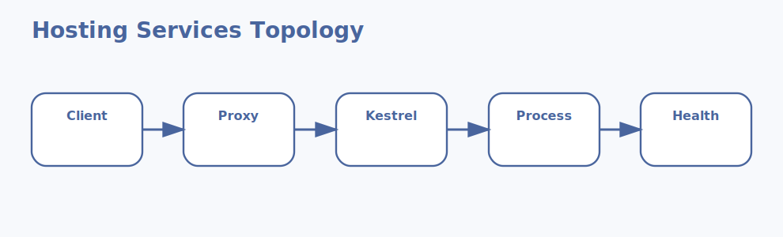

# Kestrel and Hosting Services Interview Questions



This page focuses on Kestrel and the hosting services that sit around an ASP.NET Core application in production.

## 1. Kestrel web server

### 1. What is the role of Kestrel web server in ASP.NET Core hosting services?

**Answer:**

In ASP.NET Core hosting services, the term Kestrel web server refers to the cross-platform web server used
natively by ASP.NET Core. It is part of the foundation a candidate should be able to explain
clearly.

**Sample:**

```json
{
  "Kestrel": {
    "Endpoints": {
      "Https": { "Url": "https://0.0.0.0:5001" }
    }
  },
  "Concept": "1. Kestrel web server"
}
```

---

### 2. Why is the concept of Kestrel web server important in ASP.NET Core hosting services?

**Answer:**

This concept matters because it influences the cross-platform web server used natively by
ASP.NET Core. Good interview answers connect it to clarity, maintainability, performance, security,
or delivery depending on the situation.

**Sample:**

```json
{
  "Kestrel": {
    "Endpoints": {
      "Https": { "Url": "https://0.0.0.0:5001" }
    }
  },
  "Concept": "1. Kestrel web server"
}
```

---

### 3. When should a team focus on Kestrel web server?

**Answer:**

A team should focus on Kestrel web server when the requirement depends on the cross-platform web
server used natively by ASP.NET Core. It becomes especially important when design decisions,
scalability, or debugging depend on that area.

**Sample:**

```json
{
  "Kestrel": {
    "Endpoints": {
      "Https": { "Url": "https://0.0.0.0:5001" }
    }
  },
  "Concept": "1. Kestrel web server"
}
```

---

### 4. How is Kestrel web server applied in practice?

**Answer:**

In practice, Kestrel web server is applied by making the cross-platform web server used natively by
ASP.NET Core explicit in the code, runtime setup, or delivery workflow. The exact shape depends on
the application, but the responsibility should stay predictable.

**Sample:**

```json
{
  "Kestrel": {
    "Endpoints": {
      "Https": { "Url": "https://0.0.0.0:5001" }
    }
  },
  "Concept": "1. Kestrel web server"
}
```

---

### 5. What strengths does Kestrel web server bring?

**Answer:**

The strengths of Kestrel web server are better structure, better communication, and better control
over the cross-platform web server used natively by ASP.NET Core. It also makes tradeoffs easier to
explain to reviewers, interviewers, and teammates.

**Sample:**

```json
{
  "Kestrel": {
    "Endpoints": {
      "Https": { "Url": "https://0.0.0.0:5001" }
    }
  },
  "Concept": "1. Kestrel web server"
}
```

---

### 6. What tradeoffs come with Kestrel web server?

**Answer:**

The main tradeoff is extra complexity if Kestrel web server is introduced without a real need or a
clear understanding of the cross-platform web server used natively by ASP.NET Core. That usually
leads to overengineering, hidden bugs, or confusing architecture.

**Sample:**

```json
{
  "Kestrel": {
    "Endpoints": {
      "Https": { "Url": "https://0.0.0.0:5001" }
    }
  },
  "Concept": "1. Kestrel web server"
}
```

---

### 7. How does Kestrel web server differ from Reverse proxies?

**Answer:**

Kestrel web server is centered on the cross-platform web server used natively by ASP.NET Core, while
Reverse proxies is centered on the front-door servers that sit in front of Kestrel in many
deployments. They often work together, but they solve different parts of the topic.

**Sample:**

```json
{
  "Kestrel": {
    "Endpoints": {
      "Https": { "Url": "https://0.0.0.0:5001" }
    }
  },
  "Concept": "1. Kestrel web server"
}
```

---

### 8. What is a good real-world example of Kestrel web server?

**Answer:**

A strong example is explaining how Kestrel web server affects a real feature, production issue,
migration, or architecture decision involving the cross-platform web server used natively by ASP.NET
Core. Interviewers usually care more about the reasoning than the definition alone.

**Sample:**

```json
{
  "Kestrel": {
    "Endpoints": {
      "Https": { "Url": "https://0.0.0.0:5001" }
    }
  },
  "Concept": "1. Kestrel web server"
}
```

---

### 9. What is a best practice for Kestrel web server?

**Answer:**

A good practice is to keep Kestrel web server aligned with the actual requirement around the cross-
platform web server used natively by ASP.NET Core. Teams should document intent, keep implementation
readable, and validate important paths early.

**Sample:**

```json
{
  "Kestrel": {
    "Endpoints": {
      "Https": { "Url": "https://0.0.0.0:5001" }
    }
  },
  "Concept": "1. Kestrel web server"
}
```

---

### 10. What is a common mistake around Kestrel web server?

**Answer:**

A common mistake is naming Kestrel web server without understanding how it affects the cross-
platform web server used natively by ASP.NET Core. In real work, that usually appears as weak design
choices, poor debugging, or incomplete explanations.

**Sample:**

```json
{
  "Kestrel": {
    "Endpoints": {
      "Https": { "Url": "https://0.0.0.0:5001" }
    }
  },
  "Concept": "1. Kestrel web server"
}
```

---

### 11. How do you troubleshoot Kestrel web server-related issues?

**Answer:**

When troubleshooting Kestrel web server, first verify whether the cross-platform web server used
natively by ASP.NET Core is behaving as expected. Then check surrounding dependencies,
configuration, logs, runtime behavior, and edge cases before changing the design.

**Sample:**

```json
{
  "Kestrel": {
    "Endpoints": {
      "Https": { "Url": "https://0.0.0.0:5001" }
    }
  },
  "Concept": "1. Kestrel web server"
}
```

---

### 12. How does Kestrel web server connect to the rest of ASP.NET Core hosting services?

**Answer:**

Kestrel web server connects to the rest of ASP.NET Core hosting services by giving structure to the
cross-platform web server used natively by ASP.NET Core. It is one of the pieces that turns isolated
facts into a coherent end-to-end explanation.

**Sample:**

```json
{
  "Kestrel": {
    "Endpoints": {
      "Https": { "Url": "https://0.0.0.0:5001" }
    }
  },
  "Concept": "1. Kestrel web server"
}
```

---

## 2. Reverse proxies

### 13. What is the role of Reverse proxies in ASP.NET Core hosting services?

**Answer:**

In ASP.NET Core hosting services, the term Reverse proxies refers to the front-door servers that sit in front
of Kestrel in many deployments. It is part of the foundation a candidate should be able to explain
clearly.

**Sample:**

```json
{
  "Kestrel": {
    "Endpoints": {
      "Https": { "Url": "https://0.0.0.0:5001" }
    }
  },
  "Concept": "2. Reverse proxies"
}
```

---

### 14. Why is the concept of Reverse proxies important in ASP.NET Core hosting services?

**Answer:**

This concept matters because it influences the front-door servers that sit in front of Kestrel in
many deployments. Good interview answers connect it to clarity, maintainability, performance,
security, or delivery depending on the situation.

**Sample:**

```json
{
  "Kestrel": {
    "Endpoints": {
      "Https": { "Url": "https://0.0.0.0:5001" }
    }
  },
  "Concept": "2. Reverse proxies"
}
```

---

### 15. When should a team focus on Reverse proxies?

**Answer:**

A team should focus on Reverse proxies when the requirement depends on the front-door servers that
sit in front of Kestrel in many deployments. It becomes especially important when design decisions,
scalability, or debugging depend on that area.

**Sample:**

```json
{
  "Kestrel": {
    "Endpoints": {
      "Https": { "Url": "https://0.0.0.0:5001" }
    }
  },
  "Concept": "2. Reverse proxies"
}
```

---

### 16. How is Reverse proxies applied in practice?

**Answer:**

In practice, Reverse proxies is applied by making the front-door servers that sit in front of
Kestrel in many deployments explicit in the code, runtime setup, or delivery workflow. The exact
shape depends on the application, but the responsibility should stay predictable.

**Sample:**

```json
{
  "Kestrel": {
    "Endpoints": {
      "Https": { "Url": "https://0.0.0.0:5001" }
    }
  },
  "Concept": "2. Reverse proxies"
}
```

---

### 17. What strengths does Reverse proxies bring?

**Answer:**

The strengths of Reverse proxies are better structure, better communication, and better control over
the front-door servers that sit in front of Kestrel in many deployments. It also makes tradeoffs
easier to explain to reviewers, interviewers, and teammates.

**Sample:**

```json
{
  "Kestrel": {
    "Endpoints": {
      "Https": { "Url": "https://0.0.0.0:5001" }
    }
  },
  "Concept": "2. Reverse proxies"
}
```

---

### 18. What tradeoffs come with Reverse proxies?

**Answer:**

The main tradeoff is extra complexity if Reverse proxies is introduced without a real need or a
clear understanding of the front-door servers that sit in front of Kestrel in many deployments. That
usually leads to overengineering, hidden bugs, or confusing architecture.

**Sample:**

```json
{
  "Kestrel": {
    "Endpoints": {
      "Https": { "Url": "https://0.0.0.0:5001" }
    }
  },
  "Concept": "2. Reverse proxies"
}
```

---

### 19. How does Reverse proxies differ from IIS hosting?

**Answer:**

Reverse proxies is centered on the front-door servers that sit in front of Kestrel in many
deployments, while IIS hosting is centered on the Windows hosting model where IIS can front or
integrate with ASP.NET Core. They often work together, but they solve different parts of the topic.

**Sample:**

```json
{
  "Kestrel": {
    "Endpoints": {
      "Https": { "Url": "https://0.0.0.0:5001" }
    }
  },
  "Concept": "2. Reverse proxies"
}
```

---

### 20. What is a good real-world example of Reverse proxies?

**Answer:**

A strong example is explaining how Reverse proxies affects a real feature, production issue,
migration, or architecture decision involving the front-door servers that sit in front of Kestrel in
many deployments. Interviewers usually care more about the reasoning than the definition alone.

**Sample:**

```json
{
  "Kestrel": {
    "Endpoints": {
      "Https": { "Url": "https://0.0.0.0:5001" }
    }
  },
  "Concept": "2. Reverse proxies"
}
```

---

### 21. What is a best practice for Reverse proxies?

**Answer:**

A good practice is to keep Reverse proxies aligned with the actual requirement around the front-door
servers that sit in front of Kestrel in many deployments. Teams should document intent, keep
implementation readable, and validate important paths early.

**Sample:**

```json
{
  "Kestrel": {
    "Endpoints": {
      "Https": { "Url": "https://0.0.0.0:5001" }
    }
  },
  "Concept": "2. Reverse proxies"
}
```

---

### 22. What is a common mistake around Reverse proxies?

**Answer:**

A common mistake is naming Reverse proxies without understanding how it affects the front-door
servers that sit in front of Kestrel in many deployments. In real work, that usually appears as weak
design choices, poor debugging, or incomplete explanations.

**Sample:**

```json
{
  "Kestrel": {
    "Endpoints": {
      "Https": { "Url": "https://0.0.0.0:5001" }
    }
  },
  "Concept": "2. Reverse proxies"
}
```

---

### 23. How do you troubleshoot Reverse proxies-related issues?

**Answer:**

When troubleshooting Reverse proxies, first verify whether the front-door servers that sit in front
of Kestrel in many deployments is behaving as expected. Then check surrounding dependencies,
configuration, logs, runtime behavior, and edge cases before changing the design.

**Sample:**

```json
{
  "Kestrel": {
    "Endpoints": {
      "Https": { "Url": "https://0.0.0.0:5001" }
    }
  },
  "Concept": "2. Reverse proxies"
}
```

---

### 24. How does Reverse proxies connect to the rest of ASP.NET Core hosting services?

**Answer:**

Reverse proxies connects to the rest of ASP.NET Core hosting services by giving structure to the
front-door servers that sit in front of Kestrel in many deployments. It is one of the pieces that
turns isolated facts into a coherent end-to-end explanation.

**Sample:**

```json
{
  "Kestrel": {
    "Endpoints": {
      "Https": { "Url": "https://0.0.0.0:5001" }
    }
  },
  "Concept": "2. Reverse proxies"
}
```

---

## 3. IIS hosting

### 25. What is the role of IIS hosting in ASP.NET Core hosting services?

**Answer:**

In ASP.NET Core hosting services, the term IIS hosting refers to the Windows hosting model where IIS can
front or integrate with ASP.NET Core. It is part of the foundation a candidate should be able to
explain clearly.

**Sample:**

```json
{
  "Kestrel": {
    "Endpoints": {
      "Https": { "Url": "https://0.0.0.0:5001" }
    }
  },
  "Concept": "3. IIS hosting"
}
```

---

### 26. Why is the concept of IIS hosting important in ASP.NET Core hosting services?

**Answer:**

This concept matters because it influences the Windows hosting model where IIS can front or integrate
with ASP.NET Core. Good interview answers connect it to clarity, maintainability, performance,
security, or delivery depending on the situation.

**Sample:**

```json
{
  "Kestrel": {
    "Endpoints": {
      "Https": { "Url": "https://0.0.0.0:5001" }
    }
  },
  "Concept": "3. IIS hosting"
}
```

---

### 27. When should a team focus on IIS hosting?

**Answer:**

A team should focus on IIS hosting when the requirement depends on the Windows hosting model where
IIS can front or integrate with ASP.NET Core. It becomes especially important when design decisions,
scalability, or debugging depend on that area.

**Sample:**

```json
{
  "Kestrel": {
    "Endpoints": {
      "Https": { "Url": "https://0.0.0.0:5001" }
    }
  },
  "Concept": "3. IIS hosting"
}
```

---

### 28. How is IIS hosting applied in practice?

**Answer:**

In practice, IIS hosting is applied by making the Windows hosting model where IIS can front or
integrate with ASP.NET Core explicit in the code, runtime setup, or delivery workflow. The exact
shape depends on the application, but the responsibility should stay predictable.

**Sample:**

```json
{
  "Kestrel": {
    "Endpoints": {
      "Https": { "Url": "https://0.0.0.0:5001" }
    }
  },
  "Concept": "3. IIS hosting"
}
```

---

### 29. What strengths does IIS hosting bring?

**Answer:**

The strengths of IIS hosting are better structure, better communication, and better control over the
Windows hosting model where IIS can front or integrate with ASP.NET Core. It also makes tradeoffs
easier to explain to reviewers, interviewers, and teammates.

**Sample:**

```json
{
  "Kestrel": {
    "Endpoints": {
      "Https": { "Url": "https://0.0.0.0:5001" }
    }
  },
  "Concept": "3. IIS hosting"
}
```

---

### 30. What tradeoffs come with IIS hosting?

**Answer:**

The main tradeoff is extra complexity if IIS hosting is introduced without a real need or a clear
understanding of the Windows hosting model where IIS can front or integrate with ASP.NET Core. That
usually leads to overengineering, hidden bugs, or confusing architecture.

**Sample:**

```json
{
  "Kestrel": {
    "Endpoints": {
      "Https": { "Url": "https://0.0.0.0:5001" }
    }
  },
  "Concept": "3. IIS hosting"
}
```

---

### 31. How does IIS hosting differ from Nginx and Apache hosting?

**Answer:**

IIS hosting is centered on the Windows hosting model where IIS can front or integrate with ASP.NET
Core, while Nginx and Apache hosting is centered on the common Linux reverse proxy patterns used
with Kestrel. They often work together, but they solve different parts of the topic.

**Sample:**

```json
{
  "Kestrel": {
    "Endpoints": {
      "Https": { "Url": "https://0.0.0.0:5001" }
    }
  },
  "Concept": "3. IIS hosting"
}
```

---

### 32. What is a good real-world example of IIS hosting?

**Answer:**

A strong example is explaining how IIS hosting affects a real feature, production issue, migration,
or architecture decision involving the Windows hosting model where IIS can front or integrate with
ASP.NET Core. Interviewers usually care more about the reasoning than the definition alone.

**Sample:**

```json
{
  "Kestrel": {
    "Endpoints": {
      "Https": { "Url": "https://0.0.0.0:5001" }
    }
  },
  "Concept": "3. IIS hosting"
}
```

---

### 33. What is a best practice for IIS hosting?

**Answer:**

A good practice is to keep IIS hosting aligned with the actual requirement around the Windows
hosting model where IIS can front or integrate with ASP.NET Core. Teams should document intent, keep
implementation readable, and validate important paths early.

**Sample:**

```json
{
  "Kestrel": {
    "Endpoints": {
      "Https": { "Url": "https://0.0.0.0:5001" }
    }
  },
  "Concept": "3. IIS hosting"
}
```

---

### 34. What is a common mistake around IIS hosting?

**Answer:**

A common mistake is naming IIS hosting without understanding how it affects the Windows hosting
model where IIS can front or integrate with ASP.NET Core. In real work, that usually appears as weak
design choices, poor debugging, or incomplete explanations.

**Sample:**

```json
{
  "Kestrel": {
    "Endpoints": {
      "Https": { "Url": "https://0.0.0.0:5001" }
    }
  },
  "Concept": "3. IIS hosting"
}
```

---

### 35. How do you troubleshoot IIS hosting-related issues?

**Answer:**

When troubleshooting IIS hosting, first verify whether the Windows hosting model where IIS can front
or integrate with ASP.NET Core is behaving as expected. Then check surrounding dependencies,
configuration, logs, runtime behavior, and edge cases before changing the design.

**Sample:**

```json
{
  "Kestrel": {
    "Endpoints": {
      "Https": { "Url": "https://0.0.0.0:5001" }
    }
  },
  "Concept": "3. IIS hosting"
}
```

---

### 36. How does IIS hosting connect to the rest of ASP.NET Core hosting services?

**Answer:**

IIS hosting connects to the rest of ASP.NET Core hosting services by giving structure to the Windows
hosting model where IIS can front or integrate with ASP.NET Core. It is one of the pieces that turns
isolated facts into a coherent end-to-end explanation.

**Sample:**

```json
{
  "Kestrel": {
    "Endpoints": {
      "Https": { "Url": "https://0.0.0.0:5001" }
    }
  },
  "Concept": "3. IIS hosting"
}
```

---

## 4. Nginx and Apache hosting

### 37. What is the role of Nginx and Apache hosting in ASP.NET Core hosting services?

**Answer:**

In ASP.NET Core hosting services, the term Nginx and Apache hosting refers to the common Linux reverse proxy
patterns used with Kestrel. It is part of the foundation a candidate should be able to explain
clearly.

**Sample:**

```json
{
  "Kestrel": {
    "Endpoints": {
      "Https": { "Url": "https://0.0.0.0:5001" }
    }
  },
  "Concept": "4. Nginx and Apache hosting"
}
```

---

### 38. Why is the concept of Nginx and Apache hosting important in ASP.NET Core hosting services?

**Answer:**

This concept matters because it influences the common Linux reverse proxy patterns used
with Kestrel. Good interview answers connect it to clarity, maintainability, performance, security,
or delivery depending on the situation.

**Sample:**

```json
{
  "Kestrel": {
    "Endpoints": {
      "Https": { "Url": "https://0.0.0.0:5001" }
    }
  },
  "Concept": "4. Nginx and Apache hosting"
}
```

---

### 39. When should a team focus on Nginx and Apache hosting?

**Answer:**

A team should focus on Nginx and Apache hosting when the requirement depends on the common Linux
reverse proxy patterns used with Kestrel. It becomes especially important when design decisions,
scalability, or debugging depend on that area.

**Sample:**

```json
{
  "Kestrel": {
    "Endpoints": {
      "Https": { "Url": "https://0.0.0.0:5001" }
    }
  },
  "Concept": "4. Nginx and Apache hosting"
}
```

---

### 40. How is Nginx and Apache hosting applied in practice?

**Answer:**

In practice, Nginx and Apache hosting is applied by making the common Linux reverse proxy patterns
used with Kestrel explicit in the code, runtime setup, or delivery workflow. The exact shape depends
on the application, but the responsibility should stay predictable.

**Sample:**

```json
{
  "Kestrel": {
    "Endpoints": {
      "Https": { "Url": "https://0.0.0.0:5001" }
    }
  },
  "Concept": "4. Nginx and Apache hosting"
}
```

---

### 41. What strengths does Nginx and Apache hosting bring?

**Answer:**

The strengths of Nginx and Apache hosting are better structure, better communication, and better
control over the common Linux reverse proxy patterns used with Kestrel. It also makes tradeoffs
easier to explain to reviewers, interviewers, and teammates.

**Sample:**

```json
{
  "Kestrel": {
    "Endpoints": {
      "Https": { "Url": "https://0.0.0.0:5001" }
    }
  },
  "Concept": "4. Nginx and Apache hosting"
}
```

---

### 42. What tradeoffs come with Nginx and Apache hosting?

**Answer:**

The main tradeoff is extra complexity if Nginx and Apache hosting is introduced without a real need
or a clear understanding of the common Linux reverse proxy patterns used with Kestrel. That usually
leads to overengineering, hidden bugs, or confusing architecture.

**Sample:**

```json
{
  "Kestrel": {
    "Endpoints": {
      "Https": { "Url": "https://0.0.0.0:5001" }
    }
  },
  "Concept": "4. Nginx and Apache hosting"
}
```

---

### 43. How does Nginx and Apache hosting differ from Windows services?

**Answer:**

Nginx and Apache hosting is centered on the common Linux reverse proxy patterns used with Kestrel,
while Windows services is centered on the hosting approach used when an ASP.NET Core process runs as
a Windows background service. They often work together, but they solve different parts of the topic.

**Sample:**

```json
{
  "Kestrel": {
    "Endpoints": {
      "Https": { "Url": "https://0.0.0.0:5001" }
    }
  },
  "Concept": "4. Nginx and Apache hosting"
}
```

---

### 44. What is a good real-world example of Nginx and Apache hosting?

**Answer:**

A strong example is explaining how Nginx and Apache hosting affects a real feature, production
issue, migration, or architecture decision involving the common Linux reverse proxy patterns used
with Kestrel. Interviewers usually care more about the reasoning than the definition alone.

**Sample:**

```json
{
  "Kestrel": {
    "Endpoints": {
      "Https": { "Url": "https://0.0.0.0:5001" }
    }
  },
  "Concept": "4. Nginx and Apache hosting"
}
```

---

### 45. What is a best practice for Nginx and Apache hosting?

**Answer:**

A good practice is to keep Nginx and Apache hosting aligned with the actual requirement around the
common Linux reverse proxy patterns used with Kestrel. Teams should document intent, keep
implementation readable, and validate important paths early.

**Sample:**

```json
{
  "Kestrel": {
    "Endpoints": {
      "Https": { "Url": "https://0.0.0.0:5001" }
    }
  },
  "Concept": "4. Nginx and Apache hosting"
}
```

---

### 46. What is a common mistake around Nginx and Apache hosting?

**Answer:**

A common mistake is naming Nginx and Apache hosting without understanding how it affects the common
Linux reverse proxy patterns used with Kestrel. In real work, that usually appears as weak design
choices, poor debugging, or incomplete explanations.

**Sample:**

```json
{
  "Kestrel": {
    "Endpoints": {
      "Https": { "Url": "https://0.0.0.0:5001" }
    }
  },
  "Concept": "4. Nginx and Apache hosting"
}
```

---

### 47. How do you troubleshoot Nginx and Apache hosting-related issues?

**Answer:**

When troubleshooting Nginx and Apache hosting, first verify whether the common Linux reverse proxy
patterns used with Kestrel is behaving as expected. Then check surrounding dependencies,
configuration, logs, runtime behavior, and edge cases before changing the design.

**Sample:**

```json
{
  "Kestrel": {
    "Endpoints": {
      "Https": { "Url": "https://0.0.0.0:5001" }
    }
  },
  "Concept": "4. Nginx and Apache hosting"
}
```

---

### 48. How does Nginx and Apache hosting connect to the rest of ASP.NET Core hosting services?

**Answer:**

Nginx and Apache hosting connects to the rest of ASP.NET Core hosting services by giving structure
to the common Linux reverse proxy patterns used with Kestrel. It is one of the pieces that turns
isolated facts into a coherent end-to-end explanation.

**Sample:**

```json
{
  "Kestrel": {
    "Endpoints": {
      "Https": { "Url": "https://0.0.0.0:5001" }
    }
  },
  "Concept": "4. Nginx and Apache hosting"
}
```

---

## 5. Windows services

### 49. What is the role of Windows services in ASP.NET Core hosting services?

**Answer:**

In ASP.NET Core hosting services, the term Windows services refers to the hosting approach used when an
ASP.NET Core process runs as a Windows background service. It is part of the foundation a candidate
should be able to explain clearly.

**Sample:**

```json
{
  "Kestrel": {
    "Endpoints": {
      "Https": { "Url": "https://0.0.0.0:5001" }
    }
  },
  "Concept": "5. Windows services"
}
```

---

### 50. Why is the concept of Windows services important in ASP.NET Core hosting services?

**Answer:**

This concept matters because it influences the hosting approach used when an ASP.NET Core
process runs as a Windows background service. Good interview answers connect it to clarity,
maintainability, performance, security, or delivery depending on the situation.

**Sample:**

```json
{
  "Kestrel": {
    "Endpoints": {
      "Https": { "Url": "https://0.0.0.0:5001" }
    }
  },
  "Concept": "5. Windows services"
}
```

---

### 51. When should a team focus on Windows services?

**Answer:**

A team should focus on Windows services when the requirement depends on the hosting approach used
when an ASP.NET Core process runs as a Windows background service. It becomes especially important
when design decisions, scalability, or debugging depend on that area.

**Sample:**

```json
{
  "Kestrel": {
    "Endpoints": {
      "Https": { "Url": "https://0.0.0.0:5001" }
    }
  },
  "Concept": "5. Windows services"
}
```

---

### 52. How is Windows services applied in practice?

**Answer:**

In practice, Windows services is applied by making the hosting approach used when an ASP.NET Core
process runs as a Windows background service explicit in the code, runtime setup, or delivery
workflow. The exact shape depends on the application, but the responsibility should stay
predictable.

**Sample:**

```json
{
  "Kestrel": {
    "Endpoints": {
      "Https": { "Url": "https://0.0.0.0:5001" }
    }
  },
  "Concept": "5. Windows services"
}
```

---

### 53. What strengths does Windows services bring?

**Answer:**

The strengths of Windows services are better structure, better communication, and better control
over the hosting approach used when an ASP.NET Core process runs as a Windows background service. It
also makes tradeoffs easier to explain to reviewers, interviewers, and teammates.

**Sample:**

```json
{
  "Kestrel": {
    "Endpoints": {
      "Https": { "Url": "https://0.0.0.0:5001" }
    }
  },
  "Concept": "5. Windows services"
}
```

---

### 54. What tradeoffs come with Windows services?

**Answer:**

The main tradeoff is extra complexity if Windows services is introduced without a real need or a
clear understanding of the hosting approach used when an ASP.NET Core process runs as a Windows
background service. That usually leads to overengineering, hidden bugs, or confusing architecture.

**Sample:**

```json
{
  "Kestrel": {
    "Endpoints": {
      "Https": { "Url": "https://0.0.0.0:5001" }
    }
  },
  "Concept": "5. Windows services"
}
```

---

### 55. How does Windows services differ from Linux and systemd?

**Answer:**

Windows services is centered on the hosting approach used when an ASP.NET Core process runs as a
Windows background service, while Linux and systemd is centered on the service management model used
when hosting ASP.NET Core on Linux. They often work together, but they solve different parts of the
topic.

**Sample:**

```json
{
  "Kestrel": {
    "Endpoints": {
      "Https": { "Url": "https://0.0.0.0:5001" }
    }
  },
  "Concept": "5. Windows services"
}
```

---

### 56. What is a good real-world example of Windows services?

**Answer:**

A strong example is explaining how Windows services affects a real feature, production issue,
migration, or architecture decision involving the hosting approach used when an ASP.NET Core process
runs as a Windows background service. Interviewers usually care more about the reasoning than the
definition alone.

**Sample:**

```json
{
  "Kestrel": {
    "Endpoints": {
      "Https": { "Url": "https://0.0.0.0:5001" }
    }
  },
  "Concept": "5. Windows services"
}
```

---

### 57. What is a best practice for Windows services?

**Answer:**

A good practice is to keep Windows services aligned with the actual requirement around the hosting
approach used when an ASP.NET Core process runs as a Windows background service. Teams should
document intent, keep implementation readable, and validate important paths early.

**Sample:**

```json
{
  "Kestrel": {
    "Endpoints": {
      "Https": { "Url": "https://0.0.0.0:5001" }
    }
  },
  "Concept": "5. Windows services"
}
```

---

### 58. What is a common mistake around Windows services?

**Answer:**

A common mistake is naming Windows services without understanding how it affects the hosting
approach used when an ASP.NET Core process runs as a Windows background service. In real work, that
usually appears as weak design choices, poor debugging, or incomplete explanations.

**Sample:**

```json
{
  "Kestrel": {
    "Endpoints": {
      "Https": { "Url": "https://0.0.0.0:5001" }
    }
  },
  "Concept": "5. Windows services"
}
```

---

### 59. How do you troubleshoot Windows services-related issues?

**Answer:**

When troubleshooting Windows services, first verify whether the hosting approach used when an
ASP.NET Core process runs as a Windows background service is behaving as expected. Then check
surrounding dependencies, configuration, logs, runtime behavior, and edge cases before changing the
design.

**Sample:**

```json
{
  "Kestrel": {
    "Endpoints": {
      "Https": { "Url": "https://0.0.0.0:5001" }
    }
  },
  "Concept": "5. Windows services"
}
```

---

### 60. How does Windows services connect to the rest of ASP.NET Core hosting services?

**Answer:**

Windows services connects to the rest of ASP.NET Core hosting services by giving structure to the
hosting approach used when an ASP.NET Core process runs as a Windows background service. It is one
of the pieces that turns isolated facts into a coherent end-to-end explanation.

**Sample:**

```json
{
  "Kestrel": {
    "Endpoints": {
      "Https": { "Url": "https://0.0.0.0:5001" }
    }
  },
  "Concept": "5. Windows services"
}
```

---

## 6. Linux and systemd

### 61. What is the role of Linux and systemd in ASP.NET Core hosting services?

**Answer:**

In ASP.NET Core hosting services, the term Linux and systemd refers to the service management model used when
hosting ASP.NET Core on Linux. It is part of the foundation a candidate should be able to explain
clearly.

**Sample:**

```json
{
  "Kestrel": {
    "Endpoints": {
      "Https": { "Url": "https://0.0.0.0:5001" }
    }
  },
  "Concept": "6. Linux and systemd"
}
```

---

### 62. Why is the concept of Linux and systemd important in ASP.NET Core hosting services?

**Answer:**

This concept matters because it influences the service management model used when hosting
ASP.NET Core on Linux. Good interview answers connect it to clarity, maintainability, performance,
security, or delivery depending on the situation.

**Sample:**

```json
{
  "Kestrel": {
    "Endpoints": {
      "Https": { "Url": "https://0.0.0.0:5001" }
    }
  },
  "Concept": "6. Linux and systemd"
}
```

---

### 63. When should a team focus on Linux and systemd?

**Answer:**

A team should focus on Linux and systemd when the requirement depends on the service management
model used when hosting ASP.NET Core on Linux. It becomes especially important when design
decisions, scalability, or debugging depend on that area.

**Sample:**

```json
{
  "Kestrel": {
    "Endpoints": {
      "Https": { "Url": "https://0.0.0.0:5001" }
    }
  },
  "Concept": "6. Linux and systemd"
}
```

---

### 64. How is Linux and systemd applied in practice?

**Answer:**

In practice, Linux and systemd is applied by making the service management model used when hosting
ASP.NET Core on Linux explicit in the code, runtime setup, or delivery workflow. The exact shape
depends on the application, but the responsibility should stay predictable.

**Sample:**

```json
{
  "Kestrel": {
    "Endpoints": {
      "Https": { "Url": "https://0.0.0.0:5001" }
    }
  },
  "Concept": "6. Linux and systemd"
}
```

---

### 65. What strengths does Linux and systemd bring?

**Answer:**

The strengths of Linux and systemd are better structure, better communication, and better control
over the service management model used when hosting ASP.NET Core on Linux. It also makes tradeoffs
easier to explain to reviewers, interviewers, and teammates.

**Sample:**

```json
{
  "Kestrel": {
    "Endpoints": {
      "Https": { "Url": "https://0.0.0.0:5001" }
    }
  },
  "Concept": "6. Linux and systemd"
}
```

---

### 66. What tradeoffs come with Linux and systemd?

**Answer:**

The main tradeoff is extra complexity if Linux and systemd is introduced without a real need or a
clear understanding of the service management model used when hosting ASP.NET Core on Linux. That
usually leads to overengineering, hidden bugs, or confusing architecture.

**Sample:**

```json
{
  "Kestrel": {
    "Endpoints": {
      "Https": { "Url": "https://0.0.0.0:5001" }
    }
  },
  "Concept": "6. Linux and systemd"
}
```

---

### 67. How does Linux and systemd differ from HTTPS and certificates?

**Answer:**

Linux and systemd is centered on the service management model used when hosting ASP.NET Core on
Linux, while HTTPS and certificates is centered on the transport security setup required for secure
web communication. They often work together, but they solve different parts of the topic.

**Sample:**

```json
{
  "Kestrel": {
    "Endpoints": {
      "Https": { "Url": "https://0.0.0.0:5001" }
    }
  },
  "Concept": "6. Linux and systemd"
}
```

---

### 68. What is a good real-world example of Linux and systemd?

**Answer:**

A strong example is explaining how Linux and systemd affects a real feature, production issue,
migration, or architecture decision involving the service management model used when hosting ASP.NET
Core on Linux. Interviewers usually care more about the reasoning than the definition alone.

**Sample:**

```json
{
  "Kestrel": {
    "Endpoints": {
      "Https": { "Url": "https://0.0.0.0:5001" }
    }
  },
  "Concept": "6. Linux and systemd"
}
```

---

### 69. What is a best practice for Linux and systemd?

**Answer:**

A good practice is to keep Linux and systemd aligned with the actual requirement around the service
management model used when hosting ASP.NET Core on Linux. Teams should document intent, keep
implementation readable, and validate important paths early.

**Sample:**

```json
{
  "Kestrel": {
    "Endpoints": {
      "Https": { "Url": "https://0.0.0.0:5001" }
    }
  },
  "Concept": "6. Linux and systemd"
}
```

---

### 70. What is a common mistake around Linux and systemd?

**Answer:**

A common mistake is naming Linux and systemd without understanding how it affects the service
management model used when hosting ASP.NET Core on Linux. In real work, that usually appears as weak
design choices, poor debugging, or incomplete explanations.

**Sample:**

```json
{
  "Kestrel": {
    "Endpoints": {
      "Https": { "Url": "https://0.0.0.0:5001" }
    }
  },
  "Concept": "6. Linux and systemd"
}
```

---

### 71. How do you troubleshoot Linux and systemd-related issues?

**Answer:**

When troubleshooting Linux and systemd, first verify whether the service management model used when
hosting ASP.NET Core on Linux is behaving as expected. Then check surrounding dependencies,
configuration, logs, runtime behavior, and edge cases before changing the design.

**Sample:**

```json
{
  "Kestrel": {
    "Endpoints": {
      "Https": { "Url": "https://0.0.0.0:5001" }
    }
  },
  "Concept": "6. Linux and systemd"
}
```

---

### 72. How does Linux and systemd connect to the rest of ASP.NET Core hosting services?

**Answer:**

Linux and systemd connects to the rest of ASP.NET Core hosting services by giving structure to the
service management model used when hosting ASP.NET Core on Linux. It is one of the pieces that turns
isolated facts into a coherent end-to-end explanation.

**Sample:**

```json
{
  "Kestrel": {
    "Endpoints": {
      "Https": { "Url": "https://0.0.0.0:5001" }
    }
  },
  "Concept": "6. Linux and systemd"
}
```

---

## 7. HTTPS and certificates

### 73. What is the role of HTTPS and certificates in ASP.NET Core hosting services?

**Answer:**

In ASP.NET Core hosting services, the term HTTPS and certificates refers to the transport security setup
required for secure web communication. It is part of the foundation a candidate should be able to
explain clearly.

**Sample:**

```json
{
  "Kestrel": {
    "Endpoints": {
      "Https": { "Url": "https://0.0.0.0:5001" }
    }
  },
  "Concept": "7. HTTPS and certificates"
}
```

---

### 74. Why is the concept of HTTPS and certificates important in ASP.NET Core hosting services?

**Answer:**

This concept matters because it influences the transport security setup required for
secure web communication. Good interview answers connect it to clarity, maintainability,
performance, security, or delivery depending on the situation.

**Sample:**

```json
{
  "Kestrel": {
    "Endpoints": {
      "Https": { "Url": "https://0.0.0.0:5001" }
    }
  },
  "Concept": "7. HTTPS and certificates"
}
```

---

### 75. When should a team focus on HTTPS and certificates?

**Answer:**

A team should focus on HTTPS and certificates when the requirement depends on the transport security
setup required for secure web communication. It becomes especially important when design decisions,
scalability, or debugging depend on that area.

**Sample:**

```json
{
  "Kestrel": {
    "Endpoints": {
      "Https": { "Url": "https://0.0.0.0:5001" }
    }
  },
  "Concept": "7. HTTPS and certificates"
}
```

---

### 76. How is HTTPS and certificates applied in practice?

**Answer:**

In practice, HTTPS and certificates is applied by making the transport security setup required for
secure web communication explicit in the code, runtime setup, or delivery workflow. The exact shape
depends on the application, but the responsibility should stay predictable.

**Sample:**

```json
{
  "Kestrel": {
    "Endpoints": {
      "Https": { "Url": "https://0.0.0.0:5001" }
    }
  },
  "Concept": "7. HTTPS and certificates"
}
```

---

### 77. What strengths does HTTPS and certificates bring?

**Answer:**

The strengths of HTTPS and certificates are better structure, better communication, and better
control over the transport security setup required for secure web communication. It also makes
tradeoffs easier to explain to reviewers, interviewers, and teammates.

**Sample:**

```json
{
  "Kestrel": {
    "Endpoints": {
      "Https": { "Url": "https://0.0.0.0:5001" }
    }
  },
  "Concept": "7. HTTPS and certificates"
}
```

---

### 78. What tradeoffs come with HTTPS and certificates?

**Answer:**

The main tradeoff is extra complexity if HTTPS and certificates is introduced without a real need or
a clear understanding of the transport security setup required for secure web communication. That
usually leads to overengineering, hidden bugs, or confusing architecture.

**Sample:**

```json
{
  "Kestrel": {
    "Endpoints": {
      "Https": { "Url": "https://0.0.0.0:5001" }
    }
  },
  "Concept": "7. HTTPS and certificates"
}
```

---

### 79. How does HTTPS and certificates differ from Load balancing?

**Answer:**

HTTPS and certificates is centered on the transport security setup required for secure web
communication, while Load balancing is centered on the distribution of traffic across multiple
instances to improve scale and resilience. They often work together, but they solve different parts
of the topic.

**Sample:**

```json
{
  "Kestrel": {
    "Endpoints": {
      "Https": { "Url": "https://0.0.0.0:5001" }
    }
  },
  "Concept": "7. HTTPS and certificates"
}
```

---

### 80. What is a good real-world example of HTTPS and certificates?

**Answer:**

A strong example is explaining how HTTPS and certificates affects a real feature, production issue,
migration, or architecture decision involving the transport security setup required for secure web
communication. Interviewers usually care more about the reasoning than the definition alone.

**Sample:**

```json
{
  "Kestrel": {
    "Endpoints": {
      "Https": { "Url": "https://0.0.0.0:5001" }
    }
  },
  "Concept": "7. HTTPS and certificates"
}
```

---

### 81. What is a best practice for HTTPS and certificates?

**Answer:**

A good practice is to keep HTTPS and certificates aligned with the actual requirement around the
transport security setup required for secure web communication. Teams should document intent, keep
implementation readable, and validate important paths early.

**Sample:**

```json
{
  "Kestrel": {
    "Endpoints": {
      "Https": { "Url": "https://0.0.0.0:5001" }
    }
  },
  "Concept": "7. HTTPS and certificates"
}
```

---

### 82. What is a common mistake around HTTPS and certificates?

**Answer:**

A common mistake is naming HTTPS and certificates without understanding how it affects the transport
security setup required for secure web communication. In real work, that usually appears as weak
design choices, poor debugging, or incomplete explanations.

**Sample:**

```json
{
  "Kestrel": {
    "Endpoints": {
      "Https": { "Url": "https://0.0.0.0:5001" }
    }
  },
  "Concept": "7. HTTPS and certificates"
}
```

---

### 83. How do you troubleshoot HTTPS and certificates-related issues?

**Answer:**

When troubleshooting HTTPS and certificates, first verify whether the transport security setup
required for secure web communication is behaving as expected. Then check surrounding dependencies,
configuration, logs, runtime behavior, and edge cases before changing the design.

**Sample:**

```json
{
  "Kestrel": {
    "Endpoints": {
      "Https": { "Url": "https://0.0.0.0:5001" }
    }
  },
  "Concept": "7. HTTPS and certificates"
}
```

---

### 84. How does HTTPS and certificates connect to the rest of ASP.NET Core hosting services?

**Answer:**

HTTPS and certificates connects to the rest of ASP.NET Core hosting services by giving structure to
the transport security setup required for secure web communication. It is one of the pieces that
turns isolated facts into a coherent end-to-end explanation.

**Sample:**

```json
{
  "Kestrel": {
    "Endpoints": {
      "Https": { "Url": "https://0.0.0.0:5001" }
    }
  },
  "Concept": "7. HTTPS and certificates"
}
```

---

## 8. Load balancing

### 85. What is the role of Load balancing in ASP.NET Core hosting services?

**Answer:**

In ASP.NET Core hosting services, the term Load balancing refers to the distribution of traffic across
multiple instances to improve scale and resilience. It is part of the foundation a candidate should
be able to explain clearly.

**Sample:**

```json
{
  "Kestrel": {
    "Endpoints": {
      "Https": { "Url": "https://0.0.0.0:5001" }
    }
  },
  "Concept": "8. Load balancing"
}
```

---

### 86. Why is the concept of Load balancing important in ASP.NET Core hosting services?

**Answer:**

This concept matters because it influences the distribution of traffic across multiple instances
to improve scale and resilience. Good interview answers connect it to clarity, maintainability,
performance, security, or delivery depending on the situation.

**Sample:**

```json
{
  "Kestrel": {
    "Endpoints": {
      "Https": { "Url": "https://0.0.0.0:5001" }
    }
  },
  "Concept": "8. Load balancing"
}
```

---

### 87. When should a team focus on Load balancing?

**Answer:**

A team should focus on Load balancing when the requirement depends on the distribution of traffic
across multiple instances to improve scale and resilience. It becomes especially important when
design decisions, scalability, or debugging depend on that area.

**Sample:**

```json
{
  "Kestrel": {
    "Endpoints": {
      "Https": { "Url": "https://0.0.0.0:5001" }
    }
  },
  "Concept": "8. Load balancing"
}
```

---

### 88. How is Load balancing applied in practice?

**Answer:**

In practice, Load balancing is applied by making the distribution of traffic across multiple
instances to improve scale and resilience explicit in the code, runtime setup, or delivery workflow.
The exact shape depends on the application, but the responsibility should stay predictable.

**Sample:**

```json
{
  "Kestrel": {
    "Endpoints": {
      "Https": { "Url": "https://0.0.0.0:5001" }
    }
  },
  "Concept": "8. Load balancing"
}
```

---

### 89. What strengths does Load balancing bring?

**Answer:**

The strengths of Load balancing are better structure, better communication, and better control over
the distribution of traffic across multiple instances to improve scale and resilience. It also makes
tradeoffs easier to explain to reviewers, interviewers, and teammates.

**Sample:**

```json
{
  "Kestrel": {
    "Endpoints": {
      "Https": { "Url": "https://0.0.0.0:5001" }
    }
  },
  "Concept": "8. Load balancing"
}
```

---

### 90. What tradeoffs come with Load balancing?

**Answer:**

The main tradeoff is extra complexity if Load balancing is introduced without a real need or a clear
understanding of the distribution of traffic across multiple instances to improve scale and
resilience. That usually leads to overengineering, hidden bugs, or confusing architecture.

**Sample:**

```json
{
  "Kestrel": {
    "Endpoints": {
      "Https": { "Url": "https://0.0.0.0:5001" }
    }
  },
  "Concept": "8. Load balancing"
}
```

---

### 91. How does Load balancing differ from Health checks?

**Answer:**

Load balancing is centered on the distribution of traffic across multiple instances to improve scale
and resilience, while Health checks is centered on the endpoint and operational signals used to
verify service readiness and liveness. They often work together, but they solve different parts of
the topic.

**Sample:**

```json
{
  "Kestrel": {
    "Endpoints": {
      "Https": { "Url": "https://0.0.0.0:5001" }
    }
  },
  "Concept": "8. Load balancing"
}
```

---

### 92. What is a good real-world example of Load balancing?

**Answer:**

A strong example is explaining how Load balancing affects a real feature, production issue,
migration, or architecture decision involving the distribution of traffic across multiple instances
to improve scale and resilience. Interviewers usually care more about the reasoning than the
definition alone.

**Sample:**

```json
{
  "Kestrel": {
    "Endpoints": {
      "Https": { "Url": "https://0.0.0.0:5001" }
    }
  },
  "Concept": "8. Load balancing"
}
```

---

### 93. What is a best practice for Load balancing?

**Answer:**

A good practice is to keep Load balancing aligned with the actual requirement around the
distribution of traffic across multiple instances to improve scale and resilience. Teams should
document intent, keep implementation readable, and validate important paths early.

**Sample:**

```json
{
  "Kestrel": {
    "Endpoints": {
      "Https": { "Url": "https://0.0.0.0:5001" }
    }
  },
  "Concept": "8. Load balancing"
}
```

---

### 94. What is a common mistake around Load balancing?

**Answer:**

A common mistake is naming Load balancing without understanding how it affects the distribution of
traffic across multiple instances to improve scale and resilience. In real work, that usually
appears as weak design choices, poor debugging, or incomplete explanations.

**Sample:**

```json
{
  "Kestrel": {
    "Endpoints": {
      "Https": { "Url": "https://0.0.0.0:5001" }
    }
  },
  "Concept": "8. Load balancing"
}
```

---

### 95. How do you troubleshoot Load balancing-related issues?

**Answer:**

When troubleshooting Load balancing, first verify whether the distribution of traffic across
multiple instances to improve scale and resilience is behaving as expected. Then check surrounding
dependencies, configuration, logs, runtime behavior, and edge cases before changing the design.

**Sample:**

```json
{
  "Kestrel": {
    "Endpoints": {
      "Https": { "Url": "https://0.0.0.0:5001" }
    }
  },
  "Concept": "8. Load balancing"
}
```

---

### 96. How does Load balancing connect to the rest of ASP.NET Core hosting services?

**Answer:**

Load balancing connects to the rest of ASP.NET Core hosting services by giving structure to the
distribution of traffic across multiple instances to improve scale and resilience. It is one of the
pieces that turns isolated facts into a coherent end-to-end explanation.

**Sample:**

```json
{
  "Kestrel": {
    "Endpoints": {
      "Https": { "Url": "https://0.0.0.0:5001" }
    }
  },
  "Concept": "8. Load balancing"
}
```

---

## 9. Health checks

### 97. What is the role of Health checks in ASP.NET Core hosting services?

**Answer:**

In ASP.NET Core hosting services, the term Health checks refers to the endpoint and operational signals used
to verify service readiness and liveness. It is part of the foundation a candidate should be able to
explain clearly.

**Sample:**

```json
{
  "Kestrel": {
    "Endpoints": {
      "Https": { "Url": "https://0.0.0.0:5001" }
    }
  },
  "Concept": "9. Health checks"
}
```

---

### 98. Why is the concept of Health checks important in ASP.NET Core hosting services?

**Answer:**

This concept matters because it influences the endpoint and operational signals used to verify
service readiness and liveness. Good interview answers connect it to clarity, maintainability,
performance, security, or delivery depending on the situation.

**Sample:**

```json
{
  "Kestrel": {
    "Endpoints": {
      "Https": { "Url": "https://0.0.0.0:5001" }
    }
  },
  "Concept": "9. Health checks"
}
```

---

### 99. When should a team focus on Health checks?

**Answer:**

A team should focus on Health checks when the requirement depends on the endpoint and operational
signals used to verify service readiness and liveness. It becomes especially important when design
decisions, scalability, or debugging depend on that area.

**Sample:**

```json
{
  "Kestrel": {
    "Endpoints": {
      "Https": { "Url": "https://0.0.0.0:5001" }
    }
  },
  "Concept": "9. Health checks"
}
```

---

### 100. How is Health checks applied in practice?

**Answer:**

In practice, Health checks is applied by making the endpoint and operational signals used to verify
service readiness and liveness explicit in the code, runtime setup, or delivery workflow. The exact
shape depends on the application, but the responsibility should stay predictable.

**Sample:**

```json
{
  "Kestrel": {
    "Endpoints": {
      "Https": { "Url": "https://0.0.0.0:5001" }
    }
  },
  "Concept": "9. Health checks"
}
```

---

### 101. What strengths does Health checks bring?

**Answer:**

The strengths of Health checks are better structure, better communication, and better control over
the endpoint and operational signals used to verify service readiness and liveness. It also makes
tradeoffs easier to explain to reviewers, interviewers, and teammates.

**Sample:**

```json
{
  "Kestrel": {
    "Endpoints": {
      "Https": { "Url": "https://0.0.0.0:5001" }
    }
  },
  "Concept": "9. Health checks"
}
```

---

### 102. What tradeoffs come with Health checks?

**Answer:**

The main tradeoff is extra complexity if Health checks is introduced without a real need or a clear
understanding of the endpoint and operational signals used to verify service readiness and liveness.
That usually leads to overengineering, hidden bugs, or confusing architecture.

**Sample:**

```json
{
  "Kestrel": {
    "Endpoints": {
      "Https": { "Url": "https://0.0.0.0:5001" }
    }
  },
  "Concept": "9. Health checks"
}
```

---

### 103. How does Health checks differ from Deployment topology?

**Answer:**

Health checks is centered on the endpoint and operational signals used to verify service readiness
and liveness, while Deployment topology is centered on the overall shape of the runtime environment
around the web application. They often work together, but they solve different parts of the topic.

**Sample:**

```json
{
  "Kestrel": {
    "Endpoints": {
      "Https": { "Url": "https://0.0.0.0:5001" }
    }
  },
  "Concept": "9. Health checks"
}
```

---

### 104. What is a good real-world example of Health checks?

**Answer:**

A strong example is explaining how Health checks affects a real feature, production issue,
migration, or architecture decision involving the endpoint and operational signals used to verify
service readiness and liveness. Interviewers usually care more about the reasoning than the
definition alone.

**Sample:**

```json
{
  "Kestrel": {
    "Endpoints": {
      "Https": { "Url": "https://0.0.0.0:5001" }
    }
  },
  "Concept": "9. Health checks"
}
```

---

### 105. What is a best practice for Health checks?

**Answer:**

A good practice is to keep Health checks aligned with the actual requirement around the endpoint and
operational signals used to verify service readiness and liveness. Teams should document intent,
keep implementation readable, and validate important paths early.

**Sample:**

```json
{
  "Kestrel": {
    "Endpoints": {
      "Https": { "Url": "https://0.0.0.0:5001" }
    }
  },
  "Concept": "9. Health checks"
}
```

---

### 106. What is a common mistake around Health checks?

**Answer:**

A common mistake is naming Health checks without understanding how it affects the endpoint and
operational signals used to verify service readiness and liveness. In real work, that usually
appears as weak design choices, poor debugging, or incomplete explanations.

**Sample:**

```json
{
  "Kestrel": {
    "Endpoints": {
      "Https": { "Url": "https://0.0.0.0:5001" }
    }
  },
  "Concept": "9. Health checks"
}
```

---

### 107. How do you troubleshoot Health checks-related issues?

**Answer:**

When troubleshooting Health checks, first verify whether the endpoint and operational signals used
to verify service readiness and liveness is behaving as expected. Then check surrounding
dependencies, configuration, logs, runtime behavior, and edge cases before changing the design.

**Sample:**

```json
{
  "Kestrel": {
    "Endpoints": {
      "Https": { "Url": "https://0.0.0.0:5001" }
    }
  },
  "Concept": "9. Health checks"
}
```

---

### 108. How does Health checks connect to the rest of ASP.NET Core hosting services?

**Answer:**

Health checks connects to the rest of ASP.NET Core hosting services by giving structure to the
endpoint and operational signals used to verify service readiness and liveness. It is one of the
pieces that turns isolated facts into a coherent end-to-end explanation.

**Sample:**

```json
{
  "Kestrel": {
    "Endpoints": {
      "Https": { "Url": "https://0.0.0.0:5001" }
    }
  },
  "Concept": "9. Health checks"
}
```

---

## 10. Deployment topology

### 109. What is the role of Deployment topology in ASP.NET Core hosting services?

**Answer:**

In ASP.NET Core hosting services, the term Deployment topology refers to the overall shape of the runtime
environment around the web application. It is part of the foundation a candidate should be able to
explain clearly.

**Sample:**

```json
{
  "Kestrel": {
    "Endpoints": {
      "Https": { "Url": "https://0.0.0.0:5001" }
    }
  },
  "Concept": "10. Deployment topology"
}
```

---

### 110. Why is the concept of Deployment topology important in ASP.NET Core hosting services?

**Answer:**

This concept matters because it influences the overall shape of the runtime environment
around the web application. Good interview answers connect it to clarity, maintainability,
performance, security, or delivery depending on the situation.

**Sample:**

```json
{
  "Kestrel": {
    "Endpoints": {
      "Https": { "Url": "https://0.0.0.0:5001" }
    }
  },
  "Concept": "10. Deployment topology"
}
```

---

### 111. When should a team focus on Deployment topology?

**Answer:**

A team should focus on Deployment topology when the requirement depends on the overall shape of the
runtime environment around the web application. It becomes especially important when design
decisions, scalability, or debugging depend on that area.

**Sample:**

```json
{
  "Kestrel": {
    "Endpoints": {
      "Https": { "Url": "https://0.0.0.0:5001" }
    }
  },
  "Concept": "10. Deployment topology"
}
```

---

### 112. How is Deployment topology applied in practice?

**Answer:**

In practice, Deployment topology is applied by making the overall shape of the runtime environment
around the web application explicit in the code, runtime setup, or delivery workflow. The exact
shape depends on the application, but the responsibility should stay predictable.

**Sample:**

```json
{
  "Kestrel": {
    "Endpoints": {
      "Https": { "Url": "https://0.0.0.0:5001" }
    }
  },
  "Concept": "10. Deployment topology"
}
```

---

### 113. What strengths does Deployment topology bring?

**Answer:**

The strengths of Deployment topology are better structure, better communication, and better control
over the overall shape of the runtime environment around the web application. It also makes
tradeoffs easier to explain to reviewers, interviewers, and teammates.

**Sample:**

```json
{
  "Kestrel": {
    "Endpoints": {
      "Https": { "Url": "https://0.0.0.0:5001" }
    }
  },
  "Concept": "10. Deployment topology"
}
```

---

### 114. What tradeoffs come with Deployment topology?

**Answer:**

The main tradeoff is extra complexity if Deployment topology is introduced without a real need or a
clear understanding of the overall shape of the runtime environment around the web application. That
usually leads to overengineering, hidden bugs, or confusing architecture.

**Sample:**

```json
{
  "Kestrel": {
    "Endpoints": {
      "Https": { "Url": "https://0.0.0.0:5001" }
    }
  },
  "Concept": "10. Deployment topology"
}
```

---

### 115. How does Deployment topology differ from Kestrel web server?

**Answer:**

Deployment topology is centered on the overall shape of the runtime environment around the web
application, while Kestrel web server is centered on the cross-platform web server used natively by
ASP.NET Core. They often work together, but they solve different parts of the topic.

**Sample:**

```json
{
  "Kestrel": {
    "Endpoints": {
      "Https": { "Url": "https://0.0.0.0:5001" }
    }
  },
  "Concept": "10. Deployment topology"
}
```

---

### 116. What is a good real-world example of Deployment topology?

**Answer:**

A strong example is explaining how Deployment topology affects a real feature, production issue,
migration, or architecture decision involving the overall shape of the runtime environment around
the web application. Interviewers usually care more about the reasoning than the definition alone.

**Sample:**

```json
{
  "Kestrel": {
    "Endpoints": {
      "Https": { "Url": "https://0.0.0.0:5001" }
    }
  },
  "Concept": "10. Deployment topology"
}
```

---

### 117. What is a best practice for Deployment topology?

**Answer:**

A good practice is to keep Deployment topology aligned with the actual requirement around the
overall shape of the runtime environment around the web application. Teams should document intent,
keep implementation readable, and validate important paths early.

**Sample:**

```json
{
  "Kestrel": {
    "Endpoints": {
      "Https": { "Url": "https://0.0.0.0:5001" }
    }
  },
  "Concept": "10. Deployment topology"
}
```

---

### 118. What is a common mistake around Deployment topology?

**Answer:**

A common mistake is naming Deployment topology without understanding how it affects the overall
shape of the runtime environment around the web application. In real work, that usually appears as
weak design choices, poor debugging, or incomplete explanations.

**Sample:**

```json
{
  "Kestrel": {
    "Endpoints": {
      "Https": { "Url": "https://0.0.0.0:5001" }
    }
  },
  "Concept": "10. Deployment topology"
}
```

---

### 119. How do you troubleshoot Deployment topology-related issues?

**Answer:**

When troubleshooting Deployment topology, first verify whether the overall shape of the runtime
environment around the web application is behaving as expected. Then check surrounding dependencies,
configuration, logs, runtime behavior, and edge cases before changing the design.

**Sample:**

```json
{
  "Kestrel": {
    "Endpoints": {
      "Https": { "Url": "https://0.0.0.0:5001" }
    }
  },
  "Concept": "10. Deployment topology"
}
```

---

### 120. How does Deployment topology connect to the rest of ASP.NET Core hosting services?

**Answer:**

Deployment topology connects to the rest of ASP.NET Core hosting services by giving structure to the
overall shape of the runtime environment around the web application. It is one of the pieces that
turns isolated facts into a coherent end-to-end explanation.

**Sample:**

```json
{
  "Kestrel": {
    "Endpoints": {
      "Https": { "Url": "https://0.0.0.0:5001" }
    }
  },
  "Concept": "10. Deployment topology"
}
```
