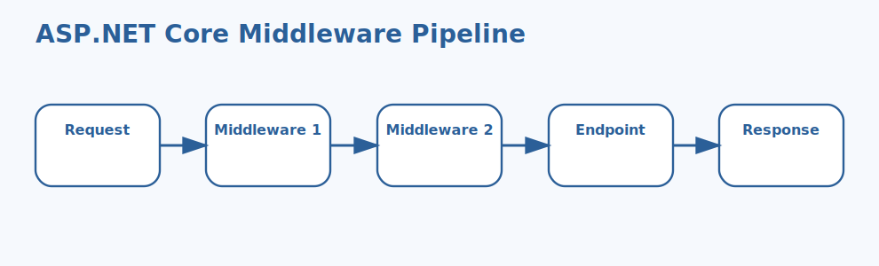

# ASP.NET Core Middleware Pipeline Interview Questions



This guide explains how requests move through the ASP.NET Core middleware pipeline, how middleware ordering affects behavior, and how production teams design safe request-processing flows. It follows the corrected format of **100 interview questions for each subtopic**, and every answer includes a C# code example with rotated production scenarios so the examples do not repeat verbatim.

## How To Use This Page

- Questions 1-100 cover Request and response flow.
- Questions 101-200 cover Middleware ordering.
- Questions 201-300 cover Built-in middleware.
- Questions 301-400 cover Custom middleware.
- Questions 401-500 cover Error handling middleware.
- Questions 501-600 cover Authentication and authorization middleware.
- Questions 601-700 cover Static files and CORS.
- Questions 701-800 cover Endpoint routing.
- Questions 801-900 cover Short-circuiting.
- Questions 901-1000 cover Diagnostics and performance.

## 1. Request and response flow

### Q1.1 What is pipeline execution flow in the ASP.NET Core middleware pipeline?

**Answer:**

Pipeline execution flow matters in the ASP.NET Core middleware pipeline because it affects when a request enters the app and passes through multiple middleware components. In a real system like a public retail API where requests pass through tracing, auth, routing, and response-compression middleware, a strong answer should explain request flow, ordering impact, and which middleware is responsible for shaping, securing, or ending the request. A senior engineer also ties the explanation to maintainability and production debugging so the team can reason about request behavior instead of memorizing middleware names.

**Code Example:**

```csharp
var builder = WebApplication.CreateBuilder(args);
var app = builder.Build();

app.Use(async (context, next) =>
{
    Console.WriteLine("Before next middleware");
    await next();
    Console.WriteLine("After next middleware");
});

app.MapGet("/", () => "Hello pipeline");
app.Run();
```

### Q1.2 Why does inbound and outbound processing matter in real applications?

**Answer:**

Inbound and outbound processing matters in the ASP.NET Core middleware pipeline because it affects when teams must understand the before-and-after stages around next(). In a real system like a banking service where one misplaced security middleware can create a serious production issue, a strong answer should explain request flow, ordering impact, and which middleware is responsible for shaping, securing, or ending the request. A senior engineer also ties the explanation to maintainability and production debugging so production bugs caused by ordering mistakes are easier to prevent.

**Code Example:**

```csharp
var builder = WebApplication.CreateBuilder(args);
var app = builder.Build();

app.Use(async (context, next) =>
{
    context.Items["CorrelationId"] = Guid.NewGuid().ToString("N");
    await next();
});

app.MapGet("/", (HttpContext ctx) => ctx.Items["CorrelationId"]);
app.Run();
```

### Q1.3 When should a team pay close attention to httpcontext sharing?

**Answer:**

HttpContext sharing matters in the ASP.NET Core middleware pipeline because it affects when middleware collaborates using the same request state. In a real system like a SaaS platform with tenant resolution and correlation IDs added near the start of the pipeline, a strong answer should explain request flow, ordering impact, and which middleware is responsible for shaping, securing, or ending the request. A senior engineer also ties the explanation to maintainability and production debugging so security and routing behavior stay predictable during refactors.

**Code Example:**

```csharp
var builder = WebApplication.CreateBuilder(args);
var app = builder.Build();

app.Use(async (context, next) =>
{
    Console.WriteLine($"Incoming: {context.Request.Path}");
    await next();
    Console.WriteLine($"Outgoing: {context.Response.StatusCode}");
});

app.MapGet("/status", () => Results.Ok());
app.Run();
```

### Q1.4 How would you explain terminal behavior in a production discussion?

**Answer:**

Terminal behavior matters in the ASP.NET Core middleware pipeline because it affects when one middleware ends the pipeline and no later components run. In a real system like a healthcare portal where exception handling and structured logging must be consistent across all endpoints, a strong answer should explain request flow, ordering impact, and which middleware is responsible for shaping, securing, or ending the request. A senior engineer also ties the explanation to maintainability and production debugging so support teams can trace where a request was modified or stopped.

**Code Example:**

```csharp
var stages = new[] { "Request enters", "Middleware executes", "Endpoint runs", "Response exits" };
foreach (var stage in stages)
{
    Console.WriteLine(stage);
}
```

### Q1.5 What is a common interview trap around mental model of the pipeline?

**Answer:**

Mental model of the pipeline matters in the ASP.NET Core middleware pipeline because it affects when interviewers want more than the phrase 'chain of middleware'. In a real system like a CMS product serving static assets and APIs from the same ASP.NET Core application, a strong answer should explain request flow, ordering impact, and which middleware is responsible for shaping, securing, or ending the request. A senior engineer also ties the explanation to maintainability and production debugging so custom middleware stays focused on cross-cutting concerns instead of business logic.

**Code Example:**

```csharp
var builder = WebApplication.CreateBuilder(args);
var app = builder.Build();

app.Run(async context =>
{
    await context.Response.WriteAsync("Terminal middleware");
});
```

### Q1.6 How do you apply pipeline execution flow safely in production?

**Answer:**

Pipeline execution flow matters in the ASP.NET Core middleware pipeline because it affects when a request enters the app and passes through multiple middleware components. In a real system like a logistics service where CORS errors appear only in browser integrations while backend calls still work, a strong answer should explain request flow, ordering impact, and which middleware is responsible for shaping, securing, or ending the request. A senior engineer also ties the explanation to maintainability and production debugging so performance reviews can identify expensive pipeline stages faster.

**Code Example:**

```csharp
var builder = WebApplication.CreateBuilder(args);
var app = builder.Build();

app.Use(async (context, next) =>
{
    Console.WriteLine("Before next middleware");
    await next();
    Console.WriteLine("After next middleware");
});

app.MapGet("/", () => "Hello pipeline");
app.Run();
```

### Q1.7 What outage pattern usually exposes weak understanding of inbound and outbound processing?

**Answer:**

Inbound and outbound processing matters in the ASP.NET Core middleware pipeline because it affects when teams must understand the before-and-after stages around next(). In a real system like a customer-support platform where health checks, Swagger, and authentication all need different pipeline behavior, a strong answer should explain request flow, ordering impact, and which middleware is responsible for shaping, securing, or ending the request. A senior engineer also ties the explanation to maintainability and production debugging so browser, API, and static-file behavior no longer feel inconsistent or mysterious.

**Code Example:**

```csharp
var builder = WebApplication.CreateBuilder(args);
var app = builder.Build();

app.Use(async (context, next) =>
{
    context.Items["CorrelationId"] = Guid.NewGuid().ToString("N");
    await next();
});

app.MapGet("/", (HttpContext ctx) => ctx.Items["CorrelationId"]);
app.Run();
```

### Q1.8 How would a senior engineer justify httpcontext sharing to a team?

**Answer:**

HttpContext sharing matters in the ASP.NET Core middleware pipeline because it affects when middleware collaborates using the same request state. In a real system like a manufacturing dashboard where short-circuiting is used to reject invalid device requests early, a strong answer should explain request flow, ordering impact, and which middleware is responsible for shaping, securing, or ending the request. A senior engineer also ties the explanation to maintainability and production debugging so error responses are shaped consistently without leaking internal details.

**Code Example:**

```csharp
var builder = WebApplication.CreateBuilder(args);
var app = builder.Build();

app.Use(async (context, next) =>
{
    Console.WriteLine($"Incoming: {context.Request.Path}");
    await next();
    Console.WriteLine($"Outgoing: {context.Response.StatusCode}");
});

app.MapGet("/status", () => Results.Ok());
app.Run();
```

### Q1.9 What trade-off does terminal behavior introduce?

**Answer:**

Terminal behavior matters in the ASP.NET Core middleware pipeline because it affects when one middleware ends the pipeline and no later components run. In a real system like an internal admin app where endpoint routing metadata controls access policies, a strong answer should explain request flow, ordering impact, and which middleware is responsible for shaping, securing, or ending the request. A senior engineer also ties the explanation to maintainability and production debugging so the final answer reflects real pipeline mechanics rather than interview buzzwords.

**Code Example:**

```csharp
var stages = new[] { "Request enters", "Middleware executes", "Endpoint runs", "Response exits" };
foreach (var stage in stages)
{
    Console.WriteLine(stage);
}
```

### Q1.10 How do you answer a tricky follow-up about mental model of the pipeline?

**Answer:**

Mental model of the pipeline matters in the ASP.NET Core middleware pipeline because it affects when interviewers want more than the phrase 'chain of middleware'. In a real system like a high-traffic API where middleware timing and overhead directly affect latency targets, a strong answer should explain request flow, ordering impact, and which middleware is responsible for shaping, securing, or ending the request. A senior engineer also ties the explanation to maintainability and production debugging so request handling stays observable even as the application grows.

**Code Example:**

```csharp
var builder = WebApplication.CreateBuilder(args);
var app = builder.Build();

app.Run(async context =>
{
    await context.Response.WriteAsync("Terminal middleware");
});
```

### Q1.11 What is pipeline execution flow in the ASP.NET Core middleware pipeline?

**Answer:**

Pipeline execution flow matters in the ASP.NET Core middleware pipeline because it affects when a request enters the app and passes through multiple middleware components. In a real system like a public retail API where requests pass through tracing, auth, routing, and response-compression middleware, a strong answer should explain request flow, ordering impact, and which middleware is responsible for shaping, securing, or ending the request. A senior engineer also ties the explanation to maintainability and production debugging so the team can reason about request behavior instead of memorizing middleware names.

**Code Example:**

```csharp
var builder = WebApplication.CreateBuilder(args);
var app = builder.Build();

app.Use(async (context, next) =>
{
    Console.WriteLine("Before next middleware");
    await next();
    Console.WriteLine("After next middleware");
});

app.MapGet("/", () => "Hello pipeline");
app.Run();
```

### Q1.12 Why does inbound and outbound processing matter in real applications?

**Answer:**

Inbound and outbound processing matters in the ASP.NET Core middleware pipeline because it affects when teams must understand the before-and-after stages around next(). In a real system like a banking service where one misplaced security middleware can create a serious production issue, a strong answer should explain request flow, ordering impact, and which middleware is responsible for shaping, securing, or ending the request. A senior engineer also ties the explanation to maintainability and production debugging so production bugs caused by ordering mistakes are easier to prevent.

**Code Example:**

```csharp
var builder = WebApplication.CreateBuilder(args);
var app = builder.Build();

app.Use(async (context, next) =>
{
    context.Items["CorrelationId"] = Guid.NewGuid().ToString("N");
    await next();
});

app.MapGet("/", (HttpContext ctx) => ctx.Items["CorrelationId"]);
app.Run();
```

### Q1.13 When should a team pay close attention to httpcontext sharing?

**Answer:**

HttpContext sharing matters in the ASP.NET Core middleware pipeline because it affects when middleware collaborates using the same request state. In a real system like a SaaS platform with tenant resolution and correlation IDs added near the start of the pipeline, a strong answer should explain request flow, ordering impact, and which middleware is responsible for shaping, securing, or ending the request. A senior engineer also ties the explanation to maintainability and production debugging so security and routing behavior stay predictable during refactors.

**Code Example:**

```csharp
var builder = WebApplication.CreateBuilder(args);
var app = builder.Build();

app.Use(async (context, next) =>
{
    Console.WriteLine($"Incoming: {context.Request.Path}");
    await next();
    Console.WriteLine($"Outgoing: {context.Response.StatusCode}");
});

app.MapGet("/status", () => Results.Ok());
app.Run();
```

### Q1.14 How would you explain terminal behavior in a production discussion?

**Answer:**

Terminal behavior matters in the ASP.NET Core middleware pipeline because it affects when one middleware ends the pipeline and no later components run. In a real system like a healthcare portal where exception handling and structured logging must be consistent across all endpoints, a strong answer should explain request flow, ordering impact, and which middleware is responsible for shaping, securing, or ending the request. A senior engineer also ties the explanation to maintainability and production debugging so support teams can trace where a request was modified or stopped.

**Code Example:**

```csharp
var stages = new[] { "Request enters", "Middleware executes", "Endpoint runs", "Response exits" };
foreach (var stage in stages)
{
    Console.WriteLine(stage);
}
```

### Q1.15 What is a common interview trap around mental model of the pipeline?

**Answer:**

Mental model of the pipeline matters in the ASP.NET Core middleware pipeline because it affects when interviewers want more than the phrase 'chain of middleware'. In a real system like a CMS product serving static assets and APIs from the same ASP.NET Core application, a strong answer should explain request flow, ordering impact, and which middleware is responsible for shaping, securing, or ending the request. A senior engineer also ties the explanation to maintainability and production debugging so custom middleware stays focused on cross-cutting concerns instead of business logic.

**Code Example:**

```csharp
var builder = WebApplication.CreateBuilder(args);
var app = builder.Build();

app.Run(async context =>
{
    await context.Response.WriteAsync("Terminal middleware");
});
```

### Q1.16 How do you apply pipeline execution flow safely in production?

**Answer:**

Pipeline execution flow matters in the ASP.NET Core middleware pipeline because it affects when a request enters the app and passes through multiple middleware components. In a real system like a logistics service where CORS errors appear only in browser integrations while backend calls still work, a strong answer should explain request flow, ordering impact, and which middleware is responsible for shaping, securing, or ending the request. A senior engineer also ties the explanation to maintainability and production debugging so performance reviews can identify expensive pipeline stages faster.

**Code Example:**

```csharp
var builder = WebApplication.CreateBuilder(args);
var app = builder.Build();

app.Use(async (context, next) =>
{
    Console.WriteLine("Before next middleware");
    await next();
    Console.WriteLine("After next middleware");
});

app.MapGet("/", () => "Hello pipeline");
app.Run();
```

### Q1.17 What outage pattern usually exposes weak understanding of inbound and outbound processing?

**Answer:**

Inbound and outbound processing matters in the ASP.NET Core middleware pipeline because it affects when teams must understand the before-and-after stages around next(). In a real system like a customer-support platform where health checks, Swagger, and authentication all need different pipeline behavior, a strong answer should explain request flow, ordering impact, and which middleware is responsible for shaping, securing, or ending the request. A senior engineer also ties the explanation to maintainability and production debugging so browser, API, and static-file behavior no longer feel inconsistent or mysterious.

**Code Example:**

```csharp
var builder = WebApplication.CreateBuilder(args);
var app = builder.Build();

app.Use(async (context, next) =>
{
    context.Items["CorrelationId"] = Guid.NewGuid().ToString("N");
    await next();
});

app.MapGet("/", (HttpContext ctx) => ctx.Items["CorrelationId"]);
app.Run();
```

### Q1.18 How would a senior engineer justify httpcontext sharing to a team?

**Answer:**

HttpContext sharing matters in the ASP.NET Core middleware pipeline because it affects when middleware collaborates using the same request state. In a real system like a manufacturing dashboard where short-circuiting is used to reject invalid device requests early, a strong answer should explain request flow, ordering impact, and which middleware is responsible for shaping, securing, or ending the request. A senior engineer also ties the explanation to maintainability and production debugging so error responses are shaped consistently without leaking internal details.

**Code Example:**

```csharp
var builder = WebApplication.CreateBuilder(args);
var app = builder.Build();

app.Use(async (context, next) =>
{
    Console.WriteLine($"Incoming: {context.Request.Path}");
    await next();
    Console.WriteLine($"Outgoing: {context.Response.StatusCode}");
});

app.MapGet("/status", () => Results.Ok());
app.Run();
```

### Q1.19 What trade-off does terminal behavior introduce?

**Answer:**

Terminal behavior matters in the ASP.NET Core middleware pipeline because it affects when one middleware ends the pipeline and no later components run. In a real system like an internal admin app where endpoint routing metadata controls access policies, a strong answer should explain request flow, ordering impact, and which middleware is responsible for shaping, securing, or ending the request. A senior engineer also ties the explanation to maintainability and production debugging so the final answer reflects real pipeline mechanics rather than interview buzzwords.

**Code Example:**

```csharp
var stages = new[] { "Request enters", "Middleware executes", "Endpoint runs", "Response exits" };
foreach (var stage in stages)
{
    Console.WriteLine(stage);
}
```

### Q1.20 How do you answer a tricky follow-up about mental model of the pipeline?

**Answer:**

Mental model of the pipeline matters in the ASP.NET Core middleware pipeline because it affects when interviewers want more than the phrase 'chain of middleware'. In a real system like a high-traffic API where middleware timing and overhead directly affect latency targets, a strong answer should explain request flow, ordering impact, and which middleware is responsible for shaping, securing, or ending the request. A senior engineer also ties the explanation to maintainability and production debugging so request handling stays observable even as the application grows.

**Code Example:**

```csharp
var builder = WebApplication.CreateBuilder(args);
var app = builder.Build();

app.Run(async context =>
{
    await context.Response.WriteAsync("Terminal middleware");
});
```

### Q1.21 What is pipeline execution flow in the ASP.NET Core middleware pipeline?

**Answer:**

Pipeline execution flow matters in the ASP.NET Core middleware pipeline because it affects when a request enters the app and passes through multiple middleware components. In a real system like a public retail API where requests pass through tracing, auth, routing, and response-compression middleware, a strong answer should explain request flow, ordering impact, and which middleware is responsible for shaping, securing, or ending the request. A senior engineer also ties the explanation to maintainability and production debugging so the team can reason about request behavior instead of memorizing middleware names.

**Code Example:**

```csharp
var builder = WebApplication.CreateBuilder(args);
var app = builder.Build();

app.Use(async (context, next) =>
{
    Console.WriteLine("Before next middleware");
    await next();
    Console.WriteLine("After next middleware");
});

app.MapGet("/", () => "Hello pipeline");
app.Run();
```

### Q1.22 Why does inbound and outbound processing matter in real applications?

**Answer:**

Inbound and outbound processing matters in the ASP.NET Core middleware pipeline because it affects when teams must understand the before-and-after stages around next(). In a real system like a banking service where one misplaced security middleware can create a serious production issue, a strong answer should explain request flow, ordering impact, and which middleware is responsible for shaping, securing, or ending the request. A senior engineer also ties the explanation to maintainability and production debugging so production bugs caused by ordering mistakes are easier to prevent.

**Code Example:**

```csharp
var builder = WebApplication.CreateBuilder(args);
var app = builder.Build();

app.Use(async (context, next) =>
{
    context.Items["CorrelationId"] = Guid.NewGuid().ToString("N");
    await next();
});

app.MapGet("/", (HttpContext ctx) => ctx.Items["CorrelationId"]);
app.Run();
```

### Q1.23 When should a team pay close attention to httpcontext sharing?

**Answer:**

HttpContext sharing matters in the ASP.NET Core middleware pipeline because it affects when middleware collaborates using the same request state. In a real system like a SaaS platform with tenant resolution and correlation IDs added near the start of the pipeline, a strong answer should explain request flow, ordering impact, and which middleware is responsible for shaping, securing, or ending the request. A senior engineer also ties the explanation to maintainability and production debugging so security and routing behavior stay predictable during refactors.

**Code Example:**

```csharp
var builder = WebApplication.CreateBuilder(args);
var app = builder.Build();

app.Use(async (context, next) =>
{
    Console.WriteLine($"Incoming: {context.Request.Path}");
    await next();
    Console.WriteLine($"Outgoing: {context.Response.StatusCode}");
});

app.MapGet("/status", () => Results.Ok());
app.Run();
```

### Q1.24 How would you explain terminal behavior in a production discussion?

**Answer:**

Terminal behavior matters in the ASP.NET Core middleware pipeline because it affects when one middleware ends the pipeline and no later components run. In a real system like a healthcare portal where exception handling and structured logging must be consistent across all endpoints, a strong answer should explain request flow, ordering impact, and which middleware is responsible for shaping, securing, or ending the request. A senior engineer also ties the explanation to maintainability and production debugging so support teams can trace where a request was modified or stopped.

**Code Example:**

```csharp
var stages = new[] { "Request enters", "Middleware executes", "Endpoint runs", "Response exits" };
foreach (var stage in stages)
{
    Console.WriteLine(stage);
}
```

### Q1.25 What is a common interview trap around mental model of the pipeline?

**Answer:**

Mental model of the pipeline matters in the ASP.NET Core middleware pipeline because it affects when interviewers want more than the phrase 'chain of middleware'. In a real system like a CMS product serving static assets and APIs from the same ASP.NET Core application, a strong answer should explain request flow, ordering impact, and which middleware is responsible for shaping, securing, or ending the request. A senior engineer also ties the explanation to maintainability and production debugging so custom middleware stays focused on cross-cutting concerns instead of business logic.

**Code Example:**

```csharp
var builder = WebApplication.CreateBuilder(args);
var app = builder.Build();

app.Run(async context =>
{
    await context.Response.WriteAsync("Terminal middleware");
});
```

### Q1.26 How do you apply pipeline execution flow safely in production?

**Answer:**

Pipeline execution flow matters in the ASP.NET Core middleware pipeline because it affects when a request enters the app and passes through multiple middleware components. In a real system like a logistics service where CORS errors appear only in browser integrations while backend calls still work, a strong answer should explain request flow, ordering impact, and which middleware is responsible for shaping, securing, or ending the request. A senior engineer also ties the explanation to maintainability and production debugging so performance reviews can identify expensive pipeline stages faster.

**Code Example:**

```csharp
var builder = WebApplication.CreateBuilder(args);
var app = builder.Build();

app.Use(async (context, next) =>
{
    Console.WriteLine("Before next middleware");
    await next();
    Console.WriteLine("After next middleware");
});

app.MapGet("/", () => "Hello pipeline");
app.Run();
```

### Q1.27 What outage pattern usually exposes weak understanding of inbound and outbound processing?

**Answer:**

Inbound and outbound processing matters in the ASP.NET Core middleware pipeline because it affects when teams must understand the before-and-after stages around next(). In a real system like a customer-support platform where health checks, Swagger, and authentication all need different pipeline behavior, a strong answer should explain request flow, ordering impact, and which middleware is responsible for shaping, securing, or ending the request. A senior engineer also ties the explanation to maintainability and production debugging so browser, API, and static-file behavior no longer feel inconsistent or mysterious.

**Code Example:**

```csharp
var builder = WebApplication.CreateBuilder(args);
var app = builder.Build();

app.Use(async (context, next) =>
{
    context.Items["CorrelationId"] = Guid.NewGuid().ToString("N");
    await next();
});

app.MapGet("/", (HttpContext ctx) => ctx.Items["CorrelationId"]);
app.Run();
```

### Q1.28 How would a senior engineer justify httpcontext sharing to a team?

**Answer:**

HttpContext sharing matters in the ASP.NET Core middleware pipeline because it affects when middleware collaborates using the same request state. In a real system like a manufacturing dashboard where short-circuiting is used to reject invalid device requests early, a strong answer should explain request flow, ordering impact, and which middleware is responsible for shaping, securing, or ending the request. A senior engineer also ties the explanation to maintainability and production debugging so error responses are shaped consistently without leaking internal details.

**Code Example:**

```csharp
var builder = WebApplication.CreateBuilder(args);
var app = builder.Build();

app.Use(async (context, next) =>
{
    Console.WriteLine($"Incoming: {context.Request.Path}");
    await next();
    Console.WriteLine($"Outgoing: {context.Response.StatusCode}");
});

app.MapGet("/status", () => Results.Ok());
app.Run();
```

### Q1.29 What trade-off does terminal behavior introduce?

**Answer:**

Terminal behavior matters in the ASP.NET Core middleware pipeline because it affects when one middleware ends the pipeline and no later components run. In a real system like an internal admin app where endpoint routing metadata controls access policies, a strong answer should explain request flow, ordering impact, and which middleware is responsible for shaping, securing, or ending the request. A senior engineer also ties the explanation to maintainability and production debugging so the final answer reflects real pipeline mechanics rather than interview buzzwords.

**Code Example:**

```csharp
var stages = new[] { "Request enters", "Middleware executes", "Endpoint runs", "Response exits" };
foreach (var stage in stages)
{
    Console.WriteLine(stage);
}
```

### Q1.30 How do you answer a tricky follow-up about mental model of the pipeline?

**Answer:**

Mental model of the pipeline matters in the ASP.NET Core middleware pipeline because it affects when interviewers want more than the phrase 'chain of middleware'. In a real system like a high-traffic API where middleware timing and overhead directly affect latency targets, a strong answer should explain request flow, ordering impact, and which middleware is responsible for shaping, securing, or ending the request. A senior engineer also ties the explanation to maintainability and production debugging so request handling stays observable even as the application grows.

**Code Example:**

```csharp
var builder = WebApplication.CreateBuilder(args);
var app = builder.Build();

app.Run(async context =>
{
    await context.Response.WriteAsync("Terminal middleware");
});
```

### Q1.31 What is pipeline execution flow in the ASP.NET Core middleware pipeline?

**Answer:**

Pipeline execution flow matters in the ASP.NET Core middleware pipeline because it affects when a request enters the app and passes through multiple middleware components. In a real system like a public retail API where requests pass through tracing, auth, routing, and response-compression middleware, a strong answer should explain request flow, ordering impact, and which middleware is responsible for shaping, securing, or ending the request. A senior engineer also ties the explanation to maintainability and production debugging so the team can reason about request behavior instead of memorizing middleware names.

**Code Example:**

```csharp
var builder = WebApplication.CreateBuilder(args);
var app = builder.Build();

app.Use(async (context, next) =>
{
    Console.WriteLine("Before next middleware");
    await next();
    Console.WriteLine("After next middleware");
});

app.MapGet("/", () => "Hello pipeline");
app.Run();
```

### Q1.32 Why does inbound and outbound processing matter in real applications?

**Answer:**

Inbound and outbound processing matters in the ASP.NET Core middleware pipeline because it affects when teams must understand the before-and-after stages around next(). In a real system like a banking service where one misplaced security middleware can create a serious production issue, a strong answer should explain request flow, ordering impact, and which middleware is responsible for shaping, securing, or ending the request. A senior engineer also ties the explanation to maintainability and production debugging so production bugs caused by ordering mistakes are easier to prevent.

**Code Example:**

```csharp
var builder = WebApplication.CreateBuilder(args);
var app = builder.Build();

app.Use(async (context, next) =>
{
    context.Items["CorrelationId"] = Guid.NewGuid().ToString("N");
    await next();
});

app.MapGet("/", (HttpContext ctx) => ctx.Items["CorrelationId"]);
app.Run();
```

### Q1.33 When should a team pay close attention to httpcontext sharing?

**Answer:**

HttpContext sharing matters in the ASP.NET Core middleware pipeline because it affects when middleware collaborates using the same request state. In a real system like a SaaS platform with tenant resolution and correlation IDs added near the start of the pipeline, a strong answer should explain request flow, ordering impact, and which middleware is responsible for shaping, securing, or ending the request. A senior engineer also ties the explanation to maintainability and production debugging so security and routing behavior stay predictable during refactors.

**Code Example:**

```csharp
var builder = WebApplication.CreateBuilder(args);
var app = builder.Build();

app.Use(async (context, next) =>
{
    Console.WriteLine($"Incoming: {context.Request.Path}");
    await next();
    Console.WriteLine($"Outgoing: {context.Response.StatusCode}");
});

app.MapGet("/status", () => Results.Ok());
app.Run();
```

### Q1.34 How would you explain terminal behavior in a production discussion?

**Answer:**

Terminal behavior matters in the ASP.NET Core middleware pipeline because it affects when one middleware ends the pipeline and no later components run. In a real system like a healthcare portal where exception handling and structured logging must be consistent across all endpoints, a strong answer should explain request flow, ordering impact, and which middleware is responsible for shaping, securing, or ending the request. A senior engineer also ties the explanation to maintainability and production debugging so support teams can trace where a request was modified or stopped.

**Code Example:**

```csharp
var stages = new[] { "Request enters", "Middleware executes", "Endpoint runs", "Response exits" };
foreach (var stage in stages)
{
    Console.WriteLine(stage);
}
```

### Q1.35 What is a common interview trap around mental model of the pipeline?

**Answer:**

Mental model of the pipeline matters in the ASP.NET Core middleware pipeline because it affects when interviewers want more than the phrase 'chain of middleware'. In a real system like a CMS product serving static assets and APIs from the same ASP.NET Core application, a strong answer should explain request flow, ordering impact, and which middleware is responsible for shaping, securing, or ending the request. A senior engineer also ties the explanation to maintainability and production debugging so custom middleware stays focused on cross-cutting concerns instead of business logic.

**Code Example:**

```csharp
var builder = WebApplication.CreateBuilder(args);
var app = builder.Build();

app.Run(async context =>
{
    await context.Response.WriteAsync("Terminal middleware");
});
```

### Q1.36 How do you apply pipeline execution flow safely in production?

**Answer:**

Pipeline execution flow matters in the ASP.NET Core middleware pipeline because it affects when a request enters the app and passes through multiple middleware components. In a real system like a logistics service where CORS errors appear only in browser integrations while backend calls still work, a strong answer should explain request flow, ordering impact, and which middleware is responsible for shaping, securing, or ending the request. A senior engineer also ties the explanation to maintainability and production debugging so performance reviews can identify expensive pipeline stages faster.

**Code Example:**

```csharp
var builder = WebApplication.CreateBuilder(args);
var app = builder.Build();

app.Use(async (context, next) =>
{
    Console.WriteLine("Before next middleware");
    await next();
    Console.WriteLine("After next middleware");
});

app.MapGet("/", () => "Hello pipeline");
app.Run();
```

### Q1.37 What outage pattern usually exposes weak understanding of inbound and outbound processing?

**Answer:**

Inbound and outbound processing matters in the ASP.NET Core middleware pipeline because it affects when teams must understand the before-and-after stages around next(). In a real system like a customer-support platform where health checks, Swagger, and authentication all need different pipeline behavior, a strong answer should explain request flow, ordering impact, and which middleware is responsible for shaping, securing, or ending the request. A senior engineer also ties the explanation to maintainability and production debugging so browser, API, and static-file behavior no longer feel inconsistent or mysterious.

**Code Example:**

```csharp
var builder = WebApplication.CreateBuilder(args);
var app = builder.Build();

app.Use(async (context, next) =>
{
    context.Items["CorrelationId"] = Guid.NewGuid().ToString("N");
    await next();
});

app.MapGet("/", (HttpContext ctx) => ctx.Items["CorrelationId"]);
app.Run();
```

### Q1.38 How would a senior engineer justify httpcontext sharing to a team?

**Answer:**

HttpContext sharing matters in the ASP.NET Core middleware pipeline because it affects when middleware collaborates using the same request state. In a real system like a manufacturing dashboard where short-circuiting is used to reject invalid device requests early, a strong answer should explain request flow, ordering impact, and which middleware is responsible for shaping, securing, or ending the request. A senior engineer also ties the explanation to maintainability and production debugging so error responses are shaped consistently without leaking internal details.

**Code Example:**

```csharp
var builder = WebApplication.CreateBuilder(args);
var app = builder.Build();

app.Use(async (context, next) =>
{
    Console.WriteLine($"Incoming: {context.Request.Path}");
    await next();
    Console.WriteLine($"Outgoing: {context.Response.StatusCode}");
});

app.MapGet("/status", () => Results.Ok());
app.Run();
```

### Q1.39 What trade-off does terminal behavior introduce?

**Answer:**

Terminal behavior matters in the ASP.NET Core middleware pipeline because it affects when one middleware ends the pipeline and no later components run. In a real system like an internal admin app where endpoint routing metadata controls access policies, a strong answer should explain request flow, ordering impact, and which middleware is responsible for shaping, securing, or ending the request. A senior engineer also ties the explanation to maintainability and production debugging so the final answer reflects real pipeline mechanics rather than interview buzzwords.

**Code Example:**

```csharp
var stages = new[] { "Request enters", "Middleware executes", "Endpoint runs", "Response exits" };
foreach (var stage in stages)
{
    Console.WriteLine(stage);
}
```

### Q1.40 How do you answer a tricky follow-up about mental model of the pipeline?

**Answer:**

Mental model of the pipeline matters in the ASP.NET Core middleware pipeline because it affects when interviewers want more than the phrase 'chain of middleware'. In a real system like a high-traffic API where middleware timing and overhead directly affect latency targets, a strong answer should explain request flow, ordering impact, and which middleware is responsible for shaping, securing, or ending the request. A senior engineer also ties the explanation to maintainability and production debugging so request handling stays observable even as the application grows.

**Code Example:**

```csharp
var builder = WebApplication.CreateBuilder(args);
var app = builder.Build();

app.Run(async context =>
{
    await context.Response.WriteAsync("Terminal middleware");
});
```

### Q1.41 What is pipeline execution flow in the ASP.NET Core middleware pipeline?

**Answer:**

Pipeline execution flow matters in the ASP.NET Core middleware pipeline because it affects when a request enters the app and passes through multiple middleware components. In a real system like a public retail API where requests pass through tracing, auth, routing, and response-compression middleware, a strong answer should explain request flow, ordering impact, and which middleware is responsible for shaping, securing, or ending the request. A senior engineer also ties the explanation to maintainability and production debugging so the team can reason about request behavior instead of memorizing middleware names.

**Code Example:**

```csharp
var builder = WebApplication.CreateBuilder(args);
var app = builder.Build();

app.Use(async (context, next) =>
{
    Console.WriteLine("Before next middleware");
    await next();
    Console.WriteLine("After next middleware");
});

app.MapGet("/", () => "Hello pipeline");
app.Run();
```

### Q1.42 Why does inbound and outbound processing matter in real applications?

**Answer:**

Inbound and outbound processing matters in the ASP.NET Core middleware pipeline because it affects when teams must understand the before-and-after stages around next(). In a real system like a banking service where one misplaced security middleware can create a serious production issue, a strong answer should explain request flow, ordering impact, and which middleware is responsible for shaping, securing, or ending the request. A senior engineer also ties the explanation to maintainability and production debugging so production bugs caused by ordering mistakes are easier to prevent.

**Code Example:**

```csharp
var builder = WebApplication.CreateBuilder(args);
var app = builder.Build();

app.Use(async (context, next) =>
{
    context.Items["CorrelationId"] = Guid.NewGuid().ToString("N");
    await next();
});

app.MapGet("/", (HttpContext ctx) => ctx.Items["CorrelationId"]);
app.Run();
```

### Q1.43 When should a team pay close attention to httpcontext sharing?

**Answer:**

HttpContext sharing matters in the ASP.NET Core middleware pipeline because it affects when middleware collaborates using the same request state. In a real system like a SaaS platform with tenant resolution and correlation IDs added near the start of the pipeline, a strong answer should explain request flow, ordering impact, and which middleware is responsible for shaping, securing, or ending the request. A senior engineer also ties the explanation to maintainability and production debugging so security and routing behavior stay predictable during refactors.

**Code Example:**

```csharp
var builder = WebApplication.CreateBuilder(args);
var app = builder.Build();

app.Use(async (context, next) =>
{
    Console.WriteLine($"Incoming: {context.Request.Path}");
    await next();
    Console.WriteLine($"Outgoing: {context.Response.StatusCode}");
});

app.MapGet("/status", () => Results.Ok());
app.Run();
```

### Q1.44 How would you explain terminal behavior in a production discussion?

**Answer:**

Terminal behavior matters in the ASP.NET Core middleware pipeline because it affects when one middleware ends the pipeline and no later components run. In a real system like a healthcare portal where exception handling and structured logging must be consistent across all endpoints, a strong answer should explain request flow, ordering impact, and which middleware is responsible for shaping, securing, or ending the request. A senior engineer also ties the explanation to maintainability and production debugging so support teams can trace where a request was modified or stopped.

**Code Example:**

```csharp
var stages = new[] { "Request enters", "Middleware executes", "Endpoint runs", "Response exits" };
foreach (var stage in stages)
{
    Console.WriteLine(stage);
}
```

### Q1.45 What is a common interview trap around mental model of the pipeline?

**Answer:**

Mental model of the pipeline matters in the ASP.NET Core middleware pipeline because it affects when interviewers want more than the phrase 'chain of middleware'. In a real system like a CMS product serving static assets and APIs from the same ASP.NET Core application, a strong answer should explain request flow, ordering impact, and which middleware is responsible for shaping, securing, or ending the request. A senior engineer also ties the explanation to maintainability and production debugging so custom middleware stays focused on cross-cutting concerns instead of business logic.

**Code Example:**

```csharp
var builder = WebApplication.CreateBuilder(args);
var app = builder.Build();

app.Run(async context =>
{
    await context.Response.WriteAsync("Terminal middleware");
});
```

### Q1.46 How do you apply pipeline execution flow safely in production?

**Answer:**

Pipeline execution flow matters in the ASP.NET Core middleware pipeline because it affects when a request enters the app and passes through multiple middleware components. In a real system like a logistics service where CORS errors appear only in browser integrations while backend calls still work, a strong answer should explain request flow, ordering impact, and which middleware is responsible for shaping, securing, or ending the request. A senior engineer also ties the explanation to maintainability and production debugging so performance reviews can identify expensive pipeline stages faster.

**Code Example:**

```csharp
var builder = WebApplication.CreateBuilder(args);
var app = builder.Build();

app.Use(async (context, next) =>
{
    Console.WriteLine("Before next middleware");
    await next();
    Console.WriteLine("After next middleware");
});

app.MapGet("/", () => "Hello pipeline");
app.Run();
```

### Q1.47 What outage pattern usually exposes weak understanding of inbound and outbound processing?

**Answer:**

Inbound and outbound processing matters in the ASP.NET Core middleware pipeline because it affects when teams must understand the before-and-after stages around next(). In a real system like a customer-support platform where health checks, Swagger, and authentication all need different pipeline behavior, a strong answer should explain request flow, ordering impact, and which middleware is responsible for shaping, securing, or ending the request. A senior engineer also ties the explanation to maintainability and production debugging so browser, API, and static-file behavior no longer feel inconsistent or mysterious.

**Code Example:**

```csharp
var builder = WebApplication.CreateBuilder(args);
var app = builder.Build();

app.Use(async (context, next) =>
{
    context.Items["CorrelationId"] = Guid.NewGuid().ToString("N");
    await next();
});

app.MapGet("/", (HttpContext ctx) => ctx.Items["CorrelationId"]);
app.Run();
```

### Q1.48 How would a senior engineer justify httpcontext sharing to a team?

**Answer:**

HttpContext sharing matters in the ASP.NET Core middleware pipeline because it affects when middleware collaborates using the same request state. In a real system like a manufacturing dashboard where short-circuiting is used to reject invalid device requests early, a strong answer should explain request flow, ordering impact, and which middleware is responsible for shaping, securing, or ending the request. A senior engineer also ties the explanation to maintainability and production debugging so error responses are shaped consistently without leaking internal details.

**Code Example:**

```csharp
var builder = WebApplication.CreateBuilder(args);
var app = builder.Build();

app.Use(async (context, next) =>
{
    Console.WriteLine($"Incoming: {context.Request.Path}");
    await next();
    Console.WriteLine($"Outgoing: {context.Response.StatusCode}");
});

app.MapGet("/status", () => Results.Ok());
app.Run();
```

### Q1.49 What trade-off does terminal behavior introduce?

**Answer:**

Terminal behavior matters in the ASP.NET Core middleware pipeline because it affects when one middleware ends the pipeline and no later components run. In a real system like an internal admin app where endpoint routing metadata controls access policies, a strong answer should explain request flow, ordering impact, and which middleware is responsible for shaping, securing, or ending the request. A senior engineer also ties the explanation to maintainability and production debugging so the final answer reflects real pipeline mechanics rather than interview buzzwords.

**Code Example:**

```csharp
var stages = new[] { "Request enters", "Middleware executes", "Endpoint runs", "Response exits" };
foreach (var stage in stages)
{
    Console.WriteLine(stage);
}
```

### Q1.50 How do you answer a tricky follow-up about mental model of the pipeline?

**Answer:**

Mental model of the pipeline matters in the ASP.NET Core middleware pipeline because it affects when interviewers want more than the phrase 'chain of middleware'. In a real system like a high-traffic API where middleware timing and overhead directly affect latency targets, a strong answer should explain request flow, ordering impact, and which middleware is responsible for shaping, securing, or ending the request. A senior engineer also ties the explanation to maintainability and production debugging so request handling stays observable even as the application grows.

**Code Example:**

```csharp
var builder = WebApplication.CreateBuilder(args);
var app = builder.Build();

app.Run(async context =>
{
    await context.Response.WriteAsync("Terminal middleware");
});
```

### Q1.51 What is pipeline execution flow in the ASP.NET Core middleware pipeline?

**Answer:**

Pipeline execution flow matters in the ASP.NET Core middleware pipeline because it affects when a request enters the app and passes through multiple middleware components. In a real system like a public retail API where requests pass through tracing, auth, routing, and response-compression middleware, a strong answer should explain request flow, ordering impact, and which middleware is responsible for shaping, securing, or ending the request. A senior engineer also ties the explanation to maintainability and production debugging so the team can reason about request behavior instead of memorizing middleware names.

**Code Example:**

```csharp
var builder = WebApplication.CreateBuilder(args);
var app = builder.Build();

app.Use(async (context, next) =>
{
    Console.WriteLine("Before next middleware");
    await next();
    Console.WriteLine("After next middleware");
});

app.MapGet("/", () => "Hello pipeline");
app.Run();
```

### Q1.52 Why does inbound and outbound processing matter in real applications?

**Answer:**

Inbound and outbound processing matters in the ASP.NET Core middleware pipeline because it affects when teams must understand the before-and-after stages around next(). In a real system like a banking service where one misplaced security middleware can create a serious production issue, a strong answer should explain request flow, ordering impact, and which middleware is responsible for shaping, securing, or ending the request. A senior engineer also ties the explanation to maintainability and production debugging so production bugs caused by ordering mistakes are easier to prevent.

**Code Example:**

```csharp
var builder = WebApplication.CreateBuilder(args);
var app = builder.Build();

app.Use(async (context, next) =>
{
    context.Items["CorrelationId"] = Guid.NewGuid().ToString("N");
    await next();
});

app.MapGet("/", (HttpContext ctx) => ctx.Items["CorrelationId"]);
app.Run();
```

### Q1.53 When should a team pay close attention to httpcontext sharing?

**Answer:**

HttpContext sharing matters in the ASP.NET Core middleware pipeline because it affects when middleware collaborates using the same request state. In a real system like a SaaS platform with tenant resolution and correlation IDs added near the start of the pipeline, a strong answer should explain request flow, ordering impact, and which middleware is responsible for shaping, securing, or ending the request. A senior engineer also ties the explanation to maintainability and production debugging so security and routing behavior stay predictable during refactors.

**Code Example:**

```csharp
var builder = WebApplication.CreateBuilder(args);
var app = builder.Build();

app.Use(async (context, next) =>
{
    Console.WriteLine($"Incoming: {context.Request.Path}");
    await next();
    Console.WriteLine($"Outgoing: {context.Response.StatusCode}");
});

app.MapGet("/status", () => Results.Ok());
app.Run();
```

### Q1.54 How would you explain terminal behavior in a production discussion?

**Answer:**

Terminal behavior matters in the ASP.NET Core middleware pipeline because it affects when one middleware ends the pipeline and no later components run. In a real system like a healthcare portal where exception handling and structured logging must be consistent across all endpoints, a strong answer should explain request flow, ordering impact, and which middleware is responsible for shaping, securing, or ending the request. A senior engineer also ties the explanation to maintainability and production debugging so support teams can trace where a request was modified or stopped.

**Code Example:**

```csharp
var stages = new[] { "Request enters", "Middleware executes", "Endpoint runs", "Response exits" };
foreach (var stage in stages)
{
    Console.WriteLine(stage);
}
```

### Q1.55 What is a common interview trap around mental model of the pipeline?

**Answer:**

Mental model of the pipeline matters in the ASP.NET Core middleware pipeline because it affects when interviewers want more than the phrase 'chain of middleware'. In a real system like a CMS product serving static assets and APIs from the same ASP.NET Core application, a strong answer should explain request flow, ordering impact, and which middleware is responsible for shaping, securing, or ending the request. A senior engineer also ties the explanation to maintainability and production debugging so custom middleware stays focused on cross-cutting concerns instead of business logic.

**Code Example:**

```csharp
var builder = WebApplication.CreateBuilder(args);
var app = builder.Build();

app.Run(async context =>
{
    await context.Response.WriteAsync("Terminal middleware");
});
```

### Q1.56 How do you apply pipeline execution flow safely in production?

**Answer:**

Pipeline execution flow matters in the ASP.NET Core middleware pipeline because it affects when a request enters the app and passes through multiple middleware components. In a real system like a logistics service where CORS errors appear only in browser integrations while backend calls still work, a strong answer should explain request flow, ordering impact, and which middleware is responsible for shaping, securing, or ending the request. A senior engineer also ties the explanation to maintainability and production debugging so performance reviews can identify expensive pipeline stages faster.

**Code Example:**

```csharp
var builder = WebApplication.CreateBuilder(args);
var app = builder.Build();

app.Use(async (context, next) =>
{
    Console.WriteLine("Before next middleware");
    await next();
    Console.WriteLine("After next middleware");
});

app.MapGet("/", () => "Hello pipeline");
app.Run();
```

### Q1.57 What outage pattern usually exposes weak understanding of inbound and outbound processing?

**Answer:**

Inbound and outbound processing matters in the ASP.NET Core middleware pipeline because it affects when teams must understand the before-and-after stages around next(). In a real system like a customer-support platform where health checks, Swagger, and authentication all need different pipeline behavior, a strong answer should explain request flow, ordering impact, and which middleware is responsible for shaping, securing, or ending the request. A senior engineer also ties the explanation to maintainability and production debugging so browser, API, and static-file behavior no longer feel inconsistent or mysterious.

**Code Example:**

```csharp
var builder = WebApplication.CreateBuilder(args);
var app = builder.Build();

app.Use(async (context, next) =>
{
    context.Items["CorrelationId"] = Guid.NewGuid().ToString("N");
    await next();
});

app.MapGet("/", (HttpContext ctx) => ctx.Items["CorrelationId"]);
app.Run();
```

### Q1.58 How would a senior engineer justify httpcontext sharing to a team?

**Answer:**

HttpContext sharing matters in the ASP.NET Core middleware pipeline because it affects when middleware collaborates using the same request state. In a real system like a manufacturing dashboard where short-circuiting is used to reject invalid device requests early, a strong answer should explain request flow, ordering impact, and which middleware is responsible for shaping, securing, or ending the request. A senior engineer also ties the explanation to maintainability and production debugging so error responses are shaped consistently without leaking internal details.

**Code Example:**

```csharp
var builder = WebApplication.CreateBuilder(args);
var app = builder.Build();

app.Use(async (context, next) =>
{
    Console.WriteLine($"Incoming: {context.Request.Path}");
    await next();
    Console.WriteLine($"Outgoing: {context.Response.StatusCode}");
});

app.MapGet("/status", () => Results.Ok());
app.Run();
```

### Q1.59 What trade-off does terminal behavior introduce?

**Answer:**

Terminal behavior matters in the ASP.NET Core middleware pipeline because it affects when one middleware ends the pipeline and no later components run. In a real system like an internal admin app where endpoint routing metadata controls access policies, a strong answer should explain request flow, ordering impact, and which middleware is responsible for shaping, securing, or ending the request. A senior engineer also ties the explanation to maintainability and production debugging so the final answer reflects real pipeline mechanics rather than interview buzzwords.

**Code Example:**

```csharp
var stages = new[] { "Request enters", "Middleware executes", "Endpoint runs", "Response exits" };
foreach (var stage in stages)
{
    Console.WriteLine(stage);
}
```

### Q1.60 How do you answer a tricky follow-up about mental model of the pipeline?

**Answer:**

Mental model of the pipeline matters in the ASP.NET Core middleware pipeline because it affects when interviewers want more than the phrase 'chain of middleware'. In a real system like a high-traffic API where middleware timing and overhead directly affect latency targets, a strong answer should explain request flow, ordering impact, and which middleware is responsible for shaping, securing, or ending the request. A senior engineer also ties the explanation to maintainability and production debugging so request handling stays observable even as the application grows.

**Code Example:**

```csharp
var builder = WebApplication.CreateBuilder(args);
var app = builder.Build();

app.Run(async context =>
{
    await context.Response.WriteAsync("Terminal middleware");
});
```

### Q1.61 What is pipeline execution flow in the ASP.NET Core middleware pipeline?

**Answer:**

Pipeline execution flow matters in the ASP.NET Core middleware pipeline because it affects when a request enters the app and passes through multiple middleware components. In a real system like a public retail API where requests pass through tracing, auth, routing, and response-compression middleware, a strong answer should explain request flow, ordering impact, and which middleware is responsible for shaping, securing, or ending the request. A senior engineer also ties the explanation to maintainability and production debugging so the team can reason about request behavior instead of memorizing middleware names.

**Code Example:**

```csharp
var builder = WebApplication.CreateBuilder(args);
var app = builder.Build();

app.Use(async (context, next) =>
{
    Console.WriteLine("Before next middleware");
    await next();
    Console.WriteLine("After next middleware");
});

app.MapGet("/", () => "Hello pipeline");
app.Run();
```

### Q1.62 Why does inbound and outbound processing matter in real applications?

**Answer:**

Inbound and outbound processing matters in the ASP.NET Core middleware pipeline because it affects when teams must understand the before-and-after stages around next(). In a real system like a banking service where one misplaced security middleware can create a serious production issue, a strong answer should explain request flow, ordering impact, and which middleware is responsible for shaping, securing, or ending the request. A senior engineer also ties the explanation to maintainability and production debugging so production bugs caused by ordering mistakes are easier to prevent.

**Code Example:**

```csharp
var builder = WebApplication.CreateBuilder(args);
var app = builder.Build();

app.Use(async (context, next) =>
{
    context.Items["CorrelationId"] = Guid.NewGuid().ToString("N");
    await next();
});

app.MapGet("/", (HttpContext ctx) => ctx.Items["CorrelationId"]);
app.Run();
```

### Q1.63 When should a team pay close attention to httpcontext sharing?

**Answer:**

HttpContext sharing matters in the ASP.NET Core middleware pipeline because it affects when middleware collaborates using the same request state. In a real system like a SaaS platform with tenant resolution and correlation IDs added near the start of the pipeline, a strong answer should explain request flow, ordering impact, and which middleware is responsible for shaping, securing, or ending the request. A senior engineer also ties the explanation to maintainability and production debugging so security and routing behavior stay predictable during refactors.

**Code Example:**

```csharp
var builder = WebApplication.CreateBuilder(args);
var app = builder.Build();

app.Use(async (context, next) =>
{
    Console.WriteLine($"Incoming: {context.Request.Path}");
    await next();
    Console.WriteLine($"Outgoing: {context.Response.StatusCode}");
});

app.MapGet("/status", () => Results.Ok());
app.Run();
```

### Q1.64 How would you explain terminal behavior in a production discussion?

**Answer:**

Terminal behavior matters in the ASP.NET Core middleware pipeline because it affects when one middleware ends the pipeline and no later components run. In a real system like a healthcare portal where exception handling and structured logging must be consistent across all endpoints, a strong answer should explain request flow, ordering impact, and which middleware is responsible for shaping, securing, or ending the request. A senior engineer also ties the explanation to maintainability and production debugging so support teams can trace where a request was modified or stopped.

**Code Example:**

```csharp
var stages = new[] { "Request enters", "Middleware executes", "Endpoint runs", "Response exits" };
foreach (var stage in stages)
{
    Console.WriteLine(stage);
}
```

### Q1.65 What is a common interview trap around mental model of the pipeline?

**Answer:**

Mental model of the pipeline matters in the ASP.NET Core middleware pipeline because it affects when interviewers want more than the phrase 'chain of middleware'. In a real system like a CMS product serving static assets and APIs from the same ASP.NET Core application, a strong answer should explain request flow, ordering impact, and which middleware is responsible for shaping, securing, or ending the request. A senior engineer also ties the explanation to maintainability and production debugging so custom middleware stays focused on cross-cutting concerns instead of business logic.

**Code Example:**

```csharp
var builder = WebApplication.CreateBuilder(args);
var app = builder.Build();

app.Run(async context =>
{
    await context.Response.WriteAsync("Terminal middleware");
});
```

### Q1.66 How do you apply pipeline execution flow safely in production?

**Answer:**

Pipeline execution flow matters in the ASP.NET Core middleware pipeline because it affects when a request enters the app and passes through multiple middleware components. In a real system like a logistics service where CORS errors appear only in browser integrations while backend calls still work, a strong answer should explain request flow, ordering impact, and which middleware is responsible for shaping, securing, or ending the request. A senior engineer also ties the explanation to maintainability and production debugging so performance reviews can identify expensive pipeline stages faster.

**Code Example:**

```csharp
var builder = WebApplication.CreateBuilder(args);
var app = builder.Build();

app.Use(async (context, next) =>
{
    Console.WriteLine("Before next middleware");
    await next();
    Console.WriteLine("After next middleware");
});

app.MapGet("/", () => "Hello pipeline");
app.Run();
```

### Q1.67 What outage pattern usually exposes weak understanding of inbound and outbound processing?

**Answer:**

Inbound and outbound processing matters in the ASP.NET Core middleware pipeline because it affects when teams must understand the before-and-after stages around next(). In a real system like a customer-support platform where health checks, Swagger, and authentication all need different pipeline behavior, a strong answer should explain request flow, ordering impact, and which middleware is responsible for shaping, securing, or ending the request. A senior engineer also ties the explanation to maintainability and production debugging so browser, API, and static-file behavior no longer feel inconsistent or mysterious.

**Code Example:**

```csharp
var builder = WebApplication.CreateBuilder(args);
var app = builder.Build();

app.Use(async (context, next) =>
{
    context.Items["CorrelationId"] = Guid.NewGuid().ToString("N");
    await next();
});

app.MapGet("/", (HttpContext ctx) => ctx.Items["CorrelationId"]);
app.Run();
```

### Q1.68 How would a senior engineer justify httpcontext sharing to a team?

**Answer:**

HttpContext sharing matters in the ASP.NET Core middleware pipeline because it affects when middleware collaborates using the same request state. In a real system like a manufacturing dashboard where short-circuiting is used to reject invalid device requests early, a strong answer should explain request flow, ordering impact, and which middleware is responsible for shaping, securing, or ending the request. A senior engineer also ties the explanation to maintainability and production debugging so error responses are shaped consistently without leaking internal details.

**Code Example:**

```csharp
var builder = WebApplication.CreateBuilder(args);
var app = builder.Build();

app.Use(async (context, next) =>
{
    Console.WriteLine($"Incoming: {context.Request.Path}");
    await next();
    Console.WriteLine($"Outgoing: {context.Response.StatusCode}");
});

app.MapGet("/status", () => Results.Ok());
app.Run();
```

### Q1.69 What trade-off does terminal behavior introduce?

**Answer:**

Terminal behavior matters in the ASP.NET Core middleware pipeline because it affects when one middleware ends the pipeline and no later components run. In a real system like an internal admin app where endpoint routing metadata controls access policies, a strong answer should explain request flow, ordering impact, and which middleware is responsible for shaping, securing, or ending the request. A senior engineer also ties the explanation to maintainability and production debugging so the final answer reflects real pipeline mechanics rather than interview buzzwords.

**Code Example:**

```csharp
var stages = new[] { "Request enters", "Middleware executes", "Endpoint runs", "Response exits" };
foreach (var stage in stages)
{
    Console.WriteLine(stage);
}
```

### Q1.70 How do you answer a tricky follow-up about mental model of the pipeline?

**Answer:**

Mental model of the pipeline matters in the ASP.NET Core middleware pipeline because it affects when interviewers want more than the phrase 'chain of middleware'. In a real system like a high-traffic API where middleware timing and overhead directly affect latency targets, a strong answer should explain request flow, ordering impact, and which middleware is responsible for shaping, securing, or ending the request. A senior engineer also ties the explanation to maintainability and production debugging so request handling stays observable even as the application grows.

**Code Example:**

```csharp
var builder = WebApplication.CreateBuilder(args);
var app = builder.Build();

app.Run(async context =>
{
    await context.Response.WriteAsync("Terminal middleware");
});
```

### Q1.71 What is pipeline execution flow in the ASP.NET Core middleware pipeline?

**Answer:**

Pipeline execution flow matters in the ASP.NET Core middleware pipeline because it affects when a request enters the app and passes through multiple middleware components. In a real system like a public retail API where requests pass through tracing, auth, routing, and response-compression middleware, a strong answer should explain request flow, ordering impact, and which middleware is responsible for shaping, securing, or ending the request. A senior engineer also ties the explanation to maintainability and production debugging so the team can reason about request behavior instead of memorizing middleware names.

**Code Example:**

```csharp
var builder = WebApplication.CreateBuilder(args);
var app = builder.Build();

app.Use(async (context, next) =>
{
    Console.WriteLine("Before next middleware");
    await next();
    Console.WriteLine("After next middleware");
});

app.MapGet("/", () => "Hello pipeline");
app.Run();
```

### Q1.72 Why does inbound and outbound processing matter in real applications?

**Answer:**

Inbound and outbound processing matters in the ASP.NET Core middleware pipeline because it affects when teams must understand the before-and-after stages around next(). In a real system like a banking service where one misplaced security middleware can create a serious production issue, a strong answer should explain request flow, ordering impact, and which middleware is responsible for shaping, securing, or ending the request. A senior engineer also ties the explanation to maintainability and production debugging so production bugs caused by ordering mistakes are easier to prevent.

**Code Example:**

```csharp
var builder = WebApplication.CreateBuilder(args);
var app = builder.Build();

app.Use(async (context, next) =>
{
    context.Items["CorrelationId"] = Guid.NewGuid().ToString("N");
    await next();
});

app.MapGet("/", (HttpContext ctx) => ctx.Items["CorrelationId"]);
app.Run();
```

### Q1.73 When should a team pay close attention to httpcontext sharing?

**Answer:**

HttpContext sharing matters in the ASP.NET Core middleware pipeline because it affects when middleware collaborates using the same request state. In a real system like a SaaS platform with tenant resolution and correlation IDs added near the start of the pipeline, a strong answer should explain request flow, ordering impact, and which middleware is responsible for shaping, securing, or ending the request. A senior engineer also ties the explanation to maintainability and production debugging so security and routing behavior stay predictable during refactors.

**Code Example:**

```csharp
var builder = WebApplication.CreateBuilder(args);
var app = builder.Build();

app.Use(async (context, next) =>
{
    Console.WriteLine($"Incoming: {context.Request.Path}");
    await next();
    Console.WriteLine($"Outgoing: {context.Response.StatusCode}");
});

app.MapGet("/status", () => Results.Ok());
app.Run();
```

### Q1.74 How would you explain terminal behavior in a production discussion?

**Answer:**

Terminal behavior matters in the ASP.NET Core middleware pipeline because it affects when one middleware ends the pipeline and no later components run. In a real system like a healthcare portal where exception handling and structured logging must be consistent across all endpoints, a strong answer should explain request flow, ordering impact, and which middleware is responsible for shaping, securing, or ending the request. A senior engineer also ties the explanation to maintainability and production debugging so support teams can trace where a request was modified or stopped.

**Code Example:**

```csharp
var stages = new[] { "Request enters", "Middleware executes", "Endpoint runs", "Response exits" };
foreach (var stage in stages)
{
    Console.WriteLine(stage);
}
```

### Q1.75 What is a common interview trap around mental model of the pipeline?

**Answer:**

Mental model of the pipeline matters in the ASP.NET Core middleware pipeline because it affects when interviewers want more than the phrase 'chain of middleware'. In a real system like a CMS product serving static assets and APIs from the same ASP.NET Core application, a strong answer should explain request flow, ordering impact, and which middleware is responsible for shaping, securing, or ending the request. A senior engineer also ties the explanation to maintainability and production debugging so custom middleware stays focused on cross-cutting concerns instead of business logic.

**Code Example:**

```csharp
var builder = WebApplication.CreateBuilder(args);
var app = builder.Build();

app.Run(async context =>
{
    await context.Response.WriteAsync("Terminal middleware");
});
```

### Q1.76 How do you apply pipeline execution flow safely in production?

**Answer:**

Pipeline execution flow matters in the ASP.NET Core middleware pipeline because it affects when a request enters the app and passes through multiple middleware components. In a real system like a logistics service where CORS errors appear only in browser integrations while backend calls still work, a strong answer should explain request flow, ordering impact, and which middleware is responsible for shaping, securing, or ending the request. A senior engineer also ties the explanation to maintainability and production debugging so performance reviews can identify expensive pipeline stages faster.

**Code Example:**

```csharp
var builder = WebApplication.CreateBuilder(args);
var app = builder.Build();

app.Use(async (context, next) =>
{
    Console.WriteLine("Before next middleware");
    await next();
    Console.WriteLine("After next middleware");
});

app.MapGet("/", () => "Hello pipeline");
app.Run();
```

### Q1.77 What outage pattern usually exposes weak understanding of inbound and outbound processing?

**Answer:**

Inbound and outbound processing matters in the ASP.NET Core middleware pipeline because it affects when teams must understand the before-and-after stages around next(). In a real system like a customer-support platform where health checks, Swagger, and authentication all need different pipeline behavior, a strong answer should explain request flow, ordering impact, and which middleware is responsible for shaping, securing, or ending the request. A senior engineer also ties the explanation to maintainability and production debugging so browser, API, and static-file behavior no longer feel inconsistent or mysterious.

**Code Example:**

```csharp
var builder = WebApplication.CreateBuilder(args);
var app = builder.Build();

app.Use(async (context, next) =>
{
    context.Items["CorrelationId"] = Guid.NewGuid().ToString("N");
    await next();
});

app.MapGet("/", (HttpContext ctx) => ctx.Items["CorrelationId"]);
app.Run();
```

### Q1.78 How would a senior engineer justify httpcontext sharing to a team?

**Answer:**

HttpContext sharing matters in the ASP.NET Core middleware pipeline because it affects when middleware collaborates using the same request state. In a real system like a manufacturing dashboard where short-circuiting is used to reject invalid device requests early, a strong answer should explain request flow, ordering impact, and which middleware is responsible for shaping, securing, or ending the request. A senior engineer also ties the explanation to maintainability and production debugging so error responses are shaped consistently without leaking internal details.

**Code Example:**

```csharp
var builder = WebApplication.CreateBuilder(args);
var app = builder.Build();

app.Use(async (context, next) =>
{
    Console.WriteLine($"Incoming: {context.Request.Path}");
    await next();
    Console.WriteLine($"Outgoing: {context.Response.StatusCode}");
});

app.MapGet("/status", () => Results.Ok());
app.Run();
```

### Q1.79 What trade-off does terminal behavior introduce?

**Answer:**

Terminal behavior matters in the ASP.NET Core middleware pipeline because it affects when one middleware ends the pipeline and no later components run. In a real system like an internal admin app where endpoint routing metadata controls access policies, a strong answer should explain request flow, ordering impact, and which middleware is responsible for shaping, securing, or ending the request. A senior engineer also ties the explanation to maintainability and production debugging so the final answer reflects real pipeline mechanics rather than interview buzzwords.

**Code Example:**

```csharp
var stages = new[] { "Request enters", "Middleware executes", "Endpoint runs", "Response exits" };
foreach (var stage in stages)
{
    Console.WriteLine(stage);
}
```

### Q1.80 How do you answer a tricky follow-up about mental model of the pipeline?

**Answer:**

Mental model of the pipeline matters in the ASP.NET Core middleware pipeline because it affects when interviewers want more than the phrase 'chain of middleware'. In a real system like a high-traffic API where middleware timing and overhead directly affect latency targets, a strong answer should explain request flow, ordering impact, and which middleware is responsible for shaping, securing, or ending the request. A senior engineer also ties the explanation to maintainability and production debugging so request handling stays observable even as the application grows.

**Code Example:**

```csharp
var builder = WebApplication.CreateBuilder(args);
var app = builder.Build();

app.Run(async context =>
{
    await context.Response.WriteAsync("Terminal middleware");
});
```

### Q1.81 What is pipeline execution flow in the ASP.NET Core middleware pipeline?

**Answer:**

Pipeline execution flow matters in the ASP.NET Core middleware pipeline because it affects when a request enters the app and passes through multiple middleware components. In a real system like a public retail API where requests pass through tracing, auth, routing, and response-compression middleware, a strong answer should explain request flow, ordering impact, and which middleware is responsible for shaping, securing, or ending the request. A senior engineer also ties the explanation to maintainability and production debugging so the team can reason about request behavior instead of memorizing middleware names.

**Code Example:**

```csharp
var builder = WebApplication.CreateBuilder(args);
var app = builder.Build();

app.Use(async (context, next) =>
{
    Console.WriteLine("Before next middleware");
    await next();
    Console.WriteLine("After next middleware");
});

app.MapGet("/", () => "Hello pipeline");
app.Run();
```

### Q1.82 Why does inbound and outbound processing matter in real applications?

**Answer:**

Inbound and outbound processing matters in the ASP.NET Core middleware pipeline because it affects when teams must understand the before-and-after stages around next(). In a real system like a banking service where one misplaced security middleware can create a serious production issue, a strong answer should explain request flow, ordering impact, and which middleware is responsible for shaping, securing, or ending the request. A senior engineer also ties the explanation to maintainability and production debugging so production bugs caused by ordering mistakes are easier to prevent.

**Code Example:**

```csharp
var builder = WebApplication.CreateBuilder(args);
var app = builder.Build();

app.Use(async (context, next) =>
{
    context.Items["CorrelationId"] = Guid.NewGuid().ToString("N");
    await next();
});

app.MapGet("/", (HttpContext ctx) => ctx.Items["CorrelationId"]);
app.Run();
```

### Q1.83 When should a team pay close attention to httpcontext sharing?

**Answer:**

HttpContext sharing matters in the ASP.NET Core middleware pipeline because it affects when middleware collaborates using the same request state. In a real system like a SaaS platform with tenant resolution and correlation IDs added near the start of the pipeline, a strong answer should explain request flow, ordering impact, and which middleware is responsible for shaping, securing, or ending the request. A senior engineer also ties the explanation to maintainability and production debugging so security and routing behavior stay predictable during refactors.

**Code Example:**

```csharp
var builder = WebApplication.CreateBuilder(args);
var app = builder.Build();

app.Use(async (context, next) =>
{
    Console.WriteLine($"Incoming: {context.Request.Path}");
    await next();
    Console.WriteLine($"Outgoing: {context.Response.StatusCode}");
});

app.MapGet("/status", () => Results.Ok());
app.Run();
```

### Q1.84 How would you explain terminal behavior in a production discussion?

**Answer:**

Terminal behavior matters in the ASP.NET Core middleware pipeline because it affects when one middleware ends the pipeline and no later components run. In a real system like a healthcare portal where exception handling and structured logging must be consistent across all endpoints, a strong answer should explain request flow, ordering impact, and which middleware is responsible for shaping, securing, or ending the request. A senior engineer also ties the explanation to maintainability and production debugging so support teams can trace where a request was modified or stopped.

**Code Example:**

```csharp
var stages = new[] { "Request enters", "Middleware executes", "Endpoint runs", "Response exits" };
foreach (var stage in stages)
{
    Console.WriteLine(stage);
}
```

### Q1.85 What is a common interview trap around mental model of the pipeline?

**Answer:**

Mental model of the pipeline matters in the ASP.NET Core middleware pipeline because it affects when interviewers want more than the phrase 'chain of middleware'. In a real system like a CMS product serving static assets and APIs from the same ASP.NET Core application, a strong answer should explain request flow, ordering impact, and which middleware is responsible for shaping, securing, or ending the request. A senior engineer also ties the explanation to maintainability and production debugging so custom middleware stays focused on cross-cutting concerns instead of business logic.

**Code Example:**

```csharp
var builder = WebApplication.CreateBuilder(args);
var app = builder.Build();

app.Run(async context =>
{
    await context.Response.WriteAsync("Terminal middleware");
});
```

### Q1.86 How do you apply pipeline execution flow safely in production?

**Answer:**

Pipeline execution flow matters in the ASP.NET Core middleware pipeline because it affects when a request enters the app and passes through multiple middleware components. In a real system like a logistics service where CORS errors appear only in browser integrations while backend calls still work, a strong answer should explain request flow, ordering impact, and which middleware is responsible for shaping, securing, or ending the request. A senior engineer also ties the explanation to maintainability and production debugging so performance reviews can identify expensive pipeline stages faster.

**Code Example:**

```csharp
var builder = WebApplication.CreateBuilder(args);
var app = builder.Build();

app.Use(async (context, next) =>
{
    Console.WriteLine("Before next middleware");
    await next();
    Console.WriteLine("After next middleware");
});

app.MapGet("/", () => "Hello pipeline");
app.Run();
```

### Q1.87 What outage pattern usually exposes weak understanding of inbound and outbound processing?

**Answer:**

Inbound and outbound processing matters in the ASP.NET Core middleware pipeline because it affects when teams must understand the before-and-after stages around next(). In a real system like a customer-support platform where health checks, Swagger, and authentication all need different pipeline behavior, a strong answer should explain request flow, ordering impact, and which middleware is responsible for shaping, securing, or ending the request. A senior engineer also ties the explanation to maintainability and production debugging so browser, API, and static-file behavior no longer feel inconsistent or mysterious.

**Code Example:**

```csharp
var builder = WebApplication.CreateBuilder(args);
var app = builder.Build();

app.Use(async (context, next) =>
{
    context.Items["CorrelationId"] = Guid.NewGuid().ToString("N");
    await next();
});

app.MapGet("/", (HttpContext ctx) => ctx.Items["CorrelationId"]);
app.Run();
```

### Q1.88 How would a senior engineer justify httpcontext sharing to a team?

**Answer:**

HttpContext sharing matters in the ASP.NET Core middleware pipeline because it affects when middleware collaborates using the same request state. In a real system like a manufacturing dashboard where short-circuiting is used to reject invalid device requests early, a strong answer should explain request flow, ordering impact, and which middleware is responsible for shaping, securing, or ending the request. A senior engineer also ties the explanation to maintainability and production debugging so error responses are shaped consistently without leaking internal details.

**Code Example:**

```csharp
var builder = WebApplication.CreateBuilder(args);
var app = builder.Build();

app.Use(async (context, next) =>
{
    Console.WriteLine($"Incoming: {context.Request.Path}");
    await next();
    Console.WriteLine($"Outgoing: {context.Response.StatusCode}");
});

app.MapGet("/status", () => Results.Ok());
app.Run();
```

### Q1.89 What trade-off does terminal behavior introduce?

**Answer:**

Terminal behavior matters in the ASP.NET Core middleware pipeline because it affects when one middleware ends the pipeline and no later components run. In a real system like an internal admin app where endpoint routing metadata controls access policies, a strong answer should explain request flow, ordering impact, and which middleware is responsible for shaping, securing, or ending the request. A senior engineer also ties the explanation to maintainability and production debugging so the final answer reflects real pipeline mechanics rather than interview buzzwords.

**Code Example:**

```csharp
var stages = new[] { "Request enters", "Middleware executes", "Endpoint runs", "Response exits" };
foreach (var stage in stages)
{
    Console.WriteLine(stage);
}
```

### Q1.90 How do you answer a tricky follow-up about mental model of the pipeline?

**Answer:**

Mental model of the pipeline matters in the ASP.NET Core middleware pipeline because it affects when interviewers want more than the phrase 'chain of middleware'. In a real system like a high-traffic API where middleware timing and overhead directly affect latency targets, a strong answer should explain request flow, ordering impact, and which middleware is responsible for shaping, securing, or ending the request. A senior engineer also ties the explanation to maintainability and production debugging so request handling stays observable even as the application grows.

**Code Example:**

```csharp
var builder = WebApplication.CreateBuilder(args);
var app = builder.Build();

app.Run(async context =>
{
    await context.Response.WriteAsync("Terminal middleware");
});
```

### Q1.91 What is pipeline execution flow in the ASP.NET Core middleware pipeline?

**Answer:**

Pipeline execution flow matters in the ASP.NET Core middleware pipeline because it affects when a request enters the app and passes through multiple middleware components. In a real system like a public retail API where requests pass through tracing, auth, routing, and response-compression middleware, a strong answer should explain request flow, ordering impact, and which middleware is responsible for shaping, securing, or ending the request. A senior engineer also ties the explanation to maintainability and production debugging so the team can reason about request behavior instead of memorizing middleware names.

**Code Example:**

```csharp
var builder = WebApplication.CreateBuilder(args);
var app = builder.Build();

app.Use(async (context, next) =>
{
    Console.WriteLine("Before next middleware");
    await next();
    Console.WriteLine("After next middleware");
});

app.MapGet("/", () => "Hello pipeline");
app.Run();
```

### Q1.92 Why does inbound and outbound processing matter in real applications?

**Answer:**

Inbound and outbound processing matters in the ASP.NET Core middleware pipeline because it affects when teams must understand the before-and-after stages around next(). In a real system like a banking service where one misplaced security middleware can create a serious production issue, a strong answer should explain request flow, ordering impact, and which middleware is responsible for shaping, securing, or ending the request. A senior engineer also ties the explanation to maintainability and production debugging so production bugs caused by ordering mistakes are easier to prevent.

**Code Example:**

```csharp
var builder = WebApplication.CreateBuilder(args);
var app = builder.Build();

app.Use(async (context, next) =>
{
    context.Items["CorrelationId"] = Guid.NewGuid().ToString("N");
    await next();
});

app.MapGet("/", (HttpContext ctx) => ctx.Items["CorrelationId"]);
app.Run();
```

### Q1.93 When should a team pay close attention to httpcontext sharing?

**Answer:**

HttpContext sharing matters in the ASP.NET Core middleware pipeline because it affects when middleware collaborates using the same request state. In a real system like a SaaS platform with tenant resolution and correlation IDs added near the start of the pipeline, a strong answer should explain request flow, ordering impact, and which middleware is responsible for shaping, securing, or ending the request. A senior engineer also ties the explanation to maintainability and production debugging so security and routing behavior stay predictable during refactors.

**Code Example:**

```csharp
var builder = WebApplication.CreateBuilder(args);
var app = builder.Build();

app.Use(async (context, next) =>
{
    Console.WriteLine($"Incoming: {context.Request.Path}");
    await next();
    Console.WriteLine($"Outgoing: {context.Response.StatusCode}");
});

app.MapGet("/status", () => Results.Ok());
app.Run();
```

### Q1.94 How would you explain terminal behavior in a production discussion?

**Answer:**

Terminal behavior matters in the ASP.NET Core middleware pipeline because it affects when one middleware ends the pipeline and no later components run. In a real system like a healthcare portal where exception handling and structured logging must be consistent across all endpoints, a strong answer should explain request flow, ordering impact, and which middleware is responsible for shaping, securing, or ending the request. A senior engineer also ties the explanation to maintainability and production debugging so support teams can trace where a request was modified or stopped.

**Code Example:**

```csharp
var stages = new[] { "Request enters", "Middleware executes", "Endpoint runs", "Response exits" };
foreach (var stage in stages)
{
    Console.WriteLine(stage);
}
```

### Q1.95 What is a common interview trap around mental model of the pipeline?

**Answer:**

Mental model of the pipeline matters in the ASP.NET Core middleware pipeline because it affects when interviewers want more than the phrase 'chain of middleware'. In a real system like a CMS product serving static assets and APIs from the same ASP.NET Core application, a strong answer should explain request flow, ordering impact, and which middleware is responsible for shaping, securing, or ending the request. A senior engineer also ties the explanation to maintainability and production debugging so custom middleware stays focused on cross-cutting concerns instead of business logic.

**Code Example:**

```csharp
var builder = WebApplication.CreateBuilder(args);
var app = builder.Build();

app.Run(async context =>
{
    await context.Response.WriteAsync("Terminal middleware");
});
```

### Q1.96 How do you apply pipeline execution flow safely in production?

**Answer:**

Pipeline execution flow matters in the ASP.NET Core middleware pipeline because it affects when a request enters the app and passes through multiple middleware components. In a real system like a logistics service where CORS errors appear only in browser integrations while backend calls still work, a strong answer should explain request flow, ordering impact, and which middleware is responsible for shaping, securing, or ending the request. A senior engineer also ties the explanation to maintainability and production debugging so performance reviews can identify expensive pipeline stages faster.

**Code Example:**

```csharp
var builder = WebApplication.CreateBuilder(args);
var app = builder.Build();

app.Use(async (context, next) =>
{
    Console.WriteLine("Before next middleware");
    await next();
    Console.WriteLine("After next middleware");
});

app.MapGet("/", () => "Hello pipeline");
app.Run();
```

### Q1.97 What outage pattern usually exposes weak understanding of inbound and outbound processing?

**Answer:**

Inbound and outbound processing matters in the ASP.NET Core middleware pipeline because it affects when teams must understand the before-and-after stages around next(). In a real system like a customer-support platform where health checks, Swagger, and authentication all need different pipeline behavior, a strong answer should explain request flow, ordering impact, and which middleware is responsible for shaping, securing, or ending the request. A senior engineer also ties the explanation to maintainability and production debugging so browser, API, and static-file behavior no longer feel inconsistent or mysterious.

**Code Example:**

```csharp
var builder = WebApplication.CreateBuilder(args);
var app = builder.Build();

app.Use(async (context, next) =>
{
    context.Items["CorrelationId"] = Guid.NewGuid().ToString("N");
    await next();
});

app.MapGet("/", (HttpContext ctx) => ctx.Items["CorrelationId"]);
app.Run();
```

### Q1.98 How would a senior engineer justify httpcontext sharing to a team?

**Answer:**

HttpContext sharing matters in the ASP.NET Core middleware pipeline because it affects when middleware collaborates using the same request state. In a real system like a manufacturing dashboard where short-circuiting is used to reject invalid device requests early, a strong answer should explain request flow, ordering impact, and which middleware is responsible for shaping, securing, or ending the request. A senior engineer also ties the explanation to maintainability and production debugging so error responses are shaped consistently without leaking internal details.

**Code Example:**

```csharp
var builder = WebApplication.CreateBuilder(args);
var app = builder.Build();

app.Use(async (context, next) =>
{
    Console.WriteLine($"Incoming: {context.Request.Path}");
    await next();
    Console.WriteLine($"Outgoing: {context.Response.StatusCode}");
});

app.MapGet("/status", () => Results.Ok());
app.Run();
```

### Q1.99 What trade-off does terminal behavior introduce?

**Answer:**

Terminal behavior matters in the ASP.NET Core middleware pipeline because it affects when one middleware ends the pipeline and no later components run. In a real system like an internal admin app where endpoint routing metadata controls access policies, a strong answer should explain request flow, ordering impact, and which middleware is responsible for shaping, securing, or ending the request. A senior engineer also ties the explanation to maintainability and production debugging so the final answer reflects real pipeline mechanics rather than interview buzzwords.

**Code Example:**

```csharp
var stages = new[] { "Request enters", "Middleware executes", "Endpoint runs", "Response exits" };
foreach (var stage in stages)
{
    Console.WriteLine(stage);
}
```

### Q1.100 How do you answer a tricky follow-up about mental model of the pipeline?

**Answer:**

Mental model of the pipeline matters in the ASP.NET Core middleware pipeline because it affects when interviewers want more than the phrase 'chain of middleware'. In a real system like a high-traffic API where middleware timing and overhead directly affect latency targets, a strong answer should explain request flow, ordering impact, and which middleware is responsible for shaping, securing, or ending the request. A senior engineer also ties the explanation to maintainability and production debugging so request handling stays observable even as the application grows.

**Code Example:**

```csharp
var builder = WebApplication.CreateBuilder(args);
var app = builder.Build();

app.Run(async context =>
{
    await context.Response.WriteAsync("Terminal middleware");
});
```

## 2. Middleware ordering

### Q2.1 What is order-dependent behavior in the ASP.NET Core middleware pipeline?

**Answer:**

Order-dependent behavior matters in the ASP.NET Core middleware pipeline because it affects when the same middleware produces different outcomes depending on placement. In a real system like a public retail API where requests pass through tracing, auth, routing, and response-compression middleware, a strong answer should explain request flow, ordering impact, and which middleware is responsible for shaping, securing, or ending the request. A senior engineer also ties the explanation to maintainability and production debugging so the team can reason about request behavior instead of memorizing middleware names.

**Code Example:**

```csharp
var builder = WebApplication.CreateBuilder(args);
builder.Services.AddAuthentication().AddJwtBearer();
builder.Services.AddAuthorization();

var app = builder.Build();
app.UseAuthentication();
app.UseAuthorization();
app.Run();
```

### Q2.2 Why does security-sensitive sequencing matter in real applications?

**Answer:**

Security-sensitive sequencing matters in the ASP.NET Core middleware pipeline because it affects when auth, CORS, and exception handling must appear in the right order. In a real system like a banking service where one misplaced security middleware can create a serious production issue, a strong answer should explain request flow, ordering impact, and which middleware is responsible for shaping, securing, or ending the request. A senior engineer also ties the explanation to maintainability and production debugging so production bugs caused by ordering mistakes are easier to prevent.

**Code Example:**

```csharp
var ordered = new[] { "UseExceptionHandler", "UseHttpsRedirection", "UseRouting", "UseAuthentication", "UseAuthorization" };
foreach (var item in ordered)
{
    Console.WriteLine(item);
}
```

### Q2.3 When should a team pay close attention to routing-aware ordering?

**Answer:**

Routing-aware ordering matters in the ASP.NET Core middleware pipeline because it affects when endpoint selection and endpoint execution happen at different stages. In a real system like a SaaS platform with tenant resolution and correlation IDs added near the start of the pipeline, a strong answer should explain request flow, ordering impact, and which middleware is responsible for shaping, securing, or ending the request. A senior engineer also ties the explanation to maintainability and production debugging so security and routing behavior stay predictable during refactors.

**Code Example:**

```csharp
bool wrongOrder = true;
Console.WriteLine(wrongOrder
    ? "A valid middleware can still fail if placed incorrectly."
    : "Correct sequencing preserves expected behavior.");
```

### Q2.4 How would you explain broken-pipeline troubleshooting in a production discussion?

**Answer:**

Broken-pipeline troubleshooting matters in the ASP.NET Core middleware pipeline because it affects when a correct component is placed in the wrong location. In a real system like a healthcare portal where exception handling and structured logging must be consistent across all endpoints, a strong answer should explain request flow, ordering impact, and which middleware is responsible for shaping, securing, or ending the request. A senior engineer also ties the explanation to maintainability and production debugging so support teams can trace where a request was modified or stopped.

**Code Example:**

```csharp
var builder = WebApplication.CreateBuilder(args);
var app = builder.Build();

app.UseRouting();
app.MapGet("/hello", () => "Routing configured");
app.Run();
```

### Q2.5 What is a common interview trap around production safety?

**Answer:**

Production safety matters in the ASP.NET Core middleware pipeline because it affects when middleware order directly affects correctness and observability. In a real system like a CMS product serving static assets and APIs from the same ASP.NET Core application, a strong answer should explain request flow, ordering impact, and which middleware is responsible for shaping, securing, or ending the request. A senior engineer also ties the explanation to maintainability and production debugging so custom middleware stays focused on cross-cutting concerns instead of business logic.

**Code Example:**

```csharp
var orderFacts = new
{
    RoutingBeforeAuth = true,
    AuthBeforeEndpointExecution = true
};

Console.WriteLine(orderFacts);
```

### Q2.6 How do you apply order-dependent behavior safely in production?

**Answer:**

Order-dependent behavior matters in the ASP.NET Core middleware pipeline because it affects when the same middleware produces different outcomes depending on placement. In a real system like a logistics service where CORS errors appear only in browser integrations while backend calls still work, a strong answer should explain request flow, ordering impact, and which middleware is responsible for shaping, securing, or ending the request. A senior engineer also ties the explanation to maintainability and production debugging so performance reviews can identify expensive pipeline stages faster.

**Code Example:**

```csharp
var builder = WebApplication.CreateBuilder(args);
builder.Services.AddAuthentication().AddJwtBearer();
builder.Services.AddAuthorization();

var app = builder.Build();
app.UseAuthentication();
app.UseAuthorization();
app.Run();
```

### Q2.7 What outage pattern usually exposes weak understanding of security-sensitive sequencing?

**Answer:**

Security-sensitive sequencing matters in the ASP.NET Core middleware pipeline because it affects when auth, CORS, and exception handling must appear in the right order. In a real system like a customer-support platform where health checks, Swagger, and authentication all need different pipeline behavior, a strong answer should explain request flow, ordering impact, and which middleware is responsible for shaping, securing, or ending the request. A senior engineer also ties the explanation to maintainability and production debugging so browser, API, and static-file behavior no longer feel inconsistent or mysterious.

**Code Example:**

```csharp
var ordered = new[] { "UseExceptionHandler", "UseHttpsRedirection", "UseRouting", "UseAuthentication", "UseAuthorization" };
foreach (var item in ordered)
{
    Console.WriteLine(item);
}
```

### Q2.8 How would a senior engineer justify routing-aware ordering to a team?

**Answer:**

Routing-aware ordering matters in the ASP.NET Core middleware pipeline because it affects when endpoint selection and endpoint execution happen at different stages. In a real system like a manufacturing dashboard where short-circuiting is used to reject invalid device requests early, a strong answer should explain request flow, ordering impact, and which middleware is responsible for shaping, securing, or ending the request. A senior engineer also ties the explanation to maintainability and production debugging so error responses are shaped consistently without leaking internal details.

**Code Example:**

```csharp
bool wrongOrder = true;
Console.WriteLine(wrongOrder
    ? "A valid middleware can still fail if placed incorrectly."
    : "Correct sequencing preserves expected behavior.");
```

### Q2.9 What trade-off does broken-pipeline troubleshooting introduce?

**Answer:**

Broken-pipeline troubleshooting matters in the ASP.NET Core middleware pipeline because it affects when a correct component is placed in the wrong location. In a real system like an internal admin app where endpoint routing metadata controls access policies, a strong answer should explain request flow, ordering impact, and which middleware is responsible for shaping, securing, or ending the request. A senior engineer also ties the explanation to maintainability and production debugging so the final answer reflects real pipeline mechanics rather than interview buzzwords.

**Code Example:**

```csharp
var builder = WebApplication.CreateBuilder(args);
var app = builder.Build();

app.UseRouting();
app.MapGet("/hello", () => "Routing configured");
app.Run();
```

### Q2.10 How do you answer a tricky follow-up about production safety?

**Answer:**

Production safety matters in the ASP.NET Core middleware pipeline because it affects when middleware order directly affects correctness and observability. In a real system like a high-traffic API where middleware timing and overhead directly affect latency targets, a strong answer should explain request flow, ordering impact, and which middleware is responsible for shaping, securing, or ending the request. A senior engineer also ties the explanation to maintainability and production debugging so request handling stays observable even as the application grows.

**Code Example:**

```csharp
var orderFacts = new
{
    RoutingBeforeAuth = true,
    AuthBeforeEndpointExecution = true
};

Console.WriteLine(orderFacts);
```

### Q2.11 What is order-dependent behavior in the ASP.NET Core middleware pipeline?

**Answer:**

Order-dependent behavior matters in the ASP.NET Core middleware pipeline because it affects when the same middleware produces different outcomes depending on placement. In a real system like a public retail API where requests pass through tracing, auth, routing, and response-compression middleware, a strong answer should explain request flow, ordering impact, and which middleware is responsible for shaping, securing, or ending the request. A senior engineer also ties the explanation to maintainability and production debugging so the team can reason about request behavior instead of memorizing middleware names.

**Code Example:**

```csharp
var builder = WebApplication.CreateBuilder(args);
builder.Services.AddAuthentication().AddJwtBearer();
builder.Services.AddAuthorization();

var app = builder.Build();
app.UseAuthentication();
app.UseAuthorization();
app.Run();
```

### Q2.12 Why does security-sensitive sequencing matter in real applications?

**Answer:**

Security-sensitive sequencing matters in the ASP.NET Core middleware pipeline because it affects when auth, CORS, and exception handling must appear in the right order. In a real system like a banking service where one misplaced security middleware can create a serious production issue, a strong answer should explain request flow, ordering impact, and which middleware is responsible for shaping, securing, or ending the request. A senior engineer also ties the explanation to maintainability and production debugging so production bugs caused by ordering mistakes are easier to prevent.

**Code Example:**

```csharp
var ordered = new[] { "UseExceptionHandler", "UseHttpsRedirection", "UseRouting", "UseAuthentication", "UseAuthorization" };
foreach (var item in ordered)
{
    Console.WriteLine(item);
}
```

### Q2.13 When should a team pay close attention to routing-aware ordering?

**Answer:**

Routing-aware ordering matters in the ASP.NET Core middleware pipeline because it affects when endpoint selection and endpoint execution happen at different stages. In a real system like a SaaS platform with tenant resolution and correlation IDs added near the start of the pipeline, a strong answer should explain request flow, ordering impact, and which middleware is responsible for shaping, securing, or ending the request. A senior engineer also ties the explanation to maintainability and production debugging so security and routing behavior stay predictable during refactors.

**Code Example:**

```csharp
bool wrongOrder = true;
Console.WriteLine(wrongOrder
    ? "A valid middleware can still fail if placed incorrectly."
    : "Correct sequencing preserves expected behavior.");
```

### Q2.14 How would you explain broken-pipeline troubleshooting in a production discussion?

**Answer:**

Broken-pipeline troubleshooting matters in the ASP.NET Core middleware pipeline because it affects when a correct component is placed in the wrong location. In a real system like a healthcare portal where exception handling and structured logging must be consistent across all endpoints, a strong answer should explain request flow, ordering impact, and which middleware is responsible for shaping, securing, or ending the request. A senior engineer also ties the explanation to maintainability and production debugging so support teams can trace where a request was modified or stopped.

**Code Example:**

```csharp
var builder = WebApplication.CreateBuilder(args);
var app = builder.Build();

app.UseRouting();
app.MapGet("/hello", () => "Routing configured");
app.Run();
```

### Q2.15 What is a common interview trap around production safety?

**Answer:**

Production safety matters in the ASP.NET Core middleware pipeline because it affects when middleware order directly affects correctness and observability. In a real system like a CMS product serving static assets and APIs from the same ASP.NET Core application, a strong answer should explain request flow, ordering impact, and which middleware is responsible for shaping, securing, or ending the request. A senior engineer also ties the explanation to maintainability and production debugging so custom middleware stays focused on cross-cutting concerns instead of business logic.

**Code Example:**

```csharp
var orderFacts = new
{
    RoutingBeforeAuth = true,
    AuthBeforeEndpointExecution = true
};

Console.WriteLine(orderFacts);
```

### Q2.16 How do you apply order-dependent behavior safely in production?

**Answer:**

Order-dependent behavior matters in the ASP.NET Core middleware pipeline because it affects when the same middleware produces different outcomes depending on placement. In a real system like a logistics service where CORS errors appear only in browser integrations while backend calls still work, a strong answer should explain request flow, ordering impact, and which middleware is responsible for shaping, securing, or ending the request. A senior engineer also ties the explanation to maintainability and production debugging so performance reviews can identify expensive pipeline stages faster.

**Code Example:**

```csharp
var builder = WebApplication.CreateBuilder(args);
builder.Services.AddAuthentication().AddJwtBearer();
builder.Services.AddAuthorization();

var app = builder.Build();
app.UseAuthentication();
app.UseAuthorization();
app.Run();
```

### Q2.17 What outage pattern usually exposes weak understanding of security-sensitive sequencing?

**Answer:**

Security-sensitive sequencing matters in the ASP.NET Core middleware pipeline because it affects when auth, CORS, and exception handling must appear in the right order. In a real system like a customer-support platform where health checks, Swagger, and authentication all need different pipeline behavior, a strong answer should explain request flow, ordering impact, and which middleware is responsible for shaping, securing, or ending the request. A senior engineer also ties the explanation to maintainability and production debugging so browser, API, and static-file behavior no longer feel inconsistent or mysterious.

**Code Example:**

```csharp
var ordered = new[] { "UseExceptionHandler", "UseHttpsRedirection", "UseRouting", "UseAuthentication", "UseAuthorization" };
foreach (var item in ordered)
{
    Console.WriteLine(item);
}
```

### Q2.18 How would a senior engineer justify routing-aware ordering to a team?

**Answer:**

Routing-aware ordering matters in the ASP.NET Core middleware pipeline because it affects when endpoint selection and endpoint execution happen at different stages. In a real system like a manufacturing dashboard where short-circuiting is used to reject invalid device requests early, a strong answer should explain request flow, ordering impact, and which middleware is responsible for shaping, securing, or ending the request. A senior engineer also ties the explanation to maintainability and production debugging so error responses are shaped consistently without leaking internal details.

**Code Example:**

```csharp
bool wrongOrder = true;
Console.WriteLine(wrongOrder
    ? "A valid middleware can still fail if placed incorrectly."
    : "Correct sequencing preserves expected behavior.");
```

### Q2.19 What trade-off does broken-pipeline troubleshooting introduce?

**Answer:**

Broken-pipeline troubleshooting matters in the ASP.NET Core middleware pipeline because it affects when a correct component is placed in the wrong location. In a real system like an internal admin app where endpoint routing metadata controls access policies, a strong answer should explain request flow, ordering impact, and which middleware is responsible for shaping, securing, or ending the request. A senior engineer also ties the explanation to maintainability and production debugging so the final answer reflects real pipeline mechanics rather than interview buzzwords.

**Code Example:**

```csharp
var builder = WebApplication.CreateBuilder(args);
var app = builder.Build();

app.UseRouting();
app.MapGet("/hello", () => "Routing configured");
app.Run();
```

### Q2.20 How do you answer a tricky follow-up about production safety?

**Answer:**

Production safety matters in the ASP.NET Core middleware pipeline because it affects when middleware order directly affects correctness and observability. In a real system like a high-traffic API where middleware timing and overhead directly affect latency targets, a strong answer should explain request flow, ordering impact, and which middleware is responsible for shaping, securing, or ending the request. A senior engineer also ties the explanation to maintainability and production debugging so request handling stays observable even as the application grows.

**Code Example:**

```csharp
var orderFacts = new
{
    RoutingBeforeAuth = true,
    AuthBeforeEndpointExecution = true
};

Console.WriteLine(orderFacts);
```

### Q2.21 What is order-dependent behavior in the ASP.NET Core middleware pipeline?

**Answer:**

Order-dependent behavior matters in the ASP.NET Core middleware pipeline because it affects when the same middleware produces different outcomes depending on placement. In a real system like a public retail API where requests pass through tracing, auth, routing, and response-compression middleware, a strong answer should explain request flow, ordering impact, and which middleware is responsible for shaping, securing, or ending the request. A senior engineer also ties the explanation to maintainability and production debugging so the team can reason about request behavior instead of memorizing middleware names.

**Code Example:**

```csharp
var builder = WebApplication.CreateBuilder(args);
builder.Services.AddAuthentication().AddJwtBearer();
builder.Services.AddAuthorization();

var app = builder.Build();
app.UseAuthentication();
app.UseAuthorization();
app.Run();
```

### Q2.22 Why does security-sensitive sequencing matter in real applications?

**Answer:**

Security-sensitive sequencing matters in the ASP.NET Core middleware pipeline because it affects when auth, CORS, and exception handling must appear in the right order. In a real system like a banking service where one misplaced security middleware can create a serious production issue, a strong answer should explain request flow, ordering impact, and which middleware is responsible for shaping, securing, or ending the request. A senior engineer also ties the explanation to maintainability and production debugging so production bugs caused by ordering mistakes are easier to prevent.

**Code Example:**

```csharp
var ordered = new[] { "UseExceptionHandler", "UseHttpsRedirection", "UseRouting", "UseAuthentication", "UseAuthorization" };
foreach (var item in ordered)
{
    Console.WriteLine(item);
}
```

### Q2.23 When should a team pay close attention to routing-aware ordering?

**Answer:**

Routing-aware ordering matters in the ASP.NET Core middleware pipeline because it affects when endpoint selection and endpoint execution happen at different stages. In a real system like a SaaS platform with tenant resolution and correlation IDs added near the start of the pipeline, a strong answer should explain request flow, ordering impact, and which middleware is responsible for shaping, securing, or ending the request. A senior engineer also ties the explanation to maintainability and production debugging so security and routing behavior stay predictable during refactors.

**Code Example:**

```csharp
bool wrongOrder = true;
Console.WriteLine(wrongOrder
    ? "A valid middleware can still fail if placed incorrectly."
    : "Correct sequencing preserves expected behavior.");
```

### Q2.24 How would you explain broken-pipeline troubleshooting in a production discussion?

**Answer:**

Broken-pipeline troubleshooting matters in the ASP.NET Core middleware pipeline because it affects when a correct component is placed in the wrong location. In a real system like a healthcare portal where exception handling and structured logging must be consistent across all endpoints, a strong answer should explain request flow, ordering impact, and which middleware is responsible for shaping, securing, or ending the request. A senior engineer also ties the explanation to maintainability and production debugging so support teams can trace where a request was modified or stopped.

**Code Example:**

```csharp
var builder = WebApplication.CreateBuilder(args);
var app = builder.Build();

app.UseRouting();
app.MapGet("/hello", () => "Routing configured");
app.Run();
```

### Q2.25 What is a common interview trap around production safety?

**Answer:**

Production safety matters in the ASP.NET Core middleware pipeline because it affects when middleware order directly affects correctness and observability. In a real system like a CMS product serving static assets and APIs from the same ASP.NET Core application, a strong answer should explain request flow, ordering impact, and which middleware is responsible for shaping, securing, or ending the request. A senior engineer also ties the explanation to maintainability and production debugging so custom middleware stays focused on cross-cutting concerns instead of business logic.

**Code Example:**

```csharp
var orderFacts = new
{
    RoutingBeforeAuth = true,
    AuthBeforeEndpointExecution = true
};

Console.WriteLine(orderFacts);
```

### Q2.26 How do you apply order-dependent behavior safely in production?

**Answer:**

Order-dependent behavior matters in the ASP.NET Core middleware pipeline because it affects when the same middleware produces different outcomes depending on placement. In a real system like a logistics service where CORS errors appear only in browser integrations while backend calls still work, a strong answer should explain request flow, ordering impact, and which middleware is responsible for shaping, securing, or ending the request. A senior engineer also ties the explanation to maintainability and production debugging so performance reviews can identify expensive pipeline stages faster.

**Code Example:**

```csharp
var builder = WebApplication.CreateBuilder(args);
builder.Services.AddAuthentication().AddJwtBearer();
builder.Services.AddAuthorization();

var app = builder.Build();
app.UseAuthentication();
app.UseAuthorization();
app.Run();
```

### Q2.27 What outage pattern usually exposes weak understanding of security-sensitive sequencing?

**Answer:**

Security-sensitive sequencing matters in the ASP.NET Core middleware pipeline because it affects when auth, CORS, and exception handling must appear in the right order. In a real system like a customer-support platform where health checks, Swagger, and authentication all need different pipeline behavior, a strong answer should explain request flow, ordering impact, and which middleware is responsible for shaping, securing, or ending the request. A senior engineer also ties the explanation to maintainability and production debugging so browser, API, and static-file behavior no longer feel inconsistent or mysterious.

**Code Example:**

```csharp
var ordered = new[] { "UseExceptionHandler", "UseHttpsRedirection", "UseRouting", "UseAuthentication", "UseAuthorization" };
foreach (var item in ordered)
{
    Console.WriteLine(item);
}
```

### Q2.28 How would a senior engineer justify routing-aware ordering to a team?

**Answer:**

Routing-aware ordering matters in the ASP.NET Core middleware pipeline because it affects when endpoint selection and endpoint execution happen at different stages. In a real system like a manufacturing dashboard where short-circuiting is used to reject invalid device requests early, a strong answer should explain request flow, ordering impact, and which middleware is responsible for shaping, securing, or ending the request. A senior engineer also ties the explanation to maintainability and production debugging so error responses are shaped consistently without leaking internal details.

**Code Example:**

```csharp
bool wrongOrder = true;
Console.WriteLine(wrongOrder
    ? "A valid middleware can still fail if placed incorrectly."
    : "Correct sequencing preserves expected behavior.");
```

### Q2.29 What trade-off does broken-pipeline troubleshooting introduce?

**Answer:**

Broken-pipeline troubleshooting matters in the ASP.NET Core middleware pipeline because it affects when a correct component is placed in the wrong location. In a real system like an internal admin app where endpoint routing metadata controls access policies, a strong answer should explain request flow, ordering impact, and which middleware is responsible for shaping, securing, or ending the request. A senior engineer also ties the explanation to maintainability and production debugging so the final answer reflects real pipeline mechanics rather than interview buzzwords.

**Code Example:**

```csharp
var builder = WebApplication.CreateBuilder(args);
var app = builder.Build();

app.UseRouting();
app.MapGet("/hello", () => "Routing configured");
app.Run();
```

### Q2.30 How do you answer a tricky follow-up about production safety?

**Answer:**

Production safety matters in the ASP.NET Core middleware pipeline because it affects when middleware order directly affects correctness and observability. In a real system like a high-traffic API where middleware timing and overhead directly affect latency targets, a strong answer should explain request flow, ordering impact, and which middleware is responsible for shaping, securing, or ending the request. A senior engineer also ties the explanation to maintainability and production debugging so request handling stays observable even as the application grows.

**Code Example:**

```csharp
var orderFacts = new
{
    RoutingBeforeAuth = true,
    AuthBeforeEndpointExecution = true
};

Console.WriteLine(orderFacts);
```

### Q2.31 What is order-dependent behavior in the ASP.NET Core middleware pipeline?

**Answer:**

Order-dependent behavior matters in the ASP.NET Core middleware pipeline because it affects when the same middleware produces different outcomes depending on placement. In a real system like a public retail API where requests pass through tracing, auth, routing, and response-compression middleware, a strong answer should explain request flow, ordering impact, and which middleware is responsible for shaping, securing, or ending the request. A senior engineer also ties the explanation to maintainability and production debugging so the team can reason about request behavior instead of memorizing middleware names.

**Code Example:**

```csharp
var builder = WebApplication.CreateBuilder(args);
builder.Services.AddAuthentication().AddJwtBearer();
builder.Services.AddAuthorization();

var app = builder.Build();
app.UseAuthentication();
app.UseAuthorization();
app.Run();
```

### Q2.32 Why does security-sensitive sequencing matter in real applications?

**Answer:**

Security-sensitive sequencing matters in the ASP.NET Core middleware pipeline because it affects when auth, CORS, and exception handling must appear in the right order. In a real system like a banking service where one misplaced security middleware can create a serious production issue, a strong answer should explain request flow, ordering impact, and which middleware is responsible for shaping, securing, or ending the request. A senior engineer also ties the explanation to maintainability and production debugging so production bugs caused by ordering mistakes are easier to prevent.

**Code Example:**

```csharp
var ordered = new[] { "UseExceptionHandler", "UseHttpsRedirection", "UseRouting", "UseAuthentication", "UseAuthorization" };
foreach (var item in ordered)
{
    Console.WriteLine(item);
}
```

### Q2.33 When should a team pay close attention to routing-aware ordering?

**Answer:**

Routing-aware ordering matters in the ASP.NET Core middleware pipeline because it affects when endpoint selection and endpoint execution happen at different stages. In a real system like a SaaS platform with tenant resolution and correlation IDs added near the start of the pipeline, a strong answer should explain request flow, ordering impact, and which middleware is responsible for shaping, securing, or ending the request. A senior engineer also ties the explanation to maintainability and production debugging so security and routing behavior stay predictable during refactors.

**Code Example:**

```csharp
bool wrongOrder = true;
Console.WriteLine(wrongOrder
    ? "A valid middleware can still fail if placed incorrectly."
    : "Correct sequencing preserves expected behavior.");
```

### Q2.34 How would you explain broken-pipeline troubleshooting in a production discussion?

**Answer:**

Broken-pipeline troubleshooting matters in the ASP.NET Core middleware pipeline because it affects when a correct component is placed in the wrong location. In a real system like a healthcare portal where exception handling and structured logging must be consistent across all endpoints, a strong answer should explain request flow, ordering impact, and which middleware is responsible for shaping, securing, or ending the request. A senior engineer also ties the explanation to maintainability and production debugging so support teams can trace where a request was modified or stopped.

**Code Example:**

```csharp
var builder = WebApplication.CreateBuilder(args);
var app = builder.Build();

app.UseRouting();
app.MapGet("/hello", () => "Routing configured");
app.Run();
```

### Q2.35 What is a common interview trap around production safety?

**Answer:**

Production safety matters in the ASP.NET Core middleware pipeline because it affects when middleware order directly affects correctness and observability. In a real system like a CMS product serving static assets and APIs from the same ASP.NET Core application, a strong answer should explain request flow, ordering impact, and which middleware is responsible for shaping, securing, or ending the request. A senior engineer also ties the explanation to maintainability and production debugging so custom middleware stays focused on cross-cutting concerns instead of business logic.

**Code Example:**

```csharp
var orderFacts = new
{
    RoutingBeforeAuth = true,
    AuthBeforeEndpointExecution = true
};

Console.WriteLine(orderFacts);
```

### Q2.36 How do you apply order-dependent behavior safely in production?

**Answer:**

Order-dependent behavior matters in the ASP.NET Core middleware pipeline because it affects when the same middleware produces different outcomes depending on placement. In a real system like a logistics service where CORS errors appear only in browser integrations while backend calls still work, a strong answer should explain request flow, ordering impact, and which middleware is responsible for shaping, securing, or ending the request. A senior engineer also ties the explanation to maintainability and production debugging so performance reviews can identify expensive pipeline stages faster.

**Code Example:**

```csharp
var builder = WebApplication.CreateBuilder(args);
builder.Services.AddAuthentication().AddJwtBearer();
builder.Services.AddAuthorization();

var app = builder.Build();
app.UseAuthentication();
app.UseAuthorization();
app.Run();
```

### Q2.37 What outage pattern usually exposes weak understanding of security-sensitive sequencing?

**Answer:**

Security-sensitive sequencing matters in the ASP.NET Core middleware pipeline because it affects when auth, CORS, and exception handling must appear in the right order. In a real system like a customer-support platform where health checks, Swagger, and authentication all need different pipeline behavior, a strong answer should explain request flow, ordering impact, and which middleware is responsible for shaping, securing, or ending the request. A senior engineer also ties the explanation to maintainability and production debugging so browser, API, and static-file behavior no longer feel inconsistent or mysterious.

**Code Example:**

```csharp
var ordered = new[] { "UseExceptionHandler", "UseHttpsRedirection", "UseRouting", "UseAuthentication", "UseAuthorization" };
foreach (var item in ordered)
{
    Console.WriteLine(item);
}
```

### Q2.38 How would a senior engineer justify routing-aware ordering to a team?

**Answer:**

Routing-aware ordering matters in the ASP.NET Core middleware pipeline because it affects when endpoint selection and endpoint execution happen at different stages. In a real system like a manufacturing dashboard where short-circuiting is used to reject invalid device requests early, a strong answer should explain request flow, ordering impact, and which middleware is responsible for shaping, securing, or ending the request. A senior engineer also ties the explanation to maintainability and production debugging so error responses are shaped consistently without leaking internal details.

**Code Example:**

```csharp
bool wrongOrder = true;
Console.WriteLine(wrongOrder
    ? "A valid middleware can still fail if placed incorrectly."
    : "Correct sequencing preserves expected behavior.");
```

### Q2.39 What trade-off does broken-pipeline troubleshooting introduce?

**Answer:**

Broken-pipeline troubleshooting matters in the ASP.NET Core middleware pipeline because it affects when a correct component is placed in the wrong location. In a real system like an internal admin app where endpoint routing metadata controls access policies, a strong answer should explain request flow, ordering impact, and which middleware is responsible for shaping, securing, or ending the request. A senior engineer also ties the explanation to maintainability and production debugging so the final answer reflects real pipeline mechanics rather than interview buzzwords.

**Code Example:**

```csharp
var builder = WebApplication.CreateBuilder(args);
var app = builder.Build();

app.UseRouting();
app.MapGet("/hello", () => "Routing configured");
app.Run();
```

### Q2.40 How do you answer a tricky follow-up about production safety?

**Answer:**

Production safety matters in the ASP.NET Core middleware pipeline because it affects when middleware order directly affects correctness and observability. In a real system like a high-traffic API where middleware timing and overhead directly affect latency targets, a strong answer should explain request flow, ordering impact, and which middleware is responsible for shaping, securing, or ending the request. A senior engineer also ties the explanation to maintainability and production debugging so request handling stays observable even as the application grows.

**Code Example:**

```csharp
var orderFacts = new
{
    RoutingBeforeAuth = true,
    AuthBeforeEndpointExecution = true
};

Console.WriteLine(orderFacts);
```

### Q2.41 What is order-dependent behavior in the ASP.NET Core middleware pipeline?

**Answer:**

Order-dependent behavior matters in the ASP.NET Core middleware pipeline because it affects when the same middleware produces different outcomes depending on placement. In a real system like a public retail API where requests pass through tracing, auth, routing, and response-compression middleware, a strong answer should explain request flow, ordering impact, and which middleware is responsible for shaping, securing, or ending the request. A senior engineer also ties the explanation to maintainability and production debugging so the team can reason about request behavior instead of memorizing middleware names.

**Code Example:**

```csharp
var builder = WebApplication.CreateBuilder(args);
builder.Services.AddAuthentication().AddJwtBearer();
builder.Services.AddAuthorization();

var app = builder.Build();
app.UseAuthentication();
app.UseAuthorization();
app.Run();
```

### Q2.42 Why does security-sensitive sequencing matter in real applications?

**Answer:**

Security-sensitive sequencing matters in the ASP.NET Core middleware pipeline because it affects when auth, CORS, and exception handling must appear in the right order. In a real system like a banking service where one misplaced security middleware can create a serious production issue, a strong answer should explain request flow, ordering impact, and which middleware is responsible for shaping, securing, or ending the request. A senior engineer also ties the explanation to maintainability and production debugging so production bugs caused by ordering mistakes are easier to prevent.

**Code Example:**

```csharp
var ordered = new[] { "UseExceptionHandler", "UseHttpsRedirection", "UseRouting", "UseAuthentication", "UseAuthorization" };
foreach (var item in ordered)
{
    Console.WriteLine(item);
}
```

### Q2.43 When should a team pay close attention to routing-aware ordering?

**Answer:**

Routing-aware ordering matters in the ASP.NET Core middleware pipeline because it affects when endpoint selection and endpoint execution happen at different stages. In a real system like a SaaS platform with tenant resolution and correlation IDs added near the start of the pipeline, a strong answer should explain request flow, ordering impact, and which middleware is responsible for shaping, securing, or ending the request. A senior engineer also ties the explanation to maintainability and production debugging so security and routing behavior stay predictable during refactors.

**Code Example:**

```csharp
bool wrongOrder = true;
Console.WriteLine(wrongOrder
    ? "A valid middleware can still fail if placed incorrectly."
    : "Correct sequencing preserves expected behavior.");
```

### Q2.44 How would you explain broken-pipeline troubleshooting in a production discussion?

**Answer:**

Broken-pipeline troubleshooting matters in the ASP.NET Core middleware pipeline because it affects when a correct component is placed in the wrong location. In a real system like a healthcare portal where exception handling and structured logging must be consistent across all endpoints, a strong answer should explain request flow, ordering impact, and which middleware is responsible for shaping, securing, or ending the request. A senior engineer also ties the explanation to maintainability and production debugging so support teams can trace where a request was modified or stopped.

**Code Example:**

```csharp
var builder = WebApplication.CreateBuilder(args);
var app = builder.Build();

app.UseRouting();
app.MapGet("/hello", () => "Routing configured");
app.Run();
```

### Q2.45 What is a common interview trap around production safety?

**Answer:**

Production safety matters in the ASP.NET Core middleware pipeline because it affects when middleware order directly affects correctness and observability. In a real system like a CMS product serving static assets and APIs from the same ASP.NET Core application, a strong answer should explain request flow, ordering impact, and which middleware is responsible for shaping, securing, or ending the request. A senior engineer also ties the explanation to maintainability and production debugging so custom middleware stays focused on cross-cutting concerns instead of business logic.

**Code Example:**

```csharp
var orderFacts = new
{
    RoutingBeforeAuth = true,
    AuthBeforeEndpointExecution = true
};

Console.WriteLine(orderFacts);
```

### Q2.46 How do you apply order-dependent behavior safely in production?

**Answer:**

Order-dependent behavior matters in the ASP.NET Core middleware pipeline because it affects when the same middleware produces different outcomes depending on placement. In a real system like a logistics service where CORS errors appear only in browser integrations while backend calls still work, a strong answer should explain request flow, ordering impact, and which middleware is responsible for shaping, securing, or ending the request. A senior engineer also ties the explanation to maintainability and production debugging so performance reviews can identify expensive pipeline stages faster.

**Code Example:**

```csharp
var builder = WebApplication.CreateBuilder(args);
builder.Services.AddAuthentication().AddJwtBearer();
builder.Services.AddAuthorization();

var app = builder.Build();
app.UseAuthentication();
app.UseAuthorization();
app.Run();
```

### Q2.47 What outage pattern usually exposes weak understanding of security-sensitive sequencing?

**Answer:**

Security-sensitive sequencing matters in the ASP.NET Core middleware pipeline because it affects when auth, CORS, and exception handling must appear in the right order. In a real system like a customer-support platform where health checks, Swagger, and authentication all need different pipeline behavior, a strong answer should explain request flow, ordering impact, and which middleware is responsible for shaping, securing, or ending the request. A senior engineer also ties the explanation to maintainability and production debugging so browser, API, and static-file behavior no longer feel inconsistent or mysterious.

**Code Example:**

```csharp
var ordered = new[] { "UseExceptionHandler", "UseHttpsRedirection", "UseRouting", "UseAuthentication", "UseAuthorization" };
foreach (var item in ordered)
{
    Console.WriteLine(item);
}
```

### Q2.48 How would a senior engineer justify routing-aware ordering to a team?

**Answer:**

Routing-aware ordering matters in the ASP.NET Core middleware pipeline because it affects when endpoint selection and endpoint execution happen at different stages. In a real system like a manufacturing dashboard where short-circuiting is used to reject invalid device requests early, a strong answer should explain request flow, ordering impact, and which middleware is responsible for shaping, securing, or ending the request. A senior engineer also ties the explanation to maintainability and production debugging so error responses are shaped consistently without leaking internal details.

**Code Example:**

```csharp
bool wrongOrder = true;
Console.WriteLine(wrongOrder
    ? "A valid middleware can still fail if placed incorrectly."
    : "Correct sequencing preserves expected behavior.");
```

### Q2.49 What trade-off does broken-pipeline troubleshooting introduce?

**Answer:**

Broken-pipeline troubleshooting matters in the ASP.NET Core middleware pipeline because it affects when a correct component is placed in the wrong location. In a real system like an internal admin app where endpoint routing metadata controls access policies, a strong answer should explain request flow, ordering impact, and which middleware is responsible for shaping, securing, or ending the request. A senior engineer also ties the explanation to maintainability and production debugging so the final answer reflects real pipeline mechanics rather than interview buzzwords.

**Code Example:**

```csharp
var builder = WebApplication.CreateBuilder(args);
var app = builder.Build();

app.UseRouting();
app.MapGet("/hello", () => "Routing configured");
app.Run();
```

### Q2.50 How do you answer a tricky follow-up about production safety?

**Answer:**

Production safety matters in the ASP.NET Core middleware pipeline because it affects when middleware order directly affects correctness and observability. In a real system like a high-traffic API where middleware timing and overhead directly affect latency targets, a strong answer should explain request flow, ordering impact, and which middleware is responsible for shaping, securing, or ending the request. A senior engineer also ties the explanation to maintainability and production debugging so request handling stays observable even as the application grows.

**Code Example:**

```csharp
var orderFacts = new
{
    RoutingBeforeAuth = true,
    AuthBeforeEndpointExecution = true
};

Console.WriteLine(orderFacts);
```

### Q2.51 What is order-dependent behavior in the ASP.NET Core middleware pipeline?

**Answer:**

Order-dependent behavior matters in the ASP.NET Core middleware pipeline because it affects when the same middleware produces different outcomes depending on placement. In a real system like a public retail API where requests pass through tracing, auth, routing, and response-compression middleware, a strong answer should explain request flow, ordering impact, and which middleware is responsible for shaping, securing, or ending the request. A senior engineer also ties the explanation to maintainability and production debugging so the team can reason about request behavior instead of memorizing middleware names.

**Code Example:**

```csharp
var builder = WebApplication.CreateBuilder(args);
builder.Services.AddAuthentication().AddJwtBearer();
builder.Services.AddAuthorization();

var app = builder.Build();
app.UseAuthentication();
app.UseAuthorization();
app.Run();
```

### Q2.52 Why does security-sensitive sequencing matter in real applications?

**Answer:**

Security-sensitive sequencing matters in the ASP.NET Core middleware pipeline because it affects when auth, CORS, and exception handling must appear in the right order. In a real system like a banking service where one misplaced security middleware can create a serious production issue, a strong answer should explain request flow, ordering impact, and which middleware is responsible for shaping, securing, or ending the request. A senior engineer also ties the explanation to maintainability and production debugging so production bugs caused by ordering mistakes are easier to prevent.

**Code Example:**

```csharp
var ordered = new[] { "UseExceptionHandler", "UseHttpsRedirection", "UseRouting", "UseAuthentication", "UseAuthorization" };
foreach (var item in ordered)
{
    Console.WriteLine(item);
}
```

### Q2.53 When should a team pay close attention to routing-aware ordering?

**Answer:**

Routing-aware ordering matters in the ASP.NET Core middleware pipeline because it affects when endpoint selection and endpoint execution happen at different stages. In a real system like a SaaS platform with tenant resolution and correlation IDs added near the start of the pipeline, a strong answer should explain request flow, ordering impact, and which middleware is responsible for shaping, securing, or ending the request. A senior engineer also ties the explanation to maintainability and production debugging so security and routing behavior stay predictable during refactors.

**Code Example:**

```csharp
bool wrongOrder = true;
Console.WriteLine(wrongOrder
    ? "A valid middleware can still fail if placed incorrectly."
    : "Correct sequencing preserves expected behavior.");
```

### Q2.54 How would you explain broken-pipeline troubleshooting in a production discussion?

**Answer:**

Broken-pipeline troubleshooting matters in the ASP.NET Core middleware pipeline because it affects when a correct component is placed in the wrong location. In a real system like a healthcare portal where exception handling and structured logging must be consistent across all endpoints, a strong answer should explain request flow, ordering impact, and which middleware is responsible for shaping, securing, or ending the request. A senior engineer also ties the explanation to maintainability and production debugging so support teams can trace where a request was modified or stopped.

**Code Example:**

```csharp
var builder = WebApplication.CreateBuilder(args);
var app = builder.Build();

app.UseRouting();
app.MapGet("/hello", () => "Routing configured");
app.Run();
```

### Q2.55 What is a common interview trap around production safety?

**Answer:**

Production safety matters in the ASP.NET Core middleware pipeline because it affects when middleware order directly affects correctness and observability. In a real system like a CMS product serving static assets and APIs from the same ASP.NET Core application, a strong answer should explain request flow, ordering impact, and which middleware is responsible for shaping, securing, or ending the request. A senior engineer also ties the explanation to maintainability and production debugging so custom middleware stays focused on cross-cutting concerns instead of business logic.

**Code Example:**

```csharp
var orderFacts = new
{
    RoutingBeforeAuth = true,
    AuthBeforeEndpointExecution = true
};

Console.WriteLine(orderFacts);
```

### Q2.56 How do you apply order-dependent behavior safely in production?

**Answer:**

Order-dependent behavior matters in the ASP.NET Core middleware pipeline because it affects when the same middleware produces different outcomes depending on placement. In a real system like a logistics service where CORS errors appear only in browser integrations while backend calls still work, a strong answer should explain request flow, ordering impact, and which middleware is responsible for shaping, securing, or ending the request. A senior engineer also ties the explanation to maintainability and production debugging so performance reviews can identify expensive pipeline stages faster.

**Code Example:**

```csharp
var builder = WebApplication.CreateBuilder(args);
builder.Services.AddAuthentication().AddJwtBearer();
builder.Services.AddAuthorization();

var app = builder.Build();
app.UseAuthentication();
app.UseAuthorization();
app.Run();
```

### Q2.57 What outage pattern usually exposes weak understanding of security-sensitive sequencing?

**Answer:**

Security-sensitive sequencing matters in the ASP.NET Core middleware pipeline because it affects when auth, CORS, and exception handling must appear in the right order. In a real system like a customer-support platform where health checks, Swagger, and authentication all need different pipeline behavior, a strong answer should explain request flow, ordering impact, and which middleware is responsible for shaping, securing, or ending the request. A senior engineer also ties the explanation to maintainability and production debugging so browser, API, and static-file behavior no longer feel inconsistent or mysterious.

**Code Example:**

```csharp
var ordered = new[] { "UseExceptionHandler", "UseHttpsRedirection", "UseRouting", "UseAuthentication", "UseAuthorization" };
foreach (var item in ordered)
{
    Console.WriteLine(item);
}
```

### Q2.58 How would a senior engineer justify routing-aware ordering to a team?

**Answer:**

Routing-aware ordering matters in the ASP.NET Core middleware pipeline because it affects when endpoint selection and endpoint execution happen at different stages. In a real system like a manufacturing dashboard where short-circuiting is used to reject invalid device requests early, a strong answer should explain request flow, ordering impact, and which middleware is responsible for shaping, securing, or ending the request. A senior engineer also ties the explanation to maintainability and production debugging so error responses are shaped consistently without leaking internal details.

**Code Example:**

```csharp
bool wrongOrder = true;
Console.WriteLine(wrongOrder
    ? "A valid middleware can still fail if placed incorrectly."
    : "Correct sequencing preserves expected behavior.");
```

### Q2.59 What trade-off does broken-pipeline troubleshooting introduce?

**Answer:**

Broken-pipeline troubleshooting matters in the ASP.NET Core middleware pipeline because it affects when a correct component is placed in the wrong location. In a real system like an internal admin app where endpoint routing metadata controls access policies, a strong answer should explain request flow, ordering impact, and which middleware is responsible for shaping, securing, or ending the request. A senior engineer also ties the explanation to maintainability and production debugging so the final answer reflects real pipeline mechanics rather than interview buzzwords.

**Code Example:**

```csharp
var builder = WebApplication.CreateBuilder(args);
var app = builder.Build();

app.UseRouting();
app.MapGet("/hello", () => "Routing configured");
app.Run();
```

### Q2.60 How do you answer a tricky follow-up about production safety?

**Answer:**

Production safety matters in the ASP.NET Core middleware pipeline because it affects when middleware order directly affects correctness and observability. In a real system like a high-traffic API where middleware timing and overhead directly affect latency targets, a strong answer should explain request flow, ordering impact, and which middleware is responsible for shaping, securing, or ending the request. A senior engineer also ties the explanation to maintainability and production debugging so request handling stays observable even as the application grows.

**Code Example:**

```csharp
var orderFacts = new
{
    RoutingBeforeAuth = true,
    AuthBeforeEndpointExecution = true
};

Console.WriteLine(orderFacts);
```

### Q2.61 What is order-dependent behavior in the ASP.NET Core middleware pipeline?

**Answer:**

Order-dependent behavior matters in the ASP.NET Core middleware pipeline because it affects when the same middleware produces different outcomes depending on placement. In a real system like a public retail API where requests pass through tracing, auth, routing, and response-compression middleware, a strong answer should explain request flow, ordering impact, and which middleware is responsible for shaping, securing, or ending the request. A senior engineer also ties the explanation to maintainability and production debugging so the team can reason about request behavior instead of memorizing middleware names.

**Code Example:**

```csharp
var builder = WebApplication.CreateBuilder(args);
builder.Services.AddAuthentication().AddJwtBearer();
builder.Services.AddAuthorization();

var app = builder.Build();
app.UseAuthentication();
app.UseAuthorization();
app.Run();
```

### Q2.62 Why does security-sensitive sequencing matter in real applications?

**Answer:**

Security-sensitive sequencing matters in the ASP.NET Core middleware pipeline because it affects when auth, CORS, and exception handling must appear in the right order. In a real system like a banking service where one misplaced security middleware can create a serious production issue, a strong answer should explain request flow, ordering impact, and which middleware is responsible for shaping, securing, or ending the request. A senior engineer also ties the explanation to maintainability and production debugging so production bugs caused by ordering mistakes are easier to prevent.

**Code Example:**

```csharp
var ordered = new[] { "UseExceptionHandler", "UseHttpsRedirection", "UseRouting", "UseAuthentication", "UseAuthorization" };
foreach (var item in ordered)
{
    Console.WriteLine(item);
}
```

### Q2.63 When should a team pay close attention to routing-aware ordering?

**Answer:**

Routing-aware ordering matters in the ASP.NET Core middleware pipeline because it affects when endpoint selection and endpoint execution happen at different stages. In a real system like a SaaS platform with tenant resolution and correlation IDs added near the start of the pipeline, a strong answer should explain request flow, ordering impact, and which middleware is responsible for shaping, securing, or ending the request. A senior engineer also ties the explanation to maintainability and production debugging so security and routing behavior stay predictable during refactors.

**Code Example:**

```csharp
bool wrongOrder = true;
Console.WriteLine(wrongOrder
    ? "A valid middleware can still fail if placed incorrectly."
    : "Correct sequencing preserves expected behavior.");
```

### Q2.64 How would you explain broken-pipeline troubleshooting in a production discussion?

**Answer:**

Broken-pipeline troubleshooting matters in the ASP.NET Core middleware pipeline because it affects when a correct component is placed in the wrong location. In a real system like a healthcare portal where exception handling and structured logging must be consistent across all endpoints, a strong answer should explain request flow, ordering impact, and which middleware is responsible for shaping, securing, or ending the request. A senior engineer also ties the explanation to maintainability and production debugging so support teams can trace where a request was modified or stopped.

**Code Example:**

```csharp
var builder = WebApplication.CreateBuilder(args);
var app = builder.Build();

app.UseRouting();
app.MapGet("/hello", () => "Routing configured");
app.Run();
```

### Q2.65 What is a common interview trap around production safety?

**Answer:**

Production safety matters in the ASP.NET Core middleware pipeline because it affects when middleware order directly affects correctness and observability. In a real system like a CMS product serving static assets and APIs from the same ASP.NET Core application, a strong answer should explain request flow, ordering impact, and which middleware is responsible for shaping, securing, or ending the request. A senior engineer also ties the explanation to maintainability and production debugging so custom middleware stays focused on cross-cutting concerns instead of business logic.

**Code Example:**

```csharp
var orderFacts = new
{
    RoutingBeforeAuth = true,
    AuthBeforeEndpointExecution = true
};

Console.WriteLine(orderFacts);
```

### Q2.66 How do you apply order-dependent behavior safely in production?

**Answer:**

Order-dependent behavior matters in the ASP.NET Core middleware pipeline because it affects when the same middleware produces different outcomes depending on placement. In a real system like a logistics service where CORS errors appear only in browser integrations while backend calls still work, a strong answer should explain request flow, ordering impact, and which middleware is responsible for shaping, securing, or ending the request. A senior engineer also ties the explanation to maintainability and production debugging so performance reviews can identify expensive pipeline stages faster.

**Code Example:**

```csharp
var builder = WebApplication.CreateBuilder(args);
builder.Services.AddAuthentication().AddJwtBearer();
builder.Services.AddAuthorization();

var app = builder.Build();
app.UseAuthentication();
app.UseAuthorization();
app.Run();
```

### Q2.67 What outage pattern usually exposes weak understanding of security-sensitive sequencing?

**Answer:**

Security-sensitive sequencing matters in the ASP.NET Core middleware pipeline because it affects when auth, CORS, and exception handling must appear in the right order. In a real system like a customer-support platform where health checks, Swagger, and authentication all need different pipeline behavior, a strong answer should explain request flow, ordering impact, and which middleware is responsible for shaping, securing, or ending the request. A senior engineer also ties the explanation to maintainability and production debugging so browser, API, and static-file behavior no longer feel inconsistent or mysterious.

**Code Example:**

```csharp
var ordered = new[] { "UseExceptionHandler", "UseHttpsRedirection", "UseRouting", "UseAuthentication", "UseAuthorization" };
foreach (var item in ordered)
{
    Console.WriteLine(item);
}
```

### Q2.68 How would a senior engineer justify routing-aware ordering to a team?

**Answer:**

Routing-aware ordering matters in the ASP.NET Core middleware pipeline because it affects when endpoint selection and endpoint execution happen at different stages. In a real system like a manufacturing dashboard where short-circuiting is used to reject invalid device requests early, a strong answer should explain request flow, ordering impact, and which middleware is responsible for shaping, securing, or ending the request. A senior engineer also ties the explanation to maintainability and production debugging so error responses are shaped consistently without leaking internal details.

**Code Example:**

```csharp
bool wrongOrder = true;
Console.WriteLine(wrongOrder
    ? "A valid middleware can still fail if placed incorrectly."
    : "Correct sequencing preserves expected behavior.");
```

### Q2.69 What trade-off does broken-pipeline troubleshooting introduce?

**Answer:**

Broken-pipeline troubleshooting matters in the ASP.NET Core middleware pipeline because it affects when a correct component is placed in the wrong location. In a real system like an internal admin app where endpoint routing metadata controls access policies, a strong answer should explain request flow, ordering impact, and which middleware is responsible for shaping, securing, or ending the request. A senior engineer also ties the explanation to maintainability and production debugging so the final answer reflects real pipeline mechanics rather than interview buzzwords.

**Code Example:**

```csharp
var builder = WebApplication.CreateBuilder(args);
var app = builder.Build();

app.UseRouting();
app.MapGet("/hello", () => "Routing configured");
app.Run();
```

### Q2.70 How do you answer a tricky follow-up about production safety?

**Answer:**

Production safety matters in the ASP.NET Core middleware pipeline because it affects when middleware order directly affects correctness and observability. In a real system like a high-traffic API where middleware timing and overhead directly affect latency targets, a strong answer should explain request flow, ordering impact, and which middleware is responsible for shaping, securing, or ending the request. A senior engineer also ties the explanation to maintainability and production debugging so request handling stays observable even as the application grows.

**Code Example:**

```csharp
var orderFacts = new
{
    RoutingBeforeAuth = true,
    AuthBeforeEndpointExecution = true
};

Console.WriteLine(orderFacts);
```

### Q2.71 What is order-dependent behavior in the ASP.NET Core middleware pipeline?

**Answer:**

Order-dependent behavior matters in the ASP.NET Core middleware pipeline because it affects when the same middleware produces different outcomes depending on placement. In a real system like a public retail API where requests pass through tracing, auth, routing, and response-compression middleware, a strong answer should explain request flow, ordering impact, and which middleware is responsible for shaping, securing, or ending the request. A senior engineer also ties the explanation to maintainability and production debugging so the team can reason about request behavior instead of memorizing middleware names.

**Code Example:**

```csharp
var builder = WebApplication.CreateBuilder(args);
builder.Services.AddAuthentication().AddJwtBearer();
builder.Services.AddAuthorization();

var app = builder.Build();
app.UseAuthentication();
app.UseAuthorization();
app.Run();
```

### Q2.72 Why does security-sensitive sequencing matter in real applications?

**Answer:**

Security-sensitive sequencing matters in the ASP.NET Core middleware pipeline because it affects when auth, CORS, and exception handling must appear in the right order. In a real system like a banking service where one misplaced security middleware can create a serious production issue, a strong answer should explain request flow, ordering impact, and which middleware is responsible for shaping, securing, or ending the request. A senior engineer also ties the explanation to maintainability and production debugging so production bugs caused by ordering mistakes are easier to prevent.

**Code Example:**

```csharp
var ordered = new[] { "UseExceptionHandler", "UseHttpsRedirection", "UseRouting", "UseAuthentication", "UseAuthorization" };
foreach (var item in ordered)
{
    Console.WriteLine(item);
}
```

### Q2.73 When should a team pay close attention to routing-aware ordering?

**Answer:**

Routing-aware ordering matters in the ASP.NET Core middleware pipeline because it affects when endpoint selection and endpoint execution happen at different stages. In a real system like a SaaS platform with tenant resolution and correlation IDs added near the start of the pipeline, a strong answer should explain request flow, ordering impact, and which middleware is responsible for shaping, securing, or ending the request. A senior engineer also ties the explanation to maintainability and production debugging so security and routing behavior stay predictable during refactors.

**Code Example:**

```csharp
bool wrongOrder = true;
Console.WriteLine(wrongOrder
    ? "A valid middleware can still fail if placed incorrectly."
    : "Correct sequencing preserves expected behavior.");
```

### Q2.74 How would you explain broken-pipeline troubleshooting in a production discussion?

**Answer:**

Broken-pipeline troubleshooting matters in the ASP.NET Core middleware pipeline because it affects when a correct component is placed in the wrong location. In a real system like a healthcare portal where exception handling and structured logging must be consistent across all endpoints, a strong answer should explain request flow, ordering impact, and which middleware is responsible for shaping, securing, or ending the request. A senior engineer also ties the explanation to maintainability and production debugging so support teams can trace where a request was modified or stopped.

**Code Example:**

```csharp
var builder = WebApplication.CreateBuilder(args);
var app = builder.Build();

app.UseRouting();
app.MapGet("/hello", () => "Routing configured");
app.Run();
```

### Q2.75 What is a common interview trap around production safety?

**Answer:**

Production safety matters in the ASP.NET Core middleware pipeline because it affects when middleware order directly affects correctness and observability. In a real system like a CMS product serving static assets and APIs from the same ASP.NET Core application, a strong answer should explain request flow, ordering impact, and which middleware is responsible for shaping, securing, or ending the request. A senior engineer also ties the explanation to maintainability and production debugging so custom middleware stays focused on cross-cutting concerns instead of business logic.

**Code Example:**

```csharp
var orderFacts = new
{
    RoutingBeforeAuth = true,
    AuthBeforeEndpointExecution = true
};

Console.WriteLine(orderFacts);
```

### Q2.76 How do you apply order-dependent behavior safely in production?

**Answer:**

Order-dependent behavior matters in the ASP.NET Core middleware pipeline because it affects when the same middleware produces different outcomes depending on placement. In a real system like a logistics service where CORS errors appear only in browser integrations while backend calls still work, a strong answer should explain request flow, ordering impact, and which middleware is responsible for shaping, securing, or ending the request. A senior engineer also ties the explanation to maintainability and production debugging so performance reviews can identify expensive pipeline stages faster.

**Code Example:**

```csharp
var builder = WebApplication.CreateBuilder(args);
builder.Services.AddAuthentication().AddJwtBearer();
builder.Services.AddAuthorization();

var app = builder.Build();
app.UseAuthentication();
app.UseAuthorization();
app.Run();
```

### Q2.77 What outage pattern usually exposes weak understanding of security-sensitive sequencing?

**Answer:**

Security-sensitive sequencing matters in the ASP.NET Core middleware pipeline because it affects when auth, CORS, and exception handling must appear in the right order. In a real system like a customer-support platform where health checks, Swagger, and authentication all need different pipeline behavior, a strong answer should explain request flow, ordering impact, and which middleware is responsible for shaping, securing, or ending the request. A senior engineer also ties the explanation to maintainability and production debugging so browser, API, and static-file behavior no longer feel inconsistent or mysterious.

**Code Example:**

```csharp
var ordered = new[] { "UseExceptionHandler", "UseHttpsRedirection", "UseRouting", "UseAuthentication", "UseAuthorization" };
foreach (var item in ordered)
{
    Console.WriteLine(item);
}
```

### Q2.78 How would a senior engineer justify routing-aware ordering to a team?

**Answer:**

Routing-aware ordering matters in the ASP.NET Core middleware pipeline because it affects when endpoint selection and endpoint execution happen at different stages. In a real system like a manufacturing dashboard where short-circuiting is used to reject invalid device requests early, a strong answer should explain request flow, ordering impact, and which middleware is responsible for shaping, securing, or ending the request. A senior engineer also ties the explanation to maintainability and production debugging so error responses are shaped consistently without leaking internal details.

**Code Example:**

```csharp
bool wrongOrder = true;
Console.WriteLine(wrongOrder
    ? "A valid middleware can still fail if placed incorrectly."
    : "Correct sequencing preserves expected behavior.");
```

### Q2.79 What trade-off does broken-pipeline troubleshooting introduce?

**Answer:**

Broken-pipeline troubleshooting matters in the ASP.NET Core middleware pipeline because it affects when a correct component is placed in the wrong location. In a real system like an internal admin app where endpoint routing metadata controls access policies, a strong answer should explain request flow, ordering impact, and which middleware is responsible for shaping, securing, or ending the request. A senior engineer also ties the explanation to maintainability and production debugging so the final answer reflects real pipeline mechanics rather than interview buzzwords.

**Code Example:**

```csharp
var builder = WebApplication.CreateBuilder(args);
var app = builder.Build();

app.UseRouting();
app.MapGet("/hello", () => "Routing configured");
app.Run();
```

### Q2.80 How do you answer a tricky follow-up about production safety?

**Answer:**

Production safety matters in the ASP.NET Core middleware pipeline because it affects when middleware order directly affects correctness and observability. In a real system like a high-traffic API where middleware timing and overhead directly affect latency targets, a strong answer should explain request flow, ordering impact, and which middleware is responsible for shaping, securing, or ending the request. A senior engineer also ties the explanation to maintainability and production debugging so request handling stays observable even as the application grows.

**Code Example:**

```csharp
var orderFacts = new
{
    RoutingBeforeAuth = true,
    AuthBeforeEndpointExecution = true
};

Console.WriteLine(orderFacts);
```

### Q2.81 What is order-dependent behavior in the ASP.NET Core middleware pipeline?

**Answer:**

Order-dependent behavior matters in the ASP.NET Core middleware pipeline because it affects when the same middleware produces different outcomes depending on placement. In a real system like a public retail API where requests pass through tracing, auth, routing, and response-compression middleware, a strong answer should explain request flow, ordering impact, and which middleware is responsible for shaping, securing, or ending the request. A senior engineer also ties the explanation to maintainability and production debugging so the team can reason about request behavior instead of memorizing middleware names.

**Code Example:**

```csharp
var builder = WebApplication.CreateBuilder(args);
builder.Services.AddAuthentication().AddJwtBearer();
builder.Services.AddAuthorization();

var app = builder.Build();
app.UseAuthentication();
app.UseAuthorization();
app.Run();
```

### Q2.82 Why does security-sensitive sequencing matter in real applications?

**Answer:**

Security-sensitive sequencing matters in the ASP.NET Core middleware pipeline because it affects when auth, CORS, and exception handling must appear in the right order. In a real system like a banking service where one misplaced security middleware can create a serious production issue, a strong answer should explain request flow, ordering impact, and which middleware is responsible for shaping, securing, or ending the request. A senior engineer also ties the explanation to maintainability and production debugging so production bugs caused by ordering mistakes are easier to prevent.

**Code Example:**

```csharp
var ordered = new[] { "UseExceptionHandler", "UseHttpsRedirection", "UseRouting", "UseAuthentication", "UseAuthorization" };
foreach (var item in ordered)
{
    Console.WriteLine(item);
}
```

### Q2.83 When should a team pay close attention to routing-aware ordering?

**Answer:**

Routing-aware ordering matters in the ASP.NET Core middleware pipeline because it affects when endpoint selection and endpoint execution happen at different stages. In a real system like a SaaS platform with tenant resolution and correlation IDs added near the start of the pipeline, a strong answer should explain request flow, ordering impact, and which middleware is responsible for shaping, securing, or ending the request. A senior engineer also ties the explanation to maintainability and production debugging so security and routing behavior stay predictable during refactors.

**Code Example:**

```csharp
bool wrongOrder = true;
Console.WriteLine(wrongOrder
    ? "A valid middleware can still fail if placed incorrectly."
    : "Correct sequencing preserves expected behavior.");
```

### Q2.84 How would you explain broken-pipeline troubleshooting in a production discussion?

**Answer:**

Broken-pipeline troubleshooting matters in the ASP.NET Core middleware pipeline because it affects when a correct component is placed in the wrong location. In a real system like a healthcare portal where exception handling and structured logging must be consistent across all endpoints, a strong answer should explain request flow, ordering impact, and which middleware is responsible for shaping, securing, or ending the request. A senior engineer also ties the explanation to maintainability and production debugging so support teams can trace where a request was modified or stopped.

**Code Example:**

```csharp
var builder = WebApplication.CreateBuilder(args);
var app = builder.Build();

app.UseRouting();
app.MapGet("/hello", () => "Routing configured");
app.Run();
```

### Q2.85 What is a common interview trap around production safety?

**Answer:**

Production safety matters in the ASP.NET Core middleware pipeline because it affects when middleware order directly affects correctness and observability. In a real system like a CMS product serving static assets and APIs from the same ASP.NET Core application, a strong answer should explain request flow, ordering impact, and which middleware is responsible for shaping, securing, or ending the request. A senior engineer also ties the explanation to maintainability and production debugging so custom middleware stays focused on cross-cutting concerns instead of business logic.

**Code Example:**

```csharp
var orderFacts = new
{
    RoutingBeforeAuth = true,
    AuthBeforeEndpointExecution = true
};

Console.WriteLine(orderFacts);
```

### Q2.86 How do you apply order-dependent behavior safely in production?

**Answer:**

Order-dependent behavior matters in the ASP.NET Core middleware pipeline because it affects when the same middleware produces different outcomes depending on placement. In a real system like a logistics service where CORS errors appear only in browser integrations while backend calls still work, a strong answer should explain request flow, ordering impact, and which middleware is responsible for shaping, securing, or ending the request. A senior engineer also ties the explanation to maintainability and production debugging so performance reviews can identify expensive pipeline stages faster.

**Code Example:**

```csharp
var builder = WebApplication.CreateBuilder(args);
builder.Services.AddAuthentication().AddJwtBearer();
builder.Services.AddAuthorization();

var app = builder.Build();
app.UseAuthentication();
app.UseAuthorization();
app.Run();
```

### Q2.87 What outage pattern usually exposes weak understanding of security-sensitive sequencing?

**Answer:**

Security-sensitive sequencing matters in the ASP.NET Core middleware pipeline because it affects when auth, CORS, and exception handling must appear in the right order. In a real system like a customer-support platform where health checks, Swagger, and authentication all need different pipeline behavior, a strong answer should explain request flow, ordering impact, and which middleware is responsible for shaping, securing, or ending the request. A senior engineer also ties the explanation to maintainability and production debugging so browser, API, and static-file behavior no longer feel inconsistent or mysterious.

**Code Example:**

```csharp
var ordered = new[] { "UseExceptionHandler", "UseHttpsRedirection", "UseRouting", "UseAuthentication", "UseAuthorization" };
foreach (var item in ordered)
{
    Console.WriteLine(item);
}
```

### Q2.88 How would a senior engineer justify routing-aware ordering to a team?

**Answer:**

Routing-aware ordering matters in the ASP.NET Core middleware pipeline because it affects when endpoint selection and endpoint execution happen at different stages. In a real system like a manufacturing dashboard where short-circuiting is used to reject invalid device requests early, a strong answer should explain request flow, ordering impact, and which middleware is responsible for shaping, securing, or ending the request. A senior engineer also ties the explanation to maintainability and production debugging so error responses are shaped consistently without leaking internal details.

**Code Example:**

```csharp
bool wrongOrder = true;
Console.WriteLine(wrongOrder
    ? "A valid middleware can still fail if placed incorrectly."
    : "Correct sequencing preserves expected behavior.");
```

### Q2.89 What trade-off does broken-pipeline troubleshooting introduce?

**Answer:**

Broken-pipeline troubleshooting matters in the ASP.NET Core middleware pipeline because it affects when a correct component is placed in the wrong location. In a real system like an internal admin app where endpoint routing metadata controls access policies, a strong answer should explain request flow, ordering impact, and which middleware is responsible for shaping, securing, or ending the request. A senior engineer also ties the explanation to maintainability and production debugging so the final answer reflects real pipeline mechanics rather than interview buzzwords.

**Code Example:**

```csharp
var builder = WebApplication.CreateBuilder(args);
var app = builder.Build();

app.UseRouting();
app.MapGet("/hello", () => "Routing configured");
app.Run();
```

### Q2.90 How do you answer a tricky follow-up about production safety?

**Answer:**

Production safety matters in the ASP.NET Core middleware pipeline because it affects when middleware order directly affects correctness and observability. In a real system like a high-traffic API where middleware timing and overhead directly affect latency targets, a strong answer should explain request flow, ordering impact, and which middleware is responsible for shaping, securing, or ending the request. A senior engineer also ties the explanation to maintainability and production debugging so request handling stays observable even as the application grows.

**Code Example:**

```csharp
var orderFacts = new
{
    RoutingBeforeAuth = true,
    AuthBeforeEndpointExecution = true
};

Console.WriteLine(orderFacts);
```

### Q2.91 What is order-dependent behavior in the ASP.NET Core middleware pipeline?

**Answer:**

Order-dependent behavior matters in the ASP.NET Core middleware pipeline because it affects when the same middleware produces different outcomes depending on placement. In a real system like a public retail API where requests pass through tracing, auth, routing, and response-compression middleware, a strong answer should explain request flow, ordering impact, and which middleware is responsible for shaping, securing, or ending the request. A senior engineer also ties the explanation to maintainability and production debugging so the team can reason about request behavior instead of memorizing middleware names.

**Code Example:**

```csharp
var builder = WebApplication.CreateBuilder(args);
builder.Services.AddAuthentication().AddJwtBearer();
builder.Services.AddAuthorization();

var app = builder.Build();
app.UseAuthentication();
app.UseAuthorization();
app.Run();
```

### Q2.92 Why does security-sensitive sequencing matter in real applications?

**Answer:**

Security-sensitive sequencing matters in the ASP.NET Core middleware pipeline because it affects when auth, CORS, and exception handling must appear in the right order. In a real system like a banking service where one misplaced security middleware can create a serious production issue, a strong answer should explain request flow, ordering impact, and which middleware is responsible for shaping, securing, or ending the request. A senior engineer also ties the explanation to maintainability and production debugging so production bugs caused by ordering mistakes are easier to prevent.

**Code Example:**

```csharp
var ordered = new[] { "UseExceptionHandler", "UseHttpsRedirection", "UseRouting", "UseAuthentication", "UseAuthorization" };
foreach (var item in ordered)
{
    Console.WriteLine(item);
}
```

### Q2.93 When should a team pay close attention to routing-aware ordering?

**Answer:**

Routing-aware ordering matters in the ASP.NET Core middleware pipeline because it affects when endpoint selection and endpoint execution happen at different stages. In a real system like a SaaS platform with tenant resolution and correlation IDs added near the start of the pipeline, a strong answer should explain request flow, ordering impact, and which middleware is responsible for shaping, securing, or ending the request. A senior engineer also ties the explanation to maintainability and production debugging so security and routing behavior stay predictable during refactors.

**Code Example:**

```csharp
bool wrongOrder = true;
Console.WriteLine(wrongOrder
    ? "A valid middleware can still fail if placed incorrectly."
    : "Correct sequencing preserves expected behavior.");
```

### Q2.94 How would you explain broken-pipeline troubleshooting in a production discussion?

**Answer:**

Broken-pipeline troubleshooting matters in the ASP.NET Core middleware pipeline because it affects when a correct component is placed in the wrong location. In a real system like a healthcare portal where exception handling and structured logging must be consistent across all endpoints, a strong answer should explain request flow, ordering impact, and which middleware is responsible for shaping, securing, or ending the request. A senior engineer also ties the explanation to maintainability and production debugging so support teams can trace where a request was modified or stopped.

**Code Example:**

```csharp
var builder = WebApplication.CreateBuilder(args);
var app = builder.Build();

app.UseRouting();
app.MapGet("/hello", () => "Routing configured");
app.Run();
```

### Q2.95 What is a common interview trap around production safety?

**Answer:**

Production safety matters in the ASP.NET Core middleware pipeline because it affects when middleware order directly affects correctness and observability. In a real system like a CMS product serving static assets and APIs from the same ASP.NET Core application, a strong answer should explain request flow, ordering impact, and which middleware is responsible for shaping, securing, or ending the request. A senior engineer also ties the explanation to maintainability and production debugging so custom middleware stays focused on cross-cutting concerns instead of business logic.

**Code Example:**

```csharp
var orderFacts = new
{
    RoutingBeforeAuth = true,
    AuthBeforeEndpointExecution = true
};

Console.WriteLine(orderFacts);
```

### Q2.96 How do you apply order-dependent behavior safely in production?

**Answer:**

Order-dependent behavior matters in the ASP.NET Core middleware pipeline because it affects when the same middleware produces different outcomes depending on placement. In a real system like a logistics service where CORS errors appear only in browser integrations while backend calls still work, a strong answer should explain request flow, ordering impact, and which middleware is responsible for shaping, securing, or ending the request. A senior engineer also ties the explanation to maintainability and production debugging so performance reviews can identify expensive pipeline stages faster.

**Code Example:**

```csharp
var builder = WebApplication.CreateBuilder(args);
builder.Services.AddAuthentication().AddJwtBearer();
builder.Services.AddAuthorization();

var app = builder.Build();
app.UseAuthentication();
app.UseAuthorization();
app.Run();
```

### Q2.97 What outage pattern usually exposes weak understanding of security-sensitive sequencing?

**Answer:**

Security-sensitive sequencing matters in the ASP.NET Core middleware pipeline because it affects when auth, CORS, and exception handling must appear in the right order. In a real system like a customer-support platform where health checks, Swagger, and authentication all need different pipeline behavior, a strong answer should explain request flow, ordering impact, and which middleware is responsible for shaping, securing, or ending the request. A senior engineer also ties the explanation to maintainability and production debugging so browser, API, and static-file behavior no longer feel inconsistent or mysterious.

**Code Example:**

```csharp
var ordered = new[] { "UseExceptionHandler", "UseHttpsRedirection", "UseRouting", "UseAuthentication", "UseAuthorization" };
foreach (var item in ordered)
{
    Console.WriteLine(item);
}
```

### Q2.98 How would a senior engineer justify routing-aware ordering to a team?

**Answer:**

Routing-aware ordering matters in the ASP.NET Core middleware pipeline because it affects when endpoint selection and endpoint execution happen at different stages. In a real system like a manufacturing dashboard where short-circuiting is used to reject invalid device requests early, a strong answer should explain request flow, ordering impact, and which middleware is responsible for shaping, securing, or ending the request. A senior engineer also ties the explanation to maintainability and production debugging so error responses are shaped consistently without leaking internal details.

**Code Example:**

```csharp
bool wrongOrder = true;
Console.WriteLine(wrongOrder
    ? "A valid middleware can still fail if placed incorrectly."
    : "Correct sequencing preserves expected behavior.");
```

### Q2.99 What trade-off does broken-pipeline troubleshooting introduce?

**Answer:**

Broken-pipeline troubleshooting matters in the ASP.NET Core middleware pipeline because it affects when a correct component is placed in the wrong location. In a real system like an internal admin app where endpoint routing metadata controls access policies, a strong answer should explain request flow, ordering impact, and which middleware is responsible for shaping, securing, or ending the request. A senior engineer also ties the explanation to maintainability and production debugging so the final answer reflects real pipeline mechanics rather than interview buzzwords.

**Code Example:**

```csharp
var builder = WebApplication.CreateBuilder(args);
var app = builder.Build();

app.UseRouting();
app.MapGet("/hello", () => "Routing configured");
app.Run();
```

### Q2.100 How do you answer a tricky follow-up about production safety?

**Answer:**

Production safety matters in the ASP.NET Core middleware pipeline because it affects when middleware order directly affects correctness and observability. In a real system like a high-traffic API where middleware timing and overhead directly affect latency targets, a strong answer should explain request flow, ordering impact, and which middleware is responsible for shaping, securing, or ending the request. A senior engineer also ties the explanation to maintainability and production debugging so request handling stays observable even as the application grows.

**Code Example:**

```csharp
var orderFacts = new
{
    RoutingBeforeAuth = true,
    AuthBeforeEndpointExecution = true
};

Console.WriteLine(orderFacts);
```

## 3. Built-in middleware

### Q3.1 What is usehttpsredirection and hsts in the ASP.NET Core middleware pipeline?

**Answer:**

UseHttpsRedirection and HSTS matters in the ASP.NET Core middleware pipeline because it affects when transport security is enforced by framework middleware. In a real system like a public retail API where requests pass through tracing, auth, routing, and response-compression middleware, a strong answer should explain request flow, ordering impact, and which middleware is responsible for shaping, securing, or ending the request. A senior engineer also ties the explanation to maintainability and production debugging so the team can reason about request behavior instead of memorizing middleware names.

**Code Example:**

```csharp
var builder = WebApplication.CreateBuilder(args);
var app = builder.Build();

app.UseHttpsRedirection();
app.UseHsts();
app.UseStaticFiles();
app.Run();
```

### Q3.2 Why does static files and routing matter in real applications?

**Answer:**

Static files and routing matters in the ASP.NET Core middleware pipeline because it affects when teams compare common built-in pipeline components. In a real system like a banking service where one misplaced security middleware can create a serious production issue, a strong answer should explain request flow, ordering impact, and which middleware is responsible for shaping, securing, or ending the request. A senior engineer also ties the explanation to maintainability and production debugging so production bugs caused by ordering mistakes are easier to prevent.

**Code Example:**

```csharp
var builtIns = new[]
{
    "UseExceptionHandler",
    "UseHttpsRedirection",
    "UseStaticFiles",
    "UseAuthentication",
    "UseAuthorization"
};

foreach (var middleware in builtIns)
{
    Console.WriteLine(middleware);
}
```

### Q3.3 When should a team pay close attention to exception handling middleware?

**Answer:**

Exception handling middleware matters in the ASP.NET Core middleware pipeline because it affects when production-safe defaults are preferred over manual patterns. In a real system like a SaaS platform with tenant resolution and correlation IDs added near the start of the pipeline, a strong answer should explain request flow, ordering impact, and which middleware is responsible for shaping, securing, or ending the request. A senior engineer also ties the explanation to maintainability and production debugging so security and routing behavior stay predictable during refactors.

**Code Example:**

```csharp
bool preferBuiltIn = true;
Console.WriteLine(preferBuiltIn
    ? "Use framework middleware before writing custom equivalents."
    : "Custom middleware is for app-specific concerns.");
```

### Q3.4 How would you explain authentication and authorization middleware in a production discussion?

**Answer:**

Authentication and authorization middleware matters in the ASP.NET Core middleware pipeline because it affects when identity-related behaviors are framework supplied. In a real system like a healthcare portal where exception handling and structured logging must be consistent across all endpoints, a strong answer should explain request flow, ordering impact, and which middleware is responsible for shaping, securing, or ending the request. A senior engineer also ties the explanation to maintainability and production debugging so support teams can trace where a request was modified or stopped.

**Code Example:**

```csharp
var builder = WebApplication.CreateBuilder(args);
builder.Services.AddControllers();
var app = builder.Build();

app.UseExceptionHandler("/error");
app.MapControllers();
app.Run();
```

### Q3.5 What is a common interview trap around operational defaults?

**Answer:**

Operational defaults matters in the ASP.NET Core middleware pipeline because it affects when built-in middleware reduces custom code and risk. In a real system like a CMS product serving static assets and APIs from the same ASP.NET Core application, a strong answer should explain request flow, ordering impact, and which middleware is responsible for shaping, securing, or ending the request. A senior engineer also ties the explanation to maintainability and production debugging so custom middleware stays focused on cross-cutting concerns instead of business logic.

**Code Example:**

```csharp
var note = new
{
    Benefit = "Tested framework behavior",
    RiskReduction = "Less custom pipeline code"
};

Console.WriteLine(note);
```

### Q3.6 How do you apply usehttpsredirection and hsts safely in production?

**Answer:**

UseHttpsRedirection and HSTS matters in the ASP.NET Core middleware pipeline because it affects when transport security is enforced by framework middleware. In a real system like a logistics service where CORS errors appear only in browser integrations while backend calls still work, a strong answer should explain request flow, ordering impact, and which middleware is responsible for shaping, securing, or ending the request. A senior engineer also ties the explanation to maintainability and production debugging so performance reviews can identify expensive pipeline stages faster.

**Code Example:**

```csharp
var builder = WebApplication.CreateBuilder(args);
var app = builder.Build();

app.UseHttpsRedirection();
app.UseHsts();
app.UseStaticFiles();
app.Run();
```

### Q3.7 What outage pattern usually exposes weak understanding of static files and routing?

**Answer:**

Static files and routing matters in the ASP.NET Core middleware pipeline because it affects when teams compare common built-in pipeline components. In a real system like a customer-support platform where health checks, Swagger, and authentication all need different pipeline behavior, a strong answer should explain request flow, ordering impact, and which middleware is responsible for shaping, securing, or ending the request. A senior engineer also ties the explanation to maintainability and production debugging so browser, API, and static-file behavior no longer feel inconsistent or mysterious.

**Code Example:**

```csharp
var builtIns = new[]
{
    "UseExceptionHandler",
    "UseHttpsRedirection",
    "UseStaticFiles",
    "UseAuthentication",
    "UseAuthorization"
};

foreach (var middleware in builtIns)
{
    Console.WriteLine(middleware);
}
```

### Q3.8 How would a senior engineer justify exception handling middleware to a team?

**Answer:**

Exception handling middleware matters in the ASP.NET Core middleware pipeline because it affects when production-safe defaults are preferred over manual patterns. In a real system like a manufacturing dashboard where short-circuiting is used to reject invalid device requests early, a strong answer should explain request flow, ordering impact, and which middleware is responsible for shaping, securing, or ending the request. A senior engineer also ties the explanation to maintainability and production debugging so error responses are shaped consistently without leaking internal details.

**Code Example:**

```csharp
bool preferBuiltIn = true;
Console.WriteLine(preferBuiltIn
    ? "Use framework middleware before writing custom equivalents."
    : "Custom middleware is for app-specific concerns.");
```

### Q3.9 What trade-off does authentication and authorization middleware introduce?

**Answer:**

Authentication and authorization middleware matters in the ASP.NET Core middleware pipeline because it affects when identity-related behaviors are framework supplied. In a real system like an internal admin app where endpoint routing metadata controls access policies, a strong answer should explain request flow, ordering impact, and which middleware is responsible for shaping, securing, or ending the request. A senior engineer also ties the explanation to maintainability and production debugging so the final answer reflects real pipeline mechanics rather than interview buzzwords.

**Code Example:**

```csharp
var builder = WebApplication.CreateBuilder(args);
builder.Services.AddControllers();
var app = builder.Build();

app.UseExceptionHandler("/error");
app.MapControllers();
app.Run();
```

### Q3.10 How do you answer a tricky follow-up about operational defaults?

**Answer:**

Operational defaults matters in the ASP.NET Core middleware pipeline because it affects when built-in middleware reduces custom code and risk. In a real system like a high-traffic API where middleware timing and overhead directly affect latency targets, a strong answer should explain request flow, ordering impact, and which middleware is responsible for shaping, securing, or ending the request. A senior engineer also ties the explanation to maintainability and production debugging so request handling stays observable even as the application grows.

**Code Example:**

```csharp
var note = new
{
    Benefit = "Tested framework behavior",
    RiskReduction = "Less custom pipeline code"
};

Console.WriteLine(note);
```

### Q3.11 What is usehttpsredirection and hsts in the ASP.NET Core middleware pipeline?

**Answer:**

UseHttpsRedirection and HSTS matters in the ASP.NET Core middleware pipeline because it affects when transport security is enforced by framework middleware. In a real system like a public retail API where requests pass through tracing, auth, routing, and response-compression middleware, a strong answer should explain request flow, ordering impact, and which middleware is responsible for shaping, securing, or ending the request. A senior engineer also ties the explanation to maintainability and production debugging so the team can reason about request behavior instead of memorizing middleware names.

**Code Example:**

```csharp
var builder = WebApplication.CreateBuilder(args);
var app = builder.Build();

app.UseHttpsRedirection();
app.UseHsts();
app.UseStaticFiles();
app.Run();
```

### Q3.12 Why does static files and routing matter in real applications?

**Answer:**

Static files and routing matters in the ASP.NET Core middleware pipeline because it affects when teams compare common built-in pipeline components. In a real system like a banking service where one misplaced security middleware can create a serious production issue, a strong answer should explain request flow, ordering impact, and which middleware is responsible for shaping, securing, or ending the request. A senior engineer also ties the explanation to maintainability and production debugging so production bugs caused by ordering mistakes are easier to prevent.

**Code Example:**

```csharp
var builtIns = new[]
{
    "UseExceptionHandler",
    "UseHttpsRedirection",
    "UseStaticFiles",
    "UseAuthentication",
    "UseAuthorization"
};

foreach (var middleware in builtIns)
{
    Console.WriteLine(middleware);
}
```

### Q3.13 When should a team pay close attention to exception handling middleware?

**Answer:**

Exception handling middleware matters in the ASP.NET Core middleware pipeline because it affects when production-safe defaults are preferred over manual patterns. In a real system like a SaaS platform with tenant resolution and correlation IDs added near the start of the pipeline, a strong answer should explain request flow, ordering impact, and which middleware is responsible for shaping, securing, or ending the request. A senior engineer also ties the explanation to maintainability and production debugging so security and routing behavior stay predictable during refactors.

**Code Example:**

```csharp
bool preferBuiltIn = true;
Console.WriteLine(preferBuiltIn
    ? "Use framework middleware before writing custom equivalents."
    : "Custom middleware is for app-specific concerns.");
```

### Q3.14 How would you explain authentication and authorization middleware in a production discussion?

**Answer:**

Authentication and authorization middleware matters in the ASP.NET Core middleware pipeline because it affects when identity-related behaviors are framework supplied. In a real system like a healthcare portal where exception handling and structured logging must be consistent across all endpoints, a strong answer should explain request flow, ordering impact, and which middleware is responsible for shaping, securing, or ending the request. A senior engineer also ties the explanation to maintainability and production debugging so support teams can trace where a request was modified or stopped.

**Code Example:**

```csharp
var builder = WebApplication.CreateBuilder(args);
builder.Services.AddControllers();
var app = builder.Build();

app.UseExceptionHandler("/error");
app.MapControllers();
app.Run();
```

### Q3.15 What is a common interview trap around operational defaults?

**Answer:**

Operational defaults matters in the ASP.NET Core middleware pipeline because it affects when built-in middleware reduces custom code and risk. In a real system like a CMS product serving static assets and APIs from the same ASP.NET Core application, a strong answer should explain request flow, ordering impact, and which middleware is responsible for shaping, securing, or ending the request. A senior engineer also ties the explanation to maintainability and production debugging so custom middleware stays focused on cross-cutting concerns instead of business logic.

**Code Example:**

```csharp
var note = new
{
    Benefit = "Tested framework behavior",
    RiskReduction = "Less custom pipeline code"
};

Console.WriteLine(note);
```

### Q3.16 How do you apply usehttpsredirection and hsts safely in production?

**Answer:**

UseHttpsRedirection and HSTS matters in the ASP.NET Core middleware pipeline because it affects when transport security is enforced by framework middleware. In a real system like a logistics service where CORS errors appear only in browser integrations while backend calls still work, a strong answer should explain request flow, ordering impact, and which middleware is responsible for shaping, securing, or ending the request. A senior engineer also ties the explanation to maintainability and production debugging so performance reviews can identify expensive pipeline stages faster.

**Code Example:**

```csharp
var builder = WebApplication.CreateBuilder(args);
var app = builder.Build();

app.UseHttpsRedirection();
app.UseHsts();
app.UseStaticFiles();
app.Run();
```

### Q3.17 What outage pattern usually exposes weak understanding of static files and routing?

**Answer:**

Static files and routing matters in the ASP.NET Core middleware pipeline because it affects when teams compare common built-in pipeline components. In a real system like a customer-support platform where health checks, Swagger, and authentication all need different pipeline behavior, a strong answer should explain request flow, ordering impact, and which middleware is responsible for shaping, securing, or ending the request. A senior engineer also ties the explanation to maintainability and production debugging so browser, API, and static-file behavior no longer feel inconsistent or mysterious.

**Code Example:**

```csharp
var builtIns = new[]
{
    "UseExceptionHandler",
    "UseHttpsRedirection",
    "UseStaticFiles",
    "UseAuthentication",
    "UseAuthorization"
};

foreach (var middleware in builtIns)
{
    Console.WriteLine(middleware);
}
```

### Q3.18 How would a senior engineer justify exception handling middleware to a team?

**Answer:**

Exception handling middleware matters in the ASP.NET Core middleware pipeline because it affects when production-safe defaults are preferred over manual patterns. In a real system like a manufacturing dashboard where short-circuiting is used to reject invalid device requests early, a strong answer should explain request flow, ordering impact, and which middleware is responsible for shaping, securing, or ending the request. A senior engineer also ties the explanation to maintainability and production debugging so error responses are shaped consistently without leaking internal details.

**Code Example:**

```csharp
bool preferBuiltIn = true;
Console.WriteLine(preferBuiltIn
    ? "Use framework middleware before writing custom equivalents."
    : "Custom middleware is for app-specific concerns.");
```

### Q3.19 What trade-off does authentication and authorization middleware introduce?

**Answer:**

Authentication and authorization middleware matters in the ASP.NET Core middleware pipeline because it affects when identity-related behaviors are framework supplied. In a real system like an internal admin app where endpoint routing metadata controls access policies, a strong answer should explain request flow, ordering impact, and which middleware is responsible for shaping, securing, or ending the request. A senior engineer also ties the explanation to maintainability and production debugging so the final answer reflects real pipeline mechanics rather than interview buzzwords.

**Code Example:**

```csharp
var builder = WebApplication.CreateBuilder(args);
builder.Services.AddControllers();
var app = builder.Build();

app.UseExceptionHandler("/error");
app.MapControllers();
app.Run();
```

### Q3.20 How do you answer a tricky follow-up about operational defaults?

**Answer:**

Operational defaults matters in the ASP.NET Core middleware pipeline because it affects when built-in middleware reduces custom code and risk. In a real system like a high-traffic API where middleware timing and overhead directly affect latency targets, a strong answer should explain request flow, ordering impact, and which middleware is responsible for shaping, securing, or ending the request. A senior engineer also ties the explanation to maintainability and production debugging so request handling stays observable even as the application grows.

**Code Example:**

```csharp
var note = new
{
    Benefit = "Tested framework behavior",
    RiskReduction = "Less custom pipeline code"
};

Console.WriteLine(note);
```

### Q3.21 What is usehttpsredirection and hsts in the ASP.NET Core middleware pipeline?

**Answer:**

UseHttpsRedirection and HSTS matters in the ASP.NET Core middleware pipeline because it affects when transport security is enforced by framework middleware. In a real system like a public retail API where requests pass through tracing, auth, routing, and response-compression middleware, a strong answer should explain request flow, ordering impact, and which middleware is responsible for shaping, securing, or ending the request. A senior engineer also ties the explanation to maintainability and production debugging so the team can reason about request behavior instead of memorizing middleware names.

**Code Example:**

```csharp
var builder = WebApplication.CreateBuilder(args);
var app = builder.Build();

app.UseHttpsRedirection();
app.UseHsts();
app.UseStaticFiles();
app.Run();
```

### Q3.22 Why does static files and routing matter in real applications?

**Answer:**

Static files and routing matters in the ASP.NET Core middleware pipeline because it affects when teams compare common built-in pipeline components. In a real system like a banking service where one misplaced security middleware can create a serious production issue, a strong answer should explain request flow, ordering impact, and which middleware is responsible for shaping, securing, or ending the request. A senior engineer also ties the explanation to maintainability and production debugging so production bugs caused by ordering mistakes are easier to prevent.

**Code Example:**

```csharp
var builtIns = new[]
{
    "UseExceptionHandler",
    "UseHttpsRedirection",
    "UseStaticFiles",
    "UseAuthentication",
    "UseAuthorization"
};

foreach (var middleware in builtIns)
{
    Console.WriteLine(middleware);
}
```

### Q3.23 When should a team pay close attention to exception handling middleware?

**Answer:**

Exception handling middleware matters in the ASP.NET Core middleware pipeline because it affects when production-safe defaults are preferred over manual patterns. In a real system like a SaaS platform with tenant resolution and correlation IDs added near the start of the pipeline, a strong answer should explain request flow, ordering impact, and which middleware is responsible for shaping, securing, or ending the request. A senior engineer also ties the explanation to maintainability and production debugging so security and routing behavior stay predictable during refactors.

**Code Example:**

```csharp
bool preferBuiltIn = true;
Console.WriteLine(preferBuiltIn
    ? "Use framework middleware before writing custom equivalents."
    : "Custom middleware is for app-specific concerns.");
```

### Q3.24 How would you explain authentication and authorization middleware in a production discussion?

**Answer:**

Authentication and authorization middleware matters in the ASP.NET Core middleware pipeline because it affects when identity-related behaviors are framework supplied. In a real system like a healthcare portal where exception handling and structured logging must be consistent across all endpoints, a strong answer should explain request flow, ordering impact, and which middleware is responsible for shaping, securing, or ending the request. A senior engineer also ties the explanation to maintainability and production debugging so support teams can trace where a request was modified or stopped.

**Code Example:**

```csharp
var builder = WebApplication.CreateBuilder(args);
builder.Services.AddControllers();
var app = builder.Build();

app.UseExceptionHandler("/error");
app.MapControllers();
app.Run();
```

### Q3.25 What is a common interview trap around operational defaults?

**Answer:**

Operational defaults matters in the ASP.NET Core middleware pipeline because it affects when built-in middleware reduces custom code and risk. In a real system like a CMS product serving static assets and APIs from the same ASP.NET Core application, a strong answer should explain request flow, ordering impact, and which middleware is responsible for shaping, securing, or ending the request. A senior engineer also ties the explanation to maintainability and production debugging so custom middleware stays focused on cross-cutting concerns instead of business logic.

**Code Example:**

```csharp
var note = new
{
    Benefit = "Tested framework behavior",
    RiskReduction = "Less custom pipeline code"
};

Console.WriteLine(note);
```

### Q3.26 How do you apply usehttpsredirection and hsts safely in production?

**Answer:**

UseHttpsRedirection and HSTS matters in the ASP.NET Core middleware pipeline because it affects when transport security is enforced by framework middleware. In a real system like a logistics service where CORS errors appear only in browser integrations while backend calls still work, a strong answer should explain request flow, ordering impact, and which middleware is responsible for shaping, securing, or ending the request. A senior engineer also ties the explanation to maintainability and production debugging so performance reviews can identify expensive pipeline stages faster.

**Code Example:**

```csharp
var builder = WebApplication.CreateBuilder(args);
var app = builder.Build();

app.UseHttpsRedirection();
app.UseHsts();
app.UseStaticFiles();
app.Run();
```

### Q3.27 What outage pattern usually exposes weak understanding of static files and routing?

**Answer:**

Static files and routing matters in the ASP.NET Core middleware pipeline because it affects when teams compare common built-in pipeline components. In a real system like a customer-support platform where health checks, Swagger, and authentication all need different pipeline behavior, a strong answer should explain request flow, ordering impact, and which middleware is responsible for shaping, securing, or ending the request. A senior engineer also ties the explanation to maintainability and production debugging so browser, API, and static-file behavior no longer feel inconsistent or mysterious.

**Code Example:**

```csharp
var builtIns = new[]
{
    "UseExceptionHandler",
    "UseHttpsRedirection",
    "UseStaticFiles",
    "UseAuthentication",
    "UseAuthorization"
};

foreach (var middleware in builtIns)
{
    Console.WriteLine(middleware);
}
```

### Q3.28 How would a senior engineer justify exception handling middleware to a team?

**Answer:**

Exception handling middleware matters in the ASP.NET Core middleware pipeline because it affects when production-safe defaults are preferred over manual patterns. In a real system like a manufacturing dashboard where short-circuiting is used to reject invalid device requests early, a strong answer should explain request flow, ordering impact, and which middleware is responsible for shaping, securing, or ending the request. A senior engineer also ties the explanation to maintainability and production debugging so error responses are shaped consistently without leaking internal details.

**Code Example:**

```csharp
bool preferBuiltIn = true;
Console.WriteLine(preferBuiltIn
    ? "Use framework middleware before writing custom equivalents."
    : "Custom middleware is for app-specific concerns.");
```

### Q3.29 What trade-off does authentication and authorization middleware introduce?

**Answer:**

Authentication and authorization middleware matters in the ASP.NET Core middleware pipeline because it affects when identity-related behaviors are framework supplied. In a real system like an internal admin app where endpoint routing metadata controls access policies, a strong answer should explain request flow, ordering impact, and which middleware is responsible for shaping, securing, or ending the request. A senior engineer also ties the explanation to maintainability and production debugging so the final answer reflects real pipeline mechanics rather than interview buzzwords.

**Code Example:**

```csharp
var builder = WebApplication.CreateBuilder(args);
builder.Services.AddControllers();
var app = builder.Build();

app.UseExceptionHandler("/error");
app.MapControllers();
app.Run();
```

### Q3.30 How do you answer a tricky follow-up about operational defaults?

**Answer:**

Operational defaults matters in the ASP.NET Core middleware pipeline because it affects when built-in middleware reduces custom code and risk. In a real system like a high-traffic API where middleware timing and overhead directly affect latency targets, a strong answer should explain request flow, ordering impact, and which middleware is responsible for shaping, securing, or ending the request. A senior engineer also ties the explanation to maintainability and production debugging so request handling stays observable even as the application grows.

**Code Example:**

```csharp
var note = new
{
    Benefit = "Tested framework behavior",
    RiskReduction = "Less custom pipeline code"
};

Console.WriteLine(note);
```

### Q3.31 What is usehttpsredirection and hsts in the ASP.NET Core middleware pipeline?

**Answer:**

UseHttpsRedirection and HSTS matters in the ASP.NET Core middleware pipeline because it affects when transport security is enforced by framework middleware. In a real system like a public retail API where requests pass through tracing, auth, routing, and response-compression middleware, a strong answer should explain request flow, ordering impact, and which middleware is responsible for shaping, securing, or ending the request. A senior engineer also ties the explanation to maintainability and production debugging so the team can reason about request behavior instead of memorizing middleware names.

**Code Example:**

```csharp
var builder = WebApplication.CreateBuilder(args);
var app = builder.Build();

app.UseHttpsRedirection();
app.UseHsts();
app.UseStaticFiles();
app.Run();
```

### Q3.32 Why does static files and routing matter in real applications?

**Answer:**

Static files and routing matters in the ASP.NET Core middleware pipeline because it affects when teams compare common built-in pipeline components. In a real system like a banking service where one misplaced security middleware can create a serious production issue, a strong answer should explain request flow, ordering impact, and which middleware is responsible for shaping, securing, or ending the request. A senior engineer also ties the explanation to maintainability and production debugging so production bugs caused by ordering mistakes are easier to prevent.

**Code Example:**

```csharp
var builtIns = new[]
{
    "UseExceptionHandler",
    "UseHttpsRedirection",
    "UseStaticFiles",
    "UseAuthentication",
    "UseAuthorization"
};

foreach (var middleware in builtIns)
{
    Console.WriteLine(middleware);
}
```

### Q3.33 When should a team pay close attention to exception handling middleware?

**Answer:**

Exception handling middleware matters in the ASP.NET Core middleware pipeline because it affects when production-safe defaults are preferred over manual patterns. In a real system like a SaaS platform with tenant resolution and correlation IDs added near the start of the pipeline, a strong answer should explain request flow, ordering impact, and which middleware is responsible for shaping, securing, or ending the request. A senior engineer also ties the explanation to maintainability and production debugging so security and routing behavior stay predictable during refactors.

**Code Example:**

```csharp
bool preferBuiltIn = true;
Console.WriteLine(preferBuiltIn
    ? "Use framework middleware before writing custom equivalents."
    : "Custom middleware is for app-specific concerns.");
```

### Q3.34 How would you explain authentication and authorization middleware in a production discussion?

**Answer:**

Authentication and authorization middleware matters in the ASP.NET Core middleware pipeline because it affects when identity-related behaviors are framework supplied. In a real system like a healthcare portal where exception handling and structured logging must be consistent across all endpoints, a strong answer should explain request flow, ordering impact, and which middleware is responsible for shaping, securing, or ending the request. A senior engineer also ties the explanation to maintainability and production debugging so support teams can trace where a request was modified or stopped.

**Code Example:**

```csharp
var builder = WebApplication.CreateBuilder(args);
builder.Services.AddControllers();
var app = builder.Build();

app.UseExceptionHandler("/error");
app.MapControllers();
app.Run();
```

### Q3.35 What is a common interview trap around operational defaults?

**Answer:**

Operational defaults matters in the ASP.NET Core middleware pipeline because it affects when built-in middleware reduces custom code and risk. In a real system like a CMS product serving static assets and APIs from the same ASP.NET Core application, a strong answer should explain request flow, ordering impact, and which middleware is responsible for shaping, securing, or ending the request. A senior engineer also ties the explanation to maintainability and production debugging so custom middleware stays focused on cross-cutting concerns instead of business logic.

**Code Example:**

```csharp
var note = new
{
    Benefit = "Tested framework behavior",
    RiskReduction = "Less custom pipeline code"
};

Console.WriteLine(note);
```

### Q3.36 How do you apply usehttpsredirection and hsts safely in production?

**Answer:**

UseHttpsRedirection and HSTS matters in the ASP.NET Core middleware pipeline because it affects when transport security is enforced by framework middleware. In a real system like a logistics service where CORS errors appear only in browser integrations while backend calls still work, a strong answer should explain request flow, ordering impact, and which middleware is responsible for shaping, securing, or ending the request. A senior engineer also ties the explanation to maintainability and production debugging so performance reviews can identify expensive pipeline stages faster.

**Code Example:**

```csharp
var builder = WebApplication.CreateBuilder(args);
var app = builder.Build();

app.UseHttpsRedirection();
app.UseHsts();
app.UseStaticFiles();
app.Run();
```

### Q3.37 What outage pattern usually exposes weak understanding of static files and routing?

**Answer:**

Static files and routing matters in the ASP.NET Core middleware pipeline because it affects when teams compare common built-in pipeline components. In a real system like a customer-support platform where health checks, Swagger, and authentication all need different pipeline behavior, a strong answer should explain request flow, ordering impact, and which middleware is responsible for shaping, securing, or ending the request. A senior engineer also ties the explanation to maintainability and production debugging so browser, API, and static-file behavior no longer feel inconsistent or mysterious.

**Code Example:**

```csharp
var builtIns = new[]
{
    "UseExceptionHandler",
    "UseHttpsRedirection",
    "UseStaticFiles",
    "UseAuthentication",
    "UseAuthorization"
};

foreach (var middleware in builtIns)
{
    Console.WriteLine(middleware);
}
```

### Q3.38 How would a senior engineer justify exception handling middleware to a team?

**Answer:**

Exception handling middleware matters in the ASP.NET Core middleware pipeline because it affects when production-safe defaults are preferred over manual patterns. In a real system like a manufacturing dashboard where short-circuiting is used to reject invalid device requests early, a strong answer should explain request flow, ordering impact, and which middleware is responsible for shaping, securing, or ending the request. A senior engineer also ties the explanation to maintainability and production debugging so error responses are shaped consistently without leaking internal details.

**Code Example:**

```csharp
bool preferBuiltIn = true;
Console.WriteLine(preferBuiltIn
    ? "Use framework middleware before writing custom equivalents."
    : "Custom middleware is for app-specific concerns.");
```

### Q3.39 What trade-off does authentication and authorization middleware introduce?

**Answer:**

Authentication and authorization middleware matters in the ASP.NET Core middleware pipeline because it affects when identity-related behaviors are framework supplied. In a real system like an internal admin app where endpoint routing metadata controls access policies, a strong answer should explain request flow, ordering impact, and which middleware is responsible for shaping, securing, or ending the request. A senior engineer also ties the explanation to maintainability and production debugging so the final answer reflects real pipeline mechanics rather than interview buzzwords.

**Code Example:**

```csharp
var builder = WebApplication.CreateBuilder(args);
builder.Services.AddControllers();
var app = builder.Build();

app.UseExceptionHandler("/error");
app.MapControllers();
app.Run();
```

### Q3.40 How do you answer a tricky follow-up about operational defaults?

**Answer:**

Operational defaults matters in the ASP.NET Core middleware pipeline because it affects when built-in middleware reduces custom code and risk. In a real system like a high-traffic API where middleware timing and overhead directly affect latency targets, a strong answer should explain request flow, ordering impact, and which middleware is responsible for shaping, securing, or ending the request. A senior engineer also ties the explanation to maintainability and production debugging so request handling stays observable even as the application grows.

**Code Example:**

```csharp
var note = new
{
    Benefit = "Tested framework behavior",
    RiskReduction = "Less custom pipeline code"
};

Console.WriteLine(note);
```

### Q3.41 What is usehttpsredirection and hsts in the ASP.NET Core middleware pipeline?

**Answer:**

UseHttpsRedirection and HSTS matters in the ASP.NET Core middleware pipeline because it affects when transport security is enforced by framework middleware. In a real system like a public retail API where requests pass through tracing, auth, routing, and response-compression middleware, a strong answer should explain request flow, ordering impact, and which middleware is responsible for shaping, securing, or ending the request. A senior engineer also ties the explanation to maintainability and production debugging so the team can reason about request behavior instead of memorizing middleware names.

**Code Example:**

```csharp
var builder = WebApplication.CreateBuilder(args);
var app = builder.Build();

app.UseHttpsRedirection();
app.UseHsts();
app.UseStaticFiles();
app.Run();
```

### Q3.42 Why does static files and routing matter in real applications?

**Answer:**

Static files and routing matters in the ASP.NET Core middleware pipeline because it affects when teams compare common built-in pipeline components. In a real system like a banking service where one misplaced security middleware can create a serious production issue, a strong answer should explain request flow, ordering impact, and which middleware is responsible for shaping, securing, or ending the request. A senior engineer also ties the explanation to maintainability and production debugging so production bugs caused by ordering mistakes are easier to prevent.

**Code Example:**

```csharp
var builtIns = new[]
{
    "UseExceptionHandler",
    "UseHttpsRedirection",
    "UseStaticFiles",
    "UseAuthentication",
    "UseAuthorization"
};

foreach (var middleware in builtIns)
{
    Console.WriteLine(middleware);
}
```

### Q3.43 When should a team pay close attention to exception handling middleware?

**Answer:**

Exception handling middleware matters in the ASP.NET Core middleware pipeline because it affects when production-safe defaults are preferred over manual patterns. In a real system like a SaaS platform with tenant resolution and correlation IDs added near the start of the pipeline, a strong answer should explain request flow, ordering impact, and which middleware is responsible for shaping, securing, or ending the request. A senior engineer also ties the explanation to maintainability and production debugging so security and routing behavior stay predictable during refactors.

**Code Example:**

```csharp
bool preferBuiltIn = true;
Console.WriteLine(preferBuiltIn
    ? "Use framework middleware before writing custom equivalents."
    : "Custom middleware is for app-specific concerns.");
```

### Q3.44 How would you explain authentication and authorization middleware in a production discussion?

**Answer:**

Authentication and authorization middleware matters in the ASP.NET Core middleware pipeline because it affects when identity-related behaviors are framework supplied. In a real system like a healthcare portal where exception handling and structured logging must be consistent across all endpoints, a strong answer should explain request flow, ordering impact, and which middleware is responsible for shaping, securing, or ending the request. A senior engineer also ties the explanation to maintainability and production debugging so support teams can trace where a request was modified or stopped.

**Code Example:**

```csharp
var builder = WebApplication.CreateBuilder(args);
builder.Services.AddControllers();
var app = builder.Build();

app.UseExceptionHandler("/error");
app.MapControllers();
app.Run();
```

### Q3.45 What is a common interview trap around operational defaults?

**Answer:**

Operational defaults matters in the ASP.NET Core middleware pipeline because it affects when built-in middleware reduces custom code and risk. In a real system like a CMS product serving static assets and APIs from the same ASP.NET Core application, a strong answer should explain request flow, ordering impact, and which middleware is responsible for shaping, securing, or ending the request. A senior engineer also ties the explanation to maintainability and production debugging so custom middleware stays focused on cross-cutting concerns instead of business logic.

**Code Example:**

```csharp
var note = new
{
    Benefit = "Tested framework behavior",
    RiskReduction = "Less custom pipeline code"
};

Console.WriteLine(note);
```

### Q3.46 How do you apply usehttpsredirection and hsts safely in production?

**Answer:**

UseHttpsRedirection and HSTS matters in the ASP.NET Core middleware pipeline because it affects when transport security is enforced by framework middleware. In a real system like a logistics service where CORS errors appear only in browser integrations while backend calls still work, a strong answer should explain request flow, ordering impact, and which middleware is responsible for shaping, securing, or ending the request. A senior engineer also ties the explanation to maintainability and production debugging so performance reviews can identify expensive pipeline stages faster.

**Code Example:**

```csharp
var builder = WebApplication.CreateBuilder(args);
var app = builder.Build();

app.UseHttpsRedirection();
app.UseHsts();
app.UseStaticFiles();
app.Run();
```

### Q3.47 What outage pattern usually exposes weak understanding of static files and routing?

**Answer:**

Static files and routing matters in the ASP.NET Core middleware pipeline because it affects when teams compare common built-in pipeline components. In a real system like a customer-support platform where health checks, Swagger, and authentication all need different pipeline behavior, a strong answer should explain request flow, ordering impact, and which middleware is responsible for shaping, securing, or ending the request. A senior engineer also ties the explanation to maintainability and production debugging so browser, API, and static-file behavior no longer feel inconsistent or mysterious.

**Code Example:**

```csharp
var builtIns = new[]
{
    "UseExceptionHandler",
    "UseHttpsRedirection",
    "UseStaticFiles",
    "UseAuthentication",
    "UseAuthorization"
};

foreach (var middleware in builtIns)
{
    Console.WriteLine(middleware);
}
```

### Q3.48 How would a senior engineer justify exception handling middleware to a team?

**Answer:**

Exception handling middleware matters in the ASP.NET Core middleware pipeline because it affects when production-safe defaults are preferred over manual patterns. In a real system like a manufacturing dashboard where short-circuiting is used to reject invalid device requests early, a strong answer should explain request flow, ordering impact, and which middleware is responsible for shaping, securing, or ending the request. A senior engineer also ties the explanation to maintainability and production debugging so error responses are shaped consistently without leaking internal details.

**Code Example:**

```csharp
bool preferBuiltIn = true;
Console.WriteLine(preferBuiltIn
    ? "Use framework middleware before writing custom equivalents."
    : "Custom middleware is for app-specific concerns.");
```

### Q3.49 What trade-off does authentication and authorization middleware introduce?

**Answer:**

Authentication and authorization middleware matters in the ASP.NET Core middleware pipeline because it affects when identity-related behaviors are framework supplied. In a real system like an internal admin app where endpoint routing metadata controls access policies, a strong answer should explain request flow, ordering impact, and which middleware is responsible for shaping, securing, or ending the request. A senior engineer also ties the explanation to maintainability and production debugging so the final answer reflects real pipeline mechanics rather than interview buzzwords.

**Code Example:**

```csharp
var builder = WebApplication.CreateBuilder(args);
builder.Services.AddControllers();
var app = builder.Build();

app.UseExceptionHandler("/error");
app.MapControllers();
app.Run();
```

### Q3.50 How do you answer a tricky follow-up about operational defaults?

**Answer:**

Operational defaults matters in the ASP.NET Core middleware pipeline because it affects when built-in middleware reduces custom code and risk. In a real system like a high-traffic API where middleware timing and overhead directly affect latency targets, a strong answer should explain request flow, ordering impact, and which middleware is responsible for shaping, securing, or ending the request. A senior engineer also ties the explanation to maintainability and production debugging so request handling stays observable even as the application grows.

**Code Example:**

```csharp
var note = new
{
    Benefit = "Tested framework behavior",
    RiskReduction = "Less custom pipeline code"
};

Console.WriteLine(note);
```

### Q3.51 What is usehttpsredirection and hsts in the ASP.NET Core middleware pipeline?

**Answer:**

UseHttpsRedirection and HSTS matters in the ASP.NET Core middleware pipeline because it affects when transport security is enforced by framework middleware. In a real system like a public retail API where requests pass through tracing, auth, routing, and response-compression middleware, a strong answer should explain request flow, ordering impact, and which middleware is responsible for shaping, securing, or ending the request. A senior engineer also ties the explanation to maintainability and production debugging so the team can reason about request behavior instead of memorizing middleware names.

**Code Example:**

```csharp
var builder = WebApplication.CreateBuilder(args);
var app = builder.Build();

app.UseHttpsRedirection();
app.UseHsts();
app.UseStaticFiles();
app.Run();
```

### Q3.52 Why does static files and routing matter in real applications?

**Answer:**

Static files and routing matters in the ASP.NET Core middleware pipeline because it affects when teams compare common built-in pipeline components. In a real system like a banking service where one misplaced security middleware can create a serious production issue, a strong answer should explain request flow, ordering impact, and which middleware is responsible for shaping, securing, or ending the request. A senior engineer also ties the explanation to maintainability and production debugging so production bugs caused by ordering mistakes are easier to prevent.

**Code Example:**

```csharp
var builtIns = new[]
{
    "UseExceptionHandler",
    "UseHttpsRedirection",
    "UseStaticFiles",
    "UseAuthentication",
    "UseAuthorization"
};

foreach (var middleware in builtIns)
{
    Console.WriteLine(middleware);
}
```

### Q3.53 When should a team pay close attention to exception handling middleware?

**Answer:**

Exception handling middleware matters in the ASP.NET Core middleware pipeline because it affects when production-safe defaults are preferred over manual patterns. In a real system like a SaaS platform with tenant resolution and correlation IDs added near the start of the pipeline, a strong answer should explain request flow, ordering impact, and which middleware is responsible for shaping, securing, or ending the request. A senior engineer also ties the explanation to maintainability and production debugging so security and routing behavior stay predictable during refactors.

**Code Example:**

```csharp
bool preferBuiltIn = true;
Console.WriteLine(preferBuiltIn
    ? "Use framework middleware before writing custom equivalents."
    : "Custom middleware is for app-specific concerns.");
```

### Q3.54 How would you explain authentication and authorization middleware in a production discussion?

**Answer:**

Authentication and authorization middleware matters in the ASP.NET Core middleware pipeline because it affects when identity-related behaviors are framework supplied. In a real system like a healthcare portal where exception handling and structured logging must be consistent across all endpoints, a strong answer should explain request flow, ordering impact, and which middleware is responsible for shaping, securing, or ending the request. A senior engineer also ties the explanation to maintainability and production debugging so support teams can trace where a request was modified or stopped.

**Code Example:**

```csharp
var builder = WebApplication.CreateBuilder(args);
builder.Services.AddControllers();
var app = builder.Build();

app.UseExceptionHandler("/error");
app.MapControllers();
app.Run();
```

### Q3.55 What is a common interview trap around operational defaults?

**Answer:**

Operational defaults matters in the ASP.NET Core middleware pipeline because it affects when built-in middleware reduces custom code and risk. In a real system like a CMS product serving static assets and APIs from the same ASP.NET Core application, a strong answer should explain request flow, ordering impact, and which middleware is responsible for shaping, securing, or ending the request. A senior engineer also ties the explanation to maintainability and production debugging so custom middleware stays focused on cross-cutting concerns instead of business logic.

**Code Example:**

```csharp
var note = new
{
    Benefit = "Tested framework behavior",
    RiskReduction = "Less custom pipeline code"
};

Console.WriteLine(note);
```

### Q3.56 How do you apply usehttpsredirection and hsts safely in production?

**Answer:**

UseHttpsRedirection and HSTS matters in the ASP.NET Core middleware pipeline because it affects when transport security is enforced by framework middleware. In a real system like a logistics service where CORS errors appear only in browser integrations while backend calls still work, a strong answer should explain request flow, ordering impact, and which middleware is responsible for shaping, securing, or ending the request. A senior engineer also ties the explanation to maintainability and production debugging so performance reviews can identify expensive pipeline stages faster.

**Code Example:**

```csharp
var builder = WebApplication.CreateBuilder(args);
var app = builder.Build();

app.UseHttpsRedirection();
app.UseHsts();
app.UseStaticFiles();
app.Run();
```

### Q3.57 What outage pattern usually exposes weak understanding of static files and routing?

**Answer:**

Static files and routing matters in the ASP.NET Core middleware pipeline because it affects when teams compare common built-in pipeline components. In a real system like a customer-support platform where health checks, Swagger, and authentication all need different pipeline behavior, a strong answer should explain request flow, ordering impact, and which middleware is responsible for shaping, securing, or ending the request. A senior engineer also ties the explanation to maintainability and production debugging so browser, API, and static-file behavior no longer feel inconsistent or mysterious.

**Code Example:**

```csharp
var builtIns = new[]
{
    "UseExceptionHandler",
    "UseHttpsRedirection",
    "UseStaticFiles",
    "UseAuthentication",
    "UseAuthorization"
};

foreach (var middleware in builtIns)
{
    Console.WriteLine(middleware);
}
```

### Q3.58 How would a senior engineer justify exception handling middleware to a team?

**Answer:**

Exception handling middleware matters in the ASP.NET Core middleware pipeline because it affects when production-safe defaults are preferred over manual patterns. In a real system like a manufacturing dashboard where short-circuiting is used to reject invalid device requests early, a strong answer should explain request flow, ordering impact, and which middleware is responsible for shaping, securing, or ending the request. A senior engineer also ties the explanation to maintainability and production debugging so error responses are shaped consistently without leaking internal details.

**Code Example:**

```csharp
bool preferBuiltIn = true;
Console.WriteLine(preferBuiltIn
    ? "Use framework middleware before writing custom equivalents."
    : "Custom middleware is for app-specific concerns.");
```

### Q3.59 What trade-off does authentication and authorization middleware introduce?

**Answer:**

Authentication and authorization middleware matters in the ASP.NET Core middleware pipeline because it affects when identity-related behaviors are framework supplied. In a real system like an internal admin app where endpoint routing metadata controls access policies, a strong answer should explain request flow, ordering impact, and which middleware is responsible for shaping, securing, or ending the request. A senior engineer also ties the explanation to maintainability and production debugging so the final answer reflects real pipeline mechanics rather than interview buzzwords.

**Code Example:**

```csharp
var builder = WebApplication.CreateBuilder(args);
builder.Services.AddControllers();
var app = builder.Build();

app.UseExceptionHandler("/error");
app.MapControllers();
app.Run();
```

### Q3.60 How do you answer a tricky follow-up about operational defaults?

**Answer:**

Operational defaults matters in the ASP.NET Core middleware pipeline because it affects when built-in middleware reduces custom code and risk. In a real system like a high-traffic API where middleware timing and overhead directly affect latency targets, a strong answer should explain request flow, ordering impact, and which middleware is responsible for shaping, securing, or ending the request. A senior engineer also ties the explanation to maintainability and production debugging so request handling stays observable even as the application grows.

**Code Example:**

```csharp
var note = new
{
    Benefit = "Tested framework behavior",
    RiskReduction = "Less custom pipeline code"
};

Console.WriteLine(note);
```

### Q3.61 What is usehttpsredirection and hsts in the ASP.NET Core middleware pipeline?

**Answer:**

UseHttpsRedirection and HSTS matters in the ASP.NET Core middleware pipeline because it affects when transport security is enforced by framework middleware. In a real system like a public retail API where requests pass through tracing, auth, routing, and response-compression middleware, a strong answer should explain request flow, ordering impact, and which middleware is responsible for shaping, securing, or ending the request. A senior engineer also ties the explanation to maintainability and production debugging so the team can reason about request behavior instead of memorizing middleware names.

**Code Example:**

```csharp
var builder = WebApplication.CreateBuilder(args);
var app = builder.Build();

app.UseHttpsRedirection();
app.UseHsts();
app.UseStaticFiles();
app.Run();
```

### Q3.62 Why does static files and routing matter in real applications?

**Answer:**

Static files and routing matters in the ASP.NET Core middleware pipeline because it affects when teams compare common built-in pipeline components. In a real system like a banking service where one misplaced security middleware can create a serious production issue, a strong answer should explain request flow, ordering impact, and which middleware is responsible for shaping, securing, or ending the request. A senior engineer also ties the explanation to maintainability and production debugging so production bugs caused by ordering mistakes are easier to prevent.

**Code Example:**

```csharp
var builtIns = new[]
{
    "UseExceptionHandler",
    "UseHttpsRedirection",
    "UseStaticFiles",
    "UseAuthentication",
    "UseAuthorization"
};

foreach (var middleware in builtIns)
{
    Console.WriteLine(middleware);
}
```

### Q3.63 When should a team pay close attention to exception handling middleware?

**Answer:**

Exception handling middleware matters in the ASP.NET Core middleware pipeline because it affects when production-safe defaults are preferred over manual patterns. In a real system like a SaaS platform with tenant resolution and correlation IDs added near the start of the pipeline, a strong answer should explain request flow, ordering impact, and which middleware is responsible for shaping, securing, or ending the request. A senior engineer also ties the explanation to maintainability and production debugging so security and routing behavior stay predictable during refactors.

**Code Example:**

```csharp
bool preferBuiltIn = true;
Console.WriteLine(preferBuiltIn
    ? "Use framework middleware before writing custom equivalents."
    : "Custom middleware is for app-specific concerns.");
```

### Q3.64 How would you explain authentication and authorization middleware in a production discussion?

**Answer:**

Authentication and authorization middleware matters in the ASP.NET Core middleware pipeline because it affects when identity-related behaviors are framework supplied. In a real system like a healthcare portal where exception handling and structured logging must be consistent across all endpoints, a strong answer should explain request flow, ordering impact, and which middleware is responsible for shaping, securing, or ending the request. A senior engineer also ties the explanation to maintainability and production debugging so support teams can trace where a request was modified or stopped.

**Code Example:**

```csharp
var builder = WebApplication.CreateBuilder(args);
builder.Services.AddControllers();
var app = builder.Build();

app.UseExceptionHandler("/error");
app.MapControllers();
app.Run();
```

### Q3.65 What is a common interview trap around operational defaults?

**Answer:**

Operational defaults matters in the ASP.NET Core middleware pipeline because it affects when built-in middleware reduces custom code and risk. In a real system like a CMS product serving static assets and APIs from the same ASP.NET Core application, a strong answer should explain request flow, ordering impact, and which middleware is responsible for shaping, securing, or ending the request. A senior engineer also ties the explanation to maintainability and production debugging so custom middleware stays focused on cross-cutting concerns instead of business logic.

**Code Example:**

```csharp
var note = new
{
    Benefit = "Tested framework behavior",
    RiskReduction = "Less custom pipeline code"
};

Console.WriteLine(note);
```

### Q3.66 How do you apply usehttpsredirection and hsts safely in production?

**Answer:**

UseHttpsRedirection and HSTS matters in the ASP.NET Core middleware pipeline because it affects when transport security is enforced by framework middleware. In a real system like a logistics service where CORS errors appear only in browser integrations while backend calls still work, a strong answer should explain request flow, ordering impact, and which middleware is responsible for shaping, securing, or ending the request. A senior engineer also ties the explanation to maintainability and production debugging so performance reviews can identify expensive pipeline stages faster.

**Code Example:**

```csharp
var builder = WebApplication.CreateBuilder(args);
var app = builder.Build();

app.UseHttpsRedirection();
app.UseHsts();
app.UseStaticFiles();
app.Run();
```

### Q3.67 What outage pattern usually exposes weak understanding of static files and routing?

**Answer:**

Static files and routing matters in the ASP.NET Core middleware pipeline because it affects when teams compare common built-in pipeline components. In a real system like a customer-support platform where health checks, Swagger, and authentication all need different pipeline behavior, a strong answer should explain request flow, ordering impact, and which middleware is responsible for shaping, securing, or ending the request. A senior engineer also ties the explanation to maintainability and production debugging so browser, API, and static-file behavior no longer feel inconsistent or mysterious.

**Code Example:**

```csharp
var builtIns = new[]
{
    "UseExceptionHandler",
    "UseHttpsRedirection",
    "UseStaticFiles",
    "UseAuthentication",
    "UseAuthorization"
};

foreach (var middleware in builtIns)
{
    Console.WriteLine(middleware);
}
```

### Q3.68 How would a senior engineer justify exception handling middleware to a team?

**Answer:**

Exception handling middleware matters in the ASP.NET Core middleware pipeline because it affects when production-safe defaults are preferred over manual patterns. In a real system like a manufacturing dashboard where short-circuiting is used to reject invalid device requests early, a strong answer should explain request flow, ordering impact, and which middleware is responsible for shaping, securing, or ending the request. A senior engineer also ties the explanation to maintainability and production debugging so error responses are shaped consistently without leaking internal details.

**Code Example:**

```csharp
bool preferBuiltIn = true;
Console.WriteLine(preferBuiltIn
    ? "Use framework middleware before writing custom equivalents."
    : "Custom middleware is for app-specific concerns.");
```

### Q3.69 What trade-off does authentication and authorization middleware introduce?

**Answer:**

Authentication and authorization middleware matters in the ASP.NET Core middleware pipeline because it affects when identity-related behaviors are framework supplied. In a real system like an internal admin app where endpoint routing metadata controls access policies, a strong answer should explain request flow, ordering impact, and which middleware is responsible for shaping, securing, or ending the request. A senior engineer also ties the explanation to maintainability and production debugging so the final answer reflects real pipeline mechanics rather than interview buzzwords.

**Code Example:**

```csharp
var builder = WebApplication.CreateBuilder(args);
builder.Services.AddControllers();
var app = builder.Build();

app.UseExceptionHandler("/error");
app.MapControllers();
app.Run();
```

### Q3.70 How do you answer a tricky follow-up about operational defaults?

**Answer:**

Operational defaults matters in the ASP.NET Core middleware pipeline because it affects when built-in middleware reduces custom code and risk. In a real system like a high-traffic API where middleware timing and overhead directly affect latency targets, a strong answer should explain request flow, ordering impact, and which middleware is responsible for shaping, securing, or ending the request. A senior engineer also ties the explanation to maintainability and production debugging so request handling stays observable even as the application grows.

**Code Example:**

```csharp
var note = new
{
    Benefit = "Tested framework behavior",
    RiskReduction = "Less custom pipeline code"
};

Console.WriteLine(note);
```

### Q3.71 What is usehttpsredirection and hsts in the ASP.NET Core middleware pipeline?

**Answer:**

UseHttpsRedirection and HSTS matters in the ASP.NET Core middleware pipeline because it affects when transport security is enforced by framework middleware. In a real system like a public retail API where requests pass through tracing, auth, routing, and response-compression middleware, a strong answer should explain request flow, ordering impact, and which middleware is responsible for shaping, securing, or ending the request. A senior engineer also ties the explanation to maintainability and production debugging so the team can reason about request behavior instead of memorizing middleware names.

**Code Example:**

```csharp
var builder = WebApplication.CreateBuilder(args);
var app = builder.Build();

app.UseHttpsRedirection();
app.UseHsts();
app.UseStaticFiles();
app.Run();
```

### Q3.72 Why does static files and routing matter in real applications?

**Answer:**

Static files and routing matters in the ASP.NET Core middleware pipeline because it affects when teams compare common built-in pipeline components. In a real system like a banking service where one misplaced security middleware can create a serious production issue, a strong answer should explain request flow, ordering impact, and which middleware is responsible for shaping, securing, or ending the request. A senior engineer also ties the explanation to maintainability and production debugging so production bugs caused by ordering mistakes are easier to prevent.

**Code Example:**

```csharp
var builtIns = new[]
{
    "UseExceptionHandler",
    "UseHttpsRedirection",
    "UseStaticFiles",
    "UseAuthentication",
    "UseAuthorization"
};

foreach (var middleware in builtIns)
{
    Console.WriteLine(middleware);
}
```

### Q3.73 When should a team pay close attention to exception handling middleware?

**Answer:**

Exception handling middleware matters in the ASP.NET Core middleware pipeline because it affects when production-safe defaults are preferred over manual patterns. In a real system like a SaaS platform with tenant resolution and correlation IDs added near the start of the pipeline, a strong answer should explain request flow, ordering impact, and which middleware is responsible for shaping, securing, or ending the request. A senior engineer also ties the explanation to maintainability and production debugging so security and routing behavior stay predictable during refactors.

**Code Example:**

```csharp
bool preferBuiltIn = true;
Console.WriteLine(preferBuiltIn
    ? "Use framework middleware before writing custom equivalents."
    : "Custom middleware is for app-specific concerns.");
```

### Q3.74 How would you explain authentication and authorization middleware in a production discussion?

**Answer:**

Authentication and authorization middleware matters in the ASP.NET Core middleware pipeline because it affects when identity-related behaviors are framework supplied. In a real system like a healthcare portal where exception handling and structured logging must be consistent across all endpoints, a strong answer should explain request flow, ordering impact, and which middleware is responsible for shaping, securing, or ending the request. A senior engineer also ties the explanation to maintainability and production debugging so support teams can trace where a request was modified or stopped.

**Code Example:**

```csharp
var builder = WebApplication.CreateBuilder(args);
builder.Services.AddControllers();
var app = builder.Build();

app.UseExceptionHandler("/error");
app.MapControllers();
app.Run();
```

### Q3.75 What is a common interview trap around operational defaults?

**Answer:**

Operational defaults matters in the ASP.NET Core middleware pipeline because it affects when built-in middleware reduces custom code and risk. In a real system like a CMS product serving static assets and APIs from the same ASP.NET Core application, a strong answer should explain request flow, ordering impact, and which middleware is responsible for shaping, securing, or ending the request. A senior engineer also ties the explanation to maintainability and production debugging so custom middleware stays focused on cross-cutting concerns instead of business logic.

**Code Example:**

```csharp
var note = new
{
    Benefit = "Tested framework behavior",
    RiskReduction = "Less custom pipeline code"
};

Console.WriteLine(note);
```

### Q3.76 How do you apply usehttpsredirection and hsts safely in production?

**Answer:**

UseHttpsRedirection and HSTS matters in the ASP.NET Core middleware pipeline because it affects when transport security is enforced by framework middleware. In a real system like a logistics service where CORS errors appear only in browser integrations while backend calls still work, a strong answer should explain request flow, ordering impact, and which middleware is responsible for shaping, securing, or ending the request. A senior engineer also ties the explanation to maintainability and production debugging so performance reviews can identify expensive pipeline stages faster.

**Code Example:**

```csharp
var builder = WebApplication.CreateBuilder(args);
var app = builder.Build();

app.UseHttpsRedirection();
app.UseHsts();
app.UseStaticFiles();
app.Run();
```

### Q3.77 What outage pattern usually exposes weak understanding of static files and routing?

**Answer:**

Static files and routing matters in the ASP.NET Core middleware pipeline because it affects when teams compare common built-in pipeline components. In a real system like a customer-support platform where health checks, Swagger, and authentication all need different pipeline behavior, a strong answer should explain request flow, ordering impact, and which middleware is responsible for shaping, securing, or ending the request. A senior engineer also ties the explanation to maintainability and production debugging so browser, API, and static-file behavior no longer feel inconsistent or mysterious.

**Code Example:**

```csharp
var builtIns = new[]
{
    "UseExceptionHandler",
    "UseHttpsRedirection",
    "UseStaticFiles",
    "UseAuthentication",
    "UseAuthorization"
};

foreach (var middleware in builtIns)
{
    Console.WriteLine(middleware);
}
```

### Q3.78 How would a senior engineer justify exception handling middleware to a team?

**Answer:**

Exception handling middleware matters in the ASP.NET Core middleware pipeline because it affects when production-safe defaults are preferred over manual patterns. In a real system like a manufacturing dashboard where short-circuiting is used to reject invalid device requests early, a strong answer should explain request flow, ordering impact, and which middleware is responsible for shaping, securing, or ending the request. A senior engineer also ties the explanation to maintainability and production debugging so error responses are shaped consistently without leaking internal details.

**Code Example:**

```csharp
bool preferBuiltIn = true;
Console.WriteLine(preferBuiltIn
    ? "Use framework middleware before writing custom equivalents."
    : "Custom middleware is for app-specific concerns.");
```

### Q3.79 What trade-off does authentication and authorization middleware introduce?

**Answer:**

Authentication and authorization middleware matters in the ASP.NET Core middleware pipeline because it affects when identity-related behaviors are framework supplied. In a real system like an internal admin app where endpoint routing metadata controls access policies, a strong answer should explain request flow, ordering impact, and which middleware is responsible for shaping, securing, or ending the request. A senior engineer also ties the explanation to maintainability and production debugging so the final answer reflects real pipeline mechanics rather than interview buzzwords.

**Code Example:**

```csharp
var builder = WebApplication.CreateBuilder(args);
builder.Services.AddControllers();
var app = builder.Build();

app.UseExceptionHandler("/error");
app.MapControllers();
app.Run();
```

### Q3.80 How do you answer a tricky follow-up about operational defaults?

**Answer:**

Operational defaults matters in the ASP.NET Core middleware pipeline because it affects when built-in middleware reduces custom code and risk. In a real system like a high-traffic API where middleware timing and overhead directly affect latency targets, a strong answer should explain request flow, ordering impact, and which middleware is responsible for shaping, securing, or ending the request. A senior engineer also ties the explanation to maintainability and production debugging so request handling stays observable even as the application grows.

**Code Example:**

```csharp
var note = new
{
    Benefit = "Tested framework behavior",
    RiskReduction = "Less custom pipeline code"
};

Console.WriteLine(note);
```

### Q3.81 What is usehttpsredirection and hsts in the ASP.NET Core middleware pipeline?

**Answer:**

UseHttpsRedirection and HSTS matters in the ASP.NET Core middleware pipeline because it affects when transport security is enforced by framework middleware. In a real system like a public retail API where requests pass through tracing, auth, routing, and response-compression middleware, a strong answer should explain request flow, ordering impact, and which middleware is responsible for shaping, securing, or ending the request. A senior engineer also ties the explanation to maintainability and production debugging so the team can reason about request behavior instead of memorizing middleware names.

**Code Example:**

```csharp
var builder = WebApplication.CreateBuilder(args);
var app = builder.Build();

app.UseHttpsRedirection();
app.UseHsts();
app.UseStaticFiles();
app.Run();
```

### Q3.82 Why does static files and routing matter in real applications?

**Answer:**

Static files and routing matters in the ASP.NET Core middleware pipeline because it affects when teams compare common built-in pipeline components. In a real system like a banking service where one misplaced security middleware can create a serious production issue, a strong answer should explain request flow, ordering impact, and which middleware is responsible for shaping, securing, or ending the request. A senior engineer also ties the explanation to maintainability and production debugging so production bugs caused by ordering mistakes are easier to prevent.

**Code Example:**

```csharp
var builtIns = new[]
{
    "UseExceptionHandler",
    "UseHttpsRedirection",
    "UseStaticFiles",
    "UseAuthentication",
    "UseAuthorization"
};

foreach (var middleware in builtIns)
{
    Console.WriteLine(middleware);
}
```

### Q3.83 When should a team pay close attention to exception handling middleware?

**Answer:**

Exception handling middleware matters in the ASP.NET Core middleware pipeline because it affects when production-safe defaults are preferred over manual patterns. In a real system like a SaaS platform with tenant resolution and correlation IDs added near the start of the pipeline, a strong answer should explain request flow, ordering impact, and which middleware is responsible for shaping, securing, or ending the request. A senior engineer also ties the explanation to maintainability and production debugging so security and routing behavior stay predictable during refactors.

**Code Example:**

```csharp
bool preferBuiltIn = true;
Console.WriteLine(preferBuiltIn
    ? "Use framework middleware before writing custom equivalents."
    : "Custom middleware is for app-specific concerns.");
```

### Q3.84 How would you explain authentication and authorization middleware in a production discussion?

**Answer:**

Authentication and authorization middleware matters in the ASP.NET Core middleware pipeline because it affects when identity-related behaviors are framework supplied. In a real system like a healthcare portal where exception handling and structured logging must be consistent across all endpoints, a strong answer should explain request flow, ordering impact, and which middleware is responsible for shaping, securing, or ending the request. A senior engineer also ties the explanation to maintainability and production debugging so support teams can trace where a request was modified or stopped.

**Code Example:**

```csharp
var builder = WebApplication.CreateBuilder(args);
builder.Services.AddControllers();
var app = builder.Build();

app.UseExceptionHandler("/error");
app.MapControllers();
app.Run();
```

### Q3.85 What is a common interview trap around operational defaults?

**Answer:**

Operational defaults matters in the ASP.NET Core middleware pipeline because it affects when built-in middleware reduces custom code and risk. In a real system like a CMS product serving static assets and APIs from the same ASP.NET Core application, a strong answer should explain request flow, ordering impact, and which middleware is responsible for shaping, securing, or ending the request. A senior engineer also ties the explanation to maintainability and production debugging so custom middleware stays focused on cross-cutting concerns instead of business logic.

**Code Example:**

```csharp
var note = new
{
    Benefit = "Tested framework behavior",
    RiskReduction = "Less custom pipeline code"
};

Console.WriteLine(note);
```

### Q3.86 How do you apply usehttpsredirection and hsts safely in production?

**Answer:**

UseHttpsRedirection and HSTS matters in the ASP.NET Core middleware pipeline because it affects when transport security is enforced by framework middleware. In a real system like a logistics service where CORS errors appear only in browser integrations while backend calls still work, a strong answer should explain request flow, ordering impact, and which middleware is responsible for shaping, securing, or ending the request. A senior engineer also ties the explanation to maintainability and production debugging so performance reviews can identify expensive pipeline stages faster.

**Code Example:**

```csharp
var builder = WebApplication.CreateBuilder(args);
var app = builder.Build();

app.UseHttpsRedirection();
app.UseHsts();
app.UseStaticFiles();
app.Run();
```

### Q3.87 What outage pattern usually exposes weak understanding of static files and routing?

**Answer:**

Static files and routing matters in the ASP.NET Core middleware pipeline because it affects when teams compare common built-in pipeline components. In a real system like a customer-support platform where health checks, Swagger, and authentication all need different pipeline behavior, a strong answer should explain request flow, ordering impact, and which middleware is responsible for shaping, securing, or ending the request. A senior engineer also ties the explanation to maintainability and production debugging so browser, API, and static-file behavior no longer feel inconsistent or mysterious.

**Code Example:**

```csharp
var builtIns = new[]
{
    "UseExceptionHandler",
    "UseHttpsRedirection",
    "UseStaticFiles",
    "UseAuthentication",
    "UseAuthorization"
};

foreach (var middleware in builtIns)
{
    Console.WriteLine(middleware);
}
```

### Q3.88 How would a senior engineer justify exception handling middleware to a team?

**Answer:**

Exception handling middleware matters in the ASP.NET Core middleware pipeline because it affects when production-safe defaults are preferred over manual patterns. In a real system like a manufacturing dashboard where short-circuiting is used to reject invalid device requests early, a strong answer should explain request flow, ordering impact, and which middleware is responsible for shaping, securing, or ending the request. A senior engineer also ties the explanation to maintainability and production debugging so error responses are shaped consistently without leaking internal details.

**Code Example:**

```csharp
bool preferBuiltIn = true;
Console.WriteLine(preferBuiltIn
    ? "Use framework middleware before writing custom equivalents."
    : "Custom middleware is for app-specific concerns.");
```

### Q3.89 What trade-off does authentication and authorization middleware introduce?

**Answer:**

Authentication and authorization middleware matters in the ASP.NET Core middleware pipeline because it affects when identity-related behaviors are framework supplied. In a real system like an internal admin app where endpoint routing metadata controls access policies, a strong answer should explain request flow, ordering impact, and which middleware is responsible for shaping, securing, or ending the request. A senior engineer also ties the explanation to maintainability and production debugging so the final answer reflects real pipeline mechanics rather than interview buzzwords.

**Code Example:**

```csharp
var builder = WebApplication.CreateBuilder(args);
builder.Services.AddControllers();
var app = builder.Build();

app.UseExceptionHandler("/error");
app.MapControllers();
app.Run();
```

### Q3.90 How do you answer a tricky follow-up about operational defaults?

**Answer:**

Operational defaults matters in the ASP.NET Core middleware pipeline because it affects when built-in middleware reduces custom code and risk. In a real system like a high-traffic API where middleware timing and overhead directly affect latency targets, a strong answer should explain request flow, ordering impact, and which middleware is responsible for shaping, securing, or ending the request. A senior engineer also ties the explanation to maintainability and production debugging so request handling stays observable even as the application grows.

**Code Example:**

```csharp
var note = new
{
    Benefit = "Tested framework behavior",
    RiskReduction = "Less custom pipeline code"
};

Console.WriteLine(note);
```

### Q3.91 What is usehttpsredirection and hsts in the ASP.NET Core middleware pipeline?

**Answer:**

UseHttpsRedirection and HSTS matters in the ASP.NET Core middleware pipeline because it affects when transport security is enforced by framework middleware. In a real system like a public retail API where requests pass through tracing, auth, routing, and response-compression middleware, a strong answer should explain request flow, ordering impact, and which middleware is responsible for shaping, securing, or ending the request. A senior engineer also ties the explanation to maintainability and production debugging so the team can reason about request behavior instead of memorizing middleware names.

**Code Example:**

```csharp
var builder = WebApplication.CreateBuilder(args);
var app = builder.Build();

app.UseHttpsRedirection();
app.UseHsts();
app.UseStaticFiles();
app.Run();
```

### Q3.92 Why does static files and routing matter in real applications?

**Answer:**

Static files and routing matters in the ASP.NET Core middleware pipeline because it affects when teams compare common built-in pipeline components. In a real system like a banking service where one misplaced security middleware can create a serious production issue, a strong answer should explain request flow, ordering impact, and which middleware is responsible for shaping, securing, or ending the request. A senior engineer also ties the explanation to maintainability and production debugging so production bugs caused by ordering mistakes are easier to prevent.

**Code Example:**

```csharp
var builtIns = new[]
{
    "UseExceptionHandler",
    "UseHttpsRedirection",
    "UseStaticFiles",
    "UseAuthentication",
    "UseAuthorization"
};

foreach (var middleware in builtIns)
{
    Console.WriteLine(middleware);
}
```

### Q3.93 When should a team pay close attention to exception handling middleware?

**Answer:**

Exception handling middleware matters in the ASP.NET Core middleware pipeline because it affects when production-safe defaults are preferred over manual patterns. In a real system like a SaaS platform with tenant resolution and correlation IDs added near the start of the pipeline, a strong answer should explain request flow, ordering impact, and which middleware is responsible for shaping, securing, or ending the request. A senior engineer also ties the explanation to maintainability and production debugging so security and routing behavior stay predictable during refactors.

**Code Example:**

```csharp
bool preferBuiltIn = true;
Console.WriteLine(preferBuiltIn
    ? "Use framework middleware before writing custom equivalents."
    : "Custom middleware is for app-specific concerns.");
```

### Q3.94 How would you explain authentication and authorization middleware in a production discussion?

**Answer:**

Authentication and authorization middleware matters in the ASP.NET Core middleware pipeline because it affects when identity-related behaviors are framework supplied. In a real system like a healthcare portal where exception handling and structured logging must be consistent across all endpoints, a strong answer should explain request flow, ordering impact, and which middleware is responsible for shaping, securing, or ending the request. A senior engineer also ties the explanation to maintainability and production debugging so support teams can trace where a request was modified or stopped.

**Code Example:**

```csharp
var builder = WebApplication.CreateBuilder(args);
builder.Services.AddControllers();
var app = builder.Build();

app.UseExceptionHandler("/error");
app.MapControllers();
app.Run();
```

### Q3.95 What is a common interview trap around operational defaults?

**Answer:**

Operational defaults matters in the ASP.NET Core middleware pipeline because it affects when built-in middleware reduces custom code and risk. In a real system like a CMS product serving static assets and APIs from the same ASP.NET Core application, a strong answer should explain request flow, ordering impact, and which middleware is responsible for shaping, securing, or ending the request. A senior engineer also ties the explanation to maintainability and production debugging so custom middleware stays focused on cross-cutting concerns instead of business logic.

**Code Example:**

```csharp
var note = new
{
    Benefit = "Tested framework behavior",
    RiskReduction = "Less custom pipeline code"
};

Console.WriteLine(note);
```

### Q3.96 How do you apply usehttpsredirection and hsts safely in production?

**Answer:**

UseHttpsRedirection and HSTS matters in the ASP.NET Core middleware pipeline because it affects when transport security is enforced by framework middleware. In a real system like a logistics service where CORS errors appear only in browser integrations while backend calls still work, a strong answer should explain request flow, ordering impact, and which middleware is responsible for shaping, securing, or ending the request. A senior engineer also ties the explanation to maintainability and production debugging so performance reviews can identify expensive pipeline stages faster.

**Code Example:**

```csharp
var builder = WebApplication.CreateBuilder(args);
var app = builder.Build();

app.UseHttpsRedirection();
app.UseHsts();
app.UseStaticFiles();
app.Run();
```

### Q3.97 What outage pattern usually exposes weak understanding of static files and routing?

**Answer:**

Static files and routing matters in the ASP.NET Core middleware pipeline because it affects when teams compare common built-in pipeline components. In a real system like a customer-support platform where health checks, Swagger, and authentication all need different pipeline behavior, a strong answer should explain request flow, ordering impact, and which middleware is responsible for shaping, securing, or ending the request. A senior engineer also ties the explanation to maintainability and production debugging so browser, API, and static-file behavior no longer feel inconsistent or mysterious.

**Code Example:**

```csharp
var builtIns = new[]
{
    "UseExceptionHandler",
    "UseHttpsRedirection",
    "UseStaticFiles",
    "UseAuthentication",
    "UseAuthorization"
};

foreach (var middleware in builtIns)
{
    Console.WriteLine(middleware);
}
```

### Q3.98 How would a senior engineer justify exception handling middleware to a team?

**Answer:**

Exception handling middleware matters in the ASP.NET Core middleware pipeline because it affects when production-safe defaults are preferred over manual patterns. In a real system like a manufacturing dashboard where short-circuiting is used to reject invalid device requests early, a strong answer should explain request flow, ordering impact, and which middleware is responsible for shaping, securing, or ending the request. A senior engineer also ties the explanation to maintainability and production debugging so error responses are shaped consistently without leaking internal details.

**Code Example:**

```csharp
bool preferBuiltIn = true;
Console.WriteLine(preferBuiltIn
    ? "Use framework middleware before writing custom equivalents."
    : "Custom middleware is for app-specific concerns.");
```

### Q3.99 What trade-off does authentication and authorization middleware introduce?

**Answer:**

Authentication and authorization middleware matters in the ASP.NET Core middleware pipeline because it affects when identity-related behaviors are framework supplied. In a real system like an internal admin app where endpoint routing metadata controls access policies, a strong answer should explain request flow, ordering impact, and which middleware is responsible for shaping, securing, or ending the request. A senior engineer also ties the explanation to maintainability and production debugging so the final answer reflects real pipeline mechanics rather than interview buzzwords.

**Code Example:**

```csharp
var builder = WebApplication.CreateBuilder(args);
builder.Services.AddControllers();
var app = builder.Build();

app.UseExceptionHandler("/error");
app.MapControllers();
app.Run();
```

### Q3.100 How do you answer a tricky follow-up about operational defaults?

**Answer:**

Operational defaults matters in the ASP.NET Core middleware pipeline because it affects when built-in middleware reduces custom code and risk. In a real system like a high-traffic API where middleware timing and overhead directly affect latency targets, a strong answer should explain request flow, ordering impact, and which middleware is responsible for shaping, securing, or ending the request. A senior engineer also ties the explanation to maintainability and production debugging so request handling stays observable even as the application grows.

**Code Example:**

```csharp
var note = new
{
    Benefit = "Tested framework behavior",
    RiskReduction = "Less custom pipeline code"
};

Console.WriteLine(note);
```

## 4. Custom middleware

### Q4.1 What is requestdelegate-based middleware in the ASP.NET Core middleware pipeline?

**Answer:**

RequestDelegate-based middleware matters in the ASP.NET Core middleware pipeline because it affects when teams need app-specific pipeline behavior. In a real system like a public retail API where requests pass through tracing, auth, routing, and response-compression middleware, a strong answer should explain request flow, ordering impact, and which middleware is responsible for shaping, securing, or ending the request. A senior engineer also ties the explanation to maintainability and production debugging so the team can reason about request behavior instead of memorizing middleware names.

**Code Example:**

```csharp
public sealed class CorrelationMiddleware
{
    private readonly RequestDelegate _next;

    public CorrelationMiddleware(RequestDelegate next) => _next = next;

    public async Task InvokeAsync(HttpContext context)
    {
        context.Response.Headers["X-Correlation-Id"] = Guid.NewGuid().ToString("N");
        await _next(context);
    }
}
```

### Q4.2 Why does cross-cutting concerns matter in real applications?

**Answer:**

Cross-cutting concerns matters in the ASP.NET Core middleware pipeline because it affects when logging, correlation, or tenant resolution must apply broadly. In a real system like a banking service where one misplaced security middleware can create a serious production issue, a strong answer should explain request flow, ordering impact, and which middleware is responsible for shaping, securing, or ending the request. A senior engineer also ties the explanation to maintainability and production debugging so production bugs caused by ordering mistakes are easier to prevent.

**Code Example:**

```csharp
var builder = WebApplication.CreateBuilder(args);
var app = builder.Build();

app.Use(async (context, next) =>
{
    var started = DateTime.UtcNow;
    await next();
    Console.WriteLine(DateTime.UtcNow - started);
});

app.Run();
```

### Q4.3 When should a team pay close attention to reusable middleware classes?

**Answer:**

Reusable middleware classes matters in the ASP.NET Core middleware pipeline because it affects when behavior should be testable and composable. In a real system like a SaaS platform with tenant resolution and correlation IDs added near the start of the pipeline, a strong answer should explain request flow, ordering impact, and which middleware is responsible for shaping, securing, or ending the request. A senior engineer also ties the explanation to maintainability and production debugging so security and routing behavior stay predictable during refactors.

**Code Example:**

```csharp
public interface ITenantResolver
{
    string Resolve(HttpContext context);
}

public sealed class HeaderTenantResolver : ITenantResolver
{
    public string Resolve(HttpContext context) =>
        context.Request.Headers["X-Tenant-Id"].ToString();
}
```

### Q4.4 How would you explain dependency injection in middleware in a production discussion?

**Answer:**

Dependency injection in middleware matters in the ASP.NET Core middleware pipeline because it affects when custom middleware needs services. In a real system like a healthcare portal where exception handling and structured logging must be consistent across all endpoints, a strong answer should explain request flow, ordering impact, and which middleware is responsible for shaping, securing, or ending the request. A senior engineer also ties the explanation to maintainability and production debugging so support teams can trace where a request was modified or stopped.

**Code Example:**

```csharp
var builder = WebApplication.CreateBuilder(args);
builder.Services.AddSingleton<ITenantResolver, HeaderTenantResolver>();

var app = builder.Build();
app.UseMiddleware<CorrelationMiddleware>();
app.Run();
```

### Q4.5 What is a common interview trap around middleware design boundaries?

**Answer:**

Middleware design boundaries matters in the ASP.NET Core middleware pipeline because it affects when logic should live in middleware rather than controllers. In a real system like a CMS product serving static assets and APIs from the same ASP.NET Core application, a strong answer should explain request flow, ordering impact, and which middleware is responsible for shaping, securing, or ending the request. A senior engineer also ties the explanation to maintainability and production debugging so custom middleware stays focused on cross-cutting concerns instead of business logic.

**Code Example:**

```csharp
var customMiddlewareReasons = new[] { "Correlation", "Tenant resolution", "Audit headers", "Request timing" };
foreach (var reason in customMiddlewareReasons)
{
    Console.WriteLine(reason);
}
```

### Q4.6 How do you apply requestdelegate-based middleware safely in production?

**Answer:**

RequestDelegate-based middleware matters in the ASP.NET Core middleware pipeline because it affects when teams need app-specific pipeline behavior. In a real system like a logistics service where CORS errors appear only in browser integrations while backend calls still work, a strong answer should explain request flow, ordering impact, and which middleware is responsible for shaping, securing, or ending the request. A senior engineer also ties the explanation to maintainability and production debugging so performance reviews can identify expensive pipeline stages faster.

**Code Example:**

```csharp
public sealed class CorrelationMiddleware
{
    private readonly RequestDelegate _next;

    public CorrelationMiddleware(RequestDelegate next) => _next = next;

    public async Task InvokeAsync(HttpContext context)
    {
        context.Response.Headers["X-Correlation-Id"] = Guid.NewGuid().ToString("N");
        await _next(context);
    }
}
```

### Q4.7 What outage pattern usually exposes weak understanding of cross-cutting concerns?

**Answer:**

Cross-cutting concerns matters in the ASP.NET Core middleware pipeline because it affects when logging, correlation, or tenant resolution must apply broadly. In a real system like a customer-support platform where health checks, Swagger, and authentication all need different pipeline behavior, a strong answer should explain request flow, ordering impact, and which middleware is responsible for shaping, securing, or ending the request. A senior engineer also ties the explanation to maintainability and production debugging so browser, API, and static-file behavior no longer feel inconsistent or mysterious.

**Code Example:**

```csharp
var builder = WebApplication.CreateBuilder(args);
var app = builder.Build();

app.Use(async (context, next) =>
{
    var started = DateTime.UtcNow;
    await next();
    Console.WriteLine(DateTime.UtcNow - started);
});

app.Run();
```

### Q4.8 How would a senior engineer justify reusable middleware classes to a team?

**Answer:**

Reusable middleware classes matters in the ASP.NET Core middleware pipeline because it affects when behavior should be testable and composable. In a real system like a manufacturing dashboard where short-circuiting is used to reject invalid device requests early, a strong answer should explain request flow, ordering impact, and which middleware is responsible for shaping, securing, or ending the request. A senior engineer also ties the explanation to maintainability and production debugging so error responses are shaped consistently without leaking internal details.

**Code Example:**

```csharp
public interface ITenantResolver
{
    string Resolve(HttpContext context);
}

public sealed class HeaderTenantResolver : ITenantResolver
{
    public string Resolve(HttpContext context) =>
        context.Request.Headers["X-Tenant-Id"].ToString();
}
```

### Q4.9 What trade-off does dependency injection in middleware introduce?

**Answer:**

Dependency injection in middleware matters in the ASP.NET Core middleware pipeline because it affects when custom middleware needs services. In a real system like an internal admin app where endpoint routing metadata controls access policies, a strong answer should explain request flow, ordering impact, and which middleware is responsible for shaping, securing, or ending the request. A senior engineer also ties the explanation to maintainability and production debugging so the final answer reflects real pipeline mechanics rather than interview buzzwords.

**Code Example:**

```csharp
var builder = WebApplication.CreateBuilder(args);
builder.Services.AddSingleton<ITenantResolver, HeaderTenantResolver>();

var app = builder.Build();
app.UseMiddleware<CorrelationMiddleware>();
app.Run();
```

### Q4.10 How do you answer a tricky follow-up about middleware design boundaries?

**Answer:**

Middleware design boundaries matters in the ASP.NET Core middleware pipeline because it affects when logic should live in middleware rather than controllers. In a real system like a high-traffic API where middleware timing and overhead directly affect latency targets, a strong answer should explain request flow, ordering impact, and which middleware is responsible for shaping, securing, or ending the request. A senior engineer also ties the explanation to maintainability and production debugging so request handling stays observable even as the application grows.

**Code Example:**

```csharp
var customMiddlewareReasons = new[] { "Correlation", "Tenant resolution", "Audit headers", "Request timing" };
foreach (var reason in customMiddlewareReasons)
{
    Console.WriteLine(reason);
}
```

### Q4.11 What is requestdelegate-based middleware in the ASP.NET Core middleware pipeline?

**Answer:**

RequestDelegate-based middleware matters in the ASP.NET Core middleware pipeline because it affects when teams need app-specific pipeline behavior. In a real system like a public retail API where requests pass through tracing, auth, routing, and response-compression middleware, a strong answer should explain request flow, ordering impact, and which middleware is responsible for shaping, securing, or ending the request. A senior engineer also ties the explanation to maintainability and production debugging so the team can reason about request behavior instead of memorizing middleware names.

**Code Example:**

```csharp
public sealed class CorrelationMiddleware
{
    private readonly RequestDelegate _next;

    public CorrelationMiddleware(RequestDelegate next) => _next = next;

    public async Task InvokeAsync(HttpContext context)
    {
        context.Response.Headers["X-Correlation-Id"] = Guid.NewGuid().ToString("N");
        await _next(context);
    }
}
```

### Q4.12 Why does cross-cutting concerns matter in real applications?

**Answer:**

Cross-cutting concerns matters in the ASP.NET Core middleware pipeline because it affects when logging, correlation, or tenant resolution must apply broadly. In a real system like a banking service where one misplaced security middleware can create a serious production issue, a strong answer should explain request flow, ordering impact, and which middleware is responsible for shaping, securing, or ending the request. A senior engineer also ties the explanation to maintainability and production debugging so production bugs caused by ordering mistakes are easier to prevent.

**Code Example:**

```csharp
var builder = WebApplication.CreateBuilder(args);
var app = builder.Build();

app.Use(async (context, next) =>
{
    var started = DateTime.UtcNow;
    await next();
    Console.WriteLine(DateTime.UtcNow - started);
});

app.Run();
```

### Q4.13 When should a team pay close attention to reusable middleware classes?

**Answer:**

Reusable middleware classes matters in the ASP.NET Core middleware pipeline because it affects when behavior should be testable and composable. In a real system like a SaaS platform with tenant resolution and correlation IDs added near the start of the pipeline, a strong answer should explain request flow, ordering impact, and which middleware is responsible for shaping, securing, or ending the request. A senior engineer also ties the explanation to maintainability and production debugging so security and routing behavior stay predictable during refactors.

**Code Example:**

```csharp
public interface ITenantResolver
{
    string Resolve(HttpContext context);
}

public sealed class HeaderTenantResolver : ITenantResolver
{
    public string Resolve(HttpContext context) =>
        context.Request.Headers["X-Tenant-Id"].ToString();
}
```

### Q4.14 How would you explain dependency injection in middleware in a production discussion?

**Answer:**

Dependency injection in middleware matters in the ASP.NET Core middleware pipeline because it affects when custom middleware needs services. In a real system like a healthcare portal where exception handling and structured logging must be consistent across all endpoints, a strong answer should explain request flow, ordering impact, and which middleware is responsible for shaping, securing, or ending the request. A senior engineer also ties the explanation to maintainability and production debugging so support teams can trace where a request was modified or stopped.

**Code Example:**

```csharp
var builder = WebApplication.CreateBuilder(args);
builder.Services.AddSingleton<ITenantResolver, HeaderTenantResolver>();

var app = builder.Build();
app.UseMiddleware<CorrelationMiddleware>();
app.Run();
```

### Q4.15 What is a common interview trap around middleware design boundaries?

**Answer:**

Middleware design boundaries matters in the ASP.NET Core middleware pipeline because it affects when logic should live in middleware rather than controllers. In a real system like a CMS product serving static assets and APIs from the same ASP.NET Core application, a strong answer should explain request flow, ordering impact, and which middleware is responsible for shaping, securing, or ending the request. A senior engineer also ties the explanation to maintainability and production debugging so custom middleware stays focused on cross-cutting concerns instead of business logic.

**Code Example:**

```csharp
var customMiddlewareReasons = new[] { "Correlation", "Tenant resolution", "Audit headers", "Request timing" };
foreach (var reason in customMiddlewareReasons)
{
    Console.WriteLine(reason);
}
```

### Q4.16 How do you apply requestdelegate-based middleware safely in production?

**Answer:**

RequestDelegate-based middleware matters in the ASP.NET Core middleware pipeline because it affects when teams need app-specific pipeline behavior. In a real system like a logistics service where CORS errors appear only in browser integrations while backend calls still work, a strong answer should explain request flow, ordering impact, and which middleware is responsible for shaping, securing, or ending the request. A senior engineer also ties the explanation to maintainability and production debugging so performance reviews can identify expensive pipeline stages faster.

**Code Example:**

```csharp
public sealed class CorrelationMiddleware
{
    private readonly RequestDelegate _next;

    public CorrelationMiddleware(RequestDelegate next) => _next = next;

    public async Task InvokeAsync(HttpContext context)
    {
        context.Response.Headers["X-Correlation-Id"] = Guid.NewGuid().ToString("N");
        await _next(context);
    }
}
```

### Q4.17 What outage pattern usually exposes weak understanding of cross-cutting concerns?

**Answer:**

Cross-cutting concerns matters in the ASP.NET Core middleware pipeline because it affects when logging, correlation, or tenant resolution must apply broadly. In a real system like a customer-support platform where health checks, Swagger, and authentication all need different pipeline behavior, a strong answer should explain request flow, ordering impact, and which middleware is responsible for shaping, securing, or ending the request. A senior engineer also ties the explanation to maintainability and production debugging so browser, API, and static-file behavior no longer feel inconsistent or mysterious.

**Code Example:**

```csharp
var builder = WebApplication.CreateBuilder(args);
var app = builder.Build();

app.Use(async (context, next) =>
{
    var started = DateTime.UtcNow;
    await next();
    Console.WriteLine(DateTime.UtcNow - started);
});

app.Run();
```

### Q4.18 How would a senior engineer justify reusable middleware classes to a team?

**Answer:**

Reusable middleware classes matters in the ASP.NET Core middleware pipeline because it affects when behavior should be testable and composable. In a real system like a manufacturing dashboard where short-circuiting is used to reject invalid device requests early, a strong answer should explain request flow, ordering impact, and which middleware is responsible for shaping, securing, or ending the request. A senior engineer also ties the explanation to maintainability and production debugging so error responses are shaped consistently without leaking internal details.

**Code Example:**

```csharp
public interface ITenantResolver
{
    string Resolve(HttpContext context);
}

public sealed class HeaderTenantResolver : ITenantResolver
{
    public string Resolve(HttpContext context) =>
        context.Request.Headers["X-Tenant-Id"].ToString();
}
```

### Q4.19 What trade-off does dependency injection in middleware introduce?

**Answer:**

Dependency injection in middleware matters in the ASP.NET Core middleware pipeline because it affects when custom middleware needs services. In a real system like an internal admin app where endpoint routing metadata controls access policies, a strong answer should explain request flow, ordering impact, and which middleware is responsible for shaping, securing, or ending the request. A senior engineer also ties the explanation to maintainability and production debugging so the final answer reflects real pipeline mechanics rather than interview buzzwords.

**Code Example:**

```csharp
var builder = WebApplication.CreateBuilder(args);
builder.Services.AddSingleton<ITenantResolver, HeaderTenantResolver>();

var app = builder.Build();
app.UseMiddleware<CorrelationMiddleware>();
app.Run();
```

### Q4.20 How do you answer a tricky follow-up about middleware design boundaries?

**Answer:**

Middleware design boundaries matters in the ASP.NET Core middleware pipeline because it affects when logic should live in middleware rather than controllers. In a real system like a high-traffic API where middleware timing and overhead directly affect latency targets, a strong answer should explain request flow, ordering impact, and which middleware is responsible for shaping, securing, or ending the request. A senior engineer also ties the explanation to maintainability and production debugging so request handling stays observable even as the application grows.

**Code Example:**

```csharp
var customMiddlewareReasons = new[] { "Correlation", "Tenant resolution", "Audit headers", "Request timing" };
foreach (var reason in customMiddlewareReasons)
{
    Console.WriteLine(reason);
}
```

### Q4.21 What is requestdelegate-based middleware in the ASP.NET Core middleware pipeline?

**Answer:**

RequestDelegate-based middleware matters in the ASP.NET Core middleware pipeline because it affects when teams need app-specific pipeline behavior. In a real system like a public retail API where requests pass through tracing, auth, routing, and response-compression middleware, a strong answer should explain request flow, ordering impact, and which middleware is responsible for shaping, securing, or ending the request. A senior engineer also ties the explanation to maintainability and production debugging so the team can reason about request behavior instead of memorizing middleware names.

**Code Example:**

```csharp
public sealed class CorrelationMiddleware
{
    private readonly RequestDelegate _next;

    public CorrelationMiddleware(RequestDelegate next) => _next = next;

    public async Task InvokeAsync(HttpContext context)
    {
        context.Response.Headers["X-Correlation-Id"] = Guid.NewGuid().ToString("N");
        await _next(context);
    }
}
```

### Q4.22 Why does cross-cutting concerns matter in real applications?

**Answer:**

Cross-cutting concerns matters in the ASP.NET Core middleware pipeline because it affects when logging, correlation, or tenant resolution must apply broadly. In a real system like a banking service where one misplaced security middleware can create a serious production issue, a strong answer should explain request flow, ordering impact, and which middleware is responsible for shaping, securing, or ending the request. A senior engineer also ties the explanation to maintainability and production debugging so production bugs caused by ordering mistakes are easier to prevent.

**Code Example:**

```csharp
var builder = WebApplication.CreateBuilder(args);
var app = builder.Build();

app.Use(async (context, next) =>
{
    var started = DateTime.UtcNow;
    await next();
    Console.WriteLine(DateTime.UtcNow - started);
});

app.Run();
```

### Q4.23 When should a team pay close attention to reusable middleware classes?

**Answer:**

Reusable middleware classes matters in the ASP.NET Core middleware pipeline because it affects when behavior should be testable and composable. In a real system like a SaaS platform with tenant resolution and correlation IDs added near the start of the pipeline, a strong answer should explain request flow, ordering impact, and which middleware is responsible for shaping, securing, or ending the request. A senior engineer also ties the explanation to maintainability and production debugging so security and routing behavior stay predictable during refactors.

**Code Example:**

```csharp
public interface ITenantResolver
{
    string Resolve(HttpContext context);
}

public sealed class HeaderTenantResolver : ITenantResolver
{
    public string Resolve(HttpContext context) =>
        context.Request.Headers["X-Tenant-Id"].ToString();
}
```

### Q4.24 How would you explain dependency injection in middleware in a production discussion?

**Answer:**

Dependency injection in middleware matters in the ASP.NET Core middleware pipeline because it affects when custom middleware needs services. In a real system like a healthcare portal where exception handling and structured logging must be consistent across all endpoints, a strong answer should explain request flow, ordering impact, and which middleware is responsible for shaping, securing, or ending the request. A senior engineer also ties the explanation to maintainability and production debugging so support teams can trace where a request was modified or stopped.

**Code Example:**

```csharp
var builder = WebApplication.CreateBuilder(args);
builder.Services.AddSingleton<ITenantResolver, HeaderTenantResolver>();

var app = builder.Build();
app.UseMiddleware<CorrelationMiddleware>();
app.Run();
```

### Q4.25 What is a common interview trap around middleware design boundaries?

**Answer:**

Middleware design boundaries matters in the ASP.NET Core middleware pipeline because it affects when logic should live in middleware rather than controllers. In a real system like a CMS product serving static assets and APIs from the same ASP.NET Core application, a strong answer should explain request flow, ordering impact, and which middleware is responsible for shaping, securing, or ending the request. A senior engineer also ties the explanation to maintainability and production debugging so custom middleware stays focused on cross-cutting concerns instead of business logic.

**Code Example:**

```csharp
var customMiddlewareReasons = new[] { "Correlation", "Tenant resolution", "Audit headers", "Request timing" };
foreach (var reason in customMiddlewareReasons)
{
    Console.WriteLine(reason);
}
```

### Q4.26 How do you apply requestdelegate-based middleware safely in production?

**Answer:**

RequestDelegate-based middleware matters in the ASP.NET Core middleware pipeline because it affects when teams need app-specific pipeline behavior. In a real system like a logistics service where CORS errors appear only in browser integrations while backend calls still work, a strong answer should explain request flow, ordering impact, and which middleware is responsible for shaping, securing, or ending the request. A senior engineer also ties the explanation to maintainability and production debugging so performance reviews can identify expensive pipeline stages faster.

**Code Example:**

```csharp
public sealed class CorrelationMiddleware
{
    private readonly RequestDelegate _next;

    public CorrelationMiddleware(RequestDelegate next) => _next = next;

    public async Task InvokeAsync(HttpContext context)
    {
        context.Response.Headers["X-Correlation-Id"] = Guid.NewGuid().ToString("N");
        await _next(context);
    }
}
```

### Q4.27 What outage pattern usually exposes weak understanding of cross-cutting concerns?

**Answer:**

Cross-cutting concerns matters in the ASP.NET Core middleware pipeline because it affects when logging, correlation, or tenant resolution must apply broadly. In a real system like a customer-support platform where health checks, Swagger, and authentication all need different pipeline behavior, a strong answer should explain request flow, ordering impact, and which middleware is responsible for shaping, securing, or ending the request. A senior engineer also ties the explanation to maintainability and production debugging so browser, API, and static-file behavior no longer feel inconsistent or mysterious.

**Code Example:**

```csharp
var builder = WebApplication.CreateBuilder(args);
var app = builder.Build();

app.Use(async (context, next) =>
{
    var started = DateTime.UtcNow;
    await next();
    Console.WriteLine(DateTime.UtcNow - started);
});

app.Run();
```

### Q4.28 How would a senior engineer justify reusable middleware classes to a team?

**Answer:**

Reusable middleware classes matters in the ASP.NET Core middleware pipeline because it affects when behavior should be testable and composable. In a real system like a manufacturing dashboard where short-circuiting is used to reject invalid device requests early, a strong answer should explain request flow, ordering impact, and which middleware is responsible for shaping, securing, or ending the request. A senior engineer also ties the explanation to maintainability and production debugging so error responses are shaped consistently without leaking internal details.

**Code Example:**

```csharp
public interface ITenantResolver
{
    string Resolve(HttpContext context);
}

public sealed class HeaderTenantResolver : ITenantResolver
{
    public string Resolve(HttpContext context) =>
        context.Request.Headers["X-Tenant-Id"].ToString();
}
```

### Q4.29 What trade-off does dependency injection in middleware introduce?

**Answer:**

Dependency injection in middleware matters in the ASP.NET Core middleware pipeline because it affects when custom middleware needs services. In a real system like an internal admin app where endpoint routing metadata controls access policies, a strong answer should explain request flow, ordering impact, and which middleware is responsible for shaping, securing, or ending the request. A senior engineer also ties the explanation to maintainability and production debugging so the final answer reflects real pipeline mechanics rather than interview buzzwords.

**Code Example:**

```csharp
var builder = WebApplication.CreateBuilder(args);
builder.Services.AddSingleton<ITenantResolver, HeaderTenantResolver>();

var app = builder.Build();
app.UseMiddleware<CorrelationMiddleware>();
app.Run();
```

### Q4.30 How do you answer a tricky follow-up about middleware design boundaries?

**Answer:**

Middleware design boundaries matters in the ASP.NET Core middleware pipeline because it affects when logic should live in middleware rather than controllers. In a real system like a high-traffic API where middleware timing and overhead directly affect latency targets, a strong answer should explain request flow, ordering impact, and which middleware is responsible for shaping, securing, or ending the request. A senior engineer also ties the explanation to maintainability and production debugging so request handling stays observable even as the application grows.

**Code Example:**

```csharp
var customMiddlewareReasons = new[] { "Correlation", "Tenant resolution", "Audit headers", "Request timing" };
foreach (var reason in customMiddlewareReasons)
{
    Console.WriteLine(reason);
}
```

### Q4.31 What is requestdelegate-based middleware in the ASP.NET Core middleware pipeline?

**Answer:**

RequestDelegate-based middleware matters in the ASP.NET Core middleware pipeline because it affects when teams need app-specific pipeline behavior. In a real system like a public retail API where requests pass through tracing, auth, routing, and response-compression middleware, a strong answer should explain request flow, ordering impact, and which middleware is responsible for shaping, securing, or ending the request. A senior engineer also ties the explanation to maintainability and production debugging so the team can reason about request behavior instead of memorizing middleware names.

**Code Example:**

```csharp
public sealed class CorrelationMiddleware
{
    private readonly RequestDelegate _next;

    public CorrelationMiddleware(RequestDelegate next) => _next = next;

    public async Task InvokeAsync(HttpContext context)
    {
        context.Response.Headers["X-Correlation-Id"] = Guid.NewGuid().ToString("N");
        await _next(context);
    }
}
```

### Q4.32 Why does cross-cutting concerns matter in real applications?

**Answer:**

Cross-cutting concerns matters in the ASP.NET Core middleware pipeline because it affects when logging, correlation, or tenant resolution must apply broadly. In a real system like a banking service where one misplaced security middleware can create a serious production issue, a strong answer should explain request flow, ordering impact, and which middleware is responsible for shaping, securing, or ending the request. A senior engineer also ties the explanation to maintainability and production debugging so production bugs caused by ordering mistakes are easier to prevent.

**Code Example:**

```csharp
var builder = WebApplication.CreateBuilder(args);
var app = builder.Build();

app.Use(async (context, next) =>
{
    var started = DateTime.UtcNow;
    await next();
    Console.WriteLine(DateTime.UtcNow - started);
});

app.Run();
```

### Q4.33 When should a team pay close attention to reusable middleware classes?

**Answer:**

Reusable middleware classes matters in the ASP.NET Core middleware pipeline because it affects when behavior should be testable and composable. In a real system like a SaaS platform with tenant resolution and correlation IDs added near the start of the pipeline, a strong answer should explain request flow, ordering impact, and which middleware is responsible for shaping, securing, or ending the request. A senior engineer also ties the explanation to maintainability and production debugging so security and routing behavior stay predictable during refactors.

**Code Example:**

```csharp
public interface ITenantResolver
{
    string Resolve(HttpContext context);
}

public sealed class HeaderTenantResolver : ITenantResolver
{
    public string Resolve(HttpContext context) =>
        context.Request.Headers["X-Tenant-Id"].ToString();
}
```

### Q4.34 How would you explain dependency injection in middleware in a production discussion?

**Answer:**

Dependency injection in middleware matters in the ASP.NET Core middleware pipeline because it affects when custom middleware needs services. In a real system like a healthcare portal where exception handling and structured logging must be consistent across all endpoints, a strong answer should explain request flow, ordering impact, and which middleware is responsible for shaping, securing, or ending the request. A senior engineer also ties the explanation to maintainability and production debugging so support teams can trace where a request was modified or stopped.

**Code Example:**

```csharp
var builder = WebApplication.CreateBuilder(args);
builder.Services.AddSingleton<ITenantResolver, HeaderTenantResolver>();

var app = builder.Build();
app.UseMiddleware<CorrelationMiddleware>();
app.Run();
```

### Q4.35 What is a common interview trap around middleware design boundaries?

**Answer:**

Middleware design boundaries matters in the ASP.NET Core middleware pipeline because it affects when logic should live in middleware rather than controllers. In a real system like a CMS product serving static assets and APIs from the same ASP.NET Core application, a strong answer should explain request flow, ordering impact, and which middleware is responsible for shaping, securing, or ending the request. A senior engineer also ties the explanation to maintainability and production debugging so custom middleware stays focused on cross-cutting concerns instead of business logic.

**Code Example:**

```csharp
var customMiddlewareReasons = new[] { "Correlation", "Tenant resolution", "Audit headers", "Request timing" };
foreach (var reason in customMiddlewareReasons)
{
    Console.WriteLine(reason);
}
```

### Q4.36 How do you apply requestdelegate-based middleware safely in production?

**Answer:**

RequestDelegate-based middleware matters in the ASP.NET Core middleware pipeline because it affects when teams need app-specific pipeline behavior. In a real system like a logistics service where CORS errors appear only in browser integrations while backend calls still work, a strong answer should explain request flow, ordering impact, and which middleware is responsible for shaping, securing, or ending the request. A senior engineer also ties the explanation to maintainability and production debugging so performance reviews can identify expensive pipeline stages faster.

**Code Example:**

```csharp
public sealed class CorrelationMiddleware
{
    private readonly RequestDelegate _next;

    public CorrelationMiddleware(RequestDelegate next) => _next = next;

    public async Task InvokeAsync(HttpContext context)
    {
        context.Response.Headers["X-Correlation-Id"] = Guid.NewGuid().ToString("N");
        await _next(context);
    }
}
```

### Q4.37 What outage pattern usually exposes weak understanding of cross-cutting concerns?

**Answer:**

Cross-cutting concerns matters in the ASP.NET Core middleware pipeline because it affects when logging, correlation, or tenant resolution must apply broadly. In a real system like a customer-support platform where health checks, Swagger, and authentication all need different pipeline behavior, a strong answer should explain request flow, ordering impact, and which middleware is responsible for shaping, securing, or ending the request. A senior engineer also ties the explanation to maintainability and production debugging so browser, API, and static-file behavior no longer feel inconsistent or mysterious.

**Code Example:**

```csharp
var builder = WebApplication.CreateBuilder(args);
var app = builder.Build();

app.Use(async (context, next) =>
{
    var started = DateTime.UtcNow;
    await next();
    Console.WriteLine(DateTime.UtcNow - started);
});

app.Run();
```

### Q4.38 How would a senior engineer justify reusable middleware classes to a team?

**Answer:**

Reusable middleware classes matters in the ASP.NET Core middleware pipeline because it affects when behavior should be testable and composable. In a real system like a manufacturing dashboard where short-circuiting is used to reject invalid device requests early, a strong answer should explain request flow, ordering impact, and which middleware is responsible for shaping, securing, or ending the request. A senior engineer also ties the explanation to maintainability and production debugging so error responses are shaped consistently without leaking internal details.

**Code Example:**

```csharp
public interface ITenantResolver
{
    string Resolve(HttpContext context);
}

public sealed class HeaderTenantResolver : ITenantResolver
{
    public string Resolve(HttpContext context) =>
        context.Request.Headers["X-Tenant-Id"].ToString();
}
```

### Q4.39 What trade-off does dependency injection in middleware introduce?

**Answer:**

Dependency injection in middleware matters in the ASP.NET Core middleware pipeline because it affects when custom middleware needs services. In a real system like an internal admin app where endpoint routing metadata controls access policies, a strong answer should explain request flow, ordering impact, and which middleware is responsible for shaping, securing, or ending the request. A senior engineer also ties the explanation to maintainability and production debugging so the final answer reflects real pipeline mechanics rather than interview buzzwords.

**Code Example:**

```csharp
var builder = WebApplication.CreateBuilder(args);
builder.Services.AddSingleton<ITenantResolver, HeaderTenantResolver>();

var app = builder.Build();
app.UseMiddleware<CorrelationMiddleware>();
app.Run();
```

### Q4.40 How do you answer a tricky follow-up about middleware design boundaries?

**Answer:**

Middleware design boundaries matters in the ASP.NET Core middleware pipeline because it affects when logic should live in middleware rather than controllers. In a real system like a high-traffic API where middleware timing and overhead directly affect latency targets, a strong answer should explain request flow, ordering impact, and which middleware is responsible for shaping, securing, or ending the request. A senior engineer also ties the explanation to maintainability and production debugging so request handling stays observable even as the application grows.

**Code Example:**

```csharp
var customMiddlewareReasons = new[] { "Correlation", "Tenant resolution", "Audit headers", "Request timing" };
foreach (var reason in customMiddlewareReasons)
{
    Console.WriteLine(reason);
}
```

### Q4.41 What is requestdelegate-based middleware in the ASP.NET Core middleware pipeline?

**Answer:**

RequestDelegate-based middleware matters in the ASP.NET Core middleware pipeline because it affects when teams need app-specific pipeline behavior. In a real system like a public retail API where requests pass through tracing, auth, routing, and response-compression middleware, a strong answer should explain request flow, ordering impact, and which middleware is responsible for shaping, securing, or ending the request. A senior engineer also ties the explanation to maintainability and production debugging so the team can reason about request behavior instead of memorizing middleware names.

**Code Example:**

```csharp
public sealed class CorrelationMiddleware
{
    private readonly RequestDelegate _next;

    public CorrelationMiddleware(RequestDelegate next) => _next = next;

    public async Task InvokeAsync(HttpContext context)
    {
        context.Response.Headers["X-Correlation-Id"] = Guid.NewGuid().ToString("N");
        await _next(context);
    }
}
```

### Q4.42 Why does cross-cutting concerns matter in real applications?

**Answer:**

Cross-cutting concerns matters in the ASP.NET Core middleware pipeline because it affects when logging, correlation, or tenant resolution must apply broadly. In a real system like a banking service where one misplaced security middleware can create a serious production issue, a strong answer should explain request flow, ordering impact, and which middleware is responsible for shaping, securing, or ending the request. A senior engineer also ties the explanation to maintainability and production debugging so production bugs caused by ordering mistakes are easier to prevent.

**Code Example:**

```csharp
var builder = WebApplication.CreateBuilder(args);
var app = builder.Build();

app.Use(async (context, next) =>
{
    var started = DateTime.UtcNow;
    await next();
    Console.WriteLine(DateTime.UtcNow - started);
});

app.Run();
```

### Q4.43 When should a team pay close attention to reusable middleware classes?

**Answer:**

Reusable middleware classes matters in the ASP.NET Core middleware pipeline because it affects when behavior should be testable and composable. In a real system like a SaaS platform with tenant resolution and correlation IDs added near the start of the pipeline, a strong answer should explain request flow, ordering impact, and which middleware is responsible for shaping, securing, or ending the request. A senior engineer also ties the explanation to maintainability and production debugging so security and routing behavior stay predictable during refactors.

**Code Example:**

```csharp
public interface ITenantResolver
{
    string Resolve(HttpContext context);
}

public sealed class HeaderTenantResolver : ITenantResolver
{
    public string Resolve(HttpContext context) =>
        context.Request.Headers["X-Tenant-Id"].ToString();
}
```

### Q4.44 How would you explain dependency injection in middleware in a production discussion?

**Answer:**

Dependency injection in middleware matters in the ASP.NET Core middleware pipeline because it affects when custom middleware needs services. In a real system like a healthcare portal where exception handling and structured logging must be consistent across all endpoints, a strong answer should explain request flow, ordering impact, and which middleware is responsible for shaping, securing, or ending the request. A senior engineer also ties the explanation to maintainability and production debugging so support teams can trace where a request was modified or stopped.

**Code Example:**

```csharp
var builder = WebApplication.CreateBuilder(args);
builder.Services.AddSingleton<ITenantResolver, HeaderTenantResolver>();

var app = builder.Build();
app.UseMiddleware<CorrelationMiddleware>();
app.Run();
```

### Q4.45 What is a common interview trap around middleware design boundaries?

**Answer:**

Middleware design boundaries matters in the ASP.NET Core middleware pipeline because it affects when logic should live in middleware rather than controllers. In a real system like a CMS product serving static assets and APIs from the same ASP.NET Core application, a strong answer should explain request flow, ordering impact, and which middleware is responsible for shaping, securing, or ending the request. A senior engineer also ties the explanation to maintainability and production debugging so custom middleware stays focused on cross-cutting concerns instead of business logic.

**Code Example:**

```csharp
var customMiddlewareReasons = new[] { "Correlation", "Tenant resolution", "Audit headers", "Request timing" };
foreach (var reason in customMiddlewareReasons)
{
    Console.WriteLine(reason);
}
```

### Q4.46 How do you apply requestdelegate-based middleware safely in production?

**Answer:**

RequestDelegate-based middleware matters in the ASP.NET Core middleware pipeline because it affects when teams need app-specific pipeline behavior. In a real system like a logistics service where CORS errors appear only in browser integrations while backend calls still work, a strong answer should explain request flow, ordering impact, and which middleware is responsible for shaping, securing, or ending the request. A senior engineer also ties the explanation to maintainability and production debugging so performance reviews can identify expensive pipeline stages faster.

**Code Example:**

```csharp
public sealed class CorrelationMiddleware
{
    private readonly RequestDelegate _next;

    public CorrelationMiddleware(RequestDelegate next) => _next = next;

    public async Task InvokeAsync(HttpContext context)
    {
        context.Response.Headers["X-Correlation-Id"] = Guid.NewGuid().ToString("N");
        await _next(context);
    }
}
```

### Q4.47 What outage pattern usually exposes weak understanding of cross-cutting concerns?

**Answer:**

Cross-cutting concerns matters in the ASP.NET Core middleware pipeline because it affects when logging, correlation, or tenant resolution must apply broadly. In a real system like a customer-support platform where health checks, Swagger, and authentication all need different pipeline behavior, a strong answer should explain request flow, ordering impact, and which middleware is responsible for shaping, securing, or ending the request. A senior engineer also ties the explanation to maintainability and production debugging so browser, API, and static-file behavior no longer feel inconsistent or mysterious.

**Code Example:**

```csharp
var builder = WebApplication.CreateBuilder(args);
var app = builder.Build();

app.Use(async (context, next) =>
{
    var started = DateTime.UtcNow;
    await next();
    Console.WriteLine(DateTime.UtcNow - started);
});

app.Run();
```

### Q4.48 How would a senior engineer justify reusable middleware classes to a team?

**Answer:**

Reusable middleware classes matters in the ASP.NET Core middleware pipeline because it affects when behavior should be testable and composable. In a real system like a manufacturing dashboard where short-circuiting is used to reject invalid device requests early, a strong answer should explain request flow, ordering impact, and which middleware is responsible for shaping, securing, or ending the request. A senior engineer also ties the explanation to maintainability and production debugging so error responses are shaped consistently without leaking internal details.

**Code Example:**

```csharp
public interface ITenantResolver
{
    string Resolve(HttpContext context);
}

public sealed class HeaderTenantResolver : ITenantResolver
{
    public string Resolve(HttpContext context) =>
        context.Request.Headers["X-Tenant-Id"].ToString();
}
```

### Q4.49 What trade-off does dependency injection in middleware introduce?

**Answer:**

Dependency injection in middleware matters in the ASP.NET Core middleware pipeline because it affects when custom middleware needs services. In a real system like an internal admin app where endpoint routing metadata controls access policies, a strong answer should explain request flow, ordering impact, and which middleware is responsible for shaping, securing, or ending the request. A senior engineer also ties the explanation to maintainability and production debugging so the final answer reflects real pipeline mechanics rather than interview buzzwords.

**Code Example:**

```csharp
var builder = WebApplication.CreateBuilder(args);
builder.Services.AddSingleton<ITenantResolver, HeaderTenantResolver>();

var app = builder.Build();
app.UseMiddleware<CorrelationMiddleware>();
app.Run();
```

### Q4.50 How do you answer a tricky follow-up about middleware design boundaries?

**Answer:**

Middleware design boundaries matters in the ASP.NET Core middleware pipeline because it affects when logic should live in middleware rather than controllers. In a real system like a high-traffic API where middleware timing and overhead directly affect latency targets, a strong answer should explain request flow, ordering impact, and which middleware is responsible for shaping, securing, or ending the request. A senior engineer also ties the explanation to maintainability and production debugging so request handling stays observable even as the application grows.

**Code Example:**

```csharp
var customMiddlewareReasons = new[] { "Correlation", "Tenant resolution", "Audit headers", "Request timing" };
foreach (var reason in customMiddlewareReasons)
{
    Console.WriteLine(reason);
}
```

### Q4.51 What is requestdelegate-based middleware in the ASP.NET Core middleware pipeline?

**Answer:**

RequestDelegate-based middleware matters in the ASP.NET Core middleware pipeline because it affects when teams need app-specific pipeline behavior. In a real system like a public retail API where requests pass through tracing, auth, routing, and response-compression middleware, a strong answer should explain request flow, ordering impact, and which middleware is responsible for shaping, securing, or ending the request. A senior engineer also ties the explanation to maintainability and production debugging so the team can reason about request behavior instead of memorizing middleware names.

**Code Example:**

```csharp
public sealed class CorrelationMiddleware
{
    private readonly RequestDelegate _next;

    public CorrelationMiddleware(RequestDelegate next) => _next = next;

    public async Task InvokeAsync(HttpContext context)
    {
        context.Response.Headers["X-Correlation-Id"] = Guid.NewGuid().ToString("N");
        await _next(context);
    }
}
```

### Q4.52 Why does cross-cutting concerns matter in real applications?

**Answer:**

Cross-cutting concerns matters in the ASP.NET Core middleware pipeline because it affects when logging, correlation, or tenant resolution must apply broadly. In a real system like a banking service where one misplaced security middleware can create a serious production issue, a strong answer should explain request flow, ordering impact, and which middleware is responsible for shaping, securing, or ending the request. A senior engineer also ties the explanation to maintainability and production debugging so production bugs caused by ordering mistakes are easier to prevent.

**Code Example:**

```csharp
var builder = WebApplication.CreateBuilder(args);
var app = builder.Build();

app.Use(async (context, next) =>
{
    var started = DateTime.UtcNow;
    await next();
    Console.WriteLine(DateTime.UtcNow - started);
});

app.Run();
```

### Q4.53 When should a team pay close attention to reusable middleware classes?

**Answer:**

Reusable middleware classes matters in the ASP.NET Core middleware pipeline because it affects when behavior should be testable and composable. In a real system like a SaaS platform with tenant resolution and correlation IDs added near the start of the pipeline, a strong answer should explain request flow, ordering impact, and which middleware is responsible for shaping, securing, or ending the request. A senior engineer also ties the explanation to maintainability and production debugging so security and routing behavior stay predictable during refactors.

**Code Example:**

```csharp
public interface ITenantResolver
{
    string Resolve(HttpContext context);
}

public sealed class HeaderTenantResolver : ITenantResolver
{
    public string Resolve(HttpContext context) =>
        context.Request.Headers["X-Tenant-Id"].ToString();
}
```

### Q4.54 How would you explain dependency injection in middleware in a production discussion?

**Answer:**

Dependency injection in middleware matters in the ASP.NET Core middleware pipeline because it affects when custom middleware needs services. In a real system like a healthcare portal where exception handling and structured logging must be consistent across all endpoints, a strong answer should explain request flow, ordering impact, and which middleware is responsible for shaping, securing, or ending the request. A senior engineer also ties the explanation to maintainability and production debugging so support teams can trace where a request was modified or stopped.

**Code Example:**

```csharp
var builder = WebApplication.CreateBuilder(args);
builder.Services.AddSingleton<ITenantResolver, HeaderTenantResolver>();

var app = builder.Build();
app.UseMiddleware<CorrelationMiddleware>();
app.Run();
```

### Q4.55 What is a common interview trap around middleware design boundaries?

**Answer:**

Middleware design boundaries matters in the ASP.NET Core middleware pipeline because it affects when logic should live in middleware rather than controllers. In a real system like a CMS product serving static assets and APIs from the same ASP.NET Core application, a strong answer should explain request flow, ordering impact, and which middleware is responsible for shaping, securing, or ending the request. A senior engineer also ties the explanation to maintainability and production debugging so custom middleware stays focused on cross-cutting concerns instead of business logic.

**Code Example:**

```csharp
var customMiddlewareReasons = new[] { "Correlation", "Tenant resolution", "Audit headers", "Request timing" };
foreach (var reason in customMiddlewareReasons)
{
    Console.WriteLine(reason);
}
```

### Q4.56 How do you apply requestdelegate-based middleware safely in production?

**Answer:**

RequestDelegate-based middleware matters in the ASP.NET Core middleware pipeline because it affects when teams need app-specific pipeline behavior. In a real system like a logistics service where CORS errors appear only in browser integrations while backend calls still work, a strong answer should explain request flow, ordering impact, and which middleware is responsible for shaping, securing, or ending the request. A senior engineer also ties the explanation to maintainability and production debugging so performance reviews can identify expensive pipeline stages faster.

**Code Example:**

```csharp
public sealed class CorrelationMiddleware
{
    private readonly RequestDelegate _next;

    public CorrelationMiddleware(RequestDelegate next) => _next = next;

    public async Task InvokeAsync(HttpContext context)
    {
        context.Response.Headers["X-Correlation-Id"] = Guid.NewGuid().ToString("N");
        await _next(context);
    }
}
```

### Q4.57 What outage pattern usually exposes weak understanding of cross-cutting concerns?

**Answer:**

Cross-cutting concerns matters in the ASP.NET Core middleware pipeline because it affects when logging, correlation, or tenant resolution must apply broadly. In a real system like a customer-support platform where health checks, Swagger, and authentication all need different pipeline behavior, a strong answer should explain request flow, ordering impact, and which middleware is responsible for shaping, securing, or ending the request. A senior engineer also ties the explanation to maintainability and production debugging so browser, API, and static-file behavior no longer feel inconsistent or mysterious.

**Code Example:**

```csharp
var builder = WebApplication.CreateBuilder(args);
var app = builder.Build();

app.Use(async (context, next) =>
{
    var started = DateTime.UtcNow;
    await next();
    Console.WriteLine(DateTime.UtcNow - started);
});

app.Run();
```

### Q4.58 How would a senior engineer justify reusable middleware classes to a team?

**Answer:**

Reusable middleware classes matters in the ASP.NET Core middleware pipeline because it affects when behavior should be testable and composable. In a real system like a manufacturing dashboard where short-circuiting is used to reject invalid device requests early, a strong answer should explain request flow, ordering impact, and which middleware is responsible for shaping, securing, or ending the request. A senior engineer also ties the explanation to maintainability and production debugging so error responses are shaped consistently without leaking internal details.

**Code Example:**

```csharp
public interface ITenantResolver
{
    string Resolve(HttpContext context);
}

public sealed class HeaderTenantResolver : ITenantResolver
{
    public string Resolve(HttpContext context) =>
        context.Request.Headers["X-Tenant-Id"].ToString();
}
```

### Q4.59 What trade-off does dependency injection in middleware introduce?

**Answer:**

Dependency injection in middleware matters in the ASP.NET Core middleware pipeline because it affects when custom middleware needs services. In a real system like an internal admin app where endpoint routing metadata controls access policies, a strong answer should explain request flow, ordering impact, and which middleware is responsible for shaping, securing, or ending the request. A senior engineer also ties the explanation to maintainability and production debugging so the final answer reflects real pipeline mechanics rather than interview buzzwords.

**Code Example:**

```csharp
var builder = WebApplication.CreateBuilder(args);
builder.Services.AddSingleton<ITenantResolver, HeaderTenantResolver>();

var app = builder.Build();
app.UseMiddleware<CorrelationMiddleware>();
app.Run();
```

### Q4.60 How do you answer a tricky follow-up about middleware design boundaries?

**Answer:**

Middleware design boundaries matters in the ASP.NET Core middleware pipeline because it affects when logic should live in middleware rather than controllers. In a real system like a high-traffic API where middleware timing and overhead directly affect latency targets, a strong answer should explain request flow, ordering impact, and which middleware is responsible for shaping, securing, or ending the request. A senior engineer also ties the explanation to maintainability and production debugging so request handling stays observable even as the application grows.

**Code Example:**

```csharp
var customMiddlewareReasons = new[] { "Correlation", "Tenant resolution", "Audit headers", "Request timing" };
foreach (var reason in customMiddlewareReasons)
{
    Console.WriteLine(reason);
}
```

### Q4.61 What is requestdelegate-based middleware in the ASP.NET Core middleware pipeline?

**Answer:**

RequestDelegate-based middleware matters in the ASP.NET Core middleware pipeline because it affects when teams need app-specific pipeline behavior. In a real system like a public retail API where requests pass through tracing, auth, routing, and response-compression middleware, a strong answer should explain request flow, ordering impact, and which middleware is responsible for shaping, securing, or ending the request. A senior engineer also ties the explanation to maintainability and production debugging so the team can reason about request behavior instead of memorizing middleware names.

**Code Example:**

```csharp
public sealed class CorrelationMiddleware
{
    private readonly RequestDelegate _next;

    public CorrelationMiddleware(RequestDelegate next) => _next = next;

    public async Task InvokeAsync(HttpContext context)
    {
        context.Response.Headers["X-Correlation-Id"] = Guid.NewGuid().ToString("N");
        await _next(context);
    }
}
```

### Q4.62 Why does cross-cutting concerns matter in real applications?

**Answer:**

Cross-cutting concerns matters in the ASP.NET Core middleware pipeline because it affects when logging, correlation, or tenant resolution must apply broadly. In a real system like a banking service where one misplaced security middleware can create a serious production issue, a strong answer should explain request flow, ordering impact, and which middleware is responsible for shaping, securing, or ending the request. A senior engineer also ties the explanation to maintainability and production debugging so production bugs caused by ordering mistakes are easier to prevent.

**Code Example:**

```csharp
var builder = WebApplication.CreateBuilder(args);
var app = builder.Build();

app.Use(async (context, next) =>
{
    var started = DateTime.UtcNow;
    await next();
    Console.WriteLine(DateTime.UtcNow - started);
});

app.Run();
```

### Q4.63 When should a team pay close attention to reusable middleware classes?

**Answer:**

Reusable middleware classes matters in the ASP.NET Core middleware pipeline because it affects when behavior should be testable and composable. In a real system like a SaaS platform with tenant resolution and correlation IDs added near the start of the pipeline, a strong answer should explain request flow, ordering impact, and which middleware is responsible for shaping, securing, or ending the request. A senior engineer also ties the explanation to maintainability and production debugging so security and routing behavior stay predictable during refactors.

**Code Example:**

```csharp
public interface ITenantResolver
{
    string Resolve(HttpContext context);
}

public sealed class HeaderTenantResolver : ITenantResolver
{
    public string Resolve(HttpContext context) =>
        context.Request.Headers["X-Tenant-Id"].ToString();
}
```

### Q4.64 How would you explain dependency injection in middleware in a production discussion?

**Answer:**

Dependency injection in middleware matters in the ASP.NET Core middleware pipeline because it affects when custom middleware needs services. In a real system like a healthcare portal where exception handling and structured logging must be consistent across all endpoints, a strong answer should explain request flow, ordering impact, and which middleware is responsible for shaping, securing, or ending the request. A senior engineer also ties the explanation to maintainability and production debugging so support teams can trace where a request was modified or stopped.

**Code Example:**

```csharp
var builder = WebApplication.CreateBuilder(args);
builder.Services.AddSingleton<ITenantResolver, HeaderTenantResolver>();

var app = builder.Build();
app.UseMiddleware<CorrelationMiddleware>();
app.Run();
```

### Q4.65 What is a common interview trap around middleware design boundaries?

**Answer:**

Middleware design boundaries matters in the ASP.NET Core middleware pipeline because it affects when logic should live in middleware rather than controllers. In a real system like a CMS product serving static assets and APIs from the same ASP.NET Core application, a strong answer should explain request flow, ordering impact, and which middleware is responsible for shaping, securing, or ending the request. A senior engineer also ties the explanation to maintainability and production debugging so custom middleware stays focused on cross-cutting concerns instead of business logic.

**Code Example:**

```csharp
var customMiddlewareReasons = new[] { "Correlation", "Tenant resolution", "Audit headers", "Request timing" };
foreach (var reason in customMiddlewareReasons)
{
    Console.WriteLine(reason);
}
```

### Q4.66 How do you apply requestdelegate-based middleware safely in production?

**Answer:**

RequestDelegate-based middleware matters in the ASP.NET Core middleware pipeline because it affects when teams need app-specific pipeline behavior. In a real system like a logistics service where CORS errors appear only in browser integrations while backend calls still work, a strong answer should explain request flow, ordering impact, and which middleware is responsible for shaping, securing, or ending the request. A senior engineer also ties the explanation to maintainability and production debugging so performance reviews can identify expensive pipeline stages faster.

**Code Example:**

```csharp
public sealed class CorrelationMiddleware
{
    private readonly RequestDelegate _next;

    public CorrelationMiddleware(RequestDelegate next) => _next = next;

    public async Task InvokeAsync(HttpContext context)
    {
        context.Response.Headers["X-Correlation-Id"] = Guid.NewGuid().ToString("N");
        await _next(context);
    }
}
```

### Q4.67 What outage pattern usually exposes weak understanding of cross-cutting concerns?

**Answer:**

Cross-cutting concerns matters in the ASP.NET Core middleware pipeline because it affects when logging, correlation, or tenant resolution must apply broadly. In a real system like a customer-support platform where health checks, Swagger, and authentication all need different pipeline behavior, a strong answer should explain request flow, ordering impact, and which middleware is responsible for shaping, securing, or ending the request. A senior engineer also ties the explanation to maintainability and production debugging so browser, API, and static-file behavior no longer feel inconsistent or mysterious.

**Code Example:**

```csharp
var builder = WebApplication.CreateBuilder(args);
var app = builder.Build();

app.Use(async (context, next) =>
{
    var started = DateTime.UtcNow;
    await next();
    Console.WriteLine(DateTime.UtcNow - started);
});

app.Run();
```

### Q4.68 How would a senior engineer justify reusable middleware classes to a team?

**Answer:**

Reusable middleware classes matters in the ASP.NET Core middleware pipeline because it affects when behavior should be testable and composable. In a real system like a manufacturing dashboard where short-circuiting is used to reject invalid device requests early, a strong answer should explain request flow, ordering impact, and which middleware is responsible for shaping, securing, or ending the request. A senior engineer also ties the explanation to maintainability and production debugging so error responses are shaped consistently without leaking internal details.

**Code Example:**

```csharp
public interface ITenantResolver
{
    string Resolve(HttpContext context);
}

public sealed class HeaderTenantResolver : ITenantResolver
{
    public string Resolve(HttpContext context) =>
        context.Request.Headers["X-Tenant-Id"].ToString();
}
```

### Q4.69 What trade-off does dependency injection in middleware introduce?

**Answer:**

Dependency injection in middleware matters in the ASP.NET Core middleware pipeline because it affects when custom middleware needs services. In a real system like an internal admin app where endpoint routing metadata controls access policies, a strong answer should explain request flow, ordering impact, and which middleware is responsible for shaping, securing, or ending the request. A senior engineer also ties the explanation to maintainability and production debugging so the final answer reflects real pipeline mechanics rather than interview buzzwords.

**Code Example:**

```csharp
var builder = WebApplication.CreateBuilder(args);
builder.Services.AddSingleton<ITenantResolver, HeaderTenantResolver>();

var app = builder.Build();
app.UseMiddleware<CorrelationMiddleware>();
app.Run();
```

### Q4.70 How do you answer a tricky follow-up about middleware design boundaries?

**Answer:**

Middleware design boundaries matters in the ASP.NET Core middleware pipeline because it affects when logic should live in middleware rather than controllers. In a real system like a high-traffic API where middleware timing and overhead directly affect latency targets, a strong answer should explain request flow, ordering impact, and which middleware is responsible for shaping, securing, or ending the request. A senior engineer also ties the explanation to maintainability and production debugging so request handling stays observable even as the application grows.

**Code Example:**

```csharp
var customMiddlewareReasons = new[] { "Correlation", "Tenant resolution", "Audit headers", "Request timing" };
foreach (var reason in customMiddlewareReasons)
{
    Console.WriteLine(reason);
}
```

### Q4.71 What is requestdelegate-based middleware in the ASP.NET Core middleware pipeline?

**Answer:**

RequestDelegate-based middleware matters in the ASP.NET Core middleware pipeline because it affects when teams need app-specific pipeline behavior. In a real system like a public retail API where requests pass through tracing, auth, routing, and response-compression middleware, a strong answer should explain request flow, ordering impact, and which middleware is responsible for shaping, securing, or ending the request. A senior engineer also ties the explanation to maintainability and production debugging so the team can reason about request behavior instead of memorizing middleware names.

**Code Example:**

```csharp
public sealed class CorrelationMiddleware
{
    private readonly RequestDelegate _next;

    public CorrelationMiddleware(RequestDelegate next) => _next = next;

    public async Task InvokeAsync(HttpContext context)
    {
        context.Response.Headers["X-Correlation-Id"] = Guid.NewGuid().ToString("N");
        await _next(context);
    }
}
```

### Q4.72 Why does cross-cutting concerns matter in real applications?

**Answer:**

Cross-cutting concerns matters in the ASP.NET Core middleware pipeline because it affects when logging, correlation, or tenant resolution must apply broadly. In a real system like a banking service where one misplaced security middleware can create a serious production issue, a strong answer should explain request flow, ordering impact, and which middleware is responsible for shaping, securing, or ending the request. A senior engineer also ties the explanation to maintainability and production debugging so production bugs caused by ordering mistakes are easier to prevent.

**Code Example:**

```csharp
var builder = WebApplication.CreateBuilder(args);
var app = builder.Build();

app.Use(async (context, next) =>
{
    var started = DateTime.UtcNow;
    await next();
    Console.WriteLine(DateTime.UtcNow - started);
});

app.Run();
```

### Q4.73 When should a team pay close attention to reusable middleware classes?

**Answer:**

Reusable middleware classes matters in the ASP.NET Core middleware pipeline because it affects when behavior should be testable and composable. In a real system like a SaaS platform with tenant resolution and correlation IDs added near the start of the pipeline, a strong answer should explain request flow, ordering impact, and which middleware is responsible for shaping, securing, or ending the request. A senior engineer also ties the explanation to maintainability and production debugging so security and routing behavior stay predictable during refactors.

**Code Example:**

```csharp
public interface ITenantResolver
{
    string Resolve(HttpContext context);
}

public sealed class HeaderTenantResolver : ITenantResolver
{
    public string Resolve(HttpContext context) =>
        context.Request.Headers["X-Tenant-Id"].ToString();
}
```

### Q4.74 How would you explain dependency injection in middleware in a production discussion?

**Answer:**

Dependency injection in middleware matters in the ASP.NET Core middleware pipeline because it affects when custom middleware needs services. In a real system like a healthcare portal where exception handling and structured logging must be consistent across all endpoints, a strong answer should explain request flow, ordering impact, and which middleware is responsible for shaping, securing, or ending the request. A senior engineer also ties the explanation to maintainability and production debugging so support teams can trace where a request was modified or stopped.

**Code Example:**

```csharp
var builder = WebApplication.CreateBuilder(args);
builder.Services.AddSingleton<ITenantResolver, HeaderTenantResolver>();

var app = builder.Build();
app.UseMiddleware<CorrelationMiddleware>();
app.Run();
```

### Q4.75 What is a common interview trap around middleware design boundaries?

**Answer:**

Middleware design boundaries matters in the ASP.NET Core middleware pipeline because it affects when logic should live in middleware rather than controllers. In a real system like a CMS product serving static assets and APIs from the same ASP.NET Core application, a strong answer should explain request flow, ordering impact, and which middleware is responsible for shaping, securing, or ending the request. A senior engineer also ties the explanation to maintainability and production debugging so custom middleware stays focused on cross-cutting concerns instead of business logic.

**Code Example:**

```csharp
var customMiddlewareReasons = new[] { "Correlation", "Tenant resolution", "Audit headers", "Request timing" };
foreach (var reason in customMiddlewareReasons)
{
    Console.WriteLine(reason);
}
```

### Q4.76 How do you apply requestdelegate-based middleware safely in production?

**Answer:**

RequestDelegate-based middleware matters in the ASP.NET Core middleware pipeline because it affects when teams need app-specific pipeline behavior. In a real system like a logistics service where CORS errors appear only in browser integrations while backend calls still work, a strong answer should explain request flow, ordering impact, and which middleware is responsible for shaping, securing, or ending the request. A senior engineer also ties the explanation to maintainability and production debugging so performance reviews can identify expensive pipeline stages faster.

**Code Example:**

```csharp
public sealed class CorrelationMiddleware
{
    private readonly RequestDelegate _next;

    public CorrelationMiddleware(RequestDelegate next) => _next = next;

    public async Task InvokeAsync(HttpContext context)
    {
        context.Response.Headers["X-Correlation-Id"] = Guid.NewGuid().ToString("N");
        await _next(context);
    }
}
```

### Q4.77 What outage pattern usually exposes weak understanding of cross-cutting concerns?

**Answer:**

Cross-cutting concerns matters in the ASP.NET Core middleware pipeline because it affects when logging, correlation, or tenant resolution must apply broadly. In a real system like a customer-support platform where health checks, Swagger, and authentication all need different pipeline behavior, a strong answer should explain request flow, ordering impact, and which middleware is responsible for shaping, securing, or ending the request. A senior engineer also ties the explanation to maintainability and production debugging so browser, API, and static-file behavior no longer feel inconsistent or mysterious.

**Code Example:**

```csharp
var builder = WebApplication.CreateBuilder(args);
var app = builder.Build();

app.Use(async (context, next) =>
{
    var started = DateTime.UtcNow;
    await next();
    Console.WriteLine(DateTime.UtcNow - started);
});

app.Run();
```

### Q4.78 How would a senior engineer justify reusable middleware classes to a team?

**Answer:**

Reusable middleware classes matters in the ASP.NET Core middleware pipeline because it affects when behavior should be testable and composable. In a real system like a manufacturing dashboard where short-circuiting is used to reject invalid device requests early, a strong answer should explain request flow, ordering impact, and which middleware is responsible for shaping, securing, or ending the request. A senior engineer also ties the explanation to maintainability and production debugging so error responses are shaped consistently without leaking internal details.

**Code Example:**

```csharp
public interface ITenantResolver
{
    string Resolve(HttpContext context);
}

public sealed class HeaderTenantResolver : ITenantResolver
{
    public string Resolve(HttpContext context) =>
        context.Request.Headers["X-Tenant-Id"].ToString();
}
```

### Q4.79 What trade-off does dependency injection in middleware introduce?

**Answer:**

Dependency injection in middleware matters in the ASP.NET Core middleware pipeline because it affects when custom middleware needs services. In a real system like an internal admin app where endpoint routing metadata controls access policies, a strong answer should explain request flow, ordering impact, and which middleware is responsible for shaping, securing, or ending the request. A senior engineer also ties the explanation to maintainability and production debugging so the final answer reflects real pipeline mechanics rather than interview buzzwords.

**Code Example:**

```csharp
var builder = WebApplication.CreateBuilder(args);
builder.Services.AddSingleton<ITenantResolver, HeaderTenantResolver>();

var app = builder.Build();
app.UseMiddleware<CorrelationMiddleware>();
app.Run();
```

### Q4.80 How do you answer a tricky follow-up about middleware design boundaries?

**Answer:**

Middleware design boundaries matters in the ASP.NET Core middleware pipeline because it affects when logic should live in middleware rather than controllers. In a real system like a high-traffic API where middleware timing and overhead directly affect latency targets, a strong answer should explain request flow, ordering impact, and which middleware is responsible for shaping, securing, or ending the request. A senior engineer also ties the explanation to maintainability and production debugging so request handling stays observable even as the application grows.

**Code Example:**

```csharp
var customMiddlewareReasons = new[] { "Correlation", "Tenant resolution", "Audit headers", "Request timing" };
foreach (var reason in customMiddlewareReasons)
{
    Console.WriteLine(reason);
}
```

### Q4.81 What is requestdelegate-based middleware in the ASP.NET Core middleware pipeline?

**Answer:**

RequestDelegate-based middleware matters in the ASP.NET Core middleware pipeline because it affects when teams need app-specific pipeline behavior. In a real system like a public retail API where requests pass through tracing, auth, routing, and response-compression middleware, a strong answer should explain request flow, ordering impact, and which middleware is responsible for shaping, securing, or ending the request. A senior engineer also ties the explanation to maintainability and production debugging so the team can reason about request behavior instead of memorizing middleware names.

**Code Example:**

```csharp
public sealed class CorrelationMiddleware
{
    private readonly RequestDelegate _next;

    public CorrelationMiddleware(RequestDelegate next) => _next = next;

    public async Task InvokeAsync(HttpContext context)
    {
        context.Response.Headers["X-Correlation-Id"] = Guid.NewGuid().ToString("N");
        await _next(context);
    }
}
```

### Q4.82 Why does cross-cutting concerns matter in real applications?

**Answer:**

Cross-cutting concerns matters in the ASP.NET Core middleware pipeline because it affects when logging, correlation, or tenant resolution must apply broadly. In a real system like a banking service where one misplaced security middleware can create a serious production issue, a strong answer should explain request flow, ordering impact, and which middleware is responsible for shaping, securing, or ending the request. A senior engineer also ties the explanation to maintainability and production debugging so production bugs caused by ordering mistakes are easier to prevent.

**Code Example:**

```csharp
var builder = WebApplication.CreateBuilder(args);
var app = builder.Build();

app.Use(async (context, next) =>
{
    var started = DateTime.UtcNow;
    await next();
    Console.WriteLine(DateTime.UtcNow - started);
});

app.Run();
```

### Q4.83 When should a team pay close attention to reusable middleware classes?

**Answer:**

Reusable middleware classes matters in the ASP.NET Core middleware pipeline because it affects when behavior should be testable and composable. In a real system like a SaaS platform with tenant resolution and correlation IDs added near the start of the pipeline, a strong answer should explain request flow, ordering impact, and which middleware is responsible for shaping, securing, or ending the request. A senior engineer also ties the explanation to maintainability and production debugging so security and routing behavior stay predictable during refactors.

**Code Example:**

```csharp
public interface ITenantResolver
{
    string Resolve(HttpContext context);
}

public sealed class HeaderTenantResolver : ITenantResolver
{
    public string Resolve(HttpContext context) =>
        context.Request.Headers["X-Tenant-Id"].ToString();
}
```

### Q4.84 How would you explain dependency injection in middleware in a production discussion?

**Answer:**

Dependency injection in middleware matters in the ASP.NET Core middleware pipeline because it affects when custom middleware needs services. In a real system like a healthcare portal where exception handling and structured logging must be consistent across all endpoints, a strong answer should explain request flow, ordering impact, and which middleware is responsible for shaping, securing, or ending the request. A senior engineer also ties the explanation to maintainability and production debugging so support teams can trace where a request was modified or stopped.

**Code Example:**

```csharp
var builder = WebApplication.CreateBuilder(args);
builder.Services.AddSingleton<ITenantResolver, HeaderTenantResolver>();

var app = builder.Build();
app.UseMiddleware<CorrelationMiddleware>();
app.Run();
```

### Q4.85 What is a common interview trap around middleware design boundaries?

**Answer:**

Middleware design boundaries matters in the ASP.NET Core middleware pipeline because it affects when logic should live in middleware rather than controllers. In a real system like a CMS product serving static assets and APIs from the same ASP.NET Core application, a strong answer should explain request flow, ordering impact, and which middleware is responsible for shaping, securing, or ending the request. A senior engineer also ties the explanation to maintainability and production debugging so custom middleware stays focused on cross-cutting concerns instead of business logic.

**Code Example:**

```csharp
var customMiddlewareReasons = new[] { "Correlation", "Tenant resolution", "Audit headers", "Request timing" };
foreach (var reason in customMiddlewareReasons)
{
    Console.WriteLine(reason);
}
```

### Q4.86 How do you apply requestdelegate-based middleware safely in production?

**Answer:**

RequestDelegate-based middleware matters in the ASP.NET Core middleware pipeline because it affects when teams need app-specific pipeline behavior. In a real system like a logistics service where CORS errors appear only in browser integrations while backend calls still work, a strong answer should explain request flow, ordering impact, and which middleware is responsible for shaping, securing, or ending the request. A senior engineer also ties the explanation to maintainability and production debugging so performance reviews can identify expensive pipeline stages faster.

**Code Example:**

```csharp
public sealed class CorrelationMiddleware
{
    private readonly RequestDelegate _next;

    public CorrelationMiddleware(RequestDelegate next) => _next = next;

    public async Task InvokeAsync(HttpContext context)
    {
        context.Response.Headers["X-Correlation-Id"] = Guid.NewGuid().ToString("N");
        await _next(context);
    }
}
```

### Q4.87 What outage pattern usually exposes weak understanding of cross-cutting concerns?

**Answer:**

Cross-cutting concerns matters in the ASP.NET Core middleware pipeline because it affects when logging, correlation, or tenant resolution must apply broadly. In a real system like a customer-support platform where health checks, Swagger, and authentication all need different pipeline behavior, a strong answer should explain request flow, ordering impact, and which middleware is responsible for shaping, securing, or ending the request. A senior engineer also ties the explanation to maintainability and production debugging so browser, API, and static-file behavior no longer feel inconsistent or mysterious.

**Code Example:**

```csharp
var builder = WebApplication.CreateBuilder(args);
var app = builder.Build();

app.Use(async (context, next) =>
{
    var started = DateTime.UtcNow;
    await next();
    Console.WriteLine(DateTime.UtcNow - started);
});

app.Run();
```

### Q4.88 How would a senior engineer justify reusable middleware classes to a team?

**Answer:**

Reusable middleware classes matters in the ASP.NET Core middleware pipeline because it affects when behavior should be testable and composable. In a real system like a manufacturing dashboard where short-circuiting is used to reject invalid device requests early, a strong answer should explain request flow, ordering impact, and which middleware is responsible for shaping, securing, or ending the request. A senior engineer also ties the explanation to maintainability and production debugging so error responses are shaped consistently without leaking internal details.

**Code Example:**

```csharp
public interface ITenantResolver
{
    string Resolve(HttpContext context);
}

public sealed class HeaderTenantResolver : ITenantResolver
{
    public string Resolve(HttpContext context) =>
        context.Request.Headers["X-Tenant-Id"].ToString();
}
```

### Q4.89 What trade-off does dependency injection in middleware introduce?

**Answer:**

Dependency injection in middleware matters in the ASP.NET Core middleware pipeline because it affects when custom middleware needs services. In a real system like an internal admin app where endpoint routing metadata controls access policies, a strong answer should explain request flow, ordering impact, and which middleware is responsible for shaping, securing, or ending the request. A senior engineer also ties the explanation to maintainability and production debugging so the final answer reflects real pipeline mechanics rather than interview buzzwords.

**Code Example:**

```csharp
var builder = WebApplication.CreateBuilder(args);
builder.Services.AddSingleton<ITenantResolver, HeaderTenantResolver>();

var app = builder.Build();
app.UseMiddleware<CorrelationMiddleware>();
app.Run();
```

### Q4.90 How do you answer a tricky follow-up about middleware design boundaries?

**Answer:**

Middleware design boundaries matters in the ASP.NET Core middleware pipeline because it affects when logic should live in middleware rather than controllers. In a real system like a high-traffic API where middleware timing and overhead directly affect latency targets, a strong answer should explain request flow, ordering impact, and which middleware is responsible for shaping, securing, or ending the request. A senior engineer also ties the explanation to maintainability and production debugging so request handling stays observable even as the application grows.

**Code Example:**

```csharp
var customMiddlewareReasons = new[] { "Correlation", "Tenant resolution", "Audit headers", "Request timing" };
foreach (var reason in customMiddlewareReasons)
{
    Console.WriteLine(reason);
}
```

### Q4.91 What is requestdelegate-based middleware in the ASP.NET Core middleware pipeline?

**Answer:**

RequestDelegate-based middleware matters in the ASP.NET Core middleware pipeline because it affects when teams need app-specific pipeline behavior. In a real system like a public retail API where requests pass through tracing, auth, routing, and response-compression middleware, a strong answer should explain request flow, ordering impact, and which middleware is responsible for shaping, securing, or ending the request. A senior engineer also ties the explanation to maintainability and production debugging so the team can reason about request behavior instead of memorizing middleware names.

**Code Example:**

```csharp
public sealed class CorrelationMiddleware
{
    private readonly RequestDelegate _next;

    public CorrelationMiddleware(RequestDelegate next) => _next = next;

    public async Task InvokeAsync(HttpContext context)
    {
        context.Response.Headers["X-Correlation-Id"] = Guid.NewGuid().ToString("N");
        await _next(context);
    }
}
```

### Q4.92 Why does cross-cutting concerns matter in real applications?

**Answer:**

Cross-cutting concerns matters in the ASP.NET Core middleware pipeline because it affects when logging, correlation, or tenant resolution must apply broadly. In a real system like a banking service where one misplaced security middleware can create a serious production issue, a strong answer should explain request flow, ordering impact, and which middleware is responsible for shaping, securing, or ending the request. A senior engineer also ties the explanation to maintainability and production debugging so production bugs caused by ordering mistakes are easier to prevent.

**Code Example:**

```csharp
var builder = WebApplication.CreateBuilder(args);
var app = builder.Build();

app.Use(async (context, next) =>
{
    var started = DateTime.UtcNow;
    await next();
    Console.WriteLine(DateTime.UtcNow - started);
});

app.Run();
```

### Q4.93 When should a team pay close attention to reusable middleware classes?

**Answer:**

Reusable middleware classes matters in the ASP.NET Core middleware pipeline because it affects when behavior should be testable and composable. In a real system like a SaaS platform with tenant resolution and correlation IDs added near the start of the pipeline, a strong answer should explain request flow, ordering impact, and which middleware is responsible for shaping, securing, or ending the request. A senior engineer also ties the explanation to maintainability and production debugging so security and routing behavior stay predictable during refactors.

**Code Example:**

```csharp
public interface ITenantResolver
{
    string Resolve(HttpContext context);
}

public sealed class HeaderTenantResolver : ITenantResolver
{
    public string Resolve(HttpContext context) =>
        context.Request.Headers["X-Tenant-Id"].ToString();
}
```

### Q4.94 How would you explain dependency injection in middleware in a production discussion?

**Answer:**

Dependency injection in middleware matters in the ASP.NET Core middleware pipeline because it affects when custom middleware needs services. In a real system like a healthcare portal where exception handling and structured logging must be consistent across all endpoints, a strong answer should explain request flow, ordering impact, and which middleware is responsible for shaping, securing, or ending the request. A senior engineer also ties the explanation to maintainability and production debugging so support teams can trace where a request was modified or stopped.

**Code Example:**

```csharp
var builder = WebApplication.CreateBuilder(args);
builder.Services.AddSingleton<ITenantResolver, HeaderTenantResolver>();

var app = builder.Build();
app.UseMiddleware<CorrelationMiddleware>();
app.Run();
```

### Q4.95 What is a common interview trap around middleware design boundaries?

**Answer:**

Middleware design boundaries matters in the ASP.NET Core middleware pipeline because it affects when logic should live in middleware rather than controllers. In a real system like a CMS product serving static assets and APIs from the same ASP.NET Core application, a strong answer should explain request flow, ordering impact, and which middleware is responsible for shaping, securing, or ending the request. A senior engineer also ties the explanation to maintainability and production debugging so custom middleware stays focused on cross-cutting concerns instead of business logic.

**Code Example:**

```csharp
var customMiddlewareReasons = new[] { "Correlation", "Tenant resolution", "Audit headers", "Request timing" };
foreach (var reason in customMiddlewareReasons)
{
    Console.WriteLine(reason);
}
```

### Q4.96 How do you apply requestdelegate-based middleware safely in production?

**Answer:**

RequestDelegate-based middleware matters in the ASP.NET Core middleware pipeline because it affects when teams need app-specific pipeline behavior. In a real system like a logistics service where CORS errors appear only in browser integrations while backend calls still work, a strong answer should explain request flow, ordering impact, and which middleware is responsible for shaping, securing, or ending the request. A senior engineer also ties the explanation to maintainability and production debugging so performance reviews can identify expensive pipeline stages faster.

**Code Example:**

```csharp
public sealed class CorrelationMiddleware
{
    private readonly RequestDelegate _next;

    public CorrelationMiddleware(RequestDelegate next) => _next = next;

    public async Task InvokeAsync(HttpContext context)
    {
        context.Response.Headers["X-Correlation-Id"] = Guid.NewGuid().ToString("N");
        await _next(context);
    }
}
```

### Q4.97 What outage pattern usually exposes weak understanding of cross-cutting concerns?

**Answer:**

Cross-cutting concerns matters in the ASP.NET Core middleware pipeline because it affects when logging, correlation, or tenant resolution must apply broadly. In a real system like a customer-support platform where health checks, Swagger, and authentication all need different pipeline behavior, a strong answer should explain request flow, ordering impact, and which middleware is responsible for shaping, securing, or ending the request. A senior engineer also ties the explanation to maintainability and production debugging so browser, API, and static-file behavior no longer feel inconsistent or mysterious.

**Code Example:**

```csharp
var builder = WebApplication.CreateBuilder(args);
var app = builder.Build();

app.Use(async (context, next) =>
{
    var started = DateTime.UtcNow;
    await next();
    Console.WriteLine(DateTime.UtcNow - started);
});

app.Run();
```

### Q4.98 How would a senior engineer justify reusable middleware classes to a team?

**Answer:**

Reusable middleware classes matters in the ASP.NET Core middleware pipeline because it affects when behavior should be testable and composable. In a real system like a manufacturing dashboard where short-circuiting is used to reject invalid device requests early, a strong answer should explain request flow, ordering impact, and which middleware is responsible for shaping, securing, or ending the request. A senior engineer also ties the explanation to maintainability and production debugging so error responses are shaped consistently without leaking internal details.

**Code Example:**

```csharp
public interface ITenantResolver
{
    string Resolve(HttpContext context);
}

public sealed class HeaderTenantResolver : ITenantResolver
{
    public string Resolve(HttpContext context) =>
        context.Request.Headers["X-Tenant-Id"].ToString();
}
```

### Q4.99 What trade-off does dependency injection in middleware introduce?

**Answer:**

Dependency injection in middleware matters in the ASP.NET Core middleware pipeline because it affects when custom middleware needs services. In a real system like an internal admin app where endpoint routing metadata controls access policies, a strong answer should explain request flow, ordering impact, and which middleware is responsible for shaping, securing, or ending the request. A senior engineer also ties the explanation to maintainability and production debugging so the final answer reflects real pipeline mechanics rather than interview buzzwords.

**Code Example:**

```csharp
var builder = WebApplication.CreateBuilder(args);
builder.Services.AddSingleton<ITenantResolver, HeaderTenantResolver>();

var app = builder.Build();
app.UseMiddleware<CorrelationMiddleware>();
app.Run();
```

### Q4.100 How do you answer a tricky follow-up about middleware design boundaries?

**Answer:**

Middleware design boundaries matters in the ASP.NET Core middleware pipeline because it affects when logic should live in middleware rather than controllers. In a real system like a high-traffic API where middleware timing and overhead directly affect latency targets, a strong answer should explain request flow, ordering impact, and which middleware is responsible for shaping, securing, or ending the request. A senior engineer also ties the explanation to maintainability and production debugging so request handling stays observable even as the application grows.

**Code Example:**

```csharp
var customMiddlewareReasons = new[] { "Correlation", "Tenant resolution", "Audit headers", "Request timing" };
foreach (var reason in customMiddlewareReasons)
{
    Console.WriteLine(reason);
}
```

## 5. Error handling middleware

### Q5.1 What is centralized exception handling in the ASP.NET Core middleware pipeline?

**Answer:**

Centralized exception handling matters in the ASP.NET Core middleware pipeline because it affects when APIs need one place to shape error responses. In a real system like a public retail API where requests pass through tracing, auth, routing, and response-compression middleware, a strong answer should explain request flow, ordering impact, and which middleware is responsible for shaping, securing, or ending the request. A senior engineer also ties the explanation to maintainability and production debugging so the team can reason about request behavior instead of memorizing middleware names.

**Code Example:**

```csharp
var builder = WebApplication.CreateBuilder(args);
var app = builder.Build();

app.UseExceptionHandler(errorApp =>
{
    errorApp.Run(async context =>
    {
        context.Response.StatusCode = 500;
        await context.Response.WriteAsJsonAsync(new { Message = "Unexpected error" });
    });
});

app.Run();
```

### Q5.2 Why does developer versus production error pages matter in real applications?

**Answer:**

Developer versus production error pages matters in the ASP.NET Core middleware pipeline because it affects when diagnostic verbosity must change by environment. In a real system like a banking service where one misplaced security middleware can create a serious production issue, a strong answer should explain request flow, ordering impact, and which middleware is responsible for shaping, securing, or ending the request. A senior engineer also ties the explanation to maintainability and production debugging so production bugs caused by ordering mistakes are easier to prevent.

**Code Example:**

```csharp
var builder = WebApplication.CreateBuilder(args);
var app = builder.Build();

if (app.Environment.IsDevelopment())
{
    app.UseDeveloperExceptionPage();
}
else
{
    app.UseExceptionHandler("/error");
}

app.Run();
```

### Q5.3 When should a team pay close attention to pipeline-level failure capture?

**Answer:**

Pipeline-level failure capture matters in the ASP.NET Core middleware pipeline because it affects when exceptions should be handled before they escape the request. In a real system like a SaaS platform with tenant resolution and correlation IDs added near the start of the pipeline, a strong answer should explain request flow, ordering impact, and which middleware is responsible for shaping, securing, or ending the request. A senior engineer also ties the explanation to maintainability and production debugging so security and routing behavior stay predictable during refactors.

**Code Example:**

```csharp
var errorRules = new[]
{
    "Log internally",
    "Return safe message",
    "Avoid stack trace leakage"
};

foreach (var rule in errorRules)
{
    Console.WriteLine(rule);
}
```

### Q5.4 How would you explain consistent response formatting in a production discussion?

**Answer:**

Consistent response formatting matters in the ASP.NET Core middleware pipeline because it affects when all unhandled failures should return predictable payloads. In a real system like a healthcare portal where exception handling and structured logging must be consistent across all endpoints, a strong answer should explain request flow, ordering impact, and which middleware is responsible for shaping, securing, or ending the request. A senior engineer also ties the explanation to maintainability and production debugging so support teams can trace where a request was modified or stopped.

**Code Example:**

```csharp
bool centralizeErrors = true;
Console.WriteLine(centralizeErrors
    ? "Pipeline-level error handling keeps controllers cleaner."
    : "Scattered try/catch blocks are harder to maintain.");
```

### Q5.5 What is a common interview trap around operational logging?

**Answer:**

Operational logging matters in the ASP.NET Core middleware pipeline because it affects when exceptions must be recorded without leaking internals. In a real system like a CMS product serving static assets and APIs from the same ASP.NET Core application, a strong answer should explain request flow, ordering impact, and which middleware is responsible for shaping, securing, or ending the request. A senior engineer also ties the explanation to maintainability and production debugging so custom middleware stays focused on cross-cutting concerns instead of business logic.

**Code Example:**

```csharp
var problem = new
{
    Status = 500,
    Title = "Unhandled error",
    TraceId = Guid.NewGuid().ToString("N")
};

Console.WriteLine(problem);
```

### Q5.6 How do you apply centralized exception handling safely in production?

**Answer:**

Centralized exception handling matters in the ASP.NET Core middleware pipeline because it affects when APIs need one place to shape error responses. In a real system like a logistics service where CORS errors appear only in browser integrations while backend calls still work, a strong answer should explain request flow, ordering impact, and which middleware is responsible for shaping, securing, or ending the request. A senior engineer also ties the explanation to maintainability and production debugging so performance reviews can identify expensive pipeline stages faster.

**Code Example:**

```csharp
var builder = WebApplication.CreateBuilder(args);
var app = builder.Build();

app.UseExceptionHandler(errorApp =>
{
    errorApp.Run(async context =>
    {
        context.Response.StatusCode = 500;
        await context.Response.WriteAsJsonAsync(new { Message = "Unexpected error" });
    });
});

app.Run();
```

### Q5.7 What outage pattern usually exposes weak understanding of developer versus production error pages?

**Answer:**

Developer versus production error pages matters in the ASP.NET Core middleware pipeline because it affects when diagnostic verbosity must change by environment. In a real system like a customer-support platform where health checks, Swagger, and authentication all need different pipeline behavior, a strong answer should explain request flow, ordering impact, and which middleware is responsible for shaping, securing, or ending the request. A senior engineer also ties the explanation to maintainability and production debugging so browser, API, and static-file behavior no longer feel inconsistent or mysterious.

**Code Example:**

```csharp
var builder = WebApplication.CreateBuilder(args);
var app = builder.Build();

if (app.Environment.IsDevelopment())
{
    app.UseDeveloperExceptionPage();
}
else
{
    app.UseExceptionHandler("/error");
}

app.Run();
```

### Q5.8 How would a senior engineer justify pipeline-level failure capture to a team?

**Answer:**

Pipeline-level failure capture matters in the ASP.NET Core middleware pipeline because it affects when exceptions should be handled before they escape the request. In a real system like a manufacturing dashboard where short-circuiting is used to reject invalid device requests early, a strong answer should explain request flow, ordering impact, and which middleware is responsible for shaping, securing, or ending the request. A senior engineer also ties the explanation to maintainability and production debugging so error responses are shaped consistently without leaking internal details.

**Code Example:**

```csharp
var errorRules = new[]
{
    "Log internally",
    "Return safe message",
    "Avoid stack trace leakage"
};

foreach (var rule in errorRules)
{
    Console.WriteLine(rule);
}
```

### Q5.9 What trade-off does consistent response formatting introduce?

**Answer:**

Consistent response formatting matters in the ASP.NET Core middleware pipeline because it affects when all unhandled failures should return predictable payloads. In a real system like an internal admin app where endpoint routing metadata controls access policies, a strong answer should explain request flow, ordering impact, and which middleware is responsible for shaping, securing, or ending the request. A senior engineer also ties the explanation to maintainability and production debugging so the final answer reflects real pipeline mechanics rather than interview buzzwords.

**Code Example:**

```csharp
bool centralizeErrors = true;
Console.WriteLine(centralizeErrors
    ? "Pipeline-level error handling keeps controllers cleaner."
    : "Scattered try/catch blocks are harder to maintain.");
```

### Q5.10 How do you answer a tricky follow-up about operational logging?

**Answer:**

Operational logging matters in the ASP.NET Core middleware pipeline because it affects when exceptions must be recorded without leaking internals. In a real system like a high-traffic API where middleware timing and overhead directly affect latency targets, a strong answer should explain request flow, ordering impact, and which middleware is responsible for shaping, securing, or ending the request. A senior engineer also ties the explanation to maintainability and production debugging so request handling stays observable even as the application grows.

**Code Example:**

```csharp
var problem = new
{
    Status = 500,
    Title = "Unhandled error",
    TraceId = Guid.NewGuid().ToString("N")
};

Console.WriteLine(problem);
```

### Q5.11 What is centralized exception handling in the ASP.NET Core middleware pipeline?

**Answer:**

Centralized exception handling matters in the ASP.NET Core middleware pipeline because it affects when APIs need one place to shape error responses. In a real system like a public retail API where requests pass through tracing, auth, routing, and response-compression middleware, a strong answer should explain request flow, ordering impact, and which middleware is responsible for shaping, securing, or ending the request. A senior engineer also ties the explanation to maintainability and production debugging so the team can reason about request behavior instead of memorizing middleware names.

**Code Example:**

```csharp
var builder = WebApplication.CreateBuilder(args);
var app = builder.Build();

app.UseExceptionHandler(errorApp =>
{
    errorApp.Run(async context =>
    {
        context.Response.StatusCode = 500;
        await context.Response.WriteAsJsonAsync(new { Message = "Unexpected error" });
    });
});

app.Run();
```

### Q5.12 Why does developer versus production error pages matter in real applications?

**Answer:**

Developer versus production error pages matters in the ASP.NET Core middleware pipeline because it affects when diagnostic verbosity must change by environment. In a real system like a banking service where one misplaced security middleware can create a serious production issue, a strong answer should explain request flow, ordering impact, and which middleware is responsible for shaping, securing, or ending the request. A senior engineer also ties the explanation to maintainability and production debugging so production bugs caused by ordering mistakes are easier to prevent.

**Code Example:**

```csharp
var builder = WebApplication.CreateBuilder(args);
var app = builder.Build();

if (app.Environment.IsDevelopment())
{
    app.UseDeveloperExceptionPage();
}
else
{
    app.UseExceptionHandler("/error");
}

app.Run();
```

### Q5.13 When should a team pay close attention to pipeline-level failure capture?

**Answer:**

Pipeline-level failure capture matters in the ASP.NET Core middleware pipeline because it affects when exceptions should be handled before they escape the request. In a real system like a SaaS platform with tenant resolution and correlation IDs added near the start of the pipeline, a strong answer should explain request flow, ordering impact, and which middleware is responsible for shaping, securing, or ending the request. A senior engineer also ties the explanation to maintainability and production debugging so security and routing behavior stay predictable during refactors.

**Code Example:**

```csharp
var errorRules = new[]
{
    "Log internally",
    "Return safe message",
    "Avoid stack trace leakage"
};

foreach (var rule in errorRules)
{
    Console.WriteLine(rule);
}
```

### Q5.14 How would you explain consistent response formatting in a production discussion?

**Answer:**

Consistent response formatting matters in the ASP.NET Core middleware pipeline because it affects when all unhandled failures should return predictable payloads. In a real system like a healthcare portal where exception handling and structured logging must be consistent across all endpoints, a strong answer should explain request flow, ordering impact, and which middleware is responsible for shaping, securing, or ending the request. A senior engineer also ties the explanation to maintainability and production debugging so support teams can trace where a request was modified or stopped.

**Code Example:**

```csharp
bool centralizeErrors = true;
Console.WriteLine(centralizeErrors
    ? "Pipeline-level error handling keeps controllers cleaner."
    : "Scattered try/catch blocks are harder to maintain.");
```

### Q5.15 What is a common interview trap around operational logging?

**Answer:**

Operational logging matters in the ASP.NET Core middleware pipeline because it affects when exceptions must be recorded without leaking internals. In a real system like a CMS product serving static assets and APIs from the same ASP.NET Core application, a strong answer should explain request flow, ordering impact, and which middleware is responsible for shaping, securing, or ending the request. A senior engineer also ties the explanation to maintainability and production debugging so custom middleware stays focused on cross-cutting concerns instead of business logic.

**Code Example:**

```csharp
var problem = new
{
    Status = 500,
    Title = "Unhandled error",
    TraceId = Guid.NewGuid().ToString("N")
};

Console.WriteLine(problem);
```

### Q5.16 How do you apply centralized exception handling safely in production?

**Answer:**

Centralized exception handling matters in the ASP.NET Core middleware pipeline because it affects when APIs need one place to shape error responses. In a real system like a logistics service where CORS errors appear only in browser integrations while backend calls still work, a strong answer should explain request flow, ordering impact, and which middleware is responsible for shaping, securing, or ending the request. A senior engineer also ties the explanation to maintainability and production debugging so performance reviews can identify expensive pipeline stages faster.

**Code Example:**

```csharp
var builder = WebApplication.CreateBuilder(args);
var app = builder.Build();

app.UseExceptionHandler(errorApp =>
{
    errorApp.Run(async context =>
    {
        context.Response.StatusCode = 500;
        await context.Response.WriteAsJsonAsync(new { Message = "Unexpected error" });
    });
});

app.Run();
```

### Q5.17 What outage pattern usually exposes weak understanding of developer versus production error pages?

**Answer:**

Developer versus production error pages matters in the ASP.NET Core middleware pipeline because it affects when diagnostic verbosity must change by environment. In a real system like a customer-support platform where health checks, Swagger, and authentication all need different pipeline behavior, a strong answer should explain request flow, ordering impact, and which middleware is responsible for shaping, securing, or ending the request. A senior engineer also ties the explanation to maintainability and production debugging so browser, API, and static-file behavior no longer feel inconsistent or mysterious.

**Code Example:**

```csharp
var builder = WebApplication.CreateBuilder(args);
var app = builder.Build();

if (app.Environment.IsDevelopment())
{
    app.UseDeveloperExceptionPage();
}
else
{
    app.UseExceptionHandler("/error");
}

app.Run();
```

### Q5.18 How would a senior engineer justify pipeline-level failure capture to a team?

**Answer:**

Pipeline-level failure capture matters in the ASP.NET Core middleware pipeline because it affects when exceptions should be handled before they escape the request. In a real system like a manufacturing dashboard where short-circuiting is used to reject invalid device requests early, a strong answer should explain request flow, ordering impact, and which middleware is responsible for shaping, securing, or ending the request. A senior engineer also ties the explanation to maintainability and production debugging so error responses are shaped consistently without leaking internal details.

**Code Example:**

```csharp
var errorRules = new[]
{
    "Log internally",
    "Return safe message",
    "Avoid stack trace leakage"
};

foreach (var rule in errorRules)
{
    Console.WriteLine(rule);
}
```

### Q5.19 What trade-off does consistent response formatting introduce?

**Answer:**

Consistent response formatting matters in the ASP.NET Core middleware pipeline because it affects when all unhandled failures should return predictable payloads. In a real system like an internal admin app where endpoint routing metadata controls access policies, a strong answer should explain request flow, ordering impact, and which middleware is responsible for shaping, securing, or ending the request. A senior engineer also ties the explanation to maintainability and production debugging so the final answer reflects real pipeline mechanics rather than interview buzzwords.

**Code Example:**

```csharp
bool centralizeErrors = true;
Console.WriteLine(centralizeErrors
    ? "Pipeline-level error handling keeps controllers cleaner."
    : "Scattered try/catch blocks are harder to maintain.");
```

### Q5.20 How do you answer a tricky follow-up about operational logging?

**Answer:**

Operational logging matters in the ASP.NET Core middleware pipeline because it affects when exceptions must be recorded without leaking internals. In a real system like a high-traffic API where middleware timing and overhead directly affect latency targets, a strong answer should explain request flow, ordering impact, and which middleware is responsible for shaping, securing, or ending the request. A senior engineer also ties the explanation to maintainability and production debugging so request handling stays observable even as the application grows.

**Code Example:**

```csharp
var problem = new
{
    Status = 500,
    Title = "Unhandled error",
    TraceId = Guid.NewGuid().ToString("N")
};

Console.WriteLine(problem);
```

### Q5.21 What is centralized exception handling in the ASP.NET Core middleware pipeline?

**Answer:**

Centralized exception handling matters in the ASP.NET Core middleware pipeline because it affects when APIs need one place to shape error responses. In a real system like a public retail API where requests pass through tracing, auth, routing, and response-compression middleware, a strong answer should explain request flow, ordering impact, and which middleware is responsible for shaping, securing, or ending the request. A senior engineer also ties the explanation to maintainability and production debugging so the team can reason about request behavior instead of memorizing middleware names.

**Code Example:**

```csharp
var builder = WebApplication.CreateBuilder(args);
var app = builder.Build();

app.UseExceptionHandler(errorApp =>
{
    errorApp.Run(async context =>
    {
        context.Response.StatusCode = 500;
        await context.Response.WriteAsJsonAsync(new { Message = "Unexpected error" });
    });
});

app.Run();
```

### Q5.22 Why does developer versus production error pages matter in real applications?

**Answer:**

Developer versus production error pages matters in the ASP.NET Core middleware pipeline because it affects when diagnostic verbosity must change by environment. In a real system like a banking service where one misplaced security middleware can create a serious production issue, a strong answer should explain request flow, ordering impact, and which middleware is responsible for shaping, securing, or ending the request. A senior engineer also ties the explanation to maintainability and production debugging so production bugs caused by ordering mistakes are easier to prevent.

**Code Example:**

```csharp
var builder = WebApplication.CreateBuilder(args);
var app = builder.Build();

if (app.Environment.IsDevelopment())
{
    app.UseDeveloperExceptionPage();
}
else
{
    app.UseExceptionHandler("/error");
}

app.Run();
```

### Q5.23 When should a team pay close attention to pipeline-level failure capture?

**Answer:**

Pipeline-level failure capture matters in the ASP.NET Core middleware pipeline because it affects when exceptions should be handled before they escape the request. In a real system like a SaaS platform with tenant resolution and correlation IDs added near the start of the pipeline, a strong answer should explain request flow, ordering impact, and which middleware is responsible for shaping, securing, or ending the request. A senior engineer also ties the explanation to maintainability and production debugging so security and routing behavior stay predictable during refactors.

**Code Example:**

```csharp
var errorRules = new[]
{
    "Log internally",
    "Return safe message",
    "Avoid stack trace leakage"
};

foreach (var rule in errorRules)
{
    Console.WriteLine(rule);
}
```

### Q5.24 How would you explain consistent response formatting in a production discussion?

**Answer:**

Consistent response formatting matters in the ASP.NET Core middleware pipeline because it affects when all unhandled failures should return predictable payloads. In a real system like a healthcare portal where exception handling and structured logging must be consistent across all endpoints, a strong answer should explain request flow, ordering impact, and which middleware is responsible for shaping, securing, or ending the request. A senior engineer also ties the explanation to maintainability and production debugging so support teams can trace where a request was modified or stopped.

**Code Example:**

```csharp
bool centralizeErrors = true;
Console.WriteLine(centralizeErrors
    ? "Pipeline-level error handling keeps controllers cleaner."
    : "Scattered try/catch blocks are harder to maintain.");
```

### Q5.25 What is a common interview trap around operational logging?

**Answer:**

Operational logging matters in the ASP.NET Core middleware pipeline because it affects when exceptions must be recorded without leaking internals. In a real system like a CMS product serving static assets and APIs from the same ASP.NET Core application, a strong answer should explain request flow, ordering impact, and which middleware is responsible for shaping, securing, or ending the request. A senior engineer also ties the explanation to maintainability and production debugging so custom middleware stays focused on cross-cutting concerns instead of business logic.

**Code Example:**

```csharp
var problem = new
{
    Status = 500,
    Title = "Unhandled error",
    TraceId = Guid.NewGuid().ToString("N")
};

Console.WriteLine(problem);
```

### Q5.26 How do you apply centralized exception handling safely in production?

**Answer:**

Centralized exception handling matters in the ASP.NET Core middleware pipeline because it affects when APIs need one place to shape error responses. In a real system like a logistics service where CORS errors appear only in browser integrations while backend calls still work, a strong answer should explain request flow, ordering impact, and which middleware is responsible for shaping, securing, or ending the request. A senior engineer also ties the explanation to maintainability and production debugging so performance reviews can identify expensive pipeline stages faster.

**Code Example:**

```csharp
var builder = WebApplication.CreateBuilder(args);
var app = builder.Build();

app.UseExceptionHandler(errorApp =>
{
    errorApp.Run(async context =>
    {
        context.Response.StatusCode = 500;
        await context.Response.WriteAsJsonAsync(new { Message = "Unexpected error" });
    });
});

app.Run();
```

### Q5.27 What outage pattern usually exposes weak understanding of developer versus production error pages?

**Answer:**

Developer versus production error pages matters in the ASP.NET Core middleware pipeline because it affects when diagnostic verbosity must change by environment. In a real system like a customer-support platform where health checks, Swagger, and authentication all need different pipeline behavior, a strong answer should explain request flow, ordering impact, and which middleware is responsible for shaping, securing, or ending the request. A senior engineer also ties the explanation to maintainability and production debugging so browser, API, and static-file behavior no longer feel inconsistent or mysterious.

**Code Example:**

```csharp
var builder = WebApplication.CreateBuilder(args);
var app = builder.Build();

if (app.Environment.IsDevelopment())
{
    app.UseDeveloperExceptionPage();
}
else
{
    app.UseExceptionHandler("/error");
}

app.Run();
```

### Q5.28 How would a senior engineer justify pipeline-level failure capture to a team?

**Answer:**

Pipeline-level failure capture matters in the ASP.NET Core middleware pipeline because it affects when exceptions should be handled before they escape the request. In a real system like a manufacturing dashboard where short-circuiting is used to reject invalid device requests early, a strong answer should explain request flow, ordering impact, and which middleware is responsible for shaping, securing, or ending the request. A senior engineer also ties the explanation to maintainability and production debugging so error responses are shaped consistently without leaking internal details.

**Code Example:**

```csharp
var errorRules = new[]
{
    "Log internally",
    "Return safe message",
    "Avoid stack trace leakage"
};

foreach (var rule in errorRules)
{
    Console.WriteLine(rule);
}
```

### Q5.29 What trade-off does consistent response formatting introduce?

**Answer:**

Consistent response formatting matters in the ASP.NET Core middleware pipeline because it affects when all unhandled failures should return predictable payloads. In a real system like an internal admin app where endpoint routing metadata controls access policies, a strong answer should explain request flow, ordering impact, and which middleware is responsible for shaping, securing, or ending the request. A senior engineer also ties the explanation to maintainability and production debugging so the final answer reflects real pipeline mechanics rather than interview buzzwords.

**Code Example:**

```csharp
bool centralizeErrors = true;
Console.WriteLine(centralizeErrors
    ? "Pipeline-level error handling keeps controllers cleaner."
    : "Scattered try/catch blocks are harder to maintain.");
```

### Q5.30 How do you answer a tricky follow-up about operational logging?

**Answer:**

Operational logging matters in the ASP.NET Core middleware pipeline because it affects when exceptions must be recorded without leaking internals. In a real system like a high-traffic API where middleware timing and overhead directly affect latency targets, a strong answer should explain request flow, ordering impact, and which middleware is responsible for shaping, securing, or ending the request. A senior engineer also ties the explanation to maintainability and production debugging so request handling stays observable even as the application grows.

**Code Example:**

```csharp
var problem = new
{
    Status = 500,
    Title = "Unhandled error",
    TraceId = Guid.NewGuid().ToString("N")
};

Console.WriteLine(problem);
```

### Q5.31 What is centralized exception handling in the ASP.NET Core middleware pipeline?

**Answer:**

Centralized exception handling matters in the ASP.NET Core middleware pipeline because it affects when APIs need one place to shape error responses. In a real system like a public retail API where requests pass through tracing, auth, routing, and response-compression middleware, a strong answer should explain request flow, ordering impact, and which middleware is responsible for shaping, securing, or ending the request. A senior engineer also ties the explanation to maintainability and production debugging so the team can reason about request behavior instead of memorizing middleware names.

**Code Example:**

```csharp
var builder = WebApplication.CreateBuilder(args);
var app = builder.Build();

app.UseExceptionHandler(errorApp =>
{
    errorApp.Run(async context =>
    {
        context.Response.StatusCode = 500;
        await context.Response.WriteAsJsonAsync(new { Message = "Unexpected error" });
    });
});

app.Run();
```

### Q5.32 Why does developer versus production error pages matter in real applications?

**Answer:**

Developer versus production error pages matters in the ASP.NET Core middleware pipeline because it affects when diagnostic verbosity must change by environment. In a real system like a banking service where one misplaced security middleware can create a serious production issue, a strong answer should explain request flow, ordering impact, and which middleware is responsible for shaping, securing, or ending the request. A senior engineer also ties the explanation to maintainability and production debugging so production bugs caused by ordering mistakes are easier to prevent.

**Code Example:**

```csharp
var builder = WebApplication.CreateBuilder(args);
var app = builder.Build();

if (app.Environment.IsDevelopment())
{
    app.UseDeveloperExceptionPage();
}
else
{
    app.UseExceptionHandler("/error");
}

app.Run();
```

### Q5.33 When should a team pay close attention to pipeline-level failure capture?

**Answer:**

Pipeline-level failure capture matters in the ASP.NET Core middleware pipeline because it affects when exceptions should be handled before they escape the request. In a real system like a SaaS platform with tenant resolution and correlation IDs added near the start of the pipeline, a strong answer should explain request flow, ordering impact, and which middleware is responsible for shaping, securing, or ending the request. A senior engineer also ties the explanation to maintainability and production debugging so security and routing behavior stay predictable during refactors.

**Code Example:**

```csharp
var errorRules = new[]
{
    "Log internally",
    "Return safe message",
    "Avoid stack trace leakage"
};

foreach (var rule in errorRules)
{
    Console.WriteLine(rule);
}
```

### Q5.34 How would you explain consistent response formatting in a production discussion?

**Answer:**

Consistent response formatting matters in the ASP.NET Core middleware pipeline because it affects when all unhandled failures should return predictable payloads. In a real system like a healthcare portal where exception handling and structured logging must be consistent across all endpoints, a strong answer should explain request flow, ordering impact, and which middleware is responsible for shaping, securing, or ending the request. A senior engineer also ties the explanation to maintainability and production debugging so support teams can trace where a request was modified or stopped.

**Code Example:**

```csharp
bool centralizeErrors = true;
Console.WriteLine(centralizeErrors
    ? "Pipeline-level error handling keeps controllers cleaner."
    : "Scattered try/catch blocks are harder to maintain.");
```

### Q5.35 What is a common interview trap around operational logging?

**Answer:**

Operational logging matters in the ASP.NET Core middleware pipeline because it affects when exceptions must be recorded without leaking internals. In a real system like a CMS product serving static assets and APIs from the same ASP.NET Core application, a strong answer should explain request flow, ordering impact, and which middleware is responsible for shaping, securing, or ending the request. A senior engineer also ties the explanation to maintainability and production debugging so custom middleware stays focused on cross-cutting concerns instead of business logic.

**Code Example:**

```csharp
var problem = new
{
    Status = 500,
    Title = "Unhandled error",
    TraceId = Guid.NewGuid().ToString("N")
};

Console.WriteLine(problem);
```

### Q5.36 How do you apply centralized exception handling safely in production?

**Answer:**

Centralized exception handling matters in the ASP.NET Core middleware pipeline because it affects when APIs need one place to shape error responses. In a real system like a logistics service where CORS errors appear only in browser integrations while backend calls still work, a strong answer should explain request flow, ordering impact, and which middleware is responsible for shaping, securing, or ending the request. A senior engineer also ties the explanation to maintainability and production debugging so performance reviews can identify expensive pipeline stages faster.

**Code Example:**

```csharp
var builder = WebApplication.CreateBuilder(args);
var app = builder.Build();

app.UseExceptionHandler(errorApp =>
{
    errorApp.Run(async context =>
    {
        context.Response.StatusCode = 500;
        await context.Response.WriteAsJsonAsync(new { Message = "Unexpected error" });
    });
});

app.Run();
```

### Q5.37 What outage pattern usually exposes weak understanding of developer versus production error pages?

**Answer:**

Developer versus production error pages matters in the ASP.NET Core middleware pipeline because it affects when diagnostic verbosity must change by environment. In a real system like a customer-support platform where health checks, Swagger, and authentication all need different pipeline behavior, a strong answer should explain request flow, ordering impact, and which middleware is responsible for shaping, securing, or ending the request. A senior engineer also ties the explanation to maintainability and production debugging so browser, API, and static-file behavior no longer feel inconsistent or mysterious.

**Code Example:**

```csharp
var builder = WebApplication.CreateBuilder(args);
var app = builder.Build();

if (app.Environment.IsDevelopment())
{
    app.UseDeveloperExceptionPage();
}
else
{
    app.UseExceptionHandler("/error");
}

app.Run();
```

### Q5.38 How would a senior engineer justify pipeline-level failure capture to a team?

**Answer:**

Pipeline-level failure capture matters in the ASP.NET Core middleware pipeline because it affects when exceptions should be handled before they escape the request. In a real system like a manufacturing dashboard where short-circuiting is used to reject invalid device requests early, a strong answer should explain request flow, ordering impact, and which middleware is responsible for shaping, securing, or ending the request. A senior engineer also ties the explanation to maintainability and production debugging so error responses are shaped consistently without leaking internal details.

**Code Example:**

```csharp
var errorRules = new[]
{
    "Log internally",
    "Return safe message",
    "Avoid stack trace leakage"
};

foreach (var rule in errorRules)
{
    Console.WriteLine(rule);
}
```

### Q5.39 What trade-off does consistent response formatting introduce?

**Answer:**

Consistent response formatting matters in the ASP.NET Core middleware pipeline because it affects when all unhandled failures should return predictable payloads. In a real system like an internal admin app where endpoint routing metadata controls access policies, a strong answer should explain request flow, ordering impact, and which middleware is responsible for shaping, securing, or ending the request. A senior engineer also ties the explanation to maintainability and production debugging so the final answer reflects real pipeline mechanics rather than interview buzzwords.

**Code Example:**

```csharp
bool centralizeErrors = true;
Console.WriteLine(centralizeErrors
    ? "Pipeline-level error handling keeps controllers cleaner."
    : "Scattered try/catch blocks are harder to maintain.");
```

### Q5.40 How do you answer a tricky follow-up about operational logging?

**Answer:**

Operational logging matters in the ASP.NET Core middleware pipeline because it affects when exceptions must be recorded without leaking internals. In a real system like a high-traffic API where middleware timing and overhead directly affect latency targets, a strong answer should explain request flow, ordering impact, and which middleware is responsible for shaping, securing, or ending the request. A senior engineer also ties the explanation to maintainability and production debugging so request handling stays observable even as the application grows.

**Code Example:**

```csharp
var problem = new
{
    Status = 500,
    Title = "Unhandled error",
    TraceId = Guid.NewGuid().ToString("N")
};

Console.WriteLine(problem);
```

### Q5.41 What is centralized exception handling in the ASP.NET Core middleware pipeline?

**Answer:**

Centralized exception handling matters in the ASP.NET Core middleware pipeline because it affects when APIs need one place to shape error responses. In a real system like a public retail API where requests pass through tracing, auth, routing, and response-compression middleware, a strong answer should explain request flow, ordering impact, and which middleware is responsible for shaping, securing, or ending the request. A senior engineer also ties the explanation to maintainability and production debugging so the team can reason about request behavior instead of memorizing middleware names.

**Code Example:**

```csharp
var builder = WebApplication.CreateBuilder(args);
var app = builder.Build();

app.UseExceptionHandler(errorApp =>
{
    errorApp.Run(async context =>
    {
        context.Response.StatusCode = 500;
        await context.Response.WriteAsJsonAsync(new { Message = "Unexpected error" });
    });
});

app.Run();
```

### Q5.42 Why does developer versus production error pages matter in real applications?

**Answer:**

Developer versus production error pages matters in the ASP.NET Core middleware pipeline because it affects when diagnostic verbosity must change by environment. In a real system like a banking service where one misplaced security middleware can create a serious production issue, a strong answer should explain request flow, ordering impact, and which middleware is responsible for shaping, securing, or ending the request. A senior engineer also ties the explanation to maintainability and production debugging so production bugs caused by ordering mistakes are easier to prevent.

**Code Example:**

```csharp
var builder = WebApplication.CreateBuilder(args);
var app = builder.Build();

if (app.Environment.IsDevelopment())
{
    app.UseDeveloperExceptionPage();
}
else
{
    app.UseExceptionHandler("/error");
}

app.Run();
```

### Q5.43 When should a team pay close attention to pipeline-level failure capture?

**Answer:**

Pipeline-level failure capture matters in the ASP.NET Core middleware pipeline because it affects when exceptions should be handled before they escape the request. In a real system like a SaaS platform with tenant resolution and correlation IDs added near the start of the pipeline, a strong answer should explain request flow, ordering impact, and which middleware is responsible for shaping, securing, or ending the request. A senior engineer also ties the explanation to maintainability and production debugging so security and routing behavior stay predictable during refactors.

**Code Example:**

```csharp
var errorRules = new[]
{
    "Log internally",
    "Return safe message",
    "Avoid stack trace leakage"
};

foreach (var rule in errorRules)
{
    Console.WriteLine(rule);
}
```

### Q5.44 How would you explain consistent response formatting in a production discussion?

**Answer:**

Consistent response formatting matters in the ASP.NET Core middleware pipeline because it affects when all unhandled failures should return predictable payloads. In a real system like a healthcare portal where exception handling and structured logging must be consistent across all endpoints, a strong answer should explain request flow, ordering impact, and which middleware is responsible for shaping, securing, or ending the request. A senior engineer also ties the explanation to maintainability and production debugging so support teams can trace where a request was modified or stopped.

**Code Example:**

```csharp
bool centralizeErrors = true;
Console.WriteLine(centralizeErrors
    ? "Pipeline-level error handling keeps controllers cleaner."
    : "Scattered try/catch blocks are harder to maintain.");
```

### Q5.45 What is a common interview trap around operational logging?

**Answer:**

Operational logging matters in the ASP.NET Core middleware pipeline because it affects when exceptions must be recorded without leaking internals. In a real system like a CMS product serving static assets and APIs from the same ASP.NET Core application, a strong answer should explain request flow, ordering impact, and which middleware is responsible for shaping, securing, or ending the request. A senior engineer also ties the explanation to maintainability and production debugging so custom middleware stays focused on cross-cutting concerns instead of business logic.

**Code Example:**

```csharp
var problem = new
{
    Status = 500,
    Title = "Unhandled error",
    TraceId = Guid.NewGuid().ToString("N")
};

Console.WriteLine(problem);
```

### Q5.46 How do you apply centralized exception handling safely in production?

**Answer:**

Centralized exception handling matters in the ASP.NET Core middleware pipeline because it affects when APIs need one place to shape error responses. In a real system like a logistics service where CORS errors appear only in browser integrations while backend calls still work, a strong answer should explain request flow, ordering impact, and which middleware is responsible for shaping, securing, or ending the request. A senior engineer also ties the explanation to maintainability and production debugging so performance reviews can identify expensive pipeline stages faster.

**Code Example:**

```csharp
var builder = WebApplication.CreateBuilder(args);
var app = builder.Build();

app.UseExceptionHandler(errorApp =>
{
    errorApp.Run(async context =>
    {
        context.Response.StatusCode = 500;
        await context.Response.WriteAsJsonAsync(new { Message = "Unexpected error" });
    });
});

app.Run();
```

### Q5.47 What outage pattern usually exposes weak understanding of developer versus production error pages?

**Answer:**

Developer versus production error pages matters in the ASP.NET Core middleware pipeline because it affects when diagnostic verbosity must change by environment. In a real system like a customer-support platform where health checks, Swagger, and authentication all need different pipeline behavior, a strong answer should explain request flow, ordering impact, and which middleware is responsible for shaping, securing, or ending the request. A senior engineer also ties the explanation to maintainability and production debugging so browser, API, and static-file behavior no longer feel inconsistent or mysterious.

**Code Example:**

```csharp
var builder = WebApplication.CreateBuilder(args);
var app = builder.Build();

if (app.Environment.IsDevelopment())
{
    app.UseDeveloperExceptionPage();
}
else
{
    app.UseExceptionHandler("/error");
}

app.Run();
```

### Q5.48 How would a senior engineer justify pipeline-level failure capture to a team?

**Answer:**

Pipeline-level failure capture matters in the ASP.NET Core middleware pipeline because it affects when exceptions should be handled before they escape the request. In a real system like a manufacturing dashboard where short-circuiting is used to reject invalid device requests early, a strong answer should explain request flow, ordering impact, and which middleware is responsible for shaping, securing, or ending the request. A senior engineer also ties the explanation to maintainability and production debugging so error responses are shaped consistently without leaking internal details.

**Code Example:**

```csharp
var errorRules = new[]
{
    "Log internally",
    "Return safe message",
    "Avoid stack trace leakage"
};

foreach (var rule in errorRules)
{
    Console.WriteLine(rule);
}
```

### Q5.49 What trade-off does consistent response formatting introduce?

**Answer:**

Consistent response formatting matters in the ASP.NET Core middleware pipeline because it affects when all unhandled failures should return predictable payloads. In a real system like an internal admin app where endpoint routing metadata controls access policies, a strong answer should explain request flow, ordering impact, and which middleware is responsible for shaping, securing, or ending the request. A senior engineer also ties the explanation to maintainability and production debugging so the final answer reflects real pipeline mechanics rather than interview buzzwords.

**Code Example:**

```csharp
bool centralizeErrors = true;
Console.WriteLine(centralizeErrors
    ? "Pipeline-level error handling keeps controllers cleaner."
    : "Scattered try/catch blocks are harder to maintain.");
```

### Q5.50 How do you answer a tricky follow-up about operational logging?

**Answer:**

Operational logging matters in the ASP.NET Core middleware pipeline because it affects when exceptions must be recorded without leaking internals. In a real system like a high-traffic API where middleware timing and overhead directly affect latency targets, a strong answer should explain request flow, ordering impact, and which middleware is responsible for shaping, securing, or ending the request. A senior engineer also ties the explanation to maintainability and production debugging so request handling stays observable even as the application grows.

**Code Example:**

```csharp
var problem = new
{
    Status = 500,
    Title = "Unhandled error",
    TraceId = Guid.NewGuid().ToString("N")
};

Console.WriteLine(problem);
```

### Q5.51 What is centralized exception handling in the ASP.NET Core middleware pipeline?

**Answer:**

Centralized exception handling matters in the ASP.NET Core middleware pipeline because it affects when APIs need one place to shape error responses. In a real system like a public retail API where requests pass through tracing, auth, routing, and response-compression middleware, a strong answer should explain request flow, ordering impact, and which middleware is responsible for shaping, securing, or ending the request. A senior engineer also ties the explanation to maintainability and production debugging so the team can reason about request behavior instead of memorizing middleware names.

**Code Example:**

```csharp
var builder = WebApplication.CreateBuilder(args);
var app = builder.Build();

app.UseExceptionHandler(errorApp =>
{
    errorApp.Run(async context =>
    {
        context.Response.StatusCode = 500;
        await context.Response.WriteAsJsonAsync(new { Message = "Unexpected error" });
    });
});

app.Run();
```

### Q5.52 Why does developer versus production error pages matter in real applications?

**Answer:**

Developer versus production error pages matters in the ASP.NET Core middleware pipeline because it affects when diagnostic verbosity must change by environment. In a real system like a banking service where one misplaced security middleware can create a serious production issue, a strong answer should explain request flow, ordering impact, and which middleware is responsible for shaping, securing, or ending the request. A senior engineer also ties the explanation to maintainability and production debugging so production bugs caused by ordering mistakes are easier to prevent.

**Code Example:**

```csharp
var builder = WebApplication.CreateBuilder(args);
var app = builder.Build();

if (app.Environment.IsDevelopment())
{
    app.UseDeveloperExceptionPage();
}
else
{
    app.UseExceptionHandler("/error");
}

app.Run();
```

### Q5.53 When should a team pay close attention to pipeline-level failure capture?

**Answer:**

Pipeline-level failure capture matters in the ASP.NET Core middleware pipeline because it affects when exceptions should be handled before they escape the request. In a real system like a SaaS platform with tenant resolution and correlation IDs added near the start of the pipeline, a strong answer should explain request flow, ordering impact, and which middleware is responsible for shaping, securing, or ending the request. A senior engineer also ties the explanation to maintainability and production debugging so security and routing behavior stay predictable during refactors.

**Code Example:**

```csharp
var errorRules = new[]
{
    "Log internally",
    "Return safe message",
    "Avoid stack trace leakage"
};

foreach (var rule in errorRules)
{
    Console.WriteLine(rule);
}
```

### Q5.54 How would you explain consistent response formatting in a production discussion?

**Answer:**

Consistent response formatting matters in the ASP.NET Core middleware pipeline because it affects when all unhandled failures should return predictable payloads. In a real system like a healthcare portal where exception handling and structured logging must be consistent across all endpoints, a strong answer should explain request flow, ordering impact, and which middleware is responsible for shaping, securing, or ending the request. A senior engineer also ties the explanation to maintainability and production debugging so support teams can trace where a request was modified or stopped.

**Code Example:**

```csharp
bool centralizeErrors = true;
Console.WriteLine(centralizeErrors
    ? "Pipeline-level error handling keeps controllers cleaner."
    : "Scattered try/catch blocks are harder to maintain.");
```

### Q5.55 What is a common interview trap around operational logging?

**Answer:**

Operational logging matters in the ASP.NET Core middleware pipeline because it affects when exceptions must be recorded without leaking internals. In a real system like a CMS product serving static assets and APIs from the same ASP.NET Core application, a strong answer should explain request flow, ordering impact, and which middleware is responsible for shaping, securing, or ending the request. A senior engineer also ties the explanation to maintainability and production debugging so custom middleware stays focused on cross-cutting concerns instead of business logic.

**Code Example:**

```csharp
var problem = new
{
    Status = 500,
    Title = "Unhandled error",
    TraceId = Guid.NewGuid().ToString("N")
};

Console.WriteLine(problem);
```

### Q5.56 How do you apply centralized exception handling safely in production?

**Answer:**

Centralized exception handling matters in the ASP.NET Core middleware pipeline because it affects when APIs need one place to shape error responses. In a real system like a logistics service where CORS errors appear only in browser integrations while backend calls still work, a strong answer should explain request flow, ordering impact, and which middleware is responsible for shaping, securing, or ending the request. A senior engineer also ties the explanation to maintainability and production debugging so performance reviews can identify expensive pipeline stages faster.

**Code Example:**

```csharp
var builder = WebApplication.CreateBuilder(args);
var app = builder.Build();

app.UseExceptionHandler(errorApp =>
{
    errorApp.Run(async context =>
    {
        context.Response.StatusCode = 500;
        await context.Response.WriteAsJsonAsync(new { Message = "Unexpected error" });
    });
});

app.Run();
```

### Q5.57 What outage pattern usually exposes weak understanding of developer versus production error pages?

**Answer:**

Developer versus production error pages matters in the ASP.NET Core middleware pipeline because it affects when diagnostic verbosity must change by environment. In a real system like a customer-support platform where health checks, Swagger, and authentication all need different pipeline behavior, a strong answer should explain request flow, ordering impact, and which middleware is responsible for shaping, securing, or ending the request. A senior engineer also ties the explanation to maintainability and production debugging so browser, API, and static-file behavior no longer feel inconsistent or mysterious.

**Code Example:**

```csharp
var builder = WebApplication.CreateBuilder(args);
var app = builder.Build();

if (app.Environment.IsDevelopment())
{
    app.UseDeveloperExceptionPage();
}
else
{
    app.UseExceptionHandler("/error");
}

app.Run();
```

### Q5.58 How would a senior engineer justify pipeline-level failure capture to a team?

**Answer:**

Pipeline-level failure capture matters in the ASP.NET Core middleware pipeline because it affects when exceptions should be handled before they escape the request. In a real system like a manufacturing dashboard where short-circuiting is used to reject invalid device requests early, a strong answer should explain request flow, ordering impact, and which middleware is responsible for shaping, securing, or ending the request. A senior engineer also ties the explanation to maintainability and production debugging so error responses are shaped consistently without leaking internal details.

**Code Example:**

```csharp
var errorRules = new[]
{
    "Log internally",
    "Return safe message",
    "Avoid stack trace leakage"
};

foreach (var rule in errorRules)
{
    Console.WriteLine(rule);
}
```

### Q5.59 What trade-off does consistent response formatting introduce?

**Answer:**

Consistent response formatting matters in the ASP.NET Core middleware pipeline because it affects when all unhandled failures should return predictable payloads. In a real system like an internal admin app where endpoint routing metadata controls access policies, a strong answer should explain request flow, ordering impact, and which middleware is responsible for shaping, securing, or ending the request. A senior engineer also ties the explanation to maintainability and production debugging so the final answer reflects real pipeline mechanics rather than interview buzzwords.

**Code Example:**

```csharp
bool centralizeErrors = true;
Console.WriteLine(centralizeErrors
    ? "Pipeline-level error handling keeps controllers cleaner."
    : "Scattered try/catch blocks are harder to maintain.");
```

### Q5.60 How do you answer a tricky follow-up about operational logging?

**Answer:**

Operational logging matters in the ASP.NET Core middleware pipeline because it affects when exceptions must be recorded without leaking internals. In a real system like a high-traffic API where middleware timing and overhead directly affect latency targets, a strong answer should explain request flow, ordering impact, and which middleware is responsible for shaping, securing, or ending the request. A senior engineer also ties the explanation to maintainability and production debugging so request handling stays observable even as the application grows.

**Code Example:**

```csharp
var problem = new
{
    Status = 500,
    Title = "Unhandled error",
    TraceId = Guid.NewGuid().ToString("N")
};

Console.WriteLine(problem);
```

### Q5.61 What is centralized exception handling in the ASP.NET Core middleware pipeline?

**Answer:**

Centralized exception handling matters in the ASP.NET Core middleware pipeline because it affects when APIs need one place to shape error responses. In a real system like a public retail API where requests pass through tracing, auth, routing, and response-compression middleware, a strong answer should explain request flow, ordering impact, and which middleware is responsible for shaping, securing, or ending the request. A senior engineer also ties the explanation to maintainability and production debugging so the team can reason about request behavior instead of memorizing middleware names.

**Code Example:**

```csharp
var builder = WebApplication.CreateBuilder(args);
var app = builder.Build();

app.UseExceptionHandler(errorApp =>
{
    errorApp.Run(async context =>
    {
        context.Response.StatusCode = 500;
        await context.Response.WriteAsJsonAsync(new { Message = "Unexpected error" });
    });
});

app.Run();
```

### Q5.62 Why does developer versus production error pages matter in real applications?

**Answer:**

Developer versus production error pages matters in the ASP.NET Core middleware pipeline because it affects when diagnostic verbosity must change by environment. In a real system like a banking service where one misplaced security middleware can create a serious production issue, a strong answer should explain request flow, ordering impact, and which middleware is responsible for shaping, securing, or ending the request. A senior engineer also ties the explanation to maintainability and production debugging so production bugs caused by ordering mistakes are easier to prevent.

**Code Example:**

```csharp
var builder = WebApplication.CreateBuilder(args);
var app = builder.Build();

if (app.Environment.IsDevelopment())
{
    app.UseDeveloperExceptionPage();
}
else
{
    app.UseExceptionHandler("/error");
}

app.Run();
```

### Q5.63 When should a team pay close attention to pipeline-level failure capture?

**Answer:**

Pipeline-level failure capture matters in the ASP.NET Core middleware pipeline because it affects when exceptions should be handled before they escape the request. In a real system like a SaaS platform with tenant resolution and correlation IDs added near the start of the pipeline, a strong answer should explain request flow, ordering impact, and which middleware is responsible for shaping, securing, or ending the request. A senior engineer also ties the explanation to maintainability and production debugging so security and routing behavior stay predictable during refactors.

**Code Example:**

```csharp
var errorRules = new[]
{
    "Log internally",
    "Return safe message",
    "Avoid stack trace leakage"
};

foreach (var rule in errorRules)
{
    Console.WriteLine(rule);
}
```

### Q5.64 How would you explain consistent response formatting in a production discussion?

**Answer:**

Consistent response formatting matters in the ASP.NET Core middleware pipeline because it affects when all unhandled failures should return predictable payloads. In a real system like a healthcare portal where exception handling and structured logging must be consistent across all endpoints, a strong answer should explain request flow, ordering impact, and which middleware is responsible for shaping, securing, or ending the request. A senior engineer also ties the explanation to maintainability and production debugging so support teams can trace where a request was modified or stopped.

**Code Example:**

```csharp
bool centralizeErrors = true;
Console.WriteLine(centralizeErrors
    ? "Pipeline-level error handling keeps controllers cleaner."
    : "Scattered try/catch blocks are harder to maintain.");
```

### Q5.65 What is a common interview trap around operational logging?

**Answer:**

Operational logging matters in the ASP.NET Core middleware pipeline because it affects when exceptions must be recorded without leaking internals. In a real system like a CMS product serving static assets and APIs from the same ASP.NET Core application, a strong answer should explain request flow, ordering impact, and which middleware is responsible for shaping, securing, or ending the request. A senior engineer also ties the explanation to maintainability and production debugging so custom middleware stays focused on cross-cutting concerns instead of business logic.

**Code Example:**

```csharp
var problem = new
{
    Status = 500,
    Title = "Unhandled error",
    TraceId = Guid.NewGuid().ToString("N")
};

Console.WriteLine(problem);
```

### Q5.66 How do you apply centralized exception handling safely in production?

**Answer:**

Centralized exception handling matters in the ASP.NET Core middleware pipeline because it affects when APIs need one place to shape error responses. In a real system like a logistics service where CORS errors appear only in browser integrations while backend calls still work, a strong answer should explain request flow, ordering impact, and which middleware is responsible for shaping, securing, or ending the request. A senior engineer also ties the explanation to maintainability and production debugging so performance reviews can identify expensive pipeline stages faster.

**Code Example:**

```csharp
var builder = WebApplication.CreateBuilder(args);
var app = builder.Build();

app.UseExceptionHandler(errorApp =>
{
    errorApp.Run(async context =>
    {
        context.Response.StatusCode = 500;
        await context.Response.WriteAsJsonAsync(new { Message = "Unexpected error" });
    });
});

app.Run();
```

### Q5.67 What outage pattern usually exposes weak understanding of developer versus production error pages?

**Answer:**

Developer versus production error pages matters in the ASP.NET Core middleware pipeline because it affects when diagnostic verbosity must change by environment. In a real system like a customer-support platform where health checks, Swagger, and authentication all need different pipeline behavior, a strong answer should explain request flow, ordering impact, and which middleware is responsible for shaping, securing, or ending the request. A senior engineer also ties the explanation to maintainability and production debugging so browser, API, and static-file behavior no longer feel inconsistent or mysterious.

**Code Example:**

```csharp
var builder = WebApplication.CreateBuilder(args);
var app = builder.Build();

if (app.Environment.IsDevelopment())
{
    app.UseDeveloperExceptionPage();
}
else
{
    app.UseExceptionHandler("/error");
}

app.Run();
```

### Q5.68 How would a senior engineer justify pipeline-level failure capture to a team?

**Answer:**

Pipeline-level failure capture matters in the ASP.NET Core middleware pipeline because it affects when exceptions should be handled before they escape the request. In a real system like a manufacturing dashboard where short-circuiting is used to reject invalid device requests early, a strong answer should explain request flow, ordering impact, and which middleware is responsible for shaping, securing, or ending the request. A senior engineer also ties the explanation to maintainability and production debugging so error responses are shaped consistently without leaking internal details.

**Code Example:**

```csharp
var errorRules = new[]
{
    "Log internally",
    "Return safe message",
    "Avoid stack trace leakage"
};

foreach (var rule in errorRules)
{
    Console.WriteLine(rule);
}
```

### Q5.69 What trade-off does consistent response formatting introduce?

**Answer:**

Consistent response formatting matters in the ASP.NET Core middleware pipeline because it affects when all unhandled failures should return predictable payloads. In a real system like an internal admin app where endpoint routing metadata controls access policies, a strong answer should explain request flow, ordering impact, and which middleware is responsible for shaping, securing, or ending the request. A senior engineer also ties the explanation to maintainability and production debugging so the final answer reflects real pipeline mechanics rather than interview buzzwords.

**Code Example:**

```csharp
bool centralizeErrors = true;
Console.WriteLine(centralizeErrors
    ? "Pipeline-level error handling keeps controllers cleaner."
    : "Scattered try/catch blocks are harder to maintain.");
```

### Q5.70 How do you answer a tricky follow-up about operational logging?

**Answer:**

Operational logging matters in the ASP.NET Core middleware pipeline because it affects when exceptions must be recorded without leaking internals. In a real system like a high-traffic API where middleware timing and overhead directly affect latency targets, a strong answer should explain request flow, ordering impact, and which middleware is responsible for shaping, securing, or ending the request. A senior engineer also ties the explanation to maintainability and production debugging so request handling stays observable even as the application grows.

**Code Example:**

```csharp
var problem = new
{
    Status = 500,
    Title = "Unhandled error",
    TraceId = Guid.NewGuid().ToString("N")
};

Console.WriteLine(problem);
```

### Q5.71 What is centralized exception handling in the ASP.NET Core middleware pipeline?

**Answer:**

Centralized exception handling matters in the ASP.NET Core middleware pipeline because it affects when APIs need one place to shape error responses. In a real system like a public retail API where requests pass through tracing, auth, routing, and response-compression middleware, a strong answer should explain request flow, ordering impact, and which middleware is responsible for shaping, securing, or ending the request. A senior engineer also ties the explanation to maintainability and production debugging so the team can reason about request behavior instead of memorizing middleware names.

**Code Example:**

```csharp
var builder = WebApplication.CreateBuilder(args);
var app = builder.Build();

app.UseExceptionHandler(errorApp =>
{
    errorApp.Run(async context =>
    {
        context.Response.StatusCode = 500;
        await context.Response.WriteAsJsonAsync(new { Message = "Unexpected error" });
    });
});

app.Run();
```

### Q5.72 Why does developer versus production error pages matter in real applications?

**Answer:**

Developer versus production error pages matters in the ASP.NET Core middleware pipeline because it affects when diagnostic verbosity must change by environment. In a real system like a banking service where one misplaced security middleware can create a serious production issue, a strong answer should explain request flow, ordering impact, and which middleware is responsible for shaping, securing, or ending the request. A senior engineer also ties the explanation to maintainability and production debugging so production bugs caused by ordering mistakes are easier to prevent.

**Code Example:**

```csharp
var builder = WebApplication.CreateBuilder(args);
var app = builder.Build();

if (app.Environment.IsDevelopment())
{
    app.UseDeveloperExceptionPage();
}
else
{
    app.UseExceptionHandler("/error");
}

app.Run();
```

### Q5.73 When should a team pay close attention to pipeline-level failure capture?

**Answer:**

Pipeline-level failure capture matters in the ASP.NET Core middleware pipeline because it affects when exceptions should be handled before they escape the request. In a real system like a SaaS platform with tenant resolution and correlation IDs added near the start of the pipeline, a strong answer should explain request flow, ordering impact, and which middleware is responsible for shaping, securing, or ending the request. A senior engineer also ties the explanation to maintainability and production debugging so security and routing behavior stay predictable during refactors.

**Code Example:**

```csharp
var errorRules = new[]
{
    "Log internally",
    "Return safe message",
    "Avoid stack trace leakage"
};

foreach (var rule in errorRules)
{
    Console.WriteLine(rule);
}
```

### Q5.74 How would you explain consistent response formatting in a production discussion?

**Answer:**

Consistent response formatting matters in the ASP.NET Core middleware pipeline because it affects when all unhandled failures should return predictable payloads. In a real system like a healthcare portal where exception handling and structured logging must be consistent across all endpoints, a strong answer should explain request flow, ordering impact, and which middleware is responsible for shaping, securing, or ending the request. A senior engineer also ties the explanation to maintainability and production debugging so support teams can trace where a request was modified or stopped.

**Code Example:**

```csharp
bool centralizeErrors = true;
Console.WriteLine(centralizeErrors
    ? "Pipeline-level error handling keeps controllers cleaner."
    : "Scattered try/catch blocks are harder to maintain.");
```

### Q5.75 What is a common interview trap around operational logging?

**Answer:**

Operational logging matters in the ASP.NET Core middleware pipeline because it affects when exceptions must be recorded without leaking internals. In a real system like a CMS product serving static assets and APIs from the same ASP.NET Core application, a strong answer should explain request flow, ordering impact, and which middleware is responsible for shaping, securing, or ending the request. A senior engineer also ties the explanation to maintainability and production debugging so custom middleware stays focused on cross-cutting concerns instead of business logic.

**Code Example:**

```csharp
var problem = new
{
    Status = 500,
    Title = "Unhandled error",
    TraceId = Guid.NewGuid().ToString("N")
};

Console.WriteLine(problem);
```

### Q5.76 How do you apply centralized exception handling safely in production?

**Answer:**

Centralized exception handling matters in the ASP.NET Core middleware pipeline because it affects when APIs need one place to shape error responses. In a real system like a logistics service where CORS errors appear only in browser integrations while backend calls still work, a strong answer should explain request flow, ordering impact, and which middleware is responsible for shaping, securing, or ending the request. A senior engineer also ties the explanation to maintainability and production debugging so performance reviews can identify expensive pipeline stages faster.

**Code Example:**

```csharp
var builder = WebApplication.CreateBuilder(args);
var app = builder.Build();

app.UseExceptionHandler(errorApp =>
{
    errorApp.Run(async context =>
    {
        context.Response.StatusCode = 500;
        await context.Response.WriteAsJsonAsync(new { Message = "Unexpected error" });
    });
});

app.Run();
```

### Q5.77 What outage pattern usually exposes weak understanding of developer versus production error pages?

**Answer:**

Developer versus production error pages matters in the ASP.NET Core middleware pipeline because it affects when diagnostic verbosity must change by environment. In a real system like a customer-support platform where health checks, Swagger, and authentication all need different pipeline behavior, a strong answer should explain request flow, ordering impact, and which middleware is responsible for shaping, securing, or ending the request. A senior engineer also ties the explanation to maintainability and production debugging so browser, API, and static-file behavior no longer feel inconsistent or mysterious.

**Code Example:**

```csharp
var builder = WebApplication.CreateBuilder(args);
var app = builder.Build();

if (app.Environment.IsDevelopment())
{
    app.UseDeveloperExceptionPage();
}
else
{
    app.UseExceptionHandler("/error");
}

app.Run();
```

### Q5.78 How would a senior engineer justify pipeline-level failure capture to a team?

**Answer:**

Pipeline-level failure capture matters in the ASP.NET Core middleware pipeline because it affects when exceptions should be handled before they escape the request. In a real system like a manufacturing dashboard where short-circuiting is used to reject invalid device requests early, a strong answer should explain request flow, ordering impact, and which middleware is responsible for shaping, securing, or ending the request. A senior engineer also ties the explanation to maintainability and production debugging so error responses are shaped consistently without leaking internal details.

**Code Example:**

```csharp
var errorRules = new[]
{
    "Log internally",
    "Return safe message",
    "Avoid stack trace leakage"
};

foreach (var rule in errorRules)
{
    Console.WriteLine(rule);
}
```

### Q5.79 What trade-off does consistent response formatting introduce?

**Answer:**

Consistent response formatting matters in the ASP.NET Core middleware pipeline because it affects when all unhandled failures should return predictable payloads. In a real system like an internal admin app where endpoint routing metadata controls access policies, a strong answer should explain request flow, ordering impact, and which middleware is responsible for shaping, securing, or ending the request. A senior engineer also ties the explanation to maintainability and production debugging so the final answer reflects real pipeline mechanics rather than interview buzzwords.

**Code Example:**

```csharp
bool centralizeErrors = true;
Console.WriteLine(centralizeErrors
    ? "Pipeline-level error handling keeps controllers cleaner."
    : "Scattered try/catch blocks are harder to maintain.");
```

### Q5.80 How do you answer a tricky follow-up about operational logging?

**Answer:**

Operational logging matters in the ASP.NET Core middleware pipeline because it affects when exceptions must be recorded without leaking internals. In a real system like a high-traffic API where middleware timing and overhead directly affect latency targets, a strong answer should explain request flow, ordering impact, and which middleware is responsible for shaping, securing, or ending the request. A senior engineer also ties the explanation to maintainability and production debugging so request handling stays observable even as the application grows.

**Code Example:**

```csharp
var problem = new
{
    Status = 500,
    Title = "Unhandled error",
    TraceId = Guid.NewGuid().ToString("N")
};

Console.WriteLine(problem);
```

### Q5.81 What is centralized exception handling in the ASP.NET Core middleware pipeline?

**Answer:**

Centralized exception handling matters in the ASP.NET Core middleware pipeline because it affects when APIs need one place to shape error responses. In a real system like a public retail API where requests pass through tracing, auth, routing, and response-compression middleware, a strong answer should explain request flow, ordering impact, and which middleware is responsible for shaping, securing, or ending the request. A senior engineer also ties the explanation to maintainability and production debugging so the team can reason about request behavior instead of memorizing middleware names.

**Code Example:**

```csharp
var builder = WebApplication.CreateBuilder(args);
var app = builder.Build();

app.UseExceptionHandler(errorApp =>
{
    errorApp.Run(async context =>
    {
        context.Response.StatusCode = 500;
        await context.Response.WriteAsJsonAsync(new { Message = "Unexpected error" });
    });
});

app.Run();
```

### Q5.82 Why does developer versus production error pages matter in real applications?

**Answer:**

Developer versus production error pages matters in the ASP.NET Core middleware pipeline because it affects when diagnostic verbosity must change by environment. In a real system like a banking service where one misplaced security middleware can create a serious production issue, a strong answer should explain request flow, ordering impact, and which middleware is responsible for shaping, securing, or ending the request. A senior engineer also ties the explanation to maintainability and production debugging so production bugs caused by ordering mistakes are easier to prevent.

**Code Example:**

```csharp
var builder = WebApplication.CreateBuilder(args);
var app = builder.Build();

if (app.Environment.IsDevelopment())
{
    app.UseDeveloperExceptionPage();
}
else
{
    app.UseExceptionHandler("/error");
}

app.Run();
```

### Q5.83 When should a team pay close attention to pipeline-level failure capture?

**Answer:**

Pipeline-level failure capture matters in the ASP.NET Core middleware pipeline because it affects when exceptions should be handled before they escape the request. In a real system like a SaaS platform with tenant resolution and correlation IDs added near the start of the pipeline, a strong answer should explain request flow, ordering impact, and which middleware is responsible for shaping, securing, or ending the request. A senior engineer also ties the explanation to maintainability and production debugging so security and routing behavior stay predictable during refactors.

**Code Example:**

```csharp
var errorRules = new[]
{
    "Log internally",
    "Return safe message",
    "Avoid stack trace leakage"
};

foreach (var rule in errorRules)
{
    Console.WriteLine(rule);
}
```

### Q5.84 How would you explain consistent response formatting in a production discussion?

**Answer:**

Consistent response formatting matters in the ASP.NET Core middleware pipeline because it affects when all unhandled failures should return predictable payloads. In a real system like a healthcare portal where exception handling and structured logging must be consistent across all endpoints, a strong answer should explain request flow, ordering impact, and which middleware is responsible for shaping, securing, or ending the request. A senior engineer also ties the explanation to maintainability and production debugging so support teams can trace where a request was modified or stopped.

**Code Example:**

```csharp
bool centralizeErrors = true;
Console.WriteLine(centralizeErrors
    ? "Pipeline-level error handling keeps controllers cleaner."
    : "Scattered try/catch blocks are harder to maintain.");
```

### Q5.85 What is a common interview trap around operational logging?

**Answer:**

Operational logging matters in the ASP.NET Core middleware pipeline because it affects when exceptions must be recorded without leaking internals. In a real system like a CMS product serving static assets and APIs from the same ASP.NET Core application, a strong answer should explain request flow, ordering impact, and which middleware is responsible for shaping, securing, or ending the request. A senior engineer also ties the explanation to maintainability and production debugging so custom middleware stays focused on cross-cutting concerns instead of business logic.

**Code Example:**

```csharp
var problem = new
{
    Status = 500,
    Title = "Unhandled error",
    TraceId = Guid.NewGuid().ToString("N")
};

Console.WriteLine(problem);
```

### Q5.86 How do you apply centralized exception handling safely in production?

**Answer:**

Centralized exception handling matters in the ASP.NET Core middleware pipeline because it affects when APIs need one place to shape error responses. In a real system like a logistics service where CORS errors appear only in browser integrations while backend calls still work, a strong answer should explain request flow, ordering impact, and which middleware is responsible for shaping, securing, or ending the request. A senior engineer also ties the explanation to maintainability and production debugging so performance reviews can identify expensive pipeline stages faster.

**Code Example:**

```csharp
var builder = WebApplication.CreateBuilder(args);
var app = builder.Build();

app.UseExceptionHandler(errorApp =>
{
    errorApp.Run(async context =>
    {
        context.Response.StatusCode = 500;
        await context.Response.WriteAsJsonAsync(new { Message = "Unexpected error" });
    });
});

app.Run();
```

### Q5.87 What outage pattern usually exposes weak understanding of developer versus production error pages?

**Answer:**

Developer versus production error pages matters in the ASP.NET Core middleware pipeline because it affects when diagnostic verbosity must change by environment. In a real system like a customer-support platform where health checks, Swagger, and authentication all need different pipeline behavior, a strong answer should explain request flow, ordering impact, and which middleware is responsible for shaping, securing, or ending the request. A senior engineer also ties the explanation to maintainability and production debugging so browser, API, and static-file behavior no longer feel inconsistent or mysterious.

**Code Example:**

```csharp
var builder = WebApplication.CreateBuilder(args);
var app = builder.Build();

if (app.Environment.IsDevelopment())
{
    app.UseDeveloperExceptionPage();
}
else
{
    app.UseExceptionHandler("/error");
}

app.Run();
```

### Q5.88 How would a senior engineer justify pipeline-level failure capture to a team?

**Answer:**

Pipeline-level failure capture matters in the ASP.NET Core middleware pipeline because it affects when exceptions should be handled before they escape the request. In a real system like a manufacturing dashboard where short-circuiting is used to reject invalid device requests early, a strong answer should explain request flow, ordering impact, and which middleware is responsible for shaping, securing, or ending the request. A senior engineer also ties the explanation to maintainability and production debugging so error responses are shaped consistently without leaking internal details.

**Code Example:**

```csharp
var errorRules = new[]
{
    "Log internally",
    "Return safe message",
    "Avoid stack trace leakage"
};

foreach (var rule in errorRules)
{
    Console.WriteLine(rule);
}
```

### Q5.89 What trade-off does consistent response formatting introduce?

**Answer:**

Consistent response formatting matters in the ASP.NET Core middleware pipeline because it affects when all unhandled failures should return predictable payloads. In a real system like an internal admin app where endpoint routing metadata controls access policies, a strong answer should explain request flow, ordering impact, and which middleware is responsible for shaping, securing, or ending the request. A senior engineer also ties the explanation to maintainability and production debugging so the final answer reflects real pipeline mechanics rather than interview buzzwords.

**Code Example:**

```csharp
bool centralizeErrors = true;
Console.WriteLine(centralizeErrors
    ? "Pipeline-level error handling keeps controllers cleaner."
    : "Scattered try/catch blocks are harder to maintain.");
```

### Q5.90 How do you answer a tricky follow-up about operational logging?

**Answer:**

Operational logging matters in the ASP.NET Core middleware pipeline because it affects when exceptions must be recorded without leaking internals. In a real system like a high-traffic API where middleware timing and overhead directly affect latency targets, a strong answer should explain request flow, ordering impact, and which middleware is responsible for shaping, securing, or ending the request. A senior engineer also ties the explanation to maintainability and production debugging so request handling stays observable even as the application grows.

**Code Example:**

```csharp
var problem = new
{
    Status = 500,
    Title = "Unhandled error",
    TraceId = Guid.NewGuid().ToString("N")
};

Console.WriteLine(problem);
```

### Q5.91 What is centralized exception handling in the ASP.NET Core middleware pipeline?

**Answer:**

Centralized exception handling matters in the ASP.NET Core middleware pipeline because it affects when APIs need one place to shape error responses. In a real system like a public retail API where requests pass through tracing, auth, routing, and response-compression middleware, a strong answer should explain request flow, ordering impact, and which middleware is responsible for shaping, securing, or ending the request. A senior engineer also ties the explanation to maintainability and production debugging so the team can reason about request behavior instead of memorizing middleware names.

**Code Example:**

```csharp
var builder = WebApplication.CreateBuilder(args);
var app = builder.Build();

app.UseExceptionHandler(errorApp =>
{
    errorApp.Run(async context =>
    {
        context.Response.StatusCode = 500;
        await context.Response.WriteAsJsonAsync(new { Message = "Unexpected error" });
    });
});

app.Run();
```

### Q5.92 Why does developer versus production error pages matter in real applications?

**Answer:**

Developer versus production error pages matters in the ASP.NET Core middleware pipeline because it affects when diagnostic verbosity must change by environment. In a real system like a banking service where one misplaced security middleware can create a serious production issue, a strong answer should explain request flow, ordering impact, and which middleware is responsible for shaping, securing, or ending the request. A senior engineer also ties the explanation to maintainability and production debugging so production bugs caused by ordering mistakes are easier to prevent.

**Code Example:**

```csharp
var builder = WebApplication.CreateBuilder(args);
var app = builder.Build();

if (app.Environment.IsDevelopment())
{
    app.UseDeveloperExceptionPage();
}
else
{
    app.UseExceptionHandler("/error");
}

app.Run();
```

### Q5.93 When should a team pay close attention to pipeline-level failure capture?

**Answer:**

Pipeline-level failure capture matters in the ASP.NET Core middleware pipeline because it affects when exceptions should be handled before they escape the request. In a real system like a SaaS platform with tenant resolution and correlation IDs added near the start of the pipeline, a strong answer should explain request flow, ordering impact, and which middleware is responsible for shaping, securing, or ending the request. A senior engineer also ties the explanation to maintainability and production debugging so security and routing behavior stay predictable during refactors.

**Code Example:**

```csharp
var errorRules = new[]
{
    "Log internally",
    "Return safe message",
    "Avoid stack trace leakage"
};

foreach (var rule in errorRules)
{
    Console.WriteLine(rule);
}
```

### Q5.94 How would you explain consistent response formatting in a production discussion?

**Answer:**

Consistent response formatting matters in the ASP.NET Core middleware pipeline because it affects when all unhandled failures should return predictable payloads. In a real system like a healthcare portal where exception handling and structured logging must be consistent across all endpoints, a strong answer should explain request flow, ordering impact, and which middleware is responsible for shaping, securing, or ending the request. A senior engineer also ties the explanation to maintainability and production debugging so support teams can trace where a request was modified or stopped.

**Code Example:**

```csharp
bool centralizeErrors = true;
Console.WriteLine(centralizeErrors
    ? "Pipeline-level error handling keeps controllers cleaner."
    : "Scattered try/catch blocks are harder to maintain.");
```

### Q5.95 What is a common interview trap around operational logging?

**Answer:**

Operational logging matters in the ASP.NET Core middleware pipeline because it affects when exceptions must be recorded without leaking internals. In a real system like a CMS product serving static assets and APIs from the same ASP.NET Core application, a strong answer should explain request flow, ordering impact, and which middleware is responsible for shaping, securing, or ending the request. A senior engineer also ties the explanation to maintainability and production debugging so custom middleware stays focused on cross-cutting concerns instead of business logic.

**Code Example:**

```csharp
var problem = new
{
    Status = 500,
    Title = "Unhandled error",
    TraceId = Guid.NewGuid().ToString("N")
};

Console.WriteLine(problem);
```

### Q5.96 How do you apply centralized exception handling safely in production?

**Answer:**

Centralized exception handling matters in the ASP.NET Core middleware pipeline because it affects when APIs need one place to shape error responses. In a real system like a logistics service where CORS errors appear only in browser integrations while backend calls still work, a strong answer should explain request flow, ordering impact, and which middleware is responsible for shaping, securing, or ending the request. A senior engineer also ties the explanation to maintainability and production debugging so performance reviews can identify expensive pipeline stages faster.

**Code Example:**

```csharp
var builder = WebApplication.CreateBuilder(args);
var app = builder.Build();

app.UseExceptionHandler(errorApp =>
{
    errorApp.Run(async context =>
    {
        context.Response.StatusCode = 500;
        await context.Response.WriteAsJsonAsync(new { Message = "Unexpected error" });
    });
});

app.Run();
```

### Q5.97 What outage pattern usually exposes weak understanding of developer versus production error pages?

**Answer:**

Developer versus production error pages matters in the ASP.NET Core middleware pipeline because it affects when diagnostic verbosity must change by environment. In a real system like a customer-support platform where health checks, Swagger, and authentication all need different pipeline behavior, a strong answer should explain request flow, ordering impact, and which middleware is responsible for shaping, securing, or ending the request. A senior engineer also ties the explanation to maintainability and production debugging so browser, API, and static-file behavior no longer feel inconsistent or mysterious.

**Code Example:**

```csharp
var builder = WebApplication.CreateBuilder(args);
var app = builder.Build();

if (app.Environment.IsDevelopment())
{
    app.UseDeveloperExceptionPage();
}
else
{
    app.UseExceptionHandler("/error");
}

app.Run();
```

### Q5.98 How would a senior engineer justify pipeline-level failure capture to a team?

**Answer:**

Pipeline-level failure capture matters in the ASP.NET Core middleware pipeline because it affects when exceptions should be handled before they escape the request. In a real system like a manufacturing dashboard where short-circuiting is used to reject invalid device requests early, a strong answer should explain request flow, ordering impact, and which middleware is responsible for shaping, securing, or ending the request. A senior engineer also ties the explanation to maintainability and production debugging so error responses are shaped consistently without leaking internal details.

**Code Example:**

```csharp
var errorRules = new[]
{
    "Log internally",
    "Return safe message",
    "Avoid stack trace leakage"
};

foreach (var rule in errorRules)
{
    Console.WriteLine(rule);
}
```

### Q5.99 What trade-off does consistent response formatting introduce?

**Answer:**

Consistent response formatting matters in the ASP.NET Core middleware pipeline because it affects when all unhandled failures should return predictable payloads. In a real system like an internal admin app where endpoint routing metadata controls access policies, a strong answer should explain request flow, ordering impact, and which middleware is responsible for shaping, securing, or ending the request. A senior engineer also ties the explanation to maintainability and production debugging so the final answer reflects real pipeline mechanics rather than interview buzzwords.

**Code Example:**

```csharp
bool centralizeErrors = true;
Console.WriteLine(centralizeErrors
    ? "Pipeline-level error handling keeps controllers cleaner."
    : "Scattered try/catch blocks are harder to maintain.");
```

### Q5.100 How do you answer a tricky follow-up about operational logging?

**Answer:**

Operational logging matters in the ASP.NET Core middleware pipeline because it affects when exceptions must be recorded without leaking internals. In a real system like a high-traffic API where middleware timing and overhead directly affect latency targets, a strong answer should explain request flow, ordering impact, and which middleware is responsible for shaping, securing, or ending the request. A senior engineer also ties the explanation to maintainability and production debugging so request handling stays observable even as the application grows.

**Code Example:**

```csharp
var problem = new
{
    Status = 500,
    Title = "Unhandled error",
    TraceId = Guid.NewGuid().ToString("N")
};

Console.WriteLine(problem);
```

## 6. Authentication and authorization middleware

### Q6.1 What is authentication stage in the ASP.NET Core middleware pipeline?

**Answer:**

Authentication stage matters in the ASP.NET Core middleware pipeline because it affects when user identity must be established before endpoint logic runs. In a real system like a public retail API where requests pass through tracing, auth, routing, and response-compression middleware, a strong answer should explain request flow, ordering impact, and which middleware is responsible for shaping, securing, or ending the request. A senior engineer also ties the explanation to maintainability and production debugging so the team can reason about request behavior instead of memorizing middleware names.

**Code Example:**

```csharp
var builder = WebApplication.CreateBuilder(args);
builder.Services.AddAuthentication().AddJwtBearer();
builder.Services.AddAuthorization();

var app = builder.Build();
app.UseAuthentication();
app.UseAuthorization();
app.Run();
```

### Q6.2 Why does authorization stage matter in real applications?

**Answer:**

Authorization stage matters in the ASP.NET Core middleware pipeline because it affects when policies should evaluate an already-known principal. In a real system like a banking service where one misplaced security middleware can create a serious production issue, a strong answer should explain request flow, ordering impact, and which middleware is responsible for shaping, securing, or ending the request. A senior engineer also ties the explanation to maintainability and production debugging so production bugs caused by ordering mistakes are easier to prevent.

**Code Example:**

```csharp
var policies = new[] { "AuthenticatedUser", "AdminOnly", "CanExportReports" };
foreach (var policy in policies)
{
    Console.WriteLine(policy);
}
```

### Q6.3 When should a team pay close attention to identity pipeline order?

**Answer:**

Identity pipeline order matters in the ASP.NET Core middleware pipeline because it affects when UseAuthentication and UseAuthorization placement matters. In a real system like a SaaS platform with tenant resolution and correlation IDs added near the start of the pipeline, a strong answer should explain request flow, ordering impact, and which middleware is responsible for shaping, securing, or ending the request. A senior engineer also ties the explanation to maintainability and production debugging so security and routing behavior stay predictable during refactors.

**Code Example:**

```csharp
bool authOrderCorrect = true;
Console.WriteLine(authOrderCorrect
    ? "Authenticate before authorize."
    : "Authorization cannot evaluate a missing principal correctly.");
```

### Q6.4 How would you explain claims-based access in a production discussion?

**Answer:**

Claims-based access matters in the ASP.NET Core middleware pipeline because it affects when access control depends on roles or claims. In a real system like a healthcare portal where exception handling and structured logging must be consistent across all endpoints, a strong answer should explain request flow, ordering impact, and which middleware is responsible for shaping, securing, or ending the request. A senior engineer also ties the explanation to maintainability and production debugging so support teams can trace where a request was modified or stopped.

**Code Example:**

```csharp
var builder = WebApplication.CreateBuilder(args);
builder.Services.AddAuthorization(options =>
{
    options.AddPolicy("AdminOnly", policy => policy.RequireRole("Admin"));
});
```

### Q6.5 What is a common interview trap around security troubleshooting?

**Answer:**

Security troubleshooting matters in the ASP.NET Core middleware pipeline because it affects when anonymous requests slip through or authorized users are blocked. In a real system like a CMS product serving static assets and APIs from the same ASP.NET Core application, a strong answer should explain request flow, ordering impact, and which middleware is responsible for shaping, securing, or ending the request. A senior engineer also ties the explanation to maintainability and production debugging so custom middleware stays focused on cross-cutting concerns instead of business logic.

**Code Example:**

```csharp
var claimNote = new
{
    Claim = "department",
    Use = "Policy-based access control"
};

Console.WriteLine(claimNote);
```

### Q6.6 How do you apply authentication stage safely in production?

**Answer:**

Authentication stage matters in the ASP.NET Core middleware pipeline because it affects when user identity must be established before endpoint logic runs. In a real system like a logistics service where CORS errors appear only in browser integrations while backend calls still work, a strong answer should explain request flow, ordering impact, and which middleware is responsible for shaping, securing, or ending the request. A senior engineer also ties the explanation to maintainability and production debugging so performance reviews can identify expensive pipeline stages faster.

**Code Example:**

```csharp
var builder = WebApplication.CreateBuilder(args);
builder.Services.AddAuthentication().AddJwtBearer();
builder.Services.AddAuthorization();

var app = builder.Build();
app.UseAuthentication();
app.UseAuthorization();
app.Run();
```

### Q6.7 What outage pattern usually exposes weak understanding of authorization stage?

**Answer:**

Authorization stage matters in the ASP.NET Core middleware pipeline because it affects when policies should evaluate an already-known principal. In a real system like a customer-support platform where health checks, Swagger, and authentication all need different pipeline behavior, a strong answer should explain request flow, ordering impact, and which middleware is responsible for shaping, securing, or ending the request. A senior engineer also ties the explanation to maintainability and production debugging so browser, API, and static-file behavior no longer feel inconsistent or mysterious.

**Code Example:**

```csharp
var policies = new[] { "AuthenticatedUser", "AdminOnly", "CanExportReports" };
foreach (var policy in policies)
{
    Console.WriteLine(policy);
}
```

### Q6.8 How would a senior engineer justify identity pipeline order to a team?

**Answer:**

Identity pipeline order matters in the ASP.NET Core middleware pipeline because it affects when UseAuthentication and UseAuthorization placement matters. In a real system like a manufacturing dashboard where short-circuiting is used to reject invalid device requests early, a strong answer should explain request flow, ordering impact, and which middleware is responsible for shaping, securing, or ending the request. A senior engineer also ties the explanation to maintainability and production debugging so error responses are shaped consistently without leaking internal details.

**Code Example:**

```csharp
bool authOrderCorrect = true;
Console.WriteLine(authOrderCorrect
    ? "Authenticate before authorize."
    : "Authorization cannot evaluate a missing principal correctly.");
```

### Q6.9 What trade-off does claims-based access introduce?

**Answer:**

Claims-based access matters in the ASP.NET Core middleware pipeline because it affects when access control depends on roles or claims. In a real system like an internal admin app where endpoint routing metadata controls access policies, a strong answer should explain request flow, ordering impact, and which middleware is responsible for shaping, securing, or ending the request. A senior engineer also ties the explanation to maintainability and production debugging so the final answer reflects real pipeline mechanics rather than interview buzzwords.

**Code Example:**

```csharp
var builder = WebApplication.CreateBuilder(args);
builder.Services.AddAuthorization(options =>
{
    options.AddPolicy("AdminOnly", policy => policy.RequireRole("Admin"));
});
```

### Q6.10 How do you answer a tricky follow-up about security troubleshooting?

**Answer:**

Security troubleshooting matters in the ASP.NET Core middleware pipeline because it affects when anonymous requests slip through or authorized users are blocked. In a real system like a high-traffic API where middleware timing and overhead directly affect latency targets, a strong answer should explain request flow, ordering impact, and which middleware is responsible for shaping, securing, or ending the request. A senior engineer also ties the explanation to maintainability and production debugging so request handling stays observable even as the application grows.

**Code Example:**

```csharp
var claimNote = new
{
    Claim = "department",
    Use = "Policy-based access control"
};

Console.WriteLine(claimNote);
```

### Q6.11 What is authentication stage in the ASP.NET Core middleware pipeline?

**Answer:**

Authentication stage matters in the ASP.NET Core middleware pipeline because it affects when user identity must be established before endpoint logic runs. In a real system like a public retail API where requests pass through tracing, auth, routing, and response-compression middleware, a strong answer should explain request flow, ordering impact, and which middleware is responsible for shaping, securing, or ending the request. A senior engineer also ties the explanation to maintainability and production debugging so the team can reason about request behavior instead of memorizing middleware names.

**Code Example:**

```csharp
var builder = WebApplication.CreateBuilder(args);
builder.Services.AddAuthentication().AddJwtBearer();
builder.Services.AddAuthorization();

var app = builder.Build();
app.UseAuthentication();
app.UseAuthorization();
app.Run();
```

### Q6.12 Why does authorization stage matter in real applications?

**Answer:**

Authorization stage matters in the ASP.NET Core middleware pipeline because it affects when policies should evaluate an already-known principal. In a real system like a banking service where one misplaced security middleware can create a serious production issue, a strong answer should explain request flow, ordering impact, and which middleware is responsible for shaping, securing, or ending the request. A senior engineer also ties the explanation to maintainability and production debugging so production bugs caused by ordering mistakes are easier to prevent.

**Code Example:**

```csharp
var policies = new[] { "AuthenticatedUser", "AdminOnly", "CanExportReports" };
foreach (var policy in policies)
{
    Console.WriteLine(policy);
}
```

### Q6.13 When should a team pay close attention to identity pipeline order?

**Answer:**

Identity pipeline order matters in the ASP.NET Core middleware pipeline because it affects when UseAuthentication and UseAuthorization placement matters. In a real system like a SaaS platform with tenant resolution and correlation IDs added near the start of the pipeline, a strong answer should explain request flow, ordering impact, and which middleware is responsible for shaping, securing, or ending the request. A senior engineer also ties the explanation to maintainability and production debugging so security and routing behavior stay predictable during refactors.

**Code Example:**

```csharp
bool authOrderCorrect = true;
Console.WriteLine(authOrderCorrect
    ? "Authenticate before authorize."
    : "Authorization cannot evaluate a missing principal correctly.");
```

### Q6.14 How would you explain claims-based access in a production discussion?

**Answer:**

Claims-based access matters in the ASP.NET Core middleware pipeline because it affects when access control depends on roles or claims. In a real system like a healthcare portal where exception handling and structured logging must be consistent across all endpoints, a strong answer should explain request flow, ordering impact, and which middleware is responsible for shaping, securing, or ending the request. A senior engineer also ties the explanation to maintainability and production debugging so support teams can trace where a request was modified or stopped.

**Code Example:**

```csharp
var builder = WebApplication.CreateBuilder(args);
builder.Services.AddAuthorization(options =>
{
    options.AddPolicy("AdminOnly", policy => policy.RequireRole("Admin"));
});
```

### Q6.15 What is a common interview trap around security troubleshooting?

**Answer:**

Security troubleshooting matters in the ASP.NET Core middleware pipeline because it affects when anonymous requests slip through or authorized users are blocked. In a real system like a CMS product serving static assets and APIs from the same ASP.NET Core application, a strong answer should explain request flow, ordering impact, and which middleware is responsible for shaping, securing, or ending the request. A senior engineer also ties the explanation to maintainability and production debugging so custom middleware stays focused on cross-cutting concerns instead of business logic.

**Code Example:**

```csharp
var claimNote = new
{
    Claim = "department",
    Use = "Policy-based access control"
};

Console.WriteLine(claimNote);
```

### Q6.16 How do you apply authentication stage safely in production?

**Answer:**

Authentication stage matters in the ASP.NET Core middleware pipeline because it affects when user identity must be established before endpoint logic runs. In a real system like a logistics service where CORS errors appear only in browser integrations while backend calls still work, a strong answer should explain request flow, ordering impact, and which middleware is responsible for shaping, securing, or ending the request. A senior engineer also ties the explanation to maintainability and production debugging so performance reviews can identify expensive pipeline stages faster.

**Code Example:**

```csharp
var builder = WebApplication.CreateBuilder(args);
builder.Services.AddAuthentication().AddJwtBearer();
builder.Services.AddAuthorization();

var app = builder.Build();
app.UseAuthentication();
app.UseAuthorization();
app.Run();
```

### Q6.17 What outage pattern usually exposes weak understanding of authorization stage?

**Answer:**

Authorization stage matters in the ASP.NET Core middleware pipeline because it affects when policies should evaluate an already-known principal. In a real system like a customer-support platform where health checks, Swagger, and authentication all need different pipeline behavior, a strong answer should explain request flow, ordering impact, and which middleware is responsible for shaping, securing, or ending the request. A senior engineer also ties the explanation to maintainability and production debugging so browser, API, and static-file behavior no longer feel inconsistent or mysterious.

**Code Example:**

```csharp
var policies = new[] { "AuthenticatedUser", "AdminOnly", "CanExportReports" };
foreach (var policy in policies)
{
    Console.WriteLine(policy);
}
```

### Q6.18 How would a senior engineer justify identity pipeline order to a team?

**Answer:**

Identity pipeline order matters in the ASP.NET Core middleware pipeline because it affects when UseAuthentication and UseAuthorization placement matters. In a real system like a manufacturing dashboard where short-circuiting is used to reject invalid device requests early, a strong answer should explain request flow, ordering impact, and which middleware is responsible for shaping, securing, or ending the request. A senior engineer also ties the explanation to maintainability and production debugging so error responses are shaped consistently without leaking internal details.

**Code Example:**

```csharp
bool authOrderCorrect = true;
Console.WriteLine(authOrderCorrect
    ? "Authenticate before authorize."
    : "Authorization cannot evaluate a missing principal correctly.");
```

### Q6.19 What trade-off does claims-based access introduce?

**Answer:**

Claims-based access matters in the ASP.NET Core middleware pipeline because it affects when access control depends on roles or claims. In a real system like an internal admin app where endpoint routing metadata controls access policies, a strong answer should explain request flow, ordering impact, and which middleware is responsible for shaping, securing, or ending the request. A senior engineer also ties the explanation to maintainability and production debugging so the final answer reflects real pipeline mechanics rather than interview buzzwords.

**Code Example:**

```csharp
var builder = WebApplication.CreateBuilder(args);
builder.Services.AddAuthorization(options =>
{
    options.AddPolicy("AdminOnly", policy => policy.RequireRole("Admin"));
});
```

### Q6.20 How do you answer a tricky follow-up about security troubleshooting?

**Answer:**

Security troubleshooting matters in the ASP.NET Core middleware pipeline because it affects when anonymous requests slip through or authorized users are blocked. In a real system like a high-traffic API where middleware timing and overhead directly affect latency targets, a strong answer should explain request flow, ordering impact, and which middleware is responsible for shaping, securing, or ending the request. A senior engineer also ties the explanation to maintainability and production debugging so request handling stays observable even as the application grows.

**Code Example:**

```csharp
var claimNote = new
{
    Claim = "department",
    Use = "Policy-based access control"
};

Console.WriteLine(claimNote);
```

### Q6.21 What is authentication stage in the ASP.NET Core middleware pipeline?

**Answer:**

Authentication stage matters in the ASP.NET Core middleware pipeline because it affects when user identity must be established before endpoint logic runs. In a real system like a public retail API where requests pass through tracing, auth, routing, and response-compression middleware, a strong answer should explain request flow, ordering impact, and which middleware is responsible for shaping, securing, or ending the request. A senior engineer also ties the explanation to maintainability and production debugging so the team can reason about request behavior instead of memorizing middleware names.

**Code Example:**

```csharp
var builder = WebApplication.CreateBuilder(args);
builder.Services.AddAuthentication().AddJwtBearer();
builder.Services.AddAuthorization();

var app = builder.Build();
app.UseAuthentication();
app.UseAuthorization();
app.Run();
```

### Q6.22 Why does authorization stage matter in real applications?

**Answer:**

Authorization stage matters in the ASP.NET Core middleware pipeline because it affects when policies should evaluate an already-known principal. In a real system like a banking service where one misplaced security middleware can create a serious production issue, a strong answer should explain request flow, ordering impact, and which middleware is responsible for shaping, securing, or ending the request. A senior engineer also ties the explanation to maintainability and production debugging so production bugs caused by ordering mistakes are easier to prevent.

**Code Example:**

```csharp
var policies = new[] { "AuthenticatedUser", "AdminOnly", "CanExportReports" };
foreach (var policy in policies)
{
    Console.WriteLine(policy);
}
```

### Q6.23 When should a team pay close attention to identity pipeline order?

**Answer:**

Identity pipeline order matters in the ASP.NET Core middleware pipeline because it affects when UseAuthentication and UseAuthorization placement matters. In a real system like a SaaS platform with tenant resolution and correlation IDs added near the start of the pipeline, a strong answer should explain request flow, ordering impact, and which middleware is responsible for shaping, securing, or ending the request. A senior engineer also ties the explanation to maintainability and production debugging so security and routing behavior stay predictable during refactors.

**Code Example:**

```csharp
bool authOrderCorrect = true;
Console.WriteLine(authOrderCorrect
    ? "Authenticate before authorize."
    : "Authorization cannot evaluate a missing principal correctly.");
```

### Q6.24 How would you explain claims-based access in a production discussion?

**Answer:**

Claims-based access matters in the ASP.NET Core middleware pipeline because it affects when access control depends on roles or claims. In a real system like a healthcare portal where exception handling and structured logging must be consistent across all endpoints, a strong answer should explain request flow, ordering impact, and which middleware is responsible for shaping, securing, or ending the request. A senior engineer also ties the explanation to maintainability and production debugging so support teams can trace where a request was modified or stopped.

**Code Example:**

```csharp
var builder = WebApplication.CreateBuilder(args);
builder.Services.AddAuthorization(options =>
{
    options.AddPolicy("AdminOnly", policy => policy.RequireRole("Admin"));
});
```

### Q6.25 What is a common interview trap around security troubleshooting?

**Answer:**

Security troubleshooting matters in the ASP.NET Core middleware pipeline because it affects when anonymous requests slip through or authorized users are blocked. In a real system like a CMS product serving static assets and APIs from the same ASP.NET Core application, a strong answer should explain request flow, ordering impact, and which middleware is responsible for shaping, securing, or ending the request. A senior engineer also ties the explanation to maintainability and production debugging so custom middleware stays focused on cross-cutting concerns instead of business logic.

**Code Example:**

```csharp
var claimNote = new
{
    Claim = "department",
    Use = "Policy-based access control"
};

Console.WriteLine(claimNote);
```

### Q6.26 How do you apply authentication stage safely in production?

**Answer:**

Authentication stage matters in the ASP.NET Core middleware pipeline because it affects when user identity must be established before endpoint logic runs. In a real system like a logistics service where CORS errors appear only in browser integrations while backend calls still work, a strong answer should explain request flow, ordering impact, and which middleware is responsible for shaping, securing, or ending the request. A senior engineer also ties the explanation to maintainability and production debugging so performance reviews can identify expensive pipeline stages faster.

**Code Example:**

```csharp
var builder = WebApplication.CreateBuilder(args);
builder.Services.AddAuthentication().AddJwtBearer();
builder.Services.AddAuthorization();

var app = builder.Build();
app.UseAuthentication();
app.UseAuthorization();
app.Run();
```

### Q6.27 What outage pattern usually exposes weak understanding of authorization stage?

**Answer:**

Authorization stage matters in the ASP.NET Core middleware pipeline because it affects when policies should evaluate an already-known principal. In a real system like a customer-support platform where health checks, Swagger, and authentication all need different pipeline behavior, a strong answer should explain request flow, ordering impact, and which middleware is responsible for shaping, securing, or ending the request. A senior engineer also ties the explanation to maintainability and production debugging so browser, API, and static-file behavior no longer feel inconsistent or mysterious.

**Code Example:**

```csharp
var policies = new[] { "AuthenticatedUser", "AdminOnly", "CanExportReports" };
foreach (var policy in policies)
{
    Console.WriteLine(policy);
}
```

### Q6.28 How would a senior engineer justify identity pipeline order to a team?

**Answer:**

Identity pipeline order matters in the ASP.NET Core middleware pipeline because it affects when UseAuthentication and UseAuthorization placement matters. In a real system like a manufacturing dashboard where short-circuiting is used to reject invalid device requests early, a strong answer should explain request flow, ordering impact, and which middleware is responsible for shaping, securing, or ending the request. A senior engineer also ties the explanation to maintainability and production debugging so error responses are shaped consistently without leaking internal details.

**Code Example:**

```csharp
bool authOrderCorrect = true;
Console.WriteLine(authOrderCorrect
    ? "Authenticate before authorize."
    : "Authorization cannot evaluate a missing principal correctly.");
```

### Q6.29 What trade-off does claims-based access introduce?

**Answer:**

Claims-based access matters in the ASP.NET Core middleware pipeline because it affects when access control depends on roles or claims. In a real system like an internal admin app where endpoint routing metadata controls access policies, a strong answer should explain request flow, ordering impact, and which middleware is responsible for shaping, securing, or ending the request. A senior engineer also ties the explanation to maintainability and production debugging so the final answer reflects real pipeline mechanics rather than interview buzzwords.

**Code Example:**

```csharp
var builder = WebApplication.CreateBuilder(args);
builder.Services.AddAuthorization(options =>
{
    options.AddPolicy("AdminOnly", policy => policy.RequireRole("Admin"));
});
```

### Q6.30 How do you answer a tricky follow-up about security troubleshooting?

**Answer:**

Security troubleshooting matters in the ASP.NET Core middleware pipeline because it affects when anonymous requests slip through or authorized users are blocked. In a real system like a high-traffic API where middleware timing and overhead directly affect latency targets, a strong answer should explain request flow, ordering impact, and which middleware is responsible for shaping, securing, or ending the request. A senior engineer also ties the explanation to maintainability and production debugging so request handling stays observable even as the application grows.

**Code Example:**

```csharp
var claimNote = new
{
    Claim = "department",
    Use = "Policy-based access control"
};

Console.WriteLine(claimNote);
```

### Q6.31 What is authentication stage in the ASP.NET Core middleware pipeline?

**Answer:**

Authentication stage matters in the ASP.NET Core middleware pipeline because it affects when user identity must be established before endpoint logic runs. In a real system like a public retail API where requests pass through tracing, auth, routing, and response-compression middleware, a strong answer should explain request flow, ordering impact, and which middleware is responsible for shaping, securing, or ending the request. A senior engineer also ties the explanation to maintainability and production debugging so the team can reason about request behavior instead of memorizing middleware names.

**Code Example:**

```csharp
var builder = WebApplication.CreateBuilder(args);
builder.Services.AddAuthentication().AddJwtBearer();
builder.Services.AddAuthorization();

var app = builder.Build();
app.UseAuthentication();
app.UseAuthorization();
app.Run();
```

### Q6.32 Why does authorization stage matter in real applications?

**Answer:**

Authorization stage matters in the ASP.NET Core middleware pipeline because it affects when policies should evaluate an already-known principal. In a real system like a banking service where one misplaced security middleware can create a serious production issue, a strong answer should explain request flow, ordering impact, and which middleware is responsible for shaping, securing, or ending the request. A senior engineer also ties the explanation to maintainability and production debugging so production bugs caused by ordering mistakes are easier to prevent.

**Code Example:**

```csharp
var policies = new[] { "AuthenticatedUser", "AdminOnly", "CanExportReports" };
foreach (var policy in policies)
{
    Console.WriteLine(policy);
}
```

### Q6.33 When should a team pay close attention to identity pipeline order?

**Answer:**

Identity pipeline order matters in the ASP.NET Core middleware pipeline because it affects when UseAuthentication and UseAuthorization placement matters. In a real system like a SaaS platform with tenant resolution and correlation IDs added near the start of the pipeline, a strong answer should explain request flow, ordering impact, and which middleware is responsible for shaping, securing, or ending the request. A senior engineer also ties the explanation to maintainability and production debugging so security and routing behavior stay predictable during refactors.

**Code Example:**

```csharp
bool authOrderCorrect = true;
Console.WriteLine(authOrderCorrect
    ? "Authenticate before authorize."
    : "Authorization cannot evaluate a missing principal correctly.");
```

### Q6.34 How would you explain claims-based access in a production discussion?

**Answer:**

Claims-based access matters in the ASP.NET Core middleware pipeline because it affects when access control depends on roles or claims. In a real system like a healthcare portal where exception handling and structured logging must be consistent across all endpoints, a strong answer should explain request flow, ordering impact, and which middleware is responsible for shaping, securing, or ending the request. A senior engineer also ties the explanation to maintainability and production debugging so support teams can trace where a request was modified or stopped.

**Code Example:**

```csharp
var builder = WebApplication.CreateBuilder(args);
builder.Services.AddAuthorization(options =>
{
    options.AddPolicy("AdminOnly", policy => policy.RequireRole("Admin"));
});
```

### Q6.35 What is a common interview trap around security troubleshooting?

**Answer:**

Security troubleshooting matters in the ASP.NET Core middleware pipeline because it affects when anonymous requests slip through or authorized users are blocked. In a real system like a CMS product serving static assets and APIs from the same ASP.NET Core application, a strong answer should explain request flow, ordering impact, and which middleware is responsible for shaping, securing, or ending the request. A senior engineer also ties the explanation to maintainability and production debugging so custom middleware stays focused on cross-cutting concerns instead of business logic.

**Code Example:**

```csharp
var claimNote = new
{
    Claim = "department",
    Use = "Policy-based access control"
};

Console.WriteLine(claimNote);
```

### Q6.36 How do you apply authentication stage safely in production?

**Answer:**

Authentication stage matters in the ASP.NET Core middleware pipeline because it affects when user identity must be established before endpoint logic runs. In a real system like a logistics service where CORS errors appear only in browser integrations while backend calls still work, a strong answer should explain request flow, ordering impact, and which middleware is responsible for shaping, securing, or ending the request. A senior engineer also ties the explanation to maintainability and production debugging so performance reviews can identify expensive pipeline stages faster.

**Code Example:**

```csharp
var builder = WebApplication.CreateBuilder(args);
builder.Services.AddAuthentication().AddJwtBearer();
builder.Services.AddAuthorization();

var app = builder.Build();
app.UseAuthentication();
app.UseAuthorization();
app.Run();
```

### Q6.37 What outage pattern usually exposes weak understanding of authorization stage?

**Answer:**

Authorization stage matters in the ASP.NET Core middleware pipeline because it affects when policies should evaluate an already-known principal. In a real system like a customer-support platform where health checks, Swagger, and authentication all need different pipeline behavior, a strong answer should explain request flow, ordering impact, and which middleware is responsible for shaping, securing, or ending the request. A senior engineer also ties the explanation to maintainability and production debugging so browser, API, and static-file behavior no longer feel inconsistent or mysterious.

**Code Example:**

```csharp
var policies = new[] { "AuthenticatedUser", "AdminOnly", "CanExportReports" };
foreach (var policy in policies)
{
    Console.WriteLine(policy);
}
```

### Q6.38 How would a senior engineer justify identity pipeline order to a team?

**Answer:**

Identity pipeline order matters in the ASP.NET Core middleware pipeline because it affects when UseAuthentication and UseAuthorization placement matters. In a real system like a manufacturing dashboard where short-circuiting is used to reject invalid device requests early, a strong answer should explain request flow, ordering impact, and which middleware is responsible for shaping, securing, or ending the request. A senior engineer also ties the explanation to maintainability and production debugging so error responses are shaped consistently without leaking internal details.

**Code Example:**

```csharp
bool authOrderCorrect = true;
Console.WriteLine(authOrderCorrect
    ? "Authenticate before authorize."
    : "Authorization cannot evaluate a missing principal correctly.");
```

### Q6.39 What trade-off does claims-based access introduce?

**Answer:**

Claims-based access matters in the ASP.NET Core middleware pipeline because it affects when access control depends on roles or claims. In a real system like an internal admin app where endpoint routing metadata controls access policies, a strong answer should explain request flow, ordering impact, and which middleware is responsible for shaping, securing, or ending the request. A senior engineer also ties the explanation to maintainability and production debugging so the final answer reflects real pipeline mechanics rather than interview buzzwords.

**Code Example:**

```csharp
var builder = WebApplication.CreateBuilder(args);
builder.Services.AddAuthorization(options =>
{
    options.AddPolicy("AdminOnly", policy => policy.RequireRole("Admin"));
});
```

### Q6.40 How do you answer a tricky follow-up about security troubleshooting?

**Answer:**

Security troubleshooting matters in the ASP.NET Core middleware pipeline because it affects when anonymous requests slip through or authorized users are blocked. In a real system like a high-traffic API where middleware timing and overhead directly affect latency targets, a strong answer should explain request flow, ordering impact, and which middleware is responsible for shaping, securing, or ending the request. A senior engineer also ties the explanation to maintainability and production debugging so request handling stays observable even as the application grows.

**Code Example:**

```csharp
var claimNote = new
{
    Claim = "department",
    Use = "Policy-based access control"
};

Console.WriteLine(claimNote);
```

### Q6.41 What is authentication stage in the ASP.NET Core middleware pipeline?

**Answer:**

Authentication stage matters in the ASP.NET Core middleware pipeline because it affects when user identity must be established before endpoint logic runs. In a real system like a public retail API where requests pass through tracing, auth, routing, and response-compression middleware, a strong answer should explain request flow, ordering impact, and which middleware is responsible for shaping, securing, or ending the request. A senior engineer also ties the explanation to maintainability and production debugging so the team can reason about request behavior instead of memorizing middleware names.

**Code Example:**

```csharp
var builder = WebApplication.CreateBuilder(args);
builder.Services.AddAuthentication().AddJwtBearer();
builder.Services.AddAuthorization();

var app = builder.Build();
app.UseAuthentication();
app.UseAuthorization();
app.Run();
```

### Q6.42 Why does authorization stage matter in real applications?

**Answer:**

Authorization stage matters in the ASP.NET Core middleware pipeline because it affects when policies should evaluate an already-known principal. In a real system like a banking service where one misplaced security middleware can create a serious production issue, a strong answer should explain request flow, ordering impact, and which middleware is responsible for shaping, securing, or ending the request. A senior engineer also ties the explanation to maintainability and production debugging so production bugs caused by ordering mistakes are easier to prevent.

**Code Example:**

```csharp
var policies = new[] { "AuthenticatedUser", "AdminOnly", "CanExportReports" };
foreach (var policy in policies)
{
    Console.WriteLine(policy);
}
```

### Q6.43 When should a team pay close attention to identity pipeline order?

**Answer:**

Identity pipeline order matters in the ASP.NET Core middleware pipeline because it affects when UseAuthentication and UseAuthorization placement matters. In a real system like a SaaS platform with tenant resolution and correlation IDs added near the start of the pipeline, a strong answer should explain request flow, ordering impact, and which middleware is responsible for shaping, securing, or ending the request. A senior engineer also ties the explanation to maintainability and production debugging so security and routing behavior stay predictable during refactors.

**Code Example:**

```csharp
bool authOrderCorrect = true;
Console.WriteLine(authOrderCorrect
    ? "Authenticate before authorize."
    : "Authorization cannot evaluate a missing principal correctly.");
```

### Q6.44 How would you explain claims-based access in a production discussion?

**Answer:**

Claims-based access matters in the ASP.NET Core middleware pipeline because it affects when access control depends on roles or claims. In a real system like a healthcare portal where exception handling and structured logging must be consistent across all endpoints, a strong answer should explain request flow, ordering impact, and which middleware is responsible for shaping, securing, or ending the request. A senior engineer also ties the explanation to maintainability and production debugging so support teams can trace where a request was modified or stopped.

**Code Example:**

```csharp
var builder = WebApplication.CreateBuilder(args);
builder.Services.AddAuthorization(options =>
{
    options.AddPolicy("AdminOnly", policy => policy.RequireRole("Admin"));
});
```

### Q6.45 What is a common interview trap around security troubleshooting?

**Answer:**

Security troubleshooting matters in the ASP.NET Core middleware pipeline because it affects when anonymous requests slip through or authorized users are blocked. In a real system like a CMS product serving static assets and APIs from the same ASP.NET Core application, a strong answer should explain request flow, ordering impact, and which middleware is responsible for shaping, securing, or ending the request. A senior engineer also ties the explanation to maintainability and production debugging so custom middleware stays focused on cross-cutting concerns instead of business logic.

**Code Example:**

```csharp
var claimNote = new
{
    Claim = "department",
    Use = "Policy-based access control"
};

Console.WriteLine(claimNote);
```

### Q6.46 How do you apply authentication stage safely in production?

**Answer:**

Authentication stage matters in the ASP.NET Core middleware pipeline because it affects when user identity must be established before endpoint logic runs. In a real system like a logistics service where CORS errors appear only in browser integrations while backend calls still work, a strong answer should explain request flow, ordering impact, and which middleware is responsible for shaping, securing, or ending the request. A senior engineer also ties the explanation to maintainability and production debugging so performance reviews can identify expensive pipeline stages faster.

**Code Example:**

```csharp
var builder = WebApplication.CreateBuilder(args);
builder.Services.AddAuthentication().AddJwtBearer();
builder.Services.AddAuthorization();

var app = builder.Build();
app.UseAuthentication();
app.UseAuthorization();
app.Run();
```

### Q6.47 What outage pattern usually exposes weak understanding of authorization stage?

**Answer:**

Authorization stage matters in the ASP.NET Core middleware pipeline because it affects when policies should evaluate an already-known principal. In a real system like a customer-support platform where health checks, Swagger, and authentication all need different pipeline behavior, a strong answer should explain request flow, ordering impact, and which middleware is responsible for shaping, securing, or ending the request. A senior engineer also ties the explanation to maintainability and production debugging so browser, API, and static-file behavior no longer feel inconsistent or mysterious.

**Code Example:**

```csharp
var policies = new[] { "AuthenticatedUser", "AdminOnly", "CanExportReports" };
foreach (var policy in policies)
{
    Console.WriteLine(policy);
}
```

### Q6.48 How would a senior engineer justify identity pipeline order to a team?

**Answer:**

Identity pipeline order matters in the ASP.NET Core middleware pipeline because it affects when UseAuthentication and UseAuthorization placement matters. In a real system like a manufacturing dashboard where short-circuiting is used to reject invalid device requests early, a strong answer should explain request flow, ordering impact, and which middleware is responsible for shaping, securing, or ending the request. A senior engineer also ties the explanation to maintainability and production debugging so error responses are shaped consistently without leaking internal details.

**Code Example:**

```csharp
bool authOrderCorrect = true;
Console.WriteLine(authOrderCorrect
    ? "Authenticate before authorize."
    : "Authorization cannot evaluate a missing principal correctly.");
```

### Q6.49 What trade-off does claims-based access introduce?

**Answer:**

Claims-based access matters in the ASP.NET Core middleware pipeline because it affects when access control depends on roles or claims. In a real system like an internal admin app where endpoint routing metadata controls access policies, a strong answer should explain request flow, ordering impact, and which middleware is responsible for shaping, securing, or ending the request. A senior engineer also ties the explanation to maintainability and production debugging so the final answer reflects real pipeline mechanics rather than interview buzzwords.

**Code Example:**

```csharp
var builder = WebApplication.CreateBuilder(args);
builder.Services.AddAuthorization(options =>
{
    options.AddPolicy("AdminOnly", policy => policy.RequireRole("Admin"));
});
```

### Q6.50 How do you answer a tricky follow-up about security troubleshooting?

**Answer:**

Security troubleshooting matters in the ASP.NET Core middleware pipeline because it affects when anonymous requests slip through or authorized users are blocked. In a real system like a high-traffic API where middleware timing and overhead directly affect latency targets, a strong answer should explain request flow, ordering impact, and which middleware is responsible for shaping, securing, or ending the request. A senior engineer also ties the explanation to maintainability and production debugging so request handling stays observable even as the application grows.

**Code Example:**

```csharp
var claimNote = new
{
    Claim = "department",
    Use = "Policy-based access control"
};

Console.WriteLine(claimNote);
```

### Q6.51 What is authentication stage in the ASP.NET Core middleware pipeline?

**Answer:**

Authentication stage matters in the ASP.NET Core middleware pipeline because it affects when user identity must be established before endpoint logic runs. In a real system like a public retail API where requests pass through tracing, auth, routing, and response-compression middleware, a strong answer should explain request flow, ordering impact, and which middleware is responsible for shaping, securing, or ending the request. A senior engineer also ties the explanation to maintainability and production debugging so the team can reason about request behavior instead of memorizing middleware names.

**Code Example:**

```csharp
var builder = WebApplication.CreateBuilder(args);
builder.Services.AddAuthentication().AddJwtBearer();
builder.Services.AddAuthorization();

var app = builder.Build();
app.UseAuthentication();
app.UseAuthorization();
app.Run();
```

### Q6.52 Why does authorization stage matter in real applications?

**Answer:**

Authorization stage matters in the ASP.NET Core middleware pipeline because it affects when policies should evaluate an already-known principal. In a real system like a banking service where one misplaced security middleware can create a serious production issue, a strong answer should explain request flow, ordering impact, and which middleware is responsible for shaping, securing, or ending the request. A senior engineer also ties the explanation to maintainability and production debugging so production bugs caused by ordering mistakes are easier to prevent.

**Code Example:**

```csharp
var policies = new[] { "AuthenticatedUser", "AdminOnly", "CanExportReports" };
foreach (var policy in policies)
{
    Console.WriteLine(policy);
}
```

### Q6.53 When should a team pay close attention to identity pipeline order?

**Answer:**

Identity pipeline order matters in the ASP.NET Core middleware pipeline because it affects when UseAuthentication and UseAuthorization placement matters. In a real system like a SaaS platform with tenant resolution and correlation IDs added near the start of the pipeline, a strong answer should explain request flow, ordering impact, and which middleware is responsible for shaping, securing, or ending the request. A senior engineer also ties the explanation to maintainability and production debugging so security and routing behavior stay predictable during refactors.

**Code Example:**

```csharp
bool authOrderCorrect = true;
Console.WriteLine(authOrderCorrect
    ? "Authenticate before authorize."
    : "Authorization cannot evaluate a missing principal correctly.");
```

### Q6.54 How would you explain claims-based access in a production discussion?

**Answer:**

Claims-based access matters in the ASP.NET Core middleware pipeline because it affects when access control depends on roles or claims. In a real system like a healthcare portal where exception handling and structured logging must be consistent across all endpoints, a strong answer should explain request flow, ordering impact, and which middleware is responsible for shaping, securing, or ending the request. A senior engineer also ties the explanation to maintainability and production debugging so support teams can trace where a request was modified or stopped.

**Code Example:**

```csharp
var builder = WebApplication.CreateBuilder(args);
builder.Services.AddAuthorization(options =>
{
    options.AddPolicy("AdminOnly", policy => policy.RequireRole("Admin"));
});
```

### Q6.55 What is a common interview trap around security troubleshooting?

**Answer:**

Security troubleshooting matters in the ASP.NET Core middleware pipeline because it affects when anonymous requests slip through or authorized users are blocked. In a real system like a CMS product serving static assets and APIs from the same ASP.NET Core application, a strong answer should explain request flow, ordering impact, and which middleware is responsible for shaping, securing, or ending the request. A senior engineer also ties the explanation to maintainability and production debugging so custom middleware stays focused on cross-cutting concerns instead of business logic.

**Code Example:**

```csharp
var claimNote = new
{
    Claim = "department",
    Use = "Policy-based access control"
};

Console.WriteLine(claimNote);
```

### Q6.56 How do you apply authentication stage safely in production?

**Answer:**

Authentication stage matters in the ASP.NET Core middleware pipeline because it affects when user identity must be established before endpoint logic runs. In a real system like a logistics service where CORS errors appear only in browser integrations while backend calls still work, a strong answer should explain request flow, ordering impact, and which middleware is responsible for shaping, securing, or ending the request. A senior engineer also ties the explanation to maintainability and production debugging so performance reviews can identify expensive pipeline stages faster.

**Code Example:**

```csharp
var builder = WebApplication.CreateBuilder(args);
builder.Services.AddAuthentication().AddJwtBearer();
builder.Services.AddAuthorization();

var app = builder.Build();
app.UseAuthentication();
app.UseAuthorization();
app.Run();
```

### Q6.57 What outage pattern usually exposes weak understanding of authorization stage?

**Answer:**

Authorization stage matters in the ASP.NET Core middleware pipeline because it affects when policies should evaluate an already-known principal. In a real system like a customer-support platform where health checks, Swagger, and authentication all need different pipeline behavior, a strong answer should explain request flow, ordering impact, and which middleware is responsible for shaping, securing, or ending the request. A senior engineer also ties the explanation to maintainability and production debugging so browser, API, and static-file behavior no longer feel inconsistent or mysterious.

**Code Example:**

```csharp
var policies = new[] { "AuthenticatedUser", "AdminOnly", "CanExportReports" };
foreach (var policy in policies)
{
    Console.WriteLine(policy);
}
```

### Q6.58 How would a senior engineer justify identity pipeline order to a team?

**Answer:**

Identity pipeline order matters in the ASP.NET Core middleware pipeline because it affects when UseAuthentication and UseAuthorization placement matters. In a real system like a manufacturing dashboard where short-circuiting is used to reject invalid device requests early, a strong answer should explain request flow, ordering impact, and which middleware is responsible for shaping, securing, or ending the request. A senior engineer also ties the explanation to maintainability and production debugging so error responses are shaped consistently without leaking internal details.

**Code Example:**

```csharp
bool authOrderCorrect = true;
Console.WriteLine(authOrderCorrect
    ? "Authenticate before authorize."
    : "Authorization cannot evaluate a missing principal correctly.");
```

### Q6.59 What trade-off does claims-based access introduce?

**Answer:**

Claims-based access matters in the ASP.NET Core middleware pipeline because it affects when access control depends on roles or claims. In a real system like an internal admin app where endpoint routing metadata controls access policies, a strong answer should explain request flow, ordering impact, and which middleware is responsible for shaping, securing, or ending the request. A senior engineer also ties the explanation to maintainability and production debugging so the final answer reflects real pipeline mechanics rather than interview buzzwords.

**Code Example:**

```csharp
var builder = WebApplication.CreateBuilder(args);
builder.Services.AddAuthorization(options =>
{
    options.AddPolicy("AdminOnly", policy => policy.RequireRole("Admin"));
});
```

### Q6.60 How do you answer a tricky follow-up about security troubleshooting?

**Answer:**

Security troubleshooting matters in the ASP.NET Core middleware pipeline because it affects when anonymous requests slip through or authorized users are blocked. In a real system like a high-traffic API where middleware timing and overhead directly affect latency targets, a strong answer should explain request flow, ordering impact, and which middleware is responsible for shaping, securing, or ending the request. A senior engineer also ties the explanation to maintainability and production debugging so request handling stays observable even as the application grows.

**Code Example:**

```csharp
var claimNote = new
{
    Claim = "department",
    Use = "Policy-based access control"
};

Console.WriteLine(claimNote);
```

### Q6.61 What is authentication stage in the ASP.NET Core middleware pipeline?

**Answer:**

Authentication stage matters in the ASP.NET Core middleware pipeline because it affects when user identity must be established before endpoint logic runs. In a real system like a public retail API where requests pass through tracing, auth, routing, and response-compression middleware, a strong answer should explain request flow, ordering impact, and which middleware is responsible for shaping, securing, or ending the request. A senior engineer also ties the explanation to maintainability and production debugging so the team can reason about request behavior instead of memorizing middleware names.

**Code Example:**

```csharp
var builder = WebApplication.CreateBuilder(args);
builder.Services.AddAuthentication().AddJwtBearer();
builder.Services.AddAuthorization();

var app = builder.Build();
app.UseAuthentication();
app.UseAuthorization();
app.Run();
```

### Q6.62 Why does authorization stage matter in real applications?

**Answer:**

Authorization stage matters in the ASP.NET Core middleware pipeline because it affects when policies should evaluate an already-known principal. In a real system like a banking service where one misplaced security middleware can create a serious production issue, a strong answer should explain request flow, ordering impact, and which middleware is responsible for shaping, securing, or ending the request. A senior engineer also ties the explanation to maintainability and production debugging so production bugs caused by ordering mistakes are easier to prevent.

**Code Example:**

```csharp
var policies = new[] { "AuthenticatedUser", "AdminOnly", "CanExportReports" };
foreach (var policy in policies)
{
    Console.WriteLine(policy);
}
```

### Q6.63 When should a team pay close attention to identity pipeline order?

**Answer:**

Identity pipeline order matters in the ASP.NET Core middleware pipeline because it affects when UseAuthentication and UseAuthorization placement matters. In a real system like a SaaS platform with tenant resolution and correlation IDs added near the start of the pipeline, a strong answer should explain request flow, ordering impact, and which middleware is responsible for shaping, securing, or ending the request. A senior engineer also ties the explanation to maintainability and production debugging so security and routing behavior stay predictable during refactors.

**Code Example:**

```csharp
bool authOrderCorrect = true;
Console.WriteLine(authOrderCorrect
    ? "Authenticate before authorize."
    : "Authorization cannot evaluate a missing principal correctly.");
```

### Q6.64 How would you explain claims-based access in a production discussion?

**Answer:**

Claims-based access matters in the ASP.NET Core middleware pipeline because it affects when access control depends on roles or claims. In a real system like a healthcare portal where exception handling and structured logging must be consistent across all endpoints, a strong answer should explain request flow, ordering impact, and which middleware is responsible for shaping, securing, or ending the request. A senior engineer also ties the explanation to maintainability and production debugging so support teams can trace where a request was modified or stopped.

**Code Example:**

```csharp
var builder = WebApplication.CreateBuilder(args);
builder.Services.AddAuthorization(options =>
{
    options.AddPolicy("AdminOnly", policy => policy.RequireRole("Admin"));
});
```

### Q6.65 What is a common interview trap around security troubleshooting?

**Answer:**

Security troubleshooting matters in the ASP.NET Core middleware pipeline because it affects when anonymous requests slip through or authorized users are blocked. In a real system like a CMS product serving static assets and APIs from the same ASP.NET Core application, a strong answer should explain request flow, ordering impact, and which middleware is responsible for shaping, securing, or ending the request. A senior engineer also ties the explanation to maintainability and production debugging so custom middleware stays focused on cross-cutting concerns instead of business logic.

**Code Example:**

```csharp
var claimNote = new
{
    Claim = "department",
    Use = "Policy-based access control"
};

Console.WriteLine(claimNote);
```

### Q6.66 How do you apply authentication stage safely in production?

**Answer:**

Authentication stage matters in the ASP.NET Core middleware pipeline because it affects when user identity must be established before endpoint logic runs. In a real system like a logistics service where CORS errors appear only in browser integrations while backend calls still work, a strong answer should explain request flow, ordering impact, and which middleware is responsible for shaping, securing, or ending the request. A senior engineer also ties the explanation to maintainability and production debugging so performance reviews can identify expensive pipeline stages faster.

**Code Example:**

```csharp
var builder = WebApplication.CreateBuilder(args);
builder.Services.AddAuthentication().AddJwtBearer();
builder.Services.AddAuthorization();

var app = builder.Build();
app.UseAuthentication();
app.UseAuthorization();
app.Run();
```

### Q6.67 What outage pattern usually exposes weak understanding of authorization stage?

**Answer:**

Authorization stage matters in the ASP.NET Core middleware pipeline because it affects when policies should evaluate an already-known principal. In a real system like a customer-support platform where health checks, Swagger, and authentication all need different pipeline behavior, a strong answer should explain request flow, ordering impact, and which middleware is responsible for shaping, securing, or ending the request. A senior engineer also ties the explanation to maintainability and production debugging so browser, API, and static-file behavior no longer feel inconsistent or mysterious.

**Code Example:**

```csharp
var policies = new[] { "AuthenticatedUser", "AdminOnly", "CanExportReports" };
foreach (var policy in policies)
{
    Console.WriteLine(policy);
}
```

### Q6.68 How would a senior engineer justify identity pipeline order to a team?

**Answer:**

Identity pipeline order matters in the ASP.NET Core middleware pipeline because it affects when UseAuthentication and UseAuthorization placement matters. In a real system like a manufacturing dashboard where short-circuiting is used to reject invalid device requests early, a strong answer should explain request flow, ordering impact, and which middleware is responsible for shaping, securing, or ending the request. A senior engineer also ties the explanation to maintainability and production debugging so error responses are shaped consistently without leaking internal details.

**Code Example:**

```csharp
bool authOrderCorrect = true;
Console.WriteLine(authOrderCorrect
    ? "Authenticate before authorize."
    : "Authorization cannot evaluate a missing principal correctly.");
```

### Q6.69 What trade-off does claims-based access introduce?

**Answer:**

Claims-based access matters in the ASP.NET Core middleware pipeline because it affects when access control depends on roles or claims. In a real system like an internal admin app where endpoint routing metadata controls access policies, a strong answer should explain request flow, ordering impact, and which middleware is responsible for shaping, securing, or ending the request. A senior engineer also ties the explanation to maintainability and production debugging so the final answer reflects real pipeline mechanics rather than interview buzzwords.

**Code Example:**

```csharp
var builder = WebApplication.CreateBuilder(args);
builder.Services.AddAuthorization(options =>
{
    options.AddPolicy("AdminOnly", policy => policy.RequireRole("Admin"));
});
```

### Q6.70 How do you answer a tricky follow-up about security troubleshooting?

**Answer:**

Security troubleshooting matters in the ASP.NET Core middleware pipeline because it affects when anonymous requests slip through or authorized users are blocked. In a real system like a high-traffic API where middleware timing and overhead directly affect latency targets, a strong answer should explain request flow, ordering impact, and which middleware is responsible for shaping, securing, or ending the request. A senior engineer also ties the explanation to maintainability and production debugging so request handling stays observable even as the application grows.

**Code Example:**

```csharp
var claimNote = new
{
    Claim = "department",
    Use = "Policy-based access control"
};

Console.WriteLine(claimNote);
```

### Q6.71 What is authentication stage in the ASP.NET Core middleware pipeline?

**Answer:**

Authentication stage matters in the ASP.NET Core middleware pipeline because it affects when user identity must be established before endpoint logic runs. In a real system like a public retail API where requests pass through tracing, auth, routing, and response-compression middleware, a strong answer should explain request flow, ordering impact, and which middleware is responsible for shaping, securing, or ending the request. A senior engineer also ties the explanation to maintainability and production debugging so the team can reason about request behavior instead of memorizing middleware names.

**Code Example:**

```csharp
var builder = WebApplication.CreateBuilder(args);
builder.Services.AddAuthentication().AddJwtBearer();
builder.Services.AddAuthorization();

var app = builder.Build();
app.UseAuthentication();
app.UseAuthorization();
app.Run();
```

### Q6.72 Why does authorization stage matter in real applications?

**Answer:**

Authorization stage matters in the ASP.NET Core middleware pipeline because it affects when policies should evaluate an already-known principal. In a real system like a banking service where one misplaced security middleware can create a serious production issue, a strong answer should explain request flow, ordering impact, and which middleware is responsible for shaping, securing, or ending the request. A senior engineer also ties the explanation to maintainability and production debugging so production bugs caused by ordering mistakes are easier to prevent.

**Code Example:**

```csharp
var policies = new[] { "AuthenticatedUser", "AdminOnly", "CanExportReports" };
foreach (var policy in policies)
{
    Console.WriteLine(policy);
}
```

### Q6.73 When should a team pay close attention to identity pipeline order?

**Answer:**

Identity pipeline order matters in the ASP.NET Core middleware pipeline because it affects when UseAuthentication and UseAuthorization placement matters. In a real system like a SaaS platform with tenant resolution and correlation IDs added near the start of the pipeline, a strong answer should explain request flow, ordering impact, and which middleware is responsible for shaping, securing, or ending the request. A senior engineer also ties the explanation to maintainability and production debugging so security and routing behavior stay predictable during refactors.

**Code Example:**

```csharp
bool authOrderCorrect = true;
Console.WriteLine(authOrderCorrect
    ? "Authenticate before authorize."
    : "Authorization cannot evaluate a missing principal correctly.");
```

### Q6.74 How would you explain claims-based access in a production discussion?

**Answer:**

Claims-based access matters in the ASP.NET Core middleware pipeline because it affects when access control depends on roles or claims. In a real system like a healthcare portal where exception handling and structured logging must be consistent across all endpoints, a strong answer should explain request flow, ordering impact, and which middleware is responsible for shaping, securing, or ending the request. A senior engineer also ties the explanation to maintainability and production debugging so support teams can trace where a request was modified or stopped.

**Code Example:**

```csharp
var builder = WebApplication.CreateBuilder(args);
builder.Services.AddAuthorization(options =>
{
    options.AddPolicy("AdminOnly", policy => policy.RequireRole("Admin"));
});
```

### Q6.75 What is a common interview trap around security troubleshooting?

**Answer:**

Security troubleshooting matters in the ASP.NET Core middleware pipeline because it affects when anonymous requests slip through or authorized users are blocked. In a real system like a CMS product serving static assets and APIs from the same ASP.NET Core application, a strong answer should explain request flow, ordering impact, and which middleware is responsible for shaping, securing, or ending the request. A senior engineer also ties the explanation to maintainability and production debugging so custom middleware stays focused on cross-cutting concerns instead of business logic.

**Code Example:**

```csharp
var claimNote = new
{
    Claim = "department",
    Use = "Policy-based access control"
};

Console.WriteLine(claimNote);
```

### Q6.76 How do you apply authentication stage safely in production?

**Answer:**

Authentication stage matters in the ASP.NET Core middleware pipeline because it affects when user identity must be established before endpoint logic runs. In a real system like a logistics service where CORS errors appear only in browser integrations while backend calls still work, a strong answer should explain request flow, ordering impact, and which middleware is responsible for shaping, securing, or ending the request. A senior engineer also ties the explanation to maintainability and production debugging so performance reviews can identify expensive pipeline stages faster.

**Code Example:**

```csharp
var builder = WebApplication.CreateBuilder(args);
builder.Services.AddAuthentication().AddJwtBearer();
builder.Services.AddAuthorization();

var app = builder.Build();
app.UseAuthentication();
app.UseAuthorization();
app.Run();
```

### Q6.77 What outage pattern usually exposes weak understanding of authorization stage?

**Answer:**

Authorization stage matters in the ASP.NET Core middleware pipeline because it affects when policies should evaluate an already-known principal. In a real system like a customer-support platform where health checks, Swagger, and authentication all need different pipeline behavior, a strong answer should explain request flow, ordering impact, and which middleware is responsible for shaping, securing, or ending the request. A senior engineer also ties the explanation to maintainability and production debugging so browser, API, and static-file behavior no longer feel inconsistent or mysterious.

**Code Example:**

```csharp
var policies = new[] { "AuthenticatedUser", "AdminOnly", "CanExportReports" };
foreach (var policy in policies)
{
    Console.WriteLine(policy);
}
```

### Q6.78 How would a senior engineer justify identity pipeline order to a team?

**Answer:**

Identity pipeline order matters in the ASP.NET Core middleware pipeline because it affects when UseAuthentication and UseAuthorization placement matters. In a real system like a manufacturing dashboard where short-circuiting is used to reject invalid device requests early, a strong answer should explain request flow, ordering impact, and which middleware is responsible for shaping, securing, or ending the request. A senior engineer also ties the explanation to maintainability and production debugging so error responses are shaped consistently without leaking internal details.

**Code Example:**

```csharp
bool authOrderCorrect = true;
Console.WriteLine(authOrderCorrect
    ? "Authenticate before authorize."
    : "Authorization cannot evaluate a missing principal correctly.");
```

### Q6.79 What trade-off does claims-based access introduce?

**Answer:**

Claims-based access matters in the ASP.NET Core middleware pipeline because it affects when access control depends on roles or claims. In a real system like an internal admin app where endpoint routing metadata controls access policies, a strong answer should explain request flow, ordering impact, and which middleware is responsible for shaping, securing, or ending the request. A senior engineer also ties the explanation to maintainability and production debugging so the final answer reflects real pipeline mechanics rather than interview buzzwords.

**Code Example:**

```csharp
var builder = WebApplication.CreateBuilder(args);
builder.Services.AddAuthorization(options =>
{
    options.AddPolicy("AdminOnly", policy => policy.RequireRole("Admin"));
});
```

### Q6.80 How do you answer a tricky follow-up about security troubleshooting?

**Answer:**

Security troubleshooting matters in the ASP.NET Core middleware pipeline because it affects when anonymous requests slip through or authorized users are blocked. In a real system like a high-traffic API where middleware timing and overhead directly affect latency targets, a strong answer should explain request flow, ordering impact, and which middleware is responsible for shaping, securing, or ending the request. A senior engineer also ties the explanation to maintainability and production debugging so request handling stays observable even as the application grows.

**Code Example:**

```csharp
var claimNote = new
{
    Claim = "department",
    Use = "Policy-based access control"
};

Console.WriteLine(claimNote);
```

### Q6.81 What is authentication stage in the ASP.NET Core middleware pipeline?

**Answer:**

Authentication stage matters in the ASP.NET Core middleware pipeline because it affects when user identity must be established before endpoint logic runs. In a real system like a public retail API where requests pass through tracing, auth, routing, and response-compression middleware, a strong answer should explain request flow, ordering impact, and which middleware is responsible for shaping, securing, or ending the request. A senior engineer also ties the explanation to maintainability and production debugging so the team can reason about request behavior instead of memorizing middleware names.

**Code Example:**

```csharp
var builder = WebApplication.CreateBuilder(args);
builder.Services.AddAuthentication().AddJwtBearer();
builder.Services.AddAuthorization();

var app = builder.Build();
app.UseAuthentication();
app.UseAuthorization();
app.Run();
```

### Q6.82 Why does authorization stage matter in real applications?

**Answer:**

Authorization stage matters in the ASP.NET Core middleware pipeline because it affects when policies should evaluate an already-known principal. In a real system like a banking service where one misplaced security middleware can create a serious production issue, a strong answer should explain request flow, ordering impact, and which middleware is responsible for shaping, securing, or ending the request. A senior engineer also ties the explanation to maintainability and production debugging so production bugs caused by ordering mistakes are easier to prevent.

**Code Example:**

```csharp
var policies = new[] { "AuthenticatedUser", "AdminOnly", "CanExportReports" };
foreach (var policy in policies)
{
    Console.WriteLine(policy);
}
```

### Q6.83 When should a team pay close attention to identity pipeline order?

**Answer:**

Identity pipeline order matters in the ASP.NET Core middleware pipeline because it affects when UseAuthentication and UseAuthorization placement matters. In a real system like a SaaS platform with tenant resolution and correlation IDs added near the start of the pipeline, a strong answer should explain request flow, ordering impact, and which middleware is responsible for shaping, securing, or ending the request. A senior engineer also ties the explanation to maintainability and production debugging so security and routing behavior stay predictable during refactors.

**Code Example:**

```csharp
bool authOrderCorrect = true;
Console.WriteLine(authOrderCorrect
    ? "Authenticate before authorize."
    : "Authorization cannot evaluate a missing principal correctly.");
```

### Q6.84 How would you explain claims-based access in a production discussion?

**Answer:**

Claims-based access matters in the ASP.NET Core middleware pipeline because it affects when access control depends on roles or claims. In a real system like a healthcare portal where exception handling and structured logging must be consistent across all endpoints, a strong answer should explain request flow, ordering impact, and which middleware is responsible for shaping, securing, or ending the request. A senior engineer also ties the explanation to maintainability and production debugging so support teams can trace where a request was modified or stopped.

**Code Example:**

```csharp
var builder = WebApplication.CreateBuilder(args);
builder.Services.AddAuthorization(options =>
{
    options.AddPolicy("AdminOnly", policy => policy.RequireRole("Admin"));
});
```

### Q6.85 What is a common interview trap around security troubleshooting?

**Answer:**

Security troubleshooting matters in the ASP.NET Core middleware pipeline because it affects when anonymous requests slip through or authorized users are blocked. In a real system like a CMS product serving static assets and APIs from the same ASP.NET Core application, a strong answer should explain request flow, ordering impact, and which middleware is responsible for shaping, securing, or ending the request. A senior engineer also ties the explanation to maintainability and production debugging so custom middleware stays focused on cross-cutting concerns instead of business logic.

**Code Example:**

```csharp
var claimNote = new
{
    Claim = "department",
    Use = "Policy-based access control"
};

Console.WriteLine(claimNote);
```

### Q6.86 How do you apply authentication stage safely in production?

**Answer:**

Authentication stage matters in the ASP.NET Core middleware pipeline because it affects when user identity must be established before endpoint logic runs. In a real system like a logistics service where CORS errors appear only in browser integrations while backend calls still work, a strong answer should explain request flow, ordering impact, and which middleware is responsible for shaping, securing, or ending the request. A senior engineer also ties the explanation to maintainability and production debugging so performance reviews can identify expensive pipeline stages faster.

**Code Example:**

```csharp
var builder = WebApplication.CreateBuilder(args);
builder.Services.AddAuthentication().AddJwtBearer();
builder.Services.AddAuthorization();

var app = builder.Build();
app.UseAuthentication();
app.UseAuthorization();
app.Run();
```

### Q6.87 What outage pattern usually exposes weak understanding of authorization stage?

**Answer:**

Authorization stage matters in the ASP.NET Core middleware pipeline because it affects when policies should evaluate an already-known principal. In a real system like a customer-support platform where health checks, Swagger, and authentication all need different pipeline behavior, a strong answer should explain request flow, ordering impact, and which middleware is responsible for shaping, securing, or ending the request. A senior engineer also ties the explanation to maintainability and production debugging so browser, API, and static-file behavior no longer feel inconsistent or mysterious.

**Code Example:**

```csharp
var policies = new[] { "AuthenticatedUser", "AdminOnly", "CanExportReports" };
foreach (var policy in policies)
{
    Console.WriteLine(policy);
}
```

### Q6.88 How would a senior engineer justify identity pipeline order to a team?

**Answer:**

Identity pipeline order matters in the ASP.NET Core middleware pipeline because it affects when UseAuthentication and UseAuthorization placement matters. In a real system like a manufacturing dashboard where short-circuiting is used to reject invalid device requests early, a strong answer should explain request flow, ordering impact, and which middleware is responsible for shaping, securing, or ending the request. A senior engineer also ties the explanation to maintainability and production debugging so error responses are shaped consistently without leaking internal details.

**Code Example:**

```csharp
bool authOrderCorrect = true;
Console.WriteLine(authOrderCorrect
    ? "Authenticate before authorize."
    : "Authorization cannot evaluate a missing principal correctly.");
```

### Q6.89 What trade-off does claims-based access introduce?

**Answer:**

Claims-based access matters in the ASP.NET Core middleware pipeline because it affects when access control depends on roles or claims. In a real system like an internal admin app where endpoint routing metadata controls access policies, a strong answer should explain request flow, ordering impact, and which middleware is responsible for shaping, securing, or ending the request. A senior engineer also ties the explanation to maintainability and production debugging so the final answer reflects real pipeline mechanics rather than interview buzzwords.

**Code Example:**

```csharp
var builder = WebApplication.CreateBuilder(args);
builder.Services.AddAuthorization(options =>
{
    options.AddPolicy("AdminOnly", policy => policy.RequireRole("Admin"));
});
```

### Q6.90 How do you answer a tricky follow-up about security troubleshooting?

**Answer:**

Security troubleshooting matters in the ASP.NET Core middleware pipeline because it affects when anonymous requests slip through or authorized users are blocked. In a real system like a high-traffic API where middleware timing and overhead directly affect latency targets, a strong answer should explain request flow, ordering impact, and which middleware is responsible for shaping, securing, or ending the request. A senior engineer also ties the explanation to maintainability and production debugging so request handling stays observable even as the application grows.

**Code Example:**

```csharp
var claimNote = new
{
    Claim = "department",
    Use = "Policy-based access control"
};

Console.WriteLine(claimNote);
```

### Q6.91 What is authentication stage in the ASP.NET Core middleware pipeline?

**Answer:**

Authentication stage matters in the ASP.NET Core middleware pipeline because it affects when user identity must be established before endpoint logic runs. In a real system like a public retail API where requests pass through tracing, auth, routing, and response-compression middleware, a strong answer should explain request flow, ordering impact, and which middleware is responsible for shaping, securing, or ending the request. A senior engineer also ties the explanation to maintainability and production debugging so the team can reason about request behavior instead of memorizing middleware names.

**Code Example:**

```csharp
var builder = WebApplication.CreateBuilder(args);
builder.Services.AddAuthentication().AddJwtBearer();
builder.Services.AddAuthorization();

var app = builder.Build();
app.UseAuthentication();
app.UseAuthorization();
app.Run();
```

### Q6.92 Why does authorization stage matter in real applications?

**Answer:**

Authorization stage matters in the ASP.NET Core middleware pipeline because it affects when policies should evaluate an already-known principal. In a real system like a banking service where one misplaced security middleware can create a serious production issue, a strong answer should explain request flow, ordering impact, and which middleware is responsible for shaping, securing, or ending the request. A senior engineer also ties the explanation to maintainability and production debugging so production bugs caused by ordering mistakes are easier to prevent.

**Code Example:**

```csharp
var policies = new[] { "AuthenticatedUser", "AdminOnly", "CanExportReports" };
foreach (var policy in policies)
{
    Console.WriteLine(policy);
}
```

### Q6.93 When should a team pay close attention to identity pipeline order?

**Answer:**

Identity pipeline order matters in the ASP.NET Core middleware pipeline because it affects when UseAuthentication and UseAuthorization placement matters. In a real system like a SaaS platform with tenant resolution and correlation IDs added near the start of the pipeline, a strong answer should explain request flow, ordering impact, and which middleware is responsible for shaping, securing, or ending the request. A senior engineer also ties the explanation to maintainability and production debugging so security and routing behavior stay predictable during refactors.

**Code Example:**

```csharp
bool authOrderCorrect = true;
Console.WriteLine(authOrderCorrect
    ? "Authenticate before authorize."
    : "Authorization cannot evaluate a missing principal correctly.");
```

### Q6.94 How would you explain claims-based access in a production discussion?

**Answer:**

Claims-based access matters in the ASP.NET Core middleware pipeline because it affects when access control depends on roles or claims. In a real system like a healthcare portal where exception handling and structured logging must be consistent across all endpoints, a strong answer should explain request flow, ordering impact, and which middleware is responsible for shaping, securing, or ending the request. A senior engineer also ties the explanation to maintainability and production debugging so support teams can trace where a request was modified or stopped.

**Code Example:**

```csharp
var builder = WebApplication.CreateBuilder(args);
builder.Services.AddAuthorization(options =>
{
    options.AddPolicy("AdminOnly", policy => policy.RequireRole("Admin"));
});
```

### Q6.95 What is a common interview trap around security troubleshooting?

**Answer:**

Security troubleshooting matters in the ASP.NET Core middleware pipeline because it affects when anonymous requests slip through or authorized users are blocked. In a real system like a CMS product serving static assets and APIs from the same ASP.NET Core application, a strong answer should explain request flow, ordering impact, and which middleware is responsible for shaping, securing, or ending the request. A senior engineer also ties the explanation to maintainability and production debugging so custom middleware stays focused on cross-cutting concerns instead of business logic.

**Code Example:**

```csharp
var claimNote = new
{
    Claim = "department",
    Use = "Policy-based access control"
};

Console.WriteLine(claimNote);
```

### Q6.96 How do you apply authentication stage safely in production?

**Answer:**

Authentication stage matters in the ASP.NET Core middleware pipeline because it affects when user identity must be established before endpoint logic runs. In a real system like a logistics service where CORS errors appear only in browser integrations while backend calls still work, a strong answer should explain request flow, ordering impact, and which middleware is responsible for shaping, securing, or ending the request. A senior engineer also ties the explanation to maintainability and production debugging so performance reviews can identify expensive pipeline stages faster.

**Code Example:**

```csharp
var builder = WebApplication.CreateBuilder(args);
builder.Services.AddAuthentication().AddJwtBearer();
builder.Services.AddAuthorization();

var app = builder.Build();
app.UseAuthentication();
app.UseAuthorization();
app.Run();
```

### Q6.97 What outage pattern usually exposes weak understanding of authorization stage?

**Answer:**

Authorization stage matters in the ASP.NET Core middleware pipeline because it affects when policies should evaluate an already-known principal. In a real system like a customer-support platform where health checks, Swagger, and authentication all need different pipeline behavior, a strong answer should explain request flow, ordering impact, and which middleware is responsible for shaping, securing, or ending the request. A senior engineer also ties the explanation to maintainability and production debugging so browser, API, and static-file behavior no longer feel inconsistent or mysterious.

**Code Example:**

```csharp
var policies = new[] { "AuthenticatedUser", "AdminOnly", "CanExportReports" };
foreach (var policy in policies)
{
    Console.WriteLine(policy);
}
```

### Q6.98 How would a senior engineer justify identity pipeline order to a team?

**Answer:**

Identity pipeline order matters in the ASP.NET Core middleware pipeline because it affects when UseAuthentication and UseAuthorization placement matters. In a real system like a manufacturing dashboard where short-circuiting is used to reject invalid device requests early, a strong answer should explain request flow, ordering impact, and which middleware is responsible for shaping, securing, or ending the request. A senior engineer also ties the explanation to maintainability and production debugging so error responses are shaped consistently without leaking internal details.

**Code Example:**

```csharp
bool authOrderCorrect = true;
Console.WriteLine(authOrderCorrect
    ? "Authenticate before authorize."
    : "Authorization cannot evaluate a missing principal correctly.");
```

### Q6.99 What trade-off does claims-based access introduce?

**Answer:**

Claims-based access matters in the ASP.NET Core middleware pipeline because it affects when access control depends on roles or claims. In a real system like an internal admin app where endpoint routing metadata controls access policies, a strong answer should explain request flow, ordering impact, and which middleware is responsible for shaping, securing, or ending the request. A senior engineer also ties the explanation to maintainability and production debugging so the final answer reflects real pipeline mechanics rather than interview buzzwords.

**Code Example:**

```csharp
var builder = WebApplication.CreateBuilder(args);
builder.Services.AddAuthorization(options =>
{
    options.AddPolicy("AdminOnly", policy => policy.RequireRole("Admin"));
});
```

### Q6.100 How do you answer a tricky follow-up about security troubleshooting?

**Answer:**

Security troubleshooting matters in the ASP.NET Core middleware pipeline because it affects when anonymous requests slip through or authorized users are blocked. In a real system like a high-traffic API where middleware timing and overhead directly affect latency targets, a strong answer should explain request flow, ordering impact, and which middleware is responsible for shaping, securing, or ending the request. A senior engineer also ties the explanation to maintainability and production debugging so request handling stays observable even as the application grows.

**Code Example:**

```csharp
var claimNote = new
{
    Claim = "department",
    Use = "Policy-based access control"
};

Console.WriteLine(claimNote);
```

## 7. Static files and CORS

### Q7.1 What is static file middleware in the ASP.NET Core middleware pipeline?

**Answer:**

Static file middleware matters in the ASP.NET Core middleware pipeline because it affects when assets should be served without controller involvement. In a real system like a public retail API where requests pass through tracing, auth, routing, and response-compression middleware, a strong answer should explain request flow, ordering impact, and which middleware is responsible for shaping, securing, or ending the request. A senior engineer also ties the explanation to maintainability and production debugging so the team can reason about request behavior instead of memorizing middleware names.

**Code Example:**

```csharp
var builder = WebApplication.CreateBuilder(args);
builder.Services.AddCors(options =>
{
    options.AddPolicy("FrontEnd", policy =>
        policy.WithOrigins("https://app.contoso.com")
              .AllowAnyHeader()
              .AllowAnyMethod());
});

var app = builder.Build();
app.UseStaticFiles();
app.UseCors("FrontEnd");
app.Run();
```

### Q7.2 Why does cors policy enforcement matter in real applications?

**Answer:**

CORS policy enforcement matters in the ASP.NET Core middleware pipeline because it affects when browsers call the API from allowed front-end origins. In a real system like a banking service where one misplaced security middleware can create a serious production issue, a strong answer should explain request flow, ordering impact, and which middleware is responsible for shaping, securing, or ending the request. A senior engineer also ties the explanation to maintainability and production debugging so production bugs caused by ordering mistakes are easier to prevent.

**Code Example:**

```csharp
var origins = new[] { "https://app.contoso.com", "https://admin.contoso.com" };
foreach (var origin in origins)
{
    Console.WriteLine(origin);
}
```

### Q7.3 When should a team pay close attention to ordering with routing and auth?

**Answer:**

Ordering with routing and auth matters in the ASP.NET Core middleware pipeline because it affects when misplaced middleware causes unexpected browser failures. In a real system like a SaaS platform with tenant resolution and correlation IDs added near the start of the pipeline, a strong answer should explain request flow, ordering impact, and which middleware is responsible for shaping, securing, or ending the request. A senior engineer also ties the explanation to maintainability and production debugging so security and routing behavior stay predictable during refactors.

**Code Example:**

```csharp
bool corsBeforeEndpoint = true;
Console.WriteLine(corsBeforeEndpoint
    ? "CORS must run before endpoint execution."
    : "Browser requests may fail unexpectedly.");
```

### Q7.4 How would you explain cache-friendly asset delivery in a production discussion?

**Answer:**

Cache-friendly asset delivery matters in the ASP.NET Core middleware pipeline because it affects when static content should bypass unnecessary pipeline work. In a real system like a healthcare portal where exception handling and structured logging must be consistent across all endpoints, a strong answer should explain request flow, ordering impact, and which middleware is responsible for shaping, securing, or ending the request. A senior engineer also ties the explanation to maintainability and production debugging so support teams can trace where a request was modified or stopped.

**Code Example:**

```csharp
var staticAssetRules = new[]
{
    "Bypass controller pipeline",
    "Enable caching where appropriate",
    "Serve from dedicated folder"
};

foreach (var rule in staticAssetRules)
{
    Console.WriteLine(rule);
}
```

### Q7.5 What is a common interview trap around cross-origin debugging?

**Answer:**

Cross-origin debugging matters in the ASP.NET Core middleware pipeline because it affects when failures appear only in browser-based integrations. In a real system like a CMS product serving static assets and APIs from the same ASP.NET Core application, a strong answer should explain request flow, ordering impact, and which middleware is responsible for shaping, securing, or ending the request. A senior engineer also ties the explanation to maintainability and production debugging so custom middleware stays focused on cross-cutting concerns instead of business logic.

**Code Example:**

```csharp
var builder = WebApplication.CreateBuilder(args);
var app = builder.Build();

app.UseStaticFiles();
app.MapGet("/api/version", () => "v1");
app.Run();
```

### Q7.6 How do you apply static file middleware safely in production?

**Answer:**

Static file middleware matters in the ASP.NET Core middleware pipeline because it affects when assets should be served without controller involvement. In a real system like a logistics service where CORS errors appear only in browser integrations while backend calls still work, a strong answer should explain request flow, ordering impact, and which middleware is responsible for shaping, securing, or ending the request. A senior engineer also ties the explanation to maintainability and production debugging so performance reviews can identify expensive pipeline stages faster.

**Code Example:**

```csharp
var builder = WebApplication.CreateBuilder(args);
builder.Services.AddCors(options =>
{
    options.AddPolicy("FrontEnd", policy =>
        policy.WithOrigins("https://app.contoso.com")
              .AllowAnyHeader()
              .AllowAnyMethod());
});

var app = builder.Build();
app.UseStaticFiles();
app.UseCors("FrontEnd");
app.Run();
```

### Q7.7 What outage pattern usually exposes weak understanding of cors policy enforcement?

**Answer:**

CORS policy enforcement matters in the ASP.NET Core middleware pipeline because it affects when browsers call the API from allowed front-end origins. In a real system like a customer-support platform where health checks, Swagger, and authentication all need different pipeline behavior, a strong answer should explain request flow, ordering impact, and which middleware is responsible for shaping, securing, or ending the request. A senior engineer also ties the explanation to maintainability and production debugging so browser, API, and static-file behavior no longer feel inconsistent or mysterious.

**Code Example:**

```csharp
var origins = new[] { "https://app.contoso.com", "https://admin.contoso.com" };
foreach (var origin in origins)
{
    Console.WriteLine(origin);
}
```

### Q7.8 How would a senior engineer justify ordering with routing and auth to a team?

**Answer:**

Ordering with routing and auth matters in the ASP.NET Core middleware pipeline because it affects when misplaced middleware causes unexpected browser failures. In a real system like a manufacturing dashboard where short-circuiting is used to reject invalid device requests early, a strong answer should explain request flow, ordering impact, and which middleware is responsible for shaping, securing, or ending the request. A senior engineer also ties the explanation to maintainability and production debugging so error responses are shaped consistently without leaking internal details.

**Code Example:**

```csharp
bool corsBeforeEndpoint = true;
Console.WriteLine(corsBeforeEndpoint
    ? "CORS must run before endpoint execution."
    : "Browser requests may fail unexpectedly.");
```

### Q7.9 What trade-off does cache-friendly asset delivery introduce?

**Answer:**

Cache-friendly asset delivery matters in the ASP.NET Core middleware pipeline because it affects when static content should bypass unnecessary pipeline work. In a real system like an internal admin app where endpoint routing metadata controls access policies, a strong answer should explain request flow, ordering impact, and which middleware is responsible for shaping, securing, or ending the request. A senior engineer also ties the explanation to maintainability and production debugging so the final answer reflects real pipeline mechanics rather than interview buzzwords.

**Code Example:**

```csharp
var staticAssetRules = new[]
{
    "Bypass controller pipeline",
    "Enable caching where appropriate",
    "Serve from dedicated folder"
};

foreach (var rule in staticAssetRules)
{
    Console.WriteLine(rule);
}
```

### Q7.10 How do you answer a tricky follow-up about cross-origin debugging?

**Answer:**

Cross-origin debugging matters in the ASP.NET Core middleware pipeline because it affects when failures appear only in browser-based integrations. In a real system like a high-traffic API where middleware timing and overhead directly affect latency targets, a strong answer should explain request flow, ordering impact, and which middleware is responsible for shaping, securing, or ending the request. A senior engineer also ties the explanation to maintainability and production debugging so request handling stays observable even as the application grows.

**Code Example:**

```csharp
var builder = WebApplication.CreateBuilder(args);
var app = builder.Build();

app.UseStaticFiles();
app.MapGet("/api/version", () => "v1");
app.Run();
```

### Q7.11 What is static file middleware in the ASP.NET Core middleware pipeline?

**Answer:**

Static file middleware matters in the ASP.NET Core middleware pipeline because it affects when assets should be served without controller involvement. In a real system like a public retail API where requests pass through tracing, auth, routing, and response-compression middleware, a strong answer should explain request flow, ordering impact, and which middleware is responsible for shaping, securing, or ending the request. A senior engineer also ties the explanation to maintainability and production debugging so the team can reason about request behavior instead of memorizing middleware names.

**Code Example:**

```csharp
var builder = WebApplication.CreateBuilder(args);
builder.Services.AddCors(options =>
{
    options.AddPolicy("FrontEnd", policy =>
        policy.WithOrigins("https://app.contoso.com")
              .AllowAnyHeader()
              .AllowAnyMethod());
});

var app = builder.Build();
app.UseStaticFiles();
app.UseCors("FrontEnd");
app.Run();
```

### Q7.12 Why does cors policy enforcement matter in real applications?

**Answer:**

CORS policy enforcement matters in the ASP.NET Core middleware pipeline because it affects when browsers call the API from allowed front-end origins. In a real system like a banking service where one misplaced security middleware can create a serious production issue, a strong answer should explain request flow, ordering impact, and which middleware is responsible for shaping, securing, or ending the request. A senior engineer also ties the explanation to maintainability and production debugging so production bugs caused by ordering mistakes are easier to prevent.

**Code Example:**

```csharp
var origins = new[] { "https://app.contoso.com", "https://admin.contoso.com" };
foreach (var origin in origins)
{
    Console.WriteLine(origin);
}
```

### Q7.13 When should a team pay close attention to ordering with routing and auth?

**Answer:**

Ordering with routing and auth matters in the ASP.NET Core middleware pipeline because it affects when misplaced middleware causes unexpected browser failures. In a real system like a SaaS platform with tenant resolution and correlation IDs added near the start of the pipeline, a strong answer should explain request flow, ordering impact, and which middleware is responsible for shaping, securing, or ending the request. A senior engineer also ties the explanation to maintainability and production debugging so security and routing behavior stay predictable during refactors.

**Code Example:**

```csharp
bool corsBeforeEndpoint = true;
Console.WriteLine(corsBeforeEndpoint
    ? "CORS must run before endpoint execution."
    : "Browser requests may fail unexpectedly.");
```

### Q7.14 How would you explain cache-friendly asset delivery in a production discussion?

**Answer:**

Cache-friendly asset delivery matters in the ASP.NET Core middleware pipeline because it affects when static content should bypass unnecessary pipeline work. In a real system like a healthcare portal where exception handling and structured logging must be consistent across all endpoints, a strong answer should explain request flow, ordering impact, and which middleware is responsible for shaping, securing, or ending the request. A senior engineer also ties the explanation to maintainability and production debugging so support teams can trace where a request was modified or stopped.

**Code Example:**

```csharp
var staticAssetRules = new[]
{
    "Bypass controller pipeline",
    "Enable caching where appropriate",
    "Serve from dedicated folder"
};

foreach (var rule in staticAssetRules)
{
    Console.WriteLine(rule);
}
```

### Q7.15 What is a common interview trap around cross-origin debugging?

**Answer:**

Cross-origin debugging matters in the ASP.NET Core middleware pipeline because it affects when failures appear only in browser-based integrations. In a real system like a CMS product serving static assets and APIs from the same ASP.NET Core application, a strong answer should explain request flow, ordering impact, and which middleware is responsible for shaping, securing, or ending the request. A senior engineer also ties the explanation to maintainability and production debugging so custom middleware stays focused on cross-cutting concerns instead of business logic.

**Code Example:**

```csharp
var builder = WebApplication.CreateBuilder(args);
var app = builder.Build();

app.UseStaticFiles();
app.MapGet("/api/version", () => "v1");
app.Run();
```

### Q7.16 How do you apply static file middleware safely in production?

**Answer:**

Static file middleware matters in the ASP.NET Core middleware pipeline because it affects when assets should be served without controller involvement. In a real system like a logistics service where CORS errors appear only in browser integrations while backend calls still work, a strong answer should explain request flow, ordering impact, and which middleware is responsible for shaping, securing, or ending the request. A senior engineer also ties the explanation to maintainability and production debugging so performance reviews can identify expensive pipeline stages faster.

**Code Example:**

```csharp
var builder = WebApplication.CreateBuilder(args);
builder.Services.AddCors(options =>
{
    options.AddPolicy("FrontEnd", policy =>
        policy.WithOrigins("https://app.contoso.com")
              .AllowAnyHeader()
              .AllowAnyMethod());
});

var app = builder.Build();
app.UseStaticFiles();
app.UseCors("FrontEnd");
app.Run();
```

### Q7.17 What outage pattern usually exposes weak understanding of cors policy enforcement?

**Answer:**

CORS policy enforcement matters in the ASP.NET Core middleware pipeline because it affects when browsers call the API from allowed front-end origins. In a real system like a customer-support platform where health checks, Swagger, and authentication all need different pipeline behavior, a strong answer should explain request flow, ordering impact, and which middleware is responsible for shaping, securing, or ending the request. A senior engineer also ties the explanation to maintainability and production debugging so browser, API, and static-file behavior no longer feel inconsistent or mysterious.

**Code Example:**

```csharp
var origins = new[] { "https://app.contoso.com", "https://admin.contoso.com" };
foreach (var origin in origins)
{
    Console.WriteLine(origin);
}
```

### Q7.18 How would a senior engineer justify ordering with routing and auth to a team?

**Answer:**

Ordering with routing and auth matters in the ASP.NET Core middleware pipeline because it affects when misplaced middleware causes unexpected browser failures. In a real system like a manufacturing dashboard where short-circuiting is used to reject invalid device requests early, a strong answer should explain request flow, ordering impact, and which middleware is responsible for shaping, securing, or ending the request. A senior engineer also ties the explanation to maintainability and production debugging so error responses are shaped consistently without leaking internal details.

**Code Example:**

```csharp
bool corsBeforeEndpoint = true;
Console.WriteLine(corsBeforeEndpoint
    ? "CORS must run before endpoint execution."
    : "Browser requests may fail unexpectedly.");
```

### Q7.19 What trade-off does cache-friendly asset delivery introduce?

**Answer:**

Cache-friendly asset delivery matters in the ASP.NET Core middleware pipeline because it affects when static content should bypass unnecessary pipeline work. In a real system like an internal admin app where endpoint routing metadata controls access policies, a strong answer should explain request flow, ordering impact, and which middleware is responsible for shaping, securing, or ending the request. A senior engineer also ties the explanation to maintainability and production debugging so the final answer reflects real pipeline mechanics rather than interview buzzwords.

**Code Example:**

```csharp
var staticAssetRules = new[]
{
    "Bypass controller pipeline",
    "Enable caching where appropriate",
    "Serve from dedicated folder"
};

foreach (var rule in staticAssetRules)
{
    Console.WriteLine(rule);
}
```

### Q7.20 How do you answer a tricky follow-up about cross-origin debugging?

**Answer:**

Cross-origin debugging matters in the ASP.NET Core middleware pipeline because it affects when failures appear only in browser-based integrations. In a real system like a high-traffic API where middleware timing and overhead directly affect latency targets, a strong answer should explain request flow, ordering impact, and which middleware is responsible for shaping, securing, or ending the request. A senior engineer also ties the explanation to maintainability and production debugging so request handling stays observable even as the application grows.

**Code Example:**

```csharp
var builder = WebApplication.CreateBuilder(args);
var app = builder.Build();

app.UseStaticFiles();
app.MapGet("/api/version", () => "v1");
app.Run();
```

### Q7.21 What is static file middleware in the ASP.NET Core middleware pipeline?

**Answer:**

Static file middleware matters in the ASP.NET Core middleware pipeline because it affects when assets should be served without controller involvement. In a real system like a public retail API where requests pass through tracing, auth, routing, and response-compression middleware, a strong answer should explain request flow, ordering impact, and which middleware is responsible for shaping, securing, or ending the request. A senior engineer also ties the explanation to maintainability and production debugging so the team can reason about request behavior instead of memorizing middleware names.

**Code Example:**

```csharp
var builder = WebApplication.CreateBuilder(args);
builder.Services.AddCors(options =>
{
    options.AddPolicy("FrontEnd", policy =>
        policy.WithOrigins("https://app.contoso.com")
              .AllowAnyHeader()
              .AllowAnyMethod());
});

var app = builder.Build();
app.UseStaticFiles();
app.UseCors("FrontEnd");
app.Run();
```

### Q7.22 Why does cors policy enforcement matter in real applications?

**Answer:**

CORS policy enforcement matters in the ASP.NET Core middleware pipeline because it affects when browsers call the API from allowed front-end origins. In a real system like a banking service where one misplaced security middleware can create a serious production issue, a strong answer should explain request flow, ordering impact, and which middleware is responsible for shaping, securing, or ending the request. A senior engineer also ties the explanation to maintainability and production debugging so production bugs caused by ordering mistakes are easier to prevent.

**Code Example:**

```csharp
var origins = new[] { "https://app.contoso.com", "https://admin.contoso.com" };
foreach (var origin in origins)
{
    Console.WriteLine(origin);
}
```

### Q7.23 When should a team pay close attention to ordering with routing and auth?

**Answer:**

Ordering with routing and auth matters in the ASP.NET Core middleware pipeline because it affects when misplaced middleware causes unexpected browser failures. In a real system like a SaaS platform with tenant resolution and correlation IDs added near the start of the pipeline, a strong answer should explain request flow, ordering impact, and which middleware is responsible for shaping, securing, or ending the request. A senior engineer also ties the explanation to maintainability and production debugging so security and routing behavior stay predictable during refactors.

**Code Example:**

```csharp
bool corsBeforeEndpoint = true;
Console.WriteLine(corsBeforeEndpoint
    ? "CORS must run before endpoint execution."
    : "Browser requests may fail unexpectedly.");
```

### Q7.24 How would you explain cache-friendly asset delivery in a production discussion?

**Answer:**

Cache-friendly asset delivery matters in the ASP.NET Core middleware pipeline because it affects when static content should bypass unnecessary pipeline work. In a real system like a healthcare portal where exception handling and structured logging must be consistent across all endpoints, a strong answer should explain request flow, ordering impact, and which middleware is responsible for shaping, securing, or ending the request. A senior engineer also ties the explanation to maintainability and production debugging so support teams can trace where a request was modified or stopped.

**Code Example:**

```csharp
var staticAssetRules = new[]
{
    "Bypass controller pipeline",
    "Enable caching where appropriate",
    "Serve from dedicated folder"
};

foreach (var rule in staticAssetRules)
{
    Console.WriteLine(rule);
}
```

### Q7.25 What is a common interview trap around cross-origin debugging?

**Answer:**

Cross-origin debugging matters in the ASP.NET Core middleware pipeline because it affects when failures appear only in browser-based integrations. In a real system like a CMS product serving static assets and APIs from the same ASP.NET Core application, a strong answer should explain request flow, ordering impact, and which middleware is responsible for shaping, securing, or ending the request. A senior engineer also ties the explanation to maintainability and production debugging so custom middleware stays focused on cross-cutting concerns instead of business logic.

**Code Example:**

```csharp
var builder = WebApplication.CreateBuilder(args);
var app = builder.Build();

app.UseStaticFiles();
app.MapGet("/api/version", () => "v1");
app.Run();
```

### Q7.26 How do you apply static file middleware safely in production?

**Answer:**

Static file middleware matters in the ASP.NET Core middleware pipeline because it affects when assets should be served without controller involvement. In a real system like a logistics service where CORS errors appear only in browser integrations while backend calls still work, a strong answer should explain request flow, ordering impact, and which middleware is responsible for shaping, securing, or ending the request. A senior engineer also ties the explanation to maintainability and production debugging so performance reviews can identify expensive pipeline stages faster.

**Code Example:**

```csharp
var builder = WebApplication.CreateBuilder(args);
builder.Services.AddCors(options =>
{
    options.AddPolicy("FrontEnd", policy =>
        policy.WithOrigins("https://app.contoso.com")
              .AllowAnyHeader()
              .AllowAnyMethod());
});

var app = builder.Build();
app.UseStaticFiles();
app.UseCors("FrontEnd");
app.Run();
```

### Q7.27 What outage pattern usually exposes weak understanding of cors policy enforcement?

**Answer:**

CORS policy enforcement matters in the ASP.NET Core middleware pipeline because it affects when browsers call the API from allowed front-end origins. In a real system like a customer-support platform where health checks, Swagger, and authentication all need different pipeline behavior, a strong answer should explain request flow, ordering impact, and which middleware is responsible for shaping, securing, or ending the request. A senior engineer also ties the explanation to maintainability and production debugging so browser, API, and static-file behavior no longer feel inconsistent or mysterious.

**Code Example:**

```csharp
var origins = new[] { "https://app.contoso.com", "https://admin.contoso.com" };
foreach (var origin in origins)
{
    Console.WriteLine(origin);
}
```

### Q7.28 How would a senior engineer justify ordering with routing and auth to a team?

**Answer:**

Ordering with routing and auth matters in the ASP.NET Core middleware pipeline because it affects when misplaced middleware causes unexpected browser failures. In a real system like a manufacturing dashboard where short-circuiting is used to reject invalid device requests early, a strong answer should explain request flow, ordering impact, and which middleware is responsible for shaping, securing, or ending the request. A senior engineer also ties the explanation to maintainability and production debugging so error responses are shaped consistently without leaking internal details.

**Code Example:**

```csharp
bool corsBeforeEndpoint = true;
Console.WriteLine(corsBeforeEndpoint
    ? "CORS must run before endpoint execution."
    : "Browser requests may fail unexpectedly.");
```

### Q7.29 What trade-off does cache-friendly asset delivery introduce?

**Answer:**

Cache-friendly asset delivery matters in the ASP.NET Core middleware pipeline because it affects when static content should bypass unnecessary pipeline work. In a real system like an internal admin app where endpoint routing metadata controls access policies, a strong answer should explain request flow, ordering impact, and which middleware is responsible for shaping, securing, or ending the request. A senior engineer also ties the explanation to maintainability and production debugging so the final answer reflects real pipeline mechanics rather than interview buzzwords.

**Code Example:**

```csharp
var staticAssetRules = new[]
{
    "Bypass controller pipeline",
    "Enable caching where appropriate",
    "Serve from dedicated folder"
};

foreach (var rule in staticAssetRules)
{
    Console.WriteLine(rule);
}
```

### Q7.30 How do you answer a tricky follow-up about cross-origin debugging?

**Answer:**

Cross-origin debugging matters in the ASP.NET Core middleware pipeline because it affects when failures appear only in browser-based integrations. In a real system like a high-traffic API where middleware timing and overhead directly affect latency targets, a strong answer should explain request flow, ordering impact, and which middleware is responsible for shaping, securing, or ending the request. A senior engineer also ties the explanation to maintainability and production debugging so request handling stays observable even as the application grows.

**Code Example:**

```csharp
var builder = WebApplication.CreateBuilder(args);
var app = builder.Build();

app.UseStaticFiles();
app.MapGet("/api/version", () => "v1");
app.Run();
```

### Q7.31 What is static file middleware in the ASP.NET Core middleware pipeline?

**Answer:**

Static file middleware matters in the ASP.NET Core middleware pipeline because it affects when assets should be served without controller involvement. In a real system like a public retail API where requests pass through tracing, auth, routing, and response-compression middleware, a strong answer should explain request flow, ordering impact, and which middleware is responsible for shaping, securing, or ending the request. A senior engineer also ties the explanation to maintainability and production debugging so the team can reason about request behavior instead of memorizing middleware names.

**Code Example:**

```csharp
var builder = WebApplication.CreateBuilder(args);
builder.Services.AddCors(options =>
{
    options.AddPolicy("FrontEnd", policy =>
        policy.WithOrigins("https://app.contoso.com")
              .AllowAnyHeader()
              .AllowAnyMethod());
});

var app = builder.Build();
app.UseStaticFiles();
app.UseCors("FrontEnd");
app.Run();
```

### Q7.32 Why does cors policy enforcement matter in real applications?

**Answer:**

CORS policy enforcement matters in the ASP.NET Core middleware pipeline because it affects when browsers call the API from allowed front-end origins. In a real system like a banking service where one misplaced security middleware can create a serious production issue, a strong answer should explain request flow, ordering impact, and which middleware is responsible for shaping, securing, or ending the request. A senior engineer also ties the explanation to maintainability and production debugging so production bugs caused by ordering mistakes are easier to prevent.

**Code Example:**

```csharp
var origins = new[] { "https://app.contoso.com", "https://admin.contoso.com" };
foreach (var origin in origins)
{
    Console.WriteLine(origin);
}
```

### Q7.33 When should a team pay close attention to ordering with routing and auth?

**Answer:**

Ordering with routing and auth matters in the ASP.NET Core middleware pipeline because it affects when misplaced middleware causes unexpected browser failures. In a real system like a SaaS platform with tenant resolution and correlation IDs added near the start of the pipeline, a strong answer should explain request flow, ordering impact, and which middleware is responsible for shaping, securing, or ending the request. A senior engineer also ties the explanation to maintainability and production debugging so security and routing behavior stay predictable during refactors.

**Code Example:**

```csharp
bool corsBeforeEndpoint = true;
Console.WriteLine(corsBeforeEndpoint
    ? "CORS must run before endpoint execution."
    : "Browser requests may fail unexpectedly.");
```

### Q7.34 How would you explain cache-friendly asset delivery in a production discussion?

**Answer:**

Cache-friendly asset delivery matters in the ASP.NET Core middleware pipeline because it affects when static content should bypass unnecessary pipeline work. In a real system like a healthcare portal where exception handling and structured logging must be consistent across all endpoints, a strong answer should explain request flow, ordering impact, and which middleware is responsible for shaping, securing, or ending the request. A senior engineer also ties the explanation to maintainability and production debugging so support teams can trace where a request was modified or stopped.

**Code Example:**

```csharp
var staticAssetRules = new[]
{
    "Bypass controller pipeline",
    "Enable caching where appropriate",
    "Serve from dedicated folder"
};

foreach (var rule in staticAssetRules)
{
    Console.WriteLine(rule);
}
```

### Q7.35 What is a common interview trap around cross-origin debugging?

**Answer:**

Cross-origin debugging matters in the ASP.NET Core middleware pipeline because it affects when failures appear only in browser-based integrations. In a real system like a CMS product serving static assets and APIs from the same ASP.NET Core application, a strong answer should explain request flow, ordering impact, and which middleware is responsible for shaping, securing, or ending the request. A senior engineer also ties the explanation to maintainability and production debugging so custom middleware stays focused on cross-cutting concerns instead of business logic.

**Code Example:**

```csharp
var builder = WebApplication.CreateBuilder(args);
var app = builder.Build();

app.UseStaticFiles();
app.MapGet("/api/version", () => "v1");
app.Run();
```

### Q7.36 How do you apply static file middleware safely in production?

**Answer:**

Static file middleware matters in the ASP.NET Core middleware pipeline because it affects when assets should be served without controller involvement. In a real system like a logistics service where CORS errors appear only in browser integrations while backend calls still work, a strong answer should explain request flow, ordering impact, and which middleware is responsible for shaping, securing, or ending the request. A senior engineer also ties the explanation to maintainability and production debugging so performance reviews can identify expensive pipeline stages faster.

**Code Example:**

```csharp
var builder = WebApplication.CreateBuilder(args);
builder.Services.AddCors(options =>
{
    options.AddPolicy("FrontEnd", policy =>
        policy.WithOrigins("https://app.contoso.com")
              .AllowAnyHeader()
              .AllowAnyMethod());
});

var app = builder.Build();
app.UseStaticFiles();
app.UseCors("FrontEnd");
app.Run();
```

### Q7.37 What outage pattern usually exposes weak understanding of cors policy enforcement?

**Answer:**

CORS policy enforcement matters in the ASP.NET Core middleware pipeline because it affects when browsers call the API from allowed front-end origins. In a real system like a customer-support platform where health checks, Swagger, and authentication all need different pipeline behavior, a strong answer should explain request flow, ordering impact, and which middleware is responsible for shaping, securing, or ending the request. A senior engineer also ties the explanation to maintainability and production debugging so browser, API, and static-file behavior no longer feel inconsistent or mysterious.

**Code Example:**

```csharp
var origins = new[] { "https://app.contoso.com", "https://admin.contoso.com" };
foreach (var origin in origins)
{
    Console.WriteLine(origin);
}
```

### Q7.38 How would a senior engineer justify ordering with routing and auth to a team?

**Answer:**

Ordering with routing and auth matters in the ASP.NET Core middleware pipeline because it affects when misplaced middleware causes unexpected browser failures. In a real system like a manufacturing dashboard where short-circuiting is used to reject invalid device requests early, a strong answer should explain request flow, ordering impact, and which middleware is responsible for shaping, securing, or ending the request. A senior engineer also ties the explanation to maintainability and production debugging so error responses are shaped consistently without leaking internal details.

**Code Example:**

```csharp
bool corsBeforeEndpoint = true;
Console.WriteLine(corsBeforeEndpoint
    ? "CORS must run before endpoint execution."
    : "Browser requests may fail unexpectedly.");
```

### Q7.39 What trade-off does cache-friendly asset delivery introduce?

**Answer:**

Cache-friendly asset delivery matters in the ASP.NET Core middleware pipeline because it affects when static content should bypass unnecessary pipeline work. In a real system like an internal admin app where endpoint routing metadata controls access policies, a strong answer should explain request flow, ordering impact, and which middleware is responsible for shaping, securing, or ending the request. A senior engineer also ties the explanation to maintainability and production debugging so the final answer reflects real pipeline mechanics rather than interview buzzwords.

**Code Example:**

```csharp
var staticAssetRules = new[]
{
    "Bypass controller pipeline",
    "Enable caching where appropriate",
    "Serve from dedicated folder"
};

foreach (var rule in staticAssetRules)
{
    Console.WriteLine(rule);
}
```

### Q7.40 How do you answer a tricky follow-up about cross-origin debugging?

**Answer:**

Cross-origin debugging matters in the ASP.NET Core middleware pipeline because it affects when failures appear only in browser-based integrations. In a real system like a high-traffic API where middleware timing and overhead directly affect latency targets, a strong answer should explain request flow, ordering impact, and which middleware is responsible for shaping, securing, or ending the request. A senior engineer also ties the explanation to maintainability and production debugging so request handling stays observable even as the application grows.

**Code Example:**

```csharp
var builder = WebApplication.CreateBuilder(args);
var app = builder.Build();

app.UseStaticFiles();
app.MapGet("/api/version", () => "v1");
app.Run();
```

### Q7.41 What is static file middleware in the ASP.NET Core middleware pipeline?

**Answer:**

Static file middleware matters in the ASP.NET Core middleware pipeline because it affects when assets should be served without controller involvement. In a real system like a public retail API where requests pass through tracing, auth, routing, and response-compression middleware, a strong answer should explain request flow, ordering impact, and which middleware is responsible for shaping, securing, or ending the request. A senior engineer also ties the explanation to maintainability and production debugging so the team can reason about request behavior instead of memorizing middleware names.

**Code Example:**

```csharp
var builder = WebApplication.CreateBuilder(args);
builder.Services.AddCors(options =>
{
    options.AddPolicy("FrontEnd", policy =>
        policy.WithOrigins("https://app.contoso.com")
              .AllowAnyHeader()
              .AllowAnyMethod());
});

var app = builder.Build();
app.UseStaticFiles();
app.UseCors("FrontEnd");
app.Run();
```

### Q7.42 Why does cors policy enforcement matter in real applications?

**Answer:**

CORS policy enforcement matters in the ASP.NET Core middleware pipeline because it affects when browsers call the API from allowed front-end origins. In a real system like a banking service where one misplaced security middleware can create a serious production issue, a strong answer should explain request flow, ordering impact, and which middleware is responsible for shaping, securing, or ending the request. A senior engineer also ties the explanation to maintainability and production debugging so production bugs caused by ordering mistakes are easier to prevent.

**Code Example:**

```csharp
var origins = new[] { "https://app.contoso.com", "https://admin.contoso.com" };
foreach (var origin in origins)
{
    Console.WriteLine(origin);
}
```

### Q7.43 When should a team pay close attention to ordering with routing and auth?

**Answer:**

Ordering with routing and auth matters in the ASP.NET Core middleware pipeline because it affects when misplaced middleware causes unexpected browser failures. In a real system like a SaaS platform with tenant resolution and correlation IDs added near the start of the pipeline, a strong answer should explain request flow, ordering impact, and which middleware is responsible for shaping, securing, or ending the request. A senior engineer also ties the explanation to maintainability and production debugging so security and routing behavior stay predictable during refactors.

**Code Example:**

```csharp
bool corsBeforeEndpoint = true;
Console.WriteLine(corsBeforeEndpoint
    ? "CORS must run before endpoint execution."
    : "Browser requests may fail unexpectedly.");
```

### Q7.44 How would you explain cache-friendly asset delivery in a production discussion?

**Answer:**

Cache-friendly asset delivery matters in the ASP.NET Core middleware pipeline because it affects when static content should bypass unnecessary pipeline work. In a real system like a healthcare portal where exception handling and structured logging must be consistent across all endpoints, a strong answer should explain request flow, ordering impact, and which middleware is responsible for shaping, securing, or ending the request. A senior engineer also ties the explanation to maintainability and production debugging so support teams can trace where a request was modified or stopped.

**Code Example:**

```csharp
var staticAssetRules = new[]
{
    "Bypass controller pipeline",
    "Enable caching where appropriate",
    "Serve from dedicated folder"
};

foreach (var rule in staticAssetRules)
{
    Console.WriteLine(rule);
}
```

### Q7.45 What is a common interview trap around cross-origin debugging?

**Answer:**

Cross-origin debugging matters in the ASP.NET Core middleware pipeline because it affects when failures appear only in browser-based integrations. In a real system like a CMS product serving static assets and APIs from the same ASP.NET Core application, a strong answer should explain request flow, ordering impact, and which middleware is responsible for shaping, securing, or ending the request. A senior engineer also ties the explanation to maintainability and production debugging so custom middleware stays focused on cross-cutting concerns instead of business logic.

**Code Example:**

```csharp
var builder = WebApplication.CreateBuilder(args);
var app = builder.Build();

app.UseStaticFiles();
app.MapGet("/api/version", () => "v1");
app.Run();
```

### Q7.46 How do you apply static file middleware safely in production?

**Answer:**

Static file middleware matters in the ASP.NET Core middleware pipeline because it affects when assets should be served without controller involvement. In a real system like a logistics service where CORS errors appear only in browser integrations while backend calls still work, a strong answer should explain request flow, ordering impact, and which middleware is responsible for shaping, securing, or ending the request. A senior engineer also ties the explanation to maintainability and production debugging so performance reviews can identify expensive pipeline stages faster.

**Code Example:**

```csharp
var builder = WebApplication.CreateBuilder(args);
builder.Services.AddCors(options =>
{
    options.AddPolicy("FrontEnd", policy =>
        policy.WithOrigins("https://app.contoso.com")
              .AllowAnyHeader()
              .AllowAnyMethod());
});

var app = builder.Build();
app.UseStaticFiles();
app.UseCors("FrontEnd");
app.Run();
```

### Q7.47 What outage pattern usually exposes weak understanding of cors policy enforcement?

**Answer:**

CORS policy enforcement matters in the ASP.NET Core middleware pipeline because it affects when browsers call the API from allowed front-end origins. In a real system like a customer-support platform where health checks, Swagger, and authentication all need different pipeline behavior, a strong answer should explain request flow, ordering impact, and which middleware is responsible for shaping, securing, or ending the request. A senior engineer also ties the explanation to maintainability and production debugging so browser, API, and static-file behavior no longer feel inconsistent or mysterious.

**Code Example:**

```csharp
var origins = new[] { "https://app.contoso.com", "https://admin.contoso.com" };
foreach (var origin in origins)
{
    Console.WriteLine(origin);
}
```

### Q7.48 How would a senior engineer justify ordering with routing and auth to a team?

**Answer:**

Ordering with routing and auth matters in the ASP.NET Core middleware pipeline because it affects when misplaced middleware causes unexpected browser failures. In a real system like a manufacturing dashboard where short-circuiting is used to reject invalid device requests early, a strong answer should explain request flow, ordering impact, and which middleware is responsible for shaping, securing, or ending the request. A senior engineer also ties the explanation to maintainability and production debugging so error responses are shaped consistently without leaking internal details.

**Code Example:**

```csharp
bool corsBeforeEndpoint = true;
Console.WriteLine(corsBeforeEndpoint
    ? "CORS must run before endpoint execution."
    : "Browser requests may fail unexpectedly.");
```

### Q7.49 What trade-off does cache-friendly asset delivery introduce?

**Answer:**

Cache-friendly asset delivery matters in the ASP.NET Core middleware pipeline because it affects when static content should bypass unnecessary pipeline work. In a real system like an internal admin app where endpoint routing metadata controls access policies, a strong answer should explain request flow, ordering impact, and which middleware is responsible for shaping, securing, or ending the request. A senior engineer also ties the explanation to maintainability and production debugging so the final answer reflects real pipeline mechanics rather than interview buzzwords.

**Code Example:**

```csharp
var staticAssetRules = new[]
{
    "Bypass controller pipeline",
    "Enable caching where appropriate",
    "Serve from dedicated folder"
};

foreach (var rule in staticAssetRules)
{
    Console.WriteLine(rule);
}
```

### Q7.50 How do you answer a tricky follow-up about cross-origin debugging?

**Answer:**

Cross-origin debugging matters in the ASP.NET Core middleware pipeline because it affects when failures appear only in browser-based integrations. In a real system like a high-traffic API where middleware timing and overhead directly affect latency targets, a strong answer should explain request flow, ordering impact, and which middleware is responsible for shaping, securing, or ending the request. A senior engineer also ties the explanation to maintainability and production debugging so request handling stays observable even as the application grows.

**Code Example:**

```csharp
var builder = WebApplication.CreateBuilder(args);
var app = builder.Build();

app.UseStaticFiles();
app.MapGet("/api/version", () => "v1");
app.Run();
```

### Q7.51 What is static file middleware in the ASP.NET Core middleware pipeline?

**Answer:**

Static file middleware matters in the ASP.NET Core middleware pipeline because it affects when assets should be served without controller involvement. In a real system like a public retail API where requests pass through tracing, auth, routing, and response-compression middleware, a strong answer should explain request flow, ordering impact, and which middleware is responsible for shaping, securing, or ending the request. A senior engineer also ties the explanation to maintainability and production debugging so the team can reason about request behavior instead of memorizing middleware names.

**Code Example:**

```csharp
var builder = WebApplication.CreateBuilder(args);
builder.Services.AddCors(options =>
{
    options.AddPolicy("FrontEnd", policy =>
        policy.WithOrigins("https://app.contoso.com")
              .AllowAnyHeader()
              .AllowAnyMethod());
});

var app = builder.Build();
app.UseStaticFiles();
app.UseCors("FrontEnd");
app.Run();
```

### Q7.52 Why does cors policy enforcement matter in real applications?

**Answer:**

CORS policy enforcement matters in the ASP.NET Core middleware pipeline because it affects when browsers call the API from allowed front-end origins. In a real system like a banking service where one misplaced security middleware can create a serious production issue, a strong answer should explain request flow, ordering impact, and which middleware is responsible for shaping, securing, or ending the request. A senior engineer also ties the explanation to maintainability and production debugging so production bugs caused by ordering mistakes are easier to prevent.

**Code Example:**

```csharp
var origins = new[] { "https://app.contoso.com", "https://admin.contoso.com" };
foreach (var origin in origins)
{
    Console.WriteLine(origin);
}
```

### Q7.53 When should a team pay close attention to ordering with routing and auth?

**Answer:**

Ordering with routing and auth matters in the ASP.NET Core middleware pipeline because it affects when misplaced middleware causes unexpected browser failures. In a real system like a SaaS platform with tenant resolution and correlation IDs added near the start of the pipeline, a strong answer should explain request flow, ordering impact, and which middleware is responsible for shaping, securing, or ending the request. A senior engineer also ties the explanation to maintainability and production debugging so security and routing behavior stay predictable during refactors.

**Code Example:**

```csharp
bool corsBeforeEndpoint = true;
Console.WriteLine(corsBeforeEndpoint
    ? "CORS must run before endpoint execution."
    : "Browser requests may fail unexpectedly.");
```

### Q7.54 How would you explain cache-friendly asset delivery in a production discussion?

**Answer:**

Cache-friendly asset delivery matters in the ASP.NET Core middleware pipeline because it affects when static content should bypass unnecessary pipeline work. In a real system like a healthcare portal where exception handling and structured logging must be consistent across all endpoints, a strong answer should explain request flow, ordering impact, and which middleware is responsible for shaping, securing, or ending the request. A senior engineer also ties the explanation to maintainability and production debugging so support teams can trace where a request was modified or stopped.

**Code Example:**

```csharp
var staticAssetRules = new[]
{
    "Bypass controller pipeline",
    "Enable caching where appropriate",
    "Serve from dedicated folder"
};

foreach (var rule in staticAssetRules)
{
    Console.WriteLine(rule);
}
```

### Q7.55 What is a common interview trap around cross-origin debugging?

**Answer:**

Cross-origin debugging matters in the ASP.NET Core middleware pipeline because it affects when failures appear only in browser-based integrations. In a real system like a CMS product serving static assets and APIs from the same ASP.NET Core application, a strong answer should explain request flow, ordering impact, and which middleware is responsible for shaping, securing, or ending the request. A senior engineer also ties the explanation to maintainability and production debugging so custom middleware stays focused on cross-cutting concerns instead of business logic.

**Code Example:**

```csharp
var builder = WebApplication.CreateBuilder(args);
var app = builder.Build();

app.UseStaticFiles();
app.MapGet("/api/version", () => "v1");
app.Run();
```

### Q7.56 How do you apply static file middleware safely in production?

**Answer:**

Static file middleware matters in the ASP.NET Core middleware pipeline because it affects when assets should be served without controller involvement. In a real system like a logistics service where CORS errors appear only in browser integrations while backend calls still work, a strong answer should explain request flow, ordering impact, and which middleware is responsible for shaping, securing, or ending the request. A senior engineer also ties the explanation to maintainability and production debugging so performance reviews can identify expensive pipeline stages faster.

**Code Example:**

```csharp
var builder = WebApplication.CreateBuilder(args);
builder.Services.AddCors(options =>
{
    options.AddPolicy("FrontEnd", policy =>
        policy.WithOrigins("https://app.contoso.com")
              .AllowAnyHeader()
              .AllowAnyMethod());
});

var app = builder.Build();
app.UseStaticFiles();
app.UseCors("FrontEnd");
app.Run();
```

### Q7.57 What outage pattern usually exposes weak understanding of cors policy enforcement?

**Answer:**

CORS policy enforcement matters in the ASP.NET Core middleware pipeline because it affects when browsers call the API from allowed front-end origins. In a real system like a customer-support platform where health checks, Swagger, and authentication all need different pipeline behavior, a strong answer should explain request flow, ordering impact, and which middleware is responsible for shaping, securing, or ending the request. A senior engineer also ties the explanation to maintainability and production debugging so browser, API, and static-file behavior no longer feel inconsistent or mysterious.

**Code Example:**

```csharp
var origins = new[] { "https://app.contoso.com", "https://admin.contoso.com" };
foreach (var origin in origins)
{
    Console.WriteLine(origin);
}
```

### Q7.58 How would a senior engineer justify ordering with routing and auth to a team?

**Answer:**

Ordering with routing and auth matters in the ASP.NET Core middleware pipeline because it affects when misplaced middleware causes unexpected browser failures. In a real system like a manufacturing dashboard where short-circuiting is used to reject invalid device requests early, a strong answer should explain request flow, ordering impact, and which middleware is responsible for shaping, securing, or ending the request. A senior engineer also ties the explanation to maintainability and production debugging so error responses are shaped consistently without leaking internal details.

**Code Example:**

```csharp
bool corsBeforeEndpoint = true;
Console.WriteLine(corsBeforeEndpoint
    ? "CORS must run before endpoint execution."
    : "Browser requests may fail unexpectedly.");
```

### Q7.59 What trade-off does cache-friendly asset delivery introduce?

**Answer:**

Cache-friendly asset delivery matters in the ASP.NET Core middleware pipeline because it affects when static content should bypass unnecessary pipeline work. In a real system like an internal admin app where endpoint routing metadata controls access policies, a strong answer should explain request flow, ordering impact, and which middleware is responsible for shaping, securing, or ending the request. A senior engineer also ties the explanation to maintainability and production debugging so the final answer reflects real pipeline mechanics rather than interview buzzwords.

**Code Example:**

```csharp
var staticAssetRules = new[]
{
    "Bypass controller pipeline",
    "Enable caching where appropriate",
    "Serve from dedicated folder"
};

foreach (var rule in staticAssetRules)
{
    Console.WriteLine(rule);
}
```

### Q7.60 How do you answer a tricky follow-up about cross-origin debugging?

**Answer:**

Cross-origin debugging matters in the ASP.NET Core middleware pipeline because it affects when failures appear only in browser-based integrations. In a real system like a high-traffic API where middleware timing and overhead directly affect latency targets, a strong answer should explain request flow, ordering impact, and which middleware is responsible for shaping, securing, or ending the request. A senior engineer also ties the explanation to maintainability and production debugging so request handling stays observable even as the application grows.

**Code Example:**

```csharp
var builder = WebApplication.CreateBuilder(args);
var app = builder.Build();

app.UseStaticFiles();
app.MapGet("/api/version", () => "v1");
app.Run();
```

### Q7.61 What is static file middleware in the ASP.NET Core middleware pipeline?

**Answer:**

Static file middleware matters in the ASP.NET Core middleware pipeline because it affects when assets should be served without controller involvement. In a real system like a public retail API where requests pass through tracing, auth, routing, and response-compression middleware, a strong answer should explain request flow, ordering impact, and which middleware is responsible for shaping, securing, or ending the request. A senior engineer also ties the explanation to maintainability and production debugging so the team can reason about request behavior instead of memorizing middleware names.

**Code Example:**

```csharp
var builder = WebApplication.CreateBuilder(args);
builder.Services.AddCors(options =>
{
    options.AddPolicy("FrontEnd", policy =>
        policy.WithOrigins("https://app.contoso.com")
              .AllowAnyHeader()
              .AllowAnyMethod());
});

var app = builder.Build();
app.UseStaticFiles();
app.UseCors("FrontEnd");
app.Run();
```

### Q7.62 Why does cors policy enforcement matter in real applications?

**Answer:**

CORS policy enforcement matters in the ASP.NET Core middleware pipeline because it affects when browsers call the API from allowed front-end origins. In a real system like a banking service where one misplaced security middleware can create a serious production issue, a strong answer should explain request flow, ordering impact, and which middleware is responsible for shaping, securing, or ending the request. A senior engineer also ties the explanation to maintainability and production debugging so production bugs caused by ordering mistakes are easier to prevent.

**Code Example:**

```csharp
var origins = new[] { "https://app.contoso.com", "https://admin.contoso.com" };
foreach (var origin in origins)
{
    Console.WriteLine(origin);
}
```

### Q7.63 When should a team pay close attention to ordering with routing and auth?

**Answer:**

Ordering with routing and auth matters in the ASP.NET Core middleware pipeline because it affects when misplaced middleware causes unexpected browser failures. In a real system like a SaaS platform with tenant resolution and correlation IDs added near the start of the pipeline, a strong answer should explain request flow, ordering impact, and which middleware is responsible for shaping, securing, or ending the request. A senior engineer also ties the explanation to maintainability and production debugging so security and routing behavior stay predictable during refactors.

**Code Example:**

```csharp
bool corsBeforeEndpoint = true;
Console.WriteLine(corsBeforeEndpoint
    ? "CORS must run before endpoint execution."
    : "Browser requests may fail unexpectedly.");
```

### Q7.64 How would you explain cache-friendly asset delivery in a production discussion?

**Answer:**

Cache-friendly asset delivery matters in the ASP.NET Core middleware pipeline because it affects when static content should bypass unnecessary pipeline work. In a real system like a healthcare portal where exception handling and structured logging must be consistent across all endpoints, a strong answer should explain request flow, ordering impact, and which middleware is responsible for shaping, securing, or ending the request. A senior engineer also ties the explanation to maintainability and production debugging so support teams can trace where a request was modified or stopped.

**Code Example:**

```csharp
var staticAssetRules = new[]
{
    "Bypass controller pipeline",
    "Enable caching where appropriate",
    "Serve from dedicated folder"
};

foreach (var rule in staticAssetRules)
{
    Console.WriteLine(rule);
}
```

### Q7.65 What is a common interview trap around cross-origin debugging?

**Answer:**

Cross-origin debugging matters in the ASP.NET Core middleware pipeline because it affects when failures appear only in browser-based integrations. In a real system like a CMS product serving static assets and APIs from the same ASP.NET Core application, a strong answer should explain request flow, ordering impact, and which middleware is responsible for shaping, securing, or ending the request. A senior engineer also ties the explanation to maintainability and production debugging so custom middleware stays focused on cross-cutting concerns instead of business logic.

**Code Example:**

```csharp
var builder = WebApplication.CreateBuilder(args);
var app = builder.Build();

app.UseStaticFiles();
app.MapGet("/api/version", () => "v1");
app.Run();
```

### Q7.66 How do you apply static file middleware safely in production?

**Answer:**

Static file middleware matters in the ASP.NET Core middleware pipeline because it affects when assets should be served without controller involvement. In a real system like a logistics service where CORS errors appear only in browser integrations while backend calls still work, a strong answer should explain request flow, ordering impact, and which middleware is responsible for shaping, securing, or ending the request. A senior engineer also ties the explanation to maintainability and production debugging so performance reviews can identify expensive pipeline stages faster.

**Code Example:**

```csharp
var builder = WebApplication.CreateBuilder(args);
builder.Services.AddCors(options =>
{
    options.AddPolicy("FrontEnd", policy =>
        policy.WithOrigins("https://app.contoso.com")
              .AllowAnyHeader()
              .AllowAnyMethod());
});

var app = builder.Build();
app.UseStaticFiles();
app.UseCors("FrontEnd");
app.Run();
```

### Q7.67 What outage pattern usually exposes weak understanding of cors policy enforcement?

**Answer:**

CORS policy enforcement matters in the ASP.NET Core middleware pipeline because it affects when browsers call the API from allowed front-end origins. In a real system like a customer-support platform where health checks, Swagger, and authentication all need different pipeline behavior, a strong answer should explain request flow, ordering impact, and which middleware is responsible for shaping, securing, or ending the request. A senior engineer also ties the explanation to maintainability and production debugging so browser, API, and static-file behavior no longer feel inconsistent or mysterious.

**Code Example:**

```csharp
var origins = new[] { "https://app.contoso.com", "https://admin.contoso.com" };
foreach (var origin in origins)
{
    Console.WriteLine(origin);
}
```

### Q7.68 How would a senior engineer justify ordering with routing and auth to a team?

**Answer:**

Ordering with routing and auth matters in the ASP.NET Core middleware pipeline because it affects when misplaced middleware causes unexpected browser failures. In a real system like a manufacturing dashboard where short-circuiting is used to reject invalid device requests early, a strong answer should explain request flow, ordering impact, and which middleware is responsible for shaping, securing, or ending the request. A senior engineer also ties the explanation to maintainability and production debugging so error responses are shaped consistently without leaking internal details.

**Code Example:**

```csharp
bool corsBeforeEndpoint = true;
Console.WriteLine(corsBeforeEndpoint
    ? "CORS must run before endpoint execution."
    : "Browser requests may fail unexpectedly.");
```

### Q7.69 What trade-off does cache-friendly asset delivery introduce?

**Answer:**

Cache-friendly asset delivery matters in the ASP.NET Core middleware pipeline because it affects when static content should bypass unnecessary pipeline work. In a real system like an internal admin app where endpoint routing metadata controls access policies, a strong answer should explain request flow, ordering impact, and which middleware is responsible for shaping, securing, or ending the request. A senior engineer also ties the explanation to maintainability and production debugging so the final answer reflects real pipeline mechanics rather than interview buzzwords.

**Code Example:**

```csharp
var staticAssetRules = new[]
{
    "Bypass controller pipeline",
    "Enable caching where appropriate",
    "Serve from dedicated folder"
};

foreach (var rule in staticAssetRules)
{
    Console.WriteLine(rule);
}
```

### Q7.70 How do you answer a tricky follow-up about cross-origin debugging?

**Answer:**

Cross-origin debugging matters in the ASP.NET Core middleware pipeline because it affects when failures appear only in browser-based integrations. In a real system like a high-traffic API where middleware timing and overhead directly affect latency targets, a strong answer should explain request flow, ordering impact, and which middleware is responsible for shaping, securing, or ending the request. A senior engineer also ties the explanation to maintainability and production debugging so request handling stays observable even as the application grows.

**Code Example:**

```csharp
var builder = WebApplication.CreateBuilder(args);
var app = builder.Build();

app.UseStaticFiles();
app.MapGet("/api/version", () => "v1");
app.Run();
```

### Q7.71 What is static file middleware in the ASP.NET Core middleware pipeline?

**Answer:**

Static file middleware matters in the ASP.NET Core middleware pipeline because it affects when assets should be served without controller involvement. In a real system like a public retail API where requests pass through tracing, auth, routing, and response-compression middleware, a strong answer should explain request flow, ordering impact, and which middleware is responsible for shaping, securing, or ending the request. A senior engineer also ties the explanation to maintainability and production debugging so the team can reason about request behavior instead of memorizing middleware names.

**Code Example:**

```csharp
var builder = WebApplication.CreateBuilder(args);
builder.Services.AddCors(options =>
{
    options.AddPolicy("FrontEnd", policy =>
        policy.WithOrigins("https://app.contoso.com")
              .AllowAnyHeader()
              .AllowAnyMethod());
});

var app = builder.Build();
app.UseStaticFiles();
app.UseCors("FrontEnd");
app.Run();
```

### Q7.72 Why does cors policy enforcement matter in real applications?

**Answer:**

CORS policy enforcement matters in the ASP.NET Core middleware pipeline because it affects when browsers call the API from allowed front-end origins. In a real system like a banking service where one misplaced security middleware can create a serious production issue, a strong answer should explain request flow, ordering impact, and which middleware is responsible for shaping, securing, or ending the request. A senior engineer also ties the explanation to maintainability and production debugging so production bugs caused by ordering mistakes are easier to prevent.

**Code Example:**

```csharp
var origins = new[] { "https://app.contoso.com", "https://admin.contoso.com" };
foreach (var origin in origins)
{
    Console.WriteLine(origin);
}
```

### Q7.73 When should a team pay close attention to ordering with routing and auth?

**Answer:**

Ordering with routing and auth matters in the ASP.NET Core middleware pipeline because it affects when misplaced middleware causes unexpected browser failures. In a real system like a SaaS platform with tenant resolution and correlation IDs added near the start of the pipeline, a strong answer should explain request flow, ordering impact, and which middleware is responsible for shaping, securing, or ending the request. A senior engineer also ties the explanation to maintainability and production debugging so security and routing behavior stay predictable during refactors.

**Code Example:**

```csharp
bool corsBeforeEndpoint = true;
Console.WriteLine(corsBeforeEndpoint
    ? "CORS must run before endpoint execution."
    : "Browser requests may fail unexpectedly.");
```

### Q7.74 How would you explain cache-friendly asset delivery in a production discussion?

**Answer:**

Cache-friendly asset delivery matters in the ASP.NET Core middleware pipeline because it affects when static content should bypass unnecessary pipeline work. In a real system like a healthcare portal where exception handling and structured logging must be consistent across all endpoints, a strong answer should explain request flow, ordering impact, and which middleware is responsible for shaping, securing, or ending the request. A senior engineer also ties the explanation to maintainability and production debugging so support teams can trace where a request was modified or stopped.

**Code Example:**

```csharp
var staticAssetRules = new[]
{
    "Bypass controller pipeline",
    "Enable caching where appropriate",
    "Serve from dedicated folder"
};

foreach (var rule in staticAssetRules)
{
    Console.WriteLine(rule);
}
```

### Q7.75 What is a common interview trap around cross-origin debugging?

**Answer:**

Cross-origin debugging matters in the ASP.NET Core middleware pipeline because it affects when failures appear only in browser-based integrations. In a real system like a CMS product serving static assets and APIs from the same ASP.NET Core application, a strong answer should explain request flow, ordering impact, and which middleware is responsible for shaping, securing, or ending the request. A senior engineer also ties the explanation to maintainability and production debugging so custom middleware stays focused on cross-cutting concerns instead of business logic.

**Code Example:**

```csharp
var builder = WebApplication.CreateBuilder(args);
var app = builder.Build();

app.UseStaticFiles();
app.MapGet("/api/version", () => "v1");
app.Run();
```

### Q7.76 How do you apply static file middleware safely in production?

**Answer:**

Static file middleware matters in the ASP.NET Core middleware pipeline because it affects when assets should be served without controller involvement. In a real system like a logistics service where CORS errors appear only in browser integrations while backend calls still work, a strong answer should explain request flow, ordering impact, and which middleware is responsible for shaping, securing, or ending the request. A senior engineer also ties the explanation to maintainability and production debugging so performance reviews can identify expensive pipeline stages faster.

**Code Example:**

```csharp
var builder = WebApplication.CreateBuilder(args);
builder.Services.AddCors(options =>
{
    options.AddPolicy("FrontEnd", policy =>
        policy.WithOrigins("https://app.contoso.com")
              .AllowAnyHeader()
              .AllowAnyMethod());
});

var app = builder.Build();
app.UseStaticFiles();
app.UseCors("FrontEnd");
app.Run();
```

### Q7.77 What outage pattern usually exposes weak understanding of cors policy enforcement?

**Answer:**

CORS policy enforcement matters in the ASP.NET Core middleware pipeline because it affects when browsers call the API from allowed front-end origins. In a real system like a customer-support platform where health checks, Swagger, and authentication all need different pipeline behavior, a strong answer should explain request flow, ordering impact, and which middleware is responsible for shaping, securing, or ending the request. A senior engineer also ties the explanation to maintainability and production debugging so browser, API, and static-file behavior no longer feel inconsistent or mysterious.

**Code Example:**

```csharp
var origins = new[] { "https://app.contoso.com", "https://admin.contoso.com" };
foreach (var origin in origins)
{
    Console.WriteLine(origin);
}
```

### Q7.78 How would a senior engineer justify ordering with routing and auth to a team?

**Answer:**

Ordering with routing and auth matters in the ASP.NET Core middleware pipeline because it affects when misplaced middleware causes unexpected browser failures. In a real system like a manufacturing dashboard where short-circuiting is used to reject invalid device requests early, a strong answer should explain request flow, ordering impact, and which middleware is responsible for shaping, securing, or ending the request. A senior engineer also ties the explanation to maintainability and production debugging so error responses are shaped consistently without leaking internal details.

**Code Example:**

```csharp
bool corsBeforeEndpoint = true;
Console.WriteLine(corsBeforeEndpoint
    ? "CORS must run before endpoint execution."
    : "Browser requests may fail unexpectedly.");
```

### Q7.79 What trade-off does cache-friendly asset delivery introduce?

**Answer:**

Cache-friendly asset delivery matters in the ASP.NET Core middleware pipeline because it affects when static content should bypass unnecessary pipeline work. In a real system like an internal admin app where endpoint routing metadata controls access policies, a strong answer should explain request flow, ordering impact, and which middleware is responsible for shaping, securing, or ending the request. A senior engineer also ties the explanation to maintainability and production debugging so the final answer reflects real pipeline mechanics rather than interview buzzwords.

**Code Example:**

```csharp
var staticAssetRules = new[]
{
    "Bypass controller pipeline",
    "Enable caching where appropriate",
    "Serve from dedicated folder"
};

foreach (var rule in staticAssetRules)
{
    Console.WriteLine(rule);
}
```

### Q7.80 How do you answer a tricky follow-up about cross-origin debugging?

**Answer:**

Cross-origin debugging matters in the ASP.NET Core middleware pipeline because it affects when failures appear only in browser-based integrations. In a real system like a high-traffic API where middleware timing and overhead directly affect latency targets, a strong answer should explain request flow, ordering impact, and which middleware is responsible for shaping, securing, or ending the request. A senior engineer also ties the explanation to maintainability and production debugging so request handling stays observable even as the application grows.

**Code Example:**

```csharp
var builder = WebApplication.CreateBuilder(args);
var app = builder.Build();

app.UseStaticFiles();
app.MapGet("/api/version", () => "v1");
app.Run();
```

### Q7.81 What is static file middleware in the ASP.NET Core middleware pipeline?

**Answer:**

Static file middleware matters in the ASP.NET Core middleware pipeline because it affects when assets should be served without controller involvement. In a real system like a public retail API where requests pass through tracing, auth, routing, and response-compression middleware, a strong answer should explain request flow, ordering impact, and which middleware is responsible for shaping, securing, or ending the request. A senior engineer also ties the explanation to maintainability and production debugging so the team can reason about request behavior instead of memorizing middleware names.

**Code Example:**

```csharp
var builder = WebApplication.CreateBuilder(args);
builder.Services.AddCors(options =>
{
    options.AddPolicy("FrontEnd", policy =>
        policy.WithOrigins("https://app.contoso.com")
              .AllowAnyHeader()
              .AllowAnyMethod());
});

var app = builder.Build();
app.UseStaticFiles();
app.UseCors("FrontEnd");
app.Run();
```

### Q7.82 Why does cors policy enforcement matter in real applications?

**Answer:**

CORS policy enforcement matters in the ASP.NET Core middleware pipeline because it affects when browsers call the API from allowed front-end origins. In a real system like a banking service where one misplaced security middleware can create a serious production issue, a strong answer should explain request flow, ordering impact, and which middleware is responsible for shaping, securing, or ending the request. A senior engineer also ties the explanation to maintainability and production debugging so production bugs caused by ordering mistakes are easier to prevent.

**Code Example:**

```csharp
var origins = new[] { "https://app.contoso.com", "https://admin.contoso.com" };
foreach (var origin in origins)
{
    Console.WriteLine(origin);
}
```

### Q7.83 When should a team pay close attention to ordering with routing and auth?

**Answer:**

Ordering with routing and auth matters in the ASP.NET Core middleware pipeline because it affects when misplaced middleware causes unexpected browser failures. In a real system like a SaaS platform with tenant resolution and correlation IDs added near the start of the pipeline, a strong answer should explain request flow, ordering impact, and which middleware is responsible for shaping, securing, or ending the request. A senior engineer also ties the explanation to maintainability and production debugging so security and routing behavior stay predictable during refactors.

**Code Example:**

```csharp
bool corsBeforeEndpoint = true;
Console.WriteLine(corsBeforeEndpoint
    ? "CORS must run before endpoint execution."
    : "Browser requests may fail unexpectedly.");
```

### Q7.84 How would you explain cache-friendly asset delivery in a production discussion?

**Answer:**

Cache-friendly asset delivery matters in the ASP.NET Core middleware pipeline because it affects when static content should bypass unnecessary pipeline work. In a real system like a healthcare portal where exception handling and structured logging must be consistent across all endpoints, a strong answer should explain request flow, ordering impact, and which middleware is responsible for shaping, securing, or ending the request. A senior engineer also ties the explanation to maintainability and production debugging so support teams can trace where a request was modified or stopped.

**Code Example:**

```csharp
var staticAssetRules = new[]
{
    "Bypass controller pipeline",
    "Enable caching where appropriate",
    "Serve from dedicated folder"
};

foreach (var rule in staticAssetRules)
{
    Console.WriteLine(rule);
}
```

### Q7.85 What is a common interview trap around cross-origin debugging?

**Answer:**

Cross-origin debugging matters in the ASP.NET Core middleware pipeline because it affects when failures appear only in browser-based integrations. In a real system like a CMS product serving static assets and APIs from the same ASP.NET Core application, a strong answer should explain request flow, ordering impact, and which middleware is responsible for shaping, securing, or ending the request. A senior engineer also ties the explanation to maintainability and production debugging so custom middleware stays focused on cross-cutting concerns instead of business logic.

**Code Example:**

```csharp
var builder = WebApplication.CreateBuilder(args);
var app = builder.Build();

app.UseStaticFiles();
app.MapGet("/api/version", () => "v1");
app.Run();
```

### Q7.86 How do you apply static file middleware safely in production?

**Answer:**

Static file middleware matters in the ASP.NET Core middleware pipeline because it affects when assets should be served without controller involvement. In a real system like a logistics service where CORS errors appear only in browser integrations while backend calls still work, a strong answer should explain request flow, ordering impact, and which middleware is responsible for shaping, securing, or ending the request. A senior engineer also ties the explanation to maintainability and production debugging so performance reviews can identify expensive pipeline stages faster.

**Code Example:**

```csharp
var builder = WebApplication.CreateBuilder(args);
builder.Services.AddCors(options =>
{
    options.AddPolicy("FrontEnd", policy =>
        policy.WithOrigins("https://app.contoso.com")
              .AllowAnyHeader()
              .AllowAnyMethod());
});

var app = builder.Build();
app.UseStaticFiles();
app.UseCors("FrontEnd");
app.Run();
```

### Q7.87 What outage pattern usually exposes weak understanding of cors policy enforcement?

**Answer:**

CORS policy enforcement matters in the ASP.NET Core middleware pipeline because it affects when browsers call the API from allowed front-end origins. In a real system like a customer-support platform where health checks, Swagger, and authentication all need different pipeline behavior, a strong answer should explain request flow, ordering impact, and which middleware is responsible for shaping, securing, or ending the request. A senior engineer also ties the explanation to maintainability and production debugging so browser, API, and static-file behavior no longer feel inconsistent or mysterious.

**Code Example:**

```csharp
var origins = new[] { "https://app.contoso.com", "https://admin.contoso.com" };
foreach (var origin in origins)
{
    Console.WriteLine(origin);
}
```

### Q7.88 How would a senior engineer justify ordering with routing and auth to a team?

**Answer:**

Ordering with routing and auth matters in the ASP.NET Core middleware pipeline because it affects when misplaced middleware causes unexpected browser failures. In a real system like a manufacturing dashboard where short-circuiting is used to reject invalid device requests early, a strong answer should explain request flow, ordering impact, and which middleware is responsible for shaping, securing, or ending the request. A senior engineer also ties the explanation to maintainability and production debugging so error responses are shaped consistently without leaking internal details.

**Code Example:**

```csharp
bool corsBeforeEndpoint = true;
Console.WriteLine(corsBeforeEndpoint
    ? "CORS must run before endpoint execution."
    : "Browser requests may fail unexpectedly.");
```

### Q7.89 What trade-off does cache-friendly asset delivery introduce?

**Answer:**

Cache-friendly asset delivery matters in the ASP.NET Core middleware pipeline because it affects when static content should bypass unnecessary pipeline work. In a real system like an internal admin app where endpoint routing metadata controls access policies, a strong answer should explain request flow, ordering impact, and which middleware is responsible for shaping, securing, or ending the request. A senior engineer also ties the explanation to maintainability and production debugging so the final answer reflects real pipeline mechanics rather than interview buzzwords.

**Code Example:**

```csharp
var staticAssetRules = new[]
{
    "Bypass controller pipeline",
    "Enable caching where appropriate",
    "Serve from dedicated folder"
};

foreach (var rule in staticAssetRules)
{
    Console.WriteLine(rule);
}
```

### Q7.90 How do you answer a tricky follow-up about cross-origin debugging?

**Answer:**

Cross-origin debugging matters in the ASP.NET Core middleware pipeline because it affects when failures appear only in browser-based integrations. In a real system like a high-traffic API where middleware timing and overhead directly affect latency targets, a strong answer should explain request flow, ordering impact, and which middleware is responsible for shaping, securing, or ending the request. A senior engineer also ties the explanation to maintainability and production debugging so request handling stays observable even as the application grows.

**Code Example:**

```csharp
var builder = WebApplication.CreateBuilder(args);
var app = builder.Build();

app.UseStaticFiles();
app.MapGet("/api/version", () => "v1");
app.Run();
```

### Q7.91 What is static file middleware in the ASP.NET Core middleware pipeline?

**Answer:**

Static file middleware matters in the ASP.NET Core middleware pipeline because it affects when assets should be served without controller involvement. In a real system like a public retail API where requests pass through tracing, auth, routing, and response-compression middleware, a strong answer should explain request flow, ordering impact, and which middleware is responsible for shaping, securing, or ending the request. A senior engineer also ties the explanation to maintainability and production debugging so the team can reason about request behavior instead of memorizing middleware names.

**Code Example:**

```csharp
var builder = WebApplication.CreateBuilder(args);
builder.Services.AddCors(options =>
{
    options.AddPolicy("FrontEnd", policy =>
        policy.WithOrigins("https://app.contoso.com")
              .AllowAnyHeader()
              .AllowAnyMethod());
});

var app = builder.Build();
app.UseStaticFiles();
app.UseCors("FrontEnd");
app.Run();
```

### Q7.92 Why does cors policy enforcement matter in real applications?

**Answer:**

CORS policy enforcement matters in the ASP.NET Core middleware pipeline because it affects when browsers call the API from allowed front-end origins. In a real system like a banking service where one misplaced security middleware can create a serious production issue, a strong answer should explain request flow, ordering impact, and which middleware is responsible for shaping, securing, or ending the request. A senior engineer also ties the explanation to maintainability and production debugging so production bugs caused by ordering mistakes are easier to prevent.

**Code Example:**

```csharp
var origins = new[] { "https://app.contoso.com", "https://admin.contoso.com" };
foreach (var origin in origins)
{
    Console.WriteLine(origin);
}
```

### Q7.93 When should a team pay close attention to ordering with routing and auth?

**Answer:**

Ordering with routing and auth matters in the ASP.NET Core middleware pipeline because it affects when misplaced middleware causes unexpected browser failures. In a real system like a SaaS platform with tenant resolution and correlation IDs added near the start of the pipeline, a strong answer should explain request flow, ordering impact, and which middleware is responsible for shaping, securing, or ending the request. A senior engineer also ties the explanation to maintainability and production debugging so security and routing behavior stay predictable during refactors.

**Code Example:**

```csharp
bool corsBeforeEndpoint = true;
Console.WriteLine(corsBeforeEndpoint
    ? "CORS must run before endpoint execution."
    : "Browser requests may fail unexpectedly.");
```

### Q7.94 How would you explain cache-friendly asset delivery in a production discussion?

**Answer:**

Cache-friendly asset delivery matters in the ASP.NET Core middleware pipeline because it affects when static content should bypass unnecessary pipeline work. In a real system like a healthcare portal where exception handling and structured logging must be consistent across all endpoints, a strong answer should explain request flow, ordering impact, and which middleware is responsible for shaping, securing, or ending the request. A senior engineer also ties the explanation to maintainability and production debugging so support teams can trace where a request was modified or stopped.

**Code Example:**

```csharp
var staticAssetRules = new[]
{
    "Bypass controller pipeline",
    "Enable caching where appropriate",
    "Serve from dedicated folder"
};

foreach (var rule in staticAssetRules)
{
    Console.WriteLine(rule);
}
```

### Q7.95 What is a common interview trap around cross-origin debugging?

**Answer:**

Cross-origin debugging matters in the ASP.NET Core middleware pipeline because it affects when failures appear only in browser-based integrations. In a real system like a CMS product serving static assets and APIs from the same ASP.NET Core application, a strong answer should explain request flow, ordering impact, and which middleware is responsible for shaping, securing, or ending the request. A senior engineer also ties the explanation to maintainability and production debugging so custom middleware stays focused on cross-cutting concerns instead of business logic.

**Code Example:**

```csharp
var builder = WebApplication.CreateBuilder(args);
var app = builder.Build();

app.UseStaticFiles();
app.MapGet("/api/version", () => "v1");
app.Run();
```

### Q7.96 How do you apply static file middleware safely in production?

**Answer:**

Static file middleware matters in the ASP.NET Core middleware pipeline because it affects when assets should be served without controller involvement. In a real system like a logistics service where CORS errors appear only in browser integrations while backend calls still work, a strong answer should explain request flow, ordering impact, and which middleware is responsible for shaping, securing, or ending the request. A senior engineer also ties the explanation to maintainability and production debugging so performance reviews can identify expensive pipeline stages faster.

**Code Example:**

```csharp
var builder = WebApplication.CreateBuilder(args);
builder.Services.AddCors(options =>
{
    options.AddPolicy("FrontEnd", policy =>
        policy.WithOrigins("https://app.contoso.com")
              .AllowAnyHeader()
              .AllowAnyMethod());
});

var app = builder.Build();
app.UseStaticFiles();
app.UseCors("FrontEnd");
app.Run();
```

### Q7.97 What outage pattern usually exposes weak understanding of cors policy enforcement?

**Answer:**

CORS policy enforcement matters in the ASP.NET Core middleware pipeline because it affects when browsers call the API from allowed front-end origins. In a real system like a customer-support platform where health checks, Swagger, and authentication all need different pipeline behavior, a strong answer should explain request flow, ordering impact, and which middleware is responsible for shaping, securing, or ending the request. A senior engineer also ties the explanation to maintainability and production debugging so browser, API, and static-file behavior no longer feel inconsistent or mysterious.

**Code Example:**

```csharp
var origins = new[] { "https://app.contoso.com", "https://admin.contoso.com" };
foreach (var origin in origins)
{
    Console.WriteLine(origin);
}
```

### Q7.98 How would a senior engineer justify ordering with routing and auth to a team?

**Answer:**

Ordering with routing and auth matters in the ASP.NET Core middleware pipeline because it affects when misplaced middleware causes unexpected browser failures. In a real system like a manufacturing dashboard where short-circuiting is used to reject invalid device requests early, a strong answer should explain request flow, ordering impact, and which middleware is responsible for shaping, securing, or ending the request. A senior engineer also ties the explanation to maintainability and production debugging so error responses are shaped consistently without leaking internal details.

**Code Example:**

```csharp
bool corsBeforeEndpoint = true;
Console.WriteLine(corsBeforeEndpoint
    ? "CORS must run before endpoint execution."
    : "Browser requests may fail unexpectedly.");
```

### Q7.99 What trade-off does cache-friendly asset delivery introduce?

**Answer:**

Cache-friendly asset delivery matters in the ASP.NET Core middleware pipeline because it affects when static content should bypass unnecessary pipeline work. In a real system like an internal admin app where endpoint routing metadata controls access policies, a strong answer should explain request flow, ordering impact, and which middleware is responsible for shaping, securing, or ending the request. A senior engineer also ties the explanation to maintainability and production debugging so the final answer reflects real pipeline mechanics rather than interview buzzwords.

**Code Example:**

```csharp
var staticAssetRules = new[]
{
    "Bypass controller pipeline",
    "Enable caching where appropriate",
    "Serve from dedicated folder"
};

foreach (var rule in staticAssetRules)
{
    Console.WriteLine(rule);
}
```

### Q7.100 How do you answer a tricky follow-up about cross-origin debugging?

**Answer:**

Cross-origin debugging matters in the ASP.NET Core middleware pipeline because it affects when failures appear only in browser-based integrations. In a real system like a high-traffic API where middleware timing and overhead directly affect latency targets, a strong answer should explain request flow, ordering impact, and which middleware is responsible for shaping, securing, or ending the request. A senior engineer also ties the explanation to maintainability and production debugging so request handling stays observable even as the application grows.

**Code Example:**

```csharp
var builder = WebApplication.CreateBuilder(args);
var app = builder.Build();

app.UseStaticFiles();
app.MapGet("/api/version", () => "v1");
app.Run();
```

## 8. Endpoint routing

### Q8.1 What is route matching stage in the ASP.NET Core middleware pipeline?

**Answer:**

Route matching stage matters in the ASP.NET Core middleware pipeline because it affects when the pipeline chooses which endpoint should handle the request. In a real system like a public retail API where requests pass through tracing, auth, routing, and response-compression middleware, a strong answer should explain request flow, ordering impact, and which middleware is responsible for shaping, securing, or ending the request. A senior engineer also ties the explanation to maintainability and production debugging so the team can reason about request behavior instead of memorizing middleware names.

**Code Example:**

```csharp
var builder = WebApplication.CreateBuilder(args);
var app = builder.Build();

app.UseRouting();
app.MapGet("/orders/{id:int}", (int id) => Results.Ok(id));
app.Run();
```

### Q8.2 Why does mapped endpoints matter in real applications?

**Answer:**

Mapped endpoints matters in the ASP.NET Core middleware pipeline because it affects when controllers, minimal APIs, or health checks are attached to routing. In a real system like a banking service where one misplaced security middleware can create a serious production issue, a strong answer should explain request flow, ordering impact, and which middleware is responsible for shaping, securing, or ending the request. A senior engineer also ties the explanation to maintainability and production debugging so production bugs caused by ordering mistakes are easier to prevent.

**Code Example:**

```csharp
var endpoints = new[] { "/health", "/orders/{id}", "/reports/export" };
foreach (var endpoint in endpoints)
{
    Console.WriteLine(endpoint);
}
```

### Q8.3 When should a team pay close attention to metadata-driven behavior?

**Answer:**

Metadata-driven behavior matters in the ASP.NET Core middleware pipeline because it affects when endpoint policies depend on routing metadata. In a real system like a SaaS platform with tenant resolution and correlation IDs added near the start of the pipeline, a strong answer should explain request flow, ordering impact, and which middleware is responsible for shaping, securing, or ending the request. A senior engineer also ties the explanation to maintainability and production debugging so security and routing behavior stay predictable during refactors.

**Code Example:**

```csharp
bool routingSplitsMatchFromExecute = true;
Console.WriteLine(routingSplitsMatchFromExecute
    ? "Routing selects the endpoint before it executes."
    : "Do not treat routing as a single opaque step.");
```

### Q8.4 How would you explain routing split from execution in a production discussion?

**Answer:**

Routing split from execution matters in the ASP.NET Core middleware pipeline because it affects when interviewers ask what UseRouting and UseEndpoints do. In a real system like a healthcare portal where exception handling and structured logging must be consistent across all endpoints, a strong answer should explain request flow, ordering impact, and which middleware is responsible for shaping, securing, or ending the request. A senior engineer also ties the explanation to maintainability and production debugging so support teams can trace where a request was modified or stopped.

**Code Example:**

```csharp
var metadata = new
{
    Endpoint = "/reports/export",
    Policy = "AdminOnly"
};

Console.WriteLine(metadata);
```

### Q8.5 What is a common interview trap around framework pipeline model?

**Answer:**

Framework pipeline model matters in the ASP.NET Core middleware pipeline because it affects when teams need a precise explanation of endpoint execution. In a real system like a CMS product serving static assets and APIs from the same ASP.NET Core application, a strong answer should explain request flow, ordering impact, and which middleware is responsible for shaping, securing, or ending the request. A senior engineer also ties the explanation to maintainability and production debugging so custom middleware stays focused on cross-cutting concerns instead of business logic.

**Code Example:**

```csharp
var builder = WebApplication.CreateBuilder(args);
var app = builder.Build();

app.MapHealthChecks("/health");
app.MapControllers();
app.Run();
```

### Q8.6 How do you apply route matching stage safely in production?

**Answer:**

Route matching stage matters in the ASP.NET Core middleware pipeline because it affects when the pipeline chooses which endpoint should handle the request. In a real system like a logistics service where CORS errors appear only in browser integrations while backend calls still work, a strong answer should explain request flow, ordering impact, and which middleware is responsible for shaping, securing, or ending the request. A senior engineer also ties the explanation to maintainability and production debugging so performance reviews can identify expensive pipeline stages faster.

**Code Example:**

```csharp
var builder = WebApplication.CreateBuilder(args);
var app = builder.Build();

app.UseRouting();
app.MapGet("/orders/{id:int}", (int id) => Results.Ok(id));
app.Run();
```

### Q8.7 What outage pattern usually exposes weak understanding of mapped endpoints?

**Answer:**

Mapped endpoints matters in the ASP.NET Core middleware pipeline because it affects when controllers, minimal APIs, or health checks are attached to routing. In a real system like a customer-support platform where health checks, Swagger, and authentication all need different pipeline behavior, a strong answer should explain request flow, ordering impact, and which middleware is responsible for shaping, securing, or ending the request. A senior engineer also ties the explanation to maintainability and production debugging so browser, API, and static-file behavior no longer feel inconsistent or mysterious.

**Code Example:**

```csharp
var endpoints = new[] { "/health", "/orders/{id}", "/reports/export" };
foreach (var endpoint in endpoints)
{
    Console.WriteLine(endpoint);
}
```

### Q8.8 How would a senior engineer justify metadata-driven behavior to a team?

**Answer:**

Metadata-driven behavior matters in the ASP.NET Core middleware pipeline because it affects when endpoint policies depend on routing metadata. In a real system like a manufacturing dashboard where short-circuiting is used to reject invalid device requests early, a strong answer should explain request flow, ordering impact, and which middleware is responsible for shaping, securing, or ending the request. A senior engineer also ties the explanation to maintainability and production debugging so error responses are shaped consistently without leaking internal details.

**Code Example:**

```csharp
bool routingSplitsMatchFromExecute = true;
Console.WriteLine(routingSplitsMatchFromExecute
    ? "Routing selects the endpoint before it executes."
    : "Do not treat routing as a single opaque step.");
```

### Q8.9 What trade-off does routing split from execution introduce?

**Answer:**

Routing split from execution matters in the ASP.NET Core middleware pipeline because it affects when interviewers ask what UseRouting and UseEndpoints do. In a real system like an internal admin app where endpoint routing metadata controls access policies, a strong answer should explain request flow, ordering impact, and which middleware is responsible for shaping, securing, or ending the request. A senior engineer also ties the explanation to maintainability and production debugging so the final answer reflects real pipeline mechanics rather than interview buzzwords.

**Code Example:**

```csharp
var metadata = new
{
    Endpoint = "/reports/export",
    Policy = "AdminOnly"
};

Console.WriteLine(metadata);
```

### Q8.10 How do you answer a tricky follow-up about framework pipeline model?

**Answer:**

Framework pipeline model matters in the ASP.NET Core middleware pipeline because it affects when teams need a precise explanation of endpoint execution. In a real system like a high-traffic API where middleware timing and overhead directly affect latency targets, a strong answer should explain request flow, ordering impact, and which middleware is responsible for shaping, securing, or ending the request. A senior engineer also ties the explanation to maintainability and production debugging so request handling stays observable even as the application grows.

**Code Example:**

```csharp
var builder = WebApplication.CreateBuilder(args);
var app = builder.Build();

app.MapHealthChecks("/health");
app.MapControllers();
app.Run();
```

### Q8.11 What is route matching stage in the ASP.NET Core middleware pipeline?

**Answer:**

Route matching stage matters in the ASP.NET Core middleware pipeline because it affects when the pipeline chooses which endpoint should handle the request. In a real system like a public retail API where requests pass through tracing, auth, routing, and response-compression middleware, a strong answer should explain request flow, ordering impact, and which middleware is responsible for shaping, securing, or ending the request. A senior engineer also ties the explanation to maintainability and production debugging so the team can reason about request behavior instead of memorizing middleware names.

**Code Example:**

```csharp
var builder = WebApplication.CreateBuilder(args);
var app = builder.Build();

app.UseRouting();
app.MapGet("/orders/{id:int}", (int id) => Results.Ok(id));
app.Run();
```

### Q8.12 Why does mapped endpoints matter in real applications?

**Answer:**

Mapped endpoints matters in the ASP.NET Core middleware pipeline because it affects when controllers, minimal APIs, or health checks are attached to routing. In a real system like a banking service where one misplaced security middleware can create a serious production issue, a strong answer should explain request flow, ordering impact, and which middleware is responsible for shaping, securing, or ending the request. A senior engineer also ties the explanation to maintainability and production debugging so production bugs caused by ordering mistakes are easier to prevent.

**Code Example:**

```csharp
var endpoints = new[] { "/health", "/orders/{id}", "/reports/export" };
foreach (var endpoint in endpoints)
{
    Console.WriteLine(endpoint);
}
```

### Q8.13 When should a team pay close attention to metadata-driven behavior?

**Answer:**

Metadata-driven behavior matters in the ASP.NET Core middleware pipeline because it affects when endpoint policies depend on routing metadata. In a real system like a SaaS platform with tenant resolution and correlation IDs added near the start of the pipeline, a strong answer should explain request flow, ordering impact, and which middleware is responsible for shaping, securing, or ending the request. A senior engineer also ties the explanation to maintainability and production debugging so security and routing behavior stay predictable during refactors.

**Code Example:**

```csharp
bool routingSplitsMatchFromExecute = true;
Console.WriteLine(routingSplitsMatchFromExecute
    ? "Routing selects the endpoint before it executes."
    : "Do not treat routing as a single opaque step.");
```

### Q8.14 How would you explain routing split from execution in a production discussion?

**Answer:**

Routing split from execution matters in the ASP.NET Core middleware pipeline because it affects when interviewers ask what UseRouting and UseEndpoints do. In a real system like a healthcare portal where exception handling and structured logging must be consistent across all endpoints, a strong answer should explain request flow, ordering impact, and which middleware is responsible for shaping, securing, or ending the request. A senior engineer also ties the explanation to maintainability and production debugging so support teams can trace where a request was modified or stopped.

**Code Example:**

```csharp
var metadata = new
{
    Endpoint = "/reports/export",
    Policy = "AdminOnly"
};

Console.WriteLine(metadata);
```

### Q8.15 What is a common interview trap around framework pipeline model?

**Answer:**

Framework pipeline model matters in the ASP.NET Core middleware pipeline because it affects when teams need a precise explanation of endpoint execution. In a real system like a CMS product serving static assets and APIs from the same ASP.NET Core application, a strong answer should explain request flow, ordering impact, and which middleware is responsible for shaping, securing, or ending the request. A senior engineer also ties the explanation to maintainability and production debugging so custom middleware stays focused on cross-cutting concerns instead of business logic.

**Code Example:**

```csharp
var builder = WebApplication.CreateBuilder(args);
var app = builder.Build();

app.MapHealthChecks("/health");
app.MapControllers();
app.Run();
```

### Q8.16 How do you apply route matching stage safely in production?

**Answer:**

Route matching stage matters in the ASP.NET Core middleware pipeline because it affects when the pipeline chooses which endpoint should handle the request. In a real system like a logistics service where CORS errors appear only in browser integrations while backend calls still work, a strong answer should explain request flow, ordering impact, and which middleware is responsible for shaping, securing, or ending the request. A senior engineer also ties the explanation to maintainability and production debugging so performance reviews can identify expensive pipeline stages faster.

**Code Example:**

```csharp
var builder = WebApplication.CreateBuilder(args);
var app = builder.Build();

app.UseRouting();
app.MapGet("/orders/{id:int}", (int id) => Results.Ok(id));
app.Run();
```

### Q8.17 What outage pattern usually exposes weak understanding of mapped endpoints?

**Answer:**

Mapped endpoints matters in the ASP.NET Core middleware pipeline because it affects when controllers, minimal APIs, or health checks are attached to routing. In a real system like a customer-support platform where health checks, Swagger, and authentication all need different pipeline behavior, a strong answer should explain request flow, ordering impact, and which middleware is responsible for shaping, securing, or ending the request. A senior engineer also ties the explanation to maintainability and production debugging so browser, API, and static-file behavior no longer feel inconsistent or mysterious.

**Code Example:**

```csharp
var endpoints = new[] { "/health", "/orders/{id}", "/reports/export" };
foreach (var endpoint in endpoints)
{
    Console.WriteLine(endpoint);
}
```

### Q8.18 How would a senior engineer justify metadata-driven behavior to a team?

**Answer:**

Metadata-driven behavior matters in the ASP.NET Core middleware pipeline because it affects when endpoint policies depend on routing metadata. In a real system like a manufacturing dashboard where short-circuiting is used to reject invalid device requests early, a strong answer should explain request flow, ordering impact, and which middleware is responsible for shaping, securing, or ending the request. A senior engineer also ties the explanation to maintainability and production debugging so error responses are shaped consistently without leaking internal details.

**Code Example:**

```csharp
bool routingSplitsMatchFromExecute = true;
Console.WriteLine(routingSplitsMatchFromExecute
    ? "Routing selects the endpoint before it executes."
    : "Do not treat routing as a single opaque step.");
```

### Q8.19 What trade-off does routing split from execution introduce?

**Answer:**

Routing split from execution matters in the ASP.NET Core middleware pipeline because it affects when interviewers ask what UseRouting and UseEndpoints do. In a real system like an internal admin app where endpoint routing metadata controls access policies, a strong answer should explain request flow, ordering impact, and which middleware is responsible for shaping, securing, or ending the request. A senior engineer also ties the explanation to maintainability and production debugging so the final answer reflects real pipeline mechanics rather than interview buzzwords.

**Code Example:**

```csharp
var metadata = new
{
    Endpoint = "/reports/export",
    Policy = "AdminOnly"
};

Console.WriteLine(metadata);
```

### Q8.20 How do you answer a tricky follow-up about framework pipeline model?

**Answer:**

Framework pipeline model matters in the ASP.NET Core middleware pipeline because it affects when teams need a precise explanation of endpoint execution. In a real system like a high-traffic API where middleware timing and overhead directly affect latency targets, a strong answer should explain request flow, ordering impact, and which middleware is responsible for shaping, securing, or ending the request. A senior engineer also ties the explanation to maintainability and production debugging so request handling stays observable even as the application grows.

**Code Example:**

```csharp
var builder = WebApplication.CreateBuilder(args);
var app = builder.Build();

app.MapHealthChecks("/health");
app.MapControllers();
app.Run();
```

### Q8.21 What is route matching stage in the ASP.NET Core middleware pipeline?

**Answer:**

Route matching stage matters in the ASP.NET Core middleware pipeline because it affects when the pipeline chooses which endpoint should handle the request. In a real system like a public retail API where requests pass through tracing, auth, routing, and response-compression middleware, a strong answer should explain request flow, ordering impact, and which middleware is responsible for shaping, securing, or ending the request. A senior engineer also ties the explanation to maintainability and production debugging so the team can reason about request behavior instead of memorizing middleware names.

**Code Example:**

```csharp
var builder = WebApplication.CreateBuilder(args);
var app = builder.Build();

app.UseRouting();
app.MapGet("/orders/{id:int}", (int id) => Results.Ok(id));
app.Run();
```

### Q8.22 Why does mapped endpoints matter in real applications?

**Answer:**

Mapped endpoints matters in the ASP.NET Core middleware pipeline because it affects when controllers, minimal APIs, or health checks are attached to routing. In a real system like a banking service where one misplaced security middleware can create a serious production issue, a strong answer should explain request flow, ordering impact, and which middleware is responsible for shaping, securing, or ending the request. A senior engineer also ties the explanation to maintainability and production debugging so production bugs caused by ordering mistakes are easier to prevent.

**Code Example:**

```csharp
var endpoints = new[] { "/health", "/orders/{id}", "/reports/export" };
foreach (var endpoint in endpoints)
{
    Console.WriteLine(endpoint);
}
```

### Q8.23 When should a team pay close attention to metadata-driven behavior?

**Answer:**

Metadata-driven behavior matters in the ASP.NET Core middleware pipeline because it affects when endpoint policies depend on routing metadata. In a real system like a SaaS platform with tenant resolution and correlation IDs added near the start of the pipeline, a strong answer should explain request flow, ordering impact, and which middleware is responsible for shaping, securing, or ending the request. A senior engineer also ties the explanation to maintainability and production debugging so security and routing behavior stay predictable during refactors.

**Code Example:**

```csharp
bool routingSplitsMatchFromExecute = true;
Console.WriteLine(routingSplitsMatchFromExecute
    ? "Routing selects the endpoint before it executes."
    : "Do not treat routing as a single opaque step.");
```

### Q8.24 How would you explain routing split from execution in a production discussion?

**Answer:**

Routing split from execution matters in the ASP.NET Core middleware pipeline because it affects when interviewers ask what UseRouting and UseEndpoints do. In a real system like a healthcare portal where exception handling and structured logging must be consistent across all endpoints, a strong answer should explain request flow, ordering impact, and which middleware is responsible for shaping, securing, or ending the request. A senior engineer also ties the explanation to maintainability and production debugging so support teams can trace where a request was modified or stopped.

**Code Example:**

```csharp
var metadata = new
{
    Endpoint = "/reports/export",
    Policy = "AdminOnly"
};

Console.WriteLine(metadata);
```

### Q8.25 What is a common interview trap around framework pipeline model?

**Answer:**

Framework pipeline model matters in the ASP.NET Core middleware pipeline because it affects when teams need a precise explanation of endpoint execution. In a real system like a CMS product serving static assets and APIs from the same ASP.NET Core application, a strong answer should explain request flow, ordering impact, and which middleware is responsible for shaping, securing, or ending the request. A senior engineer also ties the explanation to maintainability and production debugging so custom middleware stays focused on cross-cutting concerns instead of business logic.

**Code Example:**

```csharp
var builder = WebApplication.CreateBuilder(args);
var app = builder.Build();

app.MapHealthChecks("/health");
app.MapControllers();
app.Run();
```

### Q8.26 How do you apply route matching stage safely in production?

**Answer:**

Route matching stage matters in the ASP.NET Core middleware pipeline because it affects when the pipeline chooses which endpoint should handle the request. In a real system like a logistics service where CORS errors appear only in browser integrations while backend calls still work, a strong answer should explain request flow, ordering impact, and which middleware is responsible for shaping, securing, or ending the request. A senior engineer also ties the explanation to maintainability and production debugging so performance reviews can identify expensive pipeline stages faster.

**Code Example:**

```csharp
var builder = WebApplication.CreateBuilder(args);
var app = builder.Build();

app.UseRouting();
app.MapGet("/orders/{id:int}", (int id) => Results.Ok(id));
app.Run();
```

### Q8.27 What outage pattern usually exposes weak understanding of mapped endpoints?

**Answer:**

Mapped endpoints matters in the ASP.NET Core middleware pipeline because it affects when controllers, minimal APIs, or health checks are attached to routing. In a real system like a customer-support platform where health checks, Swagger, and authentication all need different pipeline behavior, a strong answer should explain request flow, ordering impact, and which middleware is responsible for shaping, securing, or ending the request. A senior engineer also ties the explanation to maintainability and production debugging so browser, API, and static-file behavior no longer feel inconsistent or mysterious.

**Code Example:**

```csharp
var endpoints = new[] { "/health", "/orders/{id}", "/reports/export" };
foreach (var endpoint in endpoints)
{
    Console.WriteLine(endpoint);
}
```

### Q8.28 How would a senior engineer justify metadata-driven behavior to a team?

**Answer:**

Metadata-driven behavior matters in the ASP.NET Core middleware pipeline because it affects when endpoint policies depend on routing metadata. In a real system like a manufacturing dashboard where short-circuiting is used to reject invalid device requests early, a strong answer should explain request flow, ordering impact, and which middleware is responsible for shaping, securing, or ending the request. A senior engineer also ties the explanation to maintainability and production debugging so error responses are shaped consistently without leaking internal details.

**Code Example:**

```csharp
bool routingSplitsMatchFromExecute = true;
Console.WriteLine(routingSplitsMatchFromExecute
    ? "Routing selects the endpoint before it executes."
    : "Do not treat routing as a single opaque step.");
```

### Q8.29 What trade-off does routing split from execution introduce?

**Answer:**

Routing split from execution matters in the ASP.NET Core middleware pipeline because it affects when interviewers ask what UseRouting and UseEndpoints do. In a real system like an internal admin app where endpoint routing metadata controls access policies, a strong answer should explain request flow, ordering impact, and which middleware is responsible for shaping, securing, or ending the request. A senior engineer also ties the explanation to maintainability and production debugging so the final answer reflects real pipeline mechanics rather than interview buzzwords.

**Code Example:**

```csharp
var metadata = new
{
    Endpoint = "/reports/export",
    Policy = "AdminOnly"
};

Console.WriteLine(metadata);
```

### Q8.30 How do you answer a tricky follow-up about framework pipeline model?

**Answer:**

Framework pipeline model matters in the ASP.NET Core middleware pipeline because it affects when teams need a precise explanation of endpoint execution. In a real system like a high-traffic API where middleware timing and overhead directly affect latency targets, a strong answer should explain request flow, ordering impact, and which middleware is responsible for shaping, securing, or ending the request. A senior engineer also ties the explanation to maintainability and production debugging so request handling stays observable even as the application grows.

**Code Example:**

```csharp
var builder = WebApplication.CreateBuilder(args);
var app = builder.Build();

app.MapHealthChecks("/health");
app.MapControllers();
app.Run();
```

### Q8.31 What is route matching stage in the ASP.NET Core middleware pipeline?

**Answer:**

Route matching stage matters in the ASP.NET Core middleware pipeline because it affects when the pipeline chooses which endpoint should handle the request. In a real system like a public retail API where requests pass through tracing, auth, routing, and response-compression middleware, a strong answer should explain request flow, ordering impact, and which middleware is responsible for shaping, securing, or ending the request. A senior engineer also ties the explanation to maintainability and production debugging so the team can reason about request behavior instead of memorizing middleware names.

**Code Example:**

```csharp
var builder = WebApplication.CreateBuilder(args);
var app = builder.Build();

app.UseRouting();
app.MapGet("/orders/{id:int}", (int id) => Results.Ok(id));
app.Run();
```

### Q8.32 Why does mapped endpoints matter in real applications?

**Answer:**

Mapped endpoints matters in the ASP.NET Core middleware pipeline because it affects when controllers, minimal APIs, or health checks are attached to routing. In a real system like a banking service where one misplaced security middleware can create a serious production issue, a strong answer should explain request flow, ordering impact, and which middleware is responsible for shaping, securing, or ending the request. A senior engineer also ties the explanation to maintainability and production debugging so production bugs caused by ordering mistakes are easier to prevent.

**Code Example:**

```csharp
var endpoints = new[] { "/health", "/orders/{id}", "/reports/export" };
foreach (var endpoint in endpoints)
{
    Console.WriteLine(endpoint);
}
```

### Q8.33 When should a team pay close attention to metadata-driven behavior?

**Answer:**

Metadata-driven behavior matters in the ASP.NET Core middleware pipeline because it affects when endpoint policies depend on routing metadata. In a real system like a SaaS platform with tenant resolution and correlation IDs added near the start of the pipeline, a strong answer should explain request flow, ordering impact, and which middleware is responsible for shaping, securing, or ending the request. A senior engineer also ties the explanation to maintainability and production debugging so security and routing behavior stay predictable during refactors.

**Code Example:**

```csharp
bool routingSplitsMatchFromExecute = true;
Console.WriteLine(routingSplitsMatchFromExecute
    ? "Routing selects the endpoint before it executes."
    : "Do not treat routing as a single opaque step.");
```

### Q8.34 How would you explain routing split from execution in a production discussion?

**Answer:**

Routing split from execution matters in the ASP.NET Core middleware pipeline because it affects when interviewers ask what UseRouting and UseEndpoints do. In a real system like a healthcare portal where exception handling and structured logging must be consistent across all endpoints, a strong answer should explain request flow, ordering impact, and which middleware is responsible for shaping, securing, or ending the request. A senior engineer also ties the explanation to maintainability and production debugging so support teams can trace where a request was modified or stopped.

**Code Example:**

```csharp
var metadata = new
{
    Endpoint = "/reports/export",
    Policy = "AdminOnly"
};

Console.WriteLine(metadata);
```

### Q8.35 What is a common interview trap around framework pipeline model?

**Answer:**

Framework pipeline model matters in the ASP.NET Core middleware pipeline because it affects when teams need a precise explanation of endpoint execution. In a real system like a CMS product serving static assets and APIs from the same ASP.NET Core application, a strong answer should explain request flow, ordering impact, and which middleware is responsible for shaping, securing, or ending the request. A senior engineer also ties the explanation to maintainability and production debugging so custom middleware stays focused on cross-cutting concerns instead of business logic.

**Code Example:**

```csharp
var builder = WebApplication.CreateBuilder(args);
var app = builder.Build();

app.MapHealthChecks("/health");
app.MapControllers();
app.Run();
```

### Q8.36 How do you apply route matching stage safely in production?

**Answer:**

Route matching stage matters in the ASP.NET Core middleware pipeline because it affects when the pipeline chooses which endpoint should handle the request. In a real system like a logistics service where CORS errors appear only in browser integrations while backend calls still work, a strong answer should explain request flow, ordering impact, and which middleware is responsible for shaping, securing, or ending the request. A senior engineer also ties the explanation to maintainability and production debugging so performance reviews can identify expensive pipeline stages faster.

**Code Example:**

```csharp
var builder = WebApplication.CreateBuilder(args);
var app = builder.Build();

app.UseRouting();
app.MapGet("/orders/{id:int}", (int id) => Results.Ok(id));
app.Run();
```

### Q8.37 What outage pattern usually exposes weak understanding of mapped endpoints?

**Answer:**

Mapped endpoints matters in the ASP.NET Core middleware pipeline because it affects when controllers, minimal APIs, or health checks are attached to routing. In a real system like a customer-support platform where health checks, Swagger, and authentication all need different pipeline behavior, a strong answer should explain request flow, ordering impact, and which middleware is responsible for shaping, securing, or ending the request. A senior engineer also ties the explanation to maintainability and production debugging so browser, API, and static-file behavior no longer feel inconsistent or mysterious.

**Code Example:**

```csharp
var endpoints = new[] { "/health", "/orders/{id}", "/reports/export" };
foreach (var endpoint in endpoints)
{
    Console.WriteLine(endpoint);
}
```

### Q8.38 How would a senior engineer justify metadata-driven behavior to a team?

**Answer:**

Metadata-driven behavior matters in the ASP.NET Core middleware pipeline because it affects when endpoint policies depend on routing metadata. In a real system like a manufacturing dashboard where short-circuiting is used to reject invalid device requests early, a strong answer should explain request flow, ordering impact, and which middleware is responsible for shaping, securing, or ending the request. A senior engineer also ties the explanation to maintainability and production debugging so error responses are shaped consistently without leaking internal details.

**Code Example:**

```csharp
bool routingSplitsMatchFromExecute = true;
Console.WriteLine(routingSplitsMatchFromExecute
    ? "Routing selects the endpoint before it executes."
    : "Do not treat routing as a single opaque step.");
```

### Q8.39 What trade-off does routing split from execution introduce?

**Answer:**

Routing split from execution matters in the ASP.NET Core middleware pipeline because it affects when interviewers ask what UseRouting and UseEndpoints do. In a real system like an internal admin app where endpoint routing metadata controls access policies, a strong answer should explain request flow, ordering impact, and which middleware is responsible for shaping, securing, or ending the request. A senior engineer also ties the explanation to maintainability and production debugging so the final answer reflects real pipeline mechanics rather than interview buzzwords.

**Code Example:**

```csharp
var metadata = new
{
    Endpoint = "/reports/export",
    Policy = "AdminOnly"
};

Console.WriteLine(metadata);
```

### Q8.40 How do you answer a tricky follow-up about framework pipeline model?

**Answer:**

Framework pipeline model matters in the ASP.NET Core middleware pipeline because it affects when teams need a precise explanation of endpoint execution. In a real system like a high-traffic API where middleware timing and overhead directly affect latency targets, a strong answer should explain request flow, ordering impact, and which middleware is responsible for shaping, securing, or ending the request. A senior engineer also ties the explanation to maintainability and production debugging so request handling stays observable even as the application grows.

**Code Example:**

```csharp
var builder = WebApplication.CreateBuilder(args);
var app = builder.Build();

app.MapHealthChecks("/health");
app.MapControllers();
app.Run();
```

### Q8.41 What is route matching stage in the ASP.NET Core middleware pipeline?

**Answer:**

Route matching stage matters in the ASP.NET Core middleware pipeline because it affects when the pipeline chooses which endpoint should handle the request. In a real system like a public retail API where requests pass through tracing, auth, routing, and response-compression middleware, a strong answer should explain request flow, ordering impact, and which middleware is responsible for shaping, securing, or ending the request. A senior engineer also ties the explanation to maintainability and production debugging so the team can reason about request behavior instead of memorizing middleware names.

**Code Example:**

```csharp
var builder = WebApplication.CreateBuilder(args);
var app = builder.Build();

app.UseRouting();
app.MapGet("/orders/{id:int}", (int id) => Results.Ok(id));
app.Run();
```

### Q8.42 Why does mapped endpoints matter in real applications?

**Answer:**

Mapped endpoints matters in the ASP.NET Core middleware pipeline because it affects when controllers, minimal APIs, or health checks are attached to routing. In a real system like a banking service where one misplaced security middleware can create a serious production issue, a strong answer should explain request flow, ordering impact, and which middleware is responsible for shaping, securing, or ending the request. A senior engineer also ties the explanation to maintainability and production debugging so production bugs caused by ordering mistakes are easier to prevent.

**Code Example:**

```csharp
var endpoints = new[] { "/health", "/orders/{id}", "/reports/export" };
foreach (var endpoint in endpoints)
{
    Console.WriteLine(endpoint);
}
```

### Q8.43 When should a team pay close attention to metadata-driven behavior?

**Answer:**

Metadata-driven behavior matters in the ASP.NET Core middleware pipeline because it affects when endpoint policies depend on routing metadata. In a real system like a SaaS platform with tenant resolution and correlation IDs added near the start of the pipeline, a strong answer should explain request flow, ordering impact, and which middleware is responsible for shaping, securing, or ending the request. A senior engineer also ties the explanation to maintainability and production debugging so security and routing behavior stay predictable during refactors.

**Code Example:**

```csharp
bool routingSplitsMatchFromExecute = true;
Console.WriteLine(routingSplitsMatchFromExecute
    ? "Routing selects the endpoint before it executes."
    : "Do not treat routing as a single opaque step.");
```

### Q8.44 How would you explain routing split from execution in a production discussion?

**Answer:**

Routing split from execution matters in the ASP.NET Core middleware pipeline because it affects when interviewers ask what UseRouting and UseEndpoints do. In a real system like a healthcare portal where exception handling and structured logging must be consistent across all endpoints, a strong answer should explain request flow, ordering impact, and which middleware is responsible for shaping, securing, or ending the request. A senior engineer also ties the explanation to maintainability and production debugging so support teams can trace where a request was modified or stopped.

**Code Example:**

```csharp
var metadata = new
{
    Endpoint = "/reports/export",
    Policy = "AdminOnly"
};

Console.WriteLine(metadata);
```

### Q8.45 What is a common interview trap around framework pipeline model?

**Answer:**

Framework pipeline model matters in the ASP.NET Core middleware pipeline because it affects when teams need a precise explanation of endpoint execution. In a real system like a CMS product serving static assets and APIs from the same ASP.NET Core application, a strong answer should explain request flow, ordering impact, and which middleware is responsible for shaping, securing, or ending the request. A senior engineer also ties the explanation to maintainability and production debugging so custom middleware stays focused on cross-cutting concerns instead of business logic.

**Code Example:**

```csharp
var builder = WebApplication.CreateBuilder(args);
var app = builder.Build();

app.MapHealthChecks("/health");
app.MapControllers();
app.Run();
```

### Q8.46 How do you apply route matching stage safely in production?

**Answer:**

Route matching stage matters in the ASP.NET Core middleware pipeline because it affects when the pipeline chooses which endpoint should handle the request. In a real system like a logistics service where CORS errors appear only in browser integrations while backend calls still work, a strong answer should explain request flow, ordering impact, and which middleware is responsible for shaping, securing, or ending the request. A senior engineer also ties the explanation to maintainability and production debugging so performance reviews can identify expensive pipeline stages faster.

**Code Example:**

```csharp
var builder = WebApplication.CreateBuilder(args);
var app = builder.Build();

app.UseRouting();
app.MapGet("/orders/{id:int}", (int id) => Results.Ok(id));
app.Run();
```

### Q8.47 What outage pattern usually exposes weak understanding of mapped endpoints?

**Answer:**

Mapped endpoints matters in the ASP.NET Core middleware pipeline because it affects when controllers, minimal APIs, or health checks are attached to routing. In a real system like a customer-support platform where health checks, Swagger, and authentication all need different pipeline behavior, a strong answer should explain request flow, ordering impact, and which middleware is responsible for shaping, securing, or ending the request. A senior engineer also ties the explanation to maintainability and production debugging so browser, API, and static-file behavior no longer feel inconsistent or mysterious.

**Code Example:**

```csharp
var endpoints = new[] { "/health", "/orders/{id}", "/reports/export" };
foreach (var endpoint in endpoints)
{
    Console.WriteLine(endpoint);
}
```

### Q8.48 How would a senior engineer justify metadata-driven behavior to a team?

**Answer:**

Metadata-driven behavior matters in the ASP.NET Core middleware pipeline because it affects when endpoint policies depend on routing metadata. In a real system like a manufacturing dashboard where short-circuiting is used to reject invalid device requests early, a strong answer should explain request flow, ordering impact, and which middleware is responsible for shaping, securing, or ending the request. A senior engineer also ties the explanation to maintainability and production debugging so error responses are shaped consistently without leaking internal details.

**Code Example:**

```csharp
bool routingSplitsMatchFromExecute = true;
Console.WriteLine(routingSplitsMatchFromExecute
    ? "Routing selects the endpoint before it executes."
    : "Do not treat routing as a single opaque step.");
```

### Q8.49 What trade-off does routing split from execution introduce?

**Answer:**

Routing split from execution matters in the ASP.NET Core middleware pipeline because it affects when interviewers ask what UseRouting and UseEndpoints do. In a real system like an internal admin app where endpoint routing metadata controls access policies, a strong answer should explain request flow, ordering impact, and which middleware is responsible for shaping, securing, or ending the request. A senior engineer also ties the explanation to maintainability and production debugging so the final answer reflects real pipeline mechanics rather than interview buzzwords.

**Code Example:**

```csharp
var metadata = new
{
    Endpoint = "/reports/export",
    Policy = "AdminOnly"
};

Console.WriteLine(metadata);
```

### Q8.50 How do you answer a tricky follow-up about framework pipeline model?

**Answer:**

Framework pipeline model matters in the ASP.NET Core middleware pipeline because it affects when teams need a precise explanation of endpoint execution. In a real system like a high-traffic API where middleware timing and overhead directly affect latency targets, a strong answer should explain request flow, ordering impact, and which middleware is responsible for shaping, securing, or ending the request. A senior engineer also ties the explanation to maintainability and production debugging so request handling stays observable even as the application grows.

**Code Example:**

```csharp
var builder = WebApplication.CreateBuilder(args);
var app = builder.Build();

app.MapHealthChecks("/health");
app.MapControllers();
app.Run();
```

### Q8.51 What is route matching stage in the ASP.NET Core middleware pipeline?

**Answer:**

Route matching stage matters in the ASP.NET Core middleware pipeline because it affects when the pipeline chooses which endpoint should handle the request. In a real system like a public retail API where requests pass through tracing, auth, routing, and response-compression middleware, a strong answer should explain request flow, ordering impact, and which middleware is responsible for shaping, securing, or ending the request. A senior engineer also ties the explanation to maintainability and production debugging so the team can reason about request behavior instead of memorizing middleware names.

**Code Example:**

```csharp
var builder = WebApplication.CreateBuilder(args);
var app = builder.Build();

app.UseRouting();
app.MapGet("/orders/{id:int}", (int id) => Results.Ok(id));
app.Run();
```

### Q8.52 Why does mapped endpoints matter in real applications?

**Answer:**

Mapped endpoints matters in the ASP.NET Core middleware pipeline because it affects when controllers, minimal APIs, or health checks are attached to routing. In a real system like a banking service where one misplaced security middleware can create a serious production issue, a strong answer should explain request flow, ordering impact, and which middleware is responsible for shaping, securing, or ending the request. A senior engineer also ties the explanation to maintainability and production debugging so production bugs caused by ordering mistakes are easier to prevent.

**Code Example:**

```csharp
var endpoints = new[] { "/health", "/orders/{id}", "/reports/export" };
foreach (var endpoint in endpoints)
{
    Console.WriteLine(endpoint);
}
```

### Q8.53 When should a team pay close attention to metadata-driven behavior?

**Answer:**

Metadata-driven behavior matters in the ASP.NET Core middleware pipeline because it affects when endpoint policies depend on routing metadata. In a real system like a SaaS platform with tenant resolution and correlation IDs added near the start of the pipeline, a strong answer should explain request flow, ordering impact, and which middleware is responsible for shaping, securing, or ending the request. A senior engineer also ties the explanation to maintainability and production debugging so security and routing behavior stay predictable during refactors.

**Code Example:**

```csharp
bool routingSplitsMatchFromExecute = true;
Console.WriteLine(routingSplitsMatchFromExecute
    ? "Routing selects the endpoint before it executes."
    : "Do not treat routing as a single opaque step.");
```

### Q8.54 How would you explain routing split from execution in a production discussion?

**Answer:**

Routing split from execution matters in the ASP.NET Core middleware pipeline because it affects when interviewers ask what UseRouting and UseEndpoints do. In a real system like a healthcare portal where exception handling and structured logging must be consistent across all endpoints, a strong answer should explain request flow, ordering impact, and which middleware is responsible for shaping, securing, or ending the request. A senior engineer also ties the explanation to maintainability and production debugging so support teams can trace where a request was modified or stopped.

**Code Example:**

```csharp
var metadata = new
{
    Endpoint = "/reports/export",
    Policy = "AdminOnly"
};

Console.WriteLine(metadata);
```

### Q8.55 What is a common interview trap around framework pipeline model?

**Answer:**

Framework pipeline model matters in the ASP.NET Core middleware pipeline because it affects when teams need a precise explanation of endpoint execution. In a real system like a CMS product serving static assets and APIs from the same ASP.NET Core application, a strong answer should explain request flow, ordering impact, and which middleware is responsible for shaping, securing, or ending the request. A senior engineer also ties the explanation to maintainability and production debugging so custom middleware stays focused on cross-cutting concerns instead of business logic.

**Code Example:**

```csharp
var builder = WebApplication.CreateBuilder(args);
var app = builder.Build();

app.MapHealthChecks("/health");
app.MapControllers();
app.Run();
```

### Q8.56 How do you apply route matching stage safely in production?

**Answer:**

Route matching stage matters in the ASP.NET Core middleware pipeline because it affects when the pipeline chooses which endpoint should handle the request. In a real system like a logistics service where CORS errors appear only in browser integrations while backend calls still work, a strong answer should explain request flow, ordering impact, and which middleware is responsible for shaping, securing, or ending the request. A senior engineer also ties the explanation to maintainability and production debugging so performance reviews can identify expensive pipeline stages faster.

**Code Example:**

```csharp
var builder = WebApplication.CreateBuilder(args);
var app = builder.Build();

app.UseRouting();
app.MapGet("/orders/{id:int}", (int id) => Results.Ok(id));
app.Run();
```

### Q8.57 What outage pattern usually exposes weak understanding of mapped endpoints?

**Answer:**

Mapped endpoints matters in the ASP.NET Core middleware pipeline because it affects when controllers, minimal APIs, or health checks are attached to routing. In a real system like a customer-support platform where health checks, Swagger, and authentication all need different pipeline behavior, a strong answer should explain request flow, ordering impact, and which middleware is responsible for shaping, securing, or ending the request. A senior engineer also ties the explanation to maintainability and production debugging so browser, API, and static-file behavior no longer feel inconsistent or mysterious.

**Code Example:**

```csharp
var endpoints = new[] { "/health", "/orders/{id}", "/reports/export" };
foreach (var endpoint in endpoints)
{
    Console.WriteLine(endpoint);
}
```

### Q8.58 How would a senior engineer justify metadata-driven behavior to a team?

**Answer:**

Metadata-driven behavior matters in the ASP.NET Core middleware pipeline because it affects when endpoint policies depend on routing metadata. In a real system like a manufacturing dashboard where short-circuiting is used to reject invalid device requests early, a strong answer should explain request flow, ordering impact, and which middleware is responsible for shaping, securing, or ending the request. A senior engineer also ties the explanation to maintainability and production debugging so error responses are shaped consistently without leaking internal details.

**Code Example:**

```csharp
bool routingSplitsMatchFromExecute = true;
Console.WriteLine(routingSplitsMatchFromExecute
    ? "Routing selects the endpoint before it executes."
    : "Do not treat routing as a single opaque step.");
```

### Q8.59 What trade-off does routing split from execution introduce?

**Answer:**

Routing split from execution matters in the ASP.NET Core middleware pipeline because it affects when interviewers ask what UseRouting and UseEndpoints do. In a real system like an internal admin app where endpoint routing metadata controls access policies, a strong answer should explain request flow, ordering impact, and which middleware is responsible for shaping, securing, or ending the request. A senior engineer also ties the explanation to maintainability and production debugging so the final answer reflects real pipeline mechanics rather than interview buzzwords.

**Code Example:**

```csharp
var metadata = new
{
    Endpoint = "/reports/export",
    Policy = "AdminOnly"
};

Console.WriteLine(metadata);
```

### Q8.60 How do you answer a tricky follow-up about framework pipeline model?

**Answer:**

Framework pipeline model matters in the ASP.NET Core middleware pipeline because it affects when teams need a precise explanation of endpoint execution. In a real system like a high-traffic API where middleware timing and overhead directly affect latency targets, a strong answer should explain request flow, ordering impact, and which middleware is responsible for shaping, securing, or ending the request. A senior engineer also ties the explanation to maintainability and production debugging so request handling stays observable even as the application grows.

**Code Example:**

```csharp
var builder = WebApplication.CreateBuilder(args);
var app = builder.Build();

app.MapHealthChecks("/health");
app.MapControllers();
app.Run();
```

### Q8.61 What is route matching stage in the ASP.NET Core middleware pipeline?

**Answer:**

Route matching stage matters in the ASP.NET Core middleware pipeline because it affects when the pipeline chooses which endpoint should handle the request. In a real system like a public retail API where requests pass through tracing, auth, routing, and response-compression middleware, a strong answer should explain request flow, ordering impact, and which middleware is responsible for shaping, securing, or ending the request. A senior engineer also ties the explanation to maintainability and production debugging so the team can reason about request behavior instead of memorizing middleware names.

**Code Example:**

```csharp
var builder = WebApplication.CreateBuilder(args);
var app = builder.Build();

app.UseRouting();
app.MapGet("/orders/{id:int}", (int id) => Results.Ok(id));
app.Run();
```

### Q8.62 Why does mapped endpoints matter in real applications?

**Answer:**

Mapped endpoints matters in the ASP.NET Core middleware pipeline because it affects when controllers, minimal APIs, or health checks are attached to routing. In a real system like a banking service where one misplaced security middleware can create a serious production issue, a strong answer should explain request flow, ordering impact, and which middleware is responsible for shaping, securing, or ending the request. A senior engineer also ties the explanation to maintainability and production debugging so production bugs caused by ordering mistakes are easier to prevent.

**Code Example:**

```csharp
var endpoints = new[] { "/health", "/orders/{id}", "/reports/export" };
foreach (var endpoint in endpoints)
{
    Console.WriteLine(endpoint);
}
```

### Q8.63 When should a team pay close attention to metadata-driven behavior?

**Answer:**

Metadata-driven behavior matters in the ASP.NET Core middleware pipeline because it affects when endpoint policies depend on routing metadata. In a real system like a SaaS platform with tenant resolution and correlation IDs added near the start of the pipeline, a strong answer should explain request flow, ordering impact, and which middleware is responsible for shaping, securing, or ending the request. A senior engineer also ties the explanation to maintainability and production debugging so security and routing behavior stay predictable during refactors.

**Code Example:**

```csharp
bool routingSplitsMatchFromExecute = true;
Console.WriteLine(routingSplitsMatchFromExecute
    ? "Routing selects the endpoint before it executes."
    : "Do not treat routing as a single opaque step.");
```

### Q8.64 How would you explain routing split from execution in a production discussion?

**Answer:**

Routing split from execution matters in the ASP.NET Core middleware pipeline because it affects when interviewers ask what UseRouting and UseEndpoints do. In a real system like a healthcare portal where exception handling and structured logging must be consistent across all endpoints, a strong answer should explain request flow, ordering impact, and which middleware is responsible for shaping, securing, or ending the request. A senior engineer also ties the explanation to maintainability and production debugging so support teams can trace where a request was modified or stopped.

**Code Example:**

```csharp
var metadata = new
{
    Endpoint = "/reports/export",
    Policy = "AdminOnly"
};

Console.WriteLine(metadata);
```

### Q8.65 What is a common interview trap around framework pipeline model?

**Answer:**

Framework pipeline model matters in the ASP.NET Core middleware pipeline because it affects when teams need a precise explanation of endpoint execution. In a real system like a CMS product serving static assets and APIs from the same ASP.NET Core application, a strong answer should explain request flow, ordering impact, and which middleware is responsible for shaping, securing, or ending the request. A senior engineer also ties the explanation to maintainability and production debugging so custom middleware stays focused on cross-cutting concerns instead of business logic.

**Code Example:**

```csharp
var builder = WebApplication.CreateBuilder(args);
var app = builder.Build();

app.MapHealthChecks("/health");
app.MapControllers();
app.Run();
```

### Q8.66 How do you apply route matching stage safely in production?

**Answer:**

Route matching stage matters in the ASP.NET Core middleware pipeline because it affects when the pipeline chooses which endpoint should handle the request. In a real system like a logistics service where CORS errors appear only in browser integrations while backend calls still work, a strong answer should explain request flow, ordering impact, and which middleware is responsible for shaping, securing, or ending the request. A senior engineer also ties the explanation to maintainability and production debugging so performance reviews can identify expensive pipeline stages faster.

**Code Example:**

```csharp
var builder = WebApplication.CreateBuilder(args);
var app = builder.Build();

app.UseRouting();
app.MapGet("/orders/{id:int}", (int id) => Results.Ok(id));
app.Run();
```

### Q8.67 What outage pattern usually exposes weak understanding of mapped endpoints?

**Answer:**

Mapped endpoints matters in the ASP.NET Core middleware pipeline because it affects when controllers, minimal APIs, or health checks are attached to routing. In a real system like a customer-support platform where health checks, Swagger, and authentication all need different pipeline behavior, a strong answer should explain request flow, ordering impact, and which middleware is responsible for shaping, securing, or ending the request. A senior engineer also ties the explanation to maintainability and production debugging so browser, API, and static-file behavior no longer feel inconsistent or mysterious.

**Code Example:**

```csharp
var endpoints = new[] { "/health", "/orders/{id}", "/reports/export" };
foreach (var endpoint in endpoints)
{
    Console.WriteLine(endpoint);
}
```

### Q8.68 How would a senior engineer justify metadata-driven behavior to a team?

**Answer:**

Metadata-driven behavior matters in the ASP.NET Core middleware pipeline because it affects when endpoint policies depend on routing metadata. In a real system like a manufacturing dashboard where short-circuiting is used to reject invalid device requests early, a strong answer should explain request flow, ordering impact, and which middleware is responsible for shaping, securing, or ending the request. A senior engineer also ties the explanation to maintainability and production debugging so error responses are shaped consistently without leaking internal details.

**Code Example:**

```csharp
bool routingSplitsMatchFromExecute = true;
Console.WriteLine(routingSplitsMatchFromExecute
    ? "Routing selects the endpoint before it executes."
    : "Do not treat routing as a single opaque step.");
```

### Q8.69 What trade-off does routing split from execution introduce?

**Answer:**

Routing split from execution matters in the ASP.NET Core middleware pipeline because it affects when interviewers ask what UseRouting and UseEndpoints do. In a real system like an internal admin app where endpoint routing metadata controls access policies, a strong answer should explain request flow, ordering impact, and which middleware is responsible for shaping, securing, or ending the request. A senior engineer also ties the explanation to maintainability and production debugging so the final answer reflects real pipeline mechanics rather than interview buzzwords.

**Code Example:**

```csharp
var metadata = new
{
    Endpoint = "/reports/export",
    Policy = "AdminOnly"
};

Console.WriteLine(metadata);
```

### Q8.70 How do you answer a tricky follow-up about framework pipeline model?

**Answer:**

Framework pipeline model matters in the ASP.NET Core middleware pipeline because it affects when teams need a precise explanation of endpoint execution. In a real system like a high-traffic API where middleware timing and overhead directly affect latency targets, a strong answer should explain request flow, ordering impact, and which middleware is responsible for shaping, securing, or ending the request. A senior engineer also ties the explanation to maintainability and production debugging so request handling stays observable even as the application grows.

**Code Example:**

```csharp
var builder = WebApplication.CreateBuilder(args);
var app = builder.Build();

app.MapHealthChecks("/health");
app.MapControllers();
app.Run();
```

### Q8.71 What is route matching stage in the ASP.NET Core middleware pipeline?

**Answer:**

Route matching stage matters in the ASP.NET Core middleware pipeline because it affects when the pipeline chooses which endpoint should handle the request. In a real system like a public retail API where requests pass through tracing, auth, routing, and response-compression middleware, a strong answer should explain request flow, ordering impact, and which middleware is responsible for shaping, securing, or ending the request. A senior engineer also ties the explanation to maintainability and production debugging so the team can reason about request behavior instead of memorizing middleware names.

**Code Example:**

```csharp
var builder = WebApplication.CreateBuilder(args);
var app = builder.Build();

app.UseRouting();
app.MapGet("/orders/{id:int}", (int id) => Results.Ok(id));
app.Run();
```

### Q8.72 Why does mapped endpoints matter in real applications?

**Answer:**

Mapped endpoints matters in the ASP.NET Core middleware pipeline because it affects when controllers, minimal APIs, or health checks are attached to routing. In a real system like a banking service where one misplaced security middleware can create a serious production issue, a strong answer should explain request flow, ordering impact, and which middleware is responsible for shaping, securing, or ending the request. A senior engineer also ties the explanation to maintainability and production debugging so production bugs caused by ordering mistakes are easier to prevent.

**Code Example:**

```csharp
var endpoints = new[] { "/health", "/orders/{id}", "/reports/export" };
foreach (var endpoint in endpoints)
{
    Console.WriteLine(endpoint);
}
```

### Q8.73 When should a team pay close attention to metadata-driven behavior?

**Answer:**

Metadata-driven behavior matters in the ASP.NET Core middleware pipeline because it affects when endpoint policies depend on routing metadata. In a real system like a SaaS platform with tenant resolution and correlation IDs added near the start of the pipeline, a strong answer should explain request flow, ordering impact, and which middleware is responsible for shaping, securing, or ending the request. A senior engineer also ties the explanation to maintainability and production debugging so security and routing behavior stay predictable during refactors.

**Code Example:**

```csharp
bool routingSplitsMatchFromExecute = true;
Console.WriteLine(routingSplitsMatchFromExecute
    ? "Routing selects the endpoint before it executes."
    : "Do not treat routing as a single opaque step.");
```

### Q8.74 How would you explain routing split from execution in a production discussion?

**Answer:**

Routing split from execution matters in the ASP.NET Core middleware pipeline because it affects when interviewers ask what UseRouting and UseEndpoints do. In a real system like a healthcare portal where exception handling and structured logging must be consistent across all endpoints, a strong answer should explain request flow, ordering impact, and which middleware is responsible for shaping, securing, or ending the request. A senior engineer also ties the explanation to maintainability and production debugging so support teams can trace where a request was modified or stopped.

**Code Example:**

```csharp
var metadata = new
{
    Endpoint = "/reports/export",
    Policy = "AdminOnly"
};

Console.WriteLine(metadata);
```

### Q8.75 What is a common interview trap around framework pipeline model?

**Answer:**

Framework pipeline model matters in the ASP.NET Core middleware pipeline because it affects when teams need a precise explanation of endpoint execution. In a real system like a CMS product serving static assets and APIs from the same ASP.NET Core application, a strong answer should explain request flow, ordering impact, and which middleware is responsible for shaping, securing, or ending the request. A senior engineer also ties the explanation to maintainability and production debugging so custom middleware stays focused on cross-cutting concerns instead of business logic.

**Code Example:**

```csharp
var builder = WebApplication.CreateBuilder(args);
var app = builder.Build();

app.MapHealthChecks("/health");
app.MapControllers();
app.Run();
```

### Q8.76 How do you apply route matching stage safely in production?

**Answer:**

Route matching stage matters in the ASP.NET Core middleware pipeline because it affects when the pipeline chooses which endpoint should handle the request. In a real system like a logistics service where CORS errors appear only in browser integrations while backend calls still work, a strong answer should explain request flow, ordering impact, and which middleware is responsible for shaping, securing, or ending the request. A senior engineer also ties the explanation to maintainability and production debugging so performance reviews can identify expensive pipeline stages faster.

**Code Example:**

```csharp
var builder = WebApplication.CreateBuilder(args);
var app = builder.Build();

app.UseRouting();
app.MapGet("/orders/{id:int}", (int id) => Results.Ok(id));
app.Run();
```

### Q8.77 What outage pattern usually exposes weak understanding of mapped endpoints?

**Answer:**

Mapped endpoints matters in the ASP.NET Core middleware pipeline because it affects when controllers, minimal APIs, or health checks are attached to routing. In a real system like a customer-support platform where health checks, Swagger, and authentication all need different pipeline behavior, a strong answer should explain request flow, ordering impact, and which middleware is responsible for shaping, securing, or ending the request. A senior engineer also ties the explanation to maintainability and production debugging so browser, API, and static-file behavior no longer feel inconsistent or mysterious.

**Code Example:**

```csharp
var endpoints = new[] { "/health", "/orders/{id}", "/reports/export" };
foreach (var endpoint in endpoints)
{
    Console.WriteLine(endpoint);
}
```

### Q8.78 How would a senior engineer justify metadata-driven behavior to a team?

**Answer:**

Metadata-driven behavior matters in the ASP.NET Core middleware pipeline because it affects when endpoint policies depend on routing metadata. In a real system like a manufacturing dashboard where short-circuiting is used to reject invalid device requests early, a strong answer should explain request flow, ordering impact, and which middleware is responsible for shaping, securing, or ending the request. A senior engineer also ties the explanation to maintainability and production debugging so error responses are shaped consistently without leaking internal details.

**Code Example:**

```csharp
bool routingSplitsMatchFromExecute = true;
Console.WriteLine(routingSplitsMatchFromExecute
    ? "Routing selects the endpoint before it executes."
    : "Do not treat routing as a single opaque step.");
```

### Q8.79 What trade-off does routing split from execution introduce?

**Answer:**

Routing split from execution matters in the ASP.NET Core middleware pipeline because it affects when interviewers ask what UseRouting and UseEndpoints do. In a real system like an internal admin app where endpoint routing metadata controls access policies, a strong answer should explain request flow, ordering impact, and which middleware is responsible for shaping, securing, or ending the request. A senior engineer also ties the explanation to maintainability and production debugging so the final answer reflects real pipeline mechanics rather than interview buzzwords.

**Code Example:**

```csharp
var metadata = new
{
    Endpoint = "/reports/export",
    Policy = "AdminOnly"
};

Console.WriteLine(metadata);
```

### Q8.80 How do you answer a tricky follow-up about framework pipeline model?

**Answer:**

Framework pipeline model matters in the ASP.NET Core middleware pipeline because it affects when teams need a precise explanation of endpoint execution. In a real system like a high-traffic API where middleware timing and overhead directly affect latency targets, a strong answer should explain request flow, ordering impact, and which middleware is responsible for shaping, securing, or ending the request. A senior engineer also ties the explanation to maintainability and production debugging so request handling stays observable even as the application grows.

**Code Example:**

```csharp
var builder = WebApplication.CreateBuilder(args);
var app = builder.Build();

app.MapHealthChecks("/health");
app.MapControllers();
app.Run();
```

### Q8.81 What is route matching stage in the ASP.NET Core middleware pipeline?

**Answer:**

Route matching stage matters in the ASP.NET Core middleware pipeline because it affects when the pipeline chooses which endpoint should handle the request. In a real system like a public retail API where requests pass through tracing, auth, routing, and response-compression middleware, a strong answer should explain request flow, ordering impact, and which middleware is responsible for shaping, securing, or ending the request. A senior engineer also ties the explanation to maintainability and production debugging so the team can reason about request behavior instead of memorizing middleware names.

**Code Example:**

```csharp
var builder = WebApplication.CreateBuilder(args);
var app = builder.Build();

app.UseRouting();
app.MapGet("/orders/{id:int}", (int id) => Results.Ok(id));
app.Run();
```

### Q8.82 Why does mapped endpoints matter in real applications?

**Answer:**

Mapped endpoints matters in the ASP.NET Core middleware pipeline because it affects when controllers, minimal APIs, or health checks are attached to routing. In a real system like a banking service where one misplaced security middleware can create a serious production issue, a strong answer should explain request flow, ordering impact, and which middleware is responsible for shaping, securing, or ending the request. A senior engineer also ties the explanation to maintainability and production debugging so production bugs caused by ordering mistakes are easier to prevent.

**Code Example:**

```csharp
var endpoints = new[] { "/health", "/orders/{id}", "/reports/export" };
foreach (var endpoint in endpoints)
{
    Console.WriteLine(endpoint);
}
```

### Q8.83 When should a team pay close attention to metadata-driven behavior?

**Answer:**

Metadata-driven behavior matters in the ASP.NET Core middleware pipeline because it affects when endpoint policies depend on routing metadata. In a real system like a SaaS platform with tenant resolution and correlation IDs added near the start of the pipeline, a strong answer should explain request flow, ordering impact, and which middleware is responsible for shaping, securing, or ending the request. A senior engineer also ties the explanation to maintainability and production debugging so security and routing behavior stay predictable during refactors.

**Code Example:**

```csharp
bool routingSplitsMatchFromExecute = true;
Console.WriteLine(routingSplitsMatchFromExecute
    ? "Routing selects the endpoint before it executes."
    : "Do not treat routing as a single opaque step.");
```

### Q8.84 How would you explain routing split from execution in a production discussion?

**Answer:**

Routing split from execution matters in the ASP.NET Core middleware pipeline because it affects when interviewers ask what UseRouting and UseEndpoints do. In a real system like a healthcare portal where exception handling and structured logging must be consistent across all endpoints, a strong answer should explain request flow, ordering impact, and which middleware is responsible for shaping, securing, or ending the request. A senior engineer also ties the explanation to maintainability and production debugging so support teams can trace where a request was modified or stopped.

**Code Example:**

```csharp
var metadata = new
{
    Endpoint = "/reports/export",
    Policy = "AdminOnly"
};

Console.WriteLine(metadata);
```

### Q8.85 What is a common interview trap around framework pipeline model?

**Answer:**

Framework pipeline model matters in the ASP.NET Core middleware pipeline because it affects when teams need a precise explanation of endpoint execution. In a real system like a CMS product serving static assets and APIs from the same ASP.NET Core application, a strong answer should explain request flow, ordering impact, and which middleware is responsible for shaping, securing, or ending the request. A senior engineer also ties the explanation to maintainability and production debugging so custom middleware stays focused on cross-cutting concerns instead of business logic.

**Code Example:**

```csharp
var builder = WebApplication.CreateBuilder(args);
var app = builder.Build();

app.MapHealthChecks("/health");
app.MapControllers();
app.Run();
```

### Q8.86 How do you apply route matching stage safely in production?

**Answer:**

Route matching stage matters in the ASP.NET Core middleware pipeline because it affects when the pipeline chooses which endpoint should handle the request. In a real system like a logistics service where CORS errors appear only in browser integrations while backend calls still work, a strong answer should explain request flow, ordering impact, and which middleware is responsible for shaping, securing, or ending the request. A senior engineer also ties the explanation to maintainability and production debugging so performance reviews can identify expensive pipeline stages faster.

**Code Example:**

```csharp
var builder = WebApplication.CreateBuilder(args);
var app = builder.Build();

app.UseRouting();
app.MapGet("/orders/{id:int}", (int id) => Results.Ok(id));
app.Run();
```

### Q8.87 What outage pattern usually exposes weak understanding of mapped endpoints?

**Answer:**

Mapped endpoints matters in the ASP.NET Core middleware pipeline because it affects when controllers, minimal APIs, or health checks are attached to routing. In a real system like a customer-support platform where health checks, Swagger, and authentication all need different pipeline behavior, a strong answer should explain request flow, ordering impact, and which middleware is responsible for shaping, securing, or ending the request. A senior engineer also ties the explanation to maintainability and production debugging so browser, API, and static-file behavior no longer feel inconsistent or mysterious.

**Code Example:**

```csharp
var endpoints = new[] { "/health", "/orders/{id}", "/reports/export" };
foreach (var endpoint in endpoints)
{
    Console.WriteLine(endpoint);
}
```

### Q8.88 How would a senior engineer justify metadata-driven behavior to a team?

**Answer:**

Metadata-driven behavior matters in the ASP.NET Core middleware pipeline because it affects when endpoint policies depend on routing metadata. In a real system like a manufacturing dashboard where short-circuiting is used to reject invalid device requests early, a strong answer should explain request flow, ordering impact, and which middleware is responsible for shaping, securing, or ending the request. A senior engineer also ties the explanation to maintainability and production debugging so error responses are shaped consistently without leaking internal details.

**Code Example:**

```csharp
bool routingSplitsMatchFromExecute = true;
Console.WriteLine(routingSplitsMatchFromExecute
    ? "Routing selects the endpoint before it executes."
    : "Do not treat routing as a single opaque step.");
```

### Q8.89 What trade-off does routing split from execution introduce?

**Answer:**

Routing split from execution matters in the ASP.NET Core middleware pipeline because it affects when interviewers ask what UseRouting and UseEndpoints do. In a real system like an internal admin app where endpoint routing metadata controls access policies, a strong answer should explain request flow, ordering impact, and which middleware is responsible for shaping, securing, or ending the request. A senior engineer also ties the explanation to maintainability and production debugging so the final answer reflects real pipeline mechanics rather than interview buzzwords.

**Code Example:**

```csharp
var metadata = new
{
    Endpoint = "/reports/export",
    Policy = "AdminOnly"
};

Console.WriteLine(metadata);
```

### Q8.90 How do you answer a tricky follow-up about framework pipeline model?

**Answer:**

Framework pipeline model matters in the ASP.NET Core middleware pipeline because it affects when teams need a precise explanation of endpoint execution. In a real system like a high-traffic API where middleware timing and overhead directly affect latency targets, a strong answer should explain request flow, ordering impact, and which middleware is responsible for shaping, securing, or ending the request. A senior engineer also ties the explanation to maintainability and production debugging so request handling stays observable even as the application grows.

**Code Example:**

```csharp
var builder = WebApplication.CreateBuilder(args);
var app = builder.Build();

app.MapHealthChecks("/health");
app.MapControllers();
app.Run();
```

### Q8.91 What is route matching stage in the ASP.NET Core middleware pipeline?

**Answer:**

Route matching stage matters in the ASP.NET Core middleware pipeline because it affects when the pipeline chooses which endpoint should handle the request. In a real system like a public retail API where requests pass through tracing, auth, routing, and response-compression middleware, a strong answer should explain request flow, ordering impact, and which middleware is responsible for shaping, securing, or ending the request. A senior engineer also ties the explanation to maintainability and production debugging so the team can reason about request behavior instead of memorizing middleware names.

**Code Example:**

```csharp
var builder = WebApplication.CreateBuilder(args);
var app = builder.Build();

app.UseRouting();
app.MapGet("/orders/{id:int}", (int id) => Results.Ok(id));
app.Run();
```

### Q8.92 Why does mapped endpoints matter in real applications?

**Answer:**

Mapped endpoints matters in the ASP.NET Core middleware pipeline because it affects when controllers, minimal APIs, or health checks are attached to routing. In a real system like a banking service where one misplaced security middleware can create a serious production issue, a strong answer should explain request flow, ordering impact, and which middleware is responsible for shaping, securing, or ending the request. A senior engineer also ties the explanation to maintainability and production debugging so production bugs caused by ordering mistakes are easier to prevent.

**Code Example:**

```csharp
var endpoints = new[] { "/health", "/orders/{id}", "/reports/export" };
foreach (var endpoint in endpoints)
{
    Console.WriteLine(endpoint);
}
```

### Q8.93 When should a team pay close attention to metadata-driven behavior?

**Answer:**

Metadata-driven behavior matters in the ASP.NET Core middleware pipeline because it affects when endpoint policies depend on routing metadata. In a real system like a SaaS platform with tenant resolution and correlation IDs added near the start of the pipeline, a strong answer should explain request flow, ordering impact, and which middleware is responsible for shaping, securing, or ending the request. A senior engineer also ties the explanation to maintainability and production debugging so security and routing behavior stay predictable during refactors.

**Code Example:**

```csharp
bool routingSplitsMatchFromExecute = true;
Console.WriteLine(routingSplitsMatchFromExecute
    ? "Routing selects the endpoint before it executes."
    : "Do not treat routing as a single opaque step.");
```

### Q8.94 How would you explain routing split from execution in a production discussion?

**Answer:**

Routing split from execution matters in the ASP.NET Core middleware pipeline because it affects when interviewers ask what UseRouting and UseEndpoints do. In a real system like a healthcare portal where exception handling and structured logging must be consistent across all endpoints, a strong answer should explain request flow, ordering impact, and which middleware is responsible for shaping, securing, or ending the request. A senior engineer also ties the explanation to maintainability and production debugging so support teams can trace where a request was modified or stopped.

**Code Example:**

```csharp
var metadata = new
{
    Endpoint = "/reports/export",
    Policy = "AdminOnly"
};

Console.WriteLine(metadata);
```

### Q8.95 What is a common interview trap around framework pipeline model?

**Answer:**

Framework pipeline model matters in the ASP.NET Core middleware pipeline because it affects when teams need a precise explanation of endpoint execution. In a real system like a CMS product serving static assets and APIs from the same ASP.NET Core application, a strong answer should explain request flow, ordering impact, and which middleware is responsible for shaping, securing, or ending the request. A senior engineer also ties the explanation to maintainability and production debugging so custom middleware stays focused on cross-cutting concerns instead of business logic.

**Code Example:**

```csharp
var builder = WebApplication.CreateBuilder(args);
var app = builder.Build();

app.MapHealthChecks("/health");
app.MapControllers();
app.Run();
```

### Q8.96 How do you apply route matching stage safely in production?

**Answer:**

Route matching stage matters in the ASP.NET Core middleware pipeline because it affects when the pipeline chooses which endpoint should handle the request. In a real system like a logistics service where CORS errors appear only in browser integrations while backend calls still work, a strong answer should explain request flow, ordering impact, and which middleware is responsible for shaping, securing, or ending the request. A senior engineer also ties the explanation to maintainability and production debugging so performance reviews can identify expensive pipeline stages faster.

**Code Example:**

```csharp
var builder = WebApplication.CreateBuilder(args);
var app = builder.Build();

app.UseRouting();
app.MapGet("/orders/{id:int}", (int id) => Results.Ok(id));
app.Run();
```

### Q8.97 What outage pattern usually exposes weak understanding of mapped endpoints?

**Answer:**

Mapped endpoints matters in the ASP.NET Core middleware pipeline because it affects when controllers, minimal APIs, or health checks are attached to routing. In a real system like a customer-support platform where health checks, Swagger, and authentication all need different pipeline behavior, a strong answer should explain request flow, ordering impact, and which middleware is responsible for shaping, securing, or ending the request. A senior engineer also ties the explanation to maintainability and production debugging so browser, API, and static-file behavior no longer feel inconsistent or mysterious.

**Code Example:**

```csharp
var endpoints = new[] { "/health", "/orders/{id}", "/reports/export" };
foreach (var endpoint in endpoints)
{
    Console.WriteLine(endpoint);
}
```

### Q8.98 How would a senior engineer justify metadata-driven behavior to a team?

**Answer:**

Metadata-driven behavior matters in the ASP.NET Core middleware pipeline because it affects when endpoint policies depend on routing metadata. In a real system like a manufacturing dashboard where short-circuiting is used to reject invalid device requests early, a strong answer should explain request flow, ordering impact, and which middleware is responsible for shaping, securing, or ending the request. A senior engineer also ties the explanation to maintainability and production debugging so error responses are shaped consistently without leaking internal details.

**Code Example:**

```csharp
bool routingSplitsMatchFromExecute = true;
Console.WriteLine(routingSplitsMatchFromExecute
    ? "Routing selects the endpoint before it executes."
    : "Do not treat routing as a single opaque step.");
```

### Q8.99 What trade-off does routing split from execution introduce?

**Answer:**

Routing split from execution matters in the ASP.NET Core middleware pipeline because it affects when interviewers ask what UseRouting and UseEndpoints do. In a real system like an internal admin app where endpoint routing metadata controls access policies, a strong answer should explain request flow, ordering impact, and which middleware is responsible for shaping, securing, or ending the request. A senior engineer also ties the explanation to maintainability and production debugging so the final answer reflects real pipeline mechanics rather than interview buzzwords.

**Code Example:**

```csharp
var metadata = new
{
    Endpoint = "/reports/export",
    Policy = "AdminOnly"
};

Console.WriteLine(metadata);
```

### Q8.100 How do you answer a tricky follow-up about framework pipeline model?

**Answer:**

Framework pipeline model matters in the ASP.NET Core middleware pipeline because it affects when teams need a precise explanation of endpoint execution. In a real system like a high-traffic API where middleware timing and overhead directly affect latency targets, a strong answer should explain request flow, ordering impact, and which middleware is responsible for shaping, securing, or ending the request. A senior engineer also ties the explanation to maintainability and production debugging so request handling stays observable even as the application grows.

**Code Example:**

```csharp
var builder = WebApplication.CreateBuilder(args);
var app = builder.Build();

app.MapHealthChecks("/health");
app.MapControllers();
app.Run();
```

## 9. Short-circuiting

### Q9.1 What is terminal middleware in the ASP.NET Core middleware pipeline?

**Answer:**

Terminal middleware matters in the ASP.NET Core middleware pipeline because it affects when a response is produced early and later middleware never runs. In a real system like a public retail API where requests pass through tracing, auth, routing, and response-compression middleware, a strong answer should explain request flow, ordering impact, and which middleware is responsible for shaping, securing, or ending the request. A senior engineer also ties the explanation to maintainability and production debugging so the team can reason about request behavior instead of memorizing middleware names.

**Code Example:**

```csharp
var builder = WebApplication.CreateBuilder(args);
var app = builder.Build();

app.Use(async (context, next) =>
{
    if (!context.Request.Headers.ContainsKey("X-Api-Key"))
    {
        context.Response.StatusCode = 401;
        await context.Response.WriteAsync("Missing API key");
        return;
    }

    await next();
});

app.Run();
```

### Q9.2 Why does performance-oriented early return matter in real applications?

**Answer:**

Performance-oriented early return matters in the ASP.NET Core middleware pipeline because it affects when the app should stop processing as soon as possible. In a real system like a banking service where one misplaced security middleware can create a serious production issue, a strong answer should explain request flow, ordering impact, and which middleware is responsible for shaping, securing, or ending the request. A senior engineer also ties the explanation to maintainability and production debugging so production bugs caused by ordering mistakes are easier to prevent.

**Code Example:**

```csharp
bool terminalMiddleware = true;
Console.WriteLine(terminalMiddleware
    ? "Later middleware will not run after an early return."
    : "The request continues through the pipeline.");
```

### Q9.3 When should a team pay close attention to intentional request blocking?

**Answer:**

Intentional request blocking matters in the ASP.NET Core middleware pipeline because it affects when invalid or disallowed requests should end immediately. In a real system like a SaaS platform with tenant resolution and correlation IDs added near the start of the pipeline, a strong answer should explain request flow, ordering impact, and which middleware is responsible for shaping, securing, or ending the request. A senior engineer also ties the explanation to maintainability and production debugging so security and routing behavior stay predictable during refactors.

**Code Example:**

```csharp
var reasonsToShortCircuit = new[]
{
    "Reject invalid requests",
    "Serve health checks fast",
    "Return cached response early"
};

foreach (var reason in reasonsToShortCircuit)
{
    Console.WriteLine(reason);
}
```

### Q9.4 How would you explain pipeline debugging in a production discussion?

**Answer:**

Pipeline debugging matters in the ASP.NET Core middleware pipeline because it affects when middleware unexpectedly prevents later stages from running. In a real system like a healthcare portal where exception handling and structured logging must be consistent across all endpoints, a strong answer should explain request flow, ordering impact, and which middleware is responsible for shaping, securing, or ending the request. A senior engineer also ties the explanation to maintainability and production debugging so support teams can trace where a request was modified or stopped.

**Code Example:**

```csharp
var builder = WebApplication.CreateBuilder(args);
var app = builder.Build();

app.Map("/health", healthApp =>
{
    healthApp.Run(async context => await context.Response.WriteAsync("Healthy"));
});
```

### Q9.5 What is a common interview trap around behavior control?

**Answer:**

Behavior control matters in the ASP.NET Core middleware pipeline because it affects when short-circuiting is useful but dangerous if misunderstood. In a real system like a CMS product serving static assets and APIs from the same ASP.NET Core application, a strong answer should explain request flow, ordering impact, and which middleware is responsible for shaping, securing, or ending the request. A senior engineer also ties the explanation to maintainability and production debugging so custom middleware stays focused on cross-cutting concerns instead of business logic.

**Code Example:**

```csharp
var shortCircuitNote = new
{
    Benefit = "Less work per request",
    Risk = "Unexpectedly skipping later middleware"
};

Console.WriteLine(shortCircuitNote);
```

### Q9.6 How do you apply terminal middleware safely in production?

**Answer:**

Terminal middleware matters in the ASP.NET Core middleware pipeline because it affects when a response is produced early and later middleware never runs. In a real system like a logistics service where CORS errors appear only in browser integrations while backend calls still work, a strong answer should explain request flow, ordering impact, and which middleware is responsible for shaping, securing, or ending the request. A senior engineer also ties the explanation to maintainability and production debugging so performance reviews can identify expensive pipeline stages faster.

**Code Example:**

```csharp
var builder = WebApplication.CreateBuilder(args);
var app = builder.Build();

app.Use(async (context, next) =>
{
    if (!context.Request.Headers.ContainsKey("X-Api-Key"))
    {
        context.Response.StatusCode = 401;
        await context.Response.WriteAsync("Missing API key");
        return;
    }

    await next();
});

app.Run();
```

### Q9.7 What outage pattern usually exposes weak understanding of performance-oriented early return?

**Answer:**

Performance-oriented early return matters in the ASP.NET Core middleware pipeline because it affects when the app should stop processing as soon as possible. In a real system like a customer-support platform where health checks, Swagger, and authentication all need different pipeline behavior, a strong answer should explain request flow, ordering impact, and which middleware is responsible for shaping, securing, or ending the request. A senior engineer also ties the explanation to maintainability and production debugging so browser, API, and static-file behavior no longer feel inconsistent or mysterious.

**Code Example:**

```csharp
bool terminalMiddleware = true;
Console.WriteLine(terminalMiddleware
    ? "Later middleware will not run after an early return."
    : "The request continues through the pipeline.");
```

### Q9.8 How would a senior engineer justify intentional request blocking to a team?

**Answer:**

Intentional request blocking matters in the ASP.NET Core middleware pipeline because it affects when invalid or disallowed requests should end immediately. In a real system like a manufacturing dashboard where short-circuiting is used to reject invalid device requests early, a strong answer should explain request flow, ordering impact, and which middleware is responsible for shaping, securing, or ending the request. A senior engineer also ties the explanation to maintainability and production debugging so error responses are shaped consistently without leaking internal details.

**Code Example:**

```csharp
var reasonsToShortCircuit = new[]
{
    "Reject invalid requests",
    "Serve health checks fast",
    "Return cached response early"
};

foreach (var reason in reasonsToShortCircuit)
{
    Console.WriteLine(reason);
}
```

### Q9.9 What trade-off does pipeline debugging introduce?

**Answer:**

Pipeline debugging matters in the ASP.NET Core middleware pipeline because it affects when middleware unexpectedly prevents later stages from running. In a real system like an internal admin app where endpoint routing metadata controls access policies, a strong answer should explain request flow, ordering impact, and which middleware is responsible for shaping, securing, or ending the request. A senior engineer also ties the explanation to maintainability and production debugging so the final answer reflects real pipeline mechanics rather than interview buzzwords.

**Code Example:**

```csharp
var builder = WebApplication.CreateBuilder(args);
var app = builder.Build();

app.Map("/health", healthApp =>
{
    healthApp.Run(async context => await context.Response.WriteAsync("Healthy"));
});
```

### Q9.10 How do you answer a tricky follow-up about behavior control?

**Answer:**

Behavior control matters in the ASP.NET Core middleware pipeline because it affects when short-circuiting is useful but dangerous if misunderstood. In a real system like a high-traffic API where middleware timing and overhead directly affect latency targets, a strong answer should explain request flow, ordering impact, and which middleware is responsible for shaping, securing, or ending the request. A senior engineer also ties the explanation to maintainability and production debugging so request handling stays observable even as the application grows.

**Code Example:**

```csharp
var shortCircuitNote = new
{
    Benefit = "Less work per request",
    Risk = "Unexpectedly skipping later middleware"
};

Console.WriteLine(shortCircuitNote);
```

### Q9.11 What is terminal middleware in the ASP.NET Core middleware pipeline?

**Answer:**

Terminal middleware matters in the ASP.NET Core middleware pipeline because it affects when a response is produced early and later middleware never runs. In a real system like a public retail API where requests pass through tracing, auth, routing, and response-compression middleware, a strong answer should explain request flow, ordering impact, and which middleware is responsible for shaping, securing, or ending the request. A senior engineer also ties the explanation to maintainability and production debugging so the team can reason about request behavior instead of memorizing middleware names.

**Code Example:**

```csharp
var builder = WebApplication.CreateBuilder(args);
var app = builder.Build();

app.Use(async (context, next) =>
{
    if (!context.Request.Headers.ContainsKey("X-Api-Key"))
    {
        context.Response.StatusCode = 401;
        await context.Response.WriteAsync("Missing API key");
        return;
    }

    await next();
});

app.Run();
```

### Q9.12 Why does performance-oriented early return matter in real applications?

**Answer:**

Performance-oriented early return matters in the ASP.NET Core middleware pipeline because it affects when the app should stop processing as soon as possible. In a real system like a banking service where one misplaced security middleware can create a serious production issue, a strong answer should explain request flow, ordering impact, and which middleware is responsible for shaping, securing, or ending the request. A senior engineer also ties the explanation to maintainability and production debugging so production bugs caused by ordering mistakes are easier to prevent.

**Code Example:**

```csharp
bool terminalMiddleware = true;
Console.WriteLine(terminalMiddleware
    ? "Later middleware will not run after an early return."
    : "The request continues through the pipeline.");
```

### Q9.13 When should a team pay close attention to intentional request blocking?

**Answer:**

Intentional request blocking matters in the ASP.NET Core middleware pipeline because it affects when invalid or disallowed requests should end immediately. In a real system like a SaaS platform with tenant resolution and correlation IDs added near the start of the pipeline, a strong answer should explain request flow, ordering impact, and which middleware is responsible for shaping, securing, or ending the request. A senior engineer also ties the explanation to maintainability and production debugging so security and routing behavior stay predictable during refactors.

**Code Example:**

```csharp
var reasonsToShortCircuit = new[]
{
    "Reject invalid requests",
    "Serve health checks fast",
    "Return cached response early"
};

foreach (var reason in reasonsToShortCircuit)
{
    Console.WriteLine(reason);
}
```

### Q9.14 How would you explain pipeline debugging in a production discussion?

**Answer:**

Pipeline debugging matters in the ASP.NET Core middleware pipeline because it affects when middleware unexpectedly prevents later stages from running. In a real system like a healthcare portal where exception handling and structured logging must be consistent across all endpoints, a strong answer should explain request flow, ordering impact, and which middleware is responsible for shaping, securing, or ending the request. A senior engineer also ties the explanation to maintainability and production debugging so support teams can trace where a request was modified or stopped.

**Code Example:**

```csharp
var builder = WebApplication.CreateBuilder(args);
var app = builder.Build();

app.Map("/health", healthApp =>
{
    healthApp.Run(async context => await context.Response.WriteAsync("Healthy"));
});
```

### Q9.15 What is a common interview trap around behavior control?

**Answer:**

Behavior control matters in the ASP.NET Core middleware pipeline because it affects when short-circuiting is useful but dangerous if misunderstood. In a real system like a CMS product serving static assets and APIs from the same ASP.NET Core application, a strong answer should explain request flow, ordering impact, and which middleware is responsible for shaping, securing, or ending the request. A senior engineer also ties the explanation to maintainability and production debugging so custom middleware stays focused on cross-cutting concerns instead of business logic.

**Code Example:**

```csharp
var shortCircuitNote = new
{
    Benefit = "Less work per request",
    Risk = "Unexpectedly skipping later middleware"
};

Console.WriteLine(shortCircuitNote);
```

### Q9.16 How do you apply terminal middleware safely in production?

**Answer:**

Terminal middleware matters in the ASP.NET Core middleware pipeline because it affects when a response is produced early and later middleware never runs. In a real system like a logistics service where CORS errors appear only in browser integrations while backend calls still work, a strong answer should explain request flow, ordering impact, and which middleware is responsible for shaping, securing, or ending the request. A senior engineer also ties the explanation to maintainability and production debugging so performance reviews can identify expensive pipeline stages faster.

**Code Example:**

```csharp
var builder = WebApplication.CreateBuilder(args);
var app = builder.Build();

app.Use(async (context, next) =>
{
    if (!context.Request.Headers.ContainsKey("X-Api-Key"))
    {
        context.Response.StatusCode = 401;
        await context.Response.WriteAsync("Missing API key");
        return;
    }

    await next();
});

app.Run();
```

### Q9.17 What outage pattern usually exposes weak understanding of performance-oriented early return?

**Answer:**

Performance-oriented early return matters in the ASP.NET Core middleware pipeline because it affects when the app should stop processing as soon as possible. In a real system like a customer-support platform where health checks, Swagger, and authentication all need different pipeline behavior, a strong answer should explain request flow, ordering impact, and which middleware is responsible for shaping, securing, or ending the request. A senior engineer also ties the explanation to maintainability and production debugging so browser, API, and static-file behavior no longer feel inconsistent or mysterious.

**Code Example:**

```csharp
bool terminalMiddleware = true;
Console.WriteLine(terminalMiddleware
    ? "Later middleware will not run after an early return."
    : "The request continues through the pipeline.");
```

### Q9.18 How would a senior engineer justify intentional request blocking to a team?

**Answer:**

Intentional request blocking matters in the ASP.NET Core middleware pipeline because it affects when invalid or disallowed requests should end immediately. In a real system like a manufacturing dashboard where short-circuiting is used to reject invalid device requests early, a strong answer should explain request flow, ordering impact, and which middleware is responsible for shaping, securing, or ending the request. A senior engineer also ties the explanation to maintainability and production debugging so error responses are shaped consistently without leaking internal details.

**Code Example:**

```csharp
var reasonsToShortCircuit = new[]
{
    "Reject invalid requests",
    "Serve health checks fast",
    "Return cached response early"
};

foreach (var reason in reasonsToShortCircuit)
{
    Console.WriteLine(reason);
}
```

### Q9.19 What trade-off does pipeline debugging introduce?

**Answer:**

Pipeline debugging matters in the ASP.NET Core middleware pipeline because it affects when middleware unexpectedly prevents later stages from running. In a real system like an internal admin app where endpoint routing metadata controls access policies, a strong answer should explain request flow, ordering impact, and which middleware is responsible for shaping, securing, or ending the request. A senior engineer also ties the explanation to maintainability and production debugging so the final answer reflects real pipeline mechanics rather than interview buzzwords.

**Code Example:**

```csharp
var builder = WebApplication.CreateBuilder(args);
var app = builder.Build();

app.Map("/health", healthApp =>
{
    healthApp.Run(async context => await context.Response.WriteAsync("Healthy"));
});
```

### Q9.20 How do you answer a tricky follow-up about behavior control?

**Answer:**

Behavior control matters in the ASP.NET Core middleware pipeline because it affects when short-circuiting is useful but dangerous if misunderstood. In a real system like a high-traffic API where middleware timing and overhead directly affect latency targets, a strong answer should explain request flow, ordering impact, and which middleware is responsible for shaping, securing, or ending the request. A senior engineer also ties the explanation to maintainability and production debugging so request handling stays observable even as the application grows.

**Code Example:**

```csharp
var shortCircuitNote = new
{
    Benefit = "Less work per request",
    Risk = "Unexpectedly skipping later middleware"
};

Console.WriteLine(shortCircuitNote);
```

### Q9.21 What is terminal middleware in the ASP.NET Core middleware pipeline?

**Answer:**

Terminal middleware matters in the ASP.NET Core middleware pipeline because it affects when a response is produced early and later middleware never runs. In a real system like a public retail API where requests pass through tracing, auth, routing, and response-compression middleware, a strong answer should explain request flow, ordering impact, and which middleware is responsible for shaping, securing, or ending the request. A senior engineer also ties the explanation to maintainability and production debugging so the team can reason about request behavior instead of memorizing middleware names.

**Code Example:**

```csharp
var builder = WebApplication.CreateBuilder(args);
var app = builder.Build();

app.Use(async (context, next) =>
{
    if (!context.Request.Headers.ContainsKey("X-Api-Key"))
    {
        context.Response.StatusCode = 401;
        await context.Response.WriteAsync("Missing API key");
        return;
    }

    await next();
});

app.Run();
```

### Q9.22 Why does performance-oriented early return matter in real applications?

**Answer:**

Performance-oriented early return matters in the ASP.NET Core middleware pipeline because it affects when the app should stop processing as soon as possible. In a real system like a banking service where one misplaced security middleware can create a serious production issue, a strong answer should explain request flow, ordering impact, and which middleware is responsible for shaping, securing, or ending the request. A senior engineer also ties the explanation to maintainability and production debugging so production bugs caused by ordering mistakes are easier to prevent.

**Code Example:**

```csharp
bool terminalMiddleware = true;
Console.WriteLine(terminalMiddleware
    ? "Later middleware will not run after an early return."
    : "The request continues through the pipeline.");
```

### Q9.23 When should a team pay close attention to intentional request blocking?

**Answer:**

Intentional request blocking matters in the ASP.NET Core middleware pipeline because it affects when invalid or disallowed requests should end immediately. In a real system like a SaaS platform with tenant resolution and correlation IDs added near the start of the pipeline, a strong answer should explain request flow, ordering impact, and which middleware is responsible for shaping, securing, or ending the request. A senior engineer also ties the explanation to maintainability and production debugging so security and routing behavior stay predictable during refactors.

**Code Example:**

```csharp
var reasonsToShortCircuit = new[]
{
    "Reject invalid requests",
    "Serve health checks fast",
    "Return cached response early"
};

foreach (var reason in reasonsToShortCircuit)
{
    Console.WriteLine(reason);
}
```

### Q9.24 How would you explain pipeline debugging in a production discussion?

**Answer:**

Pipeline debugging matters in the ASP.NET Core middleware pipeline because it affects when middleware unexpectedly prevents later stages from running. In a real system like a healthcare portal where exception handling and structured logging must be consistent across all endpoints, a strong answer should explain request flow, ordering impact, and which middleware is responsible for shaping, securing, or ending the request. A senior engineer also ties the explanation to maintainability and production debugging so support teams can trace where a request was modified or stopped.

**Code Example:**

```csharp
var builder = WebApplication.CreateBuilder(args);
var app = builder.Build();

app.Map("/health", healthApp =>
{
    healthApp.Run(async context => await context.Response.WriteAsync("Healthy"));
});
```

### Q9.25 What is a common interview trap around behavior control?

**Answer:**

Behavior control matters in the ASP.NET Core middleware pipeline because it affects when short-circuiting is useful but dangerous if misunderstood. In a real system like a CMS product serving static assets and APIs from the same ASP.NET Core application, a strong answer should explain request flow, ordering impact, and which middleware is responsible for shaping, securing, or ending the request. A senior engineer also ties the explanation to maintainability and production debugging so custom middleware stays focused on cross-cutting concerns instead of business logic.

**Code Example:**

```csharp
var shortCircuitNote = new
{
    Benefit = "Less work per request",
    Risk = "Unexpectedly skipping later middleware"
};

Console.WriteLine(shortCircuitNote);
```

### Q9.26 How do you apply terminal middleware safely in production?

**Answer:**

Terminal middleware matters in the ASP.NET Core middleware pipeline because it affects when a response is produced early and later middleware never runs. In a real system like a logistics service where CORS errors appear only in browser integrations while backend calls still work, a strong answer should explain request flow, ordering impact, and which middleware is responsible for shaping, securing, or ending the request. A senior engineer also ties the explanation to maintainability and production debugging so performance reviews can identify expensive pipeline stages faster.

**Code Example:**

```csharp
var builder = WebApplication.CreateBuilder(args);
var app = builder.Build();

app.Use(async (context, next) =>
{
    if (!context.Request.Headers.ContainsKey("X-Api-Key"))
    {
        context.Response.StatusCode = 401;
        await context.Response.WriteAsync("Missing API key");
        return;
    }

    await next();
});

app.Run();
```

### Q9.27 What outage pattern usually exposes weak understanding of performance-oriented early return?

**Answer:**

Performance-oriented early return matters in the ASP.NET Core middleware pipeline because it affects when the app should stop processing as soon as possible. In a real system like a customer-support platform where health checks, Swagger, and authentication all need different pipeline behavior, a strong answer should explain request flow, ordering impact, and which middleware is responsible for shaping, securing, or ending the request. A senior engineer also ties the explanation to maintainability and production debugging so browser, API, and static-file behavior no longer feel inconsistent or mysterious.

**Code Example:**

```csharp
bool terminalMiddleware = true;
Console.WriteLine(terminalMiddleware
    ? "Later middleware will not run after an early return."
    : "The request continues through the pipeline.");
```

### Q9.28 How would a senior engineer justify intentional request blocking to a team?

**Answer:**

Intentional request blocking matters in the ASP.NET Core middleware pipeline because it affects when invalid or disallowed requests should end immediately. In a real system like a manufacturing dashboard where short-circuiting is used to reject invalid device requests early, a strong answer should explain request flow, ordering impact, and which middleware is responsible for shaping, securing, or ending the request. A senior engineer also ties the explanation to maintainability and production debugging so error responses are shaped consistently without leaking internal details.

**Code Example:**

```csharp
var reasonsToShortCircuit = new[]
{
    "Reject invalid requests",
    "Serve health checks fast",
    "Return cached response early"
};

foreach (var reason in reasonsToShortCircuit)
{
    Console.WriteLine(reason);
}
```

### Q9.29 What trade-off does pipeline debugging introduce?

**Answer:**

Pipeline debugging matters in the ASP.NET Core middleware pipeline because it affects when middleware unexpectedly prevents later stages from running. In a real system like an internal admin app where endpoint routing metadata controls access policies, a strong answer should explain request flow, ordering impact, and which middleware is responsible for shaping, securing, or ending the request. A senior engineer also ties the explanation to maintainability and production debugging so the final answer reflects real pipeline mechanics rather than interview buzzwords.

**Code Example:**

```csharp
var builder = WebApplication.CreateBuilder(args);
var app = builder.Build();

app.Map("/health", healthApp =>
{
    healthApp.Run(async context => await context.Response.WriteAsync("Healthy"));
});
```

### Q9.30 How do you answer a tricky follow-up about behavior control?

**Answer:**

Behavior control matters in the ASP.NET Core middleware pipeline because it affects when short-circuiting is useful but dangerous if misunderstood. In a real system like a high-traffic API where middleware timing and overhead directly affect latency targets, a strong answer should explain request flow, ordering impact, and which middleware is responsible for shaping, securing, or ending the request. A senior engineer also ties the explanation to maintainability and production debugging so request handling stays observable even as the application grows.

**Code Example:**

```csharp
var shortCircuitNote = new
{
    Benefit = "Less work per request",
    Risk = "Unexpectedly skipping later middleware"
};

Console.WriteLine(shortCircuitNote);
```

### Q9.31 What is terminal middleware in the ASP.NET Core middleware pipeline?

**Answer:**

Terminal middleware matters in the ASP.NET Core middleware pipeline because it affects when a response is produced early and later middleware never runs. In a real system like a public retail API where requests pass through tracing, auth, routing, and response-compression middleware, a strong answer should explain request flow, ordering impact, and which middleware is responsible for shaping, securing, or ending the request. A senior engineer also ties the explanation to maintainability and production debugging so the team can reason about request behavior instead of memorizing middleware names.

**Code Example:**

```csharp
var builder = WebApplication.CreateBuilder(args);
var app = builder.Build();

app.Use(async (context, next) =>
{
    if (!context.Request.Headers.ContainsKey("X-Api-Key"))
    {
        context.Response.StatusCode = 401;
        await context.Response.WriteAsync("Missing API key");
        return;
    }

    await next();
});

app.Run();
```

### Q9.32 Why does performance-oriented early return matter in real applications?

**Answer:**

Performance-oriented early return matters in the ASP.NET Core middleware pipeline because it affects when the app should stop processing as soon as possible. In a real system like a banking service where one misplaced security middleware can create a serious production issue, a strong answer should explain request flow, ordering impact, and which middleware is responsible for shaping, securing, or ending the request. A senior engineer also ties the explanation to maintainability and production debugging so production bugs caused by ordering mistakes are easier to prevent.

**Code Example:**

```csharp
bool terminalMiddleware = true;
Console.WriteLine(terminalMiddleware
    ? "Later middleware will not run after an early return."
    : "The request continues through the pipeline.");
```

### Q9.33 When should a team pay close attention to intentional request blocking?

**Answer:**

Intentional request blocking matters in the ASP.NET Core middleware pipeline because it affects when invalid or disallowed requests should end immediately. In a real system like a SaaS platform with tenant resolution and correlation IDs added near the start of the pipeline, a strong answer should explain request flow, ordering impact, and which middleware is responsible for shaping, securing, or ending the request. A senior engineer also ties the explanation to maintainability and production debugging so security and routing behavior stay predictable during refactors.

**Code Example:**

```csharp
var reasonsToShortCircuit = new[]
{
    "Reject invalid requests",
    "Serve health checks fast",
    "Return cached response early"
};

foreach (var reason in reasonsToShortCircuit)
{
    Console.WriteLine(reason);
}
```

### Q9.34 How would you explain pipeline debugging in a production discussion?

**Answer:**

Pipeline debugging matters in the ASP.NET Core middleware pipeline because it affects when middleware unexpectedly prevents later stages from running. In a real system like a healthcare portal where exception handling and structured logging must be consistent across all endpoints, a strong answer should explain request flow, ordering impact, and which middleware is responsible for shaping, securing, or ending the request. A senior engineer also ties the explanation to maintainability and production debugging so support teams can trace where a request was modified or stopped.

**Code Example:**

```csharp
var builder = WebApplication.CreateBuilder(args);
var app = builder.Build();

app.Map("/health", healthApp =>
{
    healthApp.Run(async context => await context.Response.WriteAsync("Healthy"));
});
```

### Q9.35 What is a common interview trap around behavior control?

**Answer:**

Behavior control matters in the ASP.NET Core middleware pipeline because it affects when short-circuiting is useful but dangerous if misunderstood. In a real system like a CMS product serving static assets and APIs from the same ASP.NET Core application, a strong answer should explain request flow, ordering impact, and which middleware is responsible for shaping, securing, or ending the request. A senior engineer also ties the explanation to maintainability and production debugging so custom middleware stays focused on cross-cutting concerns instead of business logic.

**Code Example:**

```csharp
var shortCircuitNote = new
{
    Benefit = "Less work per request",
    Risk = "Unexpectedly skipping later middleware"
};

Console.WriteLine(shortCircuitNote);
```

### Q9.36 How do you apply terminal middleware safely in production?

**Answer:**

Terminal middleware matters in the ASP.NET Core middleware pipeline because it affects when a response is produced early and later middleware never runs. In a real system like a logistics service where CORS errors appear only in browser integrations while backend calls still work, a strong answer should explain request flow, ordering impact, and which middleware is responsible for shaping, securing, or ending the request. A senior engineer also ties the explanation to maintainability and production debugging so performance reviews can identify expensive pipeline stages faster.

**Code Example:**

```csharp
var builder = WebApplication.CreateBuilder(args);
var app = builder.Build();

app.Use(async (context, next) =>
{
    if (!context.Request.Headers.ContainsKey("X-Api-Key"))
    {
        context.Response.StatusCode = 401;
        await context.Response.WriteAsync("Missing API key");
        return;
    }

    await next();
});

app.Run();
```

### Q9.37 What outage pattern usually exposes weak understanding of performance-oriented early return?

**Answer:**

Performance-oriented early return matters in the ASP.NET Core middleware pipeline because it affects when the app should stop processing as soon as possible. In a real system like a customer-support platform where health checks, Swagger, and authentication all need different pipeline behavior, a strong answer should explain request flow, ordering impact, and which middleware is responsible for shaping, securing, or ending the request. A senior engineer also ties the explanation to maintainability and production debugging so browser, API, and static-file behavior no longer feel inconsistent or mysterious.

**Code Example:**

```csharp
bool terminalMiddleware = true;
Console.WriteLine(terminalMiddleware
    ? "Later middleware will not run after an early return."
    : "The request continues through the pipeline.");
```

### Q9.38 How would a senior engineer justify intentional request blocking to a team?

**Answer:**

Intentional request blocking matters in the ASP.NET Core middleware pipeline because it affects when invalid or disallowed requests should end immediately. In a real system like a manufacturing dashboard where short-circuiting is used to reject invalid device requests early, a strong answer should explain request flow, ordering impact, and which middleware is responsible for shaping, securing, or ending the request. A senior engineer also ties the explanation to maintainability and production debugging so error responses are shaped consistently without leaking internal details.

**Code Example:**

```csharp
var reasonsToShortCircuit = new[]
{
    "Reject invalid requests",
    "Serve health checks fast",
    "Return cached response early"
};

foreach (var reason in reasonsToShortCircuit)
{
    Console.WriteLine(reason);
}
```

### Q9.39 What trade-off does pipeline debugging introduce?

**Answer:**

Pipeline debugging matters in the ASP.NET Core middleware pipeline because it affects when middleware unexpectedly prevents later stages from running. In a real system like an internal admin app where endpoint routing metadata controls access policies, a strong answer should explain request flow, ordering impact, and which middleware is responsible for shaping, securing, or ending the request. A senior engineer also ties the explanation to maintainability and production debugging so the final answer reflects real pipeline mechanics rather than interview buzzwords.

**Code Example:**

```csharp
var builder = WebApplication.CreateBuilder(args);
var app = builder.Build();

app.Map("/health", healthApp =>
{
    healthApp.Run(async context => await context.Response.WriteAsync("Healthy"));
});
```

### Q9.40 How do you answer a tricky follow-up about behavior control?

**Answer:**

Behavior control matters in the ASP.NET Core middleware pipeline because it affects when short-circuiting is useful but dangerous if misunderstood. In a real system like a high-traffic API where middleware timing and overhead directly affect latency targets, a strong answer should explain request flow, ordering impact, and which middleware is responsible for shaping, securing, or ending the request. A senior engineer also ties the explanation to maintainability and production debugging so request handling stays observable even as the application grows.

**Code Example:**

```csharp
var shortCircuitNote = new
{
    Benefit = "Less work per request",
    Risk = "Unexpectedly skipping later middleware"
};

Console.WriteLine(shortCircuitNote);
```

### Q9.41 What is terminal middleware in the ASP.NET Core middleware pipeline?

**Answer:**

Terminal middleware matters in the ASP.NET Core middleware pipeline because it affects when a response is produced early and later middleware never runs. In a real system like a public retail API where requests pass through tracing, auth, routing, and response-compression middleware, a strong answer should explain request flow, ordering impact, and which middleware is responsible for shaping, securing, or ending the request. A senior engineer also ties the explanation to maintainability and production debugging so the team can reason about request behavior instead of memorizing middleware names.

**Code Example:**

```csharp
var builder = WebApplication.CreateBuilder(args);
var app = builder.Build();

app.Use(async (context, next) =>
{
    if (!context.Request.Headers.ContainsKey("X-Api-Key"))
    {
        context.Response.StatusCode = 401;
        await context.Response.WriteAsync("Missing API key");
        return;
    }

    await next();
});

app.Run();
```

### Q9.42 Why does performance-oriented early return matter in real applications?

**Answer:**

Performance-oriented early return matters in the ASP.NET Core middleware pipeline because it affects when the app should stop processing as soon as possible. In a real system like a banking service where one misplaced security middleware can create a serious production issue, a strong answer should explain request flow, ordering impact, and which middleware is responsible for shaping, securing, or ending the request. A senior engineer also ties the explanation to maintainability and production debugging so production bugs caused by ordering mistakes are easier to prevent.

**Code Example:**

```csharp
bool terminalMiddleware = true;
Console.WriteLine(terminalMiddleware
    ? "Later middleware will not run after an early return."
    : "The request continues through the pipeline.");
```

### Q9.43 When should a team pay close attention to intentional request blocking?

**Answer:**

Intentional request blocking matters in the ASP.NET Core middleware pipeline because it affects when invalid or disallowed requests should end immediately. In a real system like a SaaS platform with tenant resolution and correlation IDs added near the start of the pipeline, a strong answer should explain request flow, ordering impact, and which middleware is responsible for shaping, securing, or ending the request. A senior engineer also ties the explanation to maintainability and production debugging so security and routing behavior stay predictable during refactors.

**Code Example:**

```csharp
var reasonsToShortCircuit = new[]
{
    "Reject invalid requests",
    "Serve health checks fast",
    "Return cached response early"
};

foreach (var reason in reasonsToShortCircuit)
{
    Console.WriteLine(reason);
}
```

### Q9.44 How would you explain pipeline debugging in a production discussion?

**Answer:**

Pipeline debugging matters in the ASP.NET Core middleware pipeline because it affects when middleware unexpectedly prevents later stages from running. In a real system like a healthcare portal where exception handling and structured logging must be consistent across all endpoints, a strong answer should explain request flow, ordering impact, and which middleware is responsible for shaping, securing, or ending the request. A senior engineer also ties the explanation to maintainability and production debugging so support teams can trace where a request was modified or stopped.

**Code Example:**

```csharp
var builder = WebApplication.CreateBuilder(args);
var app = builder.Build();

app.Map("/health", healthApp =>
{
    healthApp.Run(async context => await context.Response.WriteAsync("Healthy"));
});
```

### Q9.45 What is a common interview trap around behavior control?

**Answer:**

Behavior control matters in the ASP.NET Core middleware pipeline because it affects when short-circuiting is useful but dangerous if misunderstood. In a real system like a CMS product serving static assets and APIs from the same ASP.NET Core application, a strong answer should explain request flow, ordering impact, and which middleware is responsible for shaping, securing, or ending the request. A senior engineer also ties the explanation to maintainability and production debugging so custom middleware stays focused on cross-cutting concerns instead of business logic.

**Code Example:**

```csharp
var shortCircuitNote = new
{
    Benefit = "Less work per request",
    Risk = "Unexpectedly skipping later middleware"
};

Console.WriteLine(shortCircuitNote);
```

### Q9.46 How do you apply terminal middleware safely in production?

**Answer:**

Terminal middleware matters in the ASP.NET Core middleware pipeline because it affects when a response is produced early and later middleware never runs. In a real system like a logistics service where CORS errors appear only in browser integrations while backend calls still work, a strong answer should explain request flow, ordering impact, and which middleware is responsible for shaping, securing, or ending the request. A senior engineer also ties the explanation to maintainability and production debugging so performance reviews can identify expensive pipeline stages faster.

**Code Example:**

```csharp
var builder = WebApplication.CreateBuilder(args);
var app = builder.Build();

app.Use(async (context, next) =>
{
    if (!context.Request.Headers.ContainsKey("X-Api-Key"))
    {
        context.Response.StatusCode = 401;
        await context.Response.WriteAsync("Missing API key");
        return;
    }

    await next();
});

app.Run();
```

### Q9.47 What outage pattern usually exposes weak understanding of performance-oriented early return?

**Answer:**

Performance-oriented early return matters in the ASP.NET Core middleware pipeline because it affects when the app should stop processing as soon as possible. In a real system like a customer-support platform where health checks, Swagger, and authentication all need different pipeline behavior, a strong answer should explain request flow, ordering impact, and which middleware is responsible for shaping, securing, or ending the request. A senior engineer also ties the explanation to maintainability and production debugging so browser, API, and static-file behavior no longer feel inconsistent or mysterious.

**Code Example:**

```csharp
bool terminalMiddleware = true;
Console.WriteLine(terminalMiddleware
    ? "Later middleware will not run after an early return."
    : "The request continues through the pipeline.");
```

### Q9.48 How would a senior engineer justify intentional request blocking to a team?

**Answer:**

Intentional request blocking matters in the ASP.NET Core middleware pipeline because it affects when invalid or disallowed requests should end immediately. In a real system like a manufacturing dashboard where short-circuiting is used to reject invalid device requests early, a strong answer should explain request flow, ordering impact, and which middleware is responsible for shaping, securing, or ending the request. A senior engineer also ties the explanation to maintainability and production debugging so error responses are shaped consistently without leaking internal details.

**Code Example:**

```csharp
var reasonsToShortCircuit = new[]
{
    "Reject invalid requests",
    "Serve health checks fast",
    "Return cached response early"
};

foreach (var reason in reasonsToShortCircuit)
{
    Console.WriteLine(reason);
}
```

### Q9.49 What trade-off does pipeline debugging introduce?

**Answer:**

Pipeline debugging matters in the ASP.NET Core middleware pipeline because it affects when middleware unexpectedly prevents later stages from running. In a real system like an internal admin app where endpoint routing metadata controls access policies, a strong answer should explain request flow, ordering impact, and which middleware is responsible for shaping, securing, or ending the request. A senior engineer also ties the explanation to maintainability and production debugging so the final answer reflects real pipeline mechanics rather than interview buzzwords.

**Code Example:**

```csharp
var builder = WebApplication.CreateBuilder(args);
var app = builder.Build();

app.Map("/health", healthApp =>
{
    healthApp.Run(async context => await context.Response.WriteAsync("Healthy"));
});
```

### Q9.50 How do you answer a tricky follow-up about behavior control?

**Answer:**

Behavior control matters in the ASP.NET Core middleware pipeline because it affects when short-circuiting is useful but dangerous if misunderstood. In a real system like a high-traffic API where middleware timing and overhead directly affect latency targets, a strong answer should explain request flow, ordering impact, and which middleware is responsible for shaping, securing, or ending the request. A senior engineer also ties the explanation to maintainability and production debugging so request handling stays observable even as the application grows.

**Code Example:**

```csharp
var shortCircuitNote = new
{
    Benefit = "Less work per request",
    Risk = "Unexpectedly skipping later middleware"
};

Console.WriteLine(shortCircuitNote);
```

### Q9.51 What is terminal middleware in the ASP.NET Core middleware pipeline?

**Answer:**

Terminal middleware matters in the ASP.NET Core middleware pipeline because it affects when a response is produced early and later middleware never runs. In a real system like a public retail API where requests pass through tracing, auth, routing, and response-compression middleware, a strong answer should explain request flow, ordering impact, and which middleware is responsible for shaping, securing, or ending the request. A senior engineer also ties the explanation to maintainability and production debugging so the team can reason about request behavior instead of memorizing middleware names.

**Code Example:**

```csharp
var builder = WebApplication.CreateBuilder(args);
var app = builder.Build();

app.Use(async (context, next) =>
{
    if (!context.Request.Headers.ContainsKey("X-Api-Key"))
    {
        context.Response.StatusCode = 401;
        await context.Response.WriteAsync("Missing API key");
        return;
    }

    await next();
});

app.Run();
```

### Q9.52 Why does performance-oriented early return matter in real applications?

**Answer:**

Performance-oriented early return matters in the ASP.NET Core middleware pipeline because it affects when the app should stop processing as soon as possible. In a real system like a banking service where one misplaced security middleware can create a serious production issue, a strong answer should explain request flow, ordering impact, and which middleware is responsible for shaping, securing, or ending the request. A senior engineer also ties the explanation to maintainability and production debugging so production bugs caused by ordering mistakes are easier to prevent.

**Code Example:**

```csharp
bool terminalMiddleware = true;
Console.WriteLine(terminalMiddleware
    ? "Later middleware will not run after an early return."
    : "The request continues through the pipeline.");
```

### Q9.53 When should a team pay close attention to intentional request blocking?

**Answer:**

Intentional request blocking matters in the ASP.NET Core middleware pipeline because it affects when invalid or disallowed requests should end immediately. In a real system like a SaaS platform with tenant resolution and correlation IDs added near the start of the pipeline, a strong answer should explain request flow, ordering impact, and which middleware is responsible for shaping, securing, or ending the request. A senior engineer also ties the explanation to maintainability and production debugging so security and routing behavior stay predictable during refactors.

**Code Example:**

```csharp
var reasonsToShortCircuit = new[]
{
    "Reject invalid requests",
    "Serve health checks fast",
    "Return cached response early"
};

foreach (var reason in reasonsToShortCircuit)
{
    Console.WriteLine(reason);
}
```

### Q9.54 How would you explain pipeline debugging in a production discussion?

**Answer:**

Pipeline debugging matters in the ASP.NET Core middleware pipeline because it affects when middleware unexpectedly prevents later stages from running. In a real system like a healthcare portal where exception handling and structured logging must be consistent across all endpoints, a strong answer should explain request flow, ordering impact, and which middleware is responsible for shaping, securing, or ending the request. A senior engineer also ties the explanation to maintainability and production debugging so support teams can trace where a request was modified or stopped.

**Code Example:**

```csharp
var builder = WebApplication.CreateBuilder(args);
var app = builder.Build();

app.Map("/health", healthApp =>
{
    healthApp.Run(async context => await context.Response.WriteAsync("Healthy"));
});
```

### Q9.55 What is a common interview trap around behavior control?

**Answer:**

Behavior control matters in the ASP.NET Core middleware pipeline because it affects when short-circuiting is useful but dangerous if misunderstood. In a real system like a CMS product serving static assets and APIs from the same ASP.NET Core application, a strong answer should explain request flow, ordering impact, and which middleware is responsible for shaping, securing, or ending the request. A senior engineer also ties the explanation to maintainability and production debugging so custom middleware stays focused on cross-cutting concerns instead of business logic.

**Code Example:**

```csharp
var shortCircuitNote = new
{
    Benefit = "Less work per request",
    Risk = "Unexpectedly skipping later middleware"
};

Console.WriteLine(shortCircuitNote);
```

### Q9.56 How do you apply terminal middleware safely in production?

**Answer:**

Terminal middleware matters in the ASP.NET Core middleware pipeline because it affects when a response is produced early and later middleware never runs. In a real system like a logistics service where CORS errors appear only in browser integrations while backend calls still work, a strong answer should explain request flow, ordering impact, and which middleware is responsible for shaping, securing, or ending the request. A senior engineer also ties the explanation to maintainability and production debugging so performance reviews can identify expensive pipeline stages faster.

**Code Example:**

```csharp
var builder = WebApplication.CreateBuilder(args);
var app = builder.Build();

app.Use(async (context, next) =>
{
    if (!context.Request.Headers.ContainsKey("X-Api-Key"))
    {
        context.Response.StatusCode = 401;
        await context.Response.WriteAsync("Missing API key");
        return;
    }

    await next();
});

app.Run();
```

### Q9.57 What outage pattern usually exposes weak understanding of performance-oriented early return?

**Answer:**

Performance-oriented early return matters in the ASP.NET Core middleware pipeline because it affects when the app should stop processing as soon as possible. In a real system like a customer-support platform where health checks, Swagger, and authentication all need different pipeline behavior, a strong answer should explain request flow, ordering impact, and which middleware is responsible for shaping, securing, or ending the request. A senior engineer also ties the explanation to maintainability and production debugging so browser, API, and static-file behavior no longer feel inconsistent or mysterious.

**Code Example:**

```csharp
bool terminalMiddleware = true;
Console.WriteLine(terminalMiddleware
    ? "Later middleware will not run after an early return."
    : "The request continues through the pipeline.");
```

### Q9.58 How would a senior engineer justify intentional request blocking to a team?

**Answer:**

Intentional request blocking matters in the ASP.NET Core middleware pipeline because it affects when invalid or disallowed requests should end immediately. In a real system like a manufacturing dashboard where short-circuiting is used to reject invalid device requests early, a strong answer should explain request flow, ordering impact, and which middleware is responsible for shaping, securing, or ending the request. A senior engineer also ties the explanation to maintainability and production debugging so error responses are shaped consistently without leaking internal details.

**Code Example:**

```csharp
var reasonsToShortCircuit = new[]
{
    "Reject invalid requests",
    "Serve health checks fast",
    "Return cached response early"
};

foreach (var reason in reasonsToShortCircuit)
{
    Console.WriteLine(reason);
}
```

### Q9.59 What trade-off does pipeline debugging introduce?

**Answer:**

Pipeline debugging matters in the ASP.NET Core middleware pipeline because it affects when middleware unexpectedly prevents later stages from running. In a real system like an internal admin app where endpoint routing metadata controls access policies, a strong answer should explain request flow, ordering impact, and which middleware is responsible for shaping, securing, or ending the request. A senior engineer also ties the explanation to maintainability and production debugging so the final answer reflects real pipeline mechanics rather than interview buzzwords.

**Code Example:**

```csharp
var builder = WebApplication.CreateBuilder(args);
var app = builder.Build();

app.Map("/health", healthApp =>
{
    healthApp.Run(async context => await context.Response.WriteAsync("Healthy"));
});
```

### Q9.60 How do you answer a tricky follow-up about behavior control?

**Answer:**

Behavior control matters in the ASP.NET Core middleware pipeline because it affects when short-circuiting is useful but dangerous if misunderstood. In a real system like a high-traffic API where middleware timing and overhead directly affect latency targets, a strong answer should explain request flow, ordering impact, and which middleware is responsible for shaping, securing, or ending the request. A senior engineer also ties the explanation to maintainability and production debugging so request handling stays observable even as the application grows.

**Code Example:**

```csharp
var shortCircuitNote = new
{
    Benefit = "Less work per request",
    Risk = "Unexpectedly skipping later middleware"
};

Console.WriteLine(shortCircuitNote);
```

### Q9.61 What is terminal middleware in the ASP.NET Core middleware pipeline?

**Answer:**

Terminal middleware matters in the ASP.NET Core middleware pipeline because it affects when a response is produced early and later middleware never runs. In a real system like a public retail API where requests pass through tracing, auth, routing, and response-compression middleware, a strong answer should explain request flow, ordering impact, and which middleware is responsible for shaping, securing, or ending the request. A senior engineer also ties the explanation to maintainability and production debugging so the team can reason about request behavior instead of memorizing middleware names.

**Code Example:**

```csharp
var builder = WebApplication.CreateBuilder(args);
var app = builder.Build();

app.Use(async (context, next) =>
{
    if (!context.Request.Headers.ContainsKey("X-Api-Key"))
    {
        context.Response.StatusCode = 401;
        await context.Response.WriteAsync("Missing API key");
        return;
    }

    await next();
});

app.Run();
```

### Q9.62 Why does performance-oriented early return matter in real applications?

**Answer:**

Performance-oriented early return matters in the ASP.NET Core middleware pipeline because it affects when the app should stop processing as soon as possible. In a real system like a banking service where one misplaced security middleware can create a serious production issue, a strong answer should explain request flow, ordering impact, and which middleware is responsible for shaping, securing, or ending the request. A senior engineer also ties the explanation to maintainability and production debugging so production bugs caused by ordering mistakes are easier to prevent.

**Code Example:**

```csharp
bool terminalMiddleware = true;
Console.WriteLine(terminalMiddleware
    ? "Later middleware will not run after an early return."
    : "The request continues through the pipeline.");
```

### Q9.63 When should a team pay close attention to intentional request blocking?

**Answer:**

Intentional request blocking matters in the ASP.NET Core middleware pipeline because it affects when invalid or disallowed requests should end immediately. In a real system like a SaaS platform with tenant resolution and correlation IDs added near the start of the pipeline, a strong answer should explain request flow, ordering impact, and which middleware is responsible for shaping, securing, or ending the request. A senior engineer also ties the explanation to maintainability and production debugging so security and routing behavior stay predictable during refactors.

**Code Example:**

```csharp
var reasonsToShortCircuit = new[]
{
    "Reject invalid requests",
    "Serve health checks fast",
    "Return cached response early"
};

foreach (var reason in reasonsToShortCircuit)
{
    Console.WriteLine(reason);
}
```

### Q9.64 How would you explain pipeline debugging in a production discussion?

**Answer:**

Pipeline debugging matters in the ASP.NET Core middleware pipeline because it affects when middleware unexpectedly prevents later stages from running. In a real system like a healthcare portal where exception handling and structured logging must be consistent across all endpoints, a strong answer should explain request flow, ordering impact, and which middleware is responsible for shaping, securing, or ending the request. A senior engineer also ties the explanation to maintainability and production debugging so support teams can trace where a request was modified or stopped.

**Code Example:**

```csharp
var builder = WebApplication.CreateBuilder(args);
var app = builder.Build();

app.Map("/health", healthApp =>
{
    healthApp.Run(async context => await context.Response.WriteAsync("Healthy"));
});
```

### Q9.65 What is a common interview trap around behavior control?

**Answer:**

Behavior control matters in the ASP.NET Core middleware pipeline because it affects when short-circuiting is useful but dangerous if misunderstood. In a real system like a CMS product serving static assets and APIs from the same ASP.NET Core application, a strong answer should explain request flow, ordering impact, and which middleware is responsible for shaping, securing, or ending the request. A senior engineer also ties the explanation to maintainability and production debugging so custom middleware stays focused on cross-cutting concerns instead of business logic.

**Code Example:**

```csharp
var shortCircuitNote = new
{
    Benefit = "Less work per request",
    Risk = "Unexpectedly skipping later middleware"
};

Console.WriteLine(shortCircuitNote);
```

### Q9.66 How do you apply terminal middleware safely in production?

**Answer:**

Terminal middleware matters in the ASP.NET Core middleware pipeline because it affects when a response is produced early and later middleware never runs. In a real system like a logistics service where CORS errors appear only in browser integrations while backend calls still work, a strong answer should explain request flow, ordering impact, and which middleware is responsible for shaping, securing, or ending the request. A senior engineer also ties the explanation to maintainability and production debugging so performance reviews can identify expensive pipeline stages faster.

**Code Example:**

```csharp
var builder = WebApplication.CreateBuilder(args);
var app = builder.Build();

app.Use(async (context, next) =>
{
    if (!context.Request.Headers.ContainsKey("X-Api-Key"))
    {
        context.Response.StatusCode = 401;
        await context.Response.WriteAsync("Missing API key");
        return;
    }

    await next();
});

app.Run();
```

### Q9.67 What outage pattern usually exposes weak understanding of performance-oriented early return?

**Answer:**

Performance-oriented early return matters in the ASP.NET Core middleware pipeline because it affects when the app should stop processing as soon as possible. In a real system like a customer-support platform where health checks, Swagger, and authentication all need different pipeline behavior, a strong answer should explain request flow, ordering impact, and which middleware is responsible for shaping, securing, or ending the request. A senior engineer also ties the explanation to maintainability and production debugging so browser, API, and static-file behavior no longer feel inconsistent or mysterious.

**Code Example:**

```csharp
bool terminalMiddleware = true;
Console.WriteLine(terminalMiddleware
    ? "Later middleware will not run after an early return."
    : "The request continues through the pipeline.");
```

### Q9.68 How would a senior engineer justify intentional request blocking to a team?

**Answer:**

Intentional request blocking matters in the ASP.NET Core middleware pipeline because it affects when invalid or disallowed requests should end immediately. In a real system like a manufacturing dashboard where short-circuiting is used to reject invalid device requests early, a strong answer should explain request flow, ordering impact, and which middleware is responsible for shaping, securing, or ending the request. A senior engineer also ties the explanation to maintainability and production debugging so error responses are shaped consistently without leaking internal details.

**Code Example:**

```csharp
var reasonsToShortCircuit = new[]
{
    "Reject invalid requests",
    "Serve health checks fast",
    "Return cached response early"
};

foreach (var reason in reasonsToShortCircuit)
{
    Console.WriteLine(reason);
}
```

### Q9.69 What trade-off does pipeline debugging introduce?

**Answer:**

Pipeline debugging matters in the ASP.NET Core middleware pipeline because it affects when middleware unexpectedly prevents later stages from running. In a real system like an internal admin app where endpoint routing metadata controls access policies, a strong answer should explain request flow, ordering impact, and which middleware is responsible for shaping, securing, or ending the request. A senior engineer also ties the explanation to maintainability and production debugging so the final answer reflects real pipeline mechanics rather than interview buzzwords.

**Code Example:**

```csharp
var builder = WebApplication.CreateBuilder(args);
var app = builder.Build();

app.Map("/health", healthApp =>
{
    healthApp.Run(async context => await context.Response.WriteAsync("Healthy"));
});
```

### Q9.70 How do you answer a tricky follow-up about behavior control?

**Answer:**

Behavior control matters in the ASP.NET Core middleware pipeline because it affects when short-circuiting is useful but dangerous if misunderstood. In a real system like a high-traffic API where middleware timing and overhead directly affect latency targets, a strong answer should explain request flow, ordering impact, and which middleware is responsible for shaping, securing, or ending the request. A senior engineer also ties the explanation to maintainability and production debugging so request handling stays observable even as the application grows.

**Code Example:**

```csharp
var shortCircuitNote = new
{
    Benefit = "Less work per request",
    Risk = "Unexpectedly skipping later middleware"
};

Console.WriteLine(shortCircuitNote);
```

### Q9.71 What is terminal middleware in the ASP.NET Core middleware pipeline?

**Answer:**

Terminal middleware matters in the ASP.NET Core middleware pipeline because it affects when a response is produced early and later middleware never runs. In a real system like a public retail API where requests pass through tracing, auth, routing, and response-compression middleware, a strong answer should explain request flow, ordering impact, and which middleware is responsible for shaping, securing, or ending the request. A senior engineer also ties the explanation to maintainability and production debugging so the team can reason about request behavior instead of memorizing middleware names.

**Code Example:**

```csharp
var builder = WebApplication.CreateBuilder(args);
var app = builder.Build();

app.Use(async (context, next) =>
{
    if (!context.Request.Headers.ContainsKey("X-Api-Key"))
    {
        context.Response.StatusCode = 401;
        await context.Response.WriteAsync("Missing API key");
        return;
    }

    await next();
});

app.Run();
```

### Q9.72 Why does performance-oriented early return matter in real applications?

**Answer:**

Performance-oriented early return matters in the ASP.NET Core middleware pipeline because it affects when the app should stop processing as soon as possible. In a real system like a banking service where one misplaced security middleware can create a serious production issue, a strong answer should explain request flow, ordering impact, and which middleware is responsible for shaping, securing, or ending the request. A senior engineer also ties the explanation to maintainability and production debugging so production bugs caused by ordering mistakes are easier to prevent.

**Code Example:**

```csharp
bool terminalMiddleware = true;
Console.WriteLine(terminalMiddleware
    ? "Later middleware will not run after an early return."
    : "The request continues through the pipeline.");
```

### Q9.73 When should a team pay close attention to intentional request blocking?

**Answer:**

Intentional request blocking matters in the ASP.NET Core middleware pipeline because it affects when invalid or disallowed requests should end immediately. In a real system like a SaaS platform with tenant resolution and correlation IDs added near the start of the pipeline, a strong answer should explain request flow, ordering impact, and which middleware is responsible for shaping, securing, or ending the request. A senior engineer also ties the explanation to maintainability and production debugging so security and routing behavior stay predictable during refactors.

**Code Example:**

```csharp
var reasonsToShortCircuit = new[]
{
    "Reject invalid requests",
    "Serve health checks fast",
    "Return cached response early"
};

foreach (var reason in reasonsToShortCircuit)
{
    Console.WriteLine(reason);
}
```

### Q9.74 How would you explain pipeline debugging in a production discussion?

**Answer:**

Pipeline debugging matters in the ASP.NET Core middleware pipeline because it affects when middleware unexpectedly prevents later stages from running. In a real system like a healthcare portal where exception handling and structured logging must be consistent across all endpoints, a strong answer should explain request flow, ordering impact, and which middleware is responsible for shaping, securing, or ending the request. A senior engineer also ties the explanation to maintainability and production debugging so support teams can trace where a request was modified or stopped.

**Code Example:**

```csharp
var builder = WebApplication.CreateBuilder(args);
var app = builder.Build();

app.Map("/health", healthApp =>
{
    healthApp.Run(async context => await context.Response.WriteAsync("Healthy"));
});
```

### Q9.75 What is a common interview trap around behavior control?

**Answer:**

Behavior control matters in the ASP.NET Core middleware pipeline because it affects when short-circuiting is useful but dangerous if misunderstood. In a real system like a CMS product serving static assets and APIs from the same ASP.NET Core application, a strong answer should explain request flow, ordering impact, and which middleware is responsible for shaping, securing, or ending the request. A senior engineer also ties the explanation to maintainability and production debugging so custom middleware stays focused on cross-cutting concerns instead of business logic.

**Code Example:**

```csharp
var shortCircuitNote = new
{
    Benefit = "Less work per request",
    Risk = "Unexpectedly skipping later middleware"
};

Console.WriteLine(shortCircuitNote);
```

### Q9.76 How do you apply terminal middleware safely in production?

**Answer:**

Terminal middleware matters in the ASP.NET Core middleware pipeline because it affects when a response is produced early and later middleware never runs. In a real system like a logistics service where CORS errors appear only in browser integrations while backend calls still work, a strong answer should explain request flow, ordering impact, and which middleware is responsible for shaping, securing, or ending the request. A senior engineer also ties the explanation to maintainability and production debugging so performance reviews can identify expensive pipeline stages faster.

**Code Example:**

```csharp
var builder = WebApplication.CreateBuilder(args);
var app = builder.Build();

app.Use(async (context, next) =>
{
    if (!context.Request.Headers.ContainsKey("X-Api-Key"))
    {
        context.Response.StatusCode = 401;
        await context.Response.WriteAsync("Missing API key");
        return;
    }

    await next();
});

app.Run();
```

### Q9.77 What outage pattern usually exposes weak understanding of performance-oriented early return?

**Answer:**

Performance-oriented early return matters in the ASP.NET Core middleware pipeline because it affects when the app should stop processing as soon as possible. In a real system like a customer-support platform where health checks, Swagger, and authentication all need different pipeline behavior, a strong answer should explain request flow, ordering impact, and which middleware is responsible for shaping, securing, or ending the request. A senior engineer also ties the explanation to maintainability and production debugging so browser, API, and static-file behavior no longer feel inconsistent or mysterious.

**Code Example:**

```csharp
bool terminalMiddleware = true;
Console.WriteLine(terminalMiddleware
    ? "Later middleware will not run after an early return."
    : "The request continues through the pipeline.");
```

### Q9.78 How would a senior engineer justify intentional request blocking to a team?

**Answer:**

Intentional request blocking matters in the ASP.NET Core middleware pipeline because it affects when invalid or disallowed requests should end immediately. In a real system like a manufacturing dashboard where short-circuiting is used to reject invalid device requests early, a strong answer should explain request flow, ordering impact, and which middleware is responsible for shaping, securing, or ending the request. A senior engineer also ties the explanation to maintainability and production debugging so error responses are shaped consistently without leaking internal details.

**Code Example:**

```csharp
var reasonsToShortCircuit = new[]
{
    "Reject invalid requests",
    "Serve health checks fast",
    "Return cached response early"
};

foreach (var reason in reasonsToShortCircuit)
{
    Console.WriteLine(reason);
}
```

### Q9.79 What trade-off does pipeline debugging introduce?

**Answer:**

Pipeline debugging matters in the ASP.NET Core middleware pipeline because it affects when middleware unexpectedly prevents later stages from running. In a real system like an internal admin app where endpoint routing metadata controls access policies, a strong answer should explain request flow, ordering impact, and which middleware is responsible for shaping, securing, or ending the request. A senior engineer also ties the explanation to maintainability and production debugging so the final answer reflects real pipeline mechanics rather than interview buzzwords.

**Code Example:**

```csharp
var builder = WebApplication.CreateBuilder(args);
var app = builder.Build();

app.Map("/health", healthApp =>
{
    healthApp.Run(async context => await context.Response.WriteAsync("Healthy"));
});
```

### Q9.80 How do you answer a tricky follow-up about behavior control?

**Answer:**

Behavior control matters in the ASP.NET Core middleware pipeline because it affects when short-circuiting is useful but dangerous if misunderstood. In a real system like a high-traffic API where middleware timing and overhead directly affect latency targets, a strong answer should explain request flow, ordering impact, and which middleware is responsible for shaping, securing, or ending the request. A senior engineer also ties the explanation to maintainability and production debugging so request handling stays observable even as the application grows.

**Code Example:**

```csharp
var shortCircuitNote = new
{
    Benefit = "Less work per request",
    Risk = "Unexpectedly skipping later middleware"
};

Console.WriteLine(shortCircuitNote);
```

### Q9.81 What is terminal middleware in the ASP.NET Core middleware pipeline?

**Answer:**

Terminal middleware matters in the ASP.NET Core middleware pipeline because it affects when a response is produced early and later middleware never runs. In a real system like a public retail API where requests pass through tracing, auth, routing, and response-compression middleware, a strong answer should explain request flow, ordering impact, and which middleware is responsible for shaping, securing, or ending the request. A senior engineer also ties the explanation to maintainability and production debugging so the team can reason about request behavior instead of memorizing middleware names.

**Code Example:**

```csharp
var builder = WebApplication.CreateBuilder(args);
var app = builder.Build();

app.Use(async (context, next) =>
{
    if (!context.Request.Headers.ContainsKey("X-Api-Key"))
    {
        context.Response.StatusCode = 401;
        await context.Response.WriteAsync("Missing API key");
        return;
    }

    await next();
});

app.Run();
```

### Q9.82 Why does performance-oriented early return matter in real applications?

**Answer:**

Performance-oriented early return matters in the ASP.NET Core middleware pipeline because it affects when the app should stop processing as soon as possible. In a real system like a banking service where one misplaced security middleware can create a serious production issue, a strong answer should explain request flow, ordering impact, and which middleware is responsible for shaping, securing, or ending the request. A senior engineer also ties the explanation to maintainability and production debugging so production bugs caused by ordering mistakes are easier to prevent.

**Code Example:**

```csharp
bool terminalMiddleware = true;
Console.WriteLine(terminalMiddleware
    ? "Later middleware will not run after an early return."
    : "The request continues through the pipeline.");
```

### Q9.83 When should a team pay close attention to intentional request blocking?

**Answer:**

Intentional request blocking matters in the ASP.NET Core middleware pipeline because it affects when invalid or disallowed requests should end immediately. In a real system like a SaaS platform with tenant resolution and correlation IDs added near the start of the pipeline, a strong answer should explain request flow, ordering impact, and which middleware is responsible for shaping, securing, or ending the request. A senior engineer also ties the explanation to maintainability and production debugging so security and routing behavior stay predictable during refactors.

**Code Example:**

```csharp
var reasonsToShortCircuit = new[]
{
    "Reject invalid requests",
    "Serve health checks fast",
    "Return cached response early"
};

foreach (var reason in reasonsToShortCircuit)
{
    Console.WriteLine(reason);
}
```

### Q9.84 How would you explain pipeline debugging in a production discussion?

**Answer:**

Pipeline debugging matters in the ASP.NET Core middleware pipeline because it affects when middleware unexpectedly prevents later stages from running. In a real system like a healthcare portal where exception handling and structured logging must be consistent across all endpoints, a strong answer should explain request flow, ordering impact, and which middleware is responsible for shaping, securing, or ending the request. A senior engineer also ties the explanation to maintainability and production debugging so support teams can trace where a request was modified or stopped.

**Code Example:**

```csharp
var builder = WebApplication.CreateBuilder(args);
var app = builder.Build();

app.Map("/health", healthApp =>
{
    healthApp.Run(async context => await context.Response.WriteAsync("Healthy"));
});
```

### Q9.85 What is a common interview trap around behavior control?

**Answer:**

Behavior control matters in the ASP.NET Core middleware pipeline because it affects when short-circuiting is useful but dangerous if misunderstood. In a real system like a CMS product serving static assets and APIs from the same ASP.NET Core application, a strong answer should explain request flow, ordering impact, and which middleware is responsible for shaping, securing, or ending the request. A senior engineer also ties the explanation to maintainability and production debugging so custom middleware stays focused on cross-cutting concerns instead of business logic.

**Code Example:**

```csharp
var shortCircuitNote = new
{
    Benefit = "Less work per request",
    Risk = "Unexpectedly skipping later middleware"
};

Console.WriteLine(shortCircuitNote);
```

### Q9.86 How do you apply terminal middleware safely in production?

**Answer:**

Terminal middleware matters in the ASP.NET Core middleware pipeline because it affects when a response is produced early and later middleware never runs. In a real system like a logistics service where CORS errors appear only in browser integrations while backend calls still work, a strong answer should explain request flow, ordering impact, and which middleware is responsible for shaping, securing, or ending the request. A senior engineer also ties the explanation to maintainability and production debugging so performance reviews can identify expensive pipeline stages faster.

**Code Example:**

```csharp
var builder = WebApplication.CreateBuilder(args);
var app = builder.Build();

app.Use(async (context, next) =>
{
    if (!context.Request.Headers.ContainsKey("X-Api-Key"))
    {
        context.Response.StatusCode = 401;
        await context.Response.WriteAsync("Missing API key");
        return;
    }

    await next();
});

app.Run();
```

### Q9.87 What outage pattern usually exposes weak understanding of performance-oriented early return?

**Answer:**

Performance-oriented early return matters in the ASP.NET Core middleware pipeline because it affects when the app should stop processing as soon as possible. In a real system like a customer-support platform where health checks, Swagger, and authentication all need different pipeline behavior, a strong answer should explain request flow, ordering impact, and which middleware is responsible for shaping, securing, or ending the request. A senior engineer also ties the explanation to maintainability and production debugging so browser, API, and static-file behavior no longer feel inconsistent or mysterious.

**Code Example:**

```csharp
bool terminalMiddleware = true;
Console.WriteLine(terminalMiddleware
    ? "Later middleware will not run after an early return."
    : "The request continues through the pipeline.");
```

### Q9.88 How would a senior engineer justify intentional request blocking to a team?

**Answer:**

Intentional request blocking matters in the ASP.NET Core middleware pipeline because it affects when invalid or disallowed requests should end immediately. In a real system like a manufacturing dashboard where short-circuiting is used to reject invalid device requests early, a strong answer should explain request flow, ordering impact, and which middleware is responsible for shaping, securing, or ending the request. A senior engineer also ties the explanation to maintainability and production debugging so error responses are shaped consistently without leaking internal details.

**Code Example:**

```csharp
var reasonsToShortCircuit = new[]
{
    "Reject invalid requests",
    "Serve health checks fast",
    "Return cached response early"
};

foreach (var reason in reasonsToShortCircuit)
{
    Console.WriteLine(reason);
}
```

### Q9.89 What trade-off does pipeline debugging introduce?

**Answer:**

Pipeline debugging matters in the ASP.NET Core middleware pipeline because it affects when middleware unexpectedly prevents later stages from running. In a real system like an internal admin app where endpoint routing metadata controls access policies, a strong answer should explain request flow, ordering impact, and which middleware is responsible for shaping, securing, or ending the request. A senior engineer also ties the explanation to maintainability and production debugging so the final answer reflects real pipeline mechanics rather than interview buzzwords.

**Code Example:**

```csharp
var builder = WebApplication.CreateBuilder(args);
var app = builder.Build();

app.Map("/health", healthApp =>
{
    healthApp.Run(async context => await context.Response.WriteAsync("Healthy"));
});
```

### Q9.90 How do you answer a tricky follow-up about behavior control?

**Answer:**

Behavior control matters in the ASP.NET Core middleware pipeline because it affects when short-circuiting is useful but dangerous if misunderstood. In a real system like a high-traffic API where middleware timing and overhead directly affect latency targets, a strong answer should explain request flow, ordering impact, and which middleware is responsible for shaping, securing, or ending the request. A senior engineer also ties the explanation to maintainability and production debugging so request handling stays observable even as the application grows.

**Code Example:**

```csharp
var shortCircuitNote = new
{
    Benefit = "Less work per request",
    Risk = "Unexpectedly skipping later middleware"
};

Console.WriteLine(shortCircuitNote);
```

### Q9.91 What is terminal middleware in the ASP.NET Core middleware pipeline?

**Answer:**

Terminal middleware matters in the ASP.NET Core middleware pipeline because it affects when a response is produced early and later middleware never runs. In a real system like a public retail API where requests pass through tracing, auth, routing, and response-compression middleware, a strong answer should explain request flow, ordering impact, and which middleware is responsible for shaping, securing, or ending the request. A senior engineer also ties the explanation to maintainability and production debugging so the team can reason about request behavior instead of memorizing middleware names.

**Code Example:**

```csharp
var builder = WebApplication.CreateBuilder(args);
var app = builder.Build();

app.Use(async (context, next) =>
{
    if (!context.Request.Headers.ContainsKey("X-Api-Key"))
    {
        context.Response.StatusCode = 401;
        await context.Response.WriteAsync("Missing API key");
        return;
    }

    await next();
});

app.Run();
```

### Q9.92 Why does performance-oriented early return matter in real applications?

**Answer:**

Performance-oriented early return matters in the ASP.NET Core middleware pipeline because it affects when the app should stop processing as soon as possible. In a real system like a banking service where one misplaced security middleware can create a serious production issue, a strong answer should explain request flow, ordering impact, and which middleware is responsible for shaping, securing, or ending the request. A senior engineer also ties the explanation to maintainability and production debugging so production bugs caused by ordering mistakes are easier to prevent.

**Code Example:**

```csharp
bool terminalMiddleware = true;
Console.WriteLine(terminalMiddleware
    ? "Later middleware will not run after an early return."
    : "The request continues through the pipeline.");
```

### Q9.93 When should a team pay close attention to intentional request blocking?

**Answer:**

Intentional request blocking matters in the ASP.NET Core middleware pipeline because it affects when invalid or disallowed requests should end immediately. In a real system like a SaaS platform with tenant resolution and correlation IDs added near the start of the pipeline, a strong answer should explain request flow, ordering impact, and which middleware is responsible for shaping, securing, or ending the request. A senior engineer also ties the explanation to maintainability and production debugging so security and routing behavior stay predictable during refactors.

**Code Example:**

```csharp
var reasonsToShortCircuit = new[]
{
    "Reject invalid requests",
    "Serve health checks fast",
    "Return cached response early"
};

foreach (var reason in reasonsToShortCircuit)
{
    Console.WriteLine(reason);
}
```

### Q9.94 How would you explain pipeline debugging in a production discussion?

**Answer:**

Pipeline debugging matters in the ASP.NET Core middleware pipeline because it affects when middleware unexpectedly prevents later stages from running. In a real system like a healthcare portal where exception handling and structured logging must be consistent across all endpoints, a strong answer should explain request flow, ordering impact, and which middleware is responsible for shaping, securing, or ending the request. A senior engineer also ties the explanation to maintainability and production debugging so support teams can trace where a request was modified or stopped.

**Code Example:**

```csharp
var builder = WebApplication.CreateBuilder(args);
var app = builder.Build();

app.Map("/health", healthApp =>
{
    healthApp.Run(async context => await context.Response.WriteAsync("Healthy"));
});
```

### Q9.95 What is a common interview trap around behavior control?

**Answer:**

Behavior control matters in the ASP.NET Core middleware pipeline because it affects when short-circuiting is useful but dangerous if misunderstood. In a real system like a CMS product serving static assets and APIs from the same ASP.NET Core application, a strong answer should explain request flow, ordering impact, and which middleware is responsible for shaping, securing, or ending the request. A senior engineer also ties the explanation to maintainability and production debugging so custom middleware stays focused on cross-cutting concerns instead of business logic.

**Code Example:**

```csharp
var shortCircuitNote = new
{
    Benefit = "Less work per request",
    Risk = "Unexpectedly skipping later middleware"
};

Console.WriteLine(shortCircuitNote);
```

### Q9.96 How do you apply terminal middleware safely in production?

**Answer:**

Terminal middleware matters in the ASP.NET Core middleware pipeline because it affects when a response is produced early and later middleware never runs. In a real system like a logistics service where CORS errors appear only in browser integrations while backend calls still work, a strong answer should explain request flow, ordering impact, and which middleware is responsible for shaping, securing, or ending the request. A senior engineer also ties the explanation to maintainability and production debugging so performance reviews can identify expensive pipeline stages faster.

**Code Example:**

```csharp
var builder = WebApplication.CreateBuilder(args);
var app = builder.Build();

app.Use(async (context, next) =>
{
    if (!context.Request.Headers.ContainsKey("X-Api-Key"))
    {
        context.Response.StatusCode = 401;
        await context.Response.WriteAsync("Missing API key");
        return;
    }

    await next();
});

app.Run();
```

### Q9.97 What outage pattern usually exposes weak understanding of performance-oriented early return?

**Answer:**

Performance-oriented early return matters in the ASP.NET Core middleware pipeline because it affects when the app should stop processing as soon as possible. In a real system like a customer-support platform where health checks, Swagger, and authentication all need different pipeline behavior, a strong answer should explain request flow, ordering impact, and which middleware is responsible for shaping, securing, or ending the request. A senior engineer also ties the explanation to maintainability and production debugging so browser, API, and static-file behavior no longer feel inconsistent or mysterious.

**Code Example:**

```csharp
bool terminalMiddleware = true;
Console.WriteLine(terminalMiddleware
    ? "Later middleware will not run after an early return."
    : "The request continues through the pipeline.");
```

### Q9.98 How would a senior engineer justify intentional request blocking to a team?

**Answer:**

Intentional request blocking matters in the ASP.NET Core middleware pipeline because it affects when invalid or disallowed requests should end immediately. In a real system like a manufacturing dashboard where short-circuiting is used to reject invalid device requests early, a strong answer should explain request flow, ordering impact, and which middleware is responsible for shaping, securing, or ending the request. A senior engineer also ties the explanation to maintainability and production debugging so error responses are shaped consistently without leaking internal details.

**Code Example:**

```csharp
var reasonsToShortCircuit = new[]
{
    "Reject invalid requests",
    "Serve health checks fast",
    "Return cached response early"
};

foreach (var reason in reasonsToShortCircuit)
{
    Console.WriteLine(reason);
}
```

### Q9.99 What trade-off does pipeline debugging introduce?

**Answer:**

Pipeline debugging matters in the ASP.NET Core middleware pipeline because it affects when middleware unexpectedly prevents later stages from running. In a real system like an internal admin app where endpoint routing metadata controls access policies, a strong answer should explain request flow, ordering impact, and which middleware is responsible for shaping, securing, or ending the request. A senior engineer also ties the explanation to maintainability and production debugging so the final answer reflects real pipeline mechanics rather than interview buzzwords.

**Code Example:**

```csharp
var builder = WebApplication.CreateBuilder(args);
var app = builder.Build();

app.Map("/health", healthApp =>
{
    healthApp.Run(async context => await context.Response.WriteAsync("Healthy"));
});
```

### Q9.100 How do you answer a tricky follow-up about behavior control?

**Answer:**

Behavior control matters in the ASP.NET Core middleware pipeline because it affects when short-circuiting is useful but dangerous if misunderstood. In a real system like a high-traffic API where middleware timing and overhead directly affect latency targets, a strong answer should explain request flow, ordering impact, and which middleware is responsible for shaping, securing, or ending the request. A senior engineer also ties the explanation to maintainability and production debugging so request handling stays observable even as the application grows.

**Code Example:**

```csharp
var shortCircuitNote = new
{
    Benefit = "Less work per request",
    Risk = "Unexpectedly skipping later middleware"
};

Console.WriteLine(shortCircuitNote);
```

## 10. Diagnostics and performance

### Q10.1 What is request timing in the ASP.NET Core middleware pipeline?

**Answer:**

Request timing matters in the ASP.NET Core middleware pipeline because it affects when teams need to measure where time is spent in the pipeline. In a real system like a public retail API where requests pass through tracing, auth, routing, and response-compression middleware, a strong answer should explain request flow, ordering impact, and which middleware is responsible for shaping, securing, or ending the request. A senior engineer also ties the explanation to maintainability and production debugging so the team can reason about request behavior instead of memorizing middleware names.

**Code Example:**

```csharp
var builder = WebApplication.CreateBuilder(args);
var app = builder.Build();

app.Use(async (context, next) =>
{
    var start = DateTime.UtcNow;
    await next();
    Console.WriteLine(DateTime.UtcNow - start);
});

app.Run();
```

### Q10.2 Why does correlation and logging matter in real applications?

**Answer:**

Correlation and logging matters in the ASP.NET Core middleware pipeline because it affects when request flow must be traceable across middleware and services. In a real system like a banking service where one misplaced security middleware can create a serious production issue, a strong answer should explain request flow, ordering impact, and which middleware is responsible for shaping, securing, or ending the request. A senior engineer also ties the explanation to maintainability and production debugging so production bugs caused by ordering mistakes are easier to prevent.

**Code Example:**

```csharp
var diagnostics = new[] { "Request timing", "Correlation ID", "Structured logs", "Tracing" };
foreach (var item in diagnostics)
{
    Console.WriteLine(item);
}
```

### Q10.3 When should a team pay close attention to middleware overhead?

**Answer:**

Middleware overhead matters in the ASP.NET Core middleware pipeline because it affects when too many layers or expensive work slows requests down. In a real system like a SaaS platform with tenant resolution and correlation IDs added near the start of the pipeline, a strong answer should explain request flow, ordering impact, and which middleware is responsible for shaping, securing, or ending the request. A senior engineer also ties the explanation to maintainability and production debugging so security and routing behavior stay predictable during refactors.

**Code Example:**

```csharp
bool tooMuchMiddleware = false;
Console.WriteLine(tooMuchMiddleware
    ? "Each extra layer can add overhead."
    : "Keep only middleware that provides clear value.");
```

### Q10.4 How would you explain selective diagnostics in a production discussion?

**Answer:**

Selective diagnostics matters in the ASP.NET Core middleware pipeline because it affects when debugging should not become a production performance problem. In a real system like a healthcare portal where exception handling and structured logging must be consistent across all endpoints, a strong answer should explain request flow, ordering impact, and which middleware is responsible for shaping, securing, or ending the request. A senior engineer also ties the explanation to maintainability and production debugging so support teams can trace where a request was modified or stopped.

**Code Example:**

```csharp
var perfNote = new
{
    Concern = "Latency",
    Action = "Measure expensive middleware under load"
};

Console.WriteLine(perfNote);
```

### Q10.5 What is a common interview trap around pipeline tuning?

**Answer:**

Pipeline tuning matters in the ASP.NET Core middleware pipeline because it affects when the request path must stay observable and efficient at scale. In a real system like a CMS product serving static assets and APIs from the same ASP.NET Core application, a strong answer should explain request flow, ordering impact, and which middleware is responsible for shaping, securing, or ending the request. A senior engineer also ties the explanation to maintainability and production debugging so custom middleware stays focused on cross-cutting concerns instead of business logic.

**Code Example:**

```csharp
var builder = WebApplication.CreateBuilder(args);
builder.Logging.ClearProviders();
builder.Logging.AddConsole();
Console.WriteLine("Diagnostics configured with intentional logging.");
```

### Q10.6 How do you apply request timing safely in production?

**Answer:**

Request timing matters in the ASP.NET Core middleware pipeline because it affects when teams need to measure where time is spent in the pipeline. In a real system like a logistics service where CORS errors appear only in browser integrations while backend calls still work, a strong answer should explain request flow, ordering impact, and which middleware is responsible for shaping, securing, or ending the request. A senior engineer also ties the explanation to maintainability and production debugging so performance reviews can identify expensive pipeline stages faster.

**Code Example:**

```csharp
var builder = WebApplication.CreateBuilder(args);
var app = builder.Build();

app.Use(async (context, next) =>
{
    var start = DateTime.UtcNow;
    await next();
    Console.WriteLine(DateTime.UtcNow - start);
});

app.Run();
```

### Q10.7 What outage pattern usually exposes weak understanding of correlation and logging?

**Answer:**

Correlation and logging matters in the ASP.NET Core middleware pipeline because it affects when request flow must be traceable across middleware and services. In a real system like a customer-support platform where health checks, Swagger, and authentication all need different pipeline behavior, a strong answer should explain request flow, ordering impact, and which middleware is responsible for shaping, securing, or ending the request. A senior engineer also ties the explanation to maintainability and production debugging so browser, API, and static-file behavior no longer feel inconsistent or mysterious.

**Code Example:**

```csharp
var diagnostics = new[] { "Request timing", "Correlation ID", "Structured logs", "Tracing" };
foreach (var item in diagnostics)
{
    Console.WriteLine(item);
}
```

### Q10.8 How would a senior engineer justify middleware overhead to a team?

**Answer:**

Middleware overhead matters in the ASP.NET Core middleware pipeline because it affects when too many layers or expensive work slows requests down. In a real system like a manufacturing dashboard where short-circuiting is used to reject invalid device requests early, a strong answer should explain request flow, ordering impact, and which middleware is responsible for shaping, securing, or ending the request. A senior engineer also ties the explanation to maintainability and production debugging so error responses are shaped consistently without leaking internal details.

**Code Example:**

```csharp
bool tooMuchMiddleware = false;
Console.WriteLine(tooMuchMiddleware
    ? "Each extra layer can add overhead."
    : "Keep only middleware that provides clear value.");
```

### Q10.9 What trade-off does selective diagnostics introduce?

**Answer:**

Selective diagnostics matters in the ASP.NET Core middleware pipeline because it affects when debugging should not become a production performance problem. In a real system like an internal admin app where endpoint routing metadata controls access policies, a strong answer should explain request flow, ordering impact, and which middleware is responsible for shaping, securing, or ending the request. A senior engineer also ties the explanation to maintainability and production debugging so the final answer reflects real pipeline mechanics rather than interview buzzwords.

**Code Example:**

```csharp
var perfNote = new
{
    Concern = "Latency",
    Action = "Measure expensive middleware under load"
};

Console.WriteLine(perfNote);
```

### Q10.10 How do you answer a tricky follow-up about pipeline tuning?

**Answer:**

Pipeline tuning matters in the ASP.NET Core middleware pipeline because it affects when the request path must stay observable and efficient at scale. In a real system like a high-traffic API where middleware timing and overhead directly affect latency targets, a strong answer should explain request flow, ordering impact, and which middleware is responsible for shaping, securing, or ending the request. A senior engineer also ties the explanation to maintainability and production debugging so request handling stays observable even as the application grows.

**Code Example:**

```csharp
var builder = WebApplication.CreateBuilder(args);
builder.Logging.ClearProviders();
builder.Logging.AddConsole();
Console.WriteLine("Diagnostics configured with intentional logging.");
```

### Q10.11 What is request timing in the ASP.NET Core middleware pipeline?

**Answer:**

Request timing matters in the ASP.NET Core middleware pipeline because it affects when teams need to measure where time is spent in the pipeline. In a real system like a public retail API where requests pass through tracing, auth, routing, and response-compression middleware, a strong answer should explain request flow, ordering impact, and which middleware is responsible for shaping, securing, or ending the request. A senior engineer also ties the explanation to maintainability and production debugging so the team can reason about request behavior instead of memorizing middleware names.

**Code Example:**

```csharp
var builder = WebApplication.CreateBuilder(args);
var app = builder.Build();

app.Use(async (context, next) =>
{
    var start = DateTime.UtcNow;
    await next();
    Console.WriteLine(DateTime.UtcNow - start);
});

app.Run();
```

### Q10.12 Why does correlation and logging matter in real applications?

**Answer:**

Correlation and logging matters in the ASP.NET Core middleware pipeline because it affects when request flow must be traceable across middleware and services. In a real system like a banking service where one misplaced security middleware can create a serious production issue, a strong answer should explain request flow, ordering impact, and which middleware is responsible for shaping, securing, or ending the request. A senior engineer also ties the explanation to maintainability and production debugging so production bugs caused by ordering mistakes are easier to prevent.

**Code Example:**

```csharp
var diagnostics = new[] { "Request timing", "Correlation ID", "Structured logs", "Tracing" };
foreach (var item in diagnostics)
{
    Console.WriteLine(item);
}
```

### Q10.13 When should a team pay close attention to middleware overhead?

**Answer:**

Middleware overhead matters in the ASP.NET Core middleware pipeline because it affects when too many layers or expensive work slows requests down. In a real system like a SaaS platform with tenant resolution and correlation IDs added near the start of the pipeline, a strong answer should explain request flow, ordering impact, and which middleware is responsible for shaping, securing, or ending the request. A senior engineer also ties the explanation to maintainability and production debugging so security and routing behavior stay predictable during refactors.

**Code Example:**

```csharp
bool tooMuchMiddleware = false;
Console.WriteLine(tooMuchMiddleware
    ? "Each extra layer can add overhead."
    : "Keep only middleware that provides clear value.");
```

### Q10.14 How would you explain selective diagnostics in a production discussion?

**Answer:**

Selective diagnostics matters in the ASP.NET Core middleware pipeline because it affects when debugging should not become a production performance problem. In a real system like a healthcare portal where exception handling and structured logging must be consistent across all endpoints, a strong answer should explain request flow, ordering impact, and which middleware is responsible for shaping, securing, or ending the request. A senior engineer also ties the explanation to maintainability and production debugging so support teams can trace where a request was modified or stopped.

**Code Example:**

```csharp
var perfNote = new
{
    Concern = "Latency",
    Action = "Measure expensive middleware under load"
};

Console.WriteLine(perfNote);
```

### Q10.15 What is a common interview trap around pipeline tuning?

**Answer:**

Pipeline tuning matters in the ASP.NET Core middleware pipeline because it affects when the request path must stay observable and efficient at scale. In a real system like a CMS product serving static assets and APIs from the same ASP.NET Core application, a strong answer should explain request flow, ordering impact, and which middleware is responsible for shaping, securing, or ending the request. A senior engineer also ties the explanation to maintainability and production debugging so custom middleware stays focused on cross-cutting concerns instead of business logic.

**Code Example:**

```csharp
var builder = WebApplication.CreateBuilder(args);
builder.Logging.ClearProviders();
builder.Logging.AddConsole();
Console.WriteLine("Diagnostics configured with intentional logging.");
```

### Q10.16 How do you apply request timing safely in production?

**Answer:**

Request timing matters in the ASP.NET Core middleware pipeline because it affects when teams need to measure where time is spent in the pipeline. In a real system like a logistics service where CORS errors appear only in browser integrations while backend calls still work, a strong answer should explain request flow, ordering impact, and which middleware is responsible for shaping, securing, or ending the request. A senior engineer also ties the explanation to maintainability and production debugging so performance reviews can identify expensive pipeline stages faster.

**Code Example:**

```csharp
var builder = WebApplication.CreateBuilder(args);
var app = builder.Build();

app.Use(async (context, next) =>
{
    var start = DateTime.UtcNow;
    await next();
    Console.WriteLine(DateTime.UtcNow - start);
});

app.Run();
```

### Q10.17 What outage pattern usually exposes weak understanding of correlation and logging?

**Answer:**

Correlation and logging matters in the ASP.NET Core middleware pipeline because it affects when request flow must be traceable across middleware and services. In a real system like a customer-support platform where health checks, Swagger, and authentication all need different pipeline behavior, a strong answer should explain request flow, ordering impact, and which middleware is responsible for shaping, securing, or ending the request. A senior engineer also ties the explanation to maintainability and production debugging so browser, API, and static-file behavior no longer feel inconsistent or mysterious.

**Code Example:**

```csharp
var diagnostics = new[] { "Request timing", "Correlation ID", "Structured logs", "Tracing" };
foreach (var item in diagnostics)
{
    Console.WriteLine(item);
}
```

### Q10.18 How would a senior engineer justify middleware overhead to a team?

**Answer:**

Middleware overhead matters in the ASP.NET Core middleware pipeline because it affects when too many layers or expensive work slows requests down. In a real system like a manufacturing dashboard where short-circuiting is used to reject invalid device requests early, a strong answer should explain request flow, ordering impact, and which middleware is responsible for shaping, securing, or ending the request. A senior engineer also ties the explanation to maintainability and production debugging so error responses are shaped consistently without leaking internal details.

**Code Example:**

```csharp
bool tooMuchMiddleware = false;
Console.WriteLine(tooMuchMiddleware
    ? "Each extra layer can add overhead."
    : "Keep only middleware that provides clear value.");
```

### Q10.19 What trade-off does selective diagnostics introduce?

**Answer:**

Selective diagnostics matters in the ASP.NET Core middleware pipeline because it affects when debugging should not become a production performance problem. In a real system like an internal admin app where endpoint routing metadata controls access policies, a strong answer should explain request flow, ordering impact, and which middleware is responsible for shaping, securing, or ending the request. A senior engineer also ties the explanation to maintainability and production debugging so the final answer reflects real pipeline mechanics rather than interview buzzwords.

**Code Example:**

```csharp
var perfNote = new
{
    Concern = "Latency",
    Action = "Measure expensive middleware under load"
};

Console.WriteLine(perfNote);
```

### Q10.20 How do you answer a tricky follow-up about pipeline tuning?

**Answer:**

Pipeline tuning matters in the ASP.NET Core middleware pipeline because it affects when the request path must stay observable and efficient at scale. In a real system like a high-traffic API where middleware timing and overhead directly affect latency targets, a strong answer should explain request flow, ordering impact, and which middleware is responsible for shaping, securing, or ending the request. A senior engineer also ties the explanation to maintainability and production debugging so request handling stays observable even as the application grows.

**Code Example:**

```csharp
var builder = WebApplication.CreateBuilder(args);
builder.Logging.ClearProviders();
builder.Logging.AddConsole();
Console.WriteLine("Diagnostics configured with intentional logging.");
```

### Q10.21 What is request timing in the ASP.NET Core middleware pipeline?

**Answer:**

Request timing matters in the ASP.NET Core middleware pipeline because it affects when teams need to measure where time is spent in the pipeline. In a real system like a public retail API where requests pass through tracing, auth, routing, and response-compression middleware, a strong answer should explain request flow, ordering impact, and which middleware is responsible for shaping, securing, or ending the request. A senior engineer also ties the explanation to maintainability and production debugging so the team can reason about request behavior instead of memorizing middleware names.

**Code Example:**

```csharp
var builder = WebApplication.CreateBuilder(args);
var app = builder.Build();

app.Use(async (context, next) =>
{
    var start = DateTime.UtcNow;
    await next();
    Console.WriteLine(DateTime.UtcNow - start);
});

app.Run();
```

### Q10.22 Why does correlation and logging matter in real applications?

**Answer:**

Correlation and logging matters in the ASP.NET Core middleware pipeline because it affects when request flow must be traceable across middleware and services. In a real system like a banking service where one misplaced security middleware can create a serious production issue, a strong answer should explain request flow, ordering impact, and which middleware is responsible for shaping, securing, or ending the request. A senior engineer also ties the explanation to maintainability and production debugging so production bugs caused by ordering mistakes are easier to prevent.

**Code Example:**

```csharp
var diagnostics = new[] { "Request timing", "Correlation ID", "Structured logs", "Tracing" };
foreach (var item in diagnostics)
{
    Console.WriteLine(item);
}
```

### Q10.23 When should a team pay close attention to middleware overhead?

**Answer:**

Middleware overhead matters in the ASP.NET Core middleware pipeline because it affects when too many layers or expensive work slows requests down. In a real system like a SaaS platform with tenant resolution and correlation IDs added near the start of the pipeline, a strong answer should explain request flow, ordering impact, and which middleware is responsible for shaping, securing, or ending the request. A senior engineer also ties the explanation to maintainability and production debugging so security and routing behavior stay predictable during refactors.

**Code Example:**

```csharp
bool tooMuchMiddleware = false;
Console.WriteLine(tooMuchMiddleware
    ? "Each extra layer can add overhead."
    : "Keep only middleware that provides clear value.");
```

### Q10.24 How would you explain selective diagnostics in a production discussion?

**Answer:**

Selective diagnostics matters in the ASP.NET Core middleware pipeline because it affects when debugging should not become a production performance problem. In a real system like a healthcare portal where exception handling and structured logging must be consistent across all endpoints, a strong answer should explain request flow, ordering impact, and which middleware is responsible for shaping, securing, or ending the request. A senior engineer also ties the explanation to maintainability and production debugging so support teams can trace where a request was modified or stopped.

**Code Example:**

```csharp
var perfNote = new
{
    Concern = "Latency",
    Action = "Measure expensive middleware under load"
};

Console.WriteLine(perfNote);
```

### Q10.25 What is a common interview trap around pipeline tuning?

**Answer:**

Pipeline tuning matters in the ASP.NET Core middleware pipeline because it affects when the request path must stay observable and efficient at scale. In a real system like a CMS product serving static assets and APIs from the same ASP.NET Core application, a strong answer should explain request flow, ordering impact, and which middleware is responsible for shaping, securing, or ending the request. A senior engineer also ties the explanation to maintainability and production debugging so custom middleware stays focused on cross-cutting concerns instead of business logic.

**Code Example:**

```csharp
var builder = WebApplication.CreateBuilder(args);
builder.Logging.ClearProviders();
builder.Logging.AddConsole();
Console.WriteLine("Diagnostics configured with intentional logging.");
```

### Q10.26 How do you apply request timing safely in production?

**Answer:**

Request timing matters in the ASP.NET Core middleware pipeline because it affects when teams need to measure where time is spent in the pipeline. In a real system like a logistics service where CORS errors appear only in browser integrations while backend calls still work, a strong answer should explain request flow, ordering impact, and which middleware is responsible for shaping, securing, or ending the request. A senior engineer also ties the explanation to maintainability and production debugging so performance reviews can identify expensive pipeline stages faster.

**Code Example:**

```csharp
var builder = WebApplication.CreateBuilder(args);
var app = builder.Build();

app.Use(async (context, next) =>
{
    var start = DateTime.UtcNow;
    await next();
    Console.WriteLine(DateTime.UtcNow - start);
});

app.Run();
```

### Q10.27 What outage pattern usually exposes weak understanding of correlation and logging?

**Answer:**

Correlation and logging matters in the ASP.NET Core middleware pipeline because it affects when request flow must be traceable across middleware and services. In a real system like a customer-support platform where health checks, Swagger, and authentication all need different pipeline behavior, a strong answer should explain request flow, ordering impact, and which middleware is responsible for shaping, securing, or ending the request. A senior engineer also ties the explanation to maintainability and production debugging so browser, API, and static-file behavior no longer feel inconsistent or mysterious.

**Code Example:**

```csharp
var diagnostics = new[] { "Request timing", "Correlation ID", "Structured logs", "Tracing" };
foreach (var item in diagnostics)
{
    Console.WriteLine(item);
}
```

### Q10.28 How would a senior engineer justify middleware overhead to a team?

**Answer:**

Middleware overhead matters in the ASP.NET Core middleware pipeline because it affects when too many layers or expensive work slows requests down. In a real system like a manufacturing dashboard where short-circuiting is used to reject invalid device requests early, a strong answer should explain request flow, ordering impact, and which middleware is responsible for shaping, securing, or ending the request. A senior engineer also ties the explanation to maintainability and production debugging so error responses are shaped consistently without leaking internal details.

**Code Example:**

```csharp
bool tooMuchMiddleware = false;
Console.WriteLine(tooMuchMiddleware
    ? "Each extra layer can add overhead."
    : "Keep only middleware that provides clear value.");
```

### Q10.29 What trade-off does selective diagnostics introduce?

**Answer:**

Selective diagnostics matters in the ASP.NET Core middleware pipeline because it affects when debugging should not become a production performance problem. In a real system like an internal admin app where endpoint routing metadata controls access policies, a strong answer should explain request flow, ordering impact, and which middleware is responsible for shaping, securing, or ending the request. A senior engineer also ties the explanation to maintainability and production debugging so the final answer reflects real pipeline mechanics rather than interview buzzwords.

**Code Example:**

```csharp
var perfNote = new
{
    Concern = "Latency",
    Action = "Measure expensive middleware under load"
};

Console.WriteLine(perfNote);
```

### Q10.30 How do you answer a tricky follow-up about pipeline tuning?

**Answer:**

Pipeline tuning matters in the ASP.NET Core middleware pipeline because it affects when the request path must stay observable and efficient at scale. In a real system like a high-traffic API where middleware timing and overhead directly affect latency targets, a strong answer should explain request flow, ordering impact, and which middleware is responsible for shaping, securing, or ending the request. A senior engineer also ties the explanation to maintainability and production debugging so request handling stays observable even as the application grows.

**Code Example:**

```csharp
var builder = WebApplication.CreateBuilder(args);
builder.Logging.ClearProviders();
builder.Logging.AddConsole();
Console.WriteLine("Diagnostics configured with intentional logging.");
```

### Q10.31 What is request timing in the ASP.NET Core middleware pipeline?

**Answer:**

Request timing matters in the ASP.NET Core middleware pipeline because it affects when teams need to measure where time is spent in the pipeline. In a real system like a public retail API where requests pass through tracing, auth, routing, and response-compression middleware, a strong answer should explain request flow, ordering impact, and which middleware is responsible for shaping, securing, or ending the request. A senior engineer also ties the explanation to maintainability and production debugging so the team can reason about request behavior instead of memorizing middleware names.

**Code Example:**

```csharp
var builder = WebApplication.CreateBuilder(args);
var app = builder.Build();

app.Use(async (context, next) =>
{
    var start = DateTime.UtcNow;
    await next();
    Console.WriteLine(DateTime.UtcNow - start);
});

app.Run();
```

### Q10.32 Why does correlation and logging matter in real applications?

**Answer:**

Correlation and logging matters in the ASP.NET Core middleware pipeline because it affects when request flow must be traceable across middleware and services. In a real system like a banking service where one misplaced security middleware can create a serious production issue, a strong answer should explain request flow, ordering impact, and which middleware is responsible for shaping, securing, or ending the request. A senior engineer also ties the explanation to maintainability and production debugging so production bugs caused by ordering mistakes are easier to prevent.

**Code Example:**

```csharp
var diagnostics = new[] { "Request timing", "Correlation ID", "Structured logs", "Tracing" };
foreach (var item in diagnostics)
{
    Console.WriteLine(item);
}
```

### Q10.33 When should a team pay close attention to middleware overhead?

**Answer:**

Middleware overhead matters in the ASP.NET Core middleware pipeline because it affects when too many layers or expensive work slows requests down. In a real system like a SaaS platform with tenant resolution and correlation IDs added near the start of the pipeline, a strong answer should explain request flow, ordering impact, and which middleware is responsible for shaping, securing, or ending the request. A senior engineer also ties the explanation to maintainability and production debugging so security and routing behavior stay predictable during refactors.

**Code Example:**

```csharp
bool tooMuchMiddleware = false;
Console.WriteLine(tooMuchMiddleware
    ? "Each extra layer can add overhead."
    : "Keep only middleware that provides clear value.");
```

### Q10.34 How would you explain selective diagnostics in a production discussion?

**Answer:**

Selective diagnostics matters in the ASP.NET Core middleware pipeline because it affects when debugging should not become a production performance problem. In a real system like a healthcare portal where exception handling and structured logging must be consistent across all endpoints, a strong answer should explain request flow, ordering impact, and which middleware is responsible for shaping, securing, or ending the request. A senior engineer also ties the explanation to maintainability and production debugging so support teams can trace where a request was modified or stopped.

**Code Example:**

```csharp
var perfNote = new
{
    Concern = "Latency",
    Action = "Measure expensive middleware under load"
};

Console.WriteLine(perfNote);
```

### Q10.35 What is a common interview trap around pipeline tuning?

**Answer:**

Pipeline tuning matters in the ASP.NET Core middleware pipeline because it affects when the request path must stay observable and efficient at scale. In a real system like a CMS product serving static assets and APIs from the same ASP.NET Core application, a strong answer should explain request flow, ordering impact, and which middleware is responsible for shaping, securing, or ending the request. A senior engineer also ties the explanation to maintainability and production debugging so custom middleware stays focused on cross-cutting concerns instead of business logic.

**Code Example:**

```csharp
var builder = WebApplication.CreateBuilder(args);
builder.Logging.ClearProviders();
builder.Logging.AddConsole();
Console.WriteLine("Diagnostics configured with intentional logging.");
```

### Q10.36 How do you apply request timing safely in production?

**Answer:**

Request timing matters in the ASP.NET Core middleware pipeline because it affects when teams need to measure where time is spent in the pipeline. In a real system like a logistics service where CORS errors appear only in browser integrations while backend calls still work, a strong answer should explain request flow, ordering impact, and which middleware is responsible for shaping, securing, or ending the request. A senior engineer also ties the explanation to maintainability and production debugging so performance reviews can identify expensive pipeline stages faster.

**Code Example:**

```csharp
var builder = WebApplication.CreateBuilder(args);
var app = builder.Build();

app.Use(async (context, next) =>
{
    var start = DateTime.UtcNow;
    await next();
    Console.WriteLine(DateTime.UtcNow - start);
});

app.Run();
```

### Q10.37 What outage pattern usually exposes weak understanding of correlation and logging?

**Answer:**

Correlation and logging matters in the ASP.NET Core middleware pipeline because it affects when request flow must be traceable across middleware and services. In a real system like a customer-support platform where health checks, Swagger, and authentication all need different pipeline behavior, a strong answer should explain request flow, ordering impact, and which middleware is responsible for shaping, securing, or ending the request. A senior engineer also ties the explanation to maintainability and production debugging so browser, API, and static-file behavior no longer feel inconsistent or mysterious.

**Code Example:**

```csharp
var diagnostics = new[] { "Request timing", "Correlation ID", "Structured logs", "Tracing" };
foreach (var item in diagnostics)
{
    Console.WriteLine(item);
}
```

### Q10.38 How would a senior engineer justify middleware overhead to a team?

**Answer:**

Middleware overhead matters in the ASP.NET Core middleware pipeline because it affects when too many layers or expensive work slows requests down. In a real system like a manufacturing dashboard where short-circuiting is used to reject invalid device requests early, a strong answer should explain request flow, ordering impact, and which middleware is responsible for shaping, securing, or ending the request. A senior engineer also ties the explanation to maintainability and production debugging so error responses are shaped consistently without leaking internal details.

**Code Example:**

```csharp
bool tooMuchMiddleware = false;
Console.WriteLine(tooMuchMiddleware
    ? "Each extra layer can add overhead."
    : "Keep only middleware that provides clear value.");
```

### Q10.39 What trade-off does selective diagnostics introduce?

**Answer:**

Selective diagnostics matters in the ASP.NET Core middleware pipeline because it affects when debugging should not become a production performance problem. In a real system like an internal admin app where endpoint routing metadata controls access policies, a strong answer should explain request flow, ordering impact, and which middleware is responsible for shaping, securing, or ending the request. A senior engineer also ties the explanation to maintainability and production debugging so the final answer reflects real pipeline mechanics rather than interview buzzwords.

**Code Example:**

```csharp
var perfNote = new
{
    Concern = "Latency",
    Action = "Measure expensive middleware under load"
};

Console.WriteLine(perfNote);
```

### Q10.40 How do you answer a tricky follow-up about pipeline tuning?

**Answer:**

Pipeline tuning matters in the ASP.NET Core middleware pipeline because it affects when the request path must stay observable and efficient at scale. In a real system like a high-traffic API where middleware timing and overhead directly affect latency targets, a strong answer should explain request flow, ordering impact, and which middleware is responsible for shaping, securing, or ending the request. A senior engineer also ties the explanation to maintainability and production debugging so request handling stays observable even as the application grows.

**Code Example:**

```csharp
var builder = WebApplication.CreateBuilder(args);
builder.Logging.ClearProviders();
builder.Logging.AddConsole();
Console.WriteLine("Diagnostics configured with intentional logging.");
```

### Q10.41 What is request timing in the ASP.NET Core middleware pipeline?

**Answer:**

Request timing matters in the ASP.NET Core middleware pipeline because it affects when teams need to measure where time is spent in the pipeline. In a real system like a public retail API where requests pass through tracing, auth, routing, and response-compression middleware, a strong answer should explain request flow, ordering impact, and which middleware is responsible for shaping, securing, or ending the request. A senior engineer also ties the explanation to maintainability and production debugging so the team can reason about request behavior instead of memorizing middleware names.

**Code Example:**

```csharp
var builder = WebApplication.CreateBuilder(args);
var app = builder.Build();

app.Use(async (context, next) =>
{
    var start = DateTime.UtcNow;
    await next();
    Console.WriteLine(DateTime.UtcNow - start);
});

app.Run();
```

### Q10.42 Why does correlation and logging matter in real applications?

**Answer:**

Correlation and logging matters in the ASP.NET Core middleware pipeline because it affects when request flow must be traceable across middleware and services. In a real system like a banking service where one misplaced security middleware can create a serious production issue, a strong answer should explain request flow, ordering impact, and which middleware is responsible for shaping, securing, or ending the request. A senior engineer also ties the explanation to maintainability and production debugging so production bugs caused by ordering mistakes are easier to prevent.

**Code Example:**

```csharp
var diagnostics = new[] { "Request timing", "Correlation ID", "Structured logs", "Tracing" };
foreach (var item in diagnostics)
{
    Console.WriteLine(item);
}
```

### Q10.43 When should a team pay close attention to middleware overhead?

**Answer:**

Middleware overhead matters in the ASP.NET Core middleware pipeline because it affects when too many layers or expensive work slows requests down. In a real system like a SaaS platform with tenant resolution and correlation IDs added near the start of the pipeline, a strong answer should explain request flow, ordering impact, and which middleware is responsible for shaping, securing, or ending the request. A senior engineer also ties the explanation to maintainability and production debugging so security and routing behavior stay predictable during refactors.

**Code Example:**

```csharp
bool tooMuchMiddleware = false;
Console.WriteLine(tooMuchMiddleware
    ? "Each extra layer can add overhead."
    : "Keep only middleware that provides clear value.");
```

### Q10.44 How would you explain selective diagnostics in a production discussion?

**Answer:**

Selective diagnostics matters in the ASP.NET Core middleware pipeline because it affects when debugging should not become a production performance problem. In a real system like a healthcare portal where exception handling and structured logging must be consistent across all endpoints, a strong answer should explain request flow, ordering impact, and which middleware is responsible for shaping, securing, or ending the request. A senior engineer also ties the explanation to maintainability and production debugging so support teams can trace where a request was modified or stopped.

**Code Example:**

```csharp
var perfNote = new
{
    Concern = "Latency",
    Action = "Measure expensive middleware under load"
};

Console.WriteLine(perfNote);
```

### Q10.45 What is a common interview trap around pipeline tuning?

**Answer:**

Pipeline tuning matters in the ASP.NET Core middleware pipeline because it affects when the request path must stay observable and efficient at scale. In a real system like a CMS product serving static assets and APIs from the same ASP.NET Core application, a strong answer should explain request flow, ordering impact, and which middleware is responsible for shaping, securing, or ending the request. A senior engineer also ties the explanation to maintainability and production debugging so custom middleware stays focused on cross-cutting concerns instead of business logic.

**Code Example:**

```csharp
var builder = WebApplication.CreateBuilder(args);
builder.Logging.ClearProviders();
builder.Logging.AddConsole();
Console.WriteLine("Diagnostics configured with intentional logging.");
```

### Q10.46 How do you apply request timing safely in production?

**Answer:**

Request timing matters in the ASP.NET Core middleware pipeline because it affects when teams need to measure where time is spent in the pipeline. In a real system like a logistics service where CORS errors appear only in browser integrations while backend calls still work, a strong answer should explain request flow, ordering impact, and which middleware is responsible for shaping, securing, or ending the request. A senior engineer also ties the explanation to maintainability and production debugging so performance reviews can identify expensive pipeline stages faster.

**Code Example:**

```csharp
var builder = WebApplication.CreateBuilder(args);
var app = builder.Build();

app.Use(async (context, next) =>
{
    var start = DateTime.UtcNow;
    await next();
    Console.WriteLine(DateTime.UtcNow - start);
});

app.Run();
```

### Q10.47 What outage pattern usually exposes weak understanding of correlation and logging?

**Answer:**

Correlation and logging matters in the ASP.NET Core middleware pipeline because it affects when request flow must be traceable across middleware and services. In a real system like a customer-support platform where health checks, Swagger, and authentication all need different pipeline behavior, a strong answer should explain request flow, ordering impact, and which middleware is responsible for shaping, securing, or ending the request. A senior engineer also ties the explanation to maintainability and production debugging so browser, API, and static-file behavior no longer feel inconsistent or mysterious.

**Code Example:**

```csharp
var diagnostics = new[] { "Request timing", "Correlation ID", "Structured logs", "Tracing" };
foreach (var item in diagnostics)
{
    Console.WriteLine(item);
}
```

### Q10.48 How would a senior engineer justify middleware overhead to a team?

**Answer:**

Middleware overhead matters in the ASP.NET Core middleware pipeline because it affects when too many layers or expensive work slows requests down. In a real system like a manufacturing dashboard where short-circuiting is used to reject invalid device requests early, a strong answer should explain request flow, ordering impact, and which middleware is responsible for shaping, securing, or ending the request. A senior engineer also ties the explanation to maintainability and production debugging so error responses are shaped consistently without leaking internal details.

**Code Example:**

```csharp
bool tooMuchMiddleware = false;
Console.WriteLine(tooMuchMiddleware
    ? "Each extra layer can add overhead."
    : "Keep only middleware that provides clear value.");
```

### Q10.49 What trade-off does selective diagnostics introduce?

**Answer:**

Selective diagnostics matters in the ASP.NET Core middleware pipeline because it affects when debugging should not become a production performance problem. In a real system like an internal admin app where endpoint routing metadata controls access policies, a strong answer should explain request flow, ordering impact, and which middleware is responsible for shaping, securing, or ending the request. A senior engineer also ties the explanation to maintainability and production debugging so the final answer reflects real pipeline mechanics rather than interview buzzwords.

**Code Example:**

```csharp
var perfNote = new
{
    Concern = "Latency",
    Action = "Measure expensive middleware under load"
};

Console.WriteLine(perfNote);
```

### Q10.50 How do you answer a tricky follow-up about pipeline tuning?

**Answer:**

Pipeline tuning matters in the ASP.NET Core middleware pipeline because it affects when the request path must stay observable and efficient at scale. In a real system like a high-traffic API where middleware timing and overhead directly affect latency targets, a strong answer should explain request flow, ordering impact, and which middleware is responsible for shaping, securing, or ending the request. A senior engineer also ties the explanation to maintainability and production debugging so request handling stays observable even as the application grows.

**Code Example:**

```csharp
var builder = WebApplication.CreateBuilder(args);
builder.Logging.ClearProviders();
builder.Logging.AddConsole();
Console.WriteLine("Diagnostics configured with intentional logging.");
```

### Q10.51 What is request timing in the ASP.NET Core middleware pipeline?

**Answer:**

Request timing matters in the ASP.NET Core middleware pipeline because it affects when teams need to measure where time is spent in the pipeline. In a real system like a public retail API where requests pass through tracing, auth, routing, and response-compression middleware, a strong answer should explain request flow, ordering impact, and which middleware is responsible for shaping, securing, or ending the request. A senior engineer also ties the explanation to maintainability and production debugging so the team can reason about request behavior instead of memorizing middleware names.

**Code Example:**

```csharp
var builder = WebApplication.CreateBuilder(args);
var app = builder.Build();

app.Use(async (context, next) =>
{
    var start = DateTime.UtcNow;
    await next();
    Console.WriteLine(DateTime.UtcNow - start);
});

app.Run();
```

### Q10.52 Why does correlation and logging matter in real applications?

**Answer:**

Correlation and logging matters in the ASP.NET Core middleware pipeline because it affects when request flow must be traceable across middleware and services. In a real system like a banking service where one misplaced security middleware can create a serious production issue, a strong answer should explain request flow, ordering impact, and which middleware is responsible for shaping, securing, or ending the request. A senior engineer also ties the explanation to maintainability and production debugging so production bugs caused by ordering mistakes are easier to prevent.

**Code Example:**

```csharp
var diagnostics = new[] { "Request timing", "Correlation ID", "Structured logs", "Tracing" };
foreach (var item in diagnostics)
{
    Console.WriteLine(item);
}
```

### Q10.53 When should a team pay close attention to middleware overhead?

**Answer:**

Middleware overhead matters in the ASP.NET Core middleware pipeline because it affects when too many layers or expensive work slows requests down. In a real system like a SaaS platform with tenant resolution and correlation IDs added near the start of the pipeline, a strong answer should explain request flow, ordering impact, and which middleware is responsible for shaping, securing, or ending the request. A senior engineer also ties the explanation to maintainability and production debugging so security and routing behavior stay predictable during refactors.

**Code Example:**

```csharp
bool tooMuchMiddleware = false;
Console.WriteLine(tooMuchMiddleware
    ? "Each extra layer can add overhead."
    : "Keep only middleware that provides clear value.");
```

### Q10.54 How would you explain selective diagnostics in a production discussion?

**Answer:**

Selective diagnostics matters in the ASP.NET Core middleware pipeline because it affects when debugging should not become a production performance problem. In a real system like a healthcare portal where exception handling and structured logging must be consistent across all endpoints, a strong answer should explain request flow, ordering impact, and which middleware is responsible for shaping, securing, or ending the request. A senior engineer also ties the explanation to maintainability and production debugging so support teams can trace where a request was modified or stopped.

**Code Example:**

```csharp
var perfNote = new
{
    Concern = "Latency",
    Action = "Measure expensive middleware under load"
};

Console.WriteLine(perfNote);
```

### Q10.55 What is a common interview trap around pipeline tuning?

**Answer:**

Pipeline tuning matters in the ASP.NET Core middleware pipeline because it affects when the request path must stay observable and efficient at scale. In a real system like a CMS product serving static assets and APIs from the same ASP.NET Core application, a strong answer should explain request flow, ordering impact, and which middleware is responsible for shaping, securing, or ending the request. A senior engineer also ties the explanation to maintainability and production debugging so custom middleware stays focused on cross-cutting concerns instead of business logic.

**Code Example:**

```csharp
var builder = WebApplication.CreateBuilder(args);
builder.Logging.ClearProviders();
builder.Logging.AddConsole();
Console.WriteLine("Diagnostics configured with intentional logging.");
```

### Q10.56 How do you apply request timing safely in production?

**Answer:**

Request timing matters in the ASP.NET Core middleware pipeline because it affects when teams need to measure where time is spent in the pipeline. In a real system like a logistics service where CORS errors appear only in browser integrations while backend calls still work, a strong answer should explain request flow, ordering impact, and which middleware is responsible for shaping, securing, or ending the request. A senior engineer also ties the explanation to maintainability and production debugging so performance reviews can identify expensive pipeline stages faster.

**Code Example:**

```csharp
var builder = WebApplication.CreateBuilder(args);
var app = builder.Build();

app.Use(async (context, next) =>
{
    var start = DateTime.UtcNow;
    await next();
    Console.WriteLine(DateTime.UtcNow - start);
});

app.Run();
```

### Q10.57 What outage pattern usually exposes weak understanding of correlation and logging?

**Answer:**

Correlation and logging matters in the ASP.NET Core middleware pipeline because it affects when request flow must be traceable across middleware and services. In a real system like a customer-support platform where health checks, Swagger, and authentication all need different pipeline behavior, a strong answer should explain request flow, ordering impact, and which middleware is responsible for shaping, securing, or ending the request. A senior engineer also ties the explanation to maintainability and production debugging so browser, API, and static-file behavior no longer feel inconsistent or mysterious.

**Code Example:**

```csharp
var diagnostics = new[] { "Request timing", "Correlation ID", "Structured logs", "Tracing" };
foreach (var item in diagnostics)
{
    Console.WriteLine(item);
}
```

### Q10.58 How would a senior engineer justify middleware overhead to a team?

**Answer:**

Middleware overhead matters in the ASP.NET Core middleware pipeline because it affects when too many layers or expensive work slows requests down. In a real system like a manufacturing dashboard where short-circuiting is used to reject invalid device requests early, a strong answer should explain request flow, ordering impact, and which middleware is responsible for shaping, securing, or ending the request. A senior engineer also ties the explanation to maintainability and production debugging so error responses are shaped consistently without leaking internal details.

**Code Example:**

```csharp
bool tooMuchMiddleware = false;
Console.WriteLine(tooMuchMiddleware
    ? "Each extra layer can add overhead."
    : "Keep only middleware that provides clear value.");
```

### Q10.59 What trade-off does selective diagnostics introduce?

**Answer:**

Selective diagnostics matters in the ASP.NET Core middleware pipeline because it affects when debugging should not become a production performance problem. In a real system like an internal admin app where endpoint routing metadata controls access policies, a strong answer should explain request flow, ordering impact, and which middleware is responsible for shaping, securing, or ending the request. A senior engineer also ties the explanation to maintainability and production debugging so the final answer reflects real pipeline mechanics rather than interview buzzwords.

**Code Example:**

```csharp
var perfNote = new
{
    Concern = "Latency",
    Action = "Measure expensive middleware under load"
};

Console.WriteLine(perfNote);
```

### Q10.60 How do you answer a tricky follow-up about pipeline tuning?

**Answer:**

Pipeline tuning matters in the ASP.NET Core middleware pipeline because it affects when the request path must stay observable and efficient at scale. In a real system like a high-traffic API where middleware timing and overhead directly affect latency targets, a strong answer should explain request flow, ordering impact, and which middleware is responsible for shaping, securing, or ending the request. A senior engineer also ties the explanation to maintainability and production debugging so request handling stays observable even as the application grows.

**Code Example:**

```csharp
var builder = WebApplication.CreateBuilder(args);
builder.Logging.ClearProviders();
builder.Logging.AddConsole();
Console.WriteLine("Diagnostics configured with intentional logging.");
```

### Q10.61 What is request timing in the ASP.NET Core middleware pipeline?

**Answer:**

Request timing matters in the ASP.NET Core middleware pipeline because it affects when teams need to measure where time is spent in the pipeline. In a real system like a public retail API where requests pass through tracing, auth, routing, and response-compression middleware, a strong answer should explain request flow, ordering impact, and which middleware is responsible for shaping, securing, or ending the request. A senior engineer also ties the explanation to maintainability and production debugging so the team can reason about request behavior instead of memorizing middleware names.

**Code Example:**

```csharp
var builder = WebApplication.CreateBuilder(args);
var app = builder.Build();

app.Use(async (context, next) =>
{
    var start = DateTime.UtcNow;
    await next();
    Console.WriteLine(DateTime.UtcNow - start);
});

app.Run();
```

### Q10.62 Why does correlation and logging matter in real applications?

**Answer:**

Correlation and logging matters in the ASP.NET Core middleware pipeline because it affects when request flow must be traceable across middleware and services. In a real system like a banking service where one misplaced security middleware can create a serious production issue, a strong answer should explain request flow, ordering impact, and which middleware is responsible for shaping, securing, or ending the request. A senior engineer also ties the explanation to maintainability and production debugging so production bugs caused by ordering mistakes are easier to prevent.

**Code Example:**

```csharp
var diagnostics = new[] { "Request timing", "Correlation ID", "Structured logs", "Tracing" };
foreach (var item in diagnostics)
{
    Console.WriteLine(item);
}
```

### Q10.63 When should a team pay close attention to middleware overhead?

**Answer:**

Middleware overhead matters in the ASP.NET Core middleware pipeline because it affects when too many layers or expensive work slows requests down. In a real system like a SaaS platform with tenant resolution and correlation IDs added near the start of the pipeline, a strong answer should explain request flow, ordering impact, and which middleware is responsible for shaping, securing, or ending the request. A senior engineer also ties the explanation to maintainability and production debugging so security and routing behavior stay predictable during refactors.

**Code Example:**

```csharp
bool tooMuchMiddleware = false;
Console.WriteLine(tooMuchMiddleware
    ? "Each extra layer can add overhead."
    : "Keep only middleware that provides clear value.");
```

### Q10.64 How would you explain selective diagnostics in a production discussion?

**Answer:**

Selective diagnostics matters in the ASP.NET Core middleware pipeline because it affects when debugging should not become a production performance problem. In a real system like a healthcare portal where exception handling and structured logging must be consistent across all endpoints, a strong answer should explain request flow, ordering impact, and which middleware is responsible for shaping, securing, or ending the request. A senior engineer also ties the explanation to maintainability and production debugging so support teams can trace where a request was modified or stopped.

**Code Example:**

```csharp
var perfNote = new
{
    Concern = "Latency",
    Action = "Measure expensive middleware under load"
};

Console.WriteLine(perfNote);
```

### Q10.65 What is a common interview trap around pipeline tuning?

**Answer:**

Pipeline tuning matters in the ASP.NET Core middleware pipeline because it affects when the request path must stay observable and efficient at scale. In a real system like a CMS product serving static assets and APIs from the same ASP.NET Core application, a strong answer should explain request flow, ordering impact, and which middleware is responsible for shaping, securing, or ending the request. A senior engineer also ties the explanation to maintainability and production debugging so custom middleware stays focused on cross-cutting concerns instead of business logic.

**Code Example:**

```csharp
var builder = WebApplication.CreateBuilder(args);
builder.Logging.ClearProviders();
builder.Logging.AddConsole();
Console.WriteLine("Diagnostics configured with intentional logging.");
```

### Q10.66 How do you apply request timing safely in production?

**Answer:**

Request timing matters in the ASP.NET Core middleware pipeline because it affects when teams need to measure where time is spent in the pipeline. In a real system like a logistics service where CORS errors appear only in browser integrations while backend calls still work, a strong answer should explain request flow, ordering impact, and which middleware is responsible for shaping, securing, or ending the request. A senior engineer also ties the explanation to maintainability and production debugging so performance reviews can identify expensive pipeline stages faster.

**Code Example:**

```csharp
var builder = WebApplication.CreateBuilder(args);
var app = builder.Build();

app.Use(async (context, next) =>
{
    var start = DateTime.UtcNow;
    await next();
    Console.WriteLine(DateTime.UtcNow - start);
});

app.Run();
```

### Q10.67 What outage pattern usually exposes weak understanding of correlation and logging?

**Answer:**

Correlation and logging matters in the ASP.NET Core middleware pipeline because it affects when request flow must be traceable across middleware and services. In a real system like a customer-support platform where health checks, Swagger, and authentication all need different pipeline behavior, a strong answer should explain request flow, ordering impact, and which middleware is responsible for shaping, securing, or ending the request. A senior engineer also ties the explanation to maintainability and production debugging so browser, API, and static-file behavior no longer feel inconsistent or mysterious.

**Code Example:**

```csharp
var diagnostics = new[] { "Request timing", "Correlation ID", "Structured logs", "Tracing" };
foreach (var item in diagnostics)
{
    Console.WriteLine(item);
}
```

### Q10.68 How would a senior engineer justify middleware overhead to a team?

**Answer:**

Middleware overhead matters in the ASP.NET Core middleware pipeline because it affects when too many layers or expensive work slows requests down. In a real system like a manufacturing dashboard where short-circuiting is used to reject invalid device requests early, a strong answer should explain request flow, ordering impact, and which middleware is responsible for shaping, securing, or ending the request. A senior engineer also ties the explanation to maintainability and production debugging so error responses are shaped consistently without leaking internal details.

**Code Example:**

```csharp
bool tooMuchMiddleware = false;
Console.WriteLine(tooMuchMiddleware
    ? "Each extra layer can add overhead."
    : "Keep only middleware that provides clear value.");
```

### Q10.69 What trade-off does selective diagnostics introduce?

**Answer:**

Selective diagnostics matters in the ASP.NET Core middleware pipeline because it affects when debugging should not become a production performance problem. In a real system like an internal admin app where endpoint routing metadata controls access policies, a strong answer should explain request flow, ordering impact, and which middleware is responsible for shaping, securing, or ending the request. A senior engineer also ties the explanation to maintainability and production debugging so the final answer reflects real pipeline mechanics rather than interview buzzwords.

**Code Example:**

```csharp
var perfNote = new
{
    Concern = "Latency",
    Action = "Measure expensive middleware under load"
};

Console.WriteLine(perfNote);
```

### Q10.70 How do you answer a tricky follow-up about pipeline tuning?

**Answer:**

Pipeline tuning matters in the ASP.NET Core middleware pipeline because it affects when the request path must stay observable and efficient at scale. In a real system like a high-traffic API where middleware timing and overhead directly affect latency targets, a strong answer should explain request flow, ordering impact, and which middleware is responsible for shaping, securing, or ending the request. A senior engineer also ties the explanation to maintainability and production debugging so request handling stays observable even as the application grows.

**Code Example:**

```csharp
var builder = WebApplication.CreateBuilder(args);
builder.Logging.ClearProviders();
builder.Logging.AddConsole();
Console.WriteLine("Diagnostics configured with intentional logging.");
```

### Q10.71 What is request timing in the ASP.NET Core middleware pipeline?

**Answer:**

Request timing matters in the ASP.NET Core middleware pipeline because it affects when teams need to measure where time is spent in the pipeline. In a real system like a public retail API where requests pass through tracing, auth, routing, and response-compression middleware, a strong answer should explain request flow, ordering impact, and which middleware is responsible for shaping, securing, or ending the request. A senior engineer also ties the explanation to maintainability and production debugging so the team can reason about request behavior instead of memorizing middleware names.

**Code Example:**

```csharp
var builder = WebApplication.CreateBuilder(args);
var app = builder.Build();

app.Use(async (context, next) =>
{
    var start = DateTime.UtcNow;
    await next();
    Console.WriteLine(DateTime.UtcNow - start);
});

app.Run();
```

### Q10.72 Why does correlation and logging matter in real applications?

**Answer:**

Correlation and logging matters in the ASP.NET Core middleware pipeline because it affects when request flow must be traceable across middleware and services. In a real system like a banking service where one misplaced security middleware can create a serious production issue, a strong answer should explain request flow, ordering impact, and which middleware is responsible for shaping, securing, or ending the request. A senior engineer also ties the explanation to maintainability and production debugging so production bugs caused by ordering mistakes are easier to prevent.

**Code Example:**

```csharp
var diagnostics = new[] { "Request timing", "Correlation ID", "Structured logs", "Tracing" };
foreach (var item in diagnostics)
{
    Console.WriteLine(item);
}
```

### Q10.73 When should a team pay close attention to middleware overhead?

**Answer:**

Middleware overhead matters in the ASP.NET Core middleware pipeline because it affects when too many layers or expensive work slows requests down. In a real system like a SaaS platform with tenant resolution and correlation IDs added near the start of the pipeline, a strong answer should explain request flow, ordering impact, and which middleware is responsible for shaping, securing, or ending the request. A senior engineer also ties the explanation to maintainability and production debugging so security and routing behavior stay predictable during refactors.

**Code Example:**

```csharp
bool tooMuchMiddleware = false;
Console.WriteLine(tooMuchMiddleware
    ? "Each extra layer can add overhead."
    : "Keep only middleware that provides clear value.");
```

### Q10.74 How would you explain selective diagnostics in a production discussion?

**Answer:**

Selective diagnostics matters in the ASP.NET Core middleware pipeline because it affects when debugging should not become a production performance problem. In a real system like a healthcare portal where exception handling and structured logging must be consistent across all endpoints, a strong answer should explain request flow, ordering impact, and which middleware is responsible for shaping, securing, or ending the request. A senior engineer also ties the explanation to maintainability and production debugging so support teams can trace where a request was modified or stopped.

**Code Example:**

```csharp
var perfNote = new
{
    Concern = "Latency",
    Action = "Measure expensive middleware under load"
};

Console.WriteLine(perfNote);
```

### Q10.75 What is a common interview trap around pipeline tuning?

**Answer:**

Pipeline tuning matters in the ASP.NET Core middleware pipeline because it affects when the request path must stay observable and efficient at scale. In a real system like a CMS product serving static assets and APIs from the same ASP.NET Core application, a strong answer should explain request flow, ordering impact, and which middleware is responsible for shaping, securing, or ending the request. A senior engineer also ties the explanation to maintainability and production debugging so custom middleware stays focused on cross-cutting concerns instead of business logic.

**Code Example:**

```csharp
var builder = WebApplication.CreateBuilder(args);
builder.Logging.ClearProviders();
builder.Logging.AddConsole();
Console.WriteLine("Diagnostics configured with intentional logging.");
```

### Q10.76 How do you apply request timing safely in production?

**Answer:**

Request timing matters in the ASP.NET Core middleware pipeline because it affects when teams need to measure where time is spent in the pipeline. In a real system like a logistics service where CORS errors appear only in browser integrations while backend calls still work, a strong answer should explain request flow, ordering impact, and which middleware is responsible for shaping, securing, or ending the request. A senior engineer also ties the explanation to maintainability and production debugging so performance reviews can identify expensive pipeline stages faster.

**Code Example:**

```csharp
var builder = WebApplication.CreateBuilder(args);
var app = builder.Build();

app.Use(async (context, next) =>
{
    var start = DateTime.UtcNow;
    await next();
    Console.WriteLine(DateTime.UtcNow - start);
});

app.Run();
```

### Q10.77 What outage pattern usually exposes weak understanding of correlation and logging?

**Answer:**

Correlation and logging matters in the ASP.NET Core middleware pipeline because it affects when request flow must be traceable across middleware and services. In a real system like a customer-support platform where health checks, Swagger, and authentication all need different pipeline behavior, a strong answer should explain request flow, ordering impact, and which middleware is responsible for shaping, securing, or ending the request. A senior engineer also ties the explanation to maintainability and production debugging so browser, API, and static-file behavior no longer feel inconsistent or mysterious.

**Code Example:**

```csharp
var diagnostics = new[] { "Request timing", "Correlation ID", "Structured logs", "Tracing" };
foreach (var item in diagnostics)
{
    Console.WriteLine(item);
}
```

### Q10.78 How would a senior engineer justify middleware overhead to a team?

**Answer:**

Middleware overhead matters in the ASP.NET Core middleware pipeline because it affects when too many layers or expensive work slows requests down. In a real system like a manufacturing dashboard where short-circuiting is used to reject invalid device requests early, a strong answer should explain request flow, ordering impact, and which middleware is responsible for shaping, securing, or ending the request. A senior engineer also ties the explanation to maintainability and production debugging so error responses are shaped consistently without leaking internal details.

**Code Example:**

```csharp
bool tooMuchMiddleware = false;
Console.WriteLine(tooMuchMiddleware
    ? "Each extra layer can add overhead."
    : "Keep only middleware that provides clear value.");
```

### Q10.79 What trade-off does selective diagnostics introduce?

**Answer:**

Selective diagnostics matters in the ASP.NET Core middleware pipeline because it affects when debugging should not become a production performance problem. In a real system like an internal admin app where endpoint routing metadata controls access policies, a strong answer should explain request flow, ordering impact, and which middleware is responsible for shaping, securing, or ending the request. A senior engineer also ties the explanation to maintainability and production debugging so the final answer reflects real pipeline mechanics rather than interview buzzwords.

**Code Example:**

```csharp
var perfNote = new
{
    Concern = "Latency",
    Action = "Measure expensive middleware under load"
};

Console.WriteLine(perfNote);
```

### Q10.80 How do you answer a tricky follow-up about pipeline tuning?

**Answer:**

Pipeline tuning matters in the ASP.NET Core middleware pipeline because it affects when the request path must stay observable and efficient at scale. In a real system like a high-traffic API where middleware timing and overhead directly affect latency targets, a strong answer should explain request flow, ordering impact, and which middleware is responsible for shaping, securing, or ending the request. A senior engineer also ties the explanation to maintainability and production debugging so request handling stays observable even as the application grows.

**Code Example:**

```csharp
var builder = WebApplication.CreateBuilder(args);
builder.Logging.ClearProviders();
builder.Logging.AddConsole();
Console.WriteLine("Diagnostics configured with intentional logging.");
```

### Q10.81 What is request timing in the ASP.NET Core middleware pipeline?

**Answer:**

Request timing matters in the ASP.NET Core middleware pipeline because it affects when teams need to measure where time is spent in the pipeline. In a real system like a public retail API where requests pass through tracing, auth, routing, and response-compression middleware, a strong answer should explain request flow, ordering impact, and which middleware is responsible for shaping, securing, or ending the request. A senior engineer also ties the explanation to maintainability and production debugging so the team can reason about request behavior instead of memorizing middleware names.

**Code Example:**

```csharp
var builder = WebApplication.CreateBuilder(args);
var app = builder.Build();

app.Use(async (context, next) =>
{
    var start = DateTime.UtcNow;
    await next();
    Console.WriteLine(DateTime.UtcNow - start);
});

app.Run();
```

### Q10.82 Why does correlation and logging matter in real applications?

**Answer:**

Correlation and logging matters in the ASP.NET Core middleware pipeline because it affects when request flow must be traceable across middleware and services. In a real system like a banking service where one misplaced security middleware can create a serious production issue, a strong answer should explain request flow, ordering impact, and which middleware is responsible for shaping, securing, or ending the request. A senior engineer also ties the explanation to maintainability and production debugging so production bugs caused by ordering mistakes are easier to prevent.

**Code Example:**

```csharp
var diagnostics = new[] { "Request timing", "Correlation ID", "Structured logs", "Tracing" };
foreach (var item in diagnostics)
{
    Console.WriteLine(item);
}
```

### Q10.83 When should a team pay close attention to middleware overhead?

**Answer:**

Middleware overhead matters in the ASP.NET Core middleware pipeline because it affects when too many layers or expensive work slows requests down. In a real system like a SaaS platform with tenant resolution and correlation IDs added near the start of the pipeline, a strong answer should explain request flow, ordering impact, and which middleware is responsible for shaping, securing, or ending the request. A senior engineer also ties the explanation to maintainability and production debugging so security and routing behavior stay predictable during refactors.

**Code Example:**

```csharp
bool tooMuchMiddleware = false;
Console.WriteLine(tooMuchMiddleware
    ? "Each extra layer can add overhead."
    : "Keep only middleware that provides clear value.");
```

### Q10.84 How would you explain selective diagnostics in a production discussion?

**Answer:**

Selective diagnostics matters in the ASP.NET Core middleware pipeline because it affects when debugging should not become a production performance problem. In a real system like a healthcare portal where exception handling and structured logging must be consistent across all endpoints, a strong answer should explain request flow, ordering impact, and which middleware is responsible for shaping, securing, or ending the request. A senior engineer also ties the explanation to maintainability and production debugging so support teams can trace where a request was modified or stopped.

**Code Example:**

```csharp
var perfNote = new
{
    Concern = "Latency",
    Action = "Measure expensive middleware under load"
};

Console.WriteLine(perfNote);
```

### Q10.85 What is a common interview trap around pipeline tuning?

**Answer:**

Pipeline tuning matters in the ASP.NET Core middleware pipeline because it affects when the request path must stay observable and efficient at scale. In a real system like a CMS product serving static assets and APIs from the same ASP.NET Core application, a strong answer should explain request flow, ordering impact, and which middleware is responsible for shaping, securing, or ending the request. A senior engineer also ties the explanation to maintainability and production debugging so custom middleware stays focused on cross-cutting concerns instead of business logic.

**Code Example:**

```csharp
var builder = WebApplication.CreateBuilder(args);
builder.Logging.ClearProviders();
builder.Logging.AddConsole();
Console.WriteLine("Diagnostics configured with intentional logging.");
```

### Q10.86 How do you apply request timing safely in production?

**Answer:**

Request timing matters in the ASP.NET Core middleware pipeline because it affects when teams need to measure where time is spent in the pipeline. In a real system like a logistics service where CORS errors appear only in browser integrations while backend calls still work, a strong answer should explain request flow, ordering impact, and which middleware is responsible for shaping, securing, or ending the request. A senior engineer also ties the explanation to maintainability and production debugging so performance reviews can identify expensive pipeline stages faster.

**Code Example:**

```csharp
var builder = WebApplication.CreateBuilder(args);
var app = builder.Build();

app.Use(async (context, next) =>
{
    var start = DateTime.UtcNow;
    await next();
    Console.WriteLine(DateTime.UtcNow - start);
});

app.Run();
```

### Q10.87 What outage pattern usually exposes weak understanding of correlation and logging?

**Answer:**

Correlation and logging matters in the ASP.NET Core middleware pipeline because it affects when request flow must be traceable across middleware and services. In a real system like a customer-support platform where health checks, Swagger, and authentication all need different pipeline behavior, a strong answer should explain request flow, ordering impact, and which middleware is responsible for shaping, securing, or ending the request. A senior engineer also ties the explanation to maintainability and production debugging so browser, API, and static-file behavior no longer feel inconsistent or mysterious.

**Code Example:**

```csharp
var diagnostics = new[] { "Request timing", "Correlation ID", "Structured logs", "Tracing" };
foreach (var item in diagnostics)
{
    Console.WriteLine(item);
}
```

### Q10.88 How would a senior engineer justify middleware overhead to a team?

**Answer:**

Middleware overhead matters in the ASP.NET Core middleware pipeline because it affects when too many layers or expensive work slows requests down. In a real system like a manufacturing dashboard where short-circuiting is used to reject invalid device requests early, a strong answer should explain request flow, ordering impact, and which middleware is responsible for shaping, securing, or ending the request. A senior engineer also ties the explanation to maintainability and production debugging so error responses are shaped consistently without leaking internal details.

**Code Example:**

```csharp
bool tooMuchMiddleware = false;
Console.WriteLine(tooMuchMiddleware
    ? "Each extra layer can add overhead."
    : "Keep only middleware that provides clear value.");
```

### Q10.89 What trade-off does selective diagnostics introduce?

**Answer:**

Selective diagnostics matters in the ASP.NET Core middleware pipeline because it affects when debugging should not become a production performance problem. In a real system like an internal admin app where endpoint routing metadata controls access policies, a strong answer should explain request flow, ordering impact, and which middleware is responsible for shaping, securing, or ending the request. A senior engineer also ties the explanation to maintainability and production debugging so the final answer reflects real pipeline mechanics rather than interview buzzwords.

**Code Example:**

```csharp
var perfNote = new
{
    Concern = "Latency",
    Action = "Measure expensive middleware under load"
};

Console.WriteLine(perfNote);
```

### Q10.90 How do you answer a tricky follow-up about pipeline tuning?

**Answer:**

Pipeline tuning matters in the ASP.NET Core middleware pipeline because it affects when the request path must stay observable and efficient at scale. In a real system like a high-traffic API where middleware timing and overhead directly affect latency targets, a strong answer should explain request flow, ordering impact, and which middleware is responsible for shaping, securing, or ending the request. A senior engineer also ties the explanation to maintainability and production debugging so request handling stays observable even as the application grows.

**Code Example:**

```csharp
var builder = WebApplication.CreateBuilder(args);
builder.Logging.ClearProviders();
builder.Logging.AddConsole();
Console.WriteLine("Diagnostics configured with intentional logging.");
```

### Q10.91 What is request timing in the ASP.NET Core middleware pipeline?

**Answer:**

Request timing matters in the ASP.NET Core middleware pipeline because it affects when teams need to measure where time is spent in the pipeline. In a real system like a public retail API where requests pass through tracing, auth, routing, and response-compression middleware, a strong answer should explain request flow, ordering impact, and which middleware is responsible for shaping, securing, or ending the request. A senior engineer also ties the explanation to maintainability and production debugging so the team can reason about request behavior instead of memorizing middleware names.

**Code Example:**

```csharp
var builder = WebApplication.CreateBuilder(args);
var app = builder.Build();

app.Use(async (context, next) =>
{
    var start = DateTime.UtcNow;
    await next();
    Console.WriteLine(DateTime.UtcNow - start);
});

app.Run();
```

### Q10.92 Why does correlation and logging matter in real applications?

**Answer:**

Correlation and logging matters in the ASP.NET Core middleware pipeline because it affects when request flow must be traceable across middleware and services. In a real system like a banking service where one misplaced security middleware can create a serious production issue, a strong answer should explain request flow, ordering impact, and which middleware is responsible for shaping, securing, or ending the request. A senior engineer also ties the explanation to maintainability and production debugging so production bugs caused by ordering mistakes are easier to prevent.

**Code Example:**

```csharp
var diagnostics = new[] { "Request timing", "Correlation ID", "Structured logs", "Tracing" };
foreach (var item in diagnostics)
{
    Console.WriteLine(item);
}
```

### Q10.93 When should a team pay close attention to middleware overhead?

**Answer:**

Middleware overhead matters in the ASP.NET Core middleware pipeline because it affects when too many layers or expensive work slows requests down. In a real system like a SaaS platform with tenant resolution and correlation IDs added near the start of the pipeline, a strong answer should explain request flow, ordering impact, and which middleware is responsible for shaping, securing, or ending the request. A senior engineer also ties the explanation to maintainability and production debugging so security and routing behavior stay predictable during refactors.

**Code Example:**

```csharp
bool tooMuchMiddleware = false;
Console.WriteLine(tooMuchMiddleware
    ? "Each extra layer can add overhead."
    : "Keep only middleware that provides clear value.");
```

### Q10.94 How would you explain selective diagnostics in a production discussion?

**Answer:**

Selective diagnostics matters in the ASP.NET Core middleware pipeline because it affects when debugging should not become a production performance problem. In a real system like a healthcare portal where exception handling and structured logging must be consistent across all endpoints, a strong answer should explain request flow, ordering impact, and which middleware is responsible for shaping, securing, or ending the request. A senior engineer also ties the explanation to maintainability and production debugging so support teams can trace where a request was modified or stopped.

**Code Example:**

```csharp
var perfNote = new
{
    Concern = "Latency",
    Action = "Measure expensive middleware under load"
};

Console.WriteLine(perfNote);
```

### Q10.95 What is a common interview trap around pipeline tuning?

**Answer:**

Pipeline tuning matters in the ASP.NET Core middleware pipeline because it affects when the request path must stay observable and efficient at scale. In a real system like a CMS product serving static assets and APIs from the same ASP.NET Core application, a strong answer should explain request flow, ordering impact, and which middleware is responsible for shaping, securing, or ending the request. A senior engineer also ties the explanation to maintainability and production debugging so custom middleware stays focused on cross-cutting concerns instead of business logic.

**Code Example:**

```csharp
var builder = WebApplication.CreateBuilder(args);
builder.Logging.ClearProviders();
builder.Logging.AddConsole();
Console.WriteLine("Diagnostics configured with intentional logging.");
```

### Q10.96 How do you apply request timing safely in production?

**Answer:**

Request timing matters in the ASP.NET Core middleware pipeline because it affects when teams need to measure where time is spent in the pipeline. In a real system like a logistics service where CORS errors appear only in browser integrations while backend calls still work, a strong answer should explain request flow, ordering impact, and which middleware is responsible for shaping, securing, or ending the request. A senior engineer also ties the explanation to maintainability and production debugging so performance reviews can identify expensive pipeline stages faster.

**Code Example:**

```csharp
var builder = WebApplication.CreateBuilder(args);
var app = builder.Build();

app.Use(async (context, next) =>
{
    var start = DateTime.UtcNow;
    await next();
    Console.WriteLine(DateTime.UtcNow - start);
});

app.Run();
```

### Q10.97 What outage pattern usually exposes weak understanding of correlation and logging?

**Answer:**

Correlation and logging matters in the ASP.NET Core middleware pipeline because it affects when request flow must be traceable across middleware and services. In a real system like a customer-support platform where health checks, Swagger, and authentication all need different pipeline behavior, a strong answer should explain request flow, ordering impact, and which middleware is responsible for shaping, securing, or ending the request. A senior engineer also ties the explanation to maintainability and production debugging so browser, API, and static-file behavior no longer feel inconsistent or mysterious.

**Code Example:**

```csharp
var diagnostics = new[] { "Request timing", "Correlation ID", "Structured logs", "Tracing" };
foreach (var item in diagnostics)
{
    Console.WriteLine(item);
}
```

### Q10.98 How would a senior engineer justify middleware overhead to a team?

**Answer:**

Middleware overhead matters in the ASP.NET Core middleware pipeline because it affects when too many layers or expensive work slows requests down. In a real system like a manufacturing dashboard where short-circuiting is used to reject invalid device requests early, a strong answer should explain request flow, ordering impact, and which middleware is responsible for shaping, securing, or ending the request. A senior engineer also ties the explanation to maintainability and production debugging so error responses are shaped consistently without leaking internal details.

**Code Example:**

```csharp
bool tooMuchMiddleware = false;
Console.WriteLine(tooMuchMiddleware
    ? "Each extra layer can add overhead."
    : "Keep only middleware that provides clear value.");
```

### Q10.99 What trade-off does selective diagnostics introduce?

**Answer:**

Selective diagnostics matters in the ASP.NET Core middleware pipeline because it affects when debugging should not become a production performance problem. In a real system like an internal admin app where endpoint routing metadata controls access policies, a strong answer should explain request flow, ordering impact, and which middleware is responsible for shaping, securing, or ending the request. A senior engineer also ties the explanation to maintainability and production debugging so the final answer reflects real pipeline mechanics rather than interview buzzwords.

**Code Example:**

```csharp
var perfNote = new
{
    Concern = "Latency",
    Action = "Measure expensive middleware under load"
};

Console.WriteLine(perfNote);
```

### Q10.100 How do you answer a tricky follow-up about pipeline tuning?

**Answer:**

Pipeline tuning matters in the ASP.NET Core middleware pipeline because it affects when the request path must stay observable and efficient at scale. In a real system like a high-traffic API where middleware timing and overhead directly affect latency targets, a strong answer should explain request flow, ordering impact, and which middleware is responsible for shaping, securing, or ending the request. A senior engineer also ties the explanation to maintainability and production debugging so request handling stays observable even as the application grows.

**Code Example:**

```csharp
var builder = WebApplication.CreateBuilder(args);
builder.Logging.ClearProviders();
builder.Logging.AddConsole();
Console.WriteLine("Diagnostics configured with intentional logging.");
```
