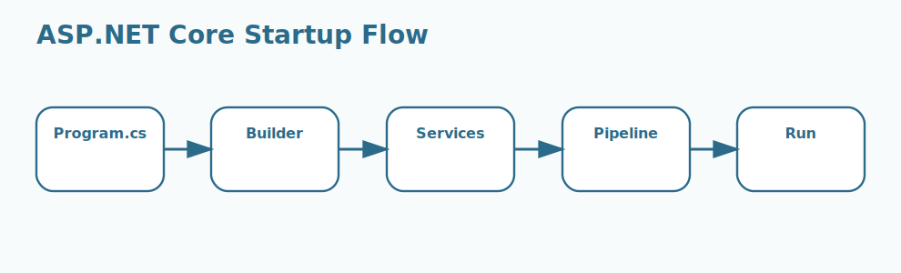

# Program.cs and Startup.cs Lifecycle Interview Questions



This page focuses on how an ASP.NET Core application boots, registers services, builds the pipeline, and starts handling requests.

## 1. Entry point bootstrapping

### 1. What is the role of Entry point bootstrapping in ASP.NET Core startup lifecycle?

**Answer:**

In ASP.NET Core startup lifecycle, the term Entry point bootstrapping refers to the first runtime steps that
begin when the application process starts. It is part of the foundation a candidate should be able
to explain clearly.

**Sample:**

```csharp
// Concept: 1. Entry point bootstrapping
var builder = WebApplication.CreateBuilder(args);
builder.Services.AddControllers();
var app = builder.Build();
app.MapControllers();
app.Run();
```

---

### 2. Why is the concept of Entry point bootstrapping important in ASP.NET Core startup lifecycle?

**Answer:**

This concept matters because it influences the first runtime steps that begin when the
application process starts. Good interview answers connect it to clarity, maintainability,
performance, security, or delivery depending on the situation.

**Sample:**

```csharp
// Concept: 1. Entry point bootstrapping
var builder = WebApplication.CreateBuilder(args);
builder.Services.AddControllers();
var app = builder.Build();
app.MapControllers();
app.Run();
```

---

### 3. When should a team focus on Entry point bootstrapping?

**Answer:**

A team should focus on Entry point bootstrapping when the requirement depends on the first runtime
steps that begin when the application process starts. It becomes especially important when design
decisions, scalability, or debugging depend on that area.

**Sample:**

```csharp
// Concept: 1. Entry point bootstrapping
var builder = WebApplication.CreateBuilder(args);
builder.Services.AddControllers();
var app = builder.Build();
app.MapControllers();
app.Run();
```

---

### 4. How is Entry point bootstrapping applied in practice?

**Answer:**

In practice, Entry point bootstrapping is applied by making the first runtime steps that begin when
the application process starts explicit in the code, runtime setup, or delivery workflow. The exact
shape depends on the application, but the responsibility should stay predictable.

**Sample:**

```csharp
// Concept: 1. Entry point bootstrapping
var builder = WebApplication.CreateBuilder(args);
builder.Services.AddControllers();
var app = builder.Build();
app.MapControllers();
app.Run();
```

---

### 5. What strengths does Entry point bootstrapping bring?

**Answer:**

The strengths of Entry point bootstrapping are better structure, better communication, and better
control over the first runtime steps that begin when the application process starts. It also makes
tradeoffs easier to explain to reviewers, interviewers, and teammates.

**Sample:**

```csharp
// Concept: 1. Entry point bootstrapping
var builder = WebApplication.CreateBuilder(args);
builder.Services.AddControllers();
var app = builder.Build();
app.MapControllers();
app.Run();
```

---

### 6. What tradeoffs come with Entry point bootstrapping?

**Answer:**

The main tradeoff is extra complexity if Entry point bootstrapping is introduced without a real need
or a clear understanding of the first runtime steps that begin when the application process starts.
That usually leads to overengineering, hidden bugs, or confusing architecture.

**Sample:**

```csharp
// Concept: 1. Entry point bootstrapping
var builder = WebApplication.CreateBuilder(args);
builder.Services.AddControllers();
var app = builder.Build();
app.MapControllers();
app.Run();
```

---

### 7. How does Entry point bootstrapping differ from Host builder?

**Answer:**

Entry point bootstrapping is centered on the first runtime steps that begin when the application
process starts, while Host builder is centered on the startup abstraction that assembles
configuration, logging, DI, and hosting behavior. They often work together, but they solve different
parts of the topic.

**Sample:**

```csharp
// Concept: 1. Entry point bootstrapping
var builder = WebApplication.CreateBuilder(args);
builder.Services.AddControllers();
var app = builder.Build();
app.MapControllers();
app.Run();
```

---

### 8. What is a good real-world example of Entry point bootstrapping?

**Answer:**

A strong example is explaining how Entry point bootstrapping affects a real feature, production
issue, migration, or architecture decision involving the first runtime steps that begin when the
application process starts. Interviewers usually care more about the reasoning than the definition
alone.

**Sample:**

```csharp
// Concept: 1. Entry point bootstrapping
var builder = WebApplication.CreateBuilder(args);
builder.Services.AddControllers();
var app = builder.Build();
app.MapControllers();
app.Run();
```

---

### 9. What is a best practice for Entry point bootstrapping?

**Answer:**

A good practice is to keep Entry point bootstrapping aligned with the actual requirement around the
first runtime steps that begin when the application process starts. Teams should document intent,
keep implementation readable, and validate important paths early.

**Sample:**

```csharp
// Concept: 1. Entry point bootstrapping
var builder = WebApplication.CreateBuilder(args);
builder.Services.AddControllers();
var app = builder.Build();
app.MapControllers();
app.Run();
```

---

### 10. What is a common mistake around Entry point bootstrapping?

**Answer:**

A common mistake is naming Entry point bootstrapping without understanding how it affects the first
runtime steps that begin when the application process starts. In real work, that usually appears as
weak design choices, poor debugging, or incomplete explanations.

**Sample:**

```csharp
// Concept: 1. Entry point bootstrapping
var builder = WebApplication.CreateBuilder(args);
builder.Services.AddControllers();
var app = builder.Build();
app.MapControllers();
app.Run();
```

---

### 11. How do you troubleshoot Entry point bootstrapping-related issues?

**Answer:**

When troubleshooting Entry point bootstrapping, first verify whether the first runtime steps that
begin when the application process starts is behaving as expected. Then check surrounding
dependencies, configuration, logs, runtime behavior, and edge cases before changing the design.

**Sample:**

```csharp
// Concept: 1. Entry point bootstrapping
var builder = WebApplication.CreateBuilder(args);
builder.Services.AddControllers();
var app = builder.Build();
app.MapControllers();
app.Run();
```

---

### 12. How does Entry point bootstrapping connect to the rest of ASP.NET Core startup lifecycle?

**Answer:**

Entry point bootstrapping connects to the rest of ASP.NET Core startup lifecycle by giving structure
to the first runtime steps that begin when the application process starts. It is one of the pieces
that turns isolated facts into a coherent end-to-end explanation.

**Sample:**

```csharp
// Concept: 1. Entry point bootstrapping
var builder = WebApplication.CreateBuilder(args);
builder.Services.AddControllers();
var app = builder.Build();
app.MapControllers();
app.Run();
```

---

## 2. Host builder

### 13. What is the role of Host builder in ASP.NET Core startup lifecycle?

**Answer:**

In ASP.NET Core startup lifecycle, the term Host builder refers to the startup abstraction that assembles
configuration, logging, DI, and hosting behavior. It is part of the foundation a candidate should be
able to explain clearly.

**Sample:**

```csharp
// Concept: 2. Host builder
var builder = WebApplication.CreateBuilder(args);
builder.Services.AddControllers();
var app = builder.Build();
app.MapControllers();
app.Run();
```

---

### 14. Why is the concept of Host builder important in ASP.NET Core startup lifecycle?

**Answer:**

This concept matters because it influences the startup abstraction that assembles configuration,
logging, DI, and hosting behavior. Good interview answers connect it to clarity, maintainability,
performance, security, or delivery depending on the situation.

**Sample:**

```csharp
// Concept: 2. Host builder
var builder = WebApplication.CreateBuilder(args);
builder.Services.AddControllers();
var app = builder.Build();
app.MapControllers();
app.Run();
```

---

### 15. When should a team focus on Host builder?

**Answer:**

A team should focus on Host builder when the requirement depends on the startup abstraction that
assembles configuration, logging, DI, and hosting behavior. It becomes especially important when
design decisions, scalability, or debugging depend on that area.

**Sample:**

```csharp
// Concept: 2. Host builder
var builder = WebApplication.CreateBuilder(args);
builder.Services.AddControllers();
var app = builder.Build();
app.MapControllers();
app.Run();
```

---

### 16. How is Host builder applied in practice?

**Answer:**

In practice, Host builder is applied by making the startup abstraction that assembles configuration,
logging, DI, and hosting behavior explicit in the code, runtime setup, or delivery workflow. The
exact shape depends on the application, but the responsibility should stay predictable.

**Sample:**

```csharp
// Concept: 2. Host builder
var builder = WebApplication.CreateBuilder(args);
builder.Services.AddControllers();
var app = builder.Build();
app.MapControllers();
app.Run();
```

---

### 17. What strengths does Host builder bring?

**Answer:**

The strengths of Host builder are better structure, better communication, and better control over
the startup abstraction that assembles configuration, logging, DI, and hosting behavior. It also
makes tradeoffs easier to explain to reviewers, interviewers, and teammates.

**Sample:**

```csharp
// Concept: 2. Host builder
var builder = WebApplication.CreateBuilder(args);
builder.Services.AddControllers();
var app = builder.Build();
app.MapControllers();
app.Run();
```

---

### 18. What tradeoffs come with Host builder?

**Answer:**

The main tradeoff is extra complexity if Host builder is introduced without a real need or a clear
understanding of the startup abstraction that assembles configuration, logging, DI, and hosting
behavior. That usually leads to overengineering, hidden bugs, or confusing architecture.

**Sample:**

```csharp
// Concept: 2. Host builder
var builder = WebApplication.CreateBuilder(args);
builder.Services.AddControllers();
var app = builder.Build();
app.MapControllers();
app.Run();
```

---

### 19. How does Host builder differ from Configuration loading?

**Answer:**

Host builder is centered on the startup abstraction that assembles configuration, logging, DI, and
hosting behavior, while Configuration loading is centered on the early startup work that gathers
settings from configured providers. They often work together, but they solve different parts of the
topic.

**Sample:**

```csharp
// Concept: 2. Host builder
var builder = WebApplication.CreateBuilder(args);
builder.Services.AddControllers();
var app = builder.Build();
app.MapControllers();
app.Run();
```

---

### 20. What is a good real-world example of Host builder?

**Answer:**

A strong example is explaining how Host builder affects a real feature, production issue, migration,
or architecture decision involving the startup abstraction that assembles configuration, logging,
DI, and hosting behavior. Interviewers usually care more about the reasoning than the definition
alone.

**Sample:**

```csharp
// Concept: 2. Host builder
var builder = WebApplication.CreateBuilder(args);
builder.Services.AddControllers();
var app = builder.Build();
app.MapControllers();
app.Run();
```

---

### 21. What is a best practice for Host builder?

**Answer:**

A good practice is to keep Host builder aligned with the actual requirement around the startup
abstraction that assembles configuration, logging, DI, and hosting behavior. Teams should document
intent, keep implementation readable, and validate important paths early.

**Sample:**

```csharp
// Concept: 2. Host builder
var builder = WebApplication.CreateBuilder(args);
builder.Services.AddControllers();
var app = builder.Build();
app.MapControllers();
app.Run();
```

---

### 22. What is a common mistake around Host builder?

**Answer:**

A common mistake is naming Host builder without understanding how it affects the startup abstraction
that assembles configuration, logging, DI, and hosting behavior. In real work, that usually appears
as weak design choices, poor debugging, or incomplete explanations.

**Sample:**

```csharp
// Concept: 2. Host builder
var builder = WebApplication.CreateBuilder(args);
builder.Services.AddControllers();
var app = builder.Build();
app.MapControllers();
app.Run();
```

---

### 23. How do you troubleshoot Host builder-related issues?

**Answer:**

When troubleshooting Host builder, first verify whether the startup abstraction that assembles
configuration, logging, DI, and hosting behavior is behaving as expected. Then check surrounding
dependencies, configuration, logs, runtime behavior, and edge cases before changing the design.

**Sample:**

```csharp
// Concept: 2. Host builder
var builder = WebApplication.CreateBuilder(args);
builder.Services.AddControllers();
var app = builder.Build();
app.MapControllers();
app.Run();
```

---

### 24. How does Host builder connect to the rest of ASP.NET Core startup lifecycle?

**Answer:**

Host builder connects to the rest of ASP.NET Core startup lifecycle by giving structure to the
startup abstraction that assembles configuration, logging, DI, and hosting behavior. It is one of
the pieces that turns isolated facts into a coherent end-to-end explanation.

**Sample:**

```csharp
// Concept: 2. Host builder
var builder = WebApplication.CreateBuilder(args);
builder.Services.AddControllers();
var app = builder.Build();
app.MapControllers();
app.Run();
```

---

## 3. Configuration loading

### 25. What is the role of Configuration loading in ASP.NET Core startup lifecycle?

**Answer:**

In ASP.NET Core startup lifecycle, the term Configuration loading refers to the early startup work that
gathers settings from configured providers. It is part of the foundation a candidate should be able
to explain clearly.

**Sample:**

```csharp
// Concept: 3. Configuration loading
var builder = WebApplication.CreateBuilder(args);
builder.Services.AddControllers();
var app = builder.Build();
app.MapControllers();
app.Run();
```

---

### 26. Why is the concept of Configuration loading important in ASP.NET Core startup lifecycle?

**Answer:**

This concept matters because it influences the early startup work that gathers settings
from configured providers. Good interview answers connect it to clarity, maintainability,
performance, security, or delivery depending on the situation.

**Sample:**

```csharp
// Concept: 3. Configuration loading
var builder = WebApplication.CreateBuilder(args);
builder.Services.AddControllers();
var app = builder.Build();
app.MapControllers();
app.Run();
```

---

### 27. When should a team focus on Configuration loading?

**Answer:**

A team should focus on Configuration loading when the requirement depends on the early startup work
that gathers settings from configured providers. It becomes especially important when design
decisions, scalability, or debugging depend on that area.

**Sample:**

```csharp
// Concept: 3. Configuration loading
var builder = WebApplication.CreateBuilder(args);
builder.Services.AddControllers();
var app = builder.Build();
app.MapControllers();
app.Run();
```

---

### 28. How is Configuration loading applied in practice?

**Answer:**

In practice, Configuration loading is applied by making the early startup work that gathers settings
from configured providers explicit in the code, runtime setup, or delivery workflow. The exact shape
depends on the application, but the responsibility should stay predictable.

**Sample:**

```csharp
// Concept: 3. Configuration loading
var builder = WebApplication.CreateBuilder(args);
builder.Services.AddControllers();
var app = builder.Build();
app.MapControllers();
app.Run();
```

---

### 29. What strengths does Configuration loading bring?

**Answer:**

The strengths of Configuration loading are better structure, better communication, and better
control over the early startup work that gathers settings from configured providers. It also makes
tradeoffs easier to explain to reviewers, interviewers, and teammates.

**Sample:**

```csharp
// Concept: 3. Configuration loading
var builder = WebApplication.CreateBuilder(args);
builder.Services.AddControllers();
var app = builder.Build();
app.MapControllers();
app.Run();
```

---

### 30. What tradeoffs come with Configuration loading?

**Answer:**

The main tradeoff is extra complexity if Configuration loading is introduced without a real need or
a clear understanding of the early startup work that gathers settings from configured providers.
That usually leads to overengineering, hidden bugs, or confusing architecture.

**Sample:**

```csharp
// Concept: 3. Configuration loading
var builder = WebApplication.CreateBuilder(args);
builder.Services.AddControllers();
var app = builder.Build();
app.MapControllers();
app.Run();
```

---

### 31. How does Configuration loading differ from Service registration phase?

**Answer:**

Configuration loading is centered on the early startup work that gathers settings from configured
providers, while Service registration phase is centered on the startup stage where framework and
application dependencies are added. They often work together, but they solve different parts of the
topic.

**Sample:**

```csharp
// Concept: 3. Configuration loading
var builder = WebApplication.CreateBuilder(args);
builder.Services.AddControllers();
var app = builder.Build();
app.MapControllers();
app.Run();
```

---

### 32. What is a good real-world example of Configuration loading?

**Answer:**

A strong example is explaining how Configuration loading affects a real feature, production issue,
migration, or architecture decision involving the early startup work that gathers settings from
configured providers. Interviewers usually care more about the reasoning than the definition alone.

**Sample:**

```csharp
// Concept: 3. Configuration loading
var builder = WebApplication.CreateBuilder(args);
builder.Services.AddControllers();
var app = builder.Build();
app.MapControllers();
app.Run();
```

---

### 33. What is a best practice for Configuration loading?

**Answer:**

A good practice is to keep Configuration loading aligned with the actual requirement around the
early startup work that gathers settings from configured providers. Teams should document intent,
keep implementation readable, and validate important paths early.

**Sample:**

```csharp
// Concept: 3. Configuration loading
var builder = WebApplication.CreateBuilder(args);
builder.Services.AddControllers();
var app = builder.Build();
app.MapControllers();
app.Run();
```

---

### 34. What is a common mistake around Configuration loading?

**Answer:**

A common mistake is naming Configuration loading without understanding how it affects the early
startup work that gathers settings from configured providers. In real work, that usually appears as
weak design choices, poor debugging, or incomplete explanations.

**Sample:**

```csharp
// Concept: 3. Configuration loading
var builder = WebApplication.CreateBuilder(args);
builder.Services.AddControllers();
var app = builder.Build();
app.MapControllers();
app.Run();
```

---

### 35. How do you troubleshoot Configuration loading-related issues?

**Answer:**

When troubleshooting Configuration loading, first verify whether the early startup work that gathers
settings from configured providers is behaving as expected. Then check surrounding dependencies,
configuration, logs, runtime behavior, and edge cases before changing the design.

**Sample:**

```csharp
// Concept: 3. Configuration loading
var builder = WebApplication.CreateBuilder(args);
builder.Services.AddControllers();
var app = builder.Build();
app.MapControllers();
app.Run();
```

---

### 36. How does Configuration loading connect to the rest of ASP.NET Core startup lifecycle?

**Answer:**

Configuration loading connects to the rest of ASP.NET Core startup lifecycle by giving structure to
the early startup work that gathers settings from configured providers. It is one of the pieces that
turns isolated facts into a coherent end-to-end explanation.

**Sample:**

```csharp
// Concept: 3. Configuration loading
var builder = WebApplication.CreateBuilder(args);
builder.Services.AddControllers();
var app = builder.Build();
app.MapControllers();
app.Run();
```

---

## 4. Service registration phase

### 37. What is the role of Service registration phase in ASP.NET Core startup lifecycle?

**Answer:**

In ASP.NET Core startup lifecycle, the term Service registration phase refers to the startup stage where
framework and application dependencies are added. It is part of the foundation a candidate should be
able to explain clearly.

**Sample:**

```csharp
// Concept: 4. Service registration phase
var builder = WebApplication.CreateBuilder(args);
builder.Services.AddControllers();
var app = builder.Build();
app.MapControllers();
app.Run();
```

---

### 38. Why is the concept of Service registration phase important in ASP.NET Core startup lifecycle?

**Answer:**

This concept matters because it influences the startup stage where framework and
application dependencies are added. Good interview answers connect it to clarity, maintainability,
performance, security, or delivery depending on the situation.

**Sample:**

```csharp
// Concept: 4. Service registration phase
var builder = WebApplication.CreateBuilder(args);
builder.Services.AddControllers();
var app = builder.Build();
app.MapControllers();
app.Run();
```

---

### 39. When should a team focus on Service registration phase?

**Answer:**

A team should focus on Service registration phase when the requirement depends on the startup stage
where framework and application dependencies are added. It becomes especially important when design
decisions, scalability, or debugging depend on that area.

**Sample:**

```csharp
// Concept: 4. Service registration phase
var builder = WebApplication.CreateBuilder(args);
builder.Services.AddControllers();
var app = builder.Build();
app.MapControllers();
app.Run();
```

---

### 40. How is Service registration phase applied in practice?

**Answer:**

In practice, Service registration phase is applied by making the startup stage where framework and
application dependencies are added explicit in the code, runtime setup, or delivery workflow. The
exact shape depends on the application, but the responsibility should stay predictable.

**Sample:**

```csharp
// Concept: 4. Service registration phase
var builder = WebApplication.CreateBuilder(args);
builder.Services.AddControllers();
var app = builder.Build();
app.MapControllers();
app.Run();
```

---

### 41. What strengths does Service registration phase bring?

**Answer:**

The strengths of Service registration phase are better structure, better communication, and better
control over the startup stage where framework and application dependencies are added. It also makes
tradeoffs easier to explain to reviewers, interviewers, and teammates.

**Sample:**

```csharp
// Concept: 4. Service registration phase
var builder = WebApplication.CreateBuilder(args);
builder.Services.AddControllers();
var app = builder.Build();
app.MapControllers();
app.Run();
```

---

### 42. What tradeoffs come with Service registration phase?

**Answer:**

The main tradeoff is extra complexity if Service registration phase is introduced without a real
need or a clear understanding of the startup stage where framework and application dependencies are
added. That usually leads to overengineering, hidden bugs, or confusing architecture.

**Sample:**

```csharp
// Concept: 4. Service registration phase
var builder = WebApplication.CreateBuilder(args);
builder.Services.AddControllers();
var app = builder.Build();
app.MapControllers();
app.Run();
```

---

### 43. How does Service registration phase differ from Middleware pipeline construction?

**Answer:**

Service registration phase is centered on the startup stage where framework and application
dependencies are added, while Middleware pipeline construction is centered on the stage where
request handling behavior is composed in order. They often work together, but they solve different
parts of the topic.

**Sample:**

```csharp
// Concept: 4. Service registration phase
var builder = WebApplication.CreateBuilder(args);
builder.Services.AddControllers();
var app = builder.Build();
app.MapControllers();
app.Run();
```

---

### 44. What is a good real-world example of Service registration phase?

**Answer:**

A strong example is explaining how Service registration phase affects a real feature, production
issue, migration, or architecture decision involving the startup stage where framework and
application dependencies are added. Interviewers usually care more about the reasoning than the
definition alone.

**Sample:**

```csharp
// Concept: 4. Service registration phase
var builder = WebApplication.CreateBuilder(args);
builder.Services.AddControllers();
var app = builder.Build();
app.MapControllers();
app.Run();
```

---

### 45. What is a best practice for Service registration phase?

**Answer:**

A good practice is to keep Service registration phase aligned with the actual requirement around the
startup stage where framework and application dependencies are added. Teams should document intent,
keep implementation readable, and validate important paths early.

**Sample:**

```csharp
// Concept: 4. Service registration phase
var builder = WebApplication.CreateBuilder(args);
builder.Services.AddControllers();
var app = builder.Build();
app.MapControllers();
app.Run();
```

---

### 46. What is a common mistake around Service registration phase?

**Answer:**

A common mistake is naming Service registration phase without understanding how it affects the
startup stage where framework and application dependencies are added. In real work, that usually
appears as weak design choices, poor debugging, or incomplete explanations.

**Sample:**

```csharp
// Concept: 4. Service registration phase
var builder = WebApplication.CreateBuilder(args);
builder.Services.AddControllers();
var app = builder.Build();
app.MapControllers();
app.Run();
```

---

### 47. How do you troubleshoot Service registration phase-related issues?

**Answer:**

When troubleshooting Service registration phase, first verify whether the startup stage where
framework and application dependencies are added is behaving as expected. Then check surrounding
dependencies, configuration, logs, runtime behavior, and edge cases before changing the design.

**Sample:**

```csharp
// Concept: 4. Service registration phase
var builder = WebApplication.CreateBuilder(args);
builder.Services.AddControllers();
var app = builder.Build();
app.MapControllers();
app.Run();
```

---

### 48. How does Service registration phase connect to the rest of ASP.NET Core startup lifecycle?

**Answer:**

Service registration phase connects to the rest of ASP.NET Core startup lifecycle by giving
structure to the startup stage where framework and application dependencies are added. It is one of
the pieces that turns isolated facts into a coherent end-to-end explanation.

**Sample:**

```csharp
// Concept: 4. Service registration phase
var builder = WebApplication.CreateBuilder(args);
builder.Services.AddControllers();
var app = builder.Build();
app.MapControllers();
app.Run();
```

---

## 5. Middleware pipeline construction

### 49. What is the role of Middleware pipeline construction in ASP.NET Core startup lifecycle?

**Answer:**

In ASP.NET Core startup lifecycle, the term Middleware pipeline construction refers to the stage where
request handling behavior is composed in order. It is part of the foundation a candidate should be
able to explain clearly.

**Sample:**

```csharp
// Concept: 5. Middleware pipeline construction
var builder = WebApplication.CreateBuilder(args);
builder.Services.AddControllers();
var app = builder.Build();
app.MapControllers();
app.Run();
```

---

### 50. Why is the concept of Middleware pipeline construction important in ASP.NET Core startup lifecycle?

**Answer:**

This concept matters because it influences the stage where request handling
behavior is composed in order. Good interview answers connect it to clarity, maintainability,
performance, security, or delivery depending on the situation.

**Sample:**

```csharp
// Concept: 5. Middleware pipeline construction
var builder = WebApplication.CreateBuilder(args);
builder.Services.AddControllers();
var app = builder.Build();
app.MapControllers();
app.Run();
```

---

### 51. When should a team focus on Middleware pipeline construction?

**Answer:**

A team should focus on Middleware pipeline construction when the requirement depends on the stage
where request handling behavior is composed in order. It becomes especially important when design
decisions, scalability, or debugging depend on that area.

**Sample:**

```csharp
// Concept: 5. Middleware pipeline construction
var builder = WebApplication.CreateBuilder(args);
builder.Services.AddControllers();
var app = builder.Build();
app.MapControllers();
app.Run();
```

---

### 52. How is Middleware pipeline construction applied in practice?

**Answer:**

In practice, Middleware pipeline construction is applied by making the stage where request handling
behavior is composed in order explicit in the code, runtime setup, or delivery workflow. The exact
shape depends on the application, but the responsibility should stay predictable.

**Sample:**

```csharp
// Concept: 5. Middleware pipeline construction
var builder = WebApplication.CreateBuilder(args);
builder.Services.AddControllers();
var app = builder.Build();
app.MapControllers();
app.Run();
```

---

### 53. What strengths does Middleware pipeline construction bring?

**Answer:**

The strengths of Middleware pipeline construction are better structure, better communication, and
better control over the stage where request handling behavior is composed in order. It also makes
tradeoffs easier to explain to reviewers, interviewers, and teammates.

**Sample:**

```csharp
// Concept: 5. Middleware pipeline construction
var builder = WebApplication.CreateBuilder(args);
builder.Services.AddControllers();
var app = builder.Build();
app.MapControllers();
app.Run();
```

---

### 54. What tradeoffs come with Middleware pipeline construction?

**Answer:**

The main tradeoff is extra complexity if Middleware pipeline construction is introduced without a
real need or a clear understanding of the stage where request handling behavior is composed in
order. That usually leads to overengineering, hidden bugs, or confusing architecture.

**Sample:**

```csharp
// Concept: 5. Middleware pipeline construction
var builder = WebApplication.CreateBuilder(args);
builder.Services.AddControllers();
var app = builder.Build();
app.MapControllers();
app.Run();
```

---

### 55. How does Middleware pipeline construction differ from Request pipeline startup?

**Answer:**

Middleware pipeline construction is centered on the stage where request handling behavior is
composed in order, while Request pipeline startup is centered on the transition from app building to
actively listening for requests. They often work together, but they solve different parts of the
topic.

**Sample:**

```csharp
// Concept: 5. Middleware pipeline construction
var builder = WebApplication.CreateBuilder(args);
builder.Services.AddControllers();
var app = builder.Build();
app.MapControllers();
app.Run();
```

---

### 56. What is a good real-world example of Middleware pipeline construction?

**Answer:**

A strong example is explaining how Middleware pipeline construction affects a real feature,
production issue, migration, or architecture decision involving the stage where request handling
behavior is composed in order. Interviewers usually care more about the reasoning than the
definition alone.

**Sample:**

```csharp
// Concept: 5. Middleware pipeline construction
var builder = WebApplication.CreateBuilder(args);
builder.Services.AddControllers();
var app = builder.Build();
app.MapControllers();
app.Run();
```

---

### 57. What is a best practice for Middleware pipeline construction?

**Answer:**

A good practice is to keep Middleware pipeline construction aligned with the actual requirement
around the stage where request handling behavior is composed in order. Teams should document intent,
keep implementation readable, and validate important paths early.

**Sample:**

```csharp
// Concept: 5. Middleware pipeline construction
var builder = WebApplication.CreateBuilder(args);
builder.Services.AddControllers();
var app = builder.Build();
app.MapControllers();
app.Run();
```

---

### 58. What is a common mistake around Middleware pipeline construction?

**Answer:**

A common mistake is naming Middleware pipeline construction without understanding how it affects the
stage where request handling behavior is composed in order. In real work, that usually appears as
weak design choices, poor debugging, or incomplete explanations.

**Sample:**

```csharp
// Concept: 5. Middleware pipeline construction
var builder = WebApplication.CreateBuilder(args);
builder.Services.AddControllers();
var app = builder.Build();
app.MapControllers();
app.Run();
```

---

### 59. How do you troubleshoot Middleware pipeline construction-related issues?

**Answer:**

When troubleshooting Middleware pipeline construction, first verify whether the stage where request
handling behavior is composed in order is behaving as expected. Then check surrounding dependencies,
configuration, logs, runtime behavior, and edge cases before changing the design.

**Sample:**

```csharp
// Concept: 5. Middleware pipeline construction
var builder = WebApplication.CreateBuilder(args);
builder.Services.AddControllers();
var app = builder.Build();
app.MapControllers();
app.Run();
```

---

### 60. How does Middleware pipeline construction connect to the rest of ASP.NET Core startup lifecycle?

**Answer:**

Middleware pipeline construction connects to the rest of ASP.NET Core startup lifecycle by giving
structure to the stage where request handling behavior is composed in order. It is one of the pieces
that turns isolated facts into a coherent end-to-end explanation.

**Sample:**

```csharp
// Concept: 5. Middleware pipeline construction
var builder = WebApplication.CreateBuilder(args);
builder.Services.AddControllers();
var app = builder.Build();
app.MapControllers();
app.Run();
```

---

## 6. Request pipeline startup

### 61. What is the role of Request pipeline startup in ASP.NET Core startup lifecycle?

**Answer:**

In ASP.NET Core startup lifecycle, the term Request pipeline startup refers to the transition from app
building to actively listening for requests. It is part of the foundation a candidate should be able
to explain clearly.

**Sample:**

```csharp
// Concept: 6. Request pipeline startup
var builder = WebApplication.CreateBuilder(args);
builder.Services.AddControllers();
var app = builder.Build();
app.MapControllers();
app.Run();
```

---

### 62. Why is the concept of Request pipeline startup important in ASP.NET Core startup lifecycle?

**Answer:**

This concept matters because it influences the transition from app building to actively
listening for requests. Good interview answers connect it to clarity, maintainability, performance,
security, or delivery depending on the situation.

**Sample:**

```csharp
// Concept: 6. Request pipeline startup
var builder = WebApplication.CreateBuilder(args);
builder.Services.AddControllers();
var app = builder.Build();
app.MapControllers();
app.Run();
```

---

### 63. When should a team focus on Request pipeline startup?

**Answer:**

A team should focus on Request pipeline startup when the requirement depends on the transition from
app building to actively listening for requests. It becomes especially important when design
decisions, scalability, or debugging depend on that area.

**Sample:**

```csharp
// Concept: 6. Request pipeline startup
var builder = WebApplication.CreateBuilder(args);
builder.Services.AddControllers();
var app = builder.Build();
app.MapControllers();
app.Run();
```

---

### 64. How is Request pipeline startup applied in practice?

**Answer:**

In practice, Request pipeline startup is applied by making the transition from app building to
actively listening for requests explicit in the code, runtime setup, or delivery workflow. The exact
shape depends on the application, but the responsibility should stay predictable.

**Sample:**

```csharp
// Concept: 6. Request pipeline startup
var builder = WebApplication.CreateBuilder(args);
builder.Services.AddControllers();
var app = builder.Build();
app.MapControllers();
app.Run();
```

---

### 65. What strengths does Request pipeline startup bring?

**Answer:**

The strengths of Request pipeline startup are better structure, better communication, and better
control over the transition from app building to actively listening for requests. It also makes
tradeoffs easier to explain to reviewers, interviewers, and teammates.

**Sample:**

```csharp
// Concept: 6. Request pipeline startup
var builder = WebApplication.CreateBuilder(args);
builder.Services.AddControllers();
var app = builder.Build();
app.MapControllers();
app.Run();
```

---

### 66. What tradeoffs come with Request pipeline startup?

**Answer:**

The main tradeoff is extra complexity if Request pipeline startup is introduced without a real need
or a clear understanding of the transition from app building to actively listening for requests.
That usually leads to overengineering, hidden bugs, or confusing architecture.

**Sample:**

```csharp
// Concept: 6. Request pipeline startup
var builder = WebApplication.CreateBuilder(args);
builder.Services.AddControllers();
var app = builder.Build();
app.MapControllers();
app.Run();
```

---

### 67. How does Request pipeline startup differ from Logging initialization?

**Answer:**

Request pipeline startup is centered on the transition from app building to actively listening for
requests, while Logging initialization is centered on the process that prepares diagnostic output
during startup and runtime. They often work together, but they solve different parts of the topic.

**Sample:**

```csharp
// Concept: 6. Request pipeline startup
var builder = WebApplication.CreateBuilder(args);
builder.Services.AddControllers();
var app = builder.Build();
app.MapControllers();
app.Run();
```

---

### 68. What is a good real-world example of Request pipeline startup?

**Answer:**

A strong example is explaining how Request pipeline startup affects a real feature, production
issue, migration, or architecture decision involving the transition from app building to actively
listening for requests. Interviewers usually care more about the reasoning than the definition
alone.

**Sample:**

```csharp
// Concept: 6. Request pipeline startup
var builder = WebApplication.CreateBuilder(args);
builder.Services.AddControllers();
var app = builder.Build();
app.MapControllers();
app.Run();
```

---

### 69. What is a best practice for Request pipeline startup?

**Answer:**

A good practice is to keep Request pipeline startup aligned with the actual requirement around the
transition from app building to actively listening for requests. Teams should document intent, keep
implementation readable, and validate important paths early.

**Sample:**

```csharp
// Concept: 6. Request pipeline startup
var builder = WebApplication.CreateBuilder(args);
builder.Services.AddControllers();
var app = builder.Build();
app.MapControllers();
app.Run();
```

---

### 70. What is a common mistake around Request pipeline startup?

**Answer:**

A common mistake is naming Request pipeline startup without understanding how it affects the
transition from app building to actively listening for requests. In real work, that usually appears
as weak design choices, poor debugging, or incomplete explanations.

**Sample:**

```csharp
// Concept: 6. Request pipeline startup
var builder = WebApplication.CreateBuilder(args);
builder.Services.AddControllers();
var app = builder.Build();
app.MapControllers();
app.Run();
```

---

### 71. How do you troubleshoot Request pipeline startup-related issues?

**Answer:**

When troubleshooting Request pipeline startup, first verify whether the transition from app building
to actively listening for requests is behaving as expected. Then check surrounding dependencies,
configuration, logs, runtime behavior, and edge cases before changing the design.

**Sample:**

```csharp
// Concept: 6. Request pipeline startup
var builder = WebApplication.CreateBuilder(args);
builder.Services.AddControllers();
var app = builder.Build();
app.MapControllers();
app.Run();
```

---

### 72. How does Request pipeline startup connect to the rest of ASP.NET Core startup lifecycle?

**Answer:**

Request pipeline startup connects to the rest of ASP.NET Core startup lifecycle by giving structure
to the transition from app building to actively listening for requests. It is one of the pieces that
turns isolated facts into a coherent end-to-end explanation.

**Sample:**

```csharp
// Concept: 6. Request pipeline startup
var builder = WebApplication.CreateBuilder(args);
builder.Services.AddControllers();
var app = builder.Build();
app.MapControllers();
app.Run();
```

---

## 7. Logging initialization

### 73. What is the role of Logging initialization in ASP.NET Core startup lifecycle?

**Answer:**

In ASP.NET Core startup lifecycle, the term Logging initialization refers to the process that prepares
diagnostic output during startup and runtime. It is part of the foundation a candidate should be
able to explain clearly.

**Sample:**

```csharp
// Concept: 7. Logging initialization
var builder = WebApplication.CreateBuilder(args);
builder.Services.AddControllers();
var app = builder.Build();
app.MapControllers();
app.Run();
```

---

### 74. Why is the concept of Logging initialization important in ASP.NET Core startup lifecycle?

**Answer:**

This concept matters because it influences the process that prepares diagnostic output
during startup and runtime. Good interview answers connect it to clarity, maintainability,
performance, security, or delivery depending on the situation.

**Sample:**

```csharp
// Concept: 7. Logging initialization
var builder = WebApplication.CreateBuilder(args);
builder.Services.AddControllers();
var app = builder.Build();
app.MapControllers();
app.Run();
```

---

### 75. When should a team focus on Logging initialization?

**Answer:**

A team should focus on Logging initialization when the requirement depends on the process that
prepares diagnostic output during startup and runtime. It becomes especially important when design
decisions, scalability, or debugging depend on that area.

**Sample:**

```csharp
// Concept: 7. Logging initialization
var builder = WebApplication.CreateBuilder(args);
builder.Services.AddControllers();
var app = builder.Build();
app.MapControllers();
app.Run();
```

---

### 76. How is Logging initialization applied in practice?

**Answer:**

In practice, Logging initialization is applied by making the process that prepares diagnostic output
during startup and runtime explicit in the code, runtime setup, or delivery workflow. The exact
shape depends on the application, but the responsibility should stay predictable.

**Sample:**

```csharp
// Concept: 7. Logging initialization
var builder = WebApplication.CreateBuilder(args);
builder.Services.AddControllers();
var app = builder.Build();
app.MapControllers();
app.Run();
```

---

### 77. What strengths does Logging initialization bring?

**Answer:**

The strengths of Logging initialization are better structure, better communication, and better
control over the process that prepares diagnostic output during startup and runtime. It also makes
tradeoffs easier to explain to reviewers, interviewers, and teammates.

**Sample:**

```csharp
// Concept: 7. Logging initialization
var builder = WebApplication.CreateBuilder(args);
builder.Services.AddControllers();
var app = builder.Build();
app.MapControllers();
app.Run();
```

---

### 78. What tradeoffs come with Logging initialization?

**Answer:**

The main tradeoff is extra complexity if Logging initialization is introduced without a real need or
a clear understanding of the process that prepares diagnostic output during startup and runtime.
That usually leads to overengineering, hidden bugs, or confusing architecture.

**Sample:**

```csharp
// Concept: 7. Logging initialization
var builder = WebApplication.CreateBuilder(args);
builder.Services.AddControllers();
var app = builder.Build();
app.MapControllers();
app.Run();
```

---

### 79. How does Logging initialization differ from Minimal hosting model?

**Answer:**

Logging initialization is centered on the process that prepares diagnostic output during startup and
runtime, while Minimal hosting model is centered on the newer ASP.NET Core startup style that places
more configuration directly in Program.cs. They often work together, but they solve different parts
of the topic.

**Sample:**

```csharp
// Concept: 7. Logging initialization
var builder = WebApplication.CreateBuilder(args);
builder.Services.AddControllers();
var app = builder.Build();
app.MapControllers();
app.Run();
```

---

### 80. What is a good real-world example of Logging initialization?

**Answer:**

A strong example is explaining how Logging initialization affects a real feature, production issue,
migration, or architecture decision involving the process that prepares diagnostic output during
startup and runtime. Interviewers usually care more about the reasoning than the definition alone.

**Sample:**

```csharp
// Concept: 7. Logging initialization
var builder = WebApplication.CreateBuilder(args);
builder.Services.AddControllers();
var app = builder.Build();
app.MapControllers();
app.Run();
```

---

### 81. What is a best practice for Logging initialization?

**Answer:**

A good practice is to keep Logging initialization aligned with the actual requirement around the
process that prepares diagnostic output during startup and runtime. Teams should document intent,
keep implementation readable, and validate important paths early.

**Sample:**

```csharp
// Concept: 7. Logging initialization
var builder = WebApplication.CreateBuilder(args);
builder.Services.AddControllers();
var app = builder.Build();
app.MapControllers();
app.Run();
```

---

### 82. What is a common mistake around Logging initialization?

**Answer:**

A common mistake is naming Logging initialization without understanding how it affects the process
that prepares diagnostic output during startup and runtime. In real work, that usually appears as
weak design choices, poor debugging, or incomplete explanations.

**Sample:**

```csharp
// Concept: 7. Logging initialization
var builder = WebApplication.CreateBuilder(args);
builder.Services.AddControllers();
var app = builder.Build();
app.MapControllers();
app.Run();
```

---

### 83. How do you troubleshoot Logging initialization-related issues?

**Answer:**

When troubleshooting Logging initialization, first verify whether the process that prepares
diagnostic output during startup and runtime is behaving as expected. Then check surrounding
dependencies, configuration, logs, runtime behavior, and edge cases before changing the design.

**Sample:**

```csharp
// Concept: 7. Logging initialization
var builder = WebApplication.CreateBuilder(args);
builder.Services.AddControllers();
var app = builder.Build();
app.MapControllers();
app.Run();
```

---

### 84. How does Logging initialization connect to the rest of ASP.NET Core startup lifecycle?

**Answer:**

Logging initialization connects to the rest of ASP.NET Core startup lifecycle by giving structure to
the process that prepares diagnostic output during startup and runtime. It is one of the pieces that
turns isolated facts into a coherent end-to-end explanation.

**Sample:**

```csharp
// Concept: 7. Logging initialization
var builder = WebApplication.CreateBuilder(args);
builder.Services.AddControllers();
var app = builder.Build();
app.MapControllers();
app.Run();
```

---

## 8. Minimal hosting model

### 85. What is the role of Minimal hosting model in ASP.NET Core startup lifecycle?

**Answer:**

In ASP.NET Core startup lifecycle, the term Minimal hosting model refers to the newer ASP.NET Core startup
style that places more configuration directly in Program.cs. It is part of the foundation a
candidate should be able to explain clearly.

**Sample:**

```csharp
// Concept: 8. Minimal hosting model
var builder = WebApplication.CreateBuilder(args);
builder.Services.AddControllers();
var app = builder.Build();
app.MapControllers();
app.Run();
```

---

### 86. Why is the concept of Minimal hosting model important in ASP.NET Core startup lifecycle?

**Answer:**

This concept matters because it influences the newer ASP.NET Core startup style that places
more configuration directly in Program.cs. Good interview answers connect it to clarity,
maintainability, performance, security, or delivery depending on the situation.

**Sample:**

```csharp
// Concept: 8. Minimal hosting model
var builder = WebApplication.CreateBuilder(args);
builder.Services.AddControllers();
var app = builder.Build();
app.MapControllers();
app.Run();
```

---

### 87. When should a team focus on Minimal hosting model?

**Answer:**

A team should focus on Minimal hosting model when the requirement depends on the newer ASP.NET Core
startup style that places more configuration directly in Program.cs. It becomes especially important
when design decisions, scalability, or debugging depend on that area.

**Sample:**

```csharp
// Concept: 8. Minimal hosting model
var builder = WebApplication.CreateBuilder(args);
builder.Services.AddControllers();
var app = builder.Build();
app.MapControllers();
app.Run();
```

---

### 88. How is Minimal hosting model applied in practice?

**Answer:**

In practice, Minimal hosting model is applied by making the newer ASP.NET Core startup style that
places more configuration directly in Program.cs explicit in the code, runtime setup, or delivery
workflow. The exact shape depends on the application, but the responsibility should stay
predictable.

**Sample:**

```csharp
// Concept: 8. Minimal hosting model
var builder = WebApplication.CreateBuilder(args);
builder.Services.AddControllers();
var app = builder.Build();
app.MapControllers();
app.Run();
```

---

### 89. What strengths does Minimal hosting model bring?

**Answer:**

The strengths of Minimal hosting model are better structure, better communication, and better
control over the newer ASP.NET Core startup style that places more configuration directly in
Program.cs. It also makes tradeoffs easier to explain to reviewers, interviewers, and teammates.

**Sample:**

```csharp
// Concept: 8. Minimal hosting model
var builder = WebApplication.CreateBuilder(args);
builder.Services.AddControllers();
var app = builder.Build();
app.MapControllers();
app.Run();
```

---

### 90. What tradeoffs come with Minimal hosting model?

**Answer:**

The main tradeoff is extra complexity if Minimal hosting model is introduced without a real need or
a clear understanding of the newer ASP.NET Core startup style that places more configuration
directly in Program.cs. That usually leads to overengineering, hidden bugs, or confusing
architecture.

**Sample:**

```csharp
// Concept: 8. Minimal hosting model
var builder = WebApplication.CreateBuilder(args);
builder.Services.AddControllers();
var app = builder.Build();
app.MapControllers();
app.Run();
```

---

### 91. How does Minimal hosting model differ from Startup order?

**Answer:**

Minimal hosting model is centered on the newer ASP.NET Core startup style that places more
configuration directly in Program.cs, while Startup order is centered on the sequence dependencies
that make some startup decisions sensitive to placement. They often work together, but they solve
different parts of the topic.

**Sample:**

```csharp
// Concept: 8. Minimal hosting model
var builder = WebApplication.CreateBuilder(args);
builder.Services.AddControllers();
var app = builder.Build();
app.MapControllers();
app.Run();
```

---

### 92. What is a good real-world example of Minimal hosting model?

**Answer:**

A strong example is explaining how Minimal hosting model affects a real feature, production issue,
migration, or architecture decision involving the newer ASP.NET Core startup style that places more
configuration directly in Program.cs. Interviewers usually care more about the reasoning than the
definition alone.

**Sample:**

```csharp
// Concept: 8. Minimal hosting model
var builder = WebApplication.CreateBuilder(args);
builder.Services.AddControllers();
var app = builder.Build();
app.MapControllers();
app.Run();
```

---

### 93. What is a best practice for Minimal hosting model?

**Answer:**

A good practice is to keep Minimal hosting model aligned with the actual requirement around the
newer ASP.NET Core startup style that places more configuration directly in Program.cs. Teams should
document intent, keep implementation readable, and validate important paths early.

**Sample:**

```csharp
// Concept: 8. Minimal hosting model
var builder = WebApplication.CreateBuilder(args);
builder.Services.AddControllers();
var app = builder.Build();
app.MapControllers();
app.Run();
```

---

### 94. What is a common mistake around Minimal hosting model?

**Answer:**

A common mistake is naming Minimal hosting model without understanding how it affects the newer
ASP.NET Core startup style that places more configuration directly in Program.cs. In real work, that
usually appears as weak design choices, poor debugging, or incomplete explanations.

**Sample:**

```csharp
// Concept: 8. Minimal hosting model
var builder = WebApplication.CreateBuilder(args);
builder.Services.AddControllers();
var app = builder.Build();
app.MapControllers();
app.Run();
```

---

### 95. How do you troubleshoot Minimal hosting model-related issues?

**Answer:**

When troubleshooting Minimal hosting model, first verify whether the newer ASP.NET Core startup
style that places more configuration directly in Program.cs is behaving as expected. Then check
surrounding dependencies, configuration, logs, runtime behavior, and edge cases before changing the
design.

**Sample:**

```csharp
// Concept: 8. Minimal hosting model
var builder = WebApplication.CreateBuilder(args);
builder.Services.AddControllers();
var app = builder.Build();
app.MapControllers();
app.Run();
```

---

### 96. How does Minimal hosting model connect to the rest of ASP.NET Core startup lifecycle?

**Answer:**

Minimal hosting model connects to the rest of ASP.NET Core startup lifecycle by giving structure to
the newer ASP.NET Core startup style that places more configuration directly in Program.cs. It is
one of the pieces that turns isolated facts into a coherent end-to-end explanation.

**Sample:**

```csharp
// Concept: 8. Minimal hosting model
var builder = WebApplication.CreateBuilder(args);
builder.Services.AddControllers();
var app = builder.Build();
app.MapControllers();
app.Run();
```

---

## 9. Startup order

### 97. What is the role of Startup order in ASP.NET Core startup lifecycle?

**Answer:**

In ASP.NET Core startup lifecycle, the term Startup order refers to the sequence dependencies that make some
startup decisions sensitive to placement. It is part of the foundation a candidate should be able to
explain clearly.

**Sample:**

```csharp
// Concept: 9. Startup order
var builder = WebApplication.CreateBuilder(args);
builder.Services.AddControllers();
var app = builder.Build();
app.MapControllers();
app.Run();
```

---

### 98. Why is the concept of Startup order important in ASP.NET Core startup lifecycle?

**Answer:**

This concept matters because it influences the sequence dependencies that make some startup
decisions sensitive to placement. Good interview answers connect it to clarity, maintainability,
performance, security, or delivery depending on the situation.

**Sample:**

```csharp
// Concept: 9. Startup order
var builder = WebApplication.CreateBuilder(args);
builder.Services.AddControllers();
var app = builder.Build();
app.MapControllers();
app.Run();
```

---

### 99. When should a team focus on Startup order?

**Answer:**

A team should focus on Startup order when the requirement depends on the sequence dependencies that
make some startup decisions sensitive to placement. It becomes especially important when design
decisions, scalability, or debugging depend on that area.

**Sample:**

```csharp
// Concept: 9. Startup order
var builder = WebApplication.CreateBuilder(args);
builder.Services.AddControllers();
var app = builder.Build();
app.MapControllers();
app.Run();
```

---

### 100. How is Startup order applied in practice?

**Answer:**

In practice, Startup order is applied by making the sequence dependencies that make some startup
decisions sensitive to placement explicit in the code, runtime setup, or delivery workflow. The
exact shape depends on the application, but the responsibility should stay predictable.

**Sample:**

```csharp
// Concept: 9. Startup order
var builder = WebApplication.CreateBuilder(args);
builder.Services.AddControllers();
var app = builder.Build();
app.MapControllers();
app.Run();
```

---

### 101. What strengths does Startup order bring?

**Answer:**

The strengths of Startup order are better structure, better communication, and better control over
the sequence dependencies that make some startup decisions sensitive to placement. It also makes
tradeoffs easier to explain to reviewers, interviewers, and teammates.

**Sample:**

```csharp
// Concept: 9. Startup order
var builder = WebApplication.CreateBuilder(args);
builder.Services.AddControllers();
var app = builder.Build();
app.MapControllers();
app.Run();
```

---

### 102. What tradeoffs come with Startup order?

**Answer:**

The main tradeoff is extra complexity if Startup order is introduced without a real need or a clear
understanding of the sequence dependencies that make some startup decisions sensitive to placement.
That usually leads to overengineering, hidden bugs, or confusing architecture.

**Sample:**

```csharp
// Concept: 9. Startup order
var builder = WebApplication.CreateBuilder(args);
builder.Services.AddControllers();
var app = builder.Build();
app.MapControllers();
app.Run();
```

---

### 103. How does Startup order differ from Shutdown lifecycle?

**Answer:**

Startup order is centered on the sequence dependencies that make some startup decisions sensitive to
placement, while Shutdown lifecycle is centered on the graceful stop behavior used when the
application is terminating. They often work together, but they solve different parts of the topic.

**Sample:**

```csharp
// Concept: 9. Startup order
var builder = WebApplication.CreateBuilder(args);
builder.Services.AddControllers();
var app = builder.Build();
app.MapControllers();
app.Run();
```

---

### 104. What is a good real-world example of Startup order?

**Answer:**

A strong example is explaining how Startup order affects a real feature, production issue,
migration, or architecture decision involving the sequence dependencies that make some startup
decisions sensitive to placement. Interviewers usually care more about the reasoning than the
definition alone.

**Sample:**

```csharp
// Concept: 9. Startup order
var builder = WebApplication.CreateBuilder(args);
builder.Services.AddControllers();
var app = builder.Build();
app.MapControllers();
app.Run();
```

---

### 105. What is a best practice for Startup order?

**Answer:**

A good practice is to keep Startup order aligned with the actual requirement around the sequence
dependencies that make some startup decisions sensitive to placement. Teams should document intent,
keep implementation readable, and validate important paths early.

**Sample:**

```csharp
// Concept: 9. Startup order
var builder = WebApplication.CreateBuilder(args);
builder.Services.AddControllers();
var app = builder.Build();
app.MapControllers();
app.Run();
```

---

### 106. What is a common mistake around Startup order?

**Answer:**

A common mistake is naming Startup order without understanding how it affects the sequence
dependencies that make some startup decisions sensitive to placement. In real work, that usually
appears as weak design choices, poor debugging, or incomplete explanations.

**Sample:**

```csharp
// Concept: 9. Startup order
var builder = WebApplication.CreateBuilder(args);
builder.Services.AddControllers();
var app = builder.Build();
app.MapControllers();
app.Run();
```

---

### 107. How do you troubleshoot Startup order-related issues?

**Answer:**

When troubleshooting Startup order, first verify whether the sequence dependencies that make some
startup decisions sensitive to placement is behaving as expected. Then check surrounding
dependencies, configuration, logs, runtime behavior, and edge cases before changing the design.

**Sample:**

```csharp
// Concept: 9. Startup order
var builder = WebApplication.CreateBuilder(args);
builder.Services.AddControllers();
var app = builder.Build();
app.MapControllers();
app.Run();
```

---

### 108. How does Startup order connect to the rest of ASP.NET Core startup lifecycle?

**Answer:**

Startup order connects to the rest of ASP.NET Core startup lifecycle by giving structure to the
sequence dependencies that make some startup decisions sensitive to placement. It is one of the
pieces that turns isolated facts into a coherent end-to-end explanation.

**Sample:**

```csharp
// Concept: 9. Startup order
var builder = WebApplication.CreateBuilder(args);
builder.Services.AddControllers();
var app = builder.Build();
app.MapControllers();
app.Run();
```

---

## 10. Shutdown lifecycle

### 109. What is the role of Shutdown lifecycle in ASP.NET Core startup lifecycle?

**Answer:**

In ASP.NET Core startup lifecycle, the term Shutdown lifecycle refers to the graceful stop behavior used when
the application is terminating. It is part of the foundation a candidate should be able to explain
clearly.

**Sample:**

```csharp
// Concept: 10. Shutdown lifecycle
var builder = WebApplication.CreateBuilder(args);
builder.Services.AddControllers();
var app = builder.Build();
app.MapControllers();
app.Run();
```

---

### 110. Why is the concept of Shutdown lifecycle important in ASP.NET Core startup lifecycle?

**Answer:**

This concept matters because it influences the graceful stop behavior used when the
application is terminating. Good interview answers connect it to clarity, maintainability,
performance, security, or delivery depending on the situation.

**Sample:**

```csharp
// Concept: 10. Shutdown lifecycle
var builder = WebApplication.CreateBuilder(args);
builder.Services.AddControllers();
var app = builder.Build();
app.MapControllers();
app.Run();
```

---

### 111. When should a team focus on Shutdown lifecycle?

**Answer:**

A team should focus on Shutdown lifecycle when the requirement depends on the graceful stop behavior
used when the application is terminating. It becomes especially important when design decisions,
scalability, or debugging depend on that area.

**Sample:**

```csharp
// Concept: 10. Shutdown lifecycle
var builder = WebApplication.CreateBuilder(args);
builder.Services.AddControllers();
var app = builder.Build();
app.MapControllers();
app.Run();
```

---

### 112. How is Shutdown lifecycle applied in practice?

**Answer:**

In practice, Shutdown lifecycle is applied by making the graceful stop behavior used when the
application is terminating explicit in the code, runtime setup, or delivery workflow. The exact
shape depends on the application, but the responsibility should stay predictable.

**Sample:**

```csharp
// Concept: 10. Shutdown lifecycle
var builder = WebApplication.CreateBuilder(args);
builder.Services.AddControllers();
var app = builder.Build();
app.MapControllers();
app.Run();
```

---

### 113. What strengths does Shutdown lifecycle bring?

**Answer:**

The strengths of Shutdown lifecycle are better structure, better communication, and better control
over the graceful stop behavior used when the application is terminating. It also makes tradeoffs
easier to explain to reviewers, interviewers, and teammates.

**Sample:**

```csharp
// Concept: 10. Shutdown lifecycle
var builder = WebApplication.CreateBuilder(args);
builder.Services.AddControllers();
var app = builder.Build();
app.MapControllers();
app.Run();
```

---

### 114. What tradeoffs come with Shutdown lifecycle?

**Answer:**

The main tradeoff is extra complexity if Shutdown lifecycle is introduced without a real need or a
clear understanding of the graceful stop behavior used when the application is terminating. That
usually leads to overengineering, hidden bugs, or confusing architecture.

**Sample:**

```csharp
// Concept: 10. Shutdown lifecycle
var builder = WebApplication.CreateBuilder(args);
builder.Services.AddControllers();
var app = builder.Build();
app.MapControllers();
app.Run();
```

---

### 115. How does Shutdown lifecycle differ from Entry point bootstrapping?

**Answer:**

Shutdown lifecycle is centered on the graceful stop behavior used when the application is
terminating, while Entry point bootstrapping is centered on the first runtime steps that begin when
the application process starts. They often work together, but they solve different parts of the
topic.

**Sample:**

```csharp
// Concept: 10. Shutdown lifecycle
var builder = WebApplication.CreateBuilder(args);
builder.Services.AddControllers();
var app = builder.Build();
app.MapControllers();
app.Run();
```

---

### 116. What is a good real-world example of Shutdown lifecycle?

**Answer:**

A strong example is explaining how Shutdown lifecycle affects a real feature, production issue,
migration, or architecture decision involving the graceful stop behavior used when the application
is terminating. Interviewers usually care more about the reasoning than the definition alone.

**Sample:**

```csharp
// Concept: 10. Shutdown lifecycle
var builder = WebApplication.CreateBuilder(args);
builder.Services.AddControllers();
var app = builder.Build();
app.MapControllers();
app.Run();
```

---

### 117. What is a best practice for Shutdown lifecycle?

**Answer:**

A good practice is to keep Shutdown lifecycle aligned with the actual requirement around the
graceful stop behavior used when the application is terminating. Teams should document intent, keep
implementation readable, and validate important paths early.

**Sample:**

```csharp
// Concept: 10. Shutdown lifecycle
var builder = WebApplication.CreateBuilder(args);
builder.Services.AddControllers();
var app = builder.Build();
app.MapControllers();
app.Run();
```

---

### 118. What is a common mistake around Shutdown lifecycle?

**Answer:**

A common mistake is naming Shutdown lifecycle without understanding how it affects the graceful stop
behavior used when the application is terminating. In real work, that usually appears as weak design
choices, poor debugging, or incomplete explanations.

**Sample:**

```csharp
// Concept: 10. Shutdown lifecycle
var builder = WebApplication.CreateBuilder(args);
builder.Services.AddControllers();
var app = builder.Build();
app.MapControllers();
app.Run();
```

---

### 119. How do you troubleshoot Shutdown lifecycle-related issues?

**Answer:**

When troubleshooting Shutdown lifecycle, first verify whether the graceful stop behavior used when
the application is terminating is behaving as expected. Then check surrounding dependencies,
configuration, logs, runtime behavior, and edge cases before changing the design.

**Sample:**

```csharp
// Concept: 10. Shutdown lifecycle
var builder = WebApplication.CreateBuilder(args);
builder.Services.AddControllers();
var app = builder.Build();
app.MapControllers();
app.Run();
```

---

### 120. How does Shutdown lifecycle connect to the rest of ASP.NET Core startup lifecycle?

**Answer:**

Shutdown lifecycle connects to the rest of ASP.NET Core startup lifecycle by giving structure to the
graceful stop behavior used when the application is terminating. It is one of the pieces that turns
isolated facts into a coherent end-to-end explanation.

**Sample:**

```csharp
// Concept: 10. Shutdown lifecycle
var builder = WebApplication.CreateBuilder(args);
builder.Services.AddControllers();
var app = builder.Build();
app.MapControllers();
app.Run();
```
