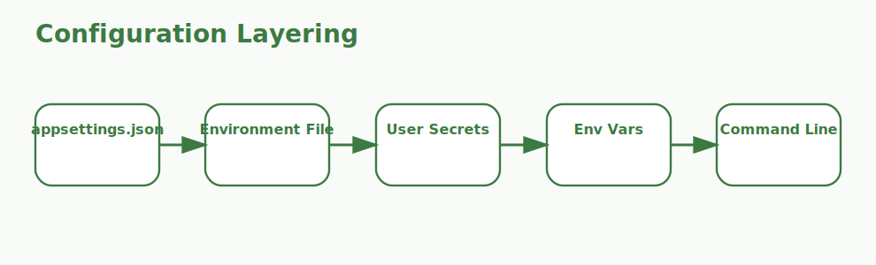

# appsettings.json and secrets.json Interview Questions



This guide explains how ASP.NET Core applications use `appsettings.json`, environment-specific overrides, local secrets, and secure secret-management patterns. It follows the corrected format of **100 interview questions for each subtopic**, and every answer includes a C# code example with rotated production scenarios so the examples do not repeat verbatim.

## How To Use This Page

- Questions 1-100 cover appsettings structure.
- Questions 101-200 cover Connection strings.
- Questions 201-300 cover Nested settings.
- Questions 301-400 cover Environment overrides.
- Questions 401-500 cover User Secrets.
- Questions 501-600 cover Secret managers and vaults.
- Questions 601-700 cover Local versus production configuration.
- Questions 701-800 cover Options binding.
- Questions 801-900 cover Secret rotation.
- Questions 901-1000 cover Common mistakes.

## 1. appsettings structure

### Q1.1 What is base configuration file shape in ASP.NET Core configuration?

**Answer:**

Base configuration file shape matters in ASP.NET Core configuration because it affects when shared application settings live in a predictable JSON structure. In a real setup like a banking API promoted across development, staging, and production with different databases and credentials, strong answers explain provider order, environment-specific behavior, secret boundaries, and how configuration is consumed safely in code. A senior engineer also connects the topic to operational reliability so configuration stays understandable as the application grows.

**Code Example:**

```csharp
var builder = WebApplication.CreateBuilder(args);
Console.WriteLine(builder.Configuration["Application:Name"]);
```

### Q1.2 Why does top-level organization matter in real applications?

**Answer:**

Top-level organization matters in ASP.NET Core configuration because it affects when teams group settings by feature or concern. In a real setup like a SaaS platform where environment variables and vault-based secrets override base JSON settings, strong answers explain provider order, environment-specific behavior, secret boundaries, and how configuration is consumed safely in code. A senior engineer also connects the topic to operational reliability so teams can explain exactly where a runtime value came from.

**Code Example:**

```csharp
var sections = new[] { "Logging", "ConnectionStrings", "Features", "Application" };
foreach (var section in sections)
{
    Console.WriteLine(section);
}
```

### Q1.3 When should a team focus on readable configuration layout?

**Answer:**

Readable configuration layout matters in ASP.NET Core configuration because it affects when maintainability matters as settings grow. In a real setup like a CMS product with many feature flags, nested options, and multiple downstream integrations, strong answers explain provider order, environment-specific behavior, secret boundaries, and how configuration is consumed safely in code. A senior engineer also connects the topic to operational reliability so secrets and non-secrets are handled with the right level of care.

**Code Example:**

```csharp
var configShape = new
{
    File = "appsettings.json",
    Purpose = "Base configuration defaults"
};

Console.WriteLine(configShape);
```

### Q1.4 How would you explain configuration source role in a production discussion?

**Answer:**

Configuration source role matters in ASP.NET Core configuration because it affects when appsettings.json is one provider among several. In a real setup like a healthcare portal where local developers use User Secrets but production reads from managed secret stores, strong answers explain provider order, environment-specific behavior, secret boundaries, and how configuration is consumed safely in code. A senior engineer also connects the topic to operational reliability so production configuration becomes safer without slowing down development.

**Code Example:**

```csharp
bool groupedByConcern = true;
Console.WriteLine(groupedByConcern
    ? "Group settings by feature or system concern."
    : "Flat configuration quickly becomes hard to manage.");
```

### Q1.5 What is a common interview trap around default settings behavior?

**Answer:**

Default settings behavior matters in ASP.NET Core configuration because it affects when baseline values should apply before environment overrides. In a real setup like a logistics service where one incorrect connection string can stop message processing completely, strong answers explain provider order, environment-specific behavior, secret boundaries, and how configuration is consumed safely in code. A senior engineer also connects the topic to operational reliability so startup failures are easier to trace back to the actual configuration source.

**Code Example:**

```csharp
var jsonKey = "Features:Search:Enabled";
Console.WriteLine(jsonKey);
```

### Q1.6 How do you apply base configuration file shape safely in production?

**Answer:**

Base configuration file shape matters in ASP.NET Core configuration because it affects when shared application settings live in a predictable JSON structure. In a real setup like a customer-support platform where config drift between environments creates release risk, strong answers explain provider order, environment-specific behavior, secret boundaries, and how configuration is consumed safely in code. A senior engineer also connects the topic to operational reliability so environment promotion stops feeling risky and opaque.

**Code Example:**

```csharp
var builder = WebApplication.CreateBuilder(args);
Console.WriteLine(builder.Configuration["Application:Name"]);
```

### Q1.7 What incident pattern usually exposes weak understanding of top-level organization?

**Answer:**

Top-level organization matters in ASP.NET Core configuration because it affects when teams group settings by feature or concern. In a real setup like a manufacturing dashboard with device settings grouped into structured configuration sections, strong answers explain provider order, environment-specific behavior, secret boundaries, and how configuration is consumed safely in code. A senior engineer also connects the topic to operational reliability so typed options and provider precedence become part of normal engineering discipline.

**Code Example:**

```csharp
var sections = new[] { "Logging", "ConnectionStrings", "Features", "Application" };
foreach (var section in sections)
{
    Console.WriteLine(section);
}
```

### Q1.8 How would a senior engineer justify readable configuration layout to a team?

**Answer:**

Readable configuration layout matters in ASP.NET Core configuration because it affects when maintainability matters as settings grow. In a real setup like an enterprise application where secret rotation must happen without code redeployment, strong answers explain provider order, environment-specific behavior, secret boundaries, and how configuration is consumed safely in code. A senior engineer also connects the topic to operational reliability so secret handling decisions are aligned with enterprise security expectations.

**Code Example:**

```csharp
var configShape = new
{
    File = "appsettings.json",
    Purpose = "Base configuration defaults"
};

Console.WriteLine(configShape);
```

### Q1.9 What trade-off does configuration source role introduce?

**Answer:**

Configuration source role matters in ASP.NET Core configuration because it affects when appsettings.json is one provider among several. In a real setup like a cloud-hosted API where missing config should fail fast rather than degrade silently, strong answers explain provider order, environment-specific behavior, secret boundaries, and how configuration is consumed safely in code. A senior engineer also connects the topic to operational reliability so the answer reflects real operational experience instead of just JSON syntax knowledge.

**Code Example:**

```csharp
bool groupedByConcern = true;
Console.WriteLine(groupedByConcern
    ? "Group settings by feature or system concern."
    : "Flat configuration quickly becomes hard to manage.");
```

### Q1.10 How do you answer a tricky follow-up about default settings behavior?

**Answer:**

Default settings behavior matters in ASP.NET Core configuration because it affects when baseline values should apply before environment overrides. In a real setup like an internal admin portal where committed secrets once caused a serious audit finding, strong answers explain provider order, environment-specific behavior, secret boundaries, and how configuration is consumed safely in code. A senior engineer also connects the topic to operational reliability so configuration mistakes are prevented earlier in delivery.

**Code Example:**

```csharp
var jsonKey = "Features:Search:Enabled";
Console.WriteLine(jsonKey);
```

### Q1.11 What is base configuration file shape in ASP.NET Core configuration?

**Answer:**

Base configuration file shape matters in ASP.NET Core configuration because it affects when shared application settings live in a predictable JSON structure. In a real setup like a banking API promoted across development, staging, and production with different databases and credentials, strong answers explain provider order, environment-specific behavior, secret boundaries, and how configuration is consumed safely in code. A senior engineer also connects the topic to operational reliability so configuration stays understandable as the application grows.

**Code Example:**

```csharp
var builder = WebApplication.CreateBuilder(args);
Console.WriteLine(builder.Configuration["Application:Name"]);
```

### Q1.12 Why does top-level organization matter in real applications?

**Answer:**

Top-level organization matters in ASP.NET Core configuration because it affects when teams group settings by feature or concern. In a real setup like a SaaS platform where environment variables and vault-based secrets override base JSON settings, strong answers explain provider order, environment-specific behavior, secret boundaries, and how configuration is consumed safely in code. A senior engineer also connects the topic to operational reliability so teams can explain exactly where a runtime value came from.

**Code Example:**

```csharp
var sections = new[] { "Logging", "ConnectionStrings", "Features", "Application" };
foreach (var section in sections)
{
    Console.WriteLine(section);
}
```

### Q1.13 When should a team focus on readable configuration layout?

**Answer:**

Readable configuration layout matters in ASP.NET Core configuration because it affects when maintainability matters as settings grow. In a real setup like a CMS product with many feature flags, nested options, and multiple downstream integrations, strong answers explain provider order, environment-specific behavior, secret boundaries, and how configuration is consumed safely in code. A senior engineer also connects the topic to operational reliability so secrets and non-secrets are handled with the right level of care.

**Code Example:**

```csharp
var configShape = new
{
    File = "appsettings.json",
    Purpose = "Base configuration defaults"
};

Console.WriteLine(configShape);
```

### Q1.14 How would you explain configuration source role in a production discussion?

**Answer:**

Configuration source role matters in ASP.NET Core configuration because it affects when appsettings.json is one provider among several. In a real setup like a healthcare portal where local developers use User Secrets but production reads from managed secret stores, strong answers explain provider order, environment-specific behavior, secret boundaries, and how configuration is consumed safely in code. A senior engineer also connects the topic to operational reliability so production configuration becomes safer without slowing down development.

**Code Example:**

```csharp
bool groupedByConcern = true;
Console.WriteLine(groupedByConcern
    ? "Group settings by feature or system concern."
    : "Flat configuration quickly becomes hard to manage.");
```

### Q1.15 What is a common interview trap around default settings behavior?

**Answer:**

Default settings behavior matters in ASP.NET Core configuration because it affects when baseline values should apply before environment overrides. In a real setup like a logistics service where one incorrect connection string can stop message processing completely, strong answers explain provider order, environment-specific behavior, secret boundaries, and how configuration is consumed safely in code. A senior engineer also connects the topic to operational reliability so startup failures are easier to trace back to the actual configuration source.

**Code Example:**

```csharp
var jsonKey = "Features:Search:Enabled";
Console.WriteLine(jsonKey);
```

### Q1.16 How do you apply base configuration file shape safely in production?

**Answer:**

Base configuration file shape matters in ASP.NET Core configuration because it affects when shared application settings live in a predictable JSON structure. In a real setup like a customer-support platform where config drift between environments creates release risk, strong answers explain provider order, environment-specific behavior, secret boundaries, and how configuration is consumed safely in code. A senior engineer also connects the topic to operational reliability so environment promotion stops feeling risky and opaque.

**Code Example:**

```csharp
var builder = WebApplication.CreateBuilder(args);
Console.WriteLine(builder.Configuration["Application:Name"]);
```

### Q1.17 What incident pattern usually exposes weak understanding of top-level organization?

**Answer:**

Top-level organization matters in ASP.NET Core configuration because it affects when teams group settings by feature or concern. In a real setup like a manufacturing dashboard with device settings grouped into structured configuration sections, strong answers explain provider order, environment-specific behavior, secret boundaries, and how configuration is consumed safely in code. A senior engineer also connects the topic to operational reliability so typed options and provider precedence become part of normal engineering discipline.

**Code Example:**

```csharp
var sections = new[] { "Logging", "ConnectionStrings", "Features", "Application" };
foreach (var section in sections)
{
    Console.WriteLine(section);
}
```

### Q1.18 How would a senior engineer justify readable configuration layout to a team?

**Answer:**

Readable configuration layout matters in ASP.NET Core configuration because it affects when maintainability matters as settings grow. In a real setup like an enterprise application where secret rotation must happen without code redeployment, strong answers explain provider order, environment-specific behavior, secret boundaries, and how configuration is consumed safely in code. A senior engineer also connects the topic to operational reliability so secret handling decisions are aligned with enterprise security expectations.

**Code Example:**

```csharp
var configShape = new
{
    File = "appsettings.json",
    Purpose = "Base configuration defaults"
};

Console.WriteLine(configShape);
```

### Q1.19 What trade-off does configuration source role introduce?

**Answer:**

Configuration source role matters in ASP.NET Core configuration because it affects when appsettings.json is one provider among several. In a real setup like a cloud-hosted API where missing config should fail fast rather than degrade silently, strong answers explain provider order, environment-specific behavior, secret boundaries, and how configuration is consumed safely in code. A senior engineer also connects the topic to operational reliability so the answer reflects real operational experience instead of just JSON syntax knowledge.

**Code Example:**

```csharp
bool groupedByConcern = true;
Console.WriteLine(groupedByConcern
    ? "Group settings by feature or system concern."
    : "Flat configuration quickly becomes hard to manage.");
```

### Q1.20 How do you answer a tricky follow-up about default settings behavior?

**Answer:**

Default settings behavior matters in ASP.NET Core configuration because it affects when baseline values should apply before environment overrides. In a real setup like an internal admin portal where committed secrets once caused a serious audit finding, strong answers explain provider order, environment-specific behavior, secret boundaries, and how configuration is consumed safely in code. A senior engineer also connects the topic to operational reliability so configuration mistakes are prevented earlier in delivery.

**Code Example:**

```csharp
var jsonKey = "Features:Search:Enabled";
Console.WriteLine(jsonKey);
```

### Q1.21 What is base configuration file shape in ASP.NET Core configuration?

**Answer:**

Base configuration file shape matters in ASP.NET Core configuration because it affects when shared application settings live in a predictable JSON structure. In a real setup like a banking API promoted across development, staging, and production with different databases and credentials, strong answers explain provider order, environment-specific behavior, secret boundaries, and how configuration is consumed safely in code. A senior engineer also connects the topic to operational reliability so configuration stays understandable as the application grows.

**Code Example:**

```csharp
var builder = WebApplication.CreateBuilder(args);
Console.WriteLine(builder.Configuration["Application:Name"]);
```

### Q1.22 Why does top-level organization matter in real applications?

**Answer:**

Top-level organization matters in ASP.NET Core configuration because it affects when teams group settings by feature or concern. In a real setup like a SaaS platform where environment variables and vault-based secrets override base JSON settings, strong answers explain provider order, environment-specific behavior, secret boundaries, and how configuration is consumed safely in code. A senior engineer also connects the topic to operational reliability so teams can explain exactly where a runtime value came from.

**Code Example:**

```csharp
var sections = new[] { "Logging", "ConnectionStrings", "Features", "Application" };
foreach (var section in sections)
{
    Console.WriteLine(section);
}
```

### Q1.23 When should a team focus on readable configuration layout?

**Answer:**

Readable configuration layout matters in ASP.NET Core configuration because it affects when maintainability matters as settings grow. In a real setup like a CMS product with many feature flags, nested options, and multiple downstream integrations, strong answers explain provider order, environment-specific behavior, secret boundaries, and how configuration is consumed safely in code. A senior engineer also connects the topic to operational reliability so secrets and non-secrets are handled with the right level of care.

**Code Example:**

```csharp
var configShape = new
{
    File = "appsettings.json",
    Purpose = "Base configuration defaults"
};

Console.WriteLine(configShape);
```

### Q1.24 How would you explain configuration source role in a production discussion?

**Answer:**

Configuration source role matters in ASP.NET Core configuration because it affects when appsettings.json is one provider among several. In a real setup like a healthcare portal where local developers use User Secrets but production reads from managed secret stores, strong answers explain provider order, environment-specific behavior, secret boundaries, and how configuration is consumed safely in code. A senior engineer also connects the topic to operational reliability so production configuration becomes safer without slowing down development.

**Code Example:**

```csharp
bool groupedByConcern = true;
Console.WriteLine(groupedByConcern
    ? "Group settings by feature or system concern."
    : "Flat configuration quickly becomes hard to manage.");
```

### Q1.25 What is a common interview trap around default settings behavior?

**Answer:**

Default settings behavior matters in ASP.NET Core configuration because it affects when baseline values should apply before environment overrides. In a real setup like a logistics service where one incorrect connection string can stop message processing completely, strong answers explain provider order, environment-specific behavior, secret boundaries, and how configuration is consumed safely in code. A senior engineer also connects the topic to operational reliability so startup failures are easier to trace back to the actual configuration source.

**Code Example:**

```csharp
var jsonKey = "Features:Search:Enabled";
Console.WriteLine(jsonKey);
```

### Q1.26 How do you apply base configuration file shape safely in production?

**Answer:**

Base configuration file shape matters in ASP.NET Core configuration because it affects when shared application settings live in a predictable JSON structure. In a real setup like a customer-support platform where config drift between environments creates release risk, strong answers explain provider order, environment-specific behavior, secret boundaries, and how configuration is consumed safely in code. A senior engineer also connects the topic to operational reliability so environment promotion stops feeling risky and opaque.

**Code Example:**

```csharp
var builder = WebApplication.CreateBuilder(args);
Console.WriteLine(builder.Configuration["Application:Name"]);
```

### Q1.27 What incident pattern usually exposes weak understanding of top-level organization?

**Answer:**

Top-level organization matters in ASP.NET Core configuration because it affects when teams group settings by feature or concern. In a real setup like a manufacturing dashboard with device settings grouped into structured configuration sections, strong answers explain provider order, environment-specific behavior, secret boundaries, and how configuration is consumed safely in code. A senior engineer also connects the topic to operational reliability so typed options and provider precedence become part of normal engineering discipline.

**Code Example:**

```csharp
var sections = new[] { "Logging", "ConnectionStrings", "Features", "Application" };
foreach (var section in sections)
{
    Console.WriteLine(section);
}
```

### Q1.28 How would a senior engineer justify readable configuration layout to a team?

**Answer:**

Readable configuration layout matters in ASP.NET Core configuration because it affects when maintainability matters as settings grow. In a real setup like an enterprise application where secret rotation must happen without code redeployment, strong answers explain provider order, environment-specific behavior, secret boundaries, and how configuration is consumed safely in code. A senior engineer also connects the topic to operational reliability so secret handling decisions are aligned with enterprise security expectations.

**Code Example:**

```csharp
var configShape = new
{
    File = "appsettings.json",
    Purpose = "Base configuration defaults"
};

Console.WriteLine(configShape);
```

### Q1.29 What trade-off does configuration source role introduce?

**Answer:**

Configuration source role matters in ASP.NET Core configuration because it affects when appsettings.json is one provider among several. In a real setup like a cloud-hosted API where missing config should fail fast rather than degrade silently, strong answers explain provider order, environment-specific behavior, secret boundaries, and how configuration is consumed safely in code. A senior engineer also connects the topic to operational reliability so the answer reflects real operational experience instead of just JSON syntax knowledge.

**Code Example:**

```csharp
bool groupedByConcern = true;
Console.WriteLine(groupedByConcern
    ? "Group settings by feature or system concern."
    : "Flat configuration quickly becomes hard to manage.");
```

### Q1.30 How do you answer a tricky follow-up about default settings behavior?

**Answer:**

Default settings behavior matters in ASP.NET Core configuration because it affects when baseline values should apply before environment overrides. In a real setup like an internal admin portal where committed secrets once caused a serious audit finding, strong answers explain provider order, environment-specific behavior, secret boundaries, and how configuration is consumed safely in code. A senior engineer also connects the topic to operational reliability so configuration mistakes are prevented earlier in delivery.

**Code Example:**

```csharp
var jsonKey = "Features:Search:Enabled";
Console.WriteLine(jsonKey);
```

### Q1.31 What is base configuration file shape in ASP.NET Core configuration?

**Answer:**

Base configuration file shape matters in ASP.NET Core configuration because it affects when shared application settings live in a predictable JSON structure. In a real setup like a banking API promoted across development, staging, and production with different databases and credentials, strong answers explain provider order, environment-specific behavior, secret boundaries, and how configuration is consumed safely in code. A senior engineer also connects the topic to operational reliability so configuration stays understandable as the application grows.

**Code Example:**

```csharp
var builder = WebApplication.CreateBuilder(args);
Console.WriteLine(builder.Configuration["Application:Name"]);
```

### Q1.32 Why does top-level organization matter in real applications?

**Answer:**

Top-level organization matters in ASP.NET Core configuration because it affects when teams group settings by feature or concern. In a real setup like a SaaS platform where environment variables and vault-based secrets override base JSON settings, strong answers explain provider order, environment-specific behavior, secret boundaries, and how configuration is consumed safely in code. A senior engineer also connects the topic to operational reliability so teams can explain exactly where a runtime value came from.

**Code Example:**

```csharp
var sections = new[] { "Logging", "ConnectionStrings", "Features", "Application" };
foreach (var section in sections)
{
    Console.WriteLine(section);
}
```

### Q1.33 When should a team focus on readable configuration layout?

**Answer:**

Readable configuration layout matters in ASP.NET Core configuration because it affects when maintainability matters as settings grow. In a real setup like a CMS product with many feature flags, nested options, and multiple downstream integrations, strong answers explain provider order, environment-specific behavior, secret boundaries, and how configuration is consumed safely in code. A senior engineer also connects the topic to operational reliability so secrets and non-secrets are handled with the right level of care.

**Code Example:**

```csharp
var configShape = new
{
    File = "appsettings.json",
    Purpose = "Base configuration defaults"
};

Console.WriteLine(configShape);
```

### Q1.34 How would you explain configuration source role in a production discussion?

**Answer:**

Configuration source role matters in ASP.NET Core configuration because it affects when appsettings.json is one provider among several. In a real setup like a healthcare portal where local developers use User Secrets but production reads from managed secret stores, strong answers explain provider order, environment-specific behavior, secret boundaries, and how configuration is consumed safely in code. A senior engineer also connects the topic to operational reliability so production configuration becomes safer without slowing down development.

**Code Example:**

```csharp
bool groupedByConcern = true;
Console.WriteLine(groupedByConcern
    ? "Group settings by feature or system concern."
    : "Flat configuration quickly becomes hard to manage.");
```

### Q1.35 What is a common interview trap around default settings behavior?

**Answer:**

Default settings behavior matters in ASP.NET Core configuration because it affects when baseline values should apply before environment overrides. In a real setup like a logistics service where one incorrect connection string can stop message processing completely, strong answers explain provider order, environment-specific behavior, secret boundaries, and how configuration is consumed safely in code. A senior engineer also connects the topic to operational reliability so startup failures are easier to trace back to the actual configuration source.

**Code Example:**

```csharp
var jsonKey = "Features:Search:Enabled";
Console.WriteLine(jsonKey);
```

### Q1.36 How do you apply base configuration file shape safely in production?

**Answer:**

Base configuration file shape matters in ASP.NET Core configuration because it affects when shared application settings live in a predictable JSON structure. In a real setup like a customer-support platform where config drift between environments creates release risk, strong answers explain provider order, environment-specific behavior, secret boundaries, and how configuration is consumed safely in code. A senior engineer also connects the topic to operational reliability so environment promotion stops feeling risky and opaque.

**Code Example:**

```csharp
var builder = WebApplication.CreateBuilder(args);
Console.WriteLine(builder.Configuration["Application:Name"]);
```

### Q1.37 What incident pattern usually exposes weak understanding of top-level organization?

**Answer:**

Top-level organization matters in ASP.NET Core configuration because it affects when teams group settings by feature or concern. In a real setup like a manufacturing dashboard with device settings grouped into structured configuration sections, strong answers explain provider order, environment-specific behavior, secret boundaries, and how configuration is consumed safely in code. A senior engineer also connects the topic to operational reliability so typed options and provider precedence become part of normal engineering discipline.

**Code Example:**

```csharp
var sections = new[] { "Logging", "ConnectionStrings", "Features", "Application" };
foreach (var section in sections)
{
    Console.WriteLine(section);
}
```

### Q1.38 How would a senior engineer justify readable configuration layout to a team?

**Answer:**

Readable configuration layout matters in ASP.NET Core configuration because it affects when maintainability matters as settings grow. In a real setup like an enterprise application where secret rotation must happen without code redeployment, strong answers explain provider order, environment-specific behavior, secret boundaries, and how configuration is consumed safely in code. A senior engineer also connects the topic to operational reliability so secret handling decisions are aligned with enterprise security expectations.

**Code Example:**

```csharp
var configShape = new
{
    File = "appsettings.json",
    Purpose = "Base configuration defaults"
};

Console.WriteLine(configShape);
```

### Q1.39 What trade-off does configuration source role introduce?

**Answer:**

Configuration source role matters in ASP.NET Core configuration because it affects when appsettings.json is one provider among several. In a real setup like a cloud-hosted API where missing config should fail fast rather than degrade silently, strong answers explain provider order, environment-specific behavior, secret boundaries, and how configuration is consumed safely in code. A senior engineer also connects the topic to operational reliability so the answer reflects real operational experience instead of just JSON syntax knowledge.

**Code Example:**

```csharp
bool groupedByConcern = true;
Console.WriteLine(groupedByConcern
    ? "Group settings by feature or system concern."
    : "Flat configuration quickly becomes hard to manage.");
```

### Q1.40 How do you answer a tricky follow-up about default settings behavior?

**Answer:**

Default settings behavior matters in ASP.NET Core configuration because it affects when baseline values should apply before environment overrides. In a real setup like an internal admin portal where committed secrets once caused a serious audit finding, strong answers explain provider order, environment-specific behavior, secret boundaries, and how configuration is consumed safely in code. A senior engineer also connects the topic to operational reliability so configuration mistakes are prevented earlier in delivery.

**Code Example:**

```csharp
var jsonKey = "Features:Search:Enabled";
Console.WriteLine(jsonKey);
```

### Q1.41 What is base configuration file shape in ASP.NET Core configuration?

**Answer:**

Base configuration file shape matters in ASP.NET Core configuration because it affects when shared application settings live in a predictable JSON structure. In a real setup like a banking API promoted across development, staging, and production with different databases and credentials, strong answers explain provider order, environment-specific behavior, secret boundaries, and how configuration is consumed safely in code. A senior engineer also connects the topic to operational reliability so configuration stays understandable as the application grows.

**Code Example:**

```csharp
var builder = WebApplication.CreateBuilder(args);
Console.WriteLine(builder.Configuration["Application:Name"]);
```

### Q1.42 Why does top-level organization matter in real applications?

**Answer:**

Top-level organization matters in ASP.NET Core configuration because it affects when teams group settings by feature or concern. In a real setup like a SaaS platform where environment variables and vault-based secrets override base JSON settings, strong answers explain provider order, environment-specific behavior, secret boundaries, and how configuration is consumed safely in code. A senior engineer also connects the topic to operational reliability so teams can explain exactly where a runtime value came from.

**Code Example:**

```csharp
var sections = new[] { "Logging", "ConnectionStrings", "Features", "Application" };
foreach (var section in sections)
{
    Console.WriteLine(section);
}
```

### Q1.43 When should a team focus on readable configuration layout?

**Answer:**

Readable configuration layout matters in ASP.NET Core configuration because it affects when maintainability matters as settings grow. In a real setup like a CMS product with many feature flags, nested options, and multiple downstream integrations, strong answers explain provider order, environment-specific behavior, secret boundaries, and how configuration is consumed safely in code. A senior engineer also connects the topic to operational reliability so secrets and non-secrets are handled with the right level of care.

**Code Example:**

```csharp
var configShape = new
{
    File = "appsettings.json",
    Purpose = "Base configuration defaults"
};

Console.WriteLine(configShape);
```

### Q1.44 How would you explain configuration source role in a production discussion?

**Answer:**

Configuration source role matters in ASP.NET Core configuration because it affects when appsettings.json is one provider among several. In a real setup like a healthcare portal where local developers use User Secrets but production reads from managed secret stores, strong answers explain provider order, environment-specific behavior, secret boundaries, and how configuration is consumed safely in code. A senior engineer also connects the topic to operational reliability so production configuration becomes safer without slowing down development.

**Code Example:**

```csharp
bool groupedByConcern = true;
Console.WriteLine(groupedByConcern
    ? "Group settings by feature or system concern."
    : "Flat configuration quickly becomes hard to manage.");
```

### Q1.45 What is a common interview trap around default settings behavior?

**Answer:**

Default settings behavior matters in ASP.NET Core configuration because it affects when baseline values should apply before environment overrides. In a real setup like a logistics service where one incorrect connection string can stop message processing completely, strong answers explain provider order, environment-specific behavior, secret boundaries, and how configuration is consumed safely in code. A senior engineer also connects the topic to operational reliability so startup failures are easier to trace back to the actual configuration source.

**Code Example:**

```csharp
var jsonKey = "Features:Search:Enabled";
Console.WriteLine(jsonKey);
```

### Q1.46 How do you apply base configuration file shape safely in production?

**Answer:**

Base configuration file shape matters in ASP.NET Core configuration because it affects when shared application settings live in a predictable JSON structure. In a real setup like a customer-support platform where config drift between environments creates release risk, strong answers explain provider order, environment-specific behavior, secret boundaries, and how configuration is consumed safely in code. A senior engineer also connects the topic to operational reliability so environment promotion stops feeling risky and opaque.

**Code Example:**

```csharp
var builder = WebApplication.CreateBuilder(args);
Console.WriteLine(builder.Configuration["Application:Name"]);
```

### Q1.47 What incident pattern usually exposes weak understanding of top-level organization?

**Answer:**

Top-level organization matters in ASP.NET Core configuration because it affects when teams group settings by feature or concern. In a real setup like a manufacturing dashboard with device settings grouped into structured configuration sections, strong answers explain provider order, environment-specific behavior, secret boundaries, and how configuration is consumed safely in code. A senior engineer also connects the topic to operational reliability so typed options and provider precedence become part of normal engineering discipline.

**Code Example:**

```csharp
var sections = new[] { "Logging", "ConnectionStrings", "Features", "Application" };
foreach (var section in sections)
{
    Console.WriteLine(section);
}
```

### Q1.48 How would a senior engineer justify readable configuration layout to a team?

**Answer:**

Readable configuration layout matters in ASP.NET Core configuration because it affects when maintainability matters as settings grow. In a real setup like an enterprise application where secret rotation must happen without code redeployment, strong answers explain provider order, environment-specific behavior, secret boundaries, and how configuration is consumed safely in code. A senior engineer also connects the topic to operational reliability so secret handling decisions are aligned with enterprise security expectations.

**Code Example:**

```csharp
var configShape = new
{
    File = "appsettings.json",
    Purpose = "Base configuration defaults"
};

Console.WriteLine(configShape);
```

### Q1.49 What trade-off does configuration source role introduce?

**Answer:**

Configuration source role matters in ASP.NET Core configuration because it affects when appsettings.json is one provider among several. In a real setup like a cloud-hosted API where missing config should fail fast rather than degrade silently, strong answers explain provider order, environment-specific behavior, secret boundaries, and how configuration is consumed safely in code. A senior engineer also connects the topic to operational reliability so the answer reflects real operational experience instead of just JSON syntax knowledge.

**Code Example:**

```csharp
bool groupedByConcern = true;
Console.WriteLine(groupedByConcern
    ? "Group settings by feature or system concern."
    : "Flat configuration quickly becomes hard to manage.");
```

### Q1.50 How do you answer a tricky follow-up about default settings behavior?

**Answer:**

Default settings behavior matters in ASP.NET Core configuration because it affects when baseline values should apply before environment overrides. In a real setup like an internal admin portal where committed secrets once caused a serious audit finding, strong answers explain provider order, environment-specific behavior, secret boundaries, and how configuration is consumed safely in code. A senior engineer also connects the topic to operational reliability so configuration mistakes are prevented earlier in delivery.

**Code Example:**

```csharp
var jsonKey = "Features:Search:Enabled";
Console.WriteLine(jsonKey);
```

### Q1.51 What is base configuration file shape in ASP.NET Core configuration?

**Answer:**

Base configuration file shape matters in ASP.NET Core configuration because it affects when shared application settings live in a predictable JSON structure. In a real setup like a banking API promoted across development, staging, and production with different databases and credentials, strong answers explain provider order, environment-specific behavior, secret boundaries, and how configuration is consumed safely in code. A senior engineer also connects the topic to operational reliability so configuration stays understandable as the application grows.

**Code Example:**

```csharp
var builder = WebApplication.CreateBuilder(args);
Console.WriteLine(builder.Configuration["Application:Name"]);
```

### Q1.52 Why does top-level organization matter in real applications?

**Answer:**

Top-level organization matters in ASP.NET Core configuration because it affects when teams group settings by feature or concern. In a real setup like a SaaS platform where environment variables and vault-based secrets override base JSON settings, strong answers explain provider order, environment-specific behavior, secret boundaries, and how configuration is consumed safely in code. A senior engineer also connects the topic to operational reliability so teams can explain exactly where a runtime value came from.

**Code Example:**

```csharp
var sections = new[] { "Logging", "ConnectionStrings", "Features", "Application" };
foreach (var section in sections)
{
    Console.WriteLine(section);
}
```

### Q1.53 When should a team focus on readable configuration layout?

**Answer:**

Readable configuration layout matters in ASP.NET Core configuration because it affects when maintainability matters as settings grow. In a real setup like a CMS product with many feature flags, nested options, and multiple downstream integrations, strong answers explain provider order, environment-specific behavior, secret boundaries, and how configuration is consumed safely in code. A senior engineer also connects the topic to operational reliability so secrets and non-secrets are handled with the right level of care.

**Code Example:**

```csharp
var configShape = new
{
    File = "appsettings.json",
    Purpose = "Base configuration defaults"
};

Console.WriteLine(configShape);
```

### Q1.54 How would you explain configuration source role in a production discussion?

**Answer:**

Configuration source role matters in ASP.NET Core configuration because it affects when appsettings.json is one provider among several. In a real setup like a healthcare portal where local developers use User Secrets but production reads from managed secret stores, strong answers explain provider order, environment-specific behavior, secret boundaries, and how configuration is consumed safely in code. A senior engineer also connects the topic to operational reliability so production configuration becomes safer without slowing down development.

**Code Example:**

```csharp
bool groupedByConcern = true;
Console.WriteLine(groupedByConcern
    ? "Group settings by feature or system concern."
    : "Flat configuration quickly becomes hard to manage.");
```

### Q1.55 What is a common interview trap around default settings behavior?

**Answer:**

Default settings behavior matters in ASP.NET Core configuration because it affects when baseline values should apply before environment overrides. In a real setup like a logistics service where one incorrect connection string can stop message processing completely, strong answers explain provider order, environment-specific behavior, secret boundaries, and how configuration is consumed safely in code. A senior engineer also connects the topic to operational reliability so startup failures are easier to trace back to the actual configuration source.

**Code Example:**

```csharp
var jsonKey = "Features:Search:Enabled";
Console.WriteLine(jsonKey);
```

### Q1.56 How do you apply base configuration file shape safely in production?

**Answer:**

Base configuration file shape matters in ASP.NET Core configuration because it affects when shared application settings live in a predictable JSON structure. In a real setup like a customer-support platform where config drift between environments creates release risk, strong answers explain provider order, environment-specific behavior, secret boundaries, and how configuration is consumed safely in code. A senior engineer also connects the topic to operational reliability so environment promotion stops feeling risky and opaque.

**Code Example:**

```csharp
var builder = WebApplication.CreateBuilder(args);
Console.WriteLine(builder.Configuration["Application:Name"]);
```

### Q1.57 What incident pattern usually exposes weak understanding of top-level organization?

**Answer:**

Top-level organization matters in ASP.NET Core configuration because it affects when teams group settings by feature or concern. In a real setup like a manufacturing dashboard with device settings grouped into structured configuration sections, strong answers explain provider order, environment-specific behavior, secret boundaries, and how configuration is consumed safely in code. A senior engineer also connects the topic to operational reliability so typed options and provider precedence become part of normal engineering discipline.

**Code Example:**

```csharp
var sections = new[] { "Logging", "ConnectionStrings", "Features", "Application" };
foreach (var section in sections)
{
    Console.WriteLine(section);
}
```

### Q1.58 How would a senior engineer justify readable configuration layout to a team?

**Answer:**

Readable configuration layout matters in ASP.NET Core configuration because it affects when maintainability matters as settings grow. In a real setup like an enterprise application where secret rotation must happen without code redeployment, strong answers explain provider order, environment-specific behavior, secret boundaries, and how configuration is consumed safely in code. A senior engineer also connects the topic to operational reliability so secret handling decisions are aligned with enterprise security expectations.

**Code Example:**

```csharp
var configShape = new
{
    File = "appsettings.json",
    Purpose = "Base configuration defaults"
};

Console.WriteLine(configShape);
```

### Q1.59 What trade-off does configuration source role introduce?

**Answer:**

Configuration source role matters in ASP.NET Core configuration because it affects when appsettings.json is one provider among several. In a real setup like a cloud-hosted API where missing config should fail fast rather than degrade silently, strong answers explain provider order, environment-specific behavior, secret boundaries, and how configuration is consumed safely in code. A senior engineer also connects the topic to operational reliability so the answer reflects real operational experience instead of just JSON syntax knowledge.

**Code Example:**

```csharp
bool groupedByConcern = true;
Console.WriteLine(groupedByConcern
    ? "Group settings by feature or system concern."
    : "Flat configuration quickly becomes hard to manage.");
```

### Q1.60 How do you answer a tricky follow-up about default settings behavior?

**Answer:**

Default settings behavior matters in ASP.NET Core configuration because it affects when baseline values should apply before environment overrides. In a real setup like an internal admin portal where committed secrets once caused a serious audit finding, strong answers explain provider order, environment-specific behavior, secret boundaries, and how configuration is consumed safely in code. A senior engineer also connects the topic to operational reliability so configuration mistakes are prevented earlier in delivery.

**Code Example:**

```csharp
var jsonKey = "Features:Search:Enabled";
Console.WriteLine(jsonKey);
```

### Q1.61 What is base configuration file shape in ASP.NET Core configuration?

**Answer:**

Base configuration file shape matters in ASP.NET Core configuration because it affects when shared application settings live in a predictable JSON structure. In a real setup like a banking API promoted across development, staging, and production with different databases and credentials, strong answers explain provider order, environment-specific behavior, secret boundaries, and how configuration is consumed safely in code. A senior engineer also connects the topic to operational reliability so configuration stays understandable as the application grows.

**Code Example:**

```csharp
var builder = WebApplication.CreateBuilder(args);
Console.WriteLine(builder.Configuration["Application:Name"]);
```

### Q1.62 Why does top-level organization matter in real applications?

**Answer:**

Top-level organization matters in ASP.NET Core configuration because it affects when teams group settings by feature or concern. In a real setup like a SaaS platform where environment variables and vault-based secrets override base JSON settings, strong answers explain provider order, environment-specific behavior, secret boundaries, and how configuration is consumed safely in code. A senior engineer also connects the topic to operational reliability so teams can explain exactly where a runtime value came from.

**Code Example:**

```csharp
var sections = new[] { "Logging", "ConnectionStrings", "Features", "Application" };
foreach (var section in sections)
{
    Console.WriteLine(section);
}
```

### Q1.63 When should a team focus on readable configuration layout?

**Answer:**

Readable configuration layout matters in ASP.NET Core configuration because it affects when maintainability matters as settings grow. In a real setup like a CMS product with many feature flags, nested options, and multiple downstream integrations, strong answers explain provider order, environment-specific behavior, secret boundaries, and how configuration is consumed safely in code. A senior engineer also connects the topic to operational reliability so secrets and non-secrets are handled with the right level of care.

**Code Example:**

```csharp
var configShape = new
{
    File = "appsettings.json",
    Purpose = "Base configuration defaults"
};

Console.WriteLine(configShape);
```

### Q1.64 How would you explain configuration source role in a production discussion?

**Answer:**

Configuration source role matters in ASP.NET Core configuration because it affects when appsettings.json is one provider among several. In a real setup like a healthcare portal where local developers use User Secrets but production reads from managed secret stores, strong answers explain provider order, environment-specific behavior, secret boundaries, and how configuration is consumed safely in code. A senior engineer also connects the topic to operational reliability so production configuration becomes safer without slowing down development.

**Code Example:**

```csharp
bool groupedByConcern = true;
Console.WriteLine(groupedByConcern
    ? "Group settings by feature or system concern."
    : "Flat configuration quickly becomes hard to manage.");
```

### Q1.65 What is a common interview trap around default settings behavior?

**Answer:**

Default settings behavior matters in ASP.NET Core configuration because it affects when baseline values should apply before environment overrides. In a real setup like a logistics service where one incorrect connection string can stop message processing completely, strong answers explain provider order, environment-specific behavior, secret boundaries, and how configuration is consumed safely in code. A senior engineer also connects the topic to operational reliability so startup failures are easier to trace back to the actual configuration source.

**Code Example:**

```csharp
var jsonKey = "Features:Search:Enabled";
Console.WriteLine(jsonKey);
```

### Q1.66 How do you apply base configuration file shape safely in production?

**Answer:**

Base configuration file shape matters in ASP.NET Core configuration because it affects when shared application settings live in a predictable JSON structure. In a real setup like a customer-support platform where config drift between environments creates release risk, strong answers explain provider order, environment-specific behavior, secret boundaries, and how configuration is consumed safely in code. A senior engineer also connects the topic to operational reliability so environment promotion stops feeling risky and opaque.

**Code Example:**

```csharp
var builder = WebApplication.CreateBuilder(args);
Console.WriteLine(builder.Configuration["Application:Name"]);
```

### Q1.67 What incident pattern usually exposes weak understanding of top-level organization?

**Answer:**

Top-level organization matters in ASP.NET Core configuration because it affects when teams group settings by feature or concern. In a real setup like a manufacturing dashboard with device settings grouped into structured configuration sections, strong answers explain provider order, environment-specific behavior, secret boundaries, and how configuration is consumed safely in code. A senior engineer also connects the topic to operational reliability so typed options and provider precedence become part of normal engineering discipline.

**Code Example:**

```csharp
var sections = new[] { "Logging", "ConnectionStrings", "Features", "Application" };
foreach (var section in sections)
{
    Console.WriteLine(section);
}
```

### Q1.68 How would a senior engineer justify readable configuration layout to a team?

**Answer:**

Readable configuration layout matters in ASP.NET Core configuration because it affects when maintainability matters as settings grow. In a real setup like an enterprise application where secret rotation must happen without code redeployment, strong answers explain provider order, environment-specific behavior, secret boundaries, and how configuration is consumed safely in code. A senior engineer also connects the topic to operational reliability so secret handling decisions are aligned with enterprise security expectations.

**Code Example:**

```csharp
var configShape = new
{
    File = "appsettings.json",
    Purpose = "Base configuration defaults"
};

Console.WriteLine(configShape);
```

### Q1.69 What trade-off does configuration source role introduce?

**Answer:**

Configuration source role matters in ASP.NET Core configuration because it affects when appsettings.json is one provider among several. In a real setup like a cloud-hosted API where missing config should fail fast rather than degrade silently, strong answers explain provider order, environment-specific behavior, secret boundaries, and how configuration is consumed safely in code. A senior engineer also connects the topic to operational reliability so the answer reflects real operational experience instead of just JSON syntax knowledge.

**Code Example:**

```csharp
bool groupedByConcern = true;
Console.WriteLine(groupedByConcern
    ? "Group settings by feature or system concern."
    : "Flat configuration quickly becomes hard to manage.");
```

### Q1.70 How do you answer a tricky follow-up about default settings behavior?

**Answer:**

Default settings behavior matters in ASP.NET Core configuration because it affects when baseline values should apply before environment overrides. In a real setup like an internal admin portal where committed secrets once caused a serious audit finding, strong answers explain provider order, environment-specific behavior, secret boundaries, and how configuration is consumed safely in code. A senior engineer also connects the topic to operational reliability so configuration mistakes are prevented earlier in delivery.

**Code Example:**

```csharp
var jsonKey = "Features:Search:Enabled";
Console.WriteLine(jsonKey);
```

### Q1.71 What is base configuration file shape in ASP.NET Core configuration?

**Answer:**

Base configuration file shape matters in ASP.NET Core configuration because it affects when shared application settings live in a predictable JSON structure. In a real setup like a banking API promoted across development, staging, and production with different databases and credentials, strong answers explain provider order, environment-specific behavior, secret boundaries, and how configuration is consumed safely in code. A senior engineer also connects the topic to operational reliability so configuration stays understandable as the application grows.

**Code Example:**

```csharp
var builder = WebApplication.CreateBuilder(args);
Console.WriteLine(builder.Configuration["Application:Name"]);
```

### Q1.72 Why does top-level organization matter in real applications?

**Answer:**

Top-level organization matters in ASP.NET Core configuration because it affects when teams group settings by feature or concern. In a real setup like a SaaS platform where environment variables and vault-based secrets override base JSON settings, strong answers explain provider order, environment-specific behavior, secret boundaries, and how configuration is consumed safely in code. A senior engineer also connects the topic to operational reliability so teams can explain exactly where a runtime value came from.

**Code Example:**

```csharp
var sections = new[] { "Logging", "ConnectionStrings", "Features", "Application" };
foreach (var section in sections)
{
    Console.WriteLine(section);
}
```

### Q1.73 When should a team focus on readable configuration layout?

**Answer:**

Readable configuration layout matters in ASP.NET Core configuration because it affects when maintainability matters as settings grow. In a real setup like a CMS product with many feature flags, nested options, and multiple downstream integrations, strong answers explain provider order, environment-specific behavior, secret boundaries, and how configuration is consumed safely in code. A senior engineer also connects the topic to operational reliability so secrets and non-secrets are handled with the right level of care.

**Code Example:**

```csharp
var configShape = new
{
    File = "appsettings.json",
    Purpose = "Base configuration defaults"
};

Console.WriteLine(configShape);
```

### Q1.74 How would you explain configuration source role in a production discussion?

**Answer:**

Configuration source role matters in ASP.NET Core configuration because it affects when appsettings.json is one provider among several. In a real setup like a healthcare portal where local developers use User Secrets but production reads from managed secret stores, strong answers explain provider order, environment-specific behavior, secret boundaries, and how configuration is consumed safely in code. A senior engineer also connects the topic to operational reliability so production configuration becomes safer without slowing down development.

**Code Example:**

```csharp
bool groupedByConcern = true;
Console.WriteLine(groupedByConcern
    ? "Group settings by feature or system concern."
    : "Flat configuration quickly becomes hard to manage.");
```

### Q1.75 What is a common interview trap around default settings behavior?

**Answer:**

Default settings behavior matters in ASP.NET Core configuration because it affects when baseline values should apply before environment overrides. In a real setup like a logistics service where one incorrect connection string can stop message processing completely, strong answers explain provider order, environment-specific behavior, secret boundaries, and how configuration is consumed safely in code. A senior engineer also connects the topic to operational reliability so startup failures are easier to trace back to the actual configuration source.

**Code Example:**

```csharp
var jsonKey = "Features:Search:Enabled";
Console.WriteLine(jsonKey);
```

### Q1.76 How do you apply base configuration file shape safely in production?

**Answer:**

Base configuration file shape matters in ASP.NET Core configuration because it affects when shared application settings live in a predictable JSON structure. In a real setup like a customer-support platform where config drift between environments creates release risk, strong answers explain provider order, environment-specific behavior, secret boundaries, and how configuration is consumed safely in code. A senior engineer also connects the topic to operational reliability so environment promotion stops feeling risky and opaque.

**Code Example:**

```csharp
var builder = WebApplication.CreateBuilder(args);
Console.WriteLine(builder.Configuration["Application:Name"]);
```

### Q1.77 What incident pattern usually exposes weak understanding of top-level organization?

**Answer:**

Top-level organization matters in ASP.NET Core configuration because it affects when teams group settings by feature or concern. In a real setup like a manufacturing dashboard with device settings grouped into structured configuration sections, strong answers explain provider order, environment-specific behavior, secret boundaries, and how configuration is consumed safely in code. A senior engineer also connects the topic to operational reliability so typed options and provider precedence become part of normal engineering discipline.

**Code Example:**

```csharp
var sections = new[] { "Logging", "ConnectionStrings", "Features", "Application" };
foreach (var section in sections)
{
    Console.WriteLine(section);
}
```

### Q1.78 How would a senior engineer justify readable configuration layout to a team?

**Answer:**

Readable configuration layout matters in ASP.NET Core configuration because it affects when maintainability matters as settings grow. In a real setup like an enterprise application where secret rotation must happen without code redeployment, strong answers explain provider order, environment-specific behavior, secret boundaries, and how configuration is consumed safely in code. A senior engineer also connects the topic to operational reliability so secret handling decisions are aligned with enterprise security expectations.

**Code Example:**

```csharp
var configShape = new
{
    File = "appsettings.json",
    Purpose = "Base configuration defaults"
};

Console.WriteLine(configShape);
```

### Q1.79 What trade-off does configuration source role introduce?

**Answer:**

Configuration source role matters in ASP.NET Core configuration because it affects when appsettings.json is one provider among several. In a real setup like a cloud-hosted API where missing config should fail fast rather than degrade silently, strong answers explain provider order, environment-specific behavior, secret boundaries, and how configuration is consumed safely in code. A senior engineer also connects the topic to operational reliability so the answer reflects real operational experience instead of just JSON syntax knowledge.

**Code Example:**

```csharp
bool groupedByConcern = true;
Console.WriteLine(groupedByConcern
    ? "Group settings by feature or system concern."
    : "Flat configuration quickly becomes hard to manage.");
```

### Q1.80 How do you answer a tricky follow-up about default settings behavior?

**Answer:**

Default settings behavior matters in ASP.NET Core configuration because it affects when baseline values should apply before environment overrides. In a real setup like an internal admin portal where committed secrets once caused a serious audit finding, strong answers explain provider order, environment-specific behavior, secret boundaries, and how configuration is consumed safely in code. A senior engineer also connects the topic to operational reliability so configuration mistakes are prevented earlier in delivery.

**Code Example:**

```csharp
var jsonKey = "Features:Search:Enabled";
Console.WriteLine(jsonKey);
```

### Q1.81 What is base configuration file shape in ASP.NET Core configuration?

**Answer:**

Base configuration file shape matters in ASP.NET Core configuration because it affects when shared application settings live in a predictable JSON structure. In a real setup like a banking API promoted across development, staging, and production with different databases and credentials, strong answers explain provider order, environment-specific behavior, secret boundaries, and how configuration is consumed safely in code. A senior engineer also connects the topic to operational reliability so configuration stays understandable as the application grows.

**Code Example:**

```csharp
var builder = WebApplication.CreateBuilder(args);
Console.WriteLine(builder.Configuration["Application:Name"]);
```

### Q1.82 Why does top-level organization matter in real applications?

**Answer:**

Top-level organization matters in ASP.NET Core configuration because it affects when teams group settings by feature or concern. In a real setup like a SaaS platform where environment variables and vault-based secrets override base JSON settings, strong answers explain provider order, environment-specific behavior, secret boundaries, and how configuration is consumed safely in code. A senior engineer also connects the topic to operational reliability so teams can explain exactly where a runtime value came from.

**Code Example:**

```csharp
var sections = new[] { "Logging", "ConnectionStrings", "Features", "Application" };
foreach (var section in sections)
{
    Console.WriteLine(section);
}
```

### Q1.83 When should a team focus on readable configuration layout?

**Answer:**

Readable configuration layout matters in ASP.NET Core configuration because it affects when maintainability matters as settings grow. In a real setup like a CMS product with many feature flags, nested options, and multiple downstream integrations, strong answers explain provider order, environment-specific behavior, secret boundaries, and how configuration is consumed safely in code. A senior engineer also connects the topic to operational reliability so secrets and non-secrets are handled with the right level of care.

**Code Example:**

```csharp
var configShape = new
{
    File = "appsettings.json",
    Purpose = "Base configuration defaults"
};

Console.WriteLine(configShape);
```

### Q1.84 How would you explain configuration source role in a production discussion?

**Answer:**

Configuration source role matters in ASP.NET Core configuration because it affects when appsettings.json is one provider among several. In a real setup like a healthcare portal where local developers use User Secrets but production reads from managed secret stores, strong answers explain provider order, environment-specific behavior, secret boundaries, and how configuration is consumed safely in code. A senior engineer also connects the topic to operational reliability so production configuration becomes safer without slowing down development.

**Code Example:**

```csharp
bool groupedByConcern = true;
Console.WriteLine(groupedByConcern
    ? "Group settings by feature or system concern."
    : "Flat configuration quickly becomes hard to manage.");
```

### Q1.85 What is a common interview trap around default settings behavior?

**Answer:**

Default settings behavior matters in ASP.NET Core configuration because it affects when baseline values should apply before environment overrides. In a real setup like a logistics service where one incorrect connection string can stop message processing completely, strong answers explain provider order, environment-specific behavior, secret boundaries, and how configuration is consumed safely in code. A senior engineer also connects the topic to operational reliability so startup failures are easier to trace back to the actual configuration source.

**Code Example:**

```csharp
var jsonKey = "Features:Search:Enabled";
Console.WriteLine(jsonKey);
```

### Q1.86 How do you apply base configuration file shape safely in production?

**Answer:**

Base configuration file shape matters in ASP.NET Core configuration because it affects when shared application settings live in a predictable JSON structure. In a real setup like a customer-support platform where config drift between environments creates release risk, strong answers explain provider order, environment-specific behavior, secret boundaries, and how configuration is consumed safely in code. A senior engineer also connects the topic to operational reliability so environment promotion stops feeling risky and opaque.

**Code Example:**

```csharp
var builder = WebApplication.CreateBuilder(args);
Console.WriteLine(builder.Configuration["Application:Name"]);
```

### Q1.87 What incident pattern usually exposes weak understanding of top-level organization?

**Answer:**

Top-level organization matters in ASP.NET Core configuration because it affects when teams group settings by feature or concern. In a real setup like a manufacturing dashboard with device settings grouped into structured configuration sections, strong answers explain provider order, environment-specific behavior, secret boundaries, and how configuration is consumed safely in code. A senior engineer also connects the topic to operational reliability so typed options and provider precedence become part of normal engineering discipline.

**Code Example:**

```csharp
var sections = new[] { "Logging", "ConnectionStrings", "Features", "Application" };
foreach (var section in sections)
{
    Console.WriteLine(section);
}
```

### Q1.88 How would a senior engineer justify readable configuration layout to a team?

**Answer:**

Readable configuration layout matters in ASP.NET Core configuration because it affects when maintainability matters as settings grow. In a real setup like an enterprise application where secret rotation must happen without code redeployment, strong answers explain provider order, environment-specific behavior, secret boundaries, and how configuration is consumed safely in code. A senior engineer also connects the topic to operational reliability so secret handling decisions are aligned with enterprise security expectations.

**Code Example:**

```csharp
var configShape = new
{
    File = "appsettings.json",
    Purpose = "Base configuration defaults"
};

Console.WriteLine(configShape);
```

### Q1.89 What trade-off does configuration source role introduce?

**Answer:**

Configuration source role matters in ASP.NET Core configuration because it affects when appsettings.json is one provider among several. In a real setup like a cloud-hosted API where missing config should fail fast rather than degrade silently, strong answers explain provider order, environment-specific behavior, secret boundaries, and how configuration is consumed safely in code. A senior engineer also connects the topic to operational reliability so the answer reflects real operational experience instead of just JSON syntax knowledge.

**Code Example:**

```csharp
bool groupedByConcern = true;
Console.WriteLine(groupedByConcern
    ? "Group settings by feature or system concern."
    : "Flat configuration quickly becomes hard to manage.");
```

### Q1.90 How do you answer a tricky follow-up about default settings behavior?

**Answer:**

Default settings behavior matters in ASP.NET Core configuration because it affects when baseline values should apply before environment overrides. In a real setup like an internal admin portal where committed secrets once caused a serious audit finding, strong answers explain provider order, environment-specific behavior, secret boundaries, and how configuration is consumed safely in code. A senior engineer also connects the topic to operational reliability so configuration mistakes are prevented earlier in delivery.

**Code Example:**

```csharp
var jsonKey = "Features:Search:Enabled";
Console.WriteLine(jsonKey);
```

### Q1.91 What is base configuration file shape in ASP.NET Core configuration?

**Answer:**

Base configuration file shape matters in ASP.NET Core configuration because it affects when shared application settings live in a predictable JSON structure. In a real setup like a banking API promoted across development, staging, and production with different databases and credentials, strong answers explain provider order, environment-specific behavior, secret boundaries, and how configuration is consumed safely in code. A senior engineer also connects the topic to operational reliability so configuration stays understandable as the application grows.

**Code Example:**

```csharp
var builder = WebApplication.CreateBuilder(args);
Console.WriteLine(builder.Configuration["Application:Name"]);
```

### Q1.92 Why does top-level organization matter in real applications?

**Answer:**

Top-level organization matters in ASP.NET Core configuration because it affects when teams group settings by feature or concern. In a real setup like a SaaS platform where environment variables and vault-based secrets override base JSON settings, strong answers explain provider order, environment-specific behavior, secret boundaries, and how configuration is consumed safely in code. A senior engineer also connects the topic to operational reliability so teams can explain exactly where a runtime value came from.

**Code Example:**

```csharp
var sections = new[] { "Logging", "ConnectionStrings", "Features", "Application" };
foreach (var section in sections)
{
    Console.WriteLine(section);
}
```

### Q1.93 When should a team focus on readable configuration layout?

**Answer:**

Readable configuration layout matters in ASP.NET Core configuration because it affects when maintainability matters as settings grow. In a real setup like a CMS product with many feature flags, nested options, and multiple downstream integrations, strong answers explain provider order, environment-specific behavior, secret boundaries, and how configuration is consumed safely in code. A senior engineer also connects the topic to operational reliability so secrets and non-secrets are handled with the right level of care.

**Code Example:**

```csharp
var configShape = new
{
    File = "appsettings.json",
    Purpose = "Base configuration defaults"
};

Console.WriteLine(configShape);
```

### Q1.94 How would you explain configuration source role in a production discussion?

**Answer:**

Configuration source role matters in ASP.NET Core configuration because it affects when appsettings.json is one provider among several. In a real setup like a healthcare portal where local developers use User Secrets but production reads from managed secret stores, strong answers explain provider order, environment-specific behavior, secret boundaries, and how configuration is consumed safely in code. A senior engineer also connects the topic to operational reliability so production configuration becomes safer without slowing down development.

**Code Example:**

```csharp
bool groupedByConcern = true;
Console.WriteLine(groupedByConcern
    ? "Group settings by feature or system concern."
    : "Flat configuration quickly becomes hard to manage.");
```

### Q1.95 What is a common interview trap around default settings behavior?

**Answer:**

Default settings behavior matters in ASP.NET Core configuration because it affects when baseline values should apply before environment overrides. In a real setup like a logistics service where one incorrect connection string can stop message processing completely, strong answers explain provider order, environment-specific behavior, secret boundaries, and how configuration is consumed safely in code. A senior engineer also connects the topic to operational reliability so startup failures are easier to trace back to the actual configuration source.

**Code Example:**

```csharp
var jsonKey = "Features:Search:Enabled";
Console.WriteLine(jsonKey);
```

### Q1.96 How do you apply base configuration file shape safely in production?

**Answer:**

Base configuration file shape matters in ASP.NET Core configuration because it affects when shared application settings live in a predictable JSON structure. In a real setup like a customer-support platform where config drift between environments creates release risk, strong answers explain provider order, environment-specific behavior, secret boundaries, and how configuration is consumed safely in code. A senior engineer also connects the topic to operational reliability so environment promotion stops feeling risky and opaque.

**Code Example:**

```csharp
var builder = WebApplication.CreateBuilder(args);
Console.WriteLine(builder.Configuration["Application:Name"]);
```

### Q1.97 What incident pattern usually exposes weak understanding of top-level organization?

**Answer:**

Top-level organization matters in ASP.NET Core configuration because it affects when teams group settings by feature or concern. In a real setup like a manufacturing dashboard with device settings grouped into structured configuration sections, strong answers explain provider order, environment-specific behavior, secret boundaries, and how configuration is consumed safely in code. A senior engineer also connects the topic to operational reliability so typed options and provider precedence become part of normal engineering discipline.

**Code Example:**

```csharp
var sections = new[] { "Logging", "ConnectionStrings", "Features", "Application" };
foreach (var section in sections)
{
    Console.WriteLine(section);
}
```

### Q1.98 How would a senior engineer justify readable configuration layout to a team?

**Answer:**

Readable configuration layout matters in ASP.NET Core configuration because it affects when maintainability matters as settings grow. In a real setup like an enterprise application where secret rotation must happen without code redeployment, strong answers explain provider order, environment-specific behavior, secret boundaries, and how configuration is consumed safely in code. A senior engineer also connects the topic to operational reliability so secret handling decisions are aligned with enterprise security expectations.

**Code Example:**

```csharp
var configShape = new
{
    File = "appsettings.json",
    Purpose = "Base configuration defaults"
};

Console.WriteLine(configShape);
```

### Q1.99 What trade-off does configuration source role introduce?

**Answer:**

Configuration source role matters in ASP.NET Core configuration because it affects when appsettings.json is one provider among several. In a real setup like a cloud-hosted API where missing config should fail fast rather than degrade silently, strong answers explain provider order, environment-specific behavior, secret boundaries, and how configuration is consumed safely in code. A senior engineer also connects the topic to operational reliability so the answer reflects real operational experience instead of just JSON syntax knowledge.

**Code Example:**

```csharp
bool groupedByConcern = true;
Console.WriteLine(groupedByConcern
    ? "Group settings by feature or system concern."
    : "Flat configuration quickly becomes hard to manage.");
```

### Q1.100 How do you answer a tricky follow-up about default settings behavior?

**Answer:**

Default settings behavior matters in ASP.NET Core configuration because it affects when baseline values should apply before environment overrides. In a real setup like an internal admin portal where committed secrets once caused a serious audit finding, strong answers explain provider order, environment-specific behavior, secret boundaries, and how configuration is consumed safely in code. A senior engineer also connects the topic to operational reliability so configuration mistakes are prevented earlier in delivery.

**Code Example:**

```csharp
var jsonKey = "Features:Search:Enabled";
Console.WriteLine(jsonKey);
```

## 2. Connection strings

### Q2.1 What is database connectivity settings in ASP.NET Core configuration?

**Answer:**

Database connectivity settings matters in ASP.NET Core configuration because it affects when connection details must be externalized from code. In a real setup like a banking API promoted across development, staging, and production with different databases and credentials, strong answers explain provider order, environment-specific behavior, secret boundaries, and how configuration is consumed safely in code. A senior engineer also connects the topic to operational reliability so configuration stays understandable as the application grows.

**Code Example:**

```csharp
var builder = WebApplication.CreateBuilder(args);
var connection = builder.Configuration.GetConnectionString("MainDatabase");
Console.WriteLine(connection);
```

### Q2.2 Why does named connection strings matter in real applications?

**Answer:**

Named connection strings matters in ASP.NET Core configuration because it affects when multiple data stores are configured per application. In a real setup like a SaaS platform where environment variables and vault-based secrets override base JSON settings, strong answers explain provider order, environment-specific behavior, secret boundaries, and how configuration is consumed safely in code. A senior engineer also connects the topic to operational reliability so teams can explain exactly where a runtime value came from.

**Code Example:**

```csharp
var names = new[] { "MainDatabase", "ReadReplica", "AuditStore" };
foreach (var name in names)
{
    Console.WriteLine(name);
}
```

### Q2.3 When should a team focus on secret versus non-secret parts?

**Answer:**

Secret versus non-secret parts matters in ASP.NET Core configuration because it affects when hosts, usernames, and passwords should be handled differently. In a real setup like a CMS product with many feature flags, nested options, and multiple downstream integrations, strong answers explain provider order, environment-specific behavior, secret boundaries, and how configuration is consumed safely in code. A senior engineer also connects the topic to operational reliability so secrets and non-secrets are handled with the right level of care.

**Code Example:**

```csharp
var connectionNote = new
{
    Setting = "ConnectionStrings:MainDatabase",
    Concern = "Keep credentials out of code"
};

Console.WriteLine(connectionNote);
```

### Q2.4 How would you explain environment-safe connectivity in a production discussion?

**Answer:**

Environment-safe connectivity matters in ASP.NET Core configuration because it affects when dev, test, and prod must point to different databases. In a real setup like a healthcare portal where local developers use User Secrets but production reads from managed secret stores, strong answers explain provider order, environment-specific behavior, secret boundaries, and how configuration is consumed safely in code. A senior engineer also connects the topic to operational reliability so production configuration becomes safer without slowing down development.

**Code Example:**

```csharp
bool separateByEnvironment = true;
Console.WriteLine(separateByEnvironment
    ? "Each environment should point to its own data stores."
    : "Shared connection strings across environments are risky.");
```

### Q2.5 What is a common interview trap around operational connection management?

**Answer:**

Operational connection management matters in ASP.NET Core configuration because it affects when config mistakes can break startup or production traffic. In a real setup like a logistics service where one incorrect connection string can stop message processing completely, strong answers explain provider order, environment-specific behavior, secret boundaries, and how configuration is consumed safely in code. A senior engineer also connects the topic to operational reliability so startup failures are easier to trace back to the actual configuration source.

**Code Example:**

```csharp
var dbTargets = new[] { "Development SQL", "Staging SQL", "Production SQL" };
foreach (var target in dbTargets)
{
    Console.WriteLine(target);
}
```

### Q2.6 How do you apply database connectivity settings safely in production?

**Answer:**

Database connectivity settings matters in ASP.NET Core configuration because it affects when connection details must be externalized from code. In a real setup like a customer-support platform where config drift between environments creates release risk, strong answers explain provider order, environment-specific behavior, secret boundaries, and how configuration is consumed safely in code. A senior engineer also connects the topic to operational reliability so environment promotion stops feeling risky and opaque.

**Code Example:**

```csharp
var builder = WebApplication.CreateBuilder(args);
var connection = builder.Configuration.GetConnectionString("MainDatabase");
Console.WriteLine(connection);
```

### Q2.7 What incident pattern usually exposes weak understanding of named connection strings?

**Answer:**

Named connection strings matters in ASP.NET Core configuration because it affects when multiple data stores are configured per application. In a real setup like a manufacturing dashboard with device settings grouped into structured configuration sections, strong answers explain provider order, environment-specific behavior, secret boundaries, and how configuration is consumed safely in code. A senior engineer also connects the topic to operational reliability so typed options and provider precedence become part of normal engineering discipline.

**Code Example:**

```csharp
var names = new[] { "MainDatabase", "ReadReplica", "AuditStore" };
foreach (var name in names)
{
    Console.WriteLine(name);
}
```

### Q2.8 How would a senior engineer justify secret versus non-secret parts to a team?

**Answer:**

Secret versus non-secret parts matters in ASP.NET Core configuration because it affects when hosts, usernames, and passwords should be handled differently. In a real setup like an enterprise application where secret rotation must happen without code redeployment, strong answers explain provider order, environment-specific behavior, secret boundaries, and how configuration is consumed safely in code. A senior engineer also connects the topic to operational reliability so secret handling decisions are aligned with enterprise security expectations.

**Code Example:**

```csharp
var connectionNote = new
{
    Setting = "ConnectionStrings:MainDatabase",
    Concern = "Keep credentials out of code"
};

Console.WriteLine(connectionNote);
```

### Q2.9 What trade-off does environment-safe connectivity introduce?

**Answer:**

Environment-safe connectivity matters in ASP.NET Core configuration because it affects when dev, test, and prod must point to different databases. In a real setup like a cloud-hosted API where missing config should fail fast rather than degrade silently, strong answers explain provider order, environment-specific behavior, secret boundaries, and how configuration is consumed safely in code. A senior engineer also connects the topic to operational reliability so the answer reflects real operational experience instead of just JSON syntax knowledge.

**Code Example:**

```csharp
bool separateByEnvironment = true;
Console.WriteLine(separateByEnvironment
    ? "Each environment should point to its own data stores."
    : "Shared connection strings across environments are risky.");
```

### Q2.10 How do you answer a tricky follow-up about operational connection management?

**Answer:**

Operational connection management matters in ASP.NET Core configuration because it affects when config mistakes can break startup or production traffic. In a real setup like an internal admin portal where committed secrets once caused a serious audit finding, strong answers explain provider order, environment-specific behavior, secret boundaries, and how configuration is consumed safely in code. A senior engineer also connects the topic to operational reliability so configuration mistakes are prevented earlier in delivery.

**Code Example:**

```csharp
var dbTargets = new[] { "Development SQL", "Staging SQL", "Production SQL" };
foreach (var target in dbTargets)
{
    Console.WriteLine(target);
}
```

### Q2.11 What is database connectivity settings in ASP.NET Core configuration?

**Answer:**

Database connectivity settings matters in ASP.NET Core configuration because it affects when connection details must be externalized from code. In a real setup like a banking API promoted across development, staging, and production with different databases and credentials, strong answers explain provider order, environment-specific behavior, secret boundaries, and how configuration is consumed safely in code. A senior engineer also connects the topic to operational reliability so configuration stays understandable as the application grows.

**Code Example:**

```csharp
var builder = WebApplication.CreateBuilder(args);
var connection = builder.Configuration.GetConnectionString("MainDatabase");
Console.WriteLine(connection);
```

### Q2.12 Why does named connection strings matter in real applications?

**Answer:**

Named connection strings matters in ASP.NET Core configuration because it affects when multiple data stores are configured per application. In a real setup like a SaaS platform where environment variables and vault-based secrets override base JSON settings, strong answers explain provider order, environment-specific behavior, secret boundaries, and how configuration is consumed safely in code. A senior engineer also connects the topic to operational reliability so teams can explain exactly where a runtime value came from.

**Code Example:**

```csharp
var names = new[] { "MainDatabase", "ReadReplica", "AuditStore" };
foreach (var name in names)
{
    Console.WriteLine(name);
}
```

### Q2.13 When should a team focus on secret versus non-secret parts?

**Answer:**

Secret versus non-secret parts matters in ASP.NET Core configuration because it affects when hosts, usernames, and passwords should be handled differently. In a real setup like a CMS product with many feature flags, nested options, and multiple downstream integrations, strong answers explain provider order, environment-specific behavior, secret boundaries, and how configuration is consumed safely in code. A senior engineer also connects the topic to operational reliability so secrets and non-secrets are handled with the right level of care.

**Code Example:**

```csharp
var connectionNote = new
{
    Setting = "ConnectionStrings:MainDatabase",
    Concern = "Keep credentials out of code"
};

Console.WriteLine(connectionNote);
```

### Q2.14 How would you explain environment-safe connectivity in a production discussion?

**Answer:**

Environment-safe connectivity matters in ASP.NET Core configuration because it affects when dev, test, and prod must point to different databases. In a real setup like a healthcare portal where local developers use User Secrets but production reads from managed secret stores, strong answers explain provider order, environment-specific behavior, secret boundaries, and how configuration is consumed safely in code. A senior engineer also connects the topic to operational reliability so production configuration becomes safer without slowing down development.

**Code Example:**

```csharp
bool separateByEnvironment = true;
Console.WriteLine(separateByEnvironment
    ? "Each environment should point to its own data stores."
    : "Shared connection strings across environments are risky.");
```

### Q2.15 What is a common interview trap around operational connection management?

**Answer:**

Operational connection management matters in ASP.NET Core configuration because it affects when config mistakes can break startup or production traffic. In a real setup like a logistics service where one incorrect connection string can stop message processing completely, strong answers explain provider order, environment-specific behavior, secret boundaries, and how configuration is consumed safely in code. A senior engineer also connects the topic to operational reliability so startup failures are easier to trace back to the actual configuration source.

**Code Example:**

```csharp
var dbTargets = new[] { "Development SQL", "Staging SQL", "Production SQL" };
foreach (var target in dbTargets)
{
    Console.WriteLine(target);
}
```

### Q2.16 How do you apply database connectivity settings safely in production?

**Answer:**

Database connectivity settings matters in ASP.NET Core configuration because it affects when connection details must be externalized from code. In a real setup like a customer-support platform where config drift between environments creates release risk, strong answers explain provider order, environment-specific behavior, secret boundaries, and how configuration is consumed safely in code. A senior engineer also connects the topic to operational reliability so environment promotion stops feeling risky and opaque.

**Code Example:**

```csharp
var builder = WebApplication.CreateBuilder(args);
var connection = builder.Configuration.GetConnectionString("MainDatabase");
Console.WriteLine(connection);
```

### Q2.17 What incident pattern usually exposes weak understanding of named connection strings?

**Answer:**

Named connection strings matters in ASP.NET Core configuration because it affects when multiple data stores are configured per application. In a real setup like a manufacturing dashboard with device settings grouped into structured configuration sections, strong answers explain provider order, environment-specific behavior, secret boundaries, and how configuration is consumed safely in code. A senior engineer also connects the topic to operational reliability so typed options and provider precedence become part of normal engineering discipline.

**Code Example:**

```csharp
var names = new[] { "MainDatabase", "ReadReplica", "AuditStore" };
foreach (var name in names)
{
    Console.WriteLine(name);
}
```

### Q2.18 How would a senior engineer justify secret versus non-secret parts to a team?

**Answer:**

Secret versus non-secret parts matters in ASP.NET Core configuration because it affects when hosts, usernames, and passwords should be handled differently. In a real setup like an enterprise application where secret rotation must happen without code redeployment, strong answers explain provider order, environment-specific behavior, secret boundaries, and how configuration is consumed safely in code. A senior engineer also connects the topic to operational reliability so secret handling decisions are aligned with enterprise security expectations.

**Code Example:**

```csharp
var connectionNote = new
{
    Setting = "ConnectionStrings:MainDatabase",
    Concern = "Keep credentials out of code"
};

Console.WriteLine(connectionNote);
```

### Q2.19 What trade-off does environment-safe connectivity introduce?

**Answer:**

Environment-safe connectivity matters in ASP.NET Core configuration because it affects when dev, test, and prod must point to different databases. In a real setup like a cloud-hosted API where missing config should fail fast rather than degrade silently, strong answers explain provider order, environment-specific behavior, secret boundaries, and how configuration is consumed safely in code. A senior engineer also connects the topic to operational reliability so the answer reflects real operational experience instead of just JSON syntax knowledge.

**Code Example:**

```csharp
bool separateByEnvironment = true;
Console.WriteLine(separateByEnvironment
    ? "Each environment should point to its own data stores."
    : "Shared connection strings across environments are risky.");
```

### Q2.20 How do you answer a tricky follow-up about operational connection management?

**Answer:**

Operational connection management matters in ASP.NET Core configuration because it affects when config mistakes can break startup or production traffic. In a real setup like an internal admin portal where committed secrets once caused a serious audit finding, strong answers explain provider order, environment-specific behavior, secret boundaries, and how configuration is consumed safely in code. A senior engineer also connects the topic to operational reliability so configuration mistakes are prevented earlier in delivery.

**Code Example:**

```csharp
var dbTargets = new[] { "Development SQL", "Staging SQL", "Production SQL" };
foreach (var target in dbTargets)
{
    Console.WriteLine(target);
}
```

### Q2.21 What is database connectivity settings in ASP.NET Core configuration?

**Answer:**

Database connectivity settings matters in ASP.NET Core configuration because it affects when connection details must be externalized from code. In a real setup like a banking API promoted across development, staging, and production with different databases and credentials, strong answers explain provider order, environment-specific behavior, secret boundaries, and how configuration is consumed safely in code. A senior engineer also connects the topic to operational reliability so configuration stays understandable as the application grows.

**Code Example:**

```csharp
var builder = WebApplication.CreateBuilder(args);
var connection = builder.Configuration.GetConnectionString("MainDatabase");
Console.WriteLine(connection);
```

### Q2.22 Why does named connection strings matter in real applications?

**Answer:**

Named connection strings matters in ASP.NET Core configuration because it affects when multiple data stores are configured per application. In a real setup like a SaaS platform where environment variables and vault-based secrets override base JSON settings, strong answers explain provider order, environment-specific behavior, secret boundaries, and how configuration is consumed safely in code. A senior engineer also connects the topic to operational reliability so teams can explain exactly where a runtime value came from.

**Code Example:**

```csharp
var names = new[] { "MainDatabase", "ReadReplica", "AuditStore" };
foreach (var name in names)
{
    Console.WriteLine(name);
}
```

### Q2.23 When should a team focus on secret versus non-secret parts?

**Answer:**

Secret versus non-secret parts matters in ASP.NET Core configuration because it affects when hosts, usernames, and passwords should be handled differently. In a real setup like a CMS product with many feature flags, nested options, and multiple downstream integrations, strong answers explain provider order, environment-specific behavior, secret boundaries, and how configuration is consumed safely in code. A senior engineer also connects the topic to operational reliability so secrets and non-secrets are handled with the right level of care.

**Code Example:**

```csharp
var connectionNote = new
{
    Setting = "ConnectionStrings:MainDatabase",
    Concern = "Keep credentials out of code"
};

Console.WriteLine(connectionNote);
```

### Q2.24 How would you explain environment-safe connectivity in a production discussion?

**Answer:**

Environment-safe connectivity matters in ASP.NET Core configuration because it affects when dev, test, and prod must point to different databases. In a real setup like a healthcare portal where local developers use User Secrets but production reads from managed secret stores, strong answers explain provider order, environment-specific behavior, secret boundaries, and how configuration is consumed safely in code. A senior engineer also connects the topic to operational reliability so production configuration becomes safer without slowing down development.

**Code Example:**

```csharp
bool separateByEnvironment = true;
Console.WriteLine(separateByEnvironment
    ? "Each environment should point to its own data stores."
    : "Shared connection strings across environments are risky.");
```

### Q2.25 What is a common interview trap around operational connection management?

**Answer:**

Operational connection management matters in ASP.NET Core configuration because it affects when config mistakes can break startup or production traffic. In a real setup like a logistics service where one incorrect connection string can stop message processing completely, strong answers explain provider order, environment-specific behavior, secret boundaries, and how configuration is consumed safely in code. A senior engineer also connects the topic to operational reliability so startup failures are easier to trace back to the actual configuration source.

**Code Example:**

```csharp
var dbTargets = new[] { "Development SQL", "Staging SQL", "Production SQL" };
foreach (var target in dbTargets)
{
    Console.WriteLine(target);
}
```

### Q2.26 How do you apply database connectivity settings safely in production?

**Answer:**

Database connectivity settings matters in ASP.NET Core configuration because it affects when connection details must be externalized from code. In a real setup like a customer-support platform where config drift between environments creates release risk, strong answers explain provider order, environment-specific behavior, secret boundaries, and how configuration is consumed safely in code. A senior engineer also connects the topic to operational reliability so environment promotion stops feeling risky and opaque.

**Code Example:**

```csharp
var builder = WebApplication.CreateBuilder(args);
var connection = builder.Configuration.GetConnectionString("MainDatabase");
Console.WriteLine(connection);
```

### Q2.27 What incident pattern usually exposes weak understanding of named connection strings?

**Answer:**

Named connection strings matters in ASP.NET Core configuration because it affects when multiple data stores are configured per application. In a real setup like a manufacturing dashboard with device settings grouped into structured configuration sections, strong answers explain provider order, environment-specific behavior, secret boundaries, and how configuration is consumed safely in code. A senior engineer also connects the topic to operational reliability so typed options and provider precedence become part of normal engineering discipline.

**Code Example:**

```csharp
var names = new[] { "MainDatabase", "ReadReplica", "AuditStore" };
foreach (var name in names)
{
    Console.WriteLine(name);
}
```

### Q2.28 How would a senior engineer justify secret versus non-secret parts to a team?

**Answer:**

Secret versus non-secret parts matters in ASP.NET Core configuration because it affects when hosts, usernames, and passwords should be handled differently. In a real setup like an enterprise application where secret rotation must happen without code redeployment, strong answers explain provider order, environment-specific behavior, secret boundaries, and how configuration is consumed safely in code. A senior engineer also connects the topic to operational reliability so secret handling decisions are aligned with enterprise security expectations.

**Code Example:**

```csharp
var connectionNote = new
{
    Setting = "ConnectionStrings:MainDatabase",
    Concern = "Keep credentials out of code"
};

Console.WriteLine(connectionNote);
```

### Q2.29 What trade-off does environment-safe connectivity introduce?

**Answer:**

Environment-safe connectivity matters in ASP.NET Core configuration because it affects when dev, test, and prod must point to different databases. In a real setup like a cloud-hosted API where missing config should fail fast rather than degrade silently, strong answers explain provider order, environment-specific behavior, secret boundaries, and how configuration is consumed safely in code. A senior engineer also connects the topic to operational reliability so the answer reflects real operational experience instead of just JSON syntax knowledge.

**Code Example:**

```csharp
bool separateByEnvironment = true;
Console.WriteLine(separateByEnvironment
    ? "Each environment should point to its own data stores."
    : "Shared connection strings across environments are risky.");
```

### Q2.30 How do you answer a tricky follow-up about operational connection management?

**Answer:**

Operational connection management matters in ASP.NET Core configuration because it affects when config mistakes can break startup or production traffic. In a real setup like an internal admin portal where committed secrets once caused a serious audit finding, strong answers explain provider order, environment-specific behavior, secret boundaries, and how configuration is consumed safely in code. A senior engineer also connects the topic to operational reliability so configuration mistakes are prevented earlier in delivery.

**Code Example:**

```csharp
var dbTargets = new[] { "Development SQL", "Staging SQL", "Production SQL" };
foreach (var target in dbTargets)
{
    Console.WriteLine(target);
}
```

### Q2.31 What is database connectivity settings in ASP.NET Core configuration?

**Answer:**

Database connectivity settings matters in ASP.NET Core configuration because it affects when connection details must be externalized from code. In a real setup like a banking API promoted across development, staging, and production with different databases and credentials, strong answers explain provider order, environment-specific behavior, secret boundaries, and how configuration is consumed safely in code. A senior engineer also connects the topic to operational reliability so configuration stays understandable as the application grows.

**Code Example:**

```csharp
var builder = WebApplication.CreateBuilder(args);
var connection = builder.Configuration.GetConnectionString("MainDatabase");
Console.WriteLine(connection);
```

### Q2.32 Why does named connection strings matter in real applications?

**Answer:**

Named connection strings matters in ASP.NET Core configuration because it affects when multiple data stores are configured per application. In a real setup like a SaaS platform where environment variables and vault-based secrets override base JSON settings, strong answers explain provider order, environment-specific behavior, secret boundaries, and how configuration is consumed safely in code. A senior engineer also connects the topic to operational reliability so teams can explain exactly where a runtime value came from.

**Code Example:**

```csharp
var names = new[] { "MainDatabase", "ReadReplica", "AuditStore" };
foreach (var name in names)
{
    Console.WriteLine(name);
}
```

### Q2.33 When should a team focus on secret versus non-secret parts?

**Answer:**

Secret versus non-secret parts matters in ASP.NET Core configuration because it affects when hosts, usernames, and passwords should be handled differently. In a real setup like a CMS product with many feature flags, nested options, and multiple downstream integrations, strong answers explain provider order, environment-specific behavior, secret boundaries, and how configuration is consumed safely in code. A senior engineer also connects the topic to operational reliability so secrets and non-secrets are handled with the right level of care.

**Code Example:**

```csharp
var connectionNote = new
{
    Setting = "ConnectionStrings:MainDatabase",
    Concern = "Keep credentials out of code"
};

Console.WriteLine(connectionNote);
```

### Q2.34 How would you explain environment-safe connectivity in a production discussion?

**Answer:**

Environment-safe connectivity matters in ASP.NET Core configuration because it affects when dev, test, and prod must point to different databases. In a real setup like a healthcare portal where local developers use User Secrets but production reads from managed secret stores, strong answers explain provider order, environment-specific behavior, secret boundaries, and how configuration is consumed safely in code. A senior engineer also connects the topic to operational reliability so production configuration becomes safer without slowing down development.

**Code Example:**

```csharp
bool separateByEnvironment = true;
Console.WriteLine(separateByEnvironment
    ? "Each environment should point to its own data stores."
    : "Shared connection strings across environments are risky.");
```

### Q2.35 What is a common interview trap around operational connection management?

**Answer:**

Operational connection management matters in ASP.NET Core configuration because it affects when config mistakes can break startup or production traffic. In a real setup like a logistics service where one incorrect connection string can stop message processing completely, strong answers explain provider order, environment-specific behavior, secret boundaries, and how configuration is consumed safely in code. A senior engineer also connects the topic to operational reliability so startup failures are easier to trace back to the actual configuration source.

**Code Example:**

```csharp
var dbTargets = new[] { "Development SQL", "Staging SQL", "Production SQL" };
foreach (var target in dbTargets)
{
    Console.WriteLine(target);
}
```

### Q2.36 How do you apply database connectivity settings safely in production?

**Answer:**

Database connectivity settings matters in ASP.NET Core configuration because it affects when connection details must be externalized from code. In a real setup like a customer-support platform where config drift between environments creates release risk, strong answers explain provider order, environment-specific behavior, secret boundaries, and how configuration is consumed safely in code. A senior engineer also connects the topic to operational reliability so environment promotion stops feeling risky and opaque.

**Code Example:**

```csharp
var builder = WebApplication.CreateBuilder(args);
var connection = builder.Configuration.GetConnectionString("MainDatabase");
Console.WriteLine(connection);
```

### Q2.37 What incident pattern usually exposes weak understanding of named connection strings?

**Answer:**

Named connection strings matters in ASP.NET Core configuration because it affects when multiple data stores are configured per application. In a real setup like a manufacturing dashboard with device settings grouped into structured configuration sections, strong answers explain provider order, environment-specific behavior, secret boundaries, and how configuration is consumed safely in code. A senior engineer also connects the topic to operational reliability so typed options and provider precedence become part of normal engineering discipline.

**Code Example:**

```csharp
var names = new[] { "MainDatabase", "ReadReplica", "AuditStore" };
foreach (var name in names)
{
    Console.WriteLine(name);
}
```

### Q2.38 How would a senior engineer justify secret versus non-secret parts to a team?

**Answer:**

Secret versus non-secret parts matters in ASP.NET Core configuration because it affects when hosts, usernames, and passwords should be handled differently. In a real setup like an enterprise application where secret rotation must happen without code redeployment, strong answers explain provider order, environment-specific behavior, secret boundaries, and how configuration is consumed safely in code. A senior engineer also connects the topic to operational reliability so secret handling decisions are aligned with enterprise security expectations.

**Code Example:**

```csharp
var connectionNote = new
{
    Setting = "ConnectionStrings:MainDatabase",
    Concern = "Keep credentials out of code"
};

Console.WriteLine(connectionNote);
```

### Q2.39 What trade-off does environment-safe connectivity introduce?

**Answer:**

Environment-safe connectivity matters in ASP.NET Core configuration because it affects when dev, test, and prod must point to different databases. In a real setup like a cloud-hosted API where missing config should fail fast rather than degrade silently, strong answers explain provider order, environment-specific behavior, secret boundaries, and how configuration is consumed safely in code. A senior engineer also connects the topic to operational reliability so the answer reflects real operational experience instead of just JSON syntax knowledge.

**Code Example:**

```csharp
bool separateByEnvironment = true;
Console.WriteLine(separateByEnvironment
    ? "Each environment should point to its own data stores."
    : "Shared connection strings across environments are risky.");
```

### Q2.40 How do you answer a tricky follow-up about operational connection management?

**Answer:**

Operational connection management matters in ASP.NET Core configuration because it affects when config mistakes can break startup or production traffic. In a real setup like an internal admin portal where committed secrets once caused a serious audit finding, strong answers explain provider order, environment-specific behavior, secret boundaries, and how configuration is consumed safely in code. A senior engineer also connects the topic to operational reliability so configuration mistakes are prevented earlier in delivery.

**Code Example:**

```csharp
var dbTargets = new[] { "Development SQL", "Staging SQL", "Production SQL" };
foreach (var target in dbTargets)
{
    Console.WriteLine(target);
}
```

### Q2.41 What is database connectivity settings in ASP.NET Core configuration?

**Answer:**

Database connectivity settings matters in ASP.NET Core configuration because it affects when connection details must be externalized from code. In a real setup like a banking API promoted across development, staging, and production with different databases and credentials, strong answers explain provider order, environment-specific behavior, secret boundaries, and how configuration is consumed safely in code. A senior engineer also connects the topic to operational reliability so configuration stays understandable as the application grows.

**Code Example:**

```csharp
var builder = WebApplication.CreateBuilder(args);
var connection = builder.Configuration.GetConnectionString("MainDatabase");
Console.WriteLine(connection);
```

### Q2.42 Why does named connection strings matter in real applications?

**Answer:**

Named connection strings matters in ASP.NET Core configuration because it affects when multiple data stores are configured per application. In a real setup like a SaaS platform where environment variables and vault-based secrets override base JSON settings, strong answers explain provider order, environment-specific behavior, secret boundaries, and how configuration is consumed safely in code. A senior engineer also connects the topic to operational reliability so teams can explain exactly where a runtime value came from.

**Code Example:**

```csharp
var names = new[] { "MainDatabase", "ReadReplica", "AuditStore" };
foreach (var name in names)
{
    Console.WriteLine(name);
}
```

### Q2.43 When should a team focus on secret versus non-secret parts?

**Answer:**

Secret versus non-secret parts matters in ASP.NET Core configuration because it affects when hosts, usernames, and passwords should be handled differently. In a real setup like a CMS product with many feature flags, nested options, and multiple downstream integrations, strong answers explain provider order, environment-specific behavior, secret boundaries, and how configuration is consumed safely in code. A senior engineer also connects the topic to operational reliability so secrets and non-secrets are handled with the right level of care.

**Code Example:**

```csharp
var connectionNote = new
{
    Setting = "ConnectionStrings:MainDatabase",
    Concern = "Keep credentials out of code"
};

Console.WriteLine(connectionNote);
```

### Q2.44 How would you explain environment-safe connectivity in a production discussion?

**Answer:**

Environment-safe connectivity matters in ASP.NET Core configuration because it affects when dev, test, and prod must point to different databases. In a real setup like a healthcare portal where local developers use User Secrets but production reads from managed secret stores, strong answers explain provider order, environment-specific behavior, secret boundaries, and how configuration is consumed safely in code. A senior engineer also connects the topic to operational reliability so production configuration becomes safer without slowing down development.

**Code Example:**

```csharp
bool separateByEnvironment = true;
Console.WriteLine(separateByEnvironment
    ? "Each environment should point to its own data stores."
    : "Shared connection strings across environments are risky.");
```

### Q2.45 What is a common interview trap around operational connection management?

**Answer:**

Operational connection management matters in ASP.NET Core configuration because it affects when config mistakes can break startup or production traffic. In a real setup like a logistics service where one incorrect connection string can stop message processing completely, strong answers explain provider order, environment-specific behavior, secret boundaries, and how configuration is consumed safely in code. A senior engineer also connects the topic to operational reliability so startup failures are easier to trace back to the actual configuration source.

**Code Example:**

```csharp
var dbTargets = new[] { "Development SQL", "Staging SQL", "Production SQL" };
foreach (var target in dbTargets)
{
    Console.WriteLine(target);
}
```

### Q2.46 How do you apply database connectivity settings safely in production?

**Answer:**

Database connectivity settings matters in ASP.NET Core configuration because it affects when connection details must be externalized from code. In a real setup like a customer-support platform where config drift between environments creates release risk, strong answers explain provider order, environment-specific behavior, secret boundaries, and how configuration is consumed safely in code. A senior engineer also connects the topic to operational reliability so environment promotion stops feeling risky and opaque.

**Code Example:**

```csharp
var builder = WebApplication.CreateBuilder(args);
var connection = builder.Configuration.GetConnectionString("MainDatabase");
Console.WriteLine(connection);
```

### Q2.47 What incident pattern usually exposes weak understanding of named connection strings?

**Answer:**

Named connection strings matters in ASP.NET Core configuration because it affects when multiple data stores are configured per application. In a real setup like a manufacturing dashboard with device settings grouped into structured configuration sections, strong answers explain provider order, environment-specific behavior, secret boundaries, and how configuration is consumed safely in code. A senior engineer also connects the topic to operational reliability so typed options and provider precedence become part of normal engineering discipline.

**Code Example:**

```csharp
var names = new[] { "MainDatabase", "ReadReplica", "AuditStore" };
foreach (var name in names)
{
    Console.WriteLine(name);
}
```

### Q2.48 How would a senior engineer justify secret versus non-secret parts to a team?

**Answer:**

Secret versus non-secret parts matters in ASP.NET Core configuration because it affects when hosts, usernames, and passwords should be handled differently. In a real setup like an enterprise application where secret rotation must happen without code redeployment, strong answers explain provider order, environment-specific behavior, secret boundaries, and how configuration is consumed safely in code. A senior engineer also connects the topic to operational reliability so secret handling decisions are aligned with enterprise security expectations.

**Code Example:**

```csharp
var connectionNote = new
{
    Setting = "ConnectionStrings:MainDatabase",
    Concern = "Keep credentials out of code"
};

Console.WriteLine(connectionNote);
```

### Q2.49 What trade-off does environment-safe connectivity introduce?

**Answer:**

Environment-safe connectivity matters in ASP.NET Core configuration because it affects when dev, test, and prod must point to different databases. In a real setup like a cloud-hosted API where missing config should fail fast rather than degrade silently, strong answers explain provider order, environment-specific behavior, secret boundaries, and how configuration is consumed safely in code. A senior engineer also connects the topic to operational reliability so the answer reflects real operational experience instead of just JSON syntax knowledge.

**Code Example:**

```csharp
bool separateByEnvironment = true;
Console.WriteLine(separateByEnvironment
    ? "Each environment should point to its own data stores."
    : "Shared connection strings across environments are risky.");
```

### Q2.50 How do you answer a tricky follow-up about operational connection management?

**Answer:**

Operational connection management matters in ASP.NET Core configuration because it affects when config mistakes can break startup or production traffic. In a real setup like an internal admin portal where committed secrets once caused a serious audit finding, strong answers explain provider order, environment-specific behavior, secret boundaries, and how configuration is consumed safely in code. A senior engineer also connects the topic to operational reliability so configuration mistakes are prevented earlier in delivery.

**Code Example:**

```csharp
var dbTargets = new[] { "Development SQL", "Staging SQL", "Production SQL" };
foreach (var target in dbTargets)
{
    Console.WriteLine(target);
}
```

### Q2.51 What is database connectivity settings in ASP.NET Core configuration?

**Answer:**

Database connectivity settings matters in ASP.NET Core configuration because it affects when connection details must be externalized from code. In a real setup like a banking API promoted across development, staging, and production with different databases and credentials, strong answers explain provider order, environment-specific behavior, secret boundaries, and how configuration is consumed safely in code. A senior engineer also connects the topic to operational reliability so configuration stays understandable as the application grows.

**Code Example:**

```csharp
var builder = WebApplication.CreateBuilder(args);
var connection = builder.Configuration.GetConnectionString("MainDatabase");
Console.WriteLine(connection);
```

### Q2.52 Why does named connection strings matter in real applications?

**Answer:**

Named connection strings matters in ASP.NET Core configuration because it affects when multiple data stores are configured per application. In a real setup like a SaaS platform where environment variables and vault-based secrets override base JSON settings, strong answers explain provider order, environment-specific behavior, secret boundaries, and how configuration is consumed safely in code. A senior engineer also connects the topic to operational reliability so teams can explain exactly where a runtime value came from.

**Code Example:**

```csharp
var names = new[] { "MainDatabase", "ReadReplica", "AuditStore" };
foreach (var name in names)
{
    Console.WriteLine(name);
}
```

### Q2.53 When should a team focus on secret versus non-secret parts?

**Answer:**

Secret versus non-secret parts matters in ASP.NET Core configuration because it affects when hosts, usernames, and passwords should be handled differently. In a real setup like a CMS product with many feature flags, nested options, and multiple downstream integrations, strong answers explain provider order, environment-specific behavior, secret boundaries, and how configuration is consumed safely in code. A senior engineer also connects the topic to operational reliability so secrets and non-secrets are handled with the right level of care.

**Code Example:**

```csharp
var connectionNote = new
{
    Setting = "ConnectionStrings:MainDatabase",
    Concern = "Keep credentials out of code"
};

Console.WriteLine(connectionNote);
```

### Q2.54 How would you explain environment-safe connectivity in a production discussion?

**Answer:**

Environment-safe connectivity matters in ASP.NET Core configuration because it affects when dev, test, and prod must point to different databases. In a real setup like a healthcare portal where local developers use User Secrets but production reads from managed secret stores, strong answers explain provider order, environment-specific behavior, secret boundaries, and how configuration is consumed safely in code. A senior engineer also connects the topic to operational reliability so production configuration becomes safer without slowing down development.

**Code Example:**

```csharp
bool separateByEnvironment = true;
Console.WriteLine(separateByEnvironment
    ? "Each environment should point to its own data stores."
    : "Shared connection strings across environments are risky.");
```

### Q2.55 What is a common interview trap around operational connection management?

**Answer:**

Operational connection management matters in ASP.NET Core configuration because it affects when config mistakes can break startup or production traffic. In a real setup like a logistics service where one incorrect connection string can stop message processing completely, strong answers explain provider order, environment-specific behavior, secret boundaries, and how configuration is consumed safely in code. A senior engineer also connects the topic to operational reliability so startup failures are easier to trace back to the actual configuration source.

**Code Example:**

```csharp
var dbTargets = new[] { "Development SQL", "Staging SQL", "Production SQL" };
foreach (var target in dbTargets)
{
    Console.WriteLine(target);
}
```

### Q2.56 How do you apply database connectivity settings safely in production?

**Answer:**

Database connectivity settings matters in ASP.NET Core configuration because it affects when connection details must be externalized from code. In a real setup like a customer-support platform where config drift between environments creates release risk, strong answers explain provider order, environment-specific behavior, secret boundaries, and how configuration is consumed safely in code. A senior engineer also connects the topic to operational reliability so environment promotion stops feeling risky and opaque.

**Code Example:**

```csharp
var builder = WebApplication.CreateBuilder(args);
var connection = builder.Configuration.GetConnectionString("MainDatabase");
Console.WriteLine(connection);
```

### Q2.57 What incident pattern usually exposes weak understanding of named connection strings?

**Answer:**

Named connection strings matters in ASP.NET Core configuration because it affects when multiple data stores are configured per application. In a real setup like a manufacturing dashboard with device settings grouped into structured configuration sections, strong answers explain provider order, environment-specific behavior, secret boundaries, and how configuration is consumed safely in code. A senior engineer also connects the topic to operational reliability so typed options and provider precedence become part of normal engineering discipline.

**Code Example:**

```csharp
var names = new[] { "MainDatabase", "ReadReplica", "AuditStore" };
foreach (var name in names)
{
    Console.WriteLine(name);
}
```

### Q2.58 How would a senior engineer justify secret versus non-secret parts to a team?

**Answer:**

Secret versus non-secret parts matters in ASP.NET Core configuration because it affects when hosts, usernames, and passwords should be handled differently. In a real setup like an enterprise application where secret rotation must happen without code redeployment, strong answers explain provider order, environment-specific behavior, secret boundaries, and how configuration is consumed safely in code. A senior engineer also connects the topic to operational reliability so secret handling decisions are aligned with enterprise security expectations.

**Code Example:**

```csharp
var connectionNote = new
{
    Setting = "ConnectionStrings:MainDatabase",
    Concern = "Keep credentials out of code"
};

Console.WriteLine(connectionNote);
```

### Q2.59 What trade-off does environment-safe connectivity introduce?

**Answer:**

Environment-safe connectivity matters in ASP.NET Core configuration because it affects when dev, test, and prod must point to different databases. In a real setup like a cloud-hosted API where missing config should fail fast rather than degrade silently, strong answers explain provider order, environment-specific behavior, secret boundaries, and how configuration is consumed safely in code. A senior engineer also connects the topic to operational reliability so the answer reflects real operational experience instead of just JSON syntax knowledge.

**Code Example:**

```csharp
bool separateByEnvironment = true;
Console.WriteLine(separateByEnvironment
    ? "Each environment should point to its own data stores."
    : "Shared connection strings across environments are risky.");
```

### Q2.60 How do you answer a tricky follow-up about operational connection management?

**Answer:**

Operational connection management matters in ASP.NET Core configuration because it affects when config mistakes can break startup or production traffic. In a real setup like an internal admin portal where committed secrets once caused a serious audit finding, strong answers explain provider order, environment-specific behavior, secret boundaries, and how configuration is consumed safely in code. A senior engineer also connects the topic to operational reliability so configuration mistakes are prevented earlier in delivery.

**Code Example:**

```csharp
var dbTargets = new[] { "Development SQL", "Staging SQL", "Production SQL" };
foreach (var target in dbTargets)
{
    Console.WriteLine(target);
}
```

### Q2.61 What is database connectivity settings in ASP.NET Core configuration?

**Answer:**

Database connectivity settings matters in ASP.NET Core configuration because it affects when connection details must be externalized from code. In a real setup like a banking API promoted across development, staging, and production with different databases and credentials, strong answers explain provider order, environment-specific behavior, secret boundaries, and how configuration is consumed safely in code. A senior engineer also connects the topic to operational reliability so configuration stays understandable as the application grows.

**Code Example:**

```csharp
var builder = WebApplication.CreateBuilder(args);
var connection = builder.Configuration.GetConnectionString("MainDatabase");
Console.WriteLine(connection);
```

### Q2.62 Why does named connection strings matter in real applications?

**Answer:**

Named connection strings matters in ASP.NET Core configuration because it affects when multiple data stores are configured per application. In a real setup like a SaaS platform where environment variables and vault-based secrets override base JSON settings, strong answers explain provider order, environment-specific behavior, secret boundaries, and how configuration is consumed safely in code. A senior engineer also connects the topic to operational reliability so teams can explain exactly where a runtime value came from.

**Code Example:**

```csharp
var names = new[] { "MainDatabase", "ReadReplica", "AuditStore" };
foreach (var name in names)
{
    Console.WriteLine(name);
}
```

### Q2.63 When should a team focus on secret versus non-secret parts?

**Answer:**

Secret versus non-secret parts matters in ASP.NET Core configuration because it affects when hosts, usernames, and passwords should be handled differently. In a real setup like a CMS product with many feature flags, nested options, and multiple downstream integrations, strong answers explain provider order, environment-specific behavior, secret boundaries, and how configuration is consumed safely in code. A senior engineer also connects the topic to operational reliability so secrets and non-secrets are handled with the right level of care.

**Code Example:**

```csharp
var connectionNote = new
{
    Setting = "ConnectionStrings:MainDatabase",
    Concern = "Keep credentials out of code"
};

Console.WriteLine(connectionNote);
```

### Q2.64 How would you explain environment-safe connectivity in a production discussion?

**Answer:**

Environment-safe connectivity matters in ASP.NET Core configuration because it affects when dev, test, and prod must point to different databases. In a real setup like a healthcare portal where local developers use User Secrets but production reads from managed secret stores, strong answers explain provider order, environment-specific behavior, secret boundaries, and how configuration is consumed safely in code. A senior engineer also connects the topic to operational reliability so production configuration becomes safer without slowing down development.

**Code Example:**

```csharp
bool separateByEnvironment = true;
Console.WriteLine(separateByEnvironment
    ? "Each environment should point to its own data stores."
    : "Shared connection strings across environments are risky.");
```

### Q2.65 What is a common interview trap around operational connection management?

**Answer:**

Operational connection management matters in ASP.NET Core configuration because it affects when config mistakes can break startup or production traffic. In a real setup like a logistics service where one incorrect connection string can stop message processing completely, strong answers explain provider order, environment-specific behavior, secret boundaries, and how configuration is consumed safely in code. A senior engineer also connects the topic to operational reliability so startup failures are easier to trace back to the actual configuration source.

**Code Example:**

```csharp
var dbTargets = new[] { "Development SQL", "Staging SQL", "Production SQL" };
foreach (var target in dbTargets)
{
    Console.WriteLine(target);
}
```

### Q2.66 How do you apply database connectivity settings safely in production?

**Answer:**

Database connectivity settings matters in ASP.NET Core configuration because it affects when connection details must be externalized from code. In a real setup like a customer-support platform where config drift between environments creates release risk, strong answers explain provider order, environment-specific behavior, secret boundaries, and how configuration is consumed safely in code. A senior engineer also connects the topic to operational reliability so environment promotion stops feeling risky and opaque.

**Code Example:**

```csharp
var builder = WebApplication.CreateBuilder(args);
var connection = builder.Configuration.GetConnectionString("MainDatabase");
Console.WriteLine(connection);
```

### Q2.67 What incident pattern usually exposes weak understanding of named connection strings?

**Answer:**

Named connection strings matters in ASP.NET Core configuration because it affects when multiple data stores are configured per application. In a real setup like a manufacturing dashboard with device settings grouped into structured configuration sections, strong answers explain provider order, environment-specific behavior, secret boundaries, and how configuration is consumed safely in code. A senior engineer also connects the topic to operational reliability so typed options and provider precedence become part of normal engineering discipline.

**Code Example:**

```csharp
var names = new[] { "MainDatabase", "ReadReplica", "AuditStore" };
foreach (var name in names)
{
    Console.WriteLine(name);
}
```

### Q2.68 How would a senior engineer justify secret versus non-secret parts to a team?

**Answer:**

Secret versus non-secret parts matters in ASP.NET Core configuration because it affects when hosts, usernames, and passwords should be handled differently. In a real setup like an enterprise application where secret rotation must happen without code redeployment, strong answers explain provider order, environment-specific behavior, secret boundaries, and how configuration is consumed safely in code. A senior engineer also connects the topic to operational reliability so secret handling decisions are aligned with enterprise security expectations.

**Code Example:**

```csharp
var connectionNote = new
{
    Setting = "ConnectionStrings:MainDatabase",
    Concern = "Keep credentials out of code"
};

Console.WriteLine(connectionNote);
```

### Q2.69 What trade-off does environment-safe connectivity introduce?

**Answer:**

Environment-safe connectivity matters in ASP.NET Core configuration because it affects when dev, test, and prod must point to different databases. In a real setup like a cloud-hosted API where missing config should fail fast rather than degrade silently, strong answers explain provider order, environment-specific behavior, secret boundaries, and how configuration is consumed safely in code. A senior engineer also connects the topic to operational reliability so the answer reflects real operational experience instead of just JSON syntax knowledge.

**Code Example:**

```csharp
bool separateByEnvironment = true;
Console.WriteLine(separateByEnvironment
    ? "Each environment should point to its own data stores."
    : "Shared connection strings across environments are risky.");
```

### Q2.70 How do you answer a tricky follow-up about operational connection management?

**Answer:**

Operational connection management matters in ASP.NET Core configuration because it affects when config mistakes can break startup or production traffic. In a real setup like an internal admin portal where committed secrets once caused a serious audit finding, strong answers explain provider order, environment-specific behavior, secret boundaries, and how configuration is consumed safely in code. A senior engineer also connects the topic to operational reliability so configuration mistakes are prevented earlier in delivery.

**Code Example:**

```csharp
var dbTargets = new[] { "Development SQL", "Staging SQL", "Production SQL" };
foreach (var target in dbTargets)
{
    Console.WriteLine(target);
}
```

### Q2.71 What is database connectivity settings in ASP.NET Core configuration?

**Answer:**

Database connectivity settings matters in ASP.NET Core configuration because it affects when connection details must be externalized from code. In a real setup like a banking API promoted across development, staging, and production with different databases and credentials, strong answers explain provider order, environment-specific behavior, secret boundaries, and how configuration is consumed safely in code. A senior engineer also connects the topic to operational reliability so configuration stays understandable as the application grows.

**Code Example:**

```csharp
var builder = WebApplication.CreateBuilder(args);
var connection = builder.Configuration.GetConnectionString("MainDatabase");
Console.WriteLine(connection);
```

### Q2.72 Why does named connection strings matter in real applications?

**Answer:**

Named connection strings matters in ASP.NET Core configuration because it affects when multiple data stores are configured per application. In a real setup like a SaaS platform where environment variables and vault-based secrets override base JSON settings, strong answers explain provider order, environment-specific behavior, secret boundaries, and how configuration is consumed safely in code. A senior engineer also connects the topic to operational reliability so teams can explain exactly where a runtime value came from.

**Code Example:**

```csharp
var names = new[] { "MainDatabase", "ReadReplica", "AuditStore" };
foreach (var name in names)
{
    Console.WriteLine(name);
}
```

### Q2.73 When should a team focus on secret versus non-secret parts?

**Answer:**

Secret versus non-secret parts matters in ASP.NET Core configuration because it affects when hosts, usernames, and passwords should be handled differently. In a real setup like a CMS product with many feature flags, nested options, and multiple downstream integrations, strong answers explain provider order, environment-specific behavior, secret boundaries, and how configuration is consumed safely in code. A senior engineer also connects the topic to operational reliability so secrets and non-secrets are handled with the right level of care.

**Code Example:**

```csharp
var connectionNote = new
{
    Setting = "ConnectionStrings:MainDatabase",
    Concern = "Keep credentials out of code"
};

Console.WriteLine(connectionNote);
```

### Q2.74 How would you explain environment-safe connectivity in a production discussion?

**Answer:**

Environment-safe connectivity matters in ASP.NET Core configuration because it affects when dev, test, and prod must point to different databases. In a real setup like a healthcare portal where local developers use User Secrets but production reads from managed secret stores, strong answers explain provider order, environment-specific behavior, secret boundaries, and how configuration is consumed safely in code. A senior engineer also connects the topic to operational reliability so production configuration becomes safer without slowing down development.

**Code Example:**

```csharp
bool separateByEnvironment = true;
Console.WriteLine(separateByEnvironment
    ? "Each environment should point to its own data stores."
    : "Shared connection strings across environments are risky.");
```

### Q2.75 What is a common interview trap around operational connection management?

**Answer:**

Operational connection management matters in ASP.NET Core configuration because it affects when config mistakes can break startup or production traffic. In a real setup like a logistics service where one incorrect connection string can stop message processing completely, strong answers explain provider order, environment-specific behavior, secret boundaries, and how configuration is consumed safely in code. A senior engineer also connects the topic to operational reliability so startup failures are easier to trace back to the actual configuration source.

**Code Example:**

```csharp
var dbTargets = new[] { "Development SQL", "Staging SQL", "Production SQL" };
foreach (var target in dbTargets)
{
    Console.WriteLine(target);
}
```

### Q2.76 How do you apply database connectivity settings safely in production?

**Answer:**

Database connectivity settings matters in ASP.NET Core configuration because it affects when connection details must be externalized from code. In a real setup like a customer-support platform where config drift between environments creates release risk, strong answers explain provider order, environment-specific behavior, secret boundaries, and how configuration is consumed safely in code. A senior engineer also connects the topic to operational reliability so environment promotion stops feeling risky and opaque.

**Code Example:**

```csharp
var builder = WebApplication.CreateBuilder(args);
var connection = builder.Configuration.GetConnectionString("MainDatabase");
Console.WriteLine(connection);
```

### Q2.77 What incident pattern usually exposes weak understanding of named connection strings?

**Answer:**

Named connection strings matters in ASP.NET Core configuration because it affects when multiple data stores are configured per application. In a real setup like a manufacturing dashboard with device settings grouped into structured configuration sections, strong answers explain provider order, environment-specific behavior, secret boundaries, and how configuration is consumed safely in code. A senior engineer also connects the topic to operational reliability so typed options and provider precedence become part of normal engineering discipline.

**Code Example:**

```csharp
var names = new[] { "MainDatabase", "ReadReplica", "AuditStore" };
foreach (var name in names)
{
    Console.WriteLine(name);
}
```

### Q2.78 How would a senior engineer justify secret versus non-secret parts to a team?

**Answer:**

Secret versus non-secret parts matters in ASP.NET Core configuration because it affects when hosts, usernames, and passwords should be handled differently. In a real setup like an enterprise application where secret rotation must happen without code redeployment, strong answers explain provider order, environment-specific behavior, secret boundaries, and how configuration is consumed safely in code. A senior engineer also connects the topic to operational reliability so secret handling decisions are aligned with enterprise security expectations.

**Code Example:**

```csharp
var connectionNote = new
{
    Setting = "ConnectionStrings:MainDatabase",
    Concern = "Keep credentials out of code"
};

Console.WriteLine(connectionNote);
```

### Q2.79 What trade-off does environment-safe connectivity introduce?

**Answer:**

Environment-safe connectivity matters in ASP.NET Core configuration because it affects when dev, test, and prod must point to different databases. In a real setup like a cloud-hosted API where missing config should fail fast rather than degrade silently, strong answers explain provider order, environment-specific behavior, secret boundaries, and how configuration is consumed safely in code. A senior engineer also connects the topic to operational reliability so the answer reflects real operational experience instead of just JSON syntax knowledge.

**Code Example:**

```csharp
bool separateByEnvironment = true;
Console.WriteLine(separateByEnvironment
    ? "Each environment should point to its own data stores."
    : "Shared connection strings across environments are risky.");
```

### Q2.80 How do you answer a tricky follow-up about operational connection management?

**Answer:**

Operational connection management matters in ASP.NET Core configuration because it affects when config mistakes can break startup or production traffic. In a real setup like an internal admin portal where committed secrets once caused a serious audit finding, strong answers explain provider order, environment-specific behavior, secret boundaries, and how configuration is consumed safely in code. A senior engineer also connects the topic to operational reliability so configuration mistakes are prevented earlier in delivery.

**Code Example:**

```csharp
var dbTargets = new[] { "Development SQL", "Staging SQL", "Production SQL" };
foreach (var target in dbTargets)
{
    Console.WriteLine(target);
}
```

### Q2.81 What is database connectivity settings in ASP.NET Core configuration?

**Answer:**

Database connectivity settings matters in ASP.NET Core configuration because it affects when connection details must be externalized from code. In a real setup like a banking API promoted across development, staging, and production with different databases and credentials, strong answers explain provider order, environment-specific behavior, secret boundaries, and how configuration is consumed safely in code. A senior engineer also connects the topic to operational reliability so configuration stays understandable as the application grows.

**Code Example:**

```csharp
var builder = WebApplication.CreateBuilder(args);
var connection = builder.Configuration.GetConnectionString("MainDatabase");
Console.WriteLine(connection);
```

### Q2.82 Why does named connection strings matter in real applications?

**Answer:**

Named connection strings matters in ASP.NET Core configuration because it affects when multiple data stores are configured per application. In a real setup like a SaaS platform where environment variables and vault-based secrets override base JSON settings, strong answers explain provider order, environment-specific behavior, secret boundaries, and how configuration is consumed safely in code. A senior engineer also connects the topic to operational reliability so teams can explain exactly where a runtime value came from.

**Code Example:**

```csharp
var names = new[] { "MainDatabase", "ReadReplica", "AuditStore" };
foreach (var name in names)
{
    Console.WriteLine(name);
}
```

### Q2.83 When should a team focus on secret versus non-secret parts?

**Answer:**

Secret versus non-secret parts matters in ASP.NET Core configuration because it affects when hosts, usernames, and passwords should be handled differently. In a real setup like a CMS product with many feature flags, nested options, and multiple downstream integrations, strong answers explain provider order, environment-specific behavior, secret boundaries, and how configuration is consumed safely in code. A senior engineer also connects the topic to operational reliability so secrets and non-secrets are handled with the right level of care.

**Code Example:**

```csharp
var connectionNote = new
{
    Setting = "ConnectionStrings:MainDatabase",
    Concern = "Keep credentials out of code"
};

Console.WriteLine(connectionNote);
```

### Q2.84 How would you explain environment-safe connectivity in a production discussion?

**Answer:**

Environment-safe connectivity matters in ASP.NET Core configuration because it affects when dev, test, and prod must point to different databases. In a real setup like a healthcare portal where local developers use User Secrets but production reads from managed secret stores, strong answers explain provider order, environment-specific behavior, secret boundaries, and how configuration is consumed safely in code. A senior engineer also connects the topic to operational reliability so production configuration becomes safer without slowing down development.

**Code Example:**

```csharp
bool separateByEnvironment = true;
Console.WriteLine(separateByEnvironment
    ? "Each environment should point to its own data stores."
    : "Shared connection strings across environments are risky.");
```

### Q2.85 What is a common interview trap around operational connection management?

**Answer:**

Operational connection management matters in ASP.NET Core configuration because it affects when config mistakes can break startup or production traffic. In a real setup like a logistics service where one incorrect connection string can stop message processing completely, strong answers explain provider order, environment-specific behavior, secret boundaries, and how configuration is consumed safely in code. A senior engineer also connects the topic to operational reliability so startup failures are easier to trace back to the actual configuration source.

**Code Example:**

```csharp
var dbTargets = new[] { "Development SQL", "Staging SQL", "Production SQL" };
foreach (var target in dbTargets)
{
    Console.WriteLine(target);
}
```

### Q2.86 How do you apply database connectivity settings safely in production?

**Answer:**

Database connectivity settings matters in ASP.NET Core configuration because it affects when connection details must be externalized from code. In a real setup like a customer-support platform where config drift between environments creates release risk, strong answers explain provider order, environment-specific behavior, secret boundaries, and how configuration is consumed safely in code. A senior engineer also connects the topic to operational reliability so environment promotion stops feeling risky and opaque.

**Code Example:**

```csharp
var builder = WebApplication.CreateBuilder(args);
var connection = builder.Configuration.GetConnectionString("MainDatabase");
Console.WriteLine(connection);
```

### Q2.87 What incident pattern usually exposes weak understanding of named connection strings?

**Answer:**

Named connection strings matters in ASP.NET Core configuration because it affects when multiple data stores are configured per application. In a real setup like a manufacturing dashboard with device settings grouped into structured configuration sections, strong answers explain provider order, environment-specific behavior, secret boundaries, and how configuration is consumed safely in code. A senior engineer also connects the topic to operational reliability so typed options and provider precedence become part of normal engineering discipline.

**Code Example:**

```csharp
var names = new[] { "MainDatabase", "ReadReplica", "AuditStore" };
foreach (var name in names)
{
    Console.WriteLine(name);
}
```

### Q2.88 How would a senior engineer justify secret versus non-secret parts to a team?

**Answer:**

Secret versus non-secret parts matters in ASP.NET Core configuration because it affects when hosts, usernames, and passwords should be handled differently. In a real setup like an enterprise application where secret rotation must happen without code redeployment, strong answers explain provider order, environment-specific behavior, secret boundaries, and how configuration is consumed safely in code. A senior engineer also connects the topic to operational reliability so secret handling decisions are aligned with enterprise security expectations.

**Code Example:**

```csharp
var connectionNote = new
{
    Setting = "ConnectionStrings:MainDatabase",
    Concern = "Keep credentials out of code"
};

Console.WriteLine(connectionNote);
```

### Q2.89 What trade-off does environment-safe connectivity introduce?

**Answer:**

Environment-safe connectivity matters in ASP.NET Core configuration because it affects when dev, test, and prod must point to different databases. In a real setup like a cloud-hosted API where missing config should fail fast rather than degrade silently, strong answers explain provider order, environment-specific behavior, secret boundaries, and how configuration is consumed safely in code. A senior engineer also connects the topic to operational reliability so the answer reflects real operational experience instead of just JSON syntax knowledge.

**Code Example:**

```csharp
bool separateByEnvironment = true;
Console.WriteLine(separateByEnvironment
    ? "Each environment should point to its own data stores."
    : "Shared connection strings across environments are risky.");
```

### Q2.90 How do you answer a tricky follow-up about operational connection management?

**Answer:**

Operational connection management matters in ASP.NET Core configuration because it affects when config mistakes can break startup or production traffic. In a real setup like an internal admin portal where committed secrets once caused a serious audit finding, strong answers explain provider order, environment-specific behavior, secret boundaries, and how configuration is consumed safely in code. A senior engineer also connects the topic to operational reliability so configuration mistakes are prevented earlier in delivery.

**Code Example:**

```csharp
var dbTargets = new[] { "Development SQL", "Staging SQL", "Production SQL" };
foreach (var target in dbTargets)
{
    Console.WriteLine(target);
}
```

### Q2.91 What is database connectivity settings in ASP.NET Core configuration?

**Answer:**

Database connectivity settings matters in ASP.NET Core configuration because it affects when connection details must be externalized from code. In a real setup like a banking API promoted across development, staging, and production with different databases and credentials, strong answers explain provider order, environment-specific behavior, secret boundaries, and how configuration is consumed safely in code. A senior engineer also connects the topic to operational reliability so configuration stays understandable as the application grows.

**Code Example:**

```csharp
var builder = WebApplication.CreateBuilder(args);
var connection = builder.Configuration.GetConnectionString("MainDatabase");
Console.WriteLine(connection);
```

### Q2.92 Why does named connection strings matter in real applications?

**Answer:**

Named connection strings matters in ASP.NET Core configuration because it affects when multiple data stores are configured per application. In a real setup like a SaaS platform where environment variables and vault-based secrets override base JSON settings, strong answers explain provider order, environment-specific behavior, secret boundaries, and how configuration is consumed safely in code. A senior engineer also connects the topic to operational reliability so teams can explain exactly where a runtime value came from.

**Code Example:**

```csharp
var names = new[] { "MainDatabase", "ReadReplica", "AuditStore" };
foreach (var name in names)
{
    Console.WriteLine(name);
}
```

### Q2.93 When should a team focus on secret versus non-secret parts?

**Answer:**

Secret versus non-secret parts matters in ASP.NET Core configuration because it affects when hosts, usernames, and passwords should be handled differently. In a real setup like a CMS product with many feature flags, nested options, and multiple downstream integrations, strong answers explain provider order, environment-specific behavior, secret boundaries, and how configuration is consumed safely in code. A senior engineer also connects the topic to operational reliability so secrets and non-secrets are handled with the right level of care.

**Code Example:**

```csharp
var connectionNote = new
{
    Setting = "ConnectionStrings:MainDatabase",
    Concern = "Keep credentials out of code"
};

Console.WriteLine(connectionNote);
```

### Q2.94 How would you explain environment-safe connectivity in a production discussion?

**Answer:**

Environment-safe connectivity matters in ASP.NET Core configuration because it affects when dev, test, and prod must point to different databases. In a real setup like a healthcare portal where local developers use User Secrets but production reads from managed secret stores, strong answers explain provider order, environment-specific behavior, secret boundaries, and how configuration is consumed safely in code. A senior engineer also connects the topic to operational reliability so production configuration becomes safer without slowing down development.

**Code Example:**

```csharp
bool separateByEnvironment = true;
Console.WriteLine(separateByEnvironment
    ? "Each environment should point to its own data stores."
    : "Shared connection strings across environments are risky.");
```

### Q2.95 What is a common interview trap around operational connection management?

**Answer:**

Operational connection management matters in ASP.NET Core configuration because it affects when config mistakes can break startup or production traffic. In a real setup like a logistics service where one incorrect connection string can stop message processing completely, strong answers explain provider order, environment-specific behavior, secret boundaries, and how configuration is consumed safely in code. A senior engineer also connects the topic to operational reliability so startup failures are easier to trace back to the actual configuration source.

**Code Example:**

```csharp
var dbTargets = new[] { "Development SQL", "Staging SQL", "Production SQL" };
foreach (var target in dbTargets)
{
    Console.WriteLine(target);
}
```

### Q2.96 How do you apply database connectivity settings safely in production?

**Answer:**

Database connectivity settings matters in ASP.NET Core configuration because it affects when connection details must be externalized from code. In a real setup like a customer-support platform where config drift between environments creates release risk, strong answers explain provider order, environment-specific behavior, secret boundaries, and how configuration is consumed safely in code. A senior engineer also connects the topic to operational reliability so environment promotion stops feeling risky and opaque.

**Code Example:**

```csharp
var builder = WebApplication.CreateBuilder(args);
var connection = builder.Configuration.GetConnectionString("MainDatabase");
Console.WriteLine(connection);
```

### Q2.97 What incident pattern usually exposes weak understanding of named connection strings?

**Answer:**

Named connection strings matters in ASP.NET Core configuration because it affects when multiple data stores are configured per application. In a real setup like a manufacturing dashboard with device settings grouped into structured configuration sections, strong answers explain provider order, environment-specific behavior, secret boundaries, and how configuration is consumed safely in code. A senior engineer also connects the topic to operational reliability so typed options and provider precedence become part of normal engineering discipline.

**Code Example:**

```csharp
var names = new[] { "MainDatabase", "ReadReplica", "AuditStore" };
foreach (var name in names)
{
    Console.WriteLine(name);
}
```

### Q2.98 How would a senior engineer justify secret versus non-secret parts to a team?

**Answer:**

Secret versus non-secret parts matters in ASP.NET Core configuration because it affects when hosts, usernames, and passwords should be handled differently. In a real setup like an enterprise application where secret rotation must happen without code redeployment, strong answers explain provider order, environment-specific behavior, secret boundaries, and how configuration is consumed safely in code. A senior engineer also connects the topic to operational reliability so secret handling decisions are aligned with enterprise security expectations.

**Code Example:**

```csharp
var connectionNote = new
{
    Setting = "ConnectionStrings:MainDatabase",
    Concern = "Keep credentials out of code"
};

Console.WriteLine(connectionNote);
```

### Q2.99 What trade-off does environment-safe connectivity introduce?

**Answer:**

Environment-safe connectivity matters in ASP.NET Core configuration because it affects when dev, test, and prod must point to different databases. In a real setup like a cloud-hosted API where missing config should fail fast rather than degrade silently, strong answers explain provider order, environment-specific behavior, secret boundaries, and how configuration is consumed safely in code. A senior engineer also connects the topic to operational reliability so the answer reflects real operational experience instead of just JSON syntax knowledge.

**Code Example:**

```csharp
bool separateByEnvironment = true;
Console.WriteLine(separateByEnvironment
    ? "Each environment should point to its own data stores."
    : "Shared connection strings across environments are risky.");
```

### Q2.100 How do you answer a tricky follow-up about operational connection management?

**Answer:**

Operational connection management matters in ASP.NET Core configuration because it affects when config mistakes can break startup or production traffic. In a real setup like an internal admin portal where committed secrets once caused a serious audit finding, strong answers explain provider order, environment-specific behavior, secret boundaries, and how configuration is consumed safely in code. A senior engineer also connects the topic to operational reliability so configuration mistakes are prevented earlier in delivery.

**Code Example:**

```csharp
var dbTargets = new[] { "Development SQL", "Staging SQL", "Production SQL" };
foreach (var target in dbTargets)
{
    Console.WriteLine(target);
}
```

## 3. Nested settings

### Q3.1 What is hierarchical configuration in ASP.NET Core configuration?

**Answer:**

Hierarchical configuration matters in ASP.NET Core configuration because it affects when related values belong under one logical section. In a real setup like a banking API promoted across development, staging, and production with different databases and credentials, strong answers explain provider order, environment-specific behavior, secret boundaries, and how configuration is consumed safely in code. A senior engineer also connects the topic to operational reliability so configuration stays understandable as the application grows.

**Code Example:**

```csharp
public sealed class SearchOptions
{
    public bool Enabled { get; set; }
    public int MaxResults { get; set; }
}
```

### Q3.2 Why does structured feature settings matter in real applications?

**Answer:**

Structured feature settings matters in ASP.NET Core configuration because it affects when options should map cleanly to strongly typed classes. In a real setup like a SaaS platform where environment variables and vault-based secrets override base JSON settings, strong answers explain provider order, environment-specific behavior, secret boundaries, and how configuration is consumed safely in code. A senior engineer also connects the topic to operational reliability so teams can explain exactly where a runtime value came from.

**Code Example:**

```csharp
var keyPath = "Search:Limits:MaxResults";
Console.WriteLine(keyPath);
```

### Q3.3 When should a team focus on readable json grouping?

**Answer:**

Readable JSON grouping matters in ASP.NET Core configuration because it affects when large flat config files would become error-prone. In a real setup like a CMS product with many feature flags, nested options, and multiple downstream integrations, strong answers explain provider order, environment-specific behavior, secret boundaries, and how configuration is consumed safely in code. A senior engineer also connects the topic to operational reliability so secrets and non-secrets are handled with the right level of care.

**Code Example:**

```csharp
var nestedNote = new
{
    Benefit = "Logical grouping",
    Mapping = "Nested JSON to typed options"
};

Console.WriteLine(nestedNote);
```

### Q3.4 How would you explain key path conventions in a production discussion?

**Answer:**

Key path conventions matters in ASP.NET Core configuration because it affects when colon-delimited access maps to nested JSON objects. In a real setup like a healthcare portal where local developers use User Secrets but production reads from managed secret stores, strong answers explain provider order, environment-specific behavior, secret boundaries, and how configuration is consumed safely in code. A senior engineer also connects the topic to operational reliability so production configuration becomes safer without slowing down development.

**Code Example:**

```csharp
bool structureMatters = true;
Console.WriteLine(structureMatters
    ? "Nested sections make large config easier to reason about."
    : "Flat keys often become noisy and inconsistent.");
```

### Q3.5 What is a common interview trap around config maintainability?

**Answer:**

Config maintainability matters in ASP.NET Core configuration because it affects when teams must evolve settings without losing clarity. In a real setup like a logistics service where one incorrect connection string can stop message processing completely, strong answers explain provider order, environment-specific behavior, secret boundaries, and how configuration is consumed safely in code. A senior engineer also connects the topic to operational reliability so startup failures are easier to trace back to the actual configuration source.

**Code Example:**

```csharp
var builder = WebApplication.CreateBuilder(args);
Console.WriteLine(builder.Configuration["Search:Limits:MaxResults"]);
```

### Q3.6 How do you apply hierarchical configuration safely in production?

**Answer:**

Hierarchical configuration matters in ASP.NET Core configuration because it affects when related values belong under one logical section. In a real setup like a customer-support platform where config drift between environments creates release risk, strong answers explain provider order, environment-specific behavior, secret boundaries, and how configuration is consumed safely in code. A senior engineer also connects the topic to operational reliability so environment promotion stops feeling risky and opaque.

**Code Example:**

```csharp
public sealed class SearchOptions
{
    public bool Enabled { get; set; }
    public int MaxResults { get; set; }
}
```

### Q3.7 What incident pattern usually exposes weak understanding of structured feature settings?

**Answer:**

Structured feature settings matters in ASP.NET Core configuration because it affects when options should map cleanly to strongly typed classes. In a real setup like a manufacturing dashboard with device settings grouped into structured configuration sections, strong answers explain provider order, environment-specific behavior, secret boundaries, and how configuration is consumed safely in code. A senior engineer also connects the topic to operational reliability so typed options and provider precedence become part of normal engineering discipline.

**Code Example:**

```csharp
var keyPath = "Search:Limits:MaxResults";
Console.WriteLine(keyPath);
```

### Q3.8 How would a senior engineer justify readable json grouping to a team?

**Answer:**

Readable JSON grouping matters in ASP.NET Core configuration because it affects when large flat config files would become error-prone. In a real setup like an enterprise application where secret rotation must happen without code redeployment, strong answers explain provider order, environment-specific behavior, secret boundaries, and how configuration is consumed safely in code. A senior engineer also connects the topic to operational reliability so secret handling decisions are aligned with enterprise security expectations.

**Code Example:**

```csharp
var nestedNote = new
{
    Benefit = "Logical grouping",
    Mapping = "Nested JSON to typed options"
};

Console.WriteLine(nestedNote);
```

### Q3.9 What trade-off does key path conventions introduce?

**Answer:**

Key path conventions matters in ASP.NET Core configuration because it affects when colon-delimited access maps to nested JSON objects. In a real setup like a cloud-hosted API where missing config should fail fast rather than degrade silently, strong answers explain provider order, environment-specific behavior, secret boundaries, and how configuration is consumed safely in code. A senior engineer also connects the topic to operational reliability so the answer reflects real operational experience instead of just JSON syntax knowledge.

**Code Example:**

```csharp
bool structureMatters = true;
Console.WriteLine(structureMatters
    ? "Nested sections make large config easier to reason about."
    : "Flat keys often become noisy and inconsistent.");
```

### Q3.10 How do you answer a tricky follow-up about config maintainability?

**Answer:**

Config maintainability matters in ASP.NET Core configuration because it affects when teams must evolve settings without losing clarity. In a real setup like an internal admin portal where committed secrets once caused a serious audit finding, strong answers explain provider order, environment-specific behavior, secret boundaries, and how configuration is consumed safely in code. A senior engineer also connects the topic to operational reliability so configuration mistakes are prevented earlier in delivery.

**Code Example:**

```csharp
var builder = WebApplication.CreateBuilder(args);
Console.WriteLine(builder.Configuration["Search:Limits:MaxResults"]);
```

### Q3.11 What is hierarchical configuration in ASP.NET Core configuration?

**Answer:**

Hierarchical configuration matters in ASP.NET Core configuration because it affects when related values belong under one logical section. In a real setup like a banking API promoted across development, staging, and production with different databases and credentials, strong answers explain provider order, environment-specific behavior, secret boundaries, and how configuration is consumed safely in code. A senior engineer also connects the topic to operational reliability so configuration stays understandable as the application grows.

**Code Example:**

```csharp
public sealed class SearchOptions
{
    public bool Enabled { get; set; }
    public int MaxResults { get; set; }
}
```

### Q3.12 Why does structured feature settings matter in real applications?

**Answer:**

Structured feature settings matters in ASP.NET Core configuration because it affects when options should map cleanly to strongly typed classes. In a real setup like a SaaS platform where environment variables and vault-based secrets override base JSON settings, strong answers explain provider order, environment-specific behavior, secret boundaries, and how configuration is consumed safely in code. A senior engineer also connects the topic to operational reliability so teams can explain exactly where a runtime value came from.

**Code Example:**

```csharp
var keyPath = "Search:Limits:MaxResults";
Console.WriteLine(keyPath);
```

### Q3.13 When should a team focus on readable json grouping?

**Answer:**

Readable JSON grouping matters in ASP.NET Core configuration because it affects when large flat config files would become error-prone. In a real setup like a CMS product with many feature flags, nested options, and multiple downstream integrations, strong answers explain provider order, environment-specific behavior, secret boundaries, and how configuration is consumed safely in code. A senior engineer also connects the topic to operational reliability so secrets and non-secrets are handled with the right level of care.

**Code Example:**

```csharp
var nestedNote = new
{
    Benefit = "Logical grouping",
    Mapping = "Nested JSON to typed options"
};

Console.WriteLine(nestedNote);
```

### Q3.14 How would you explain key path conventions in a production discussion?

**Answer:**

Key path conventions matters in ASP.NET Core configuration because it affects when colon-delimited access maps to nested JSON objects. In a real setup like a healthcare portal where local developers use User Secrets but production reads from managed secret stores, strong answers explain provider order, environment-specific behavior, secret boundaries, and how configuration is consumed safely in code. A senior engineer also connects the topic to operational reliability so production configuration becomes safer without slowing down development.

**Code Example:**

```csharp
bool structureMatters = true;
Console.WriteLine(structureMatters
    ? "Nested sections make large config easier to reason about."
    : "Flat keys often become noisy and inconsistent.");
```

### Q3.15 What is a common interview trap around config maintainability?

**Answer:**

Config maintainability matters in ASP.NET Core configuration because it affects when teams must evolve settings without losing clarity. In a real setup like a logistics service where one incorrect connection string can stop message processing completely, strong answers explain provider order, environment-specific behavior, secret boundaries, and how configuration is consumed safely in code. A senior engineer also connects the topic to operational reliability so startup failures are easier to trace back to the actual configuration source.

**Code Example:**

```csharp
var builder = WebApplication.CreateBuilder(args);
Console.WriteLine(builder.Configuration["Search:Limits:MaxResults"]);
```

### Q3.16 How do you apply hierarchical configuration safely in production?

**Answer:**

Hierarchical configuration matters in ASP.NET Core configuration because it affects when related values belong under one logical section. In a real setup like a customer-support platform where config drift between environments creates release risk, strong answers explain provider order, environment-specific behavior, secret boundaries, and how configuration is consumed safely in code. A senior engineer also connects the topic to operational reliability so environment promotion stops feeling risky and opaque.

**Code Example:**

```csharp
public sealed class SearchOptions
{
    public bool Enabled { get; set; }
    public int MaxResults { get; set; }
}
```

### Q3.17 What incident pattern usually exposes weak understanding of structured feature settings?

**Answer:**

Structured feature settings matters in ASP.NET Core configuration because it affects when options should map cleanly to strongly typed classes. In a real setup like a manufacturing dashboard with device settings grouped into structured configuration sections, strong answers explain provider order, environment-specific behavior, secret boundaries, and how configuration is consumed safely in code. A senior engineer also connects the topic to operational reliability so typed options and provider precedence become part of normal engineering discipline.

**Code Example:**

```csharp
var keyPath = "Search:Limits:MaxResults";
Console.WriteLine(keyPath);
```

### Q3.18 How would a senior engineer justify readable json grouping to a team?

**Answer:**

Readable JSON grouping matters in ASP.NET Core configuration because it affects when large flat config files would become error-prone. In a real setup like an enterprise application where secret rotation must happen without code redeployment, strong answers explain provider order, environment-specific behavior, secret boundaries, and how configuration is consumed safely in code. A senior engineer also connects the topic to operational reliability so secret handling decisions are aligned with enterprise security expectations.

**Code Example:**

```csharp
var nestedNote = new
{
    Benefit = "Logical grouping",
    Mapping = "Nested JSON to typed options"
};

Console.WriteLine(nestedNote);
```

### Q3.19 What trade-off does key path conventions introduce?

**Answer:**

Key path conventions matters in ASP.NET Core configuration because it affects when colon-delimited access maps to nested JSON objects. In a real setup like a cloud-hosted API where missing config should fail fast rather than degrade silently, strong answers explain provider order, environment-specific behavior, secret boundaries, and how configuration is consumed safely in code. A senior engineer also connects the topic to operational reliability so the answer reflects real operational experience instead of just JSON syntax knowledge.

**Code Example:**

```csharp
bool structureMatters = true;
Console.WriteLine(structureMatters
    ? "Nested sections make large config easier to reason about."
    : "Flat keys often become noisy and inconsistent.");
```

### Q3.20 How do you answer a tricky follow-up about config maintainability?

**Answer:**

Config maintainability matters in ASP.NET Core configuration because it affects when teams must evolve settings without losing clarity. In a real setup like an internal admin portal where committed secrets once caused a serious audit finding, strong answers explain provider order, environment-specific behavior, secret boundaries, and how configuration is consumed safely in code. A senior engineer also connects the topic to operational reliability so configuration mistakes are prevented earlier in delivery.

**Code Example:**

```csharp
var builder = WebApplication.CreateBuilder(args);
Console.WriteLine(builder.Configuration["Search:Limits:MaxResults"]);
```

### Q3.21 What is hierarchical configuration in ASP.NET Core configuration?

**Answer:**

Hierarchical configuration matters in ASP.NET Core configuration because it affects when related values belong under one logical section. In a real setup like a banking API promoted across development, staging, and production with different databases and credentials, strong answers explain provider order, environment-specific behavior, secret boundaries, and how configuration is consumed safely in code. A senior engineer also connects the topic to operational reliability so configuration stays understandable as the application grows.

**Code Example:**

```csharp
public sealed class SearchOptions
{
    public bool Enabled { get; set; }
    public int MaxResults { get; set; }
}
```

### Q3.22 Why does structured feature settings matter in real applications?

**Answer:**

Structured feature settings matters in ASP.NET Core configuration because it affects when options should map cleanly to strongly typed classes. In a real setup like a SaaS platform where environment variables and vault-based secrets override base JSON settings, strong answers explain provider order, environment-specific behavior, secret boundaries, and how configuration is consumed safely in code. A senior engineer also connects the topic to operational reliability so teams can explain exactly where a runtime value came from.

**Code Example:**

```csharp
var keyPath = "Search:Limits:MaxResults";
Console.WriteLine(keyPath);
```

### Q3.23 When should a team focus on readable json grouping?

**Answer:**

Readable JSON grouping matters in ASP.NET Core configuration because it affects when large flat config files would become error-prone. In a real setup like a CMS product with many feature flags, nested options, and multiple downstream integrations, strong answers explain provider order, environment-specific behavior, secret boundaries, and how configuration is consumed safely in code. A senior engineer also connects the topic to operational reliability so secrets and non-secrets are handled with the right level of care.

**Code Example:**

```csharp
var nestedNote = new
{
    Benefit = "Logical grouping",
    Mapping = "Nested JSON to typed options"
};

Console.WriteLine(nestedNote);
```

### Q3.24 How would you explain key path conventions in a production discussion?

**Answer:**

Key path conventions matters in ASP.NET Core configuration because it affects when colon-delimited access maps to nested JSON objects. In a real setup like a healthcare portal where local developers use User Secrets but production reads from managed secret stores, strong answers explain provider order, environment-specific behavior, secret boundaries, and how configuration is consumed safely in code. A senior engineer also connects the topic to operational reliability so production configuration becomes safer without slowing down development.

**Code Example:**

```csharp
bool structureMatters = true;
Console.WriteLine(structureMatters
    ? "Nested sections make large config easier to reason about."
    : "Flat keys often become noisy and inconsistent.");
```

### Q3.25 What is a common interview trap around config maintainability?

**Answer:**

Config maintainability matters in ASP.NET Core configuration because it affects when teams must evolve settings without losing clarity. In a real setup like a logistics service where one incorrect connection string can stop message processing completely, strong answers explain provider order, environment-specific behavior, secret boundaries, and how configuration is consumed safely in code. A senior engineer also connects the topic to operational reliability so startup failures are easier to trace back to the actual configuration source.

**Code Example:**

```csharp
var builder = WebApplication.CreateBuilder(args);
Console.WriteLine(builder.Configuration["Search:Limits:MaxResults"]);
```

### Q3.26 How do you apply hierarchical configuration safely in production?

**Answer:**

Hierarchical configuration matters in ASP.NET Core configuration because it affects when related values belong under one logical section. In a real setup like a customer-support platform where config drift between environments creates release risk, strong answers explain provider order, environment-specific behavior, secret boundaries, and how configuration is consumed safely in code. A senior engineer also connects the topic to operational reliability so environment promotion stops feeling risky and opaque.

**Code Example:**

```csharp
public sealed class SearchOptions
{
    public bool Enabled { get; set; }
    public int MaxResults { get; set; }
}
```

### Q3.27 What incident pattern usually exposes weak understanding of structured feature settings?

**Answer:**

Structured feature settings matters in ASP.NET Core configuration because it affects when options should map cleanly to strongly typed classes. In a real setup like a manufacturing dashboard with device settings grouped into structured configuration sections, strong answers explain provider order, environment-specific behavior, secret boundaries, and how configuration is consumed safely in code. A senior engineer also connects the topic to operational reliability so typed options and provider precedence become part of normal engineering discipline.

**Code Example:**

```csharp
var keyPath = "Search:Limits:MaxResults";
Console.WriteLine(keyPath);
```

### Q3.28 How would a senior engineer justify readable json grouping to a team?

**Answer:**

Readable JSON grouping matters in ASP.NET Core configuration because it affects when large flat config files would become error-prone. In a real setup like an enterprise application where secret rotation must happen without code redeployment, strong answers explain provider order, environment-specific behavior, secret boundaries, and how configuration is consumed safely in code. A senior engineer also connects the topic to operational reliability so secret handling decisions are aligned with enterprise security expectations.

**Code Example:**

```csharp
var nestedNote = new
{
    Benefit = "Logical grouping",
    Mapping = "Nested JSON to typed options"
};

Console.WriteLine(nestedNote);
```

### Q3.29 What trade-off does key path conventions introduce?

**Answer:**

Key path conventions matters in ASP.NET Core configuration because it affects when colon-delimited access maps to nested JSON objects. In a real setup like a cloud-hosted API where missing config should fail fast rather than degrade silently, strong answers explain provider order, environment-specific behavior, secret boundaries, and how configuration is consumed safely in code. A senior engineer also connects the topic to operational reliability so the answer reflects real operational experience instead of just JSON syntax knowledge.

**Code Example:**

```csharp
bool structureMatters = true;
Console.WriteLine(structureMatters
    ? "Nested sections make large config easier to reason about."
    : "Flat keys often become noisy and inconsistent.");
```

### Q3.30 How do you answer a tricky follow-up about config maintainability?

**Answer:**

Config maintainability matters in ASP.NET Core configuration because it affects when teams must evolve settings without losing clarity. In a real setup like an internal admin portal where committed secrets once caused a serious audit finding, strong answers explain provider order, environment-specific behavior, secret boundaries, and how configuration is consumed safely in code. A senior engineer also connects the topic to operational reliability so configuration mistakes are prevented earlier in delivery.

**Code Example:**

```csharp
var builder = WebApplication.CreateBuilder(args);
Console.WriteLine(builder.Configuration["Search:Limits:MaxResults"]);
```

### Q3.31 What is hierarchical configuration in ASP.NET Core configuration?

**Answer:**

Hierarchical configuration matters in ASP.NET Core configuration because it affects when related values belong under one logical section. In a real setup like a banking API promoted across development, staging, and production with different databases and credentials, strong answers explain provider order, environment-specific behavior, secret boundaries, and how configuration is consumed safely in code. A senior engineer also connects the topic to operational reliability so configuration stays understandable as the application grows.

**Code Example:**

```csharp
public sealed class SearchOptions
{
    public bool Enabled { get; set; }
    public int MaxResults { get; set; }
}
```

### Q3.32 Why does structured feature settings matter in real applications?

**Answer:**

Structured feature settings matters in ASP.NET Core configuration because it affects when options should map cleanly to strongly typed classes. In a real setup like a SaaS platform where environment variables and vault-based secrets override base JSON settings, strong answers explain provider order, environment-specific behavior, secret boundaries, and how configuration is consumed safely in code. A senior engineer also connects the topic to operational reliability so teams can explain exactly where a runtime value came from.

**Code Example:**

```csharp
var keyPath = "Search:Limits:MaxResults";
Console.WriteLine(keyPath);
```

### Q3.33 When should a team focus on readable json grouping?

**Answer:**

Readable JSON grouping matters in ASP.NET Core configuration because it affects when large flat config files would become error-prone. In a real setup like a CMS product with many feature flags, nested options, and multiple downstream integrations, strong answers explain provider order, environment-specific behavior, secret boundaries, and how configuration is consumed safely in code. A senior engineer also connects the topic to operational reliability so secrets and non-secrets are handled with the right level of care.

**Code Example:**

```csharp
var nestedNote = new
{
    Benefit = "Logical grouping",
    Mapping = "Nested JSON to typed options"
};

Console.WriteLine(nestedNote);
```

### Q3.34 How would you explain key path conventions in a production discussion?

**Answer:**

Key path conventions matters in ASP.NET Core configuration because it affects when colon-delimited access maps to nested JSON objects. In a real setup like a healthcare portal where local developers use User Secrets but production reads from managed secret stores, strong answers explain provider order, environment-specific behavior, secret boundaries, and how configuration is consumed safely in code. A senior engineer also connects the topic to operational reliability so production configuration becomes safer without slowing down development.

**Code Example:**

```csharp
bool structureMatters = true;
Console.WriteLine(structureMatters
    ? "Nested sections make large config easier to reason about."
    : "Flat keys often become noisy and inconsistent.");
```

### Q3.35 What is a common interview trap around config maintainability?

**Answer:**

Config maintainability matters in ASP.NET Core configuration because it affects when teams must evolve settings without losing clarity. In a real setup like a logistics service where one incorrect connection string can stop message processing completely, strong answers explain provider order, environment-specific behavior, secret boundaries, and how configuration is consumed safely in code. A senior engineer also connects the topic to operational reliability so startup failures are easier to trace back to the actual configuration source.

**Code Example:**

```csharp
var builder = WebApplication.CreateBuilder(args);
Console.WriteLine(builder.Configuration["Search:Limits:MaxResults"]);
```

### Q3.36 How do you apply hierarchical configuration safely in production?

**Answer:**

Hierarchical configuration matters in ASP.NET Core configuration because it affects when related values belong under one logical section. In a real setup like a customer-support platform where config drift between environments creates release risk, strong answers explain provider order, environment-specific behavior, secret boundaries, and how configuration is consumed safely in code. A senior engineer also connects the topic to operational reliability so environment promotion stops feeling risky and opaque.

**Code Example:**

```csharp
public sealed class SearchOptions
{
    public bool Enabled { get; set; }
    public int MaxResults { get; set; }
}
```

### Q3.37 What incident pattern usually exposes weak understanding of structured feature settings?

**Answer:**

Structured feature settings matters in ASP.NET Core configuration because it affects when options should map cleanly to strongly typed classes. In a real setup like a manufacturing dashboard with device settings grouped into structured configuration sections, strong answers explain provider order, environment-specific behavior, secret boundaries, and how configuration is consumed safely in code. A senior engineer also connects the topic to operational reliability so typed options and provider precedence become part of normal engineering discipline.

**Code Example:**

```csharp
var keyPath = "Search:Limits:MaxResults";
Console.WriteLine(keyPath);
```

### Q3.38 How would a senior engineer justify readable json grouping to a team?

**Answer:**

Readable JSON grouping matters in ASP.NET Core configuration because it affects when large flat config files would become error-prone. In a real setup like an enterprise application where secret rotation must happen without code redeployment, strong answers explain provider order, environment-specific behavior, secret boundaries, and how configuration is consumed safely in code. A senior engineer also connects the topic to operational reliability so secret handling decisions are aligned with enterprise security expectations.

**Code Example:**

```csharp
var nestedNote = new
{
    Benefit = "Logical grouping",
    Mapping = "Nested JSON to typed options"
};

Console.WriteLine(nestedNote);
```

### Q3.39 What trade-off does key path conventions introduce?

**Answer:**

Key path conventions matters in ASP.NET Core configuration because it affects when colon-delimited access maps to nested JSON objects. In a real setup like a cloud-hosted API where missing config should fail fast rather than degrade silently, strong answers explain provider order, environment-specific behavior, secret boundaries, and how configuration is consumed safely in code. A senior engineer also connects the topic to operational reliability so the answer reflects real operational experience instead of just JSON syntax knowledge.

**Code Example:**

```csharp
bool structureMatters = true;
Console.WriteLine(structureMatters
    ? "Nested sections make large config easier to reason about."
    : "Flat keys often become noisy and inconsistent.");
```

### Q3.40 How do you answer a tricky follow-up about config maintainability?

**Answer:**

Config maintainability matters in ASP.NET Core configuration because it affects when teams must evolve settings without losing clarity. In a real setup like an internal admin portal where committed secrets once caused a serious audit finding, strong answers explain provider order, environment-specific behavior, secret boundaries, and how configuration is consumed safely in code. A senior engineer also connects the topic to operational reliability so configuration mistakes are prevented earlier in delivery.

**Code Example:**

```csharp
var builder = WebApplication.CreateBuilder(args);
Console.WriteLine(builder.Configuration["Search:Limits:MaxResults"]);
```

### Q3.41 What is hierarchical configuration in ASP.NET Core configuration?

**Answer:**

Hierarchical configuration matters in ASP.NET Core configuration because it affects when related values belong under one logical section. In a real setup like a banking API promoted across development, staging, and production with different databases and credentials, strong answers explain provider order, environment-specific behavior, secret boundaries, and how configuration is consumed safely in code. A senior engineer also connects the topic to operational reliability so configuration stays understandable as the application grows.

**Code Example:**

```csharp
public sealed class SearchOptions
{
    public bool Enabled { get; set; }
    public int MaxResults { get; set; }
}
```

### Q3.42 Why does structured feature settings matter in real applications?

**Answer:**

Structured feature settings matters in ASP.NET Core configuration because it affects when options should map cleanly to strongly typed classes. In a real setup like a SaaS platform where environment variables and vault-based secrets override base JSON settings, strong answers explain provider order, environment-specific behavior, secret boundaries, and how configuration is consumed safely in code. A senior engineer also connects the topic to operational reliability so teams can explain exactly where a runtime value came from.

**Code Example:**

```csharp
var keyPath = "Search:Limits:MaxResults";
Console.WriteLine(keyPath);
```

### Q3.43 When should a team focus on readable json grouping?

**Answer:**

Readable JSON grouping matters in ASP.NET Core configuration because it affects when large flat config files would become error-prone. In a real setup like a CMS product with many feature flags, nested options, and multiple downstream integrations, strong answers explain provider order, environment-specific behavior, secret boundaries, and how configuration is consumed safely in code. A senior engineer also connects the topic to operational reliability so secrets and non-secrets are handled with the right level of care.

**Code Example:**

```csharp
var nestedNote = new
{
    Benefit = "Logical grouping",
    Mapping = "Nested JSON to typed options"
};

Console.WriteLine(nestedNote);
```

### Q3.44 How would you explain key path conventions in a production discussion?

**Answer:**

Key path conventions matters in ASP.NET Core configuration because it affects when colon-delimited access maps to nested JSON objects. In a real setup like a healthcare portal where local developers use User Secrets but production reads from managed secret stores, strong answers explain provider order, environment-specific behavior, secret boundaries, and how configuration is consumed safely in code. A senior engineer also connects the topic to operational reliability so production configuration becomes safer without slowing down development.

**Code Example:**

```csharp
bool structureMatters = true;
Console.WriteLine(structureMatters
    ? "Nested sections make large config easier to reason about."
    : "Flat keys often become noisy and inconsistent.");
```

### Q3.45 What is a common interview trap around config maintainability?

**Answer:**

Config maintainability matters in ASP.NET Core configuration because it affects when teams must evolve settings without losing clarity. In a real setup like a logistics service where one incorrect connection string can stop message processing completely, strong answers explain provider order, environment-specific behavior, secret boundaries, and how configuration is consumed safely in code. A senior engineer also connects the topic to operational reliability so startup failures are easier to trace back to the actual configuration source.

**Code Example:**

```csharp
var builder = WebApplication.CreateBuilder(args);
Console.WriteLine(builder.Configuration["Search:Limits:MaxResults"]);
```

### Q3.46 How do you apply hierarchical configuration safely in production?

**Answer:**

Hierarchical configuration matters in ASP.NET Core configuration because it affects when related values belong under one logical section. In a real setup like a customer-support platform where config drift between environments creates release risk, strong answers explain provider order, environment-specific behavior, secret boundaries, and how configuration is consumed safely in code. A senior engineer also connects the topic to operational reliability so environment promotion stops feeling risky and opaque.

**Code Example:**

```csharp
public sealed class SearchOptions
{
    public bool Enabled { get; set; }
    public int MaxResults { get; set; }
}
```

### Q3.47 What incident pattern usually exposes weak understanding of structured feature settings?

**Answer:**

Structured feature settings matters in ASP.NET Core configuration because it affects when options should map cleanly to strongly typed classes. In a real setup like a manufacturing dashboard with device settings grouped into structured configuration sections, strong answers explain provider order, environment-specific behavior, secret boundaries, and how configuration is consumed safely in code. A senior engineer also connects the topic to operational reliability so typed options and provider precedence become part of normal engineering discipline.

**Code Example:**

```csharp
var keyPath = "Search:Limits:MaxResults";
Console.WriteLine(keyPath);
```

### Q3.48 How would a senior engineer justify readable json grouping to a team?

**Answer:**

Readable JSON grouping matters in ASP.NET Core configuration because it affects when large flat config files would become error-prone. In a real setup like an enterprise application where secret rotation must happen without code redeployment, strong answers explain provider order, environment-specific behavior, secret boundaries, and how configuration is consumed safely in code. A senior engineer also connects the topic to operational reliability so secret handling decisions are aligned with enterprise security expectations.

**Code Example:**

```csharp
var nestedNote = new
{
    Benefit = "Logical grouping",
    Mapping = "Nested JSON to typed options"
};

Console.WriteLine(nestedNote);
```

### Q3.49 What trade-off does key path conventions introduce?

**Answer:**

Key path conventions matters in ASP.NET Core configuration because it affects when colon-delimited access maps to nested JSON objects. In a real setup like a cloud-hosted API where missing config should fail fast rather than degrade silently, strong answers explain provider order, environment-specific behavior, secret boundaries, and how configuration is consumed safely in code. A senior engineer also connects the topic to operational reliability so the answer reflects real operational experience instead of just JSON syntax knowledge.

**Code Example:**

```csharp
bool structureMatters = true;
Console.WriteLine(structureMatters
    ? "Nested sections make large config easier to reason about."
    : "Flat keys often become noisy and inconsistent.");
```

### Q3.50 How do you answer a tricky follow-up about config maintainability?

**Answer:**

Config maintainability matters in ASP.NET Core configuration because it affects when teams must evolve settings without losing clarity. In a real setup like an internal admin portal where committed secrets once caused a serious audit finding, strong answers explain provider order, environment-specific behavior, secret boundaries, and how configuration is consumed safely in code. A senior engineer also connects the topic to operational reliability so configuration mistakes are prevented earlier in delivery.

**Code Example:**

```csharp
var builder = WebApplication.CreateBuilder(args);
Console.WriteLine(builder.Configuration["Search:Limits:MaxResults"]);
```

### Q3.51 What is hierarchical configuration in ASP.NET Core configuration?

**Answer:**

Hierarchical configuration matters in ASP.NET Core configuration because it affects when related values belong under one logical section. In a real setup like a banking API promoted across development, staging, and production with different databases and credentials, strong answers explain provider order, environment-specific behavior, secret boundaries, and how configuration is consumed safely in code. A senior engineer also connects the topic to operational reliability so configuration stays understandable as the application grows.

**Code Example:**

```csharp
public sealed class SearchOptions
{
    public bool Enabled { get; set; }
    public int MaxResults { get; set; }
}
```

### Q3.52 Why does structured feature settings matter in real applications?

**Answer:**

Structured feature settings matters in ASP.NET Core configuration because it affects when options should map cleanly to strongly typed classes. In a real setup like a SaaS platform where environment variables and vault-based secrets override base JSON settings, strong answers explain provider order, environment-specific behavior, secret boundaries, and how configuration is consumed safely in code. A senior engineer also connects the topic to operational reliability so teams can explain exactly where a runtime value came from.

**Code Example:**

```csharp
var keyPath = "Search:Limits:MaxResults";
Console.WriteLine(keyPath);
```

### Q3.53 When should a team focus on readable json grouping?

**Answer:**

Readable JSON grouping matters in ASP.NET Core configuration because it affects when large flat config files would become error-prone. In a real setup like a CMS product with many feature flags, nested options, and multiple downstream integrations, strong answers explain provider order, environment-specific behavior, secret boundaries, and how configuration is consumed safely in code. A senior engineer also connects the topic to operational reliability so secrets and non-secrets are handled with the right level of care.

**Code Example:**

```csharp
var nestedNote = new
{
    Benefit = "Logical grouping",
    Mapping = "Nested JSON to typed options"
};

Console.WriteLine(nestedNote);
```

### Q3.54 How would you explain key path conventions in a production discussion?

**Answer:**

Key path conventions matters in ASP.NET Core configuration because it affects when colon-delimited access maps to nested JSON objects. In a real setup like a healthcare portal where local developers use User Secrets but production reads from managed secret stores, strong answers explain provider order, environment-specific behavior, secret boundaries, and how configuration is consumed safely in code. A senior engineer also connects the topic to operational reliability so production configuration becomes safer without slowing down development.

**Code Example:**

```csharp
bool structureMatters = true;
Console.WriteLine(structureMatters
    ? "Nested sections make large config easier to reason about."
    : "Flat keys often become noisy and inconsistent.");
```

### Q3.55 What is a common interview trap around config maintainability?

**Answer:**

Config maintainability matters in ASP.NET Core configuration because it affects when teams must evolve settings without losing clarity. In a real setup like a logistics service where one incorrect connection string can stop message processing completely, strong answers explain provider order, environment-specific behavior, secret boundaries, and how configuration is consumed safely in code. A senior engineer also connects the topic to operational reliability so startup failures are easier to trace back to the actual configuration source.

**Code Example:**

```csharp
var builder = WebApplication.CreateBuilder(args);
Console.WriteLine(builder.Configuration["Search:Limits:MaxResults"]);
```

### Q3.56 How do you apply hierarchical configuration safely in production?

**Answer:**

Hierarchical configuration matters in ASP.NET Core configuration because it affects when related values belong under one logical section. In a real setup like a customer-support platform where config drift between environments creates release risk, strong answers explain provider order, environment-specific behavior, secret boundaries, and how configuration is consumed safely in code. A senior engineer also connects the topic to operational reliability so environment promotion stops feeling risky and opaque.

**Code Example:**

```csharp
public sealed class SearchOptions
{
    public bool Enabled { get; set; }
    public int MaxResults { get; set; }
}
```

### Q3.57 What incident pattern usually exposes weak understanding of structured feature settings?

**Answer:**

Structured feature settings matters in ASP.NET Core configuration because it affects when options should map cleanly to strongly typed classes. In a real setup like a manufacturing dashboard with device settings grouped into structured configuration sections, strong answers explain provider order, environment-specific behavior, secret boundaries, and how configuration is consumed safely in code. A senior engineer also connects the topic to operational reliability so typed options and provider precedence become part of normal engineering discipline.

**Code Example:**

```csharp
var keyPath = "Search:Limits:MaxResults";
Console.WriteLine(keyPath);
```

### Q3.58 How would a senior engineer justify readable json grouping to a team?

**Answer:**

Readable JSON grouping matters in ASP.NET Core configuration because it affects when large flat config files would become error-prone. In a real setup like an enterprise application where secret rotation must happen without code redeployment, strong answers explain provider order, environment-specific behavior, secret boundaries, and how configuration is consumed safely in code. A senior engineer also connects the topic to operational reliability so secret handling decisions are aligned with enterprise security expectations.

**Code Example:**

```csharp
var nestedNote = new
{
    Benefit = "Logical grouping",
    Mapping = "Nested JSON to typed options"
};

Console.WriteLine(nestedNote);
```

### Q3.59 What trade-off does key path conventions introduce?

**Answer:**

Key path conventions matters in ASP.NET Core configuration because it affects when colon-delimited access maps to nested JSON objects. In a real setup like a cloud-hosted API where missing config should fail fast rather than degrade silently, strong answers explain provider order, environment-specific behavior, secret boundaries, and how configuration is consumed safely in code. A senior engineer also connects the topic to operational reliability so the answer reflects real operational experience instead of just JSON syntax knowledge.

**Code Example:**

```csharp
bool structureMatters = true;
Console.WriteLine(structureMatters
    ? "Nested sections make large config easier to reason about."
    : "Flat keys often become noisy and inconsistent.");
```

### Q3.60 How do you answer a tricky follow-up about config maintainability?

**Answer:**

Config maintainability matters in ASP.NET Core configuration because it affects when teams must evolve settings without losing clarity. In a real setup like an internal admin portal where committed secrets once caused a serious audit finding, strong answers explain provider order, environment-specific behavior, secret boundaries, and how configuration is consumed safely in code. A senior engineer also connects the topic to operational reliability so configuration mistakes are prevented earlier in delivery.

**Code Example:**

```csharp
var builder = WebApplication.CreateBuilder(args);
Console.WriteLine(builder.Configuration["Search:Limits:MaxResults"]);
```

### Q3.61 What is hierarchical configuration in ASP.NET Core configuration?

**Answer:**

Hierarchical configuration matters in ASP.NET Core configuration because it affects when related values belong under one logical section. In a real setup like a banking API promoted across development, staging, and production with different databases and credentials, strong answers explain provider order, environment-specific behavior, secret boundaries, and how configuration is consumed safely in code. A senior engineer also connects the topic to operational reliability so configuration stays understandable as the application grows.

**Code Example:**

```csharp
public sealed class SearchOptions
{
    public bool Enabled { get; set; }
    public int MaxResults { get; set; }
}
```

### Q3.62 Why does structured feature settings matter in real applications?

**Answer:**

Structured feature settings matters in ASP.NET Core configuration because it affects when options should map cleanly to strongly typed classes. In a real setup like a SaaS platform where environment variables and vault-based secrets override base JSON settings, strong answers explain provider order, environment-specific behavior, secret boundaries, and how configuration is consumed safely in code. A senior engineer also connects the topic to operational reliability so teams can explain exactly where a runtime value came from.

**Code Example:**

```csharp
var keyPath = "Search:Limits:MaxResults";
Console.WriteLine(keyPath);
```

### Q3.63 When should a team focus on readable json grouping?

**Answer:**

Readable JSON grouping matters in ASP.NET Core configuration because it affects when large flat config files would become error-prone. In a real setup like a CMS product with many feature flags, nested options, and multiple downstream integrations, strong answers explain provider order, environment-specific behavior, secret boundaries, and how configuration is consumed safely in code. A senior engineer also connects the topic to operational reliability so secrets and non-secrets are handled with the right level of care.

**Code Example:**

```csharp
var nestedNote = new
{
    Benefit = "Logical grouping",
    Mapping = "Nested JSON to typed options"
};

Console.WriteLine(nestedNote);
```

### Q3.64 How would you explain key path conventions in a production discussion?

**Answer:**

Key path conventions matters in ASP.NET Core configuration because it affects when colon-delimited access maps to nested JSON objects. In a real setup like a healthcare portal where local developers use User Secrets but production reads from managed secret stores, strong answers explain provider order, environment-specific behavior, secret boundaries, and how configuration is consumed safely in code. A senior engineer also connects the topic to operational reliability so production configuration becomes safer without slowing down development.

**Code Example:**

```csharp
bool structureMatters = true;
Console.WriteLine(structureMatters
    ? "Nested sections make large config easier to reason about."
    : "Flat keys often become noisy and inconsistent.");
```

### Q3.65 What is a common interview trap around config maintainability?

**Answer:**

Config maintainability matters in ASP.NET Core configuration because it affects when teams must evolve settings without losing clarity. In a real setup like a logistics service where one incorrect connection string can stop message processing completely, strong answers explain provider order, environment-specific behavior, secret boundaries, and how configuration is consumed safely in code. A senior engineer also connects the topic to operational reliability so startup failures are easier to trace back to the actual configuration source.

**Code Example:**

```csharp
var builder = WebApplication.CreateBuilder(args);
Console.WriteLine(builder.Configuration["Search:Limits:MaxResults"]);
```

### Q3.66 How do you apply hierarchical configuration safely in production?

**Answer:**

Hierarchical configuration matters in ASP.NET Core configuration because it affects when related values belong under one logical section. In a real setup like a customer-support platform where config drift between environments creates release risk, strong answers explain provider order, environment-specific behavior, secret boundaries, and how configuration is consumed safely in code. A senior engineer also connects the topic to operational reliability so environment promotion stops feeling risky and opaque.

**Code Example:**

```csharp
public sealed class SearchOptions
{
    public bool Enabled { get; set; }
    public int MaxResults { get; set; }
}
```

### Q3.67 What incident pattern usually exposes weak understanding of structured feature settings?

**Answer:**

Structured feature settings matters in ASP.NET Core configuration because it affects when options should map cleanly to strongly typed classes. In a real setup like a manufacturing dashboard with device settings grouped into structured configuration sections, strong answers explain provider order, environment-specific behavior, secret boundaries, and how configuration is consumed safely in code. A senior engineer also connects the topic to operational reliability so typed options and provider precedence become part of normal engineering discipline.

**Code Example:**

```csharp
var keyPath = "Search:Limits:MaxResults";
Console.WriteLine(keyPath);
```

### Q3.68 How would a senior engineer justify readable json grouping to a team?

**Answer:**

Readable JSON grouping matters in ASP.NET Core configuration because it affects when large flat config files would become error-prone. In a real setup like an enterprise application where secret rotation must happen without code redeployment, strong answers explain provider order, environment-specific behavior, secret boundaries, and how configuration is consumed safely in code. A senior engineer also connects the topic to operational reliability so secret handling decisions are aligned with enterprise security expectations.

**Code Example:**

```csharp
var nestedNote = new
{
    Benefit = "Logical grouping",
    Mapping = "Nested JSON to typed options"
};

Console.WriteLine(nestedNote);
```

### Q3.69 What trade-off does key path conventions introduce?

**Answer:**

Key path conventions matters in ASP.NET Core configuration because it affects when colon-delimited access maps to nested JSON objects. In a real setup like a cloud-hosted API where missing config should fail fast rather than degrade silently, strong answers explain provider order, environment-specific behavior, secret boundaries, and how configuration is consumed safely in code. A senior engineer also connects the topic to operational reliability so the answer reflects real operational experience instead of just JSON syntax knowledge.

**Code Example:**

```csharp
bool structureMatters = true;
Console.WriteLine(structureMatters
    ? "Nested sections make large config easier to reason about."
    : "Flat keys often become noisy and inconsistent.");
```

### Q3.70 How do you answer a tricky follow-up about config maintainability?

**Answer:**

Config maintainability matters in ASP.NET Core configuration because it affects when teams must evolve settings without losing clarity. In a real setup like an internal admin portal where committed secrets once caused a serious audit finding, strong answers explain provider order, environment-specific behavior, secret boundaries, and how configuration is consumed safely in code. A senior engineer also connects the topic to operational reliability so configuration mistakes are prevented earlier in delivery.

**Code Example:**

```csharp
var builder = WebApplication.CreateBuilder(args);
Console.WriteLine(builder.Configuration["Search:Limits:MaxResults"]);
```

### Q3.71 What is hierarchical configuration in ASP.NET Core configuration?

**Answer:**

Hierarchical configuration matters in ASP.NET Core configuration because it affects when related values belong under one logical section. In a real setup like a banking API promoted across development, staging, and production with different databases and credentials, strong answers explain provider order, environment-specific behavior, secret boundaries, and how configuration is consumed safely in code. A senior engineer also connects the topic to operational reliability so configuration stays understandable as the application grows.

**Code Example:**

```csharp
public sealed class SearchOptions
{
    public bool Enabled { get; set; }
    public int MaxResults { get; set; }
}
```

### Q3.72 Why does structured feature settings matter in real applications?

**Answer:**

Structured feature settings matters in ASP.NET Core configuration because it affects when options should map cleanly to strongly typed classes. In a real setup like a SaaS platform where environment variables and vault-based secrets override base JSON settings, strong answers explain provider order, environment-specific behavior, secret boundaries, and how configuration is consumed safely in code. A senior engineer also connects the topic to operational reliability so teams can explain exactly where a runtime value came from.

**Code Example:**

```csharp
var keyPath = "Search:Limits:MaxResults";
Console.WriteLine(keyPath);
```

### Q3.73 When should a team focus on readable json grouping?

**Answer:**

Readable JSON grouping matters in ASP.NET Core configuration because it affects when large flat config files would become error-prone. In a real setup like a CMS product with many feature flags, nested options, and multiple downstream integrations, strong answers explain provider order, environment-specific behavior, secret boundaries, and how configuration is consumed safely in code. A senior engineer also connects the topic to operational reliability so secrets and non-secrets are handled with the right level of care.

**Code Example:**

```csharp
var nestedNote = new
{
    Benefit = "Logical grouping",
    Mapping = "Nested JSON to typed options"
};

Console.WriteLine(nestedNote);
```

### Q3.74 How would you explain key path conventions in a production discussion?

**Answer:**

Key path conventions matters in ASP.NET Core configuration because it affects when colon-delimited access maps to nested JSON objects. In a real setup like a healthcare portal where local developers use User Secrets but production reads from managed secret stores, strong answers explain provider order, environment-specific behavior, secret boundaries, and how configuration is consumed safely in code. A senior engineer also connects the topic to operational reliability so production configuration becomes safer without slowing down development.

**Code Example:**

```csharp
bool structureMatters = true;
Console.WriteLine(structureMatters
    ? "Nested sections make large config easier to reason about."
    : "Flat keys often become noisy and inconsistent.");
```

### Q3.75 What is a common interview trap around config maintainability?

**Answer:**

Config maintainability matters in ASP.NET Core configuration because it affects when teams must evolve settings without losing clarity. In a real setup like a logistics service where one incorrect connection string can stop message processing completely, strong answers explain provider order, environment-specific behavior, secret boundaries, and how configuration is consumed safely in code. A senior engineer also connects the topic to operational reliability so startup failures are easier to trace back to the actual configuration source.

**Code Example:**

```csharp
var builder = WebApplication.CreateBuilder(args);
Console.WriteLine(builder.Configuration["Search:Limits:MaxResults"]);
```

### Q3.76 How do you apply hierarchical configuration safely in production?

**Answer:**

Hierarchical configuration matters in ASP.NET Core configuration because it affects when related values belong under one logical section. In a real setup like a customer-support platform where config drift between environments creates release risk, strong answers explain provider order, environment-specific behavior, secret boundaries, and how configuration is consumed safely in code. A senior engineer also connects the topic to operational reliability so environment promotion stops feeling risky and opaque.

**Code Example:**

```csharp
public sealed class SearchOptions
{
    public bool Enabled { get; set; }
    public int MaxResults { get; set; }
}
```

### Q3.77 What incident pattern usually exposes weak understanding of structured feature settings?

**Answer:**

Structured feature settings matters in ASP.NET Core configuration because it affects when options should map cleanly to strongly typed classes. In a real setup like a manufacturing dashboard with device settings grouped into structured configuration sections, strong answers explain provider order, environment-specific behavior, secret boundaries, and how configuration is consumed safely in code. A senior engineer also connects the topic to operational reliability so typed options and provider precedence become part of normal engineering discipline.

**Code Example:**

```csharp
var keyPath = "Search:Limits:MaxResults";
Console.WriteLine(keyPath);
```

### Q3.78 How would a senior engineer justify readable json grouping to a team?

**Answer:**

Readable JSON grouping matters in ASP.NET Core configuration because it affects when large flat config files would become error-prone. In a real setup like an enterprise application where secret rotation must happen without code redeployment, strong answers explain provider order, environment-specific behavior, secret boundaries, and how configuration is consumed safely in code. A senior engineer also connects the topic to operational reliability so secret handling decisions are aligned with enterprise security expectations.

**Code Example:**

```csharp
var nestedNote = new
{
    Benefit = "Logical grouping",
    Mapping = "Nested JSON to typed options"
};

Console.WriteLine(nestedNote);
```

### Q3.79 What trade-off does key path conventions introduce?

**Answer:**

Key path conventions matters in ASP.NET Core configuration because it affects when colon-delimited access maps to nested JSON objects. In a real setup like a cloud-hosted API where missing config should fail fast rather than degrade silently, strong answers explain provider order, environment-specific behavior, secret boundaries, and how configuration is consumed safely in code. A senior engineer also connects the topic to operational reliability so the answer reflects real operational experience instead of just JSON syntax knowledge.

**Code Example:**

```csharp
bool structureMatters = true;
Console.WriteLine(structureMatters
    ? "Nested sections make large config easier to reason about."
    : "Flat keys often become noisy and inconsistent.");
```

### Q3.80 How do you answer a tricky follow-up about config maintainability?

**Answer:**

Config maintainability matters in ASP.NET Core configuration because it affects when teams must evolve settings without losing clarity. In a real setup like an internal admin portal where committed secrets once caused a serious audit finding, strong answers explain provider order, environment-specific behavior, secret boundaries, and how configuration is consumed safely in code. A senior engineer also connects the topic to operational reliability so configuration mistakes are prevented earlier in delivery.

**Code Example:**

```csharp
var builder = WebApplication.CreateBuilder(args);
Console.WriteLine(builder.Configuration["Search:Limits:MaxResults"]);
```

### Q3.81 What is hierarchical configuration in ASP.NET Core configuration?

**Answer:**

Hierarchical configuration matters in ASP.NET Core configuration because it affects when related values belong under one logical section. In a real setup like a banking API promoted across development, staging, and production with different databases and credentials, strong answers explain provider order, environment-specific behavior, secret boundaries, and how configuration is consumed safely in code. A senior engineer also connects the topic to operational reliability so configuration stays understandable as the application grows.

**Code Example:**

```csharp
public sealed class SearchOptions
{
    public bool Enabled { get; set; }
    public int MaxResults { get; set; }
}
```

### Q3.82 Why does structured feature settings matter in real applications?

**Answer:**

Structured feature settings matters in ASP.NET Core configuration because it affects when options should map cleanly to strongly typed classes. In a real setup like a SaaS platform where environment variables and vault-based secrets override base JSON settings, strong answers explain provider order, environment-specific behavior, secret boundaries, and how configuration is consumed safely in code. A senior engineer also connects the topic to operational reliability so teams can explain exactly where a runtime value came from.

**Code Example:**

```csharp
var keyPath = "Search:Limits:MaxResults";
Console.WriteLine(keyPath);
```

### Q3.83 When should a team focus on readable json grouping?

**Answer:**

Readable JSON grouping matters in ASP.NET Core configuration because it affects when large flat config files would become error-prone. In a real setup like a CMS product with many feature flags, nested options, and multiple downstream integrations, strong answers explain provider order, environment-specific behavior, secret boundaries, and how configuration is consumed safely in code. A senior engineer also connects the topic to operational reliability so secrets and non-secrets are handled with the right level of care.

**Code Example:**

```csharp
var nestedNote = new
{
    Benefit = "Logical grouping",
    Mapping = "Nested JSON to typed options"
};

Console.WriteLine(nestedNote);
```

### Q3.84 How would you explain key path conventions in a production discussion?

**Answer:**

Key path conventions matters in ASP.NET Core configuration because it affects when colon-delimited access maps to nested JSON objects. In a real setup like a healthcare portal where local developers use User Secrets but production reads from managed secret stores, strong answers explain provider order, environment-specific behavior, secret boundaries, and how configuration is consumed safely in code. A senior engineer also connects the topic to operational reliability so production configuration becomes safer without slowing down development.

**Code Example:**

```csharp
bool structureMatters = true;
Console.WriteLine(structureMatters
    ? "Nested sections make large config easier to reason about."
    : "Flat keys often become noisy and inconsistent.");
```

### Q3.85 What is a common interview trap around config maintainability?

**Answer:**

Config maintainability matters in ASP.NET Core configuration because it affects when teams must evolve settings without losing clarity. In a real setup like a logistics service where one incorrect connection string can stop message processing completely, strong answers explain provider order, environment-specific behavior, secret boundaries, and how configuration is consumed safely in code. A senior engineer also connects the topic to operational reliability so startup failures are easier to trace back to the actual configuration source.

**Code Example:**

```csharp
var builder = WebApplication.CreateBuilder(args);
Console.WriteLine(builder.Configuration["Search:Limits:MaxResults"]);
```

### Q3.86 How do you apply hierarchical configuration safely in production?

**Answer:**

Hierarchical configuration matters in ASP.NET Core configuration because it affects when related values belong under one logical section. In a real setup like a customer-support platform where config drift between environments creates release risk, strong answers explain provider order, environment-specific behavior, secret boundaries, and how configuration is consumed safely in code. A senior engineer also connects the topic to operational reliability so environment promotion stops feeling risky and opaque.

**Code Example:**

```csharp
public sealed class SearchOptions
{
    public bool Enabled { get; set; }
    public int MaxResults { get; set; }
}
```

### Q3.87 What incident pattern usually exposes weak understanding of structured feature settings?

**Answer:**

Structured feature settings matters in ASP.NET Core configuration because it affects when options should map cleanly to strongly typed classes. In a real setup like a manufacturing dashboard with device settings grouped into structured configuration sections, strong answers explain provider order, environment-specific behavior, secret boundaries, and how configuration is consumed safely in code. A senior engineer also connects the topic to operational reliability so typed options and provider precedence become part of normal engineering discipline.

**Code Example:**

```csharp
var keyPath = "Search:Limits:MaxResults";
Console.WriteLine(keyPath);
```

### Q3.88 How would a senior engineer justify readable json grouping to a team?

**Answer:**

Readable JSON grouping matters in ASP.NET Core configuration because it affects when large flat config files would become error-prone. In a real setup like an enterprise application where secret rotation must happen without code redeployment, strong answers explain provider order, environment-specific behavior, secret boundaries, and how configuration is consumed safely in code. A senior engineer also connects the topic to operational reliability so secret handling decisions are aligned with enterprise security expectations.

**Code Example:**

```csharp
var nestedNote = new
{
    Benefit = "Logical grouping",
    Mapping = "Nested JSON to typed options"
};

Console.WriteLine(nestedNote);
```

### Q3.89 What trade-off does key path conventions introduce?

**Answer:**

Key path conventions matters in ASP.NET Core configuration because it affects when colon-delimited access maps to nested JSON objects. In a real setup like a cloud-hosted API where missing config should fail fast rather than degrade silently, strong answers explain provider order, environment-specific behavior, secret boundaries, and how configuration is consumed safely in code. A senior engineer also connects the topic to operational reliability so the answer reflects real operational experience instead of just JSON syntax knowledge.

**Code Example:**

```csharp
bool structureMatters = true;
Console.WriteLine(structureMatters
    ? "Nested sections make large config easier to reason about."
    : "Flat keys often become noisy and inconsistent.");
```

### Q3.90 How do you answer a tricky follow-up about config maintainability?

**Answer:**

Config maintainability matters in ASP.NET Core configuration because it affects when teams must evolve settings without losing clarity. In a real setup like an internal admin portal where committed secrets once caused a serious audit finding, strong answers explain provider order, environment-specific behavior, secret boundaries, and how configuration is consumed safely in code. A senior engineer also connects the topic to operational reliability so configuration mistakes are prevented earlier in delivery.

**Code Example:**

```csharp
var builder = WebApplication.CreateBuilder(args);
Console.WriteLine(builder.Configuration["Search:Limits:MaxResults"]);
```

### Q3.91 What is hierarchical configuration in ASP.NET Core configuration?

**Answer:**

Hierarchical configuration matters in ASP.NET Core configuration because it affects when related values belong under one logical section. In a real setup like a banking API promoted across development, staging, and production with different databases and credentials, strong answers explain provider order, environment-specific behavior, secret boundaries, and how configuration is consumed safely in code. A senior engineer also connects the topic to operational reliability so configuration stays understandable as the application grows.

**Code Example:**

```csharp
public sealed class SearchOptions
{
    public bool Enabled { get; set; }
    public int MaxResults { get; set; }
}
```

### Q3.92 Why does structured feature settings matter in real applications?

**Answer:**

Structured feature settings matters in ASP.NET Core configuration because it affects when options should map cleanly to strongly typed classes. In a real setup like a SaaS platform where environment variables and vault-based secrets override base JSON settings, strong answers explain provider order, environment-specific behavior, secret boundaries, and how configuration is consumed safely in code. A senior engineer also connects the topic to operational reliability so teams can explain exactly where a runtime value came from.

**Code Example:**

```csharp
var keyPath = "Search:Limits:MaxResults";
Console.WriteLine(keyPath);
```

### Q3.93 When should a team focus on readable json grouping?

**Answer:**

Readable JSON grouping matters in ASP.NET Core configuration because it affects when large flat config files would become error-prone. In a real setup like a CMS product with many feature flags, nested options, and multiple downstream integrations, strong answers explain provider order, environment-specific behavior, secret boundaries, and how configuration is consumed safely in code. A senior engineer also connects the topic to operational reliability so secrets and non-secrets are handled with the right level of care.

**Code Example:**

```csharp
var nestedNote = new
{
    Benefit = "Logical grouping",
    Mapping = "Nested JSON to typed options"
};

Console.WriteLine(nestedNote);
```

### Q3.94 How would you explain key path conventions in a production discussion?

**Answer:**

Key path conventions matters in ASP.NET Core configuration because it affects when colon-delimited access maps to nested JSON objects. In a real setup like a healthcare portal where local developers use User Secrets but production reads from managed secret stores, strong answers explain provider order, environment-specific behavior, secret boundaries, and how configuration is consumed safely in code. A senior engineer also connects the topic to operational reliability so production configuration becomes safer without slowing down development.

**Code Example:**

```csharp
bool structureMatters = true;
Console.WriteLine(structureMatters
    ? "Nested sections make large config easier to reason about."
    : "Flat keys often become noisy and inconsistent.");
```

### Q3.95 What is a common interview trap around config maintainability?

**Answer:**

Config maintainability matters in ASP.NET Core configuration because it affects when teams must evolve settings without losing clarity. In a real setup like a logistics service where one incorrect connection string can stop message processing completely, strong answers explain provider order, environment-specific behavior, secret boundaries, and how configuration is consumed safely in code. A senior engineer also connects the topic to operational reliability so startup failures are easier to trace back to the actual configuration source.

**Code Example:**

```csharp
var builder = WebApplication.CreateBuilder(args);
Console.WriteLine(builder.Configuration["Search:Limits:MaxResults"]);
```

### Q3.96 How do you apply hierarchical configuration safely in production?

**Answer:**

Hierarchical configuration matters in ASP.NET Core configuration because it affects when related values belong under one logical section. In a real setup like a customer-support platform where config drift between environments creates release risk, strong answers explain provider order, environment-specific behavior, secret boundaries, and how configuration is consumed safely in code. A senior engineer also connects the topic to operational reliability so environment promotion stops feeling risky and opaque.

**Code Example:**

```csharp
public sealed class SearchOptions
{
    public bool Enabled { get; set; }
    public int MaxResults { get; set; }
}
```

### Q3.97 What incident pattern usually exposes weak understanding of structured feature settings?

**Answer:**

Structured feature settings matters in ASP.NET Core configuration because it affects when options should map cleanly to strongly typed classes. In a real setup like a manufacturing dashboard with device settings grouped into structured configuration sections, strong answers explain provider order, environment-specific behavior, secret boundaries, and how configuration is consumed safely in code. A senior engineer also connects the topic to operational reliability so typed options and provider precedence become part of normal engineering discipline.

**Code Example:**

```csharp
var keyPath = "Search:Limits:MaxResults";
Console.WriteLine(keyPath);
```

### Q3.98 How would a senior engineer justify readable json grouping to a team?

**Answer:**

Readable JSON grouping matters in ASP.NET Core configuration because it affects when large flat config files would become error-prone. In a real setup like an enterprise application where secret rotation must happen without code redeployment, strong answers explain provider order, environment-specific behavior, secret boundaries, and how configuration is consumed safely in code. A senior engineer also connects the topic to operational reliability so secret handling decisions are aligned with enterprise security expectations.

**Code Example:**

```csharp
var nestedNote = new
{
    Benefit = "Logical grouping",
    Mapping = "Nested JSON to typed options"
};

Console.WriteLine(nestedNote);
```

### Q3.99 What trade-off does key path conventions introduce?

**Answer:**

Key path conventions matters in ASP.NET Core configuration because it affects when colon-delimited access maps to nested JSON objects. In a real setup like a cloud-hosted API where missing config should fail fast rather than degrade silently, strong answers explain provider order, environment-specific behavior, secret boundaries, and how configuration is consumed safely in code. A senior engineer also connects the topic to operational reliability so the answer reflects real operational experience instead of just JSON syntax knowledge.

**Code Example:**

```csharp
bool structureMatters = true;
Console.WriteLine(structureMatters
    ? "Nested sections make large config easier to reason about."
    : "Flat keys often become noisy and inconsistent.");
```

### Q3.100 How do you answer a tricky follow-up about config maintainability?

**Answer:**

Config maintainability matters in ASP.NET Core configuration because it affects when teams must evolve settings without losing clarity. In a real setup like an internal admin portal where committed secrets once caused a serious audit finding, strong answers explain provider order, environment-specific behavior, secret boundaries, and how configuration is consumed safely in code. A senior engineer also connects the topic to operational reliability so configuration mistakes are prevented earlier in delivery.

**Code Example:**

```csharp
var builder = WebApplication.CreateBuilder(args);
Console.WriteLine(builder.Configuration["Search:Limits:MaxResults"]);
```

## 4. Environment overrides

### Q4.1 What is appsettings.{environment}.json in ASP.NET Core configuration?

**Answer:**

appsettings.{Environment}.json matters in ASP.NET Core configuration because it affects when environment-specific values should replace shared defaults. In a real setup like a banking API promoted across development, staging, and production with different databases and credentials, strong answers explain provider order, environment-specific behavior, secret boundaries, and how configuration is consumed safely in code. A senior engineer also connects the topic to operational reliability so configuration stays understandable as the application grows.

**Code Example:**

```csharp
var config = new ConfigurationBuilder()
    .AddJsonFile("appsettings.json")
    .AddJsonFile("appsettings.Production.json", optional: true)
    .Build();

Console.WriteLine(config["Logging:LogLevel:Default"]);
```

### Q4.2 Why does configuration layering matter in real applications?

**Answer:**

Configuration layering matters in ASP.NET Core configuration because it affects when later providers override earlier ones. In a real setup like a SaaS platform where environment variables and vault-based secrets override base JSON settings, strong answers explain provider order, environment-specific behavior, secret boundaries, and how configuration is consumed safely in code. A senior engineer also connects the topic to operational reliability so teams can explain exactly where a runtime value came from.

**Code Example:**

```csharp
var layers = new[] { "appsettings.json", "appsettings.Staging.json", "Environment Variables" };
foreach (var layer in layers)
{
    Console.WriteLine(layer);
}
```

### Q4.3 When should a team focus on promotion safety?

**Answer:**

Promotion safety matters in ASP.NET Core configuration because it affects when the same build moves through multiple environments. In a real setup like a CMS product with many feature flags, nested options, and multiple downstream integrations, strong answers explain provider order, environment-specific behavior, secret boundaries, and how configuration is consumed safely in code. A senior engineer also connects the topic to operational reliability so secrets and non-secrets are handled with the right level of care.

**Code Example:**

```csharp
var overrideNote = new
{
    Model = "Layered configuration",
    Rule = "Later providers override earlier ones"
};

Console.WriteLine(overrideNote);
```

### Q4.4 How would you explain operational overrides in a production discussion?

**Answer:**

Operational overrides matters in ASP.NET Core configuration because it affects when production values should differ without code changes. In a real setup like a healthcare portal where local developers use User Secrets but production reads from managed secret stores, strong answers explain provider order, environment-specific behavior, secret boundaries, and how configuration is consumed safely in code. A senior engineer also connects the topic to operational reliability so production configuration becomes safer without slowing down development.

**Code Example:**

```csharp
bool sameBuildDifferentValues = true;
Console.WriteLine(sameBuildDifferentValues
    ? "Promote the same build and change configuration by environment."
    : "Avoid rebuilding only to swap settings.");
```

### Q4.5 What is a common interview trap around debugging precedence?

**Answer:**

Debugging precedence matters in ASP.NET Core configuration because it affects when engineers need to understand why one value won. In a real setup like a logistics service where one incorrect connection string can stop message processing completely, strong answers explain provider order, environment-specific behavior, secret boundaries, and how configuration is consumed safely in code. A senior engineer also connects the topic to operational reliability so startup failures are easier to trace back to the actual configuration source.

**Code Example:**

```csharp
var envName = Environment.GetEnvironmentVariable("ASPNETCORE_ENVIRONMENT") ?? "Production";
Console.WriteLine(envName);
```

### Q4.6 How do you apply appsettings.{environment}.json safely in production?

**Answer:**

appsettings.{Environment}.json matters in ASP.NET Core configuration because it affects when environment-specific values should replace shared defaults. In a real setup like a customer-support platform where config drift between environments creates release risk, strong answers explain provider order, environment-specific behavior, secret boundaries, and how configuration is consumed safely in code. A senior engineer also connects the topic to operational reliability so environment promotion stops feeling risky and opaque.

**Code Example:**

```csharp
var config = new ConfigurationBuilder()
    .AddJsonFile("appsettings.json")
    .AddJsonFile("appsettings.Production.json", optional: true)
    .Build();

Console.WriteLine(config["Logging:LogLevel:Default"]);
```

### Q4.7 What incident pattern usually exposes weak understanding of configuration layering?

**Answer:**

Configuration layering matters in ASP.NET Core configuration because it affects when later providers override earlier ones. In a real setup like a manufacturing dashboard with device settings grouped into structured configuration sections, strong answers explain provider order, environment-specific behavior, secret boundaries, and how configuration is consumed safely in code. A senior engineer also connects the topic to operational reliability so typed options and provider precedence become part of normal engineering discipline.

**Code Example:**

```csharp
var layers = new[] { "appsettings.json", "appsettings.Staging.json", "Environment Variables" };
foreach (var layer in layers)
{
    Console.WriteLine(layer);
}
```

### Q4.8 How would a senior engineer justify promotion safety to a team?

**Answer:**

Promotion safety matters in ASP.NET Core configuration because it affects when the same build moves through multiple environments. In a real setup like an enterprise application where secret rotation must happen without code redeployment, strong answers explain provider order, environment-specific behavior, secret boundaries, and how configuration is consumed safely in code. A senior engineer also connects the topic to operational reliability so secret handling decisions are aligned with enterprise security expectations.

**Code Example:**

```csharp
var overrideNote = new
{
    Model = "Layered configuration",
    Rule = "Later providers override earlier ones"
};

Console.WriteLine(overrideNote);
```

### Q4.9 What trade-off does operational overrides introduce?

**Answer:**

Operational overrides matters in ASP.NET Core configuration because it affects when production values should differ without code changes. In a real setup like a cloud-hosted API where missing config should fail fast rather than degrade silently, strong answers explain provider order, environment-specific behavior, secret boundaries, and how configuration is consumed safely in code. A senior engineer also connects the topic to operational reliability so the answer reflects real operational experience instead of just JSON syntax knowledge.

**Code Example:**

```csharp
bool sameBuildDifferentValues = true;
Console.WriteLine(sameBuildDifferentValues
    ? "Promote the same build and change configuration by environment."
    : "Avoid rebuilding only to swap settings.");
```

### Q4.10 How do you answer a tricky follow-up about debugging precedence?

**Answer:**

Debugging precedence matters in ASP.NET Core configuration because it affects when engineers need to understand why one value won. In a real setup like an internal admin portal where committed secrets once caused a serious audit finding, strong answers explain provider order, environment-specific behavior, secret boundaries, and how configuration is consumed safely in code. A senior engineer also connects the topic to operational reliability so configuration mistakes are prevented earlier in delivery.

**Code Example:**

```csharp
var envName = Environment.GetEnvironmentVariable("ASPNETCORE_ENVIRONMENT") ?? "Production";
Console.WriteLine(envName);
```

### Q4.11 What is appsettings.{environment}.json in ASP.NET Core configuration?

**Answer:**

appsettings.{Environment}.json matters in ASP.NET Core configuration because it affects when environment-specific values should replace shared defaults. In a real setup like a banking API promoted across development, staging, and production with different databases and credentials, strong answers explain provider order, environment-specific behavior, secret boundaries, and how configuration is consumed safely in code. A senior engineer also connects the topic to operational reliability so configuration stays understandable as the application grows.

**Code Example:**

```csharp
var config = new ConfigurationBuilder()
    .AddJsonFile("appsettings.json")
    .AddJsonFile("appsettings.Production.json", optional: true)
    .Build();

Console.WriteLine(config["Logging:LogLevel:Default"]);
```

### Q4.12 Why does configuration layering matter in real applications?

**Answer:**

Configuration layering matters in ASP.NET Core configuration because it affects when later providers override earlier ones. In a real setup like a SaaS platform where environment variables and vault-based secrets override base JSON settings, strong answers explain provider order, environment-specific behavior, secret boundaries, and how configuration is consumed safely in code. A senior engineer also connects the topic to operational reliability so teams can explain exactly where a runtime value came from.

**Code Example:**

```csharp
var layers = new[] { "appsettings.json", "appsettings.Staging.json", "Environment Variables" };
foreach (var layer in layers)
{
    Console.WriteLine(layer);
}
```

### Q4.13 When should a team focus on promotion safety?

**Answer:**

Promotion safety matters in ASP.NET Core configuration because it affects when the same build moves through multiple environments. In a real setup like a CMS product with many feature flags, nested options, and multiple downstream integrations, strong answers explain provider order, environment-specific behavior, secret boundaries, and how configuration is consumed safely in code. A senior engineer also connects the topic to operational reliability so secrets and non-secrets are handled with the right level of care.

**Code Example:**

```csharp
var overrideNote = new
{
    Model = "Layered configuration",
    Rule = "Later providers override earlier ones"
};

Console.WriteLine(overrideNote);
```

### Q4.14 How would you explain operational overrides in a production discussion?

**Answer:**

Operational overrides matters in ASP.NET Core configuration because it affects when production values should differ without code changes. In a real setup like a healthcare portal where local developers use User Secrets but production reads from managed secret stores, strong answers explain provider order, environment-specific behavior, secret boundaries, and how configuration is consumed safely in code. A senior engineer also connects the topic to operational reliability so production configuration becomes safer without slowing down development.

**Code Example:**

```csharp
bool sameBuildDifferentValues = true;
Console.WriteLine(sameBuildDifferentValues
    ? "Promote the same build and change configuration by environment."
    : "Avoid rebuilding only to swap settings.");
```

### Q4.15 What is a common interview trap around debugging precedence?

**Answer:**

Debugging precedence matters in ASP.NET Core configuration because it affects when engineers need to understand why one value won. In a real setup like a logistics service where one incorrect connection string can stop message processing completely, strong answers explain provider order, environment-specific behavior, secret boundaries, and how configuration is consumed safely in code. A senior engineer also connects the topic to operational reliability so startup failures are easier to trace back to the actual configuration source.

**Code Example:**

```csharp
var envName = Environment.GetEnvironmentVariable("ASPNETCORE_ENVIRONMENT") ?? "Production";
Console.WriteLine(envName);
```

### Q4.16 How do you apply appsettings.{environment}.json safely in production?

**Answer:**

appsettings.{Environment}.json matters in ASP.NET Core configuration because it affects when environment-specific values should replace shared defaults. In a real setup like a customer-support platform where config drift between environments creates release risk, strong answers explain provider order, environment-specific behavior, secret boundaries, and how configuration is consumed safely in code. A senior engineer also connects the topic to operational reliability so environment promotion stops feeling risky and opaque.

**Code Example:**

```csharp
var config = new ConfigurationBuilder()
    .AddJsonFile("appsettings.json")
    .AddJsonFile("appsettings.Production.json", optional: true)
    .Build();

Console.WriteLine(config["Logging:LogLevel:Default"]);
```

### Q4.17 What incident pattern usually exposes weak understanding of configuration layering?

**Answer:**

Configuration layering matters in ASP.NET Core configuration because it affects when later providers override earlier ones. In a real setup like a manufacturing dashboard with device settings grouped into structured configuration sections, strong answers explain provider order, environment-specific behavior, secret boundaries, and how configuration is consumed safely in code. A senior engineer also connects the topic to operational reliability so typed options and provider precedence become part of normal engineering discipline.

**Code Example:**

```csharp
var layers = new[] { "appsettings.json", "appsettings.Staging.json", "Environment Variables" };
foreach (var layer in layers)
{
    Console.WriteLine(layer);
}
```

### Q4.18 How would a senior engineer justify promotion safety to a team?

**Answer:**

Promotion safety matters in ASP.NET Core configuration because it affects when the same build moves through multiple environments. In a real setup like an enterprise application where secret rotation must happen without code redeployment, strong answers explain provider order, environment-specific behavior, secret boundaries, and how configuration is consumed safely in code. A senior engineer also connects the topic to operational reliability so secret handling decisions are aligned with enterprise security expectations.

**Code Example:**

```csharp
var overrideNote = new
{
    Model = "Layered configuration",
    Rule = "Later providers override earlier ones"
};

Console.WriteLine(overrideNote);
```

### Q4.19 What trade-off does operational overrides introduce?

**Answer:**

Operational overrides matters in ASP.NET Core configuration because it affects when production values should differ without code changes. In a real setup like a cloud-hosted API where missing config should fail fast rather than degrade silently, strong answers explain provider order, environment-specific behavior, secret boundaries, and how configuration is consumed safely in code. A senior engineer also connects the topic to operational reliability so the answer reflects real operational experience instead of just JSON syntax knowledge.

**Code Example:**

```csharp
bool sameBuildDifferentValues = true;
Console.WriteLine(sameBuildDifferentValues
    ? "Promote the same build and change configuration by environment."
    : "Avoid rebuilding only to swap settings.");
```

### Q4.20 How do you answer a tricky follow-up about debugging precedence?

**Answer:**

Debugging precedence matters in ASP.NET Core configuration because it affects when engineers need to understand why one value won. In a real setup like an internal admin portal where committed secrets once caused a serious audit finding, strong answers explain provider order, environment-specific behavior, secret boundaries, and how configuration is consumed safely in code. A senior engineer also connects the topic to operational reliability so configuration mistakes are prevented earlier in delivery.

**Code Example:**

```csharp
var envName = Environment.GetEnvironmentVariable("ASPNETCORE_ENVIRONMENT") ?? "Production";
Console.WriteLine(envName);
```

### Q4.21 What is appsettings.{environment}.json in ASP.NET Core configuration?

**Answer:**

appsettings.{Environment}.json matters in ASP.NET Core configuration because it affects when environment-specific values should replace shared defaults. In a real setup like a banking API promoted across development, staging, and production with different databases and credentials, strong answers explain provider order, environment-specific behavior, secret boundaries, and how configuration is consumed safely in code. A senior engineer also connects the topic to operational reliability so configuration stays understandable as the application grows.

**Code Example:**

```csharp
var config = new ConfigurationBuilder()
    .AddJsonFile("appsettings.json")
    .AddJsonFile("appsettings.Production.json", optional: true)
    .Build();

Console.WriteLine(config["Logging:LogLevel:Default"]);
```

### Q4.22 Why does configuration layering matter in real applications?

**Answer:**

Configuration layering matters in ASP.NET Core configuration because it affects when later providers override earlier ones. In a real setup like a SaaS platform where environment variables and vault-based secrets override base JSON settings, strong answers explain provider order, environment-specific behavior, secret boundaries, and how configuration is consumed safely in code. A senior engineer also connects the topic to operational reliability so teams can explain exactly where a runtime value came from.

**Code Example:**

```csharp
var layers = new[] { "appsettings.json", "appsettings.Staging.json", "Environment Variables" };
foreach (var layer in layers)
{
    Console.WriteLine(layer);
}
```

### Q4.23 When should a team focus on promotion safety?

**Answer:**

Promotion safety matters in ASP.NET Core configuration because it affects when the same build moves through multiple environments. In a real setup like a CMS product with many feature flags, nested options, and multiple downstream integrations, strong answers explain provider order, environment-specific behavior, secret boundaries, and how configuration is consumed safely in code. A senior engineer also connects the topic to operational reliability so secrets and non-secrets are handled with the right level of care.

**Code Example:**

```csharp
var overrideNote = new
{
    Model = "Layered configuration",
    Rule = "Later providers override earlier ones"
};

Console.WriteLine(overrideNote);
```

### Q4.24 How would you explain operational overrides in a production discussion?

**Answer:**

Operational overrides matters in ASP.NET Core configuration because it affects when production values should differ without code changes. In a real setup like a healthcare portal where local developers use User Secrets but production reads from managed secret stores, strong answers explain provider order, environment-specific behavior, secret boundaries, and how configuration is consumed safely in code. A senior engineer also connects the topic to operational reliability so production configuration becomes safer without slowing down development.

**Code Example:**

```csharp
bool sameBuildDifferentValues = true;
Console.WriteLine(sameBuildDifferentValues
    ? "Promote the same build and change configuration by environment."
    : "Avoid rebuilding only to swap settings.");
```

### Q4.25 What is a common interview trap around debugging precedence?

**Answer:**

Debugging precedence matters in ASP.NET Core configuration because it affects when engineers need to understand why one value won. In a real setup like a logistics service where one incorrect connection string can stop message processing completely, strong answers explain provider order, environment-specific behavior, secret boundaries, and how configuration is consumed safely in code. A senior engineer also connects the topic to operational reliability so startup failures are easier to trace back to the actual configuration source.

**Code Example:**

```csharp
var envName = Environment.GetEnvironmentVariable("ASPNETCORE_ENVIRONMENT") ?? "Production";
Console.WriteLine(envName);
```

### Q4.26 How do you apply appsettings.{environment}.json safely in production?

**Answer:**

appsettings.{Environment}.json matters in ASP.NET Core configuration because it affects when environment-specific values should replace shared defaults. In a real setup like a customer-support platform where config drift between environments creates release risk, strong answers explain provider order, environment-specific behavior, secret boundaries, and how configuration is consumed safely in code. A senior engineer also connects the topic to operational reliability so environment promotion stops feeling risky and opaque.

**Code Example:**

```csharp
var config = new ConfigurationBuilder()
    .AddJsonFile("appsettings.json")
    .AddJsonFile("appsettings.Production.json", optional: true)
    .Build();

Console.WriteLine(config["Logging:LogLevel:Default"]);
```

### Q4.27 What incident pattern usually exposes weak understanding of configuration layering?

**Answer:**

Configuration layering matters in ASP.NET Core configuration because it affects when later providers override earlier ones. In a real setup like a manufacturing dashboard with device settings grouped into structured configuration sections, strong answers explain provider order, environment-specific behavior, secret boundaries, and how configuration is consumed safely in code. A senior engineer also connects the topic to operational reliability so typed options and provider precedence become part of normal engineering discipline.

**Code Example:**

```csharp
var layers = new[] { "appsettings.json", "appsettings.Staging.json", "Environment Variables" };
foreach (var layer in layers)
{
    Console.WriteLine(layer);
}
```

### Q4.28 How would a senior engineer justify promotion safety to a team?

**Answer:**

Promotion safety matters in ASP.NET Core configuration because it affects when the same build moves through multiple environments. In a real setup like an enterprise application where secret rotation must happen without code redeployment, strong answers explain provider order, environment-specific behavior, secret boundaries, and how configuration is consumed safely in code. A senior engineer also connects the topic to operational reliability so secret handling decisions are aligned with enterprise security expectations.

**Code Example:**

```csharp
var overrideNote = new
{
    Model = "Layered configuration",
    Rule = "Later providers override earlier ones"
};

Console.WriteLine(overrideNote);
```

### Q4.29 What trade-off does operational overrides introduce?

**Answer:**

Operational overrides matters in ASP.NET Core configuration because it affects when production values should differ without code changes. In a real setup like a cloud-hosted API where missing config should fail fast rather than degrade silently, strong answers explain provider order, environment-specific behavior, secret boundaries, and how configuration is consumed safely in code. A senior engineer also connects the topic to operational reliability so the answer reflects real operational experience instead of just JSON syntax knowledge.

**Code Example:**

```csharp
bool sameBuildDifferentValues = true;
Console.WriteLine(sameBuildDifferentValues
    ? "Promote the same build and change configuration by environment."
    : "Avoid rebuilding only to swap settings.");
```

### Q4.30 How do you answer a tricky follow-up about debugging precedence?

**Answer:**

Debugging precedence matters in ASP.NET Core configuration because it affects when engineers need to understand why one value won. In a real setup like an internal admin portal where committed secrets once caused a serious audit finding, strong answers explain provider order, environment-specific behavior, secret boundaries, and how configuration is consumed safely in code. A senior engineer also connects the topic to operational reliability so configuration mistakes are prevented earlier in delivery.

**Code Example:**

```csharp
var envName = Environment.GetEnvironmentVariable("ASPNETCORE_ENVIRONMENT") ?? "Production";
Console.WriteLine(envName);
```

### Q4.31 What is appsettings.{environment}.json in ASP.NET Core configuration?

**Answer:**

appsettings.{Environment}.json matters in ASP.NET Core configuration because it affects when environment-specific values should replace shared defaults. In a real setup like a banking API promoted across development, staging, and production with different databases and credentials, strong answers explain provider order, environment-specific behavior, secret boundaries, and how configuration is consumed safely in code. A senior engineer also connects the topic to operational reliability so configuration stays understandable as the application grows.

**Code Example:**

```csharp
var config = new ConfigurationBuilder()
    .AddJsonFile("appsettings.json")
    .AddJsonFile("appsettings.Production.json", optional: true)
    .Build();

Console.WriteLine(config["Logging:LogLevel:Default"]);
```

### Q4.32 Why does configuration layering matter in real applications?

**Answer:**

Configuration layering matters in ASP.NET Core configuration because it affects when later providers override earlier ones. In a real setup like a SaaS platform where environment variables and vault-based secrets override base JSON settings, strong answers explain provider order, environment-specific behavior, secret boundaries, and how configuration is consumed safely in code. A senior engineer also connects the topic to operational reliability so teams can explain exactly where a runtime value came from.

**Code Example:**

```csharp
var layers = new[] { "appsettings.json", "appsettings.Staging.json", "Environment Variables" };
foreach (var layer in layers)
{
    Console.WriteLine(layer);
}
```

### Q4.33 When should a team focus on promotion safety?

**Answer:**

Promotion safety matters in ASP.NET Core configuration because it affects when the same build moves through multiple environments. In a real setup like a CMS product with many feature flags, nested options, and multiple downstream integrations, strong answers explain provider order, environment-specific behavior, secret boundaries, and how configuration is consumed safely in code. A senior engineer also connects the topic to operational reliability so secrets and non-secrets are handled with the right level of care.

**Code Example:**

```csharp
var overrideNote = new
{
    Model = "Layered configuration",
    Rule = "Later providers override earlier ones"
};

Console.WriteLine(overrideNote);
```

### Q4.34 How would you explain operational overrides in a production discussion?

**Answer:**

Operational overrides matters in ASP.NET Core configuration because it affects when production values should differ without code changes. In a real setup like a healthcare portal where local developers use User Secrets but production reads from managed secret stores, strong answers explain provider order, environment-specific behavior, secret boundaries, and how configuration is consumed safely in code. A senior engineer also connects the topic to operational reliability so production configuration becomes safer without slowing down development.

**Code Example:**

```csharp
bool sameBuildDifferentValues = true;
Console.WriteLine(sameBuildDifferentValues
    ? "Promote the same build and change configuration by environment."
    : "Avoid rebuilding only to swap settings.");
```

### Q4.35 What is a common interview trap around debugging precedence?

**Answer:**

Debugging precedence matters in ASP.NET Core configuration because it affects when engineers need to understand why one value won. In a real setup like a logistics service where one incorrect connection string can stop message processing completely, strong answers explain provider order, environment-specific behavior, secret boundaries, and how configuration is consumed safely in code. A senior engineer also connects the topic to operational reliability so startup failures are easier to trace back to the actual configuration source.

**Code Example:**

```csharp
var envName = Environment.GetEnvironmentVariable("ASPNETCORE_ENVIRONMENT") ?? "Production";
Console.WriteLine(envName);
```

### Q4.36 How do you apply appsettings.{environment}.json safely in production?

**Answer:**

appsettings.{Environment}.json matters in ASP.NET Core configuration because it affects when environment-specific values should replace shared defaults. In a real setup like a customer-support platform where config drift between environments creates release risk, strong answers explain provider order, environment-specific behavior, secret boundaries, and how configuration is consumed safely in code. A senior engineer also connects the topic to operational reliability so environment promotion stops feeling risky and opaque.

**Code Example:**

```csharp
var config = new ConfigurationBuilder()
    .AddJsonFile("appsettings.json")
    .AddJsonFile("appsettings.Production.json", optional: true)
    .Build();

Console.WriteLine(config["Logging:LogLevel:Default"]);
```

### Q4.37 What incident pattern usually exposes weak understanding of configuration layering?

**Answer:**

Configuration layering matters in ASP.NET Core configuration because it affects when later providers override earlier ones. In a real setup like a manufacturing dashboard with device settings grouped into structured configuration sections, strong answers explain provider order, environment-specific behavior, secret boundaries, and how configuration is consumed safely in code. A senior engineer also connects the topic to operational reliability so typed options and provider precedence become part of normal engineering discipline.

**Code Example:**

```csharp
var layers = new[] { "appsettings.json", "appsettings.Staging.json", "Environment Variables" };
foreach (var layer in layers)
{
    Console.WriteLine(layer);
}
```

### Q4.38 How would a senior engineer justify promotion safety to a team?

**Answer:**

Promotion safety matters in ASP.NET Core configuration because it affects when the same build moves through multiple environments. In a real setup like an enterprise application where secret rotation must happen without code redeployment, strong answers explain provider order, environment-specific behavior, secret boundaries, and how configuration is consumed safely in code. A senior engineer also connects the topic to operational reliability so secret handling decisions are aligned with enterprise security expectations.

**Code Example:**

```csharp
var overrideNote = new
{
    Model = "Layered configuration",
    Rule = "Later providers override earlier ones"
};

Console.WriteLine(overrideNote);
```

### Q4.39 What trade-off does operational overrides introduce?

**Answer:**

Operational overrides matters in ASP.NET Core configuration because it affects when production values should differ without code changes. In a real setup like a cloud-hosted API where missing config should fail fast rather than degrade silently, strong answers explain provider order, environment-specific behavior, secret boundaries, and how configuration is consumed safely in code. A senior engineer also connects the topic to operational reliability so the answer reflects real operational experience instead of just JSON syntax knowledge.

**Code Example:**

```csharp
bool sameBuildDifferentValues = true;
Console.WriteLine(sameBuildDifferentValues
    ? "Promote the same build and change configuration by environment."
    : "Avoid rebuilding only to swap settings.");
```

### Q4.40 How do you answer a tricky follow-up about debugging precedence?

**Answer:**

Debugging precedence matters in ASP.NET Core configuration because it affects when engineers need to understand why one value won. In a real setup like an internal admin portal where committed secrets once caused a serious audit finding, strong answers explain provider order, environment-specific behavior, secret boundaries, and how configuration is consumed safely in code. A senior engineer also connects the topic to operational reliability so configuration mistakes are prevented earlier in delivery.

**Code Example:**

```csharp
var envName = Environment.GetEnvironmentVariable("ASPNETCORE_ENVIRONMENT") ?? "Production";
Console.WriteLine(envName);
```

### Q4.41 What is appsettings.{environment}.json in ASP.NET Core configuration?

**Answer:**

appsettings.{Environment}.json matters in ASP.NET Core configuration because it affects when environment-specific values should replace shared defaults. In a real setup like a banking API promoted across development, staging, and production with different databases and credentials, strong answers explain provider order, environment-specific behavior, secret boundaries, and how configuration is consumed safely in code. A senior engineer also connects the topic to operational reliability so configuration stays understandable as the application grows.

**Code Example:**

```csharp
var config = new ConfigurationBuilder()
    .AddJsonFile("appsettings.json")
    .AddJsonFile("appsettings.Production.json", optional: true)
    .Build();

Console.WriteLine(config["Logging:LogLevel:Default"]);
```

### Q4.42 Why does configuration layering matter in real applications?

**Answer:**

Configuration layering matters in ASP.NET Core configuration because it affects when later providers override earlier ones. In a real setup like a SaaS platform where environment variables and vault-based secrets override base JSON settings, strong answers explain provider order, environment-specific behavior, secret boundaries, and how configuration is consumed safely in code. A senior engineer also connects the topic to operational reliability so teams can explain exactly where a runtime value came from.

**Code Example:**

```csharp
var layers = new[] { "appsettings.json", "appsettings.Staging.json", "Environment Variables" };
foreach (var layer in layers)
{
    Console.WriteLine(layer);
}
```

### Q4.43 When should a team focus on promotion safety?

**Answer:**

Promotion safety matters in ASP.NET Core configuration because it affects when the same build moves through multiple environments. In a real setup like a CMS product with many feature flags, nested options, and multiple downstream integrations, strong answers explain provider order, environment-specific behavior, secret boundaries, and how configuration is consumed safely in code. A senior engineer also connects the topic to operational reliability so secrets and non-secrets are handled with the right level of care.

**Code Example:**

```csharp
var overrideNote = new
{
    Model = "Layered configuration",
    Rule = "Later providers override earlier ones"
};

Console.WriteLine(overrideNote);
```

### Q4.44 How would you explain operational overrides in a production discussion?

**Answer:**

Operational overrides matters in ASP.NET Core configuration because it affects when production values should differ without code changes. In a real setup like a healthcare portal where local developers use User Secrets but production reads from managed secret stores, strong answers explain provider order, environment-specific behavior, secret boundaries, and how configuration is consumed safely in code. A senior engineer also connects the topic to operational reliability so production configuration becomes safer without slowing down development.

**Code Example:**

```csharp
bool sameBuildDifferentValues = true;
Console.WriteLine(sameBuildDifferentValues
    ? "Promote the same build and change configuration by environment."
    : "Avoid rebuilding only to swap settings.");
```

### Q4.45 What is a common interview trap around debugging precedence?

**Answer:**

Debugging precedence matters in ASP.NET Core configuration because it affects when engineers need to understand why one value won. In a real setup like a logistics service where one incorrect connection string can stop message processing completely, strong answers explain provider order, environment-specific behavior, secret boundaries, and how configuration is consumed safely in code. A senior engineer also connects the topic to operational reliability so startup failures are easier to trace back to the actual configuration source.

**Code Example:**

```csharp
var envName = Environment.GetEnvironmentVariable("ASPNETCORE_ENVIRONMENT") ?? "Production";
Console.WriteLine(envName);
```

### Q4.46 How do you apply appsettings.{environment}.json safely in production?

**Answer:**

appsettings.{Environment}.json matters in ASP.NET Core configuration because it affects when environment-specific values should replace shared defaults. In a real setup like a customer-support platform where config drift between environments creates release risk, strong answers explain provider order, environment-specific behavior, secret boundaries, and how configuration is consumed safely in code. A senior engineer also connects the topic to operational reliability so environment promotion stops feeling risky and opaque.

**Code Example:**

```csharp
var config = new ConfigurationBuilder()
    .AddJsonFile("appsettings.json")
    .AddJsonFile("appsettings.Production.json", optional: true)
    .Build();

Console.WriteLine(config["Logging:LogLevel:Default"]);
```

### Q4.47 What incident pattern usually exposes weak understanding of configuration layering?

**Answer:**

Configuration layering matters in ASP.NET Core configuration because it affects when later providers override earlier ones. In a real setup like a manufacturing dashboard with device settings grouped into structured configuration sections, strong answers explain provider order, environment-specific behavior, secret boundaries, and how configuration is consumed safely in code. A senior engineer also connects the topic to operational reliability so typed options and provider precedence become part of normal engineering discipline.

**Code Example:**

```csharp
var layers = new[] { "appsettings.json", "appsettings.Staging.json", "Environment Variables" };
foreach (var layer in layers)
{
    Console.WriteLine(layer);
}
```

### Q4.48 How would a senior engineer justify promotion safety to a team?

**Answer:**

Promotion safety matters in ASP.NET Core configuration because it affects when the same build moves through multiple environments. In a real setup like an enterprise application where secret rotation must happen without code redeployment, strong answers explain provider order, environment-specific behavior, secret boundaries, and how configuration is consumed safely in code. A senior engineer also connects the topic to operational reliability so secret handling decisions are aligned with enterprise security expectations.

**Code Example:**

```csharp
var overrideNote = new
{
    Model = "Layered configuration",
    Rule = "Later providers override earlier ones"
};

Console.WriteLine(overrideNote);
```

### Q4.49 What trade-off does operational overrides introduce?

**Answer:**

Operational overrides matters in ASP.NET Core configuration because it affects when production values should differ without code changes. In a real setup like a cloud-hosted API where missing config should fail fast rather than degrade silently, strong answers explain provider order, environment-specific behavior, secret boundaries, and how configuration is consumed safely in code. A senior engineer also connects the topic to operational reliability so the answer reflects real operational experience instead of just JSON syntax knowledge.

**Code Example:**

```csharp
bool sameBuildDifferentValues = true;
Console.WriteLine(sameBuildDifferentValues
    ? "Promote the same build and change configuration by environment."
    : "Avoid rebuilding only to swap settings.");
```

### Q4.50 How do you answer a tricky follow-up about debugging precedence?

**Answer:**

Debugging precedence matters in ASP.NET Core configuration because it affects when engineers need to understand why one value won. In a real setup like an internal admin portal where committed secrets once caused a serious audit finding, strong answers explain provider order, environment-specific behavior, secret boundaries, and how configuration is consumed safely in code. A senior engineer also connects the topic to operational reliability so configuration mistakes are prevented earlier in delivery.

**Code Example:**

```csharp
var envName = Environment.GetEnvironmentVariable("ASPNETCORE_ENVIRONMENT") ?? "Production";
Console.WriteLine(envName);
```

### Q4.51 What is appsettings.{environment}.json in ASP.NET Core configuration?

**Answer:**

appsettings.{Environment}.json matters in ASP.NET Core configuration because it affects when environment-specific values should replace shared defaults. In a real setup like a banking API promoted across development, staging, and production with different databases and credentials, strong answers explain provider order, environment-specific behavior, secret boundaries, and how configuration is consumed safely in code. A senior engineer also connects the topic to operational reliability so configuration stays understandable as the application grows.

**Code Example:**

```csharp
var config = new ConfigurationBuilder()
    .AddJsonFile("appsettings.json")
    .AddJsonFile("appsettings.Production.json", optional: true)
    .Build();

Console.WriteLine(config["Logging:LogLevel:Default"]);
```

### Q4.52 Why does configuration layering matter in real applications?

**Answer:**

Configuration layering matters in ASP.NET Core configuration because it affects when later providers override earlier ones. In a real setup like a SaaS platform where environment variables and vault-based secrets override base JSON settings, strong answers explain provider order, environment-specific behavior, secret boundaries, and how configuration is consumed safely in code. A senior engineer also connects the topic to operational reliability so teams can explain exactly where a runtime value came from.

**Code Example:**

```csharp
var layers = new[] { "appsettings.json", "appsettings.Staging.json", "Environment Variables" };
foreach (var layer in layers)
{
    Console.WriteLine(layer);
}
```

### Q4.53 When should a team focus on promotion safety?

**Answer:**

Promotion safety matters in ASP.NET Core configuration because it affects when the same build moves through multiple environments. In a real setup like a CMS product with many feature flags, nested options, and multiple downstream integrations, strong answers explain provider order, environment-specific behavior, secret boundaries, and how configuration is consumed safely in code. A senior engineer also connects the topic to operational reliability so secrets and non-secrets are handled with the right level of care.

**Code Example:**

```csharp
var overrideNote = new
{
    Model = "Layered configuration",
    Rule = "Later providers override earlier ones"
};

Console.WriteLine(overrideNote);
```

### Q4.54 How would you explain operational overrides in a production discussion?

**Answer:**

Operational overrides matters in ASP.NET Core configuration because it affects when production values should differ without code changes. In a real setup like a healthcare portal where local developers use User Secrets but production reads from managed secret stores, strong answers explain provider order, environment-specific behavior, secret boundaries, and how configuration is consumed safely in code. A senior engineer also connects the topic to operational reliability so production configuration becomes safer without slowing down development.

**Code Example:**

```csharp
bool sameBuildDifferentValues = true;
Console.WriteLine(sameBuildDifferentValues
    ? "Promote the same build and change configuration by environment."
    : "Avoid rebuilding only to swap settings.");
```

### Q4.55 What is a common interview trap around debugging precedence?

**Answer:**

Debugging precedence matters in ASP.NET Core configuration because it affects when engineers need to understand why one value won. In a real setup like a logistics service where one incorrect connection string can stop message processing completely, strong answers explain provider order, environment-specific behavior, secret boundaries, and how configuration is consumed safely in code. A senior engineer also connects the topic to operational reliability so startup failures are easier to trace back to the actual configuration source.

**Code Example:**

```csharp
var envName = Environment.GetEnvironmentVariable("ASPNETCORE_ENVIRONMENT") ?? "Production";
Console.WriteLine(envName);
```

### Q4.56 How do you apply appsettings.{environment}.json safely in production?

**Answer:**

appsettings.{Environment}.json matters in ASP.NET Core configuration because it affects when environment-specific values should replace shared defaults. In a real setup like a customer-support platform where config drift between environments creates release risk, strong answers explain provider order, environment-specific behavior, secret boundaries, and how configuration is consumed safely in code. A senior engineer also connects the topic to operational reliability so environment promotion stops feeling risky and opaque.

**Code Example:**

```csharp
var config = new ConfigurationBuilder()
    .AddJsonFile("appsettings.json")
    .AddJsonFile("appsettings.Production.json", optional: true)
    .Build();

Console.WriteLine(config["Logging:LogLevel:Default"]);
```

### Q4.57 What incident pattern usually exposes weak understanding of configuration layering?

**Answer:**

Configuration layering matters in ASP.NET Core configuration because it affects when later providers override earlier ones. In a real setup like a manufacturing dashboard with device settings grouped into structured configuration sections, strong answers explain provider order, environment-specific behavior, secret boundaries, and how configuration is consumed safely in code. A senior engineer also connects the topic to operational reliability so typed options and provider precedence become part of normal engineering discipline.

**Code Example:**

```csharp
var layers = new[] { "appsettings.json", "appsettings.Staging.json", "Environment Variables" };
foreach (var layer in layers)
{
    Console.WriteLine(layer);
}
```

### Q4.58 How would a senior engineer justify promotion safety to a team?

**Answer:**

Promotion safety matters in ASP.NET Core configuration because it affects when the same build moves through multiple environments. In a real setup like an enterprise application where secret rotation must happen without code redeployment, strong answers explain provider order, environment-specific behavior, secret boundaries, and how configuration is consumed safely in code. A senior engineer also connects the topic to operational reliability so secret handling decisions are aligned with enterprise security expectations.

**Code Example:**

```csharp
var overrideNote = new
{
    Model = "Layered configuration",
    Rule = "Later providers override earlier ones"
};

Console.WriteLine(overrideNote);
```

### Q4.59 What trade-off does operational overrides introduce?

**Answer:**

Operational overrides matters in ASP.NET Core configuration because it affects when production values should differ without code changes. In a real setup like a cloud-hosted API where missing config should fail fast rather than degrade silently, strong answers explain provider order, environment-specific behavior, secret boundaries, and how configuration is consumed safely in code. A senior engineer also connects the topic to operational reliability so the answer reflects real operational experience instead of just JSON syntax knowledge.

**Code Example:**

```csharp
bool sameBuildDifferentValues = true;
Console.WriteLine(sameBuildDifferentValues
    ? "Promote the same build and change configuration by environment."
    : "Avoid rebuilding only to swap settings.");
```

### Q4.60 How do you answer a tricky follow-up about debugging precedence?

**Answer:**

Debugging precedence matters in ASP.NET Core configuration because it affects when engineers need to understand why one value won. In a real setup like an internal admin portal where committed secrets once caused a serious audit finding, strong answers explain provider order, environment-specific behavior, secret boundaries, and how configuration is consumed safely in code. A senior engineer also connects the topic to operational reliability so configuration mistakes are prevented earlier in delivery.

**Code Example:**

```csharp
var envName = Environment.GetEnvironmentVariable("ASPNETCORE_ENVIRONMENT") ?? "Production";
Console.WriteLine(envName);
```

### Q4.61 What is appsettings.{environment}.json in ASP.NET Core configuration?

**Answer:**

appsettings.{Environment}.json matters in ASP.NET Core configuration because it affects when environment-specific values should replace shared defaults. In a real setup like a banking API promoted across development, staging, and production with different databases and credentials, strong answers explain provider order, environment-specific behavior, secret boundaries, and how configuration is consumed safely in code. A senior engineer also connects the topic to operational reliability so configuration stays understandable as the application grows.

**Code Example:**

```csharp
var config = new ConfigurationBuilder()
    .AddJsonFile("appsettings.json")
    .AddJsonFile("appsettings.Production.json", optional: true)
    .Build();

Console.WriteLine(config["Logging:LogLevel:Default"]);
```

### Q4.62 Why does configuration layering matter in real applications?

**Answer:**

Configuration layering matters in ASP.NET Core configuration because it affects when later providers override earlier ones. In a real setup like a SaaS platform where environment variables and vault-based secrets override base JSON settings, strong answers explain provider order, environment-specific behavior, secret boundaries, and how configuration is consumed safely in code. A senior engineer also connects the topic to operational reliability so teams can explain exactly where a runtime value came from.

**Code Example:**

```csharp
var layers = new[] { "appsettings.json", "appsettings.Staging.json", "Environment Variables" };
foreach (var layer in layers)
{
    Console.WriteLine(layer);
}
```

### Q4.63 When should a team focus on promotion safety?

**Answer:**

Promotion safety matters in ASP.NET Core configuration because it affects when the same build moves through multiple environments. In a real setup like a CMS product with many feature flags, nested options, and multiple downstream integrations, strong answers explain provider order, environment-specific behavior, secret boundaries, and how configuration is consumed safely in code. A senior engineer also connects the topic to operational reliability so secrets and non-secrets are handled with the right level of care.

**Code Example:**

```csharp
var overrideNote = new
{
    Model = "Layered configuration",
    Rule = "Later providers override earlier ones"
};

Console.WriteLine(overrideNote);
```

### Q4.64 How would you explain operational overrides in a production discussion?

**Answer:**

Operational overrides matters in ASP.NET Core configuration because it affects when production values should differ without code changes. In a real setup like a healthcare portal where local developers use User Secrets but production reads from managed secret stores, strong answers explain provider order, environment-specific behavior, secret boundaries, and how configuration is consumed safely in code. A senior engineer also connects the topic to operational reliability so production configuration becomes safer without slowing down development.

**Code Example:**

```csharp
bool sameBuildDifferentValues = true;
Console.WriteLine(sameBuildDifferentValues
    ? "Promote the same build and change configuration by environment."
    : "Avoid rebuilding only to swap settings.");
```

### Q4.65 What is a common interview trap around debugging precedence?

**Answer:**

Debugging precedence matters in ASP.NET Core configuration because it affects when engineers need to understand why one value won. In a real setup like a logistics service where one incorrect connection string can stop message processing completely, strong answers explain provider order, environment-specific behavior, secret boundaries, and how configuration is consumed safely in code. A senior engineer also connects the topic to operational reliability so startup failures are easier to trace back to the actual configuration source.

**Code Example:**

```csharp
var envName = Environment.GetEnvironmentVariable("ASPNETCORE_ENVIRONMENT") ?? "Production";
Console.WriteLine(envName);
```

### Q4.66 How do you apply appsettings.{environment}.json safely in production?

**Answer:**

appsettings.{Environment}.json matters in ASP.NET Core configuration because it affects when environment-specific values should replace shared defaults. In a real setup like a customer-support platform where config drift between environments creates release risk, strong answers explain provider order, environment-specific behavior, secret boundaries, and how configuration is consumed safely in code. A senior engineer also connects the topic to operational reliability so environment promotion stops feeling risky and opaque.

**Code Example:**

```csharp
var config = new ConfigurationBuilder()
    .AddJsonFile("appsettings.json")
    .AddJsonFile("appsettings.Production.json", optional: true)
    .Build();

Console.WriteLine(config["Logging:LogLevel:Default"]);
```

### Q4.67 What incident pattern usually exposes weak understanding of configuration layering?

**Answer:**

Configuration layering matters in ASP.NET Core configuration because it affects when later providers override earlier ones. In a real setup like a manufacturing dashboard with device settings grouped into structured configuration sections, strong answers explain provider order, environment-specific behavior, secret boundaries, and how configuration is consumed safely in code. A senior engineer also connects the topic to operational reliability so typed options and provider precedence become part of normal engineering discipline.

**Code Example:**

```csharp
var layers = new[] { "appsettings.json", "appsettings.Staging.json", "Environment Variables" };
foreach (var layer in layers)
{
    Console.WriteLine(layer);
}
```

### Q4.68 How would a senior engineer justify promotion safety to a team?

**Answer:**

Promotion safety matters in ASP.NET Core configuration because it affects when the same build moves through multiple environments. In a real setup like an enterprise application where secret rotation must happen without code redeployment, strong answers explain provider order, environment-specific behavior, secret boundaries, and how configuration is consumed safely in code. A senior engineer also connects the topic to operational reliability so secret handling decisions are aligned with enterprise security expectations.

**Code Example:**

```csharp
var overrideNote = new
{
    Model = "Layered configuration",
    Rule = "Later providers override earlier ones"
};

Console.WriteLine(overrideNote);
```

### Q4.69 What trade-off does operational overrides introduce?

**Answer:**

Operational overrides matters in ASP.NET Core configuration because it affects when production values should differ without code changes. In a real setup like a cloud-hosted API where missing config should fail fast rather than degrade silently, strong answers explain provider order, environment-specific behavior, secret boundaries, and how configuration is consumed safely in code. A senior engineer also connects the topic to operational reliability so the answer reflects real operational experience instead of just JSON syntax knowledge.

**Code Example:**

```csharp
bool sameBuildDifferentValues = true;
Console.WriteLine(sameBuildDifferentValues
    ? "Promote the same build and change configuration by environment."
    : "Avoid rebuilding only to swap settings.");
```

### Q4.70 How do you answer a tricky follow-up about debugging precedence?

**Answer:**

Debugging precedence matters in ASP.NET Core configuration because it affects when engineers need to understand why one value won. In a real setup like an internal admin portal where committed secrets once caused a serious audit finding, strong answers explain provider order, environment-specific behavior, secret boundaries, and how configuration is consumed safely in code. A senior engineer also connects the topic to operational reliability so configuration mistakes are prevented earlier in delivery.

**Code Example:**

```csharp
var envName = Environment.GetEnvironmentVariable("ASPNETCORE_ENVIRONMENT") ?? "Production";
Console.WriteLine(envName);
```

### Q4.71 What is appsettings.{environment}.json in ASP.NET Core configuration?

**Answer:**

appsettings.{Environment}.json matters in ASP.NET Core configuration because it affects when environment-specific values should replace shared defaults. In a real setup like a banking API promoted across development, staging, and production with different databases and credentials, strong answers explain provider order, environment-specific behavior, secret boundaries, and how configuration is consumed safely in code. A senior engineer also connects the topic to operational reliability so configuration stays understandable as the application grows.

**Code Example:**

```csharp
var config = new ConfigurationBuilder()
    .AddJsonFile("appsettings.json")
    .AddJsonFile("appsettings.Production.json", optional: true)
    .Build();

Console.WriteLine(config["Logging:LogLevel:Default"]);
```

### Q4.72 Why does configuration layering matter in real applications?

**Answer:**

Configuration layering matters in ASP.NET Core configuration because it affects when later providers override earlier ones. In a real setup like a SaaS platform where environment variables and vault-based secrets override base JSON settings, strong answers explain provider order, environment-specific behavior, secret boundaries, and how configuration is consumed safely in code. A senior engineer also connects the topic to operational reliability so teams can explain exactly where a runtime value came from.

**Code Example:**

```csharp
var layers = new[] { "appsettings.json", "appsettings.Staging.json", "Environment Variables" };
foreach (var layer in layers)
{
    Console.WriteLine(layer);
}
```

### Q4.73 When should a team focus on promotion safety?

**Answer:**

Promotion safety matters in ASP.NET Core configuration because it affects when the same build moves through multiple environments. In a real setup like a CMS product with many feature flags, nested options, and multiple downstream integrations, strong answers explain provider order, environment-specific behavior, secret boundaries, and how configuration is consumed safely in code. A senior engineer also connects the topic to operational reliability so secrets and non-secrets are handled with the right level of care.

**Code Example:**

```csharp
var overrideNote = new
{
    Model = "Layered configuration",
    Rule = "Later providers override earlier ones"
};

Console.WriteLine(overrideNote);
```

### Q4.74 How would you explain operational overrides in a production discussion?

**Answer:**

Operational overrides matters in ASP.NET Core configuration because it affects when production values should differ without code changes. In a real setup like a healthcare portal where local developers use User Secrets but production reads from managed secret stores, strong answers explain provider order, environment-specific behavior, secret boundaries, and how configuration is consumed safely in code. A senior engineer also connects the topic to operational reliability so production configuration becomes safer without slowing down development.

**Code Example:**

```csharp
bool sameBuildDifferentValues = true;
Console.WriteLine(sameBuildDifferentValues
    ? "Promote the same build and change configuration by environment."
    : "Avoid rebuilding only to swap settings.");
```

### Q4.75 What is a common interview trap around debugging precedence?

**Answer:**

Debugging precedence matters in ASP.NET Core configuration because it affects when engineers need to understand why one value won. In a real setup like a logistics service where one incorrect connection string can stop message processing completely, strong answers explain provider order, environment-specific behavior, secret boundaries, and how configuration is consumed safely in code. A senior engineer also connects the topic to operational reliability so startup failures are easier to trace back to the actual configuration source.

**Code Example:**

```csharp
var envName = Environment.GetEnvironmentVariable("ASPNETCORE_ENVIRONMENT") ?? "Production";
Console.WriteLine(envName);
```

### Q4.76 How do you apply appsettings.{environment}.json safely in production?

**Answer:**

appsettings.{Environment}.json matters in ASP.NET Core configuration because it affects when environment-specific values should replace shared defaults. In a real setup like a customer-support platform where config drift between environments creates release risk, strong answers explain provider order, environment-specific behavior, secret boundaries, and how configuration is consumed safely in code. A senior engineer also connects the topic to operational reliability so environment promotion stops feeling risky and opaque.

**Code Example:**

```csharp
var config = new ConfigurationBuilder()
    .AddJsonFile("appsettings.json")
    .AddJsonFile("appsettings.Production.json", optional: true)
    .Build();

Console.WriteLine(config["Logging:LogLevel:Default"]);
```

### Q4.77 What incident pattern usually exposes weak understanding of configuration layering?

**Answer:**

Configuration layering matters in ASP.NET Core configuration because it affects when later providers override earlier ones. In a real setup like a manufacturing dashboard with device settings grouped into structured configuration sections, strong answers explain provider order, environment-specific behavior, secret boundaries, and how configuration is consumed safely in code. A senior engineer also connects the topic to operational reliability so typed options and provider precedence become part of normal engineering discipline.

**Code Example:**

```csharp
var layers = new[] { "appsettings.json", "appsettings.Staging.json", "Environment Variables" };
foreach (var layer in layers)
{
    Console.WriteLine(layer);
}
```

### Q4.78 How would a senior engineer justify promotion safety to a team?

**Answer:**

Promotion safety matters in ASP.NET Core configuration because it affects when the same build moves through multiple environments. In a real setup like an enterprise application where secret rotation must happen without code redeployment, strong answers explain provider order, environment-specific behavior, secret boundaries, and how configuration is consumed safely in code. A senior engineer also connects the topic to operational reliability so secret handling decisions are aligned with enterprise security expectations.

**Code Example:**

```csharp
var overrideNote = new
{
    Model = "Layered configuration",
    Rule = "Later providers override earlier ones"
};

Console.WriteLine(overrideNote);
```

### Q4.79 What trade-off does operational overrides introduce?

**Answer:**

Operational overrides matters in ASP.NET Core configuration because it affects when production values should differ without code changes. In a real setup like a cloud-hosted API where missing config should fail fast rather than degrade silently, strong answers explain provider order, environment-specific behavior, secret boundaries, and how configuration is consumed safely in code. A senior engineer also connects the topic to operational reliability so the answer reflects real operational experience instead of just JSON syntax knowledge.

**Code Example:**

```csharp
bool sameBuildDifferentValues = true;
Console.WriteLine(sameBuildDifferentValues
    ? "Promote the same build and change configuration by environment."
    : "Avoid rebuilding only to swap settings.");
```

### Q4.80 How do you answer a tricky follow-up about debugging precedence?

**Answer:**

Debugging precedence matters in ASP.NET Core configuration because it affects when engineers need to understand why one value won. In a real setup like an internal admin portal where committed secrets once caused a serious audit finding, strong answers explain provider order, environment-specific behavior, secret boundaries, and how configuration is consumed safely in code. A senior engineer also connects the topic to operational reliability so configuration mistakes are prevented earlier in delivery.

**Code Example:**

```csharp
var envName = Environment.GetEnvironmentVariable("ASPNETCORE_ENVIRONMENT") ?? "Production";
Console.WriteLine(envName);
```

### Q4.81 What is appsettings.{environment}.json in ASP.NET Core configuration?

**Answer:**

appsettings.{Environment}.json matters in ASP.NET Core configuration because it affects when environment-specific values should replace shared defaults. In a real setup like a banking API promoted across development, staging, and production with different databases and credentials, strong answers explain provider order, environment-specific behavior, secret boundaries, and how configuration is consumed safely in code. A senior engineer also connects the topic to operational reliability so configuration stays understandable as the application grows.

**Code Example:**

```csharp
var config = new ConfigurationBuilder()
    .AddJsonFile("appsettings.json")
    .AddJsonFile("appsettings.Production.json", optional: true)
    .Build();

Console.WriteLine(config["Logging:LogLevel:Default"]);
```

### Q4.82 Why does configuration layering matter in real applications?

**Answer:**

Configuration layering matters in ASP.NET Core configuration because it affects when later providers override earlier ones. In a real setup like a SaaS platform where environment variables and vault-based secrets override base JSON settings, strong answers explain provider order, environment-specific behavior, secret boundaries, and how configuration is consumed safely in code. A senior engineer also connects the topic to operational reliability so teams can explain exactly where a runtime value came from.

**Code Example:**

```csharp
var layers = new[] { "appsettings.json", "appsettings.Staging.json", "Environment Variables" };
foreach (var layer in layers)
{
    Console.WriteLine(layer);
}
```

### Q4.83 When should a team focus on promotion safety?

**Answer:**

Promotion safety matters in ASP.NET Core configuration because it affects when the same build moves through multiple environments. In a real setup like a CMS product with many feature flags, nested options, and multiple downstream integrations, strong answers explain provider order, environment-specific behavior, secret boundaries, and how configuration is consumed safely in code. A senior engineer also connects the topic to operational reliability so secrets and non-secrets are handled with the right level of care.

**Code Example:**

```csharp
var overrideNote = new
{
    Model = "Layered configuration",
    Rule = "Later providers override earlier ones"
};

Console.WriteLine(overrideNote);
```

### Q4.84 How would you explain operational overrides in a production discussion?

**Answer:**

Operational overrides matters in ASP.NET Core configuration because it affects when production values should differ without code changes. In a real setup like a healthcare portal where local developers use User Secrets but production reads from managed secret stores, strong answers explain provider order, environment-specific behavior, secret boundaries, and how configuration is consumed safely in code. A senior engineer also connects the topic to operational reliability so production configuration becomes safer without slowing down development.

**Code Example:**

```csharp
bool sameBuildDifferentValues = true;
Console.WriteLine(sameBuildDifferentValues
    ? "Promote the same build and change configuration by environment."
    : "Avoid rebuilding only to swap settings.");
```

### Q4.85 What is a common interview trap around debugging precedence?

**Answer:**

Debugging precedence matters in ASP.NET Core configuration because it affects when engineers need to understand why one value won. In a real setup like a logistics service where one incorrect connection string can stop message processing completely, strong answers explain provider order, environment-specific behavior, secret boundaries, and how configuration is consumed safely in code. A senior engineer also connects the topic to operational reliability so startup failures are easier to trace back to the actual configuration source.

**Code Example:**

```csharp
var envName = Environment.GetEnvironmentVariable("ASPNETCORE_ENVIRONMENT") ?? "Production";
Console.WriteLine(envName);
```

### Q4.86 How do you apply appsettings.{environment}.json safely in production?

**Answer:**

appsettings.{Environment}.json matters in ASP.NET Core configuration because it affects when environment-specific values should replace shared defaults. In a real setup like a customer-support platform where config drift between environments creates release risk, strong answers explain provider order, environment-specific behavior, secret boundaries, and how configuration is consumed safely in code. A senior engineer also connects the topic to operational reliability so environment promotion stops feeling risky and opaque.

**Code Example:**

```csharp
var config = new ConfigurationBuilder()
    .AddJsonFile("appsettings.json")
    .AddJsonFile("appsettings.Production.json", optional: true)
    .Build();

Console.WriteLine(config["Logging:LogLevel:Default"]);
```

### Q4.87 What incident pattern usually exposes weak understanding of configuration layering?

**Answer:**

Configuration layering matters in ASP.NET Core configuration because it affects when later providers override earlier ones. In a real setup like a manufacturing dashboard with device settings grouped into structured configuration sections, strong answers explain provider order, environment-specific behavior, secret boundaries, and how configuration is consumed safely in code. A senior engineer also connects the topic to operational reliability so typed options and provider precedence become part of normal engineering discipline.

**Code Example:**

```csharp
var layers = new[] { "appsettings.json", "appsettings.Staging.json", "Environment Variables" };
foreach (var layer in layers)
{
    Console.WriteLine(layer);
}
```

### Q4.88 How would a senior engineer justify promotion safety to a team?

**Answer:**

Promotion safety matters in ASP.NET Core configuration because it affects when the same build moves through multiple environments. In a real setup like an enterprise application where secret rotation must happen without code redeployment, strong answers explain provider order, environment-specific behavior, secret boundaries, and how configuration is consumed safely in code. A senior engineer also connects the topic to operational reliability so secret handling decisions are aligned with enterprise security expectations.

**Code Example:**

```csharp
var overrideNote = new
{
    Model = "Layered configuration",
    Rule = "Later providers override earlier ones"
};

Console.WriteLine(overrideNote);
```

### Q4.89 What trade-off does operational overrides introduce?

**Answer:**

Operational overrides matters in ASP.NET Core configuration because it affects when production values should differ without code changes. In a real setup like a cloud-hosted API where missing config should fail fast rather than degrade silently, strong answers explain provider order, environment-specific behavior, secret boundaries, and how configuration is consumed safely in code. A senior engineer also connects the topic to operational reliability so the answer reflects real operational experience instead of just JSON syntax knowledge.

**Code Example:**

```csharp
bool sameBuildDifferentValues = true;
Console.WriteLine(sameBuildDifferentValues
    ? "Promote the same build and change configuration by environment."
    : "Avoid rebuilding only to swap settings.");
```

### Q4.90 How do you answer a tricky follow-up about debugging precedence?

**Answer:**

Debugging precedence matters in ASP.NET Core configuration because it affects when engineers need to understand why one value won. In a real setup like an internal admin portal where committed secrets once caused a serious audit finding, strong answers explain provider order, environment-specific behavior, secret boundaries, and how configuration is consumed safely in code. A senior engineer also connects the topic to operational reliability so configuration mistakes are prevented earlier in delivery.

**Code Example:**

```csharp
var envName = Environment.GetEnvironmentVariable("ASPNETCORE_ENVIRONMENT") ?? "Production";
Console.WriteLine(envName);
```

### Q4.91 What is appsettings.{environment}.json in ASP.NET Core configuration?

**Answer:**

appsettings.{Environment}.json matters in ASP.NET Core configuration because it affects when environment-specific values should replace shared defaults. In a real setup like a banking API promoted across development, staging, and production with different databases and credentials, strong answers explain provider order, environment-specific behavior, secret boundaries, and how configuration is consumed safely in code. A senior engineer also connects the topic to operational reliability so configuration stays understandable as the application grows.

**Code Example:**

```csharp
var config = new ConfigurationBuilder()
    .AddJsonFile("appsettings.json")
    .AddJsonFile("appsettings.Production.json", optional: true)
    .Build();

Console.WriteLine(config["Logging:LogLevel:Default"]);
```

### Q4.92 Why does configuration layering matter in real applications?

**Answer:**

Configuration layering matters in ASP.NET Core configuration because it affects when later providers override earlier ones. In a real setup like a SaaS platform where environment variables and vault-based secrets override base JSON settings, strong answers explain provider order, environment-specific behavior, secret boundaries, and how configuration is consumed safely in code. A senior engineer also connects the topic to operational reliability so teams can explain exactly where a runtime value came from.

**Code Example:**

```csharp
var layers = new[] { "appsettings.json", "appsettings.Staging.json", "Environment Variables" };
foreach (var layer in layers)
{
    Console.WriteLine(layer);
}
```

### Q4.93 When should a team focus on promotion safety?

**Answer:**

Promotion safety matters in ASP.NET Core configuration because it affects when the same build moves through multiple environments. In a real setup like a CMS product with many feature flags, nested options, and multiple downstream integrations, strong answers explain provider order, environment-specific behavior, secret boundaries, and how configuration is consumed safely in code. A senior engineer also connects the topic to operational reliability so secrets and non-secrets are handled with the right level of care.

**Code Example:**

```csharp
var overrideNote = new
{
    Model = "Layered configuration",
    Rule = "Later providers override earlier ones"
};

Console.WriteLine(overrideNote);
```

### Q4.94 How would you explain operational overrides in a production discussion?

**Answer:**

Operational overrides matters in ASP.NET Core configuration because it affects when production values should differ without code changes. In a real setup like a healthcare portal where local developers use User Secrets but production reads from managed secret stores, strong answers explain provider order, environment-specific behavior, secret boundaries, and how configuration is consumed safely in code. A senior engineer also connects the topic to operational reliability so production configuration becomes safer without slowing down development.

**Code Example:**

```csharp
bool sameBuildDifferentValues = true;
Console.WriteLine(sameBuildDifferentValues
    ? "Promote the same build and change configuration by environment."
    : "Avoid rebuilding only to swap settings.");
```

### Q4.95 What is a common interview trap around debugging precedence?

**Answer:**

Debugging precedence matters in ASP.NET Core configuration because it affects when engineers need to understand why one value won. In a real setup like a logistics service where one incorrect connection string can stop message processing completely, strong answers explain provider order, environment-specific behavior, secret boundaries, and how configuration is consumed safely in code. A senior engineer also connects the topic to operational reliability so startup failures are easier to trace back to the actual configuration source.

**Code Example:**

```csharp
var envName = Environment.GetEnvironmentVariable("ASPNETCORE_ENVIRONMENT") ?? "Production";
Console.WriteLine(envName);
```

### Q4.96 How do you apply appsettings.{environment}.json safely in production?

**Answer:**

appsettings.{Environment}.json matters in ASP.NET Core configuration because it affects when environment-specific values should replace shared defaults. In a real setup like a customer-support platform where config drift between environments creates release risk, strong answers explain provider order, environment-specific behavior, secret boundaries, and how configuration is consumed safely in code. A senior engineer also connects the topic to operational reliability so environment promotion stops feeling risky and opaque.

**Code Example:**

```csharp
var config = new ConfigurationBuilder()
    .AddJsonFile("appsettings.json")
    .AddJsonFile("appsettings.Production.json", optional: true)
    .Build();

Console.WriteLine(config["Logging:LogLevel:Default"]);
```

### Q4.97 What incident pattern usually exposes weak understanding of configuration layering?

**Answer:**

Configuration layering matters in ASP.NET Core configuration because it affects when later providers override earlier ones. In a real setup like a manufacturing dashboard with device settings grouped into structured configuration sections, strong answers explain provider order, environment-specific behavior, secret boundaries, and how configuration is consumed safely in code. A senior engineer also connects the topic to operational reliability so typed options and provider precedence become part of normal engineering discipline.

**Code Example:**

```csharp
var layers = new[] { "appsettings.json", "appsettings.Staging.json", "Environment Variables" };
foreach (var layer in layers)
{
    Console.WriteLine(layer);
}
```

### Q4.98 How would a senior engineer justify promotion safety to a team?

**Answer:**

Promotion safety matters in ASP.NET Core configuration because it affects when the same build moves through multiple environments. In a real setup like an enterprise application where secret rotation must happen without code redeployment, strong answers explain provider order, environment-specific behavior, secret boundaries, and how configuration is consumed safely in code. A senior engineer also connects the topic to operational reliability so secret handling decisions are aligned with enterprise security expectations.

**Code Example:**

```csharp
var overrideNote = new
{
    Model = "Layered configuration",
    Rule = "Later providers override earlier ones"
};

Console.WriteLine(overrideNote);
```

### Q4.99 What trade-off does operational overrides introduce?

**Answer:**

Operational overrides matters in ASP.NET Core configuration because it affects when production values should differ without code changes. In a real setup like a cloud-hosted API where missing config should fail fast rather than degrade silently, strong answers explain provider order, environment-specific behavior, secret boundaries, and how configuration is consumed safely in code. A senior engineer also connects the topic to operational reliability so the answer reflects real operational experience instead of just JSON syntax knowledge.

**Code Example:**

```csharp
bool sameBuildDifferentValues = true;
Console.WriteLine(sameBuildDifferentValues
    ? "Promote the same build and change configuration by environment."
    : "Avoid rebuilding only to swap settings.");
```

### Q4.100 How do you answer a tricky follow-up about debugging precedence?

**Answer:**

Debugging precedence matters in ASP.NET Core configuration because it affects when engineers need to understand why one value won. In a real setup like an internal admin portal where committed secrets once caused a serious audit finding, strong answers explain provider order, environment-specific behavior, secret boundaries, and how configuration is consumed safely in code. A senior engineer also connects the topic to operational reliability so configuration mistakes are prevented earlier in delivery.

**Code Example:**

```csharp
var envName = Environment.GetEnvironmentVariable("ASPNETCORE_ENVIRONMENT") ?? "Production";
Console.WriteLine(envName);
```

## 5. User Secrets

### Q5.1 What is local developer secret storage in ASP.NET Core configuration?

**Answer:**

Local developer secret storage matters in ASP.NET Core configuration because it affects when secrets should stay out of source control during development. In a real setup like a banking API promoted across development, staging, and production with different databases and credentials, strong answers explain provider order, environment-specific behavior, secret boundaries, and how configuration is consumed safely in code. A senior engineer also connects the topic to operational reliability so configuration stays understandable as the application grows.

**Code Example:**

```csharp
var builder = WebApplication.CreateBuilder(args);
builder.Configuration.AddUserSecrets<Program>(optional: true);
Console.WriteLine(builder.Configuration["ThirdParty:ApiKey"]);
```

### Q5.2 Why does development-only secret usage matter in real applications?

**Answer:**

Development-only secret usage matters in ASP.NET Core configuration because it affects when teams must avoid treating local secrets as a production strategy. In a real setup like a SaaS platform where environment variables and vault-based secrets override base JSON settings, strong answers explain provider order, environment-specific behavior, secret boundaries, and how configuration is consumed safely in code. A senior engineer also connects the topic to operational reliability so teams can explain exactly where a runtime value came from.

**Code Example:**

```csharp
var userSecretSteps = new[] { "Initialize secrets", "Set local values", "Keep out of repo" };
foreach (var step in userSecretSteps)
{
    Console.WriteLine(step);
}
```

### Q5.3 When should a team focus on secret lookup during local startup?

**Answer:**

Secret lookup during local startup matters in ASP.NET Core configuration because it affects when config merges User Secrets with JSON and environment data. In a real setup like a CMS product with many feature flags, nested options, and multiple downstream integrations, strong answers explain provider order, environment-specific behavior, secret boundaries, and how configuration is consumed safely in code. A senior engineer also connects the topic to operational reliability so secrets and non-secrets are handled with the right level of care.

**Code Example:**

```csharp
var secretNote = new
{
    Scope = "Development only",
    Purpose = "Store local secrets safely"
};

Console.WriteLine(secretNote);
```

### Q5.4 How would you explain onboarding safety in a production discussion?

**Answer:**

Onboarding safety matters in ASP.NET Core configuration because it affects when developers need secure local setup without copying secrets into files. In a real setup like a healthcare portal where local developers use User Secrets but production reads from managed secret stores, strong answers explain provider order, environment-specific behavior, secret boundaries, and how configuration is consumed safely in code. A senior engineer also connects the topic to operational reliability so production configuration becomes safer without slowing down development.

**Code Example:**

```csharp
bool notForProduction = true;
Console.WriteLine(notForProduction
    ? "User Secrets are not a production secret-management strategy."
    : "Use a managed vault in shared environments.");
```

### Q5.5 What is a common interview trap around boundary between dev and prod secret handling?

**Answer:**

Boundary between dev and prod secret handling matters in ASP.NET Core configuration because it affects when governance expectations are stronger outside development. In a real setup like a logistics service where one incorrect connection string can stop message processing completely, strong answers explain provider order, environment-specific behavior, secret boundaries, and how configuration is consumed safely in code. A senior engineer also connects the topic to operational reliability so startup failures are easier to trace back to the actual configuration source.

**Code Example:**

```csharp
var localKeys = new[] { "ConnectionStrings:LocalDb", "ThirdParty:SandboxKey" };
foreach (var key in localKeys)
{
    Console.WriteLine(key);
}
```

### Q5.6 How do you apply local developer secret storage safely in production?

**Answer:**

Local developer secret storage matters in ASP.NET Core configuration because it affects when secrets should stay out of source control during development. In a real setup like a customer-support platform where config drift between environments creates release risk, strong answers explain provider order, environment-specific behavior, secret boundaries, and how configuration is consumed safely in code. A senior engineer also connects the topic to operational reliability so environment promotion stops feeling risky and opaque.

**Code Example:**

```csharp
var builder = WebApplication.CreateBuilder(args);
builder.Configuration.AddUserSecrets<Program>(optional: true);
Console.WriteLine(builder.Configuration["ThirdParty:ApiKey"]);
```

### Q5.7 What incident pattern usually exposes weak understanding of development-only secret usage?

**Answer:**

Development-only secret usage matters in ASP.NET Core configuration because it affects when teams must avoid treating local secrets as a production strategy. In a real setup like a manufacturing dashboard with device settings grouped into structured configuration sections, strong answers explain provider order, environment-specific behavior, secret boundaries, and how configuration is consumed safely in code. A senior engineer also connects the topic to operational reliability so typed options and provider precedence become part of normal engineering discipline.

**Code Example:**

```csharp
var userSecretSteps = new[] { "Initialize secrets", "Set local values", "Keep out of repo" };
foreach (var step in userSecretSteps)
{
    Console.WriteLine(step);
}
```

### Q5.8 How would a senior engineer justify secret lookup during local startup to a team?

**Answer:**

Secret lookup during local startup matters in ASP.NET Core configuration because it affects when config merges User Secrets with JSON and environment data. In a real setup like an enterprise application where secret rotation must happen without code redeployment, strong answers explain provider order, environment-specific behavior, secret boundaries, and how configuration is consumed safely in code. A senior engineer also connects the topic to operational reliability so secret handling decisions are aligned with enterprise security expectations.

**Code Example:**

```csharp
var secretNote = new
{
    Scope = "Development only",
    Purpose = "Store local secrets safely"
};

Console.WriteLine(secretNote);
```

### Q5.9 What trade-off does onboarding safety introduce?

**Answer:**

Onboarding safety matters in ASP.NET Core configuration because it affects when developers need secure local setup without copying secrets into files. In a real setup like a cloud-hosted API where missing config should fail fast rather than degrade silently, strong answers explain provider order, environment-specific behavior, secret boundaries, and how configuration is consumed safely in code. A senior engineer also connects the topic to operational reliability so the answer reflects real operational experience instead of just JSON syntax knowledge.

**Code Example:**

```csharp
bool notForProduction = true;
Console.WriteLine(notForProduction
    ? "User Secrets are not a production secret-management strategy."
    : "Use a managed vault in shared environments.");
```

### Q5.10 How do you answer a tricky follow-up about boundary between dev and prod secret handling?

**Answer:**

Boundary between dev and prod secret handling matters in ASP.NET Core configuration because it affects when governance expectations are stronger outside development. In a real setup like an internal admin portal where committed secrets once caused a serious audit finding, strong answers explain provider order, environment-specific behavior, secret boundaries, and how configuration is consumed safely in code. A senior engineer also connects the topic to operational reliability so configuration mistakes are prevented earlier in delivery.

**Code Example:**

```csharp
var localKeys = new[] { "ConnectionStrings:LocalDb", "ThirdParty:SandboxKey" };
foreach (var key in localKeys)
{
    Console.WriteLine(key);
}
```

### Q5.11 What is local developer secret storage in ASP.NET Core configuration?

**Answer:**

Local developer secret storage matters in ASP.NET Core configuration because it affects when secrets should stay out of source control during development. In a real setup like a banking API promoted across development, staging, and production with different databases and credentials, strong answers explain provider order, environment-specific behavior, secret boundaries, and how configuration is consumed safely in code. A senior engineer also connects the topic to operational reliability so configuration stays understandable as the application grows.

**Code Example:**

```csharp
var builder = WebApplication.CreateBuilder(args);
builder.Configuration.AddUserSecrets<Program>(optional: true);
Console.WriteLine(builder.Configuration["ThirdParty:ApiKey"]);
```

### Q5.12 Why does development-only secret usage matter in real applications?

**Answer:**

Development-only secret usage matters in ASP.NET Core configuration because it affects when teams must avoid treating local secrets as a production strategy. In a real setup like a SaaS platform where environment variables and vault-based secrets override base JSON settings, strong answers explain provider order, environment-specific behavior, secret boundaries, and how configuration is consumed safely in code. A senior engineer also connects the topic to operational reliability so teams can explain exactly where a runtime value came from.

**Code Example:**

```csharp
var userSecretSteps = new[] { "Initialize secrets", "Set local values", "Keep out of repo" };
foreach (var step in userSecretSteps)
{
    Console.WriteLine(step);
}
```

### Q5.13 When should a team focus on secret lookup during local startup?

**Answer:**

Secret lookup during local startup matters in ASP.NET Core configuration because it affects when config merges User Secrets with JSON and environment data. In a real setup like a CMS product with many feature flags, nested options, and multiple downstream integrations, strong answers explain provider order, environment-specific behavior, secret boundaries, and how configuration is consumed safely in code. A senior engineer also connects the topic to operational reliability so secrets and non-secrets are handled with the right level of care.

**Code Example:**

```csharp
var secretNote = new
{
    Scope = "Development only",
    Purpose = "Store local secrets safely"
};

Console.WriteLine(secretNote);
```

### Q5.14 How would you explain onboarding safety in a production discussion?

**Answer:**

Onboarding safety matters in ASP.NET Core configuration because it affects when developers need secure local setup without copying secrets into files. In a real setup like a healthcare portal where local developers use User Secrets but production reads from managed secret stores, strong answers explain provider order, environment-specific behavior, secret boundaries, and how configuration is consumed safely in code. A senior engineer also connects the topic to operational reliability so production configuration becomes safer without slowing down development.

**Code Example:**

```csharp
bool notForProduction = true;
Console.WriteLine(notForProduction
    ? "User Secrets are not a production secret-management strategy."
    : "Use a managed vault in shared environments.");
```

### Q5.15 What is a common interview trap around boundary between dev and prod secret handling?

**Answer:**

Boundary between dev and prod secret handling matters in ASP.NET Core configuration because it affects when governance expectations are stronger outside development. In a real setup like a logistics service where one incorrect connection string can stop message processing completely, strong answers explain provider order, environment-specific behavior, secret boundaries, and how configuration is consumed safely in code. A senior engineer also connects the topic to operational reliability so startup failures are easier to trace back to the actual configuration source.

**Code Example:**

```csharp
var localKeys = new[] { "ConnectionStrings:LocalDb", "ThirdParty:SandboxKey" };
foreach (var key in localKeys)
{
    Console.WriteLine(key);
}
```

### Q5.16 How do you apply local developer secret storage safely in production?

**Answer:**

Local developer secret storage matters in ASP.NET Core configuration because it affects when secrets should stay out of source control during development. In a real setup like a customer-support platform where config drift between environments creates release risk, strong answers explain provider order, environment-specific behavior, secret boundaries, and how configuration is consumed safely in code. A senior engineer also connects the topic to operational reliability so environment promotion stops feeling risky and opaque.

**Code Example:**

```csharp
var builder = WebApplication.CreateBuilder(args);
builder.Configuration.AddUserSecrets<Program>(optional: true);
Console.WriteLine(builder.Configuration["ThirdParty:ApiKey"]);
```

### Q5.17 What incident pattern usually exposes weak understanding of development-only secret usage?

**Answer:**

Development-only secret usage matters in ASP.NET Core configuration because it affects when teams must avoid treating local secrets as a production strategy. In a real setup like a manufacturing dashboard with device settings grouped into structured configuration sections, strong answers explain provider order, environment-specific behavior, secret boundaries, and how configuration is consumed safely in code. A senior engineer also connects the topic to operational reliability so typed options and provider precedence become part of normal engineering discipline.

**Code Example:**

```csharp
var userSecretSteps = new[] { "Initialize secrets", "Set local values", "Keep out of repo" };
foreach (var step in userSecretSteps)
{
    Console.WriteLine(step);
}
```

### Q5.18 How would a senior engineer justify secret lookup during local startup to a team?

**Answer:**

Secret lookup during local startup matters in ASP.NET Core configuration because it affects when config merges User Secrets with JSON and environment data. In a real setup like an enterprise application where secret rotation must happen without code redeployment, strong answers explain provider order, environment-specific behavior, secret boundaries, and how configuration is consumed safely in code. A senior engineer also connects the topic to operational reliability so secret handling decisions are aligned with enterprise security expectations.

**Code Example:**

```csharp
var secretNote = new
{
    Scope = "Development only",
    Purpose = "Store local secrets safely"
};

Console.WriteLine(secretNote);
```

### Q5.19 What trade-off does onboarding safety introduce?

**Answer:**

Onboarding safety matters in ASP.NET Core configuration because it affects when developers need secure local setup without copying secrets into files. In a real setup like a cloud-hosted API where missing config should fail fast rather than degrade silently, strong answers explain provider order, environment-specific behavior, secret boundaries, and how configuration is consumed safely in code. A senior engineer also connects the topic to operational reliability so the answer reflects real operational experience instead of just JSON syntax knowledge.

**Code Example:**

```csharp
bool notForProduction = true;
Console.WriteLine(notForProduction
    ? "User Secrets are not a production secret-management strategy."
    : "Use a managed vault in shared environments.");
```

### Q5.20 How do you answer a tricky follow-up about boundary between dev and prod secret handling?

**Answer:**

Boundary between dev and prod secret handling matters in ASP.NET Core configuration because it affects when governance expectations are stronger outside development. In a real setup like an internal admin portal where committed secrets once caused a serious audit finding, strong answers explain provider order, environment-specific behavior, secret boundaries, and how configuration is consumed safely in code. A senior engineer also connects the topic to operational reliability so configuration mistakes are prevented earlier in delivery.

**Code Example:**

```csharp
var localKeys = new[] { "ConnectionStrings:LocalDb", "ThirdParty:SandboxKey" };
foreach (var key in localKeys)
{
    Console.WriteLine(key);
}
```

### Q5.21 What is local developer secret storage in ASP.NET Core configuration?

**Answer:**

Local developer secret storage matters in ASP.NET Core configuration because it affects when secrets should stay out of source control during development. In a real setup like a banking API promoted across development, staging, and production with different databases and credentials, strong answers explain provider order, environment-specific behavior, secret boundaries, and how configuration is consumed safely in code. A senior engineer also connects the topic to operational reliability so configuration stays understandable as the application grows.

**Code Example:**

```csharp
var builder = WebApplication.CreateBuilder(args);
builder.Configuration.AddUserSecrets<Program>(optional: true);
Console.WriteLine(builder.Configuration["ThirdParty:ApiKey"]);
```

### Q5.22 Why does development-only secret usage matter in real applications?

**Answer:**

Development-only secret usage matters in ASP.NET Core configuration because it affects when teams must avoid treating local secrets as a production strategy. In a real setup like a SaaS platform where environment variables and vault-based secrets override base JSON settings, strong answers explain provider order, environment-specific behavior, secret boundaries, and how configuration is consumed safely in code. A senior engineer also connects the topic to operational reliability so teams can explain exactly where a runtime value came from.

**Code Example:**

```csharp
var userSecretSteps = new[] { "Initialize secrets", "Set local values", "Keep out of repo" };
foreach (var step in userSecretSteps)
{
    Console.WriteLine(step);
}
```

### Q5.23 When should a team focus on secret lookup during local startup?

**Answer:**

Secret lookup during local startup matters in ASP.NET Core configuration because it affects when config merges User Secrets with JSON and environment data. In a real setup like a CMS product with many feature flags, nested options, and multiple downstream integrations, strong answers explain provider order, environment-specific behavior, secret boundaries, and how configuration is consumed safely in code. A senior engineer also connects the topic to operational reliability so secrets and non-secrets are handled with the right level of care.

**Code Example:**

```csharp
var secretNote = new
{
    Scope = "Development only",
    Purpose = "Store local secrets safely"
};

Console.WriteLine(secretNote);
```

### Q5.24 How would you explain onboarding safety in a production discussion?

**Answer:**

Onboarding safety matters in ASP.NET Core configuration because it affects when developers need secure local setup without copying secrets into files. In a real setup like a healthcare portal where local developers use User Secrets but production reads from managed secret stores, strong answers explain provider order, environment-specific behavior, secret boundaries, and how configuration is consumed safely in code. A senior engineer also connects the topic to operational reliability so production configuration becomes safer without slowing down development.

**Code Example:**

```csharp
bool notForProduction = true;
Console.WriteLine(notForProduction
    ? "User Secrets are not a production secret-management strategy."
    : "Use a managed vault in shared environments.");
```

### Q5.25 What is a common interview trap around boundary between dev and prod secret handling?

**Answer:**

Boundary between dev and prod secret handling matters in ASP.NET Core configuration because it affects when governance expectations are stronger outside development. In a real setup like a logistics service where one incorrect connection string can stop message processing completely, strong answers explain provider order, environment-specific behavior, secret boundaries, and how configuration is consumed safely in code. A senior engineer also connects the topic to operational reliability so startup failures are easier to trace back to the actual configuration source.

**Code Example:**

```csharp
var localKeys = new[] { "ConnectionStrings:LocalDb", "ThirdParty:SandboxKey" };
foreach (var key in localKeys)
{
    Console.WriteLine(key);
}
```

### Q5.26 How do you apply local developer secret storage safely in production?

**Answer:**

Local developer secret storage matters in ASP.NET Core configuration because it affects when secrets should stay out of source control during development. In a real setup like a customer-support platform where config drift between environments creates release risk, strong answers explain provider order, environment-specific behavior, secret boundaries, and how configuration is consumed safely in code. A senior engineer also connects the topic to operational reliability so environment promotion stops feeling risky and opaque.

**Code Example:**

```csharp
var builder = WebApplication.CreateBuilder(args);
builder.Configuration.AddUserSecrets<Program>(optional: true);
Console.WriteLine(builder.Configuration["ThirdParty:ApiKey"]);
```

### Q5.27 What incident pattern usually exposes weak understanding of development-only secret usage?

**Answer:**

Development-only secret usage matters in ASP.NET Core configuration because it affects when teams must avoid treating local secrets as a production strategy. In a real setup like a manufacturing dashboard with device settings grouped into structured configuration sections, strong answers explain provider order, environment-specific behavior, secret boundaries, and how configuration is consumed safely in code. A senior engineer also connects the topic to operational reliability so typed options and provider precedence become part of normal engineering discipline.

**Code Example:**

```csharp
var userSecretSteps = new[] { "Initialize secrets", "Set local values", "Keep out of repo" };
foreach (var step in userSecretSteps)
{
    Console.WriteLine(step);
}
```

### Q5.28 How would a senior engineer justify secret lookup during local startup to a team?

**Answer:**

Secret lookup during local startup matters in ASP.NET Core configuration because it affects when config merges User Secrets with JSON and environment data. In a real setup like an enterprise application where secret rotation must happen without code redeployment, strong answers explain provider order, environment-specific behavior, secret boundaries, and how configuration is consumed safely in code. A senior engineer also connects the topic to operational reliability so secret handling decisions are aligned with enterprise security expectations.

**Code Example:**

```csharp
var secretNote = new
{
    Scope = "Development only",
    Purpose = "Store local secrets safely"
};

Console.WriteLine(secretNote);
```

### Q5.29 What trade-off does onboarding safety introduce?

**Answer:**

Onboarding safety matters in ASP.NET Core configuration because it affects when developers need secure local setup without copying secrets into files. In a real setup like a cloud-hosted API where missing config should fail fast rather than degrade silently, strong answers explain provider order, environment-specific behavior, secret boundaries, and how configuration is consumed safely in code. A senior engineer also connects the topic to operational reliability so the answer reflects real operational experience instead of just JSON syntax knowledge.

**Code Example:**

```csharp
bool notForProduction = true;
Console.WriteLine(notForProduction
    ? "User Secrets are not a production secret-management strategy."
    : "Use a managed vault in shared environments.");
```

### Q5.30 How do you answer a tricky follow-up about boundary between dev and prod secret handling?

**Answer:**

Boundary between dev and prod secret handling matters in ASP.NET Core configuration because it affects when governance expectations are stronger outside development. In a real setup like an internal admin portal where committed secrets once caused a serious audit finding, strong answers explain provider order, environment-specific behavior, secret boundaries, and how configuration is consumed safely in code. A senior engineer also connects the topic to operational reliability so configuration mistakes are prevented earlier in delivery.

**Code Example:**

```csharp
var localKeys = new[] { "ConnectionStrings:LocalDb", "ThirdParty:SandboxKey" };
foreach (var key in localKeys)
{
    Console.WriteLine(key);
}
```

### Q5.31 What is local developer secret storage in ASP.NET Core configuration?

**Answer:**

Local developer secret storage matters in ASP.NET Core configuration because it affects when secrets should stay out of source control during development. In a real setup like a banking API promoted across development, staging, and production with different databases and credentials, strong answers explain provider order, environment-specific behavior, secret boundaries, and how configuration is consumed safely in code. A senior engineer also connects the topic to operational reliability so configuration stays understandable as the application grows.

**Code Example:**

```csharp
var builder = WebApplication.CreateBuilder(args);
builder.Configuration.AddUserSecrets<Program>(optional: true);
Console.WriteLine(builder.Configuration["ThirdParty:ApiKey"]);
```

### Q5.32 Why does development-only secret usage matter in real applications?

**Answer:**

Development-only secret usage matters in ASP.NET Core configuration because it affects when teams must avoid treating local secrets as a production strategy. In a real setup like a SaaS platform where environment variables and vault-based secrets override base JSON settings, strong answers explain provider order, environment-specific behavior, secret boundaries, and how configuration is consumed safely in code. A senior engineer also connects the topic to operational reliability so teams can explain exactly where a runtime value came from.

**Code Example:**

```csharp
var userSecretSteps = new[] { "Initialize secrets", "Set local values", "Keep out of repo" };
foreach (var step in userSecretSteps)
{
    Console.WriteLine(step);
}
```

### Q5.33 When should a team focus on secret lookup during local startup?

**Answer:**

Secret lookup during local startup matters in ASP.NET Core configuration because it affects when config merges User Secrets with JSON and environment data. In a real setup like a CMS product with many feature flags, nested options, and multiple downstream integrations, strong answers explain provider order, environment-specific behavior, secret boundaries, and how configuration is consumed safely in code. A senior engineer also connects the topic to operational reliability so secrets and non-secrets are handled with the right level of care.

**Code Example:**

```csharp
var secretNote = new
{
    Scope = "Development only",
    Purpose = "Store local secrets safely"
};

Console.WriteLine(secretNote);
```

### Q5.34 How would you explain onboarding safety in a production discussion?

**Answer:**

Onboarding safety matters in ASP.NET Core configuration because it affects when developers need secure local setup without copying secrets into files. In a real setup like a healthcare portal where local developers use User Secrets but production reads from managed secret stores, strong answers explain provider order, environment-specific behavior, secret boundaries, and how configuration is consumed safely in code. A senior engineer also connects the topic to operational reliability so production configuration becomes safer without slowing down development.

**Code Example:**

```csharp
bool notForProduction = true;
Console.WriteLine(notForProduction
    ? "User Secrets are not a production secret-management strategy."
    : "Use a managed vault in shared environments.");
```

### Q5.35 What is a common interview trap around boundary between dev and prod secret handling?

**Answer:**

Boundary between dev and prod secret handling matters in ASP.NET Core configuration because it affects when governance expectations are stronger outside development. In a real setup like a logistics service where one incorrect connection string can stop message processing completely, strong answers explain provider order, environment-specific behavior, secret boundaries, and how configuration is consumed safely in code. A senior engineer also connects the topic to operational reliability so startup failures are easier to trace back to the actual configuration source.

**Code Example:**

```csharp
var localKeys = new[] { "ConnectionStrings:LocalDb", "ThirdParty:SandboxKey" };
foreach (var key in localKeys)
{
    Console.WriteLine(key);
}
```

### Q5.36 How do you apply local developer secret storage safely in production?

**Answer:**

Local developer secret storage matters in ASP.NET Core configuration because it affects when secrets should stay out of source control during development. In a real setup like a customer-support platform where config drift between environments creates release risk, strong answers explain provider order, environment-specific behavior, secret boundaries, and how configuration is consumed safely in code. A senior engineer also connects the topic to operational reliability so environment promotion stops feeling risky and opaque.

**Code Example:**

```csharp
var builder = WebApplication.CreateBuilder(args);
builder.Configuration.AddUserSecrets<Program>(optional: true);
Console.WriteLine(builder.Configuration["ThirdParty:ApiKey"]);
```

### Q5.37 What incident pattern usually exposes weak understanding of development-only secret usage?

**Answer:**

Development-only secret usage matters in ASP.NET Core configuration because it affects when teams must avoid treating local secrets as a production strategy. In a real setup like a manufacturing dashboard with device settings grouped into structured configuration sections, strong answers explain provider order, environment-specific behavior, secret boundaries, and how configuration is consumed safely in code. A senior engineer also connects the topic to operational reliability so typed options and provider precedence become part of normal engineering discipline.

**Code Example:**

```csharp
var userSecretSteps = new[] { "Initialize secrets", "Set local values", "Keep out of repo" };
foreach (var step in userSecretSteps)
{
    Console.WriteLine(step);
}
```

### Q5.38 How would a senior engineer justify secret lookup during local startup to a team?

**Answer:**

Secret lookup during local startup matters in ASP.NET Core configuration because it affects when config merges User Secrets with JSON and environment data. In a real setup like an enterprise application where secret rotation must happen without code redeployment, strong answers explain provider order, environment-specific behavior, secret boundaries, and how configuration is consumed safely in code. A senior engineer also connects the topic to operational reliability so secret handling decisions are aligned with enterprise security expectations.

**Code Example:**

```csharp
var secretNote = new
{
    Scope = "Development only",
    Purpose = "Store local secrets safely"
};

Console.WriteLine(secretNote);
```

### Q5.39 What trade-off does onboarding safety introduce?

**Answer:**

Onboarding safety matters in ASP.NET Core configuration because it affects when developers need secure local setup without copying secrets into files. In a real setup like a cloud-hosted API where missing config should fail fast rather than degrade silently, strong answers explain provider order, environment-specific behavior, secret boundaries, and how configuration is consumed safely in code. A senior engineer also connects the topic to operational reliability so the answer reflects real operational experience instead of just JSON syntax knowledge.

**Code Example:**

```csharp
bool notForProduction = true;
Console.WriteLine(notForProduction
    ? "User Secrets are not a production secret-management strategy."
    : "Use a managed vault in shared environments.");
```

### Q5.40 How do you answer a tricky follow-up about boundary between dev and prod secret handling?

**Answer:**

Boundary between dev and prod secret handling matters in ASP.NET Core configuration because it affects when governance expectations are stronger outside development. In a real setup like an internal admin portal where committed secrets once caused a serious audit finding, strong answers explain provider order, environment-specific behavior, secret boundaries, and how configuration is consumed safely in code. A senior engineer also connects the topic to operational reliability so configuration mistakes are prevented earlier in delivery.

**Code Example:**

```csharp
var localKeys = new[] { "ConnectionStrings:LocalDb", "ThirdParty:SandboxKey" };
foreach (var key in localKeys)
{
    Console.WriteLine(key);
}
```

### Q5.41 What is local developer secret storage in ASP.NET Core configuration?

**Answer:**

Local developer secret storage matters in ASP.NET Core configuration because it affects when secrets should stay out of source control during development. In a real setup like a banking API promoted across development, staging, and production with different databases and credentials, strong answers explain provider order, environment-specific behavior, secret boundaries, and how configuration is consumed safely in code. A senior engineer also connects the topic to operational reliability so configuration stays understandable as the application grows.

**Code Example:**

```csharp
var builder = WebApplication.CreateBuilder(args);
builder.Configuration.AddUserSecrets<Program>(optional: true);
Console.WriteLine(builder.Configuration["ThirdParty:ApiKey"]);
```

### Q5.42 Why does development-only secret usage matter in real applications?

**Answer:**

Development-only secret usage matters in ASP.NET Core configuration because it affects when teams must avoid treating local secrets as a production strategy. In a real setup like a SaaS platform where environment variables and vault-based secrets override base JSON settings, strong answers explain provider order, environment-specific behavior, secret boundaries, and how configuration is consumed safely in code. A senior engineer also connects the topic to operational reliability so teams can explain exactly where a runtime value came from.

**Code Example:**

```csharp
var userSecretSteps = new[] { "Initialize secrets", "Set local values", "Keep out of repo" };
foreach (var step in userSecretSteps)
{
    Console.WriteLine(step);
}
```

### Q5.43 When should a team focus on secret lookup during local startup?

**Answer:**

Secret lookup during local startup matters in ASP.NET Core configuration because it affects when config merges User Secrets with JSON and environment data. In a real setup like a CMS product with many feature flags, nested options, and multiple downstream integrations, strong answers explain provider order, environment-specific behavior, secret boundaries, and how configuration is consumed safely in code. A senior engineer also connects the topic to operational reliability so secrets and non-secrets are handled with the right level of care.

**Code Example:**

```csharp
var secretNote = new
{
    Scope = "Development only",
    Purpose = "Store local secrets safely"
};

Console.WriteLine(secretNote);
```

### Q5.44 How would you explain onboarding safety in a production discussion?

**Answer:**

Onboarding safety matters in ASP.NET Core configuration because it affects when developers need secure local setup without copying secrets into files. In a real setup like a healthcare portal where local developers use User Secrets but production reads from managed secret stores, strong answers explain provider order, environment-specific behavior, secret boundaries, and how configuration is consumed safely in code. A senior engineer also connects the topic to operational reliability so production configuration becomes safer without slowing down development.

**Code Example:**

```csharp
bool notForProduction = true;
Console.WriteLine(notForProduction
    ? "User Secrets are not a production secret-management strategy."
    : "Use a managed vault in shared environments.");
```

### Q5.45 What is a common interview trap around boundary between dev and prod secret handling?

**Answer:**

Boundary between dev and prod secret handling matters in ASP.NET Core configuration because it affects when governance expectations are stronger outside development. In a real setup like a logistics service where one incorrect connection string can stop message processing completely, strong answers explain provider order, environment-specific behavior, secret boundaries, and how configuration is consumed safely in code. A senior engineer also connects the topic to operational reliability so startup failures are easier to trace back to the actual configuration source.

**Code Example:**

```csharp
var localKeys = new[] { "ConnectionStrings:LocalDb", "ThirdParty:SandboxKey" };
foreach (var key in localKeys)
{
    Console.WriteLine(key);
}
```

### Q5.46 How do you apply local developer secret storage safely in production?

**Answer:**

Local developer secret storage matters in ASP.NET Core configuration because it affects when secrets should stay out of source control during development. In a real setup like a customer-support platform where config drift between environments creates release risk, strong answers explain provider order, environment-specific behavior, secret boundaries, and how configuration is consumed safely in code. A senior engineer also connects the topic to operational reliability so environment promotion stops feeling risky and opaque.

**Code Example:**

```csharp
var builder = WebApplication.CreateBuilder(args);
builder.Configuration.AddUserSecrets<Program>(optional: true);
Console.WriteLine(builder.Configuration["ThirdParty:ApiKey"]);
```

### Q5.47 What incident pattern usually exposes weak understanding of development-only secret usage?

**Answer:**

Development-only secret usage matters in ASP.NET Core configuration because it affects when teams must avoid treating local secrets as a production strategy. In a real setup like a manufacturing dashboard with device settings grouped into structured configuration sections, strong answers explain provider order, environment-specific behavior, secret boundaries, and how configuration is consumed safely in code. A senior engineer also connects the topic to operational reliability so typed options and provider precedence become part of normal engineering discipline.

**Code Example:**

```csharp
var userSecretSteps = new[] { "Initialize secrets", "Set local values", "Keep out of repo" };
foreach (var step in userSecretSteps)
{
    Console.WriteLine(step);
}
```

### Q5.48 How would a senior engineer justify secret lookup during local startup to a team?

**Answer:**

Secret lookup during local startup matters in ASP.NET Core configuration because it affects when config merges User Secrets with JSON and environment data. In a real setup like an enterprise application where secret rotation must happen without code redeployment, strong answers explain provider order, environment-specific behavior, secret boundaries, and how configuration is consumed safely in code. A senior engineer also connects the topic to operational reliability so secret handling decisions are aligned with enterprise security expectations.

**Code Example:**

```csharp
var secretNote = new
{
    Scope = "Development only",
    Purpose = "Store local secrets safely"
};

Console.WriteLine(secretNote);
```

### Q5.49 What trade-off does onboarding safety introduce?

**Answer:**

Onboarding safety matters in ASP.NET Core configuration because it affects when developers need secure local setup without copying secrets into files. In a real setup like a cloud-hosted API where missing config should fail fast rather than degrade silently, strong answers explain provider order, environment-specific behavior, secret boundaries, and how configuration is consumed safely in code. A senior engineer also connects the topic to operational reliability so the answer reflects real operational experience instead of just JSON syntax knowledge.

**Code Example:**

```csharp
bool notForProduction = true;
Console.WriteLine(notForProduction
    ? "User Secrets are not a production secret-management strategy."
    : "Use a managed vault in shared environments.");
```

### Q5.50 How do you answer a tricky follow-up about boundary between dev and prod secret handling?

**Answer:**

Boundary between dev and prod secret handling matters in ASP.NET Core configuration because it affects when governance expectations are stronger outside development. In a real setup like an internal admin portal where committed secrets once caused a serious audit finding, strong answers explain provider order, environment-specific behavior, secret boundaries, and how configuration is consumed safely in code. A senior engineer also connects the topic to operational reliability so configuration mistakes are prevented earlier in delivery.

**Code Example:**

```csharp
var localKeys = new[] { "ConnectionStrings:LocalDb", "ThirdParty:SandboxKey" };
foreach (var key in localKeys)
{
    Console.WriteLine(key);
}
```

### Q5.51 What is local developer secret storage in ASP.NET Core configuration?

**Answer:**

Local developer secret storage matters in ASP.NET Core configuration because it affects when secrets should stay out of source control during development. In a real setup like a banking API promoted across development, staging, and production with different databases and credentials, strong answers explain provider order, environment-specific behavior, secret boundaries, and how configuration is consumed safely in code. A senior engineer also connects the topic to operational reliability so configuration stays understandable as the application grows.

**Code Example:**

```csharp
var builder = WebApplication.CreateBuilder(args);
builder.Configuration.AddUserSecrets<Program>(optional: true);
Console.WriteLine(builder.Configuration["ThirdParty:ApiKey"]);
```

### Q5.52 Why does development-only secret usage matter in real applications?

**Answer:**

Development-only secret usage matters in ASP.NET Core configuration because it affects when teams must avoid treating local secrets as a production strategy. In a real setup like a SaaS platform where environment variables and vault-based secrets override base JSON settings, strong answers explain provider order, environment-specific behavior, secret boundaries, and how configuration is consumed safely in code. A senior engineer also connects the topic to operational reliability so teams can explain exactly where a runtime value came from.

**Code Example:**

```csharp
var userSecretSteps = new[] { "Initialize secrets", "Set local values", "Keep out of repo" };
foreach (var step in userSecretSteps)
{
    Console.WriteLine(step);
}
```

### Q5.53 When should a team focus on secret lookup during local startup?

**Answer:**

Secret lookup during local startup matters in ASP.NET Core configuration because it affects when config merges User Secrets with JSON and environment data. In a real setup like a CMS product with many feature flags, nested options, and multiple downstream integrations, strong answers explain provider order, environment-specific behavior, secret boundaries, and how configuration is consumed safely in code. A senior engineer also connects the topic to operational reliability so secrets and non-secrets are handled with the right level of care.

**Code Example:**

```csharp
var secretNote = new
{
    Scope = "Development only",
    Purpose = "Store local secrets safely"
};

Console.WriteLine(secretNote);
```

### Q5.54 How would you explain onboarding safety in a production discussion?

**Answer:**

Onboarding safety matters in ASP.NET Core configuration because it affects when developers need secure local setup without copying secrets into files. In a real setup like a healthcare portal where local developers use User Secrets but production reads from managed secret stores, strong answers explain provider order, environment-specific behavior, secret boundaries, and how configuration is consumed safely in code. A senior engineer also connects the topic to operational reliability so production configuration becomes safer without slowing down development.

**Code Example:**

```csharp
bool notForProduction = true;
Console.WriteLine(notForProduction
    ? "User Secrets are not a production secret-management strategy."
    : "Use a managed vault in shared environments.");
```

### Q5.55 What is a common interview trap around boundary between dev and prod secret handling?

**Answer:**

Boundary between dev and prod secret handling matters in ASP.NET Core configuration because it affects when governance expectations are stronger outside development. In a real setup like a logistics service where one incorrect connection string can stop message processing completely, strong answers explain provider order, environment-specific behavior, secret boundaries, and how configuration is consumed safely in code. A senior engineer also connects the topic to operational reliability so startup failures are easier to trace back to the actual configuration source.

**Code Example:**

```csharp
var localKeys = new[] { "ConnectionStrings:LocalDb", "ThirdParty:SandboxKey" };
foreach (var key in localKeys)
{
    Console.WriteLine(key);
}
```

### Q5.56 How do you apply local developer secret storage safely in production?

**Answer:**

Local developer secret storage matters in ASP.NET Core configuration because it affects when secrets should stay out of source control during development. In a real setup like a customer-support platform where config drift between environments creates release risk, strong answers explain provider order, environment-specific behavior, secret boundaries, and how configuration is consumed safely in code. A senior engineer also connects the topic to operational reliability so environment promotion stops feeling risky and opaque.

**Code Example:**

```csharp
var builder = WebApplication.CreateBuilder(args);
builder.Configuration.AddUserSecrets<Program>(optional: true);
Console.WriteLine(builder.Configuration["ThirdParty:ApiKey"]);
```

### Q5.57 What incident pattern usually exposes weak understanding of development-only secret usage?

**Answer:**

Development-only secret usage matters in ASP.NET Core configuration because it affects when teams must avoid treating local secrets as a production strategy. In a real setup like a manufacturing dashboard with device settings grouped into structured configuration sections, strong answers explain provider order, environment-specific behavior, secret boundaries, and how configuration is consumed safely in code. A senior engineer also connects the topic to operational reliability so typed options and provider precedence become part of normal engineering discipline.

**Code Example:**

```csharp
var userSecretSteps = new[] { "Initialize secrets", "Set local values", "Keep out of repo" };
foreach (var step in userSecretSteps)
{
    Console.WriteLine(step);
}
```

### Q5.58 How would a senior engineer justify secret lookup during local startup to a team?

**Answer:**

Secret lookup during local startup matters in ASP.NET Core configuration because it affects when config merges User Secrets with JSON and environment data. In a real setup like an enterprise application where secret rotation must happen without code redeployment, strong answers explain provider order, environment-specific behavior, secret boundaries, and how configuration is consumed safely in code. A senior engineer also connects the topic to operational reliability so secret handling decisions are aligned with enterprise security expectations.

**Code Example:**

```csharp
var secretNote = new
{
    Scope = "Development only",
    Purpose = "Store local secrets safely"
};

Console.WriteLine(secretNote);
```

### Q5.59 What trade-off does onboarding safety introduce?

**Answer:**

Onboarding safety matters in ASP.NET Core configuration because it affects when developers need secure local setup without copying secrets into files. In a real setup like a cloud-hosted API where missing config should fail fast rather than degrade silently, strong answers explain provider order, environment-specific behavior, secret boundaries, and how configuration is consumed safely in code. A senior engineer also connects the topic to operational reliability so the answer reflects real operational experience instead of just JSON syntax knowledge.

**Code Example:**

```csharp
bool notForProduction = true;
Console.WriteLine(notForProduction
    ? "User Secrets are not a production secret-management strategy."
    : "Use a managed vault in shared environments.");
```

### Q5.60 How do you answer a tricky follow-up about boundary between dev and prod secret handling?

**Answer:**

Boundary between dev and prod secret handling matters in ASP.NET Core configuration because it affects when governance expectations are stronger outside development. In a real setup like an internal admin portal where committed secrets once caused a serious audit finding, strong answers explain provider order, environment-specific behavior, secret boundaries, and how configuration is consumed safely in code. A senior engineer also connects the topic to operational reliability so configuration mistakes are prevented earlier in delivery.

**Code Example:**

```csharp
var localKeys = new[] { "ConnectionStrings:LocalDb", "ThirdParty:SandboxKey" };
foreach (var key in localKeys)
{
    Console.WriteLine(key);
}
```

### Q5.61 What is local developer secret storage in ASP.NET Core configuration?

**Answer:**

Local developer secret storage matters in ASP.NET Core configuration because it affects when secrets should stay out of source control during development. In a real setup like a banking API promoted across development, staging, and production with different databases and credentials, strong answers explain provider order, environment-specific behavior, secret boundaries, and how configuration is consumed safely in code. A senior engineer also connects the topic to operational reliability so configuration stays understandable as the application grows.

**Code Example:**

```csharp
var builder = WebApplication.CreateBuilder(args);
builder.Configuration.AddUserSecrets<Program>(optional: true);
Console.WriteLine(builder.Configuration["ThirdParty:ApiKey"]);
```

### Q5.62 Why does development-only secret usage matter in real applications?

**Answer:**

Development-only secret usage matters in ASP.NET Core configuration because it affects when teams must avoid treating local secrets as a production strategy. In a real setup like a SaaS platform where environment variables and vault-based secrets override base JSON settings, strong answers explain provider order, environment-specific behavior, secret boundaries, and how configuration is consumed safely in code. A senior engineer also connects the topic to operational reliability so teams can explain exactly where a runtime value came from.

**Code Example:**

```csharp
var userSecretSteps = new[] { "Initialize secrets", "Set local values", "Keep out of repo" };
foreach (var step in userSecretSteps)
{
    Console.WriteLine(step);
}
```

### Q5.63 When should a team focus on secret lookup during local startup?

**Answer:**

Secret lookup during local startup matters in ASP.NET Core configuration because it affects when config merges User Secrets with JSON and environment data. In a real setup like a CMS product with many feature flags, nested options, and multiple downstream integrations, strong answers explain provider order, environment-specific behavior, secret boundaries, and how configuration is consumed safely in code. A senior engineer also connects the topic to operational reliability so secrets and non-secrets are handled with the right level of care.

**Code Example:**

```csharp
var secretNote = new
{
    Scope = "Development only",
    Purpose = "Store local secrets safely"
};

Console.WriteLine(secretNote);
```

### Q5.64 How would you explain onboarding safety in a production discussion?

**Answer:**

Onboarding safety matters in ASP.NET Core configuration because it affects when developers need secure local setup without copying secrets into files. In a real setup like a healthcare portal where local developers use User Secrets but production reads from managed secret stores, strong answers explain provider order, environment-specific behavior, secret boundaries, and how configuration is consumed safely in code. A senior engineer also connects the topic to operational reliability so production configuration becomes safer without slowing down development.

**Code Example:**

```csharp
bool notForProduction = true;
Console.WriteLine(notForProduction
    ? "User Secrets are not a production secret-management strategy."
    : "Use a managed vault in shared environments.");
```

### Q5.65 What is a common interview trap around boundary between dev and prod secret handling?

**Answer:**

Boundary between dev and prod secret handling matters in ASP.NET Core configuration because it affects when governance expectations are stronger outside development. In a real setup like a logistics service where one incorrect connection string can stop message processing completely, strong answers explain provider order, environment-specific behavior, secret boundaries, and how configuration is consumed safely in code. A senior engineer also connects the topic to operational reliability so startup failures are easier to trace back to the actual configuration source.

**Code Example:**

```csharp
var localKeys = new[] { "ConnectionStrings:LocalDb", "ThirdParty:SandboxKey" };
foreach (var key in localKeys)
{
    Console.WriteLine(key);
}
```

### Q5.66 How do you apply local developer secret storage safely in production?

**Answer:**

Local developer secret storage matters in ASP.NET Core configuration because it affects when secrets should stay out of source control during development. In a real setup like a customer-support platform where config drift between environments creates release risk, strong answers explain provider order, environment-specific behavior, secret boundaries, and how configuration is consumed safely in code. A senior engineer also connects the topic to operational reliability so environment promotion stops feeling risky and opaque.

**Code Example:**

```csharp
var builder = WebApplication.CreateBuilder(args);
builder.Configuration.AddUserSecrets<Program>(optional: true);
Console.WriteLine(builder.Configuration["ThirdParty:ApiKey"]);
```

### Q5.67 What incident pattern usually exposes weak understanding of development-only secret usage?

**Answer:**

Development-only secret usage matters in ASP.NET Core configuration because it affects when teams must avoid treating local secrets as a production strategy. In a real setup like a manufacturing dashboard with device settings grouped into structured configuration sections, strong answers explain provider order, environment-specific behavior, secret boundaries, and how configuration is consumed safely in code. A senior engineer also connects the topic to operational reliability so typed options and provider precedence become part of normal engineering discipline.

**Code Example:**

```csharp
var userSecretSteps = new[] { "Initialize secrets", "Set local values", "Keep out of repo" };
foreach (var step in userSecretSteps)
{
    Console.WriteLine(step);
}
```

### Q5.68 How would a senior engineer justify secret lookup during local startup to a team?

**Answer:**

Secret lookup during local startup matters in ASP.NET Core configuration because it affects when config merges User Secrets with JSON and environment data. In a real setup like an enterprise application where secret rotation must happen without code redeployment, strong answers explain provider order, environment-specific behavior, secret boundaries, and how configuration is consumed safely in code. A senior engineer also connects the topic to operational reliability so secret handling decisions are aligned with enterprise security expectations.

**Code Example:**

```csharp
var secretNote = new
{
    Scope = "Development only",
    Purpose = "Store local secrets safely"
};

Console.WriteLine(secretNote);
```

### Q5.69 What trade-off does onboarding safety introduce?

**Answer:**

Onboarding safety matters in ASP.NET Core configuration because it affects when developers need secure local setup without copying secrets into files. In a real setup like a cloud-hosted API where missing config should fail fast rather than degrade silently, strong answers explain provider order, environment-specific behavior, secret boundaries, and how configuration is consumed safely in code. A senior engineer also connects the topic to operational reliability so the answer reflects real operational experience instead of just JSON syntax knowledge.

**Code Example:**

```csharp
bool notForProduction = true;
Console.WriteLine(notForProduction
    ? "User Secrets are not a production secret-management strategy."
    : "Use a managed vault in shared environments.");
```

### Q5.70 How do you answer a tricky follow-up about boundary between dev and prod secret handling?

**Answer:**

Boundary between dev and prod secret handling matters in ASP.NET Core configuration because it affects when governance expectations are stronger outside development. In a real setup like an internal admin portal where committed secrets once caused a serious audit finding, strong answers explain provider order, environment-specific behavior, secret boundaries, and how configuration is consumed safely in code. A senior engineer also connects the topic to operational reliability so configuration mistakes are prevented earlier in delivery.

**Code Example:**

```csharp
var localKeys = new[] { "ConnectionStrings:LocalDb", "ThirdParty:SandboxKey" };
foreach (var key in localKeys)
{
    Console.WriteLine(key);
}
```

### Q5.71 What is local developer secret storage in ASP.NET Core configuration?

**Answer:**

Local developer secret storage matters in ASP.NET Core configuration because it affects when secrets should stay out of source control during development. In a real setup like a banking API promoted across development, staging, and production with different databases and credentials, strong answers explain provider order, environment-specific behavior, secret boundaries, and how configuration is consumed safely in code. A senior engineer also connects the topic to operational reliability so configuration stays understandable as the application grows.

**Code Example:**

```csharp
var builder = WebApplication.CreateBuilder(args);
builder.Configuration.AddUserSecrets<Program>(optional: true);
Console.WriteLine(builder.Configuration["ThirdParty:ApiKey"]);
```

### Q5.72 Why does development-only secret usage matter in real applications?

**Answer:**

Development-only secret usage matters in ASP.NET Core configuration because it affects when teams must avoid treating local secrets as a production strategy. In a real setup like a SaaS platform where environment variables and vault-based secrets override base JSON settings, strong answers explain provider order, environment-specific behavior, secret boundaries, and how configuration is consumed safely in code. A senior engineer also connects the topic to operational reliability so teams can explain exactly where a runtime value came from.

**Code Example:**

```csharp
var userSecretSteps = new[] { "Initialize secrets", "Set local values", "Keep out of repo" };
foreach (var step in userSecretSteps)
{
    Console.WriteLine(step);
}
```

### Q5.73 When should a team focus on secret lookup during local startup?

**Answer:**

Secret lookup during local startup matters in ASP.NET Core configuration because it affects when config merges User Secrets with JSON and environment data. In a real setup like a CMS product with many feature flags, nested options, and multiple downstream integrations, strong answers explain provider order, environment-specific behavior, secret boundaries, and how configuration is consumed safely in code. A senior engineer also connects the topic to operational reliability so secrets and non-secrets are handled with the right level of care.

**Code Example:**

```csharp
var secretNote = new
{
    Scope = "Development only",
    Purpose = "Store local secrets safely"
};

Console.WriteLine(secretNote);
```

### Q5.74 How would you explain onboarding safety in a production discussion?

**Answer:**

Onboarding safety matters in ASP.NET Core configuration because it affects when developers need secure local setup without copying secrets into files. In a real setup like a healthcare portal where local developers use User Secrets but production reads from managed secret stores, strong answers explain provider order, environment-specific behavior, secret boundaries, and how configuration is consumed safely in code. A senior engineer also connects the topic to operational reliability so production configuration becomes safer without slowing down development.

**Code Example:**

```csharp
bool notForProduction = true;
Console.WriteLine(notForProduction
    ? "User Secrets are not a production secret-management strategy."
    : "Use a managed vault in shared environments.");
```

### Q5.75 What is a common interview trap around boundary between dev and prod secret handling?

**Answer:**

Boundary between dev and prod secret handling matters in ASP.NET Core configuration because it affects when governance expectations are stronger outside development. In a real setup like a logistics service where one incorrect connection string can stop message processing completely, strong answers explain provider order, environment-specific behavior, secret boundaries, and how configuration is consumed safely in code. A senior engineer also connects the topic to operational reliability so startup failures are easier to trace back to the actual configuration source.

**Code Example:**

```csharp
var localKeys = new[] { "ConnectionStrings:LocalDb", "ThirdParty:SandboxKey" };
foreach (var key in localKeys)
{
    Console.WriteLine(key);
}
```

### Q5.76 How do you apply local developer secret storage safely in production?

**Answer:**

Local developer secret storage matters in ASP.NET Core configuration because it affects when secrets should stay out of source control during development. In a real setup like a customer-support platform where config drift between environments creates release risk, strong answers explain provider order, environment-specific behavior, secret boundaries, and how configuration is consumed safely in code. A senior engineer also connects the topic to operational reliability so environment promotion stops feeling risky and opaque.

**Code Example:**

```csharp
var builder = WebApplication.CreateBuilder(args);
builder.Configuration.AddUserSecrets<Program>(optional: true);
Console.WriteLine(builder.Configuration["ThirdParty:ApiKey"]);
```

### Q5.77 What incident pattern usually exposes weak understanding of development-only secret usage?

**Answer:**

Development-only secret usage matters in ASP.NET Core configuration because it affects when teams must avoid treating local secrets as a production strategy. In a real setup like a manufacturing dashboard with device settings grouped into structured configuration sections, strong answers explain provider order, environment-specific behavior, secret boundaries, and how configuration is consumed safely in code. A senior engineer also connects the topic to operational reliability so typed options and provider precedence become part of normal engineering discipline.

**Code Example:**

```csharp
var userSecretSteps = new[] { "Initialize secrets", "Set local values", "Keep out of repo" };
foreach (var step in userSecretSteps)
{
    Console.WriteLine(step);
}
```

### Q5.78 How would a senior engineer justify secret lookup during local startup to a team?

**Answer:**

Secret lookup during local startup matters in ASP.NET Core configuration because it affects when config merges User Secrets with JSON and environment data. In a real setup like an enterprise application where secret rotation must happen without code redeployment, strong answers explain provider order, environment-specific behavior, secret boundaries, and how configuration is consumed safely in code. A senior engineer also connects the topic to operational reliability so secret handling decisions are aligned with enterprise security expectations.

**Code Example:**

```csharp
var secretNote = new
{
    Scope = "Development only",
    Purpose = "Store local secrets safely"
};

Console.WriteLine(secretNote);
```

### Q5.79 What trade-off does onboarding safety introduce?

**Answer:**

Onboarding safety matters in ASP.NET Core configuration because it affects when developers need secure local setup without copying secrets into files. In a real setup like a cloud-hosted API where missing config should fail fast rather than degrade silently, strong answers explain provider order, environment-specific behavior, secret boundaries, and how configuration is consumed safely in code. A senior engineer also connects the topic to operational reliability so the answer reflects real operational experience instead of just JSON syntax knowledge.

**Code Example:**

```csharp
bool notForProduction = true;
Console.WriteLine(notForProduction
    ? "User Secrets are not a production secret-management strategy."
    : "Use a managed vault in shared environments.");
```

### Q5.80 How do you answer a tricky follow-up about boundary between dev and prod secret handling?

**Answer:**

Boundary between dev and prod secret handling matters in ASP.NET Core configuration because it affects when governance expectations are stronger outside development. In a real setup like an internal admin portal where committed secrets once caused a serious audit finding, strong answers explain provider order, environment-specific behavior, secret boundaries, and how configuration is consumed safely in code. A senior engineer also connects the topic to operational reliability so configuration mistakes are prevented earlier in delivery.

**Code Example:**

```csharp
var localKeys = new[] { "ConnectionStrings:LocalDb", "ThirdParty:SandboxKey" };
foreach (var key in localKeys)
{
    Console.WriteLine(key);
}
```

### Q5.81 What is local developer secret storage in ASP.NET Core configuration?

**Answer:**

Local developer secret storage matters in ASP.NET Core configuration because it affects when secrets should stay out of source control during development. In a real setup like a banking API promoted across development, staging, and production with different databases and credentials, strong answers explain provider order, environment-specific behavior, secret boundaries, and how configuration is consumed safely in code. A senior engineer also connects the topic to operational reliability so configuration stays understandable as the application grows.

**Code Example:**

```csharp
var builder = WebApplication.CreateBuilder(args);
builder.Configuration.AddUserSecrets<Program>(optional: true);
Console.WriteLine(builder.Configuration["ThirdParty:ApiKey"]);
```

### Q5.82 Why does development-only secret usage matter in real applications?

**Answer:**

Development-only secret usage matters in ASP.NET Core configuration because it affects when teams must avoid treating local secrets as a production strategy. In a real setup like a SaaS platform where environment variables and vault-based secrets override base JSON settings, strong answers explain provider order, environment-specific behavior, secret boundaries, and how configuration is consumed safely in code. A senior engineer also connects the topic to operational reliability so teams can explain exactly where a runtime value came from.

**Code Example:**

```csharp
var userSecretSteps = new[] { "Initialize secrets", "Set local values", "Keep out of repo" };
foreach (var step in userSecretSteps)
{
    Console.WriteLine(step);
}
```

### Q5.83 When should a team focus on secret lookup during local startup?

**Answer:**

Secret lookup during local startup matters in ASP.NET Core configuration because it affects when config merges User Secrets with JSON and environment data. In a real setup like a CMS product with many feature flags, nested options, and multiple downstream integrations, strong answers explain provider order, environment-specific behavior, secret boundaries, and how configuration is consumed safely in code. A senior engineer also connects the topic to operational reliability so secrets and non-secrets are handled with the right level of care.

**Code Example:**

```csharp
var secretNote = new
{
    Scope = "Development only",
    Purpose = "Store local secrets safely"
};

Console.WriteLine(secretNote);
```

### Q5.84 How would you explain onboarding safety in a production discussion?

**Answer:**

Onboarding safety matters in ASP.NET Core configuration because it affects when developers need secure local setup without copying secrets into files. In a real setup like a healthcare portal where local developers use User Secrets but production reads from managed secret stores, strong answers explain provider order, environment-specific behavior, secret boundaries, and how configuration is consumed safely in code. A senior engineer also connects the topic to operational reliability so production configuration becomes safer without slowing down development.

**Code Example:**

```csharp
bool notForProduction = true;
Console.WriteLine(notForProduction
    ? "User Secrets are not a production secret-management strategy."
    : "Use a managed vault in shared environments.");
```

### Q5.85 What is a common interview trap around boundary between dev and prod secret handling?

**Answer:**

Boundary between dev and prod secret handling matters in ASP.NET Core configuration because it affects when governance expectations are stronger outside development. In a real setup like a logistics service where one incorrect connection string can stop message processing completely, strong answers explain provider order, environment-specific behavior, secret boundaries, and how configuration is consumed safely in code. A senior engineer also connects the topic to operational reliability so startup failures are easier to trace back to the actual configuration source.

**Code Example:**

```csharp
var localKeys = new[] { "ConnectionStrings:LocalDb", "ThirdParty:SandboxKey" };
foreach (var key in localKeys)
{
    Console.WriteLine(key);
}
```

### Q5.86 How do you apply local developer secret storage safely in production?

**Answer:**

Local developer secret storage matters in ASP.NET Core configuration because it affects when secrets should stay out of source control during development. In a real setup like a customer-support platform where config drift between environments creates release risk, strong answers explain provider order, environment-specific behavior, secret boundaries, and how configuration is consumed safely in code. A senior engineer also connects the topic to operational reliability so environment promotion stops feeling risky and opaque.

**Code Example:**

```csharp
var builder = WebApplication.CreateBuilder(args);
builder.Configuration.AddUserSecrets<Program>(optional: true);
Console.WriteLine(builder.Configuration["ThirdParty:ApiKey"]);
```

### Q5.87 What incident pattern usually exposes weak understanding of development-only secret usage?

**Answer:**

Development-only secret usage matters in ASP.NET Core configuration because it affects when teams must avoid treating local secrets as a production strategy. In a real setup like a manufacturing dashboard with device settings grouped into structured configuration sections, strong answers explain provider order, environment-specific behavior, secret boundaries, and how configuration is consumed safely in code. A senior engineer also connects the topic to operational reliability so typed options and provider precedence become part of normal engineering discipline.

**Code Example:**

```csharp
var userSecretSteps = new[] { "Initialize secrets", "Set local values", "Keep out of repo" };
foreach (var step in userSecretSteps)
{
    Console.WriteLine(step);
}
```

### Q5.88 How would a senior engineer justify secret lookup during local startup to a team?

**Answer:**

Secret lookup during local startup matters in ASP.NET Core configuration because it affects when config merges User Secrets with JSON and environment data. In a real setup like an enterprise application where secret rotation must happen without code redeployment, strong answers explain provider order, environment-specific behavior, secret boundaries, and how configuration is consumed safely in code. A senior engineer also connects the topic to operational reliability so secret handling decisions are aligned with enterprise security expectations.

**Code Example:**

```csharp
var secretNote = new
{
    Scope = "Development only",
    Purpose = "Store local secrets safely"
};

Console.WriteLine(secretNote);
```

### Q5.89 What trade-off does onboarding safety introduce?

**Answer:**

Onboarding safety matters in ASP.NET Core configuration because it affects when developers need secure local setup without copying secrets into files. In a real setup like a cloud-hosted API where missing config should fail fast rather than degrade silently, strong answers explain provider order, environment-specific behavior, secret boundaries, and how configuration is consumed safely in code. A senior engineer also connects the topic to operational reliability so the answer reflects real operational experience instead of just JSON syntax knowledge.

**Code Example:**

```csharp
bool notForProduction = true;
Console.WriteLine(notForProduction
    ? "User Secrets are not a production secret-management strategy."
    : "Use a managed vault in shared environments.");
```

### Q5.90 How do you answer a tricky follow-up about boundary between dev and prod secret handling?

**Answer:**

Boundary between dev and prod secret handling matters in ASP.NET Core configuration because it affects when governance expectations are stronger outside development. In a real setup like an internal admin portal where committed secrets once caused a serious audit finding, strong answers explain provider order, environment-specific behavior, secret boundaries, and how configuration is consumed safely in code. A senior engineer also connects the topic to operational reliability so configuration mistakes are prevented earlier in delivery.

**Code Example:**

```csharp
var localKeys = new[] { "ConnectionStrings:LocalDb", "ThirdParty:SandboxKey" };
foreach (var key in localKeys)
{
    Console.WriteLine(key);
}
```

### Q5.91 What is local developer secret storage in ASP.NET Core configuration?

**Answer:**

Local developer secret storage matters in ASP.NET Core configuration because it affects when secrets should stay out of source control during development. In a real setup like a banking API promoted across development, staging, and production with different databases and credentials, strong answers explain provider order, environment-specific behavior, secret boundaries, and how configuration is consumed safely in code. A senior engineer also connects the topic to operational reliability so configuration stays understandable as the application grows.

**Code Example:**

```csharp
var builder = WebApplication.CreateBuilder(args);
builder.Configuration.AddUserSecrets<Program>(optional: true);
Console.WriteLine(builder.Configuration["ThirdParty:ApiKey"]);
```

### Q5.92 Why does development-only secret usage matter in real applications?

**Answer:**

Development-only secret usage matters in ASP.NET Core configuration because it affects when teams must avoid treating local secrets as a production strategy. In a real setup like a SaaS platform where environment variables and vault-based secrets override base JSON settings, strong answers explain provider order, environment-specific behavior, secret boundaries, and how configuration is consumed safely in code. A senior engineer also connects the topic to operational reliability so teams can explain exactly where a runtime value came from.

**Code Example:**

```csharp
var userSecretSteps = new[] { "Initialize secrets", "Set local values", "Keep out of repo" };
foreach (var step in userSecretSteps)
{
    Console.WriteLine(step);
}
```

### Q5.93 When should a team focus on secret lookup during local startup?

**Answer:**

Secret lookup during local startup matters in ASP.NET Core configuration because it affects when config merges User Secrets with JSON and environment data. In a real setup like a CMS product with many feature flags, nested options, and multiple downstream integrations, strong answers explain provider order, environment-specific behavior, secret boundaries, and how configuration is consumed safely in code. A senior engineer also connects the topic to operational reliability so secrets and non-secrets are handled with the right level of care.

**Code Example:**

```csharp
var secretNote = new
{
    Scope = "Development only",
    Purpose = "Store local secrets safely"
};

Console.WriteLine(secretNote);
```

### Q5.94 How would you explain onboarding safety in a production discussion?

**Answer:**

Onboarding safety matters in ASP.NET Core configuration because it affects when developers need secure local setup without copying secrets into files. In a real setup like a healthcare portal where local developers use User Secrets but production reads from managed secret stores, strong answers explain provider order, environment-specific behavior, secret boundaries, and how configuration is consumed safely in code. A senior engineer also connects the topic to operational reliability so production configuration becomes safer without slowing down development.

**Code Example:**

```csharp
bool notForProduction = true;
Console.WriteLine(notForProduction
    ? "User Secrets are not a production secret-management strategy."
    : "Use a managed vault in shared environments.");
```

### Q5.95 What is a common interview trap around boundary between dev and prod secret handling?

**Answer:**

Boundary between dev and prod secret handling matters in ASP.NET Core configuration because it affects when governance expectations are stronger outside development. In a real setup like a logistics service where one incorrect connection string can stop message processing completely, strong answers explain provider order, environment-specific behavior, secret boundaries, and how configuration is consumed safely in code. A senior engineer also connects the topic to operational reliability so startup failures are easier to trace back to the actual configuration source.

**Code Example:**

```csharp
var localKeys = new[] { "ConnectionStrings:LocalDb", "ThirdParty:SandboxKey" };
foreach (var key in localKeys)
{
    Console.WriteLine(key);
}
```

### Q5.96 How do you apply local developer secret storage safely in production?

**Answer:**

Local developer secret storage matters in ASP.NET Core configuration because it affects when secrets should stay out of source control during development. In a real setup like a customer-support platform where config drift between environments creates release risk, strong answers explain provider order, environment-specific behavior, secret boundaries, and how configuration is consumed safely in code. A senior engineer also connects the topic to operational reliability so environment promotion stops feeling risky and opaque.

**Code Example:**

```csharp
var builder = WebApplication.CreateBuilder(args);
builder.Configuration.AddUserSecrets<Program>(optional: true);
Console.WriteLine(builder.Configuration["ThirdParty:ApiKey"]);
```

### Q5.97 What incident pattern usually exposes weak understanding of development-only secret usage?

**Answer:**

Development-only secret usage matters in ASP.NET Core configuration because it affects when teams must avoid treating local secrets as a production strategy. In a real setup like a manufacturing dashboard with device settings grouped into structured configuration sections, strong answers explain provider order, environment-specific behavior, secret boundaries, and how configuration is consumed safely in code. A senior engineer also connects the topic to operational reliability so typed options and provider precedence become part of normal engineering discipline.

**Code Example:**

```csharp
var userSecretSteps = new[] { "Initialize secrets", "Set local values", "Keep out of repo" };
foreach (var step in userSecretSteps)
{
    Console.WriteLine(step);
}
```

### Q5.98 How would a senior engineer justify secret lookup during local startup to a team?

**Answer:**

Secret lookup during local startup matters in ASP.NET Core configuration because it affects when config merges User Secrets with JSON and environment data. In a real setup like an enterprise application where secret rotation must happen without code redeployment, strong answers explain provider order, environment-specific behavior, secret boundaries, and how configuration is consumed safely in code. A senior engineer also connects the topic to operational reliability so secret handling decisions are aligned with enterprise security expectations.

**Code Example:**

```csharp
var secretNote = new
{
    Scope = "Development only",
    Purpose = "Store local secrets safely"
};

Console.WriteLine(secretNote);
```

### Q5.99 What trade-off does onboarding safety introduce?

**Answer:**

Onboarding safety matters in ASP.NET Core configuration because it affects when developers need secure local setup without copying secrets into files. In a real setup like a cloud-hosted API where missing config should fail fast rather than degrade silently, strong answers explain provider order, environment-specific behavior, secret boundaries, and how configuration is consumed safely in code. A senior engineer also connects the topic to operational reliability so the answer reflects real operational experience instead of just JSON syntax knowledge.

**Code Example:**

```csharp
bool notForProduction = true;
Console.WriteLine(notForProduction
    ? "User Secrets are not a production secret-management strategy."
    : "Use a managed vault in shared environments.");
```

### Q5.100 How do you answer a tricky follow-up about boundary between dev and prod secret handling?

**Answer:**

Boundary between dev and prod secret handling matters in ASP.NET Core configuration because it affects when governance expectations are stronger outside development. In a real setup like an internal admin portal where committed secrets once caused a serious audit finding, strong answers explain provider order, environment-specific behavior, secret boundaries, and how configuration is consumed safely in code. A senior engineer also connects the topic to operational reliability so configuration mistakes are prevented earlier in delivery.

**Code Example:**

```csharp
var localKeys = new[] { "ConnectionStrings:LocalDb", "ThirdParty:SandboxKey" };
foreach (var key in localKeys)
{
    Console.WriteLine(key);
}
```

## 6. Secret managers and vaults

### Q6.1 What is managed secret stores in ASP.NET Core configuration?

**Answer:**

Managed secret stores matters in ASP.NET Core configuration because it affects when production secrets should live outside code and local machines. In a real setup like a banking API promoted across development, staging, and production with different databases and credentials, strong answers explain provider order, environment-specific behavior, secret boundaries, and how configuration is consumed safely in code. A senior engineer also connects the topic to operational reliability so configuration stays understandable as the application grows.

**Code Example:**

```csharp
var managedStores = new[] { "Azure Key Vault", "AWS Secrets Manager", "HashiCorp Vault" };
foreach (var store in managedStores)
{
    Console.WriteLine(store);
}
```

### Q6.2 Why does key vault style integration matter in real applications?

**Answer:**

Key Vault style integration matters in ASP.NET Core configuration because it affects when the application reads secrets from a centralized secure provider. In a real setup like a SaaS platform where environment variables and vault-based secrets override base JSON settings, strong answers explain provider order, environment-specific behavior, secret boundaries, and how configuration is consumed safely in code. A senior engineer also connects the topic to operational reliability so teams can explain exactly where a runtime value came from.

**Code Example:**

```csharp
var vaultNote = new
{
    Benefit = "Centralized secret governance",
    Access = "Identity-based retrieval"
};

Console.WriteLine(vaultNote);
```

### Q6.3 When should a team focus on access control for secrets?

**Answer:**

Access control for secrets matters in ASP.NET Core configuration because it affects when apps should use identity-based retrieval instead of static files. In a real setup like a CMS product with many feature flags, nested options, and multiple downstream integrations, strong answers explain provider order, environment-specific behavior, secret boundaries, and how configuration is consumed safely in code. A senior engineer also connects the topic to operational reliability so secrets and non-secrets are handled with the right level of care.

**Code Example:**

```csharp
bool productionNeedsVault = true;
Console.WriteLine(productionNeedsVault
    ? "Use a managed secret store for production-grade control."
    : "Local secret files are not enough in enterprise environments.");
```

### Q6.4 How would you explain operational secret governance in a production discussion?

**Answer:**

Operational secret governance matters in ASP.NET Core configuration because it affects when audits, expiry, and permissions matter. In a real setup like a healthcare portal where local developers use User Secrets but production reads from managed secret stores, strong answers explain provider order, environment-specific behavior, secret boundaries, and how configuration is consumed safely in code. A senior engineer also connects the topic to operational reliability so production configuration becomes safer without slowing down development.

**Code Example:**

```csharp
var concerns = new[] { "Access policy", "Audit trail", "Expiry", "Rotation" };
foreach (var concern in concerns)
{
    Console.WriteLine(concern);
}
```

### Q6.5 What is a common interview trap around enterprise secret patterns?

**Answer:**

Enterprise secret patterns matters in ASP.NET Core configuration because it affects when teams need more than developer-only secret tooling. In a real setup like a logistics service where one incorrect connection string can stop message processing completely, strong answers explain provider order, environment-specific behavior, secret boundaries, and how configuration is consumed safely in code. A senior engineer also connects the topic to operational reliability so startup failures are easier to trace back to the actual configuration source.

**Code Example:**

```csharp
var builder = WebApplication.CreateBuilder(args);
Console.WriteLine("Managed secret provider would be added during host configuration.");
```

### Q6.6 How do you apply managed secret stores safely in production?

**Answer:**

Managed secret stores matters in ASP.NET Core configuration because it affects when production secrets should live outside code and local machines. In a real setup like a customer-support platform where config drift between environments creates release risk, strong answers explain provider order, environment-specific behavior, secret boundaries, and how configuration is consumed safely in code. A senior engineer also connects the topic to operational reliability so environment promotion stops feeling risky and opaque.

**Code Example:**

```csharp
var managedStores = new[] { "Azure Key Vault", "AWS Secrets Manager", "HashiCorp Vault" };
foreach (var store in managedStores)
{
    Console.WriteLine(store);
}
```

### Q6.7 What incident pattern usually exposes weak understanding of key vault style integration?

**Answer:**

Key Vault style integration matters in ASP.NET Core configuration because it affects when the application reads secrets from a centralized secure provider. In a real setup like a manufacturing dashboard with device settings grouped into structured configuration sections, strong answers explain provider order, environment-specific behavior, secret boundaries, and how configuration is consumed safely in code. A senior engineer also connects the topic to operational reliability so typed options and provider precedence become part of normal engineering discipline.

**Code Example:**

```csharp
var vaultNote = new
{
    Benefit = "Centralized secret governance",
    Access = "Identity-based retrieval"
};

Console.WriteLine(vaultNote);
```

### Q6.8 How would a senior engineer justify access control for secrets to a team?

**Answer:**

Access control for secrets matters in ASP.NET Core configuration because it affects when apps should use identity-based retrieval instead of static files. In a real setup like an enterprise application where secret rotation must happen without code redeployment, strong answers explain provider order, environment-specific behavior, secret boundaries, and how configuration is consumed safely in code. A senior engineer also connects the topic to operational reliability so secret handling decisions are aligned with enterprise security expectations.

**Code Example:**

```csharp
bool productionNeedsVault = true;
Console.WriteLine(productionNeedsVault
    ? "Use a managed secret store for production-grade control."
    : "Local secret files are not enough in enterprise environments.");
```

### Q6.9 What trade-off does operational secret governance introduce?

**Answer:**

Operational secret governance matters in ASP.NET Core configuration because it affects when audits, expiry, and permissions matter. In a real setup like a cloud-hosted API where missing config should fail fast rather than degrade silently, strong answers explain provider order, environment-specific behavior, secret boundaries, and how configuration is consumed safely in code. A senior engineer also connects the topic to operational reliability so the answer reflects real operational experience instead of just JSON syntax knowledge.

**Code Example:**

```csharp
var concerns = new[] { "Access policy", "Audit trail", "Expiry", "Rotation" };
foreach (var concern in concerns)
{
    Console.WriteLine(concern);
}
```

### Q6.10 How do you answer a tricky follow-up about enterprise secret patterns?

**Answer:**

Enterprise secret patterns matters in ASP.NET Core configuration because it affects when teams need more than developer-only secret tooling. In a real setup like an internal admin portal where committed secrets once caused a serious audit finding, strong answers explain provider order, environment-specific behavior, secret boundaries, and how configuration is consumed safely in code. A senior engineer also connects the topic to operational reliability so configuration mistakes are prevented earlier in delivery.

**Code Example:**

```csharp
var builder = WebApplication.CreateBuilder(args);
Console.WriteLine("Managed secret provider would be added during host configuration.");
```

### Q6.11 What is managed secret stores in ASP.NET Core configuration?

**Answer:**

Managed secret stores matters in ASP.NET Core configuration because it affects when production secrets should live outside code and local machines. In a real setup like a banking API promoted across development, staging, and production with different databases and credentials, strong answers explain provider order, environment-specific behavior, secret boundaries, and how configuration is consumed safely in code. A senior engineer also connects the topic to operational reliability so configuration stays understandable as the application grows.

**Code Example:**

```csharp
var managedStores = new[] { "Azure Key Vault", "AWS Secrets Manager", "HashiCorp Vault" };
foreach (var store in managedStores)
{
    Console.WriteLine(store);
}
```

### Q6.12 Why does key vault style integration matter in real applications?

**Answer:**

Key Vault style integration matters in ASP.NET Core configuration because it affects when the application reads secrets from a centralized secure provider. In a real setup like a SaaS platform where environment variables and vault-based secrets override base JSON settings, strong answers explain provider order, environment-specific behavior, secret boundaries, and how configuration is consumed safely in code. A senior engineer also connects the topic to operational reliability so teams can explain exactly where a runtime value came from.

**Code Example:**

```csharp
var vaultNote = new
{
    Benefit = "Centralized secret governance",
    Access = "Identity-based retrieval"
};

Console.WriteLine(vaultNote);
```

### Q6.13 When should a team focus on access control for secrets?

**Answer:**

Access control for secrets matters in ASP.NET Core configuration because it affects when apps should use identity-based retrieval instead of static files. In a real setup like a CMS product with many feature flags, nested options, and multiple downstream integrations, strong answers explain provider order, environment-specific behavior, secret boundaries, and how configuration is consumed safely in code. A senior engineer also connects the topic to operational reliability so secrets and non-secrets are handled with the right level of care.

**Code Example:**

```csharp
bool productionNeedsVault = true;
Console.WriteLine(productionNeedsVault
    ? "Use a managed secret store for production-grade control."
    : "Local secret files are not enough in enterprise environments.");
```

### Q6.14 How would you explain operational secret governance in a production discussion?

**Answer:**

Operational secret governance matters in ASP.NET Core configuration because it affects when audits, expiry, and permissions matter. In a real setup like a healthcare portal where local developers use User Secrets but production reads from managed secret stores, strong answers explain provider order, environment-specific behavior, secret boundaries, and how configuration is consumed safely in code. A senior engineer also connects the topic to operational reliability so production configuration becomes safer without slowing down development.

**Code Example:**

```csharp
var concerns = new[] { "Access policy", "Audit trail", "Expiry", "Rotation" };
foreach (var concern in concerns)
{
    Console.WriteLine(concern);
}
```

### Q6.15 What is a common interview trap around enterprise secret patterns?

**Answer:**

Enterprise secret patterns matters in ASP.NET Core configuration because it affects when teams need more than developer-only secret tooling. In a real setup like a logistics service where one incorrect connection string can stop message processing completely, strong answers explain provider order, environment-specific behavior, secret boundaries, and how configuration is consumed safely in code. A senior engineer also connects the topic to operational reliability so startup failures are easier to trace back to the actual configuration source.

**Code Example:**

```csharp
var builder = WebApplication.CreateBuilder(args);
Console.WriteLine("Managed secret provider would be added during host configuration.");
```

### Q6.16 How do you apply managed secret stores safely in production?

**Answer:**

Managed secret stores matters in ASP.NET Core configuration because it affects when production secrets should live outside code and local machines. In a real setup like a customer-support platform where config drift between environments creates release risk, strong answers explain provider order, environment-specific behavior, secret boundaries, and how configuration is consumed safely in code. A senior engineer also connects the topic to operational reliability so environment promotion stops feeling risky and opaque.

**Code Example:**

```csharp
var managedStores = new[] { "Azure Key Vault", "AWS Secrets Manager", "HashiCorp Vault" };
foreach (var store in managedStores)
{
    Console.WriteLine(store);
}
```

### Q6.17 What incident pattern usually exposes weak understanding of key vault style integration?

**Answer:**

Key Vault style integration matters in ASP.NET Core configuration because it affects when the application reads secrets from a centralized secure provider. In a real setup like a manufacturing dashboard with device settings grouped into structured configuration sections, strong answers explain provider order, environment-specific behavior, secret boundaries, and how configuration is consumed safely in code. A senior engineer also connects the topic to operational reliability so typed options and provider precedence become part of normal engineering discipline.

**Code Example:**

```csharp
var vaultNote = new
{
    Benefit = "Centralized secret governance",
    Access = "Identity-based retrieval"
};

Console.WriteLine(vaultNote);
```

### Q6.18 How would a senior engineer justify access control for secrets to a team?

**Answer:**

Access control for secrets matters in ASP.NET Core configuration because it affects when apps should use identity-based retrieval instead of static files. In a real setup like an enterprise application where secret rotation must happen without code redeployment, strong answers explain provider order, environment-specific behavior, secret boundaries, and how configuration is consumed safely in code. A senior engineer also connects the topic to operational reliability so secret handling decisions are aligned with enterprise security expectations.

**Code Example:**

```csharp
bool productionNeedsVault = true;
Console.WriteLine(productionNeedsVault
    ? "Use a managed secret store for production-grade control."
    : "Local secret files are not enough in enterprise environments.");
```

### Q6.19 What trade-off does operational secret governance introduce?

**Answer:**

Operational secret governance matters in ASP.NET Core configuration because it affects when audits, expiry, and permissions matter. In a real setup like a cloud-hosted API where missing config should fail fast rather than degrade silently, strong answers explain provider order, environment-specific behavior, secret boundaries, and how configuration is consumed safely in code. A senior engineer also connects the topic to operational reliability so the answer reflects real operational experience instead of just JSON syntax knowledge.

**Code Example:**

```csharp
var concerns = new[] { "Access policy", "Audit trail", "Expiry", "Rotation" };
foreach (var concern in concerns)
{
    Console.WriteLine(concern);
}
```

### Q6.20 How do you answer a tricky follow-up about enterprise secret patterns?

**Answer:**

Enterprise secret patterns matters in ASP.NET Core configuration because it affects when teams need more than developer-only secret tooling. In a real setup like an internal admin portal where committed secrets once caused a serious audit finding, strong answers explain provider order, environment-specific behavior, secret boundaries, and how configuration is consumed safely in code. A senior engineer also connects the topic to operational reliability so configuration mistakes are prevented earlier in delivery.

**Code Example:**

```csharp
var builder = WebApplication.CreateBuilder(args);
Console.WriteLine("Managed secret provider would be added during host configuration.");
```

### Q6.21 What is managed secret stores in ASP.NET Core configuration?

**Answer:**

Managed secret stores matters in ASP.NET Core configuration because it affects when production secrets should live outside code and local machines. In a real setup like a banking API promoted across development, staging, and production with different databases and credentials, strong answers explain provider order, environment-specific behavior, secret boundaries, and how configuration is consumed safely in code. A senior engineer also connects the topic to operational reliability so configuration stays understandable as the application grows.

**Code Example:**

```csharp
var managedStores = new[] { "Azure Key Vault", "AWS Secrets Manager", "HashiCorp Vault" };
foreach (var store in managedStores)
{
    Console.WriteLine(store);
}
```

### Q6.22 Why does key vault style integration matter in real applications?

**Answer:**

Key Vault style integration matters in ASP.NET Core configuration because it affects when the application reads secrets from a centralized secure provider. In a real setup like a SaaS platform where environment variables and vault-based secrets override base JSON settings, strong answers explain provider order, environment-specific behavior, secret boundaries, and how configuration is consumed safely in code. A senior engineer also connects the topic to operational reliability so teams can explain exactly where a runtime value came from.

**Code Example:**

```csharp
var vaultNote = new
{
    Benefit = "Centralized secret governance",
    Access = "Identity-based retrieval"
};

Console.WriteLine(vaultNote);
```

### Q6.23 When should a team focus on access control for secrets?

**Answer:**

Access control for secrets matters in ASP.NET Core configuration because it affects when apps should use identity-based retrieval instead of static files. In a real setup like a CMS product with many feature flags, nested options, and multiple downstream integrations, strong answers explain provider order, environment-specific behavior, secret boundaries, and how configuration is consumed safely in code. A senior engineer also connects the topic to operational reliability so secrets and non-secrets are handled with the right level of care.

**Code Example:**

```csharp
bool productionNeedsVault = true;
Console.WriteLine(productionNeedsVault
    ? "Use a managed secret store for production-grade control."
    : "Local secret files are not enough in enterprise environments.");
```

### Q6.24 How would you explain operational secret governance in a production discussion?

**Answer:**

Operational secret governance matters in ASP.NET Core configuration because it affects when audits, expiry, and permissions matter. In a real setup like a healthcare portal where local developers use User Secrets but production reads from managed secret stores, strong answers explain provider order, environment-specific behavior, secret boundaries, and how configuration is consumed safely in code. A senior engineer also connects the topic to operational reliability so production configuration becomes safer without slowing down development.

**Code Example:**

```csharp
var concerns = new[] { "Access policy", "Audit trail", "Expiry", "Rotation" };
foreach (var concern in concerns)
{
    Console.WriteLine(concern);
}
```

### Q6.25 What is a common interview trap around enterprise secret patterns?

**Answer:**

Enterprise secret patterns matters in ASP.NET Core configuration because it affects when teams need more than developer-only secret tooling. In a real setup like a logistics service where one incorrect connection string can stop message processing completely, strong answers explain provider order, environment-specific behavior, secret boundaries, and how configuration is consumed safely in code. A senior engineer also connects the topic to operational reliability so startup failures are easier to trace back to the actual configuration source.

**Code Example:**

```csharp
var builder = WebApplication.CreateBuilder(args);
Console.WriteLine("Managed secret provider would be added during host configuration.");
```

### Q6.26 How do you apply managed secret stores safely in production?

**Answer:**

Managed secret stores matters in ASP.NET Core configuration because it affects when production secrets should live outside code and local machines. In a real setup like a customer-support platform where config drift between environments creates release risk, strong answers explain provider order, environment-specific behavior, secret boundaries, and how configuration is consumed safely in code. A senior engineer also connects the topic to operational reliability so environment promotion stops feeling risky and opaque.

**Code Example:**

```csharp
var managedStores = new[] { "Azure Key Vault", "AWS Secrets Manager", "HashiCorp Vault" };
foreach (var store in managedStores)
{
    Console.WriteLine(store);
}
```

### Q6.27 What incident pattern usually exposes weak understanding of key vault style integration?

**Answer:**

Key Vault style integration matters in ASP.NET Core configuration because it affects when the application reads secrets from a centralized secure provider. In a real setup like a manufacturing dashboard with device settings grouped into structured configuration sections, strong answers explain provider order, environment-specific behavior, secret boundaries, and how configuration is consumed safely in code. A senior engineer also connects the topic to operational reliability so typed options and provider precedence become part of normal engineering discipline.

**Code Example:**

```csharp
var vaultNote = new
{
    Benefit = "Centralized secret governance",
    Access = "Identity-based retrieval"
};

Console.WriteLine(vaultNote);
```

### Q6.28 How would a senior engineer justify access control for secrets to a team?

**Answer:**

Access control for secrets matters in ASP.NET Core configuration because it affects when apps should use identity-based retrieval instead of static files. In a real setup like an enterprise application where secret rotation must happen without code redeployment, strong answers explain provider order, environment-specific behavior, secret boundaries, and how configuration is consumed safely in code. A senior engineer also connects the topic to operational reliability so secret handling decisions are aligned with enterprise security expectations.

**Code Example:**

```csharp
bool productionNeedsVault = true;
Console.WriteLine(productionNeedsVault
    ? "Use a managed secret store for production-grade control."
    : "Local secret files are not enough in enterprise environments.");
```

### Q6.29 What trade-off does operational secret governance introduce?

**Answer:**

Operational secret governance matters in ASP.NET Core configuration because it affects when audits, expiry, and permissions matter. In a real setup like a cloud-hosted API where missing config should fail fast rather than degrade silently, strong answers explain provider order, environment-specific behavior, secret boundaries, and how configuration is consumed safely in code. A senior engineer also connects the topic to operational reliability so the answer reflects real operational experience instead of just JSON syntax knowledge.

**Code Example:**

```csharp
var concerns = new[] { "Access policy", "Audit trail", "Expiry", "Rotation" };
foreach (var concern in concerns)
{
    Console.WriteLine(concern);
}
```

### Q6.30 How do you answer a tricky follow-up about enterprise secret patterns?

**Answer:**

Enterprise secret patterns matters in ASP.NET Core configuration because it affects when teams need more than developer-only secret tooling. In a real setup like an internal admin portal where committed secrets once caused a serious audit finding, strong answers explain provider order, environment-specific behavior, secret boundaries, and how configuration is consumed safely in code. A senior engineer also connects the topic to operational reliability so configuration mistakes are prevented earlier in delivery.

**Code Example:**

```csharp
var builder = WebApplication.CreateBuilder(args);
Console.WriteLine("Managed secret provider would be added during host configuration.");
```

### Q6.31 What is managed secret stores in ASP.NET Core configuration?

**Answer:**

Managed secret stores matters in ASP.NET Core configuration because it affects when production secrets should live outside code and local machines. In a real setup like a banking API promoted across development, staging, and production with different databases and credentials, strong answers explain provider order, environment-specific behavior, secret boundaries, and how configuration is consumed safely in code. A senior engineer also connects the topic to operational reliability so configuration stays understandable as the application grows.

**Code Example:**

```csharp
var managedStores = new[] { "Azure Key Vault", "AWS Secrets Manager", "HashiCorp Vault" };
foreach (var store in managedStores)
{
    Console.WriteLine(store);
}
```

### Q6.32 Why does key vault style integration matter in real applications?

**Answer:**

Key Vault style integration matters in ASP.NET Core configuration because it affects when the application reads secrets from a centralized secure provider. In a real setup like a SaaS platform where environment variables and vault-based secrets override base JSON settings, strong answers explain provider order, environment-specific behavior, secret boundaries, and how configuration is consumed safely in code. A senior engineer also connects the topic to operational reliability so teams can explain exactly where a runtime value came from.

**Code Example:**

```csharp
var vaultNote = new
{
    Benefit = "Centralized secret governance",
    Access = "Identity-based retrieval"
};

Console.WriteLine(vaultNote);
```

### Q6.33 When should a team focus on access control for secrets?

**Answer:**

Access control for secrets matters in ASP.NET Core configuration because it affects when apps should use identity-based retrieval instead of static files. In a real setup like a CMS product with many feature flags, nested options, and multiple downstream integrations, strong answers explain provider order, environment-specific behavior, secret boundaries, and how configuration is consumed safely in code. A senior engineer also connects the topic to operational reliability so secrets and non-secrets are handled with the right level of care.

**Code Example:**

```csharp
bool productionNeedsVault = true;
Console.WriteLine(productionNeedsVault
    ? "Use a managed secret store for production-grade control."
    : "Local secret files are not enough in enterprise environments.");
```

### Q6.34 How would you explain operational secret governance in a production discussion?

**Answer:**

Operational secret governance matters in ASP.NET Core configuration because it affects when audits, expiry, and permissions matter. In a real setup like a healthcare portal where local developers use User Secrets but production reads from managed secret stores, strong answers explain provider order, environment-specific behavior, secret boundaries, and how configuration is consumed safely in code. A senior engineer also connects the topic to operational reliability so production configuration becomes safer without slowing down development.

**Code Example:**

```csharp
var concerns = new[] { "Access policy", "Audit trail", "Expiry", "Rotation" };
foreach (var concern in concerns)
{
    Console.WriteLine(concern);
}
```

### Q6.35 What is a common interview trap around enterprise secret patterns?

**Answer:**

Enterprise secret patterns matters in ASP.NET Core configuration because it affects when teams need more than developer-only secret tooling. In a real setup like a logistics service where one incorrect connection string can stop message processing completely, strong answers explain provider order, environment-specific behavior, secret boundaries, and how configuration is consumed safely in code. A senior engineer also connects the topic to operational reliability so startup failures are easier to trace back to the actual configuration source.

**Code Example:**

```csharp
var builder = WebApplication.CreateBuilder(args);
Console.WriteLine("Managed secret provider would be added during host configuration.");
```

### Q6.36 How do you apply managed secret stores safely in production?

**Answer:**

Managed secret stores matters in ASP.NET Core configuration because it affects when production secrets should live outside code and local machines. In a real setup like a customer-support platform where config drift between environments creates release risk, strong answers explain provider order, environment-specific behavior, secret boundaries, and how configuration is consumed safely in code. A senior engineer also connects the topic to operational reliability so environment promotion stops feeling risky and opaque.

**Code Example:**

```csharp
var managedStores = new[] { "Azure Key Vault", "AWS Secrets Manager", "HashiCorp Vault" };
foreach (var store in managedStores)
{
    Console.WriteLine(store);
}
```

### Q6.37 What incident pattern usually exposes weak understanding of key vault style integration?

**Answer:**

Key Vault style integration matters in ASP.NET Core configuration because it affects when the application reads secrets from a centralized secure provider. In a real setup like a manufacturing dashboard with device settings grouped into structured configuration sections, strong answers explain provider order, environment-specific behavior, secret boundaries, and how configuration is consumed safely in code. A senior engineer also connects the topic to operational reliability so typed options and provider precedence become part of normal engineering discipline.

**Code Example:**

```csharp
var vaultNote = new
{
    Benefit = "Centralized secret governance",
    Access = "Identity-based retrieval"
};

Console.WriteLine(vaultNote);
```

### Q6.38 How would a senior engineer justify access control for secrets to a team?

**Answer:**

Access control for secrets matters in ASP.NET Core configuration because it affects when apps should use identity-based retrieval instead of static files. In a real setup like an enterprise application where secret rotation must happen without code redeployment, strong answers explain provider order, environment-specific behavior, secret boundaries, and how configuration is consumed safely in code. A senior engineer also connects the topic to operational reliability so secret handling decisions are aligned with enterprise security expectations.

**Code Example:**

```csharp
bool productionNeedsVault = true;
Console.WriteLine(productionNeedsVault
    ? "Use a managed secret store for production-grade control."
    : "Local secret files are not enough in enterprise environments.");
```

### Q6.39 What trade-off does operational secret governance introduce?

**Answer:**

Operational secret governance matters in ASP.NET Core configuration because it affects when audits, expiry, and permissions matter. In a real setup like a cloud-hosted API where missing config should fail fast rather than degrade silently, strong answers explain provider order, environment-specific behavior, secret boundaries, and how configuration is consumed safely in code. A senior engineer also connects the topic to operational reliability so the answer reflects real operational experience instead of just JSON syntax knowledge.

**Code Example:**

```csharp
var concerns = new[] { "Access policy", "Audit trail", "Expiry", "Rotation" };
foreach (var concern in concerns)
{
    Console.WriteLine(concern);
}
```

### Q6.40 How do you answer a tricky follow-up about enterprise secret patterns?

**Answer:**

Enterprise secret patterns matters in ASP.NET Core configuration because it affects when teams need more than developer-only secret tooling. In a real setup like an internal admin portal where committed secrets once caused a serious audit finding, strong answers explain provider order, environment-specific behavior, secret boundaries, and how configuration is consumed safely in code. A senior engineer also connects the topic to operational reliability so configuration mistakes are prevented earlier in delivery.

**Code Example:**

```csharp
var builder = WebApplication.CreateBuilder(args);
Console.WriteLine("Managed secret provider would be added during host configuration.");
```

### Q6.41 What is managed secret stores in ASP.NET Core configuration?

**Answer:**

Managed secret stores matters in ASP.NET Core configuration because it affects when production secrets should live outside code and local machines. In a real setup like a banking API promoted across development, staging, and production with different databases and credentials, strong answers explain provider order, environment-specific behavior, secret boundaries, and how configuration is consumed safely in code. A senior engineer also connects the topic to operational reliability so configuration stays understandable as the application grows.

**Code Example:**

```csharp
var managedStores = new[] { "Azure Key Vault", "AWS Secrets Manager", "HashiCorp Vault" };
foreach (var store in managedStores)
{
    Console.WriteLine(store);
}
```

### Q6.42 Why does key vault style integration matter in real applications?

**Answer:**

Key Vault style integration matters in ASP.NET Core configuration because it affects when the application reads secrets from a centralized secure provider. In a real setup like a SaaS platform where environment variables and vault-based secrets override base JSON settings, strong answers explain provider order, environment-specific behavior, secret boundaries, and how configuration is consumed safely in code. A senior engineer also connects the topic to operational reliability so teams can explain exactly where a runtime value came from.

**Code Example:**

```csharp
var vaultNote = new
{
    Benefit = "Centralized secret governance",
    Access = "Identity-based retrieval"
};

Console.WriteLine(vaultNote);
```

### Q6.43 When should a team focus on access control for secrets?

**Answer:**

Access control for secrets matters in ASP.NET Core configuration because it affects when apps should use identity-based retrieval instead of static files. In a real setup like a CMS product with many feature flags, nested options, and multiple downstream integrations, strong answers explain provider order, environment-specific behavior, secret boundaries, and how configuration is consumed safely in code. A senior engineer also connects the topic to operational reliability so secrets and non-secrets are handled with the right level of care.

**Code Example:**

```csharp
bool productionNeedsVault = true;
Console.WriteLine(productionNeedsVault
    ? "Use a managed secret store for production-grade control."
    : "Local secret files are not enough in enterprise environments.");
```

### Q6.44 How would you explain operational secret governance in a production discussion?

**Answer:**

Operational secret governance matters in ASP.NET Core configuration because it affects when audits, expiry, and permissions matter. In a real setup like a healthcare portal where local developers use User Secrets but production reads from managed secret stores, strong answers explain provider order, environment-specific behavior, secret boundaries, and how configuration is consumed safely in code. A senior engineer also connects the topic to operational reliability so production configuration becomes safer without slowing down development.

**Code Example:**

```csharp
var concerns = new[] { "Access policy", "Audit trail", "Expiry", "Rotation" };
foreach (var concern in concerns)
{
    Console.WriteLine(concern);
}
```

### Q6.45 What is a common interview trap around enterprise secret patterns?

**Answer:**

Enterprise secret patterns matters in ASP.NET Core configuration because it affects when teams need more than developer-only secret tooling. In a real setup like a logistics service where one incorrect connection string can stop message processing completely, strong answers explain provider order, environment-specific behavior, secret boundaries, and how configuration is consumed safely in code. A senior engineer also connects the topic to operational reliability so startup failures are easier to trace back to the actual configuration source.

**Code Example:**

```csharp
var builder = WebApplication.CreateBuilder(args);
Console.WriteLine("Managed secret provider would be added during host configuration.");
```

### Q6.46 How do you apply managed secret stores safely in production?

**Answer:**

Managed secret stores matters in ASP.NET Core configuration because it affects when production secrets should live outside code and local machines. In a real setup like a customer-support platform where config drift between environments creates release risk, strong answers explain provider order, environment-specific behavior, secret boundaries, and how configuration is consumed safely in code. A senior engineer also connects the topic to operational reliability so environment promotion stops feeling risky and opaque.

**Code Example:**

```csharp
var managedStores = new[] { "Azure Key Vault", "AWS Secrets Manager", "HashiCorp Vault" };
foreach (var store in managedStores)
{
    Console.WriteLine(store);
}
```

### Q6.47 What incident pattern usually exposes weak understanding of key vault style integration?

**Answer:**

Key Vault style integration matters in ASP.NET Core configuration because it affects when the application reads secrets from a centralized secure provider. In a real setup like a manufacturing dashboard with device settings grouped into structured configuration sections, strong answers explain provider order, environment-specific behavior, secret boundaries, and how configuration is consumed safely in code. A senior engineer also connects the topic to operational reliability so typed options and provider precedence become part of normal engineering discipline.

**Code Example:**

```csharp
var vaultNote = new
{
    Benefit = "Centralized secret governance",
    Access = "Identity-based retrieval"
};

Console.WriteLine(vaultNote);
```

### Q6.48 How would a senior engineer justify access control for secrets to a team?

**Answer:**

Access control for secrets matters in ASP.NET Core configuration because it affects when apps should use identity-based retrieval instead of static files. In a real setup like an enterprise application where secret rotation must happen without code redeployment, strong answers explain provider order, environment-specific behavior, secret boundaries, and how configuration is consumed safely in code. A senior engineer also connects the topic to operational reliability so secret handling decisions are aligned with enterprise security expectations.

**Code Example:**

```csharp
bool productionNeedsVault = true;
Console.WriteLine(productionNeedsVault
    ? "Use a managed secret store for production-grade control."
    : "Local secret files are not enough in enterprise environments.");
```

### Q6.49 What trade-off does operational secret governance introduce?

**Answer:**

Operational secret governance matters in ASP.NET Core configuration because it affects when audits, expiry, and permissions matter. In a real setup like a cloud-hosted API where missing config should fail fast rather than degrade silently, strong answers explain provider order, environment-specific behavior, secret boundaries, and how configuration is consumed safely in code. A senior engineer also connects the topic to operational reliability so the answer reflects real operational experience instead of just JSON syntax knowledge.

**Code Example:**

```csharp
var concerns = new[] { "Access policy", "Audit trail", "Expiry", "Rotation" };
foreach (var concern in concerns)
{
    Console.WriteLine(concern);
}
```

### Q6.50 How do you answer a tricky follow-up about enterprise secret patterns?

**Answer:**

Enterprise secret patterns matters in ASP.NET Core configuration because it affects when teams need more than developer-only secret tooling. In a real setup like an internal admin portal where committed secrets once caused a serious audit finding, strong answers explain provider order, environment-specific behavior, secret boundaries, and how configuration is consumed safely in code. A senior engineer also connects the topic to operational reliability so configuration mistakes are prevented earlier in delivery.

**Code Example:**

```csharp
var builder = WebApplication.CreateBuilder(args);
Console.WriteLine("Managed secret provider would be added during host configuration.");
```

### Q6.51 What is managed secret stores in ASP.NET Core configuration?

**Answer:**

Managed secret stores matters in ASP.NET Core configuration because it affects when production secrets should live outside code and local machines. In a real setup like a banking API promoted across development, staging, and production with different databases and credentials, strong answers explain provider order, environment-specific behavior, secret boundaries, and how configuration is consumed safely in code. A senior engineer also connects the topic to operational reliability so configuration stays understandable as the application grows.

**Code Example:**

```csharp
var managedStores = new[] { "Azure Key Vault", "AWS Secrets Manager", "HashiCorp Vault" };
foreach (var store in managedStores)
{
    Console.WriteLine(store);
}
```

### Q6.52 Why does key vault style integration matter in real applications?

**Answer:**

Key Vault style integration matters in ASP.NET Core configuration because it affects when the application reads secrets from a centralized secure provider. In a real setup like a SaaS platform where environment variables and vault-based secrets override base JSON settings, strong answers explain provider order, environment-specific behavior, secret boundaries, and how configuration is consumed safely in code. A senior engineer also connects the topic to operational reliability so teams can explain exactly where a runtime value came from.

**Code Example:**

```csharp
var vaultNote = new
{
    Benefit = "Centralized secret governance",
    Access = "Identity-based retrieval"
};

Console.WriteLine(vaultNote);
```

### Q6.53 When should a team focus on access control for secrets?

**Answer:**

Access control for secrets matters in ASP.NET Core configuration because it affects when apps should use identity-based retrieval instead of static files. In a real setup like a CMS product with many feature flags, nested options, and multiple downstream integrations, strong answers explain provider order, environment-specific behavior, secret boundaries, and how configuration is consumed safely in code. A senior engineer also connects the topic to operational reliability so secrets and non-secrets are handled with the right level of care.

**Code Example:**

```csharp
bool productionNeedsVault = true;
Console.WriteLine(productionNeedsVault
    ? "Use a managed secret store for production-grade control."
    : "Local secret files are not enough in enterprise environments.");
```

### Q6.54 How would you explain operational secret governance in a production discussion?

**Answer:**

Operational secret governance matters in ASP.NET Core configuration because it affects when audits, expiry, and permissions matter. In a real setup like a healthcare portal where local developers use User Secrets but production reads from managed secret stores, strong answers explain provider order, environment-specific behavior, secret boundaries, and how configuration is consumed safely in code. A senior engineer also connects the topic to operational reliability so production configuration becomes safer without slowing down development.

**Code Example:**

```csharp
var concerns = new[] { "Access policy", "Audit trail", "Expiry", "Rotation" };
foreach (var concern in concerns)
{
    Console.WriteLine(concern);
}
```

### Q6.55 What is a common interview trap around enterprise secret patterns?

**Answer:**

Enterprise secret patterns matters in ASP.NET Core configuration because it affects when teams need more than developer-only secret tooling. In a real setup like a logistics service where one incorrect connection string can stop message processing completely, strong answers explain provider order, environment-specific behavior, secret boundaries, and how configuration is consumed safely in code. A senior engineer also connects the topic to operational reliability so startup failures are easier to trace back to the actual configuration source.

**Code Example:**

```csharp
var builder = WebApplication.CreateBuilder(args);
Console.WriteLine("Managed secret provider would be added during host configuration.");
```

### Q6.56 How do you apply managed secret stores safely in production?

**Answer:**

Managed secret stores matters in ASP.NET Core configuration because it affects when production secrets should live outside code and local machines. In a real setup like a customer-support platform where config drift between environments creates release risk, strong answers explain provider order, environment-specific behavior, secret boundaries, and how configuration is consumed safely in code. A senior engineer also connects the topic to operational reliability so environment promotion stops feeling risky and opaque.

**Code Example:**

```csharp
var managedStores = new[] { "Azure Key Vault", "AWS Secrets Manager", "HashiCorp Vault" };
foreach (var store in managedStores)
{
    Console.WriteLine(store);
}
```

### Q6.57 What incident pattern usually exposes weak understanding of key vault style integration?

**Answer:**

Key Vault style integration matters in ASP.NET Core configuration because it affects when the application reads secrets from a centralized secure provider. In a real setup like a manufacturing dashboard with device settings grouped into structured configuration sections, strong answers explain provider order, environment-specific behavior, secret boundaries, and how configuration is consumed safely in code. A senior engineer also connects the topic to operational reliability so typed options and provider precedence become part of normal engineering discipline.

**Code Example:**

```csharp
var vaultNote = new
{
    Benefit = "Centralized secret governance",
    Access = "Identity-based retrieval"
};

Console.WriteLine(vaultNote);
```

### Q6.58 How would a senior engineer justify access control for secrets to a team?

**Answer:**

Access control for secrets matters in ASP.NET Core configuration because it affects when apps should use identity-based retrieval instead of static files. In a real setup like an enterprise application where secret rotation must happen without code redeployment, strong answers explain provider order, environment-specific behavior, secret boundaries, and how configuration is consumed safely in code. A senior engineer also connects the topic to operational reliability so secret handling decisions are aligned with enterprise security expectations.

**Code Example:**

```csharp
bool productionNeedsVault = true;
Console.WriteLine(productionNeedsVault
    ? "Use a managed secret store for production-grade control."
    : "Local secret files are not enough in enterprise environments.");
```

### Q6.59 What trade-off does operational secret governance introduce?

**Answer:**

Operational secret governance matters in ASP.NET Core configuration because it affects when audits, expiry, and permissions matter. In a real setup like a cloud-hosted API where missing config should fail fast rather than degrade silently, strong answers explain provider order, environment-specific behavior, secret boundaries, and how configuration is consumed safely in code. A senior engineer also connects the topic to operational reliability so the answer reflects real operational experience instead of just JSON syntax knowledge.

**Code Example:**

```csharp
var concerns = new[] { "Access policy", "Audit trail", "Expiry", "Rotation" };
foreach (var concern in concerns)
{
    Console.WriteLine(concern);
}
```

### Q6.60 How do you answer a tricky follow-up about enterprise secret patterns?

**Answer:**

Enterprise secret patterns matters in ASP.NET Core configuration because it affects when teams need more than developer-only secret tooling. In a real setup like an internal admin portal where committed secrets once caused a serious audit finding, strong answers explain provider order, environment-specific behavior, secret boundaries, and how configuration is consumed safely in code. A senior engineer also connects the topic to operational reliability so configuration mistakes are prevented earlier in delivery.

**Code Example:**

```csharp
var builder = WebApplication.CreateBuilder(args);
Console.WriteLine("Managed secret provider would be added during host configuration.");
```

### Q6.61 What is managed secret stores in ASP.NET Core configuration?

**Answer:**

Managed secret stores matters in ASP.NET Core configuration because it affects when production secrets should live outside code and local machines. In a real setup like a banking API promoted across development, staging, and production with different databases and credentials, strong answers explain provider order, environment-specific behavior, secret boundaries, and how configuration is consumed safely in code. A senior engineer also connects the topic to operational reliability so configuration stays understandable as the application grows.

**Code Example:**

```csharp
var managedStores = new[] { "Azure Key Vault", "AWS Secrets Manager", "HashiCorp Vault" };
foreach (var store in managedStores)
{
    Console.WriteLine(store);
}
```

### Q6.62 Why does key vault style integration matter in real applications?

**Answer:**

Key Vault style integration matters in ASP.NET Core configuration because it affects when the application reads secrets from a centralized secure provider. In a real setup like a SaaS platform where environment variables and vault-based secrets override base JSON settings, strong answers explain provider order, environment-specific behavior, secret boundaries, and how configuration is consumed safely in code. A senior engineer also connects the topic to operational reliability so teams can explain exactly where a runtime value came from.

**Code Example:**

```csharp
var vaultNote = new
{
    Benefit = "Centralized secret governance",
    Access = "Identity-based retrieval"
};

Console.WriteLine(vaultNote);
```

### Q6.63 When should a team focus on access control for secrets?

**Answer:**

Access control for secrets matters in ASP.NET Core configuration because it affects when apps should use identity-based retrieval instead of static files. In a real setup like a CMS product with many feature flags, nested options, and multiple downstream integrations, strong answers explain provider order, environment-specific behavior, secret boundaries, and how configuration is consumed safely in code. A senior engineer also connects the topic to operational reliability so secrets and non-secrets are handled with the right level of care.

**Code Example:**

```csharp
bool productionNeedsVault = true;
Console.WriteLine(productionNeedsVault
    ? "Use a managed secret store for production-grade control."
    : "Local secret files are not enough in enterprise environments.");
```

### Q6.64 How would you explain operational secret governance in a production discussion?

**Answer:**

Operational secret governance matters in ASP.NET Core configuration because it affects when audits, expiry, and permissions matter. In a real setup like a healthcare portal where local developers use User Secrets but production reads from managed secret stores, strong answers explain provider order, environment-specific behavior, secret boundaries, and how configuration is consumed safely in code. A senior engineer also connects the topic to operational reliability so production configuration becomes safer without slowing down development.

**Code Example:**

```csharp
var concerns = new[] { "Access policy", "Audit trail", "Expiry", "Rotation" };
foreach (var concern in concerns)
{
    Console.WriteLine(concern);
}
```

### Q6.65 What is a common interview trap around enterprise secret patterns?

**Answer:**

Enterprise secret patterns matters in ASP.NET Core configuration because it affects when teams need more than developer-only secret tooling. In a real setup like a logistics service where one incorrect connection string can stop message processing completely, strong answers explain provider order, environment-specific behavior, secret boundaries, and how configuration is consumed safely in code. A senior engineer also connects the topic to operational reliability so startup failures are easier to trace back to the actual configuration source.

**Code Example:**

```csharp
var builder = WebApplication.CreateBuilder(args);
Console.WriteLine("Managed secret provider would be added during host configuration.");
```

### Q6.66 How do you apply managed secret stores safely in production?

**Answer:**

Managed secret stores matters in ASP.NET Core configuration because it affects when production secrets should live outside code and local machines. In a real setup like a customer-support platform where config drift between environments creates release risk, strong answers explain provider order, environment-specific behavior, secret boundaries, and how configuration is consumed safely in code. A senior engineer also connects the topic to operational reliability so environment promotion stops feeling risky and opaque.

**Code Example:**

```csharp
var managedStores = new[] { "Azure Key Vault", "AWS Secrets Manager", "HashiCorp Vault" };
foreach (var store in managedStores)
{
    Console.WriteLine(store);
}
```

### Q6.67 What incident pattern usually exposes weak understanding of key vault style integration?

**Answer:**

Key Vault style integration matters in ASP.NET Core configuration because it affects when the application reads secrets from a centralized secure provider. In a real setup like a manufacturing dashboard with device settings grouped into structured configuration sections, strong answers explain provider order, environment-specific behavior, secret boundaries, and how configuration is consumed safely in code. A senior engineer also connects the topic to operational reliability so typed options and provider precedence become part of normal engineering discipline.

**Code Example:**

```csharp
var vaultNote = new
{
    Benefit = "Centralized secret governance",
    Access = "Identity-based retrieval"
};

Console.WriteLine(vaultNote);
```

### Q6.68 How would a senior engineer justify access control for secrets to a team?

**Answer:**

Access control for secrets matters in ASP.NET Core configuration because it affects when apps should use identity-based retrieval instead of static files. In a real setup like an enterprise application where secret rotation must happen without code redeployment, strong answers explain provider order, environment-specific behavior, secret boundaries, and how configuration is consumed safely in code. A senior engineer also connects the topic to operational reliability so secret handling decisions are aligned with enterprise security expectations.

**Code Example:**

```csharp
bool productionNeedsVault = true;
Console.WriteLine(productionNeedsVault
    ? "Use a managed secret store for production-grade control."
    : "Local secret files are not enough in enterprise environments.");
```

### Q6.69 What trade-off does operational secret governance introduce?

**Answer:**

Operational secret governance matters in ASP.NET Core configuration because it affects when audits, expiry, and permissions matter. In a real setup like a cloud-hosted API where missing config should fail fast rather than degrade silently, strong answers explain provider order, environment-specific behavior, secret boundaries, and how configuration is consumed safely in code. A senior engineer also connects the topic to operational reliability so the answer reflects real operational experience instead of just JSON syntax knowledge.

**Code Example:**

```csharp
var concerns = new[] { "Access policy", "Audit trail", "Expiry", "Rotation" };
foreach (var concern in concerns)
{
    Console.WriteLine(concern);
}
```

### Q6.70 How do you answer a tricky follow-up about enterprise secret patterns?

**Answer:**

Enterprise secret patterns matters in ASP.NET Core configuration because it affects when teams need more than developer-only secret tooling. In a real setup like an internal admin portal where committed secrets once caused a serious audit finding, strong answers explain provider order, environment-specific behavior, secret boundaries, and how configuration is consumed safely in code. A senior engineer also connects the topic to operational reliability so configuration mistakes are prevented earlier in delivery.

**Code Example:**

```csharp
var builder = WebApplication.CreateBuilder(args);
Console.WriteLine("Managed secret provider would be added during host configuration.");
```

### Q6.71 What is managed secret stores in ASP.NET Core configuration?

**Answer:**

Managed secret stores matters in ASP.NET Core configuration because it affects when production secrets should live outside code and local machines. In a real setup like a banking API promoted across development, staging, and production with different databases and credentials, strong answers explain provider order, environment-specific behavior, secret boundaries, and how configuration is consumed safely in code. A senior engineer also connects the topic to operational reliability so configuration stays understandable as the application grows.

**Code Example:**

```csharp
var managedStores = new[] { "Azure Key Vault", "AWS Secrets Manager", "HashiCorp Vault" };
foreach (var store in managedStores)
{
    Console.WriteLine(store);
}
```

### Q6.72 Why does key vault style integration matter in real applications?

**Answer:**

Key Vault style integration matters in ASP.NET Core configuration because it affects when the application reads secrets from a centralized secure provider. In a real setup like a SaaS platform where environment variables and vault-based secrets override base JSON settings, strong answers explain provider order, environment-specific behavior, secret boundaries, and how configuration is consumed safely in code. A senior engineer also connects the topic to operational reliability so teams can explain exactly where a runtime value came from.

**Code Example:**

```csharp
var vaultNote = new
{
    Benefit = "Centralized secret governance",
    Access = "Identity-based retrieval"
};

Console.WriteLine(vaultNote);
```

### Q6.73 When should a team focus on access control for secrets?

**Answer:**

Access control for secrets matters in ASP.NET Core configuration because it affects when apps should use identity-based retrieval instead of static files. In a real setup like a CMS product with many feature flags, nested options, and multiple downstream integrations, strong answers explain provider order, environment-specific behavior, secret boundaries, and how configuration is consumed safely in code. A senior engineer also connects the topic to operational reliability so secrets and non-secrets are handled with the right level of care.

**Code Example:**

```csharp
bool productionNeedsVault = true;
Console.WriteLine(productionNeedsVault
    ? "Use a managed secret store for production-grade control."
    : "Local secret files are not enough in enterprise environments.");
```

### Q6.74 How would you explain operational secret governance in a production discussion?

**Answer:**

Operational secret governance matters in ASP.NET Core configuration because it affects when audits, expiry, and permissions matter. In a real setup like a healthcare portal where local developers use User Secrets but production reads from managed secret stores, strong answers explain provider order, environment-specific behavior, secret boundaries, and how configuration is consumed safely in code. A senior engineer also connects the topic to operational reliability so production configuration becomes safer without slowing down development.

**Code Example:**

```csharp
var concerns = new[] { "Access policy", "Audit trail", "Expiry", "Rotation" };
foreach (var concern in concerns)
{
    Console.WriteLine(concern);
}
```

### Q6.75 What is a common interview trap around enterprise secret patterns?

**Answer:**

Enterprise secret patterns matters in ASP.NET Core configuration because it affects when teams need more than developer-only secret tooling. In a real setup like a logistics service where one incorrect connection string can stop message processing completely, strong answers explain provider order, environment-specific behavior, secret boundaries, and how configuration is consumed safely in code. A senior engineer also connects the topic to operational reliability so startup failures are easier to trace back to the actual configuration source.

**Code Example:**

```csharp
var builder = WebApplication.CreateBuilder(args);
Console.WriteLine("Managed secret provider would be added during host configuration.");
```

### Q6.76 How do you apply managed secret stores safely in production?

**Answer:**

Managed secret stores matters in ASP.NET Core configuration because it affects when production secrets should live outside code and local machines. In a real setup like a customer-support platform where config drift between environments creates release risk, strong answers explain provider order, environment-specific behavior, secret boundaries, and how configuration is consumed safely in code. A senior engineer also connects the topic to operational reliability so environment promotion stops feeling risky and opaque.

**Code Example:**

```csharp
var managedStores = new[] { "Azure Key Vault", "AWS Secrets Manager", "HashiCorp Vault" };
foreach (var store in managedStores)
{
    Console.WriteLine(store);
}
```

### Q6.77 What incident pattern usually exposes weak understanding of key vault style integration?

**Answer:**

Key Vault style integration matters in ASP.NET Core configuration because it affects when the application reads secrets from a centralized secure provider. In a real setup like a manufacturing dashboard with device settings grouped into structured configuration sections, strong answers explain provider order, environment-specific behavior, secret boundaries, and how configuration is consumed safely in code. A senior engineer also connects the topic to operational reliability so typed options and provider precedence become part of normal engineering discipline.

**Code Example:**

```csharp
var vaultNote = new
{
    Benefit = "Centralized secret governance",
    Access = "Identity-based retrieval"
};

Console.WriteLine(vaultNote);
```

### Q6.78 How would a senior engineer justify access control for secrets to a team?

**Answer:**

Access control for secrets matters in ASP.NET Core configuration because it affects when apps should use identity-based retrieval instead of static files. In a real setup like an enterprise application where secret rotation must happen without code redeployment, strong answers explain provider order, environment-specific behavior, secret boundaries, and how configuration is consumed safely in code. A senior engineer also connects the topic to operational reliability so secret handling decisions are aligned with enterprise security expectations.

**Code Example:**

```csharp
bool productionNeedsVault = true;
Console.WriteLine(productionNeedsVault
    ? "Use a managed secret store for production-grade control."
    : "Local secret files are not enough in enterprise environments.");
```

### Q6.79 What trade-off does operational secret governance introduce?

**Answer:**

Operational secret governance matters in ASP.NET Core configuration because it affects when audits, expiry, and permissions matter. In a real setup like a cloud-hosted API where missing config should fail fast rather than degrade silently, strong answers explain provider order, environment-specific behavior, secret boundaries, and how configuration is consumed safely in code. A senior engineer also connects the topic to operational reliability so the answer reflects real operational experience instead of just JSON syntax knowledge.

**Code Example:**

```csharp
var concerns = new[] { "Access policy", "Audit trail", "Expiry", "Rotation" };
foreach (var concern in concerns)
{
    Console.WriteLine(concern);
}
```

### Q6.80 How do you answer a tricky follow-up about enterprise secret patterns?

**Answer:**

Enterprise secret patterns matters in ASP.NET Core configuration because it affects when teams need more than developer-only secret tooling. In a real setup like an internal admin portal where committed secrets once caused a serious audit finding, strong answers explain provider order, environment-specific behavior, secret boundaries, and how configuration is consumed safely in code. A senior engineer also connects the topic to operational reliability so configuration mistakes are prevented earlier in delivery.

**Code Example:**

```csharp
var builder = WebApplication.CreateBuilder(args);
Console.WriteLine("Managed secret provider would be added during host configuration.");
```

### Q6.81 What is managed secret stores in ASP.NET Core configuration?

**Answer:**

Managed secret stores matters in ASP.NET Core configuration because it affects when production secrets should live outside code and local machines. In a real setup like a banking API promoted across development, staging, and production with different databases and credentials, strong answers explain provider order, environment-specific behavior, secret boundaries, and how configuration is consumed safely in code. A senior engineer also connects the topic to operational reliability so configuration stays understandable as the application grows.

**Code Example:**

```csharp
var managedStores = new[] { "Azure Key Vault", "AWS Secrets Manager", "HashiCorp Vault" };
foreach (var store in managedStores)
{
    Console.WriteLine(store);
}
```

### Q6.82 Why does key vault style integration matter in real applications?

**Answer:**

Key Vault style integration matters in ASP.NET Core configuration because it affects when the application reads secrets from a centralized secure provider. In a real setup like a SaaS platform where environment variables and vault-based secrets override base JSON settings, strong answers explain provider order, environment-specific behavior, secret boundaries, and how configuration is consumed safely in code. A senior engineer also connects the topic to operational reliability so teams can explain exactly where a runtime value came from.

**Code Example:**

```csharp
var vaultNote = new
{
    Benefit = "Centralized secret governance",
    Access = "Identity-based retrieval"
};

Console.WriteLine(vaultNote);
```

### Q6.83 When should a team focus on access control for secrets?

**Answer:**

Access control for secrets matters in ASP.NET Core configuration because it affects when apps should use identity-based retrieval instead of static files. In a real setup like a CMS product with many feature flags, nested options, and multiple downstream integrations, strong answers explain provider order, environment-specific behavior, secret boundaries, and how configuration is consumed safely in code. A senior engineer also connects the topic to operational reliability so secrets and non-secrets are handled with the right level of care.

**Code Example:**

```csharp
bool productionNeedsVault = true;
Console.WriteLine(productionNeedsVault
    ? "Use a managed secret store for production-grade control."
    : "Local secret files are not enough in enterprise environments.");
```

### Q6.84 How would you explain operational secret governance in a production discussion?

**Answer:**

Operational secret governance matters in ASP.NET Core configuration because it affects when audits, expiry, and permissions matter. In a real setup like a healthcare portal where local developers use User Secrets but production reads from managed secret stores, strong answers explain provider order, environment-specific behavior, secret boundaries, and how configuration is consumed safely in code. A senior engineer also connects the topic to operational reliability so production configuration becomes safer without slowing down development.

**Code Example:**

```csharp
var concerns = new[] { "Access policy", "Audit trail", "Expiry", "Rotation" };
foreach (var concern in concerns)
{
    Console.WriteLine(concern);
}
```

### Q6.85 What is a common interview trap around enterprise secret patterns?

**Answer:**

Enterprise secret patterns matters in ASP.NET Core configuration because it affects when teams need more than developer-only secret tooling. In a real setup like a logistics service where one incorrect connection string can stop message processing completely, strong answers explain provider order, environment-specific behavior, secret boundaries, and how configuration is consumed safely in code. A senior engineer also connects the topic to operational reliability so startup failures are easier to trace back to the actual configuration source.

**Code Example:**

```csharp
var builder = WebApplication.CreateBuilder(args);
Console.WriteLine("Managed secret provider would be added during host configuration.");
```

### Q6.86 How do you apply managed secret stores safely in production?

**Answer:**

Managed secret stores matters in ASP.NET Core configuration because it affects when production secrets should live outside code and local machines. In a real setup like a customer-support platform where config drift between environments creates release risk, strong answers explain provider order, environment-specific behavior, secret boundaries, and how configuration is consumed safely in code. A senior engineer also connects the topic to operational reliability so environment promotion stops feeling risky and opaque.

**Code Example:**

```csharp
var managedStores = new[] { "Azure Key Vault", "AWS Secrets Manager", "HashiCorp Vault" };
foreach (var store in managedStores)
{
    Console.WriteLine(store);
}
```

### Q6.87 What incident pattern usually exposes weak understanding of key vault style integration?

**Answer:**

Key Vault style integration matters in ASP.NET Core configuration because it affects when the application reads secrets from a centralized secure provider. In a real setup like a manufacturing dashboard with device settings grouped into structured configuration sections, strong answers explain provider order, environment-specific behavior, secret boundaries, and how configuration is consumed safely in code. A senior engineer also connects the topic to operational reliability so typed options and provider precedence become part of normal engineering discipline.

**Code Example:**

```csharp
var vaultNote = new
{
    Benefit = "Centralized secret governance",
    Access = "Identity-based retrieval"
};

Console.WriteLine(vaultNote);
```

### Q6.88 How would a senior engineer justify access control for secrets to a team?

**Answer:**

Access control for secrets matters in ASP.NET Core configuration because it affects when apps should use identity-based retrieval instead of static files. In a real setup like an enterprise application where secret rotation must happen without code redeployment, strong answers explain provider order, environment-specific behavior, secret boundaries, and how configuration is consumed safely in code. A senior engineer also connects the topic to operational reliability so secret handling decisions are aligned with enterprise security expectations.

**Code Example:**

```csharp
bool productionNeedsVault = true;
Console.WriteLine(productionNeedsVault
    ? "Use a managed secret store for production-grade control."
    : "Local secret files are not enough in enterprise environments.");
```

### Q6.89 What trade-off does operational secret governance introduce?

**Answer:**

Operational secret governance matters in ASP.NET Core configuration because it affects when audits, expiry, and permissions matter. In a real setup like a cloud-hosted API where missing config should fail fast rather than degrade silently, strong answers explain provider order, environment-specific behavior, secret boundaries, and how configuration is consumed safely in code. A senior engineer also connects the topic to operational reliability so the answer reflects real operational experience instead of just JSON syntax knowledge.

**Code Example:**

```csharp
var concerns = new[] { "Access policy", "Audit trail", "Expiry", "Rotation" };
foreach (var concern in concerns)
{
    Console.WriteLine(concern);
}
```

### Q6.90 How do you answer a tricky follow-up about enterprise secret patterns?

**Answer:**

Enterprise secret patterns matters in ASP.NET Core configuration because it affects when teams need more than developer-only secret tooling. In a real setup like an internal admin portal where committed secrets once caused a serious audit finding, strong answers explain provider order, environment-specific behavior, secret boundaries, and how configuration is consumed safely in code. A senior engineer also connects the topic to operational reliability so configuration mistakes are prevented earlier in delivery.

**Code Example:**

```csharp
var builder = WebApplication.CreateBuilder(args);
Console.WriteLine("Managed secret provider would be added during host configuration.");
```

### Q6.91 What is managed secret stores in ASP.NET Core configuration?

**Answer:**

Managed secret stores matters in ASP.NET Core configuration because it affects when production secrets should live outside code and local machines. In a real setup like a banking API promoted across development, staging, and production with different databases and credentials, strong answers explain provider order, environment-specific behavior, secret boundaries, and how configuration is consumed safely in code. A senior engineer also connects the topic to operational reliability so configuration stays understandable as the application grows.

**Code Example:**

```csharp
var managedStores = new[] { "Azure Key Vault", "AWS Secrets Manager", "HashiCorp Vault" };
foreach (var store in managedStores)
{
    Console.WriteLine(store);
}
```

### Q6.92 Why does key vault style integration matter in real applications?

**Answer:**

Key Vault style integration matters in ASP.NET Core configuration because it affects when the application reads secrets from a centralized secure provider. In a real setup like a SaaS platform where environment variables and vault-based secrets override base JSON settings, strong answers explain provider order, environment-specific behavior, secret boundaries, and how configuration is consumed safely in code. A senior engineer also connects the topic to operational reliability so teams can explain exactly where a runtime value came from.

**Code Example:**

```csharp
var vaultNote = new
{
    Benefit = "Centralized secret governance",
    Access = "Identity-based retrieval"
};

Console.WriteLine(vaultNote);
```

### Q6.93 When should a team focus on access control for secrets?

**Answer:**

Access control for secrets matters in ASP.NET Core configuration because it affects when apps should use identity-based retrieval instead of static files. In a real setup like a CMS product with many feature flags, nested options, and multiple downstream integrations, strong answers explain provider order, environment-specific behavior, secret boundaries, and how configuration is consumed safely in code. A senior engineer also connects the topic to operational reliability so secrets and non-secrets are handled with the right level of care.

**Code Example:**

```csharp
bool productionNeedsVault = true;
Console.WriteLine(productionNeedsVault
    ? "Use a managed secret store for production-grade control."
    : "Local secret files are not enough in enterprise environments.");
```

### Q6.94 How would you explain operational secret governance in a production discussion?

**Answer:**

Operational secret governance matters in ASP.NET Core configuration because it affects when audits, expiry, and permissions matter. In a real setup like a healthcare portal where local developers use User Secrets but production reads from managed secret stores, strong answers explain provider order, environment-specific behavior, secret boundaries, and how configuration is consumed safely in code. A senior engineer also connects the topic to operational reliability so production configuration becomes safer without slowing down development.

**Code Example:**

```csharp
var concerns = new[] { "Access policy", "Audit trail", "Expiry", "Rotation" };
foreach (var concern in concerns)
{
    Console.WriteLine(concern);
}
```

### Q6.95 What is a common interview trap around enterprise secret patterns?

**Answer:**

Enterprise secret patterns matters in ASP.NET Core configuration because it affects when teams need more than developer-only secret tooling. In a real setup like a logistics service where one incorrect connection string can stop message processing completely, strong answers explain provider order, environment-specific behavior, secret boundaries, and how configuration is consumed safely in code. A senior engineer also connects the topic to operational reliability so startup failures are easier to trace back to the actual configuration source.

**Code Example:**

```csharp
var builder = WebApplication.CreateBuilder(args);
Console.WriteLine("Managed secret provider would be added during host configuration.");
```

### Q6.96 How do you apply managed secret stores safely in production?

**Answer:**

Managed secret stores matters in ASP.NET Core configuration because it affects when production secrets should live outside code and local machines. In a real setup like a customer-support platform where config drift between environments creates release risk, strong answers explain provider order, environment-specific behavior, secret boundaries, and how configuration is consumed safely in code. A senior engineer also connects the topic to operational reliability so environment promotion stops feeling risky and opaque.

**Code Example:**

```csharp
var managedStores = new[] { "Azure Key Vault", "AWS Secrets Manager", "HashiCorp Vault" };
foreach (var store in managedStores)
{
    Console.WriteLine(store);
}
```

### Q6.97 What incident pattern usually exposes weak understanding of key vault style integration?

**Answer:**

Key Vault style integration matters in ASP.NET Core configuration because it affects when the application reads secrets from a centralized secure provider. In a real setup like a manufacturing dashboard with device settings grouped into structured configuration sections, strong answers explain provider order, environment-specific behavior, secret boundaries, and how configuration is consumed safely in code. A senior engineer also connects the topic to operational reliability so typed options and provider precedence become part of normal engineering discipline.

**Code Example:**

```csharp
var vaultNote = new
{
    Benefit = "Centralized secret governance",
    Access = "Identity-based retrieval"
};

Console.WriteLine(vaultNote);
```

### Q6.98 How would a senior engineer justify access control for secrets to a team?

**Answer:**

Access control for secrets matters in ASP.NET Core configuration because it affects when apps should use identity-based retrieval instead of static files. In a real setup like an enterprise application where secret rotation must happen without code redeployment, strong answers explain provider order, environment-specific behavior, secret boundaries, and how configuration is consumed safely in code. A senior engineer also connects the topic to operational reliability so secret handling decisions are aligned with enterprise security expectations.

**Code Example:**

```csharp
bool productionNeedsVault = true;
Console.WriteLine(productionNeedsVault
    ? "Use a managed secret store for production-grade control."
    : "Local secret files are not enough in enterprise environments.");
```

### Q6.99 What trade-off does operational secret governance introduce?

**Answer:**

Operational secret governance matters in ASP.NET Core configuration because it affects when audits, expiry, and permissions matter. In a real setup like a cloud-hosted API where missing config should fail fast rather than degrade silently, strong answers explain provider order, environment-specific behavior, secret boundaries, and how configuration is consumed safely in code. A senior engineer also connects the topic to operational reliability so the answer reflects real operational experience instead of just JSON syntax knowledge.

**Code Example:**

```csharp
var concerns = new[] { "Access policy", "Audit trail", "Expiry", "Rotation" };
foreach (var concern in concerns)
{
    Console.WriteLine(concern);
}
```

### Q6.100 How do you answer a tricky follow-up about enterprise secret patterns?

**Answer:**

Enterprise secret patterns matters in ASP.NET Core configuration because it affects when teams need more than developer-only secret tooling. In a real setup like an internal admin portal where committed secrets once caused a serious audit finding, strong answers explain provider order, environment-specific behavior, secret boundaries, and how configuration is consumed safely in code. A senior engineer also connects the topic to operational reliability so configuration mistakes are prevented earlier in delivery.

**Code Example:**

```csharp
var builder = WebApplication.CreateBuilder(args);
Console.WriteLine("Managed secret provider would be added during host configuration.");
```

## 7. Local versus production configuration

### Q7.1 What is different source expectations in ASP.NET Core configuration?

**Answer:**

Different source expectations matters in ASP.NET Core configuration because it affects when local development and production should not manage secrets the same way. In a real setup like a banking API promoted across development, staging, and production with different databases and credentials, strong answers explain provider order, environment-specific behavior, secret boundaries, and how configuration is consumed safely in code. A senior engineer also connects the topic to operational reliability so configuration stays understandable as the application grows.

**Code Example:**

```csharp
var sources = new[] { "Local JSON", "User Secrets", "Environment Variables", "Vault" };
foreach (var source in sources)
{
    Console.WriteLine(source);
}
```

### Q7.2 Why does environment parity with safe differences matter in real applications?

**Answer:**

Environment parity with safe differences matters in ASP.NET Core configuration because it affects when behavior should stay consistent while values change. In a real setup like a SaaS platform where environment variables and vault-based secrets override base JSON settings, strong answers explain provider order, environment-specific behavior, secret boundaries, and how configuration is consumed safely in code. A senior engineer also connects the topic to operational reliability so teams can explain exactly where a runtime value came from.

**Code Example:**

```csharp
var localVsProd = new
{
    Local = "Developer convenience",
    Production = "Controlled secure configuration"
};

Console.WriteLine(localVsProd);
```

### Q7.3 When should a team focus on local convenience versus production controls?

**Answer:**

Local convenience versus production controls matters in ASP.NET Core configuration because it affects when developer ergonomics must not weaken real security. In a real setup like a CMS product with many feature flags, nested options, and multiple downstream integrations, strong answers explain provider order, environment-specific behavior, secret boundaries, and how configuration is consumed safely in code. A senior engineer also connects the topic to operational reliability so secrets and non-secrets are handled with the right level of care.

**Code Example:**

```csharp
bool parityWithDifferentValues = true;
Console.WriteLine(parityWithDifferentValues
    ? "Keep behavior similar across environments while values change safely."
    : "Do not let configuration strategy drift too far between environments.");
```

### Q7.4 How would you explain deployment-aware config design in a production discussion?

**Answer:**

Deployment-aware config design matters in ASP.NET Core configuration because it affects when the same app is promoted across environments. In a real setup like a healthcare portal where local developers use User Secrets but production reads from managed secret stores, strong answers explain provider order, environment-specific behavior, secret boundaries, and how configuration is consumed safely in code. A senior engineer also connects the topic to operational reliability so production configuration becomes safer without slowing down development.

**Code Example:**

```csharp
var builder = WebApplication.CreateBuilder(args);
Console.WriteLine(builder.Environment.EnvironmentName);
```

### Q7.5 What is a common interview trap around safe separation of responsibilities?

**Answer:**

Safe separation of responsibilities matters in ASP.NET Core configuration because it affects when dev machines and hosted platforms should own different config mechanisms. In a real setup like a logistics service where one incorrect connection string can stop message processing completely, strong answers explain provider order, environment-specific behavior, secret boundaries, and how configuration is consumed safely in code. A senior engineer also connects the topic to operational reliability so startup failures are easier to trace back to the actual configuration source.

**Code Example:**

```csharp
var configBoundaries = new[] { "Dev machine", "CI pipeline", "Hosted platform" };
foreach (var boundary in configBoundaries)
{
    Console.WriteLine(boundary);
}
```

### Q7.6 How do you apply different source expectations safely in production?

**Answer:**

Different source expectations matters in ASP.NET Core configuration because it affects when local development and production should not manage secrets the same way. In a real setup like a customer-support platform where config drift between environments creates release risk, strong answers explain provider order, environment-specific behavior, secret boundaries, and how configuration is consumed safely in code. A senior engineer also connects the topic to operational reliability so environment promotion stops feeling risky and opaque.

**Code Example:**

```csharp
var sources = new[] { "Local JSON", "User Secrets", "Environment Variables", "Vault" };
foreach (var source in sources)
{
    Console.WriteLine(source);
}
```

### Q7.7 What incident pattern usually exposes weak understanding of environment parity with safe differences?

**Answer:**

Environment parity with safe differences matters in ASP.NET Core configuration because it affects when behavior should stay consistent while values change. In a real setup like a manufacturing dashboard with device settings grouped into structured configuration sections, strong answers explain provider order, environment-specific behavior, secret boundaries, and how configuration is consumed safely in code. A senior engineer also connects the topic to operational reliability so typed options and provider precedence become part of normal engineering discipline.

**Code Example:**

```csharp
var localVsProd = new
{
    Local = "Developer convenience",
    Production = "Controlled secure configuration"
};

Console.WriteLine(localVsProd);
```

### Q7.8 How would a senior engineer justify local convenience versus production controls to a team?

**Answer:**

Local convenience versus production controls matters in ASP.NET Core configuration because it affects when developer ergonomics must not weaken real security. In a real setup like an enterprise application where secret rotation must happen without code redeployment, strong answers explain provider order, environment-specific behavior, secret boundaries, and how configuration is consumed safely in code. A senior engineer also connects the topic to operational reliability so secret handling decisions are aligned with enterprise security expectations.

**Code Example:**

```csharp
bool parityWithDifferentValues = true;
Console.WriteLine(parityWithDifferentValues
    ? "Keep behavior similar across environments while values change safely."
    : "Do not let configuration strategy drift too far between environments.");
```

### Q7.9 What trade-off does deployment-aware config design introduce?

**Answer:**

Deployment-aware config design matters in ASP.NET Core configuration because it affects when the same app is promoted across environments. In a real setup like a cloud-hosted API where missing config should fail fast rather than degrade silently, strong answers explain provider order, environment-specific behavior, secret boundaries, and how configuration is consumed safely in code. A senior engineer also connects the topic to operational reliability so the answer reflects real operational experience instead of just JSON syntax knowledge.

**Code Example:**

```csharp
var builder = WebApplication.CreateBuilder(args);
Console.WriteLine(builder.Environment.EnvironmentName);
```

### Q7.10 How do you answer a tricky follow-up about safe separation of responsibilities?

**Answer:**

Safe separation of responsibilities matters in ASP.NET Core configuration because it affects when dev machines and hosted platforms should own different config mechanisms. In a real setup like an internal admin portal where committed secrets once caused a serious audit finding, strong answers explain provider order, environment-specific behavior, secret boundaries, and how configuration is consumed safely in code. A senior engineer also connects the topic to operational reliability so configuration mistakes are prevented earlier in delivery.

**Code Example:**

```csharp
var configBoundaries = new[] { "Dev machine", "CI pipeline", "Hosted platform" };
foreach (var boundary in configBoundaries)
{
    Console.WriteLine(boundary);
}
```

### Q7.11 What is different source expectations in ASP.NET Core configuration?

**Answer:**

Different source expectations matters in ASP.NET Core configuration because it affects when local development and production should not manage secrets the same way. In a real setup like a banking API promoted across development, staging, and production with different databases and credentials, strong answers explain provider order, environment-specific behavior, secret boundaries, and how configuration is consumed safely in code. A senior engineer also connects the topic to operational reliability so configuration stays understandable as the application grows.

**Code Example:**

```csharp
var sources = new[] { "Local JSON", "User Secrets", "Environment Variables", "Vault" };
foreach (var source in sources)
{
    Console.WriteLine(source);
}
```

### Q7.12 Why does environment parity with safe differences matter in real applications?

**Answer:**

Environment parity with safe differences matters in ASP.NET Core configuration because it affects when behavior should stay consistent while values change. In a real setup like a SaaS platform where environment variables and vault-based secrets override base JSON settings, strong answers explain provider order, environment-specific behavior, secret boundaries, and how configuration is consumed safely in code. A senior engineer also connects the topic to operational reliability so teams can explain exactly where a runtime value came from.

**Code Example:**

```csharp
var localVsProd = new
{
    Local = "Developer convenience",
    Production = "Controlled secure configuration"
};

Console.WriteLine(localVsProd);
```

### Q7.13 When should a team focus on local convenience versus production controls?

**Answer:**

Local convenience versus production controls matters in ASP.NET Core configuration because it affects when developer ergonomics must not weaken real security. In a real setup like a CMS product with many feature flags, nested options, and multiple downstream integrations, strong answers explain provider order, environment-specific behavior, secret boundaries, and how configuration is consumed safely in code. A senior engineer also connects the topic to operational reliability so secrets and non-secrets are handled with the right level of care.

**Code Example:**

```csharp
bool parityWithDifferentValues = true;
Console.WriteLine(parityWithDifferentValues
    ? "Keep behavior similar across environments while values change safely."
    : "Do not let configuration strategy drift too far between environments.");
```

### Q7.14 How would you explain deployment-aware config design in a production discussion?

**Answer:**

Deployment-aware config design matters in ASP.NET Core configuration because it affects when the same app is promoted across environments. In a real setup like a healthcare portal where local developers use User Secrets but production reads from managed secret stores, strong answers explain provider order, environment-specific behavior, secret boundaries, and how configuration is consumed safely in code. A senior engineer also connects the topic to operational reliability so production configuration becomes safer without slowing down development.

**Code Example:**

```csharp
var builder = WebApplication.CreateBuilder(args);
Console.WriteLine(builder.Environment.EnvironmentName);
```

### Q7.15 What is a common interview trap around safe separation of responsibilities?

**Answer:**

Safe separation of responsibilities matters in ASP.NET Core configuration because it affects when dev machines and hosted platforms should own different config mechanisms. In a real setup like a logistics service where one incorrect connection string can stop message processing completely, strong answers explain provider order, environment-specific behavior, secret boundaries, and how configuration is consumed safely in code. A senior engineer also connects the topic to operational reliability so startup failures are easier to trace back to the actual configuration source.

**Code Example:**

```csharp
var configBoundaries = new[] { "Dev machine", "CI pipeline", "Hosted platform" };
foreach (var boundary in configBoundaries)
{
    Console.WriteLine(boundary);
}
```

### Q7.16 How do you apply different source expectations safely in production?

**Answer:**

Different source expectations matters in ASP.NET Core configuration because it affects when local development and production should not manage secrets the same way. In a real setup like a customer-support platform where config drift between environments creates release risk, strong answers explain provider order, environment-specific behavior, secret boundaries, and how configuration is consumed safely in code. A senior engineer also connects the topic to operational reliability so environment promotion stops feeling risky and opaque.

**Code Example:**

```csharp
var sources = new[] { "Local JSON", "User Secrets", "Environment Variables", "Vault" };
foreach (var source in sources)
{
    Console.WriteLine(source);
}
```

### Q7.17 What incident pattern usually exposes weak understanding of environment parity with safe differences?

**Answer:**

Environment parity with safe differences matters in ASP.NET Core configuration because it affects when behavior should stay consistent while values change. In a real setup like a manufacturing dashboard with device settings grouped into structured configuration sections, strong answers explain provider order, environment-specific behavior, secret boundaries, and how configuration is consumed safely in code. A senior engineer also connects the topic to operational reliability so typed options and provider precedence become part of normal engineering discipline.

**Code Example:**

```csharp
var localVsProd = new
{
    Local = "Developer convenience",
    Production = "Controlled secure configuration"
};

Console.WriteLine(localVsProd);
```

### Q7.18 How would a senior engineer justify local convenience versus production controls to a team?

**Answer:**

Local convenience versus production controls matters in ASP.NET Core configuration because it affects when developer ergonomics must not weaken real security. In a real setup like an enterprise application where secret rotation must happen without code redeployment, strong answers explain provider order, environment-specific behavior, secret boundaries, and how configuration is consumed safely in code. A senior engineer also connects the topic to operational reliability so secret handling decisions are aligned with enterprise security expectations.

**Code Example:**

```csharp
bool parityWithDifferentValues = true;
Console.WriteLine(parityWithDifferentValues
    ? "Keep behavior similar across environments while values change safely."
    : "Do not let configuration strategy drift too far between environments.");
```

### Q7.19 What trade-off does deployment-aware config design introduce?

**Answer:**

Deployment-aware config design matters in ASP.NET Core configuration because it affects when the same app is promoted across environments. In a real setup like a cloud-hosted API where missing config should fail fast rather than degrade silently, strong answers explain provider order, environment-specific behavior, secret boundaries, and how configuration is consumed safely in code. A senior engineer also connects the topic to operational reliability so the answer reflects real operational experience instead of just JSON syntax knowledge.

**Code Example:**

```csharp
var builder = WebApplication.CreateBuilder(args);
Console.WriteLine(builder.Environment.EnvironmentName);
```

### Q7.20 How do you answer a tricky follow-up about safe separation of responsibilities?

**Answer:**

Safe separation of responsibilities matters in ASP.NET Core configuration because it affects when dev machines and hosted platforms should own different config mechanisms. In a real setup like an internal admin portal where committed secrets once caused a serious audit finding, strong answers explain provider order, environment-specific behavior, secret boundaries, and how configuration is consumed safely in code. A senior engineer also connects the topic to operational reliability so configuration mistakes are prevented earlier in delivery.

**Code Example:**

```csharp
var configBoundaries = new[] { "Dev machine", "CI pipeline", "Hosted platform" };
foreach (var boundary in configBoundaries)
{
    Console.WriteLine(boundary);
}
```

### Q7.21 What is different source expectations in ASP.NET Core configuration?

**Answer:**

Different source expectations matters in ASP.NET Core configuration because it affects when local development and production should not manage secrets the same way. In a real setup like a banking API promoted across development, staging, and production with different databases and credentials, strong answers explain provider order, environment-specific behavior, secret boundaries, and how configuration is consumed safely in code. A senior engineer also connects the topic to operational reliability so configuration stays understandable as the application grows.

**Code Example:**

```csharp
var sources = new[] { "Local JSON", "User Secrets", "Environment Variables", "Vault" };
foreach (var source in sources)
{
    Console.WriteLine(source);
}
```

### Q7.22 Why does environment parity with safe differences matter in real applications?

**Answer:**

Environment parity with safe differences matters in ASP.NET Core configuration because it affects when behavior should stay consistent while values change. In a real setup like a SaaS platform where environment variables and vault-based secrets override base JSON settings, strong answers explain provider order, environment-specific behavior, secret boundaries, and how configuration is consumed safely in code. A senior engineer also connects the topic to operational reliability so teams can explain exactly where a runtime value came from.

**Code Example:**

```csharp
var localVsProd = new
{
    Local = "Developer convenience",
    Production = "Controlled secure configuration"
};

Console.WriteLine(localVsProd);
```

### Q7.23 When should a team focus on local convenience versus production controls?

**Answer:**

Local convenience versus production controls matters in ASP.NET Core configuration because it affects when developer ergonomics must not weaken real security. In a real setup like a CMS product with many feature flags, nested options, and multiple downstream integrations, strong answers explain provider order, environment-specific behavior, secret boundaries, and how configuration is consumed safely in code. A senior engineer also connects the topic to operational reliability so secrets and non-secrets are handled with the right level of care.

**Code Example:**

```csharp
bool parityWithDifferentValues = true;
Console.WriteLine(parityWithDifferentValues
    ? "Keep behavior similar across environments while values change safely."
    : "Do not let configuration strategy drift too far between environments.");
```

### Q7.24 How would you explain deployment-aware config design in a production discussion?

**Answer:**

Deployment-aware config design matters in ASP.NET Core configuration because it affects when the same app is promoted across environments. In a real setup like a healthcare portal where local developers use User Secrets but production reads from managed secret stores, strong answers explain provider order, environment-specific behavior, secret boundaries, and how configuration is consumed safely in code. A senior engineer also connects the topic to operational reliability so production configuration becomes safer without slowing down development.

**Code Example:**

```csharp
var builder = WebApplication.CreateBuilder(args);
Console.WriteLine(builder.Environment.EnvironmentName);
```

### Q7.25 What is a common interview trap around safe separation of responsibilities?

**Answer:**

Safe separation of responsibilities matters in ASP.NET Core configuration because it affects when dev machines and hosted platforms should own different config mechanisms. In a real setup like a logistics service where one incorrect connection string can stop message processing completely, strong answers explain provider order, environment-specific behavior, secret boundaries, and how configuration is consumed safely in code. A senior engineer also connects the topic to operational reliability so startup failures are easier to trace back to the actual configuration source.

**Code Example:**

```csharp
var configBoundaries = new[] { "Dev machine", "CI pipeline", "Hosted platform" };
foreach (var boundary in configBoundaries)
{
    Console.WriteLine(boundary);
}
```

### Q7.26 How do you apply different source expectations safely in production?

**Answer:**

Different source expectations matters in ASP.NET Core configuration because it affects when local development and production should not manage secrets the same way. In a real setup like a customer-support platform where config drift between environments creates release risk, strong answers explain provider order, environment-specific behavior, secret boundaries, and how configuration is consumed safely in code. A senior engineer also connects the topic to operational reliability so environment promotion stops feeling risky and opaque.

**Code Example:**

```csharp
var sources = new[] { "Local JSON", "User Secrets", "Environment Variables", "Vault" };
foreach (var source in sources)
{
    Console.WriteLine(source);
}
```

### Q7.27 What incident pattern usually exposes weak understanding of environment parity with safe differences?

**Answer:**

Environment parity with safe differences matters in ASP.NET Core configuration because it affects when behavior should stay consistent while values change. In a real setup like a manufacturing dashboard with device settings grouped into structured configuration sections, strong answers explain provider order, environment-specific behavior, secret boundaries, and how configuration is consumed safely in code. A senior engineer also connects the topic to operational reliability so typed options and provider precedence become part of normal engineering discipline.

**Code Example:**

```csharp
var localVsProd = new
{
    Local = "Developer convenience",
    Production = "Controlled secure configuration"
};

Console.WriteLine(localVsProd);
```

### Q7.28 How would a senior engineer justify local convenience versus production controls to a team?

**Answer:**

Local convenience versus production controls matters in ASP.NET Core configuration because it affects when developer ergonomics must not weaken real security. In a real setup like an enterprise application where secret rotation must happen without code redeployment, strong answers explain provider order, environment-specific behavior, secret boundaries, and how configuration is consumed safely in code. A senior engineer also connects the topic to operational reliability so secret handling decisions are aligned with enterprise security expectations.

**Code Example:**

```csharp
bool parityWithDifferentValues = true;
Console.WriteLine(parityWithDifferentValues
    ? "Keep behavior similar across environments while values change safely."
    : "Do not let configuration strategy drift too far between environments.");
```

### Q7.29 What trade-off does deployment-aware config design introduce?

**Answer:**

Deployment-aware config design matters in ASP.NET Core configuration because it affects when the same app is promoted across environments. In a real setup like a cloud-hosted API where missing config should fail fast rather than degrade silently, strong answers explain provider order, environment-specific behavior, secret boundaries, and how configuration is consumed safely in code. A senior engineer also connects the topic to operational reliability so the answer reflects real operational experience instead of just JSON syntax knowledge.

**Code Example:**

```csharp
var builder = WebApplication.CreateBuilder(args);
Console.WriteLine(builder.Environment.EnvironmentName);
```

### Q7.30 How do you answer a tricky follow-up about safe separation of responsibilities?

**Answer:**

Safe separation of responsibilities matters in ASP.NET Core configuration because it affects when dev machines and hosted platforms should own different config mechanisms. In a real setup like an internal admin portal where committed secrets once caused a serious audit finding, strong answers explain provider order, environment-specific behavior, secret boundaries, and how configuration is consumed safely in code. A senior engineer also connects the topic to operational reliability so configuration mistakes are prevented earlier in delivery.

**Code Example:**

```csharp
var configBoundaries = new[] { "Dev machine", "CI pipeline", "Hosted platform" };
foreach (var boundary in configBoundaries)
{
    Console.WriteLine(boundary);
}
```

### Q7.31 What is different source expectations in ASP.NET Core configuration?

**Answer:**

Different source expectations matters in ASP.NET Core configuration because it affects when local development and production should not manage secrets the same way. In a real setup like a banking API promoted across development, staging, and production with different databases and credentials, strong answers explain provider order, environment-specific behavior, secret boundaries, and how configuration is consumed safely in code. A senior engineer also connects the topic to operational reliability so configuration stays understandable as the application grows.

**Code Example:**

```csharp
var sources = new[] { "Local JSON", "User Secrets", "Environment Variables", "Vault" };
foreach (var source in sources)
{
    Console.WriteLine(source);
}
```

### Q7.32 Why does environment parity with safe differences matter in real applications?

**Answer:**

Environment parity with safe differences matters in ASP.NET Core configuration because it affects when behavior should stay consistent while values change. In a real setup like a SaaS platform where environment variables and vault-based secrets override base JSON settings, strong answers explain provider order, environment-specific behavior, secret boundaries, and how configuration is consumed safely in code. A senior engineer also connects the topic to operational reliability so teams can explain exactly where a runtime value came from.

**Code Example:**

```csharp
var localVsProd = new
{
    Local = "Developer convenience",
    Production = "Controlled secure configuration"
};

Console.WriteLine(localVsProd);
```

### Q7.33 When should a team focus on local convenience versus production controls?

**Answer:**

Local convenience versus production controls matters in ASP.NET Core configuration because it affects when developer ergonomics must not weaken real security. In a real setup like a CMS product with many feature flags, nested options, and multiple downstream integrations, strong answers explain provider order, environment-specific behavior, secret boundaries, and how configuration is consumed safely in code. A senior engineer also connects the topic to operational reliability so secrets and non-secrets are handled with the right level of care.

**Code Example:**

```csharp
bool parityWithDifferentValues = true;
Console.WriteLine(parityWithDifferentValues
    ? "Keep behavior similar across environments while values change safely."
    : "Do not let configuration strategy drift too far between environments.");
```

### Q7.34 How would you explain deployment-aware config design in a production discussion?

**Answer:**

Deployment-aware config design matters in ASP.NET Core configuration because it affects when the same app is promoted across environments. In a real setup like a healthcare portal where local developers use User Secrets but production reads from managed secret stores, strong answers explain provider order, environment-specific behavior, secret boundaries, and how configuration is consumed safely in code. A senior engineer also connects the topic to operational reliability so production configuration becomes safer without slowing down development.

**Code Example:**

```csharp
var builder = WebApplication.CreateBuilder(args);
Console.WriteLine(builder.Environment.EnvironmentName);
```

### Q7.35 What is a common interview trap around safe separation of responsibilities?

**Answer:**

Safe separation of responsibilities matters in ASP.NET Core configuration because it affects when dev machines and hosted platforms should own different config mechanisms. In a real setup like a logistics service where one incorrect connection string can stop message processing completely, strong answers explain provider order, environment-specific behavior, secret boundaries, and how configuration is consumed safely in code. A senior engineer also connects the topic to operational reliability so startup failures are easier to trace back to the actual configuration source.

**Code Example:**

```csharp
var configBoundaries = new[] { "Dev machine", "CI pipeline", "Hosted platform" };
foreach (var boundary in configBoundaries)
{
    Console.WriteLine(boundary);
}
```

### Q7.36 How do you apply different source expectations safely in production?

**Answer:**

Different source expectations matters in ASP.NET Core configuration because it affects when local development and production should not manage secrets the same way. In a real setup like a customer-support platform where config drift between environments creates release risk, strong answers explain provider order, environment-specific behavior, secret boundaries, and how configuration is consumed safely in code. A senior engineer also connects the topic to operational reliability so environment promotion stops feeling risky and opaque.

**Code Example:**

```csharp
var sources = new[] { "Local JSON", "User Secrets", "Environment Variables", "Vault" };
foreach (var source in sources)
{
    Console.WriteLine(source);
}
```

### Q7.37 What incident pattern usually exposes weak understanding of environment parity with safe differences?

**Answer:**

Environment parity with safe differences matters in ASP.NET Core configuration because it affects when behavior should stay consistent while values change. In a real setup like a manufacturing dashboard with device settings grouped into structured configuration sections, strong answers explain provider order, environment-specific behavior, secret boundaries, and how configuration is consumed safely in code. A senior engineer also connects the topic to operational reliability so typed options and provider precedence become part of normal engineering discipline.

**Code Example:**

```csharp
var localVsProd = new
{
    Local = "Developer convenience",
    Production = "Controlled secure configuration"
};

Console.WriteLine(localVsProd);
```

### Q7.38 How would a senior engineer justify local convenience versus production controls to a team?

**Answer:**

Local convenience versus production controls matters in ASP.NET Core configuration because it affects when developer ergonomics must not weaken real security. In a real setup like an enterprise application where secret rotation must happen without code redeployment, strong answers explain provider order, environment-specific behavior, secret boundaries, and how configuration is consumed safely in code. A senior engineer also connects the topic to operational reliability so secret handling decisions are aligned with enterprise security expectations.

**Code Example:**

```csharp
bool parityWithDifferentValues = true;
Console.WriteLine(parityWithDifferentValues
    ? "Keep behavior similar across environments while values change safely."
    : "Do not let configuration strategy drift too far between environments.");
```

### Q7.39 What trade-off does deployment-aware config design introduce?

**Answer:**

Deployment-aware config design matters in ASP.NET Core configuration because it affects when the same app is promoted across environments. In a real setup like a cloud-hosted API where missing config should fail fast rather than degrade silently, strong answers explain provider order, environment-specific behavior, secret boundaries, and how configuration is consumed safely in code. A senior engineer also connects the topic to operational reliability so the answer reflects real operational experience instead of just JSON syntax knowledge.

**Code Example:**

```csharp
var builder = WebApplication.CreateBuilder(args);
Console.WriteLine(builder.Environment.EnvironmentName);
```

### Q7.40 How do you answer a tricky follow-up about safe separation of responsibilities?

**Answer:**

Safe separation of responsibilities matters in ASP.NET Core configuration because it affects when dev machines and hosted platforms should own different config mechanisms. In a real setup like an internal admin portal where committed secrets once caused a serious audit finding, strong answers explain provider order, environment-specific behavior, secret boundaries, and how configuration is consumed safely in code. A senior engineer also connects the topic to operational reliability so configuration mistakes are prevented earlier in delivery.

**Code Example:**

```csharp
var configBoundaries = new[] { "Dev machine", "CI pipeline", "Hosted platform" };
foreach (var boundary in configBoundaries)
{
    Console.WriteLine(boundary);
}
```

### Q7.41 What is different source expectations in ASP.NET Core configuration?

**Answer:**

Different source expectations matters in ASP.NET Core configuration because it affects when local development and production should not manage secrets the same way. In a real setup like a banking API promoted across development, staging, and production with different databases and credentials, strong answers explain provider order, environment-specific behavior, secret boundaries, and how configuration is consumed safely in code. A senior engineer also connects the topic to operational reliability so configuration stays understandable as the application grows.

**Code Example:**

```csharp
var sources = new[] { "Local JSON", "User Secrets", "Environment Variables", "Vault" };
foreach (var source in sources)
{
    Console.WriteLine(source);
}
```

### Q7.42 Why does environment parity with safe differences matter in real applications?

**Answer:**

Environment parity with safe differences matters in ASP.NET Core configuration because it affects when behavior should stay consistent while values change. In a real setup like a SaaS platform where environment variables and vault-based secrets override base JSON settings, strong answers explain provider order, environment-specific behavior, secret boundaries, and how configuration is consumed safely in code. A senior engineer also connects the topic to operational reliability so teams can explain exactly where a runtime value came from.

**Code Example:**

```csharp
var localVsProd = new
{
    Local = "Developer convenience",
    Production = "Controlled secure configuration"
};

Console.WriteLine(localVsProd);
```

### Q7.43 When should a team focus on local convenience versus production controls?

**Answer:**

Local convenience versus production controls matters in ASP.NET Core configuration because it affects when developer ergonomics must not weaken real security. In a real setup like a CMS product with many feature flags, nested options, and multiple downstream integrations, strong answers explain provider order, environment-specific behavior, secret boundaries, and how configuration is consumed safely in code. A senior engineer also connects the topic to operational reliability so secrets and non-secrets are handled with the right level of care.

**Code Example:**

```csharp
bool parityWithDifferentValues = true;
Console.WriteLine(parityWithDifferentValues
    ? "Keep behavior similar across environments while values change safely."
    : "Do not let configuration strategy drift too far between environments.");
```

### Q7.44 How would you explain deployment-aware config design in a production discussion?

**Answer:**

Deployment-aware config design matters in ASP.NET Core configuration because it affects when the same app is promoted across environments. In a real setup like a healthcare portal where local developers use User Secrets but production reads from managed secret stores, strong answers explain provider order, environment-specific behavior, secret boundaries, and how configuration is consumed safely in code. A senior engineer also connects the topic to operational reliability so production configuration becomes safer without slowing down development.

**Code Example:**

```csharp
var builder = WebApplication.CreateBuilder(args);
Console.WriteLine(builder.Environment.EnvironmentName);
```

### Q7.45 What is a common interview trap around safe separation of responsibilities?

**Answer:**

Safe separation of responsibilities matters in ASP.NET Core configuration because it affects when dev machines and hosted platforms should own different config mechanisms. In a real setup like a logistics service where one incorrect connection string can stop message processing completely, strong answers explain provider order, environment-specific behavior, secret boundaries, and how configuration is consumed safely in code. A senior engineer also connects the topic to operational reliability so startup failures are easier to trace back to the actual configuration source.

**Code Example:**

```csharp
var configBoundaries = new[] { "Dev machine", "CI pipeline", "Hosted platform" };
foreach (var boundary in configBoundaries)
{
    Console.WriteLine(boundary);
}
```

### Q7.46 How do you apply different source expectations safely in production?

**Answer:**

Different source expectations matters in ASP.NET Core configuration because it affects when local development and production should not manage secrets the same way. In a real setup like a customer-support platform where config drift between environments creates release risk, strong answers explain provider order, environment-specific behavior, secret boundaries, and how configuration is consumed safely in code. A senior engineer also connects the topic to operational reliability so environment promotion stops feeling risky and opaque.

**Code Example:**

```csharp
var sources = new[] { "Local JSON", "User Secrets", "Environment Variables", "Vault" };
foreach (var source in sources)
{
    Console.WriteLine(source);
}
```

### Q7.47 What incident pattern usually exposes weak understanding of environment parity with safe differences?

**Answer:**

Environment parity with safe differences matters in ASP.NET Core configuration because it affects when behavior should stay consistent while values change. In a real setup like a manufacturing dashboard with device settings grouped into structured configuration sections, strong answers explain provider order, environment-specific behavior, secret boundaries, and how configuration is consumed safely in code. A senior engineer also connects the topic to operational reliability so typed options and provider precedence become part of normal engineering discipline.

**Code Example:**

```csharp
var localVsProd = new
{
    Local = "Developer convenience",
    Production = "Controlled secure configuration"
};

Console.WriteLine(localVsProd);
```

### Q7.48 How would a senior engineer justify local convenience versus production controls to a team?

**Answer:**

Local convenience versus production controls matters in ASP.NET Core configuration because it affects when developer ergonomics must not weaken real security. In a real setup like an enterprise application where secret rotation must happen without code redeployment, strong answers explain provider order, environment-specific behavior, secret boundaries, and how configuration is consumed safely in code. A senior engineer also connects the topic to operational reliability so secret handling decisions are aligned with enterprise security expectations.

**Code Example:**

```csharp
bool parityWithDifferentValues = true;
Console.WriteLine(parityWithDifferentValues
    ? "Keep behavior similar across environments while values change safely."
    : "Do not let configuration strategy drift too far between environments.");
```

### Q7.49 What trade-off does deployment-aware config design introduce?

**Answer:**

Deployment-aware config design matters in ASP.NET Core configuration because it affects when the same app is promoted across environments. In a real setup like a cloud-hosted API where missing config should fail fast rather than degrade silently, strong answers explain provider order, environment-specific behavior, secret boundaries, and how configuration is consumed safely in code. A senior engineer also connects the topic to operational reliability so the answer reflects real operational experience instead of just JSON syntax knowledge.

**Code Example:**

```csharp
var builder = WebApplication.CreateBuilder(args);
Console.WriteLine(builder.Environment.EnvironmentName);
```

### Q7.50 How do you answer a tricky follow-up about safe separation of responsibilities?

**Answer:**

Safe separation of responsibilities matters in ASP.NET Core configuration because it affects when dev machines and hosted platforms should own different config mechanisms. In a real setup like an internal admin portal where committed secrets once caused a serious audit finding, strong answers explain provider order, environment-specific behavior, secret boundaries, and how configuration is consumed safely in code. A senior engineer also connects the topic to operational reliability so configuration mistakes are prevented earlier in delivery.

**Code Example:**

```csharp
var configBoundaries = new[] { "Dev machine", "CI pipeline", "Hosted platform" };
foreach (var boundary in configBoundaries)
{
    Console.WriteLine(boundary);
}
```

### Q7.51 What is different source expectations in ASP.NET Core configuration?

**Answer:**

Different source expectations matters in ASP.NET Core configuration because it affects when local development and production should not manage secrets the same way. In a real setup like a banking API promoted across development, staging, and production with different databases and credentials, strong answers explain provider order, environment-specific behavior, secret boundaries, and how configuration is consumed safely in code. A senior engineer also connects the topic to operational reliability so configuration stays understandable as the application grows.

**Code Example:**

```csharp
var sources = new[] { "Local JSON", "User Secrets", "Environment Variables", "Vault" };
foreach (var source in sources)
{
    Console.WriteLine(source);
}
```

### Q7.52 Why does environment parity with safe differences matter in real applications?

**Answer:**

Environment parity with safe differences matters in ASP.NET Core configuration because it affects when behavior should stay consistent while values change. In a real setup like a SaaS platform where environment variables and vault-based secrets override base JSON settings, strong answers explain provider order, environment-specific behavior, secret boundaries, and how configuration is consumed safely in code. A senior engineer also connects the topic to operational reliability so teams can explain exactly where a runtime value came from.

**Code Example:**

```csharp
var localVsProd = new
{
    Local = "Developer convenience",
    Production = "Controlled secure configuration"
};

Console.WriteLine(localVsProd);
```

### Q7.53 When should a team focus on local convenience versus production controls?

**Answer:**

Local convenience versus production controls matters in ASP.NET Core configuration because it affects when developer ergonomics must not weaken real security. In a real setup like a CMS product with many feature flags, nested options, and multiple downstream integrations, strong answers explain provider order, environment-specific behavior, secret boundaries, and how configuration is consumed safely in code. A senior engineer also connects the topic to operational reliability so secrets and non-secrets are handled with the right level of care.

**Code Example:**

```csharp
bool parityWithDifferentValues = true;
Console.WriteLine(parityWithDifferentValues
    ? "Keep behavior similar across environments while values change safely."
    : "Do not let configuration strategy drift too far between environments.");
```

### Q7.54 How would you explain deployment-aware config design in a production discussion?

**Answer:**

Deployment-aware config design matters in ASP.NET Core configuration because it affects when the same app is promoted across environments. In a real setup like a healthcare portal where local developers use User Secrets but production reads from managed secret stores, strong answers explain provider order, environment-specific behavior, secret boundaries, and how configuration is consumed safely in code. A senior engineer also connects the topic to operational reliability so production configuration becomes safer without slowing down development.

**Code Example:**

```csharp
var builder = WebApplication.CreateBuilder(args);
Console.WriteLine(builder.Environment.EnvironmentName);
```

### Q7.55 What is a common interview trap around safe separation of responsibilities?

**Answer:**

Safe separation of responsibilities matters in ASP.NET Core configuration because it affects when dev machines and hosted platforms should own different config mechanisms. In a real setup like a logistics service where one incorrect connection string can stop message processing completely, strong answers explain provider order, environment-specific behavior, secret boundaries, and how configuration is consumed safely in code. A senior engineer also connects the topic to operational reliability so startup failures are easier to trace back to the actual configuration source.

**Code Example:**

```csharp
var configBoundaries = new[] { "Dev machine", "CI pipeline", "Hosted platform" };
foreach (var boundary in configBoundaries)
{
    Console.WriteLine(boundary);
}
```

### Q7.56 How do you apply different source expectations safely in production?

**Answer:**

Different source expectations matters in ASP.NET Core configuration because it affects when local development and production should not manage secrets the same way. In a real setup like a customer-support platform where config drift between environments creates release risk, strong answers explain provider order, environment-specific behavior, secret boundaries, and how configuration is consumed safely in code. A senior engineer also connects the topic to operational reliability so environment promotion stops feeling risky and opaque.

**Code Example:**

```csharp
var sources = new[] { "Local JSON", "User Secrets", "Environment Variables", "Vault" };
foreach (var source in sources)
{
    Console.WriteLine(source);
}
```

### Q7.57 What incident pattern usually exposes weak understanding of environment parity with safe differences?

**Answer:**

Environment parity with safe differences matters in ASP.NET Core configuration because it affects when behavior should stay consistent while values change. In a real setup like a manufacturing dashboard with device settings grouped into structured configuration sections, strong answers explain provider order, environment-specific behavior, secret boundaries, and how configuration is consumed safely in code. A senior engineer also connects the topic to operational reliability so typed options and provider precedence become part of normal engineering discipline.

**Code Example:**

```csharp
var localVsProd = new
{
    Local = "Developer convenience",
    Production = "Controlled secure configuration"
};

Console.WriteLine(localVsProd);
```

### Q7.58 How would a senior engineer justify local convenience versus production controls to a team?

**Answer:**

Local convenience versus production controls matters in ASP.NET Core configuration because it affects when developer ergonomics must not weaken real security. In a real setup like an enterprise application where secret rotation must happen without code redeployment, strong answers explain provider order, environment-specific behavior, secret boundaries, and how configuration is consumed safely in code. A senior engineer also connects the topic to operational reliability so secret handling decisions are aligned with enterprise security expectations.

**Code Example:**

```csharp
bool parityWithDifferentValues = true;
Console.WriteLine(parityWithDifferentValues
    ? "Keep behavior similar across environments while values change safely."
    : "Do not let configuration strategy drift too far between environments.");
```

### Q7.59 What trade-off does deployment-aware config design introduce?

**Answer:**

Deployment-aware config design matters in ASP.NET Core configuration because it affects when the same app is promoted across environments. In a real setup like a cloud-hosted API where missing config should fail fast rather than degrade silently, strong answers explain provider order, environment-specific behavior, secret boundaries, and how configuration is consumed safely in code. A senior engineer also connects the topic to operational reliability so the answer reflects real operational experience instead of just JSON syntax knowledge.

**Code Example:**

```csharp
var builder = WebApplication.CreateBuilder(args);
Console.WriteLine(builder.Environment.EnvironmentName);
```

### Q7.60 How do you answer a tricky follow-up about safe separation of responsibilities?

**Answer:**

Safe separation of responsibilities matters in ASP.NET Core configuration because it affects when dev machines and hosted platforms should own different config mechanisms. In a real setup like an internal admin portal where committed secrets once caused a serious audit finding, strong answers explain provider order, environment-specific behavior, secret boundaries, and how configuration is consumed safely in code. A senior engineer also connects the topic to operational reliability so configuration mistakes are prevented earlier in delivery.

**Code Example:**

```csharp
var configBoundaries = new[] { "Dev machine", "CI pipeline", "Hosted platform" };
foreach (var boundary in configBoundaries)
{
    Console.WriteLine(boundary);
}
```

### Q7.61 What is different source expectations in ASP.NET Core configuration?

**Answer:**

Different source expectations matters in ASP.NET Core configuration because it affects when local development and production should not manage secrets the same way. In a real setup like a banking API promoted across development, staging, and production with different databases and credentials, strong answers explain provider order, environment-specific behavior, secret boundaries, and how configuration is consumed safely in code. A senior engineer also connects the topic to operational reliability so configuration stays understandable as the application grows.

**Code Example:**

```csharp
var sources = new[] { "Local JSON", "User Secrets", "Environment Variables", "Vault" };
foreach (var source in sources)
{
    Console.WriteLine(source);
}
```

### Q7.62 Why does environment parity with safe differences matter in real applications?

**Answer:**

Environment parity with safe differences matters in ASP.NET Core configuration because it affects when behavior should stay consistent while values change. In a real setup like a SaaS platform where environment variables and vault-based secrets override base JSON settings, strong answers explain provider order, environment-specific behavior, secret boundaries, and how configuration is consumed safely in code. A senior engineer also connects the topic to operational reliability so teams can explain exactly where a runtime value came from.

**Code Example:**

```csharp
var localVsProd = new
{
    Local = "Developer convenience",
    Production = "Controlled secure configuration"
};

Console.WriteLine(localVsProd);
```

### Q7.63 When should a team focus on local convenience versus production controls?

**Answer:**

Local convenience versus production controls matters in ASP.NET Core configuration because it affects when developer ergonomics must not weaken real security. In a real setup like a CMS product with many feature flags, nested options, and multiple downstream integrations, strong answers explain provider order, environment-specific behavior, secret boundaries, and how configuration is consumed safely in code. A senior engineer also connects the topic to operational reliability so secrets and non-secrets are handled with the right level of care.

**Code Example:**

```csharp
bool parityWithDifferentValues = true;
Console.WriteLine(parityWithDifferentValues
    ? "Keep behavior similar across environments while values change safely."
    : "Do not let configuration strategy drift too far between environments.");
```

### Q7.64 How would you explain deployment-aware config design in a production discussion?

**Answer:**

Deployment-aware config design matters in ASP.NET Core configuration because it affects when the same app is promoted across environments. In a real setup like a healthcare portal where local developers use User Secrets but production reads from managed secret stores, strong answers explain provider order, environment-specific behavior, secret boundaries, and how configuration is consumed safely in code. A senior engineer also connects the topic to operational reliability so production configuration becomes safer without slowing down development.

**Code Example:**

```csharp
var builder = WebApplication.CreateBuilder(args);
Console.WriteLine(builder.Environment.EnvironmentName);
```

### Q7.65 What is a common interview trap around safe separation of responsibilities?

**Answer:**

Safe separation of responsibilities matters in ASP.NET Core configuration because it affects when dev machines and hosted platforms should own different config mechanisms. In a real setup like a logistics service where one incorrect connection string can stop message processing completely, strong answers explain provider order, environment-specific behavior, secret boundaries, and how configuration is consumed safely in code. A senior engineer also connects the topic to operational reliability so startup failures are easier to trace back to the actual configuration source.

**Code Example:**

```csharp
var configBoundaries = new[] { "Dev machine", "CI pipeline", "Hosted platform" };
foreach (var boundary in configBoundaries)
{
    Console.WriteLine(boundary);
}
```

### Q7.66 How do you apply different source expectations safely in production?

**Answer:**

Different source expectations matters in ASP.NET Core configuration because it affects when local development and production should not manage secrets the same way. In a real setup like a customer-support platform where config drift between environments creates release risk, strong answers explain provider order, environment-specific behavior, secret boundaries, and how configuration is consumed safely in code. A senior engineer also connects the topic to operational reliability so environment promotion stops feeling risky and opaque.

**Code Example:**

```csharp
var sources = new[] { "Local JSON", "User Secrets", "Environment Variables", "Vault" };
foreach (var source in sources)
{
    Console.WriteLine(source);
}
```

### Q7.67 What incident pattern usually exposes weak understanding of environment parity with safe differences?

**Answer:**

Environment parity with safe differences matters in ASP.NET Core configuration because it affects when behavior should stay consistent while values change. In a real setup like a manufacturing dashboard with device settings grouped into structured configuration sections, strong answers explain provider order, environment-specific behavior, secret boundaries, and how configuration is consumed safely in code. A senior engineer also connects the topic to operational reliability so typed options and provider precedence become part of normal engineering discipline.

**Code Example:**

```csharp
var localVsProd = new
{
    Local = "Developer convenience",
    Production = "Controlled secure configuration"
};

Console.WriteLine(localVsProd);
```

### Q7.68 How would a senior engineer justify local convenience versus production controls to a team?

**Answer:**

Local convenience versus production controls matters in ASP.NET Core configuration because it affects when developer ergonomics must not weaken real security. In a real setup like an enterprise application where secret rotation must happen without code redeployment, strong answers explain provider order, environment-specific behavior, secret boundaries, and how configuration is consumed safely in code. A senior engineer also connects the topic to operational reliability so secret handling decisions are aligned with enterprise security expectations.

**Code Example:**

```csharp
bool parityWithDifferentValues = true;
Console.WriteLine(parityWithDifferentValues
    ? "Keep behavior similar across environments while values change safely."
    : "Do not let configuration strategy drift too far between environments.");
```

### Q7.69 What trade-off does deployment-aware config design introduce?

**Answer:**

Deployment-aware config design matters in ASP.NET Core configuration because it affects when the same app is promoted across environments. In a real setup like a cloud-hosted API where missing config should fail fast rather than degrade silently, strong answers explain provider order, environment-specific behavior, secret boundaries, and how configuration is consumed safely in code. A senior engineer also connects the topic to operational reliability so the answer reflects real operational experience instead of just JSON syntax knowledge.

**Code Example:**

```csharp
var builder = WebApplication.CreateBuilder(args);
Console.WriteLine(builder.Environment.EnvironmentName);
```

### Q7.70 How do you answer a tricky follow-up about safe separation of responsibilities?

**Answer:**

Safe separation of responsibilities matters in ASP.NET Core configuration because it affects when dev machines and hosted platforms should own different config mechanisms. In a real setup like an internal admin portal where committed secrets once caused a serious audit finding, strong answers explain provider order, environment-specific behavior, secret boundaries, and how configuration is consumed safely in code. A senior engineer also connects the topic to operational reliability so configuration mistakes are prevented earlier in delivery.

**Code Example:**

```csharp
var configBoundaries = new[] { "Dev machine", "CI pipeline", "Hosted platform" };
foreach (var boundary in configBoundaries)
{
    Console.WriteLine(boundary);
}
```

### Q7.71 What is different source expectations in ASP.NET Core configuration?

**Answer:**

Different source expectations matters in ASP.NET Core configuration because it affects when local development and production should not manage secrets the same way. In a real setup like a banking API promoted across development, staging, and production with different databases and credentials, strong answers explain provider order, environment-specific behavior, secret boundaries, and how configuration is consumed safely in code. A senior engineer also connects the topic to operational reliability so configuration stays understandable as the application grows.

**Code Example:**

```csharp
var sources = new[] { "Local JSON", "User Secrets", "Environment Variables", "Vault" };
foreach (var source in sources)
{
    Console.WriteLine(source);
}
```

### Q7.72 Why does environment parity with safe differences matter in real applications?

**Answer:**

Environment parity with safe differences matters in ASP.NET Core configuration because it affects when behavior should stay consistent while values change. In a real setup like a SaaS platform where environment variables and vault-based secrets override base JSON settings, strong answers explain provider order, environment-specific behavior, secret boundaries, and how configuration is consumed safely in code. A senior engineer also connects the topic to operational reliability so teams can explain exactly where a runtime value came from.

**Code Example:**

```csharp
var localVsProd = new
{
    Local = "Developer convenience",
    Production = "Controlled secure configuration"
};

Console.WriteLine(localVsProd);
```

### Q7.73 When should a team focus on local convenience versus production controls?

**Answer:**

Local convenience versus production controls matters in ASP.NET Core configuration because it affects when developer ergonomics must not weaken real security. In a real setup like a CMS product with many feature flags, nested options, and multiple downstream integrations, strong answers explain provider order, environment-specific behavior, secret boundaries, and how configuration is consumed safely in code. A senior engineer also connects the topic to operational reliability so secrets and non-secrets are handled with the right level of care.

**Code Example:**

```csharp
bool parityWithDifferentValues = true;
Console.WriteLine(parityWithDifferentValues
    ? "Keep behavior similar across environments while values change safely."
    : "Do not let configuration strategy drift too far between environments.");
```

### Q7.74 How would you explain deployment-aware config design in a production discussion?

**Answer:**

Deployment-aware config design matters in ASP.NET Core configuration because it affects when the same app is promoted across environments. In a real setup like a healthcare portal where local developers use User Secrets but production reads from managed secret stores, strong answers explain provider order, environment-specific behavior, secret boundaries, and how configuration is consumed safely in code. A senior engineer also connects the topic to operational reliability so production configuration becomes safer without slowing down development.

**Code Example:**

```csharp
var builder = WebApplication.CreateBuilder(args);
Console.WriteLine(builder.Environment.EnvironmentName);
```

### Q7.75 What is a common interview trap around safe separation of responsibilities?

**Answer:**

Safe separation of responsibilities matters in ASP.NET Core configuration because it affects when dev machines and hosted platforms should own different config mechanisms. In a real setup like a logistics service where one incorrect connection string can stop message processing completely, strong answers explain provider order, environment-specific behavior, secret boundaries, and how configuration is consumed safely in code. A senior engineer also connects the topic to operational reliability so startup failures are easier to trace back to the actual configuration source.

**Code Example:**

```csharp
var configBoundaries = new[] { "Dev machine", "CI pipeline", "Hosted platform" };
foreach (var boundary in configBoundaries)
{
    Console.WriteLine(boundary);
}
```

### Q7.76 How do you apply different source expectations safely in production?

**Answer:**

Different source expectations matters in ASP.NET Core configuration because it affects when local development and production should not manage secrets the same way. In a real setup like a customer-support platform where config drift between environments creates release risk, strong answers explain provider order, environment-specific behavior, secret boundaries, and how configuration is consumed safely in code. A senior engineer also connects the topic to operational reliability so environment promotion stops feeling risky and opaque.

**Code Example:**

```csharp
var sources = new[] { "Local JSON", "User Secrets", "Environment Variables", "Vault" };
foreach (var source in sources)
{
    Console.WriteLine(source);
}
```

### Q7.77 What incident pattern usually exposes weak understanding of environment parity with safe differences?

**Answer:**

Environment parity with safe differences matters in ASP.NET Core configuration because it affects when behavior should stay consistent while values change. In a real setup like a manufacturing dashboard with device settings grouped into structured configuration sections, strong answers explain provider order, environment-specific behavior, secret boundaries, and how configuration is consumed safely in code. A senior engineer also connects the topic to operational reliability so typed options and provider precedence become part of normal engineering discipline.

**Code Example:**

```csharp
var localVsProd = new
{
    Local = "Developer convenience",
    Production = "Controlled secure configuration"
};

Console.WriteLine(localVsProd);
```

### Q7.78 How would a senior engineer justify local convenience versus production controls to a team?

**Answer:**

Local convenience versus production controls matters in ASP.NET Core configuration because it affects when developer ergonomics must not weaken real security. In a real setup like an enterprise application where secret rotation must happen without code redeployment, strong answers explain provider order, environment-specific behavior, secret boundaries, and how configuration is consumed safely in code. A senior engineer also connects the topic to operational reliability so secret handling decisions are aligned with enterprise security expectations.

**Code Example:**

```csharp
bool parityWithDifferentValues = true;
Console.WriteLine(parityWithDifferentValues
    ? "Keep behavior similar across environments while values change safely."
    : "Do not let configuration strategy drift too far between environments.");
```

### Q7.79 What trade-off does deployment-aware config design introduce?

**Answer:**

Deployment-aware config design matters in ASP.NET Core configuration because it affects when the same app is promoted across environments. In a real setup like a cloud-hosted API where missing config should fail fast rather than degrade silently, strong answers explain provider order, environment-specific behavior, secret boundaries, and how configuration is consumed safely in code. A senior engineer also connects the topic to operational reliability so the answer reflects real operational experience instead of just JSON syntax knowledge.

**Code Example:**

```csharp
var builder = WebApplication.CreateBuilder(args);
Console.WriteLine(builder.Environment.EnvironmentName);
```

### Q7.80 How do you answer a tricky follow-up about safe separation of responsibilities?

**Answer:**

Safe separation of responsibilities matters in ASP.NET Core configuration because it affects when dev machines and hosted platforms should own different config mechanisms. In a real setup like an internal admin portal where committed secrets once caused a serious audit finding, strong answers explain provider order, environment-specific behavior, secret boundaries, and how configuration is consumed safely in code. A senior engineer also connects the topic to operational reliability so configuration mistakes are prevented earlier in delivery.

**Code Example:**

```csharp
var configBoundaries = new[] { "Dev machine", "CI pipeline", "Hosted platform" };
foreach (var boundary in configBoundaries)
{
    Console.WriteLine(boundary);
}
```

### Q7.81 What is different source expectations in ASP.NET Core configuration?

**Answer:**

Different source expectations matters in ASP.NET Core configuration because it affects when local development and production should not manage secrets the same way. In a real setup like a banking API promoted across development, staging, and production with different databases and credentials, strong answers explain provider order, environment-specific behavior, secret boundaries, and how configuration is consumed safely in code. A senior engineer also connects the topic to operational reliability so configuration stays understandable as the application grows.

**Code Example:**

```csharp
var sources = new[] { "Local JSON", "User Secrets", "Environment Variables", "Vault" };
foreach (var source in sources)
{
    Console.WriteLine(source);
}
```

### Q7.82 Why does environment parity with safe differences matter in real applications?

**Answer:**

Environment parity with safe differences matters in ASP.NET Core configuration because it affects when behavior should stay consistent while values change. In a real setup like a SaaS platform where environment variables and vault-based secrets override base JSON settings, strong answers explain provider order, environment-specific behavior, secret boundaries, and how configuration is consumed safely in code. A senior engineer also connects the topic to operational reliability so teams can explain exactly where a runtime value came from.

**Code Example:**

```csharp
var localVsProd = new
{
    Local = "Developer convenience",
    Production = "Controlled secure configuration"
};

Console.WriteLine(localVsProd);
```

### Q7.83 When should a team focus on local convenience versus production controls?

**Answer:**

Local convenience versus production controls matters in ASP.NET Core configuration because it affects when developer ergonomics must not weaken real security. In a real setup like a CMS product with many feature flags, nested options, and multiple downstream integrations, strong answers explain provider order, environment-specific behavior, secret boundaries, and how configuration is consumed safely in code. A senior engineer also connects the topic to operational reliability so secrets and non-secrets are handled with the right level of care.

**Code Example:**

```csharp
bool parityWithDifferentValues = true;
Console.WriteLine(parityWithDifferentValues
    ? "Keep behavior similar across environments while values change safely."
    : "Do not let configuration strategy drift too far between environments.");
```

### Q7.84 How would you explain deployment-aware config design in a production discussion?

**Answer:**

Deployment-aware config design matters in ASP.NET Core configuration because it affects when the same app is promoted across environments. In a real setup like a healthcare portal where local developers use User Secrets but production reads from managed secret stores, strong answers explain provider order, environment-specific behavior, secret boundaries, and how configuration is consumed safely in code. A senior engineer also connects the topic to operational reliability so production configuration becomes safer without slowing down development.

**Code Example:**

```csharp
var builder = WebApplication.CreateBuilder(args);
Console.WriteLine(builder.Environment.EnvironmentName);
```

### Q7.85 What is a common interview trap around safe separation of responsibilities?

**Answer:**

Safe separation of responsibilities matters in ASP.NET Core configuration because it affects when dev machines and hosted platforms should own different config mechanisms. In a real setup like a logistics service where one incorrect connection string can stop message processing completely, strong answers explain provider order, environment-specific behavior, secret boundaries, and how configuration is consumed safely in code. A senior engineer also connects the topic to operational reliability so startup failures are easier to trace back to the actual configuration source.

**Code Example:**

```csharp
var configBoundaries = new[] { "Dev machine", "CI pipeline", "Hosted platform" };
foreach (var boundary in configBoundaries)
{
    Console.WriteLine(boundary);
}
```

### Q7.86 How do you apply different source expectations safely in production?

**Answer:**

Different source expectations matters in ASP.NET Core configuration because it affects when local development and production should not manage secrets the same way. In a real setup like a customer-support platform where config drift between environments creates release risk, strong answers explain provider order, environment-specific behavior, secret boundaries, and how configuration is consumed safely in code. A senior engineer also connects the topic to operational reliability so environment promotion stops feeling risky and opaque.

**Code Example:**

```csharp
var sources = new[] { "Local JSON", "User Secrets", "Environment Variables", "Vault" };
foreach (var source in sources)
{
    Console.WriteLine(source);
}
```

### Q7.87 What incident pattern usually exposes weak understanding of environment parity with safe differences?

**Answer:**

Environment parity with safe differences matters in ASP.NET Core configuration because it affects when behavior should stay consistent while values change. In a real setup like a manufacturing dashboard with device settings grouped into structured configuration sections, strong answers explain provider order, environment-specific behavior, secret boundaries, and how configuration is consumed safely in code. A senior engineer also connects the topic to operational reliability so typed options and provider precedence become part of normal engineering discipline.

**Code Example:**

```csharp
var localVsProd = new
{
    Local = "Developer convenience",
    Production = "Controlled secure configuration"
};

Console.WriteLine(localVsProd);
```

### Q7.88 How would a senior engineer justify local convenience versus production controls to a team?

**Answer:**

Local convenience versus production controls matters in ASP.NET Core configuration because it affects when developer ergonomics must not weaken real security. In a real setup like an enterprise application where secret rotation must happen without code redeployment, strong answers explain provider order, environment-specific behavior, secret boundaries, and how configuration is consumed safely in code. A senior engineer also connects the topic to operational reliability so secret handling decisions are aligned with enterprise security expectations.

**Code Example:**

```csharp
bool parityWithDifferentValues = true;
Console.WriteLine(parityWithDifferentValues
    ? "Keep behavior similar across environments while values change safely."
    : "Do not let configuration strategy drift too far between environments.");
```

### Q7.89 What trade-off does deployment-aware config design introduce?

**Answer:**

Deployment-aware config design matters in ASP.NET Core configuration because it affects when the same app is promoted across environments. In a real setup like a cloud-hosted API where missing config should fail fast rather than degrade silently, strong answers explain provider order, environment-specific behavior, secret boundaries, and how configuration is consumed safely in code. A senior engineer also connects the topic to operational reliability so the answer reflects real operational experience instead of just JSON syntax knowledge.

**Code Example:**

```csharp
var builder = WebApplication.CreateBuilder(args);
Console.WriteLine(builder.Environment.EnvironmentName);
```

### Q7.90 How do you answer a tricky follow-up about safe separation of responsibilities?

**Answer:**

Safe separation of responsibilities matters in ASP.NET Core configuration because it affects when dev machines and hosted platforms should own different config mechanisms. In a real setup like an internal admin portal where committed secrets once caused a serious audit finding, strong answers explain provider order, environment-specific behavior, secret boundaries, and how configuration is consumed safely in code. A senior engineer also connects the topic to operational reliability so configuration mistakes are prevented earlier in delivery.

**Code Example:**

```csharp
var configBoundaries = new[] { "Dev machine", "CI pipeline", "Hosted platform" };
foreach (var boundary in configBoundaries)
{
    Console.WriteLine(boundary);
}
```

### Q7.91 What is different source expectations in ASP.NET Core configuration?

**Answer:**

Different source expectations matters in ASP.NET Core configuration because it affects when local development and production should not manage secrets the same way. In a real setup like a banking API promoted across development, staging, and production with different databases and credentials, strong answers explain provider order, environment-specific behavior, secret boundaries, and how configuration is consumed safely in code. A senior engineer also connects the topic to operational reliability so configuration stays understandable as the application grows.

**Code Example:**

```csharp
var sources = new[] { "Local JSON", "User Secrets", "Environment Variables", "Vault" };
foreach (var source in sources)
{
    Console.WriteLine(source);
}
```

### Q7.92 Why does environment parity with safe differences matter in real applications?

**Answer:**

Environment parity with safe differences matters in ASP.NET Core configuration because it affects when behavior should stay consistent while values change. In a real setup like a SaaS platform where environment variables and vault-based secrets override base JSON settings, strong answers explain provider order, environment-specific behavior, secret boundaries, and how configuration is consumed safely in code. A senior engineer also connects the topic to operational reliability so teams can explain exactly where a runtime value came from.

**Code Example:**

```csharp
var localVsProd = new
{
    Local = "Developer convenience",
    Production = "Controlled secure configuration"
};

Console.WriteLine(localVsProd);
```

### Q7.93 When should a team focus on local convenience versus production controls?

**Answer:**

Local convenience versus production controls matters in ASP.NET Core configuration because it affects when developer ergonomics must not weaken real security. In a real setup like a CMS product with many feature flags, nested options, and multiple downstream integrations, strong answers explain provider order, environment-specific behavior, secret boundaries, and how configuration is consumed safely in code. A senior engineer also connects the topic to operational reliability so secrets and non-secrets are handled with the right level of care.

**Code Example:**

```csharp
bool parityWithDifferentValues = true;
Console.WriteLine(parityWithDifferentValues
    ? "Keep behavior similar across environments while values change safely."
    : "Do not let configuration strategy drift too far between environments.");
```

### Q7.94 How would you explain deployment-aware config design in a production discussion?

**Answer:**

Deployment-aware config design matters in ASP.NET Core configuration because it affects when the same app is promoted across environments. In a real setup like a healthcare portal where local developers use User Secrets but production reads from managed secret stores, strong answers explain provider order, environment-specific behavior, secret boundaries, and how configuration is consumed safely in code. A senior engineer also connects the topic to operational reliability so production configuration becomes safer without slowing down development.

**Code Example:**

```csharp
var builder = WebApplication.CreateBuilder(args);
Console.WriteLine(builder.Environment.EnvironmentName);
```

### Q7.95 What is a common interview trap around safe separation of responsibilities?

**Answer:**

Safe separation of responsibilities matters in ASP.NET Core configuration because it affects when dev machines and hosted platforms should own different config mechanisms. In a real setup like a logistics service where one incorrect connection string can stop message processing completely, strong answers explain provider order, environment-specific behavior, secret boundaries, and how configuration is consumed safely in code. A senior engineer also connects the topic to operational reliability so startup failures are easier to trace back to the actual configuration source.

**Code Example:**

```csharp
var configBoundaries = new[] { "Dev machine", "CI pipeline", "Hosted platform" };
foreach (var boundary in configBoundaries)
{
    Console.WriteLine(boundary);
}
```

### Q7.96 How do you apply different source expectations safely in production?

**Answer:**

Different source expectations matters in ASP.NET Core configuration because it affects when local development and production should not manage secrets the same way. In a real setup like a customer-support platform where config drift between environments creates release risk, strong answers explain provider order, environment-specific behavior, secret boundaries, and how configuration is consumed safely in code. A senior engineer also connects the topic to operational reliability so environment promotion stops feeling risky and opaque.

**Code Example:**

```csharp
var sources = new[] { "Local JSON", "User Secrets", "Environment Variables", "Vault" };
foreach (var source in sources)
{
    Console.WriteLine(source);
}
```

### Q7.97 What incident pattern usually exposes weak understanding of environment parity with safe differences?

**Answer:**

Environment parity with safe differences matters in ASP.NET Core configuration because it affects when behavior should stay consistent while values change. In a real setup like a manufacturing dashboard with device settings grouped into structured configuration sections, strong answers explain provider order, environment-specific behavior, secret boundaries, and how configuration is consumed safely in code. A senior engineer also connects the topic to operational reliability so typed options and provider precedence become part of normal engineering discipline.

**Code Example:**

```csharp
var localVsProd = new
{
    Local = "Developer convenience",
    Production = "Controlled secure configuration"
};

Console.WriteLine(localVsProd);
```

### Q7.98 How would a senior engineer justify local convenience versus production controls to a team?

**Answer:**

Local convenience versus production controls matters in ASP.NET Core configuration because it affects when developer ergonomics must not weaken real security. In a real setup like an enterprise application where secret rotation must happen without code redeployment, strong answers explain provider order, environment-specific behavior, secret boundaries, and how configuration is consumed safely in code. A senior engineer also connects the topic to operational reliability so secret handling decisions are aligned with enterprise security expectations.

**Code Example:**

```csharp
bool parityWithDifferentValues = true;
Console.WriteLine(parityWithDifferentValues
    ? "Keep behavior similar across environments while values change safely."
    : "Do not let configuration strategy drift too far between environments.");
```

### Q7.99 What trade-off does deployment-aware config design introduce?

**Answer:**

Deployment-aware config design matters in ASP.NET Core configuration because it affects when the same app is promoted across environments. In a real setup like a cloud-hosted API where missing config should fail fast rather than degrade silently, strong answers explain provider order, environment-specific behavior, secret boundaries, and how configuration is consumed safely in code. A senior engineer also connects the topic to operational reliability so the answer reflects real operational experience instead of just JSON syntax knowledge.

**Code Example:**

```csharp
var builder = WebApplication.CreateBuilder(args);
Console.WriteLine(builder.Environment.EnvironmentName);
```

### Q7.100 How do you answer a tricky follow-up about safe separation of responsibilities?

**Answer:**

Safe separation of responsibilities matters in ASP.NET Core configuration because it affects when dev machines and hosted platforms should own different config mechanisms. In a real setup like an internal admin portal where committed secrets once caused a serious audit finding, strong answers explain provider order, environment-specific behavior, secret boundaries, and how configuration is consumed safely in code. A senior engineer also connects the topic to operational reliability so configuration mistakes are prevented earlier in delivery.

**Code Example:**

```csharp
var configBoundaries = new[] { "Dev machine", "CI pipeline", "Hosted platform" };
foreach (var boundary in configBoundaries)
{
    Console.WriteLine(boundary);
}
```

## 8. Options binding

### Q8.1 What is strongly typed options in ASP.NET Core configuration?

**Answer:**

Strongly typed options matters in ASP.NET Core configuration because it affects when config should map into classes instead of string lookups everywhere. In a real setup like a banking API promoted across development, staging, and production with different databases and credentials, strong answers explain provider order, environment-specific behavior, secret boundaries, and how configuration is consumed safely in code. A senior engineer also connects the topic to operational reliability so configuration stays understandable as the application grows.

**Code Example:**

```csharp
public sealed class StorageOptions
{
    public string ContainerName { get; set; } = "";
    public int RetryCount { get; set; }
}
```

### Q8.2 Why does section binding matter in real applications?

**Answer:**

Section binding matters in ASP.NET Core configuration because it affects when a config subtree becomes one options object. In a real setup like a SaaS platform where environment variables and vault-based secrets override base JSON settings, strong answers explain provider order, environment-specific behavior, secret boundaries, and how configuration is consumed safely in code. A senior engineer also connects the topic to operational reliability so teams can explain exactly where a runtime value came from.

**Code Example:**

```csharp
var builder = WebApplication.CreateBuilder(args);
builder.Services.Configure<StorageOptions>(
    builder.Configuration.GetSection("Storage"));
```

### Q8.3 When should a team focus on validation-ready settings?

**Answer:**

Validation-ready settings matters in ASP.NET Core configuration because it affects when bad configuration should be detected early. In a real setup like a CMS product with many feature flags, nested options, and multiple downstream integrations, strong answers explain provider order, environment-specific behavior, secret boundaries, and how configuration is consumed safely in code. A senior engineer also connects the topic to operational reliability so secrets and non-secrets are handled with the right level of care.

**Code Example:**

```csharp
var optionsNote = new
{
    Benefit = "Typed config access",
    RiskReduction = "Fewer magic strings in services"
};

Console.WriteLine(optionsNote);
```

### Q8.4 How would you explain injection of configuration in a production discussion?

**Answer:**

Injection of configuration matters in ASP.NET Core configuration because it affects when services should depend on typed options rather than raw config. In a real setup like a healthcare portal where local developers use User Secrets but production reads from managed secret stores, strong answers explain provider order, environment-specific behavior, secret boundaries, and how configuration is consumed safely in code. A senior engineer also connects the topic to operational reliability so production configuration becomes safer without slowing down development.

**Code Example:**

```csharp
bool typedOptionsImproveCode = true;
Console.WriteLine(typedOptionsImproveCode
    ? "Options binding makes config usage clearer and safer."
    : "Raw string lookups spread config knowledge everywhere.");
```

### Q8.5 What is a common interview trap around maintainable settings access?

**Answer:**

Maintainable settings access matters in ASP.NET Core configuration because it affects when teams want clearer code and fewer magic keys. In a real setup like a logistics service where one incorrect connection string can stop message processing completely, strong answers explain provider order, environment-specific behavior, secret boundaries, and how configuration is consumed safely in code. A senior engineer also connects the topic to operational reliability so startup failures are easier to trace back to the actual configuration source.

**Code Example:**

```csharp
public sealed class StorageService
{
    private readonly StorageOptions _options;

    public StorageService(Microsoft.Extensions.Options.IOptions<StorageOptions> options)
    {
        _options = options.Value;
    }
}
```

### Q8.6 How do you apply strongly typed options safely in production?

**Answer:**

Strongly typed options matters in ASP.NET Core configuration because it affects when config should map into classes instead of string lookups everywhere. In a real setup like a customer-support platform where config drift between environments creates release risk, strong answers explain provider order, environment-specific behavior, secret boundaries, and how configuration is consumed safely in code. A senior engineer also connects the topic to operational reliability so environment promotion stops feeling risky and opaque.

**Code Example:**

```csharp
public sealed class StorageOptions
{
    public string ContainerName { get; set; } = "";
    public int RetryCount { get; set; }
}
```

### Q8.7 What incident pattern usually exposes weak understanding of section binding?

**Answer:**

Section binding matters in ASP.NET Core configuration because it affects when a config subtree becomes one options object. In a real setup like a manufacturing dashboard with device settings grouped into structured configuration sections, strong answers explain provider order, environment-specific behavior, secret boundaries, and how configuration is consumed safely in code. A senior engineer also connects the topic to operational reliability so typed options and provider precedence become part of normal engineering discipline.

**Code Example:**

```csharp
var builder = WebApplication.CreateBuilder(args);
builder.Services.Configure<StorageOptions>(
    builder.Configuration.GetSection("Storage"));
```

### Q8.8 How would a senior engineer justify validation-ready settings to a team?

**Answer:**

Validation-ready settings matters in ASP.NET Core configuration because it affects when bad configuration should be detected early. In a real setup like an enterprise application where secret rotation must happen without code redeployment, strong answers explain provider order, environment-specific behavior, secret boundaries, and how configuration is consumed safely in code. A senior engineer also connects the topic to operational reliability so secret handling decisions are aligned with enterprise security expectations.

**Code Example:**

```csharp
var optionsNote = new
{
    Benefit = "Typed config access",
    RiskReduction = "Fewer magic strings in services"
};

Console.WriteLine(optionsNote);
```

### Q8.9 What trade-off does injection of configuration introduce?

**Answer:**

Injection of configuration matters in ASP.NET Core configuration because it affects when services should depend on typed options rather than raw config. In a real setup like a cloud-hosted API where missing config should fail fast rather than degrade silently, strong answers explain provider order, environment-specific behavior, secret boundaries, and how configuration is consumed safely in code. A senior engineer also connects the topic to operational reliability so the answer reflects real operational experience instead of just JSON syntax knowledge.

**Code Example:**

```csharp
bool typedOptionsImproveCode = true;
Console.WriteLine(typedOptionsImproveCode
    ? "Options binding makes config usage clearer and safer."
    : "Raw string lookups spread config knowledge everywhere.");
```

### Q8.10 How do you answer a tricky follow-up about maintainable settings access?

**Answer:**

Maintainable settings access matters in ASP.NET Core configuration because it affects when teams want clearer code and fewer magic keys. In a real setup like an internal admin portal where committed secrets once caused a serious audit finding, strong answers explain provider order, environment-specific behavior, secret boundaries, and how configuration is consumed safely in code. A senior engineer also connects the topic to operational reliability so configuration mistakes are prevented earlier in delivery.

**Code Example:**

```csharp
public sealed class StorageService
{
    private readonly StorageOptions _options;

    public StorageService(Microsoft.Extensions.Options.IOptions<StorageOptions> options)
    {
        _options = options.Value;
    }
}
```

### Q8.11 What is strongly typed options in ASP.NET Core configuration?

**Answer:**

Strongly typed options matters in ASP.NET Core configuration because it affects when config should map into classes instead of string lookups everywhere. In a real setup like a banking API promoted across development, staging, and production with different databases and credentials, strong answers explain provider order, environment-specific behavior, secret boundaries, and how configuration is consumed safely in code. A senior engineer also connects the topic to operational reliability so configuration stays understandable as the application grows.

**Code Example:**

```csharp
public sealed class StorageOptions
{
    public string ContainerName { get; set; } = "";
    public int RetryCount { get; set; }
}
```

### Q8.12 Why does section binding matter in real applications?

**Answer:**

Section binding matters in ASP.NET Core configuration because it affects when a config subtree becomes one options object. In a real setup like a SaaS platform where environment variables and vault-based secrets override base JSON settings, strong answers explain provider order, environment-specific behavior, secret boundaries, and how configuration is consumed safely in code. A senior engineer also connects the topic to operational reliability so teams can explain exactly where a runtime value came from.

**Code Example:**

```csharp
var builder = WebApplication.CreateBuilder(args);
builder.Services.Configure<StorageOptions>(
    builder.Configuration.GetSection("Storage"));
```

### Q8.13 When should a team focus on validation-ready settings?

**Answer:**

Validation-ready settings matters in ASP.NET Core configuration because it affects when bad configuration should be detected early. In a real setup like a CMS product with many feature flags, nested options, and multiple downstream integrations, strong answers explain provider order, environment-specific behavior, secret boundaries, and how configuration is consumed safely in code. A senior engineer also connects the topic to operational reliability so secrets and non-secrets are handled with the right level of care.

**Code Example:**

```csharp
var optionsNote = new
{
    Benefit = "Typed config access",
    RiskReduction = "Fewer magic strings in services"
};

Console.WriteLine(optionsNote);
```

### Q8.14 How would you explain injection of configuration in a production discussion?

**Answer:**

Injection of configuration matters in ASP.NET Core configuration because it affects when services should depend on typed options rather than raw config. In a real setup like a healthcare portal where local developers use User Secrets but production reads from managed secret stores, strong answers explain provider order, environment-specific behavior, secret boundaries, and how configuration is consumed safely in code. A senior engineer also connects the topic to operational reliability so production configuration becomes safer without slowing down development.

**Code Example:**

```csharp
bool typedOptionsImproveCode = true;
Console.WriteLine(typedOptionsImproveCode
    ? "Options binding makes config usage clearer and safer."
    : "Raw string lookups spread config knowledge everywhere.");
```

### Q8.15 What is a common interview trap around maintainable settings access?

**Answer:**

Maintainable settings access matters in ASP.NET Core configuration because it affects when teams want clearer code and fewer magic keys. In a real setup like a logistics service where one incorrect connection string can stop message processing completely, strong answers explain provider order, environment-specific behavior, secret boundaries, and how configuration is consumed safely in code. A senior engineer also connects the topic to operational reliability so startup failures are easier to trace back to the actual configuration source.

**Code Example:**

```csharp
public sealed class StorageService
{
    private readonly StorageOptions _options;

    public StorageService(Microsoft.Extensions.Options.IOptions<StorageOptions> options)
    {
        _options = options.Value;
    }
}
```

### Q8.16 How do you apply strongly typed options safely in production?

**Answer:**

Strongly typed options matters in ASP.NET Core configuration because it affects when config should map into classes instead of string lookups everywhere. In a real setup like a customer-support platform where config drift between environments creates release risk, strong answers explain provider order, environment-specific behavior, secret boundaries, and how configuration is consumed safely in code. A senior engineer also connects the topic to operational reliability so environment promotion stops feeling risky and opaque.

**Code Example:**

```csharp
public sealed class StorageOptions
{
    public string ContainerName { get; set; } = "";
    public int RetryCount { get; set; }
}
```

### Q8.17 What incident pattern usually exposes weak understanding of section binding?

**Answer:**

Section binding matters in ASP.NET Core configuration because it affects when a config subtree becomes one options object. In a real setup like a manufacturing dashboard with device settings grouped into structured configuration sections, strong answers explain provider order, environment-specific behavior, secret boundaries, and how configuration is consumed safely in code. A senior engineer also connects the topic to operational reliability so typed options and provider precedence become part of normal engineering discipline.

**Code Example:**

```csharp
var builder = WebApplication.CreateBuilder(args);
builder.Services.Configure<StorageOptions>(
    builder.Configuration.GetSection("Storage"));
```

### Q8.18 How would a senior engineer justify validation-ready settings to a team?

**Answer:**

Validation-ready settings matters in ASP.NET Core configuration because it affects when bad configuration should be detected early. In a real setup like an enterprise application where secret rotation must happen without code redeployment, strong answers explain provider order, environment-specific behavior, secret boundaries, and how configuration is consumed safely in code. A senior engineer also connects the topic to operational reliability so secret handling decisions are aligned with enterprise security expectations.

**Code Example:**

```csharp
var optionsNote = new
{
    Benefit = "Typed config access",
    RiskReduction = "Fewer magic strings in services"
};

Console.WriteLine(optionsNote);
```

### Q8.19 What trade-off does injection of configuration introduce?

**Answer:**

Injection of configuration matters in ASP.NET Core configuration because it affects when services should depend on typed options rather than raw config. In a real setup like a cloud-hosted API where missing config should fail fast rather than degrade silently, strong answers explain provider order, environment-specific behavior, secret boundaries, and how configuration is consumed safely in code. A senior engineer also connects the topic to operational reliability so the answer reflects real operational experience instead of just JSON syntax knowledge.

**Code Example:**

```csharp
bool typedOptionsImproveCode = true;
Console.WriteLine(typedOptionsImproveCode
    ? "Options binding makes config usage clearer and safer."
    : "Raw string lookups spread config knowledge everywhere.");
```

### Q8.20 How do you answer a tricky follow-up about maintainable settings access?

**Answer:**

Maintainable settings access matters in ASP.NET Core configuration because it affects when teams want clearer code and fewer magic keys. In a real setup like an internal admin portal where committed secrets once caused a serious audit finding, strong answers explain provider order, environment-specific behavior, secret boundaries, and how configuration is consumed safely in code. A senior engineer also connects the topic to operational reliability so configuration mistakes are prevented earlier in delivery.

**Code Example:**

```csharp
public sealed class StorageService
{
    private readonly StorageOptions _options;

    public StorageService(Microsoft.Extensions.Options.IOptions<StorageOptions> options)
    {
        _options = options.Value;
    }
}
```

### Q8.21 What is strongly typed options in ASP.NET Core configuration?

**Answer:**

Strongly typed options matters in ASP.NET Core configuration because it affects when config should map into classes instead of string lookups everywhere. In a real setup like a banking API promoted across development, staging, and production with different databases and credentials, strong answers explain provider order, environment-specific behavior, secret boundaries, and how configuration is consumed safely in code. A senior engineer also connects the topic to operational reliability so configuration stays understandable as the application grows.

**Code Example:**

```csharp
public sealed class StorageOptions
{
    public string ContainerName { get; set; } = "";
    public int RetryCount { get; set; }
}
```

### Q8.22 Why does section binding matter in real applications?

**Answer:**

Section binding matters in ASP.NET Core configuration because it affects when a config subtree becomes one options object. In a real setup like a SaaS platform where environment variables and vault-based secrets override base JSON settings, strong answers explain provider order, environment-specific behavior, secret boundaries, and how configuration is consumed safely in code. A senior engineer also connects the topic to operational reliability so teams can explain exactly where a runtime value came from.

**Code Example:**

```csharp
var builder = WebApplication.CreateBuilder(args);
builder.Services.Configure<StorageOptions>(
    builder.Configuration.GetSection("Storage"));
```

### Q8.23 When should a team focus on validation-ready settings?

**Answer:**

Validation-ready settings matters in ASP.NET Core configuration because it affects when bad configuration should be detected early. In a real setup like a CMS product with many feature flags, nested options, and multiple downstream integrations, strong answers explain provider order, environment-specific behavior, secret boundaries, and how configuration is consumed safely in code. A senior engineer also connects the topic to operational reliability so secrets and non-secrets are handled with the right level of care.

**Code Example:**

```csharp
var optionsNote = new
{
    Benefit = "Typed config access",
    RiskReduction = "Fewer magic strings in services"
};

Console.WriteLine(optionsNote);
```

### Q8.24 How would you explain injection of configuration in a production discussion?

**Answer:**

Injection of configuration matters in ASP.NET Core configuration because it affects when services should depend on typed options rather than raw config. In a real setup like a healthcare portal where local developers use User Secrets but production reads from managed secret stores, strong answers explain provider order, environment-specific behavior, secret boundaries, and how configuration is consumed safely in code. A senior engineer also connects the topic to operational reliability so production configuration becomes safer without slowing down development.

**Code Example:**

```csharp
bool typedOptionsImproveCode = true;
Console.WriteLine(typedOptionsImproveCode
    ? "Options binding makes config usage clearer and safer."
    : "Raw string lookups spread config knowledge everywhere.");
```

### Q8.25 What is a common interview trap around maintainable settings access?

**Answer:**

Maintainable settings access matters in ASP.NET Core configuration because it affects when teams want clearer code and fewer magic keys. In a real setup like a logistics service where one incorrect connection string can stop message processing completely, strong answers explain provider order, environment-specific behavior, secret boundaries, and how configuration is consumed safely in code. A senior engineer also connects the topic to operational reliability so startup failures are easier to trace back to the actual configuration source.

**Code Example:**

```csharp
public sealed class StorageService
{
    private readonly StorageOptions _options;

    public StorageService(Microsoft.Extensions.Options.IOptions<StorageOptions> options)
    {
        _options = options.Value;
    }
}
```

### Q8.26 How do you apply strongly typed options safely in production?

**Answer:**

Strongly typed options matters in ASP.NET Core configuration because it affects when config should map into classes instead of string lookups everywhere. In a real setup like a customer-support platform where config drift between environments creates release risk, strong answers explain provider order, environment-specific behavior, secret boundaries, and how configuration is consumed safely in code. A senior engineer also connects the topic to operational reliability so environment promotion stops feeling risky and opaque.

**Code Example:**

```csharp
public sealed class StorageOptions
{
    public string ContainerName { get; set; } = "";
    public int RetryCount { get; set; }
}
```

### Q8.27 What incident pattern usually exposes weak understanding of section binding?

**Answer:**

Section binding matters in ASP.NET Core configuration because it affects when a config subtree becomes one options object. In a real setup like a manufacturing dashboard with device settings grouped into structured configuration sections, strong answers explain provider order, environment-specific behavior, secret boundaries, and how configuration is consumed safely in code. A senior engineer also connects the topic to operational reliability so typed options and provider precedence become part of normal engineering discipline.

**Code Example:**

```csharp
var builder = WebApplication.CreateBuilder(args);
builder.Services.Configure<StorageOptions>(
    builder.Configuration.GetSection("Storage"));
```

### Q8.28 How would a senior engineer justify validation-ready settings to a team?

**Answer:**

Validation-ready settings matters in ASP.NET Core configuration because it affects when bad configuration should be detected early. In a real setup like an enterprise application where secret rotation must happen without code redeployment, strong answers explain provider order, environment-specific behavior, secret boundaries, and how configuration is consumed safely in code. A senior engineer also connects the topic to operational reliability so secret handling decisions are aligned with enterprise security expectations.

**Code Example:**

```csharp
var optionsNote = new
{
    Benefit = "Typed config access",
    RiskReduction = "Fewer magic strings in services"
};

Console.WriteLine(optionsNote);
```

### Q8.29 What trade-off does injection of configuration introduce?

**Answer:**

Injection of configuration matters in ASP.NET Core configuration because it affects when services should depend on typed options rather than raw config. In a real setup like a cloud-hosted API where missing config should fail fast rather than degrade silently, strong answers explain provider order, environment-specific behavior, secret boundaries, and how configuration is consumed safely in code. A senior engineer also connects the topic to operational reliability so the answer reflects real operational experience instead of just JSON syntax knowledge.

**Code Example:**

```csharp
bool typedOptionsImproveCode = true;
Console.WriteLine(typedOptionsImproveCode
    ? "Options binding makes config usage clearer and safer."
    : "Raw string lookups spread config knowledge everywhere.");
```

### Q8.30 How do you answer a tricky follow-up about maintainable settings access?

**Answer:**

Maintainable settings access matters in ASP.NET Core configuration because it affects when teams want clearer code and fewer magic keys. In a real setup like an internal admin portal where committed secrets once caused a serious audit finding, strong answers explain provider order, environment-specific behavior, secret boundaries, and how configuration is consumed safely in code. A senior engineer also connects the topic to operational reliability so configuration mistakes are prevented earlier in delivery.

**Code Example:**

```csharp
public sealed class StorageService
{
    private readonly StorageOptions _options;

    public StorageService(Microsoft.Extensions.Options.IOptions<StorageOptions> options)
    {
        _options = options.Value;
    }
}
```

### Q8.31 What is strongly typed options in ASP.NET Core configuration?

**Answer:**

Strongly typed options matters in ASP.NET Core configuration because it affects when config should map into classes instead of string lookups everywhere. In a real setup like a banking API promoted across development, staging, and production with different databases and credentials, strong answers explain provider order, environment-specific behavior, secret boundaries, and how configuration is consumed safely in code. A senior engineer also connects the topic to operational reliability so configuration stays understandable as the application grows.

**Code Example:**

```csharp
public sealed class StorageOptions
{
    public string ContainerName { get; set; } = "";
    public int RetryCount { get; set; }
}
```

### Q8.32 Why does section binding matter in real applications?

**Answer:**

Section binding matters in ASP.NET Core configuration because it affects when a config subtree becomes one options object. In a real setup like a SaaS platform where environment variables and vault-based secrets override base JSON settings, strong answers explain provider order, environment-specific behavior, secret boundaries, and how configuration is consumed safely in code. A senior engineer also connects the topic to operational reliability so teams can explain exactly where a runtime value came from.

**Code Example:**

```csharp
var builder = WebApplication.CreateBuilder(args);
builder.Services.Configure<StorageOptions>(
    builder.Configuration.GetSection("Storage"));
```

### Q8.33 When should a team focus on validation-ready settings?

**Answer:**

Validation-ready settings matters in ASP.NET Core configuration because it affects when bad configuration should be detected early. In a real setup like a CMS product with many feature flags, nested options, and multiple downstream integrations, strong answers explain provider order, environment-specific behavior, secret boundaries, and how configuration is consumed safely in code. A senior engineer also connects the topic to operational reliability so secrets and non-secrets are handled with the right level of care.

**Code Example:**

```csharp
var optionsNote = new
{
    Benefit = "Typed config access",
    RiskReduction = "Fewer magic strings in services"
};

Console.WriteLine(optionsNote);
```

### Q8.34 How would you explain injection of configuration in a production discussion?

**Answer:**

Injection of configuration matters in ASP.NET Core configuration because it affects when services should depend on typed options rather than raw config. In a real setup like a healthcare portal where local developers use User Secrets but production reads from managed secret stores, strong answers explain provider order, environment-specific behavior, secret boundaries, and how configuration is consumed safely in code. A senior engineer also connects the topic to operational reliability so production configuration becomes safer without slowing down development.

**Code Example:**

```csharp
bool typedOptionsImproveCode = true;
Console.WriteLine(typedOptionsImproveCode
    ? "Options binding makes config usage clearer and safer."
    : "Raw string lookups spread config knowledge everywhere.");
```

### Q8.35 What is a common interview trap around maintainable settings access?

**Answer:**

Maintainable settings access matters in ASP.NET Core configuration because it affects when teams want clearer code and fewer magic keys. In a real setup like a logistics service where one incorrect connection string can stop message processing completely, strong answers explain provider order, environment-specific behavior, secret boundaries, and how configuration is consumed safely in code. A senior engineer also connects the topic to operational reliability so startup failures are easier to trace back to the actual configuration source.

**Code Example:**

```csharp
public sealed class StorageService
{
    private readonly StorageOptions _options;

    public StorageService(Microsoft.Extensions.Options.IOptions<StorageOptions> options)
    {
        _options = options.Value;
    }
}
```

### Q8.36 How do you apply strongly typed options safely in production?

**Answer:**

Strongly typed options matters in ASP.NET Core configuration because it affects when config should map into classes instead of string lookups everywhere. In a real setup like a customer-support platform where config drift between environments creates release risk, strong answers explain provider order, environment-specific behavior, secret boundaries, and how configuration is consumed safely in code. A senior engineer also connects the topic to operational reliability so environment promotion stops feeling risky and opaque.

**Code Example:**

```csharp
public sealed class StorageOptions
{
    public string ContainerName { get; set; } = "";
    public int RetryCount { get; set; }
}
```

### Q8.37 What incident pattern usually exposes weak understanding of section binding?

**Answer:**

Section binding matters in ASP.NET Core configuration because it affects when a config subtree becomes one options object. In a real setup like a manufacturing dashboard with device settings grouped into structured configuration sections, strong answers explain provider order, environment-specific behavior, secret boundaries, and how configuration is consumed safely in code. A senior engineer also connects the topic to operational reliability so typed options and provider precedence become part of normal engineering discipline.

**Code Example:**

```csharp
var builder = WebApplication.CreateBuilder(args);
builder.Services.Configure<StorageOptions>(
    builder.Configuration.GetSection("Storage"));
```

### Q8.38 How would a senior engineer justify validation-ready settings to a team?

**Answer:**

Validation-ready settings matters in ASP.NET Core configuration because it affects when bad configuration should be detected early. In a real setup like an enterprise application where secret rotation must happen without code redeployment, strong answers explain provider order, environment-specific behavior, secret boundaries, and how configuration is consumed safely in code. A senior engineer also connects the topic to operational reliability so secret handling decisions are aligned with enterprise security expectations.

**Code Example:**

```csharp
var optionsNote = new
{
    Benefit = "Typed config access",
    RiskReduction = "Fewer magic strings in services"
};

Console.WriteLine(optionsNote);
```

### Q8.39 What trade-off does injection of configuration introduce?

**Answer:**

Injection of configuration matters in ASP.NET Core configuration because it affects when services should depend on typed options rather than raw config. In a real setup like a cloud-hosted API where missing config should fail fast rather than degrade silently, strong answers explain provider order, environment-specific behavior, secret boundaries, and how configuration is consumed safely in code. A senior engineer also connects the topic to operational reliability so the answer reflects real operational experience instead of just JSON syntax knowledge.

**Code Example:**

```csharp
bool typedOptionsImproveCode = true;
Console.WriteLine(typedOptionsImproveCode
    ? "Options binding makes config usage clearer and safer."
    : "Raw string lookups spread config knowledge everywhere.");
```

### Q8.40 How do you answer a tricky follow-up about maintainable settings access?

**Answer:**

Maintainable settings access matters in ASP.NET Core configuration because it affects when teams want clearer code and fewer magic keys. In a real setup like an internal admin portal where committed secrets once caused a serious audit finding, strong answers explain provider order, environment-specific behavior, secret boundaries, and how configuration is consumed safely in code. A senior engineer also connects the topic to operational reliability so configuration mistakes are prevented earlier in delivery.

**Code Example:**

```csharp
public sealed class StorageService
{
    private readonly StorageOptions _options;

    public StorageService(Microsoft.Extensions.Options.IOptions<StorageOptions> options)
    {
        _options = options.Value;
    }
}
```

### Q8.41 What is strongly typed options in ASP.NET Core configuration?

**Answer:**

Strongly typed options matters in ASP.NET Core configuration because it affects when config should map into classes instead of string lookups everywhere. In a real setup like a banking API promoted across development, staging, and production with different databases and credentials, strong answers explain provider order, environment-specific behavior, secret boundaries, and how configuration is consumed safely in code. A senior engineer also connects the topic to operational reliability so configuration stays understandable as the application grows.

**Code Example:**

```csharp
public sealed class StorageOptions
{
    public string ContainerName { get; set; } = "";
    public int RetryCount { get; set; }
}
```

### Q8.42 Why does section binding matter in real applications?

**Answer:**

Section binding matters in ASP.NET Core configuration because it affects when a config subtree becomes one options object. In a real setup like a SaaS platform where environment variables and vault-based secrets override base JSON settings, strong answers explain provider order, environment-specific behavior, secret boundaries, and how configuration is consumed safely in code. A senior engineer also connects the topic to operational reliability so teams can explain exactly where a runtime value came from.

**Code Example:**

```csharp
var builder = WebApplication.CreateBuilder(args);
builder.Services.Configure<StorageOptions>(
    builder.Configuration.GetSection("Storage"));
```

### Q8.43 When should a team focus on validation-ready settings?

**Answer:**

Validation-ready settings matters in ASP.NET Core configuration because it affects when bad configuration should be detected early. In a real setup like a CMS product with many feature flags, nested options, and multiple downstream integrations, strong answers explain provider order, environment-specific behavior, secret boundaries, and how configuration is consumed safely in code. A senior engineer also connects the topic to operational reliability so secrets and non-secrets are handled with the right level of care.

**Code Example:**

```csharp
var optionsNote = new
{
    Benefit = "Typed config access",
    RiskReduction = "Fewer magic strings in services"
};

Console.WriteLine(optionsNote);
```

### Q8.44 How would you explain injection of configuration in a production discussion?

**Answer:**

Injection of configuration matters in ASP.NET Core configuration because it affects when services should depend on typed options rather than raw config. In a real setup like a healthcare portal where local developers use User Secrets but production reads from managed secret stores, strong answers explain provider order, environment-specific behavior, secret boundaries, and how configuration is consumed safely in code. A senior engineer also connects the topic to operational reliability so production configuration becomes safer without slowing down development.

**Code Example:**

```csharp
bool typedOptionsImproveCode = true;
Console.WriteLine(typedOptionsImproveCode
    ? "Options binding makes config usage clearer and safer."
    : "Raw string lookups spread config knowledge everywhere.");
```

### Q8.45 What is a common interview trap around maintainable settings access?

**Answer:**

Maintainable settings access matters in ASP.NET Core configuration because it affects when teams want clearer code and fewer magic keys. In a real setup like a logistics service where one incorrect connection string can stop message processing completely, strong answers explain provider order, environment-specific behavior, secret boundaries, and how configuration is consumed safely in code. A senior engineer also connects the topic to operational reliability so startup failures are easier to trace back to the actual configuration source.

**Code Example:**

```csharp
public sealed class StorageService
{
    private readonly StorageOptions _options;

    public StorageService(Microsoft.Extensions.Options.IOptions<StorageOptions> options)
    {
        _options = options.Value;
    }
}
```

### Q8.46 How do you apply strongly typed options safely in production?

**Answer:**

Strongly typed options matters in ASP.NET Core configuration because it affects when config should map into classes instead of string lookups everywhere. In a real setup like a customer-support platform where config drift between environments creates release risk, strong answers explain provider order, environment-specific behavior, secret boundaries, and how configuration is consumed safely in code. A senior engineer also connects the topic to operational reliability so environment promotion stops feeling risky and opaque.

**Code Example:**

```csharp
public sealed class StorageOptions
{
    public string ContainerName { get; set; } = "";
    public int RetryCount { get; set; }
}
```

### Q8.47 What incident pattern usually exposes weak understanding of section binding?

**Answer:**

Section binding matters in ASP.NET Core configuration because it affects when a config subtree becomes one options object. In a real setup like a manufacturing dashboard with device settings grouped into structured configuration sections, strong answers explain provider order, environment-specific behavior, secret boundaries, and how configuration is consumed safely in code. A senior engineer also connects the topic to operational reliability so typed options and provider precedence become part of normal engineering discipline.

**Code Example:**

```csharp
var builder = WebApplication.CreateBuilder(args);
builder.Services.Configure<StorageOptions>(
    builder.Configuration.GetSection("Storage"));
```

### Q8.48 How would a senior engineer justify validation-ready settings to a team?

**Answer:**

Validation-ready settings matters in ASP.NET Core configuration because it affects when bad configuration should be detected early. In a real setup like an enterprise application where secret rotation must happen without code redeployment, strong answers explain provider order, environment-specific behavior, secret boundaries, and how configuration is consumed safely in code. A senior engineer also connects the topic to operational reliability so secret handling decisions are aligned with enterprise security expectations.

**Code Example:**

```csharp
var optionsNote = new
{
    Benefit = "Typed config access",
    RiskReduction = "Fewer magic strings in services"
};

Console.WriteLine(optionsNote);
```

### Q8.49 What trade-off does injection of configuration introduce?

**Answer:**

Injection of configuration matters in ASP.NET Core configuration because it affects when services should depend on typed options rather than raw config. In a real setup like a cloud-hosted API where missing config should fail fast rather than degrade silently, strong answers explain provider order, environment-specific behavior, secret boundaries, and how configuration is consumed safely in code. A senior engineer also connects the topic to operational reliability so the answer reflects real operational experience instead of just JSON syntax knowledge.

**Code Example:**

```csharp
bool typedOptionsImproveCode = true;
Console.WriteLine(typedOptionsImproveCode
    ? "Options binding makes config usage clearer and safer."
    : "Raw string lookups spread config knowledge everywhere.");
```

### Q8.50 How do you answer a tricky follow-up about maintainable settings access?

**Answer:**

Maintainable settings access matters in ASP.NET Core configuration because it affects when teams want clearer code and fewer magic keys. In a real setup like an internal admin portal where committed secrets once caused a serious audit finding, strong answers explain provider order, environment-specific behavior, secret boundaries, and how configuration is consumed safely in code. A senior engineer also connects the topic to operational reliability so configuration mistakes are prevented earlier in delivery.

**Code Example:**

```csharp
public sealed class StorageService
{
    private readonly StorageOptions _options;

    public StorageService(Microsoft.Extensions.Options.IOptions<StorageOptions> options)
    {
        _options = options.Value;
    }
}
```

### Q8.51 What is strongly typed options in ASP.NET Core configuration?

**Answer:**

Strongly typed options matters in ASP.NET Core configuration because it affects when config should map into classes instead of string lookups everywhere. In a real setup like a banking API promoted across development, staging, and production with different databases and credentials, strong answers explain provider order, environment-specific behavior, secret boundaries, and how configuration is consumed safely in code. A senior engineer also connects the topic to operational reliability so configuration stays understandable as the application grows.

**Code Example:**

```csharp
public sealed class StorageOptions
{
    public string ContainerName { get; set; } = "";
    public int RetryCount { get; set; }
}
```

### Q8.52 Why does section binding matter in real applications?

**Answer:**

Section binding matters in ASP.NET Core configuration because it affects when a config subtree becomes one options object. In a real setup like a SaaS platform where environment variables and vault-based secrets override base JSON settings, strong answers explain provider order, environment-specific behavior, secret boundaries, and how configuration is consumed safely in code. A senior engineer also connects the topic to operational reliability so teams can explain exactly where a runtime value came from.

**Code Example:**

```csharp
var builder = WebApplication.CreateBuilder(args);
builder.Services.Configure<StorageOptions>(
    builder.Configuration.GetSection("Storage"));
```

### Q8.53 When should a team focus on validation-ready settings?

**Answer:**

Validation-ready settings matters in ASP.NET Core configuration because it affects when bad configuration should be detected early. In a real setup like a CMS product with many feature flags, nested options, and multiple downstream integrations, strong answers explain provider order, environment-specific behavior, secret boundaries, and how configuration is consumed safely in code. A senior engineer also connects the topic to operational reliability so secrets and non-secrets are handled with the right level of care.

**Code Example:**

```csharp
var optionsNote = new
{
    Benefit = "Typed config access",
    RiskReduction = "Fewer magic strings in services"
};

Console.WriteLine(optionsNote);
```

### Q8.54 How would you explain injection of configuration in a production discussion?

**Answer:**

Injection of configuration matters in ASP.NET Core configuration because it affects when services should depend on typed options rather than raw config. In a real setup like a healthcare portal where local developers use User Secrets but production reads from managed secret stores, strong answers explain provider order, environment-specific behavior, secret boundaries, and how configuration is consumed safely in code. A senior engineer also connects the topic to operational reliability so production configuration becomes safer without slowing down development.

**Code Example:**

```csharp
bool typedOptionsImproveCode = true;
Console.WriteLine(typedOptionsImproveCode
    ? "Options binding makes config usage clearer and safer."
    : "Raw string lookups spread config knowledge everywhere.");
```

### Q8.55 What is a common interview trap around maintainable settings access?

**Answer:**

Maintainable settings access matters in ASP.NET Core configuration because it affects when teams want clearer code and fewer magic keys. In a real setup like a logistics service where one incorrect connection string can stop message processing completely, strong answers explain provider order, environment-specific behavior, secret boundaries, and how configuration is consumed safely in code. A senior engineer also connects the topic to operational reliability so startup failures are easier to trace back to the actual configuration source.

**Code Example:**

```csharp
public sealed class StorageService
{
    private readonly StorageOptions _options;

    public StorageService(Microsoft.Extensions.Options.IOptions<StorageOptions> options)
    {
        _options = options.Value;
    }
}
```

### Q8.56 How do you apply strongly typed options safely in production?

**Answer:**

Strongly typed options matters in ASP.NET Core configuration because it affects when config should map into classes instead of string lookups everywhere. In a real setup like a customer-support platform where config drift between environments creates release risk, strong answers explain provider order, environment-specific behavior, secret boundaries, and how configuration is consumed safely in code. A senior engineer also connects the topic to operational reliability so environment promotion stops feeling risky and opaque.

**Code Example:**

```csharp
public sealed class StorageOptions
{
    public string ContainerName { get; set; } = "";
    public int RetryCount { get; set; }
}
```

### Q8.57 What incident pattern usually exposes weak understanding of section binding?

**Answer:**

Section binding matters in ASP.NET Core configuration because it affects when a config subtree becomes one options object. In a real setup like a manufacturing dashboard with device settings grouped into structured configuration sections, strong answers explain provider order, environment-specific behavior, secret boundaries, and how configuration is consumed safely in code. A senior engineer also connects the topic to operational reliability so typed options and provider precedence become part of normal engineering discipline.

**Code Example:**

```csharp
var builder = WebApplication.CreateBuilder(args);
builder.Services.Configure<StorageOptions>(
    builder.Configuration.GetSection("Storage"));
```

### Q8.58 How would a senior engineer justify validation-ready settings to a team?

**Answer:**

Validation-ready settings matters in ASP.NET Core configuration because it affects when bad configuration should be detected early. In a real setup like an enterprise application where secret rotation must happen without code redeployment, strong answers explain provider order, environment-specific behavior, secret boundaries, and how configuration is consumed safely in code. A senior engineer also connects the topic to operational reliability so secret handling decisions are aligned with enterprise security expectations.

**Code Example:**

```csharp
var optionsNote = new
{
    Benefit = "Typed config access",
    RiskReduction = "Fewer magic strings in services"
};

Console.WriteLine(optionsNote);
```

### Q8.59 What trade-off does injection of configuration introduce?

**Answer:**

Injection of configuration matters in ASP.NET Core configuration because it affects when services should depend on typed options rather than raw config. In a real setup like a cloud-hosted API where missing config should fail fast rather than degrade silently, strong answers explain provider order, environment-specific behavior, secret boundaries, and how configuration is consumed safely in code. A senior engineer also connects the topic to operational reliability so the answer reflects real operational experience instead of just JSON syntax knowledge.

**Code Example:**

```csharp
bool typedOptionsImproveCode = true;
Console.WriteLine(typedOptionsImproveCode
    ? "Options binding makes config usage clearer and safer."
    : "Raw string lookups spread config knowledge everywhere.");
```

### Q8.60 How do you answer a tricky follow-up about maintainable settings access?

**Answer:**

Maintainable settings access matters in ASP.NET Core configuration because it affects when teams want clearer code and fewer magic keys. In a real setup like an internal admin portal where committed secrets once caused a serious audit finding, strong answers explain provider order, environment-specific behavior, secret boundaries, and how configuration is consumed safely in code. A senior engineer also connects the topic to operational reliability so configuration mistakes are prevented earlier in delivery.

**Code Example:**

```csharp
public sealed class StorageService
{
    private readonly StorageOptions _options;

    public StorageService(Microsoft.Extensions.Options.IOptions<StorageOptions> options)
    {
        _options = options.Value;
    }
}
```

### Q8.61 What is strongly typed options in ASP.NET Core configuration?

**Answer:**

Strongly typed options matters in ASP.NET Core configuration because it affects when config should map into classes instead of string lookups everywhere. In a real setup like a banking API promoted across development, staging, and production with different databases and credentials, strong answers explain provider order, environment-specific behavior, secret boundaries, and how configuration is consumed safely in code. A senior engineer also connects the topic to operational reliability so configuration stays understandable as the application grows.

**Code Example:**

```csharp
public sealed class StorageOptions
{
    public string ContainerName { get; set; } = "";
    public int RetryCount { get; set; }
}
```

### Q8.62 Why does section binding matter in real applications?

**Answer:**

Section binding matters in ASP.NET Core configuration because it affects when a config subtree becomes one options object. In a real setup like a SaaS platform where environment variables and vault-based secrets override base JSON settings, strong answers explain provider order, environment-specific behavior, secret boundaries, and how configuration is consumed safely in code. A senior engineer also connects the topic to operational reliability so teams can explain exactly where a runtime value came from.

**Code Example:**

```csharp
var builder = WebApplication.CreateBuilder(args);
builder.Services.Configure<StorageOptions>(
    builder.Configuration.GetSection("Storage"));
```

### Q8.63 When should a team focus on validation-ready settings?

**Answer:**

Validation-ready settings matters in ASP.NET Core configuration because it affects when bad configuration should be detected early. In a real setup like a CMS product with many feature flags, nested options, and multiple downstream integrations, strong answers explain provider order, environment-specific behavior, secret boundaries, and how configuration is consumed safely in code. A senior engineer also connects the topic to operational reliability so secrets and non-secrets are handled with the right level of care.

**Code Example:**

```csharp
var optionsNote = new
{
    Benefit = "Typed config access",
    RiskReduction = "Fewer magic strings in services"
};

Console.WriteLine(optionsNote);
```

### Q8.64 How would you explain injection of configuration in a production discussion?

**Answer:**

Injection of configuration matters in ASP.NET Core configuration because it affects when services should depend on typed options rather than raw config. In a real setup like a healthcare portal where local developers use User Secrets but production reads from managed secret stores, strong answers explain provider order, environment-specific behavior, secret boundaries, and how configuration is consumed safely in code. A senior engineer also connects the topic to operational reliability so production configuration becomes safer without slowing down development.

**Code Example:**

```csharp
bool typedOptionsImproveCode = true;
Console.WriteLine(typedOptionsImproveCode
    ? "Options binding makes config usage clearer and safer."
    : "Raw string lookups spread config knowledge everywhere.");
```

### Q8.65 What is a common interview trap around maintainable settings access?

**Answer:**

Maintainable settings access matters in ASP.NET Core configuration because it affects when teams want clearer code and fewer magic keys. In a real setup like a logistics service where one incorrect connection string can stop message processing completely, strong answers explain provider order, environment-specific behavior, secret boundaries, and how configuration is consumed safely in code. A senior engineer also connects the topic to operational reliability so startup failures are easier to trace back to the actual configuration source.

**Code Example:**

```csharp
public sealed class StorageService
{
    private readonly StorageOptions _options;

    public StorageService(Microsoft.Extensions.Options.IOptions<StorageOptions> options)
    {
        _options = options.Value;
    }
}
```

### Q8.66 How do you apply strongly typed options safely in production?

**Answer:**

Strongly typed options matters in ASP.NET Core configuration because it affects when config should map into classes instead of string lookups everywhere. In a real setup like a customer-support platform where config drift between environments creates release risk, strong answers explain provider order, environment-specific behavior, secret boundaries, and how configuration is consumed safely in code. A senior engineer also connects the topic to operational reliability so environment promotion stops feeling risky and opaque.

**Code Example:**

```csharp
public sealed class StorageOptions
{
    public string ContainerName { get; set; } = "";
    public int RetryCount { get; set; }
}
```

### Q8.67 What incident pattern usually exposes weak understanding of section binding?

**Answer:**

Section binding matters in ASP.NET Core configuration because it affects when a config subtree becomes one options object. In a real setup like a manufacturing dashboard with device settings grouped into structured configuration sections, strong answers explain provider order, environment-specific behavior, secret boundaries, and how configuration is consumed safely in code. A senior engineer also connects the topic to operational reliability so typed options and provider precedence become part of normal engineering discipline.

**Code Example:**

```csharp
var builder = WebApplication.CreateBuilder(args);
builder.Services.Configure<StorageOptions>(
    builder.Configuration.GetSection("Storage"));
```

### Q8.68 How would a senior engineer justify validation-ready settings to a team?

**Answer:**

Validation-ready settings matters in ASP.NET Core configuration because it affects when bad configuration should be detected early. In a real setup like an enterprise application where secret rotation must happen without code redeployment, strong answers explain provider order, environment-specific behavior, secret boundaries, and how configuration is consumed safely in code. A senior engineer also connects the topic to operational reliability so secret handling decisions are aligned with enterprise security expectations.

**Code Example:**

```csharp
var optionsNote = new
{
    Benefit = "Typed config access",
    RiskReduction = "Fewer magic strings in services"
};

Console.WriteLine(optionsNote);
```

### Q8.69 What trade-off does injection of configuration introduce?

**Answer:**

Injection of configuration matters in ASP.NET Core configuration because it affects when services should depend on typed options rather than raw config. In a real setup like a cloud-hosted API where missing config should fail fast rather than degrade silently, strong answers explain provider order, environment-specific behavior, secret boundaries, and how configuration is consumed safely in code. A senior engineer also connects the topic to operational reliability so the answer reflects real operational experience instead of just JSON syntax knowledge.

**Code Example:**

```csharp
bool typedOptionsImproveCode = true;
Console.WriteLine(typedOptionsImproveCode
    ? "Options binding makes config usage clearer and safer."
    : "Raw string lookups spread config knowledge everywhere.");
```

### Q8.70 How do you answer a tricky follow-up about maintainable settings access?

**Answer:**

Maintainable settings access matters in ASP.NET Core configuration because it affects when teams want clearer code and fewer magic keys. In a real setup like an internal admin portal where committed secrets once caused a serious audit finding, strong answers explain provider order, environment-specific behavior, secret boundaries, and how configuration is consumed safely in code. A senior engineer also connects the topic to operational reliability so configuration mistakes are prevented earlier in delivery.

**Code Example:**

```csharp
public sealed class StorageService
{
    private readonly StorageOptions _options;

    public StorageService(Microsoft.Extensions.Options.IOptions<StorageOptions> options)
    {
        _options = options.Value;
    }
}
```

### Q8.71 What is strongly typed options in ASP.NET Core configuration?

**Answer:**

Strongly typed options matters in ASP.NET Core configuration because it affects when config should map into classes instead of string lookups everywhere. In a real setup like a banking API promoted across development, staging, and production with different databases and credentials, strong answers explain provider order, environment-specific behavior, secret boundaries, and how configuration is consumed safely in code. A senior engineer also connects the topic to operational reliability so configuration stays understandable as the application grows.

**Code Example:**

```csharp
public sealed class StorageOptions
{
    public string ContainerName { get; set; } = "";
    public int RetryCount { get; set; }
}
```

### Q8.72 Why does section binding matter in real applications?

**Answer:**

Section binding matters in ASP.NET Core configuration because it affects when a config subtree becomes one options object. In a real setup like a SaaS platform where environment variables and vault-based secrets override base JSON settings, strong answers explain provider order, environment-specific behavior, secret boundaries, and how configuration is consumed safely in code. A senior engineer also connects the topic to operational reliability so teams can explain exactly where a runtime value came from.

**Code Example:**

```csharp
var builder = WebApplication.CreateBuilder(args);
builder.Services.Configure<StorageOptions>(
    builder.Configuration.GetSection("Storage"));
```

### Q8.73 When should a team focus on validation-ready settings?

**Answer:**

Validation-ready settings matters in ASP.NET Core configuration because it affects when bad configuration should be detected early. In a real setup like a CMS product with many feature flags, nested options, and multiple downstream integrations, strong answers explain provider order, environment-specific behavior, secret boundaries, and how configuration is consumed safely in code. A senior engineer also connects the topic to operational reliability so secrets and non-secrets are handled with the right level of care.

**Code Example:**

```csharp
var optionsNote = new
{
    Benefit = "Typed config access",
    RiskReduction = "Fewer magic strings in services"
};

Console.WriteLine(optionsNote);
```

### Q8.74 How would you explain injection of configuration in a production discussion?

**Answer:**

Injection of configuration matters in ASP.NET Core configuration because it affects when services should depend on typed options rather than raw config. In a real setup like a healthcare portal where local developers use User Secrets but production reads from managed secret stores, strong answers explain provider order, environment-specific behavior, secret boundaries, and how configuration is consumed safely in code. A senior engineer also connects the topic to operational reliability so production configuration becomes safer without slowing down development.

**Code Example:**

```csharp
bool typedOptionsImproveCode = true;
Console.WriteLine(typedOptionsImproveCode
    ? "Options binding makes config usage clearer and safer."
    : "Raw string lookups spread config knowledge everywhere.");
```

### Q8.75 What is a common interview trap around maintainable settings access?

**Answer:**

Maintainable settings access matters in ASP.NET Core configuration because it affects when teams want clearer code and fewer magic keys. In a real setup like a logistics service where one incorrect connection string can stop message processing completely, strong answers explain provider order, environment-specific behavior, secret boundaries, and how configuration is consumed safely in code. A senior engineer also connects the topic to operational reliability so startup failures are easier to trace back to the actual configuration source.

**Code Example:**

```csharp
public sealed class StorageService
{
    private readonly StorageOptions _options;

    public StorageService(Microsoft.Extensions.Options.IOptions<StorageOptions> options)
    {
        _options = options.Value;
    }
}
```

### Q8.76 How do you apply strongly typed options safely in production?

**Answer:**

Strongly typed options matters in ASP.NET Core configuration because it affects when config should map into classes instead of string lookups everywhere. In a real setup like a customer-support platform where config drift between environments creates release risk, strong answers explain provider order, environment-specific behavior, secret boundaries, and how configuration is consumed safely in code. A senior engineer also connects the topic to operational reliability so environment promotion stops feeling risky and opaque.

**Code Example:**

```csharp
public sealed class StorageOptions
{
    public string ContainerName { get; set; } = "";
    public int RetryCount { get; set; }
}
```

### Q8.77 What incident pattern usually exposes weak understanding of section binding?

**Answer:**

Section binding matters in ASP.NET Core configuration because it affects when a config subtree becomes one options object. In a real setup like a manufacturing dashboard with device settings grouped into structured configuration sections, strong answers explain provider order, environment-specific behavior, secret boundaries, and how configuration is consumed safely in code. A senior engineer also connects the topic to operational reliability so typed options and provider precedence become part of normal engineering discipline.

**Code Example:**

```csharp
var builder = WebApplication.CreateBuilder(args);
builder.Services.Configure<StorageOptions>(
    builder.Configuration.GetSection("Storage"));
```

### Q8.78 How would a senior engineer justify validation-ready settings to a team?

**Answer:**

Validation-ready settings matters in ASP.NET Core configuration because it affects when bad configuration should be detected early. In a real setup like an enterprise application where secret rotation must happen without code redeployment, strong answers explain provider order, environment-specific behavior, secret boundaries, and how configuration is consumed safely in code. A senior engineer also connects the topic to operational reliability so secret handling decisions are aligned with enterprise security expectations.

**Code Example:**

```csharp
var optionsNote = new
{
    Benefit = "Typed config access",
    RiskReduction = "Fewer magic strings in services"
};

Console.WriteLine(optionsNote);
```

### Q8.79 What trade-off does injection of configuration introduce?

**Answer:**

Injection of configuration matters in ASP.NET Core configuration because it affects when services should depend on typed options rather than raw config. In a real setup like a cloud-hosted API where missing config should fail fast rather than degrade silently, strong answers explain provider order, environment-specific behavior, secret boundaries, and how configuration is consumed safely in code. A senior engineer also connects the topic to operational reliability so the answer reflects real operational experience instead of just JSON syntax knowledge.

**Code Example:**

```csharp
bool typedOptionsImproveCode = true;
Console.WriteLine(typedOptionsImproveCode
    ? "Options binding makes config usage clearer and safer."
    : "Raw string lookups spread config knowledge everywhere.");
```

### Q8.80 How do you answer a tricky follow-up about maintainable settings access?

**Answer:**

Maintainable settings access matters in ASP.NET Core configuration because it affects when teams want clearer code and fewer magic keys. In a real setup like an internal admin portal where committed secrets once caused a serious audit finding, strong answers explain provider order, environment-specific behavior, secret boundaries, and how configuration is consumed safely in code. A senior engineer also connects the topic to operational reliability so configuration mistakes are prevented earlier in delivery.

**Code Example:**

```csharp
public sealed class StorageService
{
    private readonly StorageOptions _options;

    public StorageService(Microsoft.Extensions.Options.IOptions<StorageOptions> options)
    {
        _options = options.Value;
    }
}
```

### Q8.81 What is strongly typed options in ASP.NET Core configuration?

**Answer:**

Strongly typed options matters in ASP.NET Core configuration because it affects when config should map into classes instead of string lookups everywhere. In a real setup like a banking API promoted across development, staging, and production with different databases and credentials, strong answers explain provider order, environment-specific behavior, secret boundaries, and how configuration is consumed safely in code. A senior engineer also connects the topic to operational reliability so configuration stays understandable as the application grows.

**Code Example:**

```csharp
public sealed class StorageOptions
{
    public string ContainerName { get; set; } = "";
    public int RetryCount { get; set; }
}
```

### Q8.82 Why does section binding matter in real applications?

**Answer:**

Section binding matters in ASP.NET Core configuration because it affects when a config subtree becomes one options object. In a real setup like a SaaS platform where environment variables and vault-based secrets override base JSON settings, strong answers explain provider order, environment-specific behavior, secret boundaries, and how configuration is consumed safely in code. A senior engineer also connects the topic to operational reliability so teams can explain exactly where a runtime value came from.

**Code Example:**

```csharp
var builder = WebApplication.CreateBuilder(args);
builder.Services.Configure<StorageOptions>(
    builder.Configuration.GetSection("Storage"));
```

### Q8.83 When should a team focus on validation-ready settings?

**Answer:**

Validation-ready settings matters in ASP.NET Core configuration because it affects when bad configuration should be detected early. In a real setup like a CMS product with many feature flags, nested options, and multiple downstream integrations, strong answers explain provider order, environment-specific behavior, secret boundaries, and how configuration is consumed safely in code. A senior engineer also connects the topic to operational reliability so secrets and non-secrets are handled with the right level of care.

**Code Example:**

```csharp
var optionsNote = new
{
    Benefit = "Typed config access",
    RiskReduction = "Fewer magic strings in services"
};

Console.WriteLine(optionsNote);
```

### Q8.84 How would you explain injection of configuration in a production discussion?

**Answer:**

Injection of configuration matters in ASP.NET Core configuration because it affects when services should depend on typed options rather than raw config. In a real setup like a healthcare portal where local developers use User Secrets but production reads from managed secret stores, strong answers explain provider order, environment-specific behavior, secret boundaries, and how configuration is consumed safely in code. A senior engineer also connects the topic to operational reliability so production configuration becomes safer without slowing down development.

**Code Example:**

```csharp
bool typedOptionsImproveCode = true;
Console.WriteLine(typedOptionsImproveCode
    ? "Options binding makes config usage clearer and safer."
    : "Raw string lookups spread config knowledge everywhere.");
```

### Q8.85 What is a common interview trap around maintainable settings access?

**Answer:**

Maintainable settings access matters in ASP.NET Core configuration because it affects when teams want clearer code and fewer magic keys. In a real setup like a logistics service where one incorrect connection string can stop message processing completely, strong answers explain provider order, environment-specific behavior, secret boundaries, and how configuration is consumed safely in code. A senior engineer also connects the topic to operational reliability so startup failures are easier to trace back to the actual configuration source.

**Code Example:**

```csharp
public sealed class StorageService
{
    private readonly StorageOptions _options;

    public StorageService(Microsoft.Extensions.Options.IOptions<StorageOptions> options)
    {
        _options = options.Value;
    }
}
```

### Q8.86 How do you apply strongly typed options safely in production?

**Answer:**

Strongly typed options matters in ASP.NET Core configuration because it affects when config should map into classes instead of string lookups everywhere. In a real setup like a customer-support platform where config drift between environments creates release risk, strong answers explain provider order, environment-specific behavior, secret boundaries, and how configuration is consumed safely in code. A senior engineer also connects the topic to operational reliability so environment promotion stops feeling risky and opaque.

**Code Example:**

```csharp
public sealed class StorageOptions
{
    public string ContainerName { get; set; } = "";
    public int RetryCount { get; set; }
}
```

### Q8.87 What incident pattern usually exposes weak understanding of section binding?

**Answer:**

Section binding matters in ASP.NET Core configuration because it affects when a config subtree becomes one options object. In a real setup like a manufacturing dashboard with device settings grouped into structured configuration sections, strong answers explain provider order, environment-specific behavior, secret boundaries, and how configuration is consumed safely in code. A senior engineer also connects the topic to operational reliability so typed options and provider precedence become part of normal engineering discipline.

**Code Example:**

```csharp
var builder = WebApplication.CreateBuilder(args);
builder.Services.Configure<StorageOptions>(
    builder.Configuration.GetSection("Storage"));
```

### Q8.88 How would a senior engineer justify validation-ready settings to a team?

**Answer:**

Validation-ready settings matters in ASP.NET Core configuration because it affects when bad configuration should be detected early. In a real setup like an enterprise application where secret rotation must happen without code redeployment, strong answers explain provider order, environment-specific behavior, secret boundaries, and how configuration is consumed safely in code. A senior engineer also connects the topic to operational reliability so secret handling decisions are aligned with enterprise security expectations.

**Code Example:**

```csharp
var optionsNote = new
{
    Benefit = "Typed config access",
    RiskReduction = "Fewer magic strings in services"
};

Console.WriteLine(optionsNote);
```

### Q8.89 What trade-off does injection of configuration introduce?

**Answer:**

Injection of configuration matters in ASP.NET Core configuration because it affects when services should depend on typed options rather than raw config. In a real setup like a cloud-hosted API where missing config should fail fast rather than degrade silently, strong answers explain provider order, environment-specific behavior, secret boundaries, and how configuration is consumed safely in code. A senior engineer also connects the topic to operational reliability so the answer reflects real operational experience instead of just JSON syntax knowledge.

**Code Example:**

```csharp
bool typedOptionsImproveCode = true;
Console.WriteLine(typedOptionsImproveCode
    ? "Options binding makes config usage clearer and safer."
    : "Raw string lookups spread config knowledge everywhere.");
```

### Q8.90 How do you answer a tricky follow-up about maintainable settings access?

**Answer:**

Maintainable settings access matters in ASP.NET Core configuration because it affects when teams want clearer code and fewer magic keys. In a real setup like an internal admin portal where committed secrets once caused a serious audit finding, strong answers explain provider order, environment-specific behavior, secret boundaries, and how configuration is consumed safely in code. A senior engineer also connects the topic to operational reliability so configuration mistakes are prevented earlier in delivery.

**Code Example:**

```csharp
public sealed class StorageService
{
    private readonly StorageOptions _options;

    public StorageService(Microsoft.Extensions.Options.IOptions<StorageOptions> options)
    {
        _options = options.Value;
    }
}
```

### Q8.91 What is strongly typed options in ASP.NET Core configuration?

**Answer:**

Strongly typed options matters in ASP.NET Core configuration because it affects when config should map into classes instead of string lookups everywhere. In a real setup like a banking API promoted across development, staging, and production with different databases and credentials, strong answers explain provider order, environment-specific behavior, secret boundaries, and how configuration is consumed safely in code. A senior engineer also connects the topic to operational reliability so configuration stays understandable as the application grows.

**Code Example:**

```csharp
public sealed class StorageOptions
{
    public string ContainerName { get; set; } = "";
    public int RetryCount { get; set; }
}
```

### Q8.92 Why does section binding matter in real applications?

**Answer:**

Section binding matters in ASP.NET Core configuration because it affects when a config subtree becomes one options object. In a real setup like a SaaS platform where environment variables and vault-based secrets override base JSON settings, strong answers explain provider order, environment-specific behavior, secret boundaries, and how configuration is consumed safely in code. A senior engineer also connects the topic to operational reliability so teams can explain exactly where a runtime value came from.

**Code Example:**

```csharp
var builder = WebApplication.CreateBuilder(args);
builder.Services.Configure<StorageOptions>(
    builder.Configuration.GetSection("Storage"));
```

### Q8.93 When should a team focus on validation-ready settings?

**Answer:**

Validation-ready settings matters in ASP.NET Core configuration because it affects when bad configuration should be detected early. In a real setup like a CMS product with many feature flags, nested options, and multiple downstream integrations, strong answers explain provider order, environment-specific behavior, secret boundaries, and how configuration is consumed safely in code. A senior engineer also connects the topic to operational reliability so secrets and non-secrets are handled with the right level of care.

**Code Example:**

```csharp
var optionsNote = new
{
    Benefit = "Typed config access",
    RiskReduction = "Fewer magic strings in services"
};

Console.WriteLine(optionsNote);
```

### Q8.94 How would you explain injection of configuration in a production discussion?

**Answer:**

Injection of configuration matters in ASP.NET Core configuration because it affects when services should depend on typed options rather than raw config. In a real setup like a healthcare portal where local developers use User Secrets but production reads from managed secret stores, strong answers explain provider order, environment-specific behavior, secret boundaries, and how configuration is consumed safely in code. A senior engineer also connects the topic to operational reliability so production configuration becomes safer without slowing down development.

**Code Example:**

```csharp
bool typedOptionsImproveCode = true;
Console.WriteLine(typedOptionsImproveCode
    ? "Options binding makes config usage clearer and safer."
    : "Raw string lookups spread config knowledge everywhere.");
```

### Q8.95 What is a common interview trap around maintainable settings access?

**Answer:**

Maintainable settings access matters in ASP.NET Core configuration because it affects when teams want clearer code and fewer magic keys. In a real setup like a logistics service where one incorrect connection string can stop message processing completely, strong answers explain provider order, environment-specific behavior, secret boundaries, and how configuration is consumed safely in code. A senior engineer also connects the topic to operational reliability so startup failures are easier to trace back to the actual configuration source.

**Code Example:**

```csharp
public sealed class StorageService
{
    private readonly StorageOptions _options;

    public StorageService(Microsoft.Extensions.Options.IOptions<StorageOptions> options)
    {
        _options = options.Value;
    }
}
```

### Q8.96 How do you apply strongly typed options safely in production?

**Answer:**

Strongly typed options matters in ASP.NET Core configuration because it affects when config should map into classes instead of string lookups everywhere. In a real setup like a customer-support platform where config drift between environments creates release risk, strong answers explain provider order, environment-specific behavior, secret boundaries, and how configuration is consumed safely in code. A senior engineer also connects the topic to operational reliability so environment promotion stops feeling risky and opaque.

**Code Example:**

```csharp
public sealed class StorageOptions
{
    public string ContainerName { get; set; } = "";
    public int RetryCount { get; set; }
}
```

### Q8.97 What incident pattern usually exposes weak understanding of section binding?

**Answer:**

Section binding matters in ASP.NET Core configuration because it affects when a config subtree becomes one options object. In a real setup like a manufacturing dashboard with device settings grouped into structured configuration sections, strong answers explain provider order, environment-specific behavior, secret boundaries, and how configuration is consumed safely in code. A senior engineer also connects the topic to operational reliability so typed options and provider precedence become part of normal engineering discipline.

**Code Example:**

```csharp
var builder = WebApplication.CreateBuilder(args);
builder.Services.Configure<StorageOptions>(
    builder.Configuration.GetSection("Storage"));
```

### Q8.98 How would a senior engineer justify validation-ready settings to a team?

**Answer:**

Validation-ready settings matters in ASP.NET Core configuration because it affects when bad configuration should be detected early. In a real setup like an enterprise application where secret rotation must happen without code redeployment, strong answers explain provider order, environment-specific behavior, secret boundaries, and how configuration is consumed safely in code. A senior engineer also connects the topic to operational reliability so secret handling decisions are aligned with enterprise security expectations.

**Code Example:**

```csharp
var optionsNote = new
{
    Benefit = "Typed config access",
    RiskReduction = "Fewer magic strings in services"
};

Console.WriteLine(optionsNote);
```

### Q8.99 What trade-off does injection of configuration introduce?

**Answer:**

Injection of configuration matters in ASP.NET Core configuration because it affects when services should depend on typed options rather than raw config. In a real setup like a cloud-hosted API where missing config should fail fast rather than degrade silently, strong answers explain provider order, environment-specific behavior, secret boundaries, and how configuration is consumed safely in code. A senior engineer also connects the topic to operational reliability so the answer reflects real operational experience instead of just JSON syntax knowledge.

**Code Example:**

```csharp
bool typedOptionsImproveCode = true;
Console.WriteLine(typedOptionsImproveCode
    ? "Options binding makes config usage clearer and safer."
    : "Raw string lookups spread config knowledge everywhere.");
```

### Q8.100 How do you answer a tricky follow-up about maintainable settings access?

**Answer:**

Maintainable settings access matters in ASP.NET Core configuration because it affects when teams want clearer code and fewer magic keys. In a real setup like an internal admin portal where committed secrets once caused a serious audit finding, strong answers explain provider order, environment-specific behavior, secret boundaries, and how configuration is consumed safely in code. A senior engineer also connects the topic to operational reliability so configuration mistakes are prevented earlier in delivery.

**Code Example:**

```csharp
public sealed class StorageService
{
    private readonly StorageOptions _options;

    public StorageService(Microsoft.Extensions.Options.IOptions<StorageOptions> options)
    {
        _options = options.Value;
    }
}
```

## 9. Secret rotation

### Q9.1 What is credential renewal in ASP.NET Core configuration?

**Answer:**

Credential renewal matters in ASP.NET Core configuration because it affects when secrets should be replaced without long-lived exposure. In a real setup like a banking API promoted across development, staging, and production with different databases and credentials, strong answers explain provider order, environment-specific behavior, secret boundaries, and how configuration is consumed safely in code. A senior engineer also connects the topic to operational reliability so configuration stays understandable as the application grows.

**Code Example:**

```csharp
var rotationSteps = new[] { "Create new secret", "Update provider", "Reload or redeploy safely", "Retire old secret" };
foreach (var step in rotationSteps)
{
    Console.WriteLine(step);
}
```

### Q9.2 Why does rotation-safe application design matter in real applications?

**Answer:**

Rotation-safe application design matters in ASP.NET Core configuration because it affects when apps must survive password or key changes. In a real setup like a SaaS platform where environment variables and vault-based secrets override base JSON settings, strong answers explain provider order, environment-specific behavior, secret boundaries, and how configuration is consumed safely in code. A senior engineer also connects the topic to operational reliability so teams can explain exactly where a runtime value came from.

**Code Example:**

```csharp
var rotationNote = new
{
    Goal = "Reduce long-lived credential risk",
    Requirement = "Application must tolerate change"
};

Console.WriteLine(rotationNote);
```

### Q9.3 When should a team focus on operational rotation process?

**Answer:**

Operational rotation process matters in ASP.NET Core configuration because it affects when rotation belongs to platform practice rather than ad hoc edits. In a real setup like a CMS product with many feature flags, nested options, and multiple downstream integrations, strong answers explain provider order, environment-specific behavior, secret boundaries, and how configuration is consumed safely in code. A senior engineer also connects the topic to operational reliability so secrets and non-secrets are handled with the right level of care.

**Code Example:**

```csharp
bool avoidDowntime = true;
Console.WriteLine(avoidDowntime
    ? "Rotation should not break the running application."
    : "Treat secret changes as part of normal operations.");
```

### Q9.4 How would you explain downtime avoidance in a production discussion?

**Answer:**

Downtime avoidance matters in ASP.NET Core configuration because it affects when secret changes should not break production unexpectedly. In a real setup like a healthcare portal where local developers use User Secrets but production reads from managed secret stores, strong answers explain provider order, environment-specific behavior, secret boundaries, and how configuration is consumed safely in code. A senior engineer also connects the topic to operational reliability so production configuration becomes safer without slowing down development.

**Code Example:**

```csharp
var rotatedSecrets = new[] { "Database password", "API key", "Signing certificate" };
foreach (var item in rotatedSecrets)
{
    Console.WriteLine(item);
}
```

### Q9.5 What is a common interview trap around security lifecycle maturity?

**Answer:**

Security lifecycle maturity matters in ASP.NET Core configuration because it affects when interviewers expect more than 'just update the string'. In a real setup like a logistics service where one incorrect connection string can stop message processing completely, strong answers explain provider order, environment-specific behavior, secret boundaries, and how configuration is consumed safely in code. A senior engineer also connects the topic to operational reliability so startup failures are easier to trace back to the actual configuration source.

**Code Example:**

```csharp
var builder = WebApplication.CreateBuilder(args);
Console.WriteLine("Rotation strategy depends on the secret provider and app reload behavior.");
```

### Q9.6 How do you apply credential renewal safely in production?

**Answer:**

Credential renewal matters in ASP.NET Core configuration because it affects when secrets should be replaced without long-lived exposure. In a real setup like a customer-support platform where config drift between environments creates release risk, strong answers explain provider order, environment-specific behavior, secret boundaries, and how configuration is consumed safely in code. A senior engineer also connects the topic to operational reliability so environment promotion stops feeling risky and opaque.

**Code Example:**

```csharp
var rotationSteps = new[] { "Create new secret", "Update provider", "Reload or redeploy safely", "Retire old secret" };
foreach (var step in rotationSteps)
{
    Console.WriteLine(step);
}
```

### Q9.7 What incident pattern usually exposes weak understanding of rotation-safe application design?

**Answer:**

Rotation-safe application design matters in ASP.NET Core configuration because it affects when apps must survive password or key changes. In a real setup like a manufacturing dashboard with device settings grouped into structured configuration sections, strong answers explain provider order, environment-specific behavior, secret boundaries, and how configuration is consumed safely in code. A senior engineer also connects the topic to operational reliability so typed options and provider precedence become part of normal engineering discipline.

**Code Example:**

```csharp
var rotationNote = new
{
    Goal = "Reduce long-lived credential risk",
    Requirement = "Application must tolerate change"
};

Console.WriteLine(rotationNote);
```

### Q9.8 How would a senior engineer justify operational rotation process to a team?

**Answer:**

Operational rotation process matters in ASP.NET Core configuration because it affects when rotation belongs to platform practice rather than ad hoc edits. In a real setup like an enterprise application where secret rotation must happen without code redeployment, strong answers explain provider order, environment-specific behavior, secret boundaries, and how configuration is consumed safely in code. A senior engineer also connects the topic to operational reliability so secret handling decisions are aligned with enterprise security expectations.

**Code Example:**

```csharp
bool avoidDowntime = true;
Console.WriteLine(avoidDowntime
    ? "Rotation should not break the running application."
    : "Treat secret changes as part of normal operations.");
```

### Q9.9 What trade-off does downtime avoidance introduce?

**Answer:**

Downtime avoidance matters in ASP.NET Core configuration because it affects when secret changes should not break production unexpectedly. In a real setup like a cloud-hosted API where missing config should fail fast rather than degrade silently, strong answers explain provider order, environment-specific behavior, secret boundaries, and how configuration is consumed safely in code. A senior engineer also connects the topic to operational reliability so the answer reflects real operational experience instead of just JSON syntax knowledge.

**Code Example:**

```csharp
var rotatedSecrets = new[] { "Database password", "API key", "Signing certificate" };
foreach (var item in rotatedSecrets)
{
    Console.WriteLine(item);
}
```

### Q9.10 How do you answer a tricky follow-up about security lifecycle maturity?

**Answer:**

Security lifecycle maturity matters in ASP.NET Core configuration because it affects when interviewers expect more than 'just update the string'. In a real setup like an internal admin portal where committed secrets once caused a serious audit finding, strong answers explain provider order, environment-specific behavior, secret boundaries, and how configuration is consumed safely in code. A senior engineer also connects the topic to operational reliability so configuration mistakes are prevented earlier in delivery.

**Code Example:**

```csharp
var builder = WebApplication.CreateBuilder(args);
Console.WriteLine("Rotation strategy depends on the secret provider and app reload behavior.");
```

### Q9.11 What is credential renewal in ASP.NET Core configuration?

**Answer:**

Credential renewal matters in ASP.NET Core configuration because it affects when secrets should be replaced without long-lived exposure. In a real setup like a banking API promoted across development, staging, and production with different databases and credentials, strong answers explain provider order, environment-specific behavior, secret boundaries, and how configuration is consumed safely in code. A senior engineer also connects the topic to operational reliability so configuration stays understandable as the application grows.

**Code Example:**

```csharp
var rotationSteps = new[] { "Create new secret", "Update provider", "Reload or redeploy safely", "Retire old secret" };
foreach (var step in rotationSteps)
{
    Console.WriteLine(step);
}
```

### Q9.12 Why does rotation-safe application design matter in real applications?

**Answer:**

Rotation-safe application design matters in ASP.NET Core configuration because it affects when apps must survive password or key changes. In a real setup like a SaaS platform where environment variables and vault-based secrets override base JSON settings, strong answers explain provider order, environment-specific behavior, secret boundaries, and how configuration is consumed safely in code. A senior engineer also connects the topic to operational reliability so teams can explain exactly where a runtime value came from.

**Code Example:**

```csharp
var rotationNote = new
{
    Goal = "Reduce long-lived credential risk",
    Requirement = "Application must tolerate change"
};

Console.WriteLine(rotationNote);
```

### Q9.13 When should a team focus on operational rotation process?

**Answer:**

Operational rotation process matters in ASP.NET Core configuration because it affects when rotation belongs to platform practice rather than ad hoc edits. In a real setup like a CMS product with many feature flags, nested options, and multiple downstream integrations, strong answers explain provider order, environment-specific behavior, secret boundaries, and how configuration is consumed safely in code. A senior engineer also connects the topic to operational reliability so secrets and non-secrets are handled with the right level of care.

**Code Example:**

```csharp
bool avoidDowntime = true;
Console.WriteLine(avoidDowntime
    ? "Rotation should not break the running application."
    : "Treat secret changes as part of normal operations.");
```

### Q9.14 How would you explain downtime avoidance in a production discussion?

**Answer:**

Downtime avoidance matters in ASP.NET Core configuration because it affects when secret changes should not break production unexpectedly. In a real setup like a healthcare portal where local developers use User Secrets but production reads from managed secret stores, strong answers explain provider order, environment-specific behavior, secret boundaries, and how configuration is consumed safely in code. A senior engineer also connects the topic to operational reliability so production configuration becomes safer without slowing down development.

**Code Example:**

```csharp
var rotatedSecrets = new[] { "Database password", "API key", "Signing certificate" };
foreach (var item in rotatedSecrets)
{
    Console.WriteLine(item);
}
```

### Q9.15 What is a common interview trap around security lifecycle maturity?

**Answer:**

Security lifecycle maturity matters in ASP.NET Core configuration because it affects when interviewers expect more than 'just update the string'. In a real setup like a logistics service where one incorrect connection string can stop message processing completely, strong answers explain provider order, environment-specific behavior, secret boundaries, and how configuration is consumed safely in code. A senior engineer also connects the topic to operational reliability so startup failures are easier to trace back to the actual configuration source.

**Code Example:**

```csharp
var builder = WebApplication.CreateBuilder(args);
Console.WriteLine("Rotation strategy depends on the secret provider and app reload behavior.");
```

### Q9.16 How do you apply credential renewal safely in production?

**Answer:**

Credential renewal matters in ASP.NET Core configuration because it affects when secrets should be replaced without long-lived exposure. In a real setup like a customer-support platform where config drift between environments creates release risk, strong answers explain provider order, environment-specific behavior, secret boundaries, and how configuration is consumed safely in code. A senior engineer also connects the topic to operational reliability so environment promotion stops feeling risky and opaque.

**Code Example:**

```csharp
var rotationSteps = new[] { "Create new secret", "Update provider", "Reload or redeploy safely", "Retire old secret" };
foreach (var step in rotationSteps)
{
    Console.WriteLine(step);
}
```

### Q9.17 What incident pattern usually exposes weak understanding of rotation-safe application design?

**Answer:**

Rotation-safe application design matters in ASP.NET Core configuration because it affects when apps must survive password or key changes. In a real setup like a manufacturing dashboard with device settings grouped into structured configuration sections, strong answers explain provider order, environment-specific behavior, secret boundaries, and how configuration is consumed safely in code. A senior engineer also connects the topic to operational reliability so typed options and provider precedence become part of normal engineering discipline.

**Code Example:**

```csharp
var rotationNote = new
{
    Goal = "Reduce long-lived credential risk",
    Requirement = "Application must tolerate change"
};

Console.WriteLine(rotationNote);
```

### Q9.18 How would a senior engineer justify operational rotation process to a team?

**Answer:**

Operational rotation process matters in ASP.NET Core configuration because it affects when rotation belongs to platform practice rather than ad hoc edits. In a real setup like an enterprise application where secret rotation must happen without code redeployment, strong answers explain provider order, environment-specific behavior, secret boundaries, and how configuration is consumed safely in code. A senior engineer also connects the topic to operational reliability so secret handling decisions are aligned with enterprise security expectations.

**Code Example:**

```csharp
bool avoidDowntime = true;
Console.WriteLine(avoidDowntime
    ? "Rotation should not break the running application."
    : "Treat secret changes as part of normal operations.");
```

### Q9.19 What trade-off does downtime avoidance introduce?

**Answer:**

Downtime avoidance matters in ASP.NET Core configuration because it affects when secret changes should not break production unexpectedly. In a real setup like a cloud-hosted API where missing config should fail fast rather than degrade silently, strong answers explain provider order, environment-specific behavior, secret boundaries, and how configuration is consumed safely in code. A senior engineer also connects the topic to operational reliability so the answer reflects real operational experience instead of just JSON syntax knowledge.

**Code Example:**

```csharp
var rotatedSecrets = new[] { "Database password", "API key", "Signing certificate" };
foreach (var item in rotatedSecrets)
{
    Console.WriteLine(item);
}
```

### Q9.20 How do you answer a tricky follow-up about security lifecycle maturity?

**Answer:**

Security lifecycle maturity matters in ASP.NET Core configuration because it affects when interviewers expect more than 'just update the string'. In a real setup like an internal admin portal where committed secrets once caused a serious audit finding, strong answers explain provider order, environment-specific behavior, secret boundaries, and how configuration is consumed safely in code. A senior engineer also connects the topic to operational reliability so configuration mistakes are prevented earlier in delivery.

**Code Example:**

```csharp
var builder = WebApplication.CreateBuilder(args);
Console.WriteLine("Rotation strategy depends on the secret provider and app reload behavior.");
```

### Q9.21 What is credential renewal in ASP.NET Core configuration?

**Answer:**

Credential renewal matters in ASP.NET Core configuration because it affects when secrets should be replaced without long-lived exposure. In a real setup like a banking API promoted across development, staging, and production with different databases and credentials, strong answers explain provider order, environment-specific behavior, secret boundaries, and how configuration is consumed safely in code. A senior engineer also connects the topic to operational reliability so configuration stays understandable as the application grows.

**Code Example:**

```csharp
var rotationSteps = new[] { "Create new secret", "Update provider", "Reload or redeploy safely", "Retire old secret" };
foreach (var step in rotationSteps)
{
    Console.WriteLine(step);
}
```

### Q9.22 Why does rotation-safe application design matter in real applications?

**Answer:**

Rotation-safe application design matters in ASP.NET Core configuration because it affects when apps must survive password or key changes. In a real setup like a SaaS platform where environment variables and vault-based secrets override base JSON settings, strong answers explain provider order, environment-specific behavior, secret boundaries, and how configuration is consumed safely in code. A senior engineer also connects the topic to operational reliability so teams can explain exactly where a runtime value came from.

**Code Example:**

```csharp
var rotationNote = new
{
    Goal = "Reduce long-lived credential risk",
    Requirement = "Application must tolerate change"
};

Console.WriteLine(rotationNote);
```

### Q9.23 When should a team focus on operational rotation process?

**Answer:**

Operational rotation process matters in ASP.NET Core configuration because it affects when rotation belongs to platform practice rather than ad hoc edits. In a real setup like a CMS product with many feature flags, nested options, and multiple downstream integrations, strong answers explain provider order, environment-specific behavior, secret boundaries, and how configuration is consumed safely in code. A senior engineer also connects the topic to operational reliability so secrets and non-secrets are handled with the right level of care.

**Code Example:**

```csharp
bool avoidDowntime = true;
Console.WriteLine(avoidDowntime
    ? "Rotation should not break the running application."
    : "Treat secret changes as part of normal operations.");
```

### Q9.24 How would you explain downtime avoidance in a production discussion?

**Answer:**

Downtime avoidance matters in ASP.NET Core configuration because it affects when secret changes should not break production unexpectedly. In a real setup like a healthcare portal where local developers use User Secrets but production reads from managed secret stores, strong answers explain provider order, environment-specific behavior, secret boundaries, and how configuration is consumed safely in code. A senior engineer also connects the topic to operational reliability so production configuration becomes safer without slowing down development.

**Code Example:**

```csharp
var rotatedSecrets = new[] { "Database password", "API key", "Signing certificate" };
foreach (var item in rotatedSecrets)
{
    Console.WriteLine(item);
}
```

### Q9.25 What is a common interview trap around security lifecycle maturity?

**Answer:**

Security lifecycle maturity matters in ASP.NET Core configuration because it affects when interviewers expect more than 'just update the string'. In a real setup like a logistics service where one incorrect connection string can stop message processing completely, strong answers explain provider order, environment-specific behavior, secret boundaries, and how configuration is consumed safely in code. A senior engineer also connects the topic to operational reliability so startup failures are easier to trace back to the actual configuration source.

**Code Example:**

```csharp
var builder = WebApplication.CreateBuilder(args);
Console.WriteLine("Rotation strategy depends on the secret provider and app reload behavior.");
```

### Q9.26 How do you apply credential renewal safely in production?

**Answer:**

Credential renewal matters in ASP.NET Core configuration because it affects when secrets should be replaced without long-lived exposure. In a real setup like a customer-support platform where config drift between environments creates release risk, strong answers explain provider order, environment-specific behavior, secret boundaries, and how configuration is consumed safely in code. A senior engineer also connects the topic to operational reliability so environment promotion stops feeling risky and opaque.

**Code Example:**

```csharp
var rotationSteps = new[] { "Create new secret", "Update provider", "Reload or redeploy safely", "Retire old secret" };
foreach (var step in rotationSteps)
{
    Console.WriteLine(step);
}
```

### Q9.27 What incident pattern usually exposes weak understanding of rotation-safe application design?

**Answer:**

Rotation-safe application design matters in ASP.NET Core configuration because it affects when apps must survive password or key changes. In a real setup like a manufacturing dashboard with device settings grouped into structured configuration sections, strong answers explain provider order, environment-specific behavior, secret boundaries, and how configuration is consumed safely in code. A senior engineer also connects the topic to operational reliability so typed options and provider precedence become part of normal engineering discipline.

**Code Example:**

```csharp
var rotationNote = new
{
    Goal = "Reduce long-lived credential risk",
    Requirement = "Application must tolerate change"
};

Console.WriteLine(rotationNote);
```

### Q9.28 How would a senior engineer justify operational rotation process to a team?

**Answer:**

Operational rotation process matters in ASP.NET Core configuration because it affects when rotation belongs to platform practice rather than ad hoc edits. In a real setup like an enterprise application where secret rotation must happen without code redeployment, strong answers explain provider order, environment-specific behavior, secret boundaries, and how configuration is consumed safely in code. A senior engineer also connects the topic to operational reliability so secret handling decisions are aligned with enterprise security expectations.

**Code Example:**

```csharp
bool avoidDowntime = true;
Console.WriteLine(avoidDowntime
    ? "Rotation should not break the running application."
    : "Treat secret changes as part of normal operations.");
```

### Q9.29 What trade-off does downtime avoidance introduce?

**Answer:**

Downtime avoidance matters in ASP.NET Core configuration because it affects when secret changes should not break production unexpectedly. In a real setup like a cloud-hosted API where missing config should fail fast rather than degrade silently, strong answers explain provider order, environment-specific behavior, secret boundaries, and how configuration is consumed safely in code. A senior engineer also connects the topic to operational reliability so the answer reflects real operational experience instead of just JSON syntax knowledge.

**Code Example:**

```csharp
var rotatedSecrets = new[] { "Database password", "API key", "Signing certificate" };
foreach (var item in rotatedSecrets)
{
    Console.WriteLine(item);
}
```

### Q9.30 How do you answer a tricky follow-up about security lifecycle maturity?

**Answer:**

Security lifecycle maturity matters in ASP.NET Core configuration because it affects when interviewers expect more than 'just update the string'. In a real setup like an internal admin portal where committed secrets once caused a serious audit finding, strong answers explain provider order, environment-specific behavior, secret boundaries, and how configuration is consumed safely in code. A senior engineer also connects the topic to operational reliability so configuration mistakes are prevented earlier in delivery.

**Code Example:**

```csharp
var builder = WebApplication.CreateBuilder(args);
Console.WriteLine("Rotation strategy depends on the secret provider and app reload behavior.");
```

### Q9.31 What is credential renewal in ASP.NET Core configuration?

**Answer:**

Credential renewal matters in ASP.NET Core configuration because it affects when secrets should be replaced without long-lived exposure. In a real setup like a banking API promoted across development, staging, and production with different databases and credentials, strong answers explain provider order, environment-specific behavior, secret boundaries, and how configuration is consumed safely in code. A senior engineer also connects the topic to operational reliability so configuration stays understandable as the application grows.

**Code Example:**

```csharp
var rotationSteps = new[] { "Create new secret", "Update provider", "Reload or redeploy safely", "Retire old secret" };
foreach (var step in rotationSteps)
{
    Console.WriteLine(step);
}
```

### Q9.32 Why does rotation-safe application design matter in real applications?

**Answer:**

Rotation-safe application design matters in ASP.NET Core configuration because it affects when apps must survive password or key changes. In a real setup like a SaaS platform where environment variables and vault-based secrets override base JSON settings, strong answers explain provider order, environment-specific behavior, secret boundaries, and how configuration is consumed safely in code. A senior engineer also connects the topic to operational reliability so teams can explain exactly where a runtime value came from.

**Code Example:**

```csharp
var rotationNote = new
{
    Goal = "Reduce long-lived credential risk",
    Requirement = "Application must tolerate change"
};

Console.WriteLine(rotationNote);
```

### Q9.33 When should a team focus on operational rotation process?

**Answer:**

Operational rotation process matters in ASP.NET Core configuration because it affects when rotation belongs to platform practice rather than ad hoc edits. In a real setup like a CMS product with many feature flags, nested options, and multiple downstream integrations, strong answers explain provider order, environment-specific behavior, secret boundaries, and how configuration is consumed safely in code. A senior engineer also connects the topic to operational reliability so secrets and non-secrets are handled with the right level of care.

**Code Example:**

```csharp
bool avoidDowntime = true;
Console.WriteLine(avoidDowntime
    ? "Rotation should not break the running application."
    : "Treat secret changes as part of normal operations.");
```

### Q9.34 How would you explain downtime avoidance in a production discussion?

**Answer:**

Downtime avoidance matters in ASP.NET Core configuration because it affects when secret changes should not break production unexpectedly. In a real setup like a healthcare portal where local developers use User Secrets but production reads from managed secret stores, strong answers explain provider order, environment-specific behavior, secret boundaries, and how configuration is consumed safely in code. A senior engineer also connects the topic to operational reliability so production configuration becomes safer without slowing down development.

**Code Example:**

```csharp
var rotatedSecrets = new[] { "Database password", "API key", "Signing certificate" };
foreach (var item in rotatedSecrets)
{
    Console.WriteLine(item);
}
```

### Q9.35 What is a common interview trap around security lifecycle maturity?

**Answer:**

Security lifecycle maturity matters in ASP.NET Core configuration because it affects when interviewers expect more than 'just update the string'. In a real setup like a logistics service where one incorrect connection string can stop message processing completely, strong answers explain provider order, environment-specific behavior, secret boundaries, and how configuration is consumed safely in code. A senior engineer also connects the topic to operational reliability so startup failures are easier to trace back to the actual configuration source.

**Code Example:**

```csharp
var builder = WebApplication.CreateBuilder(args);
Console.WriteLine("Rotation strategy depends on the secret provider and app reload behavior.");
```

### Q9.36 How do you apply credential renewal safely in production?

**Answer:**

Credential renewal matters in ASP.NET Core configuration because it affects when secrets should be replaced without long-lived exposure. In a real setup like a customer-support platform where config drift between environments creates release risk, strong answers explain provider order, environment-specific behavior, secret boundaries, and how configuration is consumed safely in code. A senior engineer also connects the topic to operational reliability so environment promotion stops feeling risky and opaque.

**Code Example:**

```csharp
var rotationSteps = new[] { "Create new secret", "Update provider", "Reload or redeploy safely", "Retire old secret" };
foreach (var step in rotationSteps)
{
    Console.WriteLine(step);
}
```

### Q9.37 What incident pattern usually exposes weak understanding of rotation-safe application design?

**Answer:**

Rotation-safe application design matters in ASP.NET Core configuration because it affects when apps must survive password or key changes. In a real setup like a manufacturing dashboard with device settings grouped into structured configuration sections, strong answers explain provider order, environment-specific behavior, secret boundaries, and how configuration is consumed safely in code. A senior engineer also connects the topic to operational reliability so typed options and provider precedence become part of normal engineering discipline.

**Code Example:**

```csharp
var rotationNote = new
{
    Goal = "Reduce long-lived credential risk",
    Requirement = "Application must tolerate change"
};

Console.WriteLine(rotationNote);
```

### Q9.38 How would a senior engineer justify operational rotation process to a team?

**Answer:**

Operational rotation process matters in ASP.NET Core configuration because it affects when rotation belongs to platform practice rather than ad hoc edits. In a real setup like an enterprise application where secret rotation must happen without code redeployment, strong answers explain provider order, environment-specific behavior, secret boundaries, and how configuration is consumed safely in code. A senior engineer also connects the topic to operational reliability so secret handling decisions are aligned with enterprise security expectations.

**Code Example:**

```csharp
bool avoidDowntime = true;
Console.WriteLine(avoidDowntime
    ? "Rotation should not break the running application."
    : "Treat secret changes as part of normal operations.");
```

### Q9.39 What trade-off does downtime avoidance introduce?

**Answer:**

Downtime avoidance matters in ASP.NET Core configuration because it affects when secret changes should not break production unexpectedly. In a real setup like a cloud-hosted API where missing config should fail fast rather than degrade silently, strong answers explain provider order, environment-specific behavior, secret boundaries, and how configuration is consumed safely in code. A senior engineer also connects the topic to operational reliability so the answer reflects real operational experience instead of just JSON syntax knowledge.

**Code Example:**

```csharp
var rotatedSecrets = new[] { "Database password", "API key", "Signing certificate" };
foreach (var item in rotatedSecrets)
{
    Console.WriteLine(item);
}
```

### Q9.40 How do you answer a tricky follow-up about security lifecycle maturity?

**Answer:**

Security lifecycle maturity matters in ASP.NET Core configuration because it affects when interviewers expect more than 'just update the string'. In a real setup like an internal admin portal where committed secrets once caused a serious audit finding, strong answers explain provider order, environment-specific behavior, secret boundaries, and how configuration is consumed safely in code. A senior engineer also connects the topic to operational reliability so configuration mistakes are prevented earlier in delivery.

**Code Example:**

```csharp
var builder = WebApplication.CreateBuilder(args);
Console.WriteLine("Rotation strategy depends on the secret provider and app reload behavior.");
```

### Q9.41 What is credential renewal in ASP.NET Core configuration?

**Answer:**

Credential renewal matters in ASP.NET Core configuration because it affects when secrets should be replaced without long-lived exposure. In a real setup like a banking API promoted across development, staging, and production with different databases and credentials, strong answers explain provider order, environment-specific behavior, secret boundaries, and how configuration is consumed safely in code. A senior engineer also connects the topic to operational reliability so configuration stays understandable as the application grows.

**Code Example:**

```csharp
var rotationSteps = new[] { "Create new secret", "Update provider", "Reload or redeploy safely", "Retire old secret" };
foreach (var step in rotationSteps)
{
    Console.WriteLine(step);
}
```

### Q9.42 Why does rotation-safe application design matter in real applications?

**Answer:**

Rotation-safe application design matters in ASP.NET Core configuration because it affects when apps must survive password or key changes. In a real setup like a SaaS platform where environment variables and vault-based secrets override base JSON settings, strong answers explain provider order, environment-specific behavior, secret boundaries, and how configuration is consumed safely in code. A senior engineer also connects the topic to operational reliability so teams can explain exactly where a runtime value came from.

**Code Example:**

```csharp
var rotationNote = new
{
    Goal = "Reduce long-lived credential risk",
    Requirement = "Application must tolerate change"
};

Console.WriteLine(rotationNote);
```

### Q9.43 When should a team focus on operational rotation process?

**Answer:**

Operational rotation process matters in ASP.NET Core configuration because it affects when rotation belongs to platform practice rather than ad hoc edits. In a real setup like a CMS product with many feature flags, nested options, and multiple downstream integrations, strong answers explain provider order, environment-specific behavior, secret boundaries, and how configuration is consumed safely in code. A senior engineer also connects the topic to operational reliability so secrets and non-secrets are handled with the right level of care.

**Code Example:**

```csharp
bool avoidDowntime = true;
Console.WriteLine(avoidDowntime
    ? "Rotation should not break the running application."
    : "Treat secret changes as part of normal operations.");
```

### Q9.44 How would you explain downtime avoidance in a production discussion?

**Answer:**

Downtime avoidance matters in ASP.NET Core configuration because it affects when secret changes should not break production unexpectedly. In a real setup like a healthcare portal where local developers use User Secrets but production reads from managed secret stores, strong answers explain provider order, environment-specific behavior, secret boundaries, and how configuration is consumed safely in code. A senior engineer also connects the topic to operational reliability so production configuration becomes safer without slowing down development.

**Code Example:**

```csharp
var rotatedSecrets = new[] { "Database password", "API key", "Signing certificate" };
foreach (var item in rotatedSecrets)
{
    Console.WriteLine(item);
}
```

### Q9.45 What is a common interview trap around security lifecycle maturity?

**Answer:**

Security lifecycle maturity matters in ASP.NET Core configuration because it affects when interviewers expect more than 'just update the string'. In a real setup like a logistics service where one incorrect connection string can stop message processing completely, strong answers explain provider order, environment-specific behavior, secret boundaries, and how configuration is consumed safely in code. A senior engineer also connects the topic to operational reliability so startup failures are easier to trace back to the actual configuration source.

**Code Example:**

```csharp
var builder = WebApplication.CreateBuilder(args);
Console.WriteLine("Rotation strategy depends on the secret provider and app reload behavior.");
```

### Q9.46 How do you apply credential renewal safely in production?

**Answer:**

Credential renewal matters in ASP.NET Core configuration because it affects when secrets should be replaced without long-lived exposure. In a real setup like a customer-support platform where config drift between environments creates release risk, strong answers explain provider order, environment-specific behavior, secret boundaries, and how configuration is consumed safely in code. A senior engineer also connects the topic to operational reliability so environment promotion stops feeling risky and opaque.

**Code Example:**

```csharp
var rotationSteps = new[] { "Create new secret", "Update provider", "Reload or redeploy safely", "Retire old secret" };
foreach (var step in rotationSteps)
{
    Console.WriteLine(step);
}
```

### Q9.47 What incident pattern usually exposes weak understanding of rotation-safe application design?

**Answer:**

Rotation-safe application design matters in ASP.NET Core configuration because it affects when apps must survive password or key changes. In a real setup like a manufacturing dashboard with device settings grouped into structured configuration sections, strong answers explain provider order, environment-specific behavior, secret boundaries, and how configuration is consumed safely in code. A senior engineer also connects the topic to operational reliability so typed options and provider precedence become part of normal engineering discipline.

**Code Example:**

```csharp
var rotationNote = new
{
    Goal = "Reduce long-lived credential risk",
    Requirement = "Application must tolerate change"
};

Console.WriteLine(rotationNote);
```

### Q9.48 How would a senior engineer justify operational rotation process to a team?

**Answer:**

Operational rotation process matters in ASP.NET Core configuration because it affects when rotation belongs to platform practice rather than ad hoc edits. In a real setup like an enterprise application where secret rotation must happen without code redeployment, strong answers explain provider order, environment-specific behavior, secret boundaries, and how configuration is consumed safely in code. A senior engineer also connects the topic to operational reliability so secret handling decisions are aligned with enterprise security expectations.

**Code Example:**

```csharp
bool avoidDowntime = true;
Console.WriteLine(avoidDowntime
    ? "Rotation should not break the running application."
    : "Treat secret changes as part of normal operations.");
```

### Q9.49 What trade-off does downtime avoidance introduce?

**Answer:**

Downtime avoidance matters in ASP.NET Core configuration because it affects when secret changes should not break production unexpectedly. In a real setup like a cloud-hosted API where missing config should fail fast rather than degrade silently, strong answers explain provider order, environment-specific behavior, secret boundaries, and how configuration is consumed safely in code. A senior engineer also connects the topic to operational reliability so the answer reflects real operational experience instead of just JSON syntax knowledge.

**Code Example:**

```csharp
var rotatedSecrets = new[] { "Database password", "API key", "Signing certificate" };
foreach (var item in rotatedSecrets)
{
    Console.WriteLine(item);
}
```

### Q9.50 How do you answer a tricky follow-up about security lifecycle maturity?

**Answer:**

Security lifecycle maturity matters in ASP.NET Core configuration because it affects when interviewers expect more than 'just update the string'. In a real setup like an internal admin portal where committed secrets once caused a serious audit finding, strong answers explain provider order, environment-specific behavior, secret boundaries, and how configuration is consumed safely in code. A senior engineer also connects the topic to operational reliability so configuration mistakes are prevented earlier in delivery.

**Code Example:**

```csharp
var builder = WebApplication.CreateBuilder(args);
Console.WriteLine("Rotation strategy depends on the secret provider and app reload behavior.");
```

### Q9.51 What is credential renewal in ASP.NET Core configuration?

**Answer:**

Credential renewal matters in ASP.NET Core configuration because it affects when secrets should be replaced without long-lived exposure. In a real setup like a banking API promoted across development, staging, and production with different databases and credentials, strong answers explain provider order, environment-specific behavior, secret boundaries, and how configuration is consumed safely in code. A senior engineer also connects the topic to operational reliability so configuration stays understandable as the application grows.

**Code Example:**

```csharp
var rotationSteps = new[] { "Create new secret", "Update provider", "Reload or redeploy safely", "Retire old secret" };
foreach (var step in rotationSteps)
{
    Console.WriteLine(step);
}
```

### Q9.52 Why does rotation-safe application design matter in real applications?

**Answer:**

Rotation-safe application design matters in ASP.NET Core configuration because it affects when apps must survive password or key changes. In a real setup like a SaaS platform where environment variables and vault-based secrets override base JSON settings, strong answers explain provider order, environment-specific behavior, secret boundaries, and how configuration is consumed safely in code. A senior engineer also connects the topic to operational reliability so teams can explain exactly where a runtime value came from.

**Code Example:**

```csharp
var rotationNote = new
{
    Goal = "Reduce long-lived credential risk",
    Requirement = "Application must tolerate change"
};

Console.WriteLine(rotationNote);
```

### Q9.53 When should a team focus on operational rotation process?

**Answer:**

Operational rotation process matters in ASP.NET Core configuration because it affects when rotation belongs to platform practice rather than ad hoc edits. In a real setup like a CMS product with many feature flags, nested options, and multiple downstream integrations, strong answers explain provider order, environment-specific behavior, secret boundaries, and how configuration is consumed safely in code. A senior engineer also connects the topic to operational reliability so secrets and non-secrets are handled with the right level of care.

**Code Example:**

```csharp
bool avoidDowntime = true;
Console.WriteLine(avoidDowntime
    ? "Rotation should not break the running application."
    : "Treat secret changes as part of normal operations.");
```

### Q9.54 How would you explain downtime avoidance in a production discussion?

**Answer:**

Downtime avoidance matters in ASP.NET Core configuration because it affects when secret changes should not break production unexpectedly. In a real setup like a healthcare portal where local developers use User Secrets but production reads from managed secret stores, strong answers explain provider order, environment-specific behavior, secret boundaries, and how configuration is consumed safely in code. A senior engineer also connects the topic to operational reliability so production configuration becomes safer without slowing down development.

**Code Example:**

```csharp
var rotatedSecrets = new[] { "Database password", "API key", "Signing certificate" };
foreach (var item in rotatedSecrets)
{
    Console.WriteLine(item);
}
```

### Q9.55 What is a common interview trap around security lifecycle maturity?

**Answer:**

Security lifecycle maturity matters in ASP.NET Core configuration because it affects when interviewers expect more than 'just update the string'. In a real setup like a logistics service where one incorrect connection string can stop message processing completely, strong answers explain provider order, environment-specific behavior, secret boundaries, and how configuration is consumed safely in code. A senior engineer also connects the topic to operational reliability so startup failures are easier to trace back to the actual configuration source.

**Code Example:**

```csharp
var builder = WebApplication.CreateBuilder(args);
Console.WriteLine("Rotation strategy depends on the secret provider and app reload behavior.");
```

### Q9.56 How do you apply credential renewal safely in production?

**Answer:**

Credential renewal matters in ASP.NET Core configuration because it affects when secrets should be replaced without long-lived exposure. In a real setup like a customer-support platform where config drift between environments creates release risk, strong answers explain provider order, environment-specific behavior, secret boundaries, and how configuration is consumed safely in code. A senior engineer also connects the topic to operational reliability so environment promotion stops feeling risky and opaque.

**Code Example:**

```csharp
var rotationSteps = new[] { "Create new secret", "Update provider", "Reload or redeploy safely", "Retire old secret" };
foreach (var step in rotationSteps)
{
    Console.WriteLine(step);
}
```

### Q9.57 What incident pattern usually exposes weak understanding of rotation-safe application design?

**Answer:**

Rotation-safe application design matters in ASP.NET Core configuration because it affects when apps must survive password or key changes. In a real setup like a manufacturing dashboard with device settings grouped into structured configuration sections, strong answers explain provider order, environment-specific behavior, secret boundaries, and how configuration is consumed safely in code. A senior engineer also connects the topic to operational reliability so typed options and provider precedence become part of normal engineering discipline.

**Code Example:**

```csharp
var rotationNote = new
{
    Goal = "Reduce long-lived credential risk",
    Requirement = "Application must tolerate change"
};

Console.WriteLine(rotationNote);
```

### Q9.58 How would a senior engineer justify operational rotation process to a team?

**Answer:**

Operational rotation process matters in ASP.NET Core configuration because it affects when rotation belongs to platform practice rather than ad hoc edits. In a real setup like an enterprise application where secret rotation must happen without code redeployment, strong answers explain provider order, environment-specific behavior, secret boundaries, and how configuration is consumed safely in code. A senior engineer also connects the topic to operational reliability so secret handling decisions are aligned with enterprise security expectations.

**Code Example:**

```csharp
bool avoidDowntime = true;
Console.WriteLine(avoidDowntime
    ? "Rotation should not break the running application."
    : "Treat secret changes as part of normal operations.");
```

### Q9.59 What trade-off does downtime avoidance introduce?

**Answer:**

Downtime avoidance matters in ASP.NET Core configuration because it affects when secret changes should not break production unexpectedly. In a real setup like a cloud-hosted API where missing config should fail fast rather than degrade silently, strong answers explain provider order, environment-specific behavior, secret boundaries, and how configuration is consumed safely in code. A senior engineer also connects the topic to operational reliability so the answer reflects real operational experience instead of just JSON syntax knowledge.

**Code Example:**

```csharp
var rotatedSecrets = new[] { "Database password", "API key", "Signing certificate" };
foreach (var item in rotatedSecrets)
{
    Console.WriteLine(item);
}
```

### Q9.60 How do you answer a tricky follow-up about security lifecycle maturity?

**Answer:**

Security lifecycle maturity matters in ASP.NET Core configuration because it affects when interviewers expect more than 'just update the string'. In a real setup like an internal admin portal where committed secrets once caused a serious audit finding, strong answers explain provider order, environment-specific behavior, secret boundaries, and how configuration is consumed safely in code. A senior engineer also connects the topic to operational reliability so configuration mistakes are prevented earlier in delivery.

**Code Example:**

```csharp
var builder = WebApplication.CreateBuilder(args);
Console.WriteLine("Rotation strategy depends on the secret provider and app reload behavior.");
```

### Q9.61 What is credential renewal in ASP.NET Core configuration?

**Answer:**

Credential renewal matters in ASP.NET Core configuration because it affects when secrets should be replaced without long-lived exposure. In a real setup like a banking API promoted across development, staging, and production with different databases and credentials, strong answers explain provider order, environment-specific behavior, secret boundaries, and how configuration is consumed safely in code. A senior engineer also connects the topic to operational reliability so configuration stays understandable as the application grows.

**Code Example:**

```csharp
var rotationSteps = new[] { "Create new secret", "Update provider", "Reload or redeploy safely", "Retire old secret" };
foreach (var step in rotationSteps)
{
    Console.WriteLine(step);
}
```

### Q9.62 Why does rotation-safe application design matter in real applications?

**Answer:**

Rotation-safe application design matters in ASP.NET Core configuration because it affects when apps must survive password or key changes. In a real setup like a SaaS platform where environment variables and vault-based secrets override base JSON settings, strong answers explain provider order, environment-specific behavior, secret boundaries, and how configuration is consumed safely in code. A senior engineer also connects the topic to operational reliability so teams can explain exactly where a runtime value came from.

**Code Example:**

```csharp
var rotationNote = new
{
    Goal = "Reduce long-lived credential risk",
    Requirement = "Application must tolerate change"
};

Console.WriteLine(rotationNote);
```

### Q9.63 When should a team focus on operational rotation process?

**Answer:**

Operational rotation process matters in ASP.NET Core configuration because it affects when rotation belongs to platform practice rather than ad hoc edits. In a real setup like a CMS product with many feature flags, nested options, and multiple downstream integrations, strong answers explain provider order, environment-specific behavior, secret boundaries, and how configuration is consumed safely in code. A senior engineer also connects the topic to operational reliability so secrets and non-secrets are handled with the right level of care.

**Code Example:**

```csharp
bool avoidDowntime = true;
Console.WriteLine(avoidDowntime
    ? "Rotation should not break the running application."
    : "Treat secret changes as part of normal operations.");
```

### Q9.64 How would you explain downtime avoidance in a production discussion?

**Answer:**

Downtime avoidance matters in ASP.NET Core configuration because it affects when secret changes should not break production unexpectedly. In a real setup like a healthcare portal where local developers use User Secrets but production reads from managed secret stores, strong answers explain provider order, environment-specific behavior, secret boundaries, and how configuration is consumed safely in code. A senior engineer also connects the topic to operational reliability so production configuration becomes safer without slowing down development.

**Code Example:**

```csharp
var rotatedSecrets = new[] { "Database password", "API key", "Signing certificate" };
foreach (var item in rotatedSecrets)
{
    Console.WriteLine(item);
}
```

### Q9.65 What is a common interview trap around security lifecycle maturity?

**Answer:**

Security lifecycle maturity matters in ASP.NET Core configuration because it affects when interviewers expect more than 'just update the string'. In a real setup like a logistics service where one incorrect connection string can stop message processing completely, strong answers explain provider order, environment-specific behavior, secret boundaries, and how configuration is consumed safely in code. A senior engineer also connects the topic to operational reliability so startup failures are easier to trace back to the actual configuration source.

**Code Example:**

```csharp
var builder = WebApplication.CreateBuilder(args);
Console.WriteLine("Rotation strategy depends on the secret provider and app reload behavior.");
```

### Q9.66 How do you apply credential renewal safely in production?

**Answer:**

Credential renewal matters in ASP.NET Core configuration because it affects when secrets should be replaced without long-lived exposure. In a real setup like a customer-support platform where config drift between environments creates release risk, strong answers explain provider order, environment-specific behavior, secret boundaries, and how configuration is consumed safely in code. A senior engineer also connects the topic to operational reliability so environment promotion stops feeling risky and opaque.

**Code Example:**

```csharp
var rotationSteps = new[] { "Create new secret", "Update provider", "Reload or redeploy safely", "Retire old secret" };
foreach (var step in rotationSteps)
{
    Console.WriteLine(step);
}
```

### Q9.67 What incident pattern usually exposes weak understanding of rotation-safe application design?

**Answer:**

Rotation-safe application design matters in ASP.NET Core configuration because it affects when apps must survive password or key changes. In a real setup like a manufacturing dashboard with device settings grouped into structured configuration sections, strong answers explain provider order, environment-specific behavior, secret boundaries, and how configuration is consumed safely in code. A senior engineer also connects the topic to operational reliability so typed options and provider precedence become part of normal engineering discipline.

**Code Example:**

```csharp
var rotationNote = new
{
    Goal = "Reduce long-lived credential risk",
    Requirement = "Application must tolerate change"
};

Console.WriteLine(rotationNote);
```

### Q9.68 How would a senior engineer justify operational rotation process to a team?

**Answer:**

Operational rotation process matters in ASP.NET Core configuration because it affects when rotation belongs to platform practice rather than ad hoc edits. In a real setup like an enterprise application where secret rotation must happen without code redeployment, strong answers explain provider order, environment-specific behavior, secret boundaries, and how configuration is consumed safely in code. A senior engineer also connects the topic to operational reliability so secret handling decisions are aligned with enterprise security expectations.

**Code Example:**

```csharp
bool avoidDowntime = true;
Console.WriteLine(avoidDowntime
    ? "Rotation should not break the running application."
    : "Treat secret changes as part of normal operations.");
```

### Q9.69 What trade-off does downtime avoidance introduce?

**Answer:**

Downtime avoidance matters in ASP.NET Core configuration because it affects when secret changes should not break production unexpectedly. In a real setup like a cloud-hosted API where missing config should fail fast rather than degrade silently, strong answers explain provider order, environment-specific behavior, secret boundaries, and how configuration is consumed safely in code. A senior engineer also connects the topic to operational reliability so the answer reflects real operational experience instead of just JSON syntax knowledge.

**Code Example:**

```csharp
var rotatedSecrets = new[] { "Database password", "API key", "Signing certificate" };
foreach (var item in rotatedSecrets)
{
    Console.WriteLine(item);
}
```

### Q9.70 How do you answer a tricky follow-up about security lifecycle maturity?

**Answer:**

Security lifecycle maturity matters in ASP.NET Core configuration because it affects when interviewers expect more than 'just update the string'. In a real setup like an internal admin portal where committed secrets once caused a serious audit finding, strong answers explain provider order, environment-specific behavior, secret boundaries, and how configuration is consumed safely in code. A senior engineer also connects the topic to operational reliability so configuration mistakes are prevented earlier in delivery.

**Code Example:**

```csharp
var builder = WebApplication.CreateBuilder(args);
Console.WriteLine("Rotation strategy depends on the secret provider and app reload behavior.");
```

### Q9.71 What is credential renewal in ASP.NET Core configuration?

**Answer:**

Credential renewal matters in ASP.NET Core configuration because it affects when secrets should be replaced without long-lived exposure. In a real setup like a banking API promoted across development, staging, and production with different databases and credentials, strong answers explain provider order, environment-specific behavior, secret boundaries, and how configuration is consumed safely in code. A senior engineer also connects the topic to operational reliability so configuration stays understandable as the application grows.

**Code Example:**

```csharp
var rotationSteps = new[] { "Create new secret", "Update provider", "Reload or redeploy safely", "Retire old secret" };
foreach (var step in rotationSteps)
{
    Console.WriteLine(step);
}
```

### Q9.72 Why does rotation-safe application design matter in real applications?

**Answer:**

Rotation-safe application design matters in ASP.NET Core configuration because it affects when apps must survive password or key changes. In a real setup like a SaaS platform where environment variables and vault-based secrets override base JSON settings, strong answers explain provider order, environment-specific behavior, secret boundaries, and how configuration is consumed safely in code. A senior engineer also connects the topic to operational reliability so teams can explain exactly where a runtime value came from.

**Code Example:**

```csharp
var rotationNote = new
{
    Goal = "Reduce long-lived credential risk",
    Requirement = "Application must tolerate change"
};

Console.WriteLine(rotationNote);
```

### Q9.73 When should a team focus on operational rotation process?

**Answer:**

Operational rotation process matters in ASP.NET Core configuration because it affects when rotation belongs to platform practice rather than ad hoc edits. In a real setup like a CMS product with many feature flags, nested options, and multiple downstream integrations, strong answers explain provider order, environment-specific behavior, secret boundaries, and how configuration is consumed safely in code. A senior engineer also connects the topic to operational reliability so secrets and non-secrets are handled with the right level of care.

**Code Example:**

```csharp
bool avoidDowntime = true;
Console.WriteLine(avoidDowntime
    ? "Rotation should not break the running application."
    : "Treat secret changes as part of normal operations.");
```

### Q9.74 How would you explain downtime avoidance in a production discussion?

**Answer:**

Downtime avoidance matters in ASP.NET Core configuration because it affects when secret changes should not break production unexpectedly. In a real setup like a healthcare portal where local developers use User Secrets but production reads from managed secret stores, strong answers explain provider order, environment-specific behavior, secret boundaries, and how configuration is consumed safely in code. A senior engineer also connects the topic to operational reliability so production configuration becomes safer without slowing down development.

**Code Example:**

```csharp
var rotatedSecrets = new[] { "Database password", "API key", "Signing certificate" };
foreach (var item in rotatedSecrets)
{
    Console.WriteLine(item);
}
```

### Q9.75 What is a common interview trap around security lifecycle maturity?

**Answer:**

Security lifecycle maturity matters in ASP.NET Core configuration because it affects when interviewers expect more than 'just update the string'. In a real setup like a logistics service where one incorrect connection string can stop message processing completely, strong answers explain provider order, environment-specific behavior, secret boundaries, and how configuration is consumed safely in code. A senior engineer also connects the topic to operational reliability so startup failures are easier to trace back to the actual configuration source.

**Code Example:**

```csharp
var builder = WebApplication.CreateBuilder(args);
Console.WriteLine("Rotation strategy depends on the secret provider and app reload behavior.");
```

### Q9.76 How do you apply credential renewal safely in production?

**Answer:**

Credential renewal matters in ASP.NET Core configuration because it affects when secrets should be replaced without long-lived exposure. In a real setup like a customer-support platform where config drift between environments creates release risk, strong answers explain provider order, environment-specific behavior, secret boundaries, and how configuration is consumed safely in code. A senior engineer also connects the topic to operational reliability so environment promotion stops feeling risky and opaque.

**Code Example:**

```csharp
var rotationSteps = new[] { "Create new secret", "Update provider", "Reload or redeploy safely", "Retire old secret" };
foreach (var step in rotationSteps)
{
    Console.WriteLine(step);
}
```

### Q9.77 What incident pattern usually exposes weak understanding of rotation-safe application design?

**Answer:**

Rotation-safe application design matters in ASP.NET Core configuration because it affects when apps must survive password or key changes. In a real setup like a manufacturing dashboard with device settings grouped into structured configuration sections, strong answers explain provider order, environment-specific behavior, secret boundaries, and how configuration is consumed safely in code. A senior engineer also connects the topic to operational reliability so typed options and provider precedence become part of normal engineering discipline.

**Code Example:**

```csharp
var rotationNote = new
{
    Goal = "Reduce long-lived credential risk",
    Requirement = "Application must tolerate change"
};

Console.WriteLine(rotationNote);
```

### Q9.78 How would a senior engineer justify operational rotation process to a team?

**Answer:**

Operational rotation process matters in ASP.NET Core configuration because it affects when rotation belongs to platform practice rather than ad hoc edits. In a real setup like an enterprise application where secret rotation must happen without code redeployment, strong answers explain provider order, environment-specific behavior, secret boundaries, and how configuration is consumed safely in code. A senior engineer also connects the topic to operational reliability so secret handling decisions are aligned with enterprise security expectations.

**Code Example:**

```csharp
bool avoidDowntime = true;
Console.WriteLine(avoidDowntime
    ? "Rotation should not break the running application."
    : "Treat secret changes as part of normal operations.");
```

### Q9.79 What trade-off does downtime avoidance introduce?

**Answer:**

Downtime avoidance matters in ASP.NET Core configuration because it affects when secret changes should not break production unexpectedly. In a real setup like a cloud-hosted API where missing config should fail fast rather than degrade silently, strong answers explain provider order, environment-specific behavior, secret boundaries, and how configuration is consumed safely in code. A senior engineer also connects the topic to operational reliability so the answer reflects real operational experience instead of just JSON syntax knowledge.

**Code Example:**

```csharp
var rotatedSecrets = new[] { "Database password", "API key", "Signing certificate" };
foreach (var item in rotatedSecrets)
{
    Console.WriteLine(item);
}
```

### Q9.80 How do you answer a tricky follow-up about security lifecycle maturity?

**Answer:**

Security lifecycle maturity matters in ASP.NET Core configuration because it affects when interviewers expect more than 'just update the string'. In a real setup like an internal admin portal where committed secrets once caused a serious audit finding, strong answers explain provider order, environment-specific behavior, secret boundaries, and how configuration is consumed safely in code. A senior engineer also connects the topic to operational reliability so configuration mistakes are prevented earlier in delivery.

**Code Example:**

```csharp
var builder = WebApplication.CreateBuilder(args);
Console.WriteLine("Rotation strategy depends on the secret provider and app reload behavior.");
```

### Q9.81 What is credential renewal in ASP.NET Core configuration?

**Answer:**

Credential renewal matters in ASP.NET Core configuration because it affects when secrets should be replaced without long-lived exposure. In a real setup like a banking API promoted across development, staging, and production with different databases and credentials, strong answers explain provider order, environment-specific behavior, secret boundaries, and how configuration is consumed safely in code. A senior engineer also connects the topic to operational reliability so configuration stays understandable as the application grows.

**Code Example:**

```csharp
var rotationSteps = new[] { "Create new secret", "Update provider", "Reload or redeploy safely", "Retire old secret" };
foreach (var step in rotationSteps)
{
    Console.WriteLine(step);
}
```

### Q9.82 Why does rotation-safe application design matter in real applications?

**Answer:**

Rotation-safe application design matters in ASP.NET Core configuration because it affects when apps must survive password or key changes. In a real setup like a SaaS platform where environment variables and vault-based secrets override base JSON settings, strong answers explain provider order, environment-specific behavior, secret boundaries, and how configuration is consumed safely in code. A senior engineer also connects the topic to operational reliability so teams can explain exactly where a runtime value came from.

**Code Example:**

```csharp
var rotationNote = new
{
    Goal = "Reduce long-lived credential risk",
    Requirement = "Application must tolerate change"
};

Console.WriteLine(rotationNote);
```

### Q9.83 When should a team focus on operational rotation process?

**Answer:**

Operational rotation process matters in ASP.NET Core configuration because it affects when rotation belongs to platform practice rather than ad hoc edits. In a real setup like a CMS product with many feature flags, nested options, and multiple downstream integrations, strong answers explain provider order, environment-specific behavior, secret boundaries, and how configuration is consumed safely in code. A senior engineer also connects the topic to operational reliability so secrets and non-secrets are handled with the right level of care.

**Code Example:**

```csharp
bool avoidDowntime = true;
Console.WriteLine(avoidDowntime
    ? "Rotation should not break the running application."
    : "Treat secret changes as part of normal operations.");
```

### Q9.84 How would you explain downtime avoidance in a production discussion?

**Answer:**

Downtime avoidance matters in ASP.NET Core configuration because it affects when secret changes should not break production unexpectedly. In a real setup like a healthcare portal where local developers use User Secrets but production reads from managed secret stores, strong answers explain provider order, environment-specific behavior, secret boundaries, and how configuration is consumed safely in code. A senior engineer also connects the topic to operational reliability so production configuration becomes safer without slowing down development.

**Code Example:**

```csharp
var rotatedSecrets = new[] { "Database password", "API key", "Signing certificate" };
foreach (var item in rotatedSecrets)
{
    Console.WriteLine(item);
}
```

### Q9.85 What is a common interview trap around security lifecycle maturity?

**Answer:**

Security lifecycle maturity matters in ASP.NET Core configuration because it affects when interviewers expect more than 'just update the string'. In a real setup like a logistics service where one incorrect connection string can stop message processing completely, strong answers explain provider order, environment-specific behavior, secret boundaries, and how configuration is consumed safely in code. A senior engineer also connects the topic to operational reliability so startup failures are easier to trace back to the actual configuration source.

**Code Example:**

```csharp
var builder = WebApplication.CreateBuilder(args);
Console.WriteLine("Rotation strategy depends on the secret provider and app reload behavior.");
```

### Q9.86 How do you apply credential renewal safely in production?

**Answer:**

Credential renewal matters in ASP.NET Core configuration because it affects when secrets should be replaced without long-lived exposure. In a real setup like a customer-support platform where config drift between environments creates release risk, strong answers explain provider order, environment-specific behavior, secret boundaries, and how configuration is consumed safely in code. A senior engineer also connects the topic to operational reliability so environment promotion stops feeling risky and opaque.

**Code Example:**

```csharp
var rotationSteps = new[] { "Create new secret", "Update provider", "Reload or redeploy safely", "Retire old secret" };
foreach (var step in rotationSteps)
{
    Console.WriteLine(step);
}
```

### Q9.87 What incident pattern usually exposes weak understanding of rotation-safe application design?

**Answer:**

Rotation-safe application design matters in ASP.NET Core configuration because it affects when apps must survive password or key changes. In a real setup like a manufacturing dashboard with device settings grouped into structured configuration sections, strong answers explain provider order, environment-specific behavior, secret boundaries, and how configuration is consumed safely in code. A senior engineer also connects the topic to operational reliability so typed options and provider precedence become part of normal engineering discipline.

**Code Example:**

```csharp
var rotationNote = new
{
    Goal = "Reduce long-lived credential risk",
    Requirement = "Application must tolerate change"
};

Console.WriteLine(rotationNote);
```

### Q9.88 How would a senior engineer justify operational rotation process to a team?

**Answer:**

Operational rotation process matters in ASP.NET Core configuration because it affects when rotation belongs to platform practice rather than ad hoc edits. In a real setup like an enterprise application where secret rotation must happen without code redeployment, strong answers explain provider order, environment-specific behavior, secret boundaries, and how configuration is consumed safely in code. A senior engineer also connects the topic to operational reliability so secret handling decisions are aligned with enterprise security expectations.

**Code Example:**

```csharp
bool avoidDowntime = true;
Console.WriteLine(avoidDowntime
    ? "Rotation should not break the running application."
    : "Treat secret changes as part of normal operations.");
```

### Q9.89 What trade-off does downtime avoidance introduce?

**Answer:**

Downtime avoidance matters in ASP.NET Core configuration because it affects when secret changes should not break production unexpectedly. In a real setup like a cloud-hosted API where missing config should fail fast rather than degrade silently, strong answers explain provider order, environment-specific behavior, secret boundaries, and how configuration is consumed safely in code. A senior engineer also connects the topic to operational reliability so the answer reflects real operational experience instead of just JSON syntax knowledge.

**Code Example:**

```csharp
var rotatedSecrets = new[] { "Database password", "API key", "Signing certificate" };
foreach (var item in rotatedSecrets)
{
    Console.WriteLine(item);
}
```

### Q9.90 How do you answer a tricky follow-up about security lifecycle maturity?

**Answer:**

Security lifecycle maturity matters in ASP.NET Core configuration because it affects when interviewers expect more than 'just update the string'. In a real setup like an internal admin portal where committed secrets once caused a serious audit finding, strong answers explain provider order, environment-specific behavior, secret boundaries, and how configuration is consumed safely in code. A senior engineer also connects the topic to operational reliability so configuration mistakes are prevented earlier in delivery.

**Code Example:**

```csharp
var builder = WebApplication.CreateBuilder(args);
Console.WriteLine("Rotation strategy depends on the secret provider and app reload behavior.");
```

### Q9.91 What is credential renewal in ASP.NET Core configuration?

**Answer:**

Credential renewal matters in ASP.NET Core configuration because it affects when secrets should be replaced without long-lived exposure. In a real setup like a banking API promoted across development, staging, and production with different databases and credentials, strong answers explain provider order, environment-specific behavior, secret boundaries, and how configuration is consumed safely in code. A senior engineer also connects the topic to operational reliability so configuration stays understandable as the application grows.

**Code Example:**

```csharp
var rotationSteps = new[] { "Create new secret", "Update provider", "Reload or redeploy safely", "Retire old secret" };
foreach (var step in rotationSteps)
{
    Console.WriteLine(step);
}
```

### Q9.92 Why does rotation-safe application design matter in real applications?

**Answer:**

Rotation-safe application design matters in ASP.NET Core configuration because it affects when apps must survive password or key changes. In a real setup like a SaaS platform where environment variables and vault-based secrets override base JSON settings, strong answers explain provider order, environment-specific behavior, secret boundaries, and how configuration is consumed safely in code. A senior engineer also connects the topic to operational reliability so teams can explain exactly where a runtime value came from.

**Code Example:**

```csharp
var rotationNote = new
{
    Goal = "Reduce long-lived credential risk",
    Requirement = "Application must tolerate change"
};

Console.WriteLine(rotationNote);
```

### Q9.93 When should a team focus on operational rotation process?

**Answer:**

Operational rotation process matters in ASP.NET Core configuration because it affects when rotation belongs to platform practice rather than ad hoc edits. In a real setup like a CMS product with many feature flags, nested options, and multiple downstream integrations, strong answers explain provider order, environment-specific behavior, secret boundaries, and how configuration is consumed safely in code. A senior engineer also connects the topic to operational reliability so secrets and non-secrets are handled with the right level of care.

**Code Example:**

```csharp
bool avoidDowntime = true;
Console.WriteLine(avoidDowntime
    ? "Rotation should not break the running application."
    : "Treat secret changes as part of normal operations.");
```

### Q9.94 How would you explain downtime avoidance in a production discussion?

**Answer:**

Downtime avoidance matters in ASP.NET Core configuration because it affects when secret changes should not break production unexpectedly. In a real setup like a healthcare portal where local developers use User Secrets but production reads from managed secret stores, strong answers explain provider order, environment-specific behavior, secret boundaries, and how configuration is consumed safely in code. A senior engineer also connects the topic to operational reliability so production configuration becomes safer without slowing down development.

**Code Example:**

```csharp
var rotatedSecrets = new[] { "Database password", "API key", "Signing certificate" };
foreach (var item in rotatedSecrets)
{
    Console.WriteLine(item);
}
```

### Q9.95 What is a common interview trap around security lifecycle maturity?

**Answer:**

Security lifecycle maturity matters in ASP.NET Core configuration because it affects when interviewers expect more than 'just update the string'. In a real setup like a logistics service where one incorrect connection string can stop message processing completely, strong answers explain provider order, environment-specific behavior, secret boundaries, and how configuration is consumed safely in code. A senior engineer also connects the topic to operational reliability so startup failures are easier to trace back to the actual configuration source.

**Code Example:**

```csharp
var builder = WebApplication.CreateBuilder(args);
Console.WriteLine("Rotation strategy depends on the secret provider and app reload behavior.");
```

### Q9.96 How do you apply credential renewal safely in production?

**Answer:**

Credential renewal matters in ASP.NET Core configuration because it affects when secrets should be replaced without long-lived exposure. In a real setup like a customer-support platform where config drift between environments creates release risk, strong answers explain provider order, environment-specific behavior, secret boundaries, and how configuration is consumed safely in code. A senior engineer also connects the topic to operational reliability so environment promotion stops feeling risky and opaque.

**Code Example:**

```csharp
var rotationSteps = new[] { "Create new secret", "Update provider", "Reload or redeploy safely", "Retire old secret" };
foreach (var step in rotationSteps)
{
    Console.WriteLine(step);
}
```

### Q9.97 What incident pattern usually exposes weak understanding of rotation-safe application design?

**Answer:**

Rotation-safe application design matters in ASP.NET Core configuration because it affects when apps must survive password or key changes. In a real setup like a manufacturing dashboard with device settings grouped into structured configuration sections, strong answers explain provider order, environment-specific behavior, secret boundaries, and how configuration is consumed safely in code. A senior engineer also connects the topic to operational reliability so typed options and provider precedence become part of normal engineering discipline.

**Code Example:**

```csharp
var rotationNote = new
{
    Goal = "Reduce long-lived credential risk",
    Requirement = "Application must tolerate change"
};

Console.WriteLine(rotationNote);
```

### Q9.98 How would a senior engineer justify operational rotation process to a team?

**Answer:**

Operational rotation process matters in ASP.NET Core configuration because it affects when rotation belongs to platform practice rather than ad hoc edits. In a real setup like an enterprise application where secret rotation must happen without code redeployment, strong answers explain provider order, environment-specific behavior, secret boundaries, and how configuration is consumed safely in code. A senior engineer also connects the topic to operational reliability so secret handling decisions are aligned with enterprise security expectations.

**Code Example:**

```csharp
bool avoidDowntime = true;
Console.WriteLine(avoidDowntime
    ? "Rotation should not break the running application."
    : "Treat secret changes as part of normal operations.");
```

### Q9.99 What trade-off does downtime avoidance introduce?

**Answer:**

Downtime avoidance matters in ASP.NET Core configuration because it affects when secret changes should not break production unexpectedly. In a real setup like a cloud-hosted API where missing config should fail fast rather than degrade silently, strong answers explain provider order, environment-specific behavior, secret boundaries, and how configuration is consumed safely in code. A senior engineer also connects the topic to operational reliability so the answer reflects real operational experience instead of just JSON syntax knowledge.

**Code Example:**

```csharp
var rotatedSecrets = new[] { "Database password", "API key", "Signing certificate" };
foreach (var item in rotatedSecrets)
{
    Console.WriteLine(item);
}
```

### Q9.100 How do you answer a tricky follow-up about security lifecycle maturity?

**Answer:**

Security lifecycle maturity matters in ASP.NET Core configuration because it affects when interviewers expect more than 'just update the string'. In a real setup like an internal admin portal where committed secrets once caused a serious audit finding, strong answers explain provider order, environment-specific behavior, secret boundaries, and how configuration is consumed safely in code. A senior engineer also connects the topic to operational reliability so configuration mistakes are prevented earlier in delivery.

**Code Example:**

```csharp
var builder = WebApplication.CreateBuilder(args);
Console.WriteLine("Rotation strategy depends on the secret provider and app reload behavior.");
```

## 10. Common mistakes

### Q10.1 What is secrets committed to source control in ASP.NET Core configuration?

**Answer:**

Secrets committed to source control matters in ASP.NET Core configuration because it affects when teams accidentally expose sensitive config. In a real setup like a banking API promoted across development, staging, and production with different databases and credentials, strong answers explain provider order, environment-specific behavior, secret boundaries, and how configuration is consumed safely in code. A senior engineer also connects the topic to operational reliability so configuration stays understandable as the application grows.

**Code Example:**

```csharp
var mistakes = new[] { "Committed secrets", "Wrong provider order", "Missing validation", "Using dev secrets in prod" };
foreach (var mistake in mistakes)
{
    Console.WriteLine(mistake);
}
```

### Q10.2 Why does wrong precedence assumptions matter in real applications?

**Answer:**

Wrong precedence assumptions matters in ASP.NET Core configuration because it affects when engineers read the wrong value at runtime. In a real setup like a SaaS platform where environment variables and vault-based secrets override base JSON settings, strong answers explain provider order, environment-specific behavior, secret boundaries, and how configuration is consumed safely in code. A senior engineer also connects the topic to operational reliability so teams can explain exactly where a runtime value came from.

**Code Example:**

```csharp
var mistakeNote = new
{
    Problem = "Silent fallback to wrong values",
    Fix = "Validate required configuration at startup"
};

Console.WriteLine(mistakeNote);
```

### Q10.3 When should a team focus on flat or messy config design?

**Answer:**

Flat or messy config design matters in ASP.NET Core configuration because it affects when structure becomes hard to manage. In a real setup like a CMS product with many feature flags, nested options, and multiple downstream integrations, strong answers explain provider order, environment-specific behavior, secret boundaries, and how configuration is consumed safely in code. A senior engineer also connects the topic to operational reliability so secrets and non-secrets are handled with the right level of care.

**Code Example:**

```csharp
bool failFast = true;
Console.WriteLine(failFast
    ? "Missing critical config should stop startup."
    : "Silent misconfiguration is often worse than a crash.");
```

### Q10.4 How would you explain using dev-only secret patterns in production in a production discussion?

**Answer:**

Using dev-only secret patterns in production matters in ASP.NET Core configuration because it affects when local practices leak into hosted environments. In a real setup like a healthcare portal where local developers use User Secrets but production reads from managed secret stores, strong answers explain provider order, environment-specific behavior, secret boundaries, and how configuration is consumed safely in code. A senior engineer also connects the topic to operational reliability so production configuration becomes safer without slowing down development.

**Code Example:**

```csharp
var builder = WebApplication.CreateBuilder(args);
var required = builder.Configuration["Auth:Authority"]
    ?? throw new InvalidOperationException("Missing Auth:Authority");
Console.WriteLine(required);
```

### Q10.5 What is a common interview trap around silent startup misconfiguration?

**Answer:**

Silent startup misconfiguration matters in ASP.NET Core configuration because it affects when missing or invalid config is not caught early enough. In a real setup like a logistics service where one incorrect connection string can stop message processing completely, strong answers explain provider order, environment-specific behavior, secret boundaries, and how configuration is consumed safely in code. A senior engineer also connects the topic to operational reliability so startup failures are easier to trace back to the actual configuration source.

**Code Example:**

```csharp
var reviewChecklist = new[] { "No secrets in repo", "Typed options", "Provider precedence known", "Prod secrets managed" };
foreach (var item in reviewChecklist)
{
    Console.WriteLine(item);
}
```

### Q10.6 How do you apply secrets committed to source control safely in production?

**Answer:**

Secrets committed to source control matters in ASP.NET Core configuration because it affects when teams accidentally expose sensitive config. In a real setup like a customer-support platform where config drift between environments creates release risk, strong answers explain provider order, environment-specific behavior, secret boundaries, and how configuration is consumed safely in code. A senior engineer also connects the topic to operational reliability so environment promotion stops feeling risky and opaque.

**Code Example:**

```csharp
var mistakes = new[] { "Committed secrets", "Wrong provider order", "Missing validation", "Using dev secrets in prod" };
foreach (var mistake in mistakes)
{
    Console.WriteLine(mistake);
}
```

### Q10.7 What incident pattern usually exposes weak understanding of wrong precedence assumptions?

**Answer:**

Wrong precedence assumptions matters in ASP.NET Core configuration because it affects when engineers read the wrong value at runtime. In a real setup like a manufacturing dashboard with device settings grouped into structured configuration sections, strong answers explain provider order, environment-specific behavior, secret boundaries, and how configuration is consumed safely in code. A senior engineer also connects the topic to operational reliability so typed options and provider precedence become part of normal engineering discipline.

**Code Example:**

```csharp
var mistakeNote = new
{
    Problem = "Silent fallback to wrong values",
    Fix = "Validate required configuration at startup"
};

Console.WriteLine(mistakeNote);
```

### Q10.8 How would a senior engineer justify flat or messy config design to a team?

**Answer:**

Flat or messy config design matters in ASP.NET Core configuration because it affects when structure becomes hard to manage. In a real setup like an enterprise application where secret rotation must happen without code redeployment, strong answers explain provider order, environment-specific behavior, secret boundaries, and how configuration is consumed safely in code. A senior engineer also connects the topic to operational reliability so secret handling decisions are aligned with enterprise security expectations.

**Code Example:**

```csharp
bool failFast = true;
Console.WriteLine(failFast
    ? "Missing critical config should stop startup."
    : "Silent misconfiguration is often worse than a crash.");
```

### Q10.9 What trade-off does using dev-only secret patterns in production introduce?

**Answer:**

Using dev-only secret patterns in production matters in ASP.NET Core configuration because it affects when local practices leak into hosted environments. In a real setup like a cloud-hosted API where missing config should fail fast rather than degrade silently, strong answers explain provider order, environment-specific behavior, secret boundaries, and how configuration is consumed safely in code. A senior engineer also connects the topic to operational reliability so the answer reflects real operational experience instead of just JSON syntax knowledge.

**Code Example:**

```csharp
var builder = WebApplication.CreateBuilder(args);
var required = builder.Configuration["Auth:Authority"]
    ?? throw new InvalidOperationException("Missing Auth:Authority");
Console.WriteLine(required);
```

### Q10.10 How do you answer a tricky follow-up about silent startup misconfiguration?

**Answer:**

Silent startup misconfiguration matters in ASP.NET Core configuration because it affects when missing or invalid config is not caught early enough. In a real setup like an internal admin portal where committed secrets once caused a serious audit finding, strong answers explain provider order, environment-specific behavior, secret boundaries, and how configuration is consumed safely in code. A senior engineer also connects the topic to operational reliability so configuration mistakes are prevented earlier in delivery.

**Code Example:**

```csharp
var reviewChecklist = new[] { "No secrets in repo", "Typed options", "Provider precedence known", "Prod secrets managed" };
foreach (var item in reviewChecklist)
{
    Console.WriteLine(item);
}
```

### Q10.11 What is secrets committed to source control in ASP.NET Core configuration?

**Answer:**

Secrets committed to source control matters in ASP.NET Core configuration because it affects when teams accidentally expose sensitive config. In a real setup like a banking API promoted across development, staging, and production with different databases and credentials, strong answers explain provider order, environment-specific behavior, secret boundaries, and how configuration is consumed safely in code. A senior engineer also connects the topic to operational reliability so configuration stays understandable as the application grows.

**Code Example:**

```csharp
var mistakes = new[] { "Committed secrets", "Wrong provider order", "Missing validation", "Using dev secrets in prod" };
foreach (var mistake in mistakes)
{
    Console.WriteLine(mistake);
}
```

### Q10.12 Why does wrong precedence assumptions matter in real applications?

**Answer:**

Wrong precedence assumptions matters in ASP.NET Core configuration because it affects when engineers read the wrong value at runtime. In a real setup like a SaaS platform where environment variables and vault-based secrets override base JSON settings, strong answers explain provider order, environment-specific behavior, secret boundaries, and how configuration is consumed safely in code. A senior engineer also connects the topic to operational reliability so teams can explain exactly where a runtime value came from.

**Code Example:**

```csharp
var mistakeNote = new
{
    Problem = "Silent fallback to wrong values",
    Fix = "Validate required configuration at startup"
};

Console.WriteLine(mistakeNote);
```

### Q10.13 When should a team focus on flat or messy config design?

**Answer:**

Flat or messy config design matters in ASP.NET Core configuration because it affects when structure becomes hard to manage. In a real setup like a CMS product with many feature flags, nested options, and multiple downstream integrations, strong answers explain provider order, environment-specific behavior, secret boundaries, and how configuration is consumed safely in code. A senior engineer also connects the topic to operational reliability so secrets and non-secrets are handled with the right level of care.

**Code Example:**

```csharp
bool failFast = true;
Console.WriteLine(failFast
    ? "Missing critical config should stop startup."
    : "Silent misconfiguration is often worse than a crash.");
```

### Q10.14 How would you explain using dev-only secret patterns in production in a production discussion?

**Answer:**

Using dev-only secret patterns in production matters in ASP.NET Core configuration because it affects when local practices leak into hosted environments. In a real setup like a healthcare portal where local developers use User Secrets but production reads from managed secret stores, strong answers explain provider order, environment-specific behavior, secret boundaries, and how configuration is consumed safely in code. A senior engineer also connects the topic to operational reliability so production configuration becomes safer without slowing down development.

**Code Example:**

```csharp
var builder = WebApplication.CreateBuilder(args);
var required = builder.Configuration["Auth:Authority"]
    ?? throw new InvalidOperationException("Missing Auth:Authority");
Console.WriteLine(required);
```

### Q10.15 What is a common interview trap around silent startup misconfiguration?

**Answer:**

Silent startup misconfiguration matters in ASP.NET Core configuration because it affects when missing or invalid config is not caught early enough. In a real setup like a logistics service where one incorrect connection string can stop message processing completely, strong answers explain provider order, environment-specific behavior, secret boundaries, and how configuration is consumed safely in code. A senior engineer also connects the topic to operational reliability so startup failures are easier to trace back to the actual configuration source.

**Code Example:**

```csharp
var reviewChecklist = new[] { "No secrets in repo", "Typed options", "Provider precedence known", "Prod secrets managed" };
foreach (var item in reviewChecklist)
{
    Console.WriteLine(item);
}
```

### Q10.16 How do you apply secrets committed to source control safely in production?

**Answer:**

Secrets committed to source control matters in ASP.NET Core configuration because it affects when teams accidentally expose sensitive config. In a real setup like a customer-support platform where config drift between environments creates release risk, strong answers explain provider order, environment-specific behavior, secret boundaries, and how configuration is consumed safely in code. A senior engineer also connects the topic to operational reliability so environment promotion stops feeling risky and opaque.

**Code Example:**

```csharp
var mistakes = new[] { "Committed secrets", "Wrong provider order", "Missing validation", "Using dev secrets in prod" };
foreach (var mistake in mistakes)
{
    Console.WriteLine(mistake);
}
```

### Q10.17 What incident pattern usually exposes weak understanding of wrong precedence assumptions?

**Answer:**

Wrong precedence assumptions matters in ASP.NET Core configuration because it affects when engineers read the wrong value at runtime. In a real setup like a manufacturing dashboard with device settings grouped into structured configuration sections, strong answers explain provider order, environment-specific behavior, secret boundaries, and how configuration is consumed safely in code. A senior engineer also connects the topic to operational reliability so typed options and provider precedence become part of normal engineering discipline.

**Code Example:**

```csharp
var mistakeNote = new
{
    Problem = "Silent fallback to wrong values",
    Fix = "Validate required configuration at startup"
};

Console.WriteLine(mistakeNote);
```

### Q10.18 How would a senior engineer justify flat or messy config design to a team?

**Answer:**

Flat or messy config design matters in ASP.NET Core configuration because it affects when structure becomes hard to manage. In a real setup like an enterprise application where secret rotation must happen without code redeployment, strong answers explain provider order, environment-specific behavior, secret boundaries, and how configuration is consumed safely in code. A senior engineer also connects the topic to operational reliability so secret handling decisions are aligned with enterprise security expectations.

**Code Example:**

```csharp
bool failFast = true;
Console.WriteLine(failFast
    ? "Missing critical config should stop startup."
    : "Silent misconfiguration is often worse than a crash.");
```

### Q10.19 What trade-off does using dev-only secret patterns in production introduce?

**Answer:**

Using dev-only secret patterns in production matters in ASP.NET Core configuration because it affects when local practices leak into hosted environments. In a real setup like a cloud-hosted API where missing config should fail fast rather than degrade silently, strong answers explain provider order, environment-specific behavior, secret boundaries, and how configuration is consumed safely in code. A senior engineer also connects the topic to operational reliability so the answer reflects real operational experience instead of just JSON syntax knowledge.

**Code Example:**

```csharp
var builder = WebApplication.CreateBuilder(args);
var required = builder.Configuration["Auth:Authority"]
    ?? throw new InvalidOperationException("Missing Auth:Authority");
Console.WriteLine(required);
```

### Q10.20 How do you answer a tricky follow-up about silent startup misconfiguration?

**Answer:**

Silent startup misconfiguration matters in ASP.NET Core configuration because it affects when missing or invalid config is not caught early enough. In a real setup like an internal admin portal where committed secrets once caused a serious audit finding, strong answers explain provider order, environment-specific behavior, secret boundaries, and how configuration is consumed safely in code. A senior engineer also connects the topic to operational reliability so configuration mistakes are prevented earlier in delivery.

**Code Example:**

```csharp
var reviewChecklist = new[] { "No secrets in repo", "Typed options", "Provider precedence known", "Prod secrets managed" };
foreach (var item in reviewChecklist)
{
    Console.WriteLine(item);
}
```

### Q10.21 What is secrets committed to source control in ASP.NET Core configuration?

**Answer:**

Secrets committed to source control matters in ASP.NET Core configuration because it affects when teams accidentally expose sensitive config. In a real setup like a banking API promoted across development, staging, and production with different databases and credentials, strong answers explain provider order, environment-specific behavior, secret boundaries, and how configuration is consumed safely in code. A senior engineer also connects the topic to operational reliability so configuration stays understandable as the application grows.

**Code Example:**

```csharp
var mistakes = new[] { "Committed secrets", "Wrong provider order", "Missing validation", "Using dev secrets in prod" };
foreach (var mistake in mistakes)
{
    Console.WriteLine(mistake);
}
```

### Q10.22 Why does wrong precedence assumptions matter in real applications?

**Answer:**

Wrong precedence assumptions matters in ASP.NET Core configuration because it affects when engineers read the wrong value at runtime. In a real setup like a SaaS platform where environment variables and vault-based secrets override base JSON settings, strong answers explain provider order, environment-specific behavior, secret boundaries, and how configuration is consumed safely in code. A senior engineer also connects the topic to operational reliability so teams can explain exactly where a runtime value came from.

**Code Example:**

```csharp
var mistakeNote = new
{
    Problem = "Silent fallback to wrong values",
    Fix = "Validate required configuration at startup"
};

Console.WriteLine(mistakeNote);
```

### Q10.23 When should a team focus on flat or messy config design?

**Answer:**

Flat or messy config design matters in ASP.NET Core configuration because it affects when structure becomes hard to manage. In a real setup like a CMS product with many feature flags, nested options, and multiple downstream integrations, strong answers explain provider order, environment-specific behavior, secret boundaries, and how configuration is consumed safely in code. A senior engineer also connects the topic to operational reliability so secrets and non-secrets are handled with the right level of care.

**Code Example:**

```csharp
bool failFast = true;
Console.WriteLine(failFast
    ? "Missing critical config should stop startup."
    : "Silent misconfiguration is often worse than a crash.");
```

### Q10.24 How would you explain using dev-only secret patterns in production in a production discussion?

**Answer:**

Using dev-only secret patterns in production matters in ASP.NET Core configuration because it affects when local practices leak into hosted environments. In a real setup like a healthcare portal where local developers use User Secrets but production reads from managed secret stores, strong answers explain provider order, environment-specific behavior, secret boundaries, and how configuration is consumed safely in code. A senior engineer also connects the topic to operational reliability so production configuration becomes safer without slowing down development.

**Code Example:**

```csharp
var builder = WebApplication.CreateBuilder(args);
var required = builder.Configuration["Auth:Authority"]
    ?? throw new InvalidOperationException("Missing Auth:Authority");
Console.WriteLine(required);
```

### Q10.25 What is a common interview trap around silent startup misconfiguration?

**Answer:**

Silent startup misconfiguration matters in ASP.NET Core configuration because it affects when missing or invalid config is not caught early enough. In a real setup like a logistics service where one incorrect connection string can stop message processing completely, strong answers explain provider order, environment-specific behavior, secret boundaries, and how configuration is consumed safely in code. A senior engineer also connects the topic to operational reliability so startup failures are easier to trace back to the actual configuration source.

**Code Example:**

```csharp
var reviewChecklist = new[] { "No secrets in repo", "Typed options", "Provider precedence known", "Prod secrets managed" };
foreach (var item in reviewChecklist)
{
    Console.WriteLine(item);
}
```

### Q10.26 How do you apply secrets committed to source control safely in production?

**Answer:**

Secrets committed to source control matters in ASP.NET Core configuration because it affects when teams accidentally expose sensitive config. In a real setup like a customer-support platform where config drift between environments creates release risk, strong answers explain provider order, environment-specific behavior, secret boundaries, and how configuration is consumed safely in code. A senior engineer also connects the topic to operational reliability so environment promotion stops feeling risky and opaque.

**Code Example:**

```csharp
var mistakes = new[] { "Committed secrets", "Wrong provider order", "Missing validation", "Using dev secrets in prod" };
foreach (var mistake in mistakes)
{
    Console.WriteLine(mistake);
}
```

### Q10.27 What incident pattern usually exposes weak understanding of wrong precedence assumptions?

**Answer:**

Wrong precedence assumptions matters in ASP.NET Core configuration because it affects when engineers read the wrong value at runtime. In a real setup like a manufacturing dashboard with device settings grouped into structured configuration sections, strong answers explain provider order, environment-specific behavior, secret boundaries, and how configuration is consumed safely in code. A senior engineer also connects the topic to operational reliability so typed options and provider precedence become part of normal engineering discipline.

**Code Example:**

```csharp
var mistakeNote = new
{
    Problem = "Silent fallback to wrong values",
    Fix = "Validate required configuration at startup"
};

Console.WriteLine(mistakeNote);
```

### Q10.28 How would a senior engineer justify flat or messy config design to a team?

**Answer:**

Flat or messy config design matters in ASP.NET Core configuration because it affects when structure becomes hard to manage. In a real setup like an enterprise application where secret rotation must happen without code redeployment, strong answers explain provider order, environment-specific behavior, secret boundaries, and how configuration is consumed safely in code. A senior engineer also connects the topic to operational reliability so secret handling decisions are aligned with enterprise security expectations.

**Code Example:**

```csharp
bool failFast = true;
Console.WriteLine(failFast
    ? "Missing critical config should stop startup."
    : "Silent misconfiguration is often worse than a crash.");
```

### Q10.29 What trade-off does using dev-only secret patterns in production introduce?

**Answer:**

Using dev-only secret patterns in production matters in ASP.NET Core configuration because it affects when local practices leak into hosted environments. In a real setup like a cloud-hosted API where missing config should fail fast rather than degrade silently, strong answers explain provider order, environment-specific behavior, secret boundaries, and how configuration is consumed safely in code. A senior engineer also connects the topic to operational reliability so the answer reflects real operational experience instead of just JSON syntax knowledge.

**Code Example:**

```csharp
var builder = WebApplication.CreateBuilder(args);
var required = builder.Configuration["Auth:Authority"]
    ?? throw new InvalidOperationException("Missing Auth:Authority");
Console.WriteLine(required);
```

### Q10.30 How do you answer a tricky follow-up about silent startup misconfiguration?

**Answer:**

Silent startup misconfiguration matters in ASP.NET Core configuration because it affects when missing or invalid config is not caught early enough. In a real setup like an internal admin portal where committed secrets once caused a serious audit finding, strong answers explain provider order, environment-specific behavior, secret boundaries, and how configuration is consumed safely in code. A senior engineer also connects the topic to operational reliability so configuration mistakes are prevented earlier in delivery.

**Code Example:**

```csharp
var reviewChecklist = new[] { "No secrets in repo", "Typed options", "Provider precedence known", "Prod secrets managed" };
foreach (var item in reviewChecklist)
{
    Console.WriteLine(item);
}
```

### Q10.31 What is secrets committed to source control in ASP.NET Core configuration?

**Answer:**

Secrets committed to source control matters in ASP.NET Core configuration because it affects when teams accidentally expose sensitive config. In a real setup like a banking API promoted across development, staging, and production with different databases and credentials, strong answers explain provider order, environment-specific behavior, secret boundaries, and how configuration is consumed safely in code. A senior engineer also connects the topic to operational reliability so configuration stays understandable as the application grows.

**Code Example:**

```csharp
var mistakes = new[] { "Committed secrets", "Wrong provider order", "Missing validation", "Using dev secrets in prod" };
foreach (var mistake in mistakes)
{
    Console.WriteLine(mistake);
}
```

### Q10.32 Why does wrong precedence assumptions matter in real applications?

**Answer:**

Wrong precedence assumptions matters in ASP.NET Core configuration because it affects when engineers read the wrong value at runtime. In a real setup like a SaaS platform where environment variables and vault-based secrets override base JSON settings, strong answers explain provider order, environment-specific behavior, secret boundaries, and how configuration is consumed safely in code. A senior engineer also connects the topic to operational reliability so teams can explain exactly where a runtime value came from.

**Code Example:**

```csharp
var mistakeNote = new
{
    Problem = "Silent fallback to wrong values",
    Fix = "Validate required configuration at startup"
};

Console.WriteLine(mistakeNote);
```

### Q10.33 When should a team focus on flat or messy config design?

**Answer:**

Flat or messy config design matters in ASP.NET Core configuration because it affects when structure becomes hard to manage. In a real setup like a CMS product with many feature flags, nested options, and multiple downstream integrations, strong answers explain provider order, environment-specific behavior, secret boundaries, and how configuration is consumed safely in code. A senior engineer also connects the topic to operational reliability so secrets and non-secrets are handled with the right level of care.

**Code Example:**

```csharp
bool failFast = true;
Console.WriteLine(failFast
    ? "Missing critical config should stop startup."
    : "Silent misconfiguration is often worse than a crash.");
```

### Q10.34 How would you explain using dev-only secret patterns in production in a production discussion?

**Answer:**

Using dev-only secret patterns in production matters in ASP.NET Core configuration because it affects when local practices leak into hosted environments. In a real setup like a healthcare portal where local developers use User Secrets but production reads from managed secret stores, strong answers explain provider order, environment-specific behavior, secret boundaries, and how configuration is consumed safely in code. A senior engineer also connects the topic to operational reliability so production configuration becomes safer without slowing down development.

**Code Example:**

```csharp
var builder = WebApplication.CreateBuilder(args);
var required = builder.Configuration["Auth:Authority"]
    ?? throw new InvalidOperationException("Missing Auth:Authority");
Console.WriteLine(required);
```

### Q10.35 What is a common interview trap around silent startup misconfiguration?

**Answer:**

Silent startup misconfiguration matters in ASP.NET Core configuration because it affects when missing or invalid config is not caught early enough. In a real setup like a logistics service where one incorrect connection string can stop message processing completely, strong answers explain provider order, environment-specific behavior, secret boundaries, and how configuration is consumed safely in code. A senior engineer also connects the topic to operational reliability so startup failures are easier to trace back to the actual configuration source.

**Code Example:**

```csharp
var reviewChecklist = new[] { "No secrets in repo", "Typed options", "Provider precedence known", "Prod secrets managed" };
foreach (var item in reviewChecklist)
{
    Console.WriteLine(item);
}
```

### Q10.36 How do you apply secrets committed to source control safely in production?

**Answer:**

Secrets committed to source control matters in ASP.NET Core configuration because it affects when teams accidentally expose sensitive config. In a real setup like a customer-support platform where config drift between environments creates release risk, strong answers explain provider order, environment-specific behavior, secret boundaries, and how configuration is consumed safely in code. A senior engineer also connects the topic to operational reliability so environment promotion stops feeling risky and opaque.

**Code Example:**

```csharp
var mistakes = new[] { "Committed secrets", "Wrong provider order", "Missing validation", "Using dev secrets in prod" };
foreach (var mistake in mistakes)
{
    Console.WriteLine(mistake);
}
```

### Q10.37 What incident pattern usually exposes weak understanding of wrong precedence assumptions?

**Answer:**

Wrong precedence assumptions matters in ASP.NET Core configuration because it affects when engineers read the wrong value at runtime. In a real setup like a manufacturing dashboard with device settings grouped into structured configuration sections, strong answers explain provider order, environment-specific behavior, secret boundaries, and how configuration is consumed safely in code. A senior engineer also connects the topic to operational reliability so typed options and provider precedence become part of normal engineering discipline.

**Code Example:**

```csharp
var mistakeNote = new
{
    Problem = "Silent fallback to wrong values",
    Fix = "Validate required configuration at startup"
};

Console.WriteLine(mistakeNote);
```

### Q10.38 How would a senior engineer justify flat or messy config design to a team?

**Answer:**

Flat or messy config design matters in ASP.NET Core configuration because it affects when structure becomes hard to manage. In a real setup like an enterprise application where secret rotation must happen without code redeployment, strong answers explain provider order, environment-specific behavior, secret boundaries, and how configuration is consumed safely in code. A senior engineer also connects the topic to operational reliability so secret handling decisions are aligned with enterprise security expectations.

**Code Example:**

```csharp
bool failFast = true;
Console.WriteLine(failFast
    ? "Missing critical config should stop startup."
    : "Silent misconfiguration is often worse than a crash.");
```

### Q10.39 What trade-off does using dev-only secret patterns in production introduce?

**Answer:**

Using dev-only secret patterns in production matters in ASP.NET Core configuration because it affects when local practices leak into hosted environments. In a real setup like a cloud-hosted API where missing config should fail fast rather than degrade silently, strong answers explain provider order, environment-specific behavior, secret boundaries, and how configuration is consumed safely in code. A senior engineer also connects the topic to operational reliability so the answer reflects real operational experience instead of just JSON syntax knowledge.

**Code Example:**

```csharp
var builder = WebApplication.CreateBuilder(args);
var required = builder.Configuration["Auth:Authority"]
    ?? throw new InvalidOperationException("Missing Auth:Authority");
Console.WriteLine(required);
```

### Q10.40 How do you answer a tricky follow-up about silent startup misconfiguration?

**Answer:**

Silent startup misconfiguration matters in ASP.NET Core configuration because it affects when missing or invalid config is not caught early enough. In a real setup like an internal admin portal where committed secrets once caused a serious audit finding, strong answers explain provider order, environment-specific behavior, secret boundaries, and how configuration is consumed safely in code. A senior engineer also connects the topic to operational reliability so configuration mistakes are prevented earlier in delivery.

**Code Example:**

```csharp
var reviewChecklist = new[] { "No secrets in repo", "Typed options", "Provider precedence known", "Prod secrets managed" };
foreach (var item in reviewChecklist)
{
    Console.WriteLine(item);
}
```

### Q10.41 What is secrets committed to source control in ASP.NET Core configuration?

**Answer:**

Secrets committed to source control matters in ASP.NET Core configuration because it affects when teams accidentally expose sensitive config. In a real setup like a banking API promoted across development, staging, and production with different databases and credentials, strong answers explain provider order, environment-specific behavior, secret boundaries, and how configuration is consumed safely in code. A senior engineer also connects the topic to operational reliability so configuration stays understandable as the application grows.

**Code Example:**

```csharp
var mistakes = new[] { "Committed secrets", "Wrong provider order", "Missing validation", "Using dev secrets in prod" };
foreach (var mistake in mistakes)
{
    Console.WriteLine(mistake);
}
```

### Q10.42 Why does wrong precedence assumptions matter in real applications?

**Answer:**

Wrong precedence assumptions matters in ASP.NET Core configuration because it affects when engineers read the wrong value at runtime. In a real setup like a SaaS platform where environment variables and vault-based secrets override base JSON settings, strong answers explain provider order, environment-specific behavior, secret boundaries, and how configuration is consumed safely in code. A senior engineer also connects the topic to operational reliability so teams can explain exactly where a runtime value came from.

**Code Example:**

```csharp
var mistakeNote = new
{
    Problem = "Silent fallback to wrong values",
    Fix = "Validate required configuration at startup"
};

Console.WriteLine(mistakeNote);
```

### Q10.43 When should a team focus on flat or messy config design?

**Answer:**

Flat or messy config design matters in ASP.NET Core configuration because it affects when structure becomes hard to manage. In a real setup like a CMS product with many feature flags, nested options, and multiple downstream integrations, strong answers explain provider order, environment-specific behavior, secret boundaries, and how configuration is consumed safely in code. A senior engineer also connects the topic to operational reliability so secrets and non-secrets are handled with the right level of care.

**Code Example:**

```csharp
bool failFast = true;
Console.WriteLine(failFast
    ? "Missing critical config should stop startup."
    : "Silent misconfiguration is often worse than a crash.");
```

### Q10.44 How would you explain using dev-only secret patterns in production in a production discussion?

**Answer:**

Using dev-only secret patterns in production matters in ASP.NET Core configuration because it affects when local practices leak into hosted environments. In a real setup like a healthcare portal where local developers use User Secrets but production reads from managed secret stores, strong answers explain provider order, environment-specific behavior, secret boundaries, and how configuration is consumed safely in code. A senior engineer also connects the topic to operational reliability so production configuration becomes safer without slowing down development.

**Code Example:**

```csharp
var builder = WebApplication.CreateBuilder(args);
var required = builder.Configuration["Auth:Authority"]
    ?? throw new InvalidOperationException("Missing Auth:Authority");
Console.WriteLine(required);
```

### Q10.45 What is a common interview trap around silent startup misconfiguration?

**Answer:**

Silent startup misconfiguration matters in ASP.NET Core configuration because it affects when missing or invalid config is not caught early enough. In a real setup like a logistics service where one incorrect connection string can stop message processing completely, strong answers explain provider order, environment-specific behavior, secret boundaries, and how configuration is consumed safely in code. A senior engineer also connects the topic to operational reliability so startup failures are easier to trace back to the actual configuration source.

**Code Example:**

```csharp
var reviewChecklist = new[] { "No secrets in repo", "Typed options", "Provider precedence known", "Prod secrets managed" };
foreach (var item in reviewChecklist)
{
    Console.WriteLine(item);
}
```

### Q10.46 How do you apply secrets committed to source control safely in production?

**Answer:**

Secrets committed to source control matters in ASP.NET Core configuration because it affects when teams accidentally expose sensitive config. In a real setup like a customer-support platform where config drift between environments creates release risk, strong answers explain provider order, environment-specific behavior, secret boundaries, and how configuration is consumed safely in code. A senior engineer also connects the topic to operational reliability so environment promotion stops feeling risky and opaque.

**Code Example:**

```csharp
var mistakes = new[] { "Committed secrets", "Wrong provider order", "Missing validation", "Using dev secrets in prod" };
foreach (var mistake in mistakes)
{
    Console.WriteLine(mistake);
}
```

### Q10.47 What incident pattern usually exposes weak understanding of wrong precedence assumptions?

**Answer:**

Wrong precedence assumptions matters in ASP.NET Core configuration because it affects when engineers read the wrong value at runtime. In a real setup like a manufacturing dashboard with device settings grouped into structured configuration sections, strong answers explain provider order, environment-specific behavior, secret boundaries, and how configuration is consumed safely in code. A senior engineer also connects the topic to operational reliability so typed options and provider precedence become part of normal engineering discipline.

**Code Example:**

```csharp
var mistakeNote = new
{
    Problem = "Silent fallback to wrong values",
    Fix = "Validate required configuration at startup"
};

Console.WriteLine(mistakeNote);
```

### Q10.48 How would a senior engineer justify flat or messy config design to a team?

**Answer:**

Flat or messy config design matters in ASP.NET Core configuration because it affects when structure becomes hard to manage. In a real setup like an enterprise application where secret rotation must happen without code redeployment, strong answers explain provider order, environment-specific behavior, secret boundaries, and how configuration is consumed safely in code. A senior engineer also connects the topic to operational reliability so secret handling decisions are aligned with enterprise security expectations.

**Code Example:**

```csharp
bool failFast = true;
Console.WriteLine(failFast
    ? "Missing critical config should stop startup."
    : "Silent misconfiguration is often worse than a crash.");
```

### Q10.49 What trade-off does using dev-only secret patterns in production introduce?

**Answer:**

Using dev-only secret patterns in production matters in ASP.NET Core configuration because it affects when local practices leak into hosted environments. In a real setup like a cloud-hosted API where missing config should fail fast rather than degrade silently, strong answers explain provider order, environment-specific behavior, secret boundaries, and how configuration is consumed safely in code. A senior engineer also connects the topic to operational reliability so the answer reflects real operational experience instead of just JSON syntax knowledge.

**Code Example:**

```csharp
var builder = WebApplication.CreateBuilder(args);
var required = builder.Configuration["Auth:Authority"]
    ?? throw new InvalidOperationException("Missing Auth:Authority");
Console.WriteLine(required);
```

### Q10.50 How do you answer a tricky follow-up about silent startup misconfiguration?

**Answer:**

Silent startup misconfiguration matters in ASP.NET Core configuration because it affects when missing or invalid config is not caught early enough. In a real setup like an internal admin portal where committed secrets once caused a serious audit finding, strong answers explain provider order, environment-specific behavior, secret boundaries, and how configuration is consumed safely in code. A senior engineer also connects the topic to operational reliability so configuration mistakes are prevented earlier in delivery.

**Code Example:**

```csharp
var reviewChecklist = new[] { "No secrets in repo", "Typed options", "Provider precedence known", "Prod secrets managed" };
foreach (var item in reviewChecklist)
{
    Console.WriteLine(item);
}
```

### Q10.51 What is secrets committed to source control in ASP.NET Core configuration?

**Answer:**

Secrets committed to source control matters in ASP.NET Core configuration because it affects when teams accidentally expose sensitive config. In a real setup like a banking API promoted across development, staging, and production with different databases and credentials, strong answers explain provider order, environment-specific behavior, secret boundaries, and how configuration is consumed safely in code. A senior engineer also connects the topic to operational reliability so configuration stays understandable as the application grows.

**Code Example:**

```csharp
var mistakes = new[] { "Committed secrets", "Wrong provider order", "Missing validation", "Using dev secrets in prod" };
foreach (var mistake in mistakes)
{
    Console.WriteLine(mistake);
}
```

### Q10.52 Why does wrong precedence assumptions matter in real applications?

**Answer:**

Wrong precedence assumptions matters in ASP.NET Core configuration because it affects when engineers read the wrong value at runtime. In a real setup like a SaaS platform where environment variables and vault-based secrets override base JSON settings, strong answers explain provider order, environment-specific behavior, secret boundaries, and how configuration is consumed safely in code. A senior engineer also connects the topic to operational reliability so teams can explain exactly where a runtime value came from.

**Code Example:**

```csharp
var mistakeNote = new
{
    Problem = "Silent fallback to wrong values",
    Fix = "Validate required configuration at startup"
};

Console.WriteLine(mistakeNote);
```

### Q10.53 When should a team focus on flat or messy config design?

**Answer:**

Flat or messy config design matters in ASP.NET Core configuration because it affects when structure becomes hard to manage. In a real setup like a CMS product with many feature flags, nested options, and multiple downstream integrations, strong answers explain provider order, environment-specific behavior, secret boundaries, and how configuration is consumed safely in code. A senior engineer also connects the topic to operational reliability so secrets and non-secrets are handled with the right level of care.

**Code Example:**

```csharp
bool failFast = true;
Console.WriteLine(failFast
    ? "Missing critical config should stop startup."
    : "Silent misconfiguration is often worse than a crash.");
```

### Q10.54 How would you explain using dev-only secret patterns in production in a production discussion?

**Answer:**

Using dev-only secret patterns in production matters in ASP.NET Core configuration because it affects when local practices leak into hosted environments. In a real setup like a healthcare portal where local developers use User Secrets but production reads from managed secret stores, strong answers explain provider order, environment-specific behavior, secret boundaries, and how configuration is consumed safely in code. A senior engineer also connects the topic to operational reliability so production configuration becomes safer without slowing down development.

**Code Example:**

```csharp
var builder = WebApplication.CreateBuilder(args);
var required = builder.Configuration["Auth:Authority"]
    ?? throw new InvalidOperationException("Missing Auth:Authority");
Console.WriteLine(required);
```

### Q10.55 What is a common interview trap around silent startup misconfiguration?

**Answer:**

Silent startup misconfiguration matters in ASP.NET Core configuration because it affects when missing or invalid config is not caught early enough. In a real setup like a logistics service where one incorrect connection string can stop message processing completely, strong answers explain provider order, environment-specific behavior, secret boundaries, and how configuration is consumed safely in code. A senior engineer also connects the topic to operational reliability so startup failures are easier to trace back to the actual configuration source.

**Code Example:**

```csharp
var reviewChecklist = new[] { "No secrets in repo", "Typed options", "Provider precedence known", "Prod secrets managed" };
foreach (var item in reviewChecklist)
{
    Console.WriteLine(item);
}
```

### Q10.56 How do you apply secrets committed to source control safely in production?

**Answer:**

Secrets committed to source control matters in ASP.NET Core configuration because it affects when teams accidentally expose sensitive config. In a real setup like a customer-support platform where config drift between environments creates release risk, strong answers explain provider order, environment-specific behavior, secret boundaries, and how configuration is consumed safely in code. A senior engineer also connects the topic to operational reliability so environment promotion stops feeling risky and opaque.

**Code Example:**

```csharp
var mistakes = new[] { "Committed secrets", "Wrong provider order", "Missing validation", "Using dev secrets in prod" };
foreach (var mistake in mistakes)
{
    Console.WriteLine(mistake);
}
```

### Q10.57 What incident pattern usually exposes weak understanding of wrong precedence assumptions?

**Answer:**

Wrong precedence assumptions matters in ASP.NET Core configuration because it affects when engineers read the wrong value at runtime. In a real setup like a manufacturing dashboard with device settings grouped into structured configuration sections, strong answers explain provider order, environment-specific behavior, secret boundaries, and how configuration is consumed safely in code. A senior engineer also connects the topic to operational reliability so typed options and provider precedence become part of normal engineering discipline.

**Code Example:**

```csharp
var mistakeNote = new
{
    Problem = "Silent fallback to wrong values",
    Fix = "Validate required configuration at startup"
};

Console.WriteLine(mistakeNote);
```

### Q10.58 How would a senior engineer justify flat or messy config design to a team?

**Answer:**

Flat or messy config design matters in ASP.NET Core configuration because it affects when structure becomes hard to manage. In a real setup like an enterprise application where secret rotation must happen without code redeployment, strong answers explain provider order, environment-specific behavior, secret boundaries, and how configuration is consumed safely in code. A senior engineer also connects the topic to operational reliability so secret handling decisions are aligned with enterprise security expectations.

**Code Example:**

```csharp
bool failFast = true;
Console.WriteLine(failFast
    ? "Missing critical config should stop startup."
    : "Silent misconfiguration is often worse than a crash.");
```

### Q10.59 What trade-off does using dev-only secret patterns in production introduce?

**Answer:**

Using dev-only secret patterns in production matters in ASP.NET Core configuration because it affects when local practices leak into hosted environments. In a real setup like a cloud-hosted API where missing config should fail fast rather than degrade silently, strong answers explain provider order, environment-specific behavior, secret boundaries, and how configuration is consumed safely in code. A senior engineer also connects the topic to operational reliability so the answer reflects real operational experience instead of just JSON syntax knowledge.

**Code Example:**

```csharp
var builder = WebApplication.CreateBuilder(args);
var required = builder.Configuration["Auth:Authority"]
    ?? throw new InvalidOperationException("Missing Auth:Authority");
Console.WriteLine(required);
```

### Q10.60 How do you answer a tricky follow-up about silent startup misconfiguration?

**Answer:**

Silent startup misconfiguration matters in ASP.NET Core configuration because it affects when missing or invalid config is not caught early enough. In a real setup like an internal admin portal where committed secrets once caused a serious audit finding, strong answers explain provider order, environment-specific behavior, secret boundaries, and how configuration is consumed safely in code. A senior engineer also connects the topic to operational reliability so configuration mistakes are prevented earlier in delivery.

**Code Example:**

```csharp
var reviewChecklist = new[] { "No secrets in repo", "Typed options", "Provider precedence known", "Prod secrets managed" };
foreach (var item in reviewChecklist)
{
    Console.WriteLine(item);
}
```

### Q10.61 What is secrets committed to source control in ASP.NET Core configuration?

**Answer:**

Secrets committed to source control matters in ASP.NET Core configuration because it affects when teams accidentally expose sensitive config. In a real setup like a banking API promoted across development, staging, and production with different databases and credentials, strong answers explain provider order, environment-specific behavior, secret boundaries, and how configuration is consumed safely in code. A senior engineer also connects the topic to operational reliability so configuration stays understandable as the application grows.

**Code Example:**

```csharp
var mistakes = new[] { "Committed secrets", "Wrong provider order", "Missing validation", "Using dev secrets in prod" };
foreach (var mistake in mistakes)
{
    Console.WriteLine(mistake);
}
```

### Q10.62 Why does wrong precedence assumptions matter in real applications?

**Answer:**

Wrong precedence assumptions matters in ASP.NET Core configuration because it affects when engineers read the wrong value at runtime. In a real setup like a SaaS platform where environment variables and vault-based secrets override base JSON settings, strong answers explain provider order, environment-specific behavior, secret boundaries, and how configuration is consumed safely in code. A senior engineer also connects the topic to operational reliability so teams can explain exactly where a runtime value came from.

**Code Example:**

```csharp
var mistakeNote = new
{
    Problem = "Silent fallback to wrong values",
    Fix = "Validate required configuration at startup"
};

Console.WriteLine(mistakeNote);
```

### Q10.63 When should a team focus on flat or messy config design?

**Answer:**

Flat or messy config design matters in ASP.NET Core configuration because it affects when structure becomes hard to manage. In a real setup like a CMS product with many feature flags, nested options, and multiple downstream integrations, strong answers explain provider order, environment-specific behavior, secret boundaries, and how configuration is consumed safely in code. A senior engineer also connects the topic to operational reliability so secrets and non-secrets are handled with the right level of care.

**Code Example:**

```csharp
bool failFast = true;
Console.WriteLine(failFast
    ? "Missing critical config should stop startup."
    : "Silent misconfiguration is often worse than a crash.");
```

### Q10.64 How would you explain using dev-only secret patterns in production in a production discussion?

**Answer:**

Using dev-only secret patterns in production matters in ASP.NET Core configuration because it affects when local practices leak into hosted environments. In a real setup like a healthcare portal where local developers use User Secrets but production reads from managed secret stores, strong answers explain provider order, environment-specific behavior, secret boundaries, and how configuration is consumed safely in code. A senior engineer also connects the topic to operational reliability so production configuration becomes safer without slowing down development.

**Code Example:**

```csharp
var builder = WebApplication.CreateBuilder(args);
var required = builder.Configuration["Auth:Authority"]
    ?? throw new InvalidOperationException("Missing Auth:Authority");
Console.WriteLine(required);
```

### Q10.65 What is a common interview trap around silent startup misconfiguration?

**Answer:**

Silent startup misconfiguration matters in ASP.NET Core configuration because it affects when missing or invalid config is not caught early enough. In a real setup like a logistics service where one incorrect connection string can stop message processing completely, strong answers explain provider order, environment-specific behavior, secret boundaries, and how configuration is consumed safely in code. A senior engineer also connects the topic to operational reliability so startup failures are easier to trace back to the actual configuration source.

**Code Example:**

```csharp
var reviewChecklist = new[] { "No secrets in repo", "Typed options", "Provider precedence known", "Prod secrets managed" };
foreach (var item in reviewChecklist)
{
    Console.WriteLine(item);
}
```

### Q10.66 How do you apply secrets committed to source control safely in production?

**Answer:**

Secrets committed to source control matters in ASP.NET Core configuration because it affects when teams accidentally expose sensitive config. In a real setup like a customer-support platform where config drift between environments creates release risk, strong answers explain provider order, environment-specific behavior, secret boundaries, and how configuration is consumed safely in code. A senior engineer also connects the topic to operational reliability so environment promotion stops feeling risky and opaque.

**Code Example:**

```csharp
var mistakes = new[] { "Committed secrets", "Wrong provider order", "Missing validation", "Using dev secrets in prod" };
foreach (var mistake in mistakes)
{
    Console.WriteLine(mistake);
}
```

### Q10.67 What incident pattern usually exposes weak understanding of wrong precedence assumptions?

**Answer:**

Wrong precedence assumptions matters in ASP.NET Core configuration because it affects when engineers read the wrong value at runtime. In a real setup like a manufacturing dashboard with device settings grouped into structured configuration sections, strong answers explain provider order, environment-specific behavior, secret boundaries, and how configuration is consumed safely in code. A senior engineer also connects the topic to operational reliability so typed options and provider precedence become part of normal engineering discipline.

**Code Example:**

```csharp
var mistakeNote = new
{
    Problem = "Silent fallback to wrong values",
    Fix = "Validate required configuration at startup"
};

Console.WriteLine(mistakeNote);
```

### Q10.68 How would a senior engineer justify flat or messy config design to a team?

**Answer:**

Flat or messy config design matters in ASP.NET Core configuration because it affects when structure becomes hard to manage. In a real setup like an enterprise application where secret rotation must happen without code redeployment, strong answers explain provider order, environment-specific behavior, secret boundaries, and how configuration is consumed safely in code. A senior engineer also connects the topic to operational reliability so secret handling decisions are aligned with enterprise security expectations.

**Code Example:**

```csharp
bool failFast = true;
Console.WriteLine(failFast
    ? "Missing critical config should stop startup."
    : "Silent misconfiguration is often worse than a crash.");
```

### Q10.69 What trade-off does using dev-only secret patterns in production introduce?

**Answer:**

Using dev-only secret patterns in production matters in ASP.NET Core configuration because it affects when local practices leak into hosted environments. In a real setup like a cloud-hosted API where missing config should fail fast rather than degrade silently, strong answers explain provider order, environment-specific behavior, secret boundaries, and how configuration is consumed safely in code. A senior engineer also connects the topic to operational reliability so the answer reflects real operational experience instead of just JSON syntax knowledge.

**Code Example:**

```csharp
var builder = WebApplication.CreateBuilder(args);
var required = builder.Configuration["Auth:Authority"]
    ?? throw new InvalidOperationException("Missing Auth:Authority");
Console.WriteLine(required);
```

### Q10.70 How do you answer a tricky follow-up about silent startup misconfiguration?

**Answer:**

Silent startup misconfiguration matters in ASP.NET Core configuration because it affects when missing or invalid config is not caught early enough. In a real setup like an internal admin portal where committed secrets once caused a serious audit finding, strong answers explain provider order, environment-specific behavior, secret boundaries, and how configuration is consumed safely in code. A senior engineer also connects the topic to operational reliability so configuration mistakes are prevented earlier in delivery.

**Code Example:**

```csharp
var reviewChecklist = new[] { "No secrets in repo", "Typed options", "Provider precedence known", "Prod secrets managed" };
foreach (var item in reviewChecklist)
{
    Console.WriteLine(item);
}
```

### Q10.71 What is secrets committed to source control in ASP.NET Core configuration?

**Answer:**

Secrets committed to source control matters in ASP.NET Core configuration because it affects when teams accidentally expose sensitive config. In a real setup like a banking API promoted across development, staging, and production with different databases and credentials, strong answers explain provider order, environment-specific behavior, secret boundaries, and how configuration is consumed safely in code. A senior engineer also connects the topic to operational reliability so configuration stays understandable as the application grows.

**Code Example:**

```csharp
var mistakes = new[] { "Committed secrets", "Wrong provider order", "Missing validation", "Using dev secrets in prod" };
foreach (var mistake in mistakes)
{
    Console.WriteLine(mistake);
}
```

### Q10.72 Why does wrong precedence assumptions matter in real applications?

**Answer:**

Wrong precedence assumptions matters in ASP.NET Core configuration because it affects when engineers read the wrong value at runtime. In a real setup like a SaaS platform where environment variables and vault-based secrets override base JSON settings, strong answers explain provider order, environment-specific behavior, secret boundaries, and how configuration is consumed safely in code. A senior engineer also connects the topic to operational reliability so teams can explain exactly where a runtime value came from.

**Code Example:**

```csharp
var mistakeNote = new
{
    Problem = "Silent fallback to wrong values",
    Fix = "Validate required configuration at startup"
};

Console.WriteLine(mistakeNote);
```

### Q10.73 When should a team focus on flat or messy config design?

**Answer:**

Flat or messy config design matters in ASP.NET Core configuration because it affects when structure becomes hard to manage. In a real setup like a CMS product with many feature flags, nested options, and multiple downstream integrations, strong answers explain provider order, environment-specific behavior, secret boundaries, and how configuration is consumed safely in code. A senior engineer also connects the topic to operational reliability so secrets and non-secrets are handled with the right level of care.

**Code Example:**

```csharp
bool failFast = true;
Console.WriteLine(failFast
    ? "Missing critical config should stop startup."
    : "Silent misconfiguration is often worse than a crash.");
```

### Q10.74 How would you explain using dev-only secret patterns in production in a production discussion?

**Answer:**

Using dev-only secret patterns in production matters in ASP.NET Core configuration because it affects when local practices leak into hosted environments. In a real setup like a healthcare portal where local developers use User Secrets but production reads from managed secret stores, strong answers explain provider order, environment-specific behavior, secret boundaries, and how configuration is consumed safely in code. A senior engineer also connects the topic to operational reliability so production configuration becomes safer without slowing down development.

**Code Example:**

```csharp
var builder = WebApplication.CreateBuilder(args);
var required = builder.Configuration["Auth:Authority"]
    ?? throw new InvalidOperationException("Missing Auth:Authority");
Console.WriteLine(required);
```

### Q10.75 What is a common interview trap around silent startup misconfiguration?

**Answer:**

Silent startup misconfiguration matters in ASP.NET Core configuration because it affects when missing or invalid config is not caught early enough. In a real setup like a logistics service where one incorrect connection string can stop message processing completely, strong answers explain provider order, environment-specific behavior, secret boundaries, and how configuration is consumed safely in code. A senior engineer also connects the topic to operational reliability so startup failures are easier to trace back to the actual configuration source.

**Code Example:**

```csharp
var reviewChecklist = new[] { "No secrets in repo", "Typed options", "Provider precedence known", "Prod secrets managed" };
foreach (var item in reviewChecklist)
{
    Console.WriteLine(item);
}
```

### Q10.76 How do you apply secrets committed to source control safely in production?

**Answer:**

Secrets committed to source control matters in ASP.NET Core configuration because it affects when teams accidentally expose sensitive config. In a real setup like a customer-support platform where config drift between environments creates release risk, strong answers explain provider order, environment-specific behavior, secret boundaries, and how configuration is consumed safely in code. A senior engineer also connects the topic to operational reliability so environment promotion stops feeling risky and opaque.

**Code Example:**

```csharp
var mistakes = new[] { "Committed secrets", "Wrong provider order", "Missing validation", "Using dev secrets in prod" };
foreach (var mistake in mistakes)
{
    Console.WriteLine(mistake);
}
```

### Q10.77 What incident pattern usually exposes weak understanding of wrong precedence assumptions?

**Answer:**

Wrong precedence assumptions matters in ASP.NET Core configuration because it affects when engineers read the wrong value at runtime. In a real setup like a manufacturing dashboard with device settings grouped into structured configuration sections, strong answers explain provider order, environment-specific behavior, secret boundaries, and how configuration is consumed safely in code. A senior engineer also connects the topic to operational reliability so typed options and provider precedence become part of normal engineering discipline.

**Code Example:**

```csharp
var mistakeNote = new
{
    Problem = "Silent fallback to wrong values",
    Fix = "Validate required configuration at startup"
};

Console.WriteLine(mistakeNote);
```

### Q10.78 How would a senior engineer justify flat or messy config design to a team?

**Answer:**

Flat or messy config design matters in ASP.NET Core configuration because it affects when structure becomes hard to manage. In a real setup like an enterprise application where secret rotation must happen without code redeployment, strong answers explain provider order, environment-specific behavior, secret boundaries, and how configuration is consumed safely in code. A senior engineer also connects the topic to operational reliability so secret handling decisions are aligned with enterprise security expectations.

**Code Example:**

```csharp
bool failFast = true;
Console.WriteLine(failFast
    ? "Missing critical config should stop startup."
    : "Silent misconfiguration is often worse than a crash.");
```

### Q10.79 What trade-off does using dev-only secret patterns in production introduce?

**Answer:**

Using dev-only secret patterns in production matters in ASP.NET Core configuration because it affects when local practices leak into hosted environments. In a real setup like a cloud-hosted API where missing config should fail fast rather than degrade silently, strong answers explain provider order, environment-specific behavior, secret boundaries, and how configuration is consumed safely in code. A senior engineer also connects the topic to operational reliability so the answer reflects real operational experience instead of just JSON syntax knowledge.

**Code Example:**

```csharp
var builder = WebApplication.CreateBuilder(args);
var required = builder.Configuration["Auth:Authority"]
    ?? throw new InvalidOperationException("Missing Auth:Authority");
Console.WriteLine(required);
```

### Q10.80 How do you answer a tricky follow-up about silent startup misconfiguration?

**Answer:**

Silent startup misconfiguration matters in ASP.NET Core configuration because it affects when missing or invalid config is not caught early enough. In a real setup like an internal admin portal where committed secrets once caused a serious audit finding, strong answers explain provider order, environment-specific behavior, secret boundaries, and how configuration is consumed safely in code. A senior engineer also connects the topic to operational reliability so configuration mistakes are prevented earlier in delivery.

**Code Example:**

```csharp
var reviewChecklist = new[] { "No secrets in repo", "Typed options", "Provider precedence known", "Prod secrets managed" };
foreach (var item in reviewChecklist)
{
    Console.WriteLine(item);
}
```

### Q10.81 What is secrets committed to source control in ASP.NET Core configuration?

**Answer:**

Secrets committed to source control matters in ASP.NET Core configuration because it affects when teams accidentally expose sensitive config. In a real setup like a banking API promoted across development, staging, and production with different databases and credentials, strong answers explain provider order, environment-specific behavior, secret boundaries, and how configuration is consumed safely in code. A senior engineer also connects the topic to operational reliability so configuration stays understandable as the application grows.

**Code Example:**

```csharp
var mistakes = new[] { "Committed secrets", "Wrong provider order", "Missing validation", "Using dev secrets in prod" };
foreach (var mistake in mistakes)
{
    Console.WriteLine(mistake);
}
```

### Q10.82 Why does wrong precedence assumptions matter in real applications?

**Answer:**

Wrong precedence assumptions matters in ASP.NET Core configuration because it affects when engineers read the wrong value at runtime. In a real setup like a SaaS platform where environment variables and vault-based secrets override base JSON settings, strong answers explain provider order, environment-specific behavior, secret boundaries, and how configuration is consumed safely in code. A senior engineer also connects the topic to operational reliability so teams can explain exactly where a runtime value came from.

**Code Example:**

```csharp
var mistakeNote = new
{
    Problem = "Silent fallback to wrong values",
    Fix = "Validate required configuration at startup"
};

Console.WriteLine(mistakeNote);
```

### Q10.83 When should a team focus on flat or messy config design?

**Answer:**

Flat or messy config design matters in ASP.NET Core configuration because it affects when structure becomes hard to manage. In a real setup like a CMS product with many feature flags, nested options, and multiple downstream integrations, strong answers explain provider order, environment-specific behavior, secret boundaries, and how configuration is consumed safely in code. A senior engineer also connects the topic to operational reliability so secrets and non-secrets are handled with the right level of care.

**Code Example:**

```csharp
bool failFast = true;
Console.WriteLine(failFast
    ? "Missing critical config should stop startup."
    : "Silent misconfiguration is often worse than a crash.");
```

### Q10.84 How would you explain using dev-only secret patterns in production in a production discussion?

**Answer:**

Using dev-only secret patterns in production matters in ASP.NET Core configuration because it affects when local practices leak into hosted environments. In a real setup like a healthcare portal where local developers use User Secrets but production reads from managed secret stores, strong answers explain provider order, environment-specific behavior, secret boundaries, and how configuration is consumed safely in code. A senior engineer also connects the topic to operational reliability so production configuration becomes safer without slowing down development.

**Code Example:**

```csharp
var builder = WebApplication.CreateBuilder(args);
var required = builder.Configuration["Auth:Authority"]
    ?? throw new InvalidOperationException("Missing Auth:Authority");
Console.WriteLine(required);
```

### Q10.85 What is a common interview trap around silent startup misconfiguration?

**Answer:**

Silent startup misconfiguration matters in ASP.NET Core configuration because it affects when missing or invalid config is not caught early enough. In a real setup like a logistics service where one incorrect connection string can stop message processing completely, strong answers explain provider order, environment-specific behavior, secret boundaries, and how configuration is consumed safely in code. A senior engineer also connects the topic to operational reliability so startup failures are easier to trace back to the actual configuration source.

**Code Example:**

```csharp
var reviewChecklist = new[] { "No secrets in repo", "Typed options", "Provider precedence known", "Prod secrets managed" };
foreach (var item in reviewChecklist)
{
    Console.WriteLine(item);
}
```

### Q10.86 How do you apply secrets committed to source control safely in production?

**Answer:**

Secrets committed to source control matters in ASP.NET Core configuration because it affects when teams accidentally expose sensitive config. In a real setup like a customer-support platform where config drift between environments creates release risk, strong answers explain provider order, environment-specific behavior, secret boundaries, and how configuration is consumed safely in code. A senior engineer also connects the topic to operational reliability so environment promotion stops feeling risky and opaque.

**Code Example:**

```csharp
var mistakes = new[] { "Committed secrets", "Wrong provider order", "Missing validation", "Using dev secrets in prod" };
foreach (var mistake in mistakes)
{
    Console.WriteLine(mistake);
}
```

### Q10.87 What incident pattern usually exposes weak understanding of wrong precedence assumptions?

**Answer:**

Wrong precedence assumptions matters in ASP.NET Core configuration because it affects when engineers read the wrong value at runtime. In a real setup like a manufacturing dashboard with device settings grouped into structured configuration sections, strong answers explain provider order, environment-specific behavior, secret boundaries, and how configuration is consumed safely in code. A senior engineer also connects the topic to operational reliability so typed options and provider precedence become part of normal engineering discipline.

**Code Example:**

```csharp
var mistakeNote = new
{
    Problem = "Silent fallback to wrong values",
    Fix = "Validate required configuration at startup"
};

Console.WriteLine(mistakeNote);
```

### Q10.88 How would a senior engineer justify flat or messy config design to a team?

**Answer:**

Flat or messy config design matters in ASP.NET Core configuration because it affects when structure becomes hard to manage. In a real setup like an enterprise application where secret rotation must happen without code redeployment, strong answers explain provider order, environment-specific behavior, secret boundaries, and how configuration is consumed safely in code. A senior engineer also connects the topic to operational reliability so secret handling decisions are aligned with enterprise security expectations.

**Code Example:**

```csharp
bool failFast = true;
Console.WriteLine(failFast
    ? "Missing critical config should stop startup."
    : "Silent misconfiguration is often worse than a crash.");
```

### Q10.89 What trade-off does using dev-only secret patterns in production introduce?

**Answer:**

Using dev-only secret patterns in production matters in ASP.NET Core configuration because it affects when local practices leak into hosted environments. In a real setup like a cloud-hosted API where missing config should fail fast rather than degrade silently, strong answers explain provider order, environment-specific behavior, secret boundaries, and how configuration is consumed safely in code. A senior engineer also connects the topic to operational reliability so the answer reflects real operational experience instead of just JSON syntax knowledge.

**Code Example:**

```csharp
var builder = WebApplication.CreateBuilder(args);
var required = builder.Configuration["Auth:Authority"]
    ?? throw new InvalidOperationException("Missing Auth:Authority");
Console.WriteLine(required);
```

### Q10.90 How do you answer a tricky follow-up about silent startup misconfiguration?

**Answer:**

Silent startup misconfiguration matters in ASP.NET Core configuration because it affects when missing or invalid config is not caught early enough. In a real setup like an internal admin portal where committed secrets once caused a serious audit finding, strong answers explain provider order, environment-specific behavior, secret boundaries, and how configuration is consumed safely in code. A senior engineer also connects the topic to operational reliability so configuration mistakes are prevented earlier in delivery.

**Code Example:**

```csharp
var reviewChecklist = new[] { "No secrets in repo", "Typed options", "Provider precedence known", "Prod secrets managed" };
foreach (var item in reviewChecklist)
{
    Console.WriteLine(item);
}
```

### Q10.91 What is secrets committed to source control in ASP.NET Core configuration?

**Answer:**

Secrets committed to source control matters in ASP.NET Core configuration because it affects when teams accidentally expose sensitive config. In a real setup like a banking API promoted across development, staging, and production with different databases and credentials, strong answers explain provider order, environment-specific behavior, secret boundaries, and how configuration is consumed safely in code. A senior engineer also connects the topic to operational reliability so configuration stays understandable as the application grows.

**Code Example:**

```csharp
var mistakes = new[] { "Committed secrets", "Wrong provider order", "Missing validation", "Using dev secrets in prod" };
foreach (var mistake in mistakes)
{
    Console.WriteLine(mistake);
}
```

### Q10.92 Why does wrong precedence assumptions matter in real applications?

**Answer:**

Wrong precedence assumptions matters in ASP.NET Core configuration because it affects when engineers read the wrong value at runtime. In a real setup like a SaaS platform where environment variables and vault-based secrets override base JSON settings, strong answers explain provider order, environment-specific behavior, secret boundaries, and how configuration is consumed safely in code. A senior engineer also connects the topic to operational reliability so teams can explain exactly where a runtime value came from.

**Code Example:**

```csharp
var mistakeNote = new
{
    Problem = "Silent fallback to wrong values",
    Fix = "Validate required configuration at startup"
};

Console.WriteLine(mistakeNote);
```

### Q10.93 When should a team focus on flat or messy config design?

**Answer:**

Flat or messy config design matters in ASP.NET Core configuration because it affects when structure becomes hard to manage. In a real setup like a CMS product with many feature flags, nested options, and multiple downstream integrations, strong answers explain provider order, environment-specific behavior, secret boundaries, and how configuration is consumed safely in code. A senior engineer also connects the topic to operational reliability so secrets and non-secrets are handled with the right level of care.

**Code Example:**

```csharp
bool failFast = true;
Console.WriteLine(failFast
    ? "Missing critical config should stop startup."
    : "Silent misconfiguration is often worse than a crash.");
```

### Q10.94 How would you explain using dev-only secret patterns in production in a production discussion?

**Answer:**

Using dev-only secret patterns in production matters in ASP.NET Core configuration because it affects when local practices leak into hosted environments. In a real setup like a healthcare portal where local developers use User Secrets but production reads from managed secret stores, strong answers explain provider order, environment-specific behavior, secret boundaries, and how configuration is consumed safely in code. A senior engineer also connects the topic to operational reliability so production configuration becomes safer without slowing down development.

**Code Example:**

```csharp
var builder = WebApplication.CreateBuilder(args);
var required = builder.Configuration["Auth:Authority"]
    ?? throw new InvalidOperationException("Missing Auth:Authority");
Console.WriteLine(required);
```

### Q10.95 What is a common interview trap around silent startup misconfiguration?

**Answer:**

Silent startup misconfiguration matters in ASP.NET Core configuration because it affects when missing or invalid config is not caught early enough. In a real setup like a logistics service where one incorrect connection string can stop message processing completely, strong answers explain provider order, environment-specific behavior, secret boundaries, and how configuration is consumed safely in code. A senior engineer also connects the topic to operational reliability so startup failures are easier to trace back to the actual configuration source.

**Code Example:**

```csharp
var reviewChecklist = new[] { "No secrets in repo", "Typed options", "Provider precedence known", "Prod secrets managed" };
foreach (var item in reviewChecklist)
{
    Console.WriteLine(item);
}
```

### Q10.96 How do you apply secrets committed to source control safely in production?

**Answer:**

Secrets committed to source control matters in ASP.NET Core configuration because it affects when teams accidentally expose sensitive config. In a real setup like a customer-support platform where config drift between environments creates release risk, strong answers explain provider order, environment-specific behavior, secret boundaries, and how configuration is consumed safely in code. A senior engineer also connects the topic to operational reliability so environment promotion stops feeling risky and opaque.

**Code Example:**

```csharp
var mistakes = new[] { "Committed secrets", "Wrong provider order", "Missing validation", "Using dev secrets in prod" };
foreach (var mistake in mistakes)
{
    Console.WriteLine(mistake);
}
```

### Q10.97 What incident pattern usually exposes weak understanding of wrong precedence assumptions?

**Answer:**

Wrong precedence assumptions matters in ASP.NET Core configuration because it affects when engineers read the wrong value at runtime. In a real setup like a manufacturing dashboard with device settings grouped into structured configuration sections, strong answers explain provider order, environment-specific behavior, secret boundaries, and how configuration is consumed safely in code. A senior engineer also connects the topic to operational reliability so typed options and provider precedence become part of normal engineering discipline.

**Code Example:**

```csharp
var mistakeNote = new
{
    Problem = "Silent fallback to wrong values",
    Fix = "Validate required configuration at startup"
};

Console.WriteLine(mistakeNote);
```

### Q10.98 How would a senior engineer justify flat or messy config design to a team?

**Answer:**

Flat or messy config design matters in ASP.NET Core configuration because it affects when structure becomes hard to manage. In a real setup like an enterprise application where secret rotation must happen without code redeployment, strong answers explain provider order, environment-specific behavior, secret boundaries, and how configuration is consumed safely in code. A senior engineer also connects the topic to operational reliability so secret handling decisions are aligned with enterprise security expectations.

**Code Example:**

```csharp
bool failFast = true;
Console.WriteLine(failFast
    ? "Missing critical config should stop startup."
    : "Silent misconfiguration is often worse than a crash.");
```

### Q10.99 What trade-off does using dev-only secret patterns in production introduce?

**Answer:**

Using dev-only secret patterns in production matters in ASP.NET Core configuration because it affects when local practices leak into hosted environments. In a real setup like a cloud-hosted API where missing config should fail fast rather than degrade silently, strong answers explain provider order, environment-specific behavior, secret boundaries, and how configuration is consumed safely in code. A senior engineer also connects the topic to operational reliability so the answer reflects real operational experience instead of just JSON syntax knowledge.

**Code Example:**

```csharp
var builder = WebApplication.CreateBuilder(args);
var required = builder.Configuration["Auth:Authority"]
    ?? throw new InvalidOperationException("Missing Auth:Authority");
Console.WriteLine(required);
```

### Q10.100 How do you answer a tricky follow-up about silent startup misconfiguration?

**Answer:**

Silent startup misconfiguration matters in ASP.NET Core configuration because it affects when missing or invalid config is not caught early enough. In a real setup like an internal admin portal where committed secrets once caused a serious audit finding, strong answers explain provider order, environment-specific behavior, secret boundaries, and how configuration is consumed safely in code. A senior engineer also connects the topic to operational reliability so configuration mistakes are prevented earlier in delivery.

**Code Example:**

```csharp
var reviewChecklist = new[] { "No secrets in repo", "Typed options", "Provider precedence known", "Prod secrets managed" };
foreach (var item in reviewChecklist)
{
    Console.WriteLine(item);
}
```
