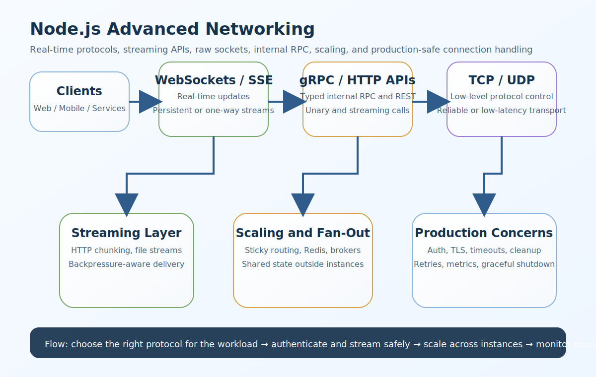

# Node.js Advanced Networking Interview Questions


This guide covers advanced networking in Node.js from interview basics to tricky production scenarios. It follows the corrected format of **100 interview questions for each subtopic**, and every answer includes a real Node.js code example plus a real-time example so the scenarios and snippets do not repeat verbatim.

## How To Use This Page

- Questions 1-100 cover Why advanced networking matters in Node.js.
- Questions 101-200 cover Networking models you should know.
- Questions 201-300 cover WebSockets.
- Questions 301-400 cover How WebSockets work.
- Questions 401-500 cover WebSockets in Node.js.
- Questions 501-600 cover Socket.IO vs raw WebSockets.
- Questions 601-700 cover Real-world WebSocket concerns.
- Questions 701-800 cover WebSocket authentication.
- Questions 801-900 cover WebSocket scaling strategy.
- Questions 901-1000 cover gRPC.
- Questions 1001-1100 cover Why gRPC is used.
- Questions 1101-1200 cover gRPC in Node.js.
- Questions 1201-1300 cover gRPC vs REST.
- Questions 1301-1400 cover Types of gRPC communication.
- Questions 1401-1500 cover TCP sockets.
- Questions 1501-1600 cover TCP sockets in Node.js.
- Questions 1601-1700 cover TCP interview points.
- Questions 1701-1800 cover UDP sockets.
- Questions 1801-1900 cover UDP sockets in Node.js.
- Questions 1901-2000 cover TCP vs UDP.
- Questions 2001-2100 cover Streaming APIs.
- Questions 2101-2200 cover Why streaming APIs matter.
- Questions 2201-2300 cover HTTP streaming in Node.js.
- Questions 2301-2400 cover Streaming APIs with Express.
- Questions 2401-2500 cover Server-Sent Events (SSE).
- Questions 2501-2600 cover Streaming request bodies.
- Questions 2601-2700 cover Backpressure in streams.
- Questions 2701-2800 cover Streaming file APIs.
- Questions 2801-2900 cover Proxying streams.
- Questions 2901-3000 cover Real-world networking design choices.
- Questions 3001-3100 cover Common production concerns.
- Questions 3101-3200 cover Security considerations.
- Questions 3201-3300 cover Common interview questions.
- Questions 3301-3400 cover Topics you should not miss.
- Questions 3401-3500 cover Best learning order.
- Questions 3501-3600 cover Strong senior-level answer.

## 1. Why advanced networking matters in Node.js

### Q1.1 What is advanced networking value in Node.js advanced networking?

**Answer:**

Advanced networking value matters in Node.js advanced networking because it affects connection handling, latency, protocol choice, streaming behavior, scaling strategy, and the operational reliability of real-time or network-heavy systems. In a real system like a real-time Node.js platform where chat, notifications, and dashboards all depend on long-lived connections, a strong answer should connect the concept to event-driven I/O, authentication, cleanup, backpressure, observability, and multi-instance production behavior. A more senior answer also explains the practical trade-off so the answer stays grounded in real connection, latency, and protocol trade-offs instead of only theory.

**Code Example:**

```js
const networkNote1 = { section: 1, question: 1, focus: 'advanced-networking' };
console.log(networkNote1);
```

**Real-Time Example:** In a real-time Node.js platform where chat, notifications, and dashboards all depend on long-lived connections, the team used this concept so the answer stays grounded in real connection, latency, and protocol trade-offs instead of only theory.

### Q1.2 Why does non-blocking i/o advantage matter in real production systems?

**Answer:**

Non-blocking I/O advantage matters in Node.js advanced networking because it affects connection handling, latency, protocol choice, streaming behavior, scaling strategy, and the operational reliability of real-time or network-heavy systems. In a real system like a microservices environment where gRPC is used internally while REST remains public-facing, a strong answer should connect the concept to event-driven I/O, authentication, cleanup, backpressure, observability, and multi-instance production behavior. A more senior answer also explains the practical trade-off so teams can connect protocol choice to user experience, performance, and operational complexity.

**Code Example:**

```js
function chooseProtocol2(needsRealtime) { return needsRealtime ? 'websocket-or-sse' : 'http-rest'; }
console.log(chooseProtocol2(true));
```

**Real-Time Example:** In a microservices environment where gRPC is used internally while REST remains public-facing, the team used this concept so teams can connect protocol choice to user experience, performance, and operational complexity.

### Q1.3 When should a backend team use connection-heavy workload fit?

**Answer:**

Connection-heavy workload fit matters in Node.js advanced networking because it affects connection handling, latency, protocol choice, streaming behavior, scaling strategy, and the operational reliability of real-time or network-heavy systems. In a real system like a multi-instance WebSocket deployment where user connections are spread across several servers, a strong answer should connect the concept to event-driven I/O, authentication, cleanup, backpressure, observability, and multi-instance production behavior. A more senior answer also explains the practical trade-off so real-time and streaming systems become easier to design and troubleshoot.

**Code Example:**

```js
const protocolSet3 = ['rest', 'websocket', 'grpc', 'tcp', 'udp', 'streaming'];
console.log({ q: 3, protocolSet: protocolSet3 });
```

**Real-Time Example:** In a multi-instance WebSocket deployment where user connections are spread across several servers, the team used this concept so real-time and streaming systems become easier to design and troubleshoot.

### Q1.4 How would you explain real-time systems fit in an interview?

**Answer:**

Real-time systems fit matters in Node.js advanced networking because it affects connection handling, latency, protocol choice, streaming behavior, scaling strategy, and the operational reliability of real-time or network-heavy systems. In a real system like a live operations dashboard where one-way updates are enough and SSE may be simpler than WebSockets, a strong answer should connect the concept to event-driven I/O, authentication, cleanup, backpressure, observability, and multi-instance production behavior. A more senior answer also explains the practical trade-off so security, scaling, and cleanup concerns are treated as core networking design requirements.

**Code Example:**

```js
const tradeoff4 = { lowLatency: true, reliability: true, complexity: 'medium' };
console.log(tradeoff4);
```

**Real-Time Example:** In a live operations dashboard where one-way updates are enough and SSE may be simpler than WebSockets, the team used this concept so security, scaling, and cleanup concerns are treated as core networking design requirements.

### Q1.5 What is a common interview trap around networking-focused architecture?

**Answer:**

Networking-focused architecture matters in Node.js advanced networking because it affects connection handling, latency, protocol choice, streaming behavior, scaling strategy, and the operational reliability of real-time or network-heavy systems. In a real system like a media-heavy system where large files and progressive responses must be streamed efficiently, a strong answer should connect the concept to event-driven I/O, authentication, cleanup, backpressure, observability, and multi-instance production behavior. A more senior answer also explains the practical trade-off so the examples sound like production Node.js systems instead of generic protocol summaries.

**Code Example:**

```js
const prodChecklist5 = ['auth', 'timeouts', 'cleanup', 'metrics'];
console.log(prodChecklist5);
```

**Real-Time Example:** In a media-heavy system where large files and progressive responses must be streamed efficiently, the team used this concept so the examples sound like production Node.js systems instead of generic protocol summaries.

### Q1.6 How is advanced networking value implemented safely in Node.js systems?

**Answer:**

Advanced networking value matters in Node.js advanced networking because it affects connection handling, latency, protocol choice, streaming behavior, scaling strategy, and the operational reliability of real-time or network-heavy systems. In a real system like a low-latency backend where raw TCP or UDP is considered for specialized protocol needs, a strong answer should connect the concept to event-driven I/O, authentication, cleanup, backpressure, observability, and multi-instance production behavior. A more senior answer also explains the practical trade-off so the trade-offs between simplicity, performance, and control become clearer.

**Code Example:**

```js
const networkNote6 = { section: 1, question: 6, focus: 'advanced-networking' };
console.log(networkNote6);
```

**Real-Time Example:** In a low-latency backend where raw TCP or UDP is considered for specialized protocol needs, the team used this concept so the trade-offs between simplicity, performance, and control become clearer.

### Q1.7 What production problem usually exposes weak understanding of non-blocking i/o advantage?

**Answer:**

Non-blocking I/O advantage matters in Node.js advanced networking because it affects connection handling, latency, protocol choice, streaming behavior, scaling strategy, and the operational reliability of real-time or network-heavy systems. In a real system like a production incident where stale sockets, reconnect storms, and missing heartbeats caused instability, a strong answer should connect the concept to event-driven I/O, authentication, cleanup, backpressure, observability, and multi-instance production behavior. A more senior answer also explains the practical trade-off so backpressure, connection lifecycle, and protocol limits are easier to explain.

**Code Example:**

```js
function chooseProtocol7(needsRealtime) { return needsRealtime ? 'websocket-or-sse' : 'http-rest'; }
console.log(chooseProtocol7(true));
```

**Real-Time Example:** In a production incident where stale sockets, reconnect storms, and missing heartbeats caused instability, the team used this concept so backpressure, connection lifecycle, and protocol limits are easier to explain.

### Q1.8 How would a senior engineer justify connection-heavy workload fit to a team?

**Answer:**

Connection-heavy workload fit matters in Node.js advanced networking because it affects connection handling, latency, protocol choice, streaming behavior, scaling strategy, and the operational reliability of real-time or network-heavy systems. In a real system like a secure internal platform where mTLS, auth metadata, and typed service contracts matter, a strong answer should connect the concept to event-driven I/O, authentication, cleanup, backpressure, observability, and multi-instance production behavior. A more senior answer also explains the practical trade-off so internal and public communication choices can be justified by workload and client needs.

**Code Example:**

```js
const protocolSet8 = ['rest', 'websocket', 'grpc', 'tcp', 'udp', 'streaming'];
console.log({ q: 8, protocolSet: protocolSet8 });
```

**Real-Time Example:** In a secure internal platform where mTLS, auth metadata, and typed service contracts matter, the team used this concept so internal and public communication choices can be justified by workload and client needs.

### Q1.9 What trade-off does real-time systems fit introduce?

**Answer:**

Real-time systems fit matters in Node.js advanced networking because it affects connection handling, latency, protocol choice, streaming behavior, scaling strategy, and the operational reliability of real-time or network-heavy systems. In a real system like an API gateway that proxies large downloads and upstream streams without buffering entire payloads, a strong answer should connect the concept to event-driven I/O, authentication, cleanup, backpressure, observability, and multi-instance production behavior. A more senior answer also explains the practical trade-off so state sharing, sticky routing, and broker-based fan-out are tied to real scaling behavior.

**Code Example:**

```js
const tradeoff9 = { lowLatency: true, reliability: false, complexity: 'medium' };
console.log(tradeoff9);
```

**Real-Time Example:** In an API gateway that proxies large downloads and upstream streams without buffering entire payloads, the team used this concept so state sharing, sticky routing, and broker-based fan-out are tied to real scaling behavior.

### Q1.10 How do you answer a tricky follow-up about networking-focused architecture?

**Answer:**

Networking-focused architecture matters in Node.js advanced networking because it affects connection handling, latency, protocol choice, streaming behavior, scaling strategy, and the operational reliability of real-time or network-heavy systems. In a real system like an enterprise Node.js stack where observability, retries, rate limits, and graceful shutdown all affect networking reliability, a strong answer should connect the concept to event-driven I/O, authentication, cleanup, backpressure, observability, and multi-instance production behavior. A more senior answer also explains the practical trade-off so the answer reflects senior-level thinking about production-safe networking architecture.

**Code Example:**

```js
const prodChecklist10 = ['auth', 'timeouts', 'cleanup', 'metrics'];
console.log(prodChecklist10);
```

**Real-Time Example:** In an enterprise Node.js stack where observability, retries, rate limits, and graceful shutdown all affect networking reliability, the team used this concept so the answer reflects senior-level thinking about production-safe networking architecture.

### Q1.11 What is advanced networking value in Node.js advanced networking?

**Answer:**

Advanced networking value matters in Node.js advanced networking because it affects connection handling, latency, protocol choice, streaming behavior, scaling strategy, and the operational reliability of real-time or network-heavy systems. In a real system like a real-time Node.js platform where chat, notifications, and dashboards all depend on long-lived connections, a strong answer should connect the concept to event-driven I/O, authentication, cleanup, backpressure, observability, and multi-instance production behavior. A more senior answer also explains the practical trade-off so the answer stays grounded in real connection, latency, and protocol trade-offs instead of only theory.

**Code Example:**

```js
const networkNote11 = { section: 1, question: 11, focus: 'advanced-networking' };
console.log(networkNote11);
```

**Real-Time Example:** In a real-time Node.js platform where chat, notifications, and dashboards all depend on long-lived connections, the team used this concept so the answer stays grounded in real connection, latency, and protocol trade-offs instead of only theory.

### Q1.12 Why does non-blocking i/o advantage matter in real production systems?

**Answer:**

Non-blocking I/O advantage matters in Node.js advanced networking because it affects connection handling, latency, protocol choice, streaming behavior, scaling strategy, and the operational reliability of real-time or network-heavy systems. In a real system like a microservices environment where gRPC is used internally while REST remains public-facing, a strong answer should connect the concept to event-driven I/O, authentication, cleanup, backpressure, observability, and multi-instance production behavior. A more senior answer also explains the practical trade-off so teams can connect protocol choice to user experience, performance, and operational complexity.

**Code Example:**

```js
function chooseProtocol12(needsRealtime) { return needsRealtime ? 'websocket-or-sse' : 'http-rest'; }
console.log(chooseProtocol12(true));
```

**Real-Time Example:** In a microservices environment where gRPC is used internally while REST remains public-facing, the team used this concept so teams can connect protocol choice to user experience, performance, and operational complexity.

### Q1.13 When should a backend team use connection-heavy workload fit?

**Answer:**

Connection-heavy workload fit matters in Node.js advanced networking because it affects connection handling, latency, protocol choice, streaming behavior, scaling strategy, and the operational reliability of real-time or network-heavy systems. In a real system like a multi-instance WebSocket deployment where user connections are spread across several servers, a strong answer should connect the concept to event-driven I/O, authentication, cleanup, backpressure, observability, and multi-instance production behavior. A more senior answer also explains the practical trade-off so real-time and streaming systems become easier to design and troubleshoot.

**Code Example:**

```js
const protocolSet13 = ['rest', 'websocket', 'grpc', 'tcp', 'udp', 'streaming'];
console.log({ q: 13, protocolSet: protocolSet13 });
```

**Real-Time Example:** In a multi-instance WebSocket deployment where user connections are spread across several servers, the team used this concept so real-time and streaming systems become easier to design and troubleshoot.

### Q1.14 How would you explain real-time systems fit in an interview?

**Answer:**

Real-time systems fit matters in Node.js advanced networking because it affects connection handling, latency, protocol choice, streaming behavior, scaling strategy, and the operational reliability of real-time or network-heavy systems. In a real system like a live operations dashboard where one-way updates are enough and SSE may be simpler than WebSockets, a strong answer should connect the concept to event-driven I/O, authentication, cleanup, backpressure, observability, and multi-instance production behavior. A more senior answer also explains the practical trade-off so security, scaling, and cleanup concerns are treated as core networking design requirements.

**Code Example:**

```js
const tradeoff14 = { lowLatency: true, reliability: true, complexity: 'medium' };
console.log(tradeoff14);
```

**Real-Time Example:** In a live operations dashboard where one-way updates are enough and SSE may be simpler than WebSockets, the team used this concept so security, scaling, and cleanup concerns are treated as core networking design requirements.

### Q1.15 What is a common interview trap around networking-focused architecture?

**Answer:**

Networking-focused architecture matters in Node.js advanced networking because it affects connection handling, latency, protocol choice, streaming behavior, scaling strategy, and the operational reliability of real-time or network-heavy systems. In a real system like a media-heavy system where large files and progressive responses must be streamed efficiently, a strong answer should connect the concept to event-driven I/O, authentication, cleanup, backpressure, observability, and multi-instance production behavior. A more senior answer also explains the practical trade-off so the examples sound like production Node.js systems instead of generic protocol summaries.

**Code Example:**

```js
const prodChecklist15 = ['auth', 'timeouts', 'cleanup', 'metrics'];
console.log(prodChecklist15);
```

**Real-Time Example:** In a media-heavy system where large files and progressive responses must be streamed efficiently, the team used this concept so the examples sound like production Node.js systems instead of generic protocol summaries.

### Q1.16 How is advanced networking value implemented safely in Node.js systems?

**Answer:**

Advanced networking value matters in Node.js advanced networking because it affects connection handling, latency, protocol choice, streaming behavior, scaling strategy, and the operational reliability of real-time or network-heavy systems. In a real system like a low-latency backend where raw TCP or UDP is considered for specialized protocol needs, a strong answer should connect the concept to event-driven I/O, authentication, cleanup, backpressure, observability, and multi-instance production behavior. A more senior answer also explains the practical trade-off so the trade-offs between simplicity, performance, and control become clearer.

**Code Example:**

```js
const networkNote16 = { section: 1, question: 16, focus: 'advanced-networking' };
console.log(networkNote16);
```

**Real-Time Example:** In a low-latency backend where raw TCP or UDP is considered for specialized protocol needs, the team used this concept so the trade-offs between simplicity, performance, and control become clearer.

### Q1.17 What production problem usually exposes weak understanding of non-blocking i/o advantage?

**Answer:**

Non-blocking I/O advantage matters in Node.js advanced networking because it affects connection handling, latency, protocol choice, streaming behavior, scaling strategy, and the operational reliability of real-time or network-heavy systems. In a real system like a production incident where stale sockets, reconnect storms, and missing heartbeats caused instability, a strong answer should connect the concept to event-driven I/O, authentication, cleanup, backpressure, observability, and multi-instance production behavior. A more senior answer also explains the practical trade-off so backpressure, connection lifecycle, and protocol limits are easier to explain.

**Code Example:**

```js
function chooseProtocol17(needsRealtime) { return needsRealtime ? 'websocket-or-sse' : 'http-rest'; }
console.log(chooseProtocol17(true));
```

**Real-Time Example:** In a production incident where stale sockets, reconnect storms, and missing heartbeats caused instability, the team used this concept so backpressure, connection lifecycle, and protocol limits are easier to explain.

### Q1.18 How would a senior engineer justify connection-heavy workload fit to a team?

**Answer:**

Connection-heavy workload fit matters in Node.js advanced networking because it affects connection handling, latency, protocol choice, streaming behavior, scaling strategy, and the operational reliability of real-time or network-heavy systems. In a real system like a secure internal platform where mTLS, auth metadata, and typed service contracts matter, a strong answer should connect the concept to event-driven I/O, authentication, cleanup, backpressure, observability, and multi-instance production behavior. A more senior answer also explains the practical trade-off so internal and public communication choices can be justified by workload and client needs.

**Code Example:**

```js
const protocolSet18 = ['rest', 'websocket', 'grpc', 'tcp', 'udp', 'streaming'];
console.log({ q: 18, protocolSet: protocolSet18 });
```

**Real-Time Example:** In a secure internal platform where mTLS, auth metadata, and typed service contracts matter, the team used this concept so internal and public communication choices can be justified by workload and client needs.

### Q1.19 What trade-off does real-time systems fit introduce?

**Answer:**

Real-time systems fit matters in Node.js advanced networking because it affects connection handling, latency, protocol choice, streaming behavior, scaling strategy, and the operational reliability of real-time or network-heavy systems. In a real system like an API gateway that proxies large downloads and upstream streams without buffering entire payloads, a strong answer should connect the concept to event-driven I/O, authentication, cleanup, backpressure, observability, and multi-instance production behavior. A more senior answer also explains the practical trade-off so state sharing, sticky routing, and broker-based fan-out are tied to real scaling behavior.

**Code Example:**

```js
const tradeoff19 = { lowLatency: true, reliability: false, complexity: 'medium' };
console.log(tradeoff19);
```

**Real-Time Example:** In an API gateway that proxies large downloads and upstream streams without buffering entire payloads, the team used this concept so state sharing, sticky routing, and broker-based fan-out are tied to real scaling behavior.

### Q1.20 How do you answer a tricky follow-up about networking-focused architecture?

**Answer:**

Networking-focused architecture matters in Node.js advanced networking because it affects connection handling, latency, protocol choice, streaming behavior, scaling strategy, and the operational reliability of real-time or network-heavy systems. In a real system like an enterprise Node.js stack where observability, retries, rate limits, and graceful shutdown all affect networking reliability, a strong answer should connect the concept to event-driven I/O, authentication, cleanup, backpressure, observability, and multi-instance production behavior. A more senior answer also explains the practical trade-off so the answer reflects senior-level thinking about production-safe networking architecture.

**Code Example:**

```js
const prodChecklist20 = ['auth', 'timeouts', 'cleanup', 'metrics'];
console.log(prodChecklist20);
```

**Real-Time Example:** In an enterprise Node.js stack where observability, retries, rate limits, and graceful shutdown all affect networking reliability, the team used this concept so the answer reflects senior-level thinking about production-safe networking architecture.

### Q1.21 What is advanced networking value in Node.js advanced networking?

**Answer:**

Advanced networking value matters in Node.js advanced networking because it affects connection handling, latency, protocol choice, streaming behavior, scaling strategy, and the operational reliability of real-time or network-heavy systems. In a real system like a real-time Node.js platform where chat, notifications, and dashboards all depend on long-lived connections, a strong answer should connect the concept to event-driven I/O, authentication, cleanup, backpressure, observability, and multi-instance production behavior. A more senior answer also explains the practical trade-off so the answer stays grounded in real connection, latency, and protocol trade-offs instead of only theory.

**Code Example:**

```js
const networkNote21 = { section: 1, question: 21, focus: 'advanced-networking' };
console.log(networkNote21);
```

**Real-Time Example:** In a real-time Node.js platform where chat, notifications, and dashboards all depend on long-lived connections, the team used this concept so the answer stays grounded in real connection, latency, and protocol trade-offs instead of only theory.

### Q1.22 Why does non-blocking i/o advantage matter in real production systems?

**Answer:**

Non-blocking I/O advantage matters in Node.js advanced networking because it affects connection handling, latency, protocol choice, streaming behavior, scaling strategy, and the operational reliability of real-time or network-heavy systems. In a real system like a microservices environment where gRPC is used internally while REST remains public-facing, a strong answer should connect the concept to event-driven I/O, authentication, cleanup, backpressure, observability, and multi-instance production behavior. A more senior answer also explains the practical trade-off so teams can connect protocol choice to user experience, performance, and operational complexity.

**Code Example:**

```js
function chooseProtocol22(needsRealtime) { return needsRealtime ? 'websocket-or-sse' : 'http-rest'; }
console.log(chooseProtocol22(true));
```

**Real-Time Example:** In a microservices environment where gRPC is used internally while REST remains public-facing, the team used this concept so teams can connect protocol choice to user experience, performance, and operational complexity.

### Q1.23 When should a backend team use connection-heavy workload fit?

**Answer:**

Connection-heavy workload fit matters in Node.js advanced networking because it affects connection handling, latency, protocol choice, streaming behavior, scaling strategy, and the operational reliability of real-time or network-heavy systems. In a real system like a multi-instance WebSocket deployment where user connections are spread across several servers, a strong answer should connect the concept to event-driven I/O, authentication, cleanup, backpressure, observability, and multi-instance production behavior. A more senior answer also explains the practical trade-off so real-time and streaming systems become easier to design and troubleshoot.

**Code Example:**

```js
const protocolSet23 = ['rest', 'websocket', 'grpc', 'tcp', 'udp', 'streaming'];
console.log({ q: 23, protocolSet: protocolSet23 });
```

**Real-Time Example:** In a multi-instance WebSocket deployment where user connections are spread across several servers, the team used this concept so real-time and streaming systems become easier to design and troubleshoot.

### Q1.24 How would you explain real-time systems fit in an interview?

**Answer:**

Real-time systems fit matters in Node.js advanced networking because it affects connection handling, latency, protocol choice, streaming behavior, scaling strategy, and the operational reliability of real-time or network-heavy systems. In a real system like a live operations dashboard where one-way updates are enough and SSE may be simpler than WebSockets, a strong answer should connect the concept to event-driven I/O, authentication, cleanup, backpressure, observability, and multi-instance production behavior. A more senior answer also explains the practical trade-off so security, scaling, and cleanup concerns are treated as core networking design requirements.

**Code Example:**

```js
const tradeoff24 = { lowLatency: true, reliability: true, complexity: 'medium' };
console.log(tradeoff24);
```

**Real-Time Example:** In a live operations dashboard where one-way updates are enough and SSE may be simpler than WebSockets, the team used this concept so security, scaling, and cleanup concerns are treated as core networking design requirements.

### Q1.25 What is a common interview trap around networking-focused architecture?

**Answer:**

Networking-focused architecture matters in Node.js advanced networking because it affects connection handling, latency, protocol choice, streaming behavior, scaling strategy, and the operational reliability of real-time or network-heavy systems. In a real system like a media-heavy system where large files and progressive responses must be streamed efficiently, a strong answer should connect the concept to event-driven I/O, authentication, cleanup, backpressure, observability, and multi-instance production behavior. A more senior answer also explains the practical trade-off so the examples sound like production Node.js systems instead of generic protocol summaries.

**Code Example:**

```js
const prodChecklist25 = ['auth', 'timeouts', 'cleanup', 'metrics'];
console.log(prodChecklist25);
```

**Real-Time Example:** In a media-heavy system where large files and progressive responses must be streamed efficiently, the team used this concept so the examples sound like production Node.js systems instead of generic protocol summaries.

### Q1.26 How is advanced networking value implemented safely in Node.js systems?

**Answer:**

Advanced networking value matters in Node.js advanced networking because it affects connection handling, latency, protocol choice, streaming behavior, scaling strategy, and the operational reliability of real-time or network-heavy systems. In a real system like a low-latency backend where raw TCP or UDP is considered for specialized protocol needs, a strong answer should connect the concept to event-driven I/O, authentication, cleanup, backpressure, observability, and multi-instance production behavior. A more senior answer also explains the practical trade-off so the trade-offs between simplicity, performance, and control become clearer.

**Code Example:**

```js
const networkNote26 = { section: 1, question: 26, focus: 'advanced-networking' };
console.log(networkNote26);
```

**Real-Time Example:** In a low-latency backend where raw TCP or UDP is considered for specialized protocol needs, the team used this concept so the trade-offs between simplicity, performance, and control become clearer.

### Q1.27 What production problem usually exposes weak understanding of non-blocking i/o advantage?

**Answer:**

Non-blocking I/O advantage matters in Node.js advanced networking because it affects connection handling, latency, protocol choice, streaming behavior, scaling strategy, and the operational reliability of real-time or network-heavy systems. In a real system like a production incident where stale sockets, reconnect storms, and missing heartbeats caused instability, a strong answer should connect the concept to event-driven I/O, authentication, cleanup, backpressure, observability, and multi-instance production behavior. A more senior answer also explains the practical trade-off so backpressure, connection lifecycle, and protocol limits are easier to explain.

**Code Example:**

```js
function chooseProtocol27(needsRealtime) { return needsRealtime ? 'websocket-or-sse' : 'http-rest'; }
console.log(chooseProtocol27(true));
```

**Real-Time Example:** In a production incident where stale sockets, reconnect storms, and missing heartbeats caused instability, the team used this concept so backpressure, connection lifecycle, and protocol limits are easier to explain.

### Q1.28 How would a senior engineer justify connection-heavy workload fit to a team?

**Answer:**

Connection-heavy workload fit matters in Node.js advanced networking because it affects connection handling, latency, protocol choice, streaming behavior, scaling strategy, and the operational reliability of real-time or network-heavy systems. In a real system like a secure internal platform where mTLS, auth metadata, and typed service contracts matter, a strong answer should connect the concept to event-driven I/O, authentication, cleanup, backpressure, observability, and multi-instance production behavior. A more senior answer also explains the practical trade-off so internal and public communication choices can be justified by workload and client needs.

**Code Example:**

```js
const protocolSet28 = ['rest', 'websocket', 'grpc', 'tcp', 'udp', 'streaming'];
console.log({ q: 28, protocolSet: protocolSet28 });
```

**Real-Time Example:** In a secure internal platform where mTLS, auth metadata, and typed service contracts matter, the team used this concept so internal and public communication choices can be justified by workload and client needs.

### Q1.29 What trade-off does real-time systems fit introduce?

**Answer:**

Real-time systems fit matters in Node.js advanced networking because it affects connection handling, latency, protocol choice, streaming behavior, scaling strategy, and the operational reliability of real-time or network-heavy systems. In a real system like an API gateway that proxies large downloads and upstream streams without buffering entire payloads, a strong answer should connect the concept to event-driven I/O, authentication, cleanup, backpressure, observability, and multi-instance production behavior. A more senior answer also explains the practical trade-off so state sharing, sticky routing, and broker-based fan-out are tied to real scaling behavior.

**Code Example:**

```js
const tradeoff29 = { lowLatency: true, reliability: false, complexity: 'medium' };
console.log(tradeoff29);
```

**Real-Time Example:** In an API gateway that proxies large downloads and upstream streams without buffering entire payloads, the team used this concept so state sharing, sticky routing, and broker-based fan-out are tied to real scaling behavior.

### Q1.30 How do you answer a tricky follow-up about networking-focused architecture?

**Answer:**

Networking-focused architecture matters in Node.js advanced networking because it affects connection handling, latency, protocol choice, streaming behavior, scaling strategy, and the operational reliability of real-time or network-heavy systems. In a real system like an enterprise Node.js stack where observability, retries, rate limits, and graceful shutdown all affect networking reliability, a strong answer should connect the concept to event-driven I/O, authentication, cleanup, backpressure, observability, and multi-instance production behavior. A more senior answer also explains the practical trade-off so the answer reflects senior-level thinking about production-safe networking architecture.

**Code Example:**

```js
const prodChecklist30 = ['auth', 'timeouts', 'cleanup', 'metrics'];
console.log(prodChecklist30);
```

**Real-Time Example:** In an enterprise Node.js stack where observability, retries, rate limits, and graceful shutdown all affect networking reliability, the team used this concept so the answer reflects senior-level thinking about production-safe networking architecture.

### Q1.31 What is advanced networking value in Node.js advanced networking?

**Answer:**

Advanced networking value matters in Node.js advanced networking because it affects connection handling, latency, protocol choice, streaming behavior, scaling strategy, and the operational reliability of real-time or network-heavy systems. In a real system like a real-time Node.js platform where chat, notifications, and dashboards all depend on long-lived connections, a strong answer should connect the concept to event-driven I/O, authentication, cleanup, backpressure, observability, and multi-instance production behavior. A more senior answer also explains the practical trade-off so the answer stays grounded in real connection, latency, and protocol trade-offs instead of only theory.

**Code Example:**

```js
const networkNote31 = { section: 1, question: 31, focus: 'advanced-networking' };
console.log(networkNote31);
```

**Real-Time Example:** In a real-time Node.js platform where chat, notifications, and dashboards all depend on long-lived connections, the team used this concept so the answer stays grounded in real connection, latency, and protocol trade-offs instead of only theory.

### Q1.32 Why does non-blocking i/o advantage matter in real production systems?

**Answer:**

Non-blocking I/O advantage matters in Node.js advanced networking because it affects connection handling, latency, protocol choice, streaming behavior, scaling strategy, and the operational reliability of real-time or network-heavy systems. In a real system like a microservices environment where gRPC is used internally while REST remains public-facing, a strong answer should connect the concept to event-driven I/O, authentication, cleanup, backpressure, observability, and multi-instance production behavior. A more senior answer also explains the practical trade-off so teams can connect protocol choice to user experience, performance, and operational complexity.

**Code Example:**

```js
function chooseProtocol32(needsRealtime) { return needsRealtime ? 'websocket-or-sse' : 'http-rest'; }
console.log(chooseProtocol32(true));
```

**Real-Time Example:** In a microservices environment where gRPC is used internally while REST remains public-facing, the team used this concept so teams can connect protocol choice to user experience, performance, and operational complexity.

### Q1.33 When should a backend team use connection-heavy workload fit?

**Answer:**

Connection-heavy workload fit matters in Node.js advanced networking because it affects connection handling, latency, protocol choice, streaming behavior, scaling strategy, and the operational reliability of real-time or network-heavy systems. In a real system like a multi-instance WebSocket deployment where user connections are spread across several servers, a strong answer should connect the concept to event-driven I/O, authentication, cleanup, backpressure, observability, and multi-instance production behavior. A more senior answer also explains the practical trade-off so real-time and streaming systems become easier to design and troubleshoot.

**Code Example:**

```js
const protocolSet33 = ['rest', 'websocket', 'grpc', 'tcp', 'udp', 'streaming'];
console.log({ q: 33, protocolSet: protocolSet33 });
```

**Real-Time Example:** In a multi-instance WebSocket deployment where user connections are spread across several servers, the team used this concept so real-time and streaming systems become easier to design and troubleshoot.

### Q1.34 How would you explain real-time systems fit in an interview?

**Answer:**

Real-time systems fit matters in Node.js advanced networking because it affects connection handling, latency, protocol choice, streaming behavior, scaling strategy, and the operational reliability of real-time or network-heavy systems. In a real system like a live operations dashboard where one-way updates are enough and SSE may be simpler than WebSockets, a strong answer should connect the concept to event-driven I/O, authentication, cleanup, backpressure, observability, and multi-instance production behavior. A more senior answer also explains the practical trade-off so security, scaling, and cleanup concerns are treated as core networking design requirements.

**Code Example:**

```js
const tradeoff34 = { lowLatency: true, reliability: true, complexity: 'medium' };
console.log(tradeoff34);
```

**Real-Time Example:** In a live operations dashboard where one-way updates are enough and SSE may be simpler than WebSockets, the team used this concept so security, scaling, and cleanup concerns are treated as core networking design requirements.

### Q1.35 What is a common interview trap around networking-focused architecture?

**Answer:**

Networking-focused architecture matters in Node.js advanced networking because it affects connection handling, latency, protocol choice, streaming behavior, scaling strategy, and the operational reliability of real-time or network-heavy systems. In a real system like a media-heavy system where large files and progressive responses must be streamed efficiently, a strong answer should connect the concept to event-driven I/O, authentication, cleanup, backpressure, observability, and multi-instance production behavior. A more senior answer also explains the practical trade-off so the examples sound like production Node.js systems instead of generic protocol summaries.

**Code Example:**

```js
const prodChecklist35 = ['auth', 'timeouts', 'cleanup', 'metrics'];
console.log(prodChecklist35);
```

**Real-Time Example:** In a media-heavy system where large files and progressive responses must be streamed efficiently, the team used this concept so the examples sound like production Node.js systems instead of generic protocol summaries.

### Q1.36 How is advanced networking value implemented safely in Node.js systems?

**Answer:**

Advanced networking value matters in Node.js advanced networking because it affects connection handling, latency, protocol choice, streaming behavior, scaling strategy, and the operational reliability of real-time or network-heavy systems. In a real system like a low-latency backend where raw TCP or UDP is considered for specialized protocol needs, a strong answer should connect the concept to event-driven I/O, authentication, cleanup, backpressure, observability, and multi-instance production behavior. A more senior answer also explains the practical trade-off so the trade-offs between simplicity, performance, and control become clearer.

**Code Example:**

```js
const networkNote36 = { section: 1, question: 36, focus: 'advanced-networking' };
console.log(networkNote36);
```

**Real-Time Example:** In a low-latency backend where raw TCP or UDP is considered for specialized protocol needs, the team used this concept so the trade-offs between simplicity, performance, and control become clearer.

### Q1.37 What production problem usually exposes weak understanding of non-blocking i/o advantage?

**Answer:**

Non-blocking I/O advantage matters in Node.js advanced networking because it affects connection handling, latency, protocol choice, streaming behavior, scaling strategy, and the operational reliability of real-time or network-heavy systems. In a real system like a production incident where stale sockets, reconnect storms, and missing heartbeats caused instability, a strong answer should connect the concept to event-driven I/O, authentication, cleanup, backpressure, observability, and multi-instance production behavior. A more senior answer also explains the practical trade-off so backpressure, connection lifecycle, and protocol limits are easier to explain.

**Code Example:**

```js
function chooseProtocol37(needsRealtime) { return needsRealtime ? 'websocket-or-sse' : 'http-rest'; }
console.log(chooseProtocol37(true));
```

**Real-Time Example:** In a production incident where stale sockets, reconnect storms, and missing heartbeats caused instability, the team used this concept so backpressure, connection lifecycle, and protocol limits are easier to explain.

### Q1.38 How would a senior engineer justify connection-heavy workload fit to a team?

**Answer:**

Connection-heavy workload fit matters in Node.js advanced networking because it affects connection handling, latency, protocol choice, streaming behavior, scaling strategy, and the operational reliability of real-time or network-heavy systems. In a real system like a secure internal platform where mTLS, auth metadata, and typed service contracts matter, a strong answer should connect the concept to event-driven I/O, authentication, cleanup, backpressure, observability, and multi-instance production behavior. A more senior answer also explains the practical trade-off so internal and public communication choices can be justified by workload and client needs.

**Code Example:**

```js
const protocolSet38 = ['rest', 'websocket', 'grpc', 'tcp', 'udp', 'streaming'];
console.log({ q: 38, protocolSet: protocolSet38 });
```

**Real-Time Example:** In a secure internal platform where mTLS, auth metadata, and typed service contracts matter, the team used this concept so internal and public communication choices can be justified by workload and client needs.

### Q1.39 What trade-off does real-time systems fit introduce?

**Answer:**

Real-time systems fit matters in Node.js advanced networking because it affects connection handling, latency, protocol choice, streaming behavior, scaling strategy, and the operational reliability of real-time or network-heavy systems. In a real system like an API gateway that proxies large downloads and upstream streams without buffering entire payloads, a strong answer should connect the concept to event-driven I/O, authentication, cleanup, backpressure, observability, and multi-instance production behavior. A more senior answer also explains the practical trade-off so state sharing, sticky routing, and broker-based fan-out are tied to real scaling behavior.

**Code Example:**

```js
const tradeoff39 = { lowLatency: true, reliability: false, complexity: 'medium' };
console.log(tradeoff39);
```

**Real-Time Example:** In an API gateway that proxies large downloads and upstream streams without buffering entire payloads, the team used this concept so state sharing, sticky routing, and broker-based fan-out are tied to real scaling behavior.

### Q1.40 How do you answer a tricky follow-up about networking-focused architecture?

**Answer:**

Networking-focused architecture matters in Node.js advanced networking because it affects connection handling, latency, protocol choice, streaming behavior, scaling strategy, and the operational reliability of real-time or network-heavy systems. In a real system like an enterprise Node.js stack where observability, retries, rate limits, and graceful shutdown all affect networking reliability, a strong answer should connect the concept to event-driven I/O, authentication, cleanup, backpressure, observability, and multi-instance production behavior. A more senior answer also explains the practical trade-off so the answer reflects senior-level thinking about production-safe networking architecture.

**Code Example:**

```js
const prodChecklist40 = ['auth', 'timeouts', 'cleanup', 'metrics'];
console.log(prodChecklist40);
```

**Real-Time Example:** In an enterprise Node.js stack where observability, retries, rate limits, and graceful shutdown all affect networking reliability, the team used this concept so the answer reflects senior-level thinking about production-safe networking architecture.

### Q1.41 What is advanced networking value in Node.js advanced networking?

**Answer:**

Advanced networking value matters in Node.js advanced networking because it affects connection handling, latency, protocol choice, streaming behavior, scaling strategy, and the operational reliability of real-time or network-heavy systems. In a real system like a real-time Node.js platform where chat, notifications, and dashboards all depend on long-lived connections, a strong answer should connect the concept to event-driven I/O, authentication, cleanup, backpressure, observability, and multi-instance production behavior. A more senior answer also explains the practical trade-off so the answer stays grounded in real connection, latency, and protocol trade-offs instead of only theory.

**Code Example:**

```js
const networkNote41 = { section: 1, question: 41, focus: 'advanced-networking' };
console.log(networkNote41);
```

**Real-Time Example:** In a real-time Node.js platform where chat, notifications, and dashboards all depend on long-lived connections, the team used this concept so the answer stays grounded in real connection, latency, and protocol trade-offs instead of only theory.

### Q1.42 Why does non-blocking i/o advantage matter in real production systems?

**Answer:**

Non-blocking I/O advantage matters in Node.js advanced networking because it affects connection handling, latency, protocol choice, streaming behavior, scaling strategy, and the operational reliability of real-time or network-heavy systems. In a real system like a microservices environment where gRPC is used internally while REST remains public-facing, a strong answer should connect the concept to event-driven I/O, authentication, cleanup, backpressure, observability, and multi-instance production behavior. A more senior answer also explains the practical trade-off so teams can connect protocol choice to user experience, performance, and operational complexity.

**Code Example:**

```js
function chooseProtocol42(needsRealtime) { return needsRealtime ? 'websocket-or-sse' : 'http-rest'; }
console.log(chooseProtocol42(true));
```

**Real-Time Example:** In a microservices environment where gRPC is used internally while REST remains public-facing, the team used this concept so teams can connect protocol choice to user experience, performance, and operational complexity.

### Q1.43 When should a backend team use connection-heavy workload fit?

**Answer:**

Connection-heavy workload fit matters in Node.js advanced networking because it affects connection handling, latency, protocol choice, streaming behavior, scaling strategy, and the operational reliability of real-time or network-heavy systems. In a real system like a multi-instance WebSocket deployment where user connections are spread across several servers, a strong answer should connect the concept to event-driven I/O, authentication, cleanup, backpressure, observability, and multi-instance production behavior. A more senior answer also explains the practical trade-off so real-time and streaming systems become easier to design and troubleshoot.

**Code Example:**

```js
const protocolSet43 = ['rest', 'websocket', 'grpc', 'tcp', 'udp', 'streaming'];
console.log({ q: 43, protocolSet: protocolSet43 });
```

**Real-Time Example:** In a multi-instance WebSocket deployment where user connections are spread across several servers, the team used this concept so real-time and streaming systems become easier to design and troubleshoot.

### Q1.44 How would you explain real-time systems fit in an interview?

**Answer:**

Real-time systems fit matters in Node.js advanced networking because it affects connection handling, latency, protocol choice, streaming behavior, scaling strategy, and the operational reliability of real-time or network-heavy systems. In a real system like a live operations dashboard where one-way updates are enough and SSE may be simpler than WebSockets, a strong answer should connect the concept to event-driven I/O, authentication, cleanup, backpressure, observability, and multi-instance production behavior. A more senior answer also explains the practical trade-off so security, scaling, and cleanup concerns are treated as core networking design requirements.

**Code Example:**

```js
const tradeoff44 = { lowLatency: true, reliability: true, complexity: 'medium' };
console.log(tradeoff44);
```

**Real-Time Example:** In a live operations dashboard where one-way updates are enough and SSE may be simpler than WebSockets, the team used this concept so security, scaling, and cleanup concerns are treated as core networking design requirements.

### Q1.45 What is a common interview trap around networking-focused architecture?

**Answer:**

Networking-focused architecture matters in Node.js advanced networking because it affects connection handling, latency, protocol choice, streaming behavior, scaling strategy, and the operational reliability of real-time or network-heavy systems. In a real system like a media-heavy system where large files and progressive responses must be streamed efficiently, a strong answer should connect the concept to event-driven I/O, authentication, cleanup, backpressure, observability, and multi-instance production behavior. A more senior answer also explains the practical trade-off so the examples sound like production Node.js systems instead of generic protocol summaries.

**Code Example:**

```js
const prodChecklist45 = ['auth', 'timeouts', 'cleanup', 'metrics'];
console.log(prodChecklist45);
```

**Real-Time Example:** In a media-heavy system where large files and progressive responses must be streamed efficiently, the team used this concept so the examples sound like production Node.js systems instead of generic protocol summaries.

### Q1.46 How is advanced networking value implemented safely in Node.js systems?

**Answer:**

Advanced networking value matters in Node.js advanced networking because it affects connection handling, latency, protocol choice, streaming behavior, scaling strategy, and the operational reliability of real-time or network-heavy systems. In a real system like a low-latency backend where raw TCP or UDP is considered for specialized protocol needs, a strong answer should connect the concept to event-driven I/O, authentication, cleanup, backpressure, observability, and multi-instance production behavior. A more senior answer also explains the practical trade-off so the trade-offs between simplicity, performance, and control become clearer.

**Code Example:**

```js
const networkNote46 = { section: 1, question: 46, focus: 'advanced-networking' };
console.log(networkNote46);
```

**Real-Time Example:** In a low-latency backend where raw TCP or UDP is considered for specialized protocol needs, the team used this concept so the trade-offs between simplicity, performance, and control become clearer.

### Q1.47 What production problem usually exposes weak understanding of non-blocking i/o advantage?

**Answer:**

Non-blocking I/O advantage matters in Node.js advanced networking because it affects connection handling, latency, protocol choice, streaming behavior, scaling strategy, and the operational reliability of real-time or network-heavy systems. In a real system like a production incident where stale sockets, reconnect storms, and missing heartbeats caused instability, a strong answer should connect the concept to event-driven I/O, authentication, cleanup, backpressure, observability, and multi-instance production behavior. A more senior answer also explains the practical trade-off so backpressure, connection lifecycle, and protocol limits are easier to explain.

**Code Example:**

```js
function chooseProtocol47(needsRealtime) { return needsRealtime ? 'websocket-or-sse' : 'http-rest'; }
console.log(chooseProtocol47(true));
```

**Real-Time Example:** In a production incident where stale sockets, reconnect storms, and missing heartbeats caused instability, the team used this concept so backpressure, connection lifecycle, and protocol limits are easier to explain.

### Q1.48 How would a senior engineer justify connection-heavy workload fit to a team?

**Answer:**

Connection-heavy workload fit matters in Node.js advanced networking because it affects connection handling, latency, protocol choice, streaming behavior, scaling strategy, and the operational reliability of real-time or network-heavy systems. In a real system like a secure internal platform where mTLS, auth metadata, and typed service contracts matter, a strong answer should connect the concept to event-driven I/O, authentication, cleanup, backpressure, observability, and multi-instance production behavior. A more senior answer also explains the practical trade-off so internal and public communication choices can be justified by workload and client needs.

**Code Example:**

```js
const protocolSet48 = ['rest', 'websocket', 'grpc', 'tcp', 'udp', 'streaming'];
console.log({ q: 48, protocolSet: protocolSet48 });
```

**Real-Time Example:** In a secure internal platform where mTLS, auth metadata, and typed service contracts matter, the team used this concept so internal and public communication choices can be justified by workload and client needs.

### Q1.49 What trade-off does real-time systems fit introduce?

**Answer:**

Real-time systems fit matters in Node.js advanced networking because it affects connection handling, latency, protocol choice, streaming behavior, scaling strategy, and the operational reliability of real-time or network-heavy systems. In a real system like an API gateway that proxies large downloads and upstream streams without buffering entire payloads, a strong answer should connect the concept to event-driven I/O, authentication, cleanup, backpressure, observability, and multi-instance production behavior. A more senior answer also explains the practical trade-off so state sharing, sticky routing, and broker-based fan-out are tied to real scaling behavior.

**Code Example:**

```js
const tradeoff49 = { lowLatency: true, reliability: false, complexity: 'medium' };
console.log(tradeoff49);
```

**Real-Time Example:** In an API gateway that proxies large downloads and upstream streams without buffering entire payloads, the team used this concept so state sharing, sticky routing, and broker-based fan-out are tied to real scaling behavior.

### Q1.50 How do you answer a tricky follow-up about networking-focused architecture?

**Answer:**

Networking-focused architecture matters in Node.js advanced networking because it affects connection handling, latency, protocol choice, streaming behavior, scaling strategy, and the operational reliability of real-time or network-heavy systems. In a real system like an enterprise Node.js stack where observability, retries, rate limits, and graceful shutdown all affect networking reliability, a strong answer should connect the concept to event-driven I/O, authentication, cleanup, backpressure, observability, and multi-instance production behavior. A more senior answer also explains the practical trade-off so the answer reflects senior-level thinking about production-safe networking architecture.

**Code Example:**

```js
const prodChecklist50 = ['auth', 'timeouts', 'cleanup', 'metrics'];
console.log(prodChecklist50);
```

**Real-Time Example:** In an enterprise Node.js stack where observability, retries, rate limits, and graceful shutdown all affect networking reliability, the team used this concept so the answer reflects senior-level thinking about production-safe networking architecture.

### Q1.51 What is advanced networking value in Node.js advanced networking?

**Answer:**

Advanced networking value matters in Node.js advanced networking because it affects connection handling, latency, protocol choice, streaming behavior, scaling strategy, and the operational reliability of real-time or network-heavy systems. In a real system like a real-time Node.js platform where chat, notifications, and dashboards all depend on long-lived connections, a strong answer should connect the concept to event-driven I/O, authentication, cleanup, backpressure, observability, and multi-instance production behavior. A more senior answer also explains the practical trade-off so the answer stays grounded in real connection, latency, and protocol trade-offs instead of only theory.

**Code Example:**

```js
const networkNote51 = { section: 1, question: 51, focus: 'advanced-networking' };
console.log(networkNote51);
```

**Real-Time Example:** In a real-time Node.js platform where chat, notifications, and dashboards all depend on long-lived connections, the team used this concept so the answer stays grounded in real connection, latency, and protocol trade-offs instead of only theory.

### Q1.52 Why does non-blocking i/o advantage matter in real production systems?

**Answer:**

Non-blocking I/O advantage matters in Node.js advanced networking because it affects connection handling, latency, protocol choice, streaming behavior, scaling strategy, and the operational reliability of real-time or network-heavy systems. In a real system like a microservices environment where gRPC is used internally while REST remains public-facing, a strong answer should connect the concept to event-driven I/O, authentication, cleanup, backpressure, observability, and multi-instance production behavior. A more senior answer also explains the practical trade-off so teams can connect protocol choice to user experience, performance, and operational complexity.

**Code Example:**

```js
function chooseProtocol52(needsRealtime) { return needsRealtime ? 'websocket-or-sse' : 'http-rest'; }
console.log(chooseProtocol52(true));
```

**Real-Time Example:** In a microservices environment where gRPC is used internally while REST remains public-facing, the team used this concept so teams can connect protocol choice to user experience, performance, and operational complexity.

### Q1.53 When should a backend team use connection-heavy workload fit?

**Answer:**

Connection-heavy workload fit matters in Node.js advanced networking because it affects connection handling, latency, protocol choice, streaming behavior, scaling strategy, and the operational reliability of real-time or network-heavy systems. In a real system like a multi-instance WebSocket deployment where user connections are spread across several servers, a strong answer should connect the concept to event-driven I/O, authentication, cleanup, backpressure, observability, and multi-instance production behavior. A more senior answer also explains the practical trade-off so real-time and streaming systems become easier to design and troubleshoot.

**Code Example:**

```js
const protocolSet53 = ['rest', 'websocket', 'grpc', 'tcp', 'udp', 'streaming'];
console.log({ q: 53, protocolSet: protocolSet53 });
```

**Real-Time Example:** In a multi-instance WebSocket deployment where user connections are spread across several servers, the team used this concept so real-time and streaming systems become easier to design and troubleshoot.

### Q1.54 How would you explain real-time systems fit in an interview?

**Answer:**

Real-time systems fit matters in Node.js advanced networking because it affects connection handling, latency, protocol choice, streaming behavior, scaling strategy, and the operational reliability of real-time or network-heavy systems. In a real system like a live operations dashboard where one-way updates are enough and SSE may be simpler than WebSockets, a strong answer should connect the concept to event-driven I/O, authentication, cleanup, backpressure, observability, and multi-instance production behavior. A more senior answer also explains the practical trade-off so security, scaling, and cleanup concerns are treated as core networking design requirements.

**Code Example:**

```js
const tradeoff54 = { lowLatency: true, reliability: true, complexity: 'medium' };
console.log(tradeoff54);
```

**Real-Time Example:** In a live operations dashboard where one-way updates are enough and SSE may be simpler than WebSockets, the team used this concept so security, scaling, and cleanup concerns are treated as core networking design requirements.

### Q1.55 What is a common interview trap around networking-focused architecture?

**Answer:**

Networking-focused architecture matters in Node.js advanced networking because it affects connection handling, latency, protocol choice, streaming behavior, scaling strategy, and the operational reliability of real-time or network-heavy systems. In a real system like a media-heavy system where large files and progressive responses must be streamed efficiently, a strong answer should connect the concept to event-driven I/O, authentication, cleanup, backpressure, observability, and multi-instance production behavior. A more senior answer also explains the practical trade-off so the examples sound like production Node.js systems instead of generic protocol summaries.

**Code Example:**

```js
const prodChecklist55 = ['auth', 'timeouts', 'cleanup', 'metrics'];
console.log(prodChecklist55);
```

**Real-Time Example:** In a media-heavy system where large files and progressive responses must be streamed efficiently, the team used this concept so the examples sound like production Node.js systems instead of generic protocol summaries.

### Q1.56 How is advanced networking value implemented safely in Node.js systems?

**Answer:**

Advanced networking value matters in Node.js advanced networking because it affects connection handling, latency, protocol choice, streaming behavior, scaling strategy, and the operational reliability of real-time or network-heavy systems. In a real system like a low-latency backend where raw TCP or UDP is considered for specialized protocol needs, a strong answer should connect the concept to event-driven I/O, authentication, cleanup, backpressure, observability, and multi-instance production behavior. A more senior answer also explains the practical trade-off so the trade-offs between simplicity, performance, and control become clearer.

**Code Example:**

```js
const networkNote56 = { section: 1, question: 56, focus: 'advanced-networking' };
console.log(networkNote56);
```

**Real-Time Example:** In a low-latency backend where raw TCP or UDP is considered for specialized protocol needs, the team used this concept so the trade-offs between simplicity, performance, and control become clearer.

### Q1.57 What production problem usually exposes weak understanding of non-blocking i/o advantage?

**Answer:**

Non-blocking I/O advantage matters in Node.js advanced networking because it affects connection handling, latency, protocol choice, streaming behavior, scaling strategy, and the operational reliability of real-time or network-heavy systems. In a real system like a production incident where stale sockets, reconnect storms, and missing heartbeats caused instability, a strong answer should connect the concept to event-driven I/O, authentication, cleanup, backpressure, observability, and multi-instance production behavior. A more senior answer also explains the practical trade-off so backpressure, connection lifecycle, and protocol limits are easier to explain.

**Code Example:**

```js
function chooseProtocol57(needsRealtime) { return needsRealtime ? 'websocket-or-sse' : 'http-rest'; }
console.log(chooseProtocol57(true));
```

**Real-Time Example:** In a production incident where stale sockets, reconnect storms, and missing heartbeats caused instability, the team used this concept so backpressure, connection lifecycle, and protocol limits are easier to explain.

### Q1.58 How would a senior engineer justify connection-heavy workload fit to a team?

**Answer:**

Connection-heavy workload fit matters in Node.js advanced networking because it affects connection handling, latency, protocol choice, streaming behavior, scaling strategy, and the operational reliability of real-time or network-heavy systems. In a real system like a secure internal platform where mTLS, auth metadata, and typed service contracts matter, a strong answer should connect the concept to event-driven I/O, authentication, cleanup, backpressure, observability, and multi-instance production behavior. A more senior answer also explains the practical trade-off so internal and public communication choices can be justified by workload and client needs.

**Code Example:**

```js
const protocolSet58 = ['rest', 'websocket', 'grpc', 'tcp', 'udp', 'streaming'];
console.log({ q: 58, protocolSet: protocolSet58 });
```

**Real-Time Example:** In a secure internal platform where mTLS, auth metadata, and typed service contracts matter, the team used this concept so internal and public communication choices can be justified by workload and client needs.

### Q1.59 What trade-off does real-time systems fit introduce?

**Answer:**

Real-time systems fit matters in Node.js advanced networking because it affects connection handling, latency, protocol choice, streaming behavior, scaling strategy, and the operational reliability of real-time or network-heavy systems. In a real system like an API gateway that proxies large downloads and upstream streams without buffering entire payloads, a strong answer should connect the concept to event-driven I/O, authentication, cleanup, backpressure, observability, and multi-instance production behavior. A more senior answer also explains the practical trade-off so state sharing, sticky routing, and broker-based fan-out are tied to real scaling behavior.

**Code Example:**

```js
const tradeoff59 = { lowLatency: true, reliability: false, complexity: 'medium' };
console.log(tradeoff59);
```

**Real-Time Example:** In an API gateway that proxies large downloads and upstream streams without buffering entire payloads, the team used this concept so state sharing, sticky routing, and broker-based fan-out are tied to real scaling behavior.

### Q1.60 How do you answer a tricky follow-up about networking-focused architecture?

**Answer:**

Networking-focused architecture matters in Node.js advanced networking because it affects connection handling, latency, protocol choice, streaming behavior, scaling strategy, and the operational reliability of real-time or network-heavy systems. In a real system like an enterprise Node.js stack where observability, retries, rate limits, and graceful shutdown all affect networking reliability, a strong answer should connect the concept to event-driven I/O, authentication, cleanup, backpressure, observability, and multi-instance production behavior. A more senior answer also explains the practical trade-off so the answer reflects senior-level thinking about production-safe networking architecture.

**Code Example:**

```js
const prodChecklist60 = ['auth', 'timeouts', 'cleanup', 'metrics'];
console.log(prodChecklist60);
```

**Real-Time Example:** In an enterprise Node.js stack where observability, retries, rate limits, and graceful shutdown all affect networking reliability, the team used this concept so the answer reflects senior-level thinking about production-safe networking architecture.

### Q1.61 What is advanced networking value in Node.js advanced networking?

**Answer:**

Advanced networking value matters in Node.js advanced networking because it affects connection handling, latency, protocol choice, streaming behavior, scaling strategy, and the operational reliability of real-time or network-heavy systems. In a real system like a real-time Node.js platform where chat, notifications, and dashboards all depend on long-lived connections, a strong answer should connect the concept to event-driven I/O, authentication, cleanup, backpressure, observability, and multi-instance production behavior. A more senior answer also explains the practical trade-off so the answer stays grounded in real connection, latency, and protocol trade-offs instead of only theory.

**Code Example:**

```js
const networkNote61 = { section: 1, question: 61, focus: 'advanced-networking' };
console.log(networkNote61);
```

**Real-Time Example:** In a real-time Node.js platform where chat, notifications, and dashboards all depend on long-lived connections, the team used this concept so the answer stays grounded in real connection, latency, and protocol trade-offs instead of only theory.

### Q1.62 Why does non-blocking i/o advantage matter in real production systems?

**Answer:**

Non-blocking I/O advantage matters in Node.js advanced networking because it affects connection handling, latency, protocol choice, streaming behavior, scaling strategy, and the operational reliability of real-time or network-heavy systems. In a real system like a microservices environment where gRPC is used internally while REST remains public-facing, a strong answer should connect the concept to event-driven I/O, authentication, cleanup, backpressure, observability, and multi-instance production behavior. A more senior answer also explains the practical trade-off so teams can connect protocol choice to user experience, performance, and operational complexity.

**Code Example:**

```js
function chooseProtocol62(needsRealtime) { return needsRealtime ? 'websocket-or-sse' : 'http-rest'; }
console.log(chooseProtocol62(true));
```

**Real-Time Example:** In a microservices environment where gRPC is used internally while REST remains public-facing, the team used this concept so teams can connect protocol choice to user experience, performance, and operational complexity.

### Q1.63 When should a backend team use connection-heavy workload fit?

**Answer:**

Connection-heavy workload fit matters in Node.js advanced networking because it affects connection handling, latency, protocol choice, streaming behavior, scaling strategy, and the operational reliability of real-time or network-heavy systems. In a real system like a multi-instance WebSocket deployment where user connections are spread across several servers, a strong answer should connect the concept to event-driven I/O, authentication, cleanup, backpressure, observability, and multi-instance production behavior. A more senior answer also explains the practical trade-off so real-time and streaming systems become easier to design and troubleshoot.

**Code Example:**

```js
const protocolSet63 = ['rest', 'websocket', 'grpc', 'tcp', 'udp', 'streaming'];
console.log({ q: 63, protocolSet: protocolSet63 });
```

**Real-Time Example:** In a multi-instance WebSocket deployment where user connections are spread across several servers, the team used this concept so real-time and streaming systems become easier to design and troubleshoot.

### Q1.64 How would you explain real-time systems fit in an interview?

**Answer:**

Real-time systems fit matters in Node.js advanced networking because it affects connection handling, latency, protocol choice, streaming behavior, scaling strategy, and the operational reliability of real-time or network-heavy systems. In a real system like a live operations dashboard where one-way updates are enough and SSE may be simpler than WebSockets, a strong answer should connect the concept to event-driven I/O, authentication, cleanup, backpressure, observability, and multi-instance production behavior. A more senior answer also explains the practical trade-off so security, scaling, and cleanup concerns are treated as core networking design requirements.

**Code Example:**

```js
const tradeoff64 = { lowLatency: true, reliability: true, complexity: 'medium' };
console.log(tradeoff64);
```

**Real-Time Example:** In a live operations dashboard where one-way updates are enough and SSE may be simpler than WebSockets, the team used this concept so security, scaling, and cleanup concerns are treated as core networking design requirements.

### Q1.65 What is a common interview trap around networking-focused architecture?

**Answer:**

Networking-focused architecture matters in Node.js advanced networking because it affects connection handling, latency, protocol choice, streaming behavior, scaling strategy, and the operational reliability of real-time or network-heavy systems. In a real system like a media-heavy system where large files and progressive responses must be streamed efficiently, a strong answer should connect the concept to event-driven I/O, authentication, cleanup, backpressure, observability, and multi-instance production behavior. A more senior answer also explains the practical trade-off so the examples sound like production Node.js systems instead of generic protocol summaries.

**Code Example:**

```js
const prodChecklist65 = ['auth', 'timeouts', 'cleanup', 'metrics'];
console.log(prodChecklist65);
```

**Real-Time Example:** In a media-heavy system where large files and progressive responses must be streamed efficiently, the team used this concept so the examples sound like production Node.js systems instead of generic protocol summaries.

### Q1.66 How is advanced networking value implemented safely in Node.js systems?

**Answer:**

Advanced networking value matters in Node.js advanced networking because it affects connection handling, latency, protocol choice, streaming behavior, scaling strategy, and the operational reliability of real-time or network-heavy systems. In a real system like a low-latency backend where raw TCP or UDP is considered for specialized protocol needs, a strong answer should connect the concept to event-driven I/O, authentication, cleanup, backpressure, observability, and multi-instance production behavior. A more senior answer also explains the practical trade-off so the trade-offs between simplicity, performance, and control become clearer.

**Code Example:**

```js
const networkNote66 = { section: 1, question: 66, focus: 'advanced-networking' };
console.log(networkNote66);
```

**Real-Time Example:** In a low-latency backend where raw TCP or UDP is considered for specialized protocol needs, the team used this concept so the trade-offs between simplicity, performance, and control become clearer.

### Q1.67 What production problem usually exposes weak understanding of non-blocking i/o advantage?

**Answer:**

Non-blocking I/O advantage matters in Node.js advanced networking because it affects connection handling, latency, protocol choice, streaming behavior, scaling strategy, and the operational reliability of real-time or network-heavy systems. In a real system like a production incident where stale sockets, reconnect storms, and missing heartbeats caused instability, a strong answer should connect the concept to event-driven I/O, authentication, cleanup, backpressure, observability, and multi-instance production behavior. A more senior answer also explains the practical trade-off so backpressure, connection lifecycle, and protocol limits are easier to explain.

**Code Example:**

```js
function chooseProtocol67(needsRealtime) { return needsRealtime ? 'websocket-or-sse' : 'http-rest'; }
console.log(chooseProtocol67(true));
```

**Real-Time Example:** In a production incident where stale sockets, reconnect storms, and missing heartbeats caused instability, the team used this concept so backpressure, connection lifecycle, and protocol limits are easier to explain.

### Q1.68 How would a senior engineer justify connection-heavy workload fit to a team?

**Answer:**

Connection-heavy workload fit matters in Node.js advanced networking because it affects connection handling, latency, protocol choice, streaming behavior, scaling strategy, and the operational reliability of real-time or network-heavy systems. In a real system like a secure internal platform where mTLS, auth metadata, and typed service contracts matter, a strong answer should connect the concept to event-driven I/O, authentication, cleanup, backpressure, observability, and multi-instance production behavior. A more senior answer also explains the practical trade-off so internal and public communication choices can be justified by workload and client needs.

**Code Example:**

```js
const protocolSet68 = ['rest', 'websocket', 'grpc', 'tcp', 'udp', 'streaming'];
console.log({ q: 68, protocolSet: protocolSet68 });
```

**Real-Time Example:** In a secure internal platform where mTLS, auth metadata, and typed service contracts matter, the team used this concept so internal and public communication choices can be justified by workload and client needs.

### Q1.69 What trade-off does real-time systems fit introduce?

**Answer:**

Real-time systems fit matters in Node.js advanced networking because it affects connection handling, latency, protocol choice, streaming behavior, scaling strategy, and the operational reliability of real-time or network-heavy systems. In a real system like an API gateway that proxies large downloads and upstream streams without buffering entire payloads, a strong answer should connect the concept to event-driven I/O, authentication, cleanup, backpressure, observability, and multi-instance production behavior. A more senior answer also explains the practical trade-off so state sharing, sticky routing, and broker-based fan-out are tied to real scaling behavior.

**Code Example:**

```js
const tradeoff69 = { lowLatency: true, reliability: false, complexity: 'medium' };
console.log(tradeoff69);
```

**Real-Time Example:** In an API gateway that proxies large downloads and upstream streams without buffering entire payloads, the team used this concept so state sharing, sticky routing, and broker-based fan-out are tied to real scaling behavior.

### Q1.70 How do you answer a tricky follow-up about networking-focused architecture?

**Answer:**

Networking-focused architecture matters in Node.js advanced networking because it affects connection handling, latency, protocol choice, streaming behavior, scaling strategy, and the operational reliability of real-time or network-heavy systems. In a real system like an enterprise Node.js stack where observability, retries, rate limits, and graceful shutdown all affect networking reliability, a strong answer should connect the concept to event-driven I/O, authentication, cleanup, backpressure, observability, and multi-instance production behavior. A more senior answer also explains the practical trade-off so the answer reflects senior-level thinking about production-safe networking architecture.

**Code Example:**

```js
const prodChecklist70 = ['auth', 'timeouts', 'cleanup', 'metrics'];
console.log(prodChecklist70);
```

**Real-Time Example:** In an enterprise Node.js stack where observability, retries, rate limits, and graceful shutdown all affect networking reliability, the team used this concept so the answer reflects senior-level thinking about production-safe networking architecture.

### Q1.71 What is advanced networking value in Node.js advanced networking?

**Answer:**

Advanced networking value matters in Node.js advanced networking because it affects connection handling, latency, protocol choice, streaming behavior, scaling strategy, and the operational reliability of real-time or network-heavy systems. In a real system like a real-time Node.js platform where chat, notifications, and dashboards all depend on long-lived connections, a strong answer should connect the concept to event-driven I/O, authentication, cleanup, backpressure, observability, and multi-instance production behavior. A more senior answer also explains the practical trade-off so the answer stays grounded in real connection, latency, and protocol trade-offs instead of only theory.

**Code Example:**

```js
const networkNote71 = { section: 1, question: 71, focus: 'advanced-networking' };
console.log(networkNote71);
```

**Real-Time Example:** In a real-time Node.js platform where chat, notifications, and dashboards all depend on long-lived connections, the team used this concept so the answer stays grounded in real connection, latency, and protocol trade-offs instead of only theory.

### Q1.72 Why does non-blocking i/o advantage matter in real production systems?

**Answer:**

Non-blocking I/O advantage matters in Node.js advanced networking because it affects connection handling, latency, protocol choice, streaming behavior, scaling strategy, and the operational reliability of real-time or network-heavy systems. In a real system like a microservices environment where gRPC is used internally while REST remains public-facing, a strong answer should connect the concept to event-driven I/O, authentication, cleanup, backpressure, observability, and multi-instance production behavior. A more senior answer also explains the practical trade-off so teams can connect protocol choice to user experience, performance, and operational complexity.

**Code Example:**

```js
function chooseProtocol72(needsRealtime) { return needsRealtime ? 'websocket-or-sse' : 'http-rest'; }
console.log(chooseProtocol72(true));
```

**Real-Time Example:** In a microservices environment where gRPC is used internally while REST remains public-facing, the team used this concept so teams can connect protocol choice to user experience, performance, and operational complexity.

### Q1.73 When should a backend team use connection-heavy workload fit?

**Answer:**

Connection-heavy workload fit matters in Node.js advanced networking because it affects connection handling, latency, protocol choice, streaming behavior, scaling strategy, and the operational reliability of real-time or network-heavy systems. In a real system like a multi-instance WebSocket deployment where user connections are spread across several servers, a strong answer should connect the concept to event-driven I/O, authentication, cleanup, backpressure, observability, and multi-instance production behavior. A more senior answer also explains the practical trade-off so real-time and streaming systems become easier to design and troubleshoot.

**Code Example:**

```js
const protocolSet73 = ['rest', 'websocket', 'grpc', 'tcp', 'udp', 'streaming'];
console.log({ q: 73, protocolSet: protocolSet73 });
```

**Real-Time Example:** In a multi-instance WebSocket deployment where user connections are spread across several servers, the team used this concept so real-time and streaming systems become easier to design and troubleshoot.

### Q1.74 How would you explain real-time systems fit in an interview?

**Answer:**

Real-time systems fit matters in Node.js advanced networking because it affects connection handling, latency, protocol choice, streaming behavior, scaling strategy, and the operational reliability of real-time or network-heavy systems. In a real system like a live operations dashboard where one-way updates are enough and SSE may be simpler than WebSockets, a strong answer should connect the concept to event-driven I/O, authentication, cleanup, backpressure, observability, and multi-instance production behavior. A more senior answer also explains the practical trade-off so security, scaling, and cleanup concerns are treated as core networking design requirements.

**Code Example:**

```js
const tradeoff74 = { lowLatency: true, reliability: true, complexity: 'medium' };
console.log(tradeoff74);
```

**Real-Time Example:** In a live operations dashboard where one-way updates are enough and SSE may be simpler than WebSockets, the team used this concept so security, scaling, and cleanup concerns are treated as core networking design requirements.

### Q1.75 What is a common interview trap around networking-focused architecture?

**Answer:**

Networking-focused architecture matters in Node.js advanced networking because it affects connection handling, latency, protocol choice, streaming behavior, scaling strategy, and the operational reliability of real-time or network-heavy systems. In a real system like a media-heavy system where large files and progressive responses must be streamed efficiently, a strong answer should connect the concept to event-driven I/O, authentication, cleanup, backpressure, observability, and multi-instance production behavior. A more senior answer also explains the practical trade-off so the examples sound like production Node.js systems instead of generic protocol summaries.

**Code Example:**

```js
const prodChecklist75 = ['auth', 'timeouts', 'cleanup', 'metrics'];
console.log(prodChecklist75);
```

**Real-Time Example:** In a media-heavy system where large files and progressive responses must be streamed efficiently, the team used this concept so the examples sound like production Node.js systems instead of generic protocol summaries.

### Q1.76 How is advanced networking value implemented safely in Node.js systems?

**Answer:**

Advanced networking value matters in Node.js advanced networking because it affects connection handling, latency, protocol choice, streaming behavior, scaling strategy, and the operational reliability of real-time or network-heavy systems. In a real system like a low-latency backend where raw TCP or UDP is considered for specialized protocol needs, a strong answer should connect the concept to event-driven I/O, authentication, cleanup, backpressure, observability, and multi-instance production behavior. A more senior answer also explains the practical trade-off so the trade-offs between simplicity, performance, and control become clearer.

**Code Example:**

```js
const networkNote76 = { section: 1, question: 76, focus: 'advanced-networking' };
console.log(networkNote76);
```

**Real-Time Example:** In a low-latency backend where raw TCP or UDP is considered for specialized protocol needs, the team used this concept so the trade-offs between simplicity, performance, and control become clearer.

### Q1.77 What production problem usually exposes weak understanding of non-blocking i/o advantage?

**Answer:**

Non-blocking I/O advantage matters in Node.js advanced networking because it affects connection handling, latency, protocol choice, streaming behavior, scaling strategy, and the operational reliability of real-time or network-heavy systems. In a real system like a production incident where stale sockets, reconnect storms, and missing heartbeats caused instability, a strong answer should connect the concept to event-driven I/O, authentication, cleanup, backpressure, observability, and multi-instance production behavior. A more senior answer also explains the practical trade-off so backpressure, connection lifecycle, and protocol limits are easier to explain.

**Code Example:**

```js
function chooseProtocol77(needsRealtime) { return needsRealtime ? 'websocket-or-sse' : 'http-rest'; }
console.log(chooseProtocol77(true));
```

**Real-Time Example:** In a production incident where stale sockets, reconnect storms, and missing heartbeats caused instability, the team used this concept so backpressure, connection lifecycle, and protocol limits are easier to explain.

### Q1.78 How would a senior engineer justify connection-heavy workload fit to a team?

**Answer:**

Connection-heavy workload fit matters in Node.js advanced networking because it affects connection handling, latency, protocol choice, streaming behavior, scaling strategy, and the operational reliability of real-time or network-heavy systems. In a real system like a secure internal platform where mTLS, auth metadata, and typed service contracts matter, a strong answer should connect the concept to event-driven I/O, authentication, cleanup, backpressure, observability, and multi-instance production behavior. A more senior answer also explains the practical trade-off so internal and public communication choices can be justified by workload and client needs.

**Code Example:**

```js
const protocolSet78 = ['rest', 'websocket', 'grpc', 'tcp', 'udp', 'streaming'];
console.log({ q: 78, protocolSet: protocolSet78 });
```

**Real-Time Example:** In a secure internal platform where mTLS, auth metadata, and typed service contracts matter, the team used this concept so internal and public communication choices can be justified by workload and client needs.

### Q1.79 What trade-off does real-time systems fit introduce?

**Answer:**

Real-time systems fit matters in Node.js advanced networking because it affects connection handling, latency, protocol choice, streaming behavior, scaling strategy, and the operational reliability of real-time or network-heavy systems. In a real system like an API gateway that proxies large downloads and upstream streams without buffering entire payloads, a strong answer should connect the concept to event-driven I/O, authentication, cleanup, backpressure, observability, and multi-instance production behavior. A more senior answer also explains the practical trade-off so state sharing, sticky routing, and broker-based fan-out are tied to real scaling behavior.

**Code Example:**

```js
const tradeoff79 = { lowLatency: true, reliability: false, complexity: 'medium' };
console.log(tradeoff79);
```

**Real-Time Example:** In an API gateway that proxies large downloads and upstream streams without buffering entire payloads, the team used this concept so state sharing, sticky routing, and broker-based fan-out are tied to real scaling behavior.

### Q1.80 How do you answer a tricky follow-up about networking-focused architecture?

**Answer:**

Networking-focused architecture matters in Node.js advanced networking because it affects connection handling, latency, protocol choice, streaming behavior, scaling strategy, and the operational reliability of real-time or network-heavy systems. In a real system like an enterprise Node.js stack where observability, retries, rate limits, and graceful shutdown all affect networking reliability, a strong answer should connect the concept to event-driven I/O, authentication, cleanup, backpressure, observability, and multi-instance production behavior. A more senior answer also explains the practical trade-off so the answer reflects senior-level thinking about production-safe networking architecture.

**Code Example:**

```js
const prodChecklist80 = ['auth', 'timeouts', 'cleanup', 'metrics'];
console.log(prodChecklist80);
```

**Real-Time Example:** In an enterprise Node.js stack where observability, retries, rate limits, and graceful shutdown all affect networking reliability, the team used this concept so the answer reflects senior-level thinking about production-safe networking architecture.

### Q1.81 What is advanced networking value in Node.js advanced networking?

**Answer:**

Advanced networking value matters in Node.js advanced networking because it affects connection handling, latency, protocol choice, streaming behavior, scaling strategy, and the operational reliability of real-time or network-heavy systems. In a real system like a real-time Node.js platform where chat, notifications, and dashboards all depend on long-lived connections, a strong answer should connect the concept to event-driven I/O, authentication, cleanup, backpressure, observability, and multi-instance production behavior. A more senior answer also explains the practical trade-off so the answer stays grounded in real connection, latency, and protocol trade-offs instead of only theory.

**Code Example:**

```js
const networkNote81 = { section: 1, question: 81, focus: 'advanced-networking' };
console.log(networkNote81);
```

**Real-Time Example:** In a real-time Node.js platform where chat, notifications, and dashboards all depend on long-lived connections, the team used this concept so the answer stays grounded in real connection, latency, and protocol trade-offs instead of only theory.

### Q1.82 Why does non-blocking i/o advantage matter in real production systems?

**Answer:**

Non-blocking I/O advantage matters in Node.js advanced networking because it affects connection handling, latency, protocol choice, streaming behavior, scaling strategy, and the operational reliability of real-time or network-heavy systems. In a real system like a microservices environment where gRPC is used internally while REST remains public-facing, a strong answer should connect the concept to event-driven I/O, authentication, cleanup, backpressure, observability, and multi-instance production behavior. A more senior answer also explains the practical trade-off so teams can connect protocol choice to user experience, performance, and operational complexity.

**Code Example:**

```js
function chooseProtocol82(needsRealtime) { return needsRealtime ? 'websocket-or-sse' : 'http-rest'; }
console.log(chooseProtocol82(true));
```

**Real-Time Example:** In a microservices environment where gRPC is used internally while REST remains public-facing, the team used this concept so teams can connect protocol choice to user experience, performance, and operational complexity.

### Q1.83 When should a backend team use connection-heavy workload fit?

**Answer:**

Connection-heavy workload fit matters in Node.js advanced networking because it affects connection handling, latency, protocol choice, streaming behavior, scaling strategy, and the operational reliability of real-time or network-heavy systems. In a real system like a multi-instance WebSocket deployment where user connections are spread across several servers, a strong answer should connect the concept to event-driven I/O, authentication, cleanup, backpressure, observability, and multi-instance production behavior. A more senior answer also explains the practical trade-off so real-time and streaming systems become easier to design and troubleshoot.

**Code Example:**

```js
const protocolSet83 = ['rest', 'websocket', 'grpc', 'tcp', 'udp', 'streaming'];
console.log({ q: 83, protocolSet: protocolSet83 });
```

**Real-Time Example:** In a multi-instance WebSocket deployment where user connections are spread across several servers, the team used this concept so real-time and streaming systems become easier to design and troubleshoot.

### Q1.84 How would you explain real-time systems fit in an interview?

**Answer:**

Real-time systems fit matters in Node.js advanced networking because it affects connection handling, latency, protocol choice, streaming behavior, scaling strategy, and the operational reliability of real-time or network-heavy systems. In a real system like a live operations dashboard where one-way updates are enough and SSE may be simpler than WebSockets, a strong answer should connect the concept to event-driven I/O, authentication, cleanup, backpressure, observability, and multi-instance production behavior. A more senior answer also explains the practical trade-off so security, scaling, and cleanup concerns are treated as core networking design requirements.

**Code Example:**

```js
const tradeoff84 = { lowLatency: true, reliability: true, complexity: 'medium' };
console.log(tradeoff84);
```

**Real-Time Example:** In a live operations dashboard where one-way updates are enough and SSE may be simpler than WebSockets, the team used this concept so security, scaling, and cleanup concerns are treated as core networking design requirements.

### Q1.85 What is a common interview trap around networking-focused architecture?

**Answer:**

Networking-focused architecture matters in Node.js advanced networking because it affects connection handling, latency, protocol choice, streaming behavior, scaling strategy, and the operational reliability of real-time or network-heavy systems. In a real system like a media-heavy system where large files and progressive responses must be streamed efficiently, a strong answer should connect the concept to event-driven I/O, authentication, cleanup, backpressure, observability, and multi-instance production behavior. A more senior answer also explains the practical trade-off so the examples sound like production Node.js systems instead of generic protocol summaries.

**Code Example:**

```js
const prodChecklist85 = ['auth', 'timeouts', 'cleanup', 'metrics'];
console.log(prodChecklist85);
```

**Real-Time Example:** In a media-heavy system where large files and progressive responses must be streamed efficiently, the team used this concept so the examples sound like production Node.js systems instead of generic protocol summaries.

### Q1.86 How is advanced networking value implemented safely in Node.js systems?

**Answer:**

Advanced networking value matters in Node.js advanced networking because it affects connection handling, latency, protocol choice, streaming behavior, scaling strategy, and the operational reliability of real-time or network-heavy systems. In a real system like a low-latency backend where raw TCP or UDP is considered for specialized protocol needs, a strong answer should connect the concept to event-driven I/O, authentication, cleanup, backpressure, observability, and multi-instance production behavior. A more senior answer also explains the practical trade-off so the trade-offs between simplicity, performance, and control become clearer.

**Code Example:**

```js
const networkNote86 = { section: 1, question: 86, focus: 'advanced-networking' };
console.log(networkNote86);
```

**Real-Time Example:** In a low-latency backend where raw TCP or UDP is considered for specialized protocol needs, the team used this concept so the trade-offs between simplicity, performance, and control become clearer.

### Q1.87 What production problem usually exposes weak understanding of non-blocking i/o advantage?

**Answer:**

Non-blocking I/O advantage matters in Node.js advanced networking because it affects connection handling, latency, protocol choice, streaming behavior, scaling strategy, and the operational reliability of real-time or network-heavy systems. In a real system like a production incident where stale sockets, reconnect storms, and missing heartbeats caused instability, a strong answer should connect the concept to event-driven I/O, authentication, cleanup, backpressure, observability, and multi-instance production behavior. A more senior answer also explains the practical trade-off so backpressure, connection lifecycle, and protocol limits are easier to explain.

**Code Example:**

```js
function chooseProtocol87(needsRealtime) { return needsRealtime ? 'websocket-or-sse' : 'http-rest'; }
console.log(chooseProtocol87(true));
```

**Real-Time Example:** In a production incident where stale sockets, reconnect storms, and missing heartbeats caused instability, the team used this concept so backpressure, connection lifecycle, and protocol limits are easier to explain.

### Q1.88 How would a senior engineer justify connection-heavy workload fit to a team?

**Answer:**

Connection-heavy workload fit matters in Node.js advanced networking because it affects connection handling, latency, protocol choice, streaming behavior, scaling strategy, and the operational reliability of real-time or network-heavy systems. In a real system like a secure internal platform where mTLS, auth metadata, and typed service contracts matter, a strong answer should connect the concept to event-driven I/O, authentication, cleanup, backpressure, observability, and multi-instance production behavior. A more senior answer also explains the practical trade-off so internal and public communication choices can be justified by workload and client needs.

**Code Example:**

```js
const protocolSet88 = ['rest', 'websocket', 'grpc', 'tcp', 'udp', 'streaming'];
console.log({ q: 88, protocolSet: protocolSet88 });
```

**Real-Time Example:** In a secure internal platform where mTLS, auth metadata, and typed service contracts matter, the team used this concept so internal and public communication choices can be justified by workload and client needs.

### Q1.89 What trade-off does real-time systems fit introduce?

**Answer:**

Real-time systems fit matters in Node.js advanced networking because it affects connection handling, latency, protocol choice, streaming behavior, scaling strategy, and the operational reliability of real-time or network-heavy systems. In a real system like an API gateway that proxies large downloads and upstream streams without buffering entire payloads, a strong answer should connect the concept to event-driven I/O, authentication, cleanup, backpressure, observability, and multi-instance production behavior. A more senior answer also explains the practical trade-off so state sharing, sticky routing, and broker-based fan-out are tied to real scaling behavior.

**Code Example:**

```js
const tradeoff89 = { lowLatency: true, reliability: false, complexity: 'medium' };
console.log(tradeoff89);
```

**Real-Time Example:** In an API gateway that proxies large downloads and upstream streams without buffering entire payloads, the team used this concept so state sharing, sticky routing, and broker-based fan-out are tied to real scaling behavior.

### Q1.90 How do you answer a tricky follow-up about networking-focused architecture?

**Answer:**

Networking-focused architecture matters in Node.js advanced networking because it affects connection handling, latency, protocol choice, streaming behavior, scaling strategy, and the operational reliability of real-time or network-heavy systems. In a real system like an enterprise Node.js stack where observability, retries, rate limits, and graceful shutdown all affect networking reliability, a strong answer should connect the concept to event-driven I/O, authentication, cleanup, backpressure, observability, and multi-instance production behavior. A more senior answer also explains the practical trade-off so the answer reflects senior-level thinking about production-safe networking architecture.

**Code Example:**

```js
const prodChecklist90 = ['auth', 'timeouts', 'cleanup', 'metrics'];
console.log(prodChecklist90);
```

**Real-Time Example:** In an enterprise Node.js stack where observability, retries, rate limits, and graceful shutdown all affect networking reliability, the team used this concept so the answer reflects senior-level thinking about production-safe networking architecture.

### Q1.91 What is advanced networking value in Node.js advanced networking?

**Answer:**

Advanced networking value matters in Node.js advanced networking because it affects connection handling, latency, protocol choice, streaming behavior, scaling strategy, and the operational reliability of real-time or network-heavy systems. In a real system like a real-time Node.js platform where chat, notifications, and dashboards all depend on long-lived connections, a strong answer should connect the concept to event-driven I/O, authentication, cleanup, backpressure, observability, and multi-instance production behavior. A more senior answer also explains the practical trade-off so the answer stays grounded in real connection, latency, and protocol trade-offs instead of only theory.

**Code Example:**

```js
const networkNote91 = { section: 1, question: 91, focus: 'advanced-networking' };
console.log(networkNote91);
```

**Real-Time Example:** In a real-time Node.js platform where chat, notifications, and dashboards all depend on long-lived connections, the team used this concept so the answer stays grounded in real connection, latency, and protocol trade-offs instead of only theory.

### Q1.92 Why does non-blocking i/o advantage matter in real production systems?

**Answer:**

Non-blocking I/O advantage matters in Node.js advanced networking because it affects connection handling, latency, protocol choice, streaming behavior, scaling strategy, and the operational reliability of real-time or network-heavy systems. In a real system like a microservices environment where gRPC is used internally while REST remains public-facing, a strong answer should connect the concept to event-driven I/O, authentication, cleanup, backpressure, observability, and multi-instance production behavior. A more senior answer also explains the practical trade-off so teams can connect protocol choice to user experience, performance, and operational complexity.

**Code Example:**

```js
function chooseProtocol92(needsRealtime) { return needsRealtime ? 'websocket-or-sse' : 'http-rest'; }
console.log(chooseProtocol92(true));
```

**Real-Time Example:** In a microservices environment where gRPC is used internally while REST remains public-facing, the team used this concept so teams can connect protocol choice to user experience, performance, and operational complexity.

### Q1.93 When should a backend team use connection-heavy workload fit?

**Answer:**

Connection-heavy workload fit matters in Node.js advanced networking because it affects connection handling, latency, protocol choice, streaming behavior, scaling strategy, and the operational reliability of real-time or network-heavy systems. In a real system like a multi-instance WebSocket deployment where user connections are spread across several servers, a strong answer should connect the concept to event-driven I/O, authentication, cleanup, backpressure, observability, and multi-instance production behavior. A more senior answer also explains the practical trade-off so real-time and streaming systems become easier to design and troubleshoot.

**Code Example:**

```js
const protocolSet93 = ['rest', 'websocket', 'grpc', 'tcp', 'udp', 'streaming'];
console.log({ q: 93, protocolSet: protocolSet93 });
```

**Real-Time Example:** In a multi-instance WebSocket deployment where user connections are spread across several servers, the team used this concept so real-time and streaming systems become easier to design and troubleshoot.

### Q1.94 How would you explain real-time systems fit in an interview?

**Answer:**

Real-time systems fit matters in Node.js advanced networking because it affects connection handling, latency, protocol choice, streaming behavior, scaling strategy, and the operational reliability of real-time or network-heavy systems. In a real system like a live operations dashboard where one-way updates are enough and SSE may be simpler than WebSockets, a strong answer should connect the concept to event-driven I/O, authentication, cleanup, backpressure, observability, and multi-instance production behavior. A more senior answer also explains the practical trade-off so security, scaling, and cleanup concerns are treated as core networking design requirements.

**Code Example:**

```js
const tradeoff94 = { lowLatency: true, reliability: true, complexity: 'medium' };
console.log(tradeoff94);
```

**Real-Time Example:** In a live operations dashboard where one-way updates are enough and SSE may be simpler than WebSockets, the team used this concept so security, scaling, and cleanup concerns are treated as core networking design requirements.

### Q1.95 What is a common interview trap around networking-focused architecture?

**Answer:**

Networking-focused architecture matters in Node.js advanced networking because it affects connection handling, latency, protocol choice, streaming behavior, scaling strategy, and the operational reliability of real-time or network-heavy systems. In a real system like a media-heavy system where large files and progressive responses must be streamed efficiently, a strong answer should connect the concept to event-driven I/O, authentication, cleanup, backpressure, observability, and multi-instance production behavior. A more senior answer also explains the practical trade-off so the examples sound like production Node.js systems instead of generic protocol summaries.

**Code Example:**

```js
const prodChecklist95 = ['auth', 'timeouts', 'cleanup', 'metrics'];
console.log(prodChecklist95);
```

**Real-Time Example:** In a media-heavy system where large files and progressive responses must be streamed efficiently, the team used this concept so the examples sound like production Node.js systems instead of generic protocol summaries.

### Q1.96 How is advanced networking value implemented safely in Node.js systems?

**Answer:**

Advanced networking value matters in Node.js advanced networking because it affects connection handling, latency, protocol choice, streaming behavior, scaling strategy, and the operational reliability of real-time or network-heavy systems. In a real system like a low-latency backend where raw TCP or UDP is considered for specialized protocol needs, a strong answer should connect the concept to event-driven I/O, authentication, cleanup, backpressure, observability, and multi-instance production behavior. A more senior answer also explains the practical trade-off so the trade-offs between simplicity, performance, and control become clearer.

**Code Example:**

```js
const networkNote96 = { section: 1, question: 96, focus: 'advanced-networking' };
console.log(networkNote96);
```

**Real-Time Example:** In a low-latency backend where raw TCP or UDP is considered for specialized protocol needs, the team used this concept so the trade-offs between simplicity, performance, and control become clearer.

### Q1.97 What production problem usually exposes weak understanding of non-blocking i/o advantage?

**Answer:**

Non-blocking I/O advantage matters in Node.js advanced networking because it affects connection handling, latency, protocol choice, streaming behavior, scaling strategy, and the operational reliability of real-time or network-heavy systems. In a real system like a production incident where stale sockets, reconnect storms, and missing heartbeats caused instability, a strong answer should connect the concept to event-driven I/O, authentication, cleanup, backpressure, observability, and multi-instance production behavior. A more senior answer also explains the practical trade-off so backpressure, connection lifecycle, and protocol limits are easier to explain.

**Code Example:**

```js
function chooseProtocol97(needsRealtime) { return needsRealtime ? 'websocket-or-sse' : 'http-rest'; }
console.log(chooseProtocol97(true));
```

**Real-Time Example:** In a production incident where stale sockets, reconnect storms, and missing heartbeats caused instability, the team used this concept so backpressure, connection lifecycle, and protocol limits are easier to explain.

### Q1.98 How would a senior engineer justify connection-heavy workload fit to a team?

**Answer:**

Connection-heavy workload fit matters in Node.js advanced networking because it affects connection handling, latency, protocol choice, streaming behavior, scaling strategy, and the operational reliability of real-time or network-heavy systems. In a real system like a secure internal platform where mTLS, auth metadata, and typed service contracts matter, a strong answer should connect the concept to event-driven I/O, authentication, cleanup, backpressure, observability, and multi-instance production behavior. A more senior answer also explains the practical trade-off so internal and public communication choices can be justified by workload and client needs.

**Code Example:**

```js
const protocolSet98 = ['rest', 'websocket', 'grpc', 'tcp', 'udp', 'streaming'];
console.log({ q: 98, protocolSet: protocolSet98 });
```

**Real-Time Example:** In a secure internal platform where mTLS, auth metadata, and typed service contracts matter, the team used this concept so internal and public communication choices can be justified by workload and client needs.

### Q1.99 What trade-off does real-time systems fit introduce?

**Answer:**

Real-time systems fit matters in Node.js advanced networking because it affects connection handling, latency, protocol choice, streaming behavior, scaling strategy, and the operational reliability of real-time or network-heavy systems. In a real system like an API gateway that proxies large downloads and upstream streams without buffering entire payloads, a strong answer should connect the concept to event-driven I/O, authentication, cleanup, backpressure, observability, and multi-instance production behavior. A more senior answer also explains the practical trade-off so state sharing, sticky routing, and broker-based fan-out are tied to real scaling behavior.

**Code Example:**

```js
const tradeoff99 = { lowLatency: true, reliability: false, complexity: 'medium' };
console.log(tradeoff99);
```

**Real-Time Example:** In an API gateway that proxies large downloads and upstream streams without buffering entire payloads, the team used this concept so state sharing, sticky routing, and broker-based fan-out are tied to real scaling behavior.

### Q1.100 How do you answer a tricky follow-up about networking-focused architecture?

**Answer:**

Networking-focused architecture matters in Node.js advanced networking because it affects connection handling, latency, protocol choice, streaming behavior, scaling strategy, and the operational reliability of real-time or network-heavy systems. In a real system like an enterprise Node.js stack where observability, retries, rate limits, and graceful shutdown all affect networking reliability, a strong answer should connect the concept to event-driven I/O, authentication, cleanup, backpressure, observability, and multi-instance production behavior. A more senior answer also explains the practical trade-off so the answer reflects senior-level thinking about production-safe networking architecture.

**Code Example:**

```js
const prodChecklist100 = ['auth', 'timeouts', 'cleanup', 'metrics'];
console.log(prodChecklist100);
```

**Real-Time Example:** In an enterprise Node.js stack where observability, retries, rate limits, and graceful shutdown all affect networking reliability, the team used this concept so the answer reflects senior-level thinking about production-safe networking architecture.

## 2. Networking models you should know

### Q2.1 What is http and https apis in Node.js advanced networking?

**Answer:**

HTTP and HTTPS APIs matters in Node.js advanced networking because it affects connection handling, latency, protocol choice, streaming behavior, scaling strategy, and the operational reliability of real-time or network-heavy systems. In a real system like a real-time Node.js platform where chat, notifications, and dashboards all depend on long-lived connections, a strong answer should connect the concept to event-driven I/O, authentication, cleanup, backpressure, observability, and multi-instance production behavior. A more senior answer also explains the practical trade-off so the answer stays grounded in real connection, latency, and protocol trade-offs instead of only theory.

**Code Example:**

```js
const networkNote101 = { section: 2, question: 101, focus: 'advanced-networking' };
console.log(networkNote101);
```

**Real-Time Example:** In a real-time Node.js platform where chat, notifications, and dashboards all depend on long-lived connections, the team used this concept so the answer stays grounded in real connection, latency, and protocol trade-offs instead of only theory.

### Q2.2 Why does websockets matter in real production systems?

**Answer:**

WebSockets matters in Node.js advanced networking because it affects connection handling, latency, protocol choice, streaming behavior, scaling strategy, and the operational reliability of real-time or network-heavy systems. In a real system like a microservices environment where gRPC is used internally while REST remains public-facing, a strong answer should connect the concept to event-driven I/O, authentication, cleanup, backpressure, observability, and multi-instance production behavior. A more senior answer also explains the practical trade-off so teams can connect protocol choice to user experience, performance, and operational complexity.

**Code Example:**

```js
function chooseProtocol102(needsRealtime) { return needsRealtime ? 'websocket-or-sse' : 'http-rest'; }
console.log(chooseProtocol102(true));
```

**Real-Time Example:** In a microservices environment where gRPC is used internally while REST remains public-facing, the team used this concept so teams can connect protocol choice to user experience, performance, and operational complexity.

### Q2.3 When should a backend team use grpc?

**Answer:**

gRPC matters in Node.js advanced networking because it affects connection handling, latency, protocol choice, streaming behavior, scaling strategy, and the operational reliability of real-time or network-heavy systems. In a real system like a multi-instance WebSocket deployment where user connections are spread across several servers, a strong answer should connect the concept to event-driven I/O, authentication, cleanup, backpressure, observability, and multi-instance production behavior. A more senior answer also explains the practical trade-off so real-time and streaming systems become easier to design and troubleshoot.

**Code Example:**

```js
const protocolSet103 = ['rest', 'websocket', 'grpc', 'tcp', 'udp', 'streaming'];
console.log({ q: 103, protocolSet: protocolSet103 });
```

**Real-Time Example:** In a multi-instance WebSocket deployment where user connections are spread across several servers, the team used this concept so real-time and streaming systems become easier to design and troubleshoot.

### Q2.4 How would you explain tcp and udp sockets in an interview?

**Answer:**

TCP and UDP sockets matters in Node.js advanced networking because it affects connection handling, latency, protocol choice, streaming behavior, scaling strategy, and the operational reliability of real-time or network-heavy systems. In a real system like a live operations dashboard where one-way updates are enough and SSE may be simpler than WebSockets, a strong answer should connect the concept to event-driven I/O, authentication, cleanup, backpressure, observability, and multi-instance production behavior. A more senior answer also explains the practical trade-off so security, scaling, and cleanup concerns are treated as core networking design requirements.

**Code Example:**

```js
const tradeoff104 = { lowLatency: true, reliability: true, complexity: 'medium' };
console.log(tradeoff104);
```

**Real-Time Example:** In a live operations dashboard where one-way updates are enough and SSE may be simpler than WebSockets, the team used this concept so security, scaling, and cleanup concerns are treated as core networking design requirements.

### Q2.5 What is a common interview trap around streaming models overview?

**Answer:**

Streaming models overview matters in Node.js advanced networking because it affects connection handling, latency, protocol choice, streaming behavior, scaling strategy, and the operational reliability of real-time or network-heavy systems. In a real system like a media-heavy system where large files and progressive responses must be streamed efficiently, a strong answer should connect the concept to event-driven I/O, authentication, cleanup, backpressure, observability, and multi-instance production behavior. A more senior answer also explains the practical trade-off so the examples sound like production Node.js systems instead of generic protocol summaries.

**Code Example:**

```js
const prodChecklist105 = ['auth', 'timeouts', 'cleanup', 'metrics'];
console.log(prodChecklist105);
```

**Real-Time Example:** In a media-heavy system where large files and progressive responses must be streamed efficiently, the team used this concept so the examples sound like production Node.js systems instead of generic protocol summaries.

### Q2.6 How is http and https apis implemented safely in Node.js systems?

**Answer:**

HTTP and HTTPS APIs matters in Node.js advanced networking because it affects connection handling, latency, protocol choice, streaming behavior, scaling strategy, and the operational reliability of real-time or network-heavy systems. In a real system like a low-latency backend where raw TCP or UDP is considered for specialized protocol needs, a strong answer should connect the concept to event-driven I/O, authentication, cleanup, backpressure, observability, and multi-instance production behavior. A more senior answer also explains the practical trade-off so the trade-offs between simplicity, performance, and control become clearer.

**Code Example:**

```js
const networkNote106 = { section: 2, question: 106, focus: 'advanced-networking' };
console.log(networkNote106);
```

**Real-Time Example:** In a low-latency backend where raw TCP or UDP is considered for specialized protocol needs, the team used this concept so the trade-offs between simplicity, performance, and control become clearer.

### Q2.7 What production problem usually exposes weak understanding of websockets?

**Answer:**

WebSockets matters in Node.js advanced networking because it affects connection handling, latency, protocol choice, streaming behavior, scaling strategy, and the operational reliability of real-time or network-heavy systems. In a real system like a production incident where stale sockets, reconnect storms, and missing heartbeats caused instability, a strong answer should connect the concept to event-driven I/O, authentication, cleanup, backpressure, observability, and multi-instance production behavior. A more senior answer also explains the practical trade-off so backpressure, connection lifecycle, and protocol limits are easier to explain.

**Code Example:**

```js
function chooseProtocol107(needsRealtime) { return needsRealtime ? 'websocket-or-sse' : 'http-rest'; }
console.log(chooseProtocol107(true));
```

**Real-Time Example:** In a production incident where stale sockets, reconnect storms, and missing heartbeats caused instability, the team used this concept so backpressure, connection lifecycle, and protocol limits are easier to explain.

### Q2.8 How would a senior engineer justify grpc to a team?

**Answer:**

gRPC matters in Node.js advanced networking because it affects connection handling, latency, protocol choice, streaming behavior, scaling strategy, and the operational reliability of real-time or network-heavy systems. In a real system like a secure internal platform where mTLS, auth metadata, and typed service contracts matter, a strong answer should connect the concept to event-driven I/O, authentication, cleanup, backpressure, observability, and multi-instance production behavior. A more senior answer also explains the practical trade-off so internal and public communication choices can be justified by workload and client needs.

**Code Example:**

```js
const protocolSet108 = ['rest', 'websocket', 'grpc', 'tcp', 'udp', 'streaming'];
console.log({ q: 108, protocolSet: protocolSet108 });
```

**Real-Time Example:** In a secure internal platform where mTLS, auth metadata, and typed service contracts matter, the team used this concept so internal and public communication choices can be justified by workload and client needs.

### Q2.9 What trade-off does tcp and udp sockets introduce?

**Answer:**

TCP and UDP sockets matters in Node.js advanced networking because it affects connection handling, latency, protocol choice, streaming behavior, scaling strategy, and the operational reliability of real-time or network-heavy systems. In a real system like an API gateway that proxies large downloads and upstream streams without buffering entire payloads, a strong answer should connect the concept to event-driven I/O, authentication, cleanup, backpressure, observability, and multi-instance production behavior. A more senior answer also explains the practical trade-off so state sharing, sticky routing, and broker-based fan-out are tied to real scaling behavior.

**Code Example:**

```js
const tradeoff109 = { lowLatency: true, reliability: false, complexity: 'medium' };
console.log(tradeoff109);
```

**Real-Time Example:** In an API gateway that proxies large downloads and upstream streams without buffering entire payloads, the team used this concept so state sharing, sticky routing, and broker-based fan-out are tied to real scaling behavior.

### Q2.10 How do you answer a tricky follow-up about streaming models overview?

**Answer:**

Streaming models overview matters in Node.js advanced networking because it affects connection handling, latency, protocol choice, streaming behavior, scaling strategy, and the operational reliability of real-time or network-heavy systems. In a real system like an enterprise Node.js stack where observability, retries, rate limits, and graceful shutdown all affect networking reliability, a strong answer should connect the concept to event-driven I/O, authentication, cleanup, backpressure, observability, and multi-instance production behavior. A more senior answer also explains the practical trade-off so the answer reflects senior-level thinking about production-safe networking architecture.

**Code Example:**

```js
const prodChecklist110 = ['auth', 'timeouts', 'cleanup', 'metrics'];
console.log(prodChecklist110);
```

**Real-Time Example:** In an enterprise Node.js stack where observability, retries, rate limits, and graceful shutdown all affect networking reliability, the team used this concept so the answer reflects senior-level thinking about production-safe networking architecture.

### Q2.11 What is http and https apis in Node.js advanced networking?

**Answer:**

HTTP and HTTPS APIs matters in Node.js advanced networking because it affects connection handling, latency, protocol choice, streaming behavior, scaling strategy, and the operational reliability of real-time or network-heavy systems. In a real system like a real-time Node.js platform where chat, notifications, and dashboards all depend on long-lived connections, a strong answer should connect the concept to event-driven I/O, authentication, cleanup, backpressure, observability, and multi-instance production behavior. A more senior answer also explains the practical trade-off so the answer stays grounded in real connection, latency, and protocol trade-offs instead of only theory.

**Code Example:**

```js
const networkNote111 = { section: 2, question: 111, focus: 'advanced-networking' };
console.log(networkNote111);
```

**Real-Time Example:** In a real-time Node.js platform where chat, notifications, and dashboards all depend on long-lived connections, the team used this concept so the answer stays grounded in real connection, latency, and protocol trade-offs instead of only theory.

### Q2.12 Why does websockets matter in real production systems?

**Answer:**

WebSockets matters in Node.js advanced networking because it affects connection handling, latency, protocol choice, streaming behavior, scaling strategy, and the operational reliability of real-time or network-heavy systems. In a real system like a microservices environment where gRPC is used internally while REST remains public-facing, a strong answer should connect the concept to event-driven I/O, authentication, cleanup, backpressure, observability, and multi-instance production behavior. A more senior answer also explains the practical trade-off so teams can connect protocol choice to user experience, performance, and operational complexity.

**Code Example:**

```js
function chooseProtocol112(needsRealtime) { return needsRealtime ? 'websocket-or-sse' : 'http-rest'; }
console.log(chooseProtocol112(true));
```

**Real-Time Example:** In a microservices environment where gRPC is used internally while REST remains public-facing, the team used this concept so teams can connect protocol choice to user experience, performance, and operational complexity.

### Q2.13 When should a backend team use grpc?

**Answer:**

gRPC matters in Node.js advanced networking because it affects connection handling, latency, protocol choice, streaming behavior, scaling strategy, and the operational reliability of real-time or network-heavy systems. In a real system like a multi-instance WebSocket deployment where user connections are spread across several servers, a strong answer should connect the concept to event-driven I/O, authentication, cleanup, backpressure, observability, and multi-instance production behavior. A more senior answer also explains the practical trade-off so real-time and streaming systems become easier to design and troubleshoot.

**Code Example:**

```js
const protocolSet113 = ['rest', 'websocket', 'grpc', 'tcp', 'udp', 'streaming'];
console.log({ q: 113, protocolSet: protocolSet113 });
```

**Real-Time Example:** In a multi-instance WebSocket deployment where user connections are spread across several servers, the team used this concept so real-time and streaming systems become easier to design and troubleshoot.

### Q2.14 How would you explain tcp and udp sockets in an interview?

**Answer:**

TCP and UDP sockets matters in Node.js advanced networking because it affects connection handling, latency, protocol choice, streaming behavior, scaling strategy, and the operational reliability of real-time or network-heavy systems. In a real system like a live operations dashboard where one-way updates are enough and SSE may be simpler than WebSockets, a strong answer should connect the concept to event-driven I/O, authentication, cleanup, backpressure, observability, and multi-instance production behavior. A more senior answer also explains the practical trade-off so security, scaling, and cleanup concerns are treated as core networking design requirements.

**Code Example:**

```js
const tradeoff114 = { lowLatency: true, reliability: true, complexity: 'medium' };
console.log(tradeoff114);
```

**Real-Time Example:** In a live operations dashboard where one-way updates are enough and SSE may be simpler than WebSockets, the team used this concept so security, scaling, and cleanup concerns are treated as core networking design requirements.

### Q2.15 What is a common interview trap around streaming models overview?

**Answer:**

Streaming models overview matters in Node.js advanced networking because it affects connection handling, latency, protocol choice, streaming behavior, scaling strategy, and the operational reliability of real-time or network-heavy systems. In a real system like a media-heavy system where large files and progressive responses must be streamed efficiently, a strong answer should connect the concept to event-driven I/O, authentication, cleanup, backpressure, observability, and multi-instance production behavior. A more senior answer also explains the practical trade-off so the examples sound like production Node.js systems instead of generic protocol summaries.

**Code Example:**

```js
const prodChecklist115 = ['auth', 'timeouts', 'cleanup', 'metrics'];
console.log(prodChecklist115);
```

**Real-Time Example:** In a media-heavy system where large files and progressive responses must be streamed efficiently, the team used this concept so the examples sound like production Node.js systems instead of generic protocol summaries.

### Q2.16 How is http and https apis implemented safely in Node.js systems?

**Answer:**

HTTP and HTTPS APIs matters in Node.js advanced networking because it affects connection handling, latency, protocol choice, streaming behavior, scaling strategy, and the operational reliability of real-time or network-heavy systems. In a real system like a low-latency backend where raw TCP or UDP is considered for specialized protocol needs, a strong answer should connect the concept to event-driven I/O, authentication, cleanup, backpressure, observability, and multi-instance production behavior. A more senior answer also explains the practical trade-off so the trade-offs between simplicity, performance, and control become clearer.

**Code Example:**

```js
const networkNote116 = { section: 2, question: 116, focus: 'advanced-networking' };
console.log(networkNote116);
```

**Real-Time Example:** In a low-latency backend where raw TCP or UDP is considered for specialized protocol needs, the team used this concept so the trade-offs between simplicity, performance, and control become clearer.

### Q2.17 What production problem usually exposes weak understanding of websockets?

**Answer:**

WebSockets matters in Node.js advanced networking because it affects connection handling, latency, protocol choice, streaming behavior, scaling strategy, and the operational reliability of real-time or network-heavy systems. In a real system like a production incident where stale sockets, reconnect storms, and missing heartbeats caused instability, a strong answer should connect the concept to event-driven I/O, authentication, cleanup, backpressure, observability, and multi-instance production behavior. A more senior answer also explains the practical trade-off so backpressure, connection lifecycle, and protocol limits are easier to explain.

**Code Example:**

```js
function chooseProtocol117(needsRealtime) { return needsRealtime ? 'websocket-or-sse' : 'http-rest'; }
console.log(chooseProtocol117(true));
```

**Real-Time Example:** In a production incident where stale sockets, reconnect storms, and missing heartbeats caused instability, the team used this concept so backpressure, connection lifecycle, and protocol limits are easier to explain.

### Q2.18 How would a senior engineer justify grpc to a team?

**Answer:**

gRPC matters in Node.js advanced networking because it affects connection handling, latency, protocol choice, streaming behavior, scaling strategy, and the operational reliability of real-time or network-heavy systems. In a real system like a secure internal platform where mTLS, auth metadata, and typed service contracts matter, a strong answer should connect the concept to event-driven I/O, authentication, cleanup, backpressure, observability, and multi-instance production behavior. A more senior answer also explains the practical trade-off so internal and public communication choices can be justified by workload and client needs.

**Code Example:**

```js
const protocolSet118 = ['rest', 'websocket', 'grpc', 'tcp', 'udp', 'streaming'];
console.log({ q: 118, protocolSet: protocolSet118 });
```

**Real-Time Example:** In a secure internal platform where mTLS, auth metadata, and typed service contracts matter, the team used this concept so internal and public communication choices can be justified by workload and client needs.

### Q2.19 What trade-off does tcp and udp sockets introduce?

**Answer:**

TCP and UDP sockets matters in Node.js advanced networking because it affects connection handling, latency, protocol choice, streaming behavior, scaling strategy, and the operational reliability of real-time or network-heavy systems. In a real system like an API gateway that proxies large downloads and upstream streams without buffering entire payloads, a strong answer should connect the concept to event-driven I/O, authentication, cleanup, backpressure, observability, and multi-instance production behavior. A more senior answer also explains the practical trade-off so state sharing, sticky routing, and broker-based fan-out are tied to real scaling behavior.

**Code Example:**

```js
const tradeoff119 = { lowLatency: true, reliability: false, complexity: 'medium' };
console.log(tradeoff119);
```

**Real-Time Example:** In an API gateway that proxies large downloads and upstream streams without buffering entire payloads, the team used this concept so state sharing, sticky routing, and broker-based fan-out are tied to real scaling behavior.

### Q2.20 How do you answer a tricky follow-up about streaming models overview?

**Answer:**

Streaming models overview matters in Node.js advanced networking because it affects connection handling, latency, protocol choice, streaming behavior, scaling strategy, and the operational reliability of real-time or network-heavy systems. In a real system like an enterprise Node.js stack where observability, retries, rate limits, and graceful shutdown all affect networking reliability, a strong answer should connect the concept to event-driven I/O, authentication, cleanup, backpressure, observability, and multi-instance production behavior. A more senior answer also explains the practical trade-off so the answer reflects senior-level thinking about production-safe networking architecture.

**Code Example:**

```js
const prodChecklist120 = ['auth', 'timeouts', 'cleanup', 'metrics'];
console.log(prodChecklist120);
```

**Real-Time Example:** In an enterprise Node.js stack where observability, retries, rate limits, and graceful shutdown all affect networking reliability, the team used this concept so the answer reflects senior-level thinking about production-safe networking architecture.

### Q2.21 What is http and https apis in Node.js advanced networking?

**Answer:**

HTTP and HTTPS APIs matters in Node.js advanced networking because it affects connection handling, latency, protocol choice, streaming behavior, scaling strategy, and the operational reliability of real-time or network-heavy systems. In a real system like a real-time Node.js platform where chat, notifications, and dashboards all depend on long-lived connections, a strong answer should connect the concept to event-driven I/O, authentication, cleanup, backpressure, observability, and multi-instance production behavior. A more senior answer also explains the practical trade-off so the answer stays grounded in real connection, latency, and protocol trade-offs instead of only theory.

**Code Example:**

```js
const networkNote121 = { section: 2, question: 121, focus: 'advanced-networking' };
console.log(networkNote121);
```

**Real-Time Example:** In a real-time Node.js platform where chat, notifications, and dashboards all depend on long-lived connections, the team used this concept so the answer stays grounded in real connection, latency, and protocol trade-offs instead of only theory.

### Q2.22 Why does websockets matter in real production systems?

**Answer:**

WebSockets matters in Node.js advanced networking because it affects connection handling, latency, protocol choice, streaming behavior, scaling strategy, and the operational reliability of real-time or network-heavy systems. In a real system like a microservices environment where gRPC is used internally while REST remains public-facing, a strong answer should connect the concept to event-driven I/O, authentication, cleanup, backpressure, observability, and multi-instance production behavior. A more senior answer also explains the practical trade-off so teams can connect protocol choice to user experience, performance, and operational complexity.

**Code Example:**

```js
function chooseProtocol122(needsRealtime) { return needsRealtime ? 'websocket-or-sse' : 'http-rest'; }
console.log(chooseProtocol122(true));
```

**Real-Time Example:** In a microservices environment where gRPC is used internally while REST remains public-facing, the team used this concept so teams can connect protocol choice to user experience, performance, and operational complexity.

### Q2.23 When should a backend team use grpc?

**Answer:**

gRPC matters in Node.js advanced networking because it affects connection handling, latency, protocol choice, streaming behavior, scaling strategy, and the operational reliability of real-time or network-heavy systems. In a real system like a multi-instance WebSocket deployment where user connections are spread across several servers, a strong answer should connect the concept to event-driven I/O, authentication, cleanup, backpressure, observability, and multi-instance production behavior. A more senior answer also explains the practical trade-off so real-time and streaming systems become easier to design and troubleshoot.

**Code Example:**

```js
const protocolSet123 = ['rest', 'websocket', 'grpc', 'tcp', 'udp', 'streaming'];
console.log({ q: 123, protocolSet: protocolSet123 });
```

**Real-Time Example:** In a multi-instance WebSocket deployment where user connections are spread across several servers, the team used this concept so real-time and streaming systems become easier to design and troubleshoot.

### Q2.24 How would you explain tcp and udp sockets in an interview?

**Answer:**

TCP and UDP sockets matters in Node.js advanced networking because it affects connection handling, latency, protocol choice, streaming behavior, scaling strategy, and the operational reliability of real-time or network-heavy systems. In a real system like a live operations dashboard where one-way updates are enough and SSE may be simpler than WebSockets, a strong answer should connect the concept to event-driven I/O, authentication, cleanup, backpressure, observability, and multi-instance production behavior. A more senior answer also explains the practical trade-off so security, scaling, and cleanup concerns are treated as core networking design requirements.

**Code Example:**

```js
const tradeoff124 = { lowLatency: true, reliability: true, complexity: 'medium' };
console.log(tradeoff124);
```

**Real-Time Example:** In a live operations dashboard where one-way updates are enough and SSE may be simpler than WebSockets, the team used this concept so security, scaling, and cleanup concerns are treated as core networking design requirements.

### Q2.25 What is a common interview trap around streaming models overview?

**Answer:**

Streaming models overview matters in Node.js advanced networking because it affects connection handling, latency, protocol choice, streaming behavior, scaling strategy, and the operational reliability of real-time or network-heavy systems. In a real system like a media-heavy system where large files and progressive responses must be streamed efficiently, a strong answer should connect the concept to event-driven I/O, authentication, cleanup, backpressure, observability, and multi-instance production behavior. A more senior answer also explains the practical trade-off so the examples sound like production Node.js systems instead of generic protocol summaries.

**Code Example:**

```js
const prodChecklist125 = ['auth', 'timeouts', 'cleanup', 'metrics'];
console.log(prodChecklist125);
```

**Real-Time Example:** In a media-heavy system where large files and progressive responses must be streamed efficiently, the team used this concept so the examples sound like production Node.js systems instead of generic protocol summaries.

### Q2.26 How is http and https apis implemented safely in Node.js systems?

**Answer:**

HTTP and HTTPS APIs matters in Node.js advanced networking because it affects connection handling, latency, protocol choice, streaming behavior, scaling strategy, and the operational reliability of real-time or network-heavy systems. In a real system like a low-latency backend where raw TCP or UDP is considered for specialized protocol needs, a strong answer should connect the concept to event-driven I/O, authentication, cleanup, backpressure, observability, and multi-instance production behavior. A more senior answer also explains the practical trade-off so the trade-offs between simplicity, performance, and control become clearer.

**Code Example:**

```js
const networkNote126 = { section: 2, question: 126, focus: 'advanced-networking' };
console.log(networkNote126);
```

**Real-Time Example:** In a low-latency backend where raw TCP or UDP is considered for specialized protocol needs, the team used this concept so the trade-offs between simplicity, performance, and control become clearer.

### Q2.27 What production problem usually exposes weak understanding of websockets?

**Answer:**

WebSockets matters in Node.js advanced networking because it affects connection handling, latency, protocol choice, streaming behavior, scaling strategy, and the operational reliability of real-time or network-heavy systems. In a real system like a production incident where stale sockets, reconnect storms, and missing heartbeats caused instability, a strong answer should connect the concept to event-driven I/O, authentication, cleanup, backpressure, observability, and multi-instance production behavior. A more senior answer also explains the practical trade-off so backpressure, connection lifecycle, and protocol limits are easier to explain.

**Code Example:**

```js
function chooseProtocol127(needsRealtime) { return needsRealtime ? 'websocket-or-sse' : 'http-rest'; }
console.log(chooseProtocol127(true));
```

**Real-Time Example:** In a production incident where stale sockets, reconnect storms, and missing heartbeats caused instability, the team used this concept so backpressure, connection lifecycle, and protocol limits are easier to explain.

### Q2.28 How would a senior engineer justify grpc to a team?

**Answer:**

gRPC matters in Node.js advanced networking because it affects connection handling, latency, protocol choice, streaming behavior, scaling strategy, and the operational reliability of real-time or network-heavy systems. In a real system like a secure internal platform where mTLS, auth metadata, and typed service contracts matter, a strong answer should connect the concept to event-driven I/O, authentication, cleanup, backpressure, observability, and multi-instance production behavior. A more senior answer also explains the practical trade-off so internal and public communication choices can be justified by workload and client needs.

**Code Example:**

```js
const protocolSet128 = ['rest', 'websocket', 'grpc', 'tcp', 'udp', 'streaming'];
console.log({ q: 128, protocolSet: protocolSet128 });
```

**Real-Time Example:** In a secure internal platform where mTLS, auth metadata, and typed service contracts matter, the team used this concept so internal and public communication choices can be justified by workload and client needs.

### Q2.29 What trade-off does tcp and udp sockets introduce?

**Answer:**

TCP and UDP sockets matters in Node.js advanced networking because it affects connection handling, latency, protocol choice, streaming behavior, scaling strategy, and the operational reliability of real-time or network-heavy systems. In a real system like an API gateway that proxies large downloads and upstream streams without buffering entire payloads, a strong answer should connect the concept to event-driven I/O, authentication, cleanup, backpressure, observability, and multi-instance production behavior. A more senior answer also explains the practical trade-off so state sharing, sticky routing, and broker-based fan-out are tied to real scaling behavior.

**Code Example:**

```js
const tradeoff129 = { lowLatency: true, reliability: false, complexity: 'medium' };
console.log(tradeoff129);
```

**Real-Time Example:** In an API gateway that proxies large downloads and upstream streams without buffering entire payloads, the team used this concept so state sharing, sticky routing, and broker-based fan-out are tied to real scaling behavior.

### Q2.30 How do you answer a tricky follow-up about streaming models overview?

**Answer:**

Streaming models overview matters in Node.js advanced networking because it affects connection handling, latency, protocol choice, streaming behavior, scaling strategy, and the operational reliability of real-time or network-heavy systems. In a real system like an enterprise Node.js stack where observability, retries, rate limits, and graceful shutdown all affect networking reliability, a strong answer should connect the concept to event-driven I/O, authentication, cleanup, backpressure, observability, and multi-instance production behavior. A more senior answer also explains the practical trade-off so the answer reflects senior-level thinking about production-safe networking architecture.

**Code Example:**

```js
const prodChecklist130 = ['auth', 'timeouts', 'cleanup', 'metrics'];
console.log(prodChecklist130);
```

**Real-Time Example:** In an enterprise Node.js stack where observability, retries, rate limits, and graceful shutdown all affect networking reliability, the team used this concept so the answer reflects senior-level thinking about production-safe networking architecture.

### Q2.31 What is http and https apis in Node.js advanced networking?

**Answer:**

HTTP and HTTPS APIs matters in Node.js advanced networking because it affects connection handling, latency, protocol choice, streaming behavior, scaling strategy, and the operational reliability of real-time or network-heavy systems. In a real system like a real-time Node.js platform where chat, notifications, and dashboards all depend on long-lived connections, a strong answer should connect the concept to event-driven I/O, authentication, cleanup, backpressure, observability, and multi-instance production behavior. A more senior answer also explains the practical trade-off so the answer stays grounded in real connection, latency, and protocol trade-offs instead of only theory.

**Code Example:**

```js
const networkNote131 = { section: 2, question: 131, focus: 'advanced-networking' };
console.log(networkNote131);
```

**Real-Time Example:** In a real-time Node.js platform where chat, notifications, and dashboards all depend on long-lived connections, the team used this concept so the answer stays grounded in real connection, latency, and protocol trade-offs instead of only theory.

### Q2.32 Why does websockets matter in real production systems?

**Answer:**

WebSockets matters in Node.js advanced networking because it affects connection handling, latency, protocol choice, streaming behavior, scaling strategy, and the operational reliability of real-time or network-heavy systems. In a real system like a microservices environment where gRPC is used internally while REST remains public-facing, a strong answer should connect the concept to event-driven I/O, authentication, cleanup, backpressure, observability, and multi-instance production behavior. A more senior answer also explains the practical trade-off so teams can connect protocol choice to user experience, performance, and operational complexity.

**Code Example:**

```js
function chooseProtocol132(needsRealtime) { return needsRealtime ? 'websocket-or-sse' : 'http-rest'; }
console.log(chooseProtocol132(true));
```

**Real-Time Example:** In a microservices environment where gRPC is used internally while REST remains public-facing, the team used this concept so teams can connect protocol choice to user experience, performance, and operational complexity.

### Q2.33 When should a backend team use grpc?

**Answer:**

gRPC matters in Node.js advanced networking because it affects connection handling, latency, protocol choice, streaming behavior, scaling strategy, and the operational reliability of real-time or network-heavy systems. In a real system like a multi-instance WebSocket deployment where user connections are spread across several servers, a strong answer should connect the concept to event-driven I/O, authentication, cleanup, backpressure, observability, and multi-instance production behavior. A more senior answer also explains the practical trade-off so real-time and streaming systems become easier to design and troubleshoot.

**Code Example:**

```js
const protocolSet133 = ['rest', 'websocket', 'grpc', 'tcp', 'udp', 'streaming'];
console.log({ q: 133, protocolSet: protocolSet133 });
```

**Real-Time Example:** In a multi-instance WebSocket deployment where user connections are spread across several servers, the team used this concept so real-time and streaming systems become easier to design and troubleshoot.

### Q2.34 How would you explain tcp and udp sockets in an interview?

**Answer:**

TCP and UDP sockets matters in Node.js advanced networking because it affects connection handling, latency, protocol choice, streaming behavior, scaling strategy, and the operational reliability of real-time or network-heavy systems. In a real system like a live operations dashboard where one-way updates are enough and SSE may be simpler than WebSockets, a strong answer should connect the concept to event-driven I/O, authentication, cleanup, backpressure, observability, and multi-instance production behavior. A more senior answer also explains the practical trade-off so security, scaling, and cleanup concerns are treated as core networking design requirements.

**Code Example:**

```js
const tradeoff134 = { lowLatency: true, reliability: true, complexity: 'medium' };
console.log(tradeoff134);
```

**Real-Time Example:** In a live operations dashboard where one-way updates are enough and SSE may be simpler than WebSockets, the team used this concept so security, scaling, and cleanup concerns are treated as core networking design requirements.

### Q2.35 What is a common interview trap around streaming models overview?

**Answer:**

Streaming models overview matters in Node.js advanced networking because it affects connection handling, latency, protocol choice, streaming behavior, scaling strategy, and the operational reliability of real-time or network-heavy systems. In a real system like a media-heavy system where large files and progressive responses must be streamed efficiently, a strong answer should connect the concept to event-driven I/O, authentication, cleanup, backpressure, observability, and multi-instance production behavior. A more senior answer also explains the practical trade-off so the examples sound like production Node.js systems instead of generic protocol summaries.

**Code Example:**

```js
const prodChecklist135 = ['auth', 'timeouts', 'cleanup', 'metrics'];
console.log(prodChecklist135);
```

**Real-Time Example:** In a media-heavy system where large files and progressive responses must be streamed efficiently, the team used this concept so the examples sound like production Node.js systems instead of generic protocol summaries.

### Q2.36 How is http and https apis implemented safely in Node.js systems?

**Answer:**

HTTP and HTTPS APIs matters in Node.js advanced networking because it affects connection handling, latency, protocol choice, streaming behavior, scaling strategy, and the operational reliability of real-time or network-heavy systems. In a real system like a low-latency backend where raw TCP or UDP is considered for specialized protocol needs, a strong answer should connect the concept to event-driven I/O, authentication, cleanup, backpressure, observability, and multi-instance production behavior. A more senior answer also explains the practical trade-off so the trade-offs between simplicity, performance, and control become clearer.

**Code Example:**

```js
const networkNote136 = { section: 2, question: 136, focus: 'advanced-networking' };
console.log(networkNote136);
```

**Real-Time Example:** In a low-latency backend where raw TCP or UDP is considered for specialized protocol needs, the team used this concept so the trade-offs between simplicity, performance, and control become clearer.

### Q2.37 What production problem usually exposes weak understanding of websockets?

**Answer:**

WebSockets matters in Node.js advanced networking because it affects connection handling, latency, protocol choice, streaming behavior, scaling strategy, and the operational reliability of real-time or network-heavy systems. In a real system like a production incident where stale sockets, reconnect storms, and missing heartbeats caused instability, a strong answer should connect the concept to event-driven I/O, authentication, cleanup, backpressure, observability, and multi-instance production behavior. A more senior answer also explains the practical trade-off so backpressure, connection lifecycle, and protocol limits are easier to explain.

**Code Example:**

```js
function chooseProtocol137(needsRealtime) { return needsRealtime ? 'websocket-or-sse' : 'http-rest'; }
console.log(chooseProtocol137(true));
```

**Real-Time Example:** In a production incident where stale sockets, reconnect storms, and missing heartbeats caused instability, the team used this concept so backpressure, connection lifecycle, and protocol limits are easier to explain.

### Q2.38 How would a senior engineer justify grpc to a team?

**Answer:**

gRPC matters in Node.js advanced networking because it affects connection handling, latency, protocol choice, streaming behavior, scaling strategy, and the operational reliability of real-time or network-heavy systems. In a real system like a secure internal platform where mTLS, auth metadata, and typed service contracts matter, a strong answer should connect the concept to event-driven I/O, authentication, cleanup, backpressure, observability, and multi-instance production behavior. A more senior answer also explains the practical trade-off so internal and public communication choices can be justified by workload and client needs.

**Code Example:**

```js
const protocolSet138 = ['rest', 'websocket', 'grpc', 'tcp', 'udp', 'streaming'];
console.log({ q: 138, protocolSet: protocolSet138 });
```

**Real-Time Example:** In a secure internal platform where mTLS, auth metadata, and typed service contracts matter, the team used this concept so internal and public communication choices can be justified by workload and client needs.

### Q2.39 What trade-off does tcp and udp sockets introduce?

**Answer:**

TCP and UDP sockets matters in Node.js advanced networking because it affects connection handling, latency, protocol choice, streaming behavior, scaling strategy, and the operational reliability of real-time or network-heavy systems. In a real system like an API gateway that proxies large downloads and upstream streams without buffering entire payloads, a strong answer should connect the concept to event-driven I/O, authentication, cleanup, backpressure, observability, and multi-instance production behavior. A more senior answer also explains the practical trade-off so state sharing, sticky routing, and broker-based fan-out are tied to real scaling behavior.

**Code Example:**

```js
const tradeoff139 = { lowLatency: true, reliability: false, complexity: 'medium' };
console.log(tradeoff139);
```

**Real-Time Example:** In an API gateway that proxies large downloads and upstream streams without buffering entire payloads, the team used this concept so state sharing, sticky routing, and broker-based fan-out are tied to real scaling behavior.

### Q2.40 How do you answer a tricky follow-up about streaming models overview?

**Answer:**

Streaming models overview matters in Node.js advanced networking because it affects connection handling, latency, protocol choice, streaming behavior, scaling strategy, and the operational reliability of real-time or network-heavy systems. In a real system like an enterprise Node.js stack where observability, retries, rate limits, and graceful shutdown all affect networking reliability, a strong answer should connect the concept to event-driven I/O, authentication, cleanup, backpressure, observability, and multi-instance production behavior. A more senior answer also explains the practical trade-off so the answer reflects senior-level thinking about production-safe networking architecture.

**Code Example:**

```js
const prodChecklist140 = ['auth', 'timeouts', 'cleanup', 'metrics'];
console.log(prodChecklist140);
```

**Real-Time Example:** In an enterprise Node.js stack where observability, retries, rate limits, and graceful shutdown all affect networking reliability, the team used this concept so the answer reflects senior-level thinking about production-safe networking architecture.

### Q2.41 What is http and https apis in Node.js advanced networking?

**Answer:**

HTTP and HTTPS APIs matters in Node.js advanced networking because it affects connection handling, latency, protocol choice, streaming behavior, scaling strategy, and the operational reliability of real-time or network-heavy systems. In a real system like a real-time Node.js platform where chat, notifications, and dashboards all depend on long-lived connections, a strong answer should connect the concept to event-driven I/O, authentication, cleanup, backpressure, observability, and multi-instance production behavior. A more senior answer also explains the practical trade-off so the answer stays grounded in real connection, latency, and protocol trade-offs instead of only theory.

**Code Example:**

```js
const networkNote141 = { section: 2, question: 141, focus: 'advanced-networking' };
console.log(networkNote141);
```

**Real-Time Example:** In a real-time Node.js platform where chat, notifications, and dashboards all depend on long-lived connections, the team used this concept so the answer stays grounded in real connection, latency, and protocol trade-offs instead of only theory.

### Q2.42 Why does websockets matter in real production systems?

**Answer:**

WebSockets matters in Node.js advanced networking because it affects connection handling, latency, protocol choice, streaming behavior, scaling strategy, and the operational reliability of real-time or network-heavy systems. In a real system like a microservices environment where gRPC is used internally while REST remains public-facing, a strong answer should connect the concept to event-driven I/O, authentication, cleanup, backpressure, observability, and multi-instance production behavior. A more senior answer also explains the practical trade-off so teams can connect protocol choice to user experience, performance, and operational complexity.

**Code Example:**

```js
function chooseProtocol142(needsRealtime) { return needsRealtime ? 'websocket-or-sse' : 'http-rest'; }
console.log(chooseProtocol142(true));
```

**Real-Time Example:** In a microservices environment where gRPC is used internally while REST remains public-facing, the team used this concept so teams can connect protocol choice to user experience, performance, and operational complexity.

### Q2.43 When should a backend team use grpc?

**Answer:**

gRPC matters in Node.js advanced networking because it affects connection handling, latency, protocol choice, streaming behavior, scaling strategy, and the operational reliability of real-time or network-heavy systems. In a real system like a multi-instance WebSocket deployment where user connections are spread across several servers, a strong answer should connect the concept to event-driven I/O, authentication, cleanup, backpressure, observability, and multi-instance production behavior. A more senior answer also explains the practical trade-off so real-time and streaming systems become easier to design and troubleshoot.

**Code Example:**

```js
const protocolSet143 = ['rest', 'websocket', 'grpc', 'tcp', 'udp', 'streaming'];
console.log({ q: 143, protocolSet: protocolSet143 });
```

**Real-Time Example:** In a multi-instance WebSocket deployment where user connections are spread across several servers, the team used this concept so real-time and streaming systems become easier to design and troubleshoot.

### Q2.44 How would you explain tcp and udp sockets in an interview?

**Answer:**

TCP and UDP sockets matters in Node.js advanced networking because it affects connection handling, latency, protocol choice, streaming behavior, scaling strategy, and the operational reliability of real-time or network-heavy systems. In a real system like a live operations dashboard where one-way updates are enough and SSE may be simpler than WebSockets, a strong answer should connect the concept to event-driven I/O, authentication, cleanup, backpressure, observability, and multi-instance production behavior. A more senior answer also explains the practical trade-off so security, scaling, and cleanup concerns are treated as core networking design requirements.

**Code Example:**

```js
const tradeoff144 = { lowLatency: true, reliability: true, complexity: 'medium' };
console.log(tradeoff144);
```

**Real-Time Example:** In a live operations dashboard where one-way updates are enough and SSE may be simpler than WebSockets, the team used this concept so security, scaling, and cleanup concerns are treated as core networking design requirements.

### Q2.45 What is a common interview trap around streaming models overview?

**Answer:**

Streaming models overview matters in Node.js advanced networking because it affects connection handling, latency, protocol choice, streaming behavior, scaling strategy, and the operational reliability of real-time or network-heavy systems. In a real system like a media-heavy system where large files and progressive responses must be streamed efficiently, a strong answer should connect the concept to event-driven I/O, authentication, cleanup, backpressure, observability, and multi-instance production behavior. A more senior answer also explains the practical trade-off so the examples sound like production Node.js systems instead of generic protocol summaries.

**Code Example:**

```js
const prodChecklist145 = ['auth', 'timeouts', 'cleanup', 'metrics'];
console.log(prodChecklist145);
```

**Real-Time Example:** In a media-heavy system where large files and progressive responses must be streamed efficiently, the team used this concept so the examples sound like production Node.js systems instead of generic protocol summaries.

### Q2.46 How is http and https apis implemented safely in Node.js systems?

**Answer:**

HTTP and HTTPS APIs matters in Node.js advanced networking because it affects connection handling, latency, protocol choice, streaming behavior, scaling strategy, and the operational reliability of real-time or network-heavy systems. In a real system like a low-latency backend where raw TCP or UDP is considered for specialized protocol needs, a strong answer should connect the concept to event-driven I/O, authentication, cleanup, backpressure, observability, and multi-instance production behavior. A more senior answer also explains the practical trade-off so the trade-offs between simplicity, performance, and control become clearer.

**Code Example:**

```js
const networkNote146 = { section: 2, question: 146, focus: 'advanced-networking' };
console.log(networkNote146);
```

**Real-Time Example:** In a low-latency backend where raw TCP or UDP is considered for specialized protocol needs, the team used this concept so the trade-offs between simplicity, performance, and control become clearer.

### Q2.47 What production problem usually exposes weak understanding of websockets?

**Answer:**

WebSockets matters in Node.js advanced networking because it affects connection handling, latency, protocol choice, streaming behavior, scaling strategy, and the operational reliability of real-time or network-heavy systems. In a real system like a production incident where stale sockets, reconnect storms, and missing heartbeats caused instability, a strong answer should connect the concept to event-driven I/O, authentication, cleanup, backpressure, observability, and multi-instance production behavior. A more senior answer also explains the practical trade-off so backpressure, connection lifecycle, and protocol limits are easier to explain.

**Code Example:**

```js
function chooseProtocol147(needsRealtime) { return needsRealtime ? 'websocket-or-sse' : 'http-rest'; }
console.log(chooseProtocol147(true));
```

**Real-Time Example:** In a production incident where stale sockets, reconnect storms, and missing heartbeats caused instability, the team used this concept so backpressure, connection lifecycle, and protocol limits are easier to explain.

### Q2.48 How would a senior engineer justify grpc to a team?

**Answer:**

gRPC matters in Node.js advanced networking because it affects connection handling, latency, protocol choice, streaming behavior, scaling strategy, and the operational reliability of real-time or network-heavy systems. In a real system like a secure internal platform where mTLS, auth metadata, and typed service contracts matter, a strong answer should connect the concept to event-driven I/O, authentication, cleanup, backpressure, observability, and multi-instance production behavior. A more senior answer also explains the practical trade-off so internal and public communication choices can be justified by workload and client needs.

**Code Example:**

```js
const protocolSet148 = ['rest', 'websocket', 'grpc', 'tcp', 'udp', 'streaming'];
console.log({ q: 148, protocolSet: protocolSet148 });
```

**Real-Time Example:** In a secure internal platform where mTLS, auth metadata, and typed service contracts matter, the team used this concept so internal and public communication choices can be justified by workload and client needs.

### Q2.49 What trade-off does tcp and udp sockets introduce?

**Answer:**

TCP and UDP sockets matters in Node.js advanced networking because it affects connection handling, latency, protocol choice, streaming behavior, scaling strategy, and the operational reliability of real-time or network-heavy systems. In a real system like an API gateway that proxies large downloads and upstream streams without buffering entire payloads, a strong answer should connect the concept to event-driven I/O, authentication, cleanup, backpressure, observability, and multi-instance production behavior. A more senior answer also explains the practical trade-off so state sharing, sticky routing, and broker-based fan-out are tied to real scaling behavior.

**Code Example:**

```js
const tradeoff149 = { lowLatency: true, reliability: false, complexity: 'medium' };
console.log(tradeoff149);
```

**Real-Time Example:** In an API gateway that proxies large downloads and upstream streams without buffering entire payloads, the team used this concept so state sharing, sticky routing, and broker-based fan-out are tied to real scaling behavior.

### Q2.50 How do you answer a tricky follow-up about streaming models overview?

**Answer:**

Streaming models overview matters in Node.js advanced networking because it affects connection handling, latency, protocol choice, streaming behavior, scaling strategy, and the operational reliability of real-time or network-heavy systems. In a real system like an enterprise Node.js stack where observability, retries, rate limits, and graceful shutdown all affect networking reliability, a strong answer should connect the concept to event-driven I/O, authentication, cleanup, backpressure, observability, and multi-instance production behavior. A more senior answer also explains the practical trade-off so the answer reflects senior-level thinking about production-safe networking architecture.

**Code Example:**

```js
const prodChecklist150 = ['auth', 'timeouts', 'cleanup', 'metrics'];
console.log(prodChecklist150);
```

**Real-Time Example:** In an enterprise Node.js stack where observability, retries, rate limits, and graceful shutdown all affect networking reliability, the team used this concept so the answer reflects senior-level thinking about production-safe networking architecture.

### Q2.51 What is http and https apis in Node.js advanced networking?

**Answer:**

HTTP and HTTPS APIs matters in Node.js advanced networking because it affects connection handling, latency, protocol choice, streaming behavior, scaling strategy, and the operational reliability of real-time or network-heavy systems. In a real system like a real-time Node.js platform where chat, notifications, and dashboards all depend on long-lived connections, a strong answer should connect the concept to event-driven I/O, authentication, cleanup, backpressure, observability, and multi-instance production behavior. A more senior answer also explains the practical trade-off so the answer stays grounded in real connection, latency, and protocol trade-offs instead of only theory.

**Code Example:**

```js
const networkNote151 = { section: 2, question: 151, focus: 'advanced-networking' };
console.log(networkNote151);
```

**Real-Time Example:** In a real-time Node.js platform where chat, notifications, and dashboards all depend on long-lived connections, the team used this concept so the answer stays grounded in real connection, latency, and protocol trade-offs instead of only theory.

### Q2.52 Why does websockets matter in real production systems?

**Answer:**

WebSockets matters in Node.js advanced networking because it affects connection handling, latency, protocol choice, streaming behavior, scaling strategy, and the operational reliability of real-time or network-heavy systems. In a real system like a microservices environment where gRPC is used internally while REST remains public-facing, a strong answer should connect the concept to event-driven I/O, authentication, cleanup, backpressure, observability, and multi-instance production behavior. A more senior answer also explains the practical trade-off so teams can connect protocol choice to user experience, performance, and operational complexity.

**Code Example:**

```js
function chooseProtocol152(needsRealtime) { return needsRealtime ? 'websocket-or-sse' : 'http-rest'; }
console.log(chooseProtocol152(true));
```

**Real-Time Example:** In a microservices environment where gRPC is used internally while REST remains public-facing, the team used this concept so teams can connect protocol choice to user experience, performance, and operational complexity.

### Q2.53 When should a backend team use grpc?

**Answer:**

gRPC matters in Node.js advanced networking because it affects connection handling, latency, protocol choice, streaming behavior, scaling strategy, and the operational reliability of real-time or network-heavy systems. In a real system like a multi-instance WebSocket deployment where user connections are spread across several servers, a strong answer should connect the concept to event-driven I/O, authentication, cleanup, backpressure, observability, and multi-instance production behavior. A more senior answer also explains the practical trade-off so real-time and streaming systems become easier to design and troubleshoot.

**Code Example:**

```js
const protocolSet153 = ['rest', 'websocket', 'grpc', 'tcp', 'udp', 'streaming'];
console.log({ q: 153, protocolSet: protocolSet153 });
```

**Real-Time Example:** In a multi-instance WebSocket deployment where user connections are spread across several servers, the team used this concept so real-time and streaming systems become easier to design and troubleshoot.

### Q2.54 How would you explain tcp and udp sockets in an interview?

**Answer:**

TCP and UDP sockets matters in Node.js advanced networking because it affects connection handling, latency, protocol choice, streaming behavior, scaling strategy, and the operational reliability of real-time or network-heavy systems. In a real system like a live operations dashboard where one-way updates are enough and SSE may be simpler than WebSockets, a strong answer should connect the concept to event-driven I/O, authentication, cleanup, backpressure, observability, and multi-instance production behavior. A more senior answer also explains the practical trade-off so security, scaling, and cleanup concerns are treated as core networking design requirements.

**Code Example:**

```js
const tradeoff154 = { lowLatency: true, reliability: true, complexity: 'medium' };
console.log(tradeoff154);
```

**Real-Time Example:** In a live operations dashboard where one-way updates are enough and SSE may be simpler than WebSockets, the team used this concept so security, scaling, and cleanup concerns are treated as core networking design requirements.

### Q2.55 What is a common interview trap around streaming models overview?

**Answer:**

Streaming models overview matters in Node.js advanced networking because it affects connection handling, latency, protocol choice, streaming behavior, scaling strategy, and the operational reliability of real-time or network-heavy systems. In a real system like a media-heavy system where large files and progressive responses must be streamed efficiently, a strong answer should connect the concept to event-driven I/O, authentication, cleanup, backpressure, observability, and multi-instance production behavior. A more senior answer also explains the practical trade-off so the examples sound like production Node.js systems instead of generic protocol summaries.

**Code Example:**

```js
const prodChecklist155 = ['auth', 'timeouts', 'cleanup', 'metrics'];
console.log(prodChecklist155);
```

**Real-Time Example:** In a media-heavy system where large files and progressive responses must be streamed efficiently, the team used this concept so the examples sound like production Node.js systems instead of generic protocol summaries.

### Q2.56 How is http and https apis implemented safely in Node.js systems?

**Answer:**

HTTP and HTTPS APIs matters in Node.js advanced networking because it affects connection handling, latency, protocol choice, streaming behavior, scaling strategy, and the operational reliability of real-time or network-heavy systems. In a real system like a low-latency backend where raw TCP or UDP is considered for specialized protocol needs, a strong answer should connect the concept to event-driven I/O, authentication, cleanup, backpressure, observability, and multi-instance production behavior. A more senior answer also explains the practical trade-off so the trade-offs between simplicity, performance, and control become clearer.

**Code Example:**

```js
const networkNote156 = { section: 2, question: 156, focus: 'advanced-networking' };
console.log(networkNote156);
```

**Real-Time Example:** In a low-latency backend where raw TCP or UDP is considered for specialized protocol needs, the team used this concept so the trade-offs between simplicity, performance, and control become clearer.

### Q2.57 What production problem usually exposes weak understanding of websockets?

**Answer:**

WebSockets matters in Node.js advanced networking because it affects connection handling, latency, protocol choice, streaming behavior, scaling strategy, and the operational reliability of real-time or network-heavy systems. In a real system like a production incident where stale sockets, reconnect storms, and missing heartbeats caused instability, a strong answer should connect the concept to event-driven I/O, authentication, cleanup, backpressure, observability, and multi-instance production behavior. A more senior answer also explains the practical trade-off so backpressure, connection lifecycle, and protocol limits are easier to explain.

**Code Example:**

```js
function chooseProtocol157(needsRealtime) { return needsRealtime ? 'websocket-or-sse' : 'http-rest'; }
console.log(chooseProtocol157(true));
```

**Real-Time Example:** In a production incident where stale sockets, reconnect storms, and missing heartbeats caused instability, the team used this concept so backpressure, connection lifecycle, and protocol limits are easier to explain.

### Q2.58 How would a senior engineer justify grpc to a team?

**Answer:**

gRPC matters in Node.js advanced networking because it affects connection handling, latency, protocol choice, streaming behavior, scaling strategy, and the operational reliability of real-time or network-heavy systems. In a real system like a secure internal platform where mTLS, auth metadata, and typed service contracts matter, a strong answer should connect the concept to event-driven I/O, authentication, cleanup, backpressure, observability, and multi-instance production behavior. A more senior answer also explains the practical trade-off so internal and public communication choices can be justified by workload and client needs.

**Code Example:**

```js
const protocolSet158 = ['rest', 'websocket', 'grpc', 'tcp', 'udp', 'streaming'];
console.log({ q: 158, protocolSet: protocolSet158 });
```

**Real-Time Example:** In a secure internal platform where mTLS, auth metadata, and typed service contracts matter, the team used this concept so internal and public communication choices can be justified by workload and client needs.

### Q2.59 What trade-off does tcp and udp sockets introduce?

**Answer:**

TCP and UDP sockets matters in Node.js advanced networking because it affects connection handling, latency, protocol choice, streaming behavior, scaling strategy, and the operational reliability of real-time or network-heavy systems. In a real system like an API gateway that proxies large downloads and upstream streams without buffering entire payloads, a strong answer should connect the concept to event-driven I/O, authentication, cleanup, backpressure, observability, and multi-instance production behavior. A more senior answer also explains the practical trade-off so state sharing, sticky routing, and broker-based fan-out are tied to real scaling behavior.

**Code Example:**

```js
const tradeoff159 = { lowLatency: true, reliability: false, complexity: 'medium' };
console.log(tradeoff159);
```

**Real-Time Example:** In an API gateway that proxies large downloads and upstream streams without buffering entire payloads, the team used this concept so state sharing, sticky routing, and broker-based fan-out are tied to real scaling behavior.

### Q2.60 How do you answer a tricky follow-up about streaming models overview?

**Answer:**

Streaming models overview matters in Node.js advanced networking because it affects connection handling, latency, protocol choice, streaming behavior, scaling strategy, and the operational reliability of real-time or network-heavy systems. In a real system like an enterprise Node.js stack where observability, retries, rate limits, and graceful shutdown all affect networking reliability, a strong answer should connect the concept to event-driven I/O, authentication, cleanup, backpressure, observability, and multi-instance production behavior. A more senior answer also explains the practical trade-off so the answer reflects senior-level thinking about production-safe networking architecture.

**Code Example:**

```js
const prodChecklist160 = ['auth', 'timeouts', 'cleanup', 'metrics'];
console.log(prodChecklist160);
```

**Real-Time Example:** In an enterprise Node.js stack where observability, retries, rate limits, and graceful shutdown all affect networking reliability, the team used this concept so the answer reflects senior-level thinking about production-safe networking architecture.

### Q2.61 What is http and https apis in Node.js advanced networking?

**Answer:**

HTTP and HTTPS APIs matters in Node.js advanced networking because it affects connection handling, latency, protocol choice, streaming behavior, scaling strategy, and the operational reliability of real-time or network-heavy systems. In a real system like a real-time Node.js platform where chat, notifications, and dashboards all depend on long-lived connections, a strong answer should connect the concept to event-driven I/O, authentication, cleanup, backpressure, observability, and multi-instance production behavior. A more senior answer also explains the practical trade-off so the answer stays grounded in real connection, latency, and protocol trade-offs instead of only theory.

**Code Example:**

```js
const networkNote161 = { section: 2, question: 161, focus: 'advanced-networking' };
console.log(networkNote161);
```

**Real-Time Example:** In a real-time Node.js platform where chat, notifications, and dashboards all depend on long-lived connections, the team used this concept so the answer stays grounded in real connection, latency, and protocol trade-offs instead of only theory.

### Q2.62 Why does websockets matter in real production systems?

**Answer:**

WebSockets matters in Node.js advanced networking because it affects connection handling, latency, protocol choice, streaming behavior, scaling strategy, and the operational reliability of real-time or network-heavy systems. In a real system like a microservices environment where gRPC is used internally while REST remains public-facing, a strong answer should connect the concept to event-driven I/O, authentication, cleanup, backpressure, observability, and multi-instance production behavior. A more senior answer also explains the practical trade-off so teams can connect protocol choice to user experience, performance, and operational complexity.

**Code Example:**

```js
function chooseProtocol162(needsRealtime) { return needsRealtime ? 'websocket-or-sse' : 'http-rest'; }
console.log(chooseProtocol162(true));
```

**Real-Time Example:** In a microservices environment where gRPC is used internally while REST remains public-facing, the team used this concept so teams can connect protocol choice to user experience, performance, and operational complexity.

### Q2.63 When should a backend team use grpc?

**Answer:**

gRPC matters in Node.js advanced networking because it affects connection handling, latency, protocol choice, streaming behavior, scaling strategy, and the operational reliability of real-time or network-heavy systems. In a real system like a multi-instance WebSocket deployment where user connections are spread across several servers, a strong answer should connect the concept to event-driven I/O, authentication, cleanup, backpressure, observability, and multi-instance production behavior. A more senior answer also explains the practical trade-off so real-time and streaming systems become easier to design and troubleshoot.

**Code Example:**

```js
const protocolSet163 = ['rest', 'websocket', 'grpc', 'tcp', 'udp', 'streaming'];
console.log({ q: 163, protocolSet: protocolSet163 });
```

**Real-Time Example:** In a multi-instance WebSocket deployment where user connections are spread across several servers, the team used this concept so real-time and streaming systems become easier to design and troubleshoot.

### Q2.64 How would you explain tcp and udp sockets in an interview?

**Answer:**

TCP and UDP sockets matters in Node.js advanced networking because it affects connection handling, latency, protocol choice, streaming behavior, scaling strategy, and the operational reliability of real-time or network-heavy systems. In a real system like a live operations dashboard where one-way updates are enough and SSE may be simpler than WebSockets, a strong answer should connect the concept to event-driven I/O, authentication, cleanup, backpressure, observability, and multi-instance production behavior. A more senior answer also explains the practical trade-off so security, scaling, and cleanup concerns are treated as core networking design requirements.

**Code Example:**

```js
const tradeoff164 = { lowLatency: true, reliability: true, complexity: 'medium' };
console.log(tradeoff164);
```

**Real-Time Example:** In a live operations dashboard where one-way updates are enough and SSE may be simpler than WebSockets, the team used this concept so security, scaling, and cleanup concerns are treated as core networking design requirements.

### Q2.65 What is a common interview trap around streaming models overview?

**Answer:**

Streaming models overview matters in Node.js advanced networking because it affects connection handling, latency, protocol choice, streaming behavior, scaling strategy, and the operational reliability of real-time or network-heavy systems. In a real system like a media-heavy system where large files and progressive responses must be streamed efficiently, a strong answer should connect the concept to event-driven I/O, authentication, cleanup, backpressure, observability, and multi-instance production behavior. A more senior answer also explains the practical trade-off so the examples sound like production Node.js systems instead of generic protocol summaries.

**Code Example:**

```js
const prodChecklist165 = ['auth', 'timeouts', 'cleanup', 'metrics'];
console.log(prodChecklist165);
```

**Real-Time Example:** In a media-heavy system where large files and progressive responses must be streamed efficiently, the team used this concept so the examples sound like production Node.js systems instead of generic protocol summaries.

### Q2.66 How is http and https apis implemented safely in Node.js systems?

**Answer:**

HTTP and HTTPS APIs matters in Node.js advanced networking because it affects connection handling, latency, protocol choice, streaming behavior, scaling strategy, and the operational reliability of real-time or network-heavy systems. In a real system like a low-latency backend where raw TCP or UDP is considered for specialized protocol needs, a strong answer should connect the concept to event-driven I/O, authentication, cleanup, backpressure, observability, and multi-instance production behavior. A more senior answer also explains the practical trade-off so the trade-offs between simplicity, performance, and control become clearer.

**Code Example:**

```js
const networkNote166 = { section: 2, question: 166, focus: 'advanced-networking' };
console.log(networkNote166);
```

**Real-Time Example:** In a low-latency backend where raw TCP or UDP is considered for specialized protocol needs, the team used this concept so the trade-offs between simplicity, performance, and control become clearer.

### Q2.67 What production problem usually exposes weak understanding of websockets?

**Answer:**

WebSockets matters in Node.js advanced networking because it affects connection handling, latency, protocol choice, streaming behavior, scaling strategy, and the operational reliability of real-time or network-heavy systems. In a real system like a production incident where stale sockets, reconnect storms, and missing heartbeats caused instability, a strong answer should connect the concept to event-driven I/O, authentication, cleanup, backpressure, observability, and multi-instance production behavior. A more senior answer also explains the practical trade-off so backpressure, connection lifecycle, and protocol limits are easier to explain.

**Code Example:**

```js
function chooseProtocol167(needsRealtime) { return needsRealtime ? 'websocket-or-sse' : 'http-rest'; }
console.log(chooseProtocol167(true));
```

**Real-Time Example:** In a production incident where stale sockets, reconnect storms, and missing heartbeats caused instability, the team used this concept so backpressure, connection lifecycle, and protocol limits are easier to explain.

### Q2.68 How would a senior engineer justify grpc to a team?

**Answer:**

gRPC matters in Node.js advanced networking because it affects connection handling, latency, protocol choice, streaming behavior, scaling strategy, and the operational reliability of real-time or network-heavy systems. In a real system like a secure internal platform where mTLS, auth metadata, and typed service contracts matter, a strong answer should connect the concept to event-driven I/O, authentication, cleanup, backpressure, observability, and multi-instance production behavior. A more senior answer also explains the practical trade-off so internal and public communication choices can be justified by workload and client needs.

**Code Example:**

```js
const protocolSet168 = ['rest', 'websocket', 'grpc', 'tcp', 'udp', 'streaming'];
console.log({ q: 168, protocolSet: protocolSet168 });
```

**Real-Time Example:** In a secure internal platform where mTLS, auth metadata, and typed service contracts matter, the team used this concept so internal and public communication choices can be justified by workload and client needs.

### Q2.69 What trade-off does tcp and udp sockets introduce?

**Answer:**

TCP and UDP sockets matters in Node.js advanced networking because it affects connection handling, latency, protocol choice, streaming behavior, scaling strategy, and the operational reliability of real-time or network-heavy systems. In a real system like an API gateway that proxies large downloads and upstream streams without buffering entire payloads, a strong answer should connect the concept to event-driven I/O, authentication, cleanup, backpressure, observability, and multi-instance production behavior. A more senior answer also explains the practical trade-off so state sharing, sticky routing, and broker-based fan-out are tied to real scaling behavior.

**Code Example:**

```js
const tradeoff169 = { lowLatency: true, reliability: false, complexity: 'medium' };
console.log(tradeoff169);
```

**Real-Time Example:** In an API gateway that proxies large downloads and upstream streams without buffering entire payloads, the team used this concept so state sharing, sticky routing, and broker-based fan-out are tied to real scaling behavior.

### Q2.70 How do you answer a tricky follow-up about streaming models overview?

**Answer:**

Streaming models overview matters in Node.js advanced networking because it affects connection handling, latency, protocol choice, streaming behavior, scaling strategy, and the operational reliability of real-time or network-heavy systems. In a real system like an enterprise Node.js stack where observability, retries, rate limits, and graceful shutdown all affect networking reliability, a strong answer should connect the concept to event-driven I/O, authentication, cleanup, backpressure, observability, and multi-instance production behavior. A more senior answer also explains the practical trade-off so the answer reflects senior-level thinking about production-safe networking architecture.

**Code Example:**

```js
const prodChecklist170 = ['auth', 'timeouts', 'cleanup', 'metrics'];
console.log(prodChecklist170);
```

**Real-Time Example:** In an enterprise Node.js stack where observability, retries, rate limits, and graceful shutdown all affect networking reliability, the team used this concept so the answer reflects senior-level thinking about production-safe networking architecture.

### Q2.71 What is http and https apis in Node.js advanced networking?

**Answer:**

HTTP and HTTPS APIs matters in Node.js advanced networking because it affects connection handling, latency, protocol choice, streaming behavior, scaling strategy, and the operational reliability of real-time or network-heavy systems. In a real system like a real-time Node.js platform where chat, notifications, and dashboards all depend on long-lived connections, a strong answer should connect the concept to event-driven I/O, authentication, cleanup, backpressure, observability, and multi-instance production behavior. A more senior answer also explains the practical trade-off so the answer stays grounded in real connection, latency, and protocol trade-offs instead of only theory.

**Code Example:**

```js
const networkNote171 = { section: 2, question: 171, focus: 'advanced-networking' };
console.log(networkNote171);
```

**Real-Time Example:** In a real-time Node.js platform where chat, notifications, and dashboards all depend on long-lived connections, the team used this concept so the answer stays grounded in real connection, latency, and protocol trade-offs instead of only theory.

### Q2.72 Why does websockets matter in real production systems?

**Answer:**

WebSockets matters in Node.js advanced networking because it affects connection handling, latency, protocol choice, streaming behavior, scaling strategy, and the operational reliability of real-time or network-heavy systems. In a real system like a microservices environment where gRPC is used internally while REST remains public-facing, a strong answer should connect the concept to event-driven I/O, authentication, cleanup, backpressure, observability, and multi-instance production behavior. A more senior answer also explains the practical trade-off so teams can connect protocol choice to user experience, performance, and operational complexity.

**Code Example:**

```js
function chooseProtocol172(needsRealtime) { return needsRealtime ? 'websocket-or-sse' : 'http-rest'; }
console.log(chooseProtocol172(true));
```

**Real-Time Example:** In a microservices environment where gRPC is used internally while REST remains public-facing, the team used this concept so teams can connect protocol choice to user experience, performance, and operational complexity.

### Q2.73 When should a backend team use grpc?

**Answer:**

gRPC matters in Node.js advanced networking because it affects connection handling, latency, protocol choice, streaming behavior, scaling strategy, and the operational reliability of real-time or network-heavy systems. In a real system like a multi-instance WebSocket deployment where user connections are spread across several servers, a strong answer should connect the concept to event-driven I/O, authentication, cleanup, backpressure, observability, and multi-instance production behavior. A more senior answer also explains the practical trade-off so real-time and streaming systems become easier to design and troubleshoot.

**Code Example:**

```js
const protocolSet173 = ['rest', 'websocket', 'grpc', 'tcp', 'udp', 'streaming'];
console.log({ q: 173, protocolSet: protocolSet173 });
```

**Real-Time Example:** In a multi-instance WebSocket deployment where user connections are spread across several servers, the team used this concept so real-time and streaming systems become easier to design and troubleshoot.

### Q2.74 How would you explain tcp and udp sockets in an interview?

**Answer:**

TCP and UDP sockets matters in Node.js advanced networking because it affects connection handling, latency, protocol choice, streaming behavior, scaling strategy, and the operational reliability of real-time or network-heavy systems. In a real system like a live operations dashboard where one-way updates are enough and SSE may be simpler than WebSockets, a strong answer should connect the concept to event-driven I/O, authentication, cleanup, backpressure, observability, and multi-instance production behavior. A more senior answer also explains the practical trade-off so security, scaling, and cleanup concerns are treated as core networking design requirements.

**Code Example:**

```js
const tradeoff174 = { lowLatency: true, reliability: true, complexity: 'medium' };
console.log(tradeoff174);
```

**Real-Time Example:** In a live operations dashboard where one-way updates are enough and SSE may be simpler than WebSockets, the team used this concept so security, scaling, and cleanup concerns are treated as core networking design requirements.

### Q2.75 What is a common interview trap around streaming models overview?

**Answer:**

Streaming models overview matters in Node.js advanced networking because it affects connection handling, latency, protocol choice, streaming behavior, scaling strategy, and the operational reliability of real-time or network-heavy systems. In a real system like a media-heavy system where large files and progressive responses must be streamed efficiently, a strong answer should connect the concept to event-driven I/O, authentication, cleanup, backpressure, observability, and multi-instance production behavior. A more senior answer also explains the practical trade-off so the examples sound like production Node.js systems instead of generic protocol summaries.

**Code Example:**

```js
const prodChecklist175 = ['auth', 'timeouts', 'cleanup', 'metrics'];
console.log(prodChecklist175);
```

**Real-Time Example:** In a media-heavy system where large files and progressive responses must be streamed efficiently, the team used this concept so the examples sound like production Node.js systems instead of generic protocol summaries.

### Q2.76 How is http and https apis implemented safely in Node.js systems?

**Answer:**

HTTP and HTTPS APIs matters in Node.js advanced networking because it affects connection handling, latency, protocol choice, streaming behavior, scaling strategy, and the operational reliability of real-time or network-heavy systems. In a real system like a low-latency backend where raw TCP or UDP is considered for specialized protocol needs, a strong answer should connect the concept to event-driven I/O, authentication, cleanup, backpressure, observability, and multi-instance production behavior. A more senior answer also explains the practical trade-off so the trade-offs between simplicity, performance, and control become clearer.

**Code Example:**

```js
const networkNote176 = { section: 2, question: 176, focus: 'advanced-networking' };
console.log(networkNote176);
```

**Real-Time Example:** In a low-latency backend where raw TCP or UDP is considered for specialized protocol needs, the team used this concept so the trade-offs between simplicity, performance, and control become clearer.

### Q2.77 What production problem usually exposes weak understanding of websockets?

**Answer:**

WebSockets matters in Node.js advanced networking because it affects connection handling, latency, protocol choice, streaming behavior, scaling strategy, and the operational reliability of real-time or network-heavy systems. In a real system like a production incident where stale sockets, reconnect storms, and missing heartbeats caused instability, a strong answer should connect the concept to event-driven I/O, authentication, cleanup, backpressure, observability, and multi-instance production behavior. A more senior answer also explains the practical trade-off so backpressure, connection lifecycle, and protocol limits are easier to explain.

**Code Example:**

```js
function chooseProtocol177(needsRealtime) { return needsRealtime ? 'websocket-or-sse' : 'http-rest'; }
console.log(chooseProtocol177(true));
```

**Real-Time Example:** In a production incident where stale sockets, reconnect storms, and missing heartbeats caused instability, the team used this concept so backpressure, connection lifecycle, and protocol limits are easier to explain.

### Q2.78 How would a senior engineer justify grpc to a team?

**Answer:**

gRPC matters in Node.js advanced networking because it affects connection handling, latency, protocol choice, streaming behavior, scaling strategy, and the operational reliability of real-time or network-heavy systems. In a real system like a secure internal platform where mTLS, auth metadata, and typed service contracts matter, a strong answer should connect the concept to event-driven I/O, authentication, cleanup, backpressure, observability, and multi-instance production behavior. A more senior answer also explains the practical trade-off so internal and public communication choices can be justified by workload and client needs.

**Code Example:**

```js
const protocolSet178 = ['rest', 'websocket', 'grpc', 'tcp', 'udp', 'streaming'];
console.log({ q: 178, protocolSet: protocolSet178 });
```

**Real-Time Example:** In a secure internal platform where mTLS, auth metadata, and typed service contracts matter, the team used this concept so internal and public communication choices can be justified by workload and client needs.

### Q2.79 What trade-off does tcp and udp sockets introduce?

**Answer:**

TCP and UDP sockets matters in Node.js advanced networking because it affects connection handling, latency, protocol choice, streaming behavior, scaling strategy, and the operational reliability of real-time or network-heavy systems. In a real system like an API gateway that proxies large downloads and upstream streams without buffering entire payloads, a strong answer should connect the concept to event-driven I/O, authentication, cleanup, backpressure, observability, and multi-instance production behavior. A more senior answer also explains the practical trade-off so state sharing, sticky routing, and broker-based fan-out are tied to real scaling behavior.

**Code Example:**

```js
const tradeoff179 = { lowLatency: true, reliability: false, complexity: 'medium' };
console.log(tradeoff179);
```

**Real-Time Example:** In an API gateway that proxies large downloads and upstream streams without buffering entire payloads, the team used this concept so state sharing, sticky routing, and broker-based fan-out are tied to real scaling behavior.

### Q2.80 How do you answer a tricky follow-up about streaming models overview?

**Answer:**

Streaming models overview matters in Node.js advanced networking because it affects connection handling, latency, protocol choice, streaming behavior, scaling strategy, and the operational reliability of real-time or network-heavy systems. In a real system like an enterprise Node.js stack where observability, retries, rate limits, and graceful shutdown all affect networking reliability, a strong answer should connect the concept to event-driven I/O, authentication, cleanup, backpressure, observability, and multi-instance production behavior. A more senior answer also explains the practical trade-off so the answer reflects senior-level thinking about production-safe networking architecture.

**Code Example:**

```js
const prodChecklist180 = ['auth', 'timeouts', 'cleanup', 'metrics'];
console.log(prodChecklist180);
```

**Real-Time Example:** In an enterprise Node.js stack where observability, retries, rate limits, and graceful shutdown all affect networking reliability, the team used this concept so the answer reflects senior-level thinking about production-safe networking architecture.

### Q2.81 What is http and https apis in Node.js advanced networking?

**Answer:**

HTTP and HTTPS APIs matters in Node.js advanced networking because it affects connection handling, latency, protocol choice, streaming behavior, scaling strategy, and the operational reliability of real-time or network-heavy systems. In a real system like a real-time Node.js platform where chat, notifications, and dashboards all depend on long-lived connections, a strong answer should connect the concept to event-driven I/O, authentication, cleanup, backpressure, observability, and multi-instance production behavior. A more senior answer also explains the practical trade-off so the answer stays grounded in real connection, latency, and protocol trade-offs instead of only theory.

**Code Example:**

```js
const networkNote181 = { section: 2, question: 181, focus: 'advanced-networking' };
console.log(networkNote181);
```

**Real-Time Example:** In a real-time Node.js platform where chat, notifications, and dashboards all depend on long-lived connections, the team used this concept so the answer stays grounded in real connection, latency, and protocol trade-offs instead of only theory.

### Q2.82 Why does websockets matter in real production systems?

**Answer:**

WebSockets matters in Node.js advanced networking because it affects connection handling, latency, protocol choice, streaming behavior, scaling strategy, and the operational reliability of real-time or network-heavy systems. In a real system like a microservices environment where gRPC is used internally while REST remains public-facing, a strong answer should connect the concept to event-driven I/O, authentication, cleanup, backpressure, observability, and multi-instance production behavior. A more senior answer also explains the practical trade-off so teams can connect protocol choice to user experience, performance, and operational complexity.

**Code Example:**

```js
function chooseProtocol182(needsRealtime) { return needsRealtime ? 'websocket-or-sse' : 'http-rest'; }
console.log(chooseProtocol182(true));
```

**Real-Time Example:** In a microservices environment where gRPC is used internally while REST remains public-facing, the team used this concept so teams can connect protocol choice to user experience, performance, and operational complexity.

### Q2.83 When should a backend team use grpc?

**Answer:**

gRPC matters in Node.js advanced networking because it affects connection handling, latency, protocol choice, streaming behavior, scaling strategy, and the operational reliability of real-time or network-heavy systems. In a real system like a multi-instance WebSocket deployment where user connections are spread across several servers, a strong answer should connect the concept to event-driven I/O, authentication, cleanup, backpressure, observability, and multi-instance production behavior. A more senior answer also explains the practical trade-off so real-time and streaming systems become easier to design and troubleshoot.

**Code Example:**

```js
const protocolSet183 = ['rest', 'websocket', 'grpc', 'tcp', 'udp', 'streaming'];
console.log({ q: 183, protocolSet: protocolSet183 });
```

**Real-Time Example:** In a multi-instance WebSocket deployment where user connections are spread across several servers, the team used this concept so real-time and streaming systems become easier to design and troubleshoot.

### Q2.84 How would you explain tcp and udp sockets in an interview?

**Answer:**

TCP and UDP sockets matters in Node.js advanced networking because it affects connection handling, latency, protocol choice, streaming behavior, scaling strategy, and the operational reliability of real-time or network-heavy systems. In a real system like a live operations dashboard where one-way updates are enough and SSE may be simpler than WebSockets, a strong answer should connect the concept to event-driven I/O, authentication, cleanup, backpressure, observability, and multi-instance production behavior. A more senior answer also explains the practical trade-off so security, scaling, and cleanup concerns are treated as core networking design requirements.

**Code Example:**

```js
const tradeoff184 = { lowLatency: true, reliability: true, complexity: 'medium' };
console.log(tradeoff184);
```

**Real-Time Example:** In a live operations dashboard where one-way updates are enough and SSE may be simpler than WebSockets, the team used this concept so security, scaling, and cleanup concerns are treated as core networking design requirements.

### Q2.85 What is a common interview trap around streaming models overview?

**Answer:**

Streaming models overview matters in Node.js advanced networking because it affects connection handling, latency, protocol choice, streaming behavior, scaling strategy, and the operational reliability of real-time or network-heavy systems. In a real system like a media-heavy system where large files and progressive responses must be streamed efficiently, a strong answer should connect the concept to event-driven I/O, authentication, cleanup, backpressure, observability, and multi-instance production behavior. A more senior answer also explains the practical trade-off so the examples sound like production Node.js systems instead of generic protocol summaries.

**Code Example:**

```js
const prodChecklist185 = ['auth', 'timeouts', 'cleanup', 'metrics'];
console.log(prodChecklist185);
```

**Real-Time Example:** In a media-heavy system where large files and progressive responses must be streamed efficiently, the team used this concept so the examples sound like production Node.js systems instead of generic protocol summaries.

### Q2.86 How is http and https apis implemented safely in Node.js systems?

**Answer:**

HTTP and HTTPS APIs matters in Node.js advanced networking because it affects connection handling, latency, protocol choice, streaming behavior, scaling strategy, and the operational reliability of real-time or network-heavy systems. In a real system like a low-latency backend where raw TCP or UDP is considered for specialized protocol needs, a strong answer should connect the concept to event-driven I/O, authentication, cleanup, backpressure, observability, and multi-instance production behavior. A more senior answer also explains the practical trade-off so the trade-offs between simplicity, performance, and control become clearer.

**Code Example:**

```js
const networkNote186 = { section: 2, question: 186, focus: 'advanced-networking' };
console.log(networkNote186);
```

**Real-Time Example:** In a low-latency backend where raw TCP or UDP is considered for specialized protocol needs, the team used this concept so the trade-offs between simplicity, performance, and control become clearer.

### Q2.87 What production problem usually exposes weak understanding of websockets?

**Answer:**

WebSockets matters in Node.js advanced networking because it affects connection handling, latency, protocol choice, streaming behavior, scaling strategy, and the operational reliability of real-time or network-heavy systems. In a real system like a production incident where stale sockets, reconnect storms, and missing heartbeats caused instability, a strong answer should connect the concept to event-driven I/O, authentication, cleanup, backpressure, observability, and multi-instance production behavior. A more senior answer also explains the practical trade-off so backpressure, connection lifecycle, and protocol limits are easier to explain.

**Code Example:**

```js
function chooseProtocol187(needsRealtime) { return needsRealtime ? 'websocket-or-sse' : 'http-rest'; }
console.log(chooseProtocol187(true));
```

**Real-Time Example:** In a production incident where stale sockets, reconnect storms, and missing heartbeats caused instability, the team used this concept so backpressure, connection lifecycle, and protocol limits are easier to explain.

### Q2.88 How would a senior engineer justify grpc to a team?

**Answer:**

gRPC matters in Node.js advanced networking because it affects connection handling, latency, protocol choice, streaming behavior, scaling strategy, and the operational reliability of real-time or network-heavy systems. In a real system like a secure internal platform where mTLS, auth metadata, and typed service contracts matter, a strong answer should connect the concept to event-driven I/O, authentication, cleanup, backpressure, observability, and multi-instance production behavior. A more senior answer also explains the practical trade-off so internal and public communication choices can be justified by workload and client needs.

**Code Example:**

```js
const protocolSet188 = ['rest', 'websocket', 'grpc', 'tcp', 'udp', 'streaming'];
console.log({ q: 188, protocolSet: protocolSet188 });
```

**Real-Time Example:** In a secure internal platform where mTLS, auth metadata, and typed service contracts matter, the team used this concept so internal and public communication choices can be justified by workload and client needs.

### Q2.89 What trade-off does tcp and udp sockets introduce?

**Answer:**

TCP and UDP sockets matters in Node.js advanced networking because it affects connection handling, latency, protocol choice, streaming behavior, scaling strategy, and the operational reliability of real-time or network-heavy systems. In a real system like an API gateway that proxies large downloads and upstream streams without buffering entire payloads, a strong answer should connect the concept to event-driven I/O, authentication, cleanup, backpressure, observability, and multi-instance production behavior. A more senior answer also explains the practical trade-off so state sharing, sticky routing, and broker-based fan-out are tied to real scaling behavior.

**Code Example:**

```js
const tradeoff189 = { lowLatency: true, reliability: false, complexity: 'medium' };
console.log(tradeoff189);
```

**Real-Time Example:** In an API gateway that proxies large downloads and upstream streams without buffering entire payloads, the team used this concept so state sharing, sticky routing, and broker-based fan-out are tied to real scaling behavior.

### Q2.90 How do you answer a tricky follow-up about streaming models overview?

**Answer:**

Streaming models overview matters in Node.js advanced networking because it affects connection handling, latency, protocol choice, streaming behavior, scaling strategy, and the operational reliability of real-time or network-heavy systems. In a real system like an enterprise Node.js stack where observability, retries, rate limits, and graceful shutdown all affect networking reliability, a strong answer should connect the concept to event-driven I/O, authentication, cleanup, backpressure, observability, and multi-instance production behavior. A more senior answer also explains the practical trade-off so the answer reflects senior-level thinking about production-safe networking architecture.

**Code Example:**

```js
const prodChecklist190 = ['auth', 'timeouts', 'cleanup', 'metrics'];
console.log(prodChecklist190);
```

**Real-Time Example:** In an enterprise Node.js stack where observability, retries, rate limits, and graceful shutdown all affect networking reliability, the team used this concept so the answer reflects senior-level thinking about production-safe networking architecture.

### Q2.91 What is http and https apis in Node.js advanced networking?

**Answer:**

HTTP and HTTPS APIs matters in Node.js advanced networking because it affects connection handling, latency, protocol choice, streaming behavior, scaling strategy, and the operational reliability of real-time or network-heavy systems. In a real system like a real-time Node.js platform where chat, notifications, and dashboards all depend on long-lived connections, a strong answer should connect the concept to event-driven I/O, authentication, cleanup, backpressure, observability, and multi-instance production behavior. A more senior answer also explains the practical trade-off so the answer stays grounded in real connection, latency, and protocol trade-offs instead of only theory.

**Code Example:**

```js
const networkNote191 = { section: 2, question: 191, focus: 'advanced-networking' };
console.log(networkNote191);
```

**Real-Time Example:** In a real-time Node.js platform where chat, notifications, and dashboards all depend on long-lived connections, the team used this concept so the answer stays grounded in real connection, latency, and protocol trade-offs instead of only theory.

### Q2.92 Why does websockets matter in real production systems?

**Answer:**

WebSockets matters in Node.js advanced networking because it affects connection handling, latency, protocol choice, streaming behavior, scaling strategy, and the operational reliability of real-time or network-heavy systems. In a real system like a microservices environment where gRPC is used internally while REST remains public-facing, a strong answer should connect the concept to event-driven I/O, authentication, cleanup, backpressure, observability, and multi-instance production behavior. A more senior answer also explains the practical trade-off so teams can connect protocol choice to user experience, performance, and operational complexity.

**Code Example:**

```js
function chooseProtocol192(needsRealtime) { return needsRealtime ? 'websocket-or-sse' : 'http-rest'; }
console.log(chooseProtocol192(true));
```

**Real-Time Example:** In a microservices environment where gRPC is used internally while REST remains public-facing, the team used this concept so teams can connect protocol choice to user experience, performance, and operational complexity.

### Q2.93 When should a backend team use grpc?

**Answer:**

gRPC matters in Node.js advanced networking because it affects connection handling, latency, protocol choice, streaming behavior, scaling strategy, and the operational reliability of real-time or network-heavy systems. In a real system like a multi-instance WebSocket deployment where user connections are spread across several servers, a strong answer should connect the concept to event-driven I/O, authentication, cleanup, backpressure, observability, and multi-instance production behavior. A more senior answer also explains the practical trade-off so real-time and streaming systems become easier to design and troubleshoot.

**Code Example:**

```js
const protocolSet193 = ['rest', 'websocket', 'grpc', 'tcp', 'udp', 'streaming'];
console.log({ q: 193, protocolSet: protocolSet193 });
```

**Real-Time Example:** In a multi-instance WebSocket deployment where user connections are spread across several servers, the team used this concept so real-time and streaming systems become easier to design and troubleshoot.

### Q2.94 How would you explain tcp and udp sockets in an interview?

**Answer:**

TCP and UDP sockets matters in Node.js advanced networking because it affects connection handling, latency, protocol choice, streaming behavior, scaling strategy, and the operational reliability of real-time or network-heavy systems. In a real system like a live operations dashboard where one-way updates are enough and SSE may be simpler than WebSockets, a strong answer should connect the concept to event-driven I/O, authentication, cleanup, backpressure, observability, and multi-instance production behavior. A more senior answer also explains the practical trade-off so security, scaling, and cleanup concerns are treated as core networking design requirements.

**Code Example:**

```js
const tradeoff194 = { lowLatency: true, reliability: true, complexity: 'medium' };
console.log(tradeoff194);
```

**Real-Time Example:** In a live operations dashboard where one-way updates are enough and SSE may be simpler than WebSockets, the team used this concept so security, scaling, and cleanup concerns are treated as core networking design requirements.

### Q2.95 What is a common interview trap around streaming models overview?

**Answer:**

Streaming models overview matters in Node.js advanced networking because it affects connection handling, latency, protocol choice, streaming behavior, scaling strategy, and the operational reliability of real-time or network-heavy systems. In a real system like a media-heavy system where large files and progressive responses must be streamed efficiently, a strong answer should connect the concept to event-driven I/O, authentication, cleanup, backpressure, observability, and multi-instance production behavior. A more senior answer also explains the practical trade-off so the examples sound like production Node.js systems instead of generic protocol summaries.

**Code Example:**

```js
const prodChecklist195 = ['auth', 'timeouts', 'cleanup', 'metrics'];
console.log(prodChecklist195);
```

**Real-Time Example:** In a media-heavy system where large files and progressive responses must be streamed efficiently, the team used this concept so the examples sound like production Node.js systems instead of generic protocol summaries.

### Q2.96 How is http and https apis implemented safely in Node.js systems?

**Answer:**

HTTP and HTTPS APIs matters in Node.js advanced networking because it affects connection handling, latency, protocol choice, streaming behavior, scaling strategy, and the operational reliability of real-time or network-heavy systems. In a real system like a low-latency backend where raw TCP or UDP is considered for specialized protocol needs, a strong answer should connect the concept to event-driven I/O, authentication, cleanup, backpressure, observability, and multi-instance production behavior. A more senior answer also explains the practical trade-off so the trade-offs between simplicity, performance, and control become clearer.

**Code Example:**

```js
const networkNote196 = { section: 2, question: 196, focus: 'advanced-networking' };
console.log(networkNote196);
```

**Real-Time Example:** In a low-latency backend where raw TCP or UDP is considered for specialized protocol needs, the team used this concept so the trade-offs between simplicity, performance, and control become clearer.

### Q2.97 What production problem usually exposes weak understanding of websockets?

**Answer:**

WebSockets matters in Node.js advanced networking because it affects connection handling, latency, protocol choice, streaming behavior, scaling strategy, and the operational reliability of real-time or network-heavy systems. In a real system like a production incident where stale sockets, reconnect storms, and missing heartbeats caused instability, a strong answer should connect the concept to event-driven I/O, authentication, cleanup, backpressure, observability, and multi-instance production behavior. A more senior answer also explains the practical trade-off so backpressure, connection lifecycle, and protocol limits are easier to explain.

**Code Example:**

```js
function chooseProtocol197(needsRealtime) { return needsRealtime ? 'websocket-or-sse' : 'http-rest'; }
console.log(chooseProtocol197(true));
```

**Real-Time Example:** In a production incident where stale sockets, reconnect storms, and missing heartbeats caused instability, the team used this concept so backpressure, connection lifecycle, and protocol limits are easier to explain.

### Q2.98 How would a senior engineer justify grpc to a team?

**Answer:**

gRPC matters in Node.js advanced networking because it affects connection handling, latency, protocol choice, streaming behavior, scaling strategy, and the operational reliability of real-time or network-heavy systems. In a real system like a secure internal platform where mTLS, auth metadata, and typed service contracts matter, a strong answer should connect the concept to event-driven I/O, authentication, cleanup, backpressure, observability, and multi-instance production behavior. A more senior answer also explains the practical trade-off so internal and public communication choices can be justified by workload and client needs.

**Code Example:**

```js
const protocolSet198 = ['rest', 'websocket', 'grpc', 'tcp', 'udp', 'streaming'];
console.log({ q: 198, protocolSet: protocolSet198 });
```

**Real-Time Example:** In a secure internal platform where mTLS, auth metadata, and typed service contracts matter, the team used this concept so internal and public communication choices can be justified by workload and client needs.

### Q2.99 What trade-off does tcp and udp sockets introduce?

**Answer:**

TCP and UDP sockets matters in Node.js advanced networking because it affects connection handling, latency, protocol choice, streaming behavior, scaling strategy, and the operational reliability of real-time or network-heavy systems. In a real system like an API gateway that proxies large downloads and upstream streams without buffering entire payloads, a strong answer should connect the concept to event-driven I/O, authentication, cleanup, backpressure, observability, and multi-instance production behavior. A more senior answer also explains the practical trade-off so state sharing, sticky routing, and broker-based fan-out are tied to real scaling behavior.

**Code Example:**

```js
const tradeoff199 = { lowLatency: true, reliability: false, complexity: 'medium' };
console.log(tradeoff199);
```

**Real-Time Example:** In an API gateway that proxies large downloads and upstream streams without buffering entire payloads, the team used this concept so state sharing, sticky routing, and broker-based fan-out are tied to real scaling behavior.

### Q2.100 How do you answer a tricky follow-up about streaming models overview?

**Answer:**

Streaming models overview matters in Node.js advanced networking because it affects connection handling, latency, protocol choice, streaming behavior, scaling strategy, and the operational reliability of real-time or network-heavy systems. In a real system like an enterprise Node.js stack where observability, retries, rate limits, and graceful shutdown all affect networking reliability, a strong answer should connect the concept to event-driven I/O, authentication, cleanup, backpressure, observability, and multi-instance production behavior. A more senior answer also explains the practical trade-off so the answer reflects senior-level thinking about production-safe networking architecture.

**Code Example:**

```js
const prodChecklist200 = ['auth', 'timeouts', 'cleanup', 'metrics'];
console.log(prodChecklist200);
```

**Real-Time Example:** In an enterprise Node.js stack where observability, retries, rate limits, and graceful shutdown all affect networking reliability, the team used this concept so the answer reflects senior-level thinking about production-safe networking architecture.

## 3. WebSockets

### Q3.1 What is websocket basics in Node.js advanced networking?

**Answer:**

WebSocket basics matters in Node.js advanced networking because it affects connection handling, latency, protocol choice, streaming behavior, scaling strategy, and the operational reliability of real-time or network-heavy systems. In a real system like a real-time Node.js platform where chat, notifications, and dashboards all depend on long-lived connections, a strong answer should connect the concept to event-driven I/O, authentication, cleanup, backpressure, observability, and multi-instance production behavior. A more senior answer also explains the practical trade-off so the answer stays grounded in real connection, latency, and protocol trade-offs instead of only theory.

**Code Example:**

```js
const WebSocket = require('ws');
const wss201 = new WebSocket.Server({ port: 8101 });
wss201.on('connection', socket => socket.send('welcome-201'));
```

**Real-Time Example:** In a real-time Node.js platform where chat, notifications, and dashboards all depend on long-lived connections, the team used this concept so the answer stays grounded in real connection, latency, and protocol trade-offs instead of only theory.

### Q3.2 Why does persistent full-duplex connections matter in real production systems?

**Answer:**

Persistent full-duplex connections matters in Node.js advanced networking because it affects connection handling, latency, protocol choice, streaming behavior, scaling strategy, and the operational reliability of real-time or network-heavy systems. In a real system like a microservices environment where gRPC is used internally while REST remains public-facing, a strong answer should connect the concept to event-driven I/O, authentication, cleanup, backpressure, observability, and multi-instance production behavior. A more senior answer also explains the practical trade-off so teams can connect protocol choice to user experience, performance, and operational complexity.

**Code Example:**

```js
const WebSocket = require('ws');
const ws202 = new WebSocket('ws://localhost:8102');
ws202.on('open', () => ws202.send('hello-202'));
```

**Real-Time Example:** In a microservices environment where gRPC is used internally while REST remains public-facing, the team used this concept so teams can connect protocol choice to user experience, performance, and operational complexity.

### Q3.3 When should a backend team use real-time app use cases?

**Answer:**

Real-time app use cases matters in Node.js advanced networking because it affects connection handling, latency, protocol choice, streaming behavior, scaling strategy, and the operational reliability of real-time or network-heavy systems. In a real system like a multi-instance WebSocket deployment where user connections are spread across several servers, a strong answer should connect the concept to event-driven I/O, authentication, cleanup, backpressure, observability, and multi-instance production behavior. A more senior answer also explains the practical trade-off so real-time and streaming systems become easier to design and troubleshoot.

**Code Example:**

```js
wss.on('connection', (socket, req) => {
  const token = req.url?.split('token=')[1];
  console.log('token-203', token);
});
```

**Real-Time Example:** In a multi-instance WebSocket deployment where user connections are spread across several servers, the team used this concept so real-time and streaming systems become easier to design and troubleshoot.

### Q3.4 How would you explain low-latency messaging in an interview?

**Answer:**

Low-latency messaging matters in Node.js advanced networking because it affects connection handling, latency, protocol choice, streaming behavior, scaling strategy, and the operational reliability of real-time or network-heavy systems. In a real system like a live operations dashboard where one-way updates are enough and SSE may be simpler than WebSockets, a strong answer should connect the concept to event-driven I/O, authentication, cleanup, backpressure, observability, and multi-instance production behavior. A more senior answer also explains the practical trade-off so security, scaling, and cleanup concerns are treated as core networking design requirements.

**Code Example:**

```js
const socketIoChoice204 = { rawWebSocket: 'more control', socketIo: 'rooms and reconnection' };
console.log(socketIoChoice204);
```

**Real-Time Example:** In a live operations dashboard where one-way updates are enough and SSE may be simpler than WebSockets, the team used this concept so security, scaling, and cleanup concerns are treated as core networking design requirements.

### Q3.5 What is a common interview trap around bidirectional communication?

**Answer:**

Bidirectional communication matters in Node.js advanced networking because it affects connection handling, latency, protocol choice, streaming behavior, scaling strategy, and the operational reliability of real-time or network-heavy systems. In a real system like a media-heavy system where large files and progressive responses must be streamed efficiently, a strong answer should connect the concept to event-driven I/O, authentication, cleanup, backpressure, observability, and multi-instance production behavior. A more senior answer also explains the practical trade-off so the examples sound like production Node.js systems instead of generic protocol summaries.

**Code Example:**

```js
const heartbeat205 = { pingIntervalMs: 30205, staleCleanup: true };
console.log(heartbeat205);
```

**Real-Time Example:** In a media-heavy system where large files and progressive responses must be streamed efficiently, the team used this concept so the examples sound like production Node.js systems instead of generic protocol summaries.

### Q3.6 How is websocket basics implemented safely in Node.js systems?

**Answer:**

WebSocket basics matters in Node.js advanced networking because it affects connection handling, latency, protocol choice, streaming behavior, scaling strategy, and the operational reliability of real-time or network-heavy systems. In a real system like a low-latency backend where raw TCP or UDP is considered for specialized protocol needs, a strong answer should connect the concept to event-driven I/O, authentication, cleanup, backpressure, observability, and multi-instance production behavior. A more senior answer also explains the practical trade-off so the trade-offs between simplicity, performance, and control become clearer.

**Code Example:**

```js
const WebSocket = require('ws');
const wss206 = new WebSocket.Server({ port: 8106 });
wss206.on('connection', socket => socket.send('welcome-206'));
```

**Real-Time Example:** In a low-latency backend where raw TCP or UDP is considered for specialized protocol needs, the team used this concept so the trade-offs between simplicity, performance, and control become clearer.

### Q3.7 What production problem usually exposes weak understanding of persistent full-duplex connections?

**Answer:**

Persistent full-duplex connections matters in Node.js advanced networking because it affects connection handling, latency, protocol choice, streaming behavior, scaling strategy, and the operational reliability of real-time or network-heavy systems. In a real system like a production incident where stale sockets, reconnect storms, and missing heartbeats caused instability, a strong answer should connect the concept to event-driven I/O, authentication, cleanup, backpressure, observability, and multi-instance production behavior. A more senior answer also explains the practical trade-off so backpressure, connection lifecycle, and protocol limits are easier to explain.

**Code Example:**

```js
const WebSocket = require('ws');
const ws207 = new WebSocket('ws://localhost:8107');
ws207.on('open', () => ws207.send('hello-207'));
```

**Real-Time Example:** In a production incident where stale sockets, reconnect storms, and missing heartbeats caused instability, the team used this concept so backpressure, connection lifecycle, and protocol limits are easier to explain.

### Q3.8 How would a senior engineer justify real-time app use cases to a team?

**Answer:**

Real-time app use cases matters in Node.js advanced networking because it affects connection handling, latency, protocol choice, streaming behavior, scaling strategy, and the operational reliability of real-time or network-heavy systems. In a real system like a secure internal platform where mTLS, auth metadata, and typed service contracts matter, a strong answer should connect the concept to event-driven I/O, authentication, cleanup, backpressure, observability, and multi-instance production behavior. A more senior answer also explains the practical trade-off so internal and public communication choices can be justified by workload and client needs.

**Code Example:**

```js
wss.on('connection', (socket, req) => {
  const token = req.url?.split('token=')[1];
  console.log('token-208', token);
});
```

**Real-Time Example:** In a secure internal platform where mTLS, auth metadata, and typed service contracts matter, the team used this concept so internal and public communication choices can be justified by workload and client needs.

### Q3.9 What trade-off does low-latency messaging introduce?

**Answer:**

Low-latency messaging matters in Node.js advanced networking because it affects connection handling, latency, protocol choice, streaming behavior, scaling strategy, and the operational reliability of real-time or network-heavy systems. In a real system like an API gateway that proxies large downloads and upstream streams without buffering entire payloads, a strong answer should connect the concept to event-driven I/O, authentication, cleanup, backpressure, observability, and multi-instance production behavior. A more senior answer also explains the practical trade-off so state sharing, sticky routing, and broker-based fan-out are tied to real scaling behavior.

**Code Example:**

```js
const socketIoChoice209 = { rawWebSocket: 'more control', socketIo: 'rooms and reconnection' };
console.log(socketIoChoice209);
```

**Real-Time Example:** In an API gateway that proxies large downloads and upstream streams without buffering entire payloads, the team used this concept so state sharing, sticky routing, and broker-based fan-out are tied to real scaling behavior.

### Q3.10 How do you answer a tricky follow-up about bidirectional communication?

**Answer:**

Bidirectional communication matters in Node.js advanced networking because it affects connection handling, latency, protocol choice, streaming behavior, scaling strategy, and the operational reliability of real-time or network-heavy systems. In a real system like an enterprise Node.js stack where observability, retries, rate limits, and graceful shutdown all affect networking reliability, a strong answer should connect the concept to event-driven I/O, authentication, cleanup, backpressure, observability, and multi-instance production behavior. A more senior answer also explains the practical trade-off so the answer reflects senior-level thinking about production-safe networking architecture.

**Code Example:**

```js
const heartbeat210 = { pingIntervalMs: 30210, staleCleanup: true };
console.log(heartbeat210);
```

**Real-Time Example:** In an enterprise Node.js stack where observability, retries, rate limits, and graceful shutdown all affect networking reliability, the team used this concept so the answer reflects senior-level thinking about production-safe networking architecture.

### Q3.11 What is websocket basics in Node.js advanced networking?

**Answer:**

WebSocket basics matters in Node.js advanced networking because it affects connection handling, latency, protocol choice, streaming behavior, scaling strategy, and the operational reliability of real-time or network-heavy systems. In a real system like a real-time Node.js platform where chat, notifications, and dashboards all depend on long-lived connections, a strong answer should connect the concept to event-driven I/O, authentication, cleanup, backpressure, observability, and multi-instance production behavior. A more senior answer also explains the practical trade-off so the answer stays grounded in real connection, latency, and protocol trade-offs instead of only theory.

**Code Example:**

```js
const WebSocket = require('ws');
const wss211 = new WebSocket.Server({ port: 8081 });
wss211.on('connection', socket => socket.send('welcome-211'));
```

**Real-Time Example:** In a real-time Node.js platform where chat, notifications, and dashboards all depend on long-lived connections, the team used this concept so the answer stays grounded in real connection, latency, and protocol trade-offs instead of only theory.

### Q3.12 Why does persistent full-duplex connections matter in real production systems?

**Answer:**

Persistent full-duplex connections matters in Node.js advanced networking because it affects connection handling, latency, protocol choice, streaming behavior, scaling strategy, and the operational reliability of real-time or network-heavy systems. In a real system like a microservices environment where gRPC is used internally while REST remains public-facing, a strong answer should connect the concept to event-driven I/O, authentication, cleanup, backpressure, observability, and multi-instance production behavior. A more senior answer also explains the practical trade-off so teams can connect protocol choice to user experience, performance, and operational complexity.

**Code Example:**

```js
const WebSocket = require('ws');
const ws212 = new WebSocket('ws://localhost:8082');
ws212.on('open', () => ws212.send('hello-212'));
```

**Real-Time Example:** In a microservices environment where gRPC is used internally while REST remains public-facing, the team used this concept so teams can connect protocol choice to user experience, performance, and operational complexity.

### Q3.13 When should a backend team use real-time app use cases?

**Answer:**

Real-time app use cases matters in Node.js advanced networking because it affects connection handling, latency, protocol choice, streaming behavior, scaling strategy, and the operational reliability of real-time or network-heavy systems. In a real system like a multi-instance WebSocket deployment where user connections are spread across several servers, a strong answer should connect the concept to event-driven I/O, authentication, cleanup, backpressure, observability, and multi-instance production behavior. A more senior answer also explains the practical trade-off so real-time and streaming systems become easier to design and troubleshoot.

**Code Example:**

```js
wss.on('connection', (socket, req) => {
  const token = req.url?.split('token=')[1];
  console.log('token-213', token);
});
```

**Real-Time Example:** In a multi-instance WebSocket deployment where user connections are spread across several servers, the team used this concept so real-time and streaming systems become easier to design and troubleshoot.

### Q3.14 How would you explain low-latency messaging in an interview?

**Answer:**

Low-latency messaging matters in Node.js advanced networking because it affects connection handling, latency, protocol choice, streaming behavior, scaling strategy, and the operational reliability of real-time or network-heavy systems. In a real system like a live operations dashboard where one-way updates are enough and SSE may be simpler than WebSockets, a strong answer should connect the concept to event-driven I/O, authentication, cleanup, backpressure, observability, and multi-instance production behavior. A more senior answer also explains the practical trade-off so security, scaling, and cleanup concerns are treated as core networking design requirements.

**Code Example:**

```js
const socketIoChoice214 = { rawWebSocket: 'more control', socketIo: 'rooms and reconnection' };
console.log(socketIoChoice214);
```

**Real-Time Example:** In a live operations dashboard where one-way updates are enough and SSE may be simpler than WebSockets, the team used this concept so security, scaling, and cleanup concerns are treated as core networking design requirements.

### Q3.15 What is a common interview trap around bidirectional communication?

**Answer:**

Bidirectional communication matters in Node.js advanced networking because it affects connection handling, latency, protocol choice, streaming behavior, scaling strategy, and the operational reliability of real-time or network-heavy systems. In a real system like a media-heavy system where large files and progressive responses must be streamed efficiently, a strong answer should connect the concept to event-driven I/O, authentication, cleanup, backpressure, observability, and multi-instance production behavior. A more senior answer also explains the practical trade-off so the examples sound like production Node.js systems instead of generic protocol summaries.

**Code Example:**

```js
const heartbeat215 = { pingIntervalMs: 30215, staleCleanup: true };
console.log(heartbeat215);
```

**Real-Time Example:** In a media-heavy system where large files and progressive responses must be streamed efficiently, the team used this concept so the examples sound like production Node.js systems instead of generic protocol summaries.

### Q3.16 How is websocket basics implemented safely in Node.js systems?

**Answer:**

WebSocket basics matters in Node.js advanced networking because it affects connection handling, latency, protocol choice, streaming behavior, scaling strategy, and the operational reliability of real-time or network-heavy systems. In a real system like a low-latency backend where raw TCP or UDP is considered for specialized protocol needs, a strong answer should connect the concept to event-driven I/O, authentication, cleanup, backpressure, observability, and multi-instance production behavior. A more senior answer also explains the practical trade-off so the trade-offs between simplicity, performance, and control become clearer.

**Code Example:**

```js
const WebSocket = require('ws');
const wss216 = new WebSocket.Server({ port: 8086 });
wss216.on('connection', socket => socket.send('welcome-216'));
```

**Real-Time Example:** In a low-latency backend where raw TCP or UDP is considered for specialized protocol needs, the team used this concept so the trade-offs between simplicity, performance, and control become clearer.

### Q3.17 What production problem usually exposes weak understanding of persistent full-duplex connections?

**Answer:**

Persistent full-duplex connections matters in Node.js advanced networking because it affects connection handling, latency, protocol choice, streaming behavior, scaling strategy, and the operational reliability of real-time or network-heavy systems. In a real system like a production incident where stale sockets, reconnect storms, and missing heartbeats caused instability, a strong answer should connect the concept to event-driven I/O, authentication, cleanup, backpressure, observability, and multi-instance production behavior. A more senior answer also explains the practical trade-off so backpressure, connection lifecycle, and protocol limits are easier to explain.

**Code Example:**

```js
const WebSocket = require('ws');
const ws217 = new WebSocket('ws://localhost:8087');
ws217.on('open', () => ws217.send('hello-217'));
```

**Real-Time Example:** In a production incident where stale sockets, reconnect storms, and missing heartbeats caused instability, the team used this concept so backpressure, connection lifecycle, and protocol limits are easier to explain.

### Q3.18 How would a senior engineer justify real-time app use cases to a team?

**Answer:**

Real-time app use cases matters in Node.js advanced networking because it affects connection handling, latency, protocol choice, streaming behavior, scaling strategy, and the operational reliability of real-time or network-heavy systems. In a real system like a secure internal platform where mTLS, auth metadata, and typed service contracts matter, a strong answer should connect the concept to event-driven I/O, authentication, cleanup, backpressure, observability, and multi-instance production behavior. A more senior answer also explains the practical trade-off so internal and public communication choices can be justified by workload and client needs.

**Code Example:**

```js
wss.on('connection', (socket, req) => {
  const token = req.url?.split('token=')[1];
  console.log('token-218', token);
});
```

**Real-Time Example:** In a secure internal platform where mTLS, auth metadata, and typed service contracts matter, the team used this concept so internal and public communication choices can be justified by workload and client needs.

### Q3.19 What trade-off does low-latency messaging introduce?

**Answer:**

Low-latency messaging matters in Node.js advanced networking because it affects connection handling, latency, protocol choice, streaming behavior, scaling strategy, and the operational reliability of real-time or network-heavy systems. In a real system like an API gateway that proxies large downloads and upstream streams without buffering entire payloads, a strong answer should connect the concept to event-driven I/O, authentication, cleanup, backpressure, observability, and multi-instance production behavior. A more senior answer also explains the practical trade-off so state sharing, sticky routing, and broker-based fan-out are tied to real scaling behavior.

**Code Example:**

```js
const socketIoChoice219 = { rawWebSocket: 'more control', socketIo: 'rooms and reconnection' };
console.log(socketIoChoice219);
```

**Real-Time Example:** In an API gateway that proxies large downloads and upstream streams without buffering entire payloads, the team used this concept so state sharing, sticky routing, and broker-based fan-out are tied to real scaling behavior.

### Q3.20 How do you answer a tricky follow-up about bidirectional communication?

**Answer:**

Bidirectional communication matters in Node.js advanced networking because it affects connection handling, latency, protocol choice, streaming behavior, scaling strategy, and the operational reliability of real-time or network-heavy systems. In a real system like an enterprise Node.js stack where observability, retries, rate limits, and graceful shutdown all affect networking reliability, a strong answer should connect the concept to event-driven I/O, authentication, cleanup, backpressure, observability, and multi-instance production behavior. A more senior answer also explains the practical trade-off so the answer reflects senior-level thinking about production-safe networking architecture.

**Code Example:**

```js
const heartbeat220 = { pingIntervalMs: 30220, staleCleanup: true };
console.log(heartbeat220);
```

**Real-Time Example:** In an enterprise Node.js stack where observability, retries, rate limits, and graceful shutdown all affect networking reliability, the team used this concept so the answer reflects senior-level thinking about production-safe networking architecture.

### Q3.21 What is websocket basics in Node.js advanced networking?

**Answer:**

WebSocket basics matters in Node.js advanced networking because it affects connection handling, latency, protocol choice, streaming behavior, scaling strategy, and the operational reliability of real-time or network-heavy systems. In a real system like a real-time Node.js platform where chat, notifications, and dashboards all depend on long-lived connections, a strong answer should connect the concept to event-driven I/O, authentication, cleanup, backpressure, observability, and multi-instance production behavior. A more senior answer also explains the practical trade-off so the answer stays grounded in real connection, latency, and protocol trade-offs instead of only theory.

**Code Example:**

```js
const WebSocket = require('ws');
const wss221 = new WebSocket.Server({ port: 8091 });
wss221.on('connection', socket => socket.send('welcome-221'));
```

**Real-Time Example:** In a real-time Node.js platform where chat, notifications, and dashboards all depend on long-lived connections, the team used this concept so the answer stays grounded in real connection, latency, and protocol trade-offs instead of only theory.

### Q3.22 Why does persistent full-duplex connections matter in real production systems?

**Answer:**

Persistent full-duplex connections matters in Node.js advanced networking because it affects connection handling, latency, protocol choice, streaming behavior, scaling strategy, and the operational reliability of real-time or network-heavy systems. In a real system like a microservices environment where gRPC is used internally while REST remains public-facing, a strong answer should connect the concept to event-driven I/O, authentication, cleanup, backpressure, observability, and multi-instance production behavior. A more senior answer also explains the practical trade-off so teams can connect protocol choice to user experience, performance, and operational complexity.

**Code Example:**

```js
const WebSocket = require('ws');
const ws222 = new WebSocket('ws://localhost:8092');
ws222.on('open', () => ws222.send('hello-222'));
```

**Real-Time Example:** In a microservices environment where gRPC is used internally while REST remains public-facing, the team used this concept so teams can connect protocol choice to user experience, performance, and operational complexity.

### Q3.23 When should a backend team use real-time app use cases?

**Answer:**

Real-time app use cases matters in Node.js advanced networking because it affects connection handling, latency, protocol choice, streaming behavior, scaling strategy, and the operational reliability of real-time or network-heavy systems. In a real system like a multi-instance WebSocket deployment where user connections are spread across several servers, a strong answer should connect the concept to event-driven I/O, authentication, cleanup, backpressure, observability, and multi-instance production behavior. A more senior answer also explains the practical trade-off so real-time and streaming systems become easier to design and troubleshoot.

**Code Example:**

```js
wss.on('connection', (socket, req) => {
  const token = req.url?.split('token=')[1];
  console.log('token-223', token);
});
```

**Real-Time Example:** In a multi-instance WebSocket deployment where user connections are spread across several servers, the team used this concept so real-time and streaming systems become easier to design and troubleshoot.

### Q3.24 How would you explain low-latency messaging in an interview?

**Answer:**

Low-latency messaging matters in Node.js advanced networking because it affects connection handling, latency, protocol choice, streaming behavior, scaling strategy, and the operational reliability of real-time or network-heavy systems. In a real system like a live operations dashboard where one-way updates are enough and SSE may be simpler than WebSockets, a strong answer should connect the concept to event-driven I/O, authentication, cleanup, backpressure, observability, and multi-instance production behavior. A more senior answer also explains the practical trade-off so security, scaling, and cleanup concerns are treated as core networking design requirements.

**Code Example:**

```js
const socketIoChoice224 = { rawWebSocket: 'more control', socketIo: 'rooms and reconnection' };
console.log(socketIoChoice224);
```

**Real-Time Example:** In a live operations dashboard where one-way updates are enough and SSE may be simpler than WebSockets, the team used this concept so security, scaling, and cleanup concerns are treated as core networking design requirements.

### Q3.25 What is a common interview trap around bidirectional communication?

**Answer:**

Bidirectional communication matters in Node.js advanced networking because it affects connection handling, latency, protocol choice, streaming behavior, scaling strategy, and the operational reliability of real-time or network-heavy systems. In a real system like a media-heavy system where large files and progressive responses must be streamed efficiently, a strong answer should connect the concept to event-driven I/O, authentication, cleanup, backpressure, observability, and multi-instance production behavior. A more senior answer also explains the practical trade-off so the examples sound like production Node.js systems instead of generic protocol summaries.

**Code Example:**

```js
const heartbeat225 = { pingIntervalMs: 30225, staleCleanup: true };
console.log(heartbeat225);
```

**Real-Time Example:** In a media-heavy system where large files and progressive responses must be streamed efficiently, the team used this concept so the examples sound like production Node.js systems instead of generic protocol summaries.

### Q3.26 How is websocket basics implemented safely in Node.js systems?

**Answer:**

WebSocket basics matters in Node.js advanced networking because it affects connection handling, latency, protocol choice, streaming behavior, scaling strategy, and the operational reliability of real-time or network-heavy systems. In a real system like a low-latency backend where raw TCP or UDP is considered for specialized protocol needs, a strong answer should connect the concept to event-driven I/O, authentication, cleanup, backpressure, observability, and multi-instance production behavior. A more senior answer also explains the practical trade-off so the trade-offs between simplicity, performance, and control become clearer.

**Code Example:**

```js
const WebSocket = require('ws');
const wss226 = new WebSocket.Server({ port: 8096 });
wss226.on('connection', socket => socket.send('welcome-226'));
```

**Real-Time Example:** In a low-latency backend where raw TCP or UDP is considered for specialized protocol needs, the team used this concept so the trade-offs between simplicity, performance, and control become clearer.

### Q3.27 What production problem usually exposes weak understanding of persistent full-duplex connections?

**Answer:**

Persistent full-duplex connections matters in Node.js advanced networking because it affects connection handling, latency, protocol choice, streaming behavior, scaling strategy, and the operational reliability of real-time or network-heavy systems. In a real system like a production incident where stale sockets, reconnect storms, and missing heartbeats caused instability, a strong answer should connect the concept to event-driven I/O, authentication, cleanup, backpressure, observability, and multi-instance production behavior. A more senior answer also explains the practical trade-off so backpressure, connection lifecycle, and protocol limits are easier to explain.

**Code Example:**

```js
const WebSocket = require('ws');
const ws227 = new WebSocket('ws://localhost:8097');
ws227.on('open', () => ws227.send('hello-227'));
```

**Real-Time Example:** In a production incident where stale sockets, reconnect storms, and missing heartbeats caused instability, the team used this concept so backpressure, connection lifecycle, and protocol limits are easier to explain.

### Q3.28 How would a senior engineer justify real-time app use cases to a team?

**Answer:**

Real-time app use cases matters in Node.js advanced networking because it affects connection handling, latency, protocol choice, streaming behavior, scaling strategy, and the operational reliability of real-time or network-heavy systems. In a real system like a secure internal platform where mTLS, auth metadata, and typed service contracts matter, a strong answer should connect the concept to event-driven I/O, authentication, cleanup, backpressure, observability, and multi-instance production behavior. A more senior answer also explains the practical trade-off so internal and public communication choices can be justified by workload and client needs.

**Code Example:**

```js
wss.on('connection', (socket, req) => {
  const token = req.url?.split('token=')[1];
  console.log('token-228', token);
});
```

**Real-Time Example:** In a secure internal platform where mTLS, auth metadata, and typed service contracts matter, the team used this concept so internal and public communication choices can be justified by workload and client needs.

### Q3.29 What trade-off does low-latency messaging introduce?

**Answer:**

Low-latency messaging matters in Node.js advanced networking because it affects connection handling, latency, protocol choice, streaming behavior, scaling strategy, and the operational reliability of real-time or network-heavy systems. In a real system like an API gateway that proxies large downloads and upstream streams without buffering entire payloads, a strong answer should connect the concept to event-driven I/O, authentication, cleanup, backpressure, observability, and multi-instance production behavior. A more senior answer also explains the practical trade-off so state sharing, sticky routing, and broker-based fan-out are tied to real scaling behavior.

**Code Example:**

```js
const socketIoChoice229 = { rawWebSocket: 'more control', socketIo: 'rooms and reconnection' };
console.log(socketIoChoice229);
```

**Real-Time Example:** In an API gateway that proxies large downloads and upstream streams without buffering entire payloads, the team used this concept so state sharing, sticky routing, and broker-based fan-out are tied to real scaling behavior.

### Q3.30 How do you answer a tricky follow-up about bidirectional communication?

**Answer:**

Bidirectional communication matters in Node.js advanced networking because it affects connection handling, latency, protocol choice, streaming behavior, scaling strategy, and the operational reliability of real-time or network-heavy systems. In a real system like an enterprise Node.js stack where observability, retries, rate limits, and graceful shutdown all affect networking reliability, a strong answer should connect the concept to event-driven I/O, authentication, cleanup, backpressure, observability, and multi-instance production behavior. A more senior answer also explains the practical trade-off so the answer reflects senior-level thinking about production-safe networking architecture.

**Code Example:**

```js
const heartbeat230 = { pingIntervalMs: 30230, staleCleanup: true };
console.log(heartbeat230);
```

**Real-Time Example:** In an enterprise Node.js stack where observability, retries, rate limits, and graceful shutdown all affect networking reliability, the team used this concept so the answer reflects senior-level thinking about production-safe networking architecture.

### Q3.31 What is websocket basics in Node.js advanced networking?

**Answer:**

WebSocket basics matters in Node.js advanced networking because it affects connection handling, latency, protocol choice, streaming behavior, scaling strategy, and the operational reliability of real-time or network-heavy systems. In a real system like a real-time Node.js platform where chat, notifications, and dashboards all depend on long-lived connections, a strong answer should connect the concept to event-driven I/O, authentication, cleanup, backpressure, observability, and multi-instance production behavior. A more senior answer also explains the practical trade-off so the answer stays grounded in real connection, latency, and protocol trade-offs instead of only theory.

**Code Example:**

```js
const WebSocket = require('ws');
const wss231 = new WebSocket.Server({ port: 8101 });
wss231.on('connection', socket => socket.send('welcome-231'));
```

**Real-Time Example:** In a real-time Node.js platform where chat, notifications, and dashboards all depend on long-lived connections, the team used this concept so the answer stays grounded in real connection, latency, and protocol trade-offs instead of only theory.

### Q3.32 Why does persistent full-duplex connections matter in real production systems?

**Answer:**

Persistent full-duplex connections matters in Node.js advanced networking because it affects connection handling, latency, protocol choice, streaming behavior, scaling strategy, and the operational reliability of real-time or network-heavy systems. In a real system like a microservices environment where gRPC is used internally while REST remains public-facing, a strong answer should connect the concept to event-driven I/O, authentication, cleanup, backpressure, observability, and multi-instance production behavior. A more senior answer also explains the practical trade-off so teams can connect protocol choice to user experience, performance, and operational complexity.

**Code Example:**

```js
const WebSocket = require('ws');
const ws232 = new WebSocket('ws://localhost:8102');
ws232.on('open', () => ws232.send('hello-232'));
```

**Real-Time Example:** In a microservices environment where gRPC is used internally while REST remains public-facing, the team used this concept so teams can connect protocol choice to user experience, performance, and operational complexity.

### Q3.33 When should a backend team use real-time app use cases?

**Answer:**

Real-time app use cases matters in Node.js advanced networking because it affects connection handling, latency, protocol choice, streaming behavior, scaling strategy, and the operational reliability of real-time or network-heavy systems. In a real system like a multi-instance WebSocket deployment where user connections are spread across several servers, a strong answer should connect the concept to event-driven I/O, authentication, cleanup, backpressure, observability, and multi-instance production behavior. A more senior answer also explains the practical trade-off so real-time and streaming systems become easier to design and troubleshoot.

**Code Example:**

```js
wss.on('connection', (socket, req) => {
  const token = req.url?.split('token=')[1];
  console.log('token-233', token);
});
```

**Real-Time Example:** In a multi-instance WebSocket deployment where user connections are spread across several servers, the team used this concept so real-time and streaming systems become easier to design and troubleshoot.

### Q3.34 How would you explain low-latency messaging in an interview?

**Answer:**

Low-latency messaging matters in Node.js advanced networking because it affects connection handling, latency, protocol choice, streaming behavior, scaling strategy, and the operational reliability of real-time or network-heavy systems. In a real system like a live operations dashboard where one-way updates are enough and SSE may be simpler than WebSockets, a strong answer should connect the concept to event-driven I/O, authentication, cleanup, backpressure, observability, and multi-instance production behavior. A more senior answer also explains the practical trade-off so security, scaling, and cleanup concerns are treated as core networking design requirements.

**Code Example:**

```js
const socketIoChoice234 = { rawWebSocket: 'more control', socketIo: 'rooms and reconnection' };
console.log(socketIoChoice234);
```

**Real-Time Example:** In a live operations dashboard where one-way updates are enough and SSE may be simpler than WebSockets, the team used this concept so security, scaling, and cleanup concerns are treated as core networking design requirements.

### Q3.35 What is a common interview trap around bidirectional communication?

**Answer:**

Bidirectional communication matters in Node.js advanced networking because it affects connection handling, latency, protocol choice, streaming behavior, scaling strategy, and the operational reliability of real-time or network-heavy systems. In a real system like a media-heavy system where large files and progressive responses must be streamed efficiently, a strong answer should connect the concept to event-driven I/O, authentication, cleanup, backpressure, observability, and multi-instance production behavior. A more senior answer also explains the practical trade-off so the examples sound like production Node.js systems instead of generic protocol summaries.

**Code Example:**

```js
const heartbeat235 = { pingIntervalMs: 30235, staleCleanup: true };
console.log(heartbeat235);
```

**Real-Time Example:** In a media-heavy system where large files and progressive responses must be streamed efficiently, the team used this concept so the examples sound like production Node.js systems instead of generic protocol summaries.

### Q3.36 How is websocket basics implemented safely in Node.js systems?

**Answer:**

WebSocket basics matters in Node.js advanced networking because it affects connection handling, latency, protocol choice, streaming behavior, scaling strategy, and the operational reliability of real-time or network-heavy systems. In a real system like a low-latency backend where raw TCP or UDP is considered for specialized protocol needs, a strong answer should connect the concept to event-driven I/O, authentication, cleanup, backpressure, observability, and multi-instance production behavior. A more senior answer also explains the practical trade-off so the trade-offs between simplicity, performance, and control become clearer.

**Code Example:**

```js
const WebSocket = require('ws');
const wss236 = new WebSocket.Server({ port: 8106 });
wss236.on('connection', socket => socket.send('welcome-236'));
```

**Real-Time Example:** In a low-latency backend where raw TCP or UDP is considered for specialized protocol needs, the team used this concept so the trade-offs between simplicity, performance, and control become clearer.

### Q3.37 What production problem usually exposes weak understanding of persistent full-duplex connections?

**Answer:**

Persistent full-duplex connections matters in Node.js advanced networking because it affects connection handling, latency, protocol choice, streaming behavior, scaling strategy, and the operational reliability of real-time or network-heavy systems. In a real system like a production incident where stale sockets, reconnect storms, and missing heartbeats caused instability, a strong answer should connect the concept to event-driven I/O, authentication, cleanup, backpressure, observability, and multi-instance production behavior. A more senior answer also explains the practical trade-off so backpressure, connection lifecycle, and protocol limits are easier to explain.

**Code Example:**

```js
const WebSocket = require('ws');
const ws237 = new WebSocket('ws://localhost:8107');
ws237.on('open', () => ws237.send('hello-237'));
```

**Real-Time Example:** In a production incident where stale sockets, reconnect storms, and missing heartbeats caused instability, the team used this concept so backpressure, connection lifecycle, and protocol limits are easier to explain.

### Q3.38 How would a senior engineer justify real-time app use cases to a team?

**Answer:**

Real-time app use cases matters in Node.js advanced networking because it affects connection handling, latency, protocol choice, streaming behavior, scaling strategy, and the operational reliability of real-time or network-heavy systems. In a real system like a secure internal platform where mTLS, auth metadata, and typed service contracts matter, a strong answer should connect the concept to event-driven I/O, authentication, cleanup, backpressure, observability, and multi-instance production behavior. A more senior answer also explains the practical trade-off so internal and public communication choices can be justified by workload and client needs.

**Code Example:**

```js
wss.on('connection', (socket, req) => {
  const token = req.url?.split('token=')[1];
  console.log('token-238', token);
});
```

**Real-Time Example:** In a secure internal platform where mTLS, auth metadata, and typed service contracts matter, the team used this concept so internal and public communication choices can be justified by workload and client needs.

### Q3.39 What trade-off does low-latency messaging introduce?

**Answer:**

Low-latency messaging matters in Node.js advanced networking because it affects connection handling, latency, protocol choice, streaming behavior, scaling strategy, and the operational reliability of real-time or network-heavy systems. In a real system like an API gateway that proxies large downloads and upstream streams without buffering entire payloads, a strong answer should connect the concept to event-driven I/O, authentication, cleanup, backpressure, observability, and multi-instance production behavior. A more senior answer also explains the practical trade-off so state sharing, sticky routing, and broker-based fan-out are tied to real scaling behavior.

**Code Example:**

```js
const socketIoChoice239 = { rawWebSocket: 'more control', socketIo: 'rooms and reconnection' };
console.log(socketIoChoice239);
```

**Real-Time Example:** In an API gateway that proxies large downloads and upstream streams without buffering entire payloads, the team used this concept so state sharing, sticky routing, and broker-based fan-out are tied to real scaling behavior.

### Q3.40 How do you answer a tricky follow-up about bidirectional communication?

**Answer:**

Bidirectional communication matters in Node.js advanced networking because it affects connection handling, latency, protocol choice, streaming behavior, scaling strategy, and the operational reliability of real-time or network-heavy systems. In a real system like an enterprise Node.js stack where observability, retries, rate limits, and graceful shutdown all affect networking reliability, a strong answer should connect the concept to event-driven I/O, authentication, cleanup, backpressure, observability, and multi-instance production behavior. A more senior answer also explains the practical trade-off so the answer reflects senior-level thinking about production-safe networking architecture.

**Code Example:**

```js
const heartbeat240 = { pingIntervalMs: 30240, staleCleanup: true };
console.log(heartbeat240);
```

**Real-Time Example:** In an enterprise Node.js stack where observability, retries, rate limits, and graceful shutdown all affect networking reliability, the team used this concept so the answer reflects senior-level thinking about production-safe networking architecture.

### Q3.41 What is websocket basics in Node.js advanced networking?

**Answer:**

WebSocket basics matters in Node.js advanced networking because it affects connection handling, latency, protocol choice, streaming behavior, scaling strategy, and the operational reliability of real-time or network-heavy systems. In a real system like a real-time Node.js platform where chat, notifications, and dashboards all depend on long-lived connections, a strong answer should connect the concept to event-driven I/O, authentication, cleanup, backpressure, observability, and multi-instance production behavior. A more senior answer also explains the practical trade-off so the answer stays grounded in real connection, latency, and protocol trade-offs instead of only theory.

**Code Example:**

```js
const WebSocket = require('ws');
const wss241 = new WebSocket.Server({ port: 8081 });
wss241.on('connection', socket => socket.send('welcome-241'));
```

**Real-Time Example:** In a real-time Node.js platform where chat, notifications, and dashboards all depend on long-lived connections, the team used this concept so the answer stays grounded in real connection, latency, and protocol trade-offs instead of only theory.

### Q3.42 Why does persistent full-duplex connections matter in real production systems?

**Answer:**

Persistent full-duplex connections matters in Node.js advanced networking because it affects connection handling, latency, protocol choice, streaming behavior, scaling strategy, and the operational reliability of real-time or network-heavy systems. In a real system like a microservices environment where gRPC is used internally while REST remains public-facing, a strong answer should connect the concept to event-driven I/O, authentication, cleanup, backpressure, observability, and multi-instance production behavior. A more senior answer also explains the practical trade-off so teams can connect protocol choice to user experience, performance, and operational complexity.

**Code Example:**

```js
const WebSocket = require('ws');
const ws242 = new WebSocket('ws://localhost:8082');
ws242.on('open', () => ws242.send('hello-242'));
```

**Real-Time Example:** In a microservices environment where gRPC is used internally while REST remains public-facing, the team used this concept so teams can connect protocol choice to user experience, performance, and operational complexity.

### Q3.43 When should a backend team use real-time app use cases?

**Answer:**

Real-time app use cases matters in Node.js advanced networking because it affects connection handling, latency, protocol choice, streaming behavior, scaling strategy, and the operational reliability of real-time or network-heavy systems. In a real system like a multi-instance WebSocket deployment where user connections are spread across several servers, a strong answer should connect the concept to event-driven I/O, authentication, cleanup, backpressure, observability, and multi-instance production behavior. A more senior answer also explains the practical trade-off so real-time and streaming systems become easier to design and troubleshoot.

**Code Example:**

```js
wss.on('connection', (socket, req) => {
  const token = req.url?.split('token=')[1];
  console.log('token-243', token);
});
```

**Real-Time Example:** In a multi-instance WebSocket deployment where user connections are spread across several servers, the team used this concept so real-time and streaming systems become easier to design and troubleshoot.

### Q3.44 How would you explain low-latency messaging in an interview?

**Answer:**

Low-latency messaging matters in Node.js advanced networking because it affects connection handling, latency, protocol choice, streaming behavior, scaling strategy, and the operational reliability of real-time or network-heavy systems. In a real system like a live operations dashboard where one-way updates are enough and SSE may be simpler than WebSockets, a strong answer should connect the concept to event-driven I/O, authentication, cleanup, backpressure, observability, and multi-instance production behavior. A more senior answer also explains the practical trade-off so security, scaling, and cleanup concerns are treated as core networking design requirements.

**Code Example:**

```js
const socketIoChoice244 = { rawWebSocket: 'more control', socketIo: 'rooms and reconnection' };
console.log(socketIoChoice244);
```

**Real-Time Example:** In a live operations dashboard where one-way updates are enough and SSE may be simpler than WebSockets, the team used this concept so security, scaling, and cleanup concerns are treated as core networking design requirements.

### Q3.45 What is a common interview trap around bidirectional communication?

**Answer:**

Bidirectional communication matters in Node.js advanced networking because it affects connection handling, latency, protocol choice, streaming behavior, scaling strategy, and the operational reliability of real-time or network-heavy systems. In a real system like a media-heavy system where large files and progressive responses must be streamed efficiently, a strong answer should connect the concept to event-driven I/O, authentication, cleanup, backpressure, observability, and multi-instance production behavior. A more senior answer also explains the practical trade-off so the examples sound like production Node.js systems instead of generic protocol summaries.

**Code Example:**

```js
const heartbeat245 = { pingIntervalMs: 30245, staleCleanup: true };
console.log(heartbeat245);
```

**Real-Time Example:** In a media-heavy system where large files and progressive responses must be streamed efficiently, the team used this concept so the examples sound like production Node.js systems instead of generic protocol summaries.

### Q3.46 How is websocket basics implemented safely in Node.js systems?

**Answer:**

WebSocket basics matters in Node.js advanced networking because it affects connection handling, latency, protocol choice, streaming behavior, scaling strategy, and the operational reliability of real-time or network-heavy systems. In a real system like a low-latency backend where raw TCP or UDP is considered for specialized protocol needs, a strong answer should connect the concept to event-driven I/O, authentication, cleanup, backpressure, observability, and multi-instance production behavior. A more senior answer also explains the practical trade-off so the trade-offs between simplicity, performance, and control become clearer.

**Code Example:**

```js
const WebSocket = require('ws');
const wss246 = new WebSocket.Server({ port: 8086 });
wss246.on('connection', socket => socket.send('welcome-246'));
```

**Real-Time Example:** In a low-latency backend where raw TCP or UDP is considered for specialized protocol needs, the team used this concept so the trade-offs between simplicity, performance, and control become clearer.

### Q3.47 What production problem usually exposes weak understanding of persistent full-duplex connections?

**Answer:**

Persistent full-duplex connections matters in Node.js advanced networking because it affects connection handling, latency, protocol choice, streaming behavior, scaling strategy, and the operational reliability of real-time or network-heavy systems. In a real system like a production incident where stale sockets, reconnect storms, and missing heartbeats caused instability, a strong answer should connect the concept to event-driven I/O, authentication, cleanup, backpressure, observability, and multi-instance production behavior. A more senior answer also explains the practical trade-off so backpressure, connection lifecycle, and protocol limits are easier to explain.

**Code Example:**

```js
const WebSocket = require('ws');
const ws247 = new WebSocket('ws://localhost:8087');
ws247.on('open', () => ws247.send('hello-247'));
```

**Real-Time Example:** In a production incident where stale sockets, reconnect storms, and missing heartbeats caused instability, the team used this concept so backpressure, connection lifecycle, and protocol limits are easier to explain.

### Q3.48 How would a senior engineer justify real-time app use cases to a team?

**Answer:**

Real-time app use cases matters in Node.js advanced networking because it affects connection handling, latency, protocol choice, streaming behavior, scaling strategy, and the operational reliability of real-time or network-heavy systems. In a real system like a secure internal platform where mTLS, auth metadata, and typed service contracts matter, a strong answer should connect the concept to event-driven I/O, authentication, cleanup, backpressure, observability, and multi-instance production behavior. A more senior answer also explains the practical trade-off so internal and public communication choices can be justified by workload and client needs.

**Code Example:**

```js
wss.on('connection', (socket, req) => {
  const token = req.url?.split('token=')[1];
  console.log('token-248', token);
});
```

**Real-Time Example:** In a secure internal platform where mTLS, auth metadata, and typed service contracts matter, the team used this concept so internal and public communication choices can be justified by workload and client needs.

### Q3.49 What trade-off does low-latency messaging introduce?

**Answer:**

Low-latency messaging matters in Node.js advanced networking because it affects connection handling, latency, protocol choice, streaming behavior, scaling strategy, and the operational reliability of real-time or network-heavy systems. In a real system like an API gateway that proxies large downloads and upstream streams without buffering entire payloads, a strong answer should connect the concept to event-driven I/O, authentication, cleanup, backpressure, observability, and multi-instance production behavior. A more senior answer also explains the practical trade-off so state sharing, sticky routing, and broker-based fan-out are tied to real scaling behavior.

**Code Example:**

```js
const socketIoChoice249 = { rawWebSocket: 'more control', socketIo: 'rooms and reconnection' };
console.log(socketIoChoice249);
```

**Real-Time Example:** In an API gateway that proxies large downloads and upstream streams without buffering entire payloads, the team used this concept so state sharing, sticky routing, and broker-based fan-out are tied to real scaling behavior.

### Q3.50 How do you answer a tricky follow-up about bidirectional communication?

**Answer:**

Bidirectional communication matters in Node.js advanced networking because it affects connection handling, latency, protocol choice, streaming behavior, scaling strategy, and the operational reliability of real-time or network-heavy systems. In a real system like an enterprise Node.js stack where observability, retries, rate limits, and graceful shutdown all affect networking reliability, a strong answer should connect the concept to event-driven I/O, authentication, cleanup, backpressure, observability, and multi-instance production behavior. A more senior answer also explains the practical trade-off so the answer reflects senior-level thinking about production-safe networking architecture.

**Code Example:**

```js
const heartbeat250 = { pingIntervalMs: 30250, staleCleanup: true };
console.log(heartbeat250);
```

**Real-Time Example:** In an enterprise Node.js stack where observability, retries, rate limits, and graceful shutdown all affect networking reliability, the team used this concept so the answer reflects senior-level thinking about production-safe networking architecture.

### Q3.51 What is websocket basics in Node.js advanced networking?

**Answer:**

WebSocket basics matters in Node.js advanced networking because it affects connection handling, latency, protocol choice, streaming behavior, scaling strategy, and the operational reliability of real-time or network-heavy systems. In a real system like a real-time Node.js platform where chat, notifications, and dashboards all depend on long-lived connections, a strong answer should connect the concept to event-driven I/O, authentication, cleanup, backpressure, observability, and multi-instance production behavior. A more senior answer also explains the practical trade-off so the answer stays grounded in real connection, latency, and protocol trade-offs instead of only theory.

**Code Example:**

```js
const WebSocket = require('ws');
const wss251 = new WebSocket.Server({ port: 8091 });
wss251.on('connection', socket => socket.send('welcome-251'));
```

**Real-Time Example:** In a real-time Node.js platform where chat, notifications, and dashboards all depend on long-lived connections, the team used this concept so the answer stays grounded in real connection, latency, and protocol trade-offs instead of only theory.

### Q3.52 Why does persistent full-duplex connections matter in real production systems?

**Answer:**

Persistent full-duplex connections matters in Node.js advanced networking because it affects connection handling, latency, protocol choice, streaming behavior, scaling strategy, and the operational reliability of real-time or network-heavy systems. In a real system like a microservices environment where gRPC is used internally while REST remains public-facing, a strong answer should connect the concept to event-driven I/O, authentication, cleanup, backpressure, observability, and multi-instance production behavior. A more senior answer also explains the practical trade-off so teams can connect protocol choice to user experience, performance, and operational complexity.

**Code Example:**

```js
const WebSocket = require('ws');
const ws252 = new WebSocket('ws://localhost:8092');
ws252.on('open', () => ws252.send('hello-252'));
```

**Real-Time Example:** In a microservices environment where gRPC is used internally while REST remains public-facing, the team used this concept so teams can connect protocol choice to user experience, performance, and operational complexity.

### Q3.53 When should a backend team use real-time app use cases?

**Answer:**

Real-time app use cases matters in Node.js advanced networking because it affects connection handling, latency, protocol choice, streaming behavior, scaling strategy, and the operational reliability of real-time or network-heavy systems. In a real system like a multi-instance WebSocket deployment where user connections are spread across several servers, a strong answer should connect the concept to event-driven I/O, authentication, cleanup, backpressure, observability, and multi-instance production behavior. A more senior answer also explains the practical trade-off so real-time and streaming systems become easier to design and troubleshoot.

**Code Example:**

```js
wss.on('connection', (socket, req) => {
  const token = req.url?.split('token=')[1];
  console.log('token-253', token);
});
```

**Real-Time Example:** In a multi-instance WebSocket deployment where user connections are spread across several servers, the team used this concept so real-time and streaming systems become easier to design and troubleshoot.

### Q3.54 How would you explain low-latency messaging in an interview?

**Answer:**

Low-latency messaging matters in Node.js advanced networking because it affects connection handling, latency, protocol choice, streaming behavior, scaling strategy, and the operational reliability of real-time or network-heavy systems. In a real system like a live operations dashboard where one-way updates are enough and SSE may be simpler than WebSockets, a strong answer should connect the concept to event-driven I/O, authentication, cleanup, backpressure, observability, and multi-instance production behavior. A more senior answer also explains the practical trade-off so security, scaling, and cleanup concerns are treated as core networking design requirements.

**Code Example:**

```js
const socketIoChoice254 = { rawWebSocket: 'more control', socketIo: 'rooms and reconnection' };
console.log(socketIoChoice254);
```

**Real-Time Example:** In a live operations dashboard where one-way updates are enough and SSE may be simpler than WebSockets, the team used this concept so security, scaling, and cleanup concerns are treated as core networking design requirements.

### Q3.55 What is a common interview trap around bidirectional communication?

**Answer:**

Bidirectional communication matters in Node.js advanced networking because it affects connection handling, latency, protocol choice, streaming behavior, scaling strategy, and the operational reliability of real-time or network-heavy systems. In a real system like a media-heavy system where large files and progressive responses must be streamed efficiently, a strong answer should connect the concept to event-driven I/O, authentication, cleanup, backpressure, observability, and multi-instance production behavior. A more senior answer also explains the practical trade-off so the examples sound like production Node.js systems instead of generic protocol summaries.

**Code Example:**

```js
const heartbeat255 = { pingIntervalMs: 30255, staleCleanup: true };
console.log(heartbeat255);
```

**Real-Time Example:** In a media-heavy system where large files and progressive responses must be streamed efficiently, the team used this concept so the examples sound like production Node.js systems instead of generic protocol summaries.

### Q3.56 How is websocket basics implemented safely in Node.js systems?

**Answer:**

WebSocket basics matters in Node.js advanced networking because it affects connection handling, latency, protocol choice, streaming behavior, scaling strategy, and the operational reliability of real-time or network-heavy systems. In a real system like a low-latency backend where raw TCP or UDP is considered for specialized protocol needs, a strong answer should connect the concept to event-driven I/O, authentication, cleanup, backpressure, observability, and multi-instance production behavior. A more senior answer also explains the practical trade-off so the trade-offs between simplicity, performance, and control become clearer.

**Code Example:**

```js
const WebSocket = require('ws');
const wss256 = new WebSocket.Server({ port: 8096 });
wss256.on('connection', socket => socket.send('welcome-256'));
```

**Real-Time Example:** In a low-latency backend where raw TCP or UDP is considered for specialized protocol needs, the team used this concept so the trade-offs between simplicity, performance, and control become clearer.

### Q3.57 What production problem usually exposes weak understanding of persistent full-duplex connections?

**Answer:**

Persistent full-duplex connections matters in Node.js advanced networking because it affects connection handling, latency, protocol choice, streaming behavior, scaling strategy, and the operational reliability of real-time or network-heavy systems. In a real system like a production incident where stale sockets, reconnect storms, and missing heartbeats caused instability, a strong answer should connect the concept to event-driven I/O, authentication, cleanup, backpressure, observability, and multi-instance production behavior. A more senior answer also explains the practical trade-off so backpressure, connection lifecycle, and protocol limits are easier to explain.

**Code Example:**

```js
const WebSocket = require('ws');
const ws257 = new WebSocket('ws://localhost:8097');
ws257.on('open', () => ws257.send('hello-257'));
```

**Real-Time Example:** In a production incident where stale sockets, reconnect storms, and missing heartbeats caused instability, the team used this concept so backpressure, connection lifecycle, and protocol limits are easier to explain.

### Q3.58 How would a senior engineer justify real-time app use cases to a team?

**Answer:**

Real-time app use cases matters in Node.js advanced networking because it affects connection handling, latency, protocol choice, streaming behavior, scaling strategy, and the operational reliability of real-time or network-heavy systems. In a real system like a secure internal platform where mTLS, auth metadata, and typed service contracts matter, a strong answer should connect the concept to event-driven I/O, authentication, cleanup, backpressure, observability, and multi-instance production behavior. A more senior answer also explains the practical trade-off so internal and public communication choices can be justified by workload and client needs.

**Code Example:**

```js
wss.on('connection', (socket, req) => {
  const token = req.url?.split('token=')[1];
  console.log('token-258', token);
});
```

**Real-Time Example:** In a secure internal platform where mTLS, auth metadata, and typed service contracts matter, the team used this concept so internal and public communication choices can be justified by workload and client needs.

### Q3.59 What trade-off does low-latency messaging introduce?

**Answer:**

Low-latency messaging matters in Node.js advanced networking because it affects connection handling, latency, protocol choice, streaming behavior, scaling strategy, and the operational reliability of real-time or network-heavy systems. In a real system like an API gateway that proxies large downloads and upstream streams without buffering entire payloads, a strong answer should connect the concept to event-driven I/O, authentication, cleanup, backpressure, observability, and multi-instance production behavior. A more senior answer also explains the practical trade-off so state sharing, sticky routing, and broker-based fan-out are tied to real scaling behavior.

**Code Example:**

```js
const socketIoChoice259 = { rawWebSocket: 'more control', socketIo: 'rooms and reconnection' };
console.log(socketIoChoice259);
```

**Real-Time Example:** In an API gateway that proxies large downloads and upstream streams without buffering entire payloads, the team used this concept so state sharing, sticky routing, and broker-based fan-out are tied to real scaling behavior.

### Q3.60 How do you answer a tricky follow-up about bidirectional communication?

**Answer:**

Bidirectional communication matters in Node.js advanced networking because it affects connection handling, latency, protocol choice, streaming behavior, scaling strategy, and the operational reliability of real-time or network-heavy systems. In a real system like an enterprise Node.js stack where observability, retries, rate limits, and graceful shutdown all affect networking reliability, a strong answer should connect the concept to event-driven I/O, authentication, cleanup, backpressure, observability, and multi-instance production behavior. A more senior answer also explains the practical trade-off so the answer reflects senior-level thinking about production-safe networking architecture.

**Code Example:**

```js
const heartbeat260 = { pingIntervalMs: 30260, staleCleanup: true };
console.log(heartbeat260);
```

**Real-Time Example:** In an enterprise Node.js stack where observability, retries, rate limits, and graceful shutdown all affect networking reliability, the team used this concept so the answer reflects senior-level thinking about production-safe networking architecture.

### Q3.61 What is websocket basics in Node.js advanced networking?

**Answer:**

WebSocket basics matters in Node.js advanced networking because it affects connection handling, latency, protocol choice, streaming behavior, scaling strategy, and the operational reliability of real-time or network-heavy systems. In a real system like a real-time Node.js platform where chat, notifications, and dashboards all depend on long-lived connections, a strong answer should connect the concept to event-driven I/O, authentication, cleanup, backpressure, observability, and multi-instance production behavior. A more senior answer also explains the practical trade-off so the answer stays grounded in real connection, latency, and protocol trade-offs instead of only theory.

**Code Example:**

```js
const WebSocket = require('ws');
const wss261 = new WebSocket.Server({ port: 8101 });
wss261.on('connection', socket => socket.send('welcome-261'));
```

**Real-Time Example:** In a real-time Node.js platform where chat, notifications, and dashboards all depend on long-lived connections, the team used this concept so the answer stays grounded in real connection, latency, and protocol trade-offs instead of only theory.

### Q3.62 Why does persistent full-duplex connections matter in real production systems?

**Answer:**

Persistent full-duplex connections matters in Node.js advanced networking because it affects connection handling, latency, protocol choice, streaming behavior, scaling strategy, and the operational reliability of real-time or network-heavy systems. In a real system like a microservices environment where gRPC is used internally while REST remains public-facing, a strong answer should connect the concept to event-driven I/O, authentication, cleanup, backpressure, observability, and multi-instance production behavior. A more senior answer also explains the practical trade-off so teams can connect protocol choice to user experience, performance, and operational complexity.

**Code Example:**

```js
const WebSocket = require('ws');
const ws262 = new WebSocket('ws://localhost:8102');
ws262.on('open', () => ws262.send('hello-262'));
```

**Real-Time Example:** In a microservices environment where gRPC is used internally while REST remains public-facing, the team used this concept so teams can connect protocol choice to user experience, performance, and operational complexity.

### Q3.63 When should a backend team use real-time app use cases?

**Answer:**

Real-time app use cases matters in Node.js advanced networking because it affects connection handling, latency, protocol choice, streaming behavior, scaling strategy, and the operational reliability of real-time or network-heavy systems. In a real system like a multi-instance WebSocket deployment where user connections are spread across several servers, a strong answer should connect the concept to event-driven I/O, authentication, cleanup, backpressure, observability, and multi-instance production behavior. A more senior answer also explains the practical trade-off so real-time and streaming systems become easier to design and troubleshoot.

**Code Example:**

```js
wss.on('connection', (socket, req) => {
  const token = req.url?.split('token=')[1];
  console.log('token-263', token);
});
```

**Real-Time Example:** In a multi-instance WebSocket deployment where user connections are spread across several servers, the team used this concept so real-time and streaming systems become easier to design and troubleshoot.

### Q3.64 How would you explain low-latency messaging in an interview?

**Answer:**

Low-latency messaging matters in Node.js advanced networking because it affects connection handling, latency, protocol choice, streaming behavior, scaling strategy, and the operational reliability of real-time or network-heavy systems. In a real system like a live operations dashboard where one-way updates are enough and SSE may be simpler than WebSockets, a strong answer should connect the concept to event-driven I/O, authentication, cleanup, backpressure, observability, and multi-instance production behavior. A more senior answer also explains the practical trade-off so security, scaling, and cleanup concerns are treated as core networking design requirements.

**Code Example:**

```js
const socketIoChoice264 = { rawWebSocket: 'more control', socketIo: 'rooms and reconnection' };
console.log(socketIoChoice264);
```

**Real-Time Example:** In a live operations dashboard where one-way updates are enough and SSE may be simpler than WebSockets, the team used this concept so security, scaling, and cleanup concerns are treated as core networking design requirements.

### Q3.65 What is a common interview trap around bidirectional communication?

**Answer:**

Bidirectional communication matters in Node.js advanced networking because it affects connection handling, latency, protocol choice, streaming behavior, scaling strategy, and the operational reliability of real-time or network-heavy systems. In a real system like a media-heavy system where large files and progressive responses must be streamed efficiently, a strong answer should connect the concept to event-driven I/O, authentication, cleanup, backpressure, observability, and multi-instance production behavior. A more senior answer also explains the practical trade-off so the examples sound like production Node.js systems instead of generic protocol summaries.

**Code Example:**

```js
const heartbeat265 = { pingIntervalMs: 30265, staleCleanup: true };
console.log(heartbeat265);
```

**Real-Time Example:** In a media-heavy system where large files and progressive responses must be streamed efficiently, the team used this concept so the examples sound like production Node.js systems instead of generic protocol summaries.

### Q3.66 How is websocket basics implemented safely in Node.js systems?

**Answer:**

WebSocket basics matters in Node.js advanced networking because it affects connection handling, latency, protocol choice, streaming behavior, scaling strategy, and the operational reliability of real-time or network-heavy systems. In a real system like a low-latency backend where raw TCP or UDP is considered for specialized protocol needs, a strong answer should connect the concept to event-driven I/O, authentication, cleanup, backpressure, observability, and multi-instance production behavior. A more senior answer also explains the practical trade-off so the trade-offs between simplicity, performance, and control become clearer.

**Code Example:**

```js
const WebSocket = require('ws');
const wss266 = new WebSocket.Server({ port: 8106 });
wss266.on('connection', socket => socket.send('welcome-266'));
```

**Real-Time Example:** In a low-latency backend where raw TCP or UDP is considered for specialized protocol needs, the team used this concept so the trade-offs between simplicity, performance, and control become clearer.

### Q3.67 What production problem usually exposes weak understanding of persistent full-duplex connections?

**Answer:**

Persistent full-duplex connections matters in Node.js advanced networking because it affects connection handling, latency, protocol choice, streaming behavior, scaling strategy, and the operational reliability of real-time or network-heavy systems. In a real system like a production incident where stale sockets, reconnect storms, and missing heartbeats caused instability, a strong answer should connect the concept to event-driven I/O, authentication, cleanup, backpressure, observability, and multi-instance production behavior. A more senior answer also explains the practical trade-off so backpressure, connection lifecycle, and protocol limits are easier to explain.

**Code Example:**

```js
const WebSocket = require('ws');
const ws267 = new WebSocket('ws://localhost:8107');
ws267.on('open', () => ws267.send('hello-267'));
```

**Real-Time Example:** In a production incident where stale sockets, reconnect storms, and missing heartbeats caused instability, the team used this concept so backpressure, connection lifecycle, and protocol limits are easier to explain.

### Q3.68 How would a senior engineer justify real-time app use cases to a team?

**Answer:**

Real-time app use cases matters in Node.js advanced networking because it affects connection handling, latency, protocol choice, streaming behavior, scaling strategy, and the operational reliability of real-time or network-heavy systems. In a real system like a secure internal platform where mTLS, auth metadata, and typed service contracts matter, a strong answer should connect the concept to event-driven I/O, authentication, cleanup, backpressure, observability, and multi-instance production behavior. A more senior answer also explains the practical trade-off so internal and public communication choices can be justified by workload and client needs.

**Code Example:**

```js
wss.on('connection', (socket, req) => {
  const token = req.url?.split('token=')[1];
  console.log('token-268', token);
});
```

**Real-Time Example:** In a secure internal platform where mTLS, auth metadata, and typed service contracts matter, the team used this concept so internal and public communication choices can be justified by workload and client needs.

### Q3.69 What trade-off does low-latency messaging introduce?

**Answer:**

Low-latency messaging matters in Node.js advanced networking because it affects connection handling, latency, protocol choice, streaming behavior, scaling strategy, and the operational reliability of real-time or network-heavy systems. In a real system like an API gateway that proxies large downloads and upstream streams without buffering entire payloads, a strong answer should connect the concept to event-driven I/O, authentication, cleanup, backpressure, observability, and multi-instance production behavior. A more senior answer also explains the practical trade-off so state sharing, sticky routing, and broker-based fan-out are tied to real scaling behavior.

**Code Example:**

```js
const socketIoChoice269 = { rawWebSocket: 'more control', socketIo: 'rooms and reconnection' };
console.log(socketIoChoice269);
```

**Real-Time Example:** In an API gateway that proxies large downloads and upstream streams without buffering entire payloads, the team used this concept so state sharing, sticky routing, and broker-based fan-out are tied to real scaling behavior.

### Q3.70 How do you answer a tricky follow-up about bidirectional communication?

**Answer:**

Bidirectional communication matters in Node.js advanced networking because it affects connection handling, latency, protocol choice, streaming behavior, scaling strategy, and the operational reliability of real-time or network-heavy systems. In a real system like an enterprise Node.js stack where observability, retries, rate limits, and graceful shutdown all affect networking reliability, a strong answer should connect the concept to event-driven I/O, authentication, cleanup, backpressure, observability, and multi-instance production behavior. A more senior answer also explains the practical trade-off so the answer reflects senior-level thinking about production-safe networking architecture.

**Code Example:**

```js
const heartbeat270 = { pingIntervalMs: 30270, staleCleanup: true };
console.log(heartbeat270);
```

**Real-Time Example:** In an enterprise Node.js stack where observability, retries, rate limits, and graceful shutdown all affect networking reliability, the team used this concept so the answer reflects senior-level thinking about production-safe networking architecture.

### Q3.71 What is websocket basics in Node.js advanced networking?

**Answer:**

WebSocket basics matters in Node.js advanced networking because it affects connection handling, latency, protocol choice, streaming behavior, scaling strategy, and the operational reliability of real-time or network-heavy systems. In a real system like a real-time Node.js platform where chat, notifications, and dashboards all depend on long-lived connections, a strong answer should connect the concept to event-driven I/O, authentication, cleanup, backpressure, observability, and multi-instance production behavior. A more senior answer also explains the practical trade-off so the answer stays grounded in real connection, latency, and protocol trade-offs instead of only theory.

**Code Example:**

```js
const WebSocket = require('ws');
const wss271 = new WebSocket.Server({ port: 8081 });
wss271.on('connection', socket => socket.send('welcome-271'));
```

**Real-Time Example:** In a real-time Node.js platform where chat, notifications, and dashboards all depend on long-lived connections, the team used this concept so the answer stays grounded in real connection, latency, and protocol trade-offs instead of only theory.

### Q3.72 Why does persistent full-duplex connections matter in real production systems?

**Answer:**

Persistent full-duplex connections matters in Node.js advanced networking because it affects connection handling, latency, protocol choice, streaming behavior, scaling strategy, and the operational reliability of real-time or network-heavy systems. In a real system like a microservices environment where gRPC is used internally while REST remains public-facing, a strong answer should connect the concept to event-driven I/O, authentication, cleanup, backpressure, observability, and multi-instance production behavior. A more senior answer also explains the practical trade-off so teams can connect protocol choice to user experience, performance, and operational complexity.

**Code Example:**

```js
const WebSocket = require('ws');
const ws272 = new WebSocket('ws://localhost:8082');
ws272.on('open', () => ws272.send('hello-272'));
```

**Real-Time Example:** In a microservices environment where gRPC is used internally while REST remains public-facing, the team used this concept so teams can connect protocol choice to user experience, performance, and operational complexity.

### Q3.73 When should a backend team use real-time app use cases?

**Answer:**

Real-time app use cases matters in Node.js advanced networking because it affects connection handling, latency, protocol choice, streaming behavior, scaling strategy, and the operational reliability of real-time or network-heavy systems. In a real system like a multi-instance WebSocket deployment where user connections are spread across several servers, a strong answer should connect the concept to event-driven I/O, authentication, cleanup, backpressure, observability, and multi-instance production behavior. A more senior answer also explains the practical trade-off so real-time and streaming systems become easier to design and troubleshoot.

**Code Example:**

```js
wss.on('connection', (socket, req) => {
  const token = req.url?.split('token=')[1];
  console.log('token-273', token);
});
```

**Real-Time Example:** In a multi-instance WebSocket deployment where user connections are spread across several servers, the team used this concept so real-time and streaming systems become easier to design and troubleshoot.

### Q3.74 How would you explain low-latency messaging in an interview?

**Answer:**

Low-latency messaging matters in Node.js advanced networking because it affects connection handling, latency, protocol choice, streaming behavior, scaling strategy, and the operational reliability of real-time or network-heavy systems. In a real system like a live operations dashboard where one-way updates are enough and SSE may be simpler than WebSockets, a strong answer should connect the concept to event-driven I/O, authentication, cleanup, backpressure, observability, and multi-instance production behavior. A more senior answer also explains the practical trade-off so security, scaling, and cleanup concerns are treated as core networking design requirements.

**Code Example:**

```js
const socketIoChoice274 = { rawWebSocket: 'more control', socketIo: 'rooms and reconnection' };
console.log(socketIoChoice274);
```

**Real-Time Example:** In a live operations dashboard where one-way updates are enough and SSE may be simpler than WebSockets, the team used this concept so security, scaling, and cleanup concerns are treated as core networking design requirements.

### Q3.75 What is a common interview trap around bidirectional communication?

**Answer:**

Bidirectional communication matters in Node.js advanced networking because it affects connection handling, latency, protocol choice, streaming behavior, scaling strategy, and the operational reliability of real-time or network-heavy systems. In a real system like a media-heavy system where large files and progressive responses must be streamed efficiently, a strong answer should connect the concept to event-driven I/O, authentication, cleanup, backpressure, observability, and multi-instance production behavior. A more senior answer also explains the practical trade-off so the examples sound like production Node.js systems instead of generic protocol summaries.

**Code Example:**

```js
const heartbeat275 = { pingIntervalMs: 30275, staleCleanup: true };
console.log(heartbeat275);
```

**Real-Time Example:** In a media-heavy system where large files and progressive responses must be streamed efficiently, the team used this concept so the examples sound like production Node.js systems instead of generic protocol summaries.

### Q3.76 How is websocket basics implemented safely in Node.js systems?

**Answer:**

WebSocket basics matters in Node.js advanced networking because it affects connection handling, latency, protocol choice, streaming behavior, scaling strategy, and the operational reliability of real-time or network-heavy systems. In a real system like a low-latency backend where raw TCP or UDP is considered for specialized protocol needs, a strong answer should connect the concept to event-driven I/O, authentication, cleanup, backpressure, observability, and multi-instance production behavior. A more senior answer also explains the practical trade-off so the trade-offs between simplicity, performance, and control become clearer.

**Code Example:**

```js
const WebSocket = require('ws');
const wss276 = new WebSocket.Server({ port: 8086 });
wss276.on('connection', socket => socket.send('welcome-276'));
```

**Real-Time Example:** In a low-latency backend where raw TCP or UDP is considered for specialized protocol needs, the team used this concept so the trade-offs between simplicity, performance, and control become clearer.

### Q3.77 What production problem usually exposes weak understanding of persistent full-duplex connections?

**Answer:**

Persistent full-duplex connections matters in Node.js advanced networking because it affects connection handling, latency, protocol choice, streaming behavior, scaling strategy, and the operational reliability of real-time or network-heavy systems. In a real system like a production incident where stale sockets, reconnect storms, and missing heartbeats caused instability, a strong answer should connect the concept to event-driven I/O, authentication, cleanup, backpressure, observability, and multi-instance production behavior. A more senior answer also explains the practical trade-off so backpressure, connection lifecycle, and protocol limits are easier to explain.

**Code Example:**

```js
const WebSocket = require('ws');
const ws277 = new WebSocket('ws://localhost:8087');
ws277.on('open', () => ws277.send('hello-277'));
```

**Real-Time Example:** In a production incident where stale sockets, reconnect storms, and missing heartbeats caused instability, the team used this concept so backpressure, connection lifecycle, and protocol limits are easier to explain.

### Q3.78 How would a senior engineer justify real-time app use cases to a team?

**Answer:**

Real-time app use cases matters in Node.js advanced networking because it affects connection handling, latency, protocol choice, streaming behavior, scaling strategy, and the operational reliability of real-time or network-heavy systems. In a real system like a secure internal platform where mTLS, auth metadata, and typed service contracts matter, a strong answer should connect the concept to event-driven I/O, authentication, cleanup, backpressure, observability, and multi-instance production behavior. A more senior answer also explains the practical trade-off so internal and public communication choices can be justified by workload and client needs.

**Code Example:**

```js
wss.on('connection', (socket, req) => {
  const token = req.url?.split('token=')[1];
  console.log('token-278', token);
});
```

**Real-Time Example:** In a secure internal platform where mTLS, auth metadata, and typed service contracts matter, the team used this concept so internal and public communication choices can be justified by workload and client needs.

### Q3.79 What trade-off does low-latency messaging introduce?

**Answer:**

Low-latency messaging matters in Node.js advanced networking because it affects connection handling, latency, protocol choice, streaming behavior, scaling strategy, and the operational reliability of real-time or network-heavy systems. In a real system like an API gateway that proxies large downloads and upstream streams without buffering entire payloads, a strong answer should connect the concept to event-driven I/O, authentication, cleanup, backpressure, observability, and multi-instance production behavior. A more senior answer also explains the practical trade-off so state sharing, sticky routing, and broker-based fan-out are tied to real scaling behavior.

**Code Example:**

```js
const socketIoChoice279 = { rawWebSocket: 'more control', socketIo: 'rooms and reconnection' };
console.log(socketIoChoice279);
```

**Real-Time Example:** In an API gateway that proxies large downloads and upstream streams without buffering entire payloads, the team used this concept so state sharing, sticky routing, and broker-based fan-out are tied to real scaling behavior.

### Q3.80 How do you answer a tricky follow-up about bidirectional communication?

**Answer:**

Bidirectional communication matters in Node.js advanced networking because it affects connection handling, latency, protocol choice, streaming behavior, scaling strategy, and the operational reliability of real-time or network-heavy systems. In a real system like an enterprise Node.js stack where observability, retries, rate limits, and graceful shutdown all affect networking reliability, a strong answer should connect the concept to event-driven I/O, authentication, cleanup, backpressure, observability, and multi-instance production behavior. A more senior answer also explains the practical trade-off so the answer reflects senior-level thinking about production-safe networking architecture.

**Code Example:**

```js
const heartbeat280 = { pingIntervalMs: 30280, staleCleanup: true };
console.log(heartbeat280);
```

**Real-Time Example:** In an enterprise Node.js stack where observability, retries, rate limits, and graceful shutdown all affect networking reliability, the team used this concept so the answer reflects senior-level thinking about production-safe networking architecture.

### Q3.81 What is websocket basics in Node.js advanced networking?

**Answer:**

WebSocket basics matters in Node.js advanced networking because it affects connection handling, latency, protocol choice, streaming behavior, scaling strategy, and the operational reliability of real-time or network-heavy systems. In a real system like a real-time Node.js platform where chat, notifications, and dashboards all depend on long-lived connections, a strong answer should connect the concept to event-driven I/O, authentication, cleanup, backpressure, observability, and multi-instance production behavior. A more senior answer also explains the practical trade-off so the answer stays grounded in real connection, latency, and protocol trade-offs instead of only theory.

**Code Example:**

```js
const WebSocket = require('ws');
const wss281 = new WebSocket.Server({ port: 8091 });
wss281.on('connection', socket => socket.send('welcome-281'));
```

**Real-Time Example:** In a real-time Node.js platform where chat, notifications, and dashboards all depend on long-lived connections, the team used this concept so the answer stays grounded in real connection, latency, and protocol trade-offs instead of only theory.

### Q3.82 Why does persistent full-duplex connections matter in real production systems?

**Answer:**

Persistent full-duplex connections matters in Node.js advanced networking because it affects connection handling, latency, protocol choice, streaming behavior, scaling strategy, and the operational reliability of real-time or network-heavy systems. In a real system like a microservices environment where gRPC is used internally while REST remains public-facing, a strong answer should connect the concept to event-driven I/O, authentication, cleanup, backpressure, observability, and multi-instance production behavior. A more senior answer also explains the practical trade-off so teams can connect protocol choice to user experience, performance, and operational complexity.

**Code Example:**

```js
const WebSocket = require('ws');
const ws282 = new WebSocket('ws://localhost:8092');
ws282.on('open', () => ws282.send('hello-282'));
```

**Real-Time Example:** In a microservices environment where gRPC is used internally while REST remains public-facing, the team used this concept so teams can connect protocol choice to user experience, performance, and operational complexity.

### Q3.83 When should a backend team use real-time app use cases?

**Answer:**

Real-time app use cases matters in Node.js advanced networking because it affects connection handling, latency, protocol choice, streaming behavior, scaling strategy, and the operational reliability of real-time or network-heavy systems. In a real system like a multi-instance WebSocket deployment where user connections are spread across several servers, a strong answer should connect the concept to event-driven I/O, authentication, cleanup, backpressure, observability, and multi-instance production behavior. A more senior answer also explains the practical trade-off so real-time and streaming systems become easier to design and troubleshoot.

**Code Example:**

```js
wss.on('connection', (socket, req) => {
  const token = req.url?.split('token=')[1];
  console.log('token-283', token);
});
```

**Real-Time Example:** In a multi-instance WebSocket deployment where user connections are spread across several servers, the team used this concept so real-time and streaming systems become easier to design and troubleshoot.

### Q3.84 How would you explain low-latency messaging in an interview?

**Answer:**

Low-latency messaging matters in Node.js advanced networking because it affects connection handling, latency, protocol choice, streaming behavior, scaling strategy, and the operational reliability of real-time or network-heavy systems. In a real system like a live operations dashboard where one-way updates are enough and SSE may be simpler than WebSockets, a strong answer should connect the concept to event-driven I/O, authentication, cleanup, backpressure, observability, and multi-instance production behavior. A more senior answer also explains the practical trade-off so security, scaling, and cleanup concerns are treated as core networking design requirements.

**Code Example:**

```js
const socketIoChoice284 = { rawWebSocket: 'more control', socketIo: 'rooms and reconnection' };
console.log(socketIoChoice284);
```

**Real-Time Example:** In a live operations dashboard where one-way updates are enough and SSE may be simpler than WebSockets, the team used this concept so security, scaling, and cleanup concerns are treated as core networking design requirements.

### Q3.85 What is a common interview trap around bidirectional communication?

**Answer:**

Bidirectional communication matters in Node.js advanced networking because it affects connection handling, latency, protocol choice, streaming behavior, scaling strategy, and the operational reliability of real-time or network-heavy systems. In a real system like a media-heavy system where large files and progressive responses must be streamed efficiently, a strong answer should connect the concept to event-driven I/O, authentication, cleanup, backpressure, observability, and multi-instance production behavior. A more senior answer also explains the practical trade-off so the examples sound like production Node.js systems instead of generic protocol summaries.

**Code Example:**

```js
const heartbeat285 = { pingIntervalMs: 30285, staleCleanup: true };
console.log(heartbeat285);
```

**Real-Time Example:** In a media-heavy system where large files and progressive responses must be streamed efficiently, the team used this concept so the examples sound like production Node.js systems instead of generic protocol summaries.

### Q3.86 How is websocket basics implemented safely in Node.js systems?

**Answer:**

WebSocket basics matters in Node.js advanced networking because it affects connection handling, latency, protocol choice, streaming behavior, scaling strategy, and the operational reliability of real-time or network-heavy systems. In a real system like a low-latency backend where raw TCP or UDP is considered for specialized protocol needs, a strong answer should connect the concept to event-driven I/O, authentication, cleanup, backpressure, observability, and multi-instance production behavior. A more senior answer also explains the practical trade-off so the trade-offs between simplicity, performance, and control become clearer.

**Code Example:**

```js
const WebSocket = require('ws');
const wss286 = new WebSocket.Server({ port: 8096 });
wss286.on('connection', socket => socket.send('welcome-286'));
```

**Real-Time Example:** In a low-latency backend where raw TCP or UDP is considered for specialized protocol needs, the team used this concept so the trade-offs between simplicity, performance, and control become clearer.

### Q3.87 What production problem usually exposes weak understanding of persistent full-duplex connections?

**Answer:**

Persistent full-duplex connections matters in Node.js advanced networking because it affects connection handling, latency, protocol choice, streaming behavior, scaling strategy, and the operational reliability of real-time or network-heavy systems. In a real system like a production incident where stale sockets, reconnect storms, and missing heartbeats caused instability, a strong answer should connect the concept to event-driven I/O, authentication, cleanup, backpressure, observability, and multi-instance production behavior. A more senior answer also explains the practical trade-off so backpressure, connection lifecycle, and protocol limits are easier to explain.

**Code Example:**

```js
const WebSocket = require('ws');
const ws287 = new WebSocket('ws://localhost:8097');
ws287.on('open', () => ws287.send('hello-287'));
```

**Real-Time Example:** In a production incident where stale sockets, reconnect storms, and missing heartbeats caused instability, the team used this concept so backpressure, connection lifecycle, and protocol limits are easier to explain.

### Q3.88 How would a senior engineer justify real-time app use cases to a team?

**Answer:**

Real-time app use cases matters in Node.js advanced networking because it affects connection handling, latency, protocol choice, streaming behavior, scaling strategy, and the operational reliability of real-time or network-heavy systems. In a real system like a secure internal platform where mTLS, auth metadata, and typed service contracts matter, a strong answer should connect the concept to event-driven I/O, authentication, cleanup, backpressure, observability, and multi-instance production behavior. A more senior answer also explains the practical trade-off so internal and public communication choices can be justified by workload and client needs.

**Code Example:**

```js
wss.on('connection', (socket, req) => {
  const token = req.url?.split('token=')[1];
  console.log('token-288', token);
});
```

**Real-Time Example:** In a secure internal platform where mTLS, auth metadata, and typed service contracts matter, the team used this concept so internal and public communication choices can be justified by workload and client needs.

### Q3.89 What trade-off does low-latency messaging introduce?

**Answer:**

Low-latency messaging matters in Node.js advanced networking because it affects connection handling, latency, protocol choice, streaming behavior, scaling strategy, and the operational reliability of real-time or network-heavy systems. In a real system like an API gateway that proxies large downloads and upstream streams without buffering entire payloads, a strong answer should connect the concept to event-driven I/O, authentication, cleanup, backpressure, observability, and multi-instance production behavior. A more senior answer also explains the practical trade-off so state sharing, sticky routing, and broker-based fan-out are tied to real scaling behavior.

**Code Example:**

```js
const socketIoChoice289 = { rawWebSocket: 'more control', socketIo: 'rooms and reconnection' };
console.log(socketIoChoice289);
```

**Real-Time Example:** In an API gateway that proxies large downloads and upstream streams without buffering entire payloads, the team used this concept so state sharing, sticky routing, and broker-based fan-out are tied to real scaling behavior.

### Q3.90 How do you answer a tricky follow-up about bidirectional communication?

**Answer:**

Bidirectional communication matters in Node.js advanced networking because it affects connection handling, latency, protocol choice, streaming behavior, scaling strategy, and the operational reliability of real-time or network-heavy systems. In a real system like an enterprise Node.js stack where observability, retries, rate limits, and graceful shutdown all affect networking reliability, a strong answer should connect the concept to event-driven I/O, authentication, cleanup, backpressure, observability, and multi-instance production behavior. A more senior answer also explains the practical trade-off so the answer reflects senior-level thinking about production-safe networking architecture.

**Code Example:**

```js
const heartbeat290 = { pingIntervalMs: 30290, staleCleanup: true };
console.log(heartbeat290);
```

**Real-Time Example:** In an enterprise Node.js stack where observability, retries, rate limits, and graceful shutdown all affect networking reliability, the team used this concept so the answer reflects senior-level thinking about production-safe networking architecture.

### Q3.91 What is websocket basics in Node.js advanced networking?

**Answer:**

WebSocket basics matters in Node.js advanced networking because it affects connection handling, latency, protocol choice, streaming behavior, scaling strategy, and the operational reliability of real-time or network-heavy systems. In a real system like a real-time Node.js platform where chat, notifications, and dashboards all depend on long-lived connections, a strong answer should connect the concept to event-driven I/O, authentication, cleanup, backpressure, observability, and multi-instance production behavior. A more senior answer also explains the practical trade-off so the answer stays grounded in real connection, latency, and protocol trade-offs instead of only theory.

**Code Example:**

```js
const WebSocket = require('ws');
const wss291 = new WebSocket.Server({ port: 8101 });
wss291.on('connection', socket => socket.send('welcome-291'));
```

**Real-Time Example:** In a real-time Node.js platform where chat, notifications, and dashboards all depend on long-lived connections, the team used this concept so the answer stays grounded in real connection, latency, and protocol trade-offs instead of only theory.

### Q3.92 Why does persistent full-duplex connections matter in real production systems?

**Answer:**

Persistent full-duplex connections matters in Node.js advanced networking because it affects connection handling, latency, protocol choice, streaming behavior, scaling strategy, and the operational reliability of real-time or network-heavy systems. In a real system like a microservices environment where gRPC is used internally while REST remains public-facing, a strong answer should connect the concept to event-driven I/O, authentication, cleanup, backpressure, observability, and multi-instance production behavior. A more senior answer also explains the practical trade-off so teams can connect protocol choice to user experience, performance, and operational complexity.

**Code Example:**

```js
const WebSocket = require('ws');
const ws292 = new WebSocket('ws://localhost:8102');
ws292.on('open', () => ws292.send('hello-292'));
```

**Real-Time Example:** In a microservices environment where gRPC is used internally while REST remains public-facing, the team used this concept so teams can connect protocol choice to user experience, performance, and operational complexity.

### Q3.93 When should a backend team use real-time app use cases?

**Answer:**

Real-time app use cases matters in Node.js advanced networking because it affects connection handling, latency, protocol choice, streaming behavior, scaling strategy, and the operational reliability of real-time or network-heavy systems. In a real system like a multi-instance WebSocket deployment where user connections are spread across several servers, a strong answer should connect the concept to event-driven I/O, authentication, cleanup, backpressure, observability, and multi-instance production behavior. A more senior answer also explains the practical trade-off so real-time and streaming systems become easier to design and troubleshoot.

**Code Example:**

```js
wss.on('connection', (socket, req) => {
  const token = req.url?.split('token=')[1];
  console.log('token-293', token);
});
```

**Real-Time Example:** In a multi-instance WebSocket deployment where user connections are spread across several servers, the team used this concept so real-time and streaming systems become easier to design and troubleshoot.

### Q3.94 How would you explain low-latency messaging in an interview?

**Answer:**

Low-latency messaging matters in Node.js advanced networking because it affects connection handling, latency, protocol choice, streaming behavior, scaling strategy, and the operational reliability of real-time or network-heavy systems. In a real system like a live operations dashboard where one-way updates are enough and SSE may be simpler than WebSockets, a strong answer should connect the concept to event-driven I/O, authentication, cleanup, backpressure, observability, and multi-instance production behavior. A more senior answer also explains the practical trade-off so security, scaling, and cleanup concerns are treated as core networking design requirements.

**Code Example:**

```js
const socketIoChoice294 = { rawWebSocket: 'more control', socketIo: 'rooms and reconnection' };
console.log(socketIoChoice294);
```

**Real-Time Example:** In a live operations dashboard where one-way updates are enough and SSE may be simpler than WebSockets, the team used this concept so security, scaling, and cleanup concerns are treated as core networking design requirements.

### Q3.95 What is a common interview trap around bidirectional communication?

**Answer:**

Bidirectional communication matters in Node.js advanced networking because it affects connection handling, latency, protocol choice, streaming behavior, scaling strategy, and the operational reliability of real-time or network-heavy systems. In a real system like a media-heavy system where large files and progressive responses must be streamed efficiently, a strong answer should connect the concept to event-driven I/O, authentication, cleanup, backpressure, observability, and multi-instance production behavior. A more senior answer also explains the practical trade-off so the examples sound like production Node.js systems instead of generic protocol summaries.

**Code Example:**

```js
const heartbeat295 = { pingIntervalMs: 30295, staleCleanup: true };
console.log(heartbeat295);
```

**Real-Time Example:** In a media-heavy system where large files and progressive responses must be streamed efficiently, the team used this concept so the examples sound like production Node.js systems instead of generic protocol summaries.

### Q3.96 How is websocket basics implemented safely in Node.js systems?

**Answer:**

WebSocket basics matters in Node.js advanced networking because it affects connection handling, latency, protocol choice, streaming behavior, scaling strategy, and the operational reliability of real-time or network-heavy systems. In a real system like a low-latency backend where raw TCP or UDP is considered for specialized protocol needs, a strong answer should connect the concept to event-driven I/O, authentication, cleanup, backpressure, observability, and multi-instance production behavior. A more senior answer also explains the practical trade-off so the trade-offs between simplicity, performance, and control become clearer.

**Code Example:**

```js
const WebSocket = require('ws');
const wss296 = new WebSocket.Server({ port: 8106 });
wss296.on('connection', socket => socket.send('welcome-296'));
```

**Real-Time Example:** In a low-latency backend where raw TCP or UDP is considered for specialized protocol needs, the team used this concept so the trade-offs between simplicity, performance, and control become clearer.

### Q3.97 What production problem usually exposes weak understanding of persistent full-duplex connections?

**Answer:**

Persistent full-duplex connections matters in Node.js advanced networking because it affects connection handling, latency, protocol choice, streaming behavior, scaling strategy, and the operational reliability of real-time or network-heavy systems. In a real system like a production incident where stale sockets, reconnect storms, and missing heartbeats caused instability, a strong answer should connect the concept to event-driven I/O, authentication, cleanup, backpressure, observability, and multi-instance production behavior. A more senior answer also explains the practical trade-off so backpressure, connection lifecycle, and protocol limits are easier to explain.

**Code Example:**

```js
const WebSocket = require('ws');
const ws297 = new WebSocket('ws://localhost:8107');
ws297.on('open', () => ws297.send('hello-297'));
```

**Real-Time Example:** In a production incident where stale sockets, reconnect storms, and missing heartbeats caused instability, the team used this concept so backpressure, connection lifecycle, and protocol limits are easier to explain.

### Q3.98 How would a senior engineer justify real-time app use cases to a team?

**Answer:**

Real-time app use cases matters in Node.js advanced networking because it affects connection handling, latency, protocol choice, streaming behavior, scaling strategy, and the operational reliability of real-time or network-heavy systems. In a real system like a secure internal platform where mTLS, auth metadata, and typed service contracts matter, a strong answer should connect the concept to event-driven I/O, authentication, cleanup, backpressure, observability, and multi-instance production behavior. A more senior answer also explains the practical trade-off so internal and public communication choices can be justified by workload and client needs.

**Code Example:**

```js
wss.on('connection', (socket, req) => {
  const token = req.url?.split('token=')[1];
  console.log('token-298', token);
});
```

**Real-Time Example:** In a secure internal platform where mTLS, auth metadata, and typed service contracts matter, the team used this concept so internal and public communication choices can be justified by workload and client needs.

### Q3.99 What trade-off does low-latency messaging introduce?

**Answer:**

Low-latency messaging matters in Node.js advanced networking because it affects connection handling, latency, protocol choice, streaming behavior, scaling strategy, and the operational reliability of real-time or network-heavy systems. In a real system like an API gateway that proxies large downloads and upstream streams without buffering entire payloads, a strong answer should connect the concept to event-driven I/O, authentication, cleanup, backpressure, observability, and multi-instance production behavior. A more senior answer also explains the practical trade-off so state sharing, sticky routing, and broker-based fan-out are tied to real scaling behavior.

**Code Example:**

```js
const socketIoChoice299 = { rawWebSocket: 'more control', socketIo: 'rooms and reconnection' };
console.log(socketIoChoice299);
```

**Real-Time Example:** In an API gateway that proxies large downloads and upstream streams without buffering entire payloads, the team used this concept so state sharing, sticky routing, and broker-based fan-out are tied to real scaling behavior.

### Q3.100 How do you answer a tricky follow-up about bidirectional communication?

**Answer:**

Bidirectional communication matters in Node.js advanced networking because it affects connection handling, latency, protocol choice, streaming behavior, scaling strategy, and the operational reliability of real-time or network-heavy systems. In a real system like an enterprise Node.js stack where observability, retries, rate limits, and graceful shutdown all affect networking reliability, a strong answer should connect the concept to event-driven I/O, authentication, cleanup, backpressure, observability, and multi-instance production behavior. A more senior answer also explains the practical trade-off so the answer reflects senior-level thinking about production-safe networking architecture.

**Code Example:**

```js
const heartbeat300 = { pingIntervalMs: 30300, staleCleanup: true };
console.log(heartbeat300);
```

**Real-Time Example:** In an enterprise Node.js stack where observability, retries, rate limits, and graceful shutdown all affect networking reliability, the team used this concept so the answer reflects senior-level thinking about production-safe networking architecture.

## 4. How WebSockets work

### Q4.1 What is http upgrade handshake in Node.js advanced networking?

**Answer:**

HTTP upgrade handshake matters in Node.js advanced networking because it affects connection handling, latency, protocol choice, streaming behavior, scaling strategy, and the operational reliability of real-time or network-heavy systems. In a real system like a real-time Node.js platform where chat, notifications, and dashboards all depend on long-lived connections, a strong answer should connect the concept to event-driven I/O, authentication, cleanup, backpressure, observability, and multi-instance production behavior. A more senior answer also explains the practical trade-off so the answer stays grounded in real connection, latency, and protocol trade-offs instead of only theory.

**Code Example:**

```js
const WebSocket = require('ws');
const wss301 = new WebSocket.Server({ port: 8081 });
wss301.on('connection', socket => socket.send('welcome-301'));
```

**Real-Time Example:** In a real-time Node.js platform where chat, notifications, and dashboards all depend on long-lived connections, the team used this concept so the answer stays grounded in real connection, latency, and protocol trade-offs instead of only theory.

### Q4.2 Why does protocol upgrade lifecycle matter in real production systems?

**Answer:**

Protocol upgrade lifecycle matters in Node.js advanced networking because it affects connection handling, latency, protocol choice, streaming behavior, scaling strategy, and the operational reliability of real-time or network-heavy systems. In a real system like a microservices environment where gRPC is used internally while REST remains public-facing, a strong answer should connect the concept to event-driven I/O, authentication, cleanup, backpressure, observability, and multi-instance production behavior. A more senior answer also explains the practical trade-off so teams can connect protocol choice to user experience, performance, and operational complexity.

**Code Example:**

```js
const WebSocket = require('ws');
const ws302 = new WebSocket('ws://localhost:8082');
ws302.on('open', () => ws302.send('hello-302'));
```

**Real-Time Example:** In a microservices environment where gRPC is used internally while REST remains public-facing, the team used this concept so teams can connect protocol choice to user experience, performance, and operational complexity.

### Q4.3 When should a backend team use persistent socket flow?

**Answer:**

Persistent socket flow matters in Node.js advanced networking because it affects connection handling, latency, protocol choice, streaming behavior, scaling strategy, and the operational reliability of real-time or network-heavy systems. In a real system like a multi-instance WebSocket deployment where user connections are spread across several servers, a strong answer should connect the concept to event-driven I/O, authentication, cleanup, backpressure, observability, and multi-instance production behavior. A more senior answer also explains the practical trade-off so real-time and streaming systems become easier to design and troubleshoot.

**Code Example:**

```js
wss.on('connection', (socket, req) => {
  const token = req.url?.split('token=')[1];
  console.log('token-303', token);
});
```

**Real-Time Example:** In a multi-instance WebSocket deployment where user connections are spread across several servers, the team used this concept so real-time and streaming systems become easier to design and troubleshoot.

### Q4.4 How would you explain real-time message exchange in an interview?

**Answer:**

Real-time message exchange matters in Node.js advanced networking because it affects connection handling, latency, protocol choice, streaming behavior, scaling strategy, and the operational reliability of real-time or network-heavy systems. In a real system like a live operations dashboard where one-way updates are enough and SSE may be simpler than WebSockets, a strong answer should connect the concept to event-driven I/O, authentication, cleanup, backpressure, observability, and multi-instance production behavior. A more senior answer also explains the practical trade-off so security, scaling, and cleanup concerns are treated as core networking design requirements.

**Code Example:**

```js
const socketIoChoice304 = { rawWebSocket: 'more control', socketIo: 'rooms and reconnection' };
console.log(socketIoChoice304);
```

**Real-Time Example:** In a live operations dashboard where one-way updates are enough and SSE may be simpler than WebSockets, the team used this concept so security, scaling, and cleanup concerns are treated as core networking design requirements.

### Q4.5 What is a common interview trap around connection lifetime?

**Answer:**

Connection lifetime matters in Node.js advanced networking because it affects connection handling, latency, protocol choice, streaming behavior, scaling strategy, and the operational reliability of real-time or network-heavy systems. In a real system like a media-heavy system where large files and progressive responses must be streamed efficiently, a strong answer should connect the concept to event-driven I/O, authentication, cleanup, backpressure, observability, and multi-instance production behavior. A more senior answer also explains the practical trade-off so the examples sound like production Node.js systems instead of generic protocol summaries.

**Code Example:**

```js
const heartbeat305 = { pingIntervalMs: 30305, staleCleanup: true };
console.log(heartbeat305);
```

**Real-Time Example:** In a media-heavy system where large files and progressive responses must be streamed efficiently, the team used this concept so the examples sound like production Node.js systems instead of generic protocol summaries.

### Q4.6 How is http upgrade handshake implemented safely in Node.js systems?

**Answer:**

HTTP upgrade handshake matters in Node.js advanced networking because it affects connection handling, latency, protocol choice, streaming behavior, scaling strategy, and the operational reliability of real-time or network-heavy systems. In a real system like a low-latency backend where raw TCP or UDP is considered for specialized protocol needs, a strong answer should connect the concept to event-driven I/O, authentication, cleanup, backpressure, observability, and multi-instance production behavior. A more senior answer also explains the practical trade-off so the trade-offs between simplicity, performance, and control become clearer.

**Code Example:**

```js
const WebSocket = require('ws');
const wss306 = new WebSocket.Server({ port: 8086 });
wss306.on('connection', socket => socket.send('welcome-306'));
```

**Real-Time Example:** In a low-latency backend where raw TCP or UDP is considered for specialized protocol needs, the team used this concept so the trade-offs between simplicity, performance, and control become clearer.

### Q4.7 What production problem usually exposes weak understanding of protocol upgrade lifecycle?

**Answer:**

Protocol upgrade lifecycle matters in Node.js advanced networking because it affects connection handling, latency, protocol choice, streaming behavior, scaling strategy, and the operational reliability of real-time or network-heavy systems. In a real system like a production incident where stale sockets, reconnect storms, and missing heartbeats caused instability, a strong answer should connect the concept to event-driven I/O, authentication, cleanup, backpressure, observability, and multi-instance production behavior. A more senior answer also explains the practical trade-off so backpressure, connection lifecycle, and protocol limits are easier to explain.

**Code Example:**

```js
const WebSocket = require('ws');
const ws307 = new WebSocket('ws://localhost:8087');
ws307.on('open', () => ws307.send('hello-307'));
```

**Real-Time Example:** In a production incident where stale sockets, reconnect storms, and missing heartbeats caused instability, the team used this concept so backpressure, connection lifecycle, and protocol limits are easier to explain.

### Q4.8 How would a senior engineer justify persistent socket flow to a team?

**Answer:**

Persistent socket flow matters in Node.js advanced networking because it affects connection handling, latency, protocol choice, streaming behavior, scaling strategy, and the operational reliability of real-time or network-heavy systems. In a real system like a secure internal platform where mTLS, auth metadata, and typed service contracts matter, a strong answer should connect the concept to event-driven I/O, authentication, cleanup, backpressure, observability, and multi-instance production behavior. A more senior answer also explains the practical trade-off so internal and public communication choices can be justified by workload and client needs.

**Code Example:**

```js
wss.on('connection', (socket, req) => {
  const token = req.url?.split('token=')[1];
  console.log('token-308', token);
});
```

**Real-Time Example:** In a secure internal platform where mTLS, auth metadata, and typed service contracts matter, the team used this concept so internal and public communication choices can be justified by workload and client needs.

### Q4.9 What trade-off does real-time message exchange introduce?

**Answer:**

Real-time message exchange matters in Node.js advanced networking because it affects connection handling, latency, protocol choice, streaming behavior, scaling strategy, and the operational reliability of real-time or network-heavy systems. In a real system like an API gateway that proxies large downloads and upstream streams without buffering entire payloads, a strong answer should connect the concept to event-driven I/O, authentication, cleanup, backpressure, observability, and multi-instance production behavior. A more senior answer also explains the practical trade-off so state sharing, sticky routing, and broker-based fan-out are tied to real scaling behavior.

**Code Example:**

```js
const socketIoChoice309 = { rawWebSocket: 'more control', socketIo: 'rooms and reconnection' };
console.log(socketIoChoice309);
```

**Real-Time Example:** In an API gateway that proxies large downloads and upstream streams without buffering entire payloads, the team used this concept so state sharing, sticky routing, and broker-based fan-out are tied to real scaling behavior.

### Q4.10 How do you answer a tricky follow-up about connection lifetime?

**Answer:**

Connection lifetime matters in Node.js advanced networking because it affects connection handling, latency, protocol choice, streaming behavior, scaling strategy, and the operational reliability of real-time or network-heavy systems. In a real system like an enterprise Node.js stack where observability, retries, rate limits, and graceful shutdown all affect networking reliability, a strong answer should connect the concept to event-driven I/O, authentication, cleanup, backpressure, observability, and multi-instance production behavior. A more senior answer also explains the practical trade-off so the answer reflects senior-level thinking about production-safe networking architecture.

**Code Example:**

```js
const heartbeat310 = { pingIntervalMs: 30310, staleCleanup: true };
console.log(heartbeat310);
```

**Real-Time Example:** In an enterprise Node.js stack where observability, retries, rate limits, and graceful shutdown all affect networking reliability, the team used this concept so the answer reflects senior-level thinking about production-safe networking architecture.

### Q4.11 What is http upgrade handshake in Node.js advanced networking?

**Answer:**

HTTP upgrade handshake matters in Node.js advanced networking because it affects connection handling, latency, protocol choice, streaming behavior, scaling strategy, and the operational reliability of real-time or network-heavy systems. In a real system like a real-time Node.js platform where chat, notifications, and dashboards all depend on long-lived connections, a strong answer should connect the concept to event-driven I/O, authentication, cleanup, backpressure, observability, and multi-instance production behavior. A more senior answer also explains the practical trade-off so the answer stays grounded in real connection, latency, and protocol trade-offs instead of only theory.

**Code Example:**

```js
const WebSocket = require('ws');
const wss311 = new WebSocket.Server({ port: 8091 });
wss311.on('connection', socket => socket.send('welcome-311'));
```

**Real-Time Example:** In a real-time Node.js platform where chat, notifications, and dashboards all depend on long-lived connections, the team used this concept so the answer stays grounded in real connection, latency, and protocol trade-offs instead of only theory.

### Q4.12 Why does protocol upgrade lifecycle matter in real production systems?

**Answer:**

Protocol upgrade lifecycle matters in Node.js advanced networking because it affects connection handling, latency, protocol choice, streaming behavior, scaling strategy, and the operational reliability of real-time or network-heavy systems. In a real system like a microservices environment where gRPC is used internally while REST remains public-facing, a strong answer should connect the concept to event-driven I/O, authentication, cleanup, backpressure, observability, and multi-instance production behavior. A more senior answer also explains the practical trade-off so teams can connect protocol choice to user experience, performance, and operational complexity.

**Code Example:**

```js
const WebSocket = require('ws');
const ws312 = new WebSocket('ws://localhost:8092');
ws312.on('open', () => ws312.send('hello-312'));
```

**Real-Time Example:** In a microservices environment where gRPC is used internally while REST remains public-facing, the team used this concept so teams can connect protocol choice to user experience, performance, and operational complexity.

### Q4.13 When should a backend team use persistent socket flow?

**Answer:**

Persistent socket flow matters in Node.js advanced networking because it affects connection handling, latency, protocol choice, streaming behavior, scaling strategy, and the operational reliability of real-time or network-heavy systems. In a real system like a multi-instance WebSocket deployment where user connections are spread across several servers, a strong answer should connect the concept to event-driven I/O, authentication, cleanup, backpressure, observability, and multi-instance production behavior. A more senior answer also explains the practical trade-off so real-time and streaming systems become easier to design and troubleshoot.

**Code Example:**

```js
wss.on('connection', (socket, req) => {
  const token = req.url?.split('token=')[1];
  console.log('token-313', token);
});
```

**Real-Time Example:** In a multi-instance WebSocket deployment where user connections are spread across several servers, the team used this concept so real-time and streaming systems become easier to design and troubleshoot.

### Q4.14 How would you explain real-time message exchange in an interview?

**Answer:**

Real-time message exchange matters in Node.js advanced networking because it affects connection handling, latency, protocol choice, streaming behavior, scaling strategy, and the operational reliability of real-time or network-heavy systems. In a real system like a live operations dashboard where one-way updates are enough and SSE may be simpler than WebSockets, a strong answer should connect the concept to event-driven I/O, authentication, cleanup, backpressure, observability, and multi-instance production behavior. A more senior answer also explains the practical trade-off so security, scaling, and cleanup concerns are treated as core networking design requirements.

**Code Example:**

```js
const socketIoChoice314 = { rawWebSocket: 'more control', socketIo: 'rooms and reconnection' };
console.log(socketIoChoice314);
```

**Real-Time Example:** In a live operations dashboard where one-way updates are enough and SSE may be simpler than WebSockets, the team used this concept so security, scaling, and cleanup concerns are treated as core networking design requirements.

### Q4.15 What is a common interview trap around connection lifetime?

**Answer:**

Connection lifetime matters in Node.js advanced networking because it affects connection handling, latency, protocol choice, streaming behavior, scaling strategy, and the operational reliability of real-time or network-heavy systems. In a real system like a media-heavy system where large files and progressive responses must be streamed efficiently, a strong answer should connect the concept to event-driven I/O, authentication, cleanup, backpressure, observability, and multi-instance production behavior. A more senior answer also explains the practical trade-off so the examples sound like production Node.js systems instead of generic protocol summaries.

**Code Example:**

```js
const heartbeat315 = { pingIntervalMs: 30315, staleCleanup: true };
console.log(heartbeat315);
```

**Real-Time Example:** In a media-heavy system where large files and progressive responses must be streamed efficiently, the team used this concept so the examples sound like production Node.js systems instead of generic protocol summaries.

### Q4.16 How is http upgrade handshake implemented safely in Node.js systems?

**Answer:**

HTTP upgrade handshake matters in Node.js advanced networking because it affects connection handling, latency, protocol choice, streaming behavior, scaling strategy, and the operational reliability of real-time or network-heavy systems. In a real system like a low-latency backend where raw TCP or UDP is considered for specialized protocol needs, a strong answer should connect the concept to event-driven I/O, authentication, cleanup, backpressure, observability, and multi-instance production behavior. A more senior answer also explains the practical trade-off so the trade-offs between simplicity, performance, and control become clearer.

**Code Example:**

```js
const WebSocket = require('ws');
const wss316 = new WebSocket.Server({ port: 8096 });
wss316.on('connection', socket => socket.send('welcome-316'));
```

**Real-Time Example:** In a low-latency backend where raw TCP or UDP is considered for specialized protocol needs, the team used this concept so the trade-offs between simplicity, performance, and control become clearer.

### Q4.17 What production problem usually exposes weak understanding of protocol upgrade lifecycle?

**Answer:**

Protocol upgrade lifecycle matters in Node.js advanced networking because it affects connection handling, latency, protocol choice, streaming behavior, scaling strategy, and the operational reliability of real-time or network-heavy systems. In a real system like a production incident where stale sockets, reconnect storms, and missing heartbeats caused instability, a strong answer should connect the concept to event-driven I/O, authentication, cleanup, backpressure, observability, and multi-instance production behavior. A more senior answer also explains the practical trade-off so backpressure, connection lifecycle, and protocol limits are easier to explain.

**Code Example:**

```js
const WebSocket = require('ws');
const ws317 = new WebSocket('ws://localhost:8097');
ws317.on('open', () => ws317.send('hello-317'));
```

**Real-Time Example:** In a production incident where stale sockets, reconnect storms, and missing heartbeats caused instability, the team used this concept so backpressure, connection lifecycle, and protocol limits are easier to explain.

### Q4.18 How would a senior engineer justify persistent socket flow to a team?

**Answer:**

Persistent socket flow matters in Node.js advanced networking because it affects connection handling, latency, protocol choice, streaming behavior, scaling strategy, and the operational reliability of real-time or network-heavy systems. In a real system like a secure internal platform where mTLS, auth metadata, and typed service contracts matter, a strong answer should connect the concept to event-driven I/O, authentication, cleanup, backpressure, observability, and multi-instance production behavior. A more senior answer also explains the practical trade-off so internal and public communication choices can be justified by workload and client needs.

**Code Example:**

```js
wss.on('connection', (socket, req) => {
  const token = req.url?.split('token=')[1];
  console.log('token-318', token);
});
```

**Real-Time Example:** In a secure internal platform where mTLS, auth metadata, and typed service contracts matter, the team used this concept so internal and public communication choices can be justified by workload and client needs.

### Q4.19 What trade-off does real-time message exchange introduce?

**Answer:**

Real-time message exchange matters in Node.js advanced networking because it affects connection handling, latency, protocol choice, streaming behavior, scaling strategy, and the operational reliability of real-time or network-heavy systems. In a real system like an API gateway that proxies large downloads and upstream streams without buffering entire payloads, a strong answer should connect the concept to event-driven I/O, authentication, cleanup, backpressure, observability, and multi-instance production behavior. A more senior answer also explains the practical trade-off so state sharing, sticky routing, and broker-based fan-out are tied to real scaling behavior.

**Code Example:**

```js
const socketIoChoice319 = { rawWebSocket: 'more control', socketIo: 'rooms and reconnection' };
console.log(socketIoChoice319);
```

**Real-Time Example:** In an API gateway that proxies large downloads and upstream streams without buffering entire payloads, the team used this concept so state sharing, sticky routing, and broker-based fan-out are tied to real scaling behavior.

### Q4.20 How do you answer a tricky follow-up about connection lifetime?

**Answer:**

Connection lifetime matters in Node.js advanced networking because it affects connection handling, latency, protocol choice, streaming behavior, scaling strategy, and the operational reliability of real-time or network-heavy systems. In a real system like an enterprise Node.js stack where observability, retries, rate limits, and graceful shutdown all affect networking reliability, a strong answer should connect the concept to event-driven I/O, authentication, cleanup, backpressure, observability, and multi-instance production behavior. A more senior answer also explains the practical trade-off so the answer reflects senior-level thinking about production-safe networking architecture.

**Code Example:**

```js
const heartbeat320 = { pingIntervalMs: 30320, staleCleanup: true };
console.log(heartbeat320);
```

**Real-Time Example:** In an enterprise Node.js stack where observability, retries, rate limits, and graceful shutdown all affect networking reliability, the team used this concept so the answer reflects senior-level thinking about production-safe networking architecture.

### Q4.21 What is http upgrade handshake in Node.js advanced networking?

**Answer:**

HTTP upgrade handshake matters in Node.js advanced networking because it affects connection handling, latency, protocol choice, streaming behavior, scaling strategy, and the operational reliability of real-time or network-heavy systems. In a real system like a real-time Node.js platform where chat, notifications, and dashboards all depend on long-lived connections, a strong answer should connect the concept to event-driven I/O, authentication, cleanup, backpressure, observability, and multi-instance production behavior. A more senior answer also explains the practical trade-off so the answer stays grounded in real connection, latency, and protocol trade-offs instead of only theory.

**Code Example:**

```js
const WebSocket = require('ws');
const wss321 = new WebSocket.Server({ port: 8101 });
wss321.on('connection', socket => socket.send('welcome-321'));
```

**Real-Time Example:** In a real-time Node.js platform where chat, notifications, and dashboards all depend on long-lived connections, the team used this concept so the answer stays grounded in real connection, latency, and protocol trade-offs instead of only theory.

### Q4.22 Why does protocol upgrade lifecycle matter in real production systems?

**Answer:**

Protocol upgrade lifecycle matters in Node.js advanced networking because it affects connection handling, latency, protocol choice, streaming behavior, scaling strategy, and the operational reliability of real-time or network-heavy systems. In a real system like a microservices environment where gRPC is used internally while REST remains public-facing, a strong answer should connect the concept to event-driven I/O, authentication, cleanup, backpressure, observability, and multi-instance production behavior. A more senior answer also explains the practical trade-off so teams can connect protocol choice to user experience, performance, and operational complexity.

**Code Example:**

```js
const WebSocket = require('ws');
const ws322 = new WebSocket('ws://localhost:8102');
ws322.on('open', () => ws322.send('hello-322'));
```

**Real-Time Example:** In a microservices environment where gRPC is used internally while REST remains public-facing, the team used this concept so teams can connect protocol choice to user experience, performance, and operational complexity.

### Q4.23 When should a backend team use persistent socket flow?

**Answer:**

Persistent socket flow matters in Node.js advanced networking because it affects connection handling, latency, protocol choice, streaming behavior, scaling strategy, and the operational reliability of real-time or network-heavy systems. In a real system like a multi-instance WebSocket deployment where user connections are spread across several servers, a strong answer should connect the concept to event-driven I/O, authentication, cleanup, backpressure, observability, and multi-instance production behavior. A more senior answer also explains the practical trade-off so real-time and streaming systems become easier to design and troubleshoot.

**Code Example:**

```js
wss.on('connection', (socket, req) => {
  const token = req.url?.split('token=')[1];
  console.log('token-323', token);
});
```

**Real-Time Example:** In a multi-instance WebSocket deployment where user connections are spread across several servers, the team used this concept so real-time and streaming systems become easier to design and troubleshoot.

### Q4.24 How would you explain real-time message exchange in an interview?

**Answer:**

Real-time message exchange matters in Node.js advanced networking because it affects connection handling, latency, protocol choice, streaming behavior, scaling strategy, and the operational reliability of real-time or network-heavy systems. In a real system like a live operations dashboard where one-way updates are enough and SSE may be simpler than WebSockets, a strong answer should connect the concept to event-driven I/O, authentication, cleanup, backpressure, observability, and multi-instance production behavior. A more senior answer also explains the practical trade-off so security, scaling, and cleanup concerns are treated as core networking design requirements.

**Code Example:**

```js
const socketIoChoice324 = { rawWebSocket: 'more control', socketIo: 'rooms and reconnection' };
console.log(socketIoChoice324);
```

**Real-Time Example:** In a live operations dashboard where one-way updates are enough and SSE may be simpler than WebSockets, the team used this concept so security, scaling, and cleanup concerns are treated as core networking design requirements.

### Q4.25 What is a common interview trap around connection lifetime?

**Answer:**

Connection lifetime matters in Node.js advanced networking because it affects connection handling, latency, protocol choice, streaming behavior, scaling strategy, and the operational reliability of real-time or network-heavy systems. In a real system like a media-heavy system where large files and progressive responses must be streamed efficiently, a strong answer should connect the concept to event-driven I/O, authentication, cleanup, backpressure, observability, and multi-instance production behavior. A more senior answer also explains the practical trade-off so the examples sound like production Node.js systems instead of generic protocol summaries.

**Code Example:**

```js
const heartbeat325 = { pingIntervalMs: 30325, staleCleanup: true };
console.log(heartbeat325);
```

**Real-Time Example:** In a media-heavy system where large files and progressive responses must be streamed efficiently, the team used this concept so the examples sound like production Node.js systems instead of generic protocol summaries.

### Q4.26 How is http upgrade handshake implemented safely in Node.js systems?

**Answer:**

HTTP upgrade handshake matters in Node.js advanced networking because it affects connection handling, latency, protocol choice, streaming behavior, scaling strategy, and the operational reliability of real-time or network-heavy systems. In a real system like a low-latency backend where raw TCP or UDP is considered for specialized protocol needs, a strong answer should connect the concept to event-driven I/O, authentication, cleanup, backpressure, observability, and multi-instance production behavior. A more senior answer also explains the practical trade-off so the trade-offs between simplicity, performance, and control become clearer.

**Code Example:**

```js
const WebSocket = require('ws');
const wss326 = new WebSocket.Server({ port: 8106 });
wss326.on('connection', socket => socket.send('welcome-326'));
```

**Real-Time Example:** In a low-latency backend where raw TCP or UDP is considered for specialized protocol needs, the team used this concept so the trade-offs between simplicity, performance, and control become clearer.

### Q4.27 What production problem usually exposes weak understanding of protocol upgrade lifecycle?

**Answer:**

Protocol upgrade lifecycle matters in Node.js advanced networking because it affects connection handling, latency, protocol choice, streaming behavior, scaling strategy, and the operational reliability of real-time or network-heavy systems. In a real system like a production incident where stale sockets, reconnect storms, and missing heartbeats caused instability, a strong answer should connect the concept to event-driven I/O, authentication, cleanup, backpressure, observability, and multi-instance production behavior. A more senior answer also explains the practical trade-off so backpressure, connection lifecycle, and protocol limits are easier to explain.

**Code Example:**

```js
const WebSocket = require('ws');
const ws327 = new WebSocket('ws://localhost:8107');
ws327.on('open', () => ws327.send('hello-327'));
```

**Real-Time Example:** In a production incident where stale sockets, reconnect storms, and missing heartbeats caused instability, the team used this concept so backpressure, connection lifecycle, and protocol limits are easier to explain.

### Q4.28 How would a senior engineer justify persistent socket flow to a team?

**Answer:**

Persistent socket flow matters in Node.js advanced networking because it affects connection handling, latency, protocol choice, streaming behavior, scaling strategy, and the operational reliability of real-time or network-heavy systems. In a real system like a secure internal platform where mTLS, auth metadata, and typed service contracts matter, a strong answer should connect the concept to event-driven I/O, authentication, cleanup, backpressure, observability, and multi-instance production behavior. A more senior answer also explains the practical trade-off so internal and public communication choices can be justified by workload and client needs.

**Code Example:**

```js
wss.on('connection', (socket, req) => {
  const token = req.url?.split('token=')[1];
  console.log('token-328', token);
});
```

**Real-Time Example:** In a secure internal platform where mTLS, auth metadata, and typed service contracts matter, the team used this concept so internal and public communication choices can be justified by workload and client needs.

### Q4.29 What trade-off does real-time message exchange introduce?

**Answer:**

Real-time message exchange matters in Node.js advanced networking because it affects connection handling, latency, protocol choice, streaming behavior, scaling strategy, and the operational reliability of real-time or network-heavy systems. In a real system like an API gateway that proxies large downloads and upstream streams without buffering entire payloads, a strong answer should connect the concept to event-driven I/O, authentication, cleanup, backpressure, observability, and multi-instance production behavior. A more senior answer also explains the practical trade-off so state sharing, sticky routing, and broker-based fan-out are tied to real scaling behavior.

**Code Example:**

```js
const socketIoChoice329 = { rawWebSocket: 'more control', socketIo: 'rooms and reconnection' };
console.log(socketIoChoice329);
```

**Real-Time Example:** In an API gateway that proxies large downloads and upstream streams without buffering entire payloads, the team used this concept so state sharing, sticky routing, and broker-based fan-out are tied to real scaling behavior.

### Q4.30 How do you answer a tricky follow-up about connection lifetime?

**Answer:**

Connection lifetime matters in Node.js advanced networking because it affects connection handling, latency, protocol choice, streaming behavior, scaling strategy, and the operational reliability of real-time or network-heavy systems. In a real system like an enterprise Node.js stack where observability, retries, rate limits, and graceful shutdown all affect networking reliability, a strong answer should connect the concept to event-driven I/O, authentication, cleanup, backpressure, observability, and multi-instance production behavior. A more senior answer also explains the practical trade-off so the answer reflects senior-level thinking about production-safe networking architecture.

**Code Example:**

```js
const heartbeat330 = { pingIntervalMs: 30330, staleCleanup: true };
console.log(heartbeat330);
```

**Real-Time Example:** In an enterprise Node.js stack where observability, retries, rate limits, and graceful shutdown all affect networking reliability, the team used this concept so the answer reflects senior-level thinking about production-safe networking architecture.

### Q4.31 What is http upgrade handshake in Node.js advanced networking?

**Answer:**

HTTP upgrade handshake matters in Node.js advanced networking because it affects connection handling, latency, protocol choice, streaming behavior, scaling strategy, and the operational reliability of real-time or network-heavy systems. In a real system like a real-time Node.js platform where chat, notifications, and dashboards all depend on long-lived connections, a strong answer should connect the concept to event-driven I/O, authentication, cleanup, backpressure, observability, and multi-instance production behavior. A more senior answer also explains the practical trade-off so the answer stays grounded in real connection, latency, and protocol trade-offs instead of only theory.

**Code Example:**

```js
const WebSocket = require('ws');
const wss331 = new WebSocket.Server({ port: 8081 });
wss331.on('connection', socket => socket.send('welcome-331'));
```

**Real-Time Example:** In a real-time Node.js platform where chat, notifications, and dashboards all depend on long-lived connections, the team used this concept so the answer stays grounded in real connection, latency, and protocol trade-offs instead of only theory.

### Q4.32 Why does protocol upgrade lifecycle matter in real production systems?

**Answer:**

Protocol upgrade lifecycle matters in Node.js advanced networking because it affects connection handling, latency, protocol choice, streaming behavior, scaling strategy, and the operational reliability of real-time or network-heavy systems. In a real system like a microservices environment where gRPC is used internally while REST remains public-facing, a strong answer should connect the concept to event-driven I/O, authentication, cleanup, backpressure, observability, and multi-instance production behavior. A more senior answer also explains the practical trade-off so teams can connect protocol choice to user experience, performance, and operational complexity.

**Code Example:**

```js
const WebSocket = require('ws');
const ws332 = new WebSocket('ws://localhost:8082');
ws332.on('open', () => ws332.send('hello-332'));
```

**Real-Time Example:** In a microservices environment where gRPC is used internally while REST remains public-facing, the team used this concept so teams can connect protocol choice to user experience, performance, and operational complexity.

### Q4.33 When should a backend team use persistent socket flow?

**Answer:**

Persistent socket flow matters in Node.js advanced networking because it affects connection handling, latency, protocol choice, streaming behavior, scaling strategy, and the operational reliability of real-time or network-heavy systems. In a real system like a multi-instance WebSocket deployment where user connections are spread across several servers, a strong answer should connect the concept to event-driven I/O, authentication, cleanup, backpressure, observability, and multi-instance production behavior. A more senior answer also explains the practical trade-off so real-time and streaming systems become easier to design and troubleshoot.

**Code Example:**

```js
wss.on('connection', (socket, req) => {
  const token = req.url?.split('token=')[1];
  console.log('token-333', token);
});
```

**Real-Time Example:** In a multi-instance WebSocket deployment where user connections are spread across several servers, the team used this concept so real-time and streaming systems become easier to design and troubleshoot.

### Q4.34 How would you explain real-time message exchange in an interview?

**Answer:**

Real-time message exchange matters in Node.js advanced networking because it affects connection handling, latency, protocol choice, streaming behavior, scaling strategy, and the operational reliability of real-time or network-heavy systems. In a real system like a live operations dashboard where one-way updates are enough and SSE may be simpler than WebSockets, a strong answer should connect the concept to event-driven I/O, authentication, cleanup, backpressure, observability, and multi-instance production behavior. A more senior answer also explains the practical trade-off so security, scaling, and cleanup concerns are treated as core networking design requirements.

**Code Example:**

```js
const socketIoChoice334 = { rawWebSocket: 'more control', socketIo: 'rooms and reconnection' };
console.log(socketIoChoice334);
```

**Real-Time Example:** In a live operations dashboard where one-way updates are enough and SSE may be simpler than WebSockets, the team used this concept so security, scaling, and cleanup concerns are treated as core networking design requirements.

### Q4.35 What is a common interview trap around connection lifetime?

**Answer:**

Connection lifetime matters in Node.js advanced networking because it affects connection handling, latency, protocol choice, streaming behavior, scaling strategy, and the operational reliability of real-time or network-heavy systems. In a real system like a media-heavy system where large files and progressive responses must be streamed efficiently, a strong answer should connect the concept to event-driven I/O, authentication, cleanup, backpressure, observability, and multi-instance production behavior. A more senior answer also explains the practical trade-off so the examples sound like production Node.js systems instead of generic protocol summaries.

**Code Example:**

```js
const heartbeat335 = { pingIntervalMs: 30335, staleCleanup: true };
console.log(heartbeat335);
```

**Real-Time Example:** In a media-heavy system where large files and progressive responses must be streamed efficiently, the team used this concept so the examples sound like production Node.js systems instead of generic protocol summaries.

### Q4.36 How is http upgrade handshake implemented safely in Node.js systems?

**Answer:**

HTTP upgrade handshake matters in Node.js advanced networking because it affects connection handling, latency, protocol choice, streaming behavior, scaling strategy, and the operational reliability of real-time or network-heavy systems. In a real system like a low-latency backend where raw TCP or UDP is considered for specialized protocol needs, a strong answer should connect the concept to event-driven I/O, authentication, cleanup, backpressure, observability, and multi-instance production behavior. A more senior answer also explains the practical trade-off so the trade-offs between simplicity, performance, and control become clearer.

**Code Example:**

```js
const WebSocket = require('ws');
const wss336 = new WebSocket.Server({ port: 8086 });
wss336.on('connection', socket => socket.send('welcome-336'));
```

**Real-Time Example:** In a low-latency backend where raw TCP or UDP is considered for specialized protocol needs, the team used this concept so the trade-offs between simplicity, performance, and control become clearer.

### Q4.37 What production problem usually exposes weak understanding of protocol upgrade lifecycle?

**Answer:**

Protocol upgrade lifecycle matters in Node.js advanced networking because it affects connection handling, latency, protocol choice, streaming behavior, scaling strategy, and the operational reliability of real-time or network-heavy systems. In a real system like a production incident where stale sockets, reconnect storms, and missing heartbeats caused instability, a strong answer should connect the concept to event-driven I/O, authentication, cleanup, backpressure, observability, and multi-instance production behavior. A more senior answer also explains the practical trade-off so backpressure, connection lifecycle, and protocol limits are easier to explain.

**Code Example:**

```js
const WebSocket = require('ws');
const ws337 = new WebSocket('ws://localhost:8087');
ws337.on('open', () => ws337.send('hello-337'));
```

**Real-Time Example:** In a production incident where stale sockets, reconnect storms, and missing heartbeats caused instability, the team used this concept so backpressure, connection lifecycle, and protocol limits are easier to explain.

### Q4.38 How would a senior engineer justify persistent socket flow to a team?

**Answer:**

Persistent socket flow matters in Node.js advanced networking because it affects connection handling, latency, protocol choice, streaming behavior, scaling strategy, and the operational reliability of real-time or network-heavy systems. In a real system like a secure internal platform where mTLS, auth metadata, and typed service contracts matter, a strong answer should connect the concept to event-driven I/O, authentication, cleanup, backpressure, observability, and multi-instance production behavior. A more senior answer also explains the practical trade-off so internal and public communication choices can be justified by workload and client needs.

**Code Example:**

```js
wss.on('connection', (socket, req) => {
  const token = req.url?.split('token=')[1];
  console.log('token-338', token);
});
```

**Real-Time Example:** In a secure internal platform where mTLS, auth metadata, and typed service contracts matter, the team used this concept so internal and public communication choices can be justified by workload and client needs.

### Q4.39 What trade-off does real-time message exchange introduce?

**Answer:**

Real-time message exchange matters in Node.js advanced networking because it affects connection handling, latency, protocol choice, streaming behavior, scaling strategy, and the operational reliability of real-time or network-heavy systems. In a real system like an API gateway that proxies large downloads and upstream streams without buffering entire payloads, a strong answer should connect the concept to event-driven I/O, authentication, cleanup, backpressure, observability, and multi-instance production behavior. A more senior answer also explains the practical trade-off so state sharing, sticky routing, and broker-based fan-out are tied to real scaling behavior.

**Code Example:**

```js
const socketIoChoice339 = { rawWebSocket: 'more control', socketIo: 'rooms and reconnection' };
console.log(socketIoChoice339);
```

**Real-Time Example:** In an API gateway that proxies large downloads and upstream streams without buffering entire payloads, the team used this concept so state sharing, sticky routing, and broker-based fan-out are tied to real scaling behavior.

### Q4.40 How do you answer a tricky follow-up about connection lifetime?

**Answer:**

Connection lifetime matters in Node.js advanced networking because it affects connection handling, latency, protocol choice, streaming behavior, scaling strategy, and the operational reliability of real-time or network-heavy systems. In a real system like an enterprise Node.js stack where observability, retries, rate limits, and graceful shutdown all affect networking reliability, a strong answer should connect the concept to event-driven I/O, authentication, cleanup, backpressure, observability, and multi-instance production behavior. A more senior answer also explains the practical trade-off so the answer reflects senior-level thinking about production-safe networking architecture.

**Code Example:**

```js
const heartbeat340 = { pingIntervalMs: 30340, staleCleanup: true };
console.log(heartbeat340);
```

**Real-Time Example:** In an enterprise Node.js stack where observability, retries, rate limits, and graceful shutdown all affect networking reliability, the team used this concept so the answer reflects senior-level thinking about production-safe networking architecture.

### Q4.41 What is http upgrade handshake in Node.js advanced networking?

**Answer:**

HTTP upgrade handshake matters in Node.js advanced networking because it affects connection handling, latency, protocol choice, streaming behavior, scaling strategy, and the operational reliability of real-time or network-heavy systems. In a real system like a real-time Node.js platform where chat, notifications, and dashboards all depend on long-lived connections, a strong answer should connect the concept to event-driven I/O, authentication, cleanup, backpressure, observability, and multi-instance production behavior. A more senior answer also explains the practical trade-off so the answer stays grounded in real connection, latency, and protocol trade-offs instead of only theory.

**Code Example:**

```js
const WebSocket = require('ws');
const wss341 = new WebSocket.Server({ port: 8091 });
wss341.on('connection', socket => socket.send('welcome-341'));
```

**Real-Time Example:** In a real-time Node.js platform where chat, notifications, and dashboards all depend on long-lived connections, the team used this concept so the answer stays grounded in real connection, latency, and protocol trade-offs instead of only theory.

### Q4.42 Why does protocol upgrade lifecycle matter in real production systems?

**Answer:**

Protocol upgrade lifecycle matters in Node.js advanced networking because it affects connection handling, latency, protocol choice, streaming behavior, scaling strategy, and the operational reliability of real-time or network-heavy systems. In a real system like a microservices environment where gRPC is used internally while REST remains public-facing, a strong answer should connect the concept to event-driven I/O, authentication, cleanup, backpressure, observability, and multi-instance production behavior. A more senior answer also explains the practical trade-off so teams can connect protocol choice to user experience, performance, and operational complexity.

**Code Example:**

```js
const WebSocket = require('ws');
const ws342 = new WebSocket('ws://localhost:8092');
ws342.on('open', () => ws342.send('hello-342'));
```

**Real-Time Example:** In a microservices environment where gRPC is used internally while REST remains public-facing, the team used this concept so teams can connect protocol choice to user experience, performance, and operational complexity.

### Q4.43 When should a backend team use persistent socket flow?

**Answer:**

Persistent socket flow matters in Node.js advanced networking because it affects connection handling, latency, protocol choice, streaming behavior, scaling strategy, and the operational reliability of real-time or network-heavy systems. In a real system like a multi-instance WebSocket deployment where user connections are spread across several servers, a strong answer should connect the concept to event-driven I/O, authentication, cleanup, backpressure, observability, and multi-instance production behavior. A more senior answer also explains the practical trade-off so real-time and streaming systems become easier to design and troubleshoot.

**Code Example:**

```js
wss.on('connection', (socket, req) => {
  const token = req.url?.split('token=')[1];
  console.log('token-343', token);
});
```

**Real-Time Example:** In a multi-instance WebSocket deployment where user connections are spread across several servers, the team used this concept so real-time and streaming systems become easier to design and troubleshoot.

### Q4.44 How would you explain real-time message exchange in an interview?

**Answer:**

Real-time message exchange matters in Node.js advanced networking because it affects connection handling, latency, protocol choice, streaming behavior, scaling strategy, and the operational reliability of real-time or network-heavy systems. In a real system like a live operations dashboard where one-way updates are enough and SSE may be simpler than WebSockets, a strong answer should connect the concept to event-driven I/O, authentication, cleanup, backpressure, observability, and multi-instance production behavior. A more senior answer also explains the practical trade-off so security, scaling, and cleanup concerns are treated as core networking design requirements.

**Code Example:**

```js
const socketIoChoice344 = { rawWebSocket: 'more control', socketIo: 'rooms and reconnection' };
console.log(socketIoChoice344);
```

**Real-Time Example:** In a live operations dashboard where one-way updates are enough and SSE may be simpler than WebSockets, the team used this concept so security, scaling, and cleanup concerns are treated as core networking design requirements.

### Q4.45 What is a common interview trap around connection lifetime?

**Answer:**

Connection lifetime matters in Node.js advanced networking because it affects connection handling, latency, protocol choice, streaming behavior, scaling strategy, and the operational reliability of real-time or network-heavy systems. In a real system like a media-heavy system where large files and progressive responses must be streamed efficiently, a strong answer should connect the concept to event-driven I/O, authentication, cleanup, backpressure, observability, and multi-instance production behavior. A more senior answer also explains the practical trade-off so the examples sound like production Node.js systems instead of generic protocol summaries.

**Code Example:**

```js
const heartbeat345 = { pingIntervalMs: 30345, staleCleanup: true };
console.log(heartbeat345);
```

**Real-Time Example:** In a media-heavy system where large files and progressive responses must be streamed efficiently, the team used this concept so the examples sound like production Node.js systems instead of generic protocol summaries.

### Q4.46 How is http upgrade handshake implemented safely in Node.js systems?

**Answer:**

HTTP upgrade handshake matters in Node.js advanced networking because it affects connection handling, latency, protocol choice, streaming behavior, scaling strategy, and the operational reliability of real-time or network-heavy systems. In a real system like a low-latency backend where raw TCP or UDP is considered for specialized protocol needs, a strong answer should connect the concept to event-driven I/O, authentication, cleanup, backpressure, observability, and multi-instance production behavior. A more senior answer also explains the practical trade-off so the trade-offs between simplicity, performance, and control become clearer.

**Code Example:**

```js
const WebSocket = require('ws');
const wss346 = new WebSocket.Server({ port: 8096 });
wss346.on('connection', socket => socket.send('welcome-346'));
```

**Real-Time Example:** In a low-latency backend where raw TCP or UDP is considered for specialized protocol needs, the team used this concept so the trade-offs between simplicity, performance, and control become clearer.

### Q4.47 What production problem usually exposes weak understanding of protocol upgrade lifecycle?

**Answer:**

Protocol upgrade lifecycle matters in Node.js advanced networking because it affects connection handling, latency, protocol choice, streaming behavior, scaling strategy, and the operational reliability of real-time or network-heavy systems. In a real system like a production incident where stale sockets, reconnect storms, and missing heartbeats caused instability, a strong answer should connect the concept to event-driven I/O, authentication, cleanup, backpressure, observability, and multi-instance production behavior. A more senior answer also explains the practical trade-off so backpressure, connection lifecycle, and protocol limits are easier to explain.

**Code Example:**

```js
const WebSocket = require('ws');
const ws347 = new WebSocket('ws://localhost:8097');
ws347.on('open', () => ws347.send('hello-347'));
```

**Real-Time Example:** In a production incident where stale sockets, reconnect storms, and missing heartbeats caused instability, the team used this concept so backpressure, connection lifecycle, and protocol limits are easier to explain.

### Q4.48 How would a senior engineer justify persistent socket flow to a team?

**Answer:**

Persistent socket flow matters in Node.js advanced networking because it affects connection handling, latency, protocol choice, streaming behavior, scaling strategy, and the operational reliability of real-time or network-heavy systems. In a real system like a secure internal platform where mTLS, auth metadata, and typed service contracts matter, a strong answer should connect the concept to event-driven I/O, authentication, cleanup, backpressure, observability, and multi-instance production behavior. A more senior answer also explains the practical trade-off so internal and public communication choices can be justified by workload and client needs.

**Code Example:**

```js
wss.on('connection', (socket, req) => {
  const token = req.url?.split('token=')[1];
  console.log('token-348', token);
});
```

**Real-Time Example:** In a secure internal platform where mTLS, auth metadata, and typed service contracts matter, the team used this concept so internal and public communication choices can be justified by workload and client needs.

### Q4.49 What trade-off does real-time message exchange introduce?

**Answer:**

Real-time message exchange matters in Node.js advanced networking because it affects connection handling, latency, protocol choice, streaming behavior, scaling strategy, and the operational reliability of real-time or network-heavy systems. In a real system like an API gateway that proxies large downloads and upstream streams without buffering entire payloads, a strong answer should connect the concept to event-driven I/O, authentication, cleanup, backpressure, observability, and multi-instance production behavior. A more senior answer also explains the practical trade-off so state sharing, sticky routing, and broker-based fan-out are tied to real scaling behavior.

**Code Example:**

```js
const socketIoChoice349 = { rawWebSocket: 'more control', socketIo: 'rooms and reconnection' };
console.log(socketIoChoice349);
```

**Real-Time Example:** In an API gateway that proxies large downloads and upstream streams without buffering entire payloads, the team used this concept so state sharing, sticky routing, and broker-based fan-out are tied to real scaling behavior.

### Q4.50 How do you answer a tricky follow-up about connection lifetime?

**Answer:**

Connection lifetime matters in Node.js advanced networking because it affects connection handling, latency, protocol choice, streaming behavior, scaling strategy, and the operational reliability of real-time or network-heavy systems. In a real system like an enterprise Node.js stack where observability, retries, rate limits, and graceful shutdown all affect networking reliability, a strong answer should connect the concept to event-driven I/O, authentication, cleanup, backpressure, observability, and multi-instance production behavior. A more senior answer also explains the practical trade-off so the answer reflects senior-level thinking about production-safe networking architecture.

**Code Example:**

```js
const heartbeat350 = { pingIntervalMs: 30350, staleCleanup: true };
console.log(heartbeat350);
```

**Real-Time Example:** In an enterprise Node.js stack where observability, retries, rate limits, and graceful shutdown all affect networking reliability, the team used this concept so the answer reflects senior-level thinking about production-safe networking architecture.

### Q4.51 What is http upgrade handshake in Node.js advanced networking?

**Answer:**

HTTP upgrade handshake matters in Node.js advanced networking because it affects connection handling, latency, protocol choice, streaming behavior, scaling strategy, and the operational reliability of real-time or network-heavy systems. In a real system like a real-time Node.js platform where chat, notifications, and dashboards all depend on long-lived connections, a strong answer should connect the concept to event-driven I/O, authentication, cleanup, backpressure, observability, and multi-instance production behavior. A more senior answer also explains the practical trade-off so the answer stays grounded in real connection, latency, and protocol trade-offs instead of only theory.

**Code Example:**

```js
const WebSocket = require('ws');
const wss351 = new WebSocket.Server({ port: 8101 });
wss351.on('connection', socket => socket.send('welcome-351'));
```

**Real-Time Example:** In a real-time Node.js platform where chat, notifications, and dashboards all depend on long-lived connections, the team used this concept so the answer stays grounded in real connection, latency, and protocol trade-offs instead of only theory.

### Q4.52 Why does protocol upgrade lifecycle matter in real production systems?

**Answer:**

Protocol upgrade lifecycle matters in Node.js advanced networking because it affects connection handling, latency, protocol choice, streaming behavior, scaling strategy, and the operational reliability of real-time or network-heavy systems. In a real system like a microservices environment where gRPC is used internally while REST remains public-facing, a strong answer should connect the concept to event-driven I/O, authentication, cleanup, backpressure, observability, and multi-instance production behavior. A more senior answer also explains the practical trade-off so teams can connect protocol choice to user experience, performance, and operational complexity.

**Code Example:**

```js
const WebSocket = require('ws');
const ws352 = new WebSocket('ws://localhost:8102');
ws352.on('open', () => ws352.send('hello-352'));
```

**Real-Time Example:** In a microservices environment where gRPC is used internally while REST remains public-facing, the team used this concept so teams can connect protocol choice to user experience, performance, and operational complexity.

### Q4.53 When should a backend team use persistent socket flow?

**Answer:**

Persistent socket flow matters in Node.js advanced networking because it affects connection handling, latency, protocol choice, streaming behavior, scaling strategy, and the operational reliability of real-time or network-heavy systems. In a real system like a multi-instance WebSocket deployment where user connections are spread across several servers, a strong answer should connect the concept to event-driven I/O, authentication, cleanup, backpressure, observability, and multi-instance production behavior. A more senior answer also explains the practical trade-off so real-time and streaming systems become easier to design and troubleshoot.

**Code Example:**

```js
wss.on('connection', (socket, req) => {
  const token = req.url?.split('token=')[1];
  console.log('token-353', token);
});
```

**Real-Time Example:** In a multi-instance WebSocket deployment where user connections are spread across several servers, the team used this concept so real-time and streaming systems become easier to design and troubleshoot.

### Q4.54 How would you explain real-time message exchange in an interview?

**Answer:**

Real-time message exchange matters in Node.js advanced networking because it affects connection handling, latency, protocol choice, streaming behavior, scaling strategy, and the operational reliability of real-time or network-heavy systems. In a real system like a live operations dashboard where one-way updates are enough and SSE may be simpler than WebSockets, a strong answer should connect the concept to event-driven I/O, authentication, cleanup, backpressure, observability, and multi-instance production behavior. A more senior answer also explains the practical trade-off so security, scaling, and cleanup concerns are treated as core networking design requirements.

**Code Example:**

```js
const socketIoChoice354 = { rawWebSocket: 'more control', socketIo: 'rooms and reconnection' };
console.log(socketIoChoice354);
```

**Real-Time Example:** In a live operations dashboard where one-way updates are enough and SSE may be simpler than WebSockets, the team used this concept so security, scaling, and cleanup concerns are treated as core networking design requirements.

### Q4.55 What is a common interview trap around connection lifetime?

**Answer:**

Connection lifetime matters in Node.js advanced networking because it affects connection handling, latency, protocol choice, streaming behavior, scaling strategy, and the operational reliability of real-time or network-heavy systems. In a real system like a media-heavy system where large files and progressive responses must be streamed efficiently, a strong answer should connect the concept to event-driven I/O, authentication, cleanup, backpressure, observability, and multi-instance production behavior. A more senior answer also explains the practical trade-off so the examples sound like production Node.js systems instead of generic protocol summaries.

**Code Example:**

```js
const heartbeat355 = { pingIntervalMs: 30355, staleCleanup: true };
console.log(heartbeat355);
```

**Real-Time Example:** In a media-heavy system where large files and progressive responses must be streamed efficiently, the team used this concept so the examples sound like production Node.js systems instead of generic protocol summaries.

### Q4.56 How is http upgrade handshake implemented safely in Node.js systems?

**Answer:**

HTTP upgrade handshake matters in Node.js advanced networking because it affects connection handling, latency, protocol choice, streaming behavior, scaling strategy, and the operational reliability of real-time or network-heavy systems. In a real system like a low-latency backend where raw TCP or UDP is considered for specialized protocol needs, a strong answer should connect the concept to event-driven I/O, authentication, cleanup, backpressure, observability, and multi-instance production behavior. A more senior answer also explains the practical trade-off so the trade-offs between simplicity, performance, and control become clearer.

**Code Example:**

```js
const WebSocket = require('ws');
const wss356 = new WebSocket.Server({ port: 8106 });
wss356.on('connection', socket => socket.send('welcome-356'));
```

**Real-Time Example:** In a low-latency backend where raw TCP or UDP is considered for specialized protocol needs, the team used this concept so the trade-offs between simplicity, performance, and control become clearer.

### Q4.57 What production problem usually exposes weak understanding of protocol upgrade lifecycle?

**Answer:**

Protocol upgrade lifecycle matters in Node.js advanced networking because it affects connection handling, latency, protocol choice, streaming behavior, scaling strategy, and the operational reliability of real-time or network-heavy systems. In a real system like a production incident where stale sockets, reconnect storms, and missing heartbeats caused instability, a strong answer should connect the concept to event-driven I/O, authentication, cleanup, backpressure, observability, and multi-instance production behavior. A more senior answer also explains the practical trade-off so backpressure, connection lifecycle, and protocol limits are easier to explain.

**Code Example:**

```js
const WebSocket = require('ws');
const ws357 = new WebSocket('ws://localhost:8107');
ws357.on('open', () => ws357.send('hello-357'));
```

**Real-Time Example:** In a production incident where stale sockets, reconnect storms, and missing heartbeats caused instability, the team used this concept so backpressure, connection lifecycle, and protocol limits are easier to explain.

### Q4.58 How would a senior engineer justify persistent socket flow to a team?

**Answer:**

Persistent socket flow matters in Node.js advanced networking because it affects connection handling, latency, protocol choice, streaming behavior, scaling strategy, and the operational reliability of real-time or network-heavy systems. In a real system like a secure internal platform where mTLS, auth metadata, and typed service contracts matter, a strong answer should connect the concept to event-driven I/O, authentication, cleanup, backpressure, observability, and multi-instance production behavior. A more senior answer also explains the practical trade-off so internal and public communication choices can be justified by workload and client needs.

**Code Example:**

```js
wss.on('connection', (socket, req) => {
  const token = req.url?.split('token=')[1];
  console.log('token-358', token);
});
```

**Real-Time Example:** In a secure internal platform where mTLS, auth metadata, and typed service contracts matter, the team used this concept so internal and public communication choices can be justified by workload and client needs.

### Q4.59 What trade-off does real-time message exchange introduce?

**Answer:**

Real-time message exchange matters in Node.js advanced networking because it affects connection handling, latency, protocol choice, streaming behavior, scaling strategy, and the operational reliability of real-time or network-heavy systems. In a real system like an API gateway that proxies large downloads and upstream streams without buffering entire payloads, a strong answer should connect the concept to event-driven I/O, authentication, cleanup, backpressure, observability, and multi-instance production behavior. A more senior answer also explains the practical trade-off so state sharing, sticky routing, and broker-based fan-out are tied to real scaling behavior.

**Code Example:**

```js
const socketIoChoice359 = { rawWebSocket: 'more control', socketIo: 'rooms and reconnection' };
console.log(socketIoChoice359);
```

**Real-Time Example:** In an API gateway that proxies large downloads and upstream streams without buffering entire payloads, the team used this concept so state sharing, sticky routing, and broker-based fan-out are tied to real scaling behavior.

### Q4.60 How do you answer a tricky follow-up about connection lifetime?

**Answer:**

Connection lifetime matters in Node.js advanced networking because it affects connection handling, latency, protocol choice, streaming behavior, scaling strategy, and the operational reliability of real-time or network-heavy systems. In a real system like an enterprise Node.js stack where observability, retries, rate limits, and graceful shutdown all affect networking reliability, a strong answer should connect the concept to event-driven I/O, authentication, cleanup, backpressure, observability, and multi-instance production behavior. A more senior answer also explains the practical trade-off so the answer reflects senior-level thinking about production-safe networking architecture.

**Code Example:**

```js
const heartbeat360 = { pingIntervalMs: 30360, staleCleanup: true };
console.log(heartbeat360);
```

**Real-Time Example:** In an enterprise Node.js stack where observability, retries, rate limits, and graceful shutdown all affect networking reliability, the team used this concept so the answer reflects senior-level thinking about production-safe networking architecture.

### Q4.61 What is http upgrade handshake in Node.js advanced networking?

**Answer:**

HTTP upgrade handshake matters in Node.js advanced networking because it affects connection handling, latency, protocol choice, streaming behavior, scaling strategy, and the operational reliability of real-time or network-heavy systems. In a real system like a real-time Node.js platform where chat, notifications, and dashboards all depend on long-lived connections, a strong answer should connect the concept to event-driven I/O, authentication, cleanup, backpressure, observability, and multi-instance production behavior. A more senior answer also explains the practical trade-off so the answer stays grounded in real connection, latency, and protocol trade-offs instead of only theory.

**Code Example:**

```js
const WebSocket = require('ws');
const wss361 = new WebSocket.Server({ port: 8081 });
wss361.on('connection', socket => socket.send('welcome-361'));
```

**Real-Time Example:** In a real-time Node.js platform where chat, notifications, and dashboards all depend on long-lived connections, the team used this concept so the answer stays grounded in real connection, latency, and protocol trade-offs instead of only theory.

### Q4.62 Why does protocol upgrade lifecycle matter in real production systems?

**Answer:**

Protocol upgrade lifecycle matters in Node.js advanced networking because it affects connection handling, latency, protocol choice, streaming behavior, scaling strategy, and the operational reliability of real-time or network-heavy systems. In a real system like a microservices environment where gRPC is used internally while REST remains public-facing, a strong answer should connect the concept to event-driven I/O, authentication, cleanup, backpressure, observability, and multi-instance production behavior. A more senior answer also explains the practical trade-off so teams can connect protocol choice to user experience, performance, and operational complexity.

**Code Example:**

```js
const WebSocket = require('ws');
const ws362 = new WebSocket('ws://localhost:8082');
ws362.on('open', () => ws362.send('hello-362'));
```

**Real-Time Example:** In a microservices environment where gRPC is used internally while REST remains public-facing, the team used this concept so teams can connect protocol choice to user experience, performance, and operational complexity.

### Q4.63 When should a backend team use persistent socket flow?

**Answer:**

Persistent socket flow matters in Node.js advanced networking because it affects connection handling, latency, protocol choice, streaming behavior, scaling strategy, and the operational reliability of real-time or network-heavy systems. In a real system like a multi-instance WebSocket deployment where user connections are spread across several servers, a strong answer should connect the concept to event-driven I/O, authentication, cleanup, backpressure, observability, and multi-instance production behavior. A more senior answer also explains the practical trade-off so real-time and streaming systems become easier to design and troubleshoot.

**Code Example:**

```js
wss.on('connection', (socket, req) => {
  const token = req.url?.split('token=')[1];
  console.log('token-363', token);
});
```

**Real-Time Example:** In a multi-instance WebSocket deployment where user connections are spread across several servers, the team used this concept so real-time and streaming systems become easier to design and troubleshoot.

### Q4.64 How would you explain real-time message exchange in an interview?

**Answer:**

Real-time message exchange matters in Node.js advanced networking because it affects connection handling, latency, protocol choice, streaming behavior, scaling strategy, and the operational reliability of real-time or network-heavy systems. In a real system like a live operations dashboard where one-way updates are enough and SSE may be simpler than WebSockets, a strong answer should connect the concept to event-driven I/O, authentication, cleanup, backpressure, observability, and multi-instance production behavior. A more senior answer also explains the practical trade-off so security, scaling, and cleanup concerns are treated as core networking design requirements.

**Code Example:**

```js
const socketIoChoice364 = { rawWebSocket: 'more control', socketIo: 'rooms and reconnection' };
console.log(socketIoChoice364);
```

**Real-Time Example:** In a live operations dashboard where one-way updates are enough and SSE may be simpler than WebSockets, the team used this concept so security, scaling, and cleanup concerns are treated as core networking design requirements.

### Q4.65 What is a common interview trap around connection lifetime?

**Answer:**

Connection lifetime matters in Node.js advanced networking because it affects connection handling, latency, protocol choice, streaming behavior, scaling strategy, and the operational reliability of real-time or network-heavy systems. In a real system like a media-heavy system where large files and progressive responses must be streamed efficiently, a strong answer should connect the concept to event-driven I/O, authentication, cleanup, backpressure, observability, and multi-instance production behavior. A more senior answer also explains the practical trade-off so the examples sound like production Node.js systems instead of generic protocol summaries.

**Code Example:**

```js
const heartbeat365 = { pingIntervalMs: 30365, staleCleanup: true };
console.log(heartbeat365);
```

**Real-Time Example:** In a media-heavy system where large files and progressive responses must be streamed efficiently, the team used this concept so the examples sound like production Node.js systems instead of generic protocol summaries.

### Q4.66 How is http upgrade handshake implemented safely in Node.js systems?

**Answer:**

HTTP upgrade handshake matters in Node.js advanced networking because it affects connection handling, latency, protocol choice, streaming behavior, scaling strategy, and the operational reliability of real-time or network-heavy systems. In a real system like a low-latency backend where raw TCP or UDP is considered for specialized protocol needs, a strong answer should connect the concept to event-driven I/O, authentication, cleanup, backpressure, observability, and multi-instance production behavior. A more senior answer also explains the practical trade-off so the trade-offs between simplicity, performance, and control become clearer.

**Code Example:**

```js
const WebSocket = require('ws');
const wss366 = new WebSocket.Server({ port: 8086 });
wss366.on('connection', socket => socket.send('welcome-366'));
```

**Real-Time Example:** In a low-latency backend where raw TCP or UDP is considered for specialized protocol needs, the team used this concept so the trade-offs between simplicity, performance, and control become clearer.

### Q4.67 What production problem usually exposes weak understanding of protocol upgrade lifecycle?

**Answer:**

Protocol upgrade lifecycle matters in Node.js advanced networking because it affects connection handling, latency, protocol choice, streaming behavior, scaling strategy, and the operational reliability of real-time or network-heavy systems. In a real system like a production incident where stale sockets, reconnect storms, and missing heartbeats caused instability, a strong answer should connect the concept to event-driven I/O, authentication, cleanup, backpressure, observability, and multi-instance production behavior. A more senior answer also explains the practical trade-off so backpressure, connection lifecycle, and protocol limits are easier to explain.

**Code Example:**

```js
const WebSocket = require('ws');
const ws367 = new WebSocket('ws://localhost:8087');
ws367.on('open', () => ws367.send('hello-367'));
```

**Real-Time Example:** In a production incident where stale sockets, reconnect storms, and missing heartbeats caused instability, the team used this concept so backpressure, connection lifecycle, and protocol limits are easier to explain.

### Q4.68 How would a senior engineer justify persistent socket flow to a team?

**Answer:**

Persistent socket flow matters in Node.js advanced networking because it affects connection handling, latency, protocol choice, streaming behavior, scaling strategy, and the operational reliability of real-time or network-heavy systems. In a real system like a secure internal platform where mTLS, auth metadata, and typed service contracts matter, a strong answer should connect the concept to event-driven I/O, authentication, cleanup, backpressure, observability, and multi-instance production behavior. A more senior answer also explains the practical trade-off so internal and public communication choices can be justified by workload and client needs.

**Code Example:**

```js
wss.on('connection', (socket, req) => {
  const token = req.url?.split('token=')[1];
  console.log('token-368', token);
});
```

**Real-Time Example:** In a secure internal platform where mTLS, auth metadata, and typed service contracts matter, the team used this concept so internal and public communication choices can be justified by workload and client needs.

### Q4.69 What trade-off does real-time message exchange introduce?

**Answer:**

Real-time message exchange matters in Node.js advanced networking because it affects connection handling, latency, protocol choice, streaming behavior, scaling strategy, and the operational reliability of real-time or network-heavy systems. In a real system like an API gateway that proxies large downloads and upstream streams without buffering entire payloads, a strong answer should connect the concept to event-driven I/O, authentication, cleanup, backpressure, observability, and multi-instance production behavior. A more senior answer also explains the practical trade-off so state sharing, sticky routing, and broker-based fan-out are tied to real scaling behavior.

**Code Example:**

```js
const socketIoChoice369 = { rawWebSocket: 'more control', socketIo: 'rooms and reconnection' };
console.log(socketIoChoice369);
```

**Real-Time Example:** In an API gateway that proxies large downloads and upstream streams without buffering entire payloads, the team used this concept so state sharing, sticky routing, and broker-based fan-out are tied to real scaling behavior.

### Q4.70 How do you answer a tricky follow-up about connection lifetime?

**Answer:**

Connection lifetime matters in Node.js advanced networking because it affects connection handling, latency, protocol choice, streaming behavior, scaling strategy, and the operational reliability of real-time or network-heavy systems. In a real system like an enterprise Node.js stack where observability, retries, rate limits, and graceful shutdown all affect networking reliability, a strong answer should connect the concept to event-driven I/O, authentication, cleanup, backpressure, observability, and multi-instance production behavior. A more senior answer also explains the practical trade-off so the answer reflects senior-level thinking about production-safe networking architecture.

**Code Example:**

```js
const heartbeat370 = { pingIntervalMs: 30370, staleCleanup: true };
console.log(heartbeat370);
```

**Real-Time Example:** In an enterprise Node.js stack where observability, retries, rate limits, and graceful shutdown all affect networking reliability, the team used this concept so the answer reflects senior-level thinking about production-safe networking architecture.

### Q4.71 What is http upgrade handshake in Node.js advanced networking?

**Answer:**

HTTP upgrade handshake matters in Node.js advanced networking because it affects connection handling, latency, protocol choice, streaming behavior, scaling strategy, and the operational reliability of real-time or network-heavy systems. In a real system like a real-time Node.js platform where chat, notifications, and dashboards all depend on long-lived connections, a strong answer should connect the concept to event-driven I/O, authentication, cleanup, backpressure, observability, and multi-instance production behavior. A more senior answer also explains the practical trade-off so the answer stays grounded in real connection, latency, and protocol trade-offs instead of only theory.

**Code Example:**

```js
const WebSocket = require('ws');
const wss371 = new WebSocket.Server({ port: 8091 });
wss371.on('connection', socket => socket.send('welcome-371'));
```

**Real-Time Example:** In a real-time Node.js platform where chat, notifications, and dashboards all depend on long-lived connections, the team used this concept so the answer stays grounded in real connection, latency, and protocol trade-offs instead of only theory.

### Q4.72 Why does protocol upgrade lifecycle matter in real production systems?

**Answer:**

Protocol upgrade lifecycle matters in Node.js advanced networking because it affects connection handling, latency, protocol choice, streaming behavior, scaling strategy, and the operational reliability of real-time or network-heavy systems. In a real system like a microservices environment where gRPC is used internally while REST remains public-facing, a strong answer should connect the concept to event-driven I/O, authentication, cleanup, backpressure, observability, and multi-instance production behavior. A more senior answer also explains the practical trade-off so teams can connect protocol choice to user experience, performance, and operational complexity.

**Code Example:**

```js
const WebSocket = require('ws');
const ws372 = new WebSocket('ws://localhost:8092');
ws372.on('open', () => ws372.send('hello-372'));
```

**Real-Time Example:** In a microservices environment where gRPC is used internally while REST remains public-facing, the team used this concept so teams can connect protocol choice to user experience, performance, and operational complexity.

### Q4.73 When should a backend team use persistent socket flow?

**Answer:**

Persistent socket flow matters in Node.js advanced networking because it affects connection handling, latency, protocol choice, streaming behavior, scaling strategy, and the operational reliability of real-time or network-heavy systems. In a real system like a multi-instance WebSocket deployment where user connections are spread across several servers, a strong answer should connect the concept to event-driven I/O, authentication, cleanup, backpressure, observability, and multi-instance production behavior. A more senior answer also explains the practical trade-off so real-time and streaming systems become easier to design and troubleshoot.

**Code Example:**

```js
wss.on('connection', (socket, req) => {
  const token = req.url?.split('token=')[1];
  console.log('token-373', token);
});
```

**Real-Time Example:** In a multi-instance WebSocket deployment where user connections are spread across several servers, the team used this concept so real-time and streaming systems become easier to design and troubleshoot.

### Q4.74 How would you explain real-time message exchange in an interview?

**Answer:**

Real-time message exchange matters in Node.js advanced networking because it affects connection handling, latency, protocol choice, streaming behavior, scaling strategy, and the operational reliability of real-time or network-heavy systems. In a real system like a live operations dashboard where one-way updates are enough and SSE may be simpler than WebSockets, a strong answer should connect the concept to event-driven I/O, authentication, cleanup, backpressure, observability, and multi-instance production behavior. A more senior answer also explains the practical trade-off so security, scaling, and cleanup concerns are treated as core networking design requirements.

**Code Example:**

```js
const socketIoChoice374 = { rawWebSocket: 'more control', socketIo: 'rooms and reconnection' };
console.log(socketIoChoice374);
```

**Real-Time Example:** In a live operations dashboard where one-way updates are enough and SSE may be simpler than WebSockets, the team used this concept so security, scaling, and cleanup concerns are treated as core networking design requirements.

### Q4.75 What is a common interview trap around connection lifetime?

**Answer:**

Connection lifetime matters in Node.js advanced networking because it affects connection handling, latency, protocol choice, streaming behavior, scaling strategy, and the operational reliability of real-time or network-heavy systems. In a real system like a media-heavy system where large files and progressive responses must be streamed efficiently, a strong answer should connect the concept to event-driven I/O, authentication, cleanup, backpressure, observability, and multi-instance production behavior. A more senior answer also explains the practical trade-off so the examples sound like production Node.js systems instead of generic protocol summaries.

**Code Example:**

```js
const heartbeat375 = { pingIntervalMs: 30375, staleCleanup: true };
console.log(heartbeat375);
```

**Real-Time Example:** In a media-heavy system where large files and progressive responses must be streamed efficiently, the team used this concept so the examples sound like production Node.js systems instead of generic protocol summaries.

### Q4.76 How is http upgrade handshake implemented safely in Node.js systems?

**Answer:**

HTTP upgrade handshake matters in Node.js advanced networking because it affects connection handling, latency, protocol choice, streaming behavior, scaling strategy, and the operational reliability of real-time or network-heavy systems. In a real system like a low-latency backend where raw TCP or UDP is considered for specialized protocol needs, a strong answer should connect the concept to event-driven I/O, authentication, cleanup, backpressure, observability, and multi-instance production behavior. A more senior answer also explains the practical trade-off so the trade-offs between simplicity, performance, and control become clearer.

**Code Example:**

```js
const WebSocket = require('ws');
const wss376 = new WebSocket.Server({ port: 8096 });
wss376.on('connection', socket => socket.send('welcome-376'));
```

**Real-Time Example:** In a low-latency backend where raw TCP or UDP is considered for specialized protocol needs, the team used this concept so the trade-offs between simplicity, performance, and control become clearer.

### Q4.77 What production problem usually exposes weak understanding of protocol upgrade lifecycle?

**Answer:**

Protocol upgrade lifecycle matters in Node.js advanced networking because it affects connection handling, latency, protocol choice, streaming behavior, scaling strategy, and the operational reliability of real-time or network-heavy systems. In a real system like a production incident where stale sockets, reconnect storms, and missing heartbeats caused instability, a strong answer should connect the concept to event-driven I/O, authentication, cleanup, backpressure, observability, and multi-instance production behavior. A more senior answer also explains the practical trade-off so backpressure, connection lifecycle, and protocol limits are easier to explain.

**Code Example:**

```js
const WebSocket = require('ws');
const ws377 = new WebSocket('ws://localhost:8097');
ws377.on('open', () => ws377.send('hello-377'));
```

**Real-Time Example:** In a production incident where stale sockets, reconnect storms, and missing heartbeats caused instability, the team used this concept so backpressure, connection lifecycle, and protocol limits are easier to explain.

### Q4.78 How would a senior engineer justify persistent socket flow to a team?

**Answer:**

Persistent socket flow matters in Node.js advanced networking because it affects connection handling, latency, protocol choice, streaming behavior, scaling strategy, and the operational reliability of real-time or network-heavy systems. In a real system like a secure internal platform where mTLS, auth metadata, and typed service contracts matter, a strong answer should connect the concept to event-driven I/O, authentication, cleanup, backpressure, observability, and multi-instance production behavior. A more senior answer also explains the practical trade-off so internal and public communication choices can be justified by workload and client needs.

**Code Example:**

```js
wss.on('connection', (socket, req) => {
  const token = req.url?.split('token=')[1];
  console.log('token-378', token);
});
```

**Real-Time Example:** In a secure internal platform where mTLS, auth metadata, and typed service contracts matter, the team used this concept so internal and public communication choices can be justified by workload and client needs.

### Q4.79 What trade-off does real-time message exchange introduce?

**Answer:**

Real-time message exchange matters in Node.js advanced networking because it affects connection handling, latency, protocol choice, streaming behavior, scaling strategy, and the operational reliability of real-time or network-heavy systems. In a real system like an API gateway that proxies large downloads and upstream streams without buffering entire payloads, a strong answer should connect the concept to event-driven I/O, authentication, cleanup, backpressure, observability, and multi-instance production behavior. A more senior answer also explains the practical trade-off so state sharing, sticky routing, and broker-based fan-out are tied to real scaling behavior.

**Code Example:**

```js
const socketIoChoice379 = { rawWebSocket: 'more control', socketIo: 'rooms and reconnection' };
console.log(socketIoChoice379);
```

**Real-Time Example:** In an API gateway that proxies large downloads and upstream streams without buffering entire payloads, the team used this concept so state sharing, sticky routing, and broker-based fan-out are tied to real scaling behavior.

### Q4.80 How do you answer a tricky follow-up about connection lifetime?

**Answer:**

Connection lifetime matters in Node.js advanced networking because it affects connection handling, latency, protocol choice, streaming behavior, scaling strategy, and the operational reliability of real-time or network-heavy systems. In a real system like an enterprise Node.js stack where observability, retries, rate limits, and graceful shutdown all affect networking reliability, a strong answer should connect the concept to event-driven I/O, authentication, cleanup, backpressure, observability, and multi-instance production behavior. A more senior answer also explains the practical trade-off so the answer reflects senior-level thinking about production-safe networking architecture.

**Code Example:**

```js
const heartbeat380 = { pingIntervalMs: 30380, staleCleanup: true };
console.log(heartbeat380);
```

**Real-Time Example:** In an enterprise Node.js stack where observability, retries, rate limits, and graceful shutdown all affect networking reliability, the team used this concept so the answer reflects senior-level thinking about production-safe networking architecture.

### Q4.81 What is http upgrade handshake in Node.js advanced networking?

**Answer:**

HTTP upgrade handshake matters in Node.js advanced networking because it affects connection handling, latency, protocol choice, streaming behavior, scaling strategy, and the operational reliability of real-time or network-heavy systems. In a real system like a real-time Node.js platform where chat, notifications, and dashboards all depend on long-lived connections, a strong answer should connect the concept to event-driven I/O, authentication, cleanup, backpressure, observability, and multi-instance production behavior. A more senior answer also explains the practical trade-off so the answer stays grounded in real connection, latency, and protocol trade-offs instead of only theory.

**Code Example:**

```js
const WebSocket = require('ws');
const wss381 = new WebSocket.Server({ port: 8101 });
wss381.on('connection', socket => socket.send('welcome-381'));
```

**Real-Time Example:** In a real-time Node.js platform where chat, notifications, and dashboards all depend on long-lived connections, the team used this concept so the answer stays grounded in real connection, latency, and protocol trade-offs instead of only theory.

### Q4.82 Why does protocol upgrade lifecycle matter in real production systems?

**Answer:**

Protocol upgrade lifecycle matters in Node.js advanced networking because it affects connection handling, latency, protocol choice, streaming behavior, scaling strategy, and the operational reliability of real-time or network-heavy systems. In a real system like a microservices environment where gRPC is used internally while REST remains public-facing, a strong answer should connect the concept to event-driven I/O, authentication, cleanup, backpressure, observability, and multi-instance production behavior. A more senior answer also explains the practical trade-off so teams can connect protocol choice to user experience, performance, and operational complexity.

**Code Example:**

```js
const WebSocket = require('ws');
const ws382 = new WebSocket('ws://localhost:8102');
ws382.on('open', () => ws382.send('hello-382'));
```

**Real-Time Example:** In a microservices environment where gRPC is used internally while REST remains public-facing, the team used this concept so teams can connect protocol choice to user experience, performance, and operational complexity.

### Q4.83 When should a backend team use persistent socket flow?

**Answer:**

Persistent socket flow matters in Node.js advanced networking because it affects connection handling, latency, protocol choice, streaming behavior, scaling strategy, and the operational reliability of real-time or network-heavy systems. In a real system like a multi-instance WebSocket deployment where user connections are spread across several servers, a strong answer should connect the concept to event-driven I/O, authentication, cleanup, backpressure, observability, and multi-instance production behavior. A more senior answer also explains the practical trade-off so real-time and streaming systems become easier to design and troubleshoot.

**Code Example:**

```js
wss.on('connection', (socket, req) => {
  const token = req.url?.split('token=')[1];
  console.log('token-383', token);
});
```

**Real-Time Example:** In a multi-instance WebSocket deployment where user connections are spread across several servers, the team used this concept so real-time and streaming systems become easier to design and troubleshoot.

### Q4.84 How would you explain real-time message exchange in an interview?

**Answer:**

Real-time message exchange matters in Node.js advanced networking because it affects connection handling, latency, protocol choice, streaming behavior, scaling strategy, and the operational reliability of real-time or network-heavy systems. In a real system like a live operations dashboard where one-way updates are enough and SSE may be simpler than WebSockets, a strong answer should connect the concept to event-driven I/O, authentication, cleanup, backpressure, observability, and multi-instance production behavior. A more senior answer also explains the practical trade-off so security, scaling, and cleanup concerns are treated as core networking design requirements.

**Code Example:**

```js
const socketIoChoice384 = { rawWebSocket: 'more control', socketIo: 'rooms and reconnection' };
console.log(socketIoChoice384);
```

**Real-Time Example:** In a live operations dashboard where one-way updates are enough and SSE may be simpler than WebSockets, the team used this concept so security, scaling, and cleanup concerns are treated as core networking design requirements.

### Q4.85 What is a common interview trap around connection lifetime?

**Answer:**

Connection lifetime matters in Node.js advanced networking because it affects connection handling, latency, protocol choice, streaming behavior, scaling strategy, and the operational reliability of real-time or network-heavy systems. In a real system like a media-heavy system where large files and progressive responses must be streamed efficiently, a strong answer should connect the concept to event-driven I/O, authentication, cleanup, backpressure, observability, and multi-instance production behavior. A more senior answer also explains the practical trade-off so the examples sound like production Node.js systems instead of generic protocol summaries.

**Code Example:**

```js
const heartbeat385 = { pingIntervalMs: 30385, staleCleanup: true };
console.log(heartbeat385);
```

**Real-Time Example:** In a media-heavy system where large files and progressive responses must be streamed efficiently, the team used this concept so the examples sound like production Node.js systems instead of generic protocol summaries.

### Q4.86 How is http upgrade handshake implemented safely in Node.js systems?

**Answer:**

HTTP upgrade handshake matters in Node.js advanced networking because it affects connection handling, latency, protocol choice, streaming behavior, scaling strategy, and the operational reliability of real-time or network-heavy systems. In a real system like a low-latency backend where raw TCP or UDP is considered for specialized protocol needs, a strong answer should connect the concept to event-driven I/O, authentication, cleanup, backpressure, observability, and multi-instance production behavior. A more senior answer also explains the practical trade-off so the trade-offs between simplicity, performance, and control become clearer.

**Code Example:**

```js
const WebSocket = require('ws');
const wss386 = new WebSocket.Server({ port: 8106 });
wss386.on('connection', socket => socket.send('welcome-386'));
```

**Real-Time Example:** In a low-latency backend where raw TCP or UDP is considered for specialized protocol needs, the team used this concept so the trade-offs between simplicity, performance, and control become clearer.

### Q4.87 What production problem usually exposes weak understanding of protocol upgrade lifecycle?

**Answer:**

Protocol upgrade lifecycle matters in Node.js advanced networking because it affects connection handling, latency, protocol choice, streaming behavior, scaling strategy, and the operational reliability of real-time or network-heavy systems. In a real system like a production incident where stale sockets, reconnect storms, and missing heartbeats caused instability, a strong answer should connect the concept to event-driven I/O, authentication, cleanup, backpressure, observability, and multi-instance production behavior. A more senior answer also explains the practical trade-off so backpressure, connection lifecycle, and protocol limits are easier to explain.

**Code Example:**

```js
const WebSocket = require('ws');
const ws387 = new WebSocket('ws://localhost:8107');
ws387.on('open', () => ws387.send('hello-387'));
```

**Real-Time Example:** In a production incident where stale sockets, reconnect storms, and missing heartbeats caused instability, the team used this concept so backpressure, connection lifecycle, and protocol limits are easier to explain.

### Q4.88 How would a senior engineer justify persistent socket flow to a team?

**Answer:**

Persistent socket flow matters in Node.js advanced networking because it affects connection handling, latency, protocol choice, streaming behavior, scaling strategy, and the operational reliability of real-time or network-heavy systems. In a real system like a secure internal platform where mTLS, auth metadata, and typed service contracts matter, a strong answer should connect the concept to event-driven I/O, authentication, cleanup, backpressure, observability, and multi-instance production behavior. A more senior answer also explains the practical trade-off so internal and public communication choices can be justified by workload and client needs.

**Code Example:**

```js
wss.on('connection', (socket, req) => {
  const token = req.url?.split('token=')[1];
  console.log('token-388', token);
});
```

**Real-Time Example:** In a secure internal platform where mTLS, auth metadata, and typed service contracts matter, the team used this concept so internal and public communication choices can be justified by workload and client needs.

### Q4.89 What trade-off does real-time message exchange introduce?

**Answer:**

Real-time message exchange matters in Node.js advanced networking because it affects connection handling, latency, protocol choice, streaming behavior, scaling strategy, and the operational reliability of real-time or network-heavy systems. In a real system like an API gateway that proxies large downloads and upstream streams without buffering entire payloads, a strong answer should connect the concept to event-driven I/O, authentication, cleanup, backpressure, observability, and multi-instance production behavior. A more senior answer also explains the practical trade-off so state sharing, sticky routing, and broker-based fan-out are tied to real scaling behavior.

**Code Example:**

```js
const socketIoChoice389 = { rawWebSocket: 'more control', socketIo: 'rooms and reconnection' };
console.log(socketIoChoice389);
```

**Real-Time Example:** In an API gateway that proxies large downloads and upstream streams without buffering entire payloads, the team used this concept so state sharing, sticky routing, and broker-based fan-out are tied to real scaling behavior.

### Q4.90 How do you answer a tricky follow-up about connection lifetime?

**Answer:**

Connection lifetime matters in Node.js advanced networking because it affects connection handling, latency, protocol choice, streaming behavior, scaling strategy, and the operational reliability of real-time or network-heavy systems. In a real system like an enterprise Node.js stack where observability, retries, rate limits, and graceful shutdown all affect networking reliability, a strong answer should connect the concept to event-driven I/O, authentication, cleanup, backpressure, observability, and multi-instance production behavior. A more senior answer also explains the practical trade-off so the answer reflects senior-level thinking about production-safe networking architecture.

**Code Example:**

```js
const heartbeat390 = { pingIntervalMs: 30390, staleCleanup: true };
console.log(heartbeat390);
```

**Real-Time Example:** In an enterprise Node.js stack where observability, retries, rate limits, and graceful shutdown all affect networking reliability, the team used this concept so the answer reflects senior-level thinking about production-safe networking architecture.

### Q4.91 What is http upgrade handshake in Node.js advanced networking?

**Answer:**

HTTP upgrade handshake matters in Node.js advanced networking because it affects connection handling, latency, protocol choice, streaming behavior, scaling strategy, and the operational reliability of real-time or network-heavy systems. In a real system like a real-time Node.js platform where chat, notifications, and dashboards all depend on long-lived connections, a strong answer should connect the concept to event-driven I/O, authentication, cleanup, backpressure, observability, and multi-instance production behavior. A more senior answer also explains the practical trade-off so the answer stays grounded in real connection, latency, and protocol trade-offs instead of only theory.

**Code Example:**

```js
const WebSocket = require('ws');
const wss391 = new WebSocket.Server({ port: 8081 });
wss391.on('connection', socket => socket.send('welcome-391'));
```

**Real-Time Example:** In a real-time Node.js platform where chat, notifications, and dashboards all depend on long-lived connections, the team used this concept so the answer stays grounded in real connection, latency, and protocol trade-offs instead of only theory.

### Q4.92 Why does protocol upgrade lifecycle matter in real production systems?

**Answer:**

Protocol upgrade lifecycle matters in Node.js advanced networking because it affects connection handling, latency, protocol choice, streaming behavior, scaling strategy, and the operational reliability of real-time or network-heavy systems. In a real system like a microservices environment where gRPC is used internally while REST remains public-facing, a strong answer should connect the concept to event-driven I/O, authentication, cleanup, backpressure, observability, and multi-instance production behavior. A more senior answer also explains the practical trade-off so teams can connect protocol choice to user experience, performance, and operational complexity.

**Code Example:**

```js
const WebSocket = require('ws');
const ws392 = new WebSocket('ws://localhost:8082');
ws392.on('open', () => ws392.send('hello-392'));
```

**Real-Time Example:** In a microservices environment where gRPC is used internally while REST remains public-facing, the team used this concept so teams can connect protocol choice to user experience, performance, and operational complexity.

### Q4.93 When should a backend team use persistent socket flow?

**Answer:**

Persistent socket flow matters in Node.js advanced networking because it affects connection handling, latency, protocol choice, streaming behavior, scaling strategy, and the operational reliability of real-time or network-heavy systems. In a real system like a multi-instance WebSocket deployment where user connections are spread across several servers, a strong answer should connect the concept to event-driven I/O, authentication, cleanup, backpressure, observability, and multi-instance production behavior. A more senior answer also explains the practical trade-off so real-time and streaming systems become easier to design and troubleshoot.

**Code Example:**

```js
wss.on('connection', (socket, req) => {
  const token = req.url?.split('token=')[1];
  console.log('token-393', token);
});
```

**Real-Time Example:** In a multi-instance WebSocket deployment where user connections are spread across several servers, the team used this concept so real-time and streaming systems become easier to design and troubleshoot.

### Q4.94 How would you explain real-time message exchange in an interview?

**Answer:**

Real-time message exchange matters in Node.js advanced networking because it affects connection handling, latency, protocol choice, streaming behavior, scaling strategy, and the operational reliability of real-time or network-heavy systems. In a real system like a live operations dashboard where one-way updates are enough and SSE may be simpler than WebSockets, a strong answer should connect the concept to event-driven I/O, authentication, cleanup, backpressure, observability, and multi-instance production behavior. A more senior answer also explains the practical trade-off so security, scaling, and cleanup concerns are treated as core networking design requirements.

**Code Example:**

```js
const socketIoChoice394 = { rawWebSocket: 'more control', socketIo: 'rooms and reconnection' };
console.log(socketIoChoice394);
```

**Real-Time Example:** In a live operations dashboard where one-way updates are enough and SSE may be simpler than WebSockets, the team used this concept so security, scaling, and cleanup concerns are treated as core networking design requirements.

### Q4.95 What is a common interview trap around connection lifetime?

**Answer:**

Connection lifetime matters in Node.js advanced networking because it affects connection handling, latency, protocol choice, streaming behavior, scaling strategy, and the operational reliability of real-time or network-heavy systems. In a real system like a media-heavy system where large files and progressive responses must be streamed efficiently, a strong answer should connect the concept to event-driven I/O, authentication, cleanup, backpressure, observability, and multi-instance production behavior. A more senior answer also explains the practical trade-off so the examples sound like production Node.js systems instead of generic protocol summaries.

**Code Example:**

```js
const heartbeat395 = { pingIntervalMs: 30395, staleCleanup: true };
console.log(heartbeat395);
```

**Real-Time Example:** In a media-heavy system where large files and progressive responses must be streamed efficiently, the team used this concept so the examples sound like production Node.js systems instead of generic protocol summaries.

### Q4.96 How is http upgrade handshake implemented safely in Node.js systems?

**Answer:**

HTTP upgrade handshake matters in Node.js advanced networking because it affects connection handling, latency, protocol choice, streaming behavior, scaling strategy, and the operational reliability of real-time or network-heavy systems. In a real system like a low-latency backend where raw TCP or UDP is considered for specialized protocol needs, a strong answer should connect the concept to event-driven I/O, authentication, cleanup, backpressure, observability, and multi-instance production behavior. A more senior answer also explains the practical trade-off so the trade-offs between simplicity, performance, and control become clearer.

**Code Example:**

```js
const WebSocket = require('ws');
const wss396 = new WebSocket.Server({ port: 8086 });
wss396.on('connection', socket => socket.send('welcome-396'));
```

**Real-Time Example:** In a low-latency backend where raw TCP or UDP is considered for specialized protocol needs, the team used this concept so the trade-offs between simplicity, performance, and control become clearer.

### Q4.97 What production problem usually exposes weak understanding of protocol upgrade lifecycle?

**Answer:**

Protocol upgrade lifecycle matters in Node.js advanced networking because it affects connection handling, latency, protocol choice, streaming behavior, scaling strategy, and the operational reliability of real-time or network-heavy systems. In a real system like a production incident where stale sockets, reconnect storms, and missing heartbeats caused instability, a strong answer should connect the concept to event-driven I/O, authentication, cleanup, backpressure, observability, and multi-instance production behavior. A more senior answer also explains the practical trade-off so backpressure, connection lifecycle, and protocol limits are easier to explain.

**Code Example:**

```js
const WebSocket = require('ws');
const ws397 = new WebSocket('ws://localhost:8087');
ws397.on('open', () => ws397.send('hello-397'));
```

**Real-Time Example:** In a production incident where stale sockets, reconnect storms, and missing heartbeats caused instability, the team used this concept so backpressure, connection lifecycle, and protocol limits are easier to explain.

### Q4.98 How would a senior engineer justify persistent socket flow to a team?

**Answer:**

Persistent socket flow matters in Node.js advanced networking because it affects connection handling, latency, protocol choice, streaming behavior, scaling strategy, and the operational reliability of real-time or network-heavy systems. In a real system like a secure internal platform where mTLS, auth metadata, and typed service contracts matter, a strong answer should connect the concept to event-driven I/O, authentication, cleanup, backpressure, observability, and multi-instance production behavior. A more senior answer also explains the practical trade-off so internal and public communication choices can be justified by workload and client needs.

**Code Example:**

```js
wss.on('connection', (socket, req) => {
  const token = req.url?.split('token=')[1];
  console.log('token-398', token);
});
```

**Real-Time Example:** In a secure internal platform where mTLS, auth metadata, and typed service contracts matter, the team used this concept so internal and public communication choices can be justified by workload and client needs.

### Q4.99 What trade-off does real-time message exchange introduce?

**Answer:**

Real-time message exchange matters in Node.js advanced networking because it affects connection handling, latency, protocol choice, streaming behavior, scaling strategy, and the operational reliability of real-time or network-heavy systems. In a real system like an API gateway that proxies large downloads and upstream streams without buffering entire payloads, a strong answer should connect the concept to event-driven I/O, authentication, cleanup, backpressure, observability, and multi-instance production behavior. A more senior answer also explains the practical trade-off so state sharing, sticky routing, and broker-based fan-out are tied to real scaling behavior.

**Code Example:**

```js
const socketIoChoice399 = { rawWebSocket: 'more control', socketIo: 'rooms and reconnection' };
console.log(socketIoChoice399);
```

**Real-Time Example:** In an API gateway that proxies large downloads and upstream streams without buffering entire payloads, the team used this concept so state sharing, sticky routing, and broker-based fan-out are tied to real scaling behavior.

### Q4.100 How do you answer a tricky follow-up about connection lifetime?

**Answer:**

Connection lifetime matters in Node.js advanced networking because it affects connection handling, latency, protocol choice, streaming behavior, scaling strategy, and the operational reliability of real-time or network-heavy systems. In a real system like an enterprise Node.js stack where observability, retries, rate limits, and graceful shutdown all affect networking reliability, a strong answer should connect the concept to event-driven I/O, authentication, cleanup, backpressure, observability, and multi-instance production behavior. A more senior answer also explains the practical trade-off so the answer reflects senior-level thinking about production-safe networking architecture.

**Code Example:**

```js
const heartbeat400 = { pingIntervalMs: 30400, staleCleanup: true };
console.log(heartbeat400);
```

**Real-Time Example:** In an enterprise Node.js stack where observability, retries, rate limits, and graceful shutdown all affect networking reliability, the team used this concept so the answer reflects senior-level thinking about production-safe networking architecture.

## 5. WebSockets in Node.js

### Q5.1 What is ws library basics in Node.js advanced networking?

**Answer:**

ws library basics matters in Node.js advanced networking because it affects connection handling, latency, protocol choice, streaming behavior, scaling strategy, and the operational reliability of real-time or network-heavy systems. In a real system like a real-time Node.js platform where chat, notifications, and dashboards all depend on long-lived connections, a strong answer should connect the concept to event-driven I/O, authentication, cleanup, backpressure, observability, and multi-instance production behavior. A more senior answer also explains the practical trade-off so the answer stays grounded in real connection, latency, and protocol trade-offs instead of only theory.

**Code Example:**

```js
const WebSocket = require('ws');
const wss401 = new WebSocket.Server({ port: 8091 });
wss401.on('connection', socket => socket.send('welcome-401'));
```

**Real-Time Example:** In a real-time Node.js platform where chat, notifications, and dashboards all depend on long-lived connections, the team used this concept so the answer stays grounded in real connection, latency, and protocol trade-offs instead of only theory.

### Q5.2 Why does websocket server setup matter in real production systems?

**Answer:**

WebSocket server setup matters in Node.js advanced networking because it affects connection handling, latency, protocol choice, streaming behavior, scaling strategy, and the operational reliability of real-time or network-heavy systems. In a real system like a microservices environment where gRPC is used internally while REST remains public-facing, a strong answer should connect the concept to event-driven I/O, authentication, cleanup, backpressure, observability, and multi-instance production behavior. A more senior answer also explains the practical trade-off so teams can connect protocol choice to user experience, performance, and operational complexity.

**Code Example:**

```js
const WebSocket = require('ws');
const ws402 = new WebSocket('ws://localhost:8092');
ws402.on('open', () => ws402.send('hello-402'));
```

**Real-Time Example:** In a microservices environment where gRPC is used internally while REST remains public-facing, the team used this concept so teams can connect protocol choice to user experience, performance, and operational complexity.

### Q5.3 When should a backend team use websocket client setup?

**Answer:**

WebSocket client setup matters in Node.js advanced networking because it affects connection handling, latency, protocol choice, streaming behavior, scaling strategy, and the operational reliability of real-time or network-heavy systems. In a real system like a multi-instance WebSocket deployment where user connections are spread across several servers, a strong answer should connect the concept to event-driven I/O, authentication, cleanup, backpressure, observability, and multi-instance production behavior. A more senior answer also explains the practical trade-off so real-time and streaming systems become easier to design and troubleshoot.

**Code Example:**

```js
wss.on('connection', (socket, req) => {
  const token = req.url?.split('token=')[1];
  console.log('token-403', token);
});
```

**Real-Time Example:** In a multi-instance WebSocket deployment where user connections are spread across several servers, the team used this concept so real-time and streaming systems become easier to design and troubleshoot.

### Q5.4 How would you explain message handling in an interview?

**Answer:**

Message handling matters in Node.js advanced networking because it affects connection handling, latency, protocol choice, streaming behavior, scaling strategy, and the operational reliability of real-time or network-heavy systems. In a real system like a live operations dashboard where one-way updates are enough and SSE may be simpler than WebSockets, a strong answer should connect the concept to event-driven I/O, authentication, cleanup, backpressure, observability, and multi-instance production behavior. A more senior answer also explains the practical trade-off so security, scaling, and cleanup concerns are treated as core networking design requirements.

**Code Example:**

```js
const socketIoChoice404 = { rawWebSocket: 'more control', socketIo: 'rooms and reconnection' };
console.log(socketIoChoice404);
```

**Real-Time Example:** In a live operations dashboard where one-way updates are enough and SSE may be simpler than WebSockets, the team used this concept so security, scaling, and cleanup concerns are treated as core networking design requirements.

### Q5.5 What is a common interview trap around connection close handling?

**Answer:**

Connection close handling matters in Node.js advanced networking because it affects connection handling, latency, protocol choice, streaming behavior, scaling strategy, and the operational reliability of real-time or network-heavy systems. In a real system like a media-heavy system where large files and progressive responses must be streamed efficiently, a strong answer should connect the concept to event-driven I/O, authentication, cleanup, backpressure, observability, and multi-instance production behavior. A more senior answer also explains the practical trade-off so the examples sound like production Node.js systems instead of generic protocol summaries.

**Code Example:**

```js
const heartbeat405 = { pingIntervalMs: 30405, staleCleanup: true };
console.log(heartbeat405);
```

**Real-Time Example:** In a media-heavy system where large files and progressive responses must be streamed efficiently, the team used this concept so the examples sound like production Node.js systems instead of generic protocol summaries.

### Q5.6 How is ws library basics implemented safely in Node.js systems?

**Answer:**

ws library basics matters in Node.js advanced networking because it affects connection handling, latency, protocol choice, streaming behavior, scaling strategy, and the operational reliability of real-time or network-heavy systems. In a real system like a low-latency backend where raw TCP or UDP is considered for specialized protocol needs, a strong answer should connect the concept to event-driven I/O, authentication, cleanup, backpressure, observability, and multi-instance production behavior. A more senior answer also explains the practical trade-off so the trade-offs between simplicity, performance, and control become clearer.

**Code Example:**

```js
const WebSocket = require('ws');
const wss406 = new WebSocket.Server({ port: 8096 });
wss406.on('connection', socket => socket.send('welcome-406'));
```

**Real-Time Example:** In a low-latency backend where raw TCP or UDP is considered for specialized protocol needs, the team used this concept so the trade-offs between simplicity, performance, and control become clearer.

### Q5.7 What production problem usually exposes weak understanding of websocket server setup?

**Answer:**

WebSocket server setup matters in Node.js advanced networking because it affects connection handling, latency, protocol choice, streaming behavior, scaling strategy, and the operational reliability of real-time or network-heavy systems. In a real system like a production incident where stale sockets, reconnect storms, and missing heartbeats caused instability, a strong answer should connect the concept to event-driven I/O, authentication, cleanup, backpressure, observability, and multi-instance production behavior. A more senior answer also explains the practical trade-off so backpressure, connection lifecycle, and protocol limits are easier to explain.

**Code Example:**

```js
const WebSocket = require('ws');
const ws407 = new WebSocket('ws://localhost:8097');
ws407.on('open', () => ws407.send('hello-407'));
```

**Real-Time Example:** In a production incident where stale sockets, reconnect storms, and missing heartbeats caused instability, the team used this concept so backpressure, connection lifecycle, and protocol limits are easier to explain.

### Q5.8 How would a senior engineer justify websocket client setup to a team?

**Answer:**

WebSocket client setup matters in Node.js advanced networking because it affects connection handling, latency, protocol choice, streaming behavior, scaling strategy, and the operational reliability of real-time or network-heavy systems. In a real system like a secure internal platform where mTLS, auth metadata, and typed service contracts matter, a strong answer should connect the concept to event-driven I/O, authentication, cleanup, backpressure, observability, and multi-instance production behavior. A more senior answer also explains the practical trade-off so internal and public communication choices can be justified by workload and client needs.

**Code Example:**

```js
wss.on('connection', (socket, req) => {
  const token = req.url?.split('token=')[1];
  console.log('token-408', token);
});
```

**Real-Time Example:** In a secure internal platform where mTLS, auth metadata, and typed service contracts matter, the team used this concept so internal and public communication choices can be justified by workload and client needs.

### Q5.9 What trade-off does message handling introduce?

**Answer:**

Message handling matters in Node.js advanced networking because it affects connection handling, latency, protocol choice, streaming behavior, scaling strategy, and the operational reliability of real-time or network-heavy systems. In a real system like an API gateway that proxies large downloads and upstream streams without buffering entire payloads, a strong answer should connect the concept to event-driven I/O, authentication, cleanup, backpressure, observability, and multi-instance production behavior. A more senior answer also explains the practical trade-off so state sharing, sticky routing, and broker-based fan-out are tied to real scaling behavior.

**Code Example:**

```js
const socketIoChoice409 = { rawWebSocket: 'more control', socketIo: 'rooms and reconnection' };
console.log(socketIoChoice409);
```

**Real-Time Example:** In an API gateway that proxies large downloads and upstream streams without buffering entire payloads, the team used this concept so state sharing, sticky routing, and broker-based fan-out are tied to real scaling behavior.

### Q5.10 How do you answer a tricky follow-up about connection close handling?

**Answer:**

Connection close handling matters in Node.js advanced networking because it affects connection handling, latency, protocol choice, streaming behavior, scaling strategy, and the operational reliability of real-time or network-heavy systems. In a real system like an enterprise Node.js stack where observability, retries, rate limits, and graceful shutdown all affect networking reliability, a strong answer should connect the concept to event-driven I/O, authentication, cleanup, backpressure, observability, and multi-instance production behavior. A more senior answer also explains the practical trade-off so the answer reflects senior-level thinking about production-safe networking architecture.

**Code Example:**

```js
const heartbeat410 = { pingIntervalMs: 30410, staleCleanup: true };
console.log(heartbeat410);
```

**Real-Time Example:** In an enterprise Node.js stack where observability, retries, rate limits, and graceful shutdown all affect networking reliability, the team used this concept so the answer reflects senior-level thinking about production-safe networking architecture.

### Q5.11 What is ws library basics in Node.js advanced networking?

**Answer:**

ws library basics matters in Node.js advanced networking because it affects connection handling, latency, protocol choice, streaming behavior, scaling strategy, and the operational reliability of real-time or network-heavy systems. In a real system like a real-time Node.js platform where chat, notifications, and dashboards all depend on long-lived connections, a strong answer should connect the concept to event-driven I/O, authentication, cleanup, backpressure, observability, and multi-instance production behavior. A more senior answer also explains the practical trade-off so the answer stays grounded in real connection, latency, and protocol trade-offs instead of only theory.

**Code Example:**

```js
const WebSocket = require('ws');
const wss411 = new WebSocket.Server({ port: 8101 });
wss411.on('connection', socket => socket.send('welcome-411'));
```

**Real-Time Example:** In a real-time Node.js platform where chat, notifications, and dashboards all depend on long-lived connections, the team used this concept so the answer stays grounded in real connection, latency, and protocol trade-offs instead of only theory.

### Q5.12 Why does websocket server setup matter in real production systems?

**Answer:**

WebSocket server setup matters in Node.js advanced networking because it affects connection handling, latency, protocol choice, streaming behavior, scaling strategy, and the operational reliability of real-time or network-heavy systems. In a real system like a microservices environment where gRPC is used internally while REST remains public-facing, a strong answer should connect the concept to event-driven I/O, authentication, cleanup, backpressure, observability, and multi-instance production behavior. A more senior answer also explains the practical trade-off so teams can connect protocol choice to user experience, performance, and operational complexity.

**Code Example:**

```js
const WebSocket = require('ws');
const ws412 = new WebSocket('ws://localhost:8102');
ws412.on('open', () => ws412.send('hello-412'));
```

**Real-Time Example:** In a microservices environment where gRPC is used internally while REST remains public-facing, the team used this concept so teams can connect protocol choice to user experience, performance, and operational complexity.

### Q5.13 When should a backend team use websocket client setup?

**Answer:**

WebSocket client setup matters in Node.js advanced networking because it affects connection handling, latency, protocol choice, streaming behavior, scaling strategy, and the operational reliability of real-time or network-heavy systems. In a real system like a multi-instance WebSocket deployment where user connections are spread across several servers, a strong answer should connect the concept to event-driven I/O, authentication, cleanup, backpressure, observability, and multi-instance production behavior. A more senior answer also explains the practical trade-off so real-time and streaming systems become easier to design and troubleshoot.

**Code Example:**

```js
wss.on('connection', (socket, req) => {
  const token = req.url?.split('token=')[1];
  console.log('token-413', token);
});
```

**Real-Time Example:** In a multi-instance WebSocket deployment where user connections are spread across several servers, the team used this concept so real-time and streaming systems become easier to design and troubleshoot.

### Q5.14 How would you explain message handling in an interview?

**Answer:**

Message handling matters in Node.js advanced networking because it affects connection handling, latency, protocol choice, streaming behavior, scaling strategy, and the operational reliability of real-time or network-heavy systems. In a real system like a live operations dashboard where one-way updates are enough and SSE may be simpler than WebSockets, a strong answer should connect the concept to event-driven I/O, authentication, cleanup, backpressure, observability, and multi-instance production behavior. A more senior answer also explains the practical trade-off so security, scaling, and cleanup concerns are treated as core networking design requirements.

**Code Example:**

```js
const socketIoChoice414 = { rawWebSocket: 'more control', socketIo: 'rooms and reconnection' };
console.log(socketIoChoice414);
```

**Real-Time Example:** In a live operations dashboard where one-way updates are enough and SSE may be simpler than WebSockets, the team used this concept so security, scaling, and cleanup concerns are treated as core networking design requirements.

### Q5.15 What is a common interview trap around connection close handling?

**Answer:**

Connection close handling matters in Node.js advanced networking because it affects connection handling, latency, protocol choice, streaming behavior, scaling strategy, and the operational reliability of real-time or network-heavy systems. In a real system like a media-heavy system where large files and progressive responses must be streamed efficiently, a strong answer should connect the concept to event-driven I/O, authentication, cleanup, backpressure, observability, and multi-instance production behavior. A more senior answer also explains the practical trade-off so the examples sound like production Node.js systems instead of generic protocol summaries.

**Code Example:**

```js
const heartbeat415 = { pingIntervalMs: 30415, staleCleanup: true };
console.log(heartbeat415);
```

**Real-Time Example:** In a media-heavy system where large files and progressive responses must be streamed efficiently, the team used this concept so the examples sound like production Node.js systems instead of generic protocol summaries.

### Q5.16 How is ws library basics implemented safely in Node.js systems?

**Answer:**

ws library basics matters in Node.js advanced networking because it affects connection handling, latency, protocol choice, streaming behavior, scaling strategy, and the operational reliability of real-time or network-heavy systems. In a real system like a low-latency backend where raw TCP or UDP is considered for specialized protocol needs, a strong answer should connect the concept to event-driven I/O, authentication, cleanup, backpressure, observability, and multi-instance production behavior. A more senior answer also explains the practical trade-off so the trade-offs between simplicity, performance, and control become clearer.

**Code Example:**

```js
const WebSocket = require('ws');
const wss416 = new WebSocket.Server({ port: 8106 });
wss416.on('connection', socket => socket.send('welcome-416'));
```

**Real-Time Example:** In a low-latency backend where raw TCP or UDP is considered for specialized protocol needs, the team used this concept so the trade-offs between simplicity, performance, and control become clearer.

### Q5.17 What production problem usually exposes weak understanding of websocket server setup?

**Answer:**

WebSocket server setup matters in Node.js advanced networking because it affects connection handling, latency, protocol choice, streaming behavior, scaling strategy, and the operational reliability of real-time or network-heavy systems. In a real system like a production incident where stale sockets, reconnect storms, and missing heartbeats caused instability, a strong answer should connect the concept to event-driven I/O, authentication, cleanup, backpressure, observability, and multi-instance production behavior. A more senior answer also explains the practical trade-off so backpressure, connection lifecycle, and protocol limits are easier to explain.

**Code Example:**

```js
const WebSocket = require('ws');
const ws417 = new WebSocket('ws://localhost:8107');
ws417.on('open', () => ws417.send('hello-417'));
```

**Real-Time Example:** In a production incident where stale sockets, reconnect storms, and missing heartbeats caused instability, the team used this concept so backpressure, connection lifecycle, and protocol limits are easier to explain.

### Q5.18 How would a senior engineer justify websocket client setup to a team?

**Answer:**

WebSocket client setup matters in Node.js advanced networking because it affects connection handling, latency, protocol choice, streaming behavior, scaling strategy, and the operational reliability of real-time or network-heavy systems. In a real system like a secure internal platform where mTLS, auth metadata, and typed service contracts matter, a strong answer should connect the concept to event-driven I/O, authentication, cleanup, backpressure, observability, and multi-instance production behavior. A more senior answer also explains the practical trade-off so internal and public communication choices can be justified by workload and client needs.

**Code Example:**

```js
wss.on('connection', (socket, req) => {
  const token = req.url?.split('token=')[1];
  console.log('token-418', token);
});
```

**Real-Time Example:** In a secure internal platform where mTLS, auth metadata, and typed service contracts matter, the team used this concept so internal and public communication choices can be justified by workload and client needs.

### Q5.19 What trade-off does message handling introduce?

**Answer:**

Message handling matters in Node.js advanced networking because it affects connection handling, latency, protocol choice, streaming behavior, scaling strategy, and the operational reliability of real-time or network-heavy systems. In a real system like an API gateway that proxies large downloads and upstream streams without buffering entire payloads, a strong answer should connect the concept to event-driven I/O, authentication, cleanup, backpressure, observability, and multi-instance production behavior. A more senior answer also explains the practical trade-off so state sharing, sticky routing, and broker-based fan-out are tied to real scaling behavior.

**Code Example:**

```js
const socketIoChoice419 = { rawWebSocket: 'more control', socketIo: 'rooms and reconnection' };
console.log(socketIoChoice419);
```

**Real-Time Example:** In an API gateway that proxies large downloads and upstream streams without buffering entire payloads, the team used this concept so state sharing, sticky routing, and broker-based fan-out are tied to real scaling behavior.

### Q5.20 How do you answer a tricky follow-up about connection close handling?

**Answer:**

Connection close handling matters in Node.js advanced networking because it affects connection handling, latency, protocol choice, streaming behavior, scaling strategy, and the operational reliability of real-time or network-heavy systems. In a real system like an enterprise Node.js stack where observability, retries, rate limits, and graceful shutdown all affect networking reliability, a strong answer should connect the concept to event-driven I/O, authentication, cleanup, backpressure, observability, and multi-instance production behavior. A more senior answer also explains the practical trade-off so the answer reflects senior-level thinking about production-safe networking architecture.

**Code Example:**

```js
const heartbeat420 = { pingIntervalMs: 30420, staleCleanup: true };
console.log(heartbeat420);
```

**Real-Time Example:** In an enterprise Node.js stack where observability, retries, rate limits, and graceful shutdown all affect networking reliability, the team used this concept so the answer reflects senior-level thinking about production-safe networking architecture.

### Q5.21 What is ws library basics in Node.js advanced networking?

**Answer:**

ws library basics matters in Node.js advanced networking because it affects connection handling, latency, protocol choice, streaming behavior, scaling strategy, and the operational reliability of real-time or network-heavy systems. In a real system like a real-time Node.js platform where chat, notifications, and dashboards all depend on long-lived connections, a strong answer should connect the concept to event-driven I/O, authentication, cleanup, backpressure, observability, and multi-instance production behavior. A more senior answer also explains the practical trade-off so the answer stays grounded in real connection, latency, and protocol trade-offs instead of only theory.

**Code Example:**

```js
const WebSocket = require('ws');
const wss421 = new WebSocket.Server({ port: 8081 });
wss421.on('connection', socket => socket.send('welcome-421'));
```

**Real-Time Example:** In a real-time Node.js platform where chat, notifications, and dashboards all depend on long-lived connections, the team used this concept so the answer stays grounded in real connection, latency, and protocol trade-offs instead of only theory.

### Q5.22 Why does websocket server setup matter in real production systems?

**Answer:**

WebSocket server setup matters in Node.js advanced networking because it affects connection handling, latency, protocol choice, streaming behavior, scaling strategy, and the operational reliability of real-time or network-heavy systems. In a real system like a microservices environment where gRPC is used internally while REST remains public-facing, a strong answer should connect the concept to event-driven I/O, authentication, cleanup, backpressure, observability, and multi-instance production behavior. A more senior answer also explains the practical trade-off so teams can connect protocol choice to user experience, performance, and operational complexity.

**Code Example:**

```js
const WebSocket = require('ws');
const ws422 = new WebSocket('ws://localhost:8082');
ws422.on('open', () => ws422.send('hello-422'));
```

**Real-Time Example:** In a microservices environment where gRPC is used internally while REST remains public-facing, the team used this concept so teams can connect protocol choice to user experience, performance, and operational complexity.

### Q5.23 When should a backend team use websocket client setup?

**Answer:**

WebSocket client setup matters in Node.js advanced networking because it affects connection handling, latency, protocol choice, streaming behavior, scaling strategy, and the operational reliability of real-time or network-heavy systems. In a real system like a multi-instance WebSocket deployment where user connections are spread across several servers, a strong answer should connect the concept to event-driven I/O, authentication, cleanup, backpressure, observability, and multi-instance production behavior. A more senior answer also explains the practical trade-off so real-time and streaming systems become easier to design and troubleshoot.

**Code Example:**

```js
wss.on('connection', (socket, req) => {
  const token = req.url?.split('token=')[1];
  console.log('token-423', token);
});
```

**Real-Time Example:** In a multi-instance WebSocket deployment where user connections are spread across several servers, the team used this concept so real-time and streaming systems become easier to design and troubleshoot.

### Q5.24 How would you explain message handling in an interview?

**Answer:**

Message handling matters in Node.js advanced networking because it affects connection handling, latency, protocol choice, streaming behavior, scaling strategy, and the operational reliability of real-time or network-heavy systems. In a real system like a live operations dashboard where one-way updates are enough and SSE may be simpler than WebSockets, a strong answer should connect the concept to event-driven I/O, authentication, cleanup, backpressure, observability, and multi-instance production behavior. A more senior answer also explains the practical trade-off so security, scaling, and cleanup concerns are treated as core networking design requirements.

**Code Example:**

```js
const socketIoChoice424 = { rawWebSocket: 'more control', socketIo: 'rooms and reconnection' };
console.log(socketIoChoice424);
```

**Real-Time Example:** In a live operations dashboard where one-way updates are enough and SSE may be simpler than WebSockets, the team used this concept so security, scaling, and cleanup concerns are treated as core networking design requirements.

### Q5.25 What is a common interview trap around connection close handling?

**Answer:**

Connection close handling matters in Node.js advanced networking because it affects connection handling, latency, protocol choice, streaming behavior, scaling strategy, and the operational reliability of real-time or network-heavy systems. In a real system like a media-heavy system where large files and progressive responses must be streamed efficiently, a strong answer should connect the concept to event-driven I/O, authentication, cleanup, backpressure, observability, and multi-instance production behavior. A more senior answer also explains the practical trade-off so the examples sound like production Node.js systems instead of generic protocol summaries.

**Code Example:**

```js
const heartbeat425 = { pingIntervalMs: 30425, staleCleanup: true };
console.log(heartbeat425);
```

**Real-Time Example:** In a media-heavy system where large files and progressive responses must be streamed efficiently, the team used this concept so the examples sound like production Node.js systems instead of generic protocol summaries.

### Q5.26 How is ws library basics implemented safely in Node.js systems?

**Answer:**

ws library basics matters in Node.js advanced networking because it affects connection handling, latency, protocol choice, streaming behavior, scaling strategy, and the operational reliability of real-time or network-heavy systems. In a real system like a low-latency backend where raw TCP or UDP is considered for specialized protocol needs, a strong answer should connect the concept to event-driven I/O, authentication, cleanup, backpressure, observability, and multi-instance production behavior. A more senior answer also explains the practical trade-off so the trade-offs between simplicity, performance, and control become clearer.

**Code Example:**

```js
const WebSocket = require('ws');
const wss426 = new WebSocket.Server({ port: 8086 });
wss426.on('connection', socket => socket.send('welcome-426'));
```

**Real-Time Example:** In a low-latency backend where raw TCP or UDP is considered for specialized protocol needs, the team used this concept so the trade-offs between simplicity, performance, and control become clearer.

### Q5.27 What production problem usually exposes weak understanding of websocket server setup?

**Answer:**

WebSocket server setup matters in Node.js advanced networking because it affects connection handling, latency, protocol choice, streaming behavior, scaling strategy, and the operational reliability of real-time or network-heavy systems. In a real system like a production incident where stale sockets, reconnect storms, and missing heartbeats caused instability, a strong answer should connect the concept to event-driven I/O, authentication, cleanup, backpressure, observability, and multi-instance production behavior. A more senior answer also explains the practical trade-off so backpressure, connection lifecycle, and protocol limits are easier to explain.

**Code Example:**

```js
const WebSocket = require('ws');
const ws427 = new WebSocket('ws://localhost:8087');
ws427.on('open', () => ws427.send('hello-427'));
```

**Real-Time Example:** In a production incident where stale sockets, reconnect storms, and missing heartbeats caused instability, the team used this concept so backpressure, connection lifecycle, and protocol limits are easier to explain.

### Q5.28 How would a senior engineer justify websocket client setup to a team?

**Answer:**

WebSocket client setup matters in Node.js advanced networking because it affects connection handling, latency, protocol choice, streaming behavior, scaling strategy, and the operational reliability of real-time or network-heavy systems. In a real system like a secure internal platform where mTLS, auth metadata, and typed service contracts matter, a strong answer should connect the concept to event-driven I/O, authentication, cleanup, backpressure, observability, and multi-instance production behavior. A more senior answer also explains the practical trade-off so internal and public communication choices can be justified by workload and client needs.

**Code Example:**

```js
wss.on('connection', (socket, req) => {
  const token = req.url?.split('token=')[1];
  console.log('token-428', token);
});
```

**Real-Time Example:** In a secure internal platform where mTLS, auth metadata, and typed service contracts matter, the team used this concept so internal and public communication choices can be justified by workload and client needs.

### Q5.29 What trade-off does message handling introduce?

**Answer:**

Message handling matters in Node.js advanced networking because it affects connection handling, latency, protocol choice, streaming behavior, scaling strategy, and the operational reliability of real-time or network-heavy systems. In a real system like an API gateway that proxies large downloads and upstream streams without buffering entire payloads, a strong answer should connect the concept to event-driven I/O, authentication, cleanup, backpressure, observability, and multi-instance production behavior. A more senior answer also explains the practical trade-off so state sharing, sticky routing, and broker-based fan-out are tied to real scaling behavior.

**Code Example:**

```js
const socketIoChoice429 = { rawWebSocket: 'more control', socketIo: 'rooms and reconnection' };
console.log(socketIoChoice429);
```

**Real-Time Example:** In an API gateway that proxies large downloads and upstream streams without buffering entire payloads, the team used this concept so state sharing, sticky routing, and broker-based fan-out are tied to real scaling behavior.

### Q5.30 How do you answer a tricky follow-up about connection close handling?

**Answer:**

Connection close handling matters in Node.js advanced networking because it affects connection handling, latency, protocol choice, streaming behavior, scaling strategy, and the operational reliability of real-time or network-heavy systems. In a real system like an enterprise Node.js stack where observability, retries, rate limits, and graceful shutdown all affect networking reliability, a strong answer should connect the concept to event-driven I/O, authentication, cleanup, backpressure, observability, and multi-instance production behavior. A more senior answer also explains the practical trade-off so the answer reflects senior-level thinking about production-safe networking architecture.

**Code Example:**

```js
const heartbeat430 = { pingIntervalMs: 30430, staleCleanup: true };
console.log(heartbeat430);
```

**Real-Time Example:** In an enterprise Node.js stack where observability, retries, rate limits, and graceful shutdown all affect networking reliability, the team used this concept so the answer reflects senior-level thinking about production-safe networking architecture.

### Q5.31 What is ws library basics in Node.js advanced networking?

**Answer:**

ws library basics matters in Node.js advanced networking because it affects connection handling, latency, protocol choice, streaming behavior, scaling strategy, and the operational reliability of real-time or network-heavy systems. In a real system like a real-time Node.js platform where chat, notifications, and dashboards all depend on long-lived connections, a strong answer should connect the concept to event-driven I/O, authentication, cleanup, backpressure, observability, and multi-instance production behavior. A more senior answer also explains the practical trade-off so the answer stays grounded in real connection, latency, and protocol trade-offs instead of only theory.

**Code Example:**

```js
const WebSocket = require('ws');
const wss431 = new WebSocket.Server({ port: 8091 });
wss431.on('connection', socket => socket.send('welcome-431'));
```

**Real-Time Example:** In a real-time Node.js platform where chat, notifications, and dashboards all depend on long-lived connections, the team used this concept so the answer stays grounded in real connection, latency, and protocol trade-offs instead of only theory.

### Q5.32 Why does websocket server setup matter in real production systems?

**Answer:**

WebSocket server setup matters in Node.js advanced networking because it affects connection handling, latency, protocol choice, streaming behavior, scaling strategy, and the operational reliability of real-time or network-heavy systems. In a real system like a microservices environment where gRPC is used internally while REST remains public-facing, a strong answer should connect the concept to event-driven I/O, authentication, cleanup, backpressure, observability, and multi-instance production behavior. A more senior answer also explains the practical trade-off so teams can connect protocol choice to user experience, performance, and operational complexity.

**Code Example:**

```js
const WebSocket = require('ws');
const ws432 = new WebSocket('ws://localhost:8092');
ws432.on('open', () => ws432.send('hello-432'));
```

**Real-Time Example:** In a microservices environment where gRPC is used internally while REST remains public-facing, the team used this concept so teams can connect protocol choice to user experience, performance, and operational complexity.

### Q5.33 When should a backend team use websocket client setup?

**Answer:**

WebSocket client setup matters in Node.js advanced networking because it affects connection handling, latency, protocol choice, streaming behavior, scaling strategy, and the operational reliability of real-time or network-heavy systems. In a real system like a multi-instance WebSocket deployment where user connections are spread across several servers, a strong answer should connect the concept to event-driven I/O, authentication, cleanup, backpressure, observability, and multi-instance production behavior. A more senior answer also explains the practical trade-off so real-time and streaming systems become easier to design and troubleshoot.

**Code Example:**

```js
wss.on('connection', (socket, req) => {
  const token = req.url?.split('token=')[1];
  console.log('token-433', token);
});
```

**Real-Time Example:** In a multi-instance WebSocket deployment where user connections are spread across several servers, the team used this concept so real-time and streaming systems become easier to design and troubleshoot.

### Q5.34 How would you explain message handling in an interview?

**Answer:**

Message handling matters in Node.js advanced networking because it affects connection handling, latency, protocol choice, streaming behavior, scaling strategy, and the operational reliability of real-time or network-heavy systems. In a real system like a live operations dashboard where one-way updates are enough and SSE may be simpler than WebSockets, a strong answer should connect the concept to event-driven I/O, authentication, cleanup, backpressure, observability, and multi-instance production behavior. A more senior answer also explains the practical trade-off so security, scaling, and cleanup concerns are treated as core networking design requirements.

**Code Example:**

```js
const socketIoChoice434 = { rawWebSocket: 'more control', socketIo: 'rooms and reconnection' };
console.log(socketIoChoice434);
```

**Real-Time Example:** In a live operations dashboard where one-way updates are enough and SSE may be simpler than WebSockets, the team used this concept so security, scaling, and cleanup concerns are treated as core networking design requirements.

### Q5.35 What is a common interview trap around connection close handling?

**Answer:**

Connection close handling matters in Node.js advanced networking because it affects connection handling, latency, protocol choice, streaming behavior, scaling strategy, and the operational reliability of real-time or network-heavy systems. In a real system like a media-heavy system where large files and progressive responses must be streamed efficiently, a strong answer should connect the concept to event-driven I/O, authentication, cleanup, backpressure, observability, and multi-instance production behavior. A more senior answer also explains the practical trade-off so the examples sound like production Node.js systems instead of generic protocol summaries.

**Code Example:**

```js
const heartbeat435 = { pingIntervalMs: 30435, staleCleanup: true };
console.log(heartbeat435);
```

**Real-Time Example:** In a media-heavy system where large files and progressive responses must be streamed efficiently, the team used this concept so the examples sound like production Node.js systems instead of generic protocol summaries.

### Q5.36 How is ws library basics implemented safely in Node.js systems?

**Answer:**

ws library basics matters in Node.js advanced networking because it affects connection handling, latency, protocol choice, streaming behavior, scaling strategy, and the operational reliability of real-time or network-heavy systems. In a real system like a low-latency backend where raw TCP or UDP is considered for specialized protocol needs, a strong answer should connect the concept to event-driven I/O, authentication, cleanup, backpressure, observability, and multi-instance production behavior. A more senior answer also explains the practical trade-off so the trade-offs between simplicity, performance, and control become clearer.

**Code Example:**

```js
const WebSocket = require('ws');
const wss436 = new WebSocket.Server({ port: 8096 });
wss436.on('connection', socket => socket.send('welcome-436'));
```

**Real-Time Example:** In a low-latency backend where raw TCP or UDP is considered for specialized protocol needs, the team used this concept so the trade-offs between simplicity, performance, and control become clearer.

### Q5.37 What production problem usually exposes weak understanding of websocket server setup?

**Answer:**

WebSocket server setup matters in Node.js advanced networking because it affects connection handling, latency, protocol choice, streaming behavior, scaling strategy, and the operational reliability of real-time or network-heavy systems. In a real system like a production incident where stale sockets, reconnect storms, and missing heartbeats caused instability, a strong answer should connect the concept to event-driven I/O, authentication, cleanup, backpressure, observability, and multi-instance production behavior. A more senior answer also explains the practical trade-off so backpressure, connection lifecycle, and protocol limits are easier to explain.

**Code Example:**

```js
const WebSocket = require('ws');
const ws437 = new WebSocket('ws://localhost:8097');
ws437.on('open', () => ws437.send('hello-437'));
```

**Real-Time Example:** In a production incident where stale sockets, reconnect storms, and missing heartbeats caused instability, the team used this concept so backpressure, connection lifecycle, and protocol limits are easier to explain.

### Q5.38 How would a senior engineer justify websocket client setup to a team?

**Answer:**

WebSocket client setup matters in Node.js advanced networking because it affects connection handling, latency, protocol choice, streaming behavior, scaling strategy, and the operational reliability of real-time or network-heavy systems. In a real system like a secure internal platform where mTLS, auth metadata, and typed service contracts matter, a strong answer should connect the concept to event-driven I/O, authentication, cleanup, backpressure, observability, and multi-instance production behavior. A more senior answer also explains the practical trade-off so internal and public communication choices can be justified by workload and client needs.

**Code Example:**

```js
wss.on('connection', (socket, req) => {
  const token = req.url?.split('token=')[1];
  console.log('token-438', token);
});
```

**Real-Time Example:** In a secure internal platform where mTLS, auth metadata, and typed service contracts matter, the team used this concept so internal and public communication choices can be justified by workload and client needs.

### Q5.39 What trade-off does message handling introduce?

**Answer:**

Message handling matters in Node.js advanced networking because it affects connection handling, latency, protocol choice, streaming behavior, scaling strategy, and the operational reliability of real-time or network-heavy systems. In a real system like an API gateway that proxies large downloads and upstream streams without buffering entire payloads, a strong answer should connect the concept to event-driven I/O, authentication, cleanup, backpressure, observability, and multi-instance production behavior. A more senior answer also explains the practical trade-off so state sharing, sticky routing, and broker-based fan-out are tied to real scaling behavior.

**Code Example:**

```js
const socketIoChoice439 = { rawWebSocket: 'more control', socketIo: 'rooms and reconnection' };
console.log(socketIoChoice439);
```

**Real-Time Example:** In an API gateway that proxies large downloads and upstream streams without buffering entire payloads, the team used this concept so state sharing, sticky routing, and broker-based fan-out are tied to real scaling behavior.

### Q5.40 How do you answer a tricky follow-up about connection close handling?

**Answer:**

Connection close handling matters in Node.js advanced networking because it affects connection handling, latency, protocol choice, streaming behavior, scaling strategy, and the operational reliability of real-time or network-heavy systems. In a real system like an enterprise Node.js stack where observability, retries, rate limits, and graceful shutdown all affect networking reliability, a strong answer should connect the concept to event-driven I/O, authentication, cleanup, backpressure, observability, and multi-instance production behavior. A more senior answer also explains the practical trade-off so the answer reflects senior-level thinking about production-safe networking architecture.

**Code Example:**

```js
const heartbeat440 = { pingIntervalMs: 30440, staleCleanup: true };
console.log(heartbeat440);
```

**Real-Time Example:** In an enterprise Node.js stack where observability, retries, rate limits, and graceful shutdown all affect networking reliability, the team used this concept so the answer reflects senior-level thinking about production-safe networking architecture.

### Q5.41 What is ws library basics in Node.js advanced networking?

**Answer:**

ws library basics matters in Node.js advanced networking because it affects connection handling, latency, protocol choice, streaming behavior, scaling strategy, and the operational reliability of real-time or network-heavy systems. In a real system like a real-time Node.js platform where chat, notifications, and dashboards all depend on long-lived connections, a strong answer should connect the concept to event-driven I/O, authentication, cleanup, backpressure, observability, and multi-instance production behavior. A more senior answer also explains the practical trade-off so the answer stays grounded in real connection, latency, and protocol trade-offs instead of only theory.

**Code Example:**

```js
const WebSocket = require('ws');
const wss441 = new WebSocket.Server({ port: 8101 });
wss441.on('connection', socket => socket.send('welcome-441'));
```

**Real-Time Example:** In a real-time Node.js platform where chat, notifications, and dashboards all depend on long-lived connections, the team used this concept so the answer stays grounded in real connection, latency, and protocol trade-offs instead of only theory.

### Q5.42 Why does websocket server setup matter in real production systems?

**Answer:**

WebSocket server setup matters in Node.js advanced networking because it affects connection handling, latency, protocol choice, streaming behavior, scaling strategy, and the operational reliability of real-time or network-heavy systems. In a real system like a microservices environment where gRPC is used internally while REST remains public-facing, a strong answer should connect the concept to event-driven I/O, authentication, cleanup, backpressure, observability, and multi-instance production behavior. A more senior answer also explains the practical trade-off so teams can connect protocol choice to user experience, performance, and operational complexity.

**Code Example:**

```js
const WebSocket = require('ws');
const ws442 = new WebSocket('ws://localhost:8102');
ws442.on('open', () => ws442.send('hello-442'));
```

**Real-Time Example:** In a microservices environment where gRPC is used internally while REST remains public-facing, the team used this concept so teams can connect protocol choice to user experience, performance, and operational complexity.

### Q5.43 When should a backend team use websocket client setup?

**Answer:**

WebSocket client setup matters in Node.js advanced networking because it affects connection handling, latency, protocol choice, streaming behavior, scaling strategy, and the operational reliability of real-time or network-heavy systems. In a real system like a multi-instance WebSocket deployment where user connections are spread across several servers, a strong answer should connect the concept to event-driven I/O, authentication, cleanup, backpressure, observability, and multi-instance production behavior. A more senior answer also explains the practical trade-off so real-time and streaming systems become easier to design and troubleshoot.

**Code Example:**

```js
wss.on('connection', (socket, req) => {
  const token = req.url?.split('token=')[1];
  console.log('token-443', token);
});
```

**Real-Time Example:** In a multi-instance WebSocket deployment where user connections are spread across several servers, the team used this concept so real-time and streaming systems become easier to design and troubleshoot.

### Q5.44 How would you explain message handling in an interview?

**Answer:**

Message handling matters in Node.js advanced networking because it affects connection handling, latency, protocol choice, streaming behavior, scaling strategy, and the operational reliability of real-time or network-heavy systems. In a real system like a live operations dashboard where one-way updates are enough and SSE may be simpler than WebSockets, a strong answer should connect the concept to event-driven I/O, authentication, cleanup, backpressure, observability, and multi-instance production behavior. A more senior answer also explains the practical trade-off so security, scaling, and cleanup concerns are treated as core networking design requirements.

**Code Example:**

```js
const socketIoChoice444 = { rawWebSocket: 'more control', socketIo: 'rooms and reconnection' };
console.log(socketIoChoice444);
```

**Real-Time Example:** In a live operations dashboard where one-way updates are enough and SSE may be simpler than WebSockets, the team used this concept so security, scaling, and cleanup concerns are treated as core networking design requirements.

### Q5.45 What is a common interview trap around connection close handling?

**Answer:**

Connection close handling matters in Node.js advanced networking because it affects connection handling, latency, protocol choice, streaming behavior, scaling strategy, and the operational reliability of real-time or network-heavy systems. In a real system like a media-heavy system where large files and progressive responses must be streamed efficiently, a strong answer should connect the concept to event-driven I/O, authentication, cleanup, backpressure, observability, and multi-instance production behavior. A more senior answer also explains the practical trade-off so the examples sound like production Node.js systems instead of generic protocol summaries.

**Code Example:**

```js
const heartbeat445 = { pingIntervalMs: 30445, staleCleanup: true };
console.log(heartbeat445);
```

**Real-Time Example:** In a media-heavy system where large files and progressive responses must be streamed efficiently, the team used this concept so the examples sound like production Node.js systems instead of generic protocol summaries.

### Q5.46 How is ws library basics implemented safely in Node.js systems?

**Answer:**

ws library basics matters in Node.js advanced networking because it affects connection handling, latency, protocol choice, streaming behavior, scaling strategy, and the operational reliability of real-time or network-heavy systems. In a real system like a low-latency backend where raw TCP or UDP is considered for specialized protocol needs, a strong answer should connect the concept to event-driven I/O, authentication, cleanup, backpressure, observability, and multi-instance production behavior. A more senior answer also explains the practical trade-off so the trade-offs between simplicity, performance, and control become clearer.

**Code Example:**

```js
const WebSocket = require('ws');
const wss446 = new WebSocket.Server({ port: 8106 });
wss446.on('connection', socket => socket.send('welcome-446'));
```

**Real-Time Example:** In a low-latency backend where raw TCP or UDP is considered for specialized protocol needs, the team used this concept so the trade-offs between simplicity, performance, and control become clearer.

### Q5.47 What production problem usually exposes weak understanding of websocket server setup?

**Answer:**

WebSocket server setup matters in Node.js advanced networking because it affects connection handling, latency, protocol choice, streaming behavior, scaling strategy, and the operational reliability of real-time or network-heavy systems. In a real system like a production incident where stale sockets, reconnect storms, and missing heartbeats caused instability, a strong answer should connect the concept to event-driven I/O, authentication, cleanup, backpressure, observability, and multi-instance production behavior. A more senior answer also explains the practical trade-off so backpressure, connection lifecycle, and protocol limits are easier to explain.

**Code Example:**

```js
const WebSocket = require('ws');
const ws447 = new WebSocket('ws://localhost:8107');
ws447.on('open', () => ws447.send('hello-447'));
```

**Real-Time Example:** In a production incident where stale sockets, reconnect storms, and missing heartbeats caused instability, the team used this concept so backpressure, connection lifecycle, and protocol limits are easier to explain.

### Q5.48 How would a senior engineer justify websocket client setup to a team?

**Answer:**

WebSocket client setup matters in Node.js advanced networking because it affects connection handling, latency, protocol choice, streaming behavior, scaling strategy, and the operational reliability of real-time or network-heavy systems. In a real system like a secure internal platform where mTLS, auth metadata, and typed service contracts matter, a strong answer should connect the concept to event-driven I/O, authentication, cleanup, backpressure, observability, and multi-instance production behavior. A more senior answer also explains the practical trade-off so internal and public communication choices can be justified by workload and client needs.

**Code Example:**

```js
wss.on('connection', (socket, req) => {
  const token = req.url?.split('token=')[1];
  console.log('token-448', token);
});
```

**Real-Time Example:** In a secure internal platform where mTLS, auth metadata, and typed service contracts matter, the team used this concept so internal and public communication choices can be justified by workload and client needs.

### Q5.49 What trade-off does message handling introduce?

**Answer:**

Message handling matters in Node.js advanced networking because it affects connection handling, latency, protocol choice, streaming behavior, scaling strategy, and the operational reliability of real-time or network-heavy systems. In a real system like an API gateway that proxies large downloads and upstream streams without buffering entire payloads, a strong answer should connect the concept to event-driven I/O, authentication, cleanup, backpressure, observability, and multi-instance production behavior. A more senior answer also explains the practical trade-off so state sharing, sticky routing, and broker-based fan-out are tied to real scaling behavior.

**Code Example:**

```js
const socketIoChoice449 = { rawWebSocket: 'more control', socketIo: 'rooms and reconnection' };
console.log(socketIoChoice449);
```

**Real-Time Example:** In an API gateway that proxies large downloads and upstream streams without buffering entire payloads, the team used this concept so state sharing, sticky routing, and broker-based fan-out are tied to real scaling behavior.

### Q5.50 How do you answer a tricky follow-up about connection close handling?

**Answer:**

Connection close handling matters in Node.js advanced networking because it affects connection handling, latency, protocol choice, streaming behavior, scaling strategy, and the operational reliability of real-time or network-heavy systems. In a real system like an enterprise Node.js stack where observability, retries, rate limits, and graceful shutdown all affect networking reliability, a strong answer should connect the concept to event-driven I/O, authentication, cleanup, backpressure, observability, and multi-instance production behavior. A more senior answer also explains the practical trade-off so the answer reflects senior-level thinking about production-safe networking architecture.

**Code Example:**

```js
const heartbeat450 = { pingIntervalMs: 30450, staleCleanup: true };
console.log(heartbeat450);
```

**Real-Time Example:** In an enterprise Node.js stack where observability, retries, rate limits, and graceful shutdown all affect networking reliability, the team used this concept so the answer reflects senior-level thinking about production-safe networking architecture.

### Q5.51 What is ws library basics in Node.js advanced networking?

**Answer:**

ws library basics matters in Node.js advanced networking because it affects connection handling, latency, protocol choice, streaming behavior, scaling strategy, and the operational reliability of real-time or network-heavy systems. In a real system like a real-time Node.js platform where chat, notifications, and dashboards all depend on long-lived connections, a strong answer should connect the concept to event-driven I/O, authentication, cleanup, backpressure, observability, and multi-instance production behavior. A more senior answer also explains the practical trade-off so the answer stays grounded in real connection, latency, and protocol trade-offs instead of only theory.

**Code Example:**

```js
const WebSocket = require('ws');
const wss451 = new WebSocket.Server({ port: 8081 });
wss451.on('connection', socket => socket.send('welcome-451'));
```

**Real-Time Example:** In a real-time Node.js platform where chat, notifications, and dashboards all depend on long-lived connections, the team used this concept so the answer stays grounded in real connection, latency, and protocol trade-offs instead of only theory.

### Q5.52 Why does websocket server setup matter in real production systems?

**Answer:**

WebSocket server setup matters in Node.js advanced networking because it affects connection handling, latency, protocol choice, streaming behavior, scaling strategy, and the operational reliability of real-time or network-heavy systems. In a real system like a microservices environment where gRPC is used internally while REST remains public-facing, a strong answer should connect the concept to event-driven I/O, authentication, cleanup, backpressure, observability, and multi-instance production behavior. A more senior answer also explains the practical trade-off so teams can connect protocol choice to user experience, performance, and operational complexity.

**Code Example:**

```js
const WebSocket = require('ws');
const ws452 = new WebSocket('ws://localhost:8082');
ws452.on('open', () => ws452.send('hello-452'));
```

**Real-Time Example:** In a microservices environment where gRPC is used internally while REST remains public-facing, the team used this concept so teams can connect protocol choice to user experience, performance, and operational complexity.

### Q5.53 When should a backend team use websocket client setup?

**Answer:**

WebSocket client setup matters in Node.js advanced networking because it affects connection handling, latency, protocol choice, streaming behavior, scaling strategy, and the operational reliability of real-time or network-heavy systems. In a real system like a multi-instance WebSocket deployment where user connections are spread across several servers, a strong answer should connect the concept to event-driven I/O, authentication, cleanup, backpressure, observability, and multi-instance production behavior. A more senior answer also explains the practical trade-off so real-time and streaming systems become easier to design and troubleshoot.

**Code Example:**

```js
wss.on('connection', (socket, req) => {
  const token = req.url?.split('token=')[1];
  console.log('token-453', token);
});
```

**Real-Time Example:** In a multi-instance WebSocket deployment where user connections are spread across several servers, the team used this concept so real-time and streaming systems become easier to design and troubleshoot.

### Q5.54 How would you explain message handling in an interview?

**Answer:**

Message handling matters in Node.js advanced networking because it affects connection handling, latency, protocol choice, streaming behavior, scaling strategy, and the operational reliability of real-time or network-heavy systems. In a real system like a live operations dashboard where one-way updates are enough and SSE may be simpler than WebSockets, a strong answer should connect the concept to event-driven I/O, authentication, cleanup, backpressure, observability, and multi-instance production behavior. A more senior answer also explains the practical trade-off so security, scaling, and cleanup concerns are treated as core networking design requirements.

**Code Example:**

```js
const socketIoChoice454 = { rawWebSocket: 'more control', socketIo: 'rooms and reconnection' };
console.log(socketIoChoice454);
```

**Real-Time Example:** In a live operations dashboard where one-way updates are enough and SSE may be simpler than WebSockets, the team used this concept so security, scaling, and cleanup concerns are treated as core networking design requirements.

### Q5.55 What is a common interview trap around connection close handling?

**Answer:**

Connection close handling matters in Node.js advanced networking because it affects connection handling, latency, protocol choice, streaming behavior, scaling strategy, and the operational reliability of real-time or network-heavy systems. In a real system like a media-heavy system where large files and progressive responses must be streamed efficiently, a strong answer should connect the concept to event-driven I/O, authentication, cleanup, backpressure, observability, and multi-instance production behavior. A more senior answer also explains the practical trade-off so the examples sound like production Node.js systems instead of generic protocol summaries.

**Code Example:**

```js
const heartbeat455 = { pingIntervalMs: 30455, staleCleanup: true };
console.log(heartbeat455);
```

**Real-Time Example:** In a media-heavy system where large files and progressive responses must be streamed efficiently, the team used this concept so the examples sound like production Node.js systems instead of generic protocol summaries.

### Q5.56 How is ws library basics implemented safely in Node.js systems?

**Answer:**

ws library basics matters in Node.js advanced networking because it affects connection handling, latency, protocol choice, streaming behavior, scaling strategy, and the operational reliability of real-time or network-heavy systems. In a real system like a low-latency backend where raw TCP or UDP is considered for specialized protocol needs, a strong answer should connect the concept to event-driven I/O, authentication, cleanup, backpressure, observability, and multi-instance production behavior. A more senior answer also explains the practical trade-off so the trade-offs between simplicity, performance, and control become clearer.

**Code Example:**

```js
const WebSocket = require('ws');
const wss456 = new WebSocket.Server({ port: 8086 });
wss456.on('connection', socket => socket.send('welcome-456'));
```

**Real-Time Example:** In a low-latency backend where raw TCP or UDP is considered for specialized protocol needs, the team used this concept so the trade-offs between simplicity, performance, and control become clearer.

### Q5.57 What production problem usually exposes weak understanding of websocket server setup?

**Answer:**

WebSocket server setup matters in Node.js advanced networking because it affects connection handling, latency, protocol choice, streaming behavior, scaling strategy, and the operational reliability of real-time or network-heavy systems. In a real system like a production incident where stale sockets, reconnect storms, and missing heartbeats caused instability, a strong answer should connect the concept to event-driven I/O, authentication, cleanup, backpressure, observability, and multi-instance production behavior. A more senior answer also explains the practical trade-off so backpressure, connection lifecycle, and protocol limits are easier to explain.

**Code Example:**

```js
const WebSocket = require('ws');
const ws457 = new WebSocket('ws://localhost:8087');
ws457.on('open', () => ws457.send('hello-457'));
```

**Real-Time Example:** In a production incident where stale sockets, reconnect storms, and missing heartbeats caused instability, the team used this concept so backpressure, connection lifecycle, and protocol limits are easier to explain.

### Q5.58 How would a senior engineer justify websocket client setup to a team?

**Answer:**

WebSocket client setup matters in Node.js advanced networking because it affects connection handling, latency, protocol choice, streaming behavior, scaling strategy, and the operational reliability of real-time or network-heavy systems. In a real system like a secure internal platform where mTLS, auth metadata, and typed service contracts matter, a strong answer should connect the concept to event-driven I/O, authentication, cleanup, backpressure, observability, and multi-instance production behavior. A more senior answer also explains the practical trade-off so internal and public communication choices can be justified by workload and client needs.

**Code Example:**

```js
wss.on('connection', (socket, req) => {
  const token = req.url?.split('token=')[1];
  console.log('token-458', token);
});
```

**Real-Time Example:** In a secure internal platform where mTLS, auth metadata, and typed service contracts matter, the team used this concept so internal and public communication choices can be justified by workload and client needs.

### Q5.59 What trade-off does message handling introduce?

**Answer:**

Message handling matters in Node.js advanced networking because it affects connection handling, latency, protocol choice, streaming behavior, scaling strategy, and the operational reliability of real-time or network-heavy systems. In a real system like an API gateway that proxies large downloads and upstream streams without buffering entire payloads, a strong answer should connect the concept to event-driven I/O, authentication, cleanup, backpressure, observability, and multi-instance production behavior. A more senior answer also explains the practical trade-off so state sharing, sticky routing, and broker-based fan-out are tied to real scaling behavior.

**Code Example:**

```js
const socketIoChoice459 = { rawWebSocket: 'more control', socketIo: 'rooms and reconnection' };
console.log(socketIoChoice459);
```

**Real-Time Example:** In an API gateway that proxies large downloads and upstream streams without buffering entire payloads, the team used this concept so state sharing, sticky routing, and broker-based fan-out are tied to real scaling behavior.

### Q5.60 How do you answer a tricky follow-up about connection close handling?

**Answer:**

Connection close handling matters in Node.js advanced networking because it affects connection handling, latency, protocol choice, streaming behavior, scaling strategy, and the operational reliability of real-time or network-heavy systems. In a real system like an enterprise Node.js stack where observability, retries, rate limits, and graceful shutdown all affect networking reliability, a strong answer should connect the concept to event-driven I/O, authentication, cleanup, backpressure, observability, and multi-instance production behavior. A more senior answer also explains the practical trade-off so the answer reflects senior-level thinking about production-safe networking architecture.

**Code Example:**

```js
const heartbeat460 = { pingIntervalMs: 30460, staleCleanup: true };
console.log(heartbeat460);
```

**Real-Time Example:** In an enterprise Node.js stack where observability, retries, rate limits, and graceful shutdown all affect networking reliability, the team used this concept so the answer reflects senior-level thinking about production-safe networking architecture.

### Q5.61 What is ws library basics in Node.js advanced networking?

**Answer:**

ws library basics matters in Node.js advanced networking because it affects connection handling, latency, protocol choice, streaming behavior, scaling strategy, and the operational reliability of real-time or network-heavy systems. In a real system like a real-time Node.js platform where chat, notifications, and dashboards all depend on long-lived connections, a strong answer should connect the concept to event-driven I/O, authentication, cleanup, backpressure, observability, and multi-instance production behavior. A more senior answer also explains the practical trade-off so the answer stays grounded in real connection, latency, and protocol trade-offs instead of only theory.

**Code Example:**

```js
const WebSocket = require('ws');
const wss461 = new WebSocket.Server({ port: 8091 });
wss461.on('connection', socket => socket.send('welcome-461'));
```

**Real-Time Example:** In a real-time Node.js platform where chat, notifications, and dashboards all depend on long-lived connections, the team used this concept so the answer stays grounded in real connection, latency, and protocol trade-offs instead of only theory.

### Q5.62 Why does websocket server setup matter in real production systems?

**Answer:**

WebSocket server setup matters in Node.js advanced networking because it affects connection handling, latency, protocol choice, streaming behavior, scaling strategy, and the operational reliability of real-time or network-heavy systems. In a real system like a microservices environment where gRPC is used internally while REST remains public-facing, a strong answer should connect the concept to event-driven I/O, authentication, cleanup, backpressure, observability, and multi-instance production behavior. A more senior answer also explains the practical trade-off so teams can connect protocol choice to user experience, performance, and operational complexity.

**Code Example:**

```js
const WebSocket = require('ws');
const ws462 = new WebSocket('ws://localhost:8092');
ws462.on('open', () => ws462.send('hello-462'));
```

**Real-Time Example:** In a microservices environment where gRPC is used internally while REST remains public-facing, the team used this concept so teams can connect protocol choice to user experience, performance, and operational complexity.

### Q5.63 When should a backend team use websocket client setup?

**Answer:**

WebSocket client setup matters in Node.js advanced networking because it affects connection handling, latency, protocol choice, streaming behavior, scaling strategy, and the operational reliability of real-time or network-heavy systems. In a real system like a multi-instance WebSocket deployment where user connections are spread across several servers, a strong answer should connect the concept to event-driven I/O, authentication, cleanup, backpressure, observability, and multi-instance production behavior. A more senior answer also explains the practical trade-off so real-time and streaming systems become easier to design and troubleshoot.

**Code Example:**

```js
wss.on('connection', (socket, req) => {
  const token = req.url?.split('token=')[1];
  console.log('token-463', token);
});
```

**Real-Time Example:** In a multi-instance WebSocket deployment where user connections are spread across several servers, the team used this concept so real-time and streaming systems become easier to design and troubleshoot.

### Q5.64 How would you explain message handling in an interview?

**Answer:**

Message handling matters in Node.js advanced networking because it affects connection handling, latency, protocol choice, streaming behavior, scaling strategy, and the operational reliability of real-time or network-heavy systems. In a real system like a live operations dashboard where one-way updates are enough and SSE may be simpler than WebSockets, a strong answer should connect the concept to event-driven I/O, authentication, cleanup, backpressure, observability, and multi-instance production behavior. A more senior answer also explains the practical trade-off so security, scaling, and cleanup concerns are treated as core networking design requirements.

**Code Example:**

```js
const socketIoChoice464 = { rawWebSocket: 'more control', socketIo: 'rooms and reconnection' };
console.log(socketIoChoice464);
```

**Real-Time Example:** In a live operations dashboard where one-way updates are enough and SSE may be simpler than WebSockets, the team used this concept so security, scaling, and cleanup concerns are treated as core networking design requirements.

### Q5.65 What is a common interview trap around connection close handling?

**Answer:**

Connection close handling matters in Node.js advanced networking because it affects connection handling, latency, protocol choice, streaming behavior, scaling strategy, and the operational reliability of real-time or network-heavy systems. In a real system like a media-heavy system where large files and progressive responses must be streamed efficiently, a strong answer should connect the concept to event-driven I/O, authentication, cleanup, backpressure, observability, and multi-instance production behavior. A more senior answer also explains the practical trade-off so the examples sound like production Node.js systems instead of generic protocol summaries.

**Code Example:**

```js
const heartbeat465 = { pingIntervalMs: 30465, staleCleanup: true };
console.log(heartbeat465);
```

**Real-Time Example:** In a media-heavy system where large files and progressive responses must be streamed efficiently, the team used this concept so the examples sound like production Node.js systems instead of generic protocol summaries.

### Q5.66 How is ws library basics implemented safely in Node.js systems?

**Answer:**

ws library basics matters in Node.js advanced networking because it affects connection handling, latency, protocol choice, streaming behavior, scaling strategy, and the operational reliability of real-time or network-heavy systems. In a real system like a low-latency backend where raw TCP or UDP is considered for specialized protocol needs, a strong answer should connect the concept to event-driven I/O, authentication, cleanup, backpressure, observability, and multi-instance production behavior. A more senior answer also explains the practical trade-off so the trade-offs between simplicity, performance, and control become clearer.

**Code Example:**

```js
const WebSocket = require('ws');
const wss466 = new WebSocket.Server({ port: 8096 });
wss466.on('connection', socket => socket.send('welcome-466'));
```

**Real-Time Example:** In a low-latency backend where raw TCP or UDP is considered for specialized protocol needs, the team used this concept so the trade-offs between simplicity, performance, and control become clearer.

### Q5.67 What production problem usually exposes weak understanding of websocket server setup?

**Answer:**

WebSocket server setup matters in Node.js advanced networking because it affects connection handling, latency, protocol choice, streaming behavior, scaling strategy, and the operational reliability of real-time or network-heavy systems. In a real system like a production incident where stale sockets, reconnect storms, and missing heartbeats caused instability, a strong answer should connect the concept to event-driven I/O, authentication, cleanup, backpressure, observability, and multi-instance production behavior. A more senior answer also explains the practical trade-off so backpressure, connection lifecycle, and protocol limits are easier to explain.

**Code Example:**

```js
const WebSocket = require('ws');
const ws467 = new WebSocket('ws://localhost:8097');
ws467.on('open', () => ws467.send('hello-467'));
```

**Real-Time Example:** In a production incident where stale sockets, reconnect storms, and missing heartbeats caused instability, the team used this concept so backpressure, connection lifecycle, and protocol limits are easier to explain.

### Q5.68 How would a senior engineer justify websocket client setup to a team?

**Answer:**

WebSocket client setup matters in Node.js advanced networking because it affects connection handling, latency, protocol choice, streaming behavior, scaling strategy, and the operational reliability of real-time or network-heavy systems. In a real system like a secure internal platform where mTLS, auth metadata, and typed service contracts matter, a strong answer should connect the concept to event-driven I/O, authentication, cleanup, backpressure, observability, and multi-instance production behavior. A more senior answer also explains the practical trade-off so internal and public communication choices can be justified by workload and client needs.

**Code Example:**

```js
wss.on('connection', (socket, req) => {
  const token = req.url?.split('token=')[1];
  console.log('token-468', token);
});
```

**Real-Time Example:** In a secure internal platform where mTLS, auth metadata, and typed service contracts matter, the team used this concept so internal and public communication choices can be justified by workload and client needs.

### Q5.69 What trade-off does message handling introduce?

**Answer:**

Message handling matters in Node.js advanced networking because it affects connection handling, latency, protocol choice, streaming behavior, scaling strategy, and the operational reliability of real-time or network-heavy systems. In a real system like an API gateway that proxies large downloads and upstream streams without buffering entire payloads, a strong answer should connect the concept to event-driven I/O, authentication, cleanup, backpressure, observability, and multi-instance production behavior. A more senior answer also explains the practical trade-off so state sharing, sticky routing, and broker-based fan-out are tied to real scaling behavior.

**Code Example:**

```js
const socketIoChoice469 = { rawWebSocket: 'more control', socketIo: 'rooms and reconnection' };
console.log(socketIoChoice469);
```

**Real-Time Example:** In an API gateway that proxies large downloads and upstream streams without buffering entire payloads, the team used this concept so state sharing, sticky routing, and broker-based fan-out are tied to real scaling behavior.

### Q5.70 How do you answer a tricky follow-up about connection close handling?

**Answer:**

Connection close handling matters in Node.js advanced networking because it affects connection handling, latency, protocol choice, streaming behavior, scaling strategy, and the operational reliability of real-time or network-heavy systems. In a real system like an enterprise Node.js stack where observability, retries, rate limits, and graceful shutdown all affect networking reliability, a strong answer should connect the concept to event-driven I/O, authentication, cleanup, backpressure, observability, and multi-instance production behavior. A more senior answer also explains the practical trade-off so the answer reflects senior-level thinking about production-safe networking architecture.

**Code Example:**

```js
const heartbeat470 = { pingIntervalMs: 30470, staleCleanup: true };
console.log(heartbeat470);
```

**Real-Time Example:** In an enterprise Node.js stack where observability, retries, rate limits, and graceful shutdown all affect networking reliability, the team used this concept so the answer reflects senior-level thinking about production-safe networking architecture.

### Q5.71 What is ws library basics in Node.js advanced networking?

**Answer:**

ws library basics matters in Node.js advanced networking because it affects connection handling, latency, protocol choice, streaming behavior, scaling strategy, and the operational reliability of real-time or network-heavy systems. In a real system like a real-time Node.js platform where chat, notifications, and dashboards all depend on long-lived connections, a strong answer should connect the concept to event-driven I/O, authentication, cleanup, backpressure, observability, and multi-instance production behavior. A more senior answer also explains the practical trade-off so the answer stays grounded in real connection, latency, and protocol trade-offs instead of only theory.

**Code Example:**

```js
const WebSocket = require('ws');
const wss471 = new WebSocket.Server({ port: 8101 });
wss471.on('connection', socket => socket.send('welcome-471'));
```

**Real-Time Example:** In a real-time Node.js platform where chat, notifications, and dashboards all depend on long-lived connections, the team used this concept so the answer stays grounded in real connection, latency, and protocol trade-offs instead of only theory.

### Q5.72 Why does websocket server setup matter in real production systems?

**Answer:**

WebSocket server setup matters in Node.js advanced networking because it affects connection handling, latency, protocol choice, streaming behavior, scaling strategy, and the operational reliability of real-time or network-heavy systems. In a real system like a microservices environment where gRPC is used internally while REST remains public-facing, a strong answer should connect the concept to event-driven I/O, authentication, cleanup, backpressure, observability, and multi-instance production behavior. A more senior answer also explains the practical trade-off so teams can connect protocol choice to user experience, performance, and operational complexity.

**Code Example:**

```js
const WebSocket = require('ws');
const ws472 = new WebSocket('ws://localhost:8102');
ws472.on('open', () => ws472.send('hello-472'));
```

**Real-Time Example:** In a microservices environment where gRPC is used internally while REST remains public-facing, the team used this concept so teams can connect protocol choice to user experience, performance, and operational complexity.

### Q5.73 When should a backend team use websocket client setup?

**Answer:**

WebSocket client setup matters in Node.js advanced networking because it affects connection handling, latency, protocol choice, streaming behavior, scaling strategy, and the operational reliability of real-time or network-heavy systems. In a real system like a multi-instance WebSocket deployment where user connections are spread across several servers, a strong answer should connect the concept to event-driven I/O, authentication, cleanup, backpressure, observability, and multi-instance production behavior. A more senior answer also explains the practical trade-off so real-time and streaming systems become easier to design and troubleshoot.

**Code Example:**

```js
wss.on('connection', (socket, req) => {
  const token = req.url?.split('token=')[1];
  console.log('token-473', token);
});
```

**Real-Time Example:** In a multi-instance WebSocket deployment where user connections are spread across several servers, the team used this concept so real-time and streaming systems become easier to design and troubleshoot.

### Q5.74 How would you explain message handling in an interview?

**Answer:**

Message handling matters in Node.js advanced networking because it affects connection handling, latency, protocol choice, streaming behavior, scaling strategy, and the operational reliability of real-time or network-heavy systems. In a real system like a live operations dashboard where one-way updates are enough and SSE may be simpler than WebSockets, a strong answer should connect the concept to event-driven I/O, authentication, cleanup, backpressure, observability, and multi-instance production behavior. A more senior answer also explains the practical trade-off so security, scaling, and cleanup concerns are treated as core networking design requirements.

**Code Example:**

```js
const socketIoChoice474 = { rawWebSocket: 'more control', socketIo: 'rooms and reconnection' };
console.log(socketIoChoice474);
```

**Real-Time Example:** In a live operations dashboard where one-way updates are enough and SSE may be simpler than WebSockets, the team used this concept so security, scaling, and cleanup concerns are treated as core networking design requirements.

### Q5.75 What is a common interview trap around connection close handling?

**Answer:**

Connection close handling matters in Node.js advanced networking because it affects connection handling, latency, protocol choice, streaming behavior, scaling strategy, and the operational reliability of real-time or network-heavy systems. In a real system like a media-heavy system where large files and progressive responses must be streamed efficiently, a strong answer should connect the concept to event-driven I/O, authentication, cleanup, backpressure, observability, and multi-instance production behavior. A more senior answer also explains the practical trade-off so the examples sound like production Node.js systems instead of generic protocol summaries.

**Code Example:**

```js
const heartbeat475 = { pingIntervalMs: 30475, staleCleanup: true };
console.log(heartbeat475);
```

**Real-Time Example:** In a media-heavy system where large files and progressive responses must be streamed efficiently, the team used this concept so the examples sound like production Node.js systems instead of generic protocol summaries.

### Q5.76 How is ws library basics implemented safely in Node.js systems?

**Answer:**

ws library basics matters in Node.js advanced networking because it affects connection handling, latency, protocol choice, streaming behavior, scaling strategy, and the operational reliability of real-time or network-heavy systems. In a real system like a low-latency backend where raw TCP or UDP is considered for specialized protocol needs, a strong answer should connect the concept to event-driven I/O, authentication, cleanup, backpressure, observability, and multi-instance production behavior. A more senior answer also explains the practical trade-off so the trade-offs between simplicity, performance, and control become clearer.

**Code Example:**

```js
const WebSocket = require('ws');
const wss476 = new WebSocket.Server({ port: 8106 });
wss476.on('connection', socket => socket.send('welcome-476'));
```

**Real-Time Example:** In a low-latency backend where raw TCP or UDP is considered for specialized protocol needs, the team used this concept so the trade-offs between simplicity, performance, and control become clearer.

### Q5.77 What production problem usually exposes weak understanding of websocket server setup?

**Answer:**

WebSocket server setup matters in Node.js advanced networking because it affects connection handling, latency, protocol choice, streaming behavior, scaling strategy, and the operational reliability of real-time or network-heavy systems. In a real system like a production incident where stale sockets, reconnect storms, and missing heartbeats caused instability, a strong answer should connect the concept to event-driven I/O, authentication, cleanup, backpressure, observability, and multi-instance production behavior. A more senior answer also explains the practical trade-off so backpressure, connection lifecycle, and protocol limits are easier to explain.

**Code Example:**

```js
const WebSocket = require('ws');
const ws477 = new WebSocket('ws://localhost:8107');
ws477.on('open', () => ws477.send('hello-477'));
```

**Real-Time Example:** In a production incident where stale sockets, reconnect storms, and missing heartbeats caused instability, the team used this concept so backpressure, connection lifecycle, and protocol limits are easier to explain.

### Q5.78 How would a senior engineer justify websocket client setup to a team?

**Answer:**

WebSocket client setup matters in Node.js advanced networking because it affects connection handling, latency, protocol choice, streaming behavior, scaling strategy, and the operational reliability of real-time or network-heavy systems. In a real system like a secure internal platform where mTLS, auth metadata, and typed service contracts matter, a strong answer should connect the concept to event-driven I/O, authentication, cleanup, backpressure, observability, and multi-instance production behavior. A more senior answer also explains the practical trade-off so internal and public communication choices can be justified by workload and client needs.

**Code Example:**

```js
wss.on('connection', (socket, req) => {
  const token = req.url?.split('token=')[1];
  console.log('token-478', token);
});
```

**Real-Time Example:** In a secure internal platform where mTLS, auth metadata, and typed service contracts matter, the team used this concept so internal and public communication choices can be justified by workload and client needs.

### Q5.79 What trade-off does message handling introduce?

**Answer:**

Message handling matters in Node.js advanced networking because it affects connection handling, latency, protocol choice, streaming behavior, scaling strategy, and the operational reliability of real-time or network-heavy systems. In a real system like an API gateway that proxies large downloads and upstream streams without buffering entire payloads, a strong answer should connect the concept to event-driven I/O, authentication, cleanup, backpressure, observability, and multi-instance production behavior. A more senior answer also explains the practical trade-off so state sharing, sticky routing, and broker-based fan-out are tied to real scaling behavior.

**Code Example:**

```js
const socketIoChoice479 = { rawWebSocket: 'more control', socketIo: 'rooms and reconnection' };
console.log(socketIoChoice479);
```

**Real-Time Example:** In an API gateway that proxies large downloads and upstream streams without buffering entire payloads, the team used this concept so state sharing, sticky routing, and broker-based fan-out are tied to real scaling behavior.

### Q5.80 How do you answer a tricky follow-up about connection close handling?

**Answer:**

Connection close handling matters in Node.js advanced networking because it affects connection handling, latency, protocol choice, streaming behavior, scaling strategy, and the operational reliability of real-time or network-heavy systems. In a real system like an enterprise Node.js stack where observability, retries, rate limits, and graceful shutdown all affect networking reliability, a strong answer should connect the concept to event-driven I/O, authentication, cleanup, backpressure, observability, and multi-instance production behavior. A more senior answer also explains the practical trade-off so the answer reflects senior-level thinking about production-safe networking architecture.

**Code Example:**

```js
const heartbeat480 = { pingIntervalMs: 30480, staleCleanup: true };
console.log(heartbeat480);
```

**Real-Time Example:** In an enterprise Node.js stack where observability, retries, rate limits, and graceful shutdown all affect networking reliability, the team used this concept so the answer reflects senior-level thinking about production-safe networking architecture.

### Q5.81 What is ws library basics in Node.js advanced networking?

**Answer:**

ws library basics matters in Node.js advanced networking because it affects connection handling, latency, protocol choice, streaming behavior, scaling strategy, and the operational reliability of real-time or network-heavy systems. In a real system like a real-time Node.js platform where chat, notifications, and dashboards all depend on long-lived connections, a strong answer should connect the concept to event-driven I/O, authentication, cleanup, backpressure, observability, and multi-instance production behavior. A more senior answer also explains the practical trade-off so the answer stays grounded in real connection, latency, and protocol trade-offs instead of only theory.

**Code Example:**

```js
const WebSocket = require('ws');
const wss481 = new WebSocket.Server({ port: 8081 });
wss481.on('connection', socket => socket.send('welcome-481'));
```

**Real-Time Example:** In a real-time Node.js platform where chat, notifications, and dashboards all depend on long-lived connections, the team used this concept so the answer stays grounded in real connection, latency, and protocol trade-offs instead of only theory.

### Q5.82 Why does websocket server setup matter in real production systems?

**Answer:**

WebSocket server setup matters in Node.js advanced networking because it affects connection handling, latency, protocol choice, streaming behavior, scaling strategy, and the operational reliability of real-time or network-heavy systems. In a real system like a microservices environment where gRPC is used internally while REST remains public-facing, a strong answer should connect the concept to event-driven I/O, authentication, cleanup, backpressure, observability, and multi-instance production behavior. A more senior answer also explains the practical trade-off so teams can connect protocol choice to user experience, performance, and operational complexity.

**Code Example:**

```js
const WebSocket = require('ws');
const ws482 = new WebSocket('ws://localhost:8082');
ws482.on('open', () => ws482.send('hello-482'));
```

**Real-Time Example:** In a microservices environment where gRPC is used internally while REST remains public-facing, the team used this concept so teams can connect protocol choice to user experience, performance, and operational complexity.

### Q5.83 When should a backend team use websocket client setup?

**Answer:**

WebSocket client setup matters in Node.js advanced networking because it affects connection handling, latency, protocol choice, streaming behavior, scaling strategy, and the operational reliability of real-time or network-heavy systems. In a real system like a multi-instance WebSocket deployment where user connections are spread across several servers, a strong answer should connect the concept to event-driven I/O, authentication, cleanup, backpressure, observability, and multi-instance production behavior. A more senior answer also explains the practical trade-off so real-time and streaming systems become easier to design and troubleshoot.

**Code Example:**

```js
wss.on('connection', (socket, req) => {
  const token = req.url?.split('token=')[1];
  console.log('token-483', token);
});
```

**Real-Time Example:** In a multi-instance WebSocket deployment where user connections are spread across several servers, the team used this concept so real-time and streaming systems become easier to design and troubleshoot.

### Q5.84 How would you explain message handling in an interview?

**Answer:**

Message handling matters in Node.js advanced networking because it affects connection handling, latency, protocol choice, streaming behavior, scaling strategy, and the operational reliability of real-time or network-heavy systems. In a real system like a live operations dashboard where one-way updates are enough and SSE may be simpler than WebSockets, a strong answer should connect the concept to event-driven I/O, authentication, cleanup, backpressure, observability, and multi-instance production behavior. A more senior answer also explains the practical trade-off so security, scaling, and cleanup concerns are treated as core networking design requirements.

**Code Example:**

```js
const socketIoChoice484 = { rawWebSocket: 'more control', socketIo: 'rooms and reconnection' };
console.log(socketIoChoice484);
```

**Real-Time Example:** In a live operations dashboard where one-way updates are enough and SSE may be simpler than WebSockets, the team used this concept so security, scaling, and cleanup concerns are treated as core networking design requirements.

### Q5.85 What is a common interview trap around connection close handling?

**Answer:**

Connection close handling matters in Node.js advanced networking because it affects connection handling, latency, protocol choice, streaming behavior, scaling strategy, and the operational reliability of real-time or network-heavy systems. In a real system like a media-heavy system where large files and progressive responses must be streamed efficiently, a strong answer should connect the concept to event-driven I/O, authentication, cleanup, backpressure, observability, and multi-instance production behavior. A more senior answer also explains the practical trade-off so the examples sound like production Node.js systems instead of generic protocol summaries.

**Code Example:**

```js
const heartbeat485 = { pingIntervalMs: 30485, staleCleanup: true };
console.log(heartbeat485);
```

**Real-Time Example:** In a media-heavy system where large files and progressive responses must be streamed efficiently, the team used this concept so the examples sound like production Node.js systems instead of generic protocol summaries.

### Q5.86 How is ws library basics implemented safely in Node.js systems?

**Answer:**

ws library basics matters in Node.js advanced networking because it affects connection handling, latency, protocol choice, streaming behavior, scaling strategy, and the operational reliability of real-time or network-heavy systems. In a real system like a low-latency backend where raw TCP or UDP is considered for specialized protocol needs, a strong answer should connect the concept to event-driven I/O, authentication, cleanup, backpressure, observability, and multi-instance production behavior. A more senior answer also explains the practical trade-off so the trade-offs between simplicity, performance, and control become clearer.

**Code Example:**

```js
const WebSocket = require('ws');
const wss486 = new WebSocket.Server({ port: 8086 });
wss486.on('connection', socket => socket.send('welcome-486'));
```

**Real-Time Example:** In a low-latency backend where raw TCP or UDP is considered for specialized protocol needs, the team used this concept so the trade-offs between simplicity, performance, and control become clearer.

### Q5.87 What production problem usually exposes weak understanding of websocket server setup?

**Answer:**

WebSocket server setup matters in Node.js advanced networking because it affects connection handling, latency, protocol choice, streaming behavior, scaling strategy, and the operational reliability of real-time or network-heavy systems. In a real system like a production incident where stale sockets, reconnect storms, and missing heartbeats caused instability, a strong answer should connect the concept to event-driven I/O, authentication, cleanup, backpressure, observability, and multi-instance production behavior. A more senior answer also explains the practical trade-off so backpressure, connection lifecycle, and protocol limits are easier to explain.

**Code Example:**

```js
const WebSocket = require('ws');
const ws487 = new WebSocket('ws://localhost:8087');
ws487.on('open', () => ws487.send('hello-487'));
```

**Real-Time Example:** In a production incident where stale sockets, reconnect storms, and missing heartbeats caused instability, the team used this concept so backpressure, connection lifecycle, and protocol limits are easier to explain.

### Q5.88 How would a senior engineer justify websocket client setup to a team?

**Answer:**

WebSocket client setup matters in Node.js advanced networking because it affects connection handling, latency, protocol choice, streaming behavior, scaling strategy, and the operational reliability of real-time or network-heavy systems. In a real system like a secure internal platform where mTLS, auth metadata, and typed service contracts matter, a strong answer should connect the concept to event-driven I/O, authentication, cleanup, backpressure, observability, and multi-instance production behavior. A more senior answer also explains the practical trade-off so internal and public communication choices can be justified by workload and client needs.

**Code Example:**

```js
wss.on('connection', (socket, req) => {
  const token = req.url?.split('token=')[1];
  console.log('token-488', token);
});
```

**Real-Time Example:** In a secure internal platform where mTLS, auth metadata, and typed service contracts matter, the team used this concept so internal and public communication choices can be justified by workload and client needs.

### Q5.89 What trade-off does message handling introduce?

**Answer:**

Message handling matters in Node.js advanced networking because it affects connection handling, latency, protocol choice, streaming behavior, scaling strategy, and the operational reliability of real-time or network-heavy systems. In a real system like an API gateway that proxies large downloads and upstream streams without buffering entire payloads, a strong answer should connect the concept to event-driven I/O, authentication, cleanup, backpressure, observability, and multi-instance production behavior. A more senior answer also explains the practical trade-off so state sharing, sticky routing, and broker-based fan-out are tied to real scaling behavior.

**Code Example:**

```js
const socketIoChoice489 = { rawWebSocket: 'more control', socketIo: 'rooms and reconnection' };
console.log(socketIoChoice489);
```

**Real-Time Example:** In an API gateway that proxies large downloads and upstream streams without buffering entire payloads, the team used this concept so state sharing, sticky routing, and broker-based fan-out are tied to real scaling behavior.

### Q5.90 How do you answer a tricky follow-up about connection close handling?

**Answer:**

Connection close handling matters in Node.js advanced networking because it affects connection handling, latency, protocol choice, streaming behavior, scaling strategy, and the operational reliability of real-time or network-heavy systems. In a real system like an enterprise Node.js stack where observability, retries, rate limits, and graceful shutdown all affect networking reliability, a strong answer should connect the concept to event-driven I/O, authentication, cleanup, backpressure, observability, and multi-instance production behavior. A more senior answer also explains the practical trade-off so the answer reflects senior-level thinking about production-safe networking architecture.

**Code Example:**

```js
const heartbeat490 = { pingIntervalMs: 30490, staleCleanup: true };
console.log(heartbeat490);
```

**Real-Time Example:** In an enterprise Node.js stack where observability, retries, rate limits, and graceful shutdown all affect networking reliability, the team used this concept so the answer reflects senior-level thinking about production-safe networking architecture.

### Q5.91 What is ws library basics in Node.js advanced networking?

**Answer:**

ws library basics matters in Node.js advanced networking because it affects connection handling, latency, protocol choice, streaming behavior, scaling strategy, and the operational reliability of real-time or network-heavy systems. In a real system like a real-time Node.js platform where chat, notifications, and dashboards all depend on long-lived connections, a strong answer should connect the concept to event-driven I/O, authentication, cleanup, backpressure, observability, and multi-instance production behavior. A more senior answer also explains the practical trade-off so the answer stays grounded in real connection, latency, and protocol trade-offs instead of only theory.

**Code Example:**

```js
const WebSocket = require('ws');
const wss491 = new WebSocket.Server({ port: 8091 });
wss491.on('connection', socket => socket.send('welcome-491'));
```

**Real-Time Example:** In a real-time Node.js platform where chat, notifications, and dashboards all depend on long-lived connections, the team used this concept so the answer stays grounded in real connection, latency, and protocol trade-offs instead of only theory.

### Q5.92 Why does websocket server setup matter in real production systems?

**Answer:**

WebSocket server setup matters in Node.js advanced networking because it affects connection handling, latency, protocol choice, streaming behavior, scaling strategy, and the operational reliability of real-time or network-heavy systems. In a real system like a microservices environment where gRPC is used internally while REST remains public-facing, a strong answer should connect the concept to event-driven I/O, authentication, cleanup, backpressure, observability, and multi-instance production behavior. A more senior answer also explains the practical trade-off so teams can connect protocol choice to user experience, performance, and operational complexity.

**Code Example:**

```js
const WebSocket = require('ws');
const ws492 = new WebSocket('ws://localhost:8092');
ws492.on('open', () => ws492.send('hello-492'));
```

**Real-Time Example:** In a microservices environment where gRPC is used internally while REST remains public-facing, the team used this concept so teams can connect protocol choice to user experience, performance, and operational complexity.

### Q5.93 When should a backend team use websocket client setup?

**Answer:**

WebSocket client setup matters in Node.js advanced networking because it affects connection handling, latency, protocol choice, streaming behavior, scaling strategy, and the operational reliability of real-time or network-heavy systems. In a real system like a multi-instance WebSocket deployment where user connections are spread across several servers, a strong answer should connect the concept to event-driven I/O, authentication, cleanup, backpressure, observability, and multi-instance production behavior. A more senior answer also explains the practical trade-off so real-time and streaming systems become easier to design and troubleshoot.

**Code Example:**

```js
wss.on('connection', (socket, req) => {
  const token = req.url?.split('token=')[1];
  console.log('token-493', token);
});
```

**Real-Time Example:** In a multi-instance WebSocket deployment where user connections are spread across several servers, the team used this concept so real-time and streaming systems become easier to design and troubleshoot.

### Q5.94 How would you explain message handling in an interview?

**Answer:**

Message handling matters in Node.js advanced networking because it affects connection handling, latency, protocol choice, streaming behavior, scaling strategy, and the operational reliability of real-time or network-heavy systems. In a real system like a live operations dashboard where one-way updates are enough and SSE may be simpler than WebSockets, a strong answer should connect the concept to event-driven I/O, authentication, cleanup, backpressure, observability, and multi-instance production behavior. A more senior answer also explains the practical trade-off so security, scaling, and cleanup concerns are treated as core networking design requirements.

**Code Example:**

```js
const socketIoChoice494 = { rawWebSocket: 'more control', socketIo: 'rooms and reconnection' };
console.log(socketIoChoice494);
```

**Real-Time Example:** In a live operations dashboard where one-way updates are enough and SSE may be simpler than WebSockets, the team used this concept so security, scaling, and cleanup concerns are treated as core networking design requirements.

### Q5.95 What is a common interview trap around connection close handling?

**Answer:**

Connection close handling matters in Node.js advanced networking because it affects connection handling, latency, protocol choice, streaming behavior, scaling strategy, and the operational reliability of real-time or network-heavy systems. In a real system like a media-heavy system where large files and progressive responses must be streamed efficiently, a strong answer should connect the concept to event-driven I/O, authentication, cleanup, backpressure, observability, and multi-instance production behavior. A more senior answer also explains the practical trade-off so the examples sound like production Node.js systems instead of generic protocol summaries.

**Code Example:**

```js
const heartbeat495 = { pingIntervalMs: 30495, staleCleanup: true };
console.log(heartbeat495);
```

**Real-Time Example:** In a media-heavy system where large files and progressive responses must be streamed efficiently, the team used this concept so the examples sound like production Node.js systems instead of generic protocol summaries.

### Q5.96 How is ws library basics implemented safely in Node.js systems?

**Answer:**

ws library basics matters in Node.js advanced networking because it affects connection handling, latency, protocol choice, streaming behavior, scaling strategy, and the operational reliability of real-time or network-heavy systems. In a real system like a low-latency backend where raw TCP or UDP is considered for specialized protocol needs, a strong answer should connect the concept to event-driven I/O, authentication, cleanup, backpressure, observability, and multi-instance production behavior. A more senior answer also explains the practical trade-off so the trade-offs between simplicity, performance, and control become clearer.

**Code Example:**

```js
const WebSocket = require('ws');
const wss496 = new WebSocket.Server({ port: 8096 });
wss496.on('connection', socket => socket.send('welcome-496'));
```

**Real-Time Example:** In a low-latency backend where raw TCP or UDP is considered for specialized protocol needs, the team used this concept so the trade-offs between simplicity, performance, and control become clearer.

### Q5.97 What production problem usually exposes weak understanding of websocket server setup?

**Answer:**

WebSocket server setup matters in Node.js advanced networking because it affects connection handling, latency, protocol choice, streaming behavior, scaling strategy, and the operational reliability of real-time or network-heavy systems. In a real system like a production incident where stale sockets, reconnect storms, and missing heartbeats caused instability, a strong answer should connect the concept to event-driven I/O, authentication, cleanup, backpressure, observability, and multi-instance production behavior. A more senior answer also explains the practical trade-off so backpressure, connection lifecycle, and protocol limits are easier to explain.

**Code Example:**

```js
const WebSocket = require('ws');
const ws497 = new WebSocket('ws://localhost:8097');
ws497.on('open', () => ws497.send('hello-497'));
```

**Real-Time Example:** In a production incident where stale sockets, reconnect storms, and missing heartbeats caused instability, the team used this concept so backpressure, connection lifecycle, and protocol limits are easier to explain.

### Q5.98 How would a senior engineer justify websocket client setup to a team?

**Answer:**

WebSocket client setup matters in Node.js advanced networking because it affects connection handling, latency, protocol choice, streaming behavior, scaling strategy, and the operational reliability of real-time or network-heavy systems. In a real system like a secure internal platform where mTLS, auth metadata, and typed service contracts matter, a strong answer should connect the concept to event-driven I/O, authentication, cleanup, backpressure, observability, and multi-instance production behavior. A more senior answer also explains the practical trade-off so internal and public communication choices can be justified by workload and client needs.

**Code Example:**

```js
wss.on('connection', (socket, req) => {
  const token = req.url?.split('token=')[1];
  console.log('token-498', token);
});
```

**Real-Time Example:** In a secure internal platform where mTLS, auth metadata, and typed service contracts matter, the team used this concept so internal and public communication choices can be justified by workload and client needs.

### Q5.99 What trade-off does message handling introduce?

**Answer:**

Message handling matters in Node.js advanced networking because it affects connection handling, latency, protocol choice, streaming behavior, scaling strategy, and the operational reliability of real-time or network-heavy systems. In a real system like an API gateway that proxies large downloads and upstream streams without buffering entire payloads, a strong answer should connect the concept to event-driven I/O, authentication, cleanup, backpressure, observability, and multi-instance production behavior. A more senior answer also explains the practical trade-off so state sharing, sticky routing, and broker-based fan-out are tied to real scaling behavior.

**Code Example:**

```js
const socketIoChoice499 = { rawWebSocket: 'more control', socketIo: 'rooms and reconnection' };
console.log(socketIoChoice499);
```

**Real-Time Example:** In an API gateway that proxies large downloads and upstream streams without buffering entire payloads, the team used this concept so state sharing, sticky routing, and broker-based fan-out are tied to real scaling behavior.

### Q5.100 How do you answer a tricky follow-up about connection close handling?

**Answer:**

Connection close handling matters in Node.js advanced networking because it affects connection handling, latency, protocol choice, streaming behavior, scaling strategy, and the operational reliability of real-time or network-heavy systems. In a real system like an enterprise Node.js stack where observability, retries, rate limits, and graceful shutdown all affect networking reliability, a strong answer should connect the concept to event-driven I/O, authentication, cleanup, backpressure, observability, and multi-instance production behavior. A more senior answer also explains the practical trade-off so the answer reflects senior-level thinking about production-safe networking architecture.

**Code Example:**

```js
const heartbeat500 = { pingIntervalMs: 30500, staleCleanup: true };
console.log(heartbeat500);
```

**Real-Time Example:** In an enterprise Node.js stack where observability, retries, rate limits, and graceful shutdown all affect networking reliability, the team used this concept so the answer reflects senior-level thinking about production-safe networking architecture.

## 6. Socket.IO vs raw WebSockets

### Q6.1 What is raw websocket control in Node.js advanced networking?

**Answer:**

Raw WebSocket control matters in Node.js advanced networking because it affects connection handling, latency, protocol choice, streaming behavior, scaling strategy, and the operational reliability of real-time or network-heavy systems. In a real system like a real-time Node.js platform where chat, notifications, and dashboards all depend on long-lived connections, a strong answer should connect the concept to event-driven I/O, authentication, cleanup, backpressure, observability, and multi-instance production behavior. A more senior answer also explains the practical trade-off so the answer stays grounded in real connection, latency, and protocol trade-offs instead of only theory.

**Code Example:**

```js
const networkNote501 = { section: 6, question: 501, focus: 'advanced-networking' };
console.log(networkNote501);
```

**Real-Time Example:** In a real-time Node.js platform where chat, notifications, and dashboards all depend on long-lived connections, the team used this concept so the answer stays grounded in real connection, latency, and protocol trade-offs instead of only theory.

### Q6.2 Why does socket.io abstraction matter in real production systems?

**Answer:**

Socket.IO abstraction matters in Node.js advanced networking because it affects connection handling, latency, protocol choice, streaming behavior, scaling strategy, and the operational reliability of real-time or network-heavy systems. In a real system like a microservices environment where gRPC is used internally while REST remains public-facing, a strong answer should connect the concept to event-driven I/O, authentication, cleanup, backpressure, observability, and multi-instance production behavior. A more senior answer also explains the practical trade-off so teams can connect protocol choice to user experience, performance, and operational complexity.

**Code Example:**

```js
function chooseProtocol502(needsRealtime) { return needsRealtime ? 'websocket-or-sse' : 'http-rest'; }
console.log(chooseProtocol502(true));
```

**Real-Time Example:** In a microservices environment where gRPC is used internally while REST remains public-facing, the team used this concept so teams can connect protocol choice to user experience, performance, and operational complexity.

### Q6.3 When should a backend team use fallback support?

**Answer:**

Fallback support matters in Node.js advanced networking because it affects connection handling, latency, protocol choice, streaming behavior, scaling strategy, and the operational reliability of real-time or network-heavy systems. In a real system like a multi-instance WebSocket deployment where user connections are spread across several servers, a strong answer should connect the concept to event-driven I/O, authentication, cleanup, backpressure, observability, and multi-instance production behavior. A more senior answer also explains the practical trade-off so real-time and streaming systems become easier to design and troubleshoot.

**Code Example:**

```js
const protocolSet503 = ['rest', 'websocket', 'grpc', 'tcp', 'udp', 'streaming'];
console.log({ q: 503, protocolSet: protocolSet503 });
```

**Real-Time Example:** In a multi-instance WebSocket deployment where user connections are spread across several servers, the team used this concept so real-time and streaming systems become easier to design and troubleshoot.

### Q6.4 How would you explain rooms and reconnection in an interview?

**Answer:**

Rooms and reconnection matters in Node.js advanced networking because it affects connection handling, latency, protocol choice, streaming behavior, scaling strategy, and the operational reliability of real-time or network-heavy systems. In a real system like a live operations dashboard where one-way updates are enough and SSE may be simpler than WebSockets, a strong answer should connect the concept to event-driven I/O, authentication, cleanup, backpressure, observability, and multi-instance production behavior. A more senior answer also explains the practical trade-off so security, scaling, and cleanup concerns are treated as core networking design requirements.

**Code Example:**

```js
const tradeoff504 = { lowLatency: true, reliability: true, complexity: 'medium' };
console.log(tradeoff504);
```

**Real-Time Example:** In a live operations dashboard where one-way updates are enough and SSE may be simpler than WebSockets, the team used this concept so security, scaling, and cleanup concerns are treated as core networking design requirements.

### Q6.5 What is a common interview trap around protocol vs library trade-offs?

**Answer:**

Protocol vs library trade-offs matters in Node.js advanced networking because it affects connection handling, latency, protocol choice, streaming behavior, scaling strategy, and the operational reliability of real-time or network-heavy systems. In a real system like a media-heavy system where large files and progressive responses must be streamed efficiently, a strong answer should connect the concept to event-driven I/O, authentication, cleanup, backpressure, observability, and multi-instance production behavior. A more senior answer also explains the practical trade-off so the examples sound like production Node.js systems instead of generic protocol summaries.

**Code Example:**

```js
const prodChecklist505 = ['auth', 'timeouts', 'cleanup', 'metrics'];
console.log(prodChecklist505);
```

**Real-Time Example:** In a media-heavy system where large files and progressive responses must be streamed efficiently, the team used this concept so the examples sound like production Node.js systems instead of generic protocol summaries.

### Q6.6 How is raw websocket control implemented safely in Node.js systems?

**Answer:**

Raw WebSocket control matters in Node.js advanced networking because it affects connection handling, latency, protocol choice, streaming behavior, scaling strategy, and the operational reliability of real-time or network-heavy systems. In a real system like a low-latency backend where raw TCP or UDP is considered for specialized protocol needs, a strong answer should connect the concept to event-driven I/O, authentication, cleanup, backpressure, observability, and multi-instance production behavior. A more senior answer also explains the practical trade-off so the trade-offs between simplicity, performance, and control become clearer.

**Code Example:**

```js
const networkNote506 = { section: 6, question: 506, focus: 'advanced-networking' };
console.log(networkNote506);
```

**Real-Time Example:** In a low-latency backend where raw TCP or UDP is considered for specialized protocol needs, the team used this concept so the trade-offs between simplicity, performance, and control become clearer.

### Q6.7 What production problem usually exposes weak understanding of socket.io abstraction?

**Answer:**

Socket.IO abstraction matters in Node.js advanced networking because it affects connection handling, latency, protocol choice, streaming behavior, scaling strategy, and the operational reliability of real-time or network-heavy systems. In a real system like a production incident where stale sockets, reconnect storms, and missing heartbeats caused instability, a strong answer should connect the concept to event-driven I/O, authentication, cleanup, backpressure, observability, and multi-instance production behavior. A more senior answer also explains the practical trade-off so backpressure, connection lifecycle, and protocol limits are easier to explain.

**Code Example:**

```js
function chooseProtocol507(needsRealtime) { return needsRealtime ? 'websocket-or-sse' : 'http-rest'; }
console.log(chooseProtocol507(true));
```

**Real-Time Example:** In a production incident where stale sockets, reconnect storms, and missing heartbeats caused instability, the team used this concept so backpressure, connection lifecycle, and protocol limits are easier to explain.

### Q6.8 How would a senior engineer justify fallback support to a team?

**Answer:**

Fallback support matters in Node.js advanced networking because it affects connection handling, latency, protocol choice, streaming behavior, scaling strategy, and the operational reliability of real-time or network-heavy systems. In a real system like a secure internal platform where mTLS, auth metadata, and typed service contracts matter, a strong answer should connect the concept to event-driven I/O, authentication, cleanup, backpressure, observability, and multi-instance production behavior. A more senior answer also explains the practical trade-off so internal and public communication choices can be justified by workload and client needs.

**Code Example:**

```js
const protocolSet508 = ['rest', 'websocket', 'grpc', 'tcp', 'udp', 'streaming'];
console.log({ q: 508, protocolSet: protocolSet508 });
```

**Real-Time Example:** In a secure internal platform where mTLS, auth metadata, and typed service contracts matter, the team used this concept so internal and public communication choices can be justified by workload and client needs.

### Q6.9 What trade-off does rooms and reconnection introduce?

**Answer:**

Rooms and reconnection matters in Node.js advanced networking because it affects connection handling, latency, protocol choice, streaming behavior, scaling strategy, and the operational reliability of real-time or network-heavy systems. In a real system like an API gateway that proxies large downloads and upstream streams without buffering entire payloads, a strong answer should connect the concept to event-driven I/O, authentication, cleanup, backpressure, observability, and multi-instance production behavior. A more senior answer also explains the practical trade-off so state sharing, sticky routing, and broker-based fan-out are tied to real scaling behavior.

**Code Example:**

```js
const tradeoff509 = { lowLatency: true, reliability: false, complexity: 'medium' };
console.log(tradeoff509);
```

**Real-Time Example:** In an API gateway that proxies large downloads and upstream streams without buffering entire payloads, the team used this concept so state sharing, sticky routing, and broker-based fan-out are tied to real scaling behavior.

### Q6.10 How do you answer a tricky follow-up about protocol vs library trade-offs?

**Answer:**

Protocol vs library trade-offs matters in Node.js advanced networking because it affects connection handling, latency, protocol choice, streaming behavior, scaling strategy, and the operational reliability of real-time or network-heavy systems. In a real system like an enterprise Node.js stack where observability, retries, rate limits, and graceful shutdown all affect networking reliability, a strong answer should connect the concept to event-driven I/O, authentication, cleanup, backpressure, observability, and multi-instance production behavior. A more senior answer also explains the practical trade-off so the answer reflects senior-level thinking about production-safe networking architecture.

**Code Example:**

```js
const prodChecklist510 = ['auth', 'timeouts', 'cleanup', 'metrics'];
console.log(prodChecklist510);
```

**Real-Time Example:** In an enterprise Node.js stack where observability, retries, rate limits, and graceful shutdown all affect networking reliability, the team used this concept so the answer reflects senior-level thinking about production-safe networking architecture.

### Q6.11 What is raw websocket control in Node.js advanced networking?

**Answer:**

Raw WebSocket control matters in Node.js advanced networking because it affects connection handling, latency, protocol choice, streaming behavior, scaling strategy, and the operational reliability of real-time or network-heavy systems. In a real system like a real-time Node.js platform where chat, notifications, and dashboards all depend on long-lived connections, a strong answer should connect the concept to event-driven I/O, authentication, cleanup, backpressure, observability, and multi-instance production behavior. A more senior answer also explains the practical trade-off so the answer stays grounded in real connection, latency, and protocol trade-offs instead of only theory.

**Code Example:**

```js
const networkNote511 = { section: 6, question: 511, focus: 'advanced-networking' };
console.log(networkNote511);
```

**Real-Time Example:** In a real-time Node.js platform where chat, notifications, and dashboards all depend on long-lived connections, the team used this concept so the answer stays grounded in real connection, latency, and protocol trade-offs instead of only theory.

### Q6.12 Why does socket.io abstraction matter in real production systems?

**Answer:**

Socket.IO abstraction matters in Node.js advanced networking because it affects connection handling, latency, protocol choice, streaming behavior, scaling strategy, and the operational reliability of real-time or network-heavy systems. In a real system like a microservices environment where gRPC is used internally while REST remains public-facing, a strong answer should connect the concept to event-driven I/O, authentication, cleanup, backpressure, observability, and multi-instance production behavior. A more senior answer also explains the practical trade-off so teams can connect protocol choice to user experience, performance, and operational complexity.

**Code Example:**

```js
function chooseProtocol512(needsRealtime) { return needsRealtime ? 'websocket-or-sse' : 'http-rest'; }
console.log(chooseProtocol512(true));
```

**Real-Time Example:** In a microservices environment where gRPC is used internally while REST remains public-facing, the team used this concept so teams can connect protocol choice to user experience, performance, and operational complexity.

### Q6.13 When should a backend team use fallback support?

**Answer:**

Fallback support matters in Node.js advanced networking because it affects connection handling, latency, protocol choice, streaming behavior, scaling strategy, and the operational reliability of real-time or network-heavy systems. In a real system like a multi-instance WebSocket deployment where user connections are spread across several servers, a strong answer should connect the concept to event-driven I/O, authentication, cleanup, backpressure, observability, and multi-instance production behavior. A more senior answer also explains the practical trade-off so real-time and streaming systems become easier to design and troubleshoot.

**Code Example:**

```js
const protocolSet513 = ['rest', 'websocket', 'grpc', 'tcp', 'udp', 'streaming'];
console.log({ q: 513, protocolSet: protocolSet513 });
```

**Real-Time Example:** In a multi-instance WebSocket deployment where user connections are spread across several servers, the team used this concept so real-time and streaming systems become easier to design and troubleshoot.

### Q6.14 How would you explain rooms and reconnection in an interview?

**Answer:**

Rooms and reconnection matters in Node.js advanced networking because it affects connection handling, latency, protocol choice, streaming behavior, scaling strategy, and the operational reliability of real-time or network-heavy systems. In a real system like a live operations dashboard where one-way updates are enough and SSE may be simpler than WebSockets, a strong answer should connect the concept to event-driven I/O, authentication, cleanup, backpressure, observability, and multi-instance production behavior. A more senior answer also explains the practical trade-off so security, scaling, and cleanup concerns are treated as core networking design requirements.

**Code Example:**

```js
const tradeoff514 = { lowLatency: true, reliability: true, complexity: 'medium' };
console.log(tradeoff514);
```

**Real-Time Example:** In a live operations dashboard where one-way updates are enough and SSE may be simpler than WebSockets, the team used this concept so security, scaling, and cleanup concerns are treated as core networking design requirements.

### Q6.15 What is a common interview trap around protocol vs library trade-offs?

**Answer:**

Protocol vs library trade-offs matters in Node.js advanced networking because it affects connection handling, latency, protocol choice, streaming behavior, scaling strategy, and the operational reliability of real-time or network-heavy systems. In a real system like a media-heavy system where large files and progressive responses must be streamed efficiently, a strong answer should connect the concept to event-driven I/O, authentication, cleanup, backpressure, observability, and multi-instance production behavior. A more senior answer also explains the practical trade-off so the examples sound like production Node.js systems instead of generic protocol summaries.

**Code Example:**

```js
const prodChecklist515 = ['auth', 'timeouts', 'cleanup', 'metrics'];
console.log(prodChecklist515);
```

**Real-Time Example:** In a media-heavy system where large files and progressive responses must be streamed efficiently, the team used this concept so the examples sound like production Node.js systems instead of generic protocol summaries.

### Q6.16 How is raw websocket control implemented safely in Node.js systems?

**Answer:**

Raw WebSocket control matters in Node.js advanced networking because it affects connection handling, latency, protocol choice, streaming behavior, scaling strategy, and the operational reliability of real-time or network-heavy systems. In a real system like a low-latency backend where raw TCP or UDP is considered for specialized protocol needs, a strong answer should connect the concept to event-driven I/O, authentication, cleanup, backpressure, observability, and multi-instance production behavior. A more senior answer also explains the practical trade-off so the trade-offs between simplicity, performance, and control become clearer.

**Code Example:**

```js
const networkNote516 = { section: 6, question: 516, focus: 'advanced-networking' };
console.log(networkNote516);
```

**Real-Time Example:** In a low-latency backend where raw TCP or UDP is considered for specialized protocol needs, the team used this concept so the trade-offs between simplicity, performance, and control become clearer.

### Q6.17 What production problem usually exposes weak understanding of socket.io abstraction?

**Answer:**

Socket.IO abstraction matters in Node.js advanced networking because it affects connection handling, latency, protocol choice, streaming behavior, scaling strategy, and the operational reliability of real-time or network-heavy systems. In a real system like a production incident where stale sockets, reconnect storms, and missing heartbeats caused instability, a strong answer should connect the concept to event-driven I/O, authentication, cleanup, backpressure, observability, and multi-instance production behavior. A more senior answer also explains the practical trade-off so backpressure, connection lifecycle, and protocol limits are easier to explain.

**Code Example:**

```js
function chooseProtocol517(needsRealtime) { return needsRealtime ? 'websocket-or-sse' : 'http-rest'; }
console.log(chooseProtocol517(true));
```

**Real-Time Example:** In a production incident where stale sockets, reconnect storms, and missing heartbeats caused instability, the team used this concept so backpressure, connection lifecycle, and protocol limits are easier to explain.

### Q6.18 How would a senior engineer justify fallback support to a team?

**Answer:**

Fallback support matters in Node.js advanced networking because it affects connection handling, latency, protocol choice, streaming behavior, scaling strategy, and the operational reliability of real-time or network-heavy systems. In a real system like a secure internal platform where mTLS, auth metadata, and typed service contracts matter, a strong answer should connect the concept to event-driven I/O, authentication, cleanup, backpressure, observability, and multi-instance production behavior. A more senior answer also explains the practical trade-off so internal and public communication choices can be justified by workload and client needs.

**Code Example:**

```js
const protocolSet518 = ['rest', 'websocket', 'grpc', 'tcp', 'udp', 'streaming'];
console.log({ q: 518, protocolSet: protocolSet518 });
```

**Real-Time Example:** In a secure internal platform where mTLS, auth metadata, and typed service contracts matter, the team used this concept so internal and public communication choices can be justified by workload and client needs.

### Q6.19 What trade-off does rooms and reconnection introduce?

**Answer:**

Rooms and reconnection matters in Node.js advanced networking because it affects connection handling, latency, protocol choice, streaming behavior, scaling strategy, and the operational reliability of real-time or network-heavy systems. In a real system like an API gateway that proxies large downloads and upstream streams without buffering entire payloads, a strong answer should connect the concept to event-driven I/O, authentication, cleanup, backpressure, observability, and multi-instance production behavior. A more senior answer also explains the practical trade-off so state sharing, sticky routing, and broker-based fan-out are tied to real scaling behavior.

**Code Example:**

```js
const tradeoff519 = { lowLatency: true, reliability: false, complexity: 'medium' };
console.log(tradeoff519);
```

**Real-Time Example:** In an API gateway that proxies large downloads and upstream streams without buffering entire payloads, the team used this concept so state sharing, sticky routing, and broker-based fan-out are tied to real scaling behavior.

### Q6.20 How do you answer a tricky follow-up about protocol vs library trade-offs?

**Answer:**

Protocol vs library trade-offs matters in Node.js advanced networking because it affects connection handling, latency, protocol choice, streaming behavior, scaling strategy, and the operational reliability of real-time or network-heavy systems. In a real system like an enterprise Node.js stack where observability, retries, rate limits, and graceful shutdown all affect networking reliability, a strong answer should connect the concept to event-driven I/O, authentication, cleanup, backpressure, observability, and multi-instance production behavior. A more senior answer also explains the practical trade-off so the answer reflects senior-level thinking about production-safe networking architecture.

**Code Example:**

```js
const prodChecklist520 = ['auth', 'timeouts', 'cleanup', 'metrics'];
console.log(prodChecklist520);
```

**Real-Time Example:** In an enterprise Node.js stack where observability, retries, rate limits, and graceful shutdown all affect networking reliability, the team used this concept so the answer reflects senior-level thinking about production-safe networking architecture.

### Q6.21 What is raw websocket control in Node.js advanced networking?

**Answer:**

Raw WebSocket control matters in Node.js advanced networking because it affects connection handling, latency, protocol choice, streaming behavior, scaling strategy, and the operational reliability of real-time or network-heavy systems. In a real system like a real-time Node.js platform where chat, notifications, and dashboards all depend on long-lived connections, a strong answer should connect the concept to event-driven I/O, authentication, cleanup, backpressure, observability, and multi-instance production behavior. A more senior answer also explains the practical trade-off so the answer stays grounded in real connection, latency, and protocol trade-offs instead of only theory.

**Code Example:**

```js
const networkNote521 = { section: 6, question: 521, focus: 'advanced-networking' };
console.log(networkNote521);
```

**Real-Time Example:** In a real-time Node.js platform where chat, notifications, and dashboards all depend on long-lived connections, the team used this concept so the answer stays grounded in real connection, latency, and protocol trade-offs instead of only theory.

### Q6.22 Why does socket.io abstraction matter in real production systems?

**Answer:**

Socket.IO abstraction matters in Node.js advanced networking because it affects connection handling, latency, protocol choice, streaming behavior, scaling strategy, and the operational reliability of real-time or network-heavy systems. In a real system like a microservices environment where gRPC is used internally while REST remains public-facing, a strong answer should connect the concept to event-driven I/O, authentication, cleanup, backpressure, observability, and multi-instance production behavior. A more senior answer also explains the practical trade-off so teams can connect protocol choice to user experience, performance, and operational complexity.

**Code Example:**

```js
function chooseProtocol522(needsRealtime) { return needsRealtime ? 'websocket-or-sse' : 'http-rest'; }
console.log(chooseProtocol522(true));
```

**Real-Time Example:** In a microservices environment where gRPC is used internally while REST remains public-facing, the team used this concept so teams can connect protocol choice to user experience, performance, and operational complexity.

### Q6.23 When should a backend team use fallback support?

**Answer:**

Fallback support matters in Node.js advanced networking because it affects connection handling, latency, protocol choice, streaming behavior, scaling strategy, and the operational reliability of real-time or network-heavy systems. In a real system like a multi-instance WebSocket deployment where user connections are spread across several servers, a strong answer should connect the concept to event-driven I/O, authentication, cleanup, backpressure, observability, and multi-instance production behavior. A more senior answer also explains the practical trade-off so real-time and streaming systems become easier to design and troubleshoot.

**Code Example:**

```js
const protocolSet523 = ['rest', 'websocket', 'grpc', 'tcp', 'udp', 'streaming'];
console.log({ q: 523, protocolSet: protocolSet523 });
```

**Real-Time Example:** In a multi-instance WebSocket deployment where user connections are spread across several servers, the team used this concept so real-time and streaming systems become easier to design and troubleshoot.

### Q6.24 How would you explain rooms and reconnection in an interview?

**Answer:**

Rooms and reconnection matters in Node.js advanced networking because it affects connection handling, latency, protocol choice, streaming behavior, scaling strategy, and the operational reliability of real-time or network-heavy systems. In a real system like a live operations dashboard where one-way updates are enough and SSE may be simpler than WebSockets, a strong answer should connect the concept to event-driven I/O, authentication, cleanup, backpressure, observability, and multi-instance production behavior. A more senior answer also explains the practical trade-off so security, scaling, and cleanup concerns are treated as core networking design requirements.

**Code Example:**

```js
const tradeoff524 = { lowLatency: true, reliability: true, complexity: 'medium' };
console.log(tradeoff524);
```

**Real-Time Example:** In a live operations dashboard where one-way updates are enough and SSE may be simpler than WebSockets, the team used this concept so security, scaling, and cleanup concerns are treated as core networking design requirements.

### Q6.25 What is a common interview trap around protocol vs library trade-offs?

**Answer:**

Protocol vs library trade-offs matters in Node.js advanced networking because it affects connection handling, latency, protocol choice, streaming behavior, scaling strategy, and the operational reliability of real-time or network-heavy systems. In a real system like a media-heavy system where large files and progressive responses must be streamed efficiently, a strong answer should connect the concept to event-driven I/O, authentication, cleanup, backpressure, observability, and multi-instance production behavior. A more senior answer also explains the practical trade-off so the examples sound like production Node.js systems instead of generic protocol summaries.

**Code Example:**

```js
const prodChecklist525 = ['auth', 'timeouts', 'cleanup', 'metrics'];
console.log(prodChecklist525);
```

**Real-Time Example:** In a media-heavy system where large files and progressive responses must be streamed efficiently, the team used this concept so the examples sound like production Node.js systems instead of generic protocol summaries.

### Q6.26 How is raw websocket control implemented safely in Node.js systems?

**Answer:**

Raw WebSocket control matters in Node.js advanced networking because it affects connection handling, latency, protocol choice, streaming behavior, scaling strategy, and the operational reliability of real-time or network-heavy systems. In a real system like a low-latency backend where raw TCP or UDP is considered for specialized protocol needs, a strong answer should connect the concept to event-driven I/O, authentication, cleanup, backpressure, observability, and multi-instance production behavior. A more senior answer also explains the practical trade-off so the trade-offs between simplicity, performance, and control become clearer.

**Code Example:**

```js
const networkNote526 = { section: 6, question: 526, focus: 'advanced-networking' };
console.log(networkNote526);
```

**Real-Time Example:** In a low-latency backend where raw TCP or UDP is considered for specialized protocol needs, the team used this concept so the trade-offs between simplicity, performance, and control become clearer.

### Q6.27 What production problem usually exposes weak understanding of socket.io abstraction?

**Answer:**

Socket.IO abstraction matters in Node.js advanced networking because it affects connection handling, latency, protocol choice, streaming behavior, scaling strategy, and the operational reliability of real-time or network-heavy systems. In a real system like a production incident where stale sockets, reconnect storms, and missing heartbeats caused instability, a strong answer should connect the concept to event-driven I/O, authentication, cleanup, backpressure, observability, and multi-instance production behavior. A more senior answer also explains the practical trade-off so backpressure, connection lifecycle, and protocol limits are easier to explain.

**Code Example:**

```js
function chooseProtocol527(needsRealtime) { return needsRealtime ? 'websocket-or-sse' : 'http-rest'; }
console.log(chooseProtocol527(true));
```

**Real-Time Example:** In a production incident where stale sockets, reconnect storms, and missing heartbeats caused instability, the team used this concept so backpressure, connection lifecycle, and protocol limits are easier to explain.

### Q6.28 How would a senior engineer justify fallback support to a team?

**Answer:**

Fallback support matters in Node.js advanced networking because it affects connection handling, latency, protocol choice, streaming behavior, scaling strategy, and the operational reliability of real-time or network-heavy systems. In a real system like a secure internal platform where mTLS, auth metadata, and typed service contracts matter, a strong answer should connect the concept to event-driven I/O, authentication, cleanup, backpressure, observability, and multi-instance production behavior. A more senior answer also explains the practical trade-off so internal and public communication choices can be justified by workload and client needs.

**Code Example:**

```js
const protocolSet528 = ['rest', 'websocket', 'grpc', 'tcp', 'udp', 'streaming'];
console.log({ q: 528, protocolSet: protocolSet528 });
```

**Real-Time Example:** In a secure internal platform where mTLS, auth metadata, and typed service contracts matter, the team used this concept so internal and public communication choices can be justified by workload and client needs.

### Q6.29 What trade-off does rooms and reconnection introduce?

**Answer:**

Rooms and reconnection matters in Node.js advanced networking because it affects connection handling, latency, protocol choice, streaming behavior, scaling strategy, and the operational reliability of real-time or network-heavy systems. In a real system like an API gateway that proxies large downloads and upstream streams without buffering entire payloads, a strong answer should connect the concept to event-driven I/O, authentication, cleanup, backpressure, observability, and multi-instance production behavior. A more senior answer also explains the practical trade-off so state sharing, sticky routing, and broker-based fan-out are tied to real scaling behavior.

**Code Example:**

```js
const tradeoff529 = { lowLatency: true, reliability: false, complexity: 'medium' };
console.log(tradeoff529);
```

**Real-Time Example:** In an API gateway that proxies large downloads and upstream streams without buffering entire payloads, the team used this concept so state sharing, sticky routing, and broker-based fan-out are tied to real scaling behavior.

### Q6.30 How do you answer a tricky follow-up about protocol vs library trade-offs?

**Answer:**

Protocol vs library trade-offs matters in Node.js advanced networking because it affects connection handling, latency, protocol choice, streaming behavior, scaling strategy, and the operational reliability of real-time or network-heavy systems. In a real system like an enterprise Node.js stack where observability, retries, rate limits, and graceful shutdown all affect networking reliability, a strong answer should connect the concept to event-driven I/O, authentication, cleanup, backpressure, observability, and multi-instance production behavior. A more senior answer also explains the practical trade-off so the answer reflects senior-level thinking about production-safe networking architecture.

**Code Example:**

```js
const prodChecklist530 = ['auth', 'timeouts', 'cleanup', 'metrics'];
console.log(prodChecklist530);
```

**Real-Time Example:** In an enterprise Node.js stack where observability, retries, rate limits, and graceful shutdown all affect networking reliability, the team used this concept so the answer reflects senior-level thinking about production-safe networking architecture.

### Q6.31 What is raw websocket control in Node.js advanced networking?

**Answer:**

Raw WebSocket control matters in Node.js advanced networking because it affects connection handling, latency, protocol choice, streaming behavior, scaling strategy, and the operational reliability of real-time or network-heavy systems. In a real system like a real-time Node.js platform where chat, notifications, and dashboards all depend on long-lived connections, a strong answer should connect the concept to event-driven I/O, authentication, cleanup, backpressure, observability, and multi-instance production behavior. A more senior answer also explains the practical trade-off so the answer stays grounded in real connection, latency, and protocol trade-offs instead of only theory.

**Code Example:**

```js
const networkNote531 = { section: 6, question: 531, focus: 'advanced-networking' };
console.log(networkNote531);
```

**Real-Time Example:** In a real-time Node.js platform where chat, notifications, and dashboards all depend on long-lived connections, the team used this concept so the answer stays grounded in real connection, latency, and protocol trade-offs instead of only theory.

### Q6.32 Why does socket.io abstraction matter in real production systems?

**Answer:**

Socket.IO abstraction matters in Node.js advanced networking because it affects connection handling, latency, protocol choice, streaming behavior, scaling strategy, and the operational reliability of real-time or network-heavy systems. In a real system like a microservices environment where gRPC is used internally while REST remains public-facing, a strong answer should connect the concept to event-driven I/O, authentication, cleanup, backpressure, observability, and multi-instance production behavior. A more senior answer also explains the practical trade-off so teams can connect protocol choice to user experience, performance, and operational complexity.

**Code Example:**

```js
function chooseProtocol532(needsRealtime) { return needsRealtime ? 'websocket-or-sse' : 'http-rest'; }
console.log(chooseProtocol532(true));
```

**Real-Time Example:** In a microservices environment where gRPC is used internally while REST remains public-facing, the team used this concept so teams can connect protocol choice to user experience, performance, and operational complexity.

### Q6.33 When should a backend team use fallback support?

**Answer:**

Fallback support matters in Node.js advanced networking because it affects connection handling, latency, protocol choice, streaming behavior, scaling strategy, and the operational reliability of real-time or network-heavy systems. In a real system like a multi-instance WebSocket deployment where user connections are spread across several servers, a strong answer should connect the concept to event-driven I/O, authentication, cleanup, backpressure, observability, and multi-instance production behavior. A more senior answer also explains the practical trade-off so real-time and streaming systems become easier to design and troubleshoot.

**Code Example:**

```js
const protocolSet533 = ['rest', 'websocket', 'grpc', 'tcp', 'udp', 'streaming'];
console.log({ q: 533, protocolSet: protocolSet533 });
```

**Real-Time Example:** In a multi-instance WebSocket deployment where user connections are spread across several servers, the team used this concept so real-time and streaming systems become easier to design and troubleshoot.

### Q6.34 How would you explain rooms and reconnection in an interview?

**Answer:**

Rooms and reconnection matters in Node.js advanced networking because it affects connection handling, latency, protocol choice, streaming behavior, scaling strategy, and the operational reliability of real-time or network-heavy systems. In a real system like a live operations dashboard where one-way updates are enough and SSE may be simpler than WebSockets, a strong answer should connect the concept to event-driven I/O, authentication, cleanup, backpressure, observability, and multi-instance production behavior. A more senior answer also explains the practical trade-off so security, scaling, and cleanup concerns are treated as core networking design requirements.

**Code Example:**

```js
const tradeoff534 = { lowLatency: true, reliability: true, complexity: 'medium' };
console.log(tradeoff534);
```

**Real-Time Example:** In a live operations dashboard where one-way updates are enough and SSE may be simpler than WebSockets, the team used this concept so security, scaling, and cleanup concerns are treated as core networking design requirements.

### Q6.35 What is a common interview trap around protocol vs library trade-offs?

**Answer:**

Protocol vs library trade-offs matters in Node.js advanced networking because it affects connection handling, latency, protocol choice, streaming behavior, scaling strategy, and the operational reliability of real-time or network-heavy systems. In a real system like a media-heavy system where large files and progressive responses must be streamed efficiently, a strong answer should connect the concept to event-driven I/O, authentication, cleanup, backpressure, observability, and multi-instance production behavior. A more senior answer also explains the practical trade-off so the examples sound like production Node.js systems instead of generic protocol summaries.

**Code Example:**

```js
const prodChecklist535 = ['auth', 'timeouts', 'cleanup', 'metrics'];
console.log(prodChecklist535);
```

**Real-Time Example:** In a media-heavy system where large files and progressive responses must be streamed efficiently, the team used this concept so the examples sound like production Node.js systems instead of generic protocol summaries.

### Q6.36 How is raw websocket control implemented safely in Node.js systems?

**Answer:**

Raw WebSocket control matters in Node.js advanced networking because it affects connection handling, latency, protocol choice, streaming behavior, scaling strategy, and the operational reliability of real-time or network-heavy systems. In a real system like a low-latency backend where raw TCP or UDP is considered for specialized protocol needs, a strong answer should connect the concept to event-driven I/O, authentication, cleanup, backpressure, observability, and multi-instance production behavior. A more senior answer also explains the practical trade-off so the trade-offs between simplicity, performance, and control become clearer.

**Code Example:**

```js
const networkNote536 = { section: 6, question: 536, focus: 'advanced-networking' };
console.log(networkNote536);
```

**Real-Time Example:** In a low-latency backend where raw TCP or UDP is considered for specialized protocol needs, the team used this concept so the trade-offs between simplicity, performance, and control become clearer.

### Q6.37 What production problem usually exposes weak understanding of socket.io abstraction?

**Answer:**

Socket.IO abstraction matters in Node.js advanced networking because it affects connection handling, latency, protocol choice, streaming behavior, scaling strategy, and the operational reliability of real-time or network-heavy systems. In a real system like a production incident where stale sockets, reconnect storms, and missing heartbeats caused instability, a strong answer should connect the concept to event-driven I/O, authentication, cleanup, backpressure, observability, and multi-instance production behavior. A more senior answer also explains the practical trade-off so backpressure, connection lifecycle, and protocol limits are easier to explain.

**Code Example:**

```js
function chooseProtocol537(needsRealtime) { return needsRealtime ? 'websocket-or-sse' : 'http-rest'; }
console.log(chooseProtocol537(true));
```

**Real-Time Example:** In a production incident where stale sockets, reconnect storms, and missing heartbeats caused instability, the team used this concept so backpressure, connection lifecycle, and protocol limits are easier to explain.

### Q6.38 How would a senior engineer justify fallback support to a team?

**Answer:**

Fallback support matters in Node.js advanced networking because it affects connection handling, latency, protocol choice, streaming behavior, scaling strategy, and the operational reliability of real-time or network-heavy systems. In a real system like a secure internal platform where mTLS, auth metadata, and typed service contracts matter, a strong answer should connect the concept to event-driven I/O, authentication, cleanup, backpressure, observability, and multi-instance production behavior. A more senior answer also explains the practical trade-off so internal and public communication choices can be justified by workload and client needs.

**Code Example:**

```js
const protocolSet538 = ['rest', 'websocket', 'grpc', 'tcp', 'udp', 'streaming'];
console.log({ q: 538, protocolSet: protocolSet538 });
```

**Real-Time Example:** In a secure internal platform where mTLS, auth metadata, and typed service contracts matter, the team used this concept so internal and public communication choices can be justified by workload and client needs.

### Q6.39 What trade-off does rooms and reconnection introduce?

**Answer:**

Rooms and reconnection matters in Node.js advanced networking because it affects connection handling, latency, protocol choice, streaming behavior, scaling strategy, and the operational reliability of real-time or network-heavy systems. In a real system like an API gateway that proxies large downloads and upstream streams without buffering entire payloads, a strong answer should connect the concept to event-driven I/O, authentication, cleanup, backpressure, observability, and multi-instance production behavior. A more senior answer also explains the practical trade-off so state sharing, sticky routing, and broker-based fan-out are tied to real scaling behavior.

**Code Example:**

```js
const tradeoff539 = { lowLatency: true, reliability: false, complexity: 'medium' };
console.log(tradeoff539);
```

**Real-Time Example:** In an API gateway that proxies large downloads and upstream streams without buffering entire payloads, the team used this concept so state sharing, sticky routing, and broker-based fan-out are tied to real scaling behavior.

### Q6.40 How do you answer a tricky follow-up about protocol vs library trade-offs?

**Answer:**

Protocol vs library trade-offs matters in Node.js advanced networking because it affects connection handling, latency, protocol choice, streaming behavior, scaling strategy, and the operational reliability of real-time or network-heavy systems. In a real system like an enterprise Node.js stack where observability, retries, rate limits, and graceful shutdown all affect networking reliability, a strong answer should connect the concept to event-driven I/O, authentication, cleanup, backpressure, observability, and multi-instance production behavior. A more senior answer also explains the practical trade-off so the answer reflects senior-level thinking about production-safe networking architecture.

**Code Example:**

```js
const prodChecklist540 = ['auth', 'timeouts', 'cleanup', 'metrics'];
console.log(prodChecklist540);
```

**Real-Time Example:** In an enterprise Node.js stack where observability, retries, rate limits, and graceful shutdown all affect networking reliability, the team used this concept so the answer reflects senior-level thinking about production-safe networking architecture.

### Q6.41 What is raw websocket control in Node.js advanced networking?

**Answer:**

Raw WebSocket control matters in Node.js advanced networking because it affects connection handling, latency, protocol choice, streaming behavior, scaling strategy, and the operational reliability of real-time or network-heavy systems. In a real system like a real-time Node.js platform where chat, notifications, and dashboards all depend on long-lived connections, a strong answer should connect the concept to event-driven I/O, authentication, cleanup, backpressure, observability, and multi-instance production behavior. A more senior answer also explains the practical trade-off so the answer stays grounded in real connection, latency, and protocol trade-offs instead of only theory.

**Code Example:**

```js
const networkNote541 = { section: 6, question: 541, focus: 'advanced-networking' };
console.log(networkNote541);
```

**Real-Time Example:** In a real-time Node.js platform where chat, notifications, and dashboards all depend on long-lived connections, the team used this concept so the answer stays grounded in real connection, latency, and protocol trade-offs instead of only theory.

### Q6.42 Why does socket.io abstraction matter in real production systems?

**Answer:**

Socket.IO abstraction matters in Node.js advanced networking because it affects connection handling, latency, protocol choice, streaming behavior, scaling strategy, and the operational reliability of real-time or network-heavy systems. In a real system like a microservices environment where gRPC is used internally while REST remains public-facing, a strong answer should connect the concept to event-driven I/O, authentication, cleanup, backpressure, observability, and multi-instance production behavior. A more senior answer also explains the practical trade-off so teams can connect protocol choice to user experience, performance, and operational complexity.

**Code Example:**

```js
function chooseProtocol542(needsRealtime) { return needsRealtime ? 'websocket-or-sse' : 'http-rest'; }
console.log(chooseProtocol542(true));
```

**Real-Time Example:** In a microservices environment where gRPC is used internally while REST remains public-facing, the team used this concept so teams can connect protocol choice to user experience, performance, and operational complexity.

### Q6.43 When should a backend team use fallback support?

**Answer:**

Fallback support matters in Node.js advanced networking because it affects connection handling, latency, protocol choice, streaming behavior, scaling strategy, and the operational reliability of real-time or network-heavy systems. In a real system like a multi-instance WebSocket deployment where user connections are spread across several servers, a strong answer should connect the concept to event-driven I/O, authentication, cleanup, backpressure, observability, and multi-instance production behavior. A more senior answer also explains the practical trade-off so real-time and streaming systems become easier to design and troubleshoot.

**Code Example:**

```js
const protocolSet543 = ['rest', 'websocket', 'grpc', 'tcp', 'udp', 'streaming'];
console.log({ q: 543, protocolSet: protocolSet543 });
```

**Real-Time Example:** In a multi-instance WebSocket deployment where user connections are spread across several servers, the team used this concept so real-time and streaming systems become easier to design and troubleshoot.

### Q6.44 How would you explain rooms and reconnection in an interview?

**Answer:**

Rooms and reconnection matters in Node.js advanced networking because it affects connection handling, latency, protocol choice, streaming behavior, scaling strategy, and the operational reliability of real-time or network-heavy systems. In a real system like a live operations dashboard where one-way updates are enough and SSE may be simpler than WebSockets, a strong answer should connect the concept to event-driven I/O, authentication, cleanup, backpressure, observability, and multi-instance production behavior. A more senior answer also explains the practical trade-off so security, scaling, and cleanup concerns are treated as core networking design requirements.

**Code Example:**

```js
const tradeoff544 = { lowLatency: true, reliability: true, complexity: 'medium' };
console.log(tradeoff544);
```

**Real-Time Example:** In a live operations dashboard where one-way updates are enough and SSE may be simpler than WebSockets, the team used this concept so security, scaling, and cleanup concerns are treated as core networking design requirements.

### Q6.45 What is a common interview trap around protocol vs library trade-offs?

**Answer:**

Protocol vs library trade-offs matters in Node.js advanced networking because it affects connection handling, latency, protocol choice, streaming behavior, scaling strategy, and the operational reliability of real-time or network-heavy systems. In a real system like a media-heavy system where large files and progressive responses must be streamed efficiently, a strong answer should connect the concept to event-driven I/O, authentication, cleanup, backpressure, observability, and multi-instance production behavior. A more senior answer also explains the practical trade-off so the examples sound like production Node.js systems instead of generic protocol summaries.

**Code Example:**

```js
const prodChecklist545 = ['auth', 'timeouts', 'cleanup', 'metrics'];
console.log(prodChecklist545);
```

**Real-Time Example:** In a media-heavy system where large files and progressive responses must be streamed efficiently, the team used this concept so the examples sound like production Node.js systems instead of generic protocol summaries.

### Q6.46 How is raw websocket control implemented safely in Node.js systems?

**Answer:**

Raw WebSocket control matters in Node.js advanced networking because it affects connection handling, latency, protocol choice, streaming behavior, scaling strategy, and the operational reliability of real-time or network-heavy systems. In a real system like a low-latency backend where raw TCP or UDP is considered for specialized protocol needs, a strong answer should connect the concept to event-driven I/O, authentication, cleanup, backpressure, observability, and multi-instance production behavior. A more senior answer also explains the practical trade-off so the trade-offs between simplicity, performance, and control become clearer.

**Code Example:**

```js
const networkNote546 = { section: 6, question: 546, focus: 'advanced-networking' };
console.log(networkNote546);
```

**Real-Time Example:** In a low-latency backend where raw TCP or UDP is considered for specialized protocol needs, the team used this concept so the trade-offs between simplicity, performance, and control become clearer.

### Q6.47 What production problem usually exposes weak understanding of socket.io abstraction?

**Answer:**

Socket.IO abstraction matters in Node.js advanced networking because it affects connection handling, latency, protocol choice, streaming behavior, scaling strategy, and the operational reliability of real-time or network-heavy systems. In a real system like a production incident where stale sockets, reconnect storms, and missing heartbeats caused instability, a strong answer should connect the concept to event-driven I/O, authentication, cleanup, backpressure, observability, and multi-instance production behavior. A more senior answer also explains the practical trade-off so backpressure, connection lifecycle, and protocol limits are easier to explain.

**Code Example:**

```js
function chooseProtocol547(needsRealtime) { return needsRealtime ? 'websocket-or-sse' : 'http-rest'; }
console.log(chooseProtocol547(true));
```

**Real-Time Example:** In a production incident where stale sockets, reconnect storms, and missing heartbeats caused instability, the team used this concept so backpressure, connection lifecycle, and protocol limits are easier to explain.

### Q6.48 How would a senior engineer justify fallback support to a team?

**Answer:**

Fallback support matters in Node.js advanced networking because it affects connection handling, latency, protocol choice, streaming behavior, scaling strategy, and the operational reliability of real-time or network-heavy systems. In a real system like a secure internal platform where mTLS, auth metadata, and typed service contracts matter, a strong answer should connect the concept to event-driven I/O, authentication, cleanup, backpressure, observability, and multi-instance production behavior. A more senior answer also explains the practical trade-off so internal and public communication choices can be justified by workload and client needs.

**Code Example:**

```js
const protocolSet548 = ['rest', 'websocket', 'grpc', 'tcp', 'udp', 'streaming'];
console.log({ q: 548, protocolSet: protocolSet548 });
```

**Real-Time Example:** In a secure internal platform where mTLS, auth metadata, and typed service contracts matter, the team used this concept so internal and public communication choices can be justified by workload and client needs.

### Q6.49 What trade-off does rooms and reconnection introduce?

**Answer:**

Rooms and reconnection matters in Node.js advanced networking because it affects connection handling, latency, protocol choice, streaming behavior, scaling strategy, and the operational reliability of real-time or network-heavy systems. In a real system like an API gateway that proxies large downloads and upstream streams without buffering entire payloads, a strong answer should connect the concept to event-driven I/O, authentication, cleanup, backpressure, observability, and multi-instance production behavior. A more senior answer also explains the practical trade-off so state sharing, sticky routing, and broker-based fan-out are tied to real scaling behavior.

**Code Example:**

```js
const tradeoff549 = { lowLatency: true, reliability: false, complexity: 'medium' };
console.log(tradeoff549);
```

**Real-Time Example:** In an API gateway that proxies large downloads and upstream streams without buffering entire payloads, the team used this concept so state sharing, sticky routing, and broker-based fan-out are tied to real scaling behavior.

### Q6.50 How do you answer a tricky follow-up about protocol vs library trade-offs?

**Answer:**

Protocol vs library trade-offs matters in Node.js advanced networking because it affects connection handling, latency, protocol choice, streaming behavior, scaling strategy, and the operational reliability of real-time or network-heavy systems. In a real system like an enterprise Node.js stack where observability, retries, rate limits, and graceful shutdown all affect networking reliability, a strong answer should connect the concept to event-driven I/O, authentication, cleanup, backpressure, observability, and multi-instance production behavior. A more senior answer also explains the practical trade-off so the answer reflects senior-level thinking about production-safe networking architecture.

**Code Example:**

```js
const prodChecklist550 = ['auth', 'timeouts', 'cleanup', 'metrics'];
console.log(prodChecklist550);
```

**Real-Time Example:** In an enterprise Node.js stack where observability, retries, rate limits, and graceful shutdown all affect networking reliability, the team used this concept so the answer reflects senior-level thinking about production-safe networking architecture.

### Q6.51 What is raw websocket control in Node.js advanced networking?

**Answer:**

Raw WebSocket control matters in Node.js advanced networking because it affects connection handling, latency, protocol choice, streaming behavior, scaling strategy, and the operational reliability of real-time or network-heavy systems. In a real system like a real-time Node.js platform where chat, notifications, and dashboards all depend on long-lived connections, a strong answer should connect the concept to event-driven I/O, authentication, cleanup, backpressure, observability, and multi-instance production behavior. A more senior answer also explains the practical trade-off so the answer stays grounded in real connection, latency, and protocol trade-offs instead of only theory.

**Code Example:**

```js
const networkNote551 = { section: 6, question: 551, focus: 'advanced-networking' };
console.log(networkNote551);
```

**Real-Time Example:** In a real-time Node.js platform where chat, notifications, and dashboards all depend on long-lived connections, the team used this concept so the answer stays grounded in real connection, latency, and protocol trade-offs instead of only theory.

### Q6.52 Why does socket.io abstraction matter in real production systems?

**Answer:**

Socket.IO abstraction matters in Node.js advanced networking because it affects connection handling, latency, protocol choice, streaming behavior, scaling strategy, and the operational reliability of real-time or network-heavy systems. In a real system like a microservices environment where gRPC is used internally while REST remains public-facing, a strong answer should connect the concept to event-driven I/O, authentication, cleanup, backpressure, observability, and multi-instance production behavior. A more senior answer also explains the practical trade-off so teams can connect protocol choice to user experience, performance, and operational complexity.

**Code Example:**

```js
function chooseProtocol552(needsRealtime) { return needsRealtime ? 'websocket-or-sse' : 'http-rest'; }
console.log(chooseProtocol552(true));
```

**Real-Time Example:** In a microservices environment where gRPC is used internally while REST remains public-facing, the team used this concept so teams can connect protocol choice to user experience, performance, and operational complexity.

### Q6.53 When should a backend team use fallback support?

**Answer:**

Fallback support matters in Node.js advanced networking because it affects connection handling, latency, protocol choice, streaming behavior, scaling strategy, and the operational reliability of real-time or network-heavy systems. In a real system like a multi-instance WebSocket deployment where user connections are spread across several servers, a strong answer should connect the concept to event-driven I/O, authentication, cleanup, backpressure, observability, and multi-instance production behavior. A more senior answer also explains the practical trade-off so real-time and streaming systems become easier to design and troubleshoot.

**Code Example:**

```js
const protocolSet553 = ['rest', 'websocket', 'grpc', 'tcp', 'udp', 'streaming'];
console.log({ q: 553, protocolSet: protocolSet553 });
```

**Real-Time Example:** In a multi-instance WebSocket deployment where user connections are spread across several servers, the team used this concept so real-time and streaming systems become easier to design and troubleshoot.

### Q6.54 How would you explain rooms and reconnection in an interview?

**Answer:**

Rooms and reconnection matters in Node.js advanced networking because it affects connection handling, latency, protocol choice, streaming behavior, scaling strategy, and the operational reliability of real-time or network-heavy systems. In a real system like a live operations dashboard where one-way updates are enough and SSE may be simpler than WebSockets, a strong answer should connect the concept to event-driven I/O, authentication, cleanup, backpressure, observability, and multi-instance production behavior. A more senior answer also explains the practical trade-off so security, scaling, and cleanup concerns are treated as core networking design requirements.

**Code Example:**

```js
const tradeoff554 = { lowLatency: true, reliability: true, complexity: 'medium' };
console.log(tradeoff554);
```

**Real-Time Example:** In a live operations dashboard where one-way updates are enough and SSE may be simpler than WebSockets, the team used this concept so security, scaling, and cleanup concerns are treated as core networking design requirements.

### Q6.55 What is a common interview trap around protocol vs library trade-offs?

**Answer:**

Protocol vs library trade-offs matters in Node.js advanced networking because it affects connection handling, latency, protocol choice, streaming behavior, scaling strategy, and the operational reliability of real-time or network-heavy systems. In a real system like a media-heavy system where large files and progressive responses must be streamed efficiently, a strong answer should connect the concept to event-driven I/O, authentication, cleanup, backpressure, observability, and multi-instance production behavior. A more senior answer also explains the practical trade-off so the examples sound like production Node.js systems instead of generic protocol summaries.

**Code Example:**

```js
const prodChecklist555 = ['auth', 'timeouts', 'cleanup', 'metrics'];
console.log(prodChecklist555);
```

**Real-Time Example:** In a media-heavy system where large files and progressive responses must be streamed efficiently, the team used this concept so the examples sound like production Node.js systems instead of generic protocol summaries.

### Q6.56 How is raw websocket control implemented safely in Node.js systems?

**Answer:**

Raw WebSocket control matters in Node.js advanced networking because it affects connection handling, latency, protocol choice, streaming behavior, scaling strategy, and the operational reliability of real-time or network-heavy systems. In a real system like a low-latency backend where raw TCP or UDP is considered for specialized protocol needs, a strong answer should connect the concept to event-driven I/O, authentication, cleanup, backpressure, observability, and multi-instance production behavior. A more senior answer also explains the practical trade-off so the trade-offs between simplicity, performance, and control become clearer.

**Code Example:**

```js
const networkNote556 = { section: 6, question: 556, focus: 'advanced-networking' };
console.log(networkNote556);
```

**Real-Time Example:** In a low-latency backend where raw TCP or UDP is considered for specialized protocol needs, the team used this concept so the trade-offs between simplicity, performance, and control become clearer.

### Q6.57 What production problem usually exposes weak understanding of socket.io abstraction?

**Answer:**

Socket.IO abstraction matters in Node.js advanced networking because it affects connection handling, latency, protocol choice, streaming behavior, scaling strategy, and the operational reliability of real-time or network-heavy systems. In a real system like a production incident where stale sockets, reconnect storms, and missing heartbeats caused instability, a strong answer should connect the concept to event-driven I/O, authentication, cleanup, backpressure, observability, and multi-instance production behavior. A more senior answer also explains the practical trade-off so backpressure, connection lifecycle, and protocol limits are easier to explain.

**Code Example:**

```js
function chooseProtocol557(needsRealtime) { return needsRealtime ? 'websocket-or-sse' : 'http-rest'; }
console.log(chooseProtocol557(true));
```

**Real-Time Example:** In a production incident where stale sockets, reconnect storms, and missing heartbeats caused instability, the team used this concept so backpressure, connection lifecycle, and protocol limits are easier to explain.

### Q6.58 How would a senior engineer justify fallback support to a team?

**Answer:**

Fallback support matters in Node.js advanced networking because it affects connection handling, latency, protocol choice, streaming behavior, scaling strategy, and the operational reliability of real-time or network-heavy systems. In a real system like a secure internal platform where mTLS, auth metadata, and typed service contracts matter, a strong answer should connect the concept to event-driven I/O, authentication, cleanup, backpressure, observability, and multi-instance production behavior. A more senior answer also explains the practical trade-off so internal and public communication choices can be justified by workload and client needs.

**Code Example:**

```js
const protocolSet558 = ['rest', 'websocket', 'grpc', 'tcp', 'udp', 'streaming'];
console.log({ q: 558, protocolSet: protocolSet558 });
```

**Real-Time Example:** In a secure internal platform where mTLS, auth metadata, and typed service contracts matter, the team used this concept so internal and public communication choices can be justified by workload and client needs.

### Q6.59 What trade-off does rooms and reconnection introduce?

**Answer:**

Rooms and reconnection matters in Node.js advanced networking because it affects connection handling, latency, protocol choice, streaming behavior, scaling strategy, and the operational reliability of real-time or network-heavy systems. In a real system like an API gateway that proxies large downloads and upstream streams without buffering entire payloads, a strong answer should connect the concept to event-driven I/O, authentication, cleanup, backpressure, observability, and multi-instance production behavior. A more senior answer also explains the practical trade-off so state sharing, sticky routing, and broker-based fan-out are tied to real scaling behavior.

**Code Example:**

```js
const tradeoff559 = { lowLatency: true, reliability: false, complexity: 'medium' };
console.log(tradeoff559);
```

**Real-Time Example:** In an API gateway that proxies large downloads and upstream streams without buffering entire payloads, the team used this concept so state sharing, sticky routing, and broker-based fan-out are tied to real scaling behavior.

### Q6.60 How do you answer a tricky follow-up about protocol vs library trade-offs?

**Answer:**

Protocol vs library trade-offs matters in Node.js advanced networking because it affects connection handling, latency, protocol choice, streaming behavior, scaling strategy, and the operational reliability of real-time or network-heavy systems. In a real system like an enterprise Node.js stack where observability, retries, rate limits, and graceful shutdown all affect networking reliability, a strong answer should connect the concept to event-driven I/O, authentication, cleanup, backpressure, observability, and multi-instance production behavior. A more senior answer also explains the practical trade-off so the answer reflects senior-level thinking about production-safe networking architecture.

**Code Example:**

```js
const prodChecklist560 = ['auth', 'timeouts', 'cleanup', 'metrics'];
console.log(prodChecklist560);
```

**Real-Time Example:** In an enterprise Node.js stack where observability, retries, rate limits, and graceful shutdown all affect networking reliability, the team used this concept so the answer reflects senior-level thinking about production-safe networking architecture.

### Q6.61 What is raw websocket control in Node.js advanced networking?

**Answer:**

Raw WebSocket control matters in Node.js advanced networking because it affects connection handling, latency, protocol choice, streaming behavior, scaling strategy, and the operational reliability of real-time or network-heavy systems. In a real system like a real-time Node.js platform where chat, notifications, and dashboards all depend on long-lived connections, a strong answer should connect the concept to event-driven I/O, authentication, cleanup, backpressure, observability, and multi-instance production behavior. A more senior answer also explains the practical trade-off so the answer stays grounded in real connection, latency, and protocol trade-offs instead of only theory.

**Code Example:**

```js
const networkNote561 = { section: 6, question: 561, focus: 'advanced-networking' };
console.log(networkNote561);
```

**Real-Time Example:** In a real-time Node.js platform where chat, notifications, and dashboards all depend on long-lived connections, the team used this concept so the answer stays grounded in real connection, latency, and protocol trade-offs instead of only theory.

### Q6.62 Why does socket.io abstraction matter in real production systems?

**Answer:**

Socket.IO abstraction matters in Node.js advanced networking because it affects connection handling, latency, protocol choice, streaming behavior, scaling strategy, and the operational reliability of real-time or network-heavy systems. In a real system like a microservices environment where gRPC is used internally while REST remains public-facing, a strong answer should connect the concept to event-driven I/O, authentication, cleanup, backpressure, observability, and multi-instance production behavior. A more senior answer also explains the practical trade-off so teams can connect protocol choice to user experience, performance, and operational complexity.

**Code Example:**

```js
function chooseProtocol562(needsRealtime) { return needsRealtime ? 'websocket-or-sse' : 'http-rest'; }
console.log(chooseProtocol562(true));
```

**Real-Time Example:** In a microservices environment where gRPC is used internally while REST remains public-facing, the team used this concept so teams can connect protocol choice to user experience, performance, and operational complexity.

### Q6.63 When should a backend team use fallback support?

**Answer:**

Fallback support matters in Node.js advanced networking because it affects connection handling, latency, protocol choice, streaming behavior, scaling strategy, and the operational reliability of real-time or network-heavy systems. In a real system like a multi-instance WebSocket deployment where user connections are spread across several servers, a strong answer should connect the concept to event-driven I/O, authentication, cleanup, backpressure, observability, and multi-instance production behavior. A more senior answer also explains the practical trade-off so real-time and streaming systems become easier to design and troubleshoot.

**Code Example:**

```js
const protocolSet563 = ['rest', 'websocket', 'grpc', 'tcp', 'udp', 'streaming'];
console.log({ q: 563, protocolSet: protocolSet563 });
```

**Real-Time Example:** In a multi-instance WebSocket deployment where user connections are spread across several servers, the team used this concept so real-time and streaming systems become easier to design and troubleshoot.

### Q6.64 How would you explain rooms and reconnection in an interview?

**Answer:**

Rooms and reconnection matters in Node.js advanced networking because it affects connection handling, latency, protocol choice, streaming behavior, scaling strategy, and the operational reliability of real-time or network-heavy systems. In a real system like a live operations dashboard where one-way updates are enough and SSE may be simpler than WebSockets, a strong answer should connect the concept to event-driven I/O, authentication, cleanup, backpressure, observability, and multi-instance production behavior. A more senior answer also explains the practical trade-off so security, scaling, and cleanup concerns are treated as core networking design requirements.

**Code Example:**

```js
const tradeoff564 = { lowLatency: true, reliability: true, complexity: 'medium' };
console.log(tradeoff564);
```

**Real-Time Example:** In a live operations dashboard where one-way updates are enough and SSE may be simpler than WebSockets, the team used this concept so security, scaling, and cleanup concerns are treated as core networking design requirements.

### Q6.65 What is a common interview trap around protocol vs library trade-offs?

**Answer:**

Protocol vs library trade-offs matters in Node.js advanced networking because it affects connection handling, latency, protocol choice, streaming behavior, scaling strategy, and the operational reliability of real-time or network-heavy systems. In a real system like a media-heavy system where large files and progressive responses must be streamed efficiently, a strong answer should connect the concept to event-driven I/O, authentication, cleanup, backpressure, observability, and multi-instance production behavior. A more senior answer also explains the practical trade-off so the examples sound like production Node.js systems instead of generic protocol summaries.

**Code Example:**

```js
const prodChecklist565 = ['auth', 'timeouts', 'cleanup', 'metrics'];
console.log(prodChecklist565);
```

**Real-Time Example:** In a media-heavy system where large files and progressive responses must be streamed efficiently, the team used this concept so the examples sound like production Node.js systems instead of generic protocol summaries.

### Q6.66 How is raw websocket control implemented safely in Node.js systems?

**Answer:**

Raw WebSocket control matters in Node.js advanced networking because it affects connection handling, latency, protocol choice, streaming behavior, scaling strategy, and the operational reliability of real-time or network-heavy systems. In a real system like a low-latency backend where raw TCP or UDP is considered for specialized protocol needs, a strong answer should connect the concept to event-driven I/O, authentication, cleanup, backpressure, observability, and multi-instance production behavior. A more senior answer also explains the practical trade-off so the trade-offs between simplicity, performance, and control become clearer.

**Code Example:**

```js
const networkNote566 = { section: 6, question: 566, focus: 'advanced-networking' };
console.log(networkNote566);
```

**Real-Time Example:** In a low-latency backend where raw TCP or UDP is considered for specialized protocol needs, the team used this concept so the trade-offs between simplicity, performance, and control become clearer.

### Q6.67 What production problem usually exposes weak understanding of socket.io abstraction?

**Answer:**

Socket.IO abstraction matters in Node.js advanced networking because it affects connection handling, latency, protocol choice, streaming behavior, scaling strategy, and the operational reliability of real-time or network-heavy systems. In a real system like a production incident where stale sockets, reconnect storms, and missing heartbeats caused instability, a strong answer should connect the concept to event-driven I/O, authentication, cleanup, backpressure, observability, and multi-instance production behavior. A more senior answer also explains the practical trade-off so backpressure, connection lifecycle, and protocol limits are easier to explain.

**Code Example:**

```js
function chooseProtocol567(needsRealtime) { return needsRealtime ? 'websocket-or-sse' : 'http-rest'; }
console.log(chooseProtocol567(true));
```

**Real-Time Example:** In a production incident where stale sockets, reconnect storms, and missing heartbeats caused instability, the team used this concept so backpressure, connection lifecycle, and protocol limits are easier to explain.

### Q6.68 How would a senior engineer justify fallback support to a team?

**Answer:**

Fallback support matters in Node.js advanced networking because it affects connection handling, latency, protocol choice, streaming behavior, scaling strategy, and the operational reliability of real-time or network-heavy systems. In a real system like a secure internal platform where mTLS, auth metadata, and typed service contracts matter, a strong answer should connect the concept to event-driven I/O, authentication, cleanup, backpressure, observability, and multi-instance production behavior. A more senior answer also explains the practical trade-off so internal and public communication choices can be justified by workload and client needs.

**Code Example:**

```js
const protocolSet568 = ['rest', 'websocket', 'grpc', 'tcp', 'udp', 'streaming'];
console.log({ q: 568, protocolSet: protocolSet568 });
```

**Real-Time Example:** In a secure internal platform where mTLS, auth metadata, and typed service contracts matter, the team used this concept so internal and public communication choices can be justified by workload and client needs.

### Q6.69 What trade-off does rooms and reconnection introduce?

**Answer:**

Rooms and reconnection matters in Node.js advanced networking because it affects connection handling, latency, protocol choice, streaming behavior, scaling strategy, and the operational reliability of real-time or network-heavy systems. In a real system like an API gateway that proxies large downloads and upstream streams without buffering entire payloads, a strong answer should connect the concept to event-driven I/O, authentication, cleanup, backpressure, observability, and multi-instance production behavior. A more senior answer also explains the practical trade-off so state sharing, sticky routing, and broker-based fan-out are tied to real scaling behavior.

**Code Example:**

```js
const tradeoff569 = { lowLatency: true, reliability: false, complexity: 'medium' };
console.log(tradeoff569);
```

**Real-Time Example:** In an API gateway that proxies large downloads and upstream streams without buffering entire payloads, the team used this concept so state sharing, sticky routing, and broker-based fan-out are tied to real scaling behavior.

### Q6.70 How do you answer a tricky follow-up about protocol vs library trade-offs?

**Answer:**

Protocol vs library trade-offs matters in Node.js advanced networking because it affects connection handling, latency, protocol choice, streaming behavior, scaling strategy, and the operational reliability of real-time or network-heavy systems. In a real system like an enterprise Node.js stack where observability, retries, rate limits, and graceful shutdown all affect networking reliability, a strong answer should connect the concept to event-driven I/O, authentication, cleanup, backpressure, observability, and multi-instance production behavior. A more senior answer also explains the practical trade-off so the answer reflects senior-level thinking about production-safe networking architecture.

**Code Example:**

```js
const prodChecklist570 = ['auth', 'timeouts', 'cleanup', 'metrics'];
console.log(prodChecklist570);
```

**Real-Time Example:** In an enterprise Node.js stack where observability, retries, rate limits, and graceful shutdown all affect networking reliability, the team used this concept so the answer reflects senior-level thinking about production-safe networking architecture.

### Q6.71 What is raw websocket control in Node.js advanced networking?

**Answer:**

Raw WebSocket control matters in Node.js advanced networking because it affects connection handling, latency, protocol choice, streaming behavior, scaling strategy, and the operational reliability of real-time or network-heavy systems. In a real system like a real-time Node.js platform where chat, notifications, and dashboards all depend on long-lived connections, a strong answer should connect the concept to event-driven I/O, authentication, cleanup, backpressure, observability, and multi-instance production behavior. A more senior answer also explains the practical trade-off so the answer stays grounded in real connection, latency, and protocol trade-offs instead of only theory.

**Code Example:**

```js
const networkNote571 = { section: 6, question: 571, focus: 'advanced-networking' };
console.log(networkNote571);
```

**Real-Time Example:** In a real-time Node.js platform where chat, notifications, and dashboards all depend on long-lived connections, the team used this concept so the answer stays grounded in real connection, latency, and protocol trade-offs instead of only theory.

### Q6.72 Why does socket.io abstraction matter in real production systems?

**Answer:**

Socket.IO abstraction matters in Node.js advanced networking because it affects connection handling, latency, protocol choice, streaming behavior, scaling strategy, and the operational reliability of real-time or network-heavy systems. In a real system like a microservices environment where gRPC is used internally while REST remains public-facing, a strong answer should connect the concept to event-driven I/O, authentication, cleanup, backpressure, observability, and multi-instance production behavior. A more senior answer also explains the practical trade-off so teams can connect protocol choice to user experience, performance, and operational complexity.

**Code Example:**

```js
function chooseProtocol572(needsRealtime) { return needsRealtime ? 'websocket-or-sse' : 'http-rest'; }
console.log(chooseProtocol572(true));
```

**Real-Time Example:** In a microservices environment where gRPC is used internally while REST remains public-facing, the team used this concept so teams can connect protocol choice to user experience, performance, and operational complexity.

### Q6.73 When should a backend team use fallback support?

**Answer:**

Fallback support matters in Node.js advanced networking because it affects connection handling, latency, protocol choice, streaming behavior, scaling strategy, and the operational reliability of real-time or network-heavy systems. In a real system like a multi-instance WebSocket deployment where user connections are spread across several servers, a strong answer should connect the concept to event-driven I/O, authentication, cleanup, backpressure, observability, and multi-instance production behavior. A more senior answer also explains the practical trade-off so real-time and streaming systems become easier to design and troubleshoot.

**Code Example:**

```js
const protocolSet573 = ['rest', 'websocket', 'grpc', 'tcp', 'udp', 'streaming'];
console.log({ q: 573, protocolSet: protocolSet573 });
```

**Real-Time Example:** In a multi-instance WebSocket deployment where user connections are spread across several servers, the team used this concept so real-time and streaming systems become easier to design and troubleshoot.

### Q6.74 How would you explain rooms and reconnection in an interview?

**Answer:**

Rooms and reconnection matters in Node.js advanced networking because it affects connection handling, latency, protocol choice, streaming behavior, scaling strategy, and the operational reliability of real-time or network-heavy systems. In a real system like a live operations dashboard where one-way updates are enough and SSE may be simpler than WebSockets, a strong answer should connect the concept to event-driven I/O, authentication, cleanup, backpressure, observability, and multi-instance production behavior. A more senior answer also explains the practical trade-off so security, scaling, and cleanup concerns are treated as core networking design requirements.

**Code Example:**

```js
const tradeoff574 = { lowLatency: true, reliability: true, complexity: 'medium' };
console.log(tradeoff574);
```

**Real-Time Example:** In a live operations dashboard where one-way updates are enough and SSE may be simpler than WebSockets, the team used this concept so security, scaling, and cleanup concerns are treated as core networking design requirements.

### Q6.75 What is a common interview trap around protocol vs library trade-offs?

**Answer:**

Protocol vs library trade-offs matters in Node.js advanced networking because it affects connection handling, latency, protocol choice, streaming behavior, scaling strategy, and the operational reliability of real-time or network-heavy systems. In a real system like a media-heavy system where large files and progressive responses must be streamed efficiently, a strong answer should connect the concept to event-driven I/O, authentication, cleanup, backpressure, observability, and multi-instance production behavior. A more senior answer also explains the practical trade-off so the examples sound like production Node.js systems instead of generic protocol summaries.

**Code Example:**

```js
const prodChecklist575 = ['auth', 'timeouts', 'cleanup', 'metrics'];
console.log(prodChecklist575);
```

**Real-Time Example:** In a media-heavy system where large files and progressive responses must be streamed efficiently, the team used this concept so the examples sound like production Node.js systems instead of generic protocol summaries.

### Q6.76 How is raw websocket control implemented safely in Node.js systems?

**Answer:**

Raw WebSocket control matters in Node.js advanced networking because it affects connection handling, latency, protocol choice, streaming behavior, scaling strategy, and the operational reliability of real-time or network-heavy systems. In a real system like a low-latency backend where raw TCP or UDP is considered for specialized protocol needs, a strong answer should connect the concept to event-driven I/O, authentication, cleanup, backpressure, observability, and multi-instance production behavior. A more senior answer also explains the practical trade-off so the trade-offs between simplicity, performance, and control become clearer.

**Code Example:**

```js
const networkNote576 = { section: 6, question: 576, focus: 'advanced-networking' };
console.log(networkNote576);
```

**Real-Time Example:** In a low-latency backend where raw TCP or UDP is considered for specialized protocol needs, the team used this concept so the trade-offs between simplicity, performance, and control become clearer.

### Q6.77 What production problem usually exposes weak understanding of socket.io abstraction?

**Answer:**

Socket.IO abstraction matters in Node.js advanced networking because it affects connection handling, latency, protocol choice, streaming behavior, scaling strategy, and the operational reliability of real-time or network-heavy systems. In a real system like a production incident where stale sockets, reconnect storms, and missing heartbeats caused instability, a strong answer should connect the concept to event-driven I/O, authentication, cleanup, backpressure, observability, and multi-instance production behavior. A more senior answer also explains the practical trade-off so backpressure, connection lifecycle, and protocol limits are easier to explain.

**Code Example:**

```js
function chooseProtocol577(needsRealtime) { return needsRealtime ? 'websocket-or-sse' : 'http-rest'; }
console.log(chooseProtocol577(true));
```

**Real-Time Example:** In a production incident where stale sockets, reconnect storms, and missing heartbeats caused instability, the team used this concept so backpressure, connection lifecycle, and protocol limits are easier to explain.

### Q6.78 How would a senior engineer justify fallback support to a team?

**Answer:**

Fallback support matters in Node.js advanced networking because it affects connection handling, latency, protocol choice, streaming behavior, scaling strategy, and the operational reliability of real-time or network-heavy systems. In a real system like a secure internal platform where mTLS, auth metadata, and typed service contracts matter, a strong answer should connect the concept to event-driven I/O, authentication, cleanup, backpressure, observability, and multi-instance production behavior. A more senior answer also explains the practical trade-off so internal and public communication choices can be justified by workload and client needs.

**Code Example:**

```js
const protocolSet578 = ['rest', 'websocket', 'grpc', 'tcp', 'udp', 'streaming'];
console.log({ q: 578, protocolSet: protocolSet578 });
```

**Real-Time Example:** In a secure internal platform where mTLS, auth metadata, and typed service contracts matter, the team used this concept so internal and public communication choices can be justified by workload and client needs.

### Q6.79 What trade-off does rooms and reconnection introduce?

**Answer:**

Rooms and reconnection matters in Node.js advanced networking because it affects connection handling, latency, protocol choice, streaming behavior, scaling strategy, and the operational reliability of real-time or network-heavy systems. In a real system like an API gateway that proxies large downloads and upstream streams without buffering entire payloads, a strong answer should connect the concept to event-driven I/O, authentication, cleanup, backpressure, observability, and multi-instance production behavior. A more senior answer also explains the practical trade-off so state sharing, sticky routing, and broker-based fan-out are tied to real scaling behavior.

**Code Example:**

```js
const tradeoff579 = { lowLatency: true, reliability: false, complexity: 'medium' };
console.log(tradeoff579);
```

**Real-Time Example:** In an API gateway that proxies large downloads and upstream streams without buffering entire payloads, the team used this concept so state sharing, sticky routing, and broker-based fan-out are tied to real scaling behavior.

### Q6.80 How do you answer a tricky follow-up about protocol vs library trade-offs?

**Answer:**

Protocol vs library trade-offs matters in Node.js advanced networking because it affects connection handling, latency, protocol choice, streaming behavior, scaling strategy, and the operational reliability of real-time or network-heavy systems. In a real system like an enterprise Node.js stack where observability, retries, rate limits, and graceful shutdown all affect networking reliability, a strong answer should connect the concept to event-driven I/O, authentication, cleanup, backpressure, observability, and multi-instance production behavior. A more senior answer also explains the practical trade-off so the answer reflects senior-level thinking about production-safe networking architecture.

**Code Example:**

```js
const prodChecklist580 = ['auth', 'timeouts', 'cleanup', 'metrics'];
console.log(prodChecklist580);
```

**Real-Time Example:** In an enterprise Node.js stack where observability, retries, rate limits, and graceful shutdown all affect networking reliability, the team used this concept so the answer reflects senior-level thinking about production-safe networking architecture.

### Q6.81 What is raw websocket control in Node.js advanced networking?

**Answer:**

Raw WebSocket control matters in Node.js advanced networking because it affects connection handling, latency, protocol choice, streaming behavior, scaling strategy, and the operational reliability of real-time or network-heavy systems. In a real system like a real-time Node.js platform where chat, notifications, and dashboards all depend on long-lived connections, a strong answer should connect the concept to event-driven I/O, authentication, cleanup, backpressure, observability, and multi-instance production behavior. A more senior answer also explains the practical trade-off so the answer stays grounded in real connection, latency, and protocol trade-offs instead of only theory.

**Code Example:**

```js
const networkNote581 = { section: 6, question: 581, focus: 'advanced-networking' };
console.log(networkNote581);
```

**Real-Time Example:** In a real-time Node.js platform where chat, notifications, and dashboards all depend on long-lived connections, the team used this concept so the answer stays grounded in real connection, latency, and protocol trade-offs instead of only theory.

### Q6.82 Why does socket.io abstraction matter in real production systems?

**Answer:**

Socket.IO abstraction matters in Node.js advanced networking because it affects connection handling, latency, protocol choice, streaming behavior, scaling strategy, and the operational reliability of real-time or network-heavy systems. In a real system like a microservices environment where gRPC is used internally while REST remains public-facing, a strong answer should connect the concept to event-driven I/O, authentication, cleanup, backpressure, observability, and multi-instance production behavior. A more senior answer also explains the practical trade-off so teams can connect protocol choice to user experience, performance, and operational complexity.

**Code Example:**

```js
function chooseProtocol582(needsRealtime) { return needsRealtime ? 'websocket-or-sse' : 'http-rest'; }
console.log(chooseProtocol582(true));
```

**Real-Time Example:** In a microservices environment where gRPC is used internally while REST remains public-facing, the team used this concept so teams can connect protocol choice to user experience, performance, and operational complexity.

### Q6.83 When should a backend team use fallback support?

**Answer:**

Fallback support matters in Node.js advanced networking because it affects connection handling, latency, protocol choice, streaming behavior, scaling strategy, and the operational reliability of real-time or network-heavy systems. In a real system like a multi-instance WebSocket deployment where user connections are spread across several servers, a strong answer should connect the concept to event-driven I/O, authentication, cleanup, backpressure, observability, and multi-instance production behavior. A more senior answer also explains the practical trade-off so real-time and streaming systems become easier to design and troubleshoot.

**Code Example:**

```js
const protocolSet583 = ['rest', 'websocket', 'grpc', 'tcp', 'udp', 'streaming'];
console.log({ q: 583, protocolSet: protocolSet583 });
```

**Real-Time Example:** In a multi-instance WebSocket deployment where user connections are spread across several servers, the team used this concept so real-time and streaming systems become easier to design and troubleshoot.

### Q6.84 How would you explain rooms and reconnection in an interview?

**Answer:**

Rooms and reconnection matters in Node.js advanced networking because it affects connection handling, latency, protocol choice, streaming behavior, scaling strategy, and the operational reliability of real-time or network-heavy systems. In a real system like a live operations dashboard where one-way updates are enough and SSE may be simpler than WebSockets, a strong answer should connect the concept to event-driven I/O, authentication, cleanup, backpressure, observability, and multi-instance production behavior. A more senior answer also explains the practical trade-off so security, scaling, and cleanup concerns are treated as core networking design requirements.

**Code Example:**

```js
const tradeoff584 = { lowLatency: true, reliability: true, complexity: 'medium' };
console.log(tradeoff584);
```

**Real-Time Example:** In a live operations dashboard where one-way updates are enough and SSE may be simpler than WebSockets, the team used this concept so security, scaling, and cleanup concerns are treated as core networking design requirements.

### Q6.85 What is a common interview trap around protocol vs library trade-offs?

**Answer:**

Protocol vs library trade-offs matters in Node.js advanced networking because it affects connection handling, latency, protocol choice, streaming behavior, scaling strategy, and the operational reliability of real-time or network-heavy systems. In a real system like a media-heavy system where large files and progressive responses must be streamed efficiently, a strong answer should connect the concept to event-driven I/O, authentication, cleanup, backpressure, observability, and multi-instance production behavior. A more senior answer also explains the practical trade-off so the examples sound like production Node.js systems instead of generic protocol summaries.

**Code Example:**

```js
const prodChecklist585 = ['auth', 'timeouts', 'cleanup', 'metrics'];
console.log(prodChecklist585);
```

**Real-Time Example:** In a media-heavy system where large files and progressive responses must be streamed efficiently, the team used this concept so the examples sound like production Node.js systems instead of generic protocol summaries.

### Q6.86 How is raw websocket control implemented safely in Node.js systems?

**Answer:**

Raw WebSocket control matters in Node.js advanced networking because it affects connection handling, latency, protocol choice, streaming behavior, scaling strategy, and the operational reliability of real-time or network-heavy systems. In a real system like a low-latency backend where raw TCP or UDP is considered for specialized protocol needs, a strong answer should connect the concept to event-driven I/O, authentication, cleanup, backpressure, observability, and multi-instance production behavior. A more senior answer also explains the practical trade-off so the trade-offs between simplicity, performance, and control become clearer.

**Code Example:**

```js
const networkNote586 = { section: 6, question: 586, focus: 'advanced-networking' };
console.log(networkNote586);
```

**Real-Time Example:** In a low-latency backend where raw TCP or UDP is considered for specialized protocol needs, the team used this concept so the trade-offs between simplicity, performance, and control become clearer.

### Q6.87 What production problem usually exposes weak understanding of socket.io abstraction?

**Answer:**

Socket.IO abstraction matters in Node.js advanced networking because it affects connection handling, latency, protocol choice, streaming behavior, scaling strategy, and the operational reliability of real-time or network-heavy systems. In a real system like a production incident where stale sockets, reconnect storms, and missing heartbeats caused instability, a strong answer should connect the concept to event-driven I/O, authentication, cleanup, backpressure, observability, and multi-instance production behavior. A more senior answer also explains the practical trade-off so backpressure, connection lifecycle, and protocol limits are easier to explain.

**Code Example:**

```js
function chooseProtocol587(needsRealtime) { return needsRealtime ? 'websocket-or-sse' : 'http-rest'; }
console.log(chooseProtocol587(true));
```

**Real-Time Example:** In a production incident where stale sockets, reconnect storms, and missing heartbeats caused instability, the team used this concept so backpressure, connection lifecycle, and protocol limits are easier to explain.

### Q6.88 How would a senior engineer justify fallback support to a team?

**Answer:**

Fallback support matters in Node.js advanced networking because it affects connection handling, latency, protocol choice, streaming behavior, scaling strategy, and the operational reliability of real-time or network-heavy systems. In a real system like a secure internal platform where mTLS, auth metadata, and typed service contracts matter, a strong answer should connect the concept to event-driven I/O, authentication, cleanup, backpressure, observability, and multi-instance production behavior. A more senior answer also explains the practical trade-off so internal and public communication choices can be justified by workload and client needs.

**Code Example:**

```js
const protocolSet588 = ['rest', 'websocket', 'grpc', 'tcp', 'udp', 'streaming'];
console.log({ q: 588, protocolSet: protocolSet588 });
```

**Real-Time Example:** In a secure internal platform where mTLS, auth metadata, and typed service contracts matter, the team used this concept so internal and public communication choices can be justified by workload and client needs.

### Q6.89 What trade-off does rooms and reconnection introduce?

**Answer:**

Rooms and reconnection matters in Node.js advanced networking because it affects connection handling, latency, protocol choice, streaming behavior, scaling strategy, and the operational reliability of real-time or network-heavy systems. In a real system like an API gateway that proxies large downloads and upstream streams without buffering entire payloads, a strong answer should connect the concept to event-driven I/O, authentication, cleanup, backpressure, observability, and multi-instance production behavior. A more senior answer also explains the practical trade-off so state sharing, sticky routing, and broker-based fan-out are tied to real scaling behavior.

**Code Example:**

```js
const tradeoff589 = { lowLatency: true, reliability: false, complexity: 'medium' };
console.log(tradeoff589);
```

**Real-Time Example:** In an API gateway that proxies large downloads and upstream streams without buffering entire payloads, the team used this concept so state sharing, sticky routing, and broker-based fan-out are tied to real scaling behavior.

### Q6.90 How do you answer a tricky follow-up about protocol vs library trade-offs?

**Answer:**

Protocol vs library trade-offs matters in Node.js advanced networking because it affects connection handling, latency, protocol choice, streaming behavior, scaling strategy, and the operational reliability of real-time or network-heavy systems. In a real system like an enterprise Node.js stack where observability, retries, rate limits, and graceful shutdown all affect networking reliability, a strong answer should connect the concept to event-driven I/O, authentication, cleanup, backpressure, observability, and multi-instance production behavior. A more senior answer also explains the practical trade-off so the answer reflects senior-level thinking about production-safe networking architecture.

**Code Example:**

```js
const prodChecklist590 = ['auth', 'timeouts', 'cleanup', 'metrics'];
console.log(prodChecklist590);
```

**Real-Time Example:** In an enterprise Node.js stack where observability, retries, rate limits, and graceful shutdown all affect networking reliability, the team used this concept so the answer reflects senior-level thinking about production-safe networking architecture.

### Q6.91 What is raw websocket control in Node.js advanced networking?

**Answer:**

Raw WebSocket control matters in Node.js advanced networking because it affects connection handling, latency, protocol choice, streaming behavior, scaling strategy, and the operational reliability of real-time or network-heavy systems. In a real system like a real-time Node.js platform where chat, notifications, and dashboards all depend on long-lived connections, a strong answer should connect the concept to event-driven I/O, authentication, cleanup, backpressure, observability, and multi-instance production behavior. A more senior answer also explains the practical trade-off so the answer stays grounded in real connection, latency, and protocol trade-offs instead of only theory.

**Code Example:**

```js
const networkNote591 = { section: 6, question: 591, focus: 'advanced-networking' };
console.log(networkNote591);
```

**Real-Time Example:** In a real-time Node.js platform where chat, notifications, and dashboards all depend on long-lived connections, the team used this concept so the answer stays grounded in real connection, latency, and protocol trade-offs instead of only theory.

### Q6.92 Why does socket.io abstraction matter in real production systems?

**Answer:**

Socket.IO abstraction matters in Node.js advanced networking because it affects connection handling, latency, protocol choice, streaming behavior, scaling strategy, and the operational reliability of real-time or network-heavy systems. In a real system like a microservices environment where gRPC is used internally while REST remains public-facing, a strong answer should connect the concept to event-driven I/O, authentication, cleanup, backpressure, observability, and multi-instance production behavior. A more senior answer also explains the practical trade-off so teams can connect protocol choice to user experience, performance, and operational complexity.

**Code Example:**

```js
function chooseProtocol592(needsRealtime) { return needsRealtime ? 'websocket-or-sse' : 'http-rest'; }
console.log(chooseProtocol592(true));
```

**Real-Time Example:** In a microservices environment where gRPC is used internally while REST remains public-facing, the team used this concept so teams can connect protocol choice to user experience, performance, and operational complexity.

### Q6.93 When should a backend team use fallback support?

**Answer:**

Fallback support matters in Node.js advanced networking because it affects connection handling, latency, protocol choice, streaming behavior, scaling strategy, and the operational reliability of real-time or network-heavy systems. In a real system like a multi-instance WebSocket deployment where user connections are spread across several servers, a strong answer should connect the concept to event-driven I/O, authentication, cleanup, backpressure, observability, and multi-instance production behavior. A more senior answer also explains the practical trade-off so real-time and streaming systems become easier to design and troubleshoot.

**Code Example:**

```js
const protocolSet593 = ['rest', 'websocket', 'grpc', 'tcp', 'udp', 'streaming'];
console.log({ q: 593, protocolSet: protocolSet593 });
```

**Real-Time Example:** In a multi-instance WebSocket deployment where user connections are spread across several servers, the team used this concept so real-time and streaming systems become easier to design and troubleshoot.

### Q6.94 How would you explain rooms and reconnection in an interview?

**Answer:**

Rooms and reconnection matters in Node.js advanced networking because it affects connection handling, latency, protocol choice, streaming behavior, scaling strategy, and the operational reliability of real-time or network-heavy systems. In a real system like a live operations dashboard where one-way updates are enough and SSE may be simpler than WebSockets, a strong answer should connect the concept to event-driven I/O, authentication, cleanup, backpressure, observability, and multi-instance production behavior. A more senior answer also explains the practical trade-off so security, scaling, and cleanup concerns are treated as core networking design requirements.

**Code Example:**

```js
const tradeoff594 = { lowLatency: true, reliability: true, complexity: 'medium' };
console.log(tradeoff594);
```

**Real-Time Example:** In a live operations dashboard where one-way updates are enough and SSE may be simpler than WebSockets, the team used this concept so security, scaling, and cleanup concerns are treated as core networking design requirements.

### Q6.95 What is a common interview trap around protocol vs library trade-offs?

**Answer:**

Protocol vs library trade-offs matters in Node.js advanced networking because it affects connection handling, latency, protocol choice, streaming behavior, scaling strategy, and the operational reliability of real-time or network-heavy systems. In a real system like a media-heavy system where large files and progressive responses must be streamed efficiently, a strong answer should connect the concept to event-driven I/O, authentication, cleanup, backpressure, observability, and multi-instance production behavior. A more senior answer also explains the practical trade-off so the examples sound like production Node.js systems instead of generic protocol summaries.

**Code Example:**

```js
const prodChecklist595 = ['auth', 'timeouts', 'cleanup', 'metrics'];
console.log(prodChecklist595);
```

**Real-Time Example:** In a media-heavy system where large files and progressive responses must be streamed efficiently, the team used this concept so the examples sound like production Node.js systems instead of generic protocol summaries.

### Q6.96 How is raw websocket control implemented safely in Node.js systems?

**Answer:**

Raw WebSocket control matters in Node.js advanced networking because it affects connection handling, latency, protocol choice, streaming behavior, scaling strategy, and the operational reliability of real-time or network-heavy systems. In a real system like a low-latency backend where raw TCP or UDP is considered for specialized protocol needs, a strong answer should connect the concept to event-driven I/O, authentication, cleanup, backpressure, observability, and multi-instance production behavior. A more senior answer also explains the practical trade-off so the trade-offs between simplicity, performance, and control become clearer.

**Code Example:**

```js
const networkNote596 = { section: 6, question: 596, focus: 'advanced-networking' };
console.log(networkNote596);
```

**Real-Time Example:** In a low-latency backend where raw TCP or UDP is considered for specialized protocol needs, the team used this concept so the trade-offs between simplicity, performance, and control become clearer.

### Q6.97 What production problem usually exposes weak understanding of socket.io abstraction?

**Answer:**

Socket.IO abstraction matters in Node.js advanced networking because it affects connection handling, latency, protocol choice, streaming behavior, scaling strategy, and the operational reliability of real-time or network-heavy systems. In a real system like a production incident where stale sockets, reconnect storms, and missing heartbeats caused instability, a strong answer should connect the concept to event-driven I/O, authentication, cleanup, backpressure, observability, and multi-instance production behavior. A more senior answer also explains the practical trade-off so backpressure, connection lifecycle, and protocol limits are easier to explain.

**Code Example:**

```js
function chooseProtocol597(needsRealtime) { return needsRealtime ? 'websocket-or-sse' : 'http-rest'; }
console.log(chooseProtocol597(true));
```

**Real-Time Example:** In a production incident where stale sockets, reconnect storms, and missing heartbeats caused instability, the team used this concept so backpressure, connection lifecycle, and protocol limits are easier to explain.

### Q6.98 How would a senior engineer justify fallback support to a team?

**Answer:**

Fallback support matters in Node.js advanced networking because it affects connection handling, latency, protocol choice, streaming behavior, scaling strategy, and the operational reliability of real-time or network-heavy systems. In a real system like a secure internal platform where mTLS, auth metadata, and typed service contracts matter, a strong answer should connect the concept to event-driven I/O, authentication, cleanup, backpressure, observability, and multi-instance production behavior. A more senior answer also explains the practical trade-off so internal and public communication choices can be justified by workload and client needs.

**Code Example:**

```js
const protocolSet598 = ['rest', 'websocket', 'grpc', 'tcp', 'udp', 'streaming'];
console.log({ q: 598, protocolSet: protocolSet598 });
```

**Real-Time Example:** In a secure internal platform where mTLS, auth metadata, and typed service contracts matter, the team used this concept so internal and public communication choices can be justified by workload and client needs.

### Q6.99 What trade-off does rooms and reconnection introduce?

**Answer:**

Rooms and reconnection matters in Node.js advanced networking because it affects connection handling, latency, protocol choice, streaming behavior, scaling strategy, and the operational reliability of real-time or network-heavy systems. In a real system like an API gateway that proxies large downloads and upstream streams without buffering entire payloads, a strong answer should connect the concept to event-driven I/O, authentication, cleanup, backpressure, observability, and multi-instance production behavior. A more senior answer also explains the practical trade-off so state sharing, sticky routing, and broker-based fan-out are tied to real scaling behavior.

**Code Example:**

```js
const tradeoff599 = { lowLatency: true, reliability: false, complexity: 'medium' };
console.log(tradeoff599);
```

**Real-Time Example:** In an API gateway that proxies large downloads and upstream streams without buffering entire payloads, the team used this concept so state sharing, sticky routing, and broker-based fan-out are tied to real scaling behavior.

### Q6.100 How do you answer a tricky follow-up about protocol vs library trade-offs?

**Answer:**

Protocol vs library trade-offs matters in Node.js advanced networking because it affects connection handling, latency, protocol choice, streaming behavior, scaling strategy, and the operational reliability of real-time or network-heavy systems. In a real system like an enterprise Node.js stack where observability, retries, rate limits, and graceful shutdown all affect networking reliability, a strong answer should connect the concept to event-driven I/O, authentication, cleanup, backpressure, observability, and multi-instance production behavior. A more senior answer also explains the practical trade-off so the answer reflects senior-level thinking about production-safe networking architecture.

**Code Example:**

```js
const prodChecklist600 = ['auth', 'timeouts', 'cleanup', 'metrics'];
console.log(prodChecklist600);
```

**Real-Time Example:** In an enterprise Node.js stack where observability, retries, rate limits, and graceful shutdown all affect networking reliability, the team used this concept so the answer reflects senior-level thinking about production-safe networking architecture.

## 7. Real-world WebSocket concerns

### Q7.1 What is reconnect handling in Node.js advanced networking?

**Answer:**

Reconnect handling matters in Node.js advanced networking because it affects connection handling, latency, protocol choice, streaming behavior, scaling strategy, and the operational reliability of real-time or network-heavy systems. In a real system like a real-time Node.js platform where chat, notifications, and dashboards all depend on long-lived connections, a strong answer should connect the concept to event-driven I/O, authentication, cleanup, backpressure, observability, and multi-instance production behavior. A more senior answer also explains the practical trade-off so the answer stays grounded in real connection, latency, and protocol trade-offs instead of only theory.

**Code Example:**

```js
const networkNote601 = { section: 7, question: 601, focus: 'advanced-networking' };
console.log(networkNote601);
```

**Real-Time Example:** In a real-time Node.js platform where chat, notifications, and dashboards all depend on long-lived connections, the team used this concept so the answer stays grounded in real connection, latency, and protocol trade-offs instead of only theory.

### Q7.2 Why does heartbeat and ping-pong matter in real production systems?

**Answer:**

Heartbeat and ping-pong matters in Node.js advanced networking because it affects connection handling, latency, protocol choice, streaming behavior, scaling strategy, and the operational reliability of real-time or network-heavy systems. In a real system like a microservices environment where gRPC is used internally while REST remains public-facing, a strong answer should connect the concept to event-driven I/O, authentication, cleanup, backpressure, observability, and multi-instance production behavior. A more senior answer also explains the practical trade-off so teams can connect protocol choice to user experience, performance, and operational complexity.

**Code Example:**

```js
function chooseProtocol602(needsRealtime) { return needsRealtime ? 'websocket-or-sse' : 'http-rest'; }
console.log(chooseProtocol602(true));
```

**Real-Time Example:** In a microservices environment where gRPC is used internally while REST remains public-facing, the team used this concept so teams can connect protocol choice to user experience, performance, and operational complexity.

### Q7.3 When should a backend team use stale connection cleanup?

**Answer:**

Stale connection cleanup matters in Node.js advanced networking because it affects connection handling, latency, protocol choice, streaming behavior, scaling strategy, and the operational reliability of real-time or network-heavy systems. In a real system like a multi-instance WebSocket deployment where user connections are spread across several servers, a strong answer should connect the concept to event-driven I/O, authentication, cleanup, backpressure, observability, and multi-instance production behavior. A more senior answer also explains the practical trade-off so real-time and streaming systems become easier to design and troubleshoot.

**Code Example:**

```js
const protocolSet603 = ['rest', 'websocket', 'grpc', 'tcp', 'udp', 'streaming'];
console.log({ q: 603, protocolSet: protocolSet603 });
```

**Real-Time Example:** In a multi-instance WebSocket deployment where user connections are spread across several servers, the team used this concept so real-time and streaming systems become easier to design and troubleshoot.

### Q7.4 How would you explain message ordering in an interview?

**Answer:**

Message ordering matters in Node.js advanced networking because it affects connection handling, latency, protocol choice, streaming behavior, scaling strategy, and the operational reliability of real-time or network-heavy systems. In a real system like a live operations dashboard where one-way updates are enough and SSE may be simpler than WebSockets, a strong answer should connect the concept to event-driven I/O, authentication, cleanup, backpressure, observability, and multi-instance production behavior. A more senior answer also explains the practical trade-off so security, scaling, and cleanup concerns are treated as core networking design requirements.

**Code Example:**

```js
const tradeoff604 = { lowLatency: true, reliability: true, complexity: 'medium' };
console.log(tradeoff604);
```

**Real-Time Example:** In a live operations dashboard where one-way updates are enough and SSE may be simpler than WebSockets, the team used this concept so security, scaling, and cleanup concerns are treated as core networking design requirements.

### Q7.5 What is a common interview trap around backpressure and memory concerns?

**Answer:**

Backpressure and memory concerns matters in Node.js advanced networking because it affects connection handling, latency, protocol choice, streaming behavior, scaling strategy, and the operational reliability of real-time or network-heavy systems. In a real system like a media-heavy system where large files and progressive responses must be streamed efficiently, a strong answer should connect the concept to event-driven I/O, authentication, cleanup, backpressure, observability, and multi-instance production behavior. A more senior answer also explains the practical trade-off so the examples sound like production Node.js systems instead of generic protocol summaries.

**Code Example:**

```js
const prodChecklist605 = ['auth', 'timeouts', 'cleanup', 'metrics'];
console.log(prodChecklist605);
```

**Real-Time Example:** In a media-heavy system where large files and progressive responses must be streamed efficiently, the team used this concept so the examples sound like production Node.js systems instead of generic protocol summaries.

### Q7.6 How is reconnect handling implemented safely in Node.js systems?

**Answer:**

Reconnect handling matters in Node.js advanced networking because it affects connection handling, latency, protocol choice, streaming behavior, scaling strategy, and the operational reliability of real-time or network-heavy systems. In a real system like a low-latency backend where raw TCP or UDP is considered for specialized protocol needs, a strong answer should connect the concept to event-driven I/O, authentication, cleanup, backpressure, observability, and multi-instance production behavior. A more senior answer also explains the practical trade-off so the trade-offs between simplicity, performance, and control become clearer.

**Code Example:**

```js
const networkNote606 = { section: 7, question: 606, focus: 'advanced-networking' };
console.log(networkNote606);
```

**Real-Time Example:** In a low-latency backend where raw TCP or UDP is considered for specialized protocol needs, the team used this concept so the trade-offs between simplicity, performance, and control become clearer.

### Q7.7 What production problem usually exposes weak understanding of heartbeat and ping-pong?

**Answer:**

Heartbeat and ping-pong matters in Node.js advanced networking because it affects connection handling, latency, protocol choice, streaming behavior, scaling strategy, and the operational reliability of real-time or network-heavy systems. In a real system like a production incident where stale sockets, reconnect storms, and missing heartbeats caused instability, a strong answer should connect the concept to event-driven I/O, authentication, cleanup, backpressure, observability, and multi-instance production behavior. A more senior answer also explains the practical trade-off so backpressure, connection lifecycle, and protocol limits are easier to explain.

**Code Example:**

```js
function chooseProtocol607(needsRealtime) { return needsRealtime ? 'websocket-or-sse' : 'http-rest'; }
console.log(chooseProtocol607(true));
```

**Real-Time Example:** In a production incident where stale sockets, reconnect storms, and missing heartbeats caused instability, the team used this concept so backpressure, connection lifecycle, and protocol limits are easier to explain.

### Q7.8 How would a senior engineer justify stale connection cleanup to a team?

**Answer:**

Stale connection cleanup matters in Node.js advanced networking because it affects connection handling, latency, protocol choice, streaming behavior, scaling strategy, and the operational reliability of real-time or network-heavy systems. In a real system like a secure internal platform where mTLS, auth metadata, and typed service contracts matter, a strong answer should connect the concept to event-driven I/O, authentication, cleanup, backpressure, observability, and multi-instance production behavior. A more senior answer also explains the practical trade-off so internal and public communication choices can be justified by workload and client needs.

**Code Example:**

```js
const protocolSet608 = ['rest', 'websocket', 'grpc', 'tcp', 'udp', 'streaming'];
console.log({ q: 608, protocolSet: protocolSet608 });
```

**Real-Time Example:** In a secure internal platform where mTLS, auth metadata, and typed service contracts matter, the team used this concept so internal and public communication choices can be justified by workload and client needs.

### Q7.9 What trade-off does message ordering introduce?

**Answer:**

Message ordering matters in Node.js advanced networking because it affects connection handling, latency, protocol choice, streaming behavior, scaling strategy, and the operational reliability of real-time or network-heavy systems. In a real system like an API gateway that proxies large downloads and upstream streams without buffering entire payloads, a strong answer should connect the concept to event-driven I/O, authentication, cleanup, backpressure, observability, and multi-instance production behavior. A more senior answer also explains the practical trade-off so state sharing, sticky routing, and broker-based fan-out are tied to real scaling behavior.

**Code Example:**

```js
const tradeoff609 = { lowLatency: true, reliability: false, complexity: 'medium' };
console.log(tradeoff609);
```

**Real-Time Example:** In an API gateway that proxies large downloads and upstream streams without buffering entire payloads, the team used this concept so state sharing, sticky routing, and broker-based fan-out are tied to real scaling behavior.

### Q7.10 How do you answer a tricky follow-up about backpressure and memory concerns?

**Answer:**

Backpressure and memory concerns matters in Node.js advanced networking because it affects connection handling, latency, protocol choice, streaming behavior, scaling strategy, and the operational reliability of real-time or network-heavy systems. In a real system like an enterprise Node.js stack where observability, retries, rate limits, and graceful shutdown all affect networking reliability, a strong answer should connect the concept to event-driven I/O, authentication, cleanup, backpressure, observability, and multi-instance production behavior. A more senior answer also explains the practical trade-off so the answer reflects senior-level thinking about production-safe networking architecture.

**Code Example:**

```js
const prodChecklist610 = ['auth', 'timeouts', 'cleanup', 'metrics'];
console.log(prodChecklist610);
```

**Real-Time Example:** In an enterprise Node.js stack where observability, retries, rate limits, and graceful shutdown all affect networking reliability, the team used this concept so the answer reflects senior-level thinking about production-safe networking architecture.

### Q7.11 What is reconnect handling in Node.js advanced networking?

**Answer:**

Reconnect handling matters in Node.js advanced networking because it affects connection handling, latency, protocol choice, streaming behavior, scaling strategy, and the operational reliability of real-time or network-heavy systems. In a real system like a real-time Node.js platform where chat, notifications, and dashboards all depend on long-lived connections, a strong answer should connect the concept to event-driven I/O, authentication, cleanup, backpressure, observability, and multi-instance production behavior. A more senior answer also explains the practical trade-off so the answer stays grounded in real connection, latency, and protocol trade-offs instead of only theory.

**Code Example:**

```js
const networkNote611 = { section: 7, question: 611, focus: 'advanced-networking' };
console.log(networkNote611);
```

**Real-Time Example:** In a real-time Node.js platform where chat, notifications, and dashboards all depend on long-lived connections, the team used this concept so the answer stays grounded in real connection, latency, and protocol trade-offs instead of only theory.

### Q7.12 Why does heartbeat and ping-pong matter in real production systems?

**Answer:**

Heartbeat and ping-pong matters in Node.js advanced networking because it affects connection handling, latency, protocol choice, streaming behavior, scaling strategy, and the operational reliability of real-time or network-heavy systems. In a real system like a microservices environment where gRPC is used internally while REST remains public-facing, a strong answer should connect the concept to event-driven I/O, authentication, cleanup, backpressure, observability, and multi-instance production behavior. A more senior answer also explains the practical trade-off so teams can connect protocol choice to user experience, performance, and operational complexity.

**Code Example:**

```js
function chooseProtocol612(needsRealtime) { return needsRealtime ? 'websocket-or-sse' : 'http-rest'; }
console.log(chooseProtocol612(true));
```

**Real-Time Example:** In a microservices environment where gRPC is used internally while REST remains public-facing, the team used this concept so teams can connect protocol choice to user experience, performance, and operational complexity.

### Q7.13 When should a backend team use stale connection cleanup?

**Answer:**

Stale connection cleanup matters in Node.js advanced networking because it affects connection handling, latency, protocol choice, streaming behavior, scaling strategy, and the operational reliability of real-time or network-heavy systems. In a real system like a multi-instance WebSocket deployment where user connections are spread across several servers, a strong answer should connect the concept to event-driven I/O, authentication, cleanup, backpressure, observability, and multi-instance production behavior. A more senior answer also explains the practical trade-off so real-time and streaming systems become easier to design and troubleshoot.

**Code Example:**

```js
const protocolSet613 = ['rest', 'websocket', 'grpc', 'tcp', 'udp', 'streaming'];
console.log({ q: 613, protocolSet: protocolSet613 });
```

**Real-Time Example:** In a multi-instance WebSocket deployment where user connections are spread across several servers, the team used this concept so real-time and streaming systems become easier to design and troubleshoot.

### Q7.14 How would you explain message ordering in an interview?

**Answer:**

Message ordering matters in Node.js advanced networking because it affects connection handling, latency, protocol choice, streaming behavior, scaling strategy, and the operational reliability of real-time or network-heavy systems. In a real system like a live operations dashboard where one-way updates are enough and SSE may be simpler than WebSockets, a strong answer should connect the concept to event-driven I/O, authentication, cleanup, backpressure, observability, and multi-instance production behavior. A more senior answer also explains the practical trade-off so security, scaling, and cleanup concerns are treated as core networking design requirements.

**Code Example:**

```js
const tradeoff614 = { lowLatency: true, reliability: true, complexity: 'medium' };
console.log(tradeoff614);
```

**Real-Time Example:** In a live operations dashboard where one-way updates are enough and SSE may be simpler than WebSockets, the team used this concept so security, scaling, and cleanup concerns are treated as core networking design requirements.

### Q7.15 What is a common interview trap around backpressure and memory concerns?

**Answer:**

Backpressure and memory concerns matters in Node.js advanced networking because it affects connection handling, latency, protocol choice, streaming behavior, scaling strategy, and the operational reliability of real-time or network-heavy systems. In a real system like a media-heavy system where large files and progressive responses must be streamed efficiently, a strong answer should connect the concept to event-driven I/O, authentication, cleanup, backpressure, observability, and multi-instance production behavior. A more senior answer also explains the practical trade-off so the examples sound like production Node.js systems instead of generic protocol summaries.

**Code Example:**

```js
const prodChecklist615 = ['auth', 'timeouts', 'cleanup', 'metrics'];
console.log(prodChecklist615);
```

**Real-Time Example:** In a media-heavy system where large files and progressive responses must be streamed efficiently, the team used this concept so the examples sound like production Node.js systems instead of generic protocol summaries.

### Q7.16 How is reconnect handling implemented safely in Node.js systems?

**Answer:**

Reconnect handling matters in Node.js advanced networking because it affects connection handling, latency, protocol choice, streaming behavior, scaling strategy, and the operational reliability of real-time or network-heavy systems. In a real system like a low-latency backend where raw TCP or UDP is considered for specialized protocol needs, a strong answer should connect the concept to event-driven I/O, authentication, cleanup, backpressure, observability, and multi-instance production behavior. A more senior answer also explains the practical trade-off so the trade-offs between simplicity, performance, and control become clearer.

**Code Example:**

```js
const networkNote616 = { section: 7, question: 616, focus: 'advanced-networking' };
console.log(networkNote616);
```

**Real-Time Example:** In a low-latency backend where raw TCP or UDP is considered for specialized protocol needs, the team used this concept so the trade-offs between simplicity, performance, and control become clearer.

### Q7.17 What production problem usually exposes weak understanding of heartbeat and ping-pong?

**Answer:**

Heartbeat and ping-pong matters in Node.js advanced networking because it affects connection handling, latency, protocol choice, streaming behavior, scaling strategy, and the operational reliability of real-time or network-heavy systems. In a real system like a production incident where stale sockets, reconnect storms, and missing heartbeats caused instability, a strong answer should connect the concept to event-driven I/O, authentication, cleanup, backpressure, observability, and multi-instance production behavior. A more senior answer also explains the practical trade-off so backpressure, connection lifecycle, and protocol limits are easier to explain.

**Code Example:**

```js
function chooseProtocol617(needsRealtime) { return needsRealtime ? 'websocket-or-sse' : 'http-rest'; }
console.log(chooseProtocol617(true));
```

**Real-Time Example:** In a production incident where stale sockets, reconnect storms, and missing heartbeats caused instability, the team used this concept so backpressure, connection lifecycle, and protocol limits are easier to explain.

### Q7.18 How would a senior engineer justify stale connection cleanup to a team?

**Answer:**

Stale connection cleanup matters in Node.js advanced networking because it affects connection handling, latency, protocol choice, streaming behavior, scaling strategy, and the operational reliability of real-time or network-heavy systems. In a real system like a secure internal platform where mTLS, auth metadata, and typed service contracts matter, a strong answer should connect the concept to event-driven I/O, authentication, cleanup, backpressure, observability, and multi-instance production behavior. A more senior answer also explains the practical trade-off so internal and public communication choices can be justified by workload and client needs.

**Code Example:**

```js
const protocolSet618 = ['rest', 'websocket', 'grpc', 'tcp', 'udp', 'streaming'];
console.log({ q: 618, protocolSet: protocolSet618 });
```

**Real-Time Example:** In a secure internal platform where mTLS, auth metadata, and typed service contracts matter, the team used this concept so internal and public communication choices can be justified by workload and client needs.

### Q7.19 What trade-off does message ordering introduce?

**Answer:**

Message ordering matters in Node.js advanced networking because it affects connection handling, latency, protocol choice, streaming behavior, scaling strategy, and the operational reliability of real-time or network-heavy systems. In a real system like an API gateway that proxies large downloads and upstream streams without buffering entire payloads, a strong answer should connect the concept to event-driven I/O, authentication, cleanup, backpressure, observability, and multi-instance production behavior. A more senior answer also explains the practical trade-off so state sharing, sticky routing, and broker-based fan-out are tied to real scaling behavior.

**Code Example:**

```js
const tradeoff619 = { lowLatency: true, reliability: false, complexity: 'medium' };
console.log(tradeoff619);
```

**Real-Time Example:** In an API gateway that proxies large downloads and upstream streams without buffering entire payloads, the team used this concept so state sharing, sticky routing, and broker-based fan-out are tied to real scaling behavior.

### Q7.20 How do you answer a tricky follow-up about backpressure and memory concerns?

**Answer:**

Backpressure and memory concerns matters in Node.js advanced networking because it affects connection handling, latency, protocol choice, streaming behavior, scaling strategy, and the operational reliability of real-time or network-heavy systems. In a real system like an enterprise Node.js stack where observability, retries, rate limits, and graceful shutdown all affect networking reliability, a strong answer should connect the concept to event-driven I/O, authentication, cleanup, backpressure, observability, and multi-instance production behavior. A more senior answer also explains the practical trade-off so the answer reflects senior-level thinking about production-safe networking architecture.

**Code Example:**

```js
const prodChecklist620 = ['auth', 'timeouts', 'cleanup', 'metrics'];
console.log(prodChecklist620);
```

**Real-Time Example:** In an enterprise Node.js stack where observability, retries, rate limits, and graceful shutdown all affect networking reliability, the team used this concept so the answer reflects senior-level thinking about production-safe networking architecture.

### Q7.21 What is reconnect handling in Node.js advanced networking?

**Answer:**

Reconnect handling matters in Node.js advanced networking because it affects connection handling, latency, protocol choice, streaming behavior, scaling strategy, and the operational reliability of real-time or network-heavy systems. In a real system like a real-time Node.js platform where chat, notifications, and dashboards all depend on long-lived connections, a strong answer should connect the concept to event-driven I/O, authentication, cleanup, backpressure, observability, and multi-instance production behavior. A more senior answer also explains the practical trade-off so the answer stays grounded in real connection, latency, and protocol trade-offs instead of only theory.

**Code Example:**

```js
const networkNote621 = { section: 7, question: 621, focus: 'advanced-networking' };
console.log(networkNote621);
```

**Real-Time Example:** In a real-time Node.js platform where chat, notifications, and dashboards all depend on long-lived connections, the team used this concept so the answer stays grounded in real connection, latency, and protocol trade-offs instead of only theory.

### Q7.22 Why does heartbeat and ping-pong matter in real production systems?

**Answer:**

Heartbeat and ping-pong matters in Node.js advanced networking because it affects connection handling, latency, protocol choice, streaming behavior, scaling strategy, and the operational reliability of real-time or network-heavy systems. In a real system like a microservices environment where gRPC is used internally while REST remains public-facing, a strong answer should connect the concept to event-driven I/O, authentication, cleanup, backpressure, observability, and multi-instance production behavior. A more senior answer also explains the practical trade-off so teams can connect protocol choice to user experience, performance, and operational complexity.

**Code Example:**

```js
function chooseProtocol622(needsRealtime) { return needsRealtime ? 'websocket-or-sse' : 'http-rest'; }
console.log(chooseProtocol622(true));
```

**Real-Time Example:** In a microservices environment where gRPC is used internally while REST remains public-facing, the team used this concept so teams can connect protocol choice to user experience, performance, and operational complexity.

### Q7.23 When should a backend team use stale connection cleanup?

**Answer:**

Stale connection cleanup matters in Node.js advanced networking because it affects connection handling, latency, protocol choice, streaming behavior, scaling strategy, and the operational reliability of real-time or network-heavy systems. In a real system like a multi-instance WebSocket deployment where user connections are spread across several servers, a strong answer should connect the concept to event-driven I/O, authentication, cleanup, backpressure, observability, and multi-instance production behavior. A more senior answer also explains the practical trade-off so real-time and streaming systems become easier to design and troubleshoot.

**Code Example:**

```js
const protocolSet623 = ['rest', 'websocket', 'grpc', 'tcp', 'udp', 'streaming'];
console.log({ q: 623, protocolSet: protocolSet623 });
```

**Real-Time Example:** In a multi-instance WebSocket deployment where user connections are spread across several servers, the team used this concept so real-time and streaming systems become easier to design and troubleshoot.

### Q7.24 How would you explain message ordering in an interview?

**Answer:**

Message ordering matters in Node.js advanced networking because it affects connection handling, latency, protocol choice, streaming behavior, scaling strategy, and the operational reliability of real-time or network-heavy systems. In a real system like a live operations dashboard where one-way updates are enough and SSE may be simpler than WebSockets, a strong answer should connect the concept to event-driven I/O, authentication, cleanup, backpressure, observability, and multi-instance production behavior. A more senior answer also explains the practical trade-off so security, scaling, and cleanup concerns are treated as core networking design requirements.

**Code Example:**

```js
const tradeoff624 = { lowLatency: true, reliability: true, complexity: 'medium' };
console.log(tradeoff624);
```

**Real-Time Example:** In a live operations dashboard where one-way updates are enough and SSE may be simpler than WebSockets, the team used this concept so security, scaling, and cleanup concerns are treated as core networking design requirements.

### Q7.25 What is a common interview trap around backpressure and memory concerns?

**Answer:**

Backpressure and memory concerns matters in Node.js advanced networking because it affects connection handling, latency, protocol choice, streaming behavior, scaling strategy, and the operational reliability of real-time or network-heavy systems. In a real system like a media-heavy system where large files and progressive responses must be streamed efficiently, a strong answer should connect the concept to event-driven I/O, authentication, cleanup, backpressure, observability, and multi-instance production behavior. A more senior answer also explains the practical trade-off so the examples sound like production Node.js systems instead of generic protocol summaries.

**Code Example:**

```js
const prodChecklist625 = ['auth', 'timeouts', 'cleanup', 'metrics'];
console.log(prodChecklist625);
```

**Real-Time Example:** In a media-heavy system where large files and progressive responses must be streamed efficiently, the team used this concept so the examples sound like production Node.js systems instead of generic protocol summaries.

### Q7.26 How is reconnect handling implemented safely in Node.js systems?

**Answer:**

Reconnect handling matters in Node.js advanced networking because it affects connection handling, latency, protocol choice, streaming behavior, scaling strategy, and the operational reliability of real-time or network-heavy systems. In a real system like a low-latency backend where raw TCP or UDP is considered for specialized protocol needs, a strong answer should connect the concept to event-driven I/O, authentication, cleanup, backpressure, observability, and multi-instance production behavior. A more senior answer also explains the practical trade-off so the trade-offs between simplicity, performance, and control become clearer.

**Code Example:**

```js
const networkNote626 = { section: 7, question: 626, focus: 'advanced-networking' };
console.log(networkNote626);
```

**Real-Time Example:** In a low-latency backend where raw TCP or UDP is considered for specialized protocol needs, the team used this concept so the trade-offs between simplicity, performance, and control become clearer.

### Q7.27 What production problem usually exposes weak understanding of heartbeat and ping-pong?

**Answer:**

Heartbeat and ping-pong matters in Node.js advanced networking because it affects connection handling, latency, protocol choice, streaming behavior, scaling strategy, and the operational reliability of real-time or network-heavy systems. In a real system like a production incident where stale sockets, reconnect storms, and missing heartbeats caused instability, a strong answer should connect the concept to event-driven I/O, authentication, cleanup, backpressure, observability, and multi-instance production behavior. A more senior answer also explains the practical trade-off so backpressure, connection lifecycle, and protocol limits are easier to explain.

**Code Example:**

```js
function chooseProtocol627(needsRealtime) { return needsRealtime ? 'websocket-or-sse' : 'http-rest'; }
console.log(chooseProtocol627(true));
```

**Real-Time Example:** In a production incident where stale sockets, reconnect storms, and missing heartbeats caused instability, the team used this concept so backpressure, connection lifecycle, and protocol limits are easier to explain.

### Q7.28 How would a senior engineer justify stale connection cleanup to a team?

**Answer:**

Stale connection cleanup matters in Node.js advanced networking because it affects connection handling, latency, protocol choice, streaming behavior, scaling strategy, and the operational reliability of real-time or network-heavy systems. In a real system like a secure internal platform where mTLS, auth metadata, and typed service contracts matter, a strong answer should connect the concept to event-driven I/O, authentication, cleanup, backpressure, observability, and multi-instance production behavior. A more senior answer also explains the practical trade-off so internal and public communication choices can be justified by workload and client needs.

**Code Example:**

```js
const protocolSet628 = ['rest', 'websocket', 'grpc', 'tcp', 'udp', 'streaming'];
console.log({ q: 628, protocolSet: protocolSet628 });
```

**Real-Time Example:** In a secure internal platform where mTLS, auth metadata, and typed service contracts matter, the team used this concept so internal and public communication choices can be justified by workload and client needs.

### Q7.29 What trade-off does message ordering introduce?

**Answer:**

Message ordering matters in Node.js advanced networking because it affects connection handling, latency, protocol choice, streaming behavior, scaling strategy, and the operational reliability of real-time or network-heavy systems. In a real system like an API gateway that proxies large downloads and upstream streams without buffering entire payloads, a strong answer should connect the concept to event-driven I/O, authentication, cleanup, backpressure, observability, and multi-instance production behavior. A more senior answer also explains the practical trade-off so state sharing, sticky routing, and broker-based fan-out are tied to real scaling behavior.

**Code Example:**

```js
const tradeoff629 = { lowLatency: true, reliability: false, complexity: 'medium' };
console.log(tradeoff629);
```

**Real-Time Example:** In an API gateway that proxies large downloads and upstream streams without buffering entire payloads, the team used this concept so state sharing, sticky routing, and broker-based fan-out are tied to real scaling behavior.

### Q7.30 How do you answer a tricky follow-up about backpressure and memory concerns?

**Answer:**

Backpressure and memory concerns matters in Node.js advanced networking because it affects connection handling, latency, protocol choice, streaming behavior, scaling strategy, and the operational reliability of real-time or network-heavy systems. In a real system like an enterprise Node.js stack where observability, retries, rate limits, and graceful shutdown all affect networking reliability, a strong answer should connect the concept to event-driven I/O, authentication, cleanup, backpressure, observability, and multi-instance production behavior. A more senior answer also explains the practical trade-off so the answer reflects senior-level thinking about production-safe networking architecture.

**Code Example:**

```js
const prodChecklist630 = ['auth', 'timeouts', 'cleanup', 'metrics'];
console.log(prodChecklist630);
```

**Real-Time Example:** In an enterprise Node.js stack where observability, retries, rate limits, and graceful shutdown all affect networking reliability, the team used this concept so the answer reflects senior-level thinking about production-safe networking architecture.

### Q7.31 What is reconnect handling in Node.js advanced networking?

**Answer:**

Reconnect handling matters in Node.js advanced networking because it affects connection handling, latency, protocol choice, streaming behavior, scaling strategy, and the operational reliability of real-time or network-heavy systems. In a real system like a real-time Node.js platform where chat, notifications, and dashboards all depend on long-lived connections, a strong answer should connect the concept to event-driven I/O, authentication, cleanup, backpressure, observability, and multi-instance production behavior. A more senior answer also explains the practical trade-off so the answer stays grounded in real connection, latency, and protocol trade-offs instead of only theory.

**Code Example:**

```js
const networkNote631 = { section: 7, question: 631, focus: 'advanced-networking' };
console.log(networkNote631);
```

**Real-Time Example:** In a real-time Node.js platform where chat, notifications, and dashboards all depend on long-lived connections, the team used this concept so the answer stays grounded in real connection, latency, and protocol trade-offs instead of only theory.

### Q7.32 Why does heartbeat and ping-pong matter in real production systems?

**Answer:**

Heartbeat and ping-pong matters in Node.js advanced networking because it affects connection handling, latency, protocol choice, streaming behavior, scaling strategy, and the operational reliability of real-time or network-heavy systems. In a real system like a microservices environment where gRPC is used internally while REST remains public-facing, a strong answer should connect the concept to event-driven I/O, authentication, cleanup, backpressure, observability, and multi-instance production behavior. A more senior answer also explains the practical trade-off so teams can connect protocol choice to user experience, performance, and operational complexity.

**Code Example:**

```js
function chooseProtocol632(needsRealtime) { return needsRealtime ? 'websocket-or-sse' : 'http-rest'; }
console.log(chooseProtocol632(true));
```

**Real-Time Example:** In a microservices environment where gRPC is used internally while REST remains public-facing, the team used this concept so teams can connect protocol choice to user experience, performance, and operational complexity.

### Q7.33 When should a backend team use stale connection cleanup?

**Answer:**

Stale connection cleanup matters in Node.js advanced networking because it affects connection handling, latency, protocol choice, streaming behavior, scaling strategy, and the operational reliability of real-time or network-heavy systems. In a real system like a multi-instance WebSocket deployment where user connections are spread across several servers, a strong answer should connect the concept to event-driven I/O, authentication, cleanup, backpressure, observability, and multi-instance production behavior. A more senior answer also explains the practical trade-off so real-time and streaming systems become easier to design and troubleshoot.

**Code Example:**

```js
const protocolSet633 = ['rest', 'websocket', 'grpc', 'tcp', 'udp', 'streaming'];
console.log({ q: 633, protocolSet: protocolSet633 });
```

**Real-Time Example:** In a multi-instance WebSocket deployment where user connections are spread across several servers, the team used this concept so real-time and streaming systems become easier to design and troubleshoot.

### Q7.34 How would you explain message ordering in an interview?

**Answer:**

Message ordering matters in Node.js advanced networking because it affects connection handling, latency, protocol choice, streaming behavior, scaling strategy, and the operational reliability of real-time or network-heavy systems. In a real system like a live operations dashboard where one-way updates are enough and SSE may be simpler than WebSockets, a strong answer should connect the concept to event-driven I/O, authentication, cleanup, backpressure, observability, and multi-instance production behavior. A more senior answer also explains the practical trade-off so security, scaling, and cleanup concerns are treated as core networking design requirements.

**Code Example:**

```js
const tradeoff634 = { lowLatency: true, reliability: true, complexity: 'medium' };
console.log(tradeoff634);
```

**Real-Time Example:** In a live operations dashboard where one-way updates are enough and SSE may be simpler than WebSockets, the team used this concept so security, scaling, and cleanup concerns are treated as core networking design requirements.

### Q7.35 What is a common interview trap around backpressure and memory concerns?

**Answer:**

Backpressure and memory concerns matters in Node.js advanced networking because it affects connection handling, latency, protocol choice, streaming behavior, scaling strategy, and the operational reliability of real-time or network-heavy systems. In a real system like a media-heavy system where large files and progressive responses must be streamed efficiently, a strong answer should connect the concept to event-driven I/O, authentication, cleanup, backpressure, observability, and multi-instance production behavior. A more senior answer also explains the practical trade-off so the examples sound like production Node.js systems instead of generic protocol summaries.

**Code Example:**

```js
const prodChecklist635 = ['auth', 'timeouts', 'cleanup', 'metrics'];
console.log(prodChecklist635);
```

**Real-Time Example:** In a media-heavy system where large files and progressive responses must be streamed efficiently, the team used this concept so the examples sound like production Node.js systems instead of generic protocol summaries.

### Q7.36 How is reconnect handling implemented safely in Node.js systems?

**Answer:**

Reconnect handling matters in Node.js advanced networking because it affects connection handling, latency, protocol choice, streaming behavior, scaling strategy, and the operational reliability of real-time or network-heavy systems. In a real system like a low-latency backend where raw TCP or UDP is considered for specialized protocol needs, a strong answer should connect the concept to event-driven I/O, authentication, cleanup, backpressure, observability, and multi-instance production behavior. A more senior answer also explains the practical trade-off so the trade-offs between simplicity, performance, and control become clearer.

**Code Example:**

```js
const networkNote636 = { section: 7, question: 636, focus: 'advanced-networking' };
console.log(networkNote636);
```

**Real-Time Example:** In a low-latency backend where raw TCP or UDP is considered for specialized protocol needs, the team used this concept so the trade-offs between simplicity, performance, and control become clearer.

### Q7.37 What production problem usually exposes weak understanding of heartbeat and ping-pong?

**Answer:**

Heartbeat and ping-pong matters in Node.js advanced networking because it affects connection handling, latency, protocol choice, streaming behavior, scaling strategy, and the operational reliability of real-time or network-heavy systems. In a real system like a production incident where stale sockets, reconnect storms, and missing heartbeats caused instability, a strong answer should connect the concept to event-driven I/O, authentication, cleanup, backpressure, observability, and multi-instance production behavior. A more senior answer also explains the practical trade-off so backpressure, connection lifecycle, and protocol limits are easier to explain.

**Code Example:**

```js
function chooseProtocol637(needsRealtime) { return needsRealtime ? 'websocket-or-sse' : 'http-rest'; }
console.log(chooseProtocol637(true));
```

**Real-Time Example:** In a production incident where stale sockets, reconnect storms, and missing heartbeats caused instability, the team used this concept so backpressure, connection lifecycle, and protocol limits are easier to explain.

### Q7.38 How would a senior engineer justify stale connection cleanup to a team?

**Answer:**

Stale connection cleanup matters in Node.js advanced networking because it affects connection handling, latency, protocol choice, streaming behavior, scaling strategy, and the operational reliability of real-time or network-heavy systems. In a real system like a secure internal platform where mTLS, auth metadata, and typed service contracts matter, a strong answer should connect the concept to event-driven I/O, authentication, cleanup, backpressure, observability, and multi-instance production behavior. A more senior answer also explains the practical trade-off so internal and public communication choices can be justified by workload and client needs.

**Code Example:**

```js
const protocolSet638 = ['rest', 'websocket', 'grpc', 'tcp', 'udp', 'streaming'];
console.log({ q: 638, protocolSet: protocolSet638 });
```

**Real-Time Example:** In a secure internal platform where mTLS, auth metadata, and typed service contracts matter, the team used this concept so internal and public communication choices can be justified by workload and client needs.

### Q7.39 What trade-off does message ordering introduce?

**Answer:**

Message ordering matters in Node.js advanced networking because it affects connection handling, latency, protocol choice, streaming behavior, scaling strategy, and the operational reliability of real-time or network-heavy systems. In a real system like an API gateway that proxies large downloads and upstream streams without buffering entire payloads, a strong answer should connect the concept to event-driven I/O, authentication, cleanup, backpressure, observability, and multi-instance production behavior. A more senior answer also explains the practical trade-off so state sharing, sticky routing, and broker-based fan-out are tied to real scaling behavior.

**Code Example:**

```js
const tradeoff639 = { lowLatency: true, reliability: false, complexity: 'medium' };
console.log(tradeoff639);
```

**Real-Time Example:** In an API gateway that proxies large downloads and upstream streams without buffering entire payloads, the team used this concept so state sharing, sticky routing, and broker-based fan-out are tied to real scaling behavior.

### Q7.40 How do you answer a tricky follow-up about backpressure and memory concerns?

**Answer:**

Backpressure and memory concerns matters in Node.js advanced networking because it affects connection handling, latency, protocol choice, streaming behavior, scaling strategy, and the operational reliability of real-time or network-heavy systems. In a real system like an enterprise Node.js stack where observability, retries, rate limits, and graceful shutdown all affect networking reliability, a strong answer should connect the concept to event-driven I/O, authentication, cleanup, backpressure, observability, and multi-instance production behavior. A more senior answer also explains the practical trade-off so the answer reflects senior-level thinking about production-safe networking architecture.

**Code Example:**

```js
const prodChecklist640 = ['auth', 'timeouts', 'cleanup', 'metrics'];
console.log(prodChecklist640);
```

**Real-Time Example:** In an enterprise Node.js stack where observability, retries, rate limits, and graceful shutdown all affect networking reliability, the team used this concept so the answer reflects senior-level thinking about production-safe networking architecture.

### Q7.41 What is reconnect handling in Node.js advanced networking?

**Answer:**

Reconnect handling matters in Node.js advanced networking because it affects connection handling, latency, protocol choice, streaming behavior, scaling strategy, and the operational reliability of real-time or network-heavy systems. In a real system like a real-time Node.js platform where chat, notifications, and dashboards all depend on long-lived connections, a strong answer should connect the concept to event-driven I/O, authentication, cleanup, backpressure, observability, and multi-instance production behavior. A more senior answer also explains the practical trade-off so the answer stays grounded in real connection, latency, and protocol trade-offs instead of only theory.

**Code Example:**

```js
const networkNote641 = { section: 7, question: 641, focus: 'advanced-networking' };
console.log(networkNote641);
```

**Real-Time Example:** In a real-time Node.js platform where chat, notifications, and dashboards all depend on long-lived connections, the team used this concept so the answer stays grounded in real connection, latency, and protocol trade-offs instead of only theory.

### Q7.42 Why does heartbeat and ping-pong matter in real production systems?

**Answer:**

Heartbeat and ping-pong matters in Node.js advanced networking because it affects connection handling, latency, protocol choice, streaming behavior, scaling strategy, and the operational reliability of real-time or network-heavy systems. In a real system like a microservices environment where gRPC is used internally while REST remains public-facing, a strong answer should connect the concept to event-driven I/O, authentication, cleanup, backpressure, observability, and multi-instance production behavior. A more senior answer also explains the practical trade-off so teams can connect protocol choice to user experience, performance, and operational complexity.

**Code Example:**

```js
function chooseProtocol642(needsRealtime) { return needsRealtime ? 'websocket-or-sse' : 'http-rest'; }
console.log(chooseProtocol642(true));
```

**Real-Time Example:** In a microservices environment where gRPC is used internally while REST remains public-facing, the team used this concept so teams can connect protocol choice to user experience, performance, and operational complexity.

### Q7.43 When should a backend team use stale connection cleanup?

**Answer:**

Stale connection cleanup matters in Node.js advanced networking because it affects connection handling, latency, protocol choice, streaming behavior, scaling strategy, and the operational reliability of real-time or network-heavy systems. In a real system like a multi-instance WebSocket deployment where user connections are spread across several servers, a strong answer should connect the concept to event-driven I/O, authentication, cleanup, backpressure, observability, and multi-instance production behavior. A more senior answer also explains the practical trade-off so real-time and streaming systems become easier to design and troubleshoot.

**Code Example:**

```js
const protocolSet643 = ['rest', 'websocket', 'grpc', 'tcp', 'udp', 'streaming'];
console.log({ q: 643, protocolSet: protocolSet643 });
```

**Real-Time Example:** In a multi-instance WebSocket deployment where user connections are spread across several servers, the team used this concept so real-time and streaming systems become easier to design and troubleshoot.

### Q7.44 How would you explain message ordering in an interview?

**Answer:**

Message ordering matters in Node.js advanced networking because it affects connection handling, latency, protocol choice, streaming behavior, scaling strategy, and the operational reliability of real-time or network-heavy systems. In a real system like a live operations dashboard where one-way updates are enough and SSE may be simpler than WebSockets, a strong answer should connect the concept to event-driven I/O, authentication, cleanup, backpressure, observability, and multi-instance production behavior. A more senior answer also explains the practical trade-off so security, scaling, and cleanup concerns are treated as core networking design requirements.

**Code Example:**

```js
const tradeoff644 = { lowLatency: true, reliability: true, complexity: 'medium' };
console.log(tradeoff644);
```

**Real-Time Example:** In a live operations dashboard where one-way updates are enough and SSE may be simpler than WebSockets, the team used this concept so security, scaling, and cleanup concerns are treated as core networking design requirements.

### Q7.45 What is a common interview trap around backpressure and memory concerns?

**Answer:**

Backpressure and memory concerns matters in Node.js advanced networking because it affects connection handling, latency, protocol choice, streaming behavior, scaling strategy, and the operational reliability of real-time or network-heavy systems. In a real system like a media-heavy system where large files and progressive responses must be streamed efficiently, a strong answer should connect the concept to event-driven I/O, authentication, cleanup, backpressure, observability, and multi-instance production behavior. A more senior answer also explains the practical trade-off so the examples sound like production Node.js systems instead of generic protocol summaries.

**Code Example:**

```js
const prodChecklist645 = ['auth', 'timeouts', 'cleanup', 'metrics'];
console.log(prodChecklist645);
```

**Real-Time Example:** In a media-heavy system where large files and progressive responses must be streamed efficiently, the team used this concept so the examples sound like production Node.js systems instead of generic protocol summaries.

### Q7.46 How is reconnect handling implemented safely in Node.js systems?

**Answer:**

Reconnect handling matters in Node.js advanced networking because it affects connection handling, latency, protocol choice, streaming behavior, scaling strategy, and the operational reliability of real-time or network-heavy systems. In a real system like a low-latency backend where raw TCP or UDP is considered for specialized protocol needs, a strong answer should connect the concept to event-driven I/O, authentication, cleanup, backpressure, observability, and multi-instance production behavior. A more senior answer also explains the practical trade-off so the trade-offs between simplicity, performance, and control become clearer.

**Code Example:**

```js
const networkNote646 = { section: 7, question: 646, focus: 'advanced-networking' };
console.log(networkNote646);
```

**Real-Time Example:** In a low-latency backend where raw TCP or UDP is considered for specialized protocol needs, the team used this concept so the trade-offs between simplicity, performance, and control become clearer.

### Q7.47 What production problem usually exposes weak understanding of heartbeat and ping-pong?

**Answer:**

Heartbeat and ping-pong matters in Node.js advanced networking because it affects connection handling, latency, protocol choice, streaming behavior, scaling strategy, and the operational reliability of real-time or network-heavy systems. In a real system like a production incident where stale sockets, reconnect storms, and missing heartbeats caused instability, a strong answer should connect the concept to event-driven I/O, authentication, cleanup, backpressure, observability, and multi-instance production behavior. A more senior answer also explains the practical trade-off so backpressure, connection lifecycle, and protocol limits are easier to explain.

**Code Example:**

```js
function chooseProtocol647(needsRealtime) { return needsRealtime ? 'websocket-or-sse' : 'http-rest'; }
console.log(chooseProtocol647(true));
```

**Real-Time Example:** In a production incident where stale sockets, reconnect storms, and missing heartbeats caused instability, the team used this concept so backpressure, connection lifecycle, and protocol limits are easier to explain.

### Q7.48 How would a senior engineer justify stale connection cleanup to a team?

**Answer:**

Stale connection cleanup matters in Node.js advanced networking because it affects connection handling, latency, protocol choice, streaming behavior, scaling strategy, and the operational reliability of real-time or network-heavy systems. In a real system like a secure internal platform where mTLS, auth metadata, and typed service contracts matter, a strong answer should connect the concept to event-driven I/O, authentication, cleanup, backpressure, observability, and multi-instance production behavior. A more senior answer also explains the practical trade-off so internal and public communication choices can be justified by workload and client needs.

**Code Example:**

```js
const protocolSet648 = ['rest', 'websocket', 'grpc', 'tcp', 'udp', 'streaming'];
console.log({ q: 648, protocolSet: protocolSet648 });
```

**Real-Time Example:** In a secure internal platform where mTLS, auth metadata, and typed service contracts matter, the team used this concept so internal and public communication choices can be justified by workload and client needs.

### Q7.49 What trade-off does message ordering introduce?

**Answer:**

Message ordering matters in Node.js advanced networking because it affects connection handling, latency, protocol choice, streaming behavior, scaling strategy, and the operational reliability of real-time or network-heavy systems. In a real system like an API gateway that proxies large downloads and upstream streams without buffering entire payloads, a strong answer should connect the concept to event-driven I/O, authentication, cleanup, backpressure, observability, and multi-instance production behavior. A more senior answer also explains the practical trade-off so state sharing, sticky routing, and broker-based fan-out are tied to real scaling behavior.

**Code Example:**

```js
const tradeoff649 = { lowLatency: true, reliability: false, complexity: 'medium' };
console.log(tradeoff649);
```

**Real-Time Example:** In an API gateway that proxies large downloads and upstream streams without buffering entire payloads, the team used this concept so state sharing, sticky routing, and broker-based fan-out are tied to real scaling behavior.

### Q7.50 How do you answer a tricky follow-up about backpressure and memory concerns?

**Answer:**

Backpressure and memory concerns matters in Node.js advanced networking because it affects connection handling, latency, protocol choice, streaming behavior, scaling strategy, and the operational reliability of real-time or network-heavy systems. In a real system like an enterprise Node.js stack where observability, retries, rate limits, and graceful shutdown all affect networking reliability, a strong answer should connect the concept to event-driven I/O, authentication, cleanup, backpressure, observability, and multi-instance production behavior. A more senior answer also explains the practical trade-off so the answer reflects senior-level thinking about production-safe networking architecture.

**Code Example:**

```js
const prodChecklist650 = ['auth', 'timeouts', 'cleanup', 'metrics'];
console.log(prodChecklist650);
```

**Real-Time Example:** In an enterprise Node.js stack where observability, retries, rate limits, and graceful shutdown all affect networking reliability, the team used this concept so the answer reflects senior-level thinking about production-safe networking architecture.

### Q7.51 What is reconnect handling in Node.js advanced networking?

**Answer:**

Reconnect handling matters in Node.js advanced networking because it affects connection handling, latency, protocol choice, streaming behavior, scaling strategy, and the operational reliability of real-time or network-heavy systems. In a real system like a real-time Node.js platform where chat, notifications, and dashboards all depend on long-lived connections, a strong answer should connect the concept to event-driven I/O, authentication, cleanup, backpressure, observability, and multi-instance production behavior. A more senior answer also explains the practical trade-off so the answer stays grounded in real connection, latency, and protocol trade-offs instead of only theory.

**Code Example:**

```js
const networkNote651 = { section: 7, question: 651, focus: 'advanced-networking' };
console.log(networkNote651);
```

**Real-Time Example:** In a real-time Node.js platform where chat, notifications, and dashboards all depend on long-lived connections, the team used this concept so the answer stays grounded in real connection, latency, and protocol trade-offs instead of only theory.

### Q7.52 Why does heartbeat and ping-pong matter in real production systems?

**Answer:**

Heartbeat and ping-pong matters in Node.js advanced networking because it affects connection handling, latency, protocol choice, streaming behavior, scaling strategy, and the operational reliability of real-time or network-heavy systems. In a real system like a microservices environment where gRPC is used internally while REST remains public-facing, a strong answer should connect the concept to event-driven I/O, authentication, cleanup, backpressure, observability, and multi-instance production behavior. A more senior answer also explains the practical trade-off so teams can connect protocol choice to user experience, performance, and operational complexity.

**Code Example:**

```js
function chooseProtocol652(needsRealtime) { return needsRealtime ? 'websocket-or-sse' : 'http-rest'; }
console.log(chooseProtocol652(true));
```

**Real-Time Example:** In a microservices environment where gRPC is used internally while REST remains public-facing, the team used this concept so teams can connect protocol choice to user experience, performance, and operational complexity.

### Q7.53 When should a backend team use stale connection cleanup?

**Answer:**

Stale connection cleanup matters in Node.js advanced networking because it affects connection handling, latency, protocol choice, streaming behavior, scaling strategy, and the operational reliability of real-time or network-heavy systems. In a real system like a multi-instance WebSocket deployment where user connections are spread across several servers, a strong answer should connect the concept to event-driven I/O, authentication, cleanup, backpressure, observability, and multi-instance production behavior. A more senior answer also explains the practical trade-off so real-time and streaming systems become easier to design and troubleshoot.

**Code Example:**

```js
const protocolSet653 = ['rest', 'websocket', 'grpc', 'tcp', 'udp', 'streaming'];
console.log({ q: 653, protocolSet: protocolSet653 });
```

**Real-Time Example:** In a multi-instance WebSocket deployment where user connections are spread across several servers, the team used this concept so real-time and streaming systems become easier to design and troubleshoot.

### Q7.54 How would you explain message ordering in an interview?

**Answer:**

Message ordering matters in Node.js advanced networking because it affects connection handling, latency, protocol choice, streaming behavior, scaling strategy, and the operational reliability of real-time or network-heavy systems. In a real system like a live operations dashboard where one-way updates are enough and SSE may be simpler than WebSockets, a strong answer should connect the concept to event-driven I/O, authentication, cleanup, backpressure, observability, and multi-instance production behavior. A more senior answer also explains the practical trade-off so security, scaling, and cleanup concerns are treated as core networking design requirements.

**Code Example:**

```js
const tradeoff654 = { lowLatency: true, reliability: true, complexity: 'medium' };
console.log(tradeoff654);
```

**Real-Time Example:** In a live operations dashboard where one-way updates are enough and SSE may be simpler than WebSockets, the team used this concept so security, scaling, and cleanup concerns are treated as core networking design requirements.

### Q7.55 What is a common interview trap around backpressure and memory concerns?

**Answer:**

Backpressure and memory concerns matters in Node.js advanced networking because it affects connection handling, latency, protocol choice, streaming behavior, scaling strategy, and the operational reliability of real-time or network-heavy systems. In a real system like a media-heavy system where large files and progressive responses must be streamed efficiently, a strong answer should connect the concept to event-driven I/O, authentication, cleanup, backpressure, observability, and multi-instance production behavior. A more senior answer also explains the practical trade-off so the examples sound like production Node.js systems instead of generic protocol summaries.

**Code Example:**

```js
const prodChecklist655 = ['auth', 'timeouts', 'cleanup', 'metrics'];
console.log(prodChecklist655);
```

**Real-Time Example:** In a media-heavy system where large files and progressive responses must be streamed efficiently, the team used this concept so the examples sound like production Node.js systems instead of generic protocol summaries.

### Q7.56 How is reconnect handling implemented safely in Node.js systems?

**Answer:**

Reconnect handling matters in Node.js advanced networking because it affects connection handling, latency, protocol choice, streaming behavior, scaling strategy, and the operational reliability of real-time or network-heavy systems. In a real system like a low-latency backend where raw TCP or UDP is considered for specialized protocol needs, a strong answer should connect the concept to event-driven I/O, authentication, cleanup, backpressure, observability, and multi-instance production behavior. A more senior answer also explains the practical trade-off so the trade-offs between simplicity, performance, and control become clearer.

**Code Example:**

```js
const networkNote656 = { section: 7, question: 656, focus: 'advanced-networking' };
console.log(networkNote656);
```

**Real-Time Example:** In a low-latency backend where raw TCP or UDP is considered for specialized protocol needs, the team used this concept so the trade-offs between simplicity, performance, and control become clearer.

### Q7.57 What production problem usually exposes weak understanding of heartbeat and ping-pong?

**Answer:**

Heartbeat and ping-pong matters in Node.js advanced networking because it affects connection handling, latency, protocol choice, streaming behavior, scaling strategy, and the operational reliability of real-time or network-heavy systems. In a real system like a production incident where stale sockets, reconnect storms, and missing heartbeats caused instability, a strong answer should connect the concept to event-driven I/O, authentication, cleanup, backpressure, observability, and multi-instance production behavior. A more senior answer also explains the practical trade-off so backpressure, connection lifecycle, and protocol limits are easier to explain.

**Code Example:**

```js
function chooseProtocol657(needsRealtime) { return needsRealtime ? 'websocket-or-sse' : 'http-rest'; }
console.log(chooseProtocol657(true));
```

**Real-Time Example:** In a production incident where stale sockets, reconnect storms, and missing heartbeats caused instability, the team used this concept so backpressure, connection lifecycle, and protocol limits are easier to explain.

### Q7.58 How would a senior engineer justify stale connection cleanup to a team?

**Answer:**

Stale connection cleanup matters in Node.js advanced networking because it affects connection handling, latency, protocol choice, streaming behavior, scaling strategy, and the operational reliability of real-time or network-heavy systems. In a real system like a secure internal platform where mTLS, auth metadata, and typed service contracts matter, a strong answer should connect the concept to event-driven I/O, authentication, cleanup, backpressure, observability, and multi-instance production behavior. A more senior answer also explains the practical trade-off so internal and public communication choices can be justified by workload and client needs.

**Code Example:**

```js
const protocolSet658 = ['rest', 'websocket', 'grpc', 'tcp', 'udp', 'streaming'];
console.log({ q: 658, protocolSet: protocolSet658 });
```

**Real-Time Example:** In a secure internal platform where mTLS, auth metadata, and typed service contracts matter, the team used this concept so internal and public communication choices can be justified by workload and client needs.

### Q7.59 What trade-off does message ordering introduce?

**Answer:**

Message ordering matters in Node.js advanced networking because it affects connection handling, latency, protocol choice, streaming behavior, scaling strategy, and the operational reliability of real-time or network-heavy systems. In a real system like an API gateway that proxies large downloads and upstream streams without buffering entire payloads, a strong answer should connect the concept to event-driven I/O, authentication, cleanup, backpressure, observability, and multi-instance production behavior. A more senior answer also explains the practical trade-off so state sharing, sticky routing, and broker-based fan-out are tied to real scaling behavior.

**Code Example:**

```js
const tradeoff659 = { lowLatency: true, reliability: false, complexity: 'medium' };
console.log(tradeoff659);
```

**Real-Time Example:** In an API gateway that proxies large downloads and upstream streams without buffering entire payloads, the team used this concept so state sharing, sticky routing, and broker-based fan-out are tied to real scaling behavior.

### Q7.60 How do you answer a tricky follow-up about backpressure and memory concerns?

**Answer:**

Backpressure and memory concerns matters in Node.js advanced networking because it affects connection handling, latency, protocol choice, streaming behavior, scaling strategy, and the operational reliability of real-time or network-heavy systems. In a real system like an enterprise Node.js stack where observability, retries, rate limits, and graceful shutdown all affect networking reliability, a strong answer should connect the concept to event-driven I/O, authentication, cleanup, backpressure, observability, and multi-instance production behavior. A more senior answer also explains the practical trade-off so the answer reflects senior-level thinking about production-safe networking architecture.

**Code Example:**

```js
const prodChecklist660 = ['auth', 'timeouts', 'cleanup', 'metrics'];
console.log(prodChecklist660);
```

**Real-Time Example:** In an enterprise Node.js stack where observability, retries, rate limits, and graceful shutdown all affect networking reliability, the team used this concept so the answer reflects senior-level thinking about production-safe networking architecture.

### Q7.61 What is reconnect handling in Node.js advanced networking?

**Answer:**

Reconnect handling matters in Node.js advanced networking because it affects connection handling, latency, protocol choice, streaming behavior, scaling strategy, and the operational reliability of real-time or network-heavy systems. In a real system like a real-time Node.js platform where chat, notifications, and dashboards all depend on long-lived connections, a strong answer should connect the concept to event-driven I/O, authentication, cleanup, backpressure, observability, and multi-instance production behavior. A more senior answer also explains the practical trade-off so the answer stays grounded in real connection, latency, and protocol trade-offs instead of only theory.

**Code Example:**

```js
const networkNote661 = { section: 7, question: 661, focus: 'advanced-networking' };
console.log(networkNote661);
```

**Real-Time Example:** In a real-time Node.js platform where chat, notifications, and dashboards all depend on long-lived connections, the team used this concept so the answer stays grounded in real connection, latency, and protocol trade-offs instead of only theory.

### Q7.62 Why does heartbeat and ping-pong matter in real production systems?

**Answer:**

Heartbeat and ping-pong matters in Node.js advanced networking because it affects connection handling, latency, protocol choice, streaming behavior, scaling strategy, and the operational reliability of real-time or network-heavy systems. In a real system like a microservices environment where gRPC is used internally while REST remains public-facing, a strong answer should connect the concept to event-driven I/O, authentication, cleanup, backpressure, observability, and multi-instance production behavior. A more senior answer also explains the practical trade-off so teams can connect protocol choice to user experience, performance, and operational complexity.

**Code Example:**

```js
function chooseProtocol662(needsRealtime) { return needsRealtime ? 'websocket-or-sse' : 'http-rest'; }
console.log(chooseProtocol662(true));
```

**Real-Time Example:** In a microservices environment where gRPC is used internally while REST remains public-facing, the team used this concept so teams can connect protocol choice to user experience, performance, and operational complexity.

### Q7.63 When should a backend team use stale connection cleanup?

**Answer:**

Stale connection cleanup matters in Node.js advanced networking because it affects connection handling, latency, protocol choice, streaming behavior, scaling strategy, and the operational reliability of real-time or network-heavy systems. In a real system like a multi-instance WebSocket deployment where user connections are spread across several servers, a strong answer should connect the concept to event-driven I/O, authentication, cleanup, backpressure, observability, and multi-instance production behavior. A more senior answer also explains the practical trade-off so real-time and streaming systems become easier to design and troubleshoot.

**Code Example:**

```js
const protocolSet663 = ['rest', 'websocket', 'grpc', 'tcp', 'udp', 'streaming'];
console.log({ q: 663, protocolSet: protocolSet663 });
```

**Real-Time Example:** In a multi-instance WebSocket deployment where user connections are spread across several servers, the team used this concept so real-time and streaming systems become easier to design and troubleshoot.

### Q7.64 How would you explain message ordering in an interview?

**Answer:**

Message ordering matters in Node.js advanced networking because it affects connection handling, latency, protocol choice, streaming behavior, scaling strategy, and the operational reliability of real-time or network-heavy systems. In a real system like a live operations dashboard where one-way updates are enough and SSE may be simpler than WebSockets, a strong answer should connect the concept to event-driven I/O, authentication, cleanup, backpressure, observability, and multi-instance production behavior. A more senior answer also explains the practical trade-off so security, scaling, and cleanup concerns are treated as core networking design requirements.

**Code Example:**

```js
const tradeoff664 = { lowLatency: true, reliability: true, complexity: 'medium' };
console.log(tradeoff664);
```

**Real-Time Example:** In a live operations dashboard where one-way updates are enough and SSE may be simpler than WebSockets, the team used this concept so security, scaling, and cleanup concerns are treated as core networking design requirements.

### Q7.65 What is a common interview trap around backpressure and memory concerns?

**Answer:**

Backpressure and memory concerns matters in Node.js advanced networking because it affects connection handling, latency, protocol choice, streaming behavior, scaling strategy, and the operational reliability of real-time or network-heavy systems. In a real system like a media-heavy system where large files and progressive responses must be streamed efficiently, a strong answer should connect the concept to event-driven I/O, authentication, cleanup, backpressure, observability, and multi-instance production behavior. A more senior answer also explains the practical trade-off so the examples sound like production Node.js systems instead of generic protocol summaries.

**Code Example:**

```js
const prodChecklist665 = ['auth', 'timeouts', 'cleanup', 'metrics'];
console.log(prodChecklist665);
```

**Real-Time Example:** In a media-heavy system where large files and progressive responses must be streamed efficiently, the team used this concept so the examples sound like production Node.js systems instead of generic protocol summaries.

### Q7.66 How is reconnect handling implemented safely in Node.js systems?

**Answer:**

Reconnect handling matters in Node.js advanced networking because it affects connection handling, latency, protocol choice, streaming behavior, scaling strategy, and the operational reliability of real-time or network-heavy systems. In a real system like a low-latency backend where raw TCP or UDP is considered for specialized protocol needs, a strong answer should connect the concept to event-driven I/O, authentication, cleanup, backpressure, observability, and multi-instance production behavior. A more senior answer also explains the practical trade-off so the trade-offs between simplicity, performance, and control become clearer.

**Code Example:**

```js
const networkNote666 = { section: 7, question: 666, focus: 'advanced-networking' };
console.log(networkNote666);
```

**Real-Time Example:** In a low-latency backend where raw TCP or UDP is considered for specialized protocol needs, the team used this concept so the trade-offs between simplicity, performance, and control become clearer.

### Q7.67 What production problem usually exposes weak understanding of heartbeat and ping-pong?

**Answer:**

Heartbeat and ping-pong matters in Node.js advanced networking because it affects connection handling, latency, protocol choice, streaming behavior, scaling strategy, and the operational reliability of real-time or network-heavy systems. In a real system like a production incident where stale sockets, reconnect storms, and missing heartbeats caused instability, a strong answer should connect the concept to event-driven I/O, authentication, cleanup, backpressure, observability, and multi-instance production behavior. A more senior answer also explains the practical trade-off so backpressure, connection lifecycle, and protocol limits are easier to explain.

**Code Example:**

```js
function chooseProtocol667(needsRealtime) { return needsRealtime ? 'websocket-or-sse' : 'http-rest'; }
console.log(chooseProtocol667(true));
```

**Real-Time Example:** In a production incident where stale sockets, reconnect storms, and missing heartbeats caused instability, the team used this concept so backpressure, connection lifecycle, and protocol limits are easier to explain.

### Q7.68 How would a senior engineer justify stale connection cleanup to a team?

**Answer:**

Stale connection cleanup matters in Node.js advanced networking because it affects connection handling, latency, protocol choice, streaming behavior, scaling strategy, and the operational reliability of real-time or network-heavy systems. In a real system like a secure internal platform where mTLS, auth metadata, and typed service contracts matter, a strong answer should connect the concept to event-driven I/O, authentication, cleanup, backpressure, observability, and multi-instance production behavior. A more senior answer also explains the practical trade-off so internal and public communication choices can be justified by workload and client needs.

**Code Example:**

```js
const protocolSet668 = ['rest', 'websocket', 'grpc', 'tcp', 'udp', 'streaming'];
console.log({ q: 668, protocolSet: protocolSet668 });
```

**Real-Time Example:** In a secure internal platform where mTLS, auth metadata, and typed service contracts matter, the team used this concept so internal and public communication choices can be justified by workload and client needs.

### Q7.69 What trade-off does message ordering introduce?

**Answer:**

Message ordering matters in Node.js advanced networking because it affects connection handling, latency, protocol choice, streaming behavior, scaling strategy, and the operational reliability of real-time or network-heavy systems. In a real system like an API gateway that proxies large downloads and upstream streams without buffering entire payloads, a strong answer should connect the concept to event-driven I/O, authentication, cleanup, backpressure, observability, and multi-instance production behavior. A more senior answer also explains the practical trade-off so state sharing, sticky routing, and broker-based fan-out are tied to real scaling behavior.

**Code Example:**

```js
const tradeoff669 = { lowLatency: true, reliability: false, complexity: 'medium' };
console.log(tradeoff669);
```

**Real-Time Example:** In an API gateway that proxies large downloads and upstream streams without buffering entire payloads, the team used this concept so state sharing, sticky routing, and broker-based fan-out are tied to real scaling behavior.

### Q7.70 How do you answer a tricky follow-up about backpressure and memory concerns?

**Answer:**

Backpressure and memory concerns matters in Node.js advanced networking because it affects connection handling, latency, protocol choice, streaming behavior, scaling strategy, and the operational reliability of real-time or network-heavy systems. In a real system like an enterprise Node.js stack where observability, retries, rate limits, and graceful shutdown all affect networking reliability, a strong answer should connect the concept to event-driven I/O, authentication, cleanup, backpressure, observability, and multi-instance production behavior. A more senior answer also explains the practical trade-off so the answer reflects senior-level thinking about production-safe networking architecture.

**Code Example:**

```js
const prodChecklist670 = ['auth', 'timeouts', 'cleanup', 'metrics'];
console.log(prodChecklist670);
```

**Real-Time Example:** In an enterprise Node.js stack where observability, retries, rate limits, and graceful shutdown all affect networking reliability, the team used this concept so the answer reflects senior-level thinking about production-safe networking architecture.

### Q7.71 What is reconnect handling in Node.js advanced networking?

**Answer:**

Reconnect handling matters in Node.js advanced networking because it affects connection handling, latency, protocol choice, streaming behavior, scaling strategy, and the operational reliability of real-time or network-heavy systems. In a real system like a real-time Node.js platform where chat, notifications, and dashboards all depend on long-lived connections, a strong answer should connect the concept to event-driven I/O, authentication, cleanup, backpressure, observability, and multi-instance production behavior. A more senior answer also explains the practical trade-off so the answer stays grounded in real connection, latency, and protocol trade-offs instead of only theory.

**Code Example:**

```js
const networkNote671 = { section: 7, question: 671, focus: 'advanced-networking' };
console.log(networkNote671);
```

**Real-Time Example:** In a real-time Node.js platform where chat, notifications, and dashboards all depend on long-lived connections, the team used this concept so the answer stays grounded in real connection, latency, and protocol trade-offs instead of only theory.

### Q7.72 Why does heartbeat and ping-pong matter in real production systems?

**Answer:**

Heartbeat and ping-pong matters in Node.js advanced networking because it affects connection handling, latency, protocol choice, streaming behavior, scaling strategy, and the operational reliability of real-time or network-heavy systems. In a real system like a microservices environment where gRPC is used internally while REST remains public-facing, a strong answer should connect the concept to event-driven I/O, authentication, cleanup, backpressure, observability, and multi-instance production behavior. A more senior answer also explains the practical trade-off so teams can connect protocol choice to user experience, performance, and operational complexity.

**Code Example:**

```js
function chooseProtocol672(needsRealtime) { return needsRealtime ? 'websocket-or-sse' : 'http-rest'; }
console.log(chooseProtocol672(true));
```

**Real-Time Example:** In a microservices environment where gRPC is used internally while REST remains public-facing, the team used this concept so teams can connect protocol choice to user experience, performance, and operational complexity.

### Q7.73 When should a backend team use stale connection cleanup?

**Answer:**

Stale connection cleanup matters in Node.js advanced networking because it affects connection handling, latency, protocol choice, streaming behavior, scaling strategy, and the operational reliability of real-time or network-heavy systems. In a real system like a multi-instance WebSocket deployment where user connections are spread across several servers, a strong answer should connect the concept to event-driven I/O, authentication, cleanup, backpressure, observability, and multi-instance production behavior. A more senior answer also explains the practical trade-off so real-time and streaming systems become easier to design and troubleshoot.

**Code Example:**

```js
const protocolSet673 = ['rest', 'websocket', 'grpc', 'tcp', 'udp', 'streaming'];
console.log({ q: 673, protocolSet: protocolSet673 });
```

**Real-Time Example:** In a multi-instance WebSocket deployment where user connections are spread across several servers, the team used this concept so real-time and streaming systems become easier to design and troubleshoot.

### Q7.74 How would you explain message ordering in an interview?

**Answer:**

Message ordering matters in Node.js advanced networking because it affects connection handling, latency, protocol choice, streaming behavior, scaling strategy, and the operational reliability of real-time or network-heavy systems. In a real system like a live operations dashboard where one-way updates are enough and SSE may be simpler than WebSockets, a strong answer should connect the concept to event-driven I/O, authentication, cleanup, backpressure, observability, and multi-instance production behavior. A more senior answer also explains the practical trade-off so security, scaling, and cleanup concerns are treated as core networking design requirements.

**Code Example:**

```js
const tradeoff674 = { lowLatency: true, reliability: true, complexity: 'medium' };
console.log(tradeoff674);
```

**Real-Time Example:** In a live operations dashboard where one-way updates are enough and SSE may be simpler than WebSockets, the team used this concept so security, scaling, and cleanup concerns are treated as core networking design requirements.

### Q7.75 What is a common interview trap around backpressure and memory concerns?

**Answer:**

Backpressure and memory concerns matters in Node.js advanced networking because it affects connection handling, latency, protocol choice, streaming behavior, scaling strategy, and the operational reliability of real-time or network-heavy systems. In a real system like a media-heavy system where large files and progressive responses must be streamed efficiently, a strong answer should connect the concept to event-driven I/O, authentication, cleanup, backpressure, observability, and multi-instance production behavior. A more senior answer also explains the practical trade-off so the examples sound like production Node.js systems instead of generic protocol summaries.

**Code Example:**

```js
const prodChecklist675 = ['auth', 'timeouts', 'cleanup', 'metrics'];
console.log(prodChecklist675);
```

**Real-Time Example:** In a media-heavy system where large files and progressive responses must be streamed efficiently, the team used this concept so the examples sound like production Node.js systems instead of generic protocol summaries.

### Q7.76 How is reconnect handling implemented safely in Node.js systems?

**Answer:**

Reconnect handling matters in Node.js advanced networking because it affects connection handling, latency, protocol choice, streaming behavior, scaling strategy, and the operational reliability of real-time or network-heavy systems. In a real system like a low-latency backend where raw TCP or UDP is considered for specialized protocol needs, a strong answer should connect the concept to event-driven I/O, authentication, cleanup, backpressure, observability, and multi-instance production behavior. A more senior answer also explains the practical trade-off so the trade-offs between simplicity, performance, and control become clearer.

**Code Example:**

```js
const networkNote676 = { section: 7, question: 676, focus: 'advanced-networking' };
console.log(networkNote676);
```

**Real-Time Example:** In a low-latency backend where raw TCP or UDP is considered for specialized protocol needs, the team used this concept so the trade-offs between simplicity, performance, and control become clearer.

### Q7.77 What production problem usually exposes weak understanding of heartbeat and ping-pong?

**Answer:**

Heartbeat and ping-pong matters in Node.js advanced networking because it affects connection handling, latency, protocol choice, streaming behavior, scaling strategy, and the operational reliability of real-time or network-heavy systems. In a real system like a production incident where stale sockets, reconnect storms, and missing heartbeats caused instability, a strong answer should connect the concept to event-driven I/O, authentication, cleanup, backpressure, observability, and multi-instance production behavior. A more senior answer also explains the practical trade-off so backpressure, connection lifecycle, and protocol limits are easier to explain.

**Code Example:**

```js
function chooseProtocol677(needsRealtime) { return needsRealtime ? 'websocket-or-sse' : 'http-rest'; }
console.log(chooseProtocol677(true));
```

**Real-Time Example:** In a production incident where stale sockets, reconnect storms, and missing heartbeats caused instability, the team used this concept so backpressure, connection lifecycle, and protocol limits are easier to explain.

### Q7.78 How would a senior engineer justify stale connection cleanup to a team?

**Answer:**

Stale connection cleanup matters in Node.js advanced networking because it affects connection handling, latency, protocol choice, streaming behavior, scaling strategy, and the operational reliability of real-time or network-heavy systems. In a real system like a secure internal platform where mTLS, auth metadata, and typed service contracts matter, a strong answer should connect the concept to event-driven I/O, authentication, cleanup, backpressure, observability, and multi-instance production behavior. A more senior answer also explains the practical trade-off so internal and public communication choices can be justified by workload and client needs.

**Code Example:**

```js
const protocolSet678 = ['rest', 'websocket', 'grpc', 'tcp', 'udp', 'streaming'];
console.log({ q: 678, protocolSet: protocolSet678 });
```

**Real-Time Example:** In a secure internal platform where mTLS, auth metadata, and typed service contracts matter, the team used this concept so internal and public communication choices can be justified by workload and client needs.

### Q7.79 What trade-off does message ordering introduce?

**Answer:**

Message ordering matters in Node.js advanced networking because it affects connection handling, latency, protocol choice, streaming behavior, scaling strategy, and the operational reliability of real-time or network-heavy systems. In a real system like an API gateway that proxies large downloads and upstream streams without buffering entire payloads, a strong answer should connect the concept to event-driven I/O, authentication, cleanup, backpressure, observability, and multi-instance production behavior. A more senior answer also explains the practical trade-off so state sharing, sticky routing, and broker-based fan-out are tied to real scaling behavior.

**Code Example:**

```js
const tradeoff679 = { lowLatency: true, reliability: false, complexity: 'medium' };
console.log(tradeoff679);
```

**Real-Time Example:** In an API gateway that proxies large downloads and upstream streams without buffering entire payloads, the team used this concept so state sharing, sticky routing, and broker-based fan-out are tied to real scaling behavior.

### Q7.80 How do you answer a tricky follow-up about backpressure and memory concerns?

**Answer:**

Backpressure and memory concerns matters in Node.js advanced networking because it affects connection handling, latency, protocol choice, streaming behavior, scaling strategy, and the operational reliability of real-time or network-heavy systems. In a real system like an enterprise Node.js stack where observability, retries, rate limits, and graceful shutdown all affect networking reliability, a strong answer should connect the concept to event-driven I/O, authentication, cleanup, backpressure, observability, and multi-instance production behavior. A more senior answer also explains the practical trade-off so the answer reflects senior-level thinking about production-safe networking architecture.

**Code Example:**

```js
const prodChecklist680 = ['auth', 'timeouts', 'cleanup', 'metrics'];
console.log(prodChecklist680);
```

**Real-Time Example:** In an enterprise Node.js stack where observability, retries, rate limits, and graceful shutdown all affect networking reliability, the team used this concept so the answer reflects senior-level thinking about production-safe networking architecture.

### Q7.81 What is reconnect handling in Node.js advanced networking?

**Answer:**

Reconnect handling matters in Node.js advanced networking because it affects connection handling, latency, protocol choice, streaming behavior, scaling strategy, and the operational reliability of real-time or network-heavy systems. In a real system like a real-time Node.js platform where chat, notifications, and dashboards all depend on long-lived connections, a strong answer should connect the concept to event-driven I/O, authentication, cleanup, backpressure, observability, and multi-instance production behavior. A more senior answer also explains the practical trade-off so the answer stays grounded in real connection, latency, and protocol trade-offs instead of only theory.

**Code Example:**

```js
const networkNote681 = { section: 7, question: 681, focus: 'advanced-networking' };
console.log(networkNote681);
```

**Real-Time Example:** In a real-time Node.js platform where chat, notifications, and dashboards all depend on long-lived connections, the team used this concept so the answer stays grounded in real connection, latency, and protocol trade-offs instead of only theory.

### Q7.82 Why does heartbeat and ping-pong matter in real production systems?

**Answer:**

Heartbeat and ping-pong matters in Node.js advanced networking because it affects connection handling, latency, protocol choice, streaming behavior, scaling strategy, and the operational reliability of real-time or network-heavy systems. In a real system like a microservices environment where gRPC is used internally while REST remains public-facing, a strong answer should connect the concept to event-driven I/O, authentication, cleanup, backpressure, observability, and multi-instance production behavior. A more senior answer also explains the practical trade-off so teams can connect protocol choice to user experience, performance, and operational complexity.

**Code Example:**

```js
function chooseProtocol682(needsRealtime) { return needsRealtime ? 'websocket-or-sse' : 'http-rest'; }
console.log(chooseProtocol682(true));
```

**Real-Time Example:** In a microservices environment where gRPC is used internally while REST remains public-facing, the team used this concept so teams can connect protocol choice to user experience, performance, and operational complexity.

### Q7.83 When should a backend team use stale connection cleanup?

**Answer:**

Stale connection cleanup matters in Node.js advanced networking because it affects connection handling, latency, protocol choice, streaming behavior, scaling strategy, and the operational reliability of real-time or network-heavy systems. In a real system like a multi-instance WebSocket deployment where user connections are spread across several servers, a strong answer should connect the concept to event-driven I/O, authentication, cleanup, backpressure, observability, and multi-instance production behavior. A more senior answer also explains the practical trade-off so real-time and streaming systems become easier to design and troubleshoot.

**Code Example:**

```js
const protocolSet683 = ['rest', 'websocket', 'grpc', 'tcp', 'udp', 'streaming'];
console.log({ q: 683, protocolSet: protocolSet683 });
```

**Real-Time Example:** In a multi-instance WebSocket deployment where user connections are spread across several servers, the team used this concept so real-time and streaming systems become easier to design and troubleshoot.

### Q7.84 How would you explain message ordering in an interview?

**Answer:**

Message ordering matters in Node.js advanced networking because it affects connection handling, latency, protocol choice, streaming behavior, scaling strategy, and the operational reliability of real-time or network-heavy systems. In a real system like a live operations dashboard where one-way updates are enough and SSE may be simpler than WebSockets, a strong answer should connect the concept to event-driven I/O, authentication, cleanup, backpressure, observability, and multi-instance production behavior. A more senior answer also explains the practical trade-off so security, scaling, and cleanup concerns are treated as core networking design requirements.

**Code Example:**

```js
const tradeoff684 = { lowLatency: true, reliability: true, complexity: 'medium' };
console.log(tradeoff684);
```

**Real-Time Example:** In a live operations dashboard where one-way updates are enough and SSE may be simpler than WebSockets, the team used this concept so security, scaling, and cleanup concerns are treated as core networking design requirements.

### Q7.85 What is a common interview trap around backpressure and memory concerns?

**Answer:**

Backpressure and memory concerns matters in Node.js advanced networking because it affects connection handling, latency, protocol choice, streaming behavior, scaling strategy, and the operational reliability of real-time or network-heavy systems. In a real system like a media-heavy system where large files and progressive responses must be streamed efficiently, a strong answer should connect the concept to event-driven I/O, authentication, cleanup, backpressure, observability, and multi-instance production behavior. A more senior answer also explains the practical trade-off so the examples sound like production Node.js systems instead of generic protocol summaries.

**Code Example:**

```js
const prodChecklist685 = ['auth', 'timeouts', 'cleanup', 'metrics'];
console.log(prodChecklist685);
```

**Real-Time Example:** In a media-heavy system where large files and progressive responses must be streamed efficiently, the team used this concept so the examples sound like production Node.js systems instead of generic protocol summaries.

### Q7.86 How is reconnect handling implemented safely in Node.js systems?

**Answer:**

Reconnect handling matters in Node.js advanced networking because it affects connection handling, latency, protocol choice, streaming behavior, scaling strategy, and the operational reliability of real-time or network-heavy systems. In a real system like a low-latency backend where raw TCP or UDP is considered for specialized protocol needs, a strong answer should connect the concept to event-driven I/O, authentication, cleanup, backpressure, observability, and multi-instance production behavior. A more senior answer also explains the practical trade-off so the trade-offs between simplicity, performance, and control become clearer.

**Code Example:**

```js
const networkNote686 = { section: 7, question: 686, focus: 'advanced-networking' };
console.log(networkNote686);
```

**Real-Time Example:** In a low-latency backend where raw TCP or UDP is considered for specialized protocol needs, the team used this concept so the trade-offs between simplicity, performance, and control become clearer.

### Q7.87 What production problem usually exposes weak understanding of heartbeat and ping-pong?

**Answer:**

Heartbeat and ping-pong matters in Node.js advanced networking because it affects connection handling, latency, protocol choice, streaming behavior, scaling strategy, and the operational reliability of real-time or network-heavy systems. In a real system like a production incident where stale sockets, reconnect storms, and missing heartbeats caused instability, a strong answer should connect the concept to event-driven I/O, authentication, cleanup, backpressure, observability, and multi-instance production behavior. A more senior answer also explains the practical trade-off so backpressure, connection lifecycle, and protocol limits are easier to explain.

**Code Example:**

```js
function chooseProtocol687(needsRealtime) { return needsRealtime ? 'websocket-or-sse' : 'http-rest'; }
console.log(chooseProtocol687(true));
```

**Real-Time Example:** In a production incident where stale sockets, reconnect storms, and missing heartbeats caused instability, the team used this concept so backpressure, connection lifecycle, and protocol limits are easier to explain.

### Q7.88 How would a senior engineer justify stale connection cleanup to a team?

**Answer:**

Stale connection cleanup matters in Node.js advanced networking because it affects connection handling, latency, protocol choice, streaming behavior, scaling strategy, and the operational reliability of real-time or network-heavy systems. In a real system like a secure internal platform where mTLS, auth metadata, and typed service contracts matter, a strong answer should connect the concept to event-driven I/O, authentication, cleanup, backpressure, observability, and multi-instance production behavior. A more senior answer also explains the practical trade-off so internal and public communication choices can be justified by workload and client needs.

**Code Example:**

```js
const protocolSet688 = ['rest', 'websocket', 'grpc', 'tcp', 'udp', 'streaming'];
console.log({ q: 688, protocolSet: protocolSet688 });
```

**Real-Time Example:** In a secure internal platform where mTLS, auth metadata, and typed service contracts matter, the team used this concept so internal and public communication choices can be justified by workload and client needs.

### Q7.89 What trade-off does message ordering introduce?

**Answer:**

Message ordering matters in Node.js advanced networking because it affects connection handling, latency, protocol choice, streaming behavior, scaling strategy, and the operational reliability of real-time or network-heavy systems. In a real system like an API gateway that proxies large downloads and upstream streams without buffering entire payloads, a strong answer should connect the concept to event-driven I/O, authentication, cleanup, backpressure, observability, and multi-instance production behavior. A more senior answer also explains the practical trade-off so state sharing, sticky routing, and broker-based fan-out are tied to real scaling behavior.

**Code Example:**

```js
const tradeoff689 = { lowLatency: true, reliability: false, complexity: 'medium' };
console.log(tradeoff689);
```

**Real-Time Example:** In an API gateway that proxies large downloads and upstream streams without buffering entire payloads, the team used this concept so state sharing, sticky routing, and broker-based fan-out are tied to real scaling behavior.

### Q7.90 How do you answer a tricky follow-up about backpressure and memory concerns?

**Answer:**

Backpressure and memory concerns matters in Node.js advanced networking because it affects connection handling, latency, protocol choice, streaming behavior, scaling strategy, and the operational reliability of real-time or network-heavy systems. In a real system like an enterprise Node.js stack where observability, retries, rate limits, and graceful shutdown all affect networking reliability, a strong answer should connect the concept to event-driven I/O, authentication, cleanup, backpressure, observability, and multi-instance production behavior. A more senior answer also explains the practical trade-off so the answer reflects senior-level thinking about production-safe networking architecture.

**Code Example:**

```js
const prodChecklist690 = ['auth', 'timeouts', 'cleanup', 'metrics'];
console.log(prodChecklist690);
```

**Real-Time Example:** In an enterprise Node.js stack where observability, retries, rate limits, and graceful shutdown all affect networking reliability, the team used this concept so the answer reflects senior-level thinking about production-safe networking architecture.

### Q7.91 What is reconnect handling in Node.js advanced networking?

**Answer:**

Reconnect handling matters in Node.js advanced networking because it affects connection handling, latency, protocol choice, streaming behavior, scaling strategy, and the operational reliability of real-time or network-heavy systems. In a real system like a real-time Node.js platform where chat, notifications, and dashboards all depend on long-lived connections, a strong answer should connect the concept to event-driven I/O, authentication, cleanup, backpressure, observability, and multi-instance production behavior. A more senior answer also explains the practical trade-off so the answer stays grounded in real connection, latency, and protocol trade-offs instead of only theory.

**Code Example:**

```js
const networkNote691 = { section: 7, question: 691, focus: 'advanced-networking' };
console.log(networkNote691);
```

**Real-Time Example:** In a real-time Node.js platform where chat, notifications, and dashboards all depend on long-lived connections, the team used this concept so the answer stays grounded in real connection, latency, and protocol trade-offs instead of only theory.

### Q7.92 Why does heartbeat and ping-pong matter in real production systems?

**Answer:**

Heartbeat and ping-pong matters in Node.js advanced networking because it affects connection handling, latency, protocol choice, streaming behavior, scaling strategy, and the operational reliability of real-time or network-heavy systems. In a real system like a microservices environment where gRPC is used internally while REST remains public-facing, a strong answer should connect the concept to event-driven I/O, authentication, cleanup, backpressure, observability, and multi-instance production behavior. A more senior answer also explains the practical trade-off so teams can connect protocol choice to user experience, performance, and operational complexity.

**Code Example:**

```js
function chooseProtocol692(needsRealtime) { return needsRealtime ? 'websocket-or-sse' : 'http-rest'; }
console.log(chooseProtocol692(true));
```

**Real-Time Example:** In a microservices environment where gRPC is used internally while REST remains public-facing, the team used this concept so teams can connect protocol choice to user experience, performance, and operational complexity.

### Q7.93 When should a backend team use stale connection cleanup?

**Answer:**

Stale connection cleanup matters in Node.js advanced networking because it affects connection handling, latency, protocol choice, streaming behavior, scaling strategy, and the operational reliability of real-time or network-heavy systems. In a real system like a multi-instance WebSocket deployment where user connections are spread across several servers, a strong answer should connect the concept to event-driven I/O, authentication, cleanup, backpressure, observability, and multi-instance production behavior. A more senior answer also explains the practical trade-off so real-time and streaming systems become easier to design and troubleshoot.

**Code Example:**

```js
const protocolSet693 = ['rest', 'websocket', 'grpc', 'tcp', 'udp', 'streaming'];
console.log({ q: 693, protocolSet: protocolSet693 });
```

**Real-Time Example:** In a multi-instance WebSocket deployment where user connections are spread across several servers, the team used this concept so real-time and streaming systems become easier to design and troubleshoot.

### Q7.94 How would you explain message ordering in an interview?

**Answer:**

Message ordering matters in Node.js advanced networking because it affects connection handling, latency, protocol choice, streaming behavior, scaling strategy, and the operational reliability of real-time or network-heavy systems. In a real system like a live operations dashboard where one-way updates are enough and SSE may be simpler than WebSockets, a strong answer should connect the concept to event-driven I/O, authentication, cleanup, backpressure, observability, and multi-instance production behavior. A more senior answer also explains the practical trade-off so security, scaling, and cleanup concerns are treated as core networking design requirements.

**Code Example:**

```js
const tradeoff694 = { lowLatency: true, reliability: true, complexity: 'medium' };
console.log(tradeoff694);
```

**Real-Time Example:** In a live operations dashboard where one-way updates are enough and SSE may be simpler than WebSockets, the team used this concept so security, scaling, and cleanup concerns are treated as core networking design requirements.

### Q7.95 What is a common interview trap around backpressure and memory concerns?

**Answer:**

Backpressure and memory concerns matters in Node.js advanced networking because it affects connection handling, latency, protocol choice, streaming behavior, scaling strategy, and the operational reliability of real-time or network-heavy systems. In a real system like a media-heavy system where large files and progressive responses must be streamed efficiently, a strong answer should connect the concept to event-driven I/O, authentication, cleanup, backpressure, observability, and multi-instance production behavior. A more senior answer also explains the practical trade-off so the examples sound like production Node.js systems instead of generic protocol summaries.

**Code Example:**

```js
const prodChecklist695 = ['auth', 'timeouts', 'cleanup', 'metrics'];
console.log(prodChecklist695);
```

**Real-Time Example:** In a media-heavy system where large files and progressive responses must be streamed efficiently, the team used this concept so the examples sound like production Node.js systems instead of generic protocol summaries.

### Q7.96 How is reconnect handling implemented safely in Node.js systems?

**Answer:**

Reconnect handling matters in Node.js advanced networking because it affects connection handling, latency, protocol choice, streaming behavior, scaling strategy, and the operational reliability of real-time or network-heavy systems. In a real system like a low-latency backend where raw TCP or UDP is considered for specialized protocol needs, a strong answer should connect the concept to event-driven I/O, authentication, cleanup, backpressure, observability, and multi-instance production behavior. A more senior answer also explains the practical trade-off so the trade-offs between simplicity, performance, and control become clearer.

**Code Example:**

```js
const networkNote696 = { section: 7, question: 696, focus: 'advanced-networking' };
console.log(networkNote696);
```

**Real-Time Example:** In a low-latency backend where raw TCP or UDP is considered for specialized protocol needs, the team used this concept so the trade-offs between simplicity, performance, and control become clearer.

### Q7.97 What production problem usually exposes weak understanding of heartbeat and ping-pong?

**Answer:**

Heartbeat and ping-pong matters in Node.js advanced networking because it affects connection handling, latency, protocol choice, streaming behavior, scaling strategy, and the operational reliability of real-time or network-heavy systems. In a real system like a production incident where stale sockets, reconnect storms, and missing heartbeats caused instability, a strong answer should connect the concept to event-driven I/O, authentication, cleanup, backpressure, observability, and multi-instance production behavior. A more senior answer also explains the practical trade-off so backpressure, connection lifecycle, and protocol limits are easier to explain.

**Code Example:**

```js
function chooseProtocol697(needsRealtime) { return needsRealtime ? 'websocket-or-sse' : 'http-rest'; }
console.log(chooseProtocol697(true));
```

**Real-Time Example:** In a production incident where stale sockets, reconnect storms, and missing heartbeats caused instability, the team used this concept so backpressure, connection lifecycle, and protocol limits are easier to explain.

### Q7.98 How would a senior engineer justify stale connection cleanup to a team?

**Answer:**

Stale connection cleanup matters in Node.js advanced networking because it affects connection handling, latency, protocol choice, streaming behavior, scaling strategy, and the operational reliability of real-time or network-heavy systems. In a real system like a secure internal platform where mTLS, auth metadata, and typed service contracts matter, a strong answer should connect the concept to event-driven I/O, authentication, cleanup, backpressure, observability, and multi-instance production behavior. A more senior answer also explains the practical trade-off so internal and public communication choices can be justified by workload and client needs.

**Code Example:**

```js
const protocolSet698 = ['rest', 'websocket', 'grpc', 'tcp', 'udp', 'streaming'];
console.log({ q: 698, protocolSet: protocolSet698 });
```

**Real-Time Example:** In a secure internal platform where mTLS, auth metadata, and typed service contracts matter, the team used this concept so internal and public communication choices can be justified by workload and client needs.

### Q7.99 What trade-off does message ordering introduce?

**Answer:**

Message ordering matters in Node.js advanced networking because it affects connection handling, latency, protocol choice, streaming behavior, scaling strategy, and the operational reliability of real-time or network-heavy systems. In a real system like an API gateway that proxies large downloads and upstream streams without buffering entire payloads, a strong answer should connect the concept to event-driven I/O, authentication, cleanup, backpressure, observability, and multi-instance production behavior. A more senior answer also explains the practical trade-off so state sharing, sticky routing, and broker-based fan-out are tied to real scaling behavior.

**Code Example:**

```js
const tradeoff699 = { lowLatency: true, reliability: false, complexity: 'medium' };
console.log(tradeoff699);
```

**Real-Time Example:** In an API gateway that proxies large downloads and upstream streams without buffering entire payloads, the team used this concept so state sharing, sticky routing, and broker-based fan-out are tied to real scaling behavior.

### Q7.100 How do you answer a tricky follow-up about backpressure and memory concerns?

**Answer:**

Backpressure and memory concerns matters in Node.js advanced networking because it affects connection handling, latency, protocol choice, streaming behavior, scaling strategy, and the operational reliability of real-time or network-heavy systems. In a real system like an enterprise Node.js stack where observability, retries, rate limits, and graceful shutdown all affect networking reliability, a strong answer should connect the concept to event-driven I/O, authentication, cleanup, backpressure, observability, and multi-instance production behavior. A more senior answer also explains the practical trade-off so the answer reflects senior-level thinking about production-safe networking architecture.

**Code Example:**

```js
const prodChecklist700 = ['auth', 'timeouts', 'cleanup', 'metrics'];
console.log(prodChecklist700);
```

**Real-Time Example:** In an enterprise Node.js stack where observability, retries, rate limits, and graceful shutdown all affect networking reliability, the team used this concept so the answer reflects senior-level thinking about production-safe networking architecture.

## 8. WebSocket authentication

### Q8.1 What is handshake token auth in Node.js advanced networking?

**Answer:**

Handshake token auth matters in Node.js advanced networking because it affects connection handling, latency, protocol choice, streaming behavior, scaling strategy, and the operational reliability of real-time or network-heavy systems. In a real system like a real-time Node.js platform where chat, notifications, and dashboards all depend on long-lived connections, a strong answer should connect the concept to event-driven I/O, authentication, cleanup, backpressure, observability, and multi-instance production behavior. A more senior answer also explains the practical trade-off so the answer stays grounded in real connection, latency, and protocol trade-offs instead of only theory.

**Code Example:**

```js
const WebSocket = require('ws');
const wss701 = new WebSocket.Server({ port: 8091 });
wss701.on('connection', socket => socket.send('welcome-701'));
```

**Real-Time Example:** In a real-time Node.js platform where chat, notifications, and dashboards all depend on long-lived connections, the team used this concept so the answer stays grounded in real connection, latency, and protocol trade-offs instead of only theory.

### Q8.2 Why does cookie-based websocket auth matter in real production systems?

**Answer:**

Cookie-based WebSocket auth matters in Node.js advanced networking because it affects connection handling, latency, protocol choice, streaming behavior, scaling strategy, and the operational reliability of real-time or network-heavy systems. In a real system like a microservices environment where gRPC is used internally while REST remains public-facing, a strong answer should connect the concept to event-driven I/O, authentication, cleanup, backpressure, observability, and multi-instance production behavior. A more senior answer also explains the practical trade-off so teams can connect protocol choice to user experience, performance, and operational complexity.

**Code Example:**

```js
const WebSocket = require('ws');
const ws702 = new WebSocket('ws://localhost:8092');
ws702.on('open', () => ws702.send('hello-702'));
```

**Real-Time Example:** In a microservices environment where gRPC is used internally while REST remains public-facing, the team used this concept so teams can connect protocol choice to user experience, performance, and operational complexity.

### Q8.3 When should a backend team use jwt verification on connect?

**Answer:**

JWT verification on connect matters in Node.js advanced networking because it affects connection handling, latency, protocol choice, streaming behavior, scaling strategy, and the operational reliability of real-time or network-heavy systems. In a real system like a multi-instance WebSocket deployment where user connections are spread across several servers, a strong answer should connect the concept to event-driven I/O, authentication, cleanup, backpressure, observability, and multi-instance production behavior. A more senior answer also explains the practical trade-off so real-time and streaming systems become easier to design and troubleshoot.

**Code Example:**

```js
wss.on('connection', (socket, req) => {
  const token = req.url?.split('token=')[1];
  console.log('token-703', token);
});
```

**Real-Time Example:** In a multi-instance WebSocket deployment where user connections are spread across several servers, the team used this concept so real-time and streaming systems become easier to design and troubleshoot.

### Q8.4 How would you explain per-message validation in an interview?

**Answer:**

Per-message validation matters in Node.js advanced networking because it affects connection handling, latency, protocol choice, streaming behavior, scaling strategy, and the operational reliability of real-time or network-heavy systems. In a real system like a live operations dashboard where one-way updates are enough and SSE may be simpler than WebSockets, a strong answer should connect the concept to event-driven I/O, authentication, cleanup, backpressure, observability, and multi-instance production behavior. A more senior answer also explains the practical trade-off so security, scaling, and cleanup concerns are treated as core networking design requirements.

**Code Example:**

```js
const socketIoChoice704 = { rawWebSocket: 'more control', socketIo: 'rooms and reconnection' };
console.log(socketIoChoice704);
```

**Real-Time Example:** In a live operations dashboard where one-way updates are enough and SSE may be simpler than WebSockets, the team used this concept so security, scaling, and cleanup concerns are treated as core networking design requirements.

### Q8.5 What is a common interview trap around connection trust boundaries?

**Answer:**

Connection trust boundaries matters in Node.js advanced networking because it affects connection handling, latency, protocol choice, streaming behavior, scaling strategy, and the operational reliability of real-time or network-heavy systems. In a real system like a media-heavy system where large files and progressive responses must be streamed efficiently, a strong answer should connect the concept to event-driven I/O, authentication, cleanup, backpressure, observability, and multi-instance production behavior. A more senior answer also explains the practical trade-off so the examples sound like production Node.js systems instead of generic protocol summaries.

**Code Example:**

```js
const heartbeat705 = { pingIntervalMs: 30705, staleCleanup: true };
console.log(heartbeat705);
```

**Real-Time Example:** In a media-heavy system where large files and progressive responses must be streamed efficiently, the team used this concept so the examples sound like production Node.js systems instead of generic protocol summaries.

### Q8.6 How is handshake token auth implemented safely in Node.js systems?

**Answer:**

Handshake token auth matters in Node.js advanced networking because it affects connection handling, latency, protocol choice, streaming behavior, scaling strategy, and the operational reliability of real-time or network-heavy systems. In a real system like a low-latency backend where raw TCP or UDP is considered for specialized protocol needs, a strong answer should connect the concept to event-driven I/O, authentication, cleanup, backpressure, observability, and multi-instance production behavior. A more senior answer also explains the practical trade-off so the trade-offs between simplicity, performance, and control become clearer.

**Code Example:**

```js
const WebSocket = require('ws');
const wss706 = new WebSocket.Server({ port: 8096 });
wss706.on('connection', socket => socket.send('welcome-706'));
```

**Real-Time Example:** In a low-latency backend where raw TCP or UDP is considered for specialized protocol needs, the team used this concept so the trade-offs between simplicity, performance, and control become clearer.

### Q8.7 What production problem usually exposes weak understanding of cookie-based websocket auth?

**Answer:**

Cookie-based WebSocket auth matters in Node.js advanced networking because it affects connection handling, latency, protocol choice, streaming behavior, scaling strategy, and the operational reliability of real-time or network-heavy systems. In a real system like a production incident where stale sockets, reconnect storms, and missing heartbeats caused instability, a strong answer should connect the concept to event-driven I/O, authentication, cleanup, backpressure, observability, and multi-instance production behavior. A more senior answer also explains the practical trade-off so backpressure, connection lifecycle, and protocol limits are easier to explain.

**Code Example:**

```js
const WebSocket = require('ws');
const ws707 = new WebSocket('ws://localhost:8097');
ws707.on('open', () => ws707.send('hello-707'));
```

**Real-Time Example:** In a production incident where stale sockets, reconnect storms, and missing heartbeats caused instability, the team used this concept so backpressure, connection lifecycle, and protocol limits are easier to explain.

### Q8.8 How would a senior engineer justify jwt verification on connect to a team?

**Answer:**

JWT verification on connect matters in Node.js advanced networking because it affects connection handling, latency, protocol choice, streaming behavior, scaling strategy, and the operational reliability of real-time or network-heavy systems. In a real system like a secure internal platform where mTLS, auth metadata, and typed service contracts matter, a strong answer should connect the concept to event-driven I/O, authentication, cleanup, backpressure, observability, and multi-instance production behavior. A more senior answer also explains the practical trade-off so internal and public communication choices can be justified by workload and client needs.

**Code Example:**

```js
wss.on('connection', (socket, req) => {
  const token = req.url?.split('token=')[1];
  console.log('token-708', token);
});
```

**Real-Time Example:** In a secure internal platform where mTLS, auth metadata, and typed service contracts matter, the team used this concept so internal and public communication choices can be justified by workload and client needs.

### Q8.9 What trade-off does per-message validation introduce?

**Answer:**

Per-message validation matters in Node.js advanced networking because it affects connection handling, latency, protocol choice, streaming behavior, scaling strategy, and the operational reliability of real-time or network-heavy systems. In a real system like an API gateway that proxies large downloads and upstream streams without buffering entire payloads, a strong answer should connect the concept to event-driven I/O, authentication, cleanup, backpressure, observability, and multi-instance production behavior. A more senior answer also explains the practical trade-off so state sharing, sticky routing, and broker-based fan-out are tied to real scaling behavior.

**Code Example:**

```js
const socketIoChoice709 = { rawWebSocket: 'more control', socketIo: 'rooms and reconnection' };
console.log(socketIoChoice709);
```

**Real-Time Example:** In an API gateway that proxies large downloads and upstream streams without buffering entire payloads, the team used this concept so state sharing, sticky routing, and broker-based fan-out are tied to real scaling behavior.

### Q8.10 How do you answer a tricky follow-up about connection trust boundaries?

**Answer:**

Connection trust boundaries matters in Node.js advanced networking because it affects connection handling, latency, protocol choice, streaming behavior, scaling strategy, and the operational reliability of real-time or network-heavy systems. In a real system like an enterprise Node.js stack where observability, retries, rate limits, and graceful shutdown all affect networking reliability, a strong answer should connect the concept to event-driven I/O, authentication, cleanup, backpressure, observability, and multi-instance production behavior. A more senior answer also explains the practical trade-off so the answer reflects senior-level thinking about production-safe networking architecture.

**Code Example:**

```js
const heartbeat710 = { pingIntervalMs: 30710, staleCleanup: true };
console.log(heartbeat710);
```

**Real-Time Example:** In an enterprise Node.js stack where observability, retries, rate limits, and graceful shutdown all affect networking reliability, the team used this concept so the answer reflects senior-level thinking about production-safe networking architecture.

### Q8.11 What is handshake token auth in Node.js advanced networking?

**Answer:**

Handshake token auth matters in Node.js advanced networking because it affects connection handling, latency, protocol choice, streaming behavior, scaling strategy, and the operational reliability of real-time or network-heavy systems. In a real system like a real-time Node.js platform where chat, notifications, and dashboards all depend on long-lived connections, a strong answer should connect the concept to event-driven I/O, authentication, cleanup, backpressure, observability, and multi-instance production behavior. A more senior answer also explains the practical trade-off so the answer stays grounded in real connection, latency, and protocol trade-offs instead of only theory.

**Code Example:**

```js
const WebSocket = require('ws');
const wss711 = new WebSocket.Server({ port: 8101 });
wss711.on('connection', socket => socket.send('welcome-711'));
```

**Real-Time Example:** In a real-time Node.js platform where chat, notifications, and dashboards all depend on long-lived connections, the team used this concept so the answer stays grounded in real connection, latency, and protocol trade-offs instead of only theory.

### Q8.12 Why does cookie-based websocket auth matter in real production systems?

**Answer:**

Cookie-based WebSocket auth matters in Node.js advanced networking because it affects connection handling, latency, protocol choice, streaming behavior, scaling strategy, and the operational reliability of real-time or network-heavy systems. In a real system like a microservices environment where gRPC is used internally while REST remains public-facing, a strong answer should connect the concept to event-driven I/O, authentication, cleanup, backpressure, observability, and multi-instance production behavior. A more senior answer also explains the practical trade-off so teams can connect protocol choice to user experience, performance, and operational complexity.

**Code Example:**

```js
const WebSocket = require('ws');
const ws712 = new WebSocket('ws://localhost:8102');
ws712.on('open', () => ws712.send('hello-712'));
```

**Real-Time Example:** In a microservices environment where gRPC is used internally while REST remains public-facing, the team used this concept so teams can connect protocol choice to user experience, performance, and operational complexity.

### Q8.13 When should a backend team use jwt verification on connect?

**Answer:**

JWT verification on connect matters in Node.js advanced networking because it affects connection handling, latency, protocol choice, streaming behavior, scaling strategy, and the operational reliability of real-time or network-heavy systems. In a real system like a multi-instance WebSocket deployment where user connections are spread across several servers, a strong answer should connect the concept to event-driven I/O, authentication, cleanup, backpressure, observability, and multi-instance production behavior. A more senior answer also explains the practical trade-off so real-time and streaming systems become easier to design and troubleshoot.

**Code Example:**

```js
wss.on('connection', (socket, req) => {
  const token = req.url?.split('token=')[1];
  console.log('token-713', token);
});
```

**Real-Time Example:** In a multi-instance WebSocket deployment where user connections are spread across several servers, the team used this concept so real-time and streaming systems become easier to design and troubleshoot.

### Q8.14 How would you explain per-message validation in an interview?

**Answer:**

Per-message validation matters in Node.js advanced networking because it affects connection handling, latency, protocol choice, streaming behavior, scaling strategy, and the operational reliability of real-time or network-heavy systems. In a real system like a live operations dashboard where one-way updates are enough and SSE may be simpler than WebSockets, a strong answer should connect the concept to event-driven I/O, authentication, cleanup, backpressure, observability, and multi-instance production behavior. A more senior answer also explains the practical trade-off so security, scaling, and cleanup concerns are treated as core networking design requirements.

**Code Example:**

```js
const socketIoChoice714 = { rawWebSocket: 'more control', socketIo: 'rooms and reconnection' };
console.log(socketIoChoice714);
```

**Real-Time Example:** In a live operations dashboard where one-way updates are enough and SSE may be simpler than WebSockets, the team used this concept so security, scaling, and cleanup concerns are treated as core networking design requirements.

### Q8.15 What is a common interview trap around connection trust boundaries?

**Answer:**

Connection trust boundaries matters in Node.js advanced networking because it affects connection handling, latency, protocol choice, streaming behavior, scaling strategy, and the operational reliability of real-time or network-heavy systems. In a real system like a media-heavy system where large files and progressive responses must be streamed efficiently, a strong answer should connect the concept to event-driven I/O, authentication, cleanup, backpressure, observability, and multi-instance production behavior. A more senior answer also explains the practical trade-off so the examples sound like production Node.js systems instead of generic protocol summaries.

**Code Example:**

```js
const heartbeat715 = { pingIntervalMs: 30715, staleCleanup: true };
console.log(heartbeat715);
```

**Real-Time Example:** In a media-heavy system where large files and progressive responses must be streamed efficiently, the team used this concept so the examples sound like production Node.js systems instead of generic protocol summaries.

### Q8.16 How is handshake token auth implemented safely in Node.js systems?

**Answer:**

Handshake token auth matters in Node.js advanced networking because it affects connection handling, latency, protocol choice, streaming behavior, scaling strategy, and the operational reliability of real-time or network-heavy systems. In a real system like a low-latency backend where raw TCP or UDP is considered for specialized protocol needs, a strong answer should connect the concept to event-driven I/O, authentication, cleanup, backpressure, observability, and multi-instance production behavior. A more senior answer also explains the practical trade-off so the trade-offs between simplicity, performance, and control become clearer.

**Code Example:**

```js
const WebSocket = require('ws');
const wss716 = new WebSocket.Server({ port: 8106 });
wss716.on('connection', socket => socket.send('welcome-716'));
```

**Real-Time Example:** In a low-latency backend where raw TCP or UDP is considered for specialized protocol needs, the team used this concept so the trade-offs between simplicity, performance, and control become clearer.

### Q8.17 What production problem usually exposes weak understanding of cookie-based websocket auth?

**Answer:**

Cookie-based WebSocket auth matters in Node.js advanced networking because it affects connection handling, latency, protocol choice, streaming behavior, scaling strategy, and the operational reliability of real-time or network-heavy systems. In a real system like a production incident where stale sockets, reconnect storms, and missing heartbeats caused instability, a strong answer should connect the concept to event-driven I/O, authentication, cleanup, backpressure, observability, and multi-instance production behavior. A more senior answer also explains the practical trade-off so backpressure, connection lifecycle, and protocol limits are easier to explain.

**Code Example:**

```js
const WebSocket = require('ws');
const ws717 = new WebSocket('ws://localhost:8107');
ws717.on('open', () => ws717.send('hello-717'));
```

**Real-Time Example:** In a production incident where stale sockets, reconnect storms, and missing heartbeats caused instability, the team used this concept so backpressure, connection lifecycle, and protocol limits are easier to explain.

### Q8.18 How would a senior engineer justify jwt verification on connect to a team?

**Answer:**

JWT verification on connect matters in Node.js advanced networking because it affects connection handling, latency, protocol choice, streaming behavior, scaling strategy, and the operational reliability of real-time or network-heavy systems. In a real system like a secure internal platform where mTLS, auth metadata, and typed service contracts matter, a strong answer should connect the concept to event-driven I/O, authentication, cleanup, backpressure, observability, and multi-instance production behavior. A more senior answer also explains the practical trade-off so internal and public communication choices can be justified by workload and client needs.

**Code Example:**

```js
wss.on('connection', (socket, req) => {
  const token = req.url?.split('token=')[1];
  console.log('token-718', token);
});
```

**Real-Time Example:** In a secure internal platform where mTLS, auth metadata, and typed service contracts matter, the team used this concept so internal and public communication choices can be justified by workload and client needs.

### Q8.19 What trade-off does per-message validation introduce?

**Answer:**

Per-message validation matters in Node.js advanced networking because it affects connection handling, latency, protocol choice, streaming behavior, scaling strategy, and the operational reliability of real-time or network-heavy systems. In a real system like an API gateway that proxies large downloads and upstream streams without buffering entire payloads, a strong answer should connect the concept to event-driven I/O, authentication, cleanup, backpressure, observability, and multi-instance production behavior. A more senior answer also explains the practical trade-off so state sharing, sticky routing, and broker-based fan-out are tied to real scaling behavior.

**Code Example:**

```js
const socketIoChoice719 = { rawWebSocket: 'more control', socketIo: 'rooms and reconnection' };
console.log(socketIoChoice719);
```

**Real-Time Example:** In an API gateway that proxies large downloads and upstream streams without buffering entire payloads, the team used this concept so state sharing, sticky routing, and broker-based fan-out are tied to real scaling behavior.

### Q8.20 How do you answer a tricky follow-up about connection trust boundaries?

**Answer:**

Connection trust boundaries matters in Node.js advanced networking because it affects connection handling, latency, protocol choice, streaming behavior, scaling strategy, and the operational reliability of real-time or network-heavy systems. In a real system like an enterprise Node.js stack where observability, retries, rate limits, and graceful shutdown all affect networking reliability, a strong answer should connect the concept to event-driven I/O, authentication, cleanup, backpressure, observability, and multi-instance production behavior. A more senior answer also explains the practical trade-off so the answer reflects senior-level thinking about production-safe networking architecture.

**Code Example:**

```js
const heartbeat720 = { pingIntervalMs: 30720, staleCleanup: true };
console.log(heartbeat720);
```

**Real-Time Example:** In an enterprise Node.js stack where observability, retries, rate limits, and graceful shutdown all affect networking reliability, the team used this concept so the answer reflects senior-level thinking about production-safe networking architecture.

### Q8.21 What is handshake token auth in Node.js advanced networking?

**Answer:**

Handshake token auth matters in Node.js advanced networking because it affects connection handling, latency, protocol choice, streaming behavior, scaling strategy, and the operational reliability of real-time or network-heavy systems. In a real system like a real-time Node.js platform where chat, notifications, and dashboards all depend on long-lived connections, a strong answer should connect the concept to event-driven I/O, authentication, cleanup, backpressure, observability, and multi-instance production behavior. A more senior answer also explains the practical trade-off so the answer stays grounded in real connection, latency, and protocol trade-offs instead of only theory.

**Code Example:**

```js
const WebSocket = require('ws');
const wss721 = new WebSocket.Server({ port: 8081 });
wss721.on('connection', socket => socket.send('welcome-721'));
```

**Real-Time Example:** In a real-time Node.js platform where chat, notifications, and dashboards all depend on long-lived connections, the team used this concept so the answer stays grounded in real connection, latency, and protocol trade-offs instead of only theory.

### Q8.22 Why does cookie-based websocket auth matter in real production systems?

**Answer:**

Cookie-based WebSocket auth matters in Node.js advanced networking because it affects connection handling, latency, protocol choice, streaming behavior, scaling strategy, and the operational reliability of real-time or network-heavy systems. In a real system like a microservices environment where gRPC is used internally while REST remains public-facing, a strong answer should connect the concept to event-driven I/O, authentication, cleanup, backpressure, observability, and multi-instance production behavior. A more senior answer also explains the practical trade-off so teams can connect protocol choice to user experience, performance, and operational complexity.

**Code Example:**

```js
const WebSocket = require('ws');
const ws722 = new WebSocket('ws://localhost:8082');
ws722.on('open', () => ws722.send('hello-722'));
```

**Real-Time Example:** In a microservices environment where gRPC is used internally while REST remains public-facing, the team used this concept so teams can connect protocol choice to user experience, performance, and operational complexity.

### Q8.23 When should a backend team use jwt verification on connect?

**Answer:**

JWT verification on connect matters in Node.js advanced networking because it affects connection handling, latency, protocol choice, streaming behavior, scaling strategy, and the operational reliability of real-time or network-heavy systems. In a real system like a multi-instance WebSocket deployment where user connections are spread across several servers, a strong answer should connect the concept to event-driven I/O, authentication, cleanup, backpressure, observability, and multi-instance production behavior. A more senior answer also explains the practical trade-off so real-time and streaming systems become easier to design and troubleshoot.

**Code Example:**

```js
wss.on('connection', (socket, req) => {
  const token = req.url?.split('token=')[1];
  console.log('token-723', token);
});
```

**Real-Time Example:** In a multi-instance WebSocket deployment where user connections are spread across several servers, the team used this concept so real-time and streaming systems become easier to design and troubleshoot.

### Q8.24 How would you explain per-message validation in an interview?

**Answer:**

Per-message validation matters in Node.js advanced networking because it affects connection handling, latency, protocol choice, streaming behavior, scaling strategy, and the operational reliability of real-time or network-heavy systems. In a real system like a live operations dashboard where one-way updates are enough and SSE may be simpler than WebSockets, a strong answer should connect the concept to event-driven I/O, authentication, cleanup, backpressure, observability, and multi-instance production behavior. A more senior answer also explains the practical trade-off so security, scaling, and cleanup concerns are treated as core networking design requirements.

**Code Example:**

```js
const socketIoChoice724 = { rawWebSocket: 'more control', socketIo: 'rooms and reconnection' };
console.log(socketIoChoice724);
```

**Real-Time Example:** In a live operations dashboard where one-way updates are enough and SSE may be simpler than WebSockets, the team used this concept so security, scaling, and cleanup concerns are treated as core networking design requirements.

### Q8.25 What is a common interview trap around connection trust boundaries?

**Answer:**

Connection trust boundaries matters in Node.js advanced networking because it affects connection handling, latency, protocol choice, streaming behavior, scaling strategy, and the operational reliability of real-time or network-heavy systems. In a real system like a media-heavy system where large files and progressive responses must be streamed efficiently, a strong answer should connect the concept to event-driven I/O, authentication, cleanup, backpressure, observability, and multi-instance production behavior. A more senior answer also explains the practical trade-off so the examples sound like production Node.js systems instead of generic protocol summaries.

**Code Example:**

```js
const heartbeat725 = { pingIntervalMs: 30725, staleCleanup: true };
console.log(heartbeat725);
```

**Real-Time Example:** In a media-heavy system where large files and progressive responses must be streamed efficiently, the team used this concept so the examples sound like production Node.js systems instead of generic protocol summaries.

### Q8.26 How is handshake token auth implemented safely in Node.js systems?

**Answer:**

Handshake token auth matters in Node.js advanced networking because it affects connection handling, latency, protocol choice, streaming behavior, scaling strategy, and the operational reliability of real-time or network-heavy systems. In a real system like a low-latency backend where raw TCP or UDP is considered for specialized protocol needs, a strong answer should connect the concept to event-driven I/O, authentication, cleanup, backpressure, observability, and multi-instance production behavior. A more senior answer also explains the practical trade-off so the trade-offs between simplicity, performance, and control become clearer.

**Code Example:**

```js
const WebSocket = require('ws');
const wss726 = new WebSocket.Server({ port: 8086 });
wss726.on('connection', socket => socket.send('welcome-726'));
```

**Real-Time Example:** In a low-latency backend where raw TCP or UDP is considered for specialized protocol needs, the team used this concept so the trade-offs between simplicity, performance, and control become clearer.

### Q8.27 What production problem usually exposes weak understanding of cookie-based websocket auth?

**Answer:**

Cookie-based WebSocket auth matters in Node.js advanced networking because it affects connection handling, latency, protocol choice, streaming behavior, scaling strategy, and the operational reliability of real-time or network-heavy systems. In a real system like a production incident where stale sockets, reconnect storms, and missing heartbeats caused instability, a strong answer should connect the concept to event-driven I/O, authentication, cleanup, backpressure, observability, and multi-instance production behavior. A more senior answer also explains the practical trade-off so backpressure, connection lifecycle, and protocol limits are easier to explain.

**Code Example:**

```js
const WebSocket = require('ws');
const ws727 = new WebSocket('ws://localhost:8087');
ws727.on('open', () => ws727.send('hello-727'));
```

**Real-Time Example:** In a production incident where stale sockets, reconnect storms, and missing heartbeats caused instability, the team used this concept so backpressure, connection lifecycle, and protocol limits are easier to explain.

### Q8.28 How would a senior engineer justify jwt verification on connect to a team?

**Answer:**

JWT verification on connect matters in Node.js advanced networking because it affects connection handling, latency, protocol choice, streaming behavior, scaling strategy, and the operational reliability of real-time or network-heavy systems. In a real system like a secure internal platform where mTLS, auth metadata, and typed service contracts matter, a strong answer should connect the concept to event-driven I/O, authentication, cleanup, backpressure, observability, and multi-instance production behavior. A more senior answer also explains the practical trade-off so internal and public communication choices can be justified by workload and client needs.

**Code Example:**

```js
wss.on('connection', (socket, req) => {
  const token = req.url?.split('token=')[1];
  console.log('token-728', token);
});
```

**Real-Time Example:** In a secure internal platform where mTLS, auth metadata, and typed service contracts matter, the team used this concept so internal and public communication choices can be justified by workload and client needs.

### Q8.29 What trade-off does per-message validation introduce?

**Answer:**

Per-message validation matters in Node.js advanced networking because it affects connection handling, latency, protocol choice, streaming behavior, scaling strategy, and the operational reliability of real-time or network-heavy systems. In a real system like an API gateway that proxies large downloads and upstream streams without buffering entire payloads, a strong answer should connect the concept to event-driven I/O, authentication, cleanup, backpressure, observability, and multi-instance production behavior. A more senior answer also explains the practical trade-off so state sharing, sticky routing, and broker-based fan-out are tied to real scaling behavior.

**Code Example:**

```js
const socketIoChoice729 = { rawWebSocket: 'more control', socketIo: 'rooms and reconnection' };
console.log(socketIoChoice729);
```

**Real-Time Example:** In an API gateway that proxies large downloads and upstream streams without buffering entire payloads, the team used this concept so state sharing, sticky routing, and broker-based fan-out are tied to real scaling behavior.

### Q8.30 How do you answer a tricky follow-up about connection trust boundaries?

**Answer:**

Connection trust boundaries matters in Node.js advanced networking because it affects connection handling, latency, protocol choice, streaming behavior, scaling strategy, and the operational reliability of real-time or network-heavy systems. In a real system like an enterprise Node.js stack where observability, retries, rate limits, and graceful shutdown all affect networking reliability, a strong answer should connect the concept to event-driven I/O, authentication, cleanup, backpressure, observability, and multi-instance production behavior. A more senior answer also explains the practical trade-off so the answer reflects senior-level thinking about production-safe networking architecture.

**Code Example:**

```js
const heartbeat730 = { pingIntervalMs: 30730, staleCleanup: true };
console.log(heartbeat730);
```

**Real-Time Example:** In an enterprise Node.js stack where observability, retries, rate limits, and graceful shutdown all affect networking reliability, the team used this concept so the answer reflects senior-level thinking about production-safe networking architecture.

### Q8.31 What is handshake token auth in Node.js advanced networking?

**Answer:**

Handshake token auth matters in Node.js advanced networking because it affects connection handling, latency, protocol choice, streaming behavior, scaling strategy, and the operational reliability of real-time or network-heavy systems. In a real system like a real-time Node.js platform where chat, notifications, and dashboards all depend on long-lived connections, a strong answer should connect the concept to event-driven I/O, authentication, cleanup, backpressure, observability, and multi-instance production behavior. A more senior answer also explains the practical trade-off so the answer stays grounded in real connection, latency, and protocol trade-offs instead of only theory.

**Code Example:**

```js
const WebSocket = require('ws');
const wss731 = new WebSocket.Server({ port: 8091 });
wss731.on('connection', socket => socket.send('welcome-731'));
```

**Real-Time Example:** In a real-time Node.js platform where chat, notifications, and dashboards all depend on long-lived connections, the team used this concept so the answer stays grounded in real connection, latency, and protocol trade-offs instead of only theory.

### Q8.32 Why does cookie-based websocket auth matter in real production systems?

**Answer:**

Cookie-based WebSocket auth matters in Node.js advanced networking because it affects connection handling, latency, protocol choice, streaming behavior, scaling strategy, and the operational reliability of real-time or network-heavy systems. In a real system like a microservices environment where gRPC is used internally while REST remains public-facing, a strong answer should connect the concept to event-driven I/O, authentication, cleanup, backpressure, observability, and multi-instance production behavior. A more senior answer also explains the practical trade-off so teams can connect protocol choice to user experience, performance, and operational complexity.

**Code Example:**

```js
const WebSocket = require('ws');
const ws732 = new WebSocket('ws://localhost:8092');
ws732.on('open', () => ws732.send('hello-732'));
```

**Real-Time Example:** In a microservices environment where gRPC is used internally while REST remains public-facing, the team used this concept so teams can connect protocol choice to user experience, performance, and operational complexity.

### Q8.33 When should a backend team use jwt verification on connect?

**Answer:**

JWT verification on connect matters in Node.js advanced networking because it affects connection handling, latency, protocol choice, streaming behavior, scaling strategy, and the operational reliability of real-time or network-heavy systems. In a real system like a multi-instance WebSocket deployment where user connections are spread across several servers, a strong answer should connect the concept to event-driven I/O, authentication, cleanup, backpressure, observability, and multi-instance production behavior. A more senior answer also explains the practical trade-off so real-time and streaming systems become easier to design and troubleshoot.

**Code Example:**

```js
wss.on('connection', (socket, req) => {
  const token = req.url?.split('token=')[1];
  console.log('token-733', token);
});
```

**Real-Time Example:** In a multi-instance WebSocket deployment where user connections are spread across several servers, the team used this concept so real-time and streaming systems become easier to design and troubleshoot.

### Q8.34 How would you explain per-message validation in an interview?

**Answer:**

Per-message validation matters in Node.js advanced networking because it affects connection handling, latency, protocol choice, streaming behavior, scaling strategy, and the operational reliability of real-time or network-heavy systems. In a real system like a live operations dashboard where one-way updates are enough and SSE may be simpler than WebSockets, a strong answer should connect the concept to event-driven I/O, authentication, cleanup, backpressure, observability, and multi-instance production behavior. A more senior answer also explains the practical trade-off so security, scaling, and cleanup concerns are treated as core networking design requirements.

**Code Example:**

```js
const socketIoChoice734 = { rawWebSocket: 'more control', socketIo: 'rooms and reconnection' };
console.log(socketIoChoice734);
```

**Real-Time Example:** In a live operations dashboard where one-way updates are enough and SSE may be simpler than WebSockets, the team used this concept so security, scaling, and cleanup concerns are treated as core networking design requirements.

### Q8.35 What is a common interview trap around connection trust boundaries?

**Answer:**

Connection trust boundaries matters in Node.js advanced networking because it affects connection handling, latency, protocol choice, streaming behavior, scaling strategy, and the operational reliability of real-time or network-heavy systems. In a real system like a media-heavy system where large files and progressive responses must be streamed efficiently, a strong answer should connect the concept to event-driven I/O, authentication, cleanup, backpressure, observability, and multi-instance production behavior. A more senior answer also explains the practical trade-off so the examples sound like production Node.js systems instead of generic protocol summaries.

**Code Example:**

```js
const heartbeat735 = { pingIntervalMs: 30735, staleCleanup: true };
console.log(heartbeat735);
```

**Real-Time Example:** In a media-heavy system where large files and progressive responses must be streamed efficiently, the team used this concept so the examples sound like production Node.js systems instead of generic protocol summaries.

### Q8.36 How is handshake token auth implemented safely in Node.js systems?

**Answer:**

Handshake token auth matters in Node.js advanced networking because it affects connection handling, latency, protocol choice, streaming behavior, scaling strategy, and the operational reliability of real-time or network-heavy systems. In a real system like a low-latency backend where raw TCP or UDP is considered for specialized protocol needs, a strong answer should connect the concept to event-driven I/O, authentication, cleanup, backpressure, observability, and multi-instance production behavior. A more senior answer also explains the practical trade-off so the trade-offs between simplicity, performance, and control become clearer.

**Code Example:**

```js
const WebSocket = require('ws');
const wss736 = new WebSocket.Server({ port: 8096 });
wss736.on('connection', socket => socket.send('welcome-736'));
```

**Real-Time Example:** In a low-latency backend where raw TCP or UDP is considered for specialized protocol needs, the team used this concept so the trade-offs between simplicity, performance, and control become clearer.

### Q8.37 What production problem usually exposes weak understanding of cookie-based websocket auth?

**Answer:**

Cookie-based WebSocket auth matters in Node.js advanced networking because it affects connection handling, latency, protocol choice, streaming behavior, scaling strategy, and the operational reliability of real-time or network-heavy systems. In a real system like a production incident where stale sockets, reconnect storms, and missing heartbeats caused instability, a strong answer should connect the concept to event-driven I/O, authentication, cleanup, backpressure, observability, and multi-instance production behavior. A more senior answer also explains the practical trade-off so backpressure, connection lifecycle, and protocol limits are easier to explain.

**Code Example:**

```js
const WebSocket = require('ws');
const ws737 = new WebSocket('ws://localhost:8097');
ws737.on('open', () => ws737.send('hello-737'));
```

**Real-Time Example:** In a production incident where stale sockets, reconnect storms, and missing heartbeats caused instability, the team used this concept so backpressure, connection lifecycle, and protocol limits are easier to explain.

### Q8.38 How would a senior engineer justify jwt verification on connect to a team?

**Answer:**

JWT verification on connect matters in Node.js advanced networking because it affects connection handling, latency, protocol choice, streaming behavior, scaling strategy, and the operational reliability of real-time or network-heavy systems. In a real system like a secure internal platform where mTLS, auth metadata, and typed service contracts matter, a strong answer should connect the concept to event-driven I/O, authentication, cleanup, backpressure, observability, and multi-instance production behavior. A more senior answer also explains the practical trade-off so internal and public communication choices can be justified by workload and client needs.

**Code Example:**

```js
wss.on('connection', (socket, req) => {
  const token = req.url?.split('token=')[1];
  console.log('token-738', token);
});
```

**Real-Time Example:** In a secure internal platform where mTLS, auth metadata, and typed service contracts matter, the team used this concept so internal and public communication choices can be justified by workload and client needs.

### Q8.39 What trade-off does per-message validation introduce?

**Answer:**

Per-message validation matters in Node.js advanced networking because it affects connection handling, latency, protocol choice, streaming behavior, scaling strategy, and the operational reliability of real-time or network-heavy systems. In a real system like an API gateway that proxies large downloads and upstream streams without buffering entire payloads, a strong answer should connect the concept to event-driven I/O, authentication, cleanup, backpressure, observability, and multi-instance production behavior. A more senior answer also explains the practical trade-off so state sharing, sticky routing, and broker-based fan-out are tied to real scaling behavior.

**Code Example:**

```js
const socketIoChoice739 = { rawWebSocket: 'more control', socketIo: 'rooms and reconnection' };
console.log(socketIoChoice739);
```

**Real-Time Example:** In an API gateway that proxies large downloads and upstream streams without buffering entire payloads, the team used this concept so state sharing, sticky routing, and broker-based fan-out are tied to real scaling behavior.

### Q8.40 How do you answer a tricky follow-up about connection trust boundaries?

**Answer:**

Connection trust boundaries matters in Node.js advanced networking because it affects connection handling, latency, protocol choice, streaming behavior, scaling strategy, and the operational reliability of real-time or network-heavy systems. In a real system like an enterprise Node.js stack where observability, retries, rate limits, and graceful shutdown all affect networking reliability, a strong answer should connect the concept to event-driven I/O, authentication, cleanup, backpressure, observability, and multi-instance production behavior. A more senior answer also explains the practical trade-off so the answer reflects senior-level thinking about production-safe networking architecture.

**Code Example:**

```js
const heartbeat740 = { pingIntervalMs: 30740, staleCleanup: true };
console.log(heartbeat740);
```

**Real-Time Example:** In an enterprise Node.js stack where observability, retries, rate limits, and graceful shutdown all affect networking reliability, the team used this concept so the answer reflects senior-level thinking about production-safe networking architecture.

### Q8.41 What is handshake token auth in Node.js advanced networking?

**Answer:**

Handshake token auth matters in Node.js advanced networking because it affects connection handling, latency, protocol choice, streaming behavior, scaling strategy, and the operational reliability of real-time or network-heavy systems. In a real system like a real-time Node.js platform where chat, notifications, and dashboards all depend on long-lived connections, a strong answer should connect the concept to event-driven I/O, authentication, cleanup, backpressure, observability, and multi-instance production behavior. A more senior answer also explains the practical trade-off so the answer stays grounded in real connection, latency, and protocol trade-offs instead of only theory.

**Code Example:**

```js
const WebSocket = require('ws');
const wss741 = new WebSocket.Server({ port: 8101 });
wss741.on('connection', socket => socket.send('welcome-741'));
```

**Real-Time Example:** In a real-time Node.js platform where chat, notifications, and dashboards all depend on long-lived connections, the team used this concept so the answer stays grounded in real connection, latency, and protocol trade-offs instead of only theory.

### Q8.42 Why does cookie-based websocket auth matter in real production systems?

**Answer:**

Cookie-based WebSocket auth matters in Node.js advanced networking because it affects connection handling, latency, protocol choice, streaming behavior, scaling strategy, and the operational reliability of real-time or network-heavy systems. In a real system like a microservices environment where gRPC is used internally while REST remains public-facing, a strong answer should connect the concept to event-driven I/O, authentication, cleanup, backpressure, observability, and multi-instance production behavior. A more senior answer also explains the practical trade-off so teams can connect protocol choice to user experience, performance, and operational complexity.

**Code Example:**

```js
const WebSocket = require('ws');
const ws742 = new WebSocket('ws://localhost:8102');
ws742.on('open', () => ws742.send('hello-742'));
```

**Real-Time Example:** In a microservices environment where gRPC is used internally while REST remains public-facing, the team used this concept so teams can connect protocol choice to user experience, performance, and operational complexity.

### Q8.43 When should a backend team use jwt verification on connect?

**Answer:**

JWT verification on connect matters in Node.js advanced networking because it affects connection handling, latency, protocol choice, streaming behavior, scaling strategy, and the operational reliability of real-time or network-heavy systems. In a real system like a multi-instance WebSocket deployment where user connections are spread across several servers, a strong answer should connect the concept to event-driven I/O, authentication, cleanup, backpressure, observability, and multi-instance production behavior. A more senior answer also explains the practical trade-off so real-time and streaming systems become easier to design and troubleshoot.

**Code Example:**

```js
wss.on('connection', (socket, req) => {
  const token = req.url?.split('token=')[1];
  console.log('token-743', token);
});
```

**Real-Time Example:** In a multi-instance WebSocket deployment where user connections are spread across several servers, the team used this concept so real-time and streaming systems become easier to design and troubleshoot.

### Q8.44 How would you explain per-message validation in an interview?

**Answer:**

Per-message validation matters in Node.js advanced networking because it affects connection handling, latency, protocol choice, streaming behavior, scaling strategy, and the operational reliability of real-time or network-heavy systems. In a real system like a live operations dashboard where one-way updates are enough and SSE may be simpler than WebSockets, a strong answer should connect the concept to event-driven I/O, authentication, cleanup, backpressure, observability, and multi-instance production behavior. A more senior answer also explains the practical trade-off so security, scaling, and cleanup concerns are treated as core networking design requirements.

**Code Example:**

```js
const socketIoChoice744 = { rawWebSocket: 'more control', socketIo: 'rooms and reconnection' };
console.log(socketIoChoice744);
```

**Real-Time Example:** In a live operations dashboard where one-way updates are enough and SSE may be simpler than WebSockets, the team used this concept so security, scaling, and cleanup concerns are treated as core networking design requirements.

### Q8.45 What is a common interview trap around connection trust boundaries?

**Answer:**

Connection trust boundaries matters in Node.js advanced networking because it affects connection handling, latency, protocol choice, streaming behavior, scaling strategy, and the operational reliability of real-time or network-heavy systems. In a real system like a media-heavy system where large files and progressive responses must be streamed efficiently, a strong answer should connect the concept to event-driven I/O, authentication, cleanup, backpressure, observability, and multi-instance production behavior. A more senior answer also explains the practical trade-off so the examples sound like production Node.js systems instead of generic protocol summaries.

**Code Example:**

```js
const heartbeat745 = { pingIntervalMs: 30745, staleCleanup: true };
console.log(heartbeat745);
```

**Real-Time Example:** In a media-heavy system where large files and progressive responses must be streamed efficiently, the team used this concept so the examples sound like production Node.js systems instead of generic protocol summaries.

### Q8.46 How is handshake token auth implemented safely in Node.js systems?

**Answer:**

Handshake token auth matters in Node.js advanced networking because it affects connection handling, latency, protocol choice, streaming behavior, scaling strategy, and the operational reliability of real-time or network-heavy systems. In a real system like a low-latency backend where raw TCP or UDP is considered for specialized protocol needs, a strong answer should connect the concept to event-driven I/O, authentication, cleanup, backpressure, observability, and multi-instance production behavior. A more senior answer also explains the practical trade-off so the trade-offs between simplicity, performance, and control become clearer.

**Code Example:**

```js
const WebSocket = require('ws');
const wss746 = new WebSocket.Server({ port: 8106 });
wss746.on('connection', socket => socket.send('welcome-746'));
```

**Real-Time Example:** In a low-latency backend where raw TCP or UDP is considered for specialized protocol needs, the team used this concept so the trade-offs between simplicity, performance, and control become clearer.

### Q8.47 What production problem usually exposes weak understanding of cookie-based websocket auth?

**Answer:**

Cookie-based WebSocket auth matters in Node.js advanced networking because it affects connection handling, latency, protocol choice, streaming behavior, scaling strategy, and the operational reliability of real-time or network-heavy systems. In a real system like a production incident where stale sockets, reconnect storms, and missing heartbeats caused instability, a strong answer should connect the concept to event-driven I/O, authentication, cleanup, backpressure, observability, and multi-instance production behavior. A more senior answer also explains the practical trade-off so backpressure, connection lifecycle, and protocol limits are easier to explain.

**Code Example:**

```js
const WebSocket = require('ws');
const ws747 = new WebSocket('ws://localhost:8107');
ws747.on('open', () => ws747.send('hello-747'));
```

**Real-Time Example:** In a production incident where stale sockets, reconnect storms, and missing heartbeats caused instability, the team used this concept so backpressure, connection lifecycle, and protocol limits are easier to explain.

### Q8.48 How would a senior engineer justify jwt verification on connect to a team?

**Answer:**

JWT verification on connect matters in Node.js advanced networking because it affects connection handling, latency, protocol choice, streaming behavior, scaling strategy, and the operational reliability of real-time or network-heavy systems. In a real system like a secure internal platform where mTLS, auth metadata, and typed service contracts matter, a strong answer should connect the concept to event-driven I/O, authentication, cleanup, backpressure, observability, and multi-instance production behavior. A more senior answer also explains the practical trade-off so internal and public communication choices can be justified by workload and client needs.

**Code Example:**

```js
wss.on('connection', (socket, req) => {
  const token = req.url?.split('token=')[1];
  console.log('token-748', token);
});
```

**Real-Time Example:** In a secure internal platform where mTLS, auth metadata, and typed service contracts matter, the team used this concept so internal and public communication choices can be justified by workload and client needs.

### Q8.49 What trade-off does per-message validation introduce?

**Answer:**

Per-message validation matters in Node.js advanced networking because it affects connection handling, latency, protocol choice, streaming behavior, scaling strategy, and the operational reliability of real-time or network-heavy systems. In a real system like an API gateway that proxies large downloads and upstream streams without buffering entire payloads, a strong answer should connect the concept to event-driven I/O, authentication, cleanup, backpressure, observability, and multi-instance production behavior. A more senior answer also explains the practical trade-off so state sharing, sticky routing, and broker-based fan-out are tied to real scaling behavior.

**Code Example:**

```js
const socketIoChoice749 = { rawWebSocket: 'more control', socketIo: 'rooms and reconnection' };
console.log(socketIoChoice749);
```

**Real-Time Example:** In an API gateway that proxies large downloads and upstream streams without buffering entire payloads, the team used this concept so state sharing, sticky routing, and broker-based fan-out are tied to real scaling behavior.

### Q8.50 How do you answer a tricky follow-up about connection trust boundaries?

**Answer:**

Connection trust boundaries matters in Node.js advanced networking because it affects connection handling, latency, protocol choice, streaming behavior, scaling strategy, and the operational reliability of real-time or network-heavy systems. In a real system like an enterprise Node.js stack where observability, retries, rate limits, and graceful shutdown all affect networking reliability, a strong answer should connect the concept to event-driven I/O, authentication, cleanup, backpressure, observability, and multi-instance production behavior. A more senior answer also explains the practical trade-off so the answer reflects senior-level thinking about production-safe networking architecture.

**Code Example:**

```js
const heartbeat750 = { pingIntervalMs: 30750, staleCleanup: true };
console.log(heartbeat750);
```

**Real-Time Example:** In an enterprise Node.js stack where observability, retries, rate limits, and graceful shutdown all affect networking reliability, the team used this concept so the answer reflects senior-level thinking about production-safe networking architecture.

### Q8.51 What is handshake token auth in Node.js advanced networking?

**Answer:**

Handshake token auth matters in Node.js advanced networking because it affects connection handling, latency, protocol choice, streaming behavior, scaling strategy, and the operational reliability of real-time or network-heavy systems. In a real system like a real-time Node.js platform where chat, notifications, and dashboards all depend on long-lived connections, a strong answer should connect the concept to event-driven I/O, authentication, cleanup, backpressure, observability, and multi-instance production behavior. A more senior answer also explains the practical trade-off so the answer stays grounded in real connection, latency, and protocol trade-offs instead of only theory.

**Code Example:**

```js
const WebSocket = require('ws');
const wss751 = new WebSocket.Server({ port: 8081 });
wss751.on('connection', socket => socket.send('welcome-751'));
```

**Real-Time Example:** In a real-time Node.js platform where chat, notifications, and dashboards all depend on long-lived connections, the team used this concept so the answer stays grounded in real connection, latency, and protocol trade-offs instead of only theory.

### Q8.52 Why does cookie-based websocket auth matter in real production systems?

**Answer:**

Cookie-based WebSocket auth matters in Node.js advanced networking because it affects connection handling, latency, protocol choice, streaming behavior, scaling strategy, and the operational reliability of real-time or network-heavy systems. In a real system like a microservices environment where gRPC is used internally while REST remains public-facing, a strong answer should connect the concept to event-driven I/O, authentication, cleanup, backpressure, observability, and multi-instance production behavior. A more senior answer also explains the practical trade-off so teams can connect protocol choice to user experience, performance, and operational complexity.

**Code Example:**

```js
const WebSocket = require('ws');
const ws752 = new WebSocket('ws://localhost:8082');
ws752.on('open', () => ws752.send('hello-752'));
```

**Real-Time Example:** In a microservices environment where gRPC is used internally while REST remains public-facing, the team used this concept so teams can connect protocol choice to user experience, performance, and operational complexity.

### Q8.53 When should a backend team use jwt verification on connect?

**Answer:**

JWT verification on connect matters in Node.js advanced networking because it affects connection handling, latency, protocol choice, streaming behavior, scaling strategy, and the operational reliability of real-time or network-heavy systems. In a real system like a multi-instance WebSocket deployment where user connections are spread across several servers, a strong answer should connect the concept to event-driven I/O, authentication, cleanup, backpressure, observability, and multi-instance production behavior. A more senior answer also explains the practical trade-off so real-time and streaming systems become easier to design and troubleshoot.

**Code Example:**

```js
wss.on('connection', (socket, req) => {
  const token = req.url?.split('token=')[1];
  console.log('token-753', token);
});
```

**Real-Time Example:** In a multi-instance WebSocket deployment where user connections are spread across several servers, the team used this concept so real-time and streaming systems become easier to design and troubleshoot.

### Q8.54 How would you explain per-message validation in an interview?

**Answer:**

Per-message validation matters in Node.js advanced networking because it affects connection handling, latency, protocol choice, streaming behavior, scaling strategy, and the operational reliability of real-time or network-heavy systems. In a real system like a live operations dashboard where one-way updates are enough and SSE may be simpler than WebSockets, a strong answer should connect the concept to event-driven I/O, authentication, cleanup, backpressure, observability, and multi-instance production behavior. A more senior answer also explains the practical trade-off so security, scaling, and cleanup concerns are treated as core networking design requirements.

**Code Example:**

```js
const socketIoChoice754 = { rawWebSocket: 'more control', socketIo: 'rooms and reconnection' };
console.log(socketIoChoice754);
```

**Real-Time Example:** In a live operations dashboard where one-way updates are enough and SSE may be simpler than WebSockets, the team used this concept so security, scaling, and cleanup concerns are treated as core networking design requirements.

### Q8.55 What is a common interview trap around connection trust boundaries?

**Answer:**

Connection trust boundaries matters in Node.js advanced networking because it affects connection handling, latency, protocol choice, streaming behavior, scaling strategy, and the operational reliability of real-time or network-heavy systems. In a real system like a media-heavy system where large files and progressive responses must be streamed efficiently, a strong answer should connect the concept to event-driven I/O, authentication, cleanup, backpressure, observability, and multi-instance production behavior. A more senior answer also explains the practical trade-off so the examples sound like production Node.js systems instead of generic protocol summaries.

**Code Example:**

```js
const heartbeat755 = { pingIntervalMs: 30755, staleCleanup: true };
console.log(heartbeat755);
```

**Real-Time Example:** In a media-heavy system where large files and progressive responses must be streamed efficiently, the team used this concept so the examples sound like production Node.js systems instead of generic protocol summaries.

### Q8.56 How is handshake token auth implemented safely in Node.js systems?

**Answer:**

Handshake token auth matters in Node.js advanced networking because it affects connection handling, latency, protocol choice, streaming behavior, scaling strategy, and the operational reliability of real-time or network-heavy systems. In a real system like a low-latency backend where raw TCP or UDP is considered for specialized protocol needs, a strong answer should connect the concept to event-driven I/O, authentication, cleanup, backpressure, observability, and multi-instance production behavior. A more senior answer also explains the practical trade-off so the trade-offs between simplicity, performance, and control become clearer.

**Code Example:**

```js
const WebSocket = require('ws');
const wss756 = new WebSocket.Server({ port: 8086 });
wss756.on('connection', socket => socket.send('welcome-756'));
```

**Real-Time Example:** In a low-latency backend where raw TCP or UDP is considered for specialized protocol needs, the team used this concept so the trade-offs between simplicity, performance, and control become clearer.

### Q8.57 What production problem usually exposes weak understanding of cookie-based websocket auth?

**Answer:**

Cookie-based WebSocket auth matters in Node.js advanced networking because it affects connection handling, latency, protocol choice, streaming behavior, scaling strategy, and the operational reliability of real-time or network-heavy systems. In a real system like a production incident where stale sockets, reconnect storms, and missing heartbeats caused instability, a strong answer should connect the concept to event-driven I/O, authentication, cleanup, backpressure, observability, and multi-instance production behavior. A more senior answer also explains the practical trade-off so backpressure, connection lifecycle, and protocol limits are easier to explain.

**Code Example:**

```js
const WebSocket = require('ws');
const ws757 = new WebSocket('ws://localhost:8087');
ws757.on('open', () => ws757.send('hello-757'));
```

**Real-Time Example:** In a production incident where stale sockets, reconnect storms, and missing heartbeats caused instability, the team used this concept so backpressure, connection lifecycle, and protocol limits are easier to explain.

### Q8.58 How would a senior engineer justify jwt verification on connect to a team?

**Answer:**

JWT verification on connect matters in Node.js advanced networking because it affects connection handling, latency, protocol choice, streaming behavior, scaling strategy, and the operational reliability of real-time or network-heavy systems. In a real system like a secure internal platform where mTLS, auth metadata, and typed service contracts matter, a strong answer should connect the concept to event-driven I/O, authentication, cleanup, backpressure, observability, and multi-instance production behavior. A more senior answer also explains the practical trade-off so internal and public communication choices can be justified by workload and client needs.

**Code Example:**

```js
wss.on('connection', (socket, req) => {
  const token = req.url?.split('token=')[1];
  console.log('token-758', token);
});
```

**Real-Time Example:** In a secure internal platform where mTLS, auth metadata, and typed service contracts matter, the team used this concept so internal and public communication choices can be justified by workload and client needs.

### Q8.59 What trade-off does per-message validation introduce?

**Answer:**

Per-message validation matters in Node.js advanced networking because it affects connection handling, latency, protocol choice, streaming behavior, scaling strategy, and the operational reliability of real-time or network-heavy systems. In a real system like an API gateway that proxies large downloads and upstream streams without buffering entire payloads, a strong answer should connect the concept to event-driven I/O, authentication, cleanup, backpressure, observability, and multi-instance production behavior. A more senior answer also explains the practical trade-off so state sharing, sticky routing, and broker-based fan-out are tied to real scaling behavior.

**Code Example:**

```js
const socketIoChoice759 = { rawWebSocket: 'more control', socketIo: 'rooms and reconnection' };
console.log(socketIoChoice759);
```

**Real-Time Example:** In an API gateway that proxies large downloads and upstream streams without buffering entire payloads, the team used this concept so state sharing, sticky routing, and broker-based fan-out are tied to real scaling behavior.

### Q8.60 How do you answer a tricky follow-up about connection trust boundaries?

**Answer:**

Connection trust boundaries matters in Node.js advanced networking because it affects connection handling, latency, protocol choice, streaming behavior, scaling strategy, and the operational reliability of real-time or network-heavy systems. In a real system like an enterprise Node.js stack where observability, retries, rate limits, and graceful shutdown all affect networking reliability, a strong answer should connect the concept to event-driven I/O, authentication, cleanup, backpressure, observability, and multi-instance production behavior. A more senior answer also explains the practical trade-off so the answer reflects senior-level thinking about production-safe networking architecture.

**Code Example:**

```js
const heartbeat760 = { pingIntervalMs: 30760, staleCleanup: true };
console.log(heartbeat760);
```

**Real-Time Example:** In an enterprise Node.js stack where observability, retries, rate limits, and graceful shutdown all affect networking reliability, the team used this concept so the answer reflects senior-level thinking about production-safe networking architecture.

### Q8.61 What is handshake token auth in Node.js advanced networking?

**Answer:**

Handshake token auth matters in Node.js advanced networking because it affects connection handling, latency, protocol choice, streaming behavior, scaling strategy, and the operational reliability of real-time or network-heavy systems. In a real system like a real-time Node.js platform where chat, notifications, and dashboards all depend on long-lived connections, a strong answer should connect the concept to event-driven I/O, authentication, cleanup, backpressure, observability, and multi-instance production behavior. A more senior answer also explains the practical trade-off so the answer stays grounded in real connection, latency, and protocol trade-offs instead of only theory.

**Code Example:**

```js
const WebSocket = require('ws');
const wss761 = new WebSocket.Server({ port: 8091 });
wss761.on('connection', socket => socket.send('welcome-761'));
```

**Real-Time Example:** In a real-time Node.js platform where chat, notifications, and dashboards all depend on long-lived connections, the team used this concept so the answer stays grounded in real connection, latency, and protocol trade-offs instead of only theory.

### Q8.62 Why does cookie-based websocket auth matter in real production systems?

**Answer:**

Cookie-based WebSocket auth matters in Node.js advanced networking because it affects connection handling, latency, protocol choice, streaming behavior, scaling strategy, and the operational reliability of real-time or network-heavy systems. In a real system like a microservices environment where gRPC is used internally while REST remains public-facing, a strong answer should connect the concept to event-driven I/O, authentication, cleanup, backpressure, observability, and multi-instance production behavior. A more senior answer also explains the practical trade-off so teams can connect protocol choice to user experience, performance, and operational complexity.

**Code Example:**

```js
const WebSocket = require('ws');
const ws762 = new WebSocket('ws://localhost:8092');
ws762.on('open', () => ws762.send('hello-762'));
```

**Real-Time Example:** In a microservices environment where gRPC is used internally while REST remains public-facing, the team used this concept so teams can connect protocol choice to user experience, performance, and operational complexity.

### Q8.63 When should a backend team use jwt verification on connect?

**Answer:**

JWT verification on connect matters in Node.js advanced networking because it affects connection handling, latency, protocol choice, streaming behavior, scaling strategy, and the operational reliability of real-time or network-heavy systems. In a real system like a multi-instance WebSocket deployment where user connections are spread across several servers, a strong answer should connect the concept to event-driven I/O, authentication, cleanup, backpressure, observability, and multi-instance production behavior. A more senior answer also explains the practical trade-off so real-time and streaming systems become easier to design and troubleshoot.

**Code Example:**

```js
wss.on('connection', (socket, req) => {
  const token = req.url?.split('token=')[1];
  console.log('token-763', token);
});
```

**Real-Time Example:** In a multi-instance WebSocket deployment where user connections are spread across several servers, the team used this concept so real-time and streaming systems become easier to design and troubleshoot.

### Q8.64 How would you explain per-message validation in an interview?

**Answer:**

Per-message validation matters in Node.js advanced networking because it affects connection handling, latency, protocol choice, streaming behavior, scaling strategy, and the operational reliability of real-time or network-heavy systems. In a real system like a live operations dashboard where one-way updates are enough and SSE may be simpler than WebSockets, a strong answer should connect the concept to event-driven I/O, authentication, cleanup, backpressure, observability, and multi-instance production behavior. A more senior answer also explains the practical trade-off so security, scaling, and cleanup concerns are treated as core networking design requirements.

**Code Example:**

```js
const socketIoChoice764 = { rawWebSocket: 'more control', socketIo: 'rooms and reconnection' };
console.log(socketIoChoice764);
```

**Real-Time Example:** In a live operations dashboard where one-way updates are enough and SSE may be simpler than WebSockets, the team used this concept so security, scaling, and cleanup concerns are treated as core networking design requirements.

### Q8.65 What is a common interview trap around connection trust boundaries?

**Answer:**

Connection trust boundaries matters in Node.js advanced networking because it affects connection handling, latency, protocol choice, streaming behavior, scaling strategy, and the operational reliability of real-time or network-heavy systems. In a real system like a media-heavy system where large files and progressive responses must be streamed efficiently, a strong answer should connect the concept to event-driven I/O, authentication, cleanup, backpressure, observability, and multi-instance production behavior. A more senior answer also explains the practical trade-off so the examples sound like production Node.js systems instead of generic protocol summaries.

**Code Example:**

```js
const heartbeat765 = { pingIntervalMs: 30765, staleCleanup: true };
console.log(heartbeat765);
```

**Real-Time Example:** In a media-heavy system where large files and progressive responses must be streamed efficiently, the team used this concept so the examples sound like production Node.js systems instead of generic protocol summaries.

### Q8.66 How is handshake token auth implemented safely in Node.js systems?

**Answer:**

Handshake token auth matters in Node.js advanced networking because it affects connection handling, latency, protocol choice, streaming behavior, scaling strategy, and the operational reliability of real-time or network-heavy systems. In a real system like a low-latency backend where raw TCP or UDP is considered for specialized protocol needs, a strong answer should connect the concept to event-driven I/O, authentication, cleanup, backpressure, observability, and multi-instance production behavior. A more senior answer also explains the practical trade-off so the trade-offs between simplicity, performance, and control become clearer.

**Code Example:**

```js
const WebSocket = require('ws');
const wss766 = new WebSocket.Server({ port: 8096 });
wss766.on('connection', socket => socket.send('welcome-766'));
```

**Real-Time Example:** In a low-latency backend where raw TCP or UDP is considered for specialized protocol needs, the team used this concept so the trade-offs between simplicity, performance, and control become clearer.

### Q8.67 What production problem usually exposes weak understanding of cookie-based websocket auth?

**Answer:**

Cookie-based WebSocket auth matters in Node.js advanced networking because it affects connection handling, latency, protocol choice, streaming behavior, scaling strategy, and the operational reliability of real-time or network-heavy systems. In a real system like a production incident where stale sockets, reconnect storms, and missing heartbeats caused instability, a strong answer should connect the concept to event-driven I/O, authentication, cleanup, backpressure, observability, and multi-instance production behavior. A more senior answer also explains the practical trade-off so backpressure, connection lifecycle, and protocol limits are easier to explain.

**Code Example:**

```js
const WebSocket = require('ws');
const ws767 = new WebSocket('ws://localhost:8097');
ws767.on('open', () => ws767.send('hello-767'));
```

**Real-Time Example:** In a production incident where stale sockets, reconnect storms, and missing heartbeats caused instability, the team used this concept so backpressure, connection lifecycle, and protocol limits are easier to explain.

### Q8.68 How would a senior engineer justify jwt verification on connect to a team?

**Answer:**

JWT verification on connect matters in Node.js advanced networking because it affects connection handling, latency, protocol choice, streaming behavior, scaling strategy, and the operational reliability of real-time or network-heavy systems. In a real system like a secure internal platform where mTLS, auth metadata, and typed service contracts matter, a strong answer should connect the concept to event-driven I/O, authentication, cleanup, backpressure, observability, and multi-instance production behavior. A more senior answer also explains the practical trade-off so internal and public communication choices can be justified by workload and client needs.

**Code Example:**

```js
wss.on('connection', (socket, req) => {
  const token = req.url?.split('token=')[1];
  console.log('token-768', token);
});
```

**Real-Time Example:** In a secure internal platform where mTLS, auth metadata, and typed service contracts matter, the team used this concept so internal and public communication choices can be justified by workload and client needs.

### Q8.69 What trade-off does per-message validation introduce?

**Answer:**

Per-message validation matters in Node.js advanced networking because it affects connection handling, latency, protocol choice, streaming behavior, scaling strategy, and the operational reliability of real-time or network-heavy systems. In a real system like an API gateway that proxies large downloads and upstream streams without buffering entire payloads, a strong answer should connect the concept to event-driven I/O, authentication, cleanup, backpressure, observability, and multi-instance production behavior. A more senior answer also explains the practical trade-off so state sharing, sticky routing, and broker-based fan-out are tied to real scaling behavior.

**Code Example:**

```js
const socketIoChoice769 = { rawWebSocket: 'more control', socketIo: 'rooms and reconnection' };
console.log(socketIoChoice769);
```

**Real-Time Example:** In an API gateway that proxies large downloads and upstream streams without buffering entire payloads, the team used this concept so state sharing, sticky routing, and broker-based fan-out are tied to real scaling behavior.

### Q8.70 How do you answer a tricky follow-up about connection trust boundaries?

**Answer:**

Connection trust boundaries matters in Node.js advanced networking because it affects connection handling, latency, protocol choice, streaming behavior, scaling strategy, and the operational reliability of real-time or network-heavy systems. In a real system like an enterprise Node.js stack where observability, retries, rate limits, and graceful shutdown all affect networking reliability, a strong answer should connect the concept to event-driven I/O, authentication, cleanup, backpressure, observability, and multi-instance production behavior. A more senior answer also explains the practical trade-off so the answer reflects senior-level thinking about production-safe networking architecture.

**Code Example:**

```js
const heartbeat770 = { pingIntervalMs: 30770, staleCleanup: true };
console.log(heartbeat770);
```

**Real-Time Example:** In an enterprise Node.js stack where observability, retries, rate limits, and graceful shutdown all affect networking reliability, the team used this concept so the answer reflects senior-level thinking about production-safe networking architecture.

### Q8.71 What is handshake token auth in Node.js advanced networking?

**Answer:**

Handshake token auth matters in Node.js advanced networking because it affects connection handling, latency, protocol choice, streaming behavior, scaling strategy, and the operational reliability of real-time or network-heavy systems. In a real system like a real-time Node.js platform where chat, notifications, and dashboards all depend on long-lived connections, a strong answer should connect the concept to event-driven I/O, authentication, cleanup, backpressure, observability, and multi-instance production behavior. A more senior answer also explains the practical trade-off so the answer stays grounded in real connection, latency, and protocol trade-offs instead of only theory.

**Code Example:**

```js
const WebSocket = require('ws');
const wss771 = new WebSocket.Server({ port: 8101 });
wss771.on('connection', socket => socket.send('welcome-771'));
```

**Real-Time Example:** In a real-time Node.js platform where chat, notifications, and dashboards all depend on long-lived connections, the team used this concept so the answer stays grounded in real connection, latency, and protocol trade-offs instead of only theory.

### Q8.72 Why does cookie-based websocket auth matter in real production systems?

**Answer:**

Cookie-based WebSocket auth matters in Node.js advanced networking because it affects connection handling, latency, protocol choice, streaming behavior, scaling strategy, and the operational reliability of real-time or network-heavy systems. In a real system like a microservices environment where gRPC is used internally while REST remains public-facing, a strong answer should connect the concept to event-driven I/O, authentication, cleanup, backpressure, observability, and multi-instance production behavior. A more senior answer also explains the practical trade-off so teams can connect protocol choice to user experience, performance, and operational complexity.

**Code Example:**

```js
const WebSocket = require('ws');
const ws772 = new WebSocket('ws://localhost:8102');
ws772.on('open', () => ws772.send('hello-772'));
```

**Real-Time Example:** In a microservices environment where gRPC is used internally while REST remains public-facing, the team used this concept so teams can connect protocol choice to user experience, performance, and operational complexity.

### Q8.73 When should a backend team use jwt verification on connect?

**Answer:**

JWT verification on connect matters in Node.js advanced networking because it affects connection handling, latency, protocol choice, streaming behavior, scaling strategy, and the operational reliability of real-time or network-heavy systems. In a real system like a multi-instance WebSocket deployment where user connections are spread across several servers, a strong answer should connect the concept to event-driven I/O, authentication, cleanup, backpressure, observability, and multi-instance production behavior. A more senior answer also explains the practical trade-off so real-time and streaming systems become easier to design and troubleshoot.

**Code Example:**

```js
wss.on('connection', (socket, req) => {
  const token = req.url?.split('token=')[1];
  console.log('token-773', token);
});
```

**Real-Time Example:** In a multi-instance WebSocket deployment where user connections are spread across several servers, the team used this concept so real-time and streaming systems become easier to design and troubleshoot.

### Q8.74 How would you explain per-message validation in an interview?

**Answer:**

Per-message validation matters in Node.js advanced networking because it affects connection handling, latency, protocol choice, streaming behavior, scaling strategy, and the operational reliability of real-time or network-heavy systems. In a real system like a live operations dashboard where one-way updates are enough and SSE may be simpler than WebSockets, a strong answer should connect the concept to event-driven I/O, authentication, cleanup, backpressure, observability, and multi-instance production behavior. A more senior answer also explains the practical trade-off so security, scaling, and cleanup concerns are treated as core networking design requirements.

**Code Example:**

```js
const socketIoChoice774 = { rawWebSocket: 'more control', socketIo: 'rooms and reconnection' };
console.log(socketIoChoice774);
```

**Real-Time Example:** In a live operations dashboard where one-way updates are enough and SSE may be simpler than WebSockets, the team used this concept so security, scaling, and cleanup concerns are treated as core networking design requirements.

### Q8.75 What is a common interview trap around connection trust boundaries?

**Answer:**

Connection trust boundaries matters in Node.js advanced networking because it affects connection handling, latency, protocol choice, streaming behavior, scaling strategy, and the operational reliability of real-time or network-heavy systems. In a real system like a media-heavy system where large files and progressive responses must be streamed efficiently, a strong answer should connect the concept to event-driven I/O, authentication, cleanup, backpressure, observability, and multi-instance production behavior. A more senior answer also explains the practical trade-off so the examples sound like production Node.js systems instead of generic protocol summaries.

**Code Example:**

```js
const heartbeat775 = { pingIntervalMs: 30775, staleCleanup: true };
console.log(heartbeat775);
```

**Real-Time Example:** In a media-heavy system where large files and progressive responses must be streamed efficiently, the team used this concept so the examples sound like production Node.js systems instead of generic protocol summaries.

### Q8.76 How is handshake token auth implemented safely in Node.js systems?

**Answer:**

Handshake token auth matters in Node.js advanced networking because it affects connection handling, latency, protocol choice, streaming behavior, scaling strategy, and the operational reliability of real-time or network-heavy systems. In a real system like a low-latency backend where raw TCP or UDP is considered for specialized protocol needs, a strong answer should connect the concept to event-driven I/O, authentication, cleanup, backpressure, observability, and multi-instance production behavior. A more senior answer also explains the practical trade-off so the trade-offs between simplicity, performance, and control become clearer.

**Code Example:**

```js
const WebSocket = require('ws');
const wss776 = new WebSocket.Server({ port: 8106 });
wss776.on('connection', socket => socket.send('welcome-776'));
```

**Real-Time Example:** In a low-latency backend where raw TCP or UDP is considered for specialized protocol needs, the team used this concept so the trade-offs between simplicity, performance, and control become clearer.

### Q8.77 What production problem usually exposes weak understanding of cookie-based websocket auth?

**Answer:**

Cookie-based WebSocket auth matters in Node.js advanced networking because it affects connection handling, latency, protocol choice, streaming behavior, scaling strategy, and the operational reliability of real-time or network-heavy systems. In a real system like a production incident where stale sockets, reconnect storms, and missing heartbeats caused instability, a strong answer should connect the concept to event-driven I/O, authentication, cleanup, backpressure, observability, and multi-instance production behavior. A more senior answer also explains the practical trade-off so backpressure, connection lifecycle, and protocol limits are easier to explain.

**Code Example:**

```js
const WebSocket = require('ws');
const ws777 = new WebSocket('ws://localhost:8107');
ws777.on('open', () => ws777.send('hello-777'));
```

**Real-Time Example:** In a production incident where stale sockets, reconnect storms, and missing heartbeats caused instability, the team used this concept so backpressure, connection lifecycle, and protocol limits are easier to explain.

### Q8.78 How would a senior engineer justify jwt verification on connect to a team?

**Answer:**

JWT verification on connect matters in Node.js advanced networking because it affects connection handling, latency, protocol choice, streaming behavior, scaling strategy, and the operational reliability of real-time or network-heavy systems. In a real system like a secure internal platform where mTLS, auth metadata, and typed service contracts matter, a strong answer should connect the concept to event-driven I/O, authentication, cleanup, backpressure, observability, and multi-instance production behavior. A more senior answer also explains the practical trade-off so internal and public communication choices can be justified by workload and client needs.

**Code Example:**

```js
wss.on('connection', (socket, req) => {
  const token = req.url?.split('token=')[1];
  console.log('token-778', token);
});
```

**Real-Time Example:** In a secure internal platform where mTLS, auth metadata, and typed service contracts matter, the team used this concept so internal and public communication choices can be justified by workload and client needs.

### Q8.79 What trade-off does per-message validation introduce?

**Answer:**

Per-message validation matters in Node.js advanced networking because it affects connection handling, latency, protocol choice, streaming behavior, scaling strategy, and the operational reliability of real-time or network-heavy systems. In a real system like an API gateway that proxies large downloads and upstream streams without buffering entire payloads, a strong answer should connect the concept to event-driven I/O, authentication, cleanup, backpressure, observability, and multi-instance production behavior. A more senior answer also explains the practical trade-off so state sharing, sticky routing, and broker-based fan-out are tied to real scaling behavior.

**Code Example:**

```js
const socketIoChoice779 = { rawWebSocket: 'more control', socketIo: 'rooms and reconnection' };
console.log(socketIoChoice779);
```

**Real-Time Example:** In an API gateway that proxies large downloads and upstream streams without buffering entire payloads, the team used this concept so state sharing, sticky routing, and broker-based fan-out are tied to real scaling behavior.

### Q8.80 How do you answer a tricky follow-up about connection trust boundaries?

**Answer:**

Connection trust boundaries matters in Node.js advanced networking because it affects connection handling, latency, protocol choice, streaming behavior, scaling strategy, and the operational reliability of real-time or network-heavy systems. In a real system like an enterprise Node.js stack where observability, retries, rate limits, and graceful shutdown all affect networking reliability, a strong answer should connect the concept to event-driven I/O, authentication, cleanup, backpressure, observability, and multi-instance production behavior. A more senior answer also explains the practical trade-off so the answer reflects senior-level thinking about production-safe networking architecture.

**Code Example:**

```js
const heartbeat780 = { pingIntervalMs: 30780, staleCleanup: true };
console.log(heartbeat780);
```

**Real-Time Example:** In an enterprise Node.js stack where observability, retries, rate limits, and graceful shutdown all affect networking reliability, the team used this concept so the answer reflects senior-level thinking about production-safe networking architecture.

### Q8.81 What is handshake token auth in Node.js advanced networking?

**Answer:**

Handshake token auth matters in Node.js advanced networking because it affects connection handling, latency, protocol choice, streaming behavior, scaling strategy, and the operational reliability of real-time or network-heavy systems. In a real system like a real-time Node.js platform where chat, notifications, and dashboards all depend on long-lived connections, a strong answer should connect the concept to event-driven I/O, authentication, cleanup, backpressure, observability, and multi-instance production behavior. A more senior answer also explains the practical trade-off so the answer stays grounded in real connection, latency, and protocol trade-offs instead of only theory.

**Code Example:**

```js
const WebSocket = require('ws');
const wss781 = new WebSocket.Server({ port: 8081 });
wss781.on('connection', socket => socket.send('welcome-781'));
```

**Real-Time Example:** In a real-time Node.js platform where chat, notifications, and dashboards all depend on long-lived connections, the team used this concept so the answer stays grounded in real connection, latency, and protocol trade-offs instead of only theory.

### Q8.82 Why does cookie-based websocket auth matter in real production systems?

**Answer:**

Cookie-based WebSocket auth matters in Node.js advanced networking because it affects connection handling, latency, protocol choice, streaming behavior, scaling strategy, and the operational reliability of real-time or network-heavy systems. In a real system like a microservices environment where gRPC is used internally while REST remains public-facing, a strong answer should connect the concept to event-driven I/O, authentication, cleanup, backpressure, observability, and multi-instance production behavior. A more senior answer also explains the practical trade-off so teams can connect protocol choice to user experience, performance, and operational complexity.

**Code Example:**

```js
const WebSocket = require('ws');
const ws782 = new WebSocket('ws://localhost:8082');
ws782.on('open', () => ws782.send('hello-782'));
```

**Real-Time Example:** In a microservices environment where gRPC is used internally while REST remains public-facing, the team used this concept so teams can connect protocol choice to user experience, performance, and operational complexity.

### Q8.83 When should a backend team use jwt verification on connect?

**Answer:**

JWT verification on connect matters in Node.js advanced networking because it affects connection handling, latency, protocol choice, streaming behavior, scaling strategy, and the operational reliability of real-time or network-heavy systems. In a real system like a multi-instance WebSocket deployment where user connections are spread across several servers, a strong answer should connect the concept to event-driven I/O, authentication, cleanup, backpressure, observability, and multi-instance production behavior. A more senior answer also explains the practical trade-off so real-time and streaming systems become easier to design and troubleshoot.

**Code Example:**

```js
wss.on('connection', (socket, req) => {
  const token = req.url?.split('token=')[1];
  console.log('token-783', token);
});
```

**Real-Time Example:** In a multi-instance WebSocket deployment where user connections are spread across several servers, the team used this concept so real-time and streaming systems become easier to design and troubleshoot.

### Q8.84 How would you explain per-message validation in an interview?

**Answer:**

Per-message validation matters in Node.js advanced networking because it affects connection handling, latency, protocol choice, streaming behavior, scaling strategy, and the operational reliability of real-time or network-heavy systems. In a real system like a live operations dashboard where one-way updates are enough and SSE may be simpler than WebSockets, a strong answer should connect the concept to event-driven I/O, authentication, cleanup, backpressure, observability, and multi-instance production behavior. A more senior answer also explains the practical trade-off so security, scaling, and cleanup concerns are treated as core networking design requirements.

**Code Example:**

```js
const socketIoChoice784 = { rawWebSocket: 'more control', socketIo: 'rooms and reconnection' };
console.log(socketIoChoice784);
```

**Real-Time Example:** In a live operations dashboard where one-way updates are enough and SSE may be simpler than WebSockets, the team used this concept so security, scaling, and cleanup concerns are treated as core networking design requirements.

### Q8.85 What is a common interview trap around connection trust boundaries?

**Answer:**

Connection trust boundaries matters in Node.js advanced networking because it affects connection handling, latency, protocol choice, streaming behavior, scaling strategy, and the operational reliability of real-time or network-heavy systems. In a real system like a media-heavy system where large files and progressive responses must be streamed efficiently, a strong answer should connect the concept to event-driven I/O, authentication, cleanup, backpressure, observability, and multi-instance production behavior. A more senior answer also explains the practical trade-off so the examples sound like production Node.js systems instead of generic protocol summaries.

**Code Example:**

```js
const heartbeat785 = { pingIntervalMs: 30785, staleCleanup: true };
console.log(heartbeat785);
```

**Real-Time Example:** In a media-heavy system where large files and progressive responses must be streamed efficiently, the team used this concept so the examples sound like production Node.js systems instead of generic protocol summaries.

### Q8.86 How is handshake token auth implemented safely in Node.js systems?

**Answer:**

Handshake token auth matters in Node.js advanced networking because it affects connection handling, latency, protocol choice, streaming behavior, scaling strategy, and the operational reliability of real-time or network-heavy systems. In a real system like a low-latency backend where raw TCP or UDP is considered for specialized protocol needs, a strong answer should connect the concept to event-driven I/O, authentication, cleanup, backpressure, observability, and multi-instance production behavior. A more senior answer also explains the practical trade-off so the trade-offs between simplicity, performance, and control become clearer.

**Code Example:**

```js
const WebSocket = require('ws');
const wss786 = new WebSocket.Server({ port: 8086 });
wss786.on('connection', socket => socket.send('welcome-786'));
```

**Real-Time Example:** In a low-latency backend where raw TCP or UDP is considered for specialized protocol needs, the team used this concept so the trade-offs between simplicity, performance, and control become clearer.

### Q8.87 What production problem usually exposes weak understanding of cookie-based websocket auth?

**Answer:**

Cookie-based WebSocket auth matters in Node.js advanced networking because it affects connection handling, latency, protocol choice, streaming behavior, scaling strategy, and the operational reliability of real-time or network-heavy systems. In a real system like a production incident where stale sockets, reconnect storms, and missing heartbeats caused instability, a strong answer should connect the concept to event-driven I/O, authentication, cleanup, backpressure, observability, and multi-instance production behavior. A more senior answer also explains the practical trade-off so backpressure, connection lifecycle, and protocol limits are easier to explain.

**Code Example:**

```js
const WebSocket = require('ws');
const ws787 = new WebSocket('ws://localhost:8087');
ws787.on('open', () => ws787.send('hello-787'));
```

**Real-Time Example:** In a production incident where stale sockets, reconnect storms, and missing heartbeats caused instability, the team used this concept so backpressure, connection lifecycle, and protocol limits are easier to explain.

### Q8.88 How would a senior engineer justify jwt verification on connect to a team?

**Answer:**

JWT verification on connect matters in Node.js advanced networking because it affects connection handling, latency, protocol choice, streaming behavior, scaling strategy, and the operational reliability of real-time or network-heavy systems. In a real system like a secure internal platform where mTLS, auth metadata, and typed service contracts matter, a strong answer should connect the concept to event-driven I/O, authentication, cleanup, backpressure, observability, and multi-instance production behavior. A more senior answer also explains the practical trade-off so internal and public communication choices can be justified by workload and client needs.

**Code Example:**

```js
wss.on('connection', (socket, req) => {
  const token = req.url?.split('token=')[1];
  console.log('token-788', token);
});
```

**Real-Time Example:** In a secure internal platform where mTLS, auth metadata, and typed service contracts matter, the team used this concept so internal and public communication choices can be justified by workload and client needs.

### Q8.89 What trade-off does per-message validation introduce?

**Answer:**

Per-message validation matters in Node.js advanced networking because it affects connection handling, latency, protocol choice, streaming behavior, scaling strategy, and the operational reliability of real-time or network-heavy systems. In a real system like an API gateway that proxies large downloads and upstream streams without buffering entire payloads, a strong answer should connect the concept to event-driven I/O, authentication, cleanup, backpressure, observability, and multi-instance production behavior. A more senior answer also explains the practical trade-off so state sharing, sticky routing, and broker-based fan-out are tied to real scaling behavior.

**Code Example:**

```js
const socketIoChoice789 = { rawWebSocket: 'more control', socketIo: 'rooms and reconnection' };
console.log(socketIoChoice789);
```

**Real-Time Example:** In an API gateway that proxies large downloads and upstream streams without buffering entire payloads, the team used this concept so state sharing, sticky routing, and broker-based fan-out are tied to real scaling behavior.

### Q8.90 How do you answer a tricky follow-up about connection trust boundaries?

**Answer:**

Connection trust boundaries matters in Node.js advanced networking because it affects connection handling, latency, protocol choice, streaming behavior, scaling strategy, and the operational reliability of real-time or network-heavy systems. In a real system like an enterprise Node.js stack where observability, retries, rate limits, and graceful shutdown all affect networking reliability, a strong answer should connect the concept to event-driven I/O, authentication, cleanup, backpressure, observability, and multi-instance production behavior. A more senior answer also explains the practical trade-off so the answer reflects senior-level thinking about production-safe networking architecture.

**Code Example:**

```js
const heartbeat790 = { pingIntervalMs: 30790, staleCleanup: true };
console.log(heartbeat790);
```

**Real-Time Example:** In an enterprise Node.js stack where observability, retries, rate limits, and graceful shutdown all affect networking reliability, the team used this concept so the answer reflects senior-level thinking about production-safe networking architecture.

### Q8.91 What is handshake token auth in Node.js advanced networking?

**Answer:**

Handshake token auth matters in Node.js advanced networking because it affects connection handling, latency, protocol choice, streaming behavior, scaling strategy, and the operational reliability of real-time or network-heavy systems. In a real system like a real-time Node.js platform where chat, notifications, and dashboards all depend on long-lived connections, a strong answer should connect the concept to event-driven I/O, authentication, cleanup, backpressure, observability, and multi-instance production behavior. A more senior answer also explains the practical trade-off so the answer stays grounded in real connection, latency, and protocol trade-offs instead of only theory.

**Code Example:**

```js
const WebSocket = require('ws');
const wss791 = new WebSocket.Server({ port: 8091 });
wss791.on('connection', socket => socket.send('welcome-791'));
```

**Real-Time Example:** In a real-time Node.js platform where chat, notifications, and dashboards all depend on long-lived connections, the team used this concept so the answer stays grounded in real connection, latency, and protocol trade-offs instead of only theory.

### Q8.92 Why does cookie-based websocket auth matter in real production systems?

**Answer:**

Cookie-based WebSocket auth matters in Node.js advanced networking because it affects connection handling, latency, protocol choice, streaming behavior, scaling strategy, and the operational reliability of real-time or network-heavy systems. In a real system like a microservices environment where gRPC is used internally while REST remains public-facing, a strong answer should connect the concept to event-driven I/O, authentication, cleanup, backpressure, observability, and multi-instance production behavior. A more senior answer also explains the practical trade-off so teams can connect protocol choice to user experience, performance, and operational complexity.

**Code Example:**

```js
const WebSocket = require('ws');
const ws792 = new WebSocket('ws://localhost:8092');
ws792.on('open', () => ws792.send('hello-792'));
```

**Real-Time Example:** In a microservices environment where gRPC is used internally while REST remains public-facing, the team used this concept so teams can connect protocol choice to user experience, performance, and operational complexity.

### Q8.93 When should a backend team use jwt verification on connect?

**Answer:**

JWT verification on connect matters in Node.js advanced networking because it affects connection handling, latency, protocol choice, streaming behavior, scaling strategy, and the operational reliability of real-time or network-heavy systems. In a real system like a multi-instance WebSocket deployment where user connections are spread across several servers, a strong answer should connect the concept to event-driven I/O, authentication, cleanup, backpressure, observability, and multi-instance production behavior. A more senior answer also explains the practical trade-off so real-time and streaming systems become easier to design and troubleshoot.

**Code Example:**

```js
wss.on('connection', (socket, req) => {
  const token = req.url?.split('token=')[1];
  console.log('token-793', token);
});
```

**Real-Time Example:** In a multi-instance WebSocket deployment where user connections are spread across several servers, the team used this concept so real-time and streaming systems become easier to design and troubleshoot.

### Q8.94 How would you explain per-message validation in an interview?

**Answer:**

Per-message validation matters in Node.js advanced networking because it affects connection handling, latency, protocol choice, streaming behavior, scaling strategy, and the operational reliability of real-time or network-heavy systems. In a real system like a live operations dashboard where one-way updates are enough and SSE may be simpler than WebSockets, a strong answer should connect the concept to event-driven I/O, authentication, cleanup, backpressure, observability, and multi-instance production behavior. A more senior answer also explains the practical trade-off so security, scaling, and cleanup concerns are treated as core networking design requirements.

**Code Example:**

```js
const socketIoChoice794 = { rawWebSocket: 'more control', socketIo: 'rooms and reconnection' };
console.log(socketIoChoice794);
```

**Real-Time Example:** In a live operations dashboard where one-way updates are enough and SSE may be simpler than WebSockets, the team used this concept so security, scaling, and cleanup concerns are treated as core networking design requirements.

### Q8.95 What is a common interview trap around connection trust boundaries?

**Answer:**

Connection trust boundaries matters in Node.js advanced networking because it affects connection handling, latency, protocol choice, streaming behavior, scaling strategy, and the operational reliability of real-time or network-heavy systems. In a real system like a media-heavy system where large files and progressive responses must be streamed efficiently, a strong answer should connect the concept to event-driven I/O, authentication, cleanup, backpressure, observability, and multi-instance production behavior. A more senior answer also explains the practical trade-off so the examples sound like production Node.js systems instead of generic protocol summaries.

**Code Example:**

```js
const heartbeat795 = { pingIntervalMs: 30795, staleCleanup: true };
console.log(heartbeat795);
```

**Real-Time Example:** In a media-heavy system where large files and progressive responses must be streamed efficiently, the team used this concept so the examples sound like production Node.js systems instead of generic protocol summaries.

### Q8.96 How is handshake token auth implemented safely in Node.js systems?

**Answer:**

Handshake token auth matters in Node.js advanced networking because it affects connection handling, latency, protocol choice, streaming behavior, scaling strategy, and the operational reliability of real-time or network-heavy systems. In a real system like a low-latency backend where raw TCP or UDP is considered for specialized protocol needs, a strong answer should connect the concept to event-driven I/O, authentication, cleanup, backpressure, observability, and multi-instance production behavior. A more senior answer also explains the practical trade-off so the trade-offs between simplicity, performance, and control become clearer.

**Code Example:**

```js
const WebSocket = require('ws');
const wss796 = new WebSocket.Server({ port: 8096 });
wss796.on('connection', socket => socket.send('welcome-796'));
```

**Real-Time Example:** In a low-latency backend where raw TCP or UDP is considered for specialized protocol needs, the team used this concept so the trade-offs between simplicity, performance, and control become clearer.

### Q8.97 What production problem usually exposes weak understanding of cookie-based websocket auth?

**Answer:**

Cookie-based WebSocket auth matters in Node.js advanced networking because it affects connection handling, latency, protocol choice, streaming behavior, scaling strategy, and the operational reliability of real-time or network-heavy systems. In a real system like a production incident where stale sockets, reconnect storms, and missing heartbeats caused instability, a strong answer should connect the concept to event-driven I/O, authentication, cleanup, backpressure, observability, and multi-instance production behavior. A more senior answer also explains the practical trade-off so backpressure, connection lifecycle, and protocol limits are easier to explain.

**Code Example:**

```js
const WebSocket = require('ws');
const ws797 = new WebSocket('ws://localhost:8097');
ws797.on('open', () => ws797.send('hello-797'));
```

**Real-Time Example:** In a production incident where stale sockets, reconnect storms, and missing heartbeats caused instability, the team used this concept so backpressure, connection lifecycle, and protocol limits are easier to explain.

### Q8.98 How would a senior engineer justify jwt verification on connect to a team?

**Answer:**

JWT verification on connect matters in Node.js advanced networking because it affects connection handling, latency, protocol choice, streaming behavior, scaling strategy, and the operational reliability of real-time or network-heavy systems. In a real system like a secure internal platform where mTLS, auth metadata, and typed service contracts matter, a strong answer should connect the concept to event-driven I/O, authentication, cleanup, backpressure, observability, and multi-instance production behavior. A more senior answer also explains the practical trade-off so internal and public communication choices can be justified by workload and client needs.

**Code Example:**

```js
wss.on('connection', (socket, req) => {
  const token = req.url?.split('token=')[1];
  console.log('token-798', token);
});
```

**Real-Time Example:** In a secure internal platform where mTLS, auth metadata, and typed service contracts matter, the team used this concept so internal and public communication choices can be justified by workload and client needs.

### Q8.99 What trade-off does per-message validation introduce?

**Answer:**

Per-message validation matters in Node.js advanced networking because it affects connection handling, latency, protocol choice, streaming behavior, scaling strategy, and the operational reliability of real-time or network-heavy systems. In a real system like an API gateway that proxies large downloads and upstream streams without buffering entire payloads, a strong answer should connect the concept to event-driven I/O, authentication, cleanup, backpressure, observability, and multi-instance production behavior. A more senior answer also explains the practical trade-off so state sharing, sticky routing, and broker-based fan-out are tied to real scaling behavior.

**Code Example:**

```js
const socketIoChoice799 = { rawWebSocket: 'more control', socketIo: 'rooms and reconnection' };
console.log(socketIoChoice799);
```

**Real-Time Example:** In an API gateway that proxies large downloads and upstream streams without buffering entire payloads, the team used this concept so state sharing, sticky routing, and broker-based fan-out are tied to real scaling behavior.

### Q8.100 How do you answer a tricky follow-up about connection trust boundaries?

**Answer:**

Connection trust boundaries matters in Node.js advanced networking because it affects connection handling, latency, protocol choice, streaming behavior, scaling strategy, and the operational reliability of real-time or network-heavy systems. In a real system like an enterprise Node.js stack where observability, retries, rate limits, and graceful shutdown all affect networking reliability, a strong answer should connect the concept to event-driven I/O, authentication, cleanup, backpressure, observability, and multi-instance production behavior. A more senior answer also explains the practical trade-off so the answer reflects senior-level thinking about production-safe networking architecture.

**Code Example:**

```js
const heartbeat800 = { pingIntervalMs: 30800, staleCleanup: true };
console.log(heartbeat800);
```

**Real-Time Example:** In an enterprise Node.js stack where observability, retries, rate limits, and graceful shutdown all affect networking reliability, the team used this concept so the answer reflects senior-level thinking about production-safe networking architecture.

## 9. WebSocket scaling strategy

### Q9.1 What is sticky sessions in Node.js advanced networking?

**Answer:**

Sticky sessions matters in Node.js advanced networking because it affects connection handling, latency, protocol choice, streaming behavior, scaling strategy, and the operational reliability of real-time or network-heavy systems. In a real system like a real-time Node.js platform where chat, notifications, and dashboards all depend on long-lived connections, a strong answer should connect the concept to event-driven I/O, authentication, cleanup, backpressure, observability, and multi-instance production behavior. A more senior answer also explains the practical trade-off so the answer stays grounded in real connection, latency, and protocol trade-offs instead of only theory.

**Code Example:**

```js
const networkNote801 = { section: 9, question: 801, focus: 'advanced-networking' };
console.log(networkNote801);
```

**Real-Time Example:** In a real-time Node.js platform where chat, notifications, and dashboards all depend on long-lived connections, the team used this concept so the answer stays grounded in real connection, latency, and protocol trade-offs instead of only theory.

### Q9.2 Why does shared socket state matter in real production systems?

**Answer:**

Shared socket state matters in Node.js advanced networking because it affects connection handling, latency, protocol choice, streaming behavior, scaling strategy, and the operational reliability of real-time or network-heavy systems. In a real system like a microservices environment where gRPC is used internally while REST remains public-facing, a strong answer should connect the concept to event-driven I/O, authentication, cleanup, backpressure, observability, and multi-instance production behavior. A more senior answer also explains the practical trade-off so teams can connect protocol choice to user experience, performance, and operational complexity.

**Code Example:**

```js
function chooseProtocol802(needsRealtime) { return needsRealtime ? 'websocket-or-sse' : 'http-rest'; }
console.log(chooseProtocol802(true));
```

**Real-Time Example:** In a microservices environment where gRPC is used internally while REST remains public-facing, the team used this concept so teams can connect protocol choice to user experience, performance, and operational complexity.

### Q9.3 When should a backend team use redis pub/sub for sockets?

**Answer:**

Redis pub/sub for sockets matters in Node.js advanced networking because it affects connection handling, latency, protocol choice, streaming behavior, scaling strategy, and the operational reliability of real-time or network-heavy systems. In a real system like a multi-instance WebSocket deployment where user connections are spread across several servers, a strong answer should connect the concept to event-driven I/O, authentication, cleanup, backpressure, observability, and multi-instance production behavior. A more senior answer also explains the practical trade-off so real-time and streaming systems become easier to design and troubleshoot.

**Code Example:**

```js
const protocolSet803 = ['rest', 'websocket', 'grpc', 'tcp', 'udp', 'streaming'];
console.log({ q: 803, protocolSet: protocolSet803 });
```

**Real-Time Example:** In a multi-instance WebSocket deployment where user connections are spread across several servers, the team used this concept so real-time and streaming systems become easier to design and troubleshoot.

### Q9.4 How would you explain multi-instance event fan-out in an interview?

**Answer:**

Multi-instance event fan-out matters in Node.js advanced networking because it affects connection handling, latency, protocol choice, streaming behavior, scaling strategy, and the operational reliability of real-time or network-heavy systems. In a real system like a live operations dashboard where one-way updates are enough and SSE may be simpler than WebSockets, a strong answer should connect the concept to event-driven I/O, authentication, cleanup, backpressure, observability, and multi-instance production behavior. A more senior answer also explains the practical trade-off so security, scaling, and cleanup concerns are treated as core networking design requirements.

**Code Example:**

```js
const tradeoff804 = { lowLatency: true, reliability: true, complexity: 'medium' };
console.log(tradeoff804);
```

**Real-Time Example:** In a live operations dashboard where one-way updates are enough and SSE may be simpler than WebSockets, the team used this concept so security, scaling, and cleanup concerns are treated as core networking design requirements.

### Q9.5 What is a common interview trap around stateless connection-aware scaling?

**Answer:**

Stateless connection-aware scaling matters in Node.js advanced networking because it affects connection handling, latency, protocol choice, streaming behavior, scaling strategy, and the operational reliability of real-time or network-heavy systems. In a real system like a media-heavy system where large files and progressive responses must be streamed efficiently, a strong answer should connect the concept to event-driven I/O, authentication, cleanup, backpressure, observability, and multi-instance production behavior. A more senior answer also explains the practical trade-off so the examples sound like production Node.js systems instead of generic protocol summaries.

**Code Example:**

```js
const prodChecklist805 = ['auth', 'timeouts', 'cleanup', 'metrics'];
console.log(prodChecklist805);
```

**Real-Time Example:** In a media-heavy system where large files and progressive responses must be streamed efficiently, the team used this concept so the examples sound like production Node.js systems instead of generic protocol summaries.

### Q9.6 How is sticky sessions implemented safely in Node.js systems?

**Answer:**

Sticky sessions matters in Node.js advanced networking because it affects connection handling, latency, protocol choice, streaming behavior, scaling strategy, and the operational reliability of real-time or network-heavy systems. In a real system like a low-latency backend where raw TCP or UDP is considered for specialized protocol needs, a strong answer should connect the concept to event-driven I/O, authentication, cleanup, backpressure, observability, and multi-instance production behavior. A more senior answer also explains the practical trade-off so the trade-offs between simplicity, performance, and control become clearer.

**Code Example:**

```js
const networkNote806 = { section: 9, question: 806, focus: 'advanced-networking' };
console.log(networkNote806);
```

**Real-Time Example:** In a low-latency backend where raw TCP or UDP is considered for specialized protocol needs, the team used this concept so the trade-offs between simplicity, performance, and control become clearer.

### Q9.7 What production problem usually exposes weak understanding of shared socket state?

**Answer:**

Shared socket state matters in Node.js advanced networking because it affects connection handling, latency, protocol choice, streaming behavior, scaling strategy, and the operational reliability of real-time or network-heavy systems. In a real system like a production incident where stale sockets, reconnect storms, and missing heartbeats caused instability, a strong answer should connect the concept to event-driven I/O, authentication, cleanup, backpressure, observability, and multi-instance production behavior. A more senior answer also explains the practical trade-off so backpressure, connection lifecycle, and protocol limits are easier to explain.

**Code Example:**

```js
function chooseProtocol807(needsRealtime) { return needsRealtime ? 'websocket-or-sse' : 'http-rest'; }
console.log(chooseProtocol807(true));
```

**Real-Time Example:** In a production incident where stale sockets, reconnect storms, and missing heartbeats caused instability, the team used this concept so backpressure, connection lifecycle, and protocol limits are easier to explain.

### Q9.8 How would a senior engineer justify redis pub/sub for sockets to a team?

**Answer:**

Redis pub/sub for sockets matters in Node.js advanced networking because it affects connection handling, latency, protocol choice, streaming behavior, scaling strategy, and the operational reliability of real-time or network-heavy systems. In a real system like a secure internal platform where mTLS, auth metadata, and typed service contracts matter, a strong answer should connect the concept to event-driven I/O, authentication, cleanup, backpressure, observability, and multi-instance production behavior. A more senior answer also explains the practical trade-off so internal and public communication choices can be justified by workload and client needs.

**Code Example:**

```js
const protocolSet808 = ['rest', 'websocket', 'grpc', 'tcp', 'udp', 'streaming'];
console.log({ q: 808, protocolSet: protocolSet808 });
```

**Real-Time Example:** In a secure internal platform where mTLS, auth metadata, and typed service contracts matter, the team used this concept so internal and public communication choices can be justified by workload and client needs.

### Q9.9 What trade-off does multi-instance event fan-out introduce?

**Answer:**

Multi-instance event fan-out matters in Node.js advanced networking because it affects connection handling, latency, protocol choice, streaming behavior, scaling strategy, and the operational reliability of real-time or network-heavy systems. In a real system like an API gateway that proxies large downloads and upstream streams without buffering entire payloads, a strong answer should connect the concept to event-driven I/O, authentication, cleanup, backpressure, observability, and multi-instance production behavior. A more senior answer also explains the practical trade-off so state sharing, sticky routing, and broker-based fan-out are tied to real scaling behavior.

**Code Example:**

```js
const tradeoff809 = { lowLatency: true, reliability: false, complexity: 'medium' };
console.log(tradeoff809);
```

**Real-Time Example:** In an API gateway that proxies large downloads and upstream streams without buffering entire payloads, the team used this concept so state sharing, sticky routing, and broker-based fan-out are tied to real scaling behavior.

### Q9.10 How do you answer a tricky follow-up about stateless connection-aware scaling?

**Answer:**

Stateless connection-aware scaling matters in Node.js advanced networking because it affects connection handling, latency, protocol choice, streaming behavior, scaling strategy, and the operational reliability of real-time or network-heavy systems. In a real system like an enterprise Node.js stack where observability, retries, rate limits, and graceful shutdown all affect networking reliability, a strong answer should connect the concept to event-driven I/O, authentication, cleanup, backpressure, observability, and multi-instance production behavior. A more senior answer also explains the practical trade-off so the answer reflects senior-level thinking about production-safe networking architecture.

**Code Example:**

```js
const prodChecklist810 = ['auth', 'timeouts', 'cleanup', 'metrics'];
console.log(prodChecklist810);
```

**Real-Time Example:** In an enterprise Node.js stack where observability, retries, rate limits, and graceful shutdown all affect networking reliability, the team used this concept so the answer reflects senior-level thinking about production-safe networking architecture.

### Q9.11 What is sticky sessions in Node.js advanced networking?

**Answer:**

Sticky sessions matters in Node.js advanced networking because it affects connection handling, latency, protocol choice, streaming behavior, scaling strategy, and the operational reliability of real-time or network-heavy systems. In a real system like a real-time Node.js platform where chat, notifications, and dashboards all depend on long-lived connections, a strong answer should connect the concept to event-driven I/O, authentication, cleanup, backpressure, observability, and multi-instance production behavior. A more senior answer also explains the practical trade-off so the answer stays grounded in real connection, latency, and protocol trade-offs instead of only theory.

**Code Example:**

```js
const networkNote811 = { section: 9, question: 811, focus: 'advanced-networking' };
console.log(networkNote811);
```

**Real-Time Example:** In a real-time Node.js platform where chat, notifications, and dashboards all depend on long-lived connections, the team used this concept so the answer stays grounded in real connection, latency, and protocol trade-offs instead of only theory.

### Q9.12 Why does shared socket state matter in real production systems?

**Answer:**

Shared socket state matters in Node.js advanced networking because it affects connection handling, latency, protocol choice, streaming behavior, scaling strategy, and the operational reliability of real-time or network-heavy systems. In a real system like a microservices environment where gRPC is used internally while REST remains public-facing, a strong answer should connect the concept to event-driven I/O, authentication, cleanup, backpressure, observability, and multi-instance production behavior. A more senior answer also explains the practical trade-off so teams can connect protocol choice to user experience, performance, and operational complexity.

**Code Example:**

```js
function chooseProtocol812(needsRealtime) { return needsRealtime ? 'websocket-or-sse' : 'http-rest'; }
console.log(chooseProtocol812(true));
```

**Real-Time Example:** In a microservices environment where gRPC is used internally while REST remains public-facing, the team used this concept so teams can connect protocol choice to user experience, performance, and operational complexity.

### Q9.13 When should a backend team use redis pub/sub for sockets?

**Answer:**

Redis pub/sub for sockets matters in Node.js advanced networking because it affects connection handling, latency, protocol choice, streaming behavior, scaling strategy, and the operational reliability of real-time or network-heavy systems. In a real system like a multi-instance WebSocket deployment where user connections are spread across several servers, a strong answer should connect the concept to event-driven I/O, authentication, cleanup, backpressure, observability, and multi-instance production behavior. A more senior answer also explains the practical trade-off so real-time and streaming systems become easier to design and troubleshoot.

**Code Example:**

```js
const protocolSet813 = ['rest', 'websocket', 'grpc', 'tcp', 'udp', 'streaming'];
console.log({ q: 813, protocolSet: protocolSet813 });
```

**Real-Time Example:** In a multi-instance WebSocket deployment where user connections are spread across several servers, the team used this concept so real-time and streaming systems become easier to design and troubleshoot.

### Q9.14 How would you explain multi-instance event fan-out in an interview?

**Answer:**

Multi-instance event fan-out matters in Node.js advanced networking because it affects connection handling, latency, protocol choice, streaming behavior, scaling strategy, and the operational reliability of real-time or network-heavy systems. In a real system like a live operations dashboard where one-way updates are enough and SSE may be simpler than WebSockets, a strong answer should connect the concept to event-driven I/O, authentication, cleanup, backpressure, observability, and multi-instance production behavior. A more senior answer also explains the practical trade-off so security, scaling, and cleanup concerns are treated as core networking design requirements.

**Code Example:**

```js
const tradeoff814 = { lowLatency: true, reliability: true, complexity: 'medium' };
console.log(tradeoff814);
```

**Real-Time Example:** In a live operations dashboard where one-way updates are enough and SSE may be simpler than WebSockets, the team used this concept so security, scaling, and cleanup concerns are treated as core networking design requirements.

### Q9.15 What is a common interview trap around stateless connection-aware scaling?

**Answer:**

Stateless connection-aware scaling matters in Node.js advanced networking because it affects connection handling, latency, protocol choice, streaming behavior, scaling strategy, and the operational reliability of real-time or network-heavy systems. In a real system like a media-heavy system where large files and progressive responses must be streamed efficiently, a strong answer should connect the concept to event-driven I/O, authentication, cleanup, backpressure, observability, and multi-instance production behavior. A more senior answer also explains the practical trade-off so the examples sound like production Node.js systems instead of generic protocol summaries.

**Code Example:**

```js
const prodChecklist815 = ['auth', 'timeouts', 'cleanup', 'metrics'];
console.log(prodChecklist815);
```

**Real-Time Example:** In a media-heavy system where large files and progressive responses must be streamed efficiently, the team used this concept so the examples sound like production Node.js systems instead of generic protocol summaries.

### Q9.16 How is sticky sessions implemented safely in Node.js systems?

**Answer:**

Sticky sessions matters in Node.js advanced networking because it affects connection handling, latency, protocol choice, streaming behavior, scaling strategy, and the operational reliability of real-time or network-heavy systems. In a real system like a low-latency backend where raw TCP or UDP is considered for specialized protocol needs, a strong answer should connect the concept to event-driven I/O, authentication, cleanup, backpressure, observability, and multi-instance production behavior. A more senior answer also explains the practical trade-off so the trade-offs between simplicity, performance, and control become clearer.

**Code Example:**

```js
const networkNote816 = { section: 9, question: 816, focus: 'advanced-networking' };
console.log(networkNote816);
```

**Real-Time Example:** In a low-latency backend where raw TCP or UDP is considered for specialized protocol needs, the team used this concept so the trade-offs between simplicity, performance, and control become clearer.

### Q9.17 What production problem usually exposes weak understanding of shared socket state?

**Answer:**

Shared socket state matters in Node.js advanced networking because it affects connection handling, latency, protocol choice, streaming behavior, scaling strategy, and the operational reliability of real-time or network-heavy systems. In a real system like a production incident where stale sockets, reconnect storms, and missing heartbeats caused instability, a strong answer should connect the concept to event-driven I/O, authentication, cleanup, backpressure, observability, and multi-instance production behavior. A more senior answer also explains the practical trade-off so backpressure, connection lifecycle, and protocol limits are easier to explain.

**Code Example:**

```js
function chooseProtocol817(needsRealtime) { return needsRealtime ? 'websocket-or-sse' : 'http-rest'; }
console.log(chooseProtocol817(true));
```

**Real-Time Example:** In a production incident where stale sockets, reconnect storms, and missing heartbeats caused instability, the team used this concept so backpressure, connection lifecycle, and protocol limits are easier to explain.

### Q9.18 How would a senior engineer justify redis pub/sub for sockets to a team?

**Answer:**

Redis pub/sub for sockets matters in Node.js advanced networking because it affects connection handling, latency, protocol choice, streaming behavior, scaling strategy, and the operational reliability of real-time or network-heavy systems. In a real system like a secure internal platform where mTLS, auth metadata, and typed service contracts matter, a strong answer should connect the concept to event-driven I/O, authentication, cleanup, backpressure, observability, and multi-instance production behavior. A more senior answer also explains the practical trade-off so internal and public communication choices can be justified by workload and client needs.

**Code Example:**

```js
const protocolSet818 = ['rest', 'websocket', 'grpc', 'tcp', 'udp', 'streaming'];
console.log({ q: 818, protocolSet: protocolSet818 });
```

**Real-Time Example:** In a secure internal platform where mTLS, auth metadata, and typed service contracts matter, the team used this concept so internal and public communication choices can be justified by workload and client needs.

### Q9.19 What trade-off does multi-instance event fan-out introduce?

**Answer:**

Multi-instance event fan-out matters in Node.js advanced networking because it affects connection handling, latency, protocol choice, streaming behavior, scaling strategy, and the operational reliability of real-time or network-heavy systems. In a real system like an API gateway that proxies large downloads and upstream streams without buffering entire payloads, a strong answer should connect the concept to event-driven I/O, authentication, cleanup, backpressure, observability, and multi-instance production behavior. A more senior answer also explains the practical trade-off so state sharing, sticky routing, and broker-based fan-out are tied to real scaling behavior.

**Code Example:**

```js
const tradeoff819 = { lowLatency: true, reliability: false, complexity: 'medium' };
console.log(tradeoff819);
```

**Real-Time Example:** In an API gateway that proxies large downloads and upstream streams without buffering entire payloads, the team used this concept so state sharing, sticky routing, and broker-based fan-out are tied to real scaling behavior.

### Q9.20 How do you answer a tricky follow-up about stateless connection-aware scaling?

**Answer:**

Stateless connection-aware scaling matters in Node.js advanced networking because it affects connection handling, latency, protocol choice, streaming behavior, scaling strategy, and the operational reliability of real-time or network-heavy systems. In a real system like an enterprise Node.js stack where observability, retries, rate limits, and graceful shutdown all affect networking reliability, a strong answer should connect the concept to event-driven I/O, authentication, cleanup, backpressure, observability, and multi-instance production behavior. A more senior answer also explains the practical trade-off so the answer reflects senior-level thinking about production-safe networking architecture.

**Code Example:**

```js
const prodChecklist820 = ['auth', 'timeouts', 'cleanup', 'metrics'];
console.log(prodChecklist820);
```

**Real-Time Example:** In an enterprise Node.js stack where observability, retries, rate limits, and graceful shutdown all affect networking reliability, the team used this concept so the answer reflects senior-level thinking about production-safe networking architecture.

### Q9.21 What is sticky sessions in Node.js advanced networking?

**Answer:**

Sticky sessions matters in Node.js advanced networking because it affects connection handling, latency, protocol choice, streaming behavior, scaling strategy, and the operational reliability of real-time or network-heavy systems. In a real system like a real-time Node.js platform where chat, notifications, and dashboards all depend on long-lived connections, a strong answer should connect the concept to event-driven I/O, authentication, cleanup, backpressure, observability, and multi-instance production behavior. A more senior answer also explains the practical trade-off so the answer stays grounded in real connection, latency, and protocol trade-offs instead of only theory.

**Code Example:**

```js
const networkNote821 = { section: 9, question: 821, focus: 'advanced-networking' };
console.log(networkNote821);
```

**Real-Time Example:** In a real-time Node.js platform where chat, notifications, and dashboards all depend on long-lived connections, the team used this concept so the answer stays grounded in real connection, latency, and protocol trade-offs instead of only theory.

### Q9.22 Why does shared socket state matter in real production systems?

**Answer:**

Shared socket state matters in Node.js advanced networking because it affects connection handling, latency, protocol choice, streaming behavior, scaling strategy, and the operational reliability of real-time or network-heavy systems. In a real system like a microservices environment where gRPC is used internally while REST remains public-facing, a strong answer should connect the concept to event-driven I/O, authentication, cleanup, backpressure, observability, and multi-instance production behavior. A more senior answer also explains the practical trade-off so teams can connect protocol choice to user experience, performance, and operational complexity.

**Code Example:**

```js
function chooseProtocol822(needsRealtime) { return needsRealtime ? 'websocket-or-sse' : 'http-rest'; }
console.log(chooseProtocol822(true));
```

**Real-Time Example:** In a microservices environment where gRPC is used internally while REST remains public-facing, the team used this concept so teams can connect protocol choice to user experience, performance, and operational complexity.

### Q9.23 When should a backend team use redis pub/sub for sockets?

**Answer:**

Redis pub/sub for sockets matters in Node.js advanced networking because it affects connection handling, latency, protocol choice, streaming behavior, scaling strategy, and the operational reliability of real-time or network-heavy systems. In a real system like a multi-instance WebSocket deployment where user connections are spread across several servers, a strong answer should connect the concept to event-driven I/O, authentication, cleanup, backpressure, observability, and multi-instance production behavior. A more senior answer also explains the practical trade-off so real-time and streaming systems become easier to design and troubleshoot.

**Code Example:**

```js
const protocolSet823 = ['rest', 'websocket', 'grpc', 'tcp', 'udp', 'streaming'];
console.log({ q: 823, protocolSet: protocolSet823 });
```

**Real-Time Example:** In a multi-instance WebSocket deployment where user connections are spread across several servers, the team used this concept so real-time and streaming systems become easier to design and troubleshoot.

### Q9.24 How would you explain multi-instance event fan-out in an interview?

**Answer:**

Multi-instance event fan-out matters in Node.js advanced networking because it affects connection handling, latency, protocol choice, streaming behavior, scaling strategy, and the operational reliability of real-time or network-heavy systems. In a real system like a live operations dashboard where one-way updates are enough and SSE may be simpler than WebSockets, a strong answer should connect the concept to event-driven I/O, authentication, cleanup, backpressure, observability, and multi-instance production behavior. A more senior answer also explains the practical trade-off so security, scaling, and cleanup concerns are treated as core networking design requirements.

**Code Example:**

```js
const tradeoff824 = { lowLatency: true, reliability: true, complexity: 'medium' };
console.log(tradeoff824);
```

**Real-Time Example:** In a live operations dashboard where one-way updates are enough and SSE may be simpler than WebSockets, the team used this concept so security, scaling, and cleanup concerns are treated as core networking design requirements.

### Q9.25 What is a common interview trap around stateless connection-aware scaling?

**Answer:**

Stateless connection-aware scaling matters in Node.js advanced networking because it affects connection handling, latency, protocol choice, streaming behavior, scaling strategy, and the operational reliability of real-time or network-heavy systems. In a real system like a media-heavy system where large files and progressive responses must be streamed efficiently, a strong answer should connect the concept to event-driven I/O, authentication, cleanup, backpressure, observability, and multi-instance production behavior. A more senior answer also explains the practical trade-off so the examples sound like production Node.js systems instead of generic protocol summaries.

**Code Example:**

```js
const prodChecklist825 = ['auth', 'timeouts', 'cleanup', 'metrics'];
console.log(prodChecklist825);
```

**Real-Time Example:** In a media-heavy system where large files and progressive responses must be streamed efficiently, the team used this concept so the examples sound like production Node.js systems instead of generic protocol summaries.

### Q9.26 How is sticky sessions implemented safely in Node.js systems?

**Answer:**

Sticky sessions matters in Node.js advanced networking because it affects connection handling, latency, protocol choice, streaming behavior, scaling strategy, and the operational reliability of real-time or network-heavy systems. In a real system like a low-latency backend where raw TCP or UDP is considered for specialized protocol needs, a strong answer should connect the concept to event-driven I/O, authentication, cleanup, backpressure, observability, and multi-instance production behavior. A more senior answer also explains the practical trade-off so the trade-offs between simplicity, performance, and control become clearer.

**Code Example:**

```js
const networkNote826 = { section: 9, question: 826, focus: 'advanced-networking' };
console.log(networkNote826);
```

**Real-Time Example:** In a low-latency backend where raw TCP or UDP is considered for specialized protocol needs, the team used this concept so the trade-offs between simplicity, performance, and control become clearer.

### Q9.27 What production problem usually exposes weak understanding of shared socket state?

**Answer:**

Shared socket state matters in Node.js advanced networking because it affects connection handling, latency, protocol choice, streaming behavior, scaling strategy, and the operational reliability of real-time or network-heavy systems. In a real system like a production incident where stale sockets, reconnect storms, and missing heartbeats caused instability, a strong answer should connect the concept to event-driven I/O, authentication, cleanup, backpressure, observability, and multi-instance production behavior. A more senior answer also explains the practical trade-off so backpressure, connection lifecycle, and protocol limits are easier to explain.

**Code Example:**

```js
function chooseProtocol827(needsRealtime) { return needsRealtime ? 'websocket-or-sse' : 'http-rest'; }
console.log(chooseProtocol827(true));
```

**Real-Time Example:** In a production incident where stale sockets, reconnect storms, and missing heartbeats caused instability, the team used this concept so backpressure, connection lifecycle, and protocol limits are easier to explain.

### Q9.28 How would a senior engineer justify redis pub/sub for sockets to a team?

**Answer:**

Redis pub/sub for sockets matters in Node.js advanced networking because it affects connection handling, latency, protocol choice, streaming behavior, scaling strategy, and the operational reliability of real-time or network-heavy systems. In a real system like a secure internal platform where mTLS, auth metadata, and typed service contracts matter, a strong answer should connect the concept to event-driven I/O, authentication, cleanup, backpressure, observability, and multi-instance production behavior. A more senior answer also explains the practical trade-off so internal and public communication choices can be justified by workload and client needs.

**Code Example:**

```js
const protocolSet828 = ['rest', 'websocket', 'grpc', 'tcp', 'udp', 'streaming'];
console.log({ q: 828, protocolSet: protocolSet828 });
```

**Real-Time Example:** In a secure internal platform where mTLS, auth metadata, and typed service contracts matter, the team used this concept so internal and public communication choices can be justified by workload and client needs.

### Q9.29 What trade-off does multi-instance event fan-out introduce?

**Answer:**

Multi-instance event fan-out matters in Node.js advanced networking because it affects connection handling, latency, protocol choice, streaming behavior, scaling strategy, and the operational reliability of real-time or network-heavy systems. In a real system like an API gateway that proxies large downloads and upstream streams without buffering entire payloads, a strong answer should connect the concept to event-driven I/O, authentication, cleanup, backpressure, observability, and multi-instance production behavior. A more senior answer also explains the practical trade-off so state sharing, sticky routing, and broker-based fan-out are tied to real scaling behavior.

**Code Example:**

```js
const tradeoff829 = { lowLatency: true, reliability: false, complexity: 'medium' };
console.log(tradeoff829);
```

**Real-Time Example:** In an API gateway that proxies large downloads and upstream streams without buffering entire payloads, the team used this concept so state sharing, sticky routing, and broker-based fan-out are tied to real scaling behavior.

### Q9.30 How do you answer a tricky follow-up about stateless connection-aware scaling?

**Answer:**

Stateless connection-aware scaling matters in Node.js advanced networking because it affects connection handling, latency, protocol choice, streaming behavior, scaling strategy, and the operational reliability of real-time or network-heavy systems. In a real system like an enterprise Node.js stack where observability, retries, rate limits, and graceful shutdown all affect networking reliability, a strong answer should connect the concept to event-driven I/O, authentication, cleanup, backpressure, observability, and multi-instance production behavior. A more senior answer also explains the practical trade-off so the answer reflects senior-level thinking about production-safe networking architecture.

**Code Example:**

```js
const prodChecklist830 = ['auth', 'timeouts', 'cleanup', 'metrics'];
console.log(prodChecklist830);
```

**Real-Time Example:** In an enterprise Node.js stack where observability, retries, rate limits, and graceful shutdown all affect networking reliability, the team used this concept so the answer reflects senior-level thinking about production-safe networking architecture.

### Q9.31 What is sticky sessions in Node.js advanced networking?

**Answer:**

Sticky sessions matters in Node.js advanced networking because it affects connection handling, latency, protocol choice, streaming behavior, scaling strategy, and the operational reliability of real-time or network-heavy systems. In a real system like a real-time Node.js platform where chat, notifications, and dashboards all depend on long-lived connections, a strong answer should connect the concept to event-driven I/O, authentication, cleanup, backpressure, observability, and multi-instance production behavior. A more senior answer also explains the practical trade-off so the answer stays grounded in real connection, latency, and protocol trade-offs instead of only theory.

**Code Example:**

```js
const networkNote831 = { section: 9, question: 831, focus: 'advanced-networking' };
console.log(networkNote831);
```

**Real-Time Example:** In a real-time Node.js platform where chat, notifications, and dashboards all depend on long-lived connections, the team used this concept so the answer stays grounded in real connection, latency, and protocol trade-offs instead of only theory.

### Q9.32 Why does shared socket state matter in real production systems?

**Answer:**

Shared socket state matters in Node.js advanced networking because it affects connection handling, latency, protocol choice, streaming behavior, scaling strategy, and the operational reliability of real-time or network-heavy systems. In a real system like a microservices environment where gRPC is used internally while REST remains public-facing, a strong answer should connect the concept to event-driven I/O, authentication, cleanup, backpressure, observability, and multi-instance production behavior. A more senior answer also explains the practical trade-off so teams can connect protocol choice to user experience, performance, and operational complexity.

**Code Example:**

```js
function chooseProtocol832(needsRealtime) { return needsRealtime ? 'websocket-or-sse' : 'http-rest'; }
console.log(chooseProtocol832(true));
```

**Real-Time Example:** In a microservices environment where gRPC is used internally while REST remains public-facing, the team used this concept so teams can connect protocol choice to user experience, performance, and operational complexity.

### Q9.33 When should a backend team use redis pub/sub for sockets?

**Answer:**

Redis pub/sub for sockets matters in Node.js advanced networking because it affects connection handling, latency, protocol choice, streaming behavior, scaling strategy, and the operational reliability of real-time or network-heavy systems. In a real system like a multi-instance WebSocket deployment where user connections are spread across several servers, a strong answer should connect the concept to event-driven I/O, authentication, cleanup, backpressure, observability, and multi-instance production behavior. A more senior answer also explains the practical trade-off so real-time and streaming systems become easier to design and troubleshoot.

**Code Example:**

```js
const protocolSet833 = ['rest', 'websocket', 'grpc', 'tcp', 'udp', 'streaming'];
console.log({ q: 833, protocolSet: protocolSet833 });
```

**Real-Time Example:** In a multi-instance WebSocket deployment where user connections are spread across several servers, the team used this concept so real-time and streaming systems become easier to design and troubleshoot.

### Q9.34 How would you explain multi-instance event fan-out in an interview?

**Answer:**

Multi-instance event fan-out matters in Node.js advanced networking because it affects connection handling, latency, protocol choice, streaming behavior, scaling strategy, and the operational reliability of real-time or network-heavy systems. In a real system like a live operations dashboard where one-way updates are enough and SSE may be simpler than WebSockets, a strong answer should connect the concept to event-driven I/O, authentication, cleanup, backpressure, observability, and multi-instance production behavior. A more senior answer also explains the practical trade-off so security, scaling, and cleanup concerns are treated as core networking design requirements.

**Code Example:**

```js
const tradeoff834 = { lowLatency: true, reliability: true, complexity: 'medium' };
console.log(tradeoff834);
```

**Real-Time Example:** In a live operations dashboard where one-way updates are enough and SSE may be simpler than WebSockets, the team used this concept so security, scaling, and cleanup concerns are treated as core networking design requirements.

### Q9.35 What is a common interview trap around stateless connection-aware scaling?

**Answer:**

Stateless connection-aware scaling matters in Node.js advanced networking because it affects connection handling, latency, protocol choice, streaming behavior, scaling strategy, and the operational reliability of real-time or network-heavy systems. In a real system like a media-heavy system where large files and progressive responses must be streamed efficiently, a strong answer should connect the concept to event-driven I/O, authentication, cleanup, backpressure, observability, and multi-instance production behavior. A more senior answer also explains the practical trade-off so the examples sound like production Node.js systems instead of generic protocol summaries.

**Code Example:**

```js
const prodChecklist835 = ['auth', 'timeouts', 'cleanup', 'metrics'];
console.log(prodChecklist835);
```

**Real-Time Example:** In a media-heavy system where large files and progressive responses must be streamed efficiently, the team used this concept so the examples sound like production Node.js systems instead of generic protocol summaries.

### Q9.36 How is sticky sessions implemented safely in Node.js systems?

**Answer:**

Sticky sessions matters in Node.js advanced networking because it affects connection handling, latency, protocol choice, streaming behavior, scaling strategy, and the operational reliability of real-time or network-heavy systems. In a real system like a low-latency backend where raw TCP or UDP is considered for specialized protocol needs, a strong answer should connect the concept to event-driven I/O, authentication, cleanup, backpressure, observability, and multi-instance production behavior. A more senior answer also explains the practical trade-off so the trade-offs between simplicity, performance, and control become clearer.

**Code Example:**

```js
const networkNote836 = { section: 9, question: 836, focus: 'advanced-networking' };
console.log(networkNote836);
```

**Real-Time Example:** In a low-latency backend where raw TCP or UDP is considered for specialized protocol needs, the team used this concept so the trade-offs between simplicity, performance, and control become clearer.

### Q9.37 What production problem usually exposes weak understanding of shared socket state?

**Answer:**

Shared socket state matters in Node.js advanced networking because it affects connection handling, latency, protocol choice, streaming behavior, scaling strategy, and the operational reliability of real-time or network-heavy systems. In a real system like a production incident where stale sockets, reconnect storms, and missing heartbeats caused instability, a strong answer should connect the concept to event-driven I/O, authentication, cleanup, backpressure, observability, and multi-instance production behavior. A more senior answer also explains the practical trade-off so backpressure, connection lifecycle, and protocol limits are easier to explain.

**Code Example:**

```js
function chooseProtocol837(needsRealtime) { return needsRealtime ? 'websocket-or-sse' : 'http-rest'; }
console.log(chooseProtocol837(true));
```

**Real-Time Example:** In a production incident where stale sockets, reconnect storms, and missing heartbeats caused instability, the team used this concept so backpressure, connection lifecycle, and protocol limits are easier to explain.

### Q9.38 How would a senior engineer justify redis pub/sub for sockets to a team?

**Answer:**

Redis pub/sub for sockets matters in Node.js advanced networking because it affects connection handling, latency, protocol choice, streaming behavior, scaling strategy, and the operational reliability of real-time or network-heavy systems. In a real system like a secure internal platform where mTLS, auth metadata, and typed service contracts matter, a strong answer should connect the concept to event-driven I/O, authentication, cleanup, backpressure, observability, and multi-instance production behavior. A more senior answer also explains the practical trade-off so internal and public communication choices can be justified by workload and client needs.

**Code Example:**

```js
const protocolSet838 = ['rest', 'websocket', 'grpc', 'tcp', 'udp', 'streaming'];
console.log({ q: 838, protocolSet: protocolSet838 });
```

**Real-Time Example:** In a secure internal platform where mTLS, auth metadata, and typed service contracts matter, the team used this concept so internal and public communication choices can be justified by workload and client needs.

### Q9.39 What trade-off does multi-instance event fan-out introduce?

**Answer:**

Multi-instance event fan-out matters in Node.js advanced networking because it affects connection handling, latency, protocol choice, streaming behavior, scaling strategy, and the operational reliability of real-time or network-heavy systems. In a real system like an API gateway that proxies large downloads and upstream streams without buffering entire payloads, a strong answer should connect the concept to event-driven I/O, authentication, cleanup, backpressure, observability, and multi-instance production behavior. A more senior answer also explains the practical trade-off so state sharing, sticky routing, and broker-based fan-out are tied to real scaling behavior.

**Code Example:**

```js
const tradeoff839 = { lowLatency: true, reliability: false, complexity: 'medium' };
console.log(tradeoff839);
```

**Real-Time Example:** In an API gateway that proxies large downloads and upstream streams without buffering entire payloads, the team used this concept so state sharing, sticky routing, and broker-based fan-out are tied to real scaling behavior.

### Q9.40 How do you answer a tricky follow-up about stateless connection-aware scaling?

**Answer:**

Stateless connection-aware scaling matters in Node.js advanced networking because it affects connection handling, latency, protocol choice, streaming behavior, scaling strategy, and the operational reliability of real-time or network-heavy systems. In a real system like an enterprise Node.js stack where observability, retries, rate limits, and graceful shutdown all affect networking reliability, a strong answer should connect the concept to event-driven I/O, authentication, cleanup, backpressure, observability, and multi-instance production behavior. A more senior answer also explains the practical trade-off so the answer reflects senior-level thinking about production-safe networking architecture.

**Code Example:**

```js
const prodChecklist840 = ['auth', 'timeouts', 'cleanup', 'metrics'];
console.log(prodChecklist840);
```

**Real-Time Example:** In an enterprise Node.js stack where observability, retries, rate limits, and graceful shutdown all affect networking reliability, the team used this concept so the answer reflects senior-level thinking about production-safe networking architecture.

### Q9.41 What is sticky sessions in Node.js advanced networking?

**Answer:**

Sticky sessions matters in Node.js advanced networking because it affects connection handling, latency, protocol choice, streaming behavior, scaling strategy, and the operational reliability of real-time or network-heavy systems. In a real system like a real-time Node.js platform where chat, notifications, and dashboards all depend on long-lived connections, a strong answer should connect the concept to event-driven I/O, authentication, cleanup, backpressure, observability, and multi-instance production behavior. A more senior answer also explains the practical trade-off so the answer stays grounded in real connection, latency, and protocol trade-offs instead of only theory.

**Code Example:**

```js
const networkNote841 = { section: 9, question: 841, focus: 'advanced-networking' };
console.log(networkNote841);
```

**Real-Time Example:** In a real-time Node.js platform where chat, notifications, and dashboards all depend on long-lived connections, the team used this concept so the answer stays grounded in real connection, latency, and protocol trade-offs instead of only theory.

### Q9.42 Why does shared socket state matter in real production systems?

**Answer:**

Shared socket state matters in Node.js advanced networking because it affects connection handling, latency, protocol choice, streaming behavior, scaling strategy, and the operational reliability of real-time or network-heavy systems. In a real system like a microservices environment where gRPC is used internally while REST remains public-facing, a strong answer should connect the concept to event-driven I/O, authentication, cleanup, backpressure, observability, and multi-instance production behavior. A more senior answer also explains the practical trade-off so teams can connect protocol choice to user experience, performance, and operational complexity.

**Code Example:**

```js
function chooseProtocol842(needsRealtime) { return needsRealtime ? 'websocket-or-sse' : 'http-rest'; }
console.log(chooseProtocol842(true));
```

**Real-Time Example:** In a microservices environment where gRPC is used internally while REST remains public-facing, the team used this concept so teams can connect protocol choice to user experience, performance, and operational complexity.

### Q9.43 When should a backend team use redis pub/sub for sockets?

**Answer:**

Redis pub/sub for sockets matters in Node.js advanced networking because it affects connection handling, latency, protocol choice, streaming behavior, scaling strategy, and the operational reliability of real-time or network-heavy systems. In a real system like a multi-instance WebSocket deployment where user connections are spread across several servers, a strong answer should connect the concept to event-driven I/O, authentication, cleanup, backpressure, observability, and multi-instance production behavior. A more senior answer also explains the practical trade-off so real-time and streaming systems become easier to design and troubleshoot.

**Code Example:**

```js
const protocolSet843 = ['rest', 'websocket', 'grpc', 'tcp', 'udp', 'streaming'];
console.log({ q: 843, protocolSet: protocolSet843 });
```

**Real-Time Example:** In a multi-instance WebSocket deployment where user connections are spread across several servers, the team used this concept so real-time and streaming systems become easier to design and troubleshoot.

### Q9.44 How would you explain multi-instance event fan-out in an interview?

**Answer:**

Multi-instance event fan-out matters in Node.js advanced networking because it affects connection handling, latency, protocol choice, streaming behavior, scaling strategy, and the operational reliability of real-time or network-heavy systems. In a real system like a live operations dashboard where one-way updates are enough and SSE may be simpler than WebSockets, a strong answer should connect the concept to event-driven I/O, authentication, cleanup, backpressure, observability, and multi-instance production behavior. A more senior answer also explains the practical trade-off so security, scaling, and cleanup concerns are treated as core networking design requirements.

**Code Example:**

```js
const tradeoff844 = { lowLatency: true, reliability: true, complexity: 'medium' };
console.log(tradeoff844);
```

**Real-Time Example:** In a live operations dashboard where one-way updates are enough and SSE may be simpler than WebSockets, the team used this concept so security, scaling, and cleanup concerns are treated as core networking design requirements.

### Q9.45 What is a common interview trap around stateless connection-aware scaling?

**Answer:**

Stateless connection-aware scaling matters in Node.js advanced networking because it affects connection handling, latency, protocol choice, streaming behavior, scaling strategy, and the operational reliability of real-time or network-heavy systems. In a real system like a media-heavy system where large files and progressive responses must be streamed efficiently, a strong answer should connect the concept to event-driven I/O, authentication, cleanup, backpressure, observability, and multi-instance production behavior. A more senior answer also explains the practical trade-off so the examples sound like production Node.js systems instead of generic protocol summaries.

**Code Example:**

```js
const prodChecklist845 = ['auth', 'timeouts', 'cleanup', 'metrics'];
console.log(prodChecklist845);
```

**Real-Time Example:** In a media-heavy system where large files and progressive responses must be streamed efficiently, the team used this concept so the examples sound like production Node.js systems instead of generic protocol summaries.

### Q9.46 How is sticky sessions implemented safely in Node.js systems?

**Answer:**

Sticky sessions matters in Node.js advanced networking because it affects connection handling, latency, protocol choice, streaming behavior, scaling strategy, and the operational reliability of real-time or network-heavy systems. In a real system like a low-latency backend where raw TCP or UDP is considered for specialized protocol needs, a strong answer should connect the concept to event-driven I/O, authentication, cleanup, backpressure, observability, and multi-instance production behavior. A more senior answer also explains the practical trade-off so the trade-offs between simplicity, performance, and control become clearer.

**Code Example:**

```js
const networkNote846 = { section: 9, question: 846, focus: 'advanced-networking' };
console.log(networkNote846);
```

**Real-Time Example:** In a low-latency backend where raw TCP or UDP is considered for specialized protocol needs, the team used this concept so the trade-offs between simplicity, performance, and control become clearer.

### Q9.47 What production problem usually exposes weak understanding of shared socket state?

**Answer:**

Shared socket state matters in Node.js advanced networking because it affects connection handling, latency, protocol choice, streaming behavior, scaling strategy, and the operational reliability of real-time or network-heavy systems. In a real system like a production incident where stale sockets, reconnect storms, and missing heartbeats caused instability, a strong answer should connect the concept to event-driven I/O, authentication, cleanup, backpressure, observability, and multi-instance production behavior. A more senior answer also explains the practical trade-off so backpressure, connection lifecycle, and protocol limits are easier to explain.

**Code Example:**

```js
function chooseProtocol847(needsRealtime) { return needsRealtime ? 'websocket-or-sse' : 'http-rest'; }
console.log(chooseProtocol847(true));
```

**Real-Time Example:** In a production incident where stale sockets, reconnect storms, and missing heartbeats caused instability, the team used this concept so backpressure, connection lifecycle, and protocol limits are easier to explain.

### Q9.48 How would a senior engineer justify redis pub/sub for sockets to a team?

**Answer:**

Redis pub/sub for sockets matters in Node.js advanced networking because it affects connection handling, latency, protocol choice, streaming behavior, scaling strategy, and the operational reliability of real-time or network-heavy systems. In a real system like a secure internal platform where mTLS, auth metadata, and typed service contracts matter, a strong answer should connect the concept to event-driven I/O, authentication, cleanup, backpressure, observability, and multi-instance production behavior. A more senior answer also explains the practical trade-off so internal and public communication choices can be justified by workload and client needs.

**Code Example:**

```js
const protocolSet848 = ['rest', 'websocket', 'grpc', 'tcp', 'udp', 'streaming'];
console.log({ q: 848, protocolSet: protocolSet848 });
```

**Real-Time Example:** In a secure internal platform where mTLS, auth metadata, and typed service contracts matter, the team used this concept so internal and public communication choices can be justified by workload and client needs.

### Q9.49 What trade-off does multi-instance event fan-out introduce?

**Answer:**

Multi-instance event fan-out matters in Node.js advanced networking because it affects connection handling, latency, protocol choice, streaming behavior, scaling strategy, and the operational reliability of real-time or network-heavy systems. In a real system like an API gateway that proxies large downloads and upstream streams without buffering entire payloads, a strong answer should connect the concept to event-driven I/O, authentication, cleanup, backpressure, observability, and multi-instance production behavior. A more senior answer also explains the practical trade-off so state sharing, sticky routing, and broker-based fan-out are tied to real scaling behavior.

**Code Example:**

```js
const tradeoff849 = { lowLatency: true, reliability: false, complexity: 'medium' };
console.log(tradeoff849);
```

**Real-Time Example:** In an API gateway that proxies large downloads and upstream streams without buffering entire payloads, the team used this concept so state sharing, sticky routing, and broker-based fan-out are tied to real scaling behavior.

### Q9.50 How do you answer a tricky follow-up about stateless connection-aware scaling?

**Answer:**

Stateless connection-aware scaling matters in Node.js advanced networking because it affects connection handling, latency, protocol choice, streaming behavior, scaling strategy, and the operational reliability of real-time or network-heavy systems. In a real system like an enterprise Node.js stack where observability, retries, rate limits, and graceful shutdown all affect networking reliability, a strong answer should connect the concept to event-driven I/O, authentication, cleanup, backpressure, observability, and multi-instance production behavior. A more senior answer also explains the practical trade-off so the answer reflects senior-level thinking about production-safe networking architecture.

**Code Example:**

```js
const prodChecklist850 = ['auth', 'timeouts', 'cleanup', 'metrics'];
console.log(prodChecklist850);
```

**Real-Time Example:** In an enterprise Node.js stack where observability, retries, rate limits, and graceful shutdown all affect networking reliability, the team used this concept so the answer reflects senior-level thinking about production-safe networking architecture.

### Q9.51 What is sticky sessions in Node.js advanced networking?

**Answer:**

Sticky sessions matters in Node.js advanced networking because it affects connection handling, latency, protocol choice, streaming behavior, scaling strategy, and the operational reliability of real-time or network-heavy systems. In a real system like a real-time Node.js platform where chat, notifications, and dashboards all depend on long-lived connections, a strong answer should connect the concept to event-driven I/O, authentication, cleanup, backpressure, observability, and multi-instance production behavior. A more senior answer also explains the practical trade-off so the answer stays grounded in real connection, latency, and protocol trade-offs instead of only theory.

**Code Example:**

```js
const networkNote851 = { section: 9, question: 851, focus: 'advanced-networking' };
console.log(networkNote851);
```

**Real-Time Example:** In a real-time Node.js platform where chat, notifications, and dashboards all depend on long-lived connections, the team used this concept so the answer stays grounded in real connection, latency, and protocol trade-offs instead of only theory.

### Q9.52 Why does shared socket state matter in real production systems?

**Answer:**

Shared socket state matters in Node.js advanced networking because it affects connection handling, latency, protocol choice, streaming behavior, scaling strategy, and the operational reliability of real-time or network-heavy systems. In a real system like a microservices environment where gRPC is used internally while REST remains public-facing, a strong answer should connect the concept to event-driven I/O, authentication, cleanup, backpressure, observability, and multi-instance production behavior. A more senior answer also explains the practical trade-off so teams can connect protocol choice to user experience, performance, and operational complexity.

**Code Example:**

```js
function chooseProtocol852(needsRealtime) { return needsRealtime ? 'websocket-or-sse' : 'http-rest'; }
console.log(chooseProtocol852(true));
```

**Real-Time Example:** In a microservices environment where gRPC is used internally while REST remains public-facing, the team used this concept so teams can connect protocol choice to user experience, performance, and operational complexity.

### Q9.53 When should a backend team use redis pub/sub for sockets?

**Answer:**

Redis pub/sub for sockets matters in Node.js advanced networking because it affects connection handling, latency, protocol choice, streaming behavior, scaling strategy, and the operational reliability of real-time or network-heavy systems. In a real system like a multi-instance WebSocket deployment where user connections are spread across several servers, a strong answer should connect the concept to event-driven I/O, authentication, cleanup, backpressure, observability, and multi-instance production behavior. A more senior answer also explains the practical trade-off so real-time and streaming systems become easier to design and troubleshoot.

**Code Example:**

```js
const protocolSet853 = ['rest', 'websocket', 'grpc', 'tcp', 'udp', 'streaming'];
console.log({ q: 853, protocolSet: protocolSet853 });
```

**Real-Time Example:** In a multi-instance WebSocket deployment where user connections are spread across several servers, the team used this concept so real-time and streaming systems become easier to design and troubleshoot.

### Q9.54 How would you explain multi-instance event fan-out in an interview?

**Answer:**

Multi-instance event fan-out matters in Node.js advanced networking because it affects connection handling, latency, protocol choice, streaming behavior, scaling strategy, and the operational reliability of real-time or network-heavy systems. In a real system like a live operations dashboard where one-way updates are enough and SSE may be simpler than WebSockets, a strong answer should connect the concept to event-driven I/O, authentication, cleanup, backpressure, observability, and multi-instance production behavior. A more senior answer also explains the practical trade-off so security, scaling, and cleanup concerns are treated as core networking design requirements.

**Code Example:**

```js
const tradeoff854 = { lowLatency: true, reliability: true, complexity: 'medium' };
console.log(tradeoff854);
```

**Real-Time Example:** In a live operations dashboard where one-way updates are enough and SSE may be simpler than WebSockets, the team used this concept so security, scaling, and cleanup concerns are treated as core networking design requirements.

### Q9.55 What is a common interview trap around stateless connection-aware scaling?

**Answer:**

Stateless connection-aware scaling matters in Node.js advanced networking because it affects connection handling, latency, protocol choice, streaming behavior, scaling strategy, and the operational reliability of real-time or network-heavy systems. In a real system like a media-heavy system where large files and progressive responses must be streamed efficiently, a strong answer should connect the concept to event-driven I/O, authentication, cleanup, backpressure, observability, and multi-instance production behavior. A more senior answer also explains the practical trade-off so the examples sound like production Node.js systems instead of generic protocol summaries.

**Code Example:**

```js
const prodChecklist855 = ['auth', 'timeouts', 'cleanup', 'metrics'];
console.log(prodChecklist855);
```

**Real-Time Example:** In a media-heavy system where large files and progressive responses must be streamed efficiently, the team used this concept so the examples sound like production Node.js systems instead of generic protocol summaries.

### Q9.56 How is sticky sessions implemented safely in Node.js systems?

**Answer:**

Sticky sessions matters in Node.js advanced networking because it affects connection handling, latency, protocol choice, streaming behavior, scaling strategy, and the operational reliability of real-time or network-heavy systems. In a real system like a low-latency backend where raw TCP or UDP is considered for specialized protocol needs, a strong answer should connect the concept to event-driven I/O, authentication, cleanup, backpressure, observability, and multi-instance production behavior. A more senior answer also explains the practical trade-off so the trade-offs between simplicity, performance, and control become clearer.

**Code Example:**

```js
const networkNote856 = { section: 9, question: 856, focus: 'advanced-networking' };
console.log(networkNote856);
```

**Real-Time Example:** In a low-latency backend where raw TCP or UDP is considered for specialized protocol needs, the team used this concept so the trade-offs between simplicity, performance, and control become clearer.

### Q9.57 What production problem usually exposes weak understanding of shared socket state?

**Answer:**

Shared socket state matters in Node.js advanced networking because it affects connection handling, latency, protocol choice, streaming behavior, scaling strategy, and the operational reliability of real-time or network-heavy systems. In a real system like a production incident where stale sockets, reconnect storms, and missing heartbeats caused instability, a strong answer should connect the concept to event-driven I/O, authentication, cleanup, backpressure, observability, and multi-instance production behavior. A more senior answer also explains the practical trade-off so backpressure, connection lifecycle, and protocol limits are easier to explain.

**Code Example:**

```js
function chooseProtocol857(needsRealtime) { return needsRealtime ? 'websocket-or-sse' : 'http-rest'; }
console.log(chooseProtocol857(true));
```

**Real-Time Example:** In a production incident where stale sockets, reconnect storms, and missing heartbeats caused instability, the team used this concept so backpressure, connection lifecycle, and protocol limits are easier to explain.

### Q9.58 How would a senior engineer justify redis pub/sub for sockets to a team?

**Answer:**

Redis pub/sub for sockets matters in Node.js advanced networking because it affects connection handling, latency, protocol choice, streaming behavior, scaling strategy, and the operational reliability of real-time or network-heavy systems. In a real system like a secure internal platform where mTLS, auth metadata, and typed service contracts matter, a strong answer should connect the concept to event-driven I/O, authentication, cleanup, backpressure, observability, and multi-instance production behavior. A more senior answer also explains the practical trade-off so internal and public communication choices can be justified by workload and client needs.

**Code Example:**

```js
const protocolSet858 = ['rest', 'websocket', 'grpc', 'tcp', 'udp', 'streaming'];
console.log({ q: 858, protocolSet: protocolSet858 });
```

**Real-Time Example:** In a secure internal platform where mTLS, auth metadata, and typed service contracts matter, the team used this concept so internal and public communication choices can be justified by workload and client needs.

### Q9.59 What trade-off does multi-instance event fan-out introduce?

**Answer:**

Multi-instance event fan-out matters in Node.js advanced networking because it affects connection handling, latency, protocol choice, streaming behavior, scaling strategy, and the operational reliability of real-time or network-heavy systems. In a real system like an API gateway that proxies large downloads and upstream streams without buffering entire payloads, a strong answer should connect the concept to event-driven I/O, authentication, cleanup, backpressure, observability, and multi-instance production behavior. A more senior answer also explains the practical trade-off so state sharing, sticky routing, and broker-based fan-out are tied to real scaling behavior.

**Code Example:**

```js
const tradeoff859 = { lowLatency: true, reliability: false, complexity: 'medium' };
console.log(tradeoff859);
```

**Real-Time Example:** In an API gateway that proxies large downloads and upstream streams without buffering entire payloads, the team used this concept so state sharing, sticky routing, and broker-based fan-out are tied to real scaling behavior.

### Q9.60 How do you answer a tricky follow-up about stateless connection-aware scaling?

**Answer:**

Stateless connection-aware scaling matters in Node.js advanced networking because it affects connection handling, latency, protocol choice, streaming behavior, scaling strategy, and the operational reliability of real-time or network-heavy systems. In a real system like an enterprise Node.js stack where observability, retries, rate limits, and graceful shutdown all affect networking reliability, a strong answer should connect the concept to event-driven I/O, authentication, cleanup, backpressure, observability, and multi-instance production behavior. A more senior answer also explains the practical trade-off so the answer reflects senior-level thinking about production-safe networking architecture.

**Code Example:**

```js
const prodChecklist860 = ['auth', 'timeouts', 'cleanup', 'metrics'];
console.log(prodChecklist860);
```

**Real-Time Example:** In an enterprise Node.js stack where observability, retries, rate limits, and graceful shutdown all affect networking reliability, the team used this concept so the answer reflects senior-level thinking about production-safe networking architecture.

### Q9.61 What is sticky sessions in Node.js advanced networking?

**Answer:**

Sticky sessions matters in Node.js advanced networking because it affects connection handling, latency, protocol choice, streaming behavior, scaling strategy, and the operational reliability of real-time or network-heavy systems. In a real system like a real-time Node.js platform where chat, notifications, and dashboards all depend on long-lived connections, a strong answer should connect the concept to event-driven I/O, authentication, cleanup, backpressure, observability, and multi-instance production behavior. A more senior answer also explains the practical trade-off so the answer stays grounded in real connection, latency, and protocol trade-offs instead of only theory.

**Code Example:**

```js
const networkNote861 = { section: 9, question: 861, focus: 'advanced-networking' };
console.log(networkNote861);
```

**Real-Time Example:** In a real-time Node.js platform where chat, notifications, and dashboards all depend on long-lived connections, the team used this concept so the answer stays grounded in real connection, latency, and protocol trade-offs instead of only theory.

### Q9.62 Why does shared socket state matter in real production systems?

**Answer:**

Shared socket state matters in Node.js advanced networking because it affects connection handling, latency, protocol choice, streaming behavior, scaling strategy, and the operational reliability of real-time or network-heavy systems. In a real system like a microservices environment where gRPC is used internally while REST remains public-facing, a strong answer should connect the concept to event-driven I/O, authentication, cleanup, backpressure, observability, and multi-instance production behavior. A more senior answer also explains the practical trade-off so teams can connect protocol choice to user experience, performance, and operational complexity.

**Code Example:**

```js
function chooseProtocol862(needsRealtime) { return needsRealtime ? 'websocket-or-sse' : 'http-rest'; }
console.log(chooseProtocol862(true));
```

**Real-Time Example:** In a microservices environment where gRPC is used internally while REST remains public-facing, the team used this concept so teams can connect protocol choice to user experience, performance, and operational complexity.

### Q9.63 When should a backend team use redis pub/sub for sockets?

**Answer:**

Redis pub/sub for sockets matters in Node.js advanced networking because it affects connection handling, latency, protocol choice, streaming behavior, scaling strategy, and the operational reliability of real-time or network-heavy systems. In a real system like a multi-instance WebSocket deployment where user connections are spread across several servers, a strong answer should connect the concept to event-driven I/O, authentication, cleanup, backpressure, observability, and multi-instance production behavior. A more senior answer also explains the practical trade-off so real-time and streaming systems become easier to design and troubleshoot.

**Code Example:**

```js
const protocolSet863 = ['rest', 'websocket', 'grpc', 'tcp', 'udp', 'streaming'];
console.log({ q: 863, protocolSet: protocolSet863 });
```

**Real-Time Example:** In a multi-instance WebSocket deployment where user connections are spread across several servers, the team used this concept so real-time and streaming systems become easier to design and troubleshoot.

### Q9.64 How would you explain multi-instance event fan-out in an interview?

**Answer:**

Multi-instance event fan-out matters in Node.js advanced networking because it affects connection handling, latency, protocol choice, streaming behavior, scaling strategy, and the operational reliability of real-time or network-heavy systems. In a real system like a live operations dashboard where one-way updates are enough and SSE may be simpler than WebSockets, a strong answer should connect the concept to event-driven I/O, authentication, cleanup, backpressure, observability, and multi-instance production behavior. A more senior answer also explains the practical trade-off so security, scaling, and cleanup concerns are treated as core networking design requirements.

**Code Example:**

```js
const tradeoff864 = { lowLatency: true, reliability: true, complexity: 'medium' };
console.log(tradeoff864);
```

**Real-Time Example:** In a live operations dashboard where one-way updates are enough and SSE may be simpler than WebSockets, the team used this concept so security, scaling, and cleanup concerns are treated as core networking design requirements.

### Q9.65 What is a common interview trap around stateless connection-aware scaling?

**Answer:**

Stateless connection-aware scaling matters in Node.js advanced networking because it affects connection handling, latency, protocol choice, streaming behavior, scaling strategy, and the operational reliability of real-time or network-heavy systems. In a real system like a media-heavy system where large files and progressive responses must be streamed efficiently, a strong answer should connect the concept to event-driven I/O, authentication, cleanup, backpressure, observability, and multi-instance production behavior. A more senior answer also explains the practical trade-off so the examples sound like production Node.js systems instead of generic protocol summaries.

**Code Example:**

```js
const prodChecklist865 = ['auth', 'timeouts', 'cleanup', 'metrics'];
console.log(prodChecklist865);
```

**Real-Time Example:** In a media-heavy system where large files and progressive responses must be streamed efficiently, the team used this concept so the examples sound like production Node.js systems instead of generic protocol summaries.

### Q9.66 How is sticky sessions implemented safely in Node.js systems?

**Answer:**

Sticky sessions matters in Node.js advanced networking because it affects connection handling, latency, protocol choice, streaming behavior, scaling strategy, and the operational reliability of real-time or network-heavy systems. In a real system like a low-latency backend where raw TCP or UDP is considered for specialized protocol needs, a strong answer should connect the concept to event-driven I/O, authentication, cleanup, backpressure, observability, and multi-instance production behavior. A more senior answer also explains the practical trade-off so the trade-offs between simplicity, performance, and control become clearer.

**Code Example:**

```js
const networkNote866 = { section: 9, question: 866, focus: 'advanced-networking' };
console.log(networkNote866);
```

**Real-Time Example:** In a low-latency backend where raw TCP or UDP is considered for specialized protocol needs, the team used this concept so the trade-offs between simplicity, performance, and control become clearer.

### Q9.67 What production problem usually exposes weak understanding of shared socket state?

**Answer:**

Shared socket state matters in Node.js advanced networking because it affects connection handling, latency, protocol choice, streaming behavior, scaling strategy, and the operational reliability of real-time or network-heavy systems. In a real system like a production incident where stale sockets, reconnect storms, and missing heartbeats caused instability, a strong answer should connect the concept to event-driven I/O, authentication, cleanup, backpressure, observability, and multi-instance production behavior. A more senior answer also explains the practical trade-off so backpressure, connection lifecycle, and protocol limits are easier to explain.

**Code Example:**

```js
function chooseProtocol867(needsRealtime) { return needsRealtime ? 'websocket-or-sse' : 'http-rest'; }
console.log(chooseProtocol867(true));
```

**Real-Time Example:** In a production incident where stale sockets, reconnect storms, and missing heartbeats caused instability, the team used this concept so backpressure, connection lifecycle, and protocol limits are easier to explain.

### Q9.68 How would a senior engineer justify redis pub/sub for sockets to a team?

**Answer:**

Redis pub/sub for sockets matters in Node.js advanced networking because it affects connection handling, latency, protocol choice, streaming behavior, scaling strategy, and the operational reliability of real-time or network-heavy systems. In a real system like a secure internal platform where mTLS, auth metadata, and typed service contracts matter, a strong answer should connect the concept to event-driven I/O, authentication, cleanup, backpressure, observability, and multi-instance production behavior. A more senior answer also explains the practical trade-off so internal and public communication choices can be justified by workload and client needs.

**Code Example:**

```js
const protocolSet868 = ['rest', 'websocket', 'grpc', 'tcp', 'udp', 'streaming'];
console.log({ q: 868, protocolSet: protocolSet868 });
```

**Real-Time Example:** In a secure internal platform where mTLS, auth metadata, and typed service contracts matter, the team used this concept so internal and public communication choices can be justified by workload and client needs.

### Q9.69 What trade-off does multi-instance event fan-out introduce?

**Answer:**

Multi-instance event fan-out matters in Node.js advanced networking because it affects connection handling, latency, protocol choice, streaming behavior, scaling strategy, and the operational reliability of real-time or network-heavy systems. In a real system like an API gateway that proxies large downloads and upstream streams without buffering entire payloads, a strong answer should connect the concept to event-driven I/O, authentication, cleanup, backpressure, observability, and multi-instance production behavior. A more senior answer also explains the practical trade-off so state sharing, sticky routing, and broker-based fan-out are tied to real scaling behavior.

**Code Example:**

```js
const tradeoff869 = { lowLatency: true, reliability: false, complexity: 'medium' };
console.log(tradeoff869);
```

**Real-Time Example:** In an API gateway that proxies large downloads and upstream streams without buffering entire payloads, the team used this concept so state sharing, sticky routing, and broker-based fan-out are tied to real scaling behavior.

### Q9.70 How do you answer a tricky follow-up about stateless connection-aware scaling?

**Answer:**

Stateless connection-aware scaling matters in Node.js advanced networking because it affects connection handling, latency, protocol choice, streaming behavior, scaling strategy, and the operational reliability of real-time or network-heavy systems. In a real system like an enterprise Node.js stack where observability, retries, rate limits, and graceful shutdown all affect networking reliability, a strong answer should connect the concept to event-driven I/O, authentication, cleanup, backpressure, observability, and multi-instance production behavior. A more senior answer also explains the practical trade-off so the answer reflects senior-level thinking about production-safe networking architecture.

**Code Example:**

```js
const prodChecklist870 = ['auth', 'timeouts', 'cleanup', 'metrics'];
console.log(prodChecklist870);
```

**Real-Time Example:** In an enterprise Node.js stack where observability, retries, rate limits, and graceful shutdown all affect networking reliability, the team used this concept so the answer reflects senior-level thinking about production-safe networking architecture.

### Q9.71 What is sticky sessions in Node.js advanced networking?

**Answer:**

Sticky sessions matters in Node.js advanced networking because it affects connection handling, latency, protocol choice, streaming behavior, scaling strategy, and the operational reliability of real-time or network-heavy systems. In a real system like a real-time Node.js platform where chat, notifications, and dashboards all depend on long-lived connections, a strong answer should connect the concept to event-driven I/O, authentication, cleanup, backpressure, observability, and multi-instance production behavior. A more senior answer also explains the practical trade-off so the answer stays grounded in real connection, latency, and protocol trade-offs instead of only theory.

**Code Example:**

```js
const networkNote871 = { section: 9, question: 871, focus: 'advanced-networking' };
console.log(networkNote871);
```

**Real-Time Example:** In a real-time Node.js platform where chat, notifications, and dashboards all depend on long-lived connections, the team used this concept so the answer stays grounded in real connection, latency, and protocol trade-offs instead of only theory.

### Q9.72 Why does shared socket state matter in real production systems?

**Answer:**

Shared socket state matters in Node.js advanced networking because it affects connection handling, latency, protocol choice, streaming behavior, scaling strategy, and the operational reliability of real-time or network-heavy systems. In a real system like a microservices environment where gRPC is used internally while REST remains public-facing, a strong answer should connect the concept to event-driven I/O, authentication, cleanup, backpressure, observability, and multi-instance production behavior. A more senior answer also explains the practical trade-off so teams can connect protocol choice to user experience, performance, and operational complexity.

**Code Example:**

```js
function chooseProtocol872(needsRealtime) { return needsRealtime ? 'websocket-or-sse' : 'http-rest'; }
console.log(chooseProtocol872(true));
```

**Real-Time Example:** In a microservices environment where gRPC is used internally while REST remains public-facing, the team used this concept so teams can connect protocol choice to user experience, performance, and operational complexity.

### Q9.73 When should a backend team use redis pub/sub for sockets?

**Answer:**

Redis pub/sub for sockets matters in Node.js advanced networking because it affects connection handling, latency, protocol choice, streaming behavior, scaling strategy, and the operational reliability of real-time or network-heavy systems. In a real system like a multi-instance WebSocket deployment where user connections are spread across several servers, a strong answer should connect the concept to event-driven I/O, authentication, cleanup, backpressure, observability, and multi-instance production behavior. A more senior answer also explains the practical trade-off so real-time and streaming systems become easier to design and troubleshoot.

**Code Example:**

```js
const protocolSet873 = ['rest', 'websocket', 'grpc', 'tcp', 'udp', 'streaming'];
console.log({ q: 873, protocolSet: protocolSet873 });
```

**Real-Time Example:** In a multi-instance WebSocket deployment where user connections are spread across several servers, the team used this concept so real-time and streaming systems become easier to design and troubleshoot.

### Q9.74 How would you explain multi-instance event fan-out in an interview?

**Answer:**

Multi-instance event fan-out matters in Node.js advanced networking because it affects connection handling, latency, protocol choice, streaming behavior, scaling strategy, and the operational reliability of real-time or network-heavy systems. In a real system like a live operations dashboard where one-way updates are enough and SSE may be simpler than WebSockets, a strong answer should connect the concept to event-driven I/O, authentication, cleanup, backpressure, observability, and multi-instance production behavior. A more senior answer also explains the practical trade-off so security, scaling, and cleanup concerns are treated as core networking design requirements.

**Code Example:**

```js
const tradeoff874 = { lowLatency: true, reliability: true, complexity: 'medium' };
console.log(tradeoff874);
```

**Real-Time Example:** In a live operations dashboard where one-way updates are enough and SSE may be simpler than WebSockets, the team used this concept so security, scaling, and cleanup concerns are treated as core networking design requirements.

### Q9.75 What is a common interview trap around stateless connection-aware scaling?

**Answer:**

Stateless connection-aware scaling matters in Node.js advanced networking because it affects connection handling, latency, protocol choice, streaming behavior, scaling strategy, and the operational reliability of real-time or network-heavy systems. In a real system like a media-heavy system where large files and progressive responses must be streamed efficiently, a strong answer should connect the concept to event-driven I/O, authentication, cleanup, backpressure, observability, and multi-instance production behavior. A more senior answer also explains the practical trade-off so the examples sound like production Node.js systems instead of generic protocol summaries.

**Code Example:**

```js
const prodChecklist875 = ['auth', 'timeouts', 'cleanup', 'metrics'];
console.log(prodChecklist875);
```

**Real-Time Example:** In a media-heavy system where large files and progressive responses must be streamed efficiently, the team used this concept so the examples sound like production Node.js systems instead of generic protocol summaries.

### Q9.76 How is sticky sessions implemented safely in Node.js systems?

**Answer:**

Sticky sessions matters in Node.js advanced networking because it affects connection handling, latency, protocol choice, streaming behavior, scaling strategy, and the operational reliability of real-time or network-heavy systems. In a real system like a low-latency backend where raw TCP or UDP is considered for specialized protocol needs, a strong answer should connect the concept to event-driven I/O, authentication, cleanup, backpressure, observability, and multi-instance production behavior. A more senior answer also explains the practical trade-off so the trade-offs between simplicity, performance, and control become clearer.

**Code Example:**

```js
const networkNote876 = { section: 9, question: 876, focus: 'advanced-networking' };
console.log(networkNote876);
```

**Real-Time Example:** In a low-latency backend where raw TCP or UDP is considered for specialized protocol needs, the team used this concept so the trade-offs between simplicity, performance, and control become clearer.

### Q9.77 What production problem usually exposes weak understanding of shared socket state?

**Answer:**

Shared socket state matters in Node.js advanced networking because it affects connection handling, latency, protocol choice, streaming behavior, scaling strategy, and the operational reliability of real-time or network-heavy systems. In a real system like a production incident where stale sockets, reconnect storms, and missing heartbeats caused instability, a strong answer should connect the concept to event-driven I/O, authentication, cleanup, backpressure, observability, and multi-instance production behavior. A more senior answer also explains the practical trade-off so backpressure, connection lifecycle, and protocol limits are easier to explain.

**Code Example:**

```js
function chooseProtocol877(needsRealtime) { return needsRealtime ? 'websocket-or-sse' : 'http-rest'; }
console.log(chooseProtocol877(true));
```

**Real-Time Example:** In a production incident where stale sockets, reconnect storms, and missing heartbeats caused instability, the team used this concept so backpressure, connection lifecycle, and protocol limits are easier to explain.

### Q9.78 How would a senior engineer justify redis pub/sub for sockets to a team?

**Answer:**

Redis pub/sub for sockets matters in Node.js advanced networking because it affects connection handling, latency, protocol choice, streaming behavior, scaling strategy, and the operational reliability of real-time or network-heavy systems. In a real system like a secure internal platform where mTLS, auth metadata, and typed service contracts matter, a strong answer should connect the concept to event-driven I/O, authentication, cleanup, backpressure, observability, and multi-instance production behavior. A more senior answer also explains the practical trade-off so internal and public communication choices can be justified by workload and client needs.

**Code Example:**

```js
const protocolSet878 = ['rest', 'websocket', 'grpc', 'tcp', 'udp', 'streaming'];
console.log({ q: 878, protocolSet: protocolSet878 });
```

**Real-Time Example:** In a secure internal platform where mTLS, auth metadata, and typed service contracts matter, the team used this concept so internal and public communication choices can be justified by workload and client needs.

### Q9.79 What trade-off does multi-instance event fan-out introduce?

**Answer:**

Multi-instance event fan-out matters in Node.js advanced networking because it affects connection handling, latency, protocol choice, streaming behavior, scaling strategy, and the operational reliability of real-time or network-heavy systems. In a real system like an API gateway that proxies large downloads and upstream streams without buffering entire payloads, a strong answer should connect the concept to event-driven I/O, authentication, cleanup, backpressure, observability, and multi-instance production behavior. A more senior answer also explains the practical trade-off so state sharing, sticky routing, and broker-based fan-out are tied to real scaling behavior.

**Code Example:**

```js
const tradeoff879 = { lowLatency: true, reliability: false, complexity: 'medium' };
console.log(tradeoff879);
```

**Real-Time Example:** In an API gateway that proxies large downloads and upstream streams without buffering entire payloads, the team used this concept so state sharing, sticky routing, and broker-based fan-out are tied to real scaling behavior.

### Q9.80 How do you answer a tricky follow-up about stateless connection-aware scaling?

**Answer:**

Stateless connection-aware scaling matters in Node.js advanced networking because it affects connection handling, latency, protocol choice, streaming behavior, scaling strategy, and the operational reliability of real-time or network-heavy systems. In a real system like an enterprise Node.js stack where observability, retries, rate limits, and graceful shutdown all affect networking reliability, a strong answer should connect the concept to event-driven I/O, authentication, cleanup, backpressure, observability, and multi-instance production behavior. A more senior answer also explains the practical trade-off so the answer reflects senior-level thinking about production-safe networking architecture.

**Code Example:**

```js
const prodChecklist880 = ['auth', 'timeouts', 'cleanup', 'metrics'];
console.log(prodChecklist880);
```

**Real-Time Example:** In an enterprise Node.js stack where observability, retries, rate limits, and graceful shutdown all affect networking reliability, the team used this concept so the answer reflects senior-level thinking about production-safe networking architecture.

### Q9.81 What is sticky sessions in Node.js advanced networking?

**Answer:**

Sticky sessions matters in Node.js advanced networking because it affects connection handling, latency, protocol choice, streaming behavior, scaling strategy, and the operational reliability of real-time or network-heavy systems. In a real system like a real-time Node.js platform where chat, notifications, and dashboards all depend on long-lived connections, a strong answer should connect the concept to event-driven I/O, authentication, cleanup, backpressure, observability, and multi-instance production behavior. A more senior answer also explains the practical trade-off so the answer stays grounded in real connection, latency, and protocol trade-offs instead of only theory.

**Code Example:**

```js
const networkNote881 = { section: 9, question: 881, focus: 'advanced-networking' };
console.log(networkNote881);
```

**Real-Time Example:** In a real-time Node.js platform where chat, notifications, and dashboards all depend on long-lived connections, the team used this concept so the answer stays grounded in real connection, latency, and protocol trade-offs instead of only theory.

### Q9.82 Why does shared socket state matter in real production systems?

**Answer:**

Shared socket state matters in Node.js advanced networking because it affects connection handling, latency, protocol choice, streaming behavior, scaling strategy, and the operational reliability of real-time or network-heavy systems. In a real system like a microservices environment where gRPC is used internally while REST remains public-facing, a strong answer should connect the concept to event-driven I/O, authentication, cleanup, backpressure, observability, and multi-instance production behavior. A more senior answer also explains the practical trade-off so teams can connect protocol choice to user experience, performance, and operational complexity.

**Code Example:**

```js
function chooseProtocol882(needsRealtime) { return needsRealtime ? 'websocket-or-sse' : 'http-rest'; }
console.log(chooseProtocol882(true));
```

**Real-Time Example:** In a microservices environment where gRPC is used internally while REST remains public-facing, the team used this concept so teams can connect protocol choice to user experience, performance, and operational complexity.

### Q9.83 When should a backend team use redis pub/sub for sockets?

**Answer:**

Redis pub/sub for sockets matters in Node.js advanced networking because it affects connection handling, latency, protocol choice, streaming behavior, scaling strategy, and the operational reliability of real-time or network-heavy systems. In a real system like a multi-instance WebSocket deployment where user connections are spread across several servers, a strong answer should connect the concept to event-driven I/O, authentication, cleanup, backpressure, observability, and multi-instance production behavior. A more senior answer also explains the practical trade-off so real-time and streaming systems become easier to design and troubleshoot.

**Code Example:**

```js
const protocolSet883 = ['rest', 'websocket', 'grpc', 'tcp', 'udp', 'streaming'];
console.log({ q: 883, protocolSet: protocolSet883 });
```

**Real-Time Example:** In a multi-instance WebSocket deployment where user connections are spread across several servers, the team used this concept so real-time and streaming systems become easier to design and troubleshoot.

### Q9.84 How would you explain multi-instance event fan-out in an interview?

**Answer:**

Multi-instance event fan-out matters in Node.js advanced networking because it affects connection handling, latency, protocol choice, streaming behavior, scaling strategy, and the operational reliability of real-time or network-heavy systems. In a real system like a live operations dashboard where one-way updates are enough and SSE may be simpler than WebSockets, a strong answer should connect the concept to event-driven I/O, authentication, cleanup, backpressure, observability, and multi-instance production behavior. A more senior answer also explains the practical trade-off so security, scaling, and cleanup concerns are treated as core networking design requirements.

**Code Example:**

```js
const tradeoff884 = { lowLatency: true, reliability: true, complexity: 'medium' };
console.log(tradeoff884);
```

**Real-Time Example:** In a live operations dashboard where one-way updates are enough and SSE may be simpler than WebSockets, the team used this concept so security, scaling, and cleanup concerns are treated as core networking design requirements.

### Q9.85 What is a common interview trap around stateless connection-aware scaling?

**Answer:**

Stateless connection-aware scaling matters in Node.js advanced networking because it affects connection handling, latency, protocol choice, streaming behavior, scaling strategy, and the operational reliability of real-time or network-heavy systems. In a real system like a media-heavy system where large files and progressive responses must be streamed efficiently, a strong answer should connect the concept to event-driven I/O, authentication, cleanup, backpressure, observability, and multi-instance production behavior. A more senior answer also explains the practical trade-off so the examples sound like production Node.js systems instead of generic protocol summaries.

**Code Example:**

```js
const prodChecklist885 = ['auth', 'timeouts', 'cleanup', 'metrics'];
console.log(prodChecklist885);
```

**Real-Time Example:** In a media-heavy system where large files and progressive responses must be streamed efficiently, the team used this concept so the examples sound like production Node.js systems instead of generic protocol summaries.

### Q9.86 How is sticky sessions implemented safely in Node.js systems?

**Answer:**

Sticky sessions matters in Node.js advanced networking because it affects connection handling, latency, protocol choice, streaming behavior, scaling strategy, and the operational reliability of real-time or network-heavy systems. In a real system like a low-latency backend where raw TCP or UDP is considered for specialized protocol needs, a strong answer should connect the concept to event-driven I/O, authentication, cleanup, backpressure, observability, and multi-instance production behavior. A more senior answer also explains the practical trade-off so the trade-offs between simplicity, performance, and control become clearer.

**Code Example:**

```js
const networkNote886 = { section: 9, question: 886, focus: 'advanced-networking' };
console.log(networkNote886);
```

**Real-Time Example:** In a low-latency backend where raw TCP or UDP is considered for specialized protocol needs, the team used this concept so the trade-offs between simplicity, performance, and control become clearer.

### Q9.87 What production problem usually exposes weak understanding of shared socket state?

**Answer:**

Shared socket state matters in Node.js advanced networking because it affects connection handling, latency, protocol choice, streaming behavior, scaling strategy, and the operational reliability of real-time or network-heavy systems. In a real system like a production incident where stale sockets, reconnect storms, and missing heartbeats caused instability, a strong answer should connect the concept to event-driven I/O, authentication, cleanup, backpressure, observability, and multi-instance production behavior. A more senior answer also explains the practical trade-off so backpressure, connection lifecycle, and protocol limits are easier to explain.

**Code Example:**

```js
function chooseProtocol887(needsRealtime) { return needsRealtime ? 'websocket-or-sse' : 'http-rest'; }
console.log(chooseProtocol887(true));
```

**Real-Time Example:** In a production incident where stale sockets, reconnect storms, and missing heartbeats caused instability, the team used this concept so backpressure, connection lifecycle, and protocol limits are easier to explain.

### Q9.88 How would a senior engineer justify redis pub/sub for sockets to a team?

**Answer:**

Redis pub/sub for sockets matters in Node.js advanced networking because it affects connection handling, latency, protocol choice, streaming behavior, scaling strategy, and the operational reliability of real-time or network-heavy systems. In a real system like a secure internal platform where mTLS, auth metadata, and typed service contracts matter, a strong answer should connect the concept to event-driven I/O, authentication, cleanup, backpressure, observability, and multi-instance production behavior. A more senior answer also explains the practical trade-off so internal and public communication choices can be justified by workload and client needs.

**Code Example:**

```js
const protocolSet888 = ['rest', 'websocket', 'grpc', 'tcp', 'udp', 'streaming'];
console.log({ q: 888, protocolSet: protocolSet888 });
```

**Real-Time Example:** In a secure internal platform where mTLS, auth metadata, and typed service contracts matter, the team used this concept so internal and public communication choices can be justified by workload and client needs.

### Q9.89 What trade-off does multi-instance event fan-out introduce?

**Answer:**

Multi-instance event fan-out matters in Node.js advanced networking because it affects connection handling, latency, protocol choice, streaming behavior, scaling strategy, and the operational reliability of real-time or network-heavy systems. In a real system like an API gateway that proxies large downloads and upstream streams without buffering entire payloads, a strong answer should connect the concept to event-driven I/O, authentication, cleanup, backpressure, observability, and multi-instance production behavior. A more senior answer also explains the practical trade-off so state sharing, sticky routing, and broker-based fan-out are tied to real scaling behavior.

**Code Example:**

```js
const tradeoff889 = { lowLatency: true, reliability: false, complexity: 'medium' };
console.log(tradeoff889);
```

**Real-Time Example:** In an API gateway that proxies large downloads and upstream streams without buffering entire payloads, the team used this concept so state sharing, sticky routing, and broker-based fan-out are tied to real scaling behavior.

### Q9.90 How do you answer a tricky follow-up about stateless connection-aware scaling?

**Answer:**

Stateless connection-aware scaling matters in Node.js advanced networking because it affects connection handling, latency, protocol choice, streaming behavior, scaling strategy, and the operational reliability of real-time or network-heavy systems. In a real system like an enterprise Node.js stack where observability, retries, rate limits, and graceful shutdown all affect networking reliability, a strong answer should connect the concept to event-driven I/O, authentication, cleanup, backpressure, observability, and multi-instance production behavior. A more senior answer also explains the practical trade-off so the answer reflects senior-level thinking about production-safe networking architecture.

**Code Example:**

```js
const prodChecklist890 = ['auth', 'timeouts', 'cleanup', 'metrics'];
console.log(prodChecklist890);
```

**Real-Time Example:** In an enterprise Node.js stack where observability, retries, rate limits, and graceful shutdown all affect networking reliability, the team used this concept so the answer reflects senior-level thinking about production-safe networking architecture.

### Q9.91 What is sticky sessions in Node.js advanced networking?

**Answer:**

Sticky sessions matters in Node.js advanced networking because it affects connection handling, latency, protocol choice, streaming behavior, scaling strategy, and the operational reliability of real-time or network-heavy systems. In a real system like a real-time Node.js platform where chat, notifications, and dashboards all depend on long-lived connections, a strong answer should connect the concept to event-driven I/O, authentication, cleanup, backpressure, observability, and multi-instance production behavior. A more senior answer also explains the practical trade-off so the answer stays grounded in real connection, latency, and protocol trade-offs instead of only theory.

**Code Example:**

```js
const networkNote891 = { section: 9, question: 891, focus: 'advanced-networking' };
console.log(networkNote891);
```

**Real-Time Example:** In a real-time Node.js platform where chat, notifications, and dashboards all depend on long-lived connections, the team used this concept so the answer stays grounded in real connection, latency, and protocol trade-offs instead of only theory.

### Q9.92 Why does shared socket state matter in real production systems?

**Answer:**

Shared socket state matters in Node.js advanced networking because it affects connection handling, latency, protocol choice, streaming behavior, scaling strategy, and the operational reliability of real-time or network-heavy systems. In a real system like a microservices environment where gRPC is used internally while REST remains public-facing, a strong answer should connect the concept to event-driven I/O, authentication, cleanup, backpressure, observability, and multi-instance production behavior. A more senior answer also explains the practical trade-off so teams can connect protocol choice to user experience, performance, and operational complexity.

**Code Example:**

```js
function chooseProtocol892(needsRealtime) { return needsRealtime ? 'websocket-or-sse' : 'http-rest'; }
console.log(chooseProtocol892(true));
```

**Real-Time Example:** In a microservices environment where gRPC is used internally while REST remains public-facing, the team used this concept so teams can connect protocol choice to user experience, performance, and operational complexity.

### Q9.93 When should a backend team use redis pub/sub for sockets?

**Answer:**

Redis pub/sub for sockets matters in Node.js advanced networking because it affects connection handling, latency, protocol choice, streaming behavior, scaling strategy, and the operational reliability of real-time or network-heavy systems. In a real system like a multi-instance WebSocket deployment where user connections are spread across several servers, a strong answer should connect the concept to event-driven I/O, authentication, cleanup, backpressure, observability, and multi-instance production behavior. A more senior answer also explains the practical trade-off so real-time and streaming systems become easier to design and troubleshoot.

**Code Example:**

```js
const protocolSet893 = ['rest', 'websocket', 'grpc', 'tcp', 'udp', 'streaming'];
console.log({ q: 893, protocolSet: protocolSet893 });
```

**Real-Time Example:** In a multi-instance WebSocket deployment where user connections are spread across several servers, the team used this concept so real-time and streaming systems become easier to design and troubleshoot.

### Q9.94 How would you explain multi-instance event fan-out in an interview?

**Answer:**

Multi-instance event fan-out matters in Node.js advanced networking because it affects connection handling, latency, protocol choice, streaming behavior, scaling strategy, and the operational reliability of real-time or network-heavy systems. In a real system like a live operations dashboard where one-way updates are enough and SSE may be simpler than WebSockets, a strong answer should connect the concept to event-driven I/O, authentication, cleanup, backpressure, observability, and multi-instance production behavior. A more senior answer also explains the practical trade-off so security, scaling, and cleanup concerns are treated as core networking design requirements.

**Code Example:**

```js
const tradeoff894 = { lowLatency: true, reliability: true, complexity: 'medium' };
console.log(tradeoff894);
```

**Real-Time Example:** In a live operations dashboard where one-way updates are enough and SSE may be simpler than WebSockets, the team used this concept so security, scaling, and cleanup concerns are treated as core networking design requirements.

### Q9.95 What is a common interview trap around stateless connection-aware scaling?

**Answer:**

Stateless connection-aware scaling matters in Node.js advanced networking because it affects connection handling, latency, protocol choice, streaming behavior, scaling strategy, and the operational reliability of real-time or network-heavy systems. In a real system like a media-heavy system where large files and progressive responses must be streamed efficiently, a strong answer should connect the concept to event-driven I/O, authentication, cleanup, backpressure, observability, and multi-instance production behavior. A more senior answer also explains the practical trade-off so the examples sound like production Node.js systems instead of generic protocol summaries.

**Code Example:**

```js
const prodChecklist895 = ['auth', 'timeouts', 'cleanup', 'metrics'];
console.log(prodChecklist895);
```

**Real-Time Example:** In a media-heavy system where large files and progressive responses must be streamed efficiently, the team used this concept so the examples sound like production Node.js systems instead of generic protocol summaries.

### Q9.96 How is sticky sessions implemented safely in Node.js systems?

**Answer:**

Sticky sessions matters in Node.js advanced networking because it affects connection handling, latency, protocol choice, streaming behavior, scaling strategy, and the operational reliability of real-time or network-heavy systems. In a real system like a low-latency backend where raw TCP or UDP is considered for specialized protocol needs, a strong answer should connect the concept to event-driven I/O, authentication, cleanup, backpressure, observability, and multi-instance production behavior. A more senior answer also explains the practical trade-off so the trade-offs between simplicity, performance, and control become clearer.

**Code Example:**

```js
const networkNote896 = { section: 9, question: 896, focus: 'advanced-networking' };
console.log(networkNote896);
```

**Real-Time Example:** In a low-latency backend where raw TCP or UDP is considered for specialized protocol needs, the team used this concept so the trade-offs between simplicity, performance, and control become clearer.

### Q9.97 What production problem usually exposes weak understanding of shared socket state?

**Answer:**

Shared socket state matters in Node.js advanced networking because it affects connection handling, latency, protocol choice, streaming behavior, scaling strategy, and the operational reliability of real-time or network-heavy systems. In a real system like a production incident where stale sockets, reconnect storms, and missing heartbeats caused instability, a strong answer should connect the concept to event-driven I/O, authentication, cleanup, backpressure, observability, and multi-instance production behavior. A more senior answer also explains the practical trade-off so backpressure, connection lifecycle, and protocol limits are easier to explain.

**Code Example:**

```js
function chooseProtocol897(needsRealtime) { return needsRealtime ? 'websocket-or-sse' : 'http-rest'; }
console.log(chooseProtocol897(true));
```

**Real-Time Example:** In a production incident where stale sockets, reconnect storms, and missing heartbeats caused instability, the team used this concept so backpressure, connection lifecycle, and protocol limits are easier to explain.

### Q9.98 How would a senior engineer justify redis pub/sub for sockets to a team?

**Answer:**

Redis pub/sub for sockets matters in Node.js advanced networking because it affects connection handling, latency, protocol choice, streaming behavior, scaling strategy, and the operational reliability of real-time or network-heavy systems. In a real system like a secure internal platform where mTLS, auth metadata, and typed service contracts matter, a strong answer should connect the concept to event-driven I/O, authentication, cleanup, backpressure, observability, and multi-instance production behavior. A more senior answer also explains the practical trade-off so internal and public communication choices can be justified by workload and client needs.

**Code Example:**

```js
const protocolSet898 = ['rest', 'websocket', 'grpc', 'tcp', 'udp', 'streaming'];
console.log({ q: 898, protocolSet: protocolSet898 });
```

**Real-Time Example:** In a secure internal platform where mTLS, auth metadata, and typed service contracts matter, the team used this concept so internal and public communication choices can be justified by workload and client needs.

### Q9.99 What trade-off does multi-instance event fan-out introduce?

**Answer:**

Multi-instance event fan-out matters in Node.js advanced networking because it affects connection handling, latency, protocol choice, streaming behavior, scaling strategy, and the operational reliability of real-time or network-heavy systems. In a real system like an API gateway that proxies large downloads and upstream streams without buffering entire payloads, a strong answer should connect the concept to event-driven I/O, authentication, cleanup, backpressure, observability, and multi-instance production behavior. A more senior answer also explains the practical trade-off so state sharing, sticky routing, and broker-based fan-out are tied to real scaling behavior.

**Code Example:**

```js
const tradeoff899 = { lowLatency: true, reliability: false, complexity: 'medium' };
console.log(tradeoff899);
```

**Real-Time Example:** In an API gateway that proxies large downloads and upstream streams without buffering entire payloads, the team used this concept so state sharing, sticky routing, and broker-based fan-out are tied to real scaling behavior.

### Q9.100 How do you answer a tricky follow-up about stateless connection-aware scaling?

**Answer:**

Stateless connection-aware scaling matters in Node.js advanced networking because it affects connection handling, latency, protocol choice, streaming behavior, scaling strategy, and the operational reliability of real-time or network-heavy systems. In a real system like an enterprise Node.js stack where observability, retries, rate limits, and graceful shutdown all affect networking reliability, a strong answer should connect the concept to event-driven I/O, authentication, cleanup, backpressure, observability, and multi-instance production behavior. A more senior answer also explains the practical trade-off so the answer reflects senior-level thinking about production-safe networking architecture.

**Code Example:**

```js
const prodChecklist900 = ['auth', 'timeouts', 'cleanup', 'metrics'];
console.log(prodChecklist900);
```

**Real-Time Example:** In an enterprise Node.js stack where observability, retries, rate limits, and graceful shutdown all affect networking reliability, the team used this concept so the answer reflects senior-level thinking about production-safe networking architecture.

## 10. gRPC

### Q10.1 What is grpc basics in Node.js advanced networking?

**Answer:**

gRPC basics matters in Node.js advanced networking because it affects connection handling, latency, protocol choice, streaming behavior, scaling strategy, and the operational reliability of real-time or network-heavy systems. In a real system like a real-time Node.js platform where chat, notifications, and dashboards all depend on long-lived connections, a strong answer should connect the concept to event-driven I/O, authentication, cleanup, backpressure, observability, and multi-instance production behavior. A more senior answer also explains the practical trade-off so the answer stays grounded in real connection, latency, and protocol trade-offs instead of only theory.

**Code Example:**

```js
const networkNote901 = { section: 10, question: 901, focus: 'advanced-networking' };
console.log(networkNote901);
```

**Real-Time Example:** In a real-time Node.js platform where chat, notifications, and dashboards all depend on long-lived connections, the team used this concept so the answer stays grounded in real connection, latency, and protocol trade-offs instead of only theory.

### Q10.2 Why does http/2 transport matter in real production systems?

**Answer:**

HTTP/2 transport matters in Node.js advanced networking because it affects connection handling, latency, protocol choice, streaming behavior, scaling strategy, and the operational reliability of real-time or network-heavy systems. In a real system like a microservices environment where gRPC is used internally while REST remains public-facing, a strong answer should connect the concept to event-driven I/O, authentication, cleanup, backpressure, observability, and multi-instance production behavior. A more senior answer also explains the practical trade-off so teams can connect protocol choice to user experience, performance, and operational complexity.

**Code Example:**

```js
function chooseProtocol902(needsRealtime) { return needsRealtime ? 'websocket-or-sse' : 'http-rest'; }
console.log(chooseProtocol902(true));
```

**Real-Time Example:** In a microservices environment where gRPC is used internally while REST remains public-facing, the team used this concept so teams can connect protocol choice to user experience, performance, and operational complexity.

### Q10.3 When should a backend team use protocol buffers?

**Answer:**

Protocol Buffers matters in Node.js advanced networking because it affects connection handling, latency, protocol choice, streaming behavior, scaling strategy, and the operational reliability of real-time or network-heavy systems. In a real system like a multi-instance WebSocket deployment where user connections are spread across several servers, a strong answer should connect the concept to event-driven I/O, authentication, cleanup, backpressure, observability, and multi-instance production behavior. A more senior answer also explains the practical trade-off so real-time and streaming systems become easier to design and troubleshoot.

**Code Example:**

```js
const protocolSet903 = ['rest', 'websocket', 'grpc', 'tcp', 'udp', 'streaming'];
console.log({ q: 903, protocolSet: protocolSet903 });
```

**Real-Time Example:** In a multi-instance WebSocket deployment where user connections are spread across several servers, the team used this concept so real-time and streaming systems become easier to design and troubleshoot.

### Q10.4 How would you explain typed contracts in an interview?

**Answer:**

Typed contracts matters in Node.js advanced networking because it affects connection handling, latency, protocol choice, streaming behavior, scaling strategy, and the operational reliability of real-time or network-heavy systems. In a real system like a live operations dashboard where one-way updates are enough and SSE may be simpler than WebSockets, a strong answer should connect the concept to event-driven I/O, authentication, cleanup, backpressure, observability, and multi-instance production behavior. A more senior answer also explains the practical trade-off so security, scaling, and cleanup concerns are treated as core networking design requirements.

**Code Example:**

```js
const tradeoff904 = { lowLatency: true, reliability: true, complexity: 'medium' };
console.log(tradeoff904);
```

**Real-Time Example:** In a live operations dashboard where one-way updates are enough and SSE may be simpler than WebSockets, the team used this concept so security, scaling, and cleanup concerns are treated as core networking design requirements.

### Q10.5 What is a common interview trap around internal rpc communication?

**Answer:**

Internal RPC communication matters in Node.js advanced networking because it affects connection handling, latency, protocol choice, streaming behavior, scaling strategy, and the operational reliability of real-time or network-heavy systems. In a real system like a media-heavy system where large files and progressive responses must be streamed efficiently, a strong answer should connect the concept to event-driven I/O, authentication, cleanup, backpressure, observability, and multi-instance production behavior. A more senior answer also explains the practical trade-off so the examples sound like production Node.js systems instead of generic protocol summaries.

**Code Example:**

```js
const prodChecklist905 = ['auth', 'timeouts', 'cleanup', 'metrics'];
console.log(prodChecklist905);
```

**Real-Time Example:** In a media-heavy system where large files and progressive responses must be streamed efficiently, the team used this concept so the examples sound like production Node.js systems instead of generic protocol summaries.

### Q10.6 How is grpc basics implemented safely in Node.js systems?

**Answer:**

gRPC basics matters in Node.js advanced networking because it affects connection handling, latency, protocol choice, streaming behavior, scaling strategy, and the operational reliability of real-time or network-heavy systems. In a real system like a low-latency backend where raw TCP or UDP is considered for specialized protocol needs, a strong answer should connect the concept to event-driven I/O, authentication, cleanup, backpressure, observability, and multi-instance production behavior. A more senior answer also explains the practical trade-off so the trade-offs between simplicity, performance, and control become clearer.

**Code Example:**

```js
const networkNote906 = { section: 10, question: 906, focus: 'advanced-networking' };
console.log(networkNote906);
```

**Real-Time Example:** In a low-latency backend where raw TCP or UDP is considered for specialized protocol needs, the team used this concept so the trade-offs between simplicity, performance, and control become clearer.

### Q10.7 What production problem usually exposes weak understanding of http/2 transport?

**Answer:**

HTTP/2 transport matters in Node.js advanced networking because it affects connection handling, latency, protocol choice, streaming behavior, scaling strategy, and the operational reliability of real-time or network-heavy systems. In a real system like a production incident where stale sockets, reconnect storms, and missing heartbeats caused instability, a strong answer should connect the concept to event-driven I/O, authentication, cleanup, backpressure, observability, and multi-instance production behavior. A more senior answer also explains the practical trade-off so backpressure, connection lifecycle, and protocol limits are easier to explain.

**Code Example:**

```js
function chooseProtocol907(needsRealtime) { return needsRealtime ? 'websocket-or-sse' : 'http-rest'; }
console.log(chooseProtocol907(true));
```

**Real-Time Example:** In a production incident where stale sockets, reconnect storms, and missing heartbeats caused instability, the team used this concept so backpressure, connection lifecycle, and protocol limits are easier to explain.

### Q10.8 How would a senior engineer justify protocol buffers to a team?

**Answer:**

Protocol Buffers matters in Node.js advanced networking because it affects connection handling, latency, protocol choice, streaming behavior, scaling strategy, and the operational reliability of real-time or network-heavy systems. In a real system like a secure internal platform where mTLS, auth metadata, and typed service contracts matter, a strong answer should connect the concept to event-driven I/O, authentication, cleanup, backpressure, observability, and multi-instance production behavior. A more senior answer also explains the practical trade-off so internal and public communication choices can be justified by workload and client needs.

**Code Example:**

```js
const protocolSet908 = ['rest', 'websocket', 'grpc', 'tcp', 'udp', 'streaming'];
console.log({ q: 908, protocolSet: protocolSet908 });
```

**Real-Time Example:** In a secure internal platform where mTLS, auth metadata, and typed service contracts matter, the team used this concept so internal and public communication choices can be justified by workload and client needs.

### Q10.9 What trade-off does typed contracts introduce?

**Answer:**

Typed contracts matters in Node.js advanced networking because it affects connection handling, latency, protocol choice, streaming behavior, scaling strategy, and the operational reliability of real-time or network-heavy systems. In a real system like an API gateway that proxies large downloads and upstream streams without buffering entire payloads, a strong answer should connect the concept to event-driven I/O, authentication, cleanup, backpressure, observability, and multi-instance production behavior. A more senior answer also explains the practical trade-off so state sharing, sticky routing, and broker-based fan-out are tied to real scaling behavior.

**Code Example:**

```js
const tradeoff909 = { lowLatency: true, reliability: false, complexity: 'medium' };
console.log(tradeoff909);
```

**Real-Time Example:** In an API gateway that proxies large downloads and upstream streams without buffering entire payloads, the team used this concept so state sharing, sticky routing, and broker-based fan-out are tied to real scaling behavior.

### Q10.10 How do you answer a tricky follow-up about internal rpc communication?

**Answer:**

Internal RPC communication matters in Node.js advanced networking because it affects connection handling, latency, protocol choice, streaming behavior, scaling strategy, and the operational reliability of real-time or network-heavy systems. In a real system like an enterprise Node.js stack where observability, retries, rate limits, and graceful shutdown all affect networking reliability, a strong answer should connect the concept to event-driven I/O, authentication, cleanup, backpressure, observability, and multi-instance production behavior. A more senior answer also explains the practical trade-off so the answer reflects senior-level thinking about production-safe networking architecture.

**Code Example:**

```js
const prodChecklist910 = ['auth', 'timeouts', 'cleanup', 'metrics'];
console.log(prodChecklist910);
```

**Real-Time Example:** In an enterprise Node.js stack where observability, retries, rate limits, and graceful shutdown all affect networking reliability, the team used this concept so the answer reflects senior-level thinking about production-safe networking architecture.

### Q10.11 What is grpc basics in Node.js advanced networking?

**Answer:**

gRPC basics matters in Node.js advanced networking because it affects connection handling, latency, protocol choice, streaming behavior, scaling strategy, and the operational reliability of real-time or network-heavy systems. In a real system like a real-time Node.js platform where chat, notifications, and dashboards all depend on long-lived connections, a strong answer should connect the concept to event-driven I/O, authentication, cleanup, backpressure, observability, and multi-instance production behavior. A more senior answer also explains the practical trade-off so the answer stays grounded in real connection, latency, and protocol trade-offs instead of only theory.

**Code Example:**

```js
const networkNote911 = { section: 10, question: 911, focus: 'advanced-networking' };
console.log(networkNote911);
```

**Real-Time Example:** In a real-time Node.js platform where chat, notifications, and dashboards all depend on long-lived connections, the team used this concept so the answer stays grounded in real connection, latency, and protocol trade-offs instead of only theory.

### Q10.12 Why does http/2 transport matter in real production systems?

**Answer:**

HTTP/2 transport matters in Node.js advanced networking because it affects connection handling, latency, protocol choice, streaming behavior, scaling strategy, and the operational reliability of real-time or network-heavy systems. In a real system like a microservices environment where gRPC is used internally while REST remains public-facing, a strong answer should connect the concept to event-driven I/O, authentication, cleanup, backpressure, observability, and multi-instance production behavior. A more senior answer also explains the practical trade-off so teams can connect protocol choice to user experience, performance, and operational complexity.

**Code Example:**

```js
function chooseProtocol912(needsRealtime) { return needsRealtime ? 'websocket-or-sse' : 'http-rest'; }
console.log(chooseProtocol912(true));
```

**Real-Time Example:** In a microservices environment where gRPC is used internally while REST remains public-facing, the team used this concept so teams can connect protocol choice to user experience, performance, and operational complexity.

### Q10.13 When should a backend team use protocol buffers?

**Answer:**

Protocol Buffers matters in Node.js advanced networking because it affects connection handling, latency, protocol choice, streaming behavior, scaling strategy, and the operational reliability of real-time or network-heavy systems. In a real system like a multi-instance WebSocket deployment where user connections are spread across several servers, a strong answer should connect the concept to event-driven I/O, authentication, cleanup, backpressure, observability, and multi-instance production behavior. A more senior answer also explains the practical trade-off so real-time and streaming systems become easier to design and troubleshoot.

**Code Example:**

```js
const protocolSet913 = ['rest', 'websocket', 'grpc', 'tcp', 'udp', 'streaming'];
console.log({ q: 913, protocolSet: protocolSet913 });
```

**Real-Time Example:** In a multi-instance WebSocket deployment where user connections are spread across several servers, the team used this concept so real-time and streaming systems become easier to design and troubleshoot.

### Q10.14 How would you explain typed contracts in an interview?

**Answer:**

Typed contracts matters in Node.js advanced networking because it affects connection handling, latency, protocol choice, streaming behavior, scaling strategy, and the operational reliability of real-time or network-heavy systems. In a real system like a live operations dashboard where one-way updates are enough and SSE may be simpler than WebSockets, a strong answer should connect the concept to event-driven I/O, authentication, cleanup, backpressure, observability, and multi-instance production behavior. A more senior answer also explains the practical trade-off so security, scaling, and cleanup concerns are treated as core networking design requirements.

**Code Example:**

```js
const tradeoff914 = { lowLatency: true, reliability: true, complexity: 'medium' };
console.log(tradeoff914);
```

**Real-Time Example:** In a live operations dashboard where one-way updates are enough and SSE may be simpler than WebSockets, the team used this concept so security, scaling, and cleanup concerns are treated as core networking design requirements.

### Q10.15 What is a common interview trap around internal rpc communication?

**Answer:**

Internal RPC communication matters in Node.js advanced networking because it affects connection handling, latency, protocol choice, streaming behavior, scaling strategy, and the operational reliability of real-time or network-heavy systems. In a real system like a media-heavy system where large files and progressive responses must be streamed efficiently, a strong answer should connect the concept to event-driven I/O, authentication, cleanup, backpressure, observability, and multi-instance production behavior. A more senior answer also explains the practical trade-off so the examples sound like production Node.js systems instead of generic protocol summaries.

**Code Example:**

```js
const prodChecklist915 = ['auth', 'timeouts', 'cleanup', 'metrics'];
console.log(prodChecklist915);
```

**Real-Time Example:** In a media-heavy system where large files and progressive responses must be streamed efficiently, the team used this concept so the examples sound like production Node.js systems instead of generic protocol summaries.

### Q10.16 How is grpc basics implemented safely in Node.js systems?

**Answer:**

gRPC basics matters in Node.js advanced networking because it affects connection handling, latency, protocol choice, streaming behavior, scaling strategy, and the operational reliability of real-time or network-heavy systems. In a real system like a low-latency backend where raw TCP or UDP is considered for specialized protocol needs, a strong answer should connect the concept to event-driven I/O, authentication, cleanup, backpressure, observability, and multi-instance production behavior. A more senior answer also explains the practical trade-off so the trade-offs between simplicity, performance, and control become clearer.

**Code Example:**

```js
const networkNote916 = { section: 10, question: 916, focus: 'advanced-networking' };
console.log(networkNote916);
```

**Real-Time Example:** In a low-latency backend where raw TCP or UDP is considered for specialized protocol needs, the team used this concept so the trade-offs between simplicity, performance, and control become clearer.

### Q10.17 What production problem usually exposes weak understanding of http/2 transport?

**Answer:**

HTTP/2 transport matters in Node.js advanced networking because it affects connection handling, latency, protocol choice, streaming behavior, scaling strategy, and the operational reliability of real-time or network-heavy systems. In a real system like a production incident where stale sockets, reconnect storms, and missing heartbeats caused instability, a strong answer should connect the concept to event-driven I/O, authentication, cleanup, backpressure, observability, and multi-instance production behavior. A more senior answer also explains the practical trade-off so backpressure, connection lifecycle, and protocol limits are easier to explain.

**Code Example:**

```js
function chooseProtocol917(needsRealtime) { return needsRealtime ? 'websocket-or-sse' : 'http-rest'; }
console.log(chooseProtocol917(true));
```

**Real-Time Example:** In a production incident where stale sockets, reconnect storms, and missing heartbeats caused instability, the team used this concept so backpressure, connection lifecycle, and protocol limits are easier to explain.

### Q10.18 How would a senior engineer justify protocol buffers to a team?

**Answer:**

Protocol Buffers matters in Node.js advanced networking because it affects connection handling, latency, protocol choice, streaming behavior, scaling strategy, and the operational reliability of real-time or network-heavy systems. In a real system like a secure internal platform where mTLS, auth metadata, and typed service contracts matter, a strong answer should connect the concept to event-driven I/O, authentication, cleanup, backpressure, observability, and multi-instance production behavior. A more senior answer also explains the practical trade-off so internal and public communication choices can be justified by workload and client needs.

**Code Example:**

```js
const protocolSet918 = ['rest', 'websocket', 'grpc', 'tcp', 'udp', 'streaming'];
console.log({ q: 918, protocolSet: protocolSet918 });
```

**Real-Time Example:** In a secure internal platform where mTLS, auth metadata, and typed service contracts matter, the team used this concept so internal and public communication choices can be justified by workload and client needs.

### Q10.19 What trade-off does typed contracts introduce?

**Answer:**

Typed contracts matters in Node.js advanced networking because it affects connection handling, latency, protocol choice, streaming behavior, scaling strategy, and the operational reliability of real-time or network-heavy systems. In a real system like an API gateway that proxies large downloads and upstream streams without buffering entire payloads, a strong answer should connect the concept to event-driven I/O, authentication, cleanup, backpressure, observability, and multi-instance production behavior. A more senior answer also explains the practical trade-off so state sharing, sticky routing, and broker-based fan-out are tied to real scaling behavior.

**Code Example:**

```js
const tradeoff919 = { lowLatency: true, reliability: false, complexity: 'medium' };
console.log(tradeoff919);
```

**Real-Time Example:** In an API gateway that proxies large downloads and upstream streams without buffering entire payloads, the team used this concept so state sharing, sticky routing, and broker-based fan-out are tied to real scaling behavior.

### Q10.20 How do you answer a tricky follow-up about internal rpc communication?

**Answer:**

Internal RPC communication matters in Node.js advanced networking because it affects connection handling, latency, protocol choice, streaming behavior, scaling strategy, and the operational reliability of real-time or network-heavy systems. In a real system like an enterprise Node.js stack where observability, retries, rate limits, and graceful shutdown all affect networking reliability, a strong answer should connect the concept to event-driven I/O, authentication, cleanup, backpressure, observability, and multi-instance production behavior. A more senior answer also explains the practical trade-off so the answer reflects senior-level thinking about production-safe networking architecture.

**Code Example:**

```js
const prodChecklist920 = ['auth', 'timeouts', 'cleanup', 'metrics'];
console.log(prodChecklist920);
```

**Real-Time Example:** In an enterprise Node.js stack where observability, retries, rate limits, and graceful shutdown all affect networking reliability, the team used this concept so the answer reflects senior-level thinking about production-safe networking architecture.

### Q10.21 What is grpc basics in Node.js advanced networking?

**Answer:**

gRPC basics matters in Node.js advanced networking because it affects connection handling, latency, protocol choice, streaming behavior, scaling strategy, and the operational reliability of real-time or network-heavy systems. In a real system like a real-time Node.js platform where chat, notifications, and dashboards all depend on long-lived connections, a strong answer should connect the concept to event-driven I/O, authentication, cleanup, backpressure, observability, and multi-instance production behavior. A more senior answer also explains the practical trade-off so the answer stays grounded in real connection, latency, and protocol trade-offs instead of only theory.

**Code Example:**

```js
const networkNote921 = { section: 10, question: 921, focus: 'advanced-networking' };
console.log(networkNote921);
```

**Real-Time Example:** In a real-time Node.js platform where chat, notifications, and dashboards all depend on long-lived connections, the team used this concept so the answer stays grounded in real connection, latency, and protocol trade-offs instead of only theory.

### Q10.22 Why does http/2 transport matter in real production systems?

**Answer:**

HTTP/2 transport matters in Node.js advanced networking because it affects connection handling, latency, protocol choice, streaming behavior, scaling strategy, and the operational reliability of real-time or network-heavy systems. In a real system like a microservices environment where gRPC is used internally while REST remains public-facing, a strong answer should connect the concept to event-driven I/O, authentication, cleanup, backpressure, observability, and multi-instance production behavior. A more senior answer also explains the practical trade-off so teams can connect protocol choice to user experience, performance, and operational complexity.

**Code Example:**

```js
function chooseProtocol922(needsRealtime) { return needsRealtime ? 'websocket-or-sse' : 'http-rest'; }
console.log(chooseProtocol922(true));
```

**Real-Time Example:** In a microservices environment where gRPC is used internally while REST remains public-facing, the team used this concept so teams can connect protocol choice to user experience, performance, and operational complexity.

### Q10.23 When should a backend team use protocol buffers?

**Answer:**

Protocol Buffers matters in Node.js advanced networking because it affects connection handling, latency, protocol choice, streaming behavior, scaling strategy, and the operational reliability of real-time or network-heavy systems. In a real system like a multi-instance WebSocket deployment where user connections are spread across several servers, a strong answer should connect the concept to event-driven I/O, authentication, cleanup, backpressure, observability, and multi-instance production behavior. A more senior answer also explains the practical trade-off so real-time and streaming systems become easier to design and troubleshoot.

**Code Example:**

```js
const protocolSet923 = ['rest', 'websocket', 'grpc', 'tcp', 'udp', 'streaming'];
console.log({ q: 923, protocolSet: protocolSet923 });
```

**Real-Time Example:** In a multi-instance WebSocket deployment where user connections are spread across several servers, the team used this concept so real-time and streaming systems become easier to design and troubleshoot.

### Q10.24 How would you explain typed contracts in an interview?

**Answer:**

Typed contracts matters in Node.js advanced networking because it affects connection handling, latency, protocol choice, streaming behavior, scaling strategy, and the operational reliability of real-time or network-heavy systems. In a real system like a live operations dashboard where one-way updates are enough and SSE may be simpler than WebSockets, a strong answer should connect the concept to event-driven I/O, authentication, cleanup, backpressure, observability, and multi-instance production behavior. A more senior answer also explains the practical trade-off so security, scaling, and cleanup concerns are treated as core networking design requirements.

**Code Example:**

```js
const tradeoff924 = { lowLatency: true, reliability: true, complexity: 'medium' };
console.log(tradeoff924);
```

**Real-Time Example:** In a live operations dashboard where one-way updates are enough and SSE may be simpler than WebSockets, the team used this concept so security, scaling, and cleanup concerns are treated as core networking design requirements.

### Q10.25 What is a common interview trap around internal rpc communication?

**Answer:**

Internal RPC communication matters in Node.js advanced networking because it affects connection handling, latency, protocol choice, streaming behavior, scaling strategy, and the operational reliability of real-time or network-heavy systems. In a real system like a media-heavy system where large files and progressive responses must be streamed efficiently, a strong answer should connect the concept to event-driven I/O, authentication, cleanup, backpressure, observability, and multi-instance production behavior. A more senior answer also explains the practical trade-off so the examples sound like production Node.js systems instead of generic protocol summaries.

**Code Example:**

```js
const prodChecklist925 = ['auth', 'timeouts', 'cleanup', 'metrics'];
console.log(prodChecklist925);
```

**Real-Time Example:** In a media-heavy system where large files and progressive responses must be streamed efficiently, the team used this concept so the examples sound like production Node.js systems instead of generic protocol summaries.

### Q10.26 How is grpc basics implemented safely in Node.js systems?

**Answer:**

gRPC basics matters in Node.js advanced networking because it affects connection handling, latency, protocol choice, streaming behavior, scaling strategy, and the operational reliability of real-time or network-heavy systems. In a real system like a low-latency backend where raw TCP or UDP is considered for specialized protocol needs, a strong answer should connect the concept to event-driven I/O, authentication, cleanup, backpressure, observability, and multi-instance production behavior. A more senior answer also explains the practical trade-off so the trade-offs between simplicity, performance, and control become clearer.

**Code Example:**

```js
const networkNote926 = { section: 10, question: 926, focus: 'advanced-networking' };
console.log(networkNote926);
```

**Real-Time Example:** In a low-latency backend where raw TCP or UDP is considered for specialized protocol needs, the team used this concept so the trade-offs between simplicity, performance, and control become clearer.

### Q10.27 What production problem usually exposes weak understanding of http/2 transport?

**Answer:**

HTTP/2 transport matters in Node.js advanced networking because it affects connection handling, latency, protocol choice, streaming behavior, scaling strategy, and the operational reliability of real-time or network-heavy systems. In a real system like a production incident where stale sockets, reconnect storms, and missing heartbeats caused instability, a strong answer should connect the concept to event-driven I/O, authentication, cleanup, backpressure, observability, and multi-instance production behavior. A more senior answer also explains the practical trade-off so backpressure, connection lifecycle, and protocol limits are easier to explain.

**Code Example:**

```js
function chooseProtocol927(needsRealtime) { return needsRealtime ? 'websocket-or-sse' : 'http-rest'; }
console.log(chooseProtocol927(true));
```

**Real-Time Example:** In a production incident where stale sockets, reconnect storms, and missing heartbeats caused instability, the team used this concept so backpressure, connection lifecycle, and protocol limits are easier to explain.

### Q10.28 How would a senior engineer justify protocol buffers to a team?

**Answer:**

Protocol Buffers matters in Node.js advanced networking because it affects connection handling, latency, protocol choice, streaming behavior, scaling strategy, and the operational reliability of real-time or network-heavy systems. In a real system like a secure internal platform where mTLS, auth metadata, and typed service contracts matter, a strong answer should connect the concept to event-driven I/O, authentication, cleanup, backpressure, observability, and multi-instance production behavior. A more senior answer also explains the practical trade-off so internal and public communication choices can be justified by workload and client needs.

**Code Example:**

```js
const protocolSet928 = ['rest', 'websocket', 'grpc', 'tcp', 'udp', 'streaming'];
console.log({ q: 928, protocolSet: protocolSet928 });
```

**Real-Time Example:** In a secure internal platform where mTLS, auth metadata, and typed service contracts matter, the team used this concept so internal and public communication choices can be justified by workload and client needs.

### Q10.29 What trade-off does typed contracts introduce?

**Answer:**

Typed contracts matters in Node.js advanced networking because it affects connection handling, latency, protocol choice, streaming behavior, scaling strategy, and the operational reliability of real-time or network-heavy systems. In a real system like an API gateway that proxies large downloads and upstream streams without buffering entire payloads, a strong answer should connect the concept to event-driven I/O, authentication, cleanup, backpressure, observability, and multi-instance production behavior. A more senior answer also explains the practical trade-off so state sharing, sticky routing, and broker-based fan-out are tied to real scaling behavior.

**Code Example:**

```js
const tradeoff929 = { lowLatency: true, reliability: false, complexity: 'medium' };
console.log(tradeoff929);
```

**Real-Time Example:** In an API gateway that proxies large downloads and upstream streams without buffering entire payloads, the team used this concept so state sharing, sticky routing, and broker-based fan-out are tied to real scaling behavior.

### Q10.30 How do you answer a tricky follow-up about internal rpc communication?

**Answer:**

Internal RPC communication matters in Node.js advanced networking because it affects connection handling, latency, protocol choice, streaming behavior, scaling strategy, and the operational reliability of real-time or network-heavy systems. In a real system like an enterprise Node.js stack where observability, retries, rate limits, and graceful shutdown all affect networking reliability, a strong answer should connect the concept to event-driven I/O, authentication, cleanup, backpressure, observability, and multi-instance production behavior. A more senior answer also explains the practical trade-off so the answer reflects senior-level thinking about production-safe networking architecture.

**Code Example:**

```js
const prodChecklist930 = ['auth', 'timeouts', 'cleanup', 'metrics'];
console.log(prodChecklist930);
```

**Real-Time Example:** In an enterprise Node.js stack where observability, retries, rate limits, and graceful shutdown all affect networking reliability, the team used this concept so the answer reflects senior-level thinking about production-safe networking architecture.

### Q10.31 What is grpc basics in Node.js advanced networking?

**Answer:**

gRPC basics matters in Node.js advanced networking because it affects connection handling, latency, protocol choice, streaming behavior, scaling strategy, and the operational reliability of real-time or network-heavy systems. In a real system like a real-time Node.js platform where chat, notifications, and dashboards all depend on long-lived connections, a strong answer should connect the concept to event-driven I/O, authentication, cleanup, backpressure, observability, and multi-instance production behavior. A more senior answer also explains the practical trade-off so the answer stays grounded in real connection, latency, and protocol trade-offs instead of only theory.

**Code Example:**

```js
const networkNote931 = { section: 10, question: 931, focus: 'advanced-networking' };
console.log(networkNote931);
```

**Real-Time Example:** In a real-time Node.js platform where chat, notifications, and dashboards all depend on long-lived connections, the team used this concept so the answer stays grounded in real connection, latency, and protocol trade-offs instead of only theory.

### Q10.32 Why does http/2 transport matter in real production systems?

**Answer:**

HTTP/2 transport matters in Node.js advanced networking because it affects connection handling, latency, protocol choice, streaming behavior, scaling strategy, and the operational reliability of real-time or network-heavy systems. In a real system like a microservices environment where gRPC is used internally while REST remains public-facing, a strong answer should connect the concept to event-driven I/O, authentication, cleanup, backpressure, observability, and multi-instance production behavior. A more senior answer also explains the practical trade-off so teams can connect protocol choice to user experience, performance, and operational complexity.

**Code Example:**

```js
function chooseProtocol932(needsRealtime) { return needsRealtime ? 'websocket-or-sse' : 'http-rest'; }
console.log(chooseProtocol932(true));
```

**Real-Time Example:** In a microservices environment where gRPC is used internally while REST remains public-facing, the team used this concept so teams can connect protocol choice to user experience, performance, and operational complexity.

### Q10.33 When should a backend team use protocol buffers?

**Answer:**

Protocol Buffers matters in Node.js advanced networking because it affects connection handling, latency, protocol choice, streaming behavior, scaling strategy, and the operational reliability of real-time or network-heavy systems. In a real system like a multi-instance WebSocket deployment where user connections are spread across several servers, a strong answer should connect the concept to event-driven I/O, authentication, cleanup, backpressure, observability, and multi-instance production behavior. A more senior answer also explains the practical trade-off so real-time and streaming systems become easier to design and troubleshoot.

**Code Example:**

```js
const protocolSet933 = ['rest', 'websocket', 'grpc', 'tcp', 'udp', 'streaming'];
console.log({ q: 933, protocolSet: protocolSet933 });
```

**Real-Time Example:** In a multi-instance WebSocket deployment where user connections are spread across several servers, the team used this concept so real-time and streaming systems become easier to design and troubleshoot.

### Q10.34 How would you explain typed contracts in an interview?

**Answer:**

Typed contracts matters in Node.js advanced networking because it affects connection handling, latency, protocol choice, streaming behavior, scaling strategy, and the operational reliability of real-time or network-heavy systems. In a real system like a live operations dashboard where one-way updates are enough and SSE may be simpler than WebSockets, a strong answer should connect the concept to event-driven I/O, authentication, cleanup, backpressure, observability, and multi-instance production behavior. A more senior answer also explains the practical trade-off so security, scaling, and cleanup concerns are treated as core networking design requirements.

**Code Example:**

```js
const tradeoff934 = { lowLatency: true, reliability: true, complexity: 'medium' };
console.log(tradeoff934);
```

**Real-Time Example:** In a live operations dashboard where one-way updates are enough and SSE may be simpler than WebSockets, the team used this concept so security, scaling, and cleanup concerns are treated as core networking design requirements.

### Q10.35 What is a common interview trap around internal rpc communication?

**Answer:**

Internal RPC communication matters in Node.js advanced networking because it affects connection handling, latency, protocol choice, streaming behavior, scaling strategy, and the operational reliability of real-time or network-heavy systems. In a real system like a media-heavy system where large files and progressive responses must be streamed efficiently, a strong answer should connect the concept to event-driven I/O, authentication, cleanup, backpressure, observability, and multi-instance production behavior. A more senior answer also explains the practical trade-off so the examples sound like production Node.js systems instead of generic protocol summaries.

**Code Example:**

```js
const prodChecklist935 = ['auth', 'timeouts', 'cleanup', 'metrics'];
console.log(prodChecklist935);
```

**Real-Time Example:** In a media-heavy system where large files and progressive responses must be streamed efficiently, the team used this concept so the examples sound like production Node.js systems instead of generic protocol summaries.

### Q10.36 How is grpc basics implemented safely in Node.js systems?

**Answer:**

gRPC basics matters in Node.js advanced networking because it affects connection handling, latency, protocol choice, streaming behavior, scaling strategy, and the operational reliability of real-time or network-heavy systems. In a real system like a low-latency backend where raw TCP or UDP is considered for specialized protocol needs, a strong answer should connect the concept to event-driven I/O, authentication, cleanup, backpressure, observability, and multi-instance production behavior. A more senior answer also explains the practical trade-off so the trade-offs between simplicity, performance, and control become clearer.

**Code Example:**

```js
const networkNote936 = { section: 10, question: 936, focus: 'advanced-networking' };
console.log(networkNote936);
```

**Real-Time Example:** In a low-latency backend where raw TCP or UDP is considered for specialized protocol needs, the team used this concept so the trade-offs between simplicity, performance, and control become clearer.

### Q10.37 What production problem usually exposes weak understanding of http/2 transport?

**Answer:**

HTTP/2 transport matters in Node.js advanced networking because it affects connection handling, latency, protocol choice, streaming behavior, scaling strategy, and the operational reliability of real-time or network-heavy systems. In a real system like a production incident where stale sockets, reconnect storms, and missing heartbeats caused instability, a strong answer should connect the concept to event-driven I/O, authentication, cleanup, backpressure, observability, and multi-instance production behavior. A more senior answer also explains the practical trade-off so backpressure, connection lifecycle, and protocol limits are easier to explain.

**Code Example:**

```js
function chooseProtocol937(needsRealtime) { return needsRealtime ? 'websocket-or-sse' : 'http-rest'; }
console.log(chooseProtocol937(true));
```

**Real-Time Example:** In a production incident where stale sockets, reconnect storms, and missing heartbeats caused instability, the team used this concept so backpressure, connection lifecycle, and protocol limits are easier to explain.

### Q10.38 How would a senior engineer justify protocol buffers to a team?

**Answer:**

Protocol Buffers matters in Node.js advanced networking because it affects connection handling, latency, protocol choice, streaming behavior, scaling strategy, and the operational reliability of real-time or network-heavy systems. In a real system like a secure internal platform where mTLS, auth metadata, and typed service contracts matter, a strong answer should connect the concept to event-driven I/O, authentication, cleanup, backpressure, observability, and multi-instance production behavior. A more senior answer also explains the practical trade-off so internal and public communication choices can be justified by workload and client needs.

**Code Example:**

```js
const protocolSet938 = ['rest', 'websocket', 'grpc', 'tcp', 'udp', 'streaming'];
console.log({ q: 938, protocolSet: protocolSet938 });
```

**Real-Time Example:** In a secure internal platform where mTLS, auth metadata, and typed service contracts matter, the team used this concept so internal and public communication choices can be justified by workload and client needs.

### Q10.39 What trade-off does typed contracts introduce?

**Answer:**

Typed contracts matters in Node.js advanced networking because it affects connection handling, latency, protocol choice, streaming behavior, scaling strategy, and the operational reliability of real-time or network-heavy systems. In a real system like an API gateway that proxies large downloads and upstream streams without buffering entire payloads, a strong answer should connect the concept to event-driven I/O, authentication, cleanup, backpressure, observability, and multi-instance production behavior. A more senior answer also explains the practical trade-off so state sharing, sticky routing, and broker-based fan-out are tied to real scaling behavior.

**Code Example:**

```js
const tradeoff939 = { lowLatency: true, reliability: false, complexity: 'medium' };
console.log(tradeoff939);
```

**Real-Time Example:** In an API gateway that proxies large downloads and upstream streams without buffering entire payloads, the team used this concept so state sharing, sticky routing, and broker-based fan-out are tied to real scaling behavior.

### Q10.40 How do you answer a tricky follow-up about internal rpc communication?

**Answer:**

Internal RPC communication matters in Node.js advanced networking because it affects connection handling, latency, protocol choice, streaming behavior, scaling strategy, and the operational reliability of real-time or network-heavy systems. In a real system like an enterprise Node.js stack where observability, retries, rate limits, and graceful shutdown all affect networking reliability, a strong answer should connect the concept to event-driven I/O, authentication, cleanup, backpressure, observability, and multi-instance production behavior. A more senior answer also explains the practical trade-off so the answer reflects senior-level thinking about production-safe networking architecture.

**Code Example:**

```js
const prodChecklist940 = ['auth', 'timeouts', 'cleanup', 'metrics'];
console.log(prodChecklist940);
```

**Real-Time Example:** In an enterprise Node.js stack where observability, retries, rate limits, and graceful shutdown all affect networking reliability, the team used this concept so the answer reflects senior-level thinking about production-safe networking architecture.

### Q10.41 What is grpc basics in Node.js advanced networking?

**Answer:**

gRPC basics matters in Node.js advanced networking because it affects connection handling, latency, protocol choice, streaming behavior, scaling strategy, and the operational reliability of real-time or network-heavy systems. In a real system like a real-time Node.js platform where chat, notifications, and dashboards all depend on long-lived connections, a strong answer should connect the concept to event-driven I/O, authentication, cleanup, backpressure, observability, and multi-instance production behavior. A more senior answer also explains the practical trade-off so the answer stays grounded in real connection, latency, and protocol trade-offs instead of only theory.

**Code Example:**

```js
const networkNote941 = { section: 10, question: 941, focus: 'advanced-networking' };
console.log(networkNote941);
```

**Real-Time Example:** In a real-time Node.js platform where chat, notifications, and dashboards all depend on long-lived connections, the team used this concept so the answer stays grounded in real connection, latency, and protocol trade-offs instead of only theory.

### Q10.42 Why does http/2 transport matter in real production systems?

**Answer:**

HTTP/2 transport matters in Node.js advanced networking because it affects connection handling, latency, protocol choice, streaming behavior, scaling strategy, and the operational reliability of real-time or network-heavy systems. In a real system like a microservices environment where gRPC is used internally while REST remains public-facing, a strong answer should connect the concept to event-driven I/O, authentication, cleanup, backpressure, observability, and multi-instance production behavior. A more senior answer also explains the practical trade-off so teams can connect protocol choice to user experience, performance, and operational complexity.

**Code Example:**

```js
function chooseProtocol942(needsRealtime) { return needsRealtime ? 'websocket-or-sse' : 'http-rest'; }
console.log(chooseProtocol942(true));
```

**Real-Time Example:** In a microservices environment where gRPC is used internally while REST remains public-facing, the team used this concept so teams can connect protocol choice to user experience, performance, and operational complexity.

### Q10.43 When should a backend team use protocol buffers?

**Answer:**

Protocol Buffers matters in Node.js advanced networking because it affects connection handling, latency, protocol choice, streaming behavior, scaling strategy, and the operational reliability of real-time or network-heavy systems. In a real system like a multi-instance WebSocket deployment where user connections are spread across several servers, a strong answer should connect the concept to event-driven I/O, authentication, cleanup, backpressure, observability, and multi-instance production behavior. A more senior answer also explains the practical trade-off so real-time and streaming systems become easier to design and troubleshoot.

**Code Example:**

```js
const protocolSet943 = ['rest', 'websocket', 'grpc', 'tcp', 'udp', 'streaming'];
console.log({ q: 943, protocolSet: protocolSet943 });
```

**Real-Time Example:** In a multi-instance WebSocket deployment where user connections are spread across several servers, the team used this concept so real-time and streaming systems become easier to design and troubleshoot.

### Q10.44 How would you explain typed contracts in an interview?

**Answer:**

Typed contracts matters in Node.js advanced networking because it affects connection handling, latency, protocol choice, streaming behavior, scaling strategy, and the operational reliability of real-time or network-heavy systems. In a real system like a live operations dashboard where one-way updates are enough and SSE may be simpler than WebSockets, a strong answer should connect the concept to event-driven I/O, authentication, cleanup, backpressure, observability, and multi-instance production behavior. A more senior answer also explains the practical trade-off so security, scaling, and cleanup concerns are treated as core networking design requirements.

**Code Example:**

```js
const tradeoff944 = { lowLatency: true, reliability: true, complexity: 'medium' };
console.log(tradeoff944);
```

**Real-Time Example:** In a live operations dashboard where one-way updates are enough and SSE may be simpler than WebSockets, the team used this concept so security, scaling, and cleanup concerns are treated as core networking design requirements.

### Q10.45 What is a common interview trap around internal rpc communication?

**Answer:**

Internal RPC communication matters in Node.js advanced networking because it affects connection handling, latency, protocol choice, streaming behavior, scaling strategy, and the operational reliability of real-time or network-heavy systems. In a real system like a media-heavy system where large files and progressive responses must be streamed efficiently, a strong answer should connect the concept to event-driven I/O, authentication, cleanup, backpressure, observability, and multi-instance production behavior. A more senior answer also explains the practical trade-off so the examples sound like production Node.js systems instead of generic protocol summaries.

**Code Example:**

```js
const prodChecklist945 = ['auth', 'timeouts', 'cleanup', 'metrics'];
console.log(prodChecklist945);
```

**Real-Time Example:** In a media-heavy system where large files and progressive responses must be streamed efficiently, the team used this concept so the examples sound like production Node.js systems instead of generic protocol summaries.

### Q10.46 How is grpc basics implemented safely in Node.js systems?

**Answer:**

gRPC basics matters in Node.js advanced networking because it affects connection handling, latency, protocol choice, streaming behavior, scaling strategy, and the operational reliability of real-time or network-heavy systems. In a real system like a low-latency backend where raw TCP or UDP is considered for specialized protocol needs, a strong answer should connect the concept to event-driven I/O, authentication, cleanup, backpressure, observability, and multi-instance production behavior. A more senior answer also explains the practical trade-off so the trade-offs between simplicity, performance, and control become clearer.

**Code Example:**

```js
const networkNote946 = { section: 10, question: 946, focus: 'advanced-networking' };
console.log(networkNote946);
```

**Real-Time Example:** In a low-latency backend where raw TCP or UDP is considered for specialized protocol needs, the team used this concept so the trade-offs between simplicity, performance, and control become clearer.

### Q10.47 What production problem usually exposes weak understanding of http/2 transport?

**Answer:**

HTTP/2 transport matters in Node.js advanced networking because it affects connection handling, latency, protocol choice, streaming behavior, scaling strategy, and the operational reliability of real-time or network-heavy systems. In a real system like a production incident where stale sockets, reconnect storms, and missing heartbeats caused instability, a strong answer should connect the concept to event-driven I/O, authentication, cleanup, backpressure, observability, and multi-instance production behavior. A more senior answer also explains the practical trade-off so backpressure, connection lifecycle, and protocol limits are easier to explain.

**Code Example:**

```js
function chooseProtocol947(needsRealtime) { return needsRealtime ? 'websocket-or-sse' : 'http-rest'; }
console.log(chooseProtocol947(true));
```

**Real-Time Example:** In a production incident where stale sockets, reconnect storms, and missing heartbeats caused instability, the team used this concept so backpressure, connection lifecycle, and protocol limits are easier to explain.

### Q10.48 How would a senior engineer justify protocol buffers to a team?

**Answer:**

Protocol Buffers matters in Node.js advanced networking because it affects connection handling, latency, protocol choice, streaming behavior, scaling strategy, and the operational reliability of real-time or network-heavy systems. In a real system like a secure internal platform where mTLS, auth metadata, and typed service contracts matter, a strong answer should connect the concept to event-driven I/O, authentication, cleanup, backpressure, observability, and multi-instance production behavior. A more senior answer also explains the practical trade-off so internal and public communication choices can be justified by workload and client needs.

**Code Example:**

```js
const protocolSet948 = ['rest', 'websocket', 'grpc', 'tcp', 'udp', 'streaming'];
console.log({ q: 948, protocolSet: protocolSet948 });
```

**Real-Time Example:** In a secure internal platform where mTLS, auth metadata, and typed service contracts matter, the team used this concept so internal and public communication choices can be justified by workload and client needs.

### Q10.49 What trade-off does typed contracts introduce?

**Answer:**

Typed contracts matters in Node.js advanced networking because it affects connection handling, latency, protocol choice, streaming behavior, scaling strategy, and the operational reliability of real-time or network-heavy systems. In a real system like an API gateway that proxies large downloads and upstream streams without buffering entire payloads, a strong answer should connect the concept to event-driven I/O, authentication, cleanup, backpressure, observability, and multi-instance production behavior. A more senior answer also explains the practical trade-off so state sharing, sticky routing, and broker-based fan-out are tied to real scaling behavior.

**Code Example:**

```js
const tradeoff949 = { lowLatency: true, reliability: false, complexity: 'medium' };
console.log(tradeoff949);
```

**Real-Time Example:** In an API gateway that proxies large downloads and upstream streams without buffering entire payloads, the team used this concept so state sharing, sticky routing, and broker-based fan-out are tied to real scaling behavior.

### Q10.50 How do you answer a tricky follow-up about internal rpc communication?

**Answer:**

Internal RPC communication matters in Node.js advanced networking because it affects connection handling, latency, protocol choice, streaming behavior, scaling strategy, and the operational reliability of real-time or network-heavy systems. In a real system like an enterprise Node.js stack where observability, retries, rate limits, and graceful shutdown all affect networking reliability, a strong answer should connect the concept to event-driven I/O, authentication, cleanup, backpressure, observability, and multi-instance production behavior. A more senior answer also explains the practical trade-off so the answer reflects senior-level thinking about production-safe networking architecture.

**Code Example:**

```js
const prodChecklist950 = ['auth', 'timeouts', 'cleanup', 'metrics'];
console.log(prodChecklist950);
```

**Real-Time Example:** In an enterprise Node.js stack where observability, retries, rate limits, and graceful shutdown all affect networking reliability, the team used this concept so the answer reflects senior-level thinking about production-safe networking architecture.

### Q10.51 What is grpc basics in Node.js advanced networking?

**Answer:**

gRPC basics matters in Node.js advanced networking because it affects connection handling, latency, protocol choice, streaming behavior, scaling strategy, and the operational reliability of real-time or network-heavy systems. In a real system like a real-time Node.js platform where chat, notifications, and dashboards all depend on long-lived connections, a strong answer should connect the concept to event-driven I/O, authentication, cleanup, backpressure, observability, and multi-instance production behavior. A more senior answer also explains the practical trade-off so the answer stays grounded in real connection, latency, and protocol trade-offs instead of only theory.

**Code Example:**

```js
const networkNote951 = { section: 10, question: 951, focus: 'advanced-networking' };
console.log(networkNote951);
```

**Real-Time Example:** In a real-time Node.js platform where chat, notifications, and dashboards all depend on long-lived connections, the team used this concept so the answer stays grounded in real connection, latency, and protocol trade-offs instead of only theory.

### Q10.52 Why does http/2 transport matter in real production systems?

**Answer:**

HTTP/2 transport matters in Node.js advanced networking because it affects connection handling, latency, protocol choice, streaming behavior, scaling strategy, and the operational reliability of real-time or network-heavy systems. In a real system like a microservices environment where gRPC is used internally while REST remains public-facing, a strong answer should connect the concept to event-driven I/O, authentication, cleanup, backpressure, observability, and multi-instance production behavior. A more senior answer also explains the practical trade-off so teams can connect protocol choice to user experience, performance, and operational complexity.

**Code Example:**

```js
function chooseProtocol952(needsRealtime) { return needsRealtime ? 'websocket-or-sse' : 'http-rest'; }
console.log(chooseProtocol952(true));
```

**Real-Time Example:** In a microservices environment where gRPC is used internally while REST remains public-facing, the team used this concept so teams can connect protocol choice to user experience, performance, and operational complexity.

### Q10.53 When should a backend team use protocol buffers?

**Answer:**

Protocol Buffers matters in Node.js advanced networking because it affects connection handling, latency, protocol choice, streaming behavior, scaling strategy, and the operational reliability of real-time or network-heavy systems. In a real system like a multi-instance WebSocket deployment where user connections are spread across several servers, a strong answer should connect the concept to event-driven I/O, authentication, cleanup, backpressure, observability, and multi-instance production behavior. A more senior answer also explains the practical trade-off so real-time and streaming systems become easier to design and troubleshoot.

**Code Example:**

```js
const protocolSet953 = ['rest', 'websocket', 'grpc', 'tcp', 'udp', 'streaming'];
console.log({ q: 953, protocolSet: protocolSet953 });
```

**Real-Time Example:** In a multi-instance WebSocket deployment where user connections are spread across several servers, the team used this concept so real-time and streaming systems become easier to design and troubleshoot.

### Q10.54 How would you explain typed contracts in an interview?

**Answer:**

Typed contracts matters in Node.js advanced networking because it affects connection handling, latency, protocol choice, streaming behavior, scaling strategy, and the operational reliability of real-time or network-heavy systems. In a real system like a live operations dashboard where one-way updates are enough and SSE may be simpler than WebSockets, a strong answer should connect the concept to event-driven I/O, authentication, cleanup, backpressure, observability, and multi-instance production behavior. A more senior answer also explains the practical trade-off so security, scaling, and cleanup concerns are treated as core networking design requirements.

**Code Example:**

```js
const tradeoff954 = { lowLatency: true, reliability: true, complexity: 'medium' };
console.log(tradeoff954);
```

**Real-Time Example:** In a live operations dashboard where one-way updates are enough and SSE may be simpler than WebSockets, the team used this concept so security, scaling, and cleanup concerns are treated as core networking design requirements.

### Q10.55 What is a common interview trap around internal rpc communication?

**Answer:**

Internal RPC communication matters in Node.js advanced networking because it affects connection handling, latency, protocol choice, streaming behavior, scaling strategy, and the operational reliability of real-time or network-heavy systems. In a real system like a media-heavy system where large files and progressive responses must be streamed efficiently, a strong answer should connect the concept to event-driven I/O, authentication, cleanup, backpressure, observability, and multi-instance production behavior. A more senior answer also explains the practical trade-off so the examples sound like production Node.js systems instead of generic protocol summaries.

**Code Example:**

```js
const prodChecklist955 = ['auth', 'timeouts', 'cleanup', 'metrics'];
console.log(prodChecklist955);
```

**Real-Time Example:** In a media-heavy system where large files and progressive responses must be streamed efficiently, the team used this concept so the examples sound like production Node.js systems instead of generic protocol summaries.

### Q10.56 How is grpc basics implemented safely in Node.js systems?

**Answer:**

gRPC basics matters in Node.js advanced networking because it affects connection handling, latency, protocol choice, streaming behavior, scaling strategy, and the operational reliability of real-time or network-heavy systems. In a real system like a low-latency backend where raw TCP or UDP is considered for specialized protocol needs, a strong answer should connect the concept to event-driven I/O, authentication, cleanup, backpressure, observability, and multi-instance production behavior. A more senior answer also explains the practical trade-off so the trade-offs between simplicity, performance, and control become clearer.

**Code Example:**

```js
const networkNote956 = { section: 10, question: 956, focus: 'advanced-networking' };
console.log(networkNote956);
```

**Real-Time Example:** In a low-latency backend where raw TCP or UDP is considered for specialized protocol needs, the team used this concept so the trade-offs between simplicity, performance, and control become clearer.

### Q10.57 What production problem usually exposes weak understanding of http/2 transport?

**Answer:**

HTTP/2 transport matters in Node.js advanced networking because it affects connection handling, latency, protocol choice, streaming behavior, scaling strategy, and the operational reliability of real-time or network-heavy systems. In a real system like a production incident where stale sockets, reconnect storms, and missing heartbeats caused instability, a strong answer should connect the concept to event-driven I/O, authentication, cleanup, backpressure, observability, and multi-instance production behavior. A more senior answer also explains the practical trade-off so backpressure, connection lifecycle, and protocol limits are easier to explain.

**Code Example:**

```js
function chooseProtocol957(needsRealtime) { return needsRealtime ? 'websocket-or-sse' : 'http-rest'; }
console.log(chooseProtocol957(true));
```

**Real-Time Example:** In a production incident where stale sockets, reconnect storms, and missing heartbeats caused instability, the team used this concept so backpressure, connection lifecycle, and protocol limits are easier to explain.

### Q10.58 How would a senior engineer justify protocol buffers to a team?

**Answer:**

Protocol Buffers matters in Node.js advanced networking because it affects connection handling, latency, protocol choice, streaming behavior, scaling strategy, and the operational reliability of real-time or network-heavy systems. In a real system like a secure internal platform where mTLS, auth metadata, and typed service contracts matter, a strong answer should connect the concept to event-driven I/O, authentication, cleanup, backpressure, observability, and multi-instance production behavior. A more senior answer also explains the practical trade-off so internal and public communication choices can be justified by workload and client needs.

**Code Example:**

```js
const protocolSet958 = ['rest', 'websocket', 'grpc', 'tcp', 'udp', 'streaming'];
console.log({ q: 958, protocolSet: protocolSet958 });
```

**Real-Time Example:** In a secure internal platform where mTLS, auth metadata, and typed service contracts matter, the team used this concept so internal and public communication choices can be justified by workload and client needs.

### Q10.59 What trade-off does typed contracts introduce?

**Answer:**

Typed contracts matters in Node.js advanced networking because it affects connection handling, latency, protocol choice, streaming behavior, scaling strategy, and the operational reliability of real-time or network-heavy systems. In a real system like an API gateway that proxies large downloads and upstream streams without buffering entire payloads, a strong answer should connect the concept to event-driven I/O, authentication, cleanup, backpressure, observability, and multi-instance production behavior. A more senior answer also explains the practical trade-off so state sharing, sticky routing, and broker-based fan-out are tied to real scaling behavior.

**Code Example:**

```js
const tradeoff959 = { lowLatency: true, reliability: false, complexity: 'medium' };
console.log(tradeoff959);
```

**Real-Time Example:** In an API gateway that proxies large downloads and upstream streams without buffering entire payloads, the team used this concept so state sharing, sticky routing, and broker-based fan-out are tied to real scaling behavior.

### Q10.60 How do you answer a tricky follow-up about internal rpc communication?

**Answer:**

Internal RPC communication matters in Node.js advanced networking because it affects connection handling, latency, protocol choice, streaming behavior, scaling strategy, and the operational reliability of real-time or network-heavy systems. In a real system like an enterprise Node.js stack where observability, retries, rate limits, and graceful shutdown all affect networking reliability, a strong answer should connect the concept to event-driven I/O, authentication, cleanup, backpressure, observability, and multi-instance production behavior. A more senior answer also explains the practical trade-off so the answer reflects senior-level thinking about production-safe networking architecture.

**Code Example:**

```js
const prodChecklist960 = ['auth', 'timeouts', 'cleanup', 'metrics'];
console.log(prodChecklist960);
```

**Real-Time Example:** In an enterprise Node.js stack where observability, retries, rate limits, and graceful shutdown all affect networking reliability, the team used this concept so the answer reflects senior-level thinking about production-safe networking architecture.

### Q10.61 What is grpc basics in Node.js advanced networking?

**Answer:**

gRPC basics matters in Node.js advanced networking because it affects connection handling, latency, protocol choice, streaming behavior, scaling strategy, and the operational reliability of real-time or network-heavy systems. In a real system like a real-time Node.js platform where chat, notifications, and dashboards all depend on long-lived connections, a strong answer should connect the concept to event-driven I/O, authentication, cleanup, backpressure, observability, and multi-instance production behavior. A more senior answer also explains the practical trade-off so the answer stays grounded in real connection, latency, and protocol trade-offs instead of only theory.

**Code Example:**

```js
const networkNote961 = { section: 10, question: 961, focus: 'advanced-networking' };
console.log(networkNote961);
```

**Real-Time Example:** In a real-time Node.js platform where chat, notifications, and dashboards all depend on long-lived connections, the team used this concept so the answer stays grounded in real connection, latency, and protocol trade-offs instead of only theory.

### Q10.62 Why does http/2 transport matter in real production systems?

**Answer:**

HTTP/2 transport matters in Node.js advanced networking because it affects connection handling, latency, protocol choice, streaming behavior, scaling strategy, and the operational reliability of real-time or network-heavy systems. In a real system like a microservices environment where gRPC is used internally while REST remains public-facing, a strong answer should connect the concept to event-driven I/O, authentication, cleanup, backpressure, observability, and multi-instance production behavior. A more senior answer also explains the practical trade-off so teams can connect protocol choice to user experience, performance, and operational complexity.

**Code Example:**

```js
function chooseProtocol962(needsRealtime) { return needsRealtime ? 'websocket-or-sse' : 'http-rest'; }
console.log(chooseProtocol962(true));
```

**Real-Time Example:** In a microservices environment where gRPC is used internally while REST remains public-facing, the team used this concept so teams can connect protocol choice to user experience, performance, and operational complexity.

### Q10.63 When should a backend team use protocol buffers?

**Answer:**

Protocol Buffers matters in Node.js advanced networking because it affects connection handling, latency, protocol choice, streaming behavior, scaling strategy, and the operational reliability of real-time or network-heavy systems. In a real system like a multi-instance WebSocket deployment where user connections are spread across several servers, a strong answer should connect the concept to event-driven I/O, authentication, cleanup, backpressure, observability, and multi-instance production behavior. A more senior answer also explains the practical trade-off so real-time and streaming systems become easier to design and troubleshoot.

**Code Example:**

```js
const protocolSet963 = ['rest', 'websocket', 'grpc', 'tcp', 'udp', 'streaming'];
console.log({ q: 963, protocolSet: protocolSet963 });
```

**Real-Time Example:** In a multi-instance WebSocket deployment where user connections are spread across several servers, the team used this concept so real-time and streaming systems become easier to design and troubleshoot.

### Q10.64 How would you explain typed contracts in an interview?

**Answer:**

Typed contracts matters in Node.js advanced networking because it affects connection handling, latency, protocol choice, streaming behavior, scaling strategy, and the operational reliability of real-time or network-heavy systems. In a real system like a live operations dashboard where one-way updates are enough and SSE may be simpler than WebSockets, a strong answer should connect the concept to event-driven I/O, authentication, cleanup, backpressure, observability, and multi-instance production behavior. A more senior answer also explains the practical trade-off so security, scaling, and cleanup concerns are treated as core networking design requirements.

**Code Example:**

```js
const tradeoff964 = { lowLatency: true, reliability: true, complexity: 'medium' };
console.log(tradeoff964);
```

**Real-Time Example:** In a live operations dashboard where one-way updates are enough and SSE may be simpler than WebSockets, the team used this concept so security, scaling, and cleanup concerns are treated as core networking design requirements.

### Q10.65 What is a common interview trap around internal rpc communication?

**Answer:**

Internal RPC communication matters in Node.js advanced networking because it affects connection handling, latency, protocol choice, streaming behavior, scaling strategy, and the operational reliability of real-time or network-heavy systems. In a real system like a media-heavy system where large files and progressive responses must be streamed efficiently, a strong answer should connect the concept to event-driven I/O, authentication, cleanup, backpressure, observability, and multi-instance production behavior. A more senior answer also explains the practical trade-off so the examples sound like production Node.js systems instead of generic protocol summaries.

**Code Example:**

```js
const prodChecklist965 = ['auth', 'timeouts', 'cleanup', 'metrics'];
console.log(prodChecklist965);
```

**Real-Time Example:** In a media-heavy system where large files and progressive responses must be streamed efficiently, the team used this concept so the examples sound like production Node.js systems instead of generic protocol summaries.

### Q10.66 How is grpc basics implemented safely in Node.js systems?

**Answer:**

gRPC basics matters in Node.js advanced networking because it affects connection handling, latency, protocol choice, streaming behavior, scaling strategy, and the operational reliability of real-time or network-heavy systems. In a real system like a low-latency backend where raw TCP or UDP is considered for specialized protocol needs, a strong answer should connect the concept to event-driven I/O, authentication, cleanup, backpressure, observability, and multi-instance production behavior. A more senior answer also explains the practical trade-off so the trade-offs between simplicity, performance, and control become clearer.

**Code Example:**

```js
const networkNote966 = { section: 10, question: 966, focus: 'advanced-networking' };
console.log(networkNote966);
```

**Real-Time Example:** In a low-latency backend where raw TCP or UDP is considered for specialized protocol needs, the team used this concept so the trade-offs between simplicity, performance, and control become clearer.

### Q10.67 What production problem usually exposes weak understanding of http/2 transport?

**Answer:**

HTTP/2 transport matters in Node.js advanced networking because it affects connection handling, latency, protocol choice, streaming behavior, scaling strategy, and the operational reliability of real-time or network-heavy systems. In a real system like a production incident where stale sockets, reconnect storms, and missing heartbeats caused instability, a strong answer should connect the concept to event-driven I/O, authentication, cleanup, backpressure, observability, and multi-instance production behavior. A more senior answer also explains the practical trade-off so backpressure, connection lifecycle, and protocol limits are easier to explain.

**Code Example:**

```js
function chooseProtocol967(needsRealtime) { return needsRealtime ? 'websocket-or-sse' : 'http-rest'; }
console.log(chooseProtocol967(true));
```

**Real-Time Example:** In a production incident where stale sockets, reconnect storms, and missing heartbeats caused instability, the team used this concept so backpressure, connection lifecycle, and protocol limits are easier to explain.

### Q10.68 How would a senior engineer justify protocol buffers to a team?

**Answer:**

Protocol Buffers matters in Node.js advanced networking because it affects connection handling, latency, protocol choice, streaming behavior, scaling strategy, and the operational reliability of real-time or network-heavy systems. In a real system like a secure internal platform where mTLS, auth metadata, and typed service contracts matter, a strong answer should connect the concept to event-driven I/O, authentication, cleanup, backpressure, observability, and multi-instance production behavior. A more senior answer also explains the practical trade-off so internal and public communication choices can be justified by workload and client needs.

**Code Example:**

```js
const protocolSet968 = ['rest', 'websocket', 'grpc', 'tcp', 'udp', 'streaming'];
console.log({ q: 968, protocolSet: protocolSet968 });
```

**Real-Time Example:** In a secure internal platform where mTLS, auth metadata, and typed service contracts matter, the team used this concept so internal and public communication choices can be justified by workload and client needs.

### Q10.69 What trade-off does typed contracts introduce?

**Answer:**

Typed contracts matters in Node.js advanced networking because it affects connection handling, latency, protocol choice, streaming behavior, scaling strategy, and the operational reliability of real-time or network-heavy systems. In a real system like an API gateway that proxies large downloads and upstream streams without buffering entire payloads, a strong answer should connect the concept to event-driven I/O, authentication, cleanup, backpressure, observability, and multi-instance production behavior. A more senior answer also explains the practical trade-off so state sharing, sticky routing, and broker-based fan-out are tied to real scaling behavior.

**Code Example:**

```js
const tradeoff969 = { lowLatency: true, reliability: false, complexity: 'medium' };
console.log(tradeoff969);
```

**Real-Time Example:** In an API gateway that proxies large downloads and upstream streams without buffering entire payloads, the team used this concept so state sharing, sticky routing, and broker-based fan-out are tied to real scaling behavior.

### Q10.70 How do you answer a tricky follow-up about internal rpc communication?

**Answer:**

Internal RPC communication matters in Node.js advanced networking because it affects connection handling, latency, protocol choice, streaming behavior, scaling strategy, and the operational reliability of real-time or network-heavy systems. In a real system like an enterprise Node.js stack where observability, retries, rate limits, and graceful shutdown all affect networking reliability, a strong answer should connect the concept to event-driven I/O, authentication, cleanup, backpressure, observability, and multi-instance production behavior. A more senior answer also explains the practical trade-off so the answer reflects senior-level thinking about production-safe networking architecture.

**Code Example:**

```js
const prodChecklist970 = ['auth', 'timeouts', 'cleanup', 'metrics'];
console.log(prodChecklist970);
```

**Real-Time Example:** In an enterprise Node.js stack where observability, retries, rate limits, and graceful shutdown all affect networking reliability, the team used this concept so the answer reflects senior-level thinking about production-safe networking architecture.

### Q10.71 What is grpc basics in Node.js advanced networking?

**Answer:**

gRPC basics matters in Node.js advanced networking because it affects connection handling, latency, protocol choice, streaming behavior, scaling strategy, and the operational reliability of real-time or network-heavy systems. In a real system like a real-time Node.js platform where chat, notifications, and dashboards all depend on long-lived connections, a strong answer should connect the concept to event-driven I/O, authentication, cleanup, backpressure, observability, and multi-instance production behavior. A more senior answer also explains the practical trade-off so the answer stays grounded in real connection, latency, and protocol trade-offs instead of only theory.

**Code Example:**

```js
const networkNote971 = { section: 10, question: 971, focus: 'advanced-networking' };
console.log(networkNote971);
```

**Real-Time Example:** In a real-time Node.js platform where chat, notifications, and dashboards all depend on long-lived connections, the team used this concept so the answer stays grounded in real connection, latency, and protocol trade-offs instead of only theory.

### Q10.72 Why does http/2 transport matter in real production systems?

**Answer:**

HTTP/2 transport matters in Node.js advanced networking because it affects connection handling, latency, protocol choice, streaming behavior, scaling strategy, and the operational reliability of real-time or network-heavy systems. In a real system like a microservices environment where gRPC is used internally while REST remains public-facing, a strong answer should connect the concept to event-driven I/O, authentication, cleanup, backpressure, observability, and multi-instance production behavior. A more senior answer also explains the practical trade-off so teams can connect protocol choice to user experience, performance, and operational complexity.

**Code Example:**

```js
function chooseProtocol972(needsRealtime) { return needsRealtime ? 'websocket-or-sse' : 'http-rest'; }
console.log(chooseProtocol972(true));
```

**Real-Time Example:** In a microservices environment where gRPC is used internally while REST remains public-facing, the team used this concept so teams can connect protocol choice to user experience, performance, and operational complexity.

### Q10.73 When should a backend team use protocol buffers?

**Answer:**

Protocol Buffers matters in Node.js advanced networking because it affects connection handling, latency, protocol choice, streaming behavior, scaling strategy, and the operational reliability of real-time or network-heavy systems. In a real system like a multi-instance WebSocket deployment where user connections are spread across several servers, a strong answer should connect the concept to event-driven I/O, authentication, cleanup, backpressure, observability, and multi-instance production behavior. A more senior answer also explains the practical trade-off so real-time and streaming systems become easier to design and troubleshoot.

**Code Example:**

```js
const protocolSet973 = ['rest', 'websocket', 'grpc', 'tcp', 'udp', 'streaming'];
console.log({ q: 973, protocolSet: protocolSet973 });
```

**Real-Time Example:** In a multi-instance WebSocket deployment where user connections are spread across several servers, the team used this concept so real-time and streaming systems become easier to design and troubleshoot.

### Q10.74 How would you explain typed contracts in an interview?

**Answer:**

Typed contracts matters in Node.js advanced networking because it affects connection handling, latency, protocol choice, streaming behavior, scaling strategy, and the operational reliability of real-time or network-heavy systems. In a real system like a live operations dashboard where one-way updates are enough and SSE may be simpler than WebSockets, a strong answer should connect the concept to event-driven I/O, authentication, cleanup, backpressure, observability, and multi-instance production behavior. A more senior answer also explains the practical trade-off so security, scaling, and cleanup concerns are treated as core networking design requirements.

**Code Example:**

```js
const tradeoff974 = { lowLatency: true, reliability: true, complexity: 'medium' };
console.log(tradeoff974);
```

**Real-Time Example:** In a live operations dashboard where one-way updates are enough and SSE may be simpler than WebSockets, the team used this concept so security, scaling, and cleanup concerns are treated as core networking design requirements.

### Q10.75 What is a common interview trap around internal rpc communication?

**Answer:**

Internal RPC communication matters in Node.js advanced networking because it affects connection handling, latency, protocol choice, streaming behavior, scaling strategy, and the operational reliability of real-time or network-heavy systems. In a real system like a media-heavy system where large files and progressive responses must be streamed efficiently, a strong answer should connect the concept to event-driven I/O, authentication, cleanup, backpressure, observability, and multi-instance production behavior. A more senior answer also explains the practical trade-off so the examples sound like production Node.js systems instead of generic protocol summaries.

**Code Example:**

```js
const prodChecklist975 = ['auth', 'timeouts', 'cleanup', 'metrics'];
console.log(prodChecklist975);
```

**Real-Time Example:** In a media-heavy system where large files and progressive responses must be streamed efficiently, the team used this concept so the examples sound like production Node.js systems instead of generic protocol summaries.

### Q10.76 How is grpc basics implemented safely in Node.js systems?

**Answer:**

gRPC basics matters in Node.js advanced networking because it affects connection handling, latency, protocol choice, streaming behavior, scaling strategy, and the operational reliability of real-time or network-heavy systems. In a real system like a low-latency backend where raw TCP or UDP is considered for specialized protocol needs, a strong answer should connect the concept to event-driven I/O, authentication, cleanup, backpressure, observability, and multi-instance production behavior. A more senior answer also explains the practical trade-off so the trade-offs between simplicity, performance, and control become clearer.

**Code Example:**

```js
const networkNote976 = { section: 10, question: 976, focus: 'advanced-networking' };
console.log(networkNote976);
```

**Real-Time Example:** In a low-latency backend where raw TCP or UDP is considered for specialized protocol needs, the team used this concept so the trade-offs between simplicity, performance, and control become clearer.

### Q10.77 What production problem usually exposes weak understanding of http/2 transport?

**Answer:**

HTTP/2 transport matters in Node.js advanced networking because it affects connection handling, latency, protocol choice, streaming behavior, scaling strategy, and the operational reliability of real-time or network-heavy systems. In a real system like a production incident where stale sockets, reconnect storms, and missing heartbeats caused instability, a strong answer should connect the concept to event-driven I/O, authentication, cleanup, backpressure, observability, and multi-instance production behavior. A more senior answer also explains the practical trade-off so backpressure, connection lifecycle, and protocol limits are easier to explain.

**Code Example:**

```js
function chooseProtocol977(needsRealtime) { return needsRealtime ? 'websocket-or-sse' : 'http-rest'; }
console.log(chooseProtocol977(true));
```

**Real-Time Example:** In a production incident where stale sockets, reconnect storms, and missing heartbeats caused instability, the team used this concept so backpressure, connection lifecycle, and protocol limits are easier to explain.

### Q10.78 How would a senior engineer justify protocol buffers to a team?

**Answer:**

Protocol Buffers matters in Node.js advanced networking because it affects connection handling, latency, protocol choice, streaming behavior, scaling strategy, and the operational reliability of real-time or network-heavy systems. In a real system like a secure internal platform where mTLS, auth metadata, and typed service contracts matter, a strong answer should connect the concept to event-driven I/O, authentication, cleanup, backpressure, observability, and multi-instance production behavior. A more senior answer also explains the practical trade-off so internal and public communication choices can be justified by workload and client needs.

**Code Example:**

```js
const protocolSet978 = ['rest', 'websocket', 'grpc', 'tcp', 'udp', 'streaming'];
console.log({ q: 978, protocolSet: protocolSet978 });
```

**Real-Time Example:** In a secure internal platform where mTLS, auth metadata, and typed service contracts matter, the team used this concept so internal and public communication choices can be justified by workload and client needs.

### Q10.79 What trade-off does typed contracts introduce?

**Answer:**

Typed contracts matters in Node.js advanced networking because it affects connection handling, latency, protocol choice, streaming behavior, scaling strategy, and the operational reliability of real-time or network-heavy systems. In a real system like an API gateway that proxies large downloads and upstream streams without buffering entire payloads, a strong answer should connect the concept to event-driven I/O, authentication, cleanup, backpressure, observability, and multi-instance production behavior. A more senior answer also explains the practical trade-off so state sharing, sticky routing, and broker-based fan-out are tied to real scaling behavior.

**Code Example:**

```js
const tradeoff979 = { lowLatency: true, reliability: false, complexity: 'medium' };
console.log(tradeoff979);
```

**Real-Time Example:** In an API gateway that proxies large downloads and upstream streams without buffering entire payloads, the team used this concept so state sharing, sticky routing, and broker-based fan-out are tied to real scaling behavior.

### Q10.80 How do you answer a tricky follow-up about internal rpc communication?

**Answer:**

Internal RPC communication matters in Node.js advanced networking because it affects connection handling, latency, protocol choice, streaming behavior, scaling strategy, and the operational reliability of real-time or network-heavy systems. In a real system like an enterprise Node.js stack where observability, retries, rate limits, and graceful shutdown all affect networking reliability, a strong answer should connect the concept to event-driven I/O, authentication, cleanup, backpressure, observability, and multi-instance production behavior. A more senior answer also explains the practical trade-off so the answer reflects senior-level thinking about production-safe networking architecture.

**Code Example:**

```js
const prodChecklist980 = ['auth', 'timeouts', 'cleanup', 'metrics'];
console.log(prodChecklist980);
```

**Real-Time Example:** In an enterprise Node.js stack where observability, retries, rate limits, and graceful shutdown all affect networking reliability, the team used this concept so the answer reflects senior-level thinking about production-safe networking architecture.

### Q10.81 What is grpc basics in Node.js advanced networking?

**Answer:**

gRPC basics matters in Node.js advanced networking because it affects connection handling, latency, protocol choice, streaming behavior, scaling strategy, and the operational reliability of real-time or network-heavy systems. In a real system like a real-time Node.js platform where chat, notifications, and dashboards all depend on long-lived connections, a strong answer should connect the concept to event-driven I/O, authentication, cleanup, backpressure, observability, and multi-instance production behavior. A more senior answer also explains the practical trade-off so the answer stays grounded in real connection, latency, and protocol trade-offs instead of only theory.

**Code Example:**

```js
const networkNote981 = { section: 10, question: 981, focus: 'advanced-networking' };
console.log(networkNote981);
```

**Real-Time Example:** In a real-time Node.js platform where chat, notifications, and dashboards all depend on long-lived connections, the team used this concept so the answer stays grounded in real connection, latency, and protocol trade-offs instead of only theory.

### Q10.82 Why does http/2 transport matter in real production systems?

**Answer:**

HTTP/2 transport matters in Node.js advanced networking because it affects connection handling, latency, protocol choice, streaming behavior, scaling strategy, and the operational reliability of real-time or network-heavy systems. In a real system like a microservices environment where gRPC is used internally while REST remains public-facing, a strong answer should connect the concept to event-driven I/O, authentication, cleanup, backpressure, observability, and multi-instance production behavior. A more senior answer also explains the practical trade-off so teams can connect protocol choice to user experience, performance, and operational complexity.

**Code Example:**

```js
function chooseProtocol982(needsRealtime) { return needsRealtime ? 'websocket-or-sse' : 'http-rest'; }
console.log(chooseProtocol982(true));
```

**Real-Time Example:** In a microservices environment where gRPC is used internally while REST remains public-facing, the team used this concept so teams can connect protocol choice to user experience, performance, and operational complexity.

### Q10.83 When should a backend team use protocol buffers?

**Answer:**

Protocol Buffers matters in Node.js advanced networking because it affects connection handling, latency, protocol choice, streaming behavior, scaling strategy, and the operational reliability of real-time or network-heavy systems. In a real system like a multi-instance WebSocket deployment where user connections are spread across several servers, a strong answer should connect the concept to event-driven I/O, authentication, cleanup, backpressure, observability, and multi-instance production behavior. A more senior answer also explains the practical trade-off so real-time and streaming systems become easier to design and troubleshoot.

**Code Example:**

```js
const protocolSet983 = ['rest', 'websocket', 'grpc', 'tcp', 'udp', 'streaming'];
console.log({ q: 983, protocolSet: protocolSet983 });
```

**Real-Time Example:** In a multi-instance WebSocket deployment where user connections are spread across several servers, the team used this concept so real-time and streaming systems become easier to design and troubleshoot.

### Q10.84 How would you explain typed contracts in an interview?

**Answer:**

Typed contracts matters in Node.js advanced networking because it affects connection handling, latency, protocol choice, streaming behavior, scaling strategy, and the operational reliability of real-time or network-heavy systems. In a real system like a live operations dashboard where one-way updates are enough and SSE may be simpler than WebSockets, a strong answer should connect the concept to event-driven I/O, authentication, cleanup, backpressure, observability, and multi-instance production behavior. A more senior answer also explains the practical trade-off so security, scaling, and cleanup concerns are treated as core networking design requirements.

**Code Example:**

```js
const tradeoff984 = { lowLatency: true, reliability: true, complexity: 'medium' };
console.log(tradeoff984);
```

**Real-Time Example:** In a live operations dashboard where one-way updates are enough and SSE may be simpler than WebSockets, the team used this concept so security, scaling, and cleanup concerns are treated as core networking design requirements.

### Q10.85 What is a common interview trap around internal rpc communication?

**Answer:**

Internal RPC communication matters in Node.js advanced networking because it affects connection handling, latency, protocol choice, streaming behavior, scaling strategy, and the operational reliability of real-time or network-heavy systems. In a real system like a media-heavy system where large files and progressive responses must be streamed efficiently, a strong answer should connect the concept to event-driven I/O, authentication, cleanup, backpressure, observability, and multi-instance production behavior. A more senior answer also explains the practical trade-off so the examples sound like production Node.js systems instead of generic protocol summaries.

**Code Example:**

```js
const prodChecklist985 = ['auth', 'timeouts', 'cleanup', 'metrics'];
console.log(prodChecklist985);
```

**Real-Time Example:** In a media-heavy system where large files and progressive responses must be streamed efficiently, the team used this concept so the examples sound like production Node.js systems instead of generic protocol summaries.

### Q10.86 How is grpc basics implemented safely in Node.js systems?

**Answer:**

gRPC basics matters in Node.js advanced networking because it affects connection handling, latency, protocol choice, streaming behavior, scaling strategy, and the operational reliability of real-time or network-heavy systems. In a real system like a low-latency backend where raw TCP or UDP is considered for specialized protocol needs, a strong answer should connect the concept to event-driven I/O, authentication, cleanup, backpressure, observability, and multi-instance production behavior. A more senior answer also explains the practical trade-off so the trade-offs between simplicity, performance, and control become clearer.

**Code Example:**

```js
const networkNote986 = { section: 10, question: 986, focus: 'advanced-networking' };
console.log(networkNote986);
```

**Real-Time Example:** In a low-latency backend where raw TCP or UDP is considered for specialized protocol needs, the team used this concept so the trade-offs between simplicity, performance, and control become clearer.

### Q10.87 What production problem usually exposes weak understanding of http/2 transport?

**Answer:**

HTTP/2 transport matters in Node.js advanced networking because it affects connection handling, latency, protocol choice, streaming behavior, scaling strategy, and the operational reliability of real-time or network-heavy systems. In a real system like a production incident where stale sockets, reconnect storms, and missing heartbeats caused instability, a strong answer should connect the concept to event-driven I/O, authentication, cleanup, backpressure, observability, and multi-instance production behavior. A more senior answer also explains the practical trade-off so backpressure, connection lifecycle, and protocol limits are easier to explain.

**Code Example:**

```js
function chooseProtocol987(needsRealtime) { return needsRealtime ? 'websocket-or-sse' : 'http-rest'; }
console.log(chooseProtocol987(true));
```

**Real-Time Example:** In a production incident where stale sockets, reconnect storms, and missing heartbeats caused instability, the team used this concept so backpressure, connection lifecycle, and protocol limits are easier to explain.

### Q10.88 How would a senior engineer justify protocol buffers to a team?

**Answer:**

Protocol Buffers matters in Node.js advanced networking because it affects connection handling, latency, protocol choice, streaming behavior, scaling strategy, and the operational reliability of real-time or network-heavy systems. In a real system like a secure internal platform where mTLS, auth metadata, and typed service contracts matter, a strong answer should connect the concept to event-driven I/O, authentication, cleanup, backpressure, observability, and multi-instance production behavior. A more senior answer also explains the practical trade-off so internal and public communication choices can be justified by workload and client needs.

**Code Example:**

```js
const protocolSet988 = ['rest', 'websocket', 'grpc', 'tcp', 'udp', 'streaming'];
console.log({ q: 988, protocolSet: protocolSet988 });
```

**Real-Time Example:** In a secure internal platform where mTLS, auth metadata, and typed service contracts matter, the team used this concept so internal and public communication choices can be justified by workload and client needs.

### Q10.89 What trade-off does typed contracts introduce?

**Answer:**

Typed contracts matters in Node.js advanced networking because it affects connection handling, latency, protocol choice, streaming behavior, scaling strategy, and the operational reliability of real-time or network-heavy systems. In a real system like an API gateway that proxies large downloads and upstream streams without buffering entire payloads, a strong answer should connect the concept to event-driven I/O, authentication, cleanup, backpressure, observability, and multi-instance production behavior. A more senior answer also explains the practical trade-off so state sharing, sticky routing, and broker-based fan-out are tied to real scaling behavior.

**Code Example:**

```js
const tradeoff989 = { lowLatency: true, reliability: false, complexity: 'medium' };
console.log(tradeoff989);
```

**Real-Time Example:** In an API gateway that proxies large downloads and upstream streams without buffering entire payloads, the team used this concept so state sharing, sticky routing, and broker-based fan-out are tied to real scaling behavior.

### Q10.90 How do you answer a tricky follow-up about internal rpc communication?

**Answer:**

Internal RPC communication matters in Node.js advanced networking because it affects connection handling, latency, protocol choice, streaming behavior, scaling strategy, and the operational reliability of real-time or network-heavy systems. In a real system like an enterprise Node.js stack where observability, retries, rate limits, and graceful shutdown all affect networking reliability, a strong answer should connect the concept to event-driven I/O, authentication, cleanup, backpressure, observability, and multi-instance production behavior. A more senior answer also explains the practical trade-off so the answer reflects senior-level thinking about production-safe networking architecture.

**Code Example:**

```js
const prodChecklist990 = ['auth', 'timeouts', 'cleanup', 'metrics'];
console.log(prodChecklist990);
```

**Real-Time Example:** In an enterprise Node.js stack where observability, retries, rate limits, and graceful shutdown all affect networking reliability, the team used this concept so the answer reflects senior-level thinking about production-safe networking architecture.

### Q10.91 What is grpc basics in Node.js advanced networking?

**Answer:**

gRPC basics matters in Node.js advanced networking because it affects connection handling, latency, protocol choice, streaming behavior, scaling strategy, and the operational reliability of real-time or network-heavy systems. In a real system like a real-time Node.js platform where chat, notifications, and dashboards all depend on long-lived connections, a strong answer should connect the concept to event-driven I/O, authentication, cleanup, backpressure, observability, and multi-instance production behavior. A more senior answer also explains the practical trade-off so the answer stays grounded in real connection, latency, and protocol trade-offs instead of only theory.

**Code Example:**

```js
const networkNote991 = { section: 10, question: 991, focus: 'advanced-networking' };
console.log(networkNote991);
```

**Real-Time Example:** In a real-time Node.js platform where chat, notifications, and dashboards all depend on long-lived connections, the team used this concept so the answer stays grounded in real connection, latency, and protocol trade-offs instead of only theory.

### Q10.92 Why does http/2 transport matter in real production systems?

**Answer:**

HTTP/2 transport matters in Node.js advanced networking because it affects connection handling, latency, protocol choice, streaming behavior, scaling strategy, and the operational reliability of real-time or network-heavy systems. In a real system like a microservices environment where gRPC is used internally while REST remains public-facing, a strong answer should connect the concept to event-driven I/O, authentication, cleanup, backpressure, observability, and multi-instance production behavior. A more senior answer also explains the practical trade-off so teams can connect protocol choice to user experience, performance, and operational complexity.

**Code Example:**

```js
function chooseProtocol992(needsRealtime) { return needsRealtime ? 'websocket-or-sse' : 'http-rest'; }
console.log(chooseProtocol992(true));
```

**Real-Time Example:** In a microservices environment where gRPC is used internally while REST remains public-facing, the team used this concept so teams can connect protocol choice to user experience, performance, and operational complexity.

### Q10.93 When should a backend team use protocol buffers?

**Answer:**

Protocol Buffers matters in Node.js advanced networking because it affects connection handling, latency, protocol choice, streaming behavior, scaling strategy, and the operational reliability of real-time or network-heavy systems. In a real system like a multi-instance WebSocket deployment where user connections are spread across several servers, a strong answer should connect the concept to event-driven I/O, authentication, cleanup, backpressure, observability, and multi-instance production behavior. A more senior answer also explains the practical trade-off so real-time and streaming systems become easier to design and troubleshoot.

**Code Example:**

```js
const protocolSet993 = ['rest', 'websocket', 'grpc', 'tcp', 'udp', 'streaming'];
console.log({ q: 993, protocolSet: protocolSet993 });
```

**Real-Time Example:** In a multi-instance WebSocket deployment where user connections are spread across several servers, the team used this concept so real-time and streaming systems become easier to design and troubleshoot.

### Q10.94 How would you explain typed contracts in an interview?

**Answer:**

Typed contracts matters in Node.js advanced networking because it affects connection handling, latency, protocol choice, streaming behavior, scaling strategy, and the operational reliability of real-time or network-heavy systems. In a real system like a live operations dashboard where one-way updates are enough and SSE may be simpler than WebSockets, a strong answer should connect the concept to event-driven I/O, authentication, cleanup, backpressure, observability, and multi-instance production behavior. A more senior answer also explains the practical trade-off so security, scaling, and cleanup concerns are treated as core networking design requirements.

**Code Example:**

```js
const tradeoff994 = { lowLatency: true, reliability: true, complexity: 'medium' };
console.log(tradeoff994);
```

**Real-Time Example:** In a live operations dashboard where one-way updates are enough and SSE may be simpler than WebSockets, the team used this concept so security, scaling, and cleanup concerns are treated as core networking design requirements.

### Q10.95 What is a common interview trap around internal rpc communication?

**Answer:**

Internal RPC communication matters in Node.js advanced networking because it affects connection handling, latency, protocol choice, streaming behavior, scaling strategy, and the operational reliability of real-time or network-heavy systems. In a real system like a media-heavy system where large files and progressive responses must be streamed efficiently, a strong answer should connect the concept to event-driven I/O, authentication, cleanup, backpressure, observability, and multi-instance production behavior. A more senior answer also explains the practical trade-off so the examples sound like production Node.js systems instead of generic protocol summaries.

**Code Example:**

```js
const prodChecklist995 = ['auth', 'timeouts', 'cleanup', 'metrics'];
console.log(prodChecklist995);
```

**Real-Time Example:** In a media-heavy system where large files and progressive responses must be streamed efficiently, the team used this concept so the examples sound like production Node.js systems instead of generic protocol summaries.

### Q10.96 How is grpc basics implemented safely in Node.js systems?

**Answer:**

gRPC basics matters in Node.js advanced networking because it affects connection handling, latency, protocol choice, streaming behavior, scaling strategy, and the operational reliability of real-time or network-heavy systems. In a real system like a low-latency backend where raw TCP or UDP is considered for specialized protocol needs, a strong answer should connect the concept to event-driven I/O, authentication, cleanup, backpressure, observability, and multi-instance production behavior. A more senior answer also explains the practical trade-off so the trade-offs between simplicity, performance, and control become clearer.

**Code Example:**

```js
const networkNote996 = { section: 10, question: 996, focus: 'advanced-networking' };
console.log(networkNote996);
```

**Real-Time Example:** In a low-latency backend where raw TCP or UDP is considered for specialized protocol needs, the team used this concept so the trade-offs between simplicity, performance, and control become clearer.

### Q10.97 What production problem usually exposes weak understanding of http/2 transport?

**Answer:**

HTTP/2 transport matters in Node.js advanced networking because it affects connection handling, latency, protocol choice, streaming behavior, scaling strategy, and the operational reliability of real-time or network-heavy systems. In a real system like a production incident where stale sockets, reconnect storms, and missing heartbeats caused instability, a strong answer should connect the concept to event-driven I/O, authentication, cleanup, backpressure, observability, and multi-instance production behavior. A more senior answer also explains the practical trade-off so backpressure, connection lifecycle, and protocol limits are easier to explain.

**Code Example:**

```js
function chooseProtocol997(needsRealtime) { return needsRealtime ? 'websocket-or-sse' : 'http-rest'; }
console.log(chooseProtocol997(true));
```

**Real-Time Example:** In a production incident where stale sockets, reconnect storms, and missing heartbeats caused instability, the team used this concept so backpressure, connection lifecycle, and protocol limits are easier to explain.

### Q10.98 How would a senior engineer justify protocol buffers to a team?

**Answer:**

Protocol Buffers matters in Node.js advanced networking because it affects connection handling, latency, protocol choice, streaming behavior, scaling strategy, and the operational reliability of real-time or network-heavy systems. In a real system like a secure internal platform where mTLS, auth metadata, and typed service contracts matter, a strong answer should connect the concept to event-driven I/O, authentication, cleanup, backpressure, observability, and multi-instance production behavior. A more senior answer also explains the practical trade-off so internal and public communication choices can be justified by workload and client needs.

**Code Example:**

```js
const protocolSet998 = ['rest', 'websocket', 'grpc', 'tcp', 'udp', 'streaming'];
console.log({ q: 998, protocolSet: protocolSet998 });
```

**Real-Time Example:** In a secure internal platform where mTLS, auth metadata, and typed service contracts matter, the team used this concept so internal and public communication choices can be justified by workload and client needs.

### Q10.99 What trade-off does typed contracts introduce?

**Answer:**

Typed contracts matters in Node.js advanced networking because it affects connection handling, latency, protocol choice, streaming behavior, scaling strategy, and the operational reliability of real-time or network-heavy systems. In a real system like an API gateway that proxies large downloads and upstream streams without buffering entire payloads, a strong answer should connect the concept to event-driven I/O, authentication, cleanup, backpressure, observability, and multi-instance production behavior. A more senior answer also explains the practical trade-off so state sharing, sticky routing, and broker-based fan-out are tied to real scaling behavior.

**Code Example:**

```js
const tradeoff999 = { lowLatency: true, reliability: false, complexity: 'medium' };
console.log(tradeoff999);
```

**Real-Time Example:** In an API gateway that proxies large downloads and upstream streams without buffering entire payloads, the team used this concept so state sharing, sticky routing, and broker-based fan-out are tied to real scaling behavior.

### Q10.100 How do you answer a tricky follow-up about internal rpc communication?

**Answer:**

Internal RPC communication matters in Node.js advanced networking because it affects connection handling, latency, protocol choice, streaming behavior, scaling strategy, and the operational reliability of real-time or network-heavy systems. In a real system like an enterprise Node.js stack where observability, retries, rate limits, and graceful shutdown all affect networking reliability, a strong answer should connect the concept to event-driven I/O, authentication, cleanup, backpressure, observability, and multi-instance production behavior. A more senior answer also explains the practical trade-off so the answer reflects senior-level thinking about production-safe networking architecture.

**Code Example:**

```js
const prodChecklist1000 = ['auth', 'timeouts', 'cleanup', 'metrics'];
console.log(prodChecklist1000);
```

**Real-Time Example:** In an enterprise Node.js stack where observability, retries, rate limits, and graceful shutdown all affect networking reliability, the team used this concept so the answer reflects senior-level thinking about production-safe networking architecture.

## 11. Why gRPC is used

### Q11.1 What is binary payload efficiency in Node.js advanced networking?

**Answer:**

Binary payload efficiency matters in Node.js advanced networking because it affects connection handling, latency, protocol choice, streaming behavior, scaling strategy, and the operational reliability of real-time or network-heavy systems. In a real system like a real-time Node.js platform where chat, notifications, and dashboards all depend on long-lived connections, a strong answer should connect the concept to event-driven I/O, authentication, cleanup, backpressure, observability, and multi-instance production behavior. A more senior answer also explains the practical trade-off so the answer stays grounded in real connection, latency, and protocol trade-offs instead of only theory.

**Code Example:**

```js
const networkNote1001 = { section: 11, question: 1001, focus: 'advanced-networking' };
console.log(networkNote1001);
```

**Real-Time Example:** In a real-time Node.js platform where chat, notifications, and dashboards all depend on long-lived connections, the team used this concept so the answer stays grounded in real connection, latency, and protocol trade-offs instead of only theory.

### Q11.2 Why does strong typing matter in real production systems?

**Answer:**

Strong typing matters in Node.js advanced networking because it affects connection handling, latency, protocol choice, streaming behavior, scaling strategy, and the operational reliability of real-time or network-heavy systems. In a real system like a microservices environment where gRPC is used internally while REST remains public-facing, a strong answer should connect the concept to event-driven I/O, authentication, cleanup, backpressure, observability, and multi-instance production behavior. A more senior answer also explains the practical trade-off so teams can connect protocol choice to user experience, performance, and operational complexity.

**Code Example:**

```js
function chooseProtocol1002(needsRealtime) { return needsRealtime ? 'websocket-or-sse' : 'http-rest'; }
console.log(chooseProtocol1002(true));
```

**Real-Time Example:** In a microservices environment where gRPC is used internally while REST remains public-facing, the team used this concept so teams can connect protocol choice to user experience, performance, and operational complexity.

### Q11.3 When should a backend team use code generation?

**Answer:**

Code generation matters in Node.js advanced networking because it affects connection handling, latency, protocol choice, streaming behavior, scaling strategy, and the operational reliability of real-time or network-heavy systems. In a real system like a multi-instance WebSocket deployment where user connections are spread across several servers, a strong answer should connect the concept to event-driven I/O, authentication, cleanup, backpressure, observability, and multi-instance production behavior. A more senior answer also explains the practical trade-off so real-time and streaming systems become easier to design and troubleshoot.

**Code Example:**

```js
const protocolSet1003 = ['rest', 'websocket', 'grpc', 'tcp', 'udp', 'streaming'];
console.log({ q: 1003, protocolSet: protocolSet1003 });
```

**Real-Time Example:** In a multi-instance WebSocket deployment where user connections are spread across several servers, the team used this concept so real-time and streaming systems become easier to design and troubleshoot.

### Q11.4 How would you explain streaming support in an interview?

**Answer:**

Streaming support matters in Node.js advanced networking because it affects connection handling, latency, protocol choice, streaming behavior, scaling strategy, and the operational reliability of real-time or network-heavy systems. In a real system like a live operations dashboard where one-way updates are enough and SSE may be simpler than WebSockets, a strong answer should connect the concept to event-driven I/O, authentication, cleanup, backpressure, observability, and multi-instance production behavior. A more senior answer also explains the practical trade-off so security, scaling, and cleanup concerns are treated as core networking design requirements.

**Code Example:**

```js
const tradeoff1004 = { lowLatency: true, reliability: true, complexity: 'medium' };
console.log(tradeoff1004);
```

**Real-Time Example:** In a live operations dashboard where one-way updates are enough and SSE may be simpler than WebSockets, the team used this concept so security, scaling, and cleanup concerns are treated as core networking design requirements.

### Q11.5 What is a common interview trap around internal microservice fit?

**Answer:**

Internal microservice fit matters in Node.js advanced networking because it affects connection handling, latency, protocol choice, streaming behavior, scaling strategy, and the operational reliability of real-time or network-heavy systems. In a real system like a media-heavy system where large files and progressive responses must be streamed efficiently, a strong answer should connect the concept to event-driven I/O, authentication, cleanup, backpressure, observability, and multi-instance production behavior. A more senior answer also explains the practical trade-off so the examples sound like production Node.js systems instead of generic protocol summaries.

**Code Example:**

```js
const prodChecklist1005 = ['auth', 'timeouts', 'cleanup', 'metrics'];
console.log(prodChecklist1005);
```

**Real-Time Example:** In a media-heavy system where large files and progressive responses must be streamed efficiently, the team used this concept so the examples sound like production Node.js systems instead of generic protocol summaries.

### Q11.6 How is binary payload efficiency implemented safely in Node.js systems?

**Answer:**

Binary payload efficiency matters in Node.js advanced networking because it affects connection handling, latency, protocol choice, streaming behavior, scaling strategy, and the operational reliability of real-time or network-heavy systems. In a real system like a low-latency backend where raw TCP or UDP is considered for specialized protocol needs, a strong answer should connect the concept to event-driven I/O, authentication, cleanup, backpressure, observability, and multi-instance production behavior. A more senior answer also explains the practical trade-off so the trade-offs between simplicity, performance, and control become clearer.

**Code Example:**

```js
const networkNote1006 = { section: 11, question: 1006, focus: 'advanced-networking' };
console.log(networkNote1006);
```

**Real-Time Example:** In a low-latency backend where raw TCP or UDP is considered for specialized protocol needs, the team used this concept so the trade-offs between simplicity, performance, and control become clearer.

### Q11.7 What production problem usually exposes weak understanding of strong typing?

**Answer:**

Strong typing matters in Node.js advanced networking because it affects connection handling, latency, protocol choice, streaming behavior, scaling strategy, and the operational reliability of real-time or network-heavy systems. In a real system like a production incident where stale sockets, reconnect storms, and missing heartbeats caused instability, a strong answer should connect the concept to event-driven I/O, authentication, cleanup, backpressure, observability, and multi-instance production behavior. A more senior answer also explains the practical trade-off so backpressure, connection lifecycle, and protocol limits are easier to explain.

**Code Example:**

```js
function chooseProtocol1007(needsRealtime) { return needsRealtime ? 'websocket-or-sse' : 'http-rest'; }
console.log(chooseProtocol1007(true));
```

**Real-Time Example:** In a production incident where stale sockets, reconnect storms, and missing heartbeats caused instability, the team used this concept so backpressure, connection lifecycle, and protocol limits are easier to explain.

### Q11.8 How would a senior engineer justify code generation to a team?

**Answer:**

Code generation matters in Node.js advanced networking because it affects connection handling, latency, protocol choice, streaming behavior, scaling strategy, and the operational reliability of real-time or network-heavy systems. In a real system like a secure internal platform where mTLS, auth metadata, and typed service contracts matter, a strong answer should connect the concept to event-driven I/O, authentication, cleanup, backpressure, observability, and multi-instance production behavior. A more senior answer also explains the practical trade-off so internal and public communication choices can be justified by workload and client needs.

**Code Example:**

```js
const protocolSet1008 = ['rest', 'websocket', 'grpc', 'tcp', 'udp', 'streaming'];
console.log({ q: 1008, protocolSet: protocolSet1008 });
```

**Real-Time Example:** In a secure internal platform where mTLS, auth metadata, and typed service contracts matter, the team used this concept so internal and public communication choices can be justified by workload and client needs.

### Q11.9 What trade-off does streaming support introduce?

**Answer:**

Streaming support matters in Node.js advanced networking because it affects connection handling, latency, protocol choice, streaming behavior, scaling strategy, and the operational reliability of real-time or network-heavy systems. In a real system like an API gateway that proxies large downloads and upstream streams without buffering entire payloads, a strong answer should connect the concept to event-driven I/O, authentication, cleanup, backpressure, observability, and multi-instance production behavior. A more senior answer also explains the practical trade-off so state sharing, sticky routing, and broker-based fan-out are tied to real scaling behavior.

**Code Example:**

```js
const tradeoff1009 = { lowLatency: true, reliability: false, complexity: 'medium' };
console.log(tradeoff1009);
```

**Real-Time Example:** In an API gateway that proxies large downloads and upstream streams without buffering entire payloads, the team used this concept so state sharing, sticky routing, and broker-based fan-out are tied to real scaling behavior.

### Q11.10 How do you answer a tricky follow-up about internal microservice fit?

**Answer:**

Internal microservice fit matters in Node.js advanced networking because it affects connection handling, latency, protocol choice, streaming behavior, scaling strategy, and the operational reliability of real-time or network-heavy systems. In a real system like an enterprise Node.js stack where observability, retries, rate limits, and graceful shutdown all affect networking reliability, a strong answer should connect the concept to event-driven I/O, authentication, cleanup, backpressure, observability, and multi-instance production behavior. A more senior answer also explains the practical trade-off so the answer reflects senior-level thinking about production-safe networking architecture.

**Code Example:**

```js
const prodChecklist1010 = ['auth', 'timeouts', 'cleanup', 'metrics'];
console.log(prodChecklist1010);
```

**Real-Time Example:** In an enterprise Node.js stack where observability, retries, rate limits, and graceful shutdown all affect networking reliability, the team used this concept so the answer reflects senior-level thinking about production-safe networking architecture.

### Q11.11 What is binary payload efficiency in Node.js advanced networking?

**Answer:**

Binary payload efficiency matters in Node.js advanced networking because it affects connection handling, latency, protocol choice, streaming behavior, scaling strategy, and the operational reliability of real-time or network-heavy systems. In a real system like a real-time Node.js platform where chat, notifications, and dashboards all depend on long-lived connections, a strong answer should connect the concept to event-driven I/O, authentication, cleanup, backpressure, observability, and multi-instance production behavior. A more senior answer also explains the practical trade-off so the answer stays grounded in real connection, latency, and protocol trade-offs instead of only theory.

**Code Example:**

```js
const networkNote1011 = { section: 11, question: 1011, focus: 'advanced-networking' };
console.log(networkNote1011);
```

**Real-Time Example:** In a real-time Node.js platform where chat, notifications, and dashboards all depend on long-lived connections, the team used this concept so the answer stays grounded in real connection, latency, and protocol trade-offs instead of only theory.

### Q11.12 Why does strong typing matter in real production systems?

**Answer:**

Strong typing matters in Node.js advanced networking because it affects connection handling, latency, protocol choice, streaming behavior, scaling strategy, and the operational reliability of real-time or network-heavy systems. In a real system like a microservices environment where gRPC is used internally while REST remains public-facing, a strong answer should connect the concept to event-driven I/O, authentication, cleanup, backpressure, observability, and multi-instance production behavior. A more senior answer also explains the practical trade-off so teams can connect protocol choice to user experience, performance, and operational complexity.

**Code Example:**

```js
function chooseProtocol1012(needsRealtime) { return needsRealtime ? 'websocket-or-sse' : 'http-rest'; }
console.log(chooseProtocol1012(true));
```

**Real-Time Example:** In a microservices environment where gRPC is used internally while REST remains public-facing, the team used this concept so teams can connect protocol choice to user experience, performance, and operational complexity.

### Q11.13 When should a backend team use code generation?

**Answer:**

Code generation matters in Node.js advanced networking because it affects connection handling, latency, protocol choice, streaming behavior, scaling strategy, and the operational reliability of real-time or network-heavy systems. In a real system like a multi-instance WebSocket deployment where user connections are spread across several servers, a strong answer should connect the concept to event-driven I/O, authentication, cleanup, backpressure, observability, and multi-instance production behavior. A more senior answer also explains the practical trade-off so real-time and streaming systems become easier to design and troubleshoot.

**Code Example:**

```js
const protocolSet1013 = ['rest', 'websocket', 'grpc', 'tcp', 'udp', 'streaming'];
console.log({ q: 1013, protocolSet: protocolSet1013 });
```

**Real-Time Example:** In a multi-instance WebSocket deployment where user connections are spread across several servers, the team used this concept so real-time and streaming systems become easier to design and troubleshoot.

### Q11.14 How would you explain streaming support in an interview?

**Answer:**

Streaming support matters in Node.js advanced networking because it affects connection handling, latency, protocol choice, streaming behavior, scaling strategy, and the operational reliability of real-time or network-heavy systems. In a real system like a live operations dashboard where one-way updates are enough and SSE may be simpler than WebSockets, a strong answer should connect the concept to event-driven I/O, authentication, cleanup, backpressure, observability, and multi-instance production behavior. A more senior answer also explains the practical trade-off so security, scaling, and cleanup concerns are treated as core networking design requirements.

**Code Example:**

```js
const tradeoff1014 = { lowLatency: true, reliability: true, complexity: 'medium' };
console.log(tradeoff1014);
```

**Real-Time Example:** In a live operations dashboard where one-way updates are enough and SSE may be simpler than WebSockets, the team used this concept so security, scaling, and cleanup concerns are treated as core networking design requirements.

### Q11.15 What is a common interview trap around internal microservice fit?

**Answer:**

Internal microservice fit matters in Node.js advanced networking because it affects connection handling, latency, protocol choice, streaming behavior, scaling strategy, and the operational reliability of real-time or network-heavy systems. In a real system like a media-heavy system where large files and progressive responses must be streamed efficiently, a strong answer should connect the concept to event-driven I/O, authentication, cleanup, backpressure, observability, and multi-instance production behavior. A more senior answer also explains the practical trade-off so the examples sound like production Node.js systems instead of generic protocol summaries.

**Code Example:**

```js
const prodChecklist1015 = ['auth', 'timeouts', 'cleanup', 'metrics'];
console.log(prodChecklist1015);
```

**Real-Time Example:** In a media-heavy system where large files and progressive responses must be streamed efficiently, the team used this concept so the examples sound like production Node.js systems instead of generic protocol summaries.

### Q11.16 How is binary payload efficiency implemented safely in Node.js systems?

**Answer:**

Binary payload efficiency matters in Node.js advanced networking because it affects connection handling, latency, protocol choice, streaming behavior, scaling strategy, and the operational reliability of real-time or network-heavy systems. In a real system like a low-latency backend where raw TCP or UDP is considered for specialized protocol needs, a strong answer should connect the concept to event-driven I/O, authentication, cleanup, backpressure, observability, and multi-instance production behavior. A more senior answer also explains the practical trade-off so the trade-offs between simplicity, performance, and control become clearer.

**Code Example:**

```js
const networkNote1016 = { section: 11, question: 1016, focus: 'advanced-networking' };
console.log(networkNote1016);
```

**Real-Time Example:** In a low-latency backend where raw TCP or UDP is considered for specialized protocol needs, the team used this concept so the trade-offs between simplicity, performance, and control become clearer.

### Q11.17 What production problem usually exposes weak understanding of strong typing?

**Answer:**

Strong typing matters in Node.js advanced networking because it affects connection handling, latency, protocol choice, streaming behavior, scaling strategy, and the operational reliability of real-time or network-heavy systems. In a real system like a production incident where stale sockets, reconnect storms, and missing heartbeats caused instability, a strong answer should connect the concept to event-driven I/O, authentication, cleanup, backpressure, observability, and multi-instance production behavior. A more senior answer also explains the practical trade-off so backpressure, connection lifecycle, and protocol limits are easier to explain.

**Code Example:**

```js
function chooseProtocol1017(needsRealtime) { return needsRealtime ? 'websocket-or-sse' : 'http-rest'; }
console.log(chooseProtocol1017(true));
```

**Real-Time Example:** In a production incident where stale sockets, reconnect storms, and missing heartbeats caused instability, the team used this concept so backpressure, connection lifecycle, and protocol limits are easier to explain.

### Q11.18 How would a senior engineer justify code generation to a team?

**Answer:**

Code generation matters in Node.js advanced networking because it affects connection handling, latency, protocol choice, streaming behavior, scaling strategy, and the operational reliability of real-time or network-heavy systems. In a real system like a secure internal platform where mTLS, auth metadata, and typed service contracts matter, a strong answer should connect the concept to event-driven I/O, authentication, cleanup, backpressure, observability, and multi-instance production behavior. A more senior answer also explains the practical trade-off so internal and public communication choices can be justified by workload and client needs.

**Code Example:**

```js
const protocolSet1018 = ['rest', 'websocket', 'grpc', 'tcp', 'udp', 'streaming'];
console.log({ q: 1018, protocolSet: protocolSet1018 });
```

**Real-Time Example:** In a secure internal platform where mTLS, auth metadata, and typed service contracts matter, the team used this concept so internal and public communication choices can be justified by workload and client needs.

### Q11.19 What trade-off does streaming support introduce?

**Answer:**

Streaming support matters in Node.js advanced networking because it affects connection handling, latency, protocol choice, streaming behavior, scaling strategy, and the operational reliability of real-time or network-heavy systems. In a real system like an API gateway that proxies large downloads and upstream streams without buffering entire payloads, a strong answer should connect the concept to event-driven I/O, authentication, cleanup, backpressure, observability, and multi-instance production behavior. A more senior answer also explains the practical trade-off so state sharing, sticky routing, and broker-based fan-out are tied to real scaling behavior.

**Code Example:**

```js
const tradeoff1019 = { lowLatency: true, reliability: false, complexity: 'medium' };
console.log(tradeoff1019);
```

**Real-Time Example:** In an API gateway that proxies large downloads and upstream streams without buffering entire payloads, the team used this concept so state sharing, sticky routing, and broker-based fan-out are tied to real scaling behavior.

### Q11.20 How do you answer a tricky follow-up about internal microservice fit?

**Answer:**

Internal microservice fit matters in Node.js advanced networking because it affects connection handling, latency, protocol choice, streaming behavior, scaling strategy, and the operational reliability of real-time or network-heavy systems. In a real system like an enterprise Node.js stack where observability, retries, rate limits, and graceful shutdown all affect networking reliability, a strong answer should connect the concept to event-driven I/O, authentication, cleanup, backpressure, observability, and multi-instance production behavior. A more senior answer also explains the practical trade-off so the answer reflects senior-level thinking about production-safe networking architecture.

**Code Example:**

```js
const prodChecklist1020 = ['auth', 'timeouts', 'cleanup', 'metrics'];
console.log(prodChecklist1020);
```

**Real-Time Example:** In an enterprise Node.js stack where observability, retries, rate limits, and graceful shutdown all affect networking reliability, the team used this concept so the answer reflects senior-level thinking about production-safe networking architecture.

### Q11.21 What is binary payload efficiency in Node.js advanced networking?

**Answer:**

Binary payload efficiency matters in Node.js advanced networking because it affects connection handling, latency, protocol choice, streaming behavior, scaling strategy, and the operational reliability of real-time or network-heavy systems. In a real system like a real-time Node.js platform where chat, notifications, and dashboards all depend on long-lived connections, a strong answer should connect the concept to event-driven I/O, authentication, cleanup, backpressure, observability, and multi-instance production behavior. A more senior answer also explains the practical trade-off so the answer stays grounded in real connection, latency, and protocol trade-offs instead of only theory.

**Code Example:**

```js
const networkNote1021 = { section: 11, question: 1021, focus: 'advanced-networking' };
console.log(networkNote1021);
```

**Real-Time Example:** In a real-time Node.js platform where chat, notifications, and dashboards all depend on long-lived connections, the team used this concept so the answer stays grounded in real connection, latency, and protocol trade-offs instead of only theory.

### Q11.22 Why does strong typing matter in real production systems?

**Answer:**

Strong typing matters in Node.js advanced networking because it affects connection handling, latency, protocol choice, streaming behavior, scaling strategy, and the operational reliability of real-time or network-heavy systems. In a real system like a microservices environment where gRPC is used internally while REST remains public-facing, a strong answer should connect the concept to event-driven I/O, authentication, cleanup, backpressure, observability, and multi-instance production behavior. A more senior answer also explains the practical trade-off so teams can connect protocol choice to user experience, performance, and operational complexity.

**Code Example:**

```js
function chooseProtocol1022(needsRealtime) { return needsRealtime ? 'websocket-or-sse' : 'http-rest'; }
console.log(chooseProtocol1022(true));
```

**Real-Time Example:** In a microservices environment where gRPC is used internally while REST remains public-facing, the team used this concept so teams can connect protocol choice to user experience, performance, and operational complexity.

### Q11.23 When should a backend team use code generation?

**Answer:**

Code generation matters in Node.js advanced networking because it affects connection handling, latency, protocol choice, streaming behavior, scaling strategy, and the operational reliability of real-time or network-heavy systems. In a real system like a multi-instance WebSocket deployment where user connections are spread across several servers, a strong answer should connect the concept to event-driven I/O, authentication, cleanup, backpressure, observability, and multi-instance production behavior. A more senior answer also explains the practical trade-off so real-time and streaming systems become easier to design and troubleshoot.

**Code Example:**

```js
const protocolSet1023 = ['rest', 'websocket', 'grpc', 'tcp', 'udp', 'streaming'];
console.log({ q: 1023, protocolSet: protocolSet1023 });
```

**Real-Time Example:** In a multi-instance WebSocket deployment where user connections are spread across several servers, the team used this concept so real-time and streaming systems become easier to design and troubleshoot.

### Q11.24 How would you explain streaming support in an interview?

**Answer:**

Streaming support matters in Node.js advanced networking because it affects connection handling, latency, protocol choice, streaming behavior, scaling strategy, and the operational reliability of real-time or network-heavy systems. In a real system like a live operations dashboard where one-way updates are enough and SSE may be simpler than WebSockets, a strong answer should connect the concept to event-driven I/O, authentication, cleanup, backpressure, observability, and multi-instance production behavior. A more senior answer also explains the practical trade-off so security, scaling, and cleanup concerns are treated as core networking design requirements.

**Code Example:**

```js
const tradeoff1024 = { lowLatency: true, reliability: true, complexity: 'medium' };
console.log(tradeoff1024);
```

**Real-Time Example:** In a live operations dashboard where one-way updates are enough and SSE may be simpler than WebSockets, the team used this concept so security, scaling, and cleanup concerns are treated as core networking design requirements.

### Q11.25 What is a common interview trap around internal microservice fit?

**Answer:**

Internal microservice fit matters in Node.js advanced networking because it affects connection handling, latency, protocol choice, streaming behavior, scaling strategy, and the operational reliability of real-time or network-heavy systems. In a real system like a media-heavy system where large files and progressive responses must be streamed efficiently, a strong answer should connect the concept to event-driven I/O, authentication, cleanup, backpressure, observability, and multi-instance production behavior. A more senior answer also explains the practical trade-off so the examples sound like production Node.js systems instead of generic protocol summaries.

**Code Example:**

```js
const prodChecklist1025 = ['auth', 'timeouts', 'cleanup', 'metrics'];
console.log(prodChecklist1025);
```

**Real-Time Example:** In a media-heavy system where large files and progressive responses must be streamed efficiently, the team used this concept so the examples sound like production Node.js systems instead of generic protocol summaries.

### Q11.26 How is binary payload efficiency implemented safely in Node.js systems?

**Answer:**

Binary payload efficiency matters in Node.js advanced networking because it affects connection handling, latency, protocol choice, streaming behavior, scaling strategy, and the operational reliability of real-time or network-heavy systems. In a real system like a low-latency backend where raw TCP or UDP is considered for specialized protocol needs, a strong answer should connect the concept to event-driven I/O, authentication, cleanup, backpressure, observability, and multi-instance production behavior. A more senior answer also explains the practical trade-off so the trade-offs between simplicity, performance, and control become clearer.

**Code Example:**

```js
const networkNote1026 = { section: 11, question: 1026, focus: 'advanced-networking' };
console.log(networkNote1026);
```

**Real-Time Example:** In a low-latency backend where raw TCP or UDP is considered for specialized protocol needs, the team used this concept so the trade-offs between simplicity, performance, and control become clearer.

### Q11.27 What production problem usually exposes weak understanding of strong typing?

**Answer:**

Strong typing matters in Node.js advanced networking because it affects connection handling, latency, protocol choice, streaming behavior, scaling strategy, and the operational reliability of real-time or network-heavy systems. In a real system like a production incident where stale sockets, reconnect storms, and missing heartbeats caused instability, a strong answer should connect the concept to event-driven I/O, authentication, cleanup, backpressure, observability, and multi-instance production behavior. A more senior answer also explains the practical trade-off so backpressure, connection lifecycle, and protocol limits are easier to explain.

**Code Example:**

```js
function chooseProtocol1027(needsRealtime) { return needsRealtime ? 'websocket-or-sse' : 'http-rest'; }
console.log(chooseProtocol1027(true));
```

**Real-Time Example:** In a production incident where stale sockets, reconnect storms, and missing heartbeats caused instability, the team used this concept so backpressure, connection lifecycle, and protocol limits are easier to explain.

### Q11.28 How would a senior engineer justify code generation to a team?

**Answer:**

Code generation matters in Node.js advanced networking because it affects connection handling, latency, protocol choice, streaming behavior, scaling strategy, and the operational reliability of real-time or network-heavy systems. In a real system like a secure internal platform where mTLS, auth metadata, and typed service contracts matter, a strong answer should connect the concept to event-driven I/O, authentication, cleanup, backpressure, observability, and multi-instance production behavior. A more senior answer also explains the practical trade-off so internal and public communication choices can be justified by workload and client needs.

**Code Example:**

```js
const protocolSet1028 = ['rest', 'websocket', 'grpc', 'tcp', 'udp', 'streaming'];
console.log({ q: 1028, protocolSet: protocolSet1028 });
```

**Real-Time Example:** In a secure internal platform where mTLS, auth metadata, and typed service contracts matter, the team used this concept so internal and public communication choices can be justified by workload and client needs.

### Q11.29 What trade-off does streaming support introduce?

**Answer:**

Streaming support matters in Node.js advanced networking because it affects connection handling, latency, protocol choice, streaming behavior, scaling strategy, and the operational reliability of real-time or network-heavy systems. In a real system like an API gateway that proxies large downloads and upstream streams without buffering entire payloads, a strong answer should connect the concept to event-driven I/O, authentication, cleanup, backpressure, observability, and multi-instance production behavior. A more senior answer also explains the practical trade-off so state sharing, sticky routing, and broker-based fan-out are tied to real scaling behavior.

**Code Example:**

```js
const tradeoff1029 = { lowLatency: true, reliability: false, complexity: 'medium' };
console.log(tradeoff1029);
```

**Real-Time Example:** In an API gateway that proxies large downloads and upstream streams without buffering entire payloads, the team used this concept so state sharing, sticky routing, and broker-based fan-out are tied to real scaling behavior.

### Q11.30 How do you answer a tricky follow-up about internal microservice fit?

**Answer:**

Internal microservice fit matters in Node.js advanced networking because it affects connection handling, latency, protocol choice, streaming behavior, scaling strategy, and the operational reliability of real-time or network-heavy systems. In a real system like an enterprise Node.js stack where observability, retries, rate limits, and graceful shutdown all affect networking reliability, a strong answer should connect the concept to event-driven I/O, authentication, cleanup, backpressure, observability, and multi-instance production behavior. A more senior answer also explains the practical trade-off so the answer reflects senior-level thinking about production-safe networking architecture.

**Code Example:**

```js
const prodChecklist1030 = ['auth', 'timeouts', 'cleanup', 'metrics'];
console.log(prodChecklist1030);
```

**Real-Time Example:** In an enterprise Node.js stack where observability, retries, rate limits, and graceful shutdown all affect networking reliability, the team used this concept so the answer reflects senior-level thinking about production-safe networking architecture.

### Q11.31 What is binary payload efficiency in Node.js advanced networking?

**Answer:**

Binary payload efficiency matters in Node.js advanced networking because it affects connection handling, latency, protocol choice, streaming behavior, scaling strategy, and the operational reliability of real-time or network-heavy systems. In a real system like a real-time Node.js platform where chat, notifications, and dashboards all depend on long-lived connections, a strong answer should connect the concept to event-driven I/O, authentication, cleanup, backpressure, observability, and multi-instance production behavior. A more senior answer also explains the practical trade-off so the answer stays grounded in real connection, latency, and protocol trade-offs instead of only theory.

**Code Example:**

```js
const networkNote1031 = { section: 11, question: 1031, focus: 'advanced-networking' };
console.log(networkNote1031);
```

**Real-Time Example:** In a real-time Node.js platform where chat, notifications, and dashboards all depend on long-lived connections, the team used this concept so the answer stays grounded in real connection, latency, and protocol trade-offs instead of only theory.

### Q11.32 Why does strong typing matter in real production systems?

**Answer:**

Strong typing matters in Node.js advanced networking because it affects connection handling, latency, protocol choice, streaming behavior, scaling strategy, and the operational reliability of real-time or network-heavy systems. In a real system like a microservices environment where gRPC is used internally while REST remains public-facing, a strong answer should connect the concept to event-driven I/O, authentication, cleanup, backpressure, observability, and multi-instance production behavior. A more senior answer also explains the practical trade-off so teams can connect protocol choice to user experience, performance, and operational complexity.

**Code Example:**

```js
function chooseProtocol1032(needsRealtime) { return needsRealtime ? 'websocket-or-sse' : 'http-rest'; }
console.log(chooseProtocol1032(true));
```

**Real-Time Example:** In a microservices environment where gRPC is used internally while REST remains public-facing, the team used this concept so teams can connect protocol choice to user experience, performance, and operational complexity.

### Q11.33 When should a backend team use code generation?

**Answer:**

Code generation matters in Node.js advanced networking because it affects connection handling, latency, protocol choice, streaming behavior, scaling strategy, and the operational reliability of real-time or network-heavy systems. In a real system like a multi-instance WebSocket deployment where user connections are spread across several servers, a strong answer should connect the concept to event-driven I/O, authentication, cleanup, backpressure, observability, and multi-instance production behavior. A more senior answer also explains the practical trade-off so real-time and streaming systems become easier to design and troubleshoot.

**Code Example:**

```js
const protocolSet1033 = ['rest', 'websocket', 'grpc', 'tcp', 'udp', 'streaming'];
console.log({ q: 1033, protocolSet: protocolSet1033 });
```

**Real-Time Example:** In a multi-instance WebSocket deployment where user connections are spread across several servers, the team used this concept so real-time and streaming systems become easier to design and troubleshoot.

### Q11.34 How would you explain streaming support in an interview?

**Answer:**

Streaming support matters in Node.js advanced networking because it affects connection handling, latency, protocol choice, streaming behavior, scaling strategy, and the operational reliability of real-time or network-heavy systems. In a real system like a live operations dashboard where one-way updates are enough and SSE may be simpler than WebSockets, a strong answer should connect the concept to event-driven I/O, authentication, cleanup, backpressure, observability, and multi-instance production behavior. A more senior answer also explains the practical trade-off so security, scaling, and cleanup concerns are treated as core networking design requirements.

**Code Example:**

```js
const tradeoff1034 = { lowLatency: true, reliability: true, complexity: 'medium' };
console.log(tradeoff1034);
```

**Real-Time Example:** In a live operations dashboard where one-way updates are enough and SSE may be simpler than WebSockets, the team used this concept so security, scaling, and cleanup concerns are treated as core networking design requirements.

### Q11.35 What is a common interview trap around internal microservice fit?

**Answer:**

Internal microservice fit matters in Node.js advanced networking because it affects connection handling, latency, protocol choice, streaming behavior, scaling strategy, and the operational reliability of real-time or network-heavy systems. In a real system like a media-heavy system where large files and progressive responses must be streamed efficiently, a strong answer should connect the concept to event-driven I/O, authentication, cleanup, backpressure, observability, and multi-instance production behavior. A more senior answer also explains the practical trade-off so the examples sound like production Node.js systems instead of generic protocol summaries.

**Code Example:**

```js
const prodChecklist1035 = ['auth', 'timeouts', 'cleanup', 'metrics'];
console.log(prodChecklist1035);
```

**Real-Time Example:** In a media-heavy system where large files and progressive responses must be streamed efficiently, the team used this concept so the examples sound like production Node.js systems instead of generic protocol summaries.

### Q11.36 How is binary payload efficiency implemented safely in Node.js systems?

**Answer:**

Binary payload efficiency matters in Node.js advanced networking because it affects connection handling, latency, protocol choice, streaming behavior, scaling strategy, and the operational reliability of real-time or network-heavy systems. In a real system like a low-latency backend where raw TCP or UDP is considered for specialized protocol needs, a strong answer should connect the concept to event-driven I/O, authentication, cleanup, backpressure, observability, and multi-instance production behavior. A more senior answer also explains the practical trade-off so the trade-offs between simplicity, performance, and control become clearer.

**Code Example:**

```js
const networkNote1036 = { section: 11, question: 1036, focus: 'advanced-networking' };
console.log(networkNote1036);
```

**Real-Time Example:** In a low-latency backend where raw TCP or UDP is considered for specialized protocol needs, the team used this concept so the trade-offs between simplicity, performance, and control become clearer.

### Q11.37 What production problem usually exposes weak understanding of strong typing?

**Answer:**

Strong typing matters in Node.js advanced networking because it affects connection handling, latency, protocol choice, streaming behavior, scaling strategy, and the operational reliability of real-time or network-heavy systems. In a real system like a production incident where stale sockets, reconnect storms, and missing heartbeats caused instability, a strong answer should connect the concept to event-driven I/O, authentication, cleanup, backpressure, observability, and multi-instance production behavior. A more senior answer also explains the practical trade-off so backpressure, connection lifecycle, and protocol limits are easier to explain.

**Code Example:**

```js
function chooseProtocol1037(needsRealtime) { return needsRealtime ? 'websocket-or-sse' : 'http-rest'; }
console.log(chooseProtocol1037(true));
```

**Real-Time Example:** In a production incident where stale sockets, reconnect storms, and missing heartbeats caused instability, the team used this concept so backpressure, connection lifecycle, and protocol limits are easier to explain.

### Q11.38 How would a senior engineer justify code generation to a team?

**Answer:**

Code generation matters in Node.js advanced networking because it affects connection handling, latency, protocol choice, streaming behavior, scaling strategy, and the operational reliability of real-time or network-heavy systems. In a real system like a secure internal platform where mTLS, auth metadata, and typed service contracts matter, a strong answer should connect the concept to event-driven I/O, authentication, cleanup, backpressure, observability, and multi-instance production behavior. A more senior answer also explains the practical trade-off so internal and public communication choices can be justified by workload and client needs.

**Code Example:**

```js
const protocolSet1038 = ['rest', 'websocket', 'grpc', 'tcp', 'udp', 'streaming'];
console.log({ q: 1038, protocolSet: protocolSet1038 });
```

**Real-Time Example:** In a secure internal platform where mTLS, auth metadata, and typed service contracts matter, the team used this concept so internal and public communication choices can be justified by workload and client needs.

### Q11.39 What trade-off does streaming support introduce?

**Answer:**

Streaming support matters in Node.js advanced networking because it affects connection handling, latency, protocol choice, streaming behavior, scaling strategy, and the operational reliability of real-time or network-heavy systems. In a real system like an API gateway that proxies large downloads and upstream streams without buffering entire payloads, a strong answer should connect the concept to event-driven I/O, authentication, cleanup, backpressure, observability, and multi-instance production behavior. A more senior answer also explains the practical trade-off so state sharing, sticky routing, and broker-based fan-out are tied to real scaling behavior.

**Code Example:**

```js
const tradeoff1039 = { lowLatency: true, reliability: false, complexity: 'medium' };
console.log(tradeoff1039);
```

**Real-Time Example:** In an API gateway that proxies large downloads and upstream streams without buffering entire payloads, the team used this concept so state sharing, sticky routing, and broker-based fan-out are tied to real scaling behavior.

### Q11.40 How do you answer a tricky follow-up about internal microservice fit?

**Answer:**

Internal microservice fit matters in Node.js advanced networking because it affects connection handling, latency, protocol choice, streaming behavior, scaling strategy, and the operational reliability of real-time or network-heavy systems. In a real system like an enterprise Node.js stack where observability, retries, rate limits, and graceful shutdown all affect networking reliability, a strong answer should connect the concept to event-driven I/O, authentication, cleanup, backpressure, observability, and multi-instance production behavior. A more senior answer also explains the practical trade-off so the answer reflects senior-level thinking about production-safe networking architecture.

**Code Example:**

```js
const prodChecklist1040 = ['auth', 'timeouts', 'cleanup', 'metrics'];
console.log(prodChecklist1040);
```

**Real-Time Example:** In an enterprise Node.js stack where observability, retries, rate limits, and graceful shutdown all affect networking reliability, the team used this concept so the answer reflects senior-level thinking about production-safe networking architecture.

### Q11.41 What is binary payload efficiency in Node.js advanced networking?

**Answer:**

Binary payload efficiency matters in Node.js advanced networking because it affects connection handling, latency, protocol choice, streaming behavior, scaling strategy, and the operational reliability of real-time or network-heavy systems. In a real system like a real-time Node.js platform where chat, notifications, and dashboards all depend on long-lived connections, a strong answer should connect the concept to event-driven I/O, authentication, cleanup, backpressure, observability, and multi-instance production behavior. A more senior answer also explains the practical trade-off so the answer stays grounded in real connection, latency, and protocol trade-offs instead of only theory.

**Code Example:**

```js
const networkNote1041 = { section: 11, question: 1041, focus: 'advanced-networking' };
console.log(networkNote1041);
```

**Real-Time Example:** In a real-time Node.js platform where chat, notifications, and dashboards all depend on long-lived connections, the team used this concept so the answer stays grounded in real connection, latency, and protocol trade-offs instead of only theory.

### Q11.42 Why does strong typing matter in real production systems?

**Answer:**

Strong typing matters in Node.js advanced networking because it affects connection handling, latency, protocol choice, streaming behavior, scaling strategy, and the operational reliability of real-time or network-heavy systems. In a real system like a microservices environment where gRPC is used internally while REST remains public-facing, a strong answer should connect the concept to event-driven I/O, authentication, cleanup, backpressure, observability, and multi-instance production behavior. A more senior answer also explains the practical trade-off so teams can connect protocol choice to user experience, performance, and operational complexity.

**Code Example:**

```js
function chooseProtocol1042(needsRealtime) { return needsRealtime ? 'websocket-or-sse' : 'http-rest'; }
console.log(chooseProtocol1042(true));
```

**Real-Time Example:** In a microservices environment where gRPC is used internally while REST remains public-facing, the team used this concept so teams can connect protocol choice to user experience, performance, and operational complexity.

### Q11.43 When should a backend team use code generation?

**Answer:**

Code generation matters in Node.js advanced networking because it affects connection handling, latency, protocol choice, streaming behavior, scaling strategy, and the operational reliability of real-time or network-heavy systems. In a real system like a multi-instance WebSocket deployment where user connections are spread across several servers, a strong answer should connect the concept to event-driven I/O, authentication, cleanup, backpressure, observability, and multi-instance production behavior. A more senior answer also explains the practical trade-off so real-time and streaming systems become easier to design and troubleshoot.

**Code Example:**

```js
const protocolSet1043 = ['rest', 'websocket', 'grpc', 'tcp', 'udp', 'streaming'];
console.log({ q: 1043, protocolSet: protocolSet1043 });
```

**Real-Time Example:** In a multi-instance WebSocket deployment where user connections are spread across several servers, the team used this concept so real-time and streaming systems become easier to design and troubleshoot.

### Q11.44 How would you explain streaming support in an interview?

**Answer:**

Streaming support matters in Node.js advanced networking because it affects connection handling, latency, protocol choice, streaming behavior, scaling strategy, and the operational reliability of real-time or network-heavy systems. In a real system like a live operations dashboard where one-way updates are enough and SSE may be simpler than WebSockets, a strong answer should connect the concept to event-driven I/O, authentication, cleanup, backpressure, observability, and multi-instance production behavior. A more senior answer also explains the practical trade-off so security, scaling, and cleanup concerns are treated as core networking design requirements.

**Code Example:**

```js
const tradeoff1044 = { lowLatency: true, reliability: true, complexity: 'medium' };
console.log(tradeoff1044);
```

**Real-Time Example:** In a live operations dashboard where one-way updates are enough and SSE may be simpler than WebSockets, the team used this concept so security, scaling, and cleanup concerns are treated as core networking design requirements.

### Q11.45 What is a common interview trap around internal microservice fit?

**Answer:**

Internal microservice fit matters in Node.js advanced networking because it affects connection handling, latency, protocol choice, streaming behavior, scaling strategy, and the operational reliability of real-time or network-heavy systems. In a real system like a media-heavy system where large files and progressive responses must be streamed efficiently, a strong answer should connect the concept to event-driven I/O, authentication, cleanup, backpressure, observability, and multi-instance production behavior. A more senior answer also explains the practical trade-off so the examples sound like production Node.js systems instead of generic protocol summaries.

**Code Example:**

```js
const prodChecklist1045 = ['auth', 'timeouts', 'cleanup', 'metrics'];
console.log(prodChecklist1045);
```

**Real-Time Example:** In a media-heavy system where large files and progressive responses must be streamed efficiently, the team used this concept so the examples sound like production Node.js systems instead of generic protocol summaries.

### Q11.46 How is binary payload efficiency implemented safely in Node.js systems?

**Answer:**

Binary payload efficiency matters in Node.js advanced networking because it affects connection handling, latency, protocol choice, streaming behavior, scaling strategy, and the operational reliability of real-time or network-heavy systems. In a real system like a low-latency backend where raw TCP or UDP is considered for specialized protocol needs, a strong answer should connect the concept to event-driven I/O, authentication, cleanup, backpressure, observability, and multi-instance production behavior. A more senior answer also explains the practical trade-off so the trade-offs between simplicity, performance, and control become clearer.

**Code Example:**

```js
const networkNote1046 = { section: 11, question: 1046, focus: 'advanced-networking' };
console.log(networkNote1046);
```

**Real-Time Example:** In a low-latency backend where raw TCP or UDP is considered for specialized protocol needs, the team used this concept so the trade-offs between simplicity, performance, and control become clearer.

### Q11.47 What production problem usually exposes weak understanding of strong typing?

**Answer:**

Strong typing matters in Node.js advanced networking because it affects connection handling, latency, protocol choice, streaming behavior, scaling strategy, and the operational reliability of real-time or network-heavy systems. In a real system like a production incident where stale sockets, reconnect storms, and missing heartbeats caused instability, a strong answer should connect the concept to event-driven I/O, authentication, cleanup, backpressure, observability, and multi-instance production behavior. A more senior answer also explains the practical trade-off so backpressure, connection lifecycle, and protocol limits are easier to explain.

**Code Example:**

```js
function chooseProtocol1047(needsRealtime) { return needsRealtime ? 'websocket-or-sse' : 'http-rest'; }
console.log(chooseProtocol1047(true));
```

**Real-Time Example:** In a production incident where stale sockets, reconnect storms, and missing heartbeats caused instability, the team used this concept so backpressure, connection lifecycle, and protocol limits are easier to explain.

### Q11.48 How would a senior engineer justify code generation to a team?

**Answer:**

Code generation matters in Node.js advanced networking because it affects connection handling, latency, protocol choice, streaming behavior, scaling strategy, and the operational reliability of real-time or network-heavy systems. In a real system like a secure internal platform where mTLS, auth metadata, and typed service contracts matter, a strong answer should connect the concept to event-driven I/O, authentication, cleanup, backpressure, observability, and multi-instance production behavior. A more senior answer also explains the practical trade-off so internal and public communication choices can be justified by workload and client needs.

**Code Example:**

```js
const protocolSet1048 = ['rest', 'websocket', 'grpc', 'tcp', 'udp', 'streaming'];
console.log({ q: 1048, protocolSet: protocolSet1048 });
```

**Real-Time Example:** In a secure internal platform where mTLS, auth metadata, and typed service contracts matter, the team used this concept so internal and public communication choices can be justified by workload and client needs.

### Q11.49 What trade-off does streaming support introduce?

**Answer:**

Streaming support matters in Node.js advanced networking because it affects connection handling, latency, protocol choice, streaming behavior, scaling strategy, and the operational reliability of real-time or network-heavy systems. In a real system like an API gateway that proxies large downloads and upstream streams without buffering entire payloads, a strong answer should connect the concept to event-driven I/O, authentication, cleanup, backpressure, observability, and multi-instance production behavior. A more senior answer also explains the practical trade-off so state sharing, sticky routing, and broker-based fan-out are tied to real scaling behavior.

**Code Example:**

```js
const tradeoff1049 = { lowLatency: true, reliability: false, complexity: 'medium' };
console.log(tradeoff1049);
```

**Real-Time Example:** In an API gateway that proxies large downloads and upstream streams without buffering entire payloads, the team used this concept so state sharing, sticky routing, and broker-based fan-out are tied to real scaling behavior.

### Q11.50 How do you answer a tricky follow-up about internal microservice fit?

**Answer:**

Internal microservice fit matters in Node.js advanced networking because it affects connection handling, latency, protocol choice, streaming behavior, scaling strategy, and the operational reliability of real-time or network-heavy systems. In a real system like an enterprise Node.js stack where observability, retries, rate limits, and graceful shutdown all affect networking reliability, a strong answer should connect the concept to event-driven I/O, authentication, cleanup, backpressure, observability, and multi-instance production behavior. A more senior answer also explains the practical trade-off so the answer reflects senior-level thinking about production-safe networking architecture.

**Code Example:**

```js
const prodChecklist1050 = ['auth', 'timeouts', 'cleanup', 'metrics'];
console.log(prodChecklist1050);
```

**Real-Time Example:** In an enterprise Node.js stack where observability, retries, rate limits, and graceful shutdown all affect networking reliability, the team used this concept so the answer reflects senior-level thinking about production-safe networking architecture.

### Q11.51 What is binary payload efficiency in Node.js advanced networking?

**Answer:**

Binary payload efficiency matters in Node.js advanced networking because it affects connection handling, latency, protocol choice, streaming behavior, scaling strategy, and the operational reliability of real-time or network-heavy systems. In a real system like a real-time Node.js platform where chat, notifications, and dashboards all depend on long-lived connections, a strong answer should connect the concept to event-driven I/O, authentication, cleanup, backpressure, observability, and multi-instance production behavior. A more senior answer also explains the practical trade-off so the answer stays grounded in real connection, latency, and protocol trade-offs instead of only theory.

**Code Example:**

```js
const networkNote1051 = { section: 11, question: 1051, focus: 'advanced-networking' };
console.log(networkNote1051);
```

**Real-Time Example:** In a real-time Node.js platform where chat, notifications, and dashboards all depend on long-lived connections, the team used this concept so the answer stays grounded in real connection, latency, and protocol trade-offs instead of only theory.

### Q11.52 Why does strong typing matter in real production systems?

**Answer:**

Strong typing matters in Node.js advanced networking because it affects connection handling, latency, protocol choice, streaming behavior, scaling strategy, and the operational reliability of real-time or network-heavy systems. In a real system like a microservices environment where gRPC is used internally while REST remains public-facing, a strong answer should connect the concept to event-driven I/O, authentication, cleanup, backpressure, observability, and multi-instance production behavior. A more senior answer also explains the practical trade-off so teams can connect protocol choice to user experience, performance, and operational complexity.

**Code Example:**

```js
function chooseProtocol1052(needsRealtime) { return needsRealtime ? 'websocket-or-sse' : 'http-rest'; }
console.log(chooseProtocol1052(true));
```

**Real-Time Example:** In a microservices environment where gRPC is used internally while REST remains public-facing, the team used this concept so teams can connect protocol choice to user experience, performance, and operational complexity.

### Q11.53 When should a backend team use code generation?

**Answer:**

Code generation matters in Node.js advanced networking because it affects connection handling, latency, protocol choice, streaming behavior, scaling strategy, and the operational reliability of real-time or network-heavy systems. In a real system like a multi-instance WebSocket deployment where user connections are spread across several servers, a strong answer should connect the concept to event-driven I/O, authentication, cleanup, backpressure, observability, and multi-instance production behavior. A more senior answer also explains the practical trade-off so real-time and streaming systems become easier to design and troubleshoot.

**Code Example:**

```js
const protocolSet1053 = ['rest', 'websocket', 'grpc', 'tcp', 'udp', 'streaming'];
console.log({ q: 1053, protocolSet: protocolSet1053 });
```

**Real-Time Example:** In a multi-instance WebSocket deployment where user connections are spread across several servers, the team used this concept so real-time and streaming systems become easier to design and troubleshoot.

### Q11.54 How would you explain streaming support in an interview?

**Answer:**

Streaming support matters in Node.js advanced networking because it affects connection handling, latency, protocol choice, streaming behavior, scaling strategy, and the operational reliability of real-time or network-heavy systems. In a real system like a live operations dashboard where one-way updates are enough and SSE may be simpler than WebSockets, a strong answer should connect the concept to event-driven I/O, authentication, cleanup, backpressure, observability, and multi-instance production behavior. A more senior answer also explains the practical trade-off so security, scaling, and cleanup concerns are treated as core networking design requirements.

**Code Example:**

```js
const tradeoff1054 = { lowLatency: true, reliability: true, complexity: 'medium' };
console.log(tradeoff1054);
```

**Real-Time Example:** In a live operations dashboard where one-way updates are enough and SSE may be simpler than WebSockets, the team used this concept so security, scaling, and cleanup concerns are treated as core networking design requirements.

### Q11.55 What is a common interview trap around internal microservice fit?

**Answer:**

Internal microservice fit matters in Node.js advanced networking because it affects connection handling, latency, protocol choice, streaming behavior, scaling strategy, and the operational reliability of real-time or network-heavy systems. In a real system like a media-heavy system where large files and progressive responses must be streamed efficiently, a strong answer should connect the concept to event-driven I/O, authentication, cleanup, backpressure, observability, and multi-instance production behavior. A more senior answer also explains the practical trade-off so the examples sound like production Node.js systems instead of generic protocol summaries.

**Code Example:**

```js
const prodChecklist1055 = ['auth', 'timeouts', 'cleanup', 'metrics'];
console.log(prodChecklist1055);
```

**Real-Time Example:** In a media-heavy system where large files and progressive responses must be streamed efficiently, the team used this concept so the examples sound like production Node.js systems instead of generic protocol summaries.

### Q11.56 How is binary payload efficiency implemented safely in Node.js systems?

**Answer:**

Binary payload efficiency matters in Node.js advanced networking because it affects connection handling, latency, protocol choice, streaming behavior, scaling strategy, and the operational reliability of real-time or network-heavy systems. In a real system like a low-latency backend where raw TCP or UDP is considered for specialized protocol needs, a strong answer should connect the concept to event-driven I/O, authentication, cleanup, backpressure, observability, and multi-instance production behavior. A more senior answer also explains the practical trade-off so the trade-offs between simplicity, performance, and control become clearer.

**Code Example:**

```js
const networkNote1056 = { section: 11, question: 1056, focus: 'advanced-networking' };
console.log(networkNote1056);
```

**Real-Time Example:** In a low-latency backend where raw TCP or UDP is considered for specialized protocol needs, the team used this concept so the trade-offs between simplicity, performance, and control become clearer.

### Q11.57 What production problem usually exposes weak understanding of strong typing?

**Answer:**

Strong typing matters in Node.js advanced networking because it affects connection handling, latency, protocol choice, streaming behavior, scaling strategy, and the operational reliability of real-time or network-heavy systems. In a real system like a production incident where stale sockets, reconnect storms, and missing heartbeats caused instability, a strong answer should connect the concept to event-driven I/O, authentication, cleanup, backpressure, observability, and multi-instance production behavior. A more senior answer also explains the practical trade-off so backpressure, connection lifecycle, and protocol limits are easier to explain.

**Code Example:**

```js
function chooseProtocol1057(needsRealtime) { return needsRealtime ? 'websocket-or-sse' : 'http-rest'; }
console.log(chooseProtocol1057(true));
```

**Real-Time Example:** In a production incident where stale sockets, reconnect storms, and missing heartbeats caused instability, the team used this concept so backpressure, connection lifecycle, and protocol limits are easier to explain.

### Q11.58 How would a senior engineer justify code generation to a team?

**Answer:**

Code generation matters in Node.js advanced networking because it affects connection handling, latency, protocol choice, streaming behavior, scaling strategy, and the operational reliability of real-time or network-heavy systems. In a real system like a secure internal platform where mTLS, auth metadata, and typed service contracts matter, a strong answer should connect the concept to event-driven I/O, authentication, cleanup, backpressure, observability, and multi-instance production behavior. A more senior answer also explains the practical trade-off so internal and public communication choices can be justified by workload and client needs.

**Code Example:**

```js
const protocolSet1058 = ['rest', 'websocket', 'grpc', 'tcp', 'udp', 'streaming'];
console.log({ q: 1058, protocolSet: protocolSet1058 });
```

**Real-Time Example:** In a secure internal platform where mTLS, auth metadata, and typed service contracts matter, the team used this concept so internal and public communication choices can be justified by workload and client needs.

### Q11.59 What trade-off does streaming support introduce?

**Answer:**

Streaming support matters in Node.js advanced networking because it affects connection handling, latency, protocol choice, streaming behavior, scaling strategy, and the operational reliability of real-time or network-heavy systems. In a real system like an API gateway that proxies large downloads and upstream streams without buffering entire payloads, a strong answer should connect the concept to event-driven I/O, authentication, cleanup, backpressure, observability, and multi-instance production behavior. A more senior answer also explains the practical trade-off so state sharing, sticky routing, and broker-based fan-out are tied to real scaling behavior.

**Code Example:**

```js
const tradeoff1059 = { lowLatency: true, reliability: false, complexity: 'medium' };
console.log(tradeoff1059);
```

**Real-Time Example:** In an API gateway that proxies large downloads and upstream streams without buffering entire payloads, the team used this concept so state sharing, sticky routing, and broker-based fan-out are tied to real scaling behavior.

### Q11.60 How do you answer a tricky follow-up about internal microservice fit?

**Answer:**

Internal microservice fit matters in Node.js advanced networking because it affects connection handling, latency, protocol choice, streaming behavior, scaling strategy, and the operational reliability of real-time or network-heavy systems. In a real system like an enterprise Node.js stack where observability, retries, rate limits, and graceful shutdown all affect networking reliability, a strong answer should connect the concept to event-driven I/O, authentication, cleanup, backpressure, observability, and multi-instance production behavior. A more senior answer also explains the practical trade-off so the answer reflects senior-level thinking about production-safe networking architecture.

**Code Example:**

```js
const prodChecklist1060 = ['auth', 'timeouts', 'cleanup', 'metrics'];
console.log(prodChecklist1060);
```

**Real-Time Example:** In an enterprise Node.js stack where observability, retries, rate limits, and graceful shutdown all affect networking reliability, the team used this concept so the answer reflects senior-level thinking about production-safe networking architecture.

### Q11.61 What is binary payload efficiency in Node.js advanced networking?

**Answer:**

Binary payload efficiency matters in Node.js advanced networking because it affects connection handling, latency, protocol choice, streaming behavior, scaling strategy, and the operational reliability of real-time or network-heavy systems. In a real system like a real-time Node.js platform where chat, notifications, and dashboards all depend on long-lived connections, a strong answer should connect the concept to event-driven I/O, authentication, cleanup, backpressure, observability, and multi-instance production behavior. A more senior answer also explains the practical trade-off so the answer stays grounded in real connection, latency, and protocol trade-offs instead of only theory.

**Code Example:**

```js
const networkNote1061 = { section: 11, question: 1061, focus: 'advanced-networking' };
console.log(networkNote1061);
```

**Real-Time Example:** In a real-time Node.js platform where chat, notifications, and dashboards all depend on long-lived connections, the team used this concept so the answer stays grounded in real connection, latency, and protocol trade-offs instead of only theory.

### Q11.62 Why does strong typing matter in real production systems?

**Answer:**

Strong typing matters in Node.js advanced networking because it affects connection handling, latency, protocol choice, streaming behavior, scaling strategy, and the operational reliability of real-time or network-heavy systems. In a real system like a microservices environment where gRPC is used internally while REST remains public-facing, a strong answer should connect the concept to event-driven I/O, authentication, cleanup, backpressure, observability, and multi-instance production behavior. A more senior answer also explains the practical trade-off so teams can connect protocol choice to user experience, performance, and operational complexity.

**Code Example:**

```js
function chooseProtocol1062(needsRealtime) { return needsRealtime ? 'websocket-or-sse' : 'http-rest'; }
console.log(chooseProtocol1062(true));
```

**Real-Time Example:** In a microservices environment where gRPC is used internally while REST remains public-facing, the team used this concept so teams can connect protocol choice to user experience, performance, and operational complexity.

### Q11.63 When should a backend team use code generation?

**Answer:**

Code generation matters in Node.js advanced networking because it affects connection handling, latency, protocol choice, streaming behavior, scaling strategy, and the operational reliability of real-time or network-heavy systems. In a real system like a multi-instance WebSocket deployment where user connections are spread across several servers, a strong answer should connect the concept to event-driven I/O, authentication, cleanup, backpressure, observability, and multi-instance production behavior. A more senior answer also explains the practical trade-off so real-time and streaming systems become easier to design and troubleshoot.

**Code Example:**

```js
const protocolSet1063 = ['rest', 'websocket', 'grpc', 'tcp', 'udp', 'streaming'];
console.log({ q: 1063, protocolSet: protocolSet1063 });
```

**Real-Time Example:** In a multi-instance WebSocket deployment where user connections are spread across several servers, the team used this concept so real-time and streaming systems become easier to design and troubleshoot.

### Q11.64 How would you explain streaming support in an interview?

**Answer:**

Streaming support matters in Node.js advanced networking because it affects connection handling, latency, protocol choice, streaming behavior, scaling strategy, and the operational reliability of real-time or network-heavy systems. In a real system like a live operations dashboard where one-way updates are enough and SSE may be simpler than WebSockets, a strong answer should connect the concept to event-driven I/O, authentication, cleanup, backpressure, observability, and multi-instance production behavior. A more senior answer also explains the practical trade-off so security, scaling, and cleanup concerns are treated as core networking design requirements.

**Code Example:**

```js
const tradeoff1064 = { lowLatency: true, reliability: true, complexity: 'medium' };
console.log(tradeoff1064);
```

**Real-Time Example:** In a live operations dashboard where one-way updates are enough and SSE may be simpler than WebSockets, the team used this concept so security, scaling, and cleanup concerns are treated as core networking design requirements.

### Q11.65 What is a common interview trap around internal microservice fit?

**Answer:**

Internal microservice fit matters in Node.js advanced networking because it affects connection handling, latency, protocol choice, streaming behavior, scaling strategy, and the operational reliability of real-time or network-heavy systems. In a real system like a media-heavy system where large files and progressive responses must be streamed efficiently, a strong answer should connect the concept to event-driven I/O, authentication, cleanup, backpressure, observability, and multi-instance production behavior. A more senior answer also explains the practical trade-off so the examples sound like production Node.js systems instead of generic protocol summaries.

**Code Example:**

```js
const prodChecklist1065 = ['auth', 'timeouts', 'cleanup', 'metrics'];
console.log(prodChecklist1065);
```

**Real-Time Example:** In a media-heavy system where large files and progressive responses must be streamed efficiently, the team used this concept so the examples sound like production Node.js systems instead of generic protocol summaries.

### Q11.66 How is binary payload efficiency implemented safely in Node.js systems?

**Answer:**

Binary payload efficiency matters in Node.js advanced networking because it affects connection handling, latency, protocol choice, streaming behavior, scaling strategy, and the operational reliability of real-time or network-heavy systems. In a real system like a low-latency backend where raw TCP or UDP is considered for specialized protocol needs, a strong answer should connect the concept to event-driven I/O, authentication, cleanup, backpressure, observability, and multi-instance production behavior. A more senior answer also explains the practical trade-off so the trade-offs between simplicity, performance, and control become clearer.

**Code Example:**

```js
const networkNote1066 = { section: 11, question: 1066, focus: 'advanced-networking' };
console.log(networkNote1066);
```

**Real-Time Example:** In a low-latency backend where raw TCP or UDP is considered for specialized protocol needs, the team used this concept so the trade-offs between simplicity, performance, and control become clearer.

### Q11.67 What production problem usually exposes weak understanding of strong typing?

**Answer:**

Strong typing matters in Node.js advanced networking because it affects connection handling, latency, protocol choice, streaming behavior, scaling strategy, and the operational reliability of real-time or network-heavy systems. In a real system like a production incident where stale sockets, reconnect storms, and missing heartbeats caused instability, a strong answer should connect the concept to event-driven I/O, authentication, cleanup, backpressure, observability, and multi-instance production behavior. A more senior answer also explains the practical trade-off so backpressure, connection lifecycle, and protocol limits are easier to explain.

**Code Example:**

```js
function chooseProtocol1067(needsRealtime) { return needsRealtime ? 'websocket-or-sse' : 'http-rest'; }
console.log(chooseProtocol1067(true));
```

**Real-Time Example:** In a production incident where stale sockets, reconnect storms, and missing heartbeats caused instability, the team used this concept so backpressure, connection lifecycle, and protocol limits are easier to explain.

### Q11.68 How would a senior engineer justify code generation to a team?

**Answer:**

Code generation matters in Node.js advanced networking because it affects connection handling, latency, protocol choice, streaming behavior, scaling strategy, and the operational reliability of real-time or network-heavy systems. In a real system like a secure internal platform where mTLS, auth metadata, and typed service contracts matter, a strong answer should connect the concept to event-driven I/O, authentication, cleanup, backpressure, observability, and multi-instance production behavior. A more senior answer also explains the practical trade-off so internal and public communication choices can be justified by workload and client needs.

**Code Example:**

```js
const protocolSet1068 = ['rest', 'websocket', 'grpc', 'tcp', 'udp', 'streaming'];
console.log({ q: 1068, protocolSet: protocolSet1068 });
```

**Real-Time Example:** In a secure internal platform where mTLS, auth metadata, and typed service contracts matter, the team used this concept so internal and public communication choices can be justified by workload and client needs.

### Q11.69 What trade-off does streaming support introduce?

**Answer:**

Streaming support matters in Node.js advanced networking because it affects connection handling, latency, protocol choice, streaming behavior, scaling strategy, and the operational reliability of real-time or network-heavy systems. In a real system like an API gateway that proxies large downloads and upstream streams without buffering entire payloads, a strong answer should connect the concept to event-driven I/O, authentication, cleanup, backpressure, observability, and multi-instance production behavior. A more senior answer also explains the practical trade-off so state sharing, sticky routing, and broker-based fan-out are tied to real scaling behavior.

**Code Example:**

```js
const tradeoff1069 = { lowLatency: true, reliability: false, complexity: 'medium' };
console.log(tradeoff1069);
```

**Real-Time Example:** In an API gateway that proxies large downloads and upstream streams without buffering entire payloads, the team used this concept so state sharing, sticky routing, and broker-based fan-out are tied to real scaling behavior.

### Q11.70 How do you answer a tricky follow-up about internal microservice fit?

**Answer:**

Internal microservice fit matters in Node.js advanced networking because it affects connection handling, latency, protocol choice, streaming behavior, scaling strategy, and the operational reliability of real-time or network-heavy systems. In a real system like an enterprise Node.js stack where observability, retries, rate limits, and graceful shutdown all affect networking reliability, a strong answer should connect the concept to event-driven I/O, authentication, cleanup, backpressure, observability, and multi-instance production behavior. A more senior answer also explains the practical trade-off so the answer reflects senior-level thinking about production-safe networking architecture.

**Code Example:**

```js
const prodChecklist1070 = ['auth', 'timeouts', 'cleanup', 'metrics'];
console.log(prodChecklist1070);
```

**Real-Time Example:** In an enterprise Node.js stack where observability, retries, rate limits, and graceful shutdown all affect networking reliability, the team used this concept so the answer reflects senior-level thinking about production-safe networking architecture.

### Q11.71 What is binary payload efficiency in Node.js advanced networking?

**Answer:**

Binary payload efficiency matters in Node.js advanced networking because it affects connection handling, latency, protocol choice, streaming behavior, scaling strategy, and the operational reliability of real-time or network-heavy systems. In a real system like a real-time Node.js platform where chat, notifications, and dashboards all depend on long-lived connections, a strong answer should connect the concept to event-driven I/O, authentication, cleanup, backpressure, observability, and multi-instance production behavior. A more senior answer also explains the practical trade-off so the answer stays grounded in real connection, latency, and protocol trade-offs instead of only theory.

**Code Example:**

```js
const networkNote1071 = { section: 11, question: 1071, focus: 'advanced-networking' };
console.log(networkNote1071);
```

**Real-Time Example:** In a real-time Node.js platform where chat, notifications, and dashboards all depend on long-lived connections, the team used this concept so the answer stays grounded in real connection, latency, and protocol trade-offs instead of only theory.

### Q11.72 Why does strong typing matter in real production systems?

**Answer:**

Strong typing matters in Node.js advanced networking because it affects connection handling, latency, protocol choice, streaming behavior, scaling strategy, and the operational reliability of real-time or network-heavy systems. In a real system like a microservices environment where gRPC is used internally while REST remains public-facing, a strong answer should connect the concept to event-driven I/O, authentication, cleanup, backpressure, observability, and multi-instance production behavior. A more senior answer also explains the practical trade-off so teams can connect protocol choice to user experience, performance, and operational complexity.

**Code Example:**

```js
function chooseProtocol1072(needsRealtime) { return needsRealtime ? 'websocket-or-sse' : 'http-rest'; }
console.log(chooseProtocol1072(true));
```

**Real-Time Example:** In a microservices environment where gRPC is used internally while REST remains public-facing, the team used this concept so teams can connect protocol choice to user experience, performance, and operational complexity.

### Q11.73 When should a backend team use code generation?

**Answer:**

Code generation matters in Node.js advanced networking because it affects connection handling, latency, protocol choice, streaming behavior, scaling strategy, and the operational reliability of real-time or network-heavy systems. In a real system like a multi-instance WebSocket deployment where user connections are spread across several servers, a strong answer should connect the concept to event-driven I/O, authentication, cleanup, backpressure, observability, and multi-instance production behavior. A more senior answer also explains the practical trade-off so real-time and streaming systems become easier to design and troubleshoot.

**Code Example:**

```js
const protocolSet1073 = ['rest', 'websocket', 'grpc', 'tcp', 'udp', 'streaming'];
console.log({ q: 1073, protocolSet: protocolSet1073 });
```

**Real-Time Example:** In a multi-instance WebSocket deployment where user connections are spread across several servers, the team used this concept so real-time and streaming systems become easier to design and troubleshoot.

### Q11.74 How would you explain streaming support in an interview?

**Answer:**

Streaming support matters in Node.js advanced networking because it affects connection handling, latency, protocol choice, streaming behavior, scaling strategy, and the operational reliability of real-time or network-heavy systems. In a real system like a live operations dashboard where one-way updates are enough and SSE may be simpler than WebSockets, a strong answer should connect the concept to event-driven I/O, authentication, cleanup, backpressure, observability, and multi-instance production behavior. A more senior answer also explains the practical trade-off so security, scaling, and cleanup concerns are treated as core networking design requirements.

**Code Example:**

```js
const tradeoff1074 = { lowLatency: true, reliability: true, complexity: 'medium' };
console.log(tradeoff1074);
```

**Real-Time Example:** In a live operations dashboard where one-way updates are enough and SSE may be simpler than WebSockets, the team used this concept so security, scaling, and cleanup concerns are treated as core networking design requirements.

### Q11.75 What is a common interview trap around internal microservice fit?

**Answer:**

Internal microservice fit matters in Node.js advanced networking because it affects connection handling, latency, protocol choice, streaming behavior, scaling strategy, and the operational reliability of real-time or network-heavy systems. In a real system like a media-heavy system where large files and progressive responses must be streamed efficiently, a strong answer should connect the concept to event-driven I/O, authentication, cleanup, backpressure, observability, and multi-instance production behavior. A more senior answer also explains the practical trade-off so the examples sound like production Node.js systems instead of generic protocol summaries.

**Code Example:**

```js
const prodChecklist1075 = ['auth', 'timeouts', 'cleanup', 'metrics'];
console.log(prodChecklist1075);
```

**Real-Time Example:** In a media-heavy system where large files and progressive responses must be streamed efficiently, the team used this concept so the examples sound like production Node.js systems instead of generic protocol summaries.

### Q11.76 How is binary payload efficiency implemented safely in Node.js systems?

**Answer:**

Binary payload efficiency matters in Node.js advanced networking because it affects connection handling, latency, protocol choice, streaming behavior, scaling strategy, and the operational reliability of real-time or network-heavy systems. In a real system like a low-latency backend where raw TCP or UDP is considered for specialized protocol needs, a strong answer should connect the concept to event-driven I/O, authentication, cleanup, backpressure, observability, and multi-instance production behavior. A more senior answer also explains the practical trade-off so the trade-offs between simplicity, performance, and control become clearer.

**Code Example:**

```js
const networkNote1076 = { section: 11, question: 1076, focus: 'advanced-networking' };
console.log(networkNote1076);
```

**Real-Time Example:** In a low-latency backend where raw TCP or UDP is considered for specialized protocol needs, the team used this concept so the trade-offs between simplicity, performance, and control become clearer.

### Q11.77 What production problem usually exposes weak understanding of strong typing?

**Answer:**

Strong typing matters in Node.js advanced networking because it affects connection handling, latency, protocol choice, streaming behavior, scaling strategy, and the operational reliability of real-time or network-heavy systems. In a real system like a production incident where stale sockets, reconnect storms, and missing heartbeats caused instability, a strong answer should connect the concept to event-driven I/O, authentication, cleanup, backpressure, observability, and multi-instance production behavior. A more senior answer also explains the practical trade-off so backpressure, connection lifecycle, and protocol limits are easier to explain.

**Code Example:**

```js
function chooseProtocol1077(needsRealtime) { return needsRealtime ? 'websocket-or-sse' : 'http-rest'; }
console.log(chooseProtocol1077(true));
```

**Real-Time Example:** In a production incident where stale sockets, reconnect storms, and missing heartbeats caused instability, the team used this concept so backpressure, connection lifecycle, and protocol limits are easier to explain.

### Q11.78 How would a senior engineer justify code generation to a team?

**Answer:**

Code generation matters in Node.js advanced networking because it affects connection handling, latency, protocol choice, streaming behavior, scaling strategy, and the operational reliability of real-time or network-heavy systems. In a real system like a secure internal platform where mTLS, auth metadata, and typed service contracts matter, a strong answer should connect the concept to event-driven I/O, authentication, cleanup, backpressure, observability, and multi-instance production behavior. A more senior answer also explains the practical trade-off so internal and public communication choices can be justified by workload and client needs.

**Code Example:**

```js
const protocolSet1078 = ['rest', 'websocket', 'grpc', 'tcp', 'udp', 'streaming'];
console.log({ q: 1078, protocolSet: protocolSet1078 });
```

**Real-Time Example:** In a secure internal platform where mTLS, auth metadata, and typed service contracts matter, the team used this concept so internal and public communication choices can be justified by workload and client needs.

### Q11.79 What trade-off does streaming support introduce?

**Answer:**

Streaming support matters in Node.js advanced networking because it affects connection handling, latency, protocol choice, streaming behavior, scaling strategy, and the operational reliability of real-time or network-heavy systems. In a real system like an API gateway that proxies large downloads and upstream streams without buffering entire payloads, a strong answer should connect the concept to event-driven I/O, authentication, cleanup, backpressure, observability, and multi-instance production behavior. A more senior answer also explains the practical trade-off so state sharing, sticky routing, and broker-based fan-out are tied to real scaling behavior.

**Code Example:**

```js
const tradeoff1079 = { lowLatency: true, reliability: false, complexity: 'medium' };
console.log(tradeoff1079);
```

**Real-Time Example:** In an API gateway that proxies large downloads and upstream streams without buffering entire payloads, the team used this concept so state sharing, sticky routing, and broker-based fan-out are tied to real scaling behavior.

### Q11.80 How do you answer a tricky follow-up about internal microservice fit?

**Answer:**

Internal microservice fit matters in Node.js advanced networking because it affects connection handling, latency, protocol choice, streaming behavior, scaling strategy, and the operational reliability of real-time or network-heavy systems. In a real system like an enterprise Node.js stack where observability, retries, rate limits, and graceful shutdown all affect networking reliability, a strong answer should connect the concept to event-driven I/O, authentication, cleanup, backpressure, observability, and multi-instance production behavior. A more senior answer also explains the practical trade-off so the answer reflects senior-level thinking about production-safe networking architecture.

**Code Example:**

```js
const prodChecklist1080 = ['auth', 'timeouts', 'cleanup', 'metrics'];
console.log(prodChecklist1080);
```

**Real-Time Example:** In an enterprise Node.js stack where observability, retries, rate limits, and graceful shutdown all affect networking reliability, the team used this concept so the answer reflects senior-level thinking about production-safe networking architecture.

### Q11.81 What is binary payload efficiency in Node.js advanced networking?

**Answer:**

Binary payload efficiency matters in Node.js advanced networking because it affects connection handling, latency, protocol choice, streaming behavior, scaling strategy, and the operational reliability of real-time or network-heavy systems. In a real system like a real-time Node.js platform where chat, notifications, and dashboards all depend on long-lived connections, a strong answer should connect the concept to event-driven I/O, authentication, cleanup, backpressure, observability, and multi-instance production behavior. A more senior answer also explains the practical trade-off so the answer stays grounded in real connection, latency, and protocol trade-offs instead of only theory.

**Code Example:**

```js
const networkNote1081 = { section: 11, question: 1081, focus: 'advanced-networking' };
console.log(networkNote1081);
```

**Real-Time Example:** In a real-time Node.js platform where chat, notifications, and dashboards all depend on long-lived connections, the team used this concept so the answer stays grounded in real connection, latency, and protocol trade-offs instead of only theory.

### Q11.82 Why does strong typing matter in real production systems?

**Answer:**

Strong typing matters in Node.js advanced networking because it affects connection handling, latency, protocol choice, streaming behavior, scaling strategy, and the operational reliability of real-time or network-heavy systems. In a real system like a microservices environment where gRPC is used internally while REST remains public-facing, a strong answer should connect the concept to event-driven I/O, authentication, cleanup, backpressure, observability, and multi-instance production behavior. A more senior answer also explains the practical trade-off so teams can connect protocol choice to user experience, performance, and operational complexity.

**Code Example:**

```js
function chooseProtocol1082(needsRealtime) { return needsRealtime ? 'websocket-or-sse' : 'http-rest'; }
console.log(chooseProtocol1082(true));
```

**Real-Time Example:** In a microservices environment where gRPC is used internally while REST remains public-facing, the team used this concept so teams can connect protocol choice to user experience, performance, and operational complexity.

### Q11.83 When should a backend team use code generation?

**Answer:**

Code generation matters in Node.js advanced networking because it affects connection handling, latency, protocol choice, streaming behavior, scaling strategy, and the operational reliability of real-time or network-heavy systems. In a real system like a multi-instance WebSocket deployment where user connections are spread across several servers, a strong answer should connect the concept to event-driven I/O, authentication, cleanup, backpressure, observability, and multi-instance production behavior. A more senior answer also explains the practical trade-off so real-time and streaming systems become easier to design and troubleshoot.

**Code Example:**

```js
const protocolSet1083 = ['rest', 'websocket', 'grpc', 'tcp', 'udp', 'streaming'];
console.log({ q: 1083, protocolSet: protocolSet1083 });
```

**Real-Time Example:** In a multi-instance WebSocket deployment where user connections are spread across several servers, the team used this concept so real-time and streaming systems become easier to design and troubleshoot.

### Q11.84 How would you explain streaming support in an interview?

**Answer:**

Streaming support matters in Node.js advanced networking because it affects connection handling, latency, protocol choice, streaming behavior, scaling strategy, and the operational reliability of real-time or network-heavy systems. In a real system like a live operations dashboard where one-way updates are enough and SSE may be simpler than WebSockets, a strong answer should connect the concept to event-driven I/O, authentication, cleanup, backpressure, observability, and multi-instance production behavior. A more senior answer also explains the practical trade-off so security, scaling, and cleanup concerns are treated as core networking design requirements.

**Code Example:**

```js
const tradeoff1084 = { lowLatency: true, reliability: true, complexity: 'medium' };
console.log(tradeoff1084);
```

**Real-Time Example:** In a live operations dashboard where one-way updates are enough and SSE may be simpler than WebSockets, the team used this concept so security, scaling, and cleanup concerns are treated as core networking design requirements.

### Q11.85 What is a common interview trap around internal microservice fit?

**Answer:**

Internal microservice fit matters in Node.js advanced networking because it affects connection handling, latency, protocol choice, streaming behavior, scaling strategy, and the operational reliability of real-time or network-heavy systems. In a real system like a media-heavy system where large files and progressive responses must be streamed efficiently, a strong answer should connect the concept to event-driven I/O, authentication, cleanup, backpressure, observability, and multi-instance production behavior. A more senior answer also explains the practical trade-off so the examples sound like production Node.js systems instead of generic protocol summaries.

**Code Example:**

```js
const prodChecklist1085 = ['auth', 'timeouts', 'cleanup', 'metrics'];
console.log(prodChecklist1085);
```

**Real-Time Example:** In a media-heavy system where large files and progressive responses must be streamed efficiently, the team used this concept so the examples sound like production Node.js systems instead of generic protocol summaries.

### Q11.86 How is binary payload efficiency implemented safely in Node.js systems?

**Answer:**

Binary payload efficiency matters in Node.js advanced networking because it affects connection handling, latency, protocol choice, streaming behavior, scaling strategy, and the operational reliability of real-time or network-heavy systems. In a real system like a low-latency backend where raw TCP or UDP is considered for specialized protocol needs, a strong answer should connect the concept to event-driven I/O, authentication, cleanup, backpressure, observability, and multi-instance production behavior. A more senior answer also explains the practical trade-off so the trade-offs between simplicity, performance, and control become clearer.

**Code Example:**

```js
const networkNote1086 = { section: 11, question: 1086, focus: 'advanced-networking' };
console.log(networkNote1086);
```

**Real-Time Example:** In a low-latency backend where raw TCP or UDP is considered for specialized protocol needs, the team used this concept so the trade-offs between simplicity, performance, and control become clearer.

### Q11.87 What production problem usually exposes weak understanding of strong typing?

**Answer:**

Strong typing matters in Node.js advanced networking because it affects connection handling, latency, protocol choice, streaming behavior, scaling strategy, and the operational reliability of real-time or network-heavy systems. In a real system like a production incident where stale sockets, reconnect storms, and missing heartbeats caused instability, a strong answer should connect the concept to event-driven I/O, authentication, cleanup, backpressure, observability, and multi-instance production behavior. A more senior answer also explains the practical trade-off so backpressure, connection lifecycle, and protocol limits are easier to explain.

**Code Example:**

```js
function chooseProtocol1087(needsRealtime) { return needsRealtime ? 'websocket-or-sse' : 'http-rest'; }
console.log(chooseProtocol1087(true));
```

**Real-Time Example:** In a production incident where stale sockets, reconnect storms, and missing heartbeats caused instability, the team used this concept so backpressure, connection lifecycle, and protocol limits are easier to explain.

### Q11.88 How would a senior engineer justify code generation to a team?

**Answer:**

Code generation matters in Node.js advanced networking because it affects connection handling, latency, protocol choice, streaming behavior, scaling strategy, and the operational reliability of real-time or network-heavy systems. In a real system like a secure internal platform where mTLS, auth metadata, and typed service contracts matter, a strong answer should connect the concept to event-driven I/O, authentication, cleanup, backpressure, observability, and multi-instance production behavior. A more senior answer also explains the practical trade-off so internal and public communication choices can be justified by workload and client needs.

**Code Example:**

```js
const protocolSet1088 = ['rest', 'websocket', 'grpc', 'tcp', 'udp', 'streaming'];
console.log({ q: 1088, protocolSet: protocolSet1088 });
```

**Real-Time Example:** In a secure internal platform where mTLS, auth metadata, and typed service contracts matter, the team used this concept so internal and public communication choices can be justified by workload and client needs.

### Q11.89 What trade-off does streaming support introduce?

**Answer:**

Streaming support matters in Node.js advanced networking because it affects connection handling, latency, protocol choice, streaming behavior, scaling strategy, and the operational reliability of real-time or network-heavy systems. In a real system like an API gateway that proxies large downloads and upstream streams without buffering entire payloads, a strong answer should connect the concept to event-driven I/O, authentication, cleanup, backpressure, observability, and multi-instance production behavior. A more senior answer also explains the practical trade-off so state sharing, sticky routing, and broker-based fan-out are tied to real scaling behavior.

**Code Example:**

```js
const tradeoff1089 = { lowLatency: true, reliability: false, complexity: 'medium' };
console.log(tradeoff1089);
```

**Real-Time Example:** In an API gateway that proxies large downloads and upstream streams without buffering entire payloads, the team used this concept so state sharing, sticky routing, and broker-based fan-out are tied to real scaling behavior.

### Q11.90 How do you answer a tricky follow-up about internal microservice fit?

**Answer:**

Internal microservice fit matters in Node.js advanced networking because it affects connection handling, latency, protocol choice, streaming behavior, scaling strategy, and the operational reliability of real-time or network-heavy systems. In a real system like an enterprise Node.js stack where observability, retries, rate limits, and graceful shutdown all affect networking reliability, a strong answer should connect the concept to event-driven I/O, authentication, cleanup, backpressure, observability, and multi-instance production behavior. A more senior answer also explains the practical trade-off so the answer reflects senior-level thinking about production-safe networking architecture.

**Code Example:**

```js
const prodChecklist1090 = ['auth', 'timeouts', 'cleanup', 'metrics'];
console.log(prodChecklist1090);
```

**Real-Time Example:** In an enterprise Node.js stack where observability, retries, rate limits, and graceful shutdown all affect networking reliability, the team used this concept so the answer reflects senior-level thinking about production-safe networking architecture.

### Q11.91 What is binary payload efficiency in Node.js advanced networking?

**Answer:**

Binary payload efficiency matters in Node.js advanced networking because it affects connection handling, latency, protocol choice, streaming behavior, scaling strategy, and the operational reliability of real-time or network-heavy systems. In a real system like a real-time Node.js platform where chat, notifications, and dashboards all depend on long-lived connections, a strong answer should connect the concept to event-driven I/O, authentication, cleanup, backpressure, observability, and multi-instance production behavior. A more senior answer also explains the practical trade-off so the answer stays grounded in real connection, latency, and protocol trade-offs instead of only theory.

**Code Example:**

```js
const networkNote1091 = { section: 11, question: 1091, focus: 'advanced-networking' };
console.log(networkNote1091);
```

**Real-Time Example:** In a real-time Node.js platform where chat, notifications, and dashboards all depend on long-lived connections, the team used this concept so the answer stays grounded in real connection, latency, and protocol trade-offs instead of only theory.

### Q11.92 Why does strong typing matter in real production systems?

**Answer:**

Strong typing matters in Node.js advanced networking because it affects connection handling, latency, protocol choice, streaming behavior, scaling strategy, and the operational reliability of real-time or network-heavy systems. In a real system like a microservices environment where gRPC is used internally while REST remains public-facing, a strong answer should connect the concept to event-driven I/O, authentication, cleanup, backpressure, observability, and multi-instance production behavior. A more senior answer also explains the practical trade-off so teams can connect protocol choice to user experience, performance, and operational complexity.

**Code Example:**

```js
function chooseProtocol1092(needsRealtime) { return needsRealtime ? 'websocket-or-sse' : 'http-rest'; }
console.log(chooseProtocol1092(true));
```

**Real-Time Example:** In a microservices environment where gRPC is used internally while REST remains public-facing, the team used this concept so teams can connect protocol choice to user experience, performance, and operational complexity.

### Q11.93 When should a backend team use code generation?

**Answer:**

Code generation matters in Node.js advanced networking because it affects connection handling, latency, protocol choice, streaming behavior, scaling strategy, and the operational reliability of real-time or network-heavy systems. In a real system like a multi-instance WebSocket deployment where user connections are spread across several servers, a strong answer should connect the concept to event-driven I/O, authentication, cleanup, backpressure, observability, and multi-instance production behavior. A more senior answer also explains the practical trade-off so real-time and streaming systems become easier to design and troubleshoot.

**Code Example:**

```js
const protocolSet1093 = ['rest', 'websocket', 'grpc', 'tcp', 'udp', 'streaming'];
console.log({ q: 1093, protocolSet: protocolSet1093 });
```

**Real-Time Example:** In a multi-instance WebSocket deployment where user connections are spread across several servers, the team used this concept so real-time and streaming systems become easier to design and troubleshoot.

### Q11.94 How would you explain streaming support in an interview?

**Answer:**

Streaming support matters in Node.js advanced networking because it affects connection handling, latency, protocol choice, streaming behavior, scaling strategy, and the operational reliability of real-time or network-heavy systems. In a real system like a live operations dashboard where one-way updates are enough and SSE may be simpler than WebSockets, a strong answer should connect the concept to event-driven I/O, authentication, cleanup, backpressure, observability, and multi-instance production behavior. A more senior answer also explains the practical trade-off so security, scaling, and cleanup concerns are treated as core networking design requirements.

**Code Example:**

```js
const tradeoff1094 = { lowLatency: true, reliability: true, complexity: 'medium' };
console.log(tradeoff1094);
```

**Real-Time Example:** In a live operations dashboard where one-way updates are enough and SSE may be simpler than WebSockets, the team used this concept so security, scaling, and cleanup concerns are treated as core networking design requirements.

### Q11.95 What is a common interview trap around internal microservice fit?

**Answer:**

Internal microservice fit matters in Node.js advanced networking because it affects connection handling, latency, protocol choice, streaming behavior, scaling strategy, and the operational reliability of real-time or network-heavy systems. In a real system like a media-heavy system where large files and progressive responses must be streamed efficiently, a strong answer should connect the concept to event-driven I/O, authentication, cleanup, backpressure, observability, and multi-instance production behavior. A more senior answer also explains the practical trade-off so the examples sound like production Node.js systems instead of generic protocol summaries.

**Code Example:**

```js
const prodChecklist1095 = ['auth', 'timeouts', 'cleanup', 'metrics'];
console.log(prodChecklist1095);
```

**Real-Time Example:** In a media-heavy system where large files and progressive responses must be streamed efficiently, the team used this concept so the examples sound like production Node.js systems instead of generic protocol summaries.

### Q11.96 How is binary payload efficiency implemented safely in Node.js systems?

**Answer:**

Binary payload efficiency matters in Node.js advanced networking because it affects connection handling, latency, protocol choice, streaming behavior, scaling strategy, and the operational reliability of real-time or network-heavy systems. In a real system like a low-latency backend where raw TCP or UDP is considered for specialized protocol needs, a strong answer should connect the concept to event-driven I/O, authentication, cleanup, backpressure, observability, and multi-instance production behavior. A more senior answer also explains the practical trade-off so the trade-offs between simplicity, performance, and control become clearer.

**Code Example:**

```js
const networkNote1096 = { section: 11, question: 1096, focus: 'advanced-networking' };
console.log(networkNote1096);
```

**Real-Time Example:** In a low-latency backend where raw TCP or UDP is considered for specialized protocol needs, the team used this concept so the trade-offs between simplicity, performance, and control become clearer.

### Q11.97 What production problem usually exposes weak understanding of strong typing?

**Answer:**

Strong typing matters in Node.js advanced networking because it affects connection handling, latency, protocol choice, streaming behavior, scaling strategy, and the operational reliability of real-time or network-heavy systems. In a real system like a production incident where stale sockets, reconnect storms, and missing heartbeats caused instability, a strong answer should connect the concept to event-driven I/O, authentication, cleanup, backpressure, observability, and multi-instance production behavior. A more senior answer also explains the practical trade-off so backpressure, connection lifecycle, and protocol limits are easier to explain.

**Code Example:**

```js
function chooseProtocol1097(needsRealtime) { return needsRealtime ? 'websocket-or-sse' : 'http-rest'; }
console.log(chooseProtocol1097(true));
```

**Real-Time Example:** In a production incident where stale sockets, reconnect storms, and missing heartbeats caused instability, the team used this concept so backpressure, connection lifecycle, and protocol limits are easier to explain.

### Q11.98 How would a senior engineer justify code generation to a team?

**Answer:**

Code generation matters in Node.js advanced networking because it affects connection handling, latency, protocol choice, streaming behavior, scaling strategy, and the operational reliability of real-time or network-heavy systems. In a real system like a secure internal platform where mTLS, auth metadata, and typed service contracts matter, a strong answer should connect the concept to event-driven I/O, authentication, cleanup, backpressure, observability, and multi-instance production behavior. A more senior answer also explains the practical trade-off so internal and public communication choices can be justified by workload and client needs.

**Code Example:**

```js
const protocolSet1098 = ['rest', 'websocket', 'grpc', 'tcp', 'udp', 'streaming'];
console.log({ q: 1098, protocolSet: protocolSet1098 });
```

**Real-Time Example:** In a secure internal platform where mTLS, auth metadata, and typed service contracts matter, the team used this concept so internal and public communication choices can be justified by workload and client needs.

### Q11.99 What trade-off does streaming support introduce?

**Answer:**

Streaming support matters in Node.js advanced networking because it affects connection handling, latency, protocol choice, streaming behavior, scaling strategy, and the operational reliability of real-time or network-heavy systems. In a real system like an API gateway that proxies large downloads and upstream streams without buffering entire payloads, a strong answer should connect the concept to event-driven I/O, authentication, cleanup, backpressure, observability, and multi-instance production behavior. A more senior answer also explains the practical trade-off so state sharing, sticky routing, and broker-based fan-out are tied to real scaling behavior.

**Code Example:**

```js
const tradeoff1099 = { lowLatency: true, reliability: false, complexity: 'medium' };
console.log(tradeoff1099);
```

**Real-Time Example:** In an API gateway that proxies large downloads and upstream streams without buffering entire payloads, the team used this concept so state sharing, sticky routing, and broker-based fan-out are tied to real scaling behavior.

### Q11.100 How do you answer a tricky follow-up about internal microservice fit?

**Answer:**

Internal microservice fit matters in Node.js advanced networking because it affects connection handling, latency, protocol choice, streaming behavior, scaling strategy, and the operational reliability of real-time or network-heavy systems. In a real system like an enterprise Node.js stack where observability, retries, rate limits, and graceful shutdown all affect networking reliability, a strong answer should connect the concept to event-driven I/O, authentication, cleanup, backpressure, observability, and multi-instance production behavior. A more senior answer also explains the practical trade-off so the answer reflects senior-level thinking about production-safe networking architecture.

**Code Example:**

```js
const prodChecklist1100 = ['auth', 'timeouts', 'cleanup', 'metrics'];
console.log(prodChecklist1100);
```

**Real-Time Example:** In an enterprise Node.js stack where observability, retries, rate limits, and graceful shutdown all affect networking reliability, the team used this concept so the answer reflects senior-level thinking about production-safe networking architecture.

## 12. gRPC in Node.js

### Q12.1 What is grpc-js basics in Node.js advanced networking?

**Answer:**

grpc-js basics matters in Node.js advanced networking because it affects connection handling, latency, protocol choice, streaming behavior, scaling strategy, and the operational reliability of real-time or network-heavy systems. In a real system like a real-time Node.js platform where chat, notifications, and dashboards all depend on long-lived connections, a strong answer should connect the concept to event-driven I/O, authentication, cleanup, backpressure, observability, and multi-instance production behavior. A more senior answer also explains the practical trade-off so the answer stays grounded in real connection, latency, and protocol trade-offs instead of only theory.

**Code Example:**

```proto
syntax = "proto3";
service UserService {
  rpc GetUser (UserRequest) returns (UserResponse);
}
message UserRequest { int32 id = 1; }
message UserResponse { int32 id = 1; string name = 2; }
```

**Real-Time Example:** In a real-time Node.js platform where chat, notifications, and dashboards all depend on long-lived connections, the team used this concept so the answer stays grounded in real connection, latency, and protocol trade-offs instead of only theory.

### Q12.2 Why does proto-loader usage matter in real production systems?

**Answer:**

proto-loader usage matters in Node.js advanced networking because it affects connection handling, latency, protocol choice, streaming behavior, scaling strategy, and the operational reliability of real-time or network-heavy systems. In a real system like a microservices environment where gRPC is used internally while REST remains public-facing, a strong answer should connect the concept to event-driven I/O, authentication, cleanup, backpressure, observability, and multi-instance production behavior. A more senior answer also explains the practical trade-off so teams can connect protocol choice to user experience, performance, and operational complexity.

**Code Example:**

```js
const grpc = require('@grpc/grpc-js');
const protoLoader = require('@grpc/proto-loader');
const def1102 = protoLoader.loadSync('user-1102.proto');
console.log(!!def1102);
```

**Real-Time Example:** In a microservices environment where gRPC is used internally while REST remains public-facing, the team used this concept so teams can connect protocol choice to user experience, performance, and operational complexity.

### Q12.3 When should a backend team use grpc server setup?

**Answer:**

gRPC server setup matters in Node.js advanced networking because it affects connection handling, latency, protocol choice, streaming behavior, scaling strategy, and the operational reliability of real-time or network-heavy systems. In a real system like a multi-instance WebSocket deployment where user connections are spread across several servers, a strong answer should connect the concept to event-driven I/O, authentication, cleanup, backpressure, observability, and multi-instance production behavior. A more senior answer also explains the practical trade-off so real-time and streaming systems become easier to design and troubleshoot.

**Code Example:**

```js
function getUser1103(call, callback) {
  callback(null, { id: call.request.id, name: 'User-1103' });
}
```

**Real-Time Example:** In a multi-instance WebSocket deployment where user connections are spread across several servers, the team used this concept so real-time and streaming systems become easier to design and troubleshoot.

### Q12.4 How would you explain grpc client setup in an interview?

**Answer:**

gRPC client setup matters in Node.js advanced networking because it affects connection handling, latency, protocol choice, streaming behavior, scaling strategy, and the operational reliability of real-time or network-heavy systems. In a real system like a live operations dashboard where one-way updates are enough and SSE may be simpler than WebSockets, a strong answer should connect the concept to event-driven I/O, authentication, cleanup, backpressure, observability, and multi-instance production behavior. A more senior answer also explains the practical trade-off so security, scaling, and cleanup concerns are treated as core networking design requirements.

**Code Example:**

```js
const clientCall1104 = { host: 'localhost:50055', method: 'GetUser', id: 1104 };
console.log(clientCall1104);
```

**Real-Time Example:** In a live operations dashboard where one-way updates are enough and SSE may be simpler than WebSockets, the team used this concept so security, scaling, and cleanup concerns are treated as core networking design requirements.

### Q12.5 What is a common interview trap around unary rpc implementation?

**Answer:**

Unary RPC implementation matters in Node.js advanced networking because it affects connection handling, latency, protocol choice, streaming behavior, scaling strategy, and the operational reliability of real-time or network-heavy systems. In a real system like a media-heavy system where large files and progressive responses must be streamed efficiently, a strong answer should connect the concept to event-driven I/O, authentication, cleanup, backpressure, observability, and multi-instance production behavior. A more senior answer also explains the practical trade-off so the examples sound like production Node.js systems instead of generic protocol summaries.

**Code Example:**

```js
const grpcMode1105 = ['unary', 'server-streaming', 'client-streaming', 'bidi'];
console.log(grpcMode1105);
```

**Real-Time Example:** In a media-heavy system where large files and progressive responses must be streamed efficiently, the team used this concept so the examples sound like production Node.js systems instead of generic protocol summaries.

### Q12.6 How is grpc-js basics implemented safely in Node.js systems?

**Answer:**

grpc-js basics matters in Node.js advanced networking because it affects connection handling, latency, protocol choice, streaming behavior, scaling strategy, and the operational reliability of real-time or network-heavy systems. In a real system like a low-latency backend where raw TCP or UDP is considered for specialized protocol needs, a strong answer should connect the concept to event-driven I/O, authentication, cleanup, backpressure, observability, and multi-instance production behavior. A more senior answer also explains the practical trade-off so the trade-offs between simplicity, performance, and control become clearer.

**Code Example:**

```proto
syntax = "proto3";
service UserService {
  rpc GetUser (UserRequest) returns (UserResponse);
}
message UserRequest { int32 id = 1; }
message UserResponse { int32 id = 1; string name = 2; }
```

**Real-Time Example:** In a low-latency backend where raw TCP or UDP is considered for specialized protocol needs, the team used this concept so the trade-offs between simplicity, performance, and control become clearer.

### Q12.7 What production problem usually exposes weak understanding of proto-loader usage?

**Answer:**

proto-loader usage matters in Node.js advanced networking because it affects connection handling, latency, protocol choice, streaming behavior, scaling strategy, and the operational reliability of real-time or network-heavy systems. In a real system like a production incident where stale sockets, reconnect storms, and missing heartbeats caused instability, a strong answer should connect the concept to event-driven I/O, authentication, cleanup, backpressure, observability, and multi-instance production behavior. A more senior answer also explains the practical trade-off so backpressure, connection lifecycle, and protocol limits are easier to explain.

**Code Example:**

```js
const grpc = require('@grpc/grpc-js');
const protoLoader = require('@grpc/proto-loader');
const def1107 = protoLoader.loadSync('user-1107.proto');
console.log(!!def1107);
```

**Real-Time Example:** In a production incident where stale sockets, reconnect storms, and missing heartbeats caused instability, the team used this concept so backpressure, connection lifecycle, and protocol limits are easier to explain.

### Q12.8 How would a senior engineer justify grpc server setup to a team?

**Answer:**

gRPC server setup matters in Node.js advanced networking because it affects connection handling, latency, protocol choice, streaming behavior, scaling strategy, and the operational reliability of real-time or network-heavy systems. In a real system like a secure internal platform where mTLS, auth metadata, and typed service contracts matter, a strong answer should connect the concept to event-driven I/O, authentication, cleanup, backpressure, observability, and multi-instance production behavior. A more senior answer also explains the practical trade-off so internal and public communication choices can be justified by workload and client needs.

**Code Example:**

```js
function getUser1108(call, callback) {
  callback(null, { id: call.request.id, name: 'User-1108' });
}
```

**Real-Time Example:** In a secure internal platform where mTLS, auth metadata, and typed service contracts matter, the team used this concept so internal and public communication choices can be justified by workload and client needs.

### Q12.9 What trade-off does grpc client setup introduce?

**Answer:**

gRPC client setup matters in Node.js advanced networking because it affects connection handling, latency, protocol choice, streaming behavior, scaling strategy, and the operational reliability of real-time or network-heavy systems. In a real system like an API gateway that proxies large downloads and upstream streams without buffering entire payloads, a strong answer should connect the concept to event-driven I/O, authentication, cleanup, backpressure, observability, and multi-instance production behavior. A more senior answer also explains the practical trade-off so state sharing, sticky routing, and broker-based fan-out are tied to real scaling behavior.

**Code Example:**

```js
const clientCall1109 = { host: 'localhost:50060', method: 'GetUser', id: 1109 };
console.log(clientCall1109);
```

**Real-Time Example:** In an API gateway that proxies large downloads and upstream streams without buffering entire payloads, the team used this concept so state sharing, sticky routing, and broker-based fan-out are tied to real scaling behavior.

### Q12.10 How do you answer a tricky follow-up about unary rpc implementation?

**Answer:**

Unary RPC implementation matters in Node.js advanced networking because it affects connection handling, latency, protocol choice, streaming behavior, scaling strategy, and the operational reliability of real-time or network-heavy systems. In a real system like an enterprise Node.js stack where observability, retries, rate limits, and graceful shutdown all affect networking reliability, a strong answer should connect the concept to event-driven I/O, authentication, cleanup, backpressure, observability, and multi-instance production behavior. A more senior answer also explains the practical trade-off so the answer reflects senior-level thinking about production-safe networking architecture.

**Code Example:**

```js
const grpcMode1110 = ['unary', 'server-streaming', 'client-streaming', 'bidi'];
console.log(grpcMode1110);
```

**Real-Time Example:** In an enterprise Node.js stack where observability, retries, rate limits, and graceful shutdown all affect networking reliability, the team used this concept so the answer reflects senior-level thinking about production-safe networking architecture.

### Q12.11 What is grpc-js basics in Node.js advanced networking?

**Answer:**

grpc-js basics matters in Node.js advanced networking because it affects connection handling, latency, protocol choice, streaming behavior, scaling strategy, and the operational reliability of real-time or network-heavy systems. In a real system like a real-time Node.js platform where chat, notifications, and dashboards all depend on long-lived connections, a strong answer should connect the concept to event-driven I/O, authentication, cleanup, backpressure, observability, and multi-instance production behavior. A more senior answer also explains the practical trade-off so the answer stays grounded in real connection, latency, and protocol trade-offs instead of only theory.

**Code Example:**

```proto
syntax = "proto3";
service UserService {
  rpc GetUser (UserRequest) returns (UserResponse);
}
message UserRequest { int32 id = 1; }
message UserResponse { int32 id = 1; string name = 2; }
```

**Real-Time Example:** In a real-time Node.js platform where chat, notifications, and dashboards all depend on long-lived connections, the team used this concept so the answer stays grounded in real connection, latency, and protocol trade-offs instead of only theory.

### Q12.12 Why does proto-loader usage matter in real production systems?

**Answer:**

proto-loader usage matters in Node.js advanced networking because it affects connection handling, latency, protocol choice, streaming behavior, scaling strategy, and the operational reliability of real-time or network-heavy systems. In a real system like a microservices environment where gRPC is used internally while REST remains public-facing, a strong answer should connect the concept to event-driven I/O, authentication, cleanup, backpressure, observability, and multi-instance production behavior. A more senior answer also explains the practical trade-off so teams can connect protocol choice to user experience, performance, and operational complexity.

**Code Example:**

```js
const grpc = require('@grpc/grpc-js');
const protoLoader = require('@grpc/proto-loader');
const def1112 = protoLoader.loadSync('user-1112.proto');
console.log(!!def1112);
```

**Real-Time Example:** In a microservices environment where gRPC is used internally while REST remains public-facing, the team used this concept so teams can connect protocol choice to user experience, performance, and operational complexity.

### Q12.13 When should a backend team use grpc server setup?

**Answer:**

gRPC server setup matters in Node.js advanced networking because it affects connection handling, latency, protocol choice, streaming behavior, scaling strategy, and the operational reliability of real-time or network-heavy systems. In a real system like a multi-instance WebSocket deployment where user connections are spread across several servers, a strong answer should connect the concept to event-driven I/O, authentication, cleanup, backpressure, observability, and multi-instance production behavior. A more senior answer also explains the practical trade-off so real-time and streaming systems become easier to design and troubleshoot.

**Code Example:**

```js
function getUser1113(call, callback) {
  callback(null, { id: call.request.id, name: 'User-1113' });
}
```

**Real-Time Example:** In a multi-instance WebSocket deployment where user connections are spread across several servers, the team used this concept so real-time and streaming systems become easier to design and troubleshoot.

### Q12.14 How would you explain grpc client setup in an interview?

**Answer:**

gRPC client setup matters in Node.js advanced networking because it affects connection handling, latency, protocol choice, streaming behavior, scaling strategy, and the operational reliability of real-time or network-heavy systems. In a real system like a live operations dashboard where one-way updates are enough and SSE may be simpler than WebSockets, a strong answer should connect the concept to event-driven I/O, authentication, cleanup, backpressure, observability, and multi-instance production behavior. A more senior answer also explains the practical trade-off so security, scaling, and cleanup concerns are treated as core networking design requirements.

**Code Example:**

```js
const clientCall1114 = { host: 'localhost:50055', method: 'GetUser', id: 1114 };
console.log(clientCall1114);
```

**Real-Time Example:** In a live operations dashboard where one-way updates are enough and SSE may be simpler than WebSockets, the team used this concept so security, scaling, and cleanup concerns are treated as core networking design requirements.

### Q12.15 What is a common interview trap around unary rpc implementation?

**Answer:**

Unary RPC implementation matters in Node.js advanced networking because it affects connection handling, latency, protocol choice, streaming behavior, scaling strategy, and the operational reliability of real-time or network-heavy systems. In a real system like a media-heavy system where large files and progressive responses must be streamed efficiently, a strong answer should connect the concept to event-driven I/O, authentication, cleanup, backpressure, observability, and multi-instance production behavior. A more senior answer also explains the practical trade-off so the examples sound like production Node.js systems instead of generic protocol summaries.

**Code Example:**

```js
const grpcMode1115 = ['unary', 'server-streaming', 'client-streaming', 'bidi'];
console.log(grpcMode1115);
```

**Real-Time Example:** In a media-heavy system where large files and progressive responses must be streamed efficiently, the team used this concept so the examples sound like production Node.js systems instead of generic protocol summaries.

### Q12.16 How is grpc-js basics implemented safely in Node.js systems?

**Answer:**

grpc-js basics matters in Node.js advanced networking because it affects connection handling, latency, protocol choice, streaming behavior, scaling strategy, and the operational reliability of real-time or network-heavy systems. In a real system like a low-latency backend where raw TCP or UDP is considered for specialized protocol needs, a strong answer should connect the concept to event-driven I/O, authentication, cleanup, backpressure, observability, and multi-instance production behavior. A more senior answer also explains the practical trade-off so the trade-offs between simplicity, performance, and control become clearer.

**Code Example:**

```proto
syntax = "proto3";
service UserService {
  rpc GetUser (UserRequest) returns (UserResponse);
}
message UserRequest { int32 id = 1; }
message UserResponse { int32 id = 1; string name = 2; }
```

**Real-Time Example:** In a low-latency backend where raw TCP or UDP is considered for specialized protocol needs, the team used this concept so the trade-offs between simplicity, performance, and control become clearer.

### Q12.17 What production problem usually exposes weak understanding of proto-loader usage?

**Answer:**

proto-loader usage matters in Node.js advanced networking because it affects connection handling, latency, protocol choice, streaming behavior, scaling strategy, and the operational reliability of real-time or network-heavy systems. In a real system like a production incident where stale sockets, reconnect storms, and missing heartbeats caused instability, a strong answer should connect the concept to event-driven I/O, authentication, cleanup, backpressure, observability, and multi-instance production behavior. A more senior answer also explains the practical trade-off so backpressure, connection lifecycle, and protocol limits are easier to explain.

**Code Example:**

```js
const grpc = require('@grpc/grpc-js');
const protoLoader = require('@grpc/proto-loader');
const def1117 = protoLoader.loadSync('user-1117.proto');
console.log(!!def1117);
```

**Real-Time Example:** In a production incident where stale sockets, reconnect storms, and missing heartbeats caused instability, the team used this concept so backpressure, connection lifecycle, and protocol limits are easier to explain.

### Q12.18 How would a senior engineer justify grpc server setup to a team?

**Answer:**

gRPC server setup matters in Node.js advanced networking because it affects connection handling, latency, protocol choice, streaming behavior, scaling strategy, and the operational reliability of real-time or network-heavy systems. In a real system like a secure internal platform where mTLS, auth metadata, and typed service contracts matter, a strong answer should connect the concept to event-driven I/O, authentication, cleanup, backpressure, observability, and multi-instance production behavior. A more senior answer also explains the practical trade-off so internal and public communication choices can be justified by workload and client needs.

**Code Example:**

```js
function getUser1118(call, callback) {
  callback(null, { id: call.request.id, name: 'User-1118' });
}
```

**Real-Time Example:** In a secure internal platform where mTLS, auth metadata, and typed service contracts matter, the team used this concept so internal and public communication choices can be justified by workload and client needs.

### Q12.19 What trade-off does grpc client setup introduce?

**Answer:**

gRPC client setup matters in Node.js advanced networking because it affects connection handling, latency, protocol choice, streaming behavior, scaling strategy, and the operational reliability of real-time or network-heavy systems. In a real system like an API gateway that proxies large downloads and upstream streams without buffering entire payloads, a strong answer should connect the concept to event-driven I/O, authentication, cleanup, backpressure, observability, and multi-instance production behavior. A more senior answer also explains the practical trade-off so state sharing, sticky routing, and broker-based fan-out are tied to real scaling behavior.

**Code Example:**

```js
const clientCall1119 = { host: 'localhost:50060', method: 'GetUser', id: 1119 };
console.log(clientCall1119);
```

**Real-Time Example:** In an API gateway that proxies large downloads and upstream streams without buffering entire payloads, the team used this concept so state sharing, sticky routing, and broker-based fan-out are tied to real scaling behavior.

### Q12.20 How do you answer a tricky follow-up about unary rpc implementation?

**Answer:**

Unary RPC implementation matters in Node.js advanced networking because it affects connection handling, latency, protocol choice, streaming behavior, scaling strategy, and the operational reliability of real-time or network-heavy systems. In a real system like an enterprise Node.js stack where observability, retries, rate limits, and graceful shutdown all affect networking reliability, a strong answer should connect the concept to event-driven I/O, authentication, cleanup, backpressure, observability, and multi-instance production behavior. A more senior answer also explains the practical trade-off so the answer reflects senior-level thinking about production-safe networking architecture.

**Code Example:**

```js
const grpcMode1120 = ['unary', 'server-streaming', 'client-streaming', 'bidi'];
console.log(grpcMode1120);
```

**Real-Time Example:** In an enterprise Node.js stack where observability, retries, rate limits, and graceful shutdown all affect networking reliability, the team used this concept so the answer reflects senior-level thinking about production-safe networking architecture.

### Q12.21 What is grpc-js basics in Node.js advanced networking?

**Answer:**

grpc-js basics matters in Node.js advanced networking because it affects connection handling, latency, protocol choice, streaming behavior, scaling strategy, and the operational reliability of real-time or network-heavy systems. In a real system like a real-time Node.js platform where chat, notifications, and dashboards all depend on long-lived connections, a strong answer should connect the concept to event-driven I/O, authentication, cleanup, backpressure, observability, and multi-instance production behavior. A more senior answer also explains the practical trade-off so the answer stays grounded in real connection, latency, and protocol trade-offs instead of only theory.

**Code Example:**

```proto
syntax = "proto3";
service UserService {
  rpc GetUser (UserRequest) returns (UserResponse);
}
message UserRequest { int32 id = 1; }
message UserResponse { int32 id = 1; string name = 2; }
```

**Real-Time Example:** In a real-time Node.js platform where chat, notifications, and dashboards all depend on long-lived connections, the team used this concept so the answer stays grounded in real connection, latency, and protocol trade-offs instead of only theory.

### Q12.22 Why does proto-loader usage matter in real production systems?

**Answer:**

proto-loader usage matters in Node.js advanced networking because it affects connection handling, latency, protocol choice, streaming behavior, scaling strategy, and the operational reliability of real-time or network-heavy systems. In a real system like a microservices environment where gRPC is used internally while REST remains public-facing, a strong answer should connect the concept to event-driven I/O, authentication, cleanup, backpressure, observability, and multi-instance production behavior. A more senior answer also explains the practical trade-off so teams can connect protocol choice to user experience, performance, and operational complexity.

**Code Example:**

```js
const grpc = require('@grpc/grpc-js');
const protoLoader = require('@grpc/proto-loader');
const def1122 = protoLoader.loadSync('user-1122.proto');
console.log(!!def1122);
```

**Real-Time Example:** In a microservices environment where gRPC is used internally while REST remains public-facing, the team used this concept so teams can connect protocol choice to user experience, performance, and operational complexity.

### Q12.23 When should a backend team use grpc server setup?

**Answer:**

gRPC server setup matters in Node.js advanced networking because it affects connection handling, latency, protocol choice, streaming behavior, scaling strategy, and the operational reliability of real-time or network-heavy systems. In a real system like a multi-instance WebSocket deployment where user connections are spread across several servers, a strong answer should connect the concept to event-driven I/O, authentication, cleanup, backpressure, observability, and multi-instance production behavior. A more senior answer also explains the practical trade-off so real-time and streaming systems become easier to design and troubleshoot.

**Code Example:**

```js
function getUser1123(call, callback) {
  callback(null, { id: call.request.id, name: 'User-1123' });
}
```

**Real-Time Example:** In a multi-instance WebSocket deployment where user connections are spread across several servers, the team used this concept so real-time and streaming systems become easier to design and troubleshoot.

### Q12.24 How would you explain grpc client setup in an interview?

**Answer:**

gRPC client setup matters in Node.js advanced networking because it affects connection handling, latency, protocol choice, streaming behavior, scaling strategy, and the operational reliability of real-time or network-heavy systems. In a real system like a live operations dashboard where one-way updates are enough and SSE may be simpler than WebSockets, a strong answer should connect the concept to event-driven I/O, authentication, cleanup, backpressure, observability, and multi-instance production behavior. A more senior answer also explains the practical trade-off so security, scaling, and cleanup concerns are treated as core networking design requirements.

**Code Example:**

```js
const clientCall1124 = { host: 'localhost:50055', method: 'GetUser', id: 1124 };
console.log(clientCall1124);
```

**Real-Time Example:** In a live operations dashboard where one-way updates are enough and SSE may be simpler than WebSockets, the team used this concept so security, scaling, and cleanup concerns are treated as core networking design requirements.

### Q12.25 What is a common interview trap around unary rpc implementation?

**Answer:**

Unary RPC implementation matters in Node.js advanced networking because it affects connection handling, latency, protocol choice, streaming behavior, scaling strategy, and the operational reliability of real-time or network-heavy systems. In a real system like a media-heavy system where large files and progressive responses must be streamed efficiently, a strong answer should connect the concept to event-driven I/O, authentication, cleanup, backpressure, observability, and multi-instance production behavior. A more senior answer also explains the practical trade-off so the examples sound like production Node.js systems instead of generic protocol summaries.

**Code Example:**

```js
const grpcMode1125 = ['unary', 'server-streaming', 'client-streaming', 'bidi'];
console.log(grpcMode1125);
```

**Real-Time Example:** In a media-heavy system where large files and progressive responses must be streamed efficiently, the team used this concept so the examples sound like production Node.js systems instead of generic protocol summaries.

### Q12.26 How is grpc-js basics implemented safely in Node.js systems?

**Answer:**

grpc-js basics matters in Node.js advanced networking because it affects connection handling, latency, protocol choice, streaming behavior, scaling strategy, and the operational reliability of real-time or network-heavy systems. In a real system like a low-latency backend where raw TCP or UDP is considered for specialized protocol needs, a strong answer should connect the concept to event-driven I/O, authentication, cleanup, backpressure, observability, and multi-instance production behavior. A more senior answer also explains the practical trade-off so the trade-offs between simplicity, performance, and control become clearer.

**Code Example:**

```proto
syntax = "proto3";
service UserService {
  rpc GetUser (UserRequest) returns (UserResponse);
}
message UserRequest { int32 id = 1; }
message UserResponse { int32 id = 1; string name = 2; }
```

**Real-Time Example:** In a low-latency backend where raw TCP or UDP is considered for specialized protocol needs, the team used this concept so the trade-offs between simplicity, performance, and control become clearer.

### Q12.27 What production problem usually exposes weak understanding of proto-loader usage?

**Answer:**

proto-loader usage matters in Node.js advanced networking because it affects connection handling, latency, protocol choice, streaming behavior, scaling strategy, and the operational reliability of real-time or network-heavy systems. In a real system like a production incident where stale sockets, reconnect storms, and missing heartbeats caused instability, a strong answer should connect the concept to event-driven I/O, authentication, cleanup, backpressure, observability, and multi-instance production behavior. A more senior answer also explains the practical trade-off so backpressure, connection lifecycle, and protocol limits are easier to explain.

**Code Example:**

```js
const grpc = require('@grpc/grpc-js');
const protoLoader = require('@grpc/proto-loader');
const def1127 = protoLoader.loadSync('user-1127.proto');
console.log(!!def1127);
```

**Real-Time Example:** In a production incident where stale sockets, reconnect storms, and missing heartbeats caused instability, the team used this concept so backpressure, connection lifecycle, and protocol limits are easier to explain.

### Q12.28 How would a senior engineer justify grpc server setup to a team?

**Answer:**

gRPC server setup matters in Node.js advanced networking because it affects connection handling, latency, protocol choice, streaming behavior, scaling strategy, and the operational reliability of real-time or network-heavy systems. In a real system like a secure internal platform where mTLS, auth metadata, and typed service contracts matter, a strong answer should connect the concept to event-driven I/O, authentication, cleanup, backpressure, observability, and multi-instance production behavior. A more senior answer also explains the practical trade-off so internal and public communication choices can be justified by workload and client needs.

**Code Example:**

```js
function getUser1128(call, callback) {
  callback(null, { id: call.request.id, name: 'User-1128' });
}
```

**Real-Time Example:** In a secure internal platform where mTLS, auth metadata, and typed service contracts matter, the team used this concept so internal and public communication choices can be justified by workload and client needs.

### Q12.29 What trade-off does grpc client setup introduce?

**Answer:**

gRPC client setup matters in Node.js advanced networking because it affects connection handling, latency, protocol choice, streaming behavior, scaling strategy, and the operational reliability of real-time or network-heavy systems. In a real system like an API gateway that proxies large downloads and upstream streams without buffering entire payloads, a strong answer should connect the concept to event-driven I/O, authentication, cleanup, backpressure, observability, and multi-instance production behavior. A more senior answer also explains the practical trade-off so state sharing, sticky routing, and broker-based fan-out are tied to real scaling behavior.

**Code Example:**

```js
const clientCall1129 = { host: 'localhost:50060', method: 'GetUser', id: 1129 };
console.log(clientCall1129);
```

**Real-Time Example:** In an API gateway that proxies large downloads and upstream streams without buffering entire payloads, the team used this concept so state sharing, sticky routing, and broker-based fan-out are tied to real scaling behavior.

### Q12.30 How do you answer a tricky follow-up about unary rpc implementation?

**Answer:**

Unary RPC implementation matters in Node.js advanced networking because it affects connection handling, latency, protocol choice, streaming behavior, scaling strategy, and the operational reliability of real-time or network-heavy systems. In a real system like an enterprise Node.js stack where observability, retries, rate limits, and graceful shutdown all affect networking reliability, a strong answer should connect the concept to event-driven I/O, authentication, cleanup, backpressure, observability, and multi-instance production behavior. A more senior answer also explains the practical trade-off so the answer reflects senior-level thinking about production-safe networking architecture.

**Code Example:**

```js
const grpcMode1130 = ['unary', 'server-streaming', 'client-streaming', 'bidi'];
console.log(grpcMode1130);
```

**Real-Time Example:** In an enterprise Node.js stack where observability, retries, rate limits, and graceful shutdown all affect networking reliability, the team used this concept so the answer reflects senior-level thinking about production-safe networking architecture.

### Q12.31 What is grpc-js basics in Node.js advanced networking?

**Answer:**

grpc-js basics matters in Node.js advanced networking because it affects connection handling, latency, protocol choice, streaming behavior, scaling strategy, and the operational reliability of real-time or network-heavy systems. In a real system like a real-time Node.js platform where chat, notifications, and dashboards all depend on long-lived connections, a strong answer should connect the concept to event-driven I/O, authentication, cleanup, backpressure, observability, and multi-instance production behavior. A more senior answer also explains the practical trade-off so the answer stays grounded in real connection, latency, and protocol trade-offs instead of only theory.

**Code Example:**

```proto
syntax = "proto3";
service UserService {
  rpc GetUser (UserRequest) returns (UserResponse);
}
message UserRequest { int32 id = 1; }
message UserResponse { int32 id = 1; string name = 2; }
```

**Real-Time Example:** In a real-time Node.js platform where chat, notifications, and dashboards all depend on long-lived connections, the team used this concept so the answer stays grounded in real connection, latency, and protocol trade-offs instead of only theory.

### Q12.32 Why does proto-loader usage matter in real production systems?

**Answer:**

proto-loader usage matters in Node.js advanced networking because it affects connection handling, latency, protocol choice, streaming behavior, scaling strategy, and the operational reliability of real-time or network-heavy systems. In a real system like a microservices environment where gRPC is used internally while REST remains public-facing, a strong answer should connect the concept to event-driven I/O, authentication, cleanup, backpressure, observability, and multi-instance production behavior. A more senior answer also explains the practical trade-off so teams can connect protocol choice to user experience, performance, and operational complexity.

**Code Example:**

```js
const grpc = require('@grpc/grpc-js');
const protoLoader = require('@grpc/proto-loader');
const def1132 = protoLoader.loadSync('user-1132.proto');
console.log(!!def1132);
```

**Real-Time Example:** In a microservices environment where gRPC is used internally while REST remains public-facing, the team used this concept so teams can connect protocol choice to user experience, performance, and operational complexity.

### Q12.33 When should a backend team use grpc server setup?

**Answer:**

gRPC server setup matters in Node.js advanced networking because it affects connection handling, latency, protocol choice, streaming behavior, scaling strategy, and the operational reliability of real-time or network-heavy systems. In a real system like a multi-instance WebSocket deployment where user connections are spread across several servers, a strong answer should connect the concept to event-driven I/O, authentication, cleanup, backpressure, observability, and multi-instance production behavior. A more senior answer also explains the practical trade-off so real-time and streaming systems become easier to design and troubleshoot.

**Code Example:**

```js
function getUser1133(call, callback) {
  callback(null, { id: call.request.id, name: 'User-1133' });
}
```

**Real-Time Example:** In a multi-instance WebSocket deployment where user connections are spread across several servers, the team used this concept so real-time and streaming systems become easier to design and troubleshoot.

### Q12.34 How would you explain grpc client setup in an interview?

**Answer:**

gRPC client setup matters in Node.js advanced networking because it affects connection handling, latency, protocol choice, streaming behavior, scaling strategy, and the operational reliability of real-time or network-heavy systems. In a real system like a live operations dashboard where one-way updates are enough and SSE may be simpler than WebSockets, a strong answer should connect the concept to event-driven I/O, authentication, cleanup, backpressure, observability, and multi-instance production behavior. A more senior answer also explains the practical trade-off so security, scaling, and cleanup concerns are treated as core networking design requirements.

**Code Example:**

```js
const clientCall1134 = { host: 'localhost:50055', method: 'GetUser', id: 1134 };
console.log(clientCall1134);
```

**Real-Time Example:** In a live operations dashboard where one-way updates are enough and SSE may be simpler than WebSockets, the team used this concept so security, scaling, and cleanup concerns are treated as core networking design requirements.

### Q12.35 What is a common interview trap around unary rpc implementation?

**Answer:**

Unary RPC implementation matters in Node.js advanced networking because it affects connection handling, latency, protocol choice, streaming behavior, scaling strategy, and the operational reliability of real-time or network-heavy systems. In a real system like a media-heavy system where large files and progressive responses must be streamed efficiently, a strong answer should connect the concept to event-driven I/O, authentication, cleanup, backpressure, observability, and multi-instance production behavior. A more senior answer also explains the practical trade-off so the examples sound like production Node.js systems instead of generic protocol summaries.

**Code Example:**

```js
const grpcMode1135 = ['unary', 'server-streaming', 'client-streaming', 'bidi'];
console.log(grpcMode1135);
```

**Real-Time Example:** In a media-heavy system where large files and progressive responses must be streamed efficiently, the team used this concept so the examples sound like production Node.js systems instead of generic protocol summaries.

### Q12.36 How is grpc-js basics implemented safely in Node.js systems?

**Answer:**

grpc-js basics matters in Node.js advanced networking because it affects connection handling, latency, protocol choice, streaming behavior, scaling strategy, and the operational reliability of real-time or network-heavy systems. In a real system like a low-latency backend where raw TCP or UDP is considered for specialized protocol needs, a strong answer should connect the concept to event-driven I/O, authentication, cleanup, backpressure, observability, and multi-instance production behavior. A more senior answer also explains the practical trade-off so the trade-offs between simplicity, performance, and control become clearer.

**Code Example:**

```proto
syntax = "proto3";
service UserService {
  rpc GetUser (UserRequest) returns (UserResponse);
}
message UserRequest { int32 id = 1; }
message UserResponse { int32 id = 1; string name = 2; }
```

**Real-Time Example:** In a low-latency backend where raw TCP or UDP is considered for specialized protocol needs, the team used this concept so the trade-offs between simplicity, performance, and control become clearer.

### Q12.37 What production problem usually exposes weak understanding of proto-loader usage?

**Answer:**

proto-loader usage matters in Node.js advanced networking because it affects connection handling, latency, protocol choice, streaming behavior, scaling strategy, and the operational reliability of real-time or network-heavy systems. In a real system like a production incident where stale sockets, reconnect storms, and missing heartbeats caused instability, a strong answer should connect the concept to event-driven I/O, authentication, cleanup, backpressure, observability, and multi-instance production behavior. A more senior answer also explains the practical trade-off so backpressure, connection lifecycle, and protocol limits are easier to explain.

**Code Example:**

```js
const grpc = require('@grpc/grpc-js');
const protoLoader = require('@grpc/proto-loader');
const def1137 = protoLoader.loadSync('user-1137.proto');
console.log(!!def1137);
```

**Real-Time Example:** In a production incident where stale sockets, reconnect storms, and missing heartbeats caused instability, the team used this concept so backpressure, connection lifecycle, and protocol limits are easier to explain.

### Q12.38 How would a senior engineer justify grpc server setup to a team?

**Answer:**

gRPC server setup matters in Node.js advanced networking because it affects connection handling, latency, protocol choice, streaming behavior, scaling strategy, and the operational reliability of real-time or network-heavy systems. In a real system like a secure internal platform where mTLS, auth metadata, and typed service contracts matter, a strong answer should connect the concept to event-driven I/O, authentication, cleanup, backpressure, observability, and multi-instance production behavior. A more senior answer also explains the practical trade-off so internal and public communication choices can be justified by workload and client needs.

**Code Example:**

```js
function getUser1138(call, callback) {
  callback(null, { id: call.request.id, name: 'User-1138' });
}
```

**Real-Time Example:** In a secure internal platform where mTLS, auth metadata, and typed service contracts matter, the team used this concept so internal and public communication choices can be justified by workload and client needs.

### Q12.39 What trade-off does grpc client setup introduce?

**Answer:**

gRPC client setup matters in Node.js advanced networking because it affects connection handling, latency, protocol choice, streaming behavior, scaling strategy, and the operational reliability of real-time or network-heavy systems. In a real system like an API gateway that proxies large downloads and upstream streams without buffering entire payloads, a strong answer should connect the concept to event-driven I/O, authentication, cleanup, backpressure, observability, and multi-instance production behavior. A more senior answer also explains the practical trade-off so state sharing, sticky routing, and broker-based fan-out are tied to real scaling behavior.

**Code Example:**

```js
const clientCall1139 = { host: 'localhost:50060', method: 'GetUser', id: 1139 };
console.log(clientCall1139);
```

**Real-Time Example:** In an API gateway that proxies large downloads and upstream streams without buffering entire payloads, the team used this concept so state sharing, sticky routing, and broker-based fan-out are tied to real scaling behavior.

### Q12.40 How do you answer a tricky follow-up about unary rpc implementation?

**Answer:**

Unary RPC implementation matters in Node.js advanced networking because it affects connection handling, latency, protocol choice, streaming behavior, scaling strategy, and the operational reliability of real-time or network-heavy systems. In a real system like an enterprise Node.js stack where observability, retries, rate limits, and graceful shutdown all affect networking reliability, a strong answer should connect the concept to event-driven I/O, authentication, cleanup, backpressure, observability, and multi-instance production behavior. A more senior answer also explains the practical trade-off so the answer reflects senior-level thinking about production-safe networking architecture.

**Code Example:**

```js
const grpcMode1140 = ['unary', 'server-streaming', 'client-streaming', 'bidi'];
console.log(grpcMode1140);
```

**Real-Time Example:** In an enterprise Node.js stack where observability, retries, rate limits, and graceful shutdown all affect networking reliability, the team used this concept so the answer reflects senior-level thinking about production-safe networking architecture.

### Q12.41 What is grpc-js basics in Node.js advanced networking?

**Answer:**

grpc-js basics matters in Node.js advanced networking because it affects connection handling, latency, protocol choice, streaming behavior, scaling strategy, and the operational reliability of real-time or network-heavy systems. In a real system like a real-time Node.js platform where chat, notifications, and dashboards all depend on long-lived connections, a strong answer should connect the concept to event-driven I/O, authentication, cleanup, backpressure, observability, and multi-instance production behavior. A more senior answer also explains the practical trade-off so the answer stays grounded in real connection, latency, and protocol trade-offs instead of only theory.

**Code Example:**

```proto
syntax = "proto3";
service UserService {
  rpc GetUser (UserRequest) returns (UserResponse);
}
message UserRequest { int32 id = 1; }
message UserResponse { int32 id = 1; string name = 2; }
```

**Real-Time Example:** In a real-time Node.js platform where chat, notifications, and dashboards all depend on long-lived connections, the team used this concept so the answer stays grounded in real connection, latency, and protocol trade-offs instead of only theory.

### Q12.42 Why does proto-loader usage matter in real production systems?

**Answer:**

proto-loader usage matters in Node.js advanced networking because it affects connection handling, latency, protocol choice, streaming behavior, scaling strategy, and the operational reliability of real-time or network-heavy systems. In a real system like a microservices environment where gRPC is used internally while REST remains public-facing, a strong answer should connect the concept to event-driven I/O, authentication, cleanup, backpressure, observability, and multi-instance production behavior. A more senior answer also explains the practical trade-off so teams can connect protocol choice to user experience, performance, and operational complexity.

**Code Example:**

```js
const grpc = require('@grpc/grpc-js');
const protoLoader = require('@grpc/proto-loader');
const def1142 = protoLoader.loadSync('user-1142.proto');
console.log(!!def1142);
```

**Real-Time Example:** In a microservices environment where gRPC is used internally while REST remains public-facing, the team used this concept so teams can connect protocol choice to user experience, performance, and operational complexity.

### Q12.43 When should a backend team use grpc server setup?

**Answer:**

gRPC server setup matters in Node.js advanced networking because it affects connection handling, latency, protocol choice, streaming behavior, scaling strategy, and the operational reliability of real-time or network-heavy systems. In a real system like a multi-instance WebSocket deployment where user connections are spread across several servers, a strong answer should connect the concept to event-driven I/O, authentication, cleanup, backpressure, observability, and multi-instance production behavior. A more senior answer also explains the practical trade-off so real-time and streaming systems become easier to design and troubleshoot.

**Code Example:**

```js
function getUser1143(call, callback) {
  callback(null, { id: call.request.id, name: 'User-1143' });
}
```

**Real-Time Example:** In a multi-instance WebSocket deployment where user connections are spread across several servers, the team used this concept so real-time and streaming systems become easier to design and troubleshoot.

### Q12.44 How would you explain grpc client setup in an interview?

**Answer:**

gRPC client setup matters in Node.js advanced networking because it affects connection handling, latency, protocol choice, streaming behavior, scaling strategy, and the operational reliability of real-time or network-heavy systems. In a real system like a live operations dashboard where one-way updates are enough and SSE may be simpler than WebSockets, a strong answer should connect the concept to event-driven I/O, authentication, cleanup, backpressure, observability, and multi-instance production behavior. A more senior answer also explains the practical trade-off so security, scaling, and cleanup concerns are treated as core networking design requirements.

**Code Example:**

```js
const clientCall1144 = { host: 'localhost:50055', method: 'GetUser', id: 1144 };
console.log(clientCall1144);
```

**Real-Time Example:** In a live operations dashboard where one-way updates are enough and SSE may be simpler than WebSockets, the team used this concept so security, scaling, and cleanup concerns are treated as core networking design requirements.

### Q12.45 What is a common interview trap around unary rpc implementation?

**Answer:**

Unary RPC implementation matters in Node.js advanced networking because it affects connection handling, latency, protocol choice, streaming behavior, scaling strategy, and the operational reliability of real-time or network-heavy systems. In a real system like a media-heavy system where large files and progressive responses must be streamed efficiently, a strong answer should connect the concept to event-driven I/O, authentication, cleanup, backpressure, observability, and multi-instance production behavior. A more senior answer also explains the practical trade-off so the examples sound like production Node.js systems instead of generic protocol summaries.

**Code Example:**

```js
const grpcMode1145 = ['unary', 'server-streaming', 'client-streaming', 'bidi'];
console.log(grpcMode1145);
```

**Real-Time Example:** In a media-heavy system where large files and progressive responses must be streamed efficiently, the team used this concept so the examples sound like production Node.js systems instead of generic protocol summaries.

### Q12.46 How is grpc-js basics implemented safely in Node.js systems?

**Answer:**

grpc-js basics matters in Node.js advanced networking because it affects connection handling, latency, protocol choice, streaming behavior, scaling strategy, and the operational reliability of real-time or network-heavy systems. In a real system like a low-latency backend where raw TCP or UDP is considered for specialized protocol needs, a strong answer should connect the concept to event-driven I/O, authentication, cleanup, backpressure, observability, and multi-instance production behavior. A more senior answer also explains the practical trade-off so the trade-offs between simplicity, performance, and control become clearer.

**Code Example:**

```proto
syntax = "proto3";
service UserService {
  rpc GetUser (UserRequest) returns (UserResponse);
}
message UserRequest { int32 id = 1; }
message UserResponse { int32 id = 1; string name = 2; }
```

**Real-Time Example:** In a low-latency backend where raw TCP or UDP is considered for specialized protocol needs, the team used this concept so the trade-offs between simplicity, performance, and control become clearer.

### Q12.47 What production problem usually exposes weak understanding of proto-loader usage?

**Answer:**

proto-loader usage matters in Node.js advanced networking because it affects connection handling, latency, protocol choice, streaming behavior, scaling strategy, and the operational reliability of real-time or network-heavy systems. In a real system like a production incident where stale sockets, reconnect storms, and missing heartbeats caused instability, a strong answer should connect the concept to event-driven I/O, authentication, cleanup, backpressure, observability, and multi-instance production behavior. A more senior answer also explains the practical trade-off so backpressure, connection lifecycle, and protocol limits are easier to explain.

**Code Example:**

```js
const grpc = require('@grpc/grpc-js');
const protoLoader = require('@grpc/proto-loader');
const def1147 = protoLoader.loadSync('user-1147.proto');
console.log(!!def1147);
```

**Real-Time Example:** In a production incident where stale sockets, reconnect storms, and missing heartbeats caused instability, the team used this concept so backpressure, connection lifecycle, and protocol limits are easier to explain.

### Q12.48 How would a senior engineer justify grpc server setup to a team?

**Answer:**

gRPC server setup matters in Node.js advanced networking because it affects connection handling, latency, protocol choice, streaming behavior, scaling strategy, and the operational reliability of real-time or network-heavy systems. In a real system like a secure internal platform where mTLS, auth metadata, and typed service contracts matter, a strong answer should connect the concept to event-driven I/O, authentication, cleanup, backpressure, observability, and multi-instance production behavior. A more senior answer also explains the practical trade-off so internal and public communication choices can be justified by workload and client needs.

**Code Example:**

```js
function getUser1148(call, callback) {
  callback(null, { id: call.request.id, name: 'User-1148' });
}
```

**Real-Time Example:** In a secure internal platform where mTLS, auth metadata, and typed service contracts matter, the team used this concept so internal and public communication choices can be justified by workload and client needs.

### Q12.49 What trade-off does grpc client setup introduce?

**Answer:**

gRPC client setup matters in Node.js advanced networking because it affects connection handling, latency, protocol choice, streaming behavior, scaling strategy, and the operational reliability of real-time or network-heavy systems. In a real system like an API gateway that proxies large downloads and upstream streams without buffering entire payloads, a strong answer should connect the concept to event-driven I/O, authentication, cleanup, backpressure, observability, and multi-instance production behavior. A more senior answer also explains the practical trade-off so state sharing, sticky routing, and broker-based fan-out are tied to real scaling behavior.

**Code Example:**

```js
const clientCall1149 = { host: 'localhost:50060', method: 'GetUser', id: 1149 };
console.log(clientCall1149);
```

**Real-Time Example:** In an API gateway that proxies large downloads and upstream streams without buffering entire payloads, the team used this concept so state sharing, sticky routing, and broker-based fan-out are tied to real scaling behavior.

### Q12.50 How do you answer a tricky follow-up about unary rpc implementation?

**Answer:**

Unary RPC implementation matters in Node.js advanced networking because it affects connection handling, latency, protocol choice, streaming behavior, scaling strategy, and the operational reliability of real-time or network-heavy systems. In a real system like an enterprise Node.js stack where observability, retries, rate limits, and graceful shutdown all affect networking reliability, a strong answer should connect the concept to event-driven I/O, authentication, cleanup, backpressure, observability, and multi-instance production behavior. A more senior answer also explains the practical trade-off so the answer reflects senior-level thinking about production-safe networking architecture.

**Code Example:**

```js
const grpcMode1150 = ['unary', 'server-streaming', 'client-streaming', 'bidi'];
console.log(grpcMode1150);
```

**Real-Time Example:** In an enterprise Node.js stack where observability, retries, rate limits, and graceful shutdown all affect networking reliability, the team used this concept so the answer reflects senior-level thinking about production-safe networking architecture.

### Q12.51 What is grpc-js basics in Node.js advanced networking?

**Answer:**

grpc-js basics matters in Node.js advanced networking because it affects connection handling, latency, protocol choice, streaming behavior, scaling strategy, and the operational reliability of real-time or network-heavy systems. In a real system like a real-time Node.js platform where chat, notifications, and dashboards all depend on long-lived connections, a strong answer should connect the concept to event-driven I/O, authentication, cleanup, backpressure, observability, and multi-instance production behavior. A more senior answer also explains the practical trade-off so the answer stays grounded in real connection, latency, and protocol trade-offs instead of only theory.

**Code Example:**

```proto
syntax = "proto3";
service UserService {
  rpc GetUser (UserRequest) returns (UserResponse);
}
message UserRequest { int32 id = 1; }
message UserResponse { int32 id = 1; string name = 2; }
```

**Real-Time Example:** In a real-time Node.js platform where chat, notifications, and dashboards all depend on long-lived connections, the team used this concept so the answer stays grounded in real connection, latency, and protocol trade-offs instead of only theory.

### Q12.52 Why does proto-loader usage matter in real production systems?

**Answer:**

proto-loader usage matters in Node.js advanced networking because it affects connection handling, latency, protocol choice, streaming behavior, scaling strategy, and the operational reliability of real-time or network-heavy systems. In a real system like a microservices environment where gRPC is used internally while REST remains public-facing, a strong answer should connect the concept to event-driven I/O, authentication, cleanup, backpressure, observability, and multi-instance production behavior. A more senior answer also explains the practical trade-off so teams can connect protocol choice to user experience, performance, and operational complexity.

**Code Example:**

```js
const grpc = require('@grpc/grpc-js');
const protoLoader = require('@grpc/proto-loader');
const def1152 = protoLoader.loadSync('user-1152.proto');
console.log(!!def1152);
```

**Real-Time Example:** In a microservices environment where gRPC is used internally while REST remains public-facing, the team used this concept so teams can connect protocol choice to user experience, performance, and operational complexity.

### Q12.53 When should a backend team use grpc server setup?

**Answer:**

gRPC server setup matters in Node.js advanced networking because it affects connection handling, latency, protocol choice, streaming behavior, scaling strategy, and the operational reliability of real-time or network-heavy systems. In a real system like a multi-instance WebSocket deployment where user connections are spread across several servers, a strong answer should connect the concept to event-driven I/O, authentication, cleanup, backpressure, observability, and multi-instance production behavior. A more senior answer also explains the practical trade-off so real-time and streaming systems become easier to design and troubleshoot.

**Code Example:**

```js
function getUser1153(call, callback) {
  callback(null, { id: call.request.id, name: 'User-1153' });
}
```

**Real-Time Example:** In a multi-instance WebSocket deployment where user connections are spread across several servers, the team used this concept so real-time and streaming systems become easier to design and troubleshoot.

### Q12.54 How would you explain grpc client setup in an interview?

**Answer:**

gRPC client setup matters in Node.js advanced networking because it affects connection handling, latency, protocol choice, streaming behavior, scaling strategy, and the operational reliability of real-time or network-heavy systems. In a real system like a live operations dashboard where one-way updates are enough and SSE may be simpler than WebSockets, a strong answer should connect the concept to event-driven I/O, authentication, cleanup, backpressure, observability, and multi-instance production behavior. A more senior answer also explains the practical trade-off so security, scaling, and cleanup concerns are treated as core networking design requirements.

**Code Example:**

```js
const clientCall1154 = { host: 'localhost:50055', method: 'GetUser', id: 1154 };
console.log(clientCall1154);
```

**Real-Time Example:** In a live operations dashboard where one-way updates are enough and SSE may be simpler than WebSockets, the team used this concept so security, scaling, and cleanup concerns are treated as core networking design requirements.

### Q12.55 What is a common interview trap around unary rpc implementation?

**Answer:**

Unary RPC implementation matters in Node.js advanced networking because it affects connection handling, latency, protocol choice, streaming behavior, scaling strategy, and the operational reliability of real-time or network-heavy systems. In a real system like a media-heavy system where large files and progressive responses must be streamed efficiently, a strong answer should connect the concept to event-driven I/O, authentication, cleanup, backpressure, observability, and multi-instance production behavior. A more senior answer also explains the practical trade-off so the examples sound like production Node.js systems instead of generic protocol summaries.

**Code Example:**

```js
const grpcMode1155 = ['unary', 'server-streaming', 'client-streaming', 'bidi'];
console.log(grpcMode1155);
```

**Real-Time Example:** In a media-heavy system where large files and progressive responses must be streamed efficiently, the team used this concept so the examples sound like production Node.js systems instead of generic protocol summaries.

### Q12.56 How is grpc-js basics implemented safely in Node.js systems?

**Answer:**

grpc-js basics matters in Node.js advanced networking because it affects connection handling, latency, protocol choice, streaming behavior, scaling strategy, and the operational reliability of real-time or network-heavy systems. In a real system like a low-latency backend where raw TCP or UDP is considered for specialized protocol needs, a strong answer should connect the concept to event-driven I/O, authentication, cleanup, backpressure, observability, and multi-instance production behavior. A more senior answer also explains the practical trade-off so the trade-offs between simplicity, performance, and control become clearer.

**Code Example:**

```proto
syntax = "proto3";
service UserService {
  rpc GetUser (UserRequest) returns (UserResponse);
}
message UserRequest { int32 id = 1; }
message UserResponse { int32 id = 1; string name = 2; }
```

**Real-Time Example:** In a low-latency backend where raw TCP or UDP is considered for specialized protocol needs, the team used this concept so the trade-offs between simplicity, performance, and control become clearer.

### Q12.57 What production problem usually exposes weak understanding of proto-loader usage?

**Answer:**

proto-loader usage matters in Node.js advanced networking because it affects connection handling, latency, protocol choice, streaming behavior, scaling strategy, and the operational reliability of real-time or network-heavy systems. In a real system like a production incident where stale sockets, reconnect storms, and missing heartbeats caused instability, a strong answer should connect the concept to event-driven I/O, authentication, cleanup, backpressure, observability, and multi-instance production behavior. A more senior answer also explains the practical trade-off so backpressure, connection lifecycle, and protocol limits are easier to explain.

**Code Example:**

```js
const grpc = require('@grpc/grpc-js');
const protoLoader = require('@grpc/proto-loader');
const def1157 = protoLoader.loadSync('user-1157.proto');
console.log(!!def1157);
```

**Real-Time Example:** In a production incident where stale sockets, reconnect storms, and missing heartbeats caused instability, the team used this concept so backpressure, connection lifecycle, and protocol limits are easier to explain.

### Q12.58 How would a senior engineer justify grpc server setup to a team?

**Answer:**

gRPC server setup matters in Node.js advanced networking because it affects connection handling, latency, protocol choice, streaming behavior, scaling strategy, and the operational reliability of real-time or network-heavy systems. In a real system like a secure internal platform where mTLS, auth metadata, and typed service contracts matter, a strong answer should connect the concept to event-driven I/O, authentication, cleanup, backpressure, observability, and multi-instance production behavior. A more senior answer also explains the practical trade-off so internal and public communication choices can be justified by workload and client needs.

**Code Example:**

```js
function getUser1158(call, callback) {
  callback(null, { id: call.request.id, name: 'User-1158' });
}
```

**Real-Time Example:** In a secure internal platform where mTLS, auth metadata, and typed service contracts matter, the team used this concept so internal and public communication choices can be justified by workload and client needs.

### Q12.59 What trade-off does grpc client setup introduce?

**Answer:**

gRPC client setup matters in Node.js advanced networking because it affects connection handling, latency, protocol choice, streaming behavior, scaling strategy, and the operational reliability of real-time or network-heavy systems. In a real system like an API gateway that proxies large downloads and upstream streams without buffering entire payloads, a strong answer should connect the concept to event-driven I/O, authentication, cleanup, backpressure, observability, and multi-instance production behavior. A more senior answer also explains the practical trade-off so state sharing, sticky routing, and broker-based fan-out are tied to real scaling behavior.

**Code Example:**

```js
const clientCall1159 = { host: 'localhost:50060', method: 'GetUser', id: 1159 };
console.log(clientCall1159);
```

**Real-Time Example:** In an API gateway that proxies large downloads and upstream streams without buffering entire payloads, the team used this concept so state sharing, sticky routing, and broker-based fan-out are tied to real scaling behavior.

### Q12.60 How do you answer a tricky follow-up about unary rpc implementation?

**Answer:**

Unary RPC implementation matters in Node.js advanced networking because it affects connection handling, latency, protocol choice, streaming behavior, scaling strategy, and the operational reliability of real-time or network-heavy systems. In a real system like an enterprise Node.js stack where observability, retries, rate limits, and graceful shutdown all affect networking reliability, a strong answer should connect the concept to event-driven I/O, authentication, cleanup, backpressure, observability, and multi-instance production behavior. A more senior answer also explains the practical trade-off so the answer reflects senior-level thinking about production-safe networking architecture.

**Code Example:**

```js
const grpcMode1160 = ['unary', 'server-streaming', 'client-streaming', 'bidi'];
console.log(grpcMode1160);
```

**Real-Time Example:** In an enterprise Node.js stack where observability, retries, rate limits, and graceful shutdown all affect networking reliability, the team used this concept so the answer reflects senior-level thinking about production-safe networking architecture.

### Q12.61 What is grpc-js basics in Node.js advanced networking?

**Answer:**

grpc-js basics matters in Node.js advanced networking because it affects connection handling, latency, protocol choice, streaming behavior, scaling strategy, and the operational reliability of real-time or network-heavy systems. In a real system like a real-time Node.js platform where chat, notifications, and dashboards all depend on long-lived connections, a strong answer should connect the concept to event-driven I/O, authentication, cleanup, backpressure, observability, and multi-instance production behavior. A more senior answer also explains the practical trade-off so the answer stays grounded in real connection, latency, and protocol trade-offs instead of only theory.

**Code Example:**

```proto
syntax = "proto3";
service UserService {
  rpc GetUser (UserRequest) returns (UserResponse);
}
message UserRequest { int32 id = 1; }
message UserResponse { int32 id = 1; string name = 2; }
```

**Real-Time Example:** In a real-time Node.js platform where chat, notifications, and dashboards all depend on long-lived connections, the team used this concept so the answer stays grounded in real connection, latency, and protocol trade-offs instead of only theory.

### Q12.62 Why does proto-loader usage matter in real production systems?

**Answer:**

proto-loader usage matters in Node.js advanced networking because it affects connection handling, latency, protocol choice, streaming behavior, scaling strategy, and the operational reliability of real-time or network-heavy systems. In a real system like a microservices environment where gRPC is used internally while REST remains public-facing, a strong answer should connect the concept to event-driven I/O, authentication, cleanup, backpressure, observability, and multi-instance production behavior. A more senior answer also explains the practical trade-off so teams can connect protocol choice to user experience, performance, and operational complexity.

**Code Example:**

```js
const grpc = require('@grpc/grpc-js');
const protoLoader = require('@grpc/proto-loader');
const def1162 = protoLoader.loadSync('user-1162.proto');
console.log(!!def1162);
```

**Real-Time Example:** In a microservices environment where gRPC is used internally while REST remains public-facing, the team used this concept so teams can connect protocol choice to user experience, performance, and operational complexity.

### Q12.63 When should a backend team use grpc server setup?

**Answer:**

gRPC server setup matters in Node.js advanced networking because it affects connection handling, latency, protocol choice, streaming behavior, scaling strategy, and the operational reliability of real-time or network-heavy systems. In a real system like a multi-instance WebSocket deployment where user connections are spread across several servers, a strong answer should connect the concept to event-driven I/O, authentication, cleanup, backpressure, observability, and multi-instance production behavior. A more senior answer also explains the practical trade-off so real-time and streaming systems become easier to design and troubleshoot.

**Code Example:**

```js
function getUser1163(call, callback) {
  callback(null, { id: call.request.id, name: 'User-1163' });
}
```

**Real-Time Example:** In a multi-instance WebSocket deployment where user connections are spread across several servers, the team used this concept so real-time and streaming systems become easier to design and troubleshoot.

### Q12.64 How would you explain grpc client setup in an interview?

**Answer:**

gRPC client setup matters in Node.js advanced networking because it affects connection handling, latency, protocol choice, streaming behavior, scaling strategy, and the operational reliability of real-time or network-heavy systems. In a real system like a live operations dashboard where one-way updates are enough and SSE may be simpler than WebSockets, a strong answer should connect the concept to event-driven I/O, authentication, cleanup, backpressure, observability, and multi-instance production behavior. A more senior answer also explains the practical trade-off so security, scaling, and cleanup concerns are treated as core networking design requirements.

**Code Example:**

```js
const clientCall1164 = { host: 'localhost:50055', method: 'GetUser', id: 1164 };
console.log(clientCall1164);
```

**Real-Time Example:** In a live operations dashboard where one-way updates are enough and SSE may be simpler than WebSockets, the team used this concept so security, scaling, and cleanup concerns are treated as core networking design requirements.

### Q12.65 What is a common interview trap around unary rpc implementation?

**Answer:**

Unary RPC implementation matters in Node.js advanced networking because it affects connection handling, latency, protocol choice, streaming behavior, scaling strategy, and the operational reliability of real-time or network-heavy systems. In a real system like a media-heavy system where large files and progressive responses must be streamed efficiently, a strong answer should connect the concept to event-driven I/O, authentication, cleanup, backpressure, observability, and multi-instance production behavior. A more senior answer also explains the practical trade-off so the examples sound like production Node.js systems instead of generic protocol summaries.

**Code Example:**

```js
const grpcMode1165 = ['unary', 'server-streaming', 'client-streaming', 'bidi'];
console.log(grpcMode1165);
```

**Real-Time Example:** In a media-heavy system where large files and progressive responses must be streamed efficiently, the team used this concept so the examples sound like production Node.js systems instead of generic protocol summaries.

### Q12.66 How is grpc-js basics implemented safely in Node.js systems?

**Answer:**

grpc-js basics matters in Node.js advanced networking because it affects connection handling, latency, protocol choice, streaming behavior, scaling strategy, and the operational reliability of real-time or network-heavy systems. In a real system like a low-latency backend where raw TCP or UDP is considered for specialized protocol needs, a strong answer should connect the concept to event-driven I/O, authentication, cleanup, backpressure, observability, and multi-instance production behavior. A more senior answer also explains the practical trade-off so the trade-offs between simplicity, performance, and control become clearer.

**Code Example:**

```proto
syntax = "proto3";
service UserService {
  rpc GetUser (UserRequest) returns (UserResponse);
}
message UserRequest { int32 id = 1; }
message UserResponse { int32 id = 1; string name = 2; }
```

**Real-Time Example:** In a low-latency backend where raw TCP or UDP is considered for specialized protocol needs, the team used this concept so the trade-offs between simplicity, performance, and control become clearer.

### Q12.67 What production problem usually exposes weak understanding of proto-loader usage?

**Answer:**

proto-loader usage matters in Node.js advanced networking because it affects connection handling, latency, protocol choice, streaming behavior, scaling strategy, and the operational reliability of real-time or network-heavy systems. In a real system like a production incident where stale sockets, reconnect storms, and missing heartbeats caused instability, a strong answer should connect the concept to event-driven I/O, authentication, cleanup, backpressure, observability, and multi-instance production behavior. A more senior answer also explains the practical trade-off so backpressure, connection lifecycle, and protocol limits are easier to explain.

**Code Example:**

```js
const grpc = require('@grpc/grpc-js');
const protoLoader = require('@grpc/proto-loader');
const def1167 = protoLoader.loadSync('user-1167.proto');
console.log(!!def1167);
```

**Real-Time Example:** In a production incident where stale sockets, reconnect storms, and missing heartbeats caused instability, the team used this concept so backpressure, connection lifecycle, and protocol limits are easier to explain.

### Q12.68 How would a senior engineer justify grpc server setup to a team?

**Answer:**

gRPC server setup matters in Node.js advanced networking because it affects connection handling, latency, protocol choice, streaming behavior, scaling strategy, and the operational reliability of real-time or network-heavy systems. In a real system like a secure internal platform where mTLS, auth metadata, and typed service contracts matter, a strong answer should connect the concept to event-driven I/O, authentication, cleanup, backpressure, observability, and multi-instance production behavior. A more senior answer also explains the practical trade-off so internal and public communication choices can be justified by workload and client needs.

**Code Example:**

```js
function getUser1168(call, callback) {
  callback(null, { id: call.request.id, name: 'User-1168' });
}
```

**Real-Time Example:** In a secure internal platform where mTLS, auth metadata, and typed service contracts matter, the team used this concept so internal and public communication choices can be justified by workload and client needs.

### Q12.69 What trade-off does grpc client setup introduce?

**Answer:**

gRPC client setup matters in Node.js advanced networking because it affects connection handling, latency, protocol choice, streaming behavior, scaling strategy, and the operational reliability of real-time or network-heavy systems. In a real system like an API gateway that proxies large downloads and upstream streams without buffering entire payloads, a strong answer should connect the concept to event-driven I/O, authentication, cleanup, backpressure, observability, and multi-instance production behavior. A more senior answer also explains the practical trade-off so state sharing, sticky routing, and broker-based fan-out are tied to real scaling behavior.

**Code Example:**

```js
const clientCall1169 = { host: 'localhost:50060', method: 'GetUser', id: 1169 };
console.log(clientCall1169);
```

**Real-Time Example:** In an API gateway that proxies large downloads and upstream streams without buffering entire payloads, the team used this concept so state sharing, sticky routing, and broker-based fan-out are tied to real scaling behavior.

### Q12.70 How do you answer a tricky follow-up about unary rpc implementation?

**Answer:**

Unary RPC implementation matters in Node.js advanced networking because it affects connection handling, latency, protocol choice, streaming behavior, scaling strategy, and the operational reliability of real-time or network-heavy systems. In a real system like an enterprise Node.js stack where observability, retries, rate limits, and graceful shutdown all affect networking reliability, a strong answer should connect the concept to event-driven I/O, authentication, cleanup, backpressure, observability, and multi-instance production behavior. A more senior answer also explains the practical trade-off so the answer reflects senior-level thinking about production-safe networking architecture.

**Code Example:**

```js
const grpcMode1170 = ['unary', 'server-streaming', 'client-streaming', 'bidi'];
console.log(grpcMode1170);
```

**Real-Time Example:** In an enterprise Node.js stack where observability, retries, rate limits, and graceful shutdown all affect networking reliability, the team used this concept so the answer reflects senior-level thinking about production-safe networking architecture.

### Q12.71 What is grpc-js basics in Node.js advanced networking?

**Answer:**

grpc-js basics matters in Node.js advanced networking because it affects connection handling, latency, protocol choice, streaming behavior, scaling strategy, and the operational reliability of real-time or network-heavy systems. In a real system like a real-time Node.js platform where chat, notifications, and dashboards all depend on long-lived connections, a strong answer should connect the concept to event-driven I/O, authentication, cleanup, backpressure, observability, and multi-instance production behavior. A more senior answer also explains the practical trade-off so the answer stays grounded in real connection, latency, and protocol trade-offs instead of only theory.

**Code Example:**

```proto
syntax = "proto3";
service UserService {
  rpc GetUser (UserRequest) returns (UserResponse);
}
message UserRequest { int32 id = 1; }
message UserResponse { int32 id = 1; string name = 2; }
```

**Real-Time Example:** In a real-time Node.js platform where chat, notifications, and dashboards all depend on long-lived connections, the team used this concept so the answer stays grounded in real connection, latency, and protocol trade-offs instead of only theory.

### Q12.72 Why does proto-loader usage matter in real production systems?

**Answer:**

proto-loader usage matters in Node.js advanced networking because it affects connection handling, latency, protocol choice, streaming behavior, scaling strategy, and the operational reliability of real-time or network-heavy systems. In a real system like a microservices environment where gRPC is used internally while REST remains public-facing, a strong answer should connect the concept to event-driven I/O, authentication, cleanup, backpressure, observability, and multi-instance production behavior. A more senior answer also explains the practical trade-off so teams can connect protocol choice to user experience, performance, and operational complexity.

**Code Example:**

```js
const grpc = require('@grpc/grpc-js');
const protoLoader = require('@grpc/proto-loader');
const def1172 = protoLoader.loadSync('user-1172.proto');
console.log(!!def1172);
```

**Real-Time Example:** In a microservices environment where gRPC is used internally while REST remains public-facing, the team used this concept so teams can connect protocol choice to user experience, performance, and operational complexity.

### Q12.73 When should a backend team use grpc server setup?

**Answer:**

gRPC server setup matters in Node.js advanced networking because it affects connection handling, latency, protocol choice, streaming behavior, scaling strategy, and the operational reliability of real-time or network-heavy systems. In a real system like a multi-instance WebSocket deployment where user connections are spread across several servers, a strong answer should connect the concept to event-driven I/O, authentication, cleanup, backpressure, observability, and multi-instance production behavior. A more senior answer also explains the practical trade-off so real-time and streaming systems become easier to design and troubleshoot.

**Code Example:**

```js
function getUser1173(call, callback) {
  callback(null, { id: call.request.id, name: 'User-1173' });
}
```

**Real-Time Example:** In a multi-instance WebSocket deployment where user connections are spread across several servers, the team used this concept so real-time and streaming systems become easier to design and troubleshoot.

### Q12.74 How would you explain grpc client setup in an interview?

**Answer:**

gRPC client setup matters in Node.js advanced networking because it affects connection handling, latency, protocol choice, streaming behavior, scaling strategy, and the operational reliability of real-time or network-heavy systems. In a real system like a live operations dashboard where one-way updates are enough and SSE may be simpler than WebSockets, a strong answer should connect the concept to event-driven I/O, authentication, cleanup, backpressure, observability, and multi-instance production behavior. A more senior answer also explains the practical trade-off so security, scaling, and cleanup concerns are treated as core networking design requirements.

**Code Example:**

```js
const clientCall1174 = { host: 'localhost:50055', method: 'GetUser', id: 1174 };
console.log(clientCall1174);
```

**Real-Time Example:** In a live operations dashboard where one-way updates are enough and SSE may be simpler than WebSockets, the team used this concept so security, scaling, and cleanup concerns are treated as core networking design requirements.

### Q12.75 What is a common interview trap around unary rpc implementation?

**Answer:**

Unary RPC implementation matters in Node.js advanced networking because it affects connection handling, latency, protocol choice, streaming behavior, scaling strategy, and the operational reliability of real-time or network-heavy systems. In a real system like a media-heavy system where large files and progressive responses must be streamed efficiently, a strong answer should connect the concept to event-driven I/O, authentication, cleanup, backpressure, observability, and multi-instance production behavior. A more senior answer also explains the practical trade-off so the examples sound like production Node.js systems instead of generic protocol summaries.

**Code Example:**

```js
const grpcMode1175 = ['unary', 'server-streaming', 'client-streaming', 'bidi'];
console.log(grpcMode1175);
```

**Real-Time Example:** In a media-heavy system where large files and progressive responses must be streamed efficiently, the team used this concept so the examples sound like production Node.js systems instead of generic protocol summaries.

### Q12.76 How is grpc-js basics implemented safely in Node.js systems?

**Answer:**

grpc-js basics matters in Node.js advanced networking because it affects connection handling, latency, protocol choice, streaming behavior, scaling strategy, and the operational reliability of real-time or network-heavy systems. In a real system like a low-latency backend where raw TCP or UDP is considered for specialized protocol needs, a strong answer should connect the concept to event-driven I/O, authentication, cleanup, backpressure, observability, and multi-instance production behavior. A more senior answer also explains the practical trade-off so the trade-offs between simplicity, performance, and control become clearer.

**Code Example:**

```proto
syntax = "proto3";
service UserService {
  rpc GetUser (UserRequest) returns (UserResponse);
}
message UserRequest { int32 id = 1; }
message UserResponse { int32 id = 1; string name = 2; }
```

**Real-Time Example:** In a low-latency backend where raw TCP or UDP is considered for specialized protocol needs, the team used this concept so the trade-offs between simplicity, performance, and control become clearer.

### Q12.77 What production problem usually exposes weak understanding of proto-loader usage?

**Answer:**

proto-loader usage matters in Node.js advanced networking because it affects connection handling, latency, protocol choice, streaming behavior, scaling strategy, and the operational reliability of real-time or network-heavy systems. In a real system like a production incident where stale sockets, reconnect storms, and missing heartbeats caused instability, a strong answer should connect the concept to event-driven I/O, authentication, cleanup, backpressure, observability, and multi-instance production behavior. A more senior answer also explains the practical trade-off so backpressure, connection lifecycle, and protocol limits are easier to explain.

**Code Example:**

```js
const grpc = require('@grpc/grpc-js');
const protoLoader = require('@grpc/proto-loader');
const def1177 = protoLoader.loadSync('user-1177.proto');
console.log(!!def1177);
```

**Real-Time Example:** In a production incident where stale sockets, reconnect storms, and missing heartbeats caused instability, the team used this concept so backpressure, connection lifecycle, and protocol limits are easier to explain.

### Q12.78 How would a senior engineer justify grpc server setup to a team?

**Answer:**

gRPC server setup matters in Node.js advanced networking because it affects connection handling, latency, protocol choice, streaming behavior, scaling strategy, and the operational reliability of real-time or network-heavy systems. In a real system like a secure internal platform where mTLS, auth metadata, and typed service contracts matter, a strong answer should connect the concept to event-driven I/O, authentication, cleanup, backpressure, observability, and multi-instance production behavior. A more senior answer also explains the practical trade-off so internal and public communication choices can be justified by workload and client needs.

**Code Example:**

```js
function getUser1178(call, callback) {
  callback(null, { id: call.request.id, name: 'User-1178' });
}
```

**Real-Time Example:** In a secure internal platform where mTLS, auth metadata, and typed service contracts matter, the team used this concept so internal and public communication choices can be justified by workload and client needs.

### Q12.79 What trade-off does grpc client setup introduce?

**Answer:**

gRPC client setup matters in Node.js advanced networking because it affects connection handling, latency, protocol choice, streaming behavior, scaling strategy, and the operational reliability of real-time or network-heavy systems. In a real system like an API gateway that proxies large downloads and upstream streams without buffering entire payloads, a strong answer should connect the concept to event-driven I/O, authentication, cleanup, backpressure, observability, and multi-instance production behavior. A more senior answer also explains the practical trade-off so state sharing, sticky routing, and broker-based fan-out are tied to real scaling behavior.

**Code Example:**

```js
const clientCall1179 = { host: 'localhost:50060', method: 'GetUser', id: 1179 };
console.log(clientCall1179);
```

**Real-Time Example:** In an API gateway that proxies large downloads and upstream streams without buffering entire payloads, the team used this concept so state sharing, sticky routing, and broker-based fan-out are tied to real scaling behavior.

### Q12.80 How do you answer a tricky follow-up about unary rpc implementation?

**Answer:**

Unary RPC implementation matters in Node.js advanced networking because it affects connection handling, latency, protocol choice, streaming behavior, scaling strategy, and the operational reliability of real-time or network-heavy systems. In a real system like an enterprise Node.js stack where observability, retries, rate limits, and graceful shutdown all affect networking reliability, a strong answer should connect the concept to event-driven I/O, authentication, cleanup, backpressure, observability, and multi-instance production behavior. A more senior answer also explains the practical trade-off so the answer reflects senior-level thinking about production-safe networking architecture.

**Code Example:**

```js
const grpcMode1180 = ['unary', 'server-streaming', 'client-streaming', 'bidi'];
console.log(grpcMode1180);
```

**Real-Time Example:** In an enterprise Node.js stack where observability, retries, rate limits, and graceful shutdown all affect networking reliability, the team used this concept so the answer reflects senior-level thinking about production-safe networking architecture.

### Q12.81 What is grpc-js basics in Node.js advanced networking?

**Answer:**

grpc-js basics matters in Node.js advanced networking because it affects connection handling, latency, protocol choice, streaming behavior, scaling strategy, and the operational reliability of real-time or network-heavy systems. In a real system like a real-time Node.js platform where chat, notifications, and dashboards all depend on long-lived connections, a strong answer should connect the concept to event-driven I/O, authentication, cleanup, backpressure, observability, and multi-instance production behavior. A more senior answer also explains the practical trade-off so the answer stays grounded in real connection, latency, and protocol trade-offs instead of only theory.

**Code Example:**

```proto
syntax = "proto3";
service UserService {
  rpc GetUser (UserRequest) returns (UserResponse);
}
message UserRequest { int32 id = 1; }
message UserResponse { int32 id = 1; string name = 2; }
```

**Real-Time Example:** In a real-time Node.js platform where chat, notifications, and dashboards all depend on long-lived connections, the team used this concept so the answer stays grounded in real connection, latency, and protocol trade-offs instead of only theory.

### Q12.82 Why does proto-loader usage matter in real production systems?

**Answer:**

proto-loader usage matters in Node.js advanced networking because it affects connection handling, latency, protocol choice, streaming behavior, scaling strategy, and the operational reliability of real-time or network-heavy systems. In a real system like a microservices environment where gRPC is used internally while REST remains public-facing, a strong answer should connect the concept to event-driven I/O, authentication, cleanup, backpressure, observability, and multi-instance production behavior. A more senior answer also explains the practical trade-off so teams can connect protocol choice to user experience, performance, and operational complexity.

**Code Example:**

```js
const grpc = require('@grpc/grpc-js');
const protoLoader = require('@grpc/proto-loader');
const def1182 = protoLoader.loadSync('user-1182.proto');
console.log(!!def1182);
```

**Real-Time Example:** In a microservices environment where gRPC is used internally while REST remains public-facing, the team used this concept so teams can connect protocol choice to user experience, performance, and operational complexity.

### Q12.83 When should a backend team use grpc server setup?

**Answer:**

gRPC server setup matters in Node.js advanced networking because it affects connection handling, latency, protocol choice, streaming behavior, scaling strategy, and the operational reliability of real-time or network-heavy systems. In a real system like a multi-instance WebSocket deployment where user connections are spread across several servers, a strong answer should connect the concept to event-driven I/O, authentication, cleanup, backpressure, observability, and multi-instance production behavior. A more senior answer also explains the practical trade-off so real-time and streaming systems become easier to design and troubleshoot.

**Code Example:**

```js
function getUser1183(call, callback) {
  callback(null, { id: call.request.id, name: 'User-1183' });
}
```

**Real-Time Example:** In a multi-instance WebSocket deployment where user connections are spread across several servers, the team used this concept so real-time and streaming systems become easier to design and troubleshoot.

### Q12.84 How would you explain grpc client setup in an interview?

**Answer:**

gRPC client setup matters in Node.js advanced networking because it affects connection handling, latency, protocol choice, streaming behavior, scaling strategy, and the operational reliability of real-time or network-heavy systems. In a real system like a live operations dashboard where one-way updates are enough and SSE may be simpler than WebSockets, a strong answer should connect the concept to event-driven I/O, authentication, cleanup, backpressure, observability, and multi-instance production behavior. A more senior answer also explains the practical trade-off so security, scaling, and cleanup concerns are treated as core networking design requirements.

**Code Example:**

```js
const clientCall1184 = { host: 'localhost:50055', method: 'GetUser', id: 1184 };
console.log(clientCall1184);
```

**Real-Time Example:** In a live operations dashboard where one-way updates are enough and SSE may be simpler than WebSockets, the team used this concept so security, scaling, and cleanup concerns are treated as core networking design requirements.

### Q12.85 What is a common interview trap around unary rpc implementation?

**Answer:**

Unary RPC implementation matters in Node.js advanced networking because it affects connection handling, latency, protocol choice, streaming behavior, scaling strategy, and the operational reliability of real-time or network-heavy systems. In a real system like a media-heavy system where large files and progressive responses must be streamed efficiently, a strong answer should connect the concept to event-driven I/O, authentication, cleanup, backpressure, observability, and multi-instance production behavior. A more senior answer also explains the practical trade-off so the examples sound like production Node.js systems instead of generic protocol summaries.

**Code Example:**

```js
const grpcMode1185 = ['unary', 'server-streaming', 'client-streaming', 'bidi'];
console.log(grpcMode1185);
```

**Real-Time Example:** In a media-heavy system where large files and progressive responses must be streamed efficiently, the team used this concept so the examples sound like production Node.js systems instead of generic protocol summaries.

### Q12.86 How is grpc-js basics implemented safely in Node.js systems?

**Answer:**

grpc-js basics matters in Node.js advanced networking because it affects connection handling, latency, protocol choice, streaming behavior, scaling strategy, and the operational reliability of real-time or network-heavy systems. In a real system like a low-latency backend where raw TCP or UDP is considered for specialized protocol needs, a strong answer should connect the concept to event-driven I/O, authentication, cleanup, backpressure, observability, and multi-instance production behavior. A more senior answer also explains the practical trade-off so the trade-offs between simplicity, performance, and control become clearer.

**Code Example:**

```proto
syntax = "proto3";
service UserService {
  rpc GetUser (UserRequest) returns (UserResponse);
}
message UserRequest { int32 id = 1; }
message UserResponse { int32 id = 1; string name = 2; }
```

**Real-Time Example:** In a low-latency backend where raw TCP or UDP is considered for specialized protocol needs, the team used this concept so the trade-offs between simplicity, performance, and control become clearer.

### Q12.87 What production problem usually exposes weak understanding of proto-loader usage?

**Answer:**

proto-loader usage matters in Node.js advanced networking because it affects connection handling, latency, protocol choice, streaming behavior, scaling strategy, and the operational reliability of real-time or network-heavy systems. In a real system like a production incident where stale sockets, reconnect storms, and missing heartbeats caused instability, a strong answer should connect the concept to event-driven I/O, authentication, cleanup, backpressure, observability, and multi-instance production behavior. A more senior answer also explains the practical trade-off so backpressure, connection lifecycle, and protocol limits are easier to explain.

**Code Example:**

```js
const grpc = require('@grpc/grpc-js');
const protoLoader = require('@grpc/proto-loader');
const def1187 = protoLoader.loadSync('user-1187.proto');
console.log(!!def1187);
```

**Real-Time Example:** In a production incident where stale sockets, reconnect storms, and missing heartbeats caused instability, the team used this concept so backpressure, connection lifecycle, and protocol limits are easier to explain.

### Q12.88 How would a senior engineer justify grpc server setup to a team?

**Answer:**

gRPC server setup matters in Node.js advanced networking because it affects connection handling, latency, protocol choice, streaming behavior, scaling strategy, and the operational reliability of real-time or network-heavy systems. In a real system like a secure internal platform where mTLS, auth metadata, and typed service contracts matter, a strong answer should connect the concept to event-driven I/O, authentication, cleanup, backpressure, observability, and multi-instance production behavior. A more senior answer also explains the practical trade-off so internal and public communication choices can be justified by workload and client needs.

**Code Example:**

```js
function getUser1188(call, callback) {
  callback(null, { id: call.request.id, name: 'User-1188' });
}
```

**Real-Time Example:** In a secure internal platform where mTLS, auth metadata, and typed service contracts matter, the team used this concept so internal and public communication choices can be justified by workload and client needs.

### Q12.89 What trade-off does grpc client setup introduce?

**Answer:**

gRPC client setup matters in Node.js advanced networking because it affects connection handling, latency, protocol choice, streaming behavior, scaling strategy, and the operational reliability of real-time or network-heavy systems. In a real system like an API gateway that proxies large downloads and upstream streams without buffering entire payloads, a strong answer should connect the concept to event-driven I/O, authentication, cleanup, backpressure, observability, and multi-instance production behavior. A more senior answer also explains the practical trade-off so state sharing, sticky routing, and broker-based fan-out are tied to real scaling behavior.

**Code Example:**

```js
const clientCall1189 = { host: 'localhost:50060', method: 'GetUser', id: 1189 };
console.log(clientCall1189);
```

**Real-Time Example:** In an API gateway that proxies large downloads and upstream streams without buffering entire payloads, the team used this concept so state sharing, sticky routing, and broker-based fan-out are tied to real scaling behavior.

### Q12.90 How do you answer a tricky follow-up about unary rpc implementation?

**Answer:**

Unary RPC implementation matters in Node.js advanced networking because it affects connection handling, latency, protocol choice, streaming behavior, scaling strategy, and the operational reliability of real-time or network-heavy systems. In a real system like an enterprise Node.js stack where observability, retries, rate limits, and graceful shutdown all affect networking reliability, a strong answer should connect the concept to event-driven I/O, authentication, cleanup, backpressure, observability, and multi-instance production behavior. A more senior answer also explains the practical trade-off so the answer reflects senior-level thinking about production-safe networking architecture.

**Code Example:**

```js
const grpcMode1190 = ['unary', 'server-streaming', 'client-streaming', 'bidi'];
console.log(grpcMode1190);
```

**Real-Time Example:** In an enterprise Node.js stack where observability, retries, rate limits, and graceful shutdown all affect networking reliability, the team used this concept so the answer reflects senior-level thinking about production-safe networking architecture.

### Q12.91 What is grpc-js basics in Node.js advanced networking?

**Answer:**

grpc-js basics matters in Node.js advanced networking because it affects connection handling, latency, protocol choice, streaming behavior, scaling strategy, and the operational reliability of real-time or network-heavy systems. In a real system like a real-time Node.js platform where chat, notifications, and dashboards all depend on long-lived connections, a strong answer should connect the concept to event-driven I/O, authentication, cleanup, backpressure, observability, and multi-instance production behavior. A more senior answer also explains the practical trade-off so the answer stays grounded in real connection, latency, and protocol trade-offs instead of only theory.

**Code Example:**

```proto
syntax = "proto3";
service UserService {
  rpc GetUser (UserRequest) returns (UserResponse);
}
message UserRequest { int32 id = 1; }
message UserResponse { int32 id = 1; string name = 2; }
```

**Real-Time Example:** In a real-time Node.js platform where chat, notifications, and dashboards all depend on long-lived connections, the team used this concept so the answer stays grounded in real connection, latency, and protocol trade-offs instead of only theory.

### Q12.92 Why does proto-loader usage matter in real production systems?

**Answer:**

proto-loader usage matters in Node.js advanced networking because it affects connection handling, latency, protocol choice, streaming behavior, scaling strategy, and the operational reliability of real-time or network-heavy systems. In a real system like a microservices environment where gRPC is used internally while REST remains public-facing, a strong answer should connect the concept to event-driven I/O, authentication, cleanup, backpressure, observability, and multi-instance production behavior. A more senior answer also explains the practical trade-off so teams can connect protocol choice to user experience, performance, and operational complexity.

**Code Example:**

```js
const grpc = require('@grpc/grpc-js');
const protoLoader = require('@grpc/proto-loader');
const def1192 = protoLoader.loadSync('user-1192.proto');
console.log(!!def1192);
```

**Real-Time Example:** In a microservices environment where gRPC is used internally while REST remains public-facing, the team used this concept so teams can connect protocol choice to user experience, performance, and operational complexity.

### Q12.93 When should a backend team use grpc server setup?

**Answer:**

gRPC server setup matters in Node.js advanced networking because it affects connection handling, latency, protocol choice, streaming behavior, scaling strategy, and the operational reliability of real-time or network-heavy systems. In a real system like a multi-instance WebSocket deployment where user connections are spread across several servers, a strong answer should connect the concept to event-driven I/O, authentication, cleanup, backpressure, observability, and multi-instance production behavior. A more senior answer also explains the practical trade-off so real-time and streaming systems become easier to design and troubleshoot.

**Code Example:**

```js
function getUser1193(call, callback) {
  callback(null, { id: call.request.id, name: 'User-1193' });
}
```

**Real-Time Example:** In a multi-instance WebSocket deployment where user connections are spread across several servers, the team used this concept so real-time and streaming systems become easier to design and troubleshoot.

### Q12.94 How would you explain grpc client setup in an interview?

**Answer:**

gRPC client setup matters in Node.js advanced networking because it affects connection handling, latency, protocol choice, streaming behavior, scaling strategy, and the operational reliability of real-time or network-heavy systems. In a real system like a live operations dashboard where one-way updates are enough and SSE may be simpler than WebSockets, a strong answer should connect the concept to event-driven I/O, authentication, cleanup, backpressure, observability, and multi-instance production behavior. A more senior answer also explains the practical trade-off so security, scaling, and cleanup concerns are treated as core networking design requirements.

**Code Example:**

```js
const clientCall1194 = { host: 'localhost:50055', method: 'GetUser', id: 1194 };
console.log(clientCall1194);
```

**Real-Time Example:** In a live operations dashboard where one-way updates are enough and SSE may be simpler than WebSockets, the team used this concept so security, scaling, and cleanup concerns are treated as core networking design requirements.

### Q12.95 What is a common interview trap around unary rpc implementation?

**Answer:**

Unary RPC implementation matters in Node.js advanced networking because it affects connection handling, latency, protocol choice, streaming behavior, scaling strategy, and the operational reliability of real-time or network-heavy systems. In a real system like a media-heavy system where large files and progressive responses must be streamed efficiently, a strong answer should connect the concept to event-driven I/O, authentication, cleanup, backpressure, observability, and multi-instance production behavior. A more senior answer also explains the practical trade-off so the examples sound like production Node.js systems instead of generic protocol summaries.

**Code Example:**

```js
const grpcMode1195 = ['unary', 'server-streaming', 'client-streaming', 'bidi'];
console.log(grpcMode1195);
```

**Real-Time Example:** In a media-heavy system where large files and progressive responses must be streamed efficiently, the team used this concept so the examples sound like production Node.js systems instead of generic protocol summaries.

### Q12.96 How is grpc-js basics implemented safely in Node.js systems?

**Answer:**

grpc-js basics matters in Node.js advanced networking because it affects connection handling, latency, protocol choice, streaming behavior, scaling strategy, and the operational reliability of real-time or network-heavy systems. In a real system like a low-latency backend where raw TCP or UDP is considered for specialized protocol needs, a strong answer should connect the concept to event-driven I/O, authentication, cleanup, backpressure, observability, and multi-instance production behavior. A more senior answer also explains the practical trade-off so the trade-offs between simplicity, performance, and control become clearer.

**Code Example:**

```proto
syntax = "proto3";
service UserService {
  rpc GetUser (UserRequest) returns (UserResponse);
}
message UserRequest { int32 id = 1; }
message UserResponse { int32 id = 1; string name = 2; }
```

**Real-Time Example:** In a low-latency backend where raw TCP or UDP is considered for specialized protocol needs, the team used this concept so the trade-offs between simplicity, performance, and control become clearer.

### Q12.97 What production problem usually exposes weak understanding of proto-loader usage?

**Answer:**

proto-loader usage matters in Node.js advanced networking because it affects connection handling, latency, protocol choice, streaming behavior, scaling strategy, and the operational reliability of real-time or network-heavy systems. In a real system like a production incident where stale sockets, reconnect storms, and missing heartbeats caused instability, a strong answer should connect the concept to event-driven I/O, authentication, cleanup, backpressure, observability, and multi-instance production behavior. A more senior answer also explains the practical trade-off so backpressure, connection lifecycle, and protocol limits are easier to explain.

**Code Example:**

```js
const grpc = require('@grpc/grpc-js');
const protoLoader = require('@grpc/proto-loader');
const def1197 = protoLoader.loadSync('user-1197.proto');
console.log(!!def1197);
```

**Real-Time Example:** In a production incident where stale sockets, reconnect storms, and missing heartbeats caused instability, the team used this concept so backpressure, connection lifecycle, and protocol limits are easier to explain.

### Q12.98 How would a senior engineer justify grpc server setup to a team?

**Answer:**

gRPC server setup matters in Node.js advanced networking because it affects connection handling, latency, protocol choice, streaming behavior, scaling strategy, and the operational reliability of real-time or network-heavy systems. In a real system like a secure internal platform where mTLS, auth metadata, and typed service contracts matter, a strong answer should connect the concept to event-driven I/O, authentication, cleanup, backpressure, observability, and multi-instance production behavior. A more senior answer also explains the practical trade-off so internal and public communication choices can be justified by workload and client needs.

**Code Example:**

```js
function getUser1198(call, callback) {
  callback(null, { id: call.request.id, name: 'User-1198' });
}
```

**Real-Time Example:** In a secure internal platform where mTLS, auth metadata, and typed service contracts matter, the team used this concept so internal and public communication choices can be justified by workload and client needs.

### Q12.99 What trade-off does grpc client setup introduce?

**Answer:**

gRPC client setup matters in Node.js advanced networking because it affects connection handling, latency, protocol choice, streaming behavior, scaling strategy, and the operational reliability of real-time or network-heavy systems. In a real system like an API gateway that proxies large downloads and upstream streams without buffering entire payloads, a strong answer should connect the concept to event-driven I/O, authentication, cleanup, backpressure, observability, and multi-instance production behavior. A more senior answer also explains the practical trade-off so state sharing, sticky routing, and broker-based fan-out are tied to real scaling behavior.

**Code Example:**

```js
const clientCall1199 = { host: 'localhost:50060', method: 'GetUser', id: 1199 };
console.log(clientCall1199);
```

**Real-Time Example:** In an API gateway that proxies large downloads and upstream streams without buffering entire payloads, the team used this concept so state sharing, sticky routing, and broker-based fan-out are tied to real scaling behavior.

### Q12.100 How do you answer a tricky follow-up about unary rpc implementation?

**Answer:**

Unary RPC implementation matters in Node.js advanced networking because it affects connection handling, latency, protocol choice, streaming behavior, scaling strategy, and the operational reliability of real-time or network-heavy systems. In a real system like an enterprise Node.js stack where observability, retries, rate limits, and graceful shutdown all affect networking reliability, a strong answer should connect the concept to event-driven I/O, authentication, cleanup, backpressure, observability, and multi-instance production behavior. A more senior answer also explains the practical trade-off so the answer reflects senior-level thinking about production-safe networking architecture.

**Code Example:**

```js
const grpcMode1200 = ['unary', 'server-streaming', 'client-streaming', 'bidi'];
console.log(grpcMode1200);
```

**Real-Time Example:** In an enterprise Node.js stack where observability, retries, rate limits, and graceful shutdown all affect networking reliability, the team used this concept so the answer reflects senior-level thinking about production-safe networking architecture.

## 13. gRPC vs REST

### Q13.1 What is public api fit in Node.js advanced networking?

**Answer:**

Public API fit matters in Node.js advanced networking because it affects connection handling, latency, protocol choice, streaming behavior, scaling strategy, and the operational reliability of real-time or network-heavy systems. In a real system like a real-time Node.js platform where chat, notifications, and dashboards all depend on long-lived connections, a strong answer should connect the concept to event-driven I/O, authentication, cleanup, backpressure, observability, and multi-instance production behavior. A more senior answer also explains the practical trade-off so the answer stays grounded in real connection, latency, and protocol trade-offs instead of only theory.

**Code Example:**

```js
const networkNote1201 = { section: 13, question: 1201, focus: 'advanced-networking' };
console.log(networkNote1201);
```

**Real-Time Example:** In a real-time Node.js platform where chat, notifications, and dashboards all depend on long-lived connections, the team used this concept so the answer stays grounded in real connection, latency, and protocol trade-offs instead of only theory.

### Q13.2 Why does internal api fit matter in real production systems?

**Answer:**

Internal API fit matters in Node.js advanced networking because it affects connection handling, latency, protocol choice, streaming behavior, scaling strategy, and the operational reliability of real-time or network-heavy systems. In a real system like a microservices environment where gRPC is used internally while REST remains public-facing, a strong answer should connect the concept to event-driven I/O, authentication, cleanup, backpressure, observability, and multi-instance production behavior. A more senior answer also explains the practical trade-off so teams can connect protocol choice to user experience, performance, and operational complexity.

**Code Example:**

```js
function chooseProtocol1202(needsRealtime) { return needsRealtime ? 'websocket-or-sse' : 'http-rest'; }
console.log(chooseProtocol1202(true));
```

**Real-Time Example:** In a microservices environment where gRPC is used internally while REST remains public-facing, the team used this concept so teams can connect protocol choice to user experience, performance, and operational complexity.

### Q13.3 When should a backend team use human-readable vs binary?

**Answer:**

Human-readable vs binary matters in Node.js advanced networking because it affects connection handling, latency, protocol choice, streaming behavior, scaling strategy, and the operational reliability of real-time or network-heavy systems. In a real system like a multi-instance WebSocket deployment where user connections are spread across several servers, a strong answer should connect the concept to event-driven I/O, authentication, cleanup, backpressure, observability, and multi-instance production behavior. A more senior answer also explains the practical trade-off so real-time and streaming systems become easier to design and troubleshoot.

**Code Example:**

```js
const protocolSet1203 = ['rest', 'websocket', 'grpc', 'tcp', 'udp', 'streaming'];
console.log({ q: 1203, protocolSet: protocolSet1203 });
```

**Real-Time Example:** In a multi-instance WebSocket deployment where user connections are spread across several servers, the team used this concept so real-time and streaming systems become easier to design and troubleshoot.

### Q13.4 How would you explain performance trade-offs in an interview?

**Answer:**

Performance trade-offs matters in Node.js advanced networking because it affects connection handling, latency, protocol choice, streaming behavior, scaling strategy, and the operational reliability of real-time or network-heavy systems. In a real system like a live operations dashboard where one-way updates are enough and SSE may be simpler than WebSockets, a strong answer should connect the concept to event-driven I/O, authentication, cleanup, backpressure, observability, and multi-instance production behavior. A more senior answer also explains the practical trade-off so security, scaling, and cleanup concerns are treated as core networking design requirements.

**Code Example:**

```js
const tradeoff1204 = { lowLatency: true, reliability: true, complexity: 'medium' };
console.log(tradeoff1204);
```

**Real-Time Example:** In a live operations dashboard where one-way updates are enough and SSE may be simpler than WebSockets, the team used this concept so security, scaling, and cleanup concerns are treated as core networking design requirements.

### Q13.5 What is a common interview trap around contract safety?

**Answer:**

Contract safety matters in Node.js advanced networking because it affects connection handling, latency, protocol choice, streaming behavior, scaling strategy, and the operational reliability of real-time or network-heavy systems. In a real system like a media-heavy system where large files and progressive responses must be streamed efficiently, a strong answer should connect the concept to event-driven I/O, authentication, cleanup, backpressure, observability, and multi-instance production behavior. A more senior answer also explains the practical trade-off so the examples sound like production Node.js systems instead of generic protocol summaries.

**Code Example:**

```js
const prodChecklist1205 = ['auth', 'timeouts', 'cleanup', 'metrics'];
console.log(prodChecklist1205);
```

**Real-Time Example:** In a media-heavy system where large files and progressive responses must be streamed efficiently, the team used this concept so the examples sound like production Node.js systems instead of generic protocol summaries.

### Q13.6 How is public api fit implemented safely in Node.js systems?

**Answer:**

Public API fit matters in Node.js advanced networking because it affects connection handling, latency, protocol choice, streaming behavior, scaling strategy, and the operational reliability of real-time or network-heavy systems. In a real system like a low-latency backend where raw TCP or UDP is considered for specialized protocol needs, a strong answer should connect the concept to event-driven I/O, authentication, cleanup, backpressure, observability, and multi-instance production behavior. A more senior answer also explains the practical trade-off so the trade-offs between simplicity, performance, and control become clearer.

**Code Example:**

```js
const networkNote1206 = { section: 13, question: 1206, focus: 'advanced-networking' };
console.log(networkNote1206);
```

**Real-Time Example:** In a low-latency backend where raw TCP or UDP is considered for specialized protocol needs, the team used this concept so the trade-offs between simplicity, performance, and control become clearer.

### Q13.7 What production problem usually exposes weak understanding of internal api fit?

**Answer:**

Internal API fit matters in Node.js advanced networking because it affects connection handling, latency, protocol choice, streaming behavior, scaling strategy, and the operational reliability of real-time or network-heavy systems. In a real system like a production incident where stale sockets, reconnect storms, and missing heartbeats caused instability, a strong answer should connect the concept to event-driven I/O, authentication, cleanup, backpressure, observability, and multi-instance production behavior. A more senior answer also explains the practical trade-off so backpressure, connection lifecycle, and protocol limits are easier to explain.

**Code Example:**

```js
function chooseProtocol1207(needsRealtime) { return needsRealtime ? 'websocket-or-sse' : 'http-rest'; }
console.log(chooseProtocol1207(true));
```

**Real-Time Example:** In a production incident where stale sockets, reconnect storms, and missing heartbeats caused instability, the team used this concept so backpressure, connection lifecycle, and protocol limits are easier to explain.

### Q13.8 How would a senior engineer justify human-readable vs binary to a team?

**Answer:**

Human-readable vs binary matters in Node.js advanced networking because it affects connection handling, latency, protocol choice, streaming behavior, scaling strategy, and the operational reliability of real-time or network-heavy systems. In a real system like a secure internal platform where mTLS, auth metadata, and typed service contracts matter, a strong answer should connect the concept to event-driven I/O, authentication, cleanup, backpressure, observability, and multi-instance production behavior. A more senior answer also explains the practical trade-off so internal and public communication choices can be justified by workload and client needs.

**Code Example:**

```js
const protocolSet1208 = ['rest', 'websocket', 'grpc', 'tcp', 'udp', 'streaming'];
console.log({ q: 1208, protocolSet: protocolSet1208 });
```

**Real-Time Example:** In a secure internal platform where mTLS, auth metadata, and typed service contracts matter, the team used this concept so internal and public communication choices can be justified by workload and client needs.

### Q13.9 What trade-off does performance trade-offs introduce?

**Answer:**

Performance trade-offs matters in Node.js advanced networking because it affects connection handling, latency, protocol choice, streaming behavior, scaling strategy, and the operational reliability of real-time or network-heavy systems. In a real system like an API gateway that proxies large downloads and upstream streams without buffering entire payloads, a strong answer should connect the concept to event-driven I/O, authentication, cleanup, backpressure, observability, and multi-instance production behavior. A more senior answer also explains the practical trade-off so state sharing, sticky routing, and broker-based fan-out are tied to real scaling behavior.

**Code Example:**

```js
const tradeoff1209 = { lowLatency: true, reliability: false, complexity: 'medium' };
console.log(tradeoff1209);
```

**Real-Time Example:** In an API gateway that proxies large downloads and upstream streams without buffering entire payloads, the team used this concept so state sharing, sticky routing, and broker-based fan-out are tied to real scaling behavior.

### Q13.10 How do you answer a tricky follow-up about contract safety?

**Answer:**

Contract safety matters in Node.js advanced networking because it affects connection handling, latency, protocol choice, streaming behavior, scaling strategy, and the operational reliability of real-time or network-heavy systems. In a real system like an enterprise Node.js stack where observability, retries, rate limits, and graceful shutdown all affect networking reliability, a strong answer should connect the concept to event-driven I/O, authentication, cleanup, backpressure, observability, and multi-instance production behavior. A more senior answer also explains the practical trade-off so the answer reflects senior-level thinking about production-safe networking architecture.

**Code Example:**

```js
const prodChecklist1210 = ['auth', 'timeouts', 'cleanup', 'metrics'];
console.log(prodChecklist1210);
```

**Real-Time Example:** In an enterprise Node.js stack where observability, retries, rate limits, and graceful shutdown all affect networking reliability, the team used this concept so the answer reflects senior-level thinking about production-safe networking architecture.

### Q13.11 What is public api fit in Node.js advanced networking?

**Answer:**

Public API fit matters in Node.js advanced networking because it affects connection handling, latency, protocol choice, streaming behavior, scaling strategy, and the operational reliability of real-time or network-heavy systems. In a real system like a real-time Node.js platform where chat, notifications, and dashboards all depend on long-lived connections, a strong answer should connect the concept to event-driven I/O, authentication, cleanup, backpressure, observability, and multi-instance production behavior. A more senior answer also explains the practical trade-off so the answer stays grounded in real connection, latency, and protocol trade-offs instead of only theory.

**Code Example:**

```js
const networkNote1211 = { section: 13, question: 1211, focus: 'advanced-networking' };
console.log(networkNote1211);
```

**Real-Time Example:** In a real-time Node.js platform where chat, notifications, and dashboards all depend on long-lived connections, the team used this concept so the answer stays grounded in real connection, latency, and protocol trade-offs instead of only theory.

### Q13.12 Why does internal api fit matter in real production systems?

**Answer:**

Internal API fit matters in Node.js advanced networking because it affects connection handling, latency, protocol choice, streaming behavior, scaling strategy, and the operational reliability of real-time or network-heavy systems. In a real system like a microservices environment where gRPC is used internally while REST remains public-facing, a strong answer should connect the concept to event-driven I/O, authentication, cleanup, backpressure, observability, and multi-instance production behavior. A more senior answer also explains the practical trade-off so teams can connect protocol choice to user experience, performance, and operational complexity.

**Code Example:**

```js
function chooseProtocol1212(needsRealtime) { return needsRealtime ? 'websocket-or-sse' : 'http-rest'; }
console.log(chooseProtocol1212(true));
```

**Real-Time Example:** In a microservices environment where gRPC is used internally while REST remains public-facing, the team used this concept so teams can connect protocol choice to user experience, performance, and operational complexity.

### Q13.13 When should a backend team use human-readable vs binary?

**Answer:**

Human-readable vs binary matters in Node.js advanced networking because it affects connection handling, latency, protocol choice, streaming behavior, scaling strategy, and the operational reliability of real-time or network-heavy systems. In a real system like a multi-instance WebSocket deployment where user connections are spread across several servers, a strong answer should connect the concept to event-driven I/O, authentication, cleanup, backpressure, observability, and multi-instance production behavior. A more senior answer also explains the practical trade-off so real-time and streaming systems become easier to design and troubleshoot.

**Code Example:**

```js
const protocolSet1213 = ['rest', 'websocket', 'grpc', 'tcp', 'udp', 'streaming'];
console.log({ q: 1213, protocolSet: protocolSet1213 });
```

**Real-Time Example:** In a multi-instance WebSocket deployment where user connections are spread across several servers, the team used this concept so real-time and streaming systems become easier to design and troubleshoot.

### Q13.14 How would you explain performance trade-offs in an interview?

**Answer:**

Performance trade-offs matters in Node.js advanced networking because it affects connection handling, latency, protocol choice, streaming behavior, scaling strategy, and the operational reliability of real-time or network-heavy systems. In a real system like a live operations dashboard where one-way updates are enough and SSE may be simpler than WebSockets, a strong answer should connect the concept to event-driven I/O, authentication, cleanup, backpressure, observability, and multi-instance production behavior. A more senior answer also explains the practical trade-off so security, scaling, and cleanup concerns are treated as core networking design requirements.

**Code Example:**

```js
const tradeoff1214 = { lowLatency: true, reliability: true, complexity: 'medium' };
console.log(tradeoff1214);
```

**Real-Time Example:** In a live operations dashboard where one-way updates are enough and SSE may be simpler than WebSockets, the team used this concept so security, scaling, and cleanup concerns are treated as core networking design requirements.

### Q13.15 What is a common interview trap around contract safety?

**Answer:**

Contract safety matters in Node.js advanced networking because it affects connection handling, latency, protocol choice, streaming behavior, scaling strategy, and the operational reliability of real-time or network-heavy systems. In a real system like a media-heavy system where large files and progressive responses must be streamed efficiently, a strong answer should connect the concept to event-driven I/O, authentication, cleanup, backpressure, observability, and multi-instance production behavior. A more senior answer also explains the practical trade-off so the examples sound like production Node.js systems instead of generic protocol summaries.

**Code Example:**

```js
const prodChecklist1215 = ['auth', 'timeouts', 'cleanup', 'metrics'];
console.log(prodChecklist1215);
```

**Real-Time Example:** In a media-heavy system where large files and progressive responses must be streamed efficiently, the team used this concept so the examples sound like production Node.js systems instead of generic protocol summaries.

### Q13.16 How is public api fit implemented safely in Node.js systems?

**Answer:**

Public API fit matters in Node.js advanced networking because it affects connection handling, latency, protocol choice, streaming behavior, scaling strategy, and the operational reliability of real-time or network-heavy systems. In a real system like a low-latency backend where raw TCP or UDP is considered for specialized protocol needs, a strong answer should connect the concept to event-driven I/O, authentication, cleanup, backpressure, observability, and multi-instance production behavior. A more senior answer also explains the practical trade-off so the trade-offs between simplicity, performance, and control become clearer.

**Code Example:**

```js
const networkNote1216 = { section: 13, question: 1216, focus: 'advanced-networking' };
console.log(networkNote1216);
```

**Real-Time Example:** In a low-latency backend where raw TCP or UDP is considered for specialized protocol needs, the team used this concept so the trade-offs between simplicity, performance, and control become clearer.

### Q13.17 What production problem usually exposes weak understanding of internal api fit?

**Answer:**

Internal API fit matters in Node.js advanced networking because it affects connection handling, latency, protocol choice, streaming behavior, scaling strategy, and the operational reliability of real-time or network-heavy systems. In a real system like a production incident where stale sockets, reconnect storms, and missing heartbeats caused instability, a strong answer should connect the concept to event-driven I/O, authentication, cleanup, backpressure, observability, and multi-instance production behavior. A more senior answer also explains the practical trade-off so backpressure, connection lifecycle, and protocol limits are easier to explain.

**Code Example:**

```js
function chooseProtocol1217(needsRealtime) { return needsRealtime ? 'websocket-or-sse' : 'http-rest'; }
console.log(chooseProtocol1217(true));
```

**Real-Time Example:** In a production incident where stale sockets, reconnect storms, and missing heartbeats caused instability, the team used this concept so backpressure, connection lifecycle, and protocol limits are easier to explain.

### Q13.18 How would a senior engineer justify human-readable vs binary to a team?

**Answer:**

Human-readable vs binary matters in Node.js advanced networking because it affects connection handling, latency, protocol choice, streaming behavior, scaling strategy, and the operational reliability of real-time or network-heavy systems. In a real system like a secure internal platform where mTLS, auth metadata, and typed service contracts matter, a strong answer should connect the concept to event-driven I/O, authentication, cleanup, backpressure, observability, and multi-instance production behavior. A more senior answer also explains the practical trade-off so internal and public communication choices can be justified by workload and client needs.

**Code Example:**

```js
const protocolSet1218 = ['rest', 'websocket', 'grpc', 'tcp', 'udp', 'streaming'];
console.log({ q: 1218, protocolSet: protocolSet1218 });
```

**Real-Time Example:** In a secure internal platform where mTLS, auth metadata, and typed service contracts matter, the team used this concept so internal and public communication choices can be justified by workload and client needs.

### Q13.19 What trade-off does performance trade-offs introduce?

**Answer:**

Performance trade-offs matters in Node.js advanced networking because it affects connection handling, latency, protocol choice, streaming behavior, scaling strategy, and the operational reliability of real-time or network-heavy systems. In a real system like an API gateway that proxies large downloads and upstream streams without buffering entire payloads, a strong answer should connect the concept to event-driven I/O, authentication, cleanup, backpressure, observability, and multi-instance production behavior. A more senior answer also explains the practical trade-off so state sharing, sticky routing, and broker-based fan-out are tied to real scaling behavior.

**Code Example:**

```js
const tradeoff1219 = { lowLatency: true, reliability: false, complexity: 'medium' };
console.log(tradeoff1219);
```

**Real-Time Example:** In an API gateway that proxies large downloads and upstream streams without buffering entire payloads, the team used this concept so state sharing, sticky routing, and broker-based fan-out are tied to real scaling behavior.

### Q13.20 How do you answer a tricky follow-up about contract safety?

**Answer:**

Contract safety matters in Node.js advanced networking because it affects connection handling, latency, protocol choice, streaming behavior, scaling strategy, and the operational reliability of real-time or network-heavy systems. In a real system like an enterprise Node.js stack where observability, retries, rate limits, and graceful shutdown all affect networking reliability, a strong answer should connect the concept to event-driven I/O, authentication, cleanup, backpressure, observability, and multi-instance production behavior. A more senior answer also explains the practical trade-off so the answer reflects senior-level thinking about production-safe networking architecture.

**Code Example:**

```js
const prodChecklist1220 = ['auth', 'timeouts', 'cleanup', 'metrics'];
console.log(prodChecklist1220);
```

**Real-Time Example:** In an enterprise Node.js stack where observability, retries, rate limits, and graceful shutdown all affect networking reliability, the team used this concept so the answer reflects senior-level thinking about production-safe networking architecture.

### Q13.21 What is public api fit in Node.js advanced networking?

**Answer:**

Public API fit matters in Node.js advanced networking because it affects connection handling, latency, protocol choice, streaming behavior, scaling strategy, and the operational reliability of real-time or network-heavy systems. In a real system like a real-time Node.js platform where chat, notifications, and dashboards all depend on long-lived connections, a strong answer should connect the concept to event-driven I/O, authentication, cleanup, backpressure, observability, and multi-instance production behavior. A more senior answer also explains the practical trade-off so the answer stays grounded in real connection, latency, and protocol trade-offs instead of only theory.

**Code Example:**

```js
const networkNote1221 = { section: 13, question: 1221, focus: 'advanced-networking' };
console.log(networkNote1221);
```

**Real-Time Example:** In a real-time Node.js platform where chat, notifications, and dashboards all depend on long-lived connections, the team used this concept so the answer stays grounded in real connection, latency, and protocol trade-offs instead of only theory.

### Q13.22 Why does internal api fit matter in real production systems?

**Answer:**

Internal API fit matters in Node.js advanced networking because it affects connection handling, latency, protocol choice, streaming behavior, scaling strategy, and the operational reliability of real-time or network-heavy systems. In a real system like a microservices environment where gRPC is used internally while REST remains public-facing, a strong answer should connect the concept to event-driven I/O, authentication, cleanup, backpressure, observability, and multi-instance production behavior. A more senior answer also explains the practical trade-off so teams can connect protocol choice to user experience, performance, and operational complexity.

**Code Example:**

```js
function chooseProtocol1222(needsRealtime) { return needsRealtime ? 'websocket-or-sse' : 'http-rest'; }
console.log(chooseProtocol1222(true));
```

**Real-Time Example:** In a microservices environment where gRPC is used internally while REST remains public-facing, the team used this concept so teams can connect protocol choice to user experience, performance, and operational complexity.

### Q13.23 When should a backend team use human-readable vs binary?

**Answer:**

Human-readable vs binary matters in Node.js advanced networking because it affects connection handling, latency, protocol choice, streaming behavior, scaling strategy, and the operational reliability of real-time or network-heavy systems. In a real system like a multi-instance WebSocket deployment where user connections are spread across several servers, a strong answer should connect the concept to event-driven I/O, authentication, cleanup, backpressure, observability, and multi-instance production behavior. A more senior answer also explains the practical trade-off so real-time and streaming systems become easier to design and troubleshoot.

**Code Example:**

```js
const protocolSet1223 = ['rest', 'websocket', 'grpc', 'tcp', 'udp', 'streaming'];
console.log({ q: 1223, protocolSet: protocolSet1223 });
```

**Real-Time Example:** In a multi-instance WebSocket deployment where user connections are spread across several servers, the team used this concept so real-time and streaming systems become easier to design and troubleshoot.

### Q13.24 How would you explain performance trade-offs in an interview?

**Answer:**

Performance trade-offs matters in Node.js advanced networking because it affects connection handling, latency, protocol choice, streaming behavior, scaling strategy, and the operational reliability of real-time or network-heavy systems. In a real system like a live operations dashboard where one-way updates are enough and SSE may be simpler than WebSockets, a strong answer should connect the concept to event-driven I/O, authentication, cleanup, backpressure, observability, and multi-instance production behavior. A more senior answer also explains the practical trade-off so security, scaling, and cleanup concerns are treated as core networking design requirements.

**Code Example:**

```js
const tradeoff1224 = { lowLatency: true, reliability: true, complexity: 'medium' };
console.log(tradeoff1224);
```

**Real-Time Example:** In a live operations dashboard where one-way updates are enough and SSE may be simpler than WebSockets, the team used this concept so security, scaling, and cleanup concerns are treated as core networking design requirements.

### Q13.25 What is a common interview trap around contract safety?

**Answer:**

Contract safety matters in Node.js advanced networking because it affects connection handling, latency, protocol choice, streaming behavior, scaling strategy, and the operational reliability of real-time or network-heavy systems. In a real system like a media-heavy system where large files and progressive responses must be streamed efficiently, a strong answer should connect the concept to event-driven I/O, authentication, cleanup, backpressure, observability, and multi-instance production behavior. A more senior answer also explains the practical trade-off so the examples sound like production Node.js systems instead of generic protocol summaries.

**Code Example:**

```js
const prodChecklist1225 = ['auth', 'timeouts', 'cleanup', 'metrics'];
console.log(prodChecklist1225);
```

**Real-Time Example:** In a media-heavy system where large files and progressive responses must be streamed efficiently, the team used this concept so the examples sound like production Node.js systems instead of generic protocol summaries.

### Q13.26 How is public api fit implemented safely in Node.js systems?

**Answer:**

Public API fit matters in Node.js advanced networking because it affects connection handling, latency, protocol choice, streaming behavior, scaling strategy, and the operational reliability of real-time or network-heavy systems. In a real system like a low-latency backend where raw TCP or UDP is considered for specialized protocol needs, a strong answer should connect the concept to event-driven I/O, authentication, cleanup, backpressure, observability, and multi-instance production behavior. A more senior answer also explains the practical trade-off so the trade-offs between simplicity, performance, and control become clearer.

**Code Example:**

```js
const networkNote1226 = { section: 13, question: 1226, focus: 'advanced-networking' };
console.log(networkNote1226);
```

**Real-Time Example:** In a low-latency backend where raw TCP or UDP is considered for specialized protocol needs, the team used this concept so the trade-offs between simplicity, performance, and control become clearer.

### Q13.27 What production problem usually exposes weak understanding of internal api fit?

**Answer:**

Internal API fit matters in Node.js advanced networking because it affects connection handling, latency, protocol choice, streaming behavior, scaling strategy, and the operational reliability of real-time or network-heavy systems. In a real system like a production incident where stale sockets, reconnect storms, and missing heartbeats caused instability, a strong answer should connect the concept to event-driven I/O, authentication, cleanup, backpressure, observability, and multi-instance production behavior. A more senior answer also explains the practical trade-off so backpressure, connection lifecycle, and protocol limits are easier to explain.

**Code Example:**

```js
function chooseProtocol1227(needsRealtime) { return needsRealtime ? 'websocket-or-sse' : 'http-rest'; }
console.log(chooseProtocol1227(true));
```

**Real-Time Example:** In a production incident where stale sockets, reconnect storms, and missing heartbeats caused instability, the team used this concept so backpressure, connection lifecycle, and protocol limits are easier to explain.

### Q13.28 How would a senior engineer justify human-readable vs binary to a team?

**Answer:**

Human-readable vs binary matters in Node.js advanced networking because it affects connection handling, latency, protocol choice, streaming behavior, scaling strategy, and the operational reliability of real-time or network-heavy systems. In a real system like a secure internal platform where mTLS, auth metadata, and typed service contracts matter, a strong answer should connect the concept to event-driven I/O, authentication, cleanup, backpressure, observability, and multi-instance production behavior. A more senior answer also explains the practical trade-off so internal and public communication choices can be justified by workload and client needs.

**Code Example:**

```js
const protocolSet1228 = ['rest', 'websocket', 'grpc', 'tcp', 'udp', 'streaming'];
console.log({ q: 1228, protocolSet: protocolSet1228 });
```

**Real-Time Example:** In a secure internal platform where mTLS, auth metadata, and typed service contracts matter, the team used this concept so internal and public communication choices can be justified by workload and client needs.

### Q13.29 What trade-off does performance trade-offs introduce?

**Answer:**

Performance trade-offs matters in Node.js advanced networking because it affects connection handling, latency, protocol choice, streaming behavior, scaling strategy, and the operational reliability of real-time or network-heavy systems. In a real system like an API gateway that proxies large downloads and upstream streams without buffering entire payloads, a strong answer should connect the concept to event-driven I/O, authentication, cleanup, backpressure, observability, and multi-instance production behavior. A more senior answer also explains the practical trade-off so state sharing, sticky routing, and broker-based fan-out are tied to real scaling behavior.

**Code Example:**

```js
const tradeoff1229 = { lowLatency: true, reliability: false, complexity: 'medium' };
console.log(tradeoff1229);
```

**Real-Time Example:** In an API gateway that proxies large downloads and upstream streams without buffering entire payloads, the team used this concept so state sharing, sticky routing, and broker-based fan-out are tied to real scaling behavior.

### Q13.30 How do you answer a tricky follow-up about contract safety?

**Answer:**

Contract safety matters in Node.js advanced networking because it affects connection handling, latency, protocol choice, streaming behavior, scaling strategy, and the operational reliability of real-time or network-heavy systems. In a real system like an enterprise Node.js stack where observability, retries, rate limits, and graceful shutdown all affect networking reliability, a strong answer should connect the concept to event-driven I/O, authentication, cleanup, backpressure, observability, and multi-instance production behavior. A more senior answer also explains the practical trade-off so the answer reflects senior-level thinking about production-safe networking architecture.

**Code Example:**

```js
const prodChecklist1230 = ['auth', 'timeouts', 'cleanup', 'metrics'];
console.log(prodChecklist1230);
```

**Real-Time Example:** In an enterprise Node.js stack where observability, retries, rate limits, and graceful shutdown all affect networking reliability, the team used this concept so the answer reflects senior-level thinking about production-safe networking architecture.

### Q13.31 What is public api fit in Node.js advanced networking?

**Answer:**

Public API fit matters in Node.js advanced networking because it affects connection handling, latency, protocol choice, streaming behavior, scaling strategy, and the operational reliability of real-time or network-heavy systems. In a real system like a real-time Node.js platform where chat, notifications, and dashboards all depend on long-lived connections, a strong answer should connect the concept to event-driven I/O, authentication, cleanup, backpressure, observability, and multi-instance production behavior. A more senior answer also explains the practical trade-off so the answer stays grounded in real connection, latency, and protocol trade-offs instead of only theory.

**Code Example:**

```js
const networkNote1231 = { section: 13, question: 1231, focus: 'advanced-networking' };
console.log(networkNote1231);
```

**Real-Time Example:** In a real-time Node.js platform where chat, notifications, and dashboards all depend on long-lived connections, the team used this concept so the answer stays grounded in real connection, latency, and protocol trade-offs instead of only theory.

### Q13.32 Why does internal api fit matter in real production systems?

**Answer:**

Internal API fit matters in Node.js advanced networking because it affects connection handling, latency, protocol choice, streaming behavior, scaling strategy, and the operational reliability of real-time or network-heavy systems. In a real system like a microservices environment where gRPC is used internally while REST remains public-facing, a strong answer should connect the concept to event-driven I/O, authentication, cleanup, backpressure, observability, and multi-instance production behavior. A more senior answer also explains the practical trade-off so teams can connect protocol choice to user experience, performance, and operational complexity.

**Code Example:**

```js
function chooseProtocol1232(needsRealtime) { return needsRealtime ? 'websocket-or-sse' : 'http-rest'; }
console.log(chooseProtocol1232(true));
```

**Real-Time Example:** In a microservices environment where gRPC is used internally while REST remains public-facing, the team used this concept so teams can connect protocol choice to user experience, performance, and operational complexity.

### Q13.33 When should a backend team use human-readable vs binary?

**Answer:**

Human-readable vs binary matters in Node.js advanced networking because it affects connection handling, latency, protocol choice, streaming behavior, scaling strategy, and the operational reliability of real-time or network-heavy systems. In a real system like a multi-instance WebSocket deployment where user connections are spread across several servers, a strong answer should connect the concept to event-driven I/O, authentication, cleanup, backpressure, observability, and multi-instance production behavior. A more senior answer also explains the practical trade-off so real-time and streaming systems become easier to design and troubleshoot.

**Code Example:**

```js
const protocolSet1233 = ['rest', 'websocket', 'grpc', 'tcp', 'udp', 'streaming'];
console.log({ q: 1233, protocolSet: protocolSet1233 });
```

**Real-Time Example:** In a multi-instance WebSocket deployment where user connections are spread across several servers, the team used this concept so real-time and streaming systems become easier to design and troubleshoot.

### Q13.34 How would you explain performance trade-offs in an interview?

**Answer:**

Performance trade-offs matters in Node.js advanced networking because it affects connection handling, latency, protocol choice, streaming behavior, scaling strategy, and the operational reliability of real-time or network-heavy systems. In a real system like a live operations dashboard where one-way updates are enough and SSE may be simpler than WebSockets, a strong answer should connect the concept to event-driven I/O, authentication, cleanup, backpressure, observability, and multi-instance production behavior. A more senior answer also explains the practical trade-off so security, scaling, and cleanup concerns are treated as core networking design requirements.

**Code Example:**

```js
const tradeoff1234 = { lowLatency: true, reliability: true, complexity: 'medium' };
console.log(tradeoff1234);
```

**Real-Time Example:** In a live operations dashboard where one-way updates are enough and SSE may be simpler than WebSockets, the team used this concept so security, scaling, and cleanup concerns are treated as core networking design requirements.

### Q13.35 What is a common interview trap around contract safety?

**Answer:**

Contract safety matters in Node.js advanced networking because it affects connection handling, latency, protocol choice, streaming behavior, scaling strategy, and the operational reliability of real-time or network-heavy systems. In a real system like a media-heavy system where large files and progressive responses must be streamed efficiently, a strong answer should connect the concept to event-driven I/O, authentication, cleanup, backpressure, observability, and multi-instance production behavior. A more senior answer also explains the practical trade-off so the examples sound like production Node.js systems instead of generic protocol summaries.

**Code Example:**

```js
const prodChecklist1235 = ['auth', 'timeouts', 'cleanup', 'metrics'];
console.log(prodChecklist1235);
```

**Real-Time Example:** In a media-heavy system where large files and progressive responses must be streamed efficiently, the team used this concept so the examples sound like production Node.js systems instead of generic protocol summaries.

### Q13.36 How is public api fit implemented safely in Node.js systems?

**Answer:**

Public API fit matters in Node.js advanced networking because it affects connection handling, latency, protocol choice, streaming behavior, scaling strategy, and the operational reliability of real-time or network-heavy systems. In a real system like a low-latency backend where raw TCP or UDP is considered for specialized protocol needs, a strong answer should connect the concept to event-driven I/O, authentication, cleanup, backpressure, observability, and multi-instance production behavior. A more senior answer also explains the practical trade-off so the trade-offs between simplicity, performance, and control become clearer.

**Code Example:**

```js
const networkNote1236 = { section: 13, question: 1236, focus: 'advanced-networking' };
console.log(networkNote1236);
```

**Real-Time Example:** In a low-latency backend where raw TCP or UDP is considered for specialized protocol needs, the team used this concept so the trade-offs between simplicity, performance, and control become clearer.

### Q13.37 What production problem usually exposes weak understanding of internal api fit?

**Answer:**

Internal API fit matters in Node.js advanced networking because it affects connection handling, latency, protocol choice, streaming behavior, scaling strategy, and the operational reliability of real-time or network-heavy systems. In a real system like a production incident where stale sockets, reconnect storms, and missing heartbeats caused instability, a strong answer should connect the concept to event-driven I/O, authentication, cleanup, backpressure, observability, and multi-instance production behavior. A more senior answer also explains the practical trade-off so backpressure, connection lifecycle, and protocol limits are easier to explain.

**Code Example:**

```js
function chooseProtocol1237(needsRealtime) { return needsRealtime ? 'websocket-or-sse' : 'http-rest'; }
console.log(chooseProtocol1237(true));
```

**Real-Time Example:** In a production incident where stale sockets, reconnect storms, and missing heartbeats caused instability, the team used this concept so backpressure, connection lifecycle, and protocol limits are easier to explain.

### Q13.38 How would a senior engineer justify human-readable vs binary to a team?

**Answer:**

Human-readable vs binary matters in Node.js advanced networking because it affects connection handling, latency, protocol choice, streaming behavior, scaling strategy, and the operational reliability of real-time or network-heavy systems. In a real system like a secure internal platform where mTLS, auth metadata, and typed service contracts matter, a strong answer should connect the concept to event-driven I/O, authentication, cleanup, backpressure, observability, and multi-instance production behavior. A more senior answer also explains the practical trade-off so internal and public communication choices can be justified by workload and client needs.

**Code Example:**

```js
const protocolSet1238 = ['rest', 'websocket', 'grpc', 'tcp', 'udp', 'streaming'];
console.log({ q: 1238, protocolSet: protocolSet1238 });
```

**Real-Time Example:** In a secure internal platform where mTLS, auth metadata, and typed service contracts matter, the team used this concept so internal and public communication choices can be justified by workload and client needs.

### Q13.39 What trade-off does performance trade-offs introduce?

**Answer:**

Performance trade-offs matters in Node.js advanced networking because it affects connection handling, latency, protocol choice, streaming behavior, scaling strategy, and the operational reliability of real-time or network-heavy systems. In a real system like an API gateway that proxies large downloads and upstream streams without buffering entire payloads, a strong answer should connect the concept to event-driven I/O, authentication, cleanup, backpressure, observability, and multi-instance production behavior. A more senior answer also explains the practical trade-off so state sharing, sticky routing, and broker-based fan-out are tied to real scaling behavior.

**Code Example:**

```js
const tradeoff1239 = { lowLatency: true, reliability: false, complexity: 'medium' };
console.log(tradeoff1239);
```

**Real-Time Example:** In an API gateway that proxies large downloads and upstream streams without buffering entire payloads, the team used this concept so state sharing, sticky routing, and broker-based fan-out are tied to real scaling behavior.

### Q13.40 How do you answer a tricky follow-up about contract safety?

**Answer:**

Contract safety matters in Node.js advanced networking because it affects connection handling, latency, protocol choice, streaming behavior, scaling strategy, and the operational reliability of real-time or network-heavy systems. In a real system like an enterprise Node.js stack where observability, retries, rate limits, and graceful shutdown all affect networking reliability, a strong answer should connect the concept to event-driven I/O, authentication, cleanup, backpressure, observability, and multi-instance production behavior. A more senior answer also explains the practical trade-off so the answer reflects senior-level thinking about production-safe networking architecture.

**Code Example:**

```js
const prodChecklist1240 = ['auth', 'timeouts', 'cleanup', 'metrics'];
console.log(prodChecklist1240);
```

**Real-Time Example:** In an enterprise Node.js stack where observability, retries, rate limits, and graceful shutdown all affect networking reliability, the team used this concept so the answer reflects senior-level thinking about production-safe networking architecture.

### Q13.41 What is public api fit in Node.js advanced networking?

**Answer:**

Public API fit matters in Node.js advanced networking because it affects connection handling, latency, protocol choice, streaming behavior, scaling strategy, and the operational reliability of real-time or network-heavy systems. In a real system like a real-time Node.js platform where chat, notifications, and dashboards all depend on long-lived connections, a strong answer should connect the concept to event-driven I/O, authentication, cleanup, backpressure, observability, and multi-instance production behavior. A more senior answer also explains the practical trade-off so the answer stays grounded in real connection, latency, and protocol trade-offs instead of only theory.

**Code Example:**

```js
const networkNote1241 = { section: 13, question: 1241, focus: 'advanced-networking' };
console.log(networkNote1241);
```

**Real-Time Example:** In a real-time Node.js platform where chat, notifications, and dashboards all depend on long-lived connections, the team used this concept so the answer stays grounded in real connection, latency, and protocol trade-offs instead of only theory.

### Q13.42 Why does internal api fit matter in real production systems?

**Answer:**

Internal API fit matters in Node.js advanced networking because it affects connection handling, latency, protocol choice, streaming behavior, scaling strategy, and the operational reliability of real-time or network-heavy systems. In a real system like a microservices environment where gRPC is used internally while REST remains public-facing, a strong answer should connect the concept to event-driven I/O, authentication, cleanup, backpressure, observability, and multi-instance production behavior. A more senior answer also explains the practical trade-off so teams can connect protocol choice to user experience, performance, and operational complexity.

**Code Example:**

```js
function chooseProtocol1242(needsRealtime) { return needsRealtime ? 'websocket-or-sse' : 'http-rest'; }
console.log(chooseProtocol1242(true));
```

**Real-Time Example:** In a microservices environment where gRPC is used internally while REST remains public-facing, the team used this concept so teams can connect protocol choice to user experience, performance, and operational complexity.

### Q13.43 When should a backend team use human-readable vs binary?

**Answer:**

Human-readable vs binary matters in Node.js advanced networking because it affects connection handling, latency, protocol choice, streaming behavior, scaling strategy, and the operational reliability of real-time or network-heavy systems. In a real system like a multi-instance WebSocket deployment where user connections are spread across several servers, a strong answer should connect the concept to event-driven I/O, authentication, cleanup, backpressure, observability, and multi-instance production behavior. A more senior answer also explains the practical trade-off so real-time and streaming systems become easier to design and troubleshoot.

**Code Example:**

```js
const protocolSet1243 = ['rest', 'websocket', 'grpc', 'tcp', 'udp', 'streaming'];
console.log({ q: 1243, protocolSet: protocolSet1243 });
```

**Real-Time Example:** In a multi-instance WebSocket deployment where user connections are spread across several servers, the team used this concept so real-time and streaming systems become easier to design and troubleshoot.

### Q13.44 How would you explain performance trade-offs in an interview?

**Answer:**

Performance trade-offs matters in Node.js advanced networking because it affects connection handling, latency, protocol choice, streaming behavior, scaling strategy, and the operational reliability of real-time or network-heavy systems. In a real system like a live operations dashboard where one-way updates are enough and SSE may be simpler than WebSockets, a strong answer should connect the concept to event-driven I/O, authentication, cleanup, backpressure, observability, and multi-instance production behavior. A more senior answer also explains the practical trade-off so security, scaling, and cleanup concerns are treated as core networking design requirements.

**Code Example:**

```js
const tradeoff1244 = { lowLatency: true, reliability: true, complexity: 'medium' };
console.log(tradeoff1244);
```

**Real-Time Example:** In a live operations dashboard where one-way updates are enough and SSE may be simpler than WebSockets, the team used this concept so security, scaling, and cleanup concerns are treated as core networking design requirements.

### Q13.45 What is a common interview trap around contract safety?

**Answer:**

Contract safety matters in Node.js advanced networking because it affects connection handling, latency, protocol choice, streaming behavior, scaling strategy, and the operational reliability of real-time or network-heavy systems. In a real system like a media-heavy system where large files and progressive responses must be streamed efficiently, a strong answer should connect the concept to event-driven I/O, authentication, cleanup, backpressure, observability, and multi-instance production behavior. A more senior answer also explains the practical trade-off so the examples sound like production Node.js systems instead of generic protocol summaries.

**Code Example:**

```js
const prodChecklist1245 = ['auth', 'timeouts', 'cleanup', 'metrics'];
console.log(prodChecklist1245);
```

**Real-Time Example:** In a media-heavy system where large files and progressive responses must be streamed efficiently, the team used this concept so the examples sound like production Node.js systems instead of generic protocol summaries.

### Q13.46 How is public api fit implemented safely in Node.js systems?

**Answer:**

Public API fit matters in Node.js advanced networking because it affects connection handling, latency, protocol choice, streaming behavior, scaling strategy, and the operational reliability of real-time or network-heavy systems. In a real system like a low-latency backend where raw TCP or UDP is considered for specialized protocol needs, a strong answer should connect the concept to event-driven I/O, authentication, cleanup, backpressure, observability, and multi-instance production behavior. A more senior answer also explains the practical trade-off so the trade-offs between simplicity, performance, and control become clearer.

**Code Example:**

```js
const networkNote1246 = { section: 13, question: 1246, focus: 'advanced-networking' };
console.log(networkNote1246);
```

**Real-Time Example:** In a low-latency backend where raw TCP or UDP is considered for specialized protocol needs, the team used this concept so the trade-offs between simplicity, performance, and control become clearer.

### Q13.47 What production problem usually exposes weak understanding of internal api fit?

**Answer:**

Internal API fit matters in Node.js advanced networking because it affects connection handling, latency, protocol choice, streaming behavior, scaling strategy, and the operational reliability of real-time or network-heavy systems. In a real system like a production incident where stale sockets, reconnect storms, and missing heartbeats caused instability, a strong answer should connect the concept to event-driven I/O, authentication, cleanup, backpressure, observability, and multi-instance production behavior. A more senior answer also explains the practical trade-off so backpressure, connection lifecycle, and protocol limits are easier to explain.

**Code Example:**

```js
function chooseProtocol1247(needsRealtime) { return needsRealtime ? 'websocket-or-sse' : 'http-rest'; }
console.log(chooseProtocol1247(true));
```

**Real-Time Example:** In a production incident where stale sockets, reconnect storms, and missing heartbeats caused instability, the team used this concept so backpressure, connection lifecycle, and protocol limits are easier to explain.

### Q13.48 How would a senior engineer justify human-readable vs binary to a team?

**Answer:**

Human-readable vs binary matters in Node.js advanced networking because it affects connection handling, latency, protocol choice, streaming behavior, scaling strategy, and the operational reliability of real-time or network-heavy systems. In a real system like a secure internal platform where mTLS, auth metadata, and typed service contracts matter, a strong answer should connect the concept to event-driven I/O, authentication, cleanup, backpressure, observability, and multi-instance production behavior. A more senior answer also explains the practical trade-off so internal and public communication choices can be justified by workload and client needs.

**Code Example:**

```js
const protocolSet1248 = ['rest', 'websocket', 'grpc', 'tcp', 'udp', 'streaming'];
console.log({ q: 1248, protocolSet: protocolSet1248 });
```

**Real-Time Example:** In a secure internal platform where mTLS, auth metadata, and typed service contracts matter, the team used this concept so internal and public communication choices can be justified by workload and client needs.

### Q13.49 What trade-off does performance trade-offs introduce?

**Answer:**

Performance trade-offs matters in Node.js advanced networking because it affects connection handling, latency, protocol choice, streaming behavior, scaling strategy, and the operational reliability of real-time or network-heavy systems. In a real system like an API gateway that proxies large downloads and upstream streams without buffering entire payloads, a strong answer should connect the concept to event-driven I/O, authentication, cleanup, backpressure, observability, and multi-instance production behavior. A more senior answer also explains the practical trade-off so state sharing, sticky routing, and broker-based fan-out are tied to real scaling behavior.

**Code Example:**

```js
const tradeoff1249 = { lowLatency: true, reliability: false, complexity: 'medium' };
console.log(tradeoff1249);
```

**Real-Time Example:** In an API gateway that proxies large downloads and upstream streams without buffering entire payloads, the team used this concept so state sharing, sticky routing, and broker-based fan-out are tied to real scaling behavior.

### Q13.50 How do you answer a tricky follow-up about contract safety?

**Answer:**

Contract safety matters in Node.js advanced networking because it affects connection handling, latency, protocol choice, streaming behavior, scaling strategy, and the operational reliability of real-time or network-heavy systems. In a real system like an enterprise Node.js stack where observability, retries, rate limits, and graceful shutdown all affect networking reliability, a strong answer should connect the concept to event-driven I/O, authentication, cleanup, backpressure, observability, and multi-instance production behavior. A more senior answer also explains the practical trade-off so the answer reflects senior-level thinking about production-safe networking architecture.

**Code Example:**

```js
const prodChecklist1250 = ['auth', 'timeouts', 'cleanup', 'metrics'];
console.log(prodChecklist1250);
```

**Real-Time Example:** In an enterprise Node.js stack where observability, retries, rate limits, and graceful shutdown all affect networking reliability, the team used this concept so the answer reflects senior-level thinking about production-safe networking architecture.

### Q13.51 What is public api fit in Node.js advanced networking?

**Answer:**

Public API fit matters in Node.js advanced networking because it affects connection handling, latency, protocol choice, streaming behavior, scaling strategy, and the operational reliability of real-time or network-heavy systems. In a real system like a real-time Node.js platform where chat, notifications, and dashboards all depend on long-lived connections, a strong answer should connect the concept to event-driven I/O, authentication, cleanup, backpressure, observability, and multi-instance production behavior. A more senior answer also explains the practical trade-off so the answer stays grounded in real connection, latency, and protocol trade-offs instead of only theory.

**Code Example:**

```js
const networkNote1251 = { section: 13, question: 1251, focus: 'advanced-networking' };
console.log(networkNote1251);
```

**Real-Time Example:** In a real-time Node.js platform where chat, notifications, and dashboards all depend on long-lived connections, the team used this concept so the answer stays grounded in real connection, latency, and protocol trade-offs instead of only theory.

### Q13.52 Why does internal api fit matter in real production systems?

**Answer:**

Internal API fit matters in Node.js advanced networking because it affects connection handling, latency, protocol choice, streaming behavior, scaling strategy, and the operational reliability of real-time or network-heavy systems. In a real system like a microservices environment where gRPC is used internally while REST remains public-facing, a strong answer should connect the concept to event-driven I/O, authentication, cleanup, backpressure, observability, and multi-instance production behavior. A more senior answer also explains the practical trade-off so teams can connect protocol choice to user experience, performance, and operational complexity.

**Code Example:**

```js
function chooseProtocol1252(needsRealtime) { return needsRealtime ? 'websocket-or-sse' : 'http-rest'; }
console.log(chooseProtocol1252(true));
```

**Real-Time Example:** In a microservices environment where gRPC is used internally while REST remains public-facing, the team used this concept so teams can connect protocol choice to user experience, performance, and operational complexity.

### Q13.53 When should a backend team use human-readable vs binary?

**Answer:**

Human-readable vs binary matters in Node.js advanced networking because it affects connection handling, latency, protocol choice, streaming behavior, scaling strategy, and the operational reliability of real-time or network-heavy systems. In a real system like a multi-instance WebSocket deployment where user connections are spread across several servers, a strong answer should connect the concept to event-driven I/O, authentication, cleanup, backpressure, observability, and multi-instance production behavior. A more senior answer also explains the practical trade-off so real-time and streaming systems become easier to design and troubleshoot.

**Code Example:**

```js
const protocolSet1253 = ['rest', 'websocket', 'grpc', 'tcp', 'udp', 'streaming'];
console.log({ q: 1253, protocolSet: protocolSet1253 });
```

**Real-Time Example:** In a multi-instance WebSocket deployment where user connections are spread across several servers, the team used this concept so real-time and streaming systems become easier to design and troubleshoot.

### Q13.54 How would you explain performance trade-offs in an interview?

**Answer:**

Performance trade-offs matters in Node.js advanced networking because it affects connection handling, latency, protocol choice, streaming behavior, scaling strategy, and the operational reliability of real-time or network-heavy systems. In a real system like a live operations dashboard where one-way updates are enough and SSE may be simpler than WebSockets, a strong answer should connect the concept to event-driven I/O, authentication, cleanup, backpressure, observability, and multi-instance production behavior. A more senior answer also explains the practical trade-off so security, scaling, and cleanup concerns are treated as core networking design requirements.

**Code Example:**

```js
const tradeoff1254 = { lowLatency: true, reliability: true, complexity: 'medium' };
console.log(tradeoff1254);
```

**Real-Time Example:** In a live operations dashboard where one-way updates are enough and SSE may be simpler than WebSockets, the team used this concept so security, scaling, and cleanup concerns are treated as core networking design requirements.

### Q13.55 What is a common interview trap around contract safety?

**Answer:**

Contract safety matters in Node.js advanced networking because it affects connection handling, latency, protocol choice, streaming behavior, scaling strategy, and the operational reliability of real-time or network-heavy systems. In a real system like a media-heavy system where large files and progressive responses must be streamed efficiently, a strong answer should connect the concept to event-driven I/O, authentication, cleanup, backpressure, observability, and multi-instance production behavior. A more senior answer also explains the practical trade-off so the examples sound like production Node.js systems instead of generic protocol summaries.

**Code Example:**

```js
const prodChecklist1255 = ['auth', 'timeouts', 'cleanup', 'metrics'];
console.log(prodChecklist1255);
```

**Real-Time Example:** In a media-heavy system where large files and progressive responses must be streamed efficiently, the team used this concept so the examples sound like production Node.js systems instead of generic protocol summaries.

### Q13.56 How is public api fit implemented safely in Node.js systems?

**Answer:**

Public API fit matters in Node.js advanced networking because it affects connection handling, latency, protocol choice, streaming behavior, scaling strategy, and the operational reliability of real-time or network-heavy systems. In a real system like a low-latency backend where raw TCP or UDP is considered for specialized protocol needs, a strong answer should connect the concept to event-driven I/O, authentication, cleanup, backpressure, observability, and multi-instance production behavior. A more senior answer also explains the practical trade-off so the trade-offs between simplicity, performance, and control become clearer.

**Code Example:**

```js
const networkNote1256 = { section: 13, question: 1256, focus: 'advanced-networking' };
console.log(networkNote1256);
```

**Real-Time Example:** In a low-latency backend where raw TCP or UDP is considered for specialized protocol needs, the team used this concept so the trade-offs between simplicity, performance, and control become clearer.

### Q13.57 What production problem usually exposes weak understanding of internal api fit?

**Answer:**

Internal API fit matters in Node.js advanced networking because it affects connection handling, latency, protocol choice, streaming behavior, scaling strategy, and the operational reliability of real-time or network-heavy systems. In a real system like a production incident where stale sockets, reconnect storms, and missing heartbeats caused instability, a strong answer should connect the concept to event-driven I/O, authentication, cleanup, backpressure, observability, and multi-instance production behavior. A more senior answer also explains the practical trade-off so backpressure, connection lifecycle, and protocol limits are easier to explain.

**Code Example:**

```js
function chooseProtocol1257(needsRealtime) { return needsRealtime ? 'websocket-or-sse' : 'http-rest'; }
console.log(chooseProtocol1257(true));
```

**Real-Time Example:** In a production incident where stale sockets, reconnect storms, and missing heartbeats caused instability, the team used this concept so backpressure, connection lifecycle, and protocol limits are easier to explain.

### Q13.58 How would a senior engineer justify human-readable vs binary to a team?

**Answer:**

Human-readable vs binary matters in Node.js advanced networking because it affects connection handling, latency, protocol choice, streaming behavior, scaling strategy, and the operational reliability of real-time or network-heavy systems. In a real system like a secure internal platform where mTLS, auth metadata, and typed service contracts matter, a strong answer should connect the concept to event-driven I/O, authentication, cleanup, backpressure, observability, and multi-instance production behavior. A more senior answer also explains the practical trade-off so internal and public communication choices can be justified by workload and client needs.

**Code Example:**

```js
const protocolSet1258 = ['rest', 'websocket', 'grpc', 'tcp', 'udp', 'streaming'];
console.log({ q: 1258, protocolSet: protocolSet1258 });
```

**Real-Time Example:** In a secure internal platform where mTLS, auth metadata, and typed service contracts matter, the team used this concept so internal and public communication choices can be justified by workload and client needs.

### Q13.59 What trade-off does performance trade-offs introduce?

**Answer:**

Performance trade-offs matters in Node.js advanced networking because it affects connection handling, latency, protocol choice, streaming behavior, scaling strategy, and the operational reliability of real-time or network-heavy systems. In a real system like an API gateway that proxies large downloads and upstream streams without buffering entire payloads, a strong answer should connect the concept to event-driven I/O, authentication, cleanup, backpressure, observability, and multi-instance production behavior. A more senior answer also explains the practical trade-off so state sharing, sticky routing, and broker-based fan-out are tied to real scaling behavior.

**Code Example:**

```js
const tradeoff1259 = { lowLatency: true, reliability: false, complexity: 'medium' };
console.log(tradeoff1259);
```

**Real-Time Example:** In an API gateway that proxies large downloads and upstream streams without buffering entire payloads, the team used this concept so state sharing, sticky routing, and broker-based fan-out are tied to real scaling behavior.

### Q13.60 How do you answer a tricky follow-up about contract safety?

**Answer:**

Contract safety matters in Node.js advanced networking because it affects connection handling, latency, protocol choice, streaming behavior, scaling strategy, and the operational reliability of real-time or network-heavy systems. In a real system like an enterprise Node.js stack where observability, retries, rate limits, and graceful shutdown all affect networking reliability, a strong answer should connect the concept to event-driven I/O, authentication, cleanup, backpressure, observability, and multi-instance production behavior. A more senior answer also explains the practical trade-off so the answer reflects senior-level thinking about production-safe networking architecture.

**Code Example:**

```js
const prodChecklist1260 = ['auth', 'timeouts', 'cleanup', 'metrics'];
console.log(prodChecklist1260);
```

**Real-Time Example:** In an enterprise Node.js stack where observability, retries, rate limits, and graceful shutdown all affect networking reliability, the team used this concept so the answer reflects senior-level thinking about production-safe networking architecture.

### Q13.61 What is public api fit in Node.js advanced networking?

**Answer:**

Public API fit matters in Node.js advanced networking because it affects connection handling, latency, protocol choice, streaming behavior, scaling strategy, and the operational reliability of real-time or network-heavy systems. In a real system like a real-time Node.js platform where chat, notifications, and dashboards all depend on long-lived connections, a strong answer should connect the concept to event-driven I/O, authentication, cleanup, backpressure, observability, and multi-instance production behavior. A more senior answer also explains the practical trade-off so the answer stays grounded in real connection, latency, and protocol trade-offs instead of only theory.

**Code Example:**

```js
const networkNote1261 = { section: 13, question: 1261, focus: 'advanced-networking' };
console.log(networkNote1261);
```

**Real-Time Example:** In a real-time Node.js platform where chat, notifications, and dashboards all depend on long-lived connections, the team used this concept so the answer stays grounded in real connection, latency, and protocol trade-offs instead of only theory.

### Q13.62 Why does internal api fit matter in real production systems?

**Answer:**

Internal API fit matters in Node.js advanced networking because it affects connection handling, latency, protocol choice, streaming behavior, scaling strategy, and the operational reliability of real-time or network-heavy systems. In a real system like a microservices environment where gRPC is used internally while REST remains public-facing, a strong answer should connect the concept to event-driven I/O, authentication, cleanup, backpressure, observability, and multi-instance production behavior. A more senior answer also explains the practical trade-off so teams can connect protocol choice to user experience, performance, and operational complexity.

**Code Example:**

```js
function chooseProtocol1262(needsRealtime) { return needsRealtime ? 'websocket-or-sse' : 'http-rest'; }
console.log(chooseProtocol1262(true));
```

**Real-Time Example:** In a microservices environment where gRPC is used internally while REST remains public-facing, the team used this concept so teams can connect protocol choice to user experience, performance, and operational complexity.

### Q13.63 When should a backend team use human-readable vs binary?

**Answer:**

Human-readable vs binary matters in Node.js advanced networking because it affects connection handling, latency, protocol choice, streaming behavior, scaling strategy, and the operational reliability of real-time or network-heavy systems. In a real system like a multi-instance WebSocket deployment where user connections are spread across several servers, a strong answer should connect the concept to event-driven I/O, authentication, cleanup, backpressure, observability, and multi-instance production behavior. A more senior answer also explains the practical trade-off so real-time and streaming systems become easier to design and troubleshoot.

**Code Example:**

```js
const protocolSet1263 = ['rest', 'websocket', 'grpc', 'tcp', 'udp', 'streaming'];
console.log({ q: 1263, protocolSet: protocolSet1263 });
```

**Real-Time Example:** In a multi-instance WebSocket deployment where user connections are spread across several servers, the team used this concept so real-time and streaming systems become easier to design and troubleshoot.

### Q13.64 How would you explain performance trade-offs in an interview?

**Answer:**

Performance trade-offs matters in Node.js advanced networking because it affects connection handling, latency, protocol choice, streaming behavior, scaling strategy, and the operational reliability of real-time or network-heavy systems. In a real system like a live operations dashboard where one-way updates are enough and SSE may be simpler than WebSockets, a strong answer should connect the concept to event-driven I/O, authentication, cleanup, backpressure, observability, and multi-instance production behavior. A more senior answer also explains the practical trade-off so security, scaling, and cleanup concerns are treated as core networking design requirements.

**Code Example:**

```js
const tradeoff1264 = { lowLatency: true, reliability: true, complexity: 'medium' };
console.log(tradeoff1264);
```

**Real-Time Example:** In a live operations dashboard where one-way updates are enough and SSE may be simpler than WebSockets, the team used this concept so security, scaling, and cleanup concerns are treated as core networking design requirements.

### Q13.65 What is a common interview trap around contract safety?

**Answer:**

Contract safety matters in Node.js advanced networking because it affects connection handling, latency, protocol choice, streaming behavior, scaling strategy, and the operational reliability of real-time or network-heavy systems. In a real system like a media-heavy system where large files and progressive responses must be streamed efficiently, a strong answer should connect the concept to event-driven I/O, authentication, cleanup, backpressure, observability, and multi-instance production behavior. A more senior answer also explains the practical trade-off so the examples sound like production Node.js systems instead of generic protocol summaries.

**Code Example:**

```js
const prodChecklist1265 = ['auth', 'timeouts', 'cleanup', 'metrics'];
console.log(prodChecklist1265);
```

**Real-Time Example:** In a media-heavy system where large files and progressive responses must be streamed efficiently, the team used this concept so the examples sound like production Node.js systems instead of generic protocol summaries.

### Q13.66 How is public api fit implemented safely in Node.js systems?

**Answer:**

Public API fit matters in Node.js advanced networking because it affects connection handling, latency, protocol choice, streaming behavior, scaling strategy, and the operational reliability of real-time or network-heavy systems. In a real system like a low-latency backend where raw TCP or UDP is considered for specialized protocol needs, a strong answer should connect the concept to event-driven I/O, authentication, cleanup, backpressure, observability, and multi-instance production behavior. A more senior answer also explains the practical trade-off so the trade-offs between simplicity, performance, and control become clearer.

**Code Example:**

```js
const networkNote1266 = { section: 13, question: 1266, focus: 'advanced-networking' };
console.log(networkNote1266);
```

**Real-Time Example:** In a low-latency backend where raw TCP or UDP is considered for specialized protocol needs, the team used this concept so the trade-offs between simplicity, performance, and control become clearer.

### Q13.67 What production problem usually exposes weak understanding of internal api fit?

**Answer:**

Internal API fit matters in Node.js advanced networking because it affects connection handling, latency, protocol choice, streaming behavior, scaling strategy, and the operational reliability of real-time or network-heavy systems. In a real system like a production incident where stale sockets, reconnect storms, and missing heartbeats caused instability, a strong answer should connect the concept to event-driven I/O, authentication, cleanup, backpressure, observability, and multi-instance production behavior. A more senior answer also explains the practical trade-off so backpressure, connection lifecycle, and protocol limits are easier to explain.

**Code Example:**

```js
function chooseProtocol1267(needsRealtime) { return needsRealtime ? 'websocket-or-sse' : 'http-rest'; }
console.log(chooseProtocol1267(true));
```

**Real-Time Example:** In a production incident where stale sockets, reconnect storms, and missing heartbeats caused instability, the team used this concept so backpressure, connection lifecycle, and protocol limits are easier to explain.

### Q13.68 How would a senior engineer justify human-readable vs binary to a team?

**Answer:**

Human-readable vs binary matters in Node.js advanced networking because it affects connection handling, latency, protocol choice, streaming behavior, scaling strategy, and the operational reliability of real-time or network-heavy systems. In a real system like a secure internal platform where mTLS, auth metadata, and typed service contracts matter, a strong answer should connect the concept to event-driven I/O, authentication, cleanup, backpressure, observability, and multi-instance production behavior. A more senior answer also explains the practical trade-off so internal and public communication choices can be justified by workload and client needs.

**Code Example:**

```js
const protocolSet1268 = ['rest', 'websocket', 'grpc', 'tcp', 'udp', 'streaming'];
console.log({ q: 1268, protocolSet: protocolSet1268 });
```

**Real-Time Example:** In a secure internal platform where mTLS, auth metadata, and typed service contracts matter, the team used this concept so internal and public communication choices can be justified by workload and client needs.

### Q13.69 What trade-off does performance trade-offs introduce?

**Answer:**

Performance trade-offs matters in Node.js advanced networking because it affects connection handling, latency, protocol choice, streaming behavior, scaling strategy, and the operational reliability of real-time or network-heavy systems. In a real system like an API gateway that proxies large downloads and upstream streams without buffering entire payloads, a strong answer should connect the concept to event-driven I/O, authentication, cleanup, backpressure, observability, and multi-instance production behavior. A more senior answer also explains the practical trade-off so state sharing, sticky routing, and broker-based fan-out are tied to real scaling behavior.

**Code Example:**

```js
const tradeoff1269 = { lowLatency: true, reliability: false, complexity: 'medium' };
console.log(tradeoff1269);
```

**Real-Time Example:** In an API gateway that proxies large downloads and upstream streams without buffering entire payloads, the team used this concept so state sharing, sticky routing, and broker-based fan-out are tied to real scaling behavior.

### Q13.70 How do you answer a tricky follow-up about contract safety?

**Answer:**

Contract safety matters in Node.js advanced networking because it affects connection handling, latency, protocol choice, streaming behavior, scaling strategy, and the operational reliability of real-time or network-heavy systems. In a real system like an enterprise Node.js stack where observability, retries, rate limits, and graceful shutdown all affect networking reliability, a strong answer should connect the concept to event-driven I/O, authentication, cleanup, backpressure, observability, and multi-instance production behavior. A more senior answer also explains the practical trade-off so the answer reflects senior-level thinking about production-safe networking architecture.

**Code Example:**

```js
const prodChecklist1270 = ['auth', 'timeouts', 'cleanup', 'metrics'];
console.log(prodChecklist1270);
```

**Real-Time Example:** In an enterprise Node.js stack where observability, retries, rate limits, and graceful shutdown all affect networking reliability, the team used this concept so the answer reflects senior-level thinking about production-safe networking architecture.

### Q13.71 What is public api fit in Node.js advanced networking?

**Answer:**

Public API fit matters in Node.js advanced networking because it affects connection handling, latency, protocol choice, streaming behavior, scaling strategy, and the operational reliability of real-time or network-heavy systems. In a real system like a real-time Node.js platform where chat, notifications, and dashboards all depend on long-lived connections, a strong answer should connect the concept to event-driven I/O, authentication, cleanup, backpressure, observability, and multi-instance production behavior. A more senior answer also explains the practical trade-off so the answer stays grounded in real connection, latency, and protocol trade-offs instead of only theory.

**Code Example:**

```js
const networkNote1271 = { section: 13, question: 1271, focus: 'advanced-networking' };
console.log(networkNote1271);
```

**Real-Time Example:** In a real-time Node.js platform where chat, notifications, and dashboards all depend on long-lived connections, the team used this concept so the answer stays grounded in real connection, latency, and protocol trade-offs instead of only theory.

### Q13.72 Why does internal api fit matter in real production systems?

**Answer:**

Internal API fit matters in Node.js advanced networking because it affects connection handling, latency, protocol choice, streaming behavior, scaling strategy, and the operational reliability of real-time or network-heavy systems. In a real system like a microservices environment where gRPC is used internally while REST remains public-facing, a strong answer should connect the concept to event-driven I/O, authentication, cleanup, backpressure, observability, and multi-instance production behavior. A more senior answer also explains the practical trade-off so teams can connect protocol choice to user experience, performance, and operational complexity.

**Code Example:**

```js
function chooseProtocol1272(needsRealtime) { return needsRealtime ? 'websocket-or-sse' : 'http-rest'; }
console.log(chooseProtocol1272(true));
```

**Real-Time Example:** In a microservices environment where gRPC is used internally while REST remains public-facing, the team used this concept so teams can connect protocol choice to user experience, performance, and operational complexity.

### Q13.73 When should a backend team use human-readable vs binary?

**Answer:**

Human-readable vs binary matters in Node.js advanced networking because it affects connection handling, latency, protocol choice, streaming behavior, scaling strategy, and the operational reliability of real-time or network-heavy systems. In a real system like a multi-instance WebSocket deployment where user connections are spread across several servers, a strong answer should connect the concept to event-driven I/O, authentication, cleanup, backpressure, observability, and multi-instance production behavior. A more senior answer also explains the practical trade-off so real-time and streaming systems become easier to design and troubleshoot.

**Code Example:**

```js
const protocolSet1273 = ['rest', 'websocket', 'grpc', 'tcp', 'udp', 'streaming'];
console.log({ q: 1273, protocolSet: protocolSet1273 });
```

**Real-Time Example:** In a multi-instance WebSocket deployment where user connections are spread across several servers, the team used this concept so real-time and streaming systems become easier to design and troubleshoot.

### Q13.74 How would you explain performance trade-offs in an interview?

**Answer:**

Performance trade-offs matters in Node.js advanced networking because it affects connection handling, latency, protocol choice, streaming behavior, scaling strategy, and the operational reliability of real-time or network-heavy systems. In a real system like a live operations dashboard where one-way updates are enough and SSE may be simpler than WebSockets, a strong answer should connect the concept to event-driven I/O, authentication, cleanup, backpressure, observability, and multi-instance production behavior. A more senior answer also explains the practical trade-off so security, scaling, and cleanup concerns are treated as core networking design requirements.

**Code Example:**

```js
const tradeoff1274 = { lowLatency: true, reliability: true, complexity: 'medium' };
console.log(tradeoff1274);
```

**Real-Time Example:** In a live operations dashboard where one-way updates are enough and SSE may be simpler than WebSockets, the team used this concept so security, scaling, and cleanup concerns are treated as core networking design requirements.

### Q13.75 What is a common interview trap around contract safety?

**Answer:**

Contract safety matters in Node.js advanced networking because it affects connection handling, latency, protocol choice, streaming behavior, scaling strategy, and the operational reliability of real-time or network-heavy systems. In a real system like a media-heavy system where large files and progressive responses must be streamed efficiently, a strong answer should connect the concept to event-driven I/O, authentication, cleanup, backpressure, observability, and multi-instance production behavior. A more senior answer also explains the practical trade-off so the examples sound like production Node.js systems instead of generic protocol summaries.

**Code Example:**

```js
const prodChecklist1275 = ['auth', 'timeouts', 'cleanup', 'metrics'];
console.log(prodChecklist1275);
```

**Real-Time Example:** In a media-heavy system where large files and progressive responses must be streamed efficiently, the team used this concept so the examples sound like production Node.js systems instead of generic protocol summaries.

### Q13.76 How is public api fit implemented safely in Node.js systems?

**Answer:**

Public API fit matters in Node.js advanced networking because it affects connection handling, latency, protocol choice, streaming behavior, scaling strategy, and the operational reliability of real-time or network-heavy systems. In a real system like a low-latency backend where raw TCP or UDP is considered for specialized protocol needs, a strong answer should connect the concept to event-driven I/O, authentication, cleanup, backpressure, observability, and multi-instance production behavior. A more senior answer also explains the practical trade-off so the trade-offs between simplicity, performance, and control become clearer.

**Code Example:**

```js
const networkNote1276 = { section: 13, question: 1276, focus: 'advanced-networking' };
console.log(networkNote1276);
```

**Real-Time Example:** In a low-latency backend where raw TCP or UDP is considered for specialized protocol needs, the team used this concept so the trade-offs between simplicity, performance, and control become clearer.

### Q13.77 What production problem usually exposes weak understanding of internal api fit?

**Answer:**

Internal API fit matters in Node.js advanced networking because it affects connection handling, latency, protocol choice, streaming behavior, scaling strategy, and the operational reliability of real-time or network-heavy systems. In a real system like a production incident where stale sockets, reconnect storms, and missing heartbeats caused instability, a strong answer should connect the concept to event-driven I/O, authentication, cleanup, backpressure, observability, and multi-instance production behavior. A more senior answer also explains the practical trade-off so backpressure, connection lifecycle, and protocol limits are easier to explain.

**Code Example:**

```js
function chooseProtocol1277(needsRealtime) { return needsRealtime ? 'websocket-or-sse' : 'http-rest'; }
console.log(chooseProtocol1277(true));
```

**Real-Time Example:** In a production incident where stale sockets, reconnect storms, and missing heartbeats caused instability, the team used this concept so backpressure, connection lifecycle, and protocol limits are easier to explain.

### Q13.78 How would a senior engineer justify human-readable vs binary to a team?

**Answer:**

Human-readable vs binary matters in Node.js advanced networking because it affects connection handling, latency, protocol choice, streaming behavior, scaling strategy, and the operational reliability of real-time or network-heavy systems. In a real system like a secure internal platform where mTLS, auth metadata, and typed service contracts matter, a strong answer should connect the concept to event-driven I/O, authentication, cleanup, backpressure, observability, and multi-instance production behavior. A more senior answer also explains the practical trade-off so internal and public communication choices can be justified by workload and client needs.

**Code Example:**

```js
const protocolSet1278 = ['rest', 'websocket', 'grpc', 'tcp', 'udp', 'streaming'];
console.log({ q: 1278, protocolSet: protocolSet1278 });
```

**Real-Time Example:** In a secure internal platform where mTLS, auth metadata, and typed service contracts matter, the team used this concept so internal and public communication choices can be justified by workload and client needs.

### Q13.79 What trade-off does performance trade-offs introduce?

**Answer:**

Performance trade-offs matters in Node.js advanced networking because it affects connection handling, latency, protocol choice, streaming behavior, scaling strategy, and the operational reliability of real-time or network-heavy systems. In a real system like an API gateway that proxies large downloads and upstream streams without buffering entire payloads, a strong answer should connect the concept to event-driven I/O, authentication, cleanup, backpressure, observability, and multi-instance production behavior. A more senior answer also explains the practical trade-off so state sharing, sticky routing, and broker-based fan-out are tied to real scaling behavior.

**Code Example:**

```js
const tradeoff1279 = { lowLatency: true, reliability: false, complexity: 'medium' };
console.log(tradeoff1279);
```

**Real-Time Example:** In an API gateway that proxies large downloads and upstream streams without buffering entire payloads, the team used this concept so state sharing, sticky routing, and broker-based fan-out are tied to real scaling behavior.

### Q13.80 How do you answer a tricky follow-up about contract safety?

**Answer:**

Contract safety matters in Node.js advanced networking because it affects connection handling, latency, protocol choice, streaming behavior, scaling strategy, and the operational reliability of real-time or network-heavy systems. In a real system like an enterprise Node.js stack where observability, retries, rate limits, and graceful shutdown all affect networking reliability, a strong answer should connect the concept to event-driven I/O, authentication, cleanup, backpressure, observability, and multi-instance production behavior. A more senior answer also explains the practical trade-off so the answer reflects senior-level thinking about production-safe networking architecture.

**Code Example:**

```js
const prodChecklist1280 = ['auth', 'timeouts', 'cleanup', 'metrics'];
console.log(prodChecklist1280);
```

**Real-Time Example:** In an enterprise Node.js stack where observability, retries, rate limits, and graceful shutdown all affect networking reliability, the team used this concept so the answer reflects senior-level thinking about production-safe networking architecture.

### Q13.81 What is public api fit in Node.js advanced networking?

**Answer:**

Public API fit matters in Node.js advanced networking because it affects connection handling, latency, protocol choice, streaming behavior, scaling strategy, and the operational reliability of real-time or network-heavy systems. In a real system like a real-time Node.js platform where chat, notifications, and dashboards all depend on long-lived connections, a strong answer should connect the concept to event-driven I/O, authentication, cleanup, backpressure, observability, and multi-instance production behavior. A more senior answer also explains the practical trade-off so the answer stays grounded in real connection, latency, and protocol trade-offs instead of only theory.

**Code Example:**

```js
const networkNote1281 = { section: 13, question: 1281, focus: 'advanced-networking' };
console.log(networkNote1281);
```

**Real-Time Example:** In a real-time Node.js platform where chat, notifications, and dashboards all depend on long-lived connections, the team used this concept so the answer stays grounded in real connection, latency, and protocol trade-offs instead of only theory.

### Q13.82 Why does internal api fit matter in real production systems?

**Answer:**

Internal API fit matters in Node.js advanced networking because it affects connection handling, latency, protocol choice, streaming behavior, scaling strategy, and the operational reliability of real-time or network-heavy systems. In a real system like a microservices environment where gRPC is used internally while REST remains public-facing, a strong answer should connect the concept to event-driven I/O, authentication, cleanup, backpressure, observability, and multi-instance production behavior. A more senior answer also explains the practical trade-off so teams can connect protocol choice to user experience, performance, and operational complexity.

**Code Example:**

```js
function chooseProtocol1282(needsRealtime) { return needsRealtime ? 'websocket-or-sse' : 'http-rest'; }
console.log(chooseProtocol1282(true));
```

**Real-Time Example:** In a microservices environment where gRPC is used internally while REST remains public-facing, the team used this concept so teams can connect protocol choice to user experience, performance, and operational complexity.

### Q13.83 When should a backend team use human-readable vs binary?

**Answer:**

Human-readable vs binary matters in Node.js advanced networking because it affects connection handling, latency, protocol choice, streaming behavior, scaling strategy, and the operational reliability of real-time or network-heavy systems. In a real system like a multi-instance WebSocket deployment where user connections are spread across several servers, a strong answer should connect the concept to event-driven I/O, authentication, cleanup, backpressure, observability, and multi-instance production behavior. A more senior answer also explains the practical trade-off so real-time and streaming systems become easier to design and troubleshoot.

**Code Example:**

```js
const protocolSet1283 = ['rest', 'websocket', 'grpc', 'tcp', 'udp', 'streaming'];
console.log({ q: 1283, protocolSet: protocolSet1283 });
```

**Real-Time Example:** In a multi-instance WebSocket deployment where user connections are spread across several servers, the team used this concept so real-time and streaming systems become easier to design and troubleshoot.

### Q13.84 How would you explain performance trade-offs in an interview?

**Answer:**

Performance trade-offs matters in Node.js advanced networking because it affects connection handling, latency, protocol choice, streaming behavior, scaling strategy, and the operational reliability of real-time or network-heavy systems. In a real system like a live operations dashboard where one-way updates are enough and SSE may be simpler than WebSockets, a strong answer should connect the concept to event-driven I/O, authentication, cleanup, backpressure, observability, and multi-instance production behavior. A more senior answer also explains the practical trade-off so security, scaling, and cleanup concerns are treated as core networking design requirements.

**Code Example:**

```js
const tradeoff1284 = { lowLatency: true, reliability: true, complexity: 'medium' };
console.log(tradeoff1284);
```

**Real-Time Example:** In a live operations dashboard where one-way updates are enough and SSE may be simpler than WebSockets, the team used this concept so security, scaling, and cleanup concerns are treated as core networking design requirements.

### Q13.85 What is a common interview trap around contract safety?

**Answer:**

Contract safety matters in Node.js advanced networking because it affects connection handling, latency, protocol choice, streaming behavior, scaling strategy, and the operational reliability of real-time or network-heavy systems. In a real system like a media-heavy system where large files and progressive responses must be streamed efficiently, a strong answer should connect the concept to event-driven I/O, authentication, cleanup, backpressure, observability, and multi-instance production behavior. A more senior answer also explains the practical trade-off so the examples sound like production Node.js systems instead of generic protocol summaries.

**Code Example:**

```js
const prodChecklist1285 = ['auth', 'timeouts', 'cleanup', 'metrics'];
console.log(prodChecklist1285);
```

**Real-Time Example:** In a media-heavy system where large files and progressive responses must be streamed efficiently, the team used this concept so the examples sound like production Node.js systems instead of generic protocol summaries.

### Q13.86 How is public api fit implemented safely in Node.js systems?

**Answer:**

Public API fit matters in Node.js advanced networking because it affects connection handling, latency, protocol choice, streaming behavior, scaling strategy, and the operational reliability of real-time or network-heavy systems. In a real system like a low-latency backend where raw TCP or UDP is considered for specialized protocol needs, a strong answer should connect the concept to event-driven I/O, authentication, cleanup, backpressure, observability, and multi-instance production behavior. A more senior answer also explains the practical trade-off so the trade-offs between simplicity, performance, and control become clearer.

**Code Example:**

```js
const networkNote1286 = { section: 13, question: 1286, focus: 'advanced-networking' };
console.log(networkNote1286);
```

**Real-Time Example:** In a low-latency backend where raw TCP or UDP is considered for specialized protocol needs, the team used this concept so the trade-offs between simplicity, performance, and control become clearer.

### Q13.87 What production problem usually exposes weak understanding of internal api fit?

**Answer:**

Internal API fit matters in Node.js advanced networking because it affects connection handling, latency, protocol choice, streaming behavior, scaling strategy, and the operational reliability of real-time or network-heavy systems. In a real system like a production incident where stale sockets, reconnect storms, and missing heartbeats caused instability, a strong answer should connect the concept to event-driven I/O, authentication, cleanup, backpressure, observability, and multi-instance production behavior. A more senior answer also explains the practical trade-off so backpressure, connection lifecycle, and protocol limits are easier to explain.

**Code Example:**

```js
function chooseProtocol1287(needsRealtime) { return needsRealtime ? 'websocket-or-sse' : 'http-rest'; }
console.log(chooseProtocol1287(true));
```

**Real-Time Example:** In a production incident where stale sockets, reconnect storms, and missing heartbeats caused instability, the team used this concept so backpressure, connection lifecycle, and protocol limits are easier to explain.

### Q13.88 How would a senior engineer justify human-readable vs binary to a team?

**Answer:**

Human-readable vs binary matters in Node.js advanced networking because it affects connection handling, latency, protocol choice, streaming behavior, scaling strategy, and the operational reliability of real-time or network-heavy systems. In a real system like a secure internal platform where mTLS, auth metadata, and typed service contracts matter, a strong answer should connect the concept to event-driven I/O, authentication, cleanup, backpressure, observability, and multi-instance production behavior. A more senior answer also explains the practical trade-off so internal and public communication choices can be justified by workload and client needs.

**Code Example:**

```js
const protocolSet1288 = ['rest', 'websocket', 'grpc', 'tcp', 'udp', 'streaming'];
console.log({ q: 1288, protocolSet: protocolSet1288 });
```

**Real-Time Example:** In a secure internal platform where mTLS, auth metadata, and typed service contracts matter, the team used this concept so internal and public communication choices can be justified by workload and client needs.

### Q13.89 What trade-off does performance trade-offs introduce?

**Answer:**

Performance trade-offs matters in Node.js advanced networking because it affects connection handling, latency, protocol choice, streaming behavior, scaling strategy, and the operational reliability of real-time or network-heavy systems. In a real system like an API gateway that proxies large downloads and upstream streams without buffering entire payloads, a strong answer should connect the concept to event-driven I/O, authentication, cleanup, backpressure, observability, and multi-instance production behavior. A more senior answer also explains the practical trade-off so state sharing, sticky routing, and broker-based fan-out are tied to real scaling behavior.

**Code Example:**

```js
const tradeoff1289 = { lowLatency: true, reliability: false, complexity: 'medium' };
console.log(tradeoff1289);
```

**Real-Time Example:** In an API gateway that proxies large downloads and upstream streams without buffering entire payloads, the team used this concept so state sharing, sticky routing, and broker-based fan-out are tied to real scaling behavior.

### Q13.90 How do you answer a tricky follow-up about contract safety?

**Answer:**

Contract safety matters in Node.js advanced networking because it affects connection handling, latency, protocol choice, streaming behavior, scaling strategy, and the operational reliability of real-time or network-heavy systems. In a real system like an enterprise Node.js stack where observability, retries, rate limits, and graceful shutdown all affect networking reliability, a strong answer should connect the concept to event-driven I/O, authentication, cleanup, backpressure, observability, and multi-instance production behavior. A more senior answer also explains the practical trade-off so the answer reflects senior-level thinking about production-safe networking architecture.

**Code Example:**

```js
const prodChecklist1290 = ['auth', 'timeouts', 'cleanup', 'metrics'];
console.log(prodChecklist1290);
```

**Real-Time Example:** In an enterprise Node.js stack where observability, retries, rate limits, and graceful shutdown all affect networking reliability, the team used this concept so the answer reflects senior-level thinking about production-safe networking architecture.

### Q13.91 What is public api fit in Node.js advanced networking?

**Answer:**

Public API fit matters in Node.js advanced networking because it affects connection handling, latency, protocol choice, streaming behavior, scaling strategy, and the operational reliability of real-time or network-heavy systems. In a real system like a real-time Node.js platform where chat, notifications, and dashboards all depend on long-lived connections, a strong answer should connect the concept to event-driven I/O, authentication, cleanup, backpressure, observability, and multi-instance production behavior. A more senior answer also explains the practical trade-off so the answer stays grounded in real connection, latency, and protocol trade-offs instead of only theory.

**Code Example:**

```js
const networkNote1291 = { section: 13, question: 1291, focus: 'advanced-networking' };
console.log(networkNote1291);
```

**Real-Time Example:** In a real-time Node.js platform where chat, notifications, and dashboards all depend on long-lived connections, the team used this concept so the answer stays grounded in real connection, latency, and protocol trade-offs instead of only theory.

### Q13.92 Why does internal api fit matter in real production systems?

**Answer:**

Internal API fit matters in Node.js advanced networking because it affects connection handling, latency, protocol choice, streaming behavior, scaling strategy, and the operational reliability of real-time or network-heavy systems. In a real system like a microservices environment where gRPC is used internally while REST remains public-facing, a strong answer should connect the concept to event-driven I/O, authentication, cleanup, backpressure, observability, and multi-instance production behavior. A more senior answer also explains the practical trade-off so teams can connect protocol choice to user experience, performance, and operational complexity.

**Code Example:**

```js
function chooseProtocol1292(needsRealtime) { return needsRealtime ? 'websocket-or-sse' : 'http-rest'; }
console.log(chooseProtocol1292(true));
```

**Real-Time Example:** In a microservices environment where gRPC is used internally while REST remains public-facing, the team used this concept so teams can connect protocol choice to user experience, performance, and operational complexity.

### Q13.93 When should a backend team use human-readable vs binary?

**Answer:**

Human-readable vs binary matters in Node.js advanced networking because it affects connection handling, latency, protocol choice, streaming behavior, scaling strategy, and the operational reliability of real-time or network-heavy systems. In a real system like a multi-instance WebSocket deployment where user connections are spread across several servers, a strong answer should connect the concept to event-driven I/O, authentication, cleanup, backpressure, observability, and multi-instance production behavior. A more senior answer also explains the practical trade-off so real-time and streaming systems become easier to design and troubleshoot.

**Code Example:**

```js
const protocolSet1293 = ['rest', 'websocket', 'grpc', 'tcp', 'udp', 'streaming'];
console.log({ q: 1293, protocolSet: protocolSet1293 });
```

**Real-Time Example:** In a multi-instance WebSocket deployment where user connections are spread across several servers, the team used this concept so real-time and streaming systems become easier to design and troubleshoot.

### Q13.94 How would you explain performance trade-offs in an interview?

**Answer:**

Performance trade-offs matters in Node.js advanced networking because it affects connection handling, latency, protocol choice, streaming behavior, scaling strategy, and the operational reliability of real-time or network-heavy systems. In a real system like a live operations dashboard where one-way updates are enough and SSE may be simpler than WebSockets, a strong answer should connect the concept to event-driven I/O, authentication, cleanup, backpressure, observability, and multi-instance production behavior. A more senior answer also explains the practical trade-off so security, scaling, and cleanup concerns are treated as core networking design requirements.

**Code Example:**

```js
const tradeoff1294 = { lowLatency: true, reliability: true, complexity: 'medium' };
console.log(tradeoff1294);
```

**Real-Time Example:** In a live operations dashboard where one-way updates are enough and SSE may be simpler than WebSockets, the team used this concept so security, scaling, and cleanup concerns are treated as core networking design requirements.

### Q13.95 What is a common interview trap around contract safety?

**Answer:**

Contract safety matters in Node.js advanced networking because it affects connection handling, latency, protocol choice, streaming behavior, scaling strategy, and the operational reliability of real-time or network-heavy systems. In a real system like a media-heavy system where large files and progressive responses must be streamed efficiently, a strong answer should connect the concept to event-driven I/O, authentication, cleanup, backpressure, observability, and multi-instance production behavior. A more senior answer also explains the practical trade-off so the examples sound like production Node.js systems instead of generic protocol summaries.

**Code Example:**

```js
const prodChecklist1295 = ['auth', 'timeouts', 'cleanup', 'metrics'];
console.log(prodChecklist1295);
```

**Real-Time Example:** In a media-heavy system where large files and progressive responses must be streamed efficiently, the team used this concept so the examples sound like production Node.js systems instead of generic protocol summaries.

### Q13.96 How is public api fit implemented safely in Node.js systems?

**Answer:**

Public API fit matters in Node.js advanced networking because it affects connection handling, latency, protocol choice, streaming behavior, scaling strategy, and the operational reliability of real-time or network-heavy systems. In a real system like a low-latency backend where raw TCP or UDP is considered for specialized protocol needs, a strong answer should connect the concept to event-driven I/O, authentication, cleanup, backpressure, observability, and multi-instance production behavior. A more senior answer also explains the practical trade-off so the trade-offs between simplicity, performance, and control become clearer.

**Code Example:**

```js
const networkNote1296 = { section: 13, question: 1296, focus: 'advanced-networking' };
console.log(networkNote1296);
```

**Real-Time Example:** In a low-latency backend where raw TCP or UDP is considered for specialized protocol needs, the team used this concept so the trade-offs between simplicity, performance, and control become clearer.

### Q13.97 What production problem usually exposes weak understanding of internal api fit?

**Answer:**

Internal API fit matters in Node.js advanced networking because it affects connection handling, latency, protocol choice, streaming behavior, scaling strategy, and the operational reliability of real-time or network-heavy systems. In a real system like a production incident where stale sockets, reconnect storms, and missing heartbeats caused instability, a strong answer should connect the concept to event-driven I/O, authentication, cleanup, backpressure, observability, and multi-instance production behavior. A more senior answer also explains the practical trade-off so backpressure, connection lifecycle, and protocol limits are easier to explain.

**Code Example:**

```js
function chooseProtocol1297(needsRealtime) { return needsRealtime ? 'websocket-or-sse' : 'http-rest'; }
console.log(chooseProtocol1297(true));
```

**Real-Time Example:** In a production incident where stale sockets, reconnect storms, and missing heartbeats caused instability, the team used this concept so backpressure, connection lifecycle, and protocol limits are easier to explain.

### Q13.98 How would a senior engineer justify human-readable vs binary to a team?

**Answer:**

Human-readable vs binary matters in Node.js advanced networking because it affects connection handling, latency, protocol choice, streaming behavior, scaling strategy, and the operational reliability of real-time or network-heavy systems. In a real system like a secure internal platform where mTLS, auth metadata, and typed service contracts matter, a strong answer should connect the concept to event-driven I/O, authentication, cleanup, backpressure, observability, and multi-instance production behavior. A more senior answer also explains the practical trade-off so internal and public communication choices can be justified by workload and client needs.

**Code Example:**

```js
const protocolSet1298 = ['rest', 'websocket', 'grpc', 'tcp', 'udp', 'streaming'];
console.log({ q: 1298, protocolSet: protocolSet1298 });
```

**Real-Time Example:** In a secure internal platform where mTLS, auth metadata, and typed service contracts matter, the team used this concept so internal and public communication choices can be justified by workload and client needs.

### Q13.99 What trade-off does performance trade-offs introduce?

**Answer:**

Performance trade-offs matters in Node.js advanced networking because it affects connection handling, latency, protocol choice, streaming behavior, scaling strategy, and the operational reliability of real-time or network-heavy systems. In a real system like an API gateway that proxies large downloads and upstream streams without buffering entire payloads, a strong answer should connect the concept to event-driven I/O, authentication, cleanup, backpressure, observability, and multi-instance production behavior. A more senior answer also explains the practical trade-off so state sharing, sticky routing, and broker-based fan-out are tied to real scaling behavior.

**Code Example:**

```js
const tradeoff1299 = { lowLatency: true, reliability: false, complexity: 'medium' };
console.log(tradeoff1299);
```

**Real-Time Example:** In an API gateway that proxies large downloads and upstream streams without buffering entire payloads, the team used this concept so state sharing, sticky routing, and broker-based fan-out are tied to real scaling behavior.

### Q13.100 How do you answer a tricky follow-up about contract safety?

**Answer:**

Contract safety matters in Node.js advanced networking because it affects connection handling, latency, protocol choice, streaming behavior, scaling strategy, and the operational reliability of real-time or network-heavy systems. In a real system like an enterprise Node.js stack where observability, retries, rate limits, and graceful shutdown all affect networking reliability, a strong answer should connect the concept to event-driven I/O, authentication, cleanup, backpressure, observability, and multi-instance production behavior. A more senior answer also explains the practical trade-off so the answer reflects senior-level thinking about production-safe networking architecture.

**Code Example:**

```js
const prodChecklist1300 = ['auth', 'timeouts', 'cleanup', 'metrics'];
console.log(prodChecklist1300);
```

**Real-Time Example:** In an enterprise Node.js stack where observability, retries, rate limits, and graceful shutdown all affect networking reliability, the team used this concept so the answer reflects senior-level thinking about production-safe networking architecture.

## 14. Types of gRPC communication

### Q14.1 What is unary rpc in Node.js advanced networking?

**Answer:**

Unary RPC matters in Node.js advanced networking because it affects connection handling, latency, protocol choice, streaming behavior, scaling strategy, and the operational reliability of real-time or network-heavy systems. In a real system like a real-time Node.js platform where chat, notifications, and dashboards all depend on long-lived connections, a strong answer should connect the concept to event-driven I/O, authentication, cleanup, backpressure, observability, and multi-instance production behavior. A more senior answer also explains the practical trade-off so the answer stays grounded in real connection, latency, and protocol trade-offs instead of only theory.

**Code Example:**

```js
const networkNote1301 = { section: 14, question: 1301, focus: 'advanced-networking' };
console.log(networkNote1301);
```

**Real-Time Example:** In a real-time Node.js platform where chat, notifications, and dashboards all depend on long-lived connections, the team used this concept so the answer stays grounded in real connection, latency, and protocol trade-offs instead of only theory.

### Q14.2 Why does server streaming matter in real production systems?

**Answer:**

Server streaming matters in Node.js advanced networking because it affects connection handling, latency, protocol choice, streaming behavior, scaling strategy, and the operational reliability of real-time or network-heavy systems. In a real system like a microservices environment where gRPC is used internally while REST remains public-facing, a strong answer should connect the concept to event-driven I/O, authentication, cleanup, backpressure, observability, and multi-instance production behavior. A more senior answer also explains the practical trade-off so teams can connect protocol choice to user experience, performance, and operational complexity.

**Code Example:**

```js
function chooseProtocol1302(needsRealtime) { return needsRealtime ? 'websocket-or-sse' : 'http-rest'; }
console.log(chooseProtocol1302(true));
```

**Real-Time Example:** In a microservices environment where gRPC is used internally while REST remains public-facing, the team used this concept so teams can connect protocol choice to user experience, performance, and operational complexity.

### Q14.3 When should a backend team use client streaming?

**Answer:**

Client streaming matters in Node.js advanced networking because it affects connection handling, latency, protocol choice, streaming behavior, scaling strategy, and the operational reliability of real-time or network-heavy systems. In a real system like a multi-instance WebSocket deployment where user connections are spread across several servers, a strong answer should connect the concept to event-driven I/O, authentication, cleanup, backpressure, observability, and multi-instance production behavior. A more senior answer also explains the practical trade-off so real-time and streaming systems become easier to design and troubleshoot.

**Code Example:**

```js
const protocolSet1303 = ['rest', 'websocket', 'grpc', 'tcp', 'udp', 'streaming'];
console.log({ q: 1303, protocolSet: protocolSet1303 });
```

**Real-Time Example:** In a multi-instance WebSocket deployment where user connections are spread across several servers, the team used this concept so real-time and streaming systems become easier to design and troubleshoot.

### Q14.4 How would you explain bidirectional streaming in an interview?

**Answer:**

Bidirectional streaming matters in Node.js advanced networking because it affects connection handling, latency, protocol choice, streaming behavior, scaling strategy, and the operational reliability of real-time or network-heavy systems. In a real system like a live operations dashboard where one-way updates are enough and SSE may be simpler than WebSockets, a strong answer should connect the concept to event-driven I/O, authentication, cleanup, backpressure, observability, and multi-instance production behavior. A more senior answer also explains the practical trade-off so security, scaling, and cleanup concerns are treated as core networking design requirements.

**Code Example:**

```js
const tradeoff1304 = { lowLatency: true, reliability: true, complexity: 'medium' };
console.log(tradeoff1304);
```

**Real-Time Example:** In a live operations dashboard where one-way updates are enough and SSE may be simpler than WebSockets, the team used this concept so security, scaling, and cleanup concerns are treated as core networking design requirements.

### Q14.5 What is a common interview trap around pattern selection?

**Answer:**

Pattern selection matters in Node.js advanced networking because it affects connection handling, latency, protocol choice, streaming behavior, scaling strategy, and the operational reliability of real-time or network-heavy systems. In a real system like a media-heavy system where large files and progressive responses must be streamed efficiently, a strong answer should connect the concept to event-driven I/O, authentication, cleanup, backpressure, observability, and multi-instance production behavior. A more senior answer also explains the practical trade-off so the examples sound like production Node.js systems instead of generic protocol summaries.

**Code Example:**

```js
const prodChecklist1305 = ['auth', 'timeouts', 'cleanup', 'metrics'];
console.log(prodChecklist1305);
```

**Real-Time Example:** In a media-heavy system where large files and progressive responses must be streamed efficiently, the team used this concept so the examples sound like production Node.js systems instead of generic protocol summaries.

### Q14.6 How is unary rpc implemented safely in Node.js systems?

**Answer:**

Unary RPC matters in Node.js advanced networking because it affects connection handling, latency, protocol choice, streaming behavior, scaling strategy, and the operational reliability of real-time or network-heavy systems. In a real system like a low-latency backend where raw TCP or UDP is considered for specialized protocol needs, a strong answer should connect the concept to event-driven I/O, authentication, cleanup, backpressure, observability, and multi-instance production behavior. A more senior answer also explains the practical trade-off so the trade-offs between simplicity, performance, and control become clearer.

**Code Example:**

```js
const networkNote1306 = { section: 14, question: 1306, focus: 'advanced-networking' };
console.log(networkNote1306);
```

**Real-Time Example:** In a low-latency backend where raw TCP or UDP is considered for specialized protocol needs, the team used this concept so the trade-offs between simplicity, performance, and control become clearer.

### Q14.7 What production problem usually exposes weak understanding of server streaming?

**Answer:**

Server streaming matters in Node.js advanced networking because it affects connection handling, latency, protocol choice, streaming behavior, scaling strategy, and the operational reliability of real-time or network-heavy systems. In a real system like a production incident where stale sockets, reconnect storms, and missing heartbeats caused instability, a strong answer should connect the concept to event-driven I/O, authentication, cleanup, backpressure, observability, and multi-instance production behavior. A more senior answer also explains the practical trade-off so backpressure, connection lifecycle, and protocol limits are easier to explain.

**Code Example:**

```js
function chooseProtocol1307(needsRealtime) { return needsRealtime ? 'websocket-or-sse' : 'http-rest'; }
console.log(chooseProtocol1307(true));
```

**Real-Time Example:** In a production incident where stale sockets, reconnect storms, and missing heartbeats caused instability, the team used this concept so backpressure, connection lifecycle, and protocol limits are easier to explain.

### Q14.8 How would a senior engineer justify client streaming to a team?

**Answer:**

Client streaming matters in Node.js advanced networking because it affects connection handling, latency, protocol choice, streaming behavior, scaling strategy, and the operational reliability of real-time or network-heavy systems. In a real system like a secure internal platform where mTLS, auth metadata, and typed service contracts matter, a strong answer should connect the concept to event-driven I/O, authentication, cleanup, backpressure, observability, and multi-instance production behavior. A more senior answer also explains the practical trade-off so internal and public communication choices can be justified by workload and client needs.

**Code Example:**

```js
const protocolSet1308 = ['rest', 'websocket', 'grpc', 'tcp', 'udp', 'streaming'];
console.log({ q: 1308, protocolSet: protocolSet1308 });
```

**Real-Time Example:** In a secure internal platform where mTLS, auth metadata, and typed service contracts matter, the team used this concept so internal and public communication choices can be justified by workload and client needs.

### Q14.9 What trade-off does bidirectional streaming introduce?

**Answer:**

Bidirectional streaming matters in Node.js advanced networking because it affects connection handling, latency, protocol choice, streaming behavior, scaling strategy, and the operational reliability of real-time or network-heavy systems. In a real system like an API gateway that proxies large downloads and upstream streams without buffering entire payloads, a strong answer should connect the concept to event-driven I/O, authentication, cleanup, backpressure, observability, and multi-instance production behavior. A more senior answer also explains the practical trade-off so state sharing, sticky routing, and broker-based fan-out are tied to real scaling behavior.

**Code Example:**

```js
const tradeoff1309 = { lowLatency: true, reliability: false, complexity: 'medium' };
console.log(tradeoff1309);
```

**Real-Time Example:** In an API gateway that proxies large downloads and upstream streams without buffering entire payloads, the team used this concept so state sharing, sticky routing, and broker-based fan-out are tied to real scaling behavior.

### Q14.10 How do you answer a tricky follow-up about pattern selection?

**Answer:**

Pattern selection matters in Node.js advanced networking because it affects connection handling, latency, protocol choice, streaming behavior, scaling strategy, and the operational reliability of real-time or network-heavy systems. In a real system like an enterprise Node.js stack where observability, retries, rate limits, and graceful shutdown all affect networking reliability, a strong answer should connect the concept to event-driven I/O, authentication, cleanup, backpressure, observability, and multi-instance production behavior. A more senior answer also explains the practical trade-off so the answer reflects senior-level thinking about production-safe networking architecture.

**Code Example:**

```js
const prodChecklist1310 = ['auth', 'timeouts', 'cleanup', 'metrics'];
console.log(prodChecklist1310);
```

**Real-Time Example:** In an enterprise Node.js stack where observability, retries, rate limits, and graceful shutdown all affect networking reliability, the team used this concept so the answer reflects senior-level thinking about production-safe networking architecture.

### Q14.11 What is unary rpc in Node.js advanced networking?

**Answer:**

Unary RPC matters in Node.js advanced networking because it affects connection handling, latency, protocol choice, streaming behavior, scaling strategy, and the operational reliability of real-time or network-heavy systems. In a real system like a real-time Node.js platform where chat, notifications, and dashboards all depend on long-lived connections, a strong answer should connect the concept to event-driven I/O, authentication, cleanup, backpressure, observability, and multi-instance production behavior. A more senior answer also explains the practical trade-off so the answer stays grounded in real connection, latency, and protocol trade-offs instead of only theory.

**Code Example:**

```js
const networkNote1311 = { section: 14, question: 1311, focus: 'advanced-networking' };
console.log(networkNote1311);
```

**Real-Time Example:** In a real-time Node.js platform where chat, notifications, and dashboards all depend on long-lived connections, the team used this concept so the answer stays grounded in real connection, latency, and protocol trade-offs instead of only theory.

### Q14.12 Why does server streaming matter in real production systems?

**Answer:**

Server streaming matters in Node.js advanced networking because it affects connection handling, latency, protocol choice, streaming behavior, scaling strategy, and the operational reliability of real-time or network-heavy systems. In a real system like a microservices environment where gRPC is used internally while REST remains public-facing, a strong answer should connect the concept to event-driven I/O, authentication, cleanup, backpressure, observability, and multi-instance production behavior. A more senior answer also explains the practical trade-off so teams can connect protocol choice to user experience, performance, and operational complexity.

**Code Example:**

```js
function chooseProtocol1312(needsRealtime) { return needsRealtime ? 'websocket-or-sse' : 'http-rest'; }
console.log(chooseProtocol1312(true));
```

**Real-Time Example:** In a microservices environment where gRPC is used internally while REST remains public-facing, the team used this concept so teams can connect protocol choice to user experience, performance, and operational complexity.

### Q14.13 When should a backend team use client streaming?

**Answer:**

Client streaming matters in Node.js advanced networking because it affects connection handling, latency, protocol choice, streaming behavior, scaling strategy, and the operational reliability of real-time or network-heavy systems. In a real system like a multi-instance WebSocket deployment where user connections are spread across several servers, a strong answer should connect the concept to event-driven I/O, authentication, cleanup, backpressure, observability, and multi-instance production behavior. A more senior answer also explains the practical trade-off so real-time and streaming systems become easier to design and troubleshoot.

**Code Example:**

```js
const protocolSet1313 = ['rest', 'websocket', 'grpc', 'tcp', 'udp', 'streaming'];
console.log({ q: 1313, protocolSet: protocolSet1313 });
```

**Real-Time Example:** In a multi-instance WebSocket deployment where user connections are spread across several servers, the team used this concept so real-time and streaming systems become easier to design and troubleshoot.

### Q14.14 How would you explain bidirectional streaming in an interview?

**Answer:**

Bidirectional streaming matters in Node.js advanced networking because it affects connection handling, latency, protocol choice, streaming behavior, scaling strategy, and the operational reliability of real-time or network-heavy systems. In a real system like a live operations dashboard where one-way updates are enough and SSE may be simpler than WebSockets, a strong answer should connect the concept to event-driven I/O, authentication, cleanup, backpressure, observability, and multi-instance production behavior. A more senior answer also explains the practical trade-off so security, scaling, and cleanup concerns are treated as core networking design requirements.

**Code Example:**

```js
const tradeoff1314 = { lowLatency: true, reliability: true, complexity: 'medium' };
console.log(tradeoff1314);
```

**Real-Time Example:** In a live operations dashboard where one-way updates are enough and SSE may be simpler than WebSockets, the team used this concept so security, scaling, and cleanup concerns are treated as core networking design requirements.

### Q14.15 What is a common interview trap around pattern selection?

**Answer:**

Pattern selection matters in Node.js advanced networking because it affects connection handling, latency, protocol choice, streaming behavior, scaling strategy, and the operational reliability of real-time or network-heavy systems. In a real system like a media-heavy system where large files and progressive responses must be streamed efficiently, a strong answer should connect the concept to event-driven I/O, authentication, cleanup, backpressure, observability, and multi-instance production behavior. A more senior answer also explains the practical trade-off so the examples sound like production Node.js systems instead of generic protocol summaries.

**Code Example:**

```js
const prodChecklist1315 = ['auth', 'timeouts', 'cleanup', 'metrics'];
console.log(prodChecklist1315);
```

**Real-Time Example:** In a media-heavy system where large files and progressive responses must be streamed efficiently, the team used this concept so the examples sound like production Node.js systems instead of generic protocol summaries.

### Q14.16 How is unary rpc implemented safely in Node.js systems?

**Answer:**

Unary RPC matters in Node.js advanced networking because it affects connection handling, latency, protocol choice, streaming behavior, scaling strategy, and the operational reliability of real-time or network-heavy systems. In a real system like a low-latency backend where raw TCP or UDP is considered for specialized protocol needs, a strong answer should connect the concept to event-driven I/O, authentication, cleanup, backpressure, observability, and multi-instance production behavior. A more senior answer also explains the practical trade-off so the trade-offs between simplicity, performance, and control become clearer.

**Code Example:**

```js
const networkNote1316 = { section: 14, question: 1316, focus: 'advanced-networking' };
console.log(networkNote1316);
```

**Real-Time Example:** In a low-latency backend where raw TCP or UDP is considered for specialized protocol needs, the team used this concept so the trade-offs between simplicity, performance, and control become clearer.

### Q14.17 What production problem usually exposes weak understanding of server streaming?

**Answer:**

Server streaming matters in Node.js advanced networking because it affects connection handling, latency, protocol choice, streaming behavior, scaling strategy, and the operational reliability of real-time or network-heavy systems. In a real system like a production incident where stale sockets, reconnect storms, and missing heartbeats caused instability, a strong answer should connect the concept to event-driven I/O, authentication, cleanup, backpressure, observability, and multi-instance production behavior. A more senior answer also explains the practical trade-off so backpressure, connection lifecycle, and protocol limits are easier to explain.

**Code Example:**

```js
function chooseProtocol1317(needsRealtime) { return needsRealtime ? 'websocket-or-sse' : 'http-rest'; }
console.log(chooseProtocol1317(true));
```

**Real-Time Example:** In a production incident where stale sockets, reconnect storms, and missing heartbeats caused instability, the team used this concept so backpressure, connection lifecycle, and protocol limits are easier to explain.

### Q14.18 How would a senior engineer justify client streaming to a team?

**Answer:**

Client streaming matters in Node.js advanced networking because it affects connection handling, latency, protocol choice, streaming behavior, scaling strategy, and the operational reliability of real-time or network-heavy systems. In a real system like a secure internal platform where mTLS, auth metadata, and typed service contracts matter, a strong answer should connect the concept to event-driven I/O, authentication, cleanup, backpressure, observability, and multi-instance production behavior. A more senior answer also explains the practical trade-off so internal and public communication choices can be justified by workload and client needs.

**Code Example:**

```js
const protocolSet1318 = ['rest', 'websocket', 'grpc', 'tcp', 'udp', 'streaming'];
console.log({ q: 1318, protocolSet: protocolSet1318 });
```

**Real-Time Example:** In a secure internal platform where mTLS, auth metadata, and typed service contracts matter, the team used this concept so internal and public communication choices can be justified by workload and client needs.

### Q14.19 What trade-off does bidirectional streaming introduce?

**Answer:**

Bidirectional streaming matters in Node.js advanced networking because it affects connection handling, latency, protocol choice, streaming behavior, scaling strategy, and the operational reliability of real-time or network-heavy systems. In a real system like an API gateway that proxies large downloads and upstream streams without buffering entire payloads, a strong answer should connect the concept to event-driven I/O, authentication, cleanup, backpressure, observability, and multi-instance production behavior. A more senior answer also explains the practical trade-off so state sharing, sticky routing, and broker-based fan-out are tied to real scaling behavior.

**Code Example:**

```js
const tradeoff1319 = { lowLatency: true, reliability: false, complexity: 'medium' };
console.log(tradeoff1319);
```

**Real-Time Example:** In an API gateway that proxies large downloads and upstream streams without buffering entire payloads, the team used this concept so state sharing, sticky routing, and broker-based fan-out are tied to real scaling behavior.

### Q14.20 How do you answer a tricky follow-up about pattern selection?

**Answer:**

Pattern selection matters in Node.js advanced networking because it affects connection handling, latency, protocol choice, streaming behavior, scaling strategy, and the operational reliability of real-time or network-heavy systems. In a real system like an enterprise Node.js stack where observability, retries, rate limits, and graceful shutdown all affect networking reliability, a strong answer should connect the concept to event-driven I/O, authentication, cleanup, backpressure, observability, and multi-instance production behavior. A more senior answer also explains the practical trade-off so the answer reflects senior-level thinking about production-safe networking architecture.

**Code Example:**

```js
const prodChecklist1320 = ['auth', 'timeouts', 'cleanup', 'metrics'];
console.log(prodChecklist1320);
```

**Real-Time Example:** In an enterprise Node.js stack where observability, retries, rate limits, and graceful shutdown all affect networking reliability, the team used this concept so the answer reflects senior-level thinking about production-safe networking architecture.

### Q14.21 What is unary rpc in Node.js advanced networking?

**Answer:**

Unary RPC matters in Node.js advanced networking because it affects connection handling, latency, protocol choice, streaming behavior, scaling strategy, and the operational reliability of real-time or network-heavy systems. In a real system like a real-time Node.js platform where chat, notifications, and dashboards all depend on long-lived connections, a strong answer should connect the concept to event-driven I/O, authentication, cleanup, backpressure, observability, and multi-instance production behavior. A more senior answer also explains the practical trade-off so the answer stays grounded in real connection, latency, and protocol trade-offs instead of only theory.

**Code Example:**

```js
const networkNote1321 = { section: 14, question: 1321, focus: 'advanced-networking' };
console.log(networkNote1321);
```

**Real-Time Example:** In a real-time Node.js platform where chat, notifications, and dashboards all depend on long-lived connections, the team used this concept so the answer stays grounded in real connection, latency, and protocol trade-offs instead of only theory.

### Q14.22 Why does server streaming matter in real production systems?

**Answer:**

Server streaming matters in Node.js advanced networking because it affects connection handling, latency, protocol choice, streaming behavior, scaling strategy, and the operational reliability of real-time or network-heavy systems. In a real system like a microservices environment where gRPC is used internally while REST remains public-facing, a strong answer should connect the concept to event-driven I/O, authentication, cleanup, backpressure, observability, and multi-instance production behavior. A more senior answer also explains the practical trade-off so teams can connect protocol choice to user experience, performance, and operational complexity.

**Code Example:**

```js
function chooseProtocol1322(needsRealtime) { return needsRealtime ? 'websocket-or-sse' : 'http-rest'; }
console.log(chooseProtocol1322(true));
```

**Real-Time Example:** In a microservices environment where gRPC is used internally while REST remains public-facing, the team used this concept so teams can connect protocol choice to user experience, performance, and operational complexity.

### Q14.23 When should a backend team use client streaming?

**Answer:**

Client streaming matters in Node.js advanced networking because it affects connection handling, latency, protocol choice, streaming behavior, scaling strategy, and the operational reliability of real-time or network-heavy systems. In a real system like a multi-instance WebSocket deployment where user connections are spread across several servers, a strong answer should connect the concept to event-driven I/O, authentication, cleanup, backpressure, observability, and multi-instance production behavior. A more senior answer also explains the practical trade-off so real-time and streaming systems become easier to design and troubleshoot.

**Code Example:**

```js
const protocolSet1323 = ['rest', 'websocket', 'grpc', 'tcp', 'udp', 'streaming'];
console.log({ q: 1323, protocolSet: protocolSet1323 });
```

**Real-Time Example:** In a multi-instance WebSocket deployment where user connections are spread across several servers, the team used this concept so real-time and streaming systems become easier to design and troubleshoot.

### Q14.24 How would you explain bidirectional streaming in an interview?

**Answer:**

Bidirectional streaming matters in Node.js advanced networking because it affects connection handling, latency, protocol choice, streaming behavior, scaling strategy, and the operational reliability of real-time or network-heavy systems. In a real system like a live operations dashboard where one-way updates are enough and SSE may be simpler than WebSockets, a strong answer should connect the concept to event-driven I/O, authentication, cleanup, backpressure, observability, and multi-instance production behavior. A more senior answer also explains the practical trade-off so security, scaling, and cleanup concerns are treated as core networking design requirements.

**Code Example:**

```js
const tradeoff1324 = { lowLatency: true, reliability: true, complexity: 'medium' };
console.log(tradeoff1324);
```

**Real-Time Example:** In a live operations dashboard where one-way updates are enough and SSE may be simpler than WebSockets, the team used this concept so security, scaling, and cleanup concerns are treated as core networking design requirements.

### Q14.25 What is a common interview trap around pattern selection?

**Answer:**

Pattern selection matters in Node.js advanced networking because it affects connection handling, latency, protocol choice, streaming behavior, scaling strategy, and the operational reliability of real-time or network-heavy systems. In a real system like a media-heavy system where large files and progressive responses must be streamed efficiently, a strong answer should connect the concept to event-driven I/O, authentication, cleanup, backpressure, observability, and multi-instance production behavior. A more senior answer also explains the practical trade-off so the examples sound like production Node.js systems instead of generic protocol summaries.

**Code Example:**

```js
const prodChecklist1325 = ['auth', 'timeouts', 'cleanup', 'metrics'];
console.log(prodChecklist1325);
```

**Real-Time Example:** In a media-heavy system where large files and progressive responses must be streamed efficiently, the team used this concept so the examples sound like production Node.js systems instead of generic protocol summaries.

### Q14.26 How is unary rpc implemented safely in Node.js systems?

**Answer:**

Unary RPC matters in Node.js advanced networking because it affects connection handling, latency, protocol choice, streaming behavior, scaling strategy, and the operational reliability of real-time or network-heavy systems. In a real system like a low-latency backend where raw TCP or UDP is considered for specialized protocol needs, a strong answer should connect the concept to event-driven I/O, authentication, cleanup, backpressure, observability, and multi-instance production behavior. A more senior answer also explains the practical trade-off so the trade-offs between simplicity, performance, and control become clearer.

**Code Example:**

```js
const networkNote1326 = { section: 14, question: 1326, focus: 'advanced-networking' };
console.log(networkNote1326);
```

**Real-Time Example:** In a low-latency backend where raw TCP or UDP is considered for specialized protocol needs, the team used this concept so the trade-offs between simplicity, performance, and control become clearer.

### Q14.27 What production problem usually exposes weak understanding of server streaming?

**Answer:**

Server streaming matters in Node.js advanced networking because it affects connection handling, latency, protocol choice, streaming behavior, scaling strategy, and the operational reliability of real-time or network-heavy systems. In a real system like a production incident where stale sockets, reconnect storms, and missing heartbeats caused instability, a strong answer should connect the concept to event-driven I/O, authentication, cleanup, backpressure, observability, and multi-instance production behavior. A more senior answer also explains the practical trade-off so backpressure, connection lifecycle, and protocol limits are easier to explain.

**Code Example:**

```js
function chooseProtocol1327(needsRealtime) { return needsRealtime ? 'websocket-or-sse' : 'http-rest'; }
console.log(chooseProtocol1327(true));
```

**Real-Time Example:** In a production incident where stale sockets, reconnect storms, and missing heartbeats caused instability, the team used this concept so backpressure, connection lifecycle, and protocol limits are easier to explain.

### Q14.28 How would a senior engineer justify client streaming to a team?

**Answer:**

Client streaming matters in Node.js advanced networking because it affects connection handling, latency, protocol choice, streaming behavior, scaling strategy, and the operational reliability of real-time or network-heavy systems. In a real system like a secure internal platform where mTLS, auth metadata, and typed service contracts matter, a strong answer should connect the concept to event-driven I/O, authentication, cleanup, backpressure, observability, and multi-instance production behavior. A more senior answer also explains the practical trade-off so internal and public communication choices can be justified by workload and client needs.

**Code Example:**

```js
const protocolSet1328 = ['rest', 'websocket', 'grpc', 'tcp', 'udp', 'streaming'];
console.log({ q: 1328, protocolSet: protocolSet1328 });
```

**Real-Time Example:** In a secure internal platform where mTLS, auth metadata, and typed service contracts matter, the team used this concept so internal and public communication choices can be justified by workload and client needs.

### Q14.29 What trade-off does bidirectional streaming introduce?

**Answer:**

Bidirectional streaming matters in Node.js advanced networking because it affects connection handling, latency, protocol choice, streaming behavior, scaling strategy, and the operational reliability of real-time or network-heavy systems. In a real system like an API gateway that proxies large downloads and upstream streams without buffering entire payloads, a strong answer should connect the concept to event-driven I/O, authentication, cleanup, backpressure, observability, and multi-instance production behavior. A more senior answer also explains the practical trade-off so state sharing, sticky routing, and broker-based fan-out are tied to real scaling behavior.

**Code Example:**

```js
const tradeoff1329 = { lowLatency: true, reliability: false, complexity: 'medium' };
console.log(tradeoff1329);
```

**Real-Time Example:** In an API gateway that proxies large downloads and upstream streams without buffering entire payloads, the team used this concept so state sharing, sticky routing, and broker-based fan-out are tied to real scaling behavior.

### Q14.30 How do you answer a tricky follow-up about pattern selection?

**Answer:**

Pattern selection matters in Node.js advanced networking because it affects connection handling, latency, protocol choice, streaming behavior, scaling strategy, and the operational reliability of real-time or network-heavy systems. In a real system like an enterprise Node.js stack where observability, retries, rate limits, and graceful shutdown all affect networking reliability, a strong answer should connect the concept to event-driven I/O, authentication, cleanup, backpressure, observability, and multi-instance production behavior. A more senior answer also explains the practical trade-off so the answer reflects senior-level thinking about production-safe networking architecture.

**Code Example:**

```js
const prodChecklist1330 = ['auth', 'timeouts', 'cleanup', 'metrics'];
console.log(prodChecklist1330);
```

**Real-Time Example:** In an enterprise Node.js stack where observability, retries, rate limits, and graceful shutdown all affect networking reliability, the team used this concept so the answer reflects senior-level thinking about production-safe networking architecture.

### Q14.31 What is unary rpc in Node.js advanced networking?

**Answer:**

Unary RPC matters in Node.js advanced networking because it affects connection handling, latency, protocol choice, streaming behavior, scaling strategy, and the operational reliability of real-time or network-heavy systems. In a real system like a real-time Node.js platform where chat, notifications, and dashboards all depend on long-lived connections, a strong answer should connect the concept to event-driven I/O, authentication, cleanup, backpressure, observability, and multi-instance production behavior. A more senior answer also explains the practical trade-off so the answer stays grounded in real connection, latency, and protocol trade-offs instead of only theory.

**Code Example:**

```js
const networkNote1331 = { section: 14, question: 1331, focus: 'advanced-networking' };
console.log(networkNote1331);
```

**Real-Time Example:** In a real-time Node.js platform where chat, notifications, and dashboards all depend on long-lived connections, the team used this concept so the answer stays grounded in real connection, latency, and protocol trade-offs instead of only theory.

### Q14.32 Why does server streaming matter in real production systems?

**Answer:**

Server streaming matters in Node.js advanced networking because it affects connection handling, latency, protocol choice, streaming behavior, scaling strategy, and the operational reliability of real-time or network-heavy systems. In a real system like a microservices environment where gRPC is used internally while REST remains public-facing, a strong answer should connect the concept to event-driven I/O, authentication, cleanup, backpressure, observability, and multi-instance production behavior. A more senior answer also explains the practical trade-off so teams can connect protocol choice to user experience, performance, and operational complexity.

**Code Example:**

```js
function chooseProtocol1332(needsRealtime) { return needsRealtime ? 'websocket-or-sse' : 'http-rest'; }
console.log(chooseProtocol1332(true));
```

**Real-Time Example:** In a microservices environment where gRPC is used internally while REST remains public-facing, the team used this concept so teams can connect protocol choice to user experience, performance, and operational complexity.

### Q14.33 When should a backend team use client streaming?

**Answer:**

Client streaming matters in Node.js advanced networking because it affects connection handling, latency, protocol choice, streaming behavior, scaling strategy, and the operational reliability of real-time or network-heavy systems. In a real system like a multi-instance WebSocket deployment where user connections are spread across several servers, a strong answer should connect the concept to event-driven I/O, authentication, cleanup, backpressure, observability, and multi-instance production behavior. A more senior answer also explains the practical trade-off so real-time and streaming systems become easier to design and troubleshoot.

**Code Example:**

```js
const protocolSet1333 = ['rest', 'websocket', 'grpc', 'tcp', 'udp', 'streaming'];
console.log({ q: 1333, protocolSet: protocolSet1333 });
```

**Real-Time Example:** In a multi-instance WebSocket deployment where user connections are spread across several servers, the team used this concept so real-time and streaming systems become easier to design and troubleshoot.

### Q14.34 How would you explain bidirectional streaming in an interview?

**Answer:**

Bidirectional streaming matters in Node.js advanced networking because it affects connection handling, latency, protocol choice, streaming behavior, scaling strategy, and the operational reliability of real-time or network-heavy systems. In a real system like a live operations dashboard where one-way updates are enough and SSE may be simpler than WebSockets, a strong answer should connect the concept to event-driven I/O, authentication, cleanup, backpressure, observability, and multi-instance production behavior. A more senior answer also explains the practical trade-off so security, scaling, and cleanup concerns are treated as core networking design requirements.

**Code Example:**

```js
const tradeoff1334 = { lowLatency: true, reliability: true, complexity: 'medium' };
console.log(tradeoff1334);
```

**Real-Time Example:** In a live operations dashboard where one-way updates are enough and SSE may be simpler than WebSockets, the team used this concept so security, scaling, and cleanup concerns are treated as core networking design requirements.

### Q14.35 What is a common interview trap around pattern selection?

**Answer:**

Pattern selection matters in Node.js advanced networking because it affects connection handling, latency, protocol choice, streaming behavior, scaling strategy, and the operational reliability of real-time or network-heavy systems. In a real system like a media-heavy system where large files and progressive responses must be streamed efficiently, a strong answer should connect the concept to event-driven I/O, authentication, cleanup, backpressure, observability, and multi-instance production behavior. A more senior answer also explains the practical trade-off so the examples sound like production Node.js systems instead of generic protocol summaries.

**Code Example:**

```js
const prodChecklist1335 = ['auth', 'timeouts', 'cleanup', 'metrics'];
console.log(prodChecklist1335);
```

**Real-Time Example:** In a media-heavy system where large files and progressive responses must be streamed efficiently, the team used this concept so the examples sound like production Node.js systems instead of generic protocol summaries.

### Q14.36 How is unary rpc implemented safely in Node.js systems?

**Answer:**

Unary RPC matters in Node.js advanced networking because it affects connection handling, latency, protocol choice, streaming behavior, scaling strategy, and the operational reliability of real-time or network-heavy systems. In a real system like a low-latency backend where raw TCP or UDP is considered for specialized protocol needs, a strong answer should connect the concept to event-driven I/O, authentication, cleanup, backpressure, observability, and multi-instance production behavior. A more senior answer also explains the practical trade-off so the trade-offs between simplicity, performance, and control become clearer.

**Code Example:**

```js
const networkNote1336 = { section: 14, question: 1336, focus: 'advanced-networking' };
console.log(networkNote1336);
```

**Real-Time Example:** In a low-latency backend where raw TCP or UDP is considered for specialized protocol needs, the team used this concept so the trade-offs between simplicity, performance, and control become clearer.

### Q14.37 What production problem usually exposes weak understanding of server streaming?

**Answer:**

Server streaming matters in Node.js advanced networking because it affects connection handling, latency, protocol choice, streaming behavior, scaling strategy, and the operational reliability of real-time or network-heavy systems. In a real system like a production incident where stale sockets, reconnect storms, and missing heartbeats caused instability, a strong answer should connect the concept to event-driven I/O, authentication, cleanup, backpressure, observability, and multi-instance production behavior. A more senior answer also explains the practical trade-off so backpressure, connection lifecycle, and protocol limits are easier to explain.

**Code Example:**

```js
function chooseProtocol1337(needsRealtime) { return needsRealtime ? 'websocket-or-sse' : 'http-rest'; }
console.log(chooseProtocol1337(true));
```

**Real-Time Example:** In a production incident where stale sockets, reconnect storms, and missing heartbeats caused instability, the team used this concept so backpressure, connection lifecycle, and protocol limits are easier to explain.

### Q14.38 How would a senior engineer justify client streaming to a team?

**Answer:**

Client streaming matters in Node.js advanced networking because it affects connection handling, latency, protocol choice, streaming behavior, scaling strategy, and the operational reliability of real-time or network-heavy systems. In a real system like a secure internal platform where mTLS, auth metadata, and typed service contracts matter, a strong answer should connect the concept to event-driven I/O, authentication, cleanup, backpressure, observability, and multi-instance production behavior. A more senior answer also explains the practical trade-off so internal and public communication choices can be justified by workload and client needs.

**Code Example:**

```js
const protocolSet1338 = ['rest', 'websocket', 'grpc', 'tcp', 'udp', 'streaming'];
console.log({ q: 1338, protocolSet: protocolSet1338 });
```

**Real-Time Example:** In a secure internal platform where mTLS, auth metadata, and typed service contracts matter, the team used this concept so internal and public communication choices can be justified by workload and client needs.

### Q14.39 What trade-off does bidirectional streaming introduce?

**Answer:**

Bidirectional streaming matters in Node.js advanced networking because it affects connection handling, latency, protocol choice, streaming behavior, scaling strategy, and the operational reliability of real-time or network-heavy systems. In a real system like an API gateway that proxies large downloads and upstream streams without buffering entire payloads, a strong answer should connect the concept to event-driven I/O, authentication, cleanup, backpressure, observability, and multi-instance production behavior. A more senior answer also explains the practical trade-off so state sharing, sticky routing, and broker-based fan-out are tied to real scaling behavior.

**Code Example:**

```js
const tradeoff1339 = { lowLatency: true, reliability: false, complexity: 'medium' };
console.log(tradeoff1339);
```

**Real-Time Example:** In an API gateway that proxies large downloads and upstream streams without buffering entire payloads, the team used this concept so state sharing, sticky routing, and broker-based fan-out are tied to real scaling behavior.

### Q14.40 How do you answer a tricky follow-up about pattern selection?

**Answer:**

Pattern selection matters in Node.js advanced networking because it affects connection handling, latency, protocol choice, streaming behavior, scaling strategy, and the operational reliability of real-time or network-heavy systems. In a real system like an enterprise Node.js stack where observability, retries, rate limits, and graceful shutdown all affect networking reliability, a strong answer should connect the concept to event-driven I/O, authentication, cleanup, backpressure, observability, and multi-instance production behavior. A more senior answer also explains the practical trade-off so the answer reflects senior-level thinking about production-safe networking architecture.

**Code Example:**

```js
const prodChecklist1340 = ['auth', 'timeouts', 'cleanup', 'metrics'];
console.log(prodChecklist1340);
```

**Real-Time Example:** In an enterprise Node.js stack where observability, retries, rate limits, and graceful shutdown all affect networking reliability, the team used this concept so the answer reflects senior-level thinking about production-safe networking architecture.

### Q14.41 What is unary rpc in Node.js advanced networking?

**Answer:**

Unary RPC matters in Node.js advanced networking because it affects connection handling, latency, protocol choice, streaming behavior, scaling strategy, and the operational reliability of real-time or network-heavy systems. In a real system like a real-time Node.js platform where chat, notifications, and dashboards all depend on long-lived connections, a strong answer should connect the concept to event-driven I/O, authentication, cleanup, backpressure, observability, and multi-instance production behavior. A more senior answer also explains the practical trade-off so the answer stays grounded in real connection, latency, and protocol trade-offs instead of only theory.

**Code Example:**

```js
const networkNote1341 = { section: 14, question: 1341, focus: 'advanced-networking' };
console.log(networkNote1341);
```

**Real-Time Example:** In a real-time Node.js platform where chat, notifications, and dashboards all depend on long-lived connections, the team used this concept so the answer stays grounded in real connection, latency, and protocol trade-offs instead of only theory.

### Q14.42 Why does server streaming matter in real production systems?

**Answer:**

Server streaming matters in Node.js advanced networking because it affects connection handling, latency, protocol choice, streaming behavior, scaling strategy, and the operational reliability of real-time or network-heavy systems. In a real system like a microservices environment where gRPC is used internally while REST remains public-facing, a strong answer should connect the concept to event-driven I/O, authentication, cleanup, backpressure, observability, and multi-instance production behavior. A more senior answer also explains the practical trade-off so teams can connect protocol choice to user experience, performance, and operational complexity.

**Code Example:**

```js
function chooseProtocol1342(needsRealtime) { return needsRealtime ? 'websocket-or-sse' : 'http-rest'; }
console.log(chooseProtocol1342(true));
```

**Real-Time Example:** In a microservices environment where gRPC is used internally while REST remains public-facing, the team used this concept so teams can connect protocol choice to user experience, performance, and operational complexity.

### Q14.43 When should a backend team use client streaming?

**Answer:**

Client streaming matters in Node.js advanced networking because it affects connection handling, latency, protocol choice, streaming behavior, scaling strategy, and the operational reliability of real-time or network-heavy systems. In a real system like a multi-instance WebSocket deployment where user connections are spread across several servers, a strong answer should connect the concept to event-driven I/O, authentication, cleanup, backpressure, observability, and multi-instance production behavior. A more senior answer also explains the practical trade-off so real-time and streaming systems become easier to design and troubleshoot.

**Code Example:**

```js
const protocolSet1343 = ['rest', 'websocket', 'grpc', 'tcp', 'udp', 'streaming'];
console.log({ q: 1343, protocolSet: protocolSet1343 });
```

**Real-Time Example:** In a multi-instance WebSocket deployment where user connections are spread across several servers, the team used this concept so real-time and streaming systems become easier to design and troubleshoot.

### Q14.44 How would you explain bidirectional streaming in an interview?

**Answer:**

Bidirectional streaming matters in Node.js advanced networking because it affects connection handling, latency, protocol choice, streaming behavior, scaling strategy, and the operational reliability of real-time or network-heavy systems. In a real system like a live operations dashboard where one-way updates are enough and SSE may be simpler than WebSockets, a strong answer should connect the concept to event-driven I/O, authentication, cleanup, backpressure, observability, and multi-instance production behavior. A more senior answer also explains the practical trade-off so security, scaling, and cleanup concerns are treated as core networking design requirements.

**Code Example:**

```js
const tradeoff1344 = { lowLatency: true, reliability: true, complexity: 'medium' };
console.log(tradeoff1344);
```

**Real-Time Example:** In a live operations dashboard where one-way updates are enough and SSE may be simpler than WebSockets, the team used this concept so security, scaling, and cleanup concerns are treated as core networking design requirements.

### Q14.45 What is a common interview trap around pattern selection?

**Answer:**

Pattern selection matters in Node.js advanced networking because it affects connection handling, latency, protocol choice, streaming behavior, scaling strategy, and the operational reliability of real-time or network-heavy systems. In a real system like a media-heavy system where large files and progressive responses must be streamed efficiently, a strong answer should connect the concept to event-driven I/O, authentication, cleanup, backpressure, observability, and multi-instance production behavior. A more senior answer also explains the practical trade-off so the examples sound like production Node.js systems instead of generic protocol summaries.

**Code Example:**

```js
const prodChecklist1345 = ['auth', 'timeouts', 'cleanup', 'metrics'];
console.log(prodChecklist1345);
```

**Real-Time Example:** In a media-heavy system where large files and progressive responses must be streamed efficiently, the team used this concept so the examples sound like production Node.js systems instead of generic protocol summaries.

### Q14.46 How is unary rpc implemented safely in Node.js systems?

**Answer:**

Unary RPC matters in Node.js advanced networking because it affects connection handling, latency, protocol choice, streaming behavior, scaling strategy, and the operational reliability of real-time or network-heavy systems. In a real system like a low-latency backend where raw TCP or UDP is considered for specialized protocol needs, a strong answer should connect the concept to event-driven I/O, authentication, cleanup, backpressure, observability, and multi-instance production behavior. A more senior answer also explains the practical trade-off so the trade-offs between simplicity, performance, and control become clearer.

**Code Example:**

```js
const networkNote1346 = { section: 14, question: 1346, focus: 'advanced-networking' };
console.log(networkNote1346);
```

**Real-Time Example:** In a low-latency backend where raw TCP or UDP is considered for specialized protocol needs, the team used this concept so the trade-offs between simplicity, performance, and control become clearer.

### Q14.47 What production problem usually exposes weak understanding of server streaming?

**Answer:**

Server streaming matters in Node.js advanced networking because it affects connection handling, latency, protocol choice, streaming behavior, scaling strategy, and the operational reliability of real-time or network-heavy systems. In a real system like a production incident where stale sockets, reconnect storms, and missing heartbeats caused instability, a strong answer should connect the concept to event-driven I/O, authentication, cleanup, backpressure, observability, and multi-instance production behavior. A more senior answer also explains the practical trade-off so backpressure, connection lifecycle, and protocol limits are easier to explain.

**Code Example:**

```js
function chooseProtocol1347(needsRealtime) { return needsRealtime ? 'websocket-or-sse' : 'http-rest'; }
console.log(chooseProtocol1347(true));
```

**Real-Time Example:** In a production incident where stale sockets, reconnect storms, and missing heartbeats caused instability, the team used this concept so backpressure, connection lifecycle, and protocol limits are easier to explain.

### Q14.48 How would a senior engineer justify client streaming to a team?

**Answer:**

Client streaming matters in Node.js advanced networking because it affects connection handling, latency, protocol choice, streaming behavior, scaling strategy, and the operational reliability of real-time or network-heavy systems. In a real system like a secure internal platform where mTLS, auth metadata, and typed service contracts matter, a strong answer should connect the concept to event-driven I/O, authentication, cleanup, backpressure, observability, and multi-instance production behavior. A more senior answer also explains the practical trade-off so internal and public communication choices can be justified by workload and client needs.

**Code Example:**

```js
const protocolSet1348 = ['rest', 'websocket', 'grpc', 'tcp', 'udp', 'streaming'];
console.log({ q: 1348, protocolSet: protocolSet1348 });
```

**Real-Time Example:** In a secure internal platform where mTLS, auth metadata, and typed service contracts matter, the team used this concept so internal and public communication choices can be justified by workload and client needs.

### Q14.49 What trade-off does bidirectional streaming introduce?

**Answer:**

Bidirectional streaming matters in Node.js advanced networking because it affects connection handling, latency, protocol choice, streaming behavior, scaling strategy, and the operational reliability of real-time or network-heavy systems. In a real system like an API gateway that proxies large downloads and upstream streams without buffering entire payloads, a strong answer should connect the concept to event-driven I/O, authentication, cleanup, backpressure, observability, and multi-instance production behavior. A more senior answer also explains the practical trade-off so state sharing, sticky routing, and broker-based fan-out are tied to real scaling behavior.

**Code Example:**

```js
const tradeoff1349 = { lowLatency: true, reliability: false, complexity: 'medium' };
console.log(tradeoff1349);
```

**Real-Time Example:** In an API gateway that proxies large downloads and upstream streams without buffering entire payloads, the team used this concept so state sharing, sticky routing, and broker-based fan-out are tied to real scaling behavior.

### Q14.50 How do you answer a tricky follow-up about pattern selection?

**Answer:**

Pattern selection matters in Node.js advanced networking because it affects connection handling, latency, protocol choice, streaming behavior, scaling strategy, and the operational reliability of real-time or network-heavy systems. In a real system like an enterprise Node.js stack where observability, retries, rate limits, and graceful shutdown all affect networking reliability, a strong answer should connect the concept to event-driven I/O, authentication, cleanup, backpressure, observability, and multi-instance production behavior. A more senior answer also explains the practical trade-off so the answer reflects senior-level thinking about production-safe networking architecture.

**Code Example:**

```js
const prodChecklist1350 = ['auth', 'timeouts', 'cleanup', 'metrics'];
console.log(prodChecklist1350);
```

**Real-Time Example:** In an enterprise Node.js stack where observability, retries, rate limits, and graceful shutdown all affect networking reliability, the team used this concept so the answer reflects senior-level thinking about production-safe networking architecture.

### Q14.51 What is unary rpc in Node.js advanced networking?

**Answer:**

Unary RPC matters in Node.js advanced networking because it affects connection handling, latency, protocol choice, streaming behavior, scaling strategy, and the operational reliability of real-time or network-heavy systems. In a real system like a real-time Node.js platform where chat, notifications, and dashboards all depend on long-lived connections, a strong answer should connect the concept to event-driven I/O, authentication, cleanup, backpressure, observability, and multi-instance production behavior. A more senior answer also explains the practical trade-off so the answer stays grounded in real connection, latency, and protocol trade-offs instead of only theory.

**Code Example:**

```js
const networkNote1351 = { section: 14, question: 1351, focus: 'advanced-networking' };
console.log(networkNote1351);
```

**Real-Time Example:** In a real-time Node.js platform where chat, notifications, and dashboards all depend on long-lived connections, the team used this concept so the answer stays grounded in real connection, latency, and protocol trade-offs instead of only theory.

### Q14.52 Why does server streaming matter in real production systems?

**Answer:**

Server streaming matters in Node.js advanced networking because it affects connection handling, latency, protocol choice, streaming behavior, scaling strategy, and the operational reliability of real-time or network-heavy systems. In a real system like a microservices environment where gRPC is used internally while REST remains public-facing, a strong answer should connect the concept to event-driven I/O, authentication, cleanup, backpressure, observability, and multi-instance production behavior. A more senior answer also explains the practical trade-off so teams can connect protocol choice to user experience, performance, and operational complexity.

**Code Example:**

```js
function chooseProtocol1352(needsRealtime) { return needsRealtime ? 'websocket-or-sse' : 'http-rest'; }
console.log(chooseProtocol1352(true));
```

**Real-Time Example:** In a microservices environment where gRPC is used internally while REST remains public-facing, the team used this concept so teams can connect protocol choice to user experience, performance, and operational complexity.

### Q14.53 When should a backend team use client streaming?

**Answer:**

Client streaming matters in Node.js advanced networking because it affects connection handling, latency, protocol choice, streaming behavior, scaling strategy, and the operational reliability of real-time or network-heavy systems. In a real system like a multi-instance WebSocket deployment where user connections are spread across several servers, a strong answer should connect the concept to event-driven I/O, authentication, cleanup, backpressure, observability, and multi-instance production behavior. A more senior answer also explains the practical trade-off so real-time and streaming systems become easier to design and troubleshoot.

**Code Example:**

```js
const protocolSet1353 = ['rest', 'websocket', 'grpc', 'tcp', 'udp', 'streaming'];
console.log({ q: 1353, protocolSet: protocolSet1353 });
```

**Real-Time Example:** In a multi-instance WebSocket deployment where user connections are spread across several servers, the team used this concept so real-time and streaming systems become easier to design and troubleshoot.

### Q14.54 How would you explain bidirectional streaming in an interview?

**Answer:**

Bidirectional streaming matters in Node.js advanced networking because it affects connection handling, latency, protocol choice, streaming behavior, scaling strategy, and the operational reliability of real-time or network-heavy systems. In a real system like a live operations dashboard where one-way updates are enough and SSE may be simpler than WebSockets, a strong answer should connect the concept to event-driven I/O, authentication, cleanup, backpressure, observability, and multi-instance production behavior. A more senior answer also explains the practical trade-off so security, scaling, and cleanup concerns are treated as core networking design requirements.

**Code Example:**

```js
const tradeoff1354 = { lowLatency: true, reliability: true, complexity: 'medium' };
console.log(tradeoff1354);
```

**Real-Time Example:** In a live operations dashboard where one-way updates are enough and SSE may be simpler than WebSockets, the team used this concept so security, scaling, and cleanup concerns are treated as core networking design requirements.

### Q14.55 What is a common interview trap around pattern selection?

**Answer:**

Pattern selection matters in Node.js advanced networking because it affects connection handling, latency, protocol choice, streaming behavior, scaling strategy, and the operational reliability of real-time or network-heavy systems. In a real system like a media-heavy system where large files and progressive responses must be streamed efficiently, a strong answer should connect the concept to event-driven I/O, authentication, cleanup, backpressure, observability, and multi-instance production behavior. A more senior answer also explains the practical trade-off so the examples sound like production Node.js systems instead of generic protocol summaries.

**Code Example:**

```js
const prodChecklist1355 = ['auth', 'timeouts', 'cleanup', 'metrics'];
console.log(prodChecklist1355);
```

**Real-Time Example:** In a media-heavy system where large files and progressive responses must be streamed efficiently, the team used this concept so the examples sound like production Node.js systems instead of generic protocol summaries.

### Q14.56 How is unary rpc implemented safely in Node.js systems?

**Answer:**

Unary RPC matters in Node.js advanced networking because it affects connection handling, latency, protocol choice, streaming behavior, scaling strategy, and the operational reliability of real-time or network-heavy systems. In a real system like a low-latency backend where raw TCP or UDP is considered for specialized protocol needs, a strong answer should connect the concept to event-driven I/O, authentication, cleanup, backpressure, observability, and multi-instance production behavior. A more senior answer also explains the practical trade-off so the trade-offs between simplicity, performance, and control become clearer.

**Code Example:**

```js
const networkNote1356 = { section: 14, question: 1356, focus: 'advanced-networking' };
console.log(networkNote1356);
```

**Real-Time Example:** In a low-latency backend where raw TCP or UDP is considered for specialized protocol needs, the team used this concept so the trade-offs between simplicity, performance, and control become clearer.

### Q14.57 What production problem usually exposes weak understanding of server streaming?

**Answer:**

Server streaming matters in Node.js advanced networking because it affects connection handling, latency, protocol choice, streaming behavior, scaling strategy, and the operational reliability of real-time or network-heavy systems. In a real system like a production incident where stale sockets, reconnect storms, and missing heartbeats caused instability, a strong answer should connect the concept to event-driven I/O, authentication, cleanup, backpressure, observability, and multi-instance production behavior. A more senior answer also explains the practical trade-off so backpressure, connection lifecycle, and protocol limits are easier to explain.

**Code Example:**

```js
function chooseProtocol1357(needsRealtime) { return needsRealtime ? 'websocket-or-sse' : 'http-rest'; }
console.log(chooseProtocol1357(true));
```

**Real-Time Example:** In a production incident where stale sockets, reconnect storms, and missing heartbeats caused instability, the team used this concept so backpressure, connection lifecycle, and protocol limits are easier to explain.

### Q14.58 How would a senior engineer justify client streaming to a team?

**Answer:**

Client streaming matters in Node.js advanced networking because it affects connection handling, latency, protocol choice, streaming behavior, scaling strategy, and the operational reliability of real-time or network-heavy systems. In a real system like a secure internal platform where mTLS, auth metadata, and typed service contracts matter, a strong answer should connect the concept to event-driven I/O, authentication, cleanup, backpressure, observability, and multi-instance production behavior. A more senior answer also explains the practical trade-off so internal and public communication choices can be justified by workload and client needs.

**Code Example:**

```js
const protocolSet1358 = ['rest', 'websocket', 'grpc', 'tcp', 'udp', 'streaming'];
console.log({ q: 1358, protocolSet: protocolSet1358 });
```

**Real-Time Example:** In a secure internal platform where mTLS, auth metadata, and typed service contracts matter, the team used this concept so internal and public communication choices can be justified by workload and client needs.

### Q14.59 What trade-off does bidirectional streaming introduce?

**Answer:**

Bidirectional streaming matters in Node.js advanced networking because it affects connection handling, latency, protocol choice, streaming behavior, scaling strategy, and the operational reliability of real-time or network-heavy systems. In a real system like an API gateway that proxies large downloads and upstream streams without buffering entire payloads, a strong answer should connect the concept to event-driven I/O, authentication, cleanup, backpressure, observability, and multi-instance production behavior. A more senior answer also explains the practical trade-off so state sharing, sticky routing, and broker-based fan-out are tied to real scaling behavior.

**Code Example:**

```js
const tradeoff1359 = { lowLatency: true, reliability: false, complexity: 'medium' };
console.log(tradeoff1359);
```

**Real-Time Example:** In an API gateway that proxies large downloads and upstream streams without buffering entire payloads, the team used this concept so state sharing, sticky routing, and broker-based fan-out are tied to real scaling behavior.

### Q14.60 How do you answer a tricky follow-up about pattern selection?

**Answer:**

Pattern selection matters in Node.js advanced networking because it affects connection handling, latency, protocol choice, streaming behavior, scaling strategy, and the operational reliability of real-time or network-heavy systems. In a real system like an enterprise Node.js stack where observability, retries, rate limits, and graceful shutdown all affect networking reliability, a strong answer should connect the concept to event-driven I/O, authentication, cleanup, backpressure, observability, and multi-instance production behavior. A more senior answer also explains the practical trade-off so the answer reflects senior-level thinking about production-safe networking architecture.

**Code Example:**

```js
const prodChecklist1360 = ['auth', 'timeouts', 'cleanup', 'metrics'];
console.log(prodChecklist1360);
```

**Real-Time Example:** In an enterprise Node.js stack where observability, retries, rate limits, and graceful shutdown all affect networking reliability, the team used this concept so the answer reflects senior-level thinking about production-safe networking architecture.

### Q14.61 What is unary rpc in Node.js advanced networking?

**Answer:**

Unary RPC matters in Node.js advanced networking because it affects connection handling, latency, protocol choice, streaming behavior, scaling strategy, and the operational reliability of real-time or network-heavy systems. In a real system like a real-time Node.js platform where chat, notifications, and dashboards all depend on long-lived connections, a strong answer should connect the concept to event-driven I/O, authentication, cleanup, backpressure, observability, and multi-instance production behavior. A more senior answer also explains the practical trade-off so the answer stays grounded in real connection, latency, and protocol trade-offs instead of only theory.

**Code Example:**

```js
const networkNote1361 = { section: 14, question: 1361, focus: 'advanced-networking' };
console.log(networkNote1361);
```

**Real-Time Example:** In a real-time Node.js platform where chat, notifications, and dashboards all depend on long-lived connections, the team used this concept so the answer stays grounded in real connection, latency, and protocol trade-offs instead of only theory.

### Q14.62 Why does server streaming matter in real production systems?

**Answer:**

Server streaming matters in Node.js advanced networking because it affects connection handling, latency, protocol choice, streaming behavior, scaling strategy, and the operational reliability of real-time or network-heavy systems. In a real system like a microservices environment where gRPC is used internally while REST remains public-facing, a strong answer should connect the concept to event-driven I/O, authentication, cleanup, backpressure, observability, and multi-instance production behavior. A more senior answer also explains the practical trade-off so teams can connect protocol choice to user experience, performance, and operational complexity.

**Code Example:**

```js
function chooseProtocol1362(needsRealtime) { return needsRealtime ? 'websocket-or-sse' : 'http-rest'; }
console.log(chooseProtocol1362(true));
```

**Real-Time Example:** In a microservices environment where gRPC is used internally while REST remains public-facing, the team used this concept so teams can connect protocol choice to user experience, performance, and operational complexity.

### Q14.63 When should a backend team use client streaming?

**Answer:**

Client streaming matters in Node.js advanced networking because it affects connection handling, latency, protocol choice, streaming behavior, scaling strategy, and the operational reliability of real-time or network-heavy systems. In a real system like a multi-instance WebSocket deployment where user connections are spread across several servers, a strong answer should connect the concept to event-driven I/O, authentication, cleanup, backpressure, observability, and multi-instance production behavior. A more senior answer also explains the practical trade-off so real-time and streaming systems become easier to design and troubleshoot.

**Code Example:**

```js
const protocolSet1363 = ['rest', 'websocket', 'grpc', 'tcp', 'udp', 'streaming'];
console.log({ q: 1363, protocolSet: protocolSet1363 });
```

**Real-Time Example:** In a multi-instance WebSocket deployment where user connections are spread across several servers, the team used this concept so real-time and streaming systems become easier to design and troubleshoot.

### Q14.64 How would you explain bidirectional streaming in an interview?

**Answer:**

Bidirectional streaming matters in Node.js advanced networking because it affects connection handling, latency, protocol choice, streaming behavior, scaling strategy, and the operational reliability of real-time or network-heavy systems. In a real system like a live operations dashboard where one-way updates are enough and SSE may be simpler than WebSockets, a strong answer should connect the concept to event-driven I/O, authentication, cleanup, backpressure, observability, and multi-instance production behavior. A more senior answer also explains the practical trade-off so security, scaling, and cleanup concerns are treated as core networking design requirements.

**Code Example:**

```js
const tradeoff1364 = { lowLatency: true, reliability: true, complexity: 'medium' };
console.log(tradeoff1364);
```

**Real-Time Example:** In a live operations dashboard where one-way updates are enough and SSE may be simpler than WebSockets, the team used this concept so security, scaling, and cleanup concerns are treated as core networking design requirements.

### Q14.65 What is a common interview trap around pattern selection?

**Answer:**

Pattern selection matters in Node.js advanced networking because it affects connection handling, latency, protocol choice, streaming behavior, scaling strategy, and the operational reliability of real-time or network-heavy systems. In a real system like a media-heavy system where large files and progressive responses must be streamed efficiently, a strong answer should connect the concept to event-driven I/O, authentication, cleanup, backpressure, observability, and multi-instance production behavior. A more senior answer also explains the practical trade-off so the examples sound like production Node.js systems instead of generic protocol summaries.

**Code Example:**

```js
const prodChecklist1365 = ['auth', 'timeouts', 'cleanup', 'metrics'];
console.log(prodChecklist1365);
```

**Real-Time Example:** In a media-heavy system where large files and progressive responses must be streamed efficiently, the team used this concept so the examples sound like production Node.js systems instead of generic protocol summaries.

### Q14.66 How is unary rpc implemented safely in Node.js systems?

**Answer:**

Unary RPC matters in Node.js advanced networking because it affects connection handling, latency, protocol choice, streaming behavior, scaling strategy, and the operational reliability of real-time or network-heavy systems. In a real system like a low-latency backend where raw TCP or UDP is considered for specialized protocol needs, a strong answer should connect the concept to event-driven I/O, authentication, cleanup, backpressure, observability, and multi-instance production behavior. A more senior answer also explains the practical trade-off so the trade-offs between simplicity, performance, and control become clearer.

**Code Example:**

```js
const networkNote1366 = { section: 14, question: 1366, focus: 'advanced-networking' };
console.log(networkNote1366);
```

**Real-Time Example:** In a low-latency backend where raw TCP or UDP is considered for specialized protocol needs, the team used this concept so the trade-offs between simplicity, performance, and control become clearer.

### Q14.67 What production problem usually exposes weak understanding of server streaming?

**Answer:**

Server streaming matters in Node.js advanced networking because it affects connection handling, latency, protocol choice, streaming behavior, scaling strategy, and the operational reliability of real-time or network-heavy systems. In a real system like a production incident where stale sockets, reconnect storms, and missing heartbeats caused instability, a strong answer should connect the concept to event-driven I/O, authentication, cleanup, backpressure, observability, and multi-instance production behavior. A more senior answer also explains the practical trade-off so backpressure, connection lifecycle, and protocol limits are easier to explain.

**Code Example:**

```js
function chooseProtocol1367(needsRealtime) { return needsRealtime ? 'websocket-or-sse' : 'http-rest'; }
console.log(chooseProtocol1367(true));
```

**Real-Time Example:** In a production incident where stale sockets, reconnect storms, and missing heartbeats caused instability, the team used this concept so backpressure, connection lifecycle, and protocol limits are easier to explain.

### Q14.68 How would a senior engineer justify client streaming to a team?

**Answer:**

Client streaming matters in Node.js advanced networking because it affects connection handling, latency, protocol choice, streaming behavior, scaling strategy, and the operational reliability of real-time or network-heavy systems. In a real system like a secure internal platform where mTLS, auth metadata, and typed service contracts matter, a strong answer should connect the concept to event-driven I/O, authentication, cleanup, backpressure, observability, and multi-instance production behavior. A more senior answer also explains the practical trade-off so internal and public communication choices can be justified by workload and client needs.

**Code Example:**

```js
const protocolSet1368 = ['rest', 'websocket', 'grpc', 'tcp', 'udp', 'streaming'];
console.log({ q: 1368, protocolSet: protocolSet1368 });
```

**Real-Time Example:** In a secure internal platform where mTLS, auth metadata, and typed service contracts matter, the team used this concept so internal and public communication choices can be justified by workload and client needs.

### Q14.69 What trade-off does bidirectional streaming introduce?

**Answer:**

Bidirectional streaming matters in Node.js advanced networking because it affects connection handling, latency, protocol choice, streaming behavior, scaling strategy, and the operational reliability of real-time or network-heavy systems. In a real system like an API gateway that proxies large downloads and upstream streams without buffering entire payloads, a strong answer should connect the concept to event-driven I/O, authentication, cleanup, backpressure, observability, and multi-instance production behavior. A more senior answer also explains the practical trade-off so state sharing, sticky routing, and broker-based fan-out are tied to real scaling behavior.

**Code Example:**

```js
const tradeoff1369 = { lowLatency: true, reliability: false, complexity: 'medium' };
console.log(tradeoff1369);
```

**Real-Time Example:** In an API gateway that proxies large downloads and upstream streams without buffering entire payloads, the team used this concept so state sharing, sticky routing, and broker-based fan-out are tied to real scaling behavior.

### Q14.70 How do you answer a tricky follow-up about pattern selection?

**Answer:**

Pattern selection matters in Node.js advanced networking because it affects connection handling, latency, protocol choice, streaming behavior, scaling strategy, and the operational reliability of real-time or network-heavy systems. In a real system like an enterprise Node.js stack where observability, retries, rate limits, and graceful shutdown all affect networking reliability, a strong answer should connect the concept to event-driven I/O, authentication, cleanup, backpressure, observability, and multi-instance production behavior. A more senior answer also explains the practical trade-off so the answer reflects senior-level thinking about production-safe networking architecture.

**Code Example:**

```js
const prodChecklist1370 = ['auth', 'timeouts', 'cleanup', 'metrics'];
console.log(prodChecklist1370);
```

**Real-Time Example:** In an enterprise Node.js stack where observability, retries, rate limits, and graceful shutdown all affect networking reliability, the team used this concept so the answer reflects senior-level thinking about production-safe networking architecture.

### Q14.71 What is unary rpc in Node.js advanced networking?

**Answer:**

Unary RPC matters in Node.js advanced networking because it affects connection handling, latency, protocol choice, streaming behavior, scaling strategy, and the operational reliability of real-time or network-heavy systems. In a real system like a real-time Node.js platform where chat, notifications, and dashboards all depend on long-lived connections, a strong answer should connect the concept to event-driven I/O, authentication, cleanup, backpressure, observability, and multi-instance production behavior. A more senior answer also explains the practical trade-off so the answer stays grounded in real connection, latency, and protocol trade-offs instead of only theory.

**Code Example:**

```js
const networkNote1371 = { section: 14, question: 1371, focus: 'advanced-networking' };
console.log(networkNote1371);
```

**Real-Time Example:** In a real-time Node.js platform where chat, notifications, and dashboards all depend on long-lived connections, the team used this concept so the answer stays grounded in real connection, latency, and protocol trade-offs instead of only theory.

### Q14.72 Why does server streaming matter in real production systems?

**Answer:**

Server streaming matters in Node.js advanced networking because it affects connection handling, latency, protocol choice, streaming behavior, scaling strategy, and the operational reliability of real-time or network-heavy systems. In a real system like a microservices environment where gRPC is used internally while REST remains public-facing, a strong answer should connect the concept to event-driven I/O, authentication, cleanup, backpressure, observability, and multi-instance production behavior. A more senior answer also explains the practical trade-off so teams can connect protocol choice to user experience, performance, and operational complexity.

**Code Example:**

```js
function chooseProtocol1372(needsRealtime) { return needsRealtime ? 'websocket-or-sse' : 'http-rest'; }
console.log(chooseProtocol1372(true));
```

**Real-Time Example:** In a microservices environment where gRPC is used internally while REST remains public-facing, the team used this concept so teams can connect protocol choice to user experience, performance, and operational complexity.

### Q14.73 When should a backend team use client streaming?

**Answer:**

Client streaming matters in Node.js advanced networking because it affects connection handling, latency, protocol choice, streaming behavior, scaling strategy, and the operational reliability of real-time or network-heavy systems. In a real system like a multi-instance WebSocket deployment where user connections are spread across several servers, a strong answer should connect the concept to event-driven I/O, authentication, cleanup, backpressure, observability, and multi-instance production behavior. A more senior answer also explains the practical trade-off so real-time and streaming systems become easier to design and troubleshoot.

**Code Example:**

```js
const protocolSet1373 = ['rest', 'websocket', 'grpc', 'tcp', 'udp', 'streaming'];
console.log({ q: 1373, protocolSet: protocolSet1373 });
```

**Real-Time Example:** In a multi-instance WebSocket deployment where user connections are spread across several servers, the team used this concept so real-time and streaming systems become easier to design and troubleshoot.

### Q14.74 How would you explain bidirectional streaming in an interview?

**Answer:**

Bidirectional streaming matters in Node.js advanced networking because it affects connection handling, latency, protocol choice, streaming behavior, scaling strategy, and the operational reliability of real-time or network-heavy systems. In a real system like a live operations dashboard where one-way updates are enough and SSE may be simpler than WebSockets, a strong answer should connect the concept to event-driven I/O, authentication, cleanup, backpressure, observability, and multi-instance production behavior. A more senior answer also explains the practical trade-off so security, scaling, and cleanup concerns are treated as core networking design requirements.

**Code Example:**

```js
const tradeoff1374 = { lowLatency: true, reliability: true, complexity: 'medium' };
console.log(tradeoff1374);
```

**Real-Time Example:** In a live operations dashboard where one-way updates are enough and SSE may be simpler than WebSockets, the team used this concept so security, scaling, and cleanup concerns are treated as core networking design requirements.

### Q14.75 What is a common interview trap around pattern selection?

**Answer:**

Pattern selection matters in Node.js advanced networking because it affects connection handling, latency, protocol choice, streaming behavior, scaling strategy, and the operational reliability of real-time or network-heavy systems. In a real system like a media-heavy system where large files and progressive responses must be streamed efficiently, a strong answer should connect the concept to event-driven I/O, authentication, cleanup, backpressure, observability, and multi-instance production behavior. A more senior answer also explains the practical trade-off so the examples sound like production Node.js systems instead of generic protocol summaries.

**Code Example:**

```js
const prodChecklist1375 = ['auth', 'timeouts', 'cleanup', 'metrics'];
console.log(prodChecklist1375);
```

**Real-Time Example:** In a media-heavy system where large files and progressive responses must be streamed efficiently, the team used this concept so the examples sound like production Node.js systems instead of generic protocol summaries.

### Q14.76 How is unary rpc implemented safely in Node.js systems?

**Answer:**

Unary RPC matters in Node.js advanced networking because it affects connection handling, latency, protocol choice, streaming behavior, scaling strategy, and the operational reliability of real-time or network-heavy systems. In a real system like a low-latency backend where raw TCP or UDP is considered for specialized protocol needs, a strong answer should connect the concept to event-driven I/O, authentication, cleanup, backpressure, observability, and multi-instance production behavior. A more senior answer also explains the practical trade-off so the trade-offs between simplicity, performance, and control become clearer.

**Code Example:**

```js
const networkNote1376 = { section: 14, question: 1376, focus: 'advanced-networking' };
console.log(networkNote1376);
```

**Real-Time Example:** In a low-latency backend where raw TCP or UDP is considered for specialized protocol needs, the team used this concept so the trade-offs between simplicity, performance, and control become clearer.

### Q14.77 What production problem usually exposes weak understanding of server streaming?

**Answer:**

Server streaming matters in Node.js advanced networking because it affects connection handling, latency, protocol choice, streaming behavior, scaling strategy, and the operational reliability of real-time or network-heavy systems. In a real system like a production incident where stale sockets, reconnect storms, and missing heartbeats caused instability, a strong answer should connect the concept to event-driven I/O, authentication, cleanup, backpressure, observability, and multi-instance production behavior. A more senior answer also explains the practical trade-off so backpressure, connection lifecycle, and protocol limits are easier to explain.

**Code Example:**

```js
function chooseProtocol1377(needsRealtime) { return needsRealtime ? 'websocket-or-sse' : 'http-rest'; }
console.log(chooseProtocol1377(true));
```

**Real-Time Example:** In a production incident where stale sockets, reconnect storms, and missing heartbeats caused instability, the team used this concept so backpressure, connection lifecycle, and protocol limits are easier to explain.

### Q14.78 How would a senior engineer justify client streaming to a team?

**Answer:**

Client streaming matters in Node.js advanced networking because it affects connection handling, latency, protocol choice, streaming behavior, scaling strategy, and the operational reliability of real-time or network-heavy systems. In a real system like a secure internal platform where mTLS, auth metadata, and typed service contracts matter, a strong answer should connect the concept to event-driven I/O, authentication, cleanup, backpressure, observability, and multi-instance production behavior. A more senior answer also explains the practical trade-off so internal and public communication choices can be justified by workload and client needs.

**Code Example:**

```js
const protocolSet1378 = ['rest', 'websocket', 'grpc', 'tcp', 'udp', 'streaming'];
console.log({ q: 1378, protocolSet: protocolSet1378 });
```

**Real-Time Example:** In a secure internal platform where mTLS, auth metadata, and typed service contracts matter, the team used this concept so internal and public communication choices can be justified by workload and client needs.

### Q14.79 What trade-off does bidirectional streaming introduce?

**Answer:**

Bidirectional streaming matters in Node.js advanced networking because it affects connection handling, latency, protocol choice, streaming behavior, scaling strategy, and the operational reliability of real-time or network-heavy systems. In a real system like an API gateway that proxies large downloads and upstream streams without buffering entire payloads, a strong answer should connect the concept to event-driven I/O, authentication, cleanup, backpressure, observability, and multi-instance production behavior. A more senior answer also explains the practical trade-off so state sharing, sticky routing, and broker-based fan-out are tied to real scaling behavior.

**Code Example:**

```js
const tradeoff1379 = { lowLatency: true, reliability: false, complexity: 'medium' };
console.log(tradeoff1379);
```

**Real-Time Example:** In an API gateway that proxies large downloads and upstream streams without buffering entire payloads, the team used this concept so state sharing, sticky routing, and broker-based fan-out are tied to real scaling behavior.

### Q14.80 How do you answer a tricky follow-up about pattern selection?

**Answer:**

Pattern selection matters in Node.js advanced networking because it affects connection handling, latency, protocol choice, streaming behavior, scaling strategy, and the operational reliability of real-time or network-heavy systems. In a real system like an enterprise Node.js stack where observability, retries, rate limits, and graceful shutdown all affect networking reliability, a strong answer should connect the concept to event-driven I/O, authentication, cleanup, backpressure, observability, and multi-instance production behavior. A more senior answer also explains the practical trade-off so the answer reflects senior-level thinking about production-safe networking architecture.

**Code Example:**

```js
const prodChecklist1380 = ['auth', 'timeouts', 'cleanup', 'metrics'];
console.log(prodChecklist1380);
```

**Real-Time Example:** In an enterprise Node.js stack where observability, retries, rate limits, and graceful shutdown all affect networking reliability, the team used this concept so the answer reflects senior-level thinking about production-safe networking architecture.

### Q14.81 What is unary rpc in Node.js advanced networking?

**Answer:**

Unary RPC matters in Node.js advanced networking because it affects connection handling, latency, protocol choice, streaming behavior, scaling strategy, and the operational reliability of real-time or network-heavy systems. In a real system like a real-time Node.js platform where chat, notifications, and dashboards all depend on long-lived connections, a strong answer should connect the concept to event-driven I/O, authentication, cleanup, backpressure, observability, and multi-instance production behavior. A more senior answer also explains the practical trade-off so the answer stays grounded in real connection, latency, and protocol trade-offs instead of only theory.

**Code Example:**

```js
const networkNote1381 = { section: 14, question: 1381, focus: 'advanced-networking' };
console.log(networkNote1381);
```

**Real-Time Example:** In a real-time Node.js platform where chat, notifications, and dashboards all depend on long-lived connections, the team used this concept so the answer stays grounded in real connection, latency, and protocol trade-offs instead of only theory.

### Q14.82 Why does server streaming matter in real production systems?

**Answer:**

Server streaming matters in Node.js advanced networking because it affects connection handling, latency, protocol choice, streaming behavior, scaling strategy, and the operational reliability of real-time or network-heavy systems. In a real system like a microservices environment where gRPC is used internally while REST remains public-facing, a strong answer should connect the concept to event-driven I/O, authentication, cleanup, backpressure, observability, and multi-instance production behavior. A more senior answer also explains the practical trade-off so teams can connect protocol choice to user experience, performance, and operational complexity.

**Code Example:**

```js
function chooseProtocol1382(needsRealtime) { return needsRealtime ? 'websocket-or-sse' : 'http-rest'; }
console.log(chooseProtocol1382(true));
```

**Real-Time Example:** In a microservices environment where gRPC is used internally while REST remains public-facing, the team used this concept so teams can connect protocol choice to user experience, performance, and operational complexity.

### Q14.83 When should a backend team use client streaming?

**Answer:**

Client streaming matters in Node.js advanced networking because it affects connection handling, latency, protocol choice, streaming behavior, scaling strategy, and the operational reliability of real-time or network-heavy systems. In a real system like a multi-instance WebSocket deployment where user connections are spread across several servers, a strong answer should connect the concept to event-driven I/O, authentication, cleanup, backpressure, observability, and multi-instance production behavior. A more senior answer also explains the practical trade-off so real-time and streaming systems become easier to design and troubleshoot.

**Code Example:**

```js
const protocolSet1383 = ['rest', 'websocket', 'grpc', 'tcp', 'udp', 'streaming'];
console.log({ q: 1383, protocolSet: protocolSet1383 });
```

**Real-Time Example:** In a multi-instance WebSocket deployment where user connections are spread across several servers, the team used this concept so real-time and streaming systems become easier to design and troubleshoot.

### Q14.84 How would you explain bidirectional streaming in an interview?

**Answer:**

Bidirectional streaming matters in Node.js advanced networking because it affects connection handling, latency, protocol choice, streaming behavior, scaling strategy, and the operational reliability of real-time or network-heavy systems. In a real system like a live operations dashboard where one-way updates are enough and SSE may be simpler than WebSockets, a strong answer should connect the concept to event-driven I/O, authentication, cleanup, backpressure, observability, and multi-instance production behavior. A more senior answer also explains the practical trade-off so security, scaling, and cleanup concerns are treated as core networking design requirements.

**Code Example:**

```js
const tradeoff1384 = { lowLatency: true, reliability: true, complexity: 'medium' };
console.log(tradeoff1384);
```

**Real-Time Example:** In a live operations dashboard where one-way updates are enough and SSE may be simpler than WebSockets, the team used this concept so security, scaling, and cleanup concerns are treated as core networking design requirements.

### Q14.85 What is a common interview trap around pattern selection?

**Answer:**

Pattern selection matters in Node.js advanced networking because it affects connection handling, latency, protocol choice, streaming behavior, scaling strategy, and the operational reliability of real-time or network-heavy systems. In a real system like a media-heavy system where large files and progressive responses must be streamed efficiently, a strong answer should connect the concept to event-driven I/O, authentication, cleanup, backpressure, observability, and multi-instance production behavior. A more senior answer also explains the practical trade-off so the examples sound like production Node.js systems instead of generic protocol summaries.

**Code Example:**

```js
const prodChecklist1385 = ['auth', 'timeouts', 'cleanup', 'metrics'];
console.log(prodChecklist1385);
```

**Real-Time Example:** In a media-heavy system where large files and progressive responses must be streamed efficiently, the team used this concept so the examples sound like production Node.js systems instead of generic protocol summaries.

### Q14.86 How is unary rpc implemented safely in Node.js systems?

**Answer:**

Unary RPC matters in Node.js advanced networking because it affects connection handling, latency, protocol choice, streaming behavior, scaling strategy, and the operational reliability of real-time or network-heavy systems. In a real system like a low-latency backend where raw TCP or UDP is considered for specialized protocol needs, a strong answer should connect the concept to event-driven I/O, authentication, cleanup, backpressure, observability, and multi-instance production behavior. A more senior answer also explains the practical trade-off so the trade-offs between simplicity, performance, and control become clearer.

**Code Example:**

```js
const networkNote1386 = { section: 14, question: 1386, focus: 'advanced-networking' };
console.log(networkNote1386);
```

**Real-Time Example:** In a low-latency backend where raw TCP or UDP is considered for specialized protocol needs, the team used this concept so the trade-offs between simplicity, performance, and control become clearer.

### Q14.87 What production problem usually exposes weak understanding of server streaming?

**Answer:**

Server streaming matters in Node.js advanced networking because it affects connection handling, latency, protocol choice, streaming behavior, scaling strategy, and the operational reliability of real-time or network-heavy systems. In a real system like a production incident where stale sockets, reconnect storms, and missing heartbeats caused instability, a strong answer should connect the concept to event-driven I/O, authentication, cleanup, backpressure, observability, and multi-instance production behavior. A more senior answer also explains the practical trade-off so backpressure, connection lifecycle, and protocol limits are easier to explain.

**Code Example:**

```js
function chooseProtocol1387(needsRealtime) { return needsRealtime ? 'websocket-or-sse' : 'http-rest'; }
console.log(chooseProtocol1387(true));
```

**Real-Time Example:** In a production incident where stale sockets, reconnect storms, and missing heartbeats caused instability, the team used this concept so backpressure, connection lifecycle, and protocol limits are easier to explain.

### Q14.88 How would a senior engineer justify client streaming to a team?

**Answer:**

Client streaming matters in Node.js advanced networking because it affects connection handling, latency, protocol choice, streaming behavior, scaling strategy, and the operational reliability of real-time or network-heavy systems. In a real system like a secure internal platform where mTLS, auth metadata, and typed service contracts matter, a strong answer should connect the concept to event-driven I/O, authentication, cleanup, backpressure, observability, and multi-instance production behavior. A more senior answer also explains the practical trade-off so internal and public communication choices can be justified by workload and client needs.

**Code Example:**

```js
const protocolSet1388 = ['rest', 'websocket', 'grpc', 'tcp', 'udp', 'streaming'];
console.log({ q: 1388, protocolSet: protocolSet1388 });
```

**Real-Time Example:** In a secure internal platform where mTLS, auth metadata, and typed service contracts matter, the team used this concept so internal and public communication choices can be justified by workload and client needs.

### Q14.89 What trade-off does bidirectional streaming introduce?

**Answer:**

Bidirectional streaming matters in Node.js advanced networking because it affects connection handling, latency, protocol choice, streaming behavior, scaling strategy, and the operational reliability of real-time or network-heavy systems. In a real system like an API gateway that proxies large downloads and upstream streams without buffering entire payloads, a strong answer should connect the concept to event-driven I/O, authentication, cleanup, backpressure, observability, and multi-instance production behavior. A more senior answer also explains the practical trade-off so state sharing, sticky routing, and broker-based fan-out are tied to real scaling behavior.

**Code Example:**

```js
const tradeoff1389 = { lowLatency: true, reliability: false, complexity: 'medium' };
console.log(tradeoff1389);
```

**Real-Time Example:** In an API gateway that proxies large downloads and upstream streams without buffering entire payloads, the team used this concept so state sharing, sticky routing, and broker-based fan-out are tied to real scaling behavior.

### Q14.90 How do you answer a tricky follow-up about pattern selection?

**Answer:**

Pattern selection matters in Node.js advanced networking because it affects connection handling, latency, protocol choice, streaming behavior, scaling strategy, and the operational reliability of real-time or network-heavy systems. In a real system like an enterprise Node.js stack where observability, retries, rate limits, and graceful shutdown all affect networking reliability, a strong answer should connect the concept to event-driven I/O, authentication, cleanup, backpressure, observability, and multi-instance production behavior. A more senior answer also explains the practical trade-off so the answer reflects senior-level thinking about production-safe networking architecture.

**Code Example:**

```js
const prodChecklist1390 = ['auth', 'timeouts', 'cleanup', 'metrics'];
console.log(prodChecklist1390);
```

**Real-Time Example:** In an enterprise Node.js stack where observability, retries, rate limits, and graceful shutdown all affect networking reliability, the team used this concept so the answer reflects senior-level thinking about production-safe networking architecture.

### Q14.91 What is unary rpc in Node.js advanced networking?

**Answer:**

Unary RPC matters in Node.js advanced networking because it affects connection handling, latency, protocol choice, streaming behavior, scaling strategy, and the operational reliability of real-time or network-heavy systems. In a real system like a real-time Node.js platform where chat, notifications, and dashboards all depend on long-lived connections, a strong answer should connect the concept to event-driven I/O, authentication, cleanup, backpressure, observability, and multi-instance production behavior. A more senior answer also explains the practical trade-off so the answer stays grounded in real connection, latency, and protocol trade-offs instead of only theory.

**Code Example:**

```js
const networkNote1391 = { section: 14, question: 1391, focus: 'advanced-networking' };
console.log(networkNote1391);
```

**Real-Time Example:** In a real-time Node.js platform where chat, notifications, and dashboards all depend on long-lived connections, the team used this concept so the answer stays grounded in real connection, latency, and protocol trade-offs instead of only theory.

### Q14.92 Why does server streaming matter in real production systems?

**Answer:**

Server streaming matters in Node.js advanced networking because it affects connection handling, latency, protocol choice, streaming behavior, scaling strategy, and the operational reliability of real-time or network-heavy systems. In a real system like a microservices environment where gRPC is used internally while REST remains public-facing, a strong answer should connect the concept to event-driven I/O, authentication, cleanup, backpressure, observability, and multi-instance production behavior. A more senior answer also explains the practical trade-off so teams can connect protocol choice to user experience, performance, and operational complexity.

**Code Example:**

```js
function chooseProtocol1392(needsRealtime) { return needsRealtime ? 'websocket-or-sse' : 'http-rest'; }
console.log(chooseProtocol1392(true));
```

**Real-Time Example:** In a microservices environment where gRPC is used internally while REST remains public-facing, the team used this concept so teams can connect protocol choice to user experience, performance, and operational complexity.

### Q14.93 When should a backend team use client streaming?

**Answer:**

Client streaming matters in Node.js advanced networking because it affects connection handling, latency, protocol choice, streaming behavior, scaling strategy, and the operational reliability of real-time or network-heavy systems. In a real system like a multi-instance WebSocket deployment where user connections are spread across several servers, a strong answer should connect the concept to event-driven I/O, authentication, cleanup, backpressure, observability, and multi-instance production behavior. A more senior answer also explains the practical trade-off so real-time and streaming systems become easier to design and troubleshoot.

**Code Example:**

```js
const protocolSet1393 = ['rest', 'websocket', 'grpc', 'tcp', 'udp', 'streaming'];
console.log({ q: 1393, protocolSet: protocolSet1393 });
```

**Real-Time Example:** In a multi-instance WebSocket deployment where user connections are spread across several servers, the team used this concept so real-time and streaming systems become easier to design and troubleshoot.

### Q14.94 How would you explain bidirectional streaming in an interview?

**Answer:**

Bidirectional streaming matters in Node.js advanced networking because it affects connection handling, latency, protocol choice, streaming behavior, scaling strategy, and the operational reliability of real-time or network-heavy systems. In a real system like a live operations dashboard where one-way updates are enough and SSE may be simpler than WebSockets, a strong answer should connect the concept to event-driven I/O, authentication, cleanup, backpressure, observability, and multi-instance production behavior. A more senior answer also explains the practical trade-off so security, scaling, and cleanup concerns are treated as core networking design requirements.

**Code Example:**

```js
const tradeoff1394 = { lowLatency: true, reliability: true, complexity: 'medium' };
console.log(tradeoff1394);
```

**Real-Time Example:** In a live operations dashboard where one-way updates are enough and SSE may be simpler than WebSockets, the team used this concept so security, scaling, and cleanup concerns are treated as core networking design requirements.

### Q14.95 What is a common interview trap around pattern selection?

**Answer:**

Pattern selection matters in Node.js advanced networking because it affects connection handling, latency, protocol choice, streaming behavior, scaling strategy, and the operational reliability of real-time or network-heavy systems. In a real system like a media-heavy system where large files and progressive responses must be streamed efficiently, a strong answer should connect the concept to event-driven I/O, authentication, cleanup, backpressure, observability, and multi-instance production behavior. A more senior answer also explains the practical trade-off so the examples sound like production Node.js systems instead of generic protocol summaries.

**Code Example:**

```js
const prodChecklist1395 = ['auth', 'timeouts', 'cleanup', 'metrics'];
console.log(prodChecklist1395);
```

**Real-Time Example:** In a media-heavy system where large files and progressive responses must be streamed efficiently, the team used this concept so the examples sound like production Node.js systems instead of generic protocol summaries.

### Q14.96 How is unary rpc implemented safely in Node.js systems?

**Answer:**

Unary RPC matters in Node.js advanced networking because it affects connection handling, latency, protocol choice, streaming behavior, scaling strategy, and the operational reliability of real-time or network-heavy systems. In a real system like a low-latency backend where raw TCP or UDP is considered for specialized protocol needs, a strong answer should connect the concept to event-driven I/O, authentication, cleanup, backpressure, observability, and multi-instance production behavior. A more senior answer also explains the practical trade-off so the trade-offs between simplicity, performance, and control become clearer.

**Code Example:**

```js
const networkNote1396 = { section: 14, question: 1396, focus: 'advanced-networking' };
console.log(networkNote1396);
```

**Real-Time Example:** In a low-latency backend where raw TCP or UDP is considered for specialized protocol needs, the team used this concept so the trade-offs between simplicity, performance, and control become clearer.

### Q14.97 What production problem usually exposes weak understanding of server streaming?

**Answer:**

Server streaming matters in Node.js advanced networking because it affects connection handling, latency, protocol choice, streaming behavior, scaling strategy, and the operational reliability of real-time or network-heavy systems. In a real system like a production incident where stale sockets, reconnect storms, and missing heartbeats caused instability, a strong answer should connect the concept to event-driven I/O, authentication, cleanup, backpressure, observability, and multi-instance production behavior. A more senior answer also explains the practical trade-off so backpressure, connection lifecycle, and protocol limits are easier to explain.

**Code Example:**

```js
function chooseProtocol1397(needsRealtime) { return needsRealtime ? 'websocket-or-sse' : 'http-rest'; }
console.log(chooseProtocol1397(true));
```

**Real-Time Example:** In a production incident where stale sockets, reconnect storms, and missing heartbeats caused instability, the team used this concept so backpressure, connection lifecycle, and protocol limits are easier to explain.

### Q14.98 How would a senior engineer justify client streaming to a team?

**Answer:**

Client streaming matters in Node.js advanced networking because it affects connection handling, latency, protocol choice, streaming behavior, scaling strategy, and the operational reliability of real-time or network-heavy systems. In a real system like a secure internal platform where mTLS, auth metadata, and typed service contracts matter, a strong answer should connect the concept to event-driven I/O, authentication, cleanup, backpressure, observability, and multi-instance production behavior. A more senior answer also explains the practical trade-off so internal and public communication choices can be justified by workload and client needs.

**Code Example:**

```js
const protocolSet1398 = ['rest', 'websocket', 'grpc', 'tcp', 'udp', 'streaming'];
console.log({ q: 1398, protocolSet: protocolSet1398 });
```

**Real-Time Example:** In a secure internal platform where mTLS, auth metadata, and typed service contracts matter, the team used this concept so internal and public communication choices can be justified by workload and client needs.

### Q14.99 What trade-off does bidirectional streaming introduce?

**Answer:**

Bidirectional streaming matters in Node.js advanced networking because it affects connection handling, latency, protocol choice, streaming behavior, scaling strategy, and the operational reliability of real-time or network-heavy systems. In a real system like an API gateway that proxies large downloads and upstream streams without buffering entire payloads, a strong answer should connect the concept to event-driven I/O, authentication, cleanup, backpressure, observability, and multi-instance production behavior. A more senior answer also explains the practical trade-off so state sharing, sticky routing, and broker-based fan-out are tied to real scaling behavior.

**Code Example:**

```js
const tradeoff1399 = { lowLatency: true, reliability: false, complexity: 'medium' };
console.log(tradeoff1399);
```

**Real-Time Example:** In an API gateway that proxies large downloads and upstream streams without buffering entire payloads, the team used this concept so state sharing, sticky routing, and broker-based fan-out are tied to real scaling behavior.

### Q14.100 How do you answer a tricky follow-up about pattern selection?

**Answer:**

Pattern selection matters in Node.js advanced networking because it affects connection handling, latency, protocol choice, streaming behavior, scaling strategy, and the operational reliability of real-time or network-heavy systems. In a real system like an enterprise Node.js stack where observability, retries, rate limits, and graceful shutdown all affect networking reliability, a strong answer should connect the concept to event-driven I/O, authentication, cleanup, backpressure, observability, and multi-instance production behavior. A more senior answer also explains the practical trade-off so the answer reflects senior-level thinking about production-safe networking architecture.

**Code Example:**

```js
const prodChecklist1400 = ['auth', 'timeouts', 'cleanup', 'metrics'];
console.log(prodChecklist1400);
```

**Real-Time Example:** In an enterprise Node.js stack where observability, retries, rate limits, and graceful shutdown all affect networking reliability, the team used this concept so the answer reflects senior-level thinking about production-safe networking architecture.

## 15. TCP sockets

### Q15.1 What is tcp basics in Node.js advanced networking?

**Answer:**

TCP basics matters in Node.js advanced networking because it affects connection handling, latency, protocol choice, streaming behavior, scaling strategy, and the operational reliability of real-time or network-heavy systems. In a real system like a real-time Node.js platform where chat, notifications, and dashboards all depend on long-lived connections, a strong answer should connect the concept to event-driven I/O, authentication, cleanup, backpressure, observability, and multi-instance production behavior. A more senior answer also explains the practical trade-off so the answer stays grounded in real connection, latency, and protocol trade-offs instead of only theory.

**Code Example:**

```js
const net = require('net');
const server1401 = net.createServer(socket => socket.write('hello-tcp-1401\n'));
server1401.listen(4001);
```

**Real-Time Example:** In a real-time Node.js platform where chat, notifications, and dashboards all depend on long-lived connections, the team used this concept so the answer stays grounded in real connection, latency, and protocol trade-offs instead of only theory.

### Q15.2 Why does connection-oriented networking matter in real production systems?

**Answer:**

Connection-oriented networking matters in Node.js advanced networking because it affects connection handling, latency, protocol choice, streaming behavior, scaling strategy, and the operational reliability of real-time or network-heavy systems. In a real system like a microservices environment where gRPC is used internally while REST remains public-facing, a strong answer should connect the concept to event-driven I/O, authentication, cleanup, backpressure, observability, and multi-instance production behavior. A more senior answer also explains the practical trade-off so teams can connect protocol choice to user experience, performance, and operational complexity.

**Code Example:**

```js
const net = require('net');
const client1402 = net.createConnection({ port: 4002 }, () => client1402.write('ping-1402'));
```

**Real-Time Example:** In a microservices environment where gRPC is used internally while REST remains public-facing, the team used this concept so teams can connect protocol choice to user experience, performance, and operational complexity.

### Q15.3 When should a backend team use reliable ordered delivery?

**Answer:**

Reliable ordered delivery matters in Node.js advanced networking because it affects connection handling, latency, protocol choice, streaming behavior, scaling strategy, and the operational reliability of real-time or network-heavy systems. In a real system like a multi-instance WebSocket deployment where user connections are spread across several servers, a strong answer should connect the concept to event-driven I/O, authentication, cleanup, backpressure, observability, and multi-instance production behavior. A more senior answer also explains the practical trade-off so real-time and streaming systems become easier to design and troubleshoot.

**Code Example:**

```js
const tcpProps1403 = { reliable: true, ordered: true, connectionOriented: true };
console.log(tcpProps1403);
```

**Real-Time Example:** In a multi-instance WebSocket deployment where user connections are spread across several servers, the team used this concept so real-time and streaming systems become easier to design and troubleshoot.

### Q15.4 How would you explain raw socket use cases in an interview?

**Answer:**

Raw socket use cases matters in Node.js advanced networking because it affects connection handling, latency, protocol choice, streaming behavior, scaling strategy, and the operational reliability of real-time or network-heavy systems. In a real system like a live operations dashboard where one-way updates are enough and SSE may be simpler than WebSockets, a strong answer should connect the concept to event-driven I/O, authentication, cleanup, backpressure, observability, and multi-instance production behavior. A more senior answer also explains the practical trade-off so security, scaling, and cleanup concerns are treated as core networking design requirements.

**Code Example:**

```js
server.on('connection', socket => socket.on('data', data => console.log(data.toString())));
```

**Real-Time Example:** In a live operations dashboard where one-way updates are enough and SSE may be simpler than WebSockets, the team used this concept so security, scaling, and cleanup concerns are treated as core networking design requirements.

### Q15.5 What is a common interview trap around tcp suitability?

**Answer:**

TCP suitability matters in Node.js advanced networking because it affects connection handling, latency, protocol choice, streaming behavior, scaling strategy, and the operational reliability of real-time or network-heavy systems. In a real system like a media-heavy system where large files and progressive responses must be streamed efficiently, a strong answer should connect the concept to event-driven I/O, authentication, cleanup, backpressure, observability, and multi-instance production behavior. A more senior answer also explains the practical trade-off so the examples sound like production Node.js systems instead of generic protocol summaries.

**Code Example:**

```js
const tcpUseCase1405 = ['custom protocol', 'proxy server', 'reliable delivery'];
console.log(tcpUseCase1405);
```

**Real-Time Example:** In a media-heavy system where large files and progressive responses must be streamed efficiently, the team used this concept so the examples sound like production Node.js systems instead of generic protocol summaries.

### Q15.6 How is tcp basics implemented safely in Node.js systems?

**Answer:**

TCP basics matters in Node.js advanced networking because it affects connection handling, latency, protocol choice, streaming behavior, scaling strategy, and the operational reliability of real-time or network-heavy systems. In a real system like a low-latency backend where raw TCP or UDP is considered for specialized protocol needs, a strong answer should connect the concept to event-driven I/O, authentication, cleanup, backpressure, observability, and multi-instance production behavior. A more senior answer also explains the practical trade-off so the trade-offs between simplicity, performance, and control become clearer.

**Code Example:**

```js
const net = require('net');
const server1406 = net.createServer(socket => socket.write('hello-tcp-1406\n'));
server1406.listen(4006);
```

**Real-Time Example:** In a low-latency backend where raw TCP or UDP is considered for specialized protocol needs, the team used this concept so the trade-offs between simplicity, performance, and control become clearer.

### Q15.7 What production problem usually exposes weak understanding of connection-oriented networking?

**Answer:**

Connection-oriented networking matters in Node.js advanced networking because it affects connection handling, latency, protocol choice, streaming behavior, scaling strategy, and the operational reliability of real-time or network-heavy systems. In a real system like a production incident where stale sockets, reconnect storms, and missing heartbeats caused instability, a strong answer should connect the concept to event-driven I/O, authentication, cleanup, backpressure, observability, and multi-instance production behavior. A more senior answer also explains the practical trade-off so backpressure, connection lifecycle, and protocol limits are easier to explain.

**Code Example:**

```js
const net = require('net');
const client1407 = net.createConnection({ port: 4007 }, () => client1407.write('ping-1407'));
```

**Real-Time Example:** In a production incident where stale sockets, reconnect storms, and missing heartbeats caused instability, the team used this concept so backpressure, connection lifecycle, and protocol limits are easier to explain.

### Q15.8 How would a senior engineer justify reliable ordered delivery to a team?

**Answer:**

Reliable ordered delivery matters in Node.js advanced networking because it affects connection handling, latency, protocol choice, streaming behavior, scaling strategy, and the operational reliability of real-time or network-heavy systems. In a real system like a secure internal platform where mTLS, auth metadata, and typed service contracts matter, a strong answer should connect the concept to event-driven I/O, authentication, cleanup, backpressure, observability, and multi-instance production behavior. A more senior answer also explains the practical trade-off so internal and public communication choices can be justified by workload and client needs.

**Code Example:**

```js
const tcpProps1408 = { reliable: true, ordered: true, connectionOriented: true };
console.log(tcpProps1408);
```

**Real-Time Example:** In a secure internal platform where mTLS, auth metadata, and typed service contracts matter, the team used this concept so internal and public communication choices can be justified by workload and client needs.

### Q15.9 What trade-off does raw socket use cases introduce?

**Answer:**

Raw socket use cases matters in Node.js advanced networking because it affects connection handling, latency, protocol choice, streaming behavior, scaling strategy, and the operational reliability of real-time or network-heavy systems. In a real system like an API gateway that proxies large downloads and upstream streams without buffering entire payloads, a strong answer should connect the concept to event-driven I/O, authentication, cleanup, backpressure, observability, and multi-instance production behavior. A more senior answer also explains the practical trade-off so state sharing, sticky routing, and broker-based fan-out are tied to real scaling behavior.

**Code Example:**

```js
server.on('connection', socket => socket.on('data', data => console.log(data.toString())));
```

**Real-Time Example:** In an API gateway that proxies large downloads and upstream streams without buffering entire payloads, the team used this concept so state sharing, sticky routing, and broker-based fan-out are tied to real scaling behavior.

### Q15.10 How do you answer a tricky follow-up about tcp suitability?

**Answer:**

TCP suitability matters in Node.js advanced networking because it affects connection handling, latency, protocol choice, streaming behavior, scaling strategy, and the operational reliability of real-time or network-heavy systems. In a real system like an enterprise Node.js stack where observability, retries, rate limits, and graceful shutdown all affect networking reliability, a strong answer should connect the concept to event-driven I/O, authentication, cleanup, backpressure, observability, and multi-instance production behavior. A more senior answer also explains the practical trade-off so the answer reflects senior-level thinking about production-safe networking architecture.

**Code Example:**

```js
const tcpUseCase1410 = ['custom protocol', 'proxy server', 'reliable delivery'];
console.log(tcpUseCase1410);
```

**Real-Time Example:** In an enterprise Node.js stack where observability, retries, rate limits, and graceful shutdown all affect networking reliability, the team used this concept so the answer reflects senior-level thinking about production-safe networking architecture.

### Q15.11 What is tcp basics in Node.js advanced networking?

**Answer:**

TCP basics matters in Node.js advanced networking because it affects connection handling, latency, protocol choice, streaming behavior, scaling strategy, and the operational reliability of real-time or network-heavy systems. In a real system like a real-time Node.js platform where chat, notifications, and dashboards all depend on long-lived connections, a strong answer should connect the concept to event-driven I/O, authentication, cleanup, backpressure, observability, and multi-instance production behavior. A more senior answer also explains the practical trade-off so the answer stays grounded in real connection, latency, and protocol trade-offs instead of only theory.

**Code Example:**

```js
const net = require('net');
const server1411 = net.createServer(socket => socket.write('hello-tcp-1411\n'));
server1411.listen(4011);
```

**Real-Time Example:** In a real-time Node.js platform where chat, notifications, and dashboards all depend on long-lived connections, the team used this concept so the answer stays grounded in real connection, latency, and protocol trade-offs instead of only theory.

### Q15.12 Why does connection-oriented networking matter in real production systems?

**Answer:**

Connection-oriented networking matters in Node.js advanced networking because it affects connection handling, latency, protocol choice, streaming behavior, scaling strategy, and the operational reliability of real-time or network-heavy systems. In a real system like a microservices environment where gRPC is used internally while REST remains public-facing, a strong answer should connect the concept to event-driven I/O, authentication, cleanup, backpressure, observability, and multi-instance production behavior. A more senior answer also explains the practical trade-off so teams can connect protocol choice to user experience, performance, and operational complexity.

**Code Example:**

```js
const net = require('net');
const client1412 = net.createConnection({ port: 4012 }, () => client1412.write('ping-1412'));
```

**Real-Time Example:** In a microservices environment where gRPC is used internally while REST remains public-facing, the team used this concept so teams can connect protocol choice to user experience, performance, and operational complexity.

### Q15.13 When should a backend team use reliable ordered delivery?

**Answer:**

Reliable ordered delivery matters in Node.js advanced networking because it affects connection handling, latency, protocol choice, streaming behavior, scaling strategy, and the operational reliability of real-time or network-heavy systems. In a real system like a multi-instance WebSocket deployment where user connections are spread across several servers, a strong answer should connect the concept to event-driven I/O, authentication, cleanup, backpressure, observability, and multi-instance production behavior. A more senior answer also explains the practical trade-off so real-time and streaming systems become easier to design and troubleshoot.

**Code Example:**

```js
const tcpProps1413 = { reliable: true, ordered: true, connectionOriented: true };
console.log(tcpProps1413);
```

**Real-Time Example:** In a multi-instance WebSocket deployment where user connections are spread across several servers, the team used this concept so real-time and streaming systems become easier to design and troubleshoot.

### Q15.14 How would you explain raw socket use cases in an interview?

**Answer:**

Raw socket use cases matters in Node.js advanced networking because it affects connection handling, latency, protocol choice, streaming behavior, scaling strategy, and the operational reliability of real-time or network-heavy systems. In a real system like a live operations dashboard where one-way updates are enough and SSE may be simpler than WebSockets, a strong answer should connect the concept to event-driven I/O, authentication, cleanup, backpressure, observability, and multi-instance production behavior. A more senior answer also explains the practical trade-off so security, scaling, and cleanup concerns are treated as core networking design requirements.

**Code Example:**

```js
server.on('connection', socket => socket.on('data', data => console.log(data.toString())));
```

**Real-Time Example:** In a live operations dashboard where one-way updates are enough and SSE may be simpler than WebSockets, the team used this concept so security, scaling, and cleanup concerns are treated as core networking design requirements.

### Q15.15 What is a common interview trap around tcp suitability?

**Answer:**

TCP suitability matters in Node.js advanced networking because it affects connection handling, latency, protocol choice, streaming behavior, scaling strategy, and the operational reliability of real-time or network-heavy systems. In a real system like a media-heavy system where large files and progressive responses must be streamed efficiently, a strong answer should connect the concept to event-driven I/O, authentication, cleanup, backpressure, observability, and multi-instance production behavior. A more senior answer also explains the practical trade-off so the examples sound like production Node.js systems instead of generic protocol summaries.

**Code Example:**

```js
const tcpUseCase1415 = ['custom protocol', 'proxy server', 'reliable delivery'];
console.log(tcpUseCase1415);
```

**Real-Time Example:** In a media-heavy system where large files and progressive responses must be streamed efficiently, the team used this concept so the examples sound like production Node.js systems instead of generic protocol summaries.

### Q15.16 How is tcp basics implemented safely in Node.js systems?

**Answer:**

TCP basics matters in Node.js advanced networking because it affects connection handling, latency, protocol choice, streaming behavior, scaling strategy, and the operational reliability of real-time or network-heavy systems. In a real system like a low-latency backend where raw TCP or UDP is considered for specialized protocol needs, a strong answer should connect the concept to event-driven I/O, authentication, cleanup, backpressure, observability, and multi-instance production behavior. A more senior answer also explains the practical trade-off so the trade-offs between simplicity, performance, and control become clearer.

**Code Example:**

```js
const net = require('net');
const server1416 = net.createServer(socket => socket.write('hello-tcp-1416\n'));
server1416.listen(4016);
```

**Real-Time Example:** In a low-latency backend where raw TCP or UDP is considered for specialized protocol needs, the team used this concept so the trade-offs between simplicity, performance, and control become clearer.

### Q15.17 What production problem usually exposes weak understanding of connection-oriented networking?

**Answer:**

Connection-oriented networking matters in Node.js advanced networking because it affects connection handling, latency, protocol choice, streaming behavior, scaling strategy, and the operational reliability of real-time or network-heavy systems. In a real system like a production incident where stale sockets, reconnect storms, and missing heartbeats caused instability, a strong answer should connect the concept to event-driven I/O, authentication, cleanup, backpressure, observability, and multi-instance production behavior. A more senior answer also explains the practical trade-off so backpressure, connection lifecycle, and protocol limits are easier to explain.

**Code Example:**

```js
const net = require('net');
const client1417 = net.createConnection({ port: 4017 }, () => client1417.write('ping-1417'));
```

**Real-Time Example:** In a production incident where stale sockets, reconnect storms, and missing heartbeats caused instability, the team used this concept so backpressure, connection lifecycle, and protocol limits are easier to explain.

### Q15.18 How would a senior engineer justify reliable ordered delivery to a team?

**Answer:**

Reliable ordered delivery matters in Node.js advanced networking because it affects connection handling, latency, protocol choice, streaming behavior, scaling strategy, and the operational reliability of real-time or network-heavy systems. In a real system like a secure internal platform where mTLS, auth metadata, and typed service contracts matter, a strong answer should connect the concept to event-driven I/O, authentication, cleanup, backpressure, observability, and multi-instance production behavior. A more senior answer also explains the practical trade-off so internal and public communication choices can be justified by workload and client needs.

**Code Example:**

```js
const tcpProps1418 = { reliable: true, ordered: true, connectionOriented: true };
console.log(tcpProps1418);
```

**Real-Time Example:** In a secure internal platform where mTLS, auth metadata, and typed service contracts matter, the team used this concept so internal and public communication choices can be justified by workload and client needs.

### Q15.19 What trade-off does raw socket use cases introduce?

**Answer:**

Raw socket use cases matters in Node.js advanced networking because it affects connection handling, latency, protocol choice, streaming behavior, scaling strategy, and the operational reliability of real-time or network-heavy systems. In a real system like an API gateway that proxies large downloads and upstream streams without buffering entire payloads, a strong answer should connect the concept to event-driven I/O, authentication, cleanup, backpressure, observability, and multi-instance production behavior. A more senior answer also explains the practical trade-off so state sharing, sticky routing, and broker-based fan-out are tied to real scaling behavior.

**Code Example:**

```js
server.on('connection', socket => socket.on('data', data => console.log(data.toString())));
```

**Real-Time Example:** In an API gateway that proxies large downloads and upstream streams without buffering entire payloads, the team used this concept so state sharing, sticky routing, and broker-based fan-out are tied to real scaling behavior.

### Q15.20 How do you answer a tricky follow-up about tcp suitability?

**Answer:**

TCP suitability matters in Node.js advanced networking because it affects connection handling, latency, protocol choice, streaming behavior, scaling strategy, and the operational reliability of real-time or network-heavy systems. In a real system like an enterprise Node.js stack where observability, retries, rate limits, and graceful shutdown all affect networking reliability, a strong answer should connect the concept to event-driven I/O, authentication, cleanup, backpressure, observability, and multi-instance production behavior. A more senior answer also explains the practical trade-off so the answer reflects senior-level thinking about production-safe networking architecture.

**Code Example:**

```js
const tcpUseCase1420 = ['custom protocol', 'proxy server', 'reliable delivery'];
console.log(tcpUseCase1420);
```

**Real-Time Example:** In an enterprise Node.js stack where observability, retries, rate limits, and graceful shutdown all affect networking reliability, the team used this concept so the answer reflects senior-level thinking about production-safe networking architecture.

### Q15.21 What is tcp basics in Node.js advanced networking?

**Answer:**

TCP basics matters in Node.js advanced networking because it affects connection handling, latency, protocol choice, streaming behavior, scaling strategy, and the operational reliability of real-time or network-heavy systems. In a real system like a real-time Node.js platform where chat, notifications, and dashboards all depend on long-lived connections, a strong answer should connect the concept to event-driven I/O, authentication, cleanup, backpressure, observability, and multi-instance production behavior. A more senior answer also explains the practical trade-off so the answer stays grounded in real connection, latency, and protocol trade-offs instead of only theory.

**Code Example:**

```js
const net = require('net');
const server1421 = net.createServer(socket => socket.write('hello-tcp-1421\n'));
server1421.listen(4021);
```

**Real-Time Example:** In a real-time Node.js platform where chat, notifications, and dashboards all depend on long-lived connections, the team used this concept so the answer stays grounded in real connection, latency, and protocol trade-offs instead of only theory.

### Q15.22 Why does connection-oriented networking matter in real production systems?

**Answer:**

Connection-oriented networking matters in Node.js advanced networking because it affects connection handling, latency, protocol choice, streaming behavior, scaling strategy, and the operational reliability of real-time or network-heavy systems. In a real system like a microservices environment where gRPC is used internally while REST remains public-facing, a strong answer should connect the concept to event-driven I/O, authentication, cleanup, backpressure, observability, and multi-instance production behavior. A more senior answer also explains the practical trade-off so teams can connect protocol choice to user experience, performance, and operational complexity.

**Code Example:**

```js
const net = require('net');
const client1422 = net.createConnection({ port: 4022 }, () => client1422.write('ping-1422'));
```

**Real-Time Example:** In a microservices environment where gRPC is used internally while REST remains public-facing, the team used this concept so teams can connect protocol choice to user experience, performance, and operational complexity.

### Q15.23 When should a backend team use reliable ordered delivery?

**Answer:**

Reliable ordered delivery matters in Node.js advanced networking because it affects connection handling, latency, protocol choice, streaming behavior, scaling strategy, and the operational reliability of real-time or network-heavy systems. In a real system like a multi-instance WebSocket deployment where user connections are spread across several servers, a strong answer should connect the concept to event-driven I/O, authentication, cleanup, backpressure, observability, and multi-instance production behavior. A more senior answer also explains the practical trade-off so real-time and streaming systems become easier to design and troubleshoot.

**Code Example:**

```js
const tcpProps1423 = { reliable: true, ordered: true, connectionOriented: true };
console.log(tcpProps1423);
```

**Real-Time Example:** In a multi-instance WebSocket deployment where user connections are spread across several servers, the team used this concept so real-time and streaming systems become easier to design and troubleshoot.

### Q15.24 How would you explain raw socket use cases in an interview?

**Answer:**

Raw socket use cases matters in Node.js advanced networking because it affects connection handling, latency, protocol choice, streaming behavior, scaling strategy, and the operational reliability of real-time or network-heavy systems. In a real system like a live operations dashboard where one-way updates are enough and SSE may be simpler than WebSockets, a strong answer should connect the concept to event-driven I/O, authentication, cleanup, backpressure, observability, and multi-instance production behavior. A more senior answer also explains the practical trade-off so security, scaling, and cleanup concerns are treated as core networking design requirements.

**Code Example:**

```js
server.on('connection', socket => socket.on('data', data => console.log(data.toString())));
```

**Real-Time Example:** In a live operations dashboard where one-way updates are enough and SSE may be simpler than WebSockets, the team used this concept so security, scaling, and cleanup concerns are treated as core networking design requirements.

### Q15.25 What is a common interview trap around tcp suitability?

**Answer:**

TCP suitability matters in Node.js advanced networking because it affects connection handling, latency, protocol choice, streaming behavior, scaling strategy, and the operational reliability of real-time or network-heavy systems. In a real system like a media-heavy system where large files and progressive responses must be streamed efficiently, a strong answer should connect the concept to event-driven I/O, authentication, cleanup, backpressure, observability, and multi-instance production behavior. A more senior answer also explains the practical trade-off so the examples sound like production Node.js systems instead of generic protocol summaries.

**Code Example:**

```js
const tcpUseCase1425 = ['custom protocol', 'proxy server', 'reliable delivery'];
console.log(tcpUseCase1425);
```

**Real-Time Example:** In a media-heavy system where large files and progressive responses must be streamed efficiently, the team used this concept so the examples sound like production Node.js systems instead of generic protocol summaries.

### Q15.26 How is tcp basics implemented safely in Node.js systems?

**Answer:**

TCP basics matters in Node.js advanced networking because it affects connection handling, latency, protocol choice, streaming behavior, scaling strategy, and the operational reliability of real-time or network-heavy systems. In a real system like a low-latency backend where raw TCP or UDP is considered for specialized protocol needs, a strong answer should connect the concept to event-driven I/O, authentication, cleanup, backpressure, observability, and multi-instance production behavior. A more senior answer also explains the practical trade-off so the trade-offs between simplicity, performance, and control become clearer.

**Code Example:**

```js
const net = require('net');
const server1426 = net.createServer(socket => socket.write('hello-tcp-1426\n'));
server1426.listen(4026);
```

**Real-Time Example:** In a low-latency backend where raw TCP or UDP is considered for specialized protocol needs, the team used this concept so the trade-offs between simplicity, performance, and control become clearer.

### Q15.27 What production problem usually exposes weak understanding of connection-oriented networking?

**Answer:**

Connection-oriented networking matters in Node.js advanced networking because it affects connection handling, latency, protocol choice, streaming behavior, scaling strategy, and the operational reliability of real-time or network-heavy systems. In a real system like a production incident where stale sockets, reconnect storms, and missing heartbeats caused instability, a strong answer should connect the concept to event-driven I/O, authentication, cleanup, backpressure, observability, and multi-instance production behavior. A more senior answer also explains the practical trade-off so backpressure, connection lifecycle, and protocol limits are easier to explain.

**Code Example:**

```js
const net = require('net');
const client1427 = net.createConnection({ port: 4027 }, () => client1427.write('ping-1427'));
```

**Real-Time Example:** In a production incident where stale sockets, reconnect storms, and missing heartbeats caused instability, the team used this concept so backpressure, connection lifecycle, and protocol limits are easier to explain.

### Q15.28 How would a senior engineer justify reliable ordered delivery to a team?

**Answer:**

Reliable ordered delivery matters in Node.js advanced networking because it affects connection handling, latency, protocol choice, streaming behavior, scaling strategy, and the operational reliability of real-time or network-heavy systems. In a real system like a secure internal platform where mTLS, auth metadata, and typed service contracts matter, a strong answer should connect the concept to event-driven I/O, authentication, cleanup, backpressure, observability, and multi-instance production behavior. A more senior answer also explains the practical trade-off so internal and public communication choices can be justified by workload and client needs.

**Code Example:**

```js
const tcpProps1428 = { reliable: true, ordered: true, connectionOriented: true };
console.log(tcpProps1428);
```

**Real-Time Example:** In a secure internal platform where mTLS, auth metadata, and typed service contracts matter, the team used this concept so internal and public communication choices can be justified by workload and client needs.

### Q15.29 What trade-off does raw socket use cases introduce?

**Answer:**

Raw socket use cases matters in Node.js advanced networking because it affects connection handling, latency, protocol choice, streaming behavior, scaling strategy, and the operational reliability of real-time or network-heavy systems. In a real system like an API gateway that proxies large downloads and upstream streams without buffering entire payloads, a strong answer should connect the concept to event-driven I/O, authentication, cleanup, backpressure, observability, and multi-instance production behavior. A more senior answer also explains the practical trade-off so state sharing, sticky routing, and broker-based fan-out are tied to real scaling behavior.

**Code Example:**

```js
server.on('connection', socket => socket.on('data', data => console.log(data.toString())));
```

**Real-Time Example:** In an API gateway that proxies large downloads and upstream streams without buffering entire payloads, the team used this concept so state sharing, sticky routing, and broker-based fan-out are tied to real scaling behavior.

### Q15.30 How do you answer a tricky follow-up about tcp suitability?

**Answer:**

TCP suitability matters in Node.js advanced networking because it affects connection handling, latency, protocol choice, streaming behavior, scaling strategy, and the operational reliability of real-time or network-heavy systems. In a real system like an enterprise Node.js stack where observability, retries, rate limits, and graceful shutdown all affect networking reliability, a strong answer should connect the concept to event-driven I/O, authentication, cleanup, backpressure, observability, and multi-instance production behavior. A more senior answer also explains the practical trade-off so the answer reflects senior-level thinking about production-safe networking architecture.

**Code Example:**

```js
const tcpUseCase1430 = ['custom protocol', 'proxy server', 'reliable delivery'];
console.log(tcpUseCase1430);
```

**Real-Time Example:** In an enterprise Node.js stack where observability, retries, rate limits, and graceful shutdown all affect networking reliability, the team used this concept so the answer reflects senior-level thinking about production-safe networking architecture.

### Q15.31 What is tcp basics in Node.js advanced networking?

**Answer:**

TCP basics matters in Node.js advanced networking because it affects connection handling, latency, protocol choice, streaming behavior, scaling strategy, and the operational reliability of real-time or network-heavy systems. In a real system like a real-time Node.js platform where chat, notifications, and dashboards all depend on long-lived connections, a strong answer should connect the concept to event-driven I/O, authentication, cleanup, backpressure, observability, and multi-instance production behavior. A more senior answer also explains the practical trade-off so the answer stays grounded in real connection, latency, and protocol trade-offs instead of only theory.

**Code Example:**

```js
const net = require('net');
const server1431 = net.createServer(socket => socket.write('hello-tcp-1431\n'));
server1431.listen(4031);
```

**Real-Time Example:** In a real-time Node.js platform where chat, notifications, and dashboards all depend on long-lived connections, the team used this concept so the answer stays grounded in real connection, latency, and protocol trade-offs instead of only theory.

### Q15.32 Why does connection-oriented networking matter in real production systems?

**Answer:**

Connection-oriented networking matters in Node.js advanced networking because it affects connection handling, latency, protocol choice, streaming behavior, scaling strategy, and the operational reliability of real-time or network-heavy systems. In a real system like a microservices environment where gRPC is used internally while REST remains public-facing, a strong answer should connect the concept to event-driven I/O, authentication, cleanup, backpressure, observability, and multi-instance production behavior. A more senior answer also explains the practical trade-off so teams can connect protocol choice to user experience, performance, and operational complexity.

**Code Example:**

```js
const net = require('net');
const client1432 = net.createConnection({ port: 4032 }, () => client1432.write('ping-1432'));
```

**Real-Time Example:** In a microservices environment where gRPC is used internally while REST remains public-facing, the team used this concept so teams can connect protocol choice to user experience, performance, and operational complexity.

### Q15.33 When should a backend team use reliable ordered delivery?

**Answer:**

Reliable ordered delivery matters in Node.js advanced networking because it affects connection handling, latency, protocol choice, streaming behavior, scaling strategy, and the operational reliability of real-time or network-heavy systems. In a real system like a multi-instance WebSocket deployment where user connections are spread across several servers, a strong answer should connect the concept to event-driven I/O, authentication, cleanup, backpressure, observability, and multi-instance production behavior. A more senior answer also explains the practical trade-off so real-time and streaming systems become easier to design and troubleshoot.

**Code Example:**

```js
const tcpProps1433 = { reliable: true, ordered: true, connectionOriented: true };
console.log(tcpProps1433);
```

**Real-Time Example:** In a multi-instance WebSocket deployment where user connections are spread across several servers, the team used this concept so real-time and streaming systems become easier to design and troubleshoot.

### Q15.34 How would you explain raw socket use cases in an interview?

**Answer:**

Raw socket use cases matters in Node.js advanced networking because it affects connection handling, latency, protocol choice, streaming behavior, scaling strategy, and the operational reliability of real-time or network-heavy systems. In a real system like a live operations dashboard where one-way updates are enough and SSE may be simpler than WebSockets, a strong answer should connect the concept to event-driven I/O, authentication, cleanup, backpressure, observability, and multi-instance production behavior. A more senior answer also explains the practical trade-off so security, scaling, and cleanup concerns are treated as core networking design requirements.

**Code Example:**

```js
server.on('connection', socket => socket.on('data', data => console.log(data.toString())));
```

**Real-Time Example:** In a live operations dashboard where one-way updates are enough and SSE may be simpler than WebSockets, the team used this concept so security, scaling, and cleanup concerns are treated as core networking design requirements.

### Q15.35 What is a common interview trap around tcp suitability?

**Answer:**

TCP suitability matters in Node.js advanced networking because it affects connection handling, latency, protocol choice, streaming behavior, scaling strategy, and the operational reliability of real-time or network-heavy systems. In a real system like a media-heavy system where large files and progressive responses must be streamed efficiently, a strong answer should connect the concept to event-driven I/O, authentication, cleanup, backpressure, observability, and multi-instance production behavior. A more senior answer also explains the practical trade-off so the examples sound like production Node.js systems instead of generic protocol summaries.

**Code Example:**

```js
const tcpUseCase1435 = ['custom protocol', 'proxy server', 'reliable delivery'];
console.log(tcpUseCase1435);
```

**Real-Time Example:** In a media-heavy system where large files and progressive responses must be streamed efficiently, the team used this concept so the examples sound like production Node.js systems instead of generic protocol summaries.

### Q15.36 How is tcp basics implemented safely in Node.js systems?

**Answer:**

TCP basics matters in Node.js advanced networking because it affects connection handling, latency, protocol choice, streaming behavior, scaling strategy, and the operational reliability of real-time or network-heavy systems. In a real system like a low-latency backend where raw TCP or UDP is considered for specialized protocol needs, a strong answer should connect the concept to event-driven I/O, authentication, cleanup, backpressure, observability, and multi-instance production behavior. A more senior answer also explains the practical trade-off so the trade-offs between simplicity, performance, and control become clearer.

**Code Example:**

```js
const net = require('net');
const server1436 = net.createServer(socket => socket.write('hello-tcp-1436\n'));
server1436.listen(4036);
```

**Real-Time Example:** In a low-latency backend where raw TCP or UDP is considered for specialized protocol needs, the team used this concept so the trade-offs between simplicity, performance, and control become clearer.

### Q15.37 What production problem usually exposes weak understanding of connection-oriented networking?

**Answer:**

Connection-oriented networking matters in Node.js advanced networking because it affects connection handling, latency, protocol choice, streaming behavior, scaling strategy, and the operational reliability of real-time or network-heavy systems. In a real system like a production incident where stale sockets, reconnect storms, and missing heartbeats caused instability, a strong answer should connect the concept to event-driven I/O, authentication, cleanup, backpressure, observability, and multi-instance production behavior. A more senior answer also explains the practical trade-off so backpressure, connection lifecycle, and protocol limits are easier to explain.

**Code Example:**

```js
const net = require('net');
const client1437 = net.createConnection({ port: 4037 }, () => client1437.write('ping-1437'));
```

**Real-Time Example:** In a production incident where stale sockets, reconnect storms, and missing heartbeats caused instability, the team used this concept so backpressure, connection lifecycle, and protocol limits are easier to explain.

### Q15.38 How would a senior engineer justify reliable ordered delivery to a team?

**Answer:**

Reliable ordered delivery matters in Node.js advanced networking because it affects connection handling, latency, protocol choice, streaming behavior, scaling strategy, and the operational reliability of real-time or network-heavy systems. In a real system like a secure internal platform where mTLS, auth metadata, and typed service contracts matter, a strong answer should connect the concept to event-driven I/O, authentication, cleanup, backpressure, observability, and multi-instance production behavior. A more senior answer also explains the practical trade-off so internal and public communication choices can be justified by workload and client needs.

**Code Example:**

```js
const tcpProps1438 = { reliable: true, ordered: true, connectionOriented: true };
console.log(tcpProps1438);
```

**Real-Time Example:** In a secure internal platform where mTLS, auth metadata, and typed service contracts matter, the team used this concept so internal and public communication choices can be justified by workload and client needs.

### Q15.39 What trade-off does raw socket use cases introduce?

**Answer:**

Raw socket use cases matters in Node.js advanced networking because it affects connection handling, latency, protocol choice, streaming behavior, scaling strategy, and the operational reliability of real-time or network-heavy systems. In a real system like an API gateway that proxies large downloads and upstream streams without buffering entire payloads, a strong answer should connect the concept to event-driven I/O, authentication, cleanup, backpressure, observability, and multi-instance production behavior. A more senior answer also explains the practical trade-off so state sharing, sticky routing, and broker-based fan-out are tied to real scaling behavior.

**Code Example:**

```js
server.on('connection', socket => socket.on('data', data => console.log(data.toString())));
```

**Real-Time Example:** In an API gateway that proxies large downloads and upstream streams without buffering entire payloads, the team used this concept so state sharing, sticky routing, and broker-based fan-out are tied to real scaling behavior.

### Q15.40 How do you answer a tricky follow-up about tcp suitability?

**Answer:**

TCP suitability matters in Node.js advanced networking because it affects connection handling, latency, protocol choice, streaming behavior, scaling strategy, and the operational reliability of real-time or network-heavy systems. In a real system like an enterprise Node.js stack where observability, retries, rate limits, and graceful shutdown all affect networking reliability, a strong answer should connect the concept to event-driven I/O, authentication, cleanup, backpressure, observability, and multi-instance production behavior. A more senior answer also explains the practical trade-off so the answer reflects senior-level thinking about production-safe networking architecture.

**Code Example:**

```js
const tcpUseCase1440 = ['custom protocol', 'proxy server', 'reliable delivery'];
console.log(tcpUseCase1440);
```

**Real-Time Example:** In an enterprise Node.js stack where observability, retries, rate limits, and graceful shutdown all affect networking reliability, the team used this concept so the answer reflects senior-level thinking about production-safe networking architecture.

### Q15.41 What is tcp basics in Node.js advanced networking?

**Answer:**

TCP basics matters in Node.js advanced networking because it affects connection handling, latency, protocol choice, streaming behavior, scaling strategy, and the operational reliability of real-time or network-heavy systems. In a real system like a real-time Node.js platform where chat, notifications, and dashboards all depend on long-lived connections, a strong answer should connect the concept to event-driven I/O, authentication, cleanup, backpressure, observability, and multi-instance production behavior. A more senior answer also explains the practical trade-off so the answer stays grounded in real connection, latency, and protocol trade-offs instead of only theory.

**Code Example:**

```js
const net = require('net');
const server1441 = net.createServer(socket => socket.write('hello-tcp-1441\n'));
server1441.listen(4001);
```

**Real-Time Example:** In a real-time Node.js platform where chat, notifications, and dashboards all depend on long-lived connections, the team used this concept so the answer stays grounded in real connection, latency, and protocol trade-offs instead of only theory.

### Q15.42 Why does connection-oriented networking matter in real production systems?

**Answer:**

Connection-oriented networking matters in Node.js advanced networking because it affects connection handling, latency, protocol choice, streaming behavior, scaling strategy, and the operational reliability of real-time or network-heavy systems. In a real system like a microservices environment where gRPC is used internally while REST remains public-facing, a strong answer should connect the concept to event-driven I/O, authentication, cleanup, backpressure, observability, and multi-instance production behavior. A more senior answer also explains the practical trade-off so teams can connect protocol choice to user experience, performance, and operational complexity.

**Code Example:**

```js
const net = require('net');
const client1442 = net.createConnection({ port: 4002 }, () => client1442.write('ping-1442'));
```

**Real-Time Example:** In a microservices environment where gRPC is used internally while REST remains public-facing, the team used this concept so teams can connect protocol choice to user experience, performance, and operational complexity.

### Q15.43 When should a backend team use reliable ordered delivery?

**Answer:**

Reliable ordered delivery matters in Node.js advanced networking because it affects connection handling, latency, protocol choice, streaming behavior, scaling strategy, and the operational reliability of real-time or network-heavy systems. In a real system like a multi-instance WebSocket deployment where user connections are spread across several servers, a strong answer should connect the concept to event-driven I/O, authentication, cleanup, backpressure, observability, and multi-instance production behavior. A more senior answer also explains the practical trade-off so real-time and streaming systems become easier to design and troubleshoot.

**Code Example:**

```js
const tcpProps1443 = { reliable: true, ordered: true, connectionOriented: true };
console.log(tcpProps1443);
```

**Real-Time Example:** In a multi-instance WebSocket deployment where user connections are spread across several servers, the team used this concept so real-time and streaming systems become easier to design and troubleshoot.

### Q15.44 How would you explain raw socket use cases in an interview?

**Answer:**

Raw socket use cases matters in Node.js advanced networking because it affects connection handling, latency, protocol choice, streaming behavior, scaling strategy, and the operational reliability of real-time or network-heavy systems. In a real system like a live operations dashboard where one-way updates are enough and SSE may be simpler than WebSockets, a strong answer should connect the concept to event-driven I/O, authentication, cleanup, backpressure, observability, and multi-instance production behavior. A more senior answer also explains the practical trade-off so security, scaling, and cleanup concerns are treated as core networking design requirements.

**Code Example:**

```js
server.on('connection', socket => socket.on('data', data => console.log(data.toString())));
```

**Real-Time Example:** In a live operations dashboard where one-way updates are enough and SSE may be simpler than WebSockets, the team used this concept so security, scaling, and cleanup concerns are treated as core networking design requirements.

### Q15.45 What is a common interview trap around tcp suitability?

**Answer:**

TCP suitability matters in Node.js advanced networking because it affects connection handling, latency, protocol choice, streaming behavior, scaling strategy, and the operational reliability of real-time or network-heavy systems. In a real system like a media-heavy system where large files and progressive responses must be streamed efficiently, a strong answer should connect the concept to event-driven I/O, authentication, cleanup, backpressure, observability, and multi-instance production behavior. A more senior answer also explains the practical trade-off so the examples sound like production Node.js systems instead of generic protocol summaries.

**Code Example:**

```js
const tcpUseCase1445 = ['custom protocol', 'proxy server', 'reliable delivery'];
console.log(tcpUseCase1445);
```

**Real-Time Example:** In a media-heavy system where large files and progressive responses must be streamed efficiently, the team used this concept so the examples sound like production Node.js systems instead of generic protocol summaries.

### Q15.46 How is tcp basics implemented safely in Node.js systems?

**Answer:**

TCP basics matters in Node.js advanced networking because it affects connection handling, latency, protocol choice, streaming behavior, scaling strategy, and the operational reliability of real-time or network-heavy systems. In a real system like a low-latency backend where raw TCP or UDP is considered for specialized protocol needs, a strong answer should connect the concept to event-driven I/O, authentication, cleanup, backpressure, observability, and multi-instance production behavior. A more senior answer also explains the practical trade-off so the trade-offs between simplicity, performance, and control become clearer.

**Code Example:**

```js
const net = require('net');
const server1446 = net.createServer(socket => socket.write('hello-tcp-1446\n'));
server1446.listen(4006);
```

**Real-Time Example:** In a low-latency backend where raw TCP or UDP is considered for specialized protocol needs, the team used this concept so the trade-offs between simplicity, performance, and control become clearer.

### Q15.47 What production problem usually exposes weak understanding of connection-oriented networking?

**Answer:**

Connection-oriented networking matters in Node.js advanced networking because it affects connection handling, latency, protocol choice, streaming behavior, scaling strategy, and the operational reliability of real-time or network-heavy systems. In a real system like a production incident where stale sockets, reconnect storms, and missing heartbeats caused instability, a strong answer should connect the concept to event-driven I/O, authentication, cleanup, backpressure, observability, and multi-instance production behavior. A more senior answer also explains the practical trade-off so backpressure, connection lifecycle, and protocol limits are easier to explain.

**Code Example:**

```js
const net = require('net');
const client1447 = net.createConnection({ port: 4007 }, () => client1447.write('ping-1447'));
```

**Real-Time Example:** In a production incident where stale sockets, reconnect storms, and missing heartbeats caused instability, the team used this concept so backpressure, connection lifecycle, and protocol limits are easier to explain.

### Q15.48 How would a senior engineer justify reliable ordered delivery to a team?

**Answer:**

Reliable ordered delivery matters in Node.js advanced networking because it affects connection handling, latency, protocol choice, streaming behavior, scaling strategy, and the operational reliability of real-time or network-heavy systems. In a real system like a secure internal platform where mTLS, auth metadata, and typed service contracts matter, a strong answer should connect the concept to event-driven I/O, authentication, cleanup, backpressure, observability, and multi-instance production behavior. A more senior answer also explains the practical trade-off so internal and public communication choices can be justified by workload and client needs.

**Code Example:**

```js
const tcpProps1448 = { reliable: true, ordered: true, connectionOriented: true };
console.log(tcpProps1448);
```

**Real-Time Example:** In a secure internal platform where mTLS, auth metadata, and typed service contracts matter, the team used this concept so internal and public communication choices can be justified by workload and client needs.

### Q15.49 What trade-off does raw socket use cases introduce?

**Answer:**

Raw socket use cases matters in Node.js advanced networking because it affects connection handling, latency, protocol choice, streaming behavior, scaling strategy, and the operational reliability of real-time or network-heavy systems. In a real system like an API gateway that proxies large downloads and upstream streams without buffering entire payloads, a strong answer should connect the concept to event-driven I/O, authentication, cleanup, backpressure, observability, and multi-instance production behavior. A more senior answer also explains the practical trade-off so state sharing, sticky routing, and broker-based fan-out are tied to real scaling behavior.

**Code Example:**

```js
server.on('connection', socket => socket.on('data', data => console.log(data.toString())));
```

**Real-Time Example:** In an API gateway that proxies large downloads and upstream streams without buffering entire payloads, the team used this concept so state sharing, sticky routing, and broker-based fan-out are tied to real scaling behavior.

### Q15.50 How do you answer a tricky follow-up about tcp suitability?

**Answer:**

TCP suitability matters in Node.js advanced networking because it affects connection handling, latency, protocol choice, streaming behavior, scaling strategy, and the operational reliability of real-time or network-heavy systems. In a real system like an enterprise Node.js stack where observability, retries, rate limits, and graceful shutdown all affect networking reliability, a strong answer should connect the concept to event-driven I/O, authentication, cleanup, backpressure, observability, and multi-instance production behavior. A more senior answer also explains the practical trade-off so the answer reflects senior-level thinking about production-safe networking architecture.

**Code Example:**

```js
const tcpUseCase1450 = ['custom protocol', 'proxy server', 'reliable delivery'];
console.log(tcpUseCase1450);
```

**Real-Time Example:** In an enterprise Node.js stack where observability, retries, rate limits, and graceful shutdown all affect networking reliability, the team used this concept so the answer reflects senior-level thinking about production-safe networking architecture.

### Q15.51 What is tcp basics in Node.js advanced networking?

**Answer:**

TCP basics matters in Node.js advanced networking because it affects connection handling, latency, protocol choice, streaming behavior, scaling strategy, and the operational reliability of real-time or network-heavy systems. In a real system like a real-time Node.js platform where chat, notifications, and dashboards all depend on long-lived connections, a strong answer should connect the concept to event-driven I/O, authentication, cleanup, backpressure, observability, and multi-instance production behavior. A more senior answer also explains the practical trade-off so the answer stays grounded in real connection, latency, and protocol trade-offs instead of only theory.

**Code Example:**

```js
const net = require('net');
const server1451 = net.createServer(socket => socket.write('hello-tcp-1451\n'));
server1451.listen(4011);
```

**Real-Time Example:** In a real-time Node.js platform where chat, notifications, and dashboards all depend on long-lived connections, the team used this concept so the answer stays grounded in real connection, latency, and protocol trade-offs instead of only theory.

### Q15.52 Why does connection-oriented networking matter in real production systems?

**Answer:**

Connection-oriented networking matters in Node.js advanced networking because it affects connection handling, latency, protocol choice, streaming behavior, scaling strategy, and the operational reliability of real-time or network-heavy systems. In a real system like a microservices environment where gRPC is used internally while REST remains public-facing, a strong answer should connect the concept to event-driven I/O, authentication, cleanup, backpressure, observability, and multi-instance production behavior. A more senior answer also explains the practical trade-off so teams can connect protocol choice to user experience, performance, and operational complexity.

**Code Example:**

```js
const net = require('net');
const client1452 = net.createConnection({ port: 4012 }, () => client1452.write('ping-1452'));
```

**Real-Time Example:** In a microservices environment where gRPC is used internally while REST remains public-facing, the team used this concept so teams can connect protocol choice to user experience, performance, and operational complexity.

### Q15.53 When should a backend team use reliable ordered delivery?

**Answer:**

Reliable ordered delivery matters in Node.js advanced networking because it affects connection handling, latency, protocol choice, streaming behavior, scaling strategy, and the operational reliability of real-time or network-heavy systems. In a real system like a multi-instance WebSocket deployment where user connections are spread across several servers, a strong answer should connect the concept to event-driven I/O, authentication, cleanup, backpressure, observability, and multi-instance production behavior. A more senior answer also explains the practical trade-off so real-time and streaming systems become easier to design and troubleshoot.

**Code Example:**

```js
const tcpProps1453 = { reliable: true, ordered: true, connectionOriented: true };
console.log(tcpProps1453);
```

**Real-Time Example:** In a multi-instance WebSocket deployment where user connections are spread across several servers, the team used this concept so real-time and streaming systems become easier to design and troubleshoot.

### Q15.54 How would you explain raw socket use cases in an interview?

**Answer:**

Raw socket use cases matters in Node.js advanced networking because it affects connection handling, latency, protocol choice, streaming behavior, scaling strategy, and the operational reliability of real-time or network-heavy systems. In a real system like a live operations dashboard where one-way updates are enough and SSE may be simpler than WebSockets, a strong answer should connect the concept to event-driven I/O, authentication, cleanup, backpressure, observability, and multi-instance production behavior. A more senior answer also explains the practical trade-off so security, scaling, and cleanup concerns are treated as core networking design requirements.

**Code Example:**

```js
server.on('connection', socket => socket.on('data', data => console.log(data.toString())));
```

**Real-Time Example:** In a live operations dashboard where one-way updates are enough and SSE may be simpler than WebSockets, the team used this concept so security, scaling, and cleanup concerns are treated as core networking design requirements.

### Q15.55 What is a common interview trap around tcp suitability?

**Answer:**

TCP suitability matters in Node.js advanced networking because it affects connection handling, latency, protocol choice, streaming behavior, scaling strategy, and the operational reliability of real-time or network-heavy systems. In a real system like a media-heavy system where large files and progressive responses must be streamed efficiently, a strong answer should connect the concept to event-driven I/O, authentication, cleanup, backpressure, observability, and multi-instance production behavior. A more senior answer also explains the practical trade-off so the examples sound like production Node.js systems instead of generic protocol summaries.

**Code Example:**

```js
const tcpUseCase1455 = ['custom protocol', 'proxy server', 'reliable delivery'];
console.log(tcpUseCase1455);
```

**Real-Time Example:** In a media-heavy system where large files and progressive responses must be streamed efficiently, the team used this concept so the examples sound like production Node.js systems instead of generic protocol summaries.

### Q15.56 How is tcp basics implemented safely in Node.js systems?

**Answer:**

TCP basics matters in Node.js advanced networking because it affects connection handling, latency, protocol choice, streaming behavior, scaling strategy, and the operational reliability of real-time or network-heavy systems. In a real system like a low-latency backend where raw TCP or UDP is considered for specialized protocol needs, a strong answer should connect the concept to event-driven I/O, authentication, cleanup, backpressure, observability, and multi-instance production behavior. A more senior answer also explains the practical trade-off so the trade-offs between simplicity, performance, and control become clearer.

**Code Example:**

```js
const net = require('net');
const server1456 = net.createServer(socket => socket.write('hello-tcp-1456\n'));
server1456.listen(4016);
```

**Real-Time Example:** In a low-latency backend where raw TCP or UDP is considered for specialized protocol needs, the team used this concept so the trade-offs between simplicity, performance, and control become clearer.

### Q15.57 What production problem usually exposes weak understanding of connection-oriented networking?

**Answer:**

Connection-oriented networking matters in Node.js advanced networking because it affects connection handling, latency, protocol choice, streaming behavior, scaling strategy, and the operational reliability of real-time or network-heavy systems. In a real system like a production incident where stale sockets, reconnect storms, and missing heartbeats caused instability, a strong answer should connect the concept to event-driven I/O, authentication, cleanup, backpressure, observability, and multi-instance production behavior. A more senior answer also explains the practical trade-off so backpressure, connection lifecycle, and protocol limits are easier to explain.

**Code Example:**

```js
const net = require('net');
const client1457 = net.createConnection({ port: 4017 }, () => client1457.write('ping-1457'));
```

**Real-Time Example:** In a production incident where stale sockets, reconnect storms, and missing heartbeats caused instability, the team used this concept so backpressure, connection lifecycle, and protocol limits are easier to explain.

### Q15.58 How would a senior engineer justify reliable ordered delivery to a team?

**Answer:**

Reliable ordered delivery matters in Node.js advanced networking because it affects connection handling, latency, protocol choice, streaming behavior, scaling strategy, and the operational reliability of real-time or network-heavy systems. In a real system like a secure internal platform where mTLS, auth metadata, and typed service contracts matter, a strong answer should connect the concept to event-driven I/O, authentication, cleanup, backpressure, observability, and multi-instance production behavior. A more senior answer also explains the practical trade-off so internal and public communication choices can be justified by workload and client needs.

**Code Example:**

```js
const tcpProps1458 = { reliable: true, ordered: true, connectionOriented: true };
console.log(tcpProps1458);
```

**Real-Time Example:** In a secure internal platform where mTLS, auth metadata, and typed service contracts matter, the team used this concept so internal and public communication choices can be justified by workload and client needs.

### Q15.59 What trade-off does raw socket use cases introduce?

**Answer:**

Raw socket use cases matters in Node.js advanced networking because it affects connection handling, latency, protocol choice, streaming behavior, scaling strategy, and the operational reliability of real-time or network-heavy systems. In a real system like an API gateway that proxies large downloads and upstream streams without buffering entire payloads, a strong answer should connect the concept to event-driven I/O, authentication, cleanup, backpressure, observability, and multi-instance production behavior. A more senior answer also explains the practical trade-off so state sharing, sticky routing, and broker-based fan-out are tied to real scaling behavior.

**Code Example:**

```js
server.on('connection', socket => socket.on('data', data => console.log(data.toString())));
```

**Real-Time Example:** In an API gateway that proxies large downloads and upstream streams without buffering entire payloads, the team used this concept so state sharing, sticky routing, and broker-based fan-out are tied to real scaling behavior.

### Q15.60 How do you answer a tricky follow-up about tcp suitability?

**Answer:**

TCP suitability matters in Node.js advanced networking because it affects connection handling, latency, protocol choice, streaming behavior, scaling strategy, and the operational reliability of real-time or network-heavy systems. In a real system like an enterprise Node.js stack where observability, retries, rate limits, and graceful shutdown all affect networking reliability, a strong answer should connect the concept to event-driven I/O, authentication, cleanup, backpressure, observability, and multi-instance production behavior. A more senior answer also explains the practical trade-off so the answer reflects senior-level thinking about production-safe networking architecture.

**Code Example:**

```js
const tcpUseCase1460 = ['custom protocol', 'proxy server', 'reliable delivery'];
console.log(tcpUseCase1460);
```

**Real-Time Example:** In an enterprise Node.js stack where observability, retries, rate limits, and graceful shutdown all affect networking reliability, the team used this concept so the answer reflects senior-level thinking about production-safe networking architecture.

### Q15.61 What is tcp basics in Node.js advanced networking?

**Answer:**

TCP basics matters in Node.js advanced networking because it affects connection handling, latency, protocol choice, streaming behavior, scaling strategy, and the operational reliability of real-time or network-heavy systems. In a real system like a real-time Node.js platform where chat, notifications, and dashboards all depend on long-lived connections, a strong answer should connect the concept to event-driven I/O, authentication, cleanup, backpressure, observability, and multi-instance production behavior. A more senior answer also explains the practical trade-off so the answer stays grounded in real connection, latency, and protocol trade-offs instead of only theory.

**Code Example:**

```js
const net = require('net');
const server1461 = net.createServer(socket => socket.write('hello-tcp-1461\n'));
server1461.listen(4021);
```

**Real-Time Example:** In a real-time Node.js platform where chat, notifications, and dashboards all depend on long-lived connections, the team used this concept so the answer stays grounded in real connection, latency, and protocol trade-offs instead of only theory.

### Q15.62 Why does connection-oriented networking matter in real production systems?

**Answer:**

Connection-oriented networking matters in Node.js advanced networking because it affects connection handling, latency, protocol choice, streaming behavior, scaling strategy, and the operational reliability of real-time or network-heavy systems. In a real system like a microservices environment where gRPC is used internally while REST remains public-facing, a strong answer should connect the concept to event-driven I/O, authentication, cleanup, backpressure, observability, and multi-instance production behavior. A more senior answer also explains the practical trade-off so teams can connect protocol choice to user experience, performance, and operational complexity.

**Code Example:**

```js
const net = require('net');
const client1462 = net.createConnection({ port: 4022 }, () => client1462.write('ping-1462'));
```

**Real-Time Example:** In a microservices environment where gRPC is used internally while REST remains public-facing, the team used this concept so teams can connect protocol choice to user experience, performance, and operational complexity.

### Q15.63 When should a backend team use reliable ordered delivery?

**Answer:**

Reliable ordered delivery matters in Node.js advanced networking because it affects connection handling, latency, protocol choice, streaming behavior, scaling strategy, and the operational reliability of real-time or network-heavy systems. In a real system like a multi-instance WebSocket deployment where user connections are spread across several servers, a strong answer should connect the concept to event-driven I/O, authentication, cleanup, backpressure, observability, and multi-instance production behavior. A more senior answer also explains the practical trade-off so real-time and streaming systems become easier to design and troubleshoot.

**Code Example:**

```js
const tcpProps1463 = { reliable: true, ordered: true, connectionOriented: true };
console.log(tcpProps1463);
```

**Real-Time Example:** In a multi-instance WebSocket deployment where user connections are spread across several servers, the team used this concept so real-time and streaming systems become easier to design and troubleshoot.

### Q15.64 How would you explain raw socket use cases in an interview?

**Answer:**

Raw socket use cases matters in Node.js advanced networking because it affects connection handling, latency, protocol choice, streaming behavior, scaling strategy, and the operational reliability of real-time or network-heavy systems. In a real system like a live operations dashboard where one-way updates are enough and SSE may be simpler than WebSockets, a strong answer should connect the concept to event-driven I/O, authentication, cleanup, backpressure, observability, and multi-instance production behavior. A more senior answer also explains the practical trade-off so security, scaling, and cleanup concerns are treated as core networking design requirements.

**Code Example:**

```js
server.on('connection', socket => socket.on('data', data => console.log(data.toString())));
```

**Real-Time Example:** In a live operations dashboard where one-way updates are enough and SSE may be simpler than WebSockets, the team used this concept so security, scaling, and cleanup concerns are treated as core networking design requirements.

### Q15.65 What is a common interview trap around tcp suitability?

**Answer:**

TCP suitability matters in Node.js advanced networking because it affects connection handling, latency, protocol choice, streaming behavior, scaling strategy, and the operational reliability of real-time or network-heavy systems. In a real system like a media-heavy system where large files and progressive responses must be streamed efficiently, a strong answer should connect the concept to event-driven I/O, authentication, cleanup, backpressure, observability, and multi-instance production behavior. A more senior answer also explains the practical trade-off so the examples sound like production Node.js systems instead of generic protocol summaries.

**Code Example:**

```js
const tcpUseCase1465 = ['custom protocol', 'proxy server', 'reliable delivery'];
console.log(tcpUseCase1465);
```

**Real-Time Example:** In a media-heavy system where large files and progressive responses must be streamed efficiently, the team used this concept so the examples sound like production Node.js systems instead of generic protocol summaries.

### Q15.66 How is tcp basics implemented safely in Node.js systems?

**Answer:**

TCP basics matters in Node.js advanced networking because it affects connection handling, latency, protocol choice, streaming behavior, scaling strategy, and the operational reliability of real-time or network-heavy systems. In a real system like a low-latency backend where raw TCP or UDP is considered for specialized protocol needs, a strong answer should connect the concept to event-driven I/O, authentication, cleanup, backpressure, observability, and multi-instance production behavior. A more senior answer also explains the practical trade-off so the trade-offs between simplicity, performance, and control become clearer.

**Code Example:**

```js
const net = require('net');
const server1466 = net.createServer(socket => socket.write('hello-tcp-1466\n'));
server1466.listen(4026);
```

**Real-Time Example:** In a low-latency backend where raw TCP or UDP is considered for specialized protocol needs, the team used this concept so the trade-offs between simplicity, performance, and control become clearer.

### Q15.67 What production problem usually exposes weak understanding of connection-oriented networking?

**Answer:**

Connection-oriented networking matters in Node.js advanced networking because it affects connection handling, latency, protocol choice, streaming behavior, scaling strategy, and the operational reliability of real-time or network-heavy systems. In a real system like a production incident where stale sockets, reconnect storms, and missing heartbeats caused instability, a strong answer should connect the concept to event-driven I/O, authentication, cleanup, backpressure, observability, and multi-instance production behavior. A more senior answer also explains the practical trade-off so backpressure, connection lifecycle, and protocol limits are easier to explain.

**Code Example:**

```js
const net = require('net');
const client1467 = net.createConnection({ port: 4027 }, () => client1467.write('ping-1467'));
```

**Real-Time Example:** In a production incident where stale sockets, reconnect storms, and missing heartbeats caused instability, the team used this concept so backpressure, connection lifecycle, and protocol limits are easier to explain.

### Q15.68 How would a senior engineer justify reliable ordered delivery to a team?

**Answer:**

Reliable ordered delivery matters in Node.js advanced networking because it affects connection handling, latency, protocol choice, streaming behavior, scaling strategy, and the operational reliability of real-time or network-heavy systems. In a real system like a secure internal platform where mTLS, auth metadata, and typed service contracts matter, a strong answer should connect the concept to event-driven I/O, authentication, cleanup, backpressure, observability, and multi-instance production behavior. A more senior answer also explains the practical trade-off so internal and public communication choices can be justified by workload and client needs.

**Code Example:**

```js
const tcpProps1468 = { reliable: true, ordered: true, connectionOriented: true };
console.log(tcpProps1468);
```

**Real-Time Example:** In a secure internal platform where mTLS, auth metadata, and typed service contracts matter, the team used this concept so internal and public communication choices can be justified by workload and client needs.

### Q15.69 What trade-off does raw socket use cases introduce?

**Answer:**

Raw socket use cases matters in Node.js advanced networking because it affects connection handling, latency, protocol choice, streaming behavior, scaling strategy, and the operational reliability of real-time or network-heavy systems. In a real system like an API gateway that proxies large downloads and upstream streams without buffering entire payloads, a strong answer should connect the concept to event-driven I/O, authentication, cleanup, backpressure, observability, and multi-instance production behavior. A more senior answer also explains the practical trade-off so state sharing, sticky routing, and broker-based fan-out are tied to real scaling behavior.

**Code Example:**

```js
server.on('connection', socket => socket.on('data', data => console.log(data.toString())));
```

**Real-Time Example:** In an API gateway that proxies large downloads and upstream streams without buffering entire payloads, the team used this concept so state sharing, sticky routing, and broker-based fan-out are tied to real scaling behavior.

### Q15.70 How do you answer a tricky follow-up about tcp suitability?

**Answer:**

TCP suitability matters in Node.js advanced networking because it affects connection handling, latency, protocol choice, streaming behavior, scaling strategy, and the operational reliability of real-time or network-heavy systems. In a real system like an enterprise Node.js stack where observability, retries, rate limits, and graceful shutdown all affect networking reliability, a strong answer should connect the concept to event-driven I/O, authentication, cleanup, backpressure, observability, and multi-instance production behavior. A more senior answer also explains the practical trade-off so the answer reflects senior-level thinking about production-safe networking architecture.

**Code Example:**

```js
const tcpUseCase1470 = ['custom protocol', 'proxy server', 'reliable delivery'];
console.log(tcpUseCase1470);
```

**Real-Time Example:** In an enterprise Node.js stack where observability, retries, rate limits, and graceful shutdown all affect networking reliability, the team used this concept so the answer reflects senior-level thinking about production-safe networking architecture.

### Q15.71 What is tcp basics in Node.js advanced networking?

**Answer:**

TCP basics matters in Node.js advanced networking because it affects connection handling, latency, protocol choice, streaming behavior, scaling strategy, and the operational reliability of real-time or network-heavy systems. In a real system like a real-time Node.js platform where chat, notifications, and dashboards all depend on long-lived connections, a strong answer should connect the concept to event-driven I/O, authentication, cleanup, backpressure, observability, and multi-instance production behavior. A more senior answer also explains the practical trade-off so the answer stays grounded in real connection, latency, and protocol trade-offs instead of only theory.

**Code Example:**

```js
const net = require('net');
const server1471 = net.createServer(socket => socket.write('hello-tcp-1471\n'));
server1471.listen(4031);
```

**Real-Time Example:** In a real-time Node.js platform where chat, notifications, and dashboards all depend on long-lived connections, the team used this concept so the answer stays grounded in real connection, latency, and protocol trade-offs instead of only theory.

### Q15.72 Why does connection-oriented networking matter in real production systems?

**Answer:**

Connection-oriented networking matters in Node.js advanced networking because it affects connection handling, latency, protocol choice, streaming behavior, scaling strategy, and the operational reliability of real-time or network-heavy systems. In a real system like a microservices environment where gRPC is used internally while REST remains public-facing, a strong answer should connect the concept to event-driven I/O, authentication, cleanup, backpressure, observability, and multi-instance production behavior. A more senior answer also explains the practical trade-off so teams can connect protocol choice to user experience, performance, and operational complexity.

**Code Example:**

```js
const net = require('net');
const client1472 = net.createConnection({ port: 4032 }, () => client1472.write('ping-1472'));
```

**Real-Time Example:** In a microservices environment where gRPC is used internally while REST remains public-facing, the team used this concept so teams can connect protocol choice to user experience, performance, and operational complexity.

### Q15.73 When should a backend team use reliable ordered delivery?

**Answer:**

Reliable ordered delivery matters in Node.js advanced networking because it affects connection handling, latency, protocol choice, streaming behavior, scaling strategy, and the operational reliability of real-time or network-heavy systems. In a real system like a multi-instance WebSocket deployment where user connections are spread across several servers, a strong answer should connect the concept to event-driven I/O, authentication, cleanup, backpressure, observability, and multi-instance production behavior. A more senior answer also explains the practical trade-off so real-time and streaming systems become easier to design and troubleshoot.

**Code Example:**

```js
const tcpProps1473 = { reliable: true, ordered: true, connectionOriented: true };
console.log(tcpProps1473);
```

**Real-Time Example:** In a multi-instance WebSocket deployment where user connections are spread across several servers, the team used this concept so real-time and streaming systems become easier to design and troubleshoot.

### Q15.74 How would you explain raw socket use cases in an interview?

**Answer:**

Raw socket use cases matters in Node.js advanced networking because it affects connection handling, latency, protocol choice, streaming behavior, scaling strategy, and the operational reliability of real-time or network-heavy systems. In a real system like a live operations dashboard where one-way updates are enough and SSE may be simpler than WebSockets, a strong answer should connect the concept to event-driven I/O, authentication, cleanup, backpressure, observability, and multi-instance production behavior. A more senior answer also explains the practical trade-off so security, scaling, and cleanup concerns are treated as core networking design requirements.

**Code Example:**

```js
server.on('connection', socket => socket.on('data', data => console.log(data.toString())));
```

**Real-Time Example:** In a live operations dashboard where one-way updates are enough and SSE may be simpler than WebSockets, the team used this concept so security, scaling, and cleanup concerns are treated as core networking design requirements.

### Q15.75 What is a common interview trap around tcp suitability?

**Answer:**

TCP suitability matters in Node.js advanced networking because it affects connection handling, latency, protocol choice, streaming behavior, scaling strategy, and the operational reliability of real-time or network-heavy systems. In a real system like a media-heavy system where large files and progressive responses must be streamed efficiently, a strong answer should connect the concept to event-driven I/O, authentication, cleanup, backpressure, observability, and multi-instance production behavior. A more senior answer also explains the practical trade-off so the examples sound like production Node.js systems instead of generic protocol summaries.

**Code Example:**

```js
const tcpUseCase1475 = ['custom protocol', 'proxy server', 'reliable delivery'];
console.log(tcpUseCase1475);
```

**Real-Time Example:** In a media-heavy system where large files and progressive responses must be streamed efficiently, the team used this concept so the examples sound like production Node.js systems instead of generic protocol summaries.

### Q15.76 How is tcp basics implemented safely in Node.js systems?

**Answer:**

TCP basics matters in Node.js advanced networking because it affects connection handling, latency, protocol choice, streaming behavior, scaling strategy, and the operational reliability of real-time or network-heavy systems. In a real system like a low-latency backend where raw TCP or UDP is considered for specialized protocol needs, a strong answer should connect the concept to event-driven I/O, authentication, cleanup, backpressure, observability, and multi-instance production behavior. A more senior answer also explains the practical trade-off so the trade-offs between simplicity, performance, and control become clearer.

**Code Example:**

```js
const net = require('net');
const server1476 = net.createServer(socket => socket.write('hello-tcp-1476\n'));
server1476.listen(4036);
```

**Real-Time Example:** In a low-latency backend where raw TCP or UDP is considered for specialized protocol needs, the team used this concept so the trade-offs between simplicity, performance, and control become clearer.

### Q15.77 What production problem usually exposes weak understanding of connection-oriented networking?

**Answer:**

Connection-oriented networking matters in Node.js advanced networking because it affects connection handling, latency, protocol choice, streaming behavior, scaling strategy, and the operational reliability of real-time or network-heavy systems. In a real system like a production incident where stale sockets, reconnect storms, and missing heartbeats caused instability, a strong answer should connect the concept to event-driven I/O, authentication, cleanup, backpressure, observability, and multi-instance production behavior. A more senior answer also explains the practical trade-off so backpressure, connection lifecycle, and protocol limits are easier to explain.

**Code Example:**

```js
const net = require('net');
const client1477 = net.createConnection({ port: 4037 }, () => client1477.write('ping-1477'));
```

**Real-Time Example:** In a production incident where stale sockets, reconnect storms, and missing heartbeats caused instability, the team used this concept so backpressure, connection lifecycle, and protocol limits are easier to explain.

### Q15.78 How would a senior engineer justify reliable ordered delivery to a team?

**Answer:**

Reliable ordered delivery matters in Node.js advanced networking because it affects connection handling, latency, protocol choice, streaming behavior, scaling strategy, and the operational reliability of real-time or network-heavy systems. In a real system like a secure internal platform where mTLS, auth metadata, and typed service contracts matter, a strong answer should connect the concept to event-driven I/O, authentication, cleanup, backpressure, observability, and multi-instance production behavior. A more senior answer also explains the practical trade-off so internal and public communication choices can be justified by workload and client needs.

**Code Example:**

```js
const tcpProps1478 = { reliable: true, ordered: true, connectionOriented: true };
console.log(tcpProps1478);
```

**Real-Time Example:** In a secure internal platform where mTLS, auth metadata, and typed service contracts matter, the team used this concept so internal and public communication choices can be justified by workload and client needs.

### Q15.79 What trade-off does raw socket use cases introduce?

**Answer:**

Raw socket use cases matters in Node.js advanced networking because it affects connection handling, latency, protocol choice, streaming behavior, scaling strategy, and the operational reliability of real-time or network-heavy systems. In a real system like an API gateway that proxies large downloads and upstream streams without buffering entire payloads, a strong answer should connect the concept to event-driven I/O, authentication, cleanup, backpressure, observability, and multi-instance production behavior. A more senior answer also explains the practical trade-off so state sharing, sticky routing, and broker-based fan-out are tied to real scaling behavior.

**Code Example:**

```js
server.on('connection', socket => socket.on('data', data => console.log(data.toString())));
```

**Real-Time Example:** In an API gateway that proxies large downloads and upstream streams without buffering entire payloads, the team used this concept so state sharing, sticky routing, and broker-based fan-out are tied to real scaling behavior.

### Q15.80 How do you answer a tricky follow-up about tcp suitability?

**Answer:**

TCP suitability matters in Node.js advanced networking because it affects connection handling, latency, protocol choice, streaming behavior, scaling strategy, and the operational reliability of real-time or network-heavy systems. In a real system like an enterprise Node.js stack where observability, retries, rate limits, and graceful shutdown all affect networking reliability, a strong answer should connect the concept to event-driven I/O, authentication, cleanup, backpressure, observability, and multi-instance production behavior. A more senior answer also explains the practical trade-off so the answer reflects senior-level thinking about production-safe networking architecture.

**Code Example:**

```js
const tcpUseCase1480 = ['custom protocol', 'proxy server', 'reliable delivery'];
console.log(tcpUseCase1480);
```

**Real-Time Example:** In an enterprise Node.js stack where observability, retries, rate limits, and graceful shutdown all affect networking reliability, the team used this concept so the answer reflects senior-level thinking about production-safe networking architecture.

### Q15.81 What is tcp basics in Node.js advanced networking?

**Answer:**

TCP basics matters in Node.js advanced networking because it affects connection handling, latency, protocol choice, streaming behavior, scaling strategy, and the operational reliability of real-time or network-heavy systems. In a real system like a real-time Node.js platform where chat, notifications, and dashboards all depend on long-lived connections, a strong answer should connect the concept to event-driven I/O, authentication, cleanup, backpressure, observability, and multi-instance production behavior. A more senior answer also explains the practical trade-off so the answer stays grounded in real connection, latency, and protocol trade-offs instead of only theory.

**Code Example:**

```js
const net = require('net');
const server1481 = net.createServer(socket => socket.write('hello-tcp-1481\n'));
server1481.listen(4001);
```

**Real-Time Example:** In a real-time Node.js platform where chat, notifications, and dashboards all depend on long-lived connections, the team used this concept so the answer stays grounded in real connection, latency, and protocol trade-offs instead of only theory.

### Q15.82 Why does connection-oriented networking matter in real production systems?

**Answer:**

Connection-oriented networking matters in Node.js advanced networking because it affects connection handling, latency, protocol choice, streaming behavior, scaling strategy, and the operational reliability of real-time or network-heavy systems. In a real system like a microservices environment where gRPC is used internally while REST remains public-facing, a strong answer should connect the concept to event-driven I/O, authentication, cleanup, backpressure, observability, and multi-instance production behavior. A more senior answer also explains the practical trade-off so teams can connect protocol choice to user experience, performance, and operational complexity.

**Code Example:**

```js
const net = require('net');
const client1482 = net.createConnection({ port: 4002 }, () => client1482.write('ping-1482'));
```

**Real-Time Example:** In a microservices environment where gRPC is used internally while REST remains public-facing, the team used this concept so teams can connect protocol choice to user experience, performance, and operational complexity.

### Q15.83 When should a backend team use reliable ordered delivery?

**Answer:**

Reliable ordered delivery matters in Node.js advanced networking because it affects connection handling, latency, protocol choice, streaming behavior, scaling strategy, and the operational reliability of real-time or network-heavy systems. In a real system like a multi-instance WebSocket deployment where user connections are spread across several servers, a strong answer should connect the concept to event-driven I/O, authentication, cleanup, backpressure, observability, and multi-instance production behavior. A more senior answer also explains the practical trade-off so real-time and streaming systems become easier to design and troubleshoot.

**Code Example:**

```js
const tcpProps1483 = { reliable: true, ordered: true, connectionOriented: true };
console.log(tcpProps1483);
```

**Real-Time Example:** In a multi-instance WebSocket deployment where user connections are spread across several servers, the team used this concept so real-time and streaming systems become easier to design and troubleshoot.

### Q15.84 How would you explain raw socket use cases in an interview?

**Answer:**

Raw socket use cases matters in Node.js advanced networking because it affects connection handling, latency, protocol choice, streaming behavior, scaling strategy, and the operational reliability of real-time or network-heavy systems. In a real system like a live operations dashboard where one-way updates are enough and SSE may be simpler than WebSockets, a strong answer should connect the concept to event-driven I/O, authentication, cleanup, backpressure, observability, and multi-instance production behavior. A more senior answer also explains the practical trade-off so security, scaling, and cleanup concerns are treated as core networking design requirements.

**Code Example:**

```js
server.on('connection', socket => socket.on('data', data => console.log(data.toString())));
```

**Real-Time Example:** In a live operations dashboard where one-way updates are enough and SSE may be simpler than WebSockets, the team used this concept so security, scaling, and cleanup concerns are treated as core networking design requirements.

### Q15.85 What is a common interview trap around tcp suitability?

**Answer:**

TCP suitability matters in Node.js advanced networking because it affects connection handling, latency, protocol choice, streaming behavior, scaling strategy, and the operational reliability of real-time or network-heavy systems. In a real system like a media-heavy system where large files and progressive responses must be streamed efficiently, a strong answer should connect the concept to event-driven I/O, authentication, cleanup, backpressure, observability, and multi-instance production behavior. A more senior answer also explains the practical trade-off so the examples sound like production Node.js systems instead of generic protocol summaries.

**Code Example:**

```js
const tcpUseCase1485 = ['custom protocol', 'proxy server', 'reliable delivery'];
console.log(tcpUseCase1485);
```

**Real-Time Example:** In a media-heavy system where large files and progressive responses must be streamed efficiently, the team used this concept so the examples sound like production Node.js systems instead of generic protocol summaries.

### Q15.86 How is tcp basics implemented safely in Node.js systems?

**Answer:**

TCP basics matters in Node.js advanced networking because it affects connection handling, latency, protocol choice, streaming behavior, scaling strategy, and the operational reliability of real-time or network-heavy systems. In a real system like a low-latency backend where raw TCP or UDP is considered for specialized protocol needs, a strong answer should connect the concept to event-driven I/O, authentication, cleanup, backpressure, observability, and multi-instance production behavior. A more senior answer also explains the practical trade-off so the trade-offs between simplicity, performance, and control become clearer.

**Code Example:**

```js
const net = require('net');
const server1486 = net.createServer(socket => socket.write('hello-tcp-1486\n'));
server1486.listen(4006);
```

**Real-Time Example:** In a low-latency backend where raw TCP or UDP is considered for specialized protocol needs, the team used this concept so the trade-offs between simplicity, performance, and control become clearer.

### Q15.87 What production problem usually exposes weak understanding of connection-oriented networking?

**Answer:**

Connection-oriented networking matters in Node.js advanced networking because it affects connection handling, latency, protocol choice, streaming behavior, scaling strategy, and the operational reliability of real-time or network-heavy systems. In a real system like a production incident where stale sockets, reconnect storms, and missing heartbeats caused instability, a strong answer should connect the concept to event-driven I/O, authentication, cleanup, backpressure, observability, and multi-instance production behavior. A more senior answer also explains the practical trade-off so backpressure, connection lifecycle, and protocol limits are easier to explain.

**Code Example:**

```js
const net = require('net');
const client1487 = net.createConnection({ port: 4007 }, () => client1487.write('ping-1487'));
```

**Real-Time Example:** In a production incident where stale sockets, reconnect storms, and missing heartbeats caused instability, the team used this concept so backpressure, connection lifecycle, and protocol limits are easier to explain.

### Q15.88 How would a senior engineer justify reliable ordered delivery to a team?

**Answer:**

Reliable ordered delivery matters in Node.js advanced networking because it affects connection handling, latency, protocol choice, streaming behavior, scaling strategy, and the operational reliability of real-time or network-heavy systems. In a real system like a secure internal platform where mTLS, auth metadata, and typed service contracts matter, a strong answer should connect the concept to event-driven I/O, authentication, cleanup, backpressure, observability, and multi-instance production behavior. A more senior answer also explains the practical trade-off so internal and public communication choices can be justified by workload and client needs.

**Code Example:**

```js
const tcpProps1488 = { reliable: true, ordered: true, connectionOriented: true };
console.log(tcpProps1488);
```

**Real-Time Example:** In a secure internal platform where mTLS, auth metadata, and typed service contracts matter, the team used this concept so internal and public communication choices can be justified by workload and client needs.

### Q15.89 What trade-off does raw socket use cases introduce?

**Answer:**

Raw socket use cases matters in Node.js advanced networking because it affects connection handling, latency, protocol choice, streaming behavior, scaling strategy, and the operational reliability of real-time or network-heavy systems. In a real system like an API gateway that proxies large downloads and upstream streams without buffering entire payloads, a strong answer should connect the concept to event-driven I/O, authentication, cleanup, backpressure, observability, and multi-instance production behavior. A more senior answer also explains the practical trade-off so state sharing, sticky routing, and broker-based fan-out are tied to real scaling behavior.

**Code Example:**

```js
server.on('connection', socket => socket.on('data', data => console.log(data.toString())));
```

**Real-Time Example:** In an API gateway that proxies large downloads and upstream streams without buffering entire payloads, the team used this concept so state sharing, sticky routing, and broker-based fan-out are tied to real scaling behavior.

### Q15.90 How do you answer a tricky follow-up about tcp suitability?

**Answer:**

TCP suitability matters in Node.js advanced networking because it affects connection handling, latency, protocol choice, streaming behavior, scaling strategy, and the operational reliability of real-time or network-heavy systems. In a real system like an enterprise Node.js stack where observability, retries, rate limits, and graceful shutdown all affect networking reliability, a strong answer should connect the concept to event-driven I/O, authentication, cleanup, backpressure, observability, and multi-instance production behavior. A more senior answer also explains the practical trade-off so the answer reflects senior-level thinking about production-safe networking architecture.

**Code Example:**

```js
const tcpUseCase1490 = ['custom protocol', 'proxy server', 'reliable delivery'];
console.log(tcpUseCase1490);
```

**Real-Time Example:** In an enterprise Node.js stack where observability, retries, rate limits, and graceful shutdown all affect networking reliability, the team used this concept so the answer reflects senior-level thinking about production-safe networking architecture.

### Q15.91 What is tcp basics in Node.js advanced networking?

**Answer:**

TCP basics matters in Node.js advanced networking because it affects connection handling, latency, protocol choice, streaming behavior, scaling strategy, and the operational reliability of real-time or network-heavy systems. In a real system like a real-time Node.js platform where chat, notifications, and dashboards all depend on long-lived connections, a strong answer should connect the concept to event-driven I/O, authentication, cleanup, backpressure, observability, and multi-instance production behavior. A more senior answer also explains the practical trade-off so the answer stays grounded in real connection, latency, and protocol trade-offs instead of only theory.

**Code Example:**

```js
const net = require('net');
const server1491 = net.createServer(socket => socket.write('hello-tcp-1491\n'));
server1491.listen(4011);
```

**Real-Time Example:** In a real-time Node.js platform where chat, notifications, and dashboards all depend on long-lived connections, the team used this concept so the answer stays grounded in real connection, latency, and protocol trade-offs instead of only theory.

### Q15.92 Why does connection-oriented networking matter in real production systems?

**Answer:**

Connection-oriented networking matters in Node.js advanced networking because it affects connection handling, latency, protocol choice, streaming behavior, scaling strategy, and the operational reliability of real-time or network-heavy systems. In a real system like a microservices environment where gRPC is used internally while REST remains public-facing, a strong answer should connect the concept to event-driven I/O, authentication, cleanup, backpressure, observability, and multi-instance production behavior. A more senior answer also explains the practical trade-off so teams can connect protocol choice to user experience, performance, and operational complexity.

**Code Example:**

```js
const net = require('net');
const client1492 = net.createConnection({ port: 4012 }, () => client1492.write('ping-1492'));
```

**Real-Time Example:** In a microservices environment where gRPC is used internally while REST remains public-facing, the team used this concept so teams can connect protocol choice to user experience, performance, and operational complexity.

### Q15.93 When should a backend team use reliable ordered delivery?

**Answer:**

Reliable ordered delivery matters in Node.js advanced networking because it affects connection handling, latency, protocol choice, streaming behavior, scaling strategy, and the operational reliability of real-time or network-heavy systems. In a real system like a multi-instance WebSocket deployment where user connections are spread across several servers, a strong answer should connect the concept to event-driven I/O, authentication, cleanup, backpressure, observability, and multi-instance production behavior. A more senior answer also explains the practical trade-off so real-time and streaming systems become easier to design and troubleshoot.

**Code Example:**

```js
const tcpProps1493 = { reliable: true, ordered: true, connectionOriented: true };
console.log(tcpProps1493);
```

**Real-Time Example:** In a multi-instance WebSocket deployment where user connections are spread across several servers, the team used this concept so real-time and streaming systems become easier to design and troubleshoot.

### Q15.94 How would you explain raw socket use cases in an interview?

**Answer:**

Raw socket use cases matters in Node.js advanced networking because it affects connection handling, latency, protocol choice, streaming behavior, scaling strategy, and the operational reliability of real-time or network-heavy systems. In a real system like a live operations dashboard where one-way updates are enough and SSE may be simpler than WebSockets, a strong answer should connect the concept to event-driven I/O, authentication, cleanup, backpressure, observability, and multi-instance production behavior. A more senior answer also explains the practical trade-off so security, scaling, and cleanup concerns are treated as core networking design requirements.

**Code Example:**

```js
server.on('connection', socket => socket.on('data', data => console.log(data.toString())));
```

**Real-Time Example:** In a live operations dashboard where one-way updates are enough and SSE may be simpler than WebSockets, the team used this concept so security, scaling, and cleanup concerns are treated as core networking design requirements.

### Q15.95 What is a common interview trap around tcp suitability?

**Answer:**

TCP suitability matters in Node.js advanced networking because it affects connection handling, latency, protocol choice, streaming behavior, scaling strategy, and the operational reliability of real-time or network-heavy systems. In a real system like a media-heavy system where large files and progressive responses must be streamed efficiently, a strong answer should connect the concept to event-driven I/O, authentication, cleanup, backpressure, observability, and multi-instance production behavior. A more senior answer also explains the practical trade-off so the examples sound like production Node.js systems instead of generic protocol summaries.

**Code Example:**

```js
const tcpUseCase1495 = ['custom protocol', 'proxy server', 'reliable delivery'];
console.log(tcpUseCase1495);
```

**Real-Time Example:** In a media-heavy system where large files and progressive responses must be streamed efficiently, the team used this concept so the examples sound like production Node.js systems instead of generic protocol summaries.

### Q15.96 How is tcp basics implemented safely in Node.js systems?

**Answer:**

TCP basics matters in Node.js advanced networking because it affects connection handling, latency, protocol choice, streaming behavior, scaling strategy, and the operational reliability of real-time or network-heavy systems. In a real system like a low-latency backend where raw TCP or UDP is considered for specialized protocol needs, a strong answer should connect the concept to event-driven I/O, authentication, cleanup, backpressure, observability, and multi-instance production behavior. A more senior answer also explains the practical trade-off so the trade-offs between simplicity, performance, and control become clearer.

**Code Example:**

```js
const net = require('net');
const server1496 = net.createServer(socket => socket.write('hello-tcp-1496\n'));
server1496.listen(4016);
```

**Real-Time Example:** In a low-latency backend where raw TCP or UDP is considered for specialized protocol needs, the team used this concept so the trade-offs between simplicity, performance, and control become clearer.

### Q15.97 What production problem usually exposes weak understanding of connection-oriented networking?

**Answer:**

Connection-oriented networking matters in Node.js advanced networking because it affects connection handling, latency, protocol choice, streaming behavior, scaling strategy, and the operational reliability of real-time or network-heavy systems. In a real system like a production incident where stale sockets, reconnect storms, and missing heartbeats caused instability, a strong answer should connect the concept to event-driven I/O, authentication, cleanup, backpressure, observability, and multi-instance production behavior. A more senior answer also explains the practical trade-off so backpressure, connection lifecycle, and protocol limits are easier to explain.

**Code Example:**

```js
const net = require('net');
const client1497 = net.createConnection({ port: 4017 }, () => client1497.write('ping-1497'));
```

**Real-Time Example:** In a production incident where stale sockets, reconnect storms, and missing heartbeats caused instability, the team used this concept so backpressure, connection lifecycle, and protocol limits are easier to explain.

### Q15.98 How would a senior engineer justify reliable ordered delivery to a team?

**Answer:**

Reliable ordered delivery matters in Node.js advanced networking because it affects connection handling, latency, protocol choice, streaming behavior, scaling strategy, and the operational reliability of real-time or network-heavy systems. In a real system like a secure internal platform where mTLS, auth metadata, and typed service contracts matter, a strong answer should connect the concept to event-driven I/O, authentication, cleanup, backpressure, observability, and multi-instance production behavior. A more senior answer also explains the practical trade-off so internal and public communication choices can be justified by workload and client needs.

**Code Example:**

```js
const tcpProps1498 = { reliable: true, ordered: true, connectionOriented: true };
console.log(tcpProps1498);
```

**Real-Time Example:** In a secure internal platform where mTLS, auth metadata, and typed service contracts matter, the team used this concept so internal and public communication choices can be justified by workload and client needs.

### Q15.99 What trade-off does raw socket use cases introduce?

**Answer:**

Raw socket use cases matters in Node.js advanced networking because it affects connection handling, latency, protocol choice, streaming behavior, scaling strategy, and the operational reliability of real-time or network-heavy systems. In a real system like an API gateway that proxies large downloads and upstream streams without buffering entire payloads, a strong answer should connect the concept to event-driven I/O, authentication, cleanup, backpressure, observability, and multi-instance production behavior. A more senior answer also explains the practical trade-off so state sharing, sticky routing, and broker-based fan-out are tied to real scaling behavior.

**Code Example:**

```js
server.on('connection', socket => socket.on('data', data => console.log(data.toString())));
```

**Real-Time Example:** In an API gateway that proxies large downloads and upstream streams without buffering entire payloads, the team used this concept so state sharing, sticky routing, and broker-based fan-out are tied to real scaling behavior.

### Q15.100 How do you answer a tricky follow-up about tcp suitability?

**Answer:**

TCP suitability matters in Node.js advanced networking because it affects connection handling, latency, protocol choice, streaming behavior, scaling strategy, and the operational reliability of real-time or network-heavy systems. In a real system like an enterprise Node.js stack where observability, retries, rate limits, and graceful shutdown all affect networking reliability, a strong answer should connect the concept to event-driven I/O, authentication, cleanup, backpressure, observability, and multi-instance production behavior. A more senior answer also explains the practical trade-off so the answer reflects senior-level thinking about production-safe networking architecture.

**Code Example:**

```js
const tcpUseCase1500 = ['custom protocol', 'proxy server', 'reliable delivery'];
console.log(tcpUseCase1500);
```

**Real-Time Example:** In an enterprise Node.js stack where observability, retries, rate limits, and graceful shutdown all affect networking reliability, the team used this concept so the answer reflects senior-level thinking about production-safe networking architecture.

## 16. TCP sockets in Node.js

### Q16.1 What is net module basics in Node.js advanced networking?

**Answer:**

net module basics matters in Node.js advanced networking because it affects connection handling, latency, protocol choice, streaming behavior, scaling strategy, and the operational reliability of real-time or network-heavy systems. In a real system like a real-time Node.js platform where chat, notifications, and dashboards all depend on long-lived connections, a strong answer should connect the concept to event-driven I/O, authentication, cleanup, backpressure, observability, and multi-instance production behavior. A more senior answer also explains the practical trade-off so the answer stays grounded in real connection, latency, and protocol trade-offs instead of only theory.

**Code Example:**

```js
const net = require('net');
const server1501 = net.createServer(socket => socket.write('hello-tcp-1501\n'));
server1501.listen(4021);
```

**Real-Time Example:** In a real-time Node.js platform where chat, notifications, and dashboards all depend on long-lived connections, the team used this concept so the answer stays grounded in real connection, latency, and protocol trade-offs instead of only theory.

### Q16.2 Why does tcp server setup matter in real production systems?

**Answer:**

TCP server setup matters in Node.js advanced networking because it affects connection handling, latency, protocol choice, streaming behavior, scaling strategy, and the operational reliability of real-time or network-heavy systems. In a real system like a microservices environment where gRPC is used internally while REST remains public-facing, a strong answer should connect the concept to event-driven I/O, authentication, cleanup, backpressure, observability, and multi-instance production behavior. A more senior answer also explains the practical trade-off so teams can connect protocol choice to user experience, performance, and operational complexity.

**Code Example:**

```js
const net = require('net');
const client1502 = net.createConnection({ port: 4022 }, () => client1502.write('ping-1502'));
```

**Real-Time Example:** In a microservices environment where gRPC is used internally while REST remains public-facing, the team used this concept so teams can connect protocol choice to user experience, performance, and operational complexity.

### Q16.3 When should a backend team use tcp client setup?

**Answer:**

TCP client setup matters in Node.js advanced networking because it affects connection handling, latency, protocol choice, streaming behavior, scaling strategy, and the operational reliability of real-time or network-heavy systems. In a real system like a multi-instance WebSocket deployment where user connections are spread across several servers, a strong answer should connect the concept to event-driven I/O, authentication, cleanup, backpressure, observability, and multi-instance production behavior. A more senior answer also explains the practical trade-off so real-time and streaming systems become easier to design and troubleshoot.

**Code Example:**

```js
const tcpProps1503 = { reliable: true, ordered: true, connectionOriented: true };
console.log(tcpProps1503);
```

**Real-Time Example:** In a multi-instance WebSocket deployment where user connections are spread across several servers, the team used this concept so real-time and streaming systems become easier to design and troubleshoot.

### Q16.4 How would you explain socket data events in an interview?

**Answer:**

Socket data events matters in Node.js advanced networking because it affects connection handling, latency, protocol choice, streaming behavior, scaling strategy, and the operational reliability of real-time or network-heavy systems. In a real system like a live operations dashboard where one-way updates are enough and SSE may be simpler than WebSockets, a strong answer should connect the concept to event-driven I/O, authentication, cleanup, backpressure, observability, and multi-instance production behavior. A more senior answer also explains the practical trade-off so security, scaling, and cleanup concerns are treated as core networking design requirements.

**Code Example:**

```js
server.on('connection', socket => socket.on('data', data => console.log(data.toString())));
```

**Real-Time Example:** In a live operations dashboard where one-way updates are enough and SSE may be simpler than WebSockets, the team used this concept so security, scaling, and cleanup concerns are treated as core networking design requirements.

### Q16.5 What is a common interview trap around connection end handling?

**Answer:**

Connection end handling matters in Node.js advanced networking because it affects connection handling, latency, protocol choice, streaming behavior, scaling strategy, and the operational reliability of real-time or network-heavy systems. In a real system like a media-heavy system where large files and progressive responses must be streamed efficiently, a strong answer should connect the concept to event-driven I/O, authentication, cleanup, backpressure, observability, and multi-instance production behavior. A more senior answer also explains the practical trade-off so the examples sound like production Node.js systems instead of generic protocol summaries.

**Code Example:**

```js
const tcpUseCase1505 = ['custom protocol', 'proxy server', 'reliable delivery'];
console.log(tcpUseCase1505);
```

**Real-Time Example:** In a media-heavy system where large files and progressive responses must be streamed efficiently, the team used this concept so the examples sound like production Node.js systems instead of generic protocol summaries.

### Q16.6 How is net module basics implemented safely in Node.js systems?

**Answer:**

net module basics matters in Node.js advanced networking because it affects connection handling, latency, protocol choice, streaming behavior, scaling strategy, and the operational reliability of real-time or network-heavy systems. In a real system like a low-latency backend where raw TCP or UDP is considered for specialized protocol needs, a strong answer should connect the concept to event-driven I/O, authentication, cleanup, backpressure, observability, and multi-instance production behavior. A more senior answer also explains the practical trade-off so the trade-offs between simplicity, performance, and control become clearer.

**Code Example:**

```js
const net = require('net');
const server1506 = net.createServer(socket => socket.write('hello-tcp-1506\n'));
server1506.listen(4026);
```

**Real-Time Example:** In a low-latency backend where raw TCP or UDP is considered for specialized protocol needs, the team used this concept so the trade-offs between simplicity, performance, and control become clearer.

### Q16.7 What production problem usually exposes weak understanding of tcp server setup?

**Answer:**

TCP server setup matters in Node.js advanced networking because it affects connection handling, latency, protocol choice, streaming behavior, scaling strategy, and the operational reliability of real-time or network-heavy systems. In a real system like a production incident where stale sockets, reconnect storms, and missing heartbeats caused instability, a strong answer should connect the concept to event-driven I/O, authentication, cleanup, backpressure, observability, and multi-instance production behavior. A more senior answer also explains the practical trade-off so backpressure, connection lifecycle, and protocol limits are easier to explain.

**Code Example:**

```js
const net = require('net');
const client1507 = net.createConnection({ port: 4027 }, () => client1507.write('ping-1507'));
```

**Real-Time Example:** In a production incident where stale sockets, reconnect storms, and missing heartbeats caused instability, the team used this concept so backpressure, connection lifecycle, and protocol limits are easier to explain.

### Q16.8 How would a senior engineer justify tcp client setup to a team?

**Answer:**

TCP client setup matters in Node.js advanced networking because it affects connection handling, latency, protocol choice, streaming behavior, scaling strategy, and the operational reliability of real-time or network-heavy systems. In a real system like a secure internal platform where mTLS, auth metadata, and typed service contracts matter, a strong answer should connect the concept to event-driven I/O, authentication, cleanup, backpressure, observability, and multi-instance production behavior. A more senior answer also explains the practical trade-off so internal and public communication choices can be justified by workload and client needs.

**Code Example:**

```js
const tcpProps1508 = { reliable: true, ordered: true, connectionOriented: true };
console.log(tcpProps1508);
```

**Real-Time Example:** In a secure internal platform where mTLS, auth metadata, and typed service contracts matter, the team used this concept so internal and public communication choices can be justified by workload and client needs.

### Q16.9 What trade-off does socket data events introduce?

**Answer:**

Socket data events matters in Node.js advanced networking because it affects connection handling, latency, protocol choice, streaming behavior, scaling strategy, and the operational reliability of real-time or network-heavy systems. In a real system like an API gateway that proxies large downloads and upstream streams without buffering entire payloads, a strong answer should connect the concept to event-driven I/O, authentication, cleanup, backpressure, observability, and multi-instance production behavior. A more senior answer also explains the practical trade-off so state sharing, sticky routing, and broker-based fan-out are tied to real scaling behavior.

**Code Example:**

```js
server.on('connection', socket => socket.on('data', data => console.log(data.toString())));
```

**Real-Time Example:** In an API gateway that proxies large downloads and upstream streams without buffering entire payloads, the team used this concept so state sharing, sticky routing, and broker-based fan-out are tied to real scaling behavior.

### Q16.10 How do you answer a tricky follow-up about connection end handling?

**Answer:**

Connection end handling matters in Node.js advanced networking because it affects connection handling, latency, protocol choice, streaming behavior, scaling strategy, and the operational reliability of real-time or network-heavy systems. In a real system like an enterprise Node.js stack where observability, retries, rate limits, and graceful shutdown all affect networking reliability, a strong answer should connect the concept to event-driven I/O, authentication, cleanup, backpressure, observability, and multi-instance production behavior. A more senior answer also explains the practical trade-off so the answer reflects senior-level thinking about production-safe networking architecture.

**Code Example:**

```js
const tcpUseCase1510 = ['custom protocol', 'proxy server', 'reliable delivery'];
console.log(tcpUseCase1510);
```

**Real-Time Example:** In an enterprise Node.js stack where observability, retries, rate limits, and graceful shutdown all affect networking reliability, the team used this concept so the answer reflects senior-level thinking about production-safe networking architecture.

### Q16.11 What is net module basics in Node.js advanced networking?

**Answer:**

net module basics matters in Node.js advanced networking because it affects connection handling, latency, protocol choice, streaming behavior, scaling strategy, and the operational reliability of real-time or network-heavy systems. In a real system like a real-time Node.js platform where chat, notifications, and dashboards all depend on long-lived connections, a strong answer should connect the concept to event-driven I/O, authentication, cleanup, backpressure, observability, and multi-instance production behavior. A more senior answer also explains the practical trade-off so the answer stays grounded in real connection, latency, and protocol trade-offs instead of only theory.

**Code Example:**

```js
const net = require('net');
const server1511 = net.createServer(socket => socket.write('hello-tcp-1511\n'));
server1511.listen(4031);
```

**Real-Time Example:** In a real-time Node.js platform where chat, notifications, and dashboards all depend on long-lived connections, the team used this concept so the answer stays grounded in real connection, latency, and protocol trade-offs instead of only theory.

### Q16.12 Why does tcp server setup matter in real production systems?

**Answer:**

TCP server setup matters in Node.js advanced networking because it affects connection handling, latency, protocol choice, streaming behavior, scaling strategy, and the operational reliability of real-time or network-heavy systems. In a real system like a microservices environment where gRPC is used internally while REST remains public-facing, a strong answer should connect the concept to event-driven I/O, authentication, cleanup, backpressure, observability, and multi-instance production behavior. A more senior answer also explains the practical trade-off so teams can connect protocol choice to user experience, performance, and operational complexity.

**Code Example:**

```js
const net = require('net');
const client1512 = net.createConnection({ port: 4032 }, () => client1512.write('ping-1512'));
```

**Real-Time Example:** In a microservices environment where gRPC is used internally while REST remains public-facing, the team used this concept so teams can connect protocol choice to user experience, performance, and operational complexity.

### Q16.13 When should a backend team use tcp client setup?

**Answer:**

TCP client setup matters in Node.js advanced networking because it affects connection handling, latency, protocol choice, streaming behavior, scaling strategy, and the operational reliability of real-time or network-heavy systems. In a real system like a multi-instance WebSocket deployment where user connections are spread across several servers, a strong answer should connect the concept to event-driven I/O, authentication, cleanup, backpressure, observability, and multi-instance production behavior. A more senior answer also explains the practical trade-off so real-time and streaming systems become easier to design and troubleshoot.

**Code Example:**

```js
const tcpProps1513 = { reliable: true, ordered: true, connectionOriented: true };
console.log(tcpProps1513);
```

**Real-Time Example:** In a multi-instance WebSocket deployment where user connections are spread across several servers, the team used this concept so real-time and streaming systems become easier to design and troubleshoot.

### Q16.14 How would you explain socket data events in an interview?

**Answer:**

Socket data events matters in Node.js advanced networking because it affects connection handling, latency, protocol choice, streaming behavior, scaling strategy, and the operational reliability of real-time or network-heavy systems. In a real system like a live operations dashboard where one-way updates are enough and SSE may be simpler than WebSockets, a strong answer should connect the concept to event-driven I/O, authentication, cleanup, backpressure, observability, and multi-instance production behavior. A more senior answer also explains the practical trade-off so security, scaling, and cleanup concerns are treated as core networking design requirements.

**Code Example:**

```js
server.on('connection', socket => socket.on('data', data => console.log(data.toString())));
```

**Real-Time Example:** In a live operations dashboard where one-way updates are enough and SSE may be simpler than WebSockets, the team used this concept so security, scaling, and cleanup concerns are treated as core networking design requirements.

### Q16.15 What is a common interview trap around connection end handling?

**Answer:**

Connection end handling matters in Node.js advanced networking because it affects connection handling, latency, protocol choice, streaming behavior, scaling strategy, and the operational reliability of real-time or network-heavy systems. In a real system like a media-heavy system where large files and progressive responses must be streamed efficiently, a strong answer should connect the concept to event-driven I/O, authentication, cleanup, backpressure, observability, and multi-instance production behavior. A more senior answer also explains the practical trade-off so the examples sound like production Node.js systems instead of generic protocol summaries.

**Code Example:**

```js
const tcpUseCase1515 = ['custom protocol', 'proxy server', 'reliable delivery'];
console.log(tcpUseCase1515);
```

**Real-Time Example:** In a media-heavy system where large files and progressive responses must be streamed efficiently, the team used this concept so the examples sound like production Node.js systems instead of generic protocol summaries.

### Q16.16 How is net module basics implemented safely in Node.js systems?

**Answer:**

net module basics matters in Node.js advanced networking because it affects connection handling, latency, protocol choice, streaming behavior, scaling strategy, and the operational reliability of real-time or network-heavy systems. In a real system like a low-latency backend where raw TCP or UDP is considered for specialized protocol needs, a strong answer should connect the concept to event-driven I/O, authentication, cleanup, backpressure, observability, and multi-instance production behavior. A more senior answer also explains the practical trade-off so the trade-offs between simplicity, performance, and control become clearer.

**Code Example:**

```js
const net = require('net');
const server1516 = net.createServer(socket => socket.write('hello-tcp-1516\n'));
server1516.listen(4036);
```

**Real-Time Example:** In a low-latency backend where raw TCP or UDP is considered for specialized protocol needs, the team used this concept so the trade-offs between simplicity, performance, and control become clearer.

### Q16.17 What production problem usually exposes weak understanding of tcp server setup?

**Answer:**

TCP server setup matters in Node.js advanced networking because it affects connection handling, latency, protocol choice, streaming behavior, scaling strategy, and the operational reliability of real-time or network-heavy systems. In a real system like a production incident where stale sockets, reconnect storms, and missing heartbeats caused instability, a strong answer should connect the concept to event-driven I/O, authentication, cleanup, backpressure, observability, and multi-instance production behavior. A more senior answer also explains the practical trade-off so backpressure, connection lifecycle, and protocol limits are easier to explain.

**Code Example:**

```js
const net = require('net');
const client1517 = net.createConnection({ port: 4037 }, () => client1517.write('ping-1517'));
```

**Real-Time Example:** In a production incident where stale sockets, reconnect storms, and missing heartbeats caused instability, the team used this concept so backpressure, connection lifecycle, and protocol limits are easier to explain.

### Q16.18 How would a senior engineer justify tcp client setup to a team?

**Answer:**

TCP client setup matters in Node.js advanced networking because it affects connection handling, latency, protocol choice, streaming behavior, scaling strategy, and the operational reliability of real-time or network-heavy systems. In a real system like a secure internal platform where mTLS, auth metadata, and typed service contracts matter, a strong answer should connect the concept to event-driven I/O, authentication, cleanup, backpressure, observability, and multi-instance production behavior. A more senior answer also explains the practical trade-off so internal and public communication choices can be justified by workload and client needs.

**Code Example:**

```js
const tcpProps1518 = { reliable: true, ordered: true, connectionOriented: true };
console.log(tcpProps1518);
```

**Real-Time Example:** In a secure internal platform where mTLS, auth metadata, and typed service contracts matter, the team used this concept so internal and public communication choices can be justified by workload and client needs.

### Q16.19 What trade-off does socket data events introduce?

**Answer:**

Socket data events matters in Node.js advanced networking because it affects connection handling, latency, protocol choice, streaming behavior, scaling strategy, and the operational reliability of real-time or network-heavy systems. In a real system like an API gateway that proxies large downloads and upstream streams without buffering entire payloads, a strong answer should connect the concept to event-driven I/O, authentication, cleanup, backpressure, observability, and multi-instance production behavior. A more senior answer also explains the practical trade-off so state sharing, sticky routing, and broker-based fan-out are tied to real scaling behavior.

**Code Example:**

```js
server.on('connection', socket => socket.on('data', data => console.log(data.toString())));
```

**Real-Time Example:** In an API gateway that proxies large downloads and upstream streams without buffering entire payloads, the team used this concept so state sharing, sticky routing, and broker-based fan-out are tied to real scaling behavior.

### Q16.20 How do you answer a tricky follow-up about connection end handling?

**Answer:**

Connection end handling matters in Node.js advanced networking because it affects connection handling, latency, protocol choice, streaming behavior, scaling strategy, and the operational reliability of real-time or network-heavy systems. In a real system like an enterprise Node.js stack where observability, retries, rate limits, and graceful shutdown all affect networking reliability, a strong answer should connect the concept to event-driven I/O, authentication, cleanup, backpressure, observability, and multi-instance production behavior. A more senior answer also explains the practical trade-off so the answer reflects senior-level thinking about production-safe networking architecture.

**Code Example:**

```js
const tcpUseCase1520 = ['custom protocol', 'proxy server', 'reliable delivery'];
console.log(tcpUseCase1520);
```

**Real-Time Example:** In an enterprise Node.js stack where observability, retries, rate limits, and graceful shutdown all affect networking reliability, the team used this concept so the answer reflects senior-level thinking about production-safe networking architecture.

### Q16.21 What is net module basics in Node.js advanced networking?

**Answer:**

net module basics matters in Node.js advanced networking because it affects connection handling, latency, protocol choice, streaming behavior, scaling strategy, and the operational reliability of real-time or network-heavy systems. In a real system like a real-time Node.js platform where chat, notifications, and dashboards all depend on long-lived connections, a strong answer should connect the concept to event-driven I/O, authentication, cleanup, backpressure, observability, and multi-instance production behavior. A more senior answer also explains the practical trade-off so the answer stays grounded in real connection, latency, and protocol trade-offs instead of only theory.

**Code Example:**

```js
const net = require('net');
const server1521 = net.createServer(socket => socket.write('hello-tcp-1521\n'));
server1521.listen(4001);
```

**Real-Time Example:** In a real-time Node.js platform where chat, notifications, and dashboards all depend on long-lived connections, the team used this concept so the answer stays grounded in real connection, latency, and protocol trade-offs instead of only theory.

### Q16.22 Why does tcp server setup matter in real production systems?

**Answer:**

TCP server setup matters in Node.js advanced networking because it affects connection handling, latency, protocol choice, streaming behavior, scaling strategy, and the operational reliability of real-time or network-heavy systems. In a real system like a microservices environment where gRPC is used internally while REST remains public-facing, a strong answer should connect the concept to event-driven I/O, authentication, cleanup, backpressure, observability, and multi-instance production behavior. A more senior answer also explains the practical trade-off so teams can connect protocol choice to user experience, performance, and operational complexity.

**Code Example:**

```js
const net = require('net');
const client1522 = net.createConnection({ port: 4002 }, () => client1522.write('ping-1522'));
```

**Real-Time Example:** In a microservices environment where gRPC is used internally while REST remains public-facing, the team used this concept so teams can connect protocol choice to user experience, performance, and operational complexity.

### Q16.23 When should a backend team use tcp client setup?

**Answer:**

TCP client setup matters in Node.js advanced networking because it affects connection handling, latency, protocol choice, streaming behavior, scaling strategy, and the operational reliability of real-time or network-heavy systems. In a real system like a multi-instance WebSocket deployment where user connections are spread across several servers, a strong answer should connect the concept to event-driven I/O, authentication, cleanup, backpressure, observability, and multi-instance production behavior. A more senior answer also explains the practical trade-off so real-time and streaming systems become easier to design and troubleshoot.

**Code Example:**

```js
const tcpProps1523 = { reliable: true, ordered: true, connectionOriented: true };
console.log(tcpProps1523);
```

**Real-Time Example:** In a multi-instance WebSocket deployment where user connections are spread across several servers, the team used this concept so real-time and streaming systems become easier to design and troubleshoot.

### Q16.24 How would you explain socket data events in an interview?

**Answer:**

Socket data events matters in Node.js advanced networking because it affects connection handling, latency, protocol choice, streaming behavior, scaling strategy, and the operational reliability of real-time or network-heavy systems. In a real system like a live operations dashboard where one-way updates are enough and SSE may be simpler than WebSockets, a strong answer should connect the concept to event-driven I/O, authentication, cleanup, backpressure, observability, and multi-instance production behavior. A more senior answer also explains the practical trade-off so security, scaling, and cleanup concerns are treated as core networking design requirements.

**Code Example:**

```js
server.on('connection', socket => socket.on('data', data => console.log(data.toString())));
```

**Real-Time Example:** In a live operations dashboard where one-way updates are enough and SSE may be simpler than WebSockets, the team used this concept so security, scaling, and cleanup concerns are treated as core networking design requirements.

### Q16.25 What is a common interview trap around connection end handling?

**Answer:**

Connection end handling matters in Node.js advanced networking because it affects connection handling, latency, protocol choice, streaming behavior, scaling strategy, and the operational reliability of real-time or network-heavy systems. In a real system like a media-heavy system where large files and progressive responses must be streamed efficiently, a strong answer should connect the concept to event-driven I/O, authentication, cleanup, backpressure, observability, and multi-instance production behavior. A more senior answer also explains the practical trade-off so the examples sound like production Node.js systems instead of generic protocol summaries.

**Code Example:**

```js
const tcpUseCase1525 = ['custom protocol', 'proxy server', 'reliable delivery'];
console.log(tcpUseCase1525);
```

**Real-Time Example:** In a media-heavy system where large files and progressive responses must be streamed efficiently, the team used this concept so the examples sound like production Node.js systems instead of generic protocol summaries.

### Q16.26 How is net module basics implemented safely in Node.js systems?

**Answer:**

net module basics matters in Node.js advanced networking because it affects connection handling, latency, protocol choice, streaming behavior, scaling strategy, and the operational reliability of real-time or network-heavy systems. In a real system like a low-latency backend where raw TCP or UDP is considered for specialized protocol needs, a strong answer should connect the concept to event-driven I/O, authentication, cleanup, backpressure, observability, and multi-instance production behavior. A more senior answer also explains the practical trade-off so the trade-offs between simplicity, performance, and control become clearer.

**Code Example:**

```js
const net = require('net');
const server1526 = net.createServer(socket => socket.write('hello-tcp-1526\n'));
server1526.listen(4006);
```

**Real-Time Example:** In a low-latency backend where raw TCP or UDP is considered for specialized protocol needs, the team used this concept so the trade-offs between simplicity, performance, and control become clearer.

### Q16.27 What production problem usually exposes weak understanding of tcp server setup?

**Answer:**

TCP server setup matters in Node.js advanced networking because it affects connection handling, latency, protocol choice, streaming behavior, scaling strategy, and the operational reliability of real-time or network-heavy systems. In a real system like a production incident where stale sockets, reconnect storms, and missing heartbeats caused instability, a strong answer should connect the concept to event-driven I/O, authentication, cleanup, backpressure, observability, and multi-instance production behavior. A more senior answer also explains the practical trade-off so backpressure, connection lifecycle, and protocol limits are easier to explain.

**Code Example:**

```js
const net = require('net');
const client1527 = net.createConnection({ port: 4007 }, () => client1527.write('ping-1527'));
```

**Real-Time Example:** In a production incident where stale sockets, reconnect storms, and missing heartbeats caused instability, the team used this concept so backpressure, connection lifecycle, and protocol limits are easier to explain.

### Q16.28 How would a senior engineer justify tcp client setup to a team?

**Answer:**

TCP client setup matters in Node.js advanced networking because it affects connection handling, latency, protocol choice, streaming behavior, scaling strategy, and the operational reliability of real-time or network-heavy systems. In a real system like a secure internal platform where mTLS, auth metadata, and typed service contracts matter, a strong answer should connect the concept to event-driven I/O, authentication, cleanup, backpressure, observability, and multi-instance production behavior. A more senior answer also explains the practical trade-off so internal and public communication choices can be justified by workload and client needs.

**Code Example:**

```js
const tcpProps1528 = { reliable: true, ordered: true, connectionOriented: true };
console.log(tcpProps1528);
```

**Real-Time Example:** In a secure internal platform where mTLS, auth metadata, and typed service contracts matter, the team used this concept so internal and public communication choices can be justified by workload and client needs.

### Q16.29 What trade-off does socket data events introduce?

**Answer:**

Socket data events matters in Node.js advanced networking because it affects connection handling, latency, protocol choice, streaming behavior, scaling strategy, and the operational reliability of real-time or network-heavy systems. In a real system like an API gateway that proxies large downloads and upstream streams without buffering entire payloads, a strong answer should connect the concept to event-driven I/O, authentication, cleanup, backpressure, observability, and multi-instance production behavior. A more senior answer also explains the practical trade-off so state sharing, sticky routing, and broker-based fan-out are tied to real scaling behavior.

**Code Example:**

```js
server.on('connection', socket => socket.on('data', data => console.log(data.toString())));
```

**Real-Time Example:** In an API gateway that proxies large downloads and upstream streams without buffering entire payloads, the team used this concept so state sharing, sticky routing, and broker-based fan-out are tied to real scaling behavior.

### Q16.30 How do you answer a tricky follow-up about connection end handling?

**Answer:**

Connection end handling matters in Node.js advanced networking because it affects connection handling, latency, protocol choice, streaming behavior, scaling strategy, and the operational reliability of real-time or network-heavy systems. In a real system like an enterprise Node.js stack where observability, retries, rate limits, and graceful shutdown all affect networking reliability, a strong answer should connect the concept to event-driven I/O, authentication, cleanup, backpressure, observability, and multi-instance production behavior. A more senior answer also explains the practical trade-off so the answer reflects senior-level thinking about production-safe networking architecture.

**Code Example:**

```js
const tcpUseCase1530 = ['custom protocol', 'proxy server', 'reliable delivery'];
console.log(tcpUseCase1530);
```

**Real-Time Example:** In an enterprise Node.js stack where observability, retries, rate limits, and graceful shutdown all affect networking reliability, the team used this concept so the answer reflects senior-level thinking about production-safe networking architecture.

### Q16.31 What is net module basics in Node.js advanced networking?

**Answer:**

net module basics matters in Node.js advanced networking because it affects connection handling, latency, protocol choice, streaming behavior, scaling strategy, and the operational reliability of real-time or network-heavy systems. In a real system like a real-time Node.js platform where chat, notifications, and dashboards all depend on long-lived connections, a strong answer should connect the concept to event-driven I/O, authentication, cleanup, backpressure, observability, and multi-instance production behavior. A more senior answer also explains the practical trade-off so the answer stays grounded in real connection, latency, and protocol trade-offs instead of only theory.

**Code Example:**

```js
const net = require('net');
const server1531 = net.createServer(socket => socket.write('hello-tcp-1531\n'));
server1531.listen(4011);
```

**Real-Time Example:** In a real-time Node.js platform where chat, notifications, and dashboards all depend on long-lived connections, the team used this concept so the answer stays grounded in real connection, latency, and protocol trade-offs instead of only theory.

### Q16.32 Why does tcp server setup matter in real production systems?

**Answer:**

TCP server setup matters in Node.js advanced networking because it affects connection handling, latency, protocol choice, streaming behavior, scaling strategy, and the operational reliability of real-time or network-heavy systems. In a real system like a microservices environment where gRPC is used internally while REST remains public-facing, a strong answer should connect the concept to event-driven I/O, authentication, cleanup, backpressure, observability, and multi-instance production behavior. A more senior answer also explains the practical trade-off so teams can connect protocol choice to user experience, performance, and operational complexity.

**Code Example:**

```js
const net = require('net');
const client1532 = net.createConnection({ port: 4012 }, () => client1532.write('ping-1532'));
```

**Real-Time Example:** In a microservices environment where gRPC is used internally while REST remains public-facing, the team used this concept so teams can connect protocol choice to user experience, performance, and operational complexity.

### Q16.33 When should a backend team use tcp client setup?

**Answer:**

TCP client setup matters in Node.js advanced networking because it affects connection handling, latency, protocol choice, streaming behavior, scaling strategy, and the operational reliability of real-time or network-heavy systems. In a real system like a multi-instance WebSocket deployment where user connections are spread across several servers, a strong answer should connect the concept to event-driven I/O, authentication, cleanup, backpressure, observability, and multi-instance production behavior. A more senior answer also explains the practical trade-off so real-time and streaming systems become easier to design and troubleshoot.

**Code Example:**

```js
const tcpProps1533 = { reliable: true, ordered: true, connectionOriented: true };
console.log(tcpProps1533);
```

**Real-Time Example:** In a multi-instance WebSocket deployment where user connections are spread across several servers, the team used this concept so real-time and streaming systems become easier to design and troubleshoot.

### Q16.34 How would you explain socket data events in an interview?

**Answer:**

Socket data events matters in Node.js advanced networking because it affects connection handling, latency, protocol choice, streaming behavior, scaling strategy, and the operational reliability of real-time or network-heavy systems. In a real system like a live operations dashboard where one-way updates are enough and SSE may be simpler than WebSockets, a strong answer should connect the concept to event-driven I/O, authentication, cleanup, backpressure, observability, and multi-instance production behavior. A more senior answer also explains the practical trade-off so security, scaling, and cleanup concerns are treated as core networking design requirements.

**Code Example:**

```js
server.on('connection', socket => socket.on('data', data => console.log(data.toString())));
```

**Real-Time Example:** In a live operations dashboard where one-way updates are enough and SSE may be simpler than WebSockets, the team used this concept so security, scaling, and cleanup concerns are treated as core networking design requirements.

### Q16.35 What is a common interview trap around connection end handling?

**Answer:**

Connection end handling matters in Node.js advanced networking because it affects connection handling, latency, protocol choice, streaming behavior, scaling strategy, and the operational reliability of real-time or network-heavy systems. In a real system like a media-heavy system where large files and progressive responses must be streamed efficiently, a strong answer should connect the concept to event-driven I/O, authentication, cleanup, backpressure, observability, and multi-instance production behavior. A more senior answer also explains the practical trade-off so the examples sound like production Node.js systems instead of generic protocol summaries.

**Code Example:**

```js
const tcpUseCase1535 = ['custom protocol', 'proxy server', 'reliable delivery'];
console.log(tcpUseCase1535);
```

**Real-Time Example:** In a media-heavy system where large files and progressive responses must be streamed efficiently, the team used this concept so the examples sound like production Node.js systems instead of generic protocol summaries.

### Q16.36 How is net module basics implemented safely in Node.js systems?

**Answer:**

net module basics matters in Node.js advanced networking because it affects connection handling, latency, protocol choice, streaming behavior, scaling strategy, and the operational reliability of real-time or network-heavy systems. In a real system like a low-latency backend where raw TCP or UDP is considered for specialized protocol needs, a strong answer should connect the concept to event-driven I/O, authentication, cleanup, backpressure, observability, and multi-instance production behavior. A more senior answer also explains the practical trade-off so the trade-offs between simplicity, performance, and control become clearer.

**Code Example:**

```js
const net = require('net');
const server1536 = net.createServer(socket => socket.write('hello-tcp-1536\n'));
server1536.listen(4016);
```

**Real-Time Example:** In a low-latency backend where raw TCP or UDP is considered for specialized protocol needs, the team used this concept so the trade-offs between simplicity, performance, and control become clearer.

### Q16.37 What production problem usually exposes weak understanding of tcp server setup?

**Answer:**

TCP server setup matters in Node.js advanced networking because it affects connection handling, latency, protocol choice, streaming behavior, scaling strategy, and the operational reliability of real-time or network-heavy systems. In a real system like a production incident where stale sockets, reconnect storms, and missing heartbeats caused instability, a strong answer should connect the concept to event-driven I/O, authentication, cleanup, backpressure, observability, and multi-instance production behavior. A more senior answer also explains the practical trade-off so backpressure, connection lifecycle, and protocol limits are easier to explain.

**Code Example:**

```js
const net = require('net');
const client1537 = net.createConnection({ port: 4017 }, () => client1537.write('ping-1537'));
```

**Real-Time Example:** In a production incident where stale sockets, reconnect storms, and missing heartbeats caused instability, the team used this concept so backpressure, connection lifecycle, and protocol limits are easier to explain.

### Q16.38 How would a senior engineer justify tcp client setup to a team?

**Answer:**

TCP client setup matters in Node.js advanced networking because it affects connection handling, latency, protocol choice, streaming behavior, scaling strategy, and the operational reliability of real-time or network-heavy systems. In a real system like a secure internal platform where mTLS, auth metadata, and typed service contracts matter, a strong answer should connect the concept to event-driven I/O, authentication, cleanup, backpressure, observability, and multi-instance production behavior. A more senior answer also explains the practical trade-off so internal and public communication choices can be justified by workload and client needs.

**Code Example:**

```js
const tcpProps1538 = { reliable: true, ordered: true, connectionOriented: true };
console.log(tcpProps1538);
```

**Real-Time Example:** In a secure internal platform where mTLS, auth metadata, and typed service contracts matter, the team used this concept so internal and public communication choices can be justified by workload and client needs.

### Q16.39 What trade-off does socket data events introduce?

**Answer:**

Socket data events matters in Node.js advanced networking because it affects connection handling, latency, protocol choice, streaming behavior, scaling strategy, and the operational reliability of real-time or network-heavy systems. In a real system like an API gateway that proxies large downloads and upstream streams without buffering entire payloads, a strong answer should connect the concept to event-driven I/O, authentication, cleanup, backpressure, observability, and multi-instance production behavior. A more senior answer also explains the practical trade-off so state sharing, sticky routing, and broker-based fan-out are tied to real scaling behavior.

**Code Example:**

```js
server.on('connection', socket => socket.on('data', data => console.log(data.toString())));
```

**Real-Time Example:** In an API gateway that proxies large downloads and upstream streams without buffering entire payloads, the team used this concept so state sharing, sticky routing, and broker-based fan-out are tied to real scaling behavior.

### Q16.40 How do you answer a tricky follow-up about connection end handling?

**Answer:**

Connection end handling matters in Node.js advanced networking because it affects connection handling, latency, protocol choice, streaming behavior, scaling strategy, and the operational reliability of real-time or network-heavy systems. In a real system like an enterprise Node.js stack where observability, retries, rate limits, and graceful shutdown all affect networking reliability, a strong answer should connect the concept to event-driven I/O, authentication, cleanup, backpressure, observability, and multi-instance production behavior. A more senior answer also explains the practical trade-off so the answer reflects senior-level thinking about production-safe networking architecture.

**Code Example:**

```js
const tcpUseCase1540 = ['custom protocol', 'proxy server', 'reliable delivery'];
console.log(tcpUseCase1540);
```

**Real-Time Example:** In an enterprise Node.js stack where observability, retries, rate limits, and graceful shutdown all affect networking reliability, the team used this concept so the answer reflects senior-level thinking about production-safe networking architecture.

### Q16.41 What is net module basics in Node.js advanced networking?

**Answer:**

net module basics matters in Node.js advanced networking because it affects connection handling, latency, protocol choice, streaming behavior, scaling strategy, and the operational reliability of real-time or network-heavy systems. In a real system like a real-time Node.js platform where chat, notifications, and dashboards all depend on long-lived connections, a strong answer should connect the concept to event-driven I/O, authentication, cleanup, backpressure, observability, and multi-instance production behavior. A more senior answer also explains the practical trade-off so the answer stays grounded in real connection, latency, and protocol trade-offs instead of only theory.

**Code Example:**

```js
const net = require('net');
const server1541 = net.createServer(socket => socket.write('hello-tcp-1541\n'));
server1541.listen(4021);
```

**Real-Time Example:** In a real-time Node.js platform where chat, notifications, and dashboards all depend on long-lived connections, the team used this concept so the answer stays grounded in real connection, latency, and protocol trade-offs instead of only theory.

### Q16.42 Why does tcp server setup matter in real production systems?

**Answer:**

TCP server setup matters in Node.js advanced networking because it affects connection handling, latency, protocol choice, streaming behavior, scaling strategy, and the operational reliability of real-time or network-heavy systems. In a real system like a microservices environment where gRPC is used internally while REST remains public-facing, a strong answer should connect the concept to event-driven I/O, authentication, cleanup, backpressure, observability, and multi-instance production behavior. A more senior answer also explains the practical trade-off so teams can connect protocol choice to user experience, performance, and operational complexity.

**Code Example:**

```js
const net = require('net');
const client1542 = net.createConnection({ port: 4022 }, () => client1542.write('ping-1542'));
```

**Real-Time Example:** In a microservices environment where gRPC is used internally while REST remains public-facing, the team used this concept so teams can connect protocol choice to user experience, performance, and operational complexity.

### Q16.43 When should a backend team use tcp client setup?

**Answer:**

TCP client setup matters in Node.js advanced networking because it affects connection handling, latency, protocol choice, streaming behavior, scaling strategy, and the operational reliability of real-time or network-heavy systems. In a real system like a multi-instance WebSocket deployment where user connections are spread across several servers, a strong answer should connect the concept to event-driven I/O, authentication, cleanup, backpressure, observability, and multi-instance production behavior. A more senior answer also explains the practical trade-off so real-time and streaming systems become easier to design and troubleshoot.

**Code Example:**

```js
const tcpProps1543 = { reliable: true, ordered: true, connectionOriented: true };
console.log(tcpProps1543);
```

**Real-Time Example:** In a multi-instance WebSocket deployment where user connections are spread across several servers, the team used this concept so real-time and streaming systems become easier to design and troubleshoot.

### Q16.44 How would you explain socket data events in an interview?

**Answer:**

Socket data events matters in Node.js advanced networking because it affects connection handling, latency, protocol choice, streaming behavior, scaling strategy, and the operational reliability of real-time or network-heavy systems. In a real system like a live operations dashboard where one-way updates are enough and SSE may be simpler than WebSockets, a strong answer should connect the concept to event-driven I/O, authentication, cleanup, backpressure, observability, and multi-instance production behavior. A more senior answer also explains the practical trade-off so security, scaling, and cleanup concerns are treated as core networking design requirements.

**Code Example:**

```js
server.on('connection', socket => socket.on('data', data => console.log(data.toString())));
```

**Real-Time Example:** In a live operations dashboard where one-way updates are enough and SSE may be simpler than WebSockets, the team used this concept so security, scaling, and cleanup concerns are treated as core networking design requirements.

### Q16.45 What is a common interview trap around connection end handling?

**Answer:**

Connection end handling matters in Node.js advanced networking because it affects connection handling, latency, protocol choice, streaming behavior, scaling strategy, and the operational reliability of real-time or network-heavy systems. In a real system like a media-heavy system where large files and progressive responses must be streamed efficiently, a strong answer should connect the concept to event-driven I/O, authentication, cleanup, backpressure, observability, and multi-instance production behavior. A more senior answer also explains the practical trade-off so the examples sound like production Node.js systems instead of generic protocol summaries.

**Code Example:**

```js
const tcpUseCase1545 = ['custom protocol', 'proxy server', 'reliable delivery'];
console.log(tcpUseCase1545);
```

**Real-Time Example:** In a media-heavy system where large files and progressive responses must be streamed efficiently, the team used this concept so the examples sound like production Node.js systems instead of generic protocol summaries.

### Q16.46 How is net module basics implemented safely in Node.js systems?

**Answer:**

net module basics matters in Node.js advanced networking because it affects connection handling, latency, protocol choice, streaming behavior, scaling strategy, and the operational reliability of real-time or network-heavy systems. In a real system like a low-latency backend where raw TCP or UDP is considered for specialized protocol needs, a strong answer should connect the concept to event-driven I/O, authentication, cleanup, backpressure, observability, and multi-instance production behavior. A more senior answer also explains the practical trade-off so the trade-offs between simplicity, performance, and control become clearer.

**Code Example:**

```js
const net = require('net');
const server1546 = net.createServer(socket => socket.write('hello-tcp-1546\n'));
server1546.listen(4026);
```

**Real-Time Example:** In a low-latency backend where raw TCP or UDP is considered for specialized protocol needs, the team used this concept so the trade-offs between simplicity, performance, and control become clearer.

### Q16.47 What production problem usually exposes weak understanding of tcp server setup?

**Answer:**

TCP server setup matters in Node.js advanced networking because it affects connection handling, latency, protocol choice, streaming behavior, scaling strategy, and the operational reliability of real-time or network-heavy systems. In a real system like a production incident where stale sockets, reconnect storms, and missing heartbeats caused instability, a strong answer should connect the concept to event-driven I/O, authentication, cleanup, backpressure, observability, and multi-instance production behavior. A more senior answer also explains the practical trade-off so backpressure, connection lifecycle, and protocol limits are easier to explain.

**Code Example:**

```js
const net = require('net');
const client1547 = net.createConnection({ port: 4027 }, () => client1547.write('ping-1547'));
```

**Real-Time Example:** In a production incident where stale sockets, reconnect storms, and missing heartbeats caused instability, the team used this concept so backpressure, connection lifecycle, and protocol limits are easier to explain.

### Q16.48 How would a senior engineer justify tcp client setup to a team?

**Answer:**

TCP client setup matters in Node.js advanced networking because it affects connection handling, latency, protocol choice, streaming behavior, scaling strategy, and the operational reliability of real-time or network-heavy systems. In a real system like a secure internal platform where mTLS, auth metadata, and typed service contracts matter, a strong answer should connect the concept to event-driven I/O, authentication, cleanup, backpressure, observability, and multi-instance production behavior. A more senior answer also explains the practical trade-off so internal and public communication choices can be justified by workload and client needs.

**Code Example:**

```js
const tcpProps1548 = { reliable: true, ordered: true, connectionOriented: true };
console.log(tcpProps1548);
```

**Real-Time Example:** In a secure internal platform where mTLS, auth metadata, and typed service contracts matter, the team used this concept so internal and public communication choices can be justified by workload and client needs.

### Q16.49 What trade-off does socket data events introduce?

**Answer:**

Socket data events matters in Node.js advanced networking because it affects connection handling, latency, protocol choice, streaming behavior, scaling strategy, and the operational reliability of real-time or network-heavy systems. In a real system like an API gateway that proxies large downloads and upstream streams without buffering entire payloads, a strong answer should connect the concept to event-driven I/O, authentication, cleanup, backpressure, observability, and multi-instance production behavior. A more senior answer also explains the practical trade-off so state sharing, sticky routing, and broker-based fan-out are tied to real scaling behavior.

**Code Example:**

```js
server.on('connection', socket => socket.on('data', data => console.log(data.toString())));
```

**Real-Time Example:** In an API gateway that proxies large downloads and upstream streams without buffering entire payloads, the team used this concept so state sharing, sticky routing, and broker-based fan-out are tied to real scaling behavior.

### Q16.50 How do you answer a tricky follow-up about connection end handling?

**Answer:**

Connection end handling matters in Node.js advanced networking because it affects connection handling, latency, protocol choice, streaming behavior, scaling strategy, and the operational reliability of real-time or network-heavy systems. In a real system like an enterprise Node.js stack where observability, retries, rate limits, and graceful shutdown all affect networking reliability, a strong answer should connect the concept to event-driven I/O, authentication, cleanup, backpressure, observability, and multi-instance production behavior. A more senior answer also explains the practical trade-off so the answer reflects senior-level thinking about production-safe networking architecture.

**Code Example:**

```js
const tcpUseCase1550 = ['custom protocol', 'proxy server', 'reliable delivery'];
console.log(tcpUseCase1550);
```

**Real-Time Example:** In an enterprise Node.js stack where observability, retries, rate limits, and graceful shutdown all affect networking reliability, the team used this concept so the answer reflects senior-level thinking about production-safe networking architecture.

### Q16.51 What is net module basics in Node.js advanced networking?

**Answer:**

net module basics matters in Node.js advanced networking because it affects connection handling, latency, protocol choice, streaming behavior, scaling strategy, and the operational reliability of real-time or network-heavy systems. In a real system like a real-time Node.js platform where chat, notifications, and dashboards all depend on long-lived connections, a strong answer should connect the concept to event-driven I/O, authentication, cleanup, backpressure, observability, and multi-instance production behavior. A more senior answer also explains the practical trade-off so the answer stays grounded in real connection, latency, and protocol trade-offs instead of only theory.

**Code Example:**

```js
const net = require('net');
const server1551 = net.createServer(socket => socket.write('hello-tcp-1551\n'));
server1551.listen(4031);
```

**Real-Time Example:** In a real-time Node.js platform where chat, notifications, and dashboards all depend on long-lived connections, the team used this concept so the answer stays grounded in real connection, latency, and protocol trade-offs instead of only theory.

### Q16.52 Why does tcp server setup matter in real production systems?

**Answer:**

TCP server setup matters in Node.js advanced networking because it affects connection handling, latency, protocol choice, streaming behavior, scaling strategy, and the operational reliability of real-time or network-heavy systems. In a real system like a microservices environment where gRPC is used internally while REST remains public-facing, a strong answer should connect the concept to event-driven I/O, authentication, cleanup, backpressure, observability, and multi-instance production behavior. A more senior answer also explains the practical trade-off so teams can connect protocol choice to user experience, performance, and operational complexity.

**Code Example:**

```js
const net = require('net');
const client1552 = net.createConnection({ port: 4032 }, () => client1552.write('ping-1552'));
```

**Real-Time Example:** In a microservices environment where gRPC is used internally while REST remains public-facing, the team used this concept so teams can connect protocol choice to user experience, performance, and operational complexity.

### Q16.53 When should a backend team use tcp client setup?

**Answer:**

TCP client setup matters in Node.js advanced networking because it affects connection handling, latency, protocol choice, streaming behavior, scaling strategy, and the operational reliability of real-time or network-heavy systems. In a real system like a multi-instance WebSocket deployment where user connections are spread across several servers, a strong answer should connect the concept to event-driven I/O, authentication, cleanup, backpressure, observability, and multi-instance production behavior. A more senior answer also explains the practical trade-off so real-time and streaming systems become easier to design and troubleshoot.

**Code Example:**

```js
const tcpProps1553 = { reliable: true, ordered: true, connectionOriented: true };
console.log(tcpProps1553);
```

**Real-Time Example:** In a multi-instance WebSocket deployment where user connections are spread across several servers, the team used this concept so real-time and streaming systems become easier to design and troubleshoot.

### Q16.54 How would you explain socket data events in an interview?

**Answer:**

Socket data events matters in Node.js advanced networking because it affects connection handling, latency, protocol choice, streaming behavior, scaling strategy, and the operational reliability of real-time or network-heavy systems. In a real system like a live operations dashboard where one-way updates are enough and SSE may be simpler than WebSockets, a strong answer should connect the concept to event-driven I/O, authentication, cleanup, backpressure, observability, and multi-instance production behavior. A more senior answer also explains the practical trade-off so security, scaling, and cleanup concerns are treated as core networking design requirements.

**Code Example:**

```js
server.on('connection', socket => socket.on('data', data => console.log(data.toString())));
```

**Real-Time Example:** In a live operations dashboard where one-way updates are enough and SSE may be simpler than WebSockets, the team used this concept so security, scaling, and cleanup concerns are treated as core networking design requirements.

### Q16.55 What is a common interview trap around connection end handling?

**Answer:**

Connection end handling matters in Node.js advanced networking because it affects connection handling, latency, protocol choice, streaming behavior, scaling strategy, and the operational reliability of real-time or network-heavy systems. In a real system like a media-heavy system where large files and progressive responses must be streamed efficiently, a strong answer should connect the concept to event-driven I/O, authentication, cleanup, backpressure, observability, and multi-instance production behavior. A more senior answer also explains the practical trade-off so the examples sound like production Node.js systems instead of generic protocol summaries.

**Code Example:**

```js
const tcpUseCase1555 = ['custom protocol', 'proxy server', 'reliable delivery'];
console.log(tcpUseCase1555);
```

**Real-Time Example:** In a media-heavy system where large files and progressive responses must be streamed efficiently, the team used this concept so the examples sound like production Node.js systems instead of generic protocol summaries.

### Q16.56 How is net module basics implemented safely in Node.js systems?

**Answer:**

net module basics matters in Node.js advanced networking because it affects connection handling, latency, protocol choice, streaming behavior, scaling strategy, and the operational reliability of real-time or network-heavy systems. In a real system like a low-latency backend where raw TCP or UDP is considered for specialized protocol needs, a strong answer should connect the concept to event-driven I/O, authentication, cleanup, backpressure, observability, and multi-instance production behavior. A more senior answer also explains the practical trade-off so the trade-offs between simplicity, performance, and control become clearer.

**Code Example:**

```js
const net = require('net');
const server1556 = net.createServer(socket => socket.write('hello-tcp-1556\n'));
server1556.listen(4036);
```

**Real-Time Example:** In a low-latency backend where raw TCP or UDP is considered for specialized protocol needs, the team used this concept so the trade-offs between simplicity, performance, and control become clearer.

### Q16.57 What production problem usually exposes weak understanding of tcp server setup?

**Answer:**

TCP server setup matters in Node.js advanced networking because it affects connection handling, latency, protocol choice, streaming behavior, scaling strategy, and the operational reliability of real-time or network-heavy systems. In a real system like a production incident where stale sockets, reconnect storms, and missing heartbeats caused instability, a strong answer should connect the concept to event-driven I/O, authentication, cleanup, backpressure, observability, and multi-instance production behavior. A more senior answer also explains the practical trade-off so backpressure, connection lifecycle, and protocol limits are easier to explain.

**Code Example:**

```js
const net = require('net');
const client1557 = net.createConnection({ port: 4037 }, () => client1557.write('ping-1557'));
```

**Real-Time Example:** In a production incident where stale sockets, reconnect storms, and missing heartbeats caused instability, the team used this concept so backpressure, connection lifecycle, and protocol limits are easier to explain.

### Q16.58 How would a senior engineer justify tcp client setup to a team?

**Answer:**

TCP client setup matters in Node.js advanced networking because it affects connection handling, latency, protocol choice, streaming behavior, scaling strategy, and the operational reliability of real-time or network-heavy systems. In a real system like a secure internal platform where mTLS, auth metadata, and typed service contracts matter, a strong answer should connect the concept to event-driven I/O, authentication, cleanup, backpressure, observability, and multi-instance production behavior. A more senior answer also explains the practical trade-off so internal and public communication choices can be justified by workload and client needs.

**Code Example:**

```js
const tcpProps1558 = { reliable: true, ordered: true, connectionOriented: true };
console.log(tcpProps1558);
```

**Real-Time Example:** In a secure internal platform where mTLS, auth metadata, and typed service contracts matter, the team used this concept so internal and public communication choices can be justified by workload and client needs.

### Q16.59 What trade-off does socket data events introduce?

**Answer:**

Socket data events matters in Node.js advanced networking because it affects connection handling, latency, protocol choice, streaming behavior, scaling strategy, and the operational reliability of real-time or network-heavy systems. In a real system like an API gateway that proxies large downloads and upstream streams without buffering entire payloads, a strong answer should connect the concept to event-driven I/O, authentication, cleanup, backpressure, observability, and multi-instance production behavior. A more senior answer also explains the practical trade-off so state sharing, sticky routing, and broker-based fan-out are tied to real scaling behavior.

**Code Example:**

```js
server.on('connection', socket => socket.on('data', data => console.log(data.toString())));
```

**Real-Time Example:** In an API gateway that proxies large downloads and upstream streams without buffering entire payloads, the team used this concept so state sharing, sticky routing, and broker-based fan-out are tied to real scaling behavior.

### Q16.60 How do you answer a tricky follow-up about connection end handling?

**Answer:**

Connection end handling matters in Node.js advanced networking because it affects connection handling, latency, protocol choice, streaming behavior, scaling strategy, and the operational reliability of real-time or network-heavy systems. In a real system like an enterprise Node.js stack where observability, retries, rate limits, and graceful shutdown all affect networking reliability, a strong answer should connect the concept to event-driven I/O, authentication, cleanup, backpressure, observability, and multi-instance production behavior. A more senior answer also explains the practical trade-off so the answer reflects senior-level thinking about production-safe networking architecture.

**Code Example:**

```js
const tcpUseCase1560 = ['custom protocol', 'proxy server', 'reliable delivery'];
console.log(tcpUseCase1560);
```

**Real-Time Example:** In an enterprise Node.js stack where observability, retries, rate limits, and graceful shutdown all affect networking reliability, the team used this concept so the answer reflects senior-level thinking about production-safe networking architecture.

### Q16.61 What is net module basics in Node.js advanced networking?

**Answer:**

net module basics matters in Node.js advanced networking because it affects connection handling, latency, protocol choice, streaming behavior, scaling strategy, and the operational reliability of real-time or network-heavy systems. In a real system like a real-time Node.js platform where chat, notifications, and dashboards all depend on long-lived connections, a strong answer should connect the concept to event-driven I/O, authentication, cleanup, backpressure, observability, and multi-instance production behavior. A more senior answer also explains the practical trade-off so the answer stays grounded in real connection, latency, and protocol trade-offs instead of only theory.

**Code Example:**

```js
const net = require('net');
const server1561 = net.createServer(socket => socket.write('hello-tcp-1561\n'));
server1561.listen(4001);
```

**Real-Time Example:** In a real-time Node.js platform where chat, notifications, and dashboards all depend on long-lived connections, the team used this concept so the answer stays grounded in real connection, latency, and protocol trade-offs instead of only theory.

### Q16.62 Why does tcp server setup matter in real production systems?

**Answer:**

TCP server setup matters in Node.js advanced networking because it affects connection handling, latency, protocol choice, streaming behavior, scaling strategy, and the operational reliability of real-time or network-heavy systems. In a real system like a microservices environment where gRPC is used internally while REST remains public-facing, a strong answer should connect the concept to event-driven I/O, authentication, cleanup, backpressure, observability, and multi-instance production behavior. A more senior answer also explains the practical trade-off so teams can connect protocol choice to user experience, performance, and operational complexity.

**Code Example:**

```js
const net = require('net');
const client1562 = net.createConnection({ port: 4002 }, () => client1562.write('ping-1562'));
```

**Real-Time Example:** In a microservices environment where gRPC is used internally while REST remains public-facing, the team used this concept so teams can connect protocol choice to user experience, performance, and operational complexity.

### Q16.63 When should a backend team use tcp client setup?

**Answer:**

TCP client setup matters in Node.js advanced networking because it affects connection handling, latency, protocol choice, streaming behavior, scaling strategy, and the operational reliability of real-time or network-heavy systems. In a real system like a multi-instance WebSocket deployment where user connections are spread across several servers, a strong answer should connect the concept to event-driven I/O, authentication, cleanup, backpressure, observability, and multi-instance production behavior. A more senior answer also explains the practical trade-off so real-time and streaming systems become easier to design and troubleshoot.

**Code Example:**

```js
const tcpProps1563 = { reliable: true, ordered: true, connectionOriented: true };
console.log(tcpProps1563);
```

**Real-Time Example:** In a multi-instance WebSocket deployment where user connections are spread across several servers, the team used this concept so real-time and streaming systems become easier to design and troubleshoot.

### Q16.64 How would you explain socket data events in an interview?

**Answer:**

Socket data events matters in Node.js advanced networking because it affects connection handling, latency, protocol choice, streaming behavior, scaling strategy, and the operational reliability of real-time or network-heavy systems. In a real system like a live operations dashboard where one-way updates are enough and SSE may be simpler than WebSockets, a strong answer should connect the concept to event-driven I/O, authentication, cleanup, backpressure, observability, and multi-instance production behavior. A more senior answer also explains the practical trade-off so security, scaling, and cleanup concerns are treated as core networking design requirements.

**Code Example:**

```js
server.on('connection', socket => socket.on('data', data => console.log(data.toString())));
```

**Real-Time Example:** In a live operations dashboard where one-way updates are enough and SSE may be simpler than WebSockets, the team used this concept so security, scaling, and cleanup concerns are treated as core networking design requirements.

### Q16.65 What is a common interview trap around connection end handling?

**Answer:**

Connection end handling matters in Node.js advanced networking because it affects connection handling, latency, protocol choice, streaming behavior, scaling strategy, and the operational reliability of real-time or network-heavy systems. In a real system like a media-heavy system where large files and progressive responses must be streamed efficiently, a strong answer should connect the concept to event-driven I/O, authentication, cleanup, backpressure, observability, and multi-instance production behavior. A more senior answer also explains the practical trade-off so the examples sound like production Node.js systems instead of generic protocol summaries.

**Code Example:**

```js
const tcpUseCase1565 = ['custom protocol', 'proxy server', 'reliable delivery'];
console.log(tcpUseCase1565);
```

**Real-Time Example:** In a media-heavy system where large files and progressive responses must be streamed efficiently, the team used this concept so the examples sound like production Node.js systems instead of generic protocol summaries.

### Q16.66 How is net module basics implemented safely in Node.js systems?

**Answer:**

net module basics matters in Node.js advanced networking because it affects connection handling, latency, protocol choice, streaming behavior, scaling strategy, and the operational reliability of real-time or network-heavy systems. In a real system like a low-latency backend where raw TCP or UDP is considered for specialized protocol needs, a strong answer should connect the concept to event-driven I/O, authentication, cleanup, backpressure, observability, and multi-instance production behavior. A more senior answer also explains the practical trade-off so the trade-offs between simplicity, performance, and control become clearer.

**Code Example:**

```js
const net = require('net');
const server1566 = net.createServer(socket => socket.write('hello-tcp-1566\n'));
server1566.listen(4006);
```

**Real-Time Example:** In a low-latency backend where raw TCP or UDP is considered for specialized protocol needs, the team used this concept so the trade-offs between simplicity, performance, and control become clearer.

### Q16.67 What production problem usually exposes weak understanding of tcp server setup?

**Answer:**

TCP server setup matters in Node.js advanced networking because it affects connection handling, latency, protocol choice, streaming behavior, scaling strategy, and the operational reliability of real-time or network-heavy systems. In a real system like a production incident where stale sockets, reconnect storms, and missing heartbeats caused instability, a strong answer should connect the concept to event-driven I/O, authentication, cleanup, backpressure, observability, and multi-instance production behavior. A more senior answer also explains the practical trade-off so backpressure, connection lifecycle, and protocol limits are easier to explain.

**Code Example:**

```js
const net = require('net');
const client1567 = net.createConnection({ port: 4007 }, () => client1567.write('ping-1567'));
```

**Real-Time Example:** In a production incident where stale sockets, reconnect storms, and missing heartbeats caused instability, the team used this concept so backpressure, connection lifecycle, and protocol limits are easier to explain.

### Q16.68 How would a senior engineer justify tcp client setup to a team?

**Answer:**

TCP client setup matters in Node.js advanced networking because it affects connection handling, latency, protocol choice, streaming behavior, scaling strategy, and the operational reliability of real-time or network-heavy systems. In a real system like a secure internal platform where mTLS, auth metadata, and typed service contracts matter, a strong answer should connect the concept to event-driven I/O, authentication, cleanup, backpressure, observability, and multi-instance production behavior. A more senior answer also explains the practical trade-off so internal and public communication choices can be justified by workload and client needs.

**Code Example:**

```js
const tcpProps1568 = { reliable: true, ordered: true, connectionOriented: true };
console.log(tcpProps1568);
```

**Real-Time Example:** In a secure internal platform where mTLS, auth metadata, and typed service contracts matter, the team used this concept so internal and public communication choices can be justified by workload and client needs.

### Q16.69 What trade-off does socket data events introduce?

**Answer:**

Socket data events matters in Node.js advanced networking because it affects connection handling, latency, protocol choice, streaming behavior, scaling strategy, and the operational reliability of real-time or network-heavy systems. In a real system like an API gateway that proxies large downloads and upstream streams without buffering entire payloads, a strong answer should connect the concept to event-driven I/O, authentication, cleanup, backpressure, observability, and multi-instance production behavior. A more senior answer also explains the practical trade-off so state sharing, sticky routing, and broker-based fan-out are tied to real scaling behavior.

**Code Example:**

```js
server.on('connection', socket => socket.on('data', data => console.log(data.toString())));
```

**Real-Time Example:** In an API gateway that proxies large downloads and upstream streams without buffering entire payloads, the team used this concept so state sharing, sticky routing, and broker-based fan-out are tied to real scaling behavior.

### Q16.70 How do you answer a tricky follow-up about connection end handling?

**Answer:**

Connection end handling matters in Node.js advanced networking because it affects connection handling, latency, protocol choice, streaming behavior, scaling strategy, and the operational reliability of real-time or network-heavy systems. In a real system like an enterprise Node.js stack where observability, retries, rate limits, and graceful shutdown all affect networking reliability, a strong answer should connect the concept to event-driven I/O, authentication, cleanup, backpressure, observability, and multi-instance production behavior. A more senior answer also explains the practical trade-off so the answer reflects senior-level thinking about production-safe networking architecture.

**Code Example:**

```js
const tcpUseCase1570 = ['custom protocol', 'proxy server', 'reliable delivery'];
console.log(tcpUseCase1570);
```

**Real-Time Example:** In an enterprise Node.js stack where observability, retries, rate limits, and graceful shutdown all affect networking reliability, the team used this concept so the answer reflects senior-level thinking about production-safe networking architecture.

### Q16.71 What is net module basics in Node.js advanced networking?

**Answer:**

net module basics matters in Node.js advanced networking because it affects connection handling, latency, protocol choice, streaming behavior, scaling strategy, and the operational reliability of real-time or network-heavy systems. In a real system like a real-time Node.js platform where chat, notifications, and dashboards all depend on long-lived connections, a strong answer should connect the concept to event-driven I/O, authentication, cleanup, backpressure, observability, and multi-instance production behavior. A more senior answer also explains the practical trade-off so the answer stays grounded in real connection, latency, and protocol trade-offs instead of only theory.

**Code Example:**

```js
const net = require('net');
const server1571 = net.createServer(socket => socket.write('hello-tcp-1571\n'));
server1571.listen(4011);
```

**Real-Time Example:** In a real-time Node.js platform where chat, notifications, and dashboards all depend on long-lived connections, the team used this concept so the answer stays grounded in real connection, latency, and protocol trade-offs instead of only theory.

### Q16.72 Why does tcp server setup matter in real production systems?

**Answer:**

TCP server setup matters in Node.js advanced networking because it affects connection handling, latency, protocol choice, streaming behavior, scaling strategy, and the operational reliability of real-time or network-heavy systems. In a real system like a microservices environment where gRPC is used internally while REST remains public-facing, a strong answer should connect the concept to event-driven I/O, authentication, cleanup, backpressure, observability, and multi-instance production behavior. A more senior answer also explains the practical trade-off so teams can connect protocol choice to user experience, performance, and operational complexity.

**Code Example:**

```js
const net = require('net');
const client1572 = net.createConnection({ port: 4012 }, () => client1572.write('ping-1572'));
```

**Real-Time Example:** In a microservices environment where gRPC is used internally while REST remains public-facing, the team used this concept so teams can connect protocol choice to user experience, performance, and operational complexity.

### Q16.73 When should a backend team use tcp client setup?

**Answer:**

TCP client setup matters in Node.js advanced networking because it affects connection handling, latency, protocol choice, streaming behavior, scaling strategy, and the operational reliability of real-time or network-heavy systems. In a real system like a multi-instance WebSocket deployment where user connections are spread across several servers, a strong answer should connect the concept to event-driven I/O, authentication, cleanup, backpressure, observability, and multi-instance production behavior. A more senior answer also explains the practical trade-off so real-time and streaming systems become easier to design and troubleshoot.

**Code Example:**

```js
const tcpProps1573 = { reliable: true, ordered: true, connectionOriented: true };
console.log(tcpProps1573);
```

**Real-Time Example:** In a multi-instance WebSocket deployment where user connections are spread across several servers, the team used this concept so real-time and streaming systems become easier to design and troubleshoot.

### Q16.74 How would you explain socket data events in an interview?

**Answer:**

Socket data events matters in Node.js advanced networking because it affects connection handling, latency, protocol choice, streaming behavior, scaling strategy, and the operational reliability of real-time or network-heavy systems. In a real system like a live operations dashboard where one-way updates are enough and SSE may be simpler than WebSockets, a strong answer should connect the concept to event-driven I/O, authentication, cleanup, backpressure, observability, and multi-instance production behavior. A more senior answer also explains the practical trade-off so security, scaling, and cleanup concerns are treated as core networking design requirements.

**Code Example:**

```js
server.on('connection', socket => socket.on('data', data => console.log(data.toString())));
```

**Real-Time Example:** In a live operations dashboard where one-way updates are enough and SSE may be simpler than WebSockets, the team used this concept so security, scaling, and cleanup concerns are treated as core networking design requirements.

### Q16.75 What is a common interview trap around connection end handling?

**Answer:**

Connection end handling matters in Node.js advanced networking because it affects connection handling, latency, protocol choice, streaming behavior, scaling strategy, and the operational reliability of real-time or network-heavy systems. In a real system like a media-heavy system where large files and progressive responses must be streamed efficiently, a strong answer should connect the concept to event-driven I/O, authentication, cleanup, backpressure, observability, and multi-instance production behavior. A more senior answer also explains the practical trade-off so the examples sound like production Node.js systems instead of generic protocol summaries.

**Code Example:**

```js
const tcpUseCase1575 = ['custom protocol', 'proxy server', 'reliable delivery'];
console.log(tcpUseCase1575);
```

**Real-Time Example:** In a media-heavy system where large files and progressive responses must be streamed efficiently, the team used this concept so the examples sound like production Node.js systems instead of generic protocol summaries.

### Q16.76 How is net module basics implemented safely in Node.js systems?

**Answer:**

net module basics matters in Node.js advanced networking because it affects connection handling, latency, protocol choice, streaming behavior, scaling strategy, and the operational reliability of real-time or network-heavy systems. In a real system like a low-latency backend where raw TCP or UDP is considered for specialized protocol needs, a strong answer should connect the concept to event-driven I/O, authentication, cleanup, backpressure, observability, and multi-instance production behavior. A more senior answer also explains the practical trade-off so the trade-offs between simplicity, performance, and control become clearer.

**Code Example:**

```js
const net = require('net');
const server1576 = net.createServer(socket => socket.write('hello-tcp-1576\n'));
server1576.listen(4016);
```

**Real-Time Example:** In a low-latency backend where raw TCP or UDP is considered for specialized protocol needs, the team used this concept so the trade-offs between simplicity, performance, and control become clearer.

### Q16.77 What production problem usually exposes weak understanding of tcp server setup?

**Answer:**

TCP server setup matters in Node.js advanced networking because it affects connection handling, latency, protocol choice, streaming behavior, scaling strategy, and the operational reliability of real-time or network-heavy systems. In a real system like a production incident where stale sockets, reconnect storms, and missing heartbeats caused instability, a strong answer should connect the concept to event-driven I/O, authentication, cleanup, backpressure, observability, and multi-instance production behavior. A more senior answer also explains the practical trade-off so backpressure, connection lifecycle, and protocol limits are easier to explain.

**Code Example:**

```js
const net = require('net');
const client1577 = net.createConnection({ port: 4017 }, () => client1577.write('ping-1577'));
```

**Real-Time Example:** In a production incident where stale sockets, reconnect storms, and missing heartbeats caused instability, the team used this concept so backpressure, connection lifecycle, and protocol limits are easier to explain.

### Q16.78 How would a senior engineer justify tcp client setup to a team?

**Answer:**

TCP client setup matters in Node.js advanced networking because it affects connection handling, latency, protocol choice, streaming behavior, scaling strategy, and the operational reliability of real-time or network-heavy systems. In a real system like a secure internal platform where mTLS, auth metadata, and typed service contracts matter, a strong answer should connect the concept to event-driven I/O, authentication, cleanup, backpressure, observability, and multi-instance production behavior. A more senior answer also explains the practical trade-off so internal and public communication choices can be justified by workload and client needs.

**Code Example:**

```js
const tcpProps1578 = { reliable: true, ordered: true, connectionOriented: true };
console.log(tcpProps1578);
```

**Real-Time Example:** In a secure internal platform where mTLS, auth metadata, and typed service contracts matter, the team used this concept so internal and public communication choices can be justified by workload and client needs.

### Q16.79 What trade-off does socket data events introduce?

**Answer:**

Socket data events matters in Node.js advanced networking because it affects connection handling, latency, protocol choice, streaming behavior, scaling strategy, and the operational reliability of real-time or network-heavy systems. In a real system like an API gateway that proxies large downloads and upstream streams without buffering entire payloads, a strong answer should connect the concept to event-driven I/O, authentication, cleanup, backpressure, observability, and multi-instance production behavior. A more senior answer also explains the practical trade-off so state sharing, sticky routing, and broker-based fan-out are tied to real scaling behavior.

**Code Example:**

```js
server.on('connection', socket => socket.on('data', data => console.log(data.toString())));
```

**Real-Time Example:** In an API gateway that proxies large downloads and upstream streams without buffering entire payloads, the team used this concept so state sharing, sticky routing, and broker-based fan-out are tied to real scaling behavior.

### Q16.80 How do you answer a tricky follow-up about connection end handling?

**Answer:**

Connection end handling matters in Node.js advanced networking because it affects connection handling, latency, protocol choice, streaming behavior, scaling strategy, and the operational reliability of real-time or network-heavy systems. In a real system like an enterprise Node.js stack where observability, retries, rate limits, and graceful shutdown all affect networking reliability, a strong answer should connect the concept to event-driven I/O, authentication, cleanup, backpressure, observability, and multi-instance production behavior. A more senior answer also explains the practical trade-off so the answer reflects senior-level thinking about production-safe networking architecture.

**Code Example:**

```js
const tcpUseCase1580 = ['custom protocol', 'proxy server', 'reliable delivery'];
console.log(tcpUseCase1580);
```

**Real-Time Example:** In an enterprise Node.js stack where observability, retries, rate limits, and graceful shutdown all affect networking reliability, the team used this concept so the answer reflects senior-level thinking about production-safe networking architecture.

### Q16.81 What is net module basics in Node.js advanced networking?

**Answer:**

net module basics matters in Node.js advanced networking because it affects connection handling, latency, protocol choice, streaming behavior, scaling strategy, and the operational reliability of real-time or network-heavy systems. In a real system like a real-time Node.js platform where chat, notifications, and dashboards all depend on long-lived connections, a strong answer should connect the concept to event-driven I/O, authentication, cleanup, backpressure, observability, and multi-instance production behavior. A more senior answer also explains the practical trade-off so the answer stays grounded in real connection, latency, and protocol trade-offs instead of only theory.

**Code Example:**

```js
const net = require('net');
const server1581 = net.createServer(socket => socket.write('hello-tcp-1581\n'));
server1581.listen(4021);
```

**Real-Time Example:** In a real-time Node.js platform where chat, notifications, and dashboards all depend on long-lived connections, the team used this concept so the answer stays grounded in real connection, latency, and protocol trade-offs instead of only theory.

### Q16.82 Why does tcp server setup matter in real production systems?

**Answer:**

TCP server setup matters in Node.js advanced networking because it affects connection handling, latency, protocol choice, streaming behavior, scaling strategy, and the operational reliability of real-time or network-heavy systems. In a real system like a microservices environment where gRPC is used internally while REST remains public-facing, a strong answer should connect the concept to event-driven I/O, authentication, cleanup, backpressure, observability, and multi-instance production behavior. A more senior answer also explains the practical trade-off so teams can connect protocol choice to user experience, performance, and operational complexity.

**Code Example:**

```js
const net = require('net');
const client1582 = net.createConnection({ port: 4022 }, () => client1582.write('ping-1582'));
```

**Real-Time Example:** In a microservices environment where gRPC is used internally while REST remains public-facing, the team used this concept so teams can connect protocol choice to user experience, performance, and operational complexity.

### Q16.83 When should a backend team use tcp client setup?

**Answer:**

TCP client setup matters in Node.js advanced networking because it affects connection handling, latency, protocol choice, streaming behavior, scaling strategy, and the operational reliability of real-time or network-heavy systems. In a real system like a multi-instance WebSocket deployment where user connections are spread across several servers, a strong answer should connect the concept to event-driven I/O, authentication, cleanup, backpressure, observability, and multi-instance production behavior. A more senior answer also explains the practical trade-off so real-time and streaming systems become easier to design and troubleshoot.

**Code Example:**

```js
const tcpProps1583 = { reliable: true, ordered: true, connectionOriented: true };
console.log(tcpProps1583);
```

**Real-Time Example:** In a multi-instance WebSocket deployment where user connections are spread across several servers, the team used this concept so real-time and streaming systems become easier to design and troubleshoot.

### Q16.84 How would you explain socket data events in an interview?

**Answer:**

Socket data events matters in Node.js advanced networking because it affects connection handling, latency, protocol choice, streaming behavior, scaling strategy, and the operational reliability of real-time or network-heavy systems. In a real system like a live operations dashboard where one-way updates are enough and SSE may be simpler than WebSockets, a strong answer should connect the concept to event-driven I/O, authentication, cleanup, backpressure, observability, and multi-instance production behavior. A more senior answer also explains the practical trade-off so security, scaling, and cleanup concerns are treated as core networking design requirements.

**Code Example:**

```js
server.on('connection', socket => socket.on('data', data => console.log(data.toString())));
```

**Real-Time Example:** In a live operations dashboard where one-way updates are enough and SSE may be simpler than WebSockets, the team used this concept so security, scaling, and cleanup concerns are treated as core networking design requirements.

### Q16.85 What is a common interview trap around connection end handling?

**Answer:**

Connection end handling matters in Node.js advanced networking because it affects connection handling, latency, protocol choice, streaming behavior, scaling strategy, and the operational reliability of real-time or network-heavy systems. In a real system like a media-heavy system where large files and progressive responses must be streamed efficiently, a strong answer should connect the concept to event-driven I/O, authentication, cleanup, backpressure, observability, and multi-instance production behavior. A more senior answer also explains the practical trade-off so the examples sound like production Node.js systems instead of generic protocol summaries.

**Code Example:**

```js
const tcpUseCase1585 = ['custom protocol', 'proxy server', 'reliable delivery'];
console.log(tcpUseCase1585);
```

**Real-Time Example:** In a media-heavy system where large files and progressive responses must be streamed efficiently, the team used this concept so the examples sound like production Node.js systems instead of generic protocol summaries.

### Q16.86 How is net module basics implemented safely in Node.js systems?

**Answer:**

net module basics matters in Node.js advanced networking because it affects connection handling, latency, protocol choice, streaming behavior, scaling strategy, and the operational reliability of real-time or network-heavy systems. In a real system like a low-latency backend where raw TCP or UDP is considered for specialized protocol needs, a strong answer should connect the concept to event-driven I/O, authentication, cleanup, backpressure, observability, and multi-instance production behavior. A more senior answer also explains the practical trade-off so the trade-offs between simplicity, performance, and control become clearer.

**Code Example:**

```js
const net = require('net');
const server1586 = net.createServer(socket => socket.write('hello-tcp-1586\n'));
server1586.listen(4026);
```

**Real-Time Example:** In a low-latency backend where raw TCP or UDP is considered for specialized protocol needs, the team used this concept so the trade-offs between simplicity, performance, and control become clearer.

### Q16.87 What production problem usually exposes weak understanding of tcp server setup?

**Answer:**

TCP server setup matters in Node.js advanced networking because it affects connection handling, latency, protocol choice, streaming behavior, scaling strategy, and the operational reliability of real-time or network-heavy systems. In a real system like a production incident where stale sockets, reconnect storms, and missing heartbeats caused instability, a strong answer should connect the concept to event-driven I/O, authentication, cleanup, backpressure, observability, and multi-instance production behavior. A more senior answer also explains the practical trade-off so backpressure, connection lifecycle, and protocol limits are easier to explain.

**Code Example:**

```js
const net = require('net');
const client1587 = net.createConnection({ port: 4027 }, () => client1587.write('ping-1587'));
```

**Real-Time Example:** In a production incident where stale sockets, reconnect storms, and missing heartbeats caused instability, the team used this concept so backpressure, connection lifecycle, and protocol limits are easier to explain.

### Q16.88 How would a senior engineer justify tcp client setup to a team?

**Answer:**

TCP client setup matters in Node.js advanced networking because it affects connection handling, latency, protocol choice, streaming behavior, scaling strategy, and the operational reliability of real-time or network-heavy systems. In a real system like a secure internal platform where mTLS, auth metadata, and typed service contracts matter, a strong answer should connect the concept to event-driven I/O, authentication, cleanup, backpressure, observability, and multi-instance production behavior. A more senior answer also explains the practical trade-off so internal and public communication choices can be justified by workload and client needs.

**Code Example:**

```js
const tcpProps1588 = { reliable: true, ordered: true, connectionOriented: true };
console.log(tcpProps1588);
```

**Real-Time Example:** In a secure internal platform where mTLS, auth metadata, and typed service contracts matter, the team used this concept so internal and public communication choices can be justified by workload and client needs.

### Q16.89 What trade-off does socket data events introduce?

**Answer:**

Socket data events matters in Node.js advanced networking because it affects connection handling, latency, protocol choice, streaming behavior, scaling strategy, and the operational reliability of real-time or network-heavy systems. In a real system like an API gateway that proxies large downloads and upstream streams without buffering entire payloads, a strong answer should connect the concept to event-driven I/O, authentication, cleanup, backpressure, observability, and multi-instance production behavior. A more senior answer also explains the practical trade-off so state sharing, sticky routing, and broker-based fan-out are tied to real scaling behavior.

**Code Example:**

```js
server.on('connection', socket => socket.on('data', data => console.log(data.toString())));
```

**Real-Time Example:** In an API gateway that proxies large downloads and upstream streams without buffering entire payloads, the team used this concept so state sharing, sticky routing, and broker-based fan-out are tied to real scaling behavior.

### Q16.90 How do you answer a tricky follow-up about connection end handling?

**Answer:**

Connection end handling matters in Node.js advanced networking because it affects connection handling, latency, protocol choice, streaming behavior, scaling strategy, and the operational reliability of real-time or network-heavy systems. In a real system like an enterprise Node.js stack where observability, retries, rate limits, and graceful shutdown all affect networking reliability, a strong answer should connect the concept to event-driven I/O, authentication, cleanup, backpressure, observability, and multi-instance production behavior. A more senior answer also explains the practical trade-off so the answer reflects senior-level thinking about production-safe networking architecture.

**Code Example:**

```js
const tcpUseCase1590 = ['custom protocol', 'proxy server', 'reliable delivery'];
console.log(tcpUseCase1590);
```

**Real-Time Example:** In an enterprise Node.js stack where observability, retries, rate limits, and graceful shutdown all affect networking reliability, the team used this concept so the answer reflects senior-level thinking about production-safe networking architecture.

### Q16.91 What is net module basics in Node.js advanced networking?

**Answer:**

net module basics matters in Node.js advanced networking because it affects connection handling, latency, protocol choice, streaming behavior, scaling strategy, and the operational reliability of real-time or network-heavy systems. In a real system like a real-time Node.js platform where chat, notifications, and dashboards all depend on long-lived connections, a strong answer should connect the concept to event-driven I/O, authentication, cleanup, backpressure, observability, and multi-instance production behavior. A more senior answer also explains the practical trade-off so the answer stays grounded in real connection, latency, and protocol trade-offs instead of only theory.

**Code Example:**

```js
const net = require('net');
const server1591 = net.createServer(socket => socket.write('hello-tcp-1591\n'));
server1591.listen(4031);
```

**Real-Time Example:** In a real-time Node.js platform where chat, notifications, and dashboards all depend on long-lived connections, the team used this concept so the answer stays grounded in real connection, latency, and protocol trade-offs instead of only theory.

### Q16.92 Why does tcp server setup matter in real production systems?

**Answer:**

TCP server setup matters in Node.js advanced networking because it affects connection handling, latency, protocol choice, streaming behavior, scaling strategy, and the operational reliability of real-time or network-heavy systems. In a real system like a microservices environment where gRPC is used internally while REST remains public-facing, a strong answer should connect the concept to event-driven I/O, authentication, cleanup, backpressure, observability, and multi-instance production behavior. A more senior answer also explains the practical trade-off so teams can connect protocol choice to user experience, performance, and operational complexity.

**Code Example:**

```js
const net = require('net');
const client1592 = net.createConnection({ port: 4032 }, () => client1592.write('ping-1592'));
```

**Real-Time Example:** In a microservices environment where gRPC is used internally while REST remains public-facing, the team used this concept so teams can connect protocol choice to user experience, performance, and operational complexity.

### Q16.93 When should a backend team use tcp client setup?

**Answer:**

TCP client setup matters in Node.js advanced networking because it affects connection handling, latency, protocol choice, streaming behavior, scaling strategy, and the operational reliability of real-time or network-heavy systems. In a real system like a multi-instance WebSocket deployment where user connections are spread across several servers, a strong answer should connect the concept to event-driven I/O, authentication, cleanup, backpressure, observability, and multi-instance production behavior. A more senior answer also explains the practical trade-off so real-time and streaming systems become easier to design and troubleshoot.

**Code Example:**

```js
const tcpProps1593 = { reliable: true, ordered: true, connectionOriented: true };
console.log(tcpProps1593);
```

**Real-Time Example:** In a multi-instance WebSocket deployment where user connections are spread across several servers, the team used this concept so real-time and streaming systems become easier to design and troubleshoot.

### Q16.94 How would you explain socket data events in an interview?

**Answer:**

Socket data events matters in Node.js advanced networking because it affects connection handling, latency, protocol choice, streaming behavior, scaling strategy, and the operational reliability of real-time or network-heavy systems. In a real system like a live operations dashboard where one-way updates are enough and SSE may be simpler than WebSockets, a strong answer should connect the concept to event-driven I/O, authentication, cleanup, backpressure, observability, and multi-instance production behavior. A more senior answer also explains the practical trade-off so security, scaling, and cleanup concerns are treated as core networking design requirements.

**Code Example:**

```js
server.on('connection', socket => socket.on('data', data => console.log(data.toString())));
```

**Real-Time Example:** In a live operations dashboard where one-way updates are enough and SSE may be simpler than WebSockets, the team used this concept so security, scaling, and cleanup concerns are treated as core networking design requirements.

### Q16.95 What is a common interview trap around connection end handling?

**Answer:**

Connection end handling matters in Node.js advanced networking because it affects connection handling, latency, protocol choice, streaming behavior, scaling strategy, and the operational reliability of real-time or network-heavy systems. In a real system like a media-heavy system where large files and progressive responses must be streamed efficiently, a strong answer should connect the concept to event-driven I/O, authentication, cleanup, backpressure, observability, and multi-instance production behavior. A more senior answer also explains the practical trade-off so the examples sound like production Node.js systems instead of generic protocol summaries.

**Code Example:**

```js
const tcpUseCase1595 = ['custom protocol', 'proxy server', 'reliable delivery'];
console.log(tcpUseCase1595);
```

**Real-Time Example:** In a media-heavy system where large files and progressive responses must be streamed efficiently, the team used this concept so the examples sound like production Node.js systems instead of generic protocol summaries.

### Q16.96 How is net module basics implemented safely in Node.js systems?

**Answer:**

net module basics matters in Node.js advanced networking because it affects connection handling, latency, protocol choice, streaming behavior, scaling strategy, and the operational reliability of real-time or network-heavy systems. In a real system like a low-latency backend where raw TCP or UDP is considered for specialized protocol needs, a strong answer should connect the concept to event-driven I/O, authentication, cleanup, backpressure, observability, and multi-instance production behavior. A more senior answer also explains the practical trade-off so the trade-offs between simplicity, performance, and control become clearer.

**Code Example:**

```js
const net = require('net');
const server1596 = net.createServer(socket => socket.write('hello-tcp-1596\n'));
server1596.listen(4036);
```

**Real-Time Example:** In a low-latency backend where raw TCP or UDP is considered for specialized protocol needs, the team used this concept so the trade-offs between simplicity, performance, and control become clearer.

### Q16.97 What production problem usually exposes weak understanding of tcp server setup?

**Answer:**

TCP server setup matters in Node.js advanced networking because it affects connection handling, latency, protocol choice, streaming behavior, scaling strategy, and the operational reliability of real-time or network-heavy systems. In a real system like a production incident where stale sockets, reconnect storms, and missing heartbeats caused instability, a strong answer should connect the concept to event-driven I/O, authentication, cleanup, backpressure, observability, and multi-instance production behavior. A more senior answer also explains the practical trade-off so backpressure, connection lifecycle, and protocol limits are easier to explain.

**Code Example:**

```js
const net = require('net');
const client1597 = net.createConnection({ port: 4037 }, () => client1597.write('ping-1597'));
```

**Real-Time Example:** In a production incident where stale sockets, reconnect storms, and missing heartbeats caused instability, the team used this concept so backpressure, connection lifecycle, and protocol limits are easier to explain.

### Q16.98 How would a senior engineer justify tcp client setup to a team?

**Answer:**

TCP client setup matters in Node.js advanced networking because it affects connection handling, latency, protocol choice, streaming behavior, scaling strategy, and the operational reliability of real-time or network-heavy systems. In a real system like a secure internal platform where mTLS, auth metadata, and typed service contracts matter, a strong answer should connect the concept to event-driven I/O, authentication, cleanup, backpressure, observability, and multi-instance production behavior. A more senior answer also explains the practical trade-off so internal and public communication choices can be justified by workload and client needs.

**Code Example:**

```js
const tcpProps1598 = { reliable: true, ordered: true, connectionOriented: true };
console.log(tcpProps1598);
```

**Real-Time Example:** In a secure internal platform where mTLS, auth metadata, and typed service contracts matter, the team used this concept so internal and public communication choices can be justified by workload and client needs.

### Q16.99 What trade-off does socket data events introduce?

**Answer:**

Socket data events matters in Node.js advanced networking because it affects connection handling, latency, protocol choice, streaming behavior, scaling strategy, and the operational reliability of real-time or network-heavy systems. In a real system like an API gateway that proxies large downloads and upstream streams without buffering entire payloads, a strong answer should connect the concept to event-driven I/O, authentication, cleanup, backpressure, observability, and multi-instance production behavior. A more senior answer also explains the practical trade-off so state sharing, sticky routing, and broker-based fan-out are tied to real scaling behavior.

**Code Example:**

```js
server.on('connection', socket => socket.on('data', data => console.log(data.toString())));
```

**Real-Time Example:** In an API gateway that proxies large downloads and upstream streams without buffering entire payloads, the team used this concept so state sharing, sticky routing, and broker-based fan-out are tied to real scaling behavior.

### Q16.100 How do you answer a tricky follow-up about connection end handling?

**Answer:**

Connection end handling matters in Node.js advanced networking because it affects connection handling, latency, protocol choice, streaming behavior, scaling strategy, and the operational reliability of real-time or network-heavy systems. In a real system like an enterprise Node.js stack where observability, retries, rate limits, and graceful shutdown all affect networking reliability, a strong answer should connect the concept to event-driven I/O, authentication, cleanup, backpressure, observability, and multi-instance production behavior. A more senior answer also explains the practical trade-off so the answer reflects senior-level thinking about production-safe networking architecture.

**Code Example:**

```js
const tcpUseCase1600 = ['custom protocol', 'proxy server', 'reliable delivery'];
console.log(tcpUseCase1600);
```

**Real-Time Example:** In an enterprise Node.js stack where observability, retries, rate limits, and graceful shutdown all affect networking reliability, the team used this concept so the answer reflects senior-level thinking about production-safe networking architecture.

## 17. TCP interview points

### Q17.1 What is tcp advantages in Node.js advanced networking?

**Answer:**

TCP advantages matters in Node.js advanced networking because it affects connection handling, latency, protocol choice, streaming behavior, scaling strategy, and the operational reliability of real-time or network-heavy systems. In a real system like a real-time Node.js platform where chat, notifications, and dashboards all depend on long-lived connections, a strong answer should connect the concept to event-driven I/O, authentication, cleanup, backpressure, observability, and multi-instance production behavior. A more senior answer also explains the practical trade-off so the answer stays grounded in real connection, latency, and protocol trade-offs instead of only theory.

**Code Example:**

```js
const networkNote1601 = { section: 17, question: 1601, focus: 'advanced-networking' };
console.log(networkNote1601);
```

**Real-Time Example:** In a real-time Node.js platform where chat, notifications, and dashboards all depend on long-lived connections, the team used this concept so the answer stays grounded in real connection, latency, and protocol trade-offs instead of only theory.

### Q17.2 Why does tcp drawbacks matter in real production systems?

**Answer:**

TCP drawbacks matters in Node.js advanced networking because it affects connection handling, latency, protocol choice, streaming behavior, scaling strategy, and the operational reliability of real-time or network-heavy systems. In a real system like a microservices environment where gRPC is used internally while REST remains public-facing, a strong answer should connect the concept to event-driven I/O, authentication, cleanup, backpressure, observability, and multi-instance production behavior. A more senior answer also explains the practical trade-off so teams can connect protocol choice to user experience, performance, and operational complexity.

**Code Example:**

```js
function chooseProtocol1602(needsRealtime) { return needsRealtime ? 'websocket-or-sse' : 'http-rest'; }
console.log(chooseProtocol1602(true));
```

**Real-Time Example:** In a microservices environment where gRPC is used internally while REST remains public-facing, the team used this concept so teams can connect protocol choice to user experience, performance, and operational complexity.

### Q17.3 When should a backend team use reliability vs overhead?

**Answer:**

Reliability vs overhead matters in Node.js advanced networking because it affects connection handling, latency, protocol choice, streaming behavior, scaling strategy, and the operational reliability of real-time or network-heavy systems. In a real system like a multi-instance WebSocket deployment where user connections are spread across several servers, a strong answer should connect the concept to event-driven I/O, authentication, cleanup, backpressure, observability, and multi-instance production behavior. A more senior answer also explains the practical trade-off so real-time and streaming systems become easier to design and troubleshoot.

**Code Example:**

```js
const protocolSet1603 = ['rest', 'websocket', 'grpc', 'tcp', 'udp', 'streaming'];
console.log({ q: 1603, protocolSet: protocolSet1603 });
```

**Real-Time Example:** In a multi-instance WebSocket deployment where user connections are spread across several servers, the team used this concept so real-time and streaming systems become easier to design and troubleshoot.

### Q17.4 How would you explain ordering guarantees in an interview?

**Answer:**

Ordering guarantees matters in Node.js advanced networking because it affects connection handling, latency, protocol choice, streaming behavior, scaling strategy, and the operational reliability of real-time or network-heavy systems. In a real system like a live operations dashboard where one-way updates are enough and SSE may be simpler than WebSockets, a strong answer should connect the concept to event-driven I/O, authentication, cleanup, backpressure, observability, and multi-instance production behavior. A more senior answer also explains the practical trade-off so security, scaling, and cleanup concerns are treated as core networking design requirements.

**Code Example:**

```js
const tradeoff1604 = { lowLatency: true, reliability: true, complexity: 'medium' };
console.log(tradeoff1604);
```

**Real-Time Example:** In a live operations dashboard where one-way updates are enough and SSE may be simpler than WebSockets, the team used this concept so security, scaling, and cleanup concerns are treated as core networking design requirements.

### Q17.5 What is a common interview trap around when to choose tcp?

**Answer:**

When to choose TCP matters in Node.js advanced networking because it affects connection handling, latency, protocol choice, streaming behavior, scaling strategy, and the operational reliability of real-time or network-heavy systems. In a real system like a media-heavy system where large files and progressive responses must be streamed efficiently, a strong answer should connect the concept to event-driven I/O, authentication, cleanup, backpressure, observability, and multi-instance production behavior. A more senior answer also explains the practical trade-off so the examples sound like production Node.js systems instead of generic protocol summaries.

**Code Example:**

```js
const prodChecklist1605 = ['auth', 'timeouts', 'cleanup', 'metrics'];
console.log(prodChecklist1605);
```

**Real-Time Example:** In a media-heavy system where large files and progressive responses must be streamed efficiently, the team used this concept so the examples sound like production Node.js systems instead of generic protocol summaries.

### Q17.6 How is tcp advantages implemented safely in Node.js systems?

**Answer:**

TCP advantages matters in Node.js advanced networking because it affects connection handling, latency, protocol choice, streaming behavior, scaling strategy, and the operational reliability of real-time or network-heavy systems. In a real system like a low-latency backend where raw TCP or UDP is considered for specialized protocol needs, a strong answer should connect the concept to event-driven I/O, authentication, cleanup, backpressure, observability, and multi-instance production behavior. A more senior answer also explains the practical trade-off so the trade-offs between simplicity, performance, and control become clearer.

**Code Example:**

```js
const networkNote1606 = { section: 17, question: 1606, focus: 'advanced-networking' };
console.log(networkNote1606);
```

**Real-Time Example:** In a low-latency backend where raw TCP or UDP is considered for specialized protocol needs, the team used this concept so the trade-offs between simplicity, performance, and control become clearer.

### Q17.7 What production problem usually exposes weak understanding of tcp drawbacks?

**Answer:**

TCP drawbacks matters in Node.js advanced networking because it affects connection handling, latency, protocol choice, streaming behavior, scaling strategy, and the operational reliability of real-time or network-heavy systems. In a real system like a production incident where stale sockets, reconnect storms, and missing heartbeats caused instability, a strong answer should connect the concept to event-driven I/O, authentication, cleanup, backpressure, observability, and multi-instance production behavior. A more senior answer also explains the practical trade-off so backpressure, connection lifecycle, and protocol limits are easier to explain.

**Code Example:**

```js
function chooseProtocol1607(needsRealtime) { return needsRealtime ? 'websocket-or-sse' : 'http-rest'; }
console.log(chooseProtocol1607(true));
```

**Real-Time Example:** In a production incident where stale sockets, reconnect storms, and missing heartbeats caused instability, the team used this concept so backpressure, connection lifecycle, and protocol limits are easier to explain.

### Q17.8 How would a senior engineer justify reliability vs overhead to a team?

**Answer:**

Reliability vs overhead matters in Node.js advanced networking because it affects connection handling, latency, protocol choice, streaming behavior, scaling strategy, and the operational reliability of real-time or network-heavy systems. In a real system like a secure internal platform where mTLS, auth metadata, and typed service contracts matter, a strong answer should connect the concept to event-driven I/O, authentication, cleanup, backpressure, observability, and multi-instance production behavior. A more senior answer also explains the practical trade-off so internal and public communication choices can be justified by workload and client needs.

**Code Example:**

```js
const protocolSet1608 = ['rest', 'websocket', 'grpc', 'tcp', 'udp', 'streaming'];
console.log({ q: 1608, protocolSet: protocolSet1608 });
```

**Real-Time Example:** In a secure internal platform where mTLS, auth metadata, and typed service contracts matter, the team used this concept so internal and public communication choices can be justified by workload and client needs.

### Q17.9 What trade-off does ordering guarantees introduce?

**Answer:**

Ordering guarantees matters in Node.js advanced networking because it affects connection handling, latency, protocol choice, streaming behavior, scaling strategy, and the operational reliability of real-time or network-heavy systems. In a real system like an API gateway that proxies large downloads and upstream streams without buffering entire payloads, a strong answer should connect the concept to event-driven I/O, authentication, cleanup, backpressure, observability, and multi-instance production behavior. A more senior answer also explains the practical trade-off so state sharing, sticky routing, and broker-based fan-out are tied to real scaling behavior.

**Code Example:**

```js
const tradeoff1609 = { lowLatency: true, reliability: false, complexity: 'medium' };
console.log(tradeoff1609);
```

**Real-Time Example:** In an API gateway that proxies large downloads and upstream streams without buffering entire payloads, the team used this concept so state sharing, sticky routing, and broker-based fan-out are tied to real scaling behavior.

### Q17.10 How do you answer a tricky follow-up about when to choose tcp?

**Answer:**

When to choose TCP matters in Node.js advanced networking because it affects connection handling, latency, protocol choice, streaming behavior, scaling strategy, and the operational reliability of real-time or network-heavy systems. In a real system like an enterprise Node.js stack where observability, retries, rate limits, and graceful shutdown all affect networking reliability, a strong answer should connect the concept to event-driven I/O, authentication, cleanup, backpressure, observability, and multi-instance production behavior. A more senior answer also explains the practical trade-off so the answer reflects senior-level thinking about production-safe networking architecture.

**Code Example:**

```js
const prodChecklist1610 = ['auth', 'timeouts', 'cleanup', 'metrics'];
console.log(prodChecklist1610);
```

**Real-Time Example:** In an enterprise Node.js stack where observability, retries, rate limits, and graceful shutdown all affect networking reliability, the team used this concept so the answer reflects senior-level thinking about production-safe networking architecture.

### Q17.11 What is tcp advantages in Node.js advanced networking?

**Answer:**

TCP advantages matters in Node.js advanced networking because it affects connection handling, latency, protocol choice, streaming behavior, scaling strategy, and the operational reliability of real-time or network-heavy systems. In a real system like a real-time Node.js platform where chat, notifications, and dashboards all depend on long-lived connections, a strong answer should connect the concept to event-driven I/O, authentication, cleanup, backpressure, observability, and multi-instance production behavior. A more senior answer also explains the practical trade-off so the answer stays grounded in real connection, latency, and protocol trade-offs instead of only theory.

**Code Example:**

```js
const networkNote1611 = { section: 17, question: 1611, focus: 'advanced-networking' };
console.log(networkNote1611);
```

**Real-Time Example:** In a real-time Node.js platform where chat, notifications, and dashboards all depend on long-lived connections, the team used this concept so the answer stays grounded in real connection, latency, and protocol trade-offs instead of only theory.

### Q17.12 Why does tcp drawbacks matter in real production systems?

**Answer:**

TCP drawbacks matters in Node.js advanced networking because it affects connection handling, latency, protocol choice, streaming behavior, scaling strategy, and the operational reliability of real-time or network-heavy systems. In a real system like a microservices environment where gRPC is used internally while REST remains public-facing, a strong answer should connect the concept to event-driven I/O, authentication, cleanup, backpressure, observability, and multi-instance production behavior. A more senior answer also explains the practical trade-off so teams can connect protocol choice to user experience, performance, and operational complexity.

**Code Example:**

```js
function chooseProtocol1612(needsRealtime) { return needsRealtime ? 'websocket-or-sse' : 'http-rest'; }
console.log(chooseProtocol1612(true));
```

**Real-Time Example:** In a microservices environment where gRPC is used internally while REST remains public-facing, the team used this concept so teams can connect protocol choice to user experience, performance, and operational complexity.

### Q17.13 When should a backend team use reliability vs overhead?

**Answer:**

Reliability vs overhead matters in Node.js advanced networking because it affects connection handling, latency, protocol choice, streaming behavior, scaling strategy, and the operational reliability of real-time or network-heavy systems. In a real system like a multi-instance WebSocket deployment where user connections are spread across several servers, a strong answer should connect the concept to event-driven I/O, authentication, cleanup, backpressure, observability, and multi-instance production behavior. A more senior answer also explains the practical trade-off so real-time and streaming systems become easier to design and troubleshoot.

**Code Example:**

```js
const protocolSet1613 = ['rest', 'websocket', 'grpc', 'tcp', 'udp', 'streaming'];
console.log({ q: 1613, protocolSet: protocolSet1613 });
```

**Real-Time Example:** In a multi-instance WebSocket deployment where user connections are spread across several servers, the team used this concept so real-time and streaming systems become easier to design and troubleshoot.

### Q17.14 How would you explain ordering guarantees in an interview?

**Answer:**

Ordering guarantees matters in Node.js advanced networking because it affects connection handling, latency, protocol choice, streaming behavior, scaling strategy, and the operational reliability of real-time or network-heavy systems. In a real system like a live operations dashboard where one-way updates are enough and SSE may be simpler than WebSockets, a strong answer should connect the concept to event-driven I/O, authentication, cleanup, backpressure, observability, and multi-instance production behavior. A more senior answer also explains the practical trade-off so security, scaling, and cleanup concerns are treated as core networking design requirements.

**Code Example:**

```js
const tradeoff1614 = { lowLatency: true, reliability: true, complexity: 'medium' };
console.log(tradeoff1614);
```

**Real-Time Example:** In a live operations dashboard where one-way updates are enough and SSE may be simpler than WebSockets, the team used this concept so security, scaling, and cleanup concerns are treated as core networking design requirements.

### Q17.15 What is a common interview trap around when to choose tcp?

**Answer:**

When to choose TCP matters in Node.js advanced networking because it affects connection handling, latency, protocol choice, streaming behavior, scaling strategy, and the operational reliability of real-time or network-heavy systems. In a real system like a media-heavy system where large files and progressive responses must be streamed efficiently, a strong answer should connect the concept to event-driven I/O, authentication, cleanup, backpressure, observability, and multi-instance production behavior. A more senior answer also explains the practical trade-off so the examples sound like production Node.js systems instead of generic protocol summaries.

**Code Example:**

```js
const prodChecklist1615 = ['auth', 'timeouts', 'cleanup', 'metrics'];
console.log(prodChecklist1615);
```

**Real-Time Example:** In a media-heavy system where large files and progressive responses must be streamed efficiently, the team used this concept so the examples sound like production Node.js systems instead of generic protocol summaries.

### Q17.16 How is tcp advantages implemented safely in Node.js systems?

**Answer:**

TCP advantages matters in Node.js advanced networking because it affects connection handling, latency, protocol choice, streaming behavior, scaling strategy, and the operational reliability of real-time or network-heavy systems. In a real system like a low-latency backend where raw TCP or UDP is considered for specialized protocol needs, a strong answer should connect the concept to event-driven I/O, authentication, cleanup, backpressure, observability, and multi-instance production behavior. A more senior answer also explains the practical trade-off so the trade-offs between simplicity, performance, and control become clearer.

**Code Example:**

```js
const networkNote1616 = { section: 17, question: 1616, focus: 'advanced-networking' };
console.log(networkNote1616);
```

**Real-Time Example:** In a low-latency backend where raw TCP or UDP is considered for specialized protocol needs, the team used this concept so the trade-offs between simplicity, performance, and control become clearer.

### Q17.17 What production problem usually exposes weak understanding of tcp drawbacks?

**Answer:**

TCP drawbacks matters in Node.js advanced networking because it affects connection handling, latency, protocol choice, streaming behavior, scaling strategy, and the operational reliability of real-time or network-heavy systems. In a real system like a production incident where stale sockets, reconnect storms, and missing heartbeats caused instability, a strong answer should connect the concept to event-driven I/O, authentication, cleanup, backpressure, observability, and multi-instance production behavior. A more senior answer also explains the practical trade-off so backpressure, connection lifecycle, and protocol limits are easier to explain.

**Code Example:**

```js
function chooseProtocol1617(needsRealtime) { return needsRealtime ? 'websocket-or-sse' : 'http-rest'; }
console.log(chooseProtocol1617(true));
```

**Real-Time Example:** In a production incident where stale sockets, reconnect storms, and missing heartbeats caused instability, the team used this concept so backpressure, connection lifecycle, and protocol limits are easier to explain.

### Q17.18 How would a senior engineer justify reliability vs overhead to a team?

**Answer:**

Reliability vs overhead matters in Node.js advanced networking because it affects connection handling, latency, protocol choice, streaming behavior, scaling strategy, and the operational reliability of real-time or network-heavy systems. In a real system like a secure internal platform where mTLS, auth metadata, and typed service contracts matter, a strong answer should connect the concept to event-driven I/O, authentication, cleanup, backpressure, observability, and multi-instance production behavior. A more senior answer also explains the practical trade-off so internal and public communication choices can be justified by workload and client needs.

**Code Example:**

```js
const protocolSet1618 = ['rest', 'websocket', 'grpc', 'tcp', 'udp', 'streaming'];
console.log({ q: 1618, protocolSet: protocolSet1618 });
```

**Real-Time Example:** In a secure internal platform where mTLS, auth metadata, and typed service contracts matter, the team used this concept so internal and public communication choices can be justified by workload and client needs.

### Q17.19 What trade-off does ordering guarantees introduce?

**Answer:**

Ordering guarantees matters in Node.js advanced networking because it affects connection handling, latency, protocol choice, streaming behavior, scaling strategy, and the operational reliability of real-time or network-heavy systems. In a real system like an API gateway that proxies large downloads and upstream streams without buffering entire payloads, a strong answer should connect the concept to event-driven I/O, authentication, cleanup, backpressure, observability, and multi-instance production behavior. A more senior answer also explains the practical trade-off so state sharing, sticky routing, and broker-based fan-out are tied to real scaling behavior.

**Code Example:**

```js
const tradeoff1619 = { lowLatency: true, reliability: false, complexity: 'medium' };
console.log(tradeoff1619);
```

**Real-Time Example:** In an API gateway that proxies large downloads and upstream streams without buffering entire payloads, the team used this concept so state sharing, sticky routing, and broker-based fan-out are tied to real scaling behavior.

### Q17.20 How do you answer a tricky follow-up about when to choose tcp?

**Answer:**

When to choose TCP matters in Node.js advanced networking because it affects connection handling, latency, protocol choice, streaming behavior, scaling strategy, and the operational reliability of real-time or network-heavy systems. In a real system like an enterprise Node.js stack where observability, retries, rate limits, and graceful shutdown all affect networking reliability, a strong answer should connect the concept to event-driven I/O, authentication, cleanup, backpressure, observability, and multi-instance production behavior. A more senior answer also explains the practical trade-off so the answer reflects senior-level thinking about production-safe networking architecture.

**Code Example:**

```js
const prodChecklist1620 = ['auth', 'timeouts', 'cleanup', 'metrics'];
console.log(prodChecklist1620);
```

**Real-Time Example:** In an enterprise Node.js stack where observability, retries, rate limits, and graceful shutdown all affect networking reliability, the team used this concept so the answer reflects senior-level thinking about production-safe networking architecture.

### Q17.21 What is tcp advantages in Node.js advanced networking?

**Answer:**

TCP advantages matters in Node.js advanced networking because it affects connection handling, latency, protocol choice, streaming behavior, scaling strategy, and the operational reliability of real-time or network-heavy systems. In a real system like a real-time Node.js platform where chat, notifications, and dashboards all depend on long-lived connections, a strong answer should connect the concept to event-driven I/O, authentication, cleanup, backpressure, observability, and multi-instance production behavior. A more senior answer also explains the practical trade-off so the answer stays grounded in real connection, latency, and protocol trade-offs instead of only theory.

**Code Example:**

```js
const networkNote1621 = { section: 17, question: 1621, focus: 'advanced-networking' };
console.log(networkNote1621);
```

**Real-Time Example:** In a real-time Node.js platform where chat, notifications, and dashboards all depend on long-lived connections, the team used this concept so the answer stays grounded in real connection, latency, and protocol trade-offs instead of only theory.

### Q17.22 Why does tcp drawbacks matter in real production systems?

**Answer:**

TCP drawbacks matters in Node.js advanced networking because it affects connection handling, latency, protocol choice, streaming behavior, scaling strategy, and the operational reliability of real-time or network-heavy systems. In a real system like a microservices environment where gRPC is used internally while REST remains public-facing, a strong answer should connect the concept to event-driven I/O, authentication, cleanup, backpressure, observability, and multi-instance production behavior. A more senior answer also explains the practical trade-off so teams can connect protocol choice to user experience, performance, and operational complexity.

**Code Example:**

```js
function chooseProtocol1622(needsRealtime) { return needsRealtime ? 'websocket-or-sse' : 'http-rest'; }
console.log(chooseProtocol1622(true));
```

**Real-Time Example:** In a microservices environment where gRPC is used internally while REST remains public-facing, the team used this concept so teams can connect protocol choice to user experience, performance, and operational complexity.

### Q17.23 When should a backend team use reliability vs overhead?

**Answer:**

Reliability vs overhead matters in Node.js advanced networking because it affects connection handling, latency, protocol choice, streaming behavior, scaling strategy, and the operational reliability of real-time or network-heavy systems. In a real system like a multi-instance WebSocket deployment where user connections are spread across several servers, a strong answer should connect the concept to event-driven I/O, authentication, cleanup, backpressure, observability, and multi-instance production behavior. A more senior answer also explains the practical trade-off so real-time and streaming systems become easier to design and troubleshoot.

**Code Example:**

```js
const protocolSet1623 = ['rest', 'websocket', 'grpc', 'tcp', 'udp', 'streaming'];
console.log({ q: 1623, protocolSet: protocolSet1623 });
```

**Real-Time Example:** In a multi-instance WebSocket deployment where user connections are spread across several servers, the team used this concept so real-time and streaming systems become easier to design and troubleshoot.

### Q17.24 How would you explain ordering guarantees in an interview?

**Answer:**

Ordering guarantees matters in Node.js advanced networking because it affects connection handling, latency, protocol choice, streaming behavior, scaling strategy, and the operational reliability of real-time or network-heavy systems. In a real system like a live operations dashboard where one-way updates are enough and SSE may be simpler than WebSockets, a strong answer should connect the concept to event-driven I/O, authentication, cleanup, backpressure, observability, and multi-instance production behavior. A more senior answer also explains the practical trade-off so security, scaling, and cleanup concerns are treated as core networking design requirements.

**Code Example:**

```js
const tradeoff1624 = { lowLatency: true, reliability: true, complexity: 'medium' };
console.log(tradeoff1624);
```

**Real-Time Example:** In a live operations dashboard where one-way updates are enough and SSE may be simpler than WebSockets, the team used this concept so security, scaling, and cleanup concerns are treated as core networking design requirements.

### Q17.25 What is a common interview trap around when to choose tcp?

**Answer:**

When to choose TCP matters in Node.js advanced networking because it affects connection handling, latency, protocol choice, streaming behavior, scaling strategy, and the operational reliability of real-time or network-heavy systems. In a real system like a media-heavy system where large files and progressive responses must be streamed efficiently, a strong answer should connect the concept to event-driven I/O, authentication, cleanup, backpressure, observability, and multi-instance production behavior. A more senior answer also explains the practical trade-off so the examples sound like production Node.js systems instead of generic protocol summaries.

**Code Example:**

```js
const prodChecklist1625 = ['auth', 'timeouts', 'cleanup', 'metrics'];
console.log(prodChecklist1625);
```

**Real-Time Example:** In a media-heavy system where large files and progressive responses must be streamed efficiently, the team used this concept so the examples sound like production Node.js systems instead of generic protocol summaries.

### Q17.26 How is tcp advantages implemented safely in Node.js systems?

**Answer:**

TCP advantages matters in Node.js advanced networking because it affects connection handling, latency, protocol choice, streaming behavior, scaling strategy, and the operational reliability of real-time or network-heavy systems. In a real system like a low-latency backend where raw TCP or UDP is considered for specialized protocol needs, a strong answer should connect the concept to event-driven I/O, authentication, cleanup, backpressure, observability, and multi-instance production behavior. A more senior answer also explains the practical trade-off so the trade-offs between simplicity, performance, and control become clearer.

**Code Example:**

```js
const networkNote1626 = { section: 17, question: 1626, focus: 'advanced-networking' };
console.log(networkNote1626);
```

**Real-Time Example:** In a low-latency backend where raw TCP or UDP is considered for specialized protocol needs, the team used this concept so the trade-offs between simplicity, performance, and control become clearer.

### Q17.27 What production problem usually exposes weak understanding of tcp drawbacks?

**Answer:**

TCP drawbacks matters in Node.js advanced networking because it affects connection handling, latency, protocol choice, streaming behavior, scaling strategy, and the operational reliability of real-time or network-heavy systems. In a real system like a production incident where stale sockets, reconnect storms, and missing heartbeats caused instability, a strong answer should connect the concept to event-driven I/O, authentication, cleanup, backpressure, observability, and multi-instance production behavior. A more senior answer also explains the practical trade-off so backpressure, connection lifecycle, and protocol limits are easier to explain.

**Code Example:**

```js
function chooseProtocol1627(needsRealtime) { return needsRealtime ? 'websocket-or-sse' : 'http-rest'; }
console.log(chooseProtocol1627(true));
```

**Real-Time Example:** In a production incident where stale sockets, reconnect storms, and missing heartbeats caused instability, the team used this concept so backpressure, connection lifecycle, and protocol limits are easier to explain.

### Q17.28 How would a senior engineer justify reliability vs overhead to a team?

**Answer:**

Reliability vs overhead matters in Node.js advanced networking because it affects connection handling, latency, protocol choice, streaming behavior, scaling strategy, and the operational reliability of real-time or network-heavy systems. In a real system like a secure internal platform where mTLS, auth metadata, and typed service contracts matter, a strong answer should connect the concept to event-driven I/O, authentication, cleanup, backpressure, observability, and multi-instance production behavior. A more senior answer also explains the practical trade-off so internal and public communication choices can be justified by workload and client needs.

**Code Example:**

```js
const protocolSet1628 = ['rest', 'websocket', 'grpc', 'tcp', 'udp', 'streaming'];
console.log({ q: 1628, protocolSet: protocolSet1628 });
```

**Real-Time Example:** In a secure internal platform where mTLS, auth metadata, and typed service contracts matter, the team used this concept so internal and public communication choices can be justified by workload and client needs.

### Q17.29 What trade-off does ordering guarantees introduce?

**Answer:**

Ordering guarantees matters in Node.js advanced networking because it affects connection handling, latency, protocol choice, streaming behavior, scaling strategy, and the operational reliability of real-time or network-heavy systems. In a real system like an API gateway that proxies large downloads and upstream streams without buffering entire payloads, a strong answer should connect the concept to event-driven I/O, authentication, cleanup, backpressure, observability, and multi-instance production behavior. A more senior answer also explains the practical trade-off so state sharing, sticky routing, and broker-based fan-out are tied to real scaling behavior.

**Code Example:**

```js
const tradeoff1629 = { lowLatency: true, reliability: false, complexity: 'medium' };
console.log(tradeoff1629);
```

**Real-Time Example:** In an API gateway that proxies large downloads and upstream streams without buffering entire payloads, the team used this concept so state sharing, sticky routing, and broker-based fan-out are tied to real scaling behavior.

### Q17.30 How do you answer a tricky follow-up about when to choose tcp?

**Answer:**

When to choose TCP matters in Node.js advanced networking because it affects connection handling, latency, protocol choice, streaming behavior, scaling strategy, and the operational reliability of real-time or network-heavy systems. In a real system like an enterprise Node.js stack where observability, retries, rate limits, and graceful shutdown all affect networking reliability, a strong answer should connect the concept to event-driven I/O, authentication, cleanup, backpressure, observability, and multi-instance production behavior. A more senior answer also explains the practical trade-off so the answer reflects senior-level thinking about production-safe networking architecture.

**Code Example:**

```js
const prodChecklist1630 = ['auth', 'timeouts', 'cleanup', 'metrics'];
console.log(prodChecklist1630);
```

**Real-Time Example:** In an enterprise Node.js stack where observability, retries, rate limits, and graceful shutdown all affect networking reliability, the team used this concept so the answer reflects senior-level thinking about production-safe networking architecture.

### Q17.31 What is tcp advantages in Node.js advanced networking?

**Answer:**

TCP advantages matters in Node.js advanced networking because it affects connection handling, latency, protocol choice, streaming behavior, scaling strategy, and the operational reliability of real-time or network-heavy systems. In a real system like a real-time Node.js platform where chat, notifications, and dashboards all depend on long-lived connections, a strong answer should connect the concept to event-driven I/O, authentication, cleanup, backpressure, observability, and multi-instance production behavior. A more senior answer also explains the practical trade-off so the answer stays grounded in real connection, latency, and protocol trade-offs instead of only theory.

**Code Example:**

```js
const networkNote1631 = { section: 17, question: 1631, focus: 'advanced-networking' };
console.log(networkNote1631);
```

**Real-Time Example:** In a real-time Node.js platform where chat, notifications, and dashboards all depend on long-lived connections, the team used this concept so the answer stays grounded in real connection, latency, and protocol trade-offs instead of only theory.

### Q17.32 Why does tcp drawbacks matter in real production systems?

**Answer:**

TCP drawbacks matters in Node.js advanced networking because it affects connection handling, latency, protocol choice, streaming behavior, scaling strategy, and the operational reliability of real-time or network-heavy systems. In a real system like a microservices environment where gRPC is used internally while REST remains public-facing, a strong answer should connect the concept to event-driven I/O, authentication, cleanup, backpressure, observability, and multi-instance production behavior. A more senior answer also explains the practical trade-off so teams can connect protocol choice to user experience, performance, and operational complexity.

**Code Example:**

```js
function chooseProtocol1632(needsRealtime) { return needsRealtime ? 'websocket-or-sse' : 'http-rest'; }
console.log(chooseProtocol1632(true));
```

**Real-Time Example:** In a microservices environment where gRPC is used internally while REST remains public-facing, the team used this concept so teams can connect protocol choice to user experience, performance, and operational complexity.

### Q17.33 When should a backend team use reliability vs overhead?

**Answer:**

Reliability vs overhead matters in Node.js advanced networking because it affects connection handling, latency, protocol choice, streaming behavior, scaling strategy, and the operational reliability of real-time or network-heavy systems. In a real system like a multi-instance WebSocket deployment where user connections are spread across several servers, a strong answer should connect the concept to event-driven I/O, authentication, cleanup, backpressure, observability, and multi-instance production behavior. A more senior answer also explains the practical trade-off so real-time and streaming systems become easier to design and troubleshoot.

**Code Example:**

```js
const protocolSet1633 = ['rest', 'websocket', 'grpc', 'tcp', 'udp', 'streaming'];
console.log({ q: 1633, protocolSet: protocolSet1633 });
```

**Real-Time Example:** In a multi-instance WebSocket deployment where user connections are spread across several servers, the team used this concept so real-time and streaming systems become easier to design and troubleshoot.

### Q17.34 How would you explain ordering guarantees in an interview?

**Answer:**

Ordering guarantees matters in Node.js advanced networking because it affects connection handling, latency, protocol choice, streaming behavior, scaling strategy, and the operational reliability of real-time or network-heavy systems. In a real system like a live operations dashboard where one-way updates are enough and SSE may be simpler than WebSockets, a strong answer should connect the concept to event-driven I/O, authentication, cleanup, backpressure, observability, and multi-instance production behavior. A more senior answer also explains the practical trade-off so security, scaling, and cleanup concerns are treated as core networking design requirements.

**Code Example:**

```js
const tradeoff1634 = { lowLatency: true, reliability: true, complexity: 'medium' };
console.log(tradeoff1634);
```

**Real-Time Example:** In a live operations dashboard where one-way updates are enough and SSE may be simpler than WebSockets, the team used this concept so security, scaling, and cleanup concerns are treated as core networking design requirements.

### Q17.35 What is a common interview trap around when to choose tcp?

**Answer:**

When to choose TCP matters in Node.js advanced networking because it affects connection handling, latency, protocol choice, streaming behavior, scaling strategy, and the operational reliability of real-time or network-heavy systems. In a real system like a media-heavy system where large files and progressive responses must be streamed efficiently, a strong answer should connect the concept to event-driven I/O, authentication, cleanup, backpressure, observability, and multi-instance production behavior. A more senior answer also explains the practical trade-off so the examples sound like production Node.js systems instead of generic protocol summaries.

**Code Example:**

```js
const prodChecklist1635 = ['auth', 'timeouts', 'cleanup', 'metrics'];
console.log(prodChecklist1635);
```

**Real-Time Example:** In a media-heavy system where large files and progressive responses must be streamed efficiently, the team used this concept so the examples sound like production Node.js systems instead of generic protocol summaries.

### Q17.36 How is tcp advantages implemented safely in Node.js systems?

**Answer:**

TCP advantages matters in Node.js advanced networking because it affects connection handling, latency, protocol choice, streaming behavior, scaling strategy, and the operational reliability of real-time or network-heavy systems. In a real system like a low-latency backend where raw TCP or UDP is considered for specialized protocol needs, a strong answer should connect the concept to event-driven I/O, authentication, cleanup, backpressure, observability, and multi-instance production behavior. A more senior answer also explains the practical trade-off so the trade-offs between simplicity, performance, and control become clearer.

**Code Example:**

```js
const networkNote1636 = { section: 17, question: 1636, focus: 'advanced-networking' };
console.log(networkNote1636);
```

**Real-Time Example:** In a low-latency backend where raw TCP or UDP is considered for specialized protocol needs, the team used this concept so the trade-offs between simplicity, performance, and control become clearer.

### Q17.37 What production problem usually exposes weak understanding of tcp drawbacks?

**Answer:**

TCP drawbacks matters in Node.js advanced networking because it affects connection handling, latency, protocol choice, streaming behavior, scaling strategy, and the operational reliability of real-time or network-heavy systems. In a real system like a production incident where stale sockets, reconnect storms, and missing heartbeats caused instability, a strong answer should connect the concept to event-driven I/O, authentication, cleanup, backpressure, observability, and multi-instance production behavior. A more senior answer also explains the practical trade-off so backpressure, connection lifecycle, and protocol limits are easier to explain.

**Code Example:**

```js
function chooseProtocol1637(needsRealtime) { return needsRealtime ? 'websocket-or-sse' : 'http-rest'; }
console.log(chooseProtocol1637(true));
```

**Real-Time Example:** In a production incident where stale sockets, reconnect storms, and missing heartbeats caused instability, the team used this concept so backpressure, connection lifecycle, and protocol limits are easier to explain.

### Q17.38 How would a senior engineer justify reliability vs overhead to a team?

**Answer:**

Reliability vs overhead matters in Node.js advanced networking because it affects connection handling, latency, protocol choice, streaming behavior, scaling strategy, and the operational reliability of real-time or network-heavy systems. In a real system like a secure internal platform where mTLS, auth metadata, and typed service contracts matter, a strong answer should connect the concept to event-driven I/O, authentication, cleanup, backpressure, observability, and multi-instance production behavior. A more senior answer also explains the practical trade-off so internal and public communication choices can be justified by workload and client needs.

**Code Example:**

```js
const protocolSet1638 = ['rest', 'websocket', 'grpc', 'tcp', 'udp', 'streaming'];
console.log({ q: 1638, protocolSet: protocolSet1638 });
```

**Real-Time Example:** In a secure internal platform where mTLS, auth metadata, and typed service contracts matter, the team used this concept so internal and public communication choices can be justified by workload and client needs.

### Q17.39 What trade-off does ordering guarantees introduce?

**Answer:**

Ordering guarantees matters in Node.js advanced networking because it affects connection handling, latency, protocol choice, streaming behavior, scaling strategy, and the operational reliability of real-time or network-heavy systems. In a real system like an API gateway that proxies large downloads and upstream streams without buffering entire payloads, a strong answer should connect the concept to event-driven I/O, authentication, cleanup, backpressure, observability, and multi-instance production behavior. A more senior answer also explains the practical trade-off so state sharing, sticky routing, and broker-based fan-out are tied to real scaling behavior.

**Code Example:**

```js
const tradeoff1639 = { lowLatency: true, reliability: false, complexity: 'medium' };
console.log(tradeoff1639);
```

**Real-Time Example:** In an API gateway that proxies large downloads and upstream streams without buffering entire payloads, the team used this concept so state sharing, sticky routing, and broker-based fan-out are tied to real scaling behavior.

### Q17.40 How do you answer a tricky follow-up about when to choose tcp?

**Answer:**

When to choose TCP matters in Node.js advanced networking because it affects connection handling, latency, protocol choice, streaming behavior, scaling strategy, and the operational reliability of real-time or network-heavy systems. In a real system like an enterprise Node.js stack where observability, retries, rate limits, and graceful shutdown all affect networking reliability, a strong answer should connect the concept to event-driven I/O, authentication, cleanup, backpressure, observability, and multi-instance production behavior. A more senior answer also explains the practical trade-off so the answer reflects senior-level thinking about production-safe networking architecture.

**Code Example:**

```js
const prodChecklist1640 = ['auth', 'timeouts', 'cleanup', 'metrics'];
console.log(prodChecklist1640);
```

**Real-Time Example:** In an enterprise Node.js stack where observability, retries, rate limits, and graceful shutdown all affect networking reliability, the team used this concept so the answer reflects senior-level thinking about production-safe networking architecture.

### Q17.41 What is tcp advantages in Node.js advanced networking?

**Answer:**

TCP advantages matters in Node.js advanced networking because it affects connection handling, latency, protocol choice, streaming behavior, scaling strategy, and the operational reliability of real-time or network-heavy systems. In a real system like a real-time Node.js platform where chat, notifications, and dashboards all depend on long-lived connections, a strong answer should connect the concept to event-driven I/O, authentication, cleanup, backpressure, observability, and multi-instance production behavior. A more senior answer also explains the practical trade-off so the answer stays grounded in real connection, latency, and protocol trade-offs instead of only theory.

**Code Example:**

```js
const networkNote1641 = { section: 17, question: 1641, focus: 'advanced-networking' };
console.log(networkNote1641);
```

**Real-Time Example:** In a real-time Node.js platform where chat, notifications, and dashboards all depend on long-lived connections, the team used this concept so the answer stays grounded in real connection, latency, and protocol trade-offs instead of only theory.

### Q17.42 Why does tcp drawbacks matter in real production systems?

**Answer:**

TCP drawbacks matters in Node.js advanced networking because it affects connection handling, latency, protocol choice, streaming behavior, scaling strategy, and the operational reliability of real-time or network-heavy systems. In a real system like a microservices environment where gRPC is used internally while REST remains public-facing, a strong answer should connect the concept to event-driven I/O, authentication, cleanup, backpressure, observability, and multi-instance production behavior. A more senior answer also explains the practical trade-off so teams can connect protocol choice to user experience, performance, and operational complexity.

**Code Example:**

```js
function chooseProtocol1642(needsRealtime) { return needsRealtime ? 'websocket-or-sse' : 'http-rest'; }
console.log(chooseProtocol1642(true));
```

**Real-Time Example:** In a microservices environment where gRPC is used internally while REST remains public-facing, the team used this concept so teams can connect protocol choice to user experience, performance, and operational complexity.

### Q17.43 When should a backend team use reliability vs overhead?

**Answer:**

Reliability vs overhead matters in Node.js advanced networking because it affects connection handling, latency, protocol choice, streaming behavior, scaling strategy, and the operational reliability of real-time or network-heavy systems. In a real system like a multi-instance WebSocket deployment where user connections are spread across several servers, a strong answer should connect the concept to event-driven I/O, authentication, cleanup, backpressure, observability, and multi-instance production behavior. A more senior answer also explains the practical trade-off so real-time and streaming systems become easier to design and troubleshoot.

**Code Example:**

```js
const protocolSet1643 = ['rest', 'websocket', 'grpc', 'tcp', 'udp', 'streaming'];
console.log({ q: 1643, protocolSet: protocolSet1643 });
```

**Real-Time Example:** In a multi-instance WebSocket deployment where user connections are spread across several servers, the team used this concept so real-time and streaming systems become easier to design and troubleshoot.

### Q17.44 How would you explain ordering guarantees in an interview?

**Answer:**

Ordering guarantees matters in Node.js advanced networking because it affects connection handling, latency, protocol choice, streaming behavior, scaling strategy, and the operational reliability of real-time or network-heavy systems. In a real system like a live operations dashboard where one-way updates are enough and SSE may be simpler than WebSockets, a strong answer should connect the concept to event-driven I/O, authentication, cleanup, backpressure, observability, and multi-instance production behavior. A more senior answer also explains the practical trade-off so security, scaling, and cleanup concerns are treated as core networking design requirements.

**Code Example:**

```js
const tradeoff1644 = { lowLatency: true, reliability: true, complexity: 'medium' };
console.log(tradeoff1644);
```

**Real-Time Example:** In a live operations dashboard where one-way updates are enough and SSE may be simpler than WebSockets, the team used this concept so security, scaling, and cleanup concerns are treated as core networking design requirements.

### Q17.45 What is a common interview trap around when to choose tcp?

**Answer:**

When to choose TCP matters in Node.js advanced networking because it affects connection handling, latency, protocol choice, streaming behavior, scaling strategy, and the operational reliability of real-time or network-heavy systems. In a real system like a media-heavy system where large files and progressive responses must be streamed efficiently, a strong answer should connect the concept to event-driven I/O, authentication, cleanup, backpressure, observability, and multi-instance production behavior. A more senior answer also explains the practical trade-off so the examples sound like production Node.js systems instead of generic protocol summaries.

**Code Example:**

```js
const prodChecklist1645 = ['auth', 'timeouts', 'cleanup', 'metrics'];
console.log(prodChecklist1645);
```

**Real-Time Example:** In a media-heavy system where large files and progressive responses must be streamed efficiently, the team used this concept so the examples sound like production Node.js systems instead of generic protocol summaries.

### Q17.46 How is tcp advantages implemented safely in Node.js systems?

**Answer:**

TCP advantages matters in Node.js advanced networking because it affects connection handling, latency, protocol choice, streaming behavior, scaling strategy, and the operational reliability of real-time or network-heavy systems. In a real system like a low-latency backend where raw TCP or UDP is considered for specialized protocol needs, a strong answer should connect the concept to event-driven I/O, authentication, cleanup, backpressure, observability, and multi-instance production behavior. A more senior answer also explains the practical trade-off so the trade-offs between simplicity, performance, and control become clearer.

**Code Example:**

```js
const networkNote1646 = { section: 17, question: 1646, focus: 'advanced-networking' };
console.log(networkNote1646);
```

**Real-Time Example:** In a low-latency backend where raw TCP or UDP is considered for specialized protocol needs, the team used this concept so the trade-offs between simplicity, performance, and control become clearer.

### Q17.47 What production problem usually exposes weak understanding of tcp drawbacks?

**Answer:**

TCP drawbacks matters in Node.js advanced networking because it affects connection handling, latency, protocol choice, streaming behavior, scaling strategy, and the operational reliability of real-time or network-heavy systems. In a real system like a production incident where stale sockets, reconnect storms, and missing heartbeats caused instability, a strong answer should connect the concept to event-driven I/O, authentication, cleanup, backpressure, observability, and multi-instance production behavior. A more senior answer also explains the practical trade-off so backpressure, connection lifecycle, and protocol limits are easier to explain.

**Code Example:**

```js
function chooseProtocol1647(needsRealtime) { return needsRealtime ? 'websocket-or-sse' : 'http-rest'; }
console.log(chooseProtocol1647(true));
```

**Real-Time Example:** In a production incident where stale sockets, reconnect storms, and missing heartbeats caused instability, the team used this concept so backpressure, connection lifecycle, and protocol limits are easier to explain.

### Q17.48 How would a senior engineer justify reliability vs overhead to a team?

**Answer:**

Reliability vs overhead matters in Node.js advanced networking because it affects connection handling, latency, protocol choice, streaming behavior, scaling strategy, and the operational reliability of real-time or network-heavy systems. In a real system like a secure internal platform where mTLS, auth metadata, and typed service contracts matter, a strong answer should connect the concept to event-driven I/O, authentication, cleanup, backpressure, observability, and multi-instance production behavior. A more senior answer also explains the practical trade-off so internal and public communication choices can be justified by workload and client needs.

**Code Example:**

```js
const protocolSet1648 = ['rest', 'websocket', 'grpc', 'tcp', 'udp', 'streaming'];
console.log({ q: 1648, protocolSet: protocolSet1648 });
```

**Real-Time Example:** In a secure internal platform where mTLS, auth metadata, and typed service contracts matter, the team used this concept so internal and public communication choices can be justified by workload and client needs.

### Q17.49 What trade-off does ordering guarantees introduce?

**Answer:**

Ordering guarantees matters in Node.js advanced networking because it affects connection handling, latency, protocol choice, streaming behavior, scaling strategy, and the operational reliability of real-time or network-heavy systems. In a real system like an API gateway that proxies large downloads and upstream streams without buffering entire payloads, a strong answer should connect the concept to event-driven I/O, authentication, cleanup, backpressure, observability, and multi-instance production behavior. A more senior answer also explains the practical trade-off so state sharing, sticky routing, and broker-based fan-out are tied to real scaling behavior.

**Code Example:**

```js
const tradeoff1649 = { lowLatency: true, reliability: false, complexity: 'medium' };
console.log(tradeoff1649);
```

**Real-Time Example:** In an API gateway that proxies large downloads and upstream streams without buffering entire payloads, the team used this concept so state sharing, sticky routing, and broker-based fan-out are tied to real scaling behavior.

### Q17.50 How do you answer a tricky follow-up about when to choose tcp?

**Answer:**

When to choose TCP matters in Node.js advanced networking because it affects connection handling, latency, protocol choice, streaming behavior, scaling strategy, and the operational reliability of real-time or network-heavy systems. In a real system like an enterprise Node.js stack where observability, retries, rate limits, and graceful shutdown all affect networking reliability, a strong answer should connect the concept to event-driven I/O, authentication, cleanup, backpressure, observability, and multi-instance production behavior. A more senior answer also explains the practical trade-off so the answer reflects senior-level thinking about production-safe networking architecture.

**Code Example:**

```js
const prodChecklist1650 = ['auth', 'timeouts', 'cleanup', 'metrics'];
console.log(prodChecklist1650);
```

**Real-Time Example:** In an enterprise Node.js stack where observability, retries, rate limits, and graceful shutdown all affect networking reliability, the team used this concept so the answer reflects senior-level thinking about production-safe networking architecture.

### Q17.51 What is tcp advantages in Node.js advanced networking?

**Answer:**

TCP advantages matters in Node.js advanced networking because it affects connection handling, latency, protocol choice, streaming behavior, scaling strategy, and the operational reliability of real-time or network-heavy systems. In a real system like a real-time Node.js platform where chat, notifications, and dashboards all depend on long-lived connections, a strong answer should connect the concept to event-driven I/O, authentication, cleanup, backpressure, observability, and multi-instance production behavior. A more senior answer also explains the practical trade-off so the answer stays grounded in real connection, latency, and protocol trade-offs instead of only theory.

**Code Example:**

```js
const networkNote1651 = { section: 17, question: 1651, focus: 'advanced-networking' };
console.log(networkNote1651);
```

**Real-Time Example:** In a real-time Node.js platform where chat, notifications, and dashboards all depend on long-lived connections, the team used this concept so the answer stays grounded in real connection, latency, and protocol trade-offs instead of only theory.

### Q17.52 Why does tcp drawbacks matter in real production systems?

**Answer:**

TCP drawbacks matters in Node.js advanced networking because it affects connection handling, latency, protocol choice, streaming behavior, scaling strategy, and the operational reliability of real-time or network-heavy systems. In a real system like a microservices environment where gRPC is used internally while REST remains public-facing, a strong answer should connect the concept to event-driven I/O, authentication, cleanup, backpressure, observability, and multi-instance production behavior. A more senior answer also explains the practical trade-off so teams can connect protocol choice to user experience, performance, and operational complexity.

**Code Example:**

```js
function chooseProtocol1652(needsRealtime) { return needsRealtime ? 'websocket-or-sse' : 'http-rest'; }
console.log(chooseProtocol1652(true));
```

**Real-Time Example:** In a microservices environment where gRPC is used internally while REST remains public-facing, the team used this concept so teams can connect protocol choice to user experience, performance, and operational complexity.

### Q17.53 When should a backend team use reliability vs overhead?

**Answer:**

Reliability vs overhead matters in Node.js advanced networking because it affects connection handling, latency, protocol choice, streaming behavior, scaling strategy, and the operational reliability of real-time or network-heavy systems. In a real system like a multi-instance WebSocket deployment where user connections are spread across several servers, a strong answer should connect the concept to event-driven I/O, authentication, cleanup, backpressure, observability, and multi-instance production behavior. A more senior answer also explains the practical trade-off so real-time and streaming systems become easier to design and troubleshoot.

**Code Example:**

```js
const protocolSet1653 = ['rest', 'websocket', 'grpc', 'tcp', 'udp', 'streaming'];
console.log({ q: 1653, protocolSet: protocolSet1653 });
```

**Real-Time Example:** In a multi-instance WebSocket deployment where user connections are spread across several servers, the team used this concept so real-time and streaming systems become easier to design and troubleshoot.

### Q17.54 How would you explain ordering guarantees in an interview?

**Answer:**

Ordering guarantees matters in Node.js advanced networking because it affects connection handling, latency, protocol choice, streaming behavior, scaling strategy, and the operational reliability of real-time or network-heavy systems. In a real system like a live operations dashboard where one-way updates are enough and SSE may be simpler than WebSockets, a strong answer should connect the concept to event-driven I/O, authentication, cleanup, backpressure, observability, and multi-instance production behavior. A more senior answer also explains the practical trade-off so security, scaling, and cleanup concerns are treated as core networking design requirements.

**Code Example:**

```js
const tradeoff1654 = { lowLatency: true, reliability: true, complexity: 'medium' };
console.log(tradeoff1654);
```

**Real-Time Example:** In a live operations dashboard where one-way updates are enough and SSE may be simpler than WebSockets, the team used this concept so security, scaling, and cleanup concerns are treated as core networking design requirements.

### Q17.55 What is a common interview trap around when to choose tcp?

**Answer:**

When to choose TCP matters in Node.js advanced networking because it affects connection handling, latency, protocol choice, streaming behavior, scaling strategy, and the operational reliability of real-time or network-heavy systems. In a real system like a media-heavy system where large files and progressive responses must be streamed efficiently, a strong answer should connect the concept to event-driven I/O, authentication, cleanup, backpressure, observability, and multi-instance production behavior. A more senior answer also explains the practical trade-off so the examples sound like production Node.js systems instead of generic protocol summaries.

**Code Example:**

```js
const prodChecklist1655 = ['auth', 'timeouts', 'cleanup', 'metrics'];
console.log(prodChecklist1655);
```

**Real-Time Example:** In a media-heavy system where large files and progressive responses must be streamed efficiently, the team used this concept so the examples sound like production Node.js systems instead of generic protocol summaries.

### Q17.56 How is tcp advantages implemented safely in Node.js systems?

**Answer:**

TCP advantages matters in Node.js advanced networking because it affects connection handling, latency, protocol choice, streaming behavior, scaling strategy, and the operational reliability of real-time or network-heavy systems. In a real system like a low-latency backend where raw TCP or UDP is considered for specialized protocol needs, a strong answer should connect the concept to event-driven I/O, authentication, cleanup, backpressure, observability, and multi-instance production behavior. A more senior answer also explains the practical trade-off so the trade-offs between simplicity, performance, and control become clearer.

**Code Example:**

```js
const networkNote1656 = { section: 17, question: 1656, focus: 'advanced-networking' };
console.log(networkNote1656);
```

**Real-Time Example:** In a low-latency backend where raw TCP or UDP is considered for specialized protocol needs, the team used this concept so the trade-offs between simplicity, performance, and control become clearer.

### Q17.57 What production problem usually exposes weak understanding of tcp drawbacks?

**Answer:**

TCP drawbacks matters in Node.js advanced networking because it affects connection handling, latency, protocol choice, streaming behavior, scaling strategy, and the operational reliability of real-time or network-heavy systems. In a real system like a production incident where stale sockets, reconnect storms, and missing heartbeats caused instability, a strong answer should connect the concept to event-driven I/O, authentication, cleanup, backpressure, observability, and multi-instance production behavior. A more senior answer also explains the practical trade-off so backpressure, connection lifecycle, and protocol limits are easier to explain.

**Code Example:**

```js
function chooseProtocol1657(needsRealtime) { return needsRealtime ? 'websocket-or-sse' : 'http-rest'; }
console.log(chooseProtocol1657(true));
```

**Real-Time Example:** In a production incident where stale sockets, reconnect storms, and missing heartbeats caused instability, the team used this concept so backpressure, connection lifecycle, and protocol limits are easier to explain.

### Q17.58 How would a senior engineer justify reliability vs overhead to a team?

**Answer:**

Reliability vs overhead matters in Node.js advanced networking because it affects connection handling, latency, protocol choice, streaming behavior, scaling strategy, and the operational reliability of real-time or network-heavy systems. In a real system like a secure internal platform where mTLS, auth metadata, and typed service contracts matter, a strong answer should connect the concept to event-driven I/O, authentication, cleanup, backpressure, observability, and multi-instance production behavior. A more senior answer also explains the practical trade-off so internal and public communication choices can be justified by workload and client needs.

**Code Example:**

```js
const protocolSet1658 = ['rest', 'websocket', 'grpc', 'tcp', 'udp', 'streaming'];
console.log({ q: 1658, protocolSet: protocolSet1658 });
```

**Real-Time Example:** In a secure internal platform where mTLS, auth metadata, and typed service contracts matter, the team used this concept so internal and public communication choices can be justified by workload and client needs.

### Q17.59 What trade-off does ordering guarantees introduce?

**Answer:**

Ordering guarantees matters in Node.js advanced networking because it affects connection handling, latency, protocol choice, streaming behavior, scaling strategy, and the operational reliability of real-time or network-heavy systems. In a real system like an API gateway that proxies large downloads and upstream streams without buffering entire payloads, a strong answer should connect the concept to event-driven I/O, authentication, cleanup, backpressure, observability, and multi-instance production behavior. A more senior answer also explains the practical trade-off so state sharing, sticky routing, and broker-based fan-out are tied to real scaling behavior.

**Code Example:**

```js
const tradeoff1659 = { lowLatency: true, reliability: false, complexity: 'medium' };
console.log(tradeoff1659);
```

**Real-Time Example:** In an API gateway that proxies large downloads and upstream streams without buffering entire payloads, the team used this concept so state sharing, sticky routing, and broker-based fan-out are tied to real scaling behavior.

### Q17.60 How do you answer a tricky follow-up about when to choose tcp?

**Answer:**

When to choose TCP matters in Node.js advanced networking because it affects connection handling, latency, protocol choice, streaming behavior, scaling strategy, and the operational reliability of real-time or network-heavy systems. In a real system like an enterprise Node.js stack where observability, retries, rate limits, and graceful shutdown all affect networking reliability, a strong answer should connect the concept to event-driven I/O, authentication, cleanup, backpressure, observability, and multi-instance production behavior. A more senior answer also explains the practical trade-off so the answer reflects senior-level thinking about production-safe networking architecture.

**Code Example:**

```js
const prodChecklist1660 = ['auth', 'timeouts', 'cleanup', 'metrics'];
console.log(prodChecklist1660);
```

**Real-Time Example:** In an enterprise Node.js stack where observability, retries, rate limits, and graceful shutdown all affect networking reliability, the team used this concept so the answer reflects senior-level thinking about production-safe networking architecture.

### Q17.61 What is tcp advantages in Node.js advanced networking?

**Answer:**

TCP advantages matters in Node.js advanced networking because it affects connection handling, latency, protocol choice, streaming behavior, scaling strategy, and the operational reliability of real-time or network-heavy systems. In a real system like a real-time Node.js platform where chat, notifications, and dashboards all depend on long-lived connections, a strong answer should connect the concept to event-driven I/O, authentication, cleanup, backpressure, observability, and multi-instance production behavior. A more senior answer also explains the practical trade-off so the answer stays grounded in real connection, latency, and protocol trade-offs instead of only theory.

**Code Example:**

```js
const networkNote1661 = { section: 17, question: 1661, focus: 'advanced-networking' };
console.log(networkNote1661);
```

**Real-Time Example:** In a real-time Node.js platform where chat, notifications, and dashboards all depend on long-lived connections, the team used this concept so the answer stays grounded in real connection, latency, and protocol trade-offs instead of only theory.

### Q17.62 Why does tcp drawbacks matter in real production systems?

**Answer:**

TCP drawbacks matters in Node.js advanced networking because it affects connection handling, latency, protocol choice, streaming behavior, scaling strategy, and the operational reliability of real-time or network-heavy systems. In a real system like a microservices environment where gRPC is used internally while REST remains public-facing, a strong answer should connect the concept to event-driven I/O, authentication, cleanup, backpressure, observability, and multi-instance production behavior. A more senior answer also explains the practical trade-off so teams can connect protocol choice to user experience, performance, and operational complexity.

**Code Example:**

```js
function chooseProtocol1662(needsRealtime) { return needsRealtime ? 'websocket-or-sse' : 'http-rest'; }
console.log(chooseProtocol1662(true));
```

**Real-Time Example:** In a microservices environment where gRPC is used internally while REST remains public-facing, the team used this concept so teams can connect protocol choice to user experience, performance, and operational complexity.

### Q17.63 When should a backend team use reliability vs overhead?

**Answer:**

Reliability vs overhead matters in Node.js advanced networking because it affects connection handling, latency, protocol choice, streaming behavior, scaling strategy, and the operational reliability of real-time or network-heavy systems. In a real system like a multi-instance WebSocket deployment where user connections are spread across several servers, a strong answer should connect the concept to event-driven I/O, authentication, cleanup, backpressure, observability, and multi-instance production behavior. A more senior answer also explains the practical trade-off so real-time and streaming systems become easier to design and troubleshoot.

**Code Example:**

```js
const protocolSet1663 = ['rest', 'websocket', 'grpc', 'tcp', 'udp', 'streaming'];
console.log({ q: 1663, protocolSet: protocolSet1663 });
```

**Real-Time Example:** In a multi-instance WebSocket deployment where user connections are spread across several servers, the team used this concept so real-time and streaming systems become easier to design and troubleshoot.

### Q17.64 How would you explain ordering guarantees in an interview?

**Answer:**

Ordering guarantees matters in Node.js advanced networking because it affects connection handling, latency, protocol choice, streaming behavior, scaling strategy, and the operational reliability of real-time or network-heavy systems. In a real system like a live operations dashboard where one-way updates are enough and SSE may be simpler than WebSockets, a strong answer should connect the concept to event-driven I/O, authentication, cleanup, backpressure, observability, and multi-instance production behavior. A more senior answer also explains the practical trade-off so security, scaling, and cleanup concerns are treated as core networking design requirements.

**Code Example:**

```js
const tradeoff1664 = { lowLatency: true, reliability: true, complexity: 'medium' };
console.log(tradeoff1664);
```

**Real-Time Example:** In a live operations dashboard where one-way updates are enough and SSE may be simpler than WebSockets, the team used this concept so security, scaling, and cleanup concerns are treated as core networking design requirements.

### Q17.65 What is a common interview trap around when to choose tcp?

**Answer:**

When to choose TCP matters in Node.js advanced networking because it affects connection handling, latency, protocol choice, streaming behavior, scaling strategy, and the operational reliability of real-time or network-heavy systems. In a real system like a media-heavy system where large files and progressive responses must be streamed efficiently, a strong answer should connect the concept to event-driven I/O, authentication, cleanup, backpressure, observability, and multi-instance production behavior. A more senior answer also explains the practical trade-off so the examples sound like production Node.js systems instead of generic protocol summaries.

**Code Example:**

```js
const prodChecklist1665 = ['auth', 'timeouts', 'cleanup', 'metrics'];
console.log(prodChecklist1665);
```

**Real-Time Example:** In a media-heavy system where large files and progressive responses must be streamed efficiently, the team used this concept so the examples sound like production Node.js systems instead of generic protocol summaries.

### Q17.66 How is tcp advantages implemented safely in Node.js systems?

**Answer:**

TCP advantages matters in Node.js advanced networking because it affects connection handling, latency, protocol choice, streaming behavior, scaling strategy, and the operational reliability of real-time or network-heavy systems. In a real system like a low-latency backend where raw TCP or UDP is considered for specialized protocol needs, a strong answer should connect the concept to event-driven I/O, authentication, cleanup, backpressure, observability, and multi-instance production behavior. A more senior answer also explains the practical trade-off so the trade-offs between simplicity, performance, and control become clearer.

**Code Example:**

```js
const networkNote1666 = { section: 17, question: 1666, focus: 'advanced-networking' };
console.log(networkNote1666);
```

**Real-Time Example:** In a low-latency backend where raw TCP or UDP is considered for specialized protocol needs, the team used this concept so the trade-offs between simplicity, performance, and control become clearer.

### Q17.67 What production problem usually exposes weak understanding of tcp drawbacks?

**Answer:**

TCP drawbacks matters in Node.js advanced networking because it affects connection handling, latency, protocol choice, streaming behavior, scaling strategy, and the operational reliability of real-time or network-heavy systems. In a real system like a production incident where stale sockets, reconnect storms, and missing heartbeats caused instability, a strong answer should connect the concept to event-driven I/O, authentication, cleanup, backpressure, observability, and multi-instance production behavior. A more senior answer also explains the practical trade-off so backpressure, connection lifecycle, and protocol limits are easier to explain.

**Code Example:**

```js
function chooseProtocol1667(needsRealtime) { return needsRealtime ? 'websocket-or-sse' : 'http-rest'; }
console.log(chooseProtocol1667(true));
```

**Real-Time Example:** In a production incident where stale sockets, reconnect storms, and missing heartbeats caused instability, the team used this concept so backpressure, connection lifecycle, and protocol limits are easier to explain.

### Q17.68 How would a senior engineer justify reliability vs overhead to a team?

**Answer:**

Reliability vs overhead matters in Node.js advanced networking because it affects connection handling, latency, protocol choice, streaming behavior, scaling strategy, and the operational reliability of real-time or network-heavy systems. In a real system like a secure internal platform where mTLS, auth metadata, and typed service contracts matter, a strong answer should connect the concept to event-driven I/O, authentication, cleanup, backpressure, observability, and multi-instance production behavior. A more senior answer also explains the practical trade-off so internal and public communication choices can be justified by workload and client needs.

**Code Example:**

```js
const protocolSet1668 = ['rest', 'websocket', 'grpc', 'tcp', 'udp', 'streaming'];
console.log({ q: 1668, protocolSet: protocolSet1668 });
```

**Real-Time Example:** In a secure internal platform where mTLS, auth metadata, and typed service contracts matter, the team used this concept so internal and public communication choices can be justified by workload and client needs.

### Q17.69 What trade-off does ordering guarantees introduce?

**Answer:**

Ordering guarantees matters in Node.js advanced networking because it affects connection handling, latency, protocol choice, streaming behavior, scaling strategy, and the operational reliability of real-time or network-heavy systems. In a real system like an API gateway that proxies large downloads and upstream streams without buffering entire payloads, a strong answer should connect the concept to event-driven I/O, authentication, cleanup, backpressure, observability, and multi-instance production behavior. A more senior answer also explains the practical trade-off so state sharing, sticky routing, and broker-based fan-out are tied to real scaling behavior.

**Code Example:**

```js
const tradeoff1669 = { lowLatency: true, reliability: false, complexity: 'medium' };
console.log(tradeoff1669);
```

**Real-Time Example:** In an API gateway that proxies large downloads and upstream streams without buffering entire payloads, the team used this concept so state sharing, sticky routing, and broker-based fan-out are tied to real scaling behavior.

### Q17.70 How do you answer a tricky follow-up about when to choose tcp?

**Answer:**

When to choose TCP matters in Node.js advanced networking because it affects connection handling, latency, protocol choice, streaming behavior, scaling strategy, and the operational reliability of real-time or network-heavy systems. In a real system like an enterprise Node.js stack where observability, retries, rate limits, and graceful shutdown all affect networking reliability, a strong answer should connect the concept to event-driven I/O, authentication, cleanup, backpressure, observability, and multi-instance production behavior. A more senior answer also explains the practical trade-off so the answer reflects senior-level thinking about production-safe networking architecture.

**Code Example:**

```js
const prodChecklist1670 = ['auth', 'timeouts', 'cleanup', 'metrics'];
console.log(prodChecklist1670);
```

**Real-Time Example:** In an enterprise Node.js stack where observability, retries, rate limits, and graceful shutdown all affect networking reliability, the team used this concept so the answer reflects senior-level thinking about production-safe networking architecture.

### Q17.71 What is tcp advantages in Node.js advanced networking?

**Answer:**

TCP advantages matters in Node.js advanced networking because it affects connection handling, latency, protocol choice, streaming behavior, scaling strategy, and the operational reliability of real-time or network-heavy systems. In a real system like a real-time Node.js platform where chat, notifications, and dashboards all depend on long-lived connections, a strong answer should connect the concept to event-driven I/O, authentication, cleanup, backpressure, observability, and multi-instance production behavior. A more senior answer also explains the practical trade-off so the answer stays grounded in real connection, latency, and protocol trade-offs instead of only theory.

**Code Example:**

```js
const networkNote1671 = { section: 17, question: 1671, focus: 'advanced-networking' };
console.log(networkNote1671);
```

**Real-Time Example:** In a real-time Node.js platform where chat, notifications, and dashboards all depend on long-lived connections, the team used this concept so the answer stays grounded in real connection, latency, and protocol trade-offs instead of only theory.

### Q17.72 Why does tcp drawbacks matter in real production systems?

**Answer:**

TCP drawbacks matters in Node.js advanced networking because it affects connection handling, latency, protocol choice, streaming behavior, scaling strategy, and the operational reliability of real-time or network-heavy systems. In a real system like a microservices environment where gRPC is used internally while REST remains public-facing, a strong answer should connect the concept to event-driven I/O, authentication, cleanup, backpressure, observability, and multi-instance production behavior. A more senior answer also explains the practical trade-off so teams can connect protocol choice to user experience, performance, and operational complexity.

**Code Example:**

```js
function chooseProtocol1672(needsRealtime) { return needsRealtime ? 'websocket-or-sse' : 'http-rest'; }
console.log(chooseProtocol1672(true));
```

**Real-Time Example:** In a microservices environment where gRPC is used internally while REST remains public-facing, the team used this concept so teams can connect protocol choice to user experience, performance, and operational complexity.

### Q17.73 When should a backend team use reliability vs overhead?

**Answer:**

Reliability vs overhead matters in Node.js advanced networking because it affects connection handling, latency, protocol choice, streaming behavior, scaling strategy, and the operational reliability of real-time or network-heavy systems. In a real system like a multi-instance WebSocket deployment where user connections are spread across several servers, a strong answer should connect the concept to event-driven I/O, authentication, cleanup, backpressure, observability, and multi-instance production behavior. A more senior answer also explains the practical trade-off so real-time and streaming systems become easier to design and troubleshoot.

**Code Example:**

```js
const protocolSet1673 = ['rest', 'websocket', 'grpc', 'tcp', 'udp', 'streaming'];
console.log({ q: 1673, protocolSet: protocolSet1673 });
```

**Real-Time Example:** In a multi-instance WebSocket deployment where user connections are spread across several servers, the team used this concept so real-time and streaming systems become easier to design and troubleshoot.

### Q17.74 How would you explain ordering guarantees in an interview?

**Answer:**

Ordering guarantees matters in Node.js advanced networking because it affects connection handling, latency, protocol choice, streaming behavior, scaling strategy, and the operational reliability of real-time or network-heavy systems. In a real system like a live operations dashboard where one-way updates are enough and SSE may be simpler than WebSockets, a strong answer should connect the concept to event-driven I/O, authentication, cleanup, backpressure, observability, and multi-instance production behavior. A more senior answer also explains the practical trade-off so security, scaling, and cleanup concerns are treated as core networking design requirements.

**Code Example:**

```js
const tradeoff1674 = { lowLatency: true, reliability: true, complexity: 'medium' };
console.log(tradeoff1674);
```

**Real-Time Example:** In a live operations dashboard where one-way updates are enough and SSE may be simpler than WebSockets, the team used this concept so security, scaling, and cleanup concerns are treated as core networking design requirements.

### Q17.75 What is a common interview trap around when to choose tcp?

**Answer:**

When to choose TCP matters in Node.js advanced networking because it affects connection handling, latency, protocol choice, streaming behavior, scaling strategy, and the operational reliability of real-time or network-heavy systems. In a real system like a media-heavy system where large files and progressive responses must be streamed efficiently, a strong answer should connect the concept to event-driven I/O, authentication, cleanup, backpressure, observability, and multi-instance production behavior. A more senior answer also explains the practical trade-off so the examples sound like production Node.js systems instead of generic protocol summaries.

**Code Example:**

```js
const prodChecklist1675 = ['auth', 'timeouts', 'cleanup', 'metrics'];
console.log(prodChecklist1675);
```

**Real-Time Example:** In a media-heavy system where large files and progressive responses must be streamed efficiently, the team used this concept so the examples sound like production Node.js systems instead of generic protocol summaries.

### Q17.76 How is tcp advantages implemented safely in Node.js systems?

**Answer:**

TCP advantages matters in Node.js advanced networking because it affects connection handling, latency, protocol choice, streaming behavior, scaling strategy, and the operational reliability of real-time or network-heavy systems. In a real system like a low-latency backend where raw TCP or UDP is considered for specialized protocol needs, a strong answer should connect the concept to event-driven I/O, authentication, cleanup, backpressure, observability, and multi-instance production behavior. A more senior answer also explains the practical trade-off so the trade-offs between simplicity, performance, and control become clearer.

**Code Example:**

```js
const networkNote1676 = { section: 17, question: 1676, focus: 'advanced-networking' };
console.log(networkNote1676);
```

**Real-Time Example:** In a low-latency backend where raw TCP or UDP is considered for specialized protocol needs, the team used this concept so the trade-offs between simplicity, performance, and control become clearer.

### Q17.77 What production problem usually exposes weak understanding of tcp drawbacks?

**Answer:**

TCP drawbacks matters in Node.js advanced networking because it affects connection handling, latency, protocol choice, streaming behavior, scaling strategy, and the operational reliability of real-time or network-heavy systems. In a real system like a production incident where stale sockets, reconnect storms, and missing heartbeats caused instability, a strong answer should connect the concept to event-driven I/O, authentication, cleanup, backpressure, observability, and multi-instance production behavior. A more senior answer also explains the practical trade-off so backpressure, connection lifecycle, and protocol limits are easier to explain.

**Code Example:**

```js
function chooseProtocol1677(needsRealtime) { return needsRealtime ? 'websocket-or-sse' : 'http-rest'; }
console.log(chooseProtocol1677(true));
```

**Real-Time Example:** In a production incident where stale sockets, reconnect storms, and missing heartbeats caused instability, the team used this concept so backpressure, connection lifecycle, and protocol limits are easier to explain.

### Q17.78 How would a senior engineer justify reliability vs overhead to a team?

**Answer:**

Reliability vs overhead matters in Node.js advanced networking because it affects connection handling, latency, protocol choice, streaming behavior, scaling strategy, and the operational reliability of real-time or network-heavy systems. In a real system like a secure internal platform where mTLS, auth metadata, and typed service contracts matter, a strong answer should connect the concept to event-driven I/O, authentication, cleanup, backpressure, observability, and multi-instance production behavior. A more senior answer also explains the practical trade-off so internal and public communication choices can be justified by workload and client needs.

**Code Example:**

```js
const protocolSet1678 = ['rest', 'websocket', 'grpc', 'tcp', 'udp', 'streaming'];
console.log({ q: 1678, protocolSet: protocolSet1678 });
```

**Real-Time Example:** In a secure internal platform where mTLS, auth metadata, and typed service contracts matter, the team used this concept so internal and public communication choices can be justified by workload and client needs.

### Q17.79 What trade-off does ordering guarantees introduce?

**Answer:**

Ordering guarantees matters in Node.js advanced networking because it affects connection handling, latency, protocol choice, streaming behavior, scaling strategy, and the operational reliability of real-time or network-heavy systems. In a real system like an API gateway that proxies large downloads and upstream streams without buffering entire payloads, a strong answer should connect the concept to event-driven I/O, authentication, cleanup, backpressure, observability, and multi-instance production behavior. A more senior answer also explains the practical trade-off so state sharing, sticky routing, and broker-based fan-out are tied to real scaling behavior.

**Code Example:**

```js
const tradeoff1679 = { lowLatency: true, reliability: false, complexity: 'medium' };
console.log(tradeoff1679);
```

**Real-Time Example:** In an API gateway that proxies large downloads and upstream streams without buffering entire payloads, the team used this concept so state sharing, sticky routing, and broker-based fan-out are tied to real scaling behavior.

### Q17.80 How do you answer a tricky follow-up about when to choose tcp?

**Answer:**

When to choose TCP matters in Node.js advanced networking because it affects connection handling, latency, protocol choice, streaming behavior, scaling strategy, and the operational reliability of real-time or network-heavy systems. In a real system like an enterprise Node.js stack where observability, retries, rate limits, and graceful shutdown all affect networking reliability, a strong answer should connect the concept to event-driven I/O, authentication, cleanup, backpressure, observability, and multi-instance production behavior. A more senior answer also explains the practical trade-off so the answer reflects senior-level thinking about production-safe networking architecture.

**Code Example:**

```js
const prodChecklist1680 = ['auth', 'timeouts', 'cleanup', 'metrics'];
console.log(prodChecklist1680);
```

**Real-Time Example:** In an enterprise Node.js stack where observability, retries, rate limits, and graceful shutdown all affect networking reliability, the team used this concept so the answer reflects senior-level thinking about production-safe networking architecture.

### Q17.81 What is tcp advantages in Node.js advanced networking?

**Answer:**

TCP advantages matters in Node.js advanced networking because it affects connection handling, latency, protocol choice, streaming behavior, scaling strategy, and the operational reliability of real-time or network-heavy systems. In a real system like a real-time Node.js platform where chat, notifications, and dashboards all depend on long-lived connections, a strong answer should connect the concept to event-driven I/O, authentication, cleanup, backpressure, observability, and multi-instance production behavior. A more senior answer also explains the practical trade-off so the answer stays grounded in real connection, latency, and protocol trade-offs instead of only theory.

**Code Example:**

```js
const networkNote1681 = { section: 17, question: 1681, focus: 'advanced-networking' };
console.log(networkNote1681);
```

**Real-Time Example:** In a real-time Node.js platform where chat, notifications, and dashboards all depend on long-lived connections, the team used this concept so the answer stays grounded in real connection, latency, and protocol trade-offs instead of only theory.

### Q17.82 Why does tcp drawbacks matter in real production systems?

**Answer:**

TCP drawbacks matters in Node.js advanced networking because it affects connection handling, latency, protocol choice, streaming behavior, scaling strategy, and the operational reliability of real-time or network-heavy systems. In a real system like a microservices environment where gRPC is used internally while REST remains public-facing, a strong answer should connect the concept to event-driven I/O, authentication, cleanup, backpressure, observability, and multi-instance production behavior. A more senior answer also explains the practical trade-off so teams can connect protocol choice to user experience, performance, and operational complexity.

**Code Example:**

```js
function chooseProtocol1682(needsRealtime) { return needsRealtime ? 'websocket-or-sse' : 'http-rest'; }
console.log(chooseProtocol1682(true));
```

**Real-Time Example:** In a microservices environment where gRPC is used internally while REST remains public-facing, the team used this concept so teams can connect protocol choice to user experience, performance, and operational complexity.

### Q17.83 When should a backend team use reliability vs overhead?

**Answer:**

Reliability vs overhead matters in Node.js advanced networking because it affects connection handling, latency, protocol choice, streaming behavior, scaling strategy, and the operational reliability of real-time or network-heavy systems. In a real system like a multi-instance WebSocket deployment where user connections are spread across several servers, a strong answer should connect the concept to event-driven I/O, authentication, cleanup, backpressure, observability, and multi-instance production behavior. A more senior answer also explains the practical trade-off so real-time and streaming systems become easier to design and troubleshoot.

**Code Example:**

```js
const protocolSet1683 = ['rest', 'websocket', 'grpc', 'tcp', 'udp', 'streaming'];
console.log({ q: 1683, protocolSet: protocolSet1683 });
```

**Real-Time Example:** In a multi-instance WebSocket deployment where user connections are spread across several servers, the team used this concept so real-time and streaming systems become easier to design and troubleshoot.

### Q17.84 How would you explain ordering guarantees in an interview?

**Answer:**

Ordering guarantees matters in Node.js advanced networking because it affects connection handling, latency, protocol choice, streaming behavior, scaling strategy, and the operational reliability of real-time or network-heavy systems. In a real system like a live operations dashboard where one-way updates are enough and SSE may be simpler than WebSockets, a strong answer should connect the concept to event-driven I/O, authentication, cleanup, backpressure, observability, and multi-instance production behavior. A more senior answer also explains the practical trade-off so security, scaling, and cleanup concerns are treated as core networking design requirements.

**Code Example:**

```js
const tradeoff1684 = { lowLatency: true, reliability: true, complexity: 'medium' };
console.log(tradeoff1684);
```

**Real-Time Example:** In a live operations dashboard where one-way updates are enough and SSE may be simpler than WebSockets, the team used this concept so security, scaling, and cleanup concerns are treated as core networking design requirements.

### Q17.85 What is a common interview trap around when to choose tcp?

**Answer:**

When to choose TCP matters in Node.js advanced networking because it affects connection handling, latency, protocol choice, streaming behavior, scaling strategy, and the operational reliability of real-time or network-heavy systems. In a real system like a media-heavy system where large files and progressive responses must be streamed efficiently, a strong answer should connect the concept to event-driven I/O, authentication, cleanup, backpressure, observability, and multi-instance production behavior. A more senior answer also explains the practical trade-off so the examples sound like production Node.js systems instead of generic protocol summaries.

**Code Example:**

```js
const prodChecklist1685 = ['auth', 'timeouts', 'cleanup', 'metrics'];
console.log(prodChecklist1685);
```

**Real-Time Example:** In a media-heavy system where large files and progressive responses must be streamed efficiently, the team used this concept so the examples sound like production Node.js systems instead of generic protocol summaries.

### Q17.86 How is tcp advantages implemented safely in Node.js systems?

**Answer:**

TCP advantages matters in Node.js advanced networking because it affects connection handling, latency, protocol choice, streaming behavior, scaling strategy, and the operational reliability of real-time or network-heavy systems. In a real system like a low-latency backend where raw TCP or UDP is considered for specialized protocol needs, a strong answer should connect the concept to event-driven I/O, authentication, cleanup, backpressure, observability, and multi-instance production behavior. A more senior answer also explains the practical trade-off so the trade-offs between simplicity, performance, and control become clearer.

**Code Example:**

```js
const networkNote1686 = { section: 17, question: 1686, focus: 'advanced-networking' };
console.log(networkNote1686);
```

**Real-Time Example:** In a low-latency backend where raw TCP or UDP is considered for specialized protocol needs, the team used this concept so the trade-offs between simplicity, performance, and control become clearer.

### Q17.87 What production problem usually exposes weak understanding of tcp drawbacks?

**Answer:**

TCP drawbacks matters in Node.js advanced networking because it affects connection handling, latency, protocol choice, streaming behavior, scaling strategy, and the operational reliability of real-time or network-heavy systems. In a real system like a production incident where stale sockets, reconnect storms, and missing heartbeats caused instability, a strong answer should connect the concept to event-driven I/O, authentication, cleanup, backpressure, observability, and multi-instance production behavior. A more senior answer also explains the practical trade-off so backpressure, connection lifecycle, and protocol limits are easier to explain.

**Code Example:**

```js
function chooseProtocol1687(needsRealtime) { return needsRealtime ? 'websocket-or-sse' : 'http-rest'; }
console.log(chooseProtocol1687(true));
```

**Real-Time Example:** In a production incident where stale sockets, reconnect storms, and missing heartbeats caused instability, the team used this concept so backpressure, connection lifecycle, and protocol limits are easier to explain.

### Q17.88 How would a senior engineer justify reliability vs overhead to a team?

**Answer:**

Reliability vs overhead matters in Node.js advanced networking because it affects connection handling, latency, protocol choice, streaming behavior, scaling strategy, and the operational reliability of real-time or network-heavy systems. In a real system like a secure internal platform where mTLS, auth metadata, and typed service contracts matter, a strong answer should connect the concept to event-driven I/O, authentication, cleanup, backpressure, observability, and multi-instance production behavior. A more senior answer also explains the practical trade-off so internal and public communication choices can be justified by workload and client needs.

**Code Example:**

```js
const protocolSet1688 = ['rest', 'websocket', 'grpc', 'tcp', 'udp', 'streaming'];
console.log({ q: 1688, protocolSet: protocolSet1688 });
```

**Real-Time Example:** In a secure internal platform where mTLS, auth metadata, and typed service contracts matter, the team used this concept so internal and public communication choices can be justified by workload and client needs.

### Q17.89 What trade-off does ordering guarantees introduce?

**Answer:**

Ordering guarantees matters in Node.js advanced networking because it affects connection handling, latency, protocol choice, streaming behavior, scaling strategy, and the operational reliability of real-time or network-heavy systems. In a real system like an API gateway that proxies large downloads and upstream streams without buffering entire payloads, a strong answer should connect the concept to event-driven I/O, authentication, cleanup, backpressure, observability, and multi-instance production behavior. A more senior answer also explains the practical trade-off so state sharing, sticky routing, and broker-based fan-out are tied to real scaling behavior.

**Code Example:**

```js
const tradeoff1689 = { lowLatency: true, reliability: false, complexity: 'medium' };
console.log(tradeoff1689);
```

**Real-Time Example:** In an API gateway that proxies large downloads and upstream streams without buffering entire payloads, the team used this concept so state sharing, sticky routing, and broker-based fan-out are tied to real scaling behavior.

### Q17.90 How do you answer a tricky follow-up about when to choose tcp?

**Answer:**

When to choose TCP matters in Node.js advanced networking because it affects connection handling, latency, protocol choice, streaming behavior, scaling strategy, and the operational reliability of real-time or network-heavy systems. In a real system like an enterprise Node.js stack where observability, retries, rate limits, and graceful shutdown all affect networking reliability, a strong answer should connect the concept to event-driven I/O, authentication, cleanup, backpressure, observability, and multi-instance production behavior. A more senior answer also explains the practical trade-off so the answer reflects senior-level thinking about production-safe networking architecture.

**Code Example:**

```js
const prodChecklist1690 = ['auth', 'timeouts', 'cleanup', 'metrics'];
console.log(prodChecklist1690);
```

**Real-Time Example:** In an enterprise Node.js stack where observability, retries, rate limits, and graceful shutdown all affect networking reliability, the team used this concept so the answer reflects senior-level thinking about production-safe networking architecture.

### Q17.91 What is tcp advantages in Node.js advanced networking?

**Answer:**

TCP advantages matters in Node.js advanced networking because it affects connection handling, latency, protocol choice, streaming behavior, scaling strategy, and the operational reliability of real-time or network-heavy systems. In a real system like a real-time Node.js platform where chat, notifications, and dashboards all depend on long-lived connections, a strong answer should connect the concept to event-driven I/O, authentication, cleanup, backpressure, observability, and multi-instance production behavior. A more senior answer also explains the practical trade-off so the answer stays grounded in real connection, latency, and protocol trade-offs instead of only theory.

**Code Example:**

```js
const networkNote1691 = { section: 17, question: 1691, focus: 'advanced-networking' };
console.log(networkNote1691);
```

**Real-Time Example:** In a real-time Node.js platform where chat, notifications, and dashboards all depend on long-lived connections, the team used this concept so the answer stays grounded in real connection, latency, and protocol trade-offs instead of only theory.

### Q17.92 Why does tcp drawbacks matter in real production systems?

**Answer:**

TCP drawbacks matters in Node.js advanced networking because it affects connection handling, latency, protocol choice, streaming behavior, scaling strategy, and the operational reliability of real-time or network-heavy systems. In a real system like a microservices environment where gRPC is used internally while REST remains public-facing, a strong answer should connect the concept to event-driven I/O, authentication, cleanup, backpressure, observability, and multi-instance production behavior. A more senior answer also explains the practical trade-off so teams can connect protocol choice to user experience, performance, and operational complexity.

**Code Example:**

```js
function chooseProtocol1692(needsRealtime) { return needsRealtime ? 'websocket-or-sse' : 'http-rest'; }
console.log(chooseProtocol1692(true));
```

**Real-Time Example:** In a microservices environment where gRPC is used internally while REST remains public-facing, the team used this concept so teams can connect protocol choice to user experience, performance, and operational complexity.

### Q17.93 When should a backend team use reliability vs overhead?

**Answer:**

Reliability vs overhead matters in Node.js advanced networking because it affects connection handling, latency, protocol choice, streaming behavior, scaling strategy, and the operational reliability of real-time or network-heavy systems. In a real system like a multi-instance WebSocket deployment where user connections are spread across several servers, a strong answer should connect the concept to event-driven I/O, authentication, cleanup, backpressure, observability, and multi-instance production behavior. A more senior answer also explains the practical trade-off so real-time and streaming systems become easier to design and troubleshoot.

**Code Example:**

```js
const protocolSet1693 = ['rest', 'websocket', 'grpc', 'tcp', 'udp', 'streaming'];
console.log({ q: 1693, protocolSet: protocolSet1693 });
```

**Real-Time Example:** In a multi-instance WebSocket deployment where user connections are spread across several servers, the team used this concept so real-time and streaming systems become easier to design and troubleshoot.

### Q17.94 How would you explain ordering guarantees in an interview?

**Answer:**

Ordering guarantees matters in Node.js advanced networking because it affects connection handling, latency, protocol choice, streaming behavior, scaling strategy, and the operational reliability of real-time or network-heavy systems. In a real system like a live operations dashboard where one-way updates are enough and SSE may be simpler than WebSockets, a strong answer should connect the concept to event-driven I/O, authentication, cleanup, backpressure, observability, and multi-instance production behavior. A more senior answer also explains the practical trade-off so security, scaling, and cleanup concerns are treated as core networking design requirements.

**Code Example:**

```js
const tradeoff1694 = { lowLatency: true, reliability: true, complexity: 'medium' };
console.log(tradeoff1694);
```

**Real-Time Example:** In a live operations dashboard where one-way updates are enough and SSE may be simpler than WebSockets, the team used this concept so security, scaling, and cleanup concerns are treated as core networking design requirements.

### Q17.95 What is a common interview trap around when to choose tcp?

**Answer:**

When to choose TCP matters in Node.js advanced networking because it affects connection handling, latency, protocol choice, streaming behavior, scaling strategy, and the operational reliability of real-time or network-heavy systems. In a real system like a media-heavy system where large files and progressive responses must be streamed efficiently, a strong answer should connect the concept to event-driven I/O, authentication, cleanup, backpressure, observability, and multi-instance production behavior. A more senior answer also explains the practical trade-off so the examples sound like production Node.js systems instead of generic protocol summaries.

**Code Example:**

```js
const prodChecklist1695 = ['auth', 'timeouts', 'cleanup', 'metrics'];
console.log(prodChecklist1695);
```

**Real-Time Example:** In a media-heavy system where large files and progressive responses must be streamed efficiently, the team used this concept so the examples sound like production Node.js systems instead of generic protocol summaries.

### Q17.96 How is tcp advantages implemented safely in Node.js systems?

**Answer:**

TCP advantages matters in Node.js advanced networking because it affects connection handling, latency, protocol choice, streaming behavior, scaling strategy, and the operational reliability of real-time or network-heavy systems. In a real system like a low-latency backend where raw TCP or UDP is considered for specialized protocol needs, a strong answer should connect the concept to event-driven I/O, authentication, cleanup, backpressure, observability, and multi-instance production behavior. A more senior answer also explains the practical trade-off so the trade-offs between simplicity, performance, and control become clearer.

**Code Example:**

```js
const networkNote1696 = { section: 17, question: 1696, focus: 'advanced-networking' };
console.log(networkNote1696);
```

**Real-Time Example:** In a low-latency backend where raw TCP or UDP is considered for specialized protocol needs, the team used this concept so the trade-offs between simplicity, performance, and control become clearer.

### Q17.97 What production problem usually exposes weak understanding of tcp drawbacks?

**Answer:**

TCP drawbacks matters in Node.js advanced networking because it affects connection handling, latency, protocol choice, streaming behavior, scaling strategy, and the operational reliability of real-time or network-heavy systems. In a real system like a production incident where stale sockets, reconnect storms, and missing heartbeats caused instability, a strong answer should connect the concept to event-driven I/O, authentication, cleanup, backpressure, observability, and multi-instance production behavior. A more senior answer also explains the practical trade-off so backpressure, connection lifecycle, and protocol limits are easier to explain.

**Code Example:**

```js
function chooseProtocol1697(needsRealtime) { return needsRealtime ? 'websocket-or-sse' : 'http-rest'; }
console.log(chooseProtocol1697(true));
```

**Real-Time Example:** In a production incident where stale sockets, reconnect storms, and missing heartbeats caused instability, the team used this concept so backpressure, connection lifecycle, and protocol limits are easier to explain.

### Q17.98 How would a senior engineer justify reliability vs overhead to a team?

**Answer:**

Reliability vs overhead matters in Node.js advanced networking because it affects connection handling, latency, protocol choice, streaming behavior, scaling strategy, and the operational reliability of real-time or network-heavy systems. In a real system like a secure internal platform where mTLS, auth metadata, and typed service contracts matter, a strong answer should connect the concept to event-driven I/O, authentication, cleanup, backpressure, observability, and multi-instance production behavior. A more senior answer also explains the practical trade-off so internal and public communication choices can be justified by workload and client needs.

**Code Example:**

```js
const protocolSet1698 = ['rest', 'websocket', 'grpc', 'tcp', 'udp', 'streaming'];
console.log({ q: 1698, protocolSet: protocolSet1698 });
```

**Real-Time Example:** In a secure internal platform where mTLS, auth metadata, and typed service contracts matter, the team used this concept so internal and public communication choices can be justified by workload and client needs.

### Q17.99 What trade-off does ordering guarantees introduce?

**Answer:**

Ordering guarantees matters in Node.js advanced networking because it affects connection handling, latency, protocol choice, streaming behavior, scaling strategy, and the operational reliability of real-time or network-heavy systems. In a real system like an API gateway that proxies large downloads and upstream streams without buffering entire payloads, a strong answer should connect the concept to event-driven I/O, authentication, cleanup, backpressure, observability, and multi-instance production behavior. A more senior answer also explains the practical trade-off so state sharing, sticky routing, and broker-based fan-out are tied to real scaling behavior.

**Code Example:**

```js
const tradeoff1699 = { lowLatency: true, reliability: false, complexity: 'medium' };
console.log(tradeoff1699);
```

**Real-Time Example:** In an API gateway that proxies large downloads and upstream streams without buffering entire payloads, the team used this concept so state sharing, sticky routing, and broker-based fan-out are tied to real scaling behavior.

### Q17.100 How do you answer a tricky follow-up about when to choose tcp?

**Answer:**

When to choose TCP matters in Node.js advanced networking because it affects connection handling, latency, protocol choice, streaming behavior, scaling strategy, and the operational reliability of real-time or network-heavy systems. In a real system like an enterprise Node.js stack where observability, retries, rate limits, and graceful shutdown all affect networking reliability, a strong answer should connect the concept to event-driven I/O, authentication, cleanup, backpressure, observability, and multi-instance production behavior. A more senior answer also explains the practical trade-off so the answer reflects senior-level thinking about production-safe networking architecture.

**Code Example:**

```js
const prodChecklist1700 = ['auth', 'timeouts', 'cleanup', 'metrics'];
console.log(prodChecklist1700);
```

**Real-Time Example:** In an enterprise Node.js stack where observability, retries, rate limits, and graceful shutdown all affect networking reliability, the team used this concept so the answer reflects senior-level thinking about production-safe networking architecture.

## 18. UDP sockets

### Q18.1 What is udp basics in Node.js advanced networking?

**Answer:**

UDP basics matters in Node.js advanced networking because it affects connection handling, latency, protocol choice, streaming behavior, scaling strategy, and the operational reliability of real-time or network-heavy systems. In a real system like a real-time Node.js platform where chat, notifications, and dashboards all depend on long-lived connections, a strong answer should connect the concept to event-driven I/O, authentication, cleanup, backpressure, observability, and multi-instance production behavior. A more senior answer also explains the practical trade-off so the answer stays grounded in real connection, latency, and protocol trade-offs instead of only theory.

**Code Example:**

```js
const networkNote1701 = { section: 18, question: 1701, focus: 'advanced-networking' };
console.log(networkNote1701);
```

**Real-Time Example:** In a real-time Node.js platform where chat, notifications, and dashboards all depend on long-lived connections, the team used this concept so the answer stays grounded in real connection, latency, and protocol trade-offs instead of only theory.

### Q18.2 Why does connectionless communication matter in real production systems?

**Answer:**

Connectionless communication matters in Node.js advanced networking because it affects connection handling, latency, protocol choice, streaming behavior, scaling strategy, and the operational reliability of real-time or network-heavy systems. In a real system like a microservices environment where gRPC is used internally while REST remains public-facing, a strong answer should connect the concept to event-driven I/O, authentication, cleanup, backpressure, observability, and multi-instance production behavior. A more senior answer also explains the practical trade-off so teams can connect protocol choice to user experience, performance, and operational complexity.

**Code Example:**

```js
function chooseProtocol1702(needsRealtime) { return needsRealtime ? 'websocket-or-sse' : 'http-rest'; }
console.log(chooseProtocol1702(true));
```

**Real-Time Example:** In a microservices environment where gRPC is used internally while REST remains public-facing, the team used this concept so teams can connect protocol choice to user experience, performance, and operational complexity.

### Q18.3 When should a backend team use low-overhead delivery?

**Answer:**

Low-overhead delivery matters in Node.js advanced networking because it affects connection handling, latency, protocol choice, streaming behavior, scaling strategy, and the operational reliability of real-time or network-heavy systems. In a real system like a multi-instance WebSocket deployment where user connections are spread across several servers, a strong answer should connect the concept to event-driven I/O, authentication, cleanup, backpressure, observability, and multi-instance production behavior. A more senior answer also explains the practical trade-off so real-time and streaming systems become easier to design and troubleshoot.

**Code Example:**

```js
const protocolSet1703 = ['rest', 'websocket', 'grpc', 'tcp', 'udp', 'streaming'];
console.log({ q: 1703, protocolSet: protocolSet1703 });
```

**Real-Time Example:** In a multi-instance WebSocket deployment where user connections are spread across several servers, the team used this concept so real-time and streaming systems become easier to design and troubleshoot.

### Q18.4 How would you explain latency-sensitive use cases in an interview?

**Answer:**

Latency-sensitive use cases matters in Node.js advanced networking because it affects connection handling, latency, protocol choice, streaming behavior, scaling strategy, and the operational reliability of real-time or network-heavy systems. In a real system like a live operations dashboard where one-way updates are enough and SSE may be simpler than WebSockets, a strong answer should connect the concept to event-driven I/O, authentication, cleanup, backpressure, observability, and multi-instance production behavior. A more senior answer also explains the practical trade-off so security, scaling, and cleanup concerns are treated as core networking design requirements.

**Code Example:**

```js
const tradeoff1704 = { lowLatency: true, reliability: true, complexity: 'medium' };
console.log(tradeoff1704);
```

**Real-Time Example:** In a live operations dashboard where one-way updates are enough and SSE may be simpler than WebSockets, the team used this concept so security, scaling, and cleanup concerns are treated as core networking design requirements.

### Q18.5 What is a common interview trap around unreliable datagram model?

**Answer:**

Unreliable datagram model matters in Node.js advanced networking because it affects connection handling, latency, protocol choice, streaming behavior, scaling strategy, and the operational reliability of real-time or network-heavy systems. In a real system like a media-heavy system where large files and progressive responses must be streamed efficiently, a strong answer should connect the concept to event-driven I/O, authentication, cleanup, backpressure, observability, and multi-instance production behavior. A more senior answer also explains the practical trade-off so the examples sound like production Node.js systems instead of generic protocol summaries.

**Code Example:**

```js
const prodChecklist1705 = ['auth', 'timeouts', 'cleanup', 'metrics'];
console.log(prodChecklist1705);
```

**Real-Time Example:** In a media-heavy system where large files and progressive responses must be streamed efficiently, the team used this concept so the examples sound like production Node.js systems instead of generic protocol summaries.

### Q18.6 How is udp basics implemented safely in Node.js systems?

**Answer:**

UDP basics matters in Node.js advanced networking because it affects connection handling, latency, protocol choice, streaming behavior, scaling strategy, and the operational reliability of real-time or network-heavy systems. In a real system like a low-latency backend where raw TCP or UDP is considered for specialized protocol needs, a strong answer should connect the concept to event-driven I/O, authentication, cleanup, backpressure, observability, and multi-instance production behavior. A more senior answer also explains the practical trade-off so the trade-offs between simplicity, performance, and control become clearer.

**Code Example:**

```js
const networkNote1706 = { section: 18, question: 1706, focus: 'advanced-networking' };
console.log(networkNote1706);
```

**Real-Time Example:** In a low-latency backend where raw TCP or UDP is considered for specialized protocol needs, the team used this concept so the trade-offs between simplicity, performance, and control become clearer.

### Q18.7 What production problem usually exposes weak understanding of connectionless communication?

**Answer:**

Connectionless communication matters in Node.js advanced networking because it affects connection handling, latency, protocol choice, streaming behavior, scaling strategy, and the operational reliability of real-time or network-heavy systems. In a real system like a production incident where stale sockets, reconnect storms, and missing heartbeats caused instability, a strong answer should connect the concept to event-driven I/O, authentication, cleanup, backpressure, observability, and multi-instance production behavior. A more senior answer also explains the practical trade-off so backpressure, connection lifecycle, and protocol limits are easier to explain.

**Code Example:**

```js
function chooseProtocol1707(needsRealtime) { return needsRealtime ? 'websocket-or-sse' : 'http-rest'; }
console.log(chooseProtocol1707(true));
```

**Real-Time Example:** In a production incident where stale sockets, reconnect storms, and missing heartbeats caused instability, the team used this concept so backpressure, connection lifecycle, and protocol limits are easier to explain.

### Q18.8 How would a senior engineer justify low-overhead delivery to a team?

**Answer:**

Low-overhead delivery matters in Node.js advanced networking because it affects connection handling, latency, protocol choice, streaming behavior, scaling strategy, and the operational reliability of real-time or network-heavy systems. In a real system like a secure internal platform where mTLS, auth metadata, and typed service contracts matter, a strong answer should connect the concept to event-driven I/O, authentication, cleanup, backpressure, observability, and multi-instance production behavior. A more senior answer also explains the practical trade-off so internal and public communication choices can be justified by workload and client needs.

**Code Example:**

```js
const protocolSet1708 = ['rest', 'websocket', 'grpc', 'tcp', 'udp', 'streaming'];
console.log({ q: 1708, protocolSet: protocolSet1708 });
```

**Real-Time Example:** In a secure internal platform where mTLS, auth metadata, and typed service contracts matter, the team used this concept so internal and public communication choices can be justified by workload and client needs.

### Q18.9 What trade-off does latency-sensitive use cases introduce?

**Answer:**

Latency-sensitive use cases matters in Node.js advanced networking because it affects connection handling, latency, protocol choice, streaming behavior, scaling strategy, and the operational reliability of real-time or network-heavy systems. In a real system like an API gateway that proxies large downloads and upstream streams without buffering entire payloads, a strong answer should connect the concept to event-driven I/O, authentication, cleanup, backpressure, observability, and multi-instance production behavior. A more senior answer also explains the practical trade-off so state sharing, sticky routing, and broker-based fan-out are tied to real scaling behavior.

**Code Example:**

```js
const tradeoff1709 = { lowLatency: true, reliability: false, complexity: 'medium' };
console.log(tradeoff1709);
```

**Real-Time Example:** In an API gateway that proxies large downloads and upstream streams without buffering entire payloads, the team used this concept so state sharing, sticky routing, and broker-based fan-out are tied to real scaling behavior.

### Q18.10 How do you answer a tricky follow-up about unreliable datagram model?

**Answer:**

Unreliable datagram model matters in Node.js advanced networking because it affects connection handling, latency, protocol choice, streaming behavior, scaling strategy, and the operational reliability of real-time or network-heavy systems. In a real system like an enterprise Node.js stack where observability, retries, rate limits, and graceful shutdown all affect networking reliability, a strong answer should connect the concept to event-driven I/O, authentication, cleanup, backpressure, observability, and multi-instance production behavior. A more senior answer also explains the practical trade-off so the answer reflects senior-level thinking about production-safe networking architecture.

**Code Example:**

```js
const prodChecklist1710 = ['auth', 'timeouts', 'cleanup', 'metrics'];
console.log(prodChecklist1710);
```

**Real-Time Example:** In an enterprise Node.js stack where observability, retries, rate limits, and graceful shutdown all affect networking reliability, the team used this concept so the answer reflects senior-level thinking about production-safe networking architecture.

### Q18.11 What is udp basics in Node.js advanced networking?

**Answer:**

UDP basics matters in Node.js advanced networking because it affects connection handling, latency, protocol choice, streaming behavior, scaling strategy, and the operational reliability of real-time or network-heavy systems. In a real system like a real-time Node.js platform where chat, notifications, and dashboards all depend on long-lived connections, a strong answer should connect the concept to event-driven I/O, authentication, cleanup, backpressure, observability, and multi-instance production behavior. A more senior answer also explains the practical trade-off so the answer stays grounded in real connection, latency, and protocol trade-offs instead of only theory.

**Code Example:**

```js
const networkNote1711 = { section: 18, question: 1711, focus: 'advanced-networking' };
console.log(networkNote1711);
```

**Real-Time Example:** In a real-time Node.js platform where chat, notifications, and dashboards all depend on long-lived connections, the team used this concept so the answer stays grounded in real connection, latency, and protocol trade-offs instead of only theory.

### Q18.12 Why does connectionless communication matter in real production systems?

**Answer:**

Connectionless communication matters in Node.js advanced networking because it affects connection handling, latency, protocol choice, streaming behavior, scaling strategy, and the operational reliability of real-time or network-heavy systems. In a real system like a microservices environment where gRPC is used internally while REST remains public-facing, a strong answer should connect the concept to event-driven I/O, authentication, cleanup, backpressure, observability, and multi-instance production behavior. A more senior answer also explains the practical trade-off so teams can connect protocol choice to user experience, performance, and operational complexity.

**Code Example:**

```js
function chooseProtocol1712(needsRealtime) { return needsRealtime ? 'websocket-or-sse' : 'http-rest'; }
console.log(chooseProtocol1712(true));
```

**Real-Time Example:** In a microservices environment where gRPC is used internally while REST remains public-facing, the team used this concept so teams can connect protocol choice to user experience, performance, and operational complexity.

### Q18.13 When should a backend team use low-overhead delivery?

**Answer:**

Low-overhead delivery matters in Node.js advanced networking because it affects connection handling, latency, protocol choice, streaming behavior, scaling strategy, and the operational reliability of real-time or network-heavy systems. In a real system like a multi-instance WebSocket deployment where user connections are spread across several servers, a strong answer should connect the concept to event-driven I/O, authentication, cleanup, backpressure, observability, and multi-instance production behavior. A more senior answer also explains the practical trade-off so real-time and streaming systems become easier to design and troubleshoot.

**Code Example:**

```js
const protocolSet1713 = ['rest', 'websocket', 'grpc', 'tcp', 'udp', 'streaming'];
console.log({ q: 1713, protocolSet: protocolSet1713 });
```

**Real-Time Example:** In a multi-instance WebSocket deployment where user connections are spread across several servers, the team used this concept so real-time and streaming systems become easier to design and troubleshoot.

### Q18.14 How would you explain latency-sensitive use cases in an interview?

**Answer:**

Latency-sensitive use cases matters in Node.js advanced networking because it affects connection handling, latency, protocol choice, streaming behavior, scaling strategy, and the operational reliability of real-time or network-heavy systems. In a real system like a live operations dashboard where one-way updates are enough and SSE may be simpler than WebSockets, a strong answer should connect the concept to event-driven I/O, authentication, cleanup, backpressure, observability, and multi-instance production behavior. A more senior answer also explains the practical trade-off so security, scaling, and cleanup concerns are treated as core networking design requirements.

**Code Example:**

```js
const tradeoff1714 = { lowLatency: true, reliability: true, complexity: 'medium' };
console.log(tradeoff1714);
```

**Real-Time Example:** In a live operations dashboard where one-way updates are enough and SSE may be simpler than WebSockets, the team used this concept so security, scaling, and cleanup concerns are treated as core networking design requirements.

### Q18.15 What is a common interview trap around unreliable datagram model?

**Answer:**

Unreliable datagram model matters in Node.js advanced networking because it affects connection handling, latency, protocol choice, streaming behavior, scaling strategy, and the operational reliability of real-time or network-heavy systems. In a real system like a media-heavy system where large files and progressive responses must be streamed efficiently, a strong answer should connect the concept to event-driven I/O, authentication, cleanup, backpressure, observability, and multi-instance production behavior. A more senior answer also explains the practical trade-off so the examples sound like production Node.js systems instead of generic protocol summaries.

**Code Example:**

```js
const prodChecklist1715 = ['auth', 'timeouts', 'cleanup', 'metrics'];
console.log(prodChecklist1715);
```

**Real-Time Example:** In a media-heavy system where large files and progressive responses must be streamed efficiently, the team used this concept so the examples sound like production Node.js systems instead of generic protocol summaries.

### Q18.16 How is udp basics implemented safely in Node.js systems?

**Answer:**

UDP basics matters in Node.js advanced networking because it affects connection handling, latency, protocol choice, streaming behavior, scaling strategy, and the operational reliability of real-time or network-heavy systems. In a real system like a low-latency backend where raw TCP or UDP is considered for specialized protocol needs, a strong answer should connect the concept to event-driven I/O, authentication, cleanup, backpressure, observability, and multi-instance production behavior. A more senior answer also explains the practical trade-off so the trade-offs between simplicity, performance, and control become clearer.

**Code Example:**

```js
const networkNote1716 = { section: 18, question: 1716, focus: 'advanced-networking' };
console.log(networkNote1716);
```

**Real-Time Example:** In a low-latency backend where raw TCP or UDP is considered for specialized protocol needs, the team used this concept so the trade-offs between simplicity, performance, and control become clearer.

### Q18.17 What production problem usually exposes weak understanding of connectionless communication?

**Answer:**

Connectionless communication matters in Node.js advanced networking because it affects connection handling, latency, protocol choice, streaming behavior, scaling strategy, and the operational reliability of real-time or network-heavy systems. In a real system like a production incident where stale sockets, reconnect storms, and missing heartbeats caused instability, a strong answer should connect the concept to event-driven I/O, authentication, cleanup, backpressure, observability, and multi-instance production behavior. A more senior answer also explains the practical trade-off so backpressure, connection lifecycle, and protocol limits are easier to explain.

**Code Example:**

```js
function chooseProtocol1717(needsRealtime) { return needsRealtime ? 'websocket-or-sse' : 'http-rest'; }
console.log(chooseProtocol1717(true));
```

**Real-Time Example:** In a production incident where stale sockets, reconnect storms, and missing heartbeats caused instability, the team used this concept so backpressure, connection lifecycle, and protocol limits are easier to explain.

### Q18.18 How would a senior engineer justify low-overhead delivery to a team?

**Answer:**

Low-overhead delivery matters in Node.js advanced networking because it affects connection handling, latency, protocol choice, streaming behavior, scaling strategy, and the operational reliability of real-time or network-heavy systems. In a real system like a secure internal platform where mTLS, auth metadata, and typed service contracts matter, a strong answer should connect the concept to event-driven I/O, authentication, cleanup, backpressure, observability, and multi-instance production behavior. A more senior answer also explains the practical trade-off so internal and public communication choices can be justified by workload and client needs.

**Code Example:**

```js
const protocolSet1718 = ['rest', 'websocket', 'grpc', 'tcp', 'udp', 'streaming'];
console.log({ q: 1718, protocolSet: protocolSet1718 });
```

**Real-Time Example:** In a secure internal platform where mTLS, auth metadata, and typed service contracts matter, the team used this concept so internal and public communication choices can be justified by workload and client needs.

### Q18.19 What trade-off does latency-sensitive use cases introduce?

**Answer:**

Latency-sensitive use cases matters in Node.js advanced networking because it affects connection handling, latency, protocol choice, streaming behavior, scaling strategy, and the operational reliability of real-time or network-heavy systems. In a real system like an API gateway that proxies large downloads and upstream streams without buffering entire payloads, a strong answer should connect the concept to event-driven I/O, authentication, cleanup, backpressure, observability, and multi-instance production behavior. A more senior answer also explains the practical trade-off so state sharing, sticky routing, and broker-based fan-out are tied to real scaling behavior.

**Code Example:**

```js
const tradeoff1719 = { lowLatency: true, reliability: false, complexity: 'medium' };
console.log(tradeoff1719);
```

**Real-Time Example:** In an API gateway that proxies large downloads and upstream streams without buffering entire payloads, the team used this concept so state sharing, sticky routing, and broker-based fan-out are tied to real scaling behavior.

### Q18.20 How do you answer a tricky follow-up about unreliable datagram model?

**Answer:**

Unreliable datagram model matters in Node.js advanced networking because it affects connection handling, latency, protocol choice, streaming behavior, scaling strategy, and the operational reliability of real-time or network-heavy systems. In a real system like an enterprise Node.js stack where observability, retries, rate limits, and graceful shutdown all affect networking reliability, a strong answer should connect the concept to event-driven I/O, authentication, cleanup, backpressure, observability, and multi-instance production behavior. A more senior answer also explains the practical trade-off so the answer reflects senior-level thinking about production-safe networking architecture.

**Code Example:**

```js
const prodChecklist1720 = ['auth', 'timeouts', 'cleanup', 'metrics'];
console.log(prodChecklist1720);
```

**Real-Time Example:** In an enterprise Node.js stack where observability, retries, rate limits, and graceful shutdown all affect networking reliability, the team used this concept so the answer reflects senior-level thinking about production-safe networking architecture.

### Q18.21 What is udp basics in Node.js advanced networking?

**Answer:**

UDP basics matters in Node.js advanced networking because it affects connection handling, latency, protocol choice, streaming behavior, scaling strategy, and the operational reliability of real-time or network-heavy systems. In a real system like a real-time Node.js platform where chat, notifications, and dashboards all depend on long-lived connections, a strong answer should connect the concept to event-driven I/O, authentication, cleanup, backpressure, observability, and multi-instance production behavior. A more senior answer also explains the practical trade-off so the answer stays grounded in real connection, latency, and protocol trade-offs instead of only theory.

**Code Example:**

```js
const networkNote1721 = { section: 18, question: 1721, focus: 'advanced-networking' };
console.log(networkNote1721);
```

**Real-Time Example:** In a real-time Node.js platform where chat, notifications, and dashboards all depend on long-lived connections, the team used this concept so the answer stays grounded in real connection, latency, and protocol trade-offs instead of only theory.

### Q18.22 Why does connectionless communication matter in real production systems?

**Answer:**

Connectionless communication matters in Node.js advanced networking because it affects connection handling, latency, protocol choice, streaming behavior, scaling strategy, and the operational reliability of real-time or network-heavy systems. In a real system like a microservices environment where gRPC is used internally while REST remains public-facing, a strong answer should connect the concept to event-driven I/O, authentication, cleanup, backpressure, observability, and multi-instance production behavior. A more senior answer also explains the practical trade-off so teams can connect protocol choice to user experience, performance, and operational complexity.

**Code Example:**

```js
function chooseProtocol1722(needsRealtime) { return needsRealtime ? 'websocket-or-sse' : 'http-rest'; }
console.log(chooseProtocol1722(true));
```

**Real-Time Example:** In a microservices environment where gRPC is used internally while REST remains public-facing, the team used this concept so teams can connect protocol choice to user experience, performance, and operational complexity.

### Q18.23 When should a backend team use low-overhead delivery?

**Answer:**

Low-overhead delivery matters in Node.js advanced networking because it affects connection handling, latency, protocol choice, streaming behavior, scaling strategy, and the operational reliability of real-time or network-heavy systems. In a real system like a multi-instance WebSocket deployment where user connections are spread across several servers, a strong answer should connect the concept to event-driven I/O, authentication, cleanup, backpressure, observability, and multi-instance production behavior. A more senior answer also explains the practical trade-off so real-time and streaming systems become easier to design and troubleshoot.

**Code Example:**

```js
const protocolSet1723 = ['rest', 'websocket', 'grpc', 'tcp', 'udp', 'streaming'];
console.log({ q: 1723, protocolSet: protocolSet1723 });
```

**Real-Time Example:** In a multi-instance WebSocket deployment where user connections are spread across several servers, the team used this concept so real-time and streaming systems become easier to design and troubleshoot.

### Q18.24 How would you explain latency-sensitive use cases in an interview?

**Answer:**

Latency-sensitive use cases matters in Node.js advanced networking because it affects connection handling, latency, protocol choice, streaming behavior, scaling strategy, and the operational reliability of real-time or network-heavy systems. In a real system like a live operations dashboard where one-way updates are enough and SSE may be simpler than WebSockets, a strong answer should connect the concept to event-driven I/O, authentication, cleanup, backpressure, observability, and multi-instance production behavior. A more senior answer also explains the practical trade-off so security, scaling, and cleanup concerns are treated as core networking design requirements.

**Code Example:**

```js
const tradeoff1724 = { lowLatency: true, reliability: true, complexity: 'medium' };
console.log(tradeoff1724);
```

**Real-Time Example:** In a live operations dashboard where one-way updates are enough and SSE may be simpler than WebSockets, the team used this concept so security, scaling, and cleanup concerns are treated as core networking design requirements.

### Q18.25 What is a common interview trap around unreliable datagram model?

**Answer:**

Unreliable datagram model matters in Node.js advanced networking because it affects connection handling, latency, protocol choice, streaming behavior, scaling strategy, and the operational reliability of real-time or network-heavy systems. In a real system like a media-heavy system where large files and progressive responses must be streamed efficiently, a strong answer should connect the concept to event-driven I/O, authentication, cleanup, backpressure, observability, and multi-instance production behavior. A more senior answer also explains the practical trade-off so the examples sound like production Node.js systems instead of generic protocol summaries.

**Code Example:**

```js
const prodChecklist1725 = ['auth', 'timeouts', 'cleanup', 'metrics'];
console.log(prodChecklist1725);
```

**Real-Time Example:** In a media-heavy system where large files and progressive responses must be streamed efficiently, the team used this concept so the examples sound like production Node.js systems instead of generic protocol summaries.

### Q18.26 How is udp basics implemented safely in Node.js systems?

**Answer:**

UDP basics matters in Node.js advanced networking because it affects connection handling, latency, protocol choice, streaming behavior, scaling strategy, and the operational reliability of real-time or network-heavy systems. In a real system like a low-latency backend where raw TCP or UDP is considered for specialized protocol needs, a strong answer should connect the concept to event-driven I/O, authentication, cleanup, backpressure, observability, and multi-instance production behavior. A more senior answer also explains the practical trade-off so the trade-offs between simplicity, performance, and control become clearer.

**Code Example:**

```js
const networkNote1726 = { section: 18, question: 1726, focus: 'advanced-networking' };
console.log(networkNote1726);
```

**Real-Time Example:** In a low-latency backend where raw TCP or UDP is considered for specialized protocol needs, the team used this concept so the trade-offs between simplicity, performance, and control become clearer.

### Q18.27 What production problem usually exposes weak understanding of connectionless communication?

**Answer:**

Connectionless communication matters in Node.js advanced networking because it affects connection handling, latency, protocol choice, streaming behavior, scaling strategy, and the operational reliability of real-time or network-heavy systems. In a real system like a production incident where stale sockets, reconnect storms, and missing heartbeats caused instability, a strong answer should connect the concept to event-driven I/O, authentication, cleanup, backpressure, observability, and multi-instance production behavior. A more senior answer also explains the practical trade-off so backpressure, connection lifecycle, and protocol limits are easier to explain.

**Code Example:**

```js
function chooseProtocol1727(needsRealtime) { return needsRealtime ? 'websocket-or-sse' : 'http-rest'; }
console.log(chooseProtocol1727(true));
```

**Real-Time Example:** In a production incident where stale sockets, reconnect storms, and missing heartbeats caused instability, the team used this concept so backpressure, connection lifecycle, and protocol limits are easier to explain.

### Q18.28 How would a senior engineer justify low-overhead delivery to a team?

**Answer:**

Low-overhead delivery matters in Node.js advanced networking because it affects connection handling, latency, protocol choice, streaming behavior, scaling strategy, and the operational reliability of real-time or network-heavy systems. In a real system like a secure internal platform where mTLS, auth metadata, and typed service contracts matter, a strong answer should connect the concept to event-driven I/O, authentication, cleanup, backpressure, observability, and multi-instance production behavior. A more senior answer also explains the practical trade-off so internal and public communication choices can be justified by workload and client needs.

**Code Example:**

```js
const protocolSet1728 = ['rest', 'websocket', 'grpc', 'tcp', 'udp', 'streaming'];
console.log({ q: 1728, protocolSet: protocolSet1728 });
```

**Real-Time Example:** In a secure internal platform where mTLS, auth metadata, and typed service contracts matter, the team used this concept so internal and public communication choices can be justified by workload and client needs.

### Q18.29 What trade-off does latency-sensitive use cases introduce?

**Answer:**

Latency-sensitive use cases matters in Node.js advanced networking because it affects connection handling, latency, protocol choice, streaming behavior, scaling strategy, and the operational reliability of real-time or network-heavy systems. In a real system like an API gateway that proxies large downloads and upstream streams without buffering entire payloads, a strong answer should connect the concept to event-driven I/O, authentication, cleanup, backpressure, observability, and multi-instance production behavior. A more senior answer also explains the practical trade-off so state sharing, sticky routing, and broker-based fan-out are tied to real scaling behavior.

**Code Example:**

```js
const tradeoff1729 = { lowLatency: true, reliability: false, complexity: 'medium' };
console.log(tradeoff1729);
```

**Real-Time Example:** In an API gateway that proxies large downloads and upstream streams without buffering entire payloads, the team used this concept so state sharing, sticky routing, and broker-based fan-out are tied to real scaling behavior.

### Q18.30 How do you answer a tricky follow-up about unreliable datagram model?

**Answer:**

Unreliable datagram model matters in Node.js advanced networking because it affects connection handling, latency, protocol choice, streaming behavior, scaling strategy, and the operational reliability of real-time or network-heavy systems. In a real system like an enterprise Node.js stack where observability, retries, rate limits, and graceful shutdown all affect networking reliability, a strong answer should connect the concept to event-driven I/O, authentication, cleanup, backpressure, observability, and multi-instance production behavior. A more senior answer also explains the practical trade-off so the answer reflects senior-level thinking about production-safe networking architecture.

**Code Example:**

```js
const prodChecklist1730 = ['auth', 'timeouts', 'cleanup', 'metrics'];
console.log(prodChecklist1730);
```

**Real-Time Example:** In an enterprise Node.js stack where observability, retries, rate limits, and graceful shutdown all affect networking reliability, the team used this concept so the answer reflects senior-level thinking about production-safe networking architecture.

### Q18.31 What is udp basics in Node.js advanced networking?

**Answer:**

UDP basics matters in Node.js advanced networking because it affects connection handling, latency, protocol choice, streaming behavior, scaling strategy, and the operational reliability of real-time or network-heavy systems. In a real system like a real-time Node.js platform where chat, notifications, and dashboards all depend on long-lived connections, a strong answer should connect the concept to event-driven I/O, authentication, cleanup, backpressure, observability, and multi-instance production behavior. A more senior answer also explains the practical trade-off so the answer stays grounded in real connection, latency, and protocol trade-offs instead of only theory.

**Code Example:**

```js
const networkNote1731 = { section: 18, question: 1731, focus: 'advanced-networking' };
console.log(networkNote1731);
```

**Real-Time Example:** In a real-time Node.js platform where chat, notifications, and dashboards all depend on long-lived connections, the team used this concept so the answer stays grounded in real connection, latency, and protocol trade-offs instead of only theory.

### Q18.32 Why does connectionless communication matter in real production systems?

**Answer:**

Connectionless communication matters in Node.js advanced networking because it affects connection handling, latency, protocol choice, streaming behavior, scaling strategy, and the operational reliability of real-time or network-heavy systems. In a real system like a microservices environment where gRPC is used internally while REST remains public-facing, a strong answer should connect the concept to event-driven I/O, authentication, cleanup, backpressure, observability, and multi-instance production behavior. A more senior answer also explains the practical trade-off so teams can connect protocol choice to user experience, performance, and operational complexity.

**Code Example:**

```js
function chooseProtocol1732(needsRealtime) { return needsRealtime ? 'websocket-or-sse' : 'http-rest'; }
console.log(chooseProtocol1732(true));
```

**Real-Time Example:** In a microservices environment where gRPC is used internally while REST remains public-facing, the team used this concept so teams can connect protocol choice to user experience, performance, and operational complexity.

### Q18.33 When should a backend team use low-overhead delivery?

**Answer:**

Low-overhead delivery matters in Node.js advanced networking because it affects connection handling, latency, protocol choice, streaming behavior, scaling strategy, and the operational reliability of real-time or network-heavy systems. In a real system like a multi-instance WebSocket deployment where user connections are spread across several servers, a strong answer should connect the concept to event-driven I/O, authentication, cleanup, backpressure, observability, and multi-instance production behavior. A more senior answer also explains the practical trade-off so real-time and streaming systems become easier to design and troubleshoot.

**Code Example:**

```js
const protocolSet1733 = ['rest', 'websocket', 'grpc', 'tcp', 'udp', 'streaming'];
console.log({ q: 1733, protocolSet: protocolSet1733 });
```

**Real-Time Example:** In a multi-instance WebSocket deployment where user connections are spread across several servers, the team used this concept so real-time and streaming systems become easier to design and troubleshoot.

### Q18.34 How would you explain latency-sensitive use cases in an interview?

**Answer:**

Latency-sensitive use cases matters in Node.js advanced networking because it affects connection handling, latency, protocol choice, streaming behavior, scaling strategy, and the operational reliability of real-time or network-heavy systems. In a real system like a live operations dashboard where one-way updates are enough and SSE may be simpler than WebSockets, a strong answer should connect the concept to event-driven I/O, authentication, cleanup, backpressure, observability, and multi-instance production behavior. A more senior answer also explains the practical trade-off so security, scaling, and cleanup concerns are treated as core networking design requirements.

**Code Example:**

```js
const tradeoff1734 = { lowLatency: true, reliability: true, complexity: 'medium' };
console.log(tradeoff1734);
```

**Real-Time Example:** In a live operations dashboard where one-way updates are enough and SSE may be simpler than WebSockets, the team used this concept so security, scaling, and cleanup concerns are treated as core networking design requirements.

### Q18.35 What is a common interview trap around unreliable datagram model?

**Answer:**

Unreliable datagram model matters in Node.js advanced networking because it affects connection handling, latency, protocol choice, streaming behavior, scaling strategy, and the operational reliability of real-time or network-heavy systems. In a real system like a media-heavy system where large files and progressive responses must be streamed efficiently, a strong answer should connect the concept to event-driven I/O, authentication, cleanup, backpressure, observability, and multi-instance production behavior. A more senior answer also explains the practical trade-off so the examples sound like production Node.js systems instead of generic protocol summaries.

**Code Example:**

```js
const prodChecklist1735 = ['auth', 'timeouts', 'cleanup', 'metrics'];
console.log(prodChecklist1735);
```

**Real-Time Example:** In a media-heavy system where large files and progressive responses must be streamed efficiently, the team used this concept so the examples sound like production Node.js systems instead of generic protocol summaries.

### Q18.36 How is udp basics implemented safely in Node.js systems?

**Answer:**

UDP basics matters in Node.js advanced networking because it affects connection handling, latency, protocol choice, streaming behavior, scaling strategy, and the operational reliability of real-time or network-heavy systems. In a real system like a low-latency backend where raw TCP or UDP is considered for specialized protocol needs, a strong answer should connect the concept to event-driven I/O, authentication, cleanup, backpressure, observability, and multi-instance production behavior. A more senior answer also explains the practical trade-off so the trade-offs between simplicity, performance, and control become clearer.

**Code Example:**

```js
const networkNote1736 = { section: 18, question: 1736, focus: 'advanced-networking' };
console.log(networkNote1736);
```

**Real-Time Example:** In a low-latency backend where raw TCP or UDP is considered for specialized protocol needs, the team used this concept so the trade-offs between simplicity, performance, and control become clearer.

### Q18.37 What production problem usually exposes weak understanding of connectionless communication?

**Answer:**

Connectionless communication matters in Node.js advanced networking because it affects connection handling, latency, protocol choice, streaming behavior, scaling strategy, and the operational reliability of real-time or network-heavy systems. In a real system like a production incident where stale sockets, reconnect storms, and missing heartbeats caused instability, a strong answer should connect the concept to event-driven I/O, authentication, cleanup, backpressure, observability, and multi-instance production behavior. A more senior answer also explains the practical trade-off so backpressure, connection lifecycle, and protocol limits are easier to explain.

**Code Example:**

```js
function chooseProtocol1737(needsRealtime) { return needsRealtime ? 'websocket-or-sse' : 'http-rest'; }
console.log(chooseProtocol1737(true));
```

**Real-Time Example:** In a production incident where stale sockets, reconnect storms, and missing heartbeats caused instability, the team used this concept so backpressure, connection lifecycle, and protocol limits are easier to explain.

### Q18.38 How would a senior engineer justify low-overhead delivery to a team?

**Answer:**

Low-overhead delivery matters in Node.js advanced networking because it affects connection handling, latency, protocol choice, streaming behavior, scaling strategy, and the operational reliability of real-time or network-heavy systems. In a real system like a secure internal platform where mTLS, auth metadata, and typed service contracts matter, a strong answer should connect the concept to event-driven I/O, authentication, cleanup, backpressure, observability, and multi-instance production behavior. A more senior answer also explains the practical trade-off so internal and public communication choices can be justified by workload and client needs.

**Code Example:**

```js
const protocolSet1738 = ['rest', 'websocket', 'grpc', 'tcp', 'udp', 'streaming'];
console.log({ q: 1738, protocolSet: protocolSet1738 });
```

**Real-Time Example:** In a secure internal platform where mTLS, auth metadata, and typed service contracts matter, the team used this concept so internal and public communication choices can be justified by workload and client needs.

### Q18.39 What trade-off does latency-sensitive use cases introduce?

**Answer:**

Latency-sensitive use cases matters in Node.js advanced networking because it affects connection handling, latency, protocol choice, streaming behavior, scaling strategy, and the operational reliability of real-time or network-heavy systems. In a real system like an API gateway that proxies large downloads and upstream streams without buffering entire payloads, a strong answer should connect the concept to event-driven I/O, authentication, cleanup, backpressure, observability, and multi-instance production behavior. A more senior answer also explains the practical trade-off so state sharing, sticky routing, and broker-based fan-out are tied to real scaling behavior.

**Code Example:**

```js
const tradeoff1739 = { lowLatency: true, reliability: false, complexity: 'medium' };
console.log(tradeoff1739);
```

**Real-Time Example:** In an API gateway that proxies large downloads and upstream streams without buffering entire payloads, the team used this concept so state sharing, sticky routing, and broker-based fan-out are tied to real scaling behavior.

### Q18.40 How do you answer a tricky follow-up about unreliable datagram model?

**Answer:**

Unreliable datagram model matters in Node.js advanced networking because it affects connection handling, latency, protocol choice, streaming behavior, scaling strategy, and the operational reliability of real-time or network-heavy systems. In a real system like an enterprise Node.js stack where observability, retries, rate limits, and graceful shutdown all affect networking reliability, a strong answer should connect the concept to event-driven I/O, authentication, cleanup, backpressure, observability, and multi-instance production behavior. A more senior answer also explains the practical trade-off so the answer reflects senior-level thinking about production-safe networking architecture.

**Code Example:**

```js
const prodChecklist1740 = ['auth', 'timeouts', 'cleanup', 'metrics'];
console.log(prodChecklist1740);
```

**Real-Time Example:** In an enterprise Node.js stack where observability, retries, rate limits, and graceful shutdown all affect networking reliability, the team used this concept so the answer reflects senior-level thinking about production-safe networking architecture.

### Q18.41 What is udp basics in Node.js advanced networking?

**Answer:**

UDP basics matters in Node.js advanced networking because it affects connection handling, latency, protocol choice, streaming behavior, scaling strategy, and the operational reliability of real-time or network-heavy systems. In a real system like a real-time Node.js platform where chat, notifications, and dashboards all depend on long-lived connections, a strong answer should connect the concept to event-driven I/O, authentication, cleanup, backpressure, observability, and multi-instance production behavior. A more senior answer also explains the practical trade-off so the answer stays grounded in real connection, latency, and protocol trade-offs instead of only theory.

**Code Example:**

```js
const networkNote1741 = { section: 18, question: 1741, focus: 'advanced-networking' };
console.log(networkNote1741);
```

**Real-Time Example:** In a real-time Node.js platform where chat, notifications, and dashboards all depend on long-lived connections, the team used this concept so the answer stays grounded in real connection, latency, and protocol trade-offs instead of only theory.

### Q18.42 Why does connectionless communication matter in real production systems?

**Answer:**

Connectionless communication matters in Node.js advanced networking because it affects connection handling, latency, protocol choice, streaming behavior, scaling strategy, and the operational reliability of real-time or network-heavy systems. In a real system like a microservices environment where gRPC is used internally while REST remains public-facing, a strong answer should connect the concept to event-driven I/O, authentication, cleanup, backpressure, observability, and multi-instance production behavior. A more senior answer also explains the practical trade-off so teams can connect protocol choice to user experience, performance, and operational complexity.

**Code Example:**

```js
function chooseProtocol1742(needsRealtime) { return needsRealtime ? 'websocket-or-sse' : 'http-rest'; }
console.log(chooseProtocol1742(true));
```

**Real-Time Example:** In a microservices environment where gRPC is used internally while REST remains public-facing, the team used this concept so teams can connect protocol choice to user experience, performance, and operational complexity.

### Q18.43 When should a backend team use low-overhead delivery?

**Answer:**

Low-overhead delivery matters in Node.js advanced networking because it affects connection handling, latency, protocol choice, streaming behavior, scaling strategy, and the operational reliability of real-time or network-heavy systems. In a real system like a multi-instance WebSocket deployment where user connections are spread across several servers, a strong answer should connect the concept to event-driven I/O, authentication, cleanup, backpressure, observability, and multi-instance production behavior. A more senior answer also explains the practical trade-off so real-time and streaming systems become easier to design and troubleshoot.

**Code Example:**

```js
const protocolSet1743 = ['rest', 'websocket', 'grpc', 'tcp', 'udp', 'streaming'];
console.log({ q: 1743, protocolSet: protocolSet1743 });
```

**Real-Time Example:** In a multi-instance WebSocket deployment where user connections are spread across several servers, the team used this concept so real-time and streaming systems become easier to design and troubleshoot.

### Q18.44 How would you explain latency-sensitive use cases in an interview?

**Answer:**

Latency-sensitive use cases matters in Node.js advanced networking because it affects connection handling, latency, protocol choice, streaming behavior, scaling strategy, and the operational reliability of real-time or network-heavy systems. In a real system like a live operations dashboard where one-way updates are enough and SSE may be simpler than WebSockets, a strong answer should connect the concept to event-driven I/O, authentication, cleanup, backpressure, observability, and multi-instance production behavior. A more senior answer also explains the practical trade-off so security, scaling, and cleanup concerns are treated as core networking design requirements.

**Code Example:**

```js
const tradeoff1744 = { lowLatency: true, reliability: true, complexity: 'medium' };
console.log(tradeoff1744);
```

**Real-Time Example:** In a live operations dashboard where one-way updates are enough and SSE may be simpler than WebSockets, the team used this concept so security, scaling, and cleanup concerns are treated as core networking design requirements.

### Q18.45 What is a common interview trap around unreliable datagram model?

**Answer:**

Unreliable datagram model matters in Node.js advanced networking because it affects connection handling, latency, protocol choice, streaming behavior, scaling strategy, and the operational reliability of real-time or network-heavy systems. In a real system like a media-heavy system where large files and progressive responses must be streamed efficiently, a strong answer should connect the concept to event-driven I/O, authentication, cleanup, backpressure, observability, and multi-instance production behavior. A more senior answer also explains the practical trade-off so the examples sound like production Node.js systems instead of generic protocol summaries.

**Code Example:**

```js
const prodChecklist1745 = ['auth', 'timeouts', 'cleanup', 'metrics'];
console.log(prodChecklist1745);
```

**Real-Time Example:** In a media-heavy system where large files and progressive responses must be streamed efficiently, the team used this concept so the examples sound like production Node.js systems instead of generic protocol summaries.

### Q18.46 How is udp basics implemented safely in Node.js systems?

**Answer:**

UDP basics matters in Node.js advanced networking because it affects connection handling, latency, protocol choice, streaming behavior, scaling strategy, and the operational reliability of real-time or network-heavy systems. In a real system like a low-latency backend where raw TCP or UDP is considered for specialized protocol needs, a strong answer should connect the concept to event-driven I/O, authentication, cleanup, backpressure, observability, and multi-instance production behavior. A more senior answer also explains the practical trade-off so the trade-offs between simplicity, performance, and control become clearer.

**Code Example:**

```js
const networkNote1746 = { section: 18, question: 1746, focus: 'advanced-networking' };
console.log(networkNote1746);
```

**Real-Time Example:** In a low-latency backend where raw TCP or UDP is considered for specialized protocol needs, the team used this concept so the trade-offs between simplicity, performance, and control become clearer.

### Q18.47 What production problem usually exposes weak understanding of connectionless communication?

**Answer:**

Connectionless communication matters in Node.js advanced networking because it affects connection handling, latency, protocol choice, streaming behavior, scaling strategy, and the operational reliability of real-time or network-heavy systems. In a real system like a production incident where stale sockets, reconnect storms, and missing heartbeats caused instability, a strong answer should connect the concept to event-driven I/O, authentication, cleanup, backpressure, observability, and multi-instance production behavior. A more senior answer also explains the practical trade-off so backpressure, connection lifecycle, and protocol limits are easier to explain.

**Code Example:**

```js
function chooseProtocol1747(needsRealtime) { return needsRealtime ? 'websocket-or-sse' : 'http-rest'; }
console.log(chooseProtocol1747(true));
```

**Real-Time Example:** In a production incident where stale sockets, reconnect storms, and missing heartbeats caused instability, the team used this concept so backpressure, connection lifecycle, and protocol limits are easier to explain.

### Q18.48 How would a senior engineer justify low-overhead delivery to a team?

**Answer:**

Low-overhead delivery matters in Node.js advanced networking because it affects connection handling, latency, protocol choice, streaming behavior, scaling strategy, and the operational reliability of real-time or network-heavy systems. In a real system like a secure internal platform where mTLS, auth metadata, and typed service contracts matter, a strong answer should connect the concept to event-driven I/O, authentication, cleanup, backpressure, observability, and multi-instance production behavior. A more senior answer also explains the practical trade-off so internal and public communication choices can be justified by workload and client needs.

**Code Example:**

```js
const protocolSet1748 = ['rest', 'websocket', 'grpc', 'tcp', 'udp', 'streaming'];
console.log({ q: 1748, protocolSet: protocolSet1748 });
```

**Real-Time Example:** In a secure internal platform where mTLS, auth metadata, and typed service contracts matter, the team used this concept so internal and public communication choices can be justified by workload and client needs.

### Q18.49 What trade-off does latency-sensitive use cases introduce?

**Answer:**

Latency-sensitive use cases matters in Node.js advanced networking because it affects connection handling, latency, protocol choice, streaming behavior, scaling strategy, and the operational reliability of real-time or network-heavy systems. In a real system like an API gateway that proxies large downloads and upstream streams without buffering entire payloads, a strong answer should connect the concept to event-driven I/O, authentication, cleanup, backpressure, observability, and multi-instance production behavior. A more senior answer also explains the practical trade-off so state sharing, sticky routing, and broker-based fan-out are tied to real scaling behavior.

**Code Example:**

```js
const tradeoff1749 = { lowLatency: true, reliability: false, complexity: 'medium' };
console.log(tradeoff1749);
```

**Real-Time Example:** In an API gateway that proxies large downloads and upstream streams without buffering entire payloads, the team used this concept so state sharing, sticky routing, and broker-based fan-out are tied to real scaling behavior.

### Q18.50 How do you answer a tricky follow-up about unreliable datagram model?

**Answer:**

Unreliable datagram model matters in Node.js advanced networking because it affects connection handling, latency, protocol choice, streaming behavior, scaling strategy, and the operational reliability of real-time or network-heavy systems. In a real system like an enterprise Node.js stack where observability, retries, rate limits, and graceful shutdown all affect networking reliability, a strong answer should connect the concept to event-driven I/O, authentication, cleanup, backpressure, observability, and multi-instance production behavior. A more senior answer also explains the practical trade-off so the answer reflects senior-level thinking about production-safe networking architecture.

**Code Example:**

```js
const prodChecklist1750 = ['auth', 'timeouts', 'cleanup', 'metrics'];
console.log(prodChecklist1750);
```

**Real-Time Example:** In an enterprise Node.js stack where observability, retries, rate limits, and graceful shutdown all affect networking reliability, the team used this concept so the answer reflects senior-level thinking about production-safe networking architecture.

### Q18.51 What is udp basics in Node.js advanced networking?

**Answer:**

UDP basics matters in Node.js advanced networking because it affects connection handling, latency, protocol choice, streaming behavior, scaling strategy, and the operational reliability of real-time or network-heavy systems. In a real system like a real-time Node.js platform where chat, notifications, and dashboards all depend on long-lived connections, a strong answer should connect the concept to event-driven I/O, authentication, cleanup, backpressure, observability, and multi-instance production behavior. A more senior answer also explains the practical trade-off so the answer stays grounded in real connection, latency, and protocol trade-offs instead of only theory.

**Code Example:**

```js
const networkNote1751 = { section: 18, question: 1751, focus: 'advanced-networking' };
console.log(networkNote1751);
```

**Real-Time Example:** In a real-time Node.js platform where chat, notifications, and dashboards all depend on long-lived connections, the team used this concept so the answer stays grounded in real connection, latency, and protocol trade-offs instead of only theory.

### Q18.52 Why does connectionless communication matter in real production systems?

**Answer:**

Connectionless communication matters in Node.js advanced networking because it affects connection handling, latency, protocol choice, streaming behavior, scaling strategy, and the operational reliability of real-time or network-heavy systems. In a real system like a microservices environment where gRPC is used internally while REST remains public-facing, a strong answer should connect the concept to event-driven I/O, authentication, cleanup, backpressure, observability, and multi-instance production behavior. A more senior answer also explains the practical trade-off so teams can connect protocol choice to user experience, performance, and operational complexity.

**Code Example:**

```js
function chooseProtocol1752(needsRealtime) { return needsRealtime ? 'websocket-or-sse' : 'http-rest'; }
console.log(chooseProtocol1752(true));
```

**Real-Time Example:** In a microservices environment where gRPC is used internally while REST remains public-facing, the team used this concept so teams can connect protocol choice to user experience, performance, and operational complexity.

### Q18.53 When should a backend team use low-overhead delivery?

**Answer:**

Low-overhead delivery matters in Node.js advanced networking because it affects connection handling, latency, protocol choice, streaming behavior, scaling strategy, and the operational reliability of real-time or network-heavy systems. In a real system like a multi-instance WebSocket deployment where user connections are spread across several servers, a strong answer should connect the concept to event-driven I/O, authentication, cleanup, backpressure, observability, and multi-instance production behavior. A more senior answer also explains the practical trade-off so real-time and streaming systems become easier to design and troubleshoot.

**Code Example:**

```js
const protocolSet1753 = ['rest', 'websocket', 'grpc', 'tcp', 'udp', 'streaming'];
console.log({ q: 1753, protocolSet: protocolSet1753 });
```

**Real-Time Example:** In a multi-instance WebSocket deployment where user connections are spread across several servers, the team used this concept so real-time and streaming systems become easier to design and troubleshoot.

### Q18.54 How would you explain latency-sensitive use cases in an interview?

**Answer:**

Latency-sensitive use cases matters in Node.js advanced networking because it affects connection handling, latency, protocol choice, streaming behavior, scaling strategy, and the operational reliability of real-time or network-heavy systems. In a real system like a live operations dashboard where one-way updates are enough and SSE may be simpler than WebSockets, a strong answer should connect the concept to event-driven I/O, authentication, cleanup, backpressure, observability, and multi-instance production behavior. A more senior answer also explains the practical trade-off so security, scaling, and cleanup concerns are treated as core networking design requirements.

**Code Example:**

```js
const tradeoff1754 = { lowLatency: true, reliability: true, complexity: 'medium' };
console.log(tradeoff1754);
```

**Real-Time Example:** In a live operations dashboard where one-way updates are enough and SSE may be simpler than WebSockets, the team used this concept so security, scaling, and cleanup concerns are treated as core networking design requirements.

### Q18.55 What is a common interview trap around unreliable datagram model?

**Answer:**

Unreliable datagram model matters in Node.js advanced networking because it affects connection handling, latency, protocol choice, streaming behavior, scaling strategy, and the operational reliability of real-time or network-heavy systems. In a real system like a media-heavy system where large files and progressive responses must be streamed efficiently, a strong answer should connect the concept to event-driven I/O, authentication, cleanup, backpressure, observability, and multi-instance production behavior. A more senior answer also explains the practical trade-off so the examples sound like production Node.js systems instead of generic protocol summaries.

**Code Example:**

```js
const prodChecklist1755 = ['auth', 'timeouts', 'cleanup', 'metrics'];
console.log(prodChecklist1755);
```

**Real-Time Example:** In a media-heavy system where large files and progressive responses must be streamed efficiently, the team used this concept so the examples sound like production Node.js systems instead of generic protocol summaries.

### Q18.56 How is udp basics implemented safely in Node.js systems?

**Answer:**

UDP basics matters in Node.js advanced networking because it affects connection handling, latency, protocol choice, streaming behavior, scaling strategy, and the operational reliability of real-time or network-heavy systems. In a real system like a low-latency backend where raw TCP or UDP is considered for specialized protocol needs, a strong answer should connect the concept to event-driven I/O, authentication, cleanup, backpressure, observability, and multi-instance production behavior. A more senior answer also explains the practical trade-off so the trade-offs between simplicity, performance, and control become clearer.

**Code Example:**

```js
const networkNote1756 = { section: 18, question: 1756, focus: 'advanced-networking' };
console.log(networkNote1756);
```

**Real-Time Example:** In a low-latency backend where raw TCP or UDP is considered for specialized protocol needs, the team used this concept so the trade-offs between simplicity, performance, and control become clearer.

### Q18.57 What production problem usually exposes weak understanding of connectionless communication?

**Answer:**

Connectionless communication matters in Node.js advanced networking because it affects connection handling, latency, protocol choice, streaming behavior, scaling strategy, and the operational reliability of real-time or network-heavy systems. In a real system like a production incident where stale sockets, reconnect storms, and missing heartbeats caused instability, a strong answer should connect the concept to event-driven I/O, authentication, cleanup, backpressure, observability, and multi-instance production behavior. A more senior answer also explains the practical trade-off so backpressure, connection lifecycle, and protocol limits are easier to explain.

**Code Example:**

```js
function chooseProtocol1757(needsRealtime) { return needsRealtime ? 'websocket-or-sse' : 'http-rest'; }
console.log(chooseProtocol1757(true));
```

**Real-Time Example:** In a production incident where stale sockets, reconnect storms, and missing heartbeats caused instability, the team used this concept so backpressure, connection lifecycle, and protocol limits are easier to explain.

### Q18.58 How would a senior engineer justify low-overhead delivery to a team?

**Answer:**

Low-overhead delivery matters in Node.js advanced networking because it affects connection handling, latency, protocol choice, streaming behavior, scaling strategy, and the operational reliability of real-time or network-heavy systems. In a real system like a secure internal platform where mTLS, auth metadata, and typed service contracts matter, a strong answer should connect the concept to event-driven I/O, authentication, cleanup, backpressure, observability, and multi-instance production behavior. A more senior answer also explains the practical trade-off so internal and public communication choices can be justified by workload and client needs.

**Code Example:**

```js
const protocolSet1758 = ['rest', 'websocket', 'grpc', 'tcp', 'udp', 'streaming'];
console.log({ q: 1758, protocolSet: protocolSet1758 });
```

**Real-Time Example:** In a secure internal platform where mTLS, auth metadata, and typed service contracts matter, the team used this concept so internal and public communication choices can be justified by workload and client needs.

### Q18.59 What trade-off does latency-sensitive use cases introduce?

**Answer:**

Latency-sensitive use cases matters in Node.js advanced networking because it affects connection handling, latency, protocol choice, streaming behavior, scaling strategy, and the operational reliability of real-time or network-heavy systems. In a real system like an API gateway that proxies large downloads and upstream streams without buffering entire payloads, a strong answer should connect the concept to event-driven I/O, authentication, cleanup, backpressure, observability, and multi-instance production behavior. A more senior answer also explains the practical trade-off so state sharing, sticky routing, and broker-based fan-out are tied to real scaling behavior.

**Code Example:**

```js
const tradeoff1759 = { lowLatency: true, reliability: false, complexity: 'medium' };
console.log(tradeoff1759);
```

**Real-Time Example:** In an API gateway that proxies large downloads and upstream streams without buffering entire payloads, the team used this concept so state sharing, sticky routing, and broker-based fan-out are tied to real scaling behavior.

### Q18.60 How do you answer a tricky follow-up about unreliable datagram model?

**Answer:**

Unreliable datagram model matters in Node.js advanced networking because it affects connection handling, latency, protocol choice, streaming behavior, scaling strategy, and the operational reliability of real-time or network-heavy systems. In a real system like an enterprise Node.js stack where observability, retries, rate limits, and graceful shutdown all affect networking reliability, a strong answer should connect the concept to event-driven I/O, authentication, cleanup, backpressure, observability, and multi-instance production behavior. A more senior answer also explains the practical trade-off so the answer reflects senior-level thinking about production-safe networking architecture.

**Code Example:**

```js
const prodChecklist1760 = ['auth', 'timeouts', 'cleanup', 'metrics'];
console.log(prodChecklist1760);
```

**Real-Time Example:** In an enterprise Node.js stack where observability, retries, rate limits, and graceful shutdown all affect networking reliability, the team used this concept so the answer reflects senior-level thinking about production-safe networking architecture.

### Q18.61 What is udp basics in Node.js advanced networking?

**Answer:**

UDP basics matters in Node.js advanced networking because it affects connection handling, latency, protocol choice, streaming behavior, scaling strategy, and the operational reliability of real-time or network-heavy systems. In a real system like a real-time Node.js platform where chat, notifications, and dashboards all depend on long-lived connections, a strong answer should connect the concept to event-driven I/O, authentication, cleanup, backpressure, observability, and multi-instance production behavior. A more senior answer also explains the practical trade-off so the answer stays grounded in real connection, latency, and protocol trade-offs instead of only theory.

**Code Example:**

```js
const networkNote1761 = { section: 18, question: 1761, focus: 'advanced-networking' };
console.log(networkNote1761);
```

**Real-Time Example:** In a real-time Node.js platform where chat, notifications, and dashboards all depend on long-lived connections, the team used this concept so the answer stays grounded in real connection, latency, and protocol trade-offs instead of only theory.

### Q18.62 Why does connectionless communication matter in real production systems?

**Answer:**

Connectionless communication matters in Node.js advanced networking because it affects connection handling, latency, protocol choice, streaming behavior, scaling strategy, and the operational reliability of real-time or network-heavy systems. In a real system like a microservices environment where gRPC is used internally while REST remains public-facing, a strong answer should connect the concept to event-driven I/O, authentication, cleanup, backpressure, observability, and multi-instance production behavior. A more senior answer also explains the practical trade-off so teams can connect protocol choice to user experience, performance, and operational complexity.

**Code Example:**

```js
function chooseProtocol1762(needsRealtime) { return needsRealtime ? 'websocket-or-sse' : 'http-rest'; }
console.log(chooseProtocol1762(true));
```

**Real-Time Example:** In a microservices environment where gRPC is used internally while REST remains public-facing, the team used this concept so teams can connect protocol choice to user experience, performance, and operational complexity.

### Q18.63 When should a backend team use low-overhead delivery?

**Answer:**

Low-overhead delivery matters in Node.js advanced networking because it affects connection handling, latency, protocol choice, streaming behavior, scaling strategy, and the operational reliability of real-time or network-heavy systems. In a real system like a multi-instance WebSocket deployment where user connections are spread across several servers, a strong answer should connect the concept to event-driven I/O, authentication, cleanup, backpressure, observability, and multi-instance production behavior. A more senior answer also explains the practical trade-off so real-time and streaming systems become easier to design and troubleshoot.

**Code Example:**

```js
const protocolSet1763 = ['rest', 'websocket', 'grpc', 'tcp', 'udp', 'streaming'];
console.log({ q: 1763, protocolSet: protocolSet1763 });
```

**Real-Time Example:** In a multi-instance WebSocket deployment where user connections are spread across several servers, the team used this concept so real-time and streaming systems become easier to design and troubleshoot.

### Q18.64 How would you explain latency-sensitive use cases in an interview?

**Answer:**

Latency-sensitive use cases matters in Node.js advanced networking because it affects connection handling, latency, protocol choice, streaming behavior, scaling strategy, and the operational reliability of real-time or network-heavy systems. In a real system like a live operations dashboard where one-way updates are enough and SSE may be simpler than WebSockets, a strong answer should connect the concept to event-driven I/O, authentication, cleanup, backpressure, observability, and multi-instance production behavior. A more senior answer also explains the practical trade-off so security, scaling, and cleanup concerns are treated as core networking design requirements.

**Code Example:**

```js
const tradeoff1764 = { lowLatency: true, reliability: true, complexity: 'medium' };
console.log(tradeoff1764);
```

**Real-Time Example:** In a live operations dashboard where one-way updates are enough and SSE may be simpler than WebSockets, the team used this concept so security, scaling, and cleanup concerns are treated as core networking design requirements.

### Q18.65 What is a common interview trap around unreliable datagram model?

**Answer:**

Unreliable datagram model matters in Node.js advanced networking because it affects connection handling, latency, protocol choice, streaming behavior, scaling strategy, and the operational reliability of real-time or network-heavy systems. In a real system like a media-heavy system where large files and progressive responses must be streamed efficiently, a strong answer should connect the concept to event-driven I/O, authentication, cleanup, backpressure, observability, and multi-instance production behavior. A more senior answer also explains the practical trade-off so the examples sound like production Node.js systems instead of generic protocol summaries.

**Code Example:**

```js
const prodChecklist1765 = ['auth', 'timeouts', 'cleanup', 'metrics'];
console.log(prodChecklist1765);
```

**Real-Time Example:** In a media-heavy system where large files and progressive responses must be streamed efficiently, the team used this concept so the examples sound like production Node.js systems instead of generic protocol summaries.

### Q18.66 How is udp basics implemented safely in Node.js systems?

**Answer:**

UDP basics matters in Node.js advanced networking because it affects connection handling, latency, protocol choice, streaming behavior, scaling strategy, and the operational reliability of real-time or network-heavy systems. In a real system like a low-latency backend where raw TCP or UDP is considered for specialized protocol needs, a strong answer should connect the concept to event-driven I/O, authentication, cleanup, backpressure, observability, and multi-instance production behavior. A more senior answer also explains the practical trade-off so the trade-offs between simplicity, performance, and control become clearer.

**Code Example:**

```js
const networkNote1766 = { section: 18, question: 1766, focus: 'advanced-networking' };
console.log(networkNote1766);
```

**Real-Time Example:** In a low-latency backend where raw TCP or UDP is considered for specialized protocol needs, the team used this concept so the trade-offs between simplicity, performance, and control become clearer.

### Q18.67 What production problem usually exposes weak understanding of connectionless communication?

**Answer:**

Connectionless communication matters in Node.js advanced networking because it affects connection handling, latency, protocol choice, streaming behavior, scaling strategy, and the operational reliability of real-time or network-heavy systems. In a real system like a production incident where stale sockets, reconnect storms, and missing heartbeats caused instability, a strong answer should connect the concept to event-driven I/O, authentication, cleanup, backpressure, observability, and multi-instance production behavior. A more senior answer also explains the practical trade-off so backpressure, connection lifecycle, and protocol limits are easier to explain.

**Code Example:**

```js
function chooseProtocol1767(needsRealtime) { return needsRealtime ? 'websocket-or-sse' : 'http-rest'; }
console.log(chooseProtocol1767(true));
```

**Real-Time Example:** In a production incident where stale sockets, reconnect storms, and missing heartbeats caused instability, the team used this concept so backpressure, connection lifecycle, and protocol limits are easier to explain.

### Q18.68 How would a senior engineer justify low-overhead delivery to a team?

**Answer:**

Low-overhead delivery matters in Node.js advanced networking because it affects connection handling, latency, protocol choice, streaming behavior, scaling strategy, and the operational reliability of real-time or network-heavy systems. In a real system like a secure internal platform where mTLS, auth metadata, and typed service contracts matter, a strong answer should connect the concept to event-driven I/O, authentication, cleanup, backpressure, observability, and multi-instance production behavior. A more senior answer also explains the practical trade-off so internal and public communication choices can be justified by workload and client needs.

**Code Example:**

```js
const protocolSet1768 = ['rest', 'websocket', 'grpc', 'tcp', 'udp', 'streaming'];
console.log({ q: 1768, protocolSet: protocolSet1768 });
```

**Real-Time Example:** In a secure internal platform where mTLS, auth metadata, and typed service contracts matter, the team used this concept so internal and public communication choices can be justified by workload and client needs.

### Q18.69 What trade-off does latency-sensitive use cases introduce?

**Answer:**

Latency-sensitive use cases matters in Node.js advanced networking because it affects connection handling, latency, protocol choice, streaming behavior, scaling strategy, and the operational reliability of real-time or network-heavy systems. In a real system like an API gateway that proxies large downloads and upstream streams without buffering entire payloads, a strong answer should connect the concept to event-driven I/O, authentication, cleanup, backpressure, observability, and multi-instance production behavior. A more senior answer also explains the practical trade-off so state sharing, sticky routing, and broker-based fan-out are tied to real scaling behavior.

**Code Example:**

```js
const tradeoff1769 = { lowLatency: true, reliability: false, complexity: 'medium' };
console.log(tradeoff1769);
```

**Real-Time Example:** In an API gateway that proxies large downloads and upstream streams without buffering entire payloads, the team used this concept so state sharing, sticky routing, and broker-based fan-out are tied to real scaling behavior.

### Q18.70 How do you answer a tricky follow-up about unreliable datagram model?

**Answer:**

Unreliable datagram model matters in Node.js advanced networking because it affects connection handling, latency, protocol choice, streaming behavior, scaling strategy, and the operational reliability of real-time or network-heavy systems. In a real system like an enterprise Node.js stack where observability, retries, rate limits, and graceful shutdown all affect networking reliability, a strong answer should connect the concept to event-driven I/O, authentication, cleanup, backpressure, observability, and multi-instance production behavior. A more senior answer also explains the practical trade-off so the answer reflects senior-level thinking about production-safe networking architecture.

**Code Example:**

```js
const prodChecklist1770 = ['auth', 'timeouts', 'cleanup', 'metrics'];
console.log(prodChecklist1770);
```

**Real-Time Example:** In an enterprise Node.js stack where observability, retries, rate limits, and graceful shutdown all affect networking reliability, the team used this concept so the answer reflects senior-level thinking about production-safe networking architecture.

### Q18.71 What is udp basics in Node.js advanced networking?

**Answer:**

UDP basics matters in Node.js advanced networking because it affects connection handling, latency, protocol choice, streaming behavior, scaling strategy, and the operational reliability of real-time or network-heavy systems. In a real system like a real-time Node.js platform where chat, notifications, and dashboards all depend on long-lived connections, a strong answer should connect the concept to event-driven I/O, authentication, cleanup, backpressure, observability, and multi-instance production behavior. A more senior answer also explains the practical trade-off so the answer stays grounded in real connection, latency, and protocol trade-offs instead of only theory.

**Code Example:**

```js
const networkNote1771 = { section: 18, question: 1771, focus: 'advanced-networking' };
console.log(networkNote1771);
```

**Real-Time Example:** In a real-time Node.js platform where chat, notifications, and dashboards all depend on long-lived connections, the team used this concept so the answer stays grounded in real connection, latency, and protocol trade-offs instead of only theory.

### Q18.72 Why does connectionless communication matter in real production systems?

**Answer:**

Connectionless communication matters in Node.js advanced networking because it affects connection handling, latency, protocol choice, streaming behavior, scaling strategy, and the operational reliability of real-time or network-heavy systems. In a real system like a microservices environment where gRPC is used internally while REST remains public-facing, a strong answer should connect the concept to event-driven I/O, authentication, cleanup, backpressure, observability, and multi-instance production behavior. A more senior answer also explains the practical trade-off so teams can connect protocol choice to user experience, performance, and operational complexity.

**Code Example:**

```js
function chooseProtocol1772(needsRealtime) { return needsRealtime ? 'websocket-or-sse' : 'http-rest'; }
console.log(chooseProtocol1772(true));
```

**Real-Time Example:** In a microservices environment where gRPC is used internally while REST remains public-facing, the team used this concept so teams can connect protocol choice to user experience, performance, and operational complexity.

### Q18.73 When should a backend team use low-overhead delivery?

**Answer:**

Low-overhead delivery matters in Node.js advanced networking because it affects connection handling, latency, protocol choice, streaming behavior, scaling strategy, and the operational reliability of real-time or network-heavy systems. In a real system like a multi-instance WebSocket deployment where user connections are spread across several servers, a strong answer should connect the concept to event-driven I/O, authentication, cleanup, backpressure, observability, and multi-instance production behavior. A more senior answer also explains the practical trade-off so real-time and streaming systems become easier to design and troubleshoot.

**Code Example:**

```js
const protocolSet1773 = ['rest', 'websocket', 'grpc', 'tcp', 'udp', 'streaming'];
console.log({ q: 1773, protocolSet: protocolSet1773 });
```

**Real-Time Example:** In a multi-instance WebSocket deployment where user connections are spread across several servers, the team used this concept so real-time and streaming systems become easier to design and troubleshoot.

### Q18.74 How would you explain latency-sensitive use cases in an interview?

**Answer:**

Latency-sensitive use cases matters in Node.js advanced networking because it affects connection handling, latency, protocol choice, streaming behavior, scaling strategy, and the operational reliability of real-time or network-heavy systems. In a real system like a live operations dashboard where one-way updates are enough and SSE may be simpler than WebSockets, a strong answer should connect the concept to event-driven I/O, authentication, cleanup, backpressure, observability, and multi-instance production behavior. A more senior answer also explains the practical trade-off so security, scaling, and cleanup concerns are treated as core networking design requirements.

**Code Example:**

```js
const tradeoff1774 = { lowLatency: true, reliability: true, complexity: 'medium' };
console.log(tradeoff1774);
```

**Real-Time Example:** In a live operations dashboard where one-way updates are enough and SSE may be simpler than WebSockets, the team used this concept so security, scaling, and cleanup concerns are treated as core networking design requirements.

### Q18.75 What is a common interview trap around unreliable datagram model?

**Answer:**

Unreliable datagram model matters in Node.js advanced networking because it affects connection handling, latency, protocol choice, streaming behavior, scaling strategy, and the operational reliability of real-time or network-heavy systems. In a real system like a media-heavy system where large files and progressive responses must be streamed efficiently, a strong answer should connect the concept to event-driven I/O, authentication, cleanup, backpressure, observability, and multi-instance production behavior. A more senior answer also explains the practical trade-off so the examples sound like production Node.js systems instead of generic protocol summaries.

**Code Example:**

```js
const prodChecklist1775 = ['auth', 'timeouts', 'cleanup', 'metrics'];
console.log(prodChecklist1775);
```

**Real-Time Example:** In a media-heavy system where large files and progressive responses must be streamed efficiently, the team used this concept so the examples sound like production Node.js systems instead of generic protocol summaries.

### Q18.76 How is udp basics implemented safely in Node.js systems?

**Answer:**

UDP basics matters in Node.js advanced networking because it affects connection handling, latency, protocol choice, streaming behavior, scaling strategy, and the operational reliability of real-time or network-heavy systems. In a real system like a low-latency backend where raw TCP or UDP is considered for specialized protocol needs, a strong answer should connect the concept to event-driven I/O, authentication, cleanup, backpressure, observability, and multi-instance production behavior. A more senior answer also explains the practical trade-off so the trade-offs between simplicity, performance, and control become clearer.

**Code Example:**

```js
const networkNote1776 = { section: 18, question: 1776, focus: 'advanced-networking' };
console.log(networkNote1776);
```

**Real-Time Example:** In a low-latency backend where raw TCP or UDP is considered for specialized protocol needs, the team used this concept so the trade-offs between simplicity, performance, and control become clearer.

### Q18.77 What production problem usually exposes weak understanding of connectionless communication?

**Answer:**

Connectionless communication matters in Node.js advanced networking because it affects connection handling, latency, protocol choice, streaming behavior, scaling strategy, and the operational reliability of real-time or network-heavy systems. In a real system like a production incident where stale sockets, reconnect storms, and missing heartbeats caused instability, a strong answer should connect the concept to event-driven I/O, authentication, cleanup, backpressure, observability, and multi-instance production behavior. A more senior answer also explains the practical trade-off so backpressure, connection lifecycle, and protocol limits are easier to explain.

**Code Example:**

```js
function chooseProtocol1777(needsRealtime) { return needsRealtime ? 'websocket-or-sse' : 'http-rest'; }
console.log(chooseProtocol1777(true));
```

**Real-Time Example:** In a production incident where stale sockets, reconnect storms, and missing heartbeats caused instability, the team used this concept so backpressure, connection lifecycle, and protocol limits are easier to explain.

### Q18.78 How would a senior engineer justify low-overhead delivery to a team?

**Answer:**

Low-overhead delivery matters in Node.js advanced networking because it affects connection handling, latency, protocol choice, streaming behavior, scaling strategy, and the operational reliability of real-time or network-heavy systems. In a real system like a secure internal platform where mTLS, auth metadata, and typed service contracts matter, a strong answer should connect the concept to event-driven I/O, authentication, cleanup, backpressure, observability, and multi-instance production behavior. A more senior answer also explains the practical trade-off so internal and public communication choices can be justified by workload and client needs.

**Code Example:**

```js
const protocolSet1778 = ['rest', 'websocket', 'grpc', 'tcp', 'udp', 'streaming'];
console.log({ q: 1778, protocolSet: protocolSet1778 });
```

**Real-Time Example:** In a secure internal platform where mTLS, auth metadata, and typed service contracts matter, the team used this concept so internal and public communication choices can be justified by workload and client needs.

### Q18.79 What trade-off does latency-sensitive use cases introduce?

**Answer:**

Latency-sensitive use cases matters in Node.js advanced networking because it affects connection handling, latency, protocol choice, streaming behavior, scaling strategy, and the operational reliability of real-time or network-heavy systems. In a real system like an API gateway that proxies large downloads and upstream streams without buffering entire payloads, a strong answer should connect the concept to event-driven I/O, authentication, cleanup, backpressure, observability, and multi-instance production behavior. A more senior answer also explains the practical trade-off so state sharing, sticky routing, and broker-based fan-out are tied to real scaling behavior.

**Code Example:**

```js
const tradeoff1779 = { lowLatency: true, reliability: false, complexity: 'medium' };
console.log(tradeoff1779);
```

**Real-Time Example:** In an API gateway that proxies large downloads and upstream streams without buffering entire payloads, the team used this concept so state sharing, sticky routing, and broker-based fan-out are tied to real scaling behavior.

### Q18.80 How do you answer a tricky follow-up about unreliable datagram model?

**Answer:**

Unreliable datagram model matters in Node.js advanced networking because it affects connection handling, latency, protocol choice, streaming behavior, scaling strategy, and the operational reliability of real-time or network-heavy systems. In a real system like an enterprise Node.js stack where observability, retries, rate limits, and graceful shutdown all affect networking reliability, a strong answer should connect the concept to event-driven I/O, authentication, cleanup, backpressure, observability, and multi-instance production behavior. A more senior answer also explains the practical trade-off so the answer reflects senior-level thinking about production-safe networking architecture.

**Code Example:**

```js
const prodChecklist1780 = ['auth', 'timeouts', 'cleanup', 'metrics'];
console.log(prodChecklist1780);
```

**Real-Time Example:** In an enterprise Node.js stack where observability, retries, rate limits, and graceful shutdown all affect networking reliability, the team used this concept so the answer reflects senior-level thinking about production-safe networking architecture.

### Q18.81 What is udp basics in Node.js advanced networking?

**Answer:**

UDP basics matters in Node.js advanced networking because it affects connection handling, latency, protocol choice, streaming behavior, scaling strategy, and the operational reliability of real-time or network-heavy systems. In a real system like a real-time Node.js platform where chat, notifications, and dashboards all depend on long-lived connections, a strong answer should connect the concept to event-driven I/O, authentication, cleanup, backpressure, observability, and multi-instance production behavior. A more senior answer also explains the practical trade-off so the answer stays grounded in real connection, latency, and protocol trade-offs instead of only theory.

**Code Example:**

```js
const networkNote1781 = { section: 18, question: 1781, focus: 'advanced-networking' };
console.log(networkNote1781);
```

**Real-Time Example:** In a real-time Node.js platform where chat, notifications, and dashboards all depend on long-lived connections, the team used this concept so the answer stays grounded in real connection, latency, and protocol trade-offs instead of only theory.

### Q18.82 Why does connectionless communication matter in real production systems?

**Answer:**

Connectionless communication matters in Node.js advanced networking because it affects connection handling, latency, protocol choice, streaming behavior, scaling strategy, and the operational reliability of real-time or network-heavy systems. In a real system like a microservices environment where gRPC is used internally while REST remains public-facing, a strong answer should connect the concept to event-driven I/O, authentication, cleanup, backpressure, observability, and multi-instance production behavior. A more senior answer also explains the practical trade-off so teams can connect protocol choice to user experience, performance, and operational complexity.

**Code Example:**

```js
function chooseProtocol1782(needsRealtime) { return needsRealtime ? 'websocket-or-sse' : 'http-rest'; }
console.log(chooseProtocol1782(true));
```

**Real-Time Example:** In a microservices environment where gRPC is used internally while REST remains public-facing, the team used this concept so teams can connect protocol choice to user experience, performance, and operational complexity.

### Q18.83 When should a backend team use low-overhead delivery?

**Answer:**

Low-overhead delivery matters in Node.js advanced networking because it affects connection handling, latency, protocol choice, streaming behavior, scaling strategy, and the operational reliability of real-time or network-heavy systems. In a real system like a multi-instance WebSocket deployment where user connections are spread across several servers, a strong answer should connect the concept to event-driven I/O, authentication, cleanup, backpressure, observability, and multi-instance production behavior. A more senior answer also explains the practical trade-off so real-time and streaming systems become easier to design and troubleshoot.

**Code Example:**

```js
const protocolSet1783 = ['rest', 'websocket', 'grpc', 'tcp', 'udp', 'streaming'];
console.log({ q: 1783, protocolSet: protocolSet1783 });
```

**Real-Time Example:** In a multi-instance WebSocket deployment where user connections are spread across several servers, the team used this concept so real-time and streaming systems become easier to design and troubleshoot.

### Q18.84 How would you explain latency-sensitive use cases in an interview?

**Answer:**

Latency-sensitive use cases matters in Node.js advanced networking because it affects connection handling, latency, protocol choice, streaming behavior, scaling strategy, and the operational reliability of real-time or network-heavy systems. In a real system like a live operations dashboard where one-way updates are enough and SSE may be simpler than WebSockets, a strong answer should connect the concept to event-driven I/O, authentication, cleanup, backpressure, observability, and multi-instance production behavior. A more senior answer also explains the practical trade-off so security, scaling, and cleanup concerns are treated as core networking design requirements.

**Code Example:**

```js
const tradeoff1784 = { lowLatency: true, reliability: true, complexity: 'medium' };
console.log(tradeoff1784);
```

**Real-Time Example:** In a live operations dashboard where one-way updates are enough and SSE may be simpler than WebSockets, the team used this concept so security, scaling, and cleanup concerns are treated as core networking design requirements.

### Q18.85 What is a common interview trap around unreliable datagram model?

**Answer:**

Unreliable datagram model matters in Node.js advanced networking because it affects connection handling, latency, protocol choice, streaming behavior, scaling strategy, and the operational reliability of real-time or network-heavy systems. In a real system like a media-heavy system where large files and progressive responses must be streamed efficiently, a strong answer should connect the concept to event-driven I/O, authentication, cleanup, backpressure, observability, and multi-instance production behavior. A more senior answer also explains the practical trade-off so the examples sound like production Node.js systems instead of generic protocol summaries.

**Code Example:**

```js
const prodChecklist1785 = ['auth', 'timeouts', 'cleanup', 'metrics'];
console.log(prodChecklist1785);
```

**Real-Time Example:** In a media-heavy system where large files and progressive responses must be streamed efficiently, the team used this concept so the examples sound like production Node.js systems instead of generic protocol summaries.

### Q18.86 How is udp basics implemented safely in Node.js systems?

**Answer:**

UDP basics matters in Node.js advanced networking because it affects connection handling, latency, protocol choice, streaming behavior, scaling strategy, and the operational reliability of real-time or network-heavy systems. In a real system like a low-latency backend where raw TCP or UDP is considered for specialized protocol needs, a strong answer should connect the concept to event-driven I/O, authentication, cleanup, backpressure, observability, and multi-instance production behavior. A more senior answer also explains the practical trade-off so the trade-offs between simplicity, performance, and control become clearer.

**Code Example:**

```js
const networkNote1786 = { section: 18, question: 1786, focus: 'advanced-networking' };
console.log(networkNote1786);
```

**Real-Time Example:** In a low-latency backend where raw TCP or UDP is considered for specialized protocol needs, the team used this concept so the trade-offs between simplicity, performance, and control become clearer.

### Q18.87 What production problem usually exposes weak understanding of connectionless communication?

**Answer:**

Connectionless communication matters in Node.js advanced networking because it affects connection handling, latency, protocol choice, streaming behavior, scaling strategy, and the operational reliability of real-time or network-heavy systems. In a real system like a production incident where stale sockets, reconnect storms, and missing heartbeats caused instability, a strong answer should connect the concept to event-driven I/O, authentication, cleanup, backpressure, observability, and multi-instance production behavior. A more senior answer also explains the practical trade-off so backpressure, connection lifecycle, and protocol limits are easier to explain.

**Code Example:**

```js
function chooseProtocol1787(needsRealtime) { return needsRealtime ? 'websocket-or-sse' : 'http-rest'; }
console.log(chooseProtocol1787(true));
```

**Real-Time Example:** In a production incident where stale sockets, reconnect storms, and missing heartbeats caused instability, the team used this concept so backpressure, connection lifecycle, and protocol limits are easier to explain.

### Q18.88 How would a senior engineer justify low-overhead delivery to a team?

**Answer:**

Low-overhead delivery matters in Node.js advanced networking because it affects connection handling, latency, protocol choice, streaming behavior, scaling strategy, and the operational reliability of real-time or network-heavy systems. In a real system like a secure internal platform where mTLS, auth metadata, and typed service contracts matter, a strong answer should connect the concept to event-driven I/O, authentication, cleanup, backpressure, observability, and multi-instance production behavior. A more senior answer also explains the practical trade-off so internal and public communication choices can be justified by workload and client needs.

**Code Example:**

```js
const protocolSet1788 = ['rest', 'websocket', 'grpc', 'tcp', 'udp', 'streaming'];
console.log({ q: 1788, protocolSet: protocolSet1788 });
```

**Real-Time Example:** In a secure internal platform where mTLS, auth metadata, and typed service contracts matter, the team used this concept so internal and public communication choices can be justified by workload and client needs.

### Q18.89 What trade-off does latency-sensitive use cases introduce?

**Answer:**

Latency-sensitive use cases matters in Node.js advanced networking because it affects connection handling, latency, protocol choice, streaming behavior, scaling strategy, and the operational reliability of real-time or network-heavy systems. In a real system like an API gateway that proxies large downloads and upstream streams without buffering entire payloads, a strong answer should connect the concept to event-driven I/O, authentication, cleanup, backpressure, observability, and multi-instance production behavior. A more senior answer also explains the practical trade-off so state sharing, sticky routing, and broker-based fan-out are tied to real scaling behavior.

**Code Example:**

```js
const tradeoff1789 = { lowLatency: true, reliability: false, complexity: 'medium' };
console.log(tradeoff1789);
```

**Real-Time Example:** In an API gateway that proxies large downloads and upstream streams without buffering entire payloads, the team used this concept so state sharing, sticky routing, and broker-based fan-out are tied to real scaling behavior.

### Q18.90 How do you answer a tricky follow-up about unreliable datagram model?

**Answer:**

Unreliable datagram model matters in Node.js advanced networking because it affects connection handling, latency, protocol choice, streaming behavior, scaling strategy, and the operational reliability of real-time or network-heavy systems. In a real system like an enterprise Node.js stack where observability, retries, rate limits, and graceful shutdown all affect networking reliability, a strong answer should connect the concept to event-driven I/O, authentication, cleanup, backpressure, observability, and multi-instance production behavior. A more senior answer also explains the practical trade-off so the answer reflects senior-level thinking about production-safe networking architecture.

**Code Example:**

```js
const prodChecklist1790 = ['auth', 'timeouts', 'cleanup', 'metrics'];
console.log(prodChecklist1790);
```

**Real-Time Example:** In an enterprise Node.js stack where observability, retries, rate limits, and graceful shutdown all affect networking reliability, the team used this concept so the answer reflects senior-level thinking about production-safe networking architecture.

### Q18.91 What is udp basics in Node.js advanced networking?

**Answer:**

UDP basics matters in Node.js advanced networking because it affects connection handling, latency, protocol choice, streaming behavior, scaling strategy, and the operational reliability of real-time or network-heavy systems. In a real system like a real-time Node.js platform where chat, notifications, and dashboards all depend on long-lived connections, a strong answer should connect the concept to event-driven I/O, authentication, cleanup, backpressure, observability, and multi-instance production behavior. A more senior answer also explains the practical trade-off so the answer stays grounded in real connection, latency, and protocol trade-offs instead of only theory.

**Code Example:**

```js
const networkNote1791 = { section: 18, question: 1791, focus: 'advanced-networking' };
console.log(networkNote1791);
```

**Real-Time Example:** In a real-time Node.js platform where chat, notifications, and dashboards all depend on long-lived connections, the team used this concept so the answer stays grounded in real connection, latency, and protocol trade-offs instead of only theory.

### Q18.92 Why does connectionless communication matter in real production systems?

**Answer:**

Connectionless communication matters in Node.js advanced networking because it affects connection handling, latency, protocol choice, streaming behavior, scaling strategy, and the operational reliability of real-time or network-heavy systems. In a real system like a microservices environment where gRPC is used internally while REST remains public-facing, a strong answer should connect the concept to event-driven I/O, authentication, cleanup, backpressure, observability, and multi-instance production behavior. A more senior answer also explains the practical trade-off so teams can connect protocol choice to user experience, performance, and operational complexity.

**Code Example:**

```js
function chooseProtocol1792(needsRealtime) { return needsRealtime ? 'websocket-or-sse' : 'http-rest'; }
console.log(chooseProtocol1792(true));
```

**Real-Time Example:** In a microservices environment where gRPC is used internally while REST remains public-facing, the team used this concept so teams can connect protocol choice to user experience, performance, and operational complexity.

### Q18.93 When should a backend team use low-overhead delivery?

**Answer:**

Low-overhead delivery matters in Node.js advanced networking because it affects connection handling, latency, protocol choice, streaming behavior, scaling strategy, and the operational reliability of real-time or network-heavy systems. In a real system like a multi-instance WebSocket deployment where user connections are spread across several servers, a strong answer should connect the concept to event-driven I/O, authentication, cleanup, backpressure, observability, and multi-instance production behavior. A more senior answer also explains the practical trade-off so real-time and streaming systems become easier to design and troubleshoot.

**Code Example:**

```js
const protocolSet1793 = ['rest', 'websocket', 'grpc', 'tcp', 'udp', 'streaming'];
console.log({ q: 1793, protocolSet: protocolSet1793 });
```

**Real-Time Example:** In a multi-instance WebSocket deployment where user connections are spread across several servers, the team used this concept so real-time and streaming systems become easier to design and troubleshoot.

### Q18.94 How would you explain latency-sensitive use cases in an interview?

**Answer:**

Latency-sensitive use cases matters in Node.js advanced networking because it affects connection handling, latency, protocol choice, streaming behavior, scaling strategy, and the operational reliability of real-time or network-heavy systems. In a real system like a live operations dashboard where one-way updates are enough and SSE may be simpler than WebSockets, a strong answer should connect the concept to event-driven I/O, authentication, cleanup, backpressure, observability, and multi-instance production behavior. A more senior answer also explains the practical trade-off so security, scaling, and cleanup concerns are treated as core networking design requirements.

**Code Example:**

```js
const tradeoff1794 = { lowLatency: true, reliability: true, complexity: 'medium' };
console.log(tradeoff1794);
```

**Real-Time Example:** In a live operations dashboard where one-way updates are enough and SSE may be simpler than WebSockets, the team used this concept so security, scaling, and cleanup concerns are treated as core networking design requirements.

### Q18.95 What is a common interview trap around unreliable datagram model?

**Answer:**

Unreliable datagram model matters in Node.js advanced networking because it affects connection handling, latency, protocol choice, streaming behavior, scaling strategy, and the operational reliability of real-time or network-heavy systems. In a real system like a media-heavy system where large files and progressive responses must be streamed efficiently, a strong answer should connect the concept to event-driven I/O, authentication, cleanup, backpressure, observability, and multi-instance production behavior. A more senior answer also explains the practical trade-off so the examples sound like production Node.js systems instead of generic protocol summaries.

**Code Example:**

```js
const prodChecklist1795 = ['auth', 'timeouts', 'cleanup', 'metrics'];
console.log(prodChecklist1795);
```

**Real-Time Example:** In a media-heavy system where large files and progressive responses must be streamed efficiently, the team used this concept so the examples sound like production Node.js systems instead of generic protocol summaries.

### Q18.96 How is udp basics implemented safely in Node.js systems?

**Answer:**

UDP basics matters in Node.js advanced networking because it affects connection handling, latency, protocol choice, streaming behavior, scaling strategy, and the operational reliability of real-time or network-heavy systems. In a real system like a low-latency backend where raw TCP or UDP is considered for specialized protocol needs, a strong answer should connect the concept to event-driven I/O, authentication, cleanup, backpressure, observability, and multi-instance production behavior. A more senior answer also explains the practical trade-off so the trade-offs between simplicity, performance, and control become clearer.

**Code Example:**

```js
const networkNote1796 = { section: 18, question: 1796, focus: 'advanced-networking' };
console.log(networkNote1796);
```

**Real-Time Example:** In a low-latency backend where raw TCP or UDP is considered for specialized protocol needs, the team used this concept so the trade-offs between simplicity, performance, and control become clearer.

### Q18.97 What production problem usually exposes weak understanding of connectionless communication?

**Answer:**

Connectionless communication matters in Node.js advanced networking because it affects connection handling, latency, protocol choice, streaming behavior, scaling strategy, and the operational reliability of real-time or network-heavy systems. In a real system like a production incident where stale sockets, reconnect storms, and missing heartbeats caused instability, a strong answer should connect the concept to event-driven I/O, authentication, cleanup, backpressure, observability, and multi-instance production behavior. A more senior answer also explains the practical trade-off so backpressure, connection lifecycle, and protocol limits are easier to explain.

**Code Example:**

```js
function chooseProtocol1797(needsRealtime) { return needsRealtime ? 'websocket-or-sse' : 'http-rest'; }
console.log(chooseProtocol1797(true));
```

**Real-Time Example:** In a production incident where stale sockets, reconnect storms, and missing heartbeats caused instability, the team used this concept so backpressure, connection lifecycle, and protocol limits are easier to explain.

### Q18.98 How would a senior engineer justify low-overhead delivery to a team?

**Answer:**

Low-overhead delivery matters in Node.js advanced networking because it affects connection handling, latency, protocol choice, streaming behavior, scaling strategy, and the operational reliability of real-time or network-heavy systems. In a real system like a secure internal platform where mTLS, auth metadata, and typed service contracts matter, a strong answer should connect the concept to event-driven I/O, authentication, cleanup, backpressure, observability, and multi-instance production behavior. A more senior answer also explains the practical trade-off so internal and public communication choices can be justified by workload and client needs.

**Code Example:**

```js
const protocolSet1798 = ['rest', 'websocket', 'grpc', 'tcp', 'udp', 'streaming'];
console.log({ q: 1798, protocolSet: protocolSet1798 });
```

**Real-Time Example:** In a secure internal platform where mTLS, auth metadata, and typed service contracts matter, the team used this concept so internal and public communication choices can be justified by workload and client needs.

### Q18.99 What trade-off does latency-sensitive use cases introduce?

**Answer:**

Latency-sensitive use cases matters in Node.js advanced networking because it affects connection handling, latency, protocol choice, streaming behavior, scaling strategy, and the operational reliability of real-time or network-heavy systems. In a real system like an API gateway that proxies large downloads and upstream streams without buffering entire payloads, a strong answer should connect the concept to event-driven I/O, authentication, cleanup, backpressure, observability, and multi-instance production behavior. A more senior answer also explains the practical trade-off so state sharing, sticky routing, and broker-based fan-out are tied to real scaling behavior.

**Code Example:**

```js
const tradeoff1799 = { lowLatency: true, reliability: false, complexity: 'medium' };
console.log(tradeoff1799);
```

**Real-Time Example:** In an API gateway that proxies large downloads and upstream streams without buffering entire payloads, the team used this concept so state sharing, sticky routing, and broker-based fan-out are tied to real scaling behavior.

### Q18.100 How do you answer a tricky follow-up about unreliable datagram model?

**Answer:**

Unreliable datagram model matters in Node.js advanced networking because it affects connection handling, latency, protocol choice, streaming behavior, scaling strategy, and the operational reliability of real-time or network-heavy systems. In a real system like an enterprise Node.js stack where observability, retries, rate limits, and graceful shutdown all affect networking reliability, a strong answer should connect the concept to event-driven I/O, authentication, cleanup, backpressure, observability, and multi-instance production behavior. A more senior answer also explains the practical trade-off so the answer reflects senior-level thinking about production-safe networking architecture.

**Code Example:**

```js
const prodChecklist1800 = ['auth', 'timeouts', 'cleanup', 'metrics'];
console.log(prodChecklist1800);
```

**Real-Time Example:** In an enterprise Node.js stack where observability, retries, rate limits, and graceful shutdown all affect networking reliability, the team used this concept so the answer reflects senior-level thinking about production-safe networking architecture.

## 19. UDP sockets in Node.js

### Q19.1 What is dgram basics in Node.js advanced networking?

**Answer:**

dgram basics matters in Node.js advanced networking because it affects connection handling, latency, protocol choice, streaming behavior, scaling strategy, and the operational reliability of real-time or network-heavy systems. In a real system like a real-time Node.js platform where chat, notifications, and dashboards all depend on long-lived connections, a strong answer should connect the concept to event-driven I/O, authentication, cleanup, backpressure, observability, and multi-instance production behavior. A more senior answer also explains the practical trade-off so the answer stays grounded in real connection, latency, and protocol trade-offs instead of only theory.

**Code Example:**

```js
const dgram = require('dgram');
const server1801 = dgram.createSocket('udp4');
server1801.on('message', msg => console.log(msg.toString()));
server1801.bind(41235);
```

**Real-Time Example:** In a real-time Node.js platform where chat, notifications, and dashboards all depend on long-lived connections, the team used this concept so the answer stays grounded in real connection, latency, and protocol trade-offs instead of only theory.

### Q19.2 Why does udp server setup matter in real production systems?

**Answer:**

UDP server setup matters in Node.js advanced networking because it affects connection handling, latency, protocol choice, streaming behavior, scaling strategy, and the operational reliability of real-time or network-heavy systems. In a real system like a microservices environment where gRPC is used internally while REST remains public-facing, a strong answer should connect the concept to event-driven I/O, authentication, cleanup, backpressure, observability, and multi-instance production behavior. A more senior answer also explains the practical trade-off so teams can connect protocol choice to user experience, performance, and operational complexity.

**Code Example:**

```js
const dgram = require('dgram');
const client1802 = dgram.createSocket('udp4');
client1802.send(Buffer.from('hello-udp-1802'), 41236, 'localhost');
```

**Real-Time Example:** In a microservices environment where gRPC is used internally while REST remains public-facing, the team used this concept so teams can connect protocol choice to user experience, performance, and operational complexity.

### Q19.3 When should a backend team use udp client setup?

**Answer:**

UDP client setup matters in Node.js advanced networking because it affects connection handling, latency, protocol choice, streaming behavior, scaling strategy, and the operational reliability of real-time or network-heavy systems. In a real system like a multi-instance WebSocket deployment where user connections are spread across several servers, a strong answer should connect the concept to event-driven I/O, authentication, cleanup, backpressure, observability, and multi-instance production behavior. A more senior answer also explains the practical trade-off so real-time and streaming systems become easier to design and troubleshoot.

**Code Example:**

```js
const udpProps1803 = { reliable: false, ordered: false, lowerOverhead: true };
console.log(udpProps1803);
```

**Real-Time Example:** In a multi-instance WebSocket deployment where user connections are spread across several servers, the team used this concept so real-time and streaming systems become easier to design and troubleshoot.

### Q19.4 How would you explain message handler in an interview?

**Answer:**

Message handler matters in Node.js advanced networking because it affects connection handling, latency, protocol choice, streaming behavior, scaling strategy, and the operational reliability of real-time or network-heavy systems. In a real system like a live operations dashboard where one-way updates are enough and SSE may be simpler than WebSockets, a strong answer should connect the concept to event-driven I/O, authentication, cleanup, backpressure, observability, and multi-instance production behavior. A more senior answer also explains the practical trade-off so security, scaling, and cleanup concerns are treated as core networking design requirements.

**Code Example:**

```js
const datagramUse1804 = ['telemetry', 'gaming', 'live media'];
console.log(datagramUse1804);
```

**Real-Time Example:** In a live operations dashboard where one-way updates are enough and SSE may be simpler than WebSockets, the team used this concept so security, scaling, and cleanup concerns are treated as core networking design requirements.

### Q19.5 What is a common interview trap around datagram send flow?

**Answer:**

Datagram send flow matters in Node.js advanced networking because it affects connection handling, latency, protocol choice, streaming behavior, scaling strategy, and the operational reliability of real-time or network-heavy systems. In a real system like a media-heavy system where large files and progressive responses must be streamed efficiently, a strong answer should connect the concept to event-driven I/O, authentication, cleanup, backpressure, observability, and multi-instance production behavior. A more senior answer also explains the practical trade-off so the examples sound like production Node.js systems instead of generic protocol summaries.

**Code Example:**

```js
const udpRisk1805 = { packetLossPossible: true, retransmitHandledByApp: true };
console.log(udpRisk1805);
```

**Real-Time Example:** In a media-heavy system where large files and progressive responses must be streamed efficiently, the team used this concept so the examples sound like production Node.js systems instead of generic protocol summaries.

### Q19.6 How is dgram basics implemented safely in Node.js systems?

**Answer:**

dgram basics matters in Node.js advanced networking because it affects connection handling, latency, protocol choice, streaming behavior, scaling strategy, and the operational reliability of real-time or network-heavy systems. In a real system like a low-latency backend where raw TCP or UDP is considered for specialized protocol needs, a strong answer should connect the concept to event-driven I/O, authentication, cleanup, backpressure, observability, and multi-instance production behavior. A more senior answer also explains the practical trade-off so the trade-offs between simplicity, performance, and control become clearer.

**Code Example:**

```js
const dgram = require('dgram');
const server1806 = dgram.createSocket('udp4');
server1806.on('message', msg => console.log(msg.toString()));
server1806.bind(41240);
```

**Real-Time Example:** In a low-latency backend where raw TCP or UDP is considered for specialized protocol needs, the team used this concept so the trade-offs between simplicity, performance, and control become clearer.

### Q19.7 What production problem usually exposes weak understanding of udp server setup?

**Answer:**

UDP server setup matters in Node.js advanced networking because it affects connection handling, latency, protocol choice, streaming behavior, scaling strategy, and the operational reliability of real-time or network-heavy systems. In a real system like a production incident where stale sockets, reconnect storms, and missing heartbeats caused instability, a strong answer should connect the concept to event-driven I/O, authentication, cleanup, backpressure, observability, and multi-instance production behavior. A more senior answer also explains the practical trade-off so backpressure, connection lifecycle, and protocol limits are easier to explain.

**Code Example:**

```js
const dgram = require('dgram');
const client1807 = dgram.createSocket('udp4');
client1807.send(Buffer.from('hello-udp-1807'), 41241, 'localhost');
```

**Real-Time Example:** In a production incident where stale sockets, reconnect storms, and missing heartbeats caused instability, the team used this concept so backpressure, connection lifecycle, and protocol limits are easier to explain.

### Q19.8 How would a senior engineer justify udp client setup to a team?

**Answer:**

UDP client setup matters in Node.js advanced networking because it affects connection handling, latency, protocol choice, streaming behavior, scaling strategy, and the operational reliability of real-time or network-heavy systems. In a real system like a secure internal platform where mTLS, auth metadata, and typed service contracts matter, a strong answer should connect the concept to event-driven I/O, authentication, cleanup, backpressure, observability, and multi-instance production behavior. A more senior answer also explains the practical trade-off so internal and public communication choices can be justified by workload and client needs.

**Code Example:**

```js
const udpProps1808 = { reliable: false, ordered: false, lowerOverhead: true };
console.log(udpProps1808);
```

**Real-Time Example:** In a secure internal platform where mTLS, auth metadata, and typed service contracts matter, the team used this concept so internal and public communication choices can be justified by workload and client needs.

### Q19.9 What trade-off does message handler introduce?

**Answer:**

Message handler matters in Node.js advanced networking because it affects connection handling, latency, protocol choice, streaming behavior, scaling strategy, and the operational reliability of real-time or network-heavy systems. In a real system like an API gateway that proxies large downloads and upstream streams without buffering entire payloads, a strong answer should connect the concept to event-driven I/O, authentication, cleanup, backpressure, observability, and multi-instance production behavior. A more senior answer also explains the practical trade-off so state sharing, sticky routing, and broker-based fan-out are tied to real scaling behavior.

**Code Example:**

```js
const datagramUse1809 = ['telemetry', 'gaming', 'live media'];
console.log(datagramUse1809);
```

**Real-Time Example:** In an API gateway that proxies large downloads and upstream streams without buffering entire payloads, the team used this concept so state sharing, sticky routing, and broker-based fan-out are tied to real scaling behavior.

### Q19.10 How do you answer a tricky follow-up about datagram send flow?

**Answer:**

Datagram send flow matters in Node.js advanced networking because it affects connection handling, latency, protocol choice, streaming behavior, scaling strategy, and the operational reliability of real-time or network-heavy systems. In a real system like an enterprise Node.js stack where observability, retries, rate limits, and graceful shutdown all affect networking reliability, a strong answer should connect the concept to event-driven I/O, authentication, cleanup, backpressure, observability, and multi-instance production behavior. A more senior answer also explains the practical trade-off so the answer reflects senior-level thinking about production-safe networking architecture.

**Code Example:**

```js
const udpRisk1810 = { packetLossPossible: true, retransmitHandledByApp: true };
console.log(udpRisk1810);
```

**Real-Time Example:** In an enterprise Node.js stack where observability, retries, rate limits, and graceful shutdown all affect networking reliability, the team used this concept so the answer reflects senior-level thinking about production-safe networking architecture.

### Q19.11 What is dgram basics in Node.js advanced networking?

**Answer:**

dgram basics matters in Node.js advanced networking because it affects connection handling, latency, protocol choice, streaming behavior, scaling strategy, and the operational reliability of real-time or network-heavy systems. In a real system like a real-time Node.js platform where chat, notifications, and dashboards all depend on long-lived connections, a strong answer should connect the concept to event-driven I/O, authentication, cleanup, backpressure, observability, and multi-instance production behavior. A more senior answer also explains the practical trade-off so the answer stays grounded in real connection, latency, and protocol trade-offs instead of only theory.

**Code Example:**

```js
const dgram = require('dgram');
const server1811 = dgram.createSocket('udp4');
server1811.on('message', msg => console.log(msg.toString()));
server1811.bind(41245);
```

**Real-Time Example:** In a real-time Node.js platform where chat, notifications, and dashboards all depend on long-lived connections, the team used this concept so the answer stays grounded in real connection, latency, and protocol trade-offs instead of only theory.

### Q19.12 Why does udp server setup matter in real production systems?

**Answer:**

UDP server setup matters in Node.js advanced networking because it affects connection handling, latency, protocol choice, streaming behavior, scaling strategy, and the operational reliability of real-time or network-heavy systems. In a real system like a microservices environment where gRPC is used internally while REST remains public-facing, a strong answer should connect the concept to event-driven I/O, authentication, cleanup, backpressure, observability, and multi-instance production behavior. A more senior answer also explains the practical trade-off so teams can connect protocol choice to user experience, performance, and operational complexity.

**Code Example:**

```js
const dgram = require('dgram');
const client1812 = dgram.createSocket('udp4');
client1812.send(Buffer.from('hello-udp-1812'), 41246, 'localhost');
```

**Real-Time Example:** In a microservices environment where gRPC is used internally while REST remains public-facing, the team used this concept so teams can connect protocol choice to user experience, performance, and operational complexity.

### Q19.13 When should a backend team use udp client setup?

**Answer:**

UDP client setup matters in Node.js advanced networking because it affects connection handling, latency, protocol choice, streaming behavior, scaling strategy, and the operational reliability of real-time or network-heavy systems. In a real system like a multi-instance WebSocket deployment where user connections are spread across several servers, a strong answer should connect the concept to event-driven I/O, authentication, cleanup, backpressure, observability, and multi-instance production behavior. A more senior answer also explains the practical trade-off so real-time and streaming systems become easier to design and troubleshoot.

**Code Example:**

```js
const udpProps1813 = { reliable: false, ordered: false, lowerOverhead: true };
console.log(udpProps1813);
```

**Real-Time Example:** In a multi-instance WebSocket deployment where user connections are spread across several servers, the team used this concept so real-time and streaming systems become easier to design and troubleshoot.

### Q19.14 How would you explain message handler in an interview?

**Answer:**

Message handler matters in Node.js advanced networking because it affects connection handling, latency, protocol choice, streaming behavior, scaling strategy, and the operational reliability of real-time or network-heavy systems. In a real system like a live operations dashboard where one-way updates are enough and SSE may be simpler than WebSockets, a strong answer should connect the concept to event-driven I/O, authentication, cleanup, backpressure, observability, and multi-instance production behavior. A more senior answer also explains the practical trade-off so security, scaling, and cleanup concerns are treated as core networking design requirements.

**Code Example:**

```js
const datagramUse1814 = ['telemetry', 'gaming', 'live media'];
console.log(datagramUse1814);
```

**Real-Time Example:** In a live operations dashboard where one-way updates are enough and SSE may be simpler than WebSockets, the team used this concept so security, scaling, and cleanup concerns are treated as core networking design requirements.

### Q19.15 What is a common interview trap around datagram send flow?

**Answer:**

Datagram send flow matters in Node.js advanced networking because it affects connection handling, latency, protocol choice, streaming behavior, scaling strategy, and the operational reliability of real-time or network-heavy systems. In a real system like a media-heavy system where large files and progressive responses must be streamed efficiently, a strong answer should connect the concept to event-driven I/O, authentication, cleanup, backpressure, observability, and multi-instance production behavior. A more senior answer also explains the practical trade-off so the examples sound like production Node.js systems instead of generic protocol summaries.

**Code Example:**

```js
const udpRisk1815 = { packetLossPossible: true, retransmitHandledByApp: true };
console.log(udpRisk1815);
```

**Real-Time Example:** In a media-heavy system where large files and progressive responses must be streamed efficiently, the team used this concept so the examples sound like production Node.js systems instead of generic protocol summaries.

### Q19.16 How is dgram basics implemented safely in Node.js systems?

**Answer:**

dgram basics matters in Node.js advanced networking because it affects connection handling, latency, protocol choice, streaming behavior, scaling strategy, and the operational reliability of real-time or network-heavy systems. In a real system like a low-latency backend where raw TCP or UDP is considered for specialized protocol needs, a strong answer should connect the concept to event-driven I/O, authentication, cleanup, backpressure, observability, and multi-instance production behavior. A more senior answer also explains the practical trade-off so the trade-offs between simplicity, performance, and control become clearer.

**Code Example:**

```js
const dgram = require('dgram');
const server1816 = dgram.createSocket('udp4');
server1816.on('message', msg => console.log(msg.toString()));
server1816.bind(41250);
```

**Real-Time Example:** In a low-latency backend where raw TCP or UDP is considered for specialized protocol needs, the team used this concept so the trade-offs between simplicity, performance, and control become clearer.

### Q19.17 What production problem usually exposes weak understanding of udp server setup?

**Answer:**

UDP server setup matters in Node.js advanced networking because it affects connection handling, latency, protocol choice, streaming behavior, scaling strategy, and the operational reliability of real-time or network-heavy systems. In a real system like a production incident where stale sockets, reconnect storms, and missing heartbeats caused instability, a strong answer should connect the concept to event-driven I/O, authentication, cleanup, backpressure, observability, and multi-instance production behavior. A more senior answer also explains the practical trade-off so backpressure, connection lifecycle, and protocol limits are easier to explain.

**Code Example:**

```js
const dgram = require('dgram');
const client1817 = dgram.createSocket('udp4');
client1817.send(Buffer.from('hello-udp-1817'), 41251, 'localhost');
```

**Real-Time Example:** In a production incident where stale sockets, reconnect storms, and missing heartbeats caused instability, the team used this concept so backpressure, connection lifecycle, and protocol limits are easier to explain.

### Q19.18 How would a senior engineer justify udp client setup to a team?

**Answer:**

UDP client setup matters in Node.js advanced networking because it affects connection handling, latency, protocol choice, streaming behavior, scaling strategy, and the operational reliability of real-time or network-heavy systems. In a real system like a secure internal platform where mTLS, auth metadata, and typed service contracts matter, a strong answer should connect the concept to event-driven I/O, authentication, cleanup, backpressure, observability, and multi-instance production behavior. A more senior answer also explains the practical trade-off so internal and public communication choices can be justified by workload and client needs.

**Code Example:**

```js
const udpProps1818 = { reliable: false, ordered: false, lowerOverhead: true };
console.log(udpProps1818);
```

**Real-Time Example:** In a secure internal platform where mTLS, auth metadata, and typed service contracts matter, the team used this concept so internal and public communication choices can be justified by workload and client needs.

### Q19.19 What trade-off does message handler introduce?

**Answer:**

Message handler matters in Node.js advanced networking because it affects connection handling, latency, protocol choice, streaming behavior, scaling strategy, and the operational reliability of real-time or network-heavy systems. In a real system like an API gateway that proxies large downloads and upstream streams without buffering entire payloads, a strong answer should connect the concept to event-driven I/O, authentication, cleanup, backpressure, observability, and multi-instance production behavior. A more senior answer also explains the practical trade-off so state sharing, sticky routing, and broker-based fan-out are tied to real scaling behavior.

**Code Example:**

```js
const datagramUse1819 = ['telemetry', 'gaming', 'live media'];
console.log(datagramUse1819);
```

**Real-Time Example:** In an API gateway that proxies large downloads and upstream streams without buffering entire payloads, the team used this concept so state sharing, sticky routing, and broker-based fan-out are tied to real scaling behavior.

### Q19.20 How do you answer a tricky follow-up about datagram send flow?

**Answer:**

Datagram send flow matters in Node.js advanced networking because it affects connection handling, latency, protocol choice, streaming behavior, scaling strategy, and the operational reliability of real-time or network-heavy systems. In a real system like an enterprise Node.js stack where observability, retries, rate limits, and graceful shutdown all affect networking reliability, a strong answer should connect the concept to event-driven I/O, authentication, cleanup, backpressure, observability, and multi-instance production behavior. A more senior answer also explains the practical trade-off so the answer reflects senior-level thinking about production-safe networking architecture.

**Code Example:**

```js
const udpRisk1820 = { packetLossPossible: true, retransmitHandledByApp: true };
console.log(udpRisk1820);
```

**Real-Time Example:** In an enterprise Node.js stack where observability, retries, rate limits, and graceful shutdown all affect networking reliability, the team used this concept so the answer reflects senior-level thinking about production-safe networking architecture.

### Q19.21 What is dgram basics in Node.js advanced networking?

**Answer:**

dgram basics matters in Node.js advanced networking because it affects connection handling, latency, protocol choice, streaming behavior, scaling strategy, and the operational reliability of real-time or network-heavy systems. In a real system like a real-time Node.js platform where chat, notifications, and dashboards all depend on long-lived connections, a strong answer should connect the concept to event-driven I/O, authentication, cleanup, backpressure, observability, and multi-instance production behavior. A more senior answer also explains the practical trade-off so the answer stays grounded in real connection, latency, and protocol trade-offs instead of only theory.

**Code Example:**

```js
const dgram = require('dgram');
const server1821 = dgram.createSocket('udp4');
server1821.on('message', msg => console.log(msg.toString()));
server1821.bind(41235);
```

**Real-Time Example:** In a real-time Node.js platform where chat, notifications, and dashboards all depend on long-lived connections, the team used this concept so the answer stays grounded in real connection, latency, and protocol trade-offs instead of only theory.

### Q19.22 Why does udp server setup matter in real production systems?

**Answer:**

UDP server setup matters in Node.js advanced networking because it affects connection handling, latency, protocol choice, streaming behavior, scaling strategy, and the operational reliability of real-time or network-heavy systems. In a real system like a microservices environment where gRPC is used internally while REST remains public-facing, a strong answer should connect the concept to event-driven I/O, authentication, cleanup, backpressure, observability, and multi-instance production behavior. A more senior answer also explains the practical trade-off so teams can connect protocol choice to user experience, performance, and operational complexity.

**Code Example:**

```js
const dgram = require('dgram');
const client1822 = dgram.createSocket('udp4');
client1822.send(Buffer.from('hello-udp-1822'), 41236, 'localhost');
```

**Real-Time Example:** In a microservices environment where gRPC is used internally while REST remains public-facing, the team used this concept so teams can connect protocol choice to user experience, performance, and operational complexity.

### Q19.23 When should a backend team use udp client setup?

**Answer:**

UDP client setup matters in Node.js advanced networking because it affects connection handling, latency, protocol choice, streaming behavior, scaling strategy, and the operational reliability of real-time or network-heavy systems. In a real system like a multi-instance WebSocket deployment where user connections are spread across several servers, a strong answer should connect the concept to event-driven I/O, authentication, cleanup, backpressure, observability, and multi-instance production behavior. A more senior answer also explains the practical trade-off so real-time and streaming systems become easier to design and troubleshoot.

**Code Example:**

```js
const udpProps1823 = { reliable: false, ordered: false, lowerOverhead: true };
console.log(udpProps1823);
```

**Real-Time Example:** In a multi-instance WebSocket deployment where user connections are spread across several servers, the team used this concept so real-time and streaming systems become easier to design and troubleshoot.

### Q19.24 How would you explain message handler in an interview?

**Answer:**

Message handler matters in Node.js advanced networking because it affects connection handling, latency, protocol choice, streaming behavior, scaling strategy, and the operational reliability of real-time or network-heavy systems. In a real system like a live operations dashboard where one-way updates are enough and SSE may be simpler than WebSockets, a strong answer should connect the concept to event-driven I/O, authentication, cleanup, backpressure, observability, and multi-instance production behavior. A more senior answer also explains the practical trade-off so security, scaling, and cleanup concerns are treated as core networking design requirements.

**Code Example:**

```js
const datagramUse1824 = ['telemetry', 'gaming', 'live media'];
console.log(datagramUse1824);
```

**Real-Time Example:** In a live operations dashboard where one-way updates are enough and SSE may be simpler than WebSockets, the team used this concept so security, scaling, and cleanup concerns are treated as core networking design requirements.

### Q19.25 What is a common interview trap around datagram send flow?

**Answer:**

Datagram send flow matters in Node.js advanced networking because it affects connection handling, latency, protocol choice, streaming behavior, scaling strategy, and the operational reliability of real-time or network-heavy systems. In a real system like a media-heavy system where large files and progressive responses must be streamed efficiently, a strong answer should connect the concept to event-driven I/O, authentication, cleanup, backpressure, observability, and multi-instance production behavior. A more senior answer also explains the practical trade-off so the examples sound like production Node.js systems instead of generic protocol summaries.

**Code Example:**

```js
const udpRisk1825 = { packetLossPossible: true, retransmitHandledByApp: true };
console.log(udpRisk1825);
```

**Real-Time Example:** In a media-heavy system where large files and progressive responses must be streamed efficiently, the team used this concept so the examples sound like production Node.js systems instead of generic protocol summaries.

### Q19.26 How is dgram basics implemented safely in Node.js systems?

**Answer:**

dgram basics matters in Node.js advanced networking because it affects connection handling, latency, protocol choice, streaming behavior, scaling strategy, and the operational reliability of real-time or network-heavy systems. In a real system like a low-latency backend where raw TCP or UDP is considered for specialized protocol needs, a strong answer should connect the concept to event-driven I/O, authentication, cleanup, backpressure, observability, and multi-instance production behavior. A more senior answer also explains the practical trade-off so the trade-offs between simplicity, performance, and control become clearer.

**Code Example:**

```js
const dgram = require('dgram');
const server1826 = dgram.createSocket('udp4');
server1826.on('message', msg => console.log(msg.toString()));
server1826.bind(41240);
```

**Real-Time Example:** In a low-latency backend where raw TCP or UDP is considered for specialized protocol needs, the team used this concept so the trade-offs between simplicity, performance, and control become clearer.

### Q19.27 What production problem usually exposes weak understanding of udp server setup?

**Answer:**

UDP server setup matters in Node.js advanced networking because it affects connection handling, latency, protocol choice, streaming behavior, scaling strategy, and the operational reliability of real-time or network-heavy systems. In a real system like a production incident where stale sockets, reconnect storms, and missing heartbeats caused instability, a strong answer should connect the concept to event-driven I/O, authentication, cleanup, backpressure, observability, and multi-instance production behavior. A more senior answer also explains the practical trade-off so backpressure, connection lifecycle, and protocol limits are easier to explain.

**Code Example:**

```js
const dgram = require('dgram');
const client1827 = dgram.createSocket('udp4');
client1827.send(Buffer.from('hello-udp-1827'), 41241, 'localhost');
```

**Real-Time Example:** In a production incident where stale sockets, reconnect storms, and missing heartbeats caused instability, the team used this concept so backpressure, connection lifecycle, and protocol limits are easier to explain.

### Q19.28 How would a senior engineer justify udp client setup to a team?

**Answer:**

UDP client setup matters in Node.js advanced networking because it affects connection handling, latency, protocol choice, streaming behavior, scaling strategy, and the operational reliability of real-time or network-heavy systems. In a real system like a secure internal platform where mTLS, auth metadata, and typed service contracts matter, a strong answer should connect the concept to event-driven I/O, authentication, cleanup, backpressure, observability, and multi-instance production behavior. A more senior answer also explains the practical trade-off so internal and public communication choices can be justified by workload and client needs.

**Code Example:**

```js
const udpProps1828 = { reliable: false, ordered: false, lowerOverhead: true };
console.log(udpProps1828);
```

**Real-Time Example:** In a secure internal platform where mTLS, auth metadata, and typed service contracts matter, the team used this concept so internal and public communication choices can be justified by workload and client needs.

### Q19.29 What trade-off does message handler introduce?

**Answer:**

Message handler matters in Node.js advanced networking because it affects connection handling, latency, protocol choice, streaming behavior, scaling strategy, and the operational reliability of real-time or network-heavy systems. In a real system like an API gateway that proxies large downloads and upstream streams without buffering entire payloads, a strong answer should connect the concept to event-driven I/O, authentication, cleanup, backpressure, observability, and multi-instance production behavior. A more senior answer also explains the practical trade-off so state sharing, sticky routing, and broker-based fan-out are tied to real scaling behavior.

**Code Example:**

```js
const datagramUse1829 = ['telemetry', 'gaming', 'live media'];
console.log(datagramUse1829);
```

**Real-Time Example:** In an API gateway that proxies large downloads and upstream streams without buffering entire payloads, the team used this concept so state sharing, sticky routing, and broker-based fan-out are tied to real scaling behavior.

### Q19.30 How do you answer a tricky follow-up about datagram send flow?

**Answer:**

Datagram send flow matters in Node.js advanced networking because it affects connection handling, latency, protocol choice, streaming behavior, scaling strategy, and the operational reliability of real-time or network-heavy systems. In a real system like an enterprise Node.js stack where observability, retries, rate limits, and graceful shutdown all affect networking reliability, a strong answer should connect the concept to event-driven I/O, authentication, cleanup, backpressure, observability, and multi-instance production behavior. A more senior answer also explains the practical trade-off so the answer reflects senior-level thinking about production-safe networking architecture.

**Code Example:**

```js
const udpRisk1830 = { packetLossPossible: true, retransmitHandledByApp: true };
console.log(udpRisk1830);
```

**Real-Time Example:** In an enterprise Node.js stack where observability, retries, rate limits, and graceful shutdown all affect networking reliability, the team used this concept so the answer reflects senior-level thinking about production-safe networking architecture.

### Q19.31 What is dgram basics in Node.js advanced networking?

**Answer:**

dgram basics matters in Node.js advanced networking because it affects connection handling, latency, protocol choice, streaming behavior, scaling strategy, and the operational reliability of real-time or network-heavy systems. In a real system like a real-time Node.js platform where chat, notifications, and dashboards all depend on long-lived connections, a strong answer should connect the concept to event-driven I/O, authentication, cleanup, backpressure, observability, and multi-instance production behavior. A more senior answer also explains the practical trade-off so the answer stays grounded in real connection, latency, and protocol trade-offs instead of only theory.

**Code Example:**

```js
const dgram = require('dgram');
const server1831 = dgram.createSocket('udp4');
server1831.on('message', msg => console.log(msg.toString()));
server1831.bind(41245);
```

**Real-Time Example:** In a real-time Node.js platform where chat, notifications, and dashboards all depend on long-lived connections, the team used this concept so the answer stays grounded in real connection, latency, and protocol trade-offs instead of only theory.

### Q19.32 Why does udp server setup matter in real production systems?

**Answer:**

UDP server setup matters in Node.js advanced networking because it affects connection handling, latency, protocol choice, streaming behavior, scaling strategy, and the operational reliability of real-time or network-heavy systems. In a real system like a microservices environment where gRPC is used internally while REST remains public-facing, a strong answer should connect the concept to event-driven I/O, authentication, cleanup, backpressure, observability, and multi-instance production behavior. A more senior answer also explains the practical trade-off so teams can connect protocol choice to user experience, performance, and operational complexity.

**Code Example:**

```js
const dgram = require('dgram');
const client1832 = dgram.createSocket('udp4');
client1832.send(Buffer.from('hello-udp-1832'), 41246, 'localhost');
```

**Real-Time Example:** In a microservices environment where gRPC is used internally while REST remains public-facing, the team used this concept so teams can connect protocol choice to user experience, performance, and operational complexity.

### Q19.33 When should a backend team use udp client setup?

**Answer:**

UDP client setup matters in Node.js advanced networking because it affects connection handling, latency, protocol choice, streaming behavior, scaling strategy, and the operational reliability of real-time or network-heavy systems. In a real system like a multi-instance WebSocket deployment where user connections are spread across several servers, a strong answer should connect the concept to event-driven I/O, authentication, cleanup, backpressure, observability, and multi-instance production behavior. A more senior answer also explains the practical trade-off so real-time and streaming systems become easier to design and troubleshoot.

**Code Example:**

```js
const udpProps1833 = { reliable: false, ordered: false, lowerOverhead: true };
console.log(udpProps1833);
```

**Real-Time Example:** In a multi-instance WebSocket deployment where user connections are spread across several servers, the team used this concept so real-time and streaming systems become easier to design and troubleshoot.

### Q19.34 How would you explain message handler in an interview?

**Answer:**

Message handler matters in Node.js advanced networking because it affects connection handling, latency, protocol choice, streaming behavior, scaling strategy, and the operational reliability of real-time or network-heavy systems. In a real system like a live operations dashboard where one-way updates are enough and SSE may be simpler than WebSockets, a strong answer should connect the concept to event-driven I/O, authentication, cleanup, backpressure, observability, and multi-instance production behavior. A more senior answer also explains the practical trade-off so security, scaling, and cleanup concerns are treated as core networking design requirements.

**Code Example:**

```js
const datagramUse1834 = ['telemetry', 'gaming', 'live media'];
console.log(datagramUse1834);
```

**Real-Time Example:** In a live operations dashboard where one-way updates are enough and SSE may be simpler than WebSockets, the team used this concept so security, scaling, and cleanup concerns are treated as core networking design requirements.

### Q19.35 What is a common interview trap around datagram send flow?

**Answer:**

Datagram send flow matters in Node.js advanced networking because it affects connection handling, latency, protocol choice, streaming behavior, scaling strategy, and the operational reliability of real-time or network-heavy systems. In a real system like a media-heavy system where large files and progressive responses must be streamed efficiently, a strong answer should connect the concept to event-driven I/O, authentication, cleanup, backpressure, observability, and multi-instance production behavior. A more senior answer also explains the practical trade-off so the examples sound like production Node.js systems instead of generic protocol summaries.

**Code Example:**

```js
const udpRisk1835 = { packetLossPossible: true, retransmitHandledByApp: true };
console.log(udpRisk1835);
```

**Real-Time Example:** In a media-heavy system where large files and progressive responses must be streamed efficiently, the team used this concept so the examples sound like production Node.js systems instead of generic protocol summaries.

### Q19.36 How is dgram basics implemented safely in Node.js systems?

**Answer:**

dgram basics matters in Node.js advanced networking because it affects connection handling, latency, protocol choice, streaming behavior, scaling strategy, and the operational reliability of real-time or network-heavy systems. In a real system like a low-latency backend where raw TCP or UDP is considered for specialized protocol needs, a strong answer should connect the concept to event-driven I/O, authentication, cleanup, backpressure, observability, and multi-instance production behavior. A more senior answer also explains the practical trade-off so the trade-offs between simplicity, performance, and control become clearer.

**Code Example:**

```js
const dgram = require('dgram');
const server1836 = dgram.createSocket('udp4');
server1836.on('message', msg => console.log(msg.toString()));
server1836.bind(41250);
```

**Real-Time Example:** In a low-latency backend where raw TCP or UDP is considered for specialized protocol needs, the team used this concept so the trade-offs between simplicity, performance, and control become clearer.

### Q19.37 What production problem usually exposes weak understanding of udp server setup?

**Answer:**

UDP server setup matters in Node.js advanced networking because it affects connection handling, latency, protocol choice, streaming behavior, scaling strategy, and the operational reliability of real-time or network-heavy systems. In a real system like a production incident where stale sockets, reconnect storms, and missing heartbeats caused instability, a strong answer should connect the concept to event-driven I/O, authentication, cleanup, backpressure, observability, and multi-instance production behavior. A more senior answer also explains the practical trade-off so backpressure, connection lifecycle, and protocol limits are easier to explain.

**Code Example:**

```js
const dgram = require('dgram');
const client1837 = dgram.createSocket('udp4');
client1837.send(Buffer.from('hello-udp-1837'), 41251, 'localhost');
```

**Real-Time Example:** In a production incident where stale sockets, reconnect storms, and missing heartbeats caused instability, the team used this concept so backpressure, connection lifecycle, and protocol limits are easier to explain.

### Q19.38 How would a senior engineer justify udp client setup to a team?

**Answer:**

UDP client setup matters in Node.js advanced networking because it affects connection handling, latency, protocol choice, streaming behavior, scaling strategy, and the operational reliability of real-time or network-heavy systems. In a real system like a secure internal platform where mTLS, auth metadata, and typed service contracts matter, a strong answer should connect the concept to event-driven I/O, authentication, cleanup, backpressure, observability, and multi-instance production behavior. A more senior answer also explains the practical trade-off so internal and public communication choices can be justified by workload and client needs.

**Code Example:**

```js
const udpProps1838 = { reliable: false, ordered: false, lowerOverhead: true };
console.log(udpProps1838);
```

**Real-Time Example:** In a secure internal platform where mTLS, auth metadata, and typed service contracts matter, the team used this concept so internal and public communication choices can be justified by workload and client needs.

### Q19.39 What trade-off does message handler introduce?

**Answer:**

Message handler matters in Node.js advanced networking because it affects connection handling, latency, protocol choice, streaming behavior, scaling strategy, and the operational reliability of real-time or network-heavy systems. In a real system like an API gateway that proxies large downloads and upstream streams without buffering entire payloads, a strong answer should connect the concept to event-driven I/O, authentication, cleanup, backpressure, observability, and multi-instance production behavior. A more senior answer also explains the practical trade-off so state sharing, sticky routing, and broker-based fan-out are tied to real scaling behavior.

**Code Example:**

```js
const datagramUse1839 = ['telemetry', 'gaming', 'live media'];
console.log(datagramUse1839);
```

**Real-Time Example:** In an API gateway that proxies large downloads and upstream streams without buffering entire payloads, the team used this concept so state sharing, sticky routing, and broker-based fan-out are tied to real scaling behavior.

### Q19.40 How do you answer a tricky follow-up about datagram send flow?

**Answer:**

Datagram send flow matters in Node.js advanced networking because it affects connection handling, latency, protocol choice, streaming behavior, scaling strategy, and the operational reliability of real-time or network-heavy systems. In a real system like an enterprise Node.js stack where observability, retries, rate limits, and graceful shutdown all affect networking reliability, a strong answer should connect the concept to event-driven I/O, authentication, cleanup, backpressure, observability, and multi-instance production behavior. A more senior answer also explains the practical trade-off so the answer reflects senior-level thinking about production-safe networking architecture.

**Code Example:**

```js
const udpRisk1840 = { packetLossPossible: true, retransmitHandledByApp: true };
console.log(udpRisk1840);
```

**Real-Time Example:** In an enterprise Node.js stack where observability, retries, rate limits, and graceful shutdown all affect networking reliability, the team used this concept so the answer reflects senior-level thinking about production-safe networking architecture.

### Q19.41 What is dgram basics in Node.js advanced networking?

**Answer:**

dgram basics matters in Node.js advanced networking because it affects connection handling, latency, protocol choice, streaming behavior, scaling strategy, and the operational reliability of real-time or network-heavy systems. In a real system like a real-time Node.js platform where chat, notifications, and dashboards all depend on long-lived connections, a strong answer should connect the concept to event-driven I/O, authentication, cleanup, backpressure, observability, and multi-instance production behavior. A more senior answer also explains the practical trade-off so the answer stays grounded in real connection, latency, and protocol trade-offs instead of only theory.

**Code Example:**

```js
const dgram = require('dgram');
const server1841 = dgram.createSocket('udp4');
server1841.on('message', msg => console.log(msg.toString()));
server1841.bind(41235);
```

**Real-Time Example:** In a real-time Node.js platform where chat, notifications, and dashboards all depend on long-lived connections, the team used this concept so the answer stays grounded in real connection, latency, and protocol trade-offs instead of only theory.

### Q19.42 Why does udp server setup matter in real production systems?

**Answer:**

UDP server setup matters in Node.js advanced networking because it affects connection handling, latency, protocol choice, streaming behavior, scaling strategy, and the operational reliability of real-time or network-heavy systems. In a real system like a microservices environment where gRPC is used internally while REST remains public-facing, a strong answer should connect the concept to event-driven I/O, authentication, cleanup, backpressure, observability, and multi-instance production behavior. A more senior answer also explains the practical trade-off so teams can connect protocol choice to user experience, performance, and operational complexity.

**Code Example:**

```js
const dgram = require('dgram');
const client1842 = dgram.createSocket('udp4');
client1842.send(Buffer.from('hello-udp-1842'), 41236, 'localhost');
```

**Real-Time Example:** In a microservices environment where gRPC is used internally while REST remains public-facing, the team used this concept so teams can connect protocol choice to user experience, performance, and operational complexity.

### Q19.43 When should a backend team use udp client setup?

**Answer:**

UDP client setup matters in Node.js advanced networking because it affects connection handling, latency, protocol choice, streaming behavior, scaling strategy, and the operational reliability of real-time or network-heavy systems. In a real system like a multi-instance WebSocket deployment where user connections are spread across several servers, a strong answer should connect the concept to event-driven I/O, authentication, cleanup, backpressure, observability, and multi-instance production behavior. A more senior answer also explains the practical trade-off so real-time and streaming systems become easier to design and troubleshoot.

**Code Example:**

```js
const udpProps1843 = { reliable: false, ordered: false, lowerOverhead: true };
console.log(udpProps1843);
```

**Real-Time Example:** In a multi-instance WebSocket deployment where user connections are spread across several servers, the team used this concept so real-time and streaming systems become easier to design and troubleshoot.

### Q19.44 How would you explain message handler in an interview?

**Answer:**

Message handler matters in Node.js advanced networking because it affects connection handling, latency, protocol choice, streaming behavior, scaling strategy, and the operational reliability of real-time or network-heavy systems. In a real system like a live operations dashboard where one-way updates are enough and SSE may be simpler than WebSockets, a strong answer should connect the concept to event-driven I/O, authentication, cleanup, backpressure, observability, and multi-instance production behavior. A more senior answer also explains the practical trade-off so security, scaling, and cleanup concerns are treated as core networking design requirements.

**Code Example:**

```js
const datagramUse1844 = ['telemetry', 'gaming', 'live media'];
console.log(datagramUse1844);
```

**Real-Time Example:** In a live operations dashboard where one-way updates are enough and SSE may be simpler than WebSockets, the team used this concept so security, scaling, and cleanup concerns are treated as core networking design requirements.

### Q19.45 What is a common interview trap around datagram send flow?

**Answer:**

Datagram send flow matters in Node.js advanced networking because it affects connection handling, latency, protocol choice, streaming behavior, scaling strategy, and the operational reliability of real-time or network-heavy systems. In a real system like a media-heavy system where large files and progressive responses must be streamed efficiently, a strong answer should connect the concept to event-driven I/O, authentication, cleanup, backpressure, observability, and multi-instance production behavior. A more senior answer also explains the practical trade-off so the examples sound like production Node.js systems instead of generic protocol summaries.

**Code Example:**

```js
const udpRisk1845 = { packetLossPossible: true, retransmitHandledByApp: true };
console.log(udpRisk1845);
```

**Real-Time Example:** In a media-heavy system where large files and progressive responses must be streamed efficiently, the team used this concept so the examples sound like production Node.js systems instead of generic protocol summaries.

### Q19.46 How is dgram basics implemented safely in Node.js systems?

**Answer:**

dgram basics matters in Node.js advanced networking because it affects connection handling, latency, protocol choice, streaming behavior, scaling strategy, and the operational reliability of real-time or network-heavy systems. In a real system like a low-latency backend where raw TCP or UDP is considered for specialized protocol needs, a strong answer should connect the concept to event-driven I/O, authentication, cleanup, backpressure, observability, and multi-instance production behavior. A more senior answer also explains the practical trade-off so the trade-offs between simplicity, performance, and control become clearer.

**Code Example:**

```js
const dgram = require('dgram');
const server1846 = dgram.createSocket('udp4');
server1846.on('message', msg => console.log(msg.toString()));
server1846.bind(41240);
```

**Real-Time Example:** In a low-latency backend where raw TCP or UDP is considered for specialized protocol needs, the team used this concept so the trade-offs between simplicity, performance, and control become clearer.

### Q19.47 What production problem usually exposes weak understanding of udp server setup?

**Answer:**

UDP server setup matters in Node.js advanced networking because it affects connection handling, latency, protocol choice, streaming behavior, scaling strategy, and the operational reliability of real-time or network-heavy systems. In a real system like a production incident where stale sockets, reconnect storms, and missing heartbeats caused instability, a strong answer should connect the concept to event-driven I/O, authentication, cleanup, backpressure, observability, and multi-instance production behavior. A more senior answer also explains the practical trade-off so backpressure, connection lifecycle, and protocol limits are easier to explain.

**Code Example:**

```js
const dgram = require('dgram');
const client1847 = dgram.createSocket('udp4');
client1847.send(Buffer.from('hello-udp-1847'), 41241, 'localhost');
```

**Real-Time Example:** In a production incident where stale sockets, reconnect storms, and missing heartbeats caused instability, the team used this concept so backpressure, connection lifecycle, and protocol limits are easier to explain.

### Q19.48 How would a senior engineer justify udp client setup to a team?

**Answer:**

UDP client setup matters in Node.js advanced networking because it affects connection handling, latency, protocol choice, streaming behavior, scaling strategy, and the operational reliability of real-time or network-heavy systems. In a real system like a secure internal platform where mTLS, auth metadata, and typed service contracts matter, a strong answer should connect the concept to event-driven I/O, authentication, cleanup, backpressure, observability, and multi-instance production behavior. A more senior answer also explains the practical trade-off so internal and public communication choices can be justified by workload and client needs.

**Code Example:**

```js
const udpProps1848 = { reliable: false, ordered: false, lowerOverhead: true };
console.log(udpProps1848);
```

**Real-Time Example:** In a secure internal platform where mTLS, auth metadata, and typed service contracts matter, the team used this concept so internal and public communication choices can be justified by workload and client needs.

### Q19.49 What trade-off does message handler introduce?

**Answer:**

Message handler matters in Node.js advanced networking because it affects connection handling, latency, protocol choice, streaming behavior, scaling strategy, and the operational reliability of real-time or network-heavy systems. In a real system like an API gateway that proxies large downloads and upstream streams without buffering entire payloads, a strong answer should connect the concept to event-driven I/O, authentication, cleanup, backpressure, observability, and multi-instance production behavior. A more senior answer also explains the practical trade-off so state sharing, sticky routing, and broker-based fan-out are tied to real scaling behavior.

**Code Example:**

```js
const datagramUse1849 = ['telemetry', 'gaming', 'live media'];
console.log(datagramUse1849);
```

**Real-Time Example:** In an API gateway that proxies large downloads and upstream streams without buffering entire payloads, the team used this concept so state sharing, sticky routing, and broker-based fan-out are tied to real scaling behavior.

### Q19.50 How do you answer a tricky follow-up about datagram send flow?

**Answer:**

Datagram send flow matters in Node.js advanced networking because it affects connection handling, latency, protocol choice, streaming behavior, scaling strategy, and the operational reliability of real-time or network-heavy systems. In a real system like an enterprise Node.js stack where observability, retries, rate limits, and graceful shutdown all affect networking reliability, a strong answer should connect the concept to event-driven I/O, authentication, cleanup, backpressure, observability, and multi-instance production behavior. A more senior answer also explains the practical trade-off so the answer reflects senior-level thinking about production-safe networking architecture.

**Code Example:**

```js
const udpRisk1850 = { packetLossPossible: true, retransmitHandledByApp: true };
console.log(udpRisk1850);
```

**Real-Time Example:** In an enterprise Node.js stack where observability, retries, rate limits, and graceful shutdown all affect networking reliability, the team used this concept so the answer reflects senior-level thinking about production-safe networking architecture.

### Q19.51 What is dgram basics in Node.js advanced networking?

**Answer:**

dgram basics matters in Node.js advanced networking because it affects connection handling, latency, protocol choice, streaming behavior, scaling strategy, and the operational reliability of real-time or network-heavy systems. In a real system like a real-time Node.js platform where chat, notifications, and dashboards all depend on long-lived connections, a strong answer should connect the concept to event-driven I/O, authentication, cleanup, backpressure, observability, and multi-instance production behavior. A more senior answer also explains the practical trade-off so the answer stays grounded in real connection, latency, and protocol trade-offs instead of only theory.

**Code Example:**

```js
const dgram = require('dgram');
const server1851 = dgram.createSocket('udp4');
server1851.on('message', msg => console.log(msg.toString()));
server1851.bind(41245);
```

**Real-Time Example:** In a real-time Node.js platform where chat, notifications, and dashboards all depend on long-lived connections, the team used this concept so the answer stays grounded in real connection, latency, and protocol trade-offs instead of only theory.

### Q19.52 Why does udp server setup matter in real production systems?

**Answer:**

UDP server setup matters in Node.js advanced networking because it affects connection handling, latency, protocol choice, streaming behavior, scaling strategy, and the operational reliability of real-time or network-heavy systems. In a real system like a microservices environment where gRPC is used internally while REST remains public-facing, a strong answer should connect the concept to event-driven I/O, authentication, cleanup, backpressure, observability, and multi-instance production behavior. A more senior answer also explains the practical trade-off so teams can connect protocol choice to user experience, performance, and operational complexity.

**Code Example:**

```js
const dgram = require('dgram');
const client1852 = dgram.createSocket('udp4');
client1852.send(Buffer.from('hello-udp-1852'), 41246, 'localhost');
```

**Real-Time Example:** In a microservices environment where gRPC is used internally while REST remains public-facing, the team used this concept so teams can connect protocol choice to user experience, performance, and operational complexity.

### Q19.53 When should a backend team use udp client setup?

**Answer:**

UDP client setup matters in Node.js advanced networking because it affects connection handling, latency, protocol choice, streaming behavior, scaling strategy, and the operational reliability of real-time or network-heavy systems. In a real system like a multi-instance WebSocket deployment where user connections are spread across several servers, a strong answer should connect the concept to event-driven I/O, authentication, cleanup, backpressure, observability, and multi-instance production behavior. A more senior answer also explains the practical trade-off so real-time and streaming systems become easier to design and troubleshoot.

**Code Example:**

```js
const udpProps1853 = { reliable: false, ordered: false, lowerOverhead: true };
console.log(udpProps1853);
```

**Real-Time Example:** In a multi-instance WebSocket deployment where user connections are spread across several servers, the team used this concept so real-time and streaming systems become easier to design and troubleshoot.

### Q19.54 How would you explain message handler in an interview?

**Answer:**

Message handler matters in Node.js advanced networking because it affects connection handling, latency, protocol choice, streaming behavior, scaling strategy, and the operational reliability of real-time or network-heavy systems. In a real system like a live operations dashboard where one-way updates are enough and SSE may be simpler than WebSockets, a strong answer should connect the concept to event-driven I/O, authentication, cleanup, backpressure, observability, and multi-instance production behavior. A more senior answer also explains the practical trade-off so security, scaling, and cleanup concerns are treated as core networking design requirements.

**Code Example:**

```js
const datagramUse1854 = ['telemetry', 'gaming', 'live media'];
console.log(datagramUse1854);
```

**Real-Time Example:** In a live operations dashboard where one-way updates are enough and SSE may be simpler than WebSockets, the team used this concept so security, scaling, and cleanup concerns are treated as core networking design requirements.

### Q19.55 What is a common interview trap around datagram send flow?

**Answer:**

Datagram send flow matters in Node.js advanced networking because it affects connection handling, latency, protocol choice, streaming behavior, scaling strategy, and the operational reliability of real-time or network-heavy systems. In a real system like a media-heavy system where large files and progressive responses must be streamed efficiently, a strong answer should connect the concept to event-driven I/O, authentication, cleanup, backpressure, observability, and multi-instance production behavior. A more senior answer also explains the practical trade-off so the examples sound like production Node.js systems instead of generic protocol summaries.

**Code Example:**

```js
const udpRisk1855 = { packetLossPossible: true, retransmitHandledByApp: true };
console.log(udpRisk1855);
```

**Real-Time Example:** In a media-heavy system where large files and progressive responses must be streamed efficiently, the team used this concept so the examples sound like production Node.js systems instead of generic protocol summaries.

### Q19.56 How is dgram basics implemented safely in Node.js systems?

**Answer:**

dgram basics matters in Node.js advanced networking because it affects connection handling, latency, protocol choice, streaming behavior, scaling strategy, and the operational reliability of real-time or network-heavy systems. In a real system like a low-latency backend where raw TCP or UDP is considered for specialized protocol needs, a strong answer should connect the concept to event-driven I/O, authentication, cleanup, backpressure, observability, and multi-instance production behavior. A more senior answer also explains the practical trade-off so the trade-offs between simplicity, performance, and control become clearer.

**Code Example:**

```js
const dgram = require('dgram');
const server1856 = dgram.createSocket('udp4');
server1856.on('message', msg => console.log(msg.toString()));
server1856.bind(41250);
```

**Real-Time Example:** In a low-latency backend where raw TCP or UDP is considered for specialized protocol needs, the team used this concept so the trade-offs between simplicity, performance, and control become clearer.

### Q19.57 What production problem usually exposes weak understanding of udp server setup?

**Answer:**

UDP server setup matters in Node.js advanced networking because it affects connection handling, latency, protocol choice, streaming behavior, scaling strategy, and the operational reliability of real-time or network-heavy systems. In a real system like a production incident where stale sockets, reconnect storms, and missing heartbeats caused instability, a strong answer should connect the concept to event-driven I/O, authentication, cleanup, backpressure, observability, and multi-instance production behavior. A more senior answer also explains the practical trade-off so backpressure, connection lifecycle, and protocol limits are easier to explain.

**Code Example:**

```js
const dgram = require('dgram');
const client1857 = dgram.createSocket('udp4');
client1857.send(Buffer.from('hello-udp-1857'), 41251, 'localhost');
```

**Real-Time Example:** In a production incident where stale sockets, reconnect storms, and missing heartbeats caused instability, the team used this concept so backpressure, connection lifecycle, and protocol limits are easier to explain.

### Q19.58 How would a senior engineer justify udp client setup to a team?

**Answer:**

UDP client setup matters in Node.js advanced networking because it affects connection handling, latency, protocol choice, streaming behavior, scaling strategy, and the operational reliability of real-time or network-heavy systems. In a real system like a secure internal platform where mTLS, auth metadata, and typed service contracts matter, a strong answer should connect the concept to event-driven I/O, authentication, cleanup, backpressure, observability, and multi-instance production behavior. A more senior answer also explains the practical trade-off so internal and public communication choices can be justified by workload and client needs.

**Code Example:**

```js
const udpProps1858 = { reliable: false, ordered: false, lowerOverhead: true };
console.log(udpProps1858);
```

**Real-Time Example:** In a secure internal platform where mTLS, auth metadata, and typed service contracts matter, the team used this concept so internal and public communication choices can be justified by workload and client needs.

### Q19.59 What trade-off does message handler introduce?

**Answer:**

Message handler matters in Node.js advanced networking because it affects connection handling, latency, protocol choice, streaming behavior, scaling strategy, and the operational reliability of real-time or network-heavy systems. In a real system like an API gateway that proxies large downloads and upstream streams without buffering entire payloads, a strong answer should connect the concept to event-driven I/O, authentication, cleanup, backpressure, observability, and multi-instance production behavior. A more senior answer also explains the practical trade-off so state sharing, sticky routing, and broker-based fan-out are tied to real scaling behavior.

**Code Example:**

```js
const datagramUse1859 = ['telemetry', 'gaming', 'live media'];
console.log(datagramUse1859);
```

**Real-Time Example:** In an API gateway that proxies large downloads and upstream streams without buffering entire payloads, the team used this concept so state sharing, sticky routing, and broker-based fan-out are tied to real scaling behavior.

### Q19.60 How do you answer a tricky follow-up about datagram send flow?

**Answer:**

Datagram send flow matters in Node.js advanced networking because it affects connection handling, latency, protocol choice, streaming behavior, scaling strategy, and the operational reliability of real-time or network-heavy systems. In a real system like an enterprise Node.js stack where observability, retries, rate limits, and graceful shutdown all affect networking reliability, a strong answer should connect the concept to event-driven I/O, authentication, cleanup, backpressure, observability, and multi-instance production behavior. A more senior answer also explains the practical trade-off so the answer reflects senior-level thinking about production-safe networking architecture.

**Code Example:**

```js
const udpRisk1860 = { packetLossPossible: true, retransmitHandledByApp: true };
console.log(udpRisk1860);
```

**Real-Time Example:** In an enterprise Node.js stack where observability, retries, rate limits, and graceful shutdown all affect networking reliability, the team used this concept so the answer reflects senior-level thinking about production-safe networking architecture.

### Q19.61 What is dgram basics in Node.js advanced networking?

**Answer:**

dgram basics matters in Node.js advanced networking because it affects connection handling, latency, protocol choice, streaming behavior, scaling strategy, and the operational reliability of real-time or network-heavy systems. In a real system like a real-time Node.js platform where chat, notifications, and dashboards all depend on long-lived connections, a strong answer should connect the concept to event-driven I/O, authentication, cleanup, backpressure, observability, and multi-instance production behavior. A more senior answer also explains the practical trade-off so the answer stays grounded in real connection, latency, and protocol trade-offs instead of only theory.

**Code Example:**

```js
const dgram = require('dgram');
const server1861 = dgram.createSocket('udp4');
server1861.on('message', msg => console.log(msg.toString()));
server1861.bind(41235);
```

**Real-Time Example:** In a real-time Node.js platform where chat, notifications, and dashboards all depend on long-lived connections, the team used this concept so the answer stays grounded in real connection, latency, and protocol trade-offs instead of only theory.

### Q19.62 Why does udp server setup matter in real production systems?

**Answer:**

UDP server setup matters in Node.js advanced networking because it affects connection handling, latency, protocol choice, streaming behavior, scaling strategy, and the operational reliability of real-time or network-heavy systems. In a real system like a microservices environment where gRPC is used internally while REST remains public-facing, a strong answer should connect the concept to event-driven I/O, authentication, cleanup, backpressure, observability, and multi-instance production behavior. A more senior answer also explains the practical trade-off so teams can connect protocol choice to user experience, performance, and operational complexity.

**Code Example:**

```js
const dgram = require('dgram');
const client1862 = dgram.createSocket('udp4');
client1862.send(Buffer.from('hello-udp-1862'), 41236, 'localhost');
```

**Real-Time Example:** In a microservices environment where gRPC is used internally while REST remains public-facing, the team used this concept so teams can connect protocol choice to user experience, performance, and operational complexity.

### Q19.63 When should a backend team use udp client setup?

**Answer:**

UDP client setup matters in Node.js advanced networking because it affects connection handling, latency, protocol choice, streaming behavior, scaling strategy, and the operational reliability of real-time or network-heavy systems. In a real system like a multi-instance WebSocket deployment where user connections are spread across several servers, a strong answer should connect the concept to event-driven I/O, authentication, cleanup, backpressure, observability, and multi-instance production behavior. A more senior answer also explains the practical trade-off so real-time and streaming systems become easier to design and troubleshoot.

**Code Example:**

```js
const udpProps1863 = { reliable: false, ordered: false, lowerOverhead: true };
console.log(udpProps1863);
```

**Real-Time Example:** In a multi-instance WebSocket deployment where user connections are spread across several servers, the team used this concept so real-time and streaming systems become easier to design and troubleshoot.

### Q19.64 How would you explain message handler in an interview?

**Answer:**

Message handler matters in Node.js advanced networking because it affects connection handling, latency, protocol choice, streaming behavior, scaling strategy, and the operational reliability of real-time or network-heavy systems. In a real system like a live operations dashboard where one-way updates are enough and SSE may be simpler than WebSockets, a strong answer should connect the concept to event-driven I/O, authentication, cleanup, backpressure, observability, and multi-instance production behavior. A more senior answer also explains the practical trade-off so security, scaling, and cleanup concerns are treated as core networking design requirements.

**Code Example:**

```js
const datagramUse1864 = ['telemetry', 'gaming', 'live media'];
console.log(datagramUse1864);
```

**Real-Time Example:** In a live operations dashboard where one-way updates are enough and SSE may be simpler than WebSockets, the team used this concept so security, scaling, and cleanup concerns are treated as core networking design requirements.

### Q19.65 What is a common interview trap around datagram send flow?

**Answer:**

Datagram send flow matters in Node.js advanced networking because it affects connection handling, latency, protocol choice, streaming behavior, scaling strategy, and the operational reliability of real-time or network-heavy systems. In a real system like a media-heavy system where large files and progressive responses must be streamed efficiently, a strong answer should connect the concept to event-driven I/O, authentication, cleanup, backpressure, observability, and multi-instance production behavior. A more senior answer also explains the practical trade-off so the examples sound like production Node.js systems instead of generic protocol summaries.

**Code Example:**

```js
const udpRisk1865 = { packetLossPossible: true, retransmitHandledByApp: true };
console.log(udpRisk1865);
```

**Real-Time Example:** In a media-heavy system where large files and progressive responses must be streamed efficiently, the team used this concept so the examples sound like production Node.js systems instead of generic protocol summaries.

### Q19.66 How is dgram basics implemented safely in Node.js systems?

**Answer:**

dgram basics matters in Node.js advanced networking because it affects connection handling, latency, protocol choice, streaming behavior, scaling strategy, and the operational reliability of real-time or network-heavy systems. In a real system like a low-latency backend where raw TCP or UDP is considered for specialized protocol needs, a strong answer should connect the concept to event-driven I/O, authentication, cleanup, backpressure, observability, and multi-instance production behavior. A more senior answer also explains the practical trade-off so the trade-offs between simplicity, performance, and control become clearer.

**Code Example:**

```js
const dgram = require('dgram');
const server1866 = dgram.createSocket('udp4');
server1866.on('message', msg => console.log(msg.toString()));
server1866.bind(41240);
```

**Real-Time Example:** In a low-latency backend where raw TCP or UDP is considered for specialized protocol needs, the team used this concept so the trade-offs between simplicity, performance, and control become clearer.

### Q19.67 What production problem usually exposes weak understanding of udp server setup?

**Answer:**

UDP server setup matters in Node.js advanced networking because it affects connection handling, latency, protocol choice, streaming behavior, scaling strategy, and the operational reliability of real-time or network-heavy systems. In a real system like a production incident where stale sockets, reconnect storms, and missing heartbeats caused instability, a strong answer should connect the concept to event-driven I/O, authentication, cleanup, backpressure, observability, and multi-instance production behavior. A more senior answer also explains the practical trade-off so backpressure, connection lifecycle, and protocol limits are easier to explain.

**Code Example:**

```js
const dgram = require('dgram');
const client1867 = dgram.createSocket('udp4');
client1867.send(Buffer.from('hello-udp-1867'), 41241, 'localhost');
```

**Real-Time Example:** In a production incident where stale sockets, reconnect storms, and missing heartbeats caused instability, the team used this concept so backpressure, connection lifecycle, and protocol limits are easier to explain.

### Q19.68 How would a senior engineer justify udp client setup to a team?

**Answer:**

UDP client setup matters in Node.js advanced networking because it affects connection handling, latency, protocol choice, streaming behavior, scaling strategy, and the operational reliability of real-time or network-heavy systems. In a real system like a secure internal platform where mTLS, auth metadata, and typed service contracts matter, a strong answer should connect the concept to event-driven I/O, authentication, cleanup, backpressure, observability, and multi-instance production behavior. A more senior answer also explains the practical trade-off so internal and public communication choices can be justified by workload and client needs.

**Code Example:**

```js
const udpProps1868 = { reliable: false, ordered: false, lowerOverhead: true };
console.log(udpProps1868);
```

**Real-Time Example:** In a secure internal platform where mTLS, auth metadata, and typed service contracts matter, the team used this concept so internal and public communication choices can be justified by workload and client needs.

### Q19.69 What trade-off does message handler introduce?

**Answer:**

Message handler matters in Node.js advanced networking because it affects connection handling, latency, protocol choice, streaming behavior, scaling strategy, and the operational reliability of real-time or network-heavy systems. In a real system like an API gateway that proxies large downloads and upstream streams without buffering entire payloads, a strong answer should connect the concept to event-driven I/O, authentication, cleanup, backpressure, observability, and multi-instance production behavior. A more senior answer also explains the practical trade-off so state sharing, sticky routing, and broker-based fan-out are tied to real scaling behavior.

**Code Example:**

```js
const datagramUse1869 = ['telemetry', 'gaming', 'live media'];
console.log(datagramUse1869);
```

**Real-Time Example:** In an API gateway that proxies large downloads and upstream streams without buffering entire payloads, the team used this concept so state sharing, sticky routing, and broker-based fan-out are tied to real scaling behavior.

### Q19.70 How do you answer a tricky follow-up about datagram send flow?

**Answer:**

Datagram send flow matters in Node.js advanced networking because it affects connection handling, latency, protocol choice, streaming behavior, scaling strategy, and the operational reliability of real-time or network-heavy systems. In a real system like an enterprise Node.js stack where observability, retries, rate limits, and graceful shutdown all affect networking reliability, a strong answer should connect the concept to event-driven I/O, authentication, cleanup, backpressure, observability, and multi-instance production behavior. A more senior answer also explains the practical trade-off so the answer reflects senior-level thinking about production-safe networking architecture.

**Code Example:**

```js
const udpRisk1870 = { packetLossPossible: true, retransmitHandledByApp: true };
console.log(udpRisk1870);
```

**Real-Time Example:** In an enterprise Node.js stack where observability, retries, rate limits, and graceful shutdown all affect networking reliability, the team used this concept so the answer reflects senior-level thinking about production-safe networking architecture.

### Q19.71 What is dgram basics in Node.js advanced networking?

**Answer:**

dgram basics matters in Node.js advanced networking because it affects connection handling, latency, protocol choice, streaming behavior, scaling strategy, and the operational reliability of real-time or network-heavy systems. In a real system like a real-time Node.js platform where chat, notifications, and dashboards all depend on long-lived connections, a strong answer should connect the concept to event-driven I/O, authentication, cleanup, backpressure, observability, and multi-instance production behavior. A more senior answer also explains the practical trade-off so the answer stays grounded in real connection, latency, and protocol trade-offs instead of only theory.

**Code Example:**

```js
const dgram = require('dgram');
const server1871 = dgram.createSocket('udp4');
server1871.on('message', msg => console.log(msg.toString()));
server1871.bind(41245);
```

**Real-Time Example:** In a real-time Node.js platform where chat, notifications, and dashboards all depend on long-lived connections, the team used this concept so the answer stays grounded in real connection, latency, and protocol trade-offs instead of only theory.

### Q19.72 Why does udp server setup matter in real production systems?

**Answer:**

UDP server setup matters in Node.js advanced networking because it affects connection handling, latency, protocol choice, streaming behavior, scaling strategy, and the operational reliability of real-time or network-heavy systems. In a real system like a microservices environment where gRPC is used internally while REST remains public-facing, a strong answer should connect the concept to event-driven I/O, authentication, cleanup, backpressure, observability, and multi-instance production behavior. A more senior answer also explains the practical trade-off so teams can connect protocol choice to user experience, performance, and operational complexity.

**Code Example:**

```js
const dgram = require('dgram');
const client1872 = dgram.createSocket('udp4');
client1872.send(Buffer.from('hello-udp-1872'), 41246, 'localhost');
```

**Real-Time Example:** In a microservices environment where gRPC is used internally while REST remains public-facing, the team used this concept so teams can connect protocol choice to user experience, performance, and operational complexity.

### Q19.73 When should a backend team use udp client setup?

**Answer:**

UDP client setup matters in Node.js advanced networking because it affects connection handling, latency, protocol choice, streaming behavior, scaling strategy, and the operational reliability of real-time or network-heavy systems. In a real system like a multi-instance WebSocket deployment where user connections are spread across several servers, a strong answer should connect the concept to event-driven I/O, authentication, cleanup, backpressure, observability, and multi-instance production behavior. A more senior answer also explains the practical trade-off so real-time and streaming systems become easier to design and troubleshoot.

**Code Example:**

```js
const udpProps1873 = { reliable: false, ordered: false, lowerOverhead: true };
console.log(udpProps1873);
```

**Real-Time Example:** In a multi-instance WebSocket deployment where user connections are spread across several servers, the team used this concept so real-time and streaming systems become easier to design and troubleshoot.

### Q19.74 How would you explain message handler in an interview?

**Answer:**

Message handler matters in Node.js advanced networking because it affects connection handling, latency, protocol choice, streaming behavior, scaling strategy, and the operational reliability of real-time or network-heavy systems. In a real system like a live operations dashboard where one-way updates are enough and SSE may be simpler than WebSockets, a strong answer should connect the concept to event-driven I/O, authentication, cleanup, backpressure, observability, and multi-instance production behavior. A more senior answer also explains the practical trade-off so security, scaling, and cleanup concerns are treated as core networking design requirements.

**Code Example:**

```js
const datagramUse1874 = ['telemetry', 'gaming', 'live media'];
console.log(datagramUse1874);
```

**Real-Time Example:** In a live operations dashboard where one-way updates are enough and SSE may be simpler than WebSockets, the team used this concept so security, scaling, and cleanup concerns are treated as core networking design requirements.

### Q19.75 What is a common interview trap around datagram send flow?

**Answer:**

Datagram send flow matters in Node.js advanced networking because it affects connection handling, latency, protocol choice, streaming behavior, scaling strategy, and the operational reliability of real-time or network-heavy systems. In a real system like a media-heavy system where large files and progressive responses must be streamed efficiently, a strong answer should connect the concept to event-driven I/O, authentication, cleanup, backpressure, observability, and multi-instance production behavior. A more senior answer also explains the practical trade-off so the examples sound like production Node.js systems instead of generic protocol summaries.

**Code Example:**

```js
const udpRisk1875 = { packetLossPossible: true, retransmitHandledByApp: true };
console.log(udpRisk1875);
```

**Real-Time Example:** In a media-heavy system where large files and progressive responses must be streamed efficiently, the team used this concept so the examples sound like production Node.js systems instead of generic protocol summaries.

### Q19.76 How is dgram basics implemented safely in Node.js systems?

**Answer:**

dgram basics matters in Node.js advanced networking because it affects connection handling, latency, protocol choice, streaming behavior, scaling strategy, and the operational reliability of real-time or network-heavy systems. In a real system like a low-latency backend where raw TCP or UDP is considered for specialized protocol needs, a strong answer should connect the concept to event-driven I/O, authentication, cleanup, backpressure, observability, and multi-instance production behavior. A more senior answer also explains the practical trade-off so the trade-offs between simplicity, performance, and control become clearer.

**Code Example:**

```js
const dgram = require('dgram');
const server1876 = dgram.createSocket('udp4');
server1876.on('message', msg => console.log(msg.toString()));
server1876.bind(41250);
```

**Real-Time Example:** In a low-latency backend where raw TCP or UDP is considered for specialized protocol needs, the team used this concept so the trade-offs between simplicity, performance, and control become clearer.

### Q19.77 What production problem usually exposes weak understanding of udp server setup?

**Answer:**

UDP server setup matters in Node.js advanced networking because it affects connection handling, latency, protocol choice, streaming behavior, scaling strategy, and the operational reliability of real-time or network-heavy systems. In a real system like a production incident where stale sockets, reconnect storms, and missing heartbeats caused instability, a strong answer should connect the concept to event-driven I/O, authentication, cleanup, backpressure, observability, and multi-instance production behavior. A more senior answer also explains the practical trade-off so backpressure, connection lifecycle, and protocol limits are easier to explain.

**Code Example:**

```js
const dgram = require('dgram');
const client1877 = dgram.createSocket('udp4');
client1877.send(Buffer.from('hello-udp-1877'), 41251, 'localhost');
```

**Real-Time Example:** In a production incident where stale sockets, reconnect storms, and missing heartbeats caused instability, the team used this concept so backpressure, connection lifecycle, and protocol limits are easier to explain.

### Q19.78 How would a senior engineer justify udp client setup to a team?

**Answer:**

UDP client setup matters in Node.js advanced networking because it affects connection handling, latency, protocol choice, streaming behavior, scaling strategy, and the operational reliability of real-time or network-heavy systems. In a real system like a secure internal platform where mTLS, auth metadata, and typed service contracts matter, a strong answer should connect the concept to event-driven I/O, authentication, cleanup, backpressure, observability, and multi-instance production behavior. A more senior answer also explains the practical trade-off so internal and public communication choices can be justified by workload and client needs.

**Code Example:**

```js
const udpProps1878 = { reliable: false, ordered: false, lowerOverhead: true };
console.log(udpProps1878);
```

**Real-Time Example:** In a secure internal platform where mTLS, auth metadata, and typed service contracts matter, the team used this concept so internal and public communication choices can be justified by workload and client needs.

### Q19.79 What trade-off does message handler introduce?

**Answer:**

Message handler matters in Node.js advanced networking because it affects connection handling, latency, protocol choice, streaming behavior, scaling strategy, and the operational reliability of real-time or network-heavy systems. In a real system like an API gateway that proxies large downloads and upstream streams without buffering entire payloads, a strong answer should connect the concept to event-driven I/O, authentication, cleanup, backpressure, observability, and multi-instance production behavior. A more senior answer also explains the practical trade-off so state sharing, sticky routing, and broker-based fan-out are tied to real scaling behavior.

**Code Example:**

```js
const datagramUse1879 = ['telemetry', 'gaming', 'live media'];
console.log(datagramUse1879);
```

**Real-Time Example:** In an API gateway that proxies large downloads and upstream streams without buffering entire payloads, the team used this concept so state sharing, sticky routing, and broker-based fan-out are tied to real scaling behavior.

### Q19.80 How do you answer a tricky follow-up about datagram send flow?

**Answer:**

Datagram send flow matters in Node.js advanced networking because it affects connection handling, latency, protocol choice, streaming behavior, scaling strategy, and the operational reliability of real-time or network-heavy systems. In a real system like an enterprise Node.js stack where observability, retries, rate limits, and graceful shutdown all affect networking reliability, a strong answer should connect the concept to event-driven I/O, authentication, cleanup, backpressure, observability, and multi-instance production behavior. A more senior answer also explains the practical trade-off so the answer reflects senior-level thinking about production-safe networking architecture.

**Code Example:**

```js
const udpRisk1880 = { packetLossPossible: true, retransmitHandledByApp: true };
console.log(udpRisk1880);
```

**Real-Time Example:** In an enterprise Node.js stack where observability, retries, rate limits, and graceful shutdown all affect networking reliability, the team used this concept so the answer reflects senior-level thinking about production-safe networking architecture.

### Q19.81 What is dgram basics in Node.js advanced networking?

**Answer:**

dgram basics matters in Node.js advanced networking because it affects connection handling, latency, protocol choice, streaming behavior, scaling strategy, and the operational reliability of real-time or network-heavy systems. In a real system like a real-time Node.js platform where chat, notifications, and dashboards all depend on long-lived connections, a strong answer should connect the concept to event-driven I/O, authentication, cleanup, backpressure, observability, and multi-instance production behavior. A more senior answer also explains the practical trade-off so the answer stays grounded in real connection, latency, and protocol trade-offs instead of only theory.

**Code Example:**

```js
const dgram = require('dgram');
const server1881 = dgram.createSocket('udp4');
server1881.on('message', msg => console.log(msg.toString()));
server1881.bind(41235);
```

**Real-Time Example:** In a real-time Node.js platform where chat, notifications, and dashboards all depend on long-lived connections, the team used this concept so the answer stays grounded in real connection, latency, and protocol trade-offs instead of only theory.

### Q19.82 Why does udp server setup matter in real production systems?

**Answer:**

UDP server setup matters in Node.js advanced networking because it affects connection handling, latency, protocol choice, streaming behavior, scaling strategy, and the operational reliability of real-time or network-heavy systems. In a real system like a microservices environment where gRPC is used internally while REST remains public-facing, a strong answer should connect the concept to event-driven I/O, authentication, cleanup, backpressure, observability, and multi-instance production behavior. A more senior answer also explains the practical trade-off so teams can connect protocol choice to user experience, performance, and operational complexity.

**Code Example:**

```js
const dgram = require('dgram');
const client1882 = dgram.createSocket('udp4');
client1882.send(Buffer.from('hello-udp-1882'), 41236, 'localhost');
```

**Real-Time Example:** In a microservices environment where gRPC is used internally while REST remains public-facing, the team used this concept so teams can connect protocol choice to user experience, performance, and operational complexity.

### Q19.83 When should a backend team use udp client setup?

**Answer:**

UDP client setup matters in Node.js advanced networking because it affects connection handling, latency, protocol choice, streaming behavior, scaling strategy, and the operational reliability of real-time or network-heavy systems. In a real system like a multi-instance WebSocket deployment where user connections are spread across several servers, a strong answer should connect the concept to event-driven I/O, authentication, cleanup, backpressure, observability, and multi-instance production behavior. A more senior answer also explains the practical trade-off so real-time and streaming systems become easier to design and troubleshoot.

**Code Example:**

```js
const udpProps1883 = { reliable: false, ordered: false, lowerOverhead: true };
console.log(udpProps1883);
```

**Real-Time Example:** In a multi-instance WebSocket deployment where user connections are spread across several servers, the team used this concept so real-time and streaming systems become easier to design and troubleshoot.

### Q19.84 How would you explain message handler in an interview?

**Answer:**

Message handler matters in Node.js advanced networking because it affects connection handling, latency, protocol choice, streaming behavior, scaling strategy, and the operational reliability of real-time or network-heavy systems. In a real system like a live operations dashboard where one-way updates are enough and SSE may be simpler than WebSockets, a strong answer should connect the concept to event-driven I/O, authentication, cleanup, backpressure, observability, and multi-instance production behavior. A more senior answer also explains the practical trade-off so security, scaling, and cleanup concerns are treated as core networking design requirements.

**Code Example:**

```js
const datagramUse1884 = ['telemetry', 'gaming', 'live media'];
console.log(datagramUse1884);
```

**Real-Time Example:** In a live operations dashboard where one-way updates are enough and SSE may be simpler than WebSockets, the team used this concept so security, scaling, and cleanup concerns are treated as core networking design requirements.

### Q19.85 What is a common interview trap around datagram send flow?

**Answer:**

Datagram send flow matters in Node.js advanced networking because it affects connection handling, latency, protocol choice, streaming behavior, scaling strategy, and the operational reliability of real-time or network-heavy systems. In a real system like a media-heavy system where large files and progressive responses must be streamed efficiently, a strong answer should connect the concept to event-driven I/O, authentication, cleanup, backpressure, observability, and multi-instance production behavior. A more senior answer also explains the practical trade-off so the examples sound like production Node.js systems instead of generic protocol summaries.

**Code Example:**

```js
const udpRisk1885 = { packetLossPossible: true, retransmitHandledByApp: true };
console.log(udpRisk1885);
```

**Real-Time Example:** In a media-heavy system where large files and progressive responses must be streamed efficiently, the team used this concept so the examples sound like production Node.js systems instead of generic protocol summaries.

### Q19.86 How is dgram basics implemented safely in Node.js systems?

**Answer:**

dgram basics matters in Node.js advanced networking because it affects connection handling, latency, protocol choice, streaming behavior, scaling strategy, and the operational reliability of real-time or network-heavy systems. In a real system like a low-latency backend where raw TCP or UDP is considered for specialized protocol needs, a strong answer should connect the concept to event-driven I/O, authentication, cleanup, backpressure, observability, and multi-instance production behavior. A more senior answer also explains the practical trade-off so the trade-offs between simplicity, performance, and control become clearer.

**Code Example:**

```js
const dgram = require('dgram');
const server1886 = dgram.createSocket('udp4');
server1886.on('message', msg => console.log(msg.toString()));
server1886.bind(41240);
```

**Real-Time Example:** In a low-latency backend where raw TCP or UDP is considered for specialized protocol needs, the team used this concept so the trade-offs between simplicity, performance, and control become clearer.

### Q19.87 What production problem usually exposes weak understanding of udp server setup?

**Answer:**

UDP server setup matters in Node.js advanced networking because it affects connection handling, latency, protocol choice, streaming behavior, scaling strategy, and the operational reliability of real-time or network-heavy systems. In a real system like a production incident where stale sockets, reconnect storms, and missing heartbeats caused instability, a strong answer should connect the concept to event-driven I/O, authentication, cleanup, backpressure, observability, and multi-instance production behavior. A more senior answer also explains the practical trade-off so backpressure, connection lifecycle, and protocol limits are easier to explain.

**Code Example:**

```js
const dgram = require('dgram');
const client1887 = dgram.createSocket('udp4');
client1887.send(Buffer.from('hello-udp-1887'), 41241, 'localhost');
```

**Real-Time Example:** In a production incident where stale sockets, reconnect storms, and missing heartbeats caused instability, the team used this concept so backpressure, connection lifecycle, and protocol limits are easier to explain.

### Q19.88 How would a senior engineer justify udp client setup to a team?

**Answer:**

UDP client setup matters in Node.js advanced networking because it affects connection handling, latency, protocol choice, streaming behavior, scaling strategy, and the operational reliability of real-time or network-heavy systems. In a real system like a secure internal platform where mTLS, auth metadata, and typed service contracts matter, a strong answer should connect the concept to event-driven I/O, authentication, cleanup, backpressure, observability, and multi-instance production behavior. A more senior answer also explains the practical trade-off so internal and public communication choices can be justified by workload and client needs.

**Code Example:**

```js
const udpProps1888 = { reliable: false, ordered: false, lowerOverhead: true };
console.log(udpProps1888);
```

**Real-Time Example:** In a secure internal platform where mTLS, auth metadata, and typed service contracts matter, the team used this concept so internal and public communication choices can be justified by workload and client needs.

### Q19.89 What trade-off does message handler introduce?

**Answer:**

Message handler matters in Node.js advanced networking because it affects connection handling, latency, protocol choice, streaming behavior, scaling strategy, and the operational reliability of real-time or network-heavy systems. In a real system like an API gateway that proxies large downloads and upstream streams without buffering entire payloads, a strong answer should connect the concept to event-driven I/O, authentication, cleanup, backpressure, observability, and multi-instance production behavior. A more senior answer also explains the practical trade-off so state sharing, sticky routing, and broker-based fan-out are tied to real scaling behavior.

**Code Example:**

```js
const datagramUse1889 = ['telemetry', 'gaming', 'live media'];
console.log(datagramUse1889);
```

**Real-Time Example:** In an API gateway that proxies large downloads and upstream streams without buffering entire payloads, the team used this concept so state sharing, sticky routing, and broker-based fan-out are tied to real scaling behavior.

### Q19.90 How do you answer a tricky follow-up about datagram send flow?

**Answer:**

Datagram send flow matters in Node.js advanced networking because it affects connection handling, latency, protocol choice, streaming behavior, scaling strategy, and the operational reliability of real-time or network-heavy systems. In a real system like an enterprise Node.js stack where observability, retries, rate limits, and graceful shutdown all affect networking reliability, a strong answer should connect the concept to event-driven I/O, authentication, cleanup, backpressure, observability, and multi-instance production behavior. A more senior answer also explains the practical trade-off so the answer reflects senior-level thinking about production-safe networking architecture.

**Code Example:**

```js
const udpRisk1890 = { packetLossPossible: true, retransmitHandledByApp: true };
console.log(udpRisk1890);
```

**Real-Time Example:** In an enterprise Node.js stack where observability, retries, rate limits, and graceful shutdown all affect networking reliability, the team used this concept so the answer reflects senior-level thinking about production-safe networking architecture.

### Q19.91 What is dgram basics in Node.js advanced networking?

**Answer:**

dgram basics matters in Node.js advanced networking because it affects connection handling, latency, protocol choice, streaming behavior, scaling strategy, and the operational reliability of real-time or network-heavy systems. In a real system like a real-time Node.js platform where chat, notifications, and dashboards all depend on long-lived connections, a strong answer should connect the concept to event-driven I/O, authentication, cleanup, backpressure, observability, and multi-instance production behavior. A more senior answer also explains the practical trade-off so the answer stays grounded in real connection, latency, and protocol trade-offs instead of only theory.

**Code Example:**

```js
const dgram = require('dgram');
const server1891 = dgram.createSocket('udp4');
server1891.on('message', msg => console.log(msg.toString()));
server1891.bind(41245);
```

**Real-Time Example:** In a real-time Node.js platform where chat, notifications, and dashboards all depend on long-lived connections, the team used this concept so the answer stays grounded in real connection, latency, and protocol trade-offs instead of only theory.

### Q19.92 Why does udp server setup matter in real production systems?

**Answer:**

UDP server setup matters in Node.js advanced networking because it affects connection handling, latency, protocol choice, streaming behavior, scaling strategy, and the operational reliability of real-time or network-heavy systems. In a real system like a microservices environment where gRPC is used internally while REST remains public-facing, a strong answer should connect the concept to event-driven I/O, authentication, cleanup, backpressure, observability, and multi-instance production behavior. A more senior answer also explains the practical trade-off so teams can connect protocol choice to user experience, performance, and operational complexity.

**Code Example:**

```js
const dgram = require('dgram');
const client1892 = dgram.createSocket('udp4');
client1892.send(Buffer.from('hello-udp-1892'), 41246, 'localhost');
```

**Real-Time Example:** In a microservices environment where gRPC is used internally while REST remains public-facing, the team used this concept so teams can connect protocol choice to user experience, performance, and operational complexity.

### Q19.93 When should a backend team use udp client setup?

**Answer:**

UDP client setup matters in Node.js advanced networking because it affects connection handling, latency, protocol choice, streaming behavior, scaling strategy, and the operational reliability of real-time or network-heavy systems. In a real system like a multi-instance WebSocket deployment where user connections are spread across several servers, a strong answer should connect the concept to event-driven I/O, authentication, cleanup, backpressure, observability, and multi-instance production behavior. A more senior answer also explains the practical trade-off so real-time and streaming systems become easier to design and troubleshoot.

**Code Example:**

```js
const udpProps1893 = { reliable: false, ordered: false, lowerOverhead: true };
console.log(udpProps1893);
```

**Real-Time Example:** In a multi-instance WebSocket deployment where user connections are spread across several servers, the team used this concept so real-time and streaming systems become easier to design and troubleshoot.

### Q19.94 How would you explain message handler in an interview?

**Answer:**

Message handler matters in Node.js advanced networking because it affects connection handling, latency, protocol choice, streaming behavior, scaling strategy, and the operational reliability of real-time or network-heavy systems. In a real system like a live operations dashboard where one-way updates are enough and SSE may be simpler than WebSockets, a strong answer should connect the concept to event-driven I/O, authentication, cleanup, backpressure, observability, and multi-instance production behavior. A more senior answer also explains the practical trade-off so security, scaling, and cleanup concerns are treated as core networking design requirements.

**Code Example:**

```js
const datagramUse1894 = ['telemetry', 'gaming', 'live media'];
console.log(datagramUse1894);
```

**Real-Time Example:** In a live operations dashboard where one-way updates are enough and SSE may be simpler than WebSockets, the team used this concept so security, scaling, and cleanup concerns are treated as core networking design requirements.

### Q19.95 What is a common interview trap around datagram send flow?

**Answer:**

Datagram send flow matters in Node.js advanced networking because it affects connection handling, latency, protocol choice, streaming behavior, scaling strategy, and the operational reliability of real-time or network-heavy systems. In a real system like a media-heavy system where large files and progressive responses must be streamed efficiently, a strong answer should connect the concept to event-driven I/O, authentication, cleanup, backpressure, observability, and multi-instance production behavior. A more senior answer also explains the practical trade-off so the examples sound like production Node.js systems instead of generic protocol summaries.

**Code Example:**

```js
const udpRisk1895 = { packetLossPossible: true, retransmitHandledByApp: true };
console.log(udpRisk1895);
```

**Real-Time Example:** In a media-heavy system where large files and progressive responses must be streamed efficiently, the team used this concept so the examples sound like production Node.js systems instead of generic protocol summaries.

### Q19.96 How is dgram basics implemented safely in Node.js systems?

**Answer:**

dgram basics matters in Node.js advanced networking because it affects connection handling, latency, protocol choice, streaming behavior, scaling strategy, and the operational reliability of real-time or network-heavy systems. In a real system like a low-latency backend where raw TCP or UDP is considered for specialized protocol needs, a strong answer should connect the concept to event-driven I/O, authentication, cleanup, backpressure, observability, and multi-instance production behavior. A more senior answer also explains the practical trade-off so the trade-offs between simplicity, performance, and control become clearer.

**Code Example:**

```js
const dgram = require('dgram');
const server1896 = dgram.createSocket('udp4');
server1896.on('message', msg => console.log(msg.toString()));
server1896.bind(41250);
```

**Real-Time Example:** In a low-latency backend where raw TCP or UDP is considered for specialized protocol needs, the team used this concept so the trade-offs between simplicity, performance, and control become clearer.

### Q19.97 What production problem usually exposes weak understanding of udp server setup?

**Answer:**

UDP server setup matters in Node.js advanced networking because it affects connection handling, latency, protocol choice, streaming behavior, scaling strategy, and the operational reliability of real-time or network-heavy systems. In a real system like a production incident where stale sockets, reconnect storms, and missing heartbeats caused instability, a strong answer should connect the concept to event-driven I/O, authentication, cleanup, backpressure, observability, and multi-instance production behavior. A more senior answer also explains the practical trade-off so backpressure, connection lifecycle, and protocol limits are easier to explain.

**Code Example:**

```js
const dgram = require('dgram');
const client1897 = dgram.createSocket('udp4');
client1897.send(Buffer.from('hello-udp-1897'), 41251, 'localhost');
```

**Real-Time Example:** In a production incident where stale sockets, reconnect storms, and missing heartbeats caused instability, the team used this concept so backpressure, connection lifecycle, and protocol limits are easier to explain.

### Q19.98 How would a senior engineer justify udp client setup to a team?

**Answer:**

UDP client setup matters in Node.js advanced networking because it affects connection handling, latency, protocol choice, streaming behavior, scaling strategy, and the operational reliability of real-time or network-heavy systems. In a real system like a secure internal platform where mTLS, auth metadata, and typed service contracts matter, a strong answer should connect the concept to event-driven I/O, authentication, cleanup, backpressure, observability, and multi-instance production behavior. A more senior answer also explains the practical trade-off so internal and public communication choices can be justified by workload and client needs.

**Code Example:**

```js
const udpProps1898 = { reliable: false, ordered: false, lowerOverhead: true };
console.log(udpProps1898);
```

**Real-Time Example:** In a secure internal platform where mTLS, auth metadata, and typed service contracts matter, the team used this concept so internal and public communication choices can be justified by workload and client needs.

### Q19.99 What trade-off does message handler introduce?

**Answer:**

Message handler matters in Node.js advanced networking because it affects connection handling, latency, protocol choice, streaming behavior, scaling strategy, and the operational reliability of real-time or network-heavy systems. In a real system like an API gateway that proxies large downloads and upstream streams without buffering entire payloads, a strong answer should connect the concept to event-driven I/O, authentication, cleanup, backpressure, observability, and multi-instance production behavior. A more senior answer also explains the practical trade-off so state sharing, sticky routing, and broker-based fan-out are tied to real scaling behavior.

**Code Example:**

```js
const datagramUse1899 = ['telemetry', 'gaming', 'live media'];
console.log(datagramUse1899);
```

**Real-Time Example:** In an API gateway that proxies large downloads and upstream streams without buffering entire payloads, the team used this concept so state sharing, sticky routing, and broker-based fan-out are tied to real scaling behavior.

### Q19.100 How do you answer a tricky follow-up about datagram send flow?

**Answer:**

Datagram send flow matters in Node.js advanced networking because it affects connection handling, latency, protocol choice, streaming behavior, scaling strategy, and the operational reliability of real-time or network-heavy systems. In a real system like an enterprise Node.js stack where observability, retries, rate limits, and graceful shutdown all affect networking reliability, a strong answer should connect the concept to event-driven I/O, authentication, cleanup, backpressure, observability, and multi-instance production behavior. A more senior answer also explains the practical trade-off so the answer reflects senior-level thinking about production-safe networking architecture.

**Code Example:**

```js
const udpRisk1900 = { packetLossPossible: true, retransmitHandledByApp: true };
console.log(udpRisk1900);
```

**Real-Time Example:** In an enterprise Node.js stack where observability, retries, rate limits, and graceful shutdown all affect networking reliability, the team used this concept so the answer reflects senior-level thinking about production-safe networking architecture.

## 20. TCP vs UDP

### Q20.1 What is connection model difference in Node.js advanced networking?

**Answer:**

Connection model difference matters in Node.js advanced networking because it affects connection handling, latency, protocol choice, streaming behavior, scaling strategy, and the operational reliability of real-time or network-heavy systems. In a real system like a real-time Node.js platform where chat, notifications, and dashboards all depend on long-lived connections, a strong answer should connect the concept to event-driven I/O, authentication, cleanup, backpressure, observability, and multi-instance production behavior. A more senior answer also explains the practical trade-off so the answer stays grounded in real connection, latency, and protocol trade-offs instead of only theory.

**Code Example:**

```js
const networkNote1901 = { section: 20, question: 1901, focus: 'advanced-networking' };
console.log(networkNote1901);
```

**Real-Time Example:** In a real-time Node.js platform where chat, notifications, and dashboards all depend on long-lived connections, the team used this concept so the answer stays grounded in real connection, latency, and protocol trade-offs instead of only theory.

### Q20.2 Why does reliability difference matter in real production systems?

**Answer:**

Reliability difference matters in Node.js advanced networking because it affects connection handling, latency, protocol choice, streaming behavior, scaling strategy, and the operational reliability of real-time or network-heavy systems. In a real system like a microservices environment where gRPC is used internally while REST remains public-facing, a strong answer should connect the concept to event-driven I/O, authentication, cleanup, backpressure, observability, and multi-instance production behavior. A more senior answer also explains the practical trade-off so teams can connect protocol choice to user experience, performance, and operational complexity.

**Code Example:**

```js
function chooseProtocol1902(needsRealtime) { return needsRealtime ? 'websocket-or-sse' : 'http-rest'; }
console.log(chooseProtocol1902(true));
```

**Real-Time Example:** In a microservices environment where gRPC is used internally while REST remains public-facing, the team used this concept so teams can connect protocol choice to user experience, performance, and operational complexity.

### Q20.3 When should a backend team use ordering difference?

**Answer:**

Ordering difference matters in Node.js advanced networking because it affects connection handling, latency, protocol choice, streaming behavior, scaling strategy, and the operational reliability of real-time or network-heavy systems. In a real system like a multi-instance WebSocket deployment where user connections are spread across several servers, a strong answer should connect the concept to event-driven I/O, authentication, cleanup, backpressure, observability, and multi-instance production behavior. A more senior answer also explains the practical trade-off so real-time and streaming systems become easier to design and troubleshoot.

**Code Example:**

```js
const protocolSet1903 = ['rest', 'websocket', 'grpc', 'tcp', 'udp', 'streaming'];
console.log({ q: 1903, protocolSet: protocolSet1903 });
```

**Real-Time Example:** In a multi-instance WebSocket deployment where user connections are spread across several servers, the team used this concept so real-time and streaming systems become easier to design and troubleshoot.

### Q20.4 How would you explain performance difference in an interview?

**Answer:**

Performance difference matters in Node.js advanced networking because it affects connection handling, latency, protocol choice, streaming behavior, scaling strategy, and the operational reliability of real-time or network-heavy systems. In a real system like a live operations dashboard where one-way updates are enough and SSE may be simpler than WebSockets, a strong answer should connect the concept to event-driven I/O, authentication, cleanup, backpressure, observability, and multi-instance production behavior. A more senior answer also explains the practical trade-off so security, scaling, and cleanup concerns are treated as core networking design requirements.

**Code Example:**

```js
const tradeoff1904 = { lowLatency: true, reliability: true, complexity: 'medium' };
console.log(tradeoff1904);
```

**Real-Time Example:** In a live operations dashboard where one-way updates are enough and SSE may be simpler than WebSockets, the team used this concept so security, scaling, and cleanup concerns are treated as core networking design requirements.

### Q20.5 What is a common interview trap around protocol selection?

**Answer:**

Protocol selection matters in Node.js advanced networking because it affects connection handling, latency, protocol choice, streaming behavior, scaling strategy, and the operational reliability of real-time or network-heavy systems. In a real system like a media-heavy system where large files and progressive responses must be streamed efficiently, a strong answer should connect the concept to event-driven I/O, authentication, cleanup, backpressure, observability, and multi-instance production behavior. A more senior answer also explains the practical trade-off so the examples sound like production Node.js systems instead of generic protocol summaries.

**Code Example:**

```js
const prodChecklist1905 = ['auth', 'timeouts', 'cleanup', 'metrics'];
console.log(prodChecklist1905);
```

**Real-Time Example:** In a media-heavy system where large files and progressive responses must be streamed efficiently, the team used this concept so the examples sound like production Node.js systems instead of generic protocol summaries.

### Q20.6 How is connection model difference implemented safely in Node.js systems?

**Answer:**

Connection model difference matters in Node.js advanced networking because it affects connection handling, latency, protocol choice, streaming behavior, scaling strategy, and the operational reliability of real-time or network-heavy systems. In a real system like a low-latency backend where raw TCP or UDP is considered for specialized protocol needs, a strong answer should connect the concept to event-driven I/O, authentication, cleanup, backpressure, observability, and multi-instance production behavior. A more senior answer also explains the practical trade-off so the trade-offs between simplicity, performance, and control become clearer.

**Code Example:**

```js
const networkNote1906 = { section: 20, question: 1906, focus: 'advanced-networking' };
console.log(networkNote1906);
```

**Real-Time Example:** In a low-latency backend where raw TCP or UDP is considered for specialized protocol needs, the team used this concept so the trade-offs between simplicity, performance, and control become clearer.

### Q20.7 What production problem usually exposes weak understanding of reliability difference?

**Answer:**

Reliability difference matters in Node.js advanced networking because it affects connection handling, latency, protocol choice, streaming behavior, scaling strategy, and the operational reliability of real-time or network-heavy systems. In a real system like a production incident where stale sockets, reconnect storms, and missing heartbeats caused instability, a strong answer should connect the concept to event-driven I/O, authentication, cleanup, backpressure, observability, and multi-instance production behavior. A more senior answer also explains the practical trade-off so backpressure, connection lifecycle, and protocol limits are easier to explain.

**Code Example:**

```js
function chooseProtocol1907(needsRealtime) { return needsRealtime ? 'websocket-or-sse' : 'http-rest'; }
console.log(chooseProtocol1907(true));
```

**Real-Time Example:** In a production incident where stale sockets, reconnect storms, and missing heartbeats caused instability, the team used this concept so backpressure, connection lifecycle, and protocol limits are easier to explain.

### Q20.8 How would a senior engineer justify ordering difference to a team?

**Answer:**

Ordering difference matters in Node.js advanced networking because it affects connection handling, latency, protocol choice, streaming behavior, scaling strategy, and the operational reliability of real-time or network-heavy systems. In a real system like a secure internal platform where mTLS, auth metadata, and typed service contracts matter, a strong answer should connect the concept to event-driven I/O, authentication, cleanup, backpressure, observability, and multi-instance production behavior. A more senior answer also explains the practical trade-off so internal and public communication choices can be justified by workload and client needs.

**Code Example:**

```js
const protocolSet1908 = ['rest', 'websocket', 'grpc', 'tcp', 'udp', 'streaming'];
console.log({ q: 1908, protocolSet: protocolSet1908 });
```

**Real-Time Example:** In a secure internal platform where mTLS, auth metadata, and typed service contracts matter, the team used this concept so internal and public communication choices can be justified by workload and client needs.

### Q20.9 What trade-off does performance difference introduce?

**Answer:**

Performance difference matters in Node.js advanced networking because it affects connection handling, latency, protocol choice, streaming behavior, scaling strategy, and the operational reliability of real-time or network-heavy systems. In a real system like an API gateway that proxies large downloads and upstream streams without buffering entire payloads, a strong answer should connect the concept to event-driven I/O, authentication, cleanup, backpressure, observability, and multi-instance production behavior. A more senior answer also explains the practical trade-off so state sharing, sticky routing, and broker-based fan-out are tied to real scaling behavior.

**Code Example:**

```js
const tradeoff1909 = { lowLatency: true, reliability: false, complexity: 'medium' };
console.log(tradeoff1909);
```

**Real-Time Example:** In an API gateway that proxies large downloads and upstream streams without buffering entire payloads, the team used this concept so state sharing, sticky routing, and broker-based fan-out are tied to real scaling behavior.

### Q20.10 How do you answer a tricky follow-up about protocol selection?

**Answer:**

Protocol selection matters in Node.js advanced networking because it affects connection handling, latency, protocol choice, streaming behavior, scaling strategy, and the operational reliability of real-time or network-heavy systems. In a real system like an enterprise Node.js stack where observability, retries, rate limits, and graceful shutdown all affect networking reliability, a strong answer should connect the concept to event-driven I/O, authentication, cleanup, backpressure, observability, and multi-instance production behavior. A more senior answer also explains the practical trade-off so the answer reflects senior-level thinking about production-safe networking architecture.

**Code Example:**

```js
const prodChecklist1910 = ['auth', 'timeouts', 'cleanup', 'metrics'];
console.log(prodChecklist1910);
```

**Real-Time Example:** In an enterprise Node.js stack where observability, retries, rate limits, and graceful shutdown all affect networking reliability, the team used this concept so the answer reflects senior-level thinking about production-safe networking architecture.

### Q20.11 What is connection model difference in Node.js advanced networking?

**Answer:**

Connection model difference matters in Node.js advanced networking because it affects connection handling, latency, protocol choice, streaming behavior, scaling strategy, and the operational reliability of real-time or network-heavy systems. In a real system like a real-time Node.js platform where chat, notifications, and dashboards all depend on long-lived connections, a strong answer should connect the concept to event-driven I/O, authentication, cleanup, backpressure, observability, and multi-instance production behavior. A more senior answer also explains the practical trade-off so the answer stays grounded in real connection, latency, and protocol trade-offs instead of only theory.

**Code Example:**

```js
const networkNote1911 = { section: 20, question: 1911, focus: 'advanced-networking' };
console.log(networkNote1911);
```

**Real-Time Example:** In a real-time Node.js platform where chat, notifications, and dashboards all depend on long-lived connections, the team used this concept so the answer stays grounded in real connection, latency, and protocol trade-offs instead of only theory.

### Q20.12 Why does reliability difference matter in real production systems?

**Answer:**

Reliability difference matters in Node.js advanced networking because it affects connection handling, latency, protocol choice, streaming behavior, scaling strategy, and the operational reliability of real-time or network-heavy systems. In a real system like a microservices environment where gRPC is used internally while REST remains public-facing, a strong answer should connect the concept to event-driven I/O, authentication, cleanup, backpressure, observability, and multi-instance production behavior. A more senior answer also explains the practical trade-off so teams can connect protocol choice to user experience, performance, and operational complexity.

**Code Example:**

```js
function chooseProtocol1912(needsRealtime) { return needsRealtime ? 'websocket-or-sse' : 'http-rest'; }
console.log(chooseProtocol1912(true));
```

**Real-Time Example:** In a microservices environment where gRPC is used internally while REST remains public-facing, the team used this concept so teams can connect protocol choice to user experience, performance, and operational complexity.

### Q20.13 When should a backend team use ordering difference?

**Answer:**

Ordering difference matters in Node.js advanced networking because it affects connection handling, latency, protocol choice, streaming behavior, scaling strategy, and the operational reliability of real-time or network-heavy systems. In a real system like a multi-instance WebSocket deployment where user connections are spread across several servers, a strong answer should connect the concept to event-driven I/O, authentication, cleanup, backpressure, observability, and multi-instance production behavior. A more senior answer also explains the practical trade-off so real-time and streaming systems become easier to design and troubleshoot.

**Code Example:**

```js
const protocolSet1913 = ['rest', 'websocket', 'grpc', 'tcp', 'udp', 'streaming'];
console.log({ q: 1913, protocolSet: protocolSet1913 });
```

**Real-Time Example:** In a multi-instance WebSocket deployment where user connections are spread across several servers, the team used this concept so real-time and streaming systems become easier to design and troubleshoot.

### Q20.14 How would you explain performance difference in an interview?

**Answer:**

Performance difference matters in Node.js advanced networking because it affects connection handling, latency, protocol choice, streaming behavior, scaling strategy, and the operational reliability of real-time or network-heavy systems. In a real system like a live operations dashboard where one-way updates are enough and SSE may be simpler than WebSockets, a strong answer should connect the concept to event-driven I/O, authentication, cleanup, backpressure, observability, and multi-instance production behavior. A more senior answer also explains the practical trade-off so security, scaling, and cleanup concerns are treated as core networking design requirements.

**Code Example:**

```js
const tradeoff1914 = { lowLatency: true, reliability: true, complexity: 'medium' };
console.log(tradeoff1914);
```

**Real-Time Example:** In a live operations dashboard where one-way updates are enough and SSE may be simpler than WebSockets, the team used this concept so security, scaling, and cleanup concerns are treated as core networking design requirements.

### Q20.15 What is a common interview trap around protocol selection?

**Answer:**

Protocol selection matters in Node.js advanced networking because it affects connection handling, latency, protocol choice, streaming behavior, scaling strategy, and the operational reliability of real-time or network-heavy systems. In a real system like a media-heavy system where large files and progressive responses must be streamed efficiently, a strong answer should connect the concept to event-driven I/O, authentication, cleanup, backpressure, observability, and multi-instance production behavior. A more senior answer also explains the practical trade-off so the examples sound like production Node.js systems instead of generic protocol summaries.

**Code Example:**

```js
const prodChecklist1915 = ['auth', 'timeouts', 'cleanup', 'metrics'];
console.log(prodChecklist1915);
```

**Real-Time Example:** In a media-heavy system where large files and progressive responses must be streamed efficiently, the team used this concept so the examples sound like production Node.js systems instead of generic protocol summaries.

### Q20.16 How is connection model difference implemented safely in Node.js systems?

**Answer:**

Connection model difference matters in Node.js advanced networking because it affects connection handling, latency, protocol choice, streaming behavior, scaling strategy, and the operational reliability of real-time or network-heavy systems. In a real system like a low-latency backend where raw TCP or UDP is considered for specialized protocol needs, a strong answer should connect the concept to event-driven I/O, authentication, cleanup, backpressure, observability, and multi-instance production behavior. A more senior answer also explains the practical trade-off so the trade-offs between simplicity, performance, and control become clearer.

**Code Example:**

```js
const networkNote1916 = { section: 20, question: 1916, focus: 'advanced-networking' };
console.log(networkNote1916);
```

**Real-Time Example:** In a low-latency backend where raw TCP or UDP is considered for specialized protocol needs, the team used this concept so the trade-offs between simplicity, performance, and control become clearer.

### Q20.17 What production problem usually exposes weak understanding of reliability difference?

**Answer:**

Reliability difference matters in Node.js advanced networking because it affects connection handling, latency, protocol choice, streaming behavior, scaling strategy, and the operational reliability of real-time or network-heavy systems. In a real system like a production incident where stale sockets, reconnect storms, and missing heartbeats caused instability, a strong answer should connect the concept to event-driven I/O, authentication, cleanup, backpressure, observability, and multi-instance production behavior. A more senior answer also explains the practical trade-off so backpressure, connection lifecycle, and protocol limits are easier to explain.

**Code Example:**

```js
function chooseProtocol1917(needsRealtime) { return needsRealtime ? 'websocket-or-sse' : 'http-rest'; }
console.log(chooseProtocol1917(true));
```

**Real-Time Example:** In a production incident where stale sockets, reconnect storms, and missing heartbeats caused instability, the team used this concept so backpressure, connection lifecycle, and protocol limits are easier to explain.

### Q20.18 How would a senior engineer justify ordering difference to a team?

**Answer:**

Ordering difference matters in Node.js advanced networking because it affects connection handling, latency, protocol choice, streaming behavior, scaling strategy, and the operational reliability of real-time or network-heavy systems. In a real system like a secure internal platform where mTLS, auth metadata, and typed service contracts matter, a strong answer should connect the concept to event-driven I/O, authentication, cleanup, backpressure, observability, and multi-instance production behavior. A more senior answer also explains the practical trade-off so internal and public communication choices can be justified by workload and client needs.

**Code Example:**

```js
const protocolSet1918 = ['rest', 'websocket', 'grpc', 'tcp', 'udp', 'streaming'];
console.log({ q: 1918, protocolSet: protocolSet1918 });
```

**Real-Time Example:** In a secure internal platform where mTLS, auth metadata, and typed service contracts matter, the team used this concept so internal and public communication choices can be justified by workload and client needs.

### Q20.19 What trade-off does performance difference introduce?

**Answer:**

Performance difference matters in Node.js advanced networking because it affects connection handling, latency, protocol choice, streaming behavior, scaling strategy, and the operational reliability of real-time or network-heavy systems. In a real system like an API gateway that proxies large downloads and upstream streams without buffering entire payloads, a strong answer should connect the concept to event-driven I/O, authentication, cleanup, backpressure, observability, and multi-instance production behavior. A more senior answer also explains the practical trade-off so state sharing, sticky routing, and broker-based fan-out are tied to real scaling behavior.

**Code Example:**

```js
const tradeoff1919 = { lowLatency: true, reliability: false, complexity: 'medium' };
console.log(tradeoff1919);
```

**Real-Time Example:** In an API gateway that proxies large downloads and upstream streams without buffering entire payloads, the team used this concept so state sharing, sticky routing, and broker-based fan-out are tied to real scaling behavior.

### Q20.20 How do you answer a tricky follow-up about protocol selection?

**Answer:**

Protocol selection matters in Node.js advanced networking because it affects connection handling, latency, protocol choice, streaming behavior, scaling strategy, and the operational reliability of real-time or network-heavy systems. In a real system like an enterprise Node.js stack where observability, retries, rate limits, and graceful shutdown all affect networking reliability, a strong answer should connect the concept to event-driven I/O, authentication, cleanup, backpressure, observability, and multi-instance production behavior. A more senior answer also explains the practical trade-off so the answer reflects senior-level thinking about production-safe networking architecture.

**Code Example:**

```js
const prodChecklist1920 = ['auth', 'timeouts', 'cleanup', 'metrics'];
console.log(prodChecklist1920);
```

**Real-Time Example:** In an enterprise Node.js stack where observability, retries, rate limits, and graceful shutdown all affect networking reliability, the team used this concept so the answer reflects senior-level thinking about production-safe networking architecture.

### Q20.21 What is connection model difference in Node.js advanced networking?

**Answer:**

Connection model difference matters in Node.js advanced networking because it affects connection handling, latency, protocol choice, streaming behavior, scaling strategy, and the operational reliability of real-time or network-heavy systems. In a real system like a real-time Node.js platform where chat, notifications, and dashboards all depend on long-lived connections, a strong answer should connect the concept to event-driven I/O, authentication, cleanup, backpressure, observability, and multi-instance production behavior. A more senior answer also explains the practical trade-off so the answer stays grounded in real connection, latency, and protocol trade-offs instead of only theory.

**Code Example:**

```js
const networkNote1921 = { section: 20, question: 1921, focus: 'advanced-networking' };
console.log(networkNote1921);
```

**Real-Time Example:** In a real-time Node.js platform where chat, notifications, and dashboards all depend on long-lived connections, the team used this concept so the answer stays grounded in real connection, latency, and protocol trade-offs instead of only theory.

### Q20.22 Why does reliability difference matter in real production systems?

**Answer:**

Reliability difference matters in Node.js advanced networking because it affects connection handling, latency, protocol choice, streaming behavior, scaling strategy, and the operational reliability of real-time or network-heavy systems. In a real system like a microservices environment where gRPC is used internally while REST remains public-facing, a strong answer should connect the concept to event-driven I/O, authentication, cleanup, backpressure, observability, and multi-instance production behavior. A more senior answer also explains the practical trade-off so teams can connect protocol choice to user experience, performance, and operational complexity.

**Code Example:**

```js
function chooseProtocol1922(needsRealtime) { return needsRealtime ? 'websocket-or-sse' : 'http-rest'; }
console.log(chooseProtocol1922(true));
```

**Real-Time Example:** In a microservices environment where gRPC is used internally while REST remains public-facing, the team used this concept so teams can connect protocol choice to user experience, performance, and operational complexity.

### Q20.23 When should a backend team use ordering difference?

**Answer:**

Ordering difference matters in Node.js advanced networking because it affects connection handling, latency, protocol choice, streaming behavior, scaling strategy, and the operational reliability of real-time or network-heavy systems. In a real system like a multi-instance WebSocket deployment where user connections are spread across several servers, a strong answer should connect the concept to event-driven I/O, authentication, cleanup, backpressure, observability, and multi-instance production behavior. A more senior answer also explains the practical trade-off so real-time and streaming systems become easier to design and troubleshoot.

**Code Example:**

```js
const protocolSet1923 = ['rest', 'websocket', 'grpc', 'tcp', 'udp', 'streaming'];
console.log({ q: 1923, protocolSet: protocolSet1923 });
```

**Real-Time Example:** In a multi-instance WebSocket deployment where user connections are spread across several servers, the team used this concept so real-time and streaming systems become easier to design and troubleshoot.

### Q20.24 How would you explain performance difference in an interview?

**Answer:**

Performance difference matters in Node.js advanced networking because it affects connection handling, latency, protocol choice, streaming behavior, scaling strategy, and the operational reliability of real-time or network-heavy systems. In a real system like a live operations dashboard where one-way updates are enough and SSE may be simpler than WebSockets, a strong answer should connect the concept to event-driven I/O, authentication, cleanup, backpressure, observability, and multi-instance production behavior. A more senior answer also explains the practical trade-off so security, scaling, and cleanup concerns are treated as core networking design requirements.

**Code Example:**

```js
const tradeoff1924 = { lowLatency: true, reliability: true, complexity: 'medium' };
console.log(tradeoff1924);
```

**Real-Time Example:** In a live operations dashboard where one-way updates are enough and SSE may be simpler than WebSockets, the team used this concept so security, scaling, and cleanup concerns are treated as core networking design requirements.

### Q20.25 What is a common interview trap around protocol selection?

**Answer:**

Protocol selection matters in Node.js advanced networking because it affects connection handling, latency, protocol choice, streaming behavior, scaling strategy, and the operational reliability of real-time or network-heavy systems. In a real system like a media-heavy system where large files and progressive responses must be streamed efficiently, a strong answer should connect the concept to event-driven I/O, authentication, cleanup, backpressure, observability, and multi-instance production behavior. A more senior answer also explains the practical trade-off so the examples sound like production Node.js systems instead of generic protocol summaries.

**Code Example:**

```js
const prodChecklist1925 = ['auth', 'timeouts', 'cleanup', 'metrics'];
console.log(prodChecklist1925);
```

**Real-Time Example:** In a media-heavy system where large files and progressive responses must be streamed efficiently, the team used this concept so the examples sound like production Node.js systems instead of generic protocol summaries.

### Q20.26 How is connection model difference implemented safely in Node.js systems?

**Answer:**

Connection model difference matters in Node.js advanced networking because it affects connection handling, latency, protocol choice, streaming behavior, scaling strategy, and the operational reliability of real-time or network-heavy systems. In a real system like a low-latency backend where raw TCP or UDP is considered for specialized protocol needs, a strong answer should connect the concept to event-driven I/O, authentication, cleanup, backpressure, observability, and multi-instance production behavior. A more senior answer also explains the practical trade-off so the trade-offs between simplicity, performance, and control become clearer.

**Code Example:**

```js
const networkNote1926 = { section: 20, question: 1926, focus: 'advanced-networking' };
console.log(networkNote1926);
```

**Real-Time Example:** In a low-latency backend where raw TCP or UDP is considered for specialized protocol needs, the team used this concept so the trade-offs between simplicity, performance, and control become clearer.

### Q20.27 What production problem usually exposes weak understanding of reliability difference?

**Answer:**

Reliability difference matters in Node.js advanced networking because it affects connection handling, latency, protocol choice, streaming behavior, scaling strategy, and the operational reliability of real-time or network-heavy systems. In a real system like a production incident where stale sockets, reconnect storms, and missing heartbeats caused instability, a strong answer should connect the concept to event-driven I/O, authentication, cleanup, backpressure, observability, and multi-instance production behavior. A more senior answer also explains the practical trade-off so backpressure, connection lifecycle, and protocol limits are easier to explain.

**Code Example:**

```js
function chooseProtocol1927(needsRealtime) { return needsRealtime ? 'websocket-or-sse' : 'http-rest'; }
console.log(chooseProtocol1927(true));
```

**Real-Time Example:** In a production incident where stale sockets, reconnect storms, and missing heartbeats caused instability, the team used this concept so backpressure, connection lifecycle, and protocol limits are easier to explain.

### Q20.28 How would a senior engineer justify ordering difference to a team?

**Answer:**

Ordering difference matters in Node.js advanced networking because it affects connection handling, latency, protocol choice, streaming behavior, scaling strategy, and the operational reliability of real-time or network-heavy systems. In a real system like a secure internal platform where mTLS, auth metadata, and typed service contracts matter, a strong answer should connect the concept to event-driven I/O, authentication, cleanup, backpressure, observability, and multi-instance production behavior. A more senior answer also explains the practical trade-off so internal and public communication choices can be justified by workload and client needs.

**Code Example:**

```js
const protocolSet1928 = ['rest', 'websocket', 'grpc', 'tcp', 'udp', 'streaming'];
console.log({ q: 1928, protocolSet: protocolSet1928 });
```

**Real-Time Example:** In a secure internal platform where mTLS, auth metadata, and typed service contracts matter, the team used this concept so internal and public communication choices can be justified by workload and client needs.

### Q20.29 What trade-off does performance difference introduce?

**Answer:**

Performance difference matters in Node.js advanced networking because it affects connection handling, latency, protocol choice, streaming behavior, scaling strategy, and the operational reliability of real-time or network-heavy systems. In a real system like an API gateway that proxies large downloads and upstream streams without buffering entire payloads, a strong answer should connect the concept to event-driven I/O, authentication, cleanup, backpressure, observability, and multi-instance production behavior. A more senior answer also explains the practical trade-off so state sharing, sticky routing, and broker-based fan-out are tied to real scaling behavior.

**Code Example:**

```js
const tradeoff1929 = { lowLatency: true, reliability: false, complexity: 'medium' };
console.log(tradeoff1929);
```

**Real-Time Example:** In an API gateway that proxies large downloads and upstream streams without buffering entire payloads, the team used this concept so state sharing, sticky routing, and broker-based fan-out are tied to real scaling behavior.

### Q20.30 How do you answer a tricky follow-up about protocol selection?

**Answer:**

Protocol selection matters in Node.js advanced networking because it affects connection handling, latency, protocol choice, streaming behavior, scaling strategy, and the operational reliability of real-time or network-heavy systems. In a real system like an enterprise Node.js stack where observability, retries, rate limits, and graceful shutdown all affect networking reliability, a strong answer should connect the concept to event-driven I/O, authentication, cleanup, backpressure, observability, and multi-instance production behavior. A more senior answer also explains the practical trade-off so the answer reflects senior-level thinking about production-safe networking architecture.

**Code Example:**

```js
const prodChecklist1930 = ['auth', 'timeouts', 'cleanup', 'metrics'];
console.log(prodChecklist1930);
```

**Real-Time Example:** In an enterprise Node.js stack where observability, retries, rate limits, and graceful shutdown all affect networking reliability, the team used this concept so the answer reflects senior-level thinking about production-safe networking architecture.

### Q20.31 What is connection model difference in Node.js advanced networking?

**Answer:**

Connection model difference matters in Node.js advanced networking because it affects connection handling, latency, protocol choice, streaming behavior, scaling strategy, and the operational reliability of real-time or network-heavy systems. In a real system like a real-time Node.js platform where chat, notifications, and dashboards all depend on long-lived connections, a strong answer should connect the concept to event-driven I/O, authentication, cleanup, backpressure, observability, and multi-instance production behavior. A more senior answer also explains the practical trade-off so the answer stays grounded in real connection, latency, and protocol trade-offs instead of only theory.

**Code Example:**

```js
const networkNote1931 = { section: 20, question: 1931, focus: 'advanced-networking' };
console.log(networkNote1931);
```

**Real-Time Example:** In a real-time Node.js platform where chat, notifications, and dashboards all depend on long-lived connections, the team used this concept so the answer stays grounded in real connection, latency, and protocol trade-offs instead of only theory.

### Q20.32 Why does reliability difference matter in real production systems?

**Answer:**

Reliability difference matters in Node.js advanced networking because it affects connection handling, latency, protocol choice, streaming behavior, scaling strategy, and the operational reliability of real-time or network-heavy systems. In a real system like a microservices environment where gRPC is used internally while REST remains public-facing, a strong answer should connect the concept to event-driven I/O, authentication, cleanup, backpressure, observability, and multi-instance production behavior. A more senior answer also explains the practical trade-off so teams can connect protocol choice to user experience, performance, and operational complexity.

**Code Example:**

```js
function chooseProtocol1932(needsRealtime) { return needsRealtime ? 'websocket-or-sse' : 'http-rest'; }
console.log(chooseProtocol1932(true));
```

**Real-Time Example:** In a microservices environment where gRPC is used internally while REST remains public-facing, the team used this concept so teams can connect protocol choice to user experience, performance, and operational complexity.

### Q20.33 When should a backend team use ordering difference?

**Answer:**

Ordering difference matters in Node.js advanced networking because it affects connection handling, latency, protocol choice, streaming behavior, scaling strategy, and the operational reliability of real-time or network-heavy systems. In a real system like a multi-instance WebSocket deployment where user connections are spread across several servers, a strong answer should connect the concept to event-driven I/O, authentication, cleanup, backpressure, observability, and multi-instance production behavior. A more senior answer also explains the practical trade-off so real-time and streaming systems become easier to design and troubleshoot.

**Code Example:**

```js
const protocolSet1933 = ['rest', 'websocket', 'grpc', 'tcp', 'udp', 'streaming'];
console.log({ q: 1933, protocolSet: protocolSet1933 });
```

**Real-Time Example:** In a multi-instance WebSocket deployment where user connections are spread across several servers, the team used this concept so real-time and streaming systems become easier to design and troubleshoot.

### Q20.34 How would you explain performance difference in an interview?

**Answer:**

Performance difference matters in Node.js advanced networking because it affects connection handling, latency, protocol choice, streaming behavior, scaling strategy, and the operational reliability of real-time or network-heavy systems. In a real system like a live operations dashboard where one-way updates are enough and SSE may be simpler than WebSockets, a strong answer should connect the concept to event-driven I/O, authentication, cleanup, backpressure, observability, and multi-instance production behavior. A more senior answer also explains the practical trade-off so security, scaling, and cleanup concerns are treated as core networking design requirements.

**Code Example:**

```js
const tradeoff1934 = { lowLatency: true, reliability: true, complexity: 'medium' };
console.log(tradeoff1934);
```

**Real-Time Example:** In a live operations dashboard where one-way updates are enough and SSE may be simpler than WebSockets, the team used this concept so security, scaling, and cleanup concerns are treated as core networking design requirements.

### Q20.35 What is a common interview trap around protocol selection?

**Answer:**

Protocol selection matters in Node.js advanced networking because it affects connection handling, latency, protocol choice, streaming behavior, scaling strategy, and the operational reliability of real-time or network-heavy systems. In a real system like a media-heavy system where large files and progressive responses must be streamed efficiently, a strong answer should connect the concept to event-driven I/O, authentication, cleanup, backpressure, observability, and multi-instance production behavior. A more senior answer also explains the practical trade-off so the examples sound like production Node.js systems instead of generic protocol summaries.

**Code Example:**

```js
const prodChecklist1935 = ['auth', 'timeouts', 'cleanup', 'metrics'];
console.log(prodChecklist1935);
```

**Real-Time Example:** In a media-heavy system where large files and progressive responses must be streamed efficiently, the team used this concept so the examples sound like production Node.js systems instead of generic protocol summaries.

### Q20.36 How is connection model difference implemented safely in Node.js systems?

**Answer:**

Connection model difference matters in Node.js advanced networking because it affects connection handling, latency, protocol choice, streaming behavior, scaling strategy, and the operational reliability of real-time or network-heavy systems. In a real system like a low-latency backend where raw TCP or UDP is considered for specialized protocol needs, a strong answer should connect the concept to event-driven I/O, authentication, cleanup, backpressure, observability, and multi-instance production behavior. A more senior answer also explains the practical trade-off so the trade-offs between simplicity, performance, and control become clearer.

**Code Example:**

```js
const networkNote1936 = { section: 20, question: 1936, focus: 'advanced-networking' };
console.log(networkNote1936);
```

**Real-Time Example:** In a low-latency backend where raw TCP or UDP is considered for specialized protocol needs, the team used this concept so the trade-offs between simplicity, performance, and control become clearer.

### Q20.37 What production problem usually exposes weak understanding of reliability difference?

**Answer:**

Reliability difference matters in Node.js advanced networking because it affects connection handling, latency, protocol choice, streaming behavior, scaling strategy, and the operational reliability of real-time or network-heavy systems. In a real system like a production incident where stale sockets, reconnect storms, and missing heartbeats caused instability, a strong answer should connect the concept to event-driven I/O, authentication, cleanup, backpressure, observability, and multi-instance production behavior. A more senior answer also explains the practical trade-off so backpressure, connection lifecycle, and protocol limits are easier to explain.

**Code Example:**

```js
function chooseProtocol1937(needsRealtime) { return needsRealtime ? 'websocket-or-sse' : 'http-rest'; }
console.log(chooseProtocol1937(true));
```

**Real-Time Example:** In a production incident where stale sockets, reconnect storms, and missing heartbeats caused instability, the team used this concept so backpressure, connection lifecycle, and protocol limits are easier to explain.

### Q20.38 How would a senior engineer justify ordering difference to a team?

**Answer:**

Ordering difference matters in Node.js advanced networking because it affects connection handling, latency, protocol choice, streaming behavior, scaling strategy, and the operational reliability of real-time or network-heavy systems. In a real system like a secure internal platform where mTLS, auth metadata, and typed service contracts matter, a strong answer should connect the concept to event-driven I/O, authentication, cleanup, backpressure, observability, and multi-instance production behavior. A more senior answer also explains the practical trade-off so internal and public communication choices can be justified by workload and client needs.

**Code Example:**

```js
const protocolSet1938 = ['rest', 'websocket', 'grpc', 'tcp', 'udp', 'streaming'];
console.log({ q: 1938, protocolSet: protocolSet1938 });
```

**Real-Time Example:** In a secure internal platform where mTLS, auth metadata, and typed service contracts matter, the team used this concept so internal and public communication choices can be justified by workload and client needs.

### Q20.39 What trade-off does performance difference introduce?

**Answer:**

Performance difference matters in Node.js advanced networking because it affects connection handling, latency, protocol choice, streaming behavior, scaling strategy, and the operational reliability of real-time or network-heavy systems. In a real system like an API gateway that proxies large downloads and upstream streams without buffering entire payloads, a strong answer should connect the concept to event-driven I/O, authentication, cleanup, backpressure, observability, and multi-instance production behavior. A more senior answer also explains the practical trade-off so state sharing, sticky routing, and broker-based fan-out are tied to real scaling behavior.

**Code Example:**

```js
const tradeoff1939 = { lowLatency: true, reliability: false, complexity: 'medium' };
console.log(tradeoff1939);
```

**Real-Time Example:** In an API gateway that proxies large downloads and upstream streams without buffering entire payloads, the team used this concept so state sharing, sticky routing, and broker-based fan-out are tied to real scaling behavior.

### Q20.40 How do you answer a tricky follow-up about protocol selection?

**Answer:**

Protocol selection matters in Node.js advanced networking because it affects connection handling, latency, protocol choice, streaming behavior, scaling strategy, and the operational reliability of real-time or network-heavy systems. In a real system like an enterprise Node.js stack where observability, retries, rate limits, and graceful shutdown all affect networking reliability, a strong answer should connect the concept to event-driven I/O, authentication, cleanup, backpressure, observability, and multi-instance production behavior. A more senior answer also explains the practical trade-off so the answer reflects senior-level thinking about production-safe networking architecture.

**Code Example:**

```js
const prodChecklist1940 = ['auth', 'timeouts', 'cleanup', 'metrics'];
console.log(prodChecklist1940);
```

**Real-Time Example:** In an enterprise Node.js stack where observability, retries, rate limits, and graceful shutdown all affect networking reliability, the team used this concept so the answer reflects senior-level thinking about production-safe networking architecture.

### Q20.41 What is connection model difference in Node.js advanced networking?

**Answer:**

Connection model difference matters in Node.js advanced networking because it affects connection handling, latency, protocol choice, streaming behavior, scaling strategy, and the operational reliability of real-time or network-heavy systems. In a real system like a real-time Node.js platform where chat, notifications, and dashboards all depend on long-lived connections, a strong answer should connect the concept to event-driven I/O, authentication, cleanup, backpressure, observability, and multi-instance production behavior. A more senior answer also explains the practical trade-off so the answer stays grounded in real connection, latency, and protocol trade-offs instead of only theory.

**Code Example:**

```js
const networkNote1941 = { section: 20, question: 1941, focus: 'advanced-networking' };
console.log(networkNote1941);
```

**Real-Time Example:** In a real-time Node.js platform where chat, notifications, and dashboards all depend on long-lived connections, the team used this concept so the answer stays grounded in real connection, latency, and protocol trade-offs instead of only theory.

### Q20.42 Why does reliability difference matter in real production systems?

**Answer:**

Reliability difference matters in Node.js advanced networking because it affects connection handling, latency, protocol choice, streaming behavior, scaling strategy, and the operational reliability of real-time or network-heavy systems. In a real system like a microservices environment where gRPC is used internally while REST remains public-facing, a strong answer should connect the concept to event-driven I/O, authentication, cleanup, backpressure, observability, and multi-instance production behavior. A more senior answer also explains the practical trade-off so teams can connect protocol choice to user experience, performance, and operational complexity.

**Code Example:**

```js
function chooseProtocol1942(needsRealtime) { return needsRealtime ? 'websocket-or-sse' : 'http-rest'; }
console.log(chooseProtocol1942(true));
```

**Real-Time Example:** In a microservices environment where gRPC is used internally while REST remains public-facing, the team used this concept so teams can connect protocol choice to user experience, performance, and operational complexity.

### Q20.43 When should a backend team use ordering difference?

**Answer:**

Ordering difference matters in Node.js advanced networking because it affects connection handling, latency, protocol choice, streaming behavior, scaling strategy, and the operational reliability of real-time or network-heavy systems. In a real system like a multi-instance WebSocket deployment where user connections are spread across several servers, a strong answer should connect the concept to event-driven I/O, authentication, cleanup, backpressure, observability, and multi-instance production behavior. A more senior answer also explains the practical trade-off so real-time and streaming systems become easier to design and troubleshoot.

**Code Example:**

```js
const protocolSet1943 = ['rest', 'websocket', 'grpc', 'tcp', 'udp', 'streaming'];
console.log({ q: 1943, protocolSet: protocolSet1943 });
```

**Real-Time Example:** In a multi-instance WebSocket deployment where user connections are spread across several servers, the team used this concept so real-time and streaming systems become easier to design and troubleshoot.

### Q20.44 How would you explain performance difference in an interview?

**Answer:**

Performance difference matters in Node.js advanced networking because it affects connection handling, latency, protocol choice, streaming behavior, scaling strategy, and the operational reliability of real-time or network-heavy systems. In a real system like a live operations dashboard where one-way updates are enough and SSE may be simpler than WebSockets, a strong answer should connect the concept to event-driven I/O, authentication, cleanup, backpressure, observability, and multi-instance production behavior. A more senior answer also explains the practical trade-off so security, scaling, and cleanup concerns are treated as core networking design requirements.

**Code Example:**

```js
const tradeoff1944 = { lowLatency: true, reliability: true, complexity: 'medium' };
console.log(tradeoff1944);
```

**Real-Time Example:** In a live operations dashboard where one-way updates are enough and SSE may be simpler than WebSockets, the team used this concept so security, scaling, and cleanup concerns are treated as core networking design requirements.

### Q20.45 What is a common interview trap around protocol selection?

**Answer:**

Protocol selection matters in Node.js advanced networking because it affects connection handling, latency, protocol choice, streaming behavior, scaling strategy, and the operational reliability of real-time or network-heavy systems. In a real system like a media-heavy system where large files and progressive responses must be streamed efficiently, a strong answer should connect the concept to event-driven I/O, authentication, cleanup, backpressure, observability, and multi-instance production behavior. A more senior answer also explains the practical trade-off so the examples sound like production Node.js systems instead of generic protocol summaries.

**Code Example:**

```js
const prodChecklist1945 = ['auth', 'timeouts', 'cleanup', 'metrics'];
console.log(prodChecklist1945);
```

**Real-Time Example:** In a media-heavy system where large files and progressive responses must be streamed efficiently, the team used this concept so the examples sound like production Node.js systems instead of generic protocol summaries.

### Q20.46 How is connection model difference implemented safely in Node.js systems?

**Answer:**

Connection model difference matters in Node.js advanced networking because it affects connection handling, latency, protocol choice, streaming behavior, scaling strategy, and the operational reliability of real-time or network-heavy systems. In a real system like a low-latency backend where raw TCP or UDP is considered for specialized protocol needs, a strong answer should connect the concept to event-driven I/O, authentication, cleanup, backpressure, observability, and multi-instance production behavior. A more senior answer also explains the practical trade-off so the trade-offs between simplicity, performance, and control become clearer.

**Code Example:**

```js
const networkNote1946 = { section: 20, question: 1946, focus: 'advanced-networking' };
console.log(networkNote1946);
```

**Real-Time Example:** In a low-latency backend where raw TCP or UDP is considered for specialized protocol needs, the team used this concept so the trade-offs between simplicity, performance, and control become clearer.

### Q20.47 What production problem usually exposes weak understanding of reliability difference?

**Answer:**

Reliability difference matters in Node.js advanced networking because it affects connection handling, latency, protocol choice, streaming behavior, scaling strategy, and the operational reliability of real-time or network-heavy systems. In a real system like a production incident where stale sockets, reconnect storms, and missing heartbeats caused instability, a strong answer should connect the concept to event-driven I/O, authentication, cleanup, backpressure, observability, and multi-instance production behavior. A more senior answer also explains the practical trade-off so backpressure, connection lifecycle, and protocol limits are easier to explain.

**Code Example:**

```js
function chooseProtocol1947(needsRealtime) { return needsRealtime ? 'websocket-or-sse' : 'http-rest'; }
console.log(chooseProtocol1947(true));
```

**Real-Time Example:** In a production incident where stale sockets, reconnect storms, and missing heartbeats caused instability, the team used this concept so backpressure, connection lifecycle, and protocol limits are easier to explain.

### Q20.48 How would a senior engineer justify ordering difference to a team?

**Answer:**

Ordering difference matters in Node.js advanced networking because it affects connection handling, latency, protocol choice, streaming behavior, scaling strategy, and the operational reliability of real-time or network-heavy systems. In a real system like a secure internal platform where mTLS, auth metadata, and typed service contracts matter, a strong answer should connect the concept to event-driven I/O, authentication, cleanup, backpressure, observability, and multi-instance production behavior. A more senior answer also explains the practical trade-off so internal and public communication choices can be justified by workload and client needs.

**Code Example:**

```js
const protocolSet1948 = ['rest', 'websocket', 'grpc', 'tcp', 'udp', 'streaming'];
console.log({ q: 1948, protocolSet: protocolSet1948 });
```

**Real-Time Example:** In a secure internal platform where mTLS, auth metadata, and typed service contracts matter, the team used this concept so internal and public communication choices can be justified by workload and client needs.

### Q20.49 What trade-off does performance difference introduce?

**Answer:**

Performance difference matters in Node.js advanced networking because it affects connection handling, latency, protocol choice, streaming behavior, scaling strategy, and the operational reliability of real-time or network-heavy systems. In a real system like an API gateway that proxies large downloads and upstream streams without buffering entire payloads, a strong answer should connect the concept to event-driven I/O, authentication, cleanup, backpressure, observability, and multi-instance production behavior. A more senior answer also explains the practical trade-off so state sharing, sticky routing, and broker-based fan-out are tied to real scaling behavior.

**Code Example:**

```js
const tradeoff1949 = { lowLatency: true, reliability: false, complexity: 'medium' };
console.log(tradeoff1949);
```

**Real-Time Example:** In an API gateway that proxies large downloads and upstream streams without buffering entire payloads, the team used this concept so state sharing, sticky routing, and broker-based fan-out are tied to real scaling behavior.

### Q20.50 How do you answer a tricky follow-up about protocol selection?

**Answer:**

Protocol selection matters in Node.js advanced networking because it affects connection handling, latency, protocol choice, streaming behavior, scaling strategy, and the operational reliability of real-time or network-heavy systems. In a real system like an enterprise Node.js stack where observability, retries, rate limits, and graceful shutdown all affect networking reliability, a strong answer should connect the concept to event-driven I/O, authentication, cleanup, backpressure, observability, and multi-instance production behavior. A more senior answer also explains the practical trade-off so the answer reflects senior-level thinking about production-safe networking architecture.

**Code Example:**

```js
const prodChecklist1950 = ['auth', 'timeouts', 'cleanup', 'metrics'];
console.log(prodChecklist1950);
```

**Real-Time Example:** In an enterprise Node.js stack where observability, retries, rate limits, and graceful shutdown all affect networking reliability, the team used this concept so the answer reflects senior-level thinking about production-safe networking architecture.

### Q20.51 What is connection model difference in Node.js advanced networking?

**Answer:**

Connection model difference matters in Node.js advanced networking because it affects connection handling, latency, protocol choice, streaming behavior, scaling strategy, and the operational reliability of real-time or network-heavy systems. In a real system like a real-time Node.js platform where chat, notifications, and dashboards all depend on long-lived connections, a strong answer should connect the concept to event-driven I/O, authentication, cleanup, backpressure, observability, and multi-instance production behavior. A more senior answer also explains the practical trade-off so the answer stays grounded in real connection, latency, and protocol trade-offs instead of only theory.

**Code Example:**

```js
const networkNote1951 = { section: 20, question: 1951, focus: 'advanced-networking' };
console.log(networkNote1951);
```

**Real-Time Example:** In a real-time Node.js platform where chat, notifications, and dashboards all depend on long-lived connections, the team used this concept so the answer stays grounded in real connection, latency, and protocol trade-offs instead of only theory.

### Q20.52 Why does reliability difference matter in real production systems?

**Answer:**

Reliability difference matters in Node.js advanced networking because it affects connection handling, latency, protocol choice, streaming behavior, scaling strategy, and the operational reliability of real-time or network-heavy systems. In a real system like a microservices environment where gRPC is used internally while REST remains public-facing, a strong answer should connect the concept to event-driven I/O, authentication, cleanup, backpressure, observability, and multi-instance production behavior. A more senior answer also explains the practical trade-off so teams can connect protocol choice to user experience, performance, and operational complexity.

**Code Example:**

```js
function chooseProtocol1952(needsRealtime) { return needsRealtime ? 'websocket-or-sse' : 'http-rest'; }
console.log(chooseProtocol1952(true));
```

**Real-Time Example:** In a microservices environment where gRPC is used internally while REST remains public-facing, the team used this concept so teams can connect protocol choice to user experience, performance, and operational complexity.

### Q20.53 When should a backend team use ordering difference?

**Answer:**

Ordering difference matters in Node.js advanced networking because it affects connection handling, latency, protocol choice, streaming behavior, scaling strategy, and the operational reliability of real-time or network-heavy systems. In a real system like a multi-instance WebSocket deployment where user connections are spread across several servers, a strong answer should connect the concept to event-driven I/O, authentication, cleanup, backpressure, observability, and multi-instance production behavior. A more senior answer also explains the practical trade-off so real-time and streaming systems become easier to design and troubleshoot.

**Code Example:**

```js
const protocolSet1953 = ['rest', 'websocket', 'grpc', 'tcp', 'udp', 'streaming'];
console.log({ q: 1953, protocolSet: protocolSet1953 });
```

**Real-Time Example:** In a multi-instance WebSocket deployment where user connections are spread across several servers, the team used this concept so real-time and streaming systems become easier to design and troubleshoot.

### Q20.54 How would you explain performance difference in an interview?

**Answer:**

Performance difference matters in Node.js advanced networking because it affects connection handling, latency, protocol choice, streaming behavior, scaling strategy, and the operational reliability of real-time or network-heavy systems. In a real system like a live operations dashboard where one-way updates are enough and SSE may be simpler than WebSockets, a strong answer should connect the concept to event-driven I/O, authentication, cleanup, backpressure, observability, and multi-instance production behavior. A more senior answer also explains the practical trade-off so security, scaling, and cleanup concerns are treated as core networking design requirements.

**Code Example:**

```js
const tradeoff1954 = { lowLatency: true, reliability: true, complexity: 'medium' };
console.log(tradeoff1954);
```

**Real-Time Example:** In a live operations dashboard where one-way updates are enough and SSE may be simpler than WebSockets, the team used this concept so security, scaling, and cleanup concerns are treated as core networking design requirements.

### Q20.55 What is a common interview trap around protocol selection?

**Answer:**

Protocol selection matters in Node.js advanced networking because it affects connection handling, latency, protocol choice, streaming behavior, scaling strategy, and the operational reliability of real-time or network-heavy systems. In a real system like a media-heavy system where large files and progressive responses must be streamed efficiently, a strong answer should connect the concept to event-driven I/O, authentication, cleanup, backpressure, observability, and multi-instance production behavior. A more senior answer also explains the practical trade-off so the examples sound like production Node.js systems instead of generic protocol summaries.

**Code Example:**

```js
const prodChecklist1955 = ['auth', 'timeouts', 'cleanup', 'metrics'];
console.log(prodChecklist1955);
```

**Real-Time Example:** In a media-heavy system where large files and progressive responses must be streamed efficiently, the team used this concept so the examples sound like production Node.js systems instead of generic protocol summaries.

### Q20.56 How is connection model difference implemented safely in Node.js systems?

**Answer:**

Connection model difference matters in Node.js advanced networking because it affects connection handling, latency, protocol choice, streaming behavior, scaling strategy, and the operational reliability of real-time or network-heavy systems. In a real system like a low-latency backend where raw TCP or UDP is considered for specialized protocol needs, a strong answer should connect the concept to event-driven I/O, authentication, cleanup, backpressure, observability, and multi-instance production behavior. A more senior answer also explains the practical trade-off so the trade-offs between simplicity, performance, and control become clearer.

**Code Example:**

```js
const networkNote1956 = { section: 20, question: 1956, focus: 'advanced-networking' };
console.log(networkNote1956);
```

**Real-Time Example:** In a low-latency backend where raw TCP or UDP is considered for specialized protocol needs, the team used this concept so the trade-offs between simplicity, performance, and control become clearer.

### Q20.57 What production problem usually exposes weak understanding of reliability difference?

**Answer:**

Reliability difference matters in Node.js advanced networking because it affects connection handling, latency, protocol choice, streaming behavior, scaling strategy, and the operational reliability of real-time or network-heavy systems. In a real system like a production incident where stale sockets, reconnect storms, and missing heartbeats caused instability, a strong answer should connect the concept to event-driven I/O, authentication, cleanup, backpressure, observability, and multi-instance production behavior. A more senior answer also explains the practical trade-off so backpressure, connection lifecycle, and protocol limits are easier to explain.

**Code Example:**

```js
function chooseProtocol1957(needsRealtime) { return needsRealtime ? 'websocket-or-sse' : 'http-rest'; }
console.log(chooseProtocol1957(true));
```

**Real-Time Example:** In a production incident where stale sockets, reconnect storms, and missing heartbeats caused instability, the team used this concept so backpressure, connection lifecycle, and protocol limits are easier to explain.

### Q20.58 How would a senior engineer justify ordering difference to a team?

**Answer:**

Ordering difference matters in Node.js advanced networking because it affects connection handling, latency, protocol choice, streaming behavior, scaling strategy, and the operational reliability of real-time or network-heavy systems. In a real system like a secure internal platform where mTLS, auth metadata, and typed service contracts matter, a strong answer should connect the concept to event-driven I/O, authentication, cleanup, backpressure, observability, and multi-instance production behavior. A more senior answer also explains the practical trade-off so internal and public communication choices can be justified by workload and client needs.

**Code Example:**

```js
const protocolSet1958 = ['rest', 'websocket', 'grpc', 'tcp', 'udp', 'streaming'];
console.log({ q: 1958, protocolSet: protocolSet1958 });
```

**Real-Time Example:** In a secure internal platform where mTLS, auth metadata, and typed service contracts matter, the team used this concept so internal and public communication choices can be justified by workload and client needs.

### Q20.59 What trade-off does performance difference introduce?

**Answer:**

Performance difference matters in Node.js advanced networking because it affects connection handling, latency, protocol choice, streaming behavior, scaling strategy, and the operational reliability of real-time or network-heavy systems. In a real system like an API gateway that proxies large downloads and upstream streams without buffering entire payloads, a strong answer should connect the concept to event-driven I/O, authentication, cleanup, backpressure, observability, and multi-instance production behavior. A more senior answer also explains the practical trade-off so state sharing, sticky routing, and broker-based fan-out are tied to real scaling behavior.

**Code Example:**

```js
const tradeoff1959 = { lowLatency: true, reliability: false, complexity: 'medium' };
console.log(tradeoff1959);
```

**Real-Time Example:** In an API gateway that proxies large downloads and upstream streams without buffering entire payloads, the team used this concept so state sharing, sticky routing, and broker-based fan-out are tied to real scaling behavior.

### Q20.60 How do you answer a tricky follow-up about protocol selection?

**Answer:**

Protocol selection matters in Node.js advanced networking because it affects connection handling, latency, protocol choice, streaming behavior, scaling strategy, and the operational reliability of real-time or network-heavy systems. In a real system like an enterprise Node.js stack where observability, retries, rate limits, and graceful shutdown all affect networking reliability, a strong answer should connect the concept to event-driven I/O, authentication, cleanup, backpressure, observability, and multi-instance production behavior. A more senior answer also explains the practical trade-off so the answer reflects senior-level thinking about production-safe networking architecture.

**Code Example:**

```js
const prodChecklist1960 = ['auth', 'timeouts', 'cleanup', 'metrics'];
console.log(prodChecklist1960);
```

**Real-Time Example:** In an enterprise Node.js stack where observability, retries, rate limits, and graceful shutdown all affect networking reliability, the team used this concept so the answer reflects senior-level thinking about production-safe networking architecture.

### Q20.61 What is connection model difference in Node.js advanced networking?

**Answer:**

Connection model difference matters in Node.js advanced networking because it affects connection handling, latency, protocol choice, streaming behavior, scaling strategy, and the operational reliability of real-time or network-heavy systems. In a real system like a real-time Node.js platform where chat, notifications, and dashboards all depend on long-lived connections, a strong answer should connect the concept to event-driven I/O, authentication, cleanup, backpressure, observability, and multi-instance production behavior. A more senior answer also explains the practical trade-off so the answer stays grounded in real connection, latency, and protocol trade-offs instead of only theory.

**Code Example:**

```js
const networkNote1961 = { section: 20, question: 1961, focus: 'advanced-networking' };
console.log(networkNote1961);
```

**Real-Time Example:** In a real-time Node.js platform where chat, notifications, and dashboards all depend on long-lived connections, the team used this concept so the answer stays grounded in real connection, latency, and protocol trade-offs instead of only theory.

### Q20.62 Why does reliability difference matter in real production systems?

**Answer:**

Reliability difference matters in Node.js advanced networking because it affects connection handling, latency, protocol choice, streaming behavior, scaling strategy, and the operational reliability of real-time or network-heavy systems. In a real system like a microservices environment where gRPC is used internally while REST remains public-facing, a strong answer should connect the concept to event-driven I/O, authentication, cleanup, backpressure, observability, and multi-instance production behavior. A more senior answer also explains the practical trade-off so teams can connect protocol choice to user experience, performance, and operational complexity.

**Code Example:**

```js
function chooseProtocol1962(needsRealtime) { return needsRealtime ? 'websocket-or-sse' : 'http-rest'; }
console.log(chooseProtocol1962(true));
```

**Real-Time Example:** In a microservices environment where gRPC is used internally while REST remains public-facing, the team used this concept so teams can connect protocol choice to user experience, performance, and operational complexity.

### Q20.63 When should a backend team use ordering difference?

**Answer:**

Ordering difference matters in Node.js advanced networking because it affects connection handling, latency, protocol choice, streaming behavior, scaling strategy, and the operational reliability of real-time or network-heavy systems. In a real system like a multi-instance WebSocket deployment where user connections are spread across several servers, a strong answer should connect the concept to event-driven I/O, authentication, cleanup, backpressure, observability, and multi-instance production behavior. A more senior answer also explains the practical trade-off so real-time and streaming systems become easier to design and troubleshoot.

**Code Example:**

```js
const protocolSet1963 = ['rest', 'websocket', 'grpc', 'tcp', 'udp', 'streaming'];
console.log({ q: 1963, protocolSet: protocolSet1963 });
```

**Real-Time Example:** In a multi-instance WebSocket deployment where user connections are spread across several servers, the team used this concept so real-time and streaming systems become easier to design and troubleshoot.

### Q20.64 How would you explain performance difference in an interview?

**Answer:**

Performance difference matters in Node.js advanced networking because it affects connection handling, latency, protocol choice, streaming behavior, scaling strategy, and the operational reliability of real-time or network-heavy systems. In a real system like a live operations dashboard where one-way updates are enough and SSE may be simpler than WebSockets, a strong answer should connect the concept to event-driven I/O, authentication, cleanup, backpressure, observability, and multi-instance production behavior. A more senior answer also explains the practical trade-off so security, scaling, and cleanup concerns are treated as core networking design requirements.

**Code Example:**

```js
const tradeoff1964 = { lowLatency: true, reliability: true, complexity: 'medium' };
console.log(tradeoff1964);
```

**Real-Time Example:** In a live operations dashboard where one-way updates are enough and SSE may be simpler than WebSockets, the team used this concept so security, scaling, and cleanup concerns are treated as core networking design requirements.

### Q20.65 What is a common interview trap around protocol selection?

**Answer:**

Protocol selection matters in Node.js advanced networking because it affects connection handling, latency, protocol choice, streaming behavior, scaling strategy, and the operational reliability of real-time or network-heavy systems. In a real system like a media-heavy system where large files and progressive responses must be streamed efficiently, a strong answer should connect the concept to event-driven I/O, authentication, cleanup, backpressure, observability, and multi-instance production behavior. A more senior answer also explains the practical trade-off so the examples sound like production Node.js systems instead of generic protocol summaries.

**Code Example:**

```js
const prodChecklist1965 = ['auth', 'timeouts', 'cleanup', 'metrics'];
console.log(prodChecklist1965);
```

**Real-Time Example:** In a media-heavy system where large files and progressive responses must be streamed efficiently, the team used this concept so the examples sound like production Node.js systems instead of generic protocol summaries.

### Q20.66 How is connection model difference implemented safely in Node.js systems?

**Answer:**

Connection model difference matters in Node.js advanced networking because it affects connection handling, latency, protocol choice, streaming behavior, scaling strategy, and the operational reliability of real-time or network-heavy systems. In a real system like a low-latency backend where raw TCP or UDP is considered for specialized protocol needs, a strong answer should connect the concept to event-driven I/O, authentication, cleanup, backpressure, observability, and multi-instance production behavior. A more senior answer also explains the practical trade-off so the trade-offs between simplicity, performance, and control become clearer.

**Code Example:**

```js
const networkNote1966 = { section: 20, question: 1966, focus: 'advanced-networking' };
console.log(networkNote1966);
```

**Real-Time Example:** In a low-latency backend where raw TCP or UDP is considered for specialized protocol needs, the team used this concept so the trade-offs between simplicity, performance, and control become clearer.

### Q20.67 What production problem usually exposes weak understanding of reliability difference?

**Answer:**

Reliability difference matters in Node.js advanced networking because it affects connection handling, latency, protocol choice, streaming behavior, scaling strategy, and the operational reliability of real-time or network-heavy systems. In a real system like a production incident where stale sockets, reconnect storms, and missing heartbeats caused instability, a strong answer should connect the concept to event-driven I/O, authentication, cleanup, backpressure, observability, and multi-instance production behavior. A more senior answer also explains the practical trade-off so backpressure, connection lifecycle, and protocol limits are easier to explain.

**Code Example:**

```js
function chooseProtocol1967(needsRealtime) { return needsRealtime ? 'websocket-or-sse' : 'http-rest'; }
console.log(chooseProtocol1967(true));
```

**Real-Time Example:** In a production incident where stale sockets, reconnect storms, and missing heartbeats caused instability, the team used this concept so backpressure, connection lifecycle, and protocol limits are easier to explain.

### Q20.68 How would a senior engineer justify ordering difference to a team?

**Answer:**

Ordering difference matters in Node.js advanced networking because it affects connection handling, latency, protocol choice, streaming behavior, scaling strategy, and the operational reliability of real-time or network-heavy systems. In a real system like a secure internal platform where mTLS, auth metadata, and typed service contracts matter, a strong answer should connect the concept to event-driven I/O, authentication, cleanup, backpressure, observability, and multi-instance production behavior. A more senior answer also explains the practical trade-off so internal and public communication choices can be justified by workload and client needs.

**Code Example:**

```js
const protocolSet1968 = ['rest', 'websocket', 'grpc', 'tcp', 'udp', 'streaming'];
console.log({ q: 1968, protocolSet: protocolSet1968 });
```

**Real-Time Example:** In a secure internal platform where mTLS, auth metadata, and typed service contracts matter, the team used this concept so internal and public communication choices can be justified by workload and client needs.

### Q20.69 What trade-off does performance difference introduce?

**Answer:**

Performance difference matters in Node.js advanced networking because it affects connection handling, latency, protocol choice, streaming behavior, scaling strategy, and the operational reliability of real-time or network-heavy systems. In a real system like an API gateway that proxies large downloads and upstream streams without buffering entire payloads, a strong answer should connect the concept to event-driven I/O, authentication, cleanup, backpressure, observability, and multi-instance production behavior. A more senior answer also explains the practical trade-off so state sharing, sticky routing, and broker-based fan-out are tied to real scaling behavior.

**Code Example:**

```js
const tradeoff1969 = { lowLatency: true, reliability: false, complexity: 'medium' };
console.log(tradeoff1969);
```

**Real-Time Example:** In an API gateway that proxies large downloads and upstream streams without buffering entire payloads, the team used this concept so state sharing, sticky routing, and broker-based fan-out are tied to real scaling behavior.

### Q20.70 How do you answer a tricky follow-up about protocol selection?

**Answer:**

Protocol selection matters in Node.js advanced networking because it affects connection handling, latency, protocol choice, streaming behavior, scaling strategy, and the operational reliability of real-time or network-heavy systems. In a real system like an enterprise Node.js stack where observability, retries, rate limits, and graceful shutdown all affect networking reliability, a strong answer should connect the concept to event-driven I/O, authentication, cleanup, backpressure, observability, and multi-instance production behavior. A more senior answer also explains the practical trade-off so the answer reflects senior-level thinking about production-safe networking architecture.

**Code Example:**

```js
const prodChecklist1970 = ['auth', 'timeouts', 'cleanup', 'metrics'];
console.log(prodChecklist1970);
```

**Real-Time Example:** In an enterprise Node.js stack where observability, retries, rate limits, and graceful shutdown all affect networking reliability, the team used this concept so the answer reflects senior-level thinking about production-safe networking architecture.

### Q20.71 What is connection model difference in Node.js advanced networking?

**Answer:**

Connection model difference matters in Node.js advanced networking because it affects connection handling, latency, protocol choice, streaming behavior, scaling strategy, and the operational reliability of real-time or network-heavy systems. In a real system like a real-time Node.js platform where chat, notifications, and dashboards all depend on long-lived connections, a strong answer should connect the concept to event-driven I/O, authentication, cleanup, backpressure, observability, and multi-instance production behavior. A more senior answer also explains the practical trade-off so the answer stays grounded in real connection, latency, and protocol trade-offs instead of only theory.

**Code Example:**

```js
const networkNote1971 = { section: 20, question: 1971, focus: 'advanced-networking' };
console.log(networkNote1971);
```

**Real-Time Example:** In a real-time Node.js platform where chat, notifications, and dashboards all depend on long-lived connections, the team used this concept so the answer stays grounded in real connection, latency, and protocol trade-offs instead of only theory.

### Q20.72 Why does reliability difference matter in real production systems?

**Answer:**

Reliability difference matters in Node.js advanced networking because it affects connection handling, latency, protocol choice, streaming behavior, scaling strategy, and the operational reliability of real-time or network-heavy systems. In a real system like a microservices environment where gRPC is used internally while REST remains public-facing, a strong answer should connect the concept to event-driven I/O, authentication, cleanup, backpressure, observability, and multi-instance production behavior. A more senior answer also explains the practical trade-off so teams can connect protocol choice to user experience, performance, and operational complexity.

**Code Example:**

```js
function chooseProtocol1972(needsRealtime) { return needsRealtime ? 'websocket-or-sse' : 'http-rest'; }
console.log(chooseProtocol1972(true));
```

**Real-Time Example:** In a microservices environment where gRPC is used internally while REST remains public-facing, the team used this concept so teams can connect protocol choice to user experience, performance, and operational complexity.

### Q20.73 When should a backend team use ordering difference?

**Answer:**

Ordering difference matters in Node.js advanced networking because it affects connection handling, latency, protocol choice, streaming behavior, scaling strategy, and the operational reliability of real-time or network-heavy systems. In a real system like a multi-instance WebSocket deployment where user connections are spread across several servers, a strong answer should connect the concept to event-driven I/O, authentication, cleanup, backpressure, observability, and multi-instance production behavior. A more senior answer also explains the practical trade-off so real-time and streaming systems become easier to design and troubleshoot.

**Code Example:**

```js
const protocolSet1973 = ['rest', 'websocket', 'grpc', 'tcp', 'udp', 'streaming'];
console.log({ q: 1973, protocolSet: protocolSet1973 });
```

**Real-Time Example:** In a multi-instance WebSocket deployment where user connections are spread across several servers, the team used this concept so real-time and streaming systems become easier to design and troubleshoot.

### Q20.74 How would you explain performance difference in an interview?

**Answer:**

Performance difference matters in Node.js advanced networking because it affects connection handling, latency, protocol choice, streaming behavior, scaling strategy, and the operational reliability of real-time or network-heavy systems. In a real system like a live operations dashboard where one-way updates are enough and SSE may be simpler than WebSockets, a strong answer should connect the concept to event-driven I/O, authentication, cleanup, backpressure, observability, and multi-instance production behavior. A more senior answer also explains the practical trade-off so security, scaling, and cleanup concerns are treated as core networking design requirements.

**Code Example:**

```js
const tradeoff1974 = { lowLatency: true, reliability: true, complexity: 'medium' };
console.log(tradeoff1974);
```

**Real-Time Example:** In a live operations dashboard where one-way updates are enough and SSE may be simpler than WebSockets, the team used this concept so security, scaling, and cleanup concerns are treated as core networking design requirements.

### Q20.75 What is a common interview trap around protocol selection?

**Answer:**

Protocol selection matters in Node.js advanced networking because it affects connection handling, latency, protocol choice, streaming behavior, scaling strategy, and the operational reliability of real-time or network-heavy systems. In a real system like a media-heavy system where large files and progressive responses must be streamed efficiently, a strong answer should connect the concept to event-driven I/O, authentication, cleanup, backpressure, observability, and multi-instance production behavior. A more senior answer also explains the practical trade-off so the examples sound like production Node.js systems instead of generic protocol summaries.

**Code Example:**

```js
const prodChecklist1975 = ['auth', 'timeouts', 'cleanup', 'metrics'];
console.log(prodChecklist1975);
```

**Real-Time Example:** In a media-heavy system where large files and progressive responses must be streamed efficiently, the team used this concept so the examples sound like production Node.js systems instead of generic protocol summaries.

### Q20.76 How is connection model difference implemented safely in Node.js systems?

**Answer:**

Connection model difference matters in Node.js advanced networking because it affects connection handling, latency, protocol choice, streaming behavior, scaling strategy, and the operational reliability of real-time or network-heavy systems. In a real system like a low-latency backend where raw TCP or UDP is considered for specialized protocol needs, a strong answer should connect the concept to event-driven I/O, authentication, cleanup, backpressure, observability, and multi-instance production behavior. A more senior answer also explains the practical trade-off so the trade-offs between simplicity, performance, and control become clearer.

**Code Example:**

```js
const networkNote1976 = { section: 20, question: 1976, focus: 'advanced-networking' };
console.log(networkNote1976);
```

**Real-Time Example:** In a low-latency backend where raw TCP or UDP is considered for specialized protocol needs, the team used this concept so the trade-offs between simplicity, performance, and control become clearer.

### Q20.77 What production problem usually exposes weak understanding of reliability difference?

**Answer:**

Reliability difference matters in Node.js advanced networking because it affects connection handling, latency, protocol choice, streaming behavior, scaling strategy, and the operational reliability of real-time or network-heavy systems. In a real system like a production incident where stale sockets, reconnect storms, and missing heartbeats caused instability, a strong answer should connect the concept to event-driven I/O, authentication, cleanup, backpressure, observability, and multi-instance production behavior. A more senior answer also explains the practical trade-off so backpressure, connection lifecycle, and protocol limits are easier to explain.

**Code Example:**

```js
function chooseProtocol1977(needsRealtime) { return needsRealtime ? 'websocket-or-sse' : 'http-rest'; }
console.log(chooseProtocol1977(true));
```

**Real-Time Example:** In a production incident where stale sockets, reconnect storms, and missing heartbeats caused instability, the team used this concept so backpressure, connection lifecycle, and protocol limits are easier to explain.

### Q20.78 How would a senior engineer justify ordering difference to a team?

**Answer:**

Ordering difference matters in Node.js advanced networking because it affects connection handling, latency, protocol choice, streaming behavior, scaling strategy, and the operational reliability of real-time or network-heavy systems. In a real system like a secure internal platform where mTLS, auth metadata, and typed service contracts matter, a strong answer should connect the concept to event-driven I/O, authentication, cleanup, backpressure, observability, and multi-instance production behavior. A more senior answer also explains the practical trade-off so internal and public communication choices can be justified by workload and client needs.

**Code Example:**

```js
const protocolSet1978 = ['rest', 'websocket', 'grpc', 'tcp', 'udp', 'streaming'];
console.log({ q: 1978, protocolSet: protocolSet1978 });
```

**Real-Time Example:** In a secure internal platform where mTLS, auth metadata, and typed service contracts matter, the team used this concept so internal and public communication choices can be justified by workload and client needs.

### Q20.79 What trade-off does performance difference introduce?

**Answer:**

Performance difference matters in Node.js advanced networking because it affects connection handling, latency, protocol choice, streaming behavior, scaling strategy, and the operational reliability of real-time or network-heavy systems. In a real system like an API gateway that proxies large downloads and upstream streams without buffering entire payloads, a strong answer should connect the concept to event-driven I/O, authentication, cleanup, backpressure, observability, and multi-instance production behavior. A more senior answer also explains the practical trade-off so state sharing, sticky routing, and broker-based fan-out are tied to real scaling behavior.

**Code Example:**

```js
const tradeoff1979 = { lowLatency: true, reliability: false, complexity: 'medium' };
console.log(tradeoff1979);
```

**Real-Time Example:** In an API gateway that proxies large downloads and upstream streams without buffering entire payloads, the team used this concept so state sharing, sticky routing, and broker-based fan-out are tied to real scaling behavior.

### Q20.80 How do you answer a tricky follow-up about protocol selection?

**Answer:**

Protocol selection matters in Node.js advanced networking because it affects connection handling, latency, protocol choice, streaming behavior, scaling strategy, and the operational reliability of real-time or network-heavy systems. In a real system like an enterprise Node.js stack where observability, retries, rate limits, and graceful shutdown all affect networking reliability, a strong answer should connect the concept to event-driven I/O, authentication, cleanup, backpressure, observability, and multi-instance production behavior. A more senior answer also explains the practical trade-off so the answer reflects senior-level thinking about production-safe networking architecture.

**Code Example:**

```js
const prodChecklist1980 = ['auth', 'timeouts', 'cleanup', 'metrics'];
console.log(prodChecklist1980);
```

**Real-Time Example:** In an enterprise Node.js stack where observability, retries, rate limits, and graceful shutdown all affect networking reliability, the team used this concept so the answer reflects senior-level thinking about production-safe networking architecture.

### Q20.81 What is connection model difference in Node.js advanced networking?

**Answer:**

Connection model difference matters in Node.js advanced networking because it affects connection handling, latency, protocol choice, streaming behavior, scaling strategy, and the operational reliability of real-time or network-heavy systems. In a real system like a real-time Node.js platform where chat, notifications, and dashboards all depend on long-lived connections, a strong answer should connect the concept to event-driven I/O, authentication, cleanup, backpressure, observability, and multi-instance production behavior. A more senior answer also explains the practical trade-off so the answer stays grounded in real connection, latency, and protocol trade-offs instead of only theory.

**Code Example:**

```js
const networkNote1981 = { section: 20, question: 1981, focus: 'advanced-networking' };
console.log(networkNote1981);
```

**Real-Time Example:** In a real-time Node.js platform where chat, notifications, and dashboards all depend on long-lived connections, the team used this concept so the answer stays grounded in real connection, latency, and protocol trade-offs instead of only theory.

### Q20.82 Why does reliability difference matter in real production systems?

**Answer:**

Reliability difference matters in Node.js advanced networking because it affects connection handling, latency, protocol choice, streaming behavior, scaling strategy, and the operational reliability of real-time or network-heavy systems. In a real system like a microservices environment where gRPC is used internally while REST remains public-facing, a strong answer should connect the concept to event-driven I/O, authentication, cleanup, backpressure, observability, and multi-instance production behavior. A more senior answer also explains the practical trade-off so teams can connect protocol choice to user experience, performance, and operational complexity.

**Code Example:**

```js
function chooseProtocol1982(needsRealtime) { return needsRealtime ? 'websocket-or-sse' : 'http-rest'; }
console.log(chooseProtocol1982(true));
```

**Real-Time Example:** In a microservices environment where gRPC is used internally while REST remains public-facing, the team used this concept so teams can connect protocol choice to user experience, performance, and operational complexity.

### Q20.83 When should a backend team use ordering difference?

**Answer:**

Ordering difference matters in Node.js advanced networking because it affects connection handling, latency, protocol choice, streaming behavior, scaling strategy, and the operational reliability of real-time or network-heavy systems. In a real system like a multi-instance WebSocket deployment where user connections are spread across several servers, a strong answer should connect the concept to event-driven I/O, authentication, cleanup, backpressure, observability, and multi-instance production behavior. A more senior answer also explains the practical trade-off so real-time and streaming systems become easier to design and troubleshoot.

**Code Example:**

```js
const protocolSet1983 = ['rest', 'websocket', 'grpc', 'tcp', 'udp', 'streaming'];
console.log({ q: 1983, protocolSet: protocolSet1983 });
```

**Real-Time Example:** In a multi-instance WebSocket deployment where user connections are spread across several servers, the team used this concept so real-time and streaming systems become easier to design and troubleshoot.

### Q20.84 How would you explain performance difference in an interview?

**Answer:**

Performance difference matters in Node.js advanced networking because it affects connection handling, latency, protocol choice, streaming behavior, scaling strategy, and the operational reliability of real-time or network-heavy systems. In a real system like a live operations dashboard where one-way updates are enough and SSE may be simpler than WebSockets, a strong answer should connect the concept to event-driven I/O, authentication, cleanup, backpressure, observability, and multi-instance production behavior. A more senior answer also explains the practical trade-off so security, scaling, and cleanup concerns are treated as core networking design requirements.

**Code Example:**

```js
const tradeoff1984 = { lowLatency: true, reliability: true, complexity: 'medium' };
console.log(tradeoff1984);
```

**Real-Time Example:** In a live operations dashboard where one-way updates are enough and SSE may be simpler than WebSockets, the team used this concept so security, scaling, and cleanup concerns are treated as core networking design requirements.

### Q20.85 What is a common interview trap around protocol selection?

**Answer:**

Protocol selection matters in Node.js advanced networking because it affects connection handling, latency, protocol choice, streaming behavior, scaling strategy, and the operational reliability of real-time or network-heavy systems. In a real system like a media-heavy system where large files and progressive responses must be streamed efficiently, a strong answer should connect the concept to event-driven I/O, authentication, cleanup, backpressure, observability, and multi-instance production behavior. A more senior answer also explains the practical trade-off so the examples sound like production Node.js systems instead of generic protocol summaries.

**Code Example:**

```js
const prodChecklist1985 = ['auth', 'timeouts', 'cleanup', 'metrics'];
console.log(prodChecklist1985);
```

**Real-Time Example:** In a media-heavy system where large files and progressive responses must be streamed efficiently, the team used this concept so the examples sound like production Node.js systems instead of generic protocol summaries.

### Q20.86 How is connection model difference implemented safely in Node.js systems?

**Answer:**

Connection model difference matters in Node.js advanced networking because it affects connection handling, latency, protocol choice, streaming behavior, scaling strategy, and the operational reliability of real-time or network-heavy systems. In a real system like a low-latency backend where raw TCP or UDP is considered for specialized protocol needs, a strong answer should connect the concept to event-driven I/O, authentication, cleanup, backpressure, observability, and multi-instance production behavior. A more senior answer also explains the practical trade-off so the trade-offs between simplicity, performance, and control become clearer.

**Code Example:**

```js
const networkNote1986 = { section: 20, question: 1986, focus: 'advanced-networking' };
console.log(networkNote1986);
```

**Real-Time Example:** In a low-latency backend where raw TCP or UDP is considered for specialized protocol needs, the team used this concept so the trade-offs between simplicity, performance, and control become clearer.

### Q20.87 What production problem usually exposes weak understanding of reliability difference?

**Answer:**

Reliability difference matters in Node.js advanced networking because it affects connection handling, latency, protocol choice, streaming behavior, scaling strategy, and the operational reliability of real-time or network-heavy systems. In a real system like a production incident where stale sockets, reconnect storms, and missing heartbeats caused instability, a strong answer should connect the concept to event-driven I/O, authentication, cleanup, backpressure, observability, and multi-instance production behavior. A more senior answer also explains the practical trade-off so backpressure, connection lifecycle, and protocol limits are easier to explain.

**Code Example:**

```js
function chooseProtocol1987(needsRealtime) { return needsRealtime ? 'websocket-or-sse' : 'http-rest'; }
console.log(chooseProtocol1987(true));
```

**Real-Time Example:** In a production incident where stale sockets, reconnect storms, and missing heartbeats caused instability, the team used this concept so backpressure, connection lifecycle, and protocol limits are easier to explain.

### Q20.88 How would a senior engineer justify ordering difference to a team?

**Answer:**

Ordering difference matters in Node.js advanced networking because it affects connection handling, latency, protocol choice, streaming behavior, scaling strategy, and the operational reliability of real-time or network-heavy systems. In a real system like a secure internal platform where mTLS, auth metadata, and typed service contracts matter, a strong answer should connect the concept to event-driven I/O, authentication, cleanup, backpressure, observability, and multi-instance production behavior. A more senior answer also explains the practical trade-off so internal and public communication choices can be justified by workload and client needs.

**Code Example:**

```js
const protocolSet1988 = ['rest', 'websocket', 'grpc', 'tcp', 'udp', 'streaming'];
console.log({ q: 1988, protocolSet: protocolSet1988 });
```

**Real-Time Example:** In a secure internal platform where mTLS, auth metadata, and typed service contracts matter, the team used this concept so internal and public communication choices can be justified by workload and client needs.

### Q20.89 What trade-off does performance difference introduce?

**Answer:**

Performance difference matters in Node.js advanced networking because it affects connection handling, latency, protocol choice, streaming behavior, scaling strategy, and the operational reliability of real-time or network-heavy systems. In a real system like an API gateway that proxies large downloads and upstream streams without buffering entire payloads, a strong answer should connect the concept to event-driven I/O, authentication, cleanup, backpressure, observability, and multi-instance production behavior. A more senior answer also explains the practical trade-off so state sharing, sticky routing, and broker-based fan-out are tied to real scaling behavior.

**Code Example:**

```js
const tradeoff1989 = { lowLatency: true, reliability: false, complexity: 'medium' };
console.log(tradeoff1989);
```

**Real-Time Example:** In an API gateway that proxies large downloads and upstream streams without buffering entire payloads, the team used this concept so state sharing, sticky routing, and broker-based fan-out are tied to real scaling behavior.

### Q20.90 How do you answer a tricky follow-up about protocol selection?

**Answer:**

Protocol selection matters in Node.js advanced networking because it affects connection handling, latency, protocol choice, streaming behavior, scaling strategy, and the operational reliability of real-time or network-heavy systems. In a real system like an enterprise Node.js stack where observability, retries, rate limits, and graceful shutdown all affect networking reliability, a strong answer should connect the concept to event-driven I/O, authentication, cleanup, backpressure, observability, and multi-instance production behavior. A more senior answer also explains the practical trade-off so the answer reflects senior-level thinking about production-safe networking architecture.

**Code Example:**

```js
const prodChecklist1990 = ['auth', 'timeouts', 'cleanup', 'metrics'];
console.log(prodChecklist1990);
```

**Real-Time Example:** In an enterprise Node.js stack where observability, retries, rate limits, and graceful shutdown all affect networking reliability, the team used this concept so the answer reflects senior-level thinking about production-safe networking architecture.

### Q20.91 What is connection model difference in Node.js advanced networking?

**Answer:**

Connection model difference matters in Node.js advanced networking because it affects connection handling, latency, protocol choice, streaming behavior, scaling strategy, and the operational reliability of real-time or network-heavy systems. In a real system like a real-time Node.js platform where chat, notifications, and dashboards all depend on long-lived connections, a strong answer should connect the concept to event-driven I/O, authentication, cleanup, backpressure, observability, and multi-instance production behavior. A more senior answer also explains the practical trade-off so the answer stays grounded in real connection, latency, and protocol trade-offs instead of only theory.

**Code Example:**

```js
const networkNote1991 = { section: 20, question: 1991, focus: 'advanced-networking' };
console.log(networkNote1991);
```

**Real-Time Example:** In a real-time Node.js platform where chat, notifications, and dashboards all depend on long-lived connections, the team used this concept so the answer stays grounded in real connection, latency, and protocol trade-offs instead of only theory.

### Q20.92 Why does reliability difference matter in real production systems?

**Answer:**

Reliability difference matters in Node.js advanced networking because it affects connection handling, latency, protocol choice, streaming behavior, scaling strategy, and the operational reliability of real-time or network-heavy systems. In a real system like a microservices environment where gRPC is used internally while REST remains public-facing, a strong answer should connect the concept to event-driven I/O, authentication, cleanup, backpressure, observability, and multi-instance production behavior. A more senior answer also explains the practical trade-off so teams can connect protocol choice to user experience, performance, and operational complexity.

**Code Example:**

```js
function chooseProtocol1992(needsRealtime) { return needsRealtime ? 'websocket-or-sse' : 'http-rest'; }
console.log(chooseProtocol1992(true));
```

**Real-Time Example:** In a microservices environment where gRPC is used internally while REST remains public-facing, the team used this concept so teams can connect protocol choice to user experience, performance, and operational complexity.

### Q20.93 When should a backend team use ordering difference?

**Answer:**

Ordering difference matters in Node.js advanced networking because it affects connection handling, latency, protocol choice, streaming behavior, scaling strategy, and the operational reliability of real-time or network-heavy systems. In a real system like a multi-instance WebSocket deployment where user connections are spread across several servers, a strong answer should connect the concept to event-driven I/O, authentication, cleanup, backpressure, observability, and multi-instance production behavior. A more senior answer also explains the practical trade-off so real-time and streaming systems become easier to design and troubleshoot.

**Code Example:**

```js
const protocolSet1993 = ['rest', 'websocket', 'grpc', 'tcp', 'udp', 'streaming'];
console.log({ q: 1993, protocolSet: protocolSet1993 });
```

**Real-Time Example:** In a multi-instance WebSocket deployment where user connections are spread across several servers, the team used this concept so real-time and streaming systems become easier to design and troubleshoot.

### Q20.94 How would you explain performance difference in an interview?

**Answer:**

Performance difference matters in Node.js advanced networking because it affects connection handling, latency, protocol choice, streaming behavior, scaling strategy, and the operational reliability of real-time or network-heavy systems. In a real system like a live operations dashboard where one-way updates are enough and SSE may be simpler than WebSockets, a strong answer should connect the concept to event-driven I/O, authentication, cleanup, backpressure, observability, and multi-instance production behavior. A more senior answer also explains the practical trade-off so security, scaling, and cleanup concerns are treated as core networking design requirements.

**Code Example:**

```js
const tradeoff1994 = { lowLatency: true, reliability: true, complexity: 'medium' };
console.log(tradeoff1994);
```

**Real-Time Example:** In a live operations dashboard where one-way updates are enough and SSE may be simpler than WebSockets, the team used this concept so security, scaling, and cleanup concerns are treated as core networking design requirements.

### Q20.95 What is a common interview trap around protocol selection?

**Answer:**

Protocol selection matters in Node.js advanced networking because it affects connection handling, latency, protocol choice, streaming behavior, scaling strategy, and the operational reliability of real-time or network-heavy systems. In a real system like a media-heavy system where large files and progressive responses must be streamed efficiently, a strong answer should connect the concept to event-driven I/O, authentication, cleanup, backpressure, observability, and multi-instance production behavior. A more senior answer also explains the practical trade-off so the examples sound like production Node.js systems instead of generic protocol summaries.

**Code Example:**

```js
const prodChecklist1995 = ['auth', 'timeouts', 'cleanup', 'metrics'];
console.log(prodChecklist1995);
```

**Real-Time Example:** In a media-heavy system where large files and progressive responses must be streamed efficiently, the team used this concept so the examples sound like production Node.js systems instead of generic protocol summaries.

### Q20.96 How is connection model difference implemented safely in Node.js systems?

**Answer:**

Connection model difference matters in Node.js advanced networking because it affects connection handling, latency, protocol choice, streaming behavior, scaling strategy, and the operational reliability of real-time or network-heavy systems. In a real system like a low-latency backend where raw TCP or UDP is considered for specialized protocol needs, a strong answer should connect the concept to event-driven I/O, authentication, cleanup, backpressure, observability, and multi-instance production behavior. A more senior answer also explains the practical trade-off so the trade-offs between simplicity, performance, and control become clearer.

**Code Example:**

```js
const networkNote1996 = { section: 20, question: 1996, focus: 'advanced-networking' };
console.log(networkNote1996);
```

**Real-Time Example:** In a low-latency backend where raw TCP or UDP is considered for specialized protocol needs, the team used this concept so the trade-offs between simplicity, performance, and control become clearer.

### Q20.97 What production problem usually exposes weak understanding of reliability difference?

**Answer:**

Reliability difference matters in Node.js advanced networking because it affects connection handling, latency, protocol choice, streaming behavior, scaling strategy, and the operational reliability of real-time or network-heavy systems. In a real system like a production incident where stale sockets, reconnect storms, and missing heartbeats caused instability, a strong answer should connect the concept to event-driven I/O, authentication, cleanup, backpressure, observability, and multi-instance production behavior. A more senior answer also explains the practical trade-off so backpressure, connection lifecycle, and protocol limits are easier to explain.

**Code Example:**

```js
function chooseProtocol1997(needsRealtime) { return needsRealtime ? 'websocket-or-sse' : 'http-rest'; }
console.log(chooseProtocol1997(true));
```

**Real-Time Example:** In a production incident where stale sockets, reconnect storms, and missing heartbeats caused instability, the team used this concept so backpressure, connection lifecycle, and protocol limits are easier to explain.

### Q20.98 How would a senior engineer justify ordering difference to a team?

**Answer:**

Ordering difference matters in Node.js advanced networking because it affects connection handling, latency, protocol choice, streaming behavior, scaling strategy, and the operational reliability of real-time or network-heavy systems. In a real system like a secure internal platform where mTLS, auth metadata, and typed service contracts matter, a strong answer should connect the concept to event-driven I/O, authentication, cleanup, backpressure, observability, and multi-instance production behavior. A more senior answer also explains the practical trade-off so internal and public communication choices can be justified by workload and client needs.

**Code Example:**

```js
const protocolSet1998 = ['rest', 'websocket', 'grpc', 'tcp', 'udp', 'streaming'];
console.log({ q: 1998, protocolSet: protocolSet1998 });
```

**Real-Time Example:** In a secure internal platform where mTLS, auth metadata, and typed service contracts matter, the team used this concept so internal and public communication choices can be justified by workload and client needs.

### Q20.99 What trade-off does performance difference introduce?

**Answer:**

Performance difference matters in Node.js advanced networking because it affects connection handling, latency, protocol choice, streaming behavior, scaling strategy, and the operational reliability of real-time or network-heavy systems. In a real system like an API gateway that proxies large downloads and upstream streams without buffering entire payloads, a strong answer should connect the concept to event-driven I/O, authentication, cleanup, backpressure, observability, and multi-instance production behavior. A more senior answer also explains the practical trade-off so state sharing, sticky routing, and broker-based fan-out are tied to real scaling behavior.

**Code Example:**

```js
const tradeoff1999 = { lowLatency: true, reliability: false, complexity: 'medium' };
console.log(tradeoff1999);
```

**Real-Time Example:** In an API gateway that proxies large downloads and upstream streams without buffering entire payloads, the team used this concept so state sharing, sticky routing, and broker-based fan-out are tied to real scaling behavior.

### Q20.100 How do you answer a tricky follow-up about protocol selection?

**Answer:**

Protocol selection matters in Node.js advanced networking because it affects connection handling, latency, protocol choice, streaming behavior, scaling strategy, and the operational reliability of real-time or network-heavy systems. In a real system like an enterprise Node.js stack where observability, retries, rate limits, and graceful shutdown all affect networking reliability, a strong answer should connect the concept to event-driven I/O, authentication, cleanup, backpressure, observability, and multi-instance production behavior. A more senior answer also explains the practical trade-off so the answer reflects senior-level thinking about production-safe networking architecture.

**Code Example:**

```js
const prodChecklist2000 = ['auth', 'timeouts', 'cleanup', 'metrics'];
console.log(prodChecklist2000);
```

**Real-Time Example:** In an enterprise Node.js stack where observability, retries, rate limits, and graceful shutdown all affect networking reliability, the team used this concept so the answer reflects senior-level thinking about production-safe networking architecture.

## 21. Streaming APIs

### Q21.1 What is streaming api basics in Node.js advanced networking?

**Answer:**

Streaming API basics matters in Node.js advanced networking because it affects connection handling, latency, protocol choice, streaming behavior, scaling strategy, and the operational reliability of real-time or network-heavy systems. In a real system like a real-time Node.js platform where chat, notifications, and dashboards all depend on long-lived connections, a strong answer should connect the concept to event-driven I/O, authentication, cleanup, backpressure, observability, and multi-instance production behavior. A more senior answer also explains the practical trade-off so the answer stays grounded in real connection, latency, and protocol trade-offs instead of only theory.

**Code Example:**

```js
const networkNote2001 = { section: 21, question: 2001, focus: 'advanced-networking' };
console.log(networkNote2001);
```

**Real-Time Example:** In a real-time Node.js platform where chat, notifications, and dashboards all depend on long-lived connections, the team used this concept so the answer stays grounded in real connection, latency, and protocol trade-offs instead of only theory.

### Q21.2 Why does incremental response delivery matter in real production systems?

**Answer:**

Incremental response delivery matters in Node.js advanced networking because it affects connection handling, latency, protocol choice, streaming behavior, scaling strategy, and the operational reliability of real-time or network-heavy systems. In a real system like a microservices environment where gRPC is used internally while REST remains public-facing, a strong answer should connect the concept to event-driven I/O, authentication, cleanup, backpressure, observability, and multi-instance production behavior. A more senior answer also explains the practical trade-off so teams can connect protocol choice to user experience, performance, and operational complexity.

**Code Example:**

```js
function chooseProtocol2002(needsRealtime) { return needsRealtime ? 'websocket-or-sse' : 'http-rest'; }
console.log(chooseProtocol2002(true));
```

**Real-Time Example:** In a microservices environment where gRPC is used internally while REST remains public-facing, the team used this concept so teams can connect protocol choice to user experience, performance, and operational complexity.

### Q21.3 When should a backend team use large payload streaming?

**Answer:**

Large payload streaming matters in Node.js advanced networking because it affects connection handling, latency, protocol choice, streaming behavior, scaling strategy, and the operational reliability of real-time or network-heavy systems. In a real system like a multi-instance WebSocket deployment where user connections are spread across several servers, a strong answer should connect the concept to event-driven I/O, authentication, cleanup, backpressure, observability, and multi-instance production behavior. A more senior answer also explains the practical trade-off so real-time and streaming systems become easier to design and troubleshoot.

**Code Example:**

```js
const protocolSet2003 = ['rest', 'websocket', 'grpc', 'tcp', 'udp', 'streaming'];
console.log({ q: 2003, protocolSet: protocolSet2003 });
```

**Real-Time Example:** In a multi-instance WebSocket deployment where user connections are spread across several servers, the team used this concept so real-time and streaming systems become easier to design and troubleshoot.

### Q21.4 How would you explain live data streaming in an interview?

**Answer:**

Live data streaming matters in Node.js advanced networking because it affects connection handling, latency, protocol choice, streaming behavior, scaling strategy, and the operational reliability of real-time or network-heavy systems. In a real system like a live operations dashboard where one-way updates are enough and SSE may be simpler than WebSockets, a strong answer should connect the concept to event-driven I/O, authentication, cleanup, backpressure, observability, and multi-instance production behavior. A more senior answer also explains the practical trade-off so security, scaling, and cleanup concerns are treated as core networking design requirements.

**Code Example:**

```js
const tradeoff2004 = { lowLatency: true, reliability: true, complexity: 'medium' };
console.log(tradeoff2004);
```

**Real-Time Example:** In a live operations dashboard where one-way updates are enough and SSE may be simpler than WebSockets, the team used this concept so security, scaling, and cleanup concerns are treated as core networking design requirements.

### Q21.5 What is a common interview trap around progressive generation?

**Answer:**

Progressive generation matters in Node.js advanced networking because it affects connection handling, latency, protocol choice, streaming behavior, scaling strategy, and the operational reliability of real-time or network-heavy systems. In a real system like a media-heavy system where large files and progressive responses must be streamed efficiently, a strong answer should connect the concept to event-driven I/O, authentication, cleanup, backpressure, observability, and multi-instance production behavior. A more senior answer also explains the practical trade-off so the examples sound like production Node.js systems instead of generic protocol summaries.

**Code Example:**

```js
const prodChecklist2005 = ['auth', 'timeouts', 'cleanup', 'metrics'];
console.log(prodChecklist2005);
```

**Real-Time Example:** In a media-heavy system where large files and progressive responses must be streamed efficiently, the team used this concept so the examples sound like production Node.js systems instead of generic protocol summaries.

### Q21.6 How is streaming api basics implemented safely in Node.js systems?

**Answer:**

Streaming API basics matters in Node.js advanced networking because it affects connection handling, latency, protocol choice, streaming behavior, scaling strategy, and the operational reliability of real-time or network-heavy systems. In a real system like a low-latency backend where raw TCP or UDP is considered for specialized protocol needs, a strong answer should connect the concept to event-driven I/O, authentication, cleanup, backpressure, observability, and multi-instance production behavior. A more senior answer also explains the practical trade-off so the trade-offs between simplicity, performance, and control become clearer.

**Code Example:**

```js
const networkNote2006 = { section: 21, question: 2006, focus: 'advanced-networking' };
console.log(networkNote2006);
```

**Real-Time Example:** In a low-latency backend where raw TCP or UDP is considered for specialized protocol needs, the team used this concept so the trade-offs between simplicity, performance, and control become clearer.

### Q21.7 What production problem usually exposes weak understanding of incremental response delivery?

**Answer:**

Incremental response delivery matters in Node.js advanced networking because it affects connection handling, latency, protocol choice, streaming behavior, scaling strategy, and the operational reliability of real-time or network-heavy systems. In a real system like a production incident where stale sockets, reconnect storms, and missing heartbeats caused instability, a strong answer should connect the concept to event-driven I/O, authentication, cleanup, backpressure, observability, and multi-instance production behavior. A more senior answer also explains the practical trade-off so backpressure, connection lifecycle, and protocol limits are easier to explain.

**Code Example:**

```js
function chooseProtocol2007(needsRealtime) { return needsRealtime ? 'websocket-or-sse' : 'http-rest'; }
console.log(chooseProtocol2007(true));
```

**Real-Time Example:** In a production incident where stale sockets, reconnect storms, and missing heartbeats caused instability, the team used this concept so backpressure, connection lifecycle, and protocol limits are easier to explain.

### Q21.8 How would a senior engineer justify large payload streaming to a team?

**Answer:**

Large payload streaming matters in Node.js advanced networking because it affects connection handling, latency, protocol choice, streaming behavior, scaling strategy, and the operational reliability of real-time or network-heavy systems. In a real system like a secure internal platform where mTLS, auth metadata, and typed service contracts matter, a strong answer should connect the concept to event-driven I/O, authentication, cleanup, backpressure, observability, and multi-instance production behavior. A more senior answer also explains the practical trade-off so internal and public communication choices can be justified by workload and client needs.

**Code Example:**

```js
const protocolSet2008 = ['rest', 'websocket', 'grpc', 'tcp', 'udp', 'streaming'];
console.log({ q: 2008, protocolSet: protocolSet2008 });
```

**Real-Time Example:** In a secure internal platform where mTLS, auth metadata, and typed service contracts matter, the team used this concept so internal and public communication choices can be justified by workload and client needs.

### Q21.9 What trade-off does live data streaming introduce?

**Answer:**

Live data streaming matters in Node.js advanced networking because it affects connection handling, latency, protocol choice, streaming behavior, scaling strategy, and the operational reliability of real-time or network-heavy systems. In a real system like an API gateway that proxies large downloads and upstream streams without buffering entire payloads, a strong answer should connect the concept to event-driven I/O, authentication, cleanup, backpressure, observability, and multi-instance production behavior. A more senior answer also explains the practical trade-off so state sharing, sticky routing, and broker-based fan-out are tied to real scaling behavior.

**Code Example:**

```js
const tradeoff2009 = { lowLatency: true, reliability: false, complexity: 'medium' };
console.log(tradeoff2009);
```

**Real-Time Example:** In an API gateway that proxies large downloads and upstream streams without buffering entire payloads, the team used this concept so state sharing, sticky routing, and broker-based fan-out are tied to real scaling behavior.

### Q21.10 How do you answer a tricky follow-up about progressive generation?

**Answer:**

Progressive generation matters in Node.js advanced networking because it affects connection handling, latency, protocol choice, streaming behavior, scaling strategy, and the operational reliability of real-time or network-heavy systems. In a real system like an enterprise Node.js stack where observability, retries, rate limits, and graceful shutdown all affect networking reliability, a strong answer should connect the concept to event-driven I/O, authentication, cleanup, backpressure, observability, and multi-instance production behavior. A more senior answer also explains the practical trade-off so the answer reflects senior-level thinking about production-safe networking architecture.

**Code Example:**

```js
const prodChecklist2010 = ['auth', 'timeouts', 'cleanup', 'metrics'];
console.log(prodChecklist2010);
```

**Real-Time Example:** In an enterprise Node.js stack where observability, retries, rate limits, and graceful shutdown all affect networking reliability, the team used this concept so the answer reflects senior-level thinking about production-safe networking architecture.

### Q21.11 What is streaming api basics in Node.js advanced networking?

**Answer:**

Streaming API basics matters in Node.js advanced networking because it affects connection handling, latency, protocol choice, streaming behavior, scaling strategy, and the operational reliability of real-time or network-heavy systems. In a real system like a real-time Node.js platform where chat, notifications, and dashboards all depend on long-lived connections, a strong answer should connect the concept to event-driven I/O, authentication, cleanup, backpressure, observability, and multi-instance production behavior. A more senior answer also explains the practical trade-off so the answer stays grounded in real connection, latency, and protocol trade-offs instead of only theory.

**Code Example:**

```js
const networkNote2011 = { section: 21, question: 2011, focus: 'advanced-networking' };
console.log(networkNote2011);
```

**Real-Time Example:** In a real-time Node.js platform where chat, notifications, and dashboards all depend on long-lived connections, the team used this concept so the answer stays grounded in real connection, latency, and protocol trade-offs instead of only theory.

### Q21.12 Why does incremental response delivery matter in real production systems?

**Answer:**

Incremental response delivery matters in Node.js advanced networking because it affects connection handling, latency, protocol choice, streaming behavior, scaling strategy, and the operational reliability of real-time or network-heavy systems. In a real system like a microservices environment where gRPC is used internally while REST remains public-facing, a strong answer should connect the concept to event-driven I/O, authentication, cleanup, backpressure, observability, and multi-instance production behavior. A more senior answer also explains the practical trade-off so teams can connect protocol choice to user experience, performance, and operational complexity.

**Code Example:**

```js
function chooseProtocol2012(needsRealtime) { return needsRealtime ? 'websocket-or-sse' : 'http-rest'; }
console.log(chooseProtocol2012(true));
```

**Real-Time Example:** In a microservices environment where gRPC is used internally while REST remains public-facing, the team used this concept so teams can connect protocol choice to user experience, performance, and operational complexity.

### Q21.13 When should a backend team use large payload streaming?

**Answer:**

Large payload streaming matters in Node.js advanced networking because it affects connection handling, latency, protocol choice, streaming behavior, scaling strategy, and the operational reliability of real-time or network-heavy systems. In a real system like a multi-instance WebSocket deployment where user connections are spread across several servers, a strong answer should connect the concept to event-driven I/O, authentication, cleanup, backpressure, observability, and multi-instance production behavior. A more senior answer also explains the practical trade-off so real-time and streaming systems become easier to design and troubleshoot.

**Code Example:**

```js
const protocolSet2013 = ['rest', 'websocket', 'grpc', 'tcp', 'udp', 'streaming'];
console.log({ q: 2013, protocolSet: protocolSet2013 });
```

**Real-Time Example:** In a multi-instance WebSocket deployment where user connections are spread across several servers, the team used this concept so real-time and streaming systems become easier to design and troubleshoot.

### Q21.14 How would you explain live data streaming in an interview?

**Answer:**

Live data streaming matters in Node.js advanced networking because it affects connection handling, latency, protocol choice, streaming behavior, scaling strategy, and the operational reliability of real-time or network-heavy systems. In a real system like a live operations dashboard where one-way updates are enough and SSE may be simpler than WebSockets, a strong answer should connect the concept to event-driven I/O, authentication, cleanup, backpressure, observability, and multi-instance production behavior. A more senior answer also explains the practical trade-off so security, scaling, and cleanup concerns are treated as core networking design requirements.

**Code Example:**

```js
const tradeoff2014 = { lowLatency: true, reliability: true, complexity: 'medium' };
console.log(tradeoff2014);
```

**Real-Time Example:** In a live operations dashboard where one-way updates are enough and SSE may be simpler than WebSockets, the team used this concept so security, scaling, and cleanup concerns are treated as core networking design requirements.

### Q21.15 What is a common interview trap around progressive generation?

**Answer:**

Progressive generation matters in Node.js advanced networking because it affects connection handling, latency, protocol choice, streaming behavior, scaling strategy, and the operational reliability of real-time or network-heavy systems. In a real system like a media-heavy system where large files and progressive responses must be streamed efficiently, a strong answer should connect the concept to event-driven I/O, authentication, cleanup, backpressure, observability, and multi-instance production behavior. A more senior answer also explains the practical trade-off so the examples sound like production Node.js systems instead of generic protocol summaries.

**Code Example:**

```js
const prodChecklist2015 = ['auth', 'timeouts', 'cleanup', 'metrics'];
console.log(prodChecklist2015);
```

**Real-Time Example:** In a media-heavy system where large files and progressive responses must be streamed efficiently, the team used this concept so the examples sound like production Node.js systems instead of generic protocol summaries.

### Q21.16 How is streaming api basics implemented safely in Node.js systems?

**Answer:**

Streaming API basics matters in Node.js advanced networking because it affects connection handling, latency, protocol choice, streaming behavior, scaling strategy, and the operational reliability of real-time or network-heavy systems. In a real system like a low-latency backend where raw TCP or UDP is considered for specialized protocol needs, a strong answer should connect the concept to event-driven I/O, authentication, cleanup, backpressure, observability, and multi-instance production behavior. A more senior answer also explains the practical trade-off so the trade-offs between simplicity, performance, and control become clearer.

**Code Example:**

```js
const networkNote2016 = { section: 21, question: 2016, focus: 'advanced-networking' };
console.log(networkNote2016);
```

**Real-Time Example:** In a low-latency backend where raw TCP or UDP is considered for specialized protocol needs, the team used this concept so the trade-offs between simplicity, performance, and control become clearer.

### Q21.17 What production problem usually exposes weak understanding of incremental response delivery?

**Answer:**

Incremental response delivery matters in Node.js advanced networking because it affects connection handling, latency, protocol choice, streaming behavior, scaling strategy, and the operational reliability of real-time or network-heavy systems. In a real system like a production incident where stale sockets, reconnect storms, and missing heartbeats caused instability, a strong answer should connect the concept to event-driven I/O, authentication, cleanup, backpressure, observability, and multi-instance production behavior. A more senior answer also explains the practical trade-off so backpressure, connection lifecycle, and protocol limits are easier to explain.

**Code Example:**

```js
function chooseProtocol2017(needsRealtime) { return needsRealtime ? 'websocket-or-sse' : 'http-rest'; }
console.log(chooseProtocol2017(true));
```

**Real-Time Example:** In a production incident where stale sockets, reconnect storms, and missing heartbeats caused instability, the team used this concept so backpressure, connection lifecycle, and protocol limits are easier to explain.

### Q21.18 How would a senior engineer justify large payload streaming to a team?

**Answer:**

Large payload streaming matters in Node.js advanced networking because it affects connection handling, latency, protocol choice, streaming behavior, scaling strategy, and the operational reliability of real-time or network-heavy systems. In a real system like a secure internal platform where mTLS, auth metadata, and typed service contracts matter, a strong answer should connect the concept to event-driven I/O, authentication, cleanup, backpressure, observability, and multi-instance production behavior. A more senior answer also explains the practical trade-off so internal and public communication choices can be justified by workload and client needs.

**Code Example:**

```js
const protocolSet2018 = ['rest', 'websocket', 'grpc', 'tcp', 'udp', 'streaming'];
console.log({ q: 2018, protocolSet: protocolSet2018 });
```

**Real-Time Example:** In a secure internal platform where mTLS, auth metadata, and typed service contracts matter, the team used this concept so internal and public communication choices can be justified by workload and client needs.

### Q21.19 What trade-off does live data streaming introduce?

**Answer:**

Live data streaming matters in Node.js advanced networking because it affects connection handling, latency, protocol choice, streaming behavior, scaling strategy, and the operational reliability of real-time or network-heavy systems. In a real system like an API gateway that proxies large downloads and upstream streams without buffering entire payloads, a strong answer should connect the concept to event-driven I/O, authentication, cleanup, backpressure, observability, and multi-instance production behavior. A more senior answer also explains the practical trade-off so state sharing, sticky routing, and broker-based fan-out are tied to real scaling behavior.

**Code Example:**

```js
const tradeoff2019 = { lowLatency: true, reliability: false, complexity: 'medium' };
console.log(tradeoff2019);
```

**Real-Time Example:** In an API gateway that proxies large downloads and upstream streams without buffering entire payloads, the team used this concept so state sharing, sticky routing, and broker-based fan-out are tied to real scaling behavior.

### Q21.20 How do you answer a tricky follow-up about progressive generation?

**Answer:**

Progressive generation matters in Node.js advanced networking because it affects connection handling, latency, protocol choice, streaming behavior, scaling strategy, and the operational reliability of real-time or network-heavy systems. In a real system like an enterprise Node.js stack where observability, retries, rate limits, and graceful shutdown all affect networking reliability, a strong answer should connect the concept to event-driven I/O, authentication, cleanup, backpressure, observability, and multi-instance production behavior. A more senior answer also explains the practical trade-off so the answer reflects senior-level thinking about production-safe networking architecture.

**Code Example:**

```js
const prodChecklist2020 = ['auth', 'timeouts', 'cleanup', 'metrics'];
console.log(prodChecklist2020);
```

**Real-Time Example:** In an enterprise Node.js stack where observability, retries, rate limits, and graceful shutdown all affect networking reliability, the team used this concept so the answer reflects senior-level thinking about production-safe networking architecture.

### Q21.21 What is streaming api basics in Node.js advanced networking?

**Answer:**

Streaming API basics matters in Node.js advanced networking because it affects connection handling, latency, protocol choice, streaming behavior, scaling strategy, and the operational reliability of real-time or network-heavy systems. In a real system like a real-time Node.js platform where chat, notifications, and dashboards all depend on long-lived connections, a strong answer should connect the concept to event-driven I/O, authentication, cleanup, backpressure, observability, and multi-instance production behavior. A more senior answer also explains the practical trade-off so the answer stays grounded in real connection, latency, and protocol trade-offs instead of only theory.

**Code Example:**

```js
const networkNote2021 = { section: 21, question: 2021, focus: 'advanced-networking' };
console.log(networkNote2021);
```

**Real-Time Example:** In a real-time Node.js platform where chat, notifications, and dashboards all depend on long-lived connections, the team used this concept so the answer stays grounded in real connection, latency, and protocol trade-offs instead of only theory.

### Q21.22 Why does incremental response delivery matter in real production systems?

**Answer:**

Incremental response delivery matters in Node.js advanced networking because it affects connection handling, latency, protocol choice, streaming behavior, scaling strategy, and the operational reliability of real-time or network-heavy systems. In a real system like a microservices environment where gRPC is used internally while REST remains public-facing, a strong answer should connect the concept to event-driven I/O, authentication, cleanup, backpressure, observability, and multi-instance production behavior. A more senior answer also explains the practical trade-off so teams can connect protocol choice to user experience, performance, and operational complexity.

**Code Example:**

```js
function chooseProtocol2022(needsRealtime) { return needsRealtime ? 'websocket-or-sse' : 'http-rest'; }
console.log(chooseProtocol2022(true));
```

**Real-Time Example:** In a microservices environment where gRPC is used internally while REST remains public-facing, the team used this concept so teams can connect protocol choice to user experience, performance, and operational complexity.

### Q21.23 When should a backend team use large payload streaming?

**Answer:**

Large payload streaming matters in Node.js advanced networking because it affects connection handling, latency, protocol choice, streaming behavior, scaling strategy, and the operational reliability of real-time or network-heavy systems. In a real system like a multi-instance WebSocket deployment where user connections are spread across several servers, a strong answer should connect the concept to event-driven I/O, authentication, cleanup, backpressure, observability, and multi-instance production behavior. A more senior answer also explains the practical trade-off so real-time and streaming systems become easier to design and troubleshoot.

**Code Example:**

```js
const protocolSet2023 = ['rest', 'websocket', 'grpc', 'tcp', 'udp', 'streaming'];
console.log({ q: 2023, protocolSet: protocolSet2023 });
```

**Real-Time Example:** In a multi-instance WebSocket deployment where user connections are spread across several servers, the team used this concept so real-time and streaming systems become easier to design and troubleshoot.

### Q21.24 How would you explain live data streaming in an interview?

**Answer:**

Live data streaming matters in Node.js advanced networking because it affects connection handling, latency, protocol choice, streaming behavior, scaling strategy, and the operational reliability of real-time or network-heavy systems. In a real system like a live operations dashboard where one-way updates are enough and SSE may be simpler than WebSockets, a strong answer should connect the concept to event-driven I/O, authentication, cleanup, backpressure, observability, and multi-instance production behavior. A more senior answer also explains the practical trade-off so security, scaling, and cleanup concerns are treated as core networking design requirements.

**Code Example:**

```js
const tradeoff2024 = { lowLatency: true, reliability: true, complexity: 'medium' };
console.log(tradeoff2024);
```

**Real-Time Example:** In a live operations dashboard where one-way updates are enough and SSE may be simpler than WebSockets, the team used this concept so security, scaling, and cleanup concerns are treated as core networking design requirements.

### Q21.25 What is a common interview trap around progressive generation?

**Answer:**

Progressive generation matters in Node.js advanced networking because it affects connection handling, latency, protocol choice, streaming behavior, scaling strategy, and the operational reliability of real-time or network-heavy systems. In a real system like a media-heavy system where large files and progressive responses must be streamed efficiently, a strong answer should connect the concept to event-driven I/O, authentication, cleanup, backpressure, observability, and multi-instance production behavior. A more senior answer also explains the practical trade-off so the examples sound like production Node.js systems instead of generic protocol summaries.

**Code Example:**

```js
const prodChecklist2025 = ['auth', 'timeouts', 'cleanup', 'metrics'];
console.log(prodChecklist2025);
```

**Real-Time Example:** In a media-heavy system where large files and progressive responses must be streamed efficiently, the team used this concept so the examples sound like production Node.js systems instead of generic protocol summaries.

### Q21.26 How is streaming api basics implemented safely in Node.js systems?

**Answer:**

Streaming API basics matters in Node.js advanced networking because it affects connection handling, latency, protocol choice, streaming behavior, scaling strategy, and the operational reliability of real-time or network-heavy systems. In a real system like a low-latency backend where raw TCP or UDP is considered for specialized protocol needs, a strong answer should connect the concept to event-driven I/O, authentication, cleanup, backpressure, observability, and multi-instance production behavior. A more senior answer also explains the practical trade-off so the trade-offs between simplicity, performance, and control become clearer.

**Code Example:**

```js
const networkNote2026 = { section: 21, question: 2026, focus: 'advanced-networking' };
console.log(networkNote2026);
```

**Real-Time Example:** In a low-latency backend where raw TCP or UDP is considered for specialized protocol needs, the team used this concept so the trade-offs between simplicity, performance, and control become clearer.

### Q21.27 What production problem usually exposes weak understanding of incremental response delivery?

**Answer:**

Incremental response delivery matters in Node.js advanced networking because it affects connection handling, latency, protocol choice, streaming behavior, scaling strategy, and the operational reliability of real-time or network-heavy systems. In a real system like a production incident where stale sockets, reconnect storms, and missing heartbeats caused instability, a strong answer should connect the concept to event-driven I/O, authentication, cleanup, backpressure, observability, and multi-instance production behavior. A more senior answer also explains the practical trade-off so backpressure, connection lifecycle, and protocol limits are easier to explain.

**Code Example:**

```js
function chooseProtocol2027(needsRealtime) { return needsRealtime ? 'websocket-or-sse' : 'http-rest'; }
console.log(chooseProtocol2027(true));
```

**Real-Time Example:** In a production incident where stale sockets, reconnect storms, and missing heartbeats caused instability, the team used this concept so backpressure, connection lifecycle, and protocol limits are easier to explain.

### Q21.28 How would a senior engineer justify large payload streaming to a team?

**Answer:**

Large payload streaming matters in Node.js advanced networking because it affects connection handling, latency, protocol choice, streaming behavior, scaling strategy, and the operational reliability of real-time or network-heavy systems. In a real system like a secure internal platform where mTLS, auth metadata, and typed service contracts matter, a strong answer should connect the concept to event-driven I/O, authentication, cleanup, backpressure, observability, and multi-instance production behavior. A more senior answer also explains the practical trade-off so internal and public communication choices can be justified by workload and client needs.

**Code Example:**

```js
const protocolSet2028 = ['rest', 'websocket', 'grpc', 'tcp', 'udp', 'streaming'];
console.log({ q: 2028, protocolSet: protocolSet2028 });
```

**Real-Time Example:** In a secure internal platform where mTLS, auth metadata, and typed service contracts matter, the team used this concept so internal and public communication choices can be justified by workload and client needs.

### Q21.29 What trade-off does live data streaming introduce?

**Answer:**

Live data streaming matters in Node.js advanced networking because it affects connection handling, latency, protocol choice, streaming behavior, scaling strategy, and the operational reliability of real-time or network-heavy systems. In a real system like an API gateway that proxies large downloads and upstream streams without buffering entire payloads, a strong answer should connect the concept to event-driven I/O, authentication, cleanup, backpressure, observability, and multi-instance production behavior. A more senior answer also explains the practical trade-off so state sharing, sticky routing, and broker-based fan-out are tied to real scaling behavior.

**Code Example:**

```js
const tradeoff2029 = { lowLatency: true, reliability: false, complexity: 'medium' };
console.log(tradeoff2029);
```

**Real-Time Example:** In an API gateway that proxies large downloads and upstream streams without buffering entire payloads, the team used this concept so state sharing, sticky routing, and broker-based fan-out are tied to real scaling behavior.

### Q21.30 How do you answer a tricky follow-up about progressive generation?

**Answer:**

Progressive generation matters in Node.js advanced networking because it affects connection handling, latency, protocol choice, streaming behavior, scaling strategy, and the operational reliability of real-time or network-heavy systems. In a real system like an enterprise Node.js stack where observability, retries, rate limits, and graceful shutdown all affect networking reliability, a strong answer should connect the concept to event-driven I/O, authentication, cleanup, backpressure, observability, and multi-instance production behavior. A more senior answer also explains the practical trade-off so the answer reflects senior-level thinking about production-safe networking architecture.

**Code Example:**

```js
const prodChecklist2030 = ['auth', 'timeouts', 'cleanup', 'metrics'];
console.log(prodChecklist2030);
```

**Real-Time Example:** In an enterprise Node.js stack where observability, retries, rate limits, and graceful shutdown all affect networking reliability, the team used this concept so the answer reflects senior-level thinking about production-safe networking architecture.

### Q21.31 What is streaming api basics in Node.js advanced networking?

**Answer:**

Streaming API basics matters in Node.js advanced networking because it affects connection handling, latency, protocol choice, streaming behavior, scaling strategy, and the operational reliability of real-time or network-heavy systems. In a real system like a real-time Node.js platform where chat, notifications, and dashboards all depend on long-lived connections, a strong answer should connect the concept to event-driven I/O, authentication, cleanup, backpressure, observability, and multi-instance production behavior. A more senior answer also explains the practical trade-off so the answer stays grounded in real connection, latency, and protocol trade-offs instead of only theory.

**Code Example:**

```js
const networkNote2031 = { section: 21, question: 2031, focus: 'advanced-networking' };
console.log(networkNote2031);
```

**Real-Time Example:** In a real-time Node.js platform where chat, notifications, and dashboards all depend on long-lived connections, the team used this concept so the answer stays grounded in real connection, latency, and protocol trade-offs instead of only theory.

### Q21.32 Why does incremental response delivery matter in real production systems?

**Answer:**

Incremental response delivery matters in Node.js advanced networking because it affects connection handling, latency, protocol choice, streaming behavior, scaling strategy, and the operational reliability of real-time or network-heavy systems. In a real system like a microservices environment where gRPC is used internally while REST remains public-facing, a strong answer should connect the concept to event-driven I/O, authentication, cleanup, backpressure, observability, and multi-instance production behavior. A more senior answer also explains the practical trade-off so teams can connect protocol choice to user experience, performance, and operational complexity.

**Code Example:**

```js
function chooseProtocol2032(needsRealtime) { return needsRealtime ? 'websocket-or-sse' : 'http-rest'; }
console.log(chooseProtocol2032(true));
```

**Real-Time Example:** In a microservices environment where gRPC is used internally while REST remains public-facing, the team used this concept so teams can connect protocol choice to user experience, performance, and operational complexity.

### Q21.33 When should a backend team use large payload streaming?

**Answer:**

Large payload streaming matters in Node.js advanced networking because it affects connection handling, latency, protocol choice, streaming behavior, scaling strategy, and the operational reliability of real-time or network-heavy systems. In a real system like a multi-instance WebSocket deployment where user connections are spread across several servers, a strong answer should connect the concept to event-driven I/O, authentication, cleanup, backpressure, observability, and multi-instance production behavior. A more senior answer also explains the practical trade-off so real-time and streaming systems become easier to design and troubleshoot.

**Code Example:**

```js
const protocolSet2033 = ['rest', 'websocket', 'grpc', 'tcp', 'udp', 'streaming'];
console.log({ q: 2033, protocolSet: protocolSet2033 });
```

**Real-Time Example:** In a multi-instance WebSocket deployment where user connections are spread across several servers, the team used this concept so real-time and streaming systems become easier to design and troubleshoot.

### Q21.34 How would you explain live data streaming in an interview?

**Answer:**

Live data streaming matters in Node.js advanced networking because it affects connection handling, latency, protocol choice, streaming behavior, scaling strategy, and the operational reliability of real-time or network-heavy systems. In a real system like a live operations dashboard where one-way updates are enough and SSE may be simpler than WebSockets, a strong answer should connect the concept to event-driven I/O, authentication, cleanup, backpressure, observability, and multi-instance production behavior. A more senior answer also explains the practical trade-off so security, scaling, and cleanup concerns are treated as core networking design requirements.

**Code Example:**

```js
const tradeoff2034 = { lowLatency: true, reliability: true, complexity: 'medium' };
console.log(tradeoff2034);
```

**Real-Time Example:** In a live operations dashboard where one-way updates are enough and SSE may be simpler than WebSockets, the team used this concept so security, scaling, and cleanup concerns are treated as core networking design requirements.

### Q21.35 What is a common interview trap around progressive generation?

**Answer:**

Progressive generation matters in Node.js advanced networking because it affects connection handling, latency, protocol choice, streaming behavior, scaling strategy, and the operational reliability of real-time or network-heavy systems. In a real system like a media-heavy system where large files and progressive responses must be streamed efficiently, a strong answer should connect the concept to event-driven I/O, authentication, cleanup, backpressure, observability, and multi-instance production behavior. A more senior answer also explains the practical trade-off so the examples sound like production Node.js systems instead of generic protocol summaries.

**Code Example:**

```js
const prodChecklist2035 = ['auth', 'timeouts', 'cleanup', 'metrics'];
console.log(prodChecklist2035);
```

**Real-Time Example:** In a media-heavy system where large files and progressive responses must be streamed efficiently, the team used this concept so the examples sound like production Node.js systems instead of generic protocol summaries.

### Q21.36 How is streaming api basics implemented safely in Node.js systems?

**Answer:**

Streaming API basics matters in Node.js advanced networking because it affects connection handling, latency, protocol choice, streaming behavior, scaling strategy, and the operational reliability of real-time or network-heavy systems. In a real system like a low-latency backend where raw TCP or UDP is considered for specialized protocol needs, a strong answer should connect the concept to event-driven I/O, authentication, cleanup, backpressure, observability, and multi-instance production behavior. A more senior answer also explains the practical trade-off so the trade-offs between simplicity, performance, and control become clearer.

**Code Example:**

```js
const networkNote2036 = { section: 21, question: 2036, focus: 'advanced-networking' };
console.log(networkNote2036);
```

**Real-Time Example:** In a low-latency backend where raw TCP or UDP is considered for specialized protocol needs, the team used this concept so the trade-offs between simplicity, performance, and control become clearer.

### Q21.37 What production problem usually exposes weak understanding of incremental response delivery?

**Answer:**

Incremental response delivery matters in Node.js advanced networking because it affects connection handling, latency, protocol choice, streaming behavior, scaling strategy, and the operational reliability of real-time or network-heavy systems. In a real system like a production incident where stale sockets, reconnect storms, and missing heartbeats caused instability, a strong answer should connect the concept to event-driven I/O, authentication, cleanup, backpressure, observability, and multi-instance production behavior. A more senior answer also explains the practical trade-off so backpressure, connection lifecycle, and protocol limits are easier to explain.

**Code Example:**

```js
function chooseProtocol2037(needsRealtime) { return needsRealtime ? 'websocket-or-sse' : 'http-rest'; }
console.log(chooseProtocol2037(true));
```

**Real-Time Example:** In a production incident where stale sockets, reconnect storms, and missing heartbeats caused instability, the team used this concept so backpressure, connection lifecycle, and protocol limits are easier to explain.

### Q21.38 How would a senior engineer justify large payload streaming to a team?

**Answer:**

Large payload streaming matters in Node.js advanced networking because it affects connection handling, latency, protocol choice, streaming behavior, scaling strategy, and the operational reliability of real-time or network-heavy systems. In a real system like a secure internal platform where mTLS, auth metadata, and typed service contracts matter, a strong answer should connect the concept to event-driven I/O, authentication, cleanup, backpressure, observability, and multi-instance production behavior. A more senior answer also explains the practical trade-off so internal and public communication choices can be justified by workload and client needs.

**Code Example:**

```js
const protocolSet2038 = ['rest', 'websocket', 'grpc', 'tcp', 'udp', 'streaming'];
console.log({ q: 2038, protocolSet: protocolSet2038 });
```

**Real-Time Example:** In a secure internal platform where mTLS, auth metadata, and typed service contracts matter, the team used this concept so internal and public communication choices can be justified by workload and client needs.

### Q21.39 What trade-off does live data streaming introduce?

**Answer:**

Live data streaming matters in Node.js advanced networking because it affects connection handling, latency, protocol choice, streaming behavior, scaling strategy, and the operational reliability of real-time or network-heavy systems. In a real system like an API gateway that proxies large downloads and upstream streams without buffering entire payloads, a strong answer should connect the concept to event-driven I/O, authentication, cleanup, backpressure, observability, and multi-instance production behavior. A more senior answer also explains the practical trade-off so state sharing, sticky routing, and broker-based fan-out are tied to real scaling behavior.

**Code Example:**

```js
const tradeoff2039 = { lowLatency: true, reliability: false, complexity: 'medium' };
console.log(tradeoff2039);
```

**Real-Time Example:** In an API gateway that proxies large downloads and upstream streams without buffering entire payloads, the team used this concept so state sharing, sticky routing, and broker-based fan-out are tied to real scaling behavior.

### Q21.40 How do you answer a tricky follow-up about progressive generation?

**Answer:**

Progressive generation matters in Node.js advanced networking because it affects connection handling, latency, protocol choice, streaming behavior, scaling strategy, and the operational reliability of real-time or network-heavy systems. In a real system like an enterprise Node.js stack where observability, retries, rate limits, and graceful shutdown all affect networking reliability, a strong answer should connect the concept to event-driven I/O, authentication, cleanup, backpressure, observability, and multi-instance production behavior. A more senior answer also explains the practical trade-off so the answer reflects senior-level thinking about production-safe networking architecture.

**Code Example:**

```js
const prodChecklist2040 = ['auth', 'timeouts', 'cleanup', 'metrics'];
console.log(prodChecklist2040);
```

**Real-Time Example:** In an enterprise Node.js stack where observability, retries, rate limits, and graceful shutdown all affect networking reliability, the team used this concept so the answer reflects senior-level thinking about production-safe networking architecture.

### Q21.41 What is streaming api basics in Node.js advanced networking?

**Answer:**

Streaming API basics matters in Node.js advanced networking because it affects connection handling, latency, protocol choice, streaming behavior, scaling strategy, and the operational reliability of real-time or network-heavy systems. In a real system like a real-time Node.js platform where chat, notifications, and dashboards all depend on long-lived connections, a strong answer should connect the concept to event-driven I/O, authentication, cleanup, backpressure, observability, and multi-instance production behavior. A more senior answer also explains the practical trade-off so the answer stays grounded in real connection, latency, and protocol trade-offs instead of only theory.

**Code Example:**

```js
const networkNote2041 = { section: 21, question: 2041, focus: 'advanced-networking' };
console.log(networkNote2041);
```

**Real-Time Example:** In a real-time Node.js platform where chat, notifications, and dashboards all depend on long-lived connections, the team used this concept so the answer stays grounded in real connection, latency, and protocol trade-offs instead of only theory.

### Q21.42 Why does incremental response delivery matter in real production systems?

**Answer:**

Incremental response delivery matters in Node.js advanced networking because it affects connection handling, latency, protocol choice, streaming behavior, scaling strategy, and the operational reliability of real-time or network-heavy systems. In a real system like a microservices environment where gRPC is used internally while REST remains public-facing, a strong answer should connect the concept to event-driven I/O, authentication, cleanup, backpressure, observability, and multi-instance production behavior. A more senior answer also explains the practical trade-off so teams can connect protocol choice to user experience, performance, and operational complexity.

**Code Example:**

```js
function chooseProtocol2042(needsRealtime) { return needsRealtime ? 'websocket-or-sse' : 'http-rest'; }
console.log(chooseProtocol2042(true));
```

**Real-Time Example:** In a microservices environment where gRPC is used internally while REST remains public-facing, the team used this concept so teams can connect protocol choice to user experience, performance, and operational complexity.

### Q21.43 When should a backend team use large payload streaming?

**Answer:**

Large payload streaming matters in Node.js advanced networking because it affects connection handling, latency, protocol choice, streaming behavior, scaling strategy, and the operational reliability of real-time or network-heavy systems. In a real system like a multi-instance WebSocket deployment where user connections are spread across several servers, a strong answer should connect the concept to event-driven I/O, authentication, cleanup, backpressure, observability, and multi-instance production behavior. A more senior answer also explains the practical trade-off so real-time and streaming systems become easier to design and troubleshoot.

**Code Example:**

```js
const protocolSet2043 = ['rest', 'websocket', 'grpc', 'tcp', 'udp', 'streaming'];
console.log({ q: 2043, protocolSet: protocolSet2043 });
```

**Real-Time Example:** In a multi-instance WebSocket deployment where user connections are spread across several servers, the team used this concept so real-time and streaming systems become easier to design and troubleshoot.

### Q21.44 How would you explain live data streaming in an interview?

**Answer:**

Live data streaming matters in Node.js advanced networking because it affects connection handling, latency, protocol choice, streaming behavior, scaling strategy, and the operational reliability of real-time or network-heavy systems. In a real system like a live operations dashboard where one-way updates are enough and SSE may be simpler than WebSockets, a strong answer should connect the concept to event-driven I/O, authentication, cleanup, backpressure, observability, and multi-instance production behavior. A more senior answer also explains the practical trade-off so security, scaling, and cleanup concerns are treated as core networking design requirements.

**Code Example:**

```js
const tradeoff2044 = { lowLatency: true, reliability: true, complexity: 'medium' };
console.log(tradeoff2044);
```

**Real-Time Example:** In a live operations dashboard where one-way updates are enough and SSE may be simpler than WebSockets, the team used this concept so security, scaling, and cleanup concerns are treated as core networking design requirements.

### Q21.45 What is a common interview trap around progressive generation?

**Answer:**

Progressive generation matters in Node.js advanced networking because it affects connection handling, latency, protocol choice, streaming behavior, scaling strategy, and the operational reliability of real-time or network-heavy systems. In a real system like a media-heavy system where large files and progressive responses must be streamed efficiently, a strong answer should connect the concept to event-driven I/O, authentication, cleanup, backpressure, observability, and multi-instance production behavior. A more senior answer also explains the practical trade-off so the examples sound like production Node.js systems instead of generic protocol summaries.

**Code Example:**

```js
const prodChecklist2045 = ['auth', 'timeouts', 'cleanup', 'metrics'];
console.log(prodChecklist2045);
```

**Real-Time Example:** In a media-heavy system where large files and progressive responses must be streamed efficiently, the team used this concept so the examples sound like production Node.js systems instead of generic protocol summaries.

### Q21.46 How is streaming api basics implemented safely in Node.js systems?

**Answer:**

Streaming API basics matters in Node.js advanced networking because it affects connection handling, latency, protocol choice, streaming behavior, scaling strategy, and the operational reliability of real-time or network-heavy systems. In a real system like a low-latency backend where raw TCP or UDP is considered for specialized protocol needs, a strong answer should connect the concept to event-driven I/O, authentication, cleanup, backpressure, observability, and multi-instance production behavior. A more senior answer also explains the practical trade-off so the trade-offs between simplicity, performance, and control become clearer.

**Code Example:**

```js
const networkNote2046 = { section: 21, question: 2046, focus: 'advanced-networking' };
console.log(networkNote2046);
```

**Real-Time Example:** In a low-latency backend where raw TCP or UDP is considered for specialized protocol needs, the team used this concept so the trade-offs between simplicity, performance, and control become clearer.

### Q21.47 What production problem usually exposes weak understanding of incremental response delivery?

**Answer:**

Incremental response delivery matters in Node.js advanced networking because it affects connection handling, latency, protocol choice, streaming behavior, scaling strategy, and the operational reliability of real-time or network-heavy systems. In a real system like a production incident where stale sockets, reconnect storms, and missing heartbeats caused instability, a strong answer should connect the concept to event-driven I/O, authentication, cleanup, backpressure, observability, and multi-instance production behavior. A more senior answer also explains the practical trade-off so backpressure, connection lifecycle, and protocol limits are easier to explain.

**Code Example:**

```js
function chooseProtocol2047(needsRealtime) { return needsRealtime ? 'websocket-or-sse' : 'http-rest'; }
console.log(chooseProtocol2047(true));
```

**Real-Time Example:** In a production incident where stale sockets, reconnect storms, and missing heartbeats caused instability, the team used this concept so backpressure, connection lifecycle, and protocol limits are easier to explain.

### Q21.48 How would a senior engineer justify large payload streaming to a team?

**Answer:**

Large payload streaming matters in Node.js advanced networking because it affects connection handling, latency, protocol choice, streaming behavior, scaling strategy, and the operational reliability of real-time or network-heavy systems. In a real system like a secure internal platform where mTLS, auth metadata, and typed service contracts matter, a strong answer should connect the concept to event-driven I/O, authentication, cleanup, backpressure, observability, and multi-instance production behavior. A more senior answer also explains the practical trade-off so internal and public communication choices can be justified by workload and client needs.

**Code Example:**

```js
const protocolSet2048 = ['rest', 'websocket', 'grpc', 'tcp', 'udp', 'streaming'];
console.log({ q: 2048, protocolSet: protocolSet2048 });
```

**Real-Time Example:** In a secure internal platform where mTLS, auth metadata, and typed service contracts matter, the team used this concept so internal and public communication choices can be justified by workload and client needs.

### Q21.49 What trade-off does live data streaming introduce?

**Answer:**

Live data streaming matters in Node.js advanced networking because it affects connection handling, latency, protocol choice, streaming behavior, scaling strategy, and the operational reliability of real-time or network-heavy systems. In a real system like an API gateway that proxies large downloads and upstream streams without buffering entire payloads, a strong answer should connect the concept to event-driven I/O, authentication, cleanup, backpressure, observability, and multi-instance production behavior. A more senior answer also explains the practical trade-off so state sharing, sticky routing, and broker-based fan-out are tied to real scaling behavior.

**Code Example:**

```js
const tradeoff2049 = { lowLatency: true, reliability: false, complexity: 'medium' };
console.log(tradeoff2049);
```

**Real-Time Example:** In an API gateway that proxies large downloads and upstream streams without buffering entire payloads, the team used this concept so state sharing, sticky routing, and broker-based fan-out are tied to real scaling behavior.

### Q21.50 How do you answer a tricky follow-up about progressive generation?

**Answer:**

Progressive generation matters in Node.js advanced networking because it affects connection handling, latency, protocol choice, streaming behavior, scaling strategy, and the operational reliability of real-time or network-heavy systems. In a real system like an enterprise Node.js stack where observability, retries, rate limits, and graceful shutdown all affect networking reliability, a strong answer should connect the concept to event-driven I/O, authentication, cleanup, backpressure, observability, and multi-instance production behavior. A more senior answer also explains the practical trade-off so the answer reflects senior-level thinking about production-safe networking architecture.

**Code Example:**

```js
const prodChecklist2050 = ['auth', 'timeouts', 'cleanup', 'metrics'];
console.log(prodChecklist2050);
```

**Real-Time Example:** In an enterprise Node.js stack where observability, retries, rate limits, and graceful shutdown all affect networking reliability, the team used this concept so the answer reflects senior-level thinking about production-safe networking architecture.

### Q21.51 What is streaming api basics in Node.js advanced networking?

**Answer:**

Streaming API basics matters in Node.js advanced networking because it affects connection handling, latency, protocol choice, streaming behavior, scaling strategy, and the operational reliability of real-time or network-heavy systems. In a real system like a real-time Node.js platform where chat, notifications, and dashboards all depend on long-lived connections, a strong answer should connect the concept to event-driven I/O, authentication, cleanup, backpressure, observability, and multi-instance production behavior. A more senior answer also explains the practical trade-off so the answer stays grounded in real connection, latency, and protocol trade-offs instead of only theory.

**Code Example:**

```js
const networkNote2051 = { section: 21, question: 2051, focus: 'advanced-networking' };
console.log(networkNote2051);
```

**Real-Time Example:** In a real-time Node.js platform where chat, notifications, and dashboards all depend on long-lived connections, the team used this concept so the answer stays grounded in real connection, latency, and protocol trade-offs instead of only theory.

### Q21.52 Why does incremental response delivery matter in real production systems?

**Answer:**

Incremental response delivery matters in Node.js advanced networking because it affects connection handling, latency, protocol choice, streaming behavior, scaling strategy, and the operational reliability of real-time or network-heavy systems. In a real system like a microservices environment where gRPC is used internally while REST remains public-facing, a strong answer should connect the concept to event-driven I/O, authentication, cleanup, backpressure, observability, and multi-instance production behavior. A more senior answer also explains the practical trade-off so teams can connect protocol choice to user experience, performance, and operational complexity.

**Code Example:**

```js
function chooseProtocol2052(needsRealtime) { return needsRealtime ? 'websocket-or-sse' : 'http-rest'; }
console.log(chooseProtocol2052(true));
```

**Real-Time Example:** In a microservices environment where gRPC is used internally while REST remains public-facing, the team used this concept so teams can connect protocol choice to user experience, performance, and operational complexity.

### Q21.53 When should a backend team use large payload streaming?

**Answer:**

Large payload streaming matters in Node.js advanced networking because it affects connection handling, latency, protocol choice, streaming behavior, scaling strategy, and the operational reliability of real-time or network-heavy systems. In a real system like a multi-instance WebSocket deployment where user connections are spread across several servers, a strong answer should connect the concept to event-driven I/O, authentication, cleanup, backpressure, observability, and multi-instance production behavior. A more senior answer also explains the practical trade-off so real-time and streaming systems become easier to design and troubleshoot.

**Code Example:**

```js
const protocolSet2053 = ['rest', 'websocket', 'grpc', 'tcp', 'udp', 'streaming'];
console.log({ q: 2053, protocolSet: protocolSet2053 });
```

**Real-Time Example:** In a multi-instance WebSocket deployment where user connections are spread across several servers, the team used this concept so real-time and streaming systems become easier to design and troubleshoot.

### Q21.54 How would you explain live data streaming in an interview?

**Answer:**

Live data streaming matters in Node.js advanced networking because it affects connection handling, latency, protocol choice, streaming behavior, scaling strategy, and the operational reliability of real-time or network-heavy systems. In a real system like a live operations dashboard where one-way updates are enough and SSE may be simpler than WebSockets, a strong answer should connect the concept to event-driven I/O, authentication, cleanup, backpressure, observability, and multi-instance production behavior. A more senior answer also explains the practical trade-off so security, scaling, and cleanup concerns are treated as core networking design requirements.

**Code Example:**

```js
const tradeoff2054 = { lowLatency: true, reliability: true, complexity: 'medium' };
console.log(tradeoff2054);
```

**Real-Time Example:** In a live operations dashboard where one-way updates are enough and SSE may be simpler than WebSockets, the team used this concept so security, scaling, and cleanup concerns are treated as core networking design requirements.

### Q21.55 What is a common interview trap around progressive generation?

**Answer:**

Progressive generation matters in Node.js advanced networking because it affects connection handling, latency, protocol choice, streaming behavior, scaling strategy, and the operational reliability of real-time or network-heavy systems. In a real system like a media-heavy system where large files and progressive responses must be streamed efficiently, a strong answer should connect the concept to event-driven I/O, authentication, cleanup, backpressure, observability, and multi-instance production behavior. A more senior answer also explains the practical trade-off so the examples sound like production Node.js systems instead of generic protocol summaries.

**Code Example:**

```js
const prodChecklist2055 = ['auth', 'timeouts', 'cleanup', 'metrics'];
console.log(prodChecklist2055);
```

**Real-Time Example:** In a media-heavy system where large files and progressive responses must be streamed efficiently, the team used this concept so the examples sound like production Node.js systems instead of generic protocol summaries.

### Q21.56 How is streaming api basics implemented safely in Node.js systems?

**Answer:**

Streaming API basics matters in Node.js advanced networking because it affects connection handling, latency, protocol choice, streaming behavior, scaling strategy, and the operational reliability of real-time or network-heavy systems. In a real system like a low-latency backend where raw TCP or UDP is considered for specialized protocol needs, a strong answer should connect the concept to event-driven I/O, authentication, cleanup, backpressure, observability, and multi-instance production behavior. A more senior answer also explains the practical trade-off so the trade-offs between simplicity, performance, and control become clearer.

**Code Example:**

```js
const networkNote2056 = { section: 21, question: 2056, focus: 'advanced-networking' };
console.log(networkNote2056);
```

**Real-Time Example:** In a low-latency backend where raw TCP or UDP is considered for specialized protocol needs, the team used this concept so the trade-offs between simplicity, performance, and control become clearer.

### Q21.57 What production problem usually exposes weak understanding of incremental response delivery?

**Answer:**

Incremental response delivery matters in Node.js advanced networking because it affects connection handling, latency, protocol choice, streaming behavior, scaling strategy, and the operational reliability of real-time or network-heavy systems. In a real system like a production incident where stale sockets, reconnect storms, and missing heartbeats caused instability, a strong answer should connect the concept to event-driven I/O, authentication, cleanup, backpressure, observability, and multi-instance production behavior. A more senior answer also explains the practical trade-off so backpressure, connection lifecycle, and protocol limits are easier to explain.

**Code Example:**

```js
function chooseProtocol2057(needsRealtime) { return needsRealtime ? 'websocket-or-sse' : 'http-rest'; }
console.log(chooseProtocol2057(true));
```

**Real-Time Example:** In a production incident where stale sockets, reconnect storms, and missing heartbeats caused instability, the team used this concept so backpressure, connection lifecycle, and protocol limits are easier to explain.

### Q21.58 How would a senior engineer justify large payload streaming to a team?

**Answer:**

Large payload streaming matters in Node.js advanced networking because it affects connection handling, latency, protocol choice, streaming behavior, scaling strategy, and the operational reliability of real-time or network-heavy systems. In a real system like a secure internal platform where mTLS, auth metadata, and typed service contracts matter, a strong answer should connect the concept to event-driven I/O, authentication, cleanup, backpressure, observability, and multi-instance production behavior. A more senior answer also explains the practical trade-off so internal and public communication choices can be justified by workload and client needs.

**Code Example:**

```js
const protocolSet2058 = ['rest', 'websocket', 'grpc', 'tcp', 'udp', 'streaming'];
console.log({ q: 2058, protocolSet: protocolSet2058 });
```

**Real-Time Example:** In a secure internal platform where mTLS, auth metadata, and typed service contracts matter, the team used this concept so internal and public communication choices can be justified by workload and client needs.

### Q21.59 What trade-off does live data streaming introduce?

**Answer:**

Live data streaming matters in Node.js advanced networking because it affects connection handling, latency, protocol choice, streaming behavior, scaling strategy, and the operational reliability of real-time or network-heavy systems. In a real system like an API gateway that proxies large downloads and upstream streams without buffering entire payloads, a strong answer should connect the concept to event-driven I/O, authentication, cleanup, backpressure, observability, and multi-instance production behavior. A more senior answer also explains the practical trade-off so state sharing, sticky routing, and broker-based fan-out are tied to real scaling behavior.

**Code Example:**

```js
const tradeoff2059 = { lowLatency: true, reliability: false, complexity: 'medium' };
console.log(tradeoff2059);
```

**Real-Time Example:** In an API gateway that proxies large downloads and upstream streams without buffering entire payloads, the team used this concept so state sharing, sticky routing, and broker-based fan-out are tied to real scaling behavior.

### Q21.60 How do you answer a tricky follow-up about progressive generation?

**Answer:**

Progressive generation matters in Node.js advanced networking because it affects connection handling, latency, protocol choice, streaming behavior, scaling strategy, and the operational reliability of real-time or network-heavy systems. In a real system like an enterprise Node.js stack where observability, retries, rate limits, and graceful shutdown all affect networking reliability, a strong answer should connect the concept to event-driven I/O, authentication, cleanup, backpressure, observability, and multi-instance production behavior. A more senior answer also explains the practical trade-off so the answer reflects senior-level thinking about production-safe networking architecture.

**Code Example:**

```js
const prodChecklist2060 = ['auth', 'timeouts', 'cleanup', 'metrics'];
console.log(prodChecklist2060);
```

**Real-Time Example:** In an enterprise Node.js stack where observability, retries, rate limits, and graceful shutdown all affect networking reliability, the team used this concept so the answer reflects senior-level thinking about production-safe networking architecture.

### Q21.61 What is streaming api basics in Node.js advanced networking?

**Answer:**

Streaming API basics matters in Node.js advanced networking because it affects connection handling, latency, protocol choice, streaming behavior, scaling strategy, and the operational reliability of real-time or network-heavy systems. In a real system like a real-time Node.js platform where chat, notifications, and dashboards all depend on long-lived connections, a strong answer should connect the concept to event-driven I/O, authentication, cleanup, backpressure, observability, and multi-instance production behavior. A more senior answer also explains the practical trade-off so the answer stays grounded in real connection, latency, and protocol trade-offs instead of only theory.

**Code Example:**

```js
const networkNote2061 = { section: 21, question: 2061, focus: 'advanced-networking' };
console.log(networkNote2061);
```

**Real-Time Example:** In a real-time Node.js platform where chat, notifications, and dashboards all depend on long-lived connections, the team used this concept so the answer stays grounded in real connection, latency, and protocol trade-offs instead of only theory.

### Q21.62 Why does incremental response delivery matter in real production systems?

**Answer:**

Incremental response delivery matters in Node.js advanced networking because it affects connection handling, latency, protocol choice, streaming behavior, scaling strategy, and the operational reliability of real-time or network-heavy systems. In a real system like a microservices environment where gRPC is used internally while REST remains public-facing, a strong answer should connect the concept to event-driven I/O, authentication, cleanup, backpressure, observability, and multi-instance production behavior. A more senior answer also explains the practical trade-off so teams can connect protocol choice to user experience, performance, and operational complexity.

**Code Example:**

```js
function chooseProtocol2062(needsRealtime) { return needsRealtime ? 'websocket-or-sse' : 'http-rest'; }
console.log(chooseProtocol2062(true));
```

**Real-Time Example:** In a microservices environment where gRPC is used internally while REST remains public-facing, the team used this concept so teams can connect protocol choice to user experience, performance, and operational complexity.

### Q21.63 When should a backend team use large payload streaming?

**Answer:**

Large payload streaming matters in Node.js advanced networking because it affects connection handling, latency, protocol choice, streaming behavior, scaling strategy, and the operational reliability of real-time or network-heavy systems. In a real system like a multi-instance WebSocket deployment where user connections are spread across several servers, a strong answer should connect the concept to event-driven I/O, authentication, cleanup, backpressure, observability, and multi-instance production behavior. A more senior answer also explains the practical trade-off so real-time and streaming systems become easier to design and troubleshoot.

**Code Example:**

```js
const protocolSet2063 = ['rest', 'websocket', 'grpc', 'tcp', 'udp', 'streaming'];
console.log({ q: 2063, protocolSet: protocolSet2063 });
```

**Real-Time Example:** In a multi-instance WebSocket deployment where user connections are spread across several servers, the team used this concept so real-time and streaming systems become easier to design and troubleshoot.

### Q21.64 How would you explain live data streaming in an interview?

**Answer:**

Live data streaming matters in Node.js advanced networking because it affects connection handling, latency, protocol choice, streaming behavior, scaling strategy, and the operational reliability of real-time or network-heavy systems. In a real system like a live operations dashboard where one-way updates are enough and SSE may be simpler than WebSockets, a strong answer should connect the concept to event-driven I/O, authentication, cleanup, backpressure, observability, and multi-instance production behavior. A more senior answer also explains the practical trade-off so security, scaling, and cleanup concerns are treated as core networking design requirements.

**Code Example:**

```js
const tradeoff2064 = { lowLatency: true, reliability: true, complexity: 'medium' };
console.log(tradeoff2064);
```

**Real-Time Example:** In a live operations dashboard where one-way updates are enough and SSE may be simpler than WebSockets, the team used this concept so security, scaling, and cleanup concerns are treated as core networking design requirements.

### Q21.65 What is a common interview trap around progressive generation?

**Answer:**

Progressive generation matters in Node.js advanced networking because it affects connection handling, latency, protocol choice, streaming behavior, scaling strategy, and the operational reliability of real-time or network-heavy systems. In a real system like a media-heavy system where large files and progressive responses must be streamed efficiently, a strong answer should connect the concept to event-driven I/O, authentication, cleanup, backpressure, observability, and multi-instance production behavior. A more senior answer also explains the practical trade-off so the examples sound like production Node.js systems instead of generic protocol summaries.

**Code Example:**

```js
const prodChecklist2065 = ['auth', 'timeouts', 'cleanup', 'metrics'];
console.log(prodChecklist2065);
```

**Real-Time Example:** In a media-heavy system where large files and progressive responses must be streamed efficiently, the team used this concept so the examples sound like production Node.js systems instead of generic protocol summaries.

### Q21.66 How is streaming api basics implemented safely in Node.js systems?

**Answer:**

Streaming API basics matters in Node.js advanced networking because it affects connection handling, latency, protocol choice, streaming behavior, scaling strategy, and the operational reliability of real-time or network-heavy systems. In a real system like a low-latency backend where raw TCP or UDP is considered for specialized protocol needs, a strong answer should connect the concept to event-driven I/O, authentication, cleanup, backpressure, observability, and multi-instance production behavior. A more senior answer also explains the practical trade-off so the trade-offs between simplicity, performance, and control become clearer.

**Code Example:**

```js
const networkNote2066 = { section: 21, question: 2066, focus: 'advanced-networking' };
console.log(networkNote2066);
```

**Real-Time Example:** In a low-latency backend where raw TCP or UDP is considered for specialized protocol needs, the team used this concept so the trade-offs between simplicity, performance, and control become clearer.

### Q21.67 What production problem usually exposes weak understanding of incremental response delivery?

**Answer:**

Incremental response delivery matters in Node.js advanced networking because it affects connection handling, latency, protocol choice, streaming behavior, scaling strategy, and the operational reliability of real-time or network-heavy systems. In a real system like a production incident where stale sockets, reconnect storms, and missing heartbeats caused instability, a strong answer should connect the concept to event-driven I/O, authentication, cleanup, backpressure, observability, and multi-instance production behavior. A more senior answer also explains the practical trade-off so backpressure, connection lifecycle, and protocol limits are easier to explain.

**Code Example:**

```js
function chooseProtocol2067(needsRealtime) { return needsRealtime ? 'websocket-or-sse' : 'http-rest'; }
console.log(chooseProtocol2067(true));
```

**Real-Time Example:** In a production incident where stale sockets, reconnect storms, and missing heartbeats caused instability, the team used this concept so backpressure, connection lifecycle, and protocol limits are easier to explain.

### Q21.68 How would a senior engineer justify large payload streaming to a team?

**Answer:**

Large payload streaming matters in Node.js advanced networking because it affects connection handling, latency, protocol choice, streaming behavior, scaling strategy, and the operational reliability of real-time or network-heavy systems. In a real system like a secure internal platform where mTLS, auth metadata, and typed service contracts matter, a strong answer should connect the concept to event-driven I/O, authentication, cleanup, backpressure, observability, and multi-instance production behavior. A more senior answer also explains the practical trade-off so internal and public communication choices can be justified by workload and client needs.

**Code Example:**

```js
const protocolSet2068 = ['rest', 'websocket', 'grpc', 'tcp', 'udp', 'streaming'];
console.log({ q: 2068, protocolSet: protocolSet2068 });
```

**Real-Time Example:** In a secure internal platform where mTLS, auth metadata, and typed service contracts matter, the team used this concept so internal and public communication choices can be justified by workload and client needs.

### Q21.69 What trade-off does live data streaming introduce?

**Answer:**

Live data streaming matters in Node.js advanced networking because it affects connection handling, latency, protocol choice, streaming behavior, scaling strategy, and the operational reliability of real-time or network-heavy systems. In a real system like an API gateway that proxies large downloads and upstream streams without buffering entire payloads, a strong answer should connect the concept to event-driven I/O, authentication, cleanup, backpressure, observability, and multi-instance production behavior. A more senior answer also explains the practical trade-off so state sharing, sticky routing, and broker-based fan-out are tied to real scaling behavior.

**Code Example:**

```js
const tradeoff2069 = { lowLatency: true, reliability: false, complexity: 'medium' };
console.log(tradeoff2069);
```

**Real-Time Example:** In an API gateway that proxies large downloads and upstream streams without buffering entire payloads, the team used this concept so state sharing, sticky routing, and broker-based fan-out are tied to real scaling behavior.

### Q21.70 How do you answer a tricky follow-up about progressive generation?

**Answer:**

Progressive generation matters in Node.js advanced networking because it affects connection handling, latency, protocol choice, streaming behavior, scaling strategy, and the operational reliability of real-time or network-heavy systems. In a real system like an enterprise Node.js stack where observability, retries, rate limits, and graceful shutdown all affect networking reliability, a strong answer should connect the concept to event-driven I/O, authentication, cleanup, backpressure, observability, and multi-instance production behavior. A more senior answer also explains the practical trade-off so the answer reflects senior-level thinking about production-safe networking architecture.

**Code Example:**

```js
const prodChecklist2070 = ['auth', 'timeouts', 'cleanup', 'metrics'];
console.log(prodChecklist2070);
```

**Real-Time Example:** In an enterprise Node.js stack where observability, retries, rate limits, and graceful shutdown all affect networking reliability, the team used this concept so the answer reflects senior-level thinking about production-safe networking architecture.

### Q21.71 What is streaming api basics in Node.js advanced networking?

**Answer:**

Streaming API basics matters in Node.js advanced networking because it affects connection handling, latency, protocol choice, streaming behavior, scaling strategy, and the operational reliability of real-time or network-heavy systems. In a real system like a real-time Node.js platform where chat, notifications, and dashboards all depend on long-lived connections, a strong answer should connect the concept to event-driven I/O, authentication, cleanup, backpressure, observability, and multi-instance production behavior. A more senior answer also explains the practical trade-off so the answer stays grounded in real connection, latency, and protocol trade-offs instead of only theory.

**Code Example:**

```js
const networkNote2071 = { section: 21, question: 2071, focus: 'advanced-networking' };
console.log(networkNote2071);
```

**Real-Time Example:** In a real-time Node.js platform where chat, notifications, and dashboards all depend on long-lived connections, the team used this concept so the answer stays grounded in real connection, latency, and protocol trade-offs instead of only theory.

### Q21.72 Why does incremental response delivery matter in real production systems?

**Answer:**

Incremental response delivery matters in Node.js advanced networking because it affects connection handling, latency, protocol choice, streaming behavior, scaling strategy, and the operational reliability of real-time or network-heavy systems. In a real system like a microservices environment where gRPC is used internally while REST remains public-facing, a strong answer should connect the concept to event-driven I/O, authentication, cleanup, backpressure, observability, and multi-instance production behavior. A more senior answer also explains the practical trade-off so teams can connect protocol choice to user experience, performance, and operational complexity.

**Code Example:**

```js
function chooseProtocol2072(needsRealtime) { return needsRealtime ? 'websocket-or-sse' : 'http-rest'; }
console.log(chooseProtocol2072(true));
```

**Real-Time Example:** In a microservices environment where gRPC is used internally while REST remains public-facing, the team used this concept so teams can connect protocol choice to user experience, performance, and operational complexity.

### Q21.73 When should a backend team use large payload streaming?

**Answer:**

Large payload streaming matters in Node.js advanced networking because it affects connection handling, latency, protocol choice, streaming behavior, scaling strategy, and the operational reliability of real-time or network-heavy systems. In a real system like a multi-instance WebSocket deployment where user connections are spread across several servers, a strong answer should connect the concept to event-driven I/O, authentication, cleanup, backpressure, observability, and multi-instance production behavior. A more senior answer also explains the practical trade-off so real-time and streaming systems become easier to design and troubleshoot.

**Code Example:**

```js
const protocolSet2073 = ['rest', 'websocket', 'grpc', 'tcp', 'udp', 'streaming'];
console.log({ q: 2073, protocolSet: protocolSet2073 });
```

**Real-Time Example:** In a multi-instance WebSocket deployment where user connections are spread across several servers, the team used this concept so real-time and streaming systems become easier to design and troubleshoot.

### Q21.74 How would you explain live data streaming in an interview?

**Answer:**

Live data streaming matters in Node.js advanced networking because it affects connection handling, latency, protocol choice, streaming behavior, scaling strategy, and the operational reliability of real-time or network-heavy systems. In a real system like a live operations dashboard where one-way updates are enough and SSE may be simpler than WebSockets, a strong answer should connect the concept to event-driven I/O, authentication, cleanup, backpressure, observability, and multi-instance production behavior. A more senior answer also explains the practical trade-off so security, scaling, and cleanup concerns are treated as core networking design requirements.

**Code Example:**

```js
const tradeoff2074 = { lowLatency: true, reliability: true, complexity: 'medium' };
console.log(tradeoff2074);
```

**Real-Time Example:** In a live operations dashboard where one-way updates are enough and SSE may be simpler than WebSockets, the team used this concept so security, scaling, and cleanup concerns are treated as core networking design requirements.

### Q21.75 What is a common interview trap around progressive generation?

**Answer:**

Progressive generation matters in Node.js advanced networking because it affects connection handling, latency, protocol choice, streaming behavior, scaling strategy, and the operational reliability of real-time or network-heavy systems. In a real system like a media-heavy system where large files and progressive responses must be streamed efficiently, a strong answer should connect the concept to event-driven I/O, authentication, cleanup, backpressure, observability, and multi-instance production behavior. A more senior answer also explains the practical trade-off so the examples sound like production Node.js systems instead of generic protocol summaries.

**Code Example:**

```js
const prodChecklist2075 = ['auth', 'timeouts', 'cleanup', 'metrics'];
console.log(prodChecklist2075);
```

**Real-Time Example:** In a media-heavy system where large files and progressive responses must be streamed efficiently, the team used this concept so the examples sound like production Node.js systems instead of generic protocol summaries.

### Q21.76 How is streaming api basics implemented safely in Node.js systems?

**Answer:**

Streaming API basics matters in Node.js advanced networking because it affects connection handling, latency, protocol choice, streaming behavior, scaling strategy, and the operational reliability of real-time or network-heavy systems. In a real system like a low-latency backend where raw TCP or UDP is considered for specialized protocol needs, a strong answer should connect the concept to event-driven I/O, authentication, cleanup, backpressure, observability, and multi-instance production behavior. A more senior answer also explains the practical trade-off so the trade-offs between simplicity, performance, and control become clearer.

**Code Example:**

```js
const networkNote2076 = { section: 21, question: 2076, focus: 'advanced-networking' };
console.log(networkNote2076);
```

**Real-Time Example:** In a low-latency backend where raw TCP or UDP is considered for specialized protocol needs, the team used this concept so the trade-offs between simplicity, performance, and control become clearer.

### Q21.77 What production problem usually exposes weak understanding of incremental response delivery?

**Answer:**

Incremental response delivery matters in Node.js advanced networking because it affects connection handling, latency, protocol choice, streaming behavior, scaling strategy, and the operational reliability of real-time or network-heavy systems. In a real system like a production incident where stale sockets, reconnect storms, and missing heartbeats caused instability, a strong answer should connect the concept to event-driven I/O, authentication, cleanup, backpressure, observability, and multi-instance production behavior. A more senior answer also explains the practical trade-off so backpressure, connection lifecycle, and protocol limits are easier to explain.

**Code Example:**

```js
function chooseProtocol2077(needsRealtime) { return needsRealtime ? 'websocket-or-sse' : 'http-rest'; }
console.log(chooseProtocol2077(true));
```

**Real-Time Example:** In a production incident where stale sockets, reconnect storms, and missing heartbeats caused instability, the team used this concept so backpressure, connection lifecycle, and protocol limits are easier to explain.

### Q21.78 How would a senior engineer justify large payload streaming to a team?

**Answer:**

Large payload streaming matters in Node.js advanced networking because it affects connection handling, latency, protocol choice, streaming behavior, scaling strategy, and the operational reliability of real-time or network-heavy systems. In a real system like a secure internal platform where mTLS, auth metadata, and typed service contracts matter, a strong answer should connect the concept to event-driven I/O, authentication, cleanup, backpressure, observability, and multi-instance production behavior. A more senior answer also explains the practical trade-off so internal and public communication choices can be justified by workload and client needs.

**Code Example:**

```js
const protocolSet2078 = ['rest', 'websocket', 'grpc', 'tcp', 'udp', 'streaming'];
console.log({ q: 2078, protocolSet: protocolSet2078 });
```

**Real-Time Example:** In a secure internal platform where mTLS, auth metadata, and typed service contracts matter, the team used this concept so internal and public communication choices can be justified by workload and client needs.

### Q21.79 What trade-off does live data streaming introduce?

**Answer:**

Live data streaming matters in Node.js advanced networking because it affects connection handling, latency, protocol choice, streaming behavior, scaling strategy, and the operational reliability of real-time or network-heavy systems. In a real system like an API gateway that proxies large downloads and upstream streams without buffering entire payloads, a strong answer should connect the concept to event-driven I/O, authentication, cleanup, backpressure, observability, and multi-instance production behavior. A more senior answer also explains the practical trade-off so state sharing, sticky routing, and broker-based fan-out are tied to real scaling behavior.

**Code Example:**

```js
const tradeoff2079 = { lowLatency: true, reliability: false, complexity: 'medium' };
console.log(tradeoff2079);
```

**Real-Time Example:** In an API gateway that proxies large downloads and upstream streams without buffering entire payloads, the team used this concept so state sharing, sticky routing, and broker-based fan-out are tied to real scaling behavior.

### Q21.80 How do you answer a tricky follow-up about progressive generation?

**Answer:**

Progressive generation matters in Node.js advanced networking because it affects connection handling, latency, protocol choice, streaming behavior, scaling strategy, and the operational reliability of real-time or network-heavy systems. In a real system like an enterprise Node.js stack where observability, retries, rate limits, and graceful shutdown all affect networking reliability, a strong answer should connect the concept to event-driven I/O, authentication, cleanup, backpressure, observability, and multi-instance production behavior. A more senior answer also explains the practical trade-off so the answer reflects senior-level thinking about production-safe networking architecture.

**Code Example:**

```js
const prodChecklist2080 = ['auth', 'timeouts', 'cleanup', 'metrics'];
console.log(prodChecklist2080);
```

**Real-Time Example:** In an enterprise Node.js stack where observability, retries, rate limits, and graceful shutdown all affect networking reliability, the team used this concept so the answer reflects senior-level thinking about production-safe networking architecture.

### Q21.81 What is streaming api basics in Node.js advanced networking?

**Answer:**

Streaming API basics matters in Node.js advanced networking because it affects connection handling, latency, protocol choice, streaming behavior, scaling strategy, and the operational reliability of real-time or network-heavy systems. In a real system like a real-time Node.js platform where chat, notifications, and dashboards all depend on long-lived connections, a strong answer should connect the concept to event-driven I/O, authentication, cleanup, backpressure, observability, and multi-instance production behavior. A more senior answer also explains the practical trade-off so the answer stays grounded in real connection, latency, and protocol trade-offs instead of only theory.

**Code Example:**

```js
const networkNote2081 = { section: 21, question: 2081, focus: 'advanced-networking' };
console.log(networkNote2081);
```

**Real-Time Example:** In a real-time Node.js platform where chat, notifications, and dashboards all depend on long-lived connections, the team used this concept so the answer stays grounded in real connection, latency, and protocol trade-offs instead of only theory.

### Q21.82 Why does incremental response delivery matter in real production systems?

**Answer:**

Incremental response delivery matters in Node.js advanced networking because it affects connection handling, latency, protocol choice, streaming behavior, scaling strategy, and the operational reliability of real-time or network-heavy systems. In a real system like a microservices environment where gRPC is used internally while REST remains public-facing, a strong answer should connect the concept to event-driven I/O, authentication, cleanup, backpressure, observability, and multi-instance production behavior. A more senior answer also explains the practical trade-off so teams can connect protocol choice to user experience, performance, and operational complexity.

**Code Example:**

```js
function chooseProtocol2082(needsRealtime) { return needsRealtime ? 'websocket-or-sse' : 'http-rest'; }
console.log(chooseProtocol2082(true));
```

**Real-Time Example:** In a microservices environment where gRPC is used internally while REST remains public-facing, the team used this concept so teams can connect protocol choice to user experience, performance, and operational complexity.

### Q21.83 When should a backend team use large payload streaming?

**Answer:**

Large payload streaming matters in Node.js advanced networking because it affects connection handling, latency, protocol choice, streaming behavior, scaling strategy, and the operational reliability of real-time or network-heavy systems. In a real system like a multi-instance WebSocket deployment where user connections are spread across several servers, a strong answer should connect the concept to event-driven I/O, authentication, cleanup, backpressure, observability, and multi-instance production behavior. A more senior answer also explains the practical trade-off so real-time and streaming systems become easier to design and troubleshoot.

**Code Example:**

```js
const protocolSet2083 = ['rest', 'websocket', 'grpc', 'tcp', 'udp', 'streaming'];
console.log({ q: 2083, protocolSet: protocolSet2083 });
```

**Real-Time Example:** In a multi-instance WebSocket deployment where user connections are spread across several servers, the team used this concept so real-time and streaming systems become easier to design and troubleshoot.

### Q21.84 How would you explain live data streaming in an interview?

**Answer:**

Live data streaming matters in Node.js advanced networking because it affects connection handling, latency, protocol choice, streaming behavior, scaling strategy, and the operational reliability of real-time or network-heavy systems. In a real system like a live operations dashboard where one-way updates are enough and SSE may be simpler than WebSockets, a strong answer should connect the concept to event-driven I/O, authentication, cleanup, backpressure, observability, and multi-instance production behavior. A more senior answer also explains the practical trade-off so security, scaling, and cleanup concerns are treated as core networking design requirements.

**Code Example:**

```js
const tradeoff2084 = { lowLatency: true, reliability: true, complexity: 'medium' };
console.log(tradeoff2084);
```

**Real-Time Example:** In a live operations dashboard where one-way updates are enough and SSE may be simpler than WebSockets, the team used this concept so security, scaling, and cleanup concerns are treated as core networking design requirements.

### Q21.85 What is a common interview trap around progressive generation?

**Answer:**

Progressive generation matters in Node.js advanced networking because it affects connection handling, latency, protocol choice, streaming behavior, scaling strategy, and the operational reliability of real-time or network-heavy systems. In a real system like a media-heavy system where large files and progressive responses must be streamed efficiently, a strong answer should connect the concept to event-driven I/O, authentication, cleanup, backpressure, observability, and multi-instance production behavior. A more senior answer also explains the practical trade-off so the examples sound like production Node.js systems instead of generic protocol summaries.

**Code Example:**

```js
const prodChecklist2085 = ['auth', 'timeouts', 'cleanup', 'metrics'];
console.log(prodChecklist2085);
```

**Real-Time Example:** In a media-heavy system where large files and progressive responses must be streamed efficiently, the team used this concept so the examples sound like production Node.js systems instead of generic protocol summaries.

### Q21.86 How is streaming api basics implemented safely in Node.js systems?

**Answer:**

Streaming API basics matters in Node.js advanced networking because it affects connection handling, latency, protocol choice, streaming behavior, scaling strategy, and the operational reliability of real-time or network-heavy systems. In a real system like a low-latency backend where raw TCP or UDP is considered for specialized protocol needs, a strong answer should connect the concept to event-driven I/O, authentication, cleanup, backpressure, observability, and multi-instance production behavior. A more senior answer also explains the practical trade-off so the trade-offs between simplicity, performance, and control become clearer.

**Code Example:**

```js
const networkNote2086 = { section: 21, question: 2086, focus: 'advanced-networking' };
console.log(networkNote2086);
```

**Real-Time Example:** In a low-latency backend where raw TCP or UDP is considered for specialized protocol needs, the team used this concept so the trade-offs between simplicity, performance, and control become clearer.

### Q21.87 What production problem usually exposes weak understanding of incremental response delivery?

**Answer:**

Incremental response delivery matters in Node.js advanced networking because it affects connection handling, latency, protocol choice, streaming behavior, scaling strategy, and the operational reliability of real-time or network-heavy systems. In a real system like a production incident where stale sockets, reconnect storms, and missing heartbeats caused instability, a strong answer should connect the concept to event-driven I/O, authentication, cleanup, backpressure, observability, and multi-instance production behavior. A more senior answer also explains the practical trade-off so backpressure, connection lifecycle, and protocol limits are easier to explain.

**Code Example:**

```js
function chooseProtocol2087(needsRealtime) { return needsRealtime ? 'websocket-or-sse' : 'http-rest'; }
console.log(chooseProtocol2087(true));
```

**Real-Time Example:** In a production incident where stale sockets, reconnect storms, and missing heartbeats caused instability, the team used this concept so backpressure, connection lifecycle, and protocol limits are easier to explain.

### Q21.88 How would a senior engineer justify large payload streaming to a team?

**Answer:**

Large payload streaming matters in Node.js advanced networking because it affects connection handling, latency, protocol choice, streaming behavior, scaling strategy, and the operational reliability of real-time or network-heavy systems. In a real system like a secure internal platform where mTLS, auth metadata, and typed service contracts matter, a strong answer should connect the concept to event-driven I/O, authentication, cleanup, backpressure, observability, and multi-instance production behavior. A more senior answer also explains the practical trade-off so internal and public communication choices can be justified by workload and client needs.

**Code Example:**

```js
const protocolSet2088 = ['rest', 'websocket', 'grpc', 'tcp', 'udp', 'streaming'];
console.log({ q: 2088, protocolSet: protocolSet2088 });
```

**Real-Time Example:** In a secure internal platform where mTLS, auth metadata, and typed service contracts matter, the team used this concept so internal and public communication choices can be justified by workload and client needs.

### Q21.89 What trade-off does live data streaming introduce?

**Answer:**

Live data streaming matters in Node.js advanced networking because it affects connection handling, latency, protocol choice, streaming behavior, scaling strategy, and the operational reliability of real-time or network-heavy systems. In a real system like an API gateway that proxies large downloads and upstream streams without buffering entire payloads, a strong answer should connect the concept to event-driven I/O, authentication, cleanup, backpressure, observability, and multi-instance production behavior. A more senior answer also explains the practical trade-off so state sharing, sticky routing, and broker-based fan-out are tied to real scaling behavior.

**Code Example:**

```js
const tradeoff2089 = { lowLatency: true, reliability: false, complexity: 'medium' };
console.log(tradeoff2089);
```

**Real-Time Example:** In an API gateway that proxies large downloads and upstream streams without buffering entire payloads, the team used this concept so state sharing, sticky routing, and broker-based fan-out are tied to real scaling behavior.

### Q21.90 How do you answer a tricky follow-up about progressive generation?

**Answer:**

Progressive generation matters in Node.js advanced networking because it affects connection handling, latency, protocol choice, streaming behavior, scaling strategy, and the operational reliability of real-time or network-heavy systems. In a real system like an enterprise Node.js stack where observability, retries, rate limits, and graceful shutdown all affect networking reliability, a strong answer should connect the concept to event-driven I/O, authentication, cleanup, backpressure, observability, and multi-instance production behavior. A more senior answer also explains the practical trade-off so the answer reflects senior-level thinking about production-safe networking architecture.

**Code Example:**

```js
const prodChecklist2090 = ['auth', 'timeouts', 'cleanup', 'metrics'];
console.log(prodChecklist2090);
```

**Real-Time Example:** In an enterprise Node.js stack where observability, retries, rate limits, and graceful shutdown all affect networking reliability, the team used this concept so the answer reflects senior-level thinking about production-safe networking architecture.

### Q21.91 What is streaming api basics in Node.js advanced networking?

**Answer:**

Streaming API basics matters in Node.js advanced networking because it affects connection handling, latency, protocol choice, streaming behavior, scaling strategy, and the operational reliability of real-time or network-heavy systems. In a real system like a real-time Node.js platform where chat, notifications, and dashboards all depend on long-lived connections, a strong answer should connect the concept to event-driven I/O, authentication, cleanup, backpressure, observability, and multi-instance production behavior. A more senior answer also explains the practical trade-off so the answer stays grounded in real connection, latency, and protocol trade-offs instead of only theory.

**Code Example:**

```js
const networkNote2091 = { section: 21, question: 2091, focus: 'advanced-networking' };
console.log(networkNote2091);
```

**Real-Time Example:** In a real-time Node.js platform where chat, notifications, and dashboards all depend on long-lived connections, the team used this concept so the answer stays grounded in real connection, latency, and protocol trade-offs instead of only theory.

### Q21.92 Why does incremental response delivery matter in real production systems?

**Answer:**

Incremental response delivery matters in Node.js advanced networking because it affects connection handling, latency, protocol choice, streaming behavior, scaling strategy, and the operational reliability of real-time or network-heavy systems. In a real system like a microservices environment where gRPC is used internally while REST remains public-facing, a strong answer should connect the concept to event-driven I/O, authentication, cleanup, backpressure, observability, and multi-instance production behavior. A more senior answer also explains the practical trade-off so teams can connect protocol choice to user experience, performance, and operational complexity.

**Code Example:**

```js
function chooseProtocol2092(needsRealtime) { return needsRealtime ? 'websocket-or-sse' : 'http-rest'; }
console.log(chooseProtocol2092(true));
```

**Real-Time Example:** In a microservices environment where gRPC is used internally while REST remains public-facing, the team used this concept so teams can connect protocol choice to user experience, performance, and operational complexity.

### Q21.93 When should a backend team use large payload streaming?

**Answer:**

Large payload streaming matters in Node.js advanced networking because it affects connection handling, latency, protocol choice, streaming behavior, scaling strategy, and the operational reliability of real-time or network-heavy systems. In a real system like a multi-instance WebSocket deployment where user connections are spread across several servers, a strong answer should connect the concept to event-driven I/O, authentication, cleanup, backpressure, observability, and multi-instance production behavior. A more senior answer also explains the practical trade-off so real-time and streaming systems become easier to design and troubleshoot.

**Code Example:**

```js
const protocolSet2093 = ['rest', 'websocket', 'grpc', 'tcp', 'udp', 'streaming'];
console.log({ q: 2093, protocolSet: protocolSet2093 });
```

**Real-Time Example:** In a multi-instance WebSocket deployment where user connections are spread across several servers, the team used this concept so real-time and streaming systems become easier to design and troubleshoot.

### Q21.94 How would you explain live data streaming in an interview?

**Answer:**

Live data streaming matters in Node.js advanced networking because it affects connection handling, latency, protocol choice, streaming behavior, scaling strategy, and the operational reliability of real-time or network-heavy systems. In a real system like a live operations dashboard where one-way updates are enough and SSE may be simpler than WebSockets, a strong answer should connect the concept to event-driven I/O, authentication, cleanup, backpressure, observability, and multi-instance production behavior. A more senior answer also explains the practical trade-off so security, scaling, and cleanup concerns are treated as core networking design requirements.

**Code Example:**

```js
const tradeoff2094 = { lowLatency: true, reliability: true, complexity: 'medium' };
console.log(tradeoff2094);
```

**Real-Time Example:** In a live operations dashboard where one-way updates are enough and SSE may be simpler than WebSockets, the team used this concept so security, scaling, and cleanup concerns are treated as core networking design requirements.

### Q21.95 What is a common interview trap around progressive generation?

**Answer:**

Progressive generation matters in Node.js advanced networking because it affects connection handling, latency, protocol choice, streaming behavior, scaling strategy, and the operational reliability of real-time or network-heavy systems. In a real system like a media-heavy system where large files and progressive responses must be streamed efficiently, a strong answer should connect the concept to event-driven I/O, authentication, cleanup, backpressure, observability, and multi-instance production behavior. A more senior answer also explains the practical trade-off so the examples sound like production Node.js systems instead of generic protocol summaries.

**Code Example:**

```js
const prodChecklist2095 = ['auth', 'timeouts', 'cleanup', 'metrics'];
console.log(prodChecklist2095);
```

**Real-Time Example:** In a media-heavy system where large files and progressive responses must be streamed efficiently, the team used this concept so the examples sound like production Node.js systems instead of generic protocol summaries.

### Q21.96 How is streaming api basics implemented safely in Node.js systems?

**Answer:**

Streaming API basics matters in Node.js advanced networking because it affects connection handling, latency, protocol choice, streaming behavior, scaling strategy, and the operational reliability of real-time or network-heavy systems. In a real system like a low-latency backend where raw TCP or UDP is considered for specialized protocol needs, a strong answer should connect the concept to event-driven I/O, authentication, cleanup, backpressure, observability, and multi-instance production behavior. A more senior answer also explains the practical trade-off so the trade-offs between simplicity, performance, and control become clearer.

**Code Example:**

```js
const networkNote2096 = { section: 21, question: 2096, focus: 'advanced-networking' };
console.log(networkNote2096);
```

**Real-Time Example:** In a low-latency backend where raw TCP or UDP is considered for specialized protocol needs, the team used this concept so the trade-offs between simplicity, performance, and control become clearer.

### Q21.97 What production problem usually exposes weak understanding of incremental response delivery?

**Answer:**

Incremental response delivery matters in Node.js advanced networking because it affects connection handling, latency, protocol choice, streaming behavior, scaling strategy, and the operational reliability of real-time or network-heavy systems. In a real system like a production incident where stale sockets, reconnect storms, and missing heartbeats caused instability, a strong answer should connect the concept to event-driven I/O, authentication, cleanup, backpressure, observability, and multi-instance production behavior. A more senior answer also explains the practical trade-off so backpressure, connection lifecycle, and protocol limits are easier to explain.

**Code Example:**

```js
function chooseProtocol2097(needsRealtime) { return needsRealtime ? 'websocket-or-sse' : 'http-rest'; }
console.log(chooseProtocol2097(true));
```

**Real-Time Example:** In a production incident where stale sockets, reconnect storms, and missing heartbeats caused instability, the team used this concept so backpressure, connection lifecycle, and protocol limits are easier to explain.

### Q21.98 How would a senior engineer justify large payload streaming to a team?

**Answer:**

Large payload streaming matters in Node.js advanced networking because it affects connection handling, latency, protocol choice, streaming behavior, scaling strategy, and the operational reliability of real-time or network-heavy systems. In a real system like a secure internal platform where mTLS, auth metadata, and typed service contracts matter, a strong answer should connect the concept to event-driven I/O, authentication, cleanup, backpressure, observability, and multi-instance production behavior. A more senior answer also explains the practical trade-off so internal and public communication choices can be justified by workload and client needs.

**Code Example:**

```js
const protocolSet2098 = ['rest', 'websocket', 'grpc', 'tcp', 'udp', 'streaming'];
console.log({ q: 2098, protocolSet: protocolSet2098 });
```

**Real-Time Example:** In a secure internal platform where mTLS, auth metadata, and typed service contracts matter, the team used this concept so internal and public communication choices can be justified by workload and client needs.

### Q21.99 What trade-off does live data streaming introduce?

**Answer:**

Live data streaming matters in Node.js advanced networking because it affects connection handling, latency, protocol choice, streaming behavior, scaling strategy, and the operational reliability of real-time or network-heavy systems. In a real system like an API gateway that proxies large downloads and upstream streams without buffering entire payloads, a strong answer should connect the concept to event-driven I/O, authentication, cleanup, backpressure, observability, and multi-instance production behavior. A more senior answer also explains the practical trade-off so state sharing, sticky routing, and broker-based fan-out are tied to real scaling behavior.

**Code Example:**

```js
const tradeoff2099 = { lowLatency: true, reliability: false, complexity: 'medium' };
console.log(tradeoff2099);
```

**Real-Time Example:** In an API gateway that proxies large downloads and upstream streams without buffering entire payloads, the team used this concept so state sharing, sticky routing, and broker-based fan-out are tied to real scaling behavior.

### Q21.100 How do you answer a tricky follow-up about progressive generation?

**Answer:**

Progressive generation matters in Node.js advanced networking because it affects connection handling, latency, protocol choice, streaming behavior, scaling strategy, and the operational reliability of real-time or network-heavy systems. In a real system like an enterprise Node.js stack where observability, retries, rate limits, and graceful shutdown all affect networking reliability, a strong answer should connect the concept to event-driven I/O, authentication, cleanup, backpressure, observability, and multi-instance production behavior. A more senior answer also explains the practical trade-off so the answer reflects senior-level thinking about production-safe networking architecture.

**Code Example:**

```js
const prodChecklist2100 = ['auth', 'timeouts', 'cleanup', 'metrics'];
console.log(prodChecklist2100);
```

**Real-Time Example:** In an enterprise Node.js stack where observability, retries, rate limits, and graceful shutdown all affect networking reliability, the team used this concept so the answer reflects senior-level thinking about production-safe networking architecture.

## 22. Why streaming APIs matter

### Q22.1 What is memory efficiency in Node.js advanced networking?

**Answer:**

Memory efficiency matters in Node.js advanced networking because it affects connection handling, latency, protocol choice, streaming behavior, scaling strategy, and the operational reliability of real-time or network-heavy systems. In a real system like a real-time Node.js platform where chat, notifications, and dashboards all depend on long-lived connections, a strong answer should connect the concept to event-driven I/O, authentication, cleanup, backpressure, observability, and multi-instance production behavior. A more senior answer also explains the practical trade-off so the answer stays grounded in real connection, latency, and protocol trade-offs instead of only theory.

**Code Example:**

```js
const networkNote2101 = { section: 22, question: 2101, focus: 'advanced-networking' };
console.log(networkNote2101);
```

**Real-Time Example:** In a real-time Node.js platform where chat, notifications, and dashboards all depend on long-lived connections, the team used this concept so the answer stays grounded in real connection, latency, and protocol trade-offs instead of only theory.

### Q22.2 Why does time to first byte matter in real production systems?

**Answer:**

Time to first byte matters in Node.js advanced networking because it affects connection handling, latency, protocol choice, streaming behavior, scaling strategy, and the operational reliability of real-time or network-heavy systems. In a real system like a microservices environment where gRPC is used internally while REST remains public-facing, a strong answer should connect the concept to event-driven I/O, authentication, cleanup, backpressure, observability, and multi-instance production behavior. A more senior answer also explains the practical trade-off so teams can connect protocol choice to user experience, performance, and operational complexity.

**Code Example:**

```js
function chooseProtocol2102(needsRealtime) { return needsRealtime ? 'websocket-or-sse' : 'http-rest'; }
console.log(chooseProtocol2102(true));
```

**Real-Time Example:** In a microservices environment where gRPC is used internally while REST remains public-facing, the team used this concept so teams can connect protocol choice to user experience, performance, and operational complexity.

### Q22.3 When should a backend team use large-data handling?

**Answer:**

Large-data handling matters in Node.js advanced networking because it affects connection handling, latency, protocol choice, streaming behavior, scaling strategy, and the operational reliability of real-time or network-heavy systems. In a real system like a multi-instance WebSocket deployment where user connections are spread across several servers, a strong answer should connect the concept to event-driven I/O, authentication, cleanup, backpressure, observability, and multi-instance production behavior. A more senior answer also explains the practical trade-off so real-time and streaming systems become easier to design and troubleshoot.

**Code Example:**

```js
const protocolSet2103 = ['rest', 'websocket', 'grpc', 'tcp', 'udp', 'streaming'];
console.log({ q: 2103, protocolSet: protocolSet2103 });
```

**Real-Time Example:** In a multi-instance WebSocket deployment where user connections are spread across several servers, the team used this concept so real-time and streaming systems become easier to design and troubleshoot.

### Q22.4 How would you explain live output fit in an interview?

**Answer:**

Live output fit matters in Node.js advanced networking because it affects connection handling, latency, protocol choice, streaming behavior, scaling strategy, and the operational reliability of real-time or network-heavy systems. In a real system like a live operations dashboard where one-way updates are enough and SSE may be simpler than WebSockets, a strong answer should connect the concept to event-driven I/O, authentication, cleanup, backpressure, observability, and multi-instance production behavior. A more senior answer also explains the practical trade-off so security, scaling, and cleanup concerns are treated as core networking design requirements.

**Code Example:**

```js
const tradeoff2104 = { lowLatency: true, reliability: true, complexity: 'medium' };
console.log(tradeoff2104);
```

**Real-Time Example:** In a live operations dashboard where one-way updates are enough and SSE may be simpler than WebSockets, the team used this concept so security, scaling, and cleanup concerns are treated as core networking design requirements.

### Q22.5 What is a common interview trap around streaming performance impact?

**Answer:**

Streaming performance impact matters in Node.js advanced networking because it affects connection handling, latency, protocol choice, streaming behavior, scaling strategy, and the operational reliability of real-time or network-heavy systems. In a real system like a media-heavy system where large files and progressive responses must be streamed efficiently, a strong answer should connect the concept to event-driven I/O, authentication, cleanup, backpressure, observability, and multi-instance production behavior. A more senior answer also explains the practical trade-off so the examples sound like production Node.js systems instead of generic protocol summaries.

**Code Example:**

```js
const prodChecklist2105 = ['auth', 'timeouts', 'cleanup', 'metrics'];
console.log(prodChecklist2105);
```

**Real-Time Example:** In a media-heavy system where large files and progressive responses must be streamed efficiently, the team used this concept so the examples sound like production Node.js systems instead of generic protocol summaries.

### Q22.6 How is memory efficiency implemented safely in Node.js systems?

**Answer:**

Memory efficiency matters in Node.js advanced networking because it affects connection handling, latency, protocol choice, streaming behavior, scaling strategy, and the operational reliability of real-time or network-heavy systems. In a real system like a low-latency backend where raw TCP or UDP is considered for specialized protocol needs, a strong answer should connect the concept to event-driven I/O, authentication, cleanup, backpressure, observability, and multi-instance production behavior. A more senior answer also explains the practical trade-off so the trade-offs between simplicity, performance, and control become clearer.

**Code Example:**

```js
const networkNote2106 = { section: 22, question: 2106, focus: 'advanced-networking' };
console.log(networkNote2106);
```

**Real-Time Example:** In a low-latency backend where raw TCP or UDP is considered for specialized protocol needs, the team used this concept so the trade-offs between simplicity, performance, and control become clearer.

### Q22.7 What production problem usually exposes weak understanding of time to first byte?

**Answer:**

Time to first byte matters in Node.js advanced networking because it affects connection handling, latency, protocol choice, streaming behavior, scaling strategy, and the operational reliability of real-time or network-heavy systems. In a real system like a production incident where stale sockets, reconnect storms, and missing heartbeats caused instability, a strong answer should connect the concept to event-driven I/O, authentication, cleanup, backpressure, observability, and multi-instance production behavior. A more senior answer also explains the practical trade-off so backpressure, connection lifecycle, and protocol limits are easier to explain.

**Code Example:**

```js
function chooseProtocol2107(needsRealtime) { return needsRealtime ? 'websocket-or-sse' : 'http-rest'; }
console.log(chooseProtocol2107(true));
```

**Real-Time Example:** In a production incident where stale sockets, reconnect storms, and missing heartbeats caused instability, the team used this concept so backpressure, connection lifecycle, and protocol limits are easier to explain.

### Q22.8 How would a senior engineer justify large-data handling to a team?

**Answer:**

Large-data handling matters in Node.js advanced networking because it affects connection handling, latency, protocol choice, streaming behavior, scaling strategy, and the operational reliability of real-time or network-heavy systems. In a real system like a secure internal platform where mTLS, auth metadata, and typed service contracts matter, a strong answer should connect the concept to event-driven I/O, authentication, cleanup, backpressure, observability, and multi-instance production behavior. A more senior answer also explains the practical trade-off so internal and public communication choices can be justified by workload and client needs.

**Code Example:**

```js
const protocolSet2108 = ['rest', 'websocket', 'grpc', 'tcp', 'udp', 'streaming'];
console.log({ q: 2108, protocolSet: protocolSet2108 });
```

**Real-Time Example:** In a secure internal platform where mTLS, auth metadata, and typed service contracts matter, the team used this concept so internal and public communication choices can be justified by workload and client needs.

### Q22.9 What trade-off does live output fit introduce?

**Answer:**

Live output fit matters in Node.js advanced networking because it affects connection handling, latency, protocol choice, streaming behavior, scaling strategy, and the operational reliability of real-time or network-heavy systems. In a real system like an API gateway that proxies large downloads and upstream streams without buffering entire payloads, a strong answer should connect the concept to event-driven I/O, authentication, cleanup, backpressure, observability, and multi-instance production behavior. A more senior answer also explains the practical trade-off so state sharing, sticky routing, and broker-based fan-out are tied to real scaling behavior.

**Code Example:**

```js
const tradeoff2109 = { lowLatency: true, reliability: false, complexity: 'medium' };
console.log(tradeoff2109);
```

**Real-Time Example:** In an API gateway that proxies large downloads and upstream streams without buffering entire payloads, the team used this concept so state sharing, sticky routing, and broker-based fan-out are tied to real scaling behavior.

### Q22.10 How do you answer a tricky follow-up about streaming performance impact?

**Answer:**

Streaming performance impact matters in Node.js advanced networking because it affects connection handling, latency, protocol choice, streaming behavior, scaling strategy, and the operational reliability of real-time or network-heavy systems. In a real system like an enterprise Node.js stack where observability, retries, rate limits, and graceful shutdown all affect networking reliability, a strong answer should connect the concept to event-driven I/O, authentication, cleanup, backpressure, observability, and multi-instance production behavior. A more senior answer also explains the practical trade-off so the answer reflects senior-level thinking about production-safe networking architecture.

**Code Example:**

```js
const prodChecklist2110 = ['auth', 'timeouts', 'cleanup', 'metrics'];
console.log(prodChecklist2110);
```

**Real-Time Example:** In an enterprise Node.js stack where observability, retries, rate limits, and graceful shutdown all affect networking reliability, the team used this concept so the answer reflects senior-level thinking about production-safe networking architecture.

### Q22.11 What is memory efficiency in Node.js advanced networking?

**Answer:**

Memory efficiency matters in Node.js advanced networking because it affects connection handling, latency, protocol choice, streaming behavior, scaling strategy, and the operational reliability of real-time or network-heavy systems. In a real system like a real-time Node.js platform where chat, notifications, and dashboards all depend on long-lived connections, a strong answer should connect the concept to event-driven I/O, authentication, cleanup, backpressure, observability, and multi-instance production behavior. A more senior answer also explains the practical trade-off so the answer stays grounded in real connection, latency, and protocol trade-offs instead of only theory.

**Code Example:**

```js
const networkNote2111 = { section: 22, question: 2111, focus: 'advanced-networking' };
console.log(networkNote2111);
```

**Real-Time Example:** In a real-time Node.js platform where chat, notifications, and dashboards all depend on long-lived connections, the team used this concept so the answer stays grounded in real connection, latency, and protocol trade-offs instead of only theory.

### Q22.12 Why does time to first byte matter in real production systems?

**Answer:**

Time to first byte matters in Node.js advanced networking because it affects connection handling, latency, protocol choice, streaming behavior, scaling strategy, and the operational reliability of real-time or network-heavy systems. In a real system like a microservices environment where gRPC is used internally while REST remains public-facing, a strong answer should connect the concept to event-driven I/O, authentication, cleanup, backpressure, observability, and multi-instance production behavior. A more senior answer also explains the practical trade-off so teams can connect protocol choice to user experience, performance, and operational complexity.

**Code Example:**

```js
function chooseProtocol2112(needsRealtime) { return needsRealtime ? 'websocket-or-sse' : 'http-rest'; }
console.log(chooseProtocol2112(true));
```

**Real-Time Example:** In a microservices environment where gRPC is used internally while REST remains public-facing, the team used this concept so teams can connect protocol choice to user experience, performance, and operational complexity.

### Q22.13 When should a backend team use large-data handling?

**Answer:**

Large-data handling matters in Node.js advanced networking because it affects connection handling, latency, protocol choice, streaming behavior, scaling strategy, and the operational reliability of real-time or network-heavy systems. In a real system like a multi-instance WebSocket deployment where user connections are spread across several servers, a strong answer should connect the concept to event-driven I/O, authentication, cleanup, backpressure, observability, and multi-instance production behavior. A more senior answer also explains the practical trade-off so real-time and streaming systems become easier to design and troubleshoot.

**Code Example:**

```js
const protocolSet2113 = ['rest', 'websocket', 'grpc', 'tcp', 'udp', 'streaming'];
console.log({ q: 2113, protocolSet: protocolSet2113 });
```

**Real-Time Example:** In a multi-instance WebSocket deployment where user connections are spread across several servers, the team used this concept so real-time and streaming systems become easier to design and troubleshoot.

### Q22.14 How would you explain live output fit in an interview?

**Answer:**

Live output fit matters in Node.js advanced networking because it affects connection handling, latency, protocol choice, streaming behavior, scaling strategy, and the operational reliability of real-time or network-heavy systems. In a real system like a live operations dashboard where one-way updates are enough and SSE may be simpler than WebSockets, a strong answer should connect the concept to event-driven I/O, authentication, cleanup, backpressure, observability, and multi-instance production behavior. A more senior answer also explains the practical trade-off so security, scaling, and cleanup concerns are treated as core networking design requirements.

**Code Example:**

```js
const tradeoff2114 = { lowLatency: true, reliability: true, complexity: 'medium' };
console.log(tradeoff2114);
```

**Real-Time Example:** In a live operations dashboard where one-way updates are enough and SSE may be simpler than WebSockets, the team used this concept so security, scaling, and cleanup concerns are treated as core networking design requirements.

### Q22.15 What is a common interview trap around streaming performance impact?

**Answer:**

Streaming performance impact matters in Node.js advanced networking because it affects connection handling, latency, protocol choice, streaming behavior, scaling strategy, and the operational reliability of real-time or network-heavy systems. In a real system like a media-heavy system where large files and progressive responses must be streamed efficiently, a strong answer should connect the concept to event-driven I/O, authentication, cleanup, backpressure, observability, and multi-instance production behavior. A more senior answer also explains the practical trade-off so the examples sound like production Node.js systems instead of generic protocol summaries.

**Code Example:**

```js
const prodChecklist2115 = ['auth', 'timeouts', 'cleanup', 'metrics'];
console.log(prodChecklist2115);
```

**Real-Time Example:** In a media-heavy system where large files and progressive responses must be streamed efficiently, the team used this concept so the examples sound like production Node.js systems instead of generic protocol summaries.

### Q22.16 How is memory efficiency implemented safely in Node.js systems?

**Answer:**

Memory efficiency matters in Node.js advanced networking because it affects connection handling, latency, protocol choice, streaming behavior, scaling strategy, and the operational reliability of real-time or network-heavy systems. In a real system like a low-latency backend where raw TCP or UDP is considered for specialized protocol needs, a strong answer should connect the concept to event-driven I/O, authentication, cleanup, backpressure, observability, and multi-instance production behavior. A more senior answer also explains the practical trade-off so the trade-offs between simplicity, performance, and control become clearer.

**Code Example:**

```js
const networkNote2116 = { section: 22, question: 2116, focus: 'advanced-networking' };
console.log(networkNote2116);
```

**Real-Time Example:** In a low-latency backend where raw TCP or UDP is considered for specialized protocol needs, the team used this concept so the trade-offs between simplicity, performance, and control become clearer.

### Q22.17 What production problem usually exposes weak understanding of time to first byte?

**Answer:**

Time to first byte matters in Node.js advanced networking because it affects connection handling, latency, protocol choice, streaming behavior, scaling strategy, and the operational reliability of real-time or network-heavy systems. In a real system like a production incident where stale sockets, reconnect storms, and missing heartbeats caused instability, a strong answer should connect the concept to event-driven I/O, authentication, cleanup, backpressure, observability, and multi-instance production behavior. A more senior answer also explains the practical trade-off so backpressure, connection lifecycle, and protocol limits are easier to explain.

**Code Example:**

```js
function chooseProtocol2117(needsRealtime) { return needsRealtime ? 'websocket-or-sse' : 'http-rest'; }
console.log(chooseProtocol2117(true));
```

**Real-Time Example:** In a production incident where stale sockets, reconnect storms, and missing heartbeats caused instability, the team used this concept so backpressure, connection lifecycle, and protocol limits are easier to explain.

### Q22.18 How would a senior engineer justify large-data handling to a team?

**Answer:**

Large-data handling matters in Node.js advanced networking because it affects connection handling, latency, protocol choice, streaming behavior, scaling strategy, and the operational reliability of real-time or network-heavy systems. In a real system like a secure internal platform where mTLS, auth metadata, and typed service contracts matter, a strong answer should connect the concept to event-driven I/O, authentication, cleanup, backpressure, observability, and multi-instance production behavior. A more senior answer also explains the practical trade-off so internal and public communication choices can be justified by workload and client needs.

**Code Example:**

```js
const protocolSet2118 = ['rest', 'websocket', 'grpc', 'tcp', 'udp', 'streaming'];
console.log({ q: 2118, protocolSet: protocolSet2118 });
```

**Real-Time Example:** In a secure internal platform where mTLS, auth metadata, and typed service contracts matter, the team used this concept so internal and public communication choices can be justified by workload and client needs.

### Q22.19 What trade-off does live output fit introduce?

**Answer:**

Live output fit matters in Node.js advanced networking because it affects connection handling, latency, protocol choice, streaming behavior, scaling strategy, and the operational reliability of real-time or network-heavy systems. In a real system like an API gateway that proxies large downloads and upstream streams without buffering entire payloads, a strong answer should connect the concept to event-driven I/O, authentication, cleanup, backpressure, observability, and multi-instance production behavior. A more senior answer also explains the practical trade-off so state sharing, sticky routing, and broker-based fan-out are tied to real scaling behavior.

**Code Example:**

```js
const tradeoff2119 = { lowLatency: true, reliability: false, complexity: 'medium' };
console.log(tradeoff2119);
```

**Real-Time Example:** In an API gateway that proxies large downloads and upstream streams without buffering entire payloads, the team used this concept so state sharing, sticky routing, and broker-based fan-out are tied to real scaling behavior.

### Q22.20 How do you answer a tricky follow-up about streaming performance impact?

**Answer:**

Streaming performance impact matters in Node.js advanced networking because it affects connection handling, latency, protocol choice, streaming behavior, scaling strategy, and the operational reliability of real-time or network-heavy systems. In a real system like an enterprise Node.js stack where observability, retries, rate limits, and graceful shutdown all affect networking reliability, a strong answer should connect the concept to event-driven I/O, authentication, cleanup, backpressure, observability, and multi-instance production behavior. A more senior answer also explains the practical trade-off so the answer reflects senior-level thinking about production-safe networking architecture.

**Code Example:**

```js
const prodChecklist2120 = ['auth', 'timeouts', 'cleanup', 'metrics'];
console.log(prodChecklist2120);
```

**Real-Time Example:** In an enterprise Node.js stack where observability, retries, rate limits, and graceful shutdown all affect networking reliability, the team used this concept so the answer reflects senior-level thinking about production-safe networking architecture.

### Q22.21 What is memory efficiency in Node.js advanced networking?

**Answer:**

Memory efficiency matters in Node.js advanced networking because it affects connection handling, latency, protocol choice, streaming behavior, scaling strategy, and the operational reliability of real-time or network-heavy systems. In a real system like a real-time Node.js platform where chat, notifications, and dashboards all depend on long-lived connections, a strong answer should connect the concept to event-driven I/O, authentication, cleanup, backpressure, observability, and multi-instance production behavior. A more senior answer also explains the practical trade-off so the answer stays grounded in real connection, latency, and protocol trade-offs instead of only theory.

**Code Example:**

```js
const networkNote2121 = { section: 22, question: 2121, focus: 'advanced-networking' };
console.log(networkNote2121);
```

**Real-Time Example:** In a real-time Node.js platform where chat, notifications, and dashboards all depend on long-lived connections, the team used this concept so the answer stays grounded in real connection, latency, and protocol trade-offs instead of only theory.

### Q22.22 Why does time to first byte matter in real production systems?

**Answer:**

Time to first byte matters in Node.js advanced networking because it affects connection handling, latency, protocol choice, streaming behavior, scaling strategy, and the operational reliability of real-time or network-heavy systems. In a real system like a microservices environment where gRPC is used internally while REST remains public-facing, a strong answer should connect the concept to event-driven I/O, authentication, cleanup, backpressure, observability, and multi-instance production behavior. A more senior answer also explains the practical trade-off so teams can connect protocol choice to user experience, performance, and operational complexity.

**Code Example:**

```js
function chooseProtocol2122(needsRealtime) { return needsRealtime ? 'websocket-or-sse' : 'http-rest'; }
console.log(chooseProtocol2122(true));
```

**Real-Time Example:** In a microservices environment where gRPC is used internally while REST remains public-facing, the team used this concept so teams can connect protocol choice to user experience, performance, and operational complexity.

### Q22.23 When should a backend team use large-data handling?

**Answer:**

Large-data handling matters in Node.js advanced networking because it affects connection handling, latency, protocol choice, streaming behavior, scaling strategy, and the operational reliability of real-time or network-heavy systems. In a real system like a multi-instance WebSocket deployment where user connections are spread across several servers, a strong answer should connect the concept to event-driven I/O, authentication, cleanup, backpressure, observability, and multi-instance production behavior. A more senior answer also explains the practical trade-off so real-time and streaming systems become easier to design and troubleshoot.

**Code Example:**

```js
const protocolSet2123 = ['rest', 'websocket', 'grpc', 'tcp', 'udp', 'streaming'];
console.log({ q: 2123, protocolSet: protocolSet2123 });
```

**Real-Time Example:** In a multi-instance WebSocket deployment where user connections are spread across several servers, the team used this concept so real-time and streaming systems become easier to design and troubleshoot.

### Q22.24 How would you explain live output fit in an interview?

**Answer:**

Live output fit matters in Node.js advanced networking because it affects connection handling, latency, protocol choice, streaming behavior, scaling strategy, and the operational reliability of real-time or network-heavy systems. In a real system like a live operations dashboard where one-way updates are enough and SSE may be simpler than WebSockets, a strong answer should connect the concept to event-driven I/O, authentication, cleanup, backpressure, observability, and multi-instance production behavior. A more senior answer also explains the practical trade-off so security, scaling, and cleanup concerns are treated as core networking design requirements.

**Code Example:**

```js
const tradeoff2124 = { lowLatency: true, reliability: true, complexity: 'medium' };
console.log(tradeoff2124);
```

**Real-Time Example:** In a live operations dashboard where one-way updates are enough and SSE may be simpler than WebSockets, the team used this concept so security, scaling, and cleanup concerns are treated as core networking design requirements.

### Q22.25 What is a common interview trap around streaming performance impact?

**Answer:**

Streaming performance impact matters in Node.js advanced networking because it affects connection handling, latency, protocol choice, streaming behavior, scaling strategy, and the operational reliability of real-time or network-heavy systems. In a real system like a media-heavy system where large files and progressive responses must be streamed efficiently, a strong answer should connect the concept to event-driven I/O, authentication, cleanup, backpressure, observability, and multi-instance production behavior. A more senior answer also explains the practical trade-off so the examples sound like production Node.js systems instead of generic protocol summaries.

**Code Example:**

```js
const prodChecklist2125 = ['auth', 'timeouts', 'cleanup', 'metrics'];
console.log(prodChecklist2125);
```

**Real-Time Example:** In a media-heavy system where large files and progressive responses must be streamed efficiently, the team used this concept so the examples sound like production Node.js systems instead of generic protocol summaries.

### Q22.26 How is memory efficiency implemented safely in Node.js systems?

**Answer:**

Memory efficiency matters in Node.js advanced networking because it affects connection handling, latency, protocol choice, streaming behavior, scaling strategy, and the operational reliability of real-time or network-heavy systems. In a real system like a low-latency backend where raw TCP or UDP is considered for specialized protocol needs, a strong answer should connect the concept to event-driven I/O, authentication, cleanup, backpressure, observability, and multi-instance production behavior. A more senior answer also explains the practical trade-off so the trade-offs between simplicity, performance, and control become clearer.

**Code Example:**

```js
const networkNote2126 = { section: 22, question: 2126, focus: 'advanced-networking' };
console.log(networkNote2126);
```

**Real-Time Example:** In a low-latency backend where raw TCP or UDP is considered for specialized protocol needs, the team used this concept so the trade-offs between simplicity, performance, and control become clearer.

### Q22.27 What production problem usually exposes weak understanding of time to first byte?

**Answer:**

Time to first byte matters in Node.js advanced networking because it affects connection handling, latency, protocol choice, streaming behavior, scaling strategy, and the operational reliability of real-time or network-heavy systems. In a real system like a production incident where stale sockets, reconnect storms, and missing heartbeats caused instability, a strong answer should connect the concept to event-driven I/O, authentication, cleanup, backpressure, observability, and multi-instance production behavior. A more senior answer also explains the practical trade-off so backpressure, connection lifecycle, and protocol limits are easier to explain.

**Code Example:**

```js
function chooseProtocol2127(needsRealtime) { return needsRealtime ? 'websocket-or-sse' : 'http-rest'; }
console.log(chooseProtocol2127(true));
```

**Real-Time Example:** In a production incident where stale sockets, reconnect storms, and missing heartbeats caused instability, the team used this concept so backpressure, connection lifecycle, and protocol limits are easier to explain.

### Q22.28 How would a senior engineer justify large-data handling to a team?

**Answer:**

Large-data handling matters in Node.js advanced networking because it affects connection handling, latency, protocol choice, streaming behavior, scaling strategy, and the operational reliability of real-time or network-heavy systems. In a real system like a secure internal platform where mTLS, auth metadata, and typed service contracts matter, a strong answer should connect the concept to event-driven I/O, authentication, cleanup, backpressure, observability, and multi-instance production behavior. A more senior answer also explains the practical trade-off so internal and public communication choices can be justified by workload and client needs.

**Code Example:**

```js
const protocolSet2128 = ['rest', 'websocket', 'grpc', 'tcp', 'udp', 'streaming'];
console.log({ q: 2128, protocolSet: protocolSet2128 });
```

**Real-Time Example:** In a secure internal platform where mTLS, auth metadata, and typed service contracts matter, the team used this concept so internal and public communication choices can be justified by workload and client needs.

### Q22.29 What trade-off does live output fit introduce?

**Answer:**

Live output fit matters in Node.js advanced networking because it affects connection handling, latency, protocol choice, streaming behavior, scaling strategy, and the operational reliability of real-time or network-heavy systems. In a real system like an API gateway that proxies large downloads and upstream streams without buffering entire payloads, a strong answer should connect the concept to event-driven I/O, authentication, cleanup, backpressure, observability, and multi-instance production behavior. A more senior answer also explains the practical trade-off so state sharing, sticky routing, and broker-based fan-out are tied to real scaling behavior.

**Code Example:**

```js
const tradeoff2129 = { lowLatency: true, reliability: false, complexity: 'medium' };
console.log(tradeoff2129);
```

**Real-Time Example:** In an API gateway that proxies large downloads and upstream streams without buffering entire payloads, the team used this concept so state sharing, sticky routing, and broker-based fan-out are tied to real scaling behavior.

### Q22.30 How do you answer a tricky follow-up about streaming performance impact?

**Answer:**

Streaming performance impact matters in Node.js advanced networking because it affects connection handling, latency, protocol choice, streaming behavior, scaling strategy, and the operational reliability of real-time or network-heavy systems. In a real system like an enterprise Node.js stack where observability, retries, rate limits, and graceful shutdown all affect networking reliability, a strong answer should connect the concept to event-driven I/O, authentication, cleanup, backpressure, observability, and multi-instance production behavior. A more senior answer also explains the practical trade-off so the answer reflects senior-level thinking about production-safe networking architecture.

**Code Example:**

```js
const prodChecklist2130 = ['auth', 'timeouts', 'cleanup', 'metrics'];
console.log(prodChecklist2130);
```

**Real-Time Example:** In an enterprise Node.js stack where observability, retries, rate limits, and graceful shutdown all affect networking reliability, the team used this concept so the answer reflects senior-level thinking about production-safe networking architecture.

### Q22.31 What is memory efficiency in Node.js advanced networking?

**Answer:**

Memory efficiency matters in Node.js advanced networking because it affects connection handling, latency, protocol choice, streaming behavior, scaling strategy, and the operational reliability of real-time or network-heavy systems. In a real system like a real-time Node.js platform where chat, notifications, and dashboards all depend on long-lived connections, a strong answer should connect the concept to event-driven I/O, authentication, cleanup, backpressure, observability, and multi-instance production behavior. A more senior answer also explains the practical trade-off so the answer stays grounded in real connection, latency, and protocol trade-offs instead of only theory.

**Code Example:**

```js
const networkNote2131 = { section: 22, question: 2131, focus: 'advanced-networking' };
console.log(networkNote2131);
```

**Real-Time Example:** In a real-time Node.js platform where chat, notifications, and dashboards all depend on long-lived connections, the team used this concept so the answer stays grounded in real connection, latency, and protocol trade-offs instead of only theory.

### Q22.32 Why does time to first byte matter in real production systems?

**Answer:**

Time to first byte matters in Node.js advanced networking because it affects connection handling, latency, protocol choice, streaming behavior, scaling strategy, and the operational reliability of real-time or network-heavy systems. In a real system like a microservices environment where gRPC is used internally while REST remains public-facing, a strong answer should connect the concept to event-driven I/O, authentication, cleanup, backpressure, observability, and multi-instance production behavior. A more senior answer also explains the practical trade-off so teams can connect protocol choice to user experience, performance, and operational complexity.

**Code Example:**

```js
function chooseProtocol2132(needsRealtime) { return needsRealtime ? 'websocket-or-sse' : 'http-rest'; }
console.log(chooseProtocol2132(true));
```

**Real-Time Example:** In a microservices environment where gRPC is used internally while REST remains public-facing, the team used this concept so teams can connect protocol choice to user experience, performance, and operational complexity.

### Q22.33 When should a backend team use large-data handling?

**Answer:**

Large-data handling matters in Node.js advanced networking because it affects connection handling, latency, protocol choice, streaming behavior, scaling strategy, and the operational reliability of real-time or network-heavy systems. In a real system like a multi-instance WebSocket deployment where user connections are spread across several servers, a strong answer should connect the concept to event-driven I/O, authentication, cleanup, backpressure, observability, and multi-instance production behavior. A more senior answer also explains the practical trade-off so real-time and streaming systems become easier to design and troubleshoot.

**Code Example:**

```js
const protocolSet2133 = ['rest', 'websocket', 'grpc', 'tcp', 'udp', 'streaming'];
console.log({ q: 2133, protocolSet: protocolSet2133 });
```

**Real-Time Example:** In a multi-instance WebSocket deployment where user connections are spread across several servers, the team used this concept so real-time and streaming systems become easier to design and troubleshoot.

### Q22.34 How would you explain live output fit in an interview?

**Answer:**

Live output fit matters in Node.js advanced networking because it affects connection handling, latency, protocol choice, streaming behavior, scaling strategy, and the operational reliability of real-time or network-heavy systems. In a real system like a live operations dashboard where one-way updates are enough and SSE may be simpler than WebSockets, a strong answer should connect the concept to event-driven I/O, authentication, cleanup, backpressure, observability, and multi-instance production behavior. A more senior answer also explains the practical trade-off so security, scaling, and cleanup concerns are treated as core networking design requirements.

**Code Example:**

```js
const tradeoff2134 = { lowLatency: true, reliability: true, complexity: 'medium' };
console.log(tradeoff2134);
```

**Real-Time Example:** In a live operations dashboard where one-way updates are enough and SSE may be simpler than WebSockets, the team used this concept so security, scaling, and cleanup concerns are treated as core networking design requirements.

### Q22.35 What is a common interview trap around streaming performance impact?

**Answer:**

Streaming performance impact matters in Node.js advanced networking because it affects connection handling, latency, protocol choice, streaming behavior, scaling strategy, and the operational reliability of real-time or network-heavy systems. In a real system like a media-heavy system where large files and progressive responses must be streamed efficiently, a strong answer should connect the concept to event-driven I/O, authentication, cleanup, backpressure, observability, and multi-instance production behavior. A more senior answer also explains the practical trade-off so the examples sound like production Node.js systems instead of generic protocol summaries.

**Code Example:**

```js
const prodChecklist2135 = ['auth', 'timeouts', 'cleanup', 'metrics'];
console.log(prodChecklist2135);
```

**Real-Time Example:** In a media-heavy system where large files and progressive responses must be streamed efficiently, the team used this concept so the examples sound like production Node.js systems instead of generic protocol summaries.

### Q22.36 How is memory efficiency implemented safely in Node.js systems?

**Answer:**

Memory efficiency matters in Node.js advanced networking because it affects connection handling, latency, protocol choice, streaming behavior, scaling strategy, and the operational reliability of real-time or network-heavy systems. In a real system like a low-latency backend where raw TCP or UDP is considered for specialized protocol needs, a strong answer should connect the concept to event-driven I/O, authentication, cleanup, backpressure, observability, and multi-instance production behavior. A more senior answer also explains the practical trade-off so the trade-offs between simplicity, performance, and control become clearer.

**Code Example:**

```js
const networkNote2136 = { section: 22, question: 2136, focus: 'advanced-networking' };
console.log(networkNote2136);
```

**Real-Time Example:** In a low-latency backend where raw TCP or UDP is considered for specialized protocol needs, the team used this concept so the trade-offs between simplicity, performance, and control become clearer.

### Q22.37 What production problem usually exposes weak understanding of time to first byte?

**Answer:**

Time to first byte matters in Node.js advanced networking because it affects connection handling, latency, protocol choice, streaming behavior, scaling strategy, and the operational reliability of real-time or network-heavy systems. In a real system like a production incident where stale sockets, reconnect storms, and missing heartbeats caused instability, a strong answer should connect the concept to event-driven I/O, authentication, cleanup, backpressure, observability, and multi-instance production behavior. A more senior answer also explains the practical trade-off so backpressure, connection lifecycle, and protocol limits are easier to explain.

**Code Example:**

```js
function chooseProtocol2137(needsRealtime) { return needsRealtime ? 'websocket-or-sse' : 'http-rest'; }
console.log(chooseProtocol2137(true));
```

**Real-Time Example:** In a production incident where stale sockets, reconnect storms, and missing heartbeats caused instability, the team used this concept so backpressure, connection lifecycle, and protocol limits are easier to explain.

### Q22.38 How would a senior engineer justify large-data handling to a team?

**Answer:**

Large-data handling matters in Node.js advanced networking because it affects connection handling, latency, protocol choice, streaming behavior, scaling strategy, and the operational reliability of real-time or network-heavy systems. In a real system like a secure internal platform where mTLS, auth metadata, and typed service contracts matter, a strong answer should connect the concept to event-driven I/O, authentication, cleanup, backpressure, observability, and multi-instance production behavior. A more senior answer also explains the practical trade-off so internal and public communication choices can be justified by workload and client needs.

**Code Example:**

```js
const protocolSet2138 = ['rest', 'websocket', 'grpc', 'tcp', 'udp', 'streaming'];
console.log({ q: 2138, protocolSet: protocolSet2138 });
```

**Real-Time Example:** In a secure internal platform where mTLS, auth metadata, and typed service contracts matter, the team used this concept so internal and public communication choices can be justified by workload and client needs.

### Q22.39 What trade-off does live output fit introduce?

**Answer:**

Live output fit matters in Node.js advanced networking because it affects connection handling, latency, protocol choice, streaming behavior, scaling strategy, and the operational reliability of real-time or network-heavy systems. In a real system like an API gateway that proxies large downloads and upstream streams without buffering entire payloads, a strong answer should connect the concept to event-driven I/O, authentication, cleanup, backpressure, observability, and multi-instance production behavior. A more senior answer also explains the practical trade-off so state sharing, sticky routing, and broker-based fan-out are tied to real scaling behavior.

**Code Example:**

```js
const tradeoff2139 = { lowLatency: true, reliability: false, complexity: 'medium' };
console.log(tradeoff2139);
```

**Real-Time Example:** In an API gateway that proxies large downloads and upstream streams without buffering entire payloads, the team used this concept so state sharing, sticky routing, and broker-based fan-out are tied to real scaling behavior.

### Q22.40 How do you answer a tricky follow-up about streaming performance impact?

**Answer:**

Streaming performance impact matters in Node.js advanced networking because it affects connection handling, latency, protocol choice, streaming behavior, scaling strategy, and the operational reliability of real-time or network-heavy systems. In a real system like an enterprise Node.js stack where observability, retries, rate limits, and graceful shutdown all affect networking reliability, a strong answer should connect the concept to event-driven I/O, authentication, cleanup, backpressure, observability, and multi-instance production behavior. A more senior answer also explains the practical trade-off so the answer reflects senior-level thinking about production-safe networking architecture.

**Code Example:**

```js
const prodChecklist2140 = ['auth', 'timeouts', 'cleanup', 'metrics'];
console.log(prodChecklist2140);
```

**Real-Time Example:** In an enterprise Node.js stack where observability, retries, rate limits, and graceful shutdown all affect networking reliability, the team used this concept so the answer reflects senior-level thinking about production-safe networking architecture.

### Q22.41 What is memory efficiency in Node.js advanced networking?

**Answer:**

Memory efficiency matters in Node.js advanced networking because it affects connection handling, latency, protocol choice, streaming behavior, scaling strategy, and the operational reliability of real-time or network-heavy systems. In a real system like a real-time Node.js platform where chat, notifications, and dashboards all depend on long-lived connections, a strong answer should connect the concept to event-driven I/O, authentication, cleanup, backpressure, observability, and multi-instance production behavior. A more senior answer also explains the practical trade-off so the answer stays grounded in real connection, latency, and protocol trade-offs instead of only theory.

**Code Example:**

```js
const networkNote2141 = { section: 22, question: 2141, focus: 'advanced-networking' };
console.log(networkNote2141);
```

**Real-Time Example:** In a real-time Node.js platform where chat, notifications, and dashboards all depend on long-lived connections, the team used this concept so the answer stays grounded in real connection, latency, and protocol trade-offs instead of only theory.

### Q22.42 Why does time to first byte matter in real production systems?

**Answer:**

Time to first byte matters in Node.js advanced networking because it affects connection handling, latency, protocol choice, streaming behavior, scaling strategy, and the operational reliability of real-time or network-heavy systems. In a real system like a microservices environment where gRPC is used internally while REST remains public-facing, a strong answer should connect the concept to event-driven I/O, authentication, cleanup, backpressure, observability, and multi-instance production behavior. A more senior answer also explains the practical trade-off so teams can connect protocol choice to user experience, performance, and operational complexity.

**Code Example:**

```js
function chooseProtocol2142(needsRealtime) { return needsRealtime ? 'websocket-or-sse' : 'http-rest'; }
console.log(chooseProtocol2142(true));
```

**Real-Time Example:** In a microservices environment where gRPC is used internally while REST remains public-facing, the team used this concept so teams can connect protocol choice to user experience, performance, and operational complexity.

### Q22.43 When should a backend team use large-data handling?

**Answer:**

Large-data handling matters in Node.js advanced networking because it affects connection handling, latency, protocol choice, streaming behavior, scaling strategy, and the operational reliability of real-time or network-heavy systems. In a real system like a multi-instance WebSocket deployment where user connections are spread across several servers, a strong answer should connect the concept to event-driven I/O, authentication, cleanup, backpressure, observability, and multi-instance production behavior. A more senior answer also explains the practical trade-off so real-time and streaming systems become easier to design and troubleshoot.

**Code Example:**

```js
const protocolSet2143 = ['rest', 'websocket', 'grpc', 'tcp', 'udp', 'streaming'];
console.log({ q: 2143, protocolSet: protocolSet2143 });
```

**Real-Time Example:** In a multi-instance WebSocket deployment where user connections are spread across several servers, the team used this concept so real-time and streaming systems become easier to design and troubleshoot.

### Q22.44 How would you explain live output fit in an interview?

**Answer:**

Live output fit matters in Node.js advanced networking because it affects connection handling, latency, protocol choice, streaming behavior, scaling strategy, and the operational reliability of real-time or network-heavy systems. In a real system like a live operations dashboard where one-way updates are enough and SSE may be simpler than WebSockets, a strong answer should connect the concept to event-driven I/O, authentication, cleanup, backpressure, observability, and multi-instance production behavior. A more senior answer also explains the practical trade-off so security, scaling, and cleanup concerns are treated as core networking design requirements.

**Code Example:**

```js
const tradeoff2144 = { lowLatency: true, reliability: true, complexity: 'medium' };
console.log(tradeoff2144);
```

**Real-Time Example:** In a live operations dashboard where one-way updates are enough and SSE may be simpler than WebSockets, the team used this concept so security, scaling, and cleanup concerns are treated as core networking design requirements.

### Q22.45 What is a common interview trap around streaming performance impact?

**Answer:**

Streaming performance impact matters in Node.js advanced networking because it affects connection handling, latency, protocol choice, streaming behavior, scaling strategy, and the operational reliability of real-time or network-heavy systems. In a real system like a media-heavy system where large files and progressive responses must be streamed efficiently, a strong answer should connect the concept to event-driven I/O, authentication, cleanup, backpressure, observability, and multi-instance production behavior. A more senior answer also explains the practical trade-off so the examples sound like production Node.js systems instead of generic protocol summaries.

**Code Example:**

```js
const prodChecklist2145 = ['auth', 'timeouts', 'cleanup', 'metrics'];
console.log(prodChecklist2145);
```

**Real-Time Example:** In a media-heavy system where large files and progressive responses must be streamed efficiently, the team used this concept so the examples sound like production Node.js systems instead of generic protocol summaries.

### Q22.46 How is memory efficiency implemented safely in Node.js systems?

**Answer:**

Memory efficiency matters in Node.js advanced networking because it affects connection handling, latency, protocol choice, streaming behavior, scaling strategy, and the operational reliability of real-time or network-heavy systems. In a real system like a low-latency backend where raw TCP or UDP is considered for specialized protocol needs, a strong answer should connect the concept to event-driven I/O, authentication, cleanup, backpressure, observability, and multi-instance production behavior. A more senior answer also explains the practical trade-off so the trade-offs between simplicity, performance, and control become clearer.

**Code Example:**

```js
const networkNote2146 = { section: 22, question: 2146, focus: 'advanced-networking' };
console.log(networkNote2146);
```

**Real-Time Example:** In a low-latency backend where raw TCP or UDP is considered for specialized protocol needs, the team used this concept so the trade-offs between simplicity, performance, and control become clearer.

### Q22.47 What production problem usually exposes weak understanding of time to first byte?

**Answer:**

Time to first byte matters in Node.js advanced networking because it affects connection handling, latency, protocol choice, streaming behavior, scaling strategy, and the operational reliability of real-time or network-heavy systems. In a real system like a production incident where stale sockets, reconnect storms, and missing heartbeats caused instability, a strong answer should connect the concept to event-driven I/O, authentication, cleanup, backpressure, observability, and multi-instance production behavior. A more senior answer also explains the practical trade-off so backpressure, connection lifecycle, and protocol limits are easier to explain.

**Code Example:**

```js
function chooseProtocol2147(needsRealtime) { return needsRealtime ? 'websocket-or-sse' : 'http-rest'; }
console.log(chooseProtocol2147(true));
```

**Real-Time Example:** In a production incident where stale sockets, reconnect storms, and missing heartbeats caused instability, the team used this concept so backpressure, connection lifecycle, and protocol limits are easier to explain.

### Q22.48 How would a senior engineer justify large-data handling to a team?

**Answer:**

Large-data handling matters in Node.js advanced networking because it affects connection handling, latency, protocol choice, streaming behavior, scaling strategy, and the operational reliability of real-time or network-heavy systems. In a real system like a secure internal platform where mTLS, auth metadata, and typed service contracts matter, a strong answer should connect the concept to event-driven I/O, authentication, cleanup, backpressure, observability, and multi-instance production behavior. A more senior answer also explains the practical trade-off so internal and public communication choices can be justified by workload and client needs.

**Code Example:**

```js
const protocolSet2148 = ['rest', 'websocket', 'grpc', 'tcp', 'udp', 'streaming'];
console.log({ q: 2148, protocolSet: protocolSet2148 });
```

**Real-Time Example:** In a secure internal platform where mTLS, auth metadata, and typed service contracts matter, the team used this concept so internal and public communication choices can be justified by workload and client needs.

### Q22.49 What trade-off does live output fit introduce?

**Answer:**

Live output fit matters in Node.js advanced networking because it affects connection handling, latency, protocol choice, streaming behavior, scaling strategy, and the operational reliability of real-time or network-heavy systems. In a real system like an API gateway that proxies large downloads and upstream streams without buffering entire payloads, a strong answer should connect the concept to event-driven I/O, authentication, cleanup, backpressure, observability, and multi-instance production behavior. A more senior answer also explains the practical trade-off so state sharing, sticky routing, and broker-based fan-out are tied to real scaling behavior.

**Code Example:**

```js
const tradeoff2149 = { lowLatency: true, reliability: false, complexity: 'medium' };
console.log(tradeoff2149);
```

**Real-Time Example:** In an API gateway that proxies large downloads and upstream streams without buffering entire payloads, the team used this concept so state sharing, sticky routing, and broker-based fan-out are tied to real scaling behavior.

### Q22.50 How do you answer a tricky follow-up about streaming performance impact?

**Answer:**

Streaming performance impact matters in Node.js advanced networking because it affects connection handling, latency, protocol choice, streaming behavior, scaling strategy, and the operational reliability of real-time or network-heavy systems. In a real system like an enterprise Node.js stack where observability, retries, rate limits, and graceful shutdown all affect networking reliability, a strong answer should connect the concept to event-driven I/O, authentication, cleanup, backpressure, observability, and multi-instance production behavior. A more senior answer also explains the practical trade-off so the answer reflects senior-level thinking about production-safe networking architecture.

**Code Example:**

```js
const prodChecklist2150 = ['auth', 'timeouts', 'cleanup', 'metrics'];
console.log(prodChecklist2150);
```

**Real-Time Example:** In an enterprise Node.js stack where observability, retries, rate limits, and graceful shutdown all affect networking reliability, the team used this concept so the answer reflects senior-level thinking about production-safe networking architecture.

### Q22.51 What is memory efficiency in Node.js advanced networking?

**Answer:**

Memory efficiency matters in Node.js advanced networking because it affects connection handling, latency, protocol choice, streaming behavior, scaling strategy, and the operational reliability of real-time or network-heavy systems. In a real system like a real-time Node.js platform where chat, notifications, and dashboards all depend on long-lived connections, a strong answer should connect the concept to event-driven I/O, authentication, cleanup, backpressure, observability, and multi-instance production behavior. A more senior answer also explains the practical trade-off so the answer stays grounded in real connection, latency, and protocol trade-offs instead of only theory.

**Code Example:**

```js
const networkNote2151 = { section: 22, question: 2151, focus: 'advanced-networking' };
console.log(networkNote2151);
```

**Real-Time Example:** In a real-time Node.js platform where chat, notifications, and dashboards all depend on long-lived connections, the team used this concept so the answer stays grounded in real connection, latency, and protocol trade-offs instead of only theory.

### Q22.52 Why does time to first byte matter in real production systems?

**Answer:**

Time to first byte matters in Node.js advanced networking because it affects connection handling, latency, protocol choice, streaming behavior, scaling strategy, and the operational reliability of real-time or network-heavy systems. In a real system like a microservices environment where gRPC is used internally while REST remains public-facing, a strong answer should connect the concept to event-driven I/O, authentication, cleanup, backpressure, observability, and multi-instance production behavior. A more senior answer also explains the practical trade-off so teams can connect protocol choice to user experience, performance, and operational complexity.

**Code Example:**

```js
function chooseProtocol2152(needsRealtime) { return needsRealtime ? 'websocket-or-sse' : 'http-rest'; }
console.log(chooseProtocol2152(true));
```

**Real-Time Example:** In a microservices environment where gRPC is used internally while REST remains public-facing, the team used this concept so teams can connect protocol choice to user experience, performance, and operational complexity.

### Q22.53 When should a backend team use large-data handling?

**Answer:**

Large-data handling matters in Node.js advanced networking because it affects connection handling, latency, protocol choice, streaming behavior, scaling strategy, and the operational reliability of real-time or network-heavy systems. In a real system like a multi-instance WebSocket deployment where user connections are spread across several servers, a strong answer should connect the concept to event-driven I/O, authentication, cleanup, backpressure, observability, and multi-instance production behavior. A more senior answer also explains the practical trade-off so real-time and streaming systems become easier to design and troubleshoot.

**Code Example:**

```js
const protocolSet2153 = ['rest', 'websocket', 'grpc', 'tcp', 'udp', 'streaming'];
console.log({ q: 2153, protocolSet: protocolSet2153 });
```

**Real-Time Example:** In a multi-instance WebSocket deployment where user connections are spread across several servers, the team used this concept so real-time and streaming systems become easier to design and troubleshoot.

### Q22.54 How would you explain live output fit in an interview?

**Answer:**

Live output fit matters in Node.js advanced networking because it affects connection handling, latency, protocol choice, streaming behavior, scaling strategy, and the operational reliability of real-time or network-heavy systems. In a real system like a live operations dashboard where one-way updates are enough and SSE may be simpler than WebSockets, a strong answer should connect the concept to event-driven I/O, authentication, cleanup, backpressure, observability, and multi-instance production behavior. A more senior answer also explains the practical trade-off so security, scaling, and cleanup concerns are treated as core networking design requirements.

**Code Example:**

```js
const tradeoff2154 = { lowLatency: true, reliability: true, complexity: 'medium' };
console.log(tradeoff2154);
```

**Real-Time Example:** In a live operations dashboard where one-way updates are enough and SSE may be simpler than WebSockets, the team used this concept so security, scaling, and cleanup concerns are treated as core networking design requirements.

### Q22.55 What is a common interview trap around streaming performance impact?

**Answer:**

Streaming performance impact matters in Node.js advanced networking because it affects connection handling, latency, protocol choice, streaming behavior, scaling strategy, and the operational reliability of real-time or network-heavy systems. In a real system like a media-heavy system where large files and progressive responses must be streamed efficiently, a strong answer should connect the concept to event-driven I/O, authentication, cleanup, backpressure, observability, and multi-instance production behavior. A more senior answer also explains the practical trade-off so the examples sound like production Node.js systems instead of generic protocol summaries.

**Code Example:**

```js
const prodChecklist2155 = ['auth', 'timeouts', 'cleanup', 'metrics'];
console.log(prodChecklist2155);
```

**Real-Time Example:** In a media-heavy system where large files and progressive responses must be streamed efficiently, the team used this concept so the examples sound like production Node.js systems instead of generic protocol summaries.

### Q22.56 How is memory efficiency implemented safely in Node.js systems?

**Answer:**

Memory efficiency matters in Node.js advanced networking because it affects connection handling, latency, protocol choice, streaming behavior, scaling strategy, and the operational reliability of real-time or network-heavy systems. In a real system like a low-latency backend where raw TCP or UDP is considered for specialized protocol needs, a strong answer should connect the concept to event-driven I/O, authentication, cleanup, backpressure, observability, and multi-instance production behavior. A more senior answer also explains the practical trade-off so the trade-offs between simplicity, performance, and control become clearer.

**Code Example:**

```js
const networkNote2156 = { section: 22, question: 2156, focus: 'advanced-networking' };
console.log(networkNote2156);
```

**Real-Time Example:** In a low-latency backend where raw TCP or UDP is considered for specialized protocol needs, the team used this concept so the trade-offs between simplicity, performance, and control become clearer.

### Q22.57 What production problem usually exposes weak understanding of time to first byte?

**Answer:**

Time to first byte matters in Node.js advanced networking because it affects connection handling, latency, protocol choice, streaming behavior, scaling strategy, and the operational reliability of real-time or network-heavy systems. In a real system like a production incident where stale sockets, reconnect storms, and missing heartbeats caused instability, a strong answer should connect the concept to event-driven I/O, authentication, cleanup, backpressure, observability, and multi-instance production behavior. A more senior answer also explains the practical trade-off so backpressure, connection lifecycle, and protocol limits are easier to explain.

**Code Example:**

```js
function chooseProtocol2157(needsRealtime) { return needsRealtime ? 'websocket-or-sse' : 'http-rest'; }
console.log(chooseProtocol2157(true));
```

**Real-Time Example:** In a production incident where stale sockets, reconnect storms, and missing heartbeats caused instability, the team used this concept so backpressure, connection lifecycle, and protocol limits are easier to explain.

### Q22.58 How would a senior engineer justify large-data handling to a team?

**Answer:**

Large-data handling matters in Node.js advanced networking because it affects connection handling, latency, protocol choice, streaming behavior, scaling strategy, and the operational reliability of real-time or network-heavy systems. In a real system like a secure internal platform where mTLS, auth metadata, and typed service contracts matter, a strong answer should connect the concept to event-driven I/O, authentication, cleanup, backpressure, observability, and multi-instance production behavior. A more senior answer also explains the practical trade-off so internal and public communication choices can be justified by workload and client needs.

**Code Example:**

```js
const protocolSet2158 = ['rest', 'websocket', 'grpc', 'tcp', 'udp', 'streaming'];
console.log({ q: 2158, protocolSet: protocolSet2158 });
```

**Real-Time Example:** In a secure internal platform where mTLS, auth metadata, and typed service contracts matter, the team used this concept so internal and public communication choices can be justified by workload and client needs.

### Q22.59 What trade-off does live output fit introduce?

**Answer:**

Live output fit matters in Node.js advanced networking because it affects connection handling, latency, protocol choice, streaming behavior, scaling strategy, and the operational reliability of real-time or network-heavy systems. In a real system like an API gateway that proxies large downloads and upstream streams without buffering entire payloads, a strong answer should connect the concept to event-driven I/O, authentication, cleanup, backpressure, observability, and multi-instance production behavior. A more senior answer also explains the practical trade-off so state sharing, sticky routing, and broker-based fan-out are tied to real scaling behavior.

**Code Example:**

```js
const tradeoff2159 = { lowLatency: true, reliability: false, complexity: 'medium' };
console.log(tradeoff2159);
```

**Real-Time Example:** In an API gateway that proxies large downloads and upstream streams without buffering entire payloads, the team used this concept so state sharing, sticky routing, and broker-based fan-out are tied to real scaling behavior.

### Q22.60 How do you answer a tricky follow-up about streaming performance impact?

**Answer:**

Streaming performance impact matters in Node.js advanced networking because it affects connection handling, latency, protocol choice, streaming behavior, scaling strategy, and the operational reliability of real-time or network-heavy systems. In a real system like an enterprise Node.js stack where observability, retries, rate limits, and graceful shutdown all affect networking reliability, a strong answer should connect the concept to event-driven I/O, authentication, cleanup, backpressure, observability, and multi-instance production behavior. A more senior answer also explains the practical trade-off so the answer reflects senior-level thinking about production-safe networking architecture.

**Code Example:**

```js
const prodChecklist2160 = ['auth', 'timeouts', 'cleanup', 'metrics'];
console.log(prodChecklist2160);
```

**Real-Time Example:** In an enterprise Node.js stack where observability, retries, rate limits, and graceful shutdown all affect networking reliability, the team used this concept so the answer reflects senior-level thinking about production-safe networking architecture.

### Q22.61 What is memory efficiency in Node.js advanced networking?

**Answer:**

Memory efficiency matters in Node.js advanced networking because it affects connection handling, latency, protocol choice, streaming behavior, scaling strategy, and the operational reliability of real-time or network-heavy systems. In a real system like a real-time Node.js platform where chat, notifications, and dashboards all depend on long-lived connections, a strong answer should connect the concept to event-driven I/O, authentication, cleanup, backpressure, observability, and multi-instance production behavior. A more senior answer also explains the practical trade-off so the answer stays grounded in real connection, latency, and protocol trade-offs instead of only theory.

**Code Example:**

```js
const networkNote2161 = { section: 22, question: 2161, focus: 'advanced-networking' };
console.log(networkNote2161);
```

**Real-Time Example:** In a real-time Node.js platform where chat, notifications, and dashboards all depend on long-lived connections, the team used this concept so the answer stays grounded in real connection, latency, and protocol trade-offs instead of only theory.

### Q22.62 Why does time to first byte matter in real production systems?

**Answer:**

Time to first byte matters in Node.js advanced networking because it affects connection handling, latency, protocol choice, streaming behavior, scaling strategy, and the operational reliability of real-time or network-heavy systems. In a real system like a microservices environment where gRPC is used internally while REST remains public-facing, a strong answer should connect the concept to event-driven I/O, authentication, cleanup, backpressure, observability, and multi-instance production behavior. A more senior answer also explains the practical trade-off so teams can connect protocol choice to user experience, performance, and operational complexity.

**Code Example:**

```js
function chooseProtocol2162(needsRealtime) { return needsRealtime ? 'websocket-or-sse' : 'http-rest'; }
console.log(chooseProtocol2162(true));
```

**Real-Time Example:** In a microservices environment where gRPC is used internally while REST remains public-facing, the team used this concept so teams can connect protocol choice to user experience, performance, and operational complexity.

### Q22.63 When should a backend team use large-data handling?

**Answer:**

Large-data handling matters in Node.js advanced networking because it affects connection handling, latency, protocol choice, streaming behavior, scaling strategy, and the operational reliability of real-time or network-heavy systems. In a real system like a multi-instance WebSocket deployment where user connections are spread across several servers, a strong answer should connect the concept to event-driven I/O, authentication, cleanup, backpressure, observability, and multi-instance production behavior. A more senior answer also explains the practical trade-off so real-time and streaming systems become easier to design and troubleshoot.

**Code Example:**

```js
const protocolSet2163 = ['rest', 'websocket', 'grpc', 'tcp', 'udp', 'streaming'];
console.log({ q: 2163, protocolSet: protocolSet2163 });
```

**Real-Time Example:** In a multi-instance WebSocket deployment where user connections are spread across several servers, the team used this concept so real-time and streaming systems become easier to design and troubleshoot.

### Q22.64 How would you explain live output fit in an interview?

**Answer:**

Live output fit matters in Node.js advanced networking because it affects connection handling, latency, protocol choice, streaming behavior, scaling strategy, and the operational reliability of real-time or network-heavy systems. In a real system like a live operations dashboard where one-way updates are enough and SSE may be simpler than WebSockets, a strong answer should connect the concept to event-driven I/O, authentication, cleanup, backpressure, observability, and multi-instance production behavior. A more senior answer also explains the practical trade-off so security, scaling, and cleanup concerns are treated as core networking design requirements.

**Code Example:**

```js
const tradeoff2164 = { lowLatency: true, reliability: true, complexity: 'medium' };
console.log(tradeoff2164);
```

**Real-Time Example:** In a live operations dashboard where one-way updates are enough and SSE may be simpler than WebSockets, the team used this concept so security, scaling, and cleanup concerns are treated as core networking design requirements.

### Q22.65 What is a common interview trap around streaming performance impact?

**Answer:**

Streaming performance impact matters in Node.js advanced networking because it affects connection handling, latency, protocol choice, streaming behavior, scaling strategy, and the operational reliability of real-time or network-heavy systems. In a real system like a media-heavy system where large files and progressive responses must be streamed efficiently, a strong answer should connect the concept to event-driven I/O, authentication, cleanup, backpressure, observability, and multi-instance production behavior. A more senior answer also explains the practical trade-off so the examples sound like production Node.js systems instead of generic protocol summaries.

**Code Example:**

```js
const prodChecklist2165 = ['auth', 'timeouts', 'cleanup', 'metrics'];
console.log(prodChecklist2165);
```

**Real-Time Example:** In a media-heavy system where large files and progressive responses must be streamed efficiently, the team used this concept so the examples sound like production Node.js systems instead of generic protocol summaries.

### Q22.66 How is memory efficiency implemented safely in Node.js systems?

**Answer:**

Memory efficiency matters in Node.js advanced networking because it affects connection handling, latency, protocol choice, streaming behavior, scaling strategy, and the operational reliability of real-time or network-heavy systems. In a real system like a low-latency backend where raw TCP or UDP is considered for specialized protocol needs, a strong answer should connect the concept to event-driven I/O, authentication, cleanup, backpressure, observability, and multi-instance production behavior. A more senior answer also explains the practical trade-off so the trade-offs between simplicity, performance, and control become clearer.

**Code Example:**

```js
const networkNote2166 = { section: 22, question: 2166, focus: 'advanced-networking' };
console.log(networkNote2166);
```

**Real-Time Example:** In a low-latency backend where raw TCP or UDP is considered for specialized protocol needs, the team used this concept so the trade-offs between simplicity, performance, and control become clearer.

### Q22.67 What production problem usually exposes weak understanding of time to first byte?

**Answer:**

Time to first byte matters in Node.js advanced networking because it affects connection handling, latency, protocol choice, streaming behavior, scaling strategy, and the operational reliability of real-time or network-heavy systems. In a real system like a production incident where stale sockets, reconnect storms, and missing heartbeats caused instability, a strong answer should connect the concept to event-driven I/O, authentication, cleanup, backpressure, observability, and multi-instance production behavior. A more senior answer also explains the practical trade-off so backpressure, connection lifecycle, and protocol limits are easier to explain.

**Code Example:**

```js
function chooseProtocol2167(needsRealtime) { return needsRealtime ? 'websocket-or-sse' : 'http-rest'; }
console.log(chooseProtocol2167(true));
```

**Real-Time Example:** In a production incident where stale sockets, reconnect storms, and missing heartbeats caused instability, the team used this concept so backpressure, connection lifecycle, and protocol limits are easier to explain.

### Q22.68 How would a senior engineer justify large-data handling to a team?

**Answer:**

Large-data handling matters in Node.js advanced networking because it affects connection handling, latency, protocol choice, streaming behavior, scaling strategy, and the operational reliability of real-time or network-heavy systems. In a real system like a secure internal platform where mTLS, auth metadata, and typed service contracts matter, a strong answer should connect the concept to event-driven I/O, authentication, cleanup, backpressure, observability, and multi-instance production behavior. A more senior answer also explains the practical trade-off so internal and public communication choices can be justified by workload and client needs.

**Code Example:**

```js
const protocolSet2168 = ['rest', 'websocket', 'grpc', 'tcp', 'udp', 'streaming'];
console.log({ q: 2168, protocolSet: protocolSet2168 });
```

**Real-Time Example:** In a secure internal platform where mTLS, auth metadata, and typed service contracts matter, the team used this concept so internal and public communication choices can be justified by workload and client needs.

### Q22.69 What trade-off does live output fit introduce?

**Answer:**

Live output fit matters in Node.js advanced networking because it affects connection handling, latency, protocol choice, streaming behavior, scaling strategy, and the operational reliability of real-time or network-heavy systems. In a real system like an API gateway that proxies large downloads and upstream streams without buffering entire payloads, a strong answer should connect the concept to event-driven I/O, authentication, cleanup, backpressure, observability, and multi-instance production behavior. A more senior answer also explains the practical trade-off so state sharing, sticky routing, and broker-based fan-out are tied to real scaling behavior.

**Code Example:**

```js
const tradeoff2169 = { lowLatency: true, reliability: false, complexity: 'medium' };
console.log(tradeoff2169);
```

**Real-Time Example:** In an API gateway that proxies large downloads and upstream streams without buffering entire payloads, the team used this concept so state sharing, sticky routing, and broker-based fan-out are tied to real scaling behavior.

### Q22.70 How do you answer a tricky follow-up about streaming performance impact?

**Answer:**

Streaming performance impact matters in Node.js advanced networking because it affects connection handling, latency, protocol choice, streaming behavior, scaling strategy, and the operational reliability of real-time or network-heavy systems. In a real system like an enterprise Node.js stack where observability, retries, rate limits, and graceful shutdown all affect networking reliability, a strong answer should connect the concept to event-driven I/O, authentication, cleanup, backpressure, observability, and multi-instance production behavior. A more senior answer also explains the practical trade-off so the answer reflects senior-level thinking about production-safe networking architecture.

**Code Example:**

```js
const prodChecklist2170 = ['auth', 'timeouts', 'cleanup', 'metrics'];
console.log(prodChecklist2170);
```

**Real-Time Example:** In an enterprise Node.js stack where observability, retries, rate limits, and graceful shutdown all affect networking reliability, the team used this concept so the answer reflects senior-level thinking about production-safe networking architecture.

### Q22.71 What is memory efficiency in Node.js advanced networking?

**Answer:**

Memory efficiency matters in Node.js advanced networking because it affects connection handling, latency, protocol choice, streaming behavior, scaling strategy, and the operational reliability of real-time or network-heavy systems. In a real system like a real-time Node.js platform where chat, notifications, and dashboards all depend on long-lived connections, a strong answer should connect the concept to event-driven I/O, authentication, cleanup, backpressure, observability, and multi-instance production behavior. A more senior answer also explains the practical trade-off so the answer stays grounded in real connection, latency, and protocol trade-offs instead of only theory.

**Code Example:**

```js
const networkNote2171 = { section: 22, question: 2171, focus: 'advanced-networking' };
console.log(networkNote2171);
```

**Real-Time Example:** In a real-time Node.js platform where chat, notifications, and dashboards all depend on long-lived connections, the team used this concept so the answer stays grounded in real connection, latency, and protocol trade-offs instead of only theory.

### Q22.72 Why does time to first byte matter in real production systems?

**Answer:**

Time to first byte matters in Node.js advanced networking because it affects connection handling, latency, protocol choice, streaming behavior, scaling strategy, and the operational reliability of real-time or network-heavy systems. In a real system like a microservices environment where gRPC is used internally while REST remains public-facing, a strong answer should connect the concept to event-driven I/O, authentication, cleanup, backpressure, observability, and multi-instance production behavior. A more senior answer also explains the practical trade-off so teams can connect protocol choice to user experience, performance, and operational complexity.

**Code Example:**

```js
function chooseProtocol2172(needsRealtime) { return needsRealtime ? 'websocket-or-sse' : 'http-rest'; }
console.log(chooseProtocol2172(true));
```

**Real-Time Example:** In a microservices environment where gRPC is used internally while REST remains public-facing, the team used this concept so teams can connect protocol choice to user experience, performance, and operational complexity.

### Q22.73 When should a backend team use large-data handling?

**Answer:**

Large-data handling matters in Node.js advanced networking because it affects connection handling, latency, protocol choice, streaming behavior, scaling strategy, and the operational reliability of real-time or network-heavy systems. In a real system like a multi-instance WebSocket deployment where user connections are spread across several servers, a strong answer should connect the concept to event-driven I/O, authentication, cleanup, backpressure, observability, and multi-instance production behavior. A more senior answer also explains the practical trade-off so real-time and streaming systems become easier to design and troubleshoot.

**Code Example:**

```js
const protocolSet2173 = ['rest', 'websocket', 'grpc', 'tcp', 'udp', 'streaming'];
console.log({ q: 2173, protocolSet: protocolSet2173 });
```

**Real-Time Example:** In a multi-instance WebSocket deployment where user connections are spread across several servers, the team used this concept so real-time and streaming systems become easier to design and troubleshoot.

### Q22.74 How would you explain live output fit in an interview?

**Answer:**

Live output fit matters in Node.js advanced networking because it affects connection handling, latency, protocol choice, streaming behavior, scaling strategy, and the operational reliability of real-time or network-heavy systems. In a real system like a live operations dashboard where one-way updates are enough and SSE may be simpler than WebSockets, a strong answer should connect the concept to event-driven I/O, authentication, cleanup, backpressure, observability, and multi-instance production behavior. A more senior answer also explains the practical trade-off so security, scaling, and cleanup concerns are treated as core networking design requirements.

**Code Example:**

```js
const tradeoff2174 = { lowLatency: true, reliability: true, complexity: 'medium' };
console.log(tradeoff2174);
```

**Real-Time Example:** In a live operations dashboard where one-way updates are enough and SSE may be simpler than WebSockets, the team used this concept so security, scaling, and cleanup concerns are treated as core networking design requirements.

### Q22.75 What is a common interview trap around streaming performance impact?

**Answer:**

Streaming performance impact matters in Node.js advanced networking because it affects connection handling, latency, protocol choice, streaming behavior, scaling strategy, and the operational reliability of real-time or network-heavy systems. In a real system like a media-heavy system where large files and progressive responses must be streamed efficiently, a strong answer should connect the concept to event-driven I/O, authentication, cleanup, backpressure, observability, and multi-instance production behavior. A more senior answer also explains the practical trade-off so the examples sound like production Node.js systems instead of generic protocol summaries.

**Code Example:**

```js
const prodChecklist2175 = ['auth', 'timeouts', 'cleanup', 'metrics'];
console.log(prodChecklist2175);
```

**Real-Time Example:** In a media-heavy system where large files and progressive responses must be streamed efficiently, the team used this concept so the examples sound like production Node.js systems instead of generic protocol summaries.

### Q22.76 How is memory efficiency implemented safely in Node.js systems?

**Answer:**

Memory efficiency matters in Node.js advanced networking because it affects connection handling, latency, protocol choice, streaming behavior, scaling strategy, and the operational reliability of real-time or network-heavy systems. In a real system like a low-latency backend where raw TCP or UDP is considered for specialized protocol needs, a strong answer should connect the concept to event-driven I/O, authentication, cleanup, backpressure, observability, and multi-instance production behavior. A more senior answer also explains the practical trade-off so the trade-offs between simplicity, performance, and control become clearer.

**Code Example:**

```js
const networkNote2176 = { section: 22, question: 2176, focus: 'advanced-networking' };
console.log(networkNote2176);
```

**Real-Time Example:** In a low-latency backend where raw TCP or UDP is considered for specialized protocol needs, the team used this concept so the trade-offs between simplicity, performance, and control become clearer.

### Q22.77 What production problem usually exposes weak understanding of time to first byte?

**Answer:**

Time to first byte matters in Node.js advanced networking because it affects connection handling, latency, protocol choice, streaming behavior, scaling strategy, and the operational reliability of real-time or network-heavy systems. In a real system like a production incident where stale sockets, reconnect storms, and missing heartbeats caused instability, a strong answer should connect the concept to event-driven I/O, authentication, cleanup, backpressure, observability, and multi-instance production behavior. A more senior answer also explains the practical trade-off so backpressure, connection lifecycle, and protocol limits are easier to explain.

**Code Example:**

```js
function chooseProtocol2177(needsRealtime) { return needsRealtime ? 'websocket-or-sse' : 'http-rest'; }
console.log(chooseProtocol2177(true));
```

**Real-Time Example:** In a production incident where stale sockets, reconnect storms, and missing heartbeats caused instability, the team used this concept so backpressure, connection lifecycle, and protocol limits are easier to explain.

### Q22.78 How would a senior engineer justify large-data handling to a team?

**Answer:**

Large-data handling matters in Node.js advanced networking because it affects connection handling, latency, protocol choice, streaming behavior, scaling strategy, and the operational reliability of real-time or network-heavy systems. In a real system like a secure internal platform where mTLS, auth metadata, and typed service contracts matter, a strong answer should connect the concept to event-driven I/O, authentication, cleanup, backpressure, observability, and multi-instance production behavior. A more senior answer also explains the practical trade-off so internal and public communication choices can be justified by workload and client needs.

**Code Example:**

```js
const protocolSet2178 = ['rest', 'websocket', 'grpc', 'tcp', 'udp', 'streaming'];
console.log({ q: 2178, protocolSet: protocolSet2178 });
```

**Real-Time Example:** In a secure internal platform where mTLS, auth metadata, and typed service contracts matter, the team used this concept so internal and public communication choices can be justified by workload and client needs.

### Q22.79 What trade-off does live output fit introduce?

**Answer:**

Live output fit matters in Node.js advanced networking because it affects connection handling, latency, protocol choice, streaming behavior, scaling strategy, and the operational reliability of real-time or network-heavy systems. In a real system like an API gateway that proxies large downloads and upstream streams without buffering entire payloads, a strong answer should connect the concept to event-driven I/O, authentication, cleanup, backpressure, observability, and multi-instance production behavior. A more senior answer also explains the practical trade-off so state sharing, sticky routing, and broker-based fan-out are tied to real scaling behavior.

**Code Example:**

```js
const tradeoff2179 = { lowLatency: true, reliability: false, complexity: 'medium' };
console.log(tradeoff2179);
```

**Real-Time Example:** In an API gateway that proxies large downloads and upstream streams without buffering entire payloads, the team used this concept so state sharing, sticky routing, and broker-based fan-out are tied to real scaling behavior.

### Q22.80 How do you answer a tricky follow-up about streaming performance impact?

**Answer:**

Streaming performance impact matters in Node.js advanced networking because it affects connection handling, latency, protocol choice, streaming behavior, scaling strategy, and the operational reliability of real-time or network-heavy systems. In a real system like an enterprise Node.js stack where observability, retries, rate limits, and graceful shutdown all affect networking reliability, a strong answer should connect the concept to event-driven I/O, authentication, cleanup, backpressure, observability, and multi-instance production behavior. A more senior answer also explains the practical trade-off so the answer reflects senior-level thinking about production-safe networking architecture.

**Code Example:**

```js
const prodChecklist2180 = ['auth', 'timeouts', 'cleanup', 'metrics'];
console.log(prodChecklist2180);
```

**Real-Time Example:** In an enterprise Node.js stack where observability, retries, rate limits, and graceful shutdown all affect networking reliability, the team used this concept so the answer reflects senior-level thinking about production-safe networking architecture.

### Q22.81 What is memory efficiency in Node.js advanced networking?

**Answer:**

Memory efficiency matters in Node.js advanced networking because it affects connection handling, latency, protocol choice, streaming behavior, scaling strategy, and the operational reliability of real-time or network-heavy systems. In a real system like a real-time Node.js platform where chat, notifications, and dashboards all depend on long-lived connections, a strong answer should connect the concept to event-driven I/O, authentication, cleanup, backpressure, observability, and multi-instance production behavior. A more senior answer also explains the practical trade-off so the answer stays grounded in real connection, latency, and protocol trade-offs instead of only theory.

**Code Example:**

```js
const networkNote2181 = { section: 22, question: 2181, focus: 'advanced-networking' };
console.log(networkNote2181);
```

**Real-Time Example:** In a real-time Node.js platform where chat, notifications, and dashboards all depend on long-lived connections, the team used this concept so the answer stays grounded in real connection, latency, and protocol trade-offs instead of only theory.

### Q22.82 Why does time to first byte matter in real production systems?

**Answer:**

Time to first byte matters in Node.js advanced networking because it affects connection handling, latency, protocol choice, streaming behavior, scaling strategy, and the operational reliability of real-time or network-heavy systems. In a real system like a microservices environment where gRPC is used internally while REST remains public-facing, a strong answer should connect the concept to event-driven I/O, authentication, cleanup, backpressure, observability, and multi-instance production behavior. A more senior answer also explains the practical trade-off so teams can connect protocol choice to user experience, performance, and operational complexity.

**Code Example:**

```js
function chooseProtocol2182(needsRealtime) { return needsRealtime ? 'websocket-or-sse' : 'http-rest'; }
console.log(chooseProtocol2182(true));
```

**Real-Time Example:** In a microservices environment where gRPC is used internally while REST remains public-facing, the team used this concept so teams can connect protocol choice to user experience, performance, and operational complexity.

### Q22.83 When should a backend team use large-data handling?

**Answer:**

Large-data handling matters in Node.js advanced networking because it affects connection handling, latency, protocol choice, streaming behavior, scaling strategy, and the operational reliability of real-time or network-heavy systems. In a real system like a multi-instance WebSocket deployment where user connections are spread across several servers, a strong answer should connect the concept to event-driven I/O, authentication, cleanup, backpressure, observability, and multi-instance production behavior. A more senior answer also explains the practical trade-off so real-time and streaming systems become easier to design and troubleshoot.

**Code Example:**

```js
const protocolSet2183 = ['rest', 'websocket', 'grpc', 'tcp', 'udp', 'streaming'];
console.log({ q: 2183, protocolSet: protocolSet2183 });
```

**Real-Time Example:** In a multi-instance WebSocket deployment where user connections are spread across several servers, the team used this concept so real-time and streaming systems become easier to design and troubleshoot.

### Q22.84 How would you explain live output fit in an interview?

**Answer:**

Live output fit matters in Node.js advanced networking because it affects connection handling, latency, protocol choice, streaming behavior, scaling strategy, and the operational reliability of real-time or network-heavy systems. In a real system like a live operations dashboard where one-way updates are enough and SSE may be simpler than WebSockets, a strong answer should connect the concept to event-driven I/O, authentication, cleanup, backpressure, observability, and multi-instance production behavior. A more senior answer also explains the practical trade-off so security, scaling, and cleanup concerns are treated as core networking design requirements.

**Code Example:**

```js
const tradeoff2184 = { lowLatency: true, reliability: true, complexity: 'medium' };
console.log(tradeoff2184);
```

**Real-Time Example:** In a live operations dashboard where one-way updates are enough and SSE may be simpler than WebSockets, the team used this concept so security, scaling, and cleanup concerns are treated as core networking design requirements.

### Q22.85 What is a common interview trap around streaming performance impact?

**Answer:**

Streaming performance impact matters in Node.js advanced networking because it affects connection handling, latency, protocol choice, streaming behavior, scaling strategy, and the operational reliability of real-time or network-heavy systems. In a real system like a media-heavy system where large files and progressive responses must be streamed efficiently, a strong answer should connect the concept to event-driven I/O, authentication, cleanup, backpressure, observability, and multi-instance production behavior. A more senior answer also explains the practical trade-off so the examples sound like production Node.js systems instead of generic protocol summaries.

**Code Example:**

```js
const prodChecklist2185 = ['auth', 'timeouts', 'cleanup', 'metrics'];
console.log(prodChecklist2185);
```

**Real-Time Example:** In a media-heavy system where large files and progressive responses must be streamed efficiently, the team used this concept so the examples sound like production Node.js systems instead of generic protocol summaries.

### Q22.86 How is memory efficiency implemented safely in Node.js systems?

**Answer:**

Memory efficiency matters in Node.js advanced networking because it affects connection handling, latency, protocol choice, streaming behavior, scaling strategy, and the operational reliability of real-time or network-heavy systems. In a real system like a low-latency backend where raw TCP or UDP is considered for specialized protocol needs, a strong answer should connect the concept to event-driven I/O, authentication, cleanup, backpressure, observability, and multi-instance production behavior. A more senior answer also explains the practical trade-off so the trade-offs between simplicity, performance, and control become clearer.

**Code Example:**

```js
const networkNote2186 = { section: 22, question: 2186, focus: 'advanced-networking' };
console.log(networkNote2186);
```

**Real-Time Example:** In a low-latency backend where raw TCP or UDP is considered for specialized protocol needs, the team used this concept so the trade-offs between simplicity, performance, and control become clearer.

### Q22.87 What production problem usually exposes weak understanding of time to first byte?

**Answer:**

Time to first byte matters in Node.js advanced networking because it affects connection handling, latency, protocol choice, streaming behavior, scaling strategy, and the operational reliability of real-time or network-heavy systems. In a real system like a production incident where stale sockets, reconnect storms, and missing heartbeats caused instability, a strong answer should connect the concept to event-driven I/O, authentication, cleanup, backpressure, observability, and multi-instance production behavior. A more senior answer also explains the practical trade-off so backpressure, connection lifecycle, and protocol limits are easier to explain.

**Code Example:**

```js
function chooseProtocol2187(needsRealtime) { return needsRealtime ? 'websocket-or-sse' : 'http-rest'; }
console.log(chooseProtocol2187(true));
```

**Real-Time Example:** In a production incident where stale sockets, reconnect storms, and missing heartbeats caused instability, the team used this concept so backpressure, connection lifecycle, and protocol limits are easier to explain.

### Q22.88 How would a senior engineer justify large-data handling to a team?

**Answer:**

Large-data handling matters in Node.js advanced networking because it affects connection handling, latency, protocol choice, streaming behavior, scaling strategy, and the operational reliability of real-time or network-heavy systems. In a real system like a secure internal platform where mTLS, auth metadata, and typed service contracts matter, a strong answer should connect the concept to event-driven I/O, authentication, cleanup, backpressure, observability, and multi-instance production behavior. A more senior answer also explains the practical trade-off so internal and public communication choices can be justified by workload and client needs.

**Code Example:**

```js
const protocolSet2188 = ['rest', 'websocket', 'grpc', 'tcp', 'udp', 'streaming'];
console.log({ q: 2188, protocolSet: protocolSet2188 });
```

**Real-Time Example:** In a secure internal platform where mTLS, auth metadata, and typed service contracts matter, the team used this concept so internal and public communication choices can be justified by workload and client needs.

### Q22.89 What trade-off does live output fit introduce?

**Answer:**

Live output fit matters in Node.js advanced networking because it affects connection handling, latency, protocol choice, streaming behavior, scaling strategy, and the operational reliability of real-time or network-heavy systems. In a real system like an API gateway that proxies large downloads and upstream streams without buffering entire payloads, a strong answer should connect the concept to event-driven I/O, authentication, cleanup, backpressure, observability, and multi-instance production behavior. A more senior answer also explains the practical trade-off so state sharing, sticky routing, and broker-based fan-out are tied to real scaling behavior.

**Code Example:**

```js
const tradeoff2189 = { lowLatency: true, reliability: false, complexity: 'medium' };
console.log(tradeoff2189);
```

**Real-Time Example:** In an API gateway that proxies large downloads and upstream streams without buffering entire payloads, the team used this concept so state sharing, sticky routing, and broker-based fan-out are tied to real scaling behavior.

### Q22.90 How do you answer a tricky follow-up about streaming performance impact?

**Answer:**

Streaming performance impact matters in Node.js advanced networking because it affects connection handling, latency, protocol choice, streaming behavior, scaling strategy, and the operational reliability of real-time or network-heavy systems. In a real system like an enterprise Node.js stack where observability, retries, rate limits, and graceful shutdown all affect networking reliability, a strong answer should connect the concept to event-driven I/O, authentication, cleanup, backpressure, observability, and multi-instance production behavior. A more senior answer also explains the practical trade-off so the answer reflects senior-level thinking about production-safe networking architecture.

**Code Example:**

```js
const prodChecklist2190 = ['auth', 'timeouts', 'cleanup', 'metrics'];
console.log(prodChecklist2190);
```

**Real-Time Example:** In an enterprise Node.js stack where observability, retries, rate limits, and graceful shutdown all affect networking reliability, the team used this concept so the answer reflects senior-level thinking about production-safe networking architecture.

### Q22.91 What is memory efficiency in Node.js advanced networking?

**Answer:**

Memory efficiency matters in Node.js advanced networking because it affects connection handling, latency, protocol choice, streaming behavior, scaling strategy, and the operational reliability of real-time or network-heavy systems. In a real system like a real-time Node.js platform where chat, notifications, and dashboards all depend on long-lived connections, a strong answer should connect the concept to event-driven I/O, authentication, cleanup, backpressure, observability, and multi-instance production behavior. A more senior answer also explains the practical trade-off so the answer stays grounded in real connection, latency, and protocol trade-offs instead of only theory.

**Code Example:**

```js
const networkNote2191 = { section: 22, question: 2191, focus: 'advanced-networking' };
console.log(networkNote2191);
```

**Real-Time Example:** In a real-time Node.js platform where chat, notifications, and dashboards all depend on long-lived connections, the team used this concept so the answer stays grounded in real connection, latency, and protocol trade-offs instead of only theory.

### Q22.92 Why does time to first byte matter in real production systems?

**Answer:**

Time to first byte matters in Node.js advanced networking because it affects connection handling, latency, protocol choice, streaming behavior, scaling strategy, and the operational reliability of real-time or network-heavy systems. In a real system like a microservices environment where gRPC is used internally while REST remains public-facing, a strong answer should connect the concept to event-driven I/O, authentication, cleanup, backpressure, observability, and multi-instance production behavior. A more senior answer also explains the practical trade-off so teams can connect protocol choice to user experience, performance, and operational complexity.

**Code Example:**

```js
function chooseProtocol2192(needsRealtime) { return needsRealtime ? 'websocket-or-sse' : 'http-rest'; }
console.log(chooseProtocol2192(true));
```

**Real-Time Example:** In a microservices environment where gRPC is used internally while REST remains public-facing, the team used this concept so teams can connect protocol choice to user experience, performance, and operational complexity.

### Q22.93 When should a backend team use large-data handling?

**Answer:**

Large-data handling matters in Node.js advanced networking because it affects connection handling, latency, protocol choice, streaming behavior, scaling strategy, and the operational reliability of real-time or network-heavy systems. In a real system like a multi-instance WebSocket deployment where user connections are spread across several servers, a strong answer should connect the concept to event-driven I/O, authentication, cleanup, backpressure, observability, and multi-instance production behavior. A more senior answer also explains the practical trade-off so real-time and streaming systems become easier to design and troubleshoot.

**Code Example:**

```js
const protocolSet2193 = ['rest', 'websocket', 'grpc', 'tcp', 'udp', 'streaming'];
console.log({ q: 2193, protocolSet: protocolSet2193 });
```

**Real-Time Example:** In a multi-instance WebSocket deployment where user connections are spread across several servers, the team used this concept so real-time and streaming systems become easier to design and troubleshoot.

### Q22.94 How would you explain live output fit in an interview?

**Answer:**

Live output fit matters in Node.js advanced networking because it affects connection handling, latency, protocol choice, streaming behavior, scaling strategy, and the operational reliability of real-time or network-heavy systems. In a real system like a live operations dashboard where one-way updates are enough and SSE may be simpler than WebSockets, a strong answer should connect the concept to event-driven I/O, authentication, cleanup, backpressure, observability, and multi-instance production behavior. A more senior answer also explains the practical trade-off so security, scaling, and cleanup concerns are treated as core networking design requirements.

**Code Example:**

```js
const tradeoff2194 = { lowLatency: true, reliability: true, complexity: 'medium' };
console.log(tradeoff2194);
```

**Real-Time Example:** In a live operations dashboard where one-way updates are enough and SSE may be simpler than WebSockets, the team used this concept so security, scaling, and cleanup concerns are treated as core networking design requirements.

### Q22.95 What is a common interview trap around streaming performance impact?

**Answer:**

Streaming performance impact matters in Node.js advanced networking because it affects connection handling, latency, protocol choice, streaming behavior, scaling strategy, and the operational reliability of real-time or network-heavy systems. In a real system like a media-heavy system where large files and progressive responses must be streamed efficiently, a strong answer should connect the concept to event-driven I/O, authentication, cleanup, backpressure, observability, and multi-instance production behavior. A more senior answer also explains the practical trade-off so the examples sound like production Node.js systems instead of generic protocol summaries.

**Code Example:**

```js
const prodChecklist2195 = ['auth', 'timeouts', 'cleanup', 'metrics'];
console.log(prodChecklist2195);
```

**Real-Time Example:** In a media-heavy system where large files and progressive responses must be streamed efficiently, the team used this concept so the examples sound like production Node.js systems instead of generic protocol summaries.

### Q22.96 How is memory efficiency implemented safely in Node.js systems?

**Answer:**

Memory efficiency matters in Node.js advanced networking because it affects connection handling, latency, protocol choice, streaming behavior, scaling strategy, and the operational reliability of real-time or network-heavy systems. In a real system like a low-latency backend where raw TCP or UDP is considered for specialized protocol needs, a strong answer should connect the concept to event-driven I/O, authentication, cleanup, backpressure, observability, and multi-instance production behavior. A more senior answer also explains the practical trade-off so the trade-offs between simplicity, performance, and control become clearer.

**Code Example:**

```js
const networkNote2196 = { section: 22, question: 2196, focus: 'advanced-networking' };
console.log(networkNote2196);
```

**Real-Time Example:** In a low-latency backend where raw TCP or UDP is considered for specialized protocol needs, the team used this concept so the trade-offs between simplicity, performance, and control become clearer.

### Q22.97 What production problem usually exposes weak understanding of time to first byte?

**Answer:**

Time to first byte matters in Node.js advanced networking because it affects connection handling, latency, protocol choice, streaming behavior, scaling strategy, and the operational reliability of real-time or network-heavy systems. In a real system like a production incident where stale sockets, reconnect storms, and missing heartbeats caused instability, a strong answer should connect the concept to event-driven I/O, authentication, cleanup, backpressure, observability, and multi-instance production behavior. A more senior answer also explains the practical trade-off so backpressure, connection lifecycle, and protocol limits are easier to explain.

**Code Example:**

```js
function chooseProtocol2197(needsRealtime) { return needsRealtime ? 'websocket-or-sse' : 'http-rest'; }
console.log(chooseProtocol2197(true));
```

**Real-Time Example:** In a production incident where stale sockets, reconnect storms, and missing heartbeats caused instability, the team used this concept so backpressure, connection lifecycle, and protocol limits are easier to explain.

### Q22.98 How would a senior engineer justify large-data handling to a team?

**Answer:**

Large-data handling matters in Node.js advanced networking because it affects connection handling, latency, protocol choice, streaming behavior, scaling strategy, and the operational reliability of real-time or network-heavy systems. In a real system like a secure internal platform where mTLS, auth metadata, and typed service contracts matter, a strong answer should connect the concept to event-driven I/O, authentication, cleanup, backpressure, observability, and multi-instance production behavior. A more senior answer also explains the practical trade-off so internal and public communication choices can be justified by workload and client needs.

**Code Example:**

```js
const protocolSet2198 = ['rest', 'websocket', 'grpc', 'tcp', 'udp', 'streaming'];
console.log({ q: 2198, protocolSet: protocolSet2198 });
```

**Real-Time Example:** In a secure internal platform where mTLS, auth metadata, and typed service contracts matter, the team used this concept so internal and public communication choices can be justified by workload and client needs.

### Q22.99 What trade-off does live output fit introduce?

**Answer:**

Live output fit matters in Node.js advanced networking because it affects connection handling, latency, protocol choice, streaming behavior, scaling strategy, and the operational reliability of real-time or network-heavy systems. In a real system like an API gateway that proxies large downloads and upstream streams without buffering entire payloads, a strong answer should connect the concept to event-driven I/O, authentication, cleanup, backpressure, observability, and multi-instance production behavior. A more senior answer also explains the practical trade-off so state sharing, sticky routing, and broker-based fan-out are tied to real scaling behavior.

**Code Example:**

```js
const tradeoff2199 = { lowLatency: true, reliability: false, complexity: 'medium' };
console.log(tradeoff2199);
```

**Real-Time Example:** In an API gateway that proxies large downloads and upstream streams without buffering entire payloads, the team used this concept so state sharing, sticky routing, and broker-based fan-out are tied to real scaling behavior.

### Q22.100 How do you answer a tricky follow-up about streaming performance impact?

**Answer:**

Streaming performance impact matters in Node.js advanced networking because it affects connection handling, latency, protocol choice, streaming behavior, scaling strategy, and the operational reliability of real-time or network-heavy systems. In a real system like an enterprise Node.js stack where observability, retries, rate limits, and graceful shutdown all affect networking reliability, a strong answer should connect the concept to event-driven I/O, authentication, cleanup, backpressure, observability, and multi-instance production behavior. A more senior answer also explains the practical trade-off so the answer reflects senior-level thinking about production-safe networking architecture.

**Code Example:**

```js
const prodChecklist2200 = ['auth', 'timeouts', 'cleanup', 'metrics'];
console.log(prodChecklist2200);
```

**Real-Time Example:** In an enterprise Node.js stack where observability, retries, rate limits, and graceful shutdown all affect networking reliability, the team used this concept so the answer reflects senior-level thinking about production-safe networking architecture.

## 23. HTTP streaming in Node.js

### Q23.1 What is native http streaming in Node.js advanced networking?

**Answer:**

Native HTTP streaming matters in Node.js advanced networking because it affects connection handling, latency, protocol choice, streaming behavior, scaling strategy, and the operational reliability of real-time or network-heavy systems. In a real system like a real-time Node.js platform where chat, notifications, and dashboards all depend on long-lived connections, a strong answer should connect the concept to event-driven I/O, authentication, cleanup, backpressure, observability, and multi-instance production behavior. A more senior answer also explains the practical trade-off so the answer stays grounded in real connection, latency, and protocol trade-offs instead of only theory.

**Code Example:**

```js
const http = require('http');
http.createServer((req, res) => {
  res.writeHead(200, { 'Content-Type': 'text/plain' });
  res.write('chunk-2201\n');
  res.end('done-2201\n');
}).listen(3011);
```

**Real-Time Example:** In a real-time Node.js platform where chat, notifications, and dashboards all depend on long-lived connections, the team used this concept so the answer stays grounded in real connection, latency, and protocol trade-offs instead of only theory.

### Q23.2 Why does res.write usage matter in real production systems?

**Answer:**

res.write usage matters in Node.js advanced networking because it affects connection handling, latency, protocol choice, streaming behavior, scaling strategy, and the operational reliability of real-time or network-heavy systems. In a real system like a microservices environment where gRPC is used internally while REST remains public-facing, a strong answer should connect the concept to event-driven I/O, authentication, cleanup, backpressure, observability, and multi-instance production behavior. A more senior answer also explains the practical trade-off so teams can connect protocol choice to user experience, performance, and operational complexity.

**Code Example:**

```js
app.get('/stream-2202', (req, res) => {
  res.setHeader('Content-Type', 'text/plain');
  res.write('part-1-2202\n');
  res.end('part-2-2202\n');
});
```

**Real-Time Example:** In a microservices environment where gRPC is used internally while REST remains public-facing, the team used this concept so teams can connect protocol choice to user experience, performance, and operational complexity.

### Q23.3 When should a backend team use chunked transfer flow?

**Answer:**

Chunked transfer flow matters in Node.js advanced networking because it affects connection handling, latency, protocol choice, streaming behavior, scaling strategy, and the operational reliability of real-time or network-heavy systems. In a real system like a multi-instance WebSocket deployment where user connections are spread across several servers, a strong answer should connect the concept to event-driven I/O, authentication, cleanup, backpressure, observability, and multi-instance production behavior. A more senior answer also explains the practical trade-off so real-time and streaming systems become easier to design and troubleshoot.

**Code Example:**

```js
app.get('/events-2203', (req, res) => {
  res.setHeader('Content-Type', 'text/event-stream');
  res.write(`data: ping-2203\n\n`);
});
```

**Real-Time Example:** In a multi-instance WebSocket deployment where user connections are spread across several servers, the team used this concept so real-time and streaming systems become easier to design and troubleshoot.

### Q23.4 How would you explain interval-based stream demo in an interview?

**Answer:**

Interval-based stream demo matters in Node.js advanced networking because it affects connection handling, latency, protocol choice, streaming behavior, scaling strategy, and the operational reliability of real-time or network-heavy systems. In a real system like a live operations dashboard where one-way updates are enough and SSE may be simpler than WebSockets, a strong answer should connect the concept to event-driven I/O, authentication, cleanup, backpressure, observability, and multi-instance production behavior. A more senior answer also explains the practical trade-off so security, scaling, and cleanup concerns are treated as core networking design requirements.

**Code Example:**

```js
req.on('data', chunk => console.log('chunk-2204', chunk.length));
req.on('end', () => console.log('end-2204'));
```

**Real-Time Example:** In a live operations dashboard where one-way updates are enough and SSE may be simpler than WebSockets, the team used this concept so security, scaling, and cleanup concerns are treated as core networking design requirements.

### Q23.5 What is a common interview trap around incremental response handling?

**Answer:**

Incremental response handling matters in Node.js advanced networking because it affects connection handling, latency, protocol choice, streaming behavior, scaling strategy, and the operational reliability of real-time or network-heavy systems. In a real system like a media-heavy system where large files and progressive responses must be streamed efficiently, a strong answer should connect the concept to event-driven I/O, authentication, cleanup, backpressure, observability, and multi-instance production behavior. A more senior answer also explains the practical trade-off so the examples sound like production Node.js systems instead of generic protocol summaries.

**Code Example:**

```js
const fs = require('fs');
app.get('/download-2205', (req, res) => fs.createReadStream('./large-2205.pdf').pipe(res));
```

**Real-Time Example:** In a media-heavy system where large files and progressive responses must be streamed efficiently, the team used this concept so the examples sound like production Node.js systems instead of generic protocol summaries.

### Q23.6 How is native http streaming implemented safely in Node.js systems?

**Answer:**

Native HTTP streaming matters in Node.js advanced networking because it affects connection handling, latency, protocol choice, streaming behavior, scaling strategy, and the operational reliability of real-time or network-heavy systems. In a real system like a low-latency backend where raw TCP or UDP is considered for specialized protocol needs, a strong answer should connect the concept to event-driven I/O, authentication, cleanup, backpressure, observability, and multi-instance production behavior. A more senior answer also explains the practical trade-off so the trade-offs between simplicity, performance, and control become clearer.

**Code Example:**

```js
const http = require('http');
http.createServer((req, res) => {
  res.writeHead(200, { 'Content-Type': 'text/plain' });
  res.write('chunk-2206\n');
  res.end('done-2206\n');
}).listen(3016);
```

**Real-Time Example:** In a low-latency backend where raw TCP or UDP is considered for specialized protocol needs, the team used this concept so the trade-offs between simplicity, performance, and control become clearer.

### Q23.7 What production problem usually exposes weak understanding of res.write usage?

**Answer:**

res.write usage matters in Node.js advanced networking because it affects connection handling, latency, protocol choice, streaming behavior, scaling strategy, and the operational reliability of real-time or network-heavy systems. In a real system like a production incident where stale sockets, reconnect storms, and missing heartbeats caused instability, a strong answer should connect the concept to event-driven I/O, authentication, cleanup, backpressure, observability, and multi-instance production behavior. A more senior answer also explains the practical trade-off so backpressure, connection lifecycle, and protocol limits are easier to explain.

**Code Example:**

```js
app.get('/stream-2207', (req, res) => {
  res.setHeader('Content-Type', 'text/plain');
  res.write('part-1-2207\n');
  res.end('part-2-2207\n');
});
```

**Real-Time Example:** In a production incident where stale sockets, reconnect storms, and missing heartbeats caused instability, the team used this concept so backpressure, connection lifecycle, and protocol limits are easier to explain.

### Q23.8 How would a senior engineer justify chunked transfer flow to a team?

**Answer:**

Chunked transfer flow matters in Node.js advanced networking because it affects connection handling, latency, protocol choice, streaming behavior, scaling strategy, and the operational reliability of real-time or network-heavy systems. In a real system like a secure internal platform where mTLS, auth metadata, and typed service contracts matter, a strong answer should connect the concept to event-driven I/O, authentication, cleanup, backpressure, observability, and multi-instance production behavior. A more senior answer also explains the practical trade-off so internal and public communication choices can be justified by workload and client needs.

**Code Example:**

```js
app.get('/events-2208', (req, res) => {
  res.setHeader('Content-Type', 'text/event-stream');
  res.write(`data: ping-2208\n\n`);
});
```

**Real-Time Example:** In a secure internal platform where mTLS, auth metadata, and typed service contracts matter, the team used this concept so internal and public communication choices can be justified by workload and client needs.

### Q23.9 What trade-off does interval-based stream demo introduce?

**Answer:**

Interval-based stream demo matters in Node.js advanced networking because it affects connection handling, latency, protocol choice, streaming behavior, scaling strategy, and the operational reliability of real-time or network-heavy systems. In a real system like an API gateway that proxies large downloads and upstream streams without buffering entire payloads, a strong answer should connect the concept to event-driven I/O, authentication, cleanup, backpressure, observability, and multi-instance production behavior. A more senior answer also explains the practical trade-off so state sharing, sticky routing, and broker-based fan-out are tied to real scaling behavior.

**Code Example:**

```js
req.on('data', chunk => console.log('chunk-2209', chunk.length));
req.on('end', () => console.log('end-2209'));
```

**Real-Time Example:** In an API gateway that proxies large downloads and upstream streams without buffering entire payloads, the team used this concept so state sharing, sticky routing, and broker-based fan-out are tied to real scaling behavior.

### Q23.10 How do you answer a tricky follow-up about incremental response handling?

**Answer:**

Incremental response handling matters in Node.js advanced networking because it affects connection handling, latency, protocol choice, streaming behavior, scaling strategy, and the operational reliability of real-time or network-heavy systems. In a real system like an enterprise Node.js stack where observability, retries, rate limits, and graceful shutdown all affect networking reliability, a strong answer should connect the concept to event-driven I/O, authentication, cleanup, backpressure, observability, and multi-instance production behavior. A more senior answer also explains the practical trade-off so the answer reflects senior-level thinking about production-safe networking architecture.

**Code Example:**

```js
const fs = require('fs');
app.get('/download-2210', (req, res) => fs.createReadStream('./large-2210.pdf').pipe(res));
```

**Real-Time Example:** In an enterprise Node.js stack where observability, retries, rate limits, and graceful shutdown all affect networking reliability, the team used this concept so the answer reflects senior-level thinking about production-safe networking architecture.

### Q23.11 What is native http streaming in Node.js advanced networking?

**Answer:**

Native HTTP streaming matters in Node.js advanced networking because it affects connection handling, latency, protocol choice, streaming behavior, scaling strategy, and the operational reliability of real-time or network-heavy systems. In a real system like a real-time Node.js platform where chat, notifications, and dashboards all depend on long-lived connections, a strong answer should connect the concept to event-driven I/O, authentication, cleanup, backpressure, observability, and multi-instance production behavior. A more senior answer also explains the practical trade-off so the answer stays grounded in real connection, latency, and protocol trade-offs instead of only theory.

**Code Example:**

```js
const http = require('http');
http.createServer((req, res) => {
  res.writeHead(200, { 'Content-Type': 'text/plain' });
  res.write('chunk-2211\n');
  res.end('done-2211\n');
}).listen(3021);
```

**Real-Time Example:** In a real-time Node.js platform where chat, notifications, and dashboards all depend on long-lived connections, the team used this concept so the answer stays grounded in real connection, latency, and protocol trade-offs instead of only theory.

### Q23.12 Why does res.write usage matter in real production systems?

**Answer:**

res.write usage matters in Node.js advanced networking because it affects connection handling, latency, protocol choice, streaming behavior, scaling strategy, and the operational reliability of real-time or network-heavy systems. In a real system like a microservices environment where gRPC is used internally while REST remains public-facing, a strong answer should connect the concept to event-driven I/O, authentication, cleanup, backpressure, observability, and multi-instance production behavior. A more senior answer also explains the practical trade-off so teams can connect protocol choice to user experience, performance, and operational complexity.

**Code Example:**

```js
app.get('/stream-2212', (req, res) => {
  res.setHeader('Content-Type', 'text/plain');
  res.write('part-1-2212\n');
  res.end('part-2-2212\n');
});
```

**Real-Time Example:** In a microservices environment where gRPC is used internally while REST remains public-facing, the team used this concept so teams can connect protocol choice to user experience, performance, and operational complexity.

### Q23.13 When should a backend team use chunked transfer flow?

**Answer:**

Chunked transfer flow matters in Node.js advanced networking because it affects connection handling, latency, protocol choice, streaming behavior, scaling strategy, and the operational reliability of real-time or network-heavy systems. In a real system like a multi-instance WebSocket deployment where user connections are spread across several servers, a strong answer should connect the concept to event-driven I/O, authentication, cleanup, backpressure, observability, and multi-instance production behavior. A more senior answer also explains the practical trade-off so real-time and streaming systems become easier to design and troubleshoot.

**Code Example:**

```js
app.get('/events-2213', (req, res) => {
  res.setHeader('Content-Type', 'text/event-stream');
  res.write(`data: ping-2213\n\n`);
});
```

**Real-Time Example:** In a multi-instance WebSocket deployment where user connections are spread across several servers, the team used this concept so real-time and streaming systems become easier to design and troubleshoot.

### Q23.14 How would you explain interval-based stream demo in an interview?

**Answer:**

Interval-based stream demo matters in Node.js advanced networking because it affects connection handling, latency, protocol choice, streaming behavior, scaling strategy, and the operational reliability of real-time or network-heavy systems. In a real system like a live operations dashboard where one-way updates are enough and SSE may be simpler than WebSockets, a strong answer should connect the concept to event-driven I/O, authentication, cleanup, backpressure, observability, and multi-instance production behavior. A more senior answer also explains the practical trade-off so security, scaling, and cleanup concerns are treated as core networking design requirements.

**Code Example:**

```js
req.on('data', chunk => console.log('chunk-2214', chunk.length));
req.on('end', () => console.log('end-2214'));
```

**Real-Time Example:** In a live operations dashboard where one-way updates are enough and SSE may be simpler than WebSockets, the team used this concept so security, scaling, and cleanup concerns are treated as core networking design requirements.

### Q23.15 What is a common interview trap around incremental response handling?

**Answer:**

Incremental response handling matters in Node.js advanced networking because it affects connection handling, latency, protocol choice, streaming behavior, scaling strategy, and the operational reliability of real-time or network-heavy systems. In a real system like a media-heavy system where large files and progressive responses must be streamed efficiently, a strong answer should connect the concept to event-driven I/O, authentication, cleanup, backpressure, observability, and multi-instance production behavior. A more senior answer also explains the practical trade-off so the examples sound like production Node.js systems instead of generic protocol summaries.

**Code Example:**

```js
const fs = require('fs');
app.get('/download-2215', (req, res) => fs.createReadStream('./large-2215.pdf').pipe(res));
```

**Real-Time Example:** In a media-heavy system where large files and progressive responses must be streamed efficiently, the team used this concept so the examples sound like production Node.js systems instead of generic protocol summaries.

### Q23.16 How is native http streaming implemented safely in Node.js systems?

**Answer:**

Native HTTP streaming matters in Node.js advanced networking because it affects connection handling, latency, protocol choice, streaming behavior, scaling strategy, and the operational reliability of real-time or network-heavy systems. In a real system like a low-latency backend where raw TCP or UDP is considered for specialized protocol needs, a strong answer should connect the concept to event-driven I/O, authentication, cleanup, backpressure, observability, and multi-instance production behavior. A more senior answer also explains the practical trade-off so the trade-offs between simplicity, performance, and control become clearer.

**Code Example:**

```js
const http = require('http');
http.createServer((req, res) => {
  res.writeHead(200, { 'Content-Type': 'text/plain' });
  res.write('chunk-2216\n');
  res.end('done-2216\n');
}).listen(3026);
```

**Real-Time Example:** In a low-latency backend where raw TCP or UDP is considered for specialized protocol needs, the team used this concept so the trade-offs between simplicity, performance, and control become clearer.

### Q23.17 What production problem usually exposes weak understanding of res.write usage?

**Answer:**

res.write usage matters in Node.js advanced networking because it affects connection handling, latency, protocol choice, streaming behavior, scaling strategy, and the operational reliability of real-time or network-heavy systems. In a real system like a production incident where stale sockets, reconnect storms, and missing heartbeats caused instability, a strong answer should connect the concept to event-driven I/O, authentication, cleanup, backpressure, observability, and multi-instance production behavior. A more senior answer also explains the practical trade-off so backpressure, connection lifecycle, and protocol limits are easier to explain.

**Code Example:**

```js
app.get('/stream-2217', (req, res) => {
  res.setHeader('Content-Type', 'text/plain');
  res.write('part-1-2217\n');
  res.end('part-2-2217\n');
});
```

**Real-Time Example:** In a production incident where stale sockets, reconnect storms, and missing heartbeats caused instability, the team used this concept so backpressure, connection lifecycle, and protocol limits are easier to explain.

### Q23.18 How would a senior engineer justify chunked transfer flow to a team?

**Answer:**

Chunked transfer flow matters in Node.js advanced networking because it affects connection handling, latency, protocol choice, streaming behavior, scaling strategy, and the operational reliability of real-time or network-heavy systems. In a real system like a secure internal platform where mTLS, auth metadata, and typed service contracts matter, a strong answer should connect the concept to event-driven I/O, authentication, cleanup, backpressure, observability, and multi-instance production behavior. A more senior answer also explains the practical trade-off so internal and public communication choices can be justified by workload and client needs.

**Code Example:**

```js
app.get('/events-2218', (req, res) => {
  res.setHeader('Content-Type', 'text/event-stream');
  res.write(`data: ping-2218\n\n`);
});
```

**Real-Time Example:** In a secure internal platform where mTLS, auth metadata, and typed service contracts matter, the team used this concept so internal and public communication choices can be justified by workload and client needs.

### Q23.19 What trade-off does interval-based stream demo introduce?

**Answer:**

Interval-based stream demo matters in Node.js advanced networking because it affects connection handling, latency, protocol choice, streaming behavior, scaling strategy, and the operational reliability of real-time or network-heavy systems. In a real system like an API gateway that proxies large downloads and upstream streams without buffering entire payloads, a strong answer should connect the concept to event-driven I/O, authentication, cleanup, backpressure, observability, and multi-instance production behavior. A more senior answer also explains the practical trade-off so state sharing, sticky routing, and broker-based fan-out are tied to real scaling behavior.

**Code Example:**

```js
req.on('data', chunk => console.log('chunk-2219', chunk.length));
req.on('end', () => console.log('end-2219'));
```

**Real-Time Example:** In an API gateway that proxies large downloads and upstream streams without buffering entire payloads, the team used this concept so state sharing, sticky routing, and broker-based fan-out are tied to real scaling behavior.

### Q23.20 How do you answer a tricky follow-up about incremental response handling?

**Answer:**

Incremental response handling matters in Node.js advanced networking because it affects connection handling, latency, protocol choice, streaming behavior, scaling strategy, and the operational reliability of real-time or network-heavy systems. In a real system like an enterprise Node.js stack where observability, retries, rate limits, and graceful shutdown all affect networking reliability, a strong answer should connect the concept to event-driven I/O, authentication, cleanup, backpressure, observability, and multi-instance production behavior. A more senior answer also explains the practical trade-off so the answer reflects senior-level thinking about production-safe networking architecture.

**Code Example:**

```js
const fs = require('fs');
app.get('/download-2220', (req, res) => fs.createReadStream('./large-2220.pdf').pipe(res));
```

**Real-Time Example:** In an enterprise Node.js stack where observability, retries, rate limits, and graceful shutdown all affect networking reliability, the team used this concept so the answer reflects senior-level thinking about production-safe networking architecture.

### Q23.21 What is native http streaming in Node.js advanced networking?

**Answer:**

Native HTTP streaming matters in Node.js advanced networking because it affects connection handling, latency, protocol choice, streaming behavior, scaling strategy, and the operational reliability of real-time or network-heavy systems. In a real system like a real-time Node.js platform where chat, notifications, and dashboards all depend on long-lived connections, a strong answer should connect the concept to event-driven I/O, authentication, cleanup, backpressure, observability, and multi-instance production behavior. A more senior answer also explains the practical trade-off so the answer stays grounded in real connection, latency, and protocol trade-offs instead of only theory.

**Code Example:**

```js
const http = require('http');
http.createServer((req, res) => {
  res.writeHead(200, { 'Content-Type': 'text/plain' });
  res.write('chunk-2221\n');
  res.end('done-2221\n');
}).listen(3001);
```

**Real-Time Example:** In a real-time Node.js platform where chat, notifications, and dashboards all depend on long-lived connections, the team used this concept so the answer stays grounded in real connection, latency, and protocol trade-offs instead of only theory.

### Q23.22 Why does res.write usage matter in real production systems?

**Answer:**

res.write usage matters in Node.js advanced networking because it affects connection handling, latency, protocol choice, streaming behavior, scaling strategy, and the operational reliability of real-time or network-heavy systems. In a real system like a microservices environment where gRPC is used internally while REST remains public-facing, a strong answer should connect the concept to event-driven I/O, authentication, cleanup, backpressure, observability, and multi-instance production behavior. A more senior answer also explains the practical trade-off so teams can connect protocol choice to user experience, performance, and operational complexity.

**Code Example:**

```js
app.get('/stream-2222', (req, res) => {
  res.setHeader('Content-Type', 'text/plain');
  res.write('part-1-2222\n');
  res.end('part-2-2222\n');
});
```

**Real-Time Example:** In a microservices environment where gRPC is used internally while REST remains public-facing, the team used this concept so teams can connect protocol choice to user experience, performance, and operational complexity.

### Q23.23 When should a backend team use chunked transfer flow?

**Answer:**

Chunked transfer flow matters in Node.js advanced networking because it affects connection handling, latency, protocol choice, streaming behavior, scaling strategy, and the operational reliability of real-time or network-heavy systems. In a real system like a multi-instance WebSocket deployment where user connections are spread across several servers, a strong answer should connect the concept to event-driven I/O, authentication, cleanup, backpressure, observability, and multi-instance production behavior. A more senior answer also explains the practical trade-off so real-time and streaming systems become easier to design and troubleshoot.

**Code Example:**

```js
app.get('/events-2223', (req, res) => {
  res.setHeader('Content-Type', 'text/event-stream');
  res.write(`data: ping-2223\n\n`);
});
```

**Real-Time Example:** In a multi-instance WebSocket deployment where user connections are spread across several servers, the team used this concept so real-time and streaming systems become easier to design and troubleshoot.

### Q23.24 How would you explain interval-based stream demo in an interview?

**Answer:**

Interval-based stream demo matters in Node.js advanced networking because it affects connection handling, latency, protocol choice, streaming behavior, scaling strategy, and the operational reliability of real-time or network-heavy systems. In a real system like a live operations dashboard where one-way updates are enough and SSE may be simpler than WebSockets, a strong answer should connect the concept to event-driven I/O, authentication, cleanup, backpressure, observability, and multi-instance production behavior. A more senior answer also explains the practical trade-off so security, scaling, and cleanup concerns are treated as core networking design requirements.

**Code Example:**

```js
req.on('data', chunk => console.log('chunk-2224', chunk.length));
req.on('end', () => console.log('end-2224'));
```

**Real-Time Example:** In a live operations dashboard where one-way updates are enough and SSE may be simpler than WebSockets, the team used this concept so security, scaling, and cleanup concerns are treated as core networking design requirements.

### Q23.25 What is a common interview trap around incremental response handling?

**Answer:**

Incremental response handling matters in Node.js advanced networking because it affects connection handling, latency, protocol choice, streaming behavior, scaling strategy, and the operational reliability of real-time or network-heavy systems. In a real system like a media-heavy system where large files and progressive responses must be streamed efficiently, a strong answer should connect the concept to event-driven I/O, authentication, cleanup, backpressure, observability, and multi-instance production behavior. A more senior answer also explains the practical trade-off so the examples sound like production Node.js systems instead of generic protocol summaries.

**Code Example:**

```js
const fs = require('fs');
app.get('/download-2225', (req, res) => fs.createReadStream('./large-2225.pdf').pipe(res));
```

**Real-Time Example:** In a media-heavy system where large files and progressive responses must be streamed efficiently, the team used this concept so the examples sound like production Node.js systems instead of generic protocol summaries.

### Q23.26 How is native http streaming implemented safely in Node.js systems?

**Answer:**

Native HTTP streaming matters in Node.js advanced networking because it affects connection handling, latency, protocol choice, streaming behavior, scaling strategy, and the operational reliability of real-time or network-heavy systems. In a real system like a low-latency backend where raw TCP or UDP is considered for specialized protocol needs, a strong answer should connect the concept to event-driven I/O, authentication, cleanup, backpressure, observability, and multi-instance production behavior. A more senior answer also explains the practical trade-off so the trade-offs between simplicity, performance, and control become clearer.

**Code Example:**

```js
const http = require('http');
http.createServer((req, res) => {
  res.writeHead(200, { 'Content-Type': 'text/plain' });
  res.write('chunk-2226\n');
  res.end('done-2226\n');
}).listen(3006);
```

**Real-Time Example:** In a low-latency backend where raw TCP or UDP is considered for specialized protocol needs, the team used this concept so the trade-offs between simplicity, performance, and control become clearer.

### Q23.27 What production problem usually exposes weak understanding of res.write usage?

**Answer:**

res.write usage matters in Node.js advanced networking because it affects connection handling, latency, protocol choice, streaming behavior, scaling strategy, and the operational reliability of real-time or network-heavy systems. In a real system like a production incident where stale sockets, reconnect storms, and missing heartbeats caused instability, a strong answer should connect the concept to event-driven I/O, authentication, cleanup, backpressure, observability, and multi-instance production behavior. A more senior answer also explains the practical trade-off so backpressure, connection lifecycle, and protocol limits are easier to explain.

**Code Example:**

```js
app.get('/stream-2227', (req, res) => {
  res.setHeader('Content-Type', 'text/plain');
  res.write('part-1-2227\n');
  res.end('part-2-2227\n');
});
```

**Real-Time Example:** In a production incident where stale sockets, reconnect storms, and missing heartbeats caused instability, the team used this concept so backpressure, connection lifecycle, and protocol limits are easier to explain.

### Q23.28 How would a senior engineer justify chunked transfer flow to a team?

**Answer:**

Chunked transfer flow matters in Node.js advanced networking because it affects connection handling, latency, protocol choice, streaming behavior, scaling strategy, and the operational reliability of real-time or network-heavy systems. In a real system like a secure internal platform where mTLS, auth metadata, and typed service contracts matter, a strong answer should connect the concept to event-driven I/O, authentication, cleanup, backpressure, observability, and multi-instance production behavior. A more senior answer also explains the practical trade-off so internal and public communication choices can be justified by workload and client needs.

**Code Example:**

```js
app.get('/events-2228', (req, res) => {
  res.setHeader('Content-Type', 'text/event-stream');
  res.write(`data: ping-2228\n\n`);
});
```

**Real-Time Example:** In a secure internal platform where mTLS, auth metadata, and typed service contracts matter, the team used this concept so internal and public communication choices can be justified by workload and client needs.

### Q23.29 What trade-off does interval-based stream demo introduce?

**Answer:**

Interval-based stream demo matters in Node.js advanced networking because it affects connection handling, latency, protocol choice, streaming behavior, scaling strategy, and the operational reliability of real-time or network-heavy systems. In a real system like an API gateway that proxies large downloads and upstream streams without buffering entire payloads, a strong answer should connect the concept to event-driven I/O, authentication, cleanup, backpressure, observability, and multi-instance production behavior. A more senior answer also explains the practical trade-off so state sharing, sticky routing, and broker-based fan-out are tied to real scaling behavior.

**Code Example:**

```js
req.on('data', chunk => console.log('chunk-2229', chunk.length));
req.on('end', () => console.log('end-2229'));
```

**Real-Time Example:** In an API gateway that proxies large downloads and upstream streams without buffering entire payloads, the team used this concept so state sharing, sticky routing, and broker-based fan-out are tied to real scaling behavior.

### Q23.30 How do you answer a tricky follow-up about incremental response handling?

**Answer:**

Incremental response handling matters in Node.js advanced networking because it affects connection handling, latency, protocol choice, streaming behavior, scaling strategy, and the operational reliability of real-time or network-heavy systems. In a real system like an enterprise Node.js stack where observability, retries, rate limits, and graceful shutdown all affect networking reliability, a strong answer should connect the concept to event-driven I/O, authentication, cleanup, backpressure, observability, and multi-instance production behavior. A more senior answer also explains the practical trade-off so the answer reflects senior-level thinking about production-safe networking architecture.

**Code Example:**

```js
const fs = require('fs');
app.get('/download-2230', (req, res) => fs.createReadStream('./large-2230.pdf').pipe(res));
```

**Real-Time Example:** In an enterprise Node.js stack where observability, retries, rate limits, and graceful shutdown all affect networking reliability, the team used this concept so the answer reflects senior-level thinking about production-safe networking architecture.

### Q23.31 What is native http streaming in Node.js advanced networking?

**Answer:**

Native HTTP streaming matters in Node.js advanced networking because it affects connection handling, latency, protocol choice, streaming behavior, scaling strategy, and the operational reliability of real-time or network-heavy systems. In a real system like a real-time Node.js platform where chat, notifications, and dashboards all depend on long-lived connections, a strong answer should connect the concept to event-driven I/O, authentication, cleanup, backpressure, observability, and multi-instance production behavior. A more senior answer also explains the practical trade-off so the answer stays grounded in real connection, latency, and protocol trade-offs instead of only theory.

**Code Example:**

```js
const http = require('http');
http.createServer((req, res) => {
  res.writeHead(200, { 'Content-Type': 'text/plain' });
  res.write('chunk-2231\n');
  res.end('done-2231\n');
}).listen(3011);
```

**Real-Time Example:** In a real-time Node.js platform where chat, notifications, and dashboards all depend on long-lived connections, the team used this concept so the answer stays grounded in real connection, latency, and protocol trade-offs instead of only theory.

### Q23.32 Why does res.write usage matter in real production systems?

**Answer:**

res.write usage matters in Node.js advanced networking because it affects connection handling, latency, protocol choice, streaming behavior, scaling strategy, and the operational reliability of real-time or network-heavy systems. In a real system like a microservices environment where gRPC is used internally while REST remains public-facing, a strong answer should connect the concept to event-driven I/O, authentication, cleanup, backpressure, observability, and multi-instance production behavior. A more senior answer also explains the practical trade-off so teams can connect protocol choice to user experience, performance, and operational complexity.

**Code Example:**

```js
app.get('/stream-2232', (req, res) => {
  res.setHeader('Content-Type', 'text/plain');
  res.write('part-1-2232\n');
  res.end('part-2-2232\n');
});
```

**Real-Time Example:** In a microservices environment where gRPC is used internally while REST remains public-facing, the team used this concept so teams can connect protocol choice to user experience, performance, and operational complexity.

### Q23.33 When should a backend team use chunked transfer flow?

**Answer:**

Chunked transfer flow matters in Node.js advanced networking because it affects connection handling, latency, protocol choice, streaming behavior, scaling strategy, and the operational reliability of real-time or network-heavy systems. In a real system like a multi-instance WebSocket deployment where user connections are spread across several servers, a strong answer should connect the concept to event-driven I/O, authentication, cleanup, backpressure, observability, and multi-instance production behavior. A more senior answer also explains the practical trade-off so real-time and streaming systems become easier to design and troubleshoot.

**Code Example:**

```js
app.get('/events-2233', (req, res) => {
  res.setHeader('Content-Type', 'text/event-stream');
  res.write(`data: ping-2233\n\n`);
});
```

**Real-Time Example:** In a multi-instance WebSocket deployment where user connections are spread across several servers, the team used this concept so real-time and streaming systems become easier to design and troubleshoot.

### Q23.34 How would you explain interval-based stream demo in an interview?

**Answer:**

Interval-based stream demo matters in Node.js advanced networking because it affects connection handling, latency, protocol choice, streaming behavior, scaling strategy, and the operational reliability of real-time or network-heavy systems. In a real system like a live operations dashboard where one-way updates are enough and SSE may be simpler than WebSockets, a strong answer should connect the concept to event-driven I/O, authentication, cleanup, backpressure, observability, and multi-instance production behavior. A more senior answer also explains the practical trade-off so security, scaling, and cleanup concerns are treated as core networking design requirements.

**Code Example:**

```js
req.on('data', chunk => console.log('chunk-2234', chunk.length));
req.on('end', () => console.log('end-2234'));
```

**Real-Time Example:** In a live operations dashboard where one-way updates are enough and SSE may be simpler than WebSockets, the team used this concept so security, scaling, and cleanup concerns are treated as core networking design requirements.

### Q23.35 What is a common interview trap around incremental response handling?

**Answer:**

Incremental response handling matters in Node.js advanced networking because it affects connection handling, latency, protocol choice, streaming behavior, scaling strategy, and the operational reliability of real-time or network-heavy systems. In a real system like a media-heavy system where large files and progressive responses must be streamed efficiently, a strong answer should connect the concept to event-driven I/O, authentication, cleanup, backpressure, observability, and multi-instance production behavior. A more senior answer also explains the practical trade-off so the examples sound like production Node.js systems instead of generic protocol summaries.

**Code Example:**

```js
const fs = require('fs');
app.get('/download-2235', (req, res) => fs.createReadStream('./large-2235.pdf').pipe(res));
```

**Real-Time Example:** In a media-heavy system where large files and progressive responses must be streamed efficiently, the team used this concept so the examples sound like production Node.js systems instead of generic protocol summaries.

### Q23.36 How is native http streaming implemented safely in Node.js systems?

**Answer:**

Native HTTP streaming matters in Node.js advanced networking because it affects connection handling, latency, protocol choice, streaming behavior, scaling strategy, and the operational reliability of real-time or network-heavy systems. In a real system like a low-latency backend where raw TCP or UDP is considered for specialized protocol needs, a strong answer should connect the concept to event-driven I/O, authentication, cleanup, backpressure, observability, and multi-instance production behavior. A more senior answer also explains the practical trade-off so the trade-offs between simplicity, performance, and control become clearer.

**Code Example:**

```js
const http = require('http');
http.createServer((req, res) => {
  res.writeHead(200, { 'Content-Type': 'text/plain' });
  res.write('chunk-2236\n');
  res.end('done-2236\n');
}).listen(3016);
```

**Real-Time Example:** In a low-latency backend where raw TCP or UDP is considered for specialized protocol needs, the team used this concept so the trade-offs between simplicity, performance, and control become clearer.

### Q23.37 What production problem usually exposes weak understanding of res.write usage?

**Answer:**

res.write usage matters in Node.js advanced networking because it affects connection handling, latency, protocol choice, streaming behavior, scaling strategy, and the operational reliability of real-time or network-heavy systems. In a real system like a production incident where stale sockets, reconnect storms, and missing heartbeats caused instability, a strong answer should connect the concept to event-driven I/O, authentication, cleanup, backpressure, observability, and multi-instance production behavior. A more senior answer also explains the practical trade-off so backpressure, connection lifecycle, and protocol limits are easier to explain.

**Code Example:**

```js
app.get('/stream-2237', (req, res) => {
  res.setHeader('Content-Type', 'text/plain');
  res.write('part-1-2237\n');
  res.end('part-2-2237\n');
});
```

**Real-Time Example:** In a production incident where stale sockets, reconnect storms, and missing heartbeats caused instability, the team used this concept so backpressure, connection lifecycle, and protocol limits are easier to explain.

### Q23.38 How would a senior engineer justify chunked transfer flow to a team?

**Answer:**

Chunked transfer flow matters in Node.js advanced networking because it affects connection handling, latency, protocol choice, streaming behavior, scaling strategy, and the operational reliability of real-time or network-heavy systems. In a real system like a secure internal platform where mTLS, auth metadata, and typed service contracts matter, a strong answer should connect the concept to event-driven I/O, authentication, cleanup, backpressure, observability, and multi-instance production behavior. A more senior answer also explains the practical trade-off so internal and public communication choices can be justified by workload and client needs.

**Code Example:**

```js
app.get('/events-2238', (req, res) => {
  res.setHeader('Content-Type', 'text/event-stream');
  res.write(`data: ping-2238\n\n`);
});
```

**Real-Time Example:** In a secure internal platform where mTLS, auth metadata, and typed service contracts matter, the team used this concept so internal and public communication choices can be justified by workload and client needs.

### Q23.39 What trade-off does interval-based stream demo introduce?

**Answer:**

Interval-based stream demo matters in Node.js advanced networking because it affects connection handling, latency, protocol choice, streaming behavior, scaling strategy, and the operational reliability of real-time or network-heavy systems. In a real system like an API gateway that proxies large downloads and upstream streams without buffering entire payloads, a strong answer should connect the concept to event-driven I/O, authentication, cleanup, backpressure, observability, and multi-instance production behavior. A more senior answer also explains the practical trade-off so state sharing, sticky routing, and broker-based fan-out are tied to real scaling behavior.

**Code Example:**

```js
req.on('data', chunk => console.log('chunk-2239', chunk.length));
req.on('end', () => console.log('end-2239'));
```

**Real-Time Example:** In an API gateway that proxies large downloads and upstream streams without buffering entire payloads, the team used this concept so state sharing, sticky routing, and broker-based fan-out are tied to real scaling behavior.

### Q23.40 How do you answer a tricky follow-up about incremental response handling?

**Answer:**

Incremental response handling matters in Node.js advanced networking because it affects connection handling, latency, protocol choice, streaming behavior, scaling strategy, and the operational reliability of real-time or network-heavy systems. In a real system like an enterprise Node.js stack where observability, retries, rate limits, and graceful shutdown all affect networking reliability, a strong answer should connect the concept to event-driven I/O, authentication, cleanup, backpressure, observability, and multi-instance production behavior. A more senior answer also explains the practical trade-off so the answer reflects senior-level thinking about production-safe networking architecture.

**Code Example:**

```js
const fs = require('fs');
app.get('/download-2240', (req, res) => fs.createReadStream('./large-2240.pdf').pipe(res));
```

**Real-Time Example:** In an enterprise Node.js stack where observability, retries, rate limits, and graceful shutdown all affect networking reliability, the team used this concept so the answer reflects senior-level thinking about production-safe networking architecture.

### Q23.41 What is native http streaming in Node.js advanced networking?

**Answer:**

Native HTTP streaming matters in Node.js advanced networking because it affects connection handling, latency, protocol choice, streaming behavior, scaling strategy, and the operational reliability of real-time or network-heavy systems. In a real system like a real-time Node.js platform where chat, notifications, and dashboards all depend on long-lived connections, a strong answer should connect the concept to event-driven I/O, authentication, cleanup, backpressure, observability, and multi-instance production behavior. A more senior answer also explains the practical trade-off so the answer stays grounded in real connection, latency, and protocol trade-offs instead of only theory.

**Code Example:**

```js
const http = require('http');
http.createServer((req, res) => {
  res.writeHead(200, { 'Content-Type': 'text/plain' });
  res.write('chunk-2241\n');
  res.end('done-2241\n');
}).listen(3021);
```

**Real-Time Example:** In a real-time Node.js platform where chat, notifications, and dashboards all depend on long-lived connections, the team used this concept so the answer stays grounded in real connection, latency, and protocol trade-offs instead of only theory.

### Q23.42 Why does res.write usage matter in real production systems?

**Answer:**

res.write usage matters in Node.js advanced networking because it affects connection handling, latency, protocol choice, streaming behavior, scaling strategy, and the operational reliability of real-time or network-heavy systems. In a real system like a microservices environment where gRPC is used internally while REST remains public-facing, a strong answer should connect the concept to event-driven I/O, authentication, cleanup, backpressure, observability, and multi-instance production behavior. A more senior answer also explains the practical trade-off so teams can connect protocol choice to user experience, performance, and operational complexity.

**Code Example:**

```js
app.get('/stream-2242', (req, res) => {
  res.setHeader('Content-Type', 'text/plain');
  res.write('part-1-2242\n');
  res.end('part-2-2242\n');
});
```

**Real-Time Example:** In a microservices environment where gRPC is used internally while REST remains public-facing, the team used this concept so teams can connect protocol choice to user experience, performance, and operational complexity.

### Q23.43 When should a backend team use chunked transfer flow?

**Answer:**

Chunked transfer flow matters in Node.js advanced networking because it affects connection handling, latency, protocol choice, streaming behavior, scaling strategy, and the operational reliability of real-time or network-heavy systems. In a real system like a multi-instance WebSocket deployment where user connections are spread across several servers, a strong answer should connect the concept to event-driven I/O, authentication, cleanup, backpressure, observability, and multi-instance production behavior. A more senior answer also explains the practical trade-off so real-time and streaming systems become easier to design and troubleshoot.

**Code Example:**

```js
app.get('/events-2243', (req, res) => {
  res.setHeader('Content-Type', 'text/event-stream');
  res.write(`data: ping-2243\n\n`);
});
```

**Real-Time Example:** In a multi-instance WebSocket deployment where user connections are spread across several servers, the team used this concept so real-time and streaming systems become easier to design and troubleshoot.

### Q23.44 How would you explain interval-based stream demo in an interview?

**Answer:**

Interval-based stream demo matters in Node.js advanced networking because it affects connection handling, latency, protocol choice, streaming behavior, scaling strategy, and the operational reliability of real-time or network-heavy systems. In a real system like a live operations dashboard where one-way updates are enough and SSE may be simpler than WebSockets, a strong answer should connect the concept to event-driven I/O, authentication, cleanup, backpressure, observability, and multi-instance production behavior. A more senior answer also explains the practical trade-off so security, scaling, and cleanup concerns are treated as core networking design requirements.

**Code Example:**

```js
req.on('data', chunk => console.log('chunk-2244', chunk.length));
req.on('end', () => console.log('end-2244'));
```

**Real-Time Example:** In a live operations dashboard where one-way updates are enough and SSE may be simpler than WebSockets, the team used this concept so security, scaling, and cleanup concerns are treated as core networking design requirements.

### Q23.45 What is a common interview trap around incremental response handling?

**Answer:**

Incremental response handling matters in Node.js advanced networking because it affects connection handling, latency, protocol choice, streaming behavior, scaling strategy, and the operational reliability of real-time or network-heavy systems. In a real system like a media-heavy system where large files and progressive responses must be streamed efficiently, a strong answer should connect the concept to event-driven I/O, authentication, cleanup, backpressure, observability, and multi-instance production behavior. A more senior answer also explains the practical trade-off so the examples sound like production Node.js systems instead of generic protocol summaries.

**Code Example:**

```js
const fs = require('fs');
app.get('/download-2245', (req, res) => fs.createReadStream('./large-2245.pdf').pipe(res));
```

**Real-Time Example:** In a media-heavy system where large files and progressive responses must be streamed efficiently, the team used this concept so the examples sound like production Node.js systems instead of generic protocol summaries.

### Q23.46 How is native http streaming implemented safely in Node.js systems?

**Answer:**

Native HTTP streaming matters in Node.js advanced networking because it affects connection handling, latency, protocol choice, streaming behavior, scaling strategy, and the operational reliability of real-time or network-heavy systems. In a real system like a low-latency backend where raw TCP or UDP is considered for specialized protocol needs, a strong answer should connect the concept to event-driven I/O, authentication, cleanup, backpressure, observability, and multi-instance production behavior. A more senior answer also explains the practical trade-off so the trade-offs between simplicity, performance, and control become clearer.

**Code Example:**

```js
const http = require('http');
http.createServer((req, res) => {
  res.writeHead(200, { 'Content-Type': 'text/plain' });
  res.write('chunk-2246\n');
  res.end('done-2246\n');
}).listen(3026);
```

**Real-Time Example:** In a low-latency backend where raw TCP or UDP is considered for specialized protocol needs, the team used this concept so the trade-offs between simplicity, performance, and control become clearer.

### Q23.47 What production problem usually exposes weak understanding of res.write usage?

**Answer:**

res.write usage matters in Node.js advanced networking because it affects connection handling, latency, protocol choice, streaming behavior, scaling strategy, and the operational reliability of real-time or network-heavy systems. In a real system like a production incident where stale sockets, reconnect storms, and missing heartbeats caused instability, a strong answer should connect the concept to event-driven I/O, authentication, cleanup, backpressure, observability, and multi-instance production behavior. A more senior answer also explains the practical trade-off so backpressure, connection lifecycle, and protocol limits are easier to explain.

**Code Example:**

```js
app.get('/stream-2247', (req, res) => {
  res.setHeader('Content-Type', 'text/plain');
  res.write('part-1-2247\n');
  res.end('part-2-2247\n');
});
```

**Real-Time Example:** In a production incident where stale sockets, reconnect storms, and missing heartbeats caused instability, the team used this concept so backpressure, connection lifecycle, and protocol limits are easier to explain.

### Q23.48 How would a senior engineer justify chunked transfer flow to a team?

**Answer:**

Chunked transfer flow matters in Node.js advanced networking because it affects connection handling, latency, protocol choice, streaming behavior, scaling strategy, and the operational reliability of real-time or network-heavy systems. In a real system like a secure internal platform where mTLS, auth metadata, and typed service contracts matter, a strong answer should connect the concept to event-driven I/O, authentication, cleanup, backpressure, observability, and multi-instance production behavior. A more senior answer also explains the practical trade-off so internal and public communication choices can be justified by workload and client needs.

**Code Example:**

```js
app.get('/events-2248', (req, res) => {
  res.setHeader('Content-Type', 'text/event-stream');
  res.write(`data: ping-2248\n\n`);
});
```

**Real-Time Example:** In a secure internal platform where mTLS, auth metadata, and typed service contracts matter, the team used this concept so internal and public communication choices can be justified by workload and client needs.

### Q23.49 What trade-off does interval-based stream demo introduce?

**Answer:**

Interval-based stream demo matters in Node.js advanced networking because it affects connection handling, latency, protocol choice, streaming behavior, scaling strategy, and the operational reliability of real-time or network-heavy systems. In a real system like an API gateway that proxies large downloads and upstream streams without buffering entire payloads, a strong answer should connect the concept to event-driven I/O, authentication, cleanup, backpressure, observability, and multi-instance production behavior. A more senior answer also explains the practical trade-off so state sharing, sticky routing, and broker-based fan-out are tied to real scaling behavior.

**Code Example:**

```js
req.on('data', chunk => console.log('chunk-2249', chunk.length));
req.on('end', () => console.log('end-2249'));
```

**Real-Time Example:** In an API gateway that proxies large downloads and upstream streams without buffering entire payloads, the team used this concept so state sharing, sticky routing, and broker-based fan-out are tied to real scaling behavior.

### Q23.50 How do you answer a tricky follow-up about incremental response handling?

**Answer:**

Incremental response handling matters in Node.js advanced networking because it affects connection handling, latency, protocol choice, streaming behavior, scaling strategy, and the operational reliability of real-time or network-heavy systems. In a real system like an enterprise Node.js stack where observability, retries, rate limits, and graceful shutdown all affect networking reliability, a strong answer should connect the concept to event-driven I/O, authentication, cleanup, backpressure, observability, and multi-instance production behavior. A more senior answer also explains the practical trade-off so the answer reflects senior-level thinking about production-safe networking architecture.

**Code Example:**

```js
const fs = require('fs');
app.get('/download-2250', (req, res) => fs.createReadStream('./large-2250.pdf').pipe(res));
```

**Real-Time Example:** In an enterprise Node.js stack where observability, retries, rate limits, and graceful shutdown all affect networking reliability, the team used this concept so the answer reflects senior-level thinking about production-safe networking architecture.

### Q23.51 What is native http streaming in Node.js advanced networking?

**Answer:**

Native HTTP streaming matters in Node.js advanced networking because it affects connection handling, latency, protocol choice, streaming behavior, scaling strategy, and the operational reliability of real-time or network-heavy systems. In a real system like a real-time Node.js platform where chat, notifications, and dashboards all depend on long-lived connections, a strong answer should connect the concept to event-driven I/O, authentication, cleanup, backpressure, observability, and multi-instance production behavior. A more senior answer also explains the practical trade-off so the answer stays grounded in real connection, latency, and protocol trade-offs instead of only theory.

**Code Example:**

```js
const http = require('http');
http.createServer((req, res) => {
  res.writeHead(200, { 'Content-Type': 'text/plain' });
  res.write('chunk-2251\n');
  res.end('done-2251\n');
}).listen(3001);
```

**Real-Time Example:** In a real-time Node.js platform where chat, notifications, and dashboards all depend on long-lived connections, the team used this concept so the answer stays grounded in real connection, latency, and protocol trade-offs instead of only theory.

### Q23.52 Why does res.write usage matter in real production systems?

**Answer:**

res.write usage matters in Node.js advanced networking because it affects connection handling, latency, protocol choice, streaming behavior, scaling strategy, and the operational reliability of real-time or network-heavy systems. In a real system like a microservices environment where gRPC is used internally while REST remains public-facing, a strong answer should connect the concept to event-driven I/O, authentication, cleanup, backpressure, observability, and multi-instance production behavior. A more senior answer also explains the practical trade-off so teams can connect protocol choice to user experience, performance, and operational complexity.

**Code Example:**

```js
app.get('/stream-2252', (req, res) => {
  res.setHeader('Content-Type', 'text/plain');
  res.write('part-1-2252\n');
  res.end('part-2-2252\n');
});
```

**Real-Time Example:** In a microservices environment where gRPC is used internally while REST remains public-facing, the team used this concept so teams can connect protocol choice to user experience, performance, and operational complexity.

### Q23.53 When should a backend team use chunked transfer flow?

**Answer:**

Chunked transfer flow matters in Node.js advanced networking because it affects connection handling, latency, protocol choice, streaming behavior, scaling strategy, and the operational reliability of real-time or network-heavy systems. In a real system like a multi-instance WebSocket deployment where user connections are spread across several servers, a strong answer should connect the concept to event-driven I/O, authentication, cleanup, backpressure, observability, and multi-instance production behavior. A more senior answer also explains the practical trade-off so real-time and streaming systems become easier to design and troubleshoot.

**Code Example:**

```js
app.get('/events-2253', (req, res) => {
  res.setHeader('Content-Type', 'text/event-stream');
  res.write(`data: ping-2253\n\n`);
});
```

**Real-Time Example:** In a multi-instance WebSocket deployment where user connections are spread across several servers, the team used this concept so real-time and streaming systems become easier to design and troubleshoot.

### Q23.54 How would you explain interval-based stream demo in an interview?

**Answer:**

Interval-based stream demo matters in Node.js advanced networking because it affects connection handling, latency, protocol choice, streaming behavior, scaling strategy, and the operational reliability of real-time or network-heavy systems. In a real system like a live operations dashboard where one-way updates are enough and SSE may be simpler than WebSockets, a strong answer should connect the concept to event-driven I/O, authentication, cleanup, backpressure, observability, and multi-instance production behavior. A more senior answer also explains the practical trade-off so security, scaling, and cleanup concerns are treated as core networking design requirements.

**Code Example:**

```js
req.on('data', chunk => console.log('chunk-2254', chunk.length));
req.on('end', () => console.log('end-2254'));
```

**Real-Time Example:** In a live operations dashboard where one-way updates are enough and SSE may be simpler than WebSockets, the team used this concept so security, scaling, and cleanup concerns are treated as core networking design requirements.

### Q23.55 What is a common interview trap around incremental response handling?

**Answer:**

Incremental response handling matters in Node.js advanced networking because it affects connection handling, latency, protocol choice, streaming behavior, scaling strategy, and the operational reliability of real-time or network-heavy systems. In a real system like a media-heavy system where large files and progressive responses must be streamed efficiently, a strong answer should connect the concept to event-driven I/O, authentication, cleanup, backpressure, observability, and multi-instance production behavior. A more senior answer also explains the practical trade-off so the examples sound like production Node.js systems instead of generic protocol summaries.

**Code Example:**

```js
const fs = require('fs');
app.get('/download-2255', (req, res) => fs.createReadStream('./large-2255.pdf').pipe(res));
```

**Real-Time Example:** In a media-heavy system where large files and progressive responses must be streamed efficiently, the team used this concept so the examples sound like production Node.js systems instead of generic protocol summaries.

### Q23.56 How is native http streaming implemented safely in Node.js systems?

**Answer:**

Native HTTP streaming matters in Node.js advanced networking because it affects connection handling, latency, protocol choice, streaming behavior, scaling strategy, and the operational reliability of real-time or network-heavy systems. In a real system like a low-latency backend where raw TCP or UDP is considered for specialized protocol needs, a strong answer should connect the concept to event-driven I/O, authentication, cleanup, backpressure, observability, and multi-instance production behavior. A more senior answer also explains the practical trade-off so the trade-offs between simplicity, performance, and control become clearer.

**Code Example:**

```js
const http = require('http');
http.createServer((req, res) => {
  res.writeHead(200, { 'Content-Type': 'text/plain' });
  res.write('chunk-2256\n');
  res.end('done-2256\n');
}).listen(3006);
```

**Real-Time Example:** In a low-latency backend where raw TCP or UDP is considered for specialized protocol needs, the team used this concept so the trade-offs between simplicity, performance, and control become clearer.

### Q23.57 What production problem usually exposes weak understanding of res.write usage?

**Answer:**

res.write usage matters in Node.js advanced networking because it affects connection handling, latency, protocol choice, streaming behavior, scaling strategy, and the operational reliability of real-time or network-heavy systems. In a real system like a production incident where stale sockets, reconnect storms, and missing heartbeats caused instability, a strong answer should connect the concept to event-driven I/O, authentication, cleanup, backpressure, observability, and multi-instance production behavior. A more senior answer also explains the practical trade-off so backpressure, connection lifecycle, and protocol limits are easier to explain.

**Code Example:**

```js
app.get('/stream-2257', (req, res) => {
  res.setHeader('Content-Type', 'text/plain');
  res.write('part-1-2257\n');
  res.end('part-2-2257\n');
});
```

**Real-Time Example:** In a production incident where stale sockets, reconnect storms, and missing heartbeats caused instability, the team used this concept so backpressure, connection lifecycle, and protocol limits are easier to explain.

### Q23.58 How would a senior engineer justify chunked transfer flow to a team?

**Answer:**

Chunked transfer flow matters in Node.js advanced networking because it affects connection handling, latency, protocol choice, streaming behavior, scaling strategy, and the operational reliability of real-time or network-heavy systems. In a real system like a secure internal platform where mTLS, auth metadata, and typed service contracts matter, a strong answer should connect the concept to event-driven I/O, authentication, cleanup, backpressure, observability, and multi-instance production behavior. A more senior answer also explains the practical trade-off so internal and public communication choices can be justified by workload and client needs.

**Code Example:**

```js
app.get('/events-2258', (req, res) => {
  res.setHeader('Content-Type', 'text/event-stream');
  res.write(`data: ping-2258\n\n`);
});
```

**Real-Time Example:** In a secure internal platform where mTLS, auth metadata, and typed service contracts matter, the team used this concept so internal and public communication choices can be justified by workload and client needs.

### Q23.59 What trade-off does interval-based stream demo introduce?

**Answer:**

Interval-based stream demo matters in Node.js advanced networking because it affects connection handling, latency, protocol choice, streaming behavior, scaling strategy, and the operational reliability of real-time or network-heavy systems. In a real system like an API gateway that proxies large downloads and upstream streams without buffering entire payloads, a strong answer should connect the concept to event-driven I/O, authentication, cleanup, backpressure, observability, and multi-instance production behavior. A more senior answer also explains the practical trade-off so state sharing, sticky routing, and broker-based fan-out are tied to real scaling behavior.

**Code Example:**

```js
req.on('data', chunk => console.log('chunk-2259', chunk.length));
req.on('end', () => console.log('end-2259'));
```

**Real-Time Example:** In an API gateway that proxies large downloads and upstream streams without buffering entire payloads, the team used this concept so state sharing, sticky routing, and broker-based fan-out are tied to real scaling behavior.

### Q23.60 How do you answer a tricky follow-up about incremental response handling?

**Answer:**

Incremental response handling matters in Node.js advanced networking because it affects connection handling, latency, protocol choice, streaming behavior, scaling strategy, and the operational reliability of real-time or network-heavy systems. In a real system like an enterprise Node.js stack where observability, retries, rate limits, and graceful shutdown all affect networking reliability, a strong answer should connect the concept to event-driven I/O, authentication, cleanup, backpressure, observability, and multi-instance production behavior. A more senior answer also explains the practical trade-off so the answer reflects senior-level thinking about production-safe networking architecture.

**Code Example:**

```js
const fs = require('fs');
app.get('/download-2260', (req, res) => fs.createReadStream('./large-2260.pdf').pipe(res));
```

**Real-Time Example:** In an enterprise Node.js stack where observability, retries, rate limits, and graceful shutdown all affect networking reliability, the team used this concept so the answer reflects senior-level thinking about production-safe networking architecture.

### Q23.61 What is native http streaming in Node.js advanced networking?

**Answer:**

Native HTTP streaming matters in Node.js advanced networking because it affects connection handling, latency, protocol choice, streaming behavior, scaling strategy, and the operational reliability of real-time or network-heavy systems. In a real system like a real-time Node.js platform where chat, notifications, and dashboards all depend on long-lived connections, a strong answer should connect the concept to event-driven I/O, authentication, cleanup, backpressure, observability, and multi-instance production behavior. A more senior answer also explains the practical trade-off so the answer stays grounded in real connection, latency, and protocol trade-offs instead of only theory.

**Code Example:**

```js
const http = require('http');
http.createServer((req, res) => {
  res.writeHead(200, { 'Content-Type': 'text/plain' });
  res.write('chunk-2261\n');
  res.end('done-2261\n');
}).listen(3011);
```

**Real-Time Example:** In a real-time Node.js platform where chat, notifications, and dashboards all depend on long-lived connections, the team used this concept so the answer stays grounded in real connection, latency, and protocol trade-offs instead of only theory.

### Q23.62 Why does res.write usage matter in real production systems?

**Answer:**

res.write usage matters in Node.js advanced networking because it affects connection handling, latency, protocol choice, streaming behavior, scaling strategy, and the operational reliability of real-time or network-heavy systems. In a real system like a microservices environment where gRPC is used internally while REST remains public-facing, a strong answer should connect the concept to event-driven I/O, authentication, cleanup, backpressure, observability, and multi-instance production behavior. A more senior answer also explains the practical trade-off so teams can connect protocol choice to user experience, performance, and operational complexity.

**Code Example:**

```js
app.get('/stream-2262', (req, res) => {
  res.setHeader('Content-Type', 'text/plain');
  res.write('part-1-2262\n');
  res.end('part-2-2262\n');
});
```

**Real-Time Example:** In a microservices environment where gRPC is used internally while REST remains public-facing, the team used this concept so teams can connect protocol choice to user experience, performance, and operational complexity.

### Q23.63 When should a backend team use chunked transfer flow?

**Answer:**

Chunked transfer flow matters in Node.js advanced networking because it affects connection handling, latency, protocol choice, streaming behavior, scaling strategy, and the operational reliability of real-time or network-heavy systems. In a real system like a multi-instance WebSocket deployment where user connections are spread across several servers, a strong answer should connect the concept to event-driven I/O, authentication, cleanup, backpressure, observability, and multi-instance production behavior. A more senior answer also explains the practical trade-off so real-time and streaming systems become easier to design and troubleshoot.

**Code Example:**

```js
app.get('/events-2263', (req, res) => {
  res.setHeader('Content-Type', 'text/event-stream');
  res.write(`data: ping-2263\n\n`);
});
```

**Real-Time Example:** In a multi-instance WebSocket deployment where user connections are spread across several servers, the team used this concept so real-time and streaming systems become easier to design and troubleshoot.

### Q23.64 How would you explain interval-based stream demo in an interview?

**Answer:**

Interval-based stream demo matters in Node.js advanced networking because it affects connection handling, latency, protocol choice, streaming behavior, scaling strategy, and the operational reliability of real-time or network-heavy systems. In a real system like a live operations dashboard where one-way updates are enough and SSE may be simpler than WebSockets, a strong answer should connect the concept to event-driven I/O, authentication, cleanup, backpressure, observability, and multi-instance production behavior. A more senior answer also explains the practical trade-off so security, scaling, and cleanup concerns are treated as core networking design requirements.

**Code Example:**

```js
req.on('data', chunk => console.log('chunk-2264', chunk.length));
req.on('end', () => console.log('end-2264'));
```

**Real-Time Example:** In a live operations dashboard where one-way updates are enough and SSE may be simpler than WebSockets, the team used this concept so security, scaling, and cleanup concerns are treated as core networking design requirements.

### Q23.65 What is a common interview trap around incremental response handling?

**Answer:**

Incremental response handling matters in Node.js advanced networking because it affects connection handling, latency, protocol choice, streaming behavior, scaling strategy, and the operational reliability of real-time or network-heavy systems. In a real system like a media-heavy system where large files and progressive responses must be streamed efficiently, a strong answer should connect the concept to event-driven I/O, authentication, cleanup, backpressure, observability, and multi-instance production behavior. A more senior answer also explains the practical trade-off so the examples sound like production Node.js systems instead of generic protocol summaries.

**Code Example:**

```js
const fs = require('fs');
app.get('/download-2265', (req, res) => fs.createReadStream('./large-2265.pdf').pipe(res));
```

**Real-Time Example:** In a media-heavy system where large files and progressive responses must be streamed efficiently, the team used this concept so the examples sound like production Node.js systems instead of generic protocol summaries.

### Q23.66 How is native http streaming implemented safely in Node.js systems?

**Answer:**

Native HTTP streaming matters in Node.js advanced networking because it affects connection handling, latency, protocol choice, streaming behavior, scaling strategy, and the operational reliability of real-time or network-heavy systems. In a real system like a low-latency backend where raw TCP or UDP is considered for specialized protocol needs, a strong answer should connect the concept to event-driven I/O, authentication, cleanup, backpressure, observability, and multi-instance production behavior. A more senior answer also explains the practical trade-off so the trade-offs between simplicity, performance, and control become clearer.

**Code Example:**

```js
const http = require('http');
http.createServer((req, res) => {
  res.writeHead(200, { 'Content-Type': 'text/plain' });
  res.write('chunk-2266\n');
  res.end('done-2266\n');
}).listen(3016);
```

**Real-Time Example:** In a low-latency backend where raw TCP or UDP is considered for specialized protocol needs, the team used this concept so the trade-offs between simplicity, performance, and control become clearer.

### Q23.67 What production problem usually exposes weak understanding of res.write usage?

**Answer:**

res.write usage matters in Node.js advanced networking because it affects connection handling, latency, protocol choice, streaming behavior, scaling strategy, and the operational reliability of real-time or network-heavy systems. In a real system like a production incident where stale sockets, reconnect storms, and missing heartbeats caused instability, a strong answer should connect the concept to event-driven I/O, authentication, cleanup, backpressure, observability, and multi-instance production behavior. A more senior answer also explains the practical trade-off so backpressure, connection lifecycle, and protocol limits are easier to explain.

**Code Example:**

```js
app.get('/stream-2267', (req, res) => {
  res.setHeader('Content-Type', 'text/plain');
  res.write('part-1-2267\n');
  res.end('part-2-2267\n');
});
```

**Real-Time Example:** In a production incident where stale sockets, reconnect storms, and missing heartbeats caused instability, the team used this concept so backpressure, connection lifecycle, and protocol limits are easier to explain.

### Q23.68 How would a senior engineer justify chunked transfer flow to a team?

**Answer:**

Chunked transfer flow matters in Node.js advanced networking because it affects connection handling, latency, protocol choice, streaming behavior, scaling strategy, and the operational reliability of real-time or network-heavy systems. In a real system like a secure internal platform where mTLS, auth metadata, and typed service contracts matter, a strong answer should connect the concept to event-driven I/O, authentication, cleanup, backpressure, observability, and multi-instance production behavior. A more senior answer also explains the practical trade-off so internal and public communication choices can be justified by workload and client needs.

**Code Example:**

```js
app.get('/events-2268', (req, res) => {
  res.setHeader('Content-Type', 'text/event-stream');
  res.write(`data: ping-2268\n\n`);
});
```

**Real-Time Example:** In a secure internal platform where mTLS, auth metadata, and typed service contracts matter, the team used this concept so internal and public communication choices can be justified by workload and client needs.

### Q23.69 What trade-off does interval-based stream demo introduce?

**Answer:**

Interval-based stream demo matters in Node.js advanced networking because it affects connection handling, latency, protocol choice, streaming behavior, scaling strategy, and the operational reliability of real-time or network-heavy systems. In a real system like an API gateway that proxies large downloads and upstream streams without buffering entire payloads, a strong answer should connect the concept to event-driven I/O, authentication, cleanup, backpressure, observability, and multi-instance production behavior. A more senior answer also explains the practical trade-off so state sharing, sticky routing, and broker-based fan-out are tied to real scaling behavior.

**Code Example:**

```js
req.on('data', chunk => console.log('chunk-2269', chunk.length));
req.on('end', () => console.log('end-2269'));
```

**Real-Time Example:** In an API gateway that proxies large downloads and upstream streams without buffering entire payloads, the team used this concept so state sharing, sticky routing, and broker-based fan-out are tied to real scaling behavior.

### Q23.70 How do you answer a tricky follow-up about incremental response handling?

**Answer:**

Incremental response handling matters in Node.js advanced networking because it affects connection handling, latency, protocol choice, streaming behavior, scaling strategy, and the operational reliability of real-time or network-heavy systems. In a real system like an enterprise Node.js stack where observability, retries, rate limits, and graceful shutdown all affect networking reliability, a strong answer should connect the concept to event-driven I/O, authentication, cleanup, backpressure, observability, and multi-instance production behavior. A more senior answer also explains the practical trade-off so the answer reflects senior-level thinking about production-safe networking architecture.

**Code Example:**

```js
const fs = require('fs');
app.get('/download-2270', (req, res) => fs.createReadStream('./large-2270.pdf').pipe(res));
```

**Real-Time Example:** In an enterprise Node.js stack where observability, retries, rate limits, and graceful shutdown all affect networking reliability, the team used this concept so the answer reflects senior-level thinking about production-safe networking architecture.

### Q23.71 What is native http streaming in Node.js advanced networking?

**Answer:**

Native HTTP streaming matters in Node.js advanced networking because it affects connection handling, latency, protocol choice, streaming behavior, scaling strategy, and the operational reliability of real-time or network-heavy systems. In a real system like a real-time Node.js platform where chat, notifications, and dashboards all depend on long-lived connections, a strong answer should connect the concept to event-driven I/O, authentication, cleanup, backpressure, observability, and multi-instance production behavior. A more senior answer also explains the practical trade-off so the answer stays grounded in real connection, latency, and protocol trade-offs instead of only theory.

**Code Example:**

```js
const http = require('http');
http.createServer((req, res) => {
  res.writeHead(200, { 'Content-Type': 'text/plain' });
  res.write('chunk-2271\n');
  res.end('done-2271\n');
}).listen(3021);
```

**Real-Time Example:** In a real-time Node.js platform where chat, notifications, and dashboards all depend on long-lived connections, the team used this concept so the answer stays grounded in real connection, latency, and protocol trade-offs instead of only theory.

### Q23.72 Why does res.write usage matter in real production systems?

**Answer:**

res.write usage matters in Node.js advanced networking because it affects connection handling, latency, protocol choice, streaming behavior, scaling strategy, and the operational reliability of real-time or network-heavy systems. In a real system like a microservices environment where gRPC is used internally while REST remains public-facing, a strong answer should connect the concept to event-driven I/O, authentication, cleanup, backpressure, observability, and multi-instance production behavior. A more senior answer also explains the practical trade-off so teams can connect protocol choice to user experience, performance, and operational complexity.

**Code Example:**

```js
app.get('/stream-2272', (req, res) => {
  res.setHeader('Content-Type', 'text/plain');
  res.write('part-1-2272\n');
  res.end('part-2-2272\n');
});
```

**Real-Time Example:** In a microservices environment where gRPC is used internally while REST remains public-facing, the team used this concept so teams can connect protocol choice to user experience, performance, and operational complexity.

### Q23.73 When should a backend team use chunked transfer flow?

**Answer:**

Chunked transfer flow matters in Node.js advanced networking because it affects connection handling, latency, protocol choice, streaming behavior, scaling strategy, and the operational reliability of real-time or network-heavy systems. In a real system like a multi-instance WebSocket deployment where user connections are spread across several servers, a strong answer should connect the concept to event-driven I/O, authentication, cleanup, backpressure, observability, and multi-instance production behavior. A more senior answer also explains the practical trade-off so real-time and streaming systems become easier to design and troubleshoot.

**Code Example:**

```js
app.get('/events-2273', (req, res) => {
  res.setHeader('Content-Type', 'text/event-stream');
  res.write(`data: ping-2273\n\n`);
});
```

**Real-Time Example:** In a multi-instance WebSocket deployment where user connections are spread across several servers, the team used this concept so real-time and streaming systems become easier to design and troubleshoot.

### Q23.74 How would you explain interval-based stream demo in an interview?

**Answer:**

Interval-based stream demo matters in Node.js advanced networking because it affects connection handling, latency, protocol choice, streaming behavior, scaling strategy, and the operational reliability of real-time or network-heavy systems. In a real system like a live operations dashboard where one-way updates are enough and SSE may be simpler than WebSockets, a strong answer should connect the concept to event-driven I/O, authentication, cleanup, backpressure, observability, and multi-instance production behavior. A more senior answer also explains the practical trade-off so security, scaling, and cleanup concerns are treated as core networking design requirements.

**Code Example:**

```js
req.on('data', chunk => console.log('chunk-2274', chunk.length));
req.on('end', () => console.log('end-2274'));
```

**Real-Time Example:** In a live operations dashboard where one-way updates are enough and SSE may be simpler than WebSockets, the team used this concept so security, scaling, and cleanup concerns are treated as core networking design requirements.

### Q23.75 What is a common interview trap around incremental response handling?

**Answer:**

Incremental response handling matters in Node.js advanced networking because it affects connection handling, latency, protocol choice, streaming behavior, scaling strategy, and the operational reliability of real-time or network-heavy systems. In a real system like a media-heavy system where large files and progressive responses must be streamed efficiently, a strong answer should connect the concept to event-driven I/O, authentication, cleanup, backpressure, observability, and multi-instance production behavior. A more senior answer also explains the practical trade-off so the examples sound like production Node.js systems instead of generic protocol summaries.

**Code Example:**

```js
const fs = require('fs');
app.get('/download-2275', (req, res) => fs.createReadStream('./large-2275.pdf').pipe(res));
```

**Real-Time Example:** In a media-heavy system where large files and progressive responses must be streamed efficiently, the team used this concept so the examples sound like production Node.js systems instead of generic protocol summaries.

### Q23.76 How is native http streaming implemented safely in Node.js systems?

**Answer:**

Native HTTP streaming matters in Node.js advanced networking because it affects connection handling, latency, protocol choice, streaming behavior, scaling strategy, and the operational reliability of real-time or network-heavy systems. In a real system like a low-latency backend where raw TCP or UDP is considered for specialized protocol needs, a strong answer should connect the concept to event-driven I/O, authentication, cleanup, backpressure, observability, and multi-instance production behavior. A more senior answer also explains the practical trade-off so the trade-offs between simplicity, performance, and control become clearer.

**Code Example:**

```js
const http = require('http');
http.createServer((req, res) => {
  res.writeHead(200, { 'Content-Type': 'text/plain' });
  res.write('chunk-2276\n');
  res.end('done-2276\n');
}).listen(3026);
```

**Real-Time Example:** In a low-latency backend where raw TCP or UDP is considered for specialized protocol needs, the team used this concept so the trade-offs between simplicity, performance, and control become clearer.

### Q23.77 What production problem usually exposes weak understanding of res.write usage?

**Answer:**

res.write usage matters in Node.js advanced networking because it affects connection handling, latency, protocol choice, streaming behavior, scaling strategy, and the operational reliability of real-time or network-heavy systems. In a real system like a production incident where stale sockets, reconnect storms, and missing heartbeats caused instability, a strong answer should connect the concept to event-driven I/O, authentication, cleanup, backpressure, observability, and multi-instance production behavior. A more senior answer also explains the practical trade-off so backpressure, connection lifecycle, and protocol limits are easier to explain.

**Code Example:**

```js
app.get('/stream-2277', (req, res) => {
  res.setHeader('Content-Type', 'text/plain');
  res.write('part-1-2277\n');
  res.end('part-2-2277\n');
});
```

**Real-Time Example:** In a production incident where stale sockets, reconnect storms, and missing heartbeats caused instability, the team used this concept so backpressure, connection lifecycle, and protocol limits are easier to explain.

### Q23.78 How would a senior engineer justify chunked transfer flow to a team?

**Answer:**

Chunked transfer flow matters in Node.js advanced networking because it affects connection handling, latency, protocol choice, streaming behavior, scaling strategy, and the operational reliability of real-time or network-heavy systems. In a real system like a secure internal platform where mTLS, auth metadata, and typed service contracts matter, a strong answer should connect the concept to event-driven I/O, authentication, cleanup, backpressure, observability, and multi-instance production behavior. A more senior answer also explains the practical trade-off so internal and public communication choices can be justified by workload and client needs.

**Code Example:**

```js
app.get('/events-2278', (req, res) => {
  res.setHeader('Content-Type', 'text/event-stream');
  res.write(`data: ping-2278\n\n`);
});
```

**Real-Time Example:** In a secure internal platform where mTLS, auth metadata, and typed service contracts matter, the team used this concept so internal and public communication choices can be justified by workload and client needs.

### Q23.79 What trade-off does interval-based stream demo introduce?

**Answer:**

Interval-based stream demo matters in Node.js advanced networking because it affects connection handling, latency, protocol choice, streaming behavior, scaling strategy, and the operational reliability of real-time or network-heavy systems. In a real system like an API gateway that proxies large downloads and upstream streams without buffering entire payloads, a strong answer should connect the concept to event-driven I/O, authentication, cleanup, backpressure, observability, and multi-instance production behavior. A more senior answer also explains the practical trade-off so state sharing, sticky routing, and broker-based fan-out are tied to real scaling behavior.

**Code Example:**

```js
req.on('data', chunk => console.log('chunk-2279', chunk.length));
req.on('end', () => console.log('end-2279'));
```

**Real-Time Example:** In an API gateway that proxies large downloads and upstream streams without buffering entire payloads, the team used this concept so state sharing, sticky routing, and broker-based fan-out are tied to real scaling behavior.

### Q23.80 How do you answer a tricky follow-up about incremental response handling?

**Answer:**

Incremental response handling matters in Node.js advanced networking because it affects connection handling, latency, protocol choice, streaming behavior, scaling strategy, and the operational reliability of real-time or network-heavy systems. In a real system like an enterprise Node.js stack where observability, retries, rate limits, and graceful shutdown all affect networking reliability, a strong answer should connect the concept to event-driven I/O, authentication, cleanup, backpressure, observability, and multi-instance production behavior. A more senior answer also explains the practical trade-off so the answer reflects senior-level thinking about production-safe networking architecture.

**Code Example:**

```js
const fs = require('fs');
app.get('/download-2280', (req, res) => fs.createReadStream('./large-2280.pdf').pipe(res));
```

**Real-Time Example:** In an enterprise Node.js stack where observability, retries, rate limits, and graceful shutdown all affect networking reliability, the team used this concept so the answer reflects senior-level thinking about production-safe networking architecture.

### Q23.81 What is native http streaming in Node.js advanced networking?

**Answer:**

Native HTTP streaming matters in Node.js advanced networking because it affects connection handling, latency, protocol choice, streaming behavior, scaling strategy, and the operational reliability of real-time or network-heavy systems. In a real system like a real-time Node.js platform where chat, notifications, and dashboards all depend on long-lived connections, a strong answer should connect the concept to event-driven I/O, authentication, cleanup, backpressure, observability, and multi-instance production behavior. A more senior answer also explains the practical trade-off so the answer stays grounded in real connection, latency, and protocol trade-offs instead of only theory.

**Code Example:**

```js
const http = require('http');
http.createServer((req, res) => {
  res.writeHead(200, { 'Content-Type': 'text/plain' });
  res.write('chunk-2281\n');
  res.end('done-2281\n');
}).listen(3001);
```

**Real-Time Example:** In a real-time Node.js platform where chat, notifications, and dashboards all depend on long-lived connections, the team used this concept so the answer stays grounded in real connection, latency, and protocol trade-offs instead of only theory.

### Q23.82 Why does res.write usage matter in real production systems?

**Answer:**

res.write usage matters in Node.js advanced networking because it affects connection handling, latency, protocol choice, streaming behavior, scaling strategy, and the operational reliability of real-time or network-heavy systems. In a real system like a microservices environment where gRPC is used internally while REST remains public-facing, a strong answer should connect the concept to event-driven I/O, authentication, cleanup, backpressure, observability, and multi-instance production behavior. A more senior answer also explains the practical trade-off so teams can connect protocol choice to user experience, performance, and operational complexity.

**Code Example:**

```js
app.get('/stream-2282', (req, res) => {
  res.setHeader('Content-Type', 'text/plain');
  res.write('part-1-2282\n');
  res.end('part-2-2282\n');
});
```

**Real-Time Example:** In a microservices environment where gRPC is used internally while REST remains public-facing, the team used this concept so teams can connect protocol choice to user experience, performance, and operational complexity.

### Q23.83 When should a backend team use chunked transfer flow?

**Answer:**

Chunked transfer flow matters in Node.js advanced networking because it affects connection handling, latency, protocol choice, streaming behavior, scaling strategy, and the operational reliability of real-time or network-heavy systems. In a real system like a multi-instance WebSocket deployment where user connections are spread across several servers, a strong answer should connect the concept to event-driven I/O, authentication, cleanup, backpressure, observability, and multi-instance production behavior. A more senior answer also explains the practical trade-off so real-time and streaming systems become easier to design and troubleshoot.

**Code Example:**

```js
app.get('/events-2283', (req, res) => {
  res.setHeader('Content-Type', 'text/event-stream');
  res.write(`data: ping-2283\n\n`);
});
```

**Real-Time Example:** In a multi-instance WebSocket deployment where user connections are spread across several servers, the team used this concept so real-time and streaming systems become easier to design and troubleshoot.

### Q23.84 How would you explain interval-based stream demo in an interview?

**Answer:**

Interval-based stream demo matters in Node.js advanced networking because it affects connection handling, latency, protocol choice, streaming behavior, scaling strategy, and the operational reliability of real-time or network-heavy systems. In a real system like a live operations dashboard where one-way updates are enough and SSE may be simpler than WebSockets, a strong answer should connect the concept to event-driven I/O, authentication, cleanup, backpressure, observability, and multi-instance production behavior. A more senior answer also explains the practical trade-off so security, scaling, and cleanup concerns are treated as core networking design requirements.

**Code Example:**

```js
req.on('data', chunk => console.log('chunk-2284', chunk.length));
req.on('end', () => console.log('end-2284'));
```

**Real-Time Example:** In a live operations dashboard where one-way updates are enough and SSE may be simpler than WebSockets, the team used this concept so security, scaling, and cleanup concerns are treated as core networking design requirements.

### Q23.85 What is a common interview trap around incremental response handling?

**Answer:**

Incremental response handling matters in Node.js advanced networking because it affects connection handling, latency, protocol choice, streaming behavior, scaling strategy, and the operational reliability of real-time or network-heavy systems. In a real system like a media-heavy system where large files and progressive responses must be streamed efficiently, a strong answer should connect the concept to event-driven I/O, authentication, cleanup, backpressure, observability, and multi-instance production behavior. A more senior answer also explains the practical trade-off so the examples sound like production Node.js systems instead of generic protocol summaries.

**Code Example:**

```js
const fs = require('fs');
app.get('/download-2285', (req, res) => fs.createReadStream('./large-2285.pdf').pipe(res));
```

**Real-Time Example:** In a media-heavy system where large files and progressive responses must be streamed efficiently, the team used this concept so the examples sound like production Node.js systems instead of generic protocol summaries.

### Q23.86 How is native http streaming implemented safely in Node.js systems?

**Answer:**

Native HTTP streaming matters in Node.js advanced networking because it affects connection handling, latency, protocol choice, streaming behavior, scaling strategy, and the operational reliability of real-time or network-heavy systems. In a real system like a low-latency backend where raw TCP or UDP is considered for specialized protocol needs, a strong answer should connect the concept to event-driven I/O, authentication, cleanup, backpressure, observability, and multi-instance production behavior. A more senior answer also explains the practical trade-off so the trade-offs between simplicity, performance, and control become clearer.

**Code Example:**

```js
const http = require('http');
http.createServer((req, res) => {
  res.writeHead(200, { 'Content-Type': 'text/plain' });
  res.write('chunk-2286\n');
  res.end('done-2286\n');
}).listen(3006);
```

**Real-Time Example:** In a low-latency backend where raw TCP or UDP is considered for specialized protocol needs, the team used this concept so the trade-offs between simplicity, performance, and control become clearer.

### Q23.87 What production problem usually exposes weak understanding of res.write usage?

**Answer:**

res.write usage matters in Node.js advanced networking because it affects connection handling, latency, protocol choice, streaming behavior, scaling strategy, and the operational reliability of real-time or network-heavy systems. In a real system like a production incident where stale sockets, reconnect storms, and missing heartbeats caused instability, a strong answer should connect the concept to event-driven I/O, authentication, cleanup, backpressure, observability, and multi-instance production behavior. A more senior answer also explains the practical trade-off so backpressure, connection lifecycle, and protocol limits are easier to explain.

**Code Example:**

```js
app.get('/stream-2287', (req, res) => {
  res.setHeader('Content-Type', 'text/plain');
  res.write('part-1-2287\n');
  res.end('part-2-2287\n');
});
```

**Real-Time Example:** In a production incident where stale sockets, reconnect storms, and missing heartbeats caused instability, the team used this concept so backpressure, connection lifecycle, and protocol limits are easier to explain.

### Q23.88 How would a senior engineer justify chunked transfer flow to a team?

**Answer:**

Chunked transfer flow matters in Node.js advanced networking because it affects connection handling, latency, protocol choice, streaming behavior, scaling strategy, and the operational reliability of real-time or network-heavy systems. In a real system like a secure internal platform where mTLS, auth metadata, and typed service contracts matter, a strong answer should connect the concept to event-driven I/O, authentication, cleanup, backpressure, observability, and multi-instance production behavior. A more senior answer also explains the practical trade-off so internal and public communication choices can be justified by workload and client needs.

**Code Example:**

```js
app.get('/events-2288', (req, res) => {
  res.setHeader('Content-Type', 'text/event-stream');
  res.write(`data: ping-2288\n\n`);
});
```

**Real-Time Example:** In a secure internal platform where mTLS, auth metadata, and typed service contracts matter, the team used this concept so internal and public communication choices can be justified by workload and client needs.

### Q23.89 What trade-off does interval-based stream demo introduce?

**Answer:**

Interval-based stream demo matters in Node.js advanced networking because it affects connection handling, latency, protocol choice, streaming behavior, scaling strategy, and the operational reliability of real-time or network-heavy systems. In a real system like an API gateway that proxies large downloads and upstream streams without buffering entire payloads, a strong answer should connect the concept to event-driven I/O, authentication, cleanup, backpressure, observability, and multi-instance production behavior. A more senior answer also explains the practical trade-off so state sharing, sticky routing, and broker-based fan-out are tied to real scaling behavior.

**Code Example:**

```js
req.on('data', chunk => console.log('chunk-2289', chunk.length));
req.on('end', () => console.log('end-2289'));
```

**Real-Time Example:** In an API gateway that proxies large downloads and upstream streams without buffering entire payloads, the team used this concept so state sharing, sticky routing, and broker-based fan-out are tied to real scaling behavior.

### Q23.90 How do you answer a tricky follow-up about incremental response handling?

**Answer:**

Incremental response handling matters in Node.js advanced networking because it affects connection handling, latency, protocol choice, streaming behavior, scaling strategy, and the operational reliability of real-time or network-heavy systems. In a real system like an enterprise Node.js stack where observability, retries, rate limits, and graceful shutdown all affect networking reliability, a strong answer should connect the concept to event-driven I/O, authentication, cleanup, backpressure, observability, and multi-instance production behavior. A more senior answer also explains the practical trade-off so the answer reflects senior-level thinking about production-safe networking architecture.

**Code Example:**

```js
const fs = require('fs');
app.get('/download-2290', (req, res) => fs.createReadStream('./large-2290.pdf').pipe(res));
```

**Real-Time Example:** In an enterprise Node.js stack where observability, retries, rate limits, and graceful shutdown all affect networking reliability, the team used this concept so the answer reflects senior-level thinking about production-safe networking architecture.

### Q23.91 What is native http streaming in Node.js advanced networking?

**Answer:**

Native HTTP streaming matters in Node.js advanced networking because it affects connection handling, latency, protocol choice, streaming behavior, scaling strategy, and the operational reliability of real-time or network-heavy systems. In a real system like a real-time Node.js platform where chat, notifications, and dashboards all depend on long-lived connections, a strong answer should connect the concept to event-driven I/O, authentication, cleanup, backpressure, observability, and multi-instance production behavior. A more senior answer also explains the practical trade-off so the answer stays grounded in real connection, latency, and protocol trade-offs instead of only theory.

**Code Example:**

```js
const http = require('http');
http.createServer((req, res) => {
  res.writeHead(200, { 'Content-Type': 'text/plain' });
  res.write('chunk-2291\n');
  res.end('done-2291\n');
}).listen(3011);
```

**Real-Time Example:** In a real-time Node.js platform where chat, notifications, and dashboards all depend on long-lived connections, the team used this concept so the answer stays grounded in real connection, latency, and protocol trade-offs instead of only theory.

### Q23.92 Why does res.write usage matter in real production systems?

**Answer:**

res.write usage matters in Node.js advanced networking because it affects connection handling, latency, protocol choice, streaming behavior, scaling strategy, and the operational reliability of real-time or network-heavy systems. In a real system like a microservices environment where gRPC is used internally while REST remains public-facing, a strong answer should connect the concept to event-driven I/O, authentication, cleanup, backpressure, observability, and multi-instance production behavior. A more senior answer also explains the practical trade-off so teams can connect protocol choice to user experience, performance, and operational complexity.

**Code Example:**

```js
app.get('/stream-2292', (req, res) => {
  res.setHeader('Content-Type', 'text/plain');
  res.write('part-1-2292\n');
  res.end('part-2-2292\n');
});
```

**Real-Time Example:** In a microservices environment where gRPC is used internally while REST remains public-facing, the team used this concept so teams can connect protocol choice to user experience, performance, and operational complexity.

### Q23.93 When should a backend team use chunked transfer flow?

**Answer:**

Chunked transfer flow matters in Node.js advanced networking because it affects connection handling, latency, protocol choice, streaming behavior, scaling strategy, and the operational reliability of real-time or network-heavy systems. In a real system like a multi-instance WebSocket deployment where user connections are spread across several servers, a strong answer should connect the concept to event-driven I/O, authentication, cleanup, backpressure, observability, and multi-instance production behavior. A more senior answer also explains the practical trade-off so real-time and streaming systems become easier to design and troubleshoot.

**Code Example:**

```js
app.get('/events-2293', (req, res) => {
  res.setHeader('Content-Type', 'text/event-stream');
  res.write(`data: ping-2293\n\n`);
});
```

**Real-Time Example:** In a multi-instance WebSocket deployment where user connections are spread across several servers, the team used this concept so real-time and streaming systems become easier to design and troubleshoot.

### Q23.94 How would you explain interval-based stream demo in an interview?

**Answer:**

Interval-based stream demo matters in Node.js advanced networking because it affects connection handling, latency, protocol choice, streaming behavior, scaling strategy, and the operational reliability of real-time or network-heavy systems. In a real system like a live operations dashboard where one-way updates are enough and SSE may be simpler than WebSockets, a strong answer should connect the concept to event-driven I/O, authentication, cleanup, backpressure, observability, and multi-instance production behavior. A more senior answer also explains the practical trade-off so security, scaling, and cleanup concerns are treated as core networking design requirements.

**Code Example:**

```js
req.on('data', chunk => console.log('chunk-2294', chunk.length));
req.on('end', () => console.log('end-2294'));
```

**Real-Time Example:** In a live operations dashboard where one-way updates are enough and SSE may be simpler than WebSockets, the team used this concept so security, scaling, and cleanup concerns are treated as core networking design requirements.

### Q23.95 What is a common interview trap around incremental response handling?

**Answer:**

Incremental response handling matters in Node.js advanced networking because it affects connection handling, latency, protocol choice, streaming behavior, scaling strategy, and the operational reliability of real-time or network-heavy systems. In a real system like a media-heavy system where large files and progressive responses must be streamed efficiently, a strong answer should connect the concept to event-driven I/O, authentication, cleanup, backpressure, observability, and multi-instance production behavior. A more senior answer also explains the practical trade-off so the examples sound like production Node.js systems instead of generic protocol summaries.

**Code Example:**

```js
const fs = require('fs');
app.get('/download-2295', (req, res) => fs.createReadStream('./large-2295.pdf').pipe(res));
```

**Real-Time Example:** In a media-heavy system where large files and progressive responses must be streamed efficiently, the team used this concept so the examples sound like production Node.js systems instead of generic protocol summaries.

### Q23.96 How is native http streaming implemented safely in Node.js systems?

**Answer:**

Native HTTP streaming matters in Node.js advanced networking because it affects connection handling, latency, protocol choice, streaming behavior, scaling strategy, and the operational reliability of real-time or network-heavy systems. In a real system like a low-latency backend where raw TCP or UDP is considered for specialized protocol needs, a strong answer should connect the concept to event-driven I/O, authentication, cleanup, backpressure, observability, and multi-instance production behavior. A more senior answer also explains the practical trade-off so the trade-offs between simplicity, performance, and control become clearer.

**Code Example:**

```js
const http = require('http');
http.createServer((req, res) => {
  res.writeHead(200, { 'Content-Type': 'text/plain' });
  res.write('chunk-2296\n');
  res.end('done-2296\n');
}).listen(3016);
```

**Real-Time Example:** In a low-latency backend where raw TCP or UDP is considered for specialized protocol needs, the team used this concept so the trade-offs between simplicity, performance, and control become clearer.

### Q23.97 What production problem usually exposes weak understanding of res.write usage?

**Answer:**

res.write usage matters in Node.js advanced networking because it affects connection handling, latency, protocol choice, streaming behavior, scaling strategy, and the operational reliability of real-time or network-heavy systems. In a real system like a production incident where stale sockets, reconnect storms, and missing heartbeats caused instability, a strong answer should connect the concept to event-driven I/O, authentication, cleanup, backpressure, observability, and multi-instance production behavior. A more senior answer also explains the practical trade-off so backpressure, connection lifecycle, and protocol limits are easier to explain.

**Code Example:**

```js
app.get('/stream-2297', (req, res) => {
  res.setHeader('Content-Type', 'text/plain');
  res.write('part-1-2297\n');
  res.end('part-2-2297\n');
});
```

**Real-Time Example:** In a production incident where stale sockets, reconnect storms, and missing heartbeats caused instability, the team used this concept so backpressure, connection lifecycle, and protocol limits are easier to explain.

### Q23.98 How would a senior engineer justify chunked transfer flow to a team?

**Answer:**

Chunked transfer flow matters in Node.js advanced networking because it affects connection handling, latency, protocol choice, streaming behavior, scaling strategy, and the operational reliability of real-time or network-heavy systems. In a real system like a secure internal platform where mTLS, auth metadata, and typed service contracts matter, a strong answer should connect the concept to event-driven I/O, authentication, cleanup, backpressure, observability, and multi-instance production behavior. A more senior answer also explains the practical trade-off so internal and public communication choices can be justified by workload and client needs.

**Code Example:**

```js
app.get('/events-2298', (req, res) => {
  res.setHeader('Content-Type', 'text/event-stream');
  res.write(`data: ping-2298\n\n`);
});
```

**Real-Time Example:** In a secure internal platform where mTLS, auth metadata, and typed service contracts matter, the team used this concept so internal and public communication choices can be justified by workload and client needs.

### Q23.99 What trade-off does interval-based stream demo introduce?

**Answer:**

Interval-based stream demo matters in Node.js advanced networking because it affects connection handling, latency, protocol choice, streaming behavior, scaling strategy, and the operational reliability of real-time or network-heavy systems. In a real system like an API gateway that proxies large downloads and upstream streams without buffering entire payloads, a strong answer should connect the concept to event-driven I/O, authentication, cleanup, backpressure, observability, and multi-instance production behavior. A more senior answer also explains the practical trade-off so state sharing, sticky routing, and broker-based fan-out are tied to real scaling behavior.

**Code Example:**

```js
req.on('data', chunk => console.log('chunk-2299', chunk.length));
req.on('end', () => console.log('end-2299'));
```

**Real-Time Example:** In an API gateway that proxies large downloads and upstream streams without buffering entire payloads, the team used this concept so state sharing, sticky routing, and broker-based fan-out are tied to real scaling behavior.

### Q23.100 How do you answer a tricky follow-up about incremental response handling?

**Answer:**

Incremental response handling matters in Node.js advanced networking because it affects connection handling, latency, protocol choice, streaming behavior, scaling strategy, and the operational reliability of real-time or network-heavy systems. In a real system like an enterprise Node.js stack where observability, retries, rate limits, and graceful shutdown all affect networking reliability, a strong answer should connect the concept to event-driven I/O, authentication, cleanup, backpressure, observability, and multi-instance production behavior. A more senior answer also explains the practical trade-off so the answer reflects senior-level thinking about production-safe networking architecture.

**Code Example:**

```js
const fs = require('fs');
app.get('/download-2300', (req, res) => fs.createReadStream('./large-2300.pdf').pipe(res));
```

**Real-Time Example:** In an enterprise Node.js stack where observability, retries, rate limits, and graceful shutdown all affect networking reliability, the team used this concept so the answer reflects senior-level thinking about production-safe networking architecture.

## 24. Streaming APIs with Express

### Q24.1 What is express streaming basics in Node.js advanced networking?

**Answer:**

Express streaming basics matters in Node.js advanced networking because it affects connection handling, latency, protocol choice, streaming behavior, scaling strategy, and the operational reliability of real-time or network-heavy systems. In a real system like a real-time Node.js platform where chat, notifications, and dashboards all depend on long-lived connections, a strong answer should connect the concept to event-driven I/O, authentication, cleanup, backpressure, observability, and multi-instance production behavior. A more senior answer also explains the practical trade-off so the answer stays grounded in real connection, latency, and protocol trade-offs instead of only theory.

**Code Example:**

```js
const http = require('http');
http.createServer((req, res) => {
  res.writeHead(200, { 'Content-Type': 'text/plain' });
  res.write('chunk-2301\n');
  res.end('done-2301\n');
}).listen(3021);
```

**Real-Time Example:** In a real-time Node.js platform where chat, notifications, and dashboards all depend on long-lived connections, the team used this concept so the answer stays grounded in real connection, latency, and protocol trade-offs instead of only theory.

### Q24.2 Why does chunked text responses matter in real production systems?

**Answer:**

Chunked text responses matters in Node.js advanced networking because it affects connection handling, latency, protocol choice, streaming behavior, scaling strategy, and the operational reliability of real-time or network-heavy systems. In a real system like a microservices environment where gRPC is used internally while REST remains public-facing, a strong answer should connect the concept to event-driven I/O, authentication, cleanup, backpressure, observability, and multi-instance production behavior. A more senior answer also explains the practical trade-off so teams can connect protocol choice to user experience, performance, and operational complexity.

**Code Example:**

```js
app.get('/stream-2302', (req, res) => {
  res.setHeader('Content-Type', 'text/plain');
  res.write('part-1-2302\n');
  res.end('part-2-2302\n');
});
```

**Real-Time Example:** In a microservices environment where gRPC is used internally while REST remains public-facing, the team used this concept so teams can connect protocol choice to user experience, performance, and operational complexity.

### Q24.3 When should a backend team use express stream lifecycle?

**Answer:**

Express stream lifecycle matters in Node.js advanced networking because it affects connection handling, latency, protocol choice, streaming behavior, scaling strategy, and the operational reliability of real-time or network-heavy systems. In a real system like a multi-instance WebSocket deployment where user connections are spread across several servers, a strong answer should connect the concept to event-driven I/O, authentication, cleanup, backpressure, observability, and multi-instance production behavior. A more senior answer also explains the practical trade-off so real-time and streaming systems become easier to design and troubleshoot.

**Code Example:**

```js
app.get('/events-2303', (req, res) => {
  res.setHeader('Content-Type', 'text/event-stream');
  res.write(`data: ping-2303\n\n`);
});
```

**Real-Time Example:** In a multi-instance WebSocket deployment where user connections are spread across several servers, the team used this concept so real-time and streaming systems become easier to design and troubleshoot.

### Q24.4 How would you explain incremental api responses in an interview?

**Answer:**

Incremental API responses matters in Node.js advanced networking because it affects connection handling, latency, protocol choice, streaming behavior, scaling strategy, and the operational reliability of real-time or network-heavy systems. In a real system like a live operations dashboard where one-way updates are enough and SSE may be simpler than WebSockets, a strong answer should connect the concept to event-driven I/O, authentication, cleanup, backpressure, observability, and multi-instance production behavior. A more senior answer also explains the practical trade-off so security, scaling, and cleanup concerns are treated as core networking design requirements.

**Code Example:**

```js
req.on('data', chunk => console.log('chunk-2304', chunk.length));
req.on('end', () => console.log('end-2304'));
```

**Real-Time Example:** In a live operations dashboard where one-way updates are enough and SSE may be simpler than WebSockets, the team used this concept so security, scaling, and cleanup concerns are treated as core networking design requirements.

### Q24.5 What is a common interview trap around response close handling?

**Answer:**

Response close handling matters in Node.js advanced networking because it affects connection handling, latency, protocol choice, streaming behavior, scaling strategy, and the operational reliability of real-time or network-heavy systems. In a real system like a media-heavy system where large files and progressive responses must be streamed efficiently, a strong answer should connect the concept to event-driven I/O, authentication, cleanup, backpressure, observability, and multi-instance production behavior. A more senior answer also explains the practical trade-off so the examples sound like production Node.js systems instead of generic protocol summaries.

**Code Example:**

```js
const fs = require('fs');
app.get('/download-2305', (req, res) => fs.createReadStream('./large-2305.pdf').pipe(res));
```

**Real-Time Example:** In a media-heavy system where large files and progressive responses must be streamed efficiently, the team used this concept so the examples sound like production Node.js systems instead of generic protocol summaries.

### Q24.6 How is express streaming basics implemented safely in Node.js systems?

**Answer:**

Express streaming basics matters in Node.js advanced networking because it affects connection handling, latency, protocol choice, streaming behavior, scaling strategy, and the operational reliability of real-time or network-heavy systems. In a real system like a low-latency backend where raw TCP or UDP is considered for specialized protocol needs, a strong answer should connect the concept to event-driven I/O, authentication, cleanup, backpressure, observability, and multi-instance production behavior. A more senior answer also explains the practical trade-off so the trade-offs between simplicity, performance, and control become clearer.

**Code Example:**

```js
const http = require('http');
http.createServer((req, res) => {
  res.writeHead(200, { 'Content-Type': 'text/plain' });
  res.write('chunk-2306\n');
  res.end('done-2306\n');
}).listen(3026);
```

**Real-Time Example:** In a low-latency backend where raw TCP or UDP is considered for specialized protocol needs, the team used this concept so the trade-offs between simplicity, performance, and control become clearer.

### Q24.7 What production problem usually exposes weak understanding of chunked text responses?

**Answer:**

Chunked text responses matters in Node.js advanced networking because it affects connection handling, latency, protocol choice, streaming behavior, scaling strategy, and the operational reliability of real-time or network-heavy systems. In a real system like a production incident where stale sockets, reconnect storms, and missing heartbeats caused instability, a strong answer should connect the concept to event-driven I/O, authentication, cleanup, backpressure, observability, and multi-instance production behavior. A more senior answer also explains the practical trade-off so backpressure, connection lifecycle, and protocol limits are easier to explain.

**Code Example:**

```js
app.get('/stream-2307', (req, res) => {
  res.setHeader('Content-Type', 'text/plain');
  res.write('part-1-2307\n');
  res.end('part-2-2307\n');
});
```

**Real-Time Example:** In a production incident where stale sockets, reconnect storms, and missing heartbeats caused instability, the team used this concept so backpressure, connection lifecycle, and protocol limits are easier to explain.

### Q24.8 How would a senior engineer justify express stream lifecycle to a team?

**Answer:**

Express stream lifecycle matters in Node.js advanced networking because it affects connection handling, latency, protocol choice, streaming behavior, scaling strategy, and the operational reliability of real-time or network-heavy systems. In a real system like a secure internal platform where mTLS, auth metadata, and typed service contracts matter, a strong answer should connect the concept to event-driven I/O, authentication, cleanup, backpressure, observability, and multi-instance production behavior. A more senior answer also explains the practical trade-off so internal and public communication choices can be justified by workload and client needs.

**Code Example:**

```js
app.get('/events-2308', (req, res) => {
  res.setHeader('Content-Type', 'text/event-stream');
  res.write(`data: ping-2308\n\n`);
});
```

**Real-Time Example:** In a secure internal platform where mTLS, auth metadata, and typed service contracts matter, the team used this concept so internal and public communication choices can be justified by workload and client needs.

### Q24.9 What trade-off does incremental api responses introduce?

**Answer:**

Incremental API responses matters in Node.js advanced networking because it affects connection handling, latency, protocol choice, streaming behavior, scaling strategy, and the operational reliability of real-time or network-heavy systems. In a real system like an API gateway that proxies large downloads and upstream streams without buffering entire payloads, a strong answer should connect the concept to event-driven I/O, authentication, cleanup, backpressure, observability, and multi-instance production behavior. A more senior answer also explains the practical trade-off so state sharing, sticky routing, and broker-based fan-out are tied to real scaling behavior.

**Code Example:**

```js
req.on('data', chunk => console.log('chunk-2309', chunk.length));
req.on('end', () => console.log('end-2309'));
```

**Real-Time Example:** In an API gateway that proxies large downloads and upstream streams without buffering entire payloads, the team used this concept so state sharing, sticky routing, and broker-based fan-out are tied to real scaling behavior.

### Q24.10 How do you answer a tricky follow-up about response close handling?

**Answer:**

Response close handling matters in Node.js advanced networking because it affects connection handling, latency, protocol choice, streaming behavior, scaling strategy, and the operational reliability of real-time or network-heavy systems. In a real system like an enterprise Node.js stack where observability, retries, rate limits, and graceful shutdown all affect networking reliability, a strong answer should connect the concept to event-driven I/O, authentication, cleanup, backpressure, observability, and multi-instance production behavior. A more senior answer also explains the practical trade-off so the answer reflects senior-level thinking about production-safe networking architecture.

**Code Example:**

```js
const fs = require('fs');
app.get('/download-2310', (req, res) => fs.createReadStream('./large-2310.pdf').pipe(res));
```

**Real-Time Example:** In an enterprise Node.js stack where observability, retries, rate limits, and graceful shutdown all affect networking reliability, the team used this concept so the answer reflects senior-level thinking about production-safe networking architecture.

### Q24.11 What is express streaming basics in Node.js advanced networking?

**Answer:**

Express streaming basics matters in Node.js advanced networking because it affects connection handling, latency, protocol choice, streaming behavior, scaling strategy, and the operational reliability of real-time or network-heavy systems. In a real system like a real-time Node.js platform where chat, notifications, and dashboards all depend on long-lived connections, a strong answer should connect the concept to event-driven I/O, authentication, cleanup, backpressure, observability, and multi-instance production behavior. A more senior answer also explains the practical trade-off so the answer stays grounded in real connection, latency, and protocol trade-offs instead of only theory.

**Code Example:**

```js
const http = require('http');
http.createServer((req, res) => {
  res.writeHead(200, { 'Content-Type': 'text/plain' });
  res.write('chunk-2311\n');
  res.end('done-2311\n');
}).listen(3001);
```

**Real-Time Example:** In a real-time Node.js platform where chat, notifications, and dashboards all depend on long-lived connections, the team used this concept so the answer stays grounded in real connection, latency, and protocol trade-offs instead of only theory.

### Q24.12 Why does chunked text responses matter in real production systems?

**Answer:**

Chunked text responses matters in Node.js advanced networking because it affects connection handling, latency, protocol choice, streaming behavior, scaling strategy, and the operational reliability of real-time or network-heavy systems. In a real system like a microservices environment where gRPC is used internally while REST remains public-facing, a strong answer should connect the concept to event-driven I/O, authentication, cleanup, backpressure, observability, and multi-instance production behavior. A more senior answer also explains the practical trade-off so teams can connect protocol choice to user experience, performance, and operational complexity.

**Code Example:**

```js
app.get('/stream-2312', (req, res) => {
  res.setHeader('Content-Type', 'text/plain');
  res.write('part-1-2312\n');
  res.end('part-2-2312\n');
});
```

**Real-Time Example:** In a microservices environment where gRPC is used internally while REST remains public-facing, the team used this concept so teams can connect protocol choice to user experience, performance, and operational complexity.

### Q24.13 When should a backend team use express stream lifecycle?

**Answer:**

Express stream lifecycle matters in Node.js advanced networking because it affects connection handling, latency, protocol choice, streaming behavior, scaling strategy, and the operational reliability of real-time or network-heavy systems. In a real system like a multi-instance WebSocket deployment where user connections are spread across several servers, a strong answer should connect the concept to event-driven I/O, authentication, cleanup, backpressure, observability, and multi-instance production behavior. A more senior answer also explains the practical trade-off so real-time and streaming systems become easier to design and troubleshoot.

**Code Example:**

```js
app.get('/events-2313', (req, res) => {
  res.setHeader('Content-Type', 'text/event-stream');
  res.write(`data: ping-2313\n\n`);
});
```

**Real-Time Example:** In a multi-instance WebSocket deployment where user connections are spread across several servers, the team used this concept so real-time and streaming systems become easier to design and troubleshoot.

### Q24.14 How would you explain incremental api responses in an interview?

**Answer:**

Incremental API responses matters in Node.js advanced networking because it affects connection handling, latency, protocol choice, streaming behavior, scaling strategy, and the operational reliability of real-time or network-heavy systems. In a real system like a live operations dashboard where one-way updates are enough and SSE may be simpler than WebSockets, a strong answer should connect the concept to event-driven I/O, authentication, cleanup, backpressure, observability, and multi-instance production behavior. A more senior answer also explains the practical trade-off so security, scaling, and cleanup concerns are treated as core networking design requirements.

**Code Example:**

```js
req.on('data', chunk => console.log('chunk-2314', chunk.length));
req.on('end', () => console.log('end-2314'));
```

**Real-Time Example:** In a live operations dashboard where one-way updates are enough and SSE may be simpler than WebSockets, the team used this concept so security, scaling, and cleanup concerns are treated as core networking design requirements.

### Q24.15 What is a common interview trap around response close handling?

**Answer:**

Response close handling matters in Node.js advanced networking because it affects connection handling, latency, protocol choice, streaming behavior, scaling strategy, and the operational reliability of real-time or network-heavy systems. In a real system like a media-heavy system where large files and progressive responses must be streamed efficiently, a strong answer should connect the concept to event-driven I/O, authentication, cleanup, backpressure, observability, and multi-instance production behavior. A more senior answer also explains the practical trade-off so the examples sound like production Node.js systems instead of generic protocol summaries.

**Code Example:**

```js
const fs = require('fs');
app.get('/download-2315', (req, res) => fs.createReadStream('./large-2315.pdf').pipe(res));
```

**Real-Time Example:** In a media-heavy system where large files and progressive responses must be streamed efficiently, the team used this concept so the examples sound like production Node.js systems instead of generic protocol summaries.

### Q24.16 How is express streaming basics implemented safely in Node.js systems?

**Answer:**

Express streaming basics matters in Node.js advanced networking because it affects connection handling, latency, protocol choice, streaming behavior, scaling strategy, and the operational reliability of real-time or network-heavy systems. In a real system like a low-latency backend where raw TCP or UDP is considered for specialized protocol needs, a strong answer should connect the concept to event-driven I/O, authentication, cleanup, backpressure, observability, and multi-instance production behavior. A more senior answer also explains the practical trade-off so the trade-offs between simplicity, performance, and control become clearer.

**Code Example:**

```js
const http = require('http');
http.createServer((req, res) => {
  res.writeHead(200, { 'Content-Type': 'text/plain' });
  res.write('chunk-2316\n');
  res.end('done-2316\n');
}).listen(3006);
```

**Real-Time Example:** In a low-latency backend where raw TCP or UDP is considered for specialized protocol needs, the team used this concept so the trade-offs between simplicity, performance, and control become clearer.

### Q24.17 What production problem usually exposes weak understanding of chunked text responses?

**Answer:**

Chunked text responses matters in Node.js advanced networking because it affects connection handling, latency, protocol choice, streaming behavior, scaling strategy, and the operational reliability of real-time or network-heavy systems. In a real system like a production incident where stale sockets, reconnect storms, and missing heartbeats caused instability, a strong answer should connect the concept to event-driven I/O, authentication, cleanup, backpressure, observability, and multi-instance production behavior. A more senior answer also explains the practical trade-off so backpressure, connection lifecycle, and protocol limits are easier to explain.

**Code Example:**

```js
app.get('/stream-2317', (req, res) => {
  res.setHeader('Content-Type', 'text/plain');
  res.write('part-1-2317\n');
  res.end('part-2-2317\n');
});
```

**Real-Time Example:** In a production incident where stale sockets, reconnect storms, and missing heartbeats caused instability, the team used this concept so backpressure, connection lifecycle, and protocol limits are easier to explain.

### Q24.18 How would a senior engineer justify express stream lifecycle to a team?

**Answer:**

Express stream lifecycle matters in Node.js advanced networking because it affects connection handling, latency, protocol choice, streaming behavior, scaling strategy, and the operational reliability of real-time or network-heavy systems. In a real system like a secure internal platform where mTLS, auth metadata, and typed service contracts matter, a strong answer should connect the concept to event-driven I/O, authentication, cleanup, backpressure, observability, and multi-instance production behavior. A more senior answer also explains the practical trade-off so internal and public communication choices can be justified by workload and client needs.

**Code Example:**

```js
app.get('/events-2318', (req, res) => {
  res.setHeader('Content-Type', 'text/event-stream');
  res.write(`data: ping-2318\n\n`);
});
```

**Real-Time Example:** In a secure internal platform where mTLS, auth metadata, and typed service contracts matter, the team used this concept so internal and public communication choices can be justified by workload and client needs.

### Q24.19 What trade-off does incremental api responses introduce?

**Answer:**

Incremental API responses matters in Node.js advanced networking because it affects connection handling, latency, protocol choice, streaming behavior, scaling strategy, and the operational reliability of real-time or network-heavy systems. In a real system like an API gateway that proxies large downloads and upstream streams without buffering entire payloads, a strong answer should connect the concept to event-driven I/O, authentication, cleanup, backpressure, observability, and multi-instance production behavior. A more senior answer also explains the practical trade-off so state sharing, sticky routing, and broker-based fan-out are tied to real scaling behavior.

**Code Example:**

```js
req.on('data', chunk => console.log('chunk-2319', chunk.length));
req.on('end', () => console.log('end-2319'));
```

**Real-Time Example:** In an API gateway that proxies large downloads and upstream streams without buffering entire payloads, the team used this concept so state sharing, sticky routing, and broker-based fan-out are tied to real scaling behavior.

### Q24.20 How do you answer a tricky follow-up about response close handling?

**Answer:**

Response close handling matters in Node.js advanced networking because it affects connection handling, latency, protocol choice, streaming behavior, scaling strategy, and the operational reliability of real-time or network-heavy systems. In a real system like an enterprise Node.js stack where observability, retries, rate limits, and graceful shutdown all affect networking reliability, a strong answer should connect the concept to event-driven I/O, authentication, cleanup, backpressure, observability, and multi-instance production behavior. A more senior answer also explains the practical trade-off so the answer reflects senior-level thinking about production-safe networking architecture.

**Code Example:**

```js
const fs = require('fs');
app.get('/download-2320', (req, res) => fs.createReadStream('./large-2320.pdf').pipe(res));
```

**Real-Time Example:** In an enterprise Node.js stack where observability, retries, rate limits, and graceful shutdown all affect networking reliability, the team used this concept so the answer reflects senior-level thinking about production-safe networking architecture.

### Q24.21 What is express streaming basics in Node.js advanced networking?

**Answer:**

Express streaming basics matters in Node.js advanced networking because it affects connection handling, latency, protocol choice, streaming behavior, scaling strategy, and the operational reliability of real-time or network-heavy systems. In a real system like a real-time Node.js platform where chat, notifications, and dashboards all depend on long-lived connections, a strong answer should connect the concept to event-driven I/O, authentication, cleanup, backpressure, observability, and multi-instance production behavior. A more senior answer also explains the practical trade-off so the answer stays grounded in real connection, latency, and protocol trade-offs instead of only theory.

**Code Example:**

```js
const http = require('http');
http.createServer((req, res) => {
  res.writeHead(200, { 'Content-Type': 'text/plain' });
  res.write('chunk-2321\n');
  res.end('done-2321\n');
}).listen(3011);
```

**Real-Time Example:** In a real-time Node.js platform where chat, notifications, and dashboards all depend on long-lived connections, the team used this concept so the answer stays grounded in real connection, latency, and protocol trade-offs instead of only theory.

### Q24.22 Why does chunked text responses matter in real production systems?

**Answer:**

Chunked text responses matters in Node.js advanced networking because it affects connection handling, latency, protocol choice, streaming behavior, scaling strategy, and the operational reliability of real-time or network-heavy systems. In a real system like a microservices environment where gRPC is used internally while REST remains public-facing, a strong answer should connect the concept to event-driven I/O, authentication, cleanup, backpressure, observability, and multi-instance production behavior. A more senior answer also explains the practical trade-off so teams can connect protocol choice to user experience, performance, and operational complexity.

**Code Example:**

```js
app.get('/stream-2322', (req, res) => {
  res.setHeader('Content-Type', 'text/plain');
  res.write('part-1-2322\n');
  res.end('part-2-2322\n');
});
```

**Real-Time Example:** In a microservices environment where gRPC is used internally while REST remains public-facing, the team used this concept so teams can connect protocol choice to user experience, performance, and operational complexity.

### Q24.23 When should a backend team use express stream lifecycle?

**Answer:**

Express stream lifecycle matters in Node.js advanced networking because it affects connection handling, latency, protocol choice, streaming behavior, scaling strategy, and the operational reliability of real-time or network-heavy systems. In a real system like a multi-instance WebSocket deployment where user connections are spread across several servers, a strong answer should connect the concept to event-driven I/O, authentication, cleanup, backpressure, observability, and multi-instance production behavior. A more senior answer also explains the practical trade-off so real-time and streaming systems become easier to design and troubleshoot.

**Code Example:**

```js
app.get('/events-2323', (req, res) => {
  res.setHeader('Content-Type', 'text/event-stream');
  res.write(`data: ping-2323\n\n`);
});
```

**Real-Time Example:** In a multi-instance WebSocket deployment where user connections are spread across several servers, the team used this concept so real-time and streaming systems become easier to design and troubleshoot.

### Q24.24 How would you explain incremental api responses in an interview?

**Answer:**

Incremental API responses matters in Node.js advanced networking because it affects connection handling, latency, protocol choice, streaming behavior, scaling strategy, and the operational reliability of real-time or network-heavy systems. In a real system like a live operations dashboard where one-way updates are enough and SSE may be simpler than WebSockets, a strong answer should connect the concept to event-driven I/O, authentication, cleanup, backpressure, observability, and multi-instance production behavior. A more senior answer also explains the practical trade-off so security, scaling, and cleanup concerns are treated as core networking design requirements.

**Code Example:**

```js
req.on('data', chunk => console.log('chunk-2324', chunk.length));
req.on('end', () => console.log('end-2324'));
```

**Real-Time Example:** In a live operations dashboard where one-way updates are enough and SSE may be simpler than WebSockets, the team used this concept so security, scaling, and cleanup concerns are treated as core networking design requirements.

### Q24.25 What is a common interview trap around response close handling?

**Answer:**

Response close handling matters in Node.js advanced networking because it affects connection handling, latency, protocol choice, streaming behavior, scaling strategy, and the operational reliability of real-time or network-heavy systems. In a real system like a media-heavy system where large files and progressive responses must be streamed efficiently, a strong answer should connect the concept to event-driven I/O, authentication, cleanup, backpressure, observability, and multi-instance production behavior. A more senior answer also explains the practical trade-off so the examples sound like production Node.js systems instead of generic protocol summaries.

**Code Example:**

```js
const fs = require('fs');
app.get('/download-2325', (req, res) => fs.createReadStream('./large-2325.pdf').pipe(res));
```

**Real-Time Example:** In a media-heavy system where large files and progressive responses must be streamed efficiently, the team used this concept so the examples sound like production Node.js systems instead of generic protocol summaries.

### Q24.26 How is express streaming basics implemented safely in Node.js systems?

**Answer:**

Express streaming basics matters in Node.js advanced networking because it affects connection handling, latency, protocol choice, streaming behavior, scaling strategy, and the operational reliability of real-time or network-heavy systems. In a real system like a low-latency backend where raw TCP or UDP is considered for specialized protocol needs, a strong answer should connect the concept to event-driven I/O, authentication, cleanup, backpressure, observability, and multi-instance production behavior. A more senior answer also explains the practical trade-off so the trade-offs between simplicity, performance, and control become clearer.

**Code Example:**

```js
const http = require('http');
http.createServer((req, res) => {
  res.writeHead(200, { 'Content-Type': 'text/plain' });
  res.write('chunk-2326\n');
  res.end('done-2326\n');
}).listen(3016);
```

**Real-Time Example:** In a low-latency backend where raw TCP or UDP is considered for specialized protocol needs, the team used this concept so the trade-offs between simplicity, performance, and control become clearer.

### Q24.27 What production problem usually exposes weak understanding of chunked text responses?

**Answer:**

Chunked text responses matters in Node.js advanced networking because it affects connection handling, latency, protocol choice, streaming behavior, scaling strategy, and the operational reliability of real-time or network-heavy systems. In a real system like a production incident where stale sockets, reconnect storms, and missing heartbeats caused instability, a strong answer should connect the concept to event-driven I/O, authentication, cleanup, backpressure, observability, and multi-instance production behavior. A more senior answer also explains the practical trade-off so backpressure, connection lifecycle, and protocol limits are easier to explain.

**Code Example:**

```js
app.get('/stream-2327', (req, res) => {
  res.setHeader('Content-Type', 'text/plain');
  res.write('part-1-2327\n');
  res.end('part-2-2327\n');
});
```

**Real-Time Example:** In a production incident where stale sockets, reconnect storms, and missing heartbeats caused instability, the team used this concept so backpressure, connection lifecycle, and protocol limits are easier to explain.

### Q24.28 How would a senior engineer justify express stream lifecycle to a team?

**Answer:**

Express stream lifecycle matters in Node.js advanced networking because it affects connection handling, latency, protocol choice, streaming behavior, scaling strategy, and the operational reliability of real-time or network-heavy systems. In a real system like a secure internal platform where mTLS, auth metadata, and typed service contracts matter, a strong answer should connect the concept to event-driven I/O, authentication, cleanup, backpressure, observability, and multi-instance production behavior. A more senior answer also explains the practical trade-off so internal and public communication choices can be justified by workload and client needs.

**Code Example:**

```js
app.get('/events-2328', (req, res) => {
  res.setHeader('Content-Type', 'text/event-stream');
  res.write(`data: ping-2328\n\n`);
});
```

**Real-Time Example:** In a secure internal platform where mTLS, auth metadata, and typed service contracts matter, the team used this concept so internal and public communication choices can be justified by workload and client needs.

### Q24.29 What trade-off does incremental api responses introduce?

**Answer:**

Incremental API responses matters in Node.js advanced networking because it affects connection handling, latency, protocol choice, streaming behavior, scaling strategy, and the operational reliability of real-time or network-heavy systems. In a real system like an API gateway that proxies large downloads and upstream streams without buffering entire payloads, a strong answer should connect the concept to event-driven I/O, authentication, cleanup, backpressure, observability, and multi-instance production behavior. A more senior answer also explains the practical trade-off so state sharing, sticky routing, and broker-based fan-out are tied to real scaling behavior.

**Code Example:**

```js
req.on('data', chunk => console.log('chunk-2329', chunk.length));
req.on('end', () => console.log('end-2329'));
```

**Real-Time Example:** In an API gateway that proxies large downloads and upstream streams without buffering entire payloads, the team used this concept so state sharing, sticky routing, and broker-based fan-out are tied to real scaling behavior.

### Q24.30 How do you answer a tricky follow-up about response close handling?

**Answer:**

Response close handling matters in Node.js advanced networking because it affects connection handling, latency, protocol choice, streaming behavior, scaling strategy, and the operational reliability of real-time or network-heavy systems. In a real system like an enterprise Node.js stack where observability, retries, rate limits, and graceful shutdown all affect networking reliability, a strong answer should connect the concept to event-driven I/O, authentication, cleanup, backpressure, observability, and multi-instance production behavior. A more senior answer also explains the practical trade-off so the answer reflects senior-level thinking about production-safe networking architecture.

**Code Example:**

```js
const fs = require('fs');
app.get('/download-2330', (req, res) => fs.createReadStream('./large-2330.pdf').pipe(res));
```

**Real-Time Example:** In an enterprise Node.js stack where observability, retries, rate limits, and graceful shutdown all affect networking reliability, the team used this concept so the answer reflects senior-level thinking about production-safe networking architecture.

### Q24.31 What is express streaming basics in Node.js advanced networking?

**Answer:**

Express streaming basics matters in Node.js advanced networking because it affects connection handling, latency, protocol choice, streaming behavior, scaling strategy, and the operational reliability of real-time or network-heavy systems. In a real system like a real-time Node.js platform where chat, notifications, and dashboards all depend on long-lived connections, a strong answer should connect the concept to event-driven I/O, authentication, cleanup, backpressure, observability, and multi-instance production behavior. A more senior answer also explains the practical trade-off so the answer stays grounded in real connection, latency, and protocol trade-offs instead of only theory.

**Code Example:**

```js
const http = require('http');
http.createServer((req, res) => {
  res.writeHead(200, { 'Content-Type': 'text/plain' });
  res.write('chunk-2331\n');
  res.end('done-2331\n');
}).listen(3021);
```

**Real-Time Example:** In a real-time Node.js platform where chat, notifications, and dashboards all depend on long-lived connections, the team used this concept so the answer stays grounded in real connection, latency, and protocol trade-offs instead of only theory.

### Q24.32 Why does chunked text responses matter in real production systems?

**Answer:**

Chunked text responses matters in Node.js advanced networking because it affects connection handling, latency, protocol choice, streaming behavior, scaling strategy, and the operational reliability of real-time or network-heavy systems. In a real system like a microservices environment where gRPC is used internally while REST remains public-facing, a strong answer should connect the concept to event-driven I/O, authentication, cleanup, backpressure, observability, and multi-instance production behavior. A more senior answer also explains the practical trade-off so teams can connect protocol choice to user experience, performance, and operational complexity.

**Code Example:**

```js
app.get('/stream-2332', (req, res) => {
  res.setHeader('Content-Type', 'text/plain');
  res.write('part-1-2332\n');
  res.end('part-2-2332\n');
});
```

**Real-Time Example:** In a microservices environment where gRPC is used internally while REST remains public-facing, the team used this concept so teams can connect protocol choice to user experience, performance, and operational complexity.

### Q24.33 When should a backend team use express stream lifecycle?

**Answer:**

Express stream lifecycle matters in Node.js advanced networking because it affects connection handling, latency, protocol choice, streaming behavior, scaling strategy, and the operational reliability of real-time or network-heavy systems. In a real system like a multi-instance WebSocket deployment where user connections are spread across several servers, a strong answer should connect the concept to event-driven I/O, authentication, cleanup, backpressure, observability, and multi-instance production behavior. A more senior answer also explains the practical trade-off so real-time and streaming systems become easier to design and troubleshoot.

**Code Example:**

```js
app.get('/events-2333', (req, res) => {
  res.setHeader('Content-Type', 'text/event-stream');
  res.write(`data: ping-2333\n\n`);
});
```

**Real-Time Example:** In a multi-instance WebSocket deployment where user connections are spread across several servers, the team used this concept so real-time and streaming systems become easier to design and troubleshoot.

### Q24.34 How would you explain incremental api responses in an interview?

**Answer:**

Incremental API responses matters in Node.js advanced networking because it affects connection handling, latency, protocol choice, streaming behavior, scaling strategy, and the operational reliability of real-time or network-heavy systems. In a real system like a live operations dashboard where one-way updates are enough and SSE may be simpler than WebSockets, a strong answer should connect the concept to event-driven I/O, authentication, cleanup, backpressure, observability, and multi-instance production behavior. A more senior answer also explains the practical trade-off so security, scaling, and cleanup concerns are treated as core networking design requirements.

**Code Example:**

```js
req.on('data', chunk => console.log('chunk-2334', chunk.length));
req.on('end', () => console.log('end-2334'));
```

**Real-Time Example:** In a live operations dashboard where one-way updates are enough and SSE may be simpler than WebSockets, the team used this concept so security, scaling, and cleanup concerns are treated as core networking design requirements.

### Q24.35 What is a common interview trap around response close handling?

**Answer:**

Response close handling matters in Node.js advanced networking because it affects connection handling, latency, protocol choice, streaming behavior, scaling strategy, and the operational reliability of real-time or network-heavy systems. In a real system like a media-heavy system where large files and progressive responses must be streamed efficiently, a strong answer should connect the concept to event-driven I/O, authentication, cleanup, backpressure, observability, and multi-instance production behavior. A more senior answer also explains the practical trade-off so the examples sound like production Node.js systems instead of generic protocol summaries.

**Code Example:**

```js
const fs = require('fs');
app.get('/download-2335', (req, res) => fs.createReadStream('./large-2335.pdf').pipe(res));
```

**Real-Time Example:** In a media-heavy system where large files and progressive responses must be streamed efficiently, the team used this concept so the examples sound like production Node.js systems instead of generic protocol summaries.

### Q24.36 How is express streaming basics implemented safely in Node.js systems?

**Answer:**

Express streaming basics matters in Node.js advanced networking because it affects connection handling, latency, protocol choice, streaming behavior, scaling strategy, and the operational reliability of real-time or network-heavy systems. In a real system like a low-latency backend where raw TCP or UDP is considered for specialized protocol needs, a strong answer should connect the concept to event-driven I/O, authentication, cleanup, backpressure, observability, and multi-instance production behavior. A more senior answer also explains the practical trade-off so the trade-offs between simplicity, performance, and control become clearer.

**Code Example:**

```js
const http = require('http');
http.createServer((req, res) => {
  res.writeHead(200, { 'Content-Type': 'text/plain' });
  res.write('chunk-2336\n');
  res.end('done-2336\n');
}).listen(3026);
```

**Real-Time Example:** In a low-latency backend where raw TCP or UDP is considered for specialized protocol needs, the team used this concept so the trade-offs between simplicity, performance, and control become clearer.

### Q24.37 What production problem usually exposes weak understanding of chunked text responses?

**Answer:**

Chunked text responses matters in Node.js advanced networking because it affects connection handling, latency, protocol choice, streaming behavior, scaling strategy, and the operational reliability of real-time or network-heavy systems. In a real system like a production incident where stale sockets, reconnect storms, and missing heartbeats caused instability, a strong answer should connect the concept to event-driven I/O, authentication, cleanup, backpressure, observability, and multi-instance production behavior. A more senior answer also explains the practical trade-off so backpressure, connection lifecycle, and protocol limits are easier to explain.

**Code Example:**

```js
app.get('/stream-2337', (req, res) => {
  res.setHeader('Content-Type', 'text/plain');
  res.write('part-1-2337\n');
  res.end('part-2-2337\n');
});
```

**Real-Time Example:** In a production incident where stale sockets, reconnect storms, and missing heartbeats caused instability, the team used this concept so backpressure, connection lifecycle, and protocol limits are easier to explain.

### Q24.38 How would a senior engineer justify express stream lifecycle to a team?

**Answer:**

Express stream lifecycle matters in Node.js advanced networking because it affects connection handling, latency, protocol choice, streaming behavior, scaling strategy, and the operational reliability of real-time or network-heavy systems. In a real system like a secure internal platform where mTLS, auth metadata, and typed service contracts matter, a strong answer should connect the concept to event-driven I/O, authentication, cleanup, backpressure, observability, and multi-instance production behavior. A more senior answer also explains the practical trade-off so internal and public communication choices can be justified by workload and client needs.

**Code Example:**

```js
app.get('/events-2338', (req, res) => {
  res.setHeader('Content-Type', 'text/event-stream');
  res.write(`data: ping-2338\n\n`);
});
```

**Real-Time Example:** In a secure internal platform where mTLS, auth metadata, and typed service contracts matter, the team used this concept so internal and public communication choices can be justified by workload and client needs.

### Q24.39 What trade-off does incremental api responses introduce?

**Answer:**

Incremental API responses matters in Node.js advanced networking because it affects connection handling, latency, protocol choice, streaming behavior, scaling strategy, and the operational reliability of real-time or network-heavy systems. In a real system like an API gateway that proxies large downloads and upstream streams without buffering entire payloads, a strong answer should connect the concept to event-driven I/O, authentication, cleanup, backpressure, observability, and multi-instance production behavior. A more senior answer also explains the practical trade-off so state sharing, sticky routing, and broker-based fan-out are tied to real scaling behavior.

**Code Example:**

```js
req.on('data', chunk => console.log('chunk-2339', chunk.length));
req.on('end', () => console.log('end-2339'));
```

**Real-Time Example:** In an API gateway that proxies large downloads and upstream streams without buffering entire payloads, the team used this concept so state sharing, sticky routing, and broker-based fan-out are tied to real scaling behavior.

### Q24.40 How do you answer a tricky follow-up about response close handling?

**Answer:**

Response close handling matters in Node.js advanced networking because it affects connection handling, latency, protocol choice, streaming behavior, scaling strategy, and the operational reliability of real-time or network-heavy systems. In a real system like an enterprise Node.js stack where observability, retries, rate limits, and graceful shutdown all affect networking reliability, a strong answer should connect the concept to event-driven I/O, authentication, cleanup, backpressure, observability, and multi-instance production behavior. A more senior answer also explains the practical trade-off so the answer reflects senior-level thinking about production-safe networking architecture.

**Code Example:**

```js
const fs = require('fs');
app.get('/download-2340', (req, res) => fs.createReadStream('./large-2340.pdf').pipe(res));
```

**Real-Time Example:** In an enterprise Node.js stack where observability, retries, rate limits, and graceful shutdown all affect networking reliability, the team used this concept so the answer reflects senior-level thinking about production-safe networking architecture.

### Q24.41 What is express streaming basics in Node.js advanced networking?

**Answer:**

Express streaming basics matters in Node.js advanced networking because it affects connection handling, latency, protocol choice, streaming behavior, scaling strategy, and the operational reliability of real-time or network-heavy systems. In a real system like a real-time Node.js platform where chat, notifications, and dashboards all depend on long-lived connections, a strong answer should connect the concept to event-driven I/O, authentication, cleanup, backpressure, observability, and multi-instance production behavior. A more senior answer also explains the practical trade-off so the answer stays grounded in real connection, latency, and protocol trade-offs instead of only theory.

**Code Example:**

```js
const http = require('http');
http.createServer((req, res) => {
  res.writeHead(200, { 'Content-Type': 'text/plain' });
  res.write('chunk-2341\n');
  res.end('done-2341\n');
}).listen(3001);
```

**Real-Time Example:** In a real-time Node.js platform where chat, notifications, and dashboards all depend on long-lived connections, the team used this concept so the answer stays grounded in real connection, latency, and protocol trade-offs instead of only theory.

### Q24.42 Why does chunked text responses matter in real production systems?

**Answer:**

Chunked text responses matters in Node.js advanced networking because it affects connection handling, latency, protocol choice, streaming behavior, scaling strategy, and the operational reliability of real-time or network-heavy systems. In a real system like a microservices environment where gRPC is used internally while REST remains public-facing, a strong answer should connect the concept to event-driven I/O, authentication, cleanup, backpressure, observability, and multi-instance production behavior. A more senior answer also explains the practical trade-off so teams can connect protocol choice to user experience, performance, and operational complexity.

**Code Example:**

```js
app.get('/stream-2342', (req, res) => {
  res.setHeader('Content-Type', 'text/plain');
  res.write('part-1-2342\n');
  res.end('part-2-2342\n');
});
```

**Real-Time Example:** In a microservices environment where gRPC is used internally while REST remains public-facing, the team used this concept so teams can connect protocol choice to user experience, performance, and operational complexity.

### Q24.43 When should a backend team use express stream lifecycle?

**Answer:**

Express stream lifecycle matters in Node.js advanced networking because it affects connection handling, latency, protocol choice, streaming behavior, scaling strategy, and the operational reliability of real-time or network-heavy systems. In a real system like a multi-instance WebSocket deployment where user connections are spread across several servers, a strong answer should connect the concept to event-driven I/O, authentication, cleanup, backpressure, observability, and multi-instance production behavior. A more senior answer also explains the practical trade-off so real-time and streaming systems become easier to design and troubleshoot.

**Code Example:**

```js
app.get('/events-2343', (req, res) => {
  res.setHeader('Content-Type', 'text/event-stream');
  res.write(`data: ping-2343\n\n`);
});
```

**Real-Time Example:** In a multi-instance WebSocket deployment where user connections are spread across several servers, the team used this concept so real-time and streaming systems become easier to design and troubleshoot.

### Q24.44 How would you explain incremental api responses in an interview?

**Answer:**

Incremental API responses matters in Node.js advanced networking because it affects connection handling, latency, protocol choice, streaming behavior, scaling strategy, and the operational reliability of real-time or network-heavy systems. In a real system like a live operations dashboard where one-way updates are enough and SSE may be simpler than WebSockets, a strong answer should connect the concept to event-driven I/O, authentication, cleanup, backpressure, observability, and multi-instance production behavior. A more senior answer also explains the practical trade-off so security, scaling, and cleanup concerns are treated as core networking design requirements.

**Code Example:**

```js
req.on('data', chunk => console.log('chunk-2344', chunk.length));
req.on('end', () => console.log('end-2344'));
```

**Real-Time Example:** In a live operations dashboard where one-way updates are enough and SSE may be simpler than WebSockets, the team used this concept so security, scaling, and cleanup concerns are treated as core networking design requirements.

### Q24.45 What is a common interview trap around response close handling?

**Answer:**

Response close handling matters in Node.js advanced networking because it affects connection handling, latency, protocol choice, streaming behavior, scaling strategy, and the operational reliability of real-time or network-heavy systems. In a real system like a media-heavy system where large files and progressive responses must be streamed efficiently, a strong answer should connect the concept to event-driven I/O, authentication, cleanup, backpressure, observability, and multi-instance production behavior. A more senior answer also explains the practical trade-off so the examples sound like production Node.js systems instead of generic protocol summaries.

**Code Example:**

```js
const fs = require('fs');
app.get('/download-2345', (req, res) => fs.createReadStream('./large-2345.pdf').pipe(res));
```

**Real-Time Example:** In a media-heavy system where large files and progressive responses must be streamed efficiently, the team used this concept so the examples sound like production Node.js systems instead of generic protocol summaries.

### Q24.46 How is express streaming basics implemented safely in Node.js systems?

**Answer:**

Express streaming basics matters in Node.js advanced networking because it affects connection handling, latency, protocol choice, streaming behavior, scaling strategy, and the operational reliability of real-time or network-heavy systems. In a real system like a low-latency backend where raw TCP or UDP is considered for specialized protocol needs, a strong answer should connect the concept to event-driven I/O, authentication, cleanup, backpressure, observability, and multi-instance production behavior. A more senior answer also explains the practical trade-off so the trade-offs between simplicity, performance, and control become clearer.

**Code Example:**

```js
const http = require('http');
http.createServer((req, res) => {
  res.writeHead(200, { 'Content-Type': 'text/plain' });
  res.write('chunk-2346\n');
  res.end('done-2346\n');
}).listen(3006);
```

**Real-Time Example:** In a low-latency backend where raw TCP or UDP is considered for specialized protocol needs, the team used this concept so the trade-offs between simplicity, performance, and control become clearer.

### Q24.47 What production problem usually exposes weak understanding of chunked text responses?

**Answer:**

Chunked text responses matters in Node.js advanced networking because it affects connection handling, latency, protocol choice, streaming behavior, scaling strategy, and the operational reliability of real-time or network-heavy systems. In a real system like a production incident where stale sockets, reconnect storms, and missing heartbeats caused instability, a strong answer should connect the concept to event-driven I/O, authentication, cleanup, backpressure, observability, and multi-instance production behavior. A more senior answer also explains the practical trade-off so backpressure, connection lifecycle, and protocol limits are easier to explain.

**Code Example:**

```js
app.get('/stream-2347', (req, res) => {
  res.setHeader('Content-Type', 'text/plain');
  res.write('part-1-2347\n');
  res.end('part-2-2347\n');
});
```

**Real-Time Example:** In a production incident where stale sockets, reconnect storms, and missing heartbeats caused instability, the team used this concept so backpressure, connection lifecycle, and protocol limits are easier to explain.

### Q24.48 How would a senior engineer justify express stream lifecycle to a team?

**Answer:**

Express stream lifecycle matters in Node.js advanced networking because it affects connection handling, latency, protocol choice, streaming behavior, scaling strategy, and the operational reliability of real-time or network-heavy systems. In a real system like a secure internal platform where mTLS, auth metadata, and typed service contracts matter, a strong answer should connect the concept to event-driven I/O, authentication, cleanup, backpressure, observability, and multi-instance production behavior. A more senior answer also explains the practical trade-off so internal and public communication choices can be justified by workload and client needs.

**Code Example:**

```js
app.get('/events-2348', (req, res) => {
  res.setHeader('Content-Type', 'text/event-stream');
  res.write(`data: ping-2348\n\n`);
});
```

**Real-Time Example:** In a secure internal platform where mTLS, auth metadata, and typed service contracts matter, the team used this concept so internal and public communication choices can be justified by workload and client needs.

### Q24.49 What trade-off does incremental api responses introduce?

**Answer:**

Incremental API responses matters in Node.js advanced networking because it affects connection handling, latency, protocol choice, streaming behavior, scaling strategy, and the operational reliability of real-time or network-heavy systems. In a real system like an API gateway that proxies large downloads and upstream streams without buffering entire payloads, a strong answer should connect the concept to event-driven I/O, authentication, cleanup, backpressure, observability, and multi-instance production behavior. A more senior answer also explains the practical trade-off so state sharing, sticky routing, and broker-based fan-out are tied to real scaling behavior.

**Code Example:**

```js
req.on('data', chunk => console.log('chunk-2349', chunk.length));
req.on('end', () => console.log('end-2349'));
```

**Real-Time Example:** In an API gateway that proxies large downloads and upstream streams without buffering entire payloads, the team used this concept so state sharing, sticky routing, and broker-based fan-out are tied to real scaling behavior.

### Q24.50 How do you answer a tricky follow-up about response close handling?

**Answer:**

Response close handling matters in Node.js advanced networking because it affects connection handling, latency, protocol choice, streaming behavior, scaling strategy, and the operational reliability of real-time or network-heavy systems. In a real system like an enterprise Node.js stack where observability, retries, rate limits, and graceful shutdown all affect networking reliability, a strong answer should connect the concept to event-driven I/O, authentication, cleanup, backpressure, observability, and multi-instance production behavior. A more senior answer also explains the practical trade-off so the answer reflects senior-level thinking about production-safe networking architecture.

**Code Example:**

```js
const fs = require('fs');
app.get('/download-2350', (req, res) => fs.createReadStream('./large-2350.pdf').pipe(res));
```

**Real-Time Example:** In an enterprise Node.js stack where observability, retries, rate limits, and graceful shutdown all affect networking reliability, the team used this concept so the answer reflects senior-level thinking about production-safe networking architecture.

### Q24.51 What is express streaming basics in Node.js advanced networking?

**Answer:**

Express streaming basics matters in Node.js advanced networking because it affects connection handling, latency, protocol choice, streaming behavior, scaling strategy, and the operational reliability of real-time or network-heavy systems. In a real system like a real-time Node.js platform where chat, notifications, and dashboards all depend on long-lived connections, a strong answer should connect the concept to event-driven I/O, authentication, cleanup, backpressure, observability, and multi-instance production behavior. A more senior answer also explains the practical trade-off so the answer stays grounded in real connection, latency, and protocol trade-offs instead of only theory.

**Code Example:**

```js
const http = require('http');
http.createServer((req, res) => {
  res.writeHead(200, { 'Content-Type': 'text/plain' });
  res.write('chunk-2351\n');
  res.end('done-2351\n');
}).listen(3011);
```

**Real-Time Example:** In a real-time Node.js platform where chat, notifications, and dashboards all depend on long-lived connections, the team used this concept so the answer stays grounded in real connection, latency, and protocol trade-offs instead of only theory.

### Q24.52 Why does chunked text responses matter in real production systems?

**Answer:**

Chunked text responses matters in Node.js advanced networking because it affects connection handling, latency, protocol choice, streaming behavior, scaling strategy, and the operational reliability of real-time or network-heavy systems. In a real system like a microservices environment where gRPC is used internally while REST remains public-facing, a strong answer should connect the concept to event-driven I/O, authentication, cleanup, backpressure, observability, and multi-instance production behavior. A more senior answer also explains the practical trade-off so teams can connect protocol choice to user experience, performance, and operational complexity.

**Code Example:**

```js
app.get('/stream-2352', (req, res) => {
  res.setHeader('Content-Type', 'text/plain');
  res.write('part-1-2352\n');
  res.end('part-2-2352\n');
});
```

**Real-Time Example:** In a microservices environment where gRPC is used internally while REST remains public-facing, the team used this concept so teams can connect protocol choice to user experience, performance, and operational complexity.

### Q24.53 When should a backend team use express stream lifecycle?

**Answer:**

Express stream lifecycle matters in Node.js advanced networking because it affects connection handling, latency, protocol choice, streaming behavior, scaling strategy, and the operational reliability of real-time or network-heavy systems. In a real system like a multi-instance WebSocket deployment where user connections are spread across several servers, a strong answer should connect the concept to event-driven I/O, authentication, cleanup, backpressure, observability, and multi-instance production behavior. A more senior answer also explains the practical trade-off so real-time and streaming systems become easier to design and troubleshoot.

**Code Example:**

```js
app.get('/events-2353', (req, res) => {
  res.setHeader('Content-Type', 'text/event-stream');
  res.write(`data: ping-2353\n\n`);
});
```

**Real-Time Example:** In a multi-instance WebSocket deployment where user connections are spread across several servers, the team used this concept so real-time and streaming systems become easier to design and troubleshoot.

### Q24.54 How would you explain incremental api responses in an interview?

**Answer:**

Incremental API responses matters in Node.js advanced networking because it affects connection handling, latency, protocol choice, streaming behavior, scaling strategy, and the operational reliability of real-time or network-heavy systems. In a real system like a live operations dashboard where one-way updates are enough and SSE may be simpler than WebSockets, a strong answer should connect the concept to event-driven I/O, authentication, cleanup, backpressure, observability, and multi-instance production behavior. A more senior answer also explains the practical trade-off so security, scaling, and cleanup concerns are treated as core networking design requirements.

**Code Example:**

```js
req.on('data', chunk => console.log('chunk-2354', chunk.length));
req.on('end', () => console.log('end-2354'));
```

**Real-Time Example:** In a live operations dashboard where one-way updates are enough and SSE may be simpler than WebSockets, the team used this concept so security, scaling, and cleanup concerns are treated as core networking design requirements.

### Q24.55 What is a common interview trap around response close handling?

**Answer:**

Response close handling matters in Node.js advanced networking because it affects connection handling, latency, protocol choice, streaming behavior, scaling strategy, and the operational reliability of real-time or network-heavy systems. In a real system like a media-heavy system where large files and progressive responses must be streamed efficiently, a strong answer should connect the concept to event-driven I/O, authentication, cleanup, backpressure, observability, and multi-instance production behavior. A more senior answer also explains the practical trade-off so the examples sound like production Node.js systems instead of generic protocol summaries.

**Code Example:**

```js
const fs = require('fs');
app.get('/download-2355', (req, res) => fs.createReadStream('./large-2355.pdf').pipe(res));
```

**Real-Time Example:** In a media-heavy system where large files and progressive responses must be streamed efficiently, the team used this concept so the examples sound like production Node.js systems instead of generic protocol summaries.

### Q24.56 How is express streaming basics implemented safely in Node.js systems?

**Answer:**

Express streaming basics matters in Node.js advanced networking because it affects connection handling, latency, protocol choice, streaming behavior, scaling strategy, and the operational reliability of real-time or network-heavy systems. In a real system like a low-latency backend where raw TCP or UDP is considered for specialized protocol needs, a strong answer should connect the concept to event-driven I/O, authentication, cleanup, backpressure, observability, and multi-instance production behavior. A more senior answer also explains the practical trade-off so the trade-offs between simplicity, performance, and control become clearer.

**Code Example:**

```js
const http = require('http');
http.createServer((req, res) => {
  res.writeHead(200, { 'Content-Type': 'text/plain' });
  res.write('chunk-2356\n');
  res.end('done-2356\n');
}).listen(3016);
```

**Real-Time Example:** In a low-latency backend where raw TCP or UDP is considered for specialized protocol needs, the team used this concept so the trade-offs between simplicity, performance, and control become clearer.

### Q24.57 What production problem usually exposes weak understanding of chunked text responses?

**Answer:**

Chunked text responses matters in Node.js advanced networking because it affects connection handling, latency, protocol choice, streaming behavior, scaling strategy, and the operational reliability of real-time or network-heavy systems. In a real system like a production incident where stale sockets, reconnect storms, and missing heartbeats caused instability, a strong answer should connect the concept to event-driven I/O, authentication, cleanup, backpressure, observability, and multi-instance production behavior. A more senior answer also explains the practical trade-off so backpressure, connection lifecycle, and protocol limits are easier to explain.

**Code Example:**

```js
app.get('/stream-2357', (req, res) => {
  res.setHeader('Content-Type', 'text/plain');
  res.write('part-1-2357\n');
  res.end('part-2-2357\n');
});
```

**Real-Time Example:** In a production incident where stale sockets, reconnect storms, and missing heartbeats caused instability, the team used this concept so backpressure, connection lifecycle, and protocol limits are easier to explain.

### Q24.58 How would a senior engineer justify express stream lifecycle to a team?

**Answer:**

Express stream lifecycle matters in Node.js advanced networking because it affects connection handling, latency, protocol choice, streaming behavior, scaling strategy, and the operational reliability of real-time or network-heavy systems. In a real system like a secure internal platform where mTLS, auth metadata, and typed service contracts matter, a strong answer should connect the concept to event-driven I/O, authentication, cleanup, backpressure, observability, and multi-instance production behavior. A more senior answer also explains the practical trade-off so internal and public communication choices can be justified by workload and client needs.

**Code Example:**

```js
app.get('/events-2358', (req, res) => {
  res.setHeader('Content-Type', 'text/event-stream');
  res.write(`data: ping-2358\n\n`);
});
```

**Real-Time Example:** In a secure internal platform where mTLS, auth metadata, and typed service contracts matter, the team used this concept so internal and public communication choices can be justified by workload and client needs.

### Q24.59 What trade-off does incremental api responses introduce?

**Answer:**

Incremental API responses matters in Node.js advanced networking because it affects connection handling, latency, protocol choice, streaming behavior, scaling strategy, and the operational reliability of real-time or network-heavy systems. In a real system like an API gateway that proxies large downloads and upstream streams without buffering entire payloads, a strong answer should connect the concept to event-driven I/O, authentication, cleanup, backpressure, observability, and multi-instance production behavior. A more senior answer also explains the practical trade-off so state sharing, sticky routing, and broker-based fan-out are tied to real scaling behavior.

**Code Example:**

```js
req.on('data', chunk => console.log('chunk-2359', chunk.length));
req.on('end', () => console.log('end-2359'));
```

**Real-Time Example:** In an API gateway that proxies large downloads and upstream streams without buffering entire payloads, the team used this concept so state sharing, sticky routing, and broker-based fan-out are tied to real scaling behavior.

### Q24.60 How do you answer a tricky follow-up about response close handling?

**Answer:**

Response close handling matters in Node.js advanced networking because it affects connection handling, latency, protocol choice, streaming behavior, scaling strategy, and the operational reliability of real-time or network-heavy systems. In a real system like an enterprise Node.js stack where observability, retries, rate limits, and graceful shutdown all affect networking reliability, a strong answer should connect the concept to event-driven I/O, authentication, cleanup, backpressure, observability, and multi-instance production behavior. A more senior answer also explains the practical trade-off so the answer reflects senior-level thinking about production-safe networking architecture.

**Code Example:**

```js
const fs = require('fs');
app.get('/download-2360', (req, res) => fs.createReadStream('./large-2360.pdf').pipe(res));
```

**Real-Time Example:** In an enterprise Node.js stack where observability, retries, rate limits, and graceful shutdown all affect networking reliability, the team used this concept so the answer reflects senior-level thinking about production-safe networking architecture.

### Q24.61 What is express streaming basics in Node.js advanced networking?

**Answer:**

Express streaming basics matters in Node.js advanced networking because it affects connection handling, latency, protocol choice, streaming behavior, scaling strategy, and the operational reliability of real-time or network-heavy systems. In a real system like a real-time Node.js platform where chat, notifications, and dashboards all depend on long-lived connections, a strong answer should connect the concept to event-driven I/O, authentication, cleanup, backpressure, observability, and multi-instance production behavior. A more senior answer also explains the practical trade-off so the answer stays grounded in real connection, latency, and protocol trade-offs instead of only theory.

**Code Example:**

```js
const http = require('http');
http.createServer((req, res) => {
  res.writeHead(200, { 'Content-Type': 'text/plain' });
  res.write('chunk-2361\n');
  res.end('done-2361\n');
}).listen(3021);
```

**Real-Time Example:** In a real-time Node.js platform where chat, notifications, and dashboards all depend on long-lived connections, the team used this concept so the answer stays grounded in real connection, latency, and protocol trade-offs instead of only theory.

### Q24.62 Why does chunked text responses matter in real production systems?

**Answer:**

Chunked text responses matters in Node.js advanced networking because it affects connection handling, latency, protocol choice, streaming behavior, scaling strategy, and the operational reliability of real-time or network-heavy systems. In a real system like a microservices environment where gRPC is used internally while REST remains public-facing, a strong answer should connect the concept to event-driven I/O, authentication, cleanup, backpressure, observability, and multi-instance production behavior. A more senior answer also explains the practical trade-off so teams can connect protocol choice to user experience, performance, and operational complexity.

**Code Example:**

```js
app.get('/stream-2362', (req, res) => {
  res.setHeader('Content-Type', 'text/plain');
  res.write('part-1-2362\n');
  res.end('part-2-2362\n');
});
```

**Real-Time Example:** In a microservices environment where gRPC is used internally while REST remains public-facing, the team used this concept so teams can connect protocol choice to user experience, performance, and operational complexity.

### Q24.63 When should a backend team use express stream lifecycle?

**Answer:**

Express stream lifecycle matters in Node.js advanced networking because it affects connection handling, latency, protocol choice, streaming behavior, scaling strategy, and the operational reliability of real-time or network-heavy systems. In a real system like a multi-instance WebSocket deployment where user connections are spread across several servers, a strong answer should connect the concept to event-driven I/O, authentication, cleanup, backpressure, observability, and multi-instance production behavior. A more senior answer also explains the practical trade-off so real-time and streaming systems become easier to design and troubleshoot.

**Code Example:**

```js
app.get('/events-2363', (req, res) => {
  res.setHeader('Content-Type', 'text/event-stream');
  res.write(`data: ping-2363\n\n`);
});
```

**Real-Time Example:** In a multi-instance WebSocket deployment where user connections are spread across several servers, the team used this concept so real-time and streaming systems become easier to design and troubleshoot.

### Q24.64 How would you explain incremental api responses in an interview?

**Answer:**

Incremental API responses matters in Node.js advanced networking because it affects connection handling, latency, protocol choice, streaming behavior, scaling strategy, and the operational reliability of real-time or network-heavy systems. In a real system like a live operations dashboard where one-way updates are enough and SSE may be simpler than WebSockets, a strong answer should connect the concept to event-driven I/O, authentication, cleanup, backpressure, observability, and multi-instance production behavior. A more senior answer also explains the practical trade-off so security, scaling, and cleanup concerns are treated as core networking design requirements.

**Code Example:**

```js
req.on('data', chunk => console.log('chunk-2364', chunk.length));
req.on('end', () => console.log('end-2364'));
```

**Real-Time Example:** In a live operations dashboard where one-way updates are enough and SSE may be simpler than WebSockets, the team used this concept so security, scaling, and cleanup concerns are treated as core networking design requirements.

### Q24.65 What is a common interview trap around response close handling?

**Answer:**

Response close handling matters in Node.js advanced networking because it affects connection handling, latency, protocol choice, streaming behavior, scaling strategy, and the operational reliability of real-time or network-heavy systems. In a real system like a media-heavy system where large files and progressive responses must be streamed efficiently, a strong answer should connect the concept to event-driven I/O, authentication, cleanup, backpressure, observability, and multi-instance production behavior. A more senior answer also explains the practical trade-off so the examples sound like production Node.js systems instead of generic protocol summaries.

**Code Example:**

```js
const fs = require('fs');
app.get('/download-2365', (req, res) => fs.createReadStream('./large-2365.pdf').pipe(res));
```

**Real-Time Example:** In a media-heavy system where large files and progressive responses must be streamed efficiently, the team used this concept so the examples sound like production Node.js systems instead of generic protocol summaries.

### Q24.66 How is express streaming basics implemented safely in Node.js systems?

**Answer:**

Express streaming basics matters in Node.js advanced networking because it affects connection handling, latency, protocol choice, streaming behavior, scaling strategy, and the operational reliability of real-time or network-heavy systems. In a real system like a low-latency backend where raw TCP or UDP is considered for specialized protocol needs, a strong answer should connect the concept to event-driven I/O, authentication, cleanup, backpressure, observability, and multi-instance production behavior. A more senior answer also explains the practical trade-off so the trade-offs between simplicity, performance, and control become clearer.

**Code Example:**

```js
const http = require('http');
http.createServer((req, res) => {
  res.writeHead(200, { 'Content-Type': 'text/plain' });
  res.write('chunk-2366\n');
  res.end('done-2366\n');
}).listen(3026);
```

**Real-Time Example:** In a low-latency backend where raw TCP or UDP is considered for specialized protocol needs, the team used this concept so the trade-offs between simplicity, performance, and control become clearer.

### Q24.67 What production problem usually exposes weak understanding of chunked text responses?

**Answer:**

Chunked text responses matters in Node.js advanced networking because it affects connection handling, latency, protocol choice, streaming behavior, scaling strategy, and the operational reliability of real-time or network-heavy systems. In a real system like a production incident where stale sockets, reconnect storms, and missing heartbeats caused instability, a strong answer should connect the concept to event-driven I/O, authentication, cleanup, backpressure, observability, and multi-instance production behavior. A more senior answer also explains the practical trade-off so backpressure, connection lifecycle, and protocol limits are easier to explain.

**Code Example:**

```js
app.get('/stream-2367', (req, res) => {
  res.setHeader('Content-Type', 'text/plain');
  res.write('part-1-2367\n');
  res.end('part-2-2367\n');
});
```

**Real-Time Example:** In a production incident where stale sockets, reconnect storms, and missing heartbeats caused instability, the team used this concept so backpressure, connection lifecycle, and protocol limits are easier to explain.

### Q24.68 How would a senior engineer justify express stream lifecycle to a team?

**Answer:**

Express stream lifecycle matters in Node.js advanced networking because it affects connection handling, latency, protocol choice, streaming behavior, scaling strategy, and the operational reliability of real-time or network-heavy systems. In a real system like a secure internal platform where mTLS, auth metadata, and typed service contracts matter, a strong answer should connect the concept to event-driven I/O, authentication, cleanup, backpressure, observability, and multi-instance production behavior. A more senior answer also explains the practical trade-off so internal and public communication choices can be justified by workload and client needs.

**Code Example:**

```js
app.get('/events-2368', (req, res) => {
  res.setHeader('Content-Type', 'text/event-stream');
  res.write(`data: ping-2368\n\n`);
});
```

**Real-Time Example:** In a secure internal platform where mTLS, auth metadata, and typed service contracts matter, the team used this concept so internal and public communication choices can be justified by workload and client needs.

### Q24.69 What trade-off does incremental api responses introduce?

**Answer:**

Incremental API responses matters in Node.js advanced networking because it affects connection handling, latency, protocol choice, streaming behavior, scaling strategy, and the operational reliability of real-time or network-heavy systems. In a real system like an API gateway that proxies large downloads and upstream streams without buffering entire payloads, a strong answer should connect the concept to event-driven I/O, authentication, cleanup, backpressure, observability, and multi-instance production behavior. A more senior answer also explains the practical trade-off so state sharing, sticky routing, and broker-based fan-out are tied to real scaling behavior.

**Code Example:**

```js
req.on('data', chunk => console.log('chunk-2369', chunk.length));
req.on('end', () => console.log('end-2369'));
```

**Real-Time Example:** In an API gateway that proxies large downloads and upstream streams without buffering entire payloads, the team used this concept so state sharing, sticky routing, and broker-based fan-out are tied to real scaling behavior.

### Q24.70 How do you answer a tricky follow-up about response close handling?

**Answer:**

Response close handling matters in Node.js advanced networking because it affects connection handling, latency, protocol choice, streaming behavior, scaling strategy, and the operational reliability of real-time or network-heavy systems. In a real system like an enterprise Node.js stack where observability, retries, rate limits, and graceful shutdown all affect networking reliability, a strong answer should connect the concept to event-driven I/O, authentication, cleanup, backpressure, observability, and multi-instance production behavior. A more senior answer also explains the practical trade-off so the answer reflects senior-level thinking about production-safe networking architecture.

**Code Example:**

```js
const fs = require('fs');
app.get('/download-2370', (req, res) => fs.createReadStream('./large-2370.pdf').pipe(res));
```

**Real-Time Example:** In an enterprise Node.js stack where observability, retries, rate limits, and graceful shutdown all affect networking reliability, the team used this concept so the answer reflects senior-level thinking about production-safe networking architecture.

### Q24.71 What is express streaming basics in Node.js advanced networking?

**Answer:**

Express streaming basics matters in Node.js advanced networking because it affects connection handling, latency, protocol choice, streaming behavior, scaling strategy, and the operational reliability of real-time or network-heavy systems. In a real system like a real-time Node.js platform where chat, notifications, and dashboards all depend on long-lived connections, a strong answer should connect the concept to event-driven I/O, authentication, cleanup, backpressure, observability, and multi-instance production behavior. A more senior answer also explains the practical trade-off so the answer stays grounded in real connection, latency, and protocol trade-offs instead of only theory.

**Code Example:**

```js
const http = require('http');
http.createServer((req, res) => {
  res.writeHead(200, { 'Content-Type': 'text/plain' });
  res.write('chunk-2371\n');
  res.end('done-2371\n');
}).listen(3001);
```

**Real-Time Example:** In a real-time Node.js platform where chat, notifications, and dashboards all depend on long-lived connections, the team used this concept so the answer stays grounded in real connection, latency, and protocol trade-offs instead of only theory.

### Q24.72 Why does chunked text responses matter in real production systems?

**Answer:**

Chunked text responses matters in Node.js advanced networking because it affects connection handling, latency, protocol choice, streaming behavior, scaling strategy, and the operational reliability of real-time or network-heavy systems. In a real system like a microservices environment where gRPC is used internally while REST remains public-facing, a strong answer should connect the concept to event-driven I/O, authentication, cleanup, backpressure, observability, and multi-instance production behavior. A more senior answer also explains the practical trade-off so teams can connect protocol choice to user experience, performance, and operational complexity.

**Code Example:**

```js
app.get('/stream-2372', (req, res) => {
  res.setHeader('Content-Type', 'text/plain');
  res.write('part-1-2372\n');
  res.end('part-2-2372\n');
});
```

**Real-Time Example:** In a microservices environment where gRPC is used internally while REST remains public-facing, the team used this concept so teams can connect protocol choice to user experience, performance, and operational complexity.

### Q24.73 When should a backend team use express stream lifecycle?

**Answer:**

Express stream lifecycle matters in Node.js advanced networking because it affects connection handling, latency, protocol choice, streaming behavior, scaling strategy, and the operational reliability of real-time or network-heavy systems. In a real system like a multi-instance WebSocket deployment where user connections are spread across several servers, a strong answer should connect the concept to event-driven I/O, authentication, cleanup, backpressure, observability, and multi-instance production behavior. A more senior answer also explains the practical trade-off so real-time and streaming systems become easier to design and troubleshoot.

**Code Example:**

```js
app.get('/events-2373', (req, res) => {
  res.setHeader('Content-Type', 'text/event-stream');
  res.write(`data: ping-2373\n\n`);
});
```

**Real-Time Example:** In a multi-instance WebSocket deployment where user connections are spread across several servers, the team used this concept so real-time and streaming systems become easier to design and troubleshoot.

### Q24.74 How would you explain incremental api responses in an interview?

**Answer:**

Incremental API responses matters in Node.js advanced networking because it affects connection handling, latency, protocol choice, streaming behavior, scaling strategy, and the operational reliability of real-time or network-heavy systems. In a real system like a live operations dashboard where one-way updates are enough and SSE may be simpler than WebSockets, a strong answer should connect the concept to event-driven I/O, authentication, cleanup, backpressure, observability, and multi-instance production behavior. A more senior answer also explains the practical trade-off so security, scaling, and cleanup concerns are treated as core networking design requirements.

**Code Example:**

```js
req.on('data', chunk => console.log('chunk-2374', chunk.length));
req.on('end', () => console.log('end-2374'));
```

**Real-Time Example:** In a live operations dashboard where one-way updates are enough and SSE may be simpler than WebSockets, the team used this concept so security, scaling, and cleanup concerns are treated as core networking design requirements.

### Q24.75 What is a common interview trap around response close handling?

**Answer:**

Response close handling matters in Node.js advanced networking because it affects connection handling, latency, protocol choice, streaming behavior, scaling strategy, and the operational reliability of real-time or network-heavy systems. In a real system like a media-heavy system where large files and progressive responses must be streamed efficiently, a strong answer should connect the concept to event-driven I/O, authentication, cleanup, backpressure, observability, and multi-instance production behavior. A more senior answer also explains the practical trade-off so the examples sound like production Node.js systems instead of generic protocol summaries.

**Code Example:**

```js
const fs = require('fs');
app.get('/download-2375', (req, res) => fs.createReadStream('./large-2375.pdf').pipe(res));
```

**Real-Time Example:** In a media-heavy system where large files and progressive responses must be streamed efficiently, the team used this concept so the examples sound like production Node.js systems instead of generic protocol summaries.

### Q24.76 How is express streaming basics implemented safely in Node.js systems?

**Answer:**

Express streaming basics matters in Node.js advanced networking because it affects connection handling, latency, protocol choice, streaming behavior, scaling strategy, and the operational reliability of real-time or network-heavy systems. In a real system like a low-latency backend where raw TCP or UDP is considered for specialized protocol needs, a strong answer should connect the concept to event-driven I/O, authentication, cleanup, backpressure, observability, and multi-instance production behavior. A more senior answer also explains the practical trade-off so the trade-offs between simplicity, performance, and control become clearer.

**Code Example:**

```js
const http = require('http');
http.createServer((req, res) => {
  res.writeHead(200, { 'Content-Type': 'text/plain' });
  res.write('chunk-2376\n');
  res.end('done-2376\n');
}).listen(3006);
```

**Real-Time Example:** In a low-latency backend where raw TCP or UDP is considered for specialized protocol needs, the team used this concept so the trade-offs between simplicity, performance, and control become clearer.

### Q24.77 What production problem usually exposes weak understanding of chunked text responses?

**Answer:**

Chunked text responses matters in Node.js advanced networking because it affects connection handling, latency, protocol choice, streaming behavior, scaling strategy, and the operational reliability of real-time or network-heavy systems. In a real system like a production incident where stale sockets, reconnect storms, and missing heartbeats caused instability, a strong answer should connect the concept to event-driven I/O, authentication, cleanup, backpressure, observability, and multi-instance production behavior. A more senior answer also explains the practical trade-off so backpressure, connection lifecycle, and protocol limits are easier to explain.

**Code Example:**

```js
app.get('/stream-2377', (req, res) => {
  res.setHeader('Content-Type', 'text/plain');
  res.write('part-1-2377\n');
  res.end('part-2-2377\n');
});
```

**Real-Time Example:** In a production incident where stale sockets, reconnect storms, and missing heartbeats caused instability, the team used this concept so backpressure, connection lifecycle, and protocol limits are easier to explain.

### Q24.78 How would a senior engineer justify express stream lifecycle to a team?

**Answer:**

Express stream lifecycle matters in Node.js advanced networking because it affects connection handling, latency, protocol choice, streaming behavior, scaling strategy, and the operational reliability of real-time or network-heavy systems. In a real system like a secure internal platform where mTLS, auth metadata, and typed service contracts matter, a strong answer should connect the concept to event-driven I/O, authentication, cleanup, backpressure, observability, and multi-instance production behavior. A more senior answer also explains the practical trade-off so internal and public communication choices can be justified by workload and client needs.

**Code Example:**

```js
app.get('/events-2378', (req, res) => {
  res.setHeader('Content-Type', 'text/event-stream');
  res.write(`data: ping-2378\n\n`);
});
```

**Real-Time Example:** In a secure internal platform where mTLS, auth metadata, and typed service contracts matter, the team used this concept so internal and public communication choices can be justified by workload and client needs.

### Q24.79 What trade-off does incremental api responses introduce?

**Answer:**

Incremental API responses matters in Node.js advanced networking because it affects connection handling, latency, protocol choice, streaming behavior, scaling strategy, and the operational reliability of real-time or network-heavy systems. In a real system like an API gateway that proxies large downloads and upstream streams without buffering entire payloads, a strong answer should connect the concept to event-driven I/O, authentication, cleanup, backpressure, observability, and multi-instance production behavior. A more senior answer also explains the practical trade-off so state sharing, sticky routing, and broker-based fan-out are tied to real scaling behavior.

**Code Example:**

```js
req.on('data', chunk => console.log('chunk-2379', chunk.length));
req.on('end', () => console.log('end-2379'));
```

**Real-Time Example:** In an API gateway that proxies large downloads and upstream streams without buffering entire payloads, the team used this concept so state sharing, sticky routing, and broker-based fan-out are tied to real scaling behavior.

### Q24.80 How do you answer a tricky follow-up about response close handling?

**Answer:**

Response close handling matters in Node.js advanced networking because it affects connection handling, latency, protocol choice, streaming behavior, scaling strategy, and the operational reliability of real-time or network-heavy systems. In a real system like an enterprise Node.js stack where observability, retries, rate limits, and graceful shutdown all affect networking reliability, a strong answer should connect the concept to event-driven I/O, authentication, cleanup, backpressure, observability, and multi-instance production behavior. A more senior answer also explains the practical trade-off so the answer reflects senior-level thinking about production-safe networking architecture.

**Code Example:**

```js
const fs = require('fs');
app.get('/download-2380', (req, res) => fs.createReadStream('./large-2380.pdf').pipe(res));
```

**Real-Time Example:** In an enterprise Node.js stack where observability, retries, rate limits, and graceful shutdown all affect networking reliability, the team used this concept so the answer reflects senior-level thinking about production-safe networking architecture.

### Q24.81 What is express streaming basics in Node.js advanced networking?

**Answer:**

Express streaming basics matters in Node.js advanced networking because it affects connection handling, latency, protocol choice, streaming behavior, scaling strategy, and the operational reliability of real-time or network-heavy systems. In a real system like a real-time Node.js platform where chat, notifications, and dashboards all depend on long-lived connections, a strong answer should connect the concept to event-driven I/O, authentication, cleanup, backpressure, observability, and multi-instance production behavior. A more senior answer also explains the practical trade-off so the answer stays grounded in real connection, latency, and protocol trade-offs instead of only theory.

**Code Example:**

```js
const http = require('http');
http.createServer((req, res) => {
  res.writeHead(200, { 'Content-Type': 'text/plain' });
  res.write('chunk-2381\n');
  res.end('done-2381\n');
}).listen(3011);
```

**Real-Time Example:** In a real-time Node.js platform where chat, notifications, and dashboards all depend on long-lived connections, the team used this concept so the answer stays grounded in real connection, latency, and protocol trade-offs instead of only theory.

### Q24.82 Why does chunked text responses matter in real production systems?

**Answer:**

Chunked text responses matters in Node.js advanced networking because it affects connection handling, latency, protocol choice, streaming behavior, scaling strategy, and the operational reliability of real-time or network-heavy systems. In a real system like a microservices environment where gRPC is used internally while REST remains public-facing, a strong answer should connect the concept to event-driven I/O, authentication, cleanup, backpressure, observability, and multi-instance production behavior. A more senior answer also explains the practical trade-off so teams can connect protocol choice to user experience, performance, and operational complexity.

**Code Example:**

```js
app.get('/stream-2382', (req, res) => {
  res.setHeader('Content-Type', 'text/plain');
  res.write('part-1-2382\n');
  res.end('part-2-2382\n');
});
```

**Real-Time Example:** In a microservices environment where gRPC is used internally while REST remains public-facing, the team used this concept so teams can connect protocol choice to user experience, performance, and operational complexity.

### Q24.83 When should a backend team use express stream lifecycle?

**Answer:**

Express stream lifecycle matters in Node.js advanced networking because it affects connection handling, latency, protocol choice, streaming behavior, scaling strategy, and the operational reliability of real-time or network-heavy systems. In a real system like a multi-instance WebSocket deployment where user connections are spread across several servers, a strong answer should connect the concept to event-driven I/O, authentication, cleanup, backpressure, observability, and multi-instance production behavior. A more senior answer also explains the practical trade-off so real-time and streaming systems become easier to design and troubleshoot.

**Code Example:**

```js
app.get('/events-2383', (req, res) => {
  res.setHeader('Content-Type', 'text/event-stream');
  res.write(`data: ping-2383\n\n`);
});
```

**Real-Time Example:** In a multi-instance WebSocket deployment where user connections are spread across several servers, the team used this concept so real-time and streaming systems become easier to design and troubleshoot.

### Q24.84 How would you explain incremental api responses in an interview?

**Answer:**

Incremental API responses matters in Node.js advanced networking because it affects connection handling, latency, protocol choice, streaming behavior, scaling strategy, and the operational reliability of real-time or network-heavy systems. In a real system like a live operations dashboard where one-way updates are enough and SSE may be simpler than WebSockets, a strong answer should connect the concept to event-driven I/O, authentication, cleanup, backpressure, observability, and multi-instance production behavior. A more senior answer also explains the practical trade-off so security, scaling, and cleanup concerns are treated as core networking design requirements.

**Code Example:**

```js
req.on('data', chunk => console.log('chunk-2384', chunk.length));
req.on('end', () => console.log('end-2384'));
```

**Real-Time Example:** In a live operations dashboard where one-way updates are enough and SSE may be simpler than WebSockets, the team used this concept so security, scaling, and cleanup concerns are treated as core networking design requirements.

### Q24.85 What is a common interview trap around response close handling?

**Answer:**

Response close handling matters in Node.js advanced networking because it affects connection handling, latency, protocol choice, streaming behavior, scaling strategy, and the operational reliability of real-time or network-heavy systems. In a real system like a media-heavy system where large files and progressive responses must be streamed efficiently, a strong answer should connect the concept to event-driven I/O, authentication, cleanup, backpressure, observability, and multi-instance production behavior. A more senior answer also explains the practical trade-off so the examples sound like production Node.js systems instead of generic protocol summaries.

**Code Example:**

```js
const fs = require('fs');
app.get('/download-2385', (req, res) => fs.createReadStream('./large-2385.pdf').pipe(res));
```

**Real-Time Example:** In a media-heavy system where large files and progressive responses must be streamed efficiently, the team used this concept so the examples sound like production Node.js systems instead of generic protocol summaries.

### Q24.86 How is express streaming basics implemented safely in Node.js systems?

**Answer:**

Express streaming basics matters in Node.js advanced networking because it affects connection handling, latency, protocol choice, streaming behavior, scaling strategy, and the operational reliability of real-time or network-heavy systems. In a real system like a low-latency backend where raw TCP or UDP is considered for specialized protocol needs, a strong answer should connect the concept to event-driven I/O, authentication, cleanup, backpressure, observability, and multi-instance production behavior. A more senior answer also explains the practical trade-off so the trade-offs between simplicity, performance, and control become clearer.

**Code Example:**

```js
const http = require('http');
http.createServer((req, res) => {
  res.writeHead(200, { 'Content-Type': 'text/plain' });
  res.write('chunk-2386\n');
  res.end('done-2386\n');
}).listen(3016);
```

**Real-Time Example:** In a low-latency backend where raw TCP or UDP is considered for specialized protocol needs, the team used this concept so the trade-offs between simplicity, performance, and control become clearer.

### Q24.87 What production problem usually exposes weak understanding of chunked text responses?

**Answer:**

Chunked text responses matters in Node.js advanced networking because it affects connection handling, latency, protocol choice, streaming behavior, scaling strategy, and the operational reliability of real-time or network-heavy systems. In a real system like a production incident where stale sockets, reconnect storms, and missing heartbeats caused instability, a strong answer should connect the concept to event-driven I/O, authentication, cleanup, backpressure, observability, and multi-instance production behavior. A more senior answer also explains the practical trade-off so backpressure, connection lifecycle, and protocol limits are easier to explain.

**Code Example:**

```js
app.get('/stream-2387', (req, res) => {
  res.setHeader('Content-Type', 'text/plain');
  res.write('part-1-2387\n');
  res.end('part-2-2387\n');
});
```

**Real-Time Example:** In a production incident where stale sockets, reconnect storms, and missing heartbeats caused instability, the team used this concept so backpressure, connection lifecycle, and protocol limits are easier to explain.

### Q24.88 How would a senior engineer justify express stream lifecycle to a team?

**Answer:**

Express stream lifecycle matters in Node.js advanced networking because it affects connection handling, latency, protocol choice, streaming behavior, scaling strategy, and the operational reliability of real-time or network-heavy systems. In a real system like a secure internal platform where mTLS, auth metadata, and typed service contracts matter, a strong answer should connect the concept to event-driven I/O, authentication, cleanup, backpressure, observability, and multi-instance production behavior. A more senior answer also explains the practical trade-off so internal and public communication choices can be justified by workload and client needs.

**Code Example:**

```js
app.get('/events-2388', (req, res) => {
  res.setHeader('Content-Type', 'text/event-stream');
  res.write(`data: ping-2388\n\n`);
});
```

**Real-Time Example:** In a secure internal platform where mTLS, auth metadata, and typed service contracts matter, the team used this concept so internal and public communication choices can be justified by workload and client needs.

### Q24.89 What trade-off does incremental api responses introduce?

**Answer:**

Incremental API responses matters in Node.js advanced networking because it affects connection handling, latency, protocol choice, streaming behavior, scaling strategy, and the operational reliability of real-time or network-heavy systems. In a real system like an API gateway that proxies large downloads and upstream streams without buffering entire payloads, a strong answer should connect the concept to event-driven I/O, authentication, cleanup, backpressure, observability, and multi-instance production behavior. A more senior answer also explains the practical trade-off so state sharing, sticky routing, and broker-based fan-out are tied to real scaling behavior.

**Code Example:**

```js
req.on('data', chunk => console.log('chunk-2389', chunk.length));
req.on('end', () => console.log('end-2389'));
```

**Real-Time Example:** In an API gateway that proxies large downloads and upstream streams without buffering entire payloads, the team used this concept so state sharing, sticky routing, and broker-based fan-out are tied to real scaling behavior.

### Q24.90 How do you answer a tricky follow-up about response close handling?

**Answer:**

Response close handling matters in Node.js advanced networking because it affects connection handling, latency, protocol choice, streaming behavior, scaling strategy, and the operational reliability of real-time or network-heavy systems. In a real system like an enterprise Node.js stack where observability, retries, rate limits, and graceful shutdown all affect networking reliability, a strong answer should connect the concept to event-driven I/O, authentication, cleanup, backpressure, observability, and multi-instance production behavior. A more senior answer also explains the practical trade-off so the answer reflects senior-level thinking about production-safe networking architecture.

**Code Example:**

```js
const fs = require('fs');
app.get('/download-2390', (req, res) => fs.createReadStream('./large-2390.pdf').pipe(res));
```

**Real-Time Example:** In an enterprise Node.js stack where observability, retries, rate limits, and graceful shutdown all affect networking reliability, the team used this concept so the answer reflects senior-level thinking about production-safe networking architecture.

### Q24.91 What is express streaming basics in Node.js advanced networking?

**Answer:**

Express streaming basics matters in Node.js advanced networking because it affects connection handling, latency, protocol choice, streaming behavior, scaling strategy, and the operational reliability of real-time or network-heavy systems. In a real system like a real-time Node.js platform where chat, notifications, and dashboards all depend on long-lived connections, a strong answer should connect the concept to event-driven I/O, authentication, cleanup, backpressure, observability, and multi-instance production behavior. A more senior answer also explains the practical trade-off so the answer stays grounded in real connection, latency, and protocol trade-offs instead of only theory.

**Code Example:**

```js
const http = require('http');
http.createServer((req, res) => {
  res.writeHead(200, { 'Content-Type': 'text/plain' });
  res.write('chunk-2391\n');
  res.end('done-2391\n');
}).listen(3021);
```

**Real-Time Example:** In a real-time Node.js platform where chat, notifications, and dashboards all depend on long-lived connections, the team used this concept so the answer stays grounded in real connection, latency, and protocol trade-offs instead of only theory.

### Q24.92 Why does chunked text responses matter in real production systems?

**Answer:**

Chunked text responses matters in Node.js advanced networking because it affects connection handling, latency, protocol choice, streaming behavior, scaling strategy, and the operational reliability of real-time or network-heavy systems. In a real system like a microservices environment where gRPC is used internally while REST remains public-facing, a strong answer should connect the concept to event-driven I/O, authentication, cleanup, backpressure, observability, and multi-instance production behavior. A more senior answer also explains the practical trade-off so teams can connect protocol choice to user experience, performance, and operational complexity.

**Code Example:**

```js
app.get('/stream-2392', (req, res) => {
  res.setHeader('Content-Type', 'text/plain');
  res.write('part-1-2392\n');
  res.end('part-2-2392\n');
});
```

**Real-Time Example:** In a microservices environment where gRPC is used internally while REST remains public-facing, the team used this concept so teams can connect protocol choice to user experience, performance, and operational complexity.

### Q24.93 When should a backend team use express stream lifecycle?

**Answer:**

Express stream lifecycle matters in Node.js advanced networking because it affects connection handling, latency, protocol choice, streaming behavior, scaling strategy, and the operational reliability of real-time or network-heavy systems. In a real system like a multi-instance WebSocket deployment where user connections are spread across several servers, a strong answer should connect the concept to event-driven I/O, authentication, cleanup, backpressure, observability, and multi-instance production behavior. A more senior answer also explains the practical trade-off so real-time and streaming systems become easier to design and troubleshoot.

**Code Example:**

```js
app.get('/events-2393', (req, res) => {
  res.setHeader('Content-Type', 'text/event-stream');
  res.write(`data: ping-2393\n\n`);
});
```

**Real-Time Example:** In a multi-instance WebSocket deployment where user connections are spread across several servers, the team used this concept so real-time and streaming systems become easier to design and troubleshoot.

### Q24.94 How would you explain incremental api responses in an interview?

**Answer:**

Incremental API responses matters in Node.js advanced networking because it affects connection handling, latency, protocol choice, streaming behavior, scaling strategy, and the operational reliability of real-time or network-heavy systems. In a real system like a live operations dashboard where one-way updates are enough and SSE may be simpler than WebSockets, a strong answer should connect the concept to event-driven I/O, authentication, cleanup, backpressure, observability, and multi-instance production behavior. A more senior answer also explains the practical trade-off so security, scaling, and cleanup concerns are treated as core networking design requirements.

**Code Example:**

```js
req.on('data', chunk => console.log('chunk-2394', chunk.length));
req.on('end', () => console.log('end-2394'));
```

**Real-Time Example:** In a live operations dashboard where one-way updates are enough and SSE may be simpler than WebSockets, the team used this concept so security, scaling, and cleanup concerns are treated as core networking design requirements.

### Q24.95 What is a common interview trap around response close handling?

**Answer:**

Response close handling matters in Node.js advanced networking because it affects connection handling, latency, protocol choice, streaming behavior, scaling strategy, and the operational reliability of real-time or network-heavy systems. In a real system like a media-heavy system where large files and progressive responses must be streamed efficiently, a strong answer should connect the concept to event-driven I/O, authentication, cleanup, backpressure, observability, and multi-instance production behavior. A more senior answer also explains the practical trade-off so the examples sound like production Node.js systems instead of generic protocol summaries.

**Code Example:**

```js
const fs = require('fs');
app.get('/download-2395', (req, res) => fs.createReadStream('./large-2395.pdf').pipe(res));
```

**Real-Time Example:** In a media-heavy system where large files and progressive responses must be streamed efficiently, the team used this concept so the examples sound like production Node.js systems instead of generic protocol summaries.

### Q24.96 How is express streaming basics implemented safely in Node.js systems?

**Answer:**

Express streaming basics matters in Node.js advanced networking because it affects connection handling, latency, protocol choice, streaming behavior, scaling strategy, and the operational reliability of real-time or network-heavy systems. In a real system like a low-latency backend where raw TCP or UDP is considered for specialized protocol needs, a strong answer should connect the concept to event-driven I/O, authentication, cleanup, backpressure, observability, and multi-instance production behavior. A more senior answer also explains the practical trade-off so the trade-offs between simplicity, performance, and control become clearer.

**Code Example:**

```js
const http = require('http');
http.createServer((req, res) => {
  res.writeHead(200, { 'Content-Type': 'text/plain' });
  res.write('chunk-2396\n');
  res.end('done-2396\n');
}).listen(3026);
```

**Real-Time Example:** In a low-latency backend where raw TCP or UDP is considered for specialized protocol needs, the team used this concept so the trade-offs between simplicity, performance, and control become clearer.

### Q24.97 What production problem usually exposes weak understanding of chunked text responses?

**Answer:**

Chunked text responses matters in Node.js advanced networking because it affects connection handling, latency, protocol choice, streaming behavior, scaling strategy, and the operational reliability of real-time or network-heavy systems. In a real system like a production incident where stale sockets, reconnect storms, and missing heartbeats caused instability, a strong answer should connect the concept to event-driven I/O, authentication, cleanup, backpressure, observability, and multi-instance production behavior. A more senior answer also explains the practical trade-off so backpressure, connection lifecycle, and protocol limits are easier to explain.

**Code Example:**

```js
app.get('/stream-2397', (req, res) => {
  res.setHeader('Content-Type', 'text/plain');
  res.write('part-1-2397\n');
  res.end('part-2-2397\n');
});
```

**Real-Time Example:** In a production incident where stale sockets, reconnect storms, and missing heartbeats caused instability, the team used this concept so backpressure, connection lifecycle, and protocol limits are easier to explain.

### Q24.98 How would a senior engineer justify express stream lifecycle to a team?

**Answer:**

Express stream lifecycle matters in Node.js advanced networking because it affects connection handling, latency, protocol choice, streaming behavior, scaling strategy, and the operational reliability of real-time or network-heavy systems. In a real system like a secure internal platform where mTLS, auth metadata, and typed service contracts matter, a strong answer should connect the concept to event-driven I/O, authentication, cleanup, backpressure, observability, and multi-instance production behavior. A more senior answer also explains the practical trade-off so internal and public communication choices can be justified by workload and client needs.

**Code Example:**

```js
app.get('/events-2398', (req, res) => {
  res.setHeader('Content-Type', 'text/event-stream');
  res.write(`data: ping-2398\n\n`);
});
```

**Real-Time Example:** In a secure internal platform where mTLS, auth metadata, and typed service contracts matter, the team used this concept so internal and public communication choices can be justified by workload and client needs.

### Q24.99 What trade-off does incremental api responses introduce?

**Answer:**

Incremental API responses matters in Node.js advanced networking because it affects connection handling, latency, protocol choice, streaming behavior, scaling strategy, and the operational reliability of real-time or network-heavy systems. In a real system like an API gateway that proxies large downloads and upstream streams without buffering entire payloads, a strong answer should connect the concept to event-driven I/O, authentication, cleanup, backpressure, observability, and multi-instance production behavior. A more senior answer also explains the practical trade-off so state sharing, sticky routing, and broker-based fan-out are tied to real scaling behavior.

**Code Example:**

```js
req.on('data', chunk => console.log('chunk-2399', chunk.length));
req.on('end', () => console.log('end-2399'));
```

**Real-Time Example:** In an API gateway that proxies large downloads and upstream streams without buffering entire payloads, the team used this concept so state sharing, sticky routing, and broker-based fan-out are tied to real scaling behavior.

### Q24.100 How do you answer a tricky follow-up about response close handling?

**Answer:**

Response close handling matters in Node.js advanced networking because it affects connection handling, latency, protocol choice, streaming behavior, scaling strategy, and the operational reliability of real-time or network-heavy systems. In a real system like an enterprise Node.js stack where observability, retries, rate limits, and graceful shutdown all affect networking reliability, a strong answer should connect the concept to event-driven I/O, authentication, cleanup, backpressure, observability, and multi-instance production behavior. A more senior answer also explains the practical trade-off so the answer reflects senior-level thinking about production-safe networking architecture.

**Code Example:**

```js
const fs = require('fs');
app.get('/download-2400', (req, res) => fs.createReadStream('./large-2400.pdf').pipe(res));
```

**Real-Time Example:** In an enterprise Node.js stack where observability, retries, rate limits, and graceful shutdown all affect networking reliability, the team used this concept so the answer reflects senior-level thinking about production-safe networking architecture.

## 25. Server-Sent Events (SSE)

### Q25.1 What is sse basics in Node.js advanced networking?

**Answer:**

SSE basics matters in Node.js advanced networking because it affects connection handling, latency, protocol choice, streaming behavior, scaling strategy, and the operational reliability of real-time or network-heavy systems. In a real system like a real-time Node.js platform where chat, notifications, and dashboards all depend on long-lived connections, a strong answer should connect the concept to event-driven I/O, authentication, cleanup, backpressure, observability, and multi-instance production behavior. A more senior answer also explains the practical trade-off so the answer stays grounded in real connection, latency, and protocol trade-offs instead of only theory.

**Code Example:**

```js
const http = require('http');
http.createServer((req, res) => {
  res.writeHead(200, { 'Content-Type': 'text/plain' });
  res.write('chunk-2401\n');
  res.end('done-2401\n');
}).listen(3001);
```

**Real-Time Example:** In a real-time Node.js platform where chat, notifications, and dashboards all depend on long-lived connections, the team used this concept so the answer stays grounded in real connection, latency, and protocol trade-offs instead of only theory.

### Q25.2 Why does one-way server push matter in real production systems?

**Answer:**

One-way server push matters in Node.js advanced networking because it affects connection handling, latency, protocol choice, streaming behavior, scaling strategy, and the operational reliability of real-time or network-heavy systems. In a real system like a microservices environment where gRPC is used internally while REST remains public-facing, a strong answer should connect the concept to event-driven I/O, authentication, cleanup, backpressure, observability, and multi-instance production behavior. A more senior answer also explains the practical trade-off so teams can connect protocol choice to user experience, performance, and operational complexity.

**Code Example:**

```js
app.get('/stream-2402', (req, res) => {
  res.setHeader('Content-Type', 'text/plain');
  res.write('part-1-2402\n');
  res.end('part-2-2402\n');
});
```

**Real-Time Example:** In a microservices environment where gRPC is used internally while REST remains public-facing, the team used this concept so teams can connect protocol choice to user experience, performance, and operational complexity.

### Q25.3 When should a backend team use event stream headers?

**Answer:**

Event stream headers matters in Node.js advanced networking because it affects connection handling, latency, protocol choice, streaming behavior, scaling strategy, and the operational reliability of real-time or network-heavy systems. In a real system like a multi-instance WebSocket deployment where user connections are spread across several servers, a strong answer should connect the concept to event-driven I/O, authentication, cleanup, backpressure, observability, and multi-instance production behavior. A more senior answer also explains the practical trade-off so real-time and streaming systems become easier to design and troubleshoot.

**Code Example:**

```js
app.get('/events-2403', (req, res) => {
  res.setHeader('Content-Type', 'text/event-stream');
  res.write(`data: ping-2403\n\n`);
});
```

**Real-Time Example:** In a multi-instance WebSocket deployment where user connections are spread across several servers, the team used this concept so real-time and streaming systems become easier to design and troubleshoot.

### Q25.4 How would you explain sse dashboard updates in an interview?

**Answer:**

SSE dashboard updates matters in Node.js advanced networking because it affects connection handling, latency, protocol choice, streaming behavior, scaling strategy, and the operational reliability of real-time or network-heavy systems. In a real system like a live operations dashboard where one-way updates are enough and SSE may be simpler than WebSockets, a strong answer should connect the concept to event-driven I/O, authentication, cleanup, backpressure, observability, and multi-instance production behavior. A more senior answer also explains the practical trade-off so security, scaling, and cleanup concerns are treated as core networking design requirements.

**Code Example:**

```js
req.on('data', chunk => console.log('chunk-2404', chunk.length));
req.on('end', () => console.log('end-2404'));
```

**Real-Time Example:** In a live operations dashboard where one-way updates are enough and SSE may be simpler than WebSockets, the team used this concept so security, scaling, and cleanup concerns are treated as core networking design requirements.

### Q25.5 What is a common interview trap around sse vs websockets?

**Answer:**

SSE vs WebSockets matters in Node.js advanced networking because it affects connection handling, latency, protocol choice, streaming behavior, scaling strategy, and the operational reliability of real-time or network-heavy systems. In a real system like a media-heavy system where large files and progressive responses must be streamed efficiently, a strong answer should connect the concept to event-driven I/O, authentication, cleanup, backpressure, observability, and multi-instance production behavior. A more senior answer also explains the practical trade-off so the examples sound like production Node.js systems instead of generic protocol summaries.

**Code Example:**

```js
const fs = require('fs');
app.get('/download-2405', (req, res) => fs.createReadStream('./large-2405.pdf').pipe(res));
```

**Real-Time Example:** In a media-heavy system where large files and progressive responses must be streamed efficiently, the team used this concept so the examples sound like production Node.js systems instead of generic protocol summaries.

### Q25.6 How is sse basics implemented safely in Node.js systems?

**Answer:**

SSE basics matters in Node.js advanced networking because it affects connection handling, latency, protocol choice, streaming behavior, scaling strategy, and the operational reliability of real-time or network-heavy systems. In a real system like a low-latency backend where raw TCP or UDP is considered for specialized protocol needs, a strong answer should connect the concept to event-driven I/O, authentication, cleanup, backpressure, observability, and multi-instance production behavior. A more senior answer also explains the practical trade-off so the trade-offs between simplicity, performance, and control become clearer.

**Code Example:**

```js
const http = require('http');
http.createServer((req, res) => {
  res.writeHead(200, { 'Content-Type': 'text/plain' });
  res.write('chunk-2406\n');
  res.end('done-2406\n');
}).listen(3006);
```

**Real-Time Example:** In a low-latency backend where raw TCP or UDP is considered for specialized protocol needs, the team used this concept so the trade-offs between simplicity, performance, and control become clearer.

### Q25.7 What production problem usually exposes weak understanding of one-way server push?

**Answer:**

One-way server push matters in Node.js advanced networking because it affects connection handling, latency, protocol choice, streaming behavior, scaling strategy, and the operational reliability of real-time or network-heavy systems. In a real system like a production incident where stale sockets, reconnect storms, and missing heartbeats caused instability, a strong answer should connect the concept to event-driven I/O, authentication, cleanup, backpressure, observability, and multi-instance production behavior. A more senior answer also explains the practical trade-off so backpressure, connection lifecycle, and protocol limits are easier to explain.

**Code Example:**

```js
app.get('/stream-2407', (req, res) => {
  res.setHeader('Content-Type', 'text/plain');
  res.write('part-1-2407\n');
  res.end('part-2-2407\n');
});
```

**Real-Time Example:** In a production incident where stale sockets, reconnect storms, and missing heartbeats caused instability, the team used this concept so backpressure, connection lifecycle, and protocol limits are easier to explain.

### Q25.8 How would a senior engineer justify event stream headers to a team?

**Answer:**

Event stream headers matters in Node.js advanced networking because it affects connection handling, latency, protocol choice, streaming behavior, scaling strategy, and the operational reliability of real-time or network-heavy systems. In a real system like a secure internal platform where mTLS, auth metadata, and typed service contracts matter, a strong answer should connect the concept to event-driven I/O, authentication, cleanup, backpressure, observability, and multi-instance production behavior. A more senior answer also explains the practical trade-off so internal and public communication choices can be justified by workload and client needs.

**Code Example:**

```js
app.get('/events-2408', (req, res) => {
  res.setHeader('Content-Type', 'text/event-stream');
  res.write(`data: ping-2408\n\n`);
});
```

**Real-Time Example:** In a secure internal platform where mTLS, auth metadata, and typed service contracts matter, the team used this concept so internal and public communication choices can be justified by workload and client needs.

### Q25.9 What trade-off does sse dashboard updates introduce?

**Answer:**

SSE dashboard updates matters in Node.js advanced networking because it affects connection handling, latency, protocol choice, streaming behavior, scaling strategy, and the operational reliability of real-time or network-heavy systems. In a real system like an API gateway that proxies large downloads and upstream streams without buffering entire payloads, a strong answer should connect the concept to event-driven I/O, authentication, cleanup, backpressure, observability, and multi-instance production behavior. A more senior answer also explains the practical trade-off so state sharing, sticky routing, and broker-based fan-out are tied to real scaling behavior.

**Code Example:**

```js
req.on('data', chunk => console.log('chunk-2409', chunk.length));
req.on('end', () => console.log('end-2409'));
```

**Real-Time Example:** In an API gateway that proxies large downloads and upstream streams without buffering entire payloads, the team used this concept so state sharing, sticky routing, and broker-based fan-out are tied to real scaling behavior.

### Q25.10 How do you answer a tricky follow-up about sse vs websockets?

**Answer:**

SSE vs WebSockets matters in Node.js advanced networking because it affects connection handling, latency, protocol choice, streaming behavior, scaling strategy, and the operational reliability of real-time or network-heavy systems. In a real system like an enterprise Node.js stack where observability, retries, rate limits, and graceful shutdown all affect networking reliability, a strong answer should connect the concept to event-driven I/O, authentication, cleanup, backpressure, observability, and multi-instance production behavior. A more senior answer also explains the practical trade-off so the answer reflects senior-level thinking about production-safe networking architecture.

**Code Example:**

```js
const fs = require('fs');
app.get('/download-2410', (req, res) => fs.createReadStream('./large-2410.pdf').pipe(res));
```

**Real-Time Example:** In an enterprise Node.js stack where observability, retries, rate limits, and graceful shutdown all affect networking reliability, the team used this concept so the answer reflects senior-level thinking about production-safe networking architecture.

### Q25.11 What is sse basics in Node.js advanced networking?

**Answer:**

SSE basics matters in Node.js advanced networking because it affects connection handling, latency, protocol choice, streaming behavior, scaling strategy, and the operational reliability of real-time or network-heavy systems. In a real system like a real-time Node.js platform where chat, notifications, and dashboards all depend on long-lived connections, a strong answer should connect the concept to event-driven I/O, authentication, cleanup, backpressure, observability, and multi-instance production behavior. A more senior answer also explains the practical trade-off so the answer stays grounded in real connection, latency, and protocol trade-offs instead of only theory.

**Code Example:**

```js
const http = require('http');
http.createServer((req, res) => {
  res.writeHead(200, { 'Content-Type': 'text/plain' });
  res.write('chunk-2411\n');
  res.end('done-2411\n');
}).listen(3011);
```

**Real-Time Example:** In a real-time Node.js platform where chat, notifications, and dashboards all depend on long-lived connections, the team used this concept so the answer stays grounded in real connection, latency, and protocol trade-offs instead of only theory.

### Q25.12 Why does one-way server push matter in real production systems?

**Answer:**

One-way server push matters in Node.js advanced networking because it affects connection handling, latency, protocol choice, streaming behavior, scaling strategy, and the operational reliability of real-time or network-heavy systems. In a real system like a microservices environment where gRPC is used internally while REST remains public-facing, a strong answer should connect the concept to event-driven I/O, authentication, cleanup, backpressure, observability, and multi-instance production behavior. A more senior answer also explains the practical trade-off so teams can connect protocol choice to user experience, performance, and operational complexity.

**Code Example:**

```js
app.get('/stream-2412', (req, res) => {
  res.setHeader('Content-Type', 'text/plain');
  res.write('part-1-2412\n');
  res.end('part-2-2412\n');
});
```

**Real-Time Example:** In a microservices environment where gRPC is used internally while REST remains public-facing, the team used this concept so teams can connect protocol choice to user experience, performance, and operational complexity.

### Q25.13 When should a backend team use event stream headers?

**Answer:**

Event stream headers matters in Node.js advanced networking because it affects connection handling, latency, protocol choice, streaming behavior, scaling strategy, and the operational reliability of real-time or network-heavy systems. In a real system like a multi-instance WebSocket deployment where user connections are spread across several servers, a strong answer should connect the concept to event-driven I/O, authentication, cleanup, backpressure, observability, and multi-instance production behavior. A more senior answer also explains the practical trade-off so real-time and streaming systems become easier to design and troubleshoot.

**Code Example:**

```js
app.get('/events-2413', (req, res) => {
  res.setHeader('Content-Type', 'text/event-stream');
  res.write(`data: ping-2413\n\n`);
});
```

**Real-Time Example:** In a multi-instance WebSocket deployment where user connections are spread across several servers, the team used this concept so real-time and streaming systems become easier to design and troubleshoot.

### Q25.14 How would you explain sse dashboard updates in an interview?

**Answer:**

SSE dashboard updates matters in Node.js advanced networking because it affects connection handling, latency, protocol choice, streaming behavior, scaling strategy, and the operational reliability of real-time or network-heavy systems. In a real system like a live operations dashboard where one-way updates are enough and SSE may be simpler than WebSockets, a strong answer should connect the concept to event-driven I/O, authentication, cleanup, backpressure, observability, and multi-instance production behavior. A more senior answer also explains the practical trade-off so security, scaling, and cleanup concerns are treated as core networking design requirements.

**Code Example:**

```js
req.on('data', chunk => console.log('chunk-2414', chunk.length));
req.on('end', () => console.log('end-2414'));
```

**Real-Time Example:** In a live operations dashboard where one-way updates are enough and SSE may be simpler than WebSockets, the team used this concept so security, scaling, and cleanup concerns are treated as core networking design requirements.

### Q25.15 What is a common interview trap around sse vs websockets?

**Answer:**

SSE vs WebSockets matters in Node.js advanced networking because it affects connection handling, latency, protocol choice, streaming behavior, scaling strategy, and the operational reliability of real-time or network-heavy systems. In a real system like a media-heavy system where large files and progressive responses must be streamed efficiently, a strong answer should connect the concept to event-driven I/O, authentication, cleanup, backpressure, observability, and multi-instance production behavior. A more senior answer also explains the practical trade-off so the examples sound like production Node.js systems instead of generic protocol summaries.

**Code Example:**

```js
const fs = require('fs');
app.get('/download-2415', (req, res) => fs.createReadStream('./large-2415.pdf').pipe(res));
```

**Real-Time Example:** In a media-heavy system where large files and progressive responses must be streamed efficiently, the team used this concept so the examples sound like production Node.js systems instead of generic protocol summaries.

### Q25.16 How is sse basics implemented safely in Node.js systems?

**Answer:**

SSE basics matters in Node.js advanced networking because it affects connection handling, latency, protocol choice, streaming behavior, scaling strategy, and the operational reliability of real-time or network-heavy systems. In a real system like a low-latency backend where raw TCP or UDP is considered for specialized protocol needs, a strong answer should connect the concept to event-driven I/O, authentication, cleanup, backpressure, observability, and multi-instance production behavior. A more senior answer also explains the practical trade-off so the trade-offs between simplicity, performance, and control become clearer.

**Code Example:**

```js
const http = require('http');
http.createServer((req, res) => {
  res.writeHead(200, { 'Content-Type': 'text/plain' });
  res.write('chunk-2416\n');
  res.end('done-2416\n');
}).listen(3016);
```

**Real-Time Example:** In a low-latency backend where raw TCP or UDP is considered for specialized protocol needs, the team used this concept so the trade-offs between simplicity, performance, and control become clearer.

### Q25.17 What production problem usually exposes weak understanding of one-way server push?

**Answer:**

One-way server push matters in Node.js advanced networking because it affects connection handling, latency, protocol choice, streaming behavior, scaling strategy, and the operational reliability of real-time or network-heavy systems. In a real system like a production incident where stale sockets, reconnect storms, and missing heartbeats caused instability, a strong answer should connect the concept to event-driven I/O, authentication, cleanup, backpressure, observability, and multi-instance production behavior. A more senior answer also explains the practical trade-off so backpressure, connection lifecycle, and protocol limits are easier to explain.

**Code Example:**

```js
app.get('/stream-2417', (req, res) => {
  res.setHeader('Content-Type', 'text/plain');
  res.write('part-1-2417\n');
  res.end('part-2-2417\n');
});
```

**Real-Time Example:** In a production incident where stale sockets, reconnect storms, and missing heartbeats caused instability, the team used this concept so backpressure, connection lifecycle, and protocol limits are easier to explain.

### Q25.18 How would a senior engineer justify event stream headers to a team?

**Answer:**

Event stream headers matters in Node.js advanced networking because it affects connection handling, latency, protocol choice, streaming behavior, scaling strategy, and the operational reliability of real-time or network-heavy systems. In a real system like a secure internal platform where mTLS, auth metadata, and typed service contracts matter, a strong answer should connect the concept to event-driven I/O, authentication, cleanup, backpressure, observability, and multi-instance production behavior. A more senior answer also explains the practical trade-off so internal and public communication choices can be justified by workload and client needs.

**Code Example:**

```js
app.get('/events-2418', (req, res) => {
  res.setHeader('Content-Type', 'text/event-stream');
  res.write(`data: ping-2418\n\n`);
});
```

**Real-Time Example:** In a secure internal platform where mTLS, auth metadata, and typed service contracts matter, the team used this concept so internal and public communication choices can be justified by workload and client needs.

### Q25.19 What trade-off does sse dashboard updates introduce?

**Answer:**

SSE dashboard updates matters in Node.js advanced networking because it affects connection handling, latency, protocol choice, streaming behavior, scaling strategy, and the operational reliability of real-time or network-heavy systems. In a real system like an API gateway that proxies large downloads and upstream streams without buffering entire payloads, a strong answer should connect the concept to event-driven I/O, authentication, cleanup, backpressure, observability, and multi-instance production behavior. A more senior answer also explains the practical trade-off so state sharing, sticky routing, and broker-based fan-out are tied to real scaling behavior.

**Code Example:**

```js
req.on('data', chunk => console.log('chunk-2419', chunk.length));
req.on('end', () => console.log('end-2419'));
```

**Real-Time Example:** In an API gateway that proxies large downloads and upstream streams without buffering entire payloads, the team used this concept so state sharing, sticky routing, and broker-based fan-out are tied to real scaling behavior.

### Q25.20 How do you answer a tricky follow-up about sse vs websockets?

**Answer:**

SSE vs WebSockets matters in Node.js advanced networking because it affects connection handling, latency, protocol choice, streaming behavior, scaling strategy, and the operational reliability of real-time or network-heavy systems. In a real system like an enterprise Node.js stack where observability, retries, rate limits, and graceful shutdown all affect networking reliability, a strong answer should connect the concept to event-driven I/O, authentication, cleanup, backpressure, observability, and multi-instance production behavior. A more senior answer also explains the practical trade-off so the answer reflects senior-level thinking about production-safe networking architecture.

**Code Example:**

```js
const fs = require('fs');
app.get('/download-2420', (req, res) => fs.createReadStream('./large-2420.pdf').pipe(res));
```

**Real-Time Example:** In an enterprise Node.js stack where observability, retries, rate limits, and graceful shutdown all affect networking reliability, the team used this concept so the answer reflects senior-level thinking about production-safe networking architecture.

### Q25.21 What is sse basics in Node.js advanced networking?

**Answer:**

SSE basics matters in Node.js advanced networking because it affects connection handling, latency, protocol choice, streaming behavior, scaling strategy, and the operational reliability of real-time or network-heavy systems. In a real system like a real-time Node.js platform where chat, notifications, and dashboards all depend on long-lived connections, a strong answer should connect the concept to event-driven I/O, authentication, cleanup, backpressure, observability, and multi-instance production behavior. A more senior answer also explains the practical trade-off so the answer stays grounded in real connection, latency, and protocol trade-offs instead of only theory.

**Code Example:**

```js
const http = require('http');
http.createServer((req, res) => {
  res.writeHead(200, { 'Content-Type': 'text/plain' });
  res.write('chunk-2421\n');
  res.end('done-2421\n');
}).listen(3021);
```

**Real-Time Example:** In a real-time Node.js platform where chat, notifications, and dashboards all depend on long-lived connections, the team used this concept so the answer stays grounded in real connection, latency, and protocol trade-offs instead of only theory.

### Q25.22 Why does one-way server push matter in real production systems?

**Answer:**

One-way server push matters in Node.js advanced networking because it affects connection handling, latency, protocol choice, streaming behavior, scaling strategy, and the operational reliability of real-time or network-heavy systems. In a real system like a microservices environment where gRPC is used internally while REST remains public-facing, a strong answer should connect the concept to event-driven I/O, authentication, cleanup, backpressure, observability, and multi-instance production behavior. A more senior answer also explains the practical trade-off so teams can connect protocol choice to user experience, performance, and operational complexity.

**Code Example:**

```js
app.get('/stream-2422', (req, res) => {
  res.setHeader('Content-Type', 'text/plain');
  res.write('part-1-2422\n');
  res.end('part-2-2422\n');
});
```

**Real-Time Example:** In a microservices environment where gRPC is used internally while REST remains public-facing, the team used this concept so teams can connect protocol choice to user experience, performance, and operational complexity.

### Q25.23 When should a backend team use event stream headers?

**Answer:**

Event stream headers matters in Node.js advanced networking because it affects connection handling, latency, protocol choice, streaming behavior, scaling strategy, and the operational reliability of real-time or network-heavy systems. In a real system like a multi-instance WebSocket deployment where user connections are spread across several servers, a strong answer should connect the concept to event-driven I/O, authentication, cleanup, backpressure, observability, and multi-instance production behavior. A more senior answer also explains the practical trade-off so real-time and streaming systems become easier to design and troubleshoot.

**Code Example:**

```js
app.get('/events-2423', (req, res) => {
  res.setHeader('Content-Type', 'text/event-stream');
  res.write(`data: ping-2423\n\n`);
});
```

**Real-Time Example:** In a multi-instance WebSocket deployment where user connections are spread across several servers, the team used this concept so real-time and streaming systems become easier to design and troubleshoot.

### Q25.24 How would you explain sse dashboard updates in an interview?

**Answer:**

SSE dashboard updates matters in Node.js advanced networking because it affects connection handling, latency, protocol choice, streaming behavior, scaling strategy, and the operational reliability of real-time or network-heavy systems. In a real system like a live operations dashboard where one-way updates are enough and SSE may be simpler than WebSockets, a strong answer should connect the concept to event-driven I/O, authentication, cleanup, backpressure, observability, and multi-instance production behavior. A more senior answer also explains the practical trade-off so security, scaling, and cleanup concerns are treated as core networking design requirements.

**Code Example:**

```js
req.on('data', chunk => console.log('chunk-2424', chunk.length));
req.on('end', () => console.log('end-2424'));
```

**Real-Time Example:** In a live operations dashboard where one-way updates are enough and SSE may be simpler than WebSockets, the team used this concept so security, scaling, and cleanup concerns are treated as core networking design requirements.

### Q25.25 What is a common interview trap around sse vs websockets?

**Answer:**

SSE vs WebSockets matters in Node.js advanced networking because it affects connection handling, latency, protocol choice, streaming behavior, scaling strategy, and the operational reliability of real-time or network-heavy systems. In a real system like a media-heavy system where large files and progressive responses must be streamed efficiently, a strong answer should connect the concept to event-driven I/O, authentication, cleanup, backpressure, observability, and multi-instance production behavior. A more senior answer also explains the practical trade-off so the examples sound like production Node.js systems instead of generic protocol summaries.

**Code Example:**

```js
const fs = require('fs');
app.get('/download-2425', (req, res) => fs.createReadStream('./large-2425.pdf').pipe(res));
```

**Real-Time Example:** In a media-heavy system where large files and progressive responses must be streamed efficiently, the team used this concept so the examples sound like production Node.js systems instead of generic protocol summaries.

### Q25.26 How is sse basics implemented safely in Node.js systems?

**Answer:**

SSE basics matters in Node.js advanced networking because it affects connection handling, latency, protocol choice, streaming behavior, scaling strategy, and the operational reliability of real-time or network-heavy systems. In a real system like a low-latency backend where raw TCP or UDP is considered for specialized protocol needs, a strong answer should connect the concept to event-driven I/O, authentication, cleanup, backpressure, observability, and multi-instance production behavior. A more senior answer also explains the practical trade-off so the trade-offs between simplicity, performance, and control become clearer.

**Code Example:**

```js
const http = require('http');
http.createServer((req, res) => {
  res.writeHead(200, { 'Content-Type': 'text/plain' });
  res.write('chunk-2426\n');
  res.end('done-2426\n');
}).listen(3026);
```

**Real-Time Example:** In a low-latency backend where raw TCP or UDP is considered for specialized protocol needs, the team used this concept so the trade-offs between simplicity, performance, and control become clearer.

### Q25.27 What production problem usually exposes weak understanding of one-way server push?

**Answer:**

One-way server push matters in Node.js advanced networking because it affects connection handling, latency, protocol choice, streaming behavior, scaling strategy, and the operational reliability of real-time or network-heavy systems. In a real system like a production incident where stale sockets, reconnect storms, and missing heartbeats caused instability, a strong answer should connect the concept to event-driven I/O, authentication, cleanup, backpressure, observability, and multi-instance production behavior. A more senior answer also explains the practical trade-off so backpressure, connection lifecycle, and protocol limits are easier to explain.

**Code Example:**

```js
app.get('/stream-2427', (req, res) => {
  res.setHeader('Content-Type', 'text/plain');
  res.write('part-1-2427\n');
  res.end('part-2-2427\n');
});
```

**Real-Time Example:** In a production incident where stale sockets, reconnect storms, and missing heartbeats caused instability, the team used this concept so backpressure, connection lifecycle, and protocol limits are easier to explain.

### Q25.28 How would a senior engineer justify event stream headers to a team?

**Answer:**

Event stream headers matters in Node.js advanced networking because it affects connection handling, latency, protocol choice, streaming behavior, scaling strategy, and the operational reliability of real-time or network-heavy systems. In a real system like a secure internal platform where mTLS, auth metadata, and typed service contracts matter, a strong answer should connect the concept to event-driven I/O, authentication, cleanup, backpressure, observability, and multi-instance production behavior. A more senior answer also explains the practical trade-off so internal and public communication choices can be justified by workload and client needs.

**Code Example:**

```js
app.get('/events-2428', (req, res) => {
  res.setHeader('Content-Type', 'text/event-stream');
  res.write(`data: ping-2428\n\n`);
});
```

**Real-Time Example:** In a secure internal platform where mTLS, auth metadata, and typed service contracts matter, the team used this concept so internal and public communication choices can be justified by workload and client needs.

### Q25.29 What trade-off does sse dashboard updates introduce?

**Answer:**

SSE dashboard updates matters in Node.js advanced networking because it affects connection handling, latency, protocol choice, streaming behavior, scaling strategy, and the operational reliability of real-time or network-heavy systems. In a real system like an API gateway that proxies large downloads and upstream streams without buffering entire payloads, a strong answer should connect the concept to event-driven I/O, authentication, cleanup, backpressure, observability, and multi-instance production behavior. A more senior answer also explains the practical trade-off so state sharing, sticky routing, and broker-based fan-out are tied to real scaling behavior.

**Code Example:**

```js
req.on('data', chunk => console.log('chunk-2429', chunk.length));
req.on('end', () => console.log('end-2429'));
```

**Real-Time Example:** In an API gateway that proxies large downloads and upstream streams without buffering entire payloads, the team used this concept so state sharing, sticky routing, and broker-based fan-out are tied to real scaling behavior.

### Q25.30 How do you answer a tricky follow-up about sse vs websockets?

**Answer:**

SSE vs WebSockets matters in Node.js advanced networking because it affects connection handling, latency, protocol choice, streaming behavior, scaling strategy, and the operational reliability of real-time or network-heavy systems. In a real system like an enterprise Node.js stack where observability, retries, rate limits, and graceful shutdown all affect networking reliability, a strong answer should connect the concept to event-driven I/O, authentication, cleanup, backpressure, observability, and multi-instance production behavior. A more senior answer also explains the practical trade-off so the answer reflects senior-level thinking about production-safe networking architecture.

**Code Example:**

```js
const fs = require('fs');
app.get('/download-2430', (req, res) => fs.createReadStream('./large-2430.pdf').pipe(res));
```

**Real-Time Example:** In an enterprise Node.js stack where observability, retries, rate limits, and graceful shutdown all affect networking reliability, the team used this concept so the answer reflects senior-level thinking about production-safe networking architecture.

### Q25.31 What is sse basics in Node.js advanced networking?

**Answer:**

SSE basics matters in Node.js advanced networking because it affects connection handling, latency, protocol choice, streaming behavior, scaling strategy, and the operational reliability of real-time or network-heavy systems. In a real system like a real-time Node.js platform where chat, notifications, and dashboards all depend on long-lived connections, a strong answer should connect the concept to event-driven I/O, authentication, cleanup, backpressure, observability, and multi-instance production behavior. A more senior answer also explains the practical trade-off so the answer stays grounded in real connection, latency, and protocol trade-offs instead of only theory.

**Code Example:**

```js
const http = require('http');
http.createServer((req, res) => {
  res.writeHead(200, { 'Content-Type': 'text/plain' });
  res.write('chunk-2431\n');
  res.end('done-2431\n');
}).listen(3001);
```

**Real-Time Example:** In a real-time Node.js platform where chat, notifications, and dashboards all depend on long-lived connections, the team used this concept so the answer stays grounded in real connection, latency, and protocol trade-offs instead of only theory.

### Q25.32 Why does one-way server push matter in real production systems?

**Answer:**

One-way server push matters in Node.js advanced networking because it affects connection handling, latency, protocol choice, streaming behavior, scaling strategy, and the operational reliability of real-time or network-heavy systems. In a real system like a microservices environment where gRPC is used internally while REST remains public-facing, a strong answer should connect the concept to event-driven I/O, authentication, cleanup, backpressure, observability, and multi-instance production behavior. A more senior answer also explains the practical trade-off so teams can connect protocol choice to user experience, performance, and operational complexity.

**Code Example:**

```js
app.get('/stream-2432', (req, res) => {
  res.setHeader('Content-Type', 'text/plain');
  res.write('part-1-2432\n');
  res.end('part-2-2432\n');
});
```

**Real-Time Example:** In a microservices environment where gRPC is used internally while REST remains public-facing, the team used this concept so teams can connect protocol choice to user experience, performance, and operational complexity.

### Q25.33 When should a backend team use event stream headers?

**Answer:**

Event stream headers matters in Node.js advanced networking because it affects connection handling, latency, protocol choice, streaming behavior, scaling strategy, and the operational reliability of real-time or network-heavy systems. In a real system like a multi-instance WebSocket deployment where user connections are spread across several servers, a strong answer should connect the concept to event-driven I/O, authentication, cleanup, backpressure, observability, and multi-instance production behavior. A more senior answer also explains the practical trade-off so real-time and streaming systems become easier to design and troubleshoot.

**Code Example:**

```js
app.get('/events-2433', (req, res) => {
  res.setHeader('Content-Type', 'text/event-stream');
  res.write(`data: ping-2433\n\n`);
});
```

**Real-Time Example:** In a multi-instance WebSocket deployment where user connections are spread across several servers, the team used this concept so real-time and streaming systems become easier to design and troubleshoot.

### Q25.34 How would you explain sse dashboard updates in an interview?

**Answer:**

SSE dashboard updates matters in Node.js advanced networking because it affects connection handling, latency, protocol choice, streaming behavior, scaling strategy, and the operational reliability of real-time or network-heavy systems. In a real system like a live operations dashboard where one-way updates are enough and SSE may be simpler than WebSockets, a strong answer should connect the concept to event-driven I/O, authentication, cleanup, backpressure, observability, and multi-instance production behavior. A more senior answer also explains the practical trade-off so security, scaling, and cleanup concerns are treated as core networking design requirements.

**Code Example:**

```js
req.on('data', chunk => console.log('chunk-2434', chunk.length));
req.on('end', () => console.log('end-2434'));
```

**Real-Time Example:** In a live operations dashboard where one-way updates are enough and SSE may be simpler than WebSockets, the team used this concept so security, scaling, and cleanup concerns are treated as core networking design requirements.

### Q25.35 What is a common interview trap around sse vs websockets?

**Answer:**

SSE vs WebSockets matters in Node.js advanced networking because it affects connection handling, latency, protocol choice, streaming behavior, scaling strategy, and the operational reliability of real-time or network-heavy systems. In a real system like a media-heavy system where large files and progressive responses must be streamed efficiently, a strong answer should connect the concept to event-driven I/O, authentication, cleanup, backpressure, observability, and multi-instance production behavior. A more senior answer also explains the practical trade-off so the examples sound like production Node.js systems instead of generic protocol summaries.

**Code Example:**

```js
const fs = require('fs');
app.get('/download-2435', (req, res) => fs.createReadStream('./large-2435.pdf').pipe(res));
```

**Real-Time Example:** In a media-heavy system where large files and progressive responses must be streamed efficiently, the team used this concept so the examples sound like production Node.js systems instead of generic protocol summaries.

### Q25.36 How is sse basics implemented safely in Node.js systems?

**Answer:**

SSE basics matters in Node.js advanced networking because it affects connection handling, latency, protocol choice, streaming behavior, scaling strategy, and the operational reliability of real-time or network-heavy systems. In a real system like a low-latency backend where raw TCP or UDP is considered for specialized protocol needs, a strong answer should connect the concept to event-driven I/O, authentication, cleanup, backpressure, observability, and multi-instance production behavior. A more senior answer also explains the practical trade-off so the trade-offs between simplicity, performance, and control become clearer.

**Code Example:**

```js
const http = require('http');
http.createServer((req, res) => {
  res.writeHead(200, { 'Content-Type': 'text/plain' });
  res.write('chunk-2436\n');
  res.end('done-2436\n');
}).listen(3006);
```

**Real-Time Example:** In a low-latency backend where raw TCP or UDP is considered for specialized protocol needs, the team used this concept so the trade-offs between simplicity, performance, and control become clearer.

### Q25.37 What production problem usually exposes weak understanding of one-way server push?

**Answer:**

One-way server push matters in Node.js advanced networking because it affects connection handling, latency, protocol choice, streaming behavior, scaling strategy, and the operational reliability of real-time or network-heavy systems. In a real system like a production incident where stale sockets, reconnect storms, and missing heartbeats caused instability, a strong answer should connect the concept to event-driven I/O, authentication, cleanup, backpressure, observability, and multi-instance production behavior. A more senior answer also explains the practical trade-off so backpressure, connection lifecycle, and protocol limits are easier to explain.

**Code Example:**

```js
app.get('/stream-2437', (req, res) => {
  res.setHeader('Content-Type', 'text/plain');
  res.write('part-1-2437\n');
  res.end('part-2-2437\n');
});
```

**Real-Time Example:** In a production incident where stale sockets, reconnect storms, and missing heartbeats caused instability, the team used this concept so backpressure, connection lifecycle, and protocol limits are easier to explain.

### Q25.38 How would a senior engineer justify event stream headers to a team?

**Answer:**

Event stream headers matters in Node.js advanced networking because it affects connection handling, latency, protocol choice, streaming behavior, scaling strategy, and the operational reliability of real-time or network-heavy systems. In a real system like a secure internal platform where mTLS, auth metadata, and typed service contracts matter, a strong answer should connect the concept to event-driven I/O, authentication, cleanup, backpressure, observability, and multi-instance production behavior. A more senior answer also explains the practical trade-off so internal and public communication choices can be justified by workload and client needs.

**Code Example:**

```js
app.get('/events-2438', (req, res) => {
  res.setHeader('Content-Type', 'text/event-stream');
  res.write(`data: ping-2438\n\n`);
});
```

**Real-Time Example:** In a secure internal platform where mTLS, auth metadata, and typed service contracts matter, the team used this concept so internal and public communication choices can be justified by workload and client needs.

### Q25.39 What trade-off does sse dashboard updates introduce?

**Answer:**

SSE dashboard updates matters in Node.js advanced networking because it affects connection handling, latency, protocol choice, streaming behavior, scaling strategy, and the operational reliability of real-time or network-heavy systems. In a real system like an API gateway that proxies large downloads and upstream streams without buffering entire payloads, a strong answer should connect the concept to event-driven I/O, authentication, cleanup, backpressure, observability, and multi-instance production behavior. A more senior answer also explains the practical trade-off so state sharing, sticky routing, and broker-based fan-out are tied to real scaling behavior.

**Code Example:**

```js
req.on('data', chunk => console.log('chunk-2439', chunk.length));
req.on('end', () => console.log('end-2439'));
```

**Real-Time Example:** In an API gateway that proxies large downloads and upstream streams without buffering entire payloads, the team used this concept so state sharing, sticky routing, and broker-based fan-out are tied to real scaling behavior.

### Q25.40 How do you answer a tricky follow-up about sse vs websockets?

**Answer:**

SSE vs WebSockets matters in Node.js advanced networking because it affects connection handling, latency, protocol choice, streaming behavior, scaling strategy, and the operational reliability of real-time or network-heavy systems. In a real system like an enterprise Node.js stack where observability, retries, rate limits, and graceful shutdown all affect networking reliability, a strong answer should connect the concept to event-driven I/O, authentication, cleanup, backpressure, observability, and multi-instance production behavior. A more senior answer also explains the practical trade-off so the answer reflects senior-level thinking about production-safe networking architecture.

**Code Example:**

```js
const fs = require('fs');
app.get('/download-2440', (req, res) => fs.createReadStream('./large-2440.pdf').pipe(res));
```

**Real-Time Example:** In an enterprise Node.js stack where observability, retries, rate limits, and graceful shutdown all affect networking reliability, the team used this concept so the answer reflects senior-level thinking about production-safe networking architecture.

### Q25.41 What is sse basics in Node.js advanced networking?

**Answer:**

SSE basics matters in Node.js advanced networking because it affects connection handling, latency, protocol choice, streaming behavior, scaling strategy, and the operational reliability of real-time or network-heavy systems. In a real system like a real-time Node.js platform where chat, notifications, and dashboards all depend on long-lived connections, a strong answer should connect the concept to event-driven I/O, authentication, cleanup, backpressure, observability, and multi-instance production behavior. A more senior answer also explains the practical trade-off so the answer stays grounded in real connection, latency, and protocol trade-offs instead of only theory.

**Code Example:**

```js
const http = require('http');
http.createServer((req, res) => {
  res.writeHead(200, { 'Content-Type': 'text/plain' });
  res.write('chunk-2441\n');
  res.end('done-2441\n');
}).listen(3011);
```

**Real-Time Example:** In a real-time Node.js platform where chat, notifications, and dashboards all depend on long-lived connections, the team used this concept so the answer stays grounded in real connection, latency, and protocol trade-offs instead of only theory.

### Q25.42 Why does one-way server push matter in real production systems?

**Answer:**

One-way server push matters in Node.js advanced networking because it affects connection handling, latency, protocol choice, streaming behavior, scaling strategy, and the operational reliability of real-time or network-heavy systems. In a real system like a microservices environment where gRPC is used internally while REST remains public-facing, a strong answer should connect the concept to event-driven I/O, authentication, cleanup, backpressure, observability, and multi-instance production behavior. A more senior answer also explains the practical trade-off so teams can connect protocol choice to user experience, performance, and operational complexity.

**Code Example:**

```js
app.get('/stream-2442', (req, res) => {
  res.setHeader('Content-Type', 'text/plain');
  res.write('part-1-2442\n');
  res.end('part-2-2442\n');
});
```

**Real-Time Example:** In a microservices environment where gRPC is used internally while REST remains public-facing, the team used this concept so teams can connect protocol choice to user experience, performance, and operational complexity.

### Q25.43 When should a backend team use event stream headers?

**Answer:**

Event stream headers matters in Node.js advanced networking because it affects connection handling, latency, protocol choice, streaming behavior, scaling strategy, and the operational reliability of real-time or network-heavy systems. In a real system like a multi-instance WebSocket deployment where user connections are spread across several servers, a strong answer should connect the concept to event-driven I/O, authentication, cleanup, backpressure, observability, and multi-instance production behavior. A more senior answer also explains the practical trade-off so real-time and streaming systems become easier to design and troubleshoot.

**Code Example:**

```js
app.get('/events-2443', (req, res) => {
  res.setHeader('Content-Type', 'text/event-stream');
  res.write(`data: ping-2443\n\n`);
});
```

**Real-Time Example:** In a multi-instance WebSocket deployment where user connections are spread across several servers, the team used this concept so real-time and streaming systems become easier to design and troubleshoot.

### Q25.44 How would you explain sse dashboard updates in an interview?

**Answer:**

SSE dashboard updates matters in Node.js advanced networking because it affects connection handling, latency, protocol choice, streaming behavior, scaling strategy, and the operational reliability of real-time or network-heavy systems. In a real system like a live operations dashboard where one-way updates are enough and SSE may be simpler than WebSockets, a strong answer should connect the concept to event-driven I/O, authentication, cleanup, backpressure, observability, and multi-instance production behavior. A more senior answer also explains the practical trade-off so security, scaling, and cleanup concerns are treated as core networking design requirements.

**Code Example:**

```js
req.on('data', chunk => console.log('chunk-2444', chunk.length));
req.on('end', () => console.log('end-2444'));
```

**Real-Time Example:** In a live operations dashboard where one-way updates are enough and SSE may be simpler than WebSockets, the team used this concept so security, scaling, and cleanup concerns are treated as core networking design requirements.

### Q25.45 What is a common interview trap around sse vs websockets?

**Answer:**

SSE vs WebSockets matters in Node.js advanced networking because it affects connection handling, latency, protocol choice, streaming behavior, scaling strategy, and the operational reliability of real-time or network-heavy systems. In a real system like a media-heavy system where large files and progressive responses must be streamed efficiently, a strong answer should connect the concept to event-driven I/O, authentication, cleanup, backpressure, observability, and multi-instance production behavior. A more senior answer also explains the practical trade-off so the examples sound like production Node.js systems instead of generic protocol summaries.

**Code Example:**

```js
const fs = require('fs');
app.get('/download-2445', (req, res) => fs.createReadStream('./large-2445.pdf').pipe(res));
```

**Real-Time Example:** In a media-heavy system where large files and progressive responses must be streamed efficiently, the team used this concept so the examples sound like production Node.js systems instead of generic protocol summaries.

### Q25.46 How is sse basics implemented safely in Node.js systems?

**Answer:**

SSE basics matters in Node.js advanced networking because it affects connection handling, latency, protocol choice, streaming behavior, scaling strategy, and the operational reliability of real-time or network-heavy systems. In a real system like a low-latency backend where raw TCP or UDP is considered for specialized protocol needs, a strong answer should connect the concept to event-driven I/O, authentication, cleanup, backpressure, observability, and multi-instance production behavior. A more senior answer also explains the practical trade-off so the trade-offs between simplicity, performance, and control become clearer.

**Code Example:**

```js
const http = require('http');
http.createServer((req, res) => {
  res.writeHead(200, { 'Content-Type': 'text/plain' });
  res.write('chunk-2446\n');
  res.end('done-2446\n');
}).listen(3016);
```

**Real-Time Example:** In a low-latency backend where raw TCP or UDP is considered for specialized protocol needs, the team used this concept so the trade-offs between simplicity, performance, and control become clearer.

### Q25.47 What production problem usually exposes weak understanding of one-way server push?

**Answer:**

One-way server push matters in Node.js advanced networking because it affects connection handling, latency, protocol choice, streaming behavior, scaling strategy, and the operational reliability of real-time or network-heavy systems. In a real system like a production incident where stale sockets, reconnect storms, and missing heartbeats caused instability, a strong answer should connect the concept to event-driven I/O, authentication, cleanup, backpressure, observability, and multi-instance production behavior. A more senior answer also explains the practical trade-off so backpressure, connection lifecycle, and protocol limits are easier to explain.

**Code Example:**

```js
app.get('/stream-2447', (req, res) => {
  res.setHeader('Content-Type', 'text/plain');
  res.write('part-1-2447\n');
  res.end('part-2-2447\n');
});
```

**Real-Time Example:** In a production incident where stale sockets, reconnect storms, and missing heartbeats caused instability, the team used this concept so backpressure, connection lifecycle, and protocol limits are easier to explain.

### Q25.48 How would a senior engineer justify event stream headers to a team?

**Answer:**

Event stream headers matters in Node.js advanced networking because it affects connection handling, latency, protocol choice, streaming behavior, scaling strategy, and the operational reliability of real-time or network-heavy systems. In a real system like a secure internal platform where mTLS, auth metadata, and typed service contracts matter, a strong answer should connect the concept to event-driven I/O, authentication, cleanup, backpressure, observability, and multi-instance production behavior. A more senior answer also explains the practical trade-off so internal and public communication choices can be justified by workload and client needs.

**Code Example:**

```js
app.get('/events-2448', (req, res) => {
  res.setHeader('Content-Type', 'text/event-stream');
  res.write(`data: ping-2448\n\n`);
});
```

**Real-Time Example:** In a secure internal platform where mTLS, auth metadata, and typed service contracts matter, the team used this concept so internal and public communication choices can be justified by workload and client needs.

### Q25.49 What trade-off does sse dashboard updates introduce?

**Answer:**

SSE dashboard updates matters in Node.js advanced networking because it affects connection handling, latency, protocol choice, streaming behavior, scaling strategy, and the operational reliability of real-time or network-heavy systems. In a real system like an API gateway that proxies large downloads and upstream streams without buffering entire payloads, a strong answer should connect the concept to event-driven I/O, authentication, cleanup, backpressure, observability, and multi-instance production behavior. A more senior answer also explains the practical trade-off so state sharing, sticky routing, and broker-based fan-out are tied to real scaling behavior.

**Code Example:**

```js
req.on('data', chunk => console.log('chunk-2449', chunk.length));
req.on('end', () => console.log('end-2449'));
```

**Real-Time Example:** In an API gateway that proxies large downloads and upstream streams without buffering entire payloads, the team used this concept so state sharing, sticky routing, and broker-based fan-out are tied to real scaling behavior.

### Q25.50 How do you answer a tricky follow-up about sse vs websockets?

**Answer:**

SSE vs WebSockets matters in Node.js advanced networking because it affects connection handling, latency, protocol choice, streaming behavior, scaling strategy, and the operational reliability of real-time or network-heavy systems. In a real system like an enterprise Node.js stack where observability, retries, rate limits, and graceful shutdown all affect networking reliability, a strong answer should connect the concept to event-driven I/O, authentication, cleanup, backpressure, observability, and multi-instance production behavior. A more senior answer also explains the practical trade-off so the answer reflects senior-level thinking about production-safe networking architecture.

**Code Example:**

```js
const fs = require('fs');
app.get('/download-2450', (req, res) => fs.createReadStream('./large-2450.pdf').pipe(res));
```

**Real-Time Example:** In an enterprise Node.js stack where observability, retries, rate limits, and graceful shutdown all affect networking reliability, the team used this concept so the answer reflects senior-level thinking about production-safe networking architecture.

### Q25.51 What is sse basics in Node.js advanced networking?

**Answer:**

SSE basics matters in Node.js advanced networking because it affects connection handling, latency, protocol choice, streaming behavior, scaling strategy, and the operational reliability of real-time or network-heavy systems. In a real system like a real-time Node.js platform where chat, notifications, and dashboards all depend on long-lived connections, a strong answer should connect the concept to event-driven I/O, authentication, cleanup, backpressure, observability, and multi-instance production behavior. A more senior answer also explains the practical trade-off so the answer stays grounded in real connection, latency, and protocol trade-offs instead of only theory.

**Code Example:**

```js
const http = require('http');
http.createServer((req, res) => {
  res.writeHead(200, { 'Content-Type': 'text/plain' });
  res.write('chunk-2451\n');
  res.end('done-2451\n');
}).listen(3021);
```

**Real-Time Example:** In a real-time Node.js platform where chat, notifications, and dashboards all depend on long-lived connections, the team used this concept so the answer stays grounded in real connection, latency, and protocol trade-offs instead of only theory.

### Q25.52 Why does one-way server push matter in real production systems?

**Answer:**

One-way server push matters in Node.js advanced networking because it affects connection handling, latency, protocol choice, streaming behavior, scaling strategy, and the operational reliability of real-time or network-heavy systems. In a real system like a microservices environment where gRPC is used internally while REST remains public-facing, a strong answer should connect the concept to event-driven I/O, authentication, cleanup, backpressure, observability, and multi-instance production behavior. A more senior answer also explains the practical trade-off so teams can connect protocol choice to user experience, performance, and operational complexity.

**Code Example:**

```js
app.get('/stream-2452', (req, res) => {
  res.setHeader('Content-Type', 'text/plain');
  res.write('part-1-2452\n');
  res.end('part-2-2452\n');
});
```

**Real-Time Example:** In a microservices environment where gRPC is used internally while REST remains public-facing, the team used this concept so teams can connect protocol choice to user experience, performance, and operational complexity.

### Q25.53 When should a backend team use event stream headers?

**Answer:**

Event stream headers matters in Node.js advanced networking because it affects connection handling, latency, protocol choice, streaming behavior, scaling strategy, and the operational reliability of real-time or network-heavy systems. In a real system like a multi-instance WebSocket deployment where user connections are spread across several servers, a strong answer should connect the concept to event-driven I/O, authentication, cleanup, backpressure, observability, and multi-instance production behavior. A more senior answer also explains the practical trade-off so real-time and streaming systems become easier to design and troubleshoot.

**Code Example:**

```js
app.get('/events-2453', (req, res) => {
  res.setHeader('Content-Type', 'text/event-stream');
  res.write(`data: ping-2453\n\n`);
});
```

**Real-Time Example:** In a multi-instance WebSocket deployment where user connections are spread across several servers, the team used this concept so real-time and streaming systems become easier to design and troubleshoot.

### Q25.54 How would you explain sse dashboard updates in an interview?

**Answer:**

SSE dashboard updates matters in Node.js advanced networking because it affects connection handling, latency, protocol choice, streaming behavior, scaling strategy, and the operational reliability of real-time or network-heavy systems. In a real system like a live operations dashboard where one-way updates are enough and SSE may be simpler than WebSockets, a strong answer should connect the concept to event-driven I/O, authentication, cleanup, backpressure, observability, and multi-instance production behavior. A more senior answer also explains the practical trade-off so security, scaling, and cleanup concerns are treated as core networking design requirements.

**Code Example:**

```js
req.on('data', chunk => console.log('chunk-2454', chunk.length));
req.on('end', () => console.log('end-2454'));
```

**Real-Time Example:** In a live operations dashboard where one-way updates are enough and SSE may be simpler than WebSockets, the team used this concept so security, scaling, and cleanup concerns are treated as core networking design requirements.

### Q25.55 What is a common interview trap around sse vs websockets?

**Answer:**

SSE vs WebSockets matters in Node.js advanced networking because it affects connection handling, latency, protocol choice, streaming behavior, scaling strategy, and the operational reliability of real-time or network-heavy systems. In a real system like a media-heavy system where large files and progressive responses must be streamed efficiently, a strong answer should connect the concept to event-driven I/O, authentication, cleanup, backpressure, observability, and multi-instance production behavior. A more senior answer also explains the practical trade-off so the examples sound like production Node.js systems instead of generic protocol summaries.

**Code Example:**

```js
const fs = require('fs');
app.get('/download-2455', (req, res) => fs.createReadStream('./large-2455.pdf').pipe(res));
```

**Real-Time Example:** In a media-heavy system where large files and progressive responses must be streamed efficiently, the team used this concept so the examples sound like production Node.js systems instead of generic protocol summaries.

### Q25.56 How is sse basics implemented safely in Node.js systems?

**Answer:**

SSE basics matters in Node.js advanced networking because it affects connection handling, latency, protocol choice, streaming behavior, scaling strategy, and the operational reliability of real-time or network-heavy systems. In a real system like a low-latency backend where raw TCP or UDP is considered for specialized protocol needs, a strong answer should connect the concept to event-driven I/O, authentication, cleanup, backpressure, observability, and multi-instance production behavior. A more senior answer also explains the practical trade-off so the trade-offs between simplicity, performance, and control become clearer.

**Code Example:**

```js
const http = require('http');
http.createServer((req, res) => {
  res.writeHead(200, { 'Content-Type': 'text/plain' });
  res.write('chunk-2456\n');
  res.end('done-2456\n');
}).listen(3026);
```

**Real-Time Example:** In a low-latency backend where raw TCP or UDP is considered for specialized protocol needs, the team used this concept so the trade-offs between simplicity, performance, and control become clearer.

### Q25.57 What production problem usually exposes weak understanding of one-way server push?

**Answer:**

One-way server push matters in Node.js advanced networking because it affects connection handling, latency, protocol choice, streaming behavior, scaling strategy, and the operational reliability of real-time or network-heavy systems. In a real system like a production incident where stale sockets, reconnect storms, and missing heartbeats caused instability, a strong answer should connect the concept to event-driven I/O, authentication, cleanup, backpressure, observability, and multi-instance production behavior. A more senior answer also explains the practical trade-off so backpressure, connection lifecycle, and protocol limits are easier to explain.

**Code Example:**

```js
app.get('/stream-2457', (req, res) => {
  res.setHeader('Content-Type', 'text/plain');
  res.write('part-1-2457\n');
  res.end('part-2-2457\n');
});
```

**Real-Time Example:** In a production incident where stale sockets, reconnect storms, and missing heartbeats caused instability, the team used this concept so backpressure, connection lifecycle, and protocol limits are easier to explain.

### Q25.58 How would a senior engineer justify event stream headers to a team?

**Answer:**

Event stream headers matters in Node.js advanced networking because it affects connection handling, latency, protocol choice, streaming behavior, scaling strategy, and the operational reliability of real-time or network-heavy systems. In a real system like a secure internal platform where mTLS, auth metadata, and typed service contracts matter, a strong answer should connect the concept to event-driven I/O, authentication, cleanup, backpressure, observability, and multi-instance production behavior. A more senior answer also explains the practical trade-off so internal and public communication choices can be justified by workload and client needs.

**Code Example:**

```js
app.get('/events-2458', (req, res) => {
  res.setHeader('Content-Type', 'text/event-stream');
  res.write(`data: ping-2458\n\n`);
});
```

**Real-Time Example:** In a secure internal platform where mTLS, auth metadata, and typed service contracts matter, the team used this concept so internal and public communication choices can be justified by workload and client needs.

### Q25.59 What trade-off does sse dashboard updates introduce?

**Answer:**

SSE dashboard updates matters in Node.js advanced networking because it affects connection handling, latency, protocol choice, streaming behavior, scaling strategy, and the operational reliability of real-time or network-heavy systems. In a real system like an API gateway that proxies large downloads and upstream streams without buffering entire payloads, a strong answer should connect the concept to event-driven I/O, authentication, cleanup, backpressure, observability, and multi-instance production behavior. A more senior answer also explains the practical trade-off so state sharing, sticky routing, and broker-based fan-out are tied to real scaling behavior.

**Code Example:**

```js
req.on('data', chunk => console.log('chunk-2459', chunk.length));
req.on('end', () => console.log('end-2459'));
```

**Real-Time Example:** In an API gateway that proxies large downloads and upstream streams without buffering entire payloads, the team used this concept so state sharing, sticky routing, and broker-based fan-out are tied to real scaling behavior.

### Q25.60 How do you answer a tricky follow-up about sse vs websockets?

**Answer:**

SSE vs WebSockets matters in Node.js advanced networking because it affects connection handling, latency, protocol choice, streaming behavior, scaling strategy, and the operational reliability of real-time or network-heavy systems. In a real system like an enterprise Node.js stack where observability, retries, rate limits, and graceful shutdown all affect networking reliability, a strong answer should connect the concept to event-driven I/O, authentication, cleanup, backpressure, observability, and multi-instance production behavior. A more senior answer also explains the practical trade-off so the answer reflects senior-level thinking about production-safe networking architecture.

**Code Example:**

```js
const fs = require('fs');
app.get('/download-2460', (req, res) => fs.createReadStream('./large-2460.pdf').pipe(res));
```

**Real-Time Example:** In an enterprise Node.js stack where observability, retries, rate limits, and graceful shutdown all affect networking reliability, the team used this concept so the answer reflects senior-level thinking about production-safe networking architecture.

### Q25.61 What is sse basics in Node.js advanced networking?

**Answer:**

SSE basics matters in Node.js advanced networking because it affects connection handling, latency, protocol choice, streaming behavior, scaling strategy, and the operational reliability of real-time or network-heavy systems. In a real system like a real-time Node.js platform where chat, notifications, and dashboards all depend on long-lived connections, a strong answer should connect the concept to event-driven I/O, authentication, cleanup, backpressure, observability, and multi-instance production behavior. A more senior answer also explains the practical trade-off so the answer stays grounded in real connection, latency, and protocol trade-offs instead of only theory.

**Code Example:**

```js
const http = require('http');
http.createServer((req, res) => {
  res.writeHead(200, { 'Content-Type': 'text/plain' });
  res.write('chunk-2461\n');
  res.end('done-2461\n');
}).listen(3001);
```

**Real-Time Example:** In a real-time Node.js platform where chat, notifications, and dashboards all depend on long-lived connections, the team used this concept so the answer stays grounded in real connection, latency, and protocol trade-offs instead of only theory.

### Q25.62 Why does one-way server push matter in real production systems?

**Answer:**

One-way server push matters in Node.js advanced networking because it affects connection handling, latency, protocol choice, streaming behavior, scaling strategy, and the operational reliability of real-time or network-heavy systems. In a real system like a microservices environment where gRPC is used internally while REST remains public-facing, a strong answer should connect the concept to event-driven I/O, authentication, cleanup, backpressure, observability, and multi-instance production behavior. A more senior answer also explains the practical trade-off so teams can connect protocol choice to user experience, performance, and operational complexity.

**Code Example:**

```js
app.get('/stream-2462', (req, res) => {
  res.setHeader('Content-Type', 'text/plain');
  res.write('part-1-2462\n');
  res.end('part-2-2462\n');
});
```

**Real-Time Example:** In a microservices environment where gRPC is used internally while REST remains public-facing, the team used this concept so teams can connect protocol choice to user experience, performance, and operational complexity.

### Q25.63 When should a backend team use event stream headers?

**Answer:**

Event stream headers matters in Node.js advanced networking because it affects connection handling, latency, protocol choice, streaming behavior, scaling strategy, and the operational reliability of real-time or network-heavy systems. In a real system like a multi-instance WebSocket deployment where user connections are spread across several servers, a strong answer should connect the concept to event-driven I/O, authentication, cleanup, backpressure, observability, and multi-instance production behavior. A more senior answer also explains the practical trade-off so real-time and streaming systems become easier to design and troubleshoot.

**Code Example:**

```js
app.get('/events-2463', (req, res) => {
  res.setHeader('Content-Type', 'text/event-stream');
  res.write(`data: ping-2463\n\n`);
});
```

**Real-Time Example:** In a multi-instance WebSocket deployment where user connections are spread across several servers, the team used this concept so real-time and streaming systems become easier to design and troubleshoot.

### Q25.64 How would you explain sse dashboard updates in an interview?

**Answer:**

SSE dashboard updates matters in Node.js advanced networking because it affects connection handling, latency, protocol choice, streaming behavior, scaling strategy, and the operational reliability of real-time or network-heavy systems. In a real system like a live operations dashboard where one-way updates are enough and SSE may be simpler than WebSockets, a strong answer should connect the concept to event-driven I/O, authentication, cleanup, backpressure, observability, and multi-instance production behavior. A more senior answer also explains the practical trade-off so security, scaling, and cleanup concerns are treated as core networking design requirements.

**Code Example:**

```js
req.on('data', chunk => console.log('chunk-2464', chunk.length));
req.on('end', () => console.log('end-2464'));
```

**Real-Time Example:** In a live operations dashboard where one-way updates are enough and SSE may be simpler than WebSockets, the team used this concept so security, scaling, and cleanup concerns are treated as core networking design requirements.

### Q25.65 What is a common interview trap around sse vs websockets?

**Answer:**

SSE vs WebSockets matters in Node.js advanced networking because it affects connection handling, latency, protocol choice, streaming behavior, scaling strategy, and the operational reliability of real-time or network-heavy systems. In a real system like a media-heavy system where large files and progressive responses must be streamed efficiently, a strong answer should connect the concept to event-driven I/O, authentication, cleanup, backpressure, observability, and multi-instance production behavior. A more senior answer also explains the practical trade-off so the examples sound like production Node.js systems instead of generic protocol summaries.

**Code Example:**

```js
const fs = require('fs');
app.get('/download-2465', (req, res) => fs.createReadStream('./large-2465.pdf').pipe(res));
```

**Real-Time Example:** In a media-heavy system where large files and progressive responses must be streamed efficiently, the team used this concept so the examples sound like production Node.js systems instead of generic protocol summaries.

### Q25.66 How is sse basics implemented safely in Node.js systems?

**Answer:**

SSE basics matters in Node.js advanced networking because it affects connection handling, latency, protocol choice, streaming behavior, scaling strategy, and the operational reliability of real-time or network-heavy systems. In a real system like a low-latency backend where raw TCP or UDP is considered for specialized protocol needs, a strong answer should connect the concept to event-driven I/O, authentication, cleanup, backpressure, observability, and multi-instance production behavior. A more senior answer also explains the practical trade-off so the trade-offs between simplicity, performance, and control become clearer.

**Code Example:**

```js
const http = require('http');
http.createServer((req, res) => {
  res.writeHead(200, { 'Content-Type': 'text/plain' });
  res.write('chunk-2466\n');
  res.end('done-2466\n');
}).listen(3006);
```

**Real-Time Example:** In a low-latency backend where raw TCP or UDP is considered for specialized protocol needs, the team used this concept so the trade-offs between simplicity, performance, and control become clearer.

### Q25.67 What production problem usually exposes weak understanding of one-way server push?

**Answer:**

One-way server push matters in Node.js advanced networking because it affects connection handling, latency, protocol choice, streaming behavior, scaling strategy, and the operational reliability of real-time or network-heavy systems. In a real system like a production incident where stale sockets, reconnect storms, and missing heartbeats caused instability, a strong answer should connect the concept to event-driven I/O, authentication, cleanup, backpressure, observability, and multi-instance production behavior. A more senior answer also explains the practical trade-off so backpressure, connection lifecycle, and protocol limits are easier to explain.

**Code Example:**

```js
app.get('/stream-2467', (req, res) => {
  res.setHeader('Content-Type', 'text/plain');
  res.write('part-1-2467\n');
  res.end('part-2-2467\n');
});
```

**Real-Time Example:** In a production incident where stale sockets, reconnect storms, and missing heartbeats caused instability, the team used this concept so backpressure, connection lifecycle, and protocol limits are easier to explain.

### Q25.68 How would a senior engineer justify event stream headers to a team?

**Answer:**

Event stream headers matters in Node.js advanced networking because it affects connection handling, latency, protocol choice, streaming behavior, scaling strategy, and the operational reliability of real-time or network-heavy systems. In a real system like a secure internal platform where mTLS, auth metadata, and typed service contracts matter, a strong answer should connect the concept to event-driven I/O, authentication, cleanup, backpressure, observability, and multi-instance production behavior. A more senior answer also explains the practical trade-off so internal and public communication choices can be justified by workload and client needs.

**Code Example:**

```js
app.get('/events-2468', (req, res) => {
  res.setHeader('Content-Type', 'text/event-stream');
  res.write(`data: ping-2468\n\n`);
});
```

**Real-Time Example:** In a secure internal platform where mTLS, auth metadata, and typed service contracts matter, the team used this concept so internal and public communication choices can be justified by workload and client needs.

### Q25.69 What trade-off does sse dashboard updates introduce?

**Answer:**

SSE dashboard updates matters in Node.js advanced networking because it affects connection handling, latency, protocol choice, streaming behavior, scaling strategy, and the operational reliability of real-time or network-heavy systems. In a real system like an API gateway that proxies large downloads and upstream streams without buffering entire payloads, a strong answer should connect the concept to event-driven I/O, authentication, cleanup, backpressure, observability, and multi-instance production behavior. A more senior answer also explains the practical trade-off so state sharing, sticky routing, and broker-based fan-out are tied to real scaling behavior.

**Code Example:**

```js
req.on('data', chunk => console.log('chunk-2469', chunk.length));
req.on('end', () => console.log('end-2469'));
```

**Real-Time Example:** In an API gateway that proxies large downloads and upstream streams without buffering entire payloads, the team used this concept so state sharing, sticky routing, and broker-based fan-out are tied to real scaling behavior.

### Q25.70 How do you answer a tricky follow-up about sse vs websockets?

**Answer:**

SSE vs WebSockets matters in Node.js advanced networking because it affects connection handling, latency, protocol choice, streaming behavior, scaling strategy, and the operational reliability of real-time or network-heavy systems. In a real system like an enterprise Node.js stack where observability, retries, rate limits, and graceful shutdown all affect networking reliability, a strong answer should connect the concept to event-driven I/O, authentication, cleanup, backpressure, observability, and multi-instance production behavior. A more senior answer also explains the practical trade-off so the answer reflects senior-level thinking about production-safe networking architecture.

**Code Example:**

```js
const fs = require('fs');
app.get('/download-2470', (req, res) => fs.createReadStream('./large-2470.pdf').pipe(res));
```

**Real-Time Example:** In an enterprise Node.js stack where observability, retries, rate limits, and graceful shutdown all affect networking reliability, the team used this concept so the answer reflects senior-level thinking about production-safe networking architecture.

### Q25.71 What is sse basics in Node.js advanced networking?

**Answer:**

SSE basics matters in Node.js advanced networking because it affects connection handling, latency, protocol choice, streaming behavior, scaling strategy, and the operational reliability of real-time or network-heavy systems. In a real system like a real-time Node.js platform where chat, notifications, and dashboards all depend on long-lived connections, a strong answer should connect the concept to event-driven I/O, authentication, cleanup, backpressure, observability, and multi-instance production behavior. A more senior answer also explains the practical trade-off so the answer stays grounded in real connection, latency, and protocol trade-offs instead of only theory.

**Code Example:**

```js
const http = require('http');
http.createServer((req, res) => {
  res.writeHead(200, { 'Content-Type': 'text/plain' });
  res.write('chunk-2471\n');
  res.end('done-2471\n');
}).listen(3011);
```

**Real-Time Example:** In a real-time Node.js platform where chat, notifications, and dashboards all depend on long-lived connections, the team used this concept so the answer stays grounded in real connection, latency, and protocol trade-offs instead of only theory.

### Q25.72 Why does one-way server push matter in real production systems?

**Answer:**

One-way server push matters in Node.js advanced networking because it affects connection handling, latency, protocol choice, streaming behavior, scaling strategy, and the operational reliability of real-time or network-heavy systems. In a real system like a microservices environment where gRPC is used internally while REST remains public-facing, a strong answer should connect the concept to event-driven I/O, authentication, cleanup, backpressure, observability, and multi-instance production behavior. A more senior answer also explains the practical trade-off so teams can connect protocol choice to user experience, performance, and operational complexity.

**Code Example:**

```js
app.get('/stream-2472', (req, res) => {
  res.setHeader('Content-Type', 'text/plain');
  res.write('part-1-2472\n');
  res.end('part-2-2472\n');
});
```

**Real-Time Example:** In a microservices environment where gRPC is used internally while REST remains public-facing, the team used this concept so teams can connect protocol choice to user experience, performance, and operational complexity.

### Q25.73 When should a backend team use event stream headers?

**Answer:**

Event stream headers matters in Node.js advanced networking because it affects connection handling, latency, protocol choice, streaming behavior, scaling strategy, and the operational reliability of real-time or network-heavy systems. In a real system like a multi-instance WebSocket deployment where user connections are spread across several servers, a strong answer should connect the concept to event-driven I/O, authentication, cleanup, backpressure, observability, and multi-instance production behavior. A more senior answer also explains the practical trade-off so real-time and streaming systems become easier to design and troubleshoot.

**Code Example:**

```js
app.get('/events-2473', (req, res) => {
  res.setHeader('Content-Type', 'text/event-stream');
  res.write(`data: ping-2473\n\n`);
});
```

**Real-Time Example:** In a multi-instance WebSocket deployment where user connections are spread across several servers, the team used this concept so real-time and streaming systems become easier to design and troubleshoot.

### Q25.74 How would you explain sse dashboard updates in an interview?

**Answer:**

SSE dashboard updates matters in Node.js advanced networking because it affects connection handling, latency, protocol choice, streaming behavior, scaling strategy, and the operational reliability of real-time or network-heavy systems. In a real system like a live operations dashboard where one-way updates are enough and SSE may be simpler than WebSockets, a strong answer should connect the concept to event-driven I/O, authentication, cleanup, backpressure, observability, and multi-instance production behavior. A more senior answer also explains the practical trade-off so security, scaling, and cleanup concerns are treated as core networking design requirements.

**Code Example:**

```js
req.on('data', chunk => console.log('chunk-2474', chunk.length));
req.on('end', () => console.log('end-2474'));
```

**Real-Time Example:** In a live operations dashboard where one-way updates are enough and SSE may be simpler than WebSockets, the team used this concept so security, scaling, and cleanup concerns are treated as core networking design requirements.

### Q25.75 What is a common interview trap around sse vs websockets?

**Answer:**

SSE vs WebSockets matters in Node.js advanced networking because it affects connection handling, latency, protocol choice, streaming behavior, scaling strategy, and the operational reliability of real-time or network-heavy systems. In a real system like a media-heavy system where large files and progressive responses must be streamed efficiently, a strong answer should connect the concept to event-driven I/O, authentication, cleanup, backpressure, observability, and multi-instance production behavior. A more senior answer also explains the practical trade-off so the examples sound like production Node.js systems instead of generic protocol summaries.

**Code Example:**

```js
const fs = require('fs');
app.get('/download-2475', (req, res) => fs.createReadStream('./large-2475.pdf').pipe(res));
```

**Real-Time Example:** In a media-heavy system where large files and progressive responses must be streamed efficiently, the team used this concept so the examples sound like production Node.js systems instead of generic protocol summaries.

### Q25.76 How is sse basics implemented safely in Node.js systems?

**Answer:**

SSE basics matters in Node.js advanced networking because it affects connection handling, latency, protocol choice, streaming behavior, scaling strategy, and the operational reliability of real-time or network-heavy systems. In a real system like a low-latency backend where raw TCP or UDP is considered for specialized protocol needs, a strong answer should connect the concept to event-driven I/O, authentication, cleanup, backpressure, observability, and multi-instance production behavior. A more senior answer also explains the practical trade-off so the trade-offs between simplicity, performance, and control become clearer.

**Code Example:**

```js
const http = require('http');
http.createServer((req, res) => {
  res.writeHead(200, { 'Content-Type': 'text/plain' });
  res.write('chunk-2476\n');
  res.end('done-2476\n');
}).listen(3016);
```

**Real-Time Example:** In a low-latency backend where raw TCP or UDP is considered for specialized protocol needs, the team used this concept so the trade-offs between simplicity, performance, and control become clearer.

### Q25.77 What production problem usually exposes weak understanding of one-way server push?

**Answer:**

One-way server push matters in Node.js advanced networking because it affects connection handling, latency, protocol choice, streaming behavior, scaling strategy, and the operational reliability of real-time or network-heavy systems. In a real system like a production incident where stale sockets, reconnect storms, and missing heartbeats caused instability, a strong answer should connect the concept to event-driven I/O, authentication, cleanup, backpressure, observability, and multi-instance production behavior. A more senior answer also explains the practical trade-off so backpressure, connection lifecycle, and protocol limits are easier to explain.

**Code Example:**

```js
app.get('/stream-2477', (req, res) => {
  res.setHeader('Content-Type', 'text/plain');
  res.write('part-1-2477\n');
  res.end('part-2-2477\n');
});
```

**Real-Time Example:** In a production incident where stale sockets, reconnect storms, and missing heartbeats caused instability, the team used this concept so backpressure, connection lifecycle, and protocol limits are easier to explain.

### Q25.78 How would a senior engineer justify event stream headers to a team?

**Answer:**

Event stream headers matters in Node.js advanced networking because it affects connection handling, latency, protocol choice, streaming behavior, scaling strategy, and the operational reliability of real-time or network-heavy systems. In a real system like a secure internal platform where mTLS, auth metadata, and typed service contracts matter, a strong answer should connect the concept to event-driven I/O, authentication, cleanup, backpressure, observability, and multi-instance production behavior. A more senior answer also explains the practical trade-off so internal and public communication choices can be justified by workload and client needs.

**Code Example:**

```js
app.get('/events-2478', (req, res) => {
  res.setHeader('Content-Type', 'text/event-stream');
  res.write(`data: ping-2478\n\n`);
});
```

**Real-Time Example:** In a secure internal platform where mTLS, auth metadata, and typed service contracts matter, the team used this concept so internal and public communication choices can be justified by workload and client needs.

### Q25.79 What trade-off does sse dashboard updates introduce?

**Answer:**

SSE dashboard updates matters in Node.js advanced networking because it affects connection handling, latency, protocol choice, streaming behavior, scaling strategy, and the operational reliability of real-time or network-heavy systems. In a real system like an API gateway that proxies large downloads and upstream streams without buffering entire payloads, a strong answer should connect the concept to event-driven I/O, authentication, cleanup, backpressure, observability, and multi-instance production behavior. A more senior answer also explains the practical trade-off so state sharing, sticky routing, and broker-based fan-out are tied to real scaling behavior.

**Code Example:**

```js
req.on('data', chunk => console.log('chunk-2479', chunk.length));
req.on('end', () => console.log('end-2479'));
```

**Real-Time Example:** In an API gateway that proxies large downloads and upstream streams without buffering entire payloads, the team used this concept so state sharing, sticky routing, and broker-based fan-out are tied to real scaling behavior.

### Q25.80 How do you answer a tricky follow-up about sse vs websockets?

**Answer:**

SSE vs WebSockets matters in Node.js advanced networking because it affects connection handling, latency, protocol choice, streaming behavior, scaling strategy, and the operational reliability of real-time or network-heavy systems. In a real system like an enterprise Node.js stack where observability, retries, rate limits, and graceful shutdown all affect networking reliability, a strong answer should connect the concept to event-driven I/O, authentication, cleanup, backpressure, observability, and multi-instance production behavior. A more senior answer also explains the practical trade-off so the answer reflects senior-level thinking about production-safe networking architecture.

**Code Example:**

```js
const fs = require('fs');
app.get('/download-2480', (req, res) => fs.createReadStream('./large-2480.pdf').pipe(res));
```

**Real-Time Example:** In an enterprise Node.js stack where observability, retries, rate limits, and graceful shutdown all affect networking reliability, the team used this concept so the answer reflects senior-level thinking about production-safe networking architecture.

### Q25.81 What is sse basics in Node.js advanced networking?

**Answer:**

SSE basics matters in Node.js advanced networking because it affects connection handling, latency, protocol choice, streaming behavior, scaling strategy, and the operational reliability of real-time or network-heavy systems. In a real system like a real-time Node.js platform where chat, notifications, and dashboards all depend on long-lived connections, a strong answer should connect the concept to event-driven I/O, authentication, cleanup, backpressure, observability, and multi-instance production behavior. A more senior answer also explains the practical trade-off so the answer stays grounded in real connection, latency, and protocol trade-offs instead of only theory.

**Code Example:**

```js
const http = require('http');
http.createServer((req, res) => {
  res.writeHead(200, { 'Content-Type': 'text/plain' });
  res.write('chunk-2481\n');
  res.end('done-2481\n');
}).listen(3021);
```

**Real-Time Example:** In a real-time Node.js platform where chat, notifications, and dashboards all depend on long-lived connections, the team used this concept so the answer stays grounded in real connection, latency, and protocol trade-offs instead of only theory.

### Q25.82 Why does one-way server push matter in real production systems?

**Answer:**

One-way server push matters in Node.js advanced networking because it affects connection handling, latency, protocol choice, streaming behavior, scaling strategy, and the operational reliability of real-time or network-heavy systems. In a real system like a microservices environment where gRPC is used internally while REST remains public-facing, a strong answer should connect the concept to event-driven I/O, authentication, cleanup, backpressure, observability, and multi-instance production behavior. A more senior answer also explains the practical trade-off so teams can connect protocol choice to user experience, performance, and operational complexity.

**Code Example:**

```js
app.get('/stream-2482', (req, res) => {
  res.setHeader('Content-Type', 'text/plain');
  res.write('part-1-2482\n');
  res.end('part-2-2482\n');
});
```

**Real-Time Example:** In a microservices environment where gRPC is used internally while REST remains public-facing, the team used this concept so teams can connect protocol choice to user experience, performance, and operational complexity.

### Q25.83 When should a backend team use event stream headers?

**Answer:**

Event stream headers matters in Node.js advanced networking because it affects connection handling, latency, protocol choice, streaming behavior, scaling strategy, and the operational reliability of real-time or network-heavy systems. In a real system like a multi-instance WebSocket deployment where user connections are spread across several servers, a strong answer should connect the concept to event-driven I/O, authentication, cleanup, backpressure, observability, and multi-instance production behavior. A more senior answer also explains the practical trade-off so real-time and streaming systems become easier to design and troubleshoot.

**Code Example:**

```js
app.get('/events-2483', (req, res) => {
  res.setHeader('Content-Type', 'text/event-stream');
  res.write(`data: ping-2483\n\n`);
});
```

**Real-Time Example:** In a multi-instance WebSocket deployment where user connections are spread across several servers, the team used this concept so real-time and streaming systems become easier to design and troubleshoot.

### Q25.84 How would you explain sse dashboard updates in an interview?

**Answer:**

SSE dashboard updates matters in Node.js advanced networking because it affects connection handling, latency, protocol choice, streaming behavior, scaling strategy, and the operational reliability of real-time or network-heavy systems. In a real system like a live operations dashboard where one-way updates are enough and SSE may be simpler than WebSockets, a strong answer should connect the concept to event-driven I/O, authentication, cleanup, backpressure, observability, and multi-instance production behavior. A more senior answer also explains the practical trade-off so security, scaling, and cleanup concerns are treated as core networking design requirements.

**Code Example:**

```js
req.on('data', chunk => console.log('chunk-2484', chunk.length));
req.on('end', () => console.log('end-2484'));
```

**Real-Time Example:** In a live operations dashboard where one-way updates are enough and SSE may be simpler than WebSockets, the team used this concept so security, scaling, and cleanup concerns are treated as core networking design requirements.

### Q25.85 What is a common interview trap around sse vs websockets?

**Answer:**

SSE vs WebSockets matters in Node.js advanced networking because it affects connection handling, latency, protocol choice, streaming behavior, scaling strategy, and the operational reliability of real-time or network-heavy systems. In a real system like a media-heavy system where large files and progressive responses must be streamed efficiently, a strong answer should connect the concept to event-driven I/O, authentication, cleanup, backpressure, observability, and multi-instance production behavior. A more senior answer also explains the practical trade-off so the examples sound like production Node.js systems instead of generic protocol summaries.

**Code Example:**

```js
const fs = require('fs');
app.get('/download-2485', (req, res) => fs.createReadStream('./large-2485.pdf').pipe(res));
```

**Real-Time Example:** In a media-heavy system where large files and progressive responses must be streamed efficiently, the team used this concept so the examples sound like production Node.js systems instead of generic protocol summaries.

### Q25.86 How is sse basics implemented safely in Node.js systems?

**Answer:**

SSE basics matters in Node.js advanced networking because it affects connection handling, latency, protocol choice, streaming behavior, scaling strategy, and the operational reliability of real-time or network-heavy systems. In a real system like a low-latency backend where raw TCP or UDP is considered for specialized protocol needs, a strong answer should connect the concept to event-driven I/O, authentication, cleanup, backpressure, observability, and multi-instance production behavior. A more senior answer also explains the practical trade-off so the trade-offs between simplicity, performance, and control become clearer.

**Code Example:**

```js
const http = require('http');
http.createServer((req, res) => {
  res.writeHead(200, { 'Content-Type': 'text/plain' });
  res.write('chunk-2486\n');
  res.end('done-2486\n');
}).listen(3026);
```

**Real-Time Example:** In a low-latency backend where raw TCP or UDP is considered for specialized protocol needs, the team used this concept so the trade-offs between simplicity, performance, and control become clearer.

### Q25.87 What production problem usually exposes weak understanding of one-way server push?

**Answer:**

One-way server push matters in Node.js advanced networking because it affects connection handling, latency, protocol choice, streaming behavior, scaling strategy, and the operational reliability of real-time or network-heavy systems. In a real system like a production incident where stale sockets, reconnect storms, and missing heartbeats caused instability, a strong answer should connect the concept to event-driven I/O, authentication, cleanup, backpressure, observability, and multi-instance production behavior. A more senior answer also explains the practical trade-off so backpressure, connection lifecycle, and protocol limits are easier to explain.

**Code Example:**

```js
app.get('/stream-2487', (req, res) => {
  res.setHeader('Content-Type', 'text/plain');
  res.write('part-1-2487\n');
  res.end('part-2-2487\n');
});
```

**Real-Time Example:** In a production incident where stale sockets, reconnect storms, and missing heartbeats caused instability, the team used this concept so backpressure, connection lifecycle, and protocol limits are easier to explain.

### Q25.88 How would a senior engineer justify event stream headers to a team?

**Answer:**

Event stream headers matters in Node.js advanced networking because it affects connection handling, latency, protocol choice, streaming behavior, scaling strategy, and the operational reliability of real-time or network-heavy systems. In a real system like a secure internal platform where mTLS, auth metadata, and typed service contracts matter, a strong answer should connect the concept to event-driven I/O, authentication, cleanup, backpressure, observability, and multi-instance production behavior. A more senior answer also explains the practical trade-off so internal and public communication choices can be justified by workload and client needs.

**Code Example:**

```js
app.get('/events-2488', (req, res) => {
  res.setHeader('Content-Type', 'text/event-stream');
  res.write(`data: ping-2488\n\n`);
});
```

**Real-Time Example:** In a secure internal platform where mTLS, auth metadata, and typed service contracts matter, the team used this concept so internal and public communication choices can be justified by workload and client needs.

### Q25.89 What trade-off does sse dashboard updates introduce?

**Answer:**

SSE dashboard updates matters in Node.js advanced networking because it affects connection handling, latency, protocol choice, streaming behavior, scaling strategy, and the operational reliability of real-time or network-heavy systems. In a real system like an API gateway that proxies large downloads and upstream streams without buffering entire payloads, a strong answer should connect the concept to event-driven I/O, authentication, cleanup, backpressure, observability, and multi-instance production behavior. A more senior answer also explains the practical trade-off so state sharing, sticky routing, and broker-based fan-out are tied to real scaling behavior.

**Code Example:**

```js
req.on('data', chunk => console.log('chunk-2489', chunk.length));
req.on('end', () => console.log('end-2489'));
```

**Real-Time Example:** In an API gateway that proxies large downloads and upstream streams without buffering entire payloads, the team used this concept so state sharing, sticky routing, and broker-based fan-out are tied to real scaling behavior.

### Q25.90 How do you answer a tricky follow-up about sse vs websockets?

**Answer:**

SSE vs WebSockets matters in Node.js advanced networking because it affects connection handling, latency, protocol choice, streaming behavior, scaling strategy, and the operational reliability of real-time or network-heavy systems. In a real system like an enterprise Node.js stack where observability, retries, rate limits, and graceful shutdown all affect networking reliability, a strong answer should connect the concept to event-driven I/O, authentication, cleanup, backpressure, observability, and multi-instance production behavior. A more senior answer also explains the practical trade-off so the answer reflects senior-level thinking about production-safe networking architecture.

**Code Example:**

```js
const fs = require('fs');
app.get('/download-2490', (req, res) => fs.createReadStream('./large-2490.pdf').pipe(res));
```

**Real-Time Example:** In an enterprise Node.js stack where observability, retries, rate limits, and graceful shutdown all affect networking reliability, the team used this concept so the answer reflects senior-level thinking about production-safe networking architecture.

### Q25.91 What is sse basics in Node.js advanced networking?

**Answer:**

SSE basics matters in Node.js advanced networking because it affects connection handling, latency, protocol choice, streaming behavior, scaling strategy, and the operational reliability of real-time or network-heavy systems. In a real system like a real-time Node.js platform where chat, notifications, and dashboards all depend on long-lived connections, a strong answer should connect the concept to event-driven I/O, authentication, cleanup, backpressure, observability, and multi-instance production behavior. A more senior answer also explains the practical trade-off so the answer stays grounded in real connection, latency, and protocol trade-offs instead of only theory.

**Code Example:**

```js
const http = require('http');
http.createServer((req, res) => {
  res.writeHead(200, { 'Content-Type': 'text/plain' });
  res.write('chunk-2491\n');
  res.end('done-2491\n');
}).listen(3001);
```

**Real-Time Example:** In a real-time Node.js platform where chat, notifications, and dashboards all depend on long-lived connections, the team used this concept so the answer stays grounded in real connection, latency, and protocol trade-offs instead of only theory.

### Q25.92 Why does one-way server push matter in real production systems?

**Answer:**

One-way server push matters in Node.js advanced networking because it affects connection handling, latency, protocol choice, streaming behavior, scaling strategy, and the operational reliability of real-time or network-heavy systems. In a real system like a microservices environment where gRPC is used internally while REST remains public-facing, a strong answer should connect the concept to event-driven I/O, authentication, cleanup, backpressure, observability, and multi-instance production behavior. A more senior answer also explains the practical trade-off so teams can connect protocol choice to user experience, performance, and operational complexity.

**Code Example:**

```js
app.get('/stream-2492', (req, res) => {
  res.setHeader('Content-Type', 'text/plain');
  res.write('part-1-2492\n');
  res.end('part-2-2492\n');
});
```

**Real-Time Example:** In a microservices environment where gRPC is used internally while REST remains public-facing, the team used this concept so teams can connect protocol choice to user experience, performance, and operational complexity.

### Q25.93 When should a backend team use event stream headers?

**Answer:**

Event stream headers matters in Node.js advanced networking because it affects connection handling, latency, protocol choice, streaming behavior, scaling strategy, and the operational reliability of real-time or network-heavy systems. In a real system like a multi-instance WebSocket deployment where user connections are spread across several servers, a strong answer should connect the concept to event-driven I/O, authentication, cleanup, backpressure, observability, and multi-instance production behavior. A more senior answer also explains the practical trade-off so real-time and streaming systems become easier to design and troubleshoot.

**Code Example:**

```js
app.get('/events-2493', (req, res) => {
  res.setHeader('Content-Type', 'text/event-stream');
  res.write(`data: ping-2493\n\n`);
});
```

**Real-Time Example:** In a multi-instance WebSocket deployment where user connections are spread across several servers, the team used this concept so real-time and streaming systems become easier to design and troubleshoot.

### Q25.94 How would you explain sse dashboard updates in an interview?

**Answer:**

SSE dashboard updates matters in Node.js advanced networking because it affects connection handling, latency, protocol choice, streaming behavior, scaling strategy, and the operational reliability of real-time or network-heavy systems. In a real system like a live operations dashboard where one-way updates are enough and SSE may be simpler than WebSockets, a strong answer should connect the concept to event-driven I/O, authentication, cleanup, backpressure, observability, and multi-instance production behavior. A more senior answer also explains the practical trade-off so security, scaling, and cleanup concerns are treated as core networking design requirements.

**Code Example:**

```js
req.on('data', chunk => console.log('chunk-2494', chunk.length));
req.on('end', () => console.log('end-2494'));
```

**Real-Time Example:** In a live operations dashboard where one-way updates are enough and SSE may be simpler than WebSockets, the team used this concept so security, scaling, and cleanup concerns are treated as core networking design requirements.

### Q25.95 What is a common interview trap around sse vs websockets?

**Answer:**

SSE vs WebSockets matters in Node.js advanced networking because it affects connection handling, latency, protocol choice, streaming behavior, scaling strategy, and the operational reliability of real-time or network-heavy systems. In a real system like a media-heavy system where large files and progressive responses must be streamed efficiently, a strong answer should connect the concept to event-driven I/O, authentication, cleanup, backpressure, observability, and multi-instance production behavior. A more senior answer also explains the practical trade-off so the examples sound like production Node.js systems instead of generic protocol summaries.

**Code Example:**

```js
const fs = require('fs');
app.get('/download-2495', (req, res) => fs.createReadStream('./large-2495.pdf').pipe(res));
```

**Real-Time Example:** In a media-heavy system where large files and progressive responses must be streamed efficiently, the team used this concept so the examples sound like production Node.js systems instead of generic protocol summaries.

### Q25.96 How is sse basics implemented safely in Node.js systems?

**Answer:**

SSE basics matters in Node.js advanced networking because it affects connection handling, latency, protocol choice, streaming behavior, scaling strategy, and the operational reliability of real-time or network-heavy systems. In a real system like a low-latency backend where raw TCP or UDP is considered for specialized protocol needs, a strong answer should connect the concept to event-driven I/O, authentication, cleanup, backpressure, observability, and multi-instance production behavior. A more senior answer also explains the practical trade-off so the trade-offs between simplicity, performance, and control become clearer.

**Code Example:**

```js
const http = require('http');
http.createServer((req, res) => {
  res.writeHead(200, { 'Content-Type': 'text/plain' });
  res.write('chunk-2496\n');
  res.end('done-2496\n');
}).listen(3006);
```

**Real-Time Example:** In a low-latency backend where raw TCP or UDP is considered for specialized protocol needs, the team used this concept so the trade-offs between simplicity, performance, and control become clearer.

### Q25.97 What production problem usually exposes weak understanding of one-way server push?

**Answer:**

One-way server push matters in Node.js advanced networking because it affects connection handling, latency, protocol choice, streaming behavior, scaling strategy, and the operational reliability of real-time or network-heavy systems. In a real system like a production incident where stale sockets, reconnect storms, and missing heartbeats caused instability, a strong answer should connect the concept to event-driven I/O, authentication, cleanup, backpressure, observability, and multi-instance production behavior. A more senior answer also explains the practical trade-off so backpressure, connection lifecycle, and protocol limits are easier to explain.

**Code Example:**

```js
app.get('/stream-2497', (req, res) => {
  res.setHeader('Content-Type', 'text/plain');
  res.write('part-1-2497\n');
  res.end('part-2-2497\n');
});
```

**Real-Time Example:** In a production incident where stale sockets, reconnect storms, and missing heartbeats caused instability, the team used this concept so backpressure, connection lifecycle, and protocol limits are easier to explain.

### Q25.98 How would a senior engineer justify event stream headers to a team?

**Answer:**

Event stream headers matters in Node.js advanced networking because it affects connection handling, latency, protocol choice, streaming behavior, scaling strategy, and the operational reliability of real-time or network-heavy systems. In a real system like a secure internal platform where mTLS, auth metadata, and typed service contracts matter, a strong answer should connect the concept to event-driven I/O, authentication, cleanup, backpressure, observability, and multi-instance production behavior. A more senior answer also explains the practical trade-off so internal and public communication choices can be justified by workload and client needs.

**Code Example:**

```js
app.get('/events-2498', (req, res) => {
  res.setHeader('Content-Type', 'text/event-stream');
  res.write(`data: ping-2498\n\n`);
});
```

**Real-Time Example:** In a secure internal platform where mTLS, auth metadata, and typed service contracts matter, the team used this concept so internal and public communication choices can be justified by workload and client needs.

### Q25.99 What trade-off does sse dashboard updates introduce?

**Answer:**

SSE dashboard updates matters in Node.js advanced networking because it affects connection handling, latency, protocol choice, streaming behavior, scaling strategy, and the operational reliability of real-time or network-heavy systems. In a real system like an API gateway that proxies large downloads and upstream streams without buffering entire payloads, a strong answer should connect the concept to event-driven I/O, authentication, cleanup, backpressure, observability, and multi-instance production behavior. A more senior answer also explains the practical trade-off so state sharing, sticky routing, and broker-based fan-out are tied to real scaling behavior.

**Code Example:**

```js
req.on('data', chunk => console.log('chunk-2499', chunk.length));
req.on('end', () => console.log('end-2499'));
```

**Real-Time Example:** In an API gateway that proxies large downloads and upstream streams without buffering entire payloads, the team used this concept so state sharing, sticky routing, and broker-based fan-out are tied to real scaling behavior.

### Q25.100 How do you answer a tricky follow-up about sse vs websockets?

**Answer:**

SSE vs WebSockets matters in Node.js advanced networking because it affects connection handling, latency, protocol choice, streaming behavior, scaling strategy, and the operational reliability of real-time or network-heavy systems. In a real system like an enterprise Node.js stack where observability, retries, rate limits, and graceful shutdown all affect networking reliability, a strong answer should connect the concept to event-driven I/O, authentication, cleanup, backpressure, observability, and multi-instance production behavior. A more senior answer also explains the practical trade-off so the answer reflects senior-level thinking about production-safe networking architecture.

**Code Example:**

```js
const fs = require('fs');
app.get('/download-2500', (req, res) => fs.createReadStream('./large-2500.pdf').pipe(res));
```

**Real-Time Example:** In an enterprise Node.js stack where observability, retries, rate limits, and graceful shutdown all affect networking reliability, the team used this concept so the answer reflects senior-level thinking about production-safe networking architecture.

## 26. Streaming request bodies

### Q26.1 What is incoming request stream basics in Node.js advanced networking?

**Answer:**

Incoming request stream basics matters in Node.js advanced networking because it affects connection handling, latency, protocol choice, streaming behavior, scaling strategy, and the operational reliability of real-time or network-heavy systems. In a real system like a real-time Node.js platform where chat, notifications, and dashboards all depend on long-lived connections, a strong answer should connect the concept to event-driven I/O, authentication, cleanup, backpressure, observability, and multi-instance production behavior. A more senior answer also explains the practical trade-off so the answer stays grounded in real connection, latency, and protocol trade-offs instead of only theory.

**Code Example:**

```js
const http = require('http');
http.createServer((req, res) => {
  res.writeHead(200, { 'Content-Type': 'text/plain' });
  res.write('chunk-2501\n');
  res.end('done-2501\n');
}).listen(3011);
```

**Real-Time Example:** In a real-time Node.js platform where chat, notifications, and dashboards all depend on long-lived connections, the team used this concept so the answer stays grounded in real connection, latency, and protocol trade-offs instead of only theory.

### Q26.2 Why does req data events matter in real production systems?

**Answer:**

req data events matters in Node.js advanced networking because it affects connection handling, latency, protocol choice, streaming behavior, scaling strategy, and the operational reliability of real-time or network-heavy systems. In a real system like a microservices environment where gRPC is used internally while REST remains public-facing, a strong answer should connect the concept to event-driven I/O, authentication, cleanup, backpressure, observability, and multi-instance production behavior. A more senior answer also explains the practical trade-off so teams can connect protocol choice to user experience, performance, and operational complexity.

**Code Example:**

```js
app.get('/stream-2502', (req, res) => {
  res.setHeader('Content-Type', 'text/plain');
  res.write('part-1-2502\n');
  res.end('part-2-2502\n');
});
```

**Real-Time Example:** In a microservices environment where gRPC is used internally while REST remains public-facing, the team used this concept so teams can connect protocol choice to user experience, performance, and operational complexity.

### Q26.3 When should a backend team use upload stream handling?

**Answer:**

Upload stream handling matters in Node.js advanced networking because it affects connection handling, latency, protocol choice, streaming behavior, scaling strategy, and the operational reliability of real-time or network-heavy systems. In a real system like a multi-instance WebSocket deployment where user connections are spread across several servers, a strong answer should connect the concept to event-driven I/O, authentication, cleanup, backpressure, observability, and multi-instance production behavior. A more senior answer also explains the practical trade-off so real-time and streaming systems become easier to design and troubleshoot.

**Code Example:**

```js
app.get('/events-2503', (req, res) => {
  res.setHeader('Content-Type', 'text/event-stream');
  res.write(`data: ping-2503\n\n`);
});
```

**Real-Time Example:** In a multi-instance WebSocket deployment where user connections are spread across several servers, the team used this concept so real-time and streaming systems become easier to design and troubleshoot.

### Q26.4 How would you explain proxy body streaming in an interview?

**Answer:**

Proxy body streaming matters in Node.js advanced networking because it affects connection handling, latency, protocol choice, streaming behavior, scaling strategy, and the operational reliability of real-time or network-heavy systems. In a real system like a live operations dashboard where one-way updates are enough and SSE may be simpler than WebSockets, a strong answer should connect the concept to event-driven I/O, authentication, cleanup, backpressure, observability, and multi-instance production behavior. A more senior answer also explains the practical trade-off so security, scaling, and cleanup concerns are treated as core networking design requirements.

**Code Example:**

```js
req.on('data', chunk => console.log('chunk-2504', chunk.length));
req.on('end', () => console.log('end-2504'));
```

**Real-Time Example:** In a live operations dashboard where one-way updates are enough and SSE may be simpler than WebSockets, the team used this concept so security, scaling, and cleanup concerns are treated as core networking design requirements.

### Q26.5 What is a common interview trap around incremental request processing?

**Answer:**

Incremental request processing matters in Node.js advanced networking because it affects connection handling, latency, protocol choice, streaming behavior, scaling strategy, and the operational reliability of real-time or network-heavy systems. In a real system like a media-heavy system where large files and progressive responses must be streamed efficiently, a strong answer should connect the concept to event-driven I/O, authentication, cleanup, backpressure, observability, and multi-instance production behavior. A more senior answer also explains the practical trade-off so the examples sound like production Node.js systems instead of generic protocol summaries.

**Code Example:**

```js
const fs = require('fs');
app.get('/download-2505', (req, res) => fs.createReadStream('./large-2505.pdf').pipe(res));
```

**Real-Time Example:** In a media-heavy system where large files and progressive responses must be streamed efficiently, the team used this concept so the examples sound like production Node.js systems instead of generic protocol summaries.

### Q26.6 How is incoming request stream basics implemented safely in Node.js systems?

**Answer:**

Incoming request stream basics matters in Node.js advanced networking because it affects connection handling, latency, protocol choice, streaming behavior, scaling strategy, and the operational reliability of real-time or network-heavy systems. In a real system like a low-latency backend where raw TCP or UDP is considered for specialized protocol needs, a strong answer should connect the concept to event-driven I/O, authentication, cleanup, backpressure, observability, and multi-instance production behavior. A more senior answer also explains the practical trade-off so the trade-offs between simplicity, performance, and control become clearer.

**Code Example:**

```js
const http = require('http');
http.createServer((req, res) => {
  res.writeHead(200, { 'Content-Type': 'text/plain' });
  res.write('chunk-2506\n');
  res.end('done-2506\n');
}).listen(3016);
```

**Real-Time Example:** In a low-latency backend where raw TCP or UDP is considered for specialized protocol needs, the team used this concept so the trade-offs between simplicity, performance, and control become clearer.

### Q26.7 What production problem usually exposes weak understanding of req data events?

**Answer:**

req data events matters in Node.js advanced networking because it affects connection handling, latency, protocol choice, streaming behavior, scaling strategy, and the operational reliability of real-time or network-heavy systems. In a real system like a production incident where stale sockets, reconnect storms, and missing heartbeats caused instability, a strong answer should connect the concept to event-driven I/O, authentication, cleanup, backpressure, observability, and multi-instance production behavior. A more senior answer also explains the practical trade-off so backpressure, connection lifecycle, and protocol limits are easier to explain.

**Code Example:**

```js
app.get('/stream-2507', (req, res) => {
  res.setHeader('Content-Type', 'text/plain');
  res.write('part-1-2507\n');
  res.end('part-2-2507\n');
});
```

**Real-Time Example:** In a production incident where stale sockets, reconnect storms, and missing heartbeats caused instability, the team used this concept so backpressure, connection lifecycle, and protocol limits are easier to explain.

### Q26.8 How would a senior engineer justify upload stream handling to a team?

**Answer:**

Upload stream handling matters in Node.js advanced networking because it affects connection handling, latency, protocol choice, streaming behavior, scaling strategy, and the operational reliability of real-time or network-heavy systems. In a real system like a secure internal platform where mTLS, auth metadata, and typed service contracts matter, a strong answer should connect the concept to event-driven I/O, authentication, cleanup, backpressure, observability, and multi-instance production behavior. A more senior answer also explains the practical trade-off so internal and public communication choices can be justified by workload and client needs.

**Code Example:**

```js
app.get('/events-2508', (req, res) => {
  res.setHeader('Content-Type', 'text/event-stream');
  res.write(`data: ping-2508\n\n`);
});
```

**Real-Time Example:** In a secure internal platform where mTLS, auth metadata, and typed service contracts matter, the team used this concept so internal and public communication choices can be justified by workload and client needs.

### Q26.9 What trade-off does proxy body streaming introduce?

**Answer:**

Proxy body streaming matters in Node.js advanced networking because it affects connection handling, latency, protocol choice, streaming behavior, scaling strategy, and the operational reliability of real-time or network-heavy systems. In a real system like an API gateway that proxies large downloads and upstream streams without buffering entire payloads, a strong answer should connect the concept to event-driven I/O, authentication, cleanup, backpressure, observability, and multi-instance production behavior. A more senior answer also explains the practical trade-off so state sharing, sticky routing, and broker-based fan-out are tied to real scaling behavior.

**Code Example:**

```js
req.on('data', chunk => console.log('chunk-2509', chunk.length));
req.on('end', () => console.log('end-2509'));
```

**Real-Time Example:** In an API gateway that proxies large downloads and upstream streams without buffering entire payloads, the team used this concept so state sharing, sticky routing, and broker-based fan-out are tied to real scaling behavior.

### Q26.10 How do you answer a tricky follow-up about incremental request processing?

**Answer:**

Incremental request processing matters in Node.js advanced networking because it affects connection handling, latency, protocol choice, streaming behavior, scaling strategy, and the operational reliability of real-time or network-heavy systems. In a real system like an enterprise Node.js stack where observability, retries, rate limits, and graceful shutdown all affect networking reliability, a strong answer should connect the concept to event-driven I/O, authentication, cleanup, backpressure, observability, and multi-instance production behavior. A more senior answer also explains the practical trade-off so the answer reflects senior-level thinking about production-safe networking architecture.

**Code Example:**

```js
const fs = require('fs');
app.get('/download-2510', (req, res) => fs.createReadStream('./large-2510.pdf').pipe(res));
```

**Real-Time Example:** In an enterprise Node.js stack where observability, retries, rate limits, and graceful shutdown all affect networking reliability, the team used this concept so the answer reflects senior-level thinking about production-safe networking architecture.

### Q26.11 What is incoming request stream basics in Node.js advanced networking?

**Answer:**

Incoming request stream basics matters in Node.js advanced networking because it affects connection handling, latency, protocol choice, streaming behavior, scaling strategy, and the operational reliability of real-time or network-heavy systems. In a real system like a real-time Node.js platform where chat, notifications, and dashboards all depend on long-lived connections, a strong answer should connect the concept to event-driven I/O, authentication, cleanup, backpressure, observability, and multi-instance production behavior. A more senior answer also explains the practical trade-off so the answer stays grounded in real connection, latency, and protocol trade-offs instead of only theory.

**Code Example:**

```js
const http = require('http');
http.createServer((req, res) => {
  res.writeHead(200, { 'Content-Type': 'text/plain' });
  res.write('chunk-2511\n');
  res.end('done-2511\n');
}).listen(3021);
```

**Real-Time Example:** In a real-time Node.js platform where chat, notifications, and dashboards all depend on long-lived connections, the team used this concept so the answer stays grounded in real connection, latency, and protocol trade-offs instead of only theory.

### Q26.12 Why does req data events matter in real production systems?

**Answer:**

req data events matters in Node.js advanced networking because it affects connection handling, latency, protocol choice, streaming behavior, scaling strategy, and the operational reliability of real-time or network-heavy systems. In a real system like a microservices environment where gRPC is used internally while REST remains public-facing, a strong answer should connect the concept to event-driven I/O, authentication, cleanup, backpressure, observability, and multi-instance production behavior. A more senior answer also explains the practical trade-off so teams can connect protocol choice to user experience, performance, and operational complexity.

**Code Example:**

```js
app.get('/stream-2512', (req, res) => {
  res.setHeader('Content-Type', 'text/plain');
  res.write('part-1-2512\n');
  res.end('part-2-2512\n');
});
```

**Real-Time Example:** In a microservices environment where gRPC is used internally while REST remains public-facing, the team used this concept so teams can connect protocol choice to user experience, performance, and operational complexity.

### Q26.13 When should a backend team use upload stream handling?

**Answer:**

Upload stream handling matters in Node.js advanced networking because it affects connection handling, latency, protocol choice, streaming behavior, scaling strategy, and the operational reliability of real-time or network-heavy systems. In a real system like a multi-instance WebSocket deployment where user connections are spread across several servers, a strong answer should connect the concept to event-driven I/O, authentication, cleanup, backpressure, observability, and multi-instance production behavior. A more senior answer also explains the practical trade-off so real-time and streaming systems become easier to design and troubleshoot.

**Code Example:**

```js
app.get('/events-2513', (req, res) => {
  res.setHeader('Content-Type', 'text/event-stream');
  res.write(`data: ping-2513\n\n`);
});
```

**Real-Time Example:** In a multi-instance WebSocket deployment where user connections are spread across several servers, the team used this concept so real-time and streaming systems become easier to design and troubleshoot.

### Q26.14 How would you explain proxy body streaming in an interview?

**Answer:**

Proxy body streaming matters in Node.js advanced networking because it affects connection handling, latency, protocol choice, streaming behavior, scaling strategy, and the operational reliability of real-time or network-heavy systems. In a real system like a live operations dashboard where one-way updates are enough and SSE may be simpler than WebSockets, a strong answer should connect the concept to event-driven I/O, authentication, cleanup, backpressure, observability, and multi-instance production behavior. A more senior answer also explains the practical trade-off so security, scaling, and cleanup concerns are treated as core networking design requirements.

**Code Example:**

```js
req.on('data', chunk => console.log('chunk-2514', chunk.length));
req.on('end', () => console.log('end-2514'));
```

**Real-Time Example:** In a live operations dashboard where one-way updates are enough and SSE may be simpler than WebSockets, the team used this concept so security, scaling, and cleanup concerns are treated as core networking design requirements.

### Q26.15 What is a common interview trap around incremental request processing?

**Answer:**

Incremental request processing matters in Node.js advanced networking because it affects connection handling, latency, protocol choice, streaming behavior, scaling strategy, and the operational reliability of real-time or network-heavy systems. In a real system like a media-heavy system where large files and progressive responses must be streamed efficiently, a strong answer should connect the concept to event-driven I/O, authentication, cleanup, backpressure, observability, and multi-instance production behavior. A more senior answer also explains the practical trade-off so the examples sound like production Node.js systems instead of generic protocol summaries.

**Code Example:**

```js
const fs = require('fs');
app.get('/download-2515', (req, res) => fs.createReadStream('./large-2515.pdf').pipe(res));
```

**Real-Time Example:** In a media-heavy system where large files and progressive responses must be streamed efficiently, the team used this concept so the examples sound like production Node.js systems instead of generic protocol summaries.

### Q26.16 How is incoming request stream basics implemented safely in Node.js systems?

**Answer:**

Incoming request stream basics matters in Node.js advanced networking because it affects connection handling, latency, protocol choice, streaming behavior, scaling strategy, and the operational reliability of real-time or network-heavy systems. In a real system like a low-latency backend where raw TCP or UDP is considered for specialized protocol needs, a strong answer should connect the concept to event-driven I/O, authentication, cleanup, backpressure, observability, and multi-instance production behavior. A more senior answer also explains the practical trade-off so the trade-offs between simplicity, performance, and control become clearer.

**Code Example:**

```js
const http = require('http');
http.createServer((req, res) => {
  res.writeHead(200, { 'Content-Type': 'text/plain' });
  res.write('chunk-2516\n');
  res.end('done-2516\n');
}).listen(3026);
```

**Real-Time Example:** In a low-latency backend where raw TCP or UDP is considered for specialized protocol needs, the team used this concept so the trade-offs between simplicity, performance, and control become clearer.

### Q26.17 What production problem usually exposes weak understanding of req data events?

**Answer:**

req data events matters in Node.js advanced networking because it affects connection handling, latency, protocol choice, streaming behavior, scaling strategy, and the operational reliability of real-time or network-heavy systems. In a real system like a production incident where stale sockets, reconnect storms, and missing heartbeats caused instability, a strong answer should connect the concept to event-driven I/O, authentication, cleanup, backpressure, observability, and multi-instance production behavior. A more senior answer also explains the practical trade-off so backpressure, connection lifecycle, and protocol limits are easier to explain.

**Code Example:**

```js
app.get('/stream-2517', (req, res) => {
  res.setHeader('Content-Type', 'text/plain');
  res.write('part-1-2517\n');
  res.end('part-2-2517\n');
});
```

**Real-Time Example:** In a production incident where stale sockets, reconnect storms, and missing heartbeats caused instability, the team used this concept so backpressure, connection lifecycle, and protocol limits are easier to explain.

### Q26.18 How would a senior engineer justify upload stream handling to a team?

**Answer:**

Upload stream handling matters in Node.js advanced networking because it affects connection handling, latency, protocol choice, streaming behavior, scaling strategy, and the operational reliability of real-time or network-heavy systems. In a real system like a secure internal platform where mTLS, auth metadata, and typed service contracts matter, a strong answer should connect the concept to event-driven I/O, authentication, cleanup, backpressure, observability, and multi-instance production behavior. A more senior answer also explains the practical trade-off so internal and public communication choices can be justified by workload and client needs.

**Code Example:**

```js
app.get('/events-2518', (req, res) => {
  res.setHeader('Content-Type', 'text/event-stream');
  res.write(`data: ping-2518\n\n`);
});
```

**Real-Time Example:** In a secure internal platform where mTLS, auth metadata, and typed service contracts matter, the team used this concept so internal and public communication choices can be justified by workload and client needs.

### Q26.19 What trade-off does proxy body streaming introduce?

**Answer:**

Proxy body streaming matters in Node.js advanced networking because it affects connection handling, latency, protocol choice, streaming behavior, scaling strategy, and the operational reliability of real-time or network-heavy systems. In a real system like an API gateway that proxies large downloads and upstream streams without buffering entire payloads, a strong answer should connect the concept to event-driven I/O, authentication, cleanup, backpressure, observability, and multi-instance production behavior. A more senior answer also explains the practical trade-off so state sharing, sticky routing, and broker-based fan-out are tied to real scaling behavior.

**Code Example:**

```js
req.on('data', chunk => console.log('chunk-2519', chunk.length));
req.on('end', () => console.log('end-2519'));
```

**Real-Time Example:** In an API gateway that proxies large downloads and upstream streams without buffering entire payloads, the team used this concept so state sharing, sticky routing, and broker-based fan-out are tied to real scaling behavior.

### Q26.20 How do you answer a tricky follow-up about incremental request processing?

**Answer:**

Incremental request processing matters in Node.js advanced networking because it affects connection handling, latency, protocol choice, streaming behavior, scaling strategy, and the operational reliability of real-time or network-heavy systems. In a real system like an enterprise Node.js stack where observability, retries, rate limits, and graceful shutdown all affect networking reliability, a strong answer should connect the concept to event-driven I/O, authentication, cleanup, backpressure, observability, and multi-instance production behavior. A more senior answer also explains the practical trade-off so the answer reflects senior-level thinking about production-safe networking architecture.

**Code Example:**

```js
const fs = require('fs');
app.get('/download-2520', (req, res) => fs.createReadStream('./large-2520.pdf').pipe(res));
```

**Real-Time Example:** In an enterprise Node.js stack where observability, retries, rate limits, and graceful shutdown all affect networking reliability, the team used this concept so the answer reflects senior-level thinking about production-safe networking architecture.

### Q26.21 What is incoming request stream basics in Node.js advanced networking?

**Answer:**

Incoming request stream basics matters in Node.js advanced networking because it affects connection handling, latency, protocol choice, streaming behavior, scaling strategy, and the operational reliability of real-time or network-heavy systems. In a real system like a real-time Node.js platform where chat, notifications, and dashboards all depend on long-lived connections, a strong answer should connect the concept to event-driven I/O, authentication, cleanup, backpressure, observability, and multi-instance production behavior. A more senior answer also explains the practical trade-off so the answer stays grounded in real connection, latency, and protocol trade-offs instead of only theory.

**Code Example:**

```js
const http = require('http');
http.createServer((req, res) => {
  res.writeHead(200, { 'Content-Type': 'text/plain' });
  res.write('chunk-2521\n');
  res.end('done-2521\n');
}).listen(3001);
```

**Real-Time Example:** In a real-time Node.js platform where chat, notifications, and dashboards all depend on long-lived connections, the team used this concept so the answer stays grounded in real connection, latency, and protocol trade-offs instead of only theory.

### Q26.22 Why does req data events matter in real production systems?

**Answer:**

req data events matters in Node.js advanced networking because it affects connection handling, latency, protocol choice, streaming behavior, scaling strategy, and the operational reliability of real-time or network-heavy systems. In a real system like a microservices environment where gRPC is used internally while REST remains public-facing, a strong answer should connect the concept to event-driven I/O, authentication, cleanup, backpressure, observability, and multi-instance production behavior. A more senior answer also explains the practical trade-off so teams can connect protocol choice to user experience, performance, and operational complexity.

**Code Example:**

```js
app.get('/stream-2522', (req, res) => {
  res.setHeader('Content-Type', 'text/plain');
  res.write('part-1-2522\n');
  res.end('part-2-2522\n');
});
```

**Real-Time Example:** In a microservices environment where gRPC is used internally while REST remains public-facing, the team used this concept so teams can connect protocol choice to user experience, performance, and operational complexity.

### Q26.23 When should a backend team use upload stream handling?

**Answer:**

Upload stream handling matters in Node.js advanced networking because it affects connection handling, latency, protocol choice, streaming behavior, scaling strategy, and the operational reliability of real-time or network-heavy systems. In a real system like a multi-instance WebSocket deployment where user connections are spread across several servers, a strong answer should connect the concept to event-driven I/O, authentication, cleanup, backpressure, observability, and multi-instance production behavior. A more senior answer also explains the practical trade-off so real-time and streaming systems become easier to design and troubleshoot.

**Code Example:**

```js
app.get('/events-2523', (req, res) => {
  res.setHeader('Content-Type', 'text/event-stream');
  res.write(`data: ping-2523\n\n`);
});
```

**Real-Time Example:** In a multi-instance WebSocket deployment where user connections are spread across several servers, the team used this concept so real-time and streaming systems become easier to design and troubleshoot.

### Q26.24 How would you explain proxy body streaming in an interview?

**Answer:**

Proxy body streaming matters in Node.js advanced networking because it affects connection handling, latency, protocol choice, streaming behavior, scaling strategy, and the operational reliability of real-time or network-heavy systems. In a real system like a live operations dashboard where one-way updates are enough and SSE may be simpler than WebSockets, a strong answer should connect the concept to event-driven I/O, authentication, cleanup, backpressure, observability, and multi-instance production behavior. A more senior answer also explains the practical trade-off so security, scaling, and cleanup concerns are treated as core networking design requirements.

**Code Example:**

```js
req.on('data', chunk => console.log('chunk-2524', chunk.length));
req.on('end', () => console.log('end-2524'));
```

**Real-Time Example:** In a live operations dashboard where one-way updates are enough and SSE may be simpler than WebSockets, the team used this concept so security, scaling, and cleanup concerns are treated as core networking design requirements.

### Q26.25 What is a common interview trap around incremental request processing?

**Answer:**

Incremental request processing matters in Node.js advanced networking because it affects connection handling, latency, protocol choice, streaming behavior, scaling strategy, and the operational reliability of real-time or network-heavy systems. In a real system like a media-heavy system where large files and progressive responses must be streamed efficiently, a strong answer should connect the concept to event-driven I/O, authentication, cleanup, backpressure, observability, and multi-instance production behavior. A more senior answer also explains the practical trade-off so the examples sound like production Node.js systems instead of generic protocol summaries.

**Code Example:**

```js
const fs = require('fs');
app.get('/download-2525', (req, res) => fs.createReadStream('./large-2525.pdf').pipe(res));
```

**Real-Time Example:** In a media-heavy system where large files and progressive responses must be streamed efficiently, the team used this concept so the examples sound like production Node.js systems instead of generic protocol summaries.

### Q26.26 How is incoming request stream basics implemented safely in Node.js systems?

**Answer:**

Incoming request stream basics matters in Node.js advanced networking because it affects connection handling, latency, protocol choice, streaming behavior, scaling strategy, and the operational reliability of real-time or network-heavy systems. In a real system like a low-latency backend where raw TCP or UDP is considered for specialized protocol needs, a strong answer should connect the concept to event-driven I/O, authentication, cleanup, backpressure, observability, and multi-instance production behavior. A more senior answer also explains the practical trade-off so the trade-offs between simplicity, performance, and control become clearer.

**Code Example:**

```js
const http = require('http');
http.createServer((req, res) => {
  res.writeHead(200, { 'Content-Type': 'text/plain' });
  res.write('chunk-2526\n');
  res.end('done-2526\n');
}).listen(3006);
```

**Real-Time Example:** In a low-latency backend where raw TCP or UDP is considered for specialized protocol needs, the team used this concept so the trade-offs between simplicity, performance, and control become clearer.

### Q26.27 What production problem usually exposes weak understanding of req data events?

**Answer:**

req data events matters in Node.js advanced networking because it affects connection handling, latency, protocol choice, streaming behavior, scaling strategy, and the operational reliability of real-time or network-heavy systems. In a real system like a production incident where stale sockets, reconnect storms, and missing heartbeats caused instability, a strong answer should connect the concept to event-driven I/O, authentication, cleanup, backpressure, observability, and multi-instance production behavior. A more senior answer also explains the practical trade-off so backpressure, connection lifecycle, and protocol limits are easier to explain.

**Code Example:**

```js
app.get('/stream-2527', (req, res) => {
  res.setHeader('Content-Type', 'text/plain');
  res.write('part-1-2527\n');
  res.end('part-2-2527\n');
});
```

**Real-Time Example:** In a production incident where stale sockets, reconnect storms, and missing heartbeats caused instability, the team used this concept so backpressure, connection lifecycle, and protocol limits are easier to explain.

### Q26.28 How would a senior engineer justify upload stream handling to a team?

**Answer:**

Upload stream handling matters in Node.js advanced networking because it affects connection handling, latency, protocol choice, streaming behavior, scaling strategy, and the operational reliability of real-time or network-heavy systems. In a real system like a secure internal platform where mTLS, auth metadata, and typed service contracts matter, a strong answer should connect the concept to event-driven I/O, authentication, cleanup, backpressure, observability, and multi-instance production behavior. A more senior answer also explains the practical trade-off so internal and public communication choices can be justified by workload and client needs.

**Code Example:**

```js
app.get('/events-2528', (req, res) => {
  res.setHeader('Content-Type', 'text/event-stream');
  res.write(`data: ping-2528\n\n`);
});
```

**Real-Time Example:** In a secure internal platform where mTLS, auth metadata, and typed service contracts matter, the team used this concept so internal and public communication choices can be justified by workload and client needs.

### Q26.29 What trade-off does proxy body streaming introduce?

**Answer:**

Proxy body streaming matters in Node.js advanced networking because it affects connection handling, latency, protocol choice, streaming behavior, scaling strategy, and the operational reliability of real-time or network-heavy systems. In a real system like an API gateway that proxies large downloads and upstream streams without buffering entire payloads, a strong answer should connect the concept to event-driven I/O, authentication, cleanup, backpressure, observability, and multi-instance production behavior. A more senior answer also explains the practical trade-off so state sharing, sticky routing, and broker-based fan-out are tied to real scaling behavior.

**Code Example:**

```js
req.on('data', chunk => console.log('chunk-2529', chunk.length));
req.on('end', () => console.log('end-2529'));
```

**Real-Time Example:** In an API gateway that proxies large downloads and upstream streams without buffering entire payloads, the team used this concept so state sharing, sticky routing, and broker-based fan-out are tied to real scaling behavior.

### Q26.30 How do you answer a tricky follow-up about incremental request processing?

**Answer:**

Incremental request processing matters in Node.js advanced networking because it affects connection handling, latency, protocol choice, streaming behavior, scaling strategy, and the operational reliability of real-time or network-heavy systems. In a real system like an enterprise Node.js stack where observability, retries, rate limits, and graceful shutdown all affect networking reliability, a strong answer should connect the concept to event-driven I/O, authentication, cleanup, backpressure, observability, and multi-instance production behavior. A more senior answer also explains the practical trade-off so the answer reflects senior-level thinking about production-safe networking architecture.

**Code Example:**

```js
const fs = require('fs');
app.get('/download-2530', (req, res) => fs.createReadStream('./large-2530.pdf').pipe(res));
```

**Real-Time Example:** In an enterprise Node.js stack where observability, retries, rate limits, and graceful shutdown all affect networking reliability, the team used this concept so the answer reflects senior-level thinking about production-safe networking architecture.

### Q26.31 What is incoming request stream basics in Node.js advanced networking?

**Answer:**

Incoming request stream basics matters in Node.js advanced networking because it affects connection handling, latency, protocol choice, streaming behavior, scaling strategy, and the operational reliability of real-time or network-heavy systems. In a real system like a real-time Node.js platform where chat, notifications, and dashboards all depend on long-lived connections, a strong answer should connect the concept to event-driven I/O, authentication, cleanup, backpressure, observability, and multi-instance production behavior. A more senior answer also explains the practical trade-off so the answer stays grounded in real connection, latency, and protocol trade-offs instead of only theory.

**Code Example:**

```js
const http = require('http');
http.createServer((req, res) => {
  res.writeHead(200, { 'Content-Type': 'text/plain' });
  res.write('chunk-2531\n');
  res.end('done-2531\n');
}).listen(3011);
```

**Real-Time Example:** In a real-time Node.js platform where chat, notifications, and dashboards all depend on long-lived connections, the team used this concept so the answer stays grounded in real connection, latency, and protocol trade-offs instead of only theory.

### Q26.32 Why does req data events matter in real production systems?

**Answer:**

req data events matters in Node.js advanced networking because it affects connection handling, latency, protocol choice, streaming behavior, scaling strategy, and the operational reliability of real-time or network-heavy systems. In a real system like a microservices environment where gRPC is used internally while REST remains public-facing, a strong answer should connect the concept to event-driven I/O, authentication, cleanup, backpressure, observability, and multi-instance production behavior. A more senior answer also explains the practical trade-off so teams can connect protocol choice to user experience, performance, and operational complexity.

**Code Example:**

```js
app.get('/stream-2532', (req, res) => {
  res.setHeader('Content-Type', 'text/plain');
  res.write('part-1-2532\n');
  res.end('part-2-2532\n');
});
```

**Real-Time Example:** In a microservices environment where gRPC is used internally while REST remains public-facing, the team used this concept so teams can connect protocol choice to user experience, performance, and operational complexity.

### Q26.33 When should a backend team use upload stream handling?

**Answer:**

Upload stream handling matters in Node.js advanced networking because it affects connection handling, latency, protocol choice, streaming behavior, scaling strategy, and the operational reliability of real-time or network-heavy systems. In a real system like a multi-instance WebSocket deployment where user connections are spread across several servers, a strong answer should connect the concept to event-driven I/O, authentication, cleanup, backpressure, observability, and multi-instance production behavior. A more senior answer also explains the practical trade-off so real-time and streaming systems become easier to design and troubleshoot.

**Code Example:**

```js
app.get('/events-2533', (req, res) => {
  res.setHeader('Content-Type', 'text/event-stream');
  res.write(`data: ping-2533\n\n`);
});
```

**Real-Time Example:** In a multi-instance WebSocket deployment where user connections are spread across several servers, the team used this concept so real-time and streaming systems become easier to design and troubleshoot.

### Q26.34 How would you explain proxy body streaming in an interview?

**Answer:**

Proxy body streaming matters in Node.js advanced networking because it affects connection handling, latency, protocol choice, streaming behavior, scaling strategy, and the operational reliability of real-time or network-heavy systems. In a real system like a live operations dashboard where one-way updates are enough and SSE may be simpler than WebSockets, a strong answer should connect the concept to event-driven I/O, authentication, cleanup, backpressure, observability, and multi-instance production behavior. A more senior answer also explains the practical trade-off so security, scaling, and cleanup concerns are treated as core networking design requirements.

**Code Example:**

```js
req.on('data', chunk => console.log('chunk-2534', chunk.length));
req.on('end', () => console.log('end-2534'));
```

**Real-Time Example:** In a live operations dashboard where one-way updates are enough and SSE may be simpler than WebSockets, the team used this concept so security, scaling, and cleanup concerns are treated as core networking design requirements.

### Q26.35 What is a common interview trap around incremental request processing?

**Answer:**

Incremental request processing matters in Node.js advanced networking because it affects connection handling, latency, protocol choice, streaming behavior, scaling strategy, and the operational reliability of real-time or network-heavy systems. In a real system like a media-heavy system where large files and progressive responses must be streamed efficiently, a strong answer should connect the concept to event-driven I/O, authentication, cleanup, backpressure, observability, and multi-instance production behavior. A more senior answer also explains the practical trade-off so the examples sound like production Node.js systems instead of generic protocol summaries.

**Code Example:**

```js
const fs = require('fs');
app.get('/download-2535', (req, res) => fs.createReadStream('./large-2535.pdf').pipe(res));
```

**Real-Time Example:** In a media-heavy system where large files and progressive responses must be streamed efficiently, the team used this concept so the examples sound like production Node.js systems instead of generic protocol summaries.

### Q26.36 How is incoming request stream basics implemented safely in Node.js systems?

**Answer:**

Incoming request stream basics matters in Node.js advanced networking because it affects connection handling, latency, protocol choice, streaming behavior, scaling strategy, and the operational reliability of real-time or network-heavy systems. In a real system like a low-latency backend where raw TCP or UDP is considered for specialized protocol needs, a strong answer should connect the concept to event-driven I/O, authentication, cleanup, backpressure, observability, and multi-instance production behavior. A more senior answer also explains the practical trade-off so the trade-offs between simplicity, performance, and control become clearer.

**Code Example:**

```js
const http = require('http');
http.createServer((req, res) => {
  res.writeHead(200, { 'Content-Type': 'text/plain' });
  res.write('chunk-2536\n');
  res.end('done-2536\n');
}).listen(3016);
```

**Real-Time Example:** In a low-latency backend where raw TCP or UDP is considered for specialized protocol needs, the team used this concept so the trade-offs between simplicity, performance, and control become clearer.

### Q26.37 What production problem usually exposes weak understanding of req data events?

**Answer:**

req data events matters in Node.js advanced networking because it affects connection handling, latency, protocol choice, streaming behavior, scaling strategy, and the operational reliability of real-time or network-heavy systems. In a real system like a production incident where stale sockets, reconnect storms, and missing heartbeats caused instability, a strong answer should connect the concept to event-driven I/O, authentication, cleanup, backpressure, observability, and multi-instance production behavior. A more senior answer also explains the practical trade-off so backpressure, connection lifecycle, and protocol limits are easier to explain.

**Code Example:**

```js
app.get('/stream-2537', (req, res) => {
  res.setHeader('Content-Type', 'text/plain');
  res.write('part-1-2537\n');
  res.end('part-2-2537\n');
});
```

**Real-Time Example:** In a production incident where stale sockets, reconnect storms, and missing heartbeats caused instability, the team used this concept so backpressure, connection lifecycle, and protocol limits are easier to explain.

### Q26.38 How would a senior engineer justify upload stream handling to a team?

**Answer:**

Upload stream handling matters in Node.js advanced networking because it affects connection handling, latency, protocol choice, streaming behavior, scaling strategy, and the operational reliability of real-time or network-heavy systems. In a real system like a secure internal platform where mTLS, auth metadata, and typed service contracts matter, a strong answer should connect the concept to event-driven I/O, authentication, cleanup, backpressure, observability, and multi-instance production behavior. A more senior answer also explains the practical trade-off so internal and public communication choices can be justified by workload and client needs.

**Code Example:**

```js
app.get('/events-2538', (req, res) => {
  res.setHeader('Content-Type', 'text/event-stream');
  res.write(`data: ping-2538\n\n`);
});
```

**Real-Time Example:** In a secure internal platform where mTLS, auth metadata, and typed service contracts matter, the team used this concept so internal and public communication choices can be justified by workload and client needs.

### Q26.39 What trade-off does proxy body streaming introduce?

**Answer:**

Proxy body streaming matters in Node.js advanced networking because it affects connection handling, latency, protocol choice, streaming behavior, scaling strategy, and the operational reliability of real-time or network-heavy systems. In a real system like an API gateway that proxies large downloads and upstream streams without buffering entire payloads, a strong answer should connect the concept to event-driven I/O, authentication, cleanup, backpressure, observability, and multi-instance production behavior. A more senior answer also explains the practical trade-off so state sharing, sticky routing, and broker-based fan-out are tied to real scaling behavior.

**Code Example:**

```js
req.on('data', chunk => console.log('chunk-2539', chunk.length));
req.on('end', () => console.log('end-2539'));
```

**Real-Time Example:** In an API gateway that proxies large downloads and upstream streams without buffering entire payloads, the team used this concept so state sharing, sticky routing, and broker-based fan-out are tied to real scaling behavior.

### Q26.40 How do you answer a tricky follow-up about incremental request processing?

**Answer:**

Incremental request processing matters in Node.js advanced networking because it affects connection handling, latency, protocol choice, streaming behavior, scaling strategy, and the operational reliability of real-time or network-heavy systems. In a real system like an enterprise Node.js stack where observability, retries, rate limits, and graceful shutdown all affect networking reliability, a strong answer should connect the concept to event-driven I/O, authentication, cleanup, backpressure, observability, and multi-instance production behavior. A more senior answer also explains the practical trade-off so the answer reflects senior-level thinking about production-safe networking architecture.

**Code Example:**

```js
const fs = require('fs');
app.get('/download-2540', (req, res) => fs.createReadStream('./large-2540.pdf').pipe(res));
```

**Real-Time Example:** In an enterprise Node.js stack where observability, retries, rate limits, and graceful shutdown all affect networking reliability, the team used this concept so the answer reflects senior-level thinking about production-safe networking architecture.

### Q26.41 What is incoming request stream basics in Node.js advanced networking?

**Answer:**

Incoming request stream basics matters in Node.js advanced networking because it affects connection handling, latency, protocol choice, streaming behavior, scaling strategy, and the operational reliability of real-time or network-heavy systems. In a real system like a real-time Node.js platform where chat, notifications, and dashboards all depend on long-lived connections, a strong answer should connect the concept to event-driven I/O, authentication, cleanup, backpressure, observability, and multi-instance production behavior. A more senior answer also explains the practical trade-off so the answer stays grounded in real connection, latency, and protocol trade-offs instead of only theory.

**Code Example:**

```js
const http = require('http');
http.createServer((req, res) => {
  res.writeHead(200, { 'Content-Type': 'text/plain' });
  res.write('chunk-2541\n');
  res.end('done-2541\n');
}).listen(3021);
```

**Real-Time Example:** In a real-time Node.js platform where chat, notifications, and dashboards all depend on long-lived connections, the team used this concept so the answer stays grounded in real connection, latency, and protocol trade-offs instead of only theory.

### Q26.42 Why does req data events matter in real production systems?

**Answer:**

req data events matters in Node.js advanced networking because it affects connection handling, latency, protocol choice, streaming behavior, scaling strategy, and the operational reliability of real-time or network-heavy systems. In a real system like a microservices environment where gRPC is used internally while REST remains public-facing, a strong answer should connect the concept to event-driven I/O, authentication, cleanup, backpressure, observability, and multi-instance production behavior. A more senior answer also explains the practical trade-off so teams can connect protocol choice to user experience, performance, and operational complexity.

**Code Example:**

```js
app.get('/stream-2542', (req, res) => {
  res.setHeader('Content-Type', 'text/plain');
  res.write('part-1-2542\n');
  res.end('part-2-2542\n');
});
```

**Real-Time Example:** In a microservices environment where gRPC is used internally while REST remains public-facing, the team used this concept so teams can connect protocol choice to user experience, performance, and operational complexity.

### Q26.43 When should a backend team use upload stream handling?

**Answer:**

Upload stream handling matters in Node.js advanced networking because it affects connection handling, latency, protocol choice, streaming behavior, scaling strategy, and the operational reliability of real-time or network-heavy systems. In a real system like a multi-instance WebSocket deployment where user connections are spread across several servers, a strong answer should connect the concept to event-driven I/O, authentication, cleanup, backpressure, observability, and multi-instance production behavior. A more senior answer also explains the practical trade-off so real-time and streaming systems become easier to design and troubleshoot.

**Code Example:**

```js
app.get('/events-2543', (req, res) => {
  res.setHeader('Content-Type', 'text/event-stream');
  res.write(`data: ping-2543\n\n`);
});
```

**Real-Time Example:** In a multi-instance WebSocket deployment where user connections are spread across several servers, the team used this concept so real-time and streaming systems become easier to design and troubleshoot.

### Q26.44 How would you explain proxy body streaming in an interview?

**Answer:**

Proxy body streaming matters in Node.js advanced networking because it affects connection handling, latency, protocol choice, streaming behavior, scaling strategy, and the operational reliability of real-time or network-heavy systems. In a real system like a live operations dashboard where one-way updates are enough and SSE may be simpler than WebSockets, a strong answer should connect the concept to event-driven I/O, authentication, cleanup, backpressure, observability, and multi-instance production behavior. A more senior answer also explains the practical trade-off so security, scaling, and cleanup concerns are treated as core networking design requirements.

**Code Example:**

```js
req.on('data', chunk => console.log('chunk-2544', chunk.length));
req.on('end', () => console.log('end-2544'));
```

**Real-Time Example:** In a live operations dashboard where one-way updates are enough and SSE may be simpler than WebSockets, the team used this concept so security, scaling, and cleanup concerns are treated as core networking design requirements.

### Q26.45 What is a common interview trap around incremental request processing?

**Answer:**

Incremental request processing matters in Node.js advanced networking because it affects connection handling, latency, protocol choice, streaming behavior, scaling strategy, and the operational reliability of real-time or network-heavy systems. In a real system like a media-heavy system where large files and progressive responses must be streamed efficiently, a strong answer should connect the concept to event-driven I/O, authentication, cleanup, backpressure, observability, and multi-instance production behavior. A more senior answer also explains the practical trade-off so the examples sound like production Node.js systems instead of generic protocol summaries.

**Code Example:**

```js
const fs = require('fs');
app.get('/download-2545', (req, res) => fs.createReadStream('./large-2545.pdf').pipe(res));
```

**Real-Time Example:** In a media-heavy system where large files and progressive responses must be streamed efficiently, the team used this concept so the examples sound like production Node.js systems instead of generic protocol summaries.

### Q26.46 How is incoming request stream basics implemented safely in Node.js systems?

**Answer:**

Incoming request stream basics matters in Node.js advanced networking because it affects connection handling, latency, protocol choice, streaming behavior, scaling strategy, and the operational reliability of real-time or network-heavy systems. In a real system like a low-latency backend where raw TCP or UDP is considered for specialized protocol needs, a strong answer should connect the concept to event-driven I/O, authentication, cleanup, backpressure, observability, and multi-instance production behavior. A more senior answer also explains the practical trade-off so the trade-offs between simplicity, performance, and control become clearer.

**Code Example:**

```js
const http = require('http');
http.createServer((req, res) => {
  res.writeHead(200, { 'Content-Type': 'text/plain' });
  res.write('chunk-2546\n');
  res.end('done-2546\n');
}).listen(3026);
```

**Real-Time Example:** In a low-latency backend where raw TCP or UDP is considered for specialized protocol needs, the team used this concept so the trade-offs between simplicity, performance, and control become clearer.

### Q26.47 What production problem usually exposes weak understanding of req data events?

**Answer:**

req data events matters in Node.js advanced networking because it affects connection handling, latency, protocol choice, streaming behavior, scaling strategy, and the operational reliability of real-time or network-heavy systems. In a real system like a production incident where stale sockets, reconnect storms, and missing heartbeats caused instability, a strong answer should connect the concept to event-driven I/O, authentication, cleanup, backpressure, observability, and multi-instance production behavior. A more senior answer also explains the practical trade-off so backpressure, connection lifecycle, and protocol limits are easier to explain.

**Code Example:**

```js
app.get('/stream-2547', (req, res) => {
  res.setHeader('Content-Type', 'text/plain');
  res.write('part-1-2547\n');
  res.end('part-2-2547\n');
});
```

**Real-Time Example:** In a production incident where stale sockets, reconnect storms, and missing heartbeats caused instability, the team used this concept so backpressure, connection lifecycle, and protocol limits are easier to explain.

### Q26.48 How would a senior engineer justify upload stream handling to a team?

**Answer:**

Upload stream handling matters in Node.js advanced networking because it affects connection handling, latency, protocol choice, streaming behavior, scaling strategy, and the operational reliability of real-time or network-heavy systems. In a real system like a secure internal platform where mTLS, auth metadata, and typed service contracts matter, a strong answer should connect the concept to event-driven I/O, authentication, cleanup, backpressure, observability, and multi-instance production behavior. A more senior answer also explains the practical trade-off so internal and public communication choices can be justified by workload and client needs.

**Code Example:**

```js
app.get('/events-2548', (req, res) => {
  res.setHeader('Content-Type', 'text/event-stream');
  res.write(`data: ping-2548\n\n`);
});
```

**Real-Time Example:** In a secure internal platform where mTLS, auth metadata, and typed service contracts matter, the team used this concept so internal and public communication choices can be justified by workload and client needs.

### Q26.49 What trade-off does proxy body streaming introduce?

**Answer:**

Proxy body streaming matters in Node.js advanced networking because it affects connection handling, latency, protocol choice, streaming behavior, scaling strategy, and the operational reliability of real-time or network-heavy systems. In a real system like an API gateway that proxies large downloads and upstream streams without buffering entire payloads, a strong answer should connect the concept to event-driven I/O, authentication, cleanup, backpressure, observability, and multi-instance production behavior. A more senior answer also explains the practical trade-off so state sharing, sticky routing, and broker-based fan-out are tied to real scaling behavior.

**Code Example:**

```js
req.on('data', chunk => console.log('chunk-2549', chunk.length));
req.on('end', () => console.log('end-2549'));
```

**Real-Time Example:** In an API gateway that proxies large downloads and upstream streams without buffering entire payloads, the team used this concept so state sharing, sticky routing, and broker-based fan-out are tied to real scaling behavior.

### Q26.50 How do you answer a tricky follow-up about incremental request processing?

**Answer:**

Incremental request processing matters in Node.js advanced networking because it affects connection handling, latency, protocol choice, streaming behavior, scaling strategy, and the operational reliability of real-time or network-heavy systems. In a real system like an enterprise Node.js stack where observability, retries, rate limits, and graceful shutdown all affect networking reliability, a strong answer should connect the concept to event-driven I/O, authentication, cleanup, backpressure, observability, and multi-instance production behavior. A more senior answer also explains the practical trade-off so the answer reflects senior-level thinking about production-safe networking architecture.

**Code Example:**

```js
const fs = require('fs');
app.get('/download-2550', (req, res) => fs.createReadStream('./large-2550.pdf').pipe(res));
```

**Real-Time Example:** In an enterprise Node.js stack where observability, retries, rate limits, and graceful shutdown all affect networking reliability, the team used this concept so the answer reflects senior-level thinking about production-safe networking architecture.

### Q26.51 What is incoming request stream basics in Node.js advanced networking?

**Answer:**

Incoming request stream basics matters in Node.js advanced networking because it affects connection handling, latency, protocol choice, streaming behavior, scaling strategy, and the operational reliability of real-time or network-heavy systems. In a real system like a real-time Node.js platform where chat, notifications, and dashboards all depend on long-lived connections, a strong answer should connect the concept to event-driven I/O, authentication, cleanup, backpressure, observability, and multi-instance production behavior. A more senior answer also explains the practical trade-off so the answer stays grounded in real connection, latency, and protocol trade-offs instead of only theory.

**Code Example:**

```js
const http = require('http');
http.createServer((req, res) => {
  res.writeHead(200, { 'Content-Type': 'text/plain' });
  res.write('chunk-2551\n');
  res.end('done-2551\n');
}).listen(3001);
```

**Real-Time Example:** In a real-time Node.js platform where chat, notifications, and dashboards all depend on long-lived connections, the team used this concept so the answer stays grounded in real connection, latency, and protocol trade-offs instead of only theory.

### Q26.52 Why does req data events matter in real production systems?

**Answer:**

req data events matters in Node.js advanced networking because it affects connection handling, latency, protocol choice, streaming behavior, scaling strategy, and the operational reliability of real-time or network-heavy systems. In a real system like a microservices environment where gRPC is used internally while REST remains public-facing, a strong answer should connect the concept to event-driven I/O, authentication, cleanup, backpressure, observability, and multi-instance production behavior. A more senior answer also explains the practical trade-off so teams can connect protocol choice to user experience, performance, and operational complexity.

**Code Example:**

```js
app.get('/stream-2552', (req, res) => {
  res.setHeader('Content-Type', 'text/plain');
  res.write('part-1-2552\n');
  res.end('part-2-2552\n');
});
```

**Real-Time Example:** In a microservices environment where gRPC is used internally while REST remains public-facing, the team used this concept so teams can connect protocol choice to user experience, performance, and operational complexity.

### Q26.53 When should a backend team use upload stream handling?

**Answer:**

Upload stream handling matters in Node.js advanced networking because it affects connection handling, latency, protocol choice, streaming behavior, scaling strategy, and the operational reliability of real-time or network-heavy systems. In a real system like a multi-instance WebSocket deployment where user connections are spread across several servers, a strong answer should connect the concept to event-driven I/O, authentication, cleanup, backpressure, observability, and multi-instance production behavior. A more senior answer also explains the practical trade-off so real-time and streaming systems become easier to design and troubleshoot.

**Code Example:**

```js
app.get('/events-2553', (req, res) => {
  res.setHeader('Content-Type', 'text/event-stream');
  res.write(`data: ping-2553\n\n`);
});
```

**Real-Time Example:** In a multi-instance WebSocket deployment where user connections are spread across several servers, the team used this concept so real-time and streaming systems become easier to design and troubleshoot.

### Q26.54 How would you explain proxy body streaming in an interview?

**Answer:**

Proxy body streaming matters in Node.js advanced networking because it affects connection handling, latency, protocol choice, streaming behavior, scaling strategy, and the operational reliability of real-time or network-heavy systems. In a real system like a live operations dashboard where one-way updates are enough and SSE may be simpler than WebSockets, a strong answer should connect the concept to event-driven I/O, authentication, cleanup, backpressure, observability, and multi-instance production behavior. A more senior answer also explains the practical trade-off so security, scaling, and cleanup concerns are treated as core networking design requirements.

**Code Example:**

```js
req.on('data', chunk => console.log('chunk-2554', chunk.length));
req.on('end', () => console.log('end-2554'));
```

**Real-Time Example:** In a live operations dashboard where one-way updates are enough and SSE may be simpler than WebSockets, the team used this concept so security, scaling, and cleanup concerns are treated as core networking design requirements.

### Q26.55 What is a common interview trap around incremental request processing?

**Answer:**

Incremental request processing matters in Node.js advanced networking because it affects connection handling, latency, protocol choice, streaming behavior, scaling strategy, and the operational reliability of real-time or network-heavy systems. In a real system like a media-heavy system where large files and progressive responses must be streamed efficiently, a strong answer should connect the concept to event-driven I/O, authentication, cleanup, backpressure, observability, and multi-instance production behavior. A more senior answer also explains the practical trade-off so the examples sound like production Node.js systems instead of generic protocol summaries.

**Code Example:**

```js
const fs = require('fs');
app.get('/download-2555', (req, res) => fs.createReadStream('./large-2555.pdf').pipe(res));
```

**Real-Time Example:** In a media-heavy system where large files and progressive responses must be streamed efficiently, the team used this concept so the examples sound like production Node.js systems instead of generic protocol summaries.

### Q26.56 How is incoming request stream basics implemented safely in Node.js systems?

**Answer:**

Incoming request stream basics matters in Node.js advanced networking because it affects connection handling, latency, protocol choice, streaming behavior, scaling strategy, and the operational reliability of real-time or network-heavy systems. In a real system like a low-latency backend where raw TCP or UDP is considered for specialized protocol needs, a strong answer should connect the concept to event-driven I/O, authentication, cleanup, backpressure, observability, and multi-instance production behavior. A more senior answer also explains the practical trade-off so the trade-offs between simplicity, performance, and control become clearer.

**Code Example:**

```js
const http = require('http');
http.createServer((req, res) => {
  res.writeHead(200, { 'Content-Type': 'text/plain' });
  res.write('chunk-2556\n');
  res.end('done-2556\n');
}).listen(3006);
```

**Real-Time Example:** In a low-latency backend where raw TCP or UDP is considered for specialized protocol needs, the team used this concept so the trade-offs between simplicity, performance, and control become clearer.

### Q26.57 What production problem usually exposes weak understanding of req data events?

**Answer:**

req data events matters in Node.js advanced networking because it affects connection handling, latency, protocol choice, streaming behavior, scaling strategy, and the operational reliability of real-time or network-heavy systems. In a real system like a production incident where stale sockets, reconnect storms, and missing heartbeats caused instability, a strong answer should connect the concept to event-driven I/O, authentication, cleanup, backpressure, observability, and multi-instance production behavior. A more senior answer also explains the practical trade-off so backpressure, connection lifecycle, and protocol limits are easier to explain.

**Code Example:**

```js
app.get('/stream-2557', (req, res) => {
  res.setHeader('Content-Type', 'text/plain');
  res.write('part-1-2557\n');
  res.end('part-2-2557\n');
});
```

**Real-Time Example:** In a production incident where stale sockets, reconnect storms, and missing heartbeats caused instability, the team used this concept so backpressure, connection lifecycle, and protocol limits are easier to explain.

### Q26.58 How would a senior engineer justify upload stream handling to a team?

**Answer:**

Upload stream handling matters in Node.js advanced networking because it affects connection handling, latency, protocol choice, streaming behavior, scaling strategy, and the operational reliability of real-time or network-heavy systems. In a real system like a secure internal platform where mTLS, auth metadata, and typed service contracts matter, a strong answer should connect the concept to event-driven I/O, authentication, cleanup, backpressure, observability, and multi-instance production behavior. A more senior answer also explains the practical trade-off so internal and public communication choices can be justified by workload and client needs.

**Code Example:**

```js
app.get('/events-2558', (req, res) => {
  res.setHeader('Content-Type', 'text/event-stream');
  res.write(`data: ping-2558\n\n`);
});
```

**Real-Time Example:** In a secure internal platform where mTLS, auth metadata, and typed service contracts matter, the team used this concept so internal and public communication choices can be justified by workload and client needs.

### Q26.59 What trade-off does proxy body streaming introduce?

**Answer:**

Proxy body streaming matters in Node.js advanced networking because it affects connection handling, latency, protocol choice, streaming behavior, scaling strategy, and the operational reliability of real-time or network-heavy systems. In a real system like an API gateway that proxies large downloads and upstream streams without buffering entire payloads, a strong answer should connect the concept to event-driven I/O, authentication, cleanup, backpressure, observability, and multi-instance production behavior. A more senior answer also explains the practical trade-off so state sharing, sticky routing, and broker-based fan-out are tied to real scaling behavior.

**Code Example:**

```js
req.on('data', chunk => console.log('chunk-2559', chunk.length));
req.on('end', () => console.log('end-2559'));
```

**Real-Time Example:** In an API gateway that proxies large downloads and upstream streams without buffering entire payloads, the team used this concept so state sharing, sticky routing, and broker-based fan-out are tied to real scaling behavior.

### Q26.60 How do you answer a tricky follow-up about incremental request processing?

**Answer:**

Incremental request processing matters in Node.js advanced networking because it affects connection handling, latency, protocol choice, streaming behavior, scaling strategy, and the operational reliability of real-time or network-heavy systems. In a real system like an enterprise Node.js stack where observability, retries, rate limits, and graceful shutdown all affect networking reliability, a strong answer should connect the concept to event-driven I/O, authentication, cleanup, backpressure, observability, and multi-instance production behavior. A more senior answer also explains the practical trade-off so the answer reflects senior-level thinking about production-safe networking architecture.

**Code Example:**

```js
const fs = require('fs');
app.get('/download-2560', (req, res) => fs.createReadStream('./large-2560.pdf').pipe(res));
```

**Real-Time Example:** In an enterprise Node.js stack where observability, retries, rate limits, and graceful shutdown all affect networking reliability, the team used this concept so the answer reflects senior-level thinking about production-safe networking architecture.

### Q26.61 What is incoming request stream basics in Node.js advanced networking?

**Answer:**

Incoming request stream basics matters in Node.js advanced networking because it affects connection handling, latency, protocol choice, streaming behavior, scaling strategy, and the operational reliability of real-time or network-heavy systems. In a real system like a real-time Node.js platform where chat, notifications, and dashboards all depend on long-lived connections, a strong answer should connect the concept to event-driven I/O, authentication, cleanup, backpressure, observability, and multi-instance production behavior. A more senior answer also explains the practical trade-off so the answer stays grounded in real connection, latency, and protocol trade-offs instead of only theory.

**Code Example:**

```js
const http = require('http');
http.createServer((req, res) => {
  res.writeHead(200, { 'Content-Type': 'text/plain' });
  res.write('chunk-2561\n');
  res.end('done-2561\n');
}).listen(3011);
```

**Real-Time Example:** In a real-time Node.js platform where chat, notifications, and dashboards all depend on long-lived connections, the team used this concept so the answer stays grounded in real connection, latency, and protocol trade-offs instead of only theory.

### Q26.62 Why does req data events matter in real production systems?

**Answer:**

req data events matters in Node.js advanced networking because it affects connection handling, latency, protocol choice, streaming behavior, scaling strategy, and the operational reliability of real-time or network-heavy systems. In a real system like a microservices environment where gRPC is used internally while REST remains public-facing, a strong answer should connect the concept to event-driven I/O, authentication, cleanup, backpressure, observability, and multi-instance production behavior. A more senior answer also explains the practical trade-off so teams can connect protocol choice to user experience, performance, and operational complexity.

**Code Example:**

```js
app.get('/stream-2562', (req, res) => {
  res.setHeader('Content-Type', 'text/plain');
  res.write('part-1-2562\n');
  res.end('part-2-2562\n');
});
```

**Real-Time Example:** In a microservices environment where gRPC is used internally while REST remains public-facing, the team used this concept so teams can connect protocol choice to user experience, performance, and operational complexity.

### Q26.63 When should a backend team use upload stream handling?

**Answer:**

Upload stream handling matters in Node.js advanced networking because it affects connection handling, latency, protocol choice, streaming behavior, scaling strategy, and the operational reliability of real-time or network-heavy systems. In a real system like a multi-instance WebSocket deployment where user connections are spread across several servers, a strong answer should connect the concept to event-driven I/O, authentication, cleanup, backpressure, observability, and multi-instance production behavior. A more senior answer also explains the practical trade-off so real-time and streaming systems become easier to design and troubleshoot.

**Code Example:**

```js
app.get('/events-2563', (req, res) => {
  res.setHeader('Content-Type', 'text/event-stream');
  res.write(`data: ping-2563\n\n`);
});
```

**Real-Time Example:** In a multi-instance WebSocket deployment where user connections are spread across several servers, the team used this concept so real-time and streaming systems become easier to design and troubleshoot.

### Q26.64 How would you explain proxy body streaming in an interview?

**Answer:**

Proxy body streaming matters in Node.js advanced networking because it affects connection handling, latency, protocol choice, streaming behavior, scaling strategy, and the operational reliability of real-time or network-heavy systems. In a real system like a live operations dashboard where one-way updates are enough and SSE may be simpler than WebSockets, a strong answer should connect the concept to event-driven I/O, authentication, cleanup, backpressure, observability, and multi-instance production behavior. A more senior answer also explains the practical trade-off so security, scaling, and cleanup concerns are treated as core networking design requirements.

**Code Example:**

```js
req.on('data', chunk => console.log('chunk-2564', chunk.length));
req.on('end', () => console.log('end-2564'));
```

**Real-Time Example:** In a live operations dashboard where one-way updates are enough and SSE may be simpler than WebSockets, the team used this concept so security, scaling, and cleanup concerns are treated as core networking design requirements.

### Q26.65 What is a common interview trap around incremental request processing?

**Answer:**

Incremental request processing matters in Node.js advanced networking because it affects connection handling, latency, protocol choice, streaming behavior, scaling strategy, and the operational reliability of real-time or network-heavy systems. In a real system like a media-heavy system where large files and progressive responses must be streamed efficiently, a strong answer should connect the concept to event-driven I/O, authentication, cleanup, backpressure, observability, and multi-instance production behavior. A more senior answer also explains the practical trade-off so the examples sound like production Node.js systems instead of generic protocol summaries.

**Code Example:**

```js
const fs = require('fs');
app.get('/download-2565', (req, res) => fs.createReadStream('./large-2565.pdf').pipe(res));
```

**Real-Time Example:** In a media-heavy system where large files and progressive responses must be streamed efficiently, the team used this concept so the examples sound like production Node.js systems instead of generic protocol summaries.

### Q26.66 How is incoming request stream basics implemented safely in Node.js systems?

**Answer:**

Incoming request stream basics matters in Node.js advanced networking because it affects connection handling, latency, protocol choice, streaming behavior, scaling strategy, and the operational reliability of real-time or network-heavy systems. In a real system like a low-latency backend where raw TCP or UDP is considered for specialized protocol needs, a strong answer should connect the concept to event-driven I/O, authentication, cleanup, backpressure, observability, and multi-instance production behavior. A more senior answer also explains the practical trade-off so the trade-offs between simplicity, performance, and control become clearer.

**Code Example:**

```js
const http = require('http');
http.createServer((req, res) => {
  res.writeHead(200, { 'Content-Type': 'text/plain' });
  res.write('chunk-2566\n');
  res.end('done-2566\n');
}).listen(3016);
```

**Real-Time Example:** In a low-latency backend where raw TCP or UDP is considered for specialized protocol needs, the team used this concept so the trade-offs between simplicity, performance, and control become clearer.

### Q26.67 What production problem usually exposes weak understanding of req data events?

**Answer:**

req data events matters in Node.js advanced networking because it affects connection handling, latency, protocol choice, streaming behavior, scaling strategy, and the operational reliability of real-time or network-heavy systems. In a real system like a production incident where stale sockets, reconnect storms, and missing heartbeats caused instability, a strong answer should connect the concept to event-driven I/O, authentication, cleanup, backpressure, observability, and multi-instance production behavior. A more senior answer also explains the practical trade-off so backpressure, connection lifecycle, and protocol limits are easier to explain.

**Code Example:**

```js
app.get('/stream-2567', (req, res) => {
  res.setHeader('Content-Type', 'text/plain');
  res.write('part-1-2567\n');
  res.end('part-2-2567\n');
});
```

**Real-Time Example:** In a production incident where stale sockets, reconnect storms, and missing heartbeats caused instability, the team used this concept so backpressure, connection lifecycle, and protocol limits are easier to explain.

### Q26.68 How would a senior engineer justify upload stream handling to a team?

**Answer:**

Upload stream handling matters in Node.js advanced networking because it affects connection handling, latency, protocol choice, streaming behavior, scaling strategy, and the operational reliability of real-time or network-heavy systems. In a real system like a secure internal platform where mTLS, auth metadata, and typed service contracts matter, a strong answer should connect the concept to event-driven I/O, authentication, cleanup, backpressure, observability, and multi-instance production behavior. A more senior answer also explains the practical trade-off so internal and public communication choices can be justified by workload and client needs.

**Code Example:**

```js
app.get('/events-2568', (req, res) => {
  res.setHeader('Content-Type', 'text/event-stream');
  res.write(`data: ping-2568\n\n`);
});
```

**Real-Time Example:** In a secure internal platform where mTLS, auth metadata, and typed service contracts matter, the team used this concept so internal and public communication choices can be justified by workload and client needs.

### Q26.69 What trade-off does proxy body streaming introduce?

**Answer:**

Proxy body streaming matters in Node.js advanced networking because it affects connection handling, latency, protocol choice, streaming behavior, scaling strategy, and the operational reliability of real-time or network-heavy systems. In a real system like an API gateway that proxies large downloads and upstream streams without buffering entire payloads, a strong answer should connect the concept to event-driven I/O, authentication, cleanup, backpressure, observability, and multi-instance production behavior. A more senior answer also explains the practical trade-off so state sharing, sticky routing, and broker-based fan-out are tied to real scaling behavior.

**Code Example:**

```js
req.on('data', chunk => console.log('chunk-2569', chunk.length));
req.on('end', () => console.log('end-2569'));
```

**Real-Time Example:** In an API gateway that proxies large downloads and upstream streams without buffering entire payloads, the team used this concept so state sharing, sticky routing, and broker-based fan-out are tied to real scaling behavior.

### Q26.70 How do you answer a tricky follow-up about incremental request processing?

**Answer:**

Incremental request processing matters in Node.js advanced networking because it affects connection handling, latency, protocol choice, streaming behavior, scaling strategy, and the operational reliability of real-time or network-heavy systems. In a real system like an enterprise Node.js stack where observability, retries, rate limits, and graceful shutdown all affect networking reliability, a strong answer should connect the concept to event-driven I/O, authentication, cleanup, backpressure, observability, and multi-instance production behavior. A more senior answer also explains the practical trade-off so the answer reflects senior-level thinking about production-safe networking architecture.

**Code Example:**

```js
const fs = require('fs');
app.get('/download-2570', (req, res) => fs.createReadStream('./large-2570.pdf').pipe(res));
```

**Real-Time Example:** In an enterprise Node.js stack where observability, retries, rate limits, and graceful shutdown all affect networking reliability, the team used this concept so the answer reflects senior-level thinking about production-safe networking architecture.

### Q26.71 What is incoming request stream basics in Node.js advanced networking?

**Answer:**

Incoming request stream basics matters in Node.js advanced networking because it affects connection handling, latency, protocol choice, streaming behavior, scaling strategy, and the operational reliability of real-time or network-heavy systems. In a real system like a real-time Node.js platform where chat, notifications, and dashboards all depend on long-lived connections, a strong answer should connect the concept to event-driven I/O, authentication, cleanup, backpressure, observability, and multi-instance production behavior. A more senior answer also explains the practical trade-off so the answer stays grounded in real connection, latency, and protocol trade-offs instead of only theory.

**Code Example:**

```js
const http = require('http');
http.createServer((req, res) => {
  res.writeHead(200, { 'Content-Type': 'text/plain' });
  res.write('chunk-2571\n');
  res.end('done-2571\n');
}).listen(3021);
```

**Real-Time Example:** In a real-time Node.js platform where chat, notifications, and dashboards all depend on long-lived connections, the team used this concept so the answer stays grounded in real connection, latency, and protocol trade-offs instead of only theory.

### Q26.72 Why does req data events matter in real production systems?

**Answer:**

req data events matters in Node.js advanced networking because it affects connection handling, latency, protocol choice, streaming behavior, scaling strategy, and the operational reliability of real-time or network-heavy systems. In a real system like a microservices environment where gRPC is used internally while REST remains public-facing, a strong answer should connect the concept to event-driven I/O, authentication, cleanup, backpressure, observability, and multi-instance production behavior. A more senior answer also explains the practical trade-off so teams can connect protocol choice to user experience, performance, and operational complexity.

**Code Example:**

```js
app.get('/stream-2572', (req, res) => {
  res.setHeader('Content-Type', 'text/plain');
  res.write('part-1-2572\n');
  res.end('part-2-2572\n');
});
```

**Real-Time Example:** In a microservices environment where gRPC is used internally while REST remains public-facing, the team used this concept so teams can connect protocol choice to user experience, performance, and operational complexity.

### Q26.73 When should a backend team use upload stream handling?

**Answer:**

Upload stream handling matters in Node.js advanced networking because it affects connection handling, latency, protocol choice, streaming behavior, scaling strategy, and the operational reliability of real-time or network-heavy systems. In a real system like a multi-instance WebSocket deployment where user connections are spread across several servers, a strong answer should connect the concept to event-driven I/O, authentication, cleanup, backpressure, observability, and multi-instance production behavior. A more senior answer also explains the practical trade-off so real-time and streaming systems become easier to design and troubleshoot.

**Code Example:**

```js
app.get('/events-2573', (req, res) => {
  res.setHeader('Content-Type', 'text/event-stream');
  res.write(`data: ping-2573\n\n`);
});
```

**Real-Time Example:** In a multi-instance WebSocket deployment where user connections are spread across several servers, the team used this concept so real-time and streaming systems become easier to design and troubleshoot.

### Q26.74 How would you explain proxy body streaming in an interview?

**Answer:**

Proxy body streaming matters in Node.js advanced networking because it affects connection handling, latency, protocol choice, streaming behavior, scaling strategy, and the operational reliability of real-time or network-heavy systems. In a real system like a live operations dashboard where one-way updates are enough and SSE may be simpler than WebSockets, a strong answer should connect the concept to event-driven I/O, authentication, cleanup, backpressure, observability, and multi-instance production behavior. A more senior answer also explains the practical trade-off so security, scaling, and cleanup concerns are treated as core networking design requirements.

**Code Example:**

```js
req.on('data', chunk => console.log('chunk-2574', chunk.length));
req.on('end', () => console.log('end-2574'));
```

**Real-Time Example:** In a live operations dashboard where one-way updates are enough and SSE may be simpler than WebSockets, the team used this concept so security, scaling, and cleanup concerns are treated as core networking design requirements.

### Q26.75 What is a common interview trap around incremental request processing?

**Answer:**

Incremental request processing matters in Node.js advanced networking because it affects connection handling, latency, protocol choice, streaming behavior, scaling strategy, and the operational reliability of real-time or network-heavy systems. In a real system like a media-heavy system where large files and progressive responses must be streamed efficiently, a strong answer should connect the concept to event-driven I/O, authentication, cleanup, backpressure, observability, and multi-instance production behavior. A more senior answer also explains the practical trade-off so the examples sound like production Node.js systems instead of generic protocol summaries.

**Code Example:**

```js
const fs = require('fs');
app.get('/download-2575', (req, res) => fs.createReadStream('./large-2575.pdf').pipe(res));
```

**Real-Time Example:** In a media-heavy system where large files and progressive responses must be streamed efficiently, the team used this concept so the examples sound like production Node.js systems instead of generic protocol summaries.

### Q26.76 How is incoming request stream basics implemented safely in Node.js systems?

**Answer:**

Incoming request stream basics matters in Node.js advanced networking because it affects connection handling, latency, protocol choice, streaming behavior, scaling strategy, and the operational reliability of real-time or network-heavy systems. In a real system like a low-latency backend where raw TCP or UDP is considered for specialized protocol needs, a strong answer should connect the concept to event-driven I/O, authentication, cleanup, backpressure, observability, and multi-instance production behavior. A more senior answer also explains the practical trade-off so the trade-offs between simplicity, performance, and control become clearer.

**Code Example:**

```js
const http = require('http');
http.createServer((req, res) => {
  res.writeHead(200, { 'Content-Type': 'text/plain' });
  res.write('chunk-2576\n');
  res.end('done-2576\n');
}).listen(3026);
```

**Real-Time Example:** In a low-latency backend where raw TCP or UDP is considered for specialized protocol needs, the team used this concept so the trade-offs between simplicity, performance, and control become clearer.

### Q26.77 What production problem usually exposes weak understanding of req data events?

**Answer:**

req data events matters in Node.js advanced networking because it affects connection handling, latency, protocol choice, streaming behavior, scaling strategy, and the operational reliability of real-time or network-heavy systems. In a real system like a production incident where stale sockets, reconnect storms, and missing heartbeats caused instability, a strong answer should connect the concept to event-driven I/O, authentication, cleanup, backpressure, observability, and multi-instance production behavior. A more senior answer also explains the practical trade-off so backpressure, connection lifecycle, and protocol limits are easier to explain.

**Code Example:**

```js
app.get('/stream-2577', (req, res) => {
  res.setHeader('Content-Type', 'text/plain');
  res.write('part-1-2577\n');
  res.end('part-2-2577\n');
});
```

**Real-Time Example:** In a production incident where stale sockets, reconnect storms, and missing heartbeats caused instability, the team used this concept so backpressure, connection lifecycle, and protocol limits are easier to explain.

### Q26.78 How would a senior engineer justify upload stream handling to a team?

**Answer:**

Upload stream handling matters in Node.js advanced networking because it affects connection handling, latency, protocol choice, streaming behavior, scaling strategy, and the operational reliability of real-time or network-heavy systems. In a real system like a secure internal platform where mTLS, auth metadata, and typed service contracts matter, a strong answer should connect the concept to event-driven I/O, authentication, cleanup, backpressure, observability, and multi-instance production behavior. A more senior answer also explains the practical trade-off so internal and public communication choices can be justified by workload and client needs.

**Code Example:**

```js
app.get('/events-2578', (req, res) => {
  res.setHeader('Content-Type', 'text/event-stream');
  res.write(`data: ping-2578\n\n`);
});
```

**Real-Time Example:** In a secure internal platform where mTLS, auth metadata, and typed service contracts matter, the team used this concept so internal and public communication choices can be justified by workload and client needs.

### Q26.79 What trade-off does proxy body streaming introduce?

**Answer:**

Proxy body streaming matters in Node.js advanced networking because it affects connection handling, latency, protocol choice, streaming behavior, scaling strategy, and the operational reliability of real-time or network-heavy systems. In a real system like an API gateway that proxies large downloads and upstream streams without buffering entire payloads, a strong answer should connect the concept to event-driven I/O, authentication, cleanup, backpressure, observability, and multi-instance production behavior. A more senior answer also explains the practical trade-off so state sharing, sticky routing, and broker-based fan-out are tied to real scaling behavior.

**Code Example:**

```js
req.on('data', chunk => console.log('chunk-2579', chunk.length));
req.on('end', () => console.log('end-2579'));
```

**Real-Time Example:** In an API gateway that proxies large downloads and upstream streams without buffering entire payloads, the team used this concept so state sharing, sticky routing, and broker-based fan-out are tied to real scaling behavior.

### Q26.80 How do you answer a tricky follow-up about incremental request processing?

**Answer:**

Incremental request processing matters in Node.js advanced networking because it affects connection handling, latency, protocol choice, streaming behavior, scaling strategy, and the operational reliability of real-time or network-heavy systems. In a real system like an enterprise Node.js stack where observability, retries, rate limits, and graceful shutdown all affect networking reliability, a strong answer should connect the concept to event-driven I/O, authentication, cleanup, backpressure, observability, and multi-instance production behavior. A more senior answer also explains the practical trade-off so the answer reflects senior-level thinking about production-safe networking architecture.

**Code Example:**

```js
const fs = require('fs');
app.get('/download-2580', (req, res) => fs.createReadStream('./large-2580.pdf').pipe(res));
```

**Real-Time Example:** In an enterprise Node.js stack where observability, retries, rate limits, and graceful shutdown all affect networking reliability, the team used this concept so the answer reflects senior-level thinking about production-safe networking architecture.

### Q26.81 What is incoming request stream basics in Node.js advanced networking?

**Answer:**

Incoming request stream basics matters in Node.js advanced networking because it affects connection handling, latency, protocol choice, streaming behavior, scaling strategy, and the operational reliability of real-time or network-heavy systems. In a real system like a real-time Node.js platform where chat, notifications, and dashboards all depend on long-lived connections, a strong answer should connect the concept to event-driven I/O, authentication, cleanup, backpressure, observability, and multi-instance production behavior. A more senior answer also explains the practical trade-off so the answer stays grounded in real connection, latency, and protocol trade-offs instead of only theory.

**Code Example:**

```js
const http = require('http');
http.createServer((req, res) => {
  res.writeHead(200, { 'Content-Type': 'text/plain' });
  res.write('chunk-2581\n');
  res.end('done-2581\n');
}).listen(3001);
```

**Real-Time Example:** In a real-time Node.js platform where chat, notifications, and dashboards all depend on long-lived connections, the team used this concept so the answer stays grounded in real connection, latency, and protocol trade-offs instead of only theory.

### Q26.82 Why does req data events matter in real production systems?

**Answer:**

req data events matters in Node.js advanced networking because it affects connection handling, latency, protocol choice, streaming behavior, scaling strategy, and the operational reliability of real-time or network-heavy systems. In a real system like a microservices environment where gRPC is used internally while REST remains public-facing, a strong answer should connect the concept to event-driven I/O, authentication, cleanup, backpressure, observability, and multi-instance production behavior. A more senior answer also explains the practical trade-off so teams can connect protocol choice to user experience, performance, and operational complexity.

**Code Example:**

```js
app.get('/stream-2582', (req, res) => {
  res.setHeader('Content-Type', 'text/plain');
  res.write('part-1-2582\n');
  res.end('part-2-2582\n');
});
```

**Real-Time Example:** In a microservices environment where gRPC is used internally while REST remains public-facing, the team used this concept so teams can connect protocol choice to user experience, performance, and operational complexity.

### Q26.83 When should a backend team use upload stream handling?

**Answer:**

Upload stream handling matters in Node.js advanced networking because it affects connection handling, latency, protocol choice, streaming behavior, scaling strategy, and the operational reliability of real-time or network-heavy systems. In a real system like a multi-instance WebSocket deployment where user connections are spread across several servers, a strong answer should connect the concept to event-driven I/O, authentication, cleanup, backpressure, observability, and multi-instance production behavior. A more senior answer also explains the practical trade-off so real-time and streaming systems become easier to design and troubleshoot.

**Code Example:**

```js
app.get('/events-2583', (req, res) => {
  res.setHeader('Content-Type', 'text/event-stream');
  res.write(`data: ping-2583\n\n`);
});
```

**Real-Time Example:** In a multi-instance WebSocket deployment where user connections are spread across several servers, the team used this concept so real-time and streaming systems become easier to design and troubleshoot.

### Q26.84 How would you explain proxy body streaming in an interview?

**Answer:**

Proxy body streaming matters in Node.js advanced networking because it affects connection handling, latency, protocol choice, streaming behavior, scaling strategy, and the operational reliability of real-time or network-heavy systems. In a real system like a live operations dashboard where one-way updates are enough and SSE may be simpler than WebSockets, a strong answer should connect the concept to event-driven I/O, authentication, cleanup, backpressure, observability, and multi-instance production behavior. A more senior answer also explains the practical trade-off so security, scaling, and cleanup concerns are treated as core networking design requirements.

**Code Example:**

```js
req.on('data', chunk => console.log('chunk-2584', chunk.length));
req.on('end', () => console.log('end-2584'));
```

**Real-Time Example:** In a live operations dashboard where one-way updates are enough and SSE may be simpler than WebSockets, the team used this concept so security, scaling, and cleanup concerns are treated as core networking design requirements.

### Q26.85 What is a common interview trap around incremental request processing?

**Answer:**

Incremental request processing matters in Node.js advanced networking because it affects connection handling, latency, protocol choice, streaming behavior, scaling strategy, and the operational reliability of real-time or network-heavy systems. In a real system like a media-heavy system where large files and progressive responses must be streamed efficiently, a strong answer should connect the concept to event-driven I/O, authentication, cleanup, backpressure, observability, and multi-instance production behavior. A more senior answer also explains the practical trade-off so the examples sound like production Node.js systems instead of generic protocol summaries.

**Code Example:**

```js
const fs = require('fs');
app.get('/download-2585', (req, res) => fs.createReadStream('./large-2585.pdf').pipe(res));
```

**Real-Time Example:** In a media-heavy system where large files and progressive responses must be streamed efficiently, the team used this concept so the examples sound like production Node.js systems instead of generic protocol summaries.

### Q26.86 How is incoming request stream basics implemented safely in Node.js systems?

**Answer:**

Incoming request stream basics matters in Node.js advanced networking because it affects connection handling, latency, protocol choice, streaming behavior, scaling strategy, and the operational reliability of real-time or network-heavy systems. In a real system like a low-latency backend where raw TCP or UDP is considered for specialized protocol needs, a strong answer should connect the concept to event-driven I/O, authentication, cleanup, backpressure, observability, and multi-instance production behavior. A more senior answer also explains the practical trade-off so the trade-offs between simplicity, performance, and control become clearer.

**Code Example:**

```js
const http = require('http');
http.createServer((req, res) => {
  res.writeHead(200, { 'Content-Type': 'text/plain' });
  res.write('chunk-2586\n');
  res.end('done-2586\n');
}).listen(3006);
```

**Real-Time Example:** In a low-latency backend where raw TCP or UDP is considered for specialized protocol needs, the team used this concept so the trade-offs between simplicity, performance, and control become clearer.

### Q26.87 What production problem usually exposes weak understanding of req data events?

**Answer:**

req data events matters in Node.js advanced networking because it affects connection handling, latency, protocol choice, streaming behavior, scaling strategy, and the operational reliability of real-time or network-heavy systems. In a real system like a production incident where stale sockets, reconnect storms, and missing heartbeats caused instability, a strong answer should connect the concept to event-driven I/O, authentication, cleanup, backpressure, observability, and multi-instance production behavior. A more senior answer also explains the practical trade-off so backpressure, connection lifecycle, and protocol limits are easier to explain.

**Code Example:**

```js
app.get('/stream-2587', (req, res) => {
  res.setHeader('Content-Type', 'text/plain');
  res.write('part-1-2587\n');
  res.end('part-2-2587\n');
});
```

**Real-Time Example:** In a production incident where stale sockets, reconnect storms, and missing heartbeats caused instability, the team used this concept so backpressure, connection lifecycle, and protocol limits are easier to explain.

### Q26.88 How would a senior engineer justify upload stream handling to a team?

**Answer:**

Upload stream handling matters in Node.js advanced networking because it affects connection handling, latency, protocol choice, streaming behavior, scaling strategy, and the operational reliability of real-time or network-heavy systems. In a real system like a secure internal platform where mTLS, auth metadata, and typed service contracts matter, a strong answer should connect the concept to event-driven I/O, authentication, cleanup, backpressure, observability, and multi-instance production behavior. A more senior answer also explains the practical trade-off so internal and public communication choices can be justified by workload and client needs.

**Code Example:**

```js
app.get('/events-2588', (req, res) => {
  res.setHeader('Content-Type', 'text/event-stream');
  res.write(`data: ping-2588\n\n`);
});
```

**Real-Time Example:** In a secure internal platform where mTLS, auth metadata, and typed service contracts matter, the team used this concept so internal and public communication choices can be justified by workload and client needs.

### Q26.89 What trade-off does proxy body streaming introduce?

**Answer:**

Proxy body streaming matters in Node.js advanced networking because it affects connection handling, latency, protocol choice, streaming behavior, scaling strategy, and the operational reliability of real-time or network-heavy systems. In a real system like an API gateway that proxies large downloads and upstream streams without buffering entire payloads, a strong answer should connect the concept to event-driven I/O, authentication, cleanup, backpressure, observability, and multi-instance production behavior. A more senior answer also explains the practical trade-off so state sharing, sticky routing, and broker-based fan-out are tied to real scaling behavior.

**Code Example:**

```js
req.on('data', chunk => console.log('chunk-2589', chunk.length));
req.on('end', () => console.log('end-2589'));
```

**Real-Time Example:** In an API gateway that proxies large downloads and upstream streams without buffering entire payloads, the team used this concept so state sharing, sticky routing, and broker-based fan-out are tied to real scaling behavior.

### Q26.90 How do you answer a tricky follow-up about incremental request processing?

**Answer:**

Incremental request processing matters in Node.js advanced networking because it affects connection handling, latency, protocol choice, streaming behavior, scaling strategy, and the operational reliability of real-time or network-heavy systems. In a real system like an enterprise Node.js stack where observability, retries, rate limits, and graceful shutdown all affect networking reliability, a strong answer should connect the concept to event-driven I/O, authentication, cleanup, backpressure, observability, and multi-instance production behavior. A more senior answer also explains the practical trade-off so the answer reflects senior-level thinking about production-safe networking architecture.

**Code Example:**

```js
const fs = require('fs');
app.get('/download-2590', (req, res) => fs.createReadStream('./large-2590.pdf').pipe(res));
```

**Real-Time Example:** In an enterprise Node.js stack where observability, retries, rate limits, and graceful shutdown all affect networking reliability, the team used this concept so the answer reflects senior-level thinking about production-safe networking architecture.

### Q26.91 What is incoming request stream basics in Node.js advanced networking?

**Answer:**

Incoming request stream basics matters in Node.js advanced networking because it affects connection handling, latency, protocol choice, streaming behavior, scaling strategy, and the operational reliability of real-time or network-heavy systems. In a real system like a real-time Node.js platform where chat, notifications, and dashboards all depend on long-lived connections, a strong answer should connect the concept to event-driven I/O, authentication, cleanup, backpressure, observability, and multi-instance production behavior. A more senior answer also explains the practical trade-off so the answer stays grounded in real connection, latency, and protocol trade-offs instead of only theory.

**Code Example:**

```js
const http = require('http');
http.createServer((req, res) => {
  res.writeHead(200, { 'Content-Type': 'text/plain' });
  res.write('chunk-2591\n');
  res.end('done-2591\n');
}).listen(3011);
```

**Real-Time Example:** In a real-time Node.js platform where chat, notifications, and dashboards all depend on long-lived connections, the team used this concept so the answer stays grounded in real connection, latency, and protocol trade-offs instead of only theory.

### Q26.92 Why does req data events matter in real production systems?

**Answer:**

req data events matters in Node.js advanced networking because it affects connection handling, latency, protocol choice, streaming behavior, scaling strategy, and the operational reliability of real-time or network-heavy systems. In a real system like a microservices environment where gRPC is used internally while REST remains public-facing, a strong answer should connect the concept to event-driven I/O, authentication, cleanup, backpressure, observability, and multi-instance production behavior. A more senior answer also explains the practical trade-off so teams can connect protocol choice to user experience, performance, and operational complexity.

**Code Example:**

```js
app.get('/stream-2592', (req, res) => {
  res.setHeader('Content-Type', 'text/plain');
  res.write('part-1-2592\n');
  res.end('part-2-2592\n');
});
```

**Real-Time Example:** In a microservices environment where gRPC is used internally while REST remains public-facing, the team used this concept so teams can connect protocol choice to user experience, performance, and operational complexity.

### Q26.93 When should a backend team use upload stream handling?

**Answer:**

Upload stream handling matters in Node.js advanced networking because it affects connection handling, latency, protocol choice, streaming behavior, scaling strategy, and the operational reliability of real-time or network-heavy systems. In a real system like a multi-instance WebSocket deployment where user connections are spread across several servers, a strong answer should connect the concept to event-driven I/O, authentication, cleanup, backpressure, observability, and multi-instance production behavior. A more senior answer also explains the practical trade-off so real-time and streaming systems become easier to design and troubleshoot.

**Code Example:**

```js
app.get('/events-2593', (req, res) => {
  res.setHeader('Content-Type', 'text/event-stream');
  res.write(`data: ping-2593\n\n`);
});
```

**Real-Time Example:** In a multi-instance WebSocket deployment where user connections are spread across several servers, the team used this concept so real-time and streaming systems become easier to design and troubleshoot.

### Q26.94 How would you explain proxy body streaming in an interview?

**Answer:**

Proxy body streaming matters in Node.js advanced networking because it affects connection handling, latency, protocol choice, streaming behavior, scaling strategy, and the operational reliability of real-time or network-heavy systems. In a real system like a live operations dashboard where one-way updates are enough and SSE may be simpler than WebSockets, a strong answer should connect the concept to event-driven I/O, authentication, cleanup, backpressure, observability, and multi-instance production behavior. A more senior answer also explains the practical trade-off so security, scaling, and cleanup concerns are treated as core networking design requirements.

**Code Example:**

```js
req.on('data', chunk => console.log('chunk-2594', chunk.length));
req.on('end', () => console.log('end-2594'));
```

**Real-Time Example:** In a live operations dashboard where one-way updates are enough and SSE may be simpler than WebSockets, the team used this concept so security, scaling, and cleanup concerns are treated as core networking design requirements.

### Q26.95 What is a common interview trap around incremental request processing?

**Answer:**

Incremental request processing matters in Node.js advanced networking because it affects connection handling, latency, protocol choice, streaming behavior, scaling strategy, and the operational reliability of real-time or network-heavy systems. In a real system like a media-heavy system where large files and progressive responses must be streamed efficiently, a strong answer should connect the concept to event-driven I/O, authentication, cleanup, backpressure, observability, and multi-instance production behavior. A more senior answer also explains the practical trade-off so the examples sound like production Node.js systems instead of generic protocol summaries.

**Code Example:**

```js
const fs = require('fs');
app.get('/download-2595', (req, res) => fs.createReadStream('./large-2595.pdf').pipe(res));
```

**Real-Time Example:** In a media-heavy system where large files and progressive responses must be streamed efficiently, the team used this concept so the examples sound like production Node.js systems instead of generic protocol summaries.

### Q26.96 How is incoming request stream basics implemented safely in Node.js systems?

**Answer:**

Incoming request stream basics matters in Node.js advanced networking because it affects connection handling, latency, protocol choice, streaming behavior, scaling strategy, and the operational reliability of real-time or network-heavy systems. In a real system like a low-latency backend where raw TCP or UDP is considered for specialized protocol needs, a strong answer should connect the concept to event-driven I/O, authentication, cleanup, backpressure, observability, and multi-instance production behavior. A more senior answer also explains the practical trade-off so the trade-offs between simplicity, performance, and control become clearer.

**Code Example:**

```js
const http = require('http');
http.createServer((req, res) => {
  res.writeHead(200, { 'Content-Type': 'text/plain' });
  res.write('chunk-2596\n');
  res.end('done-2596\n');
}).listen(3016);
```

**Real-Time Example:** In a low-latency backend where raw TCP or UDP is considered for specialized protocol needs, the team used this concept so the trade-offs between simplicity, performance, and control become clearer.

### Q26.97 What production problem usually exposes weak understanding of req data events?

**Answer:**

req data events matters in Node.js advanced networking because it affects connection handling, latency, protocol choice, streaming behavior, scaling strategy, and the operational reliability of real-time or network-heavy systems. In a real system like a production incident where stale sockets, reconnect storms, and missing heartbeats caused instability, a strong answer should connect the concept to event-driven I/O, authentication, cleanup, backpressure, observability, and multi-instance production behavior. A more senior answer also explains the practical trade-off so backpressure, connection lifecycle, and protocol limits are easier to explain.

**Code Example:**

```js
app.get('/stream-2597', (req, res) => {
  res.setHeader('Content-Type', 'text/plain');
  res.write('part-1-2597\n');
  res.end('part-2-2597\n');
});
```

**Real-Time Example:** In a production incident where stale sockets, reconnect storms, and missing heartbeats caused instability, the team used this concept so backpressure, connection lifecycle, and protocol limits are easier to explain.

### Q26.98 How would a senior engineer justify upload stream handling to a team?

**Answer:**

Upload stream handling matters in Node.js advanced networking because it affects connection handling, latency, protocol choice, streaming behavior, scaling strategy, and the operational reliability of real-time or network-heavy systems. In a real system like a secure internal platform where mTLS, auth metadata, and typed service contracts matter, a strong answer should connect the concept to event-driven I/O, authentication, cleanup, backpressure, observability, and multi-instance production behavior. A more senior answer also explains the practical trade-off so internal and public communication choices can be justified by workload and client needs.

**Code Example:**

```js
app.get('/events-2598', (req, res) => {
  res.setHeader('Content-Type', 'text/event-stream');
  res.write(`data: ping-2598\n\n`);
});
```

**Real-Time Example:** In a secure internal platform where mTLS, auth metadata, and typed service contracts matter, the team used this concept so internal and public communication choices can be justified by workload and client needs.

### Q26.99 What trade-off does proxy body streaming introduce?

**Answer:**

Proxy body streaming matters in Node.js advanced networking because it affects connection handling, latency, protocol choice, streaming behavior, scaling strategy, and the operational reliability of real-time or network-heavy systems. In a real system like an API gateway that proxies large downloads and upstream streams without buffering entire payloads, a strong answer should connect the concept to event-driven I/O, authentication, cleanup, backpressure, observability, and multi-instance production behavior. A more senior answer also explains the practical trade-off so state sharing, sticky routing, and broker-based fan-out are tied to real scaling behavior.

**Code Example:**

```js
req.on('data', chunk => console.log('chunk-2599', chunk.length));
req.on('end', () => console.log('end-2599'));
```

**Real-Time Example:** In an API gateway that proxies large downloads and upstream streams without buffering entire payloads, the team used this concept so state sharing, sticky routing, and broker-based fan-out are tied to real scaling behavior.

### Q26.100 How do you answer a tricky follow-up about incremental request processing?

**Answer:**

Incremental request processing matters in Node.js advanced networking because it affects connection handling, latency, protocol choice, streaming behavior, scaling strategy, and the operational reliability of real-time or network-heavy systems. In a real system like an enterprise Node.js stack where observability, retries, rate limits, and graceful shutdown all affect networking reliability, a strong answer should connect the concept to event-driven I/O, authentication, cleanup, backpressure, observability, and multi-instance production behavior. A more senior answer also explains the practical trade-off so the answer reflects senior-level thinking about production-safe networking architecture.

**Code Example:**

```js
const fs = require('fs');
app.get('/download-2600', (req, res) => fs.createReadStream('./large-2600.pdf').pipe(res));
```

**Real-Time Example:** In an enterprise Node.js stack where observability, retries, rate limits, and graceful shutdown all affect networking reliability, the team used this concept so the answer reflects senior-level thinking about production-safe networking architecture.

## 27. Backpressure in streams

### Q27.1 What is backpressure concept in Node.js advanced networking?

**Answer:**

Backpressure concept matters in Node.js advanced networking because it affects connection handling, latency, protocol choice, streaming behavior, scaling strategy, and the operational reliability of real-time or network-heavy systems. In a real system like a real-time Node.js platform where chat, notifications, and dashboards all depend on long-lived connections, a strong answer should connect the concept to event-driven I/O, authentication, cleanup, backpressure, observability, and multi-instance production behavior. A more senior answer also explains the practical trade-off so the answer stays grounded in real connection, latency, and protocol trade-offs instead of only theory.

**Code Example:**

```js
const networkNote2601 = { section: 27, question: 2601, focus: 'advanced-networking' };
console.log(networkNote2601);
```

**Real-Time Example:** In a real-time Node.js platform where chat, notifications, and dashboards all depend on long-lived connections, the team used this concept so the answer stays grounded in real connection, latency, and protocol trade-offs instead of only theory.

### Q27.2 Why does producer vs consumer speed matter in real production systems?

**Answer:**

Producer vs consumer speed matters in Node.js advanced networking because it affects connection handling, latency, protocol choice, streaming behavior, scaling strategy, and the operational reliability of real-time or network-heavy systems. In a real system like a microservices environment where gRPC is used internally while REST remains public-facing, a strong answer should connect the concept to event-driven I/O, authentication, cleanup, backpressure, observability, and multi-instance production behavior. A more senior answer also explains the practical trade-off so teams can connect protocol choice to user experience, performance, and operational complexity.

**Code Example:**

```js
function chooseProtocol2602(needsRealtime) { return needsRealtime ? 'websocket-or-sse' : 'http-rest'; }
console.log(chooseProtocol2602(true));
```

**Real-Time Example:** In a microservices environment where gRPC is used internally while REST remains public-facing, the team used this concept so teams can connect protocol choice to user experience, performance, and operational complexity.

### Q27.3 When should a backend team use memory pressure risks?

**Answer:**

Memory pressure risks matters in Node.js advanced networking because it affects connection handling, latency, protocol choice, streaming behavior, scaling strategy, and the operational reliability of real-time or network-heavy systems. In a real system like a multi-instance WebSocket deployment where user connections are spread across several servers, a strong answer should connect the concept to event-driven I/O, authentication, cleanup, backpressure, observability, and multi-instance production behavior. A more senior answer also explains the practical trade-off so real-time and streaming systems become easier to design and troubleshoot.

**Code Example:**

```js
const protocolSet2603 = ['rest', 'websocket', 'grpc', 'tcp', 'udp', 'streaming'];
console.log({ q: 2603, protocolSet: protocolSet2603 });
```

**Real-Time Example:** In a multi-instance WebSocket deployment where user connections are spread across several servers, the team used this concept so real-time and streaming systems become easier to design and troubleshoot.

### Q27.4 How would you explain automatic stream flow control in an interview?

**Answer:**

Automatic stream flow control matters in Node.js advanced networking because it affects connection handling, latency, protocol choice, streaming behavior, scaling strategy, and the operational reliability of real-time or network-heavy systems. In a real system like a live operations dashboard where one-way updates are enough and SSE may be simpler than WebSockets, a strong answer should connect the concept to event-driven I/O, authentication, cleanup, backpressure, observability, and multi-instance production behavior. A more senior answer also explains the practical trade-off so security, scaling, and cleanup concerns are treated as core networking design requirements.

**Code Example:**

```js
const tradeoff2604 = { lowLatency: true, reliability: true, complexity: 'medium' };
console.log(tradeoff2604);
```

**Real-Time Example:** In a live operations dashboard where one-way updates are enough and SSE may be simpler than WebSockets, the team used this concept so security, scaling, and cleanup concerns are treated as core networking design requirements.

### Q27.5 What is a common interview trap around backpressure-safe design?

**Answer:**

Backpressure-safe design matters in Node.js advanced networking because it affects connection handling, latency, protocol choice, streaming behavior, scaling strategy, and the operational reliability of real-time or network-heavy systems. In a real system like a media-heavy system where large files and progressive responses must be streamed efficiently, a strong answer should connect the concept to event-driven I/O, authentication, cleanup, backpressure, observability, and multi-instance production behavior. A more senior answer also explains the practical trade-off so the examples sound like production Node.js systems instead of generic protocol summaries.

**Code Example:**

```js
const prodChecklist2605 = ['auth', 'timeouts', 'cleanup', 'metrics'];
console.log(prodChecklist2605);
```

**Real-Time Example:** In a media-heavy system where large files and progressive responses must be streamed efficiently, the team used this concept so the examples sound like production Node.js systems instead of generic protocol summaries.

### Q27.6 How is backpressure concept implemented safely in Node.js systems?

**Answer:**

Backpressure concept matters in Node.js advanced networking because it affects connection handling, latency, protocol choice, streaming behavior, scaling strategy, and the operational reliability of real-time or network-heavy systems. In a real system like a low-latency backend where raw TCP or UDP is considered for specialized protocol needs, a strong answer should connect the concept to event-driven I/O, authentication, cleanup, backpressure, observability, and multi-instance production behavior. A more senior answer also explains the practical trade-off so the trade-offs between simplicity, performance, and control become clearer.

**Code Example:**

```js
const networkNote2606 = { section: 27, question: 2606, focus: 'advanced-networking' };
console.log(networkNote2606);
```

**Real-Time Example:** In a low-latency backend where raw TCP or UDP is considered for specialized protocol needs, the team used this concept so the trade-offs between simplicity, performance, and control become clearer.

### Q27.7 What production problem usually exposes weak understanding of producer vs consumer speed?

**Answer:**

Producer vs consumer speed matters in Node.js advanced networking because it affects connection handling, latency, protocol choice, streaming behavior, scaling strategy, and the operational reliability of real-time or network-heavy systems. In a real system like a production incident where stale sockets, reconnect storms, and missing heartbeats caused instability, a strong answer should connect the concept to event-driven I/O, authentication, cleanup, backpressure, observability, and multi-instance production behavior. A more senior answer also explains the practical trade-off so backpressure, connection lifecycle, and protocol limits are easier to explain.

**Code Example:**

```js
function chooseProtocol2607(needsRealtime) { return needsRealtime ? 'websocket-or-sse' : 'http-rest'; }
console.log(chooseProtocol2607(true));
```

**Real-Time Example:** In a production incident where stale sockets, reconnect storms, and missing heartbeats caused instability, the team used this concept so backpressure, connection lifecycle, and protocol limits are easier to explain.

### Q27.8 How would a senior engineer justify memory pressure risks to a team?

**Answer:**

Memory pressure risks matters in Node.js advanced networking because it affects connection handling, latency, protocol choice, streaming behavior, scaling strategy, and the operational reliability of real-time or network-heavy systems. In a real system like a secure internal platform where mTLS, auth metadata, and typed service contracts matter, a strong answer should connect the concept to event-driven I/O, authentication, cleanup, backpressure, observability, and multi-instance production behavior. A more senior answer also explains the practical trade-off so internal and public communication choices can be justified by workload and client needs.

**Code Example:**

```js
const protocolSet2608 = ['rest', 'websocket', 'grpc', 'tcp', 'udp', 'streaming'];
console.log({ q: 2608, protocolSet: protocolSet2608 });
```

**Real-Time Example:** In a secure internal platform where mTLS, auth metadata, and typed service contracts matter, the team used this concept so internal and public communication choices can be justified by workload and client needs.

### Q27.9 What trade-off does automatic stream flow control introduce?

**Answer:**

Automatic stream flow control matters in Node.js advanced networking because it affects connection handling, latency, protocol choice, streaming behavior, scaling strategy, and the operational reliability of real-time or network-heavy systems. In a real system like an API gateway that proxies large downloads and upstream streams without buffering entire payloads, a strong answer should connect the concept to event-driven I/O, authentication, cleanup, backpressure, observability, and multi-instance production behavior. A more senior answer also explains the practical trade-off so state sharing, sticky routing, and broker-based fan-out are tied to real scaling behavior.

**Code Example:**

```js
const tradeoff2609 = { lowLatency: true, reliability: false, complexity: 'medium' };
console.log(tradeoff2609);
```

**Real-Time Example:** In an API gateway that proxies large downloads and upstream streams without buffering entire payloads, the team used this concept so state sharing, sticky routing, and broker-based fan-out are tied to real scaling behavior.

### Q27.10 How do you answer a tricky follow-up about backpressure-safe design?

**Answer:**

Backpressure-safe design matters in Node.js advanced networking because it affects connection handling, latency, protocol choice, streaming behavior, scaling strategy, and the operational reliability of real-time or network-heavy systems. In a real system like an enterprise Node.js stack where observability, retries, rate limits, and graceful shutdown all affect networking reliability, a strong answer should connect the concept to event-driven I/O, authentication, cleanup, backpressure, observability, and multi-instance production behavior. A more senior answer also explains the practical trade-off so the answer reflects senior-level thinking about production-safe networking architecture.

**Code Example:**

```js
const prodChecklist2610 = ['auth', 'timeouts', 'cleanup', 'metrics'];
console.log(prodChecklist2610);
```

**Real-Time Example:** In an enterprise Node.js stack where observability, retries, rate limits, and graceful shutdown all affect networking reliability, the team used this concept so the answer reflects senior-level thinking about production-safe networking architecture.

### Q27.11 What is backpressure concept in Node.js advanced networking?

**Answer:**

Backpressure concept matters in Node.js advanced networking because it affects connection handling, latency, protocol choice, streaming behavior, scaling strategy, and the operational reliability of real-time or network-heavy systems. In a real system like a real-time Node.js platform where chat, notifications, and dashboards all depend on long-lived connections, a strong answer should connect the concept to event-driven I/O, authentication, cleanup, backpressure, observability, and multi-instance production behavior. A more senior answer also explains the practical trade-off so the answer stays grounded in real connection, latency, and protocol trade-offs instead of only theory.

**Code Example:**

```js
const networkNote2611 = { section: 27, question: 2611, focus: 'advanced-networking' };
console.log(networkNote2611);
```

**Real-Time Example:** In a real-time Node.js platform where chat, notifications, and dashboards all depend on long-lived connections, the team used this concept so the answer stays grounded in real connection, latency, and protocol trade-offs instead of only theory.

### Q27.12 Why does producer vs consumer speed matter in real production systems?

**Answer:**

Producer vs consumer speed matters in Node.js advanced networking because it affects connection handling, latency, protocol choice, streaming behavior, scaling strategy, and the operational reliability of real-time or network-heavy systems. In a real system like a microservices environment where gRPC is used internally while REST remains public-facing, a strong answer should connect the concept to event-driven I/O, authentication, cleanup, backpressure, observability, and multi-instance production behavior. A more senior answer also explains the practical trade-off so teams can connect protocol choice to user experience, performance, and operational complexity.

**Code Example:**

```js
function chooseProtocol2612(needsRealtime) { return needsRealtime ? 'websocket-or-sse' : 'http-rest'; }
console.log(chooseProtocol2612(true));
```

**Real-Time Example:** In a microservices environment where gRPC is used internally while REST remains public-facing, the team used this concept so teams can connect protocol choice to user experience, performance, and operational complexity.

### Q27.13 When should a backend team use memory pressure risks?

**Answer:**

Memory pressure risks matters in Node.js advanced networking because it affects connection handling, latency, protocol choice, streaming behavior, scaling strategy, and the operational reliability of real-time or network-heavy systems. In a real system like a multi-instance WebSocket deployment where user connections are spread across several servers, a strong answer should connect the concept to event-driven I/O, authentication, cleanup, backpressure, observability, and multi-instance production behavior. A more senior answer also explains the practical trade-off so real-time and streaming systems become easier to design and troubleshoot.

**Code Example:**

```js
const protocolSet2613 = ['rest', 'websocket', 'grpc', 'tcp', 'udp', 'streaming'];
console.log({ q: 2613, protocolSet: protocolSet2613 });
```

**Real-Time Example:** In a multi-instance WebSocket deployment where user connections are spread across several servers, the team used this concept so real-time and streaming systems become easier to design and troubleshoot.

### Q27.14 How would you explain automatic stream flow control in an interview?

**Answer:**

Automatic stream flow control matters in Node.js advanced networking because it affects connection handling, latency, protocol choice, streaming behavior, scaling strategy, and the operational reliability of real-time or network-heavy systems. In a real system like a live operations dashboard where one-way updates are enough and SSE may be simpler than WebSockets, a strong answer should connect the concept to event-driven I/O, authentication, cleanup, backpressure, observability, and multi-instance production behavior. A more senior answer also explains the practical trade-off so security, scaling, and cleanup concerns are treated as core networking design requirements.

**Code Example:**

```js
const tradeoff2614 = { lowLatency: true, reliability: true, complexity: 'medium' };
console.log(tradeoff2614);
```

**Real-Time Example:** In a live operations dashboard where one-way updates are enough and SSE may be simpler than WebSockets, the team used this concept so security, scaling, and cleanup concerns are treated as core networking design requirements.

### Q27.15 What is a common interview trap around backpressure-safe design?

**Answer:**

Backpressure-safe design matters in Node.js advanced networking because it affects connection handling, latency, protocol choice, streaming behavior, scaling strategy, and the operational reliability of real-time or network-heavy systems. In a real system like a media-heavy system where large files and progressive responses must be streamed efficiently, a strong answer should connect the concept to event-driven I/O, authentication, cleanup, backpressure, observability, and multi-instance production behavior. A more senior answer also explains the practical trade-off so the examples sound like production Node.js systems instead of generic protocol summaries.

**Code Example:**

```js
const prodChecklist2615 = ['auth', 'timeouts', 'cleanup', 'metrics'];
console.log(prodChecklist2615);
```

**Real-Time Example:** In a media-heavy system where large files and progressive responses must be streamed efficiently, the team used this concept so the examples sound like production Node.js systems instead of generic protocol summaries.

### Q27.16 How is backpressure concept implemented safely in Node.js systems?

**Answer:**

Backpressure concept matters in Node.js advanced networking because it affects connection handling, latency, protocol choice, streaming behavior, scaling strategy, and the operational reliability of real-time or network-heavy systems. In a real system like a low-latency backend where raw TCP or UDP is considered for specialized protocol needs, a strong answer should connect the concept to event-driven I/O, authentication, cleanup, backpressure, observability, and multi-instance production behavior. A more senior answer also explains the practical trade-off so the trade-offs between simplicity, performance, and control become clearer.

**Code Example:**

```js
const networkNote2616 = { section: 27, question: 2616, focus: 'advanced-networking' };
console.log(networkNote2616);
```

**Real-Time Example:** In a low-latency backend where raw TCP or UDP is considered for specialized protocol needs, the team used this concept so the trade-offs between simplicity, performance, and control become clearer.

### Q27.17 What production problem usually exposes weak understanding of producer vs consumer speed?

**Answer:**

Producer vs consumer speed matters in Node.js advanced networking because it affects connection handling, latency, protocol choice, streaming behavior, scaling strategy, and the operational reliability of real-time or network-heavy systems. In a real system like a production incident where stale sockets, reconnect storms, and missing heartbeats caused instability, a strong answer should connect the concept to event-driven I/O, authentication, cleanup, backpressure, observability, and multi-instance production behavior. A more senior answer also explains the practical trade-off so backpressure, connection lifecycle, and protocol limits are easier to explain.

**Code Example:**

```js
function chooseProtocol2617(needsRealtime) { return needsRealtime ? 'websocket-or-sse' : 'http-rest'; }
console.log(chooseProtocol2617(true));
```

**Real-Time Example:** In a production incident where stale sockets, reconnect storms, and missing heartbeats caused instability, the team used this concept so backpressure, connection lifecycle, and protocol limits are easier to explain.

### Q27.18 How would a senior engineer justify memory pressure risks to a team?

**Answer:**

Memory pressure risks matters in Node.js advanced networking because it affects connection handling, latency, protocol choice, streaming behavior, scaling strategy, and the operational reliability of real-time or network-heavy systems. In a real system like a secure internal platform where mTLS, auth metadata, and typed service contracts matter, a strong answer should connect the concept to event-driven I/O, authentication, cleanup, backpressure, observability, and multi-instance production behavior. A more senior answer also explains the practical trade-off so internal and public communication choices can be justified by workload and client needs.

**Code Example:**

```js
const protocolSet2618 = ['rest', 'websocket', 'grpc', 'tcp', 'udp', 'streaming'];
console.log({ q: 2618, protocolSet: protocolSet2618 });
```

**Real-Time Example:** In a secure internal platform where mTLS, auth metadata, and typed service contracts matter, the team used this concept so internal and public communication choices can be justified by workload and client needs.

### Q27.19 What trade-off does automatic stream flow control introduce?

**Answer:**

Automatic stream flow control matters in Node.js advanced networking because it affects connection handling, latency, protocol choice, streaming behavior, scaling strategy, and the operational reliability of real-time or network-heavy systems. In a real system like an API gateway that proxies large downloads and upstream streams without buffering entire payloads, a strong answer should connect the concept to event-driven I/O, authentication, cleanup, backpressure, observability, and multi-instance production behavior. A more senior answer also explains the practical trade-off so state sharing, sticky routing, and broker-based fan-out are tied to real scaling behavior.

**Code Example:**

```js
const tradeoff2619 = { lowLatency: true, reliability: false, complexity: 'medium' };
console.log(tradeoff2619);
```

**Real-Time Example:** In an API gateway that proxies large downloads and upstream streams without buffering entire payloads, the team used this concept so state sharing, sticky routing, and broker-based fan-out are tied to real scaling behavior.

### Q27.20 How do you answer a tricky follow-up about backpressure-safe design?

**Answer:**

Backpressure-safe design matters in Node.js advanced networking because it affects connection handling, latency, protocol choice, streaming behavior, scaling strategy, and the operational reliability of real-time or network-heavy systems. In a real system like an enterprise Node.js stack where observability, retries, rate limits, and graceful shutdown all affect networking reliability, a strong answer should connect the concept to event-driven I/O, authentication, cleanup, backpressure, observability, and multi-instance production behavior. A more senior answer also explains the practical trade-off so the answer reflects senior-level thinking about production-safe networking architecture.

**Code Example:**

```js
const prodChecklist2620 = ['auth', 'timeouts', 'cleanup', 'metrics'];
console.log(prodChecklist2620);
```

**Real-Time Example:** In an enterprise Node.js stack where observability, retries, rate limits, and graceful shutdown all affect networking reliability, the team used this concept so the answer reflects senior-level thinking about production-safe networking architecture.

### Q27.21 What is backpressure concept in Node.js advanced networking?

**Answer:**

Backpressure concept matters in Node.js advanced networking because it affects connection handling, latency, protocol choice, streaming behavior, scaling strategy, and the operational reliability of real-time or network-heavy systems. In a real system like a real-time Node.js platform where chat, notifications, and dashboards all depend on long-lived connections, a strong answer should connect the concept to event-driven I/O, authentication, cleanup, backpressure, observability, and multi-instance production behavior. A more senior answer also explains the practical trade-off so the answer stays grounded in real connection, latency, and protocol trade-offs instead of only theory.

**Code Example:**

```js
const networkNote2621 = { section: 27, question: 2621, focus: 'advanced-networking' };
console.log(networkNote2621);
```

**Real-Time Example:** In a real-time Node.js platform where chat, notifications, and dashboards all depend on long-lived connections, the team used this concept so the answer stays grounded in real connection, latency, and protocol trade-offs instead of only theory.

### Q27.22 Why does producer vs consumer speed matter in real production systems?

**Answer:**

Producer vs consumer speed matters in Node.js advanced networking because it affects connection handling, latency, protocol choice, streaming behavior, scaling strategy, and the operational reliability of real-time or network-heavy systems. In a real system like a microservices environment where gRPC is used internally while REST remains public-facing, a strong answer should connect the concept to event-driven I/O, authentication, cleanup, backpressure, observability, and multi-instance production behavior. A more senior answer also explains the practical trade-off so teams can connect protocol choice to user experience, performance, and operational complexity.

**Code Example:**

```js
function chooseProtocol2622(needsRealtime) { return needsRealtime ? 'websocket-or-sse' : 'http-rest'; }
console.log(chooseProtocol2622(true));
```

**Real-Time Example:** In a microservices environment where gRPC is used internally while REST remains public-facing, the team used this concept so teams can connect protocol choice to user experience, performance, and operational complexity.

### Q27.23 When should a backend team use memory pressure risks?

**Answer:**

Memory pressure risks matters in Node.js advanced networking because it affects connection handling, latency, protocol choice, streaming behavior, scaling strategy, and the operational reliability of real-time or network-heavy systems. In a real system like a multi-instance WebSocket deployment where user connections are spread across several servers, a strong answer should connect the concept to event-driven I/O, authentication, cleanup, backpressure, observability, and multi-instance production behavior. A more senior answer also explains the practical trade-off so real-time and streaming systems become easier to design and troubleshoot.

**Code Example:**

```js
const protocolSet2623 = ['rest', 'websocket', 'grpc', 'tcp', 'udp', 'streaming'];
console.log({ q: 2623, protocolSet: protocolSet2623 });
```

**Real-Time Example:** In a multi-instance WebSocket deployment where user connections are spread across several servers, the team used this concept so real-time and streaming systems become easier to design and troubleshoot.

### Q27.24 How would you explain automatic stream flow control in an interview?

**Answer:**

Automatic stream flow control matters in Node.js advanced networking because it affects connection handling, latency, protocol choice, streaming behavior, scaling strategy, and the operational reliability of real-time or network-heavy systems. In a real system like a live operations dashboard where one-way updates are enough and SSE may be simpler than WebSockets, a strong answer should connect the concept to event-driven I/O, authentication, cleanup, backpressure, observability, and multi-instance production behavior. A more senior answer also explains the practical trade-off so security, scaling, and cleanup concerns are treated as core networking design requirements.

**Code Example:**

```js
const tradeoff2624 = { lowLatency: true, reliability: true, complexity: 'medium' };
console.log(tradeoff2624);
```

**Real-Time Example:** In a live operations dashboard where one-way updates are enough and SSE may be simpler than WebSockets, the team used this concept so security, scaling, and cleanup concerns are treated as core networking design requirements.

### Q27.25 What is a common interview trap around backpressure-safe design?

**Answer:**

Backpressure-safe design matters in Node.js advanced networking because it affects connection handling, latency, protocol choice, streaming behavior, scaling strategy, and the operational reliability of real-time or network-heavy systems. In a real system like a media-heavy system where large files and progressive responses must be streamed efficiently, a strong answer should connect the concept to event-driven I/O, authentication, cleanup, backpressure, observability, and multi-instance production behavior. A more senior answer also explains the practical trade-off so the examples sound like production Node.js systems instead of generic protocol summaries.

**Code Example:**

```js
const prodChecklist2625 = ['auth', 'timeouts', 'cleanup', 'metrics'];
console.log(prodChecklist2625);
```

**Real-Time Example:** In a media-heavy system where large files and progressive responses must be streamed efficiently, the team used this concept so the examples sound like production Node.js systems instead of generic protocol summaries.

### Q27.26 How is backpressure concept implemented safely in Node.js systems?

**Answer:**

Backpressure concept matters in Node.js advanced networking because it affects connection handling, latency, protocol choice, streaming behavior, scaling strategy, and the operational reliability of real-time or network-heavy systems. In a real system like a low-latency backend where raw TCP or UDP is considered for specialized protocol needs, a strong answer should connect the concept to event-driven I/O, authentication, cleanup, backpressure, observability, and multi-instance production behavior. A more senior answer also explains the practical trade-off so the trade-offs between simplicity, performance, and control become clearer.

**Code Example:**

```js
const networkNote2626 = { section: 27, question: 2626, focus: 'advanced-networking' };
console.log(networkNote2626);
```

**Real-Time Example:** In a low-latency backend where raw TCP or UDP is considered for specialized protocol needs, the team used this concept so the trade-offs between simplicity, performance, and control become clearer.

### Q27.27 What production problem usually exposes weak understanding of producer vs consumer speed?

**Answer:**

Producer vs consumer speed matters in Node.js advanced networking because it affects connection handling, latency, protocol choice, streaming behavior, scaling strategy, and the operational reliability of real-time or network-heavy systems. In a real system like a production incident where stale sockets, reconnect storms, and missing heartbeats caused instability, a strong answer should connect the concept to event-driven I/O, authentication, cleanup, backpressure, observability, and multi-instance production behavior. A more senior answer also explains the practical trade-off so backpressure, connection lifecycle, and protocol limits are easier to explain.

**Code Example:**

```js
function chooseProtocol2627(needsRealtime) { return needsRealtime ? 'websocket-or-sse' : 'http-rest'; }
console.log(chooseProtocol2627(true));
```

**Real-Time Example:** In a production incident where stale sockets, reconnect storms, and missing heartbeats caused instability, the team used this concept so backpressure, connection lifecycle, and protocol limits are easier to explain.

### Q27.28 How would a senior engineer justify memory pressure risks to a team?

**Answer:**

Memory pressure risks matters in Node.js advanced networking because it affects connection handling, latency, protocol choice, streaming behavior, scaling strategy, and the operational reliability of real-time or network-heavy systems. In a real system like a secure internal platform where mTLS, auth metadata, and typed service contracts matter, a strong answer should connect the concept to event-driven I/O, authentication, cleanup, backpressure, observability, and multi-instance production behavior. A more senior answer also explains the practical trade-off so internal and public communication choices can be justified by workload and client needs.

**Code Example:**

```js
const protocolSet2628 = ['rest', 'websocket', 'grpc', 'tcp', 'udp', 'streaming'];
console.log({ q: 2628, protocolSet: protocolSet2628 });
```

**Real-Time Example:** In a secure internal platform where mTLS, auth metadata, and typed service contracts matter, the team used this concept so internal and public communication choices can be justified by workload and client needs.

### Q27.29 What trade-off does automatic stream flow control introduce?

**Answer:**

Automatic stream flow control matters in Node.js advanced networking because it affects connection handling, latency, protocol choice, streaming behavior, scaling strategy, and the operational reliability of real-time or network-heavy systems. In a real system like an API gateway that proxies large downloads and upstream streams without buffering entire payloads, a strong answer should connect the concept to event-driven I/O, authentication, cleanup, backpressure, observability, and multi-instance production behavior. A more senior answer also explains the practical trade-off so state sharing, sticky routing, and broker-based fan-out are tied to real scaling behavior.

**Code Example:**

```js
const tradeoff2629 = { lowLatency: true, reliability: false, complexity: 'medium' };
console.log(tradeoff2629);
```

**Real-Time Example:** In an API gateway that proxies large downloads and upstream streams without buffering entire payloads, the team used this concept so state sharing, sticky routing, and broker-based fan-out are tied to real scaling behavior.

### Q27.30 How do you answer a tricky follow-up about backpressure-safe design?

**Answer:**

Backpressure-safe design matters in Node.js advanced networking because it affects connection handling, latency, protocol choice, streaming behavior, scaling strategy, and the operational reliability of real-time or network-heavy systems. In a real system like an enterprise Node.js stack where observability, retries, rate limits, and graceful shutdown all affect networking reliability, a strong answer should connect the concept to event-driven I/O, authentication, cleanup, backpressure, observability, and multi-instance production behavior. A more senior answer also explains the practical trade-off so the answer reflects senior-level thinking about production-safe networking architecture.

**Code Example:**

```js
const prodChecklist2630 = ['auth', 'timeouts', 'cleanup', 'metrics'];
console.log(prodChecklist2630);
```

**Real-Time Example:** In an enterprise Node.js stack where observability, retries, rate limits, and graceful shutdown all affect networking reliability, the team used this concept so the answer reflects senior-level thinking about production-safe networking architecture.

### Q27.31 What is backpressure concept in Node.js advanced networking?

**Answer:**

Backpressure concept matters in Node.js advanced networking because it affects connection handling, latency, protocol choice, streaming behavior, scaling strategy, and the operational reliability of real-time or network-heavy systems. In a real system like a real-time Node.js platform where chat, notifications, and dashboards all depend on long-lived connections, a strong answer should connect the concept to event-driven I/O, authentication, cleanup, backpressure, observability, and multi-instance production behavior. A more senior answer also explains the practical trade-off so the answer stays grounded in real connection, latency, and protocol trade-offs instead of only theory.

**Code Example:**

```js
const networkNote2631 = { section: 27, question: 2631, focus: 'advanced-networking' };
console.log(networkNote2631);
```

**Real-Time Example:** In a real-time Node.js platform where chat, notifications, and dashboards all depend on long-lived connections, the team used this concept so the answer stays grounded in real connection, latency, and protocol trade-offs instead of only theory.

### Q27.32 Why does producer vs consumer speed matter in real production systems?

**Answer:**

Producer vs consumer speed matters in Node.js advanced networking because it affects connection handling, latency, protocol choice, streaming behavior, scaling strategy, and the operational reliability of real-time or network-heavy systems. In a real system like a microservices environment where gRPC is used internally while REST remains public-facing, a strong answer should connect the concept to event-driven I/O, authentication, cleanup, backpressure, observability, and multi-instance production behavior. A more senior answer also explains the practical trade-off so teams can connect protocol choice to user experience, performance, and operational complexity.

**Code Example:**

```js
function chooseProtocol2632(needsRealtime) { return needsRealtime ? 'websocket-or-sse' : 'http-rest'; }
console.log(chooseProtocol2632(true));
```

**Real-Time Example:** In a microservices environment where gRPC is used internally while REST remains public-facing, the team used this concept so teams can connect protocol choice to user experience, performance, and operational complexity.

### Q27.33 When should a backend team use memory pressure risks?

**Answer:**

Memory pressure risks matters in Node.js advanced networking because it affects connection handling, latency, protocol choice, streaming behavior, scaling strategy, and the operational reliability of real-time or network-heavy systems. In a real system like a multi-instance WebSocket deployment where user connections are spread across several servers, a strong answer should connect the concept to event-driven I/O, authentication, cleanup, backpressure, observability, and multi-instance production behavior. A more senior answer also explains the practical trade-off so real-time and streaming systems become easier to design and troubleshoot.

**Code Example:**

```js
const protocolSet2633 = ['rest', 'websocket', 'grpc', 'tcp', 'udp', 'streaming'];
console.log({ q: 2633, protocolSet: protocolSet2633 });
```

**Real-Time Example:** In a multi-instance WebSocket deployment where user connections are spread across several servers, the team used this concept so real-time and streaming systems become easier to design and troubleshoot.

### Q27.34 How would you explain automatic stream flow control in an interview?

**Answer:**

Automatic stream flow control matters in Node.js advanced networking because it affects connection handling, latency, protocol choice, streaming behavior, scaling strategy, and the operational reliability of real-time or network-heavy systems. In a real system like a live operations dashboard where one-way updates are enough and SSE may be simpler than WebSockets, a strong answer should connect the concept to event-driven I/O, authentication, cleanup, backpressure, observability, and multi-instance production behavior. A more senior answer also explains the practical trade-off so security, scaling, and cleanup concerns are treated as core networking design requirements.

**Code Example:**

```js
const tradeoff2634 = { lowLatency: true, reliability: true, complexity: 'medium' };
console.log(tradeoff2634);
```

**Real-Time Example:** In a live operations dashboard where one-way updates are enough and SSE may be simpler than WebSockets, the team used this concept so security, scaling, and cleanup concerns are treated as core networking design requirements.

### Q27.35 What is a common interview trap around backpressure-safe design?

**Answer:**

Backpressure-safe design matters in Node.js advanced networking because it affects connection handling, latency, protocol choice, streaming behavior, scaling strategy, and the operational reliability of real-time or network-heavy systems. In a real system like a media-heavy system where large files and progressive responses must be streamed efficiently, a strong answer should connect the concept to event-driven I/O, authentication, cleanup, backpressure, observability, and multi-instance production behavior. A more senior answer also explains the practical trade-off so the examples sound like production Node.js systems instead of generic protocol summaries.

**Code Example:**

```js
const prodChecklist2635 = ['auth', 'timeouts', 'cleanup', 'metrics'];
console.log(prodChecklist2635);
```

**Real-Time Example:** In a media-heavy system where large files and progressive responses must be streamed efficiently, the team used this concept so the examples sound like production Node.js systems instead of generic protocol summaries.

### Q27.36 How is backpressure concept implemented safely in Node.js systems?

**Answer:**

Backpressure concept matters in Node.js advanced networking because it affects connection handling, latency, protocol choice, streaming behavior, scaling strategy, and the operational reliability of real-time or network-heavy systems. In a real system like a low-latency backend where raw TCP or UDP is considered for specialized protocol needs, a strong answer should connect the concept to event-driven I/O, authentication, cleanup, backpressure, observability, and multi-instance production behavior. A more senior answer also explains the practical trade-off so the trade-offs between simplicity, performance, and control become clearer.

**Code Example:**

```js
const networkNote2636 = { section: 27, question: 2636, focus: 'advanced-networking' };
console.log(networkNote2636);
```

**Real-Time Example:** In a low-latency backend where raw TCP or UDP is considered for specialized protocol needs, the team used this concept so the trade-offs between simplicity, performance, and control become clearer.

### Q27.37 What production problem usually exposes weak understanding of producer vs consumer speed?

**Answer:**

Producer vs consumer speed matters in Node.js advanced networking because it affects connection handling, latency, protocol choice, streaming behavior, scaling strategy, and the operational reliability of real-time or network-heavy systems. In a real system like a production incident where stale sockets, reconnect storms, and missing heartbeats caused instability, a strong answer should connect the concept to event-driven I/O, authentication, cleanup, backpressure, observability, and multi-instance production behavior. A more senior answer also explains the practical trade-off so backpressure, connection lifecycle, and protocol limits are easier to explain.

**Code Example:**

```js
function chooseProtocol2637(needsRealtime) { return needsRealtime ? 'websocket-or-sse' : 'http-rest'; }
console.log(chooseProtocol2637(true));
```

**Real-Time Example:** In a production incident where stale sockets, reconnect storms, and missing heartbeats caused instability, the team used this concept so backpressure, connection lifecycle, and protocol limits are easier to explain.

### Q27.38 How would a senior engineer justify memory pressure risks to a team?

**Answer:**

Memory pressure risks matters in Node.js advanced networking because it affects connection handling, latency, protocol choice, streaming behavior, scaling strategy, and the operational reliability of real-time or network-heavy systems. In a real system like a secure internal platform where mTLS, auth metadata, and typed service contracts matter, a strong answer should connect the concept to event-driven I/O, authentication, cleanup, backpressure, observability, and multi-instance production behavior. A more senior answer also explains the practical trade-off so internal and public communication choices can be justified by workload and client needs.

**Code Example:**

```js
const protocolSet2638 = ['rest', 'websocket', 'grpc', 'tcp', 'udp', 'streaming'];
console.log({ q: 2638, protocolSet: protocolSet2638 });
```

**Real-Time Example:** In a secure internal platform where mTLS, auth metadata, and typed service contracts matter, the team used this concept so internal and public communication choices can be justified by workload and client needs.

### Q27.39 What trade-off does automatic stream flow control introduce?

**Answer:**

Automatic stream flow control matters in Node.js advanced networking because it affects connection handling, latency, protocol choice, streaming behavior, scaling strategy, and the operational reliability of real-time or network-heavy systems. In a real system like an API gateway that proxies large downloads and upstream streams without buffering entire payloads, a strong answer should connect the concept to event-driven I/O, authentication, cleanup, backpressure, observability, and multi-instance production behavior. A more senior answer also explains the practical trade-off so state sharing, sticky routing, and broker-based fan-out are tied to real scaling behavior.

**Code Example:**

```js
const tradeoff2639 = { lowLatency: true, reliability: false, complexity: 'medium' };
console.log(tradeoff2639);
```

**Real-Time Example:** In an API gateway that proxies large downloads and upstream streams without buffering entire payloads, the team used this concept so state sharing, sticky routing, and broker-based fan-out are tied to real scaling behavior.

### Q27.40 How do you answer a tricky follow-up about backpressure-safe design?

**Answer:**

Backpressure-safe design matters in Node.js advanced networking because it affects connection handling, latency, protocol choice, streaming behavior, scaling strategy, and the operational reliability of real-time or network-heavy systems. In a real system like an enterprise Node.js stack where observability, retries, rate limits, and graceful shutdown all affect networking reliability, a strong answer should connect the concept to event-driven I/O, authentication, cleanup, backpressure, observability, and multi-instance production behavior. A more senior answer also explains the practical trade-off so the answer reflects senior-level thinking about production-safe networking architecture.

**Code Example:**

```js
const prodChecklist2640 = ['auth', 'timeouts', 'cleanup', 'metrics'];
console.log(prodChecklist2640);
```

**Real-Time Example:** In an enterprise Node.js stack where observability, retries, rate limits, and graceful shutdown all affect networking reliability, the team used this concept so the answer reflects senior-level thinking about production-safe networking architecture.

### Q27.41 What is backpressure concept in Node.js advanced networking?

**Answer:**

Backpressure concept matters in Node.js advanced networking because it affects connection handling, latency, protocol choice, streaming behavior, scaling strategy, and the operational reliability of real-time or network-heavy systems. In a real system like a real-time Node.js platform where chat, notifications, and dashboards all depend on long-lived connections, a strong answer should connect the concept to event-driven I/O, authentication, cleanup, backpressure, observability, and multi-instance production behavior. A more senior answer also explains the practical trade-off so the answer stays grounded in real connection, latency, and protocol trade-offs instead of only theory.

**Code Example:**

```js
const networkNote2641 = { section: 27, question: 2641, focus: 'advanced-networking' };
console.log(networkNote2641);
```

**Real-Time Example:** In a real-time Node.js platform where chat, notifications, and dashboards all depend on long-lived connections, the team used this concept so the answer stays grounded in real connection, latency, and protocol trade-offs instead of only theory.

### Q27.42 Why does producer vs consumer speed matter in real production systems?

**Answer:**

Producer vs consumer speed matters in Node.js advanced networking because it affects connection handling, latency, protocol choice, streaming behavior, scaling strategy, and the operational reliability of real-time or network-heavy systems. In a real system like a microservices environment where gRPC is used internally while REST remains public-facing, a strong answer should connect the concept to event-driven I/O, authentication, cleanup, backpressure, observability, and multi-instance production behavior. A more senior answer also explains the practical trade-off so teams can connect protocol choice to user experience, performance, and operational complexity.

**Code Example:**

```js
function chooseProtocol2642(needsRealtime) { return needsRealtime ? 'websocket-or-sse' : 'http-rest'; }
console.log(chooseProtocol2642(true));
```

**Real-Time Example:** In a microservices environment where gRPC is used internally while REST remains public-facing, the team used this concept so teams can connect protocol choice to user experience, performance, and operational complexity.

### Q27.43 When should a backend team use memory pressure risks?

**Answer:**

Memory pressure risks matters in Node.js advanced networking because it affects connection handling, latency, protocol choice, streaming behavior, scaling strategy, and the operational reliability of real-time or network-heavy systems. In a real system like a multi-instance WebSocket deployment where user connections are spread across several servers, a strong answer should connect the concept to event-driven I/O, authentication, cleanup, backpressure, observability, and multi-instance production behavior. A more senior answer also explains the practical trade-off so real-time and streaming systems become easier to design and troubleshoot.

**Code Example:**

```js
const protocolSet2643 = ['rest', 'websocket', 'grpc', 'tcp', 'udp', 'streaming'];
console.log({ q: 2643, protocolSet: protocolSet2643 });
```

**Real-Time Example:** In a multi-instance WebSocket deployment where user connections are spread across several servers, the team used this concept so real-time and streaming systems become easier to design and troubleshoot.

### Q27.44 How would you explain automatic stream flow control in an interview?

**Answer:**

Automatic stream flow control matters in Node.js advanced networking because it affects connection handling, latency, protocol choice, streaming behavior, scaling strategy, and the operational reliability of real-time or network-heavy systems. In a real system like a live operations dashboard where one-way updates are enough and SSE may be simpler than WebSockets, a strong answer should connect the concept to event-driven I/O, authentication, cleanup, backpressure, observability, and multi-instance production behavior. A more senior answer also explains the practical trade-off so security, scaling, and cleanup concerns are treated as core networking design requirements.

**Code Example:**

```js
const tradeoff2644 = { lowLatency: true, reliability: true, complexity: 'medium' };
console.log(tradeoff2644);
```

**Real-Time Example:** In a live operations dashboard where one-way updates are enough and SSE may be simpler than WebSockets, the team used this concept so security, scaling, and cleanup concerns are treated as core networking design requirements.

### Q27.45 What is a common interview trap around backpressure-safe design?

**Answer:**

Backpressure-safe design matters in Node.js advanced networking because it affects connection handling, latency, protocol choice, streaming behavior, scaling strategy, and the operational reliability of real-time or network-heavy systems. In a real system like a media-heavy system where large files and progressive responses must be streamed efficiently, a strong answer should connect the concept to event-driven I/O, authentication, cleanup, backpressure, observability, and multi-instance production behavior. A more senior answer also explains the practical trade-off so the examples sound like production Node.js systems instead of generic protocol summaries.

**Code Example:**

```js
const prodChecklist2645 = ['auth', 'timeouts', 'cleanup', 'metrics'];
console.log(prodChecklist2645);
```

**Real-Time Example:** In a media-heavy system where large files and progressive responses must be streamed efficiently, the team used this concept so the examples sound like production Node.js systems instead of generic protocol summaries.

### Q27.46 How is backpressure concept implemented safely in Node.js systems?

**Answer:**

Backpressure concept matters in Node.js advanced networking because it affects connection handling, latency, protocol choice, streaming behavior, scaling strategy, and the operational reliability of real-time or network-heavy systems. In a real system like a low-latency backend where raw TCP or UDP is considered for specialized protocol needs, a strong answer should connect the concept to event-driven I/O, authentication, cleanup, backpressure, observability, and multi-instance production behavior. A more senior answer also explains the practical trade-off so the trade-offs between simplicity, performance, and control become clearer.

**Code Example:**

```js
const networkNote2646 = { section: 27, question: 2646, focus: 'advanced-networking' };
console.log(networkNote2646);
```

**Real-Time Example:** In a low-latency backend where raw TCP or UDP is considered for specialized protocol needs, the team used this concept so the trade-offs between simplicity, performance, and control become clearer.

### Q27.47 What production problem usually exposes weak understanding of producer vs consumer speed?

**Answer:**

Producer vs consumer speed matters in Node.js advanced networking because it affects connection handling, latency, protocol choice, streaming behavior, scaling strategy, and the operational reliability of real-time or network-heavy systems. In a real system like a production incident where stale sockets, reconnect storms, and missing heartbeats caused instability, a strong answer should connect the concept to event-driven I/O, authentication, cleanup, backpressure, observability, and multi-instance production behavior. A more senior answer also explains the practical trade-off so backpressure, connection lifecycle, and protocol limits are easier to explain.

**Code Example:**

```js
function chooseProtocol2647(needsRealtime) { return needsRealtime ? 'websocket-or-sse' : 'http-rest'; }
console.log(chooseProtocol2647(true));
```

**Real-Time Example:** In a production incident where stale sockets, reconnect storms, and missing heartbeats caused instability, the team used this concept so backpressure, connection lifecycle, and protocol limits are easier to explain.

### Q27.48 How would a senior engineer justify memory pressure risks to a team?

**Answer:**

Memory pressure risks matters in Node.js advanced networking because it affects connection handling, latency, protocol choice, streaming behavior, scaling strategy, and the operational reliability of real-time or network-heavy systems. In a real system like a secure internal platform where mTLS, auth metadata, and typed service contracts matter, a strong answer should connect the concept to event-driven I/O, authentication, cleanup, backpressure, observability, and multi-instance production behavior. A more senior answer also explains the practical trade-off so internal and public communication choices can be justified by workload and client needs.

**Code Example:**

```js
const protocolSet2648 = ['rest', 'websocket', 'grpc', 'tcp', 'udp', 'streaming'];
console.log({ q: 2648, protocolSet: protocolSet2648 });
```

**Real-Time Example:** In a secure internal platform where mTLS, auth metadata, and typed service contracts matter, the team used this concept so internal and public communication choices can be justified by workload and client needs.

### Q27.49 What trade-off does automatic stream flow control introduce?

**Answer:**

Automatic stream flow control matters in Node.js advanced networking because it affects connection handling, latency, protocol choice, streaming behavior, scaling strategy, and the operational reliability of real-time or network-heavy systems. In a real system like an API gateway that proxies large downloads and upstream streams without buffering entire payloads, a strong answer should connect the concept to event-driven I/O, authentication, cleanup, backpressure, observability, and multi-instance production behavior. A more senior answer also explains the practical trade-off so state sharing, sticky routing, and broker-based fan-out are tied to real scaling behavior.

**Code Example:**

```js
const tradeoff2649 = { lowLatency: true, reliability: false, complexity: 'medium' };
console.log(tradeoff2649);
```

**Real-Time Example:** In an API gateway that proxies large downloads and upstream streams without buffering entire payloads, the team used this concept so state sharing, sticky routing, and broker-based fan-out are tied to real scaling behavior.

### Q27.50 How do you answer a tricky follow-up about backpressure-safe design?

**Answer:**

Backpressure-safe design matters in Node.js advanced networking because it affects connection handling, latency, protocol choice, streaming behavior, scaling strategy, and the operational reliability of real-time or network-heavy systems. In a real system like an enterprise Node.js stack where observability, retries, rate limits, and graceful shutdown all affect networking reliability, a strong answer should connect the concept to event-driven I/O, authentication, cleanup, backpressure, observability, and multi-instance production behavior. A more senior answer also explains the practical trade-off so the answer reflects senior-level thinking about production-safe networking architecture.

**Code Example:**

```js
const prodChecklist2650 = ['auth', 'timeouts', 'cleanup', 'metrics'];
console.log(prodChecklist2650);
```

**Real-Time Example:** In an enterprise Node.js stack where observability, retries, rate limits, and graceful shutdown all affect networking reliability, the team used this concept so the answer reflects senior-level thinking about production-safe networking architecture.

### Q27.51 What is backpressure concept in Node.js advanced networking?

**Answer:**

Backpressure concept matters in Node.js advanced networking because it affects connection handling, latency, protocol choice, streaming behavior, scaling strategy, and the operational reliability of real-time or network-heavy systems. In a real system like a real-time Node.js platform where chat, notifications, and dashboards all depend on long-lived connections, a strong answer should connect the concept to event-driven I/O, authentication, cleanup, backpressure, observability, and multi-instance production behavior. A more senior answer also explains the practical trade-off so the answer stays grounded in real connection, latency, and protocol trade-offs instead of only theory.

**Code Example:**

```js
const networkNote2651 = { section: 27, question: 2651, focus: 'advanced-networking' };
console.log(networkNote2651);
```

**Real-Time Example:** In a real-time Node.js platform where chat, notifications, and dashboards all depend on long-lived connections, the team used this concept so the answer stays grounded in real connection, latency, and protocol trade-offs instead of only theory.

### Q27.52 Why does producer vs consumer speed matter in real production systems?

**Answer:**

Producer vs consumer speed matters in Node.js advanced networking because it affects connection handling, latency, protocol choice, streaming behavior, scaling strategy, and the operational reliability of real-time or network-heavy systems. In a real system like a microservices environment where gRPC is used internally while REST remains public-facing, a strong answer should connect the concept to event-driven I/O, authentication, cleanup, backpressure, observability, and multi-instance production behavior. A more senior answer also explains the practical trade-off so teams can connect protocol choice to user experience, performance, and operational complexity.

**Code Example:**

```js
function chooseProtocol2652(needsRealtime) { return needsRealtime ? 'websocket-or-sse' : 'http-rest'; }
console.log(chooseProtocol2652(true));
```

**Real-Time Example:** In a microservices environment where gRPC is used internally while REST remains public-facing, the team used this concept so teams can connect protocol choice to user experience, performance, and operational complexity.

### Q27.53 When should a backend team use memory pressure risks?

**Answer:**

Memory pressure risks matters in Node.js advanced networking because it affects connection handling, latency, protocol choice, streaming behavior, scaling strategy, and the operational reliability of real-time or network-heavy systems. In a real system like a multi-instance WebSocket deployment where user connections are spread across several servers, a strong answer should connect the concept to event-driven I/O, authentication, cleanup, backpressure, observability, and multi-instance production behavior. A more senior answer also explains the practical trade-off so real-time and streaming systems become easier to design and troubleshoot.

**Code Example:**

```js
const protocolSet2653 = ['rest', 'websocket', 'grpc', 'tcp', 'udp', 'streaming'];
console.log({ q: 2653, protocolSet: protocolSet2653 });
```

**Real-Time Example:** In a multi-instance WebSocket deployment where user connections are spread across several servers, the team used this concept so real-time and streaming systems become easier to design and troubleshoot.

### Q27.54 How would you explain automatic stream flow control in an interview?

**Answer:**

Automatic stream flow control matters in Node.js advanced networking because it affects connection handling, latency, protocol choice, streaming behavior, scaling strategy, and the operational reliability of real-time or network-heavy systems. In a real system like a live operations dashboard where one-way updates are enough and SSE may be simpler than WebSockets, a strong answer should connect the concept to event-driven I/O, authentication, cleanup, backpressure, observability, and multi-instance production behavior. A more senior answer also explains the practical trade-off so security, scaling, and cleanup concerns are treated as core networking design requirements.

**Code Example:**

```js
const tradeoff2654 = { lowLatency: true, reliability: true, complexity: 'medium' };
console.log(tradeoff2654);
```

**Real-Time Example:** In a live operations dashboard where one-way updates are enough and SSE may be simpler than WebSockets, the team used this concept so security, scaling, and cleanup concerns are treated as core networking design requirements.

### Q27.55 What is a common interview trap around backpressure-safe design?

**Answer:**

Backpressure-safe design matters in Node.js advanced networking because it affects connection handling, latency, protocol choice, streaming behavior, scaling strategy, and the operational reliability of real-time or network-heavy systems. In a real system like a media-heavy system where large files and progressive responses must be streamed efficiently, a strong answer should connect the concept to event-driven I/O, authentication, cleanup, backpressure, observability, and multi-instance production behavior. A more senior answer also explains the practical trade-off so the examples sound like production Node.js systems instead of generic protocol summaries.

**Code Example:**

```js
const prodChecklist2655 = ['auth', 'timeouts', 'cleanup', 'metrics'];
console.log(prodChecklist2655);
```

**Real-Time Example:** In a media-heavy system where large files and progressive responses must be streamed efficiently, the team used this concept so the examples sound like production Node.js systems instead of generic protocol summaries.

### Q27.56 How is backpressure concept implemented safely in Node.js systems?

**Answer:**

Backpressure concept matters in Node.js advanced networking because it affects connection handling, latency, protocol choice, streaming behavior, scaling strategy, and the operational reliability of real-time or network-heavy systems. In a real system like a low-latency backend where raw TCP or UDP is considered for specialized protocol needs, a strong answer should connect the concept to event-driven I/O, authentication, cleanup, backpressure, observability, and multi-instance production behavior. A more senior answer also explains the practical trade-off so the trade-offs between simplicity, performance, and control become clearer.

**Code Example:**

```js
const networkNote2656 = { section: 27, question: 2656, focus: 'advanced-networking' };
console.log(networkNote2656);
```

**Real-Time Example:** In a low-latency backend where raw TCP or UDP is considered for specialized protocol needs, the team used this concept so the trade-offs between simplicity, performance, and control become clearer.

### Q27.57 What production problem usually exposes weak understanding of producer vs consumer speed?

**Answer:**

Producer vs consumer speed matters in Node.js advanced networking because it affects connection handling, latency, protocol choice, streaming behavior, scaling strategy, and the operational reliability of real-time or network-heavy systems. In a real system like a production incident where stale sockets, reconnect storms, and missing heartbeats caused instability, a strong answer should connect the concept to event-driven I/O, authentication, cleanup, backpressure, observability, and multi-instance production behavior. A more senior answer also explains the practical trade-off so backpressure, connection lifecycle, and protocol limits are easier to explain.

**Code Example:**

```js
function chooseProtocol2657(needsRealtime) { return needsRealtime ? 'websocket-or-sse' : 'http-rest'; }
console.log(chooseProtocol2657(true));
```

**Real-Time Example:** In a production incident where stale sockets, reconnect storms, and missing heartbeats caused instability, the team used this concept so backpressure, connection lifecycle, and protocol limits are easier to explain.

### Q27.58 How would a senior engineer justify memory pressure risks to a team?

**Answer:**

Memory pressure risks matters in Node.js advanced networking because it affects connection handling, latency, protocol choice, streaming behavior, scaling strategy, and the operational reliability of real-time or network-heavy systems. In a real system like a secure internal platform where mTLS, auth metadata, and typed service contracts matter, a strong answer should connect the concept to event-driven I/O, authentication, cleanup, backpressure, observability, and multi-instance production behavior. A more senior answer also explains the practical trade-off so internal and public communication choices can be justified by workload and client needs.

**Code Example:**

```js
const protocolSet2658 = ['rest', 'websocket', 'grpc', 'tcp', 'udp', 'streaming'];
console.log({ q: 2658, protocolSet: protocolSet2658 });
```

**Real-Time Example:** In a secure internal platform where mTLS, auth metadata, and typed service contracts matter, the team used this concept so internal and public communication choices can be justified by workload and client needs.

### Q27.59 What trade-off does automatic stream flow control introduce?

**Answer:**

Automatic stream flow control matters in Node.js advanced networking because it affects connection handling, latency, protocol choice, streaming behavior, scaling strategy, and the operational reliability of real-time or network-heavy systems. In a real system like an API gateway that proxies large downloads and upstream streams without buffering entire payloads, a strong answer should connect the concept to event-driven I/O, authentication, cleanup, backpressure, observability, and multi-instance production behavior. A more senior answer also explains the practical trade-off so state sharing, sticky routing, and broker-based fan-out are tied to real scaling behavior.

**Code Example:**

```js
const tradeoff2659 = { lowLatency: true, reliability: false, complexity: 'medium' };
console.log(tradeoff2659);
```

**Real-Time Example:** In an API gateway that proxies large downloads and upstream streams without buffering entire payloads, the team used this concept so state sharing, sticky routing, and broker-based fan-out are tied to real scaling behavior.

### Q27.60 How do you answer a tricky follow-up about backpressure-safe design?

**Answer:**

Backpressure-safe design matters in Node.js advanced networking because it affects connection handling, latency, protocol choice, streaming behavior, scaling strategy, and the operational reliability of real-time or network-heavy systems. In a real system like an enterprise Node.js stack where observability, retries, rate limits, and graceful shutdown all affect networking reliability, a strong answer should connect the concept to event-driven I/O, authentication, cleanup, backpressure, observability, and multi-instance production behavior. A more senior answer also explains the practical trade-off so the answer reflects senior-level thinking about production-safe networking architecture.

**Code Example:**

```js
const prodChecklist2660 = ['auth', 'timeouts', 'cleanup', 'metrics'];
console.log(prodChecklist2660);
```

**Real-Time Example:** In an enterprise Node.js stack where observability, retries, rate limits, and graceful shutdown all affect networking reliability, the team used this concept so the answer reflects senior-level thinking about production-safe networking architecture.

### Q27.61 What is backpressure concept in Node.js advanced networking?

**Answer:**

Backpressure concept matters in Node.js advanced networking because it affects connection handling, latency, protocol choice, streaming behavior, scaling strategy, and the operational reliability of real-time or network-heavy systems. In a real system like a real-time Node.js platform where chat, notifications, and dashboards all depend on long-lived connections, a strong answer should connect the concept to event-driven I/O, authentication, cleanup, backpressure, observability, and multi-instance production behavior. A more senior answer also explains the practical trade-off so the answer stays grounded in real connection, latency, and protocol trade-offs instead of only theory.

**Code Example:**

```js
const networkNote2661 = { section: 27, question: 2661, focus: 'advanced-networking' };
console.log(networkNote2661);
```

**Real-Time Example:** In a real-time Node.js platform where chat, notifications, and dashboards all depend on long-lived connections, the team used this concept so the answer stays grounded in real connection, latency, and protocol trade-offs instead of only theory.

### Q27.62 Why does producer vs consumer speed matter in real production systems?

**Answer:**

Producer vs consumer speed matters in Node.js advanced networking because it affects connection handling, latency, protocol choice, streaming behavior, scaling strategy, and the operational reliability of real-time or network-heavy systems. In a real system like a microservices environment where gRPC is used internally while REST remains public-facing, a strong answer should connect the concept to event-driven I/O, authentication, cleanup, backpressure, observability, and multi-instance production behavior. A more senior answer also explains the practical trade-off so teams can connect protocol choice to user experience, performance, and operational complexity.

**Code Example:**

```js
function chooseProtocol2662(needsRealtime) { return needsRealtime ? 'websocket-or-sse' : 'http-rest'; }
console.log(chooseProtocol2662(true));
```

**Real-Time Example:** In a microservices environment where gRPC is used internally while REST remains public-facing, the team used this concept so teams can connect protocol choice to user experience, performance, and operational complexity.

### Q27.63 When should a backend team use memory pressure risks?

**Answer:**

Memory pressure risks matters in Node.js advanced networking because it affects connection handling, latency, protocol choice, streaming behavior, scaling strategy, and the operational reliability of real-time or network-heavy systems. In a real system like a multi-instance WebSocket deployment where user connections are spread across several servers, a strong answer should connect the concept to event-driven I/O, authentication, cleanup, backpressure, observability, and multi-instance production behavior. A more senior answer also explains the practical trade-off so real-time and streaming systems become easier to design and troubleshoot.

**Code Example:**

```js
const protocolSet2663 = ['rest', 'websocket', 'grpc', 'tcp', 'udp', 'streaming'];
console.log({ q: 2663, protocolSet: protocolSet2663 });
```

**Real-Time Example:** In a multi-instance WebSocket deployment where user connections are spread across several servers, the team used this concept so real-time and streaming systems become easier to design and troubleshoot.

### Q27.64 How would you explain automatic stream flow control in an interview?

**Answer:**

Automatic stream flow control matters in Node.js advanced networking because it affects connection handling, latency, protocol choice, streaming behavior, scaling strategy, and the operational reliability of real-time or network-heavy systems. In a real system like a live operations dashboard where one-way updates are enough and SSE may be simpler than WebSockets, a strong answer should connect the concept to event-driven I/O, authentication, cleanup, backpressure, observability, and multi-instance production behavior. A more senior answer also explains the practical trade-off so security, scaling, and cleanup concerns are treated as core networking design requirements.

**Code Example:**

```js
const tradeoff2664 = { lowLatency: true, reliability: true, complexity: 'medium' };
console.log(tradeoff2664);
```

**Real-Time Example:** In a live operations dashboard where one-way updates are enough and SSE may be simpler than WebSockets, the team used this concept so security, scaling, and cleanup concerns are treated as core networking design requirements.

### Q27.65 What is a common interview trap around backpressure-safe design?

**Answer:**

Backpressure-safe design matters in Node.js advanced networking because it affects connection handling, latency, protocol choice, streaming behavior, scaling strategy, and the operational reliability of real-time or network-heavy systems. In a real system like a media-heavy system where large files and progressive responses must be streamed efficiently, a strong answer should connect the concept to event-driven I/O, authentication, cleanup, backpressure, observability, and multi-instance production behavior. A more senior answer also explains the practical trade-off so the examples sound like production Node.js systems instead of generic protocol summaries.

**Code Example:**

```js
const prodChecklist2665 = ['auth', 'timeouts', 'cleanup', 'metrics'];
console.log(prodChecklist2665);
```

**Real-Time Example:** In a media-heavy system where large files and progressive responses must be streamed efficiently, the team used this concept so the examples sound like production Node.js systems instead of generic protocol summaries.

### Q27.66 How is backpressure concept implemented safely in Node.js systems?

**Answer:**

Backpressure concept matters in Node.js advanced networking because it affects connection handling, latency, protocol choice, streaming behavior, scaling strategy, and the operational reliability of real-time or network-heavy systems. In a real system like a low-latency backend where raw TCP or UDP is considered for specialized protocol needs, a strong answer should connect the concept to event-driven I/O, authentication, cleanup, backpressure, observability, and multi-instance production behavior. A more senior answer also explains the practical trade-off so the trade-offs between simplicity, performance, and control become clearer.

**Code Example:**

```js
const networkNote2666 = { section: 27, question: 2666, focus: 'advanced-networking' };
console.log(networkNote2666);
```

**Real-Time Example:** In a low-latency backend where raw TCP or UDP is considered for specialized protocol needs, the team used this concept so the trade-offs between simplicity, performance, and control become clearer.

### Q27.67 What production problem usually exposes weak understanding of producer vs consumer speed?

**Answer:**

Producer vs consumer speed matters in Node.js advanced networking because it affects connection handling, latency, protocol choice, streaming behavior, scaling strategy, and the operational reliability of real-time or network-heavy systems. In a real system like a production incident where stale sockets, reconnect storms, and missing heartbeats caused instability, a strong answer should connect the concept to event-driven I/O, authentication, cleanup, backpressure, observability, and multi-instance production behavior. A more senior answer also explains the practical trade-off so backpressure, connection lifecycle, and protocol limits are easier to explain.

**Code Example:**

```js
function chooseProtocol2667(needsRealtime) { return needsRealtime ? 'websocket-or-sse' : 'http-rest'; }
console.log(chooseProtocol2667(true));
```

**Real-Time Example:** In a production incident where stale sockets, reconnect storms, and missing heartbeats caused instability, the team used this concept so backpressure, connection lifecycle, and protocol limits are easier to explain.

### Q27.68 How would a senior engineer justify memory pressure risks to a team?

**Answer:**

Memory pressure risks matters in Node.js advanced networking because it affects connection handling, latency, protocol choice, streaming behavior, scaling strategy, and the operational reliability of real-time or network-heavy systems. In a real system like a secure internal platform where mTLS, auth metadata, and typed service contracts matter, a strong answer should connect the concept to event-driven I/O, authentication, cleanup, backpressure, observability, and multi-instance production behavior. A more senior answer also explains the practical trade-off so internal and public communication choices can be justified by workload and client needs.

**Code Example:**

```js
const protocolSet2668 = ['rest', 'websocket', 'grpc', 'tcp', 'udp', 'streaming'];
console.log({ q: 2668, protocolSet: protocolSet2668 });
```

**Real-Time Example:** In a secure internal platform where mTLS, auth metadata, and typed service contracts matter, the team used this concept so internal and public communication choices can be justified by workload and client needs.

### Q27.69 What trade-off does automatic stream flow control introduce?

**Answer:**

Automatic stream flow control matters in Node.js advanced networking because it affects connection handling, latency, protocol choice, streaming behavior, scaling strategy, and the operational reliability of real-time or network-heavy systems. In a real system like an API gateway that proxies large downloads and upstream streams without buffering entire payloads, a strong answer should connect the concept to event-driven I/O, authentication, cleanup, backpressure, observability, and multi-instance production behavior. A more senior answer also explains the practical trade-off so state sharing, sticky routing, and broker-based fan-out are tied to real scaling behavior.

**Code Example:**

```js
const tradeoff2669 = { lowLatency: true, reliability: false, complexity: 'medium' };
console.log(tradeoff2669);
```

**Real-Time Example:** In an API gateway that proxies large downloads and upstream streams without buffering entire payloads, the team used this concept so state sharing, sticky routing, and broker-based fan-out are tied to real scaling behavior.

### Q27.70 How do you answer a tricky follow-up about backpressure-safe design?

**Answer:**

Backpressure-safe design matters in Node.js advanced networking because it affects connection handling, latency, protocol choice, streaming behavior, scaling strategy, and the operational reliability of real-time or network-heavy systems. In a real system like an enterprise Node.js stack where observability, retries, rate limits, and graceful shutdown all affect networking reliability, a strong answer should connect the concept to event-driven I/O, authentication, cleanup, backpressure, observability, and multi-instance production behavior. A more senior answer also explains the practical trade-off so the answer reflects senior-level thinking about production-safe networking architecture.

**Code Example:**

```js
const prodChecklist2670 = ['auth', 'timeouts', 'cleanup', 'metrics'];
console.log(prodChecklist2670);
```

**Real-Time Example:** In an enterprise Node.js stack where observability, retries, rate limits, and graceful shutdown all affect networking reliability, the team used this concept so the answer reflects senior-level thinking about production-safe networking architecture.

### Q27.71 What is backpressure concept in Node.js advanced networking?

**Answer:**

Backpressure concept matters in Node.js advanced networking because it affects connection handling, latency, protocol choice, streaming behavior, scaling strategy, and the operational reliability of real-time or network-heavy systems. In a real system like a real-time Node.js platform where chat, notifications, and dashboards all depend on long-lived connections, a strong answer should connect the concept to event-driven I/O, authentication, cleanup, backpressure, observability, and multi-instance production behavior. A more senior answer also explains the practical trade-off so the answer stays grounded in real connection, latency, and protocol trade-offs instead of only theory.

**Code Example:**

```js
const networkNote2671 = { section: 27, question: 2671, focus: 'advanced-networking' };
console.log(networkNote2671);
```

**Real-Time Example:** In a real-time Node.js platform where chat, notifications, and dashboards all depend on long-lived connections, the team used this concept so the answer stays grounded in real connection, latency, and protocol trade-offs instead of only theory.

### Q27.72 Why does producer vs consumer speed matter in real production systems?

**Answer:**

Producer vs consumer speed matters in Node.js advanced networking because it affects connection handling, latency, protocol choice, streaming behavior, scaling strategy, and the operational reliability of real-time or network-heavy systems. In a real system like a microservices environment where gRPC is used internally while REST remains public-facing, a strong answer should connect the concept to event-driven I/O, authentication, cleanup, backpressure, observability, and multi-instance production behavior. A more senior answer also explains the practical trade-off so teams can connect protocol choice to user experience, performance, and operational complexity.

**Code Example:**

```js
function chooseProtocol2672(needsRealtime) { return needsRealtime ? 'websocket-or-sse' : 'http-rest'; }
console.log(chooseProtocol2672(true));
```

**Real-Time Example:** In a microservices environment where gRPC is used internally while REST remains public-facing, the team used this concept so teams can connect protocol choice to user experience, performance, and operational complexity.

### Q27.73 When should a backend team use memory pressure risks?

**Answer:**

Memory pressure risks matters in Node.js advanced networking because it affects connection handling, latency, protocol choice, streaming behavior, scaling strategy, and the operational reliability of real-time or network-heavy systems. In a real system like a multi-instance WebSocket deployment where user connections are spread across several servers, a strong answer should connect the concept to event-driven I/O, authentication, cleanup, backpressure, observability, and multi-instance production behavior. A more senior answer also explains the practical trade-off so real-time and streaming systems become easier to design and troubleshoot.

**Code Example:**

```js
const protocolSet2673 = ['rest', 'websocket', 'grpc', 'tcp', 'udp', 'streaming'];
console.log({ q: 2673, protocolSet: protocolSet2673 });
```

**Real-Time Example:** In a multi-instance WebSocket deployment where user connections are spread across several servers, the team used this concept so real-time and streaming systems become easier to design and troubleshoot.

### Q27.74 How would you explain automatic stream flow control in an interview?

**Answer:**

Automatic stream flow control matters in Node.js advanced networking because it affects connection handling, latency, protocol choice, streaming behavior, scaling strategy, and the operational reliability of real-time or network-heavy systems. In a real system like a live operations dashboard where one-way updates are enough and SSE may be simpler than WebSockets, a strong answer should connect the concept to event-driven I/O, authentication, cleanup, backpressure, observability, and multi-instance production behavior. A more senior answer also explains the practical trade-off so security, scaling, and cleanup concerns are treated as core networking design requirements.

**Code Example:**

```js
const tradeoff2674 = { lowLatency: true, reliability: true, complexity: 'medium' };
console.log(tradeoff2674);
```

**Real-Time Example:** In a live operations dashboard where one-way updates are enough and SSE may be simpler than WebSockets, the team used this concept so security, scaling, and cleanup concerns are treated as core networking design requirements.

### Q27.75 What is a common interview trap around backpressure-safe design?

**Answer:**

Backpressure-safe design matters in Node.js advanced networking because it affects connection handling, latency, protocol choice, streaming behavior, scaling strategy, and the operational reliability of real-time or network-heavy systems. In a real system like a media-heavy system where large files and progressive responses must be streamed efficiently, a strong answer should connect the concept to event-driven I/O, authentication, cleanup, backpressure, observability, and multi-instance production behavior. A more senior answer also explains the practical trade-off so the examples sound like production Node.js systems instead of generic protocol summaries.

**Code Example:**

```js
const prodChecklist2675 = ['auth', 'timeouts', 'cleanup', 'metrics'];
console.log(prodChecklist2675);
```

**Real-Time Example:** In a media-heavy system where large files and progressive responses must be streamed efficiently, the team used this concept so the examples sound like production Node.js systems instead of generic protocol summaries.

### Q27.76 How is backpressure concept implemented safely in Node.js systems?

**Answer:**

Backpressure concept matters in Node.js advanced networking because it affects connection handling, latency, protocol choice, streaming behavior, scaling strategy, and the operational reliability of real-time or network-heavy systems. In a real system like a low-latency backend where raw TCP or UDP is considered for specialized protocol needs, a strong answer should connect the concept to event-driven I/O, authentication, cleanup, backpressure, observability, and multi-instance production behavior. A more senior answer also explains the practical trade-off so the trade-offs between simplicity, performance, and control become clearer.

**Code Example:**

```js
const networkNote2676 = { section: 27, question: 2676, focus: 'advanced-networking' };
console.log(networkNote2676);
```

**Real-Time Example:** In a low-latency backend where raw TCP or UDP is considered for specialized protocol needs, the team used this concept so the trade-offs between simplicity, performance, and control become clearer.

### Q27.77 What production problem usually exposes weak understanding of producer vs consumer speed?

**Answer:**

Producer vs consumer speed matters in Node.js advanced networking because it affects connection handling, latency, protocol choice, streaming behavior, scaling strategy, and the operational reliability of real-time or network-heavy systems. In a real system like a production incident where stale sockets, reconnect storms, and missing heartbeats caused instability, a strong answer should connect the concept to event-driven I/O, authentication, cleanup, backpressure, observability, and multi-instance production behavior. A more senior answer also explains the practical trade-off so backpressure, connection lifecycle, and protocol limits are easier to explain.

**Code Example:**

```js
function chooseProtocol2677(needsRealtime) { return needsRealtime ? 'websocket-or-sse' : 'http-rest'; }
console.log(chooseProtocol2677(true));
```

**Real-Time Example:** In a production incident where stale sockets, reconnect storms, and missing heartbeats caused instability, the team used this concept so backpressure, connection lifecycle, and protocol limits are easier to explain.

### Q27.78 How would a senior engineer justify memory pressure risks to a team?

**Answer:**

Memory pressure risks matters in Node.js advanced networking because it affects connection handling, latency, protocol choice, streaming behavior, scaling strategy, and the operational reliability of real-time or network-heavy systems. In a real system like a secure internal platform where mTLS, auth metadata, and typed service contracts matter, a strong answer should connect the concept to event-driven I/O, authentication, cleanup, backpressure, observability, and multi-instance production behavior. A more senior answer also explains the practical trade-off so internal and public communication choices can be justified by workload and client needs.

**Code Example:**

```js
const protocolSet2678 = ['rest', 'websocket', 'grpc', 'tcp', 'udp', 'streaming'];
console.log({ q: 2678, protocolSet: protocolSet2678 });
```

**Real-Time Example:** In a secure internal platform where mTLS, auth metadata, and typed service contracts matter, the team used this concept so internal and public communication choices can be justified by workload and client needs.

### Q27.79 What trade-off does automatic stream flow control introduce?

**Answer:**

Automatic stream flow control matters in Node.js advanced networking because it affects connection handling, latency, protocol choice, streaming behavior, scaling strategy, and the operational reliability of real-time or network-heavy systems. In a real system like an API gateway that proxies large downloads and upstream streams without buffering entire payloads, a strong answer should connect the concept to event-driven I/O, authentication, cleanup, backpressure, observability, and multi-instance production behavior. A more senior answer also explains the practical trade-off so state sharing, sticky routing, and broker-based fan-out are tied to real scaling behavior.

**Code Example:**

```js
const tradeoff2679 = { lowLatency: true, reliability: false, complexity: 'medium' };
console.log(tradeoff2679);
```

**Real-Time Example:** In an API gateway that proxies large downloads and upstream streams without buffering entire payloads, the team used this concept so state sharing, sticky routing, and broker-based fan-out are tied to real scaling behavior.

### Q27.80 How do you answer a tricky follow-up about backpressure-safe design?

**Answer:**

Backpressure-safe design matters in Node.js advanced networking because it affects connection handling, latency, protocol choice, streaming behavior, scaling strategy, and the operational reliability of real-time or network-heavy systems. In a real system like an enterprise Node.js stack where observability, retries, rate limits, and graceful shutdown all affect networking reliability, a strong answer should connect the concept to event-driven I/O, authentication, cleanup, backpressure, observability, and multi-instance production behavior. A more senior answer also explains the practical trade-off so the answer reflects senior-level thinking about production-safe networking architecture.

**Code Example:**

```js
const prodChecklist2680 = ['auth', 'timeouts', 'cleanup', 'metrics'];
console.log(prodChecklist2680);
```

**Real-Time Example:** In an enterprise Node.js stack where observability, retries, rate limits, and graceful shutdown all affect networking reliability, the team used this concept so the answer reflects senior-level thinking about production-safe networking architecture.

### Q27.81 What is backpressure concept in Node.js advanced networking?

**Answer:**

Backpressure concept matters in Node.js advanced networking because it affects connection handling, latency, protocol choice, streaming behavior, scaling strategy, and the operational reliability of real-time or network-heavy systems. In a real system like a real-time Node.js platform where chat, notifications, and dashboards all depend on long-lived connections, a strong answer should connect the concept to event-driven I/O, authentication, cleanup, backpressure, observability, and multi-instance production behavior. A more senior answer also explains the practical trade-off so the answer stays grounded in real connection, latency, and protocol trade-offs instead of only theory.

**Code Example:**

```js
const networkNote2681 = { section: 27, question: 2681, focus: 'advanced-networking' };
console.log(networkNote2681);
```

**Real-Time Example:** In a real-time Node.js platform where chat, notifications, and dashboards all depend on long-lived connections, the team used this concept so the answer stays grounded in real connection, latency, and protocol trade-offs instead of only theory.

### Q27.82 Why does producer vs consumer speed matter in real production systems?

**Answer:**

Producer vs consumer speed matters in Node.js advanced networking because it affects connection handling, latency, protocol choice, streaming behavior, scaling strategy, and the operational reliability of real-time or network-heavy systems. In a real system like a microservices environment where gRPC is used internally while REST remains public-facing, a strong answer should connect the concept to event-driven I/O, authentication, cleanup, backpressure, observability, and multi-instance production behavior. A more senior answer also explains the practical trade-off so teams can connect protocol choice to user experience, performance, and operational complexity.

**Code Example:**

```js
function chooseProtocol2682(needsRealtime) { return needsRealtime ? 'websocket-or-sse' : 'http-rest'; }
console.log(chooseProtocol2682(true));
```

**Real-Time Example:** In a microservices environment where gRPC is used internally while REST remains public-facing, the team used this concept so teams can connect protocol choice to user experience, performance, and operational complexity.

### Q27.83 When should a backend team use memory pressure risks?

**Answer:**

Memory pressure risks matters in Node.js advanced networking because it affects connection handling, latency, protocol choice, streaming behavior, scaling strategy, and the operational reliability of real-time or network-heavy systems. In a real system like a multi-instance WebSocket deployment where user connections are spread across several servers, a strong answer should connect the concept to event-driven I/O, authentication, cleanup, backpressure, observability, and multi-instance production behavior. A more senior answer also explains the practical trade-off so real-time and streaming systems become easier to design and troubleshoot.

**Code Example:**

```js
const protocolSet2683 = ['rest', 'websocket', 'grpc', 'tcp', 'udp', 'streaming'];
console.log({ q: 2683, protocolSet: protocolSet2683 });
```

**Real-Time Example:** In a multi-instance WebSocket deployment where user connections are spread across several servers, the team used this concept so real-time and streaming systems become easier to design and troubleshoot.

### Q27.84 How would you explain automatic stream flow control in an interview?

**Answer:**

Automatic stream flow control matters in Node.js advanced networking because it affects connection handling, latency, protocol choice, streaming behavior, scaling strategy, and the operational reliability of real-time or network-heavy systems. In a real system like a live operations dashboard where one-way updates are enough and SSE may be simpler than WebSockets, a strong answer should connect the concept to event-driven I/O, authentication, cleanup, backpressure, observability, and multi-instance production behavior. A more senior answer also explains the practical trade-off so security, scaling, and cleanup concerns are treated as core networking design requirements.

**Code Example:**

```js
const tradeoff2684 = { lowLatency: true, reliability: true, complexity: 'medium' };
console.log(tradeoff2684);
```

**Real-Time Example:** In a live operations dashboard where one-way updates are enough and SSE may be simpler than WebSockets, the team used this concept so security, scaling, and cleanup concerns are treated as core networking design requirements.

### Q27.85 What is a common interview trap around backpressure-safe design?

**Answer:**

Backpressure-safe design matters in Node.js advanced networking because it affects connection handling, latency, protocol choice, streaming behavior, scaling strategy, and the operational reliability of real-time or network-heavy systems. In a real system like a media-heavy system where large files and progressive responses must be streamed efficiently, a strong answer should connect the concept to event-driven I/O, authentication, cleanup, backpressure, observability, and multi-instance production behavior. A more senior answer also explains the practical trade-off so the examples sound like production Node.js systems instead of generic protocol summaries.

**Code Example:**

```js
const prodChecklist2685 = ['auth', 'timeouts', 'cleanup', 'metrics'];
console.log(prodChecklist2685);
```

**Real-Time Example:** In a media-heavy system where large files and progressive responses must be streamed efficiently, the team used this concept so the examples sound like production Node.js systems instead of generic protocol summaries.

### Q27.86 How is backpressure concept implemented safely in Node.js systems?

**Answer:**

Backpressure concept matters in Node.js advanced networking because it affects connection handling, latency, protocol choice, streaming behavior, scaling strategy, and the operational reliability of real-time or network-heavy systems. In a real system like a low-latency backend where raw TCP or UDP is considered for specialized protocol needs, a strong answer should connect the concept to event-driven I/O, authentication, cleanup, backpressure, observability, and multi-instance production behavior. A more senior answer also explains the practical trade-off so the trade-offs between simplicity, performance, and control become clearer.

**Code Example:**

```js
const networkNote2686 = { section: 27, question: 2686, focus: 'advanced-networking' };
console.log(networkNote2686);
```

**Real-Time Example:** In a low-latency backend where raw TCP or UDP is considered for specialized protocol needs, the team used this concept so the trade-offs between simplicity, performance, and control become clearer.

### Q27.87 What production problem usually exposes weak understanding of producer vs consumer speed?

**Answer:**

Producer vs consumer speed matters in Node.js advanced networking because it affects connection handling, latency, protocol choice, streaming behavior, scaling strategy, and the operational reliability of real-time or network-heavy systems. In a real system like a production incident where stale sockets, reconnect storms, and missing heartbeats caused instability, a strong answer should connect the concept to event-driven I/O, authentication, cleanup, backpressure, observability, and multi-instance production behavior. A more senior answer also explains the practical trade-off so backpressure, connection lifecycle, and protocol limits are easier to explain.

**Code Example:**

```js
function chooseProtocol2687(needsRealtime) { return needsRealtime ? 'websocket-or-sse' : 'http-rest'; }
console.log(chooseProtocol2687(true));
```

**Real-Time Example:** In a production incident where stale sockets, reconnect storms, and missing heartbeats caused instability, the team used this concept so backpressure, connection lifecycle, and protocol limits are easier to explain.

### Q27.88 How would a senior engineer justify memory pressure risks to a team?

**Answer:**

Memory pressure risks matters in Node.js advanced networking because it affects connection handling, latency, protocol choice, streaming behavior, scaling strategy, and the operational reliability of real-time or network-heavy systems. In a real system like a secure internal platform where mTLS, auth metadata, and typed service contracts matter, a strong answer should connect the concept to event-driven I/O, authentication, cleanup, backpressure, observability, and multi-instance production behavior. A more senior answer also explains the practical trade-off so internal and public communication choices can be justified by workload and client needs.

**Code Example:**

```js
const protocolSet2688 = ['rest', 'websocket', 'grpc', 'tcp', 'udp', 'streaming'];
console.log({ q: 2688, protocolSet: protocolSet2688 });
```

**Real-Time Example:** In a secure internal platform where mTLS, auth metadata, and typed service contracts matter, the team used this concept so internal and public communication choices can be justified by workload and client needs.

### Q27.89 What trade-off does automatic stream flow control introduce?

**Answer:**

Automatic stream flow control matters in Node.js advanced networking because it affects connection handling, latency, protocol choice, streaming behavior, scaling strategy, and the operational reliability of real-time or network-heavy systems. In a real system like an API gateway that proxies large downloads and upstream streams without buffering entire payloads, a strong answer should connect the concept to event-driven I/O, authentication, cleanup, backpressure, observability, and multi-instance production behavior. A more senior answer also explains the practical trade-off so state sharing, sticky routing, and broker-based fan-out are tied to real scaling behavior.

**Code Example:**

```js
const tradeoff2689 = { lowLatency: true, reliability: false, complexity: 'medium' };
console.log(tradeoff2689);
```

**Real-Time Example:** In an API gateway that proxies large downloads and upstream streams without buffering entire payloads, the team used this concept so state sharing, sticky routing, and broker-based fan-out are tied to real scaling behavior.

### Q27.90 How do you answer a tricky follow-up about backpressure-safe design?

**Answer:**

Backpressure-safe design matters in Node.js advanced networking because it affects connection handling, latency, protocol choice, streaming behavior, scaling strategy, and the operational reliability of real-time or network-heavy systems. In a real system like an enterprise Node.js stack where observability, retries, rate limits, and graceful shutdown all affect networking reliability, a strong answer should connect the concept to event-driven I/O, authentication, cleanup, backpressure, observability, and multi-instance production behavior. A more senior answer also explains the practical trade-off so the answer reflects senior-level thinking about production-safe networking architecture.

**Code Example:**

```js
const prodChecklist2690 = ['auth', 'timeouts', 'cleanup', 'metrics'];
console.log(prodChecklist2690);
```

**Real-Time Example:** In an enterprise Node.js stack where observability, retries, rate limits, and graceful shutdown all affect networking reliability, the team used this concept so the answer reflects senior-level thinking about production-safe networking architecture.

### Q27.91 What is backpressure concept in Node.js advanced networking?

**Answer:**

Backpressure concept matters in Node.js advanced networking because it affects connection handling, latency, protocol choice, streaming behavior, scaling strategy, and the operational reliability of real-time or network-heavy systems. In a real system like a real-time Node.js platform where chat, notifications, and dashboards all depend on long-lived connections, a strong answer should connect the concept to event-driven I/O, authentication, cleanup, backpressure, observability, and multi-instance production behavior. A more senior answer also explains the practical trade-off so the answer stays grounded in real connection, latency, and protocol trade-offs instead of only theory.

**Code Example:**

```js
const networkNote2691 = { section: 27, question: 2691, focus: 'advanced-networking' };
console.log(networkNote2691);
```

**Real-Time Example:** In a real-time Node.js platform where chat, notifications, and dashboards all depend on long-lived connections, the team used this concept so the answer stays grounded in real connection, latency, and protocol trade-offs instead of only theory.

### Q27.92 Why does producer vs consumer speed matter in real production systems?

**Answer:**

Producer vs consumer speed matters in Node.js advanced networking because it affects connection handling, latency, protocol choice, streaming behavior, scaling strategy, and the operational reliability of real-time or network-heavy systems. In a real system like a microservices environment where gRPC is used internally while REST remains public-facing, a strong answer should connect the concept to event-driven I/O, authentication, cleanup, backpressure, observability, and multi-instance production behavior. A more senior answer also explains the practical trade-off so teams can connect protocol choice to user experience, performance, and operational complexity.

**Code Example:**

```js
function chooseProtocol2692(needsRealtime) { return needsRealtime ? 'websocket-or-sse' : 'http-rest'; }
console.log(chooseProtocol2692(true));
```

**Real-Time Example:** In a microservices environment where gRPC is used internally while REST remains public-facing, the team used this concept so teams can connect protocol choice to user experience, performance, and operational complexity.

### Q27.93 When should a backend team use memory pressure risks?

**Answer:**

Memory pressure risks matters in Node.js advanced networking because it affects connection handling, latency, protocol choice, streaming behavior, scaling strategy, and the operational reliability of real-time or network-heavy systems. In a real system like a multi-instance WebSocket deployment where user connections are spread across several servers, a strong answer should connect the concept to event-driven I/O, authentication, cleanup, backpressure, observability, and multi-instance production behavior. A more senior answer also explains the practical trade-off so real-time and streaming systems become easier to design and troubleshoot.

**Code Example:**

```js
const protocolSet2693 = ['rest', 'websocket', 'grpc', 'tcp', 'udp', 'streaming'];
console.log({ q: 2693, protocolSet: protocolSet2693 });
```

**Real-Time Example:** In a multi-instance WebSocket deployment where user connections are spread across several servers, the team used this concept so real-time and streaming systems become easier to design and troubleshoot.

### Q27.94 How would you explain automatic stream flow control in an interview?

**Answer:**

Automatic stream flow control matters in Node.js advanced networking because it affects connection handling, latency, protocol choice, streaming behavior, scaling strategy, and the operational reliability of real-time or network-heavy systems. In a real system like a live operations dashboard where one-way updates are enough and SSE may be simpler than WebSockets, a strong answer should connect the concept to event-driven I/O, authentication, cleanup, backpressure, observability, and multi-instance production behavior. A more senior answer also explains the practical trade-off so security, scaling, and cleanup concerns are treated as core networking design requirements.

**Code Example:**

```js
const tradeoff2694 = { lowLatency: true, reliability: true, complexity: 'medium' };
console.log(tradeoff2694);
```

**Real-Time Example:** In a live operations dashboard where one-way updates are enough and SSE may be simpler than WebSockets, the team used this concept so security, scaling, and cleanup concerns are treated as core networking design requirements.

### Q27.95 What is a common interview trap around backpressure-safe design?

**Answer:**

Backpressure-safe design matters in Node.js advanced networking because it affects connection handling, latency, protocol choice, streaming behavior, scaling strategy, and the operational reliability of real-time or network-heavy systems. In a real system like a media-heavy system where large files and progressive responses must be streamed efficiently, a strong answer should connect the concept to event-driven I/O, authentication, cleanup, backpressure, observability, and multi-instance production behavior. A more senior answer also explains the practical trade-off so the examples sound like production Node.js systems instead of generic protocol summaries.

**Code Example:**

```js
const prodChecklist2695 = ['auth', 'timeouts', 'cleanup', 'metrics'];
console.log(prodChecklist2695);
```

**Real-Time Example:** In a media-heavy system where large files and progressive responses must be streamed efficiently, the team used this concept so the examples sound like production Node.js systems instead of generic protocol summaries.

### Q27.96 How is backpressure concept implemented safely in Node.js systems?

**Answer:**

Backpressure concept matters in Node.js advanced networking because it affects connection handling, latency, protocol choice, streaming behavior, scaling strategy, and the operational reliability of real-time or network-heavy systems. In a real system like a low-latency backend where raw TCP or UDP is considered for specialized protocol needs, a strong answer should connect the concept to event-driven I/O, authentication, cleanup, backpressure, observability, and multi-instance production behavior. A more senior answer also explains the practical trade-off so the trade-offs between simplicity, performance, and control become clearer.

**Code Example:**

```js
const networkNote2696 = { section: 27, question: 2696, focus: 'advanced-networking' };
console.log(networkNote2696);
```

**Real-Time Example:** In a low-latency backend where raw TCP or UDP is considered for specialized protocol needs, the team used this concept so the trade-offs between simplicity, performance, and control become clearer.

### Q27.97 What production problem usually exposes weak understanding of producer vs consumer speed?

**Answer:**

Producer vs consumer speed matters in Node.js advanced networking because it affects connection handling, latency, protocol choice, streaming behavior, scaling strategy, and the operational reliability of real-time or network-heavy systems. In a real system like a production incident where stale sockets, reconnect storms, and missing heartbeats caused instability, a strong answer should connect the concept to event-driven I/O, authentication, cleanup, backpressure, observability, and multi-instance production behavior. A more senior answer also explains the practical trade-off so backpressure, connection lifecycle, and protocol limits are easier to explain.

**Code Example:**

```js
function chooseProtocol2697(needsRealtime) { return needsRealtime ? 'websocket-or-sse' : 'http-rest'; }
console.log(chooseProtocol2697(true));
```

**Real-Time Example:** In a production incident where stale sockets, reconnect storms, and missing heartbeats caused instability, the team used this concept so backpressure, connection lifecycle, and protocol limits are easier to explain.

### Q27.98 How would a senior engineer justify memory pressure risks to a team?

**Answer:**

Memory pressure risks matters in Node.js advanced networking because it affects connection handling, latency, protocol choice, streaming behavior, scaling strategy, and the operational reliability of real-time or network-heavy systems. In a real system like a secure internal platform where mTLS, auth metadata, and typed service contracts matter, a strong answer should connect the concept to event-driven I/O, authentication, cleanup, backpressure, observability, and multi-instance production behavior. A more senior answer also explains the practical trade-off so internal and public communication choices can be justified by workload and client needs.

**Code Example:**

```js
const protocolSet2698 = ['rest', 'websocket', 'grpc', 'tcp', 'udp', 'streaming'];
console.log({ q: 2698, protocolSet: protocolSet2698 });
```

**Real-Time Example:** In a secure internal platform where mTLS, auth metadata, and typed service contracts matter, the team used this concept so internal and public communication choices can be justified by workload and client needs.

### Q27.99 What trade-off does automatic stream flow control introduce?

**Answer:**

Automatic stream flow control matters in Node.js advanced networking because it affects connection handling, latency, protocol choice, streaming behavior, scaling strategy, and the operational reliability of real-time or network-heavy systems. In a real system like an API gateway that proxies large downloads and upstream streams without buffering entire payloads, a strong answer should connect the concept to event-driven I/O, authentication, cleanup, backpressure, observability, and multi-instance production behavior. A more senior answer also explains the practical trade-off so state sharing, sticky routing, and broker-based fan-out are tied to real scaling behavior.

**Code Example:**

```js
const tradeoff2699 = { lowLatency: true, reliability: false, complexity: 'medium' };
console.log(tradeoff2699);
```

**Real-Time Example:** In an API gateway that proxies large downloads and upstream streams without buffering entire payloads, the team used this concept so state sharing, sticky routing, and broker-based fan-out are tied to real scaling behavior.

### Q27.100 How do you answer a tricky follow-up about backpressure-safe design?

**Answer:**

Backpressure-safe design matters in Node.js advanced networking because it affects connection handling, latency, protocol choice, streaming behavior, scaling strategy, and the operational reliability of real-time or network-heavy systems. In a real system like an enterprise Node.js stack where observability, retries, rate limits, and graceful shutdown all affect networking reliability, a strong answer should connect the concept to event-driven I/O, authentication, cleanup, backpressure, observability, and multi-instance production behavior. A more senior answer also explains the practical trade-off so the answer reflects senior-level thinking about production-safe networking architecture.

**Code Example:**

```js
const prodChecklist2700 = ['auth', 'timeouts', 'cleanup', 'metrics'];
console.log(prodChecklist2700);
```

**Real-Time Example:** In an enterprise Node.js stack where observability, retries, rate limits, and graceful shutdown all affect networking reliability, the team used this concept so the answer reflects senior-level thinking about production-safe networking architecture.

## 28. Streaming file APIs

### Q28.1 What is file download streaming in Node.js advanced networking?

**Answer:**

File download streaming matters in Node.js advanced networking because it affects connection handling, latency, protocol choice, streaming behavior, scaling strategy, and the operational reliability of real-time or network-heavy systems. In a real system like a real-time Node.js platform where chat, notifications, and dashboards all depend on long-lived connections, a strong answer should connect the concept to event-driven I/O, authentication, cleanup, backpressure, observability, and multi-instance production behavior. A more senior answer also explains the practical trade-off so the answer stays grounded in real connection, latency, and protocol trade-offs instead of only theory.

**Code Example:**

```js
const http = require('http');
http.createServer((req, res) => {
  res.writeHead(200, { 'Content-Type': 'text/plain' });
  res.write('chunk-2701\n');
  res.end('done-2701\n');
}).listen(3001);
```

**Real-Time Example:** In a real-time Node.js platform where chat, notifications, and dashboards all depend on long-lived connections, the team used this concept so the answer stays grounded in real connection, latency, and protocol trade-offs instead of only theory.

### Q28.2 Why does createreadstream usage matter in real production systems?

**Answer:**

createReadStream usage matters in Node.js advanced networking because it affects connection handling, latency, protocol choice, streaming behavior, scaling strategy, and the operational reliability of real-time or network-heavy systems. In a real system like a microservices environment where gRPC is used internally while REST remains public-facing, a strong answer should connect the concept to event-driven I/O, authentication, cleanup, backpressure, observability, and multi-instance production behavior. A more senior answer also explains the practical trade-off so teams can connect protocol choice to user experience, performance, and operational complexity.

**Code Example:**

```js
app.get('/stream-2702', (req, res) => {
  res.setHeader('Content-Type', 'text/plain');
  res.write('part-1-2702\n');
  res.end('part-2-2702\n');
});
```

**Real-Time Example:** In a microservices environment where gRPC is used internally while REST remains public-facing, the team used this concept so teams can connect protocol choice to user experience, performance, and operational complexity.

### Q28.3 When should a backend team use pipe to response?

**Answer:**

Pipe to response matters in Node.js advanced networking because it affects connection handling, latency, protocol choice, streaming behavior, scaling strategy, and the operational reliability of real-time or network-heavy systems. In a real system like a multi-instance WebSocket deployment where user connections are spread across several servers, a strong answer should connect the concept to event-driven I/O, authentication, cleanup, backpressure, observability, and multi-instance production behavior. A more senior answer also explains the practical trade-off so real-time and streaming systems become easier to design and troubleshoot.

**Code Example:**

```js
app.get('/events-2703', (req, res) => {
  res.setHeader('Content-Type', 'text/event-stream');
  res.write(`data: ping-2703\n\n`);
});
```

**Real-Time Example:** In a multi-instance WebSocket deployment where user connections are spread across several servers, the team used this concept so real-time and streaming systems become easier to design and troubleshoot.

### Q28.4 How would you explain large file memory safety in an interview?

**Answer:**

Large file memory safety matters in Node.js advanced networking because it affects connection handling, latency, protocol choice, streaming behavior, scaling strategy, and the operational reliability of real-time or network-heavy systems. In a real system like a live operations dashboard where one-way updates are enough and SSE may be simpler than WebSockets, a strong answer should connect the concept to event-driven I/O, authentication, cleanup, backpressure, observability, and multi-instance production behavior. A more senior answer also explains the practical trade-off so security, scaling, and cleanup concerns are treated as core networking design requirements.

**Code Example:**

```js
req.on('data', chunk => console.log('chunk-2704', chunk.length));
req.on('end', () => console.log('end-2704'));
```

**Real-Time Example:** In a live operations dashboard where one-way updates are enough and SSE may be simpler than WebSockets, the team used this concept so security, scaling, and cleanup concerns are treated as core networking design requirements.

### Q28.5 What is a common interview trap around file transfer efficiency?

**Answer:**

File transfer efficiency matters in Node.js advanced networking because it affects connection handling, latency, protocol choice, streaming behavior, scaling strategy, and the operational reliability of real-time or network-heavy systems. In a real system like a media-heavy system where large files and progressive responses must be streamed efficiently, a strong answer should connect the concept to event-driven I/O, authentication, cleanup, backpressure, observability, and multi-instance production behavior. A more senior answer also explains the practical trade-off so the examples sound like production Node.js systems instead of generic protocol summaries.

**Code Example:**

```js
const fs = require('fs');
app.get('/download-2705', (req, res) => fs.createReadStream('./large-2705.pdf').pipe(res));
```

**Real-Time Example:** In a media-heavy system where large files and progressive responses must be streamed efficiently, the team used this concept so the examples sound like production Node.js systems instead of generic protocol summaries.

### Q28.6 How is file download streaming implemented safely in Node.js systems?

**Answer:**

File download streaming matters in Node.js advanced networking because it affects connection handling, latency, protocol choice, streaming behavior, scaling strategy, and the operational reliability of real-time or network-heavy systems. In a real system like a low-latency backend where raw TCP or UDP is considered for specialized protocol needs, a strong answer should connect the concept to event-driven I/O, authentication, cleanup, backpressure, observability, and multi-instance production behavior. A more senior answer also explains the practical trade-off so the trade-offs between simplicity, performance, and control become clearer.

**Code Example:**

```js
const http = require('http');
http.createServer((req, res) => {
  res.writeHead(200, { 'Content-Type': 'text/plain' });
  res.write('chunk-2706\n');
  res.end('done-2706\n');
}).listen(3006);
```

**Real-Time Example:** In a low-latency backend where raw TCP or UDP is considered for specialized protocol needs, the team used this concept so the trade-offs between simplicity, performance, and control become clearer.

### Q28.7 What production problem usually exposes weak understanding of createreadstream usage?

**Answer:**

createReadStream usage matters in Node.js advanced networking because it affects connection handling, latency, protocol choice, streaming behavior, scaling strategy, and the operational reliability of real-time or network-heavy systems. In a real system like a production incident where stale sockets, reconnect storms, and missing heartbeats caused instability, a strong answer should connect the concept to event-driven I/O, authentication, cleanup, backpressure, observability, and multi-instance production behavior. A more senior answer also explains the practical trade-off so backpressure, connection lifecycle, and protocol limits are easier to explain.

**Code Example:**

```js
app.get('/stream-2707', (req, res) => {
  res.setHeader('Content-Type', 'text/plain');
  res.write('part-1-2707\n');
  res.end('part-2-2707\n');
});
```

**Real-Time Example:** In a production incident where stale sockets, reconnect storms, and missing heartbeats caused instability, the team used this concept so backpressure, connection lifecycle, and protocol limits are easier to explain.

### Q28.8 How would a senior engineer justify pipe to response to a team?

**Answer:**

Pipe to response matters in Node.js advanced networking because it affects connection handling, latency, protocol choice, streaming behavior, scaling strategy, and the operational reliability of real-time or network-heavy systems. In a real system like a secure internal platform where mTLS, auth metadata, and typed service contracts matter, a strong answer should connect the concept to event-driven I/O, authentication, cleanup, backpressure, observability, and multi-instance production behavior. A more senior answer also explains the practical trade-off so internal and public communication choices can be justified by workload and client needs.

**Code Example:**

```js
app.get('/events-2708', (req, res) => {
  res.setHeader('Content-Type', 'text/event-stream');
  res.write(`data: ping-2708\n\n`);
});
```

**Real-Time Example:** In a secure internal platform where mTLS, auth metadata, and typed service contracts matter, the team used this concept so internal and public communication choices can be justified by workload and client needs.

### Q28.9 What trade-off does large file memory safety introduce?

**Answer:**

Large file memory safety matters in Node.js advanced networking because it affects connection handling, latency, protocol choice, streaming behavior, scaling strategy, and the operational reliability of real-time or network-heavy systems. In a real system like an API gateway that proxies large downloads and upstream streams without buffering entire payloads, a strong answer should connect the concept to event-driven I/O, authentication, cleanup, backpressure, observability, and multi-instance production behavior. A more senior answer also explains the practical trade-off so state sharing, sticky routing, and broker-based fan-out are tied to real scaling behavior.

**Code Example:**

```js
req.on('data', chunk => console.log('chunk-2709', chunk.length));
req.on('end', () => console.log('end-2709'));
```

**Real-Time Example:** In an API gateway that proxies large downloads and upstream streams without buffering entire payloads, the team used this concept so state sharing, sticky routing, and broker-based fan-out are tied to real scaling behavior.

### Q28.10 How do you answer a tricky follow-up about file transfer efficiency?

**Answer:**

File transfer efficiency matters in Node.js advanced networking because it affects connection handling, latency, protocol choice, streaming behavior, scaling strategy, and the operational reliability of real-time or network-heavy systems. In a real system like an enterprise Node.js stack where observability, retries, rate limits, and graceful shutdown all affect networking reliability, a strong answer should connect the concept to event-driven I/O, authentication, cleanup, backpressure, observability, and multi-instance production behavior. A more senior answer also explains the practical trade-off so the answer reflects senior-level thinking about production-safe networking architecture.

**Code Example:**

```js
const fs = require('fs');
app.get('/download-2710', (req, res) => fs.createReadStream('./large-2710.pdf').pipe(res));
```

**Real-Time Example:** In an enterprise Node.js stack where observability, retries, rate limits, and graceful shutdown all affect networking reliability, the team used this concept so the answer reflects senior-level thinking about production-safe networking architecture.

### Q28.11 What is file download streaming in Node.js advanced networking?

**Answer:**

File download streaming matters in Node.js advanced networking because it affects connection handling, latency, protocol choice, streaming behavior, scaling strategy, and the operational reliability of real-time or network-heavy systems. In a real system like a real-time Node.js platform where chat, notifications, and dashboards all depend on long-lived connections, a strong answer should connect the concept to event-driven I/O, authentication, cleanup, backpressure, observability, and multi-instance production behavior. A more senior answer also explains the practical trade-off so the answer stays grounded in real connection, latency, and protocol trade-offs instead of only theory.

**Code Example:**

```js
const http = require('http');
http.createServer((req, res) => {
  res.writeHead(200, { 'Content-Type': 'text/plain' });
  res.write('chunk-2711\n');
  res.end('done-2711\n');
}).listen(3011);
```

**Real-Time Example:** In a real-time Node.js platform where chat, notifications, and dashboards all depend on long-lived connections, the team used this concept so the answer stays grounded in real connection, latency, and protocol trade-offs instead of only theory.

### Q28.12 Why does createreadstream usage matter in real production systems?

**Answer:**

createReadStream usage matters in Node.js advanced networking because it affects connection handling, latency, protocol choice, streaming behavior, scaling strategy, and the operational reliability of real-time or network-heavy systems. In a real system like a microservices environment where gRPC is used internally while REST remains public-facing, a strong answer should connect the concept to event-driven I/O, authentication, cleanup, backpressure, observability, and multi-instance production behavior. A more senior answer also explains the practical trade-off so teams can connect protocol choice to user experience, performance, and operational complexity.

**Code Example:**

```js
app.get('/stream-2712', (req, res) => {
  res.setHeader('Content-Type', 'text/plain');
  res.write('part-1-2712\n');
  res.end('part-2-2712\n');
});
```

**Real-Time Example:** In a microservices environment where gRPC is used internally while REST remains public-facing, the team used this concept so teams can connect protocol choice to user experience, performance, and operational complexity.

### Q28.13 When should a backend team use pipe to response?

**Answer:**

Pipe to response matters in Node.js advanced networking because it affects connection handling, latency, protocol choice, streaming behavior, scaling strategy, and the operational reliability of real-time or network-heavy systems. In a real system like a multi-instance WebSocket deployment where user connections are spread across several servers, a strong answer should connect the concept to event-driven I/O, authentication, cleanup, backpressure, observability, and multi-instance production behavior. A more senior answer also explains the practical trade-off so real-time and streaming systems become easier to design and troubleshoot.

**Code Example:**

```js
app.get('/events-2713', (req, res) => {
  res.setHeader('Content-Type', 'text/event-stream');
  res.write(`data: ping-2713\n\n`);
});
```

**Real-Time Example:** In a multi-instance WebSocket deployment where user connections are spread across several servers, the team used this concept so real-time and streaming systems become easier to design and troubleshoot.

### Q28.14 How would you explain large file memory safety in an interview?

**Answer:**

Large file memory safety matters in Node.js advanced networking because it affects connection handling, latency, protocol choice, streaming behavior, scaling strategy, and the operational reliability of real-time or network-heavy systems. In a real system like a live operations dashboard where one-way updates are enough and SSE may be simpler than WebSockets, a strong answer should connect the concept to event-driven I/O, authentication, cleanup, backpressure, observability, and multi-instance production behavior. A more senior answer also explains the practical trade-off so security, scaling, and cleanup concerns are treated as core networking design requirements.

**Code Example:**

```js
req.on('data', chunk => console.log('chunk-2714', chunk.length));
req.on('end', () => console.log('end-2714'));
```

**Real-Time Example:** In a live operations dashboard where one-way updates are enough and SSE may be simpler than WebSockets, the team used this concept so security, scaling, and cleanup concerns are treated as core networking design requirements.

### Q28.15 What is a common interview trap around file transfer efficiency?

**Answer:**

File transfer efficiency matters in Node.js advanced networking because it affects connection handling, latency, protocol choice, streaming behavior, scaling strategy, and the operational reliability of real-time or network-heavy systems. In a real system like a media-heavy system where large files and progressive responses must be streamed efficiently, a strong answer should connect the concept to event-driven I/O, authentication, cleanup, backpressure, observability, and multi-instance production behavior. A more senior answer also explains the practical trade-off so the examples sound like production Node.js systems instead of generic protocol summaries.

**Code Example:**

```js
const fs = require('fs');
app.get('/download-2715', (req, res) => fs.createReadStream('./large-2715.pdf').pipe(res));
```

**Real-Time Example:** In a media-heavy system where large files and progressive responses must be streamed efficiently, the team used this concept so the examples sound like production Node.js systems instead of generic protocol summaries.

### Q28.16 How is file download streaming implemented safely in Node.js systems?

**Answer:**

File download streaming matters in Node.js advanced networking because it affects connection handling, latency, protocol choice, streaming behavior, scaling strategy, and the operational reliability of real-time or network-heavy systems. In a real system like a low-latency backend where raw TCP or UDP is considered for specialized protocol needs, a strong answer should connect the concept to event-driven I/O, authentication, cleanup, backpressure, observability, and multi-instance production behavior. A more senior answer also explains the practical trade-off so the trade-offs between simplicity, performance, and control become clearer.

**Code Example:**

```js
const http = require('http');
http.createServer((req, res) => {
  res.writeHead(200, { 'Content-Type': 'text/plain' });
  res.write('chunk-2716\n');
  res.end('done-2716\n');
}).listen(3016);
```

**Real-Time Example:** In a low-latency backend where raw TCP or UDP is considered for specialized protocol needs, the team used this concept so the trade-offs between simplicity, performance, and control become clearer.

### Q28.17 What production problem usually exposes weak understanding of createreadstream usage?

**Answer:**

createReadStream usage matters in Node.js advanced networking because it affects connection handling, latency, protocol choice, streaming behavior, scaling strategy, and the operational reliability of real-time or network-heavy systems. In a real system like a production incident where stale sockets, reconnect storms, and missing heartbeats caused instability, a strong answer should connect the concept to event-driven I/O, authentication, cleanup, backpressure, observability, and multi-instance production behavior. A more senior answer also explains the practical trade-off so backpressure, connection lifecycle, and protocol limits are easier to explain.

**Code Example:**

```js
app.get('/stream-2717', (req, res) => {
  res.setHeader('Content-Type', 'text/plain');
  res.write('part-1-2717\n');
  res.end('part-2-2717\n');
});
```

**Real-Time Example:** In a production incident where stale sockets, reconnect storms, and missing heartbeats caused instability, the team used this concept so backpressure, connection lifecycle, and protocol limits are easier to explain.

### Q28.18 How would a senior engineer justify pipe to response to a team?

**Answer:**

Pipe to response matters in Node.js advanced networking because it affects connection handling, latency, protocol choice, streaming behavior, scaling strategy, and the operational reliability of real-time or network-heavy systems. In a real system like a secure internal platform where mTLS, auth metadata, and typed service contracts matter, a strong answer should connect the concept to event-driven I/O, authentication, cleanup, backpressure, observability, and multi-instance production behavior. A more senior answer also explains the practical trade-off so internal and public communication choices can be justified by workload and client needs.

**Code Example:**

```js
app.get('/events-2718', (req, res) => {
  res.setHeader('Content-Type', 'text/event-stream');
  res.write(`data: ping-2718\n\n`);
});
```

**Real-Time Example:** In a secure internal platform where mTLS, auth metadata, and typed service contracts matter, the team used this concept so internal and public communication choices can be justified by workload and client needs.

### Q28.19 What trade-off does large file memory safety introduce?

**Answer:**

Large file memory safety matters in Node.js advanced networking because it affects connection handling, latency, protocol choice, streaming behavior, scaling strategy, and the operational reliability of real-time or network-heavy systems. In a real system like an API gateway that proxies large downloads and upstream streams without buffering entire payloads, a strong answer should connect the concept to event-driven I/O, authentication, cleanup, backpressure, observability, and multi-instance production behavior. A more senior answer also explains the practical trade-off so state sharing, sticky routing, and broker-based fan-out are tied to real scaling behavior.

**Code Example:**

```js
req.on('data', chunk => console.log('chunk-2719', chunk.length));
req.on('end', () => console.log('end-2719'));
```

**Real-Time Example:** In an API gateway that proxies large downloads and upstream streams without buffering entire payloads, the team used this concept so state sharing, sticky routing, and broker-based fan-out are tied to real scaling behavior.

### Q28.20 How do you answer a tricky follow-up about file transfer efficiency?

**Answer:**

File transfer efficiency matters in Node.js advanced networking because it affects connection handling, latency, protocol choice, streaming behavior, scaling strategy, and the operational reliability of real-time or network-heavy systems. In a real system like an enterprise Node.js stack where observability, retries, rate limits, and graceful shutdown all affect networking reliability, a strong answer should connect the concept to event-driven I/O, authentication, cleanup, backpressure, observability, and multi-instance production behavior. A more senior answer also explains the practical trade-off so the answer reflects senior-level thinking about production-safe networking architecture.

**Code Example:**

```js
const fs = require('fs');
app.get('/download-2720', (req, res) => fs.createReadStream('./large-2720.pdf').pipe(res));
```

**Real-Time Example:** In an enterprise Node.js stack where observability, retries, rate limits, and graceful shutdown all affect networking reliability, the team used this concept so the answer reflects senior-level thinking about production-safe networking architecture.

### Q28.21 What is file download streaming in Node.js advanced networking?

**Answer:**

File download streaming matters in Node.js advanced networking because it affects connection handling, latency, protocol choice, streaming behavior, scaling strategy, and the operational reliability of real-time or network-heavy systems. In a real system like a real-time Node.js platform where chat, notifications, and dashboards all depend on long-lived connections, a strong answer should connect the concept to event-driven I/O, authentication, cleanup, backpressure, observability, and multi-instance production behavior. A more senior answer also explains the practical trade-off so the answer stays grounded in real connection, latency, and protocol trade-offs instead of only theory.

**Code Example:**

```js
const http = require('http');
http.createServer((req, res) => {
  res.writeHead(200, { 'Content-Type': 'text/plain' });
  res.write('chunk-2721\n');
  res.end('done-2721\n');
}).listen(3021);
```

**Real-Time Example:** In a real-time Node.js platform where chat, notifications, and dashboards all depend on long-lived connections, the team used this concept so the answer stays grounded in real connection, latency, and protocol trade-offs instead of only theory.

### Q28.22 Why does createreadstream usage matter in real production systems?

**Answer:**

createReadStream usage matters in Node.js advanced networking because it affects connection handling, latency, protocol choice, streaming behavior, scaling strategy, and the operational reliability of real-time or network-heavy systems. In a real system like a microservices environment where gRPC is used internally while REST remains public-facing, a strong answer should connect the concept to event-driven I/O, authentication, cleanup, backpressure, observability, and multi-instance production behavior. A more senior answer also explains the practical trade-off so teams can connect protocol choice to user experience, performance, and operational complexity.

**Code Example:**

```js
app.get('/stream-2722', (req, res) => {
  res.setHeader('Content-Type', 'text/plain');
  res.write('part-1-2722\n');
  res.end('part-2-2722\n');
});
```

**Real-Time Example:** In a microservices environment where gRPC is used internally while REST remains public-facing, the team used this concept so teams can connect protocol choice to user experience, performance, and operational complexity.

### Q28.23 When should a backend team use pipe to response?

**Answer:**

Pipe to response matters in Node.js advanced networking because it affects connection handling, latency, protocol choice, streaming behavior, scaling strategy, and the operational reliability of real-time or network-heavy systems. In a real system like a multi-instance WebSocket deployment where user connections are spread across several servers, a strong answer should connect the concept to event-driven I/O, authentication, cleanup, backpressure, observability, and multi-instance production behavior. A more senior answer also explains the practical trade-off so real-time and streaming systems become easier to design and troubleshoot.

**Code Example:**

```js
app.get('/events-2723', (req, res) => {
  res.setHeader('Content-Type', 'text/event-stream');
  res.write(`data: ping-2723\n\n`);
});
```

**Real-Time Example:** In a multi-instance WebSocket deployment where user connections are spread across several servers, the team used this concept so real-time and streaming systems become easier to design and troubleshoot.

### Q28.24 How would you explain large file memory safety in an interview?

**Answer:**

Large file memory safety matters in Node.js advanced networking because it affects connection handling, latency, protocol choice, streaming behavior, scaling strategy, and the operational reliability of real-time or network-heavy systems. In a real system like a live operations dashboard where one-way updates are enough and SSE may be simpler than WebSockets, a strong answer should connect the concept to event-driven I/O, authentication, cleanup, backpressure, observability, and multi-instance production behavior. A more senior answer also explains the practical trade-off so security, scaling, and cleanup concerns are treated as core networking design requirements.

**Code Example:**

```js
req.on('data', chunk => console.log('chunk-2724', chunk.length));
req.on('end', () => console.log('end-2724'));
```

**Real-Time Example:** In a live operations dashboard where one-way updates are enough and SSE may be simpler than WebSockets, the team used this concept so security, scaling, and cleanup concerns are treated as core networking design requirements.

### Q28.25 What is a common interview trap around file transfer efficiency?

**Answer:**

File transfer efficiency matters in Node.js advanced networking because it affects connection handling, latency, protocol choice, streaming behavior, scaling strategy, and the operational reliability of real-time or network-heavy systems. In a real system like a media-heavy system where large files and progressive responses must be streamed efficiently, a strong answer should connect the concept to event-driven I/O, authentication, cleanup, backpressure, observability, and multi-instance production behavior. A more senior answer also explains the practical trade-off so the examples sound like production Node.js systems instead of generic protocol summaries.

**Code Example:**

```js
const fs = require('fs');
app.get('/download-2725', (req, res) => fs.createReadStream('./large-2725.pdf').pipe(res));
```

**Real-Time Example:** In a media-heavy system where large files and progressive responses must be streamed efficiently, the team used this concept so the examples sound like production Node.js systems instead of generic protocol summaries.

### Q28.26 How is file download streaming implemented safely in Node.js systems?

**Answer:**

File download streaming matters in Node.js advanced networking because it affects connection handling, latency, protocol choice, streaming behavior, scaling strategy, and the operational reliability of real-time or network-heavy systems. In a real system like a low-latency backend where raw TCP or UDP is considered for specialized protocol needs, a strong answer should connect the concept to event-driven I/O, authentication, cleanup, backpressure, observability, and multi-instance production behavior. A more senior answer also explains the practical trade-off so the trade-offs between simplicity, performance, and control become clearer.

**Code Example:**

```js
const http = require('http');
http.createServer((req, res) => {
  res.writeHead(200, { 'Content-Type': 'text/plain' });
  res.write('chunk-2726\n');
  res.end('done-2726\n');
}).listen(3026);
```

**Real-Time Example:** In a low-latency backend where raw TCP or UDP is considered for specialized protocol needs, the team used this concept so the trade-offs between simplicity, performance, and control become clearer.

### Q28.27 What production problem usually exposes weak understanding of createreadstream usage?

**Answer:**

createReadStream usage matters in Node.js advanced networking because it affects connection handling, latency, protocol choice, streaming behavior, scaling strategy, and the operational reliability of real-time or network-heavy systems. In a real system like a production incident where stale sockets, reconnect storms, and missing heartbeats caused instability, a strong answer should connect the concept to event-driven I/O, authentication, cleanup, backpressure, observability, and multi-instance production behavior. A more senior answer also explains the practical trade-off so backpressure, connection lifecycle, and protocol limits are easier to explain.

**Code Example:**

```js
app.get('/stream-2727', (req, res) => {
  res.setHeader('Content-Type', 'text/plain');
  res.write('part-1-2727\n');
  res.end('part-2-2727\n');
});
```

**Real-Time Example:** In a production incident where stale sockets, reconnect storms, and missing heartbeats caused instability, the team used this concept so backpressure, connection lifecycle, and protocol limits are easier to explain.

### Q28.28 How would a senior engineer justify pipe to response to a team?

**Answer:**

Pipe to response matters in Node.js advanced networking because it affects connection handling, latency, protocol choice, streaming behavior, scaling strategy, and the operational reliability of real-time or network-heavy systems. In a real system like a secure internal platform where mTLS, auth metadata, and typed service contracts matter, a strong answer should connect the concept to event-driven I/O, authentication, cleanup, backpressure, observability, and multi-instance production behavior. A more senior answer also explains the practical trade-off so internal and public communication choices can be justified by workload and client needs.

**Code Example:**

```js
app.get('/events-2728', (req, res) => {
  res.setHeader('Content-Type', 'text/event-stream');
  res.write(`data: ping-2728\n\n`);
});
```

**Real-Time Example:** In a secure internal platform where mTLS, auth metadata, and typed service contracts matter, the team used this concept so internal and public communication choices can be justified by workload and client needs.

### Q28.29 What trade-off does large file memory safety introduce?

**Answer:**

Large file memory safety matters in Node.js advanced networking because it affects connection handling, latency, protocol choice, streaming behavior, scaling strategy, and the operational reliability of real-time or network-heavy systems. In a real system like an API gateway that proxies large downloads and upstream streams without buffering entire payloads, a strong answer should connect the concept to event-driven I/O, authentication, cleanup, backpressure, observability, and multi-instance production behavior. A more senior answer also explains the practical trade-off so state sharing, sticky routing, and broker-based fan-out are tied to real scaling behavior.

**Code Example:**

```js
req.on('data', chunk => console.log('chunk-2729', chunk.length));
req.on('end', () => console.log('end-2729'));
```

**Real-Time Example:** In an API gateway that proxies large downloads and upstream streams without buffering entire payloads, the team used this concept so state sharing, sticky routing, and broker-based fan-out are tied to real scaling behavior.

### Q28.30 How do you answer a tricky follow-up about file transfer efficiency?

**Answer:**

File transfer efficiency matters in Node.js advanced networking because it affects connection handling, latency, protocol choice, streaming behavior, scaling strategy, and the operational reliability of real-time or network-heavy systems. In a real system like an enterprise Node.js stack where observability, retries, rate limits, and graceful shutdown all affect networking reliability, a strong answer should connect the concept to event-driven I/O, authentication, cleanup, backpressure, observability, and multi-instance production behavior. A more senior answer also explains the practical trade-off so the answer reflects senior-level thinking about production-safe networking architecture.

**Code Example:**

```js
const fs = require('fs');
app.get('/download-2730', (req, res) => fs.createReadStream('./large-2730.pdf').pipe(res));
```

**Real-Time Example:** In an enterprise Node.js stack where observability, retries, rate limits, and graceful shutdown all affect networking reliability, the team used this concept so the answer reflects senior-level thinking about production-safe networking architecture.

### Q28.31 What is file download streaming in Node.js advanced networking?

**Answer:**

File download streaming matters in Node.js advanced networking because it affects connection handling, latency, protocol choice, streaming behavior, scaling strategy, and the operational reliability of real-time or network-heavy systems. In a real system like a real-time Node.js platform where chat, notifications, and dashboards all depend on long-lived connections, a strong answer should connect the concept to event-driven I/O, authentication, cleanup, backpressure, observability, and multi-instance production behavior. A more senior answer also explains the practical trade-off so the answer stays grounded in real connection, latency, and protocol trade-offs instead of only theory.

**Code Example:**

```js
const http = require('http');
http.createServer((req, res) => {
  res.writeHead(200, { 'Content-Type': 'text/plain' });
  res.write('chunk-2731\n');
  res.end('done-2731\n');
}).listen(3001);
```

**Real-Time Example:** In a real-time Node.js platform where chat, notifications, and dashboards all depend on long-lived connections, the team used this concept so the answer stays grounded in real connection, latency, and protocol trade-offs instead of only theory.

### Q28.32 Why does createreadstream usage matter in real production systems?

**Answer:**

createReadStream usage matters in Node.js advanced networking because it affects connection handling, latency, protocol choice, streaming behavior, scaling strategy, and the operational reliability of real-time or network-heavy systems. In a real system like a microservices environment where gRPC is used internally while REST remains public-facing, a strong answer should connect the concept to event-driven I/O, authentication, cleanup, backpressure, observability, and multi-instance production behavior. A more senior answer also explains the practical trade-off so teams can connect protocol choice to user experience, performance, and operational complexity.

**Code Example:**

```js
app.get('/stream-2732', (req, res) => {
  res.setHeader('Content-Type', 'text/plain');
  res.write('part-1-2732\n');
  res.end('part-2-2732\n');
});
```

**Real-Time Example:** In a microservices environment where gRPC is used internally while REST remains public-facing, the team used this concept so teams can connect protocol choice to user experience, performance, and operational complexity.

### Q28.33 When should a backend team use pipe to response?

**Answer:**

Pipe to response matters in Node.js advanced networking because it affects connection handling, latency, protocol choice, streaming behavior, scaling strategy, and the operational reliability of real-time or network-heavy systems. In a real system like a multi-instance WebSocket deployment where user connections are spread across several servers, a strong answer should connect the concept to event-driven I/O, authentication, cleanup, backpressure, observability, and multi-instance production behavior. A more senior answer also explains the practical trade-off so real-time and streaming systems become easier to design and troubleshoot.

**Code Example:**

```js
app.get('/events-2733', (req, res) => {
  res.setHeader('Content-Type', 'text/event-stream');
  res.write(`data: ping-2733\n\n`);
});
```

**Real-Time Example:** In a multi-instance WebSocket deployment where user connections are spread across several servers, the team used this concept so real-time and streaming systems become easier to design and troubleshoot.

### Q28.34 How would you explain large file memory safety in an interview?

**Answer:**

Large file memory safety matters in Node.js advanced networking because it affects connection handling, latency, protocol choice, streaming behavior, scaling strategy, and the operational reliability of real-time or network-heavy systems. In a real system like a live operations dashboard where one-way updates are enough and SSE may be simpler than WebSockets, a strong answer should connect the concept to event-driven I/O, authentication, cleanup, backpressure, observability, and multi-instance production behavior. A more senior answer also explains the practical trade-off so security, scaling, and cleanup concerns are treated as core networking design requirements.

**Code Example:**

```js
req.on('data', chunk => console.log('chunk-2734', chunk.length));
req.on('end', () => console.log('end-2734'));
```

**Real-Time Example:** In a live operations dashboard where one-way updates are enough and SSE may be simpler than WebSockets, the team used this concept so security, scaling, and cleanup concerns are treated as core networking design requirements.

### Q28.35 What is a common interview trap around file transfer efficiency?

**Answer:**

File transfer efficiency matters in Node.js advanced networking because it affects connection handling, latency, protocol choice, streaming behavior, scaling strategy, and the operational reliability of real-time or network-heavy systems. In a real system like a media-heavy system where large files and progressive responses must be streamed efficiently, a strong answer should connect the concept to event-driven I/O, authentication, cleanup, backpressure, observability, and multi-instance production behavior. A more senior answer also explains the practical trade-off so the examples sound like production Node.js systems instead of generic protocol summaries.

**Code Example:**

```js
const fs = require('fs');
app.get('/download-2735', (req, res) => fs.createReadStream('./large-2735.pdf').pipe(res));
```

**Real-Time Example:** In a media-heavy system where large files and progressive responses must be streamed efficiently, the team used this concept so the examples sound like production Node.js systems instead of generic protocol summaries.

### Q28.36 How is file download streaming implemented safely in Node.js systems?

**Answer:**

File download streaming matters in Node.js advanced networking because it affects connection handling, latency, protocol choice, streaming behavior, scaling strategy, and the operational reliability of real-time or network-heavy systems. In a real system like a low-latency backend where raw TCP or UDP is considered for specialized protocol needs, a strong answer should connect the concept to event-driven I/O, authentication, cleanup, backpressure, observability, and multi-instance production behavior. A more senior answer also explains the practical trade-off so the trade-offs between simplicity, performance, and control become clearer.

**Code Example:**

```js
const http = require('http');
http.createServer((req, res) => {
  res.writeHead(200, { 'Content-Type': 'text/plain' });
  res.write('chunk-2736\n');
  res.end('done-2736\n');
}).listen(3006);
```

**Real-Time Example:** In a low-latency backend where raw TCP or UDP is considered for specialized protocol needs, the team used this concept so the trade-offs between simplicity, performance, and control become clearer.

### Q28.37 What production problem usually exposes weak understanding of createreadstream usage?

**Answer:**

createReadStream usage matters in Node.js advanced networking because it affects connection handling, latency, protocol choice, streaming behavior, scaling strategy, and the operational reliability of real-time or network-heavy systems. In a real system like a production incident where stale sockets, reconnect storms, and missing heartbeats caused instability, a strong answer should connect the concept to event-driven I/O, authentication, cleanup, backpressure, observability, and multi-instance production behavior. A more senior answer also explains the practical trade-off so backpressure, connection lifecycle, and protocol limits are easier to explain.

**Code Example:**

```js
app.get('/stream-2737', (req, res) => {
  res.setHeader('Content-Type', 'text/plain');
  res.write('part-1-2737\n');
  res.end('part-2-2737\n');
});
```

**Real-Time Example:** In a production incident where stale sockets, reconnect storms, and missing heartbeats caused instability, the team used this concept so backpressure, connection lifecycle, and protocol limits are easier to explain.

### Q28.38 How would a senior engineer justify pipe to response to a team?

**Answer:**

Pipe to response matters in Node.js advanced networking because it affects connection handling, latency, protocol choice, streaming behavior, scaling strategy, and the operational reliability of real-time or network-heavy systems. In a real system like a secure internal platform where mTLS, auth metadata, and typed service contracts matter, a strong answer should connect the concept to event-driven I/O, authentication, cleanup, backpressure, observability, and multi-instance production behavior. A more senior answer also explains the practical trade-off so internal and public communication choices can be justified by workload and client needs.

**Code Example:**

```js
app.get('/events-2738', (req, res) => {
  res.setHeader('Content-Type', 'text/event-stream');
  res.write(`data: ping-2738\n\n`);
});
```

**Real-Time Example:** In a secure internal platform where mTLS, auth metadata, and typed service contracts matter, the team used this concept so internal and public communication choices can be justified by workload and client needs.

### Q28.39 What trade-off does large file memory safety introduce?

**Answer:**

Large file memory safety matters in Node.js advanced networking because it affects connection handling, latency, protocol choice, streaming behavior, scaling strategy, and the operational reliability of real-time or network-heavy systems. In a real system like an API gateway that proxies large downloads and upstream streams without buffering entire payloads, a strong answer should connect the concept to event-driven I/O, authentication, cleanup, backpressure, observability, and multi-instance production behavior. A more senior answer also explains the practical trade-off so state sharing, sticky routing, and broker-based fan-out are tied to real scaling behavior.

**Code Example:**

```js
req.on('data', chunk => console.log('chunk-2739', chunk.length));
req.on('end', () => console.log('end-2739'));
```

**Real-Time Example:** In an API gateway that proxies large downloads and upstream streams without buffering entire payloads, the team used this concept so state sharing, sticky routing, and broker-based fan-out are tied to real scaling behavior.

### Q28.40 How do you answer a tricky follow-up about file transfer efficiency?

**Answer:**

File transfer efficiency matters in Node.js advanced networking because it affects connection handling, latency, protocol choice, streaming behavior, scaling strategy, and the operational reliability of real-time or network-heavy systems. In a real system like an enterprise Node.js stack where observability, retries, rate limits, and graceful shutdown all affect networking reliability, a strong answer should connect the concept to event-driven I/O, authentication, cleanup, backpressure, observability, and multi-instance production behavior. A more senior answer also explains the practical trade-off so the answer reflects senior-level thinking about production-safe networking architecture.

**Code Example:**

```js
const fs = require('fs');
app.get('/download-2740', (req, res) => fs.createReadStream('./large-2740.pdf').pipe(res));
```

**Real-Time Example:** In an enterprise Node.js stack where observability, retries, rate limits, and graceful shutdown all affect networking reliability, the team used this concept so the answer reflects senior-level thinking about production-safe networking architecture.

### Q28.41 What is file download streaming in Node.js advanced networking?

**Answer:**

File download streaming matters in Node.js advanced networking because it affects connection handling, latency, protocol choice, streaming behavior, scaling strategy, and the operational reliability of real-time or network-heavy systems. In a real system like a real-time Node.js platform where chat, notifications, and dashboards all depend on long-lived connections, a strong answer should connect the concept to event-driven I/O, authentication, cleanup, backpressure, observability, and multi-instance production behavior. A more senior answer also explains the practical trade-off so the answer stays grounded in real connection, latency, and protocol trade-offs instead of only theory.

**Code Example:**

```js
const http = require('http');
http.createServer((req, res) => {
  res.writeHead(200, { 'Content-Type': 'text/plain' });
  res.write('chunk-2741\n');
  res.end('done-2741\n');
}).listen(3011);
```

**Real-Time Example:** In a real-time Node.js platform where chat, notifications, and dashboards all depend on long-lived connections, the team used this concept so the answer stays grounded in real connection, latency, and protocol trade-offs instead of only theory.

### Q28.42 Why does createreadstream usage matter in real production systems?

**Answer:**

createReadStream usage matters in Node.js advanced networking because it affects connection handling, latency, protocol choice, streaming behavior, scaling strategy, and the operational reliability of real-time or network-heavy systems. In a real system like a microservices environment where gRPC is used internally while REST remains public-facing, a strong answer should connect the concept to event-driven I/O, authentication, cleanup, backpressure, observability, and multi-instance production behavior. A more senior answer also explains the practical trade-off so teams can connect protocol choice to user experience, performance, and operational complexity.

**Code Example:**

```js
app.get('/stream-2742', (req, res) => {
  res.setHeader('Content-Type', 'text/plain');
  res.write('part-1-2742\n');
  res.end('part-2-2742\n');
});
```

**Real-Time Example:** In a microservices environment where gRPC is used internally while REST remains public-facing, the team used this concept so teams can connect protocol choice to user experience, performance, and operational complexity.

### Q28.43 When should a backend team use pipe to response?

**Answer:**

Pipe to response matters in Node.js advanced networking because it affects connection handling, latency, protocol choice, streaming behavior, scaling strategy, and the operational reliability of real-time or network-heavy systems. In a real system like a multi-instance WebSocket deployment where user connections are spread across several servers, a strong answer should connect the concept to event-driven I/O, authentication, cleanup, backpressure, observability, and multi-instance production behavior. A more senior answer also explains the practical trade-off so real-time and streaming systems become easier to design and troubleshoot.

**Code Example:**

```js
app.get('/events-2743', (req, res) => {
  res.setHeader('Content-Type', 'text/event-stream');
  res.write(`data: ping-2743\n\n`);
});
```

**Real-Time Example:** In a multi-instance WebSocket deployment where user connections are spread across several servers, the team used this concept so real-time and streaming systems become easier to design and troubleshoot.

### Q28.44 How would you explain large file memory safety in an interview?

**Answer:**

Large file memory safety matters in Node.js advanced networking because it affects connection handling, latency, protocol choice, streaming behavior, scaling strategy, and the operational reliability of real-time or network-heavy systems. In a real system like a live operations dashboard where one-way updates are enough and SSE may be simpler than WebSockets, a strong answer should connect the concept to event-driven I/O, authentication, cleanup, backpressure, observability, and multi-instance production behavior. A more senior answer also explains the practical trade-off so security, scaling, and cleanup concerns are treated as core networking design requirements.

**Code Example:**

```js
req.on('data', chunk => console.log('chunk-2744', chunk.length));
req.on('end', () => console.log('end-2744'));
```

**Real-Time Example:** In a live operations dashboard where one-way updates are enough and SSE may be simpler than WebSockets, the team used this concept so security, scaling, and cleanup concerns are treated as core networking design requirements.

### Q28.45 What is a common interview trap around file transfer efficiency?

**Answer:**

File transfer efficiency matters in Node.js advanced networking because it affects connection handling, latency, protocol choice, streaming behavior, scaling strategy, and the operational reliability of real-time or network-heavy systems. In a real system like a media-heavy system where large files and progressive responses must be streamed efficiently, a strong answer should connect the concept to event-driven I/O, authentication, cleanup, backpressure, observability, and multi-instance production behavior. A more senior answer also explains the practical trade-off so the examples sound like production Node.js systems instead of generic protocol summaries.

**Code Example:**

```js
const fs = require('fs');
app.get('/download-2745', (req, res) => fs.createReadStream('./large-2745.pdf').pipe(res));
```

**Real-Time Example:** In a media-heavy system where large files and progressive responses must be streamed efficiently, the team used this concept so the examples sound like production Node.js systems instead of generic protocol summaries.

### Q28.46 How is file download streaming implemented safely in Node.js systems?

**Answer:**

File download streaming matters in Node.js advanced networking because it affects connection handling, latency, protocol choice, streaming behavior, scaling strategy, and the operational reliability of real-time or network-heavy systems. In a real system like a low-latency backend where raw TCP or UDP is considered for specialized protocol needs, a strong answer should connect the concept to event-driven I/O, authentication, cleanup, backpressure, observability, and multi-instance production behavior. A more senior answer also explains the practical trade-off so the trade-offs between simplicity, performance, and control become clearer.

**Code Example:**

```js
const http = require('http');
http.createServer((req, res) => {
  res.writeHead(200, { 'Content-Type': 'text/plain' });
  res.write('chunk-2746\n');
  res.end('done-2746\n');
}).listen(3016);
```

**Real-Time Example:** In a low-latency backend where raw TCP or UDP is considered for specialized protocol needs, the team used this concept so the trade-offs between simplicity, performance, and control become clearer.

### Q28.47 What production problem usually exposes weak understanding of createreadstream usage?

**Answer:**

createReadStream usage matters in Node.js advanced networking because it affects connection handling, latency, protocol choice, streaming behavior, scaling strategy, and the operational reliability of real-time or network-heavy systems. In a real system like a production incident where stale sockets, reconnect storms, and missing heartbeats caused instability, a strong answer should connect the concept to event-driven I/O, authentication, cleanup, backpressure, observability, and multi-instance production behavior. A more senior answer also explains the practical trade-off so backpressure, connection lifecycle, and protocol limits are easier to explain.

**Code Example:**

```js
app.get('/stream-2747', (req, res) => {
  res.setHeader('Content-Type', 'text/plain');
  res.write('part-1-2747\n');
  res.end('part-2-2747\n');
});
```

**Real-Time Example:** In a production incident where stale sockets, reconnect storms, and missing heartbeats caused instability, the team used this concept so backpressure, connection lifecycle, and protocol limits are easier to explain.

### Q28.48 How would a senior engineer justify pipe to response to a team?

**Answer:**

Pipe to response matters in Node.js advanced networking because it affects connection handling, latency, protocol choice, streaming behavior, scaling strategy, and the operational reliability of real-time or network-heavy systems. In a real system like a secure internal platform where mTLS, auth metadata, and typed service contracts matter, a strong answer should connect the concept to event-driven I/O, authentication, cleanup, backpressure, observability, and multi-instance production behavior. A more senior answer also explains the practical trade-off so internal and public communication choices can be justified by workload and client needs.

**Code Example:**

```js
app.get('/events-2748', (req, res) => {
  res.setHeader('Content-Type', 'text/event-stream');
  res.write(`data: ping-2748\n\n`);
});
```

**Real-Time Example:** In a secure internal platform where mTLS, auth metadata, and typed service contracts matter, the team used this concept so internal and public communication choices can be justified by workload and client needs.

### Q28.49 What trade-off does large file memory safety introduce?

**Answer:**

Large file memory safety matters in Node.js advanced networking because it affects connection handling, latency, protocol choice, streaming behavior, scaling strategy, and the operational reliability of real-time or network-heavy systems. In a real system like an API gateway that proxies large downloads and upstream streams without buffering entire payloads, a strong answer should connect the concept to event-driven I/O, authentication, cleanup, backpressure, observability, and multi-instance production behavior. A more senior answer also explains the practical trade-off so state sharing, sticky routing, and broker-based fan-out are tied to real scaling behavior.

**Code Example:**

```js
req.on('data', chunk => console.log('chunk-2749', chunk.length));
req.on('end', () => console.log('end-2749'));
```

**Real-Time Example:** In an API gateway that proxies large downloads and upstream streams without buffering entire payloads, the team used this concept so state sharing, sticky routing, and broker-based fan-out are tied to real scaling behavior.

### Q28.50 How do you answer a tricky follow-up about file transfer efficiency?

**Answer:**

File transfer efficiency matters in Node.js advanced networking because it affects connection handling, latency, protocol choice, streaming behavior, scaling strategy, and the operational reliability of real-time or network-heavy systems. In a real system like an enterprise Node.js stack where observability, retries, rate limits, and graceful shutdown all affect networking reliability, a strong answer should connect the concept to event-driven I/O, authentication, cleanup, backpressure, observability, and multi-instance production behavior. A more senior answer also explains the practical trade-off so the answer reflects senior-level thinking about production-safe networking architecture.

**Code Example:**

```js
const fs = require('fs');
app.get('/download-2750', (req, res) => fs.createReadStream('./large-2750.pdf').pipe(res));
```

**Real-Time Example:** In an enterprise Node.js stack where observability, retries, rate limits, and graceful shutdown all affect networking reliability, the team used this concept so the answer reflects senior-level thinking about production-safe networking architecture.

### Q28.51 What is file download streaming in Node.js advanced networking?

**Answer:**

File download streaming matters in Node.js advanced networking because it affects connection handling, latency, protocol choice, streaming behavior, scaling strategy, and the operational reliability of real-time or network-heavy systems. In a real system like a real-time Node.js platform where chat, notifications, and dashboards all depend on long-lived connections, a strong answer should connect the concept to event-driven I/O, authentication, cleanup, backpressure, observability, and multi-instance production behavior. A more senior answer also explains the practical trade-off so the answer stays grounded in real connection, latency, and protocol trade-offs instead of only theory.

**Code Example:**

```js
const http = require('http');
http.createServer((req, res) => {
  res.writeHead(200, { 'Content-Type': 'text/plain' });
  res.write('chunk-2751\n');
  res.end('done-2751\n');
}).listen(3021);
```

**Real-Time Example:** In a real-time Node.js platform where chat, notifications, and dashboards all depend on long-lived connections, the team used this concept so the answer stays grounded in real connection, latency, and protocol trade-offs instead of only theory.

### Q28.52 Why does createreadstream usage matter in real production systems?

**Answer:**

createReadStream usage matters in Node.js advanced networking because it affects connection handling, latency, protocol choice, streaming behavior, scaling strategy, and the operational reliability of real-time or network-heavy systems. In a real system like a microservices environment where gRPC is used internally while REST remains public-facing, a strong answer should connect the concept to event-driven I/O, authentication, cleanup, backpressure, observability, and multi-instance production behavior. A more senior answer also explains the practical trade-off so teams can connect protocol choice to user experience, performance, and operational complexity.

**Code Example:**

```js
app.get('/stream-2752', (req, res) => {
  res.setHeader('Content-Type', 'text/plain');
  res.write('part-1-2752\n');
  res.end('part-2-2752\n');
});
```

**Real-Time Example:** In a microservices environment where gRPC is used internally while REST remains public-facing, the team used this concept so teams can connect protocol choice to user experience, performance, and operational complexity.

### Q28.53 When should a backend team use pipe to response?

**Answer:**

Pipe to response matters in Node.js advanced networking because it affects connection handling, latency, protocol choice, streaming behavior, scaling strategy, and the operational reliability of real-time or network-heavy systems. In a real system like a multi-instance WebSocket deployment where user connections are spread across several servers, a strong answer should connect the concept to event-driven I/O, authentication, cleanup, backpressure, observability, and multi-instance production behavior. A more senior answer also explains the practical trade-off so real-time and streaming systems become easier to design and troubleshoot.

**Code Example:**

```js
app.get('/events-2753', (req, res) => {
  res.setHeader('Content-Type', 'text/event-stream');
  res.write(`data: ping-2753\n\n`);
});
```

**Real-Time Example:** In a multi-instance WebSocket deployment where user connections are spread across several servers, the team used this concept so real-time and streaming systems become easier to design and troubleshoot.

### Q28.54 How would you explain large file memory safety in an interview?

**Answer:**

Large file memory safety matters in Node.js advanced networking because it affects connection handling, latency, protocol choice, streaming behavior, scaling strategy, and the operational reliability of real-time or network-heavy systems. In a real system like a live operations dashboard where one-way updates are enough and SSE may be simpler than WebSockets, a strong answer should connect the concept to event-driven I/O, authentication, cleanup, backpressure, observability, and multi-instance production behavior. A more senior answer also explains the practical trade-off so security, scaling, and cleanup concerns are treated as core networking design requirements.

**Code Example:**

```js
req.on('data', chunk => console.log('chunk-2754', chunk.length));
req.on('end', () => console.log('end-2754'));
```

**Real-Time Example:** In a live operations dashboard where one-way updates are enough and SSE may be simpler than WebSockets, the team used this concept so security, scaling, and cleanup concerns are treated as core networking design requirements.

### Q28.55 What is a common interview trap around file transfer efficiency?

**Answer:**

File transfer efficiency matters in Node.js advanced networking because it affects connection handling, latency, protocol choice, streaming behavior, scaling strategy, and the operational reliability of real-time or network-heavy systems. In a real system like a media-heavy system where large files and progressive responses must be streamed efficiently, a strong answer should connect the concept to event-driven I/O, authentication, cleanup, backpressure, observability, and multi-instance production behavior. A more senior answer also explains the practical trade-off so the examples sound like production Node.js systems instead of generic protocol summaries.

**Code Example:**

```js
const fs = require('fs');
app.get('/download-2755', (req, res) => fs.createReadStream('./large-2755.pdf').pipe(res));
```

**Real-Time Example:** In a media-heavy system where large files and progressive responses must be streamed efficiently, the team used this concept so the examples sound like production Node.js systems instead of generic protocol summaries.

### Q28.56 How is file download streaming implemented safely in Node.js systems?

**Answer:**

File download streaming matters in Node.js advanced networking because it affects connection handling, latency, protocol choice, streaming behavior, scaling strategy, and the operational reliability of real-time or network-heavy systems. In a real system like a low-latency backend where raw TCP or UDP is considered for specialized protocol needs, a strong answer should connect the concept to event-driven I/O, authentication, cleanup, backpressure, observability, and multi-instance production behavior. A more senior answer also explains the practical trade-off so the trade-offs between simplicity, performance, and control become clearer.

**Code Example:**

```js
const http = require('http');
http.createServer((req, res) => {
  res.writeHead(200, { 'Content-Type': 'text/plain' });
  res.write('chunk-2756\n');
  res.end('done-2756\n');
}).listen(3026);
```

**Real-Time Example:** In a low-latency backend where raw TCP or UDP is considered for specialized protocol needs, the team used this concept so the trade-offs between simplicity, performance, and control become clearer.

### Q28.57 What production problem usually exposes weak understanding of createreadstream usage?

**Answer:**

createReadStream usage matters in Node.js advanced networking because it affects connection handling, latency, protocol choice, streaming behavior, scaling strategy, and the operational reliability of real-time or network-heavy systems. In a real system like a production incident where stale sockets, reconnect storms, and missing heartbeats caused instability, a strong answer should connect the concept to event-driven I/O, authentication, cleanup, backpressure, observability, and multi-instance production behavior. A more senior answer also explains the practical trade-off so backpressure, connection lifecycle, and protocol limits are easier to explain.

**Code Example:**

```js
app.get('/stream-2757', (req, res) => {
  res.setHeader('Content-Type', 'text/plain');
  res.write('part-1-2757\n');
  res.end('part-2-2757\n');
});
```

**Real-Time Example:** In a production incident where stale sockets, reconnect storms, and missing heartbeats caused instability, the team used this concept so backpressure, connection lifecycle, and protocol limits are easier to explain.

### Q28.58 How would a senior engineer justify pipe to response to a team?

**Answer:**

Pipe to response matters in Node.js advanced networking because it affects connection handling, latency, protocol choice, streaming behavior, scaling strategy, and the operational reliability of real-time or network-heavy systems. In a real system like a secure internal platform where mTLS, auth metadata, and typed service contracts matter, a strong answer should connect the concept to event-driven I/O, authentication, cleanup, backpressure, observability, and multi-instance production behavior. A more senior answer also explains the practical trade-off so internal and public communication choices can be justified by workload and client needs.

**Code Example:**

```js
app.get('/events-2758', (req, res) => {
  res.setHeader('Content-Type', 'text/event-stream');
  res.write(`data: ping-2758\n\n`);
});
```

**Real-Time Example:** In a secure internal platform where mTLS, auth metadata, and typed service contracts matter, the team used this concept so internal and public communication choices can be justified by workload and client needs.

### Q28.59 What trade-off does large file memory safety introduce?

**Answer:**

Large file memory safety matters in Node.js advanced networking because it affects connection handling, latency, protocol choice, streaming behavior, scaling strategy, and the operational reliability of real-time or network-heavy systems. In a real system like an API gateway that proxies large downloads and upstream streams without buffering entire payloads, a strong answer should connect the concept to event-driven I/O, authentication, cleanup, backpressure, observability, and multi-instance production behavior. A more senior answer also explains the practical trade-off so state sharing, sticky routing, and broker-based fan-out are tied to real scaling behavior.

**Code Example:**

```js
req.on('data', chunk => console.log('chunk-2759', chunk.length));
req.on('end', () => console.log('end-2759'));
```

**Real-Time Example:** In an API gateway that proxies large downloads and upstream streams without buffering entire payloads, the team used this concept so state sharing, sticky routing, and broker-based fan-out are tied to real scaling behavior.

### Q28.60 How do you answer a tricky follow-up about file transfer efficiency?

**Answer:**

File transfer efficiency matters in Node.js advanced networking because it affects connection handling, latency, protocol choice, streaming behavior, scaling strategy, and the operational reliability of real-time or network-heavy systems. In a real system like an enterprise Node.js stack where observability, retries, rate limits, and graceful shutdown all affect networking reliability, a strong answer should connect the concept to event-driven I/O, authentication, cleanup, backpressure, observability, and multi-instance production behavior. A more senior answer also explains the practical trade-off so the answer reflects senior-level thinking about production-safe networking architecture.

**Code Example:**

```js
const fs = require('fs');
app.get('/download-2760', (req, res) => fs.createReadStream('./large-2760.pdf').pipe(res));
```

**Real-Time Example:** In an enterprise Node.js stack where observability, retries, rate limits, and graceful shutdown all affect networking reliability, the team used this concept so the answer reflects senior-level thinking about production-safe networking architecture.

### Q28.61 What is file download streaming in Node.js advanced networking?

**Answer:**

File download streaming matters in Node.js advanced networking because it affects connection handling, latency, protocol choice, streaming behavior, scaling strategy, and the operational reliability of real-time or network-heavy systems. In a real system like a real-time Node.js platform where chat, notifications, and dashboards all depend on long-lived connections, a strong answer should connect the concept to event-driven I/O, authentication, cleanup, backpressure, observability, and multi-instance production behavior. A more senior answer also explains the practical trade-off so the answer stays grounded in real connection, latency, and protocol trade-offs instead of only theory.

**Code Example:**

```js
const http = require('http');
http.createServer((req, res) => {
  res.writeHead(200, { 'Content-Type': 'text/plain' });
  res.write('chunk-2761\n');
  res.end('done-2761\n');
}).listen(3001);
```

**Real-Time Example:** In a real-time Node.js platform where chat, notifications, and dashboards all depend on long-lived connections, the team used this concept so the answer stays grounded in real connection, latency, and protocol trade-offs instead of only theory.

### Q28.62 Why does createreadstream usage matter in real production systems?

**Answer:**

createReadStream usage matters in Node.js advanced networking because it affects connection handling, latency, protocol choice, streaming behavior, scaling strategy, and the operational reliability of real-time or network-heavy systems. In a real system like a microservices environment where gRPC is used internally while REST remains public-facing, a strong answer should connect the concept to event-driven I/O, authentication, cleanup, backpressure, observability, and multi-instance production behavior. A more senior answer also explains the practical trade-off so teams can connect protocol choice to user experience, performance, and operational complexity.

**Code Example:**

```js
app.get('/stream-2762', (req, res) => {
  res.setHeader('Content-Type', 'text/plain');
  res.write('part-1-2762\n');
  res.end('part-2-2762\n');
});
```

**Real-Time Example:** In a microservices environment where gRPC is used internally while REST remains public-facing, the team used this concept so teams can connect protocol choice to user experience, performance, and operational complexity.

### Q28.63 When should a backend team use pipe to response?

**Answer:**

Pipe to response matters in Node.js advanced networking because it affects connection handling, latency, protocol choice, streaming behavior, scaling strategy, and the operational reliability of real-time or network-heavy systems. In a real system like a multi-instance WebSocket deployment where user connections are spread across several servers, a strong answer should connect the concept to event-driven I/O, authentication, cleanup, backpressure, observability, and multi-instance production behavior. A more senior answer also explains the practical trade-off so real-time and streaming systems become easier to design and troubleshoot.

**Code Example:**

```js
app.get('/events-2763', (req, res) => {
  res.setHeader('Content-Type', 'text/event-stream');
  res.write(`data: ping-2763\n\n`);
});
```

**Real-Time Example:** In a multi-instance WebSocket deployment where user connections are spread across several servers, the team used this concept so real-time and streaming systems become easier to design and troubleshoot.

### Q28.64 How would you explain large file memory safety in an interview?

**Answer:**

Large file memory safety matters in Node.js advanced networking because it affects connection handling, latency, protocol choice, streaming behavior, scaling strategy, and the operational reliability of real-time or network-heavy systems. In a real system like a live operations dashboard where one-way updates are enough and SSE may be simpler than WebSockets, a strong answer should connect the concept to event-driven I/O, authentication, cleanup, backpressure, observability, and multi-instance production behavior. A more senior answer also explains the practical trade-off so security, scaling, and cleanup concerns are treated as core networking design requirements.

**Code Example:**

```js
req.on('data', chunk => console.log('chunk-2764', chunk.length));
req.on('end', () => console.log('end-2764'));
```

**Real-Time Example:** In a live operations dashboard where one-way updates are enough and SSE may be simpler than WebSockets, the team used this concept so security, scaling, and cleanup concerns are treated as core networking design requirements.

### Q28.65 What is a common interview trap around file transfer efficiency?

**Answer:**

File transfer efficiency matters in Node.js advanced networking because it affects connection handling, latency, protocol choice, streaming behavior, scaling strategy, and the operational reliability of real-time or network-heavy systems. In a real system like a media-heavy system where large files and progressive responses must be streamed efficiently, a strong answer should connect the concept to event-driven I/O, authentication, cleanup, backpressure, observability, and multi-instance production behavior. A more senior answer also explains the practical trade-off so the examples sound like production Node.js systems instead of generic protocol summaries.

**Code Example:**

```js
const fs = require('fs');
app.get('/download-2765', (req, res) => fs.createReadStream('./large-2765.pdf').pipe(res));
```

**Real-Time Example:** In a media-heavy system where large files and progressive responses must be streamed efficiently, the team used this concept so the examples sound like production Node.js systems instead of generic protocol summaries.

### Q28.66 How is file download streaming implemented safely in Node.js systems?

**Answer:**

File download streaming matters in Node.js advanced networking because it affects connection handling, latency, protocol choice, streaming behavior, scaling strategy, and the operational reliability of real-time or network-heavy systems. In a real system like a low-latency backend where raw TCP or UDP is considered for specialized protocol needs, a strong answer should connect the concept to event-driven I/O, authentication, cleanup, backpressure, observability, and multi-instance production behavior. A more senior answer also explains the practical trade-off so the trade-offs between simplicity, performance, and control become clearer.

**Code Example:**

```js
const http = require('http');
http.createServer((req, res) => {
  res.writeHead(200, { 'Content-Type': 'text/plain' });
  res.write('chunk-2766\n');
  res.end('done-2766\n');
}).listen(3006);
```

**Real-Time Example:** In a low-latency backend where raw TCP or UDP is considered for specialized protocol needs, the team used this concept so the trade-offs between simplicity, performance, and control become clearer.

### Q28.67 What production problem usually exposes weak understanding of createreadstream usage?

**Answer:**

createReadStream usage matters in Node.js advanced networking because it affects connection handling, latency, protocol choice, streaming behavior, scaling strategy, and the operational reliability of real-time or network-heavy systems. In a real system like a production incident where stale sockets, reconnect storms, and missing heartbeats caused instability, a strong answer should connect the concept to event-driven I/O, authentication, cleanup, backpressure, observability, and multi-instance production behavior. A more senior answer also explains the practical trade-off so backpressure, connection lifecycle, and protocol limits are easier to explain.

**Code Example:**

```js
app.get('/stream-2767', (req, res) => {
  res.setHeader('Content-Type', 'text/plain');
  res.write('part-1-2767\n');
  res.end('part-2-2767\n');
});
```

**Real-Time Example:** In a production incident where stale sockets, reconnect storms, and missing heartbeats caused instability, the team used this concept so backpressure, connection lifecycle, and protocol limits are easier to explain.

### Q28.68 How would a senior engineer justify pipe to response to a team?

**Answer:**

Pipe to response matters in Node.js advanced networking because it affects connection handling, latency, protocol choice, streaming behavior, scaling strategy, and the operational reliability of real-time or network-heavy systems. In a real system like a secure internal platform where mTLS, auth metadata, and typed service contracts matter, a strong answer should connect the concept to event-driven I/O, authentication, cleanup, backpressure, observability, and multi-instance production behavior. A more senior answer also explains the practical trade-off so internal and public communication choices can be justified by workload and client needs.

**Code Example:**

```js
app.get('/events-2768', (req, res) => {
  res.setHeader('Content-Type', 'text/event-stream');
  res.write(`data: ping-2768\n\n`);
});
```

**Real-Time Example:** In a secure internal platform where mTLS, auth metadata, and typed service contracts matter, the team used this concept so internal and public communication choices can be justified by workload and client needs.

### Q28.69 What trade-off does large file memory safety introduce?

**Answer:**

Large file memory safety matters in Node.js advanced networking because it affects connection handling, latency, protocol choice, streaming behavior, scaling strategy, and the operational reliability of real-time or network-heavy systems. In a real system like an API gateway that proxies large downloads and upstream streams without buffering entire payloads, a strong answer should connect the concept to event-driven I/O, authentication, cleanup, backpressure, observability, and multi-instance production behavior. A more senior answer also explains the practical trade-off so state sharing, sticky routing, and broker-based fan-out are tied to real scaling behavior.

**Code Example:**

```js
req.on('data', chunk => console.log('chunk-2769', chunk.length));
req.on('end', () => console.log('end-2769'));
```

**Real-Time Example:** In an API gateway that proxies large downloads and upstream streams without buffering entire payloads, the team used this concept so state sharing, sticky routing, and broker-based fan-out are tied to real scaling behavior.

### Q28.70 How do you answer a tricky follow-up about file transfer efficiency?

**Answer:**

File transfer efficiency matters in Node.js advanced networking because it affects connection handling, latency, protocol choice, streaming behavior, scaling strategy, and the operational reliability of real-time or network-heavy systems. In a real system like an enterprise Node.js stack where observability, retries, rate limits, and graceful shutdown all affect networking reliability, a strong answer should connect the concept to event-driven I/O, authentication, cleanup, backpressure, observability, and multi-instance production behavior. A more senior answer also explains the practical trade-off so the answer reflects senior-level thinking about production-safe networking architecture.

**Code Example:**

```js
const fs = require('fs');
app.get('/download-2770', (req, res) => fs.createReadStream('./large-2770.pdf').pipe(res));
```

**Real-Time Example:** In an enterprise Node.js stack where observability, retries, rate limits, and graceful shutdown all affect networking reliability, the team used this concept so the answer reflects senior-level thinking about production-safe networking architecture.

### Q28.71 What is file download streaming in Node.js advanced networking?

**Answer:**

File download streaming matters in Node.js advanced networking because it affects connection handling, latency, protocol choice, streaming behavior, scaling strategy, and the operational reliability of real-time or network-heavy systems. In a real system like a real-time Node.js platform where chat, notifications, and dashboards all depend on long-lived connections, a strong answer should connect the concept to event-driven I/O, authentication, cleanup, backpressure, observability, and multi-instance production behavior. A more senior answer also explains the practical trade-off so the answer stays grounded in real connection, latency, and protocol trade-offs instead of only theory.

**Code Example:**

```js
const http = require('http');
http.createServer((req, res) => {
  res.writeHead(200, { 'Content-Type': 'text/plain' });
  res.write('chunk-2771\n');
  res.end('done-2771\n');
}).listen(3011);
```

**Real-Time Example:** In a real-time Node.js platform where chat, notifications, and dashboards all depend on long-lived connections, the team used this concept so the answer stays grounded in real connection, latency, and protocol trade-offs instead of only theory.

### Q28.72 Why does createreadstream usage matter in real production systems?

**Answer:**

createReadStream usage matters in Node.js advanced networking because it affects connection handling, latency, protocol choice, streaming behavior, scaling strategy, and the operational reliability of real-time or network-heavy systems. In a real system like a microservices environment where gRPC is used internally while REST remains public-facing, a strong answer should connect the concept to event-driven I/O, authentication, cleanup, backpressure, observability, and multi-instance production behavior. A more senior answer also explains the practical trade-off so teams can connect protocol choice to user experience, performance, and operational complexity.

**Code Example:**

```js
app.get('/stream-2772', (req, res) => {
  res.setHeader('Content-Type', 'text/plain');
  res.write('part-1-2772\n');
  res.end('part-2-2772\n');
});
```

**Real-Time Example:** In a microservices environment where gRPC is used internally while REST remains public-facing, the team used this concept so teams can connect protocol choice to user experience, performance, and operational complexity.

### Q28.73 When should a backend team use pipe to response?

**Answer:**

Pipe to response matters in Node.js advanced networking because it affects connection handling, latency, protocol choice, streaming behavior, scaling strategy, and the operational reliability of real-time or network-heavy systems. In a real system like a multi-instance WebSocket deployment where user connections are spread across several servers, a strong answer should connect the concept to event-driven I/O, authentication, cleanup, backpressure, observability, and multi-instance production behavior. A more senior answer also explains the practical trade-off so real-time and streaming systems become easier to design and troubleshoot.

**Code Example:**

```js
app.get('/events-2773', (req, res) => {
  res.setHeader('Content-Type', 'text/event-stream');
  res.write(`data: ping-2773\n\n`);
});
```

**Real-Time Example:** In a multi-instance WebSocket deployment where user connections are spread across several servers, the team used this concept so real-time and streaming systems become easier to design and troubleshoot.

### Q28.74 How would you explain large file memory safety in an interview?

**Answer:**

Large file memory safety matters in Node.js advanced networking because it affects connection handling, latency, protocol choice, streaming behavior, scaling strategy, and the operational reliability of real-time or network-heavy systems. In a real system like a live operations dashboard where one-way updates are enough and SSE may be simpler than WebSockets, a strong answer should connect the concept to event-driven I/O, authentication, cleanup, backpressure, observability, and multi-instance production behavior. A more senior answer also explains the practical trade-off so security, scaling, and cleanup concerns are treated as core networking design requirements.

**Code Example:**

```js
req.on('data', chunk => console.log('chunk-2774', chunk.length));
req.on('end', () => console.log('end-2774'));
```

**Real-Time Example:** In a live operations dashboard where one-way updates are enough and SSE may be simpler than WebSockets, the team used this concept so security, scaling, and cleanup concerns are treated as core networking design requirements.

### Q28.75 What is a common interview trap around file transfer efficiency?

**Answer:**

File transfer efficiency matters in Node.js advanced networking because it affects connection handling, latency, protocol choice, streaming behavior, scaling strategy, and the operational reliability of real-time or network-heavy systems. In a real system like a media-heavy system where large files and progressive responses must be streamed efficiently, a strong answer should connect the concept to event-driven I/O, authentication, cleanup, backpressure, observability, and multi-instance production behavior. A more senior answer also explains the practical trade-off so the examples sound like production Node.js systems instead of generic protocol summaries.

**Code Example:**

```js
const fs = require('fs');
app.get('/download-2775', (req, res) => fs.createReadStream('./large-2775.pdf').pipe(res));
```

**Real-Time Example:** In a media-heavy system where large files and progressive responses must be streamed efficiently, the team used this concept so the examples sound like production Node.js systems instead of generic protocol summaries.

### Q28.76 How is file download streaming implemented safely in Node.js systems?

**Answer:**

File download streaming matters in Node.js advanced networking because it affects connection handling, latency, protocol choice, streaming behavior, scaling strategy, and the operational reliability of real-time or network-heavy systems. In a real system like a low-latency backend where raw TCP or UDP is considered for specialized protocol needs, a strong answer should connect the concept to event-driven I/O, authentication, cleanup, backpressure, observability, and multi-instance production behavior. A more senior answer also explains the practical trade-off so the trade-offs between simplicity, performance, and control become clearer.

**Code Example:**

```js
const http = require('http');
http.createServer((req, res) => {
  res.writeHead(200, { 'Content-Type': 'text/plain' });
  res.write('chunk-2776\n');
  res.end('done-2776\n');
}).listen(3016);
```

**Real-Time Example:** In a low-latency backend where raw TCP or UDP is considered for specialized protocol needs, the team used this concept so the trade-offs between simplicity, performance, and control become clearer.

### Q28.77 What production problem usually exposes weak understanding of createreadstream usage?

**Answer:**

createReadStream usage matters in Node.js advanced networking because it affects connection handling, latency, protocol choice, streaming behavior, scaling strategy, and the operational reliability of real-time or network-heavy systems. In a real system like a production incident where stale sockets, reconnect storms, and missing heartbeats caused instability, a strong answer should connect the concept to event-driven I/O, authentication, cleanup, backpressure, observability, and multi-instance production behavior. A more senior answer also explains the practical trade-off so backpressure, connection lifecycle, and protocol limits are easier to explain.

**Code Example:**

```js
app.get('/stream-2777', (req, res) => {
  res.setHeader('Content-Type', 'text/plain');
  res.write('part-1-2777\n');
  res.end('part-2-2777\n');
});
```

**Real-Time Example:** In a production incident where stale sockets, reconnect storms, and missing heartbeats caused instability, the team used this concept so backpressure, connection lifecycle, and protocol limits are easier to explain.

### Q28.78 How would a senior engineer justify pipe to response to a team?

**Answer:**

Pipe to response matters in Node.js advanced networking because it affects connection handling, latency, protocol choice, streaming behavior, scaling strategy, and the operational reliability of real-time or network-heavy systems. In a real system like a secure internal platform where mTLS, auth metadata, and typed service contracts matter, a strong answer should connect the concept to event-driven I/O, authentication, cleanup, backpressure, observability, and multi-instance production behavior. A more senior answer also explains the practical trade-off so internal and public communication choices can be justified by workload and client needs.

**Code Example:**

```js
app.get('/events-2778', (req, res) => {
  res.setHeader('Content-Type', 'text/event-stream');
  res.write(`data: ping-2778\n\n`);
});
```

**Real-Time Example:** In a secure internal platform where mTLS, auth metadata, and typed service contracts matter, the team used this concept so internal and public communication choices can be justified by workload and client needs.

### Q28.79 What trade-off does large file memory safety introduce?

**Answer:**

Large file memory safety matters in Node.js advanced networking because it affects connection handling, latency, protocol choice, streaming behavior, scaling strategy, and the operational reliability of real-time or network-heavy systems. In a real system like an API gateway that proxies large downloads and upstream streams without buffering entire payloads, a strong answer should connect the concept to event-driven I/O, authentication, cleanup, backpressure, observability, and multi-instance production behavior. A more senior answer also explains the practical trade-off so state sharing, sticky routing, and broker-based fan-out are tied to real scaling behavior.

**Code Example:**

```js
req.on('data', chunk => console.log('chunk-2779', chunk.length));
req.on('end', () => console.log('end-2779'));
```

**Real-Time Example:** In an API gateway that proxies large downloads and upstream streams without buffering entire payloads, the team used this concept so state sharing, sticky routing, and broker-based fan-out are tied to real scaling behavior.

### Q28.80 How do you answer a tricky follow-up about file transfer efficiency?

**Answer:**

File transfer efficiency matters in Node.js advanced networking because it affects connection handling, latency, protocol choice, streaming behavior, scaling strategy, and the operational reliability of real-time or network-heavy systems. In a real system like an enterprise Node.js stack where observability, retries, rate limits, and graceful shutdown all affect networking reliability, a strong answer should connect the concept to event-driven I/O, authentication, cleanup, backpressure, observability, and multi-instance production behavior. A more senior answer also explains the practical trade-off so the answer reflects senior-level thinking about production-safe networking architecture.

**Code Example:**

```js
const fs = require('fs');
app.get('/download-2780', (req, res) => fs.createReadStream('./large-2780.pdf').pipe(res));
```

**Real-Time Example:** In an enterprise Node.js stack where observability, retries, rate limits, and graceful shutdown all affect networking reliability, the team used this concept so the answer reflects senior-level thinking about production-safe networking architecture.

### Q28.81 What is file download streaming in Node.js advanced networking?

**Answer:**

File download streaming matters in Node.js advanced networking because it affects connection handling, latency, protocol choice, streaming behavior, scaling strategy, and the operational reliability of real-time or network-heavy systems. In a real system like a real-time Node.js platform where chat, notifications, and dashboards all depend on long-lived connections, a strong answer should connect the concept to event-driven I/O, authentication, cleanup, backpressure, observability, and multi-instance production behavior. A more senior answer also explains the practical trade-off so the answer stays grounded in real connection, latency, and protocol trade-offs instead of only theory.

**Code Example:**

```js
const http = require('http');
http.createServer((req, res) => {
  res.writeHead(200, { 'Content-Type': 'text/plain' });
  res.write('chunk-2781\n');
  res.end('done-2781\n');
}).listen(3021);
```

**Real-Time Example:** In a real-time Node.js platform where chat, notifications, and dashboards all depend on long-lived connections, the team used this concept so the answer stays grounded in real connection, latency, and protocol trade-offs instead of only theory.

### Q28.82 Why does createreadstream usage matter in real production systems?

**Answer:**

createReadStream usage matters in Node.js advanced networking because it affects connection handling, latency, protocol choice, streaming behavior, scaling strategy, and the operational reliability of real-time or network-heavy systems. In a real system like a microservices environment where gRPC is used internally while REST remains public-facing, a strong answer should connect the concept to event-driven I/O, authentication, cleanup, backpressure, observability, and multi-instance production behavior. A more senior answer also explains the practical trade-off so teams can connect protocol choice to user experience, performance, and operational complexity.

**Code Example:**

```js
app.get('/stream-2782', (req, res) => {
  res.setHeader('Content-Type', 'text/plain');
  res.write('part-1-2782\n');
  res.end('part-2-2782\n');
});
```

**Real-Time Example:** In a microservices environment where gRPC is used internally while REST remains public-facing, the team used this concept so teams can connect protocol choice to user experience, performance, and operational complexity.

### Q28.83 When should a backend team use pipe to response?

**Answer:**

Pipe to response matters in Node.js advanced networking because it affects connection handling, latency, protocol choice, streaming behavior, scaling strategy, and the operational reliability of real-time or network-heavy systems. In a real system like a multi-instance WebSocket deployment where user connections are spread across several servers, a strong answer should connect the concept to event-driven I/O, authentication, cleanup, backpressure, observability, and multi-instance production behavior. A more senior answer also explains the practical trade-off so real-time and streaming systems become easier to design and troubleshoot.

**Code Example:**

```js
app.get('/events-2783', (req, res) => {
  res.setHeader('Content-Type', 'text/event-stream');
  res.write(`data: ping-2783\n\n`);
});
```

**Real-Time Example:** In a multi-instance WebSocket deployment where user connections are spread across several servers, the team used this concept so real-time and streaming systems become easier to design and troubleshoot.

### Q28.84 How would you explain large file memory safety in an interview?

**Answer:**

Large file memory safety matters in Node.js advanced networking because it affects connection handling, latency, protocol choice, streaming behavior, scaling strategy, and the operational reliability of real-time or network-heavy systems. In a real system like a live operations dashboard where one-way updates are enough and SSE may be simpler than WebSockets, a strong answer should connect the concept to event-driven I/O, authentication, cleanup, backpressure, observability, and multi-instance production behavior. A more senior answer also explains the practical trade-off so security, scaling, and cleanup concerns are treated as core networking design requirements.

**Code Example:**

```js
req.on('data', chunk => console.log('chunk-2784', chunk.length));
req.on('end', () => console.log('end-2784'));
```

**Real-Time Example:** In a live operations dashboard where one-way updates are enough and SSE may be simpler than WebSockets, the team used this concept so security, scaling, and cleanup concerns are treated as core networking design requirements.

### Q28.85 What is a common interview trap around file transfer efficiency?

**Answer:**

File transfer efficiency matters in Node.js advanced networking because it affects connection handling, latency, protocol choice, streaming behavior, scaling strategy, and the operational reliability of real-time or network-heavy systems. In a real system like a media-heavy system where large files and progressive responses must be streamed efficiently, a strong answer should connect the concept to event-driven I/O, authentication, cleanup, backpressure, observability, and multi-instance production behavior. A more senior answer also explains the practical trade-off so the examples sound like production Node.js systems instead of generic protocol summaries.

**Code Example:**

```js
const fs = require('fs');
app.get('/download-2785', (req, res) => fs.createReadStream('./large-2785.pdf').pipe(res));
```

**Real-Time Example:** In a media-heavy system where large files and progressive responses must be streamed efficiently, the team used this concept so the examples sound like production Node.js systems instead of generic protocol summaries.

### Q28.86 How is file download streaming implemented safely in Node.js systems?

**Answer:**

File download streaming matters in Node.js advanced networking because it affects connection handling, latency, protocol choice, streaming behavior, scaling strategy, and the operational reliability of real-time or network-heavy systems. In a real system like a low-latency backend where raw TCP or UDP is considered for specialized protocol needs, a strong answer should connect the concept to event-driven I/O, authentication, cleanup, backpressure, observability, and multi-instance production behavior. A more senior answer also explains the practical trade-off so the trade-offs between simplicity, performance, and control become clearer.

**Code Example:**

```js
const http = require('http');
http.createServer((req, res) => {
  res.writeHead(200, { 'Content-Type': 'text/plain' });
  res.write('chunk-2786\n');
  res.end('done-2786\n');
}).listen(3026);
```

**Real-Time Example:** In a low-latency backend where raw TCP or UDP is considered for specialized protocol needs, the team used this concept so the trade-offs between simplicity, performance, and control become clearer.

### Q28.87 What production problem usually exposes weak understanding of createreadstream usage?

**Answer:**

createReadStream usage matters in Node.js advanced networking because it affects connection handling, latency, protocol choice, streaming behavior, scaling strategy, and the operational reliability of real-time or network-heavy systems. In a real system like a production incident where stale sockets, reconnect storms, and missing heartbeats caused instability, a strong answer should connect the concept to event-driven I/O, authentication, cleanup, backpressure, observability, and multi-instance production behavior. A more senior answer also explains the practical trade-off so backpressure, connection lifecycle, and protocol limits are easier to explain.

**Code Example:**

```js
app.get('/stream-2787', (req, res) => {
  res.setHeader('Content-Type', 'text/plain');
  res.write('part-1-2787\n');
  res.end('part-2-2787\n');
});
```

**Real-Time Example:** In a production incident where stale sockets, reconnect storms, and missing heartbeats caused instability, the team used this concept so backpressure, connection lifecycle, and protocol limits are easier to explain.

### Q28.88 How would a senior engineer justify pipe to response to a team?

**Answer:**

Pipe to response matters in Node.js advanced networking because it affects connection handling, latency, protocol choice, streaming behavior, scaling strategy, and the operational reliability of real-time or network-heavy systems. In a real system like a secure internal platform where mTLS, auth metadata, and typed service contracts matter, a strong answer should connect the concept to event-driven I/O, authentication, cleanup, backpressure, observability, and multi-instance production behavior. A more senior answer also explains the practical trade-off so internal and public communication choices can be justified by workload and client needs.

**Code Example:**

```js
app.get('/events-2788', (req, res) => {
  res.setHeader('Content-Type', 'text/event-stream');
  res.write(`data: ping-2788\n\n`);
});
```

**Real-Time Example:** In a secure internal platform where mTLS, auth metadata, and typed service contracts matter, the team used this concept so internal and public communication choices can be justified by workload and client needs.

### Q28.89 What trade-off does large file memory safety introduce?

**Answer:**

Large file memory safety matters in Node.js advanced networking because it affects connection handling, latency, protocol choice, streaming behavior, scaling strategy, and the operational reliability of real-time or network-heavy systems. In a real system like an API gateway that proxies large downloads and upstream streams without buffering entire payloads, a strong answer should connect the concept to event-driven I/O, authentication, cleanup, backpressure, observability, and multi-instance production behavior. A more senior answer also explains the practical trade-off so state sharing, sticky routing, and broker-based fan-out are tied to real scaling behavior.

**Code Example:**

```js
req.on('data', chunk => console.log('chunk-2789', chunk.length));
req.on('end', () => console.log('end-2789'));
```

**Real-Time Example:** In an API gateway that proxies large downloads and upstream streams without buffering entire payloads, the team used this concept so state sharing, sticky routing, and broker-based fan-out are tied to real scaling behavior.

### Q28.90 How do you answer a tricky follow-up about file transfer efficiency?

**Answer:**

File transfer efficiency matters in Node.js advanced networking because it affects connection handling, latency, protocol choice, streaming behavior, scaling strategy, and the operational reliability of real-time or network-heavy systems. In a real system like an enterprise Node.js stack where observability, retries, rate limits, and graceful shutdown all affect networking reliability, a strong answer should connect the concept to event-driven I/O, authentication, cleanup, backpressure, observability, and multi-instance production behavior. A more senior answer also explains the practical trade-off so the answer reflects senior-level thinking about production-safe networking architecture.

**Code Example:**

```js
const fs = require('fs');
app.get('/download-2790', (req, res) => fs.createReadStream('./large-2790.pdf').pipe(res));
```

**Real-Time Example:** In an enterprise Node.js stack where observability, retries, rate limits, and graceful shutdown all affect networking reliability, the team used this concept so the answer reflects senior-level thinking about production-safe networking architecture.

### Q28.91 What is file download streaming in Node.js advanced networking?

**Answer:**

File download streaming matters in Node.js advanced networking because it affects connection handling, latency, protocol choice, streaming behavior, scaling strategy, and the operational reliability of real-time or network-heavy systems. In a real system like a real-time Node.js platform where chat, notifications, and dashboards all depend on long-lived connections, a strong answer should connect the concept to event-driven I/O, authentication, cleanup, backpressure, observability, and multi-instance production behavior. A more senior answer also explains the practical trade-off so the answer stays grounded in real connection, latency, and protocol trade-offs instead of only theory.

**Code Example:**

```js
const http = require('http');
http.createServer((req, res) => {
  res.writeHead(200, { 'Content-Type': 'text/plain' });
  res.write('chunk-2791\n');
  res.end('done-2791\n');
}).listen(3001);
```

**Real-Time Example:** In a real-time Node.js platform where chat, notifications, and dashboards all depend on long-lived connections, the team used this concept so the answer stays grounded in real connection, latency, and protocol trade-offs instead of only theory.

### Q28.92 Why does createreadstream usage matter in real production systems?

**Answer:**

createReadStream usage matters in Node.js advanced networking because it affects connection handling, latency, protocol choice, streaming behavior, scaling strategy, and the operational reliability of real-time or network-heavy systems. In a real system like a microservices environment where gRPC is used internally while REST remains public-facing, a strong answer should connect the concept to event-driven I/O, authentication, cleanup, backpressure, observability, and multi-instance production behavior. A more senior answer also explains the practical trade-off so teams can connect protocol choice to user experience, performance, and operational complexity.

**Code Example:**

```js
app.get('/stream-2792', (req, res) => {
  res.setHeader('Content-Type', 'text/plain');
  res.write('part-1-2792\n');
  res.end('part-2-2792\n');
});
```

**Real-Time Example:** In a microservices environment where gRPC is used internally while REST remains public-facing, the team used this concept so teams can connect protocol choice to user experience, performance, and operational complexity.

### Q28.93 When should a backend team use pipe to response?

**Answer:**

Pipe to response matters in Node.js advanced networking because it affects connection handling, latency, protocol choice, streaming behavior, scaling strategy, and the operational reliability of real-time or network-heavy systems. In a real system like a multi-instance WebSocket deployment where user connections are spread across several servers, a strong answer should connect the concept to event-driven I/O, authentication, cleanup, backpressure, observability, and multi-instance production behavior. A more senior answer also explains the practical trade-off so real-time and streaming systems become easier to design and troubleshoot.

**Code Example:**

```js
app.get('/events-2793', (req, res) => {
  res.setHeader('Content-Type', 'text/event-stream');
  res.write(`data: ping-2793\n\n`);
});
```

**Real-Time Example:** In a multi-instance WebSocket deployment where user connections are spread across several servers, the team used this concept so real-time and streaming systems become easier to design and troubleshoot.

### Q28.94 How would you explain large file memory safety in an interview?

**Answer:**

Large file memory safety matters in Node.js advanced networking because it affects connection handling, latency, protocol choice, streaming behavior, scaling strategy, and the operational reliability of real-time or network-heavy systems. In a real system like a live operations dashboard where one-way updates are enough and SSE may be simpler than WebSockets, a strong answer should connect the concept to event-driven I/O, authentication, cleanup, backpressure, observability, and multi-instance production behavior. A more senior answer also explains the practical trade-off so security, scaling, and cleanup concerns are treated as core networking design requirements.

**Code Example:**

```js
req.on('data', chunk => console.log('chunk-2794', chunk.length));
req.on('end', () => console.log('end-2794'));
```

**Real-Time Example:** In a live operations dashboard where one-way updates are enough and SSE may be simpler than WebSockets, the team used this concept so security, scaling, and cleanup concerns are treated as core networking design requirements.

### Q28.95 What is a common interview trap around file transfer efficiency?

**Answer:**

File transfer efficiency matters in Node.js advanced networking because it affects connection handling, latency, protocol choice, streaming behavior, scaling strategy, and the operational reliability of real-time or network-heavy systems. In a real system like a media-heavy system where large files and progressive responses must be streamed efficiently, a strong answer should connect the concept to event-driven I/O, authentication, cleanup, backpressure, observability, and multi-instance production behavior. A more senior answer also explains the practical trade-off so the examples sound like production Node.js systems instead of generic protocol summaries.

**Code Example:**

```js
const fs = require('fs');
app.get('/download-2795', (req, res) => fs.createReadStream('./large-2795.pdf').pipe(res));
```

**Real-Time Example:** In a media-heavy system where large files and progressive responses must be streamed efficiently, the team used this concept so the examples sound like production Node.js systems instead of generic protocol summaries.

### Q28.96 How is file download streaming implemented safely in Node.js systems?

**Answer:**

File download streaming matters in Node.js advanced networking because it affects connection handling, latency, protocol choice, streaming behavior, scaling strategy, and the operational reliability of real-time or network-heavy systems. In a real system like a low-latency backend where raw TCP or UDP is considered for specialized protocol needs, a strong answer should connect the concept to event-driven I/O, authentication, cleanup, backpressure, observability, and multi-instance production behavior. A more senior answer also explains the practical trade-off so the trade-offs between simplicity, performance, and control become clearer.

**Code Example:**

```js
const http = require('http');
http.createServer((req, res) => {
  res.writeHead(200, { 'Content-Type': 'text/plain' });
  res.write('chunk-2796\n');
  res.end('done-2796\n');
}).listen(3006);
```

**Real-Time Example:** In a low-latency backend where raw TCP or UDP is considered for specialized protocol needs, the team used this concept so the trade-offs between simplicity, performance, and control become clearer.

### Q28.97 What production problem usually exposes weak understanding of createreadstream usage?

**Answer:**

createReadStream usage matters in Node.js advanced networking because it affects connection handling, latency, protocol choice, streaming behavior, scaling strategy, and the operational reliability of real-time or network-heavy systems. In a real system like a production incident where stale sockets, reconnect storms, and missing heartbeats caused instability, a strong answer should connect the concept to event-driven I/O, authentication, cleanup, backpressure, observability, and multi-instance production behavior. A more senior answer also explains the practical trade-off so backpressure, connection lifecycle, and protocol limits are easier to explain.

**Code Example:**

```js
app.get('/stream-2797', (req, res) => {
  res.setHeader('Content-Type', 'text/plain');
  res.write('part-1-2797\n');
  res.end('part-2-2797\n');
});
```

**Real-Time Example:** In a production incident where stale sockets, reconnect storms, and missing heartbeats caused instability, the team used this concept so backpressure, connection lifecycle, and protocol limits are easier to explain.

### Q28.98 How would a senior engineer justify pipe to response to a team?

**Answer:**

Pipe to response matters in Node.js advanced networking because it affects connection handling, latency, protocol choice, streaming behavior, scaling strategy, and the operational reliability of real-time or network-heavy systems. In a real system like a secure internal platform where mTLS, auth metadata, and typed service contracts matter, a strong answer should connect the concept to event-driven I/O, authentication, cleanup, backpressure, observability, and multi-instance production behavior. A more senior answer also explains the practical trade-off so internal and public communication choices can be justified by workload and client needs.

**Code Example:**

```js
app.get('/events-2798', (req, res) => {
  res.setHeader('Content-Type', 'text/event-stream');
  res.write(`data: ping-2798\n\n`);
});
```

**Real-Time Example:** In a secure internal platform where mTLS, auth metadata, and typed service contracts matter, the team used this concept so internal and public communication choices can be justified by workload and client needs.

### Q28.99 What trade-off does large file memory safety introduce?

**Answer:**

Large file memory safety matters in Node.js advanced networking because it affects connection handling, latency, protocol choice, streaming behavior, scaling strategy, and the operational reliability of real-time or network-heavy systems. In a real system like an API gateway that proxies large downloads and upstream streams without buffering entire payloads, a strong answer should connect the concept to event-driven I/O, authentication, cleanup, backpressure, observability, and multi-instance production behavior. A more senior answer also explains the practical trade-off so state sharing, sticky routing, and broker-based fan-out are tied to real scaling behavior.

**Code Example:**

```js
req.on('data', chunk => console.log('chunk-2799', chunk.length));
req.on('end', () => console.log('end-2799'));
```

**Real-Time Example:** In an API gateway that proxies large downloads and upstream streams without buffering entire payloads, the team used this concept so state sharing, sticky routing, and broker-based fan-out are tied to real scaling behavior.

### Q28.100 How do you answer a tricky follow-up about file transfer efficiency?

**Answer:**

File transfer efficiency matters in Node.js advanced networking because it affects connection handling, latency, protocol choice, streaming behavior, scaling strategy, and the operational reliability of real-time or network-heavy systems. In a real system like an enterprise Node.js stack where observability, retries, rate limits, and graceful shutdown all affect networking reliability, a strong answer should connect the concept to event-driven I/O, authentication, cleanup, backpressure, observability, and multi-instance production behavior. A more senior answer also explains the practical trade-off so the answer reflects senior-level thinking about production-safe networking architecture.

**Code Example:**

```js
const fs = require('fs');
app.get('/download-2800', (req, res) => fs.createReadStream('./large-2800.pdf').pipe(res));
```

**Real-Time Example:** In an enterprise Node.js stack where observability, retries, rate limits, and graceful shutdown all affect networking reliability, the team used this concept so the answer reflects senior-level thinking about production-safe networking architecture.

## 29. Proxying streams

### Q29.1 What is gateway stream proxying in Node.js advanced networking?

**Answer:**

Gateway stream proxying matters in Node.js advanced networking because it affects connection handling, latency, protocol choice, streaming behavior, scaling strategy, and the operational reliability of real-time or network-heavy systems. In a real system like a real-time Node.js platform where chat, notifications, and dashboards all depend on long-lived connections, a strong answer should connect the concept to event-driven I/O, authentication, cleanup, backpressure, observability, and multi-instance production behavior. A more senior answer also explains the practical trade-off so the answer stays grounded in real connection, latency, and protocol trade-offs instead of only theory.

**Code Example:**

```js
const networkNote2801 = { section: 29, question: 2801, focus: 'advanced-networking' };
console.log(networkNote2801);
```

**Real-Time Example:** In a real-time Node.js platform where chat, notifications, and dashboards all depend on long-lived connections, the team used this concept so the answer stays grounded in real connection, latency, and protocol trade-offs instead of only theory.

### Q29.2 Why does upstream to downstream piping matter in real production systems?

**Answer:**

Upstream to downstream piping matters in Node.js advanced networking because it affects connection handling, latency, protocol choice, streaming behavior, scaling strategy, and the operational reliability of real-time or network-heavy systems. In a real system like a microservices environment where gRPC is used internally while REST remains public-facing, a strong answer should connect the concept to event-driven I/O, authentication, cleanup, backpressure, observability, and multi-instance production behavior. A more senior answer also explains the practical trade-off so teams can connect protocol choice to user experience, performance, and operational complexity.

**Code Example:**

```js
function chooseProtocol2802(needsRealtime) { return needsRealtime ? 'websocket-or-sse' : 'http-rest'; }
console.log(chooseProtocol2802(true));
```

**Real-Time Example:** In a microservices environment where gRPC is used internally while REST remains public-facing, the team used this concept so teams can connect protocol choice to user experience, performance, and operational complexity.

### Q29.3 When should a backend team use media and file proxying?

**Answer:**

Media and file proxying matters in Node.js advanced networking because it affects connection handling, latency, protocol choice, streaming behavior, scaling strategy, and the operational reliability of real-time or network-heavy systems. In a real system like a multi-instance WebSocket deployment where user connections are spread across several servers, a strong answer should connect the concept to event-driven I/O, authentication, cleanup, backpressure, observability, and multi-instance production behavior. A more senior answer also explains the practical trade-off so real-time and streaming systems become easier to design and troubleshoot.

**Code Example:**

```js
const protocolSet2803 = ['rest', 'websocket', 'grpc', 'tcp', 'udp', 'streaming'];
console.log({ q: 2803, protocolSet: protocolSet2803 });
```

**Real-Time Example:** In a multi-instance WebSocket deployment where user connections are spread across several servers, the team used this concept so real-time and streaming systems become easier to design and troubleshoot.

### Q29.4 How would you explain streaming gateways in an interview?

**Answer:**

Streaming gateways matters in Node.js advanced networking because it affects connection handling, latency, protocol choice, streaming behavior, scaling strategy, and the operational reliability of real-time or network-heavy systems. In a real system like a live operations dashboard where one-way updates are enough and SSE may be simpler than WebSockets, a strong answer should connect the concept to event-driven I/O, authentication, cleanup, backpressure, observability, and multi-instance production behavior. A more senior answer also explains the practical trade-off so security, scaling, and cleanup concerns are treated as core networking design requirements.

**Code Example:**

```js
const tradeoff2804 = { lowLatency: true, reliability: true, complexity: 'medium' };
console.log(tradeoff2804);
```

**Real-Time Example:** In a live operations dashboard where one-way updates are enough and SSE may be simpler than WebSockets, the team used this concept so security, scaling, and cleanup concerns are treated as core networking design requirements.

### Q29.5 What is a common interview trap around transparent forwarding?

**Answer:**

Transparent forwarding matters in Node.js advanced networking because it affects connection handling, latency, protocol choice, streaming behavior, scaling strategy, and the operational reliability of real-time or network-heavy systems. In a real system like a media-heavy system where large files and progressive responses must be streamed efficiently, a strong answer should connect the concept to event-driven I/O, authentication, cleanup, backpressure, observability, and multi-instance production behavior. A more senior answer also explains the practical trade-off so the examples sound like production Node.js systems instead of generic protocol summaries.

**Code Example:**

```js
const prodChecklist2805 = ['auth', 'timeouts', 'cleanup', 'metrics'];
console.log(prodChecklist2805);
```

**Real-Time Example:** In a media-heavy system where large files and progressive responses must be streamed efficiently, the team used this concept so the examples sound like production Node.js systems instead of generic protocol summaries.

### Q29.6 How is gateway stream proxying implemented safely in Node.js systems?

**Answer:**

Gateway stream proxying matters in Node.js advanced networking because it affects connection handling, latency, protocol choice, streaming behavior, scaling strategy, and the operational reliability of real-time or network-heavy systems. In a real system like a low-latency backend where raw TCP or UDP is considered for specialized protocol needs, a strong answer should connect the concept to event-driven I/O, authentication, cleanup, backpressure, observability, and multi-instance production behavior. A more senior answer also explains the practical trade-off so the trade-offs between simplicity, performance, and control become clearer.

**Code Example:**

```js
const networkNote2806 = { section: 29, question: 2806, focus: 'advanced-networking' };
console.log(networkNote2806);
```

**Real-Time Example:** In a low-latency backend where raw TCP or UDP is considered for specialized protocol needs, the team used this concept so the trade-offs between simplicity, performance, and control become clearer.

### Q29.7 What production problem usually exposes weak understanding of upstream to downstream piping?

**Answer:**

Upstream to downstream piping matters in Node.js advanced networking because it affects connection handling, latency, protocol choice, streaming behavior, scaling strategy, and the operational reliability of real-time or network-heavy systems. In a real system like a production incident where stale sockets, reconnect storms, and missing heartbeats caused instability, a strong answer should connect the concept to event-driven I/O, authentication, cleanup, backpressure, observability, and multi-instance production behavior. A more senior answer also explains the practical trade-off so backpressure, connection lifecycle, and protocol limits are easier to explain.

**Code Example:**

```js
function chooseProtocol2807(needsRealtime) { return needsRealtime ? 'websocket-or-sse' : 'http-rest'; }
console.log(chooseProtocol2807(true));
```

**Real-Time Example:** In a production incident where stale sockets, reconnect storms, and missing heartbeats caused instability, the team used this concept so backpressure, connection lifecycle, and protocol limits are easier to explain.

### Q29.8 How would a senior engineer justify media and file proxying to a team?

**Answer:**

Media and file proxying matters in Node.js advanced networking because it affects connection handling, latency, protocol choice, streaming behavior, scaling strategy, and the operational reliability of real-time or network-heavy systems. In a real system like a secure internal platform where mTLS, auth metadata, and typed service contracts matter, a strong answer should connect the concept to event-driven I/O, authentication, cleanup, backpressure, observability, and multi-instance production behavior. A more senior answer also explains the practical trade-off so internal and public communication choices can be justified by workload and client needs.

**Code Example:**

```js
const protocolSet2808 = ['rest', 'websocket', 'grpc', 'tcp', 'udp', 'streaming'];
console.log({ q: 2808, protocolSet: protocolSet2808 });
```

**Real-Time Example:** In a secure internal platform where mTLS, auth metadata, and typed service contracts matter, the team used this concept so internal and public communication choices can be justified by workload and client needs.

### Q29.9 What trade-off does streaming gateways introduce?

**Answer:**

Streaming gateways matters in Node.js advanced networking because it affects connection handling, latency, protocol choice, streaming behavior, scaling strategy, and the operational reliability of real-time or network-heavy systems. In a real system like an API gateway that proxies large downloads and upstream streams without buffering entire payloads, a strong answer should connect the concept to event-driven I/O, authentication, cleanup, backpressure, observability, and multi-instance production behavior. A more senior answer also explains the practical trade-off so state sharing, sticky routing, and broker-based fan-out are tied to real scaling behavior.

**Code Example:**

```js
const tradeoff2809 = { lowLatency: true, reliability: false, complexity: 'medium' };
console.log(tradeoff2809);
```

**Real-Time Example:** In an API gateway that proxies large downloads and upstream streams without buffering entire payloads, the team used this concept so state sharing, sticky routing, and broker-based fan-out are tied to real scaling behavior.

### Q29.10 How do you answer a tricky follow-up about transparent forwarding?

**Answer:**

Transparent forwarding matters in Node.js advanced networking because it affects connection handling, latency, protocol choice, streaming behavior, scaling strategy, and the operational reliability of real-time or network-heavy systems. In a real system like an enterprise Node.js stack where observability, retries, rate limits, and graceful shutdown all affect networking reliability, a strong answer should connect the concept to event-driven I/O, authentication, cleanup, backpressure, observability, and multi-instance production behavior. A more senior answer also explains the practical trade-off so the answer reflects senior-level thinking about production-safe networking architecture.

**Code Example:**

```js
const prodChecklist2810 = ['auth', 'timeouts', 'cleanup', 'metrics'];
console.log(prodChecklist2810);
```

**Real-Time Example:** In an enterprise Node.js stack where observability, retries, rate limits, and graceful shutdown all affect networking reliability, the team used this concept so the answer reflects senior-level thinking about production-safe networking architecture.

### Q29.11 What is gateway stream proxying in Node.js advanced networking?

**Answer:**

Gateway stream proxying matters in Node.js advanced networking because it affects connection handling, latency, protocol choice, streaming behavior, scaling strategy, and the operational reliability of real-time or network-heavy systems. In a real system like a real-time Node.js platform where chat, notifications, and dashboards all depend on long-lived connections, a strong answer should connect the concept to event-driven I/O, authentication, cleanup, backpressure, observability, and multi-instance production behavior. A more senior answer also explains the practical trade-off so the answer stays grounded in real connection, latency, and protocol trade-offs instead of only theory.

**Code Example:**

```js
const networkNote2811 = { section: 29, question: 2811, focus: 'advanced-networking' };
console.log(networkNote2811);
```

**Real-Time Example:** In a real-time Node.js platform where chat, notifications, and dashboards all depend on long-lived connections, the team used this concept so the answer stays grounded in real connection, latency, and protocol trade-offs instead of only theory.

### Q29.12 Why does upstream to downstream piping matter in real production systems?

**Answer:**

Upstream to downstream piping matters in Node.js advanced networking because it affects connection handling, latency, protocol choice, streaming behavior, scaling strategy, and the operational reliability of real-time or network-heavy systems. In a real system like a microservices environment where gRPC is used internally while REST remains public-facing, a strong answer should connect the concept to event-driven I/O, authentication, cleanup, backpressure, observability, and multi-instance production behavior. A more senior answer also explains the practical trade-off so teams can connect protocol choice to user experience, performance, and operational complexity.

**Code Example:**

```js
function chooseProtocol2812(needsRealtime) { return needsRealtime ? 'websocket-or-sse' : 'http-rest'; }
console.log(chooseProtocol2812(true));
```

**Real-Time Example:** In a microservices environment where gRPC is used internally while REST remains public-facing, the team used this concept so teams can connect protocol choice to user experience, performance, and operational complexity.

### Q29.13 When should a backend team use media and file proxying?

**Answer:**

Media and file proxying matters in Node.js advanced networking because it affects connection handling, latency, protocol choice, streaming behavior, scaling strategy, and the operational reliability of real-time or network-heavy systems. In a real system like a multi-instance WebSocket deployment where user connections are spread across several servers, a strong answer should connect the concept to event-driven I/O, authentication, cleanup, backpressure, observability, and multi-instance production behavior. A more senior answer also explains the practical trade-off so real-time and streaming systems become easier to design and troubleshoot.

**Code Example:**

```js
const protocolSet2813 = ['rest', 'websocket', 'grpc', 'tcp', 'udp', 'streaming'];
console.log({ q: 2813, protocolSet: protocolSet2813 });
```

**Real-Time Example:** In a multi-instance WebSocket deployment where user connections are spread across several servers, the team used this concept so real-time and streaming systems become easier to design and troubleshoot.

### Q29.14 How would you explain streaming gateways in an interview?

**Answer:**

Streaming gateways matters in Node.js advanced networking because it affects connection handling, latency, protocol choice, streaming behavior, scaling strategy, and the operational reliability of real-time or network-heavy systems. In a real system like a live operations dashboard where one-way updates are enough and SSE may be simpler than WebSockets, a strong answer should connect the concept to event-driven I/O, authentication, cleanup, backpressure, observability, and multi-instance production behavior. A more senior answer also explains the practical trade-off so security, scaling, and cleanup concerns are treated as core networking design requirements.

**Code Example:**

```js
const tradeoff2814 = { lowLatency: true, reliability: true, complexity: 'medium' };
console.log(tradeoff2814);
```

**Real-Time Example:** In a live operations dashboard where one-way updates are enough and SSE may be simpler than WebSockets, the team used this concept so security, scaling, and cleanup concerns are treated as core networking design requirements.

### Q29.15 What is a common interview trap around transparent forwarding?

**Answer:**

Transparent forwarding matters in Node.js advanced networking because it affects connection handling, latency, protocol choice, streaming behavior, scaling strategy, and the operational reliability of real-time or network-heavy systems. In a real system like a media-heavy system where large files and progressive responses must be streamed efficiently, a strong answer should connect the concept to event-driven I/O, authentication, cleanup, backpressure, observability, and multi-instance production behavior. A more senior answer also explains the practical trade-off so the examples sound like production Node.js systems instead of generic protocol summaries.

**Code Example:**

```js
const prodChecklist2815 = ['auth', 'timeouts', 'cleanup', 'metrics'];
console.log(prodChecklist2815);
```

**Real-Time Example:** In a media-heavy system where large files and progressive responses must be streamed efficiently, the team used this concept so the examples sound like production Node.js systems instead of generic protocol summaries.

### Q29.16 How is gateway stream proxying implemented safely in Node.js systems?

**Answer:**

Gateway stream proxying matters in Node.js advanced networking because it affects connection handling, latency, protocol choice, streaming behavior, scaling strategy, and the operational reliability of real-time or network-heavy systems. In a real system like a low-latency backend where raw TCP or UDP is considered for specialized protocol needs, a strong answer should connect the concept to event-driven I/O, authentication, cleanup, backpressure, observability, and multi-instance production behavior. A more senior answer also explains the practical trade-off so the trade-offs between simplicity, performance, and control become clearer.

**Code Example:**

```js
const networkNote2816 = { section: 29, question: 2816, focus: 'advanced-networking' };
console.log(networkNote2816);
```

**Real-Time Example:** In a low-latency backend where raw TCP or UDP is considered for specialized protocol needs, the team used this concept so the trade-offs between simplicity, performance, and control become clearer.

### Q29.17 What production problem usually exposes weak understanding of upstream to downstream piping?

**Answer:**

Upstream to downstream piping matters in Node.js advanced networking because it affects connection handling, latency, protocol choice, streaming behavior, scaling strategy, and the operational reliability of real-time or network-heavy systems. In a real system like a production incident where stale sockets, reconnect storms, and missing heartbeats caused instability, a strong answer should connect the concept to event-driven I/O, authentication, cleanup, backpressure, observability, and multi-instance production behavior. A more senior answer also explains the practical trade-off so backpressure, connection lifecycle, and protocol limits are easier to explain.

**Code Example:**

```js
function chooseProtocol2817(needsRealtime) { return needsRealtime ? 'websocket-or-sse' : 'http-rest'; }
console.log(chooseProtocol2817(true));
```

**Real-Time Example:** In a production incident where stale sockets, reconnect storms, and missing heartbeats caused instability, the team used this concept so backpressure, connection lifecycle, and protocol limits are easier to explain.

### Q29.18 How would a senior engineer justify media and file proxying to a team?

**Answer:**

Media and file proxying matters in Node.js advanced networking because it affects connection handling, latency, protocol choice, streaming behavior, scaling strategy, and the operational reliability of real-time or network-heavy systems. In a real system like a secure internal platform where mTLS, auth metadata, and typed service contracts matter, a strong answer should connect the concept to event-driven I/O, authentication, cleanup, backpressure, observability, and multi-instance production behavior. A more senior answer also explains the practical trade-off so internal and public communication choices can be justified by workload and client needs.

**Code Example:**

```js
const protocolSet2818 = ['rest', 'websocket', 'grpc', 'tcp', 'udp', 'streaming'];
console.log({ q: 2818, protocolSet: protocolSet2818 });
```

**Real-Time Example:** In a secure internal platform where mTLS, auth metadata, and typed service contracts matter, the team used this concept so internal and public communication choices can be justified by workload and client needs.

### Q29.19 What trade-off does streaming gateways introduce?

**Answer:**

Streaming gateways matters in Node.js advanced networking because it affects connection handling, latency, protocol choice, streaming behavior, scaling strategy, and the operational reliability of real-time or network-heavy systems. In a real system like an API gateway that proxies large downloads and upstream streams without buffering entire payloads, a strong answer should connect the concept to event-driven I/O, authentication, cleanup, backpressure, observability, and multi-instance production behavior. A more senior answer also explains the practical trade-off so state sharing, sticky routing, and broker-based fan-out are tied to real scaling behavior.

**Code Example:**

```js
const tradeoff2819 = { lowLatency: true, reliability: false, complexity: 'medium' };
console.log(tradeoff2819);
```

**Real-Time Example:** In an API gateway that proxies large downloads and upstream streams without buffering entire payloads, the team used this concept so state sharing, sticky routing, and broker-based fan-out are tied to real scaling behavior.

### Q29.20 How do you answer a tricky follow-up about transparent forwarding?

**Answer:**

Transparent forwarding matters in Node.js advanced networking because it affects connection handling, latency, protocol choice, streaming behavior, scaling strategy, and the operational reliability of real-time or network-heavy systems. In a real system like an enterprise Node.js stack where observability, retries, rate limits, and graceful shutdown all affect networking reliability, a strong answer should connect the concept to event-driven I/O, authentication, cleanup, backpressure, observability, and multi-instance production behavior. A more senior answer also explains the practical trade-off so the answer reflects senior-level thinking about production-safe networking architecture.

**Code Example:**

```js
const prodChecklist2820 = ['auth', 'timeouts', 'cleanup', 'metrics'];
console.log(prodChecklist2820);
```

**Real-Time Example:** In an enterprise Node.js stack where observability, retries, rate limits, and graceful shutdown all affect networking reliability, the team used this concept so the answer reflects senior-level thinking about production-safe networking architecture.

### Q29.21 What is gateway stream proxying in Node.js advanced networking?

**Answer:**

Gateway stream proxying matters in Node.js advanced networking because it affects connection handling, latency, protocol choice, streaming behavior, scaling strategy, and the operational reliability of real-time or network-heavy systems. In a real system like a real-time Node.js platform where chat, notifications, and dashboards all depend on long-lived connections, a strong answer should connect the concept to event-driven I/O, authentication, cleanup, backpressure, observability, and multi-instance production behavior. A more senior answer also explains the practical trade-off so the answer stays grounded in real connection, latency, and protocol trade-offs instead of only theory.

**Code Example:**

```js
const networkNote2821 = { section: 29, question: 2821, focus: 'advanced-networking' };
console.log(networkNote2821);
```

**Real-Time Example:** In a real-time Node.js platform where chat, notifications, and dashboards all depend on long-lived connections, the team used this concept so the answer stays grounded in real connection, latency, and protocol trade-offs instead of only theory.

### Q29.22 Why does upstream to downstream piping matter in real production systems?

**Answer:**

Upstream to downstream piping matters in Node.js advanced networking because it affects connection handling, latency, protocol choice, streaming behavior, scaling strategy, and the operational reliability of real-time or network-heavy systems. In a real system like a microservices environment where gRPC is used internally while REST remains public-facing, a strong answer should connect the concept to event-driven I/O, authentication, cleanup, backpressure, observability, and multi-instance production behavior. A more senior answer also explains the practical trade-off so teams can connect protocol choice to user experience, performance, and operational complexity.

**Code Example:**

```js
function chooseProtocol2822(needsRealtime) { return needsRealtime ? 'websocket-or-sse' : 'http-rest'; }
console.log(chooseProtocol2822(true));
```

**Real-Time Example:** In a microservices environment where gRPC is used internally while REST remains public-facing, the team used this concept so teams can connect protocol choice to user experience, performance, and operational complexity.

### Q29.23 When should a backend team use media and file proxying?

**Answer:**

Media and file proxying matters in Node.js advanced networking because it affects connection handling, latency, protocol choice, streaming behavior, scaling strategy, and the operational reliability of real-time or network-heavy systems. In a real system like a multi-instance WebSocket deployment where user connections are spread across several servers, a strong answer should connect the concept to event-driven I/O, authentication, cleanup, backpressure, observability, and multi-instance production behavior. A more senior answer also explains the practical trade-off so real-time and streaming systems become easier to design and troubleshoot.

**Code Example:**

```js
const protocolSet2823 = ['rest', 'websocket', 'grpc', 'tcp', 'udp', 'streaming'];
console.log({ q: 2823, protocolSet: protocolSet2823 });
```

**Real-Time Example:** In a multi-instance WebSocket deployment where user connections are spread across several servers, the team used this concept so real-time and streaming systems become easier to design and troubleshoot.

### Q29.24 How would you explain streaming gateways in an interview?

**Answer:**

Streaming gateways matters in Node.js advanced networking because it affects connection handling, latency, protocol choice, streaming behavior, scaling strategy, and the operational reliability of real-time or network-heavy systems. In a real system like a live operations dashboard where one-way updates are enough and SSE may be simpler than WebSockets, a strong answer should connect the concept to event-driven I/O, authentication, cleanup, backpressure, observability, and multi-instance production behavior. A more senior answer also explains the practical trade-off so security, scaling, and cleanup concerns are treated as core networking design requirements.

**Code Example:**

```js
const tradeoff2824 = { lowLatency: true, reliability: true, complexity: 'medium' };
console.log(tradeoff2824);
```

**Real-Time Example:** In a live operations dashboard where one-way updates are enough and SSE may be simpler than WebSockets, the team used this concept so security, scaling, and cleanup concerns are treated as core networking design requirements.

### Q29.25 What is a common interview trap around transparent forwarding?

**Answer:**

Transparent forwarding matters in Node.js advanced networking because it affects connection handling, latency, protocol choice, streaming behavior, scaling strategy, and the operational reliability of real-time or network-heavy systems. In a real system like a media-heavy system where large files and progressive responses must be streamed efficiently, a strong answer should connect the concept to event-driven I/O, authentication, cleanup, backpressure, observability, and multi-instance production behavior. A more senior answer also explains the practical trade-off so the examples sound like production Node.js systems instead of generic protocol summaries.

**Code Example:**

```js
const prodChecklist2825 = ['auth', 'timeouts', 'cleanup', 'metrics'];
console.log(prodChecklist2825);
```

**Real-Time Example:** In a media-heavy system where large files and progressive responses must be streamed efficiently, the team used this concept so the examples sound like production Node.js systems instead of generic protocol summaries.

### Q29.26 How is gateway stream proxying implemented safely in Node.js systems?

**Answer:**

Gateway stream proxying matters in Node.js advanced networking because it affects connection handling, latency, protocol choice, streaming behavior, scaling strategy, and the operational reliability of real-time or network-heavy systems. In a real system like a low-latency backend where raw TCP or UDP is considered for specialized protocol needs, a strong answer should connect the concept to event-driven I/O, authentication, cleanup, backpressure, observability, and multi-instance production behavior. A more senior answer also explains the practical trade-off so the trade-offs between simplicity, performance, and control become clearer.

**Code Example:**

```js
const networkNote2826 = { section: 29, question: 2826, focus: 'advanced-networking' };
console.log(networkNote2826);
```

**Real-Time Example:** In a low-latency backend where raw TCP or UDP is considered for specialized protocol needs, the team used this concept so the trade-offs between simplicity, performance, and control become clearer.

### Q29.27 What production problem usually exposes weak understanding of upstream to downstream piping?

**Answer:**

Upstream to downstream piping matters in Node.js advanced networking because it affects connection handling, latency, protocol choice, streaming behavior, scaling strategy, and the operational reliability of real-time or network-heavy systems. In a real system like a production incident where stale sockets, reconnect storms, and missing heartbeats caused instability, a strong answer should connect the concept to event-driven I/O, authentication, cleanup, backpressure, observability, and multi-instance production behavior. A more senior answer also explains the practical trade-off so backpressure, connection lifecycle, and protocol limits are easier to explain.

**Code Example:**

```js
function chooseProtocol2827(needsRealtime) { return needsRealtime ? 'websocket-or-sse' : 'http-rest'; }
console.log(chooseProtocol2827(true));
```

**Real-Time Example:** In a production incident where stale sockets, reconnect storms, and missing heartbeats caused instability, the team used this concept so backpressure, connection lifecycle, and protocol limits are easier to explain.

### Q29.28 How would a senior engineer justify media and file proxying to a team?

**Answer:**

Media and file proxying matters in Node.js advanced networking because it affects connection handling, latency, protocol choice, streaming behavior, scaling strategy, and the operational reliability of real-time or network-heavy systems. In a real system like a secure internal platform where mTLS, auth metadata, and typed service contracts matter, a strong answer should connect the concept to event-driven I/O, authentication, cleanup, backpressure, observability, and multi-instance production behavior. A more senior answer also explains the practical trade-off so internal and public communication choices can be justified by workload and client needs.

**Code Example:**

```js
const protocolSet2828 = ['rest', 'websocket', 'grpc', 'tcp', 'udp', 'streaming'];
console.log({ q: 2828, protocolSet: protocolSet2828 });
```

**Real-Time Example:** In a secure internal platform where mTLS, auth metadata, and typed service contracts matter, the team used this concept so internal and public communication choices can be justified by workload and client needs.

### Q29.29 What trade-off does streaming gateways introduce?

**Answer:**

Streaming gateways matters in Node.js advanced networking because it affects connection handling, latency, protocol choice, streaming behavior, scaling strategy, and the operational reliability of real-time or network-heavy systems. In a real system like an API gateway that proxies large downloads and upstream streams without buffering entire payloads, a strong answer should connect the concept to event-driven I/O, authentication, cleanup, backpressure, observability, and multi-instance production behavior. A more senior answer also explains the practical trade-off so state sharing, sticky routing, and broker-based fan-out are tied to real scaling behavior.

**Code Example:**

```js
const tradeoff2829 = { lowLatency: true, reliability: false, complexity: 'medium' };
console.log(tradeoff2829);
```

**Real-Time Example:** In an API gateway that proxies large downloads and upstream streams without buffering entire payloads, the team used this concept so state sharing, sticky routing, and broker-based fan-out are tied to real scaling behavior.

### Q29.30 How do you answer a tricky follow-up about transparent forwarding?

**Answer:**

Transparent forwarding matters in Node.js advanced networking because it affects connection handling, latency, protocol choice, streaming behavior, scaling strategy, and the operational reliability of real-time or network-heavy systems. In a real system like an enterprise Node.js stack where observability, retries, rate limits, and graceful shutdown all affect networking reliability, a strong answer should connect the concept to event-driven I/O, authentication, cleanup, backpressure, observability, and multi-instance production behavior. A more senior answer also explains the practical trade-off so the answer reflects senior-level thinking about production-safe networking architecture.

**Code Example:**

```js
const prodChecklist2830 = ['auth', 'timeouts', 'cleanup', 'metrics'];
console.log(prodChecklist2830);
```

**Real-Time Example:** In an enterprise Node.js stack where observability, retries, rate limits, and graceful shutdown all affect networking reliability, the team used this concept so the answer reflects senior-level thinking about production-safe networking architecture.

### Q29.31 What is gateway stream proxying in Node.js advanced networking?

**Answer:**

Gateway stream proxying matters in Node.js advanced networking because it affects connection handling, latency, protocol choice, streaming behavior, scaling strategy, and the operational reliability of real-time or network-heavy systems. In a real system like a real-time Node.js platform where chat, notifications, and dashboards all depend on long-lived connections, a strong answer should connect the concept to event-driven I/O, authentication, cleanup, backpressure, observability, and multi-instance production behavior. A more senior answer also explains the practical trade-off so the answer stays grounded in real connection, latency, and protocol trade-offs instead of only theory.

**Code Example:**

```js
const networkNote2831 = { section: 29, question: 2831, focus: 'advanced-networking' };
console.log(networkNote2831);
```

**Real-Time Example:** In a real-time Node.js platform where chat, notifications, and dashboards all depend on long-lived connections, the team used this concept so the answer stays grounded in real connection, latency, and protocol trade-offs instead of only theory.

### Q29.32 Why does upstream to downstream piping matter in real production systems?

**Answer:**

Upstream to downstream piping matters in Node.js advanced networking because it affects connection handling, latency, protocol choice, streaming behavior, scaling strategy, and the operational reliability of real-time or network-heavy systems. In a real system like a microservices environment where gRPC is used internally while REST remains public-facing, a strong answer should connect the concept to event-driven I/O, authentication, cleanup, backpressure, observability, and multi-instance production behavior. A more senior answer also explains the practical trade-off so teams can connect protocol choice to user experience, performance, and operational complexity.

**Code Example:**

```js
function chooseProtocol2832(needsRealtime) { return needsRealtime ? 'websocket-or-sse' : 'http-rest'; }
console.log(chooseProtocol2832(true));
```

**Real-Time Example:** In a microservices environment where gRPC is used internally while REST remains public-facing, the team used this concept so teams can connect protocol choice to user experience, performance, and operational complexity.

### Q29.33 When should a backend team use media and file proxying?

**Answer:**

Media and file proxying matters in Node.js advanced networking because it affects connection handling, latency, protocol choice, streaming behavior, scaling strategy, and the operational reliability of real-time or network-heavy systems. In a real system like a multi-instance WebSocket deployment where user connections are spread across several servers, a strong answer should connect the concept to event-driven I/O, authentication, cleanup, backpressure, observability, and multi-instance production behavior. A more senior answer also explains the practical trade-off so real-time and streaming systems become easier to design and troubleshoot.

**Code Example:**

```js
const protocolSet2833 = ['rest', 'websocket', 'grpc', 'tcp', 'udp', 'streaming'];
console.log({ q: 2833, protocolSet: protocolSet2833 });
```

**Real-Time Example:** In a multi-instance WebSocket deployment where user connections are spread across several servers, the team used this concept so real-time and streaming systems become easier to design and troubleshoot.

### Q29.34 How would you explain streaming gateways in an interview?

**Answer:**

Streaming gateways matters in Node.js advanced networking because it affects connection handling, latency, protocol choice, streaming behavior, scaling strategy, and the operational reliability of real-time or network-heavy systems. In a real system like a live operations dashboard where one-way updates are enough and SSE may be simpler than WebSockets, a strong answer should connect the concept to event-driven I/O, authentication, cleanup, backpressure, observability, and multi-instance production behavior. A more senior answer also explains the practical trade-off so security, scaling, and cleanup concerns are treated as core networking design requirements.

**Code Example:**

```js
const tradeoff2834 = { lowLatency: true, reliability: true, complexity: 'medium' };
console.log(tradeoff2834);
```

**Real-Time Example:** In a live operations dashboard where one-way updates are enough and SSE may be simpler than WebSockets, the team used this concept so security, scaling, and cleanup concerns are treated as core networking design requirements.

### Q29.35 What is a common interview trap around transparent forwarding?

**Answer:**

Transparent forwarding matters in Node.js advanced networking because it affects connection handling, latency, protocol choice, streaming behavior, scaling strategy, and the operational reliability of real-time or network-heavy systems. In a real system like a media-heavy system where large files and progressive responses must be streamed efficiently, a strong answer should connect the concept to event-driven I/O, authentication, cleanup, backpressure, observability, and multi-instance production behavior. A more senior answer also explains the practical trade-off so the examples sound like production Node.js systems instead of generic protocol summaries.

**Code Example:**

```js
const prodChecklist2835 = ['auth', 'timeouts', 'cleanup', 'metrics'];
console.log(prodChecklist2835);
```

**Real-Time Example:** In a media-heavy system where large files and progressive responses must be streamed efficiently, the team used this concept so the examples sound like production Node.js systems instead of generic protocol summaries.

### Q29.36 How is gateway stream proxying implemented safely in Node.js systems?

**Answer:**

Gateway stream proxying matters in Node.js advanced networking because it affects connection handling, latency, protocol choice, streaming behavior, scaling strategy, and the operational reliability of real-time or network-heavy systems. In a real system like a low-latency backend where raw TCP or UDP is considered for specialized protocol needs, a strong answer should connect the concept to event-driven I/O, authentication, cleanup, backpressure, observability, and multi-instance production behavior. A more senior answer also explains the practical trade-off so the trade-offs between simplicity, performance, and control become clearer.

**Code Example:**

```js
const networkNote2836 = { section: 29, question: 2836, focus: 'advanced-networking' };
console.log(networkNote2836);
```

**Real-Time Example:** In a low-latency backend where raw TCP or UDP is considered for specialized protocol needs, the team used this concept so the trade-offs between simplicity, performance, and control become clearer.

### Q29.37 What production problem usually exposes weak understanding of upstream to downstream piping?

**Answer:**

Upstream to downstream piping matters in Node.js advanced networking because it affects connection handling, latency, protocol choice, streaming behavior, scaling strategy, and the operational reliability of real-time or network-heavy systems. In a real system like a production incident where stale sockets, reconnect storms, and missing heartbeats caused instability, a strong answer should connect the concept to event-driven I/O, authentication, cleanup, backpressure, observability, and multi-instance production behavior. A more senior answer also explains the practical trade-off so backpressure, connection lifecycle, and protocol limits are easier to explain.

**Code Example:**

```js
function chooseProtocol2837(needsRealtime) { return needsRealtime ? 'websocket-or-sse' : 'http-rest'; }
console.log(chooseProtocol2837(true));
```

**Real-Time Example:** In a production incident where stale sockets, reconnect storms, and missing heartbeats caused instability, the team used this concept so backpressure, connection lifecycle, and protocol limits are easier to explain.

### Q29.38 How would a senior engineer justify media and file proxying to a team?

**Answer:**

Media and file proxying matters in Node.js advanced networking because it affects connection handling, latency, protocol choice, streaming behavior, scaling strategy, and the operational reliability of real-time or network-heavy systems. In a real system like a secure internal platform where mTLS, auth metadata, and typed service contracts matter, a strong answer should connect the concept to event-driven I/O, authentication, cleanup, backpressure, observability, and multi-instance production behavior. A more senior answer also explains the practical trade-off so internal and public communication choices can be justified by workload and client needs.

**Code Example:**

```js
const protocolSet2838 = ['rest', 'websocket', 'grpc', 'tcp', 'udp', 'streaming'];
console.log({ q: 2838, protocolSet: protocolSet2838 });
```

**Real-Time Example:** In a secure internal platform where mTLS, auth metadata, and typed service contracts matter, the team used this concept so internal and public communication choices can be justified by workload and client needs.

### Q29.39 What trade-off does streaming gateways introduce?

**Answer:**

Streaming gateways matters in Node.js advanced networking because it affects connection handling, latency, protocol choice, streaming behavior, scaling strategy, and the operational reliability of real-time or network-heavy systems. In a real system like an API gateway that proxies large downloads and upstream streams without buffering entire payloads, a strong answer should connect the concept to event-driven I/O, authentication, cleanup, backpressure, observability, and multi-instance production behavior. A more senior answer also explains the practical trade-off so state sharing, sticky routing, and broker-based fan-out are tied to real scaling behavior.

**Code Example:**

```js
const tradeoff2839 = { lowLatency: true, reliability: false, complexity: 'medium' };
console.log(tradeoff2839);
```

**Real-Time Example:** In an API gateway that proxies large downloads and upstream streams without buffering entire payloads, the team used this concept so state sharing, sticky routing, and broker-based fan-out are tied to real scaling behavior.

### Q29.40 How do you answer a tricky follow-up about transparent forwarding?

**Answer:**

Transparent forwarding matters in Node.js advanced networking because it affects connection handling, latency, protocol choice, streaming behavior, scaling strategy, and the operational reliability of real-time or network-heavy systems. In a real system like an enterprise Node.js stack where observability, retries, rate limits, and graceful shutdown all affect networking reliability, a strong answer should connect the concept to event-driven I/O, authentication, cleanup, backpressure, observability, and multi-instance production behavior. A more senior answer also explains the practical trade-off so the answer reflects senior-level thinking about production-safe networking architecture.

**Code Example:**

```js
const prodChecklist2840 = ['auth', 'timeouts', 'cleanup', 'metrics'];
console.log(prodChecklist2840);
```

**Real-Time Example:** In an enterprise Node.js stack where observability, retries, rate limits, and graceful shutdown all affect networking reliability, the team used this concept so the answer reflects senior-level thinking about production-safe networking architecture.

### Q29.41 What is gateway stream proxying in Node.js advanced networking?

**Answer:**

Gateway stream proxying matters in Node.js advanced networking because it affects connection handling, latency, protocol choice, streaming behavior, scaling strategy, and the operational reliability of real-time or network-heavy systems. In a real system like a real-time Node.js platform where chat, notifications, and dashboards all depend on long-lived connections, a strong answer should connect the concept to event-driven I/O, authentication, cleanup, backpressure, observability, and multi-instance production behavior. A more senior answer also explains the practical trade-off so the answer stays grounded in real connection, latency, and protocol trade-offs instead of only theory.

**Code Example:**

```js
const networkNote2841 = { section: 29, question: 2841, focus: 'advanced-networking' };
console.log(networkNote2841);
```

**Real-Time Example:** In a real-time Node.js platform where chat, notifications, and dashboards all depend on long-lived connections, the team used this concept so the answer stays grounded in real connection, latency, and protocol trade-offs instead of only theory.

### Q29.42 Why does upstream to downstream piping matter in real production systems?

**Answer:**

Upstream to downstream piping matters in Node.js advanced networking because it affects connection handling, latency, protocol choice, streaming behavior, scaling strategy, and the operational reliability of real-time or network-heavy systems. In a real system like a microservices environment where gRPC is used internally while REST remains public-facing, a strong answer should connect the concept to event-driven I/O, authentication, cleanup, backpressure, observability, and multi-instance production behavior. A more senior answer also explains the practical trade-off so teams can connect protocol choice to user experience, performance, and operational complexity.

**Code Example:**

```js
function chooseProtocol2842(needsRealtime) { return needsRealtime ? 'websocket-or-sse' : 'http-rest'; }
console.log(chooseProtocol2842(true));
```

**Real-Time Example:** In a microservices environment where gRPC is used internally while REST remains public-facing, the team used this concept so teams can connect protocol choice to user experience, performance, and operational complexity.

### Q29.43 When should a backend team use media and file proxying?

**Answer:**

Media and file proxying matters in Node.js advanced networking because it affects connection handling, latency, protocol choice, streaming behavior, scaling strategy, and the operational reliability of real-time or network-heavy systems. In a real system like a multi-instance WebSocket deployment where user connections are spread across several servers, a strong answer should connect the concept to event-driven I/O, authentication, cleanup, backpressure, observability, and multi-instance production behavior. A more senior answer also explains the practical trade-off so real-time and streaming systems become easier to design and troubleshoot.

**Code Example:**

```js
const protocolSet2843 = ['rest', 'websocket', 'grpc', 'tcp', 'udp', 'streaming'];
console.log({ q: 2843, protocolSet: protocolSet2843 });
```

**Real-Time Example:** In a multi-instance WebSocket deployment where user connections are spread across several servers, the team used this concept so real-time and streaming systems become easier to design and troubleshoot.

### Q29.44 How would you explain streaming gateways in an interview?

**Answer:**

Streaming gateways matters in Node.js advanced networking because it affects connection handling, latency, protocol choice, streaming behavior, scaling strategy, and the operational reliability of real-time or network-heavy systems. In a real system like a live operations dashboard where one-way updates are enough and SSE may be simpler than WebSockets, a strong answer should connect the concept to event-driven I/O, authentication, cleanup, backpressure, observability, and multi-instance production behavior. A more senior answer also explains the practical trade-off so security, scaling, and cleanup concerns are treated as core networking design requirements.

**Code Example:**

```js
const tradeoff2844 = { lowLatency: true, reliability: true, complexity: 'medium' };
console.log(tradeoff2844);
```

**Real-Time Example:** In a live operations dashboard where one-way updates are enough and SSE may be simpler than WebSockets, the team used this concept so security, scaling, and cleanup concerns are treated as core networking design requirements.

### Q29.45 What is a common interview trap around transparent forwarding?

**Answer:**

Transparent forwarding matters in Node.js advanced networking because it affects connection handling, latency, protocol choice, streaming behavior, scaling strategy, and the operational reliability of real-time or network-heavy systems. In a real system like a media-heavy system where large files and progressive responses must be streamed efficiently, a strong answer should connect the concept to event-driven I/O, authentication, cleanup, backpressure, observability, and multi-instance production behavior. A more senior answer also explains the practical trade-off so the examples sound like production Node.js systems instead of generic protocol summaries.

**Code Example:**

```js
const prodChecklist2845 = ['auth', 'timeouts', 'cleanup', 'metrics'];
console.log(prodChecklist2845);
```

**Real-Time Example:** In a media-heavy system where large files and progressive responses must be streamed efficiently, the team used this concept so the examples sound like production Node.js systems instead of generic protocol summaries.

### Q29.46 How is gateway stream proxying implemented safely in Node.js systems?

**Answer:**

Gateway stream proxying matters in Node.js advanced networking because it affects connection handling, latency, protocol choice, streaming behavior, scaling strategy, and the operational reliability of real-time or network-heavy systems. In a real system like a low-latency backend where raw TCP or UDP is considered for specialized protocol needs, a strong answer should connect the concept to event-driven I/O, authentication, cleanup, backpressure, observability, and multi-instance production behavior. A more senior answer also explains the practical trade-off so the trade-offs between simplicity, performance, and control become clearer.

**Code Example:**

```js
const networkNote2846 = { section: 29, question: 2846, focus: 'advanced-networking' };
console.log(networkNote2846);
```

**Real-Time Example:** In a low-latency backend where raw TCP or UDP is considered for specialized protocol needs, the team used this concept so the trade-offs between simplicity, performance, and control become clearer.

### Q29.47 What production problem usually exposes weak understanding of upstream to downstream piping?

**Answer:**

Upstream to downstream piping matters in Node.js advanced networking because it affects connection handling, latency, protocol choice, streaming behavior, scaling strategy, and the operational reliability of real-time or network-heavy systems. In a real system like a production incident where stale sockets, reconnect storms, and missing heartbeats caused instability, a strong answer should connect the concept to event-driven I/O, authentication, cleanup, backpressure, observability, and multi-instance production behavior. A more senior answer also explains the practical trade-off so backpressure, connection lifecycle, and protocol limits are easier to explain.

**Code Example:**

```js
function chooseProtocol2847(needsRealtime) { return needsRealtime ? 'websocket-or-sse' : 'http-rest'; }
console.log(chooseProtocol2847(true));
```

**Real-Time Example:** In a production incident where stale sockets, reconnect storms, and missing heartbeats caused instability, the team used this concept so backpressure, connection lifecycle, and protocol limits are easier to explain.

### Q29.48 How would a senior engineer justify media and file proxying to a team?

**Answer:**

Media and file proxying matters in Node.js advanced networking because it affects connection handling, latency, protocol choice, streaming behavior, scaling strategy, and the operational reliability of real-time or network-heavy systems. In a real system like a secure internal platform where mTLS, auth metadata, and typed service contracts matter, a strong answer should connect the concept to event-driven I/O, authentication, cleanup, backpressure, observability, and multi-instance production behavior. A more senior answer also explains the practical trade-off so internal and public communication choices can be justified by workload and client needs.

**Code Example:**

```js
const protocolSet2848 = ['rest', 'websocket', 'grpc', 'tcp', 'udp', 'streaming'];
console.log({ q: 2848, protocolSet: protocolSet2848 });
```

**Real-Time Example:** In a secure internal platform where mTLS, auth metadata, and typed service contracts matter, the team used this concept so internal and public communication choices can be justified by workload and client needs.

### Q29.49 What trade-off does streaming gateways introduce?

**Answer:**

Streaming gateways matters in Node.js advanced networking because it affects connection handling, latency, protocol choice, streaming behavior, scaling strategy, and the operational reliability of real-time or network-heavy systems. In a real system like an API gateway that proxies large downloads and upstream streams without buffering entire payloads, a strong answer should connect the concept to event-driven I/O, authentication, cleanup, backpressure, observability, and multi-instance production behavior. A more senior answer also explains the practical trade-off so state sharing, sticky routing, and broker-based fan-out are tied to real scaling behavior.

**Code Example:**

```js
const tradeoff2849 = { lowLatency: true, reliability: false, complexity: 'medium' };
console.log(tradeoff2849);
```

**Real-Time Example:** In an API gateway that proxies large downloads and upstream streams without buffering entire payloads, the team used this concept so state sharing, sticky routing, and broker-based fan-out are tied to real scaling behavior.

### Q29.50 How do you answer a tricky follow-up about transparent forwarding?

**Answer:**

Transparent forwarding matters in Node.js advanced networking because it affects connection handling, latency, protocol choice, streaming behavior, scaling strategy, and the operational reliability of real-time or network-heavy systems. In a real system like an enterprise Node.js stack where observability, retries, rate limits, and graceful shutdown all affect networking reliability, a strong answer should connect the concept to event-driven I/O, authentication, cleanup, backpressure, observability, and multi-instance production behavior. A more senior answer also explains the practical trade-off so the answer reflects senior-level thinking about production-safe networking architecture.

**Code Example:**

```js
const prodChecklist2850 = ['auth', 'timeouts', 'cleanup', 'metrics'];
console.log(prodChecklist2850);
```

**Real-Time Example:** In an enterprise Node.js stack where observability, retries, rate limits, and graceful shutdown all affect networking reliability, the team used this concept so the answer reflects senior-level thinking about production-safe networking architecture.

### Q29.51 What is gateway stream proxying in Node.js advanced networking?

**Answer:**

Gateway stream proxying matters in Node.js advanced networking because it affects connection handling, latency, protocol choice, streaming behavior, scaling strategy, and the operational reliability of real-time or network-heavy systems. In a real system like a real-time Node.js platform where chat, notifications, and dashboards all depend on long-lived connections, a strong answer should connect the concept to event-driven I/O, authentication, cleanup, backpressure, observability, and multi-instance production behavior. A more senior answer also explains the practical trade-off so the answer stays grounded in real connection, latency, and protocol trade-offs instead of only theory.

**Code Example:**

```js
const networkNote2851 = { section: 29, question: 2851, focus: 'advanced-networking' };
console.log(networkNote2851);
```

**Real-Time Example:** In a real-time Node.js platform where chat, notifications, and dashboards all depend on long-lived connections, the team used this concept so the answer stays grounded in real connection, latency, and protocol trade-offs instead of only theory.

### Q29.52 Why does upstream to downstream piping matter in real production systems?

**Answer:**

Upstream to downstream piping matters in Node.js advanced networking because it affects connection handling, latency, protocol choice, streaming behavior, scaling strategy, and the operational reliability of real-time or network-heavy systems. In a real system like a microservices environment where gRPC is used internally while REST remains public-facing, a strong answer should connect the concept to event-driven I/O, authentication, cleanup, backpressure, observability, and multi-instance production behavior. A more senior answer also explains the practical trade-off so teams can connect protocol choice to user experience, performance, and operational complexity.

**Code Example:**

```js
function chooseProtocol2852(needsRealtime) { return needsRealtime ? 'websocket-or-sse' : 'http-rest'; }
console.log(chooseProtocol2852(true));
```

**Real-Time Example:** In a microservices environment where gRPC is used internally while REST remains public-facing, the team used this concept so teams can connect protocol choice to user experience, performance, and operational complexity.

### Q29.53 When should a backend team use media and file proxying?

**Answer:**

Media and file proxying matters in Node.js advanced networking because it affects connection handling, latency, protocol choice, streaming behavior, scaling strategy, and the operational reliability of real-time or network-heavy systems. In a real system like a multi-instance WebSocket deployment where user connections are spread across several servers, a strong answer should connect the concept to event-driven I/O, authentication, cleanup, backpressure, observability, and multi-instance production behavior. A more senior answer also explains the practical trade-off so real-time and streaming systems become easier to design and troubleshoot.

**Code Example:**

```js
const protocolSet2853 = ['rest', 'websocket', 'grpc', 'tcp', 'udp', 'streaming'];
console.log({ q: 2853, protocolSet: protocolSet2853 });
```

**Real-Time Example:** In a multi-instance WebSocket deployment where user connections are spread across several servers, the team used this concept so real-time and streaming systems become easier to design and troubleshoot.

### Q29.54 How would you explain streaming gateways in an interview?

**Answer:**

Streaming gateways matters in Node.js advanced networking because it affects connection handling, latency, protocol choice, streaming behavior, scaling strategy, and the operational reliability of real-time or network-heavy systems. In a real system like a live operations dashboard where one-way updates are enough and SSE may be simpler than WebSockets, a strong answer should connect the concept to event-driven I/O, authentication, cleanup, backpressure, observability, and multi-instance production behavior. A more senior answer also explains the practical trade-off so security, scaling, and cleanup concerns are treated as core networking design requirements.

**Code Example:**

```js
const tradeoff2854 = { lowLatency: true, reliability: true, complexity: 'medium' };
console.log(tradeoff2854);
```

**Real-Time Example:** In a live operations dashboard where one-way updates are enough and SSE may be simpler than WebSockets, the team used this concept so security, scaling, and cleanup concerns are treated as core networking design requirements.

### Q29.55 What is a common interview trap around transparent forwarding?

**Answer:**

Transparent forwarding matters in Node.js advanced networking because it affects connection handling, latency, protocol choice, streaming behavior, scaling strategy, and the operational reliability of real-time or network-heavy systems. In a real system like a media-heavy system where large files and progressive responses must be streamed efficiently, a strong answer should connect the concept to event-driven I/O, authentication, cleanup, backpressure, observability, and multi-instance production behavior. A more senior answer also explains the practical trade-off so the examples sound like production Node.js systems instead of generic protocol summaries.

**Code Example:**

```js
const prodChecklist2855 = ['auth', 'timeouts', 'cleanup', 'metrics'];
console.log(prodChecklist2855);
```

**Real-Time Example:** In a media-heavy system where large files and progressive responses must be streamed efficiently, the team used this concept so the examples sound like production Node.js systems instead of generic protocol summaries.

### Q29.56 How is gateway stream proxying implemented safely in Node.js systems?

**Answer:**

Gateway stream proxying matters in Node.js advanced networking because it affects connection handling, latency, protocol choice, streaming behavior, scaling strategy, and the operational reliability of real-time or network-heavy systems. In a real system like a low-latency backend where raw TCP or UDP is considered for specialized protocol needs, a strong answer should connect the concept to event-driven I/O, authentication, cleanup, backpressure, observability, and multi-instance production behavior. A more senior answer also explains the practical trade-off so the trade-offs between simplicity, performance, and control become clearer.

**Code Example:**

```js
const networkNote2856 = { section: 29, question: 2856, focus: 'advanced-networking' };
console.log(networkNote2856);
```

**Real-Time Example:** In a low-latency backend where raw TCP or UDP is considered for specialized protocol needs, the team used this concept so the trade-offs between simplicity, performance, and control become clearer.

### Q29.57 What production problem usually exposes weak understanding of upstream to downstream piping?

**Answer:**

Upstream to downstream piping matters in Node.js advanced networking because it affects connection handling, latency, protocol choice, streaming behavior, scaling strategy, and the operational reliability of real-time or network-heavy systems. In a real system like a production incident where stale sockets, reconnect storms, and missing heartbeats caused instability, a strong answer should connect the concept to event-driven I/O, authentication, cleanup, backpressure, observability, and multi-instance production behavior. A more senior answer also explains the practical trade-off so backpressure, connection lifecycle, and protocol limits are easier to explain.

**Code Example:**

```js
function chooseProtocol2857(needsRealtime) { return needsRealtime ? 'websocket-or-sse' : 'http-rest'; }
console.log(chooseProtocol2857(true));
```

**Real-Time Example:** In a production incident where stale sockets, reconnect storms, and missing heartbeats caused instability, the team used this concept so backpressure, connection lifecycle, and protocol limits are easier to explain.

### Q29.58 How would a senior engineer justify media and file proxying to a team?

**Answer:**

Media and file proxying matters in Node.js advanced networking because it affects connection handling, latency, protocol choice, streaming behavior, scaling strategy, and the operational reliability of real-time or network-heavy systems. In a real system like a secure internal platform where mTLS, auth metadata, and typed service contracts matter, a strong answer should connect the concept to event-driven I/O, authentication, cleanup, backpressure, observability, and multi-instance production behavior. A more senior answer also explains the practical trade-off so internal and public communication choices can be justified by workload and client needs.

**Code Example:**

```js
const protocolSet2858 = ['rest', 'websocket', 'grpc', 'tcp', 'udp', 'streaming'];
console.log({ q: 2858, protocolSet: protocolSet2858 });
```

**Real-Time Example:** In a secure internal platform where mTLS, auth metadata, and typed service contracts matter, the team used this concept so internal and public communication choices can be justified by workload and client needs.

### Q29.59 What trade-off does streaming gateways introduce?

**Answer:**

Streaming gateways matters in Node.js advanced networking because it affects connection handling, latency, protocol choice, streaming behavior, scaling strategy, and the operational reliability of real-time or network-heavy systems. In a real system like an API gateway that proxies large downloads and upstream streams without buffering entire payloads, a strong answer should connect the concept to event-driven I/O, authentication, cleanup, backpressure, observability, and multi-instance production behavior. A more senior answer also explains the practical trade-off so state sharing, sticky routing, and broker-based fan-out are tied to real scaling behavior.

**Code Example:**

```js
const tradeoff2859 = { lowLatency: true, reliability: false, complexity: 'medium' };
console.log(tradeoff2859);
```

**Real-Time Example:** In an API gateway that proxies large downloads and upstream streams without buffering entire payloads, the team used this concept so state sharing, sticky routing, and broker-based fan-out are tied to real scaling behavior.

### Q29.60 How do you answer a tricky follow-up about transparent forwarding?

**Answer:**

Transparent forwarding matters in Node.js advanced networking because it affects connection handling, latency, protocol choice, streaming behavior, scaling strategy, and the operational reliability of real-time or network-heavy systems. In a real system like an enterprise Node.js stack where observability, retries, rate limits, and graceful shutdown all affect networking reliability, a strong answer should connect the concept to event-driven I/O, authentication, cleanup, backpressure, observability, and multi-instance production behavior. A more senior answer also explains the practical trade-off so the answer reflects senior-level thinking about production-safe networking architecture.

**Code Example:**

```js
const prodChecklist2860 = ['auth', 'timeouts', 'cleanup', 'metrics'];
console.log(prodChecklist2860);
```

**Real-Time Example:** In an enterprise Node.js stack where observability, retries, rate limits, and graceful shutdown all affect networking reliability, the team used this concept so the answer reflects senior-level thinking about production-safe networking architecture.

### Q29.61 What is gateway stream proxying in Node.js advanced networking?

**Answer:**

Gateway stream proxying matters in Node.js advanced networking because it affects connection handling, latency, protocol choice, streaming behavior, scaling strategy, and the operational reliability of real-time or network-heavy systems. In a real system like a real-time Node.js platform where chat, notifications, and dashboards all depend on long-lived connections, a strong answer should connect the concept to event-driven I/O, authentication, cleanup, backpressure, observability, and multi-instance production behavior. A more senior answer also explains the practical trade-off so the answer stays grounded in real connection, latency, and protocol trade-offs instead of only theory.

**Code Example:**

```js
const networkNote2861 = { section: 29, question: 2861, focus: 'advanced-networking' };
console.log(networkNote2861);
```

**Real-Time Example:** In a real-time Node.js platform where chat, notifications, and dashboards all depend on long-lived connections, the team used this concept so the answer stays grounded in real connection, latency, and protocol trade-offs instead of only theory.

### Q29.62 Why does upstream to downstream piping matter in real production systems?

**Answer:**

Upstream to downstream piping matters in Node.js advanced networking because it affects connection handling, latency, protocol choice, streaming behavior, scaling strategy, and the operational reliability of real-time or network-heavy systems. In a real system like a microservices environment where gRPC is used internally while REST remains public-facing, a strong answer should connect the concept to event-driven I/O, authentication, cleanup, backpressure, observability, and multi-instance production behavior. A more senior answer also explains the practical trade-off so teams can connect protocol choice to user experience, performance, and operational complexity.

**Code Example:**

```js
function chooseProtocol2862(needsRealtime) { return needsRealtime ? 'websocket-or-sse' : 'http-rest'; }
console.log(chooseProtocol2862(true));
```

**Real-Time Example:** In a microservices environment where gRPC is used internally while REST remains public-facing, the team used this concept so teams can connect protocol choice to user experience, performance, and operational complexity.

### Q29.63 When should a backend team use media and file proxying?

**Answer:**

Media and file proxying matters in Node.js advanced networking because it affects connection handling, latency, protocol choice, streaming behavior, scaling strategy, and the operational reliability of real-time or network-heavy systems. In a real system like a multi-instance WebSocket deployment where user connections are spread across several servers, a strong answer should connect the concept to event-driven I/O, authentication, cleanup, backpressure, observability, and multi-instance production behavior. A more senior answer also explains the practical trade-off so real-time and streaming systems become easier to design and troubleshoot.

**Code Example:**

```js
const protocolSet2863 = ['rest', 'websocket', 'grpc', 'tcp', 'udp', 'streaming'];
console.log({ q: 2863, protocolSet: protocolSet2863 });
```

**Real-Time Example:** In a multi-instance WebSocket deployment where user connections are spread across several servers, the team used this concept so real-time and streaming systems become easier to design and troubleshoot.

### Q29.64 How would you explain streaming gateways in an interview?

**Answer:**

Streaming gateways matters in Node.js advanced networking because it affects connection handling, latency, protocol choice, streaming behavior, scaling strategy, and the operational reliability of real-time or network-heavy systems. In a real system like a live operations dashboard where one-way updates are enough and SSE may be simpler than WebSockets, a strong answer should connect the concept to event-driven I/O, authentication, cleanup, backpressure, observability, and multi-instance production behavior. A more senior answer also explains the practical trade-off so security, scaling, and cleanup concerns are treated as core networking design requirements.

**Code Example:**

```js
const tradeoff2864 = { lowLatency: true, reliability: true, complexity: 'medium' };
console.log(tradeoff2864);
```

**Real-Time Example:** In a live operations dashboard where one-way updates are enough and SSE may be simpler than WebSockets, the team used this concept so security, scaling, and cleanup concerns are treated as core networking design requirements.

### Q29.65 What is a common interview trap around transparent forwarding?

**Answer:**

Transparent forwarding matters in Node.js advanced networking because it affects connection handling, latency, protocol choice, streaming behavior, scaling strategy, and the operational reliability of real-time or network-heavy systems. In a real system like a media-heavy system where large files and progressive responses must be streamed efficiently, a strong answer should connect the concept to event-driven I/O, authentication, cleanup, backpressure, observability, and multi-instance production behavior. A more senior answer also explains the practical trade-off so the examples sound like production Node.js systems instead of generic protocol summaries.

**Code Example:**

```js
const prodChecklist2865 = ['auth', 'timeouts', 'cleanup', 'metrics'];
console.log(prodChecklist2865);
```

**Real-Time Example:** In a media-heavy system where large files and progressive responses must be streamed efficiently, the team used this concept so the examples sound like production Node.js systems instead of generic protocol summaries.

### Q29.66 How is gateway stream proxying implemented safely in Node.js systems?

**Answer:**

Gateway stream proxying matters in Node.js advanced networking because it affects connection handling, latency, protocol choice, streaming behavior, scaling strategy, and the operational reliability of real-time or network-heavy systems. In a real system like a low-latency backend where raw TCP or UDP is considered for specialized protocol needs, a strong answer should connect the concept to event-driven I/O, authentication, cleanup, backpressure, observability, and multi-instance production behavior. A more senior answer also explains the practical trade-off so the trade-offs between simplicity, performance, and control become clearer.

**Code Example:**

```js
const networkNote2866 = { section: 29, question: 2866, focus: 'advanced-networking' };
console.log(networkNote2866);
```

**Real-Time Example:** In a low-latency backend where raw TCP or UDP is considered for specialized protocol needs, the team used this concept so the trade-offs between simplicity, performance, and control become clearer.

### Q29.67 What production problem usually exposes weak understanding of upstream to downstream piping?

**Answer:**

Upstream to downstream piping matters in Node.js advanced networking because it affects connection handling, latency, protocol choice, streaming behavior, scaling strategy, and the operational reliability of real-time or network-heavy systems. In a real system like a production incident where stale sockets, reconnect storms, and missing heartbeats caused instability, a strong answer should connect the concept to event-driven I/O, authentication, cleanup, backpressure, observability, and multi-instance production behavior. A more senior answer also explains the practical trade-off so backpressure, connection lifecycle, and protocol limits are easier to explain.

**Code Example:**

```js
function chooseProtocol2867(needsRealtime) { return needsRealtime ? 'websocket-or-sse' : 'http-rest'; }
console.log(chooseProtocol2867(true));
```

**Real-Time Example:** In a production incident where stale sockets, reconnect storms, and missing heartbeats caused instability, the team used this concept so backpressure, connection lifecycle, and protocol limits are easier to explain.

### Q29.68 How would a senior engineer justify media and file proxying to a team?

**Answer:**

Media and file proxying matters in Node.js advanced networking because it affects connection handling, latency, protocol choice, streaming behavior, scaling strategy, and the operational reliability of real-time or network-heavy systems. In a real system like a secure internal platform where mTLS, auth metadata, and typed service contracts matter, a strong answer should connect the concept to event-driven I/O, authentication, cleanup, backpressure, observability, and multi-instance production behavior. A more senior answer also explains the practical trade-off so internal and public communication choices can be justified by workload and client needs.

**Code Example:**

```js
const protocolSet2868 = ['rest', 'websocket', 'grpc', 'tcp', 'udp', 'streaming'];
console.log({ q: 2868, protocolSet: protocolSet2868 });
```

**Real-Time Example:** In a secure internal platform where mTLS, auth metadata, and typed service contracts matter, the team used this concept so internal and public communication choices can be justified by workload and client needs.

### Q29.69 What trade-off does streaming gateways introduce?

**Answer:**

Streaming gateways matters in Node.js advanced networking because it affects connection handling, latency, protocol choice, streaming behavior, scaling strategy, and the operational reliability of real-time or network-heavy systems. In a real system like an API gateway that proxies large downloads and upstream streams without buffering entire payloads, a strong answer should connect the concept to event-driven I/O, authentication, cleanup, backpressure, observability, and multi-instance production behavior. A more senior answer also explains the practical trade-off so state sharing, sticky routing, and broker-based fan-out are tied to real scaling behavior.

**Code Example:**

```js
const tradeoff2869 = { lowLatency: true, reliability: false, complexity: 'medium' };
console.log(tradeoff2869);
```

**Real-Time Example:** In an API gateway that proxies large downloads and upstream streams without buffering entire payloads, the team used this concept so state sharing, sticky routing, and broker-based fan-out are tied to real scaling behavior.

### Q29.70 How do you answer a tricky follow-up about transparent forwarding?

**Answer:**

Transparent forwarding matters in Node.js advanced networking because it affects connection handling, latency, protocol choice, streaming behavior, scaling strategy, and the operational reliability of real-time or network-heavy systems. In a real system like an enterprise Node.js stack where observability, retries, rate limits, and graceful shutdown all affect networking reliability, a strong answer should connect the concept to event-driven I/O, authentication, cleanup, backpressure, observability, and multi-instance production behavior. A more senior answer also explains the practical trade-off so the answer reflects senior-level thinking about production-safe networking architecture.

**Code Example:**

```js
const prodChecklist2870 = ['auth', 'timeouts', 'cleanup', 'metrics'];
console.log(prodChecklist2870);
```

**Real-Time Example:** In an enterprise Node.js stack where observability, retries, rate limits, and graceful shutdown all affect networking reliability, the team used this concept so the answer reflects senior-level thinking about production-safe networking architecture.

### Q29.71 What is gateway stream proxying in Node.js advanced networking?

**Answer:**

Gateway stream proxying matters in Node.js advanced networking because it affects connection handling, latency, protocol choice, streaming behavior, scaling strategy, and the operational reliability of real-time or network-heavy systems. In a real system like a real-time Node.js platform where chat, notifications, and dashboards all depend on long-lived connections, a strong answer should connect the concept to event-driven I/O, authentication, cleanup, backpressure, observability, and multi-instance production behavior. A more senior answer also explains the practical trade-off so the answer stays grounded in real connection, latency, and protocol trade-offs instead of only theory.

**Code Example:**

```js
const networkNote2871 = { section: 29, question: 2871, focus: 'advanced-networking' };
console.log(networkNote2871);
```

**Real-Time Example:** In a real-time Node.js platform where chat, notifications, and dashboards all depend on long-lived connections, the team used this concept so the answer stays grounded in real connection, latency, and protocol trade-offs instead of only theory.

### Q29.72 Why does upstream to downstream piping matter in real production systems?

**Answer:**

Upstream to downstream piping matters in Node.js advanced networking because it affects connection handling, latency, protocol choice, streaming behavior, scaling strategy, and the operational reliability of real-time or network-heavy systems. In a real system like a microservices environment where gRPC is used internally while REST remains public-facing, a strong answer should connect the concept to event-driven I/O, authentication, cleanup, backpressure, observability, and multi-instance production behavior. A more senior answer also explains the practical trade-off so teams can connect protocol choice to user experience, performance, and operational complexity.

**Code Example:**

```js
function chooseProtocol2872(needsRealtime) { return needsRealtime ? 'websocket-or-sse' : 'http-rest'; }
console.log(chooseProtocol2872(true));
```

**Real-Time Example:** In a microservices environment where gRPC is used internally while REST remains public-facing, the team used this concept so teams can connect protocol choice to user experience, performance, and operational complexity.

### Q29.73 When should a backend team use media and file proxying?

**Answer:**

Media and file proxying matters in Node.js advanced networking because it affects connection handling, latency, protocol choice, streaming behavior, scaling strategy, and the operational reliability of real-time or network-heavy systems. In a real system like a multi-instance WebSocket deployment where user connections are spread across several servers, a strong answer should connect the concept to event-driven I/O, authentication, cleanup, backpressure, observability, and multi-instance production behavior. A more senior answer also explains the practical trade-off so real-time and streaming systems become easier to design and troubleshoot.

**Code Example:**

```js
const protocolSet2873 = ['rest', 'websocket', 'grpc', 'tcp', 'udp', 'streaming'];
console.log({ q: 2873, protocolSet: protocolSet2873 });
```

**Real-Time Example:** In a multi-instance WebSocket deployment where user connections are spread across several servers, the team used this concept so real-time and streaming systems become easier to design and troubleshoot.

### Q29.74 How would you explain streaming gateways in an interview?

**Answer:**

Streaming gateways matters in Node.js advanced networking because it affects connection handling, latency, protocol choice, streaming behavior, scaling strategy, and the operational reliability of real-time or network-heavy systems. In a real system like a live operations dashboard where one-way updates are enough and SSE may be simpler than WebSockets, a strong answer should connect the concept to event-driven I/O, authentication, cleanup, backpressure, observability, and multi-instance production behavior. A more senior answer also explains the practical trade-off so security, scaling, and cleanup concerns are treated as core networking design requirements.

**Code Example:**

```js
const tradeoff2874 = { lowLatency: true, reliability: true, complexity: 'medium' };
console.log(tradeoff2874);
```

**Real-Time Example:** In a live operations dashboard where one-way updates are enough and SSE may be simpler than WebSockets, the team used this concept so security, scaling, and cleanup concerns are treated as core networking design requirements.

### Q29.75 What is a common interview trap around transparent forwarding?

**Answer:**

Transparent forwarding matters in Node.js advanced networking because it affects connection handling, latency, protocol choice, streaming behavior, scaling strategy, and the operational reliability of real-time or network-heavy systems. In a real system like a media-heavy system where large files and progressive responses must be streamed efficiently, a strong answer should connect the concept to event-driven I/O, authentication, cleanup, backpressure, observability, and multi-instance production behavior. A more senior answer also explains the practical trade-off so the examples sound like production Node.js systems instead of generic protocol summaries.

**Code Example:**

```js
const prodChecklist2875 = ['auth', 'timeouts', 'cleanup', 'metrics'];
console.log(prodChecklist2875);
```

**Real-Time Example:** In a media-heavy system where large files and progressive responses must be streamed efficiently, the team used this concept so the examples sound like production Node.js systems instead of generic protocol summaries.

### Q29.76 How is gateway stream proxying implemented safely in Node.js systems?

**Answer:**

Gateway stream proxying matters in Node.js advanced networking because it affects connection handling, latency, protocol choice, streaming behavior, scaling strategy, and the operational reliability of real-time or network-heavy systems. In a real system like a low-latency backend where raw TCP or UDP is considered for specialized protocol needs, a strong answer should connect the concept to event-driven I/O, authentication, cleanup, backpressure, observability, and multi-instance production behavior. A more senior answer also explains the practical trade-off so the trade-offs between simplicity, performance, and control become clearer.

**Code Example:**

```js
const networkNote2876 = { section: 29, question: 2876, focus: 'advanced-networking' };
console.log(networkNote2876);
```

**Real-Time Example:** In a low-latency backend where raw TCP or UDP is considered for specialized protocol needs, the team used this concept so the trade-offs between simplicity, performance, and control become clearer.

### Q29.77 What production problem usually exposes weak understanding of upstream to downstream piping?

**Answer:**

Upstream to downstream piping matters in Node.js advanced networking because it affects connection handling, latency, protocol choice, streaming behavior, scaling strategy, and the operational reliability of real-time or network-heavy systems. In a real system like a production incident where stale sockets, reconnect storms, and missing heartbeats caused instability, a strong answer should connect the concept to event-driven I/O, authentication, cleanup, backpressure, observability, and multi-instance production behavior. A more senior answer also explains the practical trade-off so backpressure, connection lifecycle, and protocol limits are easier to explain.

**Code Example:**

```js
function chooseProtocol2877(needsRealtime) { return needsRealtime ? 'websocket-or-sse' : 'http-rest'; }
console.log(chooseProtocol2877(true));
```

**Real-Time Example:** In a production incident where stale sockets, reconnect storms, and missing heartbeats caused instability, the team used this concept so backpressure, connection lifecycle, and protocol limits are easier to explain.

### Q29.78 How would a senior engineer justify media and file proxying to a team?

**Answer:**

Media and file proxying matters in Node.js advanced networking because it affects connection handling, latency, protocol choice, streaming behavior, scaling strategy, and the operational reliability of real-time or network-heavy systems. In a real system like a secure internal platform where mTLS, auth metadata, and typed service contracts matter, a strong answer should connect the concept to event-driven I/O, authentication, cleanup, backpressure, observability, and multi-instance production behavior. A more senior answer also explains the practical trade-off so internal and public communication choices can be justified by workload and client needs.

**Code Example:**

```js
const protocolSet2878 = ['rest', 'websocket', 'grpc', 'tcp', 'udp', 'streaming'];
console.log({ q: 2878, protocolSet: protocolSet2878 });
```

**Real-Time Example:** In a secure internal platform where mTLS, auth metadata, and typed service contracts matter, the team used this concept so internal and public communication choices can be justified by workload and client needs.

### Q29.79 What trade-off does streaming gateways introduce?

**Answer:**

Streaming gateways matters in Node.js advanced networking because it affects connection handling, latency, protocol choice, streaming behavior, scaling strategy, and the operational reliability of real-time or network-heavy systems. In a real system like an API gateway that proxies large downloads and upstream streams without buffering entire payloads, a strong answer should connect the concept to event-driven I/O, authentication, cleanup, backpressure, observability, and multi-instance production behavior. A more senior answer also explains the practical trade-off so state sharing, sticky routing, and broker-based fan-out are tied to real scaling behavior.

**Code Example:**

```js
const tradeoff2879 = { lowLatency: true, reliability: false, complexity: 'medium' };
console.log(tradeoff2879);
```

**Real-Time Example:** In an API gateway that proxies large downloads and upstream streams without buffering entire payloads, the team used this concept so state sharing, sticky routing, and broker-based fan-out are tied to real scaling behavior.

### Q29.80 How do you answer a tricky follow-up about transparent forwarding?

**Answer:**

Transparent forwarding matters in Node.js advanced networking because it affects connection handling, latency, protocol choice, streaming behavior, scaling strategy, and the operational reliability of real-time or network-heavy systems. In a real system like an enterprise Node.js stack where observability, retries, rate limits, and graceful shutdown all affect networking reliability, a strong answer should connect the concept to event-driven I/O, authentication, cleanup, backpressure, observability, and multi-instance production behavior. A more senior answer also explains the practical trade-off so the answer reflects senior-level thinking about production-safe networking architecture.

**Code Example:**

```js
const prodChecklist2880 = ['auth', 'timeouts', 'cleanup', 'metrics'];
console.log(prodChecklist2880);
```

**Real-Time Example:** In an enterprise Node.js stack where observability, retries, rate limits, and graceful shutdown all affect networking reliability, the team used this concept so the answer reflects senior-level thinking about production-safe networking architecture.

### Q29.81 What is gateway stream proxying in Node.js advanced networking?

**Answer:**

Gateway stream proxying matters in Node.js advanced networking because it affects connection handling, latency, protocol choice, streaming behavior, scaling strategy, and the operational reliability of real-time or network-heavy systems. In a real system like a real-time Node.js platform where chat, notifications, and dashboards all depend on long-lived connections, a strong answer should connect the concept to event-driven I/O, authentication, cleanup, backpressure, observability, and multi-instance production behavior. A more senior answer also explains the practical trade-off so the answer stays grounded in real connection, latency, and protocol trade-offs instead of only theory.

**Code Example:**

```js
const networkNote2881 = { section: 29, question: 2881, focus: 'advanced-networking' };
console.log(networkNote2881);
```

**Real-Time Example:** In a real-time Node.js platform where chat, notifications, and dashboards all depend on long-lived connections, the team used this concept so the answer stays grounded in real connection, latency, and protocol trade-offs instead of only theory.

### Q29.82 Why does upstream to downstream piping matter in real production systems?

**Answer:**

Upstream to downstream piping matters in Node.js advanced networking because it affects connection handling, latency, protocol choice, streaming behavior, scaling strategy, and the operational reliability of real-time or network-heavy systems. In a real system like a microservices environment where gRPC is used internally while REST remains public-facing, a strong answer should connect the concept to event-driven I/O, authentication, cleanup, backpressure, observability, and multi-instance production behavior. A more senior answer also explains the practical trade-off so teams can connect protocol choice to user experience, performance, and operational complexity.

**Code Example:**

```js
function chooseProtocol2882(needsRealtime) { return needsRealtime ? 'websocket-or-sse' : 'http-rest'; }
console.log(chooseProtocol2882(true));
```

**Real-Time Example:** In a microservices environment where gRPC is used internally while REST remains public-facing, the team used this concept so teams can connect protocol choice to user experience, performance, and operational complexity.

### Q29.83 When should a backend team use media and file proxying?

**Answer:**

Media and file proxying matters in Node.js advanced networking because it affects connection handling, latency, protocol choice, streaming behavior, scaling strategy, and the operational reliability of real-time or network-heavy systems. In a real system like a multi-instance WebSocket deployment where user connections are spread across several servers, a strong answer should connect the concept to event-driven I/O, authentication, cleanup, backpressure, observability, and multi-instance production behavior. A more senior answer also explains the practical trade-off so real-time and streaming systems become easier to design and troubleshoot.

**Code Example:**

```js
const protocolSet2883 = ['rest', 'websocket', 'grpc', 'tcp', 'udp', 'streaming'];
console.log({ q: 2883, protocolSet: protocolSet2883 });
```

**Real-Time Example:** In a multi-instance WebSocket deployment where user connections are spread across several servers, the team used this concept so real-time and streaming systems become easier to design and troubleshoot.

### Q29.84 How would you explain streaming gateways in an interview?

**Answer:**

Streaming gateways matters in Node.js advanced networking because it affects connection handling, latency, protocol choice, streaming behavior, scaling strategy, and the operational reliability of real-time or network-heavy systems. In a real system like a live operations dashboard where one-way updates are enough and SSE may be simpler than WebSockets, a strong answer should connect the concept to event-driven I/O, authentication, cleanup, backpressure, observability, and multi-instance production behavior. A more senior answer also explains the practical trade-off so security, scaling, and cleanup concerns are treated as core networking design requirements.

**Code Example:**

```js
const tradeoff2884 = { lowLatency: true, reliability: true, complexity: 'medium' };
console.log(tradeoff2884);
```

**Real-Time Example:** In a live operations dashboard where one-way updates are enough and SSE may be simpler than WebSockets, the team used this concept so security, scaling, and cleanup concerns are treated as core networking design requirements.

### Q29.85 What is a common interview trap around transparent forwarding?

**Answer:**

Transparent forwarding matters in Node.js advanced networking because it affects connection handling, latency, protocol choice, streaming behavior, scaling strategy, and the operational reliability of real-time or network-heavy systems. In a real system like a media-heavy system where large files and progressive responses must be streamed efficiently, a strong answer should connect the concept to event-driven I/O, authentication, cleanup, backpressure, observability, and multi-instance production behavior. A more senior answer also explains the practical trade-off so the examples sound like production Node.js systems instead of generic protocol summaries.

**Code Example:**

```js
const prodChecklist2885 = ['auth', 'timeouts', 'cleanup', 'metrics'];
console.log(prodChecklist2885);
```

**Real-Time Example:** In a media-heavy system where large files and progressive responses must be streamed efficiently, the team used this concept so the examples sound like production Node.js systems instead of generic protocol summaries.

### Q29.86 How is gateway stream proxying implemented safely in Node.js systems?

**Answer:**

Gateway stream proxying matters in Node.js advanced networking because it affects connection handling, latency, protocol choice, streaming behavior, scaling strategy, and the operational reliability of real-time or network-heavy systems. In a real system like a low-latency backend where raw TCP or UDP is considered for specialized protocol needs, a strong answer should connect the concept to event-driven I/O, authentication, cleanup, backpressure, observability, and multi-instance production behavior. A more senior answer also explains the practical trade-off so the trade-offs between simplicity, performance, and control become clearer.

**Code Example:**

```js
const networkNote2886 = { section: 29, question: 2886, focus: 'advanced-networking' };
console.log(networkNote2886);
```

**Real-Time Example:** In a low-latency backend where raw TCP or UDP is considered for specialized protocol needs, the team used this concept so the trade-offs between simplicity, performance, and control become clearer.

### Q29.87 What production problem usually exposes weak understanding of upstream to downstream piping?

**Answer:**

Upstream to downstream piping matters in Node.js advanced networking because it affects connection handling, latency, protocol choice, streaming behavior, scaling strategy, and the operational reliability of real-time or network-heavy systems. In a real system like a production incident where stale sockets, reconnect storms, and missing heartbeats caused instability, a strong answer should connect the concept to event-driven I/O, authentication, cleanup, backpressure, observability, and multi-instance production behavior. A more senior answer also explains the practical trade-off so backpressure, connection lifecycle, and protocol limits are easier to explain.

**Code Example:**

```js
function chooseProtocol2887(needsRealtime) { return needsRealtime ? 'websocket-or-sse' : 'http-rest'; }
console.log(chooseProtocol2887(true));
```

**Real-Time Example:** In a production incident where stale sockets, reconnect storms, and missing heartbeats caused instability, the team used this concept so backpressure, connection lifecycle, and protocol limits are easier to explain.

### Q29.88 How would a senior engineer justify media and file proxying to a team?

**Answer:**

Media and file proxying matters in Node.js advanced networking because it affects connection handling, latency, protocol choice, streaming behavior, scaling strategy, and the operational reliability of real-time or network-heavy systems. In a real system like a secure internal platform where mTLS, auth metadata, and typed service contracts matter, a strong answer should connect the concept to event-driven I/O, authentication, cleanup, backpressure, observability, and multi-instance production behavior. A more senior answer also explains the practical trade-off so internal and public communication choices can be justified by workload and client needs.

**Code Example:**

```js
const protocolSet2888 = ['rest', 'websocket', 'grpc', 'tcp', 'udp', 'streaming'];
console.log({ q: 2888, protocolSet: protocolSet2888 });
```

**Real-Time Example:** In a secure internal platform where mTLS, auth metadata, and typed service contracts matter, the team used this concept so internal and public communication choices can be justified by workload and client needs.

### Q29.89 What trade-off does streaming gateways introduce?

**Answer:**

Streaming gateways matters in Node.js advanced networking because it affects connection handling, latency, protocol choice, streaming behavior, scaling strategy, and the operational reliability of real-time or network-heavy systems. In a real system like an API gateway that proxies large downloads and upstream streams without buffering entire payloads, a strong answer should connect the concept to event-driven I/O, authentication, cleanup, backpressure, observability, and multi-instance production behavior. A more senior answer also explains the practical trade-off so state sharing, sticky routing, and broker-based fan-out are tied to real scaling behavior.

**Code Example:**

```js
const tradeoff2889 = { lowLatency: true, reliability: false, complexity: 'medium' };
console.log(tradeoff2889);
```

**Real-Time Example:** In an API gateway that proxies large downloads and upstream streams without buffering entire payloads, the team used this concept so state sharing, sticky routing, and broker-based fan-out are tied to real scaling behavior.

### Q29.90 How do you answer a tricky follow-up about transparent forwarding?

**Answer:**

Transparent forwarding matters in Node.js advanced networking because it affects connection handling, latency, protocol choice, streaming behavior, scaling strategy, and the operational reliability of real-time or network-heavy systems. In a real system like an enterprise Node.js stack where observability, retries, rate limits, and graceful shutdown all affect networking reliability, a strong answer should connect the concept to event-driven I/O, authentication, cleanup, backpressure, observability, and multi-instance production behavior. A more senior answer also explains the practical trade-off so the answer reflects senior-level thinking about production-safe networking architecture.

**Code Example:**

```js
const prodChecklist2890 = ['auth', 'timeouts', 'cleanup', 'metrics'];
console.log(prodChecklist2890);
```

**Real-Time Example:** In an enterprise Node.js stack where observability, retries, rate limits, and graceful shutdown all affect networking reliability, the team used this concept so the answer reflects senior-level thinking about production-safe networking architecture.

### Q29.91 What is gateway stream proxying in Node.js advanced networking?

**Answer:**

Gateway stream proxying matters in Node.js advanced networking because it affects connection handling, latency, protocol choice, streaming behavior, scaling strategy, and the operational reliability of real-time or network-heavy systems. In a real system like a real-time Node.js platform where chat, notifications, and dashboards all depend on long-lived connections, a strong answer should connect the concept to event-driven I/O, authentication, cleanup, backpressure, observability, and multi-instance production behavior. A more senior answer also explains the practical trade-off so the answer stays grounded in real connection, latency, and protocol trade-offs instead of only theory.

**Code Example:**

```js
const networkNote2891 = { section: 29, question: 2891, focus: 'advanced-networking' };
console.log(networkNote2891);
```

**Real-Time Example:** In a real-time Node.js platform where chat, notifications, and dashboards all depend on long-lived connections, the team used this concept so the answer stays grounded in real connection, latency, and protocol trade-offs instead of only theory.

### Q29.92 Why does upstream to downstream piping matter in real production systems?

**Answer:**

Upstream to downstream piping matters in Node.js advanced networking because it affects connection handling, latency, protocol choice, streaming behavior, scaling strategy, and the operational reliability of real-time or network-heavy systems. In a real system like a microservices environment where gRPC is used internally while REST remains public-facing, a strong answer should connect the concept to event-driven I/O, authentication, cleanup, backpressure, observability, and multi-instance production behavior. A more senior answer also explains the practical trade-off so teams can connect protocol choice to user experience, performance, and operational complexity.

**Code Example:**

```js
function chooseProtocol2892(needsRealtime) { return needsRealtime ? 'websocket-or-sse' : 'http-rest'; }
console.log(chooseProtocol2892(true));
```

**Real-Time Example:** In a microservices environment where gRPC is used internally while REST remains public-facing, the team used this concept so teams can connect protocol choice to user experience, performance, and operational complexity.

### Q29.93 When should a backend team use media and file proxying?

**Answer:**

Media and file proxying matters in Node.js advanced networking because it affects connection handling, latency, protocol choice, streaming behavior, scaling strategy, and the operational reliability of real-time or network-heavy systems. In a real system like a multi-instance WebSocket deployment where user connections are spread across several servers, a strong answer should connect the concept to event-driven I/O, authentication, cleanup, backpressure, observability, and multi-instance production behavior. A more senior answer also explains the practical trade-off so real-time and streaming systems become easier to design and troubleshoot.

**Code Example:**

```js
const protocolSet2893 = ['rest', 'websocket', 'grpc', 'tcp', 'udp', 'streaming'];
console.log({ q: 2893, protocolSet: protocolSet2893 });
```

**Real-Time Example:** In a multi-instance WebSocket deployment where user connections are spread across several servers, the team used this concept so real-time and streaming systems become easier to design and troubleshoot.

### Q29.94 How would you explain streaming gateways in an interview?

**Answer:**

Streaming gateways matters in Node.js advanced networking because it affects connection handling, latency, protocol choice, streaming behavior, scaling strategy, and the operational reliability of real-time or network-heavy systems. In a real system like a live operations dashboard where one-way updates are enough and SSE may be simpler than WebSockets, a strong answer should connect the concept to event-driven I/O, authentication, cleanup, backpressure, observability, and multi-instance production behavior. A more senior answer also explains the practical trade-off so security, scaling, and cleanup concerns are treated as core networking design requirements.

**Code Example:**

```js
const tradeoff2894 = { lowLatency: true, reliability: true, complexity: 'medium' };
console.log(tradeoff2894);
```

**Real-Time Example:** In a live operations dashboard where one-way updates are enough and SSE may be simpler than WebSockets, the team used this concept so security, scaling, and cleanup concerns are treated as core networking design requirements.

### Q29.95 What is a common interview trap around transparent forwarding?

**Answer:**

Transparent forwarding matters in Node.js advanced networking because it affects connection handling, latency, protocol choice, streaming behavior, scaling strategy, and the operational reliability of real-time or network-heavy systems. In a real system like a media-heavy system where large files and progressive responses must be streamed efficiently, a strong answer should connect the concept to event-driven I/O, authentication, cleanup, backpressure, observability, and multi-instance production behavior. A more senior answer also explains the practical trade-off so the examples sound like production Node.js systems instead of generic protocol summaries.

**Code Example:**

```js
const prodChecklist2895 = ['auth', 'timeouts', 'cleanup', 'metrics'];
console.log(prodChecklist2895);
```

**Real-Time Example:** In a media-heavy system where large files and progressive responses must be streamed efficiently, the team used this concept so the examples sound like production Node.js systems instead of generic protocol summaries.

### Q29.96 How is gateway stream proxying implemented safely in Node.js systems?

**Answer:**

Gateway stream proxying matters in Node.js advanced networking because it affects connection handling, latency, protocol choice, streaming behavior, scaling strategy, and the operational reliability of real-time or network-heavy systems. In a real system like a low-latency backend where raw TCP or UDP is considered for specialized protocol needs, a strong answer should connect the concept to event-driven I/O, authentication, cleanup, backpressure, observability, and multi-instance production behavior. A more senior answer also explains the practical trade-off so the trade-offs between simplicity, performance, and control become clearer.

**Code Example:**

```js
const networkNote2896 = { section: 29, question: 2896, focus: 'advanced-networking' };
console.log(networkNote2896);
```

**Real-Time Example:** In a low-latency backend where raw TCP or UDP is considered for specialized protocol needs, the team used this concept so the trade-offs between simplicity, performance, and control become clearer.

### Q29.97 What production problem usually exposes weak understanding of upstream to downstream piping?

**Answer:**

Upstream to downstream piping matters in Node.js advanced networking because it affects connection handling, latency, protocol choice, streaming behavior, scaling strategy, and the operational reliability of real-time or network-heavy systems. In a real system like a production incident where stale sockets, reconnect storms, and missing heartbeats caused instability, a strong answer should connect the concept to event-driven I/O, authentication, cleanup, backpressure, observability, and multi-instance production behavior. A more senior answer also explains the practical trade-off so backpressure, connection lifecycle, and protocol limits are easier to explain.

**Code Example:**

```js
function chooseProtocol2897(needsRealtime) { return needsRealtime ? 'websocket-or-sse' : 'http-rest'; }
console.log(chooseProtocol2897(true));
```

**Real-Time Example:** In a production incident where stale sockets, reconnect storms, and missing heartbeats caused instability, the team used this concept so backpressure, connection lifecycle, and protocol limits are easier to explain.

### Q29.98 How would a senior engineer justify media and file proxying to a team?

**Answer:**

Media and file proxying matters in Node.js advanced networking because it affects connection handling, latency, protocol choice, streaming behavior, scaling strategy, and the operational reliability of real-time or network-heavy systems. In a real system like a secure internal platform where mTLS, auth metadata, and typed service contracts matter, a strong answer should connect the concept to event-driven I/O, authentication, cleanup, backpressure, observability, and multi-instance production behavior. A more senior answer also explains the practical trade-off so internal and public communication choices can be justified by workload and client needs.

**Code Example:**

```js
const protocolSet2898 = ['rest', 'websocket', 'grpc', 'tcp', 'udp', 'streaming'];
console.log({ q: 2898, protocolSet: protocolSet2898 });
```

**Real-Time Example:** In a secure internal platform where mTLS, auth metadata, and typed service contracts matter, the team used this concept so internal and public communication choices can be justified by workload and client needs.

### Q29.99 What trade-off does streaming gateways introduce?

**Answer:**

Streaming gateways matters in Node.js advanced networking because it affects connection handling, latency, protocol choice, streaming behavior, scaling strategy, and the operational reliability of real-time or network-heavy systems. In a real system like an API gateway that proxies large downloads and upstream streams without buffering entire payloads, a strong answer should connect the concept to event-driven I/O, authentication, cleanup, backpressure, observability, and multi-instance production behavior. A more senior answer also explains the practical trade-off so state sharing, sticky routing, and broker-based fan-out are tied to real scaling behavior.

**Code Example:**

```js
const tradeoff2899 = { lowLatency: true, reliability: false, complexity: 'medium' };
console.log(tradeoff2899);
```

**Real-Time Example:** In an API gateway that proxies large downloads and upstream streams without buffering entire payloads, the team used this concept so state sharing, sticky routing, and broker-based fan-out are tied to real scaling behavior.

### Q29.100 How do you answer a tricky follow-up about transparent forwarding?

**Answer:**

Transparent forwarding matters in Node.js advanced networking because it affects connection handling, latency, protocol choice, streaming behavior, scaling strategy, and the operational reliability of real-time or network-heavy systems. In a real system like an enterprise Node.js stack where observability, retries, rate limits, and graceful shutdown all affect networking reliability, a strong answer should connect the concept to event-driven I/O, authentication, cleanup, backpressure, observability, and multi-instance production behavior. A more senior answer also explains the practical trade-off so the answer reflects senior-level thinking about production-safe networking architecture.

**Code Example:**

```js
const prodChecklist2900 = ['auth', 'timeouts', 'cleanup', 'metrics'];
console.log(prodChecklist2900);
```

**Real-Time Example:** In an enterprise Node.js stack where observability, retries, rate limits, and graceful shutdown all affect networking reliability, the team used this concept so the answer reflects senior-level thinking about production-safe networking architecture.

## 30. Real-world networking design choices

### Q30.1 What is choosing websockets in Node.js advanced networking?

**Answer:**

Choosing WebSockets matters in Node.js advanced networking because it affects connection handling, latency, protocol choice, streaming behavior, scaling strategy, and the operational reliability of real-time or network-heavy systems. In a real system like a real-time Node.js platform where chat, notifications, and dashboards all depend on long-lived connections, a strong answer should connect the concept to event-driven I/O, authentication, cleanup, backpressure, observability, and multi-instance production behavior. A more senior answer also explains the practical trade-off so the answer stays grounded in real connection, latency, and protocol trade-offs instead of only theory.

**Code Example:**

```js
const networkNote2901 = { section: 30, question: 2901, focus: 'advanced-networking' };
console.log(networkNote2901);
```

**Real-Time Example:** In a real-time Node.js platform where chat, notifications, and dashboards all depend on long-lived connections, the team used this concept so the answer stays grounded in real connection, latency, and protocol trade-offs instead of only theory.

### Q30.2 Why does choosing sse matter in real production systems?

**Answer:**

Choosing SSE matters in Node.js advanced networking because it affects connection handling, latency, protocol choice, streaming behavior, scaling strategy, and the operational reliability of real-time or network-heavy systems. In a real system like a microservices environment where gRPC is used internally while REST remains public-facing, a strong answer should connect the concept to event-driven I/O, authentication, cleanup, backpressure, observability, and multi-instance production behavior. A more senior answer also explains the practical trade-off so teams can connect protocol choice to user experience, performance, and operational complexity.

**Code Example:**

```js
function chooseProtocol2902(needsRealtime) { return needsRealtime ? 'websocket-or-sse' : 'http-rest'; }
console.log(chooseProtocol2902(true));
```

**Real-Time Example:** In a microservices environment where gRPC is used internally while REST remains public-facing, the team used this concept so teams can connect protocol choice to user experience, performance, and operational complexity.

### Q30.3 When should a backend team use choosing rest?

**Answer:**

Choosing REST matters in Node.js advanced networking because it affects connection handling, latency, protocol choice, streaming behavior, scaling strategy, and the operational reliability of real-time or network-heavy systems. In a real system like a multi-instance WebSocket deployment where user connections are spread across several servers, a strong answer should connect the concept to event-driven I/O, authentication, cleanup, backpressure, observability, and multi-instance production behavior. A more senior answer also explains the practical trade-off so real-time and streaming systems become easier to design and troubleshoot.

**Code Example:**

```js
const protocolSet2903 = ['rest', 'websocket', 'grpc', 'tcp', 'udp', 'streaming'];
console.log({ q: 2903, protocolSet: protocolSet2903 });
```

**Real-Time Example:** In a multi-instance WebSocket deployment where user connections are spread across several servers, the team used this concept so real-time and streaming systems become easier to design and troubleshoot.

### Q30.4 How would you explain choosing grpc in an interview?

**Answer:**

Choosing gRPC matters in Node.js advanced networking because it affects connection handling, latency, protocol choice, streaming behavior, scaling strategy, and the operational reliability of real-time or network-heavy systems. In a real system like a live operations dashboard where one-way updates are enough and SSE may be simpler than WebSockets, a strong answer should connect the concept to event-driven I/O, authentication, cleanup, backpressure, observability, and multi-instance production behavior. A more senior answer also explains the practical trade-off so security, scaling, and cleanup concerns are treated as core networking design requirements.

**Code Example:**

```js
const tradeoff2904 = { lowLatency: true, reliability: true, complexity: 'medium' };
console.log(tradeoff2904);
```

**Real-Time Example:** In a live operations dashboard where one-way updates are enough and SSE may be simpler than WebSockets, the team used this concept so security, scaling, and cleanup concerns are treated as core networking design requirements.

### Q30.5 What is a common interview trap around choosing raw sockets or streams?

**Answer:**

Choosing raw sockets or streams matters in Node.js advanced networking because it affects connection handling, latency, protocol choice, streaming behavior, scaling strategy, and the operational reliability of real-time or network-heavy systems. In a real system like a media-heavy system where large files and progressive responses must be streamed efficiently, a strong answer should connect the concept to event-driven I/O, authentication, cleanup, backpressure, observability, and multi-instance production behavior. A more senior answer also explains the practical trade-off so the examples sound like production Node.js systems instead of generic protocol summaries.

**Code Example:**

```js
const prodChecklist2905 = ['auth', 'timeouts', 'cleanup', 'metrics'];
console.log(prodChecklist2905);
```

**Real-Time Example:** In a media-heavy system where large files and progressive responses must be streamed efficiently, the team used this concept so the examples sound like production Node.js systems instead of generic protocol summaries.

### Q30.6 How is choosing websockets implemented safely in Node.js systems?

**Answer:**

Choosing WebSockets matters in Node.js advanced networking because it affects connection handling, latency, protocol choice, streaming behavior, scaling strategy, and the operational reliability of real-time or network-heavy systems. In a real system like a low-latency backend where raw TCP or UDP is considered for specialized protocol needs, a strong answer should connect the concept to event-driven I/O, authentication, cleanup, backpressure, observability, and multi-instance production behavior. A more senior answer also explains the practical trade-off so the trade-offs between simplicity, performance, and control become clearer.

**Code Example:**

```js
const networkNote2906 = { section: 30, question: 2906, focus: 'advanced-networking' };
console.log(networkNote2906);
```

**Real-Time Example:** In a low-latency backend where raw TCP or UDP is considered for specialized protocol needs, the team used this concept so the trade-offs between simplicity, performance, and control become clearer.

### Q30.7 What production problem usually exposes weak understanding of choosing sse?

**Answer:**

Choosing SSE matters in Node.js advanced networking because it affects connection handling, latency, protocol choice, streaming behavior, scaling strategy, and the operational reliability of real-time or network-heavy systems. In a real system like a production incident where stale sockets, reconnect storms, and missing heartbeats caused instability, a strong answer should connect the concept to event-driven I/O, authentication, cleanup, backpressure, observability, and multi-instance production behavior. A more senior answer also explains the practical trade-off so backpressure, connection lifecycle, and protocol limits are easier to explain.

**Code Example:**

```js
function chooseProtocol2907(needsRealtime) { return needsRealtime ? 'websocket-or-sse' : 'http-rest'; }
console.log(chooseProtocol2907(true));
```

**Real-Time Example:** In a production incident where stale sockets, reconnect storms, and missing heartbeats caused instability, the team used this concept so backpressure, connection lifecycle, and protocol limits are easier to explain.

### Q30.8 How would a senior engineer justify choosing rest to a team?

**Answer:**

Choosing REST matters in Node.js advanced networking because it affects connection handling, latency, protocol choice, streaming behavior, scaling strategy, and the operational reliability of real-time or network-heavy systems. In a real system like a secure internal platform where mTLS, auth metadata, and typed service contracts matter, a strong answer should connect the concept to event-driven I/O, authentication, cleanup, backpressure, observability, and multi-instance production behavior. A more senior answer also explains the practical trade-off so internal and public communication choices can be justified by workload and client needs.

**Code Example:**

```js
const protocolSet2908 = ['rest', 'websocket', 'grpc', 'tcp', 'udp', 'streaming'];
console.log({ q: 2908, protocolSet: protocolSet2908 });
```

**Real-Time Example:** In a secure internal platform where mTLS, auth metadata, and typed service contracts matter, the team used this concept so internal and public communication choices can be justified by workload and client needs.

### Q30.9 What trade-off does choosing grpc introduce?

**Answer:**

Choosing gRPC matters in Node.js advanced networking because it affects connection handling, latency, protocol choice, streaming behavior, scaling strategy, and the operational reliability of real-time or network-heavy systems. In a real system like an API gateway that proxies large downloads and upstream streams without buffering entire payloads, a strong answer should connect the concept to event-driven I/O, authentication, cleanup, backpressure, observability, and multi-instance production behavior. A more senior answer also explains the practical trade-off so state sharing, sticky routing, and broker-based fan-out are tied to real scaling behavior.

**Code Example:**

```js
const tradeoff2909 = { lowLatency: true, reliability: false, complexity: 'medium' };
console.log(tradeoff2909);
```

**Real-Time Example:** In an API gateway that proxies large downloads and upstream streams without buffering entire payloads, the team used this concept so state sharing, sticky routing, and broker-based fan-out are tied to real scaling behavior.

### Q30.10 How do you answer a tricky follow-up about choosing raw sockets or streams?

**Answer:**

Choosing raw sockets or streams matters in Node.js advanced networking because it affects connection handling, latency, protocol choice, streaming behavior, scaling strategy, and the operational reliability of real-time or network-heavy systems. In a real system like an enterprise Node.js stack where observability, retries, rate limits, and graceful shutdown all affect networking reliability, a strong answer should connect the concept to event-driven I/O, authentication, cleanup, backpressure, observability, and multi-instance production behavior. A more senior answer also explains the practical trade-off so the answer reflects senior-level thinking about production-safe networking architecture.

**Code Example:**

```js
const prodChecklist2910 = ['auth', 'timeouts', 'cleanup', 'metrics'];
console.log(prodChecklist2910);
```

**Real-Time Example:** In an enterprise Node.js stack where observability, retries, rate limits, and graceful shutdown all affect networking reliability, the team used this concept so the answer reflects senior-level thinking about production-safe networking architecture.

### Q30.11 What is choosing websockets in Node.js advanced networking?

**Answer:**

Choosing WebSockets matters in Node.js advanced networking because it affects connection handling, latency, protocol choice, streaming behavior, scaling strategy, and the operational reliability of real-time or network-heavy systems. In a real system like a real-time Node.js platform where chat, notifications, and dashboards all depend on long-lived connections, a strong answer should connect the concept to event-driven I/O, authentication, cleanup, backpressure, observability, and multi-instance production behavior. A more senior answer also explains the practical trade-off so the answer stays grounded in real connection, latency, and protocol trade-offs instead of only theory.

**Code Example:**

```js
const networkNote2911 = { section: 30, question: 2911, focus: 'advanced-networking' };
console.log(networkNote2911);
```

**Real-Time Example:** In a real-time Node.js platform where chat, notifications, and dashboards all depend on long-lived connections, the team used this concept so the answer stays grounded in real connection, latency, and protocol trade-offs instead of only theory.

### Q30.12 Why does choosing sse matter in real production systems?

**Answer:**

Choosing SSE matters in Node.js advanced networking because it affects connection handling, latency, protocol choice, streaming behavior, scaling strategy, and the operational reliability of real-time or network-heavy systems. In a real system like a microservices environment where gRPC is used internally while REST remains public-facing, a strong answer should connect the concept to event-driven I/O, authentication, cleanup, backpressure, observability, and multi-instance production behavior. A more senior answer also explains the practical trade-off so teams can connect protocol choice to user experience, performance, and operational complexity.

**Code Example:**

```js
function chooseProtocol2912(needsRealtime) { return needsRealtime ? 'websocket-or-sse' : 'http-rest'; }
console.log(chooseProtocol2912(true));
```

**Real-Time Example:** In a microservices environment where gRPC is used internally while REST remains public-facing, the team used this concept so teams can connect protocol choice to user experience, performance, and operational complexity.

### Q30.13 When should a backend team use choosing rest?

**Answer:**

Choosing REST matters in Node.js advanced networking because it affects connection handling, latency, protocol choice, streaming behavior, scaling strategy, and the operational reliability of real-time or network-heavy systems. In a real system like a multi-instance WebSocket deployment where user connections are spread across several servers, a strong answer should connect the concept to event-driven I/O, authentication, cleanup, backpressure, observability, and multi-instance production behavior. A more senior answer also explains the practical trade-off so real-time and streaming systems become easier to design and troubleshoot.

**Code Example:**

```js
const protocolSet2913 = ['rest', 'websocket', 'grpc', 'tcp', 'udp', 'streaming'];
console.log({ q: 2913, protocolSet: protocolSet2913 });
```

**Real-Time Example:** In a multi-instance WebSocket deployment where user connections are spread across several servers, the team used this concept so real-time and streaming systems become easier to design and troubleshoot.

### Q30.14 How would you explain choosing grpc in an interview?

**Answer:**

Choosing gRPC matters in Node.js advanced networking because it affects connection handling, latency, protocol choice, streaming behavior, scaling strategy, and the operational reliability of real-time or network-heavy systems. In a real system like a live operations dashboard where one-way updates are enough and SSE may be simpler than WebSockets, a strong answer should connect the concept to event-driven I/O, authentication, cleanup, backpressure, observability, and multi-instance production behavior. A more senior answer also explains the practical trade-off so security, scaling, and cleanup concerns are treated as core networking design requirements.

**Code Example:**

```js
const tradeoff2914 = { lowLatency: true, reliability: true, complexity: 'medium' };
console.log(tradeoff2914);
```

**Real-Time Example:** In a live operations dashboard where one-way updates are enough and SSE may be simpler than WebSockets, the team used this concept so security, scaling, and cleanup concerns are treated as core networking design requirements.

### Q30.15 What is a common interview trap around choosing raw sockets or streams?

**Answer:**

Choosing raw sockets or streams matters in Node.js advanced networking because it affects connection handling, latency, protocol choice, streaming behavior, scaling strategy, and the operational reliability of real-time or network-heavy systems. In a real system like a media-heavy system where large files and progressive responses must be streamed efficiently, a strong answer should connect the concept to event-driven I/O, authentication, cleanup, backpressure, observability, and multi-instance production behavior. A more senior answer also explains the practical trade-off so the examples sound like production Node.js systems instead of generic protocol summaries.

**Code Example:**

```js
const prodChecklist2915 = ['auth', 'timeouts', 'cleanup', 'metrics'];
console.log(prodChecklist2915);
```

**Real-Time Example:** In a media-heavy system where large files and progressive responses must be streamed efficiently, the team used this concept so the examples sound like production Node.js systems instead of generic protocol summaries.

### Q30.16 How is choosing websockets implemented safely in Node.js systems?

**Answer:**

Choosing WebSockets matters in Node.js advanced networking because it affects connection handling, latency, protocol choice, streaming behavior, scaling strategy, and the operational reliability of real-time or network-heavy systems. In a real system like a low-latency backend where raw TCP or UDP is considered for specialized protocol needs, a strong answer should connect the concept to event-driven I/O, authentication, cleanup, backpressure, observability, and multi-instance production behavior. A more senior answer also explains the practical trade-off so the trade-offs between simplicity, performance, and control become clearer.

**Code Example:**

```js
const networkNote2916 = { section: 30, question: 2916, focus: 'advanced-networking' };
console.log(networkNote2916);
```

**Real-Time Example:** In a low-latency backend where raw TCP or UDP is considered for specialized protocol needs, the team used this concept so the trade-offs between simplicity, performance, and control become clearer.

### Q30.17 What production problem usually exposes weak understanding of choosing sse?

**Answer:**

Choosing SSE matters in Node.js advanced networking because it affects connection handling, latency, protocol choice, streaming behavior, scaling strategy, and the operational reliability of real-time or network-heavy systems. In a real system like a production incident where stale sockets, reconnect storms, and missing heartbeats caused instability, a strong answer should connect the concept to event-driven I/O, authentication, cleanup, backpressure, observability, and multi-instance production behavior. A more senior answer also explains the practical trade-off so backpressure, connection lifecycle, and protocol limits are easier to explain.

**Code Example:**

```js
function chooseProtocol2917(needsRealtime) { return needsRealtime ? 'websocket-or-sse' : 'http-rest'; }
console.log(chooseProtocol2917(true));
```

**Real-Time Example:** In a production incident where stale sockets, reconnect storms, and missing heartbeats caused instability, the team used this concept so backpressure, connection lifecycle, and protocol limits are easier to explain.

### Q30.18 How would a senior engineer justify choosing rest to a team?

**Answer:**

Choosing REST matters in Node.js advanced networking because it affects connection handling, latency, protocol choice, streaming behavior, scaling strategy, and the operational reliability of real-time or network-heavy systems. In a real system like a secure internal platform where mTLS, auth metadata, and typed service contracts matter, a strong answer should connect the concept to event-driven I/O, authentication, cleanup, backpressure, observability, and multi-instance production behavior. A more senior answer also explains the practical trade-off so internal and public communication choices can be justified by workload and client needs.

**Code Example:**

```js
const protocolSet2918 = ['rest', 'websocket', 'grpc', 'tcp', 'udp', 'streaming'];
console.log({ q: 2918, protocolSet: protocolSet2918 });
```

**Real-Time Example:** In a secure internal platform where mTLS, auth metadata, and typed service contracts matter, the team used this concept so internal and public communication choices can be justified by workload and client needs.

### Q30.19 What trade-off does choosing grpc introduce?

**Answer:**

Choosing gRPC matters in Node.js advanced networking because it affects connection handling, latency, protocol choice, streaming behavior, scaling strategy, and the operational reliability of real-time or network-heavy systems. In a real system like an API gateway that proxies large downloads and upstream streams without buffering entire payloads, a strong answer should connect the concept to event-driven I/O, authentication, cleanup, backpressure, observability, and multi-instance production behavior. A more senior answer also explains the practical trade-off so state sharing, sticky routing, and broker-based fan-out are tied to real scaling behavior.

**Code Example:**

```js
const tradeoff2919 = { lowLatency: true, reliability: false, complexity: 'medium' };
console.log(tradeoff2919);
```

**Real-Time Example:** In an API gateway that proxies large downloads and upstream streams without buffering entire payloads, the team used this concept so state sharing, sticky routing, and broker-based fan-out are tied to real scaling behavior.

### Q30.20 How do you answer a tricky follow-up about choosing raw sockets or streams?

**Answer:**

Choosing raw sockets or streams matters in Node.js advanced networking because it affects connection handling, latency, protocol choice, streaming behavior, scaling strategy, and the operational reliability of real-time or network-heavy systems. In a real system like an enterprise Node.js stack where observability, retries, rate limits, and graceful shutdown all affect networking reliability, a strong answer should connect the concept to event-driven I/O, authentication, cleanup, backpressure, observability, and multi-instance production behavior. A more senior answer also explains the practical trade-off so the answer reflects senior-level thinking about production-safe networking architecture.

**Code Example:**

```js
const prodChecklist2920 = ['auth', 'timeouts', 'cleanup', 'metrics'];
console.log(prodChecklist2920);
```

**Real-Time Example:** In an enterprise Node.js stack where observability, retries, rate limits, and graceful shutdown all affect networking reliability, the team used this concept so the answer reflects senior-level thinking about production-safe networking architecture.

### Q30.21 What is choosing websockets in Node.js advanced networking?

**Answer:**

Choosing WebSockets matters in Node.js advanced networking because it affects connection handling, latency, protocol choice, streaming behavior, scaling strategy, and the operational reliability of real-time or network-heavy systems. In a real system like a real-time Node.js platform where chat, notifications, and dashboards all depend on long-lived connections, a strong answer should connect the concept to event-driven I/O, authentication, cleanup, backpressure, observability, and multi-instance production behavior. A more senior answer also explains the practical trade-off so the answer stays grounded in real connection, latency, and protocol trade-offs instead of only theory.

**Code Example:**

```js
const networkNote2921 = { section: 30, question: 2921, focus: 'advanced-networking' };
console.log(networkNote2921);
```

**Real-Time Example:** In a real-time Node.js platform where chat, notifications, and dashboards all depend on long-lived connections, the team used this concept so the answer stays grounded in real connection, latency, and protocol trade-offs instead of only theory.

### Q30.22 Why does choosing sse matter in real production systems?

**Answer:**

Choosing SSE matters in Node.js advanced networking because it affects connection handling, latency, protocol choice, streaming behavior, scaling strategy, and the operational reliability of real-time or network-heavy systems. In a real system like a microservices environment where gRPC is used internally while REST remains public-facing, a strong answer should connect the concept to event-driven I/O, authentication, cleanup, backpressure, observability, and multi-instance production behavior. A more senior answer also explains the practical trade-off so teams can connect protocol choice to user experience, performance, and operational complexity.

**Code Example:**

```js
function chooseProtocol2922(needsRealtime) { return needsRealtime ? 'websocket-or-sse' : 'http-rest'; }
console.log(chooseProtocol2922(true));
```

**Real-Time Example:** In a microservices environment where gRPC is used internally while REST remains public-facing, the team used this concept so teams can connect protocol choice to user experience, performance, and operational complexity.

### Q30.23 When should a backend team use choosing rest?

**Answer:**

Choosing REST matters in Node.js advanced networking because it affects connection handling, latency, protocol choice, streaming behavior, scaling strategy, and the operational reliability of real-time or network-heavy systems. In a real system like a multi-instance WebSocket deployment where user connections are spread across several servers, a strong answer should connect the concept to event-driven I/O, authentication, cleanup, backpressure, observability, and multi-instance production behavior. A more senior answer also explains the practical trade-off so real-time and streaming systems become easier to design and troubleshoot.

**Code Example:**

```js
const protocolSet2923 = ['rest', 'websocket', 'grpc', 'tcp', 'udp', 'streaming'];
console.log({ q: 2923, protocolSet: protocolSet2923 });
```

**Real-Time Example:** In a multi-instance WebSocket deployment where user connections are spread across several servers, the team used this concept so real-time and streaming systems become easier to design and troubleshoot.

### Q30.24 How would you explain choosing grpc in an interview?

**Answer:**

Choosing gRPC matters in Node.js advanced networking because it affects connection handling, latency, protocol choice, streaming behavior, scaling strategy, and the operational reliability of real-time or network-heavy systems. In a real system like a live operations dashboard where one-way updates are enough and SSE may be simpler than WebSockets, a strong answer should connect the concept to event-driven I/O, authentication, cleanup, backpressure, observability, and multi-instance production behavior. A more senior answer also explains the practical trade-off so security, scaling, and cleanup concerns are treated as core networking design requirements.

**Code Example:**

```js
const tradeoff2924 = { lowLatency: true, reliability: true, complexity: 'medium' };
console.log(tradeoff2924);
```

**Real-Time Example:** In a live operations dashboard where one-way updates are enough and SSE may be simpler than WebSockets, the team used this concept so security, scaling, and cleanup concerns are treated as core networking design requirements.

### Q30.25 What is a common interview trap around choosing raw sockets or streams?

**Answer:**

Choosing raw sockets or streams matters in Node.js advanced networking because it affects connection handling, latency, protocol choice, streaming behavior, scaling strategy, and the operational reliability of real-time or network-heavy systems. In a real system like a media-heavy system where large files and progressive responses must be streamed efficiently, a strong answer should connect the concept to event-driven I/O, authentication, cleanup, backpressure, observability, and multi-instance production behavior. A more senior answer also explains the practical trade-off so the examples sound like production Node.js systems instead of generic protocol summaries.

**Code Example:**

```js
const prodChecklist2925 = ['auth', 'timeouts', 'cleanup', 'metrics'];
console.log(prodChecklist2925);
```

**Real-Time Example:** In a media-heavy system where large files and progressive responses must be streamed efficiently, the team used this concept so the examples sound like production Node.js systems instead of generic protocol summaries.

### Q30.26 How is choosing websockets implemented safely in Node.js systems?

**Answer:**

Choosing WebSockets matters in Node.js advanced networking because it affects connection handling, latency, protocol choice, streaming behavior, scaling strategy, and the operational reliability of real-time or network-heavy systems. In a real system like a low-latency backend where raw TCP or UDP is considered for specialized protocol needs, a strong answer should connect the concept to event-driven I/O, authentication, cleanup, backpressure, observability, and multi-instance production behavior. A more senior answer also explains the practical trade-off so the trade-offs between simplicity, performance, and control become clearer.

**Code Example:**

```js
const networkNote2926 = { section: 30, question: 2926, focus: 'advanced-networking' };
console.log(networkNote2926);
```

**Real-Time Example:** In a low-latency backend where raw TCP or UDP is considered for specialized protocol needs, the team used this concept so the trade-offs between simplicity, performance, and control become clearer.

### Q30.27 What production problem usually exposes weak understanding of choosing sse?

**Answer:**

Choosing SSE matters in Node.js advanced networking because it affects connection handling, latency, protocol choice, streaming behavior, scaling strategy, and the operational reliability of real-time or network-heavy systems. In a real system like a production incident where stale sockets, reconnect storms, and missing heartbeats caused instability, a strong answer should connect the concept to event-driven I/O, authentication, cleanup, backpressure, observability, and multi-instance production behavior. A more senior answer also explains the practical trade-off so backpressure, connection lifecycle, and protocol limits are easier to explain.

**Code Example:**

```js
function chooseProtocol2927(needsRealtime) { return needsRealtime ? 'websocket-or-sse' : 'http-rest'; }
console.log(chooseProtocol2927(true));
```

**Real-Time Example:** In a production incident where stale sockets, reconnect storms, and missing heartbeats caused instability, the team used this concept so backpressure, connection lifecycle, and protocol limits are easier to explain.

### Q30.28 How would a senior engineer justify choosing rest to a team?

**Answer:**

Choosing REST matters in Node.js advanced networking because it affects connection handling, latency, protocol choice, streaming behavior, scaling strategy, and the operational reliability of real-time or network-heavy systems. In a real system like a secure internal platform where mTLS, auth metadata, and typed service contracts matter, a strong answer should connect the concept to event-driven I/O, authentication, cleanup, backpressure, observability, and multi-instance production behavior. A more senior answer also explains the practical trade-off so internal and public communication choices can be justified by workload and client needs.

**Code Example:**

```js
const protocolSet2928 = ['rest', 'websocket', 'grpc', 'tcp', 'udp', 'streaming'];
console.log({ q: 2928, protocolSet: protocolSet2928 });
```

**Real-Time Example:** In a secure internal platform where mTLS, auth metadata, and typed service contracts matter, the team used this concept so internal and public communication choices can be justified by workload and client needs.

### Q30.29 What trade-off does choosing grpc introduce?

**Answer:**

Choosing gRPC matters in Node.js advanced networking because it affects connection handling, latency, protocol choice, streaming behavior, scaling strategy, and the operational reliability of real-time or network-heavy systems. In a real system like an API gateway that proxies large downloads and upstream streams without buffering entire payloads, a strong answer should connect the concept to event-driven I/O, authentication, cleanup, backpressure, observability, and multi-instance production behavior. A more senior answer also explains the practical trade-off so state sharing, sticky routing, and broker-based fan-out are tied to real scaling behavior.

**Code Example:**

```js
const tradeoff2929 = { lowLatency: true, reliability: false, complexity: 'medium' };
console.log(tradeoff2929);
```

**Real-Time Example:** In an API gateway that proxies large downloads and upstream streams without buffering entire payloads, the team used this concept so state sharing, sticky routing, and broker-based fan-out are tied to real scaling behavior.

### Q30.30 How do you answer a tricky follow-up about choosing raw sockets or streams?

**Answer:**

Choosing raw sockets or streams matters in Node.js advanced networking because it affects connection handling, latency, protocol choice, streaming behavior, scaling strategy, and the operational reliability of real-time or network-heavy systems. In a real system like an enterprise Node.js stack where observability, retries, rate limits, and graceful shutdown all affect networking reliability, a strong answer should connect the concept to event-driven I/O, authentication, cleanup, backpressure, observability, and multi-instance production behavior. A more senior answer also explains the practical trade-off so the answer reflects senior-level thinking about production-safe networking architecture.

**Code Example:**

```js
const prodChecklist2930 = ['auth', 'timeouts', 'cleanup', 'metrics'];
console.log(prodChecklist2930);
```

**Real-Time Example:** In an enterprise Node.js stack where observability, retries, rate limits, and graceful shutdown all affect networking reliability, the team used this concept so the answer reflects senior-level thinking about production-safe networking architecture.

### Q30.31 What is choosing websockets in Node.js advanced networking?

**Answer:**

Choosing WebSockets matters in Node.js advanced networking because it affects connection handling, latency, protocol choice, streaming behavior, scaling strategy, and the operational reliability of real-time or network-heavy systems. In a real system like a real-time Node.js platform where chat, notifications, and dashboards all depend on long-lived connections, a strong answer should connect the concept to event-driven I/O, authentication, cleanup, backpressure, observability, and multi-instance production behavior. A more senior answer also explains the practical trade-off so the answer stays grounded in real connection, latency, and protocol trade-offs instead of only theory.

**Code Example:**

```js
const networkNote2931 = { section: 30, question: 2931, focus: 'advanced-networking' };
console.log(networkNote2931);
```

**Real-Time Example:** In a real-time Node.js platform where chat, notifications, and dashboards all depend on long-lived connections, the team used this concept so the answer stays grounded in real connection, latency, and protocol trade-offs instead of only theory.

### Q30.32 Why does choosing sse matter in real production systems?

**Answer:**

Choosing SSE matters in Node.js advanced networking because it affects connection handling, latency, protocol choice, streaming behavior, scaling strategy, and the operational reliability of real-time or network-heavy systems. In a real system like a microservices environment where gRPC is used internally while REST remains public-facing, a strong answer should connect the concept to event-driven I/O, authentication, cleanup, backpressure, observability, and multi-instance production behavior. A more senior answer also explains the practical trade-off so teams can connect protocol choice to user experience, performance, and operational complexity.

**Code Example:**

```js
function chooseProtocol2932(needsRealtime) { return needsRealtime ? 'websocket-or-sse' : 'http-rest'; }
console.log(chooseProtocol2932(true));
```

**Real-Time Example:** In a microservices environment where gRPC is used internally while REST remains public-facing, the team used this concept so teams can connect protocol choice to user experience, performance, and operational complexity.

### Q30.33 When should a backend team use choosing rest?

**Answer:**

Choosing REST matters in Node.js advanced networking because it affects connection handling, latency, protocol choice, streaming behavior, scaling strategy, and the operational reliability of real-time or network-heavy systems. In a real system like a multi-instance WebSocket deployment where user connections are spread across several servers, a strong answer should connect the concept to event-driven I/O, authentication, cleanup, backpressure, observability, and multi-instance production behavior. A more senior answer also explains the practical trade-off so real-time and streaming systems become easier to design and troubleshoot.

**Code Example:**

```js
const protocolSet2933 = ['rest', 'websocket', 'grpc', 'tcp', 'udp', 'streaming'];
console.log({ q: 2933, protocolSet: protocolSet2933 });
```

**Real-Time Example:** In a multi-instance WebSocket deployment where user connections are spread across several servers, the team used this concept so real-time and streaming systems become easier to design and troubleshoot.

### Q30.34 How would you explain choosing grpc in an interview?

**Answer:**

Choosing gRPC matters in Node.js advanced networking because it affects connection handling, latency, protocol choice, streaming behavior, scaling strategy, and the operational reliability of real-time or network-heavy systems. In a real system like a live operations dashboard where one-way updates are enough and SSE may be simpler than WebSockets, a strong answer should connect the concept to event-driven I/O, authentication, cleanup, backpressure, observability, and multi-instance production behavior. A more senior answer also explains the practical trade-off so security, scaling, and cleanup concerns are treated as core networking design requirements.

**Code Example:**

```js
const tradeoff2934 = { lowLatency: true, reliability: true, complexity: 'medium' };
console.log(tradeoff2934);
```

**Real-Time Example:** In a live operations dashboard where one-way updates are enough and SSE may be simpler than WebSockets, the team used this concept so security, scaling, and cleanup concerns are treated as core networking design requirements.

### Q30.35 What is a common interview trap around choosing raw sockets or streams?

**Answer:**

Choosing raw sockets or streams matters in Node.js advanced networking because it affects connection handling, latency, protocol choice, streaming behavior, scaling strategy, and the operational reliability of real-time or network-heavy systems. In a real system like a media-heavy system where large files and progressive responses must be streamed efficiently, a strong answer should connect the concept to event-driven I/O, authentication, cleanup, backpressure, observability, and multi-instance production behavior. A more senior answer also explains the practical trade-off so the examples sound like production Node.js systems instead of generic protocol summaries.

**Code Example:**

```js
const prodChecklist2935 = ['auth', 'timeouts', 'cleanup', 'metrics'];
console.log(prodChecklist2935);
```

**Real-Time Example:** In a media-heavy system where large files and progressive responses must be streamed efficiently, the team used this concept so the examples sound like production Node.js systems instead of generic protocol summaries.

### Q30.36 How is choosing websockets implemented safely in Node.js systems?

**Answer:**

Choosing WebSockets matters in Node.js advanced networking because it affects connection handling, latency, protocol choice, streaming behavior, scaling strategy, and the operational reliability of real-time or network-heavy systems. In a real system like a low-latency backend where raw TCP or UDP is considered for specialized protocol needs, a strong answer should connect the concept to event-driven I/O, authentication, cleanup, backpressure, observability, and multi-instance production behavior. A more senior answer also explains the practical trade-off so the trade-offs between simplicity, performance, and control become clearer.

**Code Example:**

```js
const networkNote2936 = { section: 30, question: 2936, focus: 'advanced-networking' };
console.log(networkNote2936);
```

**Real-Time Example:** In a low-latency backend where raw TCP or UDP is considered for specialized protocol needs, the team used this concept so the trade-offs between simplicity, performance, and control become clearer.

### Q30.37 What production problem usually exposes weak understanding of choosing sse?

**Answer:**

Choosing SSE matters in Node.js advanced networking because it affects connection handling, latency, protocol choice, streaming behavior, scaling strategy, and the operational reliability of real-time or network-heavy systems. In a real system like a production incident where stale sockets, reconnect storms, and missing heartbeats caused instability, a strong answer should connect the concept to event-driven I/O, authentication, cleanup, backpressure, observability, and multi-instance production behavior. A more senior answer also explains the practical trade-off so backpressure, connection lifecycle, and protocol limits are easier to explain.

**Code Example:**

```js
function chooseProtocol2937(needsRealtime) { return needsRealtime ? 'websocket-or-sse' : 'http-rest'; }
console.log(chooseProtocol2937(true));
```

**Real-Time Example:** In a production incident where stale sockets, reconnect storms, and missing heartbeats caused instability, the team used this concept so backpressure, connection lifecycle, and protocol limits are easier to explain.

### Q30.38 How would a senior engineer justify choosing rest to a team?

**Answer:**

Choosing REST matters in Node.js advanced networking because it affects connection handling, latency, protocol choice, streaming behavior, scaling strategy, and the operational reliability of real-time or network-heavy systems. In a real system like a secure internal platform where mTLS, auth metadata, and typed service contracts matter, a strong answer should connect the concept to event-driven I/O, authentication, cleanup, backpressure, observability, and multi-instance production behavior. A more senior answer also explains the practical trade-off so internal and public communication choices can be justified by workload and client needs.

**Code Example:**

```js
const protocolSet2938 = ['rest', 'websocket', 'grpc', 'tcp', 'udp', 'streaming'];
console.log({ q: 2938, protocolSet: protocolSet2938 });
```

**Real-Time Example:** In a secure internal platform where mTLS, auth metadata, and typed service contracts matter, the team used this concept so internal and public communication choices can be justified by workload and client needs.

### Q30.39 What trade-off does choosing grpc introduce?

**Answer:**

Choosing gRPC matters in Node.js advanced networking because it affects connection handling, latency, protocol choice, streaming behavior, scaling strategy, and the operational reliability of real-time or network-heavy systems. In a real system like an API gateway that proxies large downloads and upstream streams without buffering entire payloads, a strong answer should connect the concept to event-driven I/O, authentication, cleanup, backpressure, observability, and multi-instance production behavior. A more senior answer also explains the practical trade-off so state sharing, sticky routing, and broker-based fan-out are tied to real scaling behavior.

**Code Example:**

```js
const tradeoff2939 = { lowLatency: true, reliability: false, complexity: 'medium' };
console.log(tradeoff2939);
```

**Real-Time Example:** In an API gateway that proxies large downloads and upstream streams without buffering entire payloads, the team used this concept so state sharing, sticky routing, and broker-based fan-out are tied to real scaling behavior.

### Q30.40 How do you answer a tricky follow-up about choosing raw sockets or streams?

**Answer:**

Choosing raw sockets or streams matters in Node.js advanced networking because it affects connection handling, latency, protocol choice, streaming behavior, scaling strategy, and the operational reliability of real-time or network-heavy systems. In a real system like an enterprise Node.js stack where observability, retries, rate limits, and graceful shutdown all affect networking reliability, a strong answer should connect the concept to event-driven I/O, authentication, cleanup, backpressure, observability, and multi-instance production behavior. A more senior answer also explains the practical trade-off so the answer reflects senior-level thinking about production-safe networking architecture.

**Code Example:**

```js
const prodChecklist2940 = ['auth', 'timeouts', 'cleanup', 'metrics'];
console.log(prodChecklist2940);
```

**Real-Time Example:** In an enterprise Node.js stack where observability, retries, rate limits, and graceful shutdown all affect networking reliability, the team used this concept so the answer reflects senior-level thinking about production-safe networking architecture.

### Q30.41 What is choosing websockets in Node.js advanced networking?

**Answer:**

Choosing WebSockets matters in Node.js advanced networking because it affects connection handling, latency, protocol choice, streaming behavior, scaling strategy, and the operational reliability of real-time or network-heavy systems. In a real system like a real-time Node.js platform where chat, notifications, and dashboards all depend on long-lived connections, a strong answer should connect the concept to event-driven I/O, authentication, cleanup, backpressure, observability, and multi-instance production behavior. A more senior answer also explains the practical trade-off so the answer stays grounded in real connection, latency, and protocol trade-offs instead of only theory.

**Code Example:**

```js
const networkNote2941 = { section: 30, question: 2941, focus: 'advanced-networking' };
console.log(networkNote2941);
```

**Real-Time Example:** In a real-time Node.js platform where chat, notifications, and dashboards all depend on long-lived connections, the team used this concept so the answer stays grounded in real connection, latency, and protocol trade-offs instead of only theory.

### Q30.42 Why does choosing sse matter in real production systems?

**Answer:**

Choosing SSE matters in Node.js advanced networking because it affects connection handling, latency, protocol choice, streaming behavior, scaling strategy, and the operational reliability of real-time or network-heavy systems. In a real system like a microservices environment where gRPC is used internally while REST remains public-facing, a strong answer should connect the concept to event-driven I/O, authentication, cleanup, backpressure, observability, and multi-instance production behavior. A more senior answer also explains the practical trade-off so teams can connect protocol choice to user experience, performance, and operational complexity.

**Code Example:**

```js
function chooseProtocol2942(needsRealtime) { return needsRealtime ? 'websocket-or-sse' : 'http-rest'; }
console.log(chooseProtocol2942(true));
```

**Real-Time Example:** In a microservices environment where gRPC is used internally while REST remains public-facing, the team used this concept so teams can connect protocol choice to user experience, performance, and operational complexity.

### Q30.43 When should a backend team use choosing rest?

**Answer:**

Choosing REST matters in Node.js advanced networking because it affects connection handling, latency, protocol choice, streaming behavior, scaling strategy, and the operational reliability of real-time or network-heavy systems. In a real system like a multi-instance WebSocket deployment where user connections are spread across several servers, a strong answer should connect the concept to event-driven I/O, authentication, cleanup, backpressure, observability, and multi-instance production behavior. A more senior answer also explains the practical trade-off so real-time and streaming systems become easier to design and troubleshoot.

**Code Example:**

```js
const protocolSet2943 = ['rest', 'websocket', 'grpc', 'tcp', 'udp', 'streaming'];
console.log({ q: 2943, protocolSet: protocolSet2943 });
```

**Real-Time Example:** In a multi-instance WebSocket deployment where user connections are spread across several servers, the team used this concept so real-time and streaming systems become easier to design and troubleshoot.

### Q30.44 How would you explain choosing grpc in an interview?

**Answer:**

Choosing gRPC matters in Node.js advanced networking because it affects connection handling, latency, protocol choice, streaming behavior, scaling strategy, and the operational reliability of real-time or network-heavy systems. In a real system like a live operations dashboard where one-way updates are enough and SSE may be simpler than WebSockets, a strong answer should connect the concept to event-driven I/O, authentication, cleanup, backpressure, observability, and multi-instance production behavior. A more senior answer also explains the practical trade-off so security, scaling, and cleanup concerns are treated as core networking design requirements.

**Code Example:**

```js
const tradeoff2944 = { lowLatency: true, reliability: true, complexity: 'medium' };
console.log(tradeoff2944);
```

**Real-Time Example:** In a live operations dashboard where one-way updates are enough and SSE may be simpler than WebSockets, the team used this concept so security, scaling, and cleanup concerns are treated as core networking design requirements.

### Q30.45 What is a common interview trap around choosing raw sockets or streams?

**Answer:**

Choosing raw sockets or streams matters in Node.js advanced networking because it affects connection handling, latency, protocol choice, streaming behavior, scaling strategy, and the operational reliability of real-time or network-heavy systems. In a real system like a media-heavy system where large files and progressive responses must be streamed efficiently, a strong answer should connect the concept to event-driven I/O, authentication, cleanup, backpressure, observability, and multi-instance production behavior. A more senior answer also explains the practical trade-off so the examples sound like production Node.js systems instead of generic protocol summaries.

**Code Example:**

```js
const prodChecklist2945 = ['auth', 'timeouts', 'cleanup', 'metrics'];
console.log(prodChecklist2945);
```

**Real-Time Example:** In a media-heavy system where large files and progressive responses must be streamed efficiently, the team used this concept so the examples sound like production Node.js systems instead of generic protocol summaries.

### Q30.46 How is choosing websockets implemented safely in Node.js systems?

**Answer:**

Choosing WebSockets matters in Node.js advanced networking because it affects connection handling, latency, protocol choice, streaming behavior, scaling strategy, and the operational reliability of real-time or network-heavy systems. In a real system like a low-latency backend where raw TCP or UDP is considered for specialized protocol needs, a strong answer should connect the concept to event-driven I/O, authentication, cleanup, backpressure, observability, and multi-instance production behavior. A more senior answer also explains the practical trade-off so the trade-offs between simplicity, performance, and control become clearer.

**Code Example:**

```js
const networkNote2946 = { section: 30, question: 2946, focus: 'advanced-networking' };
console.log(networkNote2946);
```

**Real-Time Example:** In a low-latency backend where raw TCP or UDP is considered for specialized protocol needs, the team used this concept so the trade-offs between simplicity, performance, and control become clearer.

### Q30.47 What production problem usually exposes weak understanding of choosing sse?

**Answer:**

Choosing SSE matters in Node.js advanced networking because it affects connection handling, latency, protocol choice, streaming behavior, scaling strategy, and the operational reliability of real-time or network-heavy systems. In a real system like a production incident where stale sockets, reconnect storms, and missing heartbeats caused instability, a strong answer should connect the concept to event-driven I/O, authentication, cleanup, backpressure, observability, and multi-instance production behavior. A more senior answer also explains the practical trade-off so backpressure, connection lifecycle, and protocol limits are easier to explain.

**Code Example:**

```js
function chooseProtocol2947(needsRealtime) { return needsRealtime ? 'websocket-or-sse' : 'http-rest'; }
console.log(chooseProtocol2947(true));
```

**Real-Time Example:** In a production incident where stale sockets, reconnect storms, and missing heartbeats caused instability, the team used this concept so backpressure, connection lifecycle, and protocol limits are easier to explain.

### Q30.48 How would a senior engineer justify choosing rest to a team?

**Answer:**

Choosing REST matters in Node.js advanced networking because it affects connection handling, latency, protocol choice, streaming behavior, scaling strategy, and the operational reliability of real-time or network-heavy systems. In a real system like a secure internal platform where mTLS, auth metadata, and typed service contracts matter, a strong answer should connect the concept to event-driven I/O, authentication, cleanup, backpressure, observability, and multi-instance production behavior. A more senior answer also explains the practical trade-off so internal and public communication choices can be justified by workload and client needs.

**Code Example:**

```js
const protocolSet2948 = ['rest', 'websocket', 'grpc', 'tcp', 'udp', 'streaming'];
console.log({ q: 2948, protocolSet: protocolSet2948 });
```

**Real-Time Example:** In a secure internal platform where mTLS, auth metadata, and typed service contracts matter, the team used this concept so internal and public communication choices can be justified by workload and client needs.

### Q30.49 What trade-off does choosing grpc introduce?

**Answer:**

Choosing gRPC matters in Node.js advanced networking because it affects connection handling, latency, protocol choice, streaming behavior, scaling strategy, and the operational reliability of real-time or network-heavy systems. In a real system like an API gateway that proxies large downloads and upstream streams without buffering entire payloads, a strong answer should connect the concept to event-driven I/O, authentication, cleanup, backpressure, observability, and multi-instance production behavior. A more senior answer also explains the practical trade-off so state sharing, sticky routing, and broker-based fan-out are tied to real scaling behavior.

**Code Example:**

```js
const tradeoff2949 = { lowLatency: true, reliability: false, complexity: 'medium' };
console.log(tradeoff2949);
```

**Real-Time Example:** In an API gateway that proxies large downloads and upstream streams without buffering entire payloads, the team used this concept so state sharing, sticky routing, and broker-based fan-out are tied to real scaling behavior.

### Q30.50 How do you answer a tricky follow-up about choosing raw sockets or streams?

**Answer:**

Choosing raw sockets or streams matters in Node.js advanced networking because it affects connection handling, latency, protocol choice, streaming behavior, scaling strategy, and the operational reliability of real-time or network-heavy systems. In a real system like an enterprise Node.js stack where observability, retries, rate limits, and graceful shutdown all affect networking reliability, a strong answer should connect the concept to event-driven I/O, authentication, cleanup, backpressure, observability, and multi-instance production behavior. A more senior answer also explains the practical trade-off so the answer reflects senior-level thinking about production-safe networking architecture.

**Code Example:**

```js
const prodChecklist2950 = ['auth', 'timeouts', 'cleanup', 'metrics'];
console.log(prodChecklist2950);
```

**Real-Time Example:** In an enterprise Node.js stack where observability, retries, rate limits, and graceful shutdown all affect networking reliability, the team used this concept so the answer reflects senior-level thinking about production-safe networking architecture.

### Q30.51 What is choosing websockets in Node.js advanced networking?

**Answer:**

Choosing WebSockets matters in Node.js advanced networking because it affects connection handling, latency, protocol choice, streaming behavior, scaling strategy, and the operational reliability of real-time or network-heavy systems. In a real system like a real-time Node.js platform where chat, notifications, and dashboards all depend on long-lived connections, a strong answer should connect the concept to event-driven I/O, authentication, cleanup, backpressure, observability, and multi-instance production behavior. A more senior answer also explains the practical trade-off so the answer stays grounded in real connection, latency, and protocol trade-offs instead of only theory.

**Code Example:**

```js
const networkNote2951 = { section: 30, question: 2951, focus: 'advanced-networking' };
console.log(networkNote2951);
```

**Real-Time Example:** In a real-time Node.js platform where chat, notifications, and dashboards all depend on long-lived connections, the team used this concept so the answer stays grounded in real connection, latency, and protocol trade-offs instead of only theory.

### Q30.52 Why does choosing sse matter in real production systems?

**Answer:**

Choosing SSE matters in Node.js advanced networking because it affects connection handling, latency, protocol choice, streaming behavior, scaling strategy, and the operational reliability of real-time or network-heavy systems. In a real system like a microservices environment where gRPC is used internally while REST remains public-facing, a strong answer should connect the concept to event-driven I/O, authentication, cleanup, backpressure, observability, and multi-instance production behavior. A more senior answer also explains the practical trade-off so teams can connect protocol choice to user experience, performance, and operational complexity.

**Code Example:**

```js
function chooseProtocol2952(needsRealtime) { return needsRealtime ? 'websocket-or-sse' : 'http-rest'; }
console.log(chooseProtocol2952(true));
```

**Real-Time Example:** In a microservices environment where gRPC is used internally while REST remains public-facing, the team used this concept so teams can connect protocol choice to user experience, performance, and operational complexity.

### Q30.53 When should a backend team use choosing rest?

**Answer:**

Choosing REST matters in Node.js advanced networking because it affects connection handling, latency, protocol choice, streaming behavior, scaling strategy, and the operational reliability of real-time or network-heavy systems. In a real system like a multi-instance WebSocket deployment where user connections are spread across several servers, a strong answer should connect the concept to event-driven I/O, authentication, cleanup, backpressure, observability, and multi-instance production behavior. A more senior answer also explains the practical trade-off so real-time and streaming systems become easier to design and troubleshoot.

**Code Example:**

```js
const protocolSet2953 = ['rest', 'websocket', 'grpc', 'tcp', 'udp', 'streaming'];
console.log({ q: 2953, protocolSet: protocolSet2953 });
```

**Real-Time Example:** In a multi-instance WebSocket deployment where user connections are spread across several servers, the team used this concept so real-time and streaming systems become easier to design and troubleshoot.

### Q30.54 How would you explain choosing grpc in an interview?

**Answer:**

Choosing gRPC matters in Node.js advanced networking because it affects connection handling, latency, protocol choice, streaming behavior, scaling strategy, and the operational reliability of real-time or network-heavy systems. In a real system like a live operations dashboard where one-way updates are enough and SSE may be simpler than WebSockets, a strong answer should connect the concept to event-driven I/O, authentication, cleanup, backpressure, observability, and multi-instance production behavior. A more senior answer also explains the practical trade-off so security, scaling, and cleanup concerns are treated as core networking design requirements.

**Code Example:**

```js
const tradeoff2954 = { lowLatency: true, reliability: true, complexity: 'medium' };
console.log(tradeoff2954);
```

**Real-Time Example:** In a live operations dashboard where one-way updates are enough and SSE may be simpler than WebSockets, the team used this concept so security, scaling, and cleanup concerns are treated as core networking design requirements.

### Q30.55 What is a common interview trap around choosing raw sockets or streams?

**Answer:**

Choosing raw sockets or streams matters in Node.js advanced networking because it affects connection handling, latency, protocol choice, streaming behavior, scaling strategy, and the operational reliability of real-time or network-heavy systems. In a real system like a media-heavy system where large files and progressive responses must be streamed efficiently, a strong answer should connect the concept to event-driven I/O, authentication, cleanup, backpressure, observability, and multi-instance production behavior. A more senior answer also explains the practical trade-off so the examples sound like production Node.js systems instead of generic protocol summaries.

**Code Example:**

```js
const prodChecklist2955 = ['auth', 'timeouts', 'cleanup', 'metrics'];
console.log(prodChecklist2955);
```

**Real-Time Example:** In a media-heavy system where large files and progressive responses must be streamed efficiently, the team used this concept so the examples sound like production Node.js systems instead of generic protocol summaries.

### Q30.56 How is choosing websockets implemented safely in Node.js systems?

**Answer:**

Choosing WebSockets matters in Node.js advanced networking because it affects connection handling, latency, protocol choice, streaming behavior, scaling strategy, and the operational reliability of real-time or network-heavy systems. In a real system like a low-latency backend where raw TCP or UDP is considered for specialized protocol needs, a strong answer should connect the concept to event-driven I/O, authentication, cleanup, backpressure, observability, and multi-instance production behavior. A more senior answer also explains the practical trade-off so the trade-offs between simplicity, performance, and control become clearer.

**Code Example:**

```js
const networkNote2956 = { section: 30, question: 2956, focus: 'advanced-networking' };
console.log(networkNote2956);
```

**Real-Time Example:** In a low-latency backend where raw TCP or UDP is considered for specialized protocol needs, the team used this concept so the trade-offs between simplicity, performance, and control become clearer.

### Q30.57 What production problem usually exposes weak understanding of choosing sse?

**Answer:**

Choosing SSE matters in Node.js advanced networking because it affects connection handling, latency, protocol choice, streaming behavior, scaling strategy, and the operational reliability of real-time or network-heavy systems. In a real system like a production incident where stale sockets, reconnect storms, and missing heartbeats caused instability, a strong answer should connect the concept to event-driven I/O, authentication, cleanup, backpressure, observability, and multi-instance production behavior. A more senior answer also explains the practical trade-off so backpressure, connection lifecycle, and protocol limits are easier to explain.

**Code Example:**

```js
function chooseProtocol2957(needsRealtime) { return needsRealtime ? 'websocket-or-sse' : 'http-rest'; }
console.log(chooseProtocol2957(true));
```

**Real-Time Example:** In a production incident where stale sockets, reconnect storms, and missing heartbeats caused instability, the team used this concept so backpressure, connection lifecycle, and protocol limits are easier to explain.

### Q30.58 How would a senior engineer justify choosing rest to a team?

**Answer:**

Choosing REST matters in Node.js advanced networking because it affects connection handling, latency, protocol choice, streaming behavior, scaling strategy, and the operational reliability of real-time or network-heavy systems. In a real system like a secure internal platform where mTLS, auth metadata, and typed service contracts matter, a strong answer should connect the concept to event-driven I/O, authentication, cleanup, backpressure, observability, and multi-instance production behavior. A more senior answer also explains the practical trade-off so internal and public communication choices can be justified by workload and client needs.

**Code Example:**

```js
const protocolSet2958 = ['rest', 'websocket', 'grpc', 'tcp', 'udp', 'streaming'];
console.log({ q: 2958, protocolSet: protocolSet2958 });
```

**Real-Time Example:** In a secure internal platform where mTLS, auth metadata, and typed service contracts matter, the team used this concept so internal and public communication choices can be justified by workload and client needs.

### Q30.59 What trade-off does choosing grpc introduce?

**Answer:**

Choosing gRPC matters in Node.js advanced networking because it affects connection handling, latency, protocol choice, streaming behavior, scaling strategy, and the operational reliability of real-time or network-heavy systems. In a real system like an API gateway that proxies large downloads and upstream streams without buffering entire payloads, a strong answer should connect the concept to event-driven I/O, authentication, cleanup, backpressure, observability, and multi-instance production behavior. A more senior answer also explains the practical trade-off so state sharing, sticky routing, and broker-based fan-out are tied to real scaling behavior.

**Code Example:**

```js
const tradeoff2959 = { lowLatency: true, reliability: false, complexity: 'medium' };
console.log(tradeoff2959);
```

**Real-Time Example:** In an API gateway that proxies large downloads and upstream streams without buffering entire payloads, the team used this concept so state sharing, sticky routing, and broker-based fan-out are tied to real scaling behavior.

### Q30.60 How do you answer a tricky follow-up about choosing raw sockets or streams?

**Answer:**

Choosing raw sockets or streams matters in Node.js advanced networking because it affects connection handling, latency, protocol choice, streaming behavior, scaling strategy, and the operational reliability of real-time or network-heavy systems. In a real system like an enterprise Node.js stack where observability, retries, rate limits, and graceful shutdown all affect networking reliability, a strong answer should connect the concept to event-driven I/O, authentication, cleanup, backpressure, observability, and multi-instance production behavior. A more senior answer also explains the practical trade-off so the answer reflects senior-level thinking about production-safe networking architecture.

**Code Example:**

```js
const prodChecklist2960 = ['auth', 'timeouts', 'cleanup', 'metrics'];
console.log(prodChecklist2960);
```

**Real-Time Example:** In an enterprise Node.js stack where observability, retries, rate limits, and graceful shutdown all affect networking reliability, the team used this concept so the answer reflects senior-level thinking about production-safe networking architecture.

### Q30.61 What is choosing websockets in Node.js advanced networking?

**Answer:**

Choosing WebSockets matters in Node.js advanced networking because it affects connection handling, latency, protocol choice, streaming behavior, scaling strategy, and the operational reliability of real-time or network-heavy systems. In a real system like a real-time Node.js platform where chat, notifications, and dashboards all depend on long-lived connections, a strong answer should connect the concept to event-driven I/O, authentication, cleanup, backpressure, observability, and multi-instance production behavior. A more senior answer also explains the practical trade-off so the answer stays grounded in real connection, latency, and protocol trade-offs instead of only theory.

**Code Example:**

```js
const networkNote2961 = { section: 30, question: 2961, focus: 'advanced-networking' };
console.log(networkNote2961);
```

**Real-Time Example:** In a real-time Node.js platform where chat, notifications, and dashboards all depend on long-lived connections, the team used this concept so the answer stays grounded in real connection, latency, and protocol trade-offs instead of only theory.

### Q30.62 Why does choosing sse matter in real production systems?

**Answer:**

Choosing SSE matters in Node.js advanced networking because it affects connection handling, latency, protocol choice, streaming behavior, scaling strategy, and the operational reliability of real-time or network-heavy systems. In a real system like a microservices environment where gRPC is used internally while REST remains public-facing, a strong answer should connect the concept to event-driven I/O, authentication, cleanup, backpressure, observability, and multi-instance production behavior. A more senior answer also explains the practical trade-off so teams can connect protocol choice to user experience, performance, and operational complexity.

**Code Example:**

```js
function chooseProtocol2962(needsRealtime) { return needsRealtime ? 'websocket-or-sse' : 'http-rest'; }
console.log(chooseProtocol2962(true));
```

**Real-Time Example:** In a microservices environment where gRPC is used internally while REST remains public-facing, the team used this concept so teams can connect protocol choice to user experience, performance, and operational complexity.

### Q30.63 When should a backend team use choosing rest?

**Answer:**

Choosing REST matters in Node.js advanced networking because it affects connection handling, latency, protocol choice, streaming behavior, scaling strategy, and the operational reliability of real-time or network-heavy systems. In a real system like a multi-instance WebSocket deployment where user connections are spread across several servers, a strong answer should connect the concept to event-driven I/O, authentication, cleanup, backpressure, observability, and multi-instance production behavior. A more senior answer also explains the practical trade-off so real-time and streaming systems become easier to design and troubleshoot.

**Code Example:**

```js
const protocolSet2963 = ['rest', 'websocket', 'grpc', 'tcp', 'udp', 'streaming'];
console.log({ q: 2963, protocolSet: protocolSet2963 });
```

**Real-Time Example:** In a multi-instance WebSocket deployment where user connections are spread across several servers, the team used this concept so real-time and streaming systems become easier to design and troubleshoot.

### Q30.64 How would you explain choosing grpc in an interview?

**Answer:**

Choosing gRPC matters in Node.js advanced networking because it affects connection handling, latency, protocol choice, streaming behavior, scaling strategy, and the operational reliability of real-time or network-heavy systems. In a real system like a live operations dashboard where one-way updates are enough and SSE may be simpler than WebSockets, a strong answer should connect the concept to event-driven I/O, authentication, cleanup, backpressure, observability, and multi-instance production behavior. A more senior answer also explains the practical trade-off so security, scaling, and cleanup concerns are treated as core networking design requirements.

**Code Example:**

```js
const tradeoff2964 = { lowLatency: true, reliability: true, complexity: 'medium' };
console.log(tradeoff2964);
```

**Real-Time Example:** In a live operations dashboard where one-way updates are enough and SSE may be simpler than WebSockets, the team used this concept so security, scaling, and cleanup concerns are treated as core networking design requirements.

### Q30.65 What is a common interview trap around choosing raw sockets or streams?

**Answer:**

Choosing raw sockets or streams matters in Node.js advanced networking because it affects connection handling, latency, protocol choice, streaming behavior, scaling strategy, and the operational reliability of real-time or network-heavy systems. In a real system like a media-heavy system where large files and progressive responses must be streamed efficiently, a strong answer should connect the concept to event-driven I/O, authentication, cleanup, backpressure, observability, and multi-instance production behavior. A more senior answer also explains the practical trade-off so the examples sound like production Node.js systems instead of generic protocol summaries.

**Code Example:**

```js
const prodChecklist2965 = ['auth', 'timeouts', 'cleanup', 'metrics'];
console.log(prodChecklist2965);
```

**Real-Time Example:** In a media-heavy system where large files and progressive responses must be streamed efficiently, the team used this concept so the examples sound like production Node.js systems instead of generic protocol summaries.

### Q30.66 How is choosing websockets implemented safely in Node.js systems?

**Answer:**

Choosing WebSockets matters in Node.js advanced networking because it affects connection handling, latency, protocol choice, streaming behavior, scaling strategy, and the operational reliability of real-time or network-heavy systems. In a real system like a low-latency backend where raw TCP or UDP is considered for specialized protocol needs, a strong answer should connect the concept to event-driven I/O, authentication, cleanup, backpressure, observability, and multi-instance production behavior. A more senior answer also explains the practical trade-off so the trade-offs between simplicity, performance, and control become clearer.

**Code Example:**

```js
const networkNote2966 = { section: 30, question: 2966, focus: 'advanced-networking' };
console.log(networkNote2966);
```

**Real-Time Example:** In a low-latency backend where raw TCP or UDP is considered for specialized protocol needs, the team used this concept so the trade-offs between simplicity, performance, and control become clearer.

### Q30.67 What production problem usually exposes weak understanding of choosing sse?

**Answer:**

Choosing SSE matters in Node.js advanced networking because it affects connection handling, latency, protocol choice, streaming behavior, scaling strategy, and the operational reliability of real-time or network-heavy systems. In a real system like a production incident where stale sockets, reconnect storms, and missing heartbeats caused instability, a strong answer should connect the concept to event-driven I/O, authentication, cleanup, backpressure, observability, and multi-instance production behavior. A more senior answer also explains the practical trade-off so backpressure, connection lifecycle, and protocol limits are easier to explain.

**Code Example:**

```js
function chooseProtocol2967(needsRealtime) { return needsRealtime ? 'websocket-or-sse' : 'http-rest'; }
console.log(chooseProtocol2967(true));
```

**Real-Time Example:** In a production incident where stale sockets, reconnect storms, and missing heartbeats caused instability, the team used this concept so backpressure, connection lifecycle, and protocol limits are easier to explain.

### Q30.68 How would a senior engineer justify choosing rest to a team?

**Answer:**

Choosing REST matters in Node.js advanced networking because it affects connection handling, latency, protocol choice, streaming behavior, scaling strategy, and the operational reliability of real-time or network-heavy systems. In a real system like a secure internal platform where mTLS, auth metadata, and typed service contracts matter, a strong answer should connect the concept to event-driven I/O, authentication, cleanup, backpressure, observability, and multi-instance production behavior. A more senior answer also explains the practical trade-off so internal and public communication choices can be justified by workload and client needs.

**Code Example:**

```js
const protocolSet2968 = ['rest', 'websocket', 'grpc', 'tcp', 'udp', 'streaming'];
console.log({ q: 2968, protocolSet: protocolSet2968 });
```

**Real-Time Example:** In a secure internal platform where mTLS, auth metadata, and typed service contracts matter, the team used this concept so internal and public communication choices can be justified by workload and client needs.

### Q30.69 What trade-off does choosing grpc introduce?

**Answer:**

Choosing gRPC matters in Node.js advanced networking because it affects connection handling, latency, protocol choice, streaming behavior, scaling strategy, and the operational reliability of real-time or network-heavy systems. In a real system like an API gateway that proxies large downloads and upstream streams without buffering entire payloads, a strong answer should connect the concept to event-driven I/O, authentication, cleanup, backpressure, observability, and multi-instance production behavior. A more senior answer also explains the practical trade-off so state sharing, sticky routing, and broker-based fan-out are tied to real scaling behavior.

**Code Example:**

```js
const tradeoff2969 = { lowLatency: true, reliability: false, complexity: 'medium' };
console.log(tradeoff2969);
```

**Real-Time Example:** In an API gateway that proxies large downloads and upstream streams without buffering entire payloads, the team used this concept so state sharing, sticky routing, and broker-based fan-out are tied to real scaling behavior.

### Q30.70 How do you answer a tricky follow-up about choosing raw sockets or streams?

**Answer:**

Choosing raw sockets or streams matters in Node.js advanced networking because it affects connection handling, latency, protocol choice, streaming behavior, scaling strategy, and the operational reliability of real-time or network-heavy systems. In a real system like an enterprise Node.js stack where observability, retries, rate limits, and graceful shutdown all affect networking reliability, a strong answer should connect the concept to event-driven I/O, authentication, cleanup, backpressure, observability, and multi-instance production behavior. A more senior answer also explains the practical trade-off so the answer reflects senior-level thinking about production-safe networking architecture.

**Code Example:**

```js
const prodChecklist2970 = ['auth', 'timeouts', 'cleanup', 'metrics'];
console.log(prodChecklist2970);
```

**Real-Time Example:** In an enterprise Node.js stack where observability, retries, rate limits, and graceful shutdown all affect networking reliability, the team used this concept so the answer reflects senior-level thinking about production-safe networking architecture.

### Q30.71 What is choosing websockets in Node.js advanced networking?

**Answer:**

Choosing WebSockets matters in Node.js advanced networking because it affects connection handling, latency, protocol choice, streaming behavior, scaling strategy, and the operational reliability of real-time or network-heavy systems. In a real system like a real-time Node.js platform where chat, notifications, and dashboards all depend on long-lived connections, a strong answer should connect the concept to event-driven I/O, authentication, cleanup, backpressure, observability, and multi-instance production behavior. A more senior answer also explains the practical trade-off so the answer stays grounded in real connection, latency, and protocol trade-offs instead of only theory.

**Code Example:**

```js
const networkNote2971 = { section: 30, question: 2971, focus: 'advanced-networking' };
console.log(networkNote2971);
```

**Real-Time Example:** In a real-time Node.js platform where chat, notifications, and dashboards all depend on long-lived connections, the team used this concept so the answer stays grounded in real connection, latency, and protocol trade-offs instead of only theory.

### Q30.72 Why does choosing sse matter in real production systems?

**Answer:**

Choosing SSE matters in Node.js advanced networking because it affects connection handling, latency, protocol choice, streaming behavior, scaling strategy, and the operational reliability of real-time or network-heavy systems. In a real system like a microservices environment where gRPC is used internally while REST remains public-facing, a strong answer should connect the concept to event-driven I/O, authentication, cleanup, backpressure, observability, and multi-instance production behavior. A more senior answer also explains the practical trade-off so teams can connect protocol choice to user experience, performance, and operational complexity.

**Code Example:**

```js
function chooseProtocol2972(needsRealtime) { return needsRealtime ? 'websocket-or-sse' : 'http-rest'; }
console.log(chooseProtocol2972(true));
```

**Real-Time Example:** In a microservices environment where gRPC is used internally while REST remains public-facing, the team used this concept so teams can connect protocol choice to user experience, performance, and operational complexity.

### Q30.73 When should a backend team use choosing rest?

**Answer:**

Choosing REST matters in Node.js advanced networking because it affects connection handling, latency, protocol choice, streaming behavior, scaling strategy, and the operational reliability of real-time or network-heavy systems. In a real system like a multi-instance WebSocket deployment where user connections are spread across several servers, a strong answer should connect the concept to event-driven I/O, authentication, cleanup, backpressure, observability, and multi-instance production behavior. A more senior answer also explains the practical trade-off so real-time and streaming systems become easier to design and troubleshoot.

**Code Example:**

```js
const protocolSet2973 = ['rest', 'websocket', 'grpc', 'tcp', 'udp', 'streaming'];
console.log({ q: 2973, protocolSet: protocolSet2973 });
```

**Real-Time Example:** In a multi-instance WebSocket deployment where user connections are spread across several servers, the team used this concept so real-time and streaming systems become easier to design and troubleshoot.

### Q30.74 How would you explain choosing grpc in an interview?

**Answer:**

Choosing gRPC matters in Node.js advanced networking because it affects connection handling, latency, protocol choice, streaming behavior, scaling strategy, and the operational reliability of real-time or network-heavy systems. In a real system like a live operations dashboard where one-way updates are enough and SSE may be simpler than WebSockets, a strong answer should connect the concept to event-driven I/O, authentication, cleanup, backpressure, observability, and multi-instance production behavior. A more senior answer also explains the practical trade-off so security, scaling, and cleanup concerns are treated as core networking design requirements.

**Code Example:**

```js
const tradeoff2974 = { lowLatency: true, reliability: true, complexity: 'medium' };
console.log(tradeoff2974);
```

**Real-Time Example:** In a live operations dashboard where one-way updates are enough and SSE may be simpler than WebSockets, the team used this concept so security, scaling, and cleanup concerns are treated as core networking design requirements.

### Q30.75 What is a common interview trap around choosing raw sockets or streams?

**Answer:**

Choosing raw sockets or streams matters in Node.js advanced networking because it affects connection handling, latency, protocol choice, streaming behavior, scaling strategy, and the operational reliability of real-time or network-heavy systems. In a real system like a media-heavy system where large files and progressive responses must be streamed efficiently, a strong answer should connect the concept to event-driven I/O, authentication, cleanup, backpressure, observability, and multi-instance production behavior. A more senior answer also explains the practical trade-off so the examples sound like production Node.js systems instead of generic protocol summaries.

**Code Example:**

```js
const prodChecklist2975 = ['auth', 'timeouts', 'cleanup', 'metrics'];
console.log(prodChecklist2975);
```

**Real-Time Example:** In a media-heavy system where large files and progressive responses must be streamed efficiently, the team used this concept so the examples sound like production Node.js systems instead of generic protocol summaries.

### Q30.76 How is choosing websockets implemented safely in Node.js systems?

**Answer:**

Choosing WebSockets matters in Node.js advanced networking because it affects connection handling, latency, protocol choice, streaming behavior, scaling strategy, and the operational reliability of real-time or network-heavy systems. In a real system like a low-latency backend where raw TCP or UDP is considered for specialized protocol needs, a strong answer should connect the concept to event-driven I/O, authentication, cleanup, backpressure, observability, and multi-instance production behavior. A more senior answer also explains the practical trade-off so the trade-offs between simplicity, performance, and control become clearer.

**Code Example:**

```js
const networkNote2976 = { section: 30, question: 2976, focus: 'advanced-networking' };
console.log(networkNote2976);
```

**Real-Time Example:** In a low-latency backend where raw TCP or UDP is considered for specialized protocol needs, the team used this concept so the trade-offs between simplicity, performance, and control become clearer.

### Q30.77 What production problem usually exposes weak understanding of choosing sse?

**Answer:**

Choosing SSE matters in Node.js advanced networking because it affects connection handling, latency, protocol choice, streaming behavior, scaling strategy, and the operational reliability of real-time or network-heavy systems. In a real system like a production incident where stale sockets, reconnect storms, and missing heartbeats caused instability, a strong answer should connect the concept to event-driven I/O, authentication, cleanup, backpressure, observability, and multi-instance production behavior. A more senior answer also explains the practical trade-off so backpressure, connection lifecycle, and protocol limits are easier to explain.

**Code Example:**

```js
function chooseProtocol2977(needsRealtime) { return needsRealtime ? 'websocket-or-sse' : 'http-rest'; }
console.log(chooseProtocol2977(true));
```

**Real-Time Example:** In a production incident where stale sockets, reconnect storms, and missing heartbeats caused instability, the team used this concept so backpressure, connection lifecycle, and protocol limits are easier to explain.

### Q30.78 How would a senior engineer justify choosing rest to a team?

**Answer:**

Choosing REST matters in Node.js advanced networking because it affects connection handling, latency, protocol choice, streaming behavior, scaling strategy, and the operational reliability of real-time or network-heavy systems. In a real system like a secure internal platform where mTLS, auth metadata, and typed service contracts matter, a strong answer should connect the concept to event-driven I/O, authentication, cleanup, backpressure, observability, and multi-instance production behavior. A more senior answer also explains the practical trade-off so internal and public communication choices can be justified by workload and client needs.

**Code Example:**

```js
const protocolSet2978 = ['rest', 'websocket', 'grpc', 'tcp', 'udp', 'streaming'];
console.log({ q: 2978, protocolSet: protocolSet2978 });
```

**Real-Time Example:** In a secure internal platform where mTLS, auth metadata, and typed service contracts matter, the team used this concept so internal and public communication choices can be justified by workload and client needs.

### Q30.79 What trade-off does choosing grpc introduce?

**Answer:**

Choosing gRPC matters in Node.js advanced networking because it affects connection handling, latency, protocol choice, streaming behavior, scaling strategy, and the operational reliability of real-time or network-heavy systems. In a real system like an API gateway that proxies large downloads and upstream streams without buffering entire payloads, a strong answer should connect the concept to event-driven I/O, authentication, cleanup, backpressure, observability, and multi-instance production behavior. A more senior answer also explains the practical trade-off so state sharing, sticky routing, and broker-based fan-out are tied to real scaling behavior.

**Code Example:**

```js
const tradeoff2979 = { lowLatency: true, reliability: false, complexity: 'medium' };
console.log(tradeoff2979);
```

**Real-Time Example:** In an API gateway that proxies large downloads and upstream streams without buffering entire payloads, the team used this concept so state sharing, sticky routing, and broker-based fan-out are tied to real scaling behavior.

### Q30.80 How do you answer a tricky follow-up about choosing raw sockets or streams?

**Answer:**

Choosing raw sockets or streams matters in Node.js advanced networking because it affects connection handling, latency, protocol choice, streaming behavior, scaling strategy, and the operational reliability of real-time or network-heavy systems. In a real system like an enterprise Node.js stack where observability, retries, rate limits, and graceful shutdown all affect networking reliability, a strong answer should connect the concept to event-driven I/O, authentication, cleanup, backpressure, observability, and multi-instance production behavior. A more senior answer also explains the practical trade-off so the answer reflects senior-level thinking about production-safe networking architecture.

**Code Example:**

```js
const prodChecklist2980 = ['auth', 'timeouts', 'cleanup', 'metrics'];
console.log(prodChecklist2980);
```

**Real-Time Example:** In an enterprise Node.js stack where observability, retries, rate limits, and graceful shutdown all affect networking reliability, the team used this concept so the answer reflects senior-level thinking about production-safe networking architecture.

### Q30.81 What is choosing websockets in Node.js advanced networking?

**Answer:**

Choosing WebSockets matters in Node.js advanced networking because it affects connection handling, latency, protocol choice, streaming behavior, scaling strategy, and the operational reliability of real-time or network-heavy systems. In a real system like a real-time Node.js platform where chat, notifications, and dashboards all depend on long-lived connections, a strong answer should connect the concept to event-driven I/O, authentication, cleanup, backpressure, observability, and multi-instance production behavior. A more senior answer also explains the practical trade-off so the answer stays grounded in real connection, latency, and protocol trade-offs instead of only theory.

**Code Example:**

```js
const networkNote2981 = { section: 30, question: 2981, focus: 'advanced-networking' };
console.log(networkNote2981);
```

**Real-Time Example:** In a real-time Node.js platform where chat, notifications, and dashboards all depend on long-lived connections, the team used this concept so the answer stays grounded in real connection, latency, and protocol trade-offs instead of only theory.

### Q30.82 Why does choosing sse matter in real production systems?

**Answer:**

Choosing SSE matters in Node.js advanced networking because it affects connection handling, latency, protocol choice, streaming behavior, scaling strategy, and the operational reliability of real-time or network-heavy systems. In a real system like a microservices environment where gRPC is used internally while REST remains public-facing, a strong answer should connect the concept to event-driven I/O, authentication, cleanup, backpressure, observability, and multi-instance production behavior. A more senior answer also explains the practical trade-off so teams can connect protocol choice to user experience, performance, and operational complexity.

**Code Example:**

```js
function chooseProtocol2982(needsRealtime) { return needsRealtime ? 'websocket-or-sse' : 'http-rest'; }
console.log(chooseProtocol2982(true));
```

**Real-Time Example:** In a microservices environment where gRPC is used internally while REST remains public-facing, the team used this concept so teams can connect protocol choice to user experience, performance, and operational complexity.

### Q30.83 When should a backend team use choosing rest?

**Answer:**

Choosing REST matters in Node.js advanced networking because it affects connection handling, latency, protocol choice, streaming behavior, scaling strategy, and the operational reliability of real-time or network-heavy systems. In a real system like a multi-instance WebSocket deployment where user connections are spread across several servers, a strong answer should connect the concept to event-driven I/O, authentication, cleanup, backpressure, observability, and multi-instance production behavior. A more senior answer also explains the practical trade-off so real-time and streaming systems become easier to design and troubleshoot.

**Code Example:**

```js
const protocolSet2983 = ['rest', 'websocket', 'grpc', 'tcp', 'udp', 'streaming'];
console.log({ q: 2983, protocolSet: protocolSet2983 });
```

**Real-Time Example:** In a multi-instance WebSocket deployment where user connections are spread across several servers, the team used this concept so real-time and streaming systems become easier to design and troubleshoot.

### Q30.84 How would you explain choosing grpc in an interview?

**Answer:**

Choosing gRPC matters in Node.js advanced networking because it affects connection handling, latency, protocol choice, streaming behavior, scaling strategy, and the operational reliability of real-time or network-heavy systems. In a real system like a live operations dashboard where one-way updates are enough and SSE may be simpler than WebSockets, a strong answer should connect the concept to event-driven I/O, authentication, cleanup, backpressure, observability, and multi-instance production behavior. A more senior answer also explains the practical trade-off so security, scaling, and cleanup concerns are treated as core networking design requirements.

**Code Example:**

```js
const tradeoff2984 = { lowLatency: true, reliability: true, complexity: 'medium' };
console.log(tradeoff2984);
```

**Real-Time Example:** In a live operations dashboard where one-way updates are enough and SSE may be simpler than WebSockets, the team used this concept so security, scaling, and cleanup concerns are treated as core networking design requirements.

### Q30.85 What is a common interview trap around choosing raw sockets or streams?

**Answer:**

Choosing raw sockets or streams matters in Node.js advanced networking because it affects connection handling, latency, protocol choice, streaming behavior, scaling strategy, and the operational reliability of real-time or network-heavy systems. In a real system like a media-heavy system where large files and progressive responses must be streamed efficiently, a strong answer should connect the concept to event-driven I/O, authentication, cleanup, backpressure, observability, and multi-instance production behavior. A more senior answer also explains the practical trade-off so the examples sound like production Node.js systems instead of generic protocol summaries.

**Code Example:**

```js
const prodChecklist2985 = ['auth', 'timeouts', 'cleanup', 'metrics'];
console.log(prodChecklist2985);
```

**Real-Time Example:** In a media-heavy system where large files and progressive responses must be streamed efficiently, the team used this concept so the examples sound like production Node.js systems instead of generic protocol summaries.

### Q30.86 How is choosing websockets implemented safely in Node.js systems?

**Answer:**

Choosing WebSockets matters in Node.js advanced networking because it affects connection handling, latency, protocol choice, streaming behavior, scaling strategy, and the operational reliability of real-time or network-heavy systems. In a real system like a low-latency backend where raw TCP or UDP is considered for specialized protocol needs, a strong answer should connect the concept to event-driven I/O, authentication, cleanup, backpressure, observability, and multi-instance production behavior. A more senior answer also explains the practical trade-off so the trade-offs between simplicity, performance, and control become clearer.

**Code Example:**

```js
const networkNote2986 = { section: 30, question: 2986, focus: 'advanced-networking' };
console.log(networkNote2986);
```

**Real-Time Example:** In a low-latency backend where raw TCP or UDP is considered for specialized protocol needs, the team used this concept so the trade-offs between simplicity, performance, and control become clearer.

### Q30.87 What production problem usually exposes weak understanding of choosing sse?

**Answer:**

Choosing SSE matters in Node.js advanced networking because it affects connection handling, latency, protocol choice, streaming behavior, scaling strategy, and the operational reliability of real-time or network-heavy systems. In a real system like a production incident where stale sockets, reconnect storms, and missing heartbeats caused instability, a strong answer should connect the concept to event-driven I/O, authentication, cleanup, backpressure, observability, and multi-instance production behavior. A more senior answer also explains the practical trade-off so backpressure, connection lifecycle, and protocol limits are easier to explain.

**Code Example:**

```js
function chooseProtocol2987(needsRealtime) { return needsRealtime ? 'websocket-or-sse' : 'http-rest'; }
console.log(chooseProtocol2987(true));
```

**Real-Time Example:** In a production incident where stale sockets, reconnect storms, and missing heartbeats caused instability, the team used this concept so backpressure, connection lifecycle, and protocol limits are easier to explain.

### Q30.88 How would a senior engineer justify choosing rest to a team?

**Answer:**

Choosing REST matters in Node.js advanced networking because it affects connection handling, latency, protocol choice, streaming behavior, scaling strategy, and the operational reliability of real-time or network-heavy systems. In a real system like a secure internal platform where mTLS, auth metadata, and typed service contracts matter, a strong answer should connect the concept to event-driven I/O, authentication, cleanup, backpressure, observability, and multi-instance production behavior. A more senior answer also explains the practical trade-off so internal and public communication choices can be justified by workload and client needs.

**Code Example:**

```js
const protocolSet2988 = ['rest', 'websocket', 'grpc', 'tcp', 'udp', 'streaming'];
console.log({ q: 2988, protocolSet: protocolSet2988 });
```

**Real-Time Example:** In a secure internal platform where mTLS, auth metadata, and typed service contracts matter, the team used this concept so internal and public communication choices can be justified by workload and client needs.

### Q30.89 What trade-off does choosing grpc introduce?

**Answer:**

Choosing gRPC matters in Node.js advanced networking because it affects connection handling, latency, protocol choice, streaming behavior, scaling strategy, and the operational reliability of real-time or network-heavy systems. In a real system like an API gateway that proxies large downloads and upstream streams without buffering entire payloads, a strong answer should connect the concept to event-driven I/O, authentication, cleanup, backpressure, observability, and multi-instance production behavior. A more senior answer also explains the practical trade-off so state sharing, sticky routing, and broker-based fan-out are tied to real scaling behavior.

**Code Example:**

```js
const tradeoff2989 = { lowLatency: true, reliability: false, complexity: 'medium' };
console.log(tradeoff2989);
```

**Real-Time Example:** In an API gateway that proxies large downloads and upstream streams without buffering entire payloads, the team used this concept so state sharing, sticky routing, and broker-based fan-out are tied to real scaling behavior.

### Q30.90 How do you answer a tricky follow-up about choosing raw sockets or streams?

**Answer:**

Choosing raw sockets or streams matters in Node.js advanced networking because it affects connection handling, latency, protocol choice, streaming behavior, scaling strategy, and the operational reliability of real-time or network-heavy systems. In a real system like an enterprise Node.js stack where observability, retries, rate limits, and graceful shutdown all affect networking reliability, a strong answer should connect the concept to event-driven I/O, authentication, cleanup, backpressure, observability, and multi-instance production behavior. A more senior answer also explains the practical trade-off so the answer reflects senior-level thinking about production-safe networking architecture.

**Code Example:**

```js
const prodChecklist2990 = ['auth', 'timeouts', 'cleanup', 'metrics'];
console.log(prodChecklist2990);
```

**Real-Time Example:** In an enterprise Node.js stack where observability, retries, rate limits, and graceful shutdown all affect networking reliability, the team used this concept so the answer reflects senior-level thinking about production-safe networking architecture.

### Q30.91 What is choosing websockets in Node.js advanced networking?

**Answer:**

Choosing WebSockets matters in Node.js advanced networking because it affects connection handling, latency, protocol choice, streaming behavior, scaling strategy, and the operational reliability of real-time or network-heavy systems. In a real system like a real-time Node.js platform where chat, notifications, and dashboards all depend on long-lived connections, a strong answer should connect the concept to event-driven I/O, authentication, cleanup, backpressure, observability, and multi-instance production behavior. A more senior answer also explains the practical trade-off so the answer stays grounded in real connection, latency, and protocol trade-offs instead of only theory.

**Code Example:**

```js
const networkNote2991 = { section: 30, question: 2991, focus: 'advanced-networking' };
console.log(networkNote2991);
```

**Real-Time Example:** In a real-time Node.js platform where chat, notifications, and dashboards all depend on long-lived connections, the team used this concept so the answer stays grounded in real connection, latency, and protocol trade-offs instead of only theory.

### Q30.92 Why does choosing sse matter in real production systems?

**Answer:**

Choosing SSE matters in Node.js advanced networking because it affects connection handling, latency, protocol choice, streaming behavior, scaling strategy, and the operational reliability of real-time or network-heavy systems. In a real system like a microservices environment where gRPC is used internally while REST remains public-facing, a strong answer should connect the concept to event-driven I/O, authentication, cleanup, backpressure, observability, and multi-instance production behavior. A more senior answer also explains the practical trade-off so teams can connect protocol choice to user experience, performance, and operational complexity.

**Code Example:**

```js
function chooseProtocol2992(needsRealtime) { return needsRealtime ? 'websocket-or-sse' : 'http-rest'; }
console.log(chooseProtocol2992(true));
```

**Real-Time Example:** In a microservices environment where gRPC is used internally while REST remains public-facing, the team used this concept so teams can connect protocol choice to user experience, performance, and operational complexity.

### Q30.93 When should a backend team use choosing rest?

**Answer:**

Choosing REST matters in Node.js advanced networking because it affects connection handling, latency, protocol choice, streaming behavior, scaling strategy, and the operational reliability of real-time or network-heavy systems. In a real system like a multi-instance WebSocket deployment where user connections are spread across several servers, a strong answer should connect the concept to event-driven I/O, authentication, cleanup, backpressure, observability, and multi-instance production behavior. A more senior answer also explains the practical trade-off so real-time and streaming systems become easier to design and troubleshoot.

**Code Example:**

```js
const protocolSet2993 = ['rest', 'websocket', 'grpc', 'tcp', 'udp', 'streaming'];
console.log({ q: 2993, protocolSet: protocolSet2993 });
```

**Real-Time Example:** In a multi-instance WebSocket deployment where user connections are spread across several servers, the team used this concept so real-time and streaming systems become easier to design and troubleshoot.

### Q30.94 How would you explain choosing grpc in an interview?

**Answer:**

Choosing gRPC matters in Node.js advanced networking because it affects connection handling, latency, protocol choice, streaming behavior, scaling strategy, and the operational reliability of real-time or network-heavy systems. In a real system like a live operations dashboard where one-way updates are enough and SSE may be simpler than WebSockets, a strong answer should connect the concept to event-driven I/O, authentication, cleanup, backpressure, observability, and multi-instance production behavior. A more senior answer also explains the practical trade-off so security, scaling, and cleanup concerns are treated as core networking design requirements.

**Code Example:**

```js
const tradeoff2994 = { lowLatency: true, reliability: true, complexity: 'medium' };
console.log(tradeoff2994);
```

**Real-Time Example:** In a live operations dashboard where one-way updates are enough and SSE may be simpler than WebSockets, the team used this concept so security, scaling, and cleanup concerns are treated as core networking design requirements.

### Q30.95 What is a common interview trap around choosing raw sockets or streams?

**Answer:**

Choosing raw sockets or streams matters in Node.js advanced networking because it affects connection handling, latency, protocol choice, streaming behavior, scaling strategy, and the operational reliability of real-time or network-heavy systems. In a real system like a media-heavy system where large files and progressive responses must be streamed efficiently, a strong answer should connect the concept to event-driven I/O, authentication, cleanup, backpressure, observability, and multi-instance production behavior. A more senior answer also explains the practical trade-off so the examples sound like production Node.js systems instead of generic protocol summaries.

**Code Example:**

```js
const prodChecklist2995 = ['auth', 'timeouts', 'cleanup', 'metrics'];
console.log(prodChecklist2995);
```

**Real-Time Example:** In a media-heavy system where large files and progressive responses must be streamed efficiently, the team used this concept so the examples sound like production Node.js systems instead of generic protocol summaries.

### Q30.96 How is choosing websockets implemented safely in Node.js systems?

**Answer:**

Choosing WebSockets matters in Node.js advanced networking because it affects connection handling, latency, protocol choice, streaming behavior, scaling strategy, and the operational reliability of real-time or network-heavy systems. In a real system like a low-latency backend where raw TCP or UDP is considered for specialized protocol needs, a strong answer should connect the concept to event-driven I/O, authentication, cleanup, backpressure, observability, and multi-instance production behavior. A more senior answer also explains the practical trade-off so the trade-offs between simplicity, performance, and control become clearer.

**Code Example:**

```js
const networkNote2996 = { section: 30, question: 2996, focus: 'advanced-networking' };
console.log(networkNote2996);
```

**Real-Time Example:** In a low-latency backend where raw TCP or UDP is considered for specialized protocol needs, the team used this concept so the trade-offs between simplicity, performance, and control become clearer.

### Q30.97 What production problem usually exposes weak understanding of choosing sse?

**Answer:**

Choosing SSE matters in Node.js advanced networking because it affects connection handling, latency, protocol choice, streaming behavior, scaling strategy, and the operational reliability of real-time or network-heavy systems. In a real system like a production incident where stale sockets, reconnect storms, and missing heartbeats caused instability, a strong answer should connect the concept to event-driven I/O, authentication, cleanup, backpressure, observability, and multi-instance production behavior. A more senior answer also explains the practical trade-off so backpressure, connection lifecycle, and protocol limits are easier to explain.

**Code Example:**

```js
function chooseProtocol2997(needsRealtime) { return needsRealtime ? 'websocket-or-sse' : 'http-rest'; }
console.log(chooseProtocol2997(true));
```

**Real-Time Example:** In a production incident where stale sockets, reconnect storms, and missing heartbeats caused instability, the team used this concept so backpressure, connection lifecycle, and protocol limits are easier to explain.

### Q30.98 How would a senior engineer justify choosing rest to a team?

**Answer:**

Choosing REST matters in Node.js advanced networking because it affects connection handling, latency, protocol choice, streaming behavior, scaling strategy, and the operational reliability of real-time or network-heavy systems. In a real system like a secure internal platform where mTLS, auth metadata, and typed service contracts matter, a strong answer should connect the concept to event-driven I/O, authentication, cleanup, backpressure, observability, and multi-instance production behavior. A more senior answer also explains the practical trade-off so internal and public communication choices can be justified by workload and client needs.

**Code Example:**

```js
const protocolSet2998 = ['rest', 'websocket', 'grpc', 'tcp', 'udp', 'streaming'];
console.log({ q: 2998, protocolSet: protocolSet2998 });
```

**Real-Time Example:** In a secure internal platform where mTLS, auth metadata, and typed service contracts matter, the team used this concept so internal and public communication choices can be justified by workload and client needs.

### Q30.99 What trade-off does choosing grpc introduce?

**Answer:**

Choosing gRPC matters in Node.js advanced networking because it affects connection handling, latency, protocol choice, streaming behavior, scaling strategy, and the operational reliability of real-time or network-heavy systems. In a real system like an API gateway that proxies large downloads and upstream streams without buffering entire payloads, a strong answer should connect the concept to event-driven I/O, authentication, cleanup, backpressure, observability, and multi-instance production behavior. A more senior answer also explains the practical trade-off so state sharing, sticky routing, and broker-based fan-out are tied to real scaling behavior.

**Code Example:**

```js
const tradeoff2999 = { lowLatency: true, reliability: false, complexity: 'medium' };
console.log(tradeoff2999);
```

**Real-Time Example:** In an API gateway that proxies large downloads and upstream streams without buffering entire payloads, the team used this concept so state sharing, sticky routing, and broker-based fan-out are tied to real scaling behavior.

### Q30.100 How do you answer a tricky follow-up about choosing raw sockets or streams?

**Answer:**

Choosing raw sockets or streams matters in Node.js advanced networking because it affects connection handling, latency, protocol choice, streaming behavior, scaling strategy, and the operational reliability of real-time or network-heavy systems. In a real system like an enterprise Node.js stack where observability, retries, rate limits, and graceful shutdown all affect networking reliability, a strong answer should connect the concept to event-driven I/O, authentication, cleanup, backpressure, observability, and multi-instance production behavior. A more senior answer also explains the practical trade-off so the answer reflects senior-level thinking about production-safe networking architecture.

**Code Example:**

```js
const prodChecklist3000 = ['auth', 'timeouts', 'cleanup', 'metrics'];
console.log(prodChecklist3000);
```

**Real-Time Example:** In an enterprise Node.js stack where observability, retries, rate limits, and graceful shutdown all affect networking reliability, the team used this concept so the answer reflects senior-level thinking about production-safe networking architecture.

## 31. Common production concerns

### Q31.1 What is authentication and authz in Node.js advanced networking?

**Answer:**

Authentication and authz matters in Node.js advanced networking because it affects connection handling, latency, protocol choice, streaming behavior, scaling strategy, and the operational reliability of real-time or network-heavy systems. In a real system like a real-time Node.js platform where chat, notifications, and dashboards all depend on long-lived connections, a strong answer should connect the concept to event-driven I/O, authentication, cleanup, backpressure, observability, and multi-instance production behavior. A more senior answer also explains the practical trade-off so the answer stays grounded in real connection, latency, and protocol trade-offs instead of only theory.

**Code Example:**

```js
const networkNote3001 = { section: 31, question: 3001, focus: 'advanced-networking' };
console.log(networkNote3001);
```

**Real-Time Example:** In a real-time Node.js platform where chat, notifications, and dashboards all depend on long-lived connections, the team used this concept so the answer stays grounded in real connection, latency, and protocol trade-offs instead of only theory.

### Q31.2 Why does timeouts and retries matter in real production systems?

**Answer:**

Timeouts and retries matters in Node.js advanced networking because it affects connection handling, latency, protocol choice, streaming behavior, scaling strategy, and the operational reliability of real-time or network-heavy systems. In a real system like a microservices environment where gRPC is used internally while REST remains public-facing, a strong answer should connect the concept to event-driven I/O, authentication, cleanup, backpressure, observability, and multi-instance production behavior. A more senior answer also explains the practical trade-off so teams can connect protocol choice to user experience, performance, and operational complexity.

**Code Example:**

```js
function chooseProtocol3002(needsRealtime) { return needsRealtime ? 'websocket-or-sse' : 'http-rest'; }
console.log(chooseProtocol3002(true));
```

**Real-Time Example:** In a microservices environment where gRPC is used internally while REST remains public-facing, the team used this concept so teams can connect protocol choice to user experience, performance, and operational complexity.

### Q31.3 When should a backend team use connection cleanup?

**Answer:**

Connection cleanup matters in Node.js advanced networking because it affects connection handling, latency, protocol choice, streaming behavior, scaling strategy, and the operational reliability of real-time or network-heavy systems. In a real system like a multi-instance WebSocket deployment where user connections are spread across several servers, a strong answer should connect the concept to event-driven I/O, authentication, cleanup, backpressure, observability, and multi-instance production behavior. A more senior answer also explains the practical trade-off so real-time and streaming systems become easier to design and troubleshoot.

**Code Example:**

```js
const protocolSet3003 = ['rest', 'websocket', 'grpc', 'tcp', 'udp', 'streaming'];
console.log({ q: 3003, protocolSet: protocolSet3003 });
```

**Real-Time Example:** In a multi-instance WebSocket deployment where user connections are spread across several servers, the team used this concept so real-time and streaming systems become easier to design and troubleshoot.

### Q31.4 How would you explain scaling across instances in an interview?

**Answer:**

Scaling across instances matters in Node.js advanced networking because it affects connection handling, latency, protocol choice, streaming behavior, scaling strategy, and the operational reliability of real-time or network-heavy systems. In a real system like a live operations dashboard where one-way updates are enough and SSE may be simpler than WebSockets, a strong answer should connect the concept to event-driven I/O, authentication, cleanup, backpressure, observability, and multi-instance production behavior. A more senior answer also explains the practical trade-off so security, scaling, and cleanup concerns are treated as core networking design requirements.

**Code Example:**

```js
const tradeoff3004 = { lowLatency: true, reliability: true, complexity: 'medium' };
console.log(tradeoff3004);
```

**Real-Time Example:** In a live operations dashboard where one-way updates are enough and SSE may be simpler than WebSockets, the team used this concept so security, scaling, and cleanup concerns are treated as core networking design requirements.

### Q31.5 What is a common interview trap around observability and tls?

**Answer:**

Observability and TLS matters in Node.js advanced networking because it affects connection handling, latency, protocol choice, streaming behavior, scaling strategy, and the operational reliability of real-time or network-heavy systems. In a real system like a media-heavy system where large files and progressive responses must be streamed efficiently, a strong answer should connect the concept to event-driven I/O, authentication, cleanup, backpressure, observability, and multi-instance production behavior. A more senior answer also explains the practical trade-off so the examples sound like production Node.js systems instead of generic protocol summaries.

**Code Example:**

```js
const prodChecklist3005 = ['auth', 'timeouts', 'cleanup', 'metrics'];
console.log(prodChecklist3005);
```

**Real-Time Example:** In a media-heavy system where large files and progressive responses must be streamed efficiently, the team used this concept so the examples sound like production Node.js systems instead of generic protocol summaries.

### Q31.6 How is authentication and authz implemented safely in Node.js systems?

**Answer:**

Authentication and authz matters in Node.js advanced networking because it affects connection handling, latency, protocol choice, streaming behavior, scaling strategy, and the operational reliability of real-time or network-heavy systems. In a real system like a low-latency backend where raw TCP or UDP is considered for specialized protocol needs, a strong answer should connect the concept to event-driven I/O, authentication, cleanup, backpressure, observability, and multi-instance production behavior. A more senior answer also explains the practical trade-off so the trade-offs between simplicity, performance, and control become clearer.

**Code Example:**

```js
const networkNote3006 = { section: 31, question: 3006, focus: 'advanced-networking' };
console.log(networkNote3006);
```

**Real-Time Example:** In a low-latency backend where raw TCP or UDP is considered for specialized protocol needs, the team used this concept so the trade-offs between simplicity, performance, and control become clearer.

### Q31.7 What production problem usually exposes weak understanding of timeouts and retries?

**Answer:**

Timeouts and retries matters in Node.js advanced networking because it affects connection handling, latency, protocol choice, streaming behavior, scaling strategy, and the operational reliability of real-time or network-heavy systems. In a real system like a production incident where stale sockets, reconnect storms, and missing heartbeats caused instability, a strong answer should connect the concept to event-driven I/O, authentication, cleanup, backpressure, observability, and multi-instance production behavior. A more senior answer also explains the practical trade-off so backpressure, connection lifecycle, and protocol limits are easier to explain.

**Code Example:**

```js
function chooseProtocol3007(needsRealtime) { return needsRealtime ? 'websocket-or-sse' : 'http-rest'; }
console.log(chooseProtocol3007(true));
```

**Real-Time Example:** In a production incident where stale sockets, reconnect storms, and missing heartbeats caused instability, the team used this concept so backpressure, connection lifecycle, and protocol limits are easier to explain.

### Q31.8 How would a senior engineer justify connection cleanup to a team?

**Answer:**

Connection cleanup matters in Node.js advanced networking because it affects connection handling, latency, protocol choice, streaming behavior, scaling strategy, and the operational reliability of real-time or network-heavy systems. In a real system like a secure internal platform where mTLS, auth metadata, and typed service contracts matter, a strong answer should connect the concept to event-driven I/O, authentication, cleanup, backpressure, observability, and multi-instance production behavior. A more senior answer also explains the practical trade-off so internal and public communication choices can be justified by workload and client needs.

**Code Example:**

```js
const protocolSet3008 = ['rest', 'websocket', 'grpc', 'tcp', 'udp', 'streaming'];
console.log({ q: 3008, protocolSet: protocolSet3008 });
```

**Real-Time Example:** In a secure internal platform where mTLS, auth metadata, and typed service contracts matter, the team used this concept so internal and public communication choices can be justified by workload and client needs.

### Q31.9 What trade-off does scaling across instances introduce?

**Answer:**

Scaling across instances matters in Node.js advanced networking because it affects connection handling, latency, protocol choice, streaming behavior, scaling strategy, and the operational reliability of real-time or network-heavy systems. In a real system like an API gateway that proxies large downloads and upstream streams without buffering entire payloads, a strong answer should connect the concept to event-driven I/O, authentication, cleanup, backpressure, observability, and multi-instance production behavior. A more senior answer also explains the practical trade-off so state sharing, sticky routing, and broker-based fan-out are tied to real scaling behavior.

**Code Example:**

```js
const tradeoff3009 = { lowLatency: true, reliability: false, complexity: 'medium' };
console.log(tradeoff3009);
```

**Real-Time Example:** In an API gateway that proxies large downloads and upstream streams without buffering entire payloads, the team used this concept so state sharing, sticky routing, and broker-based fan-out are tied to real scaling behavior.

### Q31.10 How do you answer a tricky follow-up about observability and tls?

**Answer:**

Observability and TLS matters in Node.js advanced networking because it affects connection handling, latency, protocol choice, streaming behavior, scaling strategy, and the operational reliability of real-time or network-heavy systems. In a real system like an enterprise Node.js stack where observability, retries, rate limits, and graceful shutdown all affect networking reliability, a strong answer should connect the concept to event-driven I/O, authentication, cleanup, backpressure, observability, and multi-instance production behavior. A more senior answer also explains the practical trade-off so the answer reflects senior-level thinking about production-safe networking architecture.

**Code Example:**

```js
const prodChecklist3010 = ['auth', 'timeouts', 'cleanup', 'metrics'];
console.log(prodChecklist3010);
```

**Real-Time Example:** In an enterprise Node.js stack where observability, retries, rate limits, and graceful shutdown all affect networking reliability, the team used this concept so the answer reflects senior-level thinking about production-safe networking architecture.

### Q31.11 What is authentication and authz in Node.js advanced networking?

**Answer:**

Authentication and authz matters in Node.js advanced networking because it affects connection handling, latency, protocol choice, streaming behavior, scaling strategy, and the operational reliability of real-time or network-heavy systems. In a real system like a real-time Node.js platform where chat, notifications, and dashboards all depend on long-lived connections, a strong answer should connect the concept to event-driven I/O, authentication, cleanup, backpressure, observability, and multi-instance production behavior. A more senior answer also explains the practical trade-off so the answer stays grounded in real connection, latency, and protocol trade-offs instead of only theory.

**Code Example:**

```js
const networkNote3011 = { section: 31, question: 3011, focus: 'advanced-networking' };
console.log(networkNote3011);
```

**Real-Time Example:** In a real-time Node.js platform where chat, notifications, and dashboards all depend on long-lived connections, the team used this concept so the answer stays grounded in real connection, latency, and protocol trade-offs instead of only theory.

### Q31.12 Why does timeouts and retries matter in real production systems?

**Answer:**

Timeouts and retries matters in Node.js advanced networking because it affects connection handling, latency, protocol choice, streaming behavior, scaling strategy, and the operational reliability of real-time or network-heavy systems. In a real system like a microservices environment where gRPC is used internally while REST remains public-facing, a strong answer should connect the concept to event-driven I/O, authentication, cleanup, backpressure, observability, and multi-instance production behavior. A more senior answer also explains the practical trade-off so teams can connect protocol choice to user experience, performance, and operational complexity.

**Code Example:**

```js
function chooseProtocol3012(needsRealtime) { return needsRealtime ? 'websocket-or-sse' : 'http-rest'; }
console.log(chooseProtocol3012(true));
```

**Real-Time Example:** In a microservices environment where gRPC is used internally while REST remains public-facing, the team used this concept so teams can connect protocol choice to user experience, performance, and operational complexity.

### Q31.13 When should a backend team use connection cleanup?

**Answer:**

Connection cleanup matters in Node.js advanced networking because it affects connection handling, latency, protocol choice, streaming behavior, scaling strategy, and the operational reliability of real-time or network-heavy systems. In a real system like a multi-instance WebSocket deployment where user connections are spread across several servers, a strong answer should connect the concept to event-driven I/O, authentication, cleanup, backpressure, observability, and multi-instance production behavior. A more senior answer also explains the practical trade-off so real-time and streaming systems become easier to design and troubleshoot.

**Code Example:**

```js
const protocolSet3013 = ['rest', 'websocket', 'grpc', 'tcp', 'udp', 'streaming'];
console.log({ q: 3013, protocolSet: protocolSet3013 });
```

**Real-Time Example:** In a multi-instance WebSocket deployment where user connections are spread across several servers, the team used this concept so real-time and streaming systems become easier to design and troubleshoot.

### Q31.14 How would you explain scaling across instances in an interview?

**Answer:**

Scaling across instances matters in Node.js advanced networking because it affects connection handling, latency, protocol choice, streaming behavior, scaling strategy, and the operational reliability of real-time or network-heavy systems. In a real system like a live operations dashboard where one-way updates are enough and SSE may be simpler than WebSockets, a strong answer should connect the concept to event-driven I/O, authentication, cleanup, backpressure, observability, and multi-instance production behavior. A more senior answer also explains the practical trade-off so security, scaling, and cleanup concerns are treated as core networking design requirements.

**Code Example:**

```js
const tradeoff3014 = { lowLatency: true, reliability: true, complexity: 'medium' };
console.log(tradeoff3014);
```

**Real-Time Example:** In a live operations dashboard where one-way updates are enough and SSE may be simpler than WebSockets, the team used this concept so security, scaling, and cleanup concerns are treated as core networking design requirements.

### Q31.15 What is a common interview trap around observability and tls?

**Answer:**

Observability and TLS matters in Node.js advanced networking because it affects connection handling, latency, protocol choice, streaming behavior, scaling strategy, and the operational reliability of real-time or network-heavy systems. In a real system like a media-heavy system where large files and progressive responses must be streamed efficiently, a strong answer should connect the concept to event-driven I/O, authentication, cleanup, backpressure, observability, and multi-instance production behavior. A more senior answer also explains the practical trade-off so the examples sound like production Node.js systems instead of generic protocol summaries.

**Code Example:**

```js
const prodChecklist3015 = ['auth', 'timeouts', 'cleanup', 'metrics'];
console.log(prodChecklist3015);
```

**Real-Time Example:** In a media-heavy system where large files and progressive responses must be streamed efficiently, the team used this concept so the examples sound like production Node.js systems instead of generic protocol summaries.

### Q31.16 How is authentication and authz implemented safely in Node.js systems?

**Answer:**

Authentication and authz matters in Node.js advanced networking because it affects connection handling, latency, protocol choice, streaming behavior, scaling strategy, and the operational reliability of real-time or network-heavy systems. In a real system like a low-latency backend where raw TCP or UDP is considered for specialized protocol needs, a strong answer should connect the concept to event-driven I/O, authentication, cleanup, backpressure, observability, and multi-instance production behavior. A more senior answer also explains the practical trade-off so the trade-offs between simplicity, performance, and control become clearer.

**Code Example:**

```js
const networkNote3016 = { section: 31, question: 3016, focus: 'advanced-networking' };
console.log(networkNote3016);
```

**Real-Time Example:** In a low-latency backend where raw TCP or UDP is considered for specialized protocol needs, the team used this concept so the trade-offs between simplicity, performance, and control become clearer.

### Q31.17 What production problem usually exposes weak understanding of timeouts and retries?

**Answer:**

Timeouts and retries matters in Node.js advanced networking because it affects connection handling, latency, protocol choice, streaming behavior, scaling strategy, and the operational reliability of real-time or network-heavy systems. In a real system like a production incident where stale sockets, reconnect storms, and missing heartbeats caused instability, a strong answer should connect the concept to event-driven I/O, authentication, cleanup, backpressure, observability, and multi-instance production behavior. A more senior answer also explains the practical trade-off so backpressure, connection lifecycle, and protocol limits are easier to explain.

**Code Example:**

```js
function chooseProtocol3017(needsRealtime) { return needsRealtime ? 'websocket-or-sse' : 'http-rest'; }
console.log(chooseProtocol3017(true));
```

**Real-Time Example:** In a production incident where stale sockets, reconnect storms, and missing heartbeats caused instability, the team used this concept so backpressure, connection lifecycle, and protocol limits are easier to explain.

### Q31.18 How would a senior engineer justify connection cleanup to a team?

**Answer:**

Connection cleanup matters in Node.js advanced networking because it affects connection handling, latency, protocol choice, streaming behavior, scaling strategy, and the operational reliability of real-time or network-heavy systems. In a real system like a secure internal platform where mTLS, auth metadata, and typed service contracts matter, a strong answer should connect the concept to event-driven I/O, authentication, cleanup, backpressure, observability, and multi-instance production behavior. A more senior answer also explains the practical trade-off so internal and public communication choices can be justified by workload and client needs.

**Code Example:**

```js
const protocolSet3018 = ['rest', 'websocket', 'grpc', 'tcp', 'udp', 'streaming'];
console.log({ q: 3018, protocolSet: protocolSet3018 });
```

**Real-Time Example:** In a secure internal platform where mTLS, auth metadata, and typed service contracts matter, the team used this concept so internal and public communication choices can be justified by workload and client needs.

### Q31.19 What trade-off does scaling across instances introduce?

**Answer:**

Scaling across instances matters in Node.js advanced networking because it affects connection handling, latency, protocol choice, streaming behavior, scaling strategy, and the operational reliability of real-time or network-heavy systems. In a real system like an API gateway that proxies large downloads and upstream streams without buffering entire payloads, a strong answer should connect the concept to event-driven I/O, authentication, cleanup, backpressure, observability, and multi-instance production behavior. A more senior answer also explains the practical trade-off so state sharing, sticky routing, and broker-based fan-out are tied to real scaling behavior.

**Code Example:**

```js
const tradeoff3019 = { lowLatency: true, reliability: false, complexity: 'medium' };
console.log(tradeoff3019);
```

**Real-Time Example:** In an API gateway that proxies large downloads and upstream streams without buffering entire payloads, the team used this concept so state sharing, sticky routing, and broker-based fan-out are tied to real scaling behavior.

### Q31.20 How do you answer a tricky follow-up about observability and tls?

**Answer:**

Observability and TLS matters in Node.js advanced networking because it affects connection handling, latency, protocol choice, streaming behavior, scaling strategy, and the operational reliability of real-time or network-heavy systems. In a real system like an enterprise Node.js stack where observability, retries, rate limits, and graceful shutdown all affect networking reliability, a strong answer should connect the concept to event-driven I/O, authentication, cleanup, backpressure, observability, and multi-instance production behavior. A more senior answer also explains the practical trade-off so the answer reflects senior-level thinking about production-safe networking architecture.

**Code Example:**

```js
const prodChecklist3020 = ['auth', 'timeouts', 'cleanup', 'metrics'];
console.log(prodChecklist3020);
```

**Real-Time Example:** In an enterprise Node.js stack where observability, retries, rate limits, and graceful shutdown all affect networking reliability, the team used this concept so the answer reflects senior-level thinking about production-safe networking architecture.

### Q31.21 What is authentication and authz in Node.js advanced networking?

**Answer:**

Authentication and authz matters in Node.js advanced networking because it affects connection handling, latency, protocol choice, streaming behavior, scaling strategy, and the operational reliability of real-time or network-heavy systems. In a real system like a real-time Node.js platform where chat, notifications, and dashboards all depend on long-lived connections, a strong answer should connect the concept to event-driven I/O, authentication, cleanup, backpressure, observability, and multi-instance production behavior. A more senior answer also explains the practical trade-off so the answer stays grounded in real connection, latency, and protocol trade-offs instead of only theory.

**Code Example:**

```js
const networkNote3021 = { section: 31, question: 3021, focus: 'advanced-networking' };
console.log(networkNote3021);
```

**Real-Time Example:** In a real-time Node.js platform where chat, notifications, and dashboards all depend on long-lived connections, the team used this concept so the answer stays grounded in real connection, latency, and protocol trade-offs instead of only theory.

### Q31.22 Why does timeouts and retries matter in real production systems?

**Answer:**

Timeouts and retries matters in Node.js advanced networking because it affects connection handling, latency, protocol choice, streaming behavior, scaling strategy, and the operational reliability of real-time or network-heavy systems. In a real system like a microservices environment where gRPC is used internally while REST remains public-facing, a strong answer should connect the concept to event-driven I/O, authentication, cleanup, backpressure, observability, and multi-instance production behavior. A more senior answer also explains the practical trade-off so teams can connect protocol choice to user experience, performance, and operational complexity.

**Code Example:**

```js
function chooseProtocol3022(needsRealtime) { return needsRealtime ? 'websocket-or-sse' : 'http-rest'; }
console.log(chooseProtocol3022(true));
```

**Real-Time Example:** In a microservices environment where gRPC is used internally while REST remains public-facing, the team used this concept so teams can connect protocol choice to user experience, performance, and operational complexity.

### Q31.23 When should a backend team use connection cleanup?

**Answer:**

Connection cleanup matters in Node.js advanced networking because it affects connection handling, latency, protocol choice, streaming behavior, scaling strategy, and the operational reliability of real-time or network-heavy systems. In a real system like a multi-instance WebSocket deployment where user connections are spread across several servers, a strong answer should connect the concept to event-driven I/O, authentication, cleanup, backpressure, observability, and multi-instance production behavior. A more senior answer also explains the practical trade-off so real-time and streaming systems become easier to design and troubleshoot.

**Code Example:**

```js
const protocolSet3023 = ['rest', 'websocket', 'grpc', 'tcp', 'udp', 'streaming'];
console.log({ q: 3023, protocolSet: protocolSet3023 });
```

**Real-Time Example:** In a multi-instance WebSocket deployment where user connections are spread across several servers, the team used this concept so real-time and streaming systems become easier to design and troubleshoot.

### Q31.24 How would you explain scaling across instances in an interview?

**Answer:**

Scaling across instances matters in Node.js advanced networking because it affects connection handling, latency, protocol choice, streaming behavior, scaling strategy, and the operational reliability of real-time or network-heavy systems. In a real system like a live operations dashboard where one-way updates are enough and SSE may be simpler than WebSockets, a strong answer should connect the concept to event-driven I/O, authentication, cleanup, backpressure, observability, and multi-instance production behavior. A more senior answer also explains the practical trade-off so security, scaling, and cleanup concerns are treated as core networking design requirements.

**Code Example:**

```js
const tradeoff3024 = { lowLatency: true, reliability: true, complexity: 'medium' };
console.log(tradeoff3024);
```

**Real-Time Example:** In a live operations dashboard where one-way updates are enough and SSE may be simpler than WebSockets, the team used this concept so security, scaling, and cleanup concerns are treated as core networking design requirements.

### Q31.25 What is a common interview trap around observability and tls?

**Answer:**

Observability and TLS matters in Node.js advanced networking because it affects connection handling, latency, protocol choice, streaming behavior, scaling strategy, and the operational reliability of real-time or network-heavy systems. In a real system like a media-heavy system where large files and progressive responses must be streamed efficiently, a strong answer should connect the concept to event-driven I/O, authentication, cleanup, backpressure, observability, and multi-instance production behavior. A more senior answer also explains the practical trade-off so the examples sound like production Node.js systems instead of generic protocol summaries.

**Code Example:**

```js
const prodChecklist3025 = ['auth', 'timeouts', 'cleanup', 'metrics'];
console.log(prodChecklist3025);
```

**Real-Time Example:** In a media-heavy system where large files and progressive responses must be streamed efficiently, the team used this concept so the examples sound like production Node.js systems instead of generic protocol summaries.

### Q31.26 How is authentication and authz implemented safely in Node.js systems?

**Answer:**

Authentication and authz matters in Node.js advanced networking because it affects connection handling, latency, protocol choice, streaming behavior, scaling strategy, and the operational reliability of real-time or network-heavy systems. In a real system like a low-latency backend where raw TCP or UDP is considered for specialized protocol needs, a strong answer should connect the concept to event-driven I/O, authentication, cleanup, backpressure, observability, and multi-instance production behavior. A more senior answer also explains the practical trade-off so the trade-offs between simplicity, performance, and control become clearer.

**Code Example:**

```js
const networkNote3026 = { section: 31, question: 3026, focus: 'advanced-networking' };
console.log(networkNote3026);
```

**Real-Time Example:** In a low-latency backend where raw TCP or UDP is considered for specialized protocol needs, the team used this concept so the trade-offs between simplicity, performance, and control become clearer.

### Q31.27 What production problem usually exposes weak understanding of timeouts and retries?

**Answer:**

Timeouts and retries matters in Node.js advanced networking because it affects connection handling, latency, protocol choice, streaming behavior, scaling strategy, and the operational reliability of real-time or network-heavy systems. In a real system like a production incident where stale sockets, reconnect storms, and missing heartbeats caused instability, a strong answer should connect the concept to event-driven I/O, authentication, cleanup, backpressure, observability, and multi-instance production behavior. A more senior answer also explains the practical trade-off so backpressure, connection lifecycle, and protocol limits are easier to explain.

**Code Example:**

```js
function chooseProtocol3027(needsRealtime) { return needsRealtime ? 'websocket-or-sse' : 'http-rest'; }
console.log(chooseProtocol3027(true));
```

**Real-Time Example:** In a production incident where stale sockets, reconnect storms, and missing heartbeats caused instability, the team used this concept so backpressure, connection lifecycle, and protocol limits are easier to explain.

### Q31.28 How would a senior engineer justify connection cleanup to a team?

**Answer:**

Connection cleanup matters in Node.js advanced networking because it affects connection handling, latency, protocol choice, streaming behavior, scaling strategy, and the operational reliability of real-time or network-heavy systems. In a real system like a secure internal platform where mTLS, auth metadata, and typed service contracts matter, a strong answer should connect the concept to event-driven I/O, authentication, cleanup, backpressure, observability, and multi-instance production behavior. A more senior answer also explains the practical trade-off so internal and public communication choices can be justified by workload and client needs.

**Code Example:**

```js
const protocolSet3028 = ['rest', 'websocket', 'grpc', 'tcp', 'udp', 'streaming'];
console.log({ q: 3028, protocolSet: protocolSet3028 });
```

**Real-Time Example:** In a secure internal platform where mTLS, auth metadata, and typed service contracts matter, the team used this concept so internal and public communication choices can be justified by workload and client needs.

### Q31.29 What trade-off does scaling across instances introduce?

**Answer:**

Scaling across instances matters in Node.js advanced networking because it affects connection handling, latency, protocol choice, streaming behavior, scaling strategy, and the operational reliability of real-time or network-heavy systems. In a real system like an API gateway that proxies large downloads and upstream streams without buffering entire payloads, a strong answer should connect the concept to event-driven I/O, authentication, cleanup, backpressure, observability, and multi-instance production behavior. A more senior answer also explains the practical trade-off so state sharing, sticky routing, and broker-based fan-out are tied to real scaling behavior.

**Code Example:**

```js
const tradeoff3029 = { lowLatency: true, reliability: false, complexity: 'medium' };
console.log(tradeoff3029);
```

**Real-Time Example:** In an API gateway that proxies large downloads and upstream streams without buffering entire payloads, the team used this concept so state sharing, sticky routing, and broker-based fan-out are tied to real scaling behavior.

### Q31.30 How do you answer a tricky follow-up about observability and tls?

**Answer:**

Observability and TLS matters in Node.js advanced networking because it affects connection handling, latency, protocol choice, streaming behavior, scaling strategy, and the operational reliability of real-time or network-heavy systems. In a real system like an enterprise Node.js stack where observability, retries, rate limits, and graceful shutdown all affect networking reliability, a strong answer should connect the concept to event-driven I/O, authentication, cleanup, backpressure, observability, and multi-instance production behavior. A more senior answer also explains the practical trade-off so the answer reflects senior-level thinking about production-safe networking architecture.

**Code Example:**

```js
const prodChecklist3030 = ['auth', 'timeouts', 'cleanup', 'metrics'];
console.log(prodChecklist3030);
```

**Real-Time Example:** In an enterprise Node.js stack where observability, retries, rate limits, and graceful shutdown all affect networking reliability, the team used this concept so the answer reflects senior-level thinking about production-safe networking architecture.

### Q31.31 What is authentication and authz in Node.js advanced networking?

**Answer:**

Authentication and authz matters in Node.js advanced networking because it affects connection handling, latency, protocol choice, streaming behavior, scaling strategy, and the operational reliability of real-time or network-heavy systems. In a real system like a real-time Node.js platform where chat, notifications, and dashboards all depend on long-lived connections, a strong answer should connect the concept to event-driven I/O, authentication, cleanup, backpressure, observability, and multi-instance production behavior. A more senior answer also explains the practical trade-off so the answer stays grounded in real connection, latency, and protocol trade-offs instead of only theory.

**Code Example:**

```js
const networkNote3031 = { section: 31, question: 3031, focus: 'advanced-networking' };
console.log(networkNote3031);
```

**Real-Time Example:** In a real-time Node.js platform where chat, notifications, and dashboards all depend on long-lived connections, the team used this concept so the answer stays grounded in real connection, latency, and protocol trade-offs instead of only theory.

### Q31.32 Why does timeouts and retries matter in real production systems?

**Answer:**

Timeouts and retries matters in Node.js advanced networking because it affects connection handling, latency, protocol choice, streaming behavior, scaling strategy, and the operational reliability of real-time or network-heavy systems. In a real system like a microservices environment where gRPC is used internally while REST remains public-facing, a strong answer should connect the concept to event-driven I/O, authentication, cleanup, backpressure, observability, and multi-instance production behavior. A more senior answer also explains the practical trade-off so teams can connect protocol choice to user experience, performance, and operational complexity.

**Code Example:**

```js
function chooseProtocol3032(needsRealtime) { return needsRealtime ? 'websocket-or-sse' : 'http-rest'; }
console.log(chooseProtocol3032(true));
```

**Real-Time Example:** In a microservices environment where gRPC is used internally while REST remains public-facing, the team used this concept so teams can connect protocol choice to user experience, performance, and operational complexity.

### Q31.33 When should a backend team use connection cleanup?

**Answer:**

Connection cleanup matters in Node.js advanced networking because it affects connection handling, latency, protocol choice, streaming behavior, scaling strategy, and the operational reliability of real-time or network-heavy systems. In a real system like a multi-instance WebSocket deployment where user connections are spread across several servers, a strong answer should connect the concept to event-driven I/O, authentication, cleanup, backpressure, observability, and multi-instance production behavior. A more senior answer also explains the practical trade-off so real-time and streaming systems become easier to design and troubleshoot.

**Code Example:**

```js
const protocolSet3033 = ['rest', 'websocket', 'grpc', 'tcp', 'udp', 'streaming'];
console.log({ q: 3033, protocolSet: protocolSet3033 });
```

**Real-Time Example:** In a multi-instance WebSocket deployment where user connections are spread across several servers, the team used this concept so real-time and streaming systems become easier to design and troubleshoot.

### Q31.34 How would you explain scaling across instances in an interview?

**Answer:**

Scaling across instances matters in Node.js advanced networking because it affects connection handling, latency, protocol choice, streaming behavior, scaling strategy, and the operational reliability of real-time or network-heavy systems. In a real system like a live operations dashboard where one-way updates are enough and SSE may be simpler than WebSockets, a strong answer should connect the concept to event-driven I/O, authentication, cleanup, backpressure, observability, and multi-instance production behavior. A more senior answer also explains the practical trade-off so security, scaling, and cleanup concerns are treated as core networking design requirements.

**Code Example:**

```js
const tradeoff3034 = { lowLatency: true, reliability: true, complexity: 'medium' };
console.log(tradeoff3034);
```

**Real-Time Example:** In a live operations dashboard where one-way updates are enough and SSE may be simpler than WebSockets, the team used this concept so security, scaling, and cleanup concerns are treated as core networking design requirements.

### Q31.35 What is a common interview trap around observability and tls?

**Answer:**

Observability and TLS matters in Node.js advanced networking because it affects connection handling, latency, protocol choice, streaming behavior, scaling strategy, and the operational reliability of real-time or network-heavy systems. In a real system like a media-heavy system where large files and progressive responses must be streamed efficiently, a strong answer should connect the concept to event-driven I/O, authentication, cleanup, backpressure, observability, and multi-instance production behavior. A more senior answer also explains the practical trade-off so the examples sound like production Node.js systems instead of generic protocol summaries.

**Code Example:**

```js
const prodChecklist3035 = ['auth', 'timeouts', 'cleanup', 'metrics'];
console.log(prodChecklist3035);
```

**Real-Time Example:** In a media-heavy system where large files and progressive responses must be streamed efficiently, the team used this concept so the examples sound like production Node.js systems instead of generic protocol summaries.

### Q31.36 How is authentication and authz implemented safely in Node.js systems?

**Answer:**

Authentication and authz matters in Node.js advanced networking because it affects connection handling, latency, protocol choice, streaming behavior, scaling strategy, and the operational reliability of real-time or network-heavy systems. In a real system like a low-latency backend where raw TCP or UDP is considered for specialized protocol needs, a strong answer should connect the concept to event-driven I/O, authentication, cleanup, backpressure, observability, and multi-instance production behavior. A more senior answer also explains the practical trade-off so the trade-offs between simplicity, performance, and control become clearer.

**Code Example:**

```js
const networkNote3036 = { section: 31, question: 3036, focus: 'advanced-networking' };
console.log(networkNote3036);
```

**Real-Time Example:** In a low-latency backend where raw TCP or UDP is considered for specialized protocol needs, the team used this concept so the trade-offs between simplicity, performance, and control become clearer.

### Q31.37 What production problem usually exposes weak understanding of timeouts and retries?

**Answer:**

Timeouts and retries matters in Node.js advanced networking because it affects connection handling, latency, protocol choice, streaming behavior, scaling strategy, and the operational reliability of real-time or network-heavy systems. In a real system like a production incident where stale sockets, reconnect storms, and missing heartbeats caused instability, a strong answer should connect the concept to event-driven I/O, authentication, cleanup, backpressure, observability, and multi-instance production behavior. A more senior answer also explains the practical trade-off so backpressure, connection lifecycle, and protocol limits are easier to explain.

**Code Example:**

```js
function chooseProtocol3037(needsRealtime) { return needsRealtime ? 'websocket-or-sse' : 'http-rest'; }
console.log(chooseProtocol3037(true));
```

**Real-Time Example:** In a production incident where stale sockets, reconnect storms, and missing heartbeats caused instability, the team used this concept so backpressure, connection lifecycle, and protocol limits are easier to explain.

### Q31.38 How would a senior engineer justify connection cleanup to a team?

**Answer:**

Connection cleanup matters in Node.js advanced networking because it affects connection handling, latency, protocol choice, streaming behavior, scaling strategy, and the operational reliability of real-time or network-heavy systems. In a real system like a secure internal platform where mTLS, auth metadata, and typed service contracts matter, a strong answer should connect the concept to event-driven I/O, authentication, cleanup, backpressure, observability, and multi-instance production behavior. A more senior answer also explains the practical trade-off so internal and public communication choices can be justified by workload and client needs.

**Code Example:**

```js
const protocolSet3038 = ['rest', 'websocket', 'grpc', 'tcp', 'udp', 'streaming'];
console.log({ q: 3038, protocolSet: protocolSet3038 });
```

**Real-Time Example:** In a secure internal platform where mTLS, auth metadata, and typed service contracts matter, the team used this concept so internal and public communication choices can be justified by workload and client needs.

### Q31.39 What trade-off does scaling across instances introduce?

**Answer:**

Scaling across instances matters in Node.js advanced networking because it affects connection handling, latency, protocol choice, streaming behavior, scaling strategy, and the operational reliability of real-time or network-heavy systems. In a real system like an API gateway that proxies large downloads and upstream streams without buffering entire payloads, a strong answer should connect the concept to event-driven I/O, authentication, cleanup, backpressure, observability, and multi-instance production behavior. A more senior answer also explains the practical trade-off so state sharing, sticky routing, and broker-based fan-out are tied to real scaling behavior.

**Code Example:**

```js
const tradeoff3039 = { lowLatency: true, reliability: false, complexity: 'medium' };
console.log(tradeoff3039);
```

**Real-Time Example:** In an API gateway that proxies large downloads and upstream streams without buffering entire payloads, the team used this concept so state sharing, sticky routing, and broker-based fan-out are tied to real scaling behavior.

### Q31.40 How do you answer a tricky follow-up about observability and tls?

**Answer:**

Observability and TLS matters in Node.js advanced networking because it affects connection handling, latency, protocol choice, streaming behavior, scaling strategy, and the operational reliability of real-time or network-heavy systems. In a real system like an enterprise Node.js stack where observability, retries, rate limits, and graceful shutdown all affect networking reliability, a strong answer should connect the concept to event-driven I/O, authentication, cleanup, backpressure, observability, and multi-instance production behavior. A more senior answer also explains the practical trade-off so the answer reflects senior-level thinking about production-safe networking architecture.

**Code Example:**

```js
const prodChecklist3040 = ['auth', 'timeouts', 'cleanup', 'metrics'];
console.log(prodChecklist3040);
```

**Real-Time Example:** In an enterprise Node.js stack where observability, retries, rate limits, and graceful shutdown all affect networking reliability, the team used this concept so the answer reflects senior-level thinking about production-safe networking architecture.

### Q31.41 What is authentication and authz in Node.js advanced networking?

**Answer:**

Authentication and authz matters in Node.js advanced networking because it affects connection handling, latency, protocol choice, streaming behavior, scaling strategy, and the operational reliability of real-time or network-heavy systems. In a real system like a real-time Node.js platform where chat, notifications, and dashboards all depend on long-lived connections, a strong answer should connect the concept to event-driven I/O, authentication, cleanup, backpressure, observability, and multi-instance production behavior. A more senior answer also explains the practical trade-off so the answer stays grounded in real connection, latency, and protocol trade-offs instead of only theory.

**Code Example:**

```js
const networkNote3041 = { section: 31, question: 3041, focus: 'advanced-networking' };
console.log(networkNote3041);
```

**Real-Time Example:** In a real-time Node.js platform where chat, notifications, and dashboards all depend on long-lived connections, the team used this concept so the answer stays grounded in real connection, latency, and protocol trade-offs instead of only theory.

### Q31.42 Why does timeouts and retries matter in real production systems?

**Answer:**

Timeouts and retries matters in Node.js advanced networking because it affects connection handling, latency, protocol choice, streaming behavior, scaling strategy, and the operational reliability of real-time or network-heavy systems. In a real system like a microservices environment where gRPC is used internally while REST remains public-facing, a strong answer should connect the concept to event-driven I/O, authentication, cleanup, backpressure, observability, and multi-instance production behavior. A more senior answer also explains the practical trade-off so teams can connect protocol choice to user experience, performance, and operational complexity.

**Code Example:**

```js
function chooseProtocol3042(needsRealtime) { return needsRealtime ? 'websocket-or-sse' : 'http-rest'; }
console.log(chooseProtocol3042(true));
```

**Real-Time Example:** In a microservices environment where gRPC is used internally while REST remains public-facing, the team used this concept so teams can connect protocol choice to user experience, performance, and operational complexity.

### Q31.43 When should a backend team use connection cleanup?

**Answer:**

Connection cleanup matters in Node.js advanced networking because it affects connection handling, latency, protocol choice, streaming behavior, scaling strategy, and the operational reliability of real-time or network-heavy systems. In a real system like a multi-instance WebSocket deployment where user connections are spread across several servers, a strong answer should connect the concept to event-driven I/O, authentication, cleanup, backpressure, observability, and multi-instance production behavior. A more senior answer also explains the practical trade-off so real-time and streaming systems become easier to design and troubleshoot.

**Code Example:**

```js
const protocolSet3043 = ['rest', 'websocket', 'grpc', 'tcp', 'udp', 'streaming'];
console.log({ q: 3043, protocolSet: protocolSet3043 });
```

**Real-Time Example:** In a multi-instance WebSocket deployment where user connections are spread across several servers, the team used this concept so real-time and streaming systems become easier to design and troubleshoot.

### Q31.44 How would you explain scaling across instances in an interview?

**Answer:**

Scaling across instances matters in Node.js advanced networking because it affects connection handling, latency, protocol choice, streaming behavior, scaling strategy, and the operational reliability of real-time or network-heavy systems. In a real system like a live operations dashboard where one-way updates are enough and SSE may be simpler than WebSockets, a strong answer should connect the concept to event-driven I/O, authentication, cleanup, backpressure, observability, and multi-instance production behavior. A more senior answer also explains the practical trade-off so security, scaling, and cleanup concerns are treated as core networking design requirements.

**Code Example:**

```js
const tradeoff3044 = { lowLatency: true, reliability: true, complexity: 'medium' };
console.log(tradeoff3044);
```

**Real-Time Example:** In a live operations dashboard where one-way updates are enough and SSE may be simpler than WebSockets, the team used this concept so security, scaling, and cleanup concerns are treated as core networking design requirements.

### Q31.45 What is a common interview trap around observability and tls?

**Answer:**

Observability and TLS matters in Node.js advanced networking because it affects connection handling, latency, protocol choice, streaming behavior, scaling strategy, and the operational reliability of real-time or network-heavy systems. In a real system like a media-heavy system where large files and progressive responses must be streamed efficiently, a strong answer should connect the concept to event-driven I/O, authentication, cleanup, backpressure, observability, and multi-instance production behavior. A more senior answer also explains the practical trade-off so the examples sound like production Node.js systems instead of generic protocol summaries.

**Code Example:**

```js
const prodChecklist3045 = ['auth', 'timeouts', 'cleanup', 'metrics'];
console.log(prodChecklist3045);
```

**Real-Time Example:** In a media-heavy system where large files and progressive responses must be streamed efficiently, the team used this concept so the examples sound like production Node.js systems instead of generic protocol summaries.

### Q31.46 How is authentication and authz implemented safely in Node.js systems?

**Answer:**

Authentication and authz matters in Node.js advanced networking because it affects connection handling, latency, protocol choice, streaming behavior, scaling strategy, and the operational reliability of real-time or network-heavy systems. In a real system like a low-latency backend where raw TCP or UDP is considered for specialized protocol needs, a strong answer should connect the concept to event-driven I/O, authentication, cleanup, backpressure, observability, and multi-instance production behavior. A more senior answer also explains the practical trade-off so the trade-offs between simplicity, performance, and control become clearer.

**Code Example:**

```js
const networkNote3046 = { section: 31, question: 3046, focus: 'advanced-networking' };
console.log(networkNote3046);
```

**Real-Time Example:** In a low-latency backend where raw TCP or UDP is considered for specialized protocol needs, the team used this concept so the trade-offs between simplicity, performance, and control become clearer.

### Q31.47 What production problem usually exposes weak understanding of timeouts and retries?

**Answer:**

Timeouts and retries matters in Node.js advanced networking because it affects connection handling, latency, protocol choice, streaming behavior, scaling strategy, and the operational reliability of real-time or network-heavy systems. In a real system like a production incident where stale sockets, reconnect storms, and missing heartbeats caused instability, a strong answer should connect the concept to event-driven I/O, authentication, cleanup, backpressure, observability, and multi-instance production behavior. A more senior answer also explains the practical trade-off so backpressure, connection lifecycle, and protocol limits are easier to explain.

**Code Example:**

```js
function chooseProtocol3047(needsRealtime) { return needsRealtime ? 'websocket-or-sse' : 'http-rest'; }
console.log(chooseProtocol3047(true));
```

**Real-Time Example:** In a production incident where stale sockets, reconnect storms, and missing heartbeats caused instability, the team used this concept so backpressure, connection lifecycle, and protocol limits are easier to explain.

### Q31.48 How would a senior engineer justify connection cleanup to a team?

**Answer:**

Connection cleanup matters in Node.js advanced networking because it affects connection handling, latency, protocol choice, streaming behavior, scaling strategy, and the operational reliability of real-time or network-heavy systems. In a real system like a secure internal platform where mTLS, auth metadata, and typed service contracts matter, a strong answer should connect the concept to event-driven I/O, authentication, cleanup, backpressure, observability, and multi-instance production behavior. A more senior answer also explains the practical trade-off so internal and public communication choices can be justified by workload and client needs.

**Code Example:**

```js
const protocolSet3048 = ['rest', 'websocket', 'grpc', 'tcp', 'udp', 'streaming'];
console.log({ q: 3048, protocolSet: protocolSet3048 });
```

**Real-Time Example:** In a secure internal platform where mTLS, auth metadata, and typed service contracts matter, the team used this concept so internal and public communication choices can be justified by workload and client needs.

### Q31.49 What trade-off does scaling across instances introduce?

**Answer:**

Scaling across instances matters in Node.js advanced networking because it affects connection handling, latency, protocol choice, streaming behavior, scaling strategy, and the operational reliability of real-time or network-heavy systems. In a real system like an API gateway that proxies large downloads and upstream streams without buffering entire payloads, a strong answer should connect the concept to event-driven I/O, authentication, cleanup, backpressure, observability, and multi-instance production behavior. A more senior answer also explains the practical trade-off so state sharing, sticky routing, and broker-based fan-out are tied to real scaling behavior.

**Code Example:**

```js
const tradeoff3049 = { lowLatency: true, reliability: false, complexity: 'medium' };
console.log(tradeoff3049);
```

**Real-Time Example:** In an API gateway that proxies large downloads and upstream streams without buffering entire payloads, the team used this concept so state sharing, sticky routing, and broker-based fan-out are tied to real scaling behavior.

### Q31.50 How do you answer a tricky follow-up about observability and tls?

**Answer:**

Observability and TLS matters in Node.js advanced networking because it affects connection handling, latency, protocol choice, streaming behavior, scaling strategy, and the operational reliability of real-time or network-heavy systems. In a real system like an enterprise Node.js stack where observability, retries, rate limits, and graceful shutdown all affect networking reliability, a strong answer should connect the concept to event-driven I/O, authentication, cleanup, backpressure, observability, and multi-instance production behavior. A more senior answer also explains the practical trade-off so the answer reflects senior-level thinking about production-safe networking architecture.

**Code Example:**

```js
const prodChecklist3050 = ['auth', 'timeouts', 'cleanup', 'metrics'];
console.log(prodChecklist3050);
```

**Real-Time Example:** In an enterprise Node.js stack where observability, retries, rate limits, and graceful shutdown all affect networking reliability, the team used this concept so the answer reflects senior-level thinking about production-safe networking architecture.

### Q31.51 What is authentication and authz in Node.js advanced networking?

**Answer:**

Authentication and authz matters in Node.js advanced networking because it affects connection handling, latency, protocol choice, streaming behavior, scaling strategy, and the operational reliability of real-time or network-heavy systems. In a real system like a real-time Node.js platform where chat, notifications, and dashboards all depend on long-lived connections, a strong answer should connect the concept to event-driven I/O, authentication, cleanup, backpressure, observability, and multi-instance production behavior. A more senior answer also explains the practical trade-off so the answer stays grounded in real connection, latency, and protocol trade-offs instead of only theory.

**Code Example:**

```js
const networkNote3051 = { section: 31, question: 3051, focus: 'advanced-networking' };
console.log(networkNote3051);
```

**Real-Time Example:** In a real-time Node.js platform where chat, notifications, and dashboards all depend on long-lived connections, the team used this concept so the answer stays grounded in real connection, latency, and protocol trade-offs instead of only theory.

### Q31.52 Why does timeouts and retries matter in real production systems?

**Answer:**

Timeouts and retries matters in Node.js advanced networking because it affects connection handling, latency, protocol choice, streaming behavior, scaling strategy, and the operational reliability of real-time or network-heavy systems. In a real system like a microservices environment where gRPC is used internally while REST remains public-facing, a strong answer should connect the concept to event-driven I/O, authentication, cleanup, backpressure, observability, and multi-instance production behavior. A more senior answer also explains the practical trade-off so teams can connect protocol choice to user experience, performance, and operational complexity.

**Code Example:**

```js
function chooseProtocol3052(needsRealtime) { return needsRealtime ? 'websocket-or-sse' : 'http-rest'; }
console.log(chooseProtocol3052(true));
```

**Real-Time Example:** In a microservices environment where gRPC is used internally while REST remains public-facing, the team used this concept so teams can connect protocol choice to user experience, performance, and operational complexity.

### Q31.53 When should a backend team use connection cleanup?

**Answer:**

Connection cleanup matters in Node.js advanced networking because it affects connection handling, latency, protocol choice, streaming behavior, scaling strategy, and the operational reliability of real-time or network-heavy systems. In a real system like a multi-instance WebSocket deployment where user connections are spread across several servers, a strong answer should connect the concept to event-driven I/O, authentication, cleanup, backpressure, observability, and multi-instance production behavior. A more senior answer also explains the practical trade-off so real-time and streaming systems become easier to design and troubleshoot.

**Code Example:**

```js
const protocolSet3053 = ['rest', 'websocket', 'grpc', 'tcp', 'udp', 'streaming'];
console.log({ q: 3053, protocolSet: protocolSet3053 });
```

**Real-Time Example:** In a multi-instance WebSocket deployment where user connections are spread across several servers, the team used this concept so real-time and streaming systems become easier to design and troubleshoot.

### Q31.54 How would you explain scaling across instances in an interview?

**Answer:**

Scaling across instances matters in Node.js advanced networking because it affects connection handling, latency, protocol choice, streaming behavior, scaling strategy, and the operational reliability of real-time or network-heavy systems. In a real system like a live operations dashboard where one-way updates are enough and SSE may be simpler than WebSockets, a strong answer should connect the concept to event-driven I/O, authentication, cleanup, backpressure, observability, and multi-instance production behavior. A more senior answer also explains the practical trade-off so security, scaling, and cleanup concerns are treated as core networking design requirements.

**Code Example:**

```js
const tradeoff3054 = { lowLatency: true, reliability: true, complexity: 'medium' };
console.log(tradeoff3054);
```

**Real-Time Example:** In a live operations dashboard where one-way updates are enough and SSE may be simpler than WebSockets, the team used this concept so security, scaling, and cleanup concerns are treated as core networking design requirements.

### Q31.55 What is a common interview trap around observability and tls?

**Answer:**

Observability and TLS matters in Node.js advanced networking because it affects connection handling, latency, protocol choice, streaming behavior, scaling strategy, and the operational reliability of real-time or network-heavy systems. In a real system like a media-heavy system where large files and progressive responses must be streamed efficiently, a strong answer should connect the concept to event-driven I/O, authentication, cleanup, backpressure, observability, and multi-instance production behavior. A more senior answer also explains the practical trade-off so the examples sound like production Node.js systems instead of generic protocol summaries.

**Code Example:**

```js
const prodChecklist3055 = ['auth', 'timeouts', 'cleanup', 'metrics'];
console.log(prodChecklist3055);
```

**Real-Time Example:** In a media-heavy system where large files and progressive responses must be streamed efficiently, the team used this concept so the examples sound like production Node.js systems instead of generic protocol summaries.

### Q31.56 How is authentication and authz implemented safely in Node.js systems?

**Answer:**

Authentication and authz matters in Node.js advanced networking because it affects connection handling, latency, protocol choice, streaming behavior, scaling strategy, and the operational reliability of real-time or network-heavy systems. In a real system like a low-latency backend where raw TCP or UDP is considered for specialized protocol needs, a strong answer should connect the concept to event-driven I/O, authentication, cleanup, backpressure, observability, and multi-instance production behavior. A more senior answer also explains the practical trade-off so the trade-offs between simplicity, performance, and control become clearer.

**Code Example:**

```js
const networkNote3056 = { section: 31, question: 3056, focus: 'advanced-networking' };
console.log(networkNote3056);
```

**Real-Time Example:** In a low-latency backend where raw TCP or UDP is considered for specialized protocol needs, the team used this concept so the trade-offs between simplicity, performance, and control become clearer.

### Q31.57 What production problem usually exposes weak understanding of timeouts and retries?

**Answer:**

Timeouts and retries matters in Node.js advanced networking because it affects connection handling, latency, protocol choice, streaming behavior, scaling strategy, and the operational reliability of real-time or network-heavy systems. In a real system like a production incident where stale sockets, reconnect storms, and missing heartbeats caused instability, a strong answer should connect the concept to event-driven I/O, authentication, cleanup, backpressure, observability, and multi-instance production behavior. A more senior answer also explains the practical trade-off so backpressure, connection lifecycle, and protocol limits are easier to explain.

**Code Example:**

```js
function chooseProtocol3057(needsRealtime) { return needsRealtime ? 'websocket-or-sse' : 'http-rest'; }
console.log(chooseProtocol3057(true));
```

**Real-Time Example:** In a production incident where stale sockets, reconnect storms, and missing heartbeats caused instability, the team used this concept so backpressure, connection lifecycle, and protocol limits are easier to explain.

### Q31.58 How would a senior engineer justify connection cleanup to a team?

**Answer:**

Connection cleanup matters in Node.js advanced networking because it affects connection handling, latency, protocol choice, streaming behavior, scaling strategy, and the operational reliability of real-time or network-heavy systems. In a real system like a secure internal platform where mTLS, auth metadata, and typed service contracts matter, a strong answer should connect the concept to event-driven I/O, authentication, cleanup, backpressure, observability, and multi-instance production behavior. A more senior answer also explains the practical trade-off so internal and public communication choices can be justified by workload and client needs.

**Code Example:**

```js
const protocolSet3058 = ['rest', 'websocket', 'grpc', 'tcp', 'udp', 'streaming'];
console.log({ q: 3058, protocolSet: protocolSet3058 });
```

**Real-Time Example:** In a secure internal platform where mTLS, auth metadata, and typed service contracts matter, the team used this concept so internal and public communication choices can be justified by workload and client needs.

### Q31.59 What trade-off does scaling across instances introduce?

**Answer:**

Scaling across instances matters in Node.js advanced networking because it affects connection handling, latency, protocol choice, streaming behavior, scaling strategy, and the operational reliability of real-time or network-heavy systems. In a real system like an API gateway that proxies large downloads and upstream streams without buffering entire payloads, a strong answer should connect the concept to event-driven I/O, authentication, cleanup, backpressure, observability, and multi-instance production behavior. A more senior answer also explains the practical trade-off so state sharing, sticky routing, and broker-based fan-out are tied to real scaling behavior.

**Code Example:**

```js
const tradeoff3059 = { lowLatency: true, reliability: false, complexity: 'medium' };
console.log(tradeoff3059);
```

**Real-Time Example:** In an API gateway that proxies large downloads and upstream streams without buffering entire payloads, the team used this concept so state sharing, sticky routing, and broker-based fan-out are tied to real scaling behavior.

### Q31.60 How do you answer a tricky follow-up about observability and tls?

**Answer:**

Observability and TLS matters in Node.js advanced networking because it affects connection handling, latency, protocol choice, streaming behavior, scaling strategy, and the operational reliability of real-time or network-heavy systems. In a real system like an enterprise Node.js stack where observability, retries, rate limits, and graceful shutdown all affect networking reliability, a strong answer should connect the concept to event-driven I/O, authentication, cleanup, backpressure, observability, and multi-instance production behavior. A more senior answer also explains the practical trade-off so the answer reflects senior-level thinking about production-safe networking architecture.

**Code Example:**

```js
const prodChecklist3060 = ['auth', 'timeouts', 'cleanup', 'metrics'];
console.log(prodChecklist3060);
```

**Real-Time Example:** In an enterprise Node.js stack where observability, retries, rate limits, and graceful shutdown all affect networking reliability, the team used this concept so the answer reflects senior-level thinking about production-safe networking architecture.

### Q31.61 What is authentication and authz in Node.js advanced networking?

**Answer:**

Authentication and authz matters in Node.js advanced networking because it affects connection handling, latency, protocol choice, streaming behavior, scaling strategy, and the operational reliability of real-time or network-heavy systems. In a real system like a real-time Node.js platform where chat, notifications, and dashboards all depend on long-lived connections, a strong answer should connect the concept to event-driven I/O, authentication, cleanup, backpressure, observability, and multi-instance production behavior. A more senior answer also explains the practical trade-off so the answer stays grounded in real connection, latency, and protocol trade-offs instead of only theory.

**Code Example:**

```js
const networkNote3061 = { section: 31, question: 3061, focus: 'advanced-networking' };
console.log(networkNote3061);
```

**Real-Time Example:** In a real-time Node.js platform where chat, notifications, and dashboards all depend on long-lived connections, the team used this concept so the answer stays grounded in real connection, latency, and protocol trade-offs instead of only theory.

### Q31.62 Why does timeouts and retries matter in real production systems?

**Answer:**

Timeouts and retries matters in Node.js advanced networking because it affects connection handling, latency, protocol choice, streaming behavior, scaling strategy, and the operational reliability of real-time or network-heavy systems. In a real system like a microservices environment where gRPC is used internally while REST remains public-facing, a strong answer should connect the concept to event-driven I/O, authentication, cleanup, backpressure, observability, and multi-instance production behavior. A more senior answer also explains the practical trade-off so teams can connect protocol choice to user experience, performance, and operational complexity.

**Code Example:**

```js
function chooseProtocol3062(needsRealtime) { return needsRealtime ? 'websocket-or-sse' : 'http-rest'; }
console.log(chooseProtocol3062(true));
```

**Real-Time Example:** In a microservices environment where gRPC is used internally while REST remains public-facing, the team used this concept so teams can connect protocol choice to user experience, performance, and operational complexity.

### Q31.63 When should a backend team use connection cleanup?

**Answer:**

Connection cleanup matters in Node.js advanced networking because it affects connection handling, latency, protocol choice, streaming behavior, scaling strategy, and the operational reliability of real-time or network-heavy systems. In a real system like a multi-instance WebSocket deployment where user connections are spread across several servers, a strong answer should connect the concept to event-driven I/O, authentication, cleanup, backpressure, observability, and multi-instance production behavior. A more senior answer also explains the practical trade-off so real-time and streaming systems become easier to design and troubleshoot.

**Code Example:**

```js
const protocolSet3063 = ['rest', 'websocket', 'grpc', 'tcp', 'udp', 'streaming'];
console.log({ q: 3063, protocolSet: protocolSet3063 });
```

**Real-Time Example:** In a multi-instance WebSocket deployment where user connections are spread across several servers, the team used this concept so real-time and streaming systems become easier to design and troubleshoot.

### Q31.64 How would you explain scaling across instances in an interview?

**Answer:**

Scaling across instances matters in Node.js advanced networking because it affects connection handling, latency, protocol choice, streaming behavior, scaling strategy, and the operational reliability of real-time or network-heavy systems. In a real system like a live operations dashboard where one-way updates are enough and SSE may be simpler than WebSockets, a strong answer should connect the concept to event-driven I/O, authentication, cleanup, backpressure, observability, and multi-instance production behavior. A more senior answer also explains the practical trade-off so security, scaling, and cleanup concerns are treated as core networking design requirements.

**Code Example:**

```js
const tradeoff3064 = { lowLatency: true, reliability: true, complexity: 'medium' };
console.log(tradeoff3064);
```

**Real-Time Example:** In a live operations dashboard where one-way updates are enough and SSE may be simpler than WebSockets, the team used this concept so security, scaling, and cleanup concerns are treated as core networking design requirements.

### Q31.65 What is a common interview trap around observability and tls?

**Answer:**

Observability and TLS matters in Node.js advanced networking because it affects connection handling, latency, protocol choice, streaming behavior, scaling strategy, and the operational reliability of real-time or network-heavy systems. In a real system like a media-heavy system where large files and progressive responses must be streamed efficiently, a strong answer should connect the concept to event-driven I/O, authentication, cleanup, backpressure, observability, and multi-instance production behavior. A more senior answer also explains the practical trade-off so the examples sound like production Node.js systems instead of generic protocol summaries.

**Code Example:**

```js
const prodChecklist3065 = ['auth', 'timeouts', 'cleanup', 'metrics'];
console.log(prodChecklist3065);
```

**Real-Time Example:** In a media-heavy system where large files and progressive responses must be streamed efficiently, the team used this concept so the examples sound like production Node.js systems instead of generic protocol summaries.

### Q31.66 How is authentication and authz implemented safely in Node.js systems?

**Answer:**

Authentication and authz matters in Node.js advanced networking because it affects connection handling, latency, protocol choice, streaming behavior, scaling strategy, and the operational reliability of real-time or network-heavy systems. In a real system like a low-latency backend where raw TCP or UDP is considered for specialized protocol needs, a strong answer should connect the concept to event-driven I/O, authentication, cleanup, backpressure, observability, and multi-instance production behavior. A more senior answer also explains the practical trade-off so the trade-offs between simplicity, performance, and control become clearer.

**Code Example:**

```js
const networkNote3066 = { section: 31, question: 3066, focus: 'advanced-networking' };
console.log(networkNote3066);
```

**Real-Time Example:** In a low-latency backend where raw TCP or UDP is considered for specialized protocol needs, the team used this concept so the trade-offs between simplicity, performance, and control become clearer.

### Q31.67 What production problem usually exposes weak understanding of timeouts and retries?

**Answer:**

Timeouts and retries matters in Node.js advanced networking because it affects connection handling, latency, protocol choice, streaming behavior, scaling strategy, and the operational reliability of real-time or network-heavy systems. In a real system like a production incident where stale sockets, reconnect storms, and missing heartbeats caused instability, a strong answer should connect the concept to event-driven I/O, authentication, cleanup, backpressure, observability, and multi-instance production behavior. A more senior answer also explains the practical trade-off so backpressure, connection lifecycle, and protocol limits are easier to explain.

**Code Example:**

```js
function chooseProtocol3067(needsRealtime) { return needsRealtime ? 'websocket-or-sse' : 'http-rest'; }
console.log(chooseProtocol3067(true));
```

**Real-Time Example:** In a production incident where stale sockets, reconnect storms, and missing heartbeats caused instability, the team used this concept so backpressure, connection lifecycle, and protocol limits are easier to explain.

### Q31.68 How would a senior engineer justify connection cleanup to a team?

**Answer:**

Connection cleanup matters in Node.js advanced networking because it affects connection handling, latency, protocol choice, streaming behavior, scaling strategy, and the operational reliability of real-time or network-heavy systems. In a real system like a secure internal platform where mTLS, auth metadata, and typed service contracts matter, a strong answer should connect the concept to event-driven I/O, authentication, cleanup, backpressure, observability, and multi-instance production behavior. A more senior answer also explains the practical trade-off so internal and public communication choices can be justified by workload and client needs.

**Code Example:**

```js
const protocolSet3068 = ['rest', 'websocket', 'grpc', 'tcp', 'udp', 'streaming'];
console.log({ q: 3068, protocolSet: protocolSet3068 });
```

**Real-Time Example:** In a secure internal platform where mTLS, auth metadata, and typed service contracts matter, the team used this concept so internal and public communication choices can be justified by workload and client needs.

### Q31.69 What trade-off does scaling across instances introduce?

**Answer:**

Scaling across instances matters in Node.js advanced networking because it affects connection handling, latency, protocol choice, streaming behavior, scaling strategy, and the operational reliability of real-time or network-heavy systems. In a real system like an API gateway that proxies large downloads and upstream streams without buffering entire payloads, a strong answer should connect the concept to event-driven I/O, authentication, cleanup, backpressure, observability, and multi-instance production behavior. A more senior answer also explains the practical trade-off so state sharing, sticky routing, and broker-based fan-out are tied to real scaling behavior.

**Code Example:**

```js
const tradeoff3069 = { lowLatency: true, reliability: false, complexity: 'medium' };
console.log(tradeoff3069);
```

**Real-Time Example:** In an API gateway that proxies large downloads and upstream streams without buffering entire payloads, the team used this concept so state sharing, sticky routing, and broker-based fan-out are tied to real scaling behavior.

### Q31.70 How do you answer a tricky follow-up about observability and tls?

**Answer:**

Observability and TLS matters in Node.js advanced networking because it affects connection handling, latency, protocol choice, streaming behavior, scaling strategy, and the operational reliability of real-time or network-heavy systems. In a real system like an enterprise Node.js stack where observability, retries, rate limits, and graceful shutdown all affect networking reliability, a strong answer should connect the concept to event-driven I/O, authentication, cleanup, backpressure, observability, and multi-instance production behavior. A more senior answer also explains the practical trade-off so the answer reflects senior-level thinking about production-safe networking architecture.

**Code Example:**

```js
const prodChecklist3070 = ['auth', 'timeouts', 'cleanup', 'metrics'];
console.log(prodChecklist3070);
```

**Real-Time Example:** In an enterprise Node.js stack where observability, retries, rate limits, and graceful shutdown all affect networking reliability, the team used this concept so the answer reflects senior-level thinking about production-safe networking architecture.

### Q31.71 What is authentication and authz in Node.js advanced networking?

**Answer:**

Authentication and authz matters in Node.js advanced networking because it affects connection handling, latency, protocol choice, streaming behavior, scaling strategy, and the operational reliability of real-time or network-heavy systems. In a real system like a real-time Node.js platform where chat, notifications, and dashboards all depend on long-lived connections, a strong answer should connect the concept to event-driven I/O, authentication, cleanup, backpressure, observability, and multi-instance production behavior. A more senior answer also explains the practical trade-off so the answer stays grounded in real connection, latency, and protocol trade-offs instead of only theory.

**Code Example:**

```js
const networkNote3071 = { section: 31, question: 3071, focus: 'advanced-networking' };
console.log(networkNote3071);
```

**Real-Time Example:** In a real-time Node.js platform where chat, notifications, and dashboards all depend on long-lived connections, the team used this concept so the answer stays grounded in real connection, latency, and protocol trade-offs instead of only theory.

### Q31.72 Why does timeouts and retries matter in real production systems?

**Answer:**

Timeouts and retries matters in Node.js advanced networking because it affects connection handling, latency, protocol choice, streaming behavior, scaling strategy, and the operational reliability of real-time or network-heavy systems. In a real system like a microservices environment where gRPC is used internally while REST remains public-facing, a strong answer should connect the concept to event-driven I/O, authentication, cleanup, backpressure, observability, and multi-instance production behavior. A more senior answer also explains the practical trade-off so teams can connect protocol choice to user experience, performance, and operational complexity.

**Code Example:**

```js
function chooseProtocol3072(needsRealtime) { return needsRealtime ? 'websocket-or-sse' : 'http-rest'; }
console.log(chooseProtocol3072(true));
```

**Real-Time Example:** In a microservices environment where gRPC is used internally while REST remains public-facing, the team used this concept so teams can connect protocol choice to user experience, performance, and operational complexity.

### Q31.73 When should a backend team use connection cleanup?

**Answer:**

Connection cleanup matters in Node.js advanced networking because it affects connection handling, latency, protocol choice, streaming behavior, scaling strategy, and the operational reliability of real-time or network-heavy systems. In a real system like a multi-instance WebSocket deployment where user connections are spread across several servers, a strong answer should connect the concept to event-driven I/O, authentication, cleanup, backpressure, observability, and multi-instance production behavior. A more senior answer also explains the practical trade-off so real-time and streaming systems become easier to design and troubleshoot.

**Code Example:**

```js
const protocolSet3073 = ['rest', 'websocket', 'grpc', 'tcp', 'udp', 'streaming'];
console.log({ q: 3073, protocolSet: protocolSet3073 });
```

**Real-Time Example:** In a multi-instance WebSocket deployment where user connections are spread across several servers, the team used this concept so real-time and streaming systems become easier to design and troubleshoot.

### Q31.74 How would you explain scaling across instances in an interview?

**Answer:**

Scaling across instances matters in Node.js advanced networking because it affects connection handling, latency, protocol choice, streaming behavior, scaling strategy, and the operational reliability of real-time or network-heavy systems. In a real system like a live operations dashboard where one-way updates are enough and SSE may be simpler than WebSockets, a strong answer should connect the concept to event-driven I/O, authentication, cleanup, backpressure, observability, and multi-instance production behavior. A more senior answer also explains the practical trade-off so security, scaling, and cleanup concerns are treated as core networking design requirements.

**Code Example:**

```js
const tradeoff3074 = { lowLatency: true, reliability: true, complexity: 'medium' };
console.log(tradeoff3074);
```

**Real-Time Example:** In a live operations dashboard where one-way updates are enough and SSE may be simpler than WebSockets, the team used this concept so security, scaling, and cleanup concerns are treated as core networking design requirements.

### Q31.75 What is a common interview trap around observability and tls?

**Answer:**

Observability and TLS matters in Node.js advanced networking because it affects connection handling, latency, protocol choice, streaming behavior, scaling strategy, and the operational reliability of real-time or network-heavy systems. In a real system like a media-heavy system where large files and progressive responses must be streamed efficiently, a strong answer should connect the concept to event-driven I/O, authentication, cleanup, backpressure, observability, and multi-instance production behavior. A more senior answer also explains the practical trade-off so the examples sound like production Node.js systems instead of generic protocol summaries.

**Code Example:**

```js
const prodChecklist3075 = ['auth', 'timeouts', 'cleanup', 'metrics'];
console.log(prodChecklist3075);
```

**Real-Time Example:** In a media-heavy system where large files and progressive responses must be streamed efficiently, the team used this concept so the examples sound like production Node.js systems instead of generic protocol summaries.

### Q31.76 How is authentication and authz implemented safely in Node.js systems?

**Answer:**

Authentication and authz matters in Node.js advanced networking because it affects connection handling, latency, protocol choice, streaming behavior, scaling strategy, and the operational reliability of real-time or network-heavy systems. In a real system like a low-latency backend where raw TCP or UDP is considered for specialized protocol needs, a strong answer should connect the concept to event-driven I/O, authentication, cleanup, backpressure, observability, and multi-instance production behavior. A more senior answer also explains the practical trade-off so the trade-offs between simplicity, performance, and control become clearer.

**Code Example:**

```js
const networkNote3076 = { section: 31, question: 3076, focus: 'advanced-networking' };
console.log(networkNote3076);
```

**Real-Time Example:** In a low-latency backend where raw TCP or UDP is considered for specialized protocol needs, the team used this concept so the trade-offs between simplicity, performance, and control become clearer.

### Q31.77 What production problem usually exposes weak understanding of timeouts and retries?

**Answer:**

Timeouts and retries matters in Node.js advanced networking because it affects connection handling, latency, protocol choice, streaming behavior, scaling strategy, and the operational reliability of real-time or network-heavy systems. In a real system like a production incident where stale sockets, reconnect storms, and missing heartbeats caused instability, a strong answer should connect the concept to event-driven I/O, authentication, cleanup, backpressure, observability, and multi-instance production behavior. A more senior answer also explains the practical trade-off so backpressure, connection lifecycle, and protocol limits are easier to explain.

**Code Example:**

```js
function chooseProtocol3077(needsRealtime) { return needsRealtime ? 'websocket-or-sse' : 'http-rest'; }
console.log(chooseProtocol3077(true));
```

**Real-Time Example:** In a production incident where stale sockets, reconnect storms, and missing heartbeats caused instability, the team used this concept so backpressure, connection lifecycle, and protocol limits are easier to explain.

### Q31.78 How would a senior engineer justify connection cleanup to a team?

**Answer:**

Connection cleanup matters in Node.js advanced networking because it affects connection handling, latency, protocol choice, streaming behavior, scaling strategy, and the operational reliability of real-time or network-heavy systems. In a real system like a secure internal platform where mTLS, auth metadata, and typed service contracts matter, a strong answer should connect the concept to event-driven I/O, authentication, cleanup, backpressure, observability, and multi-instance production behavior. A more senior answer also explains the practical trade-off so internal and public communication choices can be justified by workload and client needs.

**Code Example:**

```js
const protocolSet3078 = ['rest', 'websocket', 'grpc', 'tcp', 'udp', 'streaming'];
console.log({ q: 3078, protocolSet: protocolSet3078 });
```

**Real-Time Example:** In a secure internal platform where mTLS, auth metadata, and typed service contracts matter, the team used this concept so internal and public communication choices can be justified by workload and client needs.

### Q31.79 What trade-off does scaling across instances introduce?

**Answer:**

Scaling across instances matters in Node.js advanced networking because it affects connection handling, latency, protocol choice, streaming behavior, scaling strategy, and the operational reliability of real-time or network-heavy systems. In a real system like an API gateway that proxies large downloads and upstream streams without buffering entire payloads, a strong answer should connect the concept to event-driven I/O, authentication, cleanup, backpressure, observability, and multi-instance production behavior. A more senior answer also explains the practical trade-off so state sharing, sticky routing, and broker-based fan-out are tied to real scaling behavior.

**Code Example:**

```js
const tradeoff3079 = { lowLatency: true, reliability: false, complexity: 'medium' };
console.log(tradeoff3079);
```

**Real-Time Example:** In an API gateway that proxies large downloads and upstream streams without buffering entire payloads, the team used this concept so state sharing, sticky routing, and broker-based fan-out are tied to real scaling behavior.

### Q31.80 How do you answer a tricky follow-up about observability and tls?

**Answer:**

Observability and TLS matters in Node.js advanced networking because it affects connection handling, latency, protocol choice, streaming behavior, scaling strategy, and the operational reliability of real-time or network-heavy systems. In a real system like an enterprise Node.js stack where observability, retries, rate limits, and graceful shutdown all affect networking reliability, a strong answer should connect the concept to event-driven I/O, authentication, cleanup, backpressure, observability, and multi-instance production behavior. A more senior answer also explains the practical trade-off so the answer reflects senior-level thinking about production-safe networking architecture.

**Code Example:**

```js
const prodChecklist3080 = ['auth', 'timeouts', 'cleanup', 'metrics'];
console.log(prodChecklist3080);
```

**Real-Time Example:** In an enterprise Node.js stack where observability, retries, rate limits, and graceful shutdown all affect networking reliability, the team used this concept so the answer reflects senior-level thinking about production-safe networking architecture.

### Q31.81 What is authentication and authz in Node.js advanced networking?

**Answer:**

Authentication and authz matters in Node.js advanced networking because it affects connection handling, latency, protocol choice, streaming behavior, scaling strategy, and the operational reliability of real-time or network-heavy systems. In a real system like a real-time Node.js platform where chat, notifications, and dashboards all depend on long-lived connections, a strong answer should connect the concept to event-driven I/O, authentication, cleanup, backpressure, observability, and multi-instance production behavior. A more senior answer also explains the practical trade-off so the answer stays grounded in real connection, latency, and protocol trade-offs instead of only theory.

**Code Example:**

```js
const networkNote3081 = { section: 31, question: 3081, focus: 'advanced-networking' };
console.log(networkNote3081);
```

**Real-Time Example:** In a real-time Node.js platform where chat, notifications, and dashboards all depend on long-lived connections, the team used this concept so the answer stays grounded in real connection, latency, and protocol trade-offs instead of only theory.

### Q31.82 Why does timeouts and retries matter in real production systems?

**Answer:**

Timeouts and retries matters in Node.js advanced networking because it affects connection handling, latency, protocol choice, streaming behavior, scaling strategy, and the operational reliability of real-time or network-heavy systems. In a real system like a microservices environment where gRPC is used internally while REST remains public-facing, a strong answer should connect the concept to event-driven I/O, authentication, cleanup, backpressure, observability, and multi-instance production behavior. A more senior answer also explains the practical trade-off so teams can connect protocol choice to user experience, performance, and operational complexity.

**Code Example:**

```js
function chooseProtocol3082(needsRealtime) { return needsRealtime ? 'websocket-or-sse' : 'http-rest'; }
console.log(chooseProtocol3082(true));
```

**Real-Time Example:** In a microservices environment where gRPC is used internally while REST remains public-facing, the team used this concept so teams can connect protocol choice to user experience, performance, and operational complexity.

### Q31.83 When should a backend team use connection cleanup?

**Answer:**

Connection cleanup matters in Node.js advanced networking because it affects connection handling, latency, protocol choice, streaming behavior, scaling strategy, and the operational reliability of real-time or network-heavy systems. In a real system like a multi-instance WebSocket deployment where user connections are spread across several servers, a strong answer should connect the concept to event-driven I/O, authentication, cleanup, backpressure, observability, and multi-instance production behavior. A more senior answer also explains the practical trade-off so real-time and streaming systems become easier to design and troubleshoot.

**Code Example:**

```js
const protocolSet3083 = ['rest', 'websocket', 'grpc', 'tcp', 'udp', 'streaming'];
console.log({ q: 3083, protocolSet: protocolSet3083 });
```

**Real-Time Example:** In a multi-instance WebSocket deployment where user connections are spread across several servers, the team used this concept so real-time and streaming systems become easier to design and troubleshoot.

### Q31.84 How would you explain scaling across instances in an interview?

**Answer:**

Scaling across instances matters in Node.js advanced networking because it affects connection handling, latency, protocol choice, streaming behavior, scaling strategy, and the operational reliability of real-time or network-heavy systems. In a real system like a live operations dashboard where one-way updates are enough and SSE may be simpler than WebSockets, a strong answer should connect the concept to event-driven I/O, authentication, cleanup, backpressure, observability, and multi-instance production behavior. A more senior answer also explains the practical trade-off so security, scaling, and cleanup concerns are treated as core networking design requirements.

**Code Example:**

```js
const tradeoff3084 = { lowLatency: true, reliability: true, complexity: 'medium' };
console.log(tradeoff3084);
```

**Real-Time Example:** In a live operations dashboard where one-way updates are enough and SSE may be simpler than WebSockets, the team used this concept so security, scaling, and cleanup concerns are treated as core networking design requirements.

### Q31.85 What is a common interview trap around observability and tls?

**Answer:**

Observability and TLS matters in Node.js advanced networking because it affects connection handling, latency, protocol choice, streaming behavior, scaling strategy, and the operational reliability of real-time or network-heavy systems. In a real system like a media-heavy system where large files and progressive responses must be streamed efficiently, a strong answer should connect the concept to event-driven I/O, authentication, cleanup, backpressure, observability, and multi-instance production behavior. A more senior answer also explains the practical trade-off so the examples sound like production Node.js systems instead of generic protocol summaries.

**Code Example:**

```js
const prodChecklist3085 = ['auth', 'timeouts', 'cleanup', 'metrics'];
console.log(prodChecklist3085);
```

**Real-Time Example:** In a media-heavy system where large files and progressive responses must be streamed efficiently, the team used this concept so the examples sound like production Node.js systems instead of generic protocol summaries.

### Q31.86 How is authentication and authz implemented safely in Node.js systems?

**Answer:**

Authentication and authz matters in Node.js advanced networking because it affects connection handling, latency, protocol choice, streaming behavior, scaling strategy, and the operational reliability of real-time or network-heavy systems. In a real system like a low-latency backend where raw TCP or UDP is considered for specialized protocol needs, a strong answer should connect the concept to event-driven I/O, authentication, cleanup, backpressure, observability, and multi-instance production behavior. A more senior answer also explains the practical trade-off so the trade-offs between simplicity, performance, and control become clearer.

**Code Example:**

```js
const networkNote3086 = { section: 31, question: 3086, focus: 'advanced-networking' };
console.log(networkNote3086);
```

**Real-Time Example:** In a low-latency backend where raw TCP or UDP is considered for specialized protocol needs, the team used this concept so the trade-offs between simplicity, performance, and control become clearer.

### Q31.87 What production problem usually exposes weak understanding of timeouts and retries?

**Answer:**

Timeouts and retries matters in Node.js advanced networking because it affects connection handling, latency, protocol choice, streaming behavior, scaling strategy, and the operational reliability of real-time or network-heavy systems. In a real system like a production incident where stale sockets, reconnect storms, and missing heartbeats caused instability, a strong answer should connect the concept to event-driven I/O, authentication, cleanup, backpressure, observability, and multi-instance production behavior. A more senior answer also explains the practical trade-off so backpressure, connection lifecycle, and protocol limits are easier to explain.

**Code Example:**

```js
function chooseProtocol3087(needsRealtime) { return needsRealtime ? 'websocket-or-sse' : 'http-rest'; }
console.log(chooseProtocol3087(true));
```

**Real-Time Example:** In a production incident where stale sockets, reconnect storms, and missing heartbeats caused instability, the team used this concept so backpressure, connection lifecycle, and protocol limits are easier to explain.

### Q31.88 How would a senior engineer justify connection cleanup to a team?

**Answer:**

Connection cleanup matters in Node.js advanced networking because it affects connection handling, latency, protocol choice, streaming behavior, scaling strategy, and the operational reliability of real-time or network-heavy systems. In a real system like a secure internal platform where mTLS, auth metadata, and typed service contracts matter, a strong answer should connect the concept to event-driven I/O, authentication, cleanup, backpressure, observability, and multi-instance production behavior. A more senior answer also explains the practical trade-off so internal and public communication choices can be justified by workload and client needs.

**Code Example:**

```js
const protocolSet3088 = ['rest', 'websocket', 'grpc', 'tcp', 'udp', 'streaming'];
console.log({ q: 3088, protocolSet: protocolSet3088 });
```

**Real-Time Example:** In a secure internal platform where mTLS, auth metadata, and typed service contracts matter, the team used this concept so internal and public communication choices can be justified by workload and client needs.

### Q31.89 What trade-off does scaling across instances introduce?

**Answer:**

Scaling across instances matters in Node.js advanced networking because it affects connection handling, latency, protocol choice, streaming behavior, scaling strategy, and the operational reliability of real-time or network-heavy systems. In a real system like an API gateway that proxies large downloads and upstream streams without buffering entire payloads, a strong answer should connect the concept to event-driven I/O, authentication, cleanup, backpressure, observability, and multi-instance production behavior. A more senior answer also explains the practical trade-off so state sharing, sticky routing, and broker-based fan-out are tied to real scaling behavior.

**Code Example:**

```js
const tradeoff3089 = { lowLatency: true, reliability: false, complexity: 'medium' };
console.log(tradeoff3089);
```

**Real-Time Example:** In an API gateway that proxies large downloads and upstream streams without buffering entire payloads, the team used this concept so state sharing, sticky routing, and broker-based fan-out are tied to real scaling behavior.

### Q31.90 How do you answer a tricky follow-up about observability and tls?

**Answer:**

Observability and TLS matters in Node.js advanced networking because it affects connection handling, latency, protocol choice, streaming behavior, scaling strategy, and the operational reliability of real-time or network-heavy systems. In a real system like an enterprise Node.js stack where observability, retries, rate limits, and graceful shutdown all affect networking reliability, a strong answer should connect the concept to event-driven I/O, authentication, cleanup, backpressure, observability, and multi-instance production behavior. A more senior answer also explains the practical trade-off so the answer reflects senior-level thinking about production-safe networking architecture.

**Code Example:**

```js
const prodChecklist3090 = ['auth', 'timeouts', 'cleanup', 'metrics'];
console.log(prodChecklist3090);
```

**Real-Time Example:** In an enterprise Node.js stack where observability, retries, rate limits, and graceful shutdown all affect networking reliability, the team used this concept so the answer reflects senior-level thinking about production-safe networking architecture.

### Q31.91 What is authentication and authz in Node.js advanced networking?

**Answer:**

Authentication and authz matters in Node.js advanced networking because it affects connection handling, latency, protocol choice, streaming behavior, scaling strategy, and the operational reliability of real-time or network-heavy systems. In a real system like a real-time Node.js platform where chat, notifications, and dashboards all depend on long-lived connections, a strong answer should connect the concept to event-driven I/O, authentication, cleanup, backpressure, observability, and multi-instance production behavior. A more senior answer also explains the practical trade-off so the answer stays grounded in real connection, latency, and protocol trade-offs instead of only theory.

**Code Example:**

```js
const networkNote3091 = { section: 31, question: 3091, focus: 'advanced-networking' };
console.log(networkNote3091);
```

**Real-Time Example:** In a real-time Node.js platform where chat, notifications, and dashboards all depend on long-lived connections, the team used this concept so the answer stays grounded in real connection, latency, and protocol trade-offs instead of only theory.

### Q31.92 Why does timeouts and retries matter in real production systems?

**Answer:**

Timeouts and retries matters in Node.js advanced networking because it affects connection handling, latency, protocol choice, streaming behavior, scaling strategy, and the operational reliability of real-time or network-heavy systems. In a real system like a microservices environment where gRPC is used internally while REST remains public-facing, a strong answer should connect the concept to event-driven I/O, authentication, cleanup, backpressure, observability, and multi-instance production behavior. A more senior answer also explains the practical trade-off so teams can connect protocol choice to user experience, performance, and operational complexity.

**Code Example:**

```js
function chooseProtocol3092(needsRealtime) { return needsRealtime ? 'websocket-or-sse' : 'http-rest'; }
console.log(chooseProtocol3092(true));
```

**Real-Time Example:** In a microservices environment where gRPC is used internally while REST remains public-facing, the team used this concept so teams can connect protocol choice to user experience, performance, and operational complexity.

### Q31.93 When should a backend team use connection cleanup?

**Answer:**

Connection cleanup matters in Node.js advanced networking because it affects connection handling, latency, protocol choice, streaming behavior, scaling strategy, and the operational reliability of real-time or network-heavy systems. In a real system like a multi-instance WebSocket deployment where user connections are spread across several servers, a strong answer should connect the concept to event-driven I/O, authentication, cleanup, backpressure, observability, and multi-instance production behavior. A more senior answer also explains the practical trade-off so real-time and streaming systems become easier to design and troubleshoot.

**Code Example:**

```js
const protocolSet3093 = ['rest', 'websocket', 'grpc', 'tcp', 'udp', 'streaming'];
console.log({ q: 3093, protocolSet: protocolSet3093 });
```

**Real-Time Example:** In a multi-instance WebSocket deployment where user connections are spread across several servers, the team used this concept so real-time and streaming systems become easier to design and troubleshoot.

### Q31.94 How would you explain scaling across instances in an interview?

**Answer:**

Scaling across instances matters in Node.js advanced networking because it affects connection handling, latency, protocol choice, streaming behavior, scaling strategy, and the operational reliability of real-time or network-heavy systems. In a real system like a live operations dashboard where one-way updates are enough and SSE may be simpler than WebSockets, a strong answer should connect the concept to event-driven I/O, authentication, cleanup, backpressure, observability, and multi-instance production behavior. A more senior answer also explains the practical trade-off so security, scaling, and cleanup concerns are treated as core networking design requirements.

**Code Example:**

```js
const tradeoff3094 = { lowLatency: true, reliability: true, complexity: 'medium' };
console.log(tradeoff3094);
```

**Real-Time Example:** In a live operations dashboard where one-way updates are enough and SSE may be simpler than WebSockets, the team used this concept so security, scaling, and cleanup concerns are treated as core networking design requirements.

### Q31.95 What is a common interview trap around observability and tls?

**Answer:**

Observability and TLS matters in Node.js advanced networking because it affects connection handling, latency, protocol choice, streaming behavior, scaling strategy, and the operational reliability of real-time or network-heavy systems. In a real system like a media-heavy system where large files and progressive responses must be streamed efficiently, a strong answer should connect the concept to event-driven I/O, authentication, cleanup, backpressure, observability, and multi-instance production behavior. A more senior answer also explains the practical trade-off so the examples sound like production Node.js systems instead of generic protocol summaries.

**Code Example:**

```js
const prodChecklist3095 = ['auth', 'timeouts', 'cleanup', 'metrics'];
console.log(prodChecklist3095);
```

**Real-Time Example:** In a media-heavy system where large files and progressive responses must be streamed efficiently, the team used this concept so the examples sound like production Node.js systems instead of generic protocol summaries.

### Q31.96 How is authentication and authz implemented safely in Node.js systems?

**Answer:**

Authentication and authz matters in Node.js advanced networking because it affects connection handling, latency, protocol choice, streaming behavior, scaling strategy, and the operational reliability of real-time or network-heavy systems. In a real system like a low-latency backend where raw TCP or UDP is considered for specialized protocol needs, a strong answer should connect the concept to event-driven I/O, authentication, cleanup, backpressure, observability, and multi-instance production behavior. A more senior answer also explains the practical trade-off so the trade-offs between simplicity, performance, and control become clearer.

**Code Example:**

```js
const networkNote3096 = { section: 31, question: 3096, focus: 'advanced-networking' };
console.log(networkNote3096);
```

**Real-Time Example:** In a low-latency backend where raw TCP or UDP is considered for specialized protocol needs, the team used this concept so the trade-offs between simplicity, performance, and control become clearer.

### Q31.97 What production problem usually exposes weak understanding of timeouts and retries?

**Answer:**

Timeouts and retries matters in Node.js advanced networking because it affects connection handling, latency, protocol choice, streaming behavior, scaling strategy, and the operational reliability of real-time or network-heavy systems. In a real system like a production incident where stale sockets, reconnect storms, and missing heartbeats caused instability, a strong answer should connect the concept to event-driven I/O, authentication, cleanup, backpressure, observability, and multi-instance production behavior. A more senior answer also explains the practical trade-off so backpressure, connection lifecycle, and protocol limits are easier to explain.

**Code Example:**

```js
function chooseProtocol3097(needsRealtime) { return needsRealtime ? 'websocket-or-sse' : 'http-rest'; }
console.log(chooseProtocol3097(true));
```

**Real-Time Example:** In a production incident where stale sockets, reconnect storms, and missing heartbeats caused instability, the team used this concept so backpressure, connection lifecycle, and protocol limits are easier to explain.

### Q31.98 How would a senior engineer justify connection cleanup to a team?

**Answer:**

Connection cleanup matters in Node.js advanced networking because it affects connection handling, latency, protocol choice, streaming behavior, scaling strategy, and the operational reliability of real-time or network-heavy systems. In a real system like a secure internal platform where mTLS, auth metadata, and typed service contracts matter, a strong answer should connect the concept to event-driven I/O, authentication, cleanup, backpressure, observability, and multi-instance production behavior. A more senior answer also explains the practical trade-off so internal and public communication choices can be justified by workload and client needs.

**Code Example:**

```js
const protocolSet3098 = ['rest', 'websocket', 'grpc', 'tcp', 'udp', 'streaming'];
console.log({ q: 3098, protocolSet: protocolSet3098 });
```

**Real-Time Example:** In a secure internal platform where mTLS, auth metadata, and typed service contracts matter, the team used this concept so internal and public communication choices can be justified by workload and client needs.

### Q31.99 What trade-off does scaling across instances introduce?

**Answer:**

Scaling across instances matters in Node.js advanced networking because it affects connection handling, latency, protocol choice, streaming behavior, scaling strategy, and the operational reliability of real-time or network-heavy systems. In a real system like an API gateway that proxies large downloads and upstream streams without buffering entire payloads, a strong answer should connect the concept to event-driven I/O, authentication, cleanup, backpressure, observability, and multi-instance production behavior. A more senior answer also explains the practical trade-off so state sharing, sticky routing, and broker-based fan-out are tied to real scaling behavior.

**Code Example:**

```js
const tradeoff3099 = { lowLatency: true, reliability: false, complexity: 'medium' };
console.log(tradeoff3099);
```

**Real-Time Example:** In an API gateway that proxies large downloads and upstream streams without buffering entire payloads, the team used this concept so state sharing, sticky routing, and broker-based fan-out are tied to real scaling behavior.

### Q31.100 How do you answer a tricky follow-up about observability and tls?

**Answer:**

Observability and TLS matters in Node.js advanced networking because it affects connection handling, latency, protocol choice, streaming behavior, scaling strategy, and the operational reliability of real-time or network-heavy systems. In a real system like an enterprise Node.js stack where observability, retries, rate limits, and graceful shutdown all affect networking reliability, a strong answer should connect the concept to event-driven I/O, authentication, cleanup, backpressure, observability, and multi-instance production behavior. A more senior answer also explains the practical trade-off so the answer reflects senior-level thinking about production-safe networking architecture.

**Code Example:**

```js
const prodChecklist3100 = ['auth', 'timeouts', 'cleanup', 'metrics'];
console.log(prodChecklist3100);
```

**Real-Time Example:** In an enterprise Node.js stack where observability, retries, rate limits, and graceful shutdown all affect networking reliability, the team used this concept so the answer reflects senior-level thinking about production-safe networking architecture.

## 32. Security considerations

### Q32.1 What is websocket security in Node.js advanced networking?

**Answer:**

WebSocket security matters in Node.js advanced networking because it affects connection handling, latency, protocol choice, streaming behavior, scaling strategy, and the operational reliability of real-time or network-heavy systems. In a real system like a real-time Node.js platform where chat, notifications, and dashboards all depend on long-lived connections, a strong answer should connect the concept to event-driven I/O, authentication, cleanup, backpressure, observability, and multi-instance production behavior. A more senior answer also explains the practical trade-off so the answer stays grounded in real connection, latency, and protocol trade-offs instead of only theory.

**Code Example:**

```js
const networkNote3101 = { section: 32, question: 3101, focus: 'advanced-networking' };
console.log(networkNote3101);
```

**Real-Time Example:** In a real-time Node.js platform where chat, notifications, and dashboards all depend on long-lived connections, the team used this concept so the answer stays grounded in real connection, latency, and protocol trade-offs instead of only theory.

### Q32.2 Why does grpc tls and identity matter in real production systems?

**Answer:**

gRPC TLS and identity matters in Node.js advanced networking because it affects connection handling, latency, protocol choice, streaming behavior, scaling strategy, and the operational reliability of real-time or network-heavy systems. In a real system like a microservices environment where gRPC is used internally while REST remains public-facing, a strong answer should connect the concept to event-driven I/O, authentication, cleanup, backpressure, observability, and multi-instance production behavior. A more senior answer also explains the practical trade-off so teams can connect protocol choice to user experience, performance, and operational complexity.

**Code Example:**

```js
function chooseProtocol3102(needsRealtime) { return needsRealtime ? 'websocket-or-sse' : 'http-rest'; }
console.log(chooseProtocol3102(true));
```

**Real-Time Example:** In a microservices environment where gRPC is used internally while REST remains public-facing, the team used this concept so teams can connect protocol choice to user experience, performance, and operational complexity.

### Q32.3 When should a backend team use tcp and udp exposure risk?

**Answer:**

TCP and UDP exposure risk matters in Node.js advanced networking because it affects connection handling, latency, protocol choice, streaming behavior, scaling strategy, and the operational reliability of real-time or network-heavy systems. In a real system like a multi-instance WebSocket deployment where user connections are spread across several servers, a strong answer should connect the concept to event-driven I/O, authentication, cleanup, backpressure, observability, and multi-instance production behavior. A more senior answer also explains the practical trade-off so real-time and streaming systems become easier to design and troubleshoot.

**Code Example:**

```js
const protocolSet3103 = ['rest', 'websocket', 'grpc', 'tcp', 'udp', 'streaming'];
console.log({ q: 3103, protocolSet: protocolSet3103 });
```

**Real-Time Example:** In a multi-instance WebSocket deployment where user connections are spread across several servers, the team used this concept so real-time and streaming systems become easier to design and troubleshoot.

### Q32.4 How would you explain stream abuse prevention in an interview?

**Answer:**

Stream abuse prevention matters in Node.js advanced networking because it affects connection handling, latency, protocol choice, streaming behavior, scaling strategy, and the operational reliability of real-time or network-heavy systems. In a real system like a live operations dashboard where one-way updates are enough and SSE may be simpler than WebSockets, a strong answer should connect the concept to event-driven I/O, authentication, cleanup, backpressure, observability, and multi-instance production behavior. A more senior answer also explains the practical trade-off so security, scaling, and cleanup concerns are treated as core networking design requirements.

**Code Example:**

```js
const tradeoff3104 = { lowLatency: true, reliability: true, complexity: 'medium' };
console.log(tradeoff3104);
```

**Real-Time Example:** In a live operations dashboard where one-way updates are enough and SSE may be simpler than WebSockets, the team used this concept so security, scaling, and cleanup concerns are treated as core networking design requirements.

### Q32.5 What is a common interview trap around input validation for network services?

**Answer:**

Input validation for network services matters in Node.js advanced networking because it affects connection handling, latency, protocol choice, streaming behavior, scaling strategy, and the operational reliability of real-time or network-heavy systems. In a real system like a media-heavy system where large files and progressive responses must be streamed efficiently, a strong answer should connect the concept to event-driven I/O, authentication, cleanup, backpressure, observability, and multi-instance production behavior. A more senior answer also explains the practical trade-off so the examples sound like production Node.js systems instead of generic protocol summaries.

**Code Example:**

```js
const prodChecklist3105 = ['auth', 'timeouts', 'cleanup', 'metrics'];
console.log(prodChecklist3105);
```

**Real-Time Example:** In a media-heavy system where large files and progressive responses must be streamed efficiently, the team used this concept so the examples sound like production Node.js systems instead of generic protocol summaries.

### Q32.6 How is websocket security implemented safely in Node.js systems?

**Answer:**

WebSocket security matters in Node.js advanced networking because it affects connection handling, latency, protocol choice, streaming behavior, scaling strategy, and the operational reliability of real-time or network-heavy systems. In a real system like a low-latency backend where raw TCP or UDP is considered for specialized protocol needs, a strong answer should connect the concept to event-driven I/O, authentication, cleanup, backpressure, observability, and multi-instance production behavior. A more senior answer also explains the practical trade-off so the trade-offs between simplicity, performance, and control become clearer.

**Code Example:**

```js
const networkNote3106 = { section: 32, question: 3106, focus: 'advanced-networking' };
console.log(networkNote3106);
```

**Real-Time Example:** In a low-latency backend where raw TCP or UDP is considered for specialized protocol needs, the team used this concept so the trade-offs between simplicity, performance, and control become clearer.

### Q32.7 What production problem usually exposes weak understanding of grpc tls and identity?

**Answer:**

gRPC TLS and identity matters in Node.js advanced networking because it affects connection handling, latency, protocol choice, streaming behavior, scaling strategy, and the operational reliability of real-time or network-heavy systems. In a real system like a production incident where stale sockets, reconnect storms, and missing heartbeats caused instability, a strong answer should connect the concept to event-driven I/O, authentication, cleanup, backpressure, observability, and multi-instance production behavior. A more senior answer also explains the practical trade-off so backpressure, connection lifecycle, and protocol limits are easier to explain.

**Code Example:**

```js
function chooseProtocol3107(needsRealtime) { return needsRealtime ? 'websocket-or-sse' : 'http-rest'; }
console.log(chooseProtocol3107(true));
```

**Real-Time Example:** In a production incident where stale sockets, reconnect storms, and missing heartbeats caused instability, the team used this concept so backpressure, connection lifecycle, and protocol limits are easier to explain.

### Q32.8 How would a senior engineer justify tcp and udp exposure risk to a team?

**Answer:**

TCP and UDP exposure risk matters in Node.js advanced networking because it affects connection handling, latency, protocol choice, streaming behavior, scaling strategy, and the operational reliability of real-time or network-heavy systems. In a real system like a secure internal platform where mTLS, auth metadata, and typed service contracts matter, a strong answer should connect the concept to event-driven I/O, authentication, cleanup, backpressure, observability, and multi-instance production behavior. A more senior answer also explains the practical trade-off so internal and public communication choices can be justified by workload and client needs.

**Code Example:**

```js
const protocolSet3108 = ['rest', 'websocket', 'grpc', 'tcp', 'udp', 'streaming'];
console.log({ q: 3108, protocolSet: protocolSet3108 });
```

**Real-Time Example:** In a secure internal platform where mTLS, auth metadata, and typed service contracts matter, the team used this concept so internal and public communication choices can be justified by workload and client needs.

### Q32.9 What trade-off does stream abuse prevention introduce?

**Answer:**

Stream abuse prevention matters in Node.js advanced networking because it affects connection handling, latency, protocol choice, streaming behavior, scaling strategy, and the operational reliability of real-time or network-heavy systems. In a real system like an API gateway that proxies large downloads and upstream streams without buffering entire payloads, a strong answer should connect the concept to event-driven I/O, authentication, cleanup, backpressure, observability, and multi-instance production behavior. A more senior answer also explains the practical trade-off so state sharing, sticky routing, and broker-based fan-out are tied to real scaling behavior.

**Code Example:**

```js
const tradeoff3109 = { lowLatency: true, reliability: false, complexity: 'medium' };
console.log(tradeoff3109);
```

**Real-Time Example:** In an API gateway that proxies large downloads and upstream streams without buffering entire payloads, the team used this concept so state sharing, sticky routing, and broker-based fan-out are tied to real scaling behavior.

### Q32.10 How do you answer a tricky follow-up about input validation for network services?

**Answer:**

Input validation for network services matters in Node.js advanced networking because it affects connection handling, latency, protocol choice, streaming behavior, scaling strategy, and the operational reliability of real-time or network-heavy systems. In a real system like an enterprise Node.js stack where observability, retries, rate limits, and graceful shutdown all affect networking reliability, a strong answer should connect the concept to event-driven I/O, authentication, cleanup, backpressure, observability, and multi-instance production behavior. A more senior answer also explains the practical trade-off so the answer reflects senior-level thinking about production-safe networking architecture.

**Code Example:**

```js
const prodChecklist3110 = ['auth', 'timeouts', 'cleanup', 'metrics'];
console.log(prodChecklist3110);
```

**Real-Time Example:** In an enterprise Node.js stack where observability, retries, rate limits, and graceful shutdown all affect networking reliability, the team used this concept so the answer reflects senior-level thinking about production-safe networking architecture.

### Q32.11 What is websocket security in Node.js advanced networking?

**Answer:**

WebSocket security matters in Node.js advanced networking because it affects connection handling, latency, protocol choice, streaming behavior, scaling strategy, and the operational reliability of real-time or network-heavy systems. In a real system like a real-time Node.js platform where chat, notifications, and dashboards all depend on long-lived connections, a strong answer should connect the concept to event-driven I/O, authentication, cleanup, backpressure, observability, and multi-instance production behavior. A more senior answer also explains the practical trade-off so the answer stays grounded in real connection, latency, and protocol trade-offs instead of only theory.

**Code Example:**

```js
const networkNote3111 = { section: 32, question: 3111, focus: 'advanced-networking' };
console.log(networkNote3111);
```

**Real-Time Example:** In a real-time Node.js platform where chat, notifications, and dashboards all depend on long-lived connections, the team used this concept so the answer stays grounded in real connection, latency, and protocol trade-offs instead of only theory.

### Q32.12 Why does grpc tls and identity matter in real production systems?

**Answer:**

gRPC TLS and identity matters in Node.js advanced networking because it affects connection handling, latency, protocol choice, streaming behavior, scaling strategy, and the operational reliability of real-time or network-heavy systems. In a real system like a microservices environment where gRPC is used internally while REST remains public-facing, a strong answer should connect the concept to event-driven I/O, authentication, cleanup, backpressure, observability, and multi-instance production behavior. A more senior answer also explains the practical trade-off so teams can connect protocol choice to user experience, performance, and operational complexity.

**Code Example:**

```js
function chooseProtocol3112(needsRealtime) { return needsRealtime ? 'websocket-or-sse' : 'http-rest'; }
console.log(chooseProtocol3112(true));
```

**Real-Time Example:** In a microservices environment where gRPC is used internally while REST remains public-facing, the team used this concept so teams can connect protocol choice to user experience, performance, and operational complexity.

### Q32.13 When should a backend team use tcp and udp exposure risk?

**Answer:**

TCP and UDP exposure risk matters in Node.js advanced networking because it affects connection handling, latency, protocol choice, streaming behavior, scaling strategy, and the operational reliability of real-time or network-heavy systems. In a real system like a multi-instance WebSocket deployment where user connections are spread across several servers, a strong answer should connect the concept to event-driven I/O, authentication, cleanup, backpressure, observability, and multi-instance production behavior. A more senior answer also explains the practical trade-off so real-time and streaming systems become easier to design and troubleshoot.

**Code Example:**

```js
const protocolSet3113 = ['rest', 'websocket', 'grpc', 'tcp', 'udp', 'streaming'];
console.log({ q: 3113, protocolSet: protocolSet3113 });
```

**Real-Time Example:** In a multi-instance WebSocket deployment where user connections are spread across several servers, the team used this concept so real-time and streaming systems become easier to design and troubleshoot.

### Q32.14 How would you explain stream abuse prevention in an interview?

**Answer:**

Stream abuse prevention matters in Node.js advanced networking because it affects connection handling, latency, protocol choice, streaming behavior, scaling strategy, and the operational reliability of real-time or network-heavy systems. In a real system like a live operations dashboard where one-way updates are enough and SSE may be simpler than WebSockets, a strong answer should connect the concept to event-driven I/O, authentication, cleanup, backpressure, observability, and multi-instance production behavior. A more senior answer also explains the practical trade-off so security, scaling, and cleanup concerns are treated as core networking design requirements.

**Code Example:**

```js
const tradeoff3114 = { lowLatency: true, reliability: true, complexity: 'medium' };
console.log(tradeoff3114);
```

**Real-Time Example:** In a live operations dashboard where one-way updates are enough and SSE may be simpler than WebSockets, the team used this concept so security, scaling, and cleanup concerns are treated as core networking design requirements.

### Q32.15 What is a common interview trap around input validation for network services?

**Answer:**

Input validation for network services matters in Node.js advanced networking because it affects connection handling, latency, protocol choice, streaming behavior, scaling strategy, and the operational reliability of real-time or network-heavy systems. In a real system like a media-heavy system where large files and progressive responses must be streamed efficiently, a strong answer should connect the concept to event-driven I/O, authentication, cleanup, backpressure, observability, and multi-instance production behavior. A more senior answer also explains the practical trade-off so the examples sound like production Node.js systems instead of generic protocol summaries.

**Code Example:**

```js
const prodChecklist3115 = ['auth', 'timeouts', 'cleanup', 'metrics'];
console.log(prodChecklist3115);
```

**Real-Time Example:** In a media-heavy system where large files and progressive responses must be streamed efficiently, the team used this concept so the examples sound like production Node.js systems instead of generic protocol summaries.

### Q32.16 How is websocket security implemented safely in Node.js systems?

**Answer:**

WebSocket security matters in Node.js advanced networking because it affects connection handling, latency, protocol choice, streaming behavior, scaling strategy, and the operational reliability of real-time or network-heavy systems. In a real system like a low-latency backend where raw TCP or UDP is considered for specialized protocol needs, a strong answer should connect the concept to event-driven I/O, authentication, cleanup, backpressure, observability, and multi-instance production behavior. A more senior answer also explains the practical trade-off so the trade-offs between simplicity, performance, and control become clearer.

**Code Example:**

```js
const networkNote3116 = { section: 32, question: 3116, focus: 'advanced-networking' };
console.log(networkNote3116);
```

**Real-Time Example:** In a low-latency backend where raw TCP or UDP is considered for specialized protocol needs, the team used this concept so the trade-offs between simplicity, performance, and control become clearer.

### Q32.17 What production problem usually exposes weak understanding of grpc tls and identity?

**Answer:**

gRPC TLS and identity matters in Node.js advanced networking because it affects connection handling, latency, protocol choice, streaming behavior, scaling strategy, and the operational reliability of real-time or network-heavy systems. In a real system like a production incident where stale sockets, reconnect storms, and missing heartbeats caused instability, a strong answer should connect the concept to event-driven I/O, authentication, cleanup, backpressure, observability, and multi-instance production behavior. A more senior answer also explains the practical trade-off so backpressure, connection lifecycle, and protocol limits are easier to explain.

**Code Example:**

```js
function chooseProtocol3117(needsRealtime) { return needsRealtime ? 'websocket-or-sse' : 'http-rest'; }
console.log(chooseProtocol3117(true));
```

**Real-Time Example:** In a production incident where stale sockets, reconnect storms, and missing heartbeats caused instability, the team used this concept so backpressure, connection lifecycle, and protocol limits are easier to explain.

### Q32.18 How would a senior engineer justify tcp and udp exposure risk to a team?

**Answer:**

TCP and UDP exposure risk matters in Node.js advanced networking because it affects connection handling, latency, protocol choice, streaming behavior, scaling strategy, and the operational reliability of real-time or network-heavy systems. In a real system like a secure internal platform where mTLS, auth metadata, and typed service contracts matter, a strong answer should connect the concept to event-driven I/O, authentication, cleanup, backpressure, observability, and multi-instance production behavior. A more senior answer also explains the practical trade-off so internal and public communication choices can be justified by workload and client needs.

**Code Example:**

```js
const protocolSet3118 = ['rest', 'websocket', 'grpc', 'tcp', 'udp', 'streaming'];
console.log({ q: 3118, protocolSet: protocolSet3118 });
```

**Real-Time Example:** In a secure internal platform where mTLS, auth metadata, and typed service contracts matter, the team used this concept so internal and public communication choices can be justified by workload and client needs.

### Q32.19 What trade-off does stream abuse prevention introduce?

**Answer:**

Stream abuse prevention matters in Node.js advanced networking because it affects connection handling, latency, protocol choice, streaming behavior, scaling strategy, and the operational reliability of real-time or network-heavy systems. In a real system like an API gateway that proxies large downloads and upstream streams without buffering entire payloads, a strong answer should connect the concept to event-driven I/O, authentication, cleanup, backpressure, observability, and multi-instance production behavior. A more senior answer also explains the practical trade-off so state sharing, sticky routing, and broker-based fan-out are tied to real scaling behavior.

**Code Example:**

```js
const tradeoff3119 = { lowLatency: true, reliability: false, complexity: 'medium' };
console.log(tradeoff3119);
```

**Real-Time Example:** In an API gateway that proxies large downloads and upstream streams without buffering entire payloads, the team used this concept so state sharing, sticky routing, and broker-based fan-out are tied to real scaling behavior.

### Q32.20 How do you answer a tricky follow-up about input validation for network services?

**Answer:**

Input validation for network services matters in Node.js advanced networking because it affects connection handling, latency, protocol choice, streaming behavior, scaling strategy, and the operational reliability of real-time or network-heavy systems. In a real system like an enterprise Node.js stack where observability, retries, rate limits, and graceful shutdown all affect networking reliability, a strong answer should connect the concept to event-driven I/O, authentication, cleanup, backpressure, observability, and multi-instance production behavior. A more senior answer also explains the practical trade-off so the answer reflects senior-level thinking about production-safe networking architecture.

**Code Example:**

```js
const prodChecklist3120 = ['auth', 'timeouts', 'cleanup', 'metrics'];
console.log(prodChecklist3120);
```

**Real-Time Example:** In an enterprise Node.js stack where observability, retries, rate limits, and graceful shutdown all affect networking reliability, the team used this concept so the answer reflects senior-level thinking about production-safe networking architecture.

### Q32.21 What is websocket security in Node.js advanced networking?

**Answer:**

WebSocket security matters in Node.js advanced networking because it affects connection handling, latency, protocol choice, streaming behavior, scaling strategy, and the operational reliability of real-time or network-heavy systems. In a real system like a real-time Node.js platform where chat, notifications, and dashboards all depend on long-lived connections, a strong answer should connect the concept to event-driven I/O, authentication, cleanup, backpressure, observability, and multi-instance production behavior. A more senior answer also explains the practical trade-off so the answer stays grounded in real connection, latency, and protocol trade-offs instead of only theory.

**Code Example:**

```js
const networkNote3121 = { section: 32, question: 3121, focus: 'advanced-networking' };
console.log(networkNote3121);
```

**Real-Time Example:** In a real-time Node.js platform where chat, notifications, and dashboards all depend on long-lived connections, the team used this concept so the answer stays grounded in real connection, latency, and protocol trade-offs instead of only theory.

### Q32.22 Why does grpc tls and identity matter in real production systems?

**Answer:**

gRPC TLS and identity matters in Node.js advanced networking because it affects connection handling, latency, protocol choice, streaming behavior, scaling strategy, and the operational reliability of real-time or network-heavy systems. In a real system like a microservices environment where gRPC is used internally while REST remains public-facing, a strong answer should connect the concept to event-driven I/O, authentication, cleanup, backpressure, observability, and multi-instance production behavior. A more senior answer also explains the practical trade-off so teams can connect protocol choice to user experience, performance, and operational complexity.

**Code Example:**

```js
function chooseProtocol3122(needsRealtime) { return needsRealtime ? 'websocket-or-sse' : 'http-rest'; }
console.log(chooseProtocol3122(true));
```

**Real-Time Example:** In a microservices environment where gRPC is used internally while REST remains public-facing, the team used this concept so teams can connect protocol choice to user experience, performance, and operational complexity.

### Q32.23 When should a backend team use tcp and udp exposure risk?

**Answer:**

TCP and UDP exposure risk matters in Node.js advanced networking because it affects connection handling, latency, protocol choice, streaming behavior, scaling strategy, and the operational reliability of real-time or network-heavy systems. In a real system like a multi-instance WebSocket deployment where user connections are spread across several servers, a strong answer should connect the concept to event-driven I/O, authentication, cleanup, backpressure, observability, and multi-instance production behavior. A more senior answer also explains the practical trade-off so real-time and streaming systems become easier to design and troubleshoot.

**Code Example:**

```js
const protocolSet3123 = ['rest', 'websocket', 'grpc', 'tcp', 'udp', 'streaming'];
console.log({ q: 3123, protocolSet: protocolSet3123 });
```

**Real-Time Example:** In a multi-instance WebSocket deployment where user connections are spread across several servers, the team used this concept so real-time and streaming systems become easier to design and troubleshoot.

### Q32.24 How would you explain stream abuse prevention in an interview?

**Answer:**

Stream abuse prevention matters in Node.js advanced networking because it affects connection handling, latency, protocol choice, streaming behavior, scaling strategy, and the operational reliability of real-time or network-heavy systems. In a real system like a live operations dashboard where one-way updates are enough and SSE may be simpler than WebSockets, a strong answer should connect the concept to event-driven I/O, authentication, cleanup, backpressure, observability, and multi-instance production behavior. A more senior answer also explains the practical trade-off so security, scaling, and cleanup concerns are treated as core networking design requirements.

**Code Example:**

```js
const tradeoff3124 = { lowLatency: true, reliability: true, complexity: 'medium' };
console.log(tradeoff3124);
```

**Real-Time Example:** In a live operations dashboard where one-way updates are enough and SSE may be simpler than WebSockets, the team used this concept so security, scaling, and cleanup concerns are treated as core networking design requirements.

### Q32.25 What is a common interview trap around input validation for network services?

**Answer:**

Input validation for network services matters in Node.js advanced networking because it affects connection handling, latency, protocol choice, streaming behavior, scaling strategy, and the operational reliability of real-time or network-heavy systems. In a real system like a media-heavy system where large files and progressive responses must be streamed efficiently, a strong answer should connect the concept to event-driven I/O, authentication, cleanup, backpressure, observability, and multi-instance production behavior. A more senior answer also explains the practical trade-off so the examples sound like production Node.js systems instead of generic protocol summaries.

**Code Example:**

```js
const prodChecklist3125 = ['auth', 'timeouts', 'cleanup', 'metrics'];
console.log(prodChecklist3125);
```

**Real-Time Example:** In a media-heavy system where large files and progressive responses must be streamed efficiently, the team used this concept so the examples sound like production Node.js systems instead of generic protocol summaries.

### Q32.26 How is websocket security implemented safely in Node.js systems?

**Answer:**

WebSocket security matters in Node.js advanced networking because it affects connection handling, latency, protocol choice, streaming behavior, scaling strategy, and the operational reliability of real-time or network-heavy systems. In a real system like a low-latency backend where raw TCP or UDP is considered for specialized protocol needs, a strong answer should connect the concept to event-driven I/O, authentication, cleanup, backpressure, observability, and multi-instance production behavior. A more senior answer also explains the practical trade-off so the trade-offs between simplicity, performance, and control become clearer.

**Code Example:**

```js
const networkNote3126 = { section: 32, question: 3126, focus: 'advanced-networking' };
console.log(networkNote3126);
```

**Real-Time Example:** In a low-latency backend where raw TCP or UDP is considered for specialized protocol needs, the team used this concept so the trade-offs between simplicity, performance, and control become clearer.

### Q32.27 What production problem usually exposes weak understanding of grpc tls and identity?

**Answer:**

gRPC TLS and identity matters in Node.js advanced networking because it affects connection handling, latency, protocol choice, streaming behavior, scaling strategy, and the operational reliability of real-time or network-heavy systems. In a real system like a production incident where stale sockets, reconnect storms, and missing heartbeats caused instability, a strong answer should connect the concept to event-driven I/O, authentication, cleanup, backpressure, observability, and multi-instance production behavior. A more senior answer also explains the practical trade-off so backpressure, connection lifecycle, and protocol limits are easier to explain.

**Code Example:**

```js
function chooseProtocol3127(needsRealtime) { return needsRealtime ? 'websocket-or-sse' : 'http-rest'; }
console.log(chooseProtocol3127(true));
```

**Real-Time Example:** In a production incident where stale sockets, reconnect storms, and missing heartbeats caused instability, the team used this concept so backpressure, connection lifecycle, and protocol limits are easier to explain.

### Q32.28 How would a senior engineer justify tcp and udp exposure risk to a team?

**Answer:**

TCP and UDP exposure risk matters in Node.js advanced networking because it affects connection handling, latency, protocol choice, streaming behavior, scaling strategy, and the operational reliability of real-time or network-heavy systems. In a real system like a secure internal platform where mTLS, auth metadata, and typed service contracts matter, a strong answer should connect the concept to event-driven I/O, authentication, cleanup, backpressure, observability, and multi-instance production behavior. A more senior answer also explains the practical trade-off so internal and public communication choices can be justified by workload and client needs.

**Code Example:**

```js
const protocolSet3128 = ['rest', 'websocket', 'grpc', 'tcp', 'udp', 'streaming'];
console.log({ q: 3128, protocolSet: protocolSet3128 });
```

**Real-Time Example:** In a secure internal platform where mTLS, auth metadata, and typed service contracts matter, the team used this concept so internal and public communication choices can be justified by workload and client needs.

### Q32.29 What trade-off does stream abuse prevention introduce?

**Answer:**

Stream abuse prevention matters in Node.js advanced networking because it affects connection handling, latency, protocol choice, streaming behavior, scaling strategy, and the operational reliability of real-time or network-heavy systems. In a real system like an API gateway that proxies large downloads and upstream streams without buffering entire payloads, a strong answer should connect the concept to event-driven I/O, authentication, cleanup, backpressure, observability, and multi-instance production behavior. A more senior answer also explains the practical trade-off so state sharing, sticky routing, and broker-based fan-out are tied to real scaling behavior.

**Code Example:**

```js
const tradeoff3129 = { lowLatency: true, reliability: false, complexity: 'medium' };
console.log(tradeoff3129);
```

**Real-Time Example:** In an API gateway that proxies large downloads and upstream streams without buffering entire payloads, the team used this concept so state sharing, sticky routing, and broker-based fan-out are tied to real scaling behavior.

### Q32.30 How do you answer a tricky follow-up about input validation for network services?

**Answer:**

Input validation for network services matters in Node.js advanced networking because it affects connection handling, latency, protocol choice, streaming behavior, scaling strategy, and the operational reliability of real-time or network-heavy systems. In a real system like an enterprise Node.js stack where observability, retries, rate limits, and graceful shutdown all affect networking reliability, a strong answer should connect the concept to event-driven I/O, authentication, cleanup, backpressure, observability, and multi-instance production behavior. A more senior answer also explains the practical trade-off so the answer reflects senior-level thinking about production-safe networking architecture.

**Code Example:**

```js
const prodChecklist3130 = ['auth', 'timeouts', 'cleanup', 'metrics'];
console.log(prodChecklist3130);
```

**Real-Time Example:** In an enterprise Node.js stack where observability, retries, rate limits, and graceful shutdown all affect networking reliability, the team used this concept so the answer reflects senior-level thinking about production-safe networking architecture.

### Q32.31 What is websocket security in Node.js advanced networking?

**Answer:**

WebSocket security matters in Node.js advanced networking because it affects connection handling, latency, protocol choice, streaming behavior, scaling strategy, and the operational reliability of real-time or network-heavy systems. In a real system like a real-time Node.js platform where chat, notifications, and dashboards all depend on long-lived connections, a strong answer should connect the concept to event-driven I/O, authentication, cleanup, backpressure, observability, and multi-instance production behavior. A more senior answer also explains the practical trade-off so the answer stays grounded in real connection, latency, and protocol trade-offs instead of only theory.

**Code Example:**

```js
const networkNote3131 = { section: 32, question: 3131, focus: 'advanced-networking' };
console.log(networkNote3131);
```

**Real-Time Example:** In a real-time Node.js platform where chat, notifications, and dashboards all depend on long-lived connections, the team used this concept so the answer stays grounded in real connection, latency, and protocol trade-offs instead of only theory.

### Q32.32 Why does grpc tls and identity matter in real production systems?

**Answer:**

gRPC TLS and identity matters in Node.js advanced networking because it affects connection handling, latency, protocol choice, streaming behavior, scaling strategy, and the operational reliability of real-time or network-heavy systems. In a real system like a microservices environment where gRPC is used internally while REST remains public-facing, a strong answer should connect the concept to event-driven I/O, authentication, cleanup, backpressure, observability, and multi-instance production behavior. A more senior answer also explains the practical trade-off so teams can connect protocol choice to user experience, performance, and operational complexity.

**Code Example:**

```js
function chooseProtocol3132(needsRealtime) { return needsRealtime ? 'websocket-or-sse' : 'http-rest'; }
console.log(chooseProtocol3132(true));
```

**Real-Time Example:** In a microservices environment where gRPC is used internally while REST remains public-facing, the team used this concept so teams can connect protocol choice to user experience, performance, and operational complexity.

### Q32.33 When should a backend team use tcp and udp exposure risk?

**Answer:**

TCP and UDP exposure risk matters in Node.js advanced networking because it affects connection handling, latency, protocol choice, streaming behavior, scaling strategy, and the operational reliability of real-time or network-heavy systems. In a real system like a multi-instance WebSocket deployment where user connections are spread across several servers, a strong answer should connect the concept to event-driven I/O, authentication, cleanup, backpressure, observability, and multi-instance production behavior. A more senior answer also explains the practical trade-off so real-time and streaming systems become easier to design and troubleshoot.

**Code Example:**

```js
const protocolSet3133 = ['rest', 'websocket', 'grpc', 'tcp', 'udp', 'streaming'];
console.log({ q: 3133, protocolSet: protocolSet3133 });
```

**Real-Time Example:** In a multi-instance WebSocket deployment where user connections are spread across several servers, the team used this concept so real-time and streaming systems become easier to design and troubleshoot.

### Q32.34 How would you explain stream abuse prevention in an interview?

**Answer:**

Stream abuse prevention matters in Node.js advanced networking because it affects connection handling, latency, protocol choice, streaming behavior, scaling strategy, and the operational reliability of real-time or network-heavy systems. In a real system like a live operations dashboard where one-way updates are enough and SSE may be simpler than WebSockets, a strong answer should connect the concept to event-driven I/O, authentication, cleanup, backpressure, observability, and multi-instance production behavior. A more senior answer also explains the practical trade-off so security, scaling, and cleanup concerns are treated as core networking design requirements.

**Code Example:**

```js
const tradeoff3134 = { lowLatency: true, reliability: true, complexity: 'medium' };
console.log(tradeoff3134);
```

**Real-Time Example:** In a live operations dashboard where one-way updates are enough and SSE may be simpler than WebSockets, the team used this concept so security, scaling, and cleanup concerns are treated as core networking design requirements.

### Q32.35 What is a common interview trap around input validation for network services?

**Answer:**

Input validation for network services matters in Node.js advanced networking because it affects connection handling, latency, protocol choice, streaming behavior, scaling strategy, and the operational reliability of real-time or network-heavy systems. In a real system like a media-heavy system where large files and progressive responses must be streamed efficiently, a strong answer should connect the concept to event-driven I/O, authentication, cleanup, backpressure, observability, and multi-instance production behavior. A more senior answer also explains the practical trade-off so the examples sound like production Node.js systems instead of generic protocol summaries.

**Code Example:**

```js
const prodChecklist3135 = ['auth', 'timeouts', 'cleanup', 'metrics'];
console.log(prodChecklist3135);
```

**Real-Time Example:** In a media-heavy system where large files and progressive responses must be streamed efficiently, the team used this concept so the examples sound like production Node.js systems instead of generic protocol summaries.

### Q32.36 How is websocket security implemented safely in Node.js systems?

**Answer:**

WebSocket security matters in Node.js advanced networking because it affects connection handling, latency, protocol choice, streaming behavior, scaling strategy, and the operational reliability of real-time or network-heavy systems. In a real system like a low-latency backend where raw TCP or UDP is considered for specialized protocol needs, a strong answer should connect the concept to event-driven I/O, authentication, cleanup, backpressure, observability, and multi-instance production behavior. A more senior answer also explains the practical trade-off so the trade-offs between simplicity, performance, and control become clearer.

**Code Example:**

```js
const networkNote3136 = { section: 32, question: 3136, focus: 'advanced-networking' };
console.log(networkNote3136);
```

**Real-Time Example:** In a low-latency backend where raw TCP or UDP is considered for specialized protocol needs, the team used this concept so the trade-offs between simplicity, performance, and control become clearer.

### Q32.37 What production problem usually exposes weak understanding of grpc tls and identity?

**Answer:**

gRPC TLS and identity matters in Node.js advanced networking because it affects connection handling, latency, protocol choice, streaming behavior, scaling strategy, and the operational reliability of real-time or network-heavy systems. In a real system like a production incident where stale sockets, reconnect storms, and missing heartbeats caused instability, a strong answer should connect the concept to event-driven I/O, authentication, cleanup, backpressure, observability, and multi-instance production behavior. A more senior answer also explains the practical trade-off so backpressure, connection lifecycle, and protocol limits are easier to explain.

**Code Example:**

```js
function chooseProtocol3137(needsRealtime) { return needsRealtime ? 'websocket-or-sse' : 'http-rest'; }
console.log(chooseProtocol3137(true));
```

**Real-Time Example:** In a production incident where stale sockets, reconnect storms, and missing heartbeats caused instability, the team used this concept so backpressure, connection lifecycle, and protocol limits are easier to explain.

### Q32.38 How would a senior engineer justify tcp and udp exposure risk to a team?

**Answer:**

TCP and UDP exposure risk matters in Node.js advanced networking because it affects connection handling, latency, protocol choice, streaming behavior, scaling strategy, and the operational reliability of real-time or network-heavy systems. In a real system like a secure internal platform where mTLS, auth metadata, and typed service contracts matter, a strong answer should connect the concept to event-driven I/O, authentication, cleanup, backpressure, observability, and multi-instance production behavior. A more senior answer also explains the practical trade-off so internal and public communication choices can be justified by workload and client needs.

**Code Example:**

```js
const protocolSet3138 = ['rest', 'websocket', 'grpc', 'tcp', 'udp', 'streaming'];
console.log({ q: 3138, protocolSet: protocolSet3138 });
```

**Real-Time Example:** In a secure internal platform where mTLS, auth metadata, and typed service contracts matter, the team used this concept so internal and public communication choices can be justified by workload and client needs.

### Q32.39 What trade-off does stream abuse prevention introduce?

**Answer:**

Stream abuse prevention matters in Node.js advanced networking because it affects connection handling, latency, protocol choice, streaming behavior, scaling strategy, and the operational reliability of real-time or network-heavy systems. In a real system like an API gateway that proxies large downloads and upstream streams without buffering entire payloads, a strong answer should connect the concept to event-driven I/O, authentication, cleanup, backpressure, observability, and multi-instance production behavior. A more senior answer also explains the practical trade-off so state sharing, sticky routing, and broker-based fan-out are tied to real scaling behavior.

**Code Example:**

```js
const tradeoff3139 = { lowLatency: true, reliability: false, complexity: 'medium' };
console.log(tradeoff3139);
```

**Real-Time Example:** In an API gateway that proxies large downloads and upstream streams without buffering entire payloads, the team used this concept so state sharing, sticky routing, and broker-based fan-out are tied to real scaling behavior.

### Q32.40 How do you answer a tricky follow-up about input validation for network services?

**Answer:**

Input validation for network services matters in Node.js advanced networking because it affects connection handling, latency, protocol choice, streaming behavior, scaling strategy, and the operational reliability of real-time or network-heavy systems. In a real system like an enterprise Node.js stack where observability, retries, rate limits, and graceful shutdown all affect networking reliability, a strong answer should connect the concept to event-driven I/O, authentication, cleanup, backpressure, observability, and multi-instance production behavior. A more senior answer also explains the practical trade-off so the answer reflects senior-level thinking about production-safe networking architecture.

**Code Example:**

```js
const prodChecklist3140 = ['auth', 'timeouts', 'cleanup', 'metrics'];
console.log(prodChecklist3140);
```

**Real-Time Example:** In an enterprise Node.js stack where observability, retries, rate limits, and graceful shutdown all affect networking reliability, the team used this concept so the answer reflects senior-level thinking about production-safe networking architecture.

### Q32.41 What is websocket security in Node.js advanced networking?

**Answer:**

WebSocket security matters in Node.js advanced networking because it affects connection handling, latency, protocol choice, streaming behavior, scaling strategy, and the operational reliability of real-time or network-heavy systems. In a real system like a real-time Node.js platform where chat, notifications, and dashboards all depend on long-lived connections, a strong answer should connect the concept to event-driven I/O, authentication, cleanup, backpressure, observability, and multi-instance production behavior. A more senior answer also explains the practical trade-off so the answer stays grounded in real connection, latency, and protocol trade-offs instead of only theory.

**Code Example:**

```js
const networkNote3141 = { section: 32, question: 3141, focus: 'advanced-networking' };
console.log(networkNote3141);
```

**Real-Time Example:** In a real-time Node.js platform where chat, notifications, and dashboards all depend on long-lived connections, the team used this concept so the answer stays grounded in real connection, latency, and protocol trade-offs instead of only theory.

### Q32.42 Why does grpc tls and identity matter in real production systems?

**Answer:**

gRPC TLS and identity matters in Node.js advanced networking because it affects connection handling, latency, protocol choice, streaming behavior, scaling strategy, and the operational reliability of real-time or network-heavy systems. In a real system like a microservices environment where gRPC is used internally while REST remains public-facing, a strong answer should connect the concept to event-driven I/O, authentication, cleanup, backpressure, observability, and multi-instance production behavior. A more senior answer also explains the practical trade-off so teams can connect protocol choice to user experience, performance, and operational complexity.

**Code Example:**

```js
function chooseProtocol3142(needsRealtime) { return needsRealtime ? 'websocket-or-sse' : 'http-rest'; }
console.log(chooseProtocol3142(true));
```

**Real-Time Example:** In a microservices environment where gRPC is used internally while REST remains public-facing, the team used this concept so teams can connect protocol choice to user experience, performance, and operational complexity.

### Q32.43 When should a backend team use tcp and udp exposure risk?

**Answer:**

TCP and UDP exposure risk matters in Node.js advanced networking because it affects connection handling, latency, protocol choice, streaming behavior, scaling strategy, and the operational reliability of real-time or network-heavy systems. In a real system like a multi-instance WebSocket deployment where user connections are spread across several servers, a strong answer should connect the concept to event-driven I/O, authentication, cleanup, backpressure, observability, and multi-instance production behavior. A more senior answer also explains the practical trade-off so real-time and streaming systems become easier to design and troubleshoot.

**Code Example:**

```js
const protocolSet3143 = ['rest', 'websocket', 'grpc', 'tcp', 'udp', 'streaming'];
console.log({ q: 3143, protocolSet: protocolSet3143 });
```

**Real-Time Example:** In a multi-instance WebSocket deployment where user connections are spread across several servers, the team used this concept so real-time and streaming systems become easier to design and troubleshoot.

### Q32.44 How would you explain stream abuse prevention in an interview?

**Answer:**

Stream abuse prevention matters in Node.js advanced networking because it affects connection handling, latency, protocol choice, streaming behavior, scaling strategy, and the operational reliability of real-time or network-heavy systems. In a real system like a live operations dashboard where one-way updates are enough and SSE may be simpler than WebSockets, a strong answer should connect the concept to event-driven I/O, authentication, cleanup, backpressure, observability, and multi-instance production behavior. A more senior answer also explains the practical trade-off so security, scaling, and cleanup concerns are treated as core networking design requirements.

**Code Example:**

```js
const tradeoff3144 = { lowLatency: true, reliability: true, complexity: 'medium' };
console.log(tradeoff3144);
```

**Real-Time Example:** In a live operations dashboard where one-way updates are enough and SSE may be simpler than WebSockets, the team used this concept so security, scaling, and cleanup concerns are treated as core networking design requirements.

### Q32.45 What is a common interview trap around input validation for network services?

**Answer:**

Input validation for network services matters in Node.js advanced networking because it affects connection handling, latency, protocol choice, streaming behavior, scaling strategy, and the operational reliability of real-time or network-heavy systems. In a real system like a media-heavy system where large files and progressive responses must be streamed efficiently, a strong answer should connect the concept to event-driven I/O, authentication, cleanup, backpressure, observability, and multi-instance production behavior. A more senior answer also explains the practical trade-off so the examples sound like production Node.js systems instead of generic protocol summaries.

**Code Example:**

```js
const prodChecklist3145 = ['auth', 'timeouts', 'cleanup', 'metrics'];
console.log(prodChecklist3145);
```

**Real-Time Example:** In a media-heavy system where large files and progressive responses must be streamed efficiently, the team used this concept so the examples sound like production Node.js systems instead of generic protocol summaries.

### Q32.46 How is websocket security implemented safely in Node.js systems?

**Answer:**

WebSocket security matters in Node.js advanced networking because it affects connection handling, latency, protocol choice, streaming behavior, scaling strategy, and the operational reliability of real-time or network-heavy systems. In a real system like a low-latency backend where raw TCP or UDP is considered for specialized protocol needs, a strong answer should connect the concept to event-driven I/O, authentication, cleanup, backpressure, observability, and multi-instance production behavior. A more senior answer also explains the practical trade-off so the trade-offs between simplicity, performance, and control become clearer.

**Code Example:**

```js
const networkNote3146 = { section: 32, question: 3146, focus: 'advanced-networking' };
console.log(networkNote3146);
```

**Real-Time Example:** In a low-latency backend where raw TCP or UDP is considered for specialized protocol needs, the team used this concept so the trade-offs between simplicity, performance, and control become clearer.

### Q32.47 What production problem usually exposes weak understanding of grpc tls and identity?

**Answer:**

gRPC TLS and identity matters in Node.js advanced networking because it affects connection handling, latency, protocol choice, streaming behavior, scaling strategy, and the operational reliability of real-time or network-heavy systems. In a real system like a production incident where stale sockets, reconnect storms, and missing heartbeats caused instability, a strong answer should connect the concept to event-driven I/O, authentication, cleanup, backpressure, observability, and multi-instance production behavior. A more senior answer also explains the practical trade-off so backpressure, connection lifecycle, and protocol limits are easier to explain.

**Code Example:**

```js
function chooseProtocol3147(needsRealtime) { return needsRealtime ? 'websocket-or-sse' : 'http-rest'; }
console.log(chooseProtocol3147(true));
```

**Real-Time Example:** In a production incident where stale sockets, reconnect storms, and missing heartbeats caused instability, the team used this concept so backpressure, connection lifecycle, and protocol limits are easier to explain.

### Q32.48 How would a senior engineer justify tcp and udp exposure risk to a team?

**Answer:**

TCP and UDP exposure risk matters in Node.js advanced networking because it affects connection handling, latency, protocol choice, streaming behavior, scaling strategy, and the operational reliability of real-time or network-heavy systems. In a real system like a secure internal platform where mTLS, auth metadata, and typed service contracts matter, a strong answer should connect the concept to event-driven I/O, authentication, cleanup, backpressure, observability, and multi-instance production behavior. A more senior answer also explains the practical trade-off so internal and public communication choices can be justified by workload and client needs.

**Code Example:**

```js
const protocolSet3148 = ['rest', 'websocket', 'grpc', 'tcp', 'udp', 'streaming'];
console.log({ q: 3148, protocolSet: protocolSet3148 });
```

**Real-Time Example:** In a secure internal platform where mTLS, auth metadata, and typed service contracts matter, the team used this concept so internal and public communication choices can be justified by workload and client needs.

### Q32.49 What trade-off does stream abuse prevention introduce?

**Answer:**

Stream abuse prevention matters in Node.js advanced networking because it affects connection handling, latency, protocol choice, streaming behavior, scaling strategy, and the operational reliability of real-time or network-heavy systems. In a real system like an API gateway that proxies large downloads and upstream streams without buffering entire payloads, a strong answer should connect the concept to event-driven I/O, authentication, cleanup, backpressure, observability, and multi-instance production behavior. A more senior answer also explains the practical trade-off so state sharing, sticky routing, and broker-based fan-out are tied to real scaling behavior.

**Code Example:**

```js
const tradeoff3149 = { lowLatency: true, reliability: false, complexity: 'medium' };
console.log(tradeoff3149);
```

**Real-Time Example:** In an API gateway that proxies large downloads and upstream streams without buffering entire payloads, the team used this concept so state sharing, sticky routing, and broker-based fan-out are tied to real scaling behavior.

### Q32.50 How do you answer a tricky follow-up about input validation for network services?

**Answer:**

Input validation for network services matters in Node.js advanced networking because it affects connection handling, latency, protocol choice, streaming behavior, scaling strategy, and the operational reliability of real-time or network-heavy systems. In a real system like an enterprise Node.js stack where observability, retries, rate limits, and graceful shutdown all affect networking reliability, a strong answer should connect the concept to event-driven I/O, authentication, cleanup, backpressure, observability, and multi-instance production behavior. A more senior answer also explains the practical trade-off so the answer reflects senior-level thinking about production-safe networking architecture.

**Code Example:**

```js
const prodChecklist3150 = ['auth', 'timeouts', 'cleanup', 'metrics'];
console.log(prodChecklist3150);
```

**Real-Time Example:** In an enterprise Node.js stack where observability, retries, rate limits, and graceful shutdown all affect networking reliability, the team used this concept so the answer reflects senior-level thinking about production-safe networking architecture.

### Q32.51 What is websocket security in Node.js advanced networking?

**Answer:**

WebSocket security matters in Node.js advanced networking because it affects connection handling, latency, protocol choice, streaming behavior, scaling strategy, and the operational reliability of real-time or network-heavy systems. In a real system like a real-time Node.js platform where chat, notifications, and dashboards all depend on long-lived connections, a strong answer should connect the concept to event-driven I/O, authentication, cleanup, backpressure, observability, and multi-instance production behavior. A more senior answer also explains the practical trade-off so the answer stays grounded in real connection, latency, and protocol trade-offs instead of only theory.

**Code Example:**

```js
const networkNote3151 = { section: 32, question: 3151, focus: 'advanced-networking' };
console.log(networkNote3151);
```

**Real-Time Example:** In a real-time Node.js platform where chat, notifications, and dashboards all depend on long-lived connections, the team used this concept so the answer stays grounded in real connection, latency, and protocol trade-offs instead of only theory.

### Q32.52 Why does grpc tls and identity matter in real production systems?

**Answer:**

gRPC TLS and identity matters in Node.js advanced networking because it affects connection handling, latency, protocol choice, streaming behavior, scaling strategy, and the operational reliability of real-time or network-heavy systems. In a real system like a microservices environment where gRPC is used internally while REST remains public-facing, a strong answer should connect the concept to event-driven I/O, authentication, cleanup, backpressure, observability, and multi-instance production behavior. A more senior answer also explains the practical trade-off so teams can connect protocol choice to user experience, performance, and operational complexity.

**Code Example:**

```js
function chooseProtocol3152(needsRealtime) { return needsRealtime ? 'websocket-or-sse' : 'http-rest'; }
console.log(chooseProtocol3152(true));
```

**Real-Time Example:** In a microservices environment where gRPC is used internally while REST remains public-facing, the team used this concept so teams can connect protocol choice to user experience, performance, and operational complexity.

### Q32.53 When should a backend team use tcp and udp exposure risk?

**Answer:**

TCP and UDP exposure risk matters in Node.js advanced networking because it affects connection handling, latency, protocol choice, streaming behavior, scaling strategy, and the operational reliability of real-time or network-heavy systems. In a real system like a multi-instance WebSocket deployment where user connections are spread across several servers, a strong answer should connect the concept to event-driven I/O, authentication, cleanup, backpressure, observability, and multi-instance production behavior. A more senior answer also explains the practical trade-off so real-time and streaming systems become easier to design and troubleshoot.

**Code Example:**

```js
const protocolSet3153 = ['rest', 'websocket', 'grpc', 'tcp', 'udp', 'streaming'];
console.log({ q: 3153, protocolSet: protocolSet3153 });
```

**Real-Time Example:** In a multi-instance WebSocket deployment where user connections are spread across several servers, the team used this concept so real-time and streaming systems become easier to design and troubleshoot.

### Q32.54 How would you explain stream abuse prevention in an interview?

**Answer:**

Stream abuse prevention matters in Node.js advanced networking because it affects connection handling, latency, protocol choice, streaming behavior, scaling strategy, and the operational reliability of real-time or network-heavy systems. In a real system like a live operations dashboard where one-way updates are enough and SSE may be simpler than WebSockets, a strong answer should connect the concept to event-driven I/O, authentication, cleanup, backpressure, observability, and multi-instance production behavior. A more senior answer also explains the practical trade-off so security, scaling, and cleanup concerns are treated as core networking design requirements.

**Code Example:**

```js
const tradeoff3154 = { lowLatency: true, reliability: true, complexity: 'medium' };
console.log(tradeoff3154);
```

**Real-Time Example:** In a live operations dashboard where one-way updates are enough and SSE may be simpler than WebSockets, the team used this concept so security, scaling, and cleanup concerns are treated as core networking design requirements.

### Q32.55 What is a common interview trap around input validation for network services?

**Answer:**

Input validation for network services matters in Node.js advanced networking because it affects connection handling, latency, protocol choice, streaming behavior, scaling strategy, and the operational reliability of real-time or network-heavy systems. In a real system like a media-heavy system where large files and progressive responses must be streamed efficiently, a strong answer should connect the concept to event-driven I/O, authentication, cleanup, backpressure, observability, and multi-instance production behavior. A more senior answer also explains the practical trade-off so the examples sound like production Node.js systems instead of generic protocol summaries.

**Code Example:**

```js
const prodChecklist3155 = ['auth', 'timeouts', 'cleanup', 'metrics'];
console.log(prodChecklist3155);
```

**Real-Time Example:** In a media-heavy system where large files and progressive responses must be streamed efficiently, the team used this concept so the examples sound like production Node.js systems instead of generic protocol summaries.

### Q32.56 How is websocket security implemented safely in Node.js systems?

**Answer:**

WebSocket security matters in Node.js advanced networking because it affects connection handling, latency, protocol choice, streaming behavior, scaling strategy, and the operational reliability of real-time or network-heavy systems. In a real system like a low-latency backend where raw TCP or UDP is considered for specialized protocol needs, a strong answer should connect the concept to event-driven I/O, authentication, cleanup, backpressure, observability, and multi-instance production behavior. A more senior answer also explains the practical trade-off so the trade-offs between simplicity, performance, and control become clearer.

**Code Example:**

```js
const networkNote3156 = { section: 32, question: 3156, focus: 'advanced-networking' };
console.log(networkNote3156);
```

**Real-Time Example:** In a low-latency backend where raw TCP or UDP is considered for specialized protocol needs, the team used this concept so the trade-offs between simplicity, performance, and control become clearer.

### Q32.57 What production problem usually exposes weak understanding of grpc tls and identity?

**Answer:**

gRPC TLS and identity matters in Node.js advanced networking because it affects connection handling, latency, protocol choice, streaming behavior, scaling strategy, and the operational reliability of real-time or network-heavy systems. In a real system like a production incident where stale sockets, reconnect storms, and missing heartbeats caused instability, a strong answer should connect the concept to event-driven I/O, authentication, cleanup, backpressure, observability, and multi-instance production behavior. A more senior answer also explains the practical trade-off so backpressure, connection lifecycle, and protocol limits are easier to explain.

**Code Example:**

```js
function chooseProtocol3157(needsRealtime) { return needsRealtime ? 'websocket-or-sse' : 'http-rest'; }
console.log(chooseProtocol3157(true));
```

**Real-Time Example:** In a production incident where stale sockets, reconnect storms, and missing heartbeats caused instability, the team used this concept so backpressure, connection lifecycle, and protocol limits are easier to explain.

### Q32.58 How would a senior engineer justify tcp and udp exposure risk to a team?

**Answer:**

TCP and UDP exposure risk matters in Node.js advanced networking because it affects connection handling, latency, protocol choice, streaming behavior, scaling strategy, and the operational reliability of real-time or network-heavy systems. In a real system like a secure internal platform where mTLS, auth metadata, and typed service contracts matter, a strong answer should connect the concept to event-driven I/O, authentication, cleanup, backpressure, observability, and multi-instance production behavior. A more senior answer also explains the practical trade-off so internal and public communication choices can be justified by workload and client needs.

**Code Example:**

```js
const protocolSet3158 = ['rest', 'websocket', 'grpc', 'tcp', 'udp', 'streaming'];
console.log({ q: 3158, protocolSet: protocolSet3158 });
```

**Real-Time Example:** In a secure internal platform where mTLS, auth metadata, and typed service contracts matter, the team used this concept so internal and public communication choices can be justified by workload and client needs.

### Q32.59 What trade-off does stream abuse prevention introduce?

**Answer:**

Stream abuse prevention matters in Node.js advanced networking because it affects connection handling, latency, protocol choice, streaming behavior, scaling strategy, and the operational reliability of real-time or network-heavy systems. In a real system like an API gateway that proxies large downloads and upstream streams without buffering entire payloads, a strong answer should connect the concept to event-driven I/O, authentication, cleanup, backpressure, observability, and multi-instance production behavior. A more senior answer also explains the practical trade-off so state sharing, sticky routing, and broker-based fan-out are tied to real scaling behavior.

**Code Example:**

```js
const tradeoff3159 = { lowLatency: true, reliability: false, complexity: 'medium' };
console.log(tradeoff3159);
```

**Real-Time Example:** In an API gateway that proxies large downloads and upstream streams without buffering entire payloads, the team used this concept so state sharing, sticky routing, and broker-based fan-out are tied to real scaling behavior.

### Q32.60 How do you answer a tricky follow-up about input validation for network services?

**Answer:**

Input validation for network services matters in Node.js advanced networking because it affects connection handling, latency, protocol choice, streaming behavior, scaling strategy, and the operational reliability of real-time or network-heavy systems. In a real system like an enterprise Node.js stack where observability, retries, rate limits, and graceful shutdown all affect networking reliability, a strong answer should connect the concept to event-driven I/O, authentication, cleanup, backpressure, observability, and multi-instance production behavior. A more senior answer also explains the practical trade-off so the answer reflects senior-level thinking about production-safe networking architecture.

**Code Example:**

```js
const prodChecklist3160 = ['auth', 'timeouts', 'cleanup', 'metrics'];
console.log(prodChecklist3160);
```

**Real-Time Example:** In an enterprise Node.js stack where observability, retries, rate limits, and graceful shutdown all affect networking reliability, the team used this concept so the answer reflects senior-level thinking about production-safe networking architecture.

### Q32.61 What is websocket security in Node.js advanced networking?

**Answer:**

WebSocket security matters in Node.js advanced networking because it affects connection handling, latency, protocol choice, streaming behavior, scaling strategy, and the operational reliability of real-time or network-heavy systems. In a real system like a real-time Node.js platform where chat, notifications, and dashboards all depend on long-lived connections, a strong answer should connect the concept to event-driven I/O, authentication, cleanup, backpressure, observability, and multi-instance production behavior. A more senior answer also explains the practical trade-off so the answer stays grounded in real connection, latency, and protocol trade-offs instead of only theory.

**Code Example:**

```js
const networkNote3161 = { section: 32, question: 3161, focus: 'advanced-networking' };
console.log(networkNote3161);
```

**Real-Time Example:** In a real-time Node.js platform where chat, notifications, and dashboards all depend on long-lived connections, the team used this concept so the answer stays grounded in real connection, latency, and protocol trade-offs instead of only theory.

### Q32.62 Why does grpc tls and identity matter in real production systems?

**Answer:**

gRPC TLS and identity matters in Node.js advanced networking because it affects connection handling, latency, protocol choice, streaming behavior, scaling strategy, and the operational reliability of real-time or network-heavy systems. In a real system like a microservices environment where gRPC is used internally while REST remains public-facing, a strong answer should connect the concept to event-driven I/O, authentication, cleanup, backpressure, observability, and multi-instance production behavior. A more senior answer also explains the practical trade-off so teams can connect protocol choice to user experience, performance, and operational complexity.

**Code Example:**

```js
function chooseProtocol3162(needsRealtime) { return needsRealtime ? 'websocket-or-sse' : 'http-rest'; }
console.log(chooseProtocol3162(true));
```

**Real-Time Example:** In a microservices environment where gRPC is used internally while REST remains public-facing, the team used this concept so teams can connect protocol choice to user experience, performance, and operational complexity.

### Q32.63 When should a backend team use tcp and udp exposure risk?

**Answer:**

TCP and UDP exposure risk matters in Node.js advanced networking because it affects connection handling, latency, protocol choice, streaming behavior, scaling strategy, and the operational reliability of real-time or network-heavy systems. In a real system like a multi-instance WebSocket deployment where user connections are spread across several servers, a strong answer should connect the concept to event-driven I/O, authentication, cleanup, backpressure, observability, and multi-instance production behavior. A more senior answer also explains the practical trade-off so real-time and streaming systems become easier to design and troubleshoot.

**Code Example:**

```js
const protocolSet3163 = ['rest', 'websocket', 'grpc', 'tcp', 'udp', 'streaming'];
console.log({ q: 3163, protocolSet: protocolSet3163 });
```

**Real-Time Example:** In a multi-instance WebSocket deployment where user connections are spread across several servers, the team used this concept so real-time and streaming systems become easier to design and troubleshoot.

### Q32.64 How would you explain stream abuse prevention in an interview?

**Answer:**

Stream abuse prevention matters in Node.js advanced networking because it affects connection handling, latency, protocol choice, streaming behavior, scaling strategy, and the operational reliability of real-time or network-heavy systems. In a real system like a live operations dashboard where one-way updates are enough and SSE may be simpler than WebSockets, a strong answer should connect the concept to event-driven I/O, authentication, cleanup, backpressure, observability, and multi-instance production behavior. A more senior answer also explains the practical trade-off so security, scaling, and cleanup concerns are treated as core networking design requirements.

**Code Example:**

```js
const tradeoff3164 = { lowLatency: true, reliability: true, complexity: 'medium' };
console.log(tradeoff3164);
```

**Real-Time Example:** In a live operations dashboard where one-way updates are enough and SSE may be simpler than WebSockets, the team used this concept so security, scaling, and cleanup concerns are treated as core networking design requirements.

### Q32.65 What is a common interview trap around input validation for network services?

**Answer:**

Input validation for network services matters in Node.js advanced networking because it affects connection handling, latency, protocol choice, streaming behavior, scaling strategy, and the operational reliability of real-time or network-heavy systems. In a real system like a media-heavy system where large files and progressive responses must be streamed efficiently, a strong answer should connect the concept to event-driven I/O, authentication, cleanup, backpressure, observability, and multi-instance production behavior. A more senior answer also explains the practical trade-off so the examples sound like production Node.js systems instead of generic protocol summaries.

**Code Example:**

```js
const prodChecklist3165 = ['auth', 'timeouts', 'cleanup', 'metrics'];
console.log(prodChecklist3165);
```

**Real-Time Example:** In a media-heavy system where large files and progressive responses must be streamed efficiently, the team used this concept so the examples sound like production Node.js systems instead of generic protocol summaries.

### Q32.66 How is websocket security implemented safely in Node.js systems?

**Answer:**

WebSocket security matters in Node.js advanced networking because it affects connection handling, latency, protocol choice, streaming behavior, scaling strategy, and the operational reliability of real-time or network-heavy systems. In a real system like a low-latency backend where raw TCP or UDP is considered for specialized protocol needs, a strong answer should connect the concept to event-driven I/O, authentication, cleanup, backpressure, observability, and multi-instance production behavior. A more senior answer also explains the practical trade-off so the trade-offs between simplicity, performance, and control become clearer.

**Code Example:**

```js
const networkNote3166 = { section: 32, question: 3166, focus: 'advanced-networking' };
console.log(networkNote3166);
```

**Real-Time Example:** In a low-latency backend where raw TCP or UDP is considered for specialized protocol needs, the team used this concept so the trade-offs between simplicity, performance, and control become clearer.

### Q32.67 What production problem usually exposes weak understanding of grpc tls and identity?

**Answer:**

gRPC TLS and identity matters in Node.js advanced networking because it affects connection handling, latency, protocol choice, streaming behavior, scaling strategy, and the operational reliability of real-time or network-heavy systems. In a real system like a production incident where stale sockets, reconnect storms, and missing heartbeats caused instability, a strong answer should connect the concept to event-driven I/O, authentication, cleanup, backpressure, observability, and multi-instance production behavior. A more senior answer also explains the practical trade-off so backpressure, connection lifecycle, and protocol limits are easier to explain.

**Code Example:**

```js
function chooseProtocol3167(needsRealtime) { return needsRealtime ? 'websocket-or-sse' : 'http-rest'; }
console.log(chooseProtocol3167(true));
```

**Real-Time Example:** In a production incident where stale sockets, reconnect storms, and missing heartbeats caused instability, the team used this concept so backpressure, connection lifecycle, and protocol limits are easier to explain.

### Q32.68 How would a senior engineer justify tcp and udp exposure risk to a team?

**Answer:**

TCP and UDP exposure risk matters in Node.js advanced networking because it affects connection handling, latency, protocol choice, streaming behavior, scaling strategy, and the operational reliability of real-time or network-heavy systems. In a real system like a secure internal platform where mTLS, auth metadata, and typed service contracts matter, a strong answer should connect the concept to event-driven I/O, authentication, cleanup, backpressure, observability, and multi-instance production behavior. A more senior answer also explains the practical trade-off so internal and public communication choices can be justified by workload and client needs.

**Code Example:**

```js
const protocolSet3168 = ['rest', 'websocket', 'grpc', 'tcp', 'udp', 'streaming'];
console.log({ q: 3168, protocolSet: protocolSet3168 });
```

**Real-Time Example:** In a secure internal platform where mTLS, auth metadata, and typed service contracts matter, the team used this concept so internal and public communication choices can be justified by workload and client needs.

### Q32.69 What trade-off does stream abuse prevention introduce?

**Answer:**

Stream abuse prevention matters in Node.js advanced networking because it affects connection handling, latency, protocol choice, streaming behavior, scaling strategy, and the operational reliability of real-time or network-heavy systems. In a real system like an API gateway that proxies large downloads and upstream streams without buffering entire payloads, a strong answer should connect the concept to event-driven I/O, authentication, cleanup, backpressure, observability, and multi-instance production behavior. A more senior answer also explains the practical trade-off so state sharing, sticky routing, and broker-based fan-out are tied to real scaling behavior.

**Code Example:**

```js
const tradeoff3169 = { lowLatency: true, reliability: false, complexity: 'medium' };
console.log(tradeoff3169);
```

**Real-Time Example:** In an API gateway that proxies large downloads and upstream streams without buffering entire payloads, the team used this concept so state sharing, sticky routing, and broker-based fan-out are tied to real scaling behavior.

### Q32.70 How do you answer a tricky follow-up about input validation for network services?

**Answer:**

Input validation for network services matters in Node.js advanced networking because it affects connection handling, latency, protocol choice, streaming behavior, scaling strategy, and the operational reliability of real-time or network-heavy systems. In a real system like an enterprise Node.js stack where observability, retries, rate limits, and graceful shutdown all affect networking reliability, a strong answer should connect the concept to event-driven I/O, authentication, cleanup, backpressure, observability, and multi-instance production behavior. A more senior answer also explains the practical trade-off so the answer reflects senior-level thinking about production-safe networking architecture.

**Code Example:**

```js
const prodChecklist3170 = ['auth', 'timeouts', 'cleanup', 'metrics'];
console.log(prodChecklist3170);
```

**Real-Time Example:** In an enterprise Node.js stack where observability, retries, rate limits, and graceful shutdown all affect networking reliability, the team used this concept so the answer reflects senior-level thinking about production-safe networking architecture.

### Q32.71 What is websocket security in Node.js advanced networking?

**Answer:**

WebSocket security matters in Node.js advanced networking because it affects connection handling, latency, protocol choice, streaming behavior, scaling strategy, and the operational reliability of real-time or network-heavy systems. In a real system like a real-time Node.js platform where chat, notifications, and dashboards all depend on long-lived connections, a strong answer should connect the concept to event-driven I/O, authentication, cleanup, backpressure, observability, and multi-instance production behavior. A more senior answer also explains the practical trade-off so the answer stays grounded in real connection, latency, and protocol trade-offs instead of only theory.

**Code Example:**

```js
const networkNote3171 = { section: 32, question: 3171, focus: 'advanced-networking' };
console.log(networkNote3171);
```

**Real-Time Example:** In a real-time Node.js platform where chat, notifications, and dashboards all depend on long-lived connections, the team used this concept so the answer stays grounded in real connection, latency, and protocol trade-offs instead of only theory.

### Q32.72 Why does grpc tls and identity matter in real production systems?

**Answer:**

gRPC TLS and identity matters in Node.js advanced networking because it affects connection handling, latency, protocol choice, streaming behavior, scaling strategy, and the operational reliability of real-time or network-heavy systems. In a real system like a microservices environment where gRPC is used internally while REST remains public-facing, a strong answer should connect the concept to event-driven I/O, authentication, cleanup, backpressure, observability, and multi-instance production behavior. A more senior answer also explains the practical trade-off so teams can connect protocol choice to user experience, performance, and operational complexity.

**Code Example:**

```js
function chooseProtocol3172(needsRealtime) { return needsRealtime ? 'websocket-or-sse' : 'http-rest'; }
console.log(chooseProtocol3172(true));
```

**Real-Time Example:** In a microservices environment where gRPC is used internally while REST remains public-facing, the team used this concept so teams can connect protocol choice to user experience, performance, and operational complexity.

### Q32.73 When should a backend team use tcp and udp exposure risk?

**Answer:**

TCP and UDP exposure risk matters in Node.js advanced networking because it affects connection handling, latency, protocol choice, streaming behavior, scaling strategy, and the operational reliability of real-time or network-heavy systems. In a real system like a multi-instance WebSocket deployment where user connections are spread across several servers, a strong answer should connect the concept to event-driven I/O, authentication, cleanup, backpressure, observability, and multi-instance production behavior. A more senior answer also explains the practical trade-off so real-time and streaming systems become easier to design and troubleshoot.

**Code Example:**

```js
const protocolSet3173 = ['rest', 'websocket', 'grpc', 'tcp', 'udp', 'streaming'];
console.log({ q: 3173, protocolSet: protocolSet3173 });
```

**Real-Time Example:** In a multi-instance WebSocket deployment where user connections are spread across several servers, the team used this concept so real-time and streaming systems become easier to design and troubleshoot.

### Q32.74 How would you explain stream abuse prevention in an interview?

**Answer:**

Stream abuse prevention matters in Node.js advanced networking because it affects connection handling, latency, protocol choice, streaming behavior, scaling strategy, and the operational reliability of real-time or network-heavy systems. In a real system like a live operations dashboard where one-way updates are enough and SSE may be simpler than WebSockets, a strong answer should connect the concept to event-driven I/O, authentication, cleanup, backpressure, observability, and multi-instance production behavior. A more senior answer also explains the practical trade-off so security, scaling, and cleanup concerns are treated as core networking design requirements.

**Code Example:**

```js
const tradeoff3174 = { lowLatency: true, reliability: true, complexity: 'medium' };
console.log(tradeoff3174);
```

**Real-Time Example:** In a live operations dashboard where one-way updates are enough and SSE may be simpler than WebSockets, the team used this concept so security, scaling, and cleanup concerns are treated as core networking design requirements.

### Q32.75 What is a common interview trap around input validation for network services?

**Answer:**

Input validation for network services matters in Node.js advanced networking because it affects connection handling, latency, protocol choice, streaming behavior, scaling strategy, and the operational reliability of real-time or network-heavy systems. In a real system like a media-heavy system where large files and progressive responses must be streamed efficiently, a strong answer should connect the concept to event-driven I/O, authentication, cleanup, backpressure, observability, and multi-instance production behavior. A more senior answer also explains the practical trade-off so the examples sound like production Node.js systems instead of generic protocol summaries.

**Code Example:**

```js
const prodChecklist3175 = ['auth', 'timeouts', 'cleanup', 'metrics'];
console.log(prodChecklist3175);
```

**Real-Time Example:** In a media-heavy system where large files and progressive responses must be streamed efficiently, the team used this concept so the examples sound like production Node.js systems instead of generic protocol summaries.

### Q32.76 How is websocket security implemented safely in Node.js systems?

**Answer:**

WebSocket security matters in Node.js advanced networking because it affects connection handling, latency, protocol choice, streaming behavior, scaling strategy, and the operational reliability of real-time or network-heavy systems. In a real system like a low-latency backend where raw TCP or UDP is considered for specialized protocol needs, a strong answer should connect the concept to event-driven I/O, authentication, cleanup, backpressure, observability, and multi-instance production behavior. A more senior answer also explains the practical trade-off so the trade-offs between simplicity, performance, and control become clearer.

**Code Example:**

```js
const networkNote3176 = { section: 32, question: 3176, focus: 'advanced-networking' };
console.log(networkNote3176);
```

**Real-Time Example:** In a low-latency backend where raw TCP or UDP is considered for specialized protocol needs, the team used this concept so the trade-offs between simplicity, performance, and control become clearer.

### Q32.77 What production problem usually exposes weak understanding of grpc tls and identity?

**Answer:**

gRPC TLS and identity matters in Node.js advanced networking because it affects connection handling, latency, protocol choice, streaming behavior, scaling strategy, and the operational reliability of real-time or network-heavy systems. In a real system like a production incident where stale sockets, reconnect storms, and missing heartbeats caused instability, a strong answer should connect the concept to event-driven I/O, authentication, cleanup, backpressure, observability, and multi-instance production behavior. A more senior answer also explains the practical trade-off so backpressure, connection lifecycle, and protocol limits are easier to explain.

**Code Example:**

```js
function chooseProtocol3177(needsRealtime) { return needsRealtime ? 'websocket-or-sse' : 'http-rest'; }
console.log(chooseProtocol3177(true));
```

**Real-Time Example:** In a production incident where stale sockets, reconnect storms, and missing heartbeats caused instability, the team used this concept so backpressure, connection lifecycle, and protocol limits are easier to explain.

### Q32.78 How would a senior engineer justify tcp and udp exposure risk to a team?

**Answer:**

TCP and UDP exposure risk matters in Node.js advanced networking because it affects connection handling, latency, protocol choice, streaming behavior, scaling strategy, and the operational reliability of real-time or network-heavy systems. In a real system like a secure internal platform where mTLS, auth metadata, and typed service contracts matter, a strong answer should connect the concept to event-driven I/O, authentication, cleanup, backpressure, observability, and multi-instance production behavior. A more senior answer also explains the practical trade-off so internal and public communication choices can be justified by workload and client needs.

**Code Example:**

```js
const protocolSet3178 = ['rest', 'websocket', 'grpc', 'tcp', 'udp', 'streaming'];
console.log({ q: 3178, protocolSet: protocolSet3178 });
```

**Real-Time Example:** In a secure internal platform where mTLS, auth metadata, and typed service contracts matter, the team used this concept so internal and public communication choices can be justified by workload and client needs.

### Q32.79 What trade-off does stream abuse prevention introduce?

**Answer:**

Stream abuse prevention matters in Node.js advanced networking because it affects connection handling, latency, protocol choice, streaming behavior, scaling strategy, and the operational reliability of real-time or network-heavy systems. In a real system like an API gateway that proxies large downloads and upstream streams without buffering entire payloads, a strong answer should connect the concept to event-driven I/O, authentication, cleanup, backpressure, observability, and multi-instance production behavior. A more senior answer also explains the practical trade-off so state sharing, sticky routing, and broker-based fan-out are tied to real scaling behavior.

**Code Example:**

```js
const tradeoff3179 = { lowLatency: true, reliability: false, complexity: 'medium' };
console.log(tradeoff3179);
```

**Real-Time Example:** In an API gateway that proxies large downloads and upstream streams without buffering entire payloads, the team used this concept so state sharing, sticky routing, and broker-based fan-out are tied to real scaling behavior.

### Q32.80 How do you answer a tricky follow-up about input validation for network services?

**Answer:**

Input validation for network services matters in Node.js advanced networking because it affects connection handling, latency, protocol choice, streaming behavior, scaling strategy, and the operational reliability of real-time or network-heavy systems. In a real system like an enterprise Node.js stack where observability, retries, rate limits, and graceful shutdown all affect networking reliability, a strong answer should connect the concept to event-driven I/O, authentication, cleanup, backpressure, observability, and multi-instance production behavior. A more senior answer also explains the practical trade-off so the answer reflects senior-level thinking about production-safe networking architecture.

**Code Example:**

```js
const prodChecklist3180 = ['auth', 'timeouts', 'cleanup', 'metrics'];
console.log(prodChecklist3180);
```

**Real-Time Example:** In an enterprise Node.js stack where observability, retries, rate limits, and graceful shutdown all affect networking reliability, the team used this concept so the answer reflects senior-level thinking about production-safe networking architecture.

### Q32.81 What is websocket security in Node.js advanced networking?

**Answer:**

WebSocket security matters in Node.js advanced networking because it affects connection handling, latency, protocol choice, streaming behavior, scaling strategy, and the operational reliability of real-time or network-heavy systems. In a real system like a real-time Node.js platform where chat, notifications, and dashboards all depend on long-lived connections, a strong answer should connect the concept to event-driven I/O, authentication, cleanup, backpressure, observability, and multi-instance production behavior. A more senior answer also explains the practical trade-off so the answer stays grounded in real connection, latency, and protocol trade-offs instead of only theory.

**Code Example:**

```js
const networkNote3181 = { section: 32, question: 3181, focus: 'advanced-networking' };
console.log(networkNote3181);
```

**Real-Time Example:** In a real-time Node.js platform where chat, notifications, and dashboards all depend on long-lived connections, the team used this concept so the answer stays grounded in real connection, latency, and protocol trade-offs instead of only theory.

### Q32.82 Why does grpc tls and identity matter in real production systems?

**Answer:**

gRPC TLS and identity matters in Node.js advanced networking because it affects connection handling, latency, protocol choice, streaming behavior, scaling strategy, and the operational reliability of real-time or network-heavy systems. In a real system like a microservices environment where gRPC is used internally while REST remains public-facing, a strong answer should connect the concept to event-driven I/O, authentication, cleanup, backpressure, observability, and multi-instance production behavior. A more senior answer also explains the practical trade-off so teams can connect protocol choice to user experience, performance, and operational complexity.

**Code Example:**

```js
function chooseProtocol3182(needsRealtime) { return needsRealtime ? 'websocket-or-sse' : 'http-rest'; }
console.log(chooseProtocol3182(true));
```

**Real-Time Example:** In a microservices environment where gRPC is used internally while REST remains public-facing, the team used this concept so teams can connect protocol choice to user experience, performance, and operational complexity.

### Q32.83 When should a backend team use tcp and udp exposure risk?

**Answer:**

TCP and UDP exposure risk matters in Node.js advanced networking because it affects connection handling, latency, protocol choice, streaming behavior, scaling strategy, and the operational reliability of real-time or network-heavy systems. In a real system like a multi-instance WebSocket deployment where user connections are spread across several servers, a strong answer should connect the concept to event-driven I/O, authentication, cleanup, backpressure, observability, and multi-instance production behavior. A more senior answer also explains the practical trade-off so real-time and streaming systems become easier to design and troubleshoot.

**Code Example:**

```js
const protocolSet3183 = ['rest', 'websocket', 'grpc', 'tcp', 'udp', 'streaming'];
console.log({ q: 3183, protocolSet: protocolSet3183 });
```

**Real-Time Example:** In a multi-instance WebSocket deployment where user connections are spread across several servers, the team used this concept so real-time and streaming systems become easier to design and troubleshoot.

### Q32.84 How would you explain stream abuse prevention in an interview?

**Answer:**

Stream abuse prevention matters in Node.js advanced networking because it affects connection handling, latency, protocol choice, streaming behavior, scaling strategy, and the operational reliability of real-time or network-heavy systems. In a real system like a live operations dashboard where one-way updates are enough and SSE may be simpler than WebSockets, a strong answer should connect the concept to event-driven I/O, authentication, cleanup, backpressure, observability, and multi-instance production behavior. A more senior answer also explains the practical trade-off so security, scaling, and cleanup concerns are treated as core networking design requirements.

**Code Example:**

```js
const tradeoff3184 = { lowLatency: true, reliability: true, complexity: 'medium' };
console.log(tradeoff3184);
```

**Real-Time Example:** In a live operations dashboard where one-way updates are enough and SSE may be simpler than WebSockets, the team used this concept so security, scaling, and cleanup concerns are treated as core networking design requirements.

### Q32.85 What is a common interview trap around input validation for network services?

**Answer:**

Input validation for network services matters in Node.js advanced networking because it affects connection handling, latency, protocol choice, streaming behavior, scaling strategy, and the operational reliability of real-time or network-heavy systems. In a real system like a media-heavy system where large files and progressive responses must be streamed efficiently, a strong answer should connect the concept to event-driven I/O, authentication, cleanup, backpressure, observability, and multi-instance production behavior. A more senior answer also explains the practical trade-off so the examples sound like production Node.js systems instead of generic protocol summaries.

**Code Example:**

```js
const prodChecklist3185 = ['auth', 'timeouts', 'cleanup', 'metrics'];
console.log(prodChecklist3185);
```

**Real-Time Example:** In a media-heavy system where large files and progressive responses must be streamed efficiently, the team used this concept so the examples sound like production Node.js systems instead of generic protocol summaries.

### Q32.86 How is websocket security implemented safely in Node.js systems?

**Answer:**

WebSocket security matters in Node.js advanced networking because it affects connection handling, latency, protocol choice, streaming behavior, scaling strategy, and the operational reliability of real-time or network-heavy systems. In a real system like a low-latency backend where raw TCP or UDP is considered for specialized protocol needs, a strong answer should connect the concept to event-driven I/O, authentication, cleanup, backpressure, observability, and multi-instance production behavior. A more senior answer also explains the practical trade-off so the trade-offs between simplicity, performance, and control become clearer.

**Code Example:**

```js
const networkNote3186 = { section: 32, question: 3186, focus: 'advanced-networking' };
console.log(networkNote3186);
```

**Real-Time Example:** In a low-latency backend where raw TCP or UDP is considered for specialized protocol needs, the team used this concept so the trade-offs between simplicity, performance, and control become clearer.

### Q32.87 What production problem usually exposes weak understanding of grpc tls and identity?

**Answer:**

gRPC TLS and identity matters in Node.js advanced networking because it affects connection handling, latency, protocol choice, streaming behavior, scaling strategy, and the operational reliability of real-time or network-heavy systems. In a real system like a production incident where stale sockets, reconnect storms, and missing heartbeats caused instability, a strong answer should connect the concept to event-driven I/O, authentication, cleanup, backpressure, observability, and multi-instance production behavior. A more senior answer also explains the practical trade-off so backpressure, connection lifecycle, and protocol limits are easier to explain.

**Code Example:**

```js
function chooseProtocol3187(needsRealtime) { return needsRealtime ? 'websocket-or-sse' : 'http-rest'; }
console.log(chooseProtocol3187(true));
```

**Real-Time Example:** In a production incident where stale sockets, reconnect storms, and missing heartbeats caused instability, the team used this concept so backpressure, connection lifecycle, and protocol limits are easier to explain.

### Q32.88 How would a senior engineer justify tcp and udp exposure risk to a team?

**Answer:**

TCP and UDP exposure risk matters in Node.js advanced networking because it affects connection handling, latency, protocol choice, streaming behavior, scaling strategy, and the operational reliability of real-time or network-heavy systems. In a real system like a secure internal platform where mTLS, auth metadata, and typed service contracts matter, a strong answer should connect the concept to event-driven I/O, authentication, cleanup, backpressure, observability, and multi-instance production behavior. A more senior answer also explains the practical trade-off so internal and public communication choices can be justified by workload and client needs.

**Code Example:**

```js
const protocolSet3188 = ['rest', 'websocket', 'grpc', 'tcp', 'udp', 'streaming'];
console.log({ q: 3188, protocolSet: protocolSet3188 });
```

**Real-Time Example:** In a secure internal platform where mTLS, auth metadata, and typed service contracts matter, the team used this concept so internal and public communication choices can be justified by workload and client needs.

### Q32.89 What trade-off does stream abuse prevention introduce?

**Answer:**

Stream abuse prevention matters in Node.js advanced networking because it affects connection handling, latency, protocol choice, streaming behavior, scaling strategy, and the operational reliability of real-time or network-heavy systems. In a real system like an API gateway that proxies large downloads and upstream streams without buffering entire payloads, a strong answer should connect the concept to event-driven I/O, authentication, cleanup, backpressure, observability, and multi-instance production behavior. A more senior answer also explains the practical trade-off so state sharing, sticky routing, and broker-based fan-out are tied to real scaling behavior.

**Code Example:**

```js
const tradeoff3189 = { lowLatency: true, reliability: false, complexity: 'medium' };
console.log(tradeoff3189);
```

**Real-Time Example:** In an API gateway that proxies large downloads and upstream streams without buffering entire payloads, the team used this concept so state sharing, sticky routing, and broker-based fan-out are tied to real scaling behavior.

### Q32.90 How do you answer a tricky follow-up about input validation for network services?

**Answer:**

Input validation for network services matters in Node.js advanced networking because it affects connection handling, latency, protocol choice, streaming behavior, scaling strategy, and the operational reliability of real-time or network-heavy systems. In a real system like an enterprise Node.js stack where observability, retries, rate limits, and graceful shutdown all affect networking reliability, a strong answer should connect the concept to event-driven I/O, authentication, cleanup, backpressure, observability, and multi-instance production behavior. A more senior answer also explains the practical trade-off so the answer reflects senior-level thinking about production-safe networking architecture.

**Code Example:**

```js
const prodChecklist3190 = ['auth', 'timeouts', 'cleanup', 'metrics'];
console.log(prodChecklist3190);
```

**Real-Time Example:** In an enterprise Node.js stack where observability, retries, rate limits, and graceful shutdown all affect networking reliability, the team used this concept so the answer reflects senior-level thinking about production-safe networking architecture.

### Q32.91 What is websocket security in Node.js advanced networking?

**Answer:**

WebSocket security matters in Node.js advanced networking because it affects connection handling, latency, protocol choice, streaming behavior, scaling strategy, and the operational reliability of real-time or network-heavy systems. In a real system like a real-time Node.js platform where chat, notifications, and dashboards all depend on long-lived connections, a strong answer should connect the concept to event-driven I/O, authentication, cleanup, backpressure, observability, and multi-instance production behavior. A more senior answer also explains the practical trade-off so the answer stays grounded in real connection, latency, and protocol trade-offs instead of only theory.

**Code Example:**

```js
const networkNote3191 = { section: 32, question: 3191, focus: 'advanced-networking' };
console.log(networkNote3191);
```

**Real-Time Example:** In a real-time Node.js platform where chat, notifications, and dashboards all depend on long-lived connections, the team used this concept so the answer stays grounded in real connection, latency, and protocol trade-offs instead of only theory.

### Q32.92 Why does grpc tls and identity matter in real production systems?

**Answer:**

gRPC TLS and identity matters in Node.js advanced networking because it affects connection handling, latency, protocol choice, streaming behavior, scaling strategy, and the operational reliability of real-time or network-heavy systems. In a real system like a microservices environment where gRPC is used internally while REST remains public-facing, a strong answer should connect the concept to event-driven I/O, authentication, cleanup, backpressure, observability, and multi-instance production behavior. A more senior answer also explains the practical trade-off so teams can connect protocol choice to user experience, performance, and operational complexity.

**Code Example:**

```js
function chooseProtocol3192(needsRealtime) { return needsRealtime ? 'websocket-or-sse' : 'http-rest'; }
console.log(chooseProtocol3192(true));
```

**Real-Time Example:** In a microservices environment where gRPC is used internally while REST remains public-facing, the team used this concept so teams can connect protocol choice to user experience, performance, and operational complexity.

### Q32.93 When should a backend team use tcp and udp exposure risk?

**Answer:**

TCP and UDP exposure risk matters in Node.js advanced networking because it affects connection handling, latency, protocol choice, streaming behavior, scaling strategy, and the operational reliability of real-time or network-heavy systems. In a real system like a multi-instance WebSocket deployment where user connections are spread across several servers, a strong answer should connect the concept to event-driven I/O, authentication, cleanup, backpressure, observability, and multi-instance production behavior. A more senior answer also explains the practical trade-off so real-time and streaming systems become easier to design and troubleshoot.

**Code Example:**

```js
const protocolSet3193 = ['rest', 'websocket', 'grpc', 'tcp', 'udp', 'streaming'];
console.log({ q: 3193, protocolSet: protocolSet3193 });
```

**Real-Time Example:** In a multi-instance WebSocket deployment where user connections are spread across several servers, the team used this concept so real-time and streaming systems become easier to design and troubleshoot.

### Q32.94 How would you explain stream abuse prevention in an interview?

**Answer:**

Stream abuse prevention matters in Node.js advanced networking because it affects connection handling, latency, protocol choice, streaming behavior, scaling strategy, and the operational reliability of real-time or network-heavy systems. In a real system like a live operations dashboard where one-way updates are enough and SSE may be simpler than WebSockets, a strong answer should connect the concept to event-driven I/O, authentication, cleanup, backpressure, observability, and multi-instance production behavior. A more senior answer also explains the practical trade-off so security, scaling, and cleanup concerns are treated as core networking design requirements.

**Code Example:**

```js
const tradeoff3194 = { lowLatency: true, reliability: true, complexity: 'medium' };
console.log(tradeoff3194);
```

**Real-Time Example:** In a live operations dashboard where one-way updates are enough and SSE may be simpler than WebSockets, the team used this concept so security, scaling, and cleanup concerns are treated as core networking design requirements.

### Q32.95 What is a common interview trap around input validation for network services?

**Answer:**

Input validation for network services matters in Node.js advanced networking because it affects connection handling, latency, protocol choice, streaming behavior, scaling strategy, and the operational reliability of real-time or network-heavy systems. In a real system like a media-heavy system where large files and progressive responses must be streamed efficiently, a strong answer should connect the concept to event-driven I/O, authentication, cleanup, backpressure, observability, and multi-instance production behavior. A more senior answer also explains the practical trade-off so the examples sound like production Node.js systems instead of generic protocol summaries.

**Code Example:**

```js
const prodChecklist3195 = ['auth', 'timeouts', 'cleanup', 'metrics'];
console.log(prodChecklist3195);
```

**Real-Time Example:** In a media-heavy system where large files and progressive responses must be streamed efficiently, the team used this concept so the examples sound like production Node.js systems instead of generic protocol summaries.

### Q32.96 How is websocket security implemented safely in Node.js systems?

**Answer:**

WebSocket security matters in Node.js advanced networking because it affects connection handling, latency, protocol choice, streaming behavior, scaling strategy, and the operational reliability of real-time or network-heavy systems. In a real system like a low-latency backend where raw TCP or UDP is considered for specialized protocol needs, a strong answer should connect the concept to event-driven I/O, authentication, cleanup, backpressure, observability, and multi-instance production behavior. A more senior answer also explains the practical trade-off so the trade-offs between simplicity, performance, and control become clearer.

**Code Example:**

```js
const networkNote3196 = { section: 32, question: 3196, focus: 'advanced-networking' };
console.log(networkNote3196);
```

**Real-Time Example:** In a low-latency backend where raw TCP or UDP is considered for specialized protocol needs, the team used this concept so the trade-offs between simplicity, performance, and control become clearer.

### Q32.97 What production problem usually exposes weak understanding of grpc tls and identity?

**Answer:**

gRPC TLS and identity matters in Node.js advanced networking because it affects connection handling, latency, protocol choice, streaming behavior, scaling strategy, and the operational reliability of real-time or network-heavy systems. In a real system like a production incident where stale sockets, reconnect storms, and missing heartbeats caused instability, a strong answer should connect the concept to event-driven I/O, authentication, cleanup, backpressure, observability, and multi-instance production behavior. A more senior answer also explains the practical trade-off so backpressure, connection lifecycle, and protocol limits are easier to explain.

**Code Example:**

```js
function chooseProtocol3197(needsRealtime) { return needsRealtime ? 'websocket-or-sse' : 'http-rest'; }
console.log(chooseProtocol3197(true));
```

**Real-Time Example:** In a production incident where stale sockets, reconnect storms, and missing heartbeats caused instability, the team used this concept so backpressure, connection lifecycle, and protocol limits are easier to explain.

### Q32.98 How would a senior engineer justify tcp and udp exposure risk to a team?

**Answer:**

TCP and UDP exposure risk matters in Node.js advanced networking because it affects connection handling, latency, protocol choice, streaming behavior, scaling strategy, and the operational reliability of real-time or network-heavy systems. In a real system like a secure internal platform where mTLS, auth metadata, and typed service contracts matter, a strong answer should connect the concept to event-driven I/O, authentication, cleanup, backpressure, observability, and multi-instance production behavior. A more senior answer also explains the practical trade-off so internal and public communication choices can be justified by workload and client needs.

**Code Example:**

```js
const protocolSet3198 = ['rest', 'websocket', 'grpc', 'tcp', 'udp', 'streaming'];
console.log({ q: 3198, protocolSet: protocolSet3198 });
```

**Real-Time Example:** In a secure internal platform where mTLS, auth metadata, and typed service contracts matter, the team used this concept so internal and public communication choices can be justified by workload and client needs.

### Q32.99 What trade-off does stream abuse prevention introduce?

**Answer:**

Stream abuse prevention matters in Node.js advanced networking because it affects connection handling, latency, protocol choice, streaming behavior, scaling strategy, and the operational reliability of real-time or network-heavy systems. In a real system like an API gateway that proxies large downloads and upstream streams without buffering entire payloads, a strong answer should connect the concept to event-driven I/O, authentication, cleanup, backpressure, observability, and multi-instance production behavior. A more senior answer also explains the practical trade-off so state sharing, sticky routing, and broker-based fan-out are tied to real scaling behavior.

**Code Example:**

```js
const tradeoff3199 = { lowLatency: true, reliability: false, complexity: 'medium' };
console.log(tradeoff3199);
```

**Real-Time Example:** In an API gateway that proxies large downloads and upstream streams without buffering entire payloads, the team used this concept so state sharing, sticky routing, and broker-based fan-out are tied to real scaling behavior.

### Q32.100 How do you answer a tricky follow-up about input validation for network services?

**Answer:**

Input validation for network services matters in Node.js advanced networking because it affects connection handling, latency, protocol choice, streaming behavior, scaling strategy, and the operational reliability of real-time or network-heavy systems. In a real system like an enterprise Node.js stack where observability, retries, rate limits, and graceful shutdown all affect networking reliability, a strong answer should connect the concept to event-driven I/O, authentication, cleanup, backpressure, observability, and multi-instance production behavior. A more senior answer also explains the practical trade-off so the answer reflects senior-level thinking about production-safe networking architecture.

**Code Example:**

```js
const prodChecklist3200 = ['auth', 'timeouts', 'cleanup', 'metrics'];
console.log(prodChecklist3200);
```

**Real-Time Example:** In an enterprise Node.js stack where observability, retries, rate limits, and graceful shutdown all affect networking reliability, the team used this concept so the answer reflects senior-level thinking about production-safe networking architecture.

## 33. Common interview questions

### Q33.1 What is node for networking-heavy apps in Node.js advanced networking?

**Answer:**

Node for networking-heavy apps matters in Node.js advanced networking because it affects connection handling, latency, protocol choice, streaming behavior, scaling strategy, and the operational reliability of real-time or network-heavy systems. In a real system like a real-time Node.js platform where chat, notifications, and dashboards all depend on long-lived connections, a strong answer should connect the concept to event-driven I/O, authentication, cleanup, backpressure, observability, and multi-instance production behavior. A more senior answer also explains the practical trade-off so the answer stays grounded in real connection, latency, and protocol trade-offs instead of only theory.

**Code Example:**

```js
const networkNote3201 = { section: 33, question: 3201, focus: 'advanced-networking' };
console.log(networkNote3201);
```

**Real-Time Example:** In a real-time Node.js platform where chat, notifications, and dashboards all depend on long-lived connections, the team used this concept so the answer stays grounded in real connection, latency, and protocol trade-offs instead of only theory.

### Q33.2 Why does websockets vs http matter in real production systems?

**Answer:**

WebSockets vs HTTP matters in Node.js advanced networking because it affects connection handling, latency, protocol choice, streaming behavior, scaling strategy, and the operational reliability of real-time or network-heavy systems. In a real system like a microservices environment where gRPC is used internally while REST remains public-facing, a strong answer should connect the concept to event-driven I/O, authentication, cleanup, backpressure, observability, and multi-instance production behavior. A more senior answer also explains the practical trade-off so teams can connect protocol choice to user experience, performance, and operational complexity.

**Code Example:**

```js
function chooseProtocol3202(needsRealtime) { return needsRealtime ? 'websocket-or-sse' : 'http-rest'; }
console.log(chooseProtocol3202(true));
```

**Real-Time Example:** In a microservices environment where gRPC is used internally while REST remains public-facing, the team used this concept so teams can connect protocol choice to user experience, performance, and operational complexity.

### Q33.3 When should a backend team use rest vs grpc?

**Answer:**

REST vs gRPC matters in Node.js advanced networking because it affects connection handling, latency, protocol choice, streaming behavior, scaling strategy, and the operational reliability of real-time or network-heavy systems. In a real system like a multi-instance WebSocket deployment where user connections are spread across several servers, a strong answer should connect the concept to event-driven I/O, authentication, cleanup, backpressure, observability, and multi-instance production behavior. A more senior answer also explains the practical trade-off so real-time and streaming systems become easier to design and troubleshoot.

**Code Example:**

```js
const protocolSet3203 = ['rest', 'websocket', 'grpc', 'tcp', 'udp', 'streaming'];
console.log({ q: 3203, protocolSet: protocolSet3203 });
```

**Real-Time Example:** In a multi-instance WebSocket deployment where user connections are spread across several servers, the team used this concept so real-time and streaming systems become easier to design and troubleshoot.

### Q33.4 How would you explain tcp vs udp in an interview?

**Answer:**

TCP vs UDP matters in Node.js advanced networking because it affects connection handling, latency, protocol choice, streaming behavior, scaling strategy, and the operational reliability of real-time or network-heavy systems. In a real system like a live operations dashboard where one-way updates are enough and SSE may be simpler than WebSockets, a strong answer should connect the concept to event-driven I/O, authentication, cleanup, backpressure, observability, and multi-instance production behavior. A more senior answer also explains the practical trade-off so security, scaling, and cleanup concerns are treated as core networking design requirements.

**Code Example:**

```js
const tradeoff3204 = { lowLatency: true, reliability: true, complexity: 'medium' };
console.log(tradeoff3204);
```

**Real-Time Example:** In a live operations dashboard where one-way updates are enough and SSE may be simpler than WebSockets, the team used this concept so security, scaling, and cleanup concerns are treated as core networking design requirements.

### Q33.5 What is a common interview trap around backpressure explanation?

**Answer:**

Backpressure explanation matters in Node.js advanced networking because it affects connection handling, latency, protocol choice, streaming behavior, scaling strategy, and the operational reliability of real-time or network-heavy systems. In a real system like a media-heavy system where large files and progressive responses must be streamed efficiently, a strong answer should connect the concept to event-driven I/O, authentication, cleanup, backpressure, observability, and multi-instance production behavior. A more senior answer also explains the practical trade-off so the examples sound like production Node.js systems instead of generic protocol summaries.

**Code Example:**

```js
const prodChecklist3205 = ['auth', 'timeouts', 'cleanup', 'metrics'];
console.log(prodChecklist3205);
```

**Real-Time Example:** In a media-heavy system where large files and progressive responses must be streamed efficiently, the team used this concept so the examples sound like production Node.js systems instead of generic protocol summaries.

### Q33.6 How is node for networking-heavy apps implemented safely in Node.js systems?

**Answer:**

Node for networking-heavy apps matters in Node.js advanced networking because it affects connection handling, latency, protocol choice, streaming behavior, scaling strategy, and the operational reliability of real-time or network-heavy systems. In a real system like a low-latency backend where raw TCP or UDP is considered for specialized protocol needs, a strong answer should connect the concept to event-driven I/O, authentication, cleanup, backpressure, observability, and multi-instance production behavior. A more senior answer also explains the practical trade-off so the trade-offs between simplicity, performance, and control become clearer.

**Code Example:**

```js
const networkNote3206 = { section: 33, question: 3206, focus: 'advanced-networking' };
console.log(networkNote3206);
```

**Real-Time Example:** In a low-latency backend where raw TCP or UDP is considered for specialized protocol needs, the team used this concept so the trade-offs between simplicity, performance, and control become clearer.

### Q33.7 What production problem usually exposes weak understanding of websockets vs http?

**Answer:**

WebSockets vs HTTP matters in Node.js advanced networking because it affects connection handling, latency, protocol choice, streaming behavior, scaling strategy, and the operational reliability of real-time or network-heavy systems. In a real system like a production incident where stale sockets, reconnect storms, and missing heartbeats caused instability, a strong answer should connect the concept to event-driven I/O, authentication, cleanup, backpressure, observability, and multi-instance production behavior. A more senior answer also explains the practical trade-off so backpressure, connection lifecycle, and protocol limits are easier to explain.

**Code Example:**

```js
function chooseProtocol3207(needsRealtime) { return needsRealtime ? 'websocket-or-sse' : 'http-rest'; }
console.log(chooseProtocol3207(true));
```

**Real-Time Example:** In a production incident where stale sockets, reconnect storms, and missing heartbeats caused instability, the team used this concept so backpressure, connection lifecycle, and protocol limits are easier to explain.

### Q33.8 How would a senior engineer justify rest vs grpc to a team?

**Answer:**

REST vs gRPC matters in Node.js advanced networking because it affects connection handling, latency, protocol choice, streaming behavior, scaling strategy, and the operational reliability of real-time or network-heavy systems. In a real system like a secure internal platform where mTLS, auth metadata, and typed service contracts matter, a strong answer should connect the concept to event-driven I/O, authentication, cleanup, backpressure, observability, and multi-instance production behavior. A more senior answer also explains the practical trade-off so internal and public communication choices can be justified by workload and client needs.

**Code Example:**

```js
const protocolSet3208 = ['rest', 'websocket', 'grpc', 'tcp', 'udp', 'streaming'];
console.log({ q: 3208, protocolSet: protocolSet3208 });
```

**Real-Time Example:** In a secure internal platform where mTLS, auth metadata, and typed service contracts matter, the team used this concept so internal and public communication choices can be justified by workload and client needs.

### Q33.9 What trade-off does tcp vs udp introduce?

**Answer:**

TCP vs UDP matters in Node.js advanced networking because it affects connection handling, latency, protocol choice, streaming behavior, scaling strategy, and the operational reliability of real-time or network-heavy systems. In a real system like an API gateway that proxies large downloads and upstream streams without buffering entire payloads, a strong answer should connect the concept to event-driven I/O, authentication, cleanup, backpressure, observability, and multi-instance production behavior. A more senior answer also explains the practical trade-off so state sharing, sticky routing, and broker-based fan-out are tied to real scaling behavior.

**Code Example:**

```js
const tradeoff3209 = { lowLatency: true, reliability: false, complexity: 'medium' };
console.log(tradeoff3209);
```

**Real-Time Example:** In an API gateway that proxies large downloads and upstream streams without buffering entire payloads, the team used this concept so state sharing, sticky routing, and broker-based fan-out are tied to real scaling behavior.

### Q33.10 How do you answer a tricky follow-up about backpressure explanation?

**Answer:**

Backpressure explanation matters in Node.js advanced networking because it affects connection handling, latency, protocol choice, streaming behavior, scaling strategy, and the operational reliability of real-time or network-heavy systems. In a real system like an enterprise Node.js stack where observability, retries, rate limits, and graceful shutdown all affect networking reliability, a strong answer should connect the concept to event-driven I/O, authentication, cleanup, backpressure, observability, and multi-instance production behavior. A more senior answer also explains the practical trade-off so the answer reflects senior-level thinking about production-safe networking architecture.

**Code Example:**

```js
const prodChecklist3210 = ['auth', 'timeouts', 'cleanup', 'metrics'];
console.log(prodChecklist3210);
```

**Real-Time Example:** In an enterprise Node.js stack where observability, retries, rate limits, and graceful shutdown all affect networking reliability, the team used this concept so the answer reflects senior-level thinking about production-safe networking architecture.

### Q33.11 What is node for networking-heavy apps in Node.js advanced networking?

**Answer:**

Node for networking-heavy apps matters in Node.js advanced networking because it affects connection handling, latency, protocol choice, streaming behavior, scaling strategy, and the operational reliability of real-time or network-heavy systems. In a real system like a real-time Node.js platform where chat, notifications, and dashboards all depend on long-lived connections, a strong answer should connect the concept to event-driven I/O, authentication, cleanup, backpressure, observability, and multi-instance production behavior. A more senior answer also explains the practical trade-off so the answer stays grounded in real connection, latency, and protocol trade-offs instead of only theory.

**Code Example:**

```js
const networkNote3211 = { section: 33, question: 3211, focus: 'advanced-networking' };
console.log(networkNote3211);
```

**Real-Time Example:** In a real-time Node.js platform where chat, notifications, and dashboards all depend on long-lived connections, the team used this concept so the answer stays grounded in real connection, latency, and protocol trade-offs instead of only theory.

### Q33.12 Why does websockets vs http matter in real production systems?

**Answer:**

WebSockets vs HTTP matters in Node.js advanced networking because it affects connection handling, latency, protocol choice, streaming behavior, scaling strategy, and the operational reliability of real-time or network-heavy systems. In a real system like a microservices environment where gRPC is used internally while REST remains public-facing, a strong answer should connect the concept to event-driven I/O, authentication, cleanup, backpressure, observability, and multi-instance production behavior. A more senior answer also explains the practical trade-off so teams can connect protocol choice to user experience, performance, and operational complexity.

**Code Example:**

```js
function chooseProtocol3212(needsRealtime) { return needsRealtime ? 'websocket-or-sse' : 'http-rest'; }
console.log(chooseProtocol3212(true));
```

**Real-Time Example:** In a microservices environment where gRPC is used internally while REST remains public-facing, the team used this concept so teams can connect protocol choice to user experience, performance, and operational complexity.

### Q33.13 When should a backend team use rest vs grpc?

**Answer:**

REST vs gRPC matters in Node.js advanced networking because it affects connection handling, latency, protocol choice, streaming behavior, scaling strategy, and the operational reliability of real-time or network-heavy systems. In a real system like a multi-instance WebSocket deployment where user connections are spread across several servers, a strong answer should connect the concept to event-driven I/O, authentication, cleanup, backpressure, observability, and multi-instance production behavior. A more senior answer also explains the practical trade-off so real-time and streaming systems become easier to design and troubleshoot.

**Code Example:**

```js
const protocolSet3213 = ['rest', 'websocket', 'grpc', 'tcp', 'udp', 'streaming'];
console.log({ q: 3213, protocolSet: protocolSet3213 });
```

**Real-Time Example:** In a multi-instance WebSocket deployment where user connections are spread across several servers, the team used this concept so real-time and streaming systems become easier to design and troubleshoot.

### Q33.14 How would you explain tcp vs udp in an interview?

**Answer:**

TCP vs UDP matters in Node.js advanced networking because it affects connection handling, latency, protocol choice, streaming behavior, scaling strategy, and the operational reliability of real-time or network-heavy systems. In a real system like a live operations dashboard where one-way updates are enough and SSE may be simpler than WebSockets, a strong answer should connect the concept to event-driven I/O, authentication, cleanup, backpressure, observability, and multi-instance production behavior. A more senior answer also explains the practical trade-off so security, scaling, and cleanup concerns are treated as core networking design requirements.

**Code Example:**

```js
const tradeoff3214 = { lowLatency: true, reliability: true, complexity: 'medium' };
console.log(tradeoff3214);
```

**Real-Time Example:** In a live operations dashboard where one-way updates are enough and SSE may be simpler than WebSockets, the team used this concept so security, scaling, and cleanup concerns are treated as core networking design requirements.

### Q33.15 What is a common interview trap around backpressure explanation?

**Answer:**

Backpressure explanation matters in Node.js advanced networking because it affects connection handling, latency, protocol choice, streaming behavior, scaling strategy, and the operational reliability of real-time or network-heavy systems. In a real system like a media-heavy system where large files and progressive responses must be streamed efficiently, a strong answer should connect the concept to event-driven I/O, authentication, cleanup, backpressure, observability, and multi-instance production behavior. A more senior answer also explains the practical trade-off so the examples sound like production Node.js systems instead of generic protocol summaries.

**Code Example:**

```js
const prodChecklist3215 = ['auth', 'timeouts', 'cleanup', 'metrics'];
console.log(prodChecklist3215);
```

**Real-Time Example:** In a media-heavy system where large files and progressive responses must be streamed efficiently, the team used this concept so the examples sound like production Node.js systems instead of generic protocol summaries.

### Q33.16 How is node for networking-heavy apps implemented safely in Node.js systems?

**Answer:**

Node for networking-heavy apps matters in Node.js advanced networking because it affects connection handling, latency, protocol choice, streaming behavior, scaling strategy, and the operational reliability of real-time or network-heavy systems. In a real system like a low-latency backend where raw TCP or UDP is considered for specialized protocol needs, a strong answer should connect the concept to event-driven I/O, authentication, cleanup, backpressure, observability, and multi-instance production behavior. A more senior answer also explains the practical trade-off so the trade-offs between simplicity, performance, and control become clearer.

**Code Example:**

```js
const networkNote3216 = { section: 33, question: 3216, focus: 'advanced-networking' };
console.log(networkNote3216);
```

**Real-Time Example:** In a low-latency backend where raw TCP or UDP is considered for specialized protocol needs, the team used this concept so the trade-offs between simplicity, performance, and control become clearer.

### Q33.17 What production problem usually exposes weak understanding of websockets vs http?

**Answer:**

WebSockets vs HTTP matters in Node.js advanced networking because it affects connection handling, latency, protocol choice, streaming behavior, scaling strategy, and the operational reliability of real-time or network-heavy systems. In a real system like a production incident where stale sockets, reconnect storms, and missing heartbeats caused instability, a strong answer should connect the concept to event-driven I/O, authentication, cleanup, backpressure, observability, and multi-instance production behavior. A more senior answer also explains the practical trade-off so backpressure, connection lifecycle, and protocol limits are easier to explain.

**Code Example:**

```js
function chooseProtocol3217(needsRealtime) { return needsRealtime ? 'websocket-or-sse' : 'http-rest'; }
console.log(chooseProtocol3217(true));
```

**Real-Time Example:** In a production incident where stale sockets, reconnect storms, and missing heartbeats caused instability, the team used this concept so backpressure, connection lifecycle, and protocol limits are easier to explain.

### Q33.18 How would a senior engineer justify rest vs grpc to a team?

**Answer:**

REST vs gRPC matters in Node.js advanced networking because it affects connection handling, latency, protocol choice, streaming behavior, scaling strategy, and the operational reliability of real-time or network-heavy systems. In a real system like a secure internal platform where mTLS, auth metadata, and typed service contracts matter, a strong answer should connect the concept to event-driven I/O, authentication, cleanup, backpressure, observability, and multi-instance production behavior. A more senior answer also explains the practical trade-off so internal and public communication choices can be justified by workload and client needs.

**Code Example:**

```js
const protocolSet3218 = ['rest', 'websocket', 'grpc', 'tcp', 'udp', 'streaming'];
console.log({ q: 3218, protocolSet: protocolSet3218 });
```

**Real-Time Example:** In a secure internal platform where mTLS, auth metadata, and typed service contracts matter, the team used this concept so internal and public communication choices can be justified by workload and client needs.

### Q33.19 What trade-off does tcp vs udp introduce?

**Answer:**

TCP vs UDP matters in Node.js advanced networking because it affects connection handling, latency, protocol choice, streaming behavior, scaling strategy, and the operational reliability of real-time or network-heavy systems. In a real system like an API gateway that proxies large downloads and upstream streams without buffering entire payloads, a strong answer should connect the concept to event-driven I/O, authentication, cleanup, backpressure, observability, and multi-instance production behavior. A more senior answer also explains the practical trade-off so state sharing, sticky routing, and broker-based fan-out are tied to real scaling behavior.

**Code Example:**

```js
const tradeoff3219 = { lowLatency: true, reliability: false, complexity: 'medium' };
console.log(tradeoff3219);
```

**Real-Time Example:** In an API gateway that proxies large downloads and upstream streams without buffering entire payloads, the team used this concept so state sharing, sticky routing, and broker-based fan-out are tied to real scaling behavior.

### Q33.20 How do you answer a tricky follow-up about backpressure explanation?

**Answer:**

Backpressure explanation matters in Node.js advanced networking because it affects connection handling, latency, protocol choice, streaming behavior, scaling strategy, and the operational reliability of real-time or network-heavy systems. In a real system like an enterprise Node.js stack where observability, retries, rate limits, and graceful shutdown all affect networking reliability, a strong answer should connect the concept to event-driven I/O, authentication, cleanup, backpressure, observability, and multi-instance production behavior. A more senior answer also explains the practical trade-off so the answer reflects senior-level thinking about production-safe networking architecture.

**Code Example:**

```js
const prodChecklist3220 = ['auth', 'timeouts', 'cleanup', 'metrics'];
console.log(prodChecklist3220);
```

**Real-Time Example:** In an enterprise Node.js stack where observability, retries, rate limits, and graceful shutdown all affect networking reliability, the team used this concept so the answer reflects senior-level thinking about production-safe networking architecture.

### Q33.21 What is node for networking-heavy apps in Node.js advanced networking?

**Answer:**

Node for networking-heavy apps matters in Node.js advanced networking because it affects connection handling, latency, protocol choice, streaming behavior, scaling strategy, and the operational reliability of real-time or network-heavy systems. In a real system like a real-time Node.js platform where chat, notifications, and dashboards all depend on long-lived connections, a strong answer should connect the concept to event-driven I/O, authentication, cleanup, backpressure, observability, and multi-instance production behavior. A more senior answer also explains the practical trade-off so the answer stays grounded in real connection, latency, and protocol trade-offs instead of only theory.

**Code Example:**

```js
const networkNote3221 = { section: 33, question: 3221, focus: 'advanced-networking' };
console.log(networkNote3221);
```

**Real-Time Example:** In a real-time Node.js platform where chat, notifications, and dashboards all depend on long-lived connections, the team used this concept so the answer stays grounded in real connection, latency, and protocol trade-offs instead of only theory.

### Q33.22 Why does websockets vs http matter in real production systems?

**Answer:**

WebSockets vs HTTP matters in Node.js advanced networking because it affects connection handling, latency, protocol choice, streaming behavior, scaling strategy, and the operational reliability of real-time or network-heavy systems. In a real system like a microservices environment where gRPC is used internally while REST remains public-facing, a strong answer should connect the concept to event-driven I/O, authentication, cleanup, backpressure, observability, and multi-instance production behavior. A more senior answer also explains the practical trade-off so teams can connect protocol choice to user experience, performance, and operational complexity.

**Code Example:**

```js
function chooseProtocol3222(needsRealtime) { return needsRealtime ? 'websocket-or-sse' : 'http-rest'; }
console.log(chooseProtocol3222(true));
```

**Real-Time Example:** In a microservices environment where gRPC is used internally while REST remains public-facing, the team used this concept so teams can connect protocol choice to user experience, performance, and operational complexity.

### Q33.23 When should a backend team use rest vs grpc?

**Answer:**

REST vs gRPC matters in Node.js advanced networking because it affects connection handling, latency, protocol choice, streaming behavior, scaling strategy, and the operational reliability of real-time or network-heavy systems. In a real system like a multi-instance WebSocket deployment where user connections are spread across several servers, a strong answer should connect the concept to event-driven I/O, authentication, cleanup, backpressure, observability, and multi-instance production behavior. A more senior answer also explains the practical trade-off so real-time and streaming systems become easier to design and troubleshoot.

**Code Example:**

```js
const protocolSet3223 = ['rest', 'websocket', 'grpc', 'tcp', 'udp', 'streaming'];
console.log({ q: 3223, protocolSet: protocolSet3223 });
```

**Real-Time Example:** In a multi-instance WebSocket deployment where user connections are spread across several servers, the team used this concept so real-time and streaming systems become easier to design and troubleshoot.

### Q33.24 How would you explain tcp vs udp in an interview?

**Answer:**

TCP vs UDP matters in Node.js advanced networking because it affects connection handling, latency, protocol choice, streaming behavior, scaling strategy, and the operational reliability of real-time or network-heavy systems. In a real system like a live operations dashboard where one-way updates are enough and SSE may be simpler than WebSockets, a strong answer should connect the concept to event-driven I/O, authentication, cleanup, backpressure, observability, and multi-instance production behavior. A more senior answer also explains the practical trade-off so security, scaling, and cleanup concerns are treated as core networking design requirements.

**Code Example:**

```js
const tradeoff3224 = { lowLatency: true, reliability: true, complexity: 'medium' };
console.log(tradeoff3224);
```

**Real-Time Example:** In a live operations dashboard where one-way updates are enough and SSE may be simpler than WebSockets, the team used this concept so security, scaling, and cleanup concerns are treated as core networking design requirements.

### Q33.25 What is a common interview trap around backpressure explanation?

**Answer:**

Backpressure explanation matters in Node.js advanced networking because it affects connection handling, latency, protocol choice, streaming behavior, scaling strategy, and the operational reliability of real-time or network-heavy systems. In a real system like a media-heavy system where large files and progressive responses must be streamed efficiently, a strong answer should connect the concept to event-driven I/O, authentication, cleanup, backpressure, observability, and multi-instance production behavior. A more senior answer also explains the practical trade-off so the examples sound like production Node.js systems instead of generic protocol summaries.

**Code Example:**

```js
const prodChecklist3225 = ['auth', 'timeouts', 'cleanup', 'metrics'];
console.log(prodChecklist3225);
```

**Real-Time Example:** In a media-heavy system where large files and progressive responses must be streamed efficiently, the team used this concept so the examples sound like production Node.js systems instead of generic protocol summaries.

### Q33.26 How is node for networking-heavy apps implemented safely in Node.js systems?

**Answer:**

Node for networking-heavy apps matters in Node.js advanced networking because it affects connection handling, latency, protocol choice, streaming behavior, scaling strategy, and the operational reliability of real-time or network-heavy systems. In a real system like a low-latency backend where raw TCP or UDP is considered for specialized protocol needs, a strong answer should connect the concept to event-driven I/O, authentication, cleanup, backpressure, observability, and multi-instance production behavior. A more senior answer also explains the practical trade-off so the trade-offs between simplicity, performance, and control become clearer.

**Code Example:**

```js
const networkNote3226 = { section: 33, question: 3226, focus: 'advanced-networking' };
console.log(networkNote3226);
```

**Real-Time Example:** In a low-latency backend where raw TCP or UDP is considered for specialized protocol needs, the team used this concept so the trade-offs between simplicity, performance, and control become clearer.

### Q33.27 What production problem usually exposes weak understanding of websockets vs http?

**Answer:**

WebSockets vs HTTP matters in Node.js advanced networking because it affects connection handling, latency, protocol choice, streaming behavior, scaling strategy, and the operational reliability of real-time or network-heavy systems. In a real system like a production incident where stale sockets, reconnect storms, and missing heartbeats caused instability, a strong answer should connect the concept to event-driven I/O, authentication, cleanup, backpressure, observability, and multi-instance production behavior. A more senior answer also explains the practical trade-off so backpressure, connection lifecycle, and protocol limits are easier to explain.

**Code Example:**

```js
function chooseProtocol3227(needsRealtime) { return needsRealtime ? 'websocket-or-sse' : 'http-rest'; }
console.log(chooseProtocol3227(true));
```

**Real-Time Example:** In a production incident where stale sockets, reconnect storms, and missing heartbeats caused instability, the team used this concept so backpressure, connection lifecycle, and protocol limits are easier to explain.

### Q33.28 How would a senior engineer justify rest vs grpc to a team?

**Answer:**

REST vs gRPC matters in Node.js advanced networking because it affects connection handling, latency, protocol choice, streaming behavior, scaling strategy, and the operational reliability of real-time or network-heavy systems. In a real system like a secure internal platform where mTLS, auth metadata, and typed service contracts matter, a strong answer should connect the concept to event-driven I/O, authentication, cleanup, backpressure, observability, and multi-instance production behavior. A more senior answer also explains the practical trade-off so internal and public communication choices can be justified by workload and client needs.

**Code Example:**

```js
const protocolSet3228 = ['rest', 'websocket', 'grpc', 'tcp', 'udp', 'streaming'];
console.log({ q: 3228, protocolSet: protocolSet3228 });
```

**Real-Time Example:** In a secure internal platform where mTLS, auth metadata, and typed service contracts matter, the team used this concept so internal and public communication choices can be justified by workload and client needs.

### Q33.29 What trade-off does tcp vs udp introduce?

**Answer:**

TCP vs UDP matters in Node.js advanced networking because it affects connection handling, latency, protocol choice, streaming behavior, scaling strategy, and the operational reliability of real-time or network-heavy systems. In a real system like an API gateway that proxies large downloads and upstream streams without buffering entire payloads, a strong answer should connect the concept to event-driven I/O, authentication, cleanup, backpressure, observability, and multi-instance production behavior. A more senior answer also explains the practical trade-off so state sharing, sticky routing, and broker-based fan-out are tied to real scaling behavior.

**Code Example:**

```js
const tradeoff3229 = { lowLatency: true, reliability: false, complexity: 'medium' };
console.log(tradeoff3229);
```

**Real-Time Example:** In an API gateway that proxies large downloads and upstream streams without buffering entire payloads, the team used this concept so state sharing, sticky routing, and broker-based fan-out are tied to real scaling behavior.

### Q33.30 How do you answer a tricky follow-up about backpressure explanation?

**Answer:**

Backpressure explanation matters in Node.js advanced networking because it affects connection handling, latency, protocol choice, streaming behavior, scaling strategy, and the operational reliability of real-time or network-heavy systems. In a real system like an enterprise Node.js stack where observability, retries, rate limits, and graceful shutdown all affect networking reliability, a strong answer should connect the concept to event-driven I/O, authentication, cleanup, backpressure, observability, and multi-instance production behavior. A more senior answer also explains the practical trade-off so the answer reflects senior-level thinking about production-safe networking architecture.

**Code Example:**

```js
const prodChecklist3230 = ['auth', 'timeouts', 'cleanup', 'metrics'];
console.log(prodChecklist3230);
```

**Real-Time Example:** In an enterprise Node.js stack where observability, retries, rate limits, and graceful shutdown all affect networking reliability, the team used this concept so the answer reflects senior-level thinking about production-safe networking architecture.

### Q33.31 What is node for networking-heavy apps in Node.js advanced networking?

**Answer:**

Node for networking-heavy apps matters in Node.js advanced networking because it affects connection handling, latency, protocol choice, streaming behavior, scaling strategy, and the operational reliability of real-time or network-heavy systems. In a real system like a real-time Node.js platform where chat, notifications, and dashboards all depend on long-lived connections, a strong answer should connect the concept to event-driven I/O, authentication, cleanup, backpressure, observability, and multi-instance production behavior. A more senior answer also explains the practical trade-off so the answer stays grounded in real connection, latency, and protocol trade-offs instead of only theory.

**Code Example:**

```js
const networkNote3231 = { section: 33, question: 3231, focus: 'advanced-networking' };
console.log(networkNote3231);
```

**Real-Time Example:** In a real-time Node.js platform where chat, notifications, and dashboards all depend on long-lived connections, the team used this concept so the answer stays grounded in real connection, latency, and protocol trade-offs instead of only theory.

### Q33.32 Why does websockets vs http matter in real production systems?

**Answer:**

WebSockets vs HTTP matters in Node.js advanced networking because it affects connection handling, latency, protocol choice, streaming behavior, scaling strategy, and the operational reliability of real-time or network-heavy systems. In a real system like a microservices environment where gRPC is used internally while REST remains public-facing, a strong answer should connect the concept to event-driven I/O, authentication, cleanup, backpressure, observability, and multi-instance production behavior. A more senior answer also explains the practical trade-off so teams can connect protocol choice to user experience, performance, and operational complexity.

**Code Example:**

```js
function chooseProtocol3232(needsRealtime) { return needsRealtime ? 'websocket-or-sse' : 'http-rest'; }
console.log(chooseProtocol3232(true));
```

**Real-Time Example:** In a microservices environment where gRPC is used internally while REST remains public-facing, the team used this concept so teams can connect protocol choice to user experience, performance, and operational complexity.

### Q33.33 When should a backend team use rest vs grpc?

**Answer:**

REST vs gRPC matters in Node.js advanced networking because it affects connection handling, latency, protocol choice, streaming behavior, scaling strategy, and the operational reliability of real-time or network-heavy systems. In a real system like a multi-instance WebSocket deployment where user connections are spread across several servers, a strong answer should connect the concept to event-driven I/O, authentication, cleanup, backpressure, observability, and multi-instance production behavior. A more senior answer also explains the practical trade-off so real-time and streaming systems become easier to design and troubleshoot.

**Code Example:**

```js
const protocolSet3233 = ['rest', 'websocket', 'grpc', 'tcp', 'udp', 'streaming'];
console.log({ q: 3233, protocolSet: protocolSet3233 });
```

**Real-Time Example:** In a multi-instance WebSocket deployment where user connections are spread across several servers, the team used this concept so real-time and streaming systems become easier to design and troubleshoot.

### Q33.34 How would you explain tcp vs udp in an interview?

**Answer:**

TCP vs UDP matters in Node.js advanced networking because it affects connection handling, latency, protocol choice, streaming behavior, scaling strategy, and the operational reliability of real-time or network-heavy systems. In a real system like a live operations dashboard where one-way updates are enough and SSE may be simpler than WebSockets, a strong answer should connect the concept to event-driven I/O, authentication, cleanup, backpressure, observability, and multi-instance production behavior. A more senior answer also explains the practical trade-off so security, scaling, and cleanup concerns are treated as core networking design requirements.

**Code Example:**

```js
const tradeoff3234 = { lowLatency: true, reliability: true, complexity: 'medium' };
console.log(tradeoff3234);
```

**Real-Time Example:** In a live operations dashboard where one-way updates are enough and SSE may be simpler than WebSockets, the team used this concept so security, scaling, and cleanup concerns are treated as core networking design requirements.

### Q33.35 What is a common interview trap around backpressure explanation?

**Answer:**

Backpressure explanation matters in Node.js advanced networking because it affects connection handling, latency, protocol choice, streaming behavior, scaling strategy, and the operational reliability of real-time or network-heavy systems. In a real system like a media-heavy system where large files and progressive responses must be streamed efficiently, a strong answer should connect the concept to event-driven I/O, authentication, cleanup, backpressure, observability, and multi-instance production behavior. A more senior answer also explains the practical trade-off so the examples sound like production Node.js systems instead of generic protocol summaries.

**Code Example:**

```js
const prodChecklist3235 = ['auth', 'timeouts', 'cleanup', 'metrics'];
console.log(prodChecklist3235);
```

**Real-Time Example:** In a media-heavy system where large files and progressive responses must be streamed efficiently, the team used this concept so the examples sound like production Node.js systems instead of generic protocol summaries.

### Q33.36 How is node for networking-heavy apps implemented safely in Node.js systems?

**Answer:**

Node for networking-heavy apps matters in Node.js advanced networking because it affects connection handling, latency, protocol choice, streaming behavior, scaling strategy, and the operational reliability of real-time or network-heavy systems. In a real system like a low-latency backend where raw TCP or UDP is considered for specialized protocol needs, a strong answer should connect the concept to event-driven I/O, authentication, cleanup, backpressure, observability, and multi-instance production behavior. A more senior answer also explains the practical trade-off so the trade-offs between simplicity, performance, and control become clearer.

**Code Example:**

```js
const networkNote3236 = { section: 33, question: 3236, focus: 'advanced-networking' };
console.log(networkNote3236);
```

**Real-Time Example:** In a low-latency backend where raw TCP or UDP is considered for specialized protocol needs, the team used this concept so the trade-offs between simplicity, performance, and control become clearer.

### Q33.37 What production problem usually exposes weak understanding of websockets vs http?

**Answer:**

WebSockets vs HTTP matters in Node.js advanced networking because it affects connection handling, latency, protocol choice, streaming behavior, scaling strategy, and the operational reliability of real-time or network-heavy systems. In a real system like a production incident where stale sockets, reconnect storms, and missing heartbeats caused instability, a strong answer should connect the concept to event-driven I/O, authentication, cleanup, backpressure, observability, and multi-instance production behavior. A more senior answer also explains the practical trade-off so backpressure, connection lifecycle, and protocol limits are easier to explain.

**Code Example:**

```js
function chooseProtocol3237(needsRealtime) { return needsRealtime ? 'websocket-or-sse' : 'http-rest'; }
console.log(chooseProtocol3237(true));
```

**Real-Time Example:** In a production incident where stale sockets, reconnect storms, and missing heartbeats caused instability, the team used this concept so backpressure, connection lifecycle, and protocol limits are easier to explain.

### Q33.38 How would a senior engineer justify rest vs grpc to a team?

**Answer:**

REST vs gRPC matters in Node.js advanced networking because it affects connection handling, latency, protocol choice, streaming behavior, scaling strategy, and the operational reliability of real-time or network-heavy systems. In a real system like a secure internal platform where mTLS, auth metadata, and typed service contracts matter, a strong answer should connect the concept to event-driven I/O, authentication, cleanup, backpressure, observability, and multi-instance production behavior. A more senior answer also explains the practical trade-off so internal and public communication choices can be justified by workload and client needs.

**Code Example:**

```js
const protocolSet3238 = ['rest', 'websocket', 'grpc', 'tcp', 'udp', 'streaming'];
console.log({ q: 3238, protocolSet: protocolSet3238 });
```

**Real-Time Example:** In a secure internal platform where mTLS, auth metadata, and typed service contracts matter, the team used this concept so internal and public communication choices can be justified by workload and client needs.

### Q33.39 What trade-off does tcp vs udp introduce?

**Answer:**

TCP vs UDP matters in Node.js advanced networking because it affects connection handling, latency, protocol choice, streaming behavior, scaling strategy, and the operational reliability of real-time or network-heavy systems. In a real system like an API gateway that proxies large downloads and upstream streams without buffering entire payloads, a strong answer should connect the concept to event-driven I/O, authentication, cleanup, backpressure, observability, and multi-instance production behavior. A more senior answer also explains the practical trade-off so state sharing, sticky routing, and broker-based fan-out are tied to real scaling behavior.

**Code Example:**

```js
const tradeoff3239 = { lowLatency: true, reliability: false, complexity: 'medium' };
console.log(tradeoff3239);
```

**Real-Time Example:** In an API gateway that proxies large downloads and upstream streams without buffering entire payloads, the team used this concept so state sharing, sticky routing, and broker-based fan-out are tied to real scaling behavior.

### Q33.40 How do you answer a tricky follow-up about backpressure explanation?

**Answer:**

Backpressure explanation matters in Node.js advanced networking because it affects connection handling, latency, protocol choice, streaming behavior, scaling strategy, and the operational reliability of real-time or network-heavy systems. In a real system like an enterprise Node.js stack where observability, retries, rate limits, and graceful shutdown all affect networking reliability, a strong answer should connect the concept to event-driven I/O, authentication, cleanup, backpressure, observability, and multi-instance production behavior. A more senior answer also explains the practical trade-off so the answer reflects senior-level thinking about production-safe networking architecture.

**Code Example:**

```js
const prodChecklist3240 = ['auth', 'timeouts', 'cleanup', 'metrics'];
console.log(prodChecklist3240);
```

**Real-Time Example:** In an enterprise Node.js stack where observability, retries, rate limits, and graceful shutdown all affect networking reliability, the team used this concept so the answer reflects senior-level thinking about production-safe networking architecture.

### Q33.41 What is node for networking-heavy apps in Node.js advanced networking?

**Answer:**

Node for networking-heavy apps matters in Node.js advanced networking because it affects connection handling, latency, protocol choice, streaming behavior, scaling strategy, and the operational reliability of real-time or network-heavy systems. In a real system like a real-time Node.js platform where chat, notifications, and dashboards all depend on long-lived connections, a strong answer should connect the concept to event-driven I/O, authentication, cleanup, backpressure, observability, and multi-instance production behavior. A more senior answer also explains the practical trade-off so the answer stays grounded in real connection, latency, and protocol trade-offs instead of only theory.

**Code Example:**

```js
const networkNote3241 = { section: 33, question: 3241, focus: 'advanced-networking' };
console.log(networkNote3241);
```

**Real-Time Example:** In a real-time Node.js platform where chat, notifications, and dashboards all depend on long-lived connections, the team used this concept so the answer stays grounded in real connection, latency, and protocol trade-offs instead of only theory.

### Q33.42 Why does websockets vs http matter in real production systems?

**Answer:**

WebSockets vs HTTP matters in Node.js advanced networking because it affects connection handling, latency, protocol choice, streaming behavior, scaling strategy, and the operational reliability of real-time or network-heavy systems. In a real system like a microservices environment where gRPC is used internally while REST remains public-facing, a strong answer should connect the concept to event-driven I/O, authentication, cleanup, backpressure, observability, and multi-instance production behavior. A more senior answer also explains the practical trade-off so teams can connect protocol choice to user experience, performance, and operational complexity.

**Code Example:**

```js
function chooseProtocol3242(needsRealtime) { return needsRealtime ? 'websocket-or-sse' : 'http-rest'; }
console.log(chooseProtocol3242(true));
```

**Real-Time Example:** In a microservices environment where gRPC is used internally while REST remains public-facing, the team used this concept so teams can connect protocol choice to user experience, performance, and operational complexity.

### Q33.43 When should a backend team use rest vs grpc?

**Answer:**

REST vs gRPC matters in Node.js advanced networking because it affects connection handling, latency, protocol choice, streaming behavior, scaling strategy, and the operational reliability of real-time or network-heavy systems. In a real system like a multi-instance WebSocket deployment where user connections are spread across several servers, a strong answer should connect the concept to event-driven I/O, authentication, cleanup, backpressure, observability, and multi-instance production behavior. A more senior answer also explains the practical trade-off so real-time and streaming systems become easier to design and troubleshoot.

**Code Example:**

```js
const protocolSet3243 = ['rest', 'websocket', 'grpc', 'tcp', 'udp', 'streaming'];
console.log({ q: 3243, protocolSet: protocolSet3243 });
```

**Real-Time Example:** In a multi-instance WebSocket deployment where user connections are spread across several servers, the team used this concept so real-time and streaming systems become easier to design and troubleshoot.

### Q33.44 How would you explain tcp vs udp in an interview?

**Answer:**

TCP vs UDP matters in Node.js advanced networking because it affects connection handling, latency, protocol choice, streaming behavior, scaling strategy, and the operational reliability of real-time or network-heavy systems. In a real system like a live operations dashboard where one-way updates are enough and SSE may be simpler than WebSockets, a strong answer should connect the concept to event-driven I/O, authentication, cleanup, backpressure, observability, and multi-instance production behavior. A more senior answer also explains the practical trade-off so security, scaling, and cleanup concerns are treated as core networking design requirements.

**Code Example:**

```js
const tradeoff3244 = { lowLatency: true, reliability: true, complexity: 'medium' };
console.log(tradeoff3244);
```

**Real-Time Example:** In a live operations dashboard where one-way updates are enough and SSE may be simpler than WebSockets, the team used this concept so security, scaling, and cleanup concerns are treated as core networking design requirements.

### Q33.45 What is a common interview trap around backpressure explanation?

**Answer:**

Backpressure explanation matters in Node.js advanced networking because it affects connection handling, latency, protocol choice, streaming behavior, scaling strategy, and the operational reliability of real-time or network-heavy systems. In a real system like a media-heavy system where large files and progressive responses must be streamed efficiently, a strong answer should connect the concept to event-driven I/O, authentication, cleanup, backpressure, observability, and multi-instance production behavior. A more senior answer also explains the practical trade-off so the examples sound like production Node.js systems instead of generic protocol summaries.

**Code Example:**

```js
const prodChecklist3245 = ['auth', 'timeouts', 'cleanup', 'metrics'];
console.log(prodChecklist3245);
```

**Real-Time Example:** In a media-heavy system where large files and progressive responses must be streamed efficiently, the team used this concept so the examples sound like production Node.js systems instead of generic protocol summaries.

### Q33.46 How is node for networking-heavy apps implemented safely in Node.js systems?

**Answer:**

Node for networking-heavy apps matters in Node.js advanced networking because it affects connection handling, latency, protocol choice, streaming behavior, scaling strategy, and the operational reliability of real-time or network-heavy systems. In a real system like a low-latency backend where raw TCP or UDP is considered for specialized protocol needs, a strong answer should connect the concept to event-driven I/O, authentication, cleanup, backpressure, observability, and multi-instance production behavior. A more senior answer also explains the practical trade-off so the trade-offs between simplicity, performance, and control become clearer.

**Code Example:**

```js
const networkNote3246 = { section: 33, question: 3246, focus: 'advanced-networking' };
console.log(networkNote3246);
```

**Real-Time Example:** In a low-latency backend where raw TCP or UDP is considered for specialized protocol needs, the team used this concept so the trade-offs between simplicity, performance, and control become clearer.

### Q33.47 What production problem usually exposes weak understanding of websockets vs http?

**Answer:**

WebSockets vs HTTP matters in Node.js advanced networking because it affects connection handling, latency, protocol choice, streaming behavior, scaling strategy, and the operational reliability of real-time or network-heavy systems. In a real system like a production incident where stale sockets, reconnect storms, and missing heartbeats caused instability, a strong answer should connect the concept to event-driven I/O, authentication, cleanup, backpressure, observability, and multi-instance production behavior. A more senior answer also explains the practical trade-off so backpressure, connection lifecycle, and protocol limits are easier to explain.

**Code Example:**

```js
function chooseProtocol3247(needsRealtime) { return needsRealtime ? 'websocket-or-sse' : 'http-rest'; }
console.log(chooseProtocol3247(true));
```

**Real-Time Example:** In a production incident where stale sockets, reconnect storms, and missing heartbeats caused instability, the team used this concept so backpressure, connection lifecycle, and protocol limits are easier to explain.

### Q33.48 How would a senior engineer justify rest vs grpc to a team?

**Answer:**

REST vs gRPC matters in Node.js advanced networking because it affects connection handling, latency, protocol choice, streaming behavior, scaling strategy, and the operational reliability of real-time or network-heavy systems. In a real system like a secure internal platform where mTLS, auth metadata, and typed service contracts matter, a strong answer should connect the concept to event-driven I/O, authentication, cleanup, backpressure, observability, and multi-instance production behavior. A more senior answer also explains the practical trade-off so internal and public communication choices can be justified by workload and client needs.

**Code Example:**

```js
const protocolSet3248 = ['rest', 'websocket', 'grpc', 'tcp', 'udp', 'streaming'];
console.log({ q: 3248, protocolSet: protocolSet3248 });
```

**Real-Time Example:** In a secure internal platform where mTLS, auth metadata, and typed service contracts matter, the team used this concept so internal and public communication choices can be justified by workload and client needs.

### Q33.49 What trade-off does tcp vs udp introduce?

**Answer:**

TCP vs UDP matters in Node.js advanced networking because it affects connection handling, latency, protocol choice, streaming behavior, scaling strategy, and the operational reliability of real-time or network-heavy systems. In a real system like an API gateway that proxies large downloads and upstream streams without buffering entire payloads, a strong answer should connect the concept to event-driven I/O, authentication, cleanup, backpressure, observability, and multi-instance production behavior. A more senior answer also explains the practical trade-off so state sharing, sticky routing, and broker-based fan-out are tied to real scaling behavior.

**Code Example:**

```js
const tradeoff3249 = { lowLatency: true, reliability: false, complexity: 'medium' };
console.log(tradeoff3249);
```

**Real-Time Example:** In an API gateway that proxies large downloads and upstream streams without buffering entire payloads, the team used this concept so state sharing, sticky routing, and broker-based fan-out are tied to real scaling behavior.

### Q33.50 How do you answer a tricky follow-up about backpressure explanation?

**Answer:**

Backpressure explanation matters in Node.js advanced networking because it affects connection handling, latency, protocol choice, streaming behavior, scaling strategy, and the operational reliability of real-time or network-heavy systems. In a real system like an enterprise Node.js stack where observability, retries, rate limits, and graceful shutdown all affect networking reliability, a strong answer should connect the concept to event-driven I/O, authentication, cleanup, backpressure, observability, and multi-instance production behavior. A more senior answer also explains the practical trade-off so the answer reflects senior-level thinking about production-safe networking architecture.

**Code Example:**

```js
const prodChecklist3250 = ['auth', 'timeouts', 'cleanup', 'metrics'];
console.log(prodChecklist3250);
```

**Real-Time Example:** In an enterprise Node.js stack where observability, retries, rate limits, and graceful shutdown all affect networking reliability, the team used this concept so the answer reflects senior-level thinking about production-safe networking architecture.

### Q33.51 What is node for networking-heavy apps in Node.js advanced networking?

**Answer:**

Node for networking-heavy apps matters in Node.js advanced networking because it affects connection handling, latency, protocol choice, streaming behavior, scaling strategy, and the operational reliability of real-time or network-heavy systems. In a real system like a real-time Node.js platform where chat, notifications, and dashboards all depend on long-lived connections, a strong answer should connect the concept to event-driven I/O, authentication, cleanup, backpressure, observability, and multi-instance production behavior. A more senior answer also explains the practical trade-off so the answer stays grounded in real connection, latency, and protocol trade-offs instead of only theory.

**Code Example:**

```js
const networkNote3251 = { section: 33, question: 3251, focus: 'advanced-networking' };
console.log(networkNote3251);
```

**Real-Time Example:** In a real-time Node.js platform where chat, notifications, and dashboards all depend on long-lived connections, the team used this concept so the answer stays grounded in real connection, latency, and protocol trade-offs instead of only theory.

### Q33.52 Why does websockets vs http matter in real production systems?

**Answer:**

WebSockets vs HTTP matters in Node.js advanced networking because it affects connection handling, latency, protocol choice, streaming behavior, scaling strategy, and the operational reliability of real-time or network-heavy systems. In a real system like a microservices environment where gRPC is used internally while REST remains public-facing, a strong answer should connect the concept to event-driven I/O, authentication, cleanup, backpressure, observability, and multi-instance production behavior. A more senior answer also explains the practical trade-off so teams can connect protocol choice to user experience, performance, and operational complexity.

**Code Example:**

```js
function chooseProtocol3252(needsRealtime) { return needsRealtime ? 'websocket-or-sse' : 'http-rest'; }
console.log(chooseProtocol3252(true));
```

**Real-Time Example:** In a microservices environment where gRPC is used internally while REST remains public-facing, the team used this concept so teams can connect protocol choice to user experience, performance, and operational complexity.

### Q33.53 When should a backend team use rest vs grpc?

**Answer:**

REST vs gRPC matters in Node.js advanced networking because it affects connection handling, latency, protocol choice, streaming behavior, scaling strategy, and the operational reliability of real-time or network-heavy systems. In a real system like a multi-instance WebSocket deployment where user connections are spread across several servers, a strong answer should connect the concept to event-driven I/O, authentication, cleanup, backpressure, observability, and multi-instance production behavior. A more senior answer also explains the practical trade-off so real-time and streaming systems become easier to design and troubleshoot.

**Code Example:**

```js
const protocolSet3253 = ['rest', 'websocket', 'grpc', 'tcp', 'udp', 'streaming'];
console.log({ q: 3253, protocolSet: protocolSet3253 });
```

**Real-Time Example:** In a multi-instance WebSocket deployment where user connections are spread across several servers, the team used this concept so real-time and streaming systems become easier to design and troubleshoot.

### Q33.54 How would you explain tcp vs udp in an interview?

**Answer:**

TCP vs UDP matters in Node.js advanced networking because it affects connection handling, latency, protocol choice, streaming behavior, scaling strategy, and the operational reliability of real-time or network-heavy systems. In a real system like a live operations dashboard where one-way updates are enough and SSE may be simpler than WebSockets, a strong answer should connect the concept to event-driven I/O, authentication, cleanup, backpressure, observability, and multi-instance production behavior. A more senior answer also explains the practical trade-off so security, scaling, and cleanup concerns are treated as core networking design requirements.

**Code Example:**

```js
const tradeoff3254 = { lowLatency: true, reliability: true, complexity: 'medium' };
console.log(tradeoff3254);
```

**Real-Time Example:** In a live operations dashboard where one-way updates are enough and SSE may be simpler than WebSockets, the team used this concept so security, scaling, and cleanup concerns are treated as core networking design requirements.

### Q33.55 What is a common interview trap around backpressure explanation?

**Answer:**

Backpressure explanation matters in Node.js advanced networking because it affects connection handling, latency, protocol choice, streaming behavior, scaling strategy, and the operational reliability of real-time or network-heavy systems. In a real system like a media-heavy system where large files and progressive responses must be streamed efficiently, a strong answer should connect the concept to event-driven I/O, authentication, cleanup, backpressure, observability, and multi-instance production behavior. A more senior answer also explains the practical trade-off so the examples sound like production Node.js systems instead of generic protocol summaries.

**Code Example:**

```js
const prodChecklist3255 = ['auth', 'timeouts', 'cleanup', 'metrics'];
console.log(prodChecklist3255);
```

**Real-Time Example:** In a media-heavy system where large files and progressive responses must be streamed efficiently, the team used this concept so the examples sound like production Node.js systems instead of generic protocol summaries.

### Q33.56 How is node for networking-heavy apps implemented safely in Node.js systems?

**Answer:**

Node for networking-heavy apps matters in Node.js advanced networking because it affects connection handling, latency, protocol choice, streaming behavior, scaling strategy, and the operational reliability of real-time or network-heavy systems. In a real system like a low-latency backend where raw TCP or UDP is considered for specialized protocol needs, a strong answer should connect the concept to event-driven I/O, authentication, cleanup, backpressure, observability, and multi-instance production behavior. A more senior answer also explains the practical trade-off so the trade-offs between simplicity, performance, and control become clearer.

**Code Example:**

```js
const networkNote3256 = { section: 33, question: 3256, focus: 'advanced-networking' };
console.log(networkNote3256);
```

**Real-Time Example:** In a low-latency backend where raw TCP or UDP is considered for specialized protocol needs, the team used this concept so the trade-offs between simplicity, performance, and control become clearer.

### Q33.57 What production problem usually exposes weak understanding of websockets vs http?

**Answer:**

WebSockets vs HTTP matters in Node.js advanced networking because it affects connection handling, latency, protocol choice, streaming behavior, scaling strategy, and the operational reliability of real-time or network-heavy systems. In a real system like a production incident where stale sockets, reconnect storms, and missing heartbeats caused instability, a strong answer should connect the concept to event-driven I/O, authentication, cleanup, backpressure, observability, and multi-instance production behavior. A more senior answer also explains the practical trade-off so backpressure, connection lifecycle, and protocol limits are easier to explain.

**Code Example:**

```js
function chooseProtocol3257(needsRealtime) { return needsRealtime ? 'websocket-or-sse' : 'http-rest'; }
console.log(chooseProtocol3257(true));
```

**Real-Time Example:** In a production incident where stale sockets, reconnect storms, and missing heartbeats caused instability, the team used this concept so backpressure, connection lifecycle, and protocol limits are easier to explain.

### Q33.58 How would a senior engineer justify rest vs grpc to a team?

**Answer:**

REST vs gRPC matters in Node.js advanced networking because it affects connection handling, latency, protocol choice, streaming behavior, scaling strategy, and the operational reliability of real-time or network-heavy systems. In a real system like a secure internal platform where mTLS, auth metadata, and typed service contracts matter, a strong answer should connect the concept to event-driven I/O, authentication, cleanup, backpressure, observability, and multi-instance production behavior. A more senior answer also explains the practical trade-off so internal and public communication choices can be justified by workload and client needs.

**Code Example:**

```js
const protocolSet3258 = ['rest', 'websocket', 'grpc', 'tcp', 'udp', 'streaming'];
console.log({ q: 3258, protocolSet: protocolSet3258 });
```

**Real-Time Example:** In a secure internal platform where mTLS, auth metadata, and typed service contracts matter, the team used this concept so internal and public communication choices can be justified by workload and client needs.

### Q33.59 What trade-off does tcp vs udp introduce?

**Answer:**

TCP vs UDP matters in Node.js advanced networking because it affects connection handling, latency, protocol choice, streaming behavior, scaling strategy, and the operational reliability of real-time or network-heavy systems. In a real system like an API gateway that proxies large downloads and upstream streams without buffering entire payloads, a strong answer should connect the concept to event-driven I/O, authentication, cleanup, backpressure, observability, and multi-instance production behavior. A more senior answer also explains the practical trade-off so state sharing, sticky routing, and broker-based fan-out are tied to real scaling behavior.

**Code Example:**

```js
const tradeoff3259 = { lowLatency: true, reliability: false, complexity: 'medium' };
console.log(tradeoff3259);
```

**Real-Time Example:** In an API gateway that proxies large downloads and upstream streams without buffering entire payloads, the team used this concept so state sharing, sticky routing, and broker-based fan-out are tied to real scaling behavior.

### Q33.60 How do you answer a tricky follow-up about backpressure explanation?

**Answer:**

Backpressure explanation matters in Node.js advanced networking because it affects connection handling, latency, protocol choice, streaming behavior, scaling strategy, and the operational reliability of real-time or network-heavy systems. In a real system like an enterprise Node.js stack where observability, retries, rate limits, and graceful shutdown all affect networking reliability, a strong answer should connect the concept to event-driven I/O, authentication, cleanup, backpressure, observability, and multi-instance production behavior. A more senior answer also explains the practical trade-off so the answer reflects senior-level thinking about production-safe networking architecture.

**Code Example:**

```js
const prodChecklist3260 = ['auth', 'timeouts', 'cleanup', 'metrics'];
console.log(prodChecklist3260);
```

**Real-Time Example:** In an enterprise Node.js stack where observability, retries, rate limits, and graceful shutdown all affect networking reliability, the team used this concept so the answer reflects senior-level thinking about production-safe networking architecture.

### Q33.61 What is node for networking-heavy apps in Node.js advanced networking?

**Answer:**

Node for networking-heavy apps matters in Node.js advanced networking because it affects connection handling, latency, protocol choice, streaming behavior, scaling strategy, and the operational reliability of real-time or network-heavy systems. In a real system like a real-time Node.js platform where chat, notifications, and dashboards all depend on long-lived connections, a strong answer should connect the concept to event-driven I/O, authentication, cleanup, backpressure, observability, and multi-instance production behavior. A more senior answer also explains the practical trade-off so the answer stays grounded in real connection, latency, and protocol trade-offs instead of only theory.

**Code Example:**

```js
const networkNote3261 = { section: 33, question: 3261, focus: 'advanced-networking' };
console.log(networkNote3261);
```

**Real-Time Example:** In a real-time Node.js platform where chat, notifications, and dashboards all depend on long-lived connections, the team used this concept so the answer stays grounded in real connection, latency, and protocol trade-offs instead of only theory.

### Q33.62 Why does websockets vs http matter in real production systems?

**Answer:**

WebSockets vs HTTP matters in Node.js advanced networking because it affects connection handling, latency, protocol choice, streaming behavior, scaling strategy, and the operational reliability of real-time or network-heavy systems. In a real system like a microservices environment where gRPC is used internally while REST remains public-facing, a strong answer should connect the concept to event-driven I/O, authentication, cleanup, backpressure, observability, and multi-instance production behavior. A more senior answer also explains the practical trade-off so teams can connect protocol choice to user experience, performance, and operational complexity.

**Code Example:**

```js
function chooseProtocol3262(needsRealtime) { return needsRealtime ? 'websocket-or-sse' : 'http-rest'; }
console.log(chooseProtocol3262(true));
```

**Real-Time Example:** In a microservices environment where gRPC is used internally while REST remains public-facing, the team used this concept so teams can connect protocol choice to user experience, performance, and operational complexity.

### Q33.63 When should a backend team use rest vs grpc?

**Answer:**

REST vs gRPC matters in Node.js advanced networking because it affects connection handling, latency, protocol choice, streaming behavior, scaling strategy, and the operational reliability of real-time or network-heavy systems. In a real system like a multi-instance WebSocket deployment where user connections are spread across several servers, a strong answer should connect the concept to event-driven I/O, authentication, cleanup, backpressure, observability, and multi-instance production behavior. A more senior answer also explains the practical trade-off so real-time and streaming systems become easier to design and troubleshoot.

**Code Example:**

```js
const protocolSet3263 = ['rest', 'websocket', 'grpc', 'tcp', 'udp', 'streaming'];
console.log({ q: 3263, protocolSet: protocolSet3263 });
```

**Real-Time Example:** In a multi-instance WebSocket deployment where user connections are spread across several servers, the team used this concept so real-time and streaming systems become easier to design and troubleshoot.

### Q33.64 How would you explain tcp vs udp in an interview?

**Answer:**

TCP vs UDP matters in Node.js advanced networking because it affects connection handling, latency, protocol choice, streaming behavior, scaling strategy, and the operational reliability of real-time or network-heavy systems. In a real system like a live operations dashboard where one-way updates are enough and SSE may be simpler than WebSockets, a strong answer should connect the concept to event-driven I/O, authentication, cleanup, backpressure, observability, and multi-instance production behavior. A more senior answer also explains the practical trade-off so security, scaling, and cleanup concerns are treated as core networking design requirements.

**Code Example:**

```js
const tradeoff3264 = { lowLatency: true, reliability: true, complexity: 'medium' };
console.log(tradeoff3264);
```

**Real-Time Example:** In a live operations dashboard where one-way updates are enough and SSE may be simpler than WebSockets, the team used this concept so security, scaling, and cleanup concerns are treated as core networking design requirements.

### Q33.65 What is a common interview trap around backpressure explanation?

**Answer:**

Backpressure explanation matters in Node.js advanced networking because it affects connection handling, latency, protocol choice, streaming behavior, scaling strategy, and the operational reliability of real-time or network-heavy systems. In a real system like a media-heavy system where large files and progressive responses must be streamed efficiently, a strong answer should connect the concept to event-driven I/O, authentication, cleanup, backpressure, observability, and multi-instance production behavior. A more senior answer also explains the practical trade-off so the examples sound like production Node.js systems instead of generic protocol summaries.

**Code Example:**

```js
const prodChecklist3265 = ['auth', 'timeouts', 'cleanup', 'metrics'];
console.log(prodChecklist3265);
```

**Real-Time Example:** In a media-heavy system where large files and progressive responses must be streamed efficiently, the team used this concept so the examples sound like production Node.js systems instead of generic protocol summaries.

### Q33.66 How is node for networking-heavy apps implemented safely in Node.js systems?

**Answer:**

Node for networking-heavy apps matters in Node.js advanced networking because it affects connection handling, latency, protocol choice, streaming behavior, scaling strategy, and the operational reliability of real-time or network-heavy systems. In a real system like a low-latency backend where raw TCP or UDP is considered for specialized protocol needs, a strong answer should connect the concept to event-driven I/O, authentication, cleanup, backpressure, observability, and multi-instance production behavior. A more senior answer also explains the practical trade-off so the trade-offs between simplicity, performance, and control become clearer.

**Code Example:**

```js
const networkNote3266 = { section: 33, question: 3266, focus: 'advanced-networking' };
console.log(networkNote3266);
```

**Real-Time Example:** In a low-latency backend where raw TCP or UDP is considered for specialized protocol needs, the team used this concept so the trade-offs between simplicity, performance, and control become clearer.

### Q33.67 What production problem usually exposes weak understanding of websockets vs http?

**Answer:**

WebSockets vs HTTP matters in Node.js advanced networking because it affects connection handling, latency, protocol choice, streaming behavior, scaling strategy, and the operational reliability of real-time or network-heavy systems. In a real system like a production incident where stale sockets, reconnect storms, and missing heartbeats caused instability, a strong answer should connect the concept to event-driven I/O, authentication, cleanup, backpressure, observability, and multi-instance production behavior. A more senior answer also explains the practical trade-off so backpressure, connection lifecycle, and protocol limits are easier to explain.

**Code Example:**

```js
function chooseProtocol3267(needsRealtime) { return needsRealtime ? 'websocket-or-sse' : 'http-rest'; }
console.log(chooseProtocol3267(true));
```

**Real-Time Example:** In a production incident where stale sockets, reconnect storms, and missing heartbeats caused instability, the team used this concept so backpressure, connection lifecycle, and protocol limits are easier to explain.

### Q33.68 How would a senior engineer justify rest vs grpc to a team?

**Answer:**

REST vs gRPC matters in Node.js advanced networking because it affects connection handling, latency, protocol choice, streaming behavior, scaling strategy, and the operational reliability of real-time or network-heavy systems. In a real system like a secure internal platform where mTLS, auth metadata, and typed service contracts matter, a strong answer should connect the concept to event-driven I/O, authentication, cleanup, backpressure, observability, and multi-instance production behavior. A more senior answer also explains the practical trade-off so internal and public communication choices can be justified by workload and client needs.

**Code Example:**

```js
const protocolSet3268 = ['rest', 'websocket', 'grpc', 'tcp', 'udp', 'streaming'];
console.log({ q: 3268, protocolSet: protocolSet3268 });
```

**Real-Time Example:** In a secure internal platform where mTLS, auth metadata, and typed service contracts matter, the team used this concept so internal and public communication choices can be justified by workload and client needs.

### Q33.69 What trade-off does tcp vs udp introduce?

**Answer:**

TCP vs UDP matters in Node.js advanced networking because it affects connection handling, latency, protocol choice, streaming behavior, scaling strategy, and the operational reliability of real-time or network-heavy systems. In a real system like an API gateway that proxies large downloads and upstream streams without buffering entire payloads, a strong answer should connect the concept to event-driven I/O, authentication, cleanup, backpressure, observability, and multi-instance production behavior. A more senior answer also explains the practical trade-off so state sharing, sticky routing, and broker-based fan-out are tied to real scaling behavior.

**Code Example:**

```js
const tradeoff3269 = { lowLatency: true, reliability: false, complexity: 'medium' };
console.log(tradeoff3269);
```

**Real-Time Example:** In an API gateway that proxies large downloads and upstream streams without buffering entire payloads, the team used this concept so state sharing, sticky routing, and broker-based fan-out are tied to real scaling behavior.

### Q33.70 How do you answer a tricky follow-up about backpressure explanation?

**Answer:**

Backpressure explanation matters in Node.js advanced networking because it affects connection handling, latency, protocol choice, streaming behavior, scaling strategy, and the operational reliability of real-time or network-heavy systems. In a real system like an enterprise Node.js stack where observability, retries, rate limits, and graceful shutdown all affect networking reliability, a strong answer should connect the concept to event-driven I/O, authentication, cleanup, backpressure, observability, and multi-instance production behavior. A more senior answer also explains the practical trade-off so the answer reflects senior-level thinking about production-safe networking architecture.

**Code Example:**

```js
const prodChecklist3270 = ['auth', 'timeouts', 'cleanup', 'metrics'];
console.log(prodChecklist3270);
```

**Real-Time Example:** In an enterprise Node.js stack where observability, retries, rate limits, and graceful shutdown all affect networking reliability, the team used this concept so the answer reflects senior-level thinking about production-safe networking architecture.

### Q33.71 What is node for networking-heavy apps in Node.js advanced networking?

**Answer:**

Node for networking-heavy apps matters in Node.js advanced networking because it affects connection handling, latency, protocol choice, streaming behavior, scaling strategy, and the operational reliability of real-time or network-heavy systems. In a real system like a real-time Node.js platform where chat, notifications, and dashboards all depend on long-lived connections, a strong answer should connect the concept to event-driven I/O, authentication, cleanup, backpressure, observability, and multi-instance production behavior. A more senior answer also explains the practical trade-off so the answer stays grounded in real connection, latency, and protocol trade-offs instead of only theory.

**Code Example:**

```js
const networkNote3271 = { section: 33, question: 3271, focus: 'advanced-networking' };
console.log(networkNote3271);
```

**Real-Time Example:** In a real-time Node.js platform where chat, notifications, and dashboards all depend on long-lived connections, the team used this concept so the answer stays grounded in real connection, latency, and protocol trade-offs instead of only theory.

### Q33.72 Why does websockets vs http matter in real production systems?

**Answer:**

WebSockets vs HTTP matters in Node.js advanced networking because it affects connection handling, latency, protocol choice, streaming behavior, scaling strategy, and the operational reliability of real-time or network-heavy systems. In a real system like a microservices environment where gRPC is used internally while REST remains public-facing, a strong answer should connect the concept to event-driven I/O, authentication, cleanup, backpressure, observability, and multi-instance production behavior. A more senior answer also explains the practical trade-off so teams can connect protocol choice to user experience, performance, and operational complexity.

**Code Example:**

```js
function chooseProtocol3272(needsRealtime) { return needsRealtime ? 'websocket-or-sse' : 'http-rest'; }
console.log(chooseProtocol3272(true));
```

**Real-Time Example:** In a microservices environment where gRPC is used internally while REST remains public-facing, the team used this concept so teams can connect protocol choice to user experience, performance, and operational complexity.

### Q33.73 When should a backend team use rest vs grpc?

**Answer:**

REST vs gRPC matters in Node.js advanced networking because it affects connection handling, latency, protocol choice, streaming behavior, scaling strategy, and the operational reliability of real-time or network-heavy systems. In a real system like a multi-instance WebSocket deployment where user connections are spread across several servers, a strong answer should connect the concept to event-driven I/O, authentication, cleanup, backpressure, observability, and multi-instance production behavior. A more senior answer also explains the practical trade-off so real-time and streaming systems become easier to design and troubleshoot.

**Code Example:**

```js
const protocolSet3273 = ['rest', 'websocket', 'grpc', 'tcp', 'udp', 'streaming'];
console.log({ q: 3273, protocolSet: protocolSet3273 });
```

**Real-Time Example:** In a multi-instance WebSocket deployment where user connections are spread across several servers, the team used this concept so real-time and streaming systems become easier to design and troubleshoot.

### Q33.74 How would you explain tcp vs udp in an interview?

**Answer:**

TCP vs UDP matters in Node.js advanced networking because it affects connection handling, latency, protocol choice, streaming behavior, scaling strategy, and the operational reliability of real-time or network-heavy systems. In a real system like a live operations dashboard where one-way updates are enough and SSE may be simpler than WebSockets, a strong answer should connect the concept to event-driven I/O, authentication, cleanup, backpressure, observability, and multi-instance production behavior. A more senior answer also explains the practical trade-off so security, scaling, and cleanup concerns are treated as core networking design requirements.

**Code Example:**

```js
const tradeoff3274 = { lowLatency: true, reliability: true, complexity: 'medium' };
console.log(tradeoff3274);
```

**Real-Time Example:** In a live operations dashboard where one-way updates are enough and SSE may be simpler than WebSockets, the team used this concept so security, scaling, and cleanup concerns are treated as core networking design requirements.

### Q33.75 What is a common interview trap around backpressure explanation?

**Answer:**

Backpressure explanation matters in Node.js advanced networking because it affects connection handling, latency, protocol choice, streaming behavior, scaling strategy, and the operational reliability of real-time or network-heavy systems. In a real system like a media-heavy system where large files and progressive responses must be streamed efficiently, a strong answer should connect the concept to event-driven I/O, authentication, cleanup, backpressure, observability, and multi-instance production behavior. A more senior answer also explains the practical trade-off so the examples sound like production Node.js systems instead of generic protocol summaries.

**Code Example:**

```js
const prodChecklist3275 = ['auth', 'timeouts', 'cleanup', 'metrics'];
console.log(prodChecklist3275);
```

**Real-Time Example:** In a media-heavy system where large files and progressive responses must be streamed efficiently, the team used this concept so the examples sound like production Node.js systems instead of generic protocol summaries.

### Q33.76 How is node for networking-heavy apps implemented safely in Node.js systems?

**Answer:**

Node for networking-heavy apps matters in Node.js advanced networking because it affects connection handling, latency, protocol choice, streaming behavior, scaling strategy, and the operational reliability of real-time or network-heavy systems. In a real system like a low-latency backend where raw TCP or UDP is considered for specialized protocol needs, a strong answer should connect the concept to event-driven I/O, authentication, cleanup, backpressure, observability, and multi-instance production behavior. A more senior answer also explains the practical trade-off so the trade-offs between simplicity, performance, and control become clearer.

**Code Example:**

```js
const networkNote3276 = { section: 33, question: 3276, focus: 'advanced-networking' };
console.log(networkNote3276);
```

**Real-Time Example:** In a low-latency backend where raw TCP or UDP is considered for specialized protocol needs, the team used this concept so the trade-offs between simplicity, performance, and control become clearer.

### Q33.77 What production problem usually exposes weak understanding of websockets vs http?

**Answer:**

WebSockets vs HTTP matters in Node.js advanced networking because it affects connection handling, latency, protocol choice, streaming behavior, scaling strategy, and the operational reliability of real-time or network-heavy systems. In a real system like a production incident where stale sockets, reconnect storms, and missing heartbeats caused instability, a strong answer should connect the concept to event-driven I/O, authentication, cleanup, backpressure, observability, and multi-instance production behavior. A more senior answer also explains the practical trade-off so backpressure, connection lifecycle, and protocol limits are easier to explain.

**Code Example:**

```js
function chooseProtocol3277(needsRealtime) { return needsRealtime ? 'websocket-or-sse' : 'http-rest'; }
console.log(chooseProtocol3277(true));
```

**Real-Time Example:** In a production incident where stale sockets, reconnect storms, and missing heartbeats caused instability, the team used this concept so backpressure, connection lifecycle, and protocol limits are easier to explain.

### Q33.78 How would a senior engineer justify rest vs grpc to a team?

**Answer:**

REST vs gRPC matters in Node.js advanced networking because it affects connection handling, latency, protocol choice, streaming behavior, scaling strategy, and the operational reliability of real-time or network-heavy systems. In a real system like a secure internal platform where mTLS, auth metadata, and typed service contracts matter, a strong answer should connect the concept to event-driven I/O, authentication, cleanup, backpressure, observability, and multi-instance production behavior. A more senior answer also explains the practical trade-off so internal and public communication choices can be justified by workload and client needs.

**Code Example:**

```js
const protocolSet3278 = ['rest', 'websocket', 'grpc', 'tcp', 'udp', 'streaming'];
console.log({ q: 3278, protocolSet: protocolSet3278 });
```

**Real-Time Example:** In a secure internal platform where mTLS, auth metadata, and typed service contracts matter, the team used this concept so internal and public communication choices can be justified by workload and client needs.

### Q33.79 What trade-off does tcp vs udp introduce?

**Answer:**

TCP vs UDP matters in Node.js advanced networking because it affects connection handling, latency, protocol choice, streaming behavior, scaling strategy, and the operational reliability of real-time or network-heavy systems. In a real system like an API gateway that proxies large downloads and upstream streams without buffering entire payloads, a strong answer should connect the concept to event-driven I/O, authentication, cleanup, backpressure, observability, and multi-instance production behavior. A more senior answer also explains the practical trade-off so state sharing, sticky routing, and broker-based fan-out are tied to real scaling behavior.

**Code Example:**

```js
const tradeoff3279 = { lowLatency: true, reliability: false, complexity: 'medium' };
console.log(tradeoff3279);
```

**Real-Time Example:** In an API gateway that proxies large downloads and upstream streams without buffering entire payloads, the team used this concept so state sharing, sticky routing, and broker-based fan-out are tied to real scaling behavior.

### Q33.80 How do you answer a tricky follow-up about backpressure explanation?

**Answer:**

Backpressure explanation matters in Node.js advanced networking because it affects connection handling, latency, protocol choice, streaming behavior, scaling strategy, and the operational reliability of real-time or network-heavy systems. In a real system like an enterprise Node.js stack where observability, retries, rate limits, and graceful shutdown all affect networking reliability, a strong answer should connect the concept to event-driven I/O, authentication, cleanup, backpressure, observability, and multi-instance production behavior. A more senior answer also explains the practical trade-off so the answer reflects senior-level thinking about production-safe networking architecture.

**Code Example:**

```js
const prodChecklist3280 = ['auth', 'timeouts', 'cleanup', 'metrics'];
console.log(prodChecklist3280);
```

**Real-Time Example:** In an enterprise Node.js stack where observability, retries, rate limits, and graceful shutdown all affect networking reliability, the team used this concept so the answer reflects senior-level thinking about production-safe networking architecture.

### Q33.81 What is node for networking-heavy apps in Node.js advanced networking?

**Answer:**

Node for networking-heavy apps matters in Node.js advanced networking because it affects connection handling, latency, protocol choice, streaming behavior, scaling strategy, and the operational reliability of real-time or network-heavy systems. In a real system like a real-time Node.js platform where chat, notifications, and dashboards all depend on long-lived connections, a strong answer should connect the concept to event-driven I/O, authentication, cleanup, backpressure, observability, and multi-instance production behavior. A more senior answer also explains the practical trade-off so the answer stays grounded in real connection, latency, and protocol trade-offs instead of only theory.

**Code Example:**

```js
const networkNote3281 = { section: 33, question: 3281, focus: 'advanced-networking' };
console.log(networkNote3281);
```

**Real-Time Example:** In a real-time Node.js platform where chat, notifications, and dashboards all depend on long-lived connections, the team used this concept so the answer stays grounded in real connection, latency, and protocol trade-offs instead of only theory.

### Q33.82 Why does websockets vs http matter in real production systems?

**Answer:**

WebSockets vs HTTP matters in Node.js advanced networking because it affects connection handling, latency, protocol choice, streaming behavior, scaling strategy, and the operational reliability of real-time or network-heavy systems. In a real system like a microservices environment where gRPC is used internally while REST remains public-facing, a strong answer should connect the concept to event-driven I/O, authentication, cleanup, backpressure, observability, and multi-instance production behavior. A more senior answer also explains the practical trade-off so teams can connect protocol choice to user experience, performance, and operational complexity.

**Code Example:**

```js
function chooseProtocol3282(needsRealtime) { return needsRealtime ? 'websocket-or-sse' : 'http-rest'; }
console.log(chooseProtocol3282(true));
```

**Real-Time Example:** In a microservices environment where gRPC is used internally while REST remains public-facing, the team used this concept so teams can connect protocol choice to user experience, performance, and operational complexity.

### Q33.83 When should a backend team use rest vs grpc?

**Answer:**

REST vs gRPC matters in Node.js advanced networking because it affects connection handling, latency, protocol choice, streaming behavior, scaling strategy, and the operational reliability of real-time or network-heavy systems. In a real system like a multi-instance WebSocket deployment where user connections are spread across several servers, a strong answer should connect the concept to event-driven I/O, authentication, cleanup, backpressure, observability, and multi-instance production behavior. A more senior answer also explains the practical trade-off so real-time and streaming systems become easier to design and troubleshoot.

**Code Example:**

```js
const protocolSet3283 = ['rest', 'websocket', 'grpc', 'tcp', 'udp', 'streaming'];
console.log({ q: 3283, protocolSet: protocolSet3283 });
```

**Real-Time Example:** In a multi-instance WebSocket deployment where user connections are spread across several servers, the team used this concept so real-time and streaming systems become easier to design and troubleshoot.

### Q33.84 How would you explain tcp vs udp in an interview?

**Answer:**

TCP vs UDP matters in Node.js advanced networking because it affects connection handling, latency, protocol choice, streaming behavior, scaling strategy, and the operational reliability of real-time or network-heavy systems. In a real system like a live operations dashboard where one-way updates are enough and SSE may be simpler than WebSockets, a strong answer should connect the concept to event-driven I/O, authentication, cleanup, backpressure, observability, and multi-instance production behavior. A more senior answer also explains the practical trade-off so security, scaling, and cleanup concerns are treated as core networking design requirements.

**Code Example:**

```js
const tradeoff3284 = { lowLatency: true, reliability: true, complexity: 'medium' };
console.log(tradeoff3284);
```

**Real-Time Example:** In a live operations dashboard where one-way updates are enough and SSE may be simpler than WebSockets, the team used this concept so security, scaling, and cleanup concerns are treated as core networking design requirements.

### Q33.85 What is a common interview trap around backpressure explanation?

**Answer:**

Backpressure explanation matters in Node.js advanced networking because it affects connection handling, latency, protocol choice, streaming behavior, scaling strategy, and the operational reliability of real-time or network-heavy systems. In a real system like a media-heavy system where large files and progressive responses must be streamed efficiently, a strong answer should connect the concept to event-driven I/O, authentication, cleanup, backpressure, observability, and multi-instance production behavior. A more senior answer also explains the practical trade-off so the examples sound like production Node.js systems instead of generic protocol summaries.

**Code Example:**

```js
const prodChecklist3285 = ['auth', 'timeouts', 'cleanup', 'metrics'];
console.log(prodChecklist3285);
```

**Real-Time Example:** In a media-heavy system where large files and progressive responses must be streamed efficiently, the team used this concept so the examples sound like production Node.js systems instead of generic protocol summaries.

### Q33.86 How is node for networking-heavy apps implemented safely in Node.js systems?

**Answer:**

Node for networking-heavy apps matters in Node.js advanced networking because it affects connection handling, latency, protocol choice, streaming behavior, scaling strategy, and the operational reliability of real-time or network-heavy systems. In a real system like a low-latency backend where raw TCP or UDP is considered for specialized protocol needs, a strong answer should connect the concept to event-driven I/O, authentication, cleanup, backpressure, observability, and multi-instance production behavior. A more senior answer also explains the practical trade-off so the trade-offs between simplicity, performance, and control become clearer.

**Code Example:**

```js
const networkNote3286 = { section: 33, question: 3286, focus: 'advanced-networking' };
console.log(networkNote3286);
```

**Real-Time Example:** In a low-latency backend where raw TCP or UDP is considered for specialized protocol needs, the team used this concept so the trade-offs between simplicity, performance, and control become clearer.

### Q33.87 What production problem usually exposes weak understanding of websockets vs http?

**Answer:**

WebSockets vs HTTP matters in Node.js advanced networking because it affects connection handling, latency, protocol choice, streaming behavior, scaling strategy, and the operational reliability of real-time or network-heavy systems. In a real system like a production incident where stale sockets, reconnect storms, and missing heartbeats caused instability, a strong answer should connect the concept to event-driven I/O, authentication, cleanup, backpressure, observability, and multi-instance production behavior. A more senior answer also explains the practical trade-off so backpressure, connection lifecycle, and protocol limits are easier to explain.

**Code Example:**

```js
function chooseProtocol3287(needsRealtime) { return needsRealtime ? 'websocket-or-sse' : 'http-rest'; }
console.log(chooseProtocol3287(true));
```

**Real-Time Example:** In a production incident where stale sockets, reconnect storms, and missing heartbeats caused instability, the team used this concept so backpressure, connection lifecycle, and protocol limits are easier to explain.

### Q33.88 How would a senior engineer justify rest vs grpc to a team?

**Answer:**

REST vs gRPC matters in Node.js advanced networking because it affects connection handling, latency, protocol choice, streaming behavior, scaling strategy, and the operational reliability of real-time or network-heavy systems. In a real system like a secure internal platform where mTLS, auth metadata, and typed service contracts matter, a strong answer should connect the concept to event-driven I/O, authentication, cleanup, backpressure, observability, and multi-instance production behavior. A more senior answer also explains the practical trade-off so internal and public communication choices can be justified by workload and client needs.

**Code Example:**

```js
const protocolSet3288 = ['rest', 'websocket', 'grpc', 'tcp', 'udp', 'streaming'];
console.log({ q: 3288, protocolSet: protocolSet3288 });
```

**Real-Time Example:** In a secure internal platform where mTLS, auth metadata, and typed service contracts matter, the team used this concept so internal and public communication choices can be justified by workload and client needs.

### Q33.89 What trade-off does tcp vs udp introduce?

**Answer:**

TCP vs UDP matters in Node.js advanced networking because it affects connection handling, latency, protocol choice, streaming behavior, scaling strategy, and the operational reliability of real-time or network-heavy systems. In a real system like an API gateway that proxies large downloads and upstream streams without buffering entire payloads, a strong answer should connect the concept to event-driven I/O, authentication, cleanup, backpressure, observability, and multi-instance production behavior. A more senior answer also explains the practical trade-off so state sharing, sticky routing, and broker-based fan-out are tied to real scaling behavior.

**Code Example:**

```js
const tradeoff3289 = { lowLatency: true, reliability: false, complexity: 'medium' };
console.log(tradeoff3289);
```

**Real-Time Example:** In an API gateway that proxies large downloads and upstream streams without buffering entire payloads, the team used this concept so state sharing, sticky routing, and broker-based fan-out are tied to real scaling behavior.

### Q33.90 How do you answer a tricky follow-up about backpressure explanation?

**Answer:**

Backpressure explanation matters in Node.js advanced networking because it affects connection handling, latency, protocol choice, streaming behavior, scaling strategy, and the operational reliability of real-time or network-heavy systems. In a real system like an enterprise Node.js stack where observability, retries, rate limits, and graceful shutdown all affect networking reliability, a strong answer should connect the concept to event-driven I/O, authentication, cleanup, backpressure, observability, and multi-instance production behavior. A more senior answer also explains the practical trade-off so the answer reflects senior-level thinking about production-safe networking architecture.

**Code Example:**

```js
const prodChecklist3290 = ['auth', 'timeouts', 'cleanup', 'metrics'];
console.log(prodChecklist3290);
```

**Real-Time Example:** In an enterprise Node.js stack where observability, retries, rate limits, and graceful shutdown all affect networking reliability, the team used this concept so the answer reflects senior-level thinking about production-safe networking architecture.

### Q33.91 What is node for networking-heavy apps in Node.js advanced networking?

**Answer:**

Node for networking-heavy apps matters in Node.js advanced networking because it affects connection handling, latency, protocol choice, streaming behavior, scaling strategy, and the operational reliability of real-time or network-heavy systems. In a real system like a real-time Node.js platform where chat, notifications, and dashboards all depend on long-lived connections, a strong answer should connect the concept to event-driven I/O, authentication, cleanup, backpressure, observability, and multi-instance production behavior. A more senior answer also explains the practical trade-off so the answer stays grounded in real connection, latency, and protocol trade-offs instead of only theory.

**Code Example:**

```js
const networkNote3291 = { section: 33, question: 3291, focus: 'advanced-networking' };
console.log(networkNote3291);
```

**Real-Time Example:** In a real-time Node.js platform where chat, notifications, and dashboards all depend on long-lived connections, the team used this concept so the answer stays grounded in real connection, latency, and protocol trade-offs instead of only theory.

### Q33.92 Why does websockets vs http matter in real production systems?

**Answer:**

WebSockets vs HTTP matters in Node.js advanced networking because it affects connection handling, latency, protocol choice, streaming behavior, scaling strategy, and the operational reliability of real-time or network-heavy systems. In a real system like a microservices environment where gRPC is used internally while REST remains public-facing, a strong answer should connect the concept to event-driven I/O, authentication, cleanup, backpressure, observability, and multi-instance production behavior. A more senior answer also explains the practical trade-off so teams can connect protocol choice to user experience, performance, and operational complexity.

**Code Example:**

```js
function chooseProtocol3292(needsRealtime) { return needsRealtime ? 'websocket-or-sse' : 'http-rest'; }
console.log(chooseProtocol3292(true));
```

**Real-Time Example:** In a microservices environment where gRPC is used internally while REST remains public-facing, the team used this concept so teams can connect protocol choice to user experience, performance, and operational complexity.

### Q33.93 When should a backend team use rest vs grpc?

**Answer:**

REST vs gRPC matters in Node.js advanced networking because it affects connection handling, latency, protocol choice, streaming behavior, scaling strategy, and the operational reliability of real-time or network-heavy systems. In a real system like a multi-instance WebSocket deployment where user connections are spread across several servers, a strong answer should connect the concept to event-driven I/O, authentication, cleanup, backpressure, observability, and multi-instance production behavior. A more senior answer also explains the practical trade-off so real-time and streaming systems become easier to design and troubleshoot.

**Code Example:**

```js
const protocolSet3293 = ['rest', 'websocket', 'grpc', 'tcp', 'udp', 'streaming'];
console.log({ q: 3293, protocolSet: protocolSet3293 });
```

**Real-Time Example:** In a multi-instance WebSocket deployment where user connections are spread across several servers, the team used this concept so real-time and streaming systems become easier to design and troubleshoot.

### Q33.94 How would you explain tcp vs udp in an interview?

**Answer:**

TCP vs UDP matters in Node.js advanced networking because it affects connection handling, latency, protocol choice, streaming behavior, scaling strategy, and the operational reliability of real-time or network-heavy systems. In a real system like a live operations dashboard where one-way updates are enough and SSE may be simpler than WebSockets, a strong answer should connect the concept to event-driven I/O, authentication, cleanup, backpressure, observability, and multi-instance production behavior. A more senior answer also explains the practical trade-off so security, scaling, and cleanup concerns are treated as core networking design requirements.

**Code Example:**

```js
const tradeoff3294 = { lowLatency: true, reliability: true, complexity: 'medium' };
console.log(tradeoff3294);
```

**Real-Time Example:** In a live operations dashboard where one-way updates are enough and SSE may be simpler than WebSockets, the team used this concept so security, scaling, and cleanup concerns are treated as core networking design requirements.

### Q33.95 What is a common interview trap around backpressure explanation?

**Answer:**

Backpressure explanation matters in Node.js advanced networking because it affects connection handling, latency, protocol choice, streaming behavior, scaling strategy, and the operational reliability of real-time or network-heavy systems. In a real system like a media-heavy system where large files and progressive responses must be streamed efficiently, a strong answer should connect the concept to event-driven I/O, authentication, cleanup, backpressure, observability, and multi-instance production behavior. A more senior answer also explains the practical trade-off so the examples sound like production Node.js systems instead of generic protocol summaries.

**Code Example:**

```js
const prodChecklist3295 = ['auth', 'timeouts', 'cleanup', 'metrics'];
console.log(prodChecklist3295);
```

**Real-Time Example:** In a media-heavy system where large files and progressive responses must be streamed efficiently, the team used this concept so the examples sound like production Node.js systems instead of generic protocol summaries.

### Q33.96 How is node for networking-heavy apps implemented safely in Node.js systems?

**Answer:**

Node for networking-heavy apps matters in Node.js advanced networking because it affects connection handling, latency, protocol choice, streaming behavior, scaling strategy, and the operational reliability of real-time or network-heavy systems. In a real system like a low-latency backend where raw TCP or UDP is considered for specialized protocol needs, a strong answer should connect the concept to event-driven I/O, authentication, cleanup, backpressure, observability, and multi-instance production behavior. A more senior answer also explains the practical trade-off so the trade-offs between simplicity, performance, and control become clearer.

**Code Example:**

```js
const networkNote3296 = { section: 33, question: 3296, focus: 'advanced-networking' };
console.log(networkNote3296);
```

**Real-Time Example:** In a low-latency backend where raw TCP or UDP is considered for specialized protocol needs, the team used this concept so the trade-offs between simplicity, performance, and control become clearer.

### Q33.97 What production problem usually exposes weak understanding of websockets vs http?

**Answer:**

WebSockets vs HTTP matters in Node.js advanced networking because it affects connection handling, latency, protocol choice, streaming behavior, scaling strategy, and the operational reliability of real-time or network-heavy systems. In a real system like a production incident where stale sockets, reconnect storms, and missing heartbeats caused instability, a strong answer should connect the concept to event-driven I/O, authentication, cleanup, backpressure, observability, and multi-instance production behavior. A more senior answer also explains the practical trade-off so backpressure, connection lifecycle, and protocol limits are easier to explain.

**Code Example:**

```js
function chooseProtocol3297(needsRealtime) { return needsRealtime ? 'websocket-or-sse' : 'http-rest'; }
console.log(chooseProtocol3297(true));
```

**Real-Time Example:** In a production incident where stale sockets, reconnect storms, and missing heartbeats caused instability, the team used this concept so backpressure, connection lifecycle, and protocol limits are easier to explain.

### Q33.98 How would a senior engineer justify rest vs grpc to a team?

**Answer:**

REST vs gRPC matters in Node.js advanced networking because it affects connection handling, latency, protocol choice, streaming behavior, scaling strategy, and the operational reliability of real-time or network-heavy systems. In a real system like a secure internal platform where mTLS, auth metadata, and typed service contracts matter, a strong answer should connect the concept to event-driven I/O, authentication, cleanup, backpressure, observability, and multi-instance production behavior. A more senior answer also explains the practical trade-off so internal and public communication choices can be justified by workload and client needs.

**Code Example:**

```js
const protocolSet3298 = ['rest', 'websocket', 'grpc', 'tcp', 'udp', 'streaming'];
console.log({ q: 3298, protocolSet: protocolSet3298 });
```

**Real-Time Example:** In a secure internal platform where mTLS, auth metadata, and typed service contracts matter, the team used this concept so internal and public communication choices can be justified by workload and client needs.

### Q33.99 What trade-off does tcp vs udp introduce?

**Answer:**

TCP vs UDP matters in Node.js advanced networking because it affects connection handling, latency, protocol choice, streaming behavior, scaling strategy, and the operational reliability of real-time or network-heavy systems. In a real system like an API gateway that proxies large downloads and upstream streams without buffering entire payloads, a strong answer should connect the concept to event-driven I/O, authentication, cleanup, backpressure, observability, and multi-instance production behavior. A more senior answer also explains the practical trade-off so state sharing, sticky routing, and broker-based fan-out are tied to real scaling behavior.

**Code Example:**

```js
const tradeoff3299 = { lowLatency: true, reliability: false, complexity: 'medium' };
console.log(tradeoff3299);
```

**Real-Time Example:** In an API gateway that proxies large downloads and upstream streams without buffering entire payloads, the team used this concept so state sharing, sticky routing, and broker-based fan-out are tied to real scaling behavior.

### Q33.100 How do you answer a tricky follow-up about backpressure explanation?

**Answer:**

Backpressure explanation matters in Node.js advanced networking because it affects connection handling, latency, protocol choice, streaming behavior, scaling strategy, and the operational reliability of real-time or network-heavy systems. In a real system like an enterprise Node.js stack where observability, retries, rate limits, and graceful shutdown all affect networking reliability, a strong answer should connect the concept to event-driven I/O, authentication, cleanup, backpressure, observability, and multi-instance production behavior. A more senior answer also explains the practical trade-off so the answer reflects senior-level thinking about production-safe networking architecture.

**Code Example:**

```js
const prodChecklist3300 = ['auth', 'timeouts', 'cleanup', 'metrics'];
console.log(prodChecklist3300);
```

**Real-Time Example:** In an enterprise Node.js stack where observability, retries, rate limits, and graceful shutdown all affect networking reliability, the team used this concept so the answer reflects senior-level thinking about production-safe networking architecture.

## 34. Topics you should not miss

### Q34.1 What is websocket recap in Node.js advanced networking?

**Answer:**

WebSocket recap matters in Node.js advanced networking because it affects connection handling, latency, protocol choice, streaming behavior, scaling strategy, and the operational reliability of real-time or network-heavy systems. In a real system like a real-time Node.js platform where chat, notifications, and dashboards all depend on long-lived connections, a strong answer should connect the concept to event-driven I/O, authentication, cleanup, backpressure, observability, and multi-instance production behavior. A more senior answer also explains the practical trade-off so the answer stays grounded in real connection, latency, and protocol trade-offs instead of only theory.

**Code Example:**

```js
const networkNote3301 = { section: 34, question: 3301, focus: 'advanced-networking' };
console.log(networkNote3301);
```

**Real-Time Example:** In a real-time Node.js platform where chat, notifications, and dashboards all depend on long-lived connections, the team used this concept so the answer stays grounded in real connection, latency, and protocol trade-offs instead of only theory.

### Q34.2 Why does grpc recap matter in real production systems?

**Answer:**

gRPC recap matters in Node.js advanced networking because it affects connection handling, latency, protocol choice, streaming behavior, scaling strategy, and the operational reliability of real-time or network-heavy systems. In a real system like a microservices environment where gRPC is used internally while REST remains public-facing, a strong answer should connect the concept to event-driven I/O, authentication, cleanup, backpressure, observability, and multi-instance production behavior. A more senior answer also explains the practical trade-off so teams can connect protocol choice to user experience, performance, and operational complexity.

**Code Example:**

```js
function chooseProtocol3302(needsRealtime) { return needsRealtime ? 'websocket-or-sse' : 'http-rest'; }
console.log(chooseProtocol3302(true));
```

**Real-Time Example:** In a microservices environment where gRPC is used internally while REST remains public-facing, the team used this concept so teams can connect protocol choice to user experience, performance, and operational complexity.

### Q34.3 When should a backend team use tcp and udp recap?

**Answer:**

TCP and UDP recap matters in Node.js advanced networking because it affects connection handling, latency, protocol choice, streaming behavior, scaling strategy, and the operational reliability of real-time or network-heavy systems. In a real system like a multi-instance WebSocket deployment where user connections are spread across several servers, a strong answer should connect the concept to event-driven I/O, authentication, cleanup, backpressure, observability, and multi-instance production behavior. A more senior answer also explains the practical trade-off so real-time and streaming systems become easier to design and troubleshoot.

**Code Example:**

```js
const protocolSet3303 = ['rest', 'websocket', 'grpc', 'tcp', 'udp', 'streaming'];
console.log({ q: 3303, protocolSet: protocolSet3303 });
```

**Real-Time Example:** In a multi-instance WebSocket deployment where user connections are spread across several servers, the team used this concept so real-time and streaming systems become easier to design and troubleshoot.

### Q34.4 How would you explain streaming and sse recap in an interview?

**Answer:**

Streaming and SSE recap matters in Node.js advanced networking because it affects connection handling, latency, protocol choice, streaming behavior, scaling strategy, and the operational reliability of real-time or network-heavy systems. In a real system like a live operations dashboard where one-way updates are enough and SSE may be simpler than WebSockets, a strong answer should connect the concept to event-driven I/O, authentication, cleanup, backpressure, observability, and multi-instance production behavior. A more senior answer also explains the practical trade-off so security, scaling, and cleanup concerns are treated as core networking design requirements.

**Code Example:**

```js
const tradeoff3304 = { lowLatency: true, reliability: true, complexity: 'medium' };
console.log(tradeoff3304);
```

**Real-Time Example:** In a live operations dashboard where one-way updates are enough and SSE may be simpler than WebSockets, the team used this concept so security, scaling, and cleanup concerns are treated as core networking design requirements.

### Q34.5 What is a common interview trap around backpressure and scaling recap?

**Answer:**

Backpressure and scaling recap matters in Node.js advanced networking because it affects connection handling, latency, protocol choice, streaming behavior, scaling strategy, and the operational reliability of real-time or network-heavy systems. In a real system like a media-heavy system where large files and progressive responses must be streamed efficiently, a strong answer should connect the concept to event-driven I/O, authentication, cleanup, backpressure, observability, and multi-instance production behavior. A more senior answer also explains the practical trade-off so the examples sound like production Node.js systems instead of generic protocol summaries.

**Code Example:**

```js
const prodChecklist3305 = ['auth', 'timeouts', 'cleanup', 'metrics'];
console.log(prodChecklist3305);
```

**Real-Time Example:** In a media-heavy system where large files and progressive responses must be streamed efficiently, the team used this concept so the examples sound like production Node.js systems instead of generic protocol summaries.

### Q34.6 How is websocket recap implemented safely in Node.js systems?

**Answer:**

WebSocket recap matters in Node.js advanced networking because it affects connection handling, latency, protocol choice, streaming behavior, scaling strategy, and the operational reliability of real-time or network-heavy systems. In a real system like a low-latency backend where raw TCP or UDP is considered for specialized protocol needs, a strong answer should connect the concept to event-driven I/O, authentication, cleanup, backpressure, observability, and multi-instance production behavior. A more senior answer also explains the practical trade-off so the trade-offs between simplicity, performance, and control become clearer.

**Code Example:**

```js
const networkNote3306 = { section: 34, question: 3306, focus: 'advanced-networking' };
console.log(networkNote3306);
```

**Real-Time Example:** In a low-latency backend where raw TCP or UDP is considered for specialized protocol needs, the team used this concept so the trade-offs between simplicity, performance, and control become clearer.

### Q34.7 What production problem usually exposes weak understanding of grpc recap?

**Answer:**

gRPC recap matters in Node.js advanced networking because it affects connection handling, latency, protocol choice, streaming behavior, scaling strategy, and the operational reliability of real-time or network-heavy systems. In a real system like a production incident where stale sockets, reconnect storms, and missing heartbeats caused instability, a strong answer should connect the concept to event-driven I/O, authentication, cleanup, backpressure, observability, and multi-instance production behavior. A more senior answer also explains the practical trade-off so backpressure, connection lifecycle, and protocol limits are easier to explain.

**Code Example:**

```js
function chooseProtocol3307(needsRealtime) { return needsRealtime ? 'websocket-or-sse' : 'http-rest'; }
console.log(chooseProtocol3307(true));
```

**Real-Time Example:** In a production incident where stale sockets, reconnect storms, and missing heartbeats caused instability, the team used this concept so backpressure, connection lifecycle, and protocol limits are easier to explain.

### Q34.8 How would a senior engineer justify tcp and udp recap to a team?

**Answer:**

TCP and UDP recap matters in Node.js advanced networking because it affects connection handling, latency, protocol choice, streaming behavior, scaling strategy, and the operational reliability of real-time or network-heavy systems. In a real system like a secure internal platform where mTLS, auth metadata, and typed service contracts matter, a strong answer should connect the concept to event-driven I/O, authentication, cleanup, backpressure, observability, and multi-instance production behavior. A more senior answer also explains the practical trade-off so internal and public communication choices can be justified by workload and client needs.

**Code Example:**

```js
const protocolSet3308 = ['rest', 'websocket', 'grpc', 'tcp', 'udp', 'streaming'];
console.log({ q: 3308, protocolSet: protocolSet3308 });
```

**Real-Time Example:** In a secure internal platform where mTLS, auth metadata, and typed service contracts matter, the team used this concept so internal and public communication choices can be justified by workload and client needs.

### Q34.9 What trade-off does streaming and sse recap introduce?

**Answer:**

Streaming and SSE recap matters in Node.js advanced networking because it affects connection handling, latency, protocol choice, streaming behavior, scaling strategy, and the operational reliability of real-time or network-heavy systems. In a real system like an API gateway that proxies large downloads and upstream streams without buffering entire payloads, a strong answer should connect the concept to event-driven I/O, authentication, cleanup, backpressure, observability, and multi-instance production behavior. A more senior answer also explains the practical trade-off so state sharing, sticky routing, and broker-based fan-out are tied to real scaling behavior.

**Code Example:**

```js
const tradeoff3309 = { lowLatency: true, reliability: false, complexity: 'medium' };
console.log(tradeoff3309);
```

**Real-Time Example:** In an API gateway that proxies large downloads and upstream streams without buffering entire payloads, the team used this concept so state sharing, sticky routing, and broker-based fan-out are tied to real scaling behavior.

### Q34.10 How do you answer a tricky follow-up about backpressure and scaling recap?

**Answer:**

Backpressure and scaling recap matters in Node.js advanced networking because it affects connection handling, latency, protocol choice, streaming behavior, scaling strategy, and the operational reliability of real-time or network-heavy systems. In a real system like an enterprise Node.js stack where observability, retries, rate limits, and graceful shutdown all affect networking reliability, a strong answer should connect the concept to event-driven I/O, authentication, cleanup, backpressure, observability, and multi-instance production behavior. A more senior answer also explains the practical trade-off so the answer reflects senior-level thinking about production-safe networking architecture.

**Code Example:**

```js
const prodChecklist3310 = ['auth', 'timeouts', 'cleanup', 'metrics'];
console.log(prodChecklist3310);
```

**Real-Time Example:** In an enterprise Node.js stack where observability, retries, rate limits, and graceful shutdown all affect networking reliability, the team used this concept so the answer reflects senior-level thinking about production-safe networking architecture.

### Q34.11 What is websocket recap in Node.js advanced networking?

**Answer:**

WebSocket recap matters in Node.js advanced networking because it affects connection handling, latency, protocol choice, streaming behavior, scaling strategy, and the operational reliability of real-time or network-heavy systems. In a real system like a real-time Node.js platform where chat, notifications, and dashboards all depend on long-lived connections, a strong answer should connect the concept to event-driven I/O, authentication, cleanup, backpressure, observability, and multi-instance production behavior. A more senior answer also explains the practical trade-off so the answer stays grounded in real connection, latency, and protocol trade-offs instead of only theory.

**Code Example:**

```js
const networkNote3311 = { section: 34, question: 3311, focus: 'advanced-networking' };
console.log(networkNote3311);
```

**Real-Time Example:** In a real-time Node.js platform where chat, notifications, and dashboards all depend on long-lived connections, the team used this concept so the answer stays grounded in real connection, latency, and protocol trade-offs instead of only theory.

### Q34.12 Why does grpc recap matter in real production systems?

**Answer:**

gRPC recap matters in Node.js advanced networking because it affects connection handling, latency, protocol choice, streaming behavior, scaling strategy, and the operational reliability of real-time or network-heavy systems. In a real system like a microservices environment where gRPC is used internally while REST remains public-facing, a strong answer should connect the concept to event-driven I/O, authentication, cleanup, backpressure, observability, and multi-instance production behavior. A more senior answer also explains the practical trade-off so teams can connect protocol choice to user experience, performance, and operational complexity.

**Code Example:**

```js
function chooseProtocol3312(needsRealtime) { return needsRealtime ? 'websocket-or-sse' : 'http-rest'; }
console.log(chooseProtocol3312(true));
```

**Real-Time Example:** In a microservices environment where gRPC is used internally while REST remains public-facing, the team used this concept so teams can connect protocol choice to user experience, performance, and operational complexity.

### Q34.13 When should a backend team use tcp and udp recap?

**Answer:**

TCP and UDP recap matters in Node.js advanced networking because it affects connection handling, latency, protocol choice, streaming behavior, scaling strategy, and the operational reliability of real-time or network-heavy systems. In a real system like a multi-instance WebSocket deployment where user connections are spread across several servers, a strong answer should connect the concept to event-driven I/O, authentication, cleanup, backpressure, observability, and multi-instance production behavior. A more senior answer also explains the practical trade-off so real-time and streaming systems become easier to design and troubleshoot.

**Code Example:**

```js
const protocolSet3313 = ['rest', 'websocket', 'grpc', 'tcp', 'udp', 'streaming'];
console.log({ q: 3313, protocolSet: protocolSet3313 });
```

**Real-Time Example:** In a multi-instance WebSocket deployment where user connections are spread across several servers, the team used this concept so real-time and streaming systems become easier to design and troubleshoot.

### Q34.14 How would you explain streaming and sse recap in an interview?

**Answer:**

Streaming and SSE recap matters in Node.js advanced networking because it affects connection handling, latency, protocol choice, streaming behavior, scaling strategy, and the operational reliability of real-time or network-heavy systems. In a real system like a live operations dashboard where one-way updates are enough and SSE may be simpler than WebSockets, a strong answer should connect the concept to event-driven I/O, authentication, cleanup, backpressure, observability, and multi-instance production behavior. A more senior answer also explains the practical trade-off so security, scaling, and cleanup concerns are treated as core networking design requirements.

**Code Example:**

```js
const tradeoff3314 = { lowLatency: true, reliability: true, complexity: 'medium' };
console.log(tradeoff3314);
```

**Real-Time Example:** In a live operations dashboard where one-way updates are enough and SSE may be simpler than WebSockets, the team used this concept so security, scaling, and cleanup concerns are treated as core networking design requirements.

### Q34.15 What is a common interview trap around backpressure and scaling recap?

**Answer:**

Backpressure and scaling recap matters in Node.js advanced networking because it affects connection handling, latency, protocol choice, streaming behavior, scaling strategy, and the operational reliability of real-time or network-heavy systems. In a real system like a media-heavy system where large files and progressive responses must be streamed efficiently, a strong answer should connect the concept to event-driven I/O, authentication, cleanup, backpressure, observability, and multi-instance production behavior. A more senior answer also explains the practical trade-off so the examples sound like production Node.js systems instead of generic protocol summaries.

**Code Example:**

```js
const prodChecklist3315 = ['auth', 'timeouts', 'cleanup', 'metrics'];
console.log(prodChecklist3315);
```

**Real-Time Example:** In a media-heavy system where large files and progressive responses must be streamed efficiently, the team used this concept so the examples sound like production Node.js systems instead of generic protocol summaries.

### Q34.16 How is websocket recap implemented safely in Node.js systems?

**Answer:**

WebSocket recap matters in Node.js advanced networking because it affects connection handling, latency, protocol choice, streaming behavior, scaling strategy, and the operational reliability of real-time or network-heavy systems. In a real system like a low-latency backend where raw TCP or UDP is considered for specialized protocol needs, a strong answer should connect the concept to event-driven I/O, authentication, cleanup, backpressure, observability, and multi-instance production behavior. A more senior answer also explains the practical trade-off so the trade-offs between simplicity, performance, and control become clearer.

**Code Example:**

```js
const networkNote3316 = { section: 34, question: 3316, focus: 'advanced-networking' };
console.log(networkNote3316);
```

**Real-Time Example:** In a low-latency backend where raw TCP or UDP is considered for specialized protocol needs, the team used this concept so the trade-offs between simplicity, performance, and control become clearer.

### Q34.17 What production problem usually exposes weak understanding of grpc recap?

**Answer:**

gRPC recap matters in Node.js advanced networking because it affects connection handling, latency, protocol choice, streaming behavior, scaling strategy, and the operational reliability of real-time or network-heavy systems. In a real system like a production incident where stale sockets, reconnect storms, and missing heartbeats caused instability, a strong answer should connect the concept to event-driven I/O, authentication, cleanup, backpressure, observability, and multi-instance production behavior. A more senior answer also explains the practical trade-off so backpressure, connection lifecycle, and protocol limits are easier to explain.

**Code Example:**

```js
function chooseProtocol3317(needsRealtime) { return needsRealtime ? 'websocket-or-sse' : 'http-rest'; }
console.log(chooseProtocol3317(true));
```

**Real-Time Example:** In a production incident where stale sockets, reconnect storms, and missing heartbeats caused instability, the team used this concept so backpressure, connection lifecycle, and protocol limits are easier to explain.

### Q34.18 How would a senior engineer justify tcp and udp recap to a team?

**Answer:**

TCP and UDP recap matters in Node.js advanced networking because it affects connection handling, latency, protocol choice, streaming behavior, scaling strategy, and the operational reliability of real-time or network-heavy systems. In a real system like a secure internal platform where mTLS, auth metadata, and typed service contracts matter, a strong answer should connect the concept to event-driven I/O, authentication, cleanup, backpressure, observability, and multi-instance production behavior. A more senior answer also explains the practical trade-off so internal and public communication choices can be justified by workload and client needs.

**Code Example:**

```js
const protocolSet3318 = ['rest', 'websocket', 'grpc', 'tcp', 'udp', 'streaming'];
console.log({ q: 3318, protocolSet: protocolSet3318 });
```

**Real-Time Example:** In a secure internal platform where mTLS, auth metadata, and typed service contracts matter, the team used this concept so internal and public communication choices can be justified by workload and client needs.

### Q34.19 What trade-off does streaming and sse recap introduce?

**Answer:**

Streaming and SSE recap matters in Node.js advanced networking because it affects connection handling, latency, protocol choice, streaming behavior, scaling strategy, and the operational reliability of real-time or network-heavy systems. In a real system like an API gateway that proxies large downloads and upstream streams without buffering entire payloads, a strong answer should connect the concept to event-driven I/O, authentication, cleanup, backpressure, observability, and multi-instance production behavior. A more senior answer also explains the practical trade-off so state sharing, sticky routing, and broker-based fan-out are tied to real scaling behavior.

**Code Example:**

```js
const tradeoff3319 = { lowLatency: true, reliability: false, complexity: 'medium' };
console.log(tradeoff3319);
```

**Real-Time Example:** In an API gateway that proxies large downloads and upstream streams without buffering entire payloads, the team used this concept so state sharing, sticky routing, and broker-based fan-out are tied to real scaling behavior.

### Q34.20 How do you answer a tricky follow-up about backpressure and scaling recap?

**Answer:**

Backpressure and scaling recap matters in Node.js advanced networking because it affects connection handling, latency, protocol choice, streaming behavior, scaling strategy, and the operational reliability of real-time or network-heavy systems. In a real system like an enterprise Node.js stack where observability, retries, rate limits, and graceful shutdown all affect networking reliability, a strong answer should connect the concept to event-driven I/O, authentication, cleanup, backpressure, observability, and multi-instance production behavior. A more senior answer also explains the practical trade-off so the answer reflects senior-level thinking about production-safe networking architecture.

**Code Example:**

```js
const prodChecklist3320 = ['auth', 'timeouts', 'cleanup', 'metrics'];
console.log(prodChecklist3320);
```

**Real-Time Example:** In an enterprise Node.js stack where observability, retries, rate limits, and graceful shutdown all affect networking reliability, the team used this concept so the answer reflects senior-level thinking about production-safe networking architecture.

### Q34.21 What is websocket recap in Node.js advanced networking?

**Answer:**

WebSocket recap matters in Node.js advanced networking because it affects connection handling, latency, protocol choice, streaming behavior, scaling strategy, and the operational reliability of real-time or network-heavy systems. In a real system like a real-time Node.js platform where chat, notifications, and dashboards all depend on long-lived connections, a strong answer should connect the concept to event-driven I/O, authentication, cleanup, backpressure, observability, and multi-instance production behavior. A more senior answer also explains the practical trade-off so the answer stays grounded in real connection, latency, and protocol trade-offs instead of only theory.

**Code Example:**

```js
const networkNote3321 = { section: 34, question: 3321, focus: 'advanced-networking' };
console.log(networkNote3321);
```

**Real-Time Example:** In a real-time Node.js platform where chat, notifications, and dashboards all depend on long-lived connections, the team used this concept so the answer stays grounded in real connection, latency, and protocol trade-offs instead of only theory.

### Q34.22 Why does grpc recap matter in real production systems?

**Answer:**

gRPC recap matters in Node.js advanced networking because it affects connection handling, latency, protocol choice, streaming behavior, scaling strategy, and the operational reliability of real-time or network-heavy systems. In a real system like a microservices environment where gRPC is used internally while REST remains public-facing, a strong answer should connect the concept to event-driven I/O, authentication, cleanup, backpressure, observability, and multi-instance production behavior. A more senior answer also explains the practical trade-off so teams can connect protocol choice to user experience, performance, and operational complexity.

**Code Example:**

```js
function chooseProtocol3322(needsRealtime) { return needsRealtime ? 'websocket-or-sse' : 'http-rest'; }
console.log(chooseProtocol3322(true));
```

**Real-Time Example:** In a microservices environment where gRPC is used internally while REST remains public-facing, the team used this concept so teams can connect protocol choice to user experience, performance, and operational complexity.

### Q34.23 When should a backend team use tcp and udp recap?

**Answer:**

TCP and UDP recap matters in Node.js advanced networking because it affects connection handling, latency, protocol choice, streaming behavior, scaling strategy, and the operational reliability of real-time or network-heavy systems. In a real system like a multi-instance WebSocket deployment where user connections are spread across several servers, a strong answer should connect the concept to event-driven I/O, authentication, cleanup, backpressure, observability, and multi-instance production behavior. A more senior answer also explains the practical trade-off so real-time and streaming systems become easier to design and troubleshoot.

**Code Example:**

```js
const protocolSet3323 = ['rest', 'websocket', 'grpc', 'tcp', 'udp', 'streaming'];
console.log({ q: 3323, protocolSet: protocolSet3323 });
```

**Real-Time Example:** In a multi-instance WebSocket deployment where user connections are spread across several servers, the team used this concept so real-time and streaming systems become easier to design and troubleshoot.

### Q34.24 How would you explain streaming and sse recap in an interview?

**Answer:**

Streaming and SSE recap matters in Node.js advanced networking because it affects connection handling, latency, protocol choice, streaming behavior, scaling strategy, and the operational reliability of real-time or network-heavy systems. In a real system like a live operations dashboard where one-way updates are enough and SSE may be simpler than WebSockets, a strong answer should connect the concept to event-driven I/O, authentication, cleanup, backpressure, observability, and multi-instance production behavior. A more senior answer also explains the practical trade-off so security, scaling, and cleanup concerns are treated as core networking design requirements.

**Code Example:**

```js
const tradeoff3324 = { lowLatency: true, reliability: true, complexity: 'medium' };
console.log(tradeoff3324);
```

**Real-Time Example:** In a live operations dashboard where one-way updates are enough and SSE may be simpler than WebSockets, the team used this concept so security, scaling, and cleanup concerns are treated as core networking design requirements.

### Q34.25 What is a common interview trap around backpressure and scaling recap?

**Answer:**

Backpressure and scaling recap matters in Node.js advanced networking because it affects connection handling, latency, protocol choice, streaming behavior, scaling strategy, and the operational reliability of real-time or network-heavy systems. In a real system like a media-heavy system where large files and progressive responses must be streamed efficiently, a strong answer should connect the concept to event-driven I/O, authentication, cleanup, backpressure, observability, and multi-instance production behavior. A more senior answer also explains the practical trade-off so the examples sound like production Node.js systems instead of generic protocol summaries.

**Code Example:**

```js
const prodChecklist3325 = ['auth', 'timeouts', 'cleanup', 'metrics'];
console.log(prodChecklist3325);
```

**Real-Time Example:** In a media-heavy system where large files and progressive responses must be streamed efficiently, the team used this concept so the examples sound like production Node.js systems instead of generic protocol summaries.

### Q34.26 How is websocket recap implemented safely in Node.js systems?

**Answer:**

WebSocket recap matters in Node.js advanced networking because it affects connection handling, latency, protocol choice, streaming behavior, scaling strategy, and the operational reliability of real-time or network-heavy systems. In a real system like a low-latency backend where raw TCP or UDP is considered for specialized protocol needs, a strong answer should connect the concept to event-driven I/O, authentication, cleanup, backpressure, observability, and multi-instance production behavior. A more senior answer also explains the practical trade-off so the trade-offs between simplicity, performance, and control become clearer.

**Code Example:**

```js
const networkNote3326 = { section: 34, question: 3326, focus: 'advanced-networking' };
console.log(networkNote3326);
```

**Real-Time Example:** In a low-latency backend where raw TCP or UDP is considered for specialized protocol needs, the team used this concept so the trade-offs between simplicity, performance, and control become clearer.

### Q34.27 What production problem usually exposes weak understanding of grpc recap?

**Answer:**

gRPC recap matters in Node.js advanced networking because it affects connection handling, latency, protocol choice, streaming behavior, scaling strategy, and the operational reliability of real-time or network-heavy systems. In a real system like a production incident where stale sockets, reconnect storms, and missing heartbeats caused instability, a strong answer should connect the concept to event-driven I/O, authentication, cleanup, backpressure, observability, and multi-instance production behavior. A more senior answer also explains the practical trade-off so backpressure, connection lifecycle, and protocol limits are easier to explain.

**Code Example:**

```js
function chooseProtocol3327(needsRealtime) { return needsRealtime ? 'websocket-or-sse' : 'http-rest'; }
console.log(chooseProtocol3327(true));
```

**Real-Time Example:** In a production incident where stale sockets, reconnect storms, and missing heartbeats caused instability, the team used this concept so backpressure, connection lifecycle, and protocol limits are easier to explain.

### Q34.28 How would a senior engineer justify tcp and udp recap to a team?

**Answer:**

TCP and UDP recap matters in Node.js advanced networking because it affects connection handling, latency, protocol choice, streaming behavior, scaling strategy, and the operational reliability of real-time or network-heavy systems. In a real system like a secure internal platform where mTLS, auth metadata, and typed service contracts matter, a strong answer should connect the concept to event-driven I/O, authentication, cleanup, backpressure, observability, and multi-instance production behavior. A more senior answer also explains the practical trade-off so internal and public communication choices can be justified by workload and client needs.

**Code Example:**

```js
const protocolSet3328 = ['rest', 'websocket', 'grpc', 'tcp', 'udp', 'streaming'];
console.log({ q: 3328, protocolSet: protocolSet3328 });
```

**Real-Time Example:** In a secure internal platform where mTLS, auth metadata, and typed service contracts matter, the team used this concept so internal and public communication choices can be justified by workload and client needs.

### Q34.29 What trade-off does streaming and sse recap introduce?

**Answer:**

Streaming and SSE recap matters in Node.js advanced networking because it affects connection handling, latency, protocol choice, streaming behavior, scaling strategy, and the operational reliability of real-time or network-heavy systems. In a real system like an API gateway that proxies large downloads and upstream streams without buffering entire payloads, a strong answer should connect the concept to event-driven I/O, authentication, cleanup, backpressure, observability, and multi-instance production behavior. A more senior answer also explains the practical trade-off so state sharing, sticky routing, and broker-based fan-out are tied to real scaling behavior.

**Code Example:**

```js
const tradeoff3329 = { lowLatency: true, reliability: false, complexity: 'medium' };
console.log(tradeoff3329);
```

**Real-Time Example:** In an API gateway that proxies large downloads and upstream streams without buffering entire payloads, the team used this concept so state sharing, sticky routing, and broker-based fan-out are tied to real scaling behavior.

### Q34.30 How do you answer a tricky follow-up about backpressure and scaling recap?

**Answer:**

Backpressure and scaling recap matters in Node.js advanced networking because it affects connection handling, latency, protocol choice, streaming behavior, scaling strategy, and the operational reliability of real-time or network-heavy systems. In a real system like an enterprise Node.js stack where observability, retries, rate limits, and graceful shutdown all affect networking reliability, a strong answer should connect the concept to event-driven I/O, authentication, cleanup, backpressure, observability, and multi-instance production behavior. A more senior answer also explains the practical trade-off so the answer reflects senior-level thinking about production-safe networking architecture.

**Code Example:**

```js
const prodChecklist3330 = ['auth', 'timeouts', 'cleanup', 'metrics'];
console.log(prodChecklist3330);
```

**Real-Time Example:** In an enterprise Node.js stack where observability, retries, rate limits, and graceful shutdown all affect networking reliability, the team used this concept so the answer reflects senior-level thinking about production-safe networking architecture.

### Q34.31 What is websocket recap in Node.js advanced networking?

**Answer:**

WebSocket recap matters in Node.js advanced networking because it affects connection handling, latency, protocol choice, streaming behavior, scaling strategy, and the operational reliability of real-time or network-heavy systems. In a real system like a real-time Node.js platform where chat, notifications, and dashboards all depend on long-lived connections, a strong answer should connect the concept to event-driven I/O, authentication, cleanup, backpressure, observability, and multi-instance production behavior. A more senior answer also explains the practical trade-off so the answer stays grounded in real connection, latency, and protocol trade-offs instead of only theory.

**Code Example:**

```js
const networkNote3331 = { section: 34, question: 3331, focus: 'advanced-networking' };
console.log(networkNote3331);
```

**Real-Time Example:** In a real-time Node.js platform where chat, notifications, and dashboards all depend on long-lived connections, the team used this concept so the answer stays grounded in real connection, latency, and protocol trade-offs instead of only theory.

### Q34.32 Why does grpc recap matter in real production systems?

**Answer:**

gRPC recap matters in Node.js advanced networking because it affects connection handling, latency, protocol choice, streaming behavior, scaling strategy, and the operational reliability of real-time or network-heavy systems. In a real system like a microservices environment where gRPC is used internally while REST remains public-facing, a strong answer should connect the concept to event-driven I/O, authentication, cleanup, backpressure, observability, and multi-instance production behavior. A more senior answer also explains the practical trade-off so teams can connect protocol choice to user experience, performance, and operational complexity.

**Code Example:**

```js
function chooseProtocol3332(needsRealtime) { return needsRealtime ? 'websocket-or-sse' : 'http-rest'; }
console.log(chooseProtocol3332(true));
```

**Real-Time Example:** In a microservices environment where gRPC is used internally while REST remains public-facing, the team used this concept so teams can connect protocol choice to user experience, performance, and operational complexity.

### Q34.33 When should a backend team use tcp and udp recap?

**Answer:**

TCP and UDP recap matters in Node.js advanced networking because it affects connection handling, latency, protocol choice, streaming behavior, scaling strategy, and the operational reliability of real-time or network-heavy systems. In a real system like a multi-instance WebSocket deployment where user connections are spread across several servers, a strong answer should connect the concept to event-driven I/O, authentication, cleanup, backpressure, observability, and multi-instance production behavior. A more senior answer also explains the practical trade-off so real-time and streaming systems become easier to design and troubleshoot.

**Code Example:**

```js
const protocolSet3333 = ['rest', 'websocket', 'grpc', 'tcp', 'udp', 'streaming'];
console.log({ q: 3333, protocolSet: protocolSet3333 });
```

**Real-Time Example:** In a multi-instance WebSocket deployment where user connections are spread across several servers, the team used this concept so real-time and streaming systems become easier to design and troubleshoot.

### Q34.34 How would you explain streaming and sse recap in an interview?

**Answer:**

Streaming and SSE recap matters in Node.js advanced networking because it affects connection handling, latency, protocol choice, streaming behavior, scaling strategy, and the operational reliability of real-time or network-heavy systems. In a real system like a live operations dashboard where one-way updates are enough and SSE may be simpler than WebSockets, a strong answer should connect the concept to event-driven I/O, authentication, cleanup, backpressure, observability, and multi-instance production behavior. A more senior answer also explains the practical trade-off so security, scaling, and cleanup concerns are treated as core networking design requirements.

**Code Example:**

```js
const tradeoff3334 = { lowLatency: true, reliability: true, complexity: 'medium' };
console.log(tradeoff3334);
```

**Real-Time Example:** In a live operations dashboard where one-way updates are enough and SSE may be simpler than WebSockets, the team used this concept so security, scaling, and cleanup concerns are treated as core networking design requirements.

### Q34.35 What is a common interview trap around backpressure and scaling recap?

**Answer:**

Backpressure and scaling recap matters in Node.js advanced networking because it affects connection handling, latency, protocol choice, streaming behavior, scaling strategy, and the operational reliability of real-time or network-heavy systems. In a real system like a media-heavy system where large files and progressive responses must be streamed efficiently, a strong answer should connect the concept to event-driven I/O, authentication, cleanup, backpressure, observability, and multi-instance production behavior. A more senior answer also explains the practical trade-off so the examples sound like production Node.js systems instead of generic protocol summaries.

**Code Example:**

```js
const prodChecklist3335 = ['auth', 'timeouts', 'cleanup', 'metrics'];
console.log(prodChecklist3335);
```

**Real-Time Example:** In a media-heavy system where large files and progressive responses must be streamed efficiently, the team used this concept so the examples sound like production Node.js systems instead of generic protocol summaries.

### Q34.36 How is websocket recap implemented safely in Node.js systems?

**Answer:**

WebSocket recap matters in Node.js advanced networking because it affects connection handling, latency, protocol choice, streaming behavior, scaling strategy, and the operational reliability of real-time or network-heavy systems. In a real system like a low-latency backend where raw TCP or UDP is considered for specialized protocol needs, a strong answer should connect the concept to event-driven I/O, authentication, cleanup, backpressure, observability, and multi-instance production behavior. A more senior answer also explains the practical trade-off so the trade-offs between simplicity, performance, and control become clearer.

**Code Example:**

```js
const networkNote3336 = { section: 34, question: 3336, focus: 'advanced-networking' };
console.log(networkNote3336);
```

**Real-Time Example:** In a low-latency backend where raw TCP or UDP is considered for specialized protocol needs, the team used this concept so the trade-offs between simplicity, performance, and control become clearer.

### Q34.37 What production problem usually exposes weak understanding of grpc recap?

**Answer:**

gRPC recap matters in Node.js advanced networking because it affects connection handling, latency, protocol choice, streaming behavior, scaling strategy, and the operational reliability of real-time or network-heavy systems. In a real system like a production incident where stale sockets, reconnect storms, and missing heartbeats caused instability, a strong answer should connect the concept to event-driven I/O, authentication, cleanup, backpressure, observability, and multi-instance production behavior. A more senior answer also explains the practical trade-off so backpressure, connection lifecycle, and protocol limits are easier to explain.

**Code Example:**

```js
function chooseProtocol3337(needsRealtime) { return needsRealtime ? 'websocket-or-sse' : 'http-rest'; }
console.log(chooseProtocol3337(true));
```

**Real-Time Example:** In a production incident where stale sockets, reconnect storms, and missing heartbeats caused instability, the team used this concept so backpressure, connection lifecycle, and protocol limits are easier to explain.

### Q34.38 How would a senior engineer justify tcp and udp recap to a team?

**Answer:**

TCP and UDP recap matters in Node.js advanced networking because it affects connection handling, latency, protocol choice, streaming behavior, scaling strategy, and the operational reliability of real-time or network-heavy systems. In a real system like a secure internal platform where mTLS, auth metadata, and typed service contracts matter, a strong answer should connect the concept to event-driven I/O, authentication, cleanup, backpressure, observability, and multi-instance production behavior. A more senior answer also explains the practical trade-off so internal and public communication choices can be justified by workload and client needs.

**Code Example:**

```js
const protocolSet3338 = ['rest', 'websocket', 'grpc', 'tcp', 'udp', 'streaming'];
console.log({ q: 3338, protocolSet: protocolSet3338 });
```

**Real-Time Example:** In a secure internal platform where mTLS, auth metadata, and typed service contracts matter, the team used this concept so internal and public communication choices can be justified by workload and client needs.

### Q34.39 What trade-off does streaming and sse recap introduce?

**Answer:**

Streaming and SSE recap matters in Node.js advanced networking because it affects connection handling, latency, protocol choice, streaming behavior, scaling strategy, and the operational reliability of real-time or network-heavy systems. In a real system like an API gateway that proxies large downloads and upstream streams without buffering entire payloads, a strong answer should connect the concept to event-driven I/O, authentication, cleanup, backpressure, observability, and multi-instance production behavior. A more senior answer also explains the practical trade-off so state sharing, sticky routing, and broker-based fan-out are tied to real scaling behavior.

**Code Example:**

```js
const tradeoff3339 = { lowLatency: true, reliability: false, complexity: 'medium' };
console.log(tradeoff3339);
```

**Real-Time Example:** In an API gateway that proxies large downloads and upstream streams without buffering entire payloads, the team used this concept so state sharing, sticky routing, and broker-based fan-out are tied to real scaling behavior.

### Q34.40 How do you answer a tricky follow-up about backpressure and scaling recap?

**Answer:**

Backpressure and scaling recap matters in Node.js advanced networking because it affects connection handling, latency, protocol choice, streaming behavior, scaling strategy, and the operational reliability of real-time or network-heavy systems. In a real system like an enterprise Node.js stack where observability, retries, rate limits, and graceful shutdown all affect networking reliability, a strong answer should connect the concept to event-driven I/O, authentication, cleanup, backpressure, observability, and multi-instance production behavior. A more senior answer also explains the practical trade-off so the answer reflects senior-level thinking about production-safe networking architecture.

**Code Example:**

```js
const prodChecklist3340 = ['auth', 'timeouts', 'cleanup', 'metrics'];
console.log(prodChecklist3340);
```

**Real-Time Example:** In an enterprise Node.js stack where observability, retries, rate limits, and graceful shutdown all affect networking reliability, the team used this concept so the answer reflects senior-level thinking about production-safe networking architecture.

### Q34.41 What is websocket recap in Node.js advanced networking?

**Answer:**

WebSocket recap matters in Node.js advanced networking because it affects connection handling, latency, protocol choice, streaming behavior, scaling strategy, and the operational reliability of real-time or network-heavy systems. In a real system like a real-time Node.js platform where chat, notifications, and dashboards all depend on long-lived connections, a strong answer should connect the concept to event-driven I/O, authentication, cleanup, backpressure, observability, and multi-instance production behavior. A more senior answer also explains the practical trade-off so the answer stays grounded in real connection, latency, and protocol trade-offs instead of only theory.

**Code Example:**

```js
const networkNote3341 = { section: 34, question: 3341, focus: 'advanced-networking' };
console.log(networkNote3341);
```

**Real-Time Example:** In a real-time Node.js platform where chat, notifications, and dashboards all depend on long-lived connections, the team used this concept so the answer stays grounded in real connection, latency, and protocol trade-offs instead of only theory.

### Q34.42 Why does grpc recap matter in real production systems?

**Answer:**

gRPC recap matters in Node.js advanced networking because it affects connection handling, latency, protocol choice, streaming behavior, scaling strategy, and the operational reliability of real-time or network-heavy systems. In a real system like a microservices environment where gRPC is used internally while REST remains public-facing, a strong answer should connect the concept to event-driven I/O, authentication, cleanup, backpressure, observability, and multi-instance production behavior. A more senior answer also explains the practical trade-off so teams can connect protocol choice to user experience, performance, and operational complexity.

**Code Example:**

```js
function chooseProtocol3342(needsRealtime) { return needsRealtime ? 'websocket-or-sse' : 'http-rest'; }
console.log(chooseProtocol3342(true));
```

**Real-Time Example:** In a microservices environment where gRPC is used internally while REST remains public-facing, the team used this concept so teams can connect protocol choice to user experience, performance, and operational complexity.

### Q34.43 When should a backend team use tcp and udp recap?

**Answer:**

TCP and UDP recap matters in Node.js advanced networking because it affects connection handling, latency, protocol choice, streaming behavior, scaling strategy, and the operational reliability of real-time or network-heavy systems. In a real system like a multi-instance WebSocket deployment where user connections are spread across several servers, a strong answer should connect the concept to event-driven I/O, authentication, cleanup, backpressure, observability, and multi-instance production behavior. A more senior answer also explains the practical trade-off so real-time and streaming systems become easier to design and troubleshoot.

**Code Example:**

```js
const protocolSet3343 = ['rest', 'websocket', 'grpc', 'tcp', 'udp', 'streaming'];
console.log({ q: 3343, protocolSet: protocolSet3343 });
```

**Real-Time Example:** In a multi-instance WebSocket deployment where user connections are spread across several servers, the team used this concept so real-time and streaming systems become easier to design and troubleshoot.

### Q34.44 How would you explain streaming and sse recap in an interview?

**Answer:**

Streaming and SSE recap matters in Node.js advanced networking because it affects connection handling, latency, protocol choice, streaming behavior, scaling strategy, and the operational reliability of real-time or network-heavy systems. In a real system like a live operations dashboard where one-way updates are enough and SSE may be simpler than WebSockets, a strong answer should connect the concept to event-driven I/O, authentication, cleanup, backpressure, observability, and multi-instance production behavior. A more senior answer also explains the practical trade-off so security, scaling, and cleanup concerns are treated as core networking design requirements.

**Code Example:**

```js
const tradeoff3344 = { lowLatency: true, reliability: true, complexity: 'medium' };
console.log(tradeoff3344);
```

**Real-Time Example:** In a live operations dashboard where one-way updates are enough and SSE may be simpler than WebSockets, the team used this concept so security, scaling, and cleanup concerns are treated as core networking design requirements.

### Q34.45 What is a common interview trap around backpressure and scaling recap?

**Answer:**

Backpressure and scaling recap matters in Node.js advanced networking because it affects connection handling, latency, protocol choice, streaming behavior, scaling strategy, and the operational reliability of real-time or network-heavy systems. In a real system like a media-heavy system where large files and progressive responses must be streamed efficiently, a strong answer should connect the concept to event-driven I/O, authentication, cleanup, backpressure, observability, and multi-instance production behavior. A more senior answer also explains the practical trade-off so the examples sound like production Node.js systems instead of generic protocol summaries.

**Code Example:**

```js
const prodChecklist3345 = ['auth', 'timeouts', 'cleanup', 'metrics'];
console.log(prodChecklist3345);
```

**Real-Time Example:** In a media-heavy system where large files and progressive responses must be streamed efficiently, the team used this concept so the examples sound like production Node.js systems instead of generic protocol summaries.

### Q34.46 How is websocket recap implemented safely in Node.js systems?

**Answer:**

WebSocket recap matters in Node.js advanced networking because it affects connection handling, latency, protocol choice, streaming behavior, scaling strategy, and the operational reliability of real-time or network-heavy systems. In a real system like a low-latency backend where raw TCP or UDP is considered for specialized protocol needs, a strong answer should connect the concept to event-driven I/O, authentication, cleanup, backpressure, observability, and multi-instance production behavior. A more senior answer also explains the practical trade-off so the trade-offs between simplicity, performance, and control become clearer.

**Code Example:**

```js
const networkNote3346 = { section: 34, question: 3346, focus: 'advanced-networking' };
console.log(networkNote3346);
```

**Real-Time Example:** In a low-latency backend where raw TCP or UDP is considered for specialized protocol needs, the team used this concept so the trade-offs between simplicity, performance, and control become clearer.

### Q34.47 What production problem usually exposes weak understanding of grpc recap?

**Answer:**

gRPC recap matters in Node.js advanced networking because it affects connection handling, latency, protocol choice, streaming behavior, scaling strategy, and the operational reliability of real-time or network-heavy systems. In a real system like a production incident where stale sockets, reconnect storms, and missing heartbeats caused instability, a strong answer should connect the concept to event-driven I/O, authentication, cleanup, backpressure, observability, and multi-instance production behavior. A more senior answer also explains the practical trade-off so backpressure, connection lifecycle, and protocol limits are easier to explain.

**Code Example:**

```js
function chooseProtocol3347(needsRealtime) { return needsRealtime ? 'websocket-or-sse' : 'http-rest'; }
console.log(chooseProtocol3347(true));
```

**Real-Time Example:** In a production incident where stale sockets, reconnect storms, and missing heartbeats caused instability, the team used this concept so backpressure, connection lifecycle, and protocol limits are easier to explain.

### Q34.48 How would a senior engineer justify tcp and udp recap to a team?

**Answer:**

TCP and UDP recap matters in Node.js advanced networking because it affects connection handling, latency, protocol choice, streaming behavior, scaling strategy, and the operational reliability of real-time or network-heavy systems. In a real system like a secure internal platform where mTLS, auth metadata, and typed service contracts matter, a strong answer should connect the concept to event-driven I/O, authentication, cleanup, backpressure, observability, and multi-instance production behavior. A more senior answer also explains the practical trade-off so internal and public communication choices can be justified by workload and client needs.

**Code Example:**

```js
const protocolSet3348 = ['rest', 'websocket', 'grpc', 'tcp', 'udp', 'streaming'];
console.log({ q: 3348, protocolSet: protocolSet3348 });
```

**Real-Time Example:** In a secure internal platform where mTLS, auth metadata, and typed service contracts matter, the team used this concept so internal and public communication choices can be justified by workload and client needs.

### Q34.49 What trade-off does streaming and sse recap introduce?

**Answer:**

Streaming and SSE recap matters in Node.js advanced networking because it affects connection handling, latency, protocol choice, streaming behavior, scaling strategy, and the operational reliability of real-time or network-heavy systems. In a real system like an API gateway that proxies large downloads and upstream streams without buffering entire payloads, a strong answer should connect the concept to event-driven I/O, authentication, cleanup, backpressure, observability, and multi-instance production behavior. A more senior answer also explains the practical trade-off so state sharing, sticky routing, and broker-based fan-out are tied to real scaling behavior.

**Code Example:**

```js
const tradeoff3349 = { lowLatency: true, reliability: false, complexity: 'medium' };
console.log(tradeoff3349);
```

**Real-Time Example:** In an API gateway that proxies large downloads and upstream streams without buffering entire payloads, the team used this concept so state sharing, sticky routing, and broker-based fan-out are tied to real scaling behavior.

### Q34.50 How do you answer a tricky follow-up about backpressure and scaling recap?

**Answer:**

Backpressure and scaling recap matters in Node.js advanced networking because it affects connection handling, latency, protocol choice, streaming behavior, scaling strategy, and the operational reliability of real-time or network-heavy systems. In a real system like an enterprise Node.js stack where observability, retries, rate limits, and graceful shutdown all affect networking reliability, a strong answer should connect the concept to event-driven I/O, authentication, cleanup, backpressure, observability, and multi-instance production behavior. A more senior answer also explains the practical trade-off so the answer reflects senior-level thinking about production-safe networking architecture.

**Code Example:**

```js
const prodChecklist3350 = ['auth', 'timeouts', 'cleanup', 'metrics'];
console.log(prodChecklist3350);
```

**Real-Time Example:** In an enterprise Node.js stack where observability, retries, rate limits, and graceful shutdown all affect networking reliability, the team used this concept so the answer reflects senior-level thinking about production-safe networking architecture.

### Q34.51 What is websocket recap in Node.js advanced networking?

**Answer:**

WebSocket recap matters in Node.js advanced networking because it affects connection handling, latency, protocol choice, streaming behavior, scaling strategy, and the operational reliability of real-time or network-heavy systems. In a real system like a real-time Node.js platform where chat, notifications, and dashboards all depend on long-lived connections, a strong answer should connect the concept to event-driven I/O, authentication, cleanup, backpressure, observability, and multi-instance production behavior. A more senior answer also explains the practical trade-off so the answer stays grounded in real connection, latency, and protocol trade-offs instead of only theory.

**Code Example:**

```js
const networkNote3351 = { section: 34, question: 3351, focus: 'advanced-networking' };
console.log(networkNote3351);
```

**Real-Time Example:** In a real-time Node.js platform where chat, notifications, and dashboards all depend on long-lived connections, the team used this concept so the answer stays grounded in real connection, latency, and protocol trade-offs instead of only theory.

### Q34.52 Why does grpc recap matter in real production systems?

**Answer:**

gRPC recap matters in Node.js advanced networking because it affects connection handling, latency, protocol choice, streaming behavior, scaling strategy, and the operational reliability of real-time or network-heavy systems. In a real system like a microservices environment where gRPC is used internally while REST remains public-facing, a strong answer should connect the concept to event-driven I/O, authentication, cleanup, backpressure, observability, and multi-instance production behavior. A more senior answer also explains the practical trade-off so teams can connect protocol choice to user experience, performance, and operational complexity.

**Code Example:**

```js
function chooseProtocol3352(needsRealtime) { return needsRealtime ? 'websocket-or-sse' : 'http-rest'; }
console.log(chooseProtocol3352(true));
```

**Real-Time Example:** In a microservices environment where gRPC is used internally while REST remains public-facing, the team used this concept so teams can connect protocol choice to user experience, performance, and operational complexity.

### Q34.53 When should a backend team use tcp and udp recap?

**Answer:**

TCP and UDP recap matters in Node.js advanced networking because it affects connection handling, latency, protocol choice, streaming behavior, scaling strategy, and the operational reliability of real-time or network-heavy systems. In a real system like a multi-instance WebSocket deployment where user connections are spread across several servers, a strong answer should connect the concept to event-driven I/O, authentication, cleanup, backpressure, observability, and multi-instance production behavior. A more senior answer also explains the practical trade-off so real-time and streaming systems become easier to design and troubleshoot.

**Code Example:**

```js
const protocolSet3353 = ['rest', 'websocket', 'grpc', 'tcp', 'udp', 'streaming'];
console.log({ q: 3353, protocolSet: protocolSet3353 });
```

**Real-Time Example:** In a multi-instance WebSocket deployment where user connections are spread across several servers, the team used this concept so real-time and streaming systems become easier to design and troubleshoot.

### Q34.54 How would you explain streaming and sse recap in an interview?

**Answer:**

Streaming and SSE recap matters in Node.js advanced networking because it affects connection handling, latency, protocol choice, streaming behavior, scaling strategy, and the operational reliability of real-time or network-heavy systems. In a real system like a live operations dashboard where one-way updates are enough and SSE may be simpler than WebSockets, a strong answer should connect the concept to event-driven I/O, authentication, cleanup, backpressure, observability, and multi-instance production behavior. A more senior answer also explains the practical trade-off so security, scaling, and cleanup concerns are treated as core networking design requirements.

**Code Example:**

```js
const tradeoff3354 = { lowLatency: true, reliability: true, complexity: 'medium' };
console.log(tradeoff3354);
```

**Real-Time Example:** In a live operations dashboard where one-way updates are enough and SSE may be simpler than WebSockets, the team used this concept so security, scaling, and cleanup concerns are treated as core networking design requirements.

### Q34.55 What is a common interview trap around backpressure and scaling recap?

**Answer:**

Backpressure and scaling recap matters in Node.js advanced networking because it affects connection handling, latency, protocol choice, streaming behavior, scaling strategy, and the operational reliability of real-time or network-heavy systems. In a real system like a media-heavy system where large files and progressive responses must be streamed efficiently, a strong answer should connect the concept to event-driven I/O, authentication, cleanup, backpressure, observability, and multi-instance production behavior. A more senior answer also explains the practical trade-off so the examples sound like production Node.js systems instead of generic protocol summaries.

**Code Example:**

```js
const prodChecklist3355 = ['auth', 'timeouts', 'cleanup', 'metrics'];
console.log(prodChecklist3355);
```

**Real-Time Example:** In a media-heavy system where large files and progressive responses must be streamed efficiently, the team used this concept so the examples sound like production Node.js systems instead of generic protocol summaries.

### Q34.56 How is websocket recap implemented safely in Node.js systems?

**Answer:**

WebSocket recap matters in Node.js advanced networking because it affects connection handling, latency, protocol choice, streaming behavior, scaling strategy, and the operational reliability of real-time or network-heavy systems. In a real system like a low-latency backend where raw TCP or UDP is considered for specialized protocol needs, a strong answer should connect the concept to event-driven I/O, authentication, cleanup, backpressure, observability, and multi-instance production behavior. A more senior answer also explains the practical trade-off so the trade-offs between simplicity, performance, and control become clearer.

**Code Example:**

```js
const networkNote3356 = { section: 34, question: 3356, focus: 'advanced-networking' };
console.log(networkNote3356);
```

**Real-Time Example:** In a low-latency backend where raw TCP or UDP is considered for specialized protocol needs, the team used this concept so the trade-offs between simplicity, performance, and control become clearer.

### Q34.57 What production problem usually exposes weak understanding of grpc recap?

**Answer:**

gRPC recap matters in Node.js advanced networking because it affects connection handling, latency, protocol choice, streaming behavior, scaling strategy, and the operational reliability of real-time or network-heavy systems. In a real system like a production incident where stale sockets, reconnect storms, and missing heartbeats caused instability, a strong answer should connect the concept to event-driven I/O, authentication, cleanup, backpressure, observability, and multi-instance production behavior. A more senior answer also explains the practical trade-off so backpressure, connection lifecycle, and protocol limits are easier to explain.

**Code Example:**

```js
function chooseProtocol3357(needsRealtime) { return needsRealtime ? 'websocket-or-sse' : 'http-rest'; }
console.log(chooseProtocol3357(true));
```

**Real-Time Example:** In a production incident where stale sockets, reconnect storms, and missing heartbeats caused instability, the team used this concept so backpressure, connection lifecycle, and protocol limits are easier to explain.

### Q34.58 How would a senior engineer justify tcp and udp recap to a team?

**Answer:**

TCP and UDP recap matters in Node.js advanced networking because it affects connection handling, latency, protocol choice, streaming behavior, scaling strategy, and the operational reliability of real-time or network-heavy systems. In a real system like a secure internal platform where mTLS, auth metadata, and typed service contracts matter, a strong answer should connect the concept to event-driven I/O, authentication, cleanup, backpressure, observability, and multi-instance production behavior. A more senior answer also explains the practical trade-off so internal and public communication choices can be justified by workload and client needs.

**Code Example:**

```js
const protocolSet3358 = ['rest', 'websocket', 'grpc', 'tcp', 'udp', 'streaming'];
console.log({ q: 3358, protocolSet: protocolSet3358 });
```

**Real-Time Example:** In a secure internal platform where mTLS, auth metadata, and typed service contracts matter, the team used this concept so internal and public communication choices can be justified by workload and client needs.

### Q34.59 What trade-off does streaming and sse recap introduce?

**Answer:**

Streaming and SSE recap matters in Node.js advanced networking because it affects connection handling, latency, protocol choice, streaming behavior, scaling strategy, and the operational reliability of real-time or network-heavy systems. In a real system like an API gateway that proxies large downloads and upstream streams without buffering entire payloads, a strong answer should connect the concept to event-driven I/O, authentication, cleanup, backpressure, observability, and multi-instance production behavior. A more senior answer also explains the practical trade-off so state sharing, sticky routing, and broker-based fan-out are tied to real scaling behavior.

**Code Example:**

```js
const tradeoff3359 = { lowLatency: true, reliability: false, complexity: 'medium' };
console.log(tradeoff3359);
```

**Real-Time Example:** In an API gateway that proxies large downloads and upstream streams without buffering entire payloads, the team used this concept so state sharing, sticky routing, and broker-based fan-out are tied to real scaling behavior.

### Q34.60 How do you answer a tricky follow-up about backpressure and scaling recap?

**Answer:**

Backpressure and scaling recap matters in Node.js advanced networking because it affects connection handling, latency, protocol choice, streaming behavior, scaling strategy, and the operational reliability of real-time or network-heavy systems. In a real system like an enterprise Node.js stack where observability, retries, rate limits, and graceful shutdown all affect networking reliability, a strong answer should connect the concept to event-driven I/O, authentication, cleanup, backpressure, observability, and multi-instance production behavior. A more senior answer also explains the practical trade-off so the answer reflects senior-level thinking about production-safe networking architecture.

**Code Example:**

```js
const prodChecklist3360 = ['auth', 'timeouts', 'cleanup', 'metrics'];
console.log(prodChecklist3360);
```

**Real-Time Example:** In an enterprise Node.js stack where observability, retries, rate limits, and graceful shutdown all affect networking reliability, the team used this concept so the answer reflects senior-level thinking about production-safe networking architecture.

### Q34.61 What is websocket recap in Node.js advanced networking?

**Answer:**

WebSocket recap matters in Node.js advanced networking because it affects connection handling, latency, protocol choice, streaming behavior, scaling strategy, and the operational reliability of real-time or network-heavy systems. In a real system like a real-time Node.js platform where chat, notifications, and dashboards all depend on long-lived connections, a strong answer should connect the concept to event-driven I/O, authentication, cleanup, backpressure, observability, and multi-instance production behavior. A more senior answer also explains the practical trade-off so the answer stays grounded in real connection, latency, and protocol trade-offs instead of only theory.

**Code Example:**

```js
const networkNote3361 = { section: 34, question: 3361, focus: 'advanced-networking' };
console.log(networkNote3361);
```

**Real-Time Example:** In a real-time Node.js platform where chat, notifications, and dashboards all depend on long-lived connections, the team used this concept so the answer stays grounded in real connection, latency, and protocol trade-offs instead of only theory.

### Q34.62 Why does grpc recap matter in real production systems?

**Answer:**

gRPC recap matters in Node.js advanced networking because it affects connection handling, latency, protocol choice, streaming behavior, scaling strategy, and the operational reliability of real-time or network-heavy systems. In a real system like a microservices environment where gRPC is used internally while REST remains public-facing, a strong answer should connect the concept to event-driven I/O, authentication, cleanup, backpressure, observability, and multi-instance production behavior. A more senior answer also explains the practical trade-off so teams can connect protocol choice to user experience, performance, and operational complexity.

**Code Example:**

```js
function chooseProtocol3362(needsRealtime) { return needsRealtime ? 'websocket-or-sse' : 'http-rest'; }
console.log(chooseProtocol3362(true));
```

**Real-Time Example:** In a microservices environment where gRPC is used internally while REST remains public-facing, the team used this concept so teams can connect protocol choice to user experience, performance, and operational complexity.

### Q34.63 When should a backend team use tcp and udp recap?

**Answer:**

TCP and UDP recap matters in Node.js advanced networking because it affects connection handling, latency, protocol choice, streaming behavior, scaling strategy, and the operational reliability of real-time or network-heavy systems. In a real system like a multi-instance WebSocket deployment where user connections are spread across several servers, a strong answer should connect the concept to event-driven I/O, authentication, cleanup, backpressure, observability, and multi-instance production behavior. A more senior answer also explains the practical trade-off so real-time and streaming systems become easier to design and troubleshoot.

**Code Example:**

```js
const protocolSet3363 = ['rest', 'websocket', 'grpc', 'tcp', 'udp', 'streaming'];
console.log({ q: 3363, protocolSet: protocolSet3363 });
```

**Real-Time Example:** In a multi-instance WebSocket deployment where user connections are spread across several servers, the team used this concept so real-time and streaming systems become easier to design and troubleshoot.

### Q34.64 How would you explain streaming and sse recap in an interview?

**Answer:**

Streaming and SSE recap matters in Node.js advanced networking because it affects connection handling, latency, protocol choice, streaming behavior, scaling strategy, and the operational reliability of real-time or network-heavy systems. In a real system like a live operations dashboard where one-way updates are enough and SSE may be simpler than WebSockets, a strong answer should connect the concept to event-driven I/O, authentication, cleanup, backpressure, observability, and multi-instance production behavior. A more senior answer also explains the practical trade-off so security, scaling, and cleanup concerns are treated as core networking design requirements.

**Code Example:**

```js
const tradeoff3364 = { lowLatency: true, reliability: true, complexity: 'medium' };
console.log(tradeoff3364);
```

**Real-Time Example:** In a live operations dashboard where one-way updates are enough and SSE may be simpler than WebSockets, the team used this concept so security, scaling, and cleanup concerns are treated as core networking design requirements.

### Q34.65 What is a common interview trap around backpressure and scaling recap?

**Answer:**

Backpressure and scaling recap matters in Node.js advanced networking because it affects connection handling, latency, protocol choice, streaming behavior, scaling strategy, and the operational reliability of real-time or network-heavy systems. In a real system like a media-heavy system where large files and progressive responses must be streamed efficiently, a strong answer should connect the concept to event-driven I/O, authentication, cleanup, backpressure, observability, and multi-instance production behavior. A more senior answer also explains the practical trade-off so the examples sound like production Node.js systems instead of generic protocol summaries.

**Code Example:**

```js
const prodChecklist3365 = ['auth', 'timeouts', 'cleanup', 'metrics'];
console.log(prodChecklist3365);
```

**Real-Time Example:** In a media-heavy system where large files and progressive responses must be streamed efficiently, the team used this concept so the examples sound like production Node.js systems instead of generic protocol summaries.

### Q34.66 How is websocket recap implemented safely in Node.js systems?

**Answer:**

WebSocket recap matters in Node.js advanced networking because it affects connection handling, latency, protocol choice, streaming behavior, scaling strategy, and the operational reliability of real-time or network-heavy systems. In a real system like a low-latency backend where raw TCP or UDP is considered for specialized protocol needs, a strong answer should connect the concept to event-driven I/O, authentication, cleanup, backpressure, observability, and multi-instance production behavior. A more senior answer also explains the practical trade-off so the trade-offs between simplicity, performance, and control become clearer.

**Code Example:**

```js
const networkNote3366 = { section: 34, question: 3366, focus: 'advanced-networking' };
console.log(networkNote3366);
```

**Real-Time Example:** In a low-latency backend where raw TCP or UDP is considered for specialized protocol needs, the team used this concept so the trade-offs between simplicity, performance, and control become clearer.

### Q34.67 What production problem usually exposes weak understanding of grpc recap?

**Answer:**

gRPC recap matters in Node.js advanced networking because it affects connection handling, latency, protocol choice, streaming behavior, scaling strategy, and the operational reliability of real-time or network-heavy systems. In a real system like a production incident where stale sockets, reconnect storms, and missing heartbeats caused instability, a strong answer should connect the concept to event-driven I/O, authentication, cleanup, backpressure, observability, and multi-instance production behavior. A more senior answer also explains the practical trade-off so backpressure, connection lifecycle, and protocol limits are easier to explain.

**Code Example:**

```js
function chooseProtocol3367(needsRealtime) { return needsRealtime ? 'websocket-or-sse' : 'http-rest'; }
console.log(chooseProtocol3367(true));
```

**Real-Time Example:** In a production incident where stale sockets, reconnect storms, and missing heartbeats caused instability, the team used this concept so backpressure, connection lifecycle, and protocol limits are easier to explain.

### Q34.68 How would a senior engineer justify tcp and udp recap to a team?

**Answer:**

TCP and UDP recap matters in Node.js advanced networking because it affects connection handling, latency, protocol choice, streaming behavior, scaling strategy, and the operational reliability of real-time or network-heavy systems. In a real system like a secure internal platform where mTLS, auth metadata, and typed service contracts matter, a strong answer should connect the concept to event-driven I/O, authentication, cleanup, backpressure, observability, and multi-instance production behavior. A more senior answer also explains the practical trade-off so internal and public communication choices can be justified by workload and client needs.

**Code Example:**

```js
const protocolSet3368 = ['rest', 'websocket', 'grpc', 'tcp', 'udp', 'streaming'];
console.log({ q: 3368, protocolSet: protocolSet3368 });
```

**Real-Time Example:** In a secure internal platform where mTLS, auth metadata, and typed service contracts matter, the team used this concept so internal and public communication choices can be justified by workload and client needs.

### Q34.69 What trade-off does streaming and sse recap introduce?

**Answer:**

Streaming and SSE recap matters in Node.js advanced networking because it affects connection handling, latency, protocol choice, streaming behavior, scaling strategy, and the operational reliability of real-time or network-heavy systems. In a real system like an API gateway that proxies large downloads and upstream streams without buffering entire payloads, a strong answer should connect the concept to event-driven I/O, authentication, cleanup, backpressure, observability, and multi-instance production behavior. A more senior answer also explains the practical trade-off so state sharing, sticky routing, and broker-based fan-out are tied to real scaling behavior.

**Code Example:**

```js
const tradeoff3369 = { lowLatency: true, reliability: false, complexity: 'medium' };
console.log(tradeoff3369);
```

**Real-Time Example:** In an API gateway that proxies large downloads and upstream streams without buffering entire payloads, the team used this concept so state sharing, sticky routing, and broker-based fan-out are tied to real scaling behavior.

### Q34.70 How do you answer a tricky follow-up about backpressure and scaling recap?

**Answer:**

Backpressure and scaling recap matters in Node.js advanced networking because it affects connection handling, latency, protocol choice, streaming behavior, scaling strategy, and the operational reliability of real-time or network-heavy systems. In a real system like an enterprise Node.js stack where observability, retries, rate limits, and graceful shutdown all affect networking reliability, a strong answer should connect the concept to event-driven I/O, authentication, cleanup, backpressure, observability, and multi-instance production behavior. A more senior answer also explains the practical trade-off so the answer reflects senior-level thinking about production-safe networking architecture.

**Code Example:**

```js
const prodChecklist3370 = ['auth', 'timeouts', 'cleanup', 'metrics'];
console.log(prodChecklist3370);
```

**Real-Time Example:** In an enterprise Node.js stack where observability, retries, rate limits, and graceful shutdown all affect networking reliability, the team used this concept so the answer reflects senior-level thinking about production-safe networking architecture.

### Q34.71 What is websocket recap in Node.js advanced networking?

**Answer:**

WebSocket recap matters in Node.js advanced networking because it affects connection handling, latency, protocol choice, streaming behavior, scaling strategy, and the operational reliability of real-time or network-heavy systems. In a real system like a real-time Node.js platform where chat, notifications, and dashboards all depend on long-lived connections, a strong answer should connect the concept to event-driven I/O, authentication, cleanup, backpressure, observability, and multi-instance production behavior. A more senior answer also explains the practical trade-off so the answer stays grounded in real connection, latency, and protocol trade-offs instead of only theory.

**Code Example:**

```js
const networkNote3371 = { section: 34, question: 3371, focus: 'advanced-networking' };
console.log(networkNote3371);
```

**Real-Time Example:** In a real-time Node.js platform where chat, notifications, and dashboards all depend on long-lived connections, the team used this concept so the answer stays grounded in real connection, latency, and protocol trade-offs instead of only theory.

### Q34.72 Why does grpc recap matter in real production systems?

**Answer:**

gRPC recap matters in Node.js advanced networking because it affects connection handling, latency, protocol choice, streaming behavior, scaling strategy, and the operational reliability of real-time or network-heavy systems. In a real system like a microservices environment where gRPC is used internally while REST remains public-facing, a strong answer should connect the concept to event-driven I/O, authentication, cleanup, backpressure, observability, and multi-instance production behavior. A more senior answer also explains the practical trade-off so teams can connect protocol choice to user experience, performance, and operational complexity.

**Code Example:**

```js
function chooseProtocol3372(needsRealtime) { return needsRealtime ? 'websocket-or-sse' : 'http-rest'; }
console.log(chooseProtocol3372(true));
```

**Real-Time Example:** In a microservices environment where gRPC is used internally while REST remains public-facing, the team used this concept so teams can connect protocol choice to user experience, performance, and operational complexity.

### Q34.73 When should a backend team use tcp and udp recap?

**Answer:**

TCP and UDP recap matters in Node.js advanced networking because it affects connection handling, latency, protocol choice, streaming behavior, scaling strategy, and the operational reliability of real-time or network-heavy systems. In a real system like a multi-instance WebSocket deployment where user connections are spread across several servers, a strong answer should connect the concept to event-driven I/O, authentication, cleanup, backpressure, observability, and multi-instance production behavior. A more senior answer also explains the practical trade-off so real-time and streaming systems become easier to design and troubleshoot.

**Code Example:**

```js
const protocolSet3373 = ['rest', 'websocket', 'grpc', 'tcp', 'udp', 'streaming'];
console.log({ q: 3373, protocolSet: protocolSet3373 });
```

**Real-Time Example:** In a multi-instance WebSocket deployment where user connections are spread across several servers, the team used this concept so real-time and streaming systems become easier to design and troubleshoot.

### Q34.74 How would you explain streaming and sse recap in an interview?

**Answer:**

Streaming and SSE recap matters in Node.js advanced networking because it affects connection handling, latency, protocol choice, streaming behavior, scaling strategy, and the operational reliability of real-time or network-heavy systems. In a real system like a live operations dashboard where one-way updates are enough and SSE may be simpler than WebSockets, a strong answer should connect the concept to event-driven I/O, authentication, cleanup, backpressure, observability, and multi-instance production behavior. A more senior answer also explains the practical trade-off so security, scaling, and cleanup concerns are treated as core networking design requirements.

**Code Example:**

```js
const tradeoff3374 = { lowLatency: true, reliability: true, complexity: 'medium' };
console.log(tradeoff3374);
```

**Real-Time Example:** In a live operations dashboard where one-way updates are enough and SSE may be simpler than WebSockets, the team used this concept so security, scaling, and cleanup concerns are treated as core networking design requirements.

### Q34.75 What is a common interview trap around backpressure and scaling recap?

**Answer:**

Backpressure and scaling recap matters in Node.js advanced networking because it affects connection handling, latency, protocol choice, streaming behavior, scaling strategy, and the operational reliability of real-time or network-heavy systems. In a real system like a media-heavy system where large files and progressive responses must be streamed efficiently, a strong answer should connect the concept to event-driven I/O, authentication, cleanup, backpressure, observability, and multi-instance production behavior. A more senior answer also explains the practical trade-off so the examples sound like production Node.js systems instead of generic protocol summaries.

**Code Example:**

```js
const prodChecklist3375 = ['auth', 'timeouts', 'cleanup', 'metrics'];
console.log(prodChecklist3375);
```

**Real-Time Example:** In a media-heavy system where large files and progressive responses must be streamed efficiently, the team used this concept so the examples sound like production Node.js systems instead of generic protocol summaries.

### Q34.76 How is websocket recap implemented safely in Node.js systems?

**Answer:**

WebSocket recap matters in Node.js advanced networking because it affects connection handling, latency, protocol choice, streaming behavior, scaling strategy, and the operational reliability of real-time or network-heavy systems. In a real system like a low-latency backend where raw TCP or UDP is considered for specialized protocol needs, a strong answer should connect the concept to event-driven I/O, authentication, cleanup, backpressure, observability, and multi-instance production behavior. A more senior answer also explains the practical trade-off so the trade-offs between simplicity, performance, and control become clearer.

**Code Example:**

```js
const networkNote3376 = { section: 34, question: 3376, focus: 'advanced-networking' };
console.log(networkNote3376);
```

**Real-Time Example:** In a low-latency backend where raw TCP or UDP is considered for specialized protocol needs, the team used this concept so the trade-offs between simplicity, performance, and control become clearer.

### Q34.77 What production problem usually exposes weak understanding of grpc recap?

**Answer:**

gRPC recap matters in Node.js advanced networking because it affects connection handling, latency, protocol choice, streaming behavior, scaling strategy, and the operational reliability of real-time or network-heavy systems. In a real system like a production incident where stale sockets, reconnect storms, and missing heartbeats caused instability, a strong answer should connect the concept to event-driven I/O, authentication, cleanup, backpressure, observability, and multi-instance production behavior. A more senior answer also explains the practical trade-off so backpressure, connection lifecycle, and protocol limits are easier to explain.

**Code Example:**

```js
function chooseProtocol3377(needsRealtime) { return needsRealtime ? 'websocket-or-sse' : 'http-rest'; }
console.log(chooseProtocol3377(true));
```

**Real-Time Example:** In a production incident where stale sockets, reconnect storms, and missing heartbeats caused instability, the team used this concept so backpressure, connection lifecycle, and protocol limits are easier to explain.

### Q34.78 How would a senior engineer justify tcp and udp recap to a team?

**Answer:**

TCP and UDP recap matters in Node.js advanced networking because it affects connection handling, latency, protocol choice, streaming behavior, scaling strategy, and the operational reliability of real-time or network-heavy systems. In a real system like a secure internal platform where mTLS, auth metadata, and typed service contracts matter, a strong answer should connect the concept to event-driven I/O, authentication, cleanup, backpressure, observability, and multi-instance production behavior. A more senior answer also explains the practical trade-off so internal and public communication choices can be justified by workload and client needs.

**Code Example:**

```js
const protocolSet3378 = ['rest', 'websocket', 'grpc', 'tcp', 'udp', 'streaming'];
console.log({ q: 3378, protocolSet: protocolSet3378 });
```

**Real-Time Example:** In a secure internal platform where mTLS, auth metadata, and typed service contracts matter, the team used this concept so internal and public communication choices can be justified by workload and client needs.

### Q34.79 What trade-off does streaming and sse recap introduce?

**Answer:**

Streaming and SSE recap matters in Node.js advanced networking because it affects connection handling, latency, protocol choice, streaming behavior, scaling strategy, and the operational reliability of real-time or network-heavy systems. In a real system like an API gateway that proxies large downloads and upstream streams without buffering entire payloads, a strong answer should connect the concept to event-driven I/O, authentication, cleanup, backpressure, observability, and multi-instance production behavior. A more senior answer also explains the practical trade-off so state sharing, sticky routing, and broker-based fan-out are tied to real scaling behavior.

**Code Example:**

```js
const tradeoff3379 = { lowLatency: true, reliability: false, complexity: 'medium' };
console.log(tradeoff3379);
```

**Real-Time Example:** In an API gateway that proxies large downloads and upstream streams without buffering entire payloads, the team used this concept so state sharing, sticky routing, and broker-based fan-out are tied to real scaling behavior.

### Q34.80 How do you answer a tricky follow-up about backpressure and scaling recap?

**Answer:**

Backpressure and scaling recap matters in Node.js advanced networking because it affects connection handling, latency, protocol choice, streaming behavior, scaling strategy, and the operational reliability of real-time or network-heavy systems. In a real system like an enterprise Node.js stack where observability, retries, rate limits, and graceful shutdown all affect networking reliability, a strong answer should connect the concept to event-driven I/O, authentication, cleanup, backpressure, observability, and multi-instance production behavior. A more senior answer also explains the practical trade-off so the answer reflects senior-level thinking about production-safe networking architecture.

**Code Example:**

```js
const prodChecklist3380 = ['auth', 'timeouts', 'cleanup', 'metrics'];
console.log(prodChecklist3380);
```

**Real-Time Example:** In an enterprise Node.js stack where observability, retries, rate limits, and graceful shutdown all affect networking reliability, the team used this concept so the answer reflects senior-level thinking about production-safe networking architecture.

### Q34.81 What is websocket recap in Node.js advanced networking?

**Answer:**

WebSocket recap matters in Node.js advanced networking because it affects connection handling, latency, protocol choice, streaming behavior, scaling strategy, and the operational reliability of real-time or network-heavy systems. In a real system like a real-time Node.js platform where chat, notifications, and dashboards all depend on long-lived connections, a strong answer should connect the concept to event-driven I/O, authentication, cleanup, backpressure, observability, and multi-instance production behavior. A more senior answer also explains the practical trade-off so the answer stays grounded in real connection, latency, and protocol trade-offs instead of only theory.

**Code Example:**

```js
const networkNote3381 = { section: 34, question: 3381, focus: 'advanced-networking' };
console.log(networkNote3381);
```

**Real-Time Example:** In a real-time Node.js platform where chat, notifications, and dashboards all depend on long-lived connections, the team used this concept so the answer stays grounded in real connection, latency, and protocol trade-offs instead of only theory.

### Q34.82 Why does grpc recap matter in real production systems?

**Answer:**

gRPC recap matters in Node.js advanced networking because it affects connection handling, latency, protocol choice, streaming behavior, scaling strategy, and the operational reliability of real-time or network-heavy systems. In a real system like a microservices environment where gRPC is used internally while REST remains public-facing, a strong answer should connect the concept to event-driven I/O, authentication, cleanup, backpressure, observability, and multi-instance production behavior. A more senior answer also explains the practical trade-off so teams can connect protocol choice to user experience, performance, and operational complexity.

**Code Example:**

```js
function chooseProtocol3382(needsRealtime) { return needsRealtime ? 'websocket-or-sse' : 'http-rest'; }
console.log(chooseProtocol3382(true));
```

**Real-Time Example:** In a microservices environment where gRPC is used internally while REST remains public-facing, the team used this concept so teams can connect protocol choice to user experience, performance, and operational complexity.

### Q34.83 When should a backend team use tcp and udp recap?

**Answer:**

TCP and UDP recap matters in Node.js advanced networking because it affects connection handling, latency, protocol choice, streaming behavior, scaling strategy, and the operational reliability of real-time or network-heavy systems. In a real system like a multi-instance WebSocket deployment where user connections are spread across several servers, a strong answer should connect the concept to event-driven I/O, authentication, cleanup, backpressure, observability, and multi-instance production behavior. A more senior answer also explains the practical trade-off so real-time and streaming systems become easier to design and troubleshoot.

**Code Example:**

```js
const protocolSet3383 = ['rest', 'websocket', 'grpc', 'tcp', 'udp', 'streaming'];
console.log({ q: 3383, protocolSet: protocolSet3383 });
```

**Real-Time Example:** In a multi-instance WebSocket deployment where user connections are spread across several servers, the team used this concept so real-time and streaming systems become easier to design and troubleshoot.

### Q34.84 How would you explain streaming and sse recap in an interview?

**Answer:**

Streaming and SSE recap matters in Node.js advanced networking because it affects connection handling, latency, protocol choice, streaming behavior, scaling strategy, and the operational reliability of real-time or network-heavy systems. In a real system like a live operations dashboard where one-way updates are enough and SSE may be simpler than WebSockets, a strong answer should connect the concept to event-driven I/O, authentication, cleanup, backpressure, observability, and multi-instance production behavior. A more senior answer also explains the practical trade-off so security, scaling, and cleanup concerns are treated as core networking design requirements.

**Code Example:**

```js
const tradeoff3384 = { lowLatency: true, reliability: true, complexity: 'medium' };
console.log(tradeoff3384);
```

**Real-Time Example:** In a live operations dashboard where one-way updates are enough and SSE may be simpler than WebSockets, the team used this concept so security, scaling, and cleanup concerns are treated as core networking design requirements.

### Q34.85 What is a common interview trap around backpressure and scaling recap?

**Answer:**

Backpressure and scaling recap matters in Node.js advanced networking because it affects connection handling, latency, protocol choice, streaming behavior, scaling strategy, and the operational reliability of real-time or network-heavy systems. In a real system like a media-heavy system where large files and progressive responses must be streamed efficiently, a strong answer should connect the concept to event-driven I/O, authentication, cleanup, backpressure, observability, and multi-instance production behavior. A more senior answer also explains the practical trade-off so the examples sound like production Node.js systems instead of generic protocol summaries.

**Code Example:**

```js
const prodChecklist3385 = ['auth', 'timeouts', 'cleanup', 'metrics'];
console.log(prodChecklist3385);
```

**Real-Time Example:** In a media-heavy system where large files and progressive responses must be streamed efficiently, the team used this concept so the examples sound like production Node.js systems instead of generic protocol summaries.

### Q34.86 How is websocket recap implemented safely in Node.js systems?

**Answer:**

WebSocket recap matters in Node.js advanced networking because it affects connection handling, latency, protocol choice, streaming behavior, scaling strategy, and the operational reliability of real-time or network-heavy systems. In a real system like a low-latency backend where raw TCP or UDP is considered for specialized protocol needs, a strong answer should connect the concept to event-driven I/O, authentication, cleanup, backpressure, observability, and multi-instance production behavior. A more senior answer also explains the practical trade-off so the trade-offs between simplicity, performance, and control become clearer.

**Code Example:**

```js
const networkNote3386 = { section: 34, question: 3386, focus: 'advanced-networking' };
console.log(networkNote3386);
```

**Real-Time Example:** In a low-latency backend where raw TCP or UDP is considered for specialized protocol needs, the team used this concept so the trade-offs between simplicity, performance, and control become clearer.

### Q34.87 What production problem usually exposes weak understanding of grpc recap?

**Answer:**

gRPC recap matters in Node.js advanced networking because it affects connection handling, latency, protocol choice, streaming behavior, scaling strategy, and the operational reliability of real-time or network-heavy systems. In a real system like a production incident where stale sockets, reconnect storms, and missing heartbeats caused instability, a strong answer should connect the concept to event-driven I/O, authentication, cleanup, backpressure, observability, and multi-instance production behavior. A more senior answer also explains the practical trade-off so backpressure, connection lifecycle, and protocol limits are easier to explain.

**Code Example:**

```js
function chooseProtocol3387(needsRealtime) { return needsRealtime ? 'websocket-or-sse' : 'http-rest'; }
console.log(chooseProtocol3387(true));
```

**Real-Time Example:** In a production incident where stale sockets, reconnect storms, and missing heartbeats caused instability, the team used this concept so backpressure, connection lifecycle, and protocol limits are easier to explain.

### Q34.88 How would a senior engineer justify tcp and udp recap to a team?

**Answer:**

TCP and UDP recap matters in Node.js advanced networking because it affects connection handling, latency, protocol choice, streaming behavior, scaling strategy, and the operational reliability of real-time or network-heavy systems. In a real system like a secure internal platform where mTLS, auth metadata, and typed service contracts matter, a strong answer should connect the concept to event-driven I/O, authentication, cleanup, backpressure, observability, and multi-instance production behavior. A more senior answer also explains the practical trade-off so internal and public communication choices can be justified by workload and client needs.

**Code Example:**

```js
const protocolSet3388 = ['rest', 'websocket', 'grpc', 'tcp', 'udp', 'streaming'];
console.log({ q: 3388, protocolSet: protocolSet3388 });
```

**Real-Time Example:** In a secure internal platform where mTLS, auth metadata, and typed service contracts matter, the team used this concept so internal and public communication choices can be justified by workload and client needs.

### Q34.89 What trade-off does streaming and sse recap introduce?

**Answer:**

Streaming and SSE recap matters in Node.js advanced networking because it affects connection handling, latency, protocol choice, streaming behavior, scaling strategy, and the operational reliability of real-time or network-heavy systems. In a real system like an API gateway that proxies large downloads and upstream streams without buffering entire payloads, a strong answer should connect the concept to event-driven I/O, authentication, cleanup, backpressure, observability, and multi-instance production behavior. A more senior answer also explains the practical trade-off so state sharing, sticky routing, and broker-based fan-out are tied to real scaling behavior.

**Code Example:**

```js
const tradeoff3389 = { lowLatency: true, reliability: false, complexity: 'medium' };
console.log(tradeoff3389);
```

**Real-Time Example:** In an API gateway that proxies large downloads and upstream streams without buffering entire payloads, the team used this concept so state sharing, sticky routing, and broker-based fan-out are tied to real scaling behavior.

### Q34.90 How do you answer a tricky follow-up about backpressure and scaling recap?

**Answer:**

Backpressure and scaling recap matters in Node.js advanced networking because it affects connection handling, latency, protocol choice, streaming behavior, scaling strategy, and the operational reliability of real-time or network-heavy systems. In a real system like an enterprise Node.js stack where observability, retries, rate limits, and graceful shutdown all affect networking reliability, a strong answer should connect the concept to event-driven I/O, authentication, cleanup, backpressure, observability, and multi-instance production behavior. A more senior answer also explains the practical trade-off so the answer reflects senior-level thinking about production-safe networking architecture.

**Code Example:**

```js
const prodChecklist3390 = ['auth', 'timeouts', 'cleanup', 'metrics'];
console.log(prodChecklist3390);
```

**Real-Time Example:** In an enterprise Node.js stack where observability, retries, rate limits, and graceful shutdown all affect networking reliability, the team used this concept so the answer reflects senior-level thinking about production-safe networking architecture.

### Q34.91 What is websocket recap in Node.js advanced networking?

**Answer:**

WebSocket recap matters in Node.js advanced networking because it affects connection handling, latency, protocol choice, streaming behavior, scaling strategy, and the operational reliability of real-time or network-heavy systems. In a real system like a real-time Node.js platform where chat, notifications, and dashboards all depend on long-lived connections, a strong answer should connect the concept to event-driven I/O, authentication, cleanup, backpressure, observability, and multi-instance production behavior. A more senior answer also explains the practical trade-off so the answer stays grounded in real connection, latency, and protocol trade-offs instead of only theory.

**Code Example:**

```js
const networkNote3391 = { section: 34, question: 3391, focus: 'advanced-networking' };
console.log(networkNote3391);
```

**Real-Time Example:** In a real-time Node.js platform where chat, notifications, and dashboards all depend on long-lived connections, the team used this concept so the answer stays grounded in real connection, latency, and protocol trade-offs instead of only theory.

### Q34.92 Why does grpc recap matter in real production systems?

**Answer:**

gRPC recap matters in Node.js advanced networking because it affects connection handling, latency, protocol choice, streaming behavior, scaling strategy, and the operational reliability of real-time or network-heavy systems. In a real system like a microservices environment where gRPC is used internally while REST remains public-facing, a strong answer should connect the concept to event-driven I/O, authentication, cleanup, backpressure, observability, and multi-instance production behavior. A more senior answer also explains the practical trade-off so teams can connect protocol choice to user experience, performance, and operational complexity.

**Code Example:**

```js
function chooseProtocol3392(needsRealtime) { return needsRealtime ? 'websocket-or-sse' : 'http-rest'; }
console.log(chooseProtocol3392(true));
```

**Real-Time Example:** In a microservices environment where gRPC is used internally while REST remains public-facing, the team used this concept so teams can connect protocol choice to user experience, performance, and operational complexity.

### Q34.93 When should a backend team use tcp and udp recap?

**Answer:**

TCP and UDP recap matters in Node.js advanced networking because it affects connection handling, latency, protocol choice, streaming behavior, scaling strategy, and the operational reliability of real-time or network-heavy systems. In a real system like a multi-instance WebSocket deployment where user connections are spread across several servers, a strong answer should connect the concept to event-driven I/O, authentication, cleanup, backpressure, observability, and multi-instance production behavior. A more senior answer also explains the practical trade-off so real-time and streaming systems become easier to design and troubleshoot.

**Code Example:**

```js
const protocolSet3393 = ['rest', 'websocket', 'grpc', 'tcp', 'udp', 'streaming'];
console.log({ q: 3393, protocolSet: protocolSet3393 });
```

**Real-Time Example:** In a multi-instance WebSocket deployment where user connections are spread across several servers, the team used this concept so real-time and streaming systems become easier to design and troubleshoot.

### Q34.94 How would you explain streaming and sse recap in an interview?

**Answer:**

Streaming and SSE recap matters in Node.js advanced networking because it affects connection handling, latency, protocol choice, streaming behavior, scaling strategy, and the operational reliability of real-time or network-heavy systems. In a real system like a live operations dashboard where one-way updates are enough and SSE may be simpler than WebSockets, a strong answer should connect the concept to event-driven I/O, authentication, cleanup, backpressure, observability, and multi-instance production behavior. A more senior answer also explains the practical trade-off so security, scaling, and cleanup concerns are treated as core networking design requirements.

**Code Example:**

```js
const tradeoff3394 = { lowLatency: true, reliability: true, complexity: 'medium' };
console.log(tradeoff3394);
```

**Real-Time Example:** In a live operations dashboard where one-way updates are enough and SSE may be simpler than WebSockets, the team used this concept so security, scaling, and cleanup concerns are treated as core networking design requirements.

### Q34.95 What is a common interview trap around backpressure and scaling recap?

**Answer:**

Backpressure and scaling recap matters in Node.js advanced networking because it affects connection handling, latency, protocol choice, streaming behavior, scaling strategy, and the operational reliability of real-time or network-heavy systems. In a real system like a media-heavy system where large files and progressive responses must be streamed efficiently, a strong answer should connect the concept to event-driven I/O, authentication, cleanup, backpressure, observability, and multi-instance production behavior. A more senior answer also explains the practical trade-off so the examples sound like production Node.js systems instead of generic protocol summaries.

**Code Example:**

```js
const prodChecklist3395 = ['auth', 'timeouts', 'cleanup', 'metrics'];
console.log(prodChecklist3395);
```

**Real-Time Example:** In a media-heavy system where large files and progressive responses must be streamed efficiently, the team used this concept so the examples sound like production Node.js systems instead of generic protocol summaries.

### Q34.96 How is websocket recap implemented safely in Node.js systems?

**Answer:**

WebSocket recap matters in Node.js advanced networking because it affects connection handling, latency, protocol choice, streaming behavior, scaling strategy, and the operational reliability of real-time or network-heavy systems. In a real system like a low-latency backend where raw TCP or UDP is considered for specialized protocol needs, a strong answer should connect the concept to event-driven I/O, authentication, cleanup, backpressure, observability, and multi-instance production behavior. A more senior answer also explains the practical trade-off so the trade-offs between simplicity, performance, and control become clearer.

**Code Example:**

```js
const networkNote3396 = { section: 34, question: 3396, focus: 'advanced-networking' };
console.log(networkNote3396);
```

**Real-Time Example:** In a low-latency backend where raw TCP or UDP is considered for specialized protocol needs, the team used this concept so the trade-offs between simplicity, performance, and control become clearer.

### Q34.97 What production problem usually exposes weak understanding of grpc recap?

**Answer:**

gRPC recap matters in Node.js advanced networking because it affects connection handling, latency, protocol choice, streaming behavior, scaling strategy, and the operational reliability of real-time or network-heavy systems. In a real system like a production incident where stale sockets, reconnect storms, and missing heartbeats caused instability, a strong answer should connect the concept to event-driven I/O, authentication, cleanup, backpressure, observability, and multi-instance production behavior. A more senior answer also explains the practical trade-off so backpressure, connection lifecycle, and protocol limits are easier to explain.

**Code Example:**

```js
function chooseProtocol3397(needsRealtime) { return needsRealtime ? 'websocket-or-sse' : 'http-rest'; }
console.log(chooseProtocol3397(true));
```

**Real-Time Example:** In a production incident where stale sockets, reconnect storms, and missing heartbeats caused instability, the team used this concept so backpressure, connection lifecycle, and protocol limits are easier to explain.

### Q34.98 How would a senior engineer justify tcp and udp recap to a team?

**Answer:**

TCP and UDP recap matters in Node.js advanced networking because it affects connection handling, latency, protocol choice, streaming behavior, scaling strategy, and the operational reliability of real-time or network-heavy systems. In a real system like a secure internal platform where mTLS, auth metadata, and typed service contracts matter, a strong answer should connect the concept to event-driven I/O, authentication, cleanup, backpressure, observability, and multi-instance production behavior. A more senior answer also explains the practical trade-off so internal and public communication choices can be justified by workload and client needs.

**Code Example:**

```js
const protocolSet3398 = ['rest', 'websocket', 'grpc', 'tcp', 'udp', 'streaming'];
console.log({ q: 3398, protocolSet: protocolSet3398 });
```

**Real-Time Example:** In a secure internal platform where mTLS, auth metadata, and typed service contracts matter, the team used this concept so internal and public communication choices can be justified by workload and client needs.

### Q34.99 What trade-off does streaming and sse recap introduce?

**Answer:**

Streaming and SSE recap matters in Node.js advanced networking because it affects connection handling, latency, protocol choice, streaming behavior, scaling strategy, and the operational reliability of real-time or network-heavy systems. In a real system like an API gateway that proxies large downloads and upstream streams without buffering entire payloads, a strong answer should connect the concept to event-driven I/O, authentication, cleanup, backpressure, observability, and multi-instance production behavior. A more senior answer also explains the practical trade-off so state sharing, sticky routing, and broker-based fan-out are tied to real scaling behavior.

**Code Example:**

```js
const tradeoff3399 = { lowLatency: true, reliability: false, complexity: 'medium' };
console.log(tradeoff3399);
```

**Real-Time Example:** In an API gateway that proxies large downloads and upstream streams without buffering entire payloads, the team used this concept so state sharing, sticky routing, and broker-based fan-out are tied to real scaling behavior.

### Q34.100 How do you answer a tricky follow-up about backpressure and scaling recap?

**Answer:**

Backpressure and scaling recap matters in Node.js advanced networking because it affects connection handling, latency, protocol choice, streaming behavior, scaling strategy, and the operational reliability of real-time or network-heavy systems. In a real system like an enterprise Node.js stack where observability, retries, rate limits, and graceful shutdown all affect networking reliability, a strong answer should connect the concept to event-driven I/O, authentication, cleanup, backpressure, observability, and multi-instance production behavior. A more senior answer also explains the practical trade-off so the answer reflects senior-level thinking about production-safe networking architecture.

**Code Example:**

```js
const prodChecklist3400 = ['auth', 'timeouts', 'cleanup', 'metrics'];
console.log(prodChecklist3400);
```

**Real-Time Example:** In an enterprise Node.js stack where observability, retries, rate limits, and graceful shutdown all affect networking reliability, the team used this concept so the answer reflects senior-level thinking about production-safe networking architecture.

## 35. Best learning order

### Q35.1 What is real-time first in Node.js advanced networking?

**Answer:**

Real-time first matters in Node.js advanced networking because it affects connection handling, latency, protocol choice, streaming behavior, scaling strategy, and the operational reliability of real-time or network-heavy systems. In a real system like a real-time Node.js platform where chat, notifications, and dashboards all depend on long-lived connections, a strong answer should connect the concept to event-driven I/O, authentication, cleanup, backpressure, observability, and multi-instance production behavior. A more senior answer also explains the practical trade-off so the answer stays grounded in real connection, latency, and protocol trade-offs instead of only theory.

**Code Example:**

```js
const networkNote3401 = { section: 35, question: 3401, focus: 'advanced-networking' };
console.log(networkNote3401);
```

**Real-Time Example:** In a real-time Node.js platform where chat, notifications, and dashboards all depend on long-lived connections, the team used this concept so the answer stays grounded in real connection, latency, and protocol trade-offs instead of only theory.

### Q35.2 Why does streaming second matter in real production systems?

**Answer:**

Streaming second matters in Node.js advanced networking because it affects connection handling, latency, protocol choice, streaming behavior, scaling strategy, and the operational reliability of real-time or network-heavy systems. In a real system like a microservices environment where gRPC is used internally while REST remains public-facing, a strong answer should connect the concept to event-driven I/O, authentication, cleanup, backpressure, observability, and multi-instance production behavior. A more senior answer also explains the practical trade-off so teams can connect protocol choice to user experience, performance, and operational complexity.

**Code Example:**

```js
function chooseProtocol3402(needsRealtime) { return needsRealtime ? 'websocket-or-sse' : 'http-rest'; }
console.log(chooseProtocol3402(true));
```

**Real-Time Example:** In a microservices environment where gRPC is used internally while REST remains public-facing, the team used this concept so teams can connect protocol choice to user experience, performance, and operational complexity.

### Q35.3 When should a backend team use grpc next?

**Answer:**

gRPC next matters in Node.js advanced networking because it affects connection handling, latency, protocol choice, streaming behavior, scaling strategy, and the operational reliability of real-time or network-heavy systems. In a real system like a multi-instance WebSocket deployment where user connections are spread across several servers, a strong answer should connect the concept to event-driven I/O, authentication, cleanup, backpressure, observability, and multi-instance production behavior. A more senior answer also explains the practical trade-off so real-time and streaming systems become easier to design and troubleshoot.

**Code Example:**

```js
const protocolSet3403 = ['rest', 'websocket', 'grpc', 'tcp', 'udp', 'streaming'];
console.log({ q: 3403, protocolSet: protocolSet3403 });
```

**Real-Time Example:** In a multi-instance WebSocket deployment where user connections are spread across several servers, the team used this concept so real-time and streaming systems become easier to design and troubleshoot.

### Q35.4 How would you explain raw socket progression in an interview?

**Answer:**

Raw socket progression matters in Node.js advanced networking because it affects connection handling, latency, protocol choice, streaming behavior, scaling strategy, and the operational reliability of real-time or network-heavy systems. In a real system like a live operations dashboard where one-way updates are enough and SSE may be simpler than WebSockets, a strong answer should connect the concept to event-driven I/O, authentication, cleanup, backpressure, observability, and multi-instance production behavior. A more senior answer also explains the practical trade-off so security, scaling, and cleanup concerns are treated as core networking design requirements.

**Code Example:**

```js
const tradeoff3404 = { lowLatency: true, reliability: true, complexity: 'medium' };
console.log(tradeoff3404);
```

**Real-Time Example:** In a live operations dashboard where one-way updates are enough and SSE may be simpler than WebSockets, the team used this concept so security, scaling, and cleanup concerns are treated as core networking design requirements.

### Q35.5 What is a common interview trap around internals and production concerns last?

**Answer:**

Internals and production concerns last matters in Node.js advanced networking because it affects connection handling, latency, protocol choice, streaming behavior, scaling strategy, and the operational reliability of real-time or network-heavy systems. In a real system like a media-heavy system where large files and progressive responses must be streamed efficiently, a strong answer should connect the concept to event-driven I/O, authentication, cleanup, backpressure, observability, and multi-instance production behavior. A more senior answer also explains the practical trade-off so the examples sound like production Node.js systems instead of generic protocol summaries.

**Code Example:**

```js
const prodChecklist3405 = ['auth', 'timeouts', 'cleanup', 'metrics'];
console.log(prodChecklist3405);
```

**Real-Time Example:** In a media-heavy system where large files and progressive responses must be streamed efficiently, the team used this concept so the examples sound like production Node.js systems instead of generic protocol summaries.

### Q35.6 How is real-time first implemented safely in Node.js systems?

**Answer:**

Real-time first matters in Node.js advanced networking because it affects connection handling, latency, protocol choice, streaming behavior, scaling strategy, and the operational reliability of real-time or network-heavy systems. In a real system like a low-latency backend where raw TCP or UDP is considered for specialized protocol needs, a strong answer should connect the concept to event-driven I/O, authentication, cleanup, backpressure, observability, and multi-instance production behavior. A more senior answer also explains the practical trade-off so the trade-offs between simplicity, performance, and control become clearer.

**Code Example:**

```js
const networkNote3406 = { section: 35, question: 3406, focus: 'advanced-networking' };
console.log(networkNote3406);
```

**Real-Time Example:** In a low-latency backend where raw TCP or UDP is considered for specialized protocol needs, the team used this concept so the trade-offs between simplicity, performance, and control become clearer.

### Q35.7 What production problem usually exposes weak understanding of streaming second?

**Answer:**

Streaming second matters in Node.js advanced networking because it affects connection handling, latency, protocol choice, streaming behavior, scaling strategy, and the operational reliability of real-time or network-heavy systems. In a real system like a production incident where stale sockets, reconnect storms, and missing heartbeats caused instability, a strong answer should connect the concept to event-driven I/O, authentication, cleanup, backpressure, observability, and multi-instance production behavior. A more senior answer also explains the practical trade-off so backpressure, connection lifecycle, and protocol limits are easier to explain.

**Code Example:**

```js
function chooseProtocol3407(needsRealtime) { return needsRealtime ? 'websocket-or-sse' : 'http-rest'; }
console.log(chooseProtocol3407(true));
```

**Real-Time Example:** In a production incident where stale sockets, reconnect storms, and missing heartbeats caused instability, the team used this concept so backpressure, connection lifecycle, and protocol limits are easier to explain.

### Q35.8 How would a senior engineer justify grpc next to a team?

**Answer:**

gRPC next matters in Node.js advanced networking because it affects connection handling, latency, protocol choice, streaming behavior, scaling strategy, and the operational reliability of real-time or network-heavy systems. In a real system like a secure internal platform where mTLS, auth metadata, and typed service contracts matter, a strong answer should connect the concept to event-driven I/O, authentication, cleanup, backpressure, observability, and multi-instance production behavior. A more senior answer also explains the practical trade-off so internal and public communication choices can be justified by workload and client needs.

**Code Example:**

```js
const protocolSet3408 = ['rest', 'websocket', 'grpc', 'tcp', 'udp', 'streaming'];
console.log({ q: 3408, protocolSet: protocolSet3408 });
```

**Real-Time Example:** In a secure internal platform where mTLS, auth metadata, and typed service contracts matter, the team used this concept so internal and public communication choices can be justified by workload and client needs.

### Q35.9 What trade-off does raw socket progression introduce?

**Answer:**

Raw socket progression matters in Node.js advanced networking because it affects connection handling, latency, protocol choice, streaming behavior, scaling strategy, and the operational reliability of real-time or network-heavy systems. In a real system like an API gateway that proxies large downloads and upstream streams without buffering entire payloads, a strong answer should connect the concept to event-driven I/O, authentication, cleanup, backpressure, observability, and multi-instance production behavior. A more senior answer also explains the practical trade-off so state sharing, sticky routing, and broker-based fan-out are tied to real scaling behavior.

**Code Example:**

```js
const tradeoff3409 = { lowLatency: true, reliability: false, complexity: 'medium' };
console.log(tradeoff3409);
```

**Real-Time Example:** In an API gateway that proxies large downloads and upstream streams without buffering entire payloads, the team used this concept so state sharing, sticky routing, and broker-based fan-out are tied to real scaling behavior.

### Q35.10 How do you answer a tricky follow-up about internals and production concerns last?

**Answer:**

Internals and production concerns last matters in Node.js advanced networking because it affects connection handling, latency, protocol choice, streaming behavior, scaling strategy, and the operational reliability of real-time or network-heavy systems. In a real system like an enterprise Node.js stack where observability, retries, rate limits, and graceful shutdown all affect networking reliability, a strong answer should connect the concept to event-driven I/O, authentication, cleanup, backpressure, observability, and multi-instance production behavior. A more senior answer also explains the practical trade-off so the answer reflects senior-level thinking about production-safe networking architecture.

**Code Example:**

```js
const prodChecklist3410 = ['auth', 'timeouts', 'cleanup', 'metrics'];
console.log(prodChecklist3410);
```

**Real-Time Example:** In an enterprise Node.js stack where observability, retries, rate limits, and graceful shutdown all affect networking reliability, the team used this concept so the answer reflects senior-level thinking about production-safe networking architecture.

### Q35.11 What is real-time first in Node.js advanced networking?

**Answer:**

Real-time first matters in Node.js advanced networking because it affects connection handling, latency, protocol choice, streaming behavior, scaling strategy, and the operational reliability of real-time or network-heavy systems. In a real system like a real-time Node.js platform where chat, notifications, and dashboards all depend on long-lived connections, a strong answer should connect the concept to event-driven I/O, authentication, cleanup, backpressure, observability, and multi-instance production behavior. A more senior answer also explains the practical trade-off so the answer stays grounded in real connection, latency, and protocol trade-offs instead of only theory.

**Code Example:**

```js
const networkNote3411 = { section: 35, question: 3411, focus: 'advanced-networking' };
console.log(networkNote3411);
```

**Real-Time Example:** In a real-time Node.js platform where chat, notifications, and dashboards all depend on long-lived connections, the team used this concept so the answer stays grounded in real connection, latency, and protocol trade-offs instead of only theory.

### Q35.12 Why does streaming second matter in real production systems?

**Answer:**

Streaming second matters in Node.js advanced networking because it affects connection handling, latency, protocol choice, streaming behavior, scaling strategy, and the operational reliability of real-time or network-heavy systems. In a real system like a microservices environment where gRPC is used internally while REST remains public-facing, a strong answer should connect the concept to event-driven I/O, authentication, cleanup, backpressure, observability, and multi-instance production behavior. A more senior answer also explains the practical trade-off so teams can connect protocol choice to user experience, performance, and operational complexity.

**Code Example:**

```js
function chooseProtocol3412(needsRealtime) { return needsRealtime ? 'websocket-or-sse' : 'http-rest'; }
console.log(chooseProtocol3412(true));
```

**Real-Time Example:** In a microservices environment where gRPC is used internally while REST remains public-facing, the team used this concept so teams can connect protocol choice to user experience, performance, and operational complexity.

### Q35.13 When should a backend team use grpc next?

**Answer:**

gRPC next matters in Node.js advanced networking because it affects connection handling, latency, protocol choice, streaming behavior, scaling strategy, and the operational reliability of real-time or network-heavy systems. In a real system like a multi-instance WebSocket deployment where user connections are spread across several servers, a strong answer should connect the concept to event-driven I/O, authentication, cleanup, backpressure, observability, and multi-instance production behavior. A more senior answer also explains the practical trade-off so real-time and streaming systems become easier to design and troubleshoot.

**Code Example:**

```js
const protocolSet3413 = ['rest', 'websocket', 'grpc', 'tcp', 'udp', 'streaming'];
console.log({ q: 3413, protocolSet: protocolSet3413 });
```

**Real-Time Example:** In a multi-instance WebSocket deployment where user connections are spread across several servers, the team used this concept so real-time and streaming systems become easier to design and troubleshoot.

### Q35.14 How would you explain raw socket progression in an interview?

**Answer:**

Raw socket progression matters in Node.js advanced networking because it affects connection handling, latency, protocol choice, streaming behavior, scaling strategy, and the operational reliability of real-time or network-heavy systems. In a real system like a live operations dashboard where one-way updates are enough and SSE may be simpler than WebSockets, a strong answer should connect the concept to event-driven I/O, authentication, cleanup, backpressure, observability, and multi-instance production behavior. A more senior answer also explains the practical trade-off so security, scaling, and cleanup concerns are treated as core networking design requirements.

**Code Example:**

```js
const tradeoff3414 = { lowLatency: true, reliability: true, complexity: 'medium' };
console.log(tradeoff3414);
```

**Real-Time Example:** In a live operations dashboard where one-way updates are enough and SSE may be simpler than WebSockets, the team used this concept so security, scaling, and cleanup concerns are treated as core networking design requirements.

### Q35.15 What is a common interview trap around internals and production concerns last?

**Answer:**

Internals and production concerns last matters in Node.js advanced networking because it affects connection handling, latency, protocol choice, streaming behavior, scaling strategy, and the operational reliability of real-time or network-heavy systems. In a real system like a media-heavy system where large files and progressive responses must be streamed efficiently, a strong answer should connect the concept to event-driven I/O, authentication, cleanup, backpressure, observability, and multi-instance production behavior. A more senior answer also explains the practical trade-off so the examples sound like production Node.js systems instead of generic protocol summaries.

**Code Example:**

```js
const prodChecklist3415 = ['auth', 'timeouts', 'cleanup', 'metrics'];
console.log(prodChecklist3415);
```

**Real-Time Example:** In a media-heavy system where large files and progressive responses must be streamed efficiently, the team used this concept so the examples sound like production Node.js systems instead of generic protocol summaries.

### Q35.16 How is real-time first implemented safely in Node.js systems?

**Answer:**

Real-time first matters in Node.js advanced networking because it affects connection handling, latency, protocol choice, streaming behavior, scaling strategy, and the operational reliability of real-time or network-heavy systems. In a real system like a low-latency backend where raw TCP or UDP is considered for specialized protocol needs, a strong answer should connect the concept to event-driven I/O, authentication, cleanup, backpressure, observability, and multi-instance production behavior. A more senior answer also explains the practical trade-off so the trade-offs between simplicity, performance, and control become clearer.

**Code Example:**

```js
const networkNote3416 = { section: 35, question: 3416, focus: 'advanced-networking' };
console.log(networkNote3416);
```

**Real-Time Example:** In a low-latency backend where raw TCP or UDP is considered for specialized protocol needs, the team used this concept so the trade-offs between simplicity, performance, and control become clearer.

### Q35.17 What production problem usually exposes weak understanding of streaming second?

**Answer:**

Streaming second matters in Node.js advanced networking because it affects connection handling, latency, protocol choice, streaming behavior, scaling strategy, and the operational reliability of real-time or network-heavy systems. In a real system like a production incident where stale sockets, reconnect storms, and missing heartbeats caused instability, a strong answer should connect the concept to event-driven I/O, authentication, cleanup, backpressure, observability, and multi-instance production behavior. A more senior answer also explains the practical trade-off so backpressure, connection lifecycle, and protocol limits are easier to explain.

**Code Example:**

```js
function chooseProtocol3417(needsRealtime) { return needsRealtime ? 'websocket-or-sse' : 'http-rest'; }
console.log(chooseProtocol3417(true));
```

**Real-Time Example:** In a production incident where stale sockets, reconnect storms, and missing heartbeats caused instability, the team used this concept so backpressure, connection lifecycle, and protocol limits are easier to explain.

### Q35.18 How would a senior engineer justify grpc next to a team?

**Answer:**

gRPC next matters in Node.js advanced networking because it affects connection handling, latency, protocol choice, streaming behavior, scaling strategy, and the operational reliability of real-time or network-heavy systems. In a real system like a secure internal platform where mTLS, auth metadata, and typed service contracts matter, a strong answer should connect the concept to event-driven I/O, authentication, cleanup, backpressure, observability, and multi-instance production behavior. A more senior answer also explains the practical trade-off so internal and public communication choices can be justified by workload and client needs.

**Code Example:**

```js
const protocolSet3418 = ['rest', 'websocket', 'grpc', 'tcp', 'udp', 'streaming'];
console.log({ q: 3418, protocolSet: protocolSet3418 });
```

**Real-Time Example:** In a secure internal platform where mTLS, auth metadata, and typed service contracts matter, the team used this concept so internal and public communication choices can be justified by workload and client needs.

### Q35.19 What trade-off does raw socket progression introduce?

**Answer:**

Raw socket progression matters in Node.js advanced networking because it affects connection handling, latency, protocol choice, streaming behavior, scaling strategy, and the operational reliability of real-time or network-heavy systems. In a real system like an API gateway that proxies large downloads and upstream streams without buffering entire payloads, a strong answer should connect the concept to event-driven I/O, authentication, cleanup, backpressure, observability, and multi-instance production behavior. A more senior answer also explains the practical trade-off so state sharing, sticky routing, and broker-based fan-out are tied to real scaling behavior.

**Code Example:**

```js
const tradeoff3419 = { lowLatency: true, reliability: false, complexity: 'medium' };
console.log(tradeoff3419);
```

**Real-Time Example:** In an API gateway that proxies large downloads and upstream streams without buffering entire payloads, the team used this concept so state sharing, sticky routing, and broker-based fan-out are tied to real scaling behavior.

### Q35.20 How do you answer a tricky follow-up about internals and production concerns last?

**Answer:**

Internals and production concerns last matters in Node.js advanced networking because it affects connection handling, latency, protocol choice, streaming behavior, scaling strategy, and the operational reliability of real-time or network-heavy systems. In a real system like an enterprise Node.js stack where observability, retries, rate limits, and graceful shutdown all affect networking reliability, a strong answer should connect the concept to event-driven I/O, authentication, cleanup, backpressure, observability, and multi-instance production behavior. A more senior answer also explains the practical trade-off so the answer reflects senior-level thinking about production-safe networking architecture.

**Code Example:**

```js
const prodChecklist3420 = ['auth', 'timeouts', 'cleanup', 'metrics'];
console.log(prodChecklist3420);
```

**Real-Time Example:** In an enterprise Node.js stack where observability, retries, rate limits, and graceful shutdown all affect networking reliability, the team used this concept so the answer reflects senior-level thinking about production-safe networking architecture.

### Q35.21 What is real-time first in Node.js advanced networking?

**Answer:**

Real-time first matters in Node.js advanced networking because it affects connection handling, latency, protocol choice, streaming behavior, scaling strategy, and the operational reliability of real-time or network-heavy systems. In a real system like a real-time Node.js platform where chat, notifications, and dashboards all depend on long-lived connections, a strong answer should connect the concept to event-driven I/O, authentication, cleanup, backpressure, observability, and multi-instance production behavior. A more senior answer also explains the practical trade-off so the answer stays grounded in real connection, latency, and protocol trade-offs instead of only theory.

**Code Example:**

```js
const networkNote3421 = { section: 35, question: 3421, focus: 'advanced-networking' };
console.log(networkNote3421);
```

**Real-Time Example:** In a real-time Node.js platform where chat, notifications, and dashboards all depend on long-lived connections, the team used this concept so the answer stays grounded in real connection, latency, and protocol trade-offs instead of only theory.

### Q35.22 Why does streaming second matter in real production systems?

**Answer:**

Streaming second matters in Node.js advanced networking because it affects connection handling, latency, protocol choice, streaming behavior, scaling strategy, and the operational reliability of real-time or network-heavy systems. In a real system like a microservices environment where gRPC is used internally while REST remains public-facing, a strong answer should connect the concept to event-driven I/O, authentication, cleanup, backpressure, observability, and multi-instance production behavior. A more senior answer also explains the practical trade-off so teams can connect protocol choice to user experience, performance, and operational complexity.

**Code Example:**

```js
function chooseProtocol3422(needsRealtime) { return needsRealtime ? 'websocket-or-sse' : 'http-rest'; }
console.log(chooseProtocol3422(true));
```

**Real-Time Example:** In a microservices environment where gRPC is used internally while REST remains public-facing, the team used this concept so teams can connect protocol choice to user experience, performance, and operational complexity.

### Q35.23 When should a backend team use grpc next?

**Answer:**

gRPC next matters in Node.js advanced networking because it affects connection handling, latency, protocol choice, streaming behavior, scaling strategy, and the operational reliability of real-time or network-heavy systems. In a real system like a multi-instance WebSocket deployment where user connections are spread across several servers, a strong answer should connect the concept to event-driven I/O, authentication, cleanup, backpressure, observability, and multi-instance production behavior. A more senior answer also explains the practical trade-off so real-time and streaming systems become easier to design and troubleshoot.

**Code Example:**

```js
const protocolSet3423 = ['rest', 'websocket', 'grpc', 'tcp', 'udp', 'streaming'];
console.log({ q: 3423, protocolSet: protocolSet3423 });
```

**Real-Time Example:** In a multi-instance WebSocket deployment where user connections are spread across several servers, the team used this concept so real-time and streaming systems become easier to design and troubleshoot.

### Q35.24 How would you explain raw socket progression in an interview?

**Answer:**

Raw socket progression matters in Node.js advanced networking because it affects connection handling, latency, protocol choice, streaming behavior, scaling strategy, and the operational reliability of real-time or network-heavy systems. In a real system like a live operations dashboard where one-way updates are enough and SSE may be simpler than WebSockets, a strong answer should connect the concept to event-driven I/O, authentication, cleanup, backpressure, observability, and multi-instance production behavior. A more senior answer also explains the practical trade-off so security, scaling, and cleanup concerns are treated as core networking design requirements.

**Code Example:**

```js
const tradeoff3424 = { lowLatency: true, reliability: true, complexity: 'medium' };
console.log(tradeoff3424);
```

**Real-Time Example:** In a live operations dashboard where one-way updates are enough and SSE may be simpler than WebSockets, the team used this concept so security, scaling, and cleanup concerns are treated as core networking design requirements.

### Q35.25 What is a common interview trap around internals and production concerns last?

**Answer:**

Internals and production concerns last matters in Node.js advanced networking because it affects connection handling, latency, protocol choice, streaming behavior, scaling strategy, and the operational reliability of real-time or network-heavy systems. In a real system like a media-heavy system where large files and progressive responses must be streamed efficiently, a strong answer should connect the concept to event-driven I/O, authentication, cleanup, backpressure, observability, and multi-instance production behavior. A more senior answer also explains the practical trade-off so the examples sound like production Node.js systems instead of generic protocol summaries.

**Code Example:**

```js
const prodChecklist3425 = ['auth', 'timeouts', 'cleanup', 'metrics'];
console.log(prodChecklist3425);
```

**Real-Time Example:** In a media-heavy system where large files and progressive responses must be streamed efficiently, the team used this concept so the examples sound like production Node.js systems instead of generic protocol summaries.

### Q35.26 How is real-time first implemented safely in Node.js systems?

**Answer:**

Real-time first matters in Node.js advanced networking because it affects connection handling, latency, protocol choice, streaming behavior, scaling strategy, and the operational reliability of real-time or network-heavy systems. In a real system like a low-latency backend where raw TCP or UDP is considered for specialized protocol needs, a strong answer should connect the concept to event-driven I/O, authentication, cleanup, backpressure, observability, and multi-instance production behavior. A more senior answer also explains the practical trade-off so the trade-offs between simplicity, performance, and control become clearer.

**Code Example:**

```js
const networkNote3426 = { section: 35, question: 3426, focus: 'advanced-networking' };
console.log(networkNote3426);
```

**Real-Time Example:** In a low-latency backend where raw TCP or UDP is considered for specialized protocol needs, the team used this concept so the trade-offs between simplicity, performance, and control become clearer.

### Q35.27 What production problem usually exposes weak understanding of streaming second?

**Answer:**

Streaming second matters in Node.js advanced networking because it affects connection handling, latency, protocol choice, streaming behavior, scaling strategy, and the operational reliability of real-time or network-heavy systems. In a real system like a production incident where stale sockets, reconnect storms, and missing heartbeats caused instability, a strong answer should connect the concept to event-driven I/O, authentication, cleanup, backpressure, observability, and multi-instance production behavior. A more senior answer also explains the practical trade-off so backpressure, connection lifecycle, and protocol limits are easier to explain.

**Code Example:**

```js
function chooseProtocol3427(needsRealtime) { return needsRealtime ? 'websocket-or-sse' : 'http-rest'; }
console.log(chooseProtocol3427(true));
```

**Real-Time Example:** In a production incident where stale sockets, reconnect storms, and missing heartbeats caused instability, the team used this concept so backpressure, connection lifecycle, and protocol limits are easier to explain.

### Q35.28 How would a senior engineer justify grpc next to a team?

**Answer:**

gRPC next matters in Node.js advanced networking because it affects connection handling, latency, protocol choice, streaming behavior, scaling strategy, and the operational reliability of real-time or network-heavy systems. In a real system like a secure internal platform where mTLS, auth metadata, and typed service contracts matter, a strong answer should connect the concept to event-driven I/O, authentication, cleanup, backpressure, observability, and multi-instance production behavior. A more senior answer also explains the practical trade-off so internal and public communication choices can be justified by workload and client needs.

**Code Example:**

```js
const protocolSet3428 = ['rest', 'websocket', 'grpc', 'tcp', 'udp', 'streaming'];
console.log({ q: 3428, protocolSet: protocolSet3428 });
```

**Real-Time Example:** In a secure internal platform where mTLS, auth metadata, and typed service contracts matter, the team used this concept so internal and public communication choices can be justified by workload and client needs.

### Q35.29 What trade-off does raw socket progression introduce?

**Answer:**

Raw socket progression matters in Node.js advanced networking because it affects connection handling, latency, protocol choice, streaming behavior, scaling strategy, and the operational reliability of real-time or network-heavy systems. In a real system like an API gateway that proxies large downloads and upstream streams without buffering entire payloads, a strong answer should connect the concept to event-driven I/O, authentication, cleanup, backpressure, observability, and multi-instance production behavior. A more senior answer also explains the practical trade-off so state sharing, sticky routing, and broker-based fan-out are tied to real scaling behavior.

**Code Example:**

```js
const tradeoff3429 = { lowLatency: true, reliability: false, complexity: 'medium' };
console.log(tradeoff3429);
```

**Real-Time Example:** In an API gateway that proxies large downloads and upstream streams without buffering entire payloads, the team used this concept so state sharing, sticky routing, and broker-based fan-out are tied to real scaling behavior.

### Q35.30 How do you answer a tricky follow-up about internals and production concerns last?

**Answer:**

Internals and production concerns last matters in Node.js advanced networking because it affects connection handling, latency, protocol choice, streaming behavior, scaling strategy, and the operational reliability of real-time or network-heavy systems. In a real system like an enterprise Node.js stack where observability, retries, rate limits, and graceful shutdown all affect networking reliability, a strong answer should connect the concept to event-driven I/O, authentication, cleanup, backpressure, observability, and multi-instance production behavior. A more senior answer also explains the practical trade-off so the answer reflects senior-level thinking about production-safe networking architecture.

**Code Example:**

```js
const prodChecklist3430 = ['auth', 'timeouts', 'cleanup', 'metrics'];
console.log(prodChecklist3430);
```

**Real-Time Example:** In an enterprise Node.js stack where observability, retries, rate limits, and graceful shutdown all affect networking reliability, the team used this concept so the answer reflects senior-level thinking about production-safe networking architecture.

### Q35.31 What is real-time first in Node.js advanced networking?

**Answer:**

Real-time first matters in Node.js advanced networking because it affects connection handling, latency, protocol choice, streaming behavior, scaling strategy, and the operational reliability of real-time or network-heavy systems. In a real system like a real-time Node.js platform where chat, notifications, and dashboards all depend on long-lived connections, a strong answer should connect the concept to event-driven I/O, authentication, cleanup, backpressure, observability, and multi-instance production behavior. A more senior answer also explains the practical trade-off so the answer stays grounded in real connection, latency, and protocol trade-offs instead of only theory.

**Code Example:**

```js
const networkNote3431 = { section: 35, question: 3431, focus: 'advanced-networking' };
console.log(networkNote3431);
```

**Real-Time Example:** In a real-time Node.js platform where chat, notifications, and dashboards all depend on long-lived connections, the team used this concept so the answer stays grounded in real connection, latency, and protocol trade-offs instead of only theory.

### Q35.32 Why does streaming second matter in real production systems?

**Answer:**

Streaming second matters in Node.js advanced networking because it affects connection handling, latency, protocol choice, streaming behavior, scaling strategy, and the operational reliability of real-time or network-heavy systems. In a real system like a microservices environment where gRPC is used internally while REST remains public-facing, a strong answer should connect the concept to event-driven I/O, authentication, cleanup, backpressure, observability, and multi-instance production behavior. A more senior answer also explains the practical trade-off so teams can connect protocol choice to user experience, performance, and operational complexity.

**Code Example:**

```js
function chooseProtocol3432(needsRealtime) { return needsRealtime ? 'websocket-or-sse' : 'http-rest'; }
console.log(chooseProtocol3432(true));
```

**Real-Time Example:** In a microservices environment where gRPC is used internally while REST remains public-facing, the team used this concept so teams can connect protocol choice to user experience, performance, and operational complexity.

### Q35.33 When should a backend team use grpc next?

**Answer:**

gRPC next matters in Node.js advanced networking because it affects connection handling, latency, protocol choice, streaming behavior, scaling strategy, and the operational reliability of real-time or network-heavy systems. In a real system like a multi-instance WebSocket deployment where user connections are spread across several servers, a strong answer should connect the concept to event-driven I/O, authentication, cleanup, backpressure, observability, and multi-instance production behavior. A more senior answer also explains the practical trade-off so real-time and streaming systems become easier to design and troubleshoot.

**Code Example:**

```js
const protocolSet3433 = ['rest', 'websocket', 'grpc', 'tcp', 'udp', 'streaming'];
console.log({ q: 3433, protocolSet: protocolSet3433 });
```

**Real-Time Example:** In a multi-instance WebSocket deployment where user connections are spread across several servers, the team used this concept so real-time and streaming systems become easier to design and troubleshoot.

### Q35.34 How would you explain raw socket progression in an interview?

**Answer:**

Raw socket progression matters in Node.js advanced networking because it affects connection handling, latency, protocol choice, streaming behavior, scaling strategy, and the operational reliability of real-time or network-heavy systems. In a real system like a live operations dashboard where one-way updates are enough and SSE may be simpler than WebSockets, a strong answer should connect the concept to event-driven I/O, authentication, cleanup, backpressure, observability, and multi-instance production behavior. A more senior answer also explains the practical trade-off so security, scaling, and cleanup concerns are treated as core networking design requirements.

**Code Example:**

```js
const tradeoff3434 = { lowLatency: true, reliability: true, complexity: 'medium' };
console.log(tradeoff3434);
```

**Real-Time Example:** In a live operations dashboard where one-way updates are enough and SSE may be simpler than WebSockets, the team used this concept so security, scaling, and cleanup concerns are treated as core networking design requirements.

### Q35.35 What is a common interview trap around internals and production concerns last?

**Answer:**

Internals and production concerns last matters in Node.js advanced networking because it affects connection handling, latency, protocol choice, streaming behavior, scaling strategy, and the operational reliability of real-time or network-heavy systems. In a real system like a media-heavy system where large files and progressive responses must be streamed efficiently, a strong answer should connect the concept to event-driven I/O, authentication, cleanup, backpressure, observability, and multi-instance production behavior. A more senior answer also explains the practical trade-off so the examples sound like production Node.js systems instead of generic protocol summaries.

**Code Example:**

```js
const prodChecklist3435 = ['auth', 'timeouts', 'cleanup', 'metrics'];
console.log(prodChecklist3435);
```

**Real-Time Example:** In a media-heavy system where large files and progressive responses must be streamed efficiently, the team used this concept so the examples sound like production Node.js systems instead of generic protocol summaries.

### Q35.36 How is real-time first implemented safely in Node.js systems?

**Answer:**

Real-time first matters in Node.js advanced networking because it affects connection handling, latency, protocol choice, streaming behavior, scaling strategy, and the operational reliability of real-time or network-heavy systems. In a real system like a low-latency backend where raw TCP or UDP is considered for specialized protocol needs, a strong answer should connect the concept to event-driven I/O, authentication, cleanup, backpressure, observability, and multi-instance production behavior. A more senior answer also explains the practical trade-off so the trade-offs between simplicity, performance, and control become clearer.

**Code Example:**

```js
const networkNote3436 = { section: 35, question: 3436, focus: 'advanced-networking' };
console.log(networkNote3436);
```

**Real-Time Example:** In a low-latency backend where raw TCP or UDP is considered for specialized protocol needs, the team used this concept so the trade-offs between simplicity, performance, and control become clearer.

### Q35.37 What production problem usually exposes weak understanding of streaming second?

**Answer:**

Streaming second matters in Node.js advanced networking because it affects connection handling, latency, protocol choice, streaming behavior, scaling strategy, and the operational reliability of real-time or network-heavy systems. In a real system like a production incident where stale sockets, reconnect storms, and missing heartbeats caused instability, a strong answer should connect the concept to event-driven I/O, authentication, cleanup, backpressure, observability, and multi-instance production behavior. A more senior answer also explains the practical trade-off so backpressure, connection lifecycle, and protocol limits are easier to explain.

**Code Example:**

```js
function chooseProtocol3437(needsRealtime) { return needsRealtime ? 'websocket-or-sse' : 'http-rest'; }
console.log(chooseProtocol3437(true));
```

**Real-Time Example:** In a production incident where stale sockets, reconnect storms, and missing heartbeats caused instability, the team used this concept so backpressure, connection lifecycle, and protocol limits are easier to explain.

### Q35.38 How would a senior engineer justify grpc next to a team?

**Answer:**

gRPC next matters in Node.js advanced networking because it affects connection handling, latency, protocol choice, streaming behavior, scaling strategy, and the operational reliability of real-time or network-heavy systems. In a real system like a secure internal platform where mTLS, auth metadata, and typed service contracts matter, a strong answer should connect the concept to event-driven I/O, authentication, cleanup, backpressure, observability, and multi-instance production behavior. A more senior answer also explains the practical trade-off so internal and public communication choices can be justified by workload and client needs.

**Code Example:**

```js
const protocolSet3438 = ['rest', 'websocket', 'grpc', 'tcp', 'udp', 'streaming'];
console.log({ q: 3438, protocolSet: protocolSet3438 });
```

**Real-Time Example:** In a secure internal platform where mTLS, auth metadata, and typed service contracts matter, the team used this concept so internal and public communication choices can be justified by workload and client needs.

### Q35.39 What trade-off does raw socket progression introduce?

**Answer:**

Raw socket progression matters in Node.js advanced networking because it affects connection handling, latency, protocol choice, streaming behavior, scaling strategy, and the operational reliability of real-time or network-heavy systems. In a real system like an API gateway that proxies large downloads and upstream streams without buffering entire payloads, a strong answer should connect the concept to event-driven I/O, authentication, cleanup, backpressure, observability, and multi-instance production behavior. A more senior answer also explains the practical trade-off so state sharing, sticky routing, and broker-based fan-out are tied to real scaling behavior.

**Code Example:**

```js
const tradeoff3439 = { lowLatency: true, reliability: false, complexity: 'medium' };
console.log(tradeoff3439);
```

**Real-Time Example:** In an API gateway that proxies large downloads and upstream streams without buffering entire payloads, the team used this concept so state sharing, sticky routing, and broker-based fan-out are tied to real scaling behavior.

### Q35.40 How do you answer a tricky follow-up about internals and production concerns last?

**Answer:**

Internals and production concerns last matters in Node.js advanced networking because it affects connection handling, latency, protocol choice, streaming behavior, scaling strategy, and the operational reliability of real-time or network-heavy systems. In a real system like an enterprise Node.js stack where observability, retries, rate limits, and graceful shutdown all affect networking reliability, a strong answer should connect the concept to event-driven I/O, authentication, cleanup, backpressure, observability, and multi-instance production behavior. A more senior answer also explains the practical trade-off so the answer reflects senior-level thinking about production-safe networking architecture.

**Code Example:**

```js
const prodChecklist3440 = ['auth', 'timeouts', 'cleanup', 'metrics'];
console.log(prodChecklist3440);
```

**Real-Time Example:** In an enterprise Node.js stack where observability, retries, rate limits, and graceful shutdown all affect networking reliability, the team used this concept so the answer reflects senior-level thinking about production-safe networking architecture.

### Q35.41 What is real-time first in Node.js advanced networking?

**Answer:**

Real-time first matters in Node.js advanced networking because it affects connection handling, latency, protocol choice, streaming behavior, scaling strategy, and the operational reliability of real-time or network-heavy systems. In a real system like a real-time Node.js platform where chat, notifications, and dashboards all depend on long-lived connections, a strong answer should connect the concept to event-driven I/O, authentication, cleanup, backpressure, observability, and multi-instance production behavior. A more senior answer also explains the practical trade-off so the answer stays grounded in real connection, latency, and protocol trade-offs instead of only theory.

**Code Example:**

```js
const networkNote3441 = { section: 35, question: 3441, focus: 'advanced-networking' };
console.log(networkNote3441);
```

**Real-Time Example:** In a real-time Node.js platform where chat, notifications, and dashboards all depend on long-lived connections, the team used this concept so the answer stays grounded in real connection, latency, and protocol trade-offs instead of only theory.

### Q35.42 Why does streaming second matter in real production systems?

**Answer:**

Streaming second matters in Node.js advanced networking because it affects connection handling, latency, protocol choice, streaming behavior, scaling strategy, and the operational reliability of real-time or network-heavy systems. In a real system like a microservices environment where gRPC is used internally while REST remains public-facing, a strong answer should connect the concept to event-driven I/O, authentication, cleanup, backpressure, observability, and multi-instance production behavior. A more senior answer also explains the practical trade-off so teams can connect protocol choice to user experience, performance, and operational complexity.

**Code Example:**

```js
function chooseProtocol3442(needsRealtime) { return needsRealtime ? 'websocket-or-sse' : 'http-rest'; }
console.log(chooseProtocol3442(true));
```

**Real-Time Example:** In a microservices environment where gRPC is used internally while REST remains public-facing, the team used this concept so teams can connect protocol choice to user experience, performance, and operational complexity.

### Q35.43 When should a backend team use grpc next?

**Answer:**

gRPC next matters in Node.js advanced networking because it affects connection handling, latency, protocol choice, streaming behavior, scaling strategy, and the operational reliability of real-time or network-heavy systems. In a real system like a multi-instance WebSocket deployment where user connections are spread across several servers, a strong answer should connect the concept to event-driven I/O, authentication, cleanup, backpressure, observability, and multi-instance production behavior. A more senior answer also explains the practical trade-off so real-time and streaming systems become easier to design and troubleshoot.

**Code Example:**

```js
const protocolSet3443 = ['rest', 'websocket', 'grpc', 'tcp', 'udp', 'streaming'];
console.log({ q: 3443, protocolSet: protocolSet3443 });
```

**Real-Time Example:** In a multi-instance WebSocket deployment where user connections are spread across several servers, the team used this concept so real-time and streaming systems become easier to design and troubleshoot.

### Q35.44 How would you explain raw socket progression in an interview?

**Answer:**

Raw socket progression matters in Node.js advanced networking because it affects connection handling, latency, protocol choice, streaming behavior, scaling strategy, and the operational reliability of real-time or network-heavy systems. In a real system like a live operations dashboard where one-way updates are enough and SSE may be simpler than WebSockets, a strong answer should connect the concept to event-driven I/O, authentication, cleanup, backpressure, observability, and multi-instance production behavior. A more senior answer also explains the practical trade-off so security, scaling, and cleanup concerns are treated as core networking design requirements.

**Code Example:**

```js
const tradeoff3444 = { lowLatency: true, reliability: true, complexity: 'medium' };
console.log(tradeoff3444);
```

**Real-Time Example:** In a live operations dashboard where one-way updates are enough and SSE may be simpler than WebSockets, the team used this concept so security, scaling, and cleanup concerns are treated as core networking design requirements.

### Q35.45 What is a common interview trap around internals and production concerns last?

**Answer:**

Internals and production concerns last matters in Node.js advanced networking because it affects connection handling, latency, protocol choice, streaming behavior, scaling strategy, and the operational reliability of real-time or network-heavy systems. In a real system like a media-heavy system where large files and progressive responses must be streamed efficiently, a strong answer should connect the concept to event-driven I/O, authentication, cleanup, backpressure, observability, and multi-instance production behavior. A more senior answer also explains the practical trade-off so the examples sound like production Node.js systems instead of generic protocol summaries.

**Code Example:**

```js
const prodChecklist3445 = ['auth', 'timeouts', 'cleanup', 'metrics'];
console.log(prodChecklist3445);
```

**Real-Time Example:** In a media-heavy system where large files and progressive responses must be streamed efficiently, the team used this concept so the examples sound like production Node.js systems instead of generic protocol summaries.

### Q35.46 How is real-time first implemented safely in Node.js systems?

**Answer:**

Real-time first matters in Node.js advanced networking because it affects connection handling, latency, protocol choice, streaming behavior, scaling strategy, and the operational reliability of real-time or network-heavy systems. In a real system like a low-latency backend where raw TCP or UDP is considered for specialized protocol needs, a strong answer should connect the concept to event-driven I/O, authentication, cleanup, backpressure, observability, and multi-instance production behavior. A more senior answer also explains the practical trade-off so the trade-offs between simplicity, performance, and control become clearer.

**Code Example:**

```js
const networkNote3446 = { section: 35, question: 3446, focus: 'advanced-networking' };
console.log(networkNote3446);
```

**Real-Time Example:** In a low-latency backend where raw TCP or UDP is considered for specialized protocol needs, the team used this concept so the trade-offs between simplicity, performance, and control become clearer.

### Q35.47 What production problem usually exposes weak understanding of streaming second?

**Answer:**

Streaming second matters in Node.js advanced networking because it affects connection handling, latency, protocol choice, streaming behavior, scaling strategy, and the operational reliability of real-time or network-heavy systems. In a real system like a production incident where stale sockets, reconnect storms, and missing heartbeats caused instability, a strong answer should connect the concept to event-driven I/O, authentication, cleanup, backpressure, observability, and multi-instance production behavior. A more senior answer also explains the practical trade-off so backpressure, connection lifecycle, and protocol limits are easier to explain.

**Code Example:**

```js
function chooseProtocol3447(needsRealtime) { return needsRealtime ? 'websocket-or-sse' : 'http-rest'; }
console.log(chooseProtocol3447(true));
```

**Real-Time Example:** In a production incident where stale sockets, reconnect storms, and missing heartbeats caused instability, the team used this concept so backpressure, connection lifecycle, and protocol limits are easier to explain.

### Q35.48 How would a senior engineer justify grpc next to a team?

**Answer:**

gRPC next matters in Node.js advanced networking because it affects connection handling, latency, protocol choice, streaming behavior, scaling strategy, and the operational reliability of real-time or network-heavy systems. In a real system like a secure internal platform where mTLS, auth metadata, and typed service contracts matter, a strong answer should connect the concept to event-driven I/O, authentication, cleanup, backpressure, observability, and multi-instance production behavior. A more senior answer also explains the practical trade-off so internal and public communication choices can be justified by workload and client needs.

**Code Example:**

```js
const protocolSet3448 = ['rest', 'websocket', 'grpc', 'tcp', 'udp', 'streaming'];
console.log({ q: 3448, protocolSet: protocolSet3448 });
```

**Real-Time Example:** In a secure internal platform where mTLS, auth metadata, and typed service contracts matter, the team used this concept so internal and public communication choices can be justified by workload and client needs.

### Q35.49 What trade-off does raw socket progression introduce?

**Answer:**

Raw socket progression matters in Node.js advanced networking because it affects connection handling, latency, protocol choice, streaming behavior, scaling strategy, and the operational reliability of real-time or network-heavy systems. In a real system like an API gateway that proxies large downloads and upstream streams without buffering entire payloads, a strong answer should connect the concept to event-driven I/O, authentication, cleanup, backpressure, observability, and multi-instance production behavior. A more senior answer also explains the practical trade-off so state sharing, sticky routing, and broker-based fan-out are tied to real scaling behavior.

**Code Example:**

```js
const tradeoff3449 = { lowLatency: true, reliability: false, complexity: 'medium' };
console.log(tradeoff3449);
```

**Real-Time Example:** In an API gateway that proxies large downloads and upstream streams without buffering entire payloads, the team used this concept so state sharing, sticky routing, and broker-based fan-out are tied to real scaling behavior.

### Q35.50 How do you answer a tricky follow-up about internals and production concerns last?

**Answer:**

Internals and production concerns last matters in Node.js advanced networking because it affects connection handling, latency, protocol choice, streaming behavior, scaling strategy, and the operational reliability of real-time or network-heavy systems. In a real system like an enterprise Node.js stack where observability, retries, rate limits, and graceful shutdown all affect networking reliability, a strong answer should connect the concept to event-driven I/O, authentication, cleanup, backpressure, observability, and multi-instance production behavior. A more senior answer also explains the practical trade-off so the answer reflects senior-level thinking about production-safe networking architecture.

**Code Example:**

```js
const prodChecklist3450 = ['auth', 'timeouts', 'cleanup', 'metrics'];
console.log(prodChecklist3450);
```

**Real-Time Example:** In an enterprise Node.js stack where observability, retries, rate limits, and graceful shutdown all affect networking reliability, the team used this concept so the answer reflects senior-level thinking about production-safe networking architecture.

### Q35.51 What is real-time first in Node.js advanced networking?

**Answer:**

Real-time first matters in Node.js advanced networking because it affects connection handling, latency, protocol choice, streaming behavior, scaling strategy, and the operational reliability of real-time or network-heavy systems. In a real system like a real-time Node.js platform where chat, notifications, and dashboards all depend on long-lived connections, a strong answer should connect the concept to event-driven I/O, authentication, cleanup, backpressure, observability, and multi-instance production behavior. A more senior answer also explains the practical trade-off so the answer stays grounded in real connection, latency, and protocol trade-offs instead of only theory.

**Code Example:**

```js
const networkNote3451 = { section: 35, question: 3451, focus: 'advanced-networking' };
console.log(networkNote3451);
```

**Real-Time Example:** In a real-time Node.js platform where chat, notifications, and dashboards all depend on long-lived connections, the team used this concept so the answer stays grounded in real connection, latency, and protocol trade-offs instead of only theory.

### Q35.52 Why does streaming second matter in real production systems?

**Answer:**

Streaming second matters in Node.js advanced networking because it affects connection handling, latency, protocol choice, streaming behavior, scaling strategy, and the operational reliability of real-time or network-heavy systems. In a real system like a microservices environment where gRPC is used internally while REST remains public-facing, a strong answer should connect the concept to event-driven I/O, authentication, cleanup, backpressure, observability, and multi-instance production behavior. A more senior answer also explains the practical trade-off so teams can connect protocol choice to user experience, performance, and operational complexity.

**Code Example:**

```js
function chooseProtocol3452(needsRealtime) { return needsRealtime ? 'websocket-or-sse' : 'http-rest'; }
console.log(chooseProtocol3452(true));
```

**Real-Time Example:** In a microservices environment where gRPC is used internally while REST remains public-facing, the team used this concept so teams can connect protocol choice to user experience, performance, and operational complexity.

### Q35.53 When should a backend team use grpc next?

**Answer:**

gRPC next matters in Node.js advanced networking because it affects connection handling, latency, protocol choice, streaming behavior, scaling strategy, and the operational reliability of real-time or network-heavy systems. In a real system like a multi-instance WebSocket deployment where user connections are spread across several servers, a strong answer should connect the concept to event-driven I/O, authentication, cleanup, backpressure, observability, and multi-instance production behavior. A more senior answer also explains the practical trade-off so real-time and streaming systems become easier to design and troubleshoot.

**Code Example:**

```js
const protocolSet3453 = ['rest', 'websocket', 'grpc', 'tcp', 'udp', 'streaming'];
console.log({ q: 3453, protocolSet: protocolSet3453 });
```

**Real-Time Example:** In a multi-instance WebSocket deployment where user connections are spread across several servers, the team used this concept so real-time and streaming systems become easier to design and troubleshoot.

### Q35.54 How would you explain raw socket progression in an interview?

**Answer:**

Raw socket progression matters in Node.js advanced networking because it affects connection handling, latency, protocol choice, streaming behavior, scaling strategy, and the operational reliability of real-time or network-heavy systems. In a real system like a live operations dashboard where one-way updates are enough and SSE may be simpler than WebSockets, a strong answer should connect the concept to event-driven I/O, authentication, cleanup, backpressure, observability, and multi-instance production behavior. A more senior answer also explains the practical trade-off so security, scaling, and cleanup concerns are treated as core networking design requirements.

**Code Example:**

```js
const tradeoff3454 = { lowLatency: true, reliability: true, complexity: 'medium' };
console.log(tradeoff3454);
```

**Real-Time Example:** In a live operations dashboard where one-way updates are enough and SSE may be simpler than WebSockets, the team used this concept so security, scaling, and cleanup concerns are treated as core networking design requirements.

### Q35.55 What is a common interview trap around internals and production concerns last?

**Answer:**

Internals and production concerns last matters in Node.js advanced networking because it affects connection handling, latency, protocol choice, streaming behavior, scaling strategy, and the operational reliability of real-time or network-heavy systems. In a real system like a media-heavy system where large files and progressive responses must be streamed efficiently, a strong answer should connect the concept to event-driven I/O, authentication, cleanup, backpressure, observability, and multi-instance production behavior. A more senior answer also explains the practical trade-off so the examples sound like production Node.js systems instead of generic protocol summaries.

**Code Example:**

```js
const prodChecklist3455 = ['auth', 'timeouts', 'cleanup', 'metrics'];
console.log(prodChecklist3455);
```

**Real-Time Example:** In a media-heavy system where large files and progressive responses must be streamed efficiently, the team used this concept so the examples sound like production Node.js systems instead of generic protocol summaries.

### Q35.56 How is real-time first implemented safely in Node.js systems?

**Answer:**

Real-time first matters in Node.js advanced networking because it affects connection handling, latency, protocol choice, streaming behavior, scaling strategy, and the operational reliability of real-time or network-heavy systems. In a real system like a low-latency backend where raw TCP or UDP is considered for specialized protocol needs, a strong answer should connect the concept to event-driven I/O, authentication, cleanup, backpressure, observability, and multi-instance production behavior. A more senior answer also explains the practical trade-off so the trade-offs between simplicity, performance, and control become clearer.

**Code Example:**

```js
const networkNote3456 = { section: 35, question: 3456, focus: 'advanced-networking' };
console.log(networkNote3456);
```

**Real-Time Example:** In a low-latency backend where raw TCP or UDP is considered for specialized protocol needs, the team used this concept so the trade-offs between simplicity, performance, and control become clearer.

### Q35.57 What production problem usually exposes weak understanding of streaming second?

**Answer:**

Streaming second matters in Node.js advanced networking because it affects connection handling, latency, protocol choice, streaming behavior, scaling strategy, and the operational reliability of real-time or network-heavy systems. In a real system like a production incident where stale sockets, reconnect storms, and missing heartbeats caused instability, a strong answer should connect the concept to event-driven I/O, authentication, cleanup, backpressure, observability, and multi-instance production behavior. A more senior answer also explains the practical trade-off so backpressure, connection lifecycle, and protocol limits are easier to explain.

**Code Example:**

```js
function chooseProtocol3457(needsRealtime) { return needsRealtime ? 'websocket-or-sse' : 'http-rest'; }
console.log(chooseProtocol3457(true));
```

**Real-Time Example:** In a production incident where stale sockets, reconnect storms, and missing heartbeats caused instability, the team used this concept so backpressure, connection lifecycle, and protocol limits are easier to explain.

### Q35.58 How would a senior engineer justify grpc next to a team?

**Answer:**

gRPC next matters in Node.js advanced networking because it affects connection handling, latency, protocol choice, streaming behavior, scaling strategy, and the operational reliability of real-time or network-heavy systems. In a real system like a secure internal platform where mTLS, auth metadata, and typed service contracts matter, a strong answer should connect the concept to event-driven I/O, authentication, cleanup, backpressure, observability, and multi-instance production behavior. A more senior answer also explains the practical trade-off so internal and public communication choices can be justified by workload and client needs.

**Code Example:**

```js
const protocolSet3458 = ['rest', 'websocket', 'grpc', 'tcp', 'udp', 'streaming'];
console.log({ q: 3458, protocolSet: protocolSet3458 });
```

**Real-Time Example:** In a secure internal platform where mTLS, auth metadata, and typed service contracts matter, the team used this concept so internal and public communication choices can be justified by workload and client needs.

### Q35.59 What trade-off does raw socket progression introduce?

**Answer:**

Raw socket progression matters in Node.js advanced networking because it affects connection handling, latency, protocol choice, streaming behavior, scaling strategy, and the operational reliability of real-time or network-heavy systems. In a real system like an API gateway that proxies large downloads and upstream streams without buffering entire payloads, a strong answer should connect the concept to event-driven I/O, authentication, cleanup, backpressure, observability, and multi-instance production behavior. A more senior answer also explains the practical trade-off so state sharing, sticky routing, and broker-based fan-out are tied to real scaling behavior.

**Code Example:**

```js
const tradeoff3459 = { lowLatency: true, reliability: false, complexity: 'medium' };
console.log(tradeoff3459);
```

**Real-Time Example:** In an API gateway that proxies large downloads and upstream streams without buffering entire payloads, the team used this concept so state sharing, sticky routing, and broker-based fan-out are tied to real scaling behavior.

### Q35.60 How do you answer a tricky follow-up about internals and production concerns last?

**Answer:**

Internals and production concerns last matters in Node.js advanced networking because it affects connection handling, latency, protocol choice, streaming behavior, scaling strategy, and the operational reliability of real-time or network-heavy systems. In a real system like an enterprise Node.js stack where observability, retries, rate limits, and graceful shutdown all affect networking reliability, a strong answer should connect the concept to event-driven I/O, authentication, cleanup, backpressure, observability, and multi-instance production behavior. A more senior answer also explains the practical trade-off so the answer reflects senior-level thinking about production-safe networking architecture.

**Code Example:**

```js
const prodChecklist3460 = ['auth', 'timeouts', 'cleanup', 'metrics'];
console.log(prodChecklist3460);
```

**Real-Time Example:** In an enterprise Node.js stack where observability, retries, rate limits, and graceful shutdown all affect networking reliability, the team used this concept so the answer reflects senior-level thinking about production-safe networking architecture.

### Q35.61 What is real-time first in Node.js advanced networking?

**Answer:**

Real-time first matters in Node.js advanced networking because it affects connection handling, latency, protocol choice, streaming behavior, scaling strategy, and the operational reliability of real-time or network-heavy systems. In a real system like a real-time Node.js platform where chat, notifications, and dashboards all depend on long-lived connections, a strong answer should connect the concept to event-driven I/O, authentication, cleanup, backpressure, observability, and multi-instance production behavior. A more senior answer also explains the practical trade-off so the answer stays grounded in real connection, latency, and protocol trade-offs instead of only theory.

**Code Example:**

```js
const networkNote3461 = { section: 35, question: 3461, focus: 'advanced-networking' };
console.log(networkNote3461);
```

**Real-Time Example:** In a real-time Node.js platform where chat, notifications, and dashboards all depend on long-lived connections, the team used this concept so the answer stays grounded in real connection, latency, and protocol trade-offs instead of only theory.

### Q35.62 Why does streaming second matter in real production systems?

**Answer:**

Streaming second matters in Node.js advanced networking because it affects connection handling, latency, protocol choice, streaming behavior, scaling strategy, and the operational reliability of real-time or network-heavy systems. In a real system like a microservices environment where gRPC is used internally while REST remains public-facing, a strong answer should connect the concept to event-driven I/O, authentication, cleanup, backpressure, observability, and multi-instance production behavior. A more senior answer also explains the practical trade-off so teams can connect protocol choice to user experience, performance, and operational complexity.

**Code Example:**

```js
function chooseProtocol3462(needsRealtime) { return needsRealtime ? 'websocket-or-sse' : 'http-rest'; }
console.log(chooseProtocol3462(true));
```

**Real-Time Example:** In a microservices environment where gRPC is used internally while REST remains public-facing, the team used this concept so teams can connect protocol choice to user experience, performance, and operational complexity.

### Q35.63 When should a backend team use grpc next?

**Answer:**

gRPC next matters in Node.js advanced networking because it affects connection handling, latency, protocol choice, streaming behavior, scaling strategy, and the operational reliability of real-time or network-heavy systems. In a real system like a multi-instance WebSocket deployment where user connections are spread across several servers, a strong answer should connect the concept to event-driven I/O, authentication, cleanup, backpressure, observability, and multi-instance production behavior. A more senior answer also explains the practical trade-off so real-time and streaming systems become easier to design and troubleshoot.

**Code Example:**

```js
const protocolSet3463 = ['rest', 'websocket', 'grpc', 'tcp', 'udp', 'streaming'];
console.log({ q: 3463, protocolSet: protocolSet3463 });
```

**Real-Time Example:** In a multi-instance WebSocket deployment where user connections are spread across several servers, the team used this concept so real-time and streaming systems become easier to design and troubleshoot.

### Q35.64 How would you explain raw socket progression in an interview?

**Answer:**

Raw socket progression matters in Node.js advanced networking because it affects connection handling, latency, protocol choice, streaming behavior, scaling strategy, and the operational reliability of real-time or network-heavy systems. In a real system like a live operations dashboard where one-way updates are enough and SSE may be simpler than WebSockets, a strong answer should connect the concept to event-driven I/O, authentication, cleanup, backpressure, observability, and multi-instance production behavior. A more senior answer also explains the practical trade-off so security, scaling, and cleanup concerns are treated as core networking design requirements.

**Code Example:**

```js
const tradeoff3464 = { lowLatency: true, reliability: true, complexity: 'medium' };
console.log(tradeoff3464);
```

**Real-Time Example:** In a live operations dashboard where one-way updates are enough and SSE may be simpler than WebSockets, the team used this concept so security, scaling, and cleanup concerns are treated as core networking design requirements.

### Q35.65 What is a common interview trap around internals and production concerns last?

**Answer:**

Internals and production concerns last matters in Node.js advanced networking because it affects connection handling, latency, protocol choice, streaming behavior, scaling strategy, and the operational reliability of real-time or network-heavy systems. In a real system like a media-heavy system where large files and progressive responses must be streamed efficiently, a strong answer should connect the concept to event-driven I/O, authentication, cleanup, backpressure, observability, and multi-instance production behavior. A more senior answer also explains the practical trade-off so the examples sound like production Node.js systems instead of generic protocol summaries.

**Code Example:**

```js
const prodChecklist3465 = ['auth', 'timeouts', 'cleanup', 'metrics'];
console.log(prodChecklist3465);
```

**Real-Time Example:** In a media-heavy system where large files and progressive responses must be streamed efficiently, the team used this concept so the examples sound like production Node.js systems instead of generic protocol summaries.

### Q35.66 How is real-time first implemented safely in Node.js systems?

**Answer:**

Real-time first matters in Node.js advanced networking because it affects connection handling, latency, protocol choice, streaming behavior, scaling strategy, and the operational reliability of real-time or network-heavy systems. In a real system like a low-latency backend where raw TCP or UDP is considered for specialized protocol needs, a strong answer should connect the concept to event-driven I/O, authentication, cleanup, backpressure, observability, and multi-instance production behavior. A more senior answer also explains the practical trade-off so the trade-offs between simplicity, performance, and control become clearer.

**Code Example:**

```js
const networkNote3466 = { section: 35, question: 3466, focus: 'advanced-networking' };
console.log(networkNote3466);
```

**Real-Time Example:** In a low-latency backend where raw TCP or UDP is considered for specialized protocol needs, the team used this concept so the trade-offs between simplicity, performance, and control become clearer.

### Q35.67 What production problem usually exposes weak understanding of streaming second?

**Answer:**

Streaming second matters in Node.js advanced networking because it affects connection handling, latency, protocol choice, streaming behavior, scaling strategy, and the operational reliability of real-time or network-heavy systems. In a real system like a production incident where stale sockets, reconnect storms, and missing heartbeats caused instability, a strong answer should connect the concept to event-driven I/O, authentication, cleanup, backpressure, observability, and multi-instance production behavior. A more senior answer also explains the practical trade-off so backpressure, connection lifecycle, and protocol limits are easier to explain.

**Code Example:**

```js
function chooseProtocol3467(needsRealtime) { return needsRealtime ? 'websocket-or-sse' : 'http-rest'; }
console.log(chooseProtocol3467(true));
```

**Real-Time Example:** In a production incident where stale sockets, reconnect storms, and missing heartbeats caused instability, the team used this concept so backpressure, connection lifecycle, and protocol limits are easier to explain.

### Q35.68 How would a senior engineer justify grpc next to a team?

**Answer:**

gRPC next matters in Node.js advanced networking because it affects connection handling, latency, protocol choice, streaming behavior, scaling strategy, and the operational reliability of real-time or network-heavy systems. In a real system like a secure internal platform where mTLS, auth metadata, and typed service contracts matter, a strong answer should connect the concept to event-driven I/O, authentication, cleanup, backpressure, observability, and multi-instance production behavior. A more senior answer also explains the practical trade-off so internal and public communication choices can be justified by workload and client needs.

**Code Example:**

```js
const protocolSet3468 = ['rest', 'websocket', 'grpc', 'tcp', 'udp', 'streaming'];
console.log({ q: 3468, protocolSet: protocolSet3468 });
```

**Real-Time Example:** In a secure internal platform where mTLS, auth metadata, and typed service contracts matter, the team used this concept so internal and public communication choices can be justified by workload and client needs.

### Q35.69 What trade-off does raw socket progression introduce?

**Answer:**

Raw socket progression matters in Node.js advanced networking because it affects connection handling, latency, protocol choice, streaming behavior, scaling strategy, and the operational reliability of real-time or network-heavy systems. In a real system like an API gateway that proxies large downloads and upstream streams without buffering entire payloads, a strong answer should connect the concept to event-driven I/O, authentication, cleanup, backpressure, observability, and multi-instance production behavior. A more senior answer also explains the practical trade-off so state sharing, sticky routing, and broker-based fan-out are tied to real scaling behavior.

**Code Example:**

```js
const tradeoff3469 = { lowLatency: true, reliability: false, complexity: 'medium' };
console.log(tradeoff3469);
```

**Real-Time Example:** In an API gateway that proxies large downloads and upstream streams without buffering entire payloads, the team used this concept so state sharing, sticky routing, and broker-based fan-out are tied to real scaling behavior.

### Q35.70 How do you answer a tricky follow-up about internals and production concerns last?

**Answer:**

Internals and production concerns last matters in Node.js advanced networking because it affects connection handling, latency, protocol choice, streaming behavior, scaling strategy, and the operational reliability of real-time or network-heavy systems. In a real system like an enterprise Node.js stack where observability, retries, rate limits, and graceful shutdown all affect networking reliability, a strong answer should connect the concept to event-driven I/O, authentication, cleanup, backpressure, observability, and multi-instance production behavior. A more senior answer also explains the practical trade-off so the answer reflects senior-level thinking about production-safe networking architecture.

**Code Example:**

```js
const prodChecklist3470 = ['auth', 'timeouts', 'cleanup', 'metrics'];
console.log(prodChecklist3470);
```

**Real-Time Example:** In an enterprise Node.js stack where observability, retries, rate limits, and graceful shutdown all affect networking reliability, the team used this concept so the answer reflects senior-level thinking about production-safe networking architecture.

### Q35.71 What is real-time first in Node.js advanced networking?

**Answer:**

Real-time first matters in Node.js advanced networking because it affects connection handling, latency, protocol choice, streaming behavior, scaling strategy, and the operational reliability of real-time or network-heavy systems. In a real system like a real-time Node.js platform where chat, notifications, and dashboards all depend on long-lived connections, a strong answer should connect the concept to event-driven I/O, authentication, cleanup, backpressure, observability, and multi-instance production behavior. A more senior answer also explains the practical trade-off so the answer stays grounded in real connection, latency, and protocol trade-offs instead of only theory.

**Code Example:**

```js
const networkNote3471 = { section: 35, question: 3471, focus: 'advanced-networking' };
console.log(networkNote3471);
```

**Real-Time Example:** In a real-time Node.js platform where chat, notifications, and dashboards all depend on long-lived connections, the team used this concept so the answer stays grounded in real connection, latency, and protocol trade-offs instead of only theory.

### Q35.72 Why does streaming second matter in real production systems?

**Answer:**

Streaming second matters in Node.js advanced networking because it affects connection handling, latency, protocol choice, streaming behavior, scaling strategy, and the operational reliability of real-time or network-heavy systems. In a real system like a microservices environment where gRPC is used internally while REST remains public-facing, a strong answer should connect the concept to event-driven I/O, authentication, cleanup, backpressure, observability, and multi-instance production behavior. A more senior answer also explains the practical trade-off so teams can connect protocol choice to user experience, performance, and operational complexity.

**Code Example:**

```js
function chooseProtocol3472(needsRealtime) { return needsRealtime ? 'websocket-or-sse' : 'http-rest'; }
console.log(chooseProtocol3472(true));
```

**Real-Time Example:** In a microservices environment where gRPC is used internally while REST remains public-facing, the team used this concept so teams can connect protocol choice to user experience, performance, and operational complexity.

### Q35.73 When should a backend team use grpc next?

**Answer:**

gRPC next matters in Node.js advanced networking because it affects connection handling, latency, protocol choice, streaming behavior, scaling strategy, and the operational reliability of real-time or network-heavy systems. In a real system like a multi-instance WebSocket deployment where user connections are spread across several servers, a strong answer should connect the concept to event-driven I/O, authentication, cleanup, backpressure, observability, and multi-instance production behavior. A more senior answer also explains the practical trade-off so real-time and streaming systems become easier to design and troubleshoot.

**Code Example:**

```js
const protocolSet3473 = ['rest', 'websocket', 'grpc', 'tcp', 'udp', 'streaming'];
console.log({ q: 3473, protocolSet: protocolSet3473 });
```

**Real-Time Example:** In a multi-instance WebSocket deployment where user connections are spread across several servers, the team used this concept so real-time and streaming systems become easier to design and troubleshoot.

### Q35.74 How would you explain raw socket progression in an interview?

**Answer:**

Raw socket progression matters in Node.js advanced networking because it affects connection handling, latency, protocol choice, streaming behavior, scaling strategy, and the operational reliability of real-time or network-heavy systems. In a real system like a live operations dashboard where one-way updates are enough and SSE may be simpler than WebSockets, a strong answer should connect the concept to event-driven I/O, authentication, cleanup, backpressure, observability, and multi-instance production behavior. A more senior answer also explains the practical trade-off so security, scaling, and cleanup concerns are treated as core networking design requirements.

**Code Example:**

```js
const tradeoff3474 = { lowLatency: true, reliability: true, complexity: 'medium' };
console.log(tradeoff3474);
```

**Real-Time Example:** In a live operations dashboard where one-way updates are enough and SSE may be simpler than WebSockets, the team used this concept so security, scaling, and cleanup concerns are treated as core networking design requirements.

### Q35.75 What is a common interview trap around internals and production concerns last?

**Answer:**

Internals and production concerns last matters in Node.js advanced networking because it affects connection handling, latency, protocol choice, streaming behavior, scaling strategy, and the operational reliability of real-time or network-heavy systems. In a real system like a media-heavy system where large files and progressive responses must be streamed efficiently, a strong answer should connect the concept to event-driven I/O, authentication, cleanup, backpressure, observability, and multi-instance production behavior. A more senior answer also explains the practical trade-off so the examples sound like production Node.js systems instead of generic protocol summaries.

**Code Example:**

```js
const prodChecklist3475 = ['auth', 'timeouts', 'cleanup', 'metrics'];
console.log(prodChecklist3475);
```

**Real-Time Example:** In a media-heavy system where large files and progressive responses must be streamed efficiently, the team used this concept so the examples sound like production Node.js systems instead of generic protocol summaries.

### Q35.76 How is real-time first implemented safely in Node.js systems?

**Answer:**

Real-time first matters in Node.js advanced networking because it affects connection handling, latency, protocol choice, streaming behavior, scaling strategy, and the operational reliability of real-time or network-heavy systems. In a real system like a low-latency backend where raw TCP or UDP is considered for specialized protocol needs, a strong answer should connect the concept to event-driven I/O, authentication, cleanup, backpressure, observability, and multi-instance production behavior. A more senior answer also explains the practical trade-off so the trade-offs between simplicity, performance, and control become clearer.

**Code Example:**

```js
const networkNote3476 = { section: 35, question: 3476, focus: 'advanced-networking' };
console.log(networkNote3476);
```

**Real-Time Example:** In a low-latency backend where raw TCP or UDP is considered for specialized protocol needs, the team used this concept so the trade-offs between simplicity, performance, and control become clearer.

### Q35.77 What production problem usually exposes weak understanding of streaming second?

**Answer:**

Streaming second matters in Node.js advanced networking because it affects connection handling, latency, protocol choice, streaming behavior, scaling strategy, and the operational reliability of real-time or network-heavy systems. In a real system like a production incident where stale sockets, reconnect storms, and missing heartbeats caused instability, a strong answer should connect the concept to event-driven I/O, authentication, cleanup, backpressure, observability, and multi-instance production behavior. A more senior answer also explains the practical trade-off so backpressure, connection lifecycle, and protocol limits are easier to explain.

**Code Example:**

```js
function chooseProtocol3477(needsRealtime) { return needsRealtime ? 'websocket-or-sse' : 'http-rest'; }
console.log(chooseProtocol3477(true));
```

**Real-Time Example:** In a production incident where stale sockets, reconnect storms, and missing heartbeats caused instability, the team used this concept so backpressure, connection lifecycle, and protocol limits are easier to explain.

### Q35.78 How would a senior engineer justify grpc next to a team?

**Answer:**

gRPC next matters in Node.js advanced networking because it affects connection handling, latency, protocol choice, streaming behavior, scaling strategy, and the operational reliability of real-time or network-heavy systems. In a real system like a secure internal platform where mTLS, auth metadata, and typed service contracts matter, a strong answer should connect the concept to event-driven I/O, authentication, cleanup, backpressure, observability, and multi-instance production behavior. A more senior answer also explains the practical trade-off so internal and public communication choices can be justified by workload and client needs.

**Code Example:**

```js
const protocolSet3478 = ['rest', 'websocket', 'grpc', 'tcp', 'udp', 'streaming'];
console.log({ q: 3478, protocolSet: protocolSet3478 });
```

**Real-Time Example:** In a secure internal platform where mTLS, auth metadata, and typed service contracts matter, the team used this concept so internal and public communication choices can be justified by workload and client needs.

### Q35.79 What trade-off does raw socket progression introduce?

**Answer:**

Raw socket progression matters in Node.js advanced networking because it affects connection handling, latency, protocol choice, streaming behavior, scaling strategy, and the operational reliability of real-time or network-heavy systems. In a real system like an API gateway that proxies large downloads and upstream streams without buffering entire payloads, a strong answer should connect the concept to event-driven I/O, authentication, cleanup, backpressure, observability, and multi-instance production behavior. A more senior answer also explains the practical trade-off so state sharing, sticky routing, and broker-based fan-out are tied to real scaling behavior.

**Code Example:**

```js
const tradeoff3479 = { lowLatency: true, reliability: false, complexity: 'medium' };
console.log(tradeoff3479);
```

**Real-Time Example:** In an API gateway that proxies large downloads and upstream streams without buffering entire payloads, the team used this concept so state sharing, sticky routing, and broker-based fan-out are tied to real scaling behavior.

### Q35.80 How do you answer a tricky follow-up about internals and production concerns last?

**Answer:**

Internals and production concerns last matters in Node.js advanced networking because it affects connection handling, latency, protocol choice, streaming behavior, scaling strategy, and the operational reliability of real-time or network-heavy systems. In a real system like an enterprise Node.js stack where observability, retries, rate limits, and graceful shutdown all affect networking reliability, a strong answer should connect the concept to event-driven I/O, authentication, cleanup, backpressure, observability, and multi-instance production behavior. A more senior answer also explains the practical trade-off so the answer reflects senior-level thinking about production-safe networking architecture.

**Code Example:**

```js
const prodChecklist3480 = ['auth', 'timeouts', 'cleanup', 'metrics'];
console.log(prodChecklist3480);
```

**Real-Time Example:** In an enterprise Node.js stack where observability, retries, rate limits, and graceful shutdown all affect networking reliability, the team used this concept so the answer reflects senior-level thinking about production-safe networking architecture.

### Q35.81 What is real-time first in Node.js advanced networking?

**Answer:**

Real-time first matters in Node.js advanced networking because it affects connection handling, latency, protocol choice, streaming behavior, scaling strategy, and the operational reliability of real-time or network-heavy systems. In a real system like a real-time Node.js platform where chat, notifications, and dashboards all depend on long-lived connections, a strong answer should connect the concept to event-driven I/O, authentication, cleanup, backpressure, observability, and multi-instance production behavior. A more senior answer also explains the practical trade-off so the answer stays grounded in real connection, latency, and protocol trade-offs instead of only theory.

**Code Example:**

```js
const networkNote3481 = { section: 35, question: 3481, focus: 'advanced-networking' };
console.log(networkNote3481);
```

**Real-Time Example:** In a real-time Node.js platform where chat, notifications, and dashboards all depend on long-lived connections, the team used this concept so the answer stays grounded in real connection, latency, and protocol trade-offs instead of only theory.

### Q35.82 Why does streaming second matter in real production systems?

**Answer:**

Streaming second matters in Node.js advanced networking because it affects connection handling, latency, protocol choice, streaming behavior, scaling strategy, and the operational reliability of real-time or network-heavy systems. In a real system like a microservices environment where gRPC is used internally while REST remains public-facing, a strong answer should connect the concept to event-driven I/O, authentication, cleanup, backpressure, observability, and multi-instance production behavior. A more senior answer also explains the practical trade-off so teams can connect protocol choice to user experience, performance, and operational complexity.

**Code Example:**

```js
function chooseProtocol3482(needsRealtime) { return needsRealtime ? 'websocket-or-sse' : 'http-rest'; }
console.log(chooseProtocol3482(true));
```

**Real-Time Example:** In a microservices environment where gRPC is used internally while REST remains public-facing, the team used this concept so teams can connect protocol choice to user experience, performance, and operational complexity.

### Q35.83 When should a backend team use grpc next?

**Answer:**

gRPC next matters in Node.js advanced networking because it affects connection handling, latency, protocol choice, streaming behavior, scaling strategy, and the operational reliability of real-time or network-heavy systems. In a real system like a multi-instance WebSocket deployment where user connections are spread across several servers, a strong answer should connect the concept to event-driven I/O, authentication, cleanup, backpressure, observability, and multi-instance production behavior. A more senior answer also explains the practical trade-off so real-time and streaming systems become easier to design and troubleshoot.

**Code Example:**

```js
const protocolSet3483 = ['rest', 'websocket', 'grpc', 'tcp', 'udp', 'streaming'];
console.log({ q: 3483, protocolSet: protocolSet3483 });
```

**Real-Time Example:** In a multi-instance WebSocket deployment where user connections are spread across several servers, the team used this concept so real-time and streaming systems become easier to design and troubleshoot.

### Q35.84 How would you explain raw socket progression in an interview?

**Answer:**

Raw socket progression matters in Node.js advanced networking because it affects connection handling, latency, protocol choice, streaming behavior, scaling strategy, and the operational reliability of real-time or network-heavy systems. In a real system like a live operations dashboard where one-way updates are enough and SSE may be simpler than WebSockets, a strong answer should connect the concept to event-driven I/O, authentication, cleanup, backpressure, observability, and multi-instance production behavior. A more senior answer also explains the practical trade-off so security, scaling, and cleanup concerns are treated as core networking design requirements.

**Code Example:**

```js
const tradeoff3484 = { lowLatency: true, reliability: true, complexity: 'medium' };
console.log(tradeoff3484);
```

**Real-Time Example:** In a live operations dashboard where one-way updates are enough and SSE may be simpler than WebSockets, the team used this concept so security, scaling, and cleanup concerns are treated as core networking design requirements.

### Q35.85 What is a common interview trap around internals and production concerns last?

**Answer:**

Internals and production concerns last matters in Node.js advanced networking because it affects connection handling, latency, protocol choice, streaming behavior, scaling strategy, and the operational reliability of real-time or network-heavy systems. In a real system like a media-heavy system where large files and progressive responses must be streamed efficiently, a strong answer should connect the concept to event-driven I/O, authentication, cleanup, backpressure, observability, and multi-instance production behavior. A more senior answer also explains the practical trade-off so the examples sound like production Node.js systems instead of generic protocol summaries.

**Code Example:**

```js
const prodChecklist3485 = ['auth', 'timeouts', 'cleanup', 'metrics'];
console.log(prodChecklist3485);
```

**Real-Time Example:** In a media-heavy system where large files and progressive responses must be streamed efficiently, the team used this concept so the examples sound like production Node.js systems instead of generic protocol summaries.

### Q35.86 How is real-time first implemented safely in Node.js systems?

**Answer:**

Real-time first matters in Node.js advanced networking because it affects connection handling, latency, protocol choice, streaming behavior, scaling strategy, and the operational reliability of real-time or network-heavy systems. In a real system like a low-latency backend where raw TCP or UDP is considered for specialized protocol needs, a strong answer should connect the concept to event-driven I/O, authentication, cleanup, backpressure, observability, and multi-instance production behavior. A more senior answer also explains the practical trade-off so the trade-offs between simplicity, performance, and control become clearer.

**Code Example:**

```js
const networkNote3486 = { section: 35, question: 3486, focus: 'advanced-networking' };
console.log(networkNote3486);
```

**Real-Time Example:** In a low-latency backend where raw TCP or UDP is considered for specialized protocol needs, the team used this concept so the trade-offs between simplicity, performance, and control become clearer.

### Q35.87 What production problem usually exposes weak understanding of streaming second?

**Answer:**

Streaming second matters in Node.js advanced networking because it affects connection handling, latency, protocol choice, streaming behavior, scaling strategy, and the operational reliability of real-time or network-heavy systems. In a real system like a production incident where stale sockets, reconnect storms, and missing heartbeats caused instability, a strong answer should connect the concept to event-driven I/O, authentication, cleanup, backpressure, observability, and multi-instance production behavior. A more senior answer also explains the practical trade-off so backpressure, connection lifecycle, and protocol limits are easier to explain.

**Code Example:**

```js
function chooseProtocol3487(needsRealtime) { return needsRealtime ? 'websocket-or-sse' : 'http-rest'; }
console.log(chooseProtocol3487(true));
```

**Real-Time Example:** In a production incident where stale sockets, reconnect storms, and missing heartbeats caused instability, the team used this concept so backpressure, connection lifecycle, and protocol limits are easier to explain.

### Q35.88 How would a senior engineer justify grpc next to a team?

**Answer:**

gRPC next matters in Node.js advanced networking because it affects connection handling, latency, protocol choice, streaming behavior, scaling strategy, and the operational reliability of real-time or network-heavy systems. In a real system like a secure internal platform where mTLS, auth metadata, and typed service contracts matter, a strong answer should connect the concept to event-driven I/O, authentication, cleanup, backpressure, observability, and multi-instance production behavior. A more senior answer also explains the practical trade-off so internal and public communication choices can be justified by workload and client needs.

**Code Example:**

```js
const protocolSet3488 = ['rest', 'websocket', 'grpc', 'tcp', 'udp', 'streaming'];
console.log({ q: 3488, protocolSet: protocolSet3488 });
```

**Real-Time Example:** In a secure internal platform where mTLS, auth metadata, and typed service contracts matter, the team used this concept so internal and public communication choices can be justified by workload and client needs.

### Q35.89 What trade-off does raw socket progression introduce?

**Answer:**

Raw socket progression matters in Node.js advanced networking because it affects connection handling, latency, protocol choice, streaming behavior, scaling strategy, and the operational reliability of real-time or network-heavy systems. In a real system like an API gateway that proxies large downloads and upstream streams without buffering entire payloads, a strong answer should connect the concept to event-driven I/O, authentication, cleanup, backpressure, observability, and multi-instance production behavior. A more senior answer also explains the practical trade-off so state sharing, sticky routing, and broker-based fan-out are tied to real scaling behavior.

**Code Example:**

```js
const tradeoff3489 = { lowLatency: true, reliability: false, complexity: 'medium' };
console.log(tradeoff3489);
```

**Real-Time Example:** In an API gateway that proxies large downloads and upstream streams without buffering entire payloads, the team used this concept so state sharing, sticky routing, and broker-based fan-out are tied to real scaling behavior.

### Q35.90 How do you answer a tricky follow-up about internals and production concerns last?

**Answer:**

Internals and production concerns last matters in Node.js advanced networking because it affects connection handling, latency, protocol choice, streaming behavior, scaling strategy, and the operational reliability of real-time or network-heavy systems. In a real system like an enterprise Node.js stack where observability, retries, rate limits, and graceful shutdown all affect networking reliability, a strong answer should connect the concept to event-driven I/O, authentication, cleanup, backpressure, observability, and multi-instance production behavior. A more senior answer also explains the practical trade-off so the answer reflects senior-level thinking about production-safe networking architecture.

**Code Example:**

```js
const prodChecklist3490 = ['auth', 'timeouts', 'cleanup', 'metrics'];
console.log(prodChecklist3490);
```

**Real-Time Example:** In an enterprise Node.js stack where observability, retries, rate limits, and graceful shutdown all affect networking reliability, the team used this concept so the answer reflects senior-level thinking about production-safe networking architecture.

### Q35.91 What is real-time first in Node.js advanced networking?

**Answer:**

Real-time first matters in Node.js advanced networking because it affects connection handling, latency, protocol choice, streaming behavior, scaling strategy, and the operational reliability of real-time or network-heavy systems. In a real system like a real-time Node.js platform where chat, notifications, and dashboards all depend on long-lived connections, a strong answer should connect the concept to event-driven I/O, authentication, cleanup, backpressure, observability, and multi-instance production behavior. A more senior answer also explains the practical trade-off so the answer stays grounded in real connection, latency, and protocol trade-offs instead of only theory.

**Code Example:**

```js
const networkNote3491 = { section: 35, question: 3491, focus: 'advanced-networking' };
console.log(networkNote3491);
```

**Real-Time Example:** In a real-time Node.js platform where chat, notifications, and dashboards all depend on long-lived connections, the team used this concept so the answer stays grounded in real connection, latency, and protocol trade-offs instead of only theory.

### Q35.92 Why does streaming second matter in real production systems?

**Answer:**

Streaming second matters in Node.js advanced networking because it affects connection handling, latency, protocol choice, streaming behavior, scaling strategy, and the operational reliability of real-time or network-heavy systems. In a real system like a microservices environment where gRPC is used internally while REST remains public-facing, a strong answer should connect the concept to event-driven I/O, authentication, cleanup, backpressure, observability, and multi-instance production behavior. A more senior answer also explains the practical trade-off so teams can connect protocol choice to user experience, performance, and operational complexity.

**Code Example:**

```js
function chooseProtocol3492(needsRealtime) { return needsRealtime ? 'websocket-or-sse' : 'http-rest'; }
console.log(chooseProtocol3492(true));
```

**Real-Time Example:** In a microservices environment where gRPC is used internally while REST remains public-facing, the team used this concept so teams can connect protocol choice to user experience, performance, and operational complexity.

### Q35.93 When should a backend team use grpc next?

**Answer:**

gRPC next matters in Node.js advanced networking because it affects connection handling, latency, protocol choice, streaming behavior, scaling strategy, and the operational reliability of real-time or network-heavy systems. In a real system like a multi-instance WebSocket deployment where user connections are spread across several servers, a strong answer should connect the concept to event-driven I/O, authentication, cleanup, backpressure, observability, and multi-instance production behavior. A more senior answer also explains the practical trade-off so real-time and streaming systems become easier to design and troubleshoot.

**Code Example:**

```js
const protocolSet3493 = ['rest', 'websocket', 'grpc', 'tcp', 'udp', 'streaming'];
console.log({ q: 3493, protocolSet: protocolSet3493 });
```

**Real-Time Example:** In a multi-instance WebSocket deployment where user connections are spread across several servers, the team used this concept so real-time and streaming systems become easier to design and troubleshoot.

### Q35.94 How would you explain raw socket progression in an interview?

**Answer:**

Raw socket progression matters in Node.js advanced networking because it affects connection handling, latency, protocol choice, streaming behavior, scaling strategy, and the operational reliability of real-time or network-heavy systems. In a real system like a live operations dashboard where one-way updates are enough and SSE may be simpler than WebSockets, a strong answer should connect the concept to event-driven I/O, authentication, cleanup, backpressure, observability, and multi-instance production behavior. A more senior answer also explains the practical trade-off so security, scaling, and cleanup concerns are treated as core networking design requirements.

**Code Example:**

```js
const tradeoff3494 = { lowLatency: true, reliability: true, complexity: 'medium' };
console.log(tradeoff3494);
```

**Real-Time Example:** In a live operations dashboard where one-way updates are enough and SSE may be simpler than WebSockets, the team used this concept so security, scaling, and cleanup concerns are treated as core networking design requirements.

### Q35.95 What is a common interview trap around internals and production concerns last?

**Answer:**

Internals and production concerns last matters in Node.js advanced networking because it affects connection handling, latency, protocol choice, streaming behavior, scaling strategy, and the operational reliability of real-time or network-heavy systems. In a real system like a media-heavy system where large files and progressive responses must be streamed efficiently, a strong answer should connect the concept to event-driven I/O, authentication, cleanup, backpressure, observability, and multi-instance production behavior. A more senior answer also explains the practical trade-off so the examples sound like production Node.js systems instead of generic protocol summaries.

**Code Example:**

```js
const prodChecklist3495 = ['auth', 'timeouts', 'cleanup', 'metrics'];
console.log(prodChecklist3495);
```

**Real-Time Example:** In a media-heavy system where large files and progressive responses must be streamed efficiently, the team used this concept so the examples sound like production Node.js systems instead of generic protocol summaries.

### Q35.96 How is real-time first implemented safely in Node.js systems?

**Answer:**

Real-time first matters in Node.js advanced networking because it affects connection handling, latency, protocol choice, streaming behavior, scaling strategy, and the operational reliability of real-time or network-heavy systems. In a real system like a low-latency backend where raw TCP or UDP is considered for specialized protocol needs, a strong answer should connect the concept to event-driven I/O, authentication, cleanup, backpressure, observability, and multi-instance production behavior. A more senior answer also explains the practical trade-off so the trade-offs between simplicity, performance, and control become clearer.

**Code Example:**

```js
const networkNote3496 = { section: 35, question: 3496, focus: 'advanced-networking' };
console.log(networkNote3496);
```

**Real-Time Example:** In a low-latency backend where raw TCP or UDP is considered for specialized protocol needs, the team used this concept so the trade-offs between simplicity, performance, and control become clearer.

### Q35.97 What production problem usually exposes weak understanding of streaming second?

**Answer:**

Streaming second matters in Node.js advanced networking because it affects connection handling, latency, protocol choice, streaming behavior, scaling strategy, and the operational reliability of real-time or network-heavy systems. In a real system like a production incident where stale sockets, reconnect storms, and missing heartbeats caused instability, a strong answer should connect the concept to event-driven I/O, authentication, cleanup, backpressure, observability, and multi-instance production behavior. A more senior answer also explains the practical trade-off so backpressure, connection lifecycle, and protocol limits are easier to explain.

**Code Example:**

```js
function chooseProtocol3497(needsRealtime) { return needsRealtime ? 'websocket-or-sse' : 'http-rest'; }
console.log(chooseProtocol3497(true));
```

**Real-Time Example:** In a production incident where stale sockets, reconnect storms, and missing heartbeats caused instability, the team used this concept so backpressure, connection lifecycle, and protocol limits are easier to explain.

### Q35.98 How would a senior engineer justify grpc next to a team?

**Answer:**

gRPC next matters in Node.js advanced networking because it affects connection handling, latency, protocol choice, streaming behavior, scaling strategy, and the operational reliability of real-time or network-heavy systems. In a real system like a secure internal platform where mTLS, auth metadata, and typed service contracts matter, a strong answer should connect the concept to event-driven I/O, authentication, cleanup, backpressure, observability, and multi-instance production behavior. A more senior answer also explains the practical trade-off so internal and public communication choices can be justified by workload and client needs.

**Code Example:**

```js
const protocolSet3498 = ['rest', 'websocket', 'grpc', 'tcp', 'udp', 'streaming'];
console.log({ q: 3498, protocolSet: protocolSet3498 });
```

**Real-Time Example:** In a secure internal platform where mTLS, auth metadata, and typed service contracts matter, the team used this concept so internal and public communication choices can be justified by workload and client needs.

### Q35.99 What trade-off does raw socket progression introduce?

**Answer:**

Raw socket progression matters in Node.js advanced networking because it affects connection handling, latency, protocol choice, streaming behavior, scaling strategy, and the operational reliability of real-time or network-heavy systems. In a real system like an API gateway that proxies large downloads and upstream streams without buffering entire payloads, a strong answer should connect the concept to event-driven I/O, authentication, cleanup, backpressure, observability, and multi-instance production behavior. A more senior answer also explains the practical trade-off so state sharing, sticky routing, and broker-based fan-out are tied to real scaling behavior.

**Code Example:**

```js
const tradeoff3499 = { lowLatency: true, reliability: false, complexity: 'medium' };
console.log(tradeoff3499);
```

**Real-Time Example:** In an API gateway that proxies large downloads and upstream streams without buffering entire payloads, the team used this concept so state sharing, sticky routing, and broker-based fan-out are tied to real scaling behavior.

### Q35.100 How do you answer a tricky follow-up about internals and production concerns last?

**Answer:**

Internals and production concerns last matters in Node.js advanced networking because it affects connection handling, latency, protocol choice, streaming behavior, scaling strategy, and the operational reliability of real-time or network-heavy systems. In a real system like an enterprise Node.js stack where observability, retries, rate limits, and graceful shutdown all affect networking reliability, a strong answer should connect the concept to event-driven I/O, authentication, cleanup, backpressure, observability, and multi-instance production behavior. A more senior answer also explains the practical trade-off so the answer reflects senior-level thinking about production-safe networking architecture.

**Code Example:**

```js
const prodChecklist3500 = ['auth', 'timeouts', 'cleanup', 'metrics'];
console.log(prodChecklist3500);
```

**Real-Time Example:** In an enterprise Node.js stack where observability, retries, rate limits, and graceful shutdown all affect networking reliability, the team used this concept so the answer reflects senior-level thinking about production-safe networking architecture.

## 36. Strong senior-level answer

### Q36.1 What is balanced protocol choice in Node.js advanced networking?

**Answer:**

Balanced protocol choice matters in Node.js advanced networking because it affects connection handling, latency, protocol choice, streaming behavior, scaling strategy, and the operational reliability of real-time or network-heavy systems. In a real system like a real-time Node.js platform where chat, notifications, and dashboards all depend on long-lived connections, a strong answer should connect the concept to event-driven I/O, authentication, cleanup, backpressure, observability, and multi-instance production behavior. A more senior answer also explains the practical trade-off so the answer stays grounded in real connection, latency, and protocol trade-offs instead of only theory.

**Code Example:**

```js
const networkNote3501 = { section: 36, question: 3501, focus: 'advanced-networking' };
console.log(networkNote3501);
```

**Real-Time Example:** In a real-time Node.js platform where chat, notifications, and dashboards all depend on long-lived connections, the team used this concept so the answer stays grounded in real connection, latency, and protocol trade-offs instead of only theory.

### Q36.2 Why does scaling-aware real-time design matter in real production systems?

**Answer:**

Scaling-aware real-time design matters in Node.js advanced networking because it affects connection handling, latency, protocol choice, streaming behavior, scaling strategy, and the operational reliability of real-time or network-heavy systems. In a real system like a microservices environment where gRPC is used internally while REST remains public-facing, a strong answer should connect the concept to event-driven I/O, authentication, cleanup, backpressure, observability, and multi-instance production behavior. A more senior answer also explains the practical trade-off so teams can connect protocol choice to user experience, performance, and operational complexity.

**Code Example:**

```js
function chooseProtocol3502(needsRealtime) { return needsRealtime ? 'websocket-or-sse' : 'http-rest'; }
console.log(chooseProtocol3502(true));
```

**Real-Time Example:** In a microservices environment where gRPC is used internally while REST remains public-facing, the team used this concept so teams can connect protocol choice to user experience, performance, and operational complexity.

### Q36.3 When should a backend team use typed internal communication?

**Answer:**

Typed internal communication matters in Node.js advanced networking because it affects connection handling, latency, protocol choice, streaming behavior, scaling strategy, and the operational reliability of real-time or network-heavy systems. In a real system like a multi-instance WebSocket deployment where user connections are spread across several servers, a strong answer should connect the concept to event-driven I/O, authentication, cleanup, backpressure, observability, and multi-instance production behavior. A more senior answer also explains the practical trade-off so real-time and streaming systems become easier to design and troubleshoot.

**Code Example:**

```js
const protocolSet3503 = ['rest', 'websocket', 'grpc', 'tcp', 'udp', 'streaming'];
console.log({ q: 3503, protocolSet: protocolSet3503 });
```

**Real-Time Example:** In a multi-instance WebSocket deployment where user connections are spread across several servers, the team used this concept so real-time and streaming systems become easier to design and troubleshoot.

### Q36.4 How would you explain secure streaming architecture in an interview?

**Answer:**

Secure streaming architecture matters in Node.js advanced networking because it affects connection handling, latency, protocol choice, streaming behavior, scaling strategy, and the operational reliability of real-time or network-heavy systems. In a real system like a live operations dashboard where one-way updates are enough and SSE may be simpler than WebSockets, a strong answer should connect the concept to event-driven I/O, authentication, cleanup, backpressure, observability, and multi-instance production behavior. A more senior answer also explains the practical trade-off so security, scaling, and cleanup concerns are treated as core networking design requirements.

**Code Example:**

```js
const tradeoff3504 = { lowLatency: true, reliability: true, complexity: 'medium' };
console.log(tradeoff3504);
```

**Real-Time Example:** In a live operations dashboard where one-way updates are enough and SSE may be simpler than WebSockets, the team used this concept so security, scaling, and cleanup concerns are treated as core networking design requirements.

### Q36.5 What is a common interview trap around production-ready networking stack?

**Answer:**

Production-ready networking stack matters in Node.js advanced networking because it affects connection handling, latency, protocol choice, streaming behavior, scaling strategy, and the operational reliability of real-time or network-heavy systems. In a real system like a media-heavy system where large files and progressive responses must be streamed efficiently, a strong answer should connect the concept to event-driven I/O, authentication, cleanup, backpressure, observability, and multi-instance production behavior. A more senior answer also explains the practical trade-off so the examples sound like production Node.js systems instead of generic protocol summaries.

**Code Example:**

```js
const prodChecklist3505 = ['auth', 'timeouts', 'cleanup', 'metrics'];
console.log(prodChecklist3505);
```

**Real-Time Example:** In a media-heavy system where large files and progressive responses must be streamed efficiently, the team used this concept so the examples sound like production Node.js systems instead of generic protocol summaries.

### Q36.6 How is balanced protocol choice implemented safely in Node.js systems?

**Answer:**

Balanced protocol choice matters in Node.js advanced networking because it affects connection handling, latency, protocol choice, streaming behavior, scaling strategy, and the operational reliability of real-time or network-heavy systems. In a real system like a low-latency backend where raw TCP or UDP is considered for specialized protocol needs, a strong answer should connect the concept to event-driven I/O, authentication, cleanup, backpressure, observability, and multi-instance production behavior. A more senior answer also explains the practical trade-off so the trade-offs between simplicity, performance, and control become clearer.

**Code Example:**

```js
const networkNote3506 = { section: 36, question: 3506, focus: 'advanced-networking' };
console.log(networkNote3506);
```

**Real-Time Example:** In a low-latency backend where raw TCP or UDP is considered for specialized protocol needs, the team used this concept so the trade-offs between simplicity, performance, and control become clearer.

### Q36.7 What production problem usually exposes weak understanding of scaling-aware real-time design?

**Answer:**

Scaling-aware real-time design matters in Node.js advanced networking because it affects connection handling, latency, protocol choice, streaming behavior, scaling strategy, and the operational reliability of real-time or network-heavy systems. In a real system like a production incident where stale sockets, reconnect storms, and missing heartbeats caused instability, a strong answer should connect the concept to event-driven I/O, authentication, cleanup, backpressure, observability, and multi-instance production behavior. A more senior answer also explains the practical trade-off so backpressure, connection lifecycle, and protocol limits are easier to explain.

**Code Example:**

```js
function chooseProtocol3507(needsRealtime) { return needsRealtime ? 'websocket-or-sse' : 'http-rest'; }
console.log(chooseProtocol3507(true));
```

**Real-Time Example:** In a production incident where stale sockets, reconnect storms, and missing heartbeats caused instability, the team used this concept so backpressure, connection lifecycle, and protocol limits are easier to explain.

### Q36.8 How would a senior engineer justify typed internal communication to a team?

**Answer:**

Typed internal communication matters in Node.js advanced networking because it affects connection handling, latency, protocol choice, streaming behavior, scaling strategy, and the operational reliability of real-time or network-heavy systems. In a real system like a secure internal platform where mTLS, auth metadata, and typed service contracts matter, a strong answer should connect the concept to event-driven I/O, authentication, cleanup, backpressure, observability, and multi-instance production behavior. A more senior answer also explains the practical trade-off so internal and public communication choices can be justified by workload and client needs.

**Code Example:**

```js
const protocolSet3508 = ['rest', 'websocket', 'grpc', 'tcp', 'udp', 'streaming'];
console.log({ q: 3508, protocolSet: protocolSet3508 });
```

**Real-Time Example:** In a secure internal platform where mTLS, auth metadata, and typed service contracts matter, the team used this concept so internal and public communication choices can be justified by workload and client needs.

### Q36.9 What trade-off does secure streaming architecture introduce?

**Answer:**

Secure streaming architecture matters in Node.js advanced networking because it affects connection handling, latency, protocol choice, streaming behavior, scaling strategy, and the operational reliability of real-time or network-heavy systems. In a real system like an API gateway that proxies large downloads and upstream streams without buffering entire payloads, a strong answer should connect the concept to event-driven I/O, authentication, cleanup, backpressure, observability, and multi-instance production behavior. A more senior answer also explains the practical trade-off so state sharing, sticky routing, and broker-based fan-out are tied to real scaling behavior.

**Code Example:**

```js
const tradeoff3509 = { lowLatency: true, reliability: false, complexity: 'medium' };
console.log(tradeoff3509);
```

**Real-Time Example:** In an API gateway that proxies large downloads and upstream streams without buffering entire payloads, the team used this concept so state sharing, sticky routing, and broker-based fan-out are tied to real scaling behavior.

### Q36.10 How do you answer a tricky follow-up about production-ready networking stack?

**Answer:**

Production-ready networking stack matters in Node.js advanced networking because it affects connection handling, latency, protocol choice, streaming behavior, scaling strategy, and the operational reliability of real-time or network-heavy systems. In a real system like an enterprise Node.js stack where observability, retries, rate limits, and graceful shutdown all affect networking reliability, a strong answer should connect the concept to event-driven I/O, authentication, cleanup, backpressure, observability, and multi-instance production behavior. A more senior answer also explains the practical trade-off so the answer reflects senior-level thinking about production-safe networking architecture.

**Code Example:**

```js
const prodChecklist3510 = ['auth', 'timeouts', 'cleanup', 'metrics'];
console.log(prodChecklist3510);
```

**Real-Time Example:** In an enterprise Node.js stack where observability, retries, rate limits, and graceful shutdown all affect networking reliability, the team used this concept so the answer reflects senior-level thinking about production-safe networking architecture.

### Q36.11 What is balanced protocol choice in Node.js advanced networking?

**Answer:**

Balanced protocol choice matters in Node.js advanced networking because it affects connection handling, latency, protocol choice, streaming behavior, scaling strategy, and the operational reliability of real-time or network-heavy systems. In a real system like a real-time Node.js platform where chat, notifications, and dashboards all depend on long-lived connections, a strong answer should connect the concept to event-driven I/O, authentication, cleanup, backpressure, observability, and multi-instance production behavior. A more senior answer also explains the practical trade-off so the answer stays grounded in real connection, latency, and protocol trade-offs instead of only theory.

**Code Example:**

```js
const networkNote3511 = { section: 36, question: 3511, focus: 'advanced-networking' };
console.log(networkNote3511);
```

**Real-Time Example:** In a real-time Node.js platform where chat, notifications, and dashboards all depend on long-lived connections, the team used this concept so the answer stays grounded in real connection, latency, and protocol trade-offs instead of only theory.

### Q36.12 Why does scaling-aware real-time design matter in real production systems?

**Answer:**

Scaling-aware real-time design matters in Node.js advanced networking because it affects connection handling, latency, protocol choice, streaming behavior, scaling strategy, and the operational reliability of real-time or network-heavy systems. In a real system like a microservices environment where gRPC is used internally while REST remains public-facing, a strong answer should connect the concept to event-driven I/O, authentication, cleanup, backpressure, observability, and multi-instance production behavior. A more senior answer also explains the practical trade-off so teams can connect protocol choice to user experience, performance, and operational complexity.

**Code Example:**

```js
function chooseProtocol3512(needsRealtime) { return needsRealtime ? 'websocket-or-sse' : 'http-rest'; }
console.log(chooseProtocol3512(true));
```

**Real-Time Example:** In a microservices environment where gRPC is used internally while REST remains public-facing, the team used this concept so teams can connect protocol choice to user experience, performance, and operational complexity.

### Q36.13 When should a backend team use typed internal communication?

**Answer:**

Typed internal communication matters in Node.js advanced networking because it affects connection handling, latency, protocol choice, streaming behavior, scaling strategy, and the operational reliability of real-time or network-heavy systems. In a real system like a multi-instance WebSocket deployment where user connections are spread across several servers, a strong answer should connect the concept to event-driven I/O, authentication, cleanup, backpressure, observability, and multi-instance production behavior. A more senior answer also explains the practical trade-off so real-time and streaming systems become easier to design and troubleshoot.

**Code Example:**

```js
const protocolSet3513 = ['rest', 'websocket', 'grpc', 'tcp', 'udp', 'streaming'];
console.log({ q: 3513, protocolSet: protocolSet3513 });
```

**Real-Time Example:** In a multi-instance WebSocket deployment where user connections are spread across several servers, the team used this concept so real-time and streaming systems become easier to design and troubleshoot.

### Q36.14 How would you explain secure streaming architecture in an interview?

**Answer:**

Secure streaming architecture matters in Node.js advanced networking because it affects connection handling, latency, protocol choice, streaming behavior, scaling strategy, and the operational reliability of real-time or network-heavy systems. In a real system like a live operations dashboard where one-way updates are enough and SSE may be simpler than WebSockets, a strong answer should connect the concept to event-driven I/O, authentication, cleanup, backpressure, observability, and multi-instance production behavior. A more senior answer also explains the practical trade-off so security, scaling, and cleanup concerns are treated as core networking design requirements.

**Code Example:**

```js
const tradeoff3514 = { lowLatency: true, reliability: true, complexity: 'medium' };
console.log(tradeoff3514);
```

**Real-Time Example:** In a live operations dashboard where one-way updates are enough and SSE may be simpler than WebSockets, the team used this concept so security, scaling, and cleanup concerns are treated as core networking design requirements.

### Q36.15 What is a common interview trap around production-ready networking stack?

**Answer:**

Production-ready networking stack matters in Node.js advanced networking because it affects connection handling, latency, protocol choice, streaming behavior, scaling strategy, and the operational reliability of real-time or network-heavy systems. In a real system like a media-heavy system where large files and progressive responses must be streamed efficiently, a strong answer should connect the concept to event-driven I/O, authentication, cleanup, backpressure, observability, and multi-instance production behavior. A more senior answer also explains the practical trade-off so the examples sound like production Node.js systems instead of generic protocol summaries.

**Code Example:**

```js
const prodChecklist3515 = ['auth', 'timeouts', 'cleanup', 'metrics'];
console.log(prodChecklist3515);
```

**Real-Time Example:** In a media-heavy system where large files and progressive responses must be streamed efficiently, the team used this concept so the examples sound like production Node.js systems instead of generic protocol summaries.

### Q36.16 How is balanced protocol choice implemented safely in Node.js systems?

**Answer:**

Balanced protocol choice matters in Node.js advanced networking because it affects connection handling, latency, protocol choice, streaming behavior, scaling strategy, and the operational reliability of real-time or network-heavy systems. In a real system like a low-latency backend where raw TCP or UDP is considered for specialized protocol needs, a strong answer should connect the concept to event-driven I/O, authentication, cleanup, backpressure, observability, and multi-instance production behavior. A more senior answer also explains the practical trade-off so the trade-offs between simplicity, performance, and control become clearer.

**Code Example:**

```js
const networkNote3516 = { section: 36, question: 3516, focus: 'advanced-networking' };
console.log(networkNote3516);
```

**Real-Time Example:** In a low-latency backend where raw TCP or UDP is considered for specialized protocol needs, the team used this concept so the trade-offs between simplicity, performance, and control become clearer.

### Q36.17 What production problem usually exposes weak understanding of scaling-aware real-time design?

**Answer:**

Scaling-aware real-time design matters in Node.js advanced networking because it affects connection handling, latency, protocol choice, streaming behavior, scaling strategy, and the operational reliability of real-time or network-heavy systems. In a real system like a production incident where stale sockets, reconnect storms, and missing heartbeats caused instability, a strong answer should connect the concept to event-driven I/O, authentication, cleanup, backpressure, observability, and multi-instance production behavior. A more senior answer also explains the practical trade-off so backpressure, connection lifecycle, and protocol limits are easier to explain.

**Code Example:**

```js
function chooseProtocol3517(needsRealtime) { return needsRealtime ? 'websocket-or-sse' : 'http-rest'; }
console.log(chooseProtocol3517(true));
```

**Real-Time Example:** In a production incident where stale sockets, reconnect storms, and missing heartbeats caused instability, the team used this concept so backpressure, connection lifecycle, and protocol limits are easier to explain.

### Q36.18 How would a senior engineer justify typed internal communication to a team?

**Answer:**

Typed internal communication matters in Node.js advanced networking because it affects connection handling, latency, protocol choice, streaming behavior, scaling strategy, and the operational reliability of real-time or network-heavy systems. In a real system like a secure internal platform where mTLS, auth metadata, and typed service contracts matter, a strong answer should connect the concept to event-driven I/O, authentication, cleanup, backpressure, observability, and multi-instance production behavior. A more senior answer also explains the practical trade-off so internal and public communication choices can be justified by workload and client needs.

**Code Example:**

```js
const protocolSet3518 = ['rest', 'websocket', 'grpc', 'tcp', 'udp', 'streaming'];
console.log({ q: 3518, protocolSet: protocolSet3518 });
```

**Real-Time Example:** In a secure internal platform where mTLS, auth metadata, and typed service contracts matter, the team used this concept so internal and public communication choices can be justified by workload and client needs.

### Q36.19 What trade-off does secure streaming architecture introduce?

**Answer:**

Secure streaming architecture matters in Node.js advanced networking because it affects connection handling, latency, protocol choice, streaming behavior, scaling strategy, and the operational reliability of real-time or network-heavy systems. In a real system like an API gateway that proxies large downloads and upstream streams without buffering entire payloads, a strong answer should connect the concept to event-driven I/O, authentication, cleanup, backpressure, observability, and multi-instance production behavior. A more senior answer also explains the practical trade-off so state sharing, sticky routing, and broker-based fan-out are tied to real scaling behavior.

**Code Example:**

```js
const tradeoff3519 = { lowLatency: true, reliability: false, complexity: 'medium' };
console.log(tradeoff3519);
```

**Real-Time Example:** In an API gateway that proxies large downloads and upstream streams without buffering entire payloads, the team used this concept so state sharing, sticky routing, and broker-based fan-out are tied to real scaling behavior.

### Q36.20 How do you answer a tricky follow-up about production-ready networking stack?

**Answer:**

Production-ready networking stack matters in Node.js advanced networking because it affects connection handling, latency, protocol choice, streaming behavior, scaling strategy, and the operational reliability of real-time or network-heavy systems. In a real system like an enterprise Node.js stack where observability, retries, rate limits, and graceful shutdown all affect networking reliability, a strong answer should connect the concept to event-driven I/O, authentication, cleanup, backpressure, observability, and multi-instance production behavior. A more senior answer also explains the practical trade-off so the answer reflects senior-level thinking about production-safe networking architecture.

**Code Example:**

```js
const prodChecklist3520 = ['auth', 'timeouts', 'cleanup', 'metrics'];
console.log(prodChecklist3520);
```

**Real-Time Example:** In an enterprise Node.js stack where observability, retries, rate limits, and graceful shutdown all affect networking reliability, the team used this concept so the answer reflects senior-level thinking about production-safe networking architecture.

### Q36.21 What is balanced protocol choice in Node.js advanced networking?

**Answer:**

Balanced protocol choice matters in Node.js advanced networking because it affects connection handling, latency, protocol choice, streaming behavior, scaling strategy, and the operational reliability of real-time or network-heavy systems. In a real system like a real-time Node.js platform where chat, notifications, and dashboards all depend on long-lived connections, a strong answer should connect the concept to event-driven I/O, authentication, cleanup, backpressure, observability, and multi-instance production behavior. A more senior answer also explains the practical trade-off so the answer stays grounded in real connection, latency, and protocol trade-offs instead of only theory.

**Code Example:**

```js
const networkNote3521 = { section: 36, question: 3521, focus: 'advanced-networking' };
console.log(networkNote3521);
```

**Real-Time Example:** In a real-time Node.js platform where chat, notifications, and dashboards all depend on long-lived connections, the team used this concept so the answer stays grounded in real connection, latency, and protocol trade-offs instead of only theory.

### Q36.22 Why does scaling-aware real-time design matter in real production systems?

**Answer:**

Scaling-aware real-time design matters in Node.js advanced networking because it affects connection handling, latency, protocol choice, streaming behavior, scaling strategy, and the operational reliability of real-time or network-heavy systems. In a real system like a microservices environment where gRPC is used internally while REST remains public-facing, a strong answer should connect the concept to event-driven I/O, authentication, cleanup, backpressure, observability, and multi-instance production behavior. A more senior answer also explains the practical trade-off so teams can connect protocol choice to user experience, performance, and operational complexity.

**Code Example:**

```js
function chooseProtocol3522(needsRealtime) { return needsRealtime ? 'websocket-or-sse' : 'http-rest'; }
console.log(chooseProtocol3522(true));
```

**Real-Time Example:** In a microservices environment where gRPC is used internally while REST remains public-facing, the team used this concept so teams can connect protocol choice to user experience, performance, and operational complexity.

### Q36.23 When should a backend team use typed internal communication?

**Answer:**

Typed internal communication matters in Node.js advanced networking because it affects connection handling, latency, protocol choice, streaming behavior, scaling strategy, and the operational reliability of real-time or network-heavy systems. In a real system like a multi-instance WebSocket deployment where user connections are spread across several servers, a strong answer should connect the concept to event-driven I/O, authentication, cleanup, backpressure, observability, and multi-instance production behavior. A more senior answer also explains the practical trade-off so real-time and streaming systems become easier to design and troubleshoot.

**Code Example:**

```js
const protocolSet3523 = ['rest', 'websocket', 'grpc', 'tcp', 'udp', 'streaming'];
console.log({ q: 3523, protocolSet: protocolSet3523 });
```

**Real-Time Example:** In a multi-instance WebSocket deployment where user connections are spread across several servers, the team used this concept so real-time and streaming systems become easier to design and troubleshoot.

### Q36.24 How would you explain secure streaming architecture in an interview?

**Answer:**

Secure streaming architecture matters in Node.js advanced networking because it affects connection handling, latency, protocol choice, streaming behavior, scaling strategy, and the operational reliability of real-time or network-heavy systems. In a real system like a live operations dashboard where one-way updates are enough and SSE may be simpler than WebSockets, a strong answer should connect the concept to event-driven I/O, authentication, cleanup, backpressure, observability, and multi-instance production behavior. A more senior answer also explains the practical trade-off so security, scaling, and cleanup concerns are treated as core networking design requirements.

**Code Example:**

```js
const tradeoff3524 = { lowLatency: true, reliability: true, complexity: 'medium' };
console.log(tradeoff3524);
```

**Real-Time Example:** In a live operations dashboard where one-way updates are enough and SSE may be simpler than WebSockets, the team used this concept so security, scaling, and cleanup concerns are treated as core networking design requirements.

### Q36.25 What is a common interview trap around production-ready networking stack?

**Answer:**

Production-ready networking stack matters in Node.js advanced networking because it affects connection handling, latency, protocol choice, streaming behavior, scaling strategy, and the operational reliability of real-time or network-heavy systems. In a real system like a media-heavy system where large files and progressive responses must be streamed efficiently, a strong answer should connect the concept to event-driven I/O, authentication, cleanup, backpressure, observability, and multi-instance production behavior. A more senior answer also explains the practical trade-off so the examples sound like production Node.js systems instead of generic protocol summaries.

**Code Example:**

```js
const prodChecklist3525 = ['auth', 'timeouts', 'cleanup', 'metrics'];
console.log(prodChecklist3525);
```

**Real-Time Example:** In a media-heavy system where large files and progressive responses must be streamed efficiently, the team used this concept so the examples sound like production Node.js systems instead of generic protocol summaries.

### Q36.26 How is balanced protocol choice implemented safely in Node.js systems?

**Answer:**

Balanced protocol choice matters in Node.js advanced networking because it affects connection handling, latency, protocol choice, streaming behavior, scaling strategy, and the operational reliability of real-time or network-heavy systems. In a real system like a low-latency backend where raw TCP or UDP is considered for specialized protocol needs, a strong answer should connect the concept to event-driven I/O, authentication, cleanup, backpressure, observability, and multi-instance production behavior. A more senior answer also explains the practical trade-off so the trade-offs between simplicity, performance, and control become clearer.

**Code Example:**

```js
const networkNote3526 = { section: 36, question: 3526, focus: 'advanced-networking' };
console.log(networkNote3526);
```

**Real-Time Example:** In a low-latency backend where raw TCP or UDP is considered for specialized protocol needs, the team used this concept so the trade-offs between simplicity, performance, and control become clearer.

### Q36.27 What production problem usually exposes weak understanding of scaling-aware real-time design?

**Answer:**

Scaling-aware real-time design matters in Node.js advanced networking because it affects connection handling, latency, protocol choice, streaming behavior, scaling strategy, and the operational reliability of real-time or network-heavy systems. In a real system like a production incident where stale sockets, reconnect storms, and missing heartbeats caused instability, a strong answer should connect the concept to event-driven I/O, authentication, cleanup, backpressure, observability, and multi-instance production behavior. A more senior answer also explains the practical trade-off so backpressure, connection lifecycle, and protocol limits are easier to explain.

**Code Example:**

```js
function chooseProtocol3527(needsRealtime) { return needsRealtime ? 'websocket-or-sse' : 'http-rest'; }
console.log(chooseProtocol3527(true));
```

**Real-Time Example:** In a production incident where stale sockets, reconnect storms, and missing heartbeats caused instability, the team used this concept so backpressure, connection lifecycle, and protocol limits are easier to explain.

### Q36.28 How would a senior engineer justify typed internal communication to a team?

**Answer:**

Typed internal communication matters in Node.js advanced networking because it affects connection handling, latency, protocol choice, streaming behavior, scaling strategy, and the operational reliability of real-time or network-heavy systems. In a real system like a secure internal platform where mTLS, auth metadata, and typed service contracts matter, a strong answer should connect the concept to event-driven I/O, authentication, cleanup, backpressure, observability, and multi-instance production behavior. A more senior answer also explains the practical trade-off so internal and public communication choices can be justified by workload and client needs.

**Code Example:**

```js
const protocolSet3528 = ['rest', 'websocket', 'grpc', 'tcp', 'udp', 'streaming'];
console.log({ q: 3528, protocolSet: protocolSet3528 });
```

**Real-Time Example:** In a secure internal platform where mTLS, auth metadata, and typed service contracts matter, the team used this concept so internal and public communication choices can be justified by workload and client needs.

### Q36.29 What trade-off does secure streaming architecture introduce?

**Answer:**

Secure streaming architecture matters in Node.js advanced networking because it affects connection handling, latency, protocol choice, streaming behavior, scaling strategy, and the operational reliability of real-time or network-heavy systems. In a real system like an API gateway that proxies large downloads and upstream streams without buffering entire payloads, a strong answer should connect the concept to event-driven I/O, authentication, cleanup, backpressure, observability, and multi-instance production behavior. A more senior answer also explains the practical trade-off so state sharing, sticky routing, and broker-based fan-out are tied to real scaling behavior.

**Code Example:**

```js
const tradeoff3529 = { lowLatency: true, reliability: false, complexity: 'medium' };
console.log(tradeoff3529);
```

**Real-Time Example:** In an API gateway that proxies large downloads and upstream streams without buffering entire payloads, the team used this concept so state sharing, sticky routing, and broker-based fan-out are tied to real scaling behavior.

### Q36.30 How do you answer a tricky follow-up about production-ready networking stack?

**Answer:**

Production-ready networking stack matters in Node.js advanced networking because it affects connection handling, latency, protocol choice, streaming behavior, scaling strategy, and the operational reliability of real-time or network-heavy systems. In a real system like an enterprise Node.js stack where observability, retries, rate limits, and graceful shutdown all affect networking reliability, a strong answer should connect the concept to event-driven I/O, authentication, cleanup, backpressure, observability, and multi-instance production behavior. A more senior answer also explains the practical trade-off so the answer reflects senior-level thinking about production-safe networking architecture.

**Code Example:**

```js
const prodChecklist3530 = ['auth', 'timeouts', 'cleanup', 'metrics'];
console.log(prodChecklist3530);
```

**Real-Time Example:** In an enterprise Node.js stack where observability, retries, rate limits, and graceful shutdown all affect networking reliability, the team used this concept so the answer reflects senior-level thinking about production-safe networking architecture.

### Q36.31 What is balanced protocol choice in Node.js advanced networking?

**Answer:**

Balanced protocol choice matters in Node.js advanced networking because it affects connection handling, latency, protocol choice, streaming behavior, scaling strategy, and the operational reliability of real-time or network-heavy systems. In a real system like a real-time Node.js platform where chat, notifications, and dashboards all depend on long-lived connections, a strong answer should connect the concept to event-driven I/O, authentication, cleanup, backpressure, observability, and multi-instance production behavior. A more senior answer also explains the practical trade-off so the answer stays grounded in real connection, latency, and protocol trade-offs instead of only theory.

**Code Example:**

```js
const networkNote3531 = { section: 36, question: 3531, focus: 'advanced-networking' };
console.log(networkNote3531);
```

**Real-Time Example:** In a real-time Node.js platform where chat, notifications, and dashboards all depend on long-lived connections, the team used this concept so the answer stays grounded in real connection, latency, and protocol trade-offs instead of only theory.

### Q36.32 Why does scaling-aware real-time design matter in real production systems?

**Answer:**

Scaling-aware real-time design matters in Node.js advanced networking because it affects connection handling, latency, protocol choice, streaming behavior, scaling strategy, and the operational reliability of real-time or network-heavy systems. In a real system like a microservices environment where gRPC is used internally while REST remains public-facing, a strong answer should connect the concept to event-driven I/O, authentication, cleanup, backpressure, observability, and multi-instance production behavior. A more senior answer also explains the practical trade-off so teams can connect protocol choice to user experience, performance, and operational complexity.

**Code Example:**

```js
function chooseProtocol3532(needsRealtime) { return needsRealtime ? 'websocket-or-sse' : 'http-rest'; }
console.log(chooseProtocol3532(true));
```

**Real-Time Example:** In a microservices environment where gRPC is used internally while REST remains public-facing, the team used this concept so teams can connect protocol choice to user experience, performance, and operational complexity.

### Q36.33 When should a backend team use typed internal communication?

**Answer:**

Typed internal communication matters in Node.js advanced networking because it affects connection handling, latency, protocol choice, streaming behavior, scaling strategy, and the operational reliability of real-time or network-heavy systems. In a real system like a multi-instance WebSocket deployment where user connections are spread across several servers, a strong answer should connect the concept to event-driven I/O, authentication, cleanup, backpressure, observability, and multi-instance production behavior. A more senior answer also explains the practical trade-off so real-time and streaming systems become easier to design and troubleshoot.

**Code Example:**

```js
const protocolSet3533 = ['rest', 'websocket', 'grpc', 'tcp', 'udp', 'streaming'];
console.log({ q: 3533, protocolSet: protocolSet3533 });
```

**Real-Time Example:** In a multi-instance WebSocket deployment where user connections are spread across several servers, the team used this concept so real-time and streaming systems become easier to design and troubleshoot.

### Q36.34 How would you explain secure streaming architecture in an interview?

**Answer:**

Secure streaming architecture matters in Node.js advanced networking because it affects connection handling, latency, protocol choice, streaming behavior, scaling strategy, and the operational reliability of real-time or network-heavy systems. In a real system like a live operations dashboard where one-way updates are enough and SSE may be simpler than WebSockets, a strong answer should connect the concept to event-driven I/O, authentication, cleanup, backpressure, observability, and multi-instance production behavior. A more senior answer also explains the practical trade-off so security, scaling, and cleanup concerns are treated as core networking design requirements.

**Code Example:**

```js
const tradeoff3534 = { lowLatency: true, reliability: true, complexity: 'medium' };
console.log(tradeoff3534);
```

**Real-Time Example:** In a live operations dashboard where one-way updates are enough and SSE may be simpler than WebSockets, the team used this concept so security, scaling, and cleanup concerns are treated as core networking design requirements.

### Q36.35 What is a common interview trap around production-ready networking stack?

**Answer:**

Production-ready networking stack matters in Node.js advanced networking because it affects connection handling, latency, protocol choice, streaming behavior, scaling strategy, and the operational reliability of real-time or network-heavy systems. In a real system like a media-heavy system where large files and progressive responses must be streamed efficiently, a strong answer should connect the concept to event-driven I/O, authentication, cleanup, backpressure, observability, and multi-instance production behavior. A more senior answer also explains the practical trade-off so the examples sound like production Node.js systems instead of generic protocol summaries.

**Code Example:**

```js
const prodChecklist3535 = ['auth', 'timeouts', 'cleanup', 'metrics'];
console.log(prodChecklist3535);
```

**Real-Time Example:** In a media-heavy system where large files and progressive responses must be streamed efficiently, the team used this concept so the examples sound like production Node.js systems instead of generic protocol summaries.

### Q36.36 How is balanced protocol choice implemented safely in Node.js systems?

**Answer:**

Balanced protocol choice matters in Node.js advanced networking because it affects connection handling, latency, protocol choice, streaming behavior, scaling strategy, and the operational reliability of real-time or network-heavy systems. In a real system like a low-latency backend where raw TCP or UDP is considered for specialized protocol needs, a strong answer should connect the concept to event-driven I/O, authentication, cleanup, backpressure, observability, and multi-instance production behavior. A more senior answer also explains the practical trade-off so the trade-offs between simplicity, performance, and control become clearer.

**Code Example:**

```js
const networkNote3536 = { section: 36, question: 3536, focus: 'advanced-networking' };
console.log(networkNote3536);
```

**Real-Time Example:** In a low-latency backend where raw TCP or UDP is considered for specialized protocol needs, the team used this concept so the trade-offs between simplicity, performance, and control become clearer.

### Q36.37 What production problem usually exposes weak understanding of scaling-aware real-time design?

**Answer:**

Scaling-aware real-time design matters in Node.js advanced networking because it affects connection handling, latency, protocol choice, streaming behavior, scaling strategy, and the operational reliability of real-time or network-heavy systems. In a real system like a production incident where stale sockets, reconnect storms, and missing heartbeats caused instability, a strong answer should connect the concept to event-driven I/O, authentication, cleanup, backpressure, observability, and multi-instance production behavior. A more senior answer also explains the practical trade-off so backpressure, connection lifecycle, and protocol limits are easier to explain.

**Code Example:**

```js
function chooseProtocol3537(needsRealtime) { return needsRealtime ? 'websocket-or-sse' : 'http-rest'; }
console.log(chooseProtocol3537(true));
```

**Real-Time Example:** In a production incident where stale sockets, reconnect storms, and missing heartbeats caused instability, the team used this concept so backpressure, connection lifecycle, and protocol limits are easier to explain.

### Q36.38 How would a senior engineer justify typed internal communication to a team?

**Answer:**

Typed internal communication matters in Node.js advanced networking because it affects connection handling, latency, protocol choice, streaming behavior, scaling strategy, and the operational reliability of real-time or network-heavy systems. In a real system like a secure internal platform where mTLS, auth metadata, and typed service contracts matter, a strong answer should connect the concept to event-driven I/O, authentication, cleanup, backpressure, observability, and multi-instance production behavior. A more senior answer also explains the practical trade-off so internal and public communication choices can be justified by workload and client needs.

**Code Example:**

```js
const protocolSet3538 = ['rest', 'websocket', 'grpc', 'tcp', 'udp', 'streaming'];
console.log({ q: 3538, protocolSet: protocolSet3538 });
```

**Real-Time Example:** In a secure internal platform where mTLS, auth metadata, and typed service contracts matter, the team used this concept so internal and public communication choices can be justified by workload and client needs.

### Q36.39 What trade-off does secure streaming architecture introduce?

**Answer:**

Secure streaming architecture matters in Node.js advanced networking because it affects connection handling, latency, protocol choice, streaming behavior, scaling strategy, and the operational reliability of real-time or network-heavy systems. In a real system like an API gateway that proxies large downloads and upstream streams without buffering entire payloads, a strong answer should connect the concept to event-driven I/O, authentication, cleanup, backpressure, observability, and multi-instance production behavior. A more senior answer also explains the practical trade-off so state sharing, sticky routing, and broker-based fan-out are tied to real scaling behavior.

**Code Example:**

```js
const tradeoff3539 = { lowLatency: true, reliability: false, complexity: 'medium' };
console.log(tradeoff3539);
```

**Real-Time Example:** In an API gateway that proxies large downloads and upstream streams without buffering entire payloads, the team used this concept so state sharing, sticky routing, and broker-based fan-out are tied to real scaling behavior.

### Q36.40 How do you answer a tricky follow-up about production-ready networking stack?

**Answer:**

Production-ready networking stack matters in Node.js advanced networking because it affects connection handling, latency, protocol choice, streaming behavior, scaling strategy, and the operational reliability of real-time or network-heavy systems. In a real system like an enterprise Node.js stack where observability, retries, rate limits, and graceful shutdown all affect networking reliability, a strong answer should connect the concept to event-driven I/O, authentication, cleanup, backpressure, observability, and multi-instance production behavior. A more senior answer also explains the practical trade-off so the answer reflects senior-level thinking about production-safe networking architecture.

**Code Example:**

```js
const prodChecklist3540 = ['auth', 'timeouts', 'cleanup', 'metrics'];
console.log(prodChecklist3540);
```

**Real-Time Example:** In an enterprise Node.js stack where observability, retries, rate limits, and graceful shutdown all affect networking reliability, the team used this concept so the answer reflects senior-level thinking about production-safe networking architecture.

### Q36.41 What is balanced protocol choice in Node.js advanced networking?

**Answer:**

Balanced protocol choice matters in Node.js advanced networking because it affects connection handling, latency, protocol choice, streaming behavior, scaling strategy, and the operational reliability of real-time or network-heavy systems. In a real system like a real-time Node.js platform where chat, notifications, and dashboards all depend on long-lived connections, a strong answer should connect the concept to event-driven I/O, authentication, cleanup, backpressure, observability, and multi-instance production behavior. A more senior answer also explains the practical trade-off so the answer stays grounded in real connection, latency, and protocol trade-offs instead of only theory.

**Code Example:**

```js
const networkNote3541 = { section: 36, question: 3541, focus: 'advanced-networking' };
console.log(networkNote3541);
```

**Real-Time Example:** In a real-time Node.js platform where chat, notifications, and dashboards all depend on long-lived connections, the team used this concept so the answer stays grounded in real connection, latency, and protocol trade-offs instead of only theory.

### Q36.42 Why does scaling-aware real-time design matter in real production systems?

**Answer:**

Scaling-aware real-time design matters in Node.js advanced networking because it affects connection handling, latency, protocol choice, streaming behavior, scaling strategy, and the operational reliability of real-time or network-heavy systems. In a real system like a microservices environment where gRPC is used internally while REST remains public-facing, a strong answer should connect the concept to event-driven I/O, authentication, cleanup, backpressure, observability, and multi-instance production behavior. A more senior answer also explains the practical trade-off so teams can connect protocol choice to user experience, performance, and operational complexity.

**Code Example:**

```js
function chooseProtocol3542(needsRealtime) { return needsRealtime ? 'websocket-or-sse' : 'http-rest'; }
console.log(chooseProtocol3542(true));
```

**Real-Time Example:** In a microservices environment where gRPC is used internally while REST remains public-facing, the team used this concept so teams can connect protocol choice to user experience, performance, and operational complexity.

### Q36.43 When should a backend team use typed internal communication?

**Answer:**

Typed internal communication matters in Node.js advanced networking because it affects connection handling, latency, protocol choice, streaming behavior, scaling strategy, and the operational reliability of real-time or network-heavy systems. In a real system like a multi-instance WebSocket deployment where user connections are spread across several servers, a strong answer should connect the concept to event-driven I/O, authentication, cleanup, backpressure, observability, and multi-instance production behavior. A more senior answer also explains the practical trade-off so real-time and streaming systems become easier to design and troubleshoot.

**Code Example:**

```js
const protocolSet3543 = ['rest', 'websocket', 'grpc', 'tcp', 'udp', 'streaming'];
console.log({ q: 3543, protocolSet: protocolSet3543 });
```

**Real-Time Example:** In a multi-instance WebSocket deployment where user connections are spread across several servers, the team used this concept so real-time and streaming systems become easier to design and troubleshoot.

### Q36.44 How would you explain secure streaming architecture in an interview?

**Answer:**

Secure streaming architecture matters in Node.js advanced networking because it affects connection handling, latency, protocol choice, streaming behavior, scaling strategy, and the operational reliability of real-time or network-heavy systems. In a real system like a live operations dashboard where one-way updates are enough and SSE may be simpler than WebSockets, a strong answer should connect the concept to event-driven I/O, authentication, cleanup, backpressure, observability, and multi-instance production behavior. A more senior answer also explains the practical trade-off so security, scaling, and cleanup concerns are treated as core networking design requirements.

**Code Example:**

```js
const tradeoff3544 = { lowLatency: true, reliability: true, complexity: 'medium' };
console.log(tradeoff3544);
```

**Real-Time Example:** In a live operations dashboard where one-way updates are enough and SSE may be simpler than WebSockets, the team used this concept so security, scaling, and cleanup concerns are treated as core networking design requirements.

### Q36.45 What is a common interview trap around production-ready networking stack?

**Answer:**

Production-ready networking stack matters in Node.js advanced networking because it affects connection handling, latency, protocol choice, streaming behavior, scaling strategy, and the operational reliability of real-time or network-heavy systems. In a real system like a media-heavy system where large files and progressive responses must be streamed efficiently, a strong answer should connect the concept to event-driven I/O, authentication, cleanup, backpressure, observability, and multi-instance production behavior. A more senior answer also explains the practical trade-off so the examples sound like production Node.js systems instead of generic protocol summaries.

**Code Example:**

```js
const prodChecklist3545 = ['auth', 'timeouts', 'cleanup', 'metrics'];
console.log(prodChecklist3545);
```

**Real-Time Example:** In a media-heavy system where large files and progressive responses must be streamed efficiently, the team used this concept so the examples sound like production Node.js systems instead of generic protocol summaries.

### Q36.46 How is balanced protocol choice implemented safely in Node.js systems?

**Answer:**

Balanced protocol choice matters in Node.js advanced networking because it affects connection handling, latency, protocol choice, streaming behavior, scaling strategy, and the operational reliability of real-time or network-heavy systems. In a real system like a low-latency backend where raw TCP or UDP is considered for specialized protocol needs, a strong answer should connect the concept to event-driven I/O, authentication, cleanup, backpressure, observability, and multi-instance production behavior. A more senior answer also explains the practical trade-off so the trade-offs between simplicity, performance, and control become clearer.

**Code Example:**

```js
const networkNote3546 = { section: 36, question: 3546, focus: 'advanced-networking' };
console.log(networkNote3546);
```

**Real-Time Example:** In a low-latency backend where raw TCP or UDP is considered for specialized protocol needs, the team used this concept so the trade-offs between simplicity, performance, and control become clearer.

### Q36.47 What production problem usually exposes weak understanding of scaling-aware real-time design?

**Answer:**

Scaling-aware real-time design matters in Node.js advanced networking because it affects connection handling, latency, protocol choice, streaming behavior, scaling strategy, and the operational reliability of real-time or network-heavy systems. In a real system like a production incident where stale sockets, reconnect storms, and missing heartbeats caused instability, a strong answer should connect the concept to event-driven I/O, authentication, cleanup, backpressure, observability, and multi-instance production behavior. A more senior answer also explains the practical trade-off so backpressure, connection lifecycle, and protocol limits are easier to explain.

**Code Example:**

```js
function chooseProtocol3547(needsRealtime) { return needsRealtime ? 'websocket-or-sse' : 'http-rest'; }
console.log(chooseProtocol3547(true));
```

**Real-Time Example:** In a production incident where stale sockets, reconnect storms, and missing heartbeats caused instability, the team used this concept so backpressure, connection lifecycle, and protocol limits are easier to explain.

### Q36.48 How would a senior engineer justify typed internal communication to a team?

**Answer:**

Typed internal communication matters in Node.js advanced networking because it affects connection handling, latency, protocol choice, streaming behavior, scaling strategy, and the operational reliability of real-time or network-heavy systems. In a real system like a secure internal platform where mTLS, auth metadata, and typed service contracts matter, a strong answer should connect the concept to event-driven I/O, authentication, cleanup, backpressure, observability, and multi-instance production behavior. A more senior answer also explains the practical trade-off so internal and public communication choices can be justified by workload and client needs.

**Code Example:**

```js
const protocolSet3548 = ['rest', 'websocket', 'grpc', 'tcp', 'udp', 'streaming'];
console.log({ q: 3548, protocolSet: protocolSet3548 });
```

**Real-Time Example:** In a secure internal platform where mTLS, auth metadata, and typed service contracts matter, the team used this concept so internal and public communication choices can be justified by workload and client needs.

### Q36.49 What trade-off does secure streaming architecture introduce?

**Answer:**

Secure streaming architecture matters in Node.js advanced networking because it affects connection handling, latency, protocol choice, streaming behavior, scaling strategy, and the operational reliability of real-time or network-heavy systems. In a real system like an API gateway that proxies large downloads and upstream streams without buffering entire payloads, a strong answer should connect the concept to event-driven I/O, authentication, cleanup, backpressure, observability, and multi-instance production behavior. A more senior answer also explains the practical trade-off so state sharing, sticky routing, and broker-based fan-out are tied to real scaling behavior.

**Code Example:**

```js
const tradeoff3549 = { lowLatency: true, reliability: false, complexity: 'medium' };
console.log(tradeoff3549);
```

**Real-Time Example:** In an API gateway that proxies large downloads and upstream streams without buffering entire payloads, the team used this concept so state sharing, sticky routing, and broker-based fan-out are tied to real scaling behavior.

### Q36.50 How do you answer a tricky follow-up about production-ready networking stack?

**Answer:**

Production-ready networking stack matters in Node.js advanced networking because it affects connection handling, latency, protocol choice, streaming behavior, scaling strategy, and the operational reliability of real-time or network-heavy systems. In a real system like an enterprise Node.js stack where observability, retries, rate limits, and graceful shutdown all affect networking reliability, a strong answer should connect the concept to event-driven I/O, authentication, cleanup, backpressure, observability, and multi-instance production behavior. A more senior answer also explains the practical trade-off so the answer reflects senior-level thinking about production-safe networking architecture.

**Code Example:**

```js
const prodChecklist3550 = ['auth', 'timeouts', 'cleanup', 'metrics'];
console.log(prodChecklist3550);
```

**Real-Time Example:** In an enterprise Node.js stack where observability, retries, rate limits, and graceful shutdown all affect networking reliability, the team used this concept so the answer reflects senior-level thinking about production-safe networking architecture.

### Q36.51 What is balanced protocol choice in Node.js advanced networking?

**Answer:**

Balanced protocol choice matters in Node.js advanced networking because it affects connection handling, latency, protocol choice, streaming behavior, scaling strategy, and the operational reliability of real-time or network-heavy systems. In a real system like a real-time Node.js platform where chat, notifications, and dashboards all depend on long-lived connections, a strong answer should connect the concept to event-driven I/O, authentication, cleanup, backpressure, observability, and multi-instance production behavior. A more senior answer also explains the practical trade-off so the answer stays grounded in real connection, latency, and protocol trade-offs instead of only theory.

**Code Example:**

```js
const networkNote3551 = { section: 36, question: 3551, focus: 'advanced-networking' };
console.log(networkNote3551);
```

**Real-Time Example:** In a real-time Node.js platform where chat, notifications, and dashboards all depend on long-lived connections, the team used this concept so the answer stays grounded in real connection, latency, and protocol trade-offs instead of only theory.

### Q36.52 Why does scaling-aware real-time design matter in real production systems?

**Answer:**

Scaling-aware real-time design matters in Node.js advanced networking because it affects connection handling, latency, protocol choice, streaming behavior, scaling strategy, and the operational reliability of real-time or network-heavy systems. In a real system like a microservices environment where gRPC is used internally while REST remains public-facing, a strong answer should connect the concept to event-driven I/O, authentication, cleanup, backpressure, observability, and multi-instance production behavior. A more senior answer also explains the practical trade-off so teams can connect protocol choice to user experience, performance, and operational complexity.

**Code Example:**

```js
function chooseProtocol3552(needsRealtime) { return needsRealtime ? 'websocket-or-sse' : 'http-rest'; }
console.log(chooseProtocol3552(true));
```

**Real-Time Example:** In a microservices environment where gRPC is used internally while REST remains public-facing, the team used this concept so teams can connect protocol choice to user experience, performance, and operational complexity.

### Q36.53 When should a backend team use typed internal communication?

**Answer:**

Typed internal communication matters in Node.js advanced networking because it affects connection handling, latency, protocol choice, streaming behavior, scaling strategy, and the operational reliability of real-time or network-heavy systems. In a real system like a multi-instance WebSocket deployment where user connections are spread across several servers, a strong answer should connect the concept to event-driven I/O, authentication, cleanup, backpressure, observability, and multi-instance production behavior. A more senior answer also explains the practical trade-off so real-time and streaming systems become easier to design and troubleshoot.

**Code Example:**

```js
const protocolSet3553 = ['rest', 'websocket', 'grpc', 'tcp', 'udp', 'streaming'];
console.log({ q: 3553, protocolSet: protocolSet3553 });
```

**Real-Time Example:** In a multi-instance WebSocket deployment where user connections are spread across several servers, the team used this concept so real-time and streaming systems become easier to design and troubleshoot.

### Q36.54 How would you explain secure streaming architecture in an interview?

**Answer:**

Secure streaming architecture matters in Node.js advanced networking because it affects connection handling, latency, protocol choice, streaming behavior, scaling strategy, and the operational reliability of real-time or network-heavy systems. In a real system like a live operations dashboard where one-way updates are enough and SSE may be simpler than WebSockets, a strong answer should connect the concept to event-driven I/O, authentication, cleanup, backpressure, observability, and multi-instance production behavior. A more senior answer also explains the practical trade-off so security, scaling, and cleanup concerns are treated as core networking design requirements.

**Code Example:**

```js
const tradeoff3554 = { lowLatency: true, reliability: true, complexity: 'medium' };
console.log(tradeoff3554);
```

**Real-Time Example:** In a live operations dashboard where one-way updates are enough and SSE may be simpler than WebSockets, the team used this concept so security, scaling, and cleanup concerns are treated as core networking design requirements.

### Q36.55 What is a common interview trap around production-ready networking stack?

**Answer:**

Production-ready networking stack matters in Node.js advanced networking because it affects connection handling, latency, protocol choice, streaming behavior, scaling strategy, and the operational reliability of real-time or network-heavy systems. In a real system like a media-heavy system where large files and progressive responses must be streamed efficiently, a strong answer should connect the concept to event-driven I/O, authentication, cleanup, backpressure, observability, and multi-instance production behavior. A more senior answer also explains the practical trade-off so the examples sound like production Node.js systems instead of generic protocol summaries.

**Code Example:**

```js
const prodChecklist3555 = ['auth', 'timeouts', 'cleanup', 'metrics'];
console.log(prodChecklist3555);
```

**Real-Time Example:** In a media-heavy system where large files and progressive responses must be streamed efficiently, the team used this concept so the examples sound like production Node.js systems instead of generic protocol summaries.

### Q36.56 How is balanced protocol choice implemented safely in Node.js systems?

**Answer:**

Balanced protocol choice matters in Node.js advanced networking because it affects connection handling, latency, protocol choice, streaming behavior, scaling strategy, and the operational reliability of real-time or network-heavy systems. In a real system like a low-latency backend where raw TCP or UDP is considered for specialized protocol needs, a strong answer should connect the concept to event-driven I/O, authentication, cleanup, backpressure, observability, and multi-instance production behavior. A more senior answer also explains the practical trade-off so the trade-offs between simplicity, performance, and control become clearer.

**Code Example:**

```js
const networkNote3556 = { section: 36, question: 3556, focus: 'advanced-networking' };
console.log(networkNote3556);
```

**Real-Time Example:** In a low-latency backend where raw TCP or UDP is considered for specialized protocol needs, the team used this concept so the trade-offs between simplicity, performance, and control become clearer.

### Q36.57 What production problem usually exposes weak understanding of scaling-aware real-time design?

**Answer:**

Scaling-aware real-time design matters in Node.js advanced networking because it affects connection handling, latency, protocol choice, streaming behavior, scaling strategy, and the operational reliability of real-time or network-heavy systems. In a real system like a production incident where stale sockets, reconnect storms, and missing heartbeats caused instability, a strong answer should connect the concept to event-driven I/O, authentication, cleanup, backpressure, observability, and multi-instance production behavior. A more senior answer also explains the practical trade-off so backpressure, connection lifecycle, and protocol limits are easier to explain.

**Code Example:**

```js
function chooseProtocol3557(needsRealtime) { return needsRealtime ? 'websocket-or-sse' : 'http-rest'; }
console.log(chooseProtocol3557(true));
```

**Real-Time Example:** In a production incident where stale sockets, reconnect storms, and missing heartbeats caused instability, the team used this concept so backpressure, connection lifecycle, and protocol limits are easier to explain.

### Q36.58 How would a senior engineer justify typed internal communication to a team?

**Answer:**

Typed internal communication matters in Node.js advanced networking because it affects connection handling, latency, protocol choice, streaming behavior, scaling strategy, and the operational reliability of real-time or network-heavy systems. In a real system like a secure internal platform where mTLS, auth metadata, and typed service contracts matter, a strong answer should connect the concept to event-driven I/O, authentication, cleanup, backpressure, observability, and multi-instance production behavior. A more senior answer also explains the practical trade-off so internal and public communication choices can be justified by workload and client needs.

**Code Example:**

```js
const protocolSet3558 = ['rest', 'websocket', 'grpc', 'tcp', 'udp', 'streaming'];
console.log({ q: 3558, protocolSet: protocolSet3558 });
```

**Real-Time Example:** In a secure internal platform where mTLS, auth metadata, and typed service contracts matter, the team used this concept so internal and public communication choices can be justified by workload and client needs.

### Q36.59 What trade-off does secure streaming architecture introduce?

**Answer:**

Secure streaming architecture matters in Node.js advanced networking because it affects connection handling, latency, protocol choice, streaming behavior, scaling strategy, and the operational reliability of real-time or network-heavy systems. In a real system like an API gateway that proxies large downloads and upstream streams without buffering entire payloads, a strong answer should connect the concept to event-driven I/O, authentication, cleanup, backpressure, observability, and multi-instance production behavior. A more senior answer also explains the practical trade-off so state sharing, sticky routing, and broker-based fan-out are tied to real scaling behavior.

**Code Example:**

```js
const tradeoff3559 = { lowLatency: true, reliability: false, complexity: 'medium' };
console.log(tradeoff3559);
```

**Real-Time Example:** In an API gateway that proxies large downloads and upstream streams without buffering entire payloads, the team used this concept so state sharing, sticky routing, and broker-based fan-out are tied to real scaling behavior.

### Q36.60 How do you answer a tricky follow-up about production-ready networking stack?

**Answer:**

Production-ready networking stack matters in Node.js advanced networking because it affects connection handling, latency, protocol choice, streaming behavior, scaling strategy, and the operational reliability of real-time or network-heavy systems. In a real system like an enterprise Node.js stack where observability, retries, rate limits, and graceful shutdown all affect networking reliability, a strong answer should connect the concept to event-driven I/O, authentication, cleanup, backpressure, observability, and multi-instance production behavior. A more senior answer also explains the practical trade-off so the answer reflects senior-level thinking about production-safe networking architecture.

**Code Example:**

```js
const prodChecklist3560 = ['auth', 'timeouts', 'cleanup', 'metrics'];
console.log(prodChecklist3560);
```

**Real-Time Example:** In an enterprise Node.js stack where observability, retries, rate limits, and graceful shutdown all affect networking reliability, the team used this concept so the answer reflects senior-level thinking about production-safe networking architecture.

### Q36.61 What is balanced protocol choice in Node.js advanced networking?

**Answer:**

Balanced protocol choice matters in Node.js advanced networking because it affects connection handling, latency, protocol choice, streaming behavior, scaling strategy, and the operational reliability of real-time or network-heavy systems. In a real system like a real-time Node.js platform where chat, notifications, and dashboards all depend on long-lived connections, a strong answer should connect the concept to event-driven I/O, authentication, cleanup, backpressure, observability, and multi-instance production behavior. A more senior answer also explains the practical trade-off so the answer stays grounded in real connection, latency, and protocol trade-offs instead of only theory.

**Code Example:**

```js
const networkNote3561 = { section: 36, question: 3561, focus: 'advanced-networking' };
console.log(networkNote3561);
```

**Real-Time Example:** In a real-time Node.js platform where chat, notifications, and dashboards all depend on long-lived connections, the team used this concept so the answer stays grounded in real connection, latency, and protocol trade-offs instead of only theory.

### Q36.62 Why does scaling-aware real-time design matter in real production systems?

**Answer:**

Scaling-aware real-time design matters in Node.js advanced networking because it affects connection handling, latency, protocol choice, streaming behavior, scaling strategy, and the operational reliability of real-time or network-heavy systems. In a real system like a microservices environment where gRPC is used internally while REST remains public-facing, a strong answer should connect the concept to event-driven I/O, authentication, cleanup, backpressure, observability, and multi-instance production behavior. A more senior answer also explains the practical trade-off so teams can connect protocol choice to user experience, performance, and operational complexity.

**Code Example:**

```js
function chooseProtocol3562(needsRealtime) { return needsRealtime ? 'websocket-or-sse' : 'http-rest'; }
console.log(chooseProtocol3562(true));
```

**Real-Time Example:** In a microservices environment where gRPC is used internally while REST remains public-facing, the team used this concept so teams can connect protocol choice to user experience, performance, and operational complexity.

### Q36.63 When should a backend team use typed internal communication?

**Answer:**

Typed internal communication matters in Node.js advanced networking because it affects connection handling, latency, protocol choice, streaming behavior, scaling strategy, and the operational reliability of real-time or network-heavy systems. In a real system like a multi-instance WebSocket deployment where user connections are spread across several servers, a strong answer should connect the concept to event-driven I/O, authentication, cleanup, backpressure, observability, and multi-instance production behavior. A more senior answer also explains the practical trade-off so real-time and streaming systems become easier to design and troubleshoot.

**Code Example:**

```js
const protocolSet3563 = ['rest', 'websocket', 'grpc', 'tcp', 'udp', 'streaming'];
console.log({ q: 3563, protocolSet: protocolSet3563 });
```

**Real-Time Example:** In a multi-instance WebSocket deployment where user connections are spread across several servers, the team used this concept so real-time and streaming systems become easier to design and troubleshoot.

### Q36.64 How would you explain secure streaming architecture in an interview?

**Answer:**

Secure streaming architecture matters in Node.js advanced networking because it affects connection handling, latency, protocol choice, streaming behavior, scaling strategy, and the operational reliability of real-time or network-heavy systems. In a real system like a live operations dashboard where one-way updates are enough and SSE may be simpler than WebSockets, a strong answer should connect the concept to event-driven I/O, authentication, cleanup, backpressure, observability, and multi-instance production behavior. A more senior answer also explains the practical trade-off so security, scaling, and cleanup concerns are treated as core networking design requirements.

**Code Example:**

```js
const tradeoff3564 = { lowLatency: true, reliability: true, complexity: 'medium' };
console.log(tradeoff3564);
```

**Real-Time Example:** In a live operations dashboard where one-way updates are enough and SSE may be simpler than WebSockets, the team used this concept so security, scaling, and cleanup concerns are treated as core networking design requirements.

### Q36.65 What is a common interview trap around production-ready networking stack?

**Answer:**

Production-ready networking stack matters in Node.js advanced networking because it affects connection handling, latency, protocol choice, streaming behavior, scaling strategy, and the operational reliability of real-time or network-heavy systems. In a real system like a media-heavy system where large files and progressive responses must be streamed efficiently, a strong answer should connect the concept to event-driven I/O, authentication, cleanup, backpressure, observability, and multi-instance production behavior. A more senior answer also explains the practical trade-off so the examples sound like production Node.js systems instead of generic protocol summaries.

**Code Example:**

```js
const prodChecklist3565 = ['auth', 'timeouts', 'cleanup', 'metrics'];
console.log(prodChecklist3565);
```

**Real-Time Example:** In a media-heavy system where large files and progressive responses must be streamed efficiently, the team used this concept so the examples sound like production Node.js systems instead of generic protocol summaries.

### Q36.66 How is balanced protocol choice implemented safely in Node.js systems?

**Answer:**

Balanced protocol choice matters in Node.js advanced networking because it affects connection handling, latency, protocol choice, streaming behavior, scaling strategy, and the operational reliability of real-time or network-heavy systems. In a real system like a low-latency backend where raw TCP or UDP is considered for specialized protocol needs, a strong answer should connect the concept to event-driven I/O, authentication, cleanup, backpressure, observability, and multi-instance production behavior. A more senior answer also explains the practical trade-off so the trade-offs between simplicity, performance, and control become clearer.

**Code Example:**

```js
const networkNote3566 = { section: 36, question: 3566, focus: 'advanced-networking' };
console.log(networkNote3566);
```

**Real-Time Example:** In a low-latency backend where raw TCP or UDP is considered for specialized protocol needs, the team used this concept so the trade-offs between simplicity, performance, and control become clearer.

### Q36.67 What production problem usually exposes weak understanding of scaling-aware real-time design?

**Answer:**

Scaling-aware real-time design matters in Node.js advanced networking because it affects connection handling, latency, protocol choice, streaming behavior, scaling strategy, and the operational reliability of real-time or network-heavy systems. In a real system like a production incident where stale sockets, reconnect storms, and missing heartbeats caused instability, a strong answer should connect the concept to event-driven I/O, authentication, cleanup, backpressure, observability, and multi-instance production behavior. A more senior answer also explains the practical trade-off so backpressure, connection lifecycle, and protocol limits are easier to explain.

**Code Example:**

```js
function chooseProtocol3567(needsRealtime) { return needsRealtime ? 'websocket-or-sse' : 'http-rest'; }
console.log(chooseProtocol3567(true));
```

**Real-Time Example:** In a production incident where stale sockets, reconnect storms, and missing heartbeats caused instability, the team used this concept so backpressure, connection lifecycle, and protocol limits are easier to explain.

### Q36.68 How would a senior engineer justify typed internal communication to a team?

**Answer:**

Typed internal communication matters in Node.js advanced networking because it affects connection handling, latency, protocol choice, streaming behavior, scaling strategy, and the operational reliability of real-time or network-heavy systems. In a real system like a secure internal platform where mTLS, auth metadata, and typed service contracts matter, a strong answer should connect the concept to event-driven I/O, authentication, cleanup, backpressure, observability, and multi-instance production behavior. A more senior answer also explains the practical trade-off so internal and public communication choices can be justified by workload and client needs.

**Code Example:**

```js
const protocolSet3568 = ['rest', 'websocket', 'grpc', 'tcp', 'udp', 'streaming'];
console.log({ q: 3568, protocolSet: protocolSet3568 });
```

**Real-Time Example:** In a secure internal platform where mTLS, auth metadata, and typed service contracts matter, the team used this concept so internal and public communication choices can be justified by workload and client needs.

### Q36.69 What trade-off does secure streaming architecture introduce?

**Answer:**

Secure streaming architecture matters in Node.js advanced networking because it affects connection handling, latency, protocol choice, streaming behavior, scaling strategy, and the operational reliability of real-time or network-heavy systems. In a real system like an API gateway that proxies large downloads and upstream streams without buffering entire payloads, a strong answer should connect the concept to event-driven I/O, authentication, cleanup, backpressure, observability, and multi-instance production behavior. A more senior answer also explains the practical trade-off so state sharing, sticky routing, and broker-based fan-out are tied to real scaling behavior.

**Code Example:**

```js
const tradeoff3569 = { lowLatency: true, reliability: false, complexity: 'medium' };
console.log(tradeoff3569);
```

**Real-Time Example:** In an API gateway that proxies large downloads and upstream streams without buffering entire payloads, the team used this concept so state sharing, sticky routing, and broker-based fan-out are tied to real scaling behavior.

### Q36.70 How do you answer a tricky follow-up about production-ready networking stack?

**Answer:**

Production-ready networking stack matters in Node.js advanced networking because it affects connection handling, latency, protocol choice, streaming behavior, scaling strategy, and the operational reliability of real-time or network-heavy systems. In a real system like an enterprise Node.js stack where observability, retries, rate limits, and graceful shutdown all affect networking reliability, a strong answer should connect the concept to event-driven I/O, authentication, cleanup, backpressure, observability, and multi-instance production behavior. A more senior answer also explains the practical trade-off so the answer reflects senior-level thinking about production-safe networking architecture.

**Code Example:**

```js
const prodChecklist3570 = ['auth', 'timeouts', 'cleanup', 'metrics'];
console.log(prodChecklist3570);
```

**Real-Time Example:** In an enterprise Node.js stack where observability, retries, rate limits, and graceful shutdown all affect networking reliability, the team used this concept so the answer reflects senior-level thinking about production-safe networking architecture.

### Q36.71 What is balanced protocol choice in Node.js advanced networking?

**Answer:**

Balanced protocol choice matters in Node.js advanced networking because it affects connection handling, latency, protocol choice, streaming behavior, scaling strategy, and the operational reliability of real-time or network-heavy systems. In a real system like a real-time Node.js platform where chat, notifications, and dashboards all depend on long-lived connections, a strong answer should connect the concept to event-driven I/O, authentication, cleanup, backpressure, observability, and multi-instance production behavior. A more senior answer also explains the practical trade-off so the answer stays grounded in real connection, latency, and protocol trade-offs instead of only theory.

**Code Example:**

```js
const networkNote3571 = { section: 36, question: 3571, focus: 'advanced-networking' };
console.log(networkNote3571);
```

**Real-Time Example:** In a real-time Node.js platform where chat, notifications, and dashboards all depend on long-lived connections, the team used this concept so the answer stays grounded in real connection, latency, and protocol trade-offs instead of only theory.

### Q36.72 Why does scaling-aware real-time design matter in real production systems?

**Answer:**

Scaling-aware real-time design matters in Node.js advanced networking because it affects connection handling, latency, protocol choice, streaming behavior, scaling strategy, and the operational reliability of real-time or network-heavy systems. In a real system like a microservices environment where gRPC is used internally while REST remains public-facing, a strong answer should connect the concept to event-driven I/O, authentication, cleanup, backpressure, observability, and multi-instance production behavior. A more senior answer also explains the practical trade-off so teams can connect protocol choice to user experience, performance, and operational complexity.

**Code Example:**

```js
function chooseProtocol3572(needsRealtime) { return needsRealtime ? 'websocket-or-sse' : 'http-rest'; }
console.log(chooseProtocol3572(true));
```

**Real-Time Example:** In a microservices environment where gRPC is used internally while REST remains public-facing, the team used this concept so teams can connect protocol choice to user experience, performance, and operational complexity.

### Q36.73 When should a backend team use typed internal communication?

**Answer:**

Typed internal communication matters in Node.js advanced networking because it affects connection handling, latency, protocol choice, streaming behavior, scaling strategy, and the operational reliability of real-time or network-heavy systems. In a real system like a multi-instance WebSocket deployment where user connections are spread across several servers, a strong answer should connect the concept to event-driven I/O, authentication, cleanup, backpressure, observability, and multi-instance production behavior. A more senior answer also explains the practical trade-off so real-time and streaming systems become easier to design and troubleshoot.

**Code Example:**

```js
const protocolSet3573 = ['rest', 'websocket', 'grpc', 'tcp', 'udp', 'streaming'];
console.log({ q: 3573, protocolSet: protocolSet3573 });
```

**Real-Time Example:** In a multi-instance WebSocket deployment where user connections are spread across several servers, the team used this concept so real-time and streaming systems become easier to design and troubleshoot.

### Q36.74 How would you explain secure streaming architecture in an interview?

**Answer:**

Secure streaming architecture matters in Node.js advanced networking because it affects connection handling, latency, protocol choice, streaming behavior, scaling strategy, and the operational reliability of real-time or network-heavy systems. In a real system like a live operations dashboard where one-way updates are enough and SSE may be simpler than WebSockets, a strong answer should connect the concept to event-driven I/O, authentication, cleanup, backpressure, observability, and multi-instance production behavior. A more senior answer also explains the practical trade-off so security, scaling, and cleanup concerns are treated as core networking design requirements.

**Code Example:**

```js
const tradeoff3574 = { lowLatency: true, reliability: true, complexity: 'medium' };
console.log(tradeoff3574);
```

**Real-Time Example:** In a live operations dashboard where one-way updates are enough and SSE may be simpler than WebSockets, the team used this concept so security, scaling, and cleanup concerns are treated as core networking design requirements.

### Q36.75 What is a common interview trap around production-ready networking stack?

**Answer:**

Production-ready networking stack matters in Node.js advanced networking because it affects connection handling, latency, protocol choice, streaming behavior, scaling strategy, and the operational reliability of real-time or network-heavy systems. In a real system like a media-heavy system where large files and progressive responses must be streamed efficiently, a strong answer should connect the concept to event-driven I/O, authentication, cleanup, backpressure, observability, and multi-instance production behavior. A more senior answer also explains the practical trade-off so the examples sound like production Node.js systems instead of generic protocol summaries.

**Code Example:**

```js
const prodChecklist3575 = ['auth', 'timeouts', 'cleanup', 'metrics'];
console.log(prodChecklist3575);
```

**Real-Time Example:** In a media-heavy system where large files and progressive responses must be streamed efficiently, the team used this concept so the examples sound like production Node.js systems instead of generic protocol summaries.

### Q36.76 How is balanced protocol choice implemented safely in Node.js systems?

**Answer:**

Balanced protocol choice matters in Node.js advanced networking because it affects connection handling, latency, protocol choice, streaming behavior, scaling strategy, and the operational reliability of real-time or network-heavy systems. In a real system like a low-latency backend where raw TCP or UDP is considered for specialized protocol needs, a strong answer should connect the concept to event-driven I/O, authentication, cleanup, backpressure, observability, and multi-instance production behavior. A more senior answer also explains the practical trade-off so the trade-offs between simplicity, performance, and control become clearer.

**Code Example:**

```js
const networkNote3576 = { section: 36, question: 3576, focus: 'advanced-networking' };
console.log(networkNote3576);
```

**Real-Time Example:** In a low-latency backend where raw TCP or UDP is considered for specialized protocol needs, the team used this concept so the trade-offs between simplicity, performance, and control become clearer.

### Q36.77 What production problem usually exposes weak understanding of scaling-aware real-time design?

**Answer:**

Scaling-aware real-time design matters in Node.js advanced networking because it affects connection handling, latency, protocol choice, streaming behavior, scaling strategy, and the operational reliability of real-time or network-heavy systems. In a real system like a production incident where stale sockets, reconnect storms, and missing heartbeats caused instability, a strong answer should connect the concept to event-driven I/O, authentication, cleanup, backpressure, observability, and multi-instance production behavior. A more senior answer also explains the practical trade-off so backpressure, connection lifecycle, and protocol limits are easier to explain.

**Code Example:**

```js
function chooseProtocol3577(needsRealtime) { return needsRealtime ? 'websocket-or-sse' : 'http-rest'; }
console.log(chooseProtocol3577(true));
```

**Real-Time Example:** In a production incident where stale sockets, reconnect storms, and missing heartbeats caused instability, the team used this concept so backpressure, connection lifecycle, and protocol limits are easier to explain.

### Q36.78 How would a senior engineer justify typed internal communication to a team?

**Answer:**

Typed internal communication matters in Node.js advanced networking because it affects connection handling, latency, protocol choice, streaming behavior, scaling strategy, and the operational reliability of real-time or network-heavy systems. In a real system like a secure internal platform where mTLS, auth metadata, and typed service contracts matter, a strong answer should connect the concept to event-driven I/O, authentication, cleanup, backpressure, observability, and multi-instance production behavior. A more senior answer also explains the practical trade-off so internal and public communication choices can be justified by workload and client needs.

**Code Example:**

```js
const protocolSet3578 = ['rest', 'websocket', 'grpc', 'tcp', 'udp', 'streaming'];
console.log({ q: 3578, protocolSet: protocolSet3578 });
```

**Real-Time Example:** In a secure internal platform where mTLS, auth metadata, and typed service contracts matter, the team used this concept so internal and public communication choices can be justified by workload and client needs.

### Q36.79 What trade-off does secure streaming architecture introduce?

**Answer:**

Secure streaming architecture matters in Node.js advanced networking because it affects connection handling, latency, protocol choice, streaming behavior, scaling strategy, and the operational reliability of real-time or network-heavy systems. In a real system like an API gateway that proxies large downloads and upstream streams without buffering entire payloads, a strong answer should connect the concept to event-driven I/O, authentication, cleanup, backpressure, observability, and multi-instance production behavior. A more senior answer also explains the practical trade-off so state sharing, sticky routing, and broker-based fan-out are tied to real scaling behavior.

**Code Example:**

```js
const tradeoff3579 = { lowLatency: true, reliability: false, complexity: 'medium' };
console.log(tradeoff3579);
```

**Real-Time Example:** In an API gateway that proxies large downloads and upstream streams without buffering entire payloads, the team used this concept so state sharing, sticky routing, and broker-based fan-out are tied to real scaling behavior.

### Q36.80 How do you answer a tricky follow-up about production-ready networking stack?

**Answer:**

Production-ready networking stack matters in Node.js advanced networking because it affects connection handling, latency, protocol choice, streaming behavior, scaling strategy, and the operational reliability of real-time or network-heavy systems. In a real system like an enterprise Node.js stack where observability, retries, rate limits, and graceful shutdown all affect networking reliability, a strong answer should connect the concept to event-driven I/O, authentication, cleanup, backpressure, observability, and multi-instance production behavior. A more senior answer also explains the practical trade-off so the answer reflects senior-level thinking about production-safe networking architecture.

**Code Example:**

```js
const prodChecklist3580 = ['auth', 'timeouts', 'cleanup', 'metrics'];
console.log(prodChecklist3580);
```

**Real-Time Example:** In an enterprise Node.js stack where observability, retries, rate limits, and graceful shutdown all affect networking reliability, the team used this concept so the answer reflects senior-level thinking about production-safe networking architecture.

### Q36.81 What is balanced protocol choice in Node.js advanced networking?

**Answer:**

Balanced protocol choice matters in Node.js advanced networking because it affects connection handling, latency, protocol choice, streaming behavior, scaling strategy, and the operational reliability of real-time or network-heavy systems. In a real system like a real-time Node.js platform where chat, notifications, and dashboards all depend on long-lived connections, a strong answer should connect the concept to event-driven I/O, authentication, cleanup, backpressure, observability, and multi-instance production behavior. A more senior answer also explains the practical trade-off so the answer stays grounded in real connection, latency, and protocol trade-offs instead of only theory.

**Code Example:**

```js
const networkNote3581 = { section: 36, question: 3581, focus: 'advanced-networking' };
console.log(networkNote3581);
```

**Real-Time Example:** In a real-time Node.js platform where chat, notifications, and dashboards all depend on long-lived connections, the team used this concept so the answer stays grounded in real connection, latency, and protocol trade-offs instead of only theory.

### Q36.82 Why does scaling-aware real-time design matter in real production systems?

**Answer:**

Scaling-aware real-time design matters in Node.js advanced networking because it affects connection handling, latency, protocol choice, streaming behavior, scaling strategy, and the operational reliability of real-time or network-heavy systems. In a real system like a microservices environment where gRPC is used internally while REST remains public-facing, a strong answer should connect the concept to event-driven I/O, authentication, cleanup, backpressure, observability, and multi-instance production behavior. A more senior answer also explains the practical trade-off so teams can connect protocol choice to user experience, performance, and operational complexity.

**Code Example:**

```js
function chooseProtocol3582(needsRealtime) { return needsRealtime ? 'websocket-or-sse' : 'http-rest'; }
console.log(chooseProtocol3582(true));
```

**Real-Time Example:** In a microservices environment where gRPC is used internally while REST remains public-facing, the team used this concept so teams can connect protocol choice to user experience, performance, and operational complexity.

### Q36.83 When should a backend team use typed internal communication?

**Answer:**

Typed internal communication matters in Node.js advanced networking because it affects connection handling, latency, protocol choice, streaming behavior, scaling strategy, and the operational reliability of real-time or network-heavy systems. In a real system like a multi-instance WebSocket deployment where user connections are spread across several servers, a strong answer should connect the concept to event-driven I/O, authentication, cleanup, backpressure, observability, and multi-instance production behavior. A more senior answer also explains the practical trade-off so real-time and streaming systems become easier to design and troubleshoot.

**Code Example:**

```js
const protocolSet3583 = ['rest', 'websocket', 'grpc', 'tcp', 'udp', 'streaming'];
console.log({ q: 3583, protocolSet: protocolSet3583 });
```

**Real-Time Example:** In a multi-instance WebSocket deployment where user connections are spread across several servers, the team used this concept so real-time and streaming systems become easier to design and troubleshoot.

### Q36.84 How would you explain secure streaming architecture in an interview?

**Answer:**

Secure streaming architecture matters in Node.js advanced networking because it affects connection handling, latency, protocol choice, streaming behavior, scaling strategy, and the operational reliability of real-time or network-heavy systems. In a real system like a live operations dashboard where one-way updates are enough and SSE may be simpler than WebSockets, a strong answer should connect the concept to event-driven I/O, authentication, cleanup, backpressure, observability, and multi-instance production behavior. A more senior answer also explains the practical trade-off so security, scaling, and cleanup concerns are treated as core networking design requirements.

**Code Example:**

```js
const tradeoff3584 = { lowLatency: true, reliability: true, complexity: 'medium' };
console.log(tradeoff3584);
```

**Real-Time Example:** In a live operations dashboard where one-way updates are enough and SSE may be simpler than WebSockets, the team used this concept so security, scaling, and cleanup concerns are treated as core networking design requirements.

### Q36.85 What is a common interview trap around production-ready networking stack?

**Answer:**

Production-ready networking stack matters in Node.js advanced networking because it affects connection handling, latency, protocol choice, streaming behavior, scaling strategy, and the operational reliability of real-time or network-heavy systems. In a real system like a media-heavy system where large files and progressive responses must be streamed efficiently, a strong answer should connect the concept to event-driven I/O, authentication, cleanup, backpressure, observability, and multi-instance production behavior. A more senior answer also explains the practical trade-off so the examples sound like production Node.js systems instead of generic protocol summaries.

**Code Example:**

```js
const prodChecklist3585 = ['auth', 'timeouts', 'cleanup', 'metrics'];
console.log(prodChecklist3585);
```

**Real-Time Example:** In a media-heavy system where large files and progressive responses must be streamed efficiently, the team used this concept so the examples sound like production Node.js systems instead of generic protocol summaries.

### Q36.86 How is balanced protocol choice implemented safely in Node.js systems?

**Answer:**

Balanced protocol choice matters in Node.js advanced networking because it affects connection handling, latency, protocol choice, streaming behavior, scaling strategy, and the operational reliability of real-time or network-heavy systems. In a real system like a low-latency backend where raw TCP or UDP is considered for specialized protocol needs, a strong answer should connect the concept to event-driven I/O, authentication, cleanup, backpressure, observability, and multi-instance production behavior. A more senior answer also explains the practical trade-off so the trade-offs between simplicity, performance, and control become clearer.

**Code Example:**

```js
const networkNote3586 = { section: 36, question: 3586, focus: 'advanced-networking' };
console.log(networkNote3586);
```

**Real-Time Example:** In a low-latency backend where raw TCP or UDP is considered for specialized protocol needs, the team used this concept so the trade-offs between simplicity, performance, and control become clearer.

### Q36.87 What production problem usually exposes weak understanding of scaling-aware real-time design?

**Answer:**

Scaling-aware real-time design matters in Node.js advanced networking because it affects connection handling, latency, protocol choice, streaming behavior, scaling strategy, and the operational reliability of real-time or network-heavy systems. In a real system like a production incident where stale sockets, reconnect storms, and missing heartbeats caused instability, a strong answer should connect the concept to event-driven I/O, authentication, cleanup, backpressure, observability, and multi-instance production behavior. A more senior answer also explains the practical trade-off so backpressure, connection lifecycle, and protocol limits are easier to explain.

**Code Example:**

```js
function chooseProtocol3587(needsRealtime) { return needsRealtime ? 'websocket-or-sse' : 'http-rest'; }
console.log(chooseProtocol3587(true));
```

**Real-Time Example:** In a production incident where stale sockets, reconnect storms, and missing heartbeats caused instability, the team used this concept so backpressure, connection lifecycle, and protocol limits are easier to explain.

### Q36.88 How would a senior engineer justify typed internal communication to a team?

**Answer:**

Typed internal communication matters in Node.js advanced networking because it affects connection handling, latency, protocol choice, streaming behavior, scaling strategy, and the operational reliability of real-time or network-heavy systems. In a real system like a secure internal platform where mTLS, auth metadata, and typed service contracts matter, a strong answer should connect the concept to event-driven I/O, authentication, cleanup, backpressure, observability, and multi-instance production behavior. A more senior answer also explains the practical trade-off so internal and public communication choices can be justified by workload and client needs.

**Code Example:**

```js
const protocolSet3588 = ['rest', 'websocket', 'grpc', 'tcp', 'udp', 'streaming'];
console.log({ q: 3588, protocolSet: protocolSet3588 });
```

**Real-Time Example:** In a secure internal platform where mTLS, auth metadata, and typed service contracts matter, the team used this concept so internal and public communication choices can be justified by workload and client needs.

### Q36.89 What trade-off does secure streaming architecture introduce?

**Answer:**

Secure streaming architecture matters in Node.js advanced networking because it affects connection handling, latency, protocol choice, streaming behavior, scaling strategy, and the operational reliability of real-time or network-heavy systems. In a real system like an API gateway that proxies large downloads and upstream streams without buffering entire payloads, a strong answer should connect the concept to event-driven I/O, authentication, cleanup, backpressure, observability, and multi-instance production behavior. A more senior answer also explains the practical trade-off so state sharing, sticky routing, and broker-based fan-out are tied to real scaling behavior.

**Code Example:**

```js
const tradeoff3589 = { lowLatency: true, reliability: false, complexity: 'medium' };
console.log(tradeoff3589);
```

**Real-Time Example:** In an API gateway that proxies large downloads and upstream streams without buffering entire payloads, the team used this concept so state sharing, sticky routing, and broker-based fan-out are tied to real scaling behavior.

### Q36.90 How do you answer a tricky follow-up about production-ready networking stack?

**Answer:**

Production-ready networking stack matters in Node.js advanced networking because it affects connection handling, latency, protocol choice, streaming behavior, scaling strategy, and the operational reliability of real-time or network-heavy systems. In a real system like an enterprise Node.js stack where observability, retries, rate limits, and graceful shutdown all affect networking reliability, a strong answer should connect the concept to event-driven I/O, authentication, cleanup, backpressure, observability, and multi-instance production behavior. A more senior answer also explains the practical trade-off so the answer reflects senior-level thinking about production-safe networking architecture.

**Code Example:**

```js
const prodChecklist3590 = ['auth', 'timeouts', 'cleanup', 'metrics'];
console.log(prodChecklist3590);
```

**Real-Time Example:** In an enterprise Node.js stack where observability, retries, rate limits, and graceful shutdown all affect networking reliability, the team used this concept so the answer reflects senior-level thinking about production-safe networking architecture.

### Q36.91 What is balanced protocol choice in Node.js advanced networking?

**Answer:**

Balanced protocol choice matters in Node.js advanced networking because it affects connection handling, latency, protocol choice, streaming behavior, scaling strategy, and the operational reliability of real-time or network-heavy systems. In a real system like a real-time Node.js platform where chat, notifications, and dashboards all depend on long-lived connections, a strong answer should connect the concept to event-driven I/O, authentication, cleanup, backpressure, observability, and multi-instance production behavior. A more senior answer also explains the practical trade-off so the answer stays grounded in real connection, latency, and protocol trade-offs instead of only theory.

**Code Example:**

```js
const networkNote3591 = { section: 36, question: 3591, focus: 'advanced-networking' };
console.log(networkNote3591);
```

**Real-Time Example:** In a real-time Node.js platform where chat, notifications, and dashboards all depend on long-lived connections, the team used this concept so the answer stays grounded in real connection, latency, and protocol trade-offs instead of only theory.

### Q36.92 Why does scaling-aware real-time design matter in real production systems?

**Answer:**

Scaling-aware real-time design matters in Node.js advanced networking because it affects connection handling, latency, protocol choice, streaming behavior, scaling strategy, and the operational reliability of real-time or network-heavy systems. In a real system like a microservices environment where gRPC is used internally while REST remains public-facing, a strong answer should connect the concept to event-driven I/O, authentication, cleanup, backpressure, observability, and multi-instance production behavior. A more senior answer also explains the practical trade-off so teams can connect protocol choice to user experience, performance, and operational complexity.

**Code Example:**

```js
function chooseProtocol3592(needsRealtime) { return needsRealtime ? 'websocket-or-sse' : 'http-rest'; }
console.log(chooseProtocol3592(true));
```

**Real-Time Example:** In a microservices environment where gRPC is used internally while REST remains public-facing, the team used this concept so teams can connect protocol choice to user experience, performance, and operational complexity.

### Q36.93 When should a backend team use typed internal communication?

**Answer:**

Typed internal communication matters in Node.js advanced networking because it affects connection handling, latency, protocol choice, streaming behavior, scaling strategy, and the operational reliability of real-time or network-heavy systems. In a real system like a multi-instance WebSocket deployment where user connections are spread across several servers, a strong answer should connect the concept to event-driven I/O, authentication, cleanup, backpressure, observability, and multi-instance production behavior. A more senior answer also explains the practical trade-off so real-time and streaming systems become easier to design and troubleshoot.

**Code Example:**

```js
const protocolSet3593 = ['rest', 'websocket', 'grpc', 'tcp', 'udp', 'streaming'];
console.log({ q: 3593, protocolSet: protocolSet3593 });
```

**Real-Time Example:** In a multi-instance WebSocket deployment where user connections are spread across several servers, the team used this concept so real-time and streaming systems become easier to design and troubleshoot.

### Q36.94 How would you explain secure streaming architecture in an interview?

**Answer:**

Secure streaming architecture matters in Node.js advanced networking because it affects connection handling, latency, protocol choice, streaming behavior, scaling strategy, and the operational reliability of real-time or network-heavy systems. In a real system like a live operations dashboard where one-way updates are enough and SSE may be simpler than WebSockets, a strong answer should connect the concept to event-driven I/O, authentication, cleanup, backpressure, observability, and multi-instance production behavior. A more senior answer also explains the practical trade-off so security, scaling, and cleanup concerns are treated as core networking design requirements.

**Code Example:**

```js
const tradeoff3594 = { lowLatency: true, reliability: true, complexity: 'medium' };
console.log(tradeoff3594);
```

**Real-Time Example:** In a live operations dashboard where one-way updates are enough and SSE may be simpler than WebSockets, the team used this concept so security, scaling, and cleanup concerns are treated as core networking design requirements.

### Q36.95 What is a common interview trap around production-ready networking stack?

**Answer:**

Production-ready networking stack matters in Node.js advanced networking because it affects connection handling, latency, protocol choice, streaming behavior, scaling strategy, and the operational reliability of real-time or network-heavy systems. In a real system like a media-heavy system where large files and progressive responses must be streamed efficiently, a strong answer should connect the concept to event-driven I/O, authentication, cleanup, backpressure, observability, and multi-instance production behavior. A more senior answer also explains the practical trade-off so the examples sound like production Node.js systems instead of generic protocol summaries.

**Code Example:**

```js
const prodChecklist3595 = ['auth', 'timeouts', 'cleanup', 'metrics'];
console.log(prodChecklist3595);
```

**Real-Time Example:** In a media-heavy system where large files and progressive responses must be streamed efficiently, the team used this concept so the examples sound like production Node.js systems instead of generic protocol summaries.

### Q36.96 How is balanced protocol choice implemented safely in Node.js systems?

**Answer:**

Balanced protocol choice matters in Node.js advanced networking because it affects connection handling, latency, protocol choice, streaming behavior, scaling strategy, and the operational reliability of real-time or network-heavy systems. In a real system like a low-latency backend where raw TCP or UDP is considered for specialized protocol needs, a strong answer should connect the concept to event-driven I/O, authentication, cleanup, backpressure, observability, and multi-instance production behavior. A more senior answer also explains the practical trade-off so the trade-offs between simplicity, performance, and control become clearer.

**Code Example:**

```js
const networkNote3596 = { section: 36, question: 3596, focus: 'advanced-networking' };
console.log(networkNote3596);
```

**Real-Time Example:** In a low-latency backend where raw TCP or UDP is considered for specialized protocol needs, the team used this concept so the trade-offs between simplicity, performance, and control become clearer.

### Q36.97 What production problem usually exposes weak understanding of scaling-aware real-time design?

**Answer:**

Scaling-aware real-time design matters in Node.js advanced networking because it affects connection handling, latency, protocol choice, streaming behavior, scaling strategy, and the operational reliability of real-time or network-heavy systems. In a real system like a production incident where stale sockets, reconnect storms, and missing heartbeats caused instability, a strong answer should connect the concept to event-driven I/O, authentication, cleanup, backpressure, observability, and multi-instance production behavior. A more senior answer also explains the practical trade-off so backpressure, connection lifecycle, and protocol limits are easier to explain.

**Code Example:**

```js
function chooseProtocol3597(needsRealtime) { return needsRealtime ? 'websocket-or-sse' : 'http-rest'; }
console.log(chooseProtocol3597(true));
```

**Real-Time Example:** In a production incident where stale sockets, reconnect storms, and missing heartbeats caused instability, the team used this concept so backpressure, connection lifecycle, and protocol limits are easier to explain.

### Q36.98 How would a senior engineer justify typed internal communication to a team?

**Answer:**

Typed internal communication matters in Node.js advanced networking because it affects connection handling, latency, protocol choice, streaming behavior, scaling strategy, and the operational reliability of real-time or network-heavy systems. In a real system like a secure internal platform where mTLS, auth metadata, and typed service contracts matter, a strong answer should connect the concept to event-driven I/O, authentication, cleanup, backpressure, observability, and multi-instance production behavior. A more senior answer also explains the practical trade-off so internal and public communication choices can be justified by workload and client needs.

**Code Example:**

```js
const protocolSet3598 = ['rest', 'websocket', 'grpc', 'tcp', 'udp', 'streaming'];
console.log({ q: 3598, protocolSet: protocolSet3598 });
```

**Real-Time Example:** In a secure internal platform where mTLS, auth metadata, and typed service contracts matter, the team used this concept so internal and public communication choices can be justified by workload and client needs.

### Q36.99 What trade-off does secure streaming architecture introduce?

**Answer:**

Secure streaming architecture matters in Node.js advanced networking because it affects connection handling, latency, protocol choice, streaming behavior, scaling strategy, and the operational reliability of real-time or network-heavy systems. In a real system like an API gateway that proxies large downloads and upstream streams without buffering entire payloads, a strong answer should connect the concept to event-driven I/O, authentication, cleanup, backpressure, observability, and multi-instance production behavior. A more senior answer also explains the practical trade-off so state sharing, sticky routing, and broker-based fan-out are tied to real scaling behavior.

**Code Example:**

```js
const tradeoff3599 = { lowLatency: true, reliability: false, complexity: 'medium' };
console.log(tradeoff3599);
```

**Real-Time Example:** In an API gateway that proxies large downloads and upstream streams without buffering entire payloads, the team used this concept so state sharing, sticky routing, and broker-based fan-out are tied to real scaling behavior.

### Q36.100 How do you answer a tricky follow-up about production-ready networking stack?

**Answer:**

Production-ready networking stack matters in Node.js advanced networking because it affects connection handling, latency, protocol choice, streaming behavior, scaling strategy, and the operational reliability of real-time or network-heavy systems. In a real system like an enterprise Node.js stack where observability, retries, rate limits, and graceful shutdown all affect networking reliability, a strong answer should connect the concept to event-driven I/O, authentication, cleanup, backpressure, observability, and multi-instance production behavior. A more senior answer also explains the practical trade-off so the answer reflects senior-level thinking about production-safe networking architecture.

**Code Example:**

```js
const prodChecklist3600 = ['auth', 'timeouts', 'cleanup', 'metrics'];
console.log(prodChecklist3600);
```

**Real-Time Example:** In an enterprise Node.js stack where observability, retries, rate limits, and graceful shutdown all affect networking reliability, the team used this concept so the answer reflects senior-level thinking about production-safe networking architecture.
