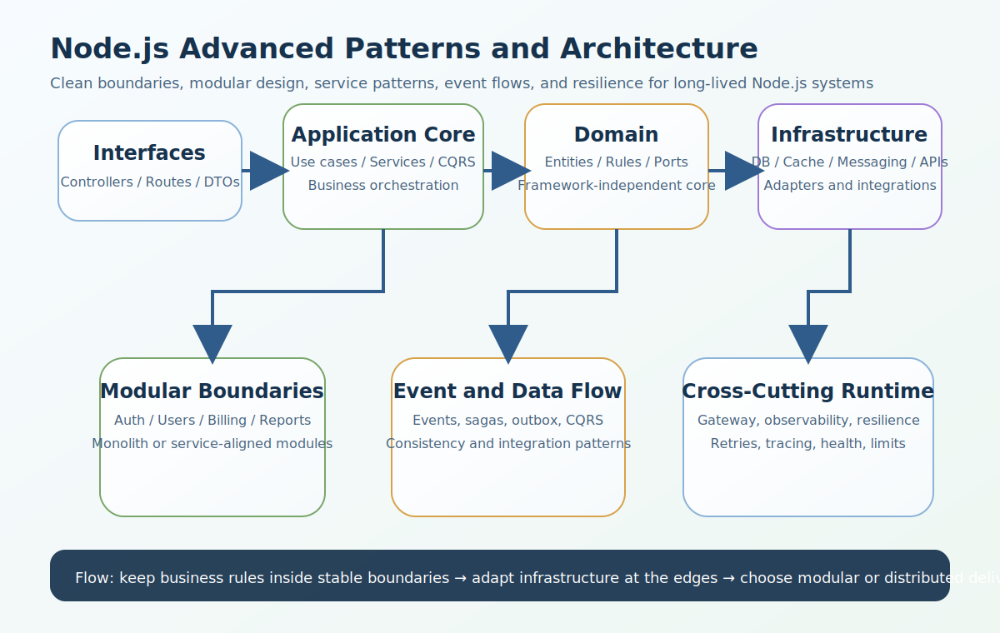

# Node.js Advanced Patterns and Architecture Interview Questions


This guide covers advanced patterns and architecture in Node.js from interview basics to tricky production scenarios. It follows the corrected format of **100 interview questions for each subtopic**, and every answer includes a real Node.js code example plus a real-time example so the scenarios and snippets do not repeat verbatim.

## How To Use This Page

- Questions 1-100 cover Clean Architecture.
- Questions 101-200 cover Layered Architecture.
- Questions 201-300 cover Hexagonal Architecture.
- Questions 301-400 cover Repository Pattern.
- Questions 401-500 cover Dependency Injection.
- Questions 501-600 cover Service Layer Pattern.
- Questions 601-700 cover Modular Monolith.
- Questions 701-800 cover Microservices.
- Questions 801-900 cover Event-Driven Architecture.
- Questions 901-1000 cover API Gateway.
- Questions 1001-1100 cover CQRS basics.
- Questions 1101-1200 cover Saga pattern.
- Questions 1201-1300 cover Outbox pattern.
- Questions 1301-1400 cover Bounded Contexts.
- Questions 1401-1500 cover Observability patterns.
- Questions 1501-1600 cover Resilience patterns.

## 1. Clean Architecture

### Q1.1 What is clean architecture basics in Node.js advanced architecture?

**Answer:**

Clean Architecture basics matters in Node.js advanced architecture because it shapes how business logic is separated from frameworks and infrastructure, how teams scale codebases safely, and how systems stay testable, observable, and maintainable over time. In a real system like a Node.js platform where auth, users, billing, notifications, and reporting keep growing in complexity, a strong answer should connect the concept to module boundaries, dependency direction, delivery speed, operational complexity, and long-term refactoring safety. A more senior answer also explains the practical trade-off so the answer stays grounded in real architecture trade-offs instead of only naming patterns.

**Code Example:**

```js
class CreateInvoiceUseCase1 {
  constructor(invoiceRepository) { this.invoiceRepository = invoiceRepository; }
  async execute(input) { return this.invoiceRepository.save({ ...input, ref: 'inv-1' }); }
}
```

**Real-Time Example:** In a Node.js platform where auth, users, billing, notifications, and reporting keep growing in complexity, the team used this concept so the answer stays grounded in real architecture trade-offs instead of only naming patterns.

### Q1.2 Why does domain layer isolation matter in real production systems?

**Answer:**

Domain layer isolation matters in Node.js advanced architecture because it shapes how business logic is separated from frameworks and infrastructure, how teams scale codebases safely, and how systems stay testable, observable, and maintainable over time. In a real system like a modular business system where controllers, services, repositories, and messaging concerns must stay decoupled, a strong answer should connect the concept to module boundaries, dependency direction, delivery speed, operational complexity, and long-term refactoring safety. A more senior answer also explains the practical trade-off so teams can connect the pattern to testing, maintainability, and production behavior.

**Code Example:**

```js
const cleanLayers2 = { domain: 'rules', application: 'use cases', interfaces: 'controllers', infrastructure: 'db' };
console.log(cleanLayers2);
```

**Real-Time Example:** In a modular business system where controllers, services, repositories, and messaging concerns must stay decoupled, the team used this concept so teams can connect the pattern to testing, maintainability, and production behavior.

### Q1.3 When should a backend team use use case orchestration?

**Answer:**

Use case orchestration matters in Node.js advanced architecture because it shapes how business logic is separated from frameworks and infrastructure, how teams scale codebases safely, and how systems stay testable, observable, and maintainable over time. In a real system like a product team deciding whether to stay with a modular monolith or move to microservices, a strong answer should connect the concept to module boundaries, dependency direction, delivery speed, operational complexity, and long-term refactoring safety. A more senior answer also explains the practical trade-off so boundaries between business logic and infrastructure become easier to reason about.

**Code Example:**

```js
function mapHttpToUseCase3(req) { return { userId: req.params.id, requestId: 'req-3' }; }
```

**Real-Time Example:** In a product team deciding whether to stay with a modular monolith or move to microservices, the team used this concept so boundaries between business logic and infrastructure become easier to reason about.

### Q1.4 How would you explain framework independence in an interview?

**Answer:**

Framework independence matters in Node.js advanced architecture because it shapes how business logic is separated from frameworks and infrastructure, how teams scale codebases safely, and how systems stay testable, observable, and maintainable over time. In a real system like a high-change codebase where testing, refactoring safety, and framework independence all matter, a strong answer should connect the concept to module boundaries, dependency direction, delivery speed, operational complexity, and long-term refactoring safety. A more senior answer also explains the practical trade-off so framework and persistence choices stop leaking into core business rules.

**Code Example:**

```js
const boundaryRule4 = ['domain knows no Express', 'use cases know no SQL details'];
console.log(boundaryRule4);
```

**Real-Time Example:** In a high-change codebase where testing, refactoring safety, and framework independence all matter, the team used this concept so framework and persistence choices stop leaking into core business rules.

### Q1.5 What is a common interview trap around transaction handling in clean architecture?

**Answer:**

Transaction handling in clean architecture matters in Node.js advanced architecture because it shapes how business logic is separated from frameworks and infrastructure, how teams scale codebases safely, and how systems stay testable, observable, and maintainable over time. In a real system like a multi-tenant SaaS where bounded contexts and cross-cutting concerns need clear ownership, a strong answer should connect the concept to module boundaries, dependency direction, delivery speed, operational complexity, and long-term refactoring safety. A more senior answer also explains the practical trade-off so the examples sound like production Node.js systems instead of textbook architecture notes.

**Code Example:**

```js
class TransactionPort5 { async run(work) { return work(); } }
```

**Real-Time Example:** In a multi-tenant SaaS where bounded contexts and cross-cutting concerns need clear ownership, the team used this concept so the examples sound like production Node.js systems instead of textbook architecture notes.

### Q1.6 How is clean architecture basics implemented safely in Node.js systems?

**Answer:**

Clean Architecture basics matters in Node.js advanced architecture because it shapes how business logic is separated from frameworks and infrastructure, how teams scale codebases safely, and how systems stay testable, observable, and maintainable over time. In a real system like a distributed system where events, retries, and eventual consistency shape business workflows, a strong answer should connect the concept to module boundaries, dependency direction, delivery speed, operational complexity, and long-term refactoring safety. A more senior answer also explains the practical trade-off so the trade-offs between simplicity, flexibility, and operational cost become clearer.

**Code Example:**

```js
class CreateInvoiceUseCase6 {
  constructor(invoiceRepository) { this.invoiceRepository = invoiceRepository; }
  async execute(input) { return this.invoiceRepository.save({ ...input, ref: 'inv-6' }); }
}
```

**Real-Time Example:** In a distributed system where events, retries, and eventual consistency shape business workflows, the team used this concept so the trade-offs between simplicity, flexibility, and operational cost become clearer.

### Q1.7 What production problem usually exposes weak understanding of domain layer isolation?

**Answer:**

Domain layer isolation matters in Node.js advanced architecture because it shapes how business logic is separated from frameworks and infrastructure, how teams scale codebases safely, and how systems stay testable, observable, and maintainable over time. In a real system like a Node.js backend where replacing the database or framework should not force rewriting core business rules, a strong answer should connect the concept to module boundaries, dependency direction, delivery speed, operational complexity, and long-term refactoring safety. A more senior answer also explains the practical trade-off so the pattern can be justified by team size, domain complexity, and release needs.

**Code Example:**

```js
const cleanLayers7 = { domain: 'rules', application: 'use cases', interfaces: 'controllers', infrastructure: 'db' };
console.log(cleanLayers7);
```

**Real-Time Example:** In a Node.js backend where replacing the database or framework should not force rewriting core business rules, the team used this concept so the pattern can be justified by team size, domain complexity, and release needs.

### Q1.8 How would a senior engineer justify use case orchestration to a team?

**Answer:**

Use case orchestration matters in Node.js advanced architecture because it shapes how business logic is separated from frameworks and infrastructure, how teams scale codebases safely, and how systems stay testable, observable, and maintainable over time. In a real system like an enterprise codebase where API gateway, observability, and resilience patterns affect every service boundary, a strong answer should connect the concept to module boundaries, dependency direction, delivery speed, operational complexity, and long-term refactoring safety. A more senior answer also explains the practical trade-off so cross-cutting concerns like observability and resilience are treated as design decisions, not afterthoughts.

**Code Example:**

```js
function mapHttpToUseCase8(req) { return { userId: req.params.id, requestId: 'req-8' }; }
```

**Real-Time Example:** In an enterprise codebase where API gateway, observability, and resilience patterns affect every service boundary, the team used this concept so cross-cutting concerns like observability and resilience are treated as design decisions, not afterthoughts.

### Q1.9 What trade-off does framework independence introduce?

**Answer:**

Framework independence matters in Node.js advanced architecture because it shapes how business logic is separated from frameworks and infrastructure, how teams scale codebases safely, and how systems stay testable, observable, and maintainable over time. In a real system like a team introducing CQRS, outbox, and saga patterns only where the domain complexity actually justifies them, a strong answer should connect the concept to module boundaries, dependency direction, delivery speed, operational complexity, and long-term refactoring safety. A more senior answer also explains the practical trade-off so distributed-system complexity is tied to real organizational and business needs.

**Code Example:**

```js
const boundaryRule9 = ['domain knows no Express', 'use cases know no SQL details'];
console.log(boundaryRule9);
```

**Real-Time Example:** In a team introducing CQRS, outbox, and saga patterns only where the domain complexity actually justifies them, the team used this concept so distributed-system complexity is tied to real organizational and business needs.

### Q1.10 How do you answer a tricky follow-up about transaction handling in clean architecture?

**Answer:**

Transaction handling in clean architecture matters in Node.js advanced architecture because it shapes how business logic is separated from frameworks and infrastructure, how teams scale codebases safely, and how systems stay testable, observable, and maintainable over time. In a real system like a long-lived application where architecture choices must support maintainability, scaling, and organizational growth, a strong answer should connect the concept to module boundaries, dependency direction, delivery speed, operational complexity, and long-term refactoring safety. A more senior answer also explains the practical trade-off so the answer reflects senior-level thinking about evolving systems safely over time.

**Code Example:**

```js
class TransactionPort10 { async run(work) { return work(); } }
```

**Real-Time Example:** In a long-lived application where architecture choices must support maintainability, scaling, and organizational growth, the team used this concept so the answer reflects senior-level thinking about evolving systems safely over time.

### Q1.11 What is clean architecture basics in Node.js advanced architecture?

**Answer:**

Clean Architecture basics matters in Node.js advanced architecture because it shapes how business logic is separated from frameworks and infrastructure, how teams scale codebases safely, and how systems stay testable, observable, and maintainable over time. In a real system like a Node.js platform where auth, users, billing, notifications, and reporting keep growing in complexity, a strong answer should connect the concept to module boundaries, dependency direction, delivery speed, operational complexity, and long-term refactoring safety. A more senior answer also explains the practical trade-off so the answer stays grounded in real architecture trade-offs instead of only naming patterns.

**Code Example:**

```js
class CreateInvoiceUseCase11 {
  constructor(invoiceRepository) { this.invoiceRepository = invoiceRepository; }
  async execute(input) { return this.invoiceRepository.save({ ...input, ref: 'inv-11' }); }
}
```

**Real-Time Example:** In a Node.js platform where auth, users, billing, notifications, and reporting keep growing in complexity, the team used this concept so the answer stays grounded in real architecture trade-offs instead of only naming patterns.

### Q1.12 Why does domain layer isolation matter in real production systems?

**Answer:**

Domain layer isolation matters in Node.js advanced architecture because it shapes how business logic is separated from frameworks and infrastructure, how teams scale codebases safely, and how systems stay testable, observable, and maintainable over time. In a real system like a modular business system where controllers, services, repositories, and messaging concerns must stay decoupled, a strong answer should connect the concept to module boundaries, dependency direction, delivery speed, operational complexity, and long-term refactoring safety. A more senior answer also explains the practical trade-off so teams can connect the pattern to testing, maintainability, and production behavior.

**Code Example:**

```js
const cleanLayers12 = { domain: 'rules', application: 'use cases', interfaces: 'controllers', infrastructure: 'db' };
console.log(cleanLayers12);
```

**Real-Time Example:** In a modular business system where controllers, services, repositories, and messaging concerns must stay decoupled, the team used this concept so teams can connect the pattern to testing, maintainability, and production behavior.

### Q1.13 When should a backend team use use case orchestration?

**Answer:**

Use case orchestration matters in Node.js advanced architecture because it shapes how business logic is separated from frameworks and infrastructure, how teams scale codebases safely, and how systems stay testable, observable, and maintainable over time. In a real system like a product team deciding whether to stay with a modular monolith or move to microservices, a strong answer should connect the concept to module boundaries, dependency direction, delivery speed, operational complexity, and long-term refactoring safety. A more senior answer also explains the practical trade-off so boundaries between business logic and infrastructure become easier to reason about.

**Code Example:**

```js
function mapHttpToUseCase13(req) { return { userId: req.params.id, requestId: 'req-13' }; }
```

**Real-Time Example:** In a product team deciding whether to stay with a modular monolith or move to microservices, the team used this concept so boundaries between business logic and infrastructure become easier to reason about.

### Q1.14 How would you explain framework independence in an interview?

**Answer:**

Framework independence matters in Node.js advanced architecture because it shapes how business logic is separated from frameworks and infrastructure, how teams scale codebases safely, and how systems stay testable, observable, and maintainable over time. In a real system like a high-change codebase where testing, refactoring safety, and framework independence all matter, a strong answer should connect the concept to module boundaries, dependency direction, delivery speed, operational complexity, and long-term refactoring safety. A more senior answer also explains the practical trade-off so framework and persistence choices stop leaking into core business rules.

**Code Example:**

```js
const boundaryRule14 = ['domain knows no Express', 'use cases know no SQL details'];
console.log(boundaryRule14);
```

**Real-Time Example:** In a high-change codebase where testing, refactoring safety, and framework independence all matter, the team used this concept so framework and persistence choices stop leaking into core business rules.

### Q1.15 What is a common interview trap around transaction handling in clean architecture?

**Answer:**

Transaction handling in clean architecture matters in Node.js advanced architecture because it shapes how business logic is separated from frameworks and infrastructure, how teams scale codebases safely, and how systems stay testable, observable, and maintainable over time. In a real system like a multi-tenant SaaS where bounded contexts and cross-cutting concerns need clear ownership, a strong answer should connect the concept to module boundaries, dependency direction, delivery speed, operational complexity, and long-term refactoring safety. A more senior answer also explains the practical trade-off so the examples sound like production Node.js systems instead of textbook architecture notes.

**Code Example:**

```js
class TransactionPort15 { async run(work) { return work(); } }
```

**Real-Time Example:** In a multi-tenant SaaS where bounded contexts and cross-cutting concerns need clear ownership, the team used this concept so the examples sound like production Node.js systems instead of textbook architecture notes.

### Q1.16 How is clean architecture basics implemented safely in Node.js systems?

**Answer:**

Clean Architecture basics matters in Node.js advanced architecture because it shapes how business logic is separated from frameworks and infrastructure, how teams scale codebases safely, and how systems stay testable, observable, and maintainable over time. In a real system like a distributed system where events, retries, and eventual consistency shape business workflows, a strong answer should connect the concept to module boundaries, dependency direction, delivery speed, operational complexity, and long-term refactoring safety. A more senior answer also explains the practical trade-off so the trade-offs between simplicity, flexibility, and operational cost become clearer.

**Code Example:**

```js
class CreateInvoiceUseCase16 {
  constructor(invoiceRepository) { this.invoiceRepository = invoiceRepository; }
  async execute(input) { return this.invoiceRepository.save({ ...input, ref: 'inv-16' }); }
}
```

**Real-Time Example:** In a distributed system where events, retries, and eventual consistency shape business workflows, the team used this concept so the trade-offs between simplicity, flexibility, and operational cost become clearer.

### Q1.17 What production problem usually exposes weak understanding of domain layer isolation?

**Answer:**

Domain layer isolation matters in Node.js advanced architecture because it shapes how business logic is separated from frameworks and infrastructure, how teams scale codebases safely, and how systems stay testable, observable, and maintainable over time. In a real system like a Node.js backend where replacing the database or framework should not force rewriting core business rules, a strong answer should connect the concept to module boundaries, dependency direction, delivery speed, operational complexity, and long-term refactoring safety. A more senior answer also explains the practical trade-off so the pattern can be justified by team size, domain complexity, and release needs.

**Code Example:**

```js
const cleanLayers17 = { domain: 'rules', application: 'use cases', interfaces: 'controllers', infrastructure: 'db' };
console.log(cleanLayers17);
```

**Real-Time Example:** In a Node.js backend where replacing the database or framework should not force rewriting core business rules, the team used this concept so the pattern can be justified by team size, domain complexity, and release needs.

### Q1.18 How would a senior engineer justify use case orchestration to a team?

**Answer:**

Use case orchestration matters in Node.js advanced architecture because it shapes how business logic is separated from frameworks and infrastructure, how teams scale codebases safely, and how systems stay testable, observable, and maintainable over time. In a real system like an enterprise codebase where API gateway, observability, and resilience patterns affect every service boundary, a strong answer should connect the concept to module boundaries, dependency direction, delivery speed, operational complexity, and long-term refactoring safety. A more senior answer also explains the practical trade-off so cross-cutting concerns like observability and resilience are treated as design decisions, not afterthoughts.

**Code Example:**

```js
function mapHttpToUseCase18(req) { return { userId: req.params.id, requestId: 'req-18' }; }
```

**Real-Time Example:** In an enterprise codebase where API gateway, observability, and resilience patterns affect every service boundary, the team used this concept so cross-cutting concerns like observability and resilience are treated as design decisions, not afterthoughts.

### Q1.19 What trade-off does framework independence introduce?

**Answer:**

Framework independence matters in Node.js advanced architecture because it shapes how business logic is separated from frameworks and infrastructure, how teams scale codebases safely, and how systems stay testable, observable, and maintainable over time. In a real system like a team introducing CQRS, outbox, and saga patterns only where the domain complexity actually justifies them, a strong answer should connect the concept to module boundaries, dependency direction, delivery speed, operational complexity, and long-term refactoring safety. A more senior answer also explains the practical trade-off so distributed-system complexity is tied to real organizational and business needs.

**Code Example:**

```js
const boundaryRule19 = ['domain knows no Express', 'use cases know no SQL details'];
console.log(boundaryRule19);
```

**Real-Time Example:** In a team introducing CQRS, outbox, and saga patterns only where the domain complexity actually justifies them, the team used this concept so distributed-system complexity is tied to real organizational and business needs.

### Q1.20 How do you answer a tricky follow-up about transaction handling in clean architecture?

**Answer:**

Transaction handling in clean architecture matters in Node.js advanced architecture because it shapes how business logic is separated from frameworks and infrastructure, how teams scale codebases safely, and how systems stay testable, observable, and maintainable over time. In a real system like a long-lived application where architecture choices must support maintainability, scaling, and organizational growth, a strong answer should connect the concept to module boundaries, dependency direction, delivery speed, operational complexity, and long-term refactoring safety. A more senior answer also explains the practical trade-off so the answer reflects senior-level thinking about evolving systems safely over time.

**Code Example:**

```js
class TransactionPort20 { async run(work) { return work(); } }
```

**Real-Time Example:** In a long-lived application where architecture choices must support maintainability, scaling, and organizational growth, the team used this concept so the answer reflects senior-level thinking about evolving systems safely over time.

### Q1.21 What is clean architecture basics in Node.js advanced architecture?

**Answer:**

Clean Architecture basics matters in Node.js advanced architecture because it shapes how business logic is separated from frameworks and infrastructure, how teams scale codebases safely, and how systems stay testable, observable, and maintainable over time. In a real system like a Node.js platform where auth, users, billing, notifications, and reporting keep growing in complexity, a strong answer should connect the concept to module boundaries, dependency direction, delivery speed, operational complexity, and long-term refactoring safety. A more senior answer also explains the practical trade-off so the answer stays grounded in real architecture trade-offs instead of only naming patterns.

**Code Example:**

```js
class CreateInvoiceUseCase21 {
  constructor(invoiceRepository) { this.invoiceRepository = invoiceRepository; }
  async execute(input) { return this.invoiceRepository.save({ ...input, ref: 'inv-21' }); }
}
```

**Real-Time Example:** In a Node.js platform where auth, users, billing, notifications, and reporting keep growing in complexity, the team used this concept so the answer stays grounded in real architecture trade-offs instead of only naming patterns.

### Q1.22 Why does domain layer isolation matter in real production systems?

**Answer:**

Domain layer isolation matters in Node.js advanced architecture because it shapes how business logic is separated from frameworks and infrastructure, how teams scale codebases safely, and how systems stay testable, observable, and maintainable over time. In a real system like a modular business system where controllers, services, repositories, and messaging concerns must stay decoupled, a strong answer should connect the concept to module boundaries, dependency direction, delivery speed, operational complexity, and long-term refactoring safety. A more senior answer also explains the practical trade-off so teams can connect the pattern to testing, maintainability, and production behavior.

**Code Example:**

```js
const cleanLayers22 = { domain: 'rules', application: 'use cases', interfaces: 'controllers', infrastructure: 'db' };
console.log(cleanLayers22);
```

**Real-Time Example:** In a modular business system where controllers, services, repositories, and messaging concerns must stay decoupled, the team used this concept so teams can connect the pattern to testing, maintainability, and production behavior.

### Q1.23 When should a backend team use use case orchestration?

**Answer:**

Use case orchestration matters in Node.js advanced architecture because it shapes how business logic is separated from frameworks and infrastructure, how teams scale codebases safely, and how systems stay testable, observable, and maintainable over time. In a real system like a product team deciding whether to stay with a modular monolith or move to microservices, a strong answer should connect the concept to module boundaries, dependency direction, delivery speed, operational complexity, and long-term refactoring safety. A more senior answer also explains the practical trade-off so boundaries between business logic and infrastructure become easier to reason about.

**Code Example:**

```js
function mapHttpToUseCase23(req) { return { userId: req.params.id, requestId: 'req-23' }; }
```

**Real-Time Example:** In a product team deciding whether to stay with a modular monolith or move to microservices, the team used this concept so boundaries between business logic and infrastructure become easier to reason about.

### Q1.24 How would you explain framework independence in an interview?

**Answer:**

Framework independence matters in Node.js advanced architecture because it shapes how business logic is separated from frameworks and infrastructure, how teams scale codebases safely, and how systems stay testable, observable, and maintainable over time. In a real system like a high-change codebase where testing, refactoring safety, and framework independence all matter, a strong answer should connect the concept to module boundaries, dependency direction, delivery speed, operational complexity, and long-term refactoring safety. A more senior answer also explains the practical trade-off so framework and persistence choices stop leaking into core business rules.

**Code Example:**

```js
const boundaryRule24 = ['domain knows no Express', 'use cases know no SQL details'];
console.log(boundaryRule24);
```

**Real-Time Example:** In a high-change codebase where testing, refactoring safety, and framework independence all matter, the team used this concept so framework and persistence choices stop leaking into core business rules.

### Q1.25 What is a common interview trap around transaction handling in clean architecture?

**Answer:**

Transaction handling in clean architecture matters in Node.js advanced architecture because it shapes how business logic is separated from frameworks and infrastructure, how teams scale codebases safely, and how systems stay testable, observable, and maintainable over time. In a real system like a multi-tenant SaaS where bounded contexts and cross-cutting concerns need clear ownership, a strong answer should connect the concept to module boundaries, dependency direction, delivery speed, operational complexity, and long-term refactoring safety. A more senior answer also explains the practical trade-off so the examples sound like production Node.js systems instead of textbook architecture notes.

**Code Example:**

```js
class TransactionPort25 { async run(work) { return work(); } }
```

**Real-Time Example:** In a multi-tenant SaaS where bounded contexts and cross-cutting concerns need clear ownership, the team used this concept so the examples sound like production Node.js systems instead of textbook architecture notes.

### Q1.26 How is clean architecture basics implemented safely in Node.js systems?

**Answer:**

Clean Architecture basics matters in Node.js advanced architecture because it shapes how business logic is separated from frameworks and infrastructure, how teams scale codebases safely, and how systems stay testable, observable, and maintainable over time. In a real system like a distributed system where events, retries, and eventual consistency shape business workflows, a strong answer should connect the concept to module boundaries, dependency direction, delivery speed, operational complexity, and long-term refactoring safety. A more senior answer also explains the practical trade-off so the trade-offs between simplicity, flexibility, and operational cost become clearer.

**Code Example:**

```js
class CreateInvoiceUseCase26 {
  constructor(invoiceRepository) { this.invoiceRepository = invoiceRepository; }
  async execute(input) { return this.invoiceRepository.save({ ...input, ref: 'inv-26' }); }
}
```

**Real-Time Example:** In a distributed system where events, retries, and eventual consistency shape business workflows, the team used this concept so the trade-offs between simplicity, flexibility, and operational cost become clearer.

### Q1.27 What production problem usually exposes weak understanding of domain layer isolation?

**Answer:**

Domain layer isolation matters in Node.js advanced architecture because it shapes how business logic is separated from frameworks and infrastructure, how teams scale codebases safely, and how systems stay testable, observable, and maintainable over time. In a real system like a Node.js backend where replacing the database or framework should not force rewriting core business rules, a strong answer should connect the concept to module boundaries, dependency direction, delivery speed, operational complexity, and long-term refactoring safety. A more senior answer also explains the practical trade-off so the pattern can be justified by team size, domain complexity, and release needs.

**Code Example:**

```js
const cleanLayers27 = { domain: 'rules', application: 'use cases', interfaces: 'controllers', infrastructure: 'db' };
console.log(cleanLayers27);
```

**Real-Time Example:** In a Node.js backend where replacing the database or framework should not force rewriting core business rules, the team used this concept so the pattern can be justified by team size, domain complexity, and release needs.

### Q1.28 How would a senior engineer justify use case orchestration to a team?

**Answer:**

Use case orchestration matters in Node.js advanced architecture because it shapes how business logic is separated from frameworks and infrastructure, how teams scale codebases safely, and how systems stay testable, observable, and maintainable over time. In a real system like an enterprise codebase where API gateway, observability, and resilience patterns affect every service boundary, a strong answer should connect the concept to module boundaries, dependency direction, delivery speed, operational complexity, and long-term refactoring safety. A more senior answer also explains the practical trade-off so cross-cutting concerns like observability and resilience are treated as design decisions, not afterthoughts.

**Code Example:**

```js
function mapHttpToUseCase28(req) { return { userId: req.params.id, requestId: 'req-28' }; }
```

**Real-Time Example:** In an enterprise codebase where API gateway, observability, and resilience patterns affect every service boundary, the team used this concept so cross-cutting concerns like observability and resilience are treated as design decisions, not afterthoughts.

### Q1.29 What trade-off does framework independence introduce?

**Answer:**

Framework independence matters in Node.js advanced architecture because it shapes how business logic is separated from frameworks and infrastructure, how teams scale codebases safely, and how systems stay testable, observable, and maintainable over time. In a real system like a team introducing CQRS, outbox, and saga patterns only where the domain complexity actually justifies them, a strong answer should connect the concept to module boundaries, dependency direction, delivery speed, operational complexity, and long-term refactoring safety. A more senior answer also explains the practical trade-off so distributed-system complexity is tied to real organizational and business needs.

**Code Example:**

```js
const boundaryRule29 = ['domain knows no Express', 'use cases know no SQL details'];
console.log(boundaryRule29);
```

**Real-Time Example:** In a team introducing CQRS, outbox, and saga patterns only where the domain complexity actually justifies them, the team used this concept so distributed-system complexity is tied to real organizational and business needs.

### Q1.30 How do you answer a tricky follow-up about transaction handling in clean architecture?

**Answer:**

Transaction handling in clean architecture matters in Node.js advanced architecture because it shapes how business logic is separated from frameworks and infrastructure, how teams scale codebases safely, and how systems stay testable, observable, and maintainable over time. In a real system like a long-lived application where architecture choices must support maintainability, scaling, and organizational growth, a strong answer should connect the concept to module boundaries, dependency direction, delivery speed, operational complexity, and long-term refactoring safety. A more senior answer also explains the practical trade-off so the answer reflects senior-level thinking about evolving systems safely over time.

**Code Example:**

```js
class TransactionPort30 { async run(work) { return work(); } }
```

**Real-Time Example:** In a long-lived application where architecture choices must support maintainability, scaling, and organizational growth, the team used this concept so the answer reflects senior-level thinking about evolving systems safely over time.

### Q1.31 What is clean architecture basics in Node.js advanced architecture?

**Answer:**

Clean Architecture basics matters in Node.js advanced architecture because it shapes how business logic is separated from frameworks and infrastructure, how teams scale codebases safely, and how systems stay testable, observable, and maintainable over time. In a real system like a Node.js platform where auth, users, billing, notifications, and reporting keep growing in complexity, a strong answer should connect the concept to module boundaries, dependency direction, delivery speed, operational complexity, and long-term refactoring safety. A more senior answer also explains the practical trade-off so the answer stays grounded in real architecture trade-offs instead of only naming patterns.

**Code Example:**

```js
class CreateInvoiceUseCase31 {
  constructor(invoiceRepository) { this.invoiceRepository = invoiceRepository; }
  async execute(input) { return this.invoiceRepository.save({ ...input, ref: 'inv-31' }); }
}
```

**Real-Time Example:** In a Node.js platform where auth, users, billing, notifications, and reporting keep growing in complexity, the team used this concept so the answer stays grounded in real architecture trade-offs instead of only naming patterns.

### Q1.32 Why does domain layer isolation matter in real production systems?

**Answer:**

Domain layer isolation matters in Node.js advanced architecture because it shapes how business logic is separated from frameworks and infrastructure, how teams scale codebases safely, and how systems stay testable, observable, and maintainable over time. In a real system like a modular business system where controllers, services, repositories, and messaging concerns must stay decoupled, a strong answer should connect the concept to module boundaries, dependency direction, delivery speed, operational complexity, and long-term refactoring safety. A more senior answer also explains the practical trade-off so teams can connect the pattern to testing, maintainability, and production behavior.

**Code Example:**

```js
const cleanLayers32 = { domain: 'rules', application: 'use cases', interfaces: 'controllers', infrastructure: 'db' };
console.log(cleanLayers32);
```

**Real-Time Example:** In a modular business system where controllers, services, repositories, and messaging concerns must stay decoupled, the team used this concept so teams can connect the pattern to testing, maintainability, and production behavior.

### Q1.33 When should a backend team use use case orchestration?

**Answer:**

Use case orchestration matters in Node.js advanced architecture because it shapes how business logic is separated from frameworks and infrastructure, how teams scale codebases safely, and how systems stay testable, observable, and maintainable over time. In a real system like a product team deciding whether to stay with a modular monolith or move to microservices, a strong answer should connect the concept to module boundaries, dependency direction, delivery speed, operational complexity, and long-term refactoring safety. A more senior answer also explains the practical trade-off so boundaries between business logic and infrastructure become easier to reason about.

**Code Example:**

```js
function mapHttpToUseCase33(req) { return { userId: req.params.id, requestId: 'req-33' }; }
```

**Real-Time Example:** In a product team deciding whether to stay with a modular monolith or move to microservices, the team used this concept so boundaries between business logic and infrastructure become easier to reason about.

### Q1.34 How would you explain framework independence in an interview?

**Answer:**

Framework independence matters in Node.js advanced architecture because it shapes how business logic is separated from frameworks and infrastructure, how teams scale codebases safely, and how systems stay testable, observable, and maintainable over time. In a real system like a high-change codebase where testing, refactoring safety, and framework independence all matter, a strong answer should connect the concept to module boundaries, dependency direction, delivery speed, operational complexity, and long-term refactoring safety. A more senior answer also explains the practical trade-off so framework and persistence choices stop leaking into core business rules.

**Code Example:**

```js
const boundaryRule34 = ['domain knows no Express', 'use cases know no SQL details'];
console.log(boundaryRule34);
```

**Real-Time Example:** In a high-change codebase where testing, refactoring safety, and framework independence all matter, the team used this concept so framework and persistence choices stop leaking into core business rules.

### Q1.35 What is a common interview trap around transaction handling in clean architecture?

**Answer:**

Transaction handling in clean architecture matters in Node.js advanced architecture because it shapes how business logic is separated from frameworks and infrastructure, how teams scale codebases safely, and how systems stay testable, observable, and maintainable over time. In a real system like a multi-tenant SaaS where bounded contexts and cross-cutting concerns need clear ownership, a strong answer should connect the concept to module boundaries, dependency direction, delivery speed, operational complexity, and long-term refactoring safety. A more senior answer also explains the practical trade-off so the examples sound like production Node.js systems instead of textbook architecture notes.

**Code Example:**

```js
class TransactionPort35 { async run(work) { return work(); } }
```

**Real-Time Example:** In a multi-tenant SaaS where bounded contexts and cross-cutting concerns need clear ownership, the team used this concept so the examples sound like production Node.js systems instead of textbook architecture notes.

### Q1.36 How is clean architecture basics implemented safely in Node.js systems?

**Answer:**

Clean Architecture basics matters in Node.js advanced architecture because it shapes how business logic is separated from frameworks and infrastructure, how teams scale codebases safely, and how systems stay testable, observable, and maintainable over time. In a real system like a distributed system where events, retries, and eventual consistency shape business workflows, a strong answer should connect the concept to module boundaries, dependency direction, delivery speed, operational complexity, and long-term refactoring safety. A more senior answer also explains the practical trade-off so the trade-offs between simplicity, flexibility, and operational cost become clearer.

**Code Example:**

```js
class CreateInvoiceUseCase36 {
  constructor(invoiceRepository) { this.invoiceRepository = invoiceRepository; }
  async execute(input) { return this.invoiceRepository.save({ ...input, ref: 'inv-36' }); }
}
```

**Real-Time Example:** In a distributed system where events, retries, and eventual consistency shape business workflows, the team used this concept so the trade-offs between simplicity, flexibility, and operational cost become clearer.

### Q1.37 What production problem usually exposes weak understanding of domain layer isolation?

**Answer:**

Domain layer isolation matters in Node.js advanced architecture because it shapes how business logic is separated from frameworks and infrastructure, how teams scale codebases safely, and how systems stay testable, observable, and maintainable over time. In a real system like a Node.js backend where replacing the database or framework should not force rewriting core business rules, a strong answer should connect the concept to module boundaries, dependency direction, delivery speed, operational complexity, and long-term refactoring safety. A more senior answer also explains the practical trade-off so the pattern can be justified by team size, domain complexity, and release needs.

**Code Example:**

```js
const cleanLayers37 = { domain: 'rules', application: 'use cases', interfaces: 'controllers', infrastructure: 'db' };
console.log(cleanLayers37);
```

**Real-Time Example:** In a Node.js backend where replacing the database or framework should not force rewriting core business rules, the team used this concept so the pattern can be justified by team size, domain complexity, and release needs.

### Q1.38 How would a senior engineer justify use case orchestration to a team?

**Answer:**

Use case orchestration matters in Node.js advanced architecture because it shapes how business logic is separated from frameworks and infrastructure, how teams scale codebases safely, and how systems stay testable, observable, and maintainable over time. In a real system like an enterprise codebase where API gateway, observability, and resilience patterns affect every service boundary, a strong answer should connect the concept to module boundaries, dependency direction, delivery speed, operational complexity, and long-term refactoring safety. A more senior answer also explains the practical trade-off so cross-cutting concerns like observability and resilience are treated as design decisions, not afterthoughts.

**Code Example:**

```js
function mapHttpToUseCase38(req) { return { userId: req.params.id, requestId: 'req-38' }; }
```

**Real-Time Example:** In an enterprise codebase where API gateway, observability, and resilience patterns affect every service boundary, the team used this concept so cross-cutting concerns like observability and resilience are treated as design decisions, not afterthoughts.

### Q1.39 What trade-off does framework independence introduce?

**Answer:**

Framework independence matters in Node.js advanced architecture because it shapes how business logic is separated from frameworks and infrastructure, how teams scale codebases safely, and how systems stay testable, observable, and maintainable over time. In a real system like a team introducing CQRS, outbox, and saga patterns only where the domain complexity actually justifies them, a strong answer should connect the concept to module boundaries, dependency direction, delivery speed, operational complexity, and long-term refactoring safety. A more senior answer also explains the practical trade-off so distributed-system complexity is tied to real organizational and business needs.

**Code Example:**

```js
const boundaryRule39 = ['domain knows no Express', 'use cases know no SQL details'];
console.log(boundaryRule39);
```

**Real-Time Example:** In a team introducing CQRS, outbox, and saga patterns only where the domain complexity actually justifies them, the team used this concept so distributed-system complexity is tied to real organizational and business needs.

### Q1.40 How do you answer a tricky follow-up about transaction handling in clean architecture?

**Answer:**

Transaction handling in clean architecture matters in Node.js advanced architecture because it shapes how business logic is separated from frameworks and infrastructure, how teams scale codebases safely, and how systems stay testable, observable, and maintainable over time. In a real system like a long-lived application where architecture choices must support maintainability, scaling, and organizational growth, a strong answer should connect the concept to module boundaries, dependency direction, delivery speed, operational complexity, and long-term refactoring safety. A more senior answer also explains the practical trade-off so the answer reflects senior-level thinking about evolving systems safely over time.

**Code Example:**

```js
class TransactionPort40 { async run(work) { return work(); } }
```

**Real-Time Example:** In a long-lived application where architecture choices must support maintainability, scaling, and organizational growth, the team used this concept so the answer reflects senior-level thinking about evolving systems safely over time.

### Q1.41 What is clean architecture basics in Node.js advanced architecture?

**Answer:**

Clean Architecture basics matters in Node.js advanced architecture because it shapes how business logic is separated from frameworks and infrastructure, how teams scale codebases safely, and how systems stay testable, observable, and maintainable over time. In a real system like a Node.js platform where auth, users, billing, notifications, and reporting keep growing in complexity, a strong answer should connect the concept to module boundaries, dependency direction, delivery speed, operational complexity, and long-term refactoring safety. A more senior answer also explains the practical trade-off so the answer stays grounded in real architecture trade-offs instead of only naming patterns.

**Code Example:**

```js
class CreateInvoiceUseCase41 {
  constructor(invoiceRepository) { this.invoiceRepository = invoiceRepository; }
  async execute(input) { return this.invoiceRepository.save({ ...input, ref: 'inv-41' }); }
}
```

**Real-Time Example:** In a Node.js platform where auth, users, billing, notifications, and reporting keep growing in complexity, the team used this concept so the answer stays grounded in real architecture trade-offs instead of only naming patterns.

### Q1.42 Why does domain layer isolation matter in real production systems?

**Answer:**

Domain layer isolation matters in Node.js advanced architecture because it shapes how business logic is separated from frameworks and infrastructure, how teams scale codebases safely, and how systems stay testable, observable, and maintainable over time. In a real system like a modular business system where controllers, services, repositories, and messaging concerns must stay decoupled, a strong answer should connect the concept to module boundaries, dependency direction, delivery speed, operational complexity, and long-term refactoring safety. A more senior answer also explains the practical trade-off so teams can connect the pattern to testing, maintainability, and production behavior.

**Code Example:**

```js
const cleanLayers42 = { domain: 'rules', application: 'use cases', interfaces: 'controllers', infrastructure: 'db' };
console.log(cleanLayers42);
```

**Real-Time Example:** In a modular business system where controllers, services, repositories, and messaging concerns must stay decoupled, the team used this concept so teams can connect the pattern to testing, maintainability, and production behavior.

### Q1.43 When should a backend team use use case orchestration?

**Answer:**

Use case orchestration matters in Node.js advanced architecture because it shapes how business logic is separated from frameworks and infrastructure, how teams scale codebases safely, and how systems stay testable, observable, and maintainable over time. In a real system like a product team deciding whether to stay with a modular monolith or move to microservices, a strong answer should connect the concept to module boundaries, dependency direction, delivery speed, operational complexity, and long-term refactoring safety. A more senior answer also explains the practical trade-off so boundaries between business logic and infrastructure become easier to reason about.

**Code Example:**

```js
function mapHttpToUseCase43(req) { return { userId: req.params.id, requestId: 'req-43' }; }
```

**Real-Time Example:** In a product team deciding whether to stay with a modular monolith or move to microservices, the team used this concept so boundaries between business logic and infrastructure become easier to reason about.

### Q1.44 How would you explain framework independence in an interview?

**Answer:**

Framework independence matters in Node.js advanced architecture because it shapes how business logic is separated from frameworks and infrastructure, how teams scale codebases safely, and how systems stay testable, observable, and maintainable over time. In a real system like a high-change codebase where testing, refactoring safety, and framework independence all matter, a strong answer should connect the concept to module boundaries, dependency direction, delivery speed, operational complexity, and long-term refactoring safety. A more senior answer also explains the practical trade-off so framework and persistence choices stop leaking into core business rules.

**Code Example:**

```js
const boundaryRule44 = ['domain knows no Express', 'use cases know no SQL details'];
console.log(boundaryRule44);
```

**Real-Time Example:** In a high-change codebase where testing, refactoring safety, and framework independence all matter, the team used this concept so framework and persistence choices stop leaking into core business rules.

### Q1.45 What is a common interview trap around transaction handling in clean architecture?

**Answer:**

Transaction handling in clean architecture matters in Node.js advanced architecture because it shapes how business logic is separated from frameworks and infrastructure, how teams scale codebases safely, and how systems stay testable, observable, and maintainable over time. In a real system like a multi-tenant SaaS where bounded contexts and cross-cutting concerns need clear ownership, a strong answer should connect the concept to module boundaries, dependency direction, delivery speed, operational complexity, and long-term refactoring safety. A more senior answer also explains the practical trade-off so the examples sound like production Node.js systems instead of textbook architecture notes.

**Code Example:**

```js
class TransactionPort45 { async run(work) { return work(); } }
```

**Real-Time Example:** In a multi-tenant SaaS where bounded contexts and cross-cutting concerns need clear ownership, the team used this concept so the examples sound like production Node.js systems instead of textbook architecture notes.

### Q1.46 How is clean architecture basics implemented safely in Node.js systems?

**Answer:**

Clean Architecture basics matters in Node.js advanced architecture because it shapes how business logic is separated from frameworks and infrastructure, how teams scale codebases safely, and how systems stay testable, observable, and maintainable over time. In a real system like a distributed system where events, retries, and eventual consistency shape business workflows, a strong answer should connect the concept to module boundaries, dependency direction, delivery speed, operational complexity, and long-term refactoring safety. A more senior answer also explains the practical trade-off so the trade-offs between simplicity, flexibility, and operational cost become clearer.

**Code Example:**

```js
class CreateInvoiceUseCase46 {
  constructor(invoiceRepository) { this.invoiceRepository = invoiceRepository; }
  async execute(input) { return this.invoiceRepository.save({ ...input, ref: 'inv-46' }); }
}
```

**Real-Time Example:** In a distributed system where events, retries, and eventual consistency shape business workflows, the team used this concept so the trade-offs between simplicity, flexibility, and operational cost become clearer.

### Q1.47 What production problem usually exposes weak understanding of domain layer isolation?

**Answer:**

Domain layer isolation matters in Node.js advanced architecture because it shapes how business logic is separated from frameworks and infrastructure, how teams scale codebases safely, and how systems stay testable, observable, and maintainable over time. In a real system like a Node.js backend where replacing the database or framework should not force rewriting core business rules, a strong answer should connect the concept to module boundaries, dependency direction, delivery speed, operational complexity, and long-term refactoring safety. A more senior answer also explains the practical trade-off so the pattern can be justified by team size, domain complexity, and release needs.

**Code Example:**

```js
const cleanLayers47 = { domain: 'rules', application: 'use cases', interfaces: 'controllers', infrastructure: 'db' };
console.log(cleanLayers47);
```

**Real-Time Example:** In a Node.js backend where replacing the database or framework should not force rewriting core business rules, the team used this concept so the pattern can be justified by team size, domain complexity, and release needs.

### Q1.48 How would a senior engineer justify use case orchestration to a team?

**Answer:**

Use case orchestration matters in Node.js advanced architecture because it shapes how business logic is separated from frameworks and infrastructure, how teams scale codebases safely, and how systems stay testable, observable, and maintainable over time. In a real system like an enterprise codebase where API gateway, observability, and resilience patterns affect every service boundary, a strong answer should connect the concept to module boundaries, dependency direction, delivery speed, operational complexity, and long-term refactoring safety. A more senior answer also explains the practical trade-off so cross-cutting concerns like observability and resilience are treated as design decisions, not afterthoughts.

**Code Example:**

```js
function mapHttpToUseCase48(req) { return { userId: req.params.id, requestId: 'req-48' }; }
```

**Real-Time Example:** In an enterprise codebase where API gateway, observability, and resilience patterns affect every service boundary, the team used this concept so cross-cutting concerns like observability and resilience are treated as design decisions, not afterthoughts.

### Q1.49 What trade-off does framework independence introduce?

**Answer:**

Framework independence matters in Node.js advanced architecture because it shapes how business logic is separated from frameworks and infrastructure, how teams scale codebases safely, and how systems stay testable, observable, and maintainable over time. In a real system like a team introducing CQRS, outbox, and saga patterns only where the domain complexity actually justifies them, a strong answer should connect the concept to module boundaries, dependency direction, delivery speed, operational complexity, and long-term refactoring safety. A more senior answer also explains the practical trade-off so distributed-system complexity is tied to real organizational and business needs.

**Code Example:**

```js
const boundaryRule49 = ['domain knows no Express', 'use cases know no SQL details'];
console.log(boundaryRule49);
```

**Real-Time Example:** In a team introducing CQRS, outbox, and saga patterns only where the domain complexity actually justifies them, the team used this concept so distributed-system complexity is tied to real organizational and business needs.

### Q1.50 How do you answer a tricky follow-up about transaction handling in clean architecture?

**Answer:**

Transaction handling in clean architecture matters in Node.js advanced architecture because it shapes how business logic is separated from frameworks and infrastructure, how teams scale codebases safely, and how systems stay testable, observable, and maintainable over time. In a real system like a long-lived application where architecture choices must support maintainability, scaling, and organizational growth, a strong answer should connect the concept to module boundaries, dependency direction, delivery speed, operational complexity, and long-term refactoring safety. A more senior answer also explains the practical trade-off so the answer reflects senior-level thinking about evolving systems safely over time.

**Code Example:**

```js
class TransactionPort50 { async run(work) { return work(); } }
```

**Real-Time Example:** In a long-lived application where architecture choices must support maintainability, scaling, and organizational growth, the team used this concept so the answer reflects senior-level thinking about evolving systems safely over time.

### Q1.51 What is clean architecture basics in Node.js advanced architecture?

**Answer:**

Clean Architecture basics matters in Node.js advanced architecture because it shapes how business logic is separated from frameworks and infrastructure, how teams scale codebases safely, and how systems stay testable, observable, and maintainable over time. In a real system like a Node.js platform where auth, users, billing, notifications, and reporting keep growing in complexity, a strong answer should connect the concept to module boundaries, dependency direction, delivery speed, operational complexity, and long-term refactoring safety. A more senior answer also explains the practical trade-off so the answer stays grounded in real architecture trade-offs instead of only naming patterns.

**Code Example:**

```js
class CreateInvoiceUseCase51 {
  constructor(invoiceRepository) { this.invoiceRepository = invoiceRepository; }
  async execute(input) { return this.invoiceRepository.save({ ...input, ref: 'inv-51' }); }
}
```

**Real-Time Example:** In a Node.js platform where auth, users, billing, notifications, and reporting keep growing in complexity, the team used this concept so the answer stays grounded in real architecture trade-offs instead of only naming patterns.

### Q1.52 Why does domain layer isolation matter in real production systems?

**Answer:**

Domain layer isolation matters in Node.js advanced architecture because it shapes how business logic is separated from frameworks and infrastructure, how teams scale codebases safely, and how systems stay testable, observable, and maintainable over time. In a real system like a modular business system where controllers, services, repositories, and messaging concerns must stay decoupled, a strong answer should connect the concept to module boundaries, dependency direction, delivery speed, operational complexity, and long-term refactoring safety. A more senior answer also explains the practical trade-off so teams can connect the pattern to testing, maintainability, and production behavior.

**Code Example:**

```js
const cleanLayers52 = { domain: 'rules', application: 'use cases', interfaces: 'controllers', infrastructure: 'db' };
console.log(cleanLayers52);
```

**Real-Time Example:** In a modular business system where controllers, services, repositories, and messaging concerns must stay decoupled, the team used this concept so teams can connect the pattern to testing, maintainability, and production behavior.

### Q1.53 When should a backend team use use case orchestration?

**Answer:**

Use case orchestration matters in Node.js advanced architecture because it shapes how business logic is separated from frameworks and infrastructure, how teams scale codebases safely, and how systems stay testable, observable, and maintainable over time. In a real system like a product team deciding whether to stay with a modular monolith or move to microservices, a strong answer should connect the concept to module boundaries, dependency direction, delivery speed, operational complexity, and long-term refactoring safety. A more senior answer also explains the practical trade-off so boundaries between business logic and infrastructure become easier to reason about.

**Code Example:**

```js
function mapHttpToUseCase53(req) { return { userId: req.params.id, requestId: 'req-53' }; }
```

**Real-Time Example:** In a product team deciding whether to stay with a modular monolith or move to microservices, the team used this concept so boundaries between business logic and infrastructure become easier to reason about.

### Q1.54 How would you explain framework independence in an interview?

**Answer:**

Framework independence matters in Node.js advanced architecture because it shapes how business logic is separated from frameworks and infrastructure, how teams scale codebases safely, and how systems stay testable, observable, and maintainable over time. In a real system like a high-change codebase where testing, refactoring safety, and framework independence all matter, a strong answer should connect the concept to module boundaries, dependency direction, delivery speed, operational complexity, and long-term refactoring safety. A more senior answer also explains the practical trade-off so framework and persistence choices stop leaking into core business rules.

**Code Example:**

```js
const boundaryRule54 = ['domain knows no Express', 'use cases know no SQL details'];
console.log(boundaryRule54);
```

**Real-Time Example:** In a high-change codebase where testing, refactoring safety, and framework independence all matter, the team used this concept so framework and persistence choices stop leaking into core business rules.

### Q1.55 What is a common interview trap around transaction handling in clean architecture?

**Answer:**

Transaction handling in clean architecture matters in Node.js advanced architecture because it shapes how business logic is separated from frameworks and infrastructure, how teams scale codebases safely, and how systems stay testable, observable, and maintainable over time. In a real system like a multi-tenant SaaS where bounded contexts and cross-cutting concerns need clear ownership, a strong answer should connect the concept to module boundaries, dependency direction, delivery speed, operational complexity, and long-term refactoring safety. A more senior answer also explains the practical trade-off so the examples sound like production Node.js systems instead of textbook architecture notes.

**Code Example:**

```js
class TransactionPort55 { async run(work) { return work(); } }
```

**Real-Time Example:** In a multi-tenant SaaS where bounded contexts and cross-cutting concerns need clear ownership, the team used this concept so the examples sound like production Node.js systems instead of textbook architecture notes.

### Q1.56 How is clean architecture basics implemented safely in Node.js systems?

**Answer:**

Clean Architecture basics matters in Node.js advanced architecture because it shapes how business logic is separated from frameworks and infrastructure, how teams scale codebases safely, and how systems stay testable, observable, and maintainable over time. In a real system like a distributed system where events, retries, and eventual consistency shape business workflows, a strong answer should connect the concept to module boundaries, dependency direction, delivery speed, operational complexity, and long-term refactoring safety. A more senior answer also explains the practical trade-off so the trade-offs between simplicity, flexibility, and operational cost become clearer.

**Code Example:**

```js
class CreateInvoiceUseCase56 {
  constructor(invoiceRepository) { this.invoiceRepository = invoiceRepository; }
  async execute(input) { return this.invoiceRepository.save({ ...input, ref: 'inv-56' }); }
}
```

**Real-Time Example:** In a distributed system where events, retries, and eventual consistency shape business workflows, the team used this concept so the trade-offs between simplicity, flexibility, and operational cost become clearer.

### Q1.57 What production problem usually exposes weak understanding of domain layer isolation?

**Answer:**

Domain layer isolation matters in Node.js advanced architecture because it shapes how business logic is separated from frameworks and infrastructure, how teams scale codebases safely, and how systems stay testable, observable, and maintainable over time. In a real system like a Node.js backend where replacing the database or framework should not force rewriting core business rules, a strong answer should connect the concept to module boundaries, dependency direction, delivery speed, operational complexity, and long-term refactoring safety. A more senior answer also explains the practical trade-off so the pattern can be justified by team size, domain complexity, and release needs.

**Code Example:**

```js
const cleanLayers57 = { domain: 'rules', application: 'use cases', interfaces: 'controllers', infrastructure: 'db' };
console.log(cleanLayers57);
```

**Real-Time Example:** In a Node.js backend where replacing the database or framework should not force rewriting core business rules, the team used this concept so the pattern can be justified by team size, domain complexity, and release needs.

### Q1.58 How would a senior engineer justify use case orchestration to a team?

**Answer:**

Use case orchestration matters in Node.js advanced architecture because it shapes how business logic is separated from frameworks and infrastructure, how teams scale codebases safely, and how systems stay testable, observable, and maintainable over time. In a real system like an enterprise codebase where API gateway, observability, and resilience patterns affect every service boundary, a strong answer should connect the concept to module boundaries, dependency direction, delivery speed, operational complexity, and long-term refactoring safety. A more senior answer also explains the practical trade-off so cross-cutting concerns like observability and resilience are treated as design decisions, not afterthoughts.

**Code Example:**

```js
function mapHttpToUseCase58(req) { return { userId: req.params.id, requestId: 'req-58' }; }
```

**Real-Time Example:** In an enterprise codebase where API gateway, observability, and resilience patterns affect every service boundary, the team used this concept so cross-cutting concerns like observability and resilience are treated as design decisions, not afterthoughts.

### Q1.59 What trade-off does framework independence introduce?

**Answer:**

Framework independence matters in Node.js advanced architecture because it shapes how business logic is separated from frameworks and infrastructure, how teams scale codebases safely, and how systems stay testable, observable, and maintainable over time. In a real system like a team introducing CQRS, outbox, and saga patterns only where the domain complexity actually justifies them, a strong answer should connect the concept to module boundaries, dependency direction, delivery speed, operational complexity, and long-term refactoring safety. A more senior answer also explains the practical trade-off so distributed-system complexity is tied to real organizational and business needs.

**Code Example:**

```js
const boundaryRule59 = ['domain knows no Express', 'use cases know no SQL details'];
console.log(boundaryRule59);
```

**Real-Time Example:** In a team introducing CQRS, outbox, and saga patterns only where the domain complexity actually justifies them, the team used this concept so distributed-system complexity is tied to real organizational and business needs.

### Q1.60 How do you answer a tricky follow-up about transaction handling in clean architecture?

**Answer:**

Transaction handling in clean architecture matters in Node.js advanced architecture because it shapes how business logic is separated from frameworks and infrastructure, how teams scale codebases safely, and how systems stay testable, observable, and maintainable over time. In a real system like a long-lived application where architecture choices must support maintainability, scaling, and organizational growth, a strong answer should connect the concept to module boundaries, dependency direction, delivery speed, operational complexity, and long-term refactoring safety. A more senior answer also explains the practical trade-off so the answer reflects senior-level thinking about evolving systems safely over time.

**Code Example:**

```js
class TransactionPort60 { async run(work) { return work(); } }
```

**Real-Time Example:** In a long-lived application where architecture choices must support maintainability, scaling, and organizational growth, the team used this concept so the answer reflects senior-level thinking about evolving systems safely over time.

### Q1.61 What is clean architecture basics in Node.js advanced architecture?

**Answer:**

Clean Architecture basics matters in Node.js advanced architecture because it shapes how business logic is separated from frameworks and infrastructure, how teams scale codebases safely, and how systems stay testable, observable, and maintainable over time. In a real system like a Node.js platform where auth, users, billing, notifications, and reporting keep growing in complexity, a strong answer should connect the concept to module boundaries, dependency direction, delivery speed, operational complexity, and long-term refactoring safety. A more senior answer also explains the practical trade-off so the answer stays grounded in real architecture trade-offs instead of only naming patterns.

**Code Example:**

```js
class CreateInvoiceUseCase61 {
  constructor(invoiceRepository) { this.invoiceRepository = invoiceRepository; }
  async execute(input) { return this.invoiceRepository.save({ ...input, ref: 'inv-61' }); }
}
```

**Real-Time Example:** In a Node.js platform where auth, users, billing, notifications, and reporting keep growing in complexity, the team used this concept so the answer stays grounded in real architecture trade-offs instead of only naming patterns.

### Q1.62 Why does domain layer isolation matter in real production systems?

**Answer:**

Domain layer isolation matters in Node.js advanced architecture because it shapes how business logic is separated from frameworks and infrastructure, how teams scale codebases safely, and how systems stay testable, observable, and maintainable over time. In a real system like a modular business system where controllers, services, repositories, and messaging concerns must stay decoupled, a strong answer should connect the concept to module boundaries, dependency direction, delivery speed, operational complexity, and long-term refactoring safety. A more senior answer also explains the practical trade-off so teams can connect the pattern to testing, maintainability, and production behavior.

**Code Example:**

```js
const cleanLayers62 = { domain: 'rules', application: 'use cases', interfaces: 'controllers', infrastructure: 'db' };
console.log(cleanLayers62);
```

**Real-Time Example:** In a modular business system where controllers, services, repositories, and messaging concerns must stay decoupled, the team used this concept so teams can connect the pattern to testing, maintainability, and production behavior.

### Q1.63 When should a backend team use use case orchestration?

**Answer:**

Use case orchestration matters in Node.js advanced architecture because it shapes how business logic is separated from frameworks and infrastructure, how teams scale codebases safely, and how systems stay testable, observable, and maintainable over time. In a real system like a product team deciding whether to stay with a modular monolith or move to microservices, a strong answer should connect the concept to module boundaries, dependency direction, delivery speed, operational complexity, and long-term refactoring safety. A more senior answer also explains the practical trade-off so boundaries between business logic and infrastructure become easier to reason about.

**Code Example:**

```js
function mapHttpToUseCase63(req) { return { userId: req.params.id, requestId: 'req-63' }; }
```

**Real-Time Example:** In a product team deciding whether to stay with a modular monolith or move to microservices, the team used this concept so boundaries between business logic and infrastructure become easier to reason about.

### Q1.64 How would you explain framework independence in an interview?

**Answer:**

Framework independence matters in Node.js advanced architecture because it shapes how business logic is separated from frameworks and infrastructure, how teams scale codebases safely, and how systems stay testable, observable, and maintainable over time. In a real system like a high-change codebase where testing, refactoring safety, and framework independence all matter, a strong answer should connect the concept to module boundaries, dependency direction, delivery speed, operational complexity, and long-term refactoring safety. A more senior answer also explains the practical trade-off so framework and persistence choices stop leaking into core business rules.

**Code Example:**

```js
const boundaryRule64 = ['domain knows no Express', 'use cases know no SQL details'];
console.log(boundaryRule64);
```

**Real-Time Example:** In a high-change codebase where testing, refactoring safety, and framework independence all matter, the team used this concept so framework and persistence choices stop leaking into core business rules.

### Q1.65 What is a common interview trap around transaction handling in clean architecture?

**Answer:**

Transaction handling in clean architecture matters in Node.js advanced architecture because it shapes how business logic is separated from frameworks and infrastructure, how teams scale codebases safely, and how systems stay testable, observable, and maintainable over time. In a real system like a multi-tenant SaaS where bounded contexts and cross-cutting concerns need clear ownership, a strong answer should connect the concept to module boundaries, dependency direction, delivery speed, operational complexity, and long-term refactoring safety. A more senior answer also explains the practical trade-off so the examples sound like production Node.js systems instead of textbook architecture notes.

**Code Example:**

```js
class TransactionPort65 { async run(work) { return work(); } }
```

**Real-Time Example:** In a multi-tenant SaaS where bounded contexts and cross-cutting concerns need clear ownership, the team used this concept so the examples sound like production Node.js systems instead of textbook architecture notes.

### Q1.66 How is clean architecture basics implemented safely in Node.js systems?

**Answer:**

Clean Architecture basics matters in Node.js advanced architecture because it shapes how business logic is separated from frameworks and infrastructure, how teams scale codebases safely, and how systems stay testable, observable, and maintainable over time. In a real system like a distributed system where events, retries, and eventual consistency shape business workflows, a strong answer should connect the concept to module boundaries, dependency direction, delivery speed, operational complexity, and long-term refactoring safety. A more senior answer also explains the practical trade-off so the trade-offs between simplicity, flexibility, and operational cost become clearer.

**Code Example:**

```js
class CreateInvoiceUseCase66 {
  constructor(invoiceRepository) { this.invoiceRepository = invoiceRepository; }
  async execute(input) { return this.invoiceRepository.save({ ...input, ref: 'inv-66' }); }
}
```

**Real-Time Example:** In a distributed system where events, retries, and eventual consistency shape business workflows, the team used this concept so the trade-offs between simplicity, flexibility, and operational cost become clearer.

### Q1.67 What production problem usually exposes weak understanding of domain layer isolation?

**Answer:**

Domain layer isolation matters in Node.js advanced architecture because it shapes how business logic is separated from frameworks and infrastructure, how teams scale codebases safely, and how systems stay testable, observable, and maintainable over time. In a real system like a Node.js backend where replacing the database or framework should not force rewriting core business rules, a strong answer should connect the concept to module boundaries, dependency direction, delivery speed, operational complexity, and long-term refactoring safety. A more senior answer also explains the practical trade-off so the pattern can be justified by team size, domain complexity, and release needs.

**Code Example:**

```js
const cleanLayers67 = { domain: 'rules', application: 'use cases', interfaces: 'controllers', infrastructure: 'db' };
console.log(cleanLayers67);
```

**Real-Time Example:** In a Node.js backend where replacing the database or framework should not force rewriting core business rules, the team used this concept so the pattern can be justified by team size, domain complexity, and release needs.

### Q1.68 How would a senior engineer justify use case orchestration to a team?

**Answer:**

Use case orchestration matters in Node.js advanced architecture because it shapes how business logic is separated from frameworks and infrastructure, how teams scale codebases safely, and how systems stay testable, observable, and maintainable over time. In a real system like an enterprise codebase where API gateway, observability, and resilience patterns affect every service boundary, a strong answer should connect the concept to module boundaries, dependency direction, delivery speed, operational complexity, and long-term refactoring safety. A more senior answer also explains the practical trade-off so cross-cutting concerns like observability and resilience are treated as design decisions, not afterthoughts.

**Code Example:**

```js
function mapHttpToUseCase68(req) { return { userId: req.params.id, requestId: 'req-68' }; }
```

**Real-Time Example:** In an enterprise codebase where API gateway, observability, and resilience patterns affect every service boundary, the team used this concept so cross-cutting concerns like observability and resilience are treated as design decisions, not afterthoughts.

### Q1.69 What trade-off does framework independence introduce?

**Answer:**

Framework independence matters in Node.js advanced architecture because it shapes how business logic is separated from frameworks and infrastructure, how teams scale codebases safely, and how systems stay testable, observable, and maintainable over time. In a real system like a team introducing CQRS, outbox, and saga patterns only where the domain complexity actually justifies them, a strong answer should connect the concept to module boundaries, dependency direction, delivery speed, operational complexity, and long-term refactoring safety. A more senior answer also explains the practical trade-off so distributed-system complexity is tied to real organizational and business needs.

**Code Example:**

```js
const boundaryRule69 = ['domain knows no Express', 'use cases know no SQL details'];
console.log(boundaryRule69);
```

**Real-Time Example:** In a team introducing CQRS, outbox, and saga patterns only where the domain complexity actually justifies them, the team used this concept so distributed-system complexity is tied to real organizational and business needs.

### Q1.70 How do you answer a tricky follow-up about transaction handling in clean architecture?

**Answer:**

Transaction handling in clean architecture matters in Node.js advanced architecture because it shapes how business logic is separated from frameworks and infrastructure, how teams scale codebases safely, and how systems stay testable, observable, and maintainable over time. In a real system like a long-lived application where architecture choices must support maintainability, scaling, and organizational growth, a strong answer should connect the concept to module boundaries, dependency direction, delivery speed, operational complexity, and long-term refactoring safety. A more senior answer also explains the practical trade-off so the answer reflects senior-level thinking about evolving systems safely over time.

**Code Example:**

```js
class TransactionPort70 { async run(work) { return work(); } }
```

**Real-Time Example:** In a long-lived application where architecture choices must support maintainability, scaling, and organizational growth, the team used this concept so the answer reflects senior-level thinking about evolving systems safely over time.

### Q1.71 What is clean architecture basics in Node.js advanced architecture?

**Answer:**

Clean Architecture basics matters in Node.js advanced architecture because it shapes how business logic is separated from frameworks and infrastructure, how teams scale codebases safely, and how systems stay testable, observable, and maintainable over time. In a real system like a Node.js platform where auth, users, billing, notifications, and reporting keep growing in complexity, a strong answer should connect the concept to module boundaries, dependency direction, delivery speed, operational complexity, and long-term refactoring safety. A more senior answer also explains the practical trade-off so the answer stays grounded in real architecture trade-offs instead of only naming patterns.

**Code Example:**

```js
class CreateInvoiceUseCase71 {
  constructor(invoiceRepository) { this.invoiceRepository = invoiceRepository; }
  async execute(input) { return this.invoiceRepository.save({ ...input, ref: 'inv-71' }); }
}
```

**Real-Time Example:** In a Node.js platform where auth, users, billing, notifications, and reporting keep growing in complexity, the team used this concept so the answer stays grounded in real architecture trade-offs instead of only naming patterns.

### Q1.72 Why does domain layer isolation matter in real production systems?

**Answer:**

Domain layer isolation matters in Node.js advanced architecture because it shapes how business logic is separated from frameworks and infrastructure, how teams scale codebases safely, and how systems stay testable, observable, and maintainable over time. In a real system like a modular business system where controllers, services, repositories, and messaging concerns must stay decoupled, a strong answer should connect the concept to module boundaries, dependency direction, delivery speed, operational complexity, and long-term refactoring safety. A more senior answer also explains the practical trade-off so teams can connect the pattern to testing, maintainability, and production behavior.

**Code Example:**

```js
const cleanLayers72 = { domain: 'rules', application: 'use cases', interfaces: 'controllers', infrastructure: 'db' };
console.log(cleanLayers72);
```

**Real-Time Example:** In a modular business system where controllers, services, repositories, and messaging concerns must stay decoupled, the team used this concept so teams can connect the pattern to testing, maintainability, and production behavior.

### Q1.73 When should a backend team use use case orchestration?

**Answer:**

Use case orchestration matters in Node.js advanced architecture because it shapes how business logic is separated from frameworks and infrastructure, how teams scale codebases safely, and how systems stay testable, observable, and maintainable over time. In a real system like a product team deciding whether to stay with a modular monolith or move to microservices, a strong answer should connect the concept to module boundaries, dependency direction, delivery speed, operational complexity, and long-term refactoring safety. A more senior answer also explains the practical trade-off so boundaries between business logic and infrastructure become easier to reason about.

**Code Example:**

```js
function mapHttpToUseCase73(req) { return { userId: req.params.id, requestId: 'req-73' }; }
```

**Real-Time Example:** In a product team deciding whether to stay with a modular monolith or move to microservices, the team used this concept so boundaries between business logic and infrastructure become easier to reason about.

### Q1.74 How would you explain framework independence in an interview?

**Answer:**

Framework independence matters in Node.js advanced architecture because it shapes how business logic is separated from frameworks and infrastructure, how teams scale codebases safely, and how systems stay testable, observable, and maintainable over time. In a real system like a high-change codebase where testing, refactoring safety, and framework independence all matter, a strong answer should connect the concept to module boundaries, dependency direction, delivery speed, operational complexity, and long-term refactoring safety. A more senior answer also explains the practical trade-off so framework and persistence choices stop leaking into core business rules.

**Code Example:**

```js
const boundaryRule74 = ['domain knows no Express', 'use cases know no SQL details'];
console.log(boundaryRule74);
```

**Real-Time Example:** In a high-change codebase where testing, refactoring safety, and framework independence all matter, the team used this concept so framework and persistence choices stop leaking into core business rules.

### Q1.75 What is a common interview trap around transaction handling in clean architecture?

**Answer:**

Transaction handling in clean architecture matters in Node.js advanced architecture because it shapes how business logic is separated from frameworks and infrastructure, how teams scale codebases safely, and how systems stay testable, observable, and maintainable over time. In a real system like a multi-tenant SaaS where bounded contexts and cross-cutting concerns need clear ownership, a strong answer should connect the concept to module boundaries, dependency direction, delivery speed, operational complexity, and long-term refactoring safety. A more senior answer also explains the practical trade-off so the examples sound like production Node.js systems instead of textbook architecture notes.

**Code Example:**

```js
class TransactionPort75 { async run(work) { return work(); } }
```

**Real-Time Example:** In a multi-tenant SaaS where bounded contexts and cross-cutting concerns need clear ownership, the team used this concept so the examples sound like production Node.js systems instead of textbook architecture notes.

### Q1.76 How is clean architecture basics implemented safely in Node.js systems?

**Answer:**

Clean Architecture basics matters in Node.js advanced architecture because it shapes how business logic is separated from frameworks and infrastructure, how teams scale codebases safely, and how systems stay testable, observable, and maintainable over time. In a real system like a distributed system where events, retries, and eventual consistency shape business workflows, a strong answer should connect the concept to module boundaries, dependency direction, delivery speed, operational complexity, and long-term refactoring safety. A more senior answer also explains the practical trade-off so the trade-offs between simplicity, flexibility, and operational cost become clearer.

**Code Example:**

```js
class CreateInvoiceUseCase76 {
  constructor(invoiceRepository) { this.invoiceRepository = invoiceRepository; }
  async execute(input) { return this.invoiceRepository.save({ ...input, ref: 'inv-76' }); }
}
```

**Real-Time Example:** In a distributed system where events, retries, and eventual consistency shape business workflows, the team used this concept so the trade-offs between simplicity, flexibility, and operational cost become clearer.

### Q1.77 What production problem usually exposes weak understanding of domain layer isolation?

**Answer:**

Domain layer isolation matters in Node.js advanced architecture because it shapes how business logic is separated from frameworks and infrastructure, how teams scale codebases safely, and how systems stay testable, observable, and maintainable over time. In a real system like a Node.js backend where replacing the database or framework should not force rewriting core business rules, a strong answer should connect the concept to module boundaries, dependency direction, delivery speed, operational complexity, and long-term refactoring safety. A more senior answer also explains the practical trade-off so the pattern can be justified by team size, domain complexity, and release needs.

**Code Example:**

```js
const cleanLayers77 = { domain: 'rules', application: 'use cases', interfaces: 'controllers', infrastructure: 'db' };
console.log(cleanLayers77);
```

**Real-Time Example:** In a Node.js backend where replacing the database or framework should not force rewriting core business rules, the team used this concept so the pattern can be justified by team size, domain complexity, and release needs.

### Q1.78 How would a senior engineer justify use case orchestration to a team?

**Answer:**

Use case orchestration matters in Node.js advanced architecture because it shapes how business logic is separated from frameworks and infrastructure, how teams scale codebases safely, and how systems stay testable, observable, and maintainable over time. In a real system like an enterprise codebase where API gateway, observability, and resilience patterns affect every service boundary, a strong answer should connect the concept to module boundaries, dependency direction, delivery speed, operational complexity, and long-term refactoring safety. A more senior answer also explains the practical trade-off so cross-cutting concerns like observability and resilience are treated as design decisions, not afterthoughts.

**Code Example:**

```js
function mapHttpToUseCase78(req) { return { userId: req.params.id, requestId: 'req-78' }; }
```

**Real-Time Example:** In an enterprise codebase where API gateway, observability, and resilience patterns affect every service boundary, the team used this concept so cross-cutting concerns like observability and resilience are treated as design decisions, not afterthoughts.

### Q1.79 What trade-off does framework independence introduce?

**Answer:**

Framework independence matters in Node.js advanced architecture because it shapes how business logic is separated from frameworks and infrastructure, how teams scale codebases safely, and how systems stay testable, observable, and maintainable over time. In a real system like a team introducing CQRS, outbox, and saga patterns only where the domain complexity actually justifies them, a strong answer should connect the concept to module boundaries, dependency direction, delivery speed, operational complexity, and long-term refactoring safety. A more senior answer also explains the practical trade-off so distributed-system complexity is tied to real organizational and business needs.

**Code Example:**

```js
const boundaryRule79 = ['domain knows no Express', 'use cases know no SQL details'];
console.log(boundaryRule79);
```

**Real-Time Example:** In a team introducing CQRS, outbox, and saga patterns only where the domain complexity actually justifies them, the team used this concept so distributed-system complexity is tied to real organizational and business needs.

### Q1.80 How do you answer a tricky follow-up about transaction handling in clean architecture?

**Answer:**

Transaction handling in clean architecture matters in Node.js advanced architecture because it shapes how business logic is separated from frameworks and infrastructure, how teams scale codebases safely, and how systems stay testable, observable, and maintainable over time. In a real system like a long-lived application where architecture choices must support maintainability, scaling, and organizational growth, a strong answer should connect the concept to module boundaries, dependency direction, delivery speed, operational complexity, and long-term refactoring safety. A more senior answer also explains the practical trade-off so the answer reflects senior-level thinking about evolving systems safely over time.

**Code Example:**

```js
class TransactionPort80 { async run(work) { return work(); } }
```

**Real-Time Example:** In a long-lived application where architecture choices must support maintainability, scaling, and organizational growth, the team used this concept so the answer reflects senior-level thinking about evolving systems safely over time.

### Q1.81 What is clean architecture basics in Node.js advanced architecture?

**Answer:**

Clean Architecture basics matters in Node.js advanced architecture because it shapes how business logic is separated from frameworks and infrastructure, how teams scale codebases safely, and how systems stay testable, observable, and maintainable over time. In a real system like a Node.js platform where auth, users, billing, notifications, and reporting keep growing in complexity, a strong answer should connect the concept to module boundaries, dependency direction, delivery speed, operational complexity, and long-term refactoring safety. A more senior answer also explains the practical trade-off so the answer stays grounded in real architecture trade-offs instead of only naming patterns.

**Code Example:**

```js
class CreateInvoiceUseCase81 {
  constructor(invoiceRepository) { this.invoiceRepository = invoiceRepository; }
  async execute(input) { return this.invoiceRepository.save({ ...input, ref: 'inv-81' }); }
}
```

**Real-Time Example:** In a Node.js platform where auth, users, billing, notifications, and reporting keep growing in complexity, the team used this concept so the answer stays grounded in real architecture trade-offs instead of only naming patterns.

### Q1.82 Why does domain layer isolation matter in real production systems?

**Answer:**

Domain layer isolation matters in Node.js advanced architecture because it shapes how business logic is separated from frameworks and infrastructure, how teams scale codebases safely, and how systems stay testable, observable, and maintainable over time. In a real system like a modular business system where controllers, services, repositories, and messaging concerns must stay decoupled, a strong answer should connect the concept to module boundaries, dependency direction, delivery speed, operational complexity, and long-term refactoring safety. A more senior answer also explains the practical trade-off so teams can connect the pattern to testing, maintainability, and production behavior.

**Code Example:**

```js
const cleanLayers82 = { domain: 'rules', application: 'use cases', interfaces: 'controllers', infrastructure: 'db' };
console.log(cleanLayers82);
```

**Real-Time Example:** In a modular business system where controllers, services, repositories, and messaging concerns must stay decoupled, the team used this concept so teams can connect the pattern to testing, maintainability, and production behavior.

### Q1.83 When should a backend team use use case orchestration?

**Answer:**

Use case orchestration matters in Node.js advanced architecture because it shapes how business logic is separated from frameworks and infrastructure, how teams scale codebases safely, and how systems stay testable, observable, and maintainable over time. In a real system like a product team deciding whether to stay with a modular monolith or move to microservices, a strong answer should connect the concept to module boundaries, dependency direction, delivery speed, operational complexity, and long-term refactoring safety. A more senior answer also explains the practical trade-off so boundaries between business logic and infrastructure become easier to reason about.

**Code Example:**

```js
function mapHttpToUseCase83(req) { return { userId: req.params.id, requestId: 'req-83' }; }
```

**Real-Time Example:** In a product team deciding whether to stay with a modular monolith or move to microservices, the team used this concept so boundaries between business logic and infrastructure become easier to reason about.

### Q1.84 How would you explain framework independence in an interview?

**Answer:**

Framework independence matters in Node.js advanced architecture because it shapes how business logic is separated from frameworks and infrastructure, how teams scale codebases safely, and how systems stay testable, observable, and maintainable over time. In a real system like a high-change codebase where testing, refactoring safety, and framework independence all matter, a strong answer should connect the concept to module boundaries, dependency direction, delivery speed, operational complexity, and long-term refactoring safety. A more senior answer also explains the practical trade-off so framework and persistence choices stop leaking into core business rules.

**Code Example:**

```js
const boundaryRule84 = ['domain knows no Express', 'use cases know no SQL details'];
console.log(boundaryRule84);
```

**Real-Time Example:** In a high-change codebase where testing, refactoring safety, and framework independence all matter, the team used this concept so framework and persistence choices stop leaking into core business rules.

### Q1.85 What is a common interview trap around transaction handling in clean architecture?

**Answer:**

Transaction handling in clean architecture matters in Node.js advanced architecture because it shapes how business logic is separated from frameworks and infrastructure, how teams scale codebases safely, and how systems stay testable, observable, and maintainable over time. In a real system like a multi-tenant SaaS where bounded contexts and cross-cutting concerns need clear ownership, a strong answer should connect the concept to module boundaries, dependency direction, delivery speed, operational complexity, and long-term refactoring safety. A more senior answer also explains the practical trade-off so the examples sound like production Node.js systems instead of textbook architecture notes.

**Code Example:**

```js
class TransactionPort85 { async run(work) { return work(); } }
```

**Real-Time Example:** In a multi-tenant SaaS where bounded contexts and cross-cutting concerns need clear ownership, the team used this concept so the examples sound like production Node.js systems instead of textbook architecture notes.

### Q1.86 How is clean architecture basics implemented safely in Node.js systems?

**Answer:**

Clean Architecture basics matters in Node.js advanced architecture because it shapes how business logic is separated from frameworks and infrastructure, how teams scale codebases safely, and how systems stay testable, observable, and maintainable over time. In a real system like a distributed system where events, retries, and eventual consistency shape business workflows, a strong answer should connect the concept to module boundaries, dependency direction, delivery speed, operational complexity, and long-term refactoring safety. A more senior answer also explains the practical trade-off so the trade-offs between simplicity, flexibility, and operational cost become clearer.

**Code Example:**

```js
class CreateInvoiceUseCase86 {
  constructor(invoiceRepository) { this.invoiceRepository = invoiceRepository; }
  async execute(input) { return this.invoiceRepository.save({ ...input, ref: 'inv-86' }); }
}
```

**Real-Time Example:** In a distributed system where events, retries, and eventual consistency shape business workflows, the team used this concept so the trade-offs between simplicity, flexibility, and operational cost become clearer.

### Q1.87 What production problem usually exposes weak understanding of domain layer isolation?

**Answer:**

Domain layer isolation matters in Node.js advanced architecture because it shapes how business logic is separated from frameworks and infrastructure, how teams scale codebases safely, and how systems stay testable, observable, and maintainable over time. In a real system like a Node.js backend where replacing the database or framework should not force rewriting core business rules, a strong answer should connect the concept to module boundaries, dependency direction, delivery speed, operational complexity, and long-term refactoring safety. A more senior answer also explains the practical trade-off so the pattern can be justified by team size, domain complexity, and release needs.

**Code Example:**

```js
const cleanLayers87 = { domain: 'rules', application: 'use cases', interfaces: 'controllers', infrastructure: 'db' };
console.log(cleanLayers87);
```

**Real-Time Example:** In a Node.js backend where replacing the database or framework should not force rewriting core business rules, the team used this concept so the pattern can be justified by team size, domain complexity, and release needs.

### Q1.88 How would a senior engineer justify use case orchestration to a team?

**Answer:**

Use case orchestration matters in Node.js advanced architecture because it shapes how business logic is separated from frameworks and infrastructure, how teams scale codebases safely, and how systems stay testable, observable, and maintainable over time. In a real system like an enterprise codebase where API gateway, observability, and resilience patterns affect every service boundary, a strong answer should connect the concept to module boundaries, dependency direction, delivery speed, operational complexity, and long-term refactoring safety. A more senior answer also explains the practical trade-off so cross-cutting concerns like observability and resilience are treated as design decisions, not afterthoughts.

**Code Example:**

```js
function mapHttpToUseCase88(req) { return { userId: req.params.id, requestId: 'req-88' }; }
```

**Real-Time Example:** In an enterprise codebase where API gateway, observability, and resilience patterns affect every service boundary, the team used this concept so cross-cutting concerns like observability and resilience are treated as design decisions, not afterthoughts.

### Q1.89 What trade-off does framework independence introduce?

**Answer:**

Framework independence matters in Node.js advanced architecture because it shapes how business logic is separated from frameworks and infrastructure, how teams scale codebases safely, and how systems stay testable, observable, and maintainable over time. In a real system like a team introducing CQRS, outbox, and saga patterns only where the domain complexity actually justifies them, a strong answer should connect the concept to module boundaries, dependency direction, delivery speed, operational complexity, and long-term refactoring safety. A more senior answer also explains the practical trade-off so distributed-system complexity is tied to real organizational and business needs.

**Code Example:**

```js
const boundaryRule89 = ['domain knows no Express', 'use cases know no SQL details'];
console.log(boundaryRule89);
```

**Real-Time Example:** In a team introducing CQRS, outbox, and saga patterns only where the domain complexity actually justifies them, the team used this concept so distributed-system complexity is tied to real organizational and business needs.

### Q1.90 How do you answer a tricky follow-up about transaction handling in clean architecture?

**Answer:**

Transaction handling in clean architecture matters in Node.js advanced architecture because it shapes how business logic is separated from frameworks and infrastructure, how teams scale codebases safely, and how systems stay testable, observable, and maintainable over time. In a real system like a long-lived application where architecture choices must support maintainability, scaling, and organizational growth, a strong answer should connect the concept to module boundaries, dependency direction, delivery speed, operational complexity, and long-term refactoring safety. A more senior answer also explains the practical trade-off so the answer reflects senior-level thinking about evolving systems safely over time.

**Code Example:**

```js
class TransactionPort90 { async run(work) { return work(); } }
```

**Real-Time Example:** In a long-lived application where architecture choices must support maintainability, scaling, and organizational growth, the team used this concept so the answer reflects senior-level thinking about evolving systems safely over time.

### Q1.91 What is clean architecture basics in Node.js advanced architecture?

**Answer:**

Clean Architecture basics matters in Node.js advanced architecture because it shapes how business logic is separated from frameworks and infrastructure, how teams scale codebases safely, and how systems stay testable, observable, and maintainable over time. In a real system like a Node.js platform where auth, users, billing, notifications, and reporting keep growing in complexity, a strong answer should connect the concept to module boundaries, dependency direction, delivery speed, operational complexity, and long-term refactoring safety. A more senior answer also explains the practical trade-off so the answer stays grounded in real architecture trade-offs instead of only naming patterns.

**Code Example:**

```js
class CreateInvoiceUseCase91 {
  constructor(invoiceRepository) { this.invoiceRepository = invoiceRepository; }
  async execute(input) { return this.invoiceRepository.save({ ...input, ref: 'inv-91' }); }
}
```

**Real-Time Example:** In a Node.js platform where auth, users, billing, notifications, and reporting keep growing in complexity, the team used this concept so the answer stays grounded in real architecture trade-offs instead of only naming patterns.

### Q1.92 Why does domain layer isolation matter in real production systems?

**Answer:**

Domain layer isolation matters in Node.js advanced architecture because it shapes how business logic is separated from frameworks and infrastructure, how teams scale codebases safely, and how systems stay testable, observable, and maintainable over time. In a real system like a modular business system where controllers, services, repositories, and messaging concerns must stay decoupled, a strong answer should connect the concept to module boundaries, dependency direction, delivery speed, operational complexity, and long-term refactoring safety. A more senior answer also explains the practical trade-off so teams can connect the pattern to testing, maintainability, and production behavior.

**Code Example:**

```js
const cleanLayers92 = { domain: 'rules', application: 'use cases', interfaces: 'controllers', infrastructure: 'db' };
console.log(cleanLayers92);
```

**Real-Time Example:** In a modular business system where controllers, services, repositories, and messaging concerns must stay decoupled, the team used this concept so teams can connect the pattern to testing, maintainability, and production behavior.

### Q1.93 When should a backend team use use case orchestration?

**Answer:**

Use case orchestration matters in Node.js advanced architecture because it shapes how business logic is separated from frameworks and infrastructure, how teams scale codebases safely, and how systems stay testable, observable, and maintainable over time. In a real system like a product team deciding whether to stay with a modular monolith or move to microservices, a strong answer should connect the concept to module boundaries, dependency direction, delivery speed, operational complexity, and long-term refactoring safety. A more senior answer also explains the practical trade-off so boundaries between business logic and infrastructure become easier to reason about.

**Code Example:**

```js
function mapHttpToUseCase93(req) { return { userId: req.params.id, requestId: 'req-93' }; }
```

**Real-Time Example:** In a product team deciding whether to stay with a modular monolith or move to microservices, the team used this concept so boundaries between business logic and infrastructure become easier to reason about.

### Q1.94 How would you explain framework independence in an interview?

**Answer:**

Framework independence matters in Node.js advanced architecture because it shapes how business logic is separated from frameworks and infrastructure, how teams scale codebases safely, and how systems stay testable, observable, and maintainable over time. In a real system like a high-change codebase where testing, refactoring safety, and framework independence all matter, a strong answer should connect the concept to module boundaries, dependency direction, delivery speed, operational complexity, and long-term refactoring safety. A more senior answer also explains the practical trade-off so framework and persistence choices stop leaking into core business rules.

**Code Example:**

```js
const boundaryRule94 = ['domain knows no Express', 'use cases know no SQL details'];
console.log(boundaryRule94);
```

**Real-Time Example:** In a high-change codebase where testing, refactoring safety, and framework independence all matter, the team used this concept so framework and persistence choices stop leaking into core business rules.

### Q1.95 What is a common interview trap around transaction handling in clean architecture?

**Answer:**

Transaction handling in clean architecture matters in Node.js advanced architecture because it shapes how business logic is separated from frameworks and infrastructure, how teams scale codebases safely, and how systems stay testable, observable, and maintainable over time. In a real system like a multi-tenant SaaS where bounded contexts and cross-cutting concerns need clear ownership, a strong answer should connect the concept to module boundaries, dependency direction, delivery speed, operational complexity, and long-term refactoring safety. A more senior answer also explains the practical trade-off so the examples sound like production Node.js systems instead of textbook architecture notes.

**Code Example:**

```js
class TransactionPort95 { async run(work) { return work(); } }
```

**Real-Time Example:** In a multi-tenant SaaS where bounded contexts and cross-cutting concerns need clear ownership, the team used this concept so the examples sound like production Node.js systems instead of textbook architecture notes.

### Q1.96 How is clean architecture basics implemented safely in Node.js systems?

**Answer:**

Clean Architecture basics matters in Node.js advanced architecture because it shapes how business logic is separated from frameworks and infrastructure, how teams scale codebases safely, and how systems stay testable, observable, and maintainable over time. In a real system like a distributed system where events, retries, and eventual consistency shape business workflows, a strong answer should connect the concept to module boundaries, dependency direction, delivery speed, operational complexity, and long-term refactoring safety. A more senior answer also explains the practical trade-off so the trade-offs between simplicity, flexibility, and operational cost become clearer.

**Code Example:**

```js
class CreateInvoiceUseCase96 {
  constructor(invoiceRepository) { this.invoiceRepository = invoiceRepository; }
  async execute(input) { return this.invoiceRepository.save({ ...input, ref: 'inv-96' }); }
}
```

**Real-Time Example:** In a distributed system where events, retries, and eventual consistency shape business workflows, the team used this concept so the trade-offs between simplicity, flexibility, and operational cost become clearer.

### Q1.97 What production problem usually exposes weak understanding of domain layer isolation?

**Answer:**

Domain layer isolation matters in Node.js advanced architecture because it shapes how business logic is separated from frameworks and infrastructure, how teams scale codebases safely, and how systems stay testable, observable, and maintainable over time. In a real system like a Node.js backend where replacing the database or framework should not force rewriting core business rules, a strong answer should connect the concept to module boundaries, dependency direction, delivery speed, operational complexity, and long-term refactoring safety. A more senior answer also explains the practical trade-off so the pattern can be justified by team size, domain complexity, and release needs.

**Code Example:**

```js
const cleanLayers97 = { domain: 'rules', application: 'use cases', interfaces: 'controllers', infrastructure: 'db' };
console.log(cleanLayers97);
```

**Real-Time Example:** In a Node.js backend where replacing the database or framework should not force rewriting core business rules, the team used this concept so the pattern can be justified by team size, domain complexity, and release needs.

### Q1.98 How would a senior engineer justify use case orchestration to a team?

**Answer:**

Use case orchestration matters in Node.js advanced architecture because it shapes how business logic is separated from frameworks and infrastructure, how teams scale codebases safely, and how systems stay testable, observable, and maintainable over time. In a real system like an enterprise codebase where API gateway, observability, and resilience patterns affect every service boundary, a strong answer should connect the concept to module boundaries, dependency direction, delivery speed, operational complexity, and long-term refactoring safety. A more senior answer also explains the practical trade-off so cross-cutting concerns like observability and resilience are treated as design decisions, not afterthoughts.

**Code Example:**

```js
function mapHttpToUseCase98(req) { return { userId: req.params.id, requestId: 'req-98' }; }
```

**Real-Time Example:** In an enterprise codebase where API gateway, observability, and resilience patterns affect every service boundary, the team used this concept so cross-cutting concerns like observability and resilience are treated as design decisions, not afterthoughts.

### Q1.99 What trade-off does framework independence introduce?

**Answer:**

Framework independence matters in Node.js advanced architecture because it shapes how business logic is separated from frameworks and infrastructure, how teams scale codebases safely, and how systems stay testable, observable, and maintainable over time. In a real system like a team introducing CQRS, outbox, and saga patterns only where the domain complexity actually justifies them, a strong answer should connect the concept to module boundaries, dependency direction, delivery speed, operational complexity, and long-term refactoring safety. A more senior answer also explains the practical trade-off so distributed-system complexity is tied to real organizational and business needs.

**Code Example:**

```js
const boundaryRule99 = ['domain knows no Express', 'use cases know no SQL details'];
console.log(boundaryRule99);
```

**Real-Time Example:** In a team introducing CQRS, outbox, and saga patterns only where the domain complexity actually justifies them, the team used this concept so distributed-system complexity is tied to real organizational and business needs.

### Q1.100 How do you answer a tricky follow-up about transaction handling in clean architecture?

**Answer:**

Transaction handling in clean architecture matters in Node.js advanced architecture because it shapes how business logic is separated from frameworks and infrastructure, how teams scale codebases safely, and how systems stay testable, observable, and maintainable over time. In a real system like a long-lived application where architecture choices must support maintainability, scaling, and organizational growth, a strong answer should connect the concept to module boundaries, dependency direction, delivery speed, operational complexity, and long-term refactoring safety. A more senior answer also explains the practical trade-off so the answer reflects senior-level thinking about evolving systems safely over time.

**Code Example:**

```js
class TransactionPort100 { async run(work) { return work(); } }
```

**Real-Time Example:** In a long-lived application where architecture choices must support maintainability, scaling, and organizational growth, the team used this concept so the answer reflects senior-level thinking about evolving systems safely over time.

## 2. Layered Architecture

### Q2.1 What is layered architecture basics in Node.js advanced architecture?

**Answer:**

Layered architecture basics matters in Node.js advanced architecture because it shapes how business logic is separated from frameworks and infrastructure, how teams scale codebases safely, and how systems stay testable, observable, and maintainable over time. In a real system like a Node.js platform where auth, users, billing, notifications, and reporting keep growing in complexity, a strong answer should connect the concept to module boundaries, dependency direction, delivery speed, operational complexity, and long-term refactoring safety. A more senior answer also explains the practical trade-off so the answer stays grounded in real architecture trade-offs instead of only naming patterns.

**Code Example:**

```js
const layers101 = ['controllers', 'services', 'repositories'];
console.log(layers101);
```

**Real-Time Example:** In a Node.js platform where auth, users, billing, notifications, and reporting keep growing in complexity, the team used this concept so the answer stays grounded in real architecture trade-offs instead of only naming patterns.

### Q2.2 Why does presentation layer matter in real production systems?

**Answer:**

Presentation layer matters in Node.js advanced architecture because it shapes how business logic is separated from frameworks and infrastructure, how teams scale codebases safely, and how systems stay testable, observable, and maintainable over time. In a real system like a modular business system where controllers, services, repositories, and messaging concerns must stay decoupled, a strong answer should connect the concept to module boundaries, dependency direction, delivery speed, operational complexity, and long-term refactoring safety. A more senior answer also explains the practical trade-off so teams can connect the pattern to testing, maintainability, and production behavior.

**Code Example:**

```js
class UserService102 { constructor(userRepository) { this.userRepository = userRepository; } async getById(id) { return this.userRepository.findById(id); } }
```

**Real-Time Example:** In a modular business system where controllers, services, repositories, and messaging concerns must stay decoupled, the team used this concept so teams can connect the pattern to testing, maintainability, and production behavior.

### Q2.3 When should a backend team use business layer?

**Answer:**

Business layer matters in Node.js advanced architecture because it shapes how business logic is separated from frameworks and infrastructure, how teams scale codebases safely, and how systems stay testable, observable, and maintainable over time. In a real system like a product team deciding whether to stay with a modular monolith or move to microservices, a strong answer should connect the concept to module boundaries, dependency direction, delivery speed, operational complexity, and long-term refactoring safety. A more senior answer also explains the practical trade-off so boundaries between business logic and infrastructure become easier to reason about.

**Code Example:**

```js
function controllerToService103(req, service) { return service.getById(req.params.id); }
```

**Real-Time Example:** In a product team deciding whether to stay with a modular monolith or move to microservices, the team used this concept so boundaries between business logic and infrastructure become easier to reason about.

### Q2.4 How would you explain data access layer in an interview?

**Answer:**

Data access layer matters in Node.js advanced architecture because it shapes how business logic is separated from frameworks and infrastructure, how teams scale codebases safely, and how systems stay testable, observable, and maintainable over time. In a real system like a high-change codebase where testing, refactoring safety, and framework independence all matter, a strong answer should connect the concept to module boundaries, dependency direction, delivery speed, operational complexity, and long-term refactoring safety. A more senior answer also explains the practical trade-off so framework and persistence choices stop leaking into core business rules.

**Code Example:**

```js
const layerPolicy104 = { presentationDependsOnBusiness: true, businessDependsOnDbDriver: false };
console.log(layerPolicy104);
```

**Real-Time Example:** In a high-change codebase where testing, refactoring safety, and framework independence all matter, the team used this concept so framework and persistence choices stop leaking into core business rules.

### Q2.5 What is a common interview trap around layer boundary discipline?

**Answer:**

Layer boundary discipline matters in Node.js advanced architecture because it shapes how business logic is separated from frameworks and infrastructure, how teams scale codebases safely, and how systems stay testable, observable, and maintainable over time. In a real system like a multi-tenant SaaS where bounded contexts and cross-cutting concerns need clear ownership, a strong answer should connect the concept to module boundaries, dependency direction, delivery speed, operational complexity, and long-term refactoring safety. A more senior answer also explains the practical trade-off so the examples sound like production Node.js systems instead of textbook architecture notes.

**Code Example:**

```js
const requestFlow105 = ['route', 'controller', 'service', 'repository'];
console.log(requestFlow105);
```

**Real-Time Example:** In a multi-tenant SaaS where bounded contexts and cross-cutting concerns need clear ownership, the team used this concept so the examples sound like production Node.js systems instead of textbook architecture notes.

### Q2.6 How is layered architecture basics implemented safely in Node.js systems?

**Answer:**

Layered architecture basics matters in Node.js advanced architecture because it shapes how business logic is separated from frameworks and infrastructure, how teams scale codebases safely, and how systems stay testable, observable, and maintainable over time. In a real system like a distributed system where events, retries, and eventual consistency shape business workflows, a strong answer should connect the concept to module boundaries, dependency direction, delivery speed, operational complexity, and long-term refactoring safety. A more senior answer also explains the practical trade-off so the trade-offs between simplicity, flexibility, and operational cost become clearer.

**Code Example:**

```js
const layers106 = ['controllers', 'services', 'repositories'];
console.log(layers106);
```

**Real-Time Example:** In a distributed system where events, retries, and eventual consistency shape business workflows, the team used this concept so the trade-offs between simplicity, flexibility, and operational cost become clearer.

### Q2.7 What production problem usually exposes weak understanding of presentation layer?

**Answer:**

Presentation layer matters in Node.js advanced architecture because it shapes how business logic is separated from frameworks and infrastructure, how teams scale codebases safely, and how systems stay testable, observable, and maintainable over time. In a real system like a Node.js backend where replacing the database or framework should not force rewriting core business rules, a strong answer should connect the concept to module boundaries, dependency direction, delivery speed, operational complexity, and long-term refactoring safety. A more senior answer also explains the practical trade-off so the pattern can be justified by team size, domain complexity, and release needs.

**Code Example:**

```js
class UserService107 { constructor(userRepository) { this.userRepository = userRepository; } async getById(id) { return this.userRepository.findById(id); } }
```

**Real-Time Example:** In a Node.js backend where replacing the database or framework should not force rewriting core business rules, the team used this concept so the pattern can be justified by team size, domain complexity, and release needs.

### Q2.8 How would a senior engineer justify business layer to a team?

**Answer:**

Business layer matters in Node.js advanced architecture because it shapes how business logic is separated from frameworks and infrastructure, how teams scale codebases safely, and how systems stay testable, observable, and maintainable over time. In a real system like an enterprise codebase where API gateway, observability, and resilience patterns affect every service boundary, a strong answer should connect the concept to module boundaries, dependency direction, delivery speed, operational complexity, and long-term refactoring safety. A more senior answer also explains the practical trade-off so cross-cutting concerns like observability and resilience are treated as design decisions, not afterthoughts.

**Code Example:**

```js
function controllerToService108(req, service) { return service.getById(req.params.id); }
```

**Real-Time Example:** In an enterprise codebase where API gateway, observability, and resilience patterns affect every service boundary, the team used this concept so cross-cutting concerns like observability and resilience are treated as design decisions, not afterthoughts.

### Q2.9 What trade-off does data access layer introduce?

**Answer:**

Data access layer matters in Node.js advanced architecture because it shapes how business logic is separated from frameworks and infrastructure, how teams scale codebases safely, and how systems stay testable, observable, and maintainable over time. In a real system like a team introducing CQRS, outbox, and saga patterns only where the domain complexity actually justifies them, a strong answer should connect the concept to module boundaries, dependency direction, delivery speed, operational complexity, and long-term refactoring safety. A more senior answer also explains the practical trade-off so distributed-system complexity is tied to real organizational and business needs.

**Code Example:**

```js
const layerPolicy109 = { presentationDependsOnBusiness: true, businessDependsOnDbDriver: false };
console.log(layerPolicy109);
```

**Real-Time Example:** In a team introducing CQRS, outbox, and saga patterns only where the domain complexity actually justifies them, the team used this concept so distributed-system complexity is tied to real organizational and business needs.

### Q2.10 How do you answer a tricky follow-up about layer boundary discipline?

**Answer:**

Layer boundary discipline matters in Node.js advanced architecture because it shapes how business logic is separated from frameworks and infrastructure, how teams scale codebases safely, and how systems stay testable, observable, and maintainable over time. In a real system like a long-lived application where architecture choices must support maintainability, scaling, and organizational growth, a strong answer should connect the concept to module boundaries, dependency direction, delivery speed, operational complexity, and long-term refactoring safety. A more senior answer also explains the practical trade-off so the answer reflects senior-level thinking about evolving systems safely over time.

**Code Example:**

```js
const requestFlow110 = ['route', 'controller', 'service', 'repository'];
console.log(requestFlow110);
```

**Real-Time Example:** In a long-lived application where architecture choices must support maintainability, scaling, and organizational growth, the team used this concept so the answer reflects senior-level thinking about evolving systems safely over time.

### Q2.11 What is layered architecture basics in Node.js advanced architecture?

**Answer:**

Layered architecture basics matters in Node.js advanced architecture because it shapes how business logic is separated from frameworks and infrastructure, how teams scale codebases safely, and how systems stay testable, observable, and maintainable over time. In a real system like a Node.js platform where auth, users, billing, notifications, and reporting keep growing in complexity, a strong answer should connect the concept to module boundaries, dependency direction, delivery speed, operational complexity, and long-term refactoring safety. A more senior answer also explains the practical trade-off so the answer stays grounded in real architecture trade-offs instead of only naming patterns.

**Code Example:**

```js
const layers111 = ['controllers', 'services', 'repositories'];
console.log(layers111);
```

**Real-Time Example:** In a Node.js platform where auth, users, billing, notifications, and reporting keep growing in complexity, the team used this concept so the answer stays grounded in real architecture trade-offs instead of only naming patterns.

### Q2.12 Why does presentation layer matter in real production systems?

**Answer:**

Presentation layer matters in Node.js advanced architecture because it shapes how business logic is separated from frameworks and infrastructure, how teams scale codebases safely, and how systems stay testable, observable, and maintainable over time. In a real system like a modular business system where controllers, services, repositories, and messaging concerns must stay decoupled, a strong answer should connect the concept to module boundaries, dependency direction, delivery speed, operational complexity, and long-term refactoring safety. A more senior answer also explains the practical trade-off so teams can connect the pattern to testing, maintainability, and production behavior.

**Code Example:**

```js
class UserService112 { constructor(userRepository) { this.userRepository = userRepository; } async getById(id) { return this.userRepository.findById(id); } }
```

**Real-Time Example:** In a modular business system where controllers, services, repositories, and messaging concerns must stay decoupled, the team used this concept so teams can connect the pattern to testing, maintainability, and production behavior.

### Q2.13 When should a backend team use business layer?

**Answer:**

Business layer matters in Node.js advanced architecture because it shapes how business logic is separated from frameworks and infrastructure, how teams scale codebases safely, and how systems stay testable, observable, and maintainable over time. In a real system like a product team deciding whether to stay with a modular monolith or move to microservices, a strong answer should connect the concept to module boundaries, dependency direction, delivery speed, operational complexity, and long-term refactoring safety. A more senior answer also explains the practical trade-off so boundaries between business logic and infrastructure become easier to reason about.

**Code Example:**

```js
function controllerToService113(req, service) { return service.getById(req.params.id); }
```

**Real-Time Example:** In a product team deciding whether to stay with a modular monolith or move to microservices, the team used this concept so boundaries between business logic and infrastructure become easier to reason about.

### Q2.14 How would you explain data access layer in an interview?

**Answer:**

Data access layer matters in Node.js advanced architecture because it shapes how business logic is separated from frameworks and infrastructure, how teams scale codebases safely, and how systems stay testable, observable, and maintainable over time. In a real system like a high-change codebase where testing, refactoring safety, and framework independence all matter, a strong answer should connect the concept to module boundaries, dependency direction, delivery speed, operational complexity, and long-term refactoring safety. A more senior answer also explains the practical trade-off so framework and persistence choices stop leaking into core business rules.

**Code Example:**

```js
const layerPolicy114 = { presentationDependsOnBusiness: true, businessDependsOnDbDriver: false };
console.log(layerPolicy114);
```

**Real-Time Example:** In a high-change codebase where testing, refactoring safety, and framework independence all matter, the team used this concept so framework and persistence choices stop leaking into core business rules.

### Q2.15 What is a common interview trap around layer boundary discipline?

**Answer:**

Layer boundary discipline matters in Node.js advanced architecture because it shapes how business logic is separated from frameworks and infrastructure, how teams scale codebases safely, and how systems stay testable, observable, and maintainable over time. In a real system like a multi-tenant SaaS where bounded contexts and cross-cutting concerns need clear ownership, a strong answer should connect the concept to module boundaries, dependency direction, delivery speed, operational complexity, and long-term refactoring safety. A more senior answer also explains the practical trade-off so the examples sound like production Node.js systems instead of textbook architecture notes.

**Code Example:**

```js
const requestFlow115 = ['route', 'controller', 'service', 'repository'];
console.log(requestFlow115);
```

**Real-Time Example:** In a multi-tenant SaaS where bounded contexts and cross-cutting concerns need clear ownership, the team used this concept so the examples sound like production Node.js systems instead of textbook architecture notes.

### Q2.16 How is layered architecture basics implemented safely in Node.js systems?

**Answer:**

Layered architecture basics matters in Node.js advanced architecture because it shapes how business logic is separated from frameworks and infrastructure, how teams scale codebases safely, and how systems stay testable, observable, and maintainable over time. In a real system like a distributed system where events, retries, and eventual consistency shape business workflows, a strong answer should connect the concept to module boundaries, dependency direction, delivery speed, operational complexity, and long-term refactoring safety. A more senior answer also explains the practical trade-off so the trade-offs between simplicity, flexibility, and operational cost become clearer.

**Code Example:**

```js
const layers116 = ['controllers', 'services', 'repositories'];
console.log(layers116);
```

**Real-Time Example:** In a distributed system where events, retries, and eventual consistency shape business workflows, the team used this concept so the trade-offs between simplicity, flexibility, and operational cost become clearer.

### Q2.17 What production problem usually exposes weak understanding of presentation layer?

**Answer:**

Presentation layer matters in Node.js advanced architecture because it shapes how business logic is separated from frameworks and infrastructure, how teams scale codebases safely, and how systems stay testable, observable, and maintainable over time. In a real system like a Node.js backend where replacing the database or framework should not force rewriting core business rules, a strong answer should connect the concept to module boundaries, dependency direction, delivery speed, operational complexity, and long-term refactoring safety. A more senior answer also explains the practical trade-off so the pattern can be justified by team size, domain complexity, and release needs.

**Code Example:**

```js
class UserService117 { constructor(userRepository) { this.userRepository = userRepository; } async getById(id) { return this.userRepository.findById(id); } }
```

**Real-Time Example:** In a Node.js backend where replacing the database or framework should not force rewriting core business rules, the team used this concept so the pattern can be justified by team size, domain complexity, and release needs.

### Q2.18 How would a senior engineer justify business layer to a team?

**Answer:**

Business layer matters in Node.js advanced architecture because it shapes how business logic is separated from frameworks and infrastructure, how teams scale codebases safely, and how systems stay testable, observable, and maintainable over time. In a real system like an enterprise codebase where API gateway, observability, and resilience patterns affect every service boundary, a strong answer should connect the concept to module boundaries, dependency direction, delivery speed, operational complexity, and long-term refactoring safety. A more senior answer also explains the practical trade-off so cross-cutting concerns like observability and resilience are treated as design decisions, not afterthoughts.

**Code Example:**

```js
function controllerToService118(req, service) { return service.getById(req.params.id); }
```

**Real-Time Example:** In an enterprise codebase where API gateway, observability, and resilience patterns affect every service boundary, the team used this concept so cross-cutting concerns like observability and resilience are treated as design decisions, not afterthoughts.

### Q2.19 What trade-off does data access layer introduce?

**Answer:**

Data access layer matters in Node.js advanced architecture because it shapes how business logic is separated from frameworks and infrastructure, how teams scale codebases safely, and how systems stay testable, observable, and maintainable over time. In a real system like a team introducing CQRS, outbox, and saga patterns only where the domain complexity actually justifies them, a strong answer should connect the concept to module boundaries, dependency direction, delivery speed, operational complexity, and long-term refactoring safety. A more senior answer also explains the practical trade-off so distributed-system complexity is tied to real organizational and business needs.

**Code Example:**

```js
const layerPolicy119 = { presentationDependsOnBusiness: true, businessDependsOnDbDriver: false };
console.log(layerPolicy119);
```

**Real-Time Example:** In a team introducing CQRS, outbox, and saga patterns only where the domain complexity actually justifies them, the team used this concept so distributed-system complexity is tied to real organizational and business needs.

### Q2.20 How do you answer a tricky follow-up about layer boundary discipline?

**Answer:**

Layer boundary discipline matters in Node.js advanced architecture because it shapes how business logic is separated from frameworks and infrastructure, how teams scale codebases safely, and how systems stay testable, observable, and maintainable over time. In a real system like a long-lived application where architecture choices must support maintainability, scaling, and organizational growth, a strong answer should connect the concept to module boundaries, dependency direction, delivery speed, operational complexity, and long-term refactoring safety. A more senior answer also explains the practical trade-off so the answer reflects senior-level thinking about evolving systems safely over time.

**Code Example:**

```js
const requestFlow120 = ['route', 'controller', 'service', 'repository'];
console.log(requestFlow120);
```

**Real-Time Example:** In a long-lived application where architecture choices must support maintainability, scaling, and organizational growth, the team used this concept so the answer reflects senior-level thinking about evolving systems safely over time.

### Q2.21 What is layered architecture basics in Node.js advanced architecture?

**Answer:**

Layered architecture basics matters in Node.js advanced architecture because it shapes how business logic is separated from frameworks and infrastructure, how teams scale codebases safely, and how systems stay testable, observable, and maintainable over time. In a real system like a Node.js platform where auth, users, billing, notifications, and reporting keep growing in complexity, a strong answer should connect the concept to module boundaries, dependency direction, delivery speed, operational complexity, and long-term refactoring safety. A more senior answer also explains the practical trade-off so the answer stays grounded in real architecture trade-offs instead of only naming patterns.

**Code Example:**

```js
const layers121 = ['controllers', 'services', 'repositories'];
console.log(layers121);
```

**Real-Time Example:** In a Node.js platform where auth, users, billing, notifications, and reporting keep growing in complexity, the team used this concept so the answer stays grounded in real architecture trade-offs instead of only naming patterns.

### Q2.22 Why does presentation layer matter in real production systems?

**Answer:**

Presentation layer matters in Node.js advanced architecture because it shapes how business logic is separated from frameworks and infrastructure, how teams scale codebases safely, and how systems stay testable, observable, and maintainable over time. In a real system like a modular business system where controllers, services, repositories, and messaging concerns must stay decoupled, a strong answer should connect the concept to module boundaries, dependency direction, delivery speed, operational complexity, and long-term refactoring safety. A more senior answer also explains the practical trade-off so teams can connect the pattern to testing, maintainability, and production behavior.

**Code Example:**

```js
class UserService122 { constructor(userRepository) { this.userRepository = userRepository; } async getById(id) { return this.userRepository.findById(id); } }
```

**Real-Time Example:** In a modular business system where controllers, services, repositories, and messaging concerns must stay decoupled, the team used this concept so teams can connect the pattern to testing, maintainability, and production behavior.

### Q2.23 When should a backend team use business layer?

**Answer:**

Business layer matters in Node.js advanced architecture because it shapes how business logic is separated from frameworks and infrastructure, how teams scale codebases safely, and how systems stay testable, observable, and maintainable over time. In a real system like a product team deciding whether to stay with a modular monolith or move to microservices, a strong answer should connect the concept to module boundaries, dependency direction, delivery speed, operational complexity, and long-term refactoring safety. A more senior answer also explains the practical trade-off so boundaries between business logic and infrastructure become easier to reason about.

**Code Example:**

```js
function controllerToService123(req, service) { return service.getById(req.params.id); }
```

**Real-Time Example:** In a product team deciding whether to stay with a modular monolith or move to microservices, the team used this concept so boundaries between business logic and infrastructure become easier to reason about.

### Q2.24 How would you explain data access layer in an interview?

**Answer:**

Data access layer matters in Node.js advanced architecture because it shapes how business logic is separated from frameworks and infrastructure, how teams scale codebases safely, and how systems stay testable, observable, and maintainable over time. In a real system like a high-change codebase where testing, refactoring safety, and framework independence all matter, a strong answer should connect the concept to module boundaries, dependency direction, delivery speed, operational complexity, and long-term refactoring safety. A more senior answer also explains the practical trade-off so framework and persistence choices stop leaking into core business rules.

**Code Example:**

```js
const layerPolicy124 = { presentationDependsOnBusiness: true, businessDependsOnDbDriver: false };
console.log(layerPolicy124);
```

**Real-Time Example:** In a high-change codebase where testing, refactoring safety, and framework independence all matter, the team used this concept so framework and persistence choices stop leaking into core business rules.

### Q2.25 What is a common interview trap around layer boundary discipline?

**Answer:**

Layer boundary discipline matters in Node.js advanced architecture because it shapes how business logic is separated from frameworks and infrastructure, how teams scale codebases safely, and how systems stay testable, observable, and maintainable over time. In a real system like a multi-tenant SaaS where bounded contexts and cross-cutting concerns need clear ownership, a strong answer should connect the concept to module boundaries, dependency direction, delivery speed, operational complexity, and long-term refactoring safety. A more senior answer also explains the practical trade-off so the examples sound like production Node.js systems instead of textbook architecture notes.

**Code Example:**

```js
const requestFlow125 = ['route', 'controller', 'service', 'repository'];
console.log(requestFlow125);
```

**Real-Time Example:** In a multi-tenant SaaS where bounded contexts and cross-cutting concerns need clear ownership, the team used this concept so the examples sound like production Node.js systems instead of textbook architecture notes.

### Q2.26 How is layered architecture basics implemented safely in Node.js systems?

**Answer:**

Layered architecture basics matters in Node.js advanced architecture because it shapes how business logic is separated from frameworks and infrastructure, how teams scale codebases safely, and how systems stay testable, observable, and maintainable over time. In a real system like a distributed system where events, retries, and eventual consistency shape business workflows, a strong answer should connect the concept to module boundaries, dependency direction, delivery speed, operational complexity, and long-term refactoring safety. A more senior answer also explains the practical trade-off so the trade-offs between simplicity, flexibility, and operational cost become clearer.

**Code Example:**

```js
const layers126 = ['controllers', 'services', 'repositories'];
console.log(layers126);
```

**Real-Time Example:** In a distributed system where events, retries, and eventual consistency shape business workflows, the team used this concept so the trade-offs between simplicity, flexibility, and operational cost become clearer.

### Q2.27 What production problem usually exposes weak understanding of presentation layer?

**Answer:**

Presentation layer matters in Node.js advanced architecture because it shapes how business logic is separated from frameworks and infrastructure, how teams scale codebases safely, and how systems stay testable, observable, and maintainable over time. In a real system like a Node.js backend where replacing the database or framework should not force rewriting core business rules, a strong answer should connect the concept to module boundaries, dependency direction, delivery speed, operational complexity, and long-term refactoring safety. A more senior answer also explains the practical trade-off so the pattern can be justified by team size, domain complexity, and release needs.

**Code Example:**

```js
class UserService127 { constructor(userRepository) { this.userRepository = userRepository; } async getById(id) { return this.userRepository.findById(id); } }
```

**Real-Time Example:** In a Node.js backend where replacing the database or framework should not force rewriting core business rules, the team used this concept so the pattern can be justified by team size, domain complexity, and release needs.

### Q2.28 How would a senior engineer justify business layer to a team?

**Answer:**

Business layer matters in Node.js advanced architecture because it shapes how business logic is separated from frameworks and infrastructure, how teams scale codebases safely, and how systems stay testable, observable, and maintainable over time. In a real system like an enterprise codebase where API gateway, observability, and resilience patterns affect every service boundary, a strong answer should connect the concept to module boundaries, dependency direction, delivery speed, operational complexity, and long-term refactoring safety. A more senior answer also explains the practical trade-off so cross-cutting concerns like observability and resilience are treated as design decisions, not afterthoughts.

**Code Example:**

```js
function controllerToService128(req, service) { return service.getById(req.params.id); }
```

**Real-Time Example:** In an enterprise codebase where API gateway, observability, and resilience patterns affect every service boundary, the team used this concept so cross-cutting concerns like observability and resilience are treated as design decisions, not afterthoughts.

### Q2.29 What trade-off does data access layer introduce?

**Answer:**

Data access layer matters in Node.js advanced architecture because it shapes how business logic is separated from frameworks and infrastructure, how teams scale codebases safely, and how systems stay testable, observable, and maintainable over time. In a real system like a team introducing CQRS, outbox, and saga patterns only where the domain complexity actually justifies them, a strong answer should connect the concept to module boundaries, dependency direction, delivery speed, operational complexity, and long-term refactoring safety. A more senior answer also explains the practical trade-off so distributed-system complexity is tied to real organizational and business needs.

**Code Example:**

```js
const layerPolicy129 = { presentationDependsOnBusiness: true, businessDependsOnDbDriver: false };
console.log(layerPolicy129);
```

**Real-Time Example:** In a team introducing CQRS, outbox, and saga patterns only where the domain complexity actually justifies them, the team used this concept so distributed-system complexity is tied to real organizational and business needs.

### Q2.30 How do you answer a tricky follow-up about layer boundary discipline?

**Answer:**

Layer boundary discipline matters in Node.js advanced architecture because it shapes how business logic is separated from frameworks and infrastructure, how teams scale codebases safely, and how systems stay testable, observable, and maintainable over time. In a real system like a long-lived application where architecture choices must support maintainability, scaling, and organizational growth, a strong answer should connect the concept to module boundaries, dependency direction, delivery speed, operational complexity, and long-term refactoring safety. A more senior answer also explains the practical trade-off so the answer reflects senior-level thinking about evolving systems safely over time.

**Code Example:**

```js
const requestFlow130 = ['route', 'controller', 'service', 'repository'];
console.log(requestFlow130);
```

**Real-Time Example:** In a long-lived application where architecture choices must support maintainability, scaling, and organizational growth, the team used this concept so the answer reflects senior-level thinking about evolving systems safely over time.

### Q2.31 What is layered architecture basics in Node.js advanced architecture?

**Answer:**

Layered architecture basics matters in Node.js advanced architecture because it shapes how business logic is separated from frameworks and infrastructure, how teams scale codebases safely, and how systems stay testable, observable, and maintainable over time. In a real system like a Node.js platform where auth, users, billing, notifications, and reporting keep growing in complexity, a strong answer should connect the concept to module boundaries, dependency direction, delivery speed, operational complexity, and long-term refactoring safety. A more senior answer also explains the practical trade-off so the answer stays grounded in real architecture trade-offs instead of only naming patterns.

**Code Example:**

```js
const layers131 = ['controllers', 'services', 'repositories'];
console.log(layers131);
```

**Real-Time Example:** In a Node.js platform where auth, users, billing, notifications, and reporting keep growing in complexity, the team used this concept so the answer stays grounded in real architecture trade-offs instead of only naming patterns.

### Q2.32 Why does presentation layer matter in real production systems?

**Answer:**

Presentation layer matters in Node.js advanced architecture because it shapes how business logic is separated from frameworks and infrastructure, how teams scale codebases safely, and how systems stay testable, observable, and maintainable over time. In a real system like a modular business system where controllers, services, repositories, and messaging concerns must stay decoupled, a strong answer should connect the concept to module boundaries, dependency direction, delivery speed, operational complexity, and long-term refactoring safety. A more senior answer also explains the practical trade-off so teams can connect the pattern to testing, maintainability, and production behavior.

**Code Example:**

```js
class UserService132 { constructor(userRepository) { this.userRepository = userRepository; } async getById(id) { return this.userRepository.findById(id); } }
```

**Real-Time Example:** In a modular business system where controllers, services, repositories, and messaging concerns must stay decoupled, the team used this concept so teams can connect the pattern to testing, maintainability, and production behavior.

### Q2.33 When should a backend team use business layer?

**Answer:**

Business layer matters in Node.js advanced architecture because it shapes how business logic is separated from frameworks and infrastructure, how teams scale codebases safely, and how systems stay testable, observable, and maintainable over time. In a real system like a product team deciding whether to stay with a modular monolith or move to microservices, a strong answer should connect the concept to module boundaries, dependency direction, delivery speed, operational complexity, and long-term refactoring safety. A more senior answer also explains the practical trade-off so boundaries between business logic and infrastructure become easier to reason about.

**Code Example:**

```js
function controllerToService133(req, service) { return service.getById(req.params.id); }
```

**Real-Time Example:** In a product team deciding whether to stay with a modular monolith or move to microservices, the team used this concept so boundaries between business logic and infrastructure become easier to reason about.

### Q2.34 How would you explain data access layer in an interview?

**Answer:**

Data access layer matters in Node.js advanced architecture because it shapes how business logic is separated from frameworks and infrastructure, how teams scale codebases safely, and how systems stay testable, observable, and maintainable over time. In a real system like a high-change codebase where testing, refactoring safety, and framework independence all matter, a strong answer should connect the concept to module boundaries, dependency direction, delivery speed, operational complexity, and long-term refactoring safety. A more senior answer also explains the practical trade-off so framework and persistence choices stop leaking into core business rules.

**Code Example:**

```js
const layerPolicy134 = { presentationDependsOnBusiness: true, businessDependsOnDbDriver: false };
console.log(layerPolicy134);
```

**Real-Time Example:** In a high-change codebase where testing, refactoring safety, and framework independence all matter, the team used this concept so framework and persistence choices stop leaking into core business rules.

### Q2.35 What is a common interview trap around layer boundary discipline?

**Answer:**

Layer boundary discipline matters in Node.js advanced architecture because it shapes how business logic is separated from frameworks and infrastructure, how teams scale codebases safely, and how systems stay testable, observable, and maintainable over time. In a real system like a multi-tenant SaaS where bounded contexts and cross-cutting concerns need clear ownership, a strong answer should connect the concept to module boundaries, dependency direction, delivery speed, operational complexity, and long-term refactoring safety. A more senior answer also explains the practical trade-off so the examples sound like production Node.js systems instead of textbook architecture notes.

**Code Example:**

```js
const requestFlow135 = ['route', 'controller', 'service', 'repository'];
console.log(requestFlow135);
```

**Real-Time Example:** In a multi-tenant SaaS where bounded contexts and cross-cutting concerns need clear ownership, the team used this concept so the examples sound like production Node.js systems instead of textbook architecture notes.

### Q2.36 How is layered architecture basics implemented safely in Node.js systems?

**Answer:**

Layered architecture basics matters in Node.js advanced architecture because it shapes how business logic is separated from frameworks and infrastructure, how teams scale codebases safely, and how systems stay testable, observable, and maintainable over time. In a real system like a distributed system where events, retries, and eventual consistency shape business workflows, a strong answer should connect the concept to module boundaries, dependency direction, delivery speed, operational complexity, and long-term refactoring safety. A more senior answer also explains the practical trade-off so the trade-offs between simplicity, flexibility, and operational cost become clearer.

**Code Example:**

```js
const layers136 = ['controllers', 'services', 'repositories'];
console.log(layers136);
```

**Real-Time Example:** In a distributed system where events, retries, and eventual consistency shape business workflows, the team used this concept so the trade-offs between simplicity, flexibility, and operational cost become clearer.

### Q2.37 What production problem usually exposes weak understanding of presentation layer?

**Answer:**

Presentation layer matters in Node.js advanced architecture because it shapes how business logic is separated from frameworks and infrastructure, how teams scale codebases safely, and how systems stay testable, observable, and maintainable over time. In a real system like a Node.js backend where replacing the database or framework should not force rewriting core business rules, a strong answer should connect the concept to module boundaries, dependency direction, delivery speed, operational complexity, and long-term refactoring safety. A more senior answer also explains the practical trade-off so the pattern can be justified by team size, domain complexity, and release needs.

**Code Example:**

```js
class UserService137 { constructor(userRepository) { this.userRepository = userRepository; } async getById(id) { return this.userRepository.findById(id); } }
```

**Real-Time Example:** In a Node.js backend where replacing the database or framework should not force rewriting core business rules, the team used this concept so the pattern can be justified by team size, domain complexity, and release needs.

### Q2.38 How would a senior engineer justify business layer to a team?

**Answer:**

Business layer matters in Node.js advanced architecture because it shapes how business logic is separated from frameworks and infrastructure, how teams scale codebases safely, and how systems stay testable, observable, and maintainable over time. In a real system like an enterprise codebase where API gateway, observability, and resilience patterns affect every service boundary, a strong answer should connect the concept to module boundaries, dependency direction, delivery speed, operational complexity, and long-term refactoring safety. A more senior answer also explains the practical trade-off so cross-cutting concerns like observability and resilience are treated as design decisions, not afterthoughts.

**Code Example:**

```js
function controllerToService138(req, service) { return service.getById(req.params.id); }
```

**Real-Time Example:** In an enterprise codebase where API gateway, observability, and resilience patterns affect every service boundary, the team used this concept so cross-cutting concerns like observability and resilience are treated as design decisions, not afterthoughts.

### Q2.39 What trade-off does data access layer introduce?

**Answer:**

Data access layer matters in Node.js advanced architecture because it shapes how business logic is separated from frameworks and infrastructure, how teams scale codebases safely, and how systems stay testable, observable, and maintainable over time. In a real system like a team introducing CQRS, outbox, and saga patterns only where the domain complexity actually justifies them, a strong answer should connect the concept to module boundaries, dependency direction, delivery speed, operational complexity, and long-term refactoring safety. A more senior answer also explains the practical trade-off so distributed-system complexity is tied to real organizational and business needs.

**Code Example:**

```js
const layerPolicy139 = { presentationDependsOnBusiness: true, businessDependsOnDbDriver: false };
console.log(layerPolicy139);
```

**Real-Time Example:** In a team introducing CQRS, outbox, and saga patterns only where the domain complexity actually justifies them, the team used this concept so distributed-system complexity is tied to real organizational and business needs.

### Q2.40 How do you answer a tricky follow-up about layer boundary discipline?

**Answer:**

Layer boundary discipline matters in Node.js advanced architecture because it shapes how business logic is separated from frameworks and infrastructure, how teams scale codebases safely, and how systems stay testable, observable, and maintainable over time. In a real system like a long-lived application where architecture choices must support maintainability, scaling, and organizational growth, a strong answer should connect the concept to module boundaries, dependency direction, delivery speed, operational complexity, and long-term refactoring safety. A more senior answer also explains the practical trade-off so the answer reflects senior-level thinking about evolving systems safely over time.

**Code Example:**

```js
const requestFlow140 = ['route', 'controller', 'service', 'repository'];
console.log(requestFlow140);
```

**Real-Time Example:** In a long-lived application where architecture choices must support maintainability, scaling, and organizational growth, the team used this concept so the answer reflects senior-level thinking about evolving systems safely over time.

### Q2.41 What is layered architecture basics in Node.js advanced architecture?

**Answer:**

Layered architecture basics matters in Node.js advanced architecture because it shapes how business logic is separated from frameworks and infrastructure, how teams scale codebases safely, and how systems stay testable, observable, and maintainable over time. In a real system like a Node.js platform where auth, users, billing, notifications, and reporting keep growing in complexity, a strong answer should connect the concept to module boundaries, dependency direction, delivery speed, operational complexity, and long-term refactoring safety. A more senior answer also explains the practical trade-off so the answer stays grounded in real architecture trade-offs instead of only naming patterns.

**Code Example:**

```js
const layers141 = ['controllers', 'services', 'repositories'];
console.log(layers141);
```

**Real-Time Example:** In a Node.js platform where auth, users, billing, notifications, and reporting keep growing in complexity, the team used this concept so the answer stays grounded in real architecture trade-offs instead of only naming patterns.

### Q2.42 Why does presentation layer matter in real production systems?

**Answer:**

Presentation layer matters in Node.js advanced architecture because it shapes how business logic is separated from frameworks and infrastructure, how teams scale codebases safely, and how systems stay testable, observable, and maintainable over time. In a real system like a modular business system where controllers, services, repositories, and messaging concerns must stay decoupled, a strong answer should connect the concept to module boundaries, dependency direction, delivery speed, operational complexity, and long-term refactoring safety. A more senior answer also explains the practical trade-off so teams can connect the pattern to testing, maintainability, and production behavior.

**Code Example:**

```js
class UserService142 { constructor(userRepository) { this.userRepository = userRepository; } async getById(id) { return this.userRepository.findById(id); } }
```

**Real-Time Example:** In a modular business system where controllers, services, repositories, and messaging concerns must stay decoupled, the team used this concept so teams can connect the pattern to testing, maintainability, and production behavior.

### Q2.43 When should a backend team use business layer?

**Answer:**

Business layer matters in Node.js advanced architecture because it shapes how business logic is separated from frameworks and infrastructure, how teams scale codebases safely, and how systems stay testable, observable, and maintainable over time. In a real system like a product team deciding whether to stay with a modular monolith or move to microservices, a strong answer should connect the concept to module boundaries, dependency direction, delivery speed, operational complexity, and long-term refactoring safety. A more senior answer also explains the practical trade-off so boundaries between business logic and infrastructure become easier to reason about.

**Code Example:**

```js
function controllerToService143(req, service) { return service.getById(req.params.id); }
```

**Real-Time Example:** In a product team deciding whether to stay with a modular monolith or move to microservices, the team used this concept so boundaries between business logic and infrastructure become easier to reason about.

### Q2.44 How would you explain data access layer in an interview?

**Answer:**

Data access layer matters in Node.js advanced architecture because it shapes how business logic is separated from frameworks and infrastructure, how teams scale codebases safely, and how systems stay testable, observable, and maintainable over time. In a real system like a high-change codebase where testing, refactoring safety, and framework independence all matter, a strong answer should connect the concept to module boundaries, dependency direction, delivery speed, operational complexity, and long-term refactoring safety. A more senior answer also explains the practical trade-off so framework and persistence choices stop leaking into core business rules.

**Code Example:**

```js
const layerPolicy144 = { presentationDependsOnBusiness: true, businessDependsOnDbDriver: false };
console.log(layerPolicy144);
```

**Real-Time Example:** In a high-change codebase where testing, refactoring safety, and framework independence all matter, the team used this concept so framework and persistence choices stop leaking into core business rules.

### Q2.45 What is a common interview trap around layer boundary discipline?

**Answer:**

Layer boundary discipline matters in Node.js advanced architecture because it shapes how business logic is separated from frameworks and infrastructure, how teams scale codebases safely, and how systems stay testable, observable, and maintainable over time. In a real system like a multi-tenant SaaS where bounded contexts and cross-cutting concerns need clear ownership, a strong answer should connect the concept to module boundaries, dependency direction, delivery speed, operational complexity, and long-term refactoring safety. A more senior answer also explains the practical trade-off so the examples sound like production Node.js systems instead of textbook architecture notes.

**Code Example:**

```js
const requestFlow145 = ['route', 'controller', 'service', 'repository'];
console.log(requestFlow145);
```

**Real-Time Example:** In a multi-tenant SaaS where bounded contexts and cross-cutting concerns need clear ownership, the team used this concept so the examples sound like production Node.js systems instead of textbook architecture notes.

### Q2.46 How is layered architecture basics implemented safely in Node.js systems?

**Answer:**

Layered architecture basics matters in Node.js advanced architecture because it shapes how business logic is separated from frameworks and infrastructure, how teams scale codebases safely, and how systems stay testable, observable, and maintainable over time. In a real system like a distributed system where events, retries, and eventual consistency shape business workflows, a strong answer should connect the concept to module boundaries, dependency direction, delivery speed, operational complexity, and long-term refactoring safety. A more senior answer also explains the practical trade-off so the trade-offs between simplicity, flexibility, and operational cost become clearer.

**Code Example:**

```js
const layers146 = ['controllers', 'services', 'repositories'];
console.log(layers146);
```

**Real-Time Example:** In a distributed system where events, retries, and eventual consistency shape business workflows, the team used this concept so the trade-offs between simplicity, flexibility, and operational cost become clearer.

### Q2.47 What production problem usually exposes weak understanding of presentation layer?

**Answer:**

Presentation layer matters in Node.js advanced architecture because it shapes how business logic is separated from frameworks and infrastructure, how teams scale codebases safely, and how systems stay testable, observable, and maintainable over time. In a real system like a Node.js backend where replacing the database or framework should not force rewriting core business rules, a strong answer should connect the concept to module boundaries, dependency direction, delivery speed, operational complexity, and long-term refactoring safety. A more senior answer also explains the practical trade-off so the pattern can be justified by team size, domain complexity, and release needs.

**Code Example:**

```js
class UserService147 { constructor(userRepository) { this.userRepository = userRepository; } async getById(id) { return this.userRepository.findById(id); } }
```

**Real-Time Example:** In a Node.js backend where replacing the database or framework should not force rewriting core business rules, the team used this concept so the pattern can be justified by team size, domain complexity, and release needs.

### Q2.48 How would a senior engineer justify business layer to a team?

**Answer:**

Business layer matters in Node.js advanced architecture because it shapes how business logic is separated from frameworks and infrastructure, how teams scale codebases safely, and how systems stay testable, observable, and maintainable over time. In a real system like an enterprise codebase where API gateway, observability, and resilience patterns affect every service boundary, a strong answer should connect the concept to module boundaries, dependency direction, delivery speed, operational complexity, and long-term refactoring safety. A more senior answer also explains the practical trade-off so cross-cutting concerns like observability and resilience are treated as design decisions, not afterthoughts.

**Code Example:**

```js
function controllerToService148(req, service) { return service.getById(req.params.id); }
```

**Real-Time Example:** In an enterprise codebase where API gateway, observability, and resilience patterns affect every service boundary, the team used this concept so cross-cutting concerns like observability and resilience are treated as design decisions, not afterthoughts.

### Q2.49 What trade-off does data access layer introduce?

**Answer:**

Data access layer matters in Node.js advanced architecture because it shapes how business logic is separated from frameworks and infrastructure, how teams scale codebases safely, and how systems stay testable, observable, and maintainable over time. In a real system like a team introducing CQRS, outbox, and saga patterns only where the domain complexity actually justifies them, a strong answer should connect the concept to module boundaries, dependency direction, delivery speed, operational complexity, and long-term refactoring safety. A more senior answer also explains the practical trade-off so distributed-system complexity is tied to real organizational and business needs.

**Code Example:**

```js
const layerPolicy149 = { presentationDependsOnBusiness: true, businessDependsOnDbDriver: false };
console.log(layerPolicy149);
```

**Real-Time Example:** In a team introducing CQRS, outbox, and saga patterns only where the domain complexity actually justifies them, the team used this concept so distributed-system complexity is tied to real organizational and business needs.

### Q2.50 How do you answer a tricky follow-up about layer boundary discipline?

**Answer:**

Layer boundary discipline matters in Node.js advanced architecture because it shapes how business logic is separated from frameworks and infrastructure, how teams scale codebases safely, and how systems stay testable, observable, and maintainable over time. In a real system like a long-lived application where architecture choices must support maintainability, scaling, and organizational growth, a strong answer should connect the concept to module boundaries, dependency direction, delivery speed, operational complexity, and long-term refactoring safety. A more senior answer also explains the practical trade-off so the answer reflects senior-level thinking about evolving systems safely over time.

**Code Example:**

```js
const requestFlow150 = ['route', 'controller', 'service', 'repository'];
console.log(requestFlow150);
```

**Real-Time Example:** In a long-lived application where architecture choices must support maintainability, scaling, and organizational growth, the team used this concept so the answer reflects senior-level thinking about evolving systems safely over time.

### Q2.51 What is layered architecture basics in Node.js advanced architecture?

**Answer:**

Layered architecture basics matters in Node.js advanced architecture because it shapes how business logic is separated from frameworks and infrastructure, how teams scale codebases safely, and how systems stay testable, observable, and maintainable over time. In a real system like a Node.js platform where auth, users, billing, notifications, and reporting keep growing in complexity, a strong answer should connect the concept to module boundaries, dependency direction, delivery speed, operational complexity, and long-term refactoring safety. A more senior answer also explains the practical trade-off so the answer stays grounded in real architecture trade-offs instead of only naming patterns.

**Code Example:**

```js
const layers151 = ['controllers', 'services', 'repositories'];
console.log(layers151);
```

**Real-Time Example:** In a Node.js platform where auth, users, billing, notifications, and reporting keep growing in complexity, the team used this concept so the answer stays grounded in real architecture trade-offs instead of only naming patterns.

### Q2.52 Why does presentation layer matter in real production systems?

**Answer:**

Presentation layer matters in Node.js advanced architecture because it shapes how business logic is separated from frameworks and infrastructure, how teams scale codebases safely, and how systems stay testable, observable, and maintainable over time. In a real system like a modular business system where controllers, services, repositories, and messaging concerns must stay decoupled, a strong answer should connect the concept to module boundaries, dependency direction, delivery speed, operational complexity, and long-term refactoring safety. A more senior answer also explains the practical trade-off so teams can connect the pattern to testing, maintainability, and production behavior.

**Code Example:**

```js
class UserService152 { constructor(userRepository) { this.userRepository = userRepository; } async getById(id) { return this.userRepository.findById(id); } }
```

**Real-Time Example:** In a modular business system where controllers, services, repositories, and messaging concerns must stay decoupled, the team used this concept so teams can connect the pattern to testing, maintainability, and production behavior.

### Q2.53 When should a backend team use business layer?

**Answer:**

Business layer matters in Node.js advanced architecture because it shapes how business logic is separated from frameworks and infrastructure, how teams scale codebases safely, and how systems stay testable, observable, and maintainable over time. In a real system like a product team deciding whether to stay with a modular monolith or move to microservices, a strong answer should connect the concept to module boundaries, dependency direction, delivery speed, operational complexity, and long-term refactoring safety. A more senior answer also explains the practical trade-off so boundaries between business logic and infrastructure become easier to reason about.

**Code Example:**

```js
function controllerToService153(req, service) { return service.getById(req.params.id); }
```

**Real-Time Example:** In a product team deciding whether to stay with a modular monolith or move to microservices, the team used this concept so boundaries between business logic and infrastructure become easier to reason about.

### Q2.54 How would you explain data access layer in an interview?

**Answer:**

Data access layer matters in Node.js advanced architecture because it shapes how business logic is separated from frameworks and infrastructure, how teams scale codebases safely, and how systems stay testable, observable, and maintainable over time. In a real system like a high-change codebase where testing, refactoring safety, and framework independence all matter, a strong answer should connect the concept to module boundaries, dependency direction, delivery speed, operational complexity, and long-term refactoring safety. A more senior answer also explains the practical trade-off so framework and persistence choices stop leaking into core business rules.

**Code Example:**

```js
const layerPolicy154 = { presentationDependsOnBusiness: true, businessDependsOnDbDriver: false };
console.log(layerPolicy154);
```

**Real-Time Example:** In a high-change codebase where testing, refactoring safety, and framework independence all matter, the team used this concept so framework and persistence choices stop leaking into core business rules.

### Q2.55 What is a common interview trap around layer boundary discipline?

**Answer:**

Layer boundary discipline matters in Node.js advanced architecture because it shapes how business logic is separated from frameworks and infrastructure, how teams scale codebases safely, and how systems stay testable, observable, and maintainable over time. In a real system like a multi-tenant SaaS where bounded contexts and cross-cutting concerns need clear ownership, a strong answer should connect the concept to module boundaries, dependency direction, delivery speed, operational complexity, and long-term refactoring safety. A more senior answer also explains the practical trade-off so the examples sound like production Node.js systems instead of textbook architecture notes.

**Code Example:**

```js
const requestFlow155 = ['route', 'controller', 'service', 'repository'];
console.log(requestFlow155);
```

**Real-Time Example:** In a multi-tenant SaaS where bounded contexts and cross-cutting concerns need clear ownership, the team used this concept so the examples sound like production Node.js systems instead of textbook architecture notes.

### Q2.56 How is layered architecture basics implemented safely in Node.js systems?

**Answer:**

Layered architecture basics matters in Node.js advanced architecture because it shapes how business logic is separated from frameworks and infrastructure, how teams scale codebases safely, and how systems stay testable, observable, and maintainable over time. In a real system like a distributed system where events, retries, and eventual consistency shape business workflows, a strong answer should connect the concept to module boundaries, dependency direction, delivery speed, operational complexity, and long-term refactoring safety. A more senior answer also explains the practical trade-off so the trade-offs between simplicity, flexibility, and operational cost become clearer.

**Code Example:**

```js
const layers156 = ['controllers', 'services', 'repositories'];
console.log(layers156);
```

**Real-Time Example:** In a distributed system where events, retries, and eventual consistency shape business workflows, the team used this concept so the trade-offs between simplicity, flexibility, and operational cost become clearer.

### Q2.57 What production problem usually exposes weak understanding of presentation layer?

**Answer:**

Presentation layer matters in Node.js advanced architecture because it shapes how business logic is separated from frameworks and infrastructure, how teams scale codebases safely, and how systems stay testable, observable, and maintainable over time. In a real system like a Node.js backend where replacing the database or framework should not force rewriting core business rules, a strong answer should connect the concept to module boundaries, dependency direction, delivery speed, operational complexity, and long-term refactoring safety. A more senior answer also explains the practical trade-off so the pattern can be justified by team size, domain complexity, and release needs.

**Code Example:**

```js
class UserService157 { constructor(userRepository) { this.userRepository = userRepository; } async getById(id) { return this.userRepository.findById(id); } }
```

**Real-Time Example:** In a Node.js backend where replacing the database or framework should not force rewriting core business rules, the team used this concept so the pattern can be justified by team size, domain complexity, and release needs.

### Q2.58 How would a senior engineer justify business layer to a team?

**Answer:**

Business layer matters in Node.js advanced architecture because it shapes how business logic is separated from frameworks and infrastructure, how teams scale codebases safely, and how systems stay testable, observable, and maintainable over time. In a real system like an enterprise codebase where API gateway, observability, and resilience patterns affect every service boundary, a strong answer should connect the concept to module boundaries, dependency direction, delivery speed, operational complexity, and long-term refactoring safety. A more senior answer also explains the practical trade-off so cross-cutting concerns like observability and resilience are treated as design decisions, not afterthoughts.

**Code Example:**

```js
function controllerToService158(req, service) { return service.getById(req.params.id); }
```

**Real-Time Example:** In an enterprise codebase where API gateway, observability, and resilience patterns affect every service boundary, the team used this concept so cross-cutting concerns like observability and resilience are treated as design decisions, not afterthoughts.

### Q2.59 What trade-off does data access layer introduce?

**Answer:**

Data access layer matters in Node.js advanced architecture because it shapes how business logic is separated from frameworks and infrastructure, how teams scale codebases safely, and how systems stay testable, observable, and maintainable over time. In a real system like a team introducing CQRS, outbox, and saga patterns only where the domain complexity actually justifies them, a strong answer should connect the concept to module boundaries, dependency direction, delivery speed, operational complexity, and long-term refactoring safety. A more senior answer also explains the practical trade-off so distributed-system complexity is tied to real organizational and business needs.

**Code Example:**

```js
const layerPolicy159 = { presentationDependsOnBusiness: true, businessDependsOnDbDriver: false };
console.log(layerPolicy159);
```

**Real-Time Example:** In a team introducing CQRS, outbox, and saga patterns only where the domain complexity actually justifies them, the team used this concept so distributed-system complexity is tied to real organizational and business needs.

### Q2.60 How do you answer a tricky follow-up about layer boundary discipline?

**Answer:**

Layer boundary discipline matters in Node.js advanced architecture because it shapes how business logic is separated from frameworks and infrastructure, how teams scale codebases safely, and how systems stay testable, observable, and maintainable over time. In a real system like a long-lived application where architecture choices must support maintainability, scaling, and organizational growth, a strong answer should connect the concept to module boundaries, dependency direction, delivery speed, operational complexity, and long-term refactoring safety. A more senior answer also explains the practical trade-off so the answer reflects senior-level thinking about evolving systems safely over time.

**Code Example:**

```js
const requestFlow160 = ['route', 'controller', 'service', 'repository'];
console.log(requestFlow160);
```

**Real-Time Example:** In a long-lived application where architecture choices must support maintainability, scaling, and organizational growth, the team used this concept so the answer reflects senior-level thinking about evolving systems safely over time.

### Q2.61 What is layered architecture basics in Node.js advanced architecture?

**Answer:**

Layered architecture basics matters in Node.js advanced architecture because it shapes how business logic is separated from frameworks and infrastructure, how teams scale codebases safely, and how systems stay testable, observable, and maintainable over time. In a real system like a Node.js platform where auth, users, billing, notifications, and reporting keep growing in complexity, a strong answer should connect the concept to module boundaries, dependency direction, delivery speed, operational complexity, and long-term refactoring safety. A more senior answer also explains the practical trade-off so the answer stays grounded in real architecture trade-offs instead of only naming patterns.

**Code Example:**

```js
const layers161 = ['controllers', 'services', 'repositories'];
console.log(layers161);
```

**Real-Time Example:** In a Node.js platform where auth, users, billing, notifications, and reporting keep growing in complexity, the team used this concept so the answer stays grounded in real architecture trade-offs instead of only naming patterns.

### Q2.62 Why does presentation layer matter in real production systems?

**Answer:**

Presentation layer matters in Node.js advanced architecture because it shapes how business logic is separated from frameworks and infrastructure, how teams scale codebases safely, and how systems stay testable, observable, and maintainable over time. In a real system like a modular business system where controllers, services, repositories, and messaging concerns must stay decoupled, a strong answer should connect the concept to module boundaries, dependency direction, delivery speed, operational complexity, and long-term refactoring safety. A more senior answer also explains the practical trade-off so teams can connect the pattern to testing, maintainability, and production behavior.

**Code Example:**

```js
class UserService162 { constructor(userRepository) { this.userRepository = userRepository; } async getById(id) { return this.userRepository.findById(id); } }
```

**Real-Time Example:** In a modular business system where controllers, services, repositories, and messaging concerns must stay decoupled, the team used this concept so teams can connect the pattern to testing, maintainability, and production behavior.

### Q2.63 When should a backend team use business layer?

**Answer:**

Business layer matters in Node.js advanced architecture because it shapes how business logic is separated from frameworks and infrastructure, how teams scale codebases safely, and how systems stay testable, observable, and maintainable over time. In a real system like a product team deciding whether to stay with a modular monolith or move to microservices, a strong answer should connect the concept to module boundaries, dependency direction, delivery speed, operational complexity, and long-term refactoring safety. A more senior answer also explains the practical trade-off so boundaries between business logic and infrastructure become easier to reason about.

**Code Example:**

```js
function controllerToService163(req, service) { return service.getById(req.params.id); }
```

**Real-Time Example:** In a product team deciding whether to stay with a modular monolith or move to microservices, the team used this concept so boundaries between business logic and infrastructure become easier to reason about.

### Q2.64 How would you explain data access layer in an interview?

**Answer:**

Data access layer matters in Node.js advanced architecture because it shapes how business logic is separated from frameworks and infrastructure, how teams scale codebases safely, and how systems stay testable, observable, and maintainable over time. In a real system like a high-change codebase where testing, refactoring safety, and framework independence all matter, a strong answer should connect the concept to module boundaries, dependency direction, delivery speed, operational complexity, and long-term refactoring safety. A more senior answer also explains the practical trade-off so framework and persistence choices stop leaking into core business rules.

**Code Example:**

```js
const layerPolicy164 = { presentationDependsOnBusiness: true, businessDependsOnDbDriver: false };
console.log(layerPolicy164);
```

**Real-Time Example:** In a high-change codebase where testing, refactoring safety, and framework independence all matter, the team used this concept so framework and persistence choices stop leaking into core business rules.

### Q2.65 What is a common interview trap around layer boundary discipline?

**Answer:**

Layer boundary discipline matters in Node.js advanced architecture because it shapes how business logic is separated from frameworks and infrastructure, how teams scale codebases safely, and how systems stay testable, observable, and maintainable over time. In a real system like a multi-tenant SaaS where bounded contexts and cross-cutting concerns need clear ownership, a strong answer should connect the concept to module boundaries, dependency direction, delivery speed, operational complexity, and long-term refactoring safety. A more senior answer also explains the practical trade-off so the examples sound like production Node.js systems instead of textbook architecture notes.

**Code Example:**

```js
const requestFlow165 = ['route', 'controller', 'service', 'repository'];
console.log(requestFlow165);
```

**Real-Time Example:** In a multi-tenant SaaS where bounded contexts and cross-cutting concerns need clear ownership, the team used this concept so the examples sound like production Node.js systems instead of textbook architecture notes.

### Q2.66 How is layered architecture basics implemented safely in Node.js systems?

**Answer:**

Layered architecture basics matters in Node.js advanced architecture because it shapes how business logic is separated from frameworks and infrastructure, how teams scale codebases safely, and how systems stay testable, observable, and maintainable over time. In a real system like a distributed system where events, retries, and eventual consistency shape business workflows, a strong answer should connect the concept to module boundaries, dependency direction, delivery speed, operational complexity, and long-term refactoring safety. A more senior answer also explains the practical trade-off so the trade-offs between simplicity, flexibility, and operational cost become clearer.

**Code Example:**

```js
const layers166 = ['controllers', 'services', 'repositories'];
console.log(layers166);
```

**Real-Time Example:** In a distributed system where events, retries, and eventual consistency shape business workflows, the team used this concept so the trade-offs between simplicity, flexibility, and operational cost become clearer.

### Q2.67 What production problem usually exposes weak understanding of presentation layer?

**Answer:**

Presentation layer matters in Node.js advanced architecture because it shapes how business logic is separated from frameworks and infrastructure, how teams scale codebases safely, and how systems stay testable, observable, and maintainable over time. In a real system like a Node.js backend where replacing the database or framework should not force rewriting core business rules, a strong answer should connect the concept to module boundaries, dependency direction, delivery speed, operational complexity, and long-term refactoring safety. A more senior answer also explains the practical trade-off so the pattern can be justified by team size, domain complexity, and release needs.

**Code Example:**

```js
class UserService167 { constructor(userRepository) { this.userRepository = userRepository; } async getById(id) { return this.userRepository.findById(id); } }
```

**Real-Time Example:** In a Node.js backend where replacing the database or framework should not force rewriting core business rules, the team used this concept so the pattern can be justified by team size, domain complexity, and release needs.

### Q2.68 How would a senior engineer justify business layer to a team?

**Answer:**

Business layer matters in Node.js advanced architecture because it shapes how business logic is separated from frameworks and infrastructure, how teams scale codebases safely, and how systems stay testable, observable, and maintainable over time. In a real system like an enterprise codebase where API gateway, observability, and resilience patterns affect every service boundary, a strong answer should connect the concept to module boundaries, dependency direction, delivery speed, operational complexity, and long-term refactoring safety. A more senior answer also explains the practical trade-off so cross-cutting concerns like observability and resilience are treated as design decisions, not afterthoughts.

**Code Example:**

```js
function controllerToService168(req, service) { return service.getById(req.params.id); }
```

**Real-Time Example:** In an enterprise codebase where API gateway, observability, and resilience patterns affect every service boundary, the team used this concept so cross-cutting concerns like observability and resilience are treated as design decisions, not afterthoughts.

### Q2.69 What trade-off does data access layer introduce?

**Answer:**

Data access layer matters in Node.js advanced architecture because it shapes how business logic is separated from frameworks and infrastructure, how teams scale codebases safely, and how systems stay testable, observable, and maintainable over time. In a real system like a team introducing CQRS, outbox, and saga patterns only where the domain complexity actually justifies them, a strong answer should connect the concept to module boundaries, dependency direction, delivery speed, operational complexity, and long-term refactoring safety. A more senior answer also explains the practical trade-off so distributed-system complexity is tied to real organizational and business needs.

**Code Example:**

```js
const layerPolicy169 = { presentationDependsOnBusiness: true, businessDependsOnDbDriver: false };
console.log(layerPolicy169);
```

**Real-Time Example:** In a team introducing CQRS, outbox, and saga patterns only where the domain complexity actually justifies them, the team used this concept so distributed-system complexity is tied to real organizational and business needs.

### Q2.70 How do you answer a tricky follow-up about layer boundary discipline?

**Answer:**

Layer boundary discipline matters in Node.js advanced architecture because it shapes how business logic is separated from frameworks and infrastructure, how teams scale codebases safely, and how systems stay testable, observable, and maintainable over time. In a real system like a long-lived application where architecture choices must support maintainability, scaling, and organizational growth, a strong answer should connect the concept to module boundaries, dependency direction, delivery speed, operational complexity, and long-term refactoring safety. A more senior answer also explains the practical trade-off so the answer reflects senior-level thinking about evolving systems safely over time.

**Code Example:**

```js
const requestFlow170 = ['route', 'controller', 'service', 'repository'];
console.log(requestFlow170);
```

**Real-Time Example:** In a long-lived application where architecture choices must support maintainability, scaling, and organizational growth, the team used this concept so the answer reflects senior-level thinking about evolving systems safely over time.

### Q2.71 What is layered architecture basics in Node.js advanced architecture?

**Answer:**

Layered architecture basics matters in Node.js advanced architecture because it shapes how business logic is separated from frameworks and infrastructure, how teams scale codebases safely, and how systems stay testable, observable, and maintainable over time. In a real system like a Node.js platform where auth, users, billing, notifications, and reporting keep growing in complexity, a strong answer should connect the concept to module boundaries, dependency direction, delivery speed, operational complexity, and long-term refactoring safety. A more senior answer also explains the practical trade-off so the answer stays grounded in real architecture trade-offs instead of only naming patterns.

**Code Example:**

```js
const layers171 = ['controllers', 'services', 'repositories'];
console.log(layers171);
```

**Real-Time Example:** In a Node.js platform where auth, users, billing, notifications, and reporting keep growing in complexity, the team used this concept so the answer stays grounded in real architecture trade-offs instead of only naming patterns.

### Q2.72 Why does presentation layer matter in real production systems?

**Answer:**

Presentation layer matters in Node.js advanced architecture because it shapes how business logic is separated from frameworks and infrastructure, how teams scale codebases safely, and how systems stay testable, observable, and maintainable over time. In a real system like a modular business system where controllers, services, repositories, and messaging concerns must stay decoupled, a strong answer should connect the concept to module boundaries, dependency direction, delivery speed, operational complexity, and long-term refactoring safety. A more senior answer also explains the practical trade-off so teams can connect the pattern to testing, maintainability, and production behavior.

**Code Example:**

```js
class UserService172 { constructor(userRepository) { this.userRepository = userRepository; } async getById(id) { return this.userRepository.findById(id); } }
```

**Real-Time Example:** In a modular business system where controllers, services, repositories, and messaging concerns must stay decoupled, the team used this concept so teams can connect the pattern to testing, maintainability, and production behavior.

### Q2.73 When should a backend team use business layer?

**Answer:**

Business layer matters in Node.js advanced architecture because it shapes how business logic is separated from frameworks and infrastructure, how teams scale codebases safely, and how systems stay testable, observable, and maintainable over time. In a real system like a product team deciding whether to stay with a modular monolith or move to microservices, a strong answer should connect the concept to module boundaries, dependency direction, delivery speed, operational complexity, and long-term refactoring safety. A more senior answer also explains the practical trade-off so boundaries between business logic and infrastructure become easier to reason about.

**Code Example:**

```js
function controllerToService173(req, service) { return service.getById(req.params.id); }
```

**Real-Time Example:** In a product team deciding whether to stay with a modular monolith or move to microservices, the team used this concept so boundaries between business logic and infrastructure become easier to reason about.

### Q2.74 How would you explain data access layer in an interview?

**Answer:**

Data access layer matters in Node.js advanced architecture because it shapes how business logic is separated from frameworks and infrastructure, how teams scale codebases safely, and how systems stay testable, observable, and maintainable over time. In a real system like a high-change codebase where testing, refactoring safety, and framework independence all matter, a strong answer should connect the concept to module boundaries, dependency direction, delivery speed, operational complexity, and long-term refactoring safety. A more senior answer also explains the practical trade-off so framework and persistence choices stop leaking into core business rules.

**Code Example:**

```js
const layerPolicy174 = { presentationDependsOnBusiness: true, businessDependsOnDbDriver: false };
console.log(layerPolicy174);
```

**Real-Time Example:** In a high-change codebase where testing, refactoring safety, and framework independence all matter, the team used this concept so framework and persistence choices stop leaking into core business rules.

### Q2.75 What is a common interview trap around layer boundary discipline?

**Answer:**

Layer boundary discipline matters in Node.js advanced architecture because it shapes how business logic is separated from frameworks and infrastructure, how teams scale codebases safely, and how systems stay testable, observable, and maintainable over time. In a real system like a multi-tenant SaaS where bounded contexts and cross-cutting concerns need clear ownership, a strong answer should connect the concept to module boundaries, dependency direction, delivery speed, operational complexity, and long-term refactoring safety. A more senior answer also explains the practical trade-off so the examples sound like production Node.js systems instead of textbook architecture notes.

**Code Example:**

```js
const requestFlow175 = ['route', 'controller', 'service', 'repository'];
console.log(requestFlow175);
```

**Real-Time Example:** In a multi-tenant SaaS where bounded contexts and cross-cutting concerns need clear ownership, the team used this concept so the examples sound like production Node.js systems instead of textbook architecture notes.

### Q2.76 How is layered architecture basics implemented safely in Node.js systems?

**Answer:**

Layered architecture basics matters in Node.js advanced architecture because it shapes how business logic is separated from frameworks and infrastructure, how teams scale codebases safely, and how systems stay testable, observable, and maintainable over time. In a real system like a distributed system where events, retries, and eventual consistency shape business workflows, a strong answer should connect the concept to module boundaries, dependency direction, delivery speed, operational complexity, and long-term refactoring safety. A more senior answer also explains the practical trade-off so the trade-offs between simplicity, flexibility, and operational cost become clearer.

**Code Example:**

```js
const layers176 = ['controllers', 'services', 'repositories'];
console.log(layers176);
```

**Real-Time Example:** In a distributed system where events, retries, and eventual consistency shape business workflows, the team used this concept so the trade-offs between simplicity, flexibility, and operational cost become clearer.

### Q2.77 What production problem usually exposes weak understanding of presentation layer?

**Answer:**

Presentation layer matters in Node.js advanced architecture because it shapes how business logic is separated from frameworks and infrastructure, how teams scale codebases safely, and how systems stay testable, observable, and maintainable over time. In a real system like a Node.js backend where replacing the database or framework should not force rewriting core business rules, a strong answer should connect the concept to module boundaries, dependency direction, delivery speed, operational complexity, and long-term refactoring safety. A more senior answer also explains the practical trade-off so the pattern can be justified by team size, domain complexity, and release needs.

**Code Example:**

```js
class UserService177 { constructor(userRepository) { this.userRepository = userRepository; } async getById(id) { return this.userRepository.findById(id); } }
```

**Real-Time Example:** In a Node.js backend where replacing the database or framework should not force rewriting core business rules, the team used this concept so the pattern can be justified by team size, domain complexity, and release needs.

### Q2.78 How would a senior engineer justify business layer to a team?

**Answer:**

Business layer matters in Node.js advanced architecture because it shapes how business logic is separated from frameworks and infrastructure, how teams scale codebases safely, and how systems stay testable, observable, and maintainable over time. In a real system like an enterprise codebase where API gateway, observability, and resilience patterns affect every service boundary, a strong answer should connect the concept to module boundaries, dependency direction, delivery speed, operational complexity, and long-term refactoring safety. A more senior answer also explains the practical trade-off so cross-cutting concerns like observability and resilience are treated as design decisions, not afterthoughts.

**Code Example:**

```js
function controllerToService178(req, service) { return service.getById(req.params.id); }
```

**Real-Time Example:** In an enterprise codebase where API gateway, observability, and resilience patterns affect every service boundary, the team used this concept so cross-cutting concerns like observability and resilience are treated as design decisions, not afterthoughts.

### Q2.79 What trade-off does data access layer introduce?

**Answer:**

Data access layer matters in Node.js advanced architecture because it shapes how business logic is separated from frameworks and infrastructure, how teams scale codebases safely, and how systems stay testable, observable, and maintainable over time. In a real system like a team introducing CQRS, outbox, and saga patterns only where the domain complexity actually justifies them, a strong answer should connect the concept to module boundaries, dependency direction, delivery speed, operational complexity, and long-term refactoring safety. A more senior answer also explains the practical trade-off so distributed-system complexity is tied to real organizational and business needs.

**Code Example:**

```js
const layerPolicy179 = { presentationDependsOnBusiness: true, businessDependsOnDbDriver: false };
console.log(layerPolicy179);
```

**Real-Time Example:** In a team introducing CQRS, outbox, and saga patterns only where the domain complexity actually justifies them, the team used this concept so distributed-system complexity is tied to real organizational and business needs.

### Q2.80 How do you answer a tricky follow-up about layer boundary discipline?

**Answer:**

Layer boundary discipline matters in Node.js advanced architecture because it shapes how business logic is separated from frameworks and infrastructure, how teams scale codebases safely, and how systems stay testable, observable, and maintainable over time. In a real system like a long-lived application where architecture choices must support maintainability, scaling, and organizational growth, a strong answer should connect the concept to module boundaries, dependency direction, delivery speed, operational complexity, and long-term refactoring safety. A more senior answer also explains the practical trade-off so the answer reflects senior-level thinking about evolving systems safely over time.

**Code Example:**

```js
const requestFlow180 = ['route', 'controller', 'service', 'repository'];
console.log(requestFlow180);
```

**Real-Time Example:** In a long-lived application where architecture choices must support maintainability, scaling, and organizational growth, the team used this concept so the answer reflects senior-level thinking about evolving systems safely over time.

### Q2.81 What is layered architecture basics in Node.js advanced architecture?

**Answer:**

Layered architecture basics matters in Node.js advanced architecture because it shapes how business logic is separated from frameworks and infrastructure, how teams scale codebases safely, and how systems stay testable, observable, and maintainable over time. In a real system like a Node.js platform where auth, users, billing, notifications, and reporting keep growing in complexity, a strong answer should connect the concept to module boundaries, dependency direction, delivery speed, operational complexity, and long-term refactoring safety. A more senior answer also explains the practical trade-off so the answer stays grounded in real architecture trade-offs instead of only naming patterns.

**Code Example:**

```js
const layers181 = ['controllers', 'services', 'repositories'];
console.log(layers181);
```

**Real-Time Example:** In a Node.js platform where auth, users, billing, notifications, and reporting keep growing in complexity, the team used this concept so the answer stays grounded in real architecture trade-offs instead of only naming patterns.

### Q2.82 Why does presentation layer matter in real production systems?

**Answer:**

Presentation layer matters in Node.js advanced architecture because it shapes how business logic is separated from frameworks and infrastructure, how teams scale codebases safely, and how systems stay testable, observable, and maintainable over time. In a real system like a modular business system where controllers, services, repositories, and messaging concerns must stay decoupled, a strong answer should connect the concept to module boundaries, dependency direction, delivery speed, operational complexity, and long-term refactoring safety. A more senior answer also explains the practical trade-off so teams can connect the pattern to testing, maintainability, and production behavior.

**Code Example:**

```js
class UserService182 { constructor(userRepository) { this.userRepository = userRepository; } async getById(id) { return this.userRepository.findById(id); } }
```

**Real-Time Example:** In a modular business system where controllers, services, repositories, and messaging concerns must stay decoupled, the team used this concept so teams can connect the pattern to testing, maintainability, and production behavior.

### Q2.83 When should a backend team use business layer?

**Answer:**

Business layer matters in Node.js advanced architecture because it shapes how business logic is separated from frameworks and infrastructure, how teams scale codebases safely, and how systems stay testable, observable, and maintainable over time. In a real system like a product team deciding whether to stay with a modular monolith or move to microservices, a strong answer should connect the concept to module boundaries, dependency direction, delivery speed, operational complexity, and long-term refactoring safety. A more senior answer also explains the practical trade-off so boundaries between business logic and infrastructure become easier to reason about.

**Code Example:**

```js
function controllerToService183(req, service) { return service.getById(req.params.id); }
```

**Real-Time Example:** In a product team deciding whether to stay with a modular monolith or move to microservices, the team used this concept so boundaries between business logic and infrastructure become easier to reason about.

### Q2.84 How would you explain data access layer in an interview?

**Answer:**

Data access layer matters in Node.js advanced architecture because it shapes how business logic is separated from frameworks and infrastructure, how teams scale codebases safely, and how systems stay testable, observable, and maintainable over time. In a real system like a high-change codebase where testing, refactoring safety, and framework independence all matter, a strong answer should connect the concept to module boundaries, dependency direction, delivery speed, operational complexity, and long-term refactoring safety. A more senior answer also explains the practical trade-off so framework and persistence choices stop leaking into core business rules.

**Code Example:**

```js
const layerPolicy184 = { presentationDependsOnBusiness: true, businessDependsOnDbDriver: false };
console.log(layerPolicy184);
```

**Real-Time Example:** In a high-change codebase where testing, refactoring safety, and framework independence all matter, the team used this concept so framework and persistence choices stop leaking into core business rules.

### Q2.85 What is a common interview trap around layer boundary discipline?

**Answer:**

Layer boundary discipline matters in Node.js advanced architecture because it shapes how business logic is separated from frameworks and infrastructure, how teams scale codebases safely, and how systems stay testable, observable, and maintainable over time. In a real system like a multi-tenant SaaS where bounded contexts and cross-cutting concerns need clear ownership, a strong answer should connect the concept to module boundaries, dependency direction, delivery speed, operational complexity, and long-term refactoring safety. A more senior answer also explains the practical trade-off so the examples sound like production Node.js systems instead of textbook architecture notes.

**Code Example:**

```js
const requestFlow185 = ['route', 'controller', 'service', 'repository'];
console.log(requestFlow185);
```

**Real-Time Example:** In a multi-tenant SaaS where bounded contexts and cross-cutting concerns need clear ownership, the team used this concept so the examples sound like production Node.js systems instead of textbook architecture notes.

### Q2.86 How is layered architecture basics implemented safely in Node.js systems?

**Answer:**

Layered architecture basics matters in Node.js advanced architecture because it shapes how business logic is separated from frameworks and infrastructure, how teams scale codebases safely, and how systems stay testable, observable, and maintainable over time. In a real system like a distributed system where events, retries, and eventual consistency shape business workflows, a strong answer should connect the concept to module boundaries, dependency direction, delivery speed, operational complexity, and long-term refactoring safety. A more senior answer also explains the practical trade-off so the trade-offs between simplicity, flexibility, and operational cost become clearer.

**Code Example:**

```js
const layers186 = ['controllers', 'services', 'repositories'];
console.log(layers186);
```

**Real-Time Example:** In a distributed system where events, retries, and eventual consistency shape business workflows, the team used this concept so the trade-offs between simplicity, flexibility, and operational cost become clearer.

### Q2.87 What production problem usually exposes weak understanding of presentation layer?

**Answer:**

Presentation layer matters in Node.js advanced architecture because it shapes how business logic is separated from frameworks and infrastructure, how teams scale codebases safely, and how systems stay testable, observable, and maintainable over time. In a real system like a Node.js backend where replacing the database or framework should not force rewriting core business rules, a strong answer should connect the concept to module boundaries, dependency direction, delivery speed, operational complexity, and long-term refactoring safety. A more senior answer also explains the practical trade-off so the pattern can be justified by team size, domain complexity, and release needs.

**Code Example:**

```js
class UserService187 { constructor(userRepository) { this.userRepository = userRepository; } async getById(id) { return this.userRepository.findById(id); } }
```

**Real-Time Example:** In a Node.js backend where replacing the database or framework should not force rewriting core business rules, the team used this concept so the pattern can be justified by team size, domain complexity, and release needs.

### Q2.88 How would a senior engineer justify business layer to a team?

**Answer:**

Business layer matters in Node.js advanced architecture because it shapes how business logic is separated from frameworks and infrastructure, how teams scale codebases safely, and how systems stay testable, observable, and maintainable over time. In a real system like an enterprise codebase where API gateway, observability, and resilience patterns affect every service boundary, a strong answer should connect the concept to module boundaries, dependency direction, delivery speed, operational complexity, and long-term refactoring safety. A more senior answer also explains the practical trade-off so cross-cutting concerns like observability and resilience are treated as design decisions, not afterthoughts.

**Code Example:**

```js
function controllerToService188(req, service) { return service.getById(req.params.id); }
```

**Real-Time Example:** In an enterprise codebase where API gateway, observability, and resilience patterns affect every service boundary, the team used this concept so cross-cutting concerns like observability and resilience are treated as design decisions, not afterthoughts.

### Q2.89 What trade-off does data access layer introduce?

**Answer:**

Data access layer matters in Node.js advanced architecture because it shapes how business logic is separated from frameworks and infrastructure, how teams scale codebases safely, and how systems stay testable, observable, and maintainable over time. In a real system like a team introducing CQRS, outbox, and saga patterns only where the domain complexity actually justifies them, a strong answer should connect the concept to module boundaries, dependency direction, delivery speed, operational complexity, and long-term refactoring safety. A more senior answer also explains the practical trade-off so distributed-system complexity is tied to real organizational and business needs.

**Code Example:**

```js
const layerPolicy189 = { presentationDependsOnBusiness: true, businessDependsOnDbDriver: false };
console.log(layerPolicy189);
```

**Real-Time Example:** In a team introducing CQRS, outbox, and saga patterns only where the domain complexity actually justifies them, the team used this concept so distributed-system complexity is tied to real organizational and business needs.

### Q2.90 How do you answer a tricky follow-up about layer boundary discipline?

**Answer:**

Layer boundary discipline matters in Node.js advanced architecture because it shapes how business logic is separated from frameworks and infrastructure, how teams scale codebases safely, and how systems stay testable, observable, and maintainable over time. In a real system like a long-lived application where architecture choices must support maintainability, scaling, and organizational growth, a strong answer should connect the concept to module boundaries, dependency direction, delivery speed, operational complexity, and long-term refactoring safety. A more senior answer also explains the practical trade-off so the answer reflects senior-level thinking about evolving systems safely over time.

**Code Example:**

```js
const requestFlow190 = ['route', 'controller', 'service', 'repository'];
console.log(requestFlow190);
```

**Real-Time Example:** In a long-lived application where architecture choices must support maintainability, scaling, and organizational growth, the team used this concept so the answer reflects senior-level thinking about evolving systems safely over time.

### Q2.91 What is layered architecture basics in Node.js advanced architecture?

**Answer:**

Layered architecture basics matters in Node.js advanced architecture because it shapes how business logic is separated from frameworks and infrastructure, how teams scale codebases safely, and how systems stay testable, observable, and maintainable over time. In a real system like a Node.js platform where auth, users, billing, notifications, and reporting keep growing in complexity, a strong answer should connect the concept to module boundaries, dependency direction, delivery speed, operational complexity, and long-term refactoring safety. A more senior answer also explains the practical trade-off so the answer stays grounded in real architecture trade-offs instead of only naming patterns.

**Code Example:**

```js
const layers191 = ['controllers', 'services', 'repositories'];
console.log(layers191);
```

**Real-Time Example:** In a Node.js platform where auth, users, billing, notifications, and reporting keep growing in complexity, the team used this concept so the answer stays grounded in real architecture trade-offs instead of only naming patterns.

### Q2.92 Why does presentation layer matter in real production systems?

**Answer:**

Presentation layer matters in Node.js advanced architecture because it shapes how business logic is separated from frameworks and infrastructure, how teams scale codebases safely, and how systems stay testable, observable, and maintainable over time. In a real system like a modular business system where controllers, services, repositories, and messaging concerns must stay decoupled, a strong answer should connect the concept to module boundaries, dependency direction, delivery speed, operational complexity, and long-term refactoring safety. A more senior answer also explains the practical trade-off so teams can connect the pattern to testing, maintainability, and production behavior.

**Code Example:**

```js
class UserService192 { constructor(userRepository) { this.userRepository = userRepository; } async getById(id) { return this.userRepository.findById(id); } }
```

**Real-Time Example:** In a modular business system where controllers, services, repositories, and messaging concerns must stay decoupled, the team used this concept so teams can connect the pattern to testing, maintainability, and production behavior.

### Q2.93 When should a backend team use business layer?

**Answer:**

Business layer matters in Node.js advanced architecture because it shapes how business logic is separated from frameworks and infrastructure, how teams scale codebases safely, and how systems stay testable, observable, and maintainable over time. In a real system like a product team deciding whether to stay with a modular monolith or move to microservices, a strong answer should connect the concept to module boundaries, dependency direction, delivery speed, operational complexity, and long-term refactoring safety. A more senior answer also explains the practical trade-off so boundaries between business logic and infrastructure become easier to reason about.

**Code Example:**

```js
function controllerToService193(req, service) { return service.getById(req.params.id); }
```

**Real-Time Example:** In a product team deciding whether to stay with a modular monolith or move to microservices, the team used this concept so boundaries between business logic and infrastructure become easier to reason about.

### Q2.94 How would you explain data access layer in an interview?

**Answer:**

Data access layer matters in Node.js advanced architecture because it shapes how business logic is separated from frameworks and infrastructure, how teams scale codebases safely, and how systems stay testable, observable, and maintainable over time. In a real system like a high-change codebase where testing, refactoring safety, and framework independence all matter, a strong answer should connect the concept to module boundaries, dependency direction, delivery speed, operational complexity, and long-term refactoring safety. A more senior answer also explains the practical trade-off so framework and persistence choices stop leaking into core business rules.

**Code Example:**

```js
const layerPolicy194 = { presentationDependsOnBusiness: true, businessDependsOnDbDriver: false };
console.log(layerPolicy194);
```

**Real-Time Example:** In a high-change codebase where testing, refactoring safety, and framework independence all matter, the team used this concept so framework and persistence choices stop leaking into core business rules.

### Q2.95 What is a common interview trap around layer boundary discipline?

**Answer:**

Layer boundary discipline matters in Node.js advanced architecture because it shapes how business logic is separated from frameworks and infrastructure, how teams scale codebases safely, and how systems stay testable, observable, and maintainable over time. In a real system like a multi-tenant SaaS where bounded contexts and cross-cutting concerns need clear ownership, a strong answer should connect the concept to module boundaries, dependency direction, delivery speed, operational complexity, and long-term refactoring safety. A more senior answer also explains the practical trade-off so the examples sound like production Node.js systems instead of textbook architecture notes.

**Code Example:**

```js
const requestFlow195 = ['route', 'controller', 'service', 'repository'];
console.log(requestFlow195);
```

**Real-Time Example:** In a multi-tenant SaaS where bounded contexts and cross-cutting concerns need clear ownership, the team used this concept so the examples sound like production Node.js systems instead of textbook architecture notes.

### Q2.96 How is layered architecture basics implemented safely in Node.js systems?

**Answer:**

Layered architecture basics matters in Node.js advanced architecture because it shapes how business logic is separated from frameworks and infrastructure, how teams scale codebases safely, and how systems stay testable, observable, and maintainable over time. In a real system like a distributed system where events, retries, and eventual consistency shape business workflows, a strong answer should connect the concept to module boundaries, dependency direction, delivery speed, operational complexity, and long-term refactoring safety. A more senior answer also explains the practical trade-off so the trade-offs between simplicity, flexibility, and operational cost become clearer.

**Code Example:**

```js
const layers196 = ['controllers', 'services', 'repositories'];
console.log(layers196);
```

**Real-Time Example:** In a distributed system where events, retries, and eventual consistency shape business workflows, the team used this concept so the trade-offs between simplicity, flexibility, and operational cost become clearer.

### Q2.97 What production problem usually exposes weak understanding of presentation layer?

**Answer:**

Presentation layer matters in Node.js advanced architecture because it shapes how business logic is separated from frameworks and infrastructure, how teams scale codebases safely, and how systems stay testable, observable, and maintainable over time. In a real system like a Node.js backend where replacing the database or framework should not force rewriting core business rules, a strong answer should connect the concept to module boundaries, dependency direction, delivery speed, operational complexity, and long-term refactoring safety. A more senior answer also explains the practical trade-off so the pattern can be justified by team size, domain complexity, and release needs.

**Code Example:**

```js
class UserService197 { constructor(userRepository) { this.userRepository = userRepository; } async getById(id) { return this.userRepository.findById(id); } }
```

**Real-Time Example:** In a Node.js backend where replacing the database or framework should not force rewriting core business rules, the team used this concept so the pattern can be justified by team size, domain complexity, and release needs.

### Q2.98 How would a senior engineer justify business layer to a team?

**Answer:**

Business layer matters in Node.js advanced architecture because it shapes how business logic is separated from frameworks and infrastructure, how teams scale codebases safely, and how systems stay testable, observable, and maintainable over time. In a real system like an enterprise codebase where API gateway, observability, and resilience patterns affect every service boundary, a strong answer should connect the concept to module boundaries, dependency direction, delivery speed, operational complexity, and long-term refactoring safety. A more senior answer also explains the practical trade-off so cross-cutting concerns like observability and resilience are treated as design decisions, not afterthoughts.

**Code Example:**

```js
function controllerToService198(req, service) { return service.getById(req.params.id); }
```

**Real-Time Example:** In an enterprise codebase where API gateway, observability, and resilience patterns affect every service boundary, the team used this concept so cross-cutting concerns like observability and resilience are treated as design decisions, not afterthoughts.

### Q2.99 What trade-off does data access layer introduce?

**Answer:**

Data access layer matters in Node.js advanced architecture because it shapes how business logic is separated from frameworks and infrastructure, how teams scale codebases safely, and how systems stay testable, observable, and maintainable over time. In a real system like a team introducing CQRS, outbox, and saga patterns only where the domain complexity actually justifies them, a strong answer should connect the concept to module boundaries, dependency direction, delivery speed, operational complexity, and long-term refactoring safety. A more senior answer also explains the practical trade-off so distributed-system complexity is tied to real organizational and business needs.

**Code Example:**

```js
const layerPolicy199 = { presentationDependsOnBusiness: true, businessDependsOnDbDriver: false };
console.log(layerPolicy199);
```

**Real-Time Example:** In a team introducing CQRS, outbox, and saga patterns only where the domain complexity actually justifies them, the team used this concept so distributed-system complexity is tied to real organizational and business needs.

### Q2.100 How do you answer a tricky follow-up about layer boundary discipline?

**Answer:**

Layer boundary discipline matters in Node.js advanced architecture because it shapes how business logic is separated from frameworks and infrastructure, how teams scale codebases safely, and how systems stay testable, observable, and maintainable over time. In a real system like a long-lived application where architecture choices must support maintainability, scaling, and organizational growth, a strong answer should connect the concept to module boundaries, dependency direction, delivery speed, operational complexity, and long-term refactoring safety. A more senior answer also explains the practical trade-off so the answer reflects senior-level thinking about evolving systems safely over time.

**Code Example:**

```js
const requestFlow200 = ['route', 'controller', 'service', 'repository'];
console.log(requestFlow200);
```

**Real-Time Example:** In a long-lived application where architecture choices must support maintainability, scaling, and organizational growth, the team used this concept so the answer reflects senior-level thinking about evolving systems safely over time.

## 3. Hexagonal Architecture

### Q3.1 What is hexagonal architecture basics in Node.js advanced architecture?

**Answer:**

Hexagonal architecture basics matters in Node.js advanced architecture because it shapes how business logic is separated from frameworks and infrastructure, how teams scale codebases safely, and how systems stay testable, observable, and maintainable over time. In a real system like a Node.js platform where auth, users, billing, notifications, and reporting keep growing in complexity, a strong answer should connect the concept to module boundaries, dependency direction, delivery speed, operational complexity, and long-term refactoring safety. A more senior answer also explains the practical trade-off so the answer stays grounded in real architecture trade-offs instead of only naming patterns.

**Code Example:**

```js
class PaymentPort201 { async charge() { throw new Error('not implemented'); } }
```

**Real-Time Example:** In a Node.js platform where auth, users, billing, notifications, and reporting keep growing in complexity, the team used this concept so the answer stays grounded in real architecture trade-offs instead of only naming patterns.

### Q3.2 Why does ports and adapters matter in real production systems?

**Answer:**

Ports and adapters matters in Node.js advanced architecture because it shapes how business logic is separated from frameworks and infrastructure, how teams scale codebases safely, and how systems stay testable, observable, and maintainable over time. In a real system like a modular business system where controllers, services, repositories, and messaging concerns must stay decoupled, a strong answer should connect the concept to module boundaries, dependency direction, delivery speed, operational complexity, and long-term refactoring safety. A more senior answer also explains the practical trade-off so teams can connect the pattern to testing, maintainability, and production behavior.

**Code Example:**

```js
class StripeAdapter202 { async charge(input) { return { provider: 'stripe', ref: 'pay-202', ...input }; } }
```

**Real-Time Example:** In a modular business system where controllers, services, repositories, and messaging concerns must stay decoupled, the team used this concept so teams can connect the pattern to testing, maintainability, and production behavior.

### Q3.3 When should a backend team use inbound adapters?

**Answer:**

Inbound adapters matters in Node.js advanced architecture because it shapes how business logic is separated from frameworks and infrastructure, how teams scale codebases safely, and how systems stay testable, observable, and maintainable over time. In a real system like a product team deciding whether to stay with a modular monolith or move to microservices, a strong answer should connect the concept to module boundaries, dependency direction, delivery speed, operational complexity, and long-term refactoring safety. A more senior answer also explains the practical trade-off so boundaries between business logic and infrastructure become easier to reason about.

**Code Example:**

```js
const hexModel203 = { core: 'use cases', inbound: 'http', outbound: 'db and APIs' };
console.log(hexModel203);
```

**Real-Time Example:** In a product team deciding whether to stay with a modular monolith or move to microservices, the team used this concept so boundaries between business logic and infrastructure become easier to reason about.

### Q3.4 How would you explain outbound adapters in an interview?

**Answer:**

Outbound adapters matters in Node.js advanced architecture because it shapes how business logic is separated from frameworks and infrastructure, how teams scale codebases safely, and how systems stay testable, observable, and maintainable over time. In a real system like a high-change codebase where testing, refactoring safety, and framework independence all matter, a strong answer should connect the concept to module boundaries, dependency direction, delivery speed, operational complexity, and long-term refactoring safety. A more senior answer also explains the practical trade-off so framework and persistence choices stop leaking into core business rules.

**Code Example:**

```js
function invokeInboundAdapter204(controller, input) { return controller.handle(input); }
```

**Real-Time Example:** In a high-change codebase where testing, refactoring safety, and framework independence all matter, the team used this concept so framework and persistence choices stop leaking into core business rules.

### Q3.5 What is a common interview trap around framework-independent core?

**Answer:**

Framework-independent core matters in Node.js advanced architecture because it shapes how business logic is separated from frameworks and infrastructure, how teams scale codebases safely, and how systems stay testable, observable, and maintainable over time. In a real system like a multi-tenant SaaS where bounded contexts and cross-cutting concerns need clear ownership, a strong answer should connect the concept to module boundaries, dependency direction, delivery speed, operational complexity, and long-term refactoring safety. A more senior answer also explains the practical trade-off so the examples sound like production Node.js systems instead of textbook architecture notes.

**Code Example:**

```js
const portsAdapters205 = ['input port', 'output port', 'adapter'];
console.log(portsAdapters205);
```

**Real-Time Example:** In a multi-tenant SaaS where bounded contexts and cross-cutting concerns need clear ownership, the team used this concept so the examples sound like production Node.js systems instead of textbook architecture notes.

### Q3.6 How is hexagonal architecture basics implemented safely in Node.js systems?

**Answer:**

Hexagonal architecture basics matters in Node.js advanced architecture because it shapes how business logic is separated from frameworks and infrastructure, how teams scale codebases safely, and how systems stay testable, observable, and maintainable over time. In a real system like a distributed system where events, retries, and eventual consistency shape business workflows, a strong answer should connect the concept to module boundaries, dependency direction, delivery speed, operational complexity, and long-term refactoring safety. A more senior answer also explains the practical trade-off so the trade-offs between simplicity, flexibility, and operational cost become clearer.

**Code Example:**

```js
class PaymentPort206 { async charge() { throw new Error('not implemented'); } }
```

**Real-Time Example:** In a distributed system where events, retries, and eventual consistency shape business workflows, the team used this concept so the trade-offs between simplicity, flexibility, and operational cost become clearer.

### Q3.7 What production problem usually exposes weak understanding of ports and adapters?

**Answer:**

Ports and adapters matters in Node.js advanced architecture because it shapes how business logic is separated from frameworks and infrastructure, how teams scale codebases safely, and how systems stay testable, observable, and maintainable over time. In a real system like a Node.js backend where replacing the database or framework should not force rewriting core business rules, a strong answer should connect the concept to module boundaries, dependency direction, delivery speed, operational complexity, and long-term refactoring safety. A more senior answer also explains the practical trade-off so the pattern can be justified by team size, domain complexity, and release needs.

**Code Example:**

```js
class StripeAdapter207 { async charge(input) { return { provider: 'stripe', ref: 'pay-207', ...input }; } }
```

**Real-Time Example:** In a Node.js backend where replacing the database or framework should not force rewriting core business rules, the team used this concept so the pattern can be justified by team size, domain complexity, and release needs.

### Q3.8 How would a senior engineer justify inbound adapters to a team?

**Answer:**

Inbound adapters matters in Node.js advanced architecture because it shapes how business logic is separated from frameworks and infrastructure, how teams scale codebases safely, and how systems stay testable, observable, and maintainable over time. In a real system like an enterprise codebase where API gateway, observability, and resilience patterns affect every service boundary, a strong answer should connect the concept to module boundaries, dependency direction, delivery speed, operational complexity, and long-term refactoring safety. A more senior answer also explains the practical trade-off so cross-cutting concerns like observability and resilience are treated as design decisions, not afterthoughts.

**Code Example:**

```js
const hexModel208 = { core: 'use cases', inbound: 'http', outbound: 'db and APIs' };
console.log(hexModel208);
```

**Real-Time Example:** In an enterprise codebase where API gateway, observability, and resilience patterns affect every service boundary, the team used this concept so cross-cutting concerns like observability and resilience are treated as design decisions, not afterthoughts.

### Q3.9 What trade-off does outbound adapters introduce?

**Answer:**

Outbound adapters matters in Node.js advanced architecture because it shapes how business logic is separated from frameworks and infrastructure, how teams scale codebases safely, and how systems stay testable, observable, and maintainable over time. In a real system like a team introducing CQRS, outbox, and saga patterns only where the domain complexity actually justifies them, a strong answer should connect the concept to module boundaries, dependency direction, delivery speed, operational complexity, and long-term refactoring safety. A more senior answer also explains the practical trade-off so distributed-system complexity is tied to real organizational and business needs.

**Code Example:**

```js
function invokeInboundAdapter209(controller, input) { return controller.handle(input); }
```

**Real-Time Example:** In a team introducing CQRS, outbox, and saga patterns only where the domain complexity actually justifies them, the team used this concept so distributed-system complexity is tied to real organizational and business needs.

### Q3.10 How do you answer a tricky follow-up about framework-independent core?

**Answer:**

Framework-independent core matters in Node.js advanced architecture because it shapes how business logic is separated from frameworks and infrastructure, how teams scale codebases safely, and how systems stay testable, observable, and maintainable over time. In a real system like a long-lived application where architecture choices must support maintainability, scaling, and organizational growth, a strong answer should connect the concept to module boundaries, dependency direction, delivery speed, operational complexity, and long-term refactoring safety. A more senior answer also explains the practical trade-off so the answer reflects senior-level thinking about evolving systems safely over time.

**Code Example:**

```js
const portsAdapters210 = ['input port', 'output port', 'adapter'];
console.log(portsAdapters210);
```

**Real-Time Example:** In a long-lived application where architecture choices must support maintainability, scaling, and organizational growth, the team used this concept so the answer reflects senior-level thinking about evolving systems safely over time.

### Q3.11 What is hexagonal architecture basics in Node.js advanced architecture?

**Answer:**

Hexagonal architecture basics matters in Node.js advanced architecture because it shapes how business logic is separated from frameworks and infrastructure, how teams scale codebases safely, and how systems stay testable, observable, and maintainable over time. In a real system like a Node.js platform where auth, users, billing, notifications, and reporting keep growing in complexity, a strong answer should connect the concept to module boundaries, dependency direction, delivery speed, operational complexity, and long-term refactoring safety. A more senior answer also explains the practical trade-off so the answer stays grounded in real architecture trade-offs instead of only naming patterns.

**Code Example:**

```js
class PaymentPort211 { async charge() { throw new Error('not implemented'); } }
```

**Real-Time Example:** In a Node.js platform where auth, users, billing, notifications, and reporting keep growing in complexity, the team used this concept so the answer stays grounded in real architecture trade-offs instead of only naming patterns.

### Q3.12 Why does ports and adapters matter in real production systems?

**Answer:**

Ports and adapters matters in Node.js advanced architecture because it shapes how business logic is separated from frameworks and infrastructure, how teams scale codebases safely, and how systems stay testable, observable, and maintainable over time. In a real system like a modular business system where controllers, services, repositories, and messaging concerns must stay decoupled, a strong answer should connect the concept to module boundaries, dependency direction, delivery speed, operational complexity, and long-term refactoring safety. A more senior answer also explains the practical trade-off so teams can connect the pattern to testing, maintainability, and production behavior.

**Code Example:**

```js
class StripeAdapter212 { async charge(input) { return { provider: 'stripe', ref: 'pay-212', ...input }; } }
```

**Real-Time Example:** In a modular business system where controllers, services, repositories, and messaging concerns must stay decoupled, the team used this concept so teams can connect the pattern to testing, maintainability, and production behavior.

### Q3.13 When should a backend team use inbound adapters?

**Answer:**

Inbound adapters matters in Node.js advanced architecture because it shapes how business logic is separated from frameworks and infrastructure, how teams scale codebases safely, and how systems stay testable, observable, and maintainable over time. In a real system like a product team deciding whether to stay with a modular monolith or move to microservices, a strong answer should connect the concept to module boundaries, dependency direction, delivery speed, operational complexity, and long-term refactoring safety. A more senior answer also explains the practical trade-off so boundaries between business logic and infrastructure become easier to reason about.

**Code Example:**

```js
const hexModel213 = { core: 'use cases', inbound: 'http', outbound: 'db and APIs' };
console.log(hexModel213);
```

**Real-Time Example:** In a product team deciding whether to stay with a modular monolith or move to microservices, the team used this concept so boundaries between business logic and infrastructure become easier to reason about.

### Q3.14 How would you explain outbound adapters in an interview?

**Answer:**

Outbound adapters matters in Node.js advanced architecture because it shapes how business logic is separated from frameworks and infrastructure, how teams scale codebases safely, and how systems stay testable, observable, and maintainable over time. In a real system like a high-change codebase where testing, refactoring safety, and framework independence all matter, a strong answer should connect the concept to module boundaries, dependency direction, delivery speed, operational complexity, and long-term refactoring safety. A more senior answer also explains the practical trade-off so framework and persistence choices stop leaking into core business rules.

**Code Example:**

```js
function invokeInboundAdapter214(controller, input) { return controller.handle(input); }
```

**Real-Time Example:** In a high-change codebase where testing, refactoring safety, and framework independence all matter, the team used this concept so framework and persistence choices stop leaking into core business rules.

### Q3.15 What is a common interview trap around framework-independent core?

**Answer:**

Framework-independent core matters in Node.js advanced architecture because it shapes how business logic is separated from frameworks and infrastructure, how teams scale codebases safely, and how systems stay testable, observable, and maintainable over time. In a real system like a multi-tenant SaaS where bounded contexts and cross-cutting concerns need clear ownership, a strong answer should connect the concept to module boundaries, dependency direction, delivery speed, operational complexity, and long-term refactoring safety. A more senior answer also explains the practical trade-off so the examples sound like production Node.js systems instead of textbook architecture notes.

**Code Example:**

```js
const portsAdapters215 = ['input port', 'output port', 'adapter'];
console.log(portsAdapters215);
```

**Real-Time Example:** In a multi-tenant SaaS where bounded contexts and cross-cutting concerns need clear ownership, the team used this concept so the examples sound like production Node.js systems instead of textbook architecture notes.

### Q3.16 How is hexagonal architecture basics implemented safely in Node.js systems?

**Answer:**

Hexagonal architecture basics matters in Node.js advanced architecture because it shapes how business logic is separated from frameworks and infrastructure, how teams scale codebases safely, and how systems stay testable, observable, and maintainable over time. In a real system like a distributed system where events, retries, and eventual consistency shape business workflows, a strong answer should connect the concept to module boundaries, dependency direction, delivery speed, operational complexity, and long-term refactoring safety. A more senior answer also explains the practical trade-off so the trade-offs between simplicity, flexibility, and operational cost become clearer.

**Code Example:**

```js
class PaymentPort216 { async charge() { throw new Error('not implemented'); } }
```

**Real-Time Example:** In a distributed system where events, retries, and eventual consistency shape business workflows, the team used this concept so the trade-offs between simplicity, flexibility, and operational cost become clearer.

### Q3.17 What production problem usually exposes weak understanding of ports and adapters?

**Answer:**

Ports and adapters matters in Node.js advanced architecture because it shapes how business logic is separated from frameworks and infrastructure, how teams scale codebases safely, and how systems stay testable, observable, and maintainable over time. In a real system like a Node.js backend where replacing the database or framework should not force rewriting core business rules, a strong answer should connect the concept to module boundaries, dependency direction, delivery speed, operational complexity, and long-term refactoring safety. A more senior answer also explains the practical trade-off so the pattern can be justified by team size, domain complexity, and release needs.

**Code Example:**

```js
class StripeAdapter217 { async charge(input) { return { provider: 'stripe', ref: 'pay-217', ...input }; } }
```

**Real-Time Example:** In a Node.js backend where replacing the database or framework should not force rewriting core business rules, the team used this concept so the pattern can be justified by team size, domain complexity, and release needs.

### Q3.18 How would a senior engineer justify inbound adapters to a team?

**Answer:**

Inbound adapters matters in Node.js advanced architecture because it shapes how business logic is separated from frameworks and infrastructure, how teams scale codebases safely, and how systems stay testable, observable, and maintainable over time. In a real system like an enterprise codebase where API gateway, observability, and resilience patterns affect every service boundary, a strong answer should connect the concept to module boundaries, dependency direction, delivery speed, operational complexity, and long-term refactoring safety. A more senior answer also explains the practical trade-off so cross-cutting concerns like observability and resilience are treated as design decisions, not afterthoughts.

**Code Example:**

```js
const hexModel218 = { core: 'use cases', inbound: 'http', outbound: 'db and APIs' };
console.log(hexModel218);
```

**Real-Time Example:** In an enterprise codebase where API gateway, observability, and resilience patterns affect every service boundary, the team used this concept so cross-cutting concerns like observability and resilience are treated as design decisions, not afterthoughts.

### Q3.19 What trade-off does outbound adapters introduce?

**Answer:**

Outbound adapters matters in Node.js advanced architecture because it shapes how business logic is separated from frameworks and infrastructure, how teams scale codebases safely, and how systems stay testable, observable, and maintainable over time. In a real system like a team introducing CQRS, outbox, and saga patterns only where the domain complexity actually justifies them, a strong answer should connect the concept to module boundaries, dependency direction, delivery speed, operational complexity, and long-term refactoring safety. A more senior answer also explains the practical trade-off so distributed-system complexity is tied to real organizational and business needs.

**Code Example:**

```js
function invokeInboundAdapter219(controller, input) { return controller.handle(input); }
```

**Real-Time Example:** In a team introducing CQRS, outbox, and saga patterns only where the domain complexity actually justifies them, the team used this concept so distributed-system complexity is tied to real organizational and business needs.

### Q3.20 How do you answer a tricky follow-up about framework-independent core?

**Answer:**

Framework-independent core matters in Node.js advanced architecture because it shapes how business logic is separated from frameworks and infrastructure, how teams scale codebases safely, and how systems stay testable, observable, and maintainable over time. In a real system like a long-lived application where architecture choices must support maintainability, scaling, and organizational growth, a strong answer should connect the concept to module boundaries, dependency direction, delivery speed, operational complexity, and long-term refactoring safety. A more senior answer also explains the practical trade-off so the answer reflects senior-level thinking about evolving systems safely over time.

**Code Example:**

```js
const portsAdapters220 = ['input port', 'output port', 'adapter'];
console.log(portsAdapters220);
```

**Real-Time Example:** In a long-lived application where architecture choices must support maintainability, scaling, and organizational growth, the team used this concept so the answer reflects senior-level thinking about evolving systems safely over time.

### Q3.21 What is hexagonal architecture basics in Node.js advanced architecture?

**Answer:**

Hexagonal architecture basics matters in Node.js advanced architecture because it shapes how business logic is separated from frameworks and infrastructure, how teams scale codebases safely, and how systems stay testable, observable, and maintainable over time. In a real system like a Node.js platform where auth, users, billing, notifications, and reporting keep growing in complexity, a strong answer should connect the concept to module boundaries, dependency direction, delivery speed, operational complexity, and long-term refactoring safety. A more senior answer also explains the practical trade-off so the answer stays grounded in real architecture trade-offs instead of only naming patterns.

**Code Example:**

```js
class PaymentPort221 { async charge() { throw new Error('not implemented'); } }
```

**Real-Time Example:** In a Node.js platform where auth, users, billing, notifications, and reporting keep growing in complexity, the team used this concept so the answer stays grounded in real architecture trade-offs instead of only naming patterns.

### Q3.22 Why does ports and adapters matter in real production systems?

**Answer:**

Ports and adapters matters in Node.js advanced architecture because it shapes how business logic is separated from frameworks and infrastructure, how teams scale codebases safely, and how systems stay testable, observable, and maintainable over time. In a real system like a modular business system where controllers, services, repositories, and messaging concerns must stay decoupled, a strong answer should connect the concept to module boundaries, dependency direction, delivery speed, operational complexity, and long-term refactoring safety. A more senior answer also explains the practical trade-off so teams can connect the pattern to testing, maintainability, and production behavior.

**Code Example:**

```js
class StripeAdapter222 { async charge(input) { return { provider: 'stripe', ref: 'pay-222', ...input }; } }
```

**Real-Time Example:** In a modular business system where controllers, services, repositories, and messaging concerns must stay decoupled, the team used this concept so teams can connect the pattern to testing, maintainability, and production behavior.

### Q3.23 When should a backend team use inbound adapters?

**Answer:**

Inbound adapters matters in Node.js advanced architecture because it shapes how business logic is separated from frameworks and infrastructure, how teams scale codebases safely, and how systems stay testable, observable, and maintainable over time. In a real system like a product team deciding whether to stay with a modular monolith or move to microservices, a strong answer should connect the concept to module boundaries, dependency direction, delivery speed, operational complexity, and long-term refactoring safety. A more senior answer also explains the practical trade-off so boundaries between business logic and infrastructure become easier to reason about.

**Code Example:**

```js
const hexModel223 = { core: 'use cases', inbound: 'http', outbound: 'db and APIs' };
console.log(hexModel223);
```

**Real-Time Example:** In a product team deciding whether to stay with a modular monolith or move to microservices, the team used this concept so boundaries between business logic and infrastructure become easier to reason about.

### Q3.24 How would you explain outbound adapters in an interview?

**Answer:**

Outbound adapters matters in Node.js advanced architecture because it shapes how business logic is separated from frameworks and infrastructure, how teams scale codebases safely, and how systems stay testable, observable, and maintainable over time. In a real system like a high-change codebase where testing, refactoring safety, and framework independence all matter, a strong answer should connect the concept to module boundaries, dependency direction, delivery speed, operational complexity, and long-term refactoring safety. A more senior answer also explains the practical trade-off so framework and persistence choices stop leaking into core business rules.

**Code Example:**

```js
function invokeInboundAdapter224(controller, input) { return controller.handle(input); }
```

**Real-Time Example:** In a high-change codebase where testing, refactoring safety, and framework independence all matter, the team used this concept so framework and persistence choices stop leaking into core business rules.

### Q3.25 What is a common interview trap around framework-independent core?

**Answer:**

Framework-independent core matters in Node.js advanced architecture because it shapes how business logic is separated from frameworks and infrastructure, how teams scale codebases safely, and how systems stay testable, observable, and maintainable over time. In a real system like a multi-tenant SaaS where bounded contexts and cross-cutting concerns need clear ownership, a strong answer should connect the concept to module boundaries, dependency direction, delivery speed, operational complexity, and long-term refactoring safety. A more senior answer also explains the practical trade-off so the examples sound like production Node.js systems instead of textbook architecture notes.

**Code Example:**

```js
const portsAdapters225 = ['input port', 'output port', 'adapter'];
console.log(portsAdapters225);
```

**Real-Time Example:** In a multi-tenant SaaS where bounded contexts and cross-cutting concerns need clear ownership, the team used this concept so the examples sound like production Node.js systems instead of textbook architecture notes.

### Q3.26 How is hexagonal architecture basics implemented safely in Node.js systems?

**Answer:**

Hexagonal architecture basics matters in Node.js advanced architecture because it shapes how business logic is separated from frameworks and infrastructure, how teams scale codebases safely, and how systems stay testable, observable, and maintainable over time. In a real system like a distributed system where events, retries, and eventual consistency shape business workflows, a strong answer should connect the concept to module boundaries, dependency direction, delivery speed, operational complexity, and long-term refactoring safety. A more senior answer also explains the practical trade-off so the trade-offs between simplicity, flexibility, and operational cost become clearer.

**Code Example:**

```js
class PaymentPort226 { async charge() { throw new Error('not implemented'); } }
```

**Real-Time Example:** In a distributed system where events, retries, and eventual consistency shape business workflows, the team used this concept so the trade-offs between simplicity, flexibility, and operational cost become clearer.

### Q3.27 What production problem usually exposes weak understanding of ports and adapters?

**Answer:**

Ports and adapters matters in Node.js advanced architecture because it shapes how business logic is separated from frameworks and infrastructure, how teams scale codebases safely, and how systems stay testable, observable, and maintainable over time. In a real system like a Node.js backend where replacing the database or framework should not force rewriting core business rules, a strong answer should connect the concept to module boundaries, dependency direction, delivery speed, operational complexity, and long-term refactoring safety. A more senior answer also explains the practical trade-off so the pattern can be justified by team size, domain complexity, and release needs.

**Code Example:**

```js
class StripeAdapter227 { async charge(input) { return { provider: 'stripe', ref: 'pay-227', ...input }; } }
```

**Real-Time Example:** In a Node.js backend where replacing the database or framework should not force rewriting core business rules, the team used this concept so the pattern can be justified by team size, domain complexity, and release needs.

### Q3.28 How would a senior engineer justify inbound adapters to a team?

**Answer:**

Inbound adapters matters in Node.js advanced architecture because it shapes how business logic is separated from frameworks and infrastructure, how teams scale codebases safely, and how systems stay testable, observable, and maintainable over time. In a real system like an enterprise codebase where API gateway, observability, and resilience patterns affect every service boundary, a strong answer should connect the concept to module boundaries, dependency direction, delivery speed, operational complexity, and long-term refactoring safety. A more senior answer also explains the practical trade-off so cross-cutting concerns like observability and resilience are treated as design decisions, not afterthoughts.

**Code Example:**

```js
const hexModel228 = { core: 'use cases', inbound: 'http', outbound: 'db and APIs' };
console.log(hexModel228);
```

**Real-Time Example:** In an enterprise codebase where API gateway, observability, and resilience patterns affect every service boundary, the team used this concept so cross-cutting concerns like observability and resilience are treated as design decisions, not afterthoughts.

### Q3.29 What trade-off does outbound adapters introduce?

**Answer:**

Outbound adapters matters in Node.js advanced architecture because it shapes how business logic is separated from frameworks and infrastructure, how teams scale codebases safely, and how systems stay testable, observable, and maintainable over time. In a real system like a team introducing CQRS, outbox, and saga patterns only where the domain complexity actually justifies them, a strong answer should connect the concept to module boundaries, dependency direction, delivery speed, operational complexity, and long-term refactoring safety. A more senior answer also explains the practical trade-off so distributed-system complexity is tied to real organizational and business needs.

**Code Example:**

```js
function invokeInboundAdapter229(controller, input) { return controller.handle(input); }
```

**Real-Time Example:** In a team introducing CQRS, outbox, and saga patterns only where the domain complexity actually justifies them, the team used this concept so distributed-system complexity is tied to real organizational and business needs.

### Q3.30 How do you answer a tricky follow-up about framework-independent core?

**Answer:**

Framework-independent core matters in Node.js advanced architecture because it shapes how business logic is separated from frameworks and infrastructure, how teams scale codebases safely, and how systems stay testable, observable, and maintainable over time. In a real system like a long-lived application where architecture choices must support maintainability, scaling, and organizational growth, a strong answer should connect the concept to module boundaries, dependency direction, delivery speed, operational complexity, and long-term refactoring safety. A more senior answer also explains the practical trade-off so the answer reflects senior-level thinking about evolving systems safely over time.

**Code Example:**

```js
const portsAdapters230 = ['input port', 'output port', 'adapter'];
console.log(portsAdapters230);
```

**Real-Time Example:** In a long-lived application where architecture choices must support maintainability, scaling, and organizational growth, the team used this concept so the answer reflects senior-level thinking about evolving systems safely over time.

### Q3.31 What is hexagonal architecture basics in Node.js advanced architecture?

**Answer:**

Hexagonal architecture basics matters in Node.js advanced architecture because it shapes how business logic is separated from frameworks and infrastructure, how teams scale codebases safely, and how systems stay testable, observable, and maintainable over time. In a real system like a Node.js platform where auth, users, billing, notifications, and reporting keep growing in complexity, a strong answer should connect the concept to module boundaries, dependency direction, delivery speed, operational complexity, and long-term refactoring safety. A more senior answer also explains the practical trade-off so the answer stays grounded in real architecture trade-offs instead of only naming patterns.

**Code Example:**

```js
class PaymentPort231 { async charge() { throw new Error('not implemented'); } }
```

**Real-Time Example:** In a Node.js platform where auth, users, billing, notifications, and reporting keep growing in complexity, the team used this concept so the answer stays grounded in real architecture trade-offs instead of only naming patterns.

### Q3.32 Why does ports and adapters matter in real production systems?

**Answer:**

Ports and adapters matters in Node.js advanced architecture because it shapes how business logic is separated from frameworks and infrastructure, how teams scale codebases safely, and how systems stay testable, observable, and maintainable over time. In a real system like a modular business system where controllers, services, repositories, and messaging concerns must stay decoupled, a strong answer should connect the concept to module boundaries, dependency direction, delivery speed, operational complexity, and long-term refactoring safety. A more senior answer also explains the practical trade-off so teams can connect the pattern to testing, maintainability, and production behavior.

**Code Example:**

```js
class StripeAdapter232 { async charge(input) { return { provider: 'stripe', ref: 'pay-232', ...input }; } }
```

**Real-Time Example:** In a modular business system where controllers, services, repositories, and messaging concerns must stay decoupled, the team used this concept so teams can connect the pattern to testing, maintainability, and production behavior.

### Q3.33 When should a backend team use inbound adapters?

**Answer:**

Inbound adapters matters in Node.js advanced architecture because it shapes how business logic is separated from frameworks and infrastructure, how teams scale codebases safely, and how systems stay testable, observable, and maintainable over time. In a real system like a product team deciding whether to stay with a modular monolith or move to microservices, a strong answer should connect the concept to module boundaries, dependency direction, delivery speed, operational complexity, and long-term refactoring safety. A more senior answer also explains the practical trade-off so boundaries between business logic and infrastructure become easier to reason about.

**Code Example:**

```js
const hexModel233 = { core: 'use cases', inbound: 'http', outbound: 'db and APIs' };
console.log(hexModel233);
```

**Real-Time Example:** In a product team deciding whether to stay with a modular monolith or move to microservices, the team used this concept so boundaries between business logic and infrastructure become easier to reason about.

### Q3.34 How would you explain outbound adapters in an interview?

**Answer:**

Outbound adapters matters in Node.js advanced architecture because it shapes how business logic is separated from frameworks and infrastructure, how teams scale codebases safely, and how systems stay testable, observable, and maintainable over time. In a real system like a high-change codebase where testing, refactoring safety, and framework independence all matter, a strong answer should connect the concept to module boundaries, dependency direction, delivery speed, operational complexity, and long-term refactoring safety. A more senior answer also explains the practical trade-off so framework and persistence choices stop leaking into core business rules.

**Code Example:**

```js
function invokeInboundAdapter234(controller, input) { return controller.handle(input); }
```

**Real-Time Example:** In a high-change codebase where testing, refactoring safety, and framework independence all matter, the team used this concept so framework and persistence choices stop leaking into core business rules.

### Q3.35 What is a common interview trap around framework-independent core?

**Answer:**

Framework-independent core matters in Node.js advanced architecture because it shapes how business logic is separated from frameworks and infrastructure, how teams scale codebases safely, and how systems stay testable, observable, and maintainable over time. In a real system like a multi-tenant SaaS where bounded contexts and cross-cutting concerns need clear ownership, a strong answer should connect the concept to module boundaries, dependency direction, delivery speed, operational complexity, and long-term refactoring safety. A more senior answer also explains the practical trade-off so the examples sound like production Node.js systems instead of textbook architecture notes.

**Code Example:**

```js
const portsAdapters235 = ['input port', 'output port', 'adapter'];
console.log(portsAdapters235);
```

**Real-Time Example:** In a multi-tenant SaaS where bounded contexts and cross-cutting concerns need clear ownership, the team used this concept so the examples sound like production Node.js systems instead of textbook architecture notes.

### Q3.36 How is hexagonal architecture basics implemented safely in Node.js systems?

**Answer:**

Hexagonal architecture basics matters in Node.js advanced architecture because it shapes how business logic is separated from frameworks and infrastructure, how teams scale codebases safely, and how systems stay testable, observable, and maintainable over time. In a real system like a distributed system where events, retries, and eventual consistency shape business workflows, a strong answer should connect the concept to module boundaries, dependency direction, delivery speed, operational complexity, and long-term refactoring safety. A more senior answer also explains the practical trade-off so the trade-offs between simplicity, flexibility, and operational cost become clearer.

**Code Example:**

```js
class PaymentPort236 { async charge() { throw new Error('not implemented'); } }
```

**Real-Time Example:** In a distributed system where events, retries, and eventual consistency shape business workflows, the team used this concept so the trade-offs between simplicity, flexibility, and operational cost become clearer.

### Q3.37 What production problem usually exposes weak understanding of ports and adapters?

**Answer:**

Ports and adapters matters in Node.js advanced architecture because it shapes how business logic is separated from frameworks and infrastructure, how teams scale codebases safely, and how systems stay testable, observable, and maintainable over time. In a real system like a Node.js backend where replacing the database or framework should not force rewriting core business rules, a strong answer should connect the concept to module boundaries, dependency direction, delivery speed, operational complexity, and long-term refactoring safety. A more senior answer also explains the practical trade-off so the pattern can be justified by team size, domain complexity, and release needs.

**Code Example:**

```js
class StripeAdapter237 { async charge(input) { return { provider: 'stripe', ref: 'pay-237', ...input }; } }
```

**Real-Time Example:** In a Node.js backend where replacing the database or framework should not force rewriting core business rules, the team used this concept so the pattern can be justified by team size, domain complexity, and release needs.

### Q3.38 How would a senior engineer justify inbound adapters to a team?

**Answer:**

Inbound adapters matters in Node.js advanced architecture because it shapes how business logic is separated from frameworks and infrastructure, how teams scale codebases safely, and how systems stay testable, observable, and maintainable over time. In a real system like an enterprise codebase where API gateway, observability, and resilience patterns affect every service boundary, a strong answer should connect the concept to module boundaries, dependency direction, delivery speed, operational complexity, and long-term refactoring safety. A more senior answer also explains the practical trade-off so cross-cutting concerns like observability and resilience are treated as design decisions, not afterthoughts.

**Code Example:**

```js
const hexModel238 = { core: 'use cases', inbound: 'http', outbound: 'db and APIs' };
console.log(hexModel238);
```

**Real-Time Example:** In an enterprise codebase where API gateway, observability, and resilience patterns affect every service boundary, the team used this concept so cross-cutting concerns like observability and resilience are treated as design decisions, not afterthoughts.

### Q3.39 What trade-off does outbound adapters introduce?

**Answer:**

Outbound adapters matters in Node.js advanced architecture because it shapes how business logic is separated from frameworks and infrastructure, how teams scale codebases safely, and how systems stay testable, observable, and maintainable over time. In a real system like a team introducing CQRS, outbox, and saga patterns only where the domain complexity actually justifies them, a strong answer should connect the concept to module boundaries, dependency direction, delivery speed, operational complexity, and long-term refactoring safety. A more senior answer also explains the practical trade-off so distributed-system complexity is tied to real organizational and business needs.

**Code Example:**

```js
function invokeInboundAdapter239(controller, input) { return controller.handle(input); }
```

**Real-Time Example:** In a team introducing CQRS, outbox, and saga patterns only where the domain complexity actually justifies them, the team used this concept so distributed-system complexity is tied to real organizational and business needs.

### Q3.40 How do you answer a tricky follow-up about framework-independent core?

**Answer:**

Framework-independent core matters in Node.js advanced architecture because it shapes how business logic is separated from frameworks and infrastructure, how teams scale codebases safely, and how systems stay testable, observable, and maintainable over time. In a real system like a long-lived application where architecture choices must support maintainability, scaling, and organizational growth, a strong answer should connect the concept to module boundaries, dependency direction, delivery speed, operational complexity, and long-term refactoring safety. A more senior answer also explains the practical trade-off so the answer reflects senior-level thinking about evolving systems safely over time.

**Code Example:**

```js
const portsAdapters240 = ['input port', 'output port', 'adapter'];
console.log(portsAdapters240);
```

**Real-Time Example:** In a long-lived application where architecture choices must support maintainability, scaling, and organizational growth, the team used this concept so the answer reflects senior-level thinking about evolving systems safely over time.

### Q3.41 What is hexagonal architecture basics in Node.js advanced architecture?

**Answer:**

Hexagonal architecture basics matters in Node.js advanced architecture because it shapes how business logic is separated from frameworks and infrastructure, how teams scale codebases safely, and how systems stay testable, observable, and maintainable over time. In a real system like a Node.js platform where auth, users, billing, notifications, and reporting keep growing in complexity, a strong answer should connect the concept to module boundaries, dependency direction, delivery speed, operational complexity, and long-term refactoring safety. A more senior answer also explains the practical trade-off so the answer stays grounded in real architecture trade-offs instead of only naming patterns.

**Code Example:**

```js
class PaymentPort241 { async charge() { throw new Error('not implemented'); } }
```

**Real-Time Example:** In a Node.js platform where auth, users, billing, notifications, and reporting keep growing in complexity, the team used this concept so the answer stays grounded in real architecture trade-offs instead of only naming patterns.

### Q3.42 Why does ports and adapters matter in real production systems?

**Answer:**

Ports and adapters matters in Node.js advanced architecture because it shapes how business logic is separated from frameworks and infrastructure, how teams scale codebases safely, and how systems stay testable, observable, and maintainable over time. In a real system like a modular business system where controllers, services, repositories, and messaging concerns must stay decoupled, a strong answer should connect the concept to module boundaries, dependency direction, delivery speed, operational complexity, and long-term refactoring safety. A more senior answer also explains the practical trade-off so teams can connect the pattern to testing, maintainability, and production behavior.

**Code Example:**

```js
class StripeAdapter242 { async charge(input) { return { provider: 'stripe', ref: 'pay-242', ...input }; } }
```

**Real-Time Example:** In a modular business system where controllers, services, repositories, and messaging concerns must stay decoupled, the team used this concept so teams can connect the pattern to testing, maintainability, and production behavior.

### Q3.43 When should a backend team use inbound adapters?

**Answer:**

Inbound adapters matters in Node.js advanced architecture because it shapes how business logic is separated from frameworks and infrastructure, how teams scale codebases safely, and how systems stay testable, observable, and maintainable over time. In a real system like a product team deciding whether to stay with a modular monolith or move to microservices, a strong answer should connect the concept to module boundaries, dependency direction, delivery speed, operational complexity, and long-term refactoring safety. A more senior answer also explains the practical trade-off so boundaries between business logic and infrastructure become easier to reason about.

**Code Example:**

```js
const hexModel243 = { core: 'use cases', inbound: 'http', outbound: 'db and APIs' };
console.log(hexModel243);
```

**Real-Time Example:** In a product team deciding whether to stay with a modular monolith or move to microservices, the team used this concept so boundaries between business logic and infrastructure become easier to reason about.

### Q3.44 How would you explain outbound adapters in an interview?

**Answer:**

Outbound adapters matters in Node.js advanced architecture because it shapes how business logic is separated from frameworks and infrastructure, how teams scale codebases safely, and how systems stay testable, observable, and maintainable over time. In a real system like a high-change codebase where testing, refactoring safety, and framework independence all matter, a strong answer should connect the concept to module boundaries, dependency direction, delivery speed, operational complexity, and long-term refactoring safety. A more senior answer also explains the practical trade-off so framework and persistence choices stop leaking into core business rules.

**Code Example:**

```js
function invokeInboundAdapter244(controller, input) { return controller.handle(input); }
```

**Real-Time Example:** In a high-change codebase where testing, refactoring safety, and framework independence all matter, the team used this concept so framework and persistence choices stop leaking into core business rules.

### Q3.45 What is a common interview trap around framework-independent core?

**Answer:**

Framework-independent core matters in Node.js advanced architecture because it shapes how business logic is separated from frameworks and infrastructure, how teams scale codebases safely, and how systems stay testable, observable, and maintainable over time. In a real system like a multi-tenant SaaS where bounded contexts and cross-cutting concerns need clear ownership, a strong answer should connect the concept to module boundaries, dependency direction, delivery speed, operational complexity, and long-term refactoring safety. A more senior answer also explains the practical trade-off so the examples sound like production Node.js systems instead of textbook architecture notes.

**Code Example:**

```js
const portsAdapters245 = ['input port', 'output port', 'adapter'];
console.log(portsAdapters245);
```

**Real-Time Example:** In a multi-tenant SaaS where bounded contexts and cross-cutting concerns need clear ownership, the team used this concept so the examples sound like production Node.js systems instead of textbook architecture notes.

### Q3.46 How is hexagonal architecture basics implemented safely in Node.js systems?

**Answer:**

Hexagonal architecture basics matters in Node.js advanced architecture because it shapes how business logic is separated from frameworks and infrastructure, how teams scale codebases safely, and how systems stay testable, observable, and maintainable over time. In a real system like a distributed system where events, retries, and eventual consistency shape business workflows, a strong answer should connect the concept to module boundaries, dependency direction, delivery speed, operational complexity, and long-term refactoring safety. A more senior answer also explains the practical trade-off so the trade-offs between simplicity, flexibility, and operational cost become clearer.

**Code Example:**

```js
class PaymentPort246 { async charge() { throw new Error('not implemented'); } }
```

**Real-Time Example:** In a distributed system where events, retries, and eventual consistency shape business workflows, the team used this concept so the trade-offs between simplicity, flexibility, and operational cost become clearer.

### Q3.47 What production problem usually exposes weak understanding of ports and adapters?

**Answer:**

Ports and adapters matters in Node.js advanced architecture because it shapes how business logic is separated from frameworks and infrastructure, how teams scale codebases safely, and how systems stay testable, observable, and maintainable over time. In a real system like a Node.js backend where replacing the database or framework should not force rewriting core business rules, a strong answer should connect the concept to module boundaries, dependency direction, delivery speed, operational complexity, and long-term refactoring safety. A more senior answer also explains the practical trade-off so the pattern can be justified by team size, domain complexity, and release needs.

**Code Example:**

```js
class StripeAdapter247 { async charge(input) { return { provider: 'stripe', ref: 'pay-247', ...input }; } }
```

**Real-Time Example:** In a Node.js backend where replacing the database or framework should not force rewriting core business rules, the team used this concept so the pattern can be justified by team size, domain complexity, and release needs.

### Q3.48 How would a senior engineer justify inbound adapters to a team?

**Answer:**

Inbound adapters matters in Node.js advanced architecture because it shapes how business logic is separated from frameworks and infrastructure, how teams scale codebases safely, and how systems stay testable, observable, and maintainable over time. In a real system like an enterprise codebase where API gateway, observability, and resilience patterns affect every service boundary, a strong answer should connect the concept to module boundaries, dependency direction, delivery speed, operational complexity, and long-term refactoring safety. A more senior answer also explains the practical trade-off so cross-cutting concerns like observability and resilience are treated as design decisions, not afterthoughts.

**Code Example:**

```js
const hexModel248 = { core: 'use cases', inbound: 'http', outbound: 'db and APIs' };
console.log(hexModel248);
```

**Real-Time Example:** In an enterprise codebase where API gateway, observability, and resilience patterns affect every service boundary, the team used this concept so cross-cutting concerns like observability and resilience are treated as design decisions, not afterthoughts.

### Q3.49 What trade-off does outbound adapters introduce?

**Answer:**

Outbound adapters matters in Node.js advanced architecture because it shapes how business logic is separated from frameworks and infrastructure, how teams scale codebases safely, and how systems stay testable, observable, and maintainable over time. In a real system like a team introducing CQRS, outbox, and saga patterns only where the domain complexity actually justifies them, a strong answer should connect the concept to module boundaries, dependency direction, delivery speed, operational complexity, and long-term refactoring safety. A more senior answer also explains the practical trade-off so distributed-system complexity is tied to real organizational and business needs.

**Code Example:**

```js
function invokeInboundAdapter249(controller, input) { return controller.handle(input); }
```

**Real-Time Example:** In a team introducing CQRS, outbox, and saga patterns only where the domain complexity actually justifies them, the team used this concept so distributed-system complexity is tied to real organizational and business needs.

### Q3.50 How do you answer a tricky follow-up about framework-independent core?

**Answer:**

Framework-independent core matters in Node.js advanced architecture because it shapes how business logic is separated from frameworks and infrastructure, how teams scale codebases safely, and how systems stay testable, observable, and maintainable over time. In a real system like a long-lived application where architecture choices must support maintainability, scaling, and organizational growth, a strong answer should connect the concept to module boundaries, dependency direction, delivery speed, operational complexity, and long-term refactoring safety. A more senior answer also explains the practical trade-off so the answer reflects senior-level thinking about evolving systems safely over time.

**Code Example:**

```js
const portsAdapters250 = ['input port', 'output port', 'adapter'];
console.log(portsAdapters250);
```

**Real-Time Example:** In a long-lived application where architecture choices must support maintainability, scaling, and organizational growth, the team used this concept so the answer reflects senior-level thinking about evolving systems safely over time.

### Q3.51 What is hexagonal architecture basics in Node.js advanced architecture?

**Answer:**

Hexagonal architecture basics matters in Node.js advanced architecture because it shapes how business logic is separated from frameworks and infrastructure, how teams scale codebases safely, and how systems stay testable, observable, and maintainable over time. In a real system like a Node.js platform where auth, users, billing, notifications, and reporting keep growing in complexity, a strong answer should connect the concept to module boundaries, dependency direction, delivery speed, operational complexity, and long-term refactoring safety. A more senior answer also explains the practical trade-off so the answer stays grounded in real architecture trade-offs instead of only naming patterns.

**Code Example:**

```js
class PaymentPort251 { async charge() { throw new Error('not implemented'); } }
```

**Real-Time Example:** In a Node.js platform where auth, users, billing, notifications, and reporting keep growing in complexity, the team used this concept so the answer stays grounded in real architecture trade-offs instead of only naming patterns.

### Q3.52 Why does ports and adapters matter in real production systems?

**Answer:**

Ports and adapters matters in Node.js advanced architecture because it shapes how business logic is separated from frameworks and infrastructure, how teams scale codebases safely, and how systems stay testable, observable, and maintainable over time. In a real system like a modular business system where controllers, services, repositories, and messaging concerns must stay decoupled, a strong answer should connect the concept to module boundaries, dependency direction, delivery speed, operational complexity, and long-term refactoring safety. A more senior answer also explains the practical trade-off so teams can connect the pattern to testing, maintainability, and production behavior.

**Code Example:**

```js
class StripeAdapter252 { async charge(input) { return { provider: 'stripe', ref: 'pay-252', ...input }; } }
```

**Real-Time Example:** In a modular business system where controllers, services, repositories, and messaging concerns must stay decoupled, the team used this concept so teams can connect the pattern to testing, maintainability, and production behavior.

### Q3.53 When should a backend team use inbound adapters?

**Answer:**

Inbound adapters matters in Node.js advanced architecture because it shapes how business logic is separated from frameworks and infrastructure, how teams scale codebases safely, and how systems stay testable, observable, and maintainable over time. In a real system like a product team deciding whether to stay with a modular monolith or move to microservices, a strong answer should connect the concept to module boundaries, dependency direction, delivery speed, operational complexity, and long-term refactoring safety. A more senior answer also explains the practical trade-off so boundaries between business logic and infrastructure become easier to reason about.

**Code Example:**

```js
const hexModel253 = { core: 'use cases', inbound: 'http', outbound: 'db and APIs' };
console.log(hexModel253);
```

**Real-Time Example:** In a product team deciding whether to stay with a modular monolith or move to microservices, the team used this concept so boundaries between business logic and infrastructure become easier to reason about.

### Q3.54 How would you explain outbound adapters in an interview?

**Answer:**

Outbound adapters matters in Node.js advanced architecture because it shapes how business logic is separated from frameworks and infrastructure, how teams scale codebases safely, and how systems stay testable, observable, and maintainable over time. In a real system like a high-change codebase where testing, refactoring safety, and framework independence all matter, a strong answer should connect the concept to module boundaries, dependency direction, delivery speed, operational complexity, and long-term refactoring safety. A more senior answer also explains the practical trade-off so framework and persistence choices stop leaking into core business rules.

**Code Example:**

```js
function invokeInboundAdapter254(controller, input) { return controller.handle(input); }
```

**Real-Time Example:** In a high-change codebase where testing, refactoring safety, and framework independence all matter, the team used this concept so framework and persistence choices stop leaking into core business rules.

### Q3.55 What is a common interview trap around framework-independent core?

**Answer:**

Framework-independent core matters in Node.js advanced architecture because it shapes how business logic is separated from frameworks and infrastructure, how teams scale codebases safely, and how systems stay testable, observable, and maintainable over time. In a real system like a multi-tenant SaaS where bounded contexts and cross-cutting concerns need clear ownership, a strong answer should connect the concept to module boundaries, dependency direction, delivery speed, operational complexity, and long-term refactoring safety. A more senior answer also explains the practical trade-off so the examples sound like production Node.js systems instead of textbook architecture notes.

**Code Example:**

```js
const portsAdapters255 = ['input port', 'output port', 'adapter'];
console.log(portsAdapters255);
```

**Real-Time Example:** In a multi-tenant SaaS where bounded contexts and cross-cutting concerns need clear ownership, the team used this concept so the examples sound like production Node.js systems instead of textbook architecture notes.

### Q3.56 How is hexagonal architecture basics implemented safely in Node.js systems?

**Answer:**

Hexagonal architecture basics matters in Node.js advanced architecture because it shapes how business logic is separated from frameworks and infrastructure, how teams scale codebases safely, and how systems stay testable, observable, and maintainable over time. In a real system like a distributed system where events, retries, and eventual consistency shape business workflows, a strong answer should connect the concept to module boundaries, dependency direction, delivery speed, operational complexity, and long-term refactoring safety. A more senior answer also explains the practical trade-off so the trade-offs between simplicity, flexibility, and operational cost become clearer.

**Code Example:**

```js
class PaymentPort256 { async charge() { throw new Error('not implemented'); } }
```

**Real-Time Example:** In a distributed system where events, retries, and eventual consistency shape business workflows, the team used this concept so the trade-offs between simplicity, flexibility, and operational cost become clearer.

### Q3.57 What production problem usually exposes weak understanding of ports and adapters?

**Answer:**

Ports and adapters matters in Node.js advanced architecture because it shapes how business logic is separated from frameworks and infrastructure, how teams scale codebases safely, and how systems stay testable, observable, and maintainable over time. In a real system like a Node.js backend where replacing the database or framework should not force rewriting core business rules, a strong answer should connect the concept to module boundaries, dependency direction, delivery speed, operational complexity, and long-term refactoring safety. A more senior answer also explains the practical trade-off so the pattern can be justified by team size, domain complexity, and release needs.

**Code Example:**

```js
class StripeAdapter257 { async charge(input) { return { provider: 'stripe', ref: 'pay-257', ...input }; } }
```

**Real-Time Example:** In a Node.js backend where replacing the database or framework should not force rewriting core business rules, the team used this concept so the pattern can be justified by team size, domain complexity, and release needs.

### Q3.58 How would a senior engineer justify inbound adapters to a team?

**Answer:**

Inbound adapters matters in Node.js advanced architecture because it shapes how business logic is separated from frameworks and infrastructure, how teams scale codebases safely, and how systems stay testable, observable, and maintainable over time. In a real system like an enterprise codebase where API gateway, observability, and resilience patterns affect every service boundary, a strong answer should connect the concept to module boundaries, dependency direction, delivery speed, operational complexity, and long-term refactoring safety. A more senior answer also explains the practical trade-off so cross-cutting concerns like observability and resilience are treated as design decisions, not afterthoughts.

**Code Example:**

```js
const hexModel258 = { core: 'use cases', inbound: 'http', outbound: 'db and APIs' };
console.log(hexModel258);
```

**Real-Time Example:** In an enterprise codebase where API gateway, observability, and resilience patterns affect every service boundary, the team used this concept so cross-cutting concerns like observability and resilience are treated as design decisions, not afterthoughts.

### Q3.59 What trade-off does outbound adapters introduce?

**Answer:**

Outbound adapters matters in Node.js advanced architecture because it shapes how business logic is separated from frameworks and infrastructure, how teams scale codebases safely, and how systems stay testable, observable, and maintainable over time. In a real system like a team introducing CQRS, outbox, and saga patterns only where the domain complexity actually justifies them, a strong answer should connect the concept to module boundaries, dependency direction, delivery speed, operational complexity, and long-term refactoring safety. A more senior answer also explains the practical trade-off so distributed-system complexity is tied to real organizational and business needs.

**Code Example:**

```js
function invokeInboundAdapter259(controller, input) { return controller.handle(input); }
```

**Real-Time Example:** In a team introducing CQRS, outbox, and saga patterns only where the domain complexity actually justifies them, the team used this concept so distributed-system complexity is tied to real organizational and business needs.

### Q3.60 How do you answer a tricky follow-up about framework-independent core?

**Answer:**

Framework-independent core matters in Node.js advanced architecture because it shapes how business logic is separated from frameworks and infrastructure, how teams scale codebases safely, and how systems stay testable, observable, and maintainable over time. In a real system like a long-lived application where architecture choices must support maintainability, scaling, and organizational growth, a strong answer should connect the concept to module boundaries, dependency direction, delivery speed, operational complexity, and long-term refactoring safety. A more senior answer also explains the practical trade-off so the answer reflects senior-level thinking about evolving systems safely over time.

**Code Example:**

```js
const portsAdapters260 = ['input port', 'output port', 'adapter'];
console.log(portsAdapters260);
```

**Real-Time Example:** In a long-lived application where architecture choices must support maintainability, scaling, and organizational growth, the team used this concept so the answer reflects senior-level thinking about evolving systems safely over time.

### Q3.61 What is hexagonal architecture basics in Node.js advanced architecture?

**Answer:**

Hexagonal architecture basics matters in Node.js advanced architecture because it shapes how business logic is separated from frameworks and infrastructure, how teams scale codebases safely, and how systems stay testable, observable, and maintainable over time. In a real system like a Node.js platform where auth, users, billing, notifications, and reporting keep growing in complexity, a strong answer should connect the concept to module boundaries, dependency direction, delivery speed, operational complexity, and long-term refactoring safety. A more senior answer also explains the practical trade-off so the answer stays grounded in real architecture trade-offs instead of only naming patterns.

**Code Example:**

```js
class PaymentPort261 { async charge() { throw new Error('not implemented'); } }
```

**Real-Time Example:** In a Node.js platform where auth, users, billing, notifications, and reporting keep growing in complexity, the team used this concept so the answer stays grounded in real architecture trade-offs instead of only naming patterns.

### Q3.62 Why does ports and adapters matter in real production systems?

**Answer:**

Ports and adapters matters in Node.js advanced architecture because it shapes how business logic is separated from frameworks and infrastructure, how teams scale codebases safely, and how systems stay testable, observable, and maintainable over time. In a real system like a modular business system where controllers, services, repositories, and messaging concerns must stay decoupled, a strong answer should connect the concept to module boundaries, dependency direction, delivery speed, operational complexity, and long-term refactoring safety. A more senior answer also explains the practical trade-off so teams can connect the pattern to testing, maintainability, and production behavior.

**Code Example:**

```js
class StripeAdapter262 { async charge(input) { return { provider: 'stripe', ref: 'pay-262', ...input }; } }
```

**Real-Time Example:** In a modular business system where controllers, services, repositories, and messaging concerns must stay decoupled, the team used this concept so teams can connect the pattern to testing, maintainability, and production behavior.

### Q3.63 When should a backend team use inbound adapters?

**Answer:**

Inbound adapters matters in Node.js advanced architecture because it shapes how business logic is separated from frameworks and infrastructure, how teams scale codebases safely, and how systems stay testable, observable, and maintainable over time. In a real system like a product team deciding whether to stay with a modular monolith or move to microservices, a strong answer should connect the concept to module boundaries, dependency direction, delivery speed, operational complexity, and long-term refactoring safety. A more senior answer also explains the practical trade-off so boundaries between business logic and infrastructure become easier to reason about.

**Code Example:**

```js
const hexModel263 = { core: 'use cases', inbound: 'http', outbound: 'db and APIs' };
console.log(hexModel263);
```

**Real-Time Example:** In a product team deciding whether to stay with a modular monolith or move to microservices, the team used this concept so boundaries between business logic and infrastructure become easier to reason about.

### Q3.64 How would you explain outbound adapters in an interview?

**Answer:**

Outbound adapters matters in Node.js advanced architecture because it shapes how business logic is separated from frameworks and infrastructure, how teams scale codebases safely, and how systems stay testable, observable, and maintainable over time. In a real system like a high-change codebase where testing, refactoring safety, and framework independence all matter, a strong answer should connect the concept to module boundaries, dependency direction, delivery speed, operational complexity, and long-term refactoring safety. A more senior answer also explains the practical trade-off so framework and persistence choices stop leaking into core business rules.

**Code Example:**

```js
function invokeInboundAdapter264(controller, input) { return controller.handle(input); }
```

**Real-Time Example:** In a high-change codebase where testing, refactoring safety, and framework independence all matter, the team used this concept so framework and persistence choices stop leaking into core business rules.

### Q3.65 What is a common interview trap around framework-independent core?

**Answer:**

Framework-independent core matters in Node.js advanced architecture because it shapes how business logic is separated from frameworks and infrastructure, how teams scale codebases safely, and how systems stay testable, observable, and maintainable over time. In a real system like a multi-tenant SaaS where bounded contexts and cross-cutting concerns need clear ownership, a strong answer should connect the concept to module boundaries, dependency direction, delivery speed, operational complexity, and long-term refactoring safety. A more senior answer also explains the practical trade-off so the examples sound like production Node.js systems instead of textbook architecture notes.

**Code Example:**

```js
const portsAdapters265 = ['input port', 'output port', 'adapter'];
console.log(portsAdapters265);
```

**Real-Time Example:** In a multi-tenant SaaS where bounded contexts and cross-cutting concerns need clear ownership, the team used this concept so the examples sound like production Node.js systems instead of textbook architecture notes.

### Q3.66 How is hexagonal architecture basics implemented safely in Node.js systems?

**Answer:**

Hexagonal architecture basics matters in Node.js advanced architecture because it shapes how business logic is separated from frameworks and infrastructure, how teams scale codebases safely, and how systems stay testable, observable, and maintainable over time. In a real system like a distributed system where events, retries, and eventual consistency shape business workflows, a strong answer should connect the concept to module boundaries, dependency direction, delivery speed, operational complexity, and long-term refactoring safety. A more senior answer also explains the practical trade-off so the trade-offs between simplicity, flexibility, and operational cost become clearer.

**Code Example:**

```js
class PaymentPort266 { async charge() { throw new Error('not implemented'); } }
```

**Real-Time Example:** In a distributed system where events, retries, and eventual consistency shape business workflows, the team used this concept so the trade-offs between simplicity, flexibility, and operational cost become clearer.

### Q3.67 What production problem usually exposes weak understanding of ports and adapters?

**Answer:**

Ports and adapters matters in Node.js advanced architecture because it shapes how business logic is separated from frameworks and infrastructure, how teams scale codebases safely, and how systems stay testable, observable, and maintainable over time. In a real system like a Node.js backend where replacing the database or framework should not force rewriting core business rules, a strong answer should connect the concept to module boundaries, dependency direction, delivery speed, operational complexity, and long-term refactoring safety. A more senior answer also explains the practical trade-off so the pattern can be justified by team size, domain complexity, and release needs.

**Code Example:**

```js
class StripeAdapter267 { async charge(input) { return { provider: 'stripe', ref: 'pay-267', ...input }; } }
```

**Real-Time Example:** In a Node.js backend where replacing the database or framework should not force rewriting core business rules, the team used this concept so the pattern can be justified by team size, domain complexity, and release needs.

### Q3.68 How would a senior engineer justify inbound adapters to a team?

**Answer:**

Inbound adapters matters in Node.js advanced architecture because it shapes how business logic is separated from frameworks and infrastructure, how teams scale codebases safely, and how systems stay testable, observable, and maintainable over time. In a real system like an enterprise codebase where API gateway, observability, and resilience patterns affect every service boundary, a strong answer should connect the concept to module boundaries, dependency direction, delivery speed, operational complexity, and long-term refactoring safety. A more senior answer also explains the practical trade-off so cross-cutting concerns like observability and resilience are treated as design decisions, not afterthoughts.

**Code Example:**

```js
const hexModel268 = { core: 'use cases', inbound: 'http', outbound: 'db and APIs' };
console.log(hexModel268);
```

**Real-Time Example:** In an enterprise codebase where API gateway, observability, and resilience patterns affect every service boundary, the team used this concept so cross-cutting concerns like observability and resilience are treated as design decisions, not afterthoughts.

### Q3.69 What trade-off does outbound adapters introduce?

**Answer:**

Outbound adapters matters in Node.js advanced architecture because it shapes how business logic is separated from frameworks and infrastructure, how teams scale codebases safely, and how systems stay testable, observable, and maintainable over time. In a real system like a team introducing CQRS, outbox, and saga patterns only where the domain complexity actually justifies them, a strong answer should connect the concept to module boundaries, dependency direction, delivery speed, operational complexity, and long-term refactoring safety. A more senior answer also explains the practical trade-off so distributed-system complexity is tied to real organizational and business needs.

**Code Example:**

```js
function invokeInboundAdapter269(controller, input) { return controller.handle(input); }
```

**Real-Time Example:** In a team introducing CQRS, outbox, and saga patterns only where the domain complexity actually justifies them, the team used this concept so distributed-system complexity is tied to real organizational and business needs.

### Q3.70 How do you answer a tricky follow-up about framework-independent core?

**Answer:**

Framework-independent core matters in Node.js advanced architecture because it shapes how business logic is separated from frameworks and infrastructure, how teams scale codebases safely, and how systems stay testable, observable, and maintainable over time. In a real system like a long-lived application where architecture choices must support maintainability, scaling, and organizational growth, a strong answer should connect the concept to module boundaries, dependency direction, delivery speed, operational complexity, and long-term refactoring safety. A more senior answer also explains the practical trade-off so the answer reflects senior-level thinking about evolving systems safely over time.

**Code Example:**

```js
const portsAdapters270 = ['input port', 'output port', 'adapter'];
console.log(portsAdapters270);
```

**Real-Time Example:** In a long-lived application where architecture choices must support maintainability, scaling, and organizational growth, the team used this concept so the answer reflects senior-level thinking about evolving systems safely over time.

### Q3.71 What is hexagonal architecture basics in Node.js advanced architecture?

**Answer:**

Hexagonal architecture basics matters in Node.js advanced architecture because it shapes how business logic is separated from frameworks and infrastructure, how teams scale codebases safely, and how systems stay testable, observable, and maintainable over time. In a real system like a Node.js platform where auth, users, billing, notifications, and reporting keep growing in complexity, a strong answer should connect the concept to module boundaries, dependency direction, delivery speed, operational complexity, and long-term refactoring safety. A more senior answer also explains the practical trade-off so the answer stays grounded in real architecture trade-offs instead of only naming patterns.

**Code Example:**

```js
class PaymentPort271 { async charge() { throw new Error('not implemented'); } }
```

**Real-Time Example:** In a Node.js platform where auth, users, billing, notifications, and reporting keep growing in complexity, the team used this concept so the answer stays grounded in real architecture trade-offs instead of only naming patterns.

### Q3.72 Why does ports and adapters matter in real production systems?

**Answer:**

Ports and adapters matters in Node.js advanced architecture because it shapes how business logic is separated from frameworks and infrastructure, how teams scale codebases safely, and how systems stay testable, observable, and maintainable over time. In a real system like a modular business system where controllers, services, repositories, and messaging concerns must stay decoupled, a strong answer should connect the concept to module boundaries, dependency direction, delivery speed, operational complexity, and long-term refactoring safety. A more senior answer also explains the practical trade-off so teams can connect the pattern to testing, maintainability, and production behavior.

**Code Example:**

```js
class StripeAdapter272 { async charge(input) { return { provider: 'stripe', ref: 'pay-272', ...input }; } }
```

**Real-Time Example:** In a modular business system where controllers, services, repositories, and messaging concerns must stay decoupled, the team used this concept so teams can connect the pattern to testing, maintainability, and production behavior.

### Q3.73 When should a backend team use inbound adapters?

**Answer:**

Inbound adapters matters in Node.js advanced architecture because it shapes how business logic is separated from frameworks and infrastructure, how teams scale codebases safely, and how systems stay testable, observable, and maintainable over time. In a real system like a product team deciding whether to stay with a modular monolith or move to microservices, a strong answer should connect the concept to module boundaries, dependency direction, delivery speed, operational complexity, and long-term refactoring safety. A more senior answer also explains the practical trade-off so boundaries between business logic and infrastructure become easier to reason about.

**Code Example:**

```js
const hexModel273 = { core: 'use cases', inbound: 'http', outbound: 'db and APIs' };
console.log(hexModel273);
```

**Real-Time Example:** In a product team deciding whether to stay with a modular monolith or move to microservices, the team used this concept so boundaries between business logic and infrastructure become easier to reason about.

### Q3.74 How would you explain outbound adapters in an interview?

**Answer:**

Outbound adapters matters in Node.js advanced architecture because it shapes how business logic is separated from frameworks and infrastructure, how teams scale codebases safely, and how systems stay testable, observable, and maintainable over time. In a real system like a high-change codebase where testing, refactoring safety, and framework independence all matter, a strong answer should connect the concept to module boundaries, dependency direction, delivery speed, operational complexity, and long-term refactoring safety. A more senior answer also explains the practical trade-off so framework and persistence choices stop leaking into core business rules.

**Code Example:**

```js
function invokeInboundAdapter274(controller, input) { return controller.handle(input); }
```

**Real-Time Example:** In a high-change codebase where testing, refactoring safety, and framework independence all matter, the team used this concept so framework and persistence choices stop leaking into core business rules.

### Q3.75 What is a common interview trap around framework-independent core?

**Answer:**

Framework-independent core matters in Node.js advanced architecture because it shapes how business logic is separated from frameworks and infrastructure, how teams scale codebases safely, and how systems stay testable, observable, and maintainable over time. In a real system like a multi-tenant SaaS where bounded contexts and cross-cutting concerns need clear ownership, a strong answer should connect the concept to module boundaries, dependency direction, delivery speed, operational complexity, and long-term refactoring safety. A more senior answer also explains the practical trade-off so the examples sound like production Node.js systems instead of textbook architecture notes.

**Code Example:**

```js
const portsAdapters275 = ['input port', 'output port', 'adapter'];
console.log(portsAdapters275);
```

**Real-Time Example:** In a multi-tenant SaaS where bounded contexts and cross-cutting concerns need clear ownership, the team used this concept so the examples sound like production Node.js systems instead of textbook architecture notes.

### Q3.76 How is hexagonal architecture basics implemented safely in Node.js systems?

**Answer:**

Hexagonal architecture basics matters in Node.js advanced architecture because it shapes how business logic is separated from frameworks and infrastructure, how teams scale codebases safely, and how systems stay testable, observable, and maintainable over time. In a real system like a distributed system where events, retries, and eventual consistency shape business workflows, a strong answer should connect the concept to module boundaries, dependency direction, delivery speed, operational complexity, and long-term refactoring safety. A more senior answer also explains the practical trade-off so the trade-offs between simplicity, flexibility, and operational cost become clearer.

**Code Example:**

```js
class PaymentPort276 { async charge() { throw new Error('not implemented'); } }
```

**Real-Time Example:** In a distributed system where events, retries, and eventual consistency shape business workflows, the team used this concept so the trade-offs between simplicity, flexibility, and operational cost become clearer.

### Q3.77 What production problem usually exposes weak understanding of ports and adapters?

**Answer:**

Ports and adapters matters in Node.js advanced architecture because it shapes how business logic is separated from frameworks and infrastructure, how teams scale codebases safely, and how systems stay testable, observable, and maintainable over time. In a real system like a Node.js backend where replacing the database or framework should not force rewriting core business rules, a strong answer should connect the concept to module boundaries, dependency direction, delivery speed, operational complexity, and long-term refactoring safety. A more senior answer also explains the practical trade-off so the pattern can be justified by team size, domain complexity, and release needs.

**Code Example:**

```js
class StripeAdapter277 { async charge(input) { return { provider: 'stripe', ref: 'pay-277', ...input }; } }
```

**Real-Time Example:** In a Node.js backend where replacing the database or framework should not force rewriting core business rules, the team used this concept so the pattern can be justified by team size, domain complexity, and release needs.

### Q3.78 How would a senior engineer justify inbound adapters to a team?

**Answer:**

Inbound adapters matters in Node.js advanced architecture because it shapes how business logic is separated from frameworks and infrastructure, how teams scale codebases safely, and how systems stay testable, observable, and maintainable over time. In a real system like an enterprise codebase where API gateway, observability, and resilience patterns affect every service boundary, a strong answer should connect the concept to module boundaries, dependency direction, delivery speed, operational complexity, and long-term refactoring safety. A more senior answer also explains the practical trade-off so cross-cutting concerns like observability and resilience are treated as design decisions, not afterthoughts.

**Code Example:**

```js
const hexModel278 = { core: 'use cases', inbound: 'http', outbound: 'db and APIs' };
console.log(hexModel278);
```

**Real-Time Example:** In an enterprise codebase where API gateway, observability, and resilience patterns affect every service boundary, the team used this concept so cross-cutting concerns like observability and resilience are treated as design decisions, not afterthoughts.

### Q3.79 What trade-off does outbound adapters introduce?

**Answer:**

Outbound adapters matters in Node.js advanced architecture because it shapes how business logic is separated from frameworks and infrastructure, how teams scale codebases safely, and how systems stay testable, observable, and maintainable over time. In a real system like a team introducing CQRS, outbox, and saga patterns only where the domain complexity actually justifies them, a strong answer should connect the concept to module boundaries, dependency direction, delivery speed, operational complexity, and long-term refactoring safety. A more senior answer also explains the practical trade-off so distributed-system complexity is tied to real organizational and business needs.

**Code Example:**

```js
function invokeInboundAdapter279(controller, input) { return controller.handle(input); }
```

**Real-Time Example:** In a team introducing CQRS, outbox, and saga patterns only where the domain complexity actually justifies them, the team used this concept so distributed-system complexity is tied to real organizational and business needs.

### Q3.80 How do you answer a tricky follow-up about framework-independent core?

**Answer:**

Framework-independent core matters in Node.js advanced architecture because it shapes how business logic is separated from frameworks and infrastructure, how teams scale codebases safely, and how systems stay testable, observable, and maintainable over time. In a real system like a long-lived application where architecture choices must support maintainability, scaling, and organizational growth, a strong answer should connect the concept to module boundaries, dependency direction, delivery speed, operational complexity, and long-term refactoring safety. A more senior answer also explains the practical trade-off so the answer reflects senior-level thinking about evolving systems safely over time.

**Code Example:**

```js
const portsAdapters280 = ['input port', 'output port', 'adapter'];
console.log(portsAdapters280);
```

**Real-Time Example:** In a long-lived application where architecture choices must support maintainability, scaling, and organizational growth, the team used this concept so the answer reflects senior-level thinking about evolving systems safely over time.

### Q3.81 What is hexagonal architecture basics in Node.js advanced architecture?

**Answer:**

Hexagonal architecture basics matters in Node.js advanced architecture because it shapes how business logic is separated from frameworks and infrastructure, how teams scale codebases safely, and how systems stay testable, observable, and maintainable over time. In a real system like a Node.js platform where auth, users, billing, notifications, and reporting keep growing in complexity, a strong answer should connect the concept to module boundaries, dependency direction, delivery speed, operational complexity, and long-term refactoring safety. A more senior answer also explains the practical trade-off so the answer stays grounded in real architecture trade-offs instead of only naming patterns.

**Code Example:**

```js
class PaymentPort281 { async charge() { throw new Error('not implemented'); } }
```

**Real-Time Example:** In a Node.js platform where auth, users, billing, notifications, and reporting keep growing in complexity, the team used this concept so the answer stays grounded in real architecture trade-offs instead of only naming patterns.

### Q3.82 Why does ports and adapters matter in real production systems?

**Answer:**

Ports and adapters matters in Node.js advanced architecture because it shapes how business logic is separated from frameworks and infrastructure, how teams scale codebases safely, and how systems stay testable, observable, and maintainable over time. In a real system like a modular business system where controllers, services, repositories, and messaging concerns must stay decoupled, a strong answer should connect the concept to module boundaries, dependency direction, delivery speed, operational complexity, and long-term refactoring safety. A more senior answer also explains the practical trade-off so teams can connect the pattern to testing, maintainability, and production behavior.

**Code Example:**

```js
class StripeAdapter282 { async charge(input) { return { provider: 'stripe', ref: 'pay-282', ...input }; } }
```

**Real-Time Example:** In a modular business system where controllers, services, repositories, and messaging concerns must stay decoupled, the team used this concept so teams can connect the pattern to testing, maintainability, and production behavior.

### Q3.83 When should a backend team use inbound adapters?

**Answer:**

Inbound adapters matters in Node.js advanced architecture because it shapes how business logic is separated from frameworks and infrastructure, how teams scale codebases safely, and how systems stay testable, observable, and maintainable over time. In a real system like a product team deciding whether to stay with a modular monolith or move to microservices, a strong answer should connect the concept to module boundaries, dependency direction, delivery speed, operational complexity, and long-term refactoring safety. A more senior answer also explains the practical trade-off so boundaries between business logic and infrastructure become easier to reason about.

**Code Example:**

```js
const hexModel283 = { core: 'use cases', inbound: 'http', outbound: 'db and APIs' };
console.log(hexModel283);
```

**Real-Time Example:** In a product team deciding whether to stay with a modular monolith or move to microservices, the team used this concept so boundaries between business logic and infrastructure become easier to reason about.

### Q3.84 How would you explain outbound adapters in an interview?

**Answer:**

Outbound adapters matters in Node.js advanced architecture because it shapes how business logic is separated from frameworks and infrastructure, how teams scale codebases safely, and how systems stay testable, observable, and maintainable over time. In a real system like a high-change codebase where testing, refactoring safety, and framework independence all matter, a strong answer should connect the concept to module boundaries, dependency direction, delivery speed, operational complexity, and long-term refactoring safety. A more senior answer also explains the practical trade-off so framework and persistence choices stop leaking into core business rules.

**Code Example:**

```js
function invokeInboundAdapter284(controller, input) { return controller.handle(input); }
```

**Real-Time Example:** In a high-change codebase where testing, refactoring safety, and framework independence all matter, the team used this concept so framework and persistence choices stop leaking into core business rules.

### Q3.85 What is a common interview trap around framework-independent core?

**Answer:**

Framework-independent core matters in Node.js advanced architecture because it shapes how business logic is separated from frameworks and infrastructure, how teams scale codebases safely, and how systems stay testable, observable, and maintainable over time. In a real system like a multi-tenant SaaS where bounded contexts and cross-cutting concerns need clear ownership, a strong answer should connect the concept to module boundaries, dependency direction, delivery speed, operational complexity, and long-term refactoring safety. A more senior answer also explains the practical trade-off so the examples sound like production Node.js systems instead of textbook architecture notes.

**Code Example:**

```js
const portsAdapters285 = ['input port', 'output port', 'adapter'];
console.log(portsAdapters285);
```

**Real-Time Example:** In a multi-tenant SaaS where bounded contexts and cross-cutting concerns need clear ownership, the team used this concept so the examples sound like production Node.js systems instead of textbook architecture notes.

### Q3.86 How is hexagonal architecture basics implemented safely in Node.js systems?

**Answer:**

Hexagonal architecture basics matters in Node.js advanced architecture because it shapes how business logic is separated from frameworks and infrastructure, how teams scale codebases safely, and how systems stay testable, observable, and maintainable over time. In a real system like a distributed system where events, retries, and eventual consistency shape business workflows, a strong answer should connect the concept to module boundaries, dependency direction, delivery speed, operational complexity, and long-term refactoring safety. A more senior answer also explains the practical trade-off so the trade-offs between simplicity, flexibility, and operational cost become clearer.

**Code Example:**

```js
class PaymentPort286 { async charge() { throw new Error('not implemented'); } }
```

**Real-Time Example:** In a distributed system where events, retries, and eventual consistency shape business workflows, the team used this concept so the trade-offs between simplicity, flexibility, and operational cost become clearer.

### Q3.87 What production problem usually exposes weak understanding of ports and adapters?

**Answer:**

Ports and adapters matters in Node.js advanced architecture because it shapes how business logic is separated from frameworks and infrastructure, how teams scale codebases safely, and how systems stay testable, observable, and maintainable over time. In a real system like a Node.js backend where replacing the database or framework should not force rewriting core business rules, a strong answer should connect the concept to module boundaries, dependency direction, delivery speed, operational complexity, and long-term refactoring safety. A more senior answer also explains the practical trade-off so the pattern can be justified by team size, domain complexity, and release needs.

**Code Example:**

```js
class StripeAdapter287 { async charge(input) { return { provider: 'stripe', ref: 'pay-287', ...input }; } }
```

**Real-Time Example:** In a Node.js backend where replacing the database or framework should not force rewriting core business rules, the team used this concept so the pattern can be justified by team size, domain complexity, and release needs.

### Q3.88 How would a senior engineer justify inbound adapters to a team?

**Answer:**

Inbound adapters matters in Node.js advanced architecture because it shapes how business logic is separated from frameworks and infrastructure, how teams scale codebases safely, and how systems stay testable, observable, and maintainable over time. In a real system like an enterprise codebase where API gateway, observability, and resilience patterns affect every service boundary, a strong answer should connect the concept to module boundaries, dependency direction, delivery speed, operational complexity, and long-term refactoring safety. A more senior answer also explains the practical trade-off so cross-cutting concerns like observability and resilience are treated as design decisions, not afterthoughts.

**Code Example:**

```js
const hexModel288 = { core: 'use cases', inbound: 'http', outbound: 'db and APIs' };
console.log(hexModel288);
```

**Real-Time Example:** In an enterprise codebase where API gateway, observability, and resilience patterns affect every service boundary, the team used this concept so cross-cutting concerns like observability and resilience are treated as design decisions, not afterthoughts.

### Q3.89 What trade-off does outbound adapters introduce?

**Answer:**

Outbound adapters matters in Node.js advanced architecture because it shapes how business logic is separated from frameworks and infrastructure, how teams scale codebases safely, and how systems stay testable, observable, and maintainable over time. In a real system like a team introducing CQRS, outbox, and saga patterns only where the domain complexity actually justifies them, a strong answer should connect the concept to module boundaries, dependency direction, delivery speed, operational complexity, and long-term refactoring safety. A more senior answer also explains the practical trade-off so distributed-system complexity is tied to real organizational and business needs.

**Code Example:**

```js
function invokeInboundAdapter289(controller, input) { return controller.handle(input); }
```

**Real-Time Example:** In a team introducing CQRS, outbox, and saga patterns only where the domain complexity actually justifies them, the team used this concept so distributed-system complexity is tied to real organizational and business needs.

### Q3.90 How do you answer a tricky follow-up about framework-independent core?

**Answer:**

Framework-independent core matters in Node.js advanced architecture because it shapes how business logic is separated from frameworks and infrastructure, how teams scale codebases safely, and how systems stay testable, observable, and maintainable over time. In a real system like a long-lived application where architecture choices must support maintainability, scaling, and organizational growth, a strong answer should connect the concept to module boundaries, dependency direction, delivery speed, operational complexity, and long-term refactoring safety. A more senior answer also explains the practical trade-off so the answer reflects senior-level thinking about evolving systems safely over time.

**Code Example:**

```js
const portsAdapters290 = ['input port', 'output port', 'adapter'];
console.log(portsAdapters290);
```

**Real-Time Example:** In a long-lived application where architecture choices must support maintainability, scaling, and organizational growth, the team used this concept so the answer reflects senior-level thinking about evolving systems safely over time.

### Q3.91 What is hexagonal architecture basics in Node.js advanced architecture?

**Answer:**

Hexagonal architecture basics matters in Node.js advanced architecture because it shapes how business logic is separated from frameworks and infrastructure, how teams scale codebases safely, and how systems stay testable, observable, and maintainable over time. In a real system like a Node.js platform where auth, users, billing, notifications, and reporting keep growing in complexity, a strong answer should connect the concept to module boundaries, dependency direction, delivery speed, operational complexity, and long-term refactoring safety. A more senior answer also explains the practical trade-off so the answer stays grounded in real architecture trade-offs instead of only naming patterns.

**Code Example:**

```js
class PaymentPort291 { async charge() { throw new Error('not implemented'); } }
```

**Real-Time Example:** In a Node.js platform where auth, users, billing, notifications, and reporting keep growing in complexity, the team used this concept so the answer stays grounded in real architecture trade-offs instead of only naming patterns.

### Q3.92 Why does ports and adapters matter in real production systems?

**Answer:**

Ports and adapters matters in Node.js advanced architecture because it shapes how business logic is separated from frameworks and infrastructure, how teams scale codebases safely, and how systems stay testable, observable, and maintainable over time. In a real system like a modular business system where controllers, services, repositories, and messaging concerns must stay decoupled, a strong answer should connect the concept to module boundaries, dependency direction, delivery speed, operational complexity, and long-term refactoring safety. A more senior answer also explains the practical trade-off so teams can connect the pattern to testing, maintainability, and production behavior.

**Code Example:**

```js
class StripeAdapter292 { async charge(input) { return { provider: 'stripe', ref: 'pay-292', ...input }; } }
```

**Real-Time Example:** In a modular business system where controllers, services, repositories, and messaging concerns must stay decoupled, the team used this concept so teams can connect the pattern to testing, maintainability, and production behavior.

### Q3.93 When should a backend team use inbound adapters?

**Answer:**

Inbound adapters matters in Node.js advanced architecture because it shapes how business logic is separated from frameworks and infrastructure, how teams scale codebases safely, and how systems stay testable, observable, and maintainable over time. In a real system like a product team deciding whether to stay with a modular monolith or move to microservices, a strong answer should connect the concept to module boundaries, dependency direction, delivery speed, operational complexity, and long-term refactoring safety. A more senior answer also explains the practical trade-off so boundaries between business logic and infrastructure become easier to reason about.

**Code Example:**

```js
const hexModel293 = { core: 'use cases', inbound: 'http', outbound: 'db and APIs' };
console.log(hexModel293);
```

**Real-Time Example:** In a product team deciding whether to stay with a modular monolith or move to microservices, the team used this concept so boundaries between business logic and infrastructure become easier to reason about.

### Q3.94 How would you explain outbound adapters in an interview?

**Answer:**

Outbound adapters matters in Node.js advanced architecture because it shapes how business logic is separated from frameworks and infrastructure, how teams scale codebases safely, and how systems stay testable, observable, and maintainable over time. In a real system like a high-change codebase where testing, refactoring safety, and framework independence all matter, a strong answer should connect the concept to module boundaries, dependency direction, delivery speed, operational complexity, and long-term refactoring safety. A more senior answer also explains the practical trade-off so framework and persistence choices stop leaking into core business rules.

**Code Example:**

```js
function invokeInboundAdapter294(controller, input) { return controller.handle(input); }
```

**Real-Time Example:** In a high-change codebase where testing, refactoring safety, and framework independence all matter, the team used this concept so framework and persistence choices stop leaking into core business rules.

### Q3.95 What is a common interview trap around framework-independent core?

**Answer:**

Framework-independent core matters in Node.js advanced architecture because it shapes how business logic is separated from frameworks and infrastructure, how teams scale codebases safely, and how systems stay testable, observable, and maintainable over time. In a real system like a multi-tenant SaaS where bounded contexts and cross-cutting concerns need clear ownership, a strong answer should connect the concept to module boundaries, dependency direction, delivery speed, operational complexity, and long-term refactoring safety. A more senior answer also explains the practical trade-off so the examples sound like production Node.js systems instead of textbook architecture notes.

**Code Example:**

```js
const portsAdapters295 = ['input port', 'output port', 'adapter'];
console.log(portsAdapters295);
```

**Real-Time Example:** In a multi-tenant SaaS where bounded contexts and cross-cutting concerns need clear ownership, the team used this concept so the examples sound like production Node.js systems instead of textbook architecture notes.

### Q3.96 How is hexagonal architecture basics implemented safely in Node.js systems?

**Answer:**

Hexagonal architecture basics matters in Node.js advanced architecture because it shapes how business logic is separated from frameworks and infrastructure, how teams scale codebases safely, and how systems stay testable, observable, and maintainable over time. In a real system like a distributed system where events, retries, and eventual consistency shape business workflows, a strong answer should connect the concept to module boundaries, dependency direction, delivery speed, operational complexity, and long-term refactoring safety. A more senior answer also explains the practical trade-off so the trade-offs between simplicity, flexibility, and operational cost become clearer.

**Code Example:**

```js
class PaymentPort296 { async charge() { throw new Error('not implemented'); } }
```

**Real-Time Example:** In a distributed system where events, retries, and eventual consistency shape business workflows, the team used this concept so the trade-offs between simplicity, flexibility, and operational cost become clearer.

### Q3.97 What production problem usually exposes weak understanding of ports and adapters?

**Answer:**

Ports and adapters matters in Node.js advanced architecture because it shapes how business logic is separated from frameworks and infrastructure, how teams scale codebases safely, and how systems stay testable, observable, and maintainable over time. In a real system like a Node.js backend where replacing the database or framework should not force rewriting core business rules, a strong answer should connect the concept to module boundaries, dependency direction, delivery speed, operational complexity, and long-term refactoring safety. A more senior answer also explains the practical trade-off so the pattern can be justified by team size, domain complexity, and release needs.

**Code Example:**

```js
class StripeAdapter297 { async charge(input) { return { provider: 'stripe', ref: 'pay-297', ...input }; } }
```

**Real-Time Example:** In a Node.js backend where replacing the database or framework should not force rewriting core business rules, the team used this concept so the pattern can be justified by team size, domain complexity, and release needs.

### Q3.98 How would a senior engineer justify inbound adapters to a team?

**Answer:**

Inbound adapters matters in Node.js advanced architecture because it shapes how business logic is separated from frameworks and infrastructure, how teams scale codebases safely, and how systems stay testable, observable, and maintainable over time. In a real system like an enterprise codebase where API gateway, observability, and resilience patterns affect every service boundary, a strong answer should connect the concept to module boundaries, dependency direction, delivery speed, operational complexity, and long-term refactoring safety. A more senior answer also explains the practical trade-off so cross-cutting concerns like observability and resilience are treated as design decisions, not afterthoughts.

**Code Example:**

```js
const hexModel298 = { core: 'use cases', inbound: 'http', outbound: 'db and APIs' };
console.log(hexModel298);
```

**Real-Time Example:** In an enterprise codebase where API gateway, observability, and resilience patterns affect every service boundary, the team used this concept so cross-cutting concerns like observability and resilience are treated as design decisions, not afterthoughts.

### Q3.99 What trade-off does outbound adapters introduce?

**Answer:**

Outbound adapters matters in Node.js advanced architecture because it shapes how business logic is separated from frameworks and infrastructure, how teams scale codebases safely, and how systems stay testable, observable, and maintainable over time. In a real system like a team introducing CQRS, outbox, and saga patterns only where the domain complexity actually justifies them, a strong answer should connect the concept to module boundaries, dependency direction, delivery speed, operational complexity, and long-term refactoring safety. A more senior answer also explains the practical trade-off so distributed-system complexity is tied to real organizational and business needs.

**Code Example:**

```js
function invokeInboundAdapter299(controller, input) { return controller.handle(input); }
```

**Real-Time Example:** In a team introducing CQRS, outbox, and saga patterns only where the domain complexity actually justifies them, the team used this concept so distributed-system complexity is tied to real organizational and business needs.

### Q3.100 How do you answer a tricky follow-up about framework-independent core?

**Answer:**

Framework-independent core matters in Node.js advanced architecture because it shapes how business logic is separated from frameworks and infrastructure, how teams scale codebases safely, and how systems stay testable, observable, and maintainable over time. In a real system like a long-lived application where architecture choices must support maintainability, scaling, and organizational growth, a strong answer should connect the concept to module boundaries, dependency direction, delivery speed, operational complexity, and long-term refactoring safety. A more senior answer also explains the practical trade-off so the answer reflects senior-level thinking about evolving systems safely over time.

**Code Example:**

```js
const portsAdapters300 = ['input port', 'output port', 'adapter'];
console.log(portsAdapters300);
```

**Real-Time Example:** In a long-lived application where architecture choices must support maintainability, scaling, and organizational growth, the team used this concept so the answer reflects senior-level thinking about evolving systems safely over time.

## 4. Repository Pattern

### Q4.1 What is repository abstraction in Node.js advanced architecture?

**Answer:**

Repository abstraction matters in Node.js advanced architecture because it shapes how business logic is separated from frameworks and infrastructure, how teams scale codebases safely, and how systems stay testable, observable, and maintainable over time. In a real system like a Node.js platform where auth, users, billing, notifications, and reporting keep growing in complexity, a strong answer should connect the concept to module boundaries, dependency direction, delivery speed, operational complexity, and long-term refactoring safety. A more senior answer also explains the practical trade-off so the answer stays grounded in real architecture trade-offs instead of only naming patterns.

**Code Example:**

```js
class UserRepository301 { async findById(id) { throw new Error('not implemented-301'); } }
```

**Real-Time Example:** In a Node.js platform where auth, users, billing, notifications, and reporting keep growing in complexity, the team used this concept so the answer stays grounded in real architecture trade-offs instead of only naming patterns.

### Q4.2 Why does repository interface design matter in real production systems?

**Answer:**

Repository interface design matters in Node.js advanced architecture because it shapes how business logic is separated from frameworks and infrastructure, how teams scale codebases safely, and how systems stay testable, observable, and maintainable over time. In a real system like a modular business system where controllers, services, repositories, and messaging concerns must stay decoupled, a strong answer should connect the concept to module boundaries, dependency direction, delivery speed, operational complexity, and long-term refactoring safety. A more senior answer also explains the practical trade-off so teams can connect the pattern to testing, maintainability, and production behavior.

**Code Example:**

```js
class SqlUserRepository302 { constructor(db) { this.db = db; } async findById(id) { return this.db('users').where({ id }).first(); } }
```

**Real-Time Example:** In a modular business system where controllers, services, repositories, and messaging concerns must stay decoupled, the team used this concept so teams can connect the pattern to testing, maintainability, and production behavior.

### Q4.3 When should a backend team use orm independence?

**Answer:**

ORM independence matters in Node.js advanced architecture because it shapes how business logic is separated from frameworks and infrastructure, how teams scale codebases safely, and how systems stay testable, observable, and maintainable over time. In a real system like a product team deciding whether to stay with a modular monolith or move to microservices, a strong answer should connect the concept to module boundaries, dependency direction, delivery speed, operational complexity, and long-term refactoring safety. A more senior answer also explains the practical trade-off so boundaries between business logic and infrastructure become easier to reason about.

**Code Example:**

```js
class GetUserProfile303 { constructor(userRepository) { this.userRepository = userRepository; } async execute(id) { return this.userRepository.findById(id); } }
```

**Real-Time Example:** In a product team deciding whether to stay with a modular monolith or move to microservices, the team used this concept so boundaries between business logic and infrastructure become easier to reason about.

### Q4.4 How would you explain testing with repositories in an interview?

**Answer:**

Testing with repositories matters in Node.js advanced architecture because it shapes how business logic is separated from frameworks and infrastructure, how teams scale codebases safely, and how systems stay testable, observable, and maintainable over time. In a real system like a high-change codebase where testing, refactoring safety, and framework independence all matter, a strong answer should connect the concept to module boundaries, dependency direction, delivery speed, operational complexity, and long-term refactoring safety. A more senior answer also explains the practical trade-off so framework and persistence choices stop leaking into core business rules.

**Code Example:**

```js
const repoBenefit304 = { dbAgnostic: true, mockable: true, stableBoundary: true };
console.log(repoBenefit304);
```

**Real-Time Example:** In a high-change codebase where testing, refactoring safety, and framework independence all matter, the team used this concept so framework and persistence choices stop leaking into core business rules.

### Q4.5 What is a common interview trap around when repository adds value?

**Answer:**

When repository adds value matters in Node.js advanced architecture because it shapes how business logic is separated from frameworks and infrastructure, how teams scale codebases safely, and how systems stay testable, observable, and maintainable over time. In a real system like a multi-tenant SaaS where bounded contexts and cross-cutting concerns need clear ownership, a strong answer should connect the concept to module boundaries, dependency direction, delivery speed, operational complexity, and long-term refactoring safety. A more senior answer also explains the practical trade-off so the examples sound like production Node.js systems instead of textbook architecture notes.

**Code Example:**

```js
const repoChoice305 = ['direct ORM for tiny CRUD', 'repository for richer domain boundaries'];
console.log(repoChoice305);
```

**Real-Time Example:** In a multi-tenant SaaS where bounded contexts and cross-cutting concerns need clear ownership, the team used this concept so the examples sound like production Node.js systems instead of textbook architecture notes.

### Q4.6 How is repository abstraction implemented safely in Node.js systems?

**Answer:**

Repository abstraction matters in Node.js advanced architecture because it shapes how business logic is separated from frameworks and infrastructure, how teams scale codebases safely, and how systems stay testable, observable, and maintainable over time. In a real system like a distributed system where events, retries, and eventual consistency shape business workflows, a strong answer should connect the concept to module boundaries, dependency direction, delivery speed, operational complexity, and long-term refactoring safety. A more senior answer also explains the practical trade-off so the trade-offs between simplicity, flexibility, and operational cost become clearer.

**Code Example:**

```js
class UserRepository306 { async findById(id) { throw new Error('not implemented-306'); } }
```

**Real-Time Example:** In a distributed system where events, retries, and eventual consistency shape business workflows, the team used this concept so the trade-offs between simplicity, flexibility, and operational cost become clearer.

### Q4.7 What production problem usually exposes weak understanding of repository interface design?

**Answer:**

Repository interface design matters in Node.js advanced architecture because it shapes how business logic is separated from frameworks and infrastructure, how teams scale codebases safely, and how systems stay testable, observable, and maintainable over time. In a real system like a Node.js backend where replacing the database or framework should not force rewriting core business rules, a strong answer should connect the concept to module boundaries, dependency direction, delivery speed, operational complexity, and long-term refactoring safety. A more senior answer also explains the practical trade-off so the pattern can be justified by team size, domain complexity, and release needs.

**Code Example:**

```js
class SqlUserRepository307 { constructor(db) { this.db = db; } async findById(id) { return this.db('users').where({ id }).first(); } }
```

**Real-Time Example:** In a Node.js backend where replacing the database or framework should not force rewriting core business rules, the team used this concept so the pattern can be justified by team size, domain complexity, and release needs.

### Q4.8 How would a senior engineer justify orm independence to a team?

**Answer:**

ORM independence matters in Node.js advanced architecture because it shapes how business logic is separated from frameworks and infrastructure, how teams scale codebases safely, and how systems stay testable, observable, and maintainable over time. In a real system like an enterprise codebase where API gateway, observability, and resilience patterns affect every service boundary, a strong answer should connect the concept to module boundaries, dependency direction, delivery speed, operational complexity, and long-term refactoring safety. A more senior answer also explains the practical trade-off so cross-cutting concerns like observability and resilience are treated as design decisions, not afterthoughts.

**Code Example:**

```js
class GetUserProfile308 { constructor(userRepository) { this.userRepository = userRepository; } async execute(id) { return this.userRepository.findById(id); } }
```

**Real-Time Example:** In an enterprise codebase where API gateway, observability, and resilience patterns affect every service boundary, the team used this concept so cross-cutting concerns like observability and resilience are treated as design decisions, not afterthoughts.

### Q4.9 What trade-off does testing with repositories introduce?

**Answer:**

Testing with repositories matters in Node.js advanced architecture because it shapes how business logic is separated from frameworks and infrastructure, how teams scale codebases safely, and how systems stay testable, observable, and maintainable over time. In a real system like a team introducing CQRS, outbox, and saga patterns only where the domain complexity actually justifies them, a strong answer should connect the concept to module boundaries, dependency direction, delivery speed, operational complexity, and long-term refactoring safety. A more senior answer also explains the practical trade-off so distributed-system complexity is tied to real organizational and business needs.

**Code Example:**

```js
const repoBenefit309 = { dbAgnostic: true, mockable: true, stableBoundary: true };
console.log(repoBenefit309);
```

**Real-Time Example:** In a team introducing CQRS, outbox, and saga patterns only where the domain complexity actually justifies them, the team used this concept so distributed-system complexity is tied to real organizational and business needs.

### Q4.10 How do you answer a tricky follow-up about when repository adds value?

**Answer:**

When repository adds value matters in Node.js advanced architecture because it shapes how business logic is separated from frameworks and infrastructure, how teams scale codebases safely, and how systems stay testable, observable, and maintainable over time. In a real system like a long-lived application where architecture choices must support maintainability, scaling, and organizational growth, a strong answer should connect the concept to module boundaries, dependency direction, delivery speed, operational complexity, and long-term refactoring safety. A more senior answer also explains the practical trade-off so the answer reflects senior-level thinking about evolving systems safely over time.

**Code Example:**

```js
const repoChoice310 = ['direct ORM for tiny CRUD', 'repository for richer domain boundaries'];
console.log(repoChoice310);
```

**Real-Time Example:** In a long-lived application where architecture choices must support maintainability, scaling, and organizational growth, the team used this concept so the answer reflects senior-level thinking about evolving systems safely over time.

### Q4.11 What is repository abstraction in Node.js advanced architecture?

**Answer:**

Repository abstraction matters in Node.js advanced architecture because it shapes how business logic is separated from frameworks and infrastructure, how teams scale codebases safely, and how systems stay testable, observable, and maintainable over time. In a real system like a Node.js platform where auth, users, billing, notifications, and reporting keep growing in complexity, a strong answer should connect the concept to module boundaries, dependency direction, delivery speed, operational complexity, and long-term refactoring safety. A more senior answer also explains the practical trade-off so the answer stays grounded in real architecture trade-offs instead of only naming patterns.

**Code Example:**

```js
class UserRepository311 { async findById(id) { throw new Error('not implemented-311'); } }
```

**Real-Time Example:** In a Node.js platform where auth, users, billing, notifications, and reporting keep growing in complexity, the team used this concept so the answer stays grounded in real architecture trade-offs instead of only naming patterns.

### Q4.12 Why does repository interface design matter in real production systems?

**Answer:**

Repository interface design matters in Node.js advanced architecture because it shapes how business logic is separated from frameworks and infrastructure, how teams scale codebases safely, and how systems stay testable, observable, and maintainable over time. In a real system like a modular business system where controllers, services, repositories, and messaging concerns must stay decoupled, a strong answer should connect the concept to module boundaries, dependency direction, delivery speed, operational complexity, and long-term refactoring safety. A more senior answer also explains the practical trade-off so teams can connect the pattern to testing, maintainability, and production behavior.

**Code Example:**

```js
class SqlUserRepository312 { constructor(db) { this.db = db; } async findById(id) { return this.db('users').where({ id }).first(); } }
```

**Real-Time Example:** In a modular business system where controllers, services, repositories, and messaging concerns must stay decoupled, the team used this concept so teams can connect the pattern to testing, maintainability, and production behavior.

### Q4.13 When should a backend team use orm independence?

**Answer:**

ORM independence matters in Node.js advanced architecture because it shapes how business logic is separated from frameworks and infrastructure, how teams scale codebases safely, and how systems stay testable, observable, and maintainable over time. In a real system like a product team deciding whether to stay with a modular monolith or move to microservices, a strong answer should connect the concept to module boundaries, dependency direction, delivery speed, operational complexity, and long-term refactoring safety. A more senior answer also explains the practical trade-off so boundaries between business logic and infrastructure become easier to reason about.

**Code Example:**

```js
class GetUserProfile313 { constructor(userRepository) { this.userRepository = userRepository; } async execute(id) { return this.userRepository.findById(id); } }
```

**Real-Time Example:** In a product team deciding whether to stay with a modular monolith or move to microservices, the team used this concept so boundaries between business logic and infrastructure become easier to reason about.

### Q4.14 How would you explain testing with repositories in an interview?

**Answer:**

Testing with repositories matters in Node.js advanced architecture because it shapes how business logic is separated from frameworks and infrastructure, how teams scale codebases safely, and how systems stay testable, observable, and maintainable over time. In a real system like a high-change codebase where testing, refactoring safety, and framework independence all matter, a strong answer should connect the concept to module boundaries, dependency direction, delivery speed, operational complexity, and long-term refactoring safety. A more senior answer also explains the practical trade-off so framework and persistence choices stop leaking into core business rules.

**Code Example:**

```js
const repoBenefit314 = { dbAgnostic: true, mockable: true, stableBoundary: true };
console.log(repoBenefit314);
```

**Real-Time Example:** In a high-change codebase where testing, refactoring safety, and framework independence all matter, the team used this concept so framework and persistence choices stop leaking into core business rules.

### Q4.15 What is a common interview trap around when repository adds value?

**Answer:**

When repository adds value matters in Node.js advanced architecture because it shapes how business logic is separated from frameworks and infrastructure, how teams scale codebases safely, and how systems stay testable, observable, and maintainable over time. In a real system like a multi-tenant SaaS where bounded contexts and cross-cutting concerns need clear ownership, a strong answer should connect the concept to module boundaries, dependency direction, delivery speed, operational complexity, and long-term refactoring safety. A more senior answer also explains the practical trade-off so the examples sound like production Node.js systems instead of textbook architecture notes.

**Code Example:**

```js
const repoChoice315 = ['direct ORM for tiny CRUD', 'repository for richer domain boundaries'];
console.log(repoChoice315);
```

**Real-Time Example:** In a multi-tenant SaaS where bounded contexts and cross-cutting concerns need clear ownership, the team used this concept so the examples sound like production Node.js systems instead of textbook architecture notes.

### Q4.16 How is repository abstraction implemented safely in Node.js systems?

**Answer:**

Repository abstraction matters in Node.js advanced architecture because it shapes how business logic is separated from frameworks and infrastructure, how teams scale codebases safely, and how systems stay testable, observable, and maintainable over time. In a real system like a distributed system where events, retries, and eventual consistency shape business workflows, a strong answer should connect the concept to module boundaries, dependency direction, delivery speed, operational complexity, and long-term refactoring safety. A more senior answer also explains the practical trade-off so the trade-offs between simplicity, flexibility, and operational cost become clearer.

**Code Example:**

```js
class UserRepository316 { async findById(id) { throw new Error('not implemented-316'); } }
```

**Real-Time Example:** In a distributed system where events, retries, and eventual consistency shape business workflows, the team used this concept so the trade-offs between simplicity, flexibility, and operational cost become clearer.

### Q4.17 What production problem usually exposes weak understanding of repository interface design?

**Answer:**

Repository interface design matters in Node.js advanced architecture because it shapes how business logic is separated from frameworks and infrastructure, how teams scale codebases safely, and how systems stay testable, observable, and maintainable over time. In a real system like a Node.js backend where replacing the database or framework should not force rewriting core business rules, a strong answer should connect the concept to module boundaries, dependency direction, delivery speed, operational complexity, and long-term refactoring safety. A more senior answer also explains the practical trade-off so the pattern can be justified by team size, domain complexity, and release needs.

**Code Example:**

```js
class SqlUserRepository317 { constructor(db) { this.db = db; } async findById(id) { return this.db('users').where({ id }).first(); } }
```

**Real-Time Example:** In a Node.js backend where replacing the database or framework should not force rewriting core business rules, the team used this concept so the pattern can be justified by team size, domain complexity, and release needs.

### Q4.18 How would a senior engineer justify orm independence to a team?

**Answer:**

ORM independence matters in Node.js advanced architecture because it shapes how business logic is separated from frameworks and infrastructure, how teams scale codebases safely, and how systems stay testable, observable, and maintainable over time. In a real system like an enterprise codebase where API gateway, observability, and resilience patterns affect every service boundary, a strong answer should connect the concept to module boundaries, dependency direction, delivery speed, operational complexity, and long-term refactoring safety. A more senior answer also explains the practical trade-off so cross-cutting concerns like observability and resilience are treated as design decisions, not afterthoughts.

**Code Example:**

```js
class GetUserProfile318 { constructor(userRepository) { this.userRepository = userRepository; } async execute(id) { return this.userRepository.findById(id); } }
```

**Real-Time Example:** In an enterprise codebase where API gateway, observability, and resilience patterns affect every service boundary, the team used this concept so cross-cutting concerns like observability and resilience are treated as design decisions, not afterthoughts.

### Q4.19 What trade-off does testing with repositories introduce?

**Answer:**

Testing with repositories matters in Node.js advanced architecture because it shapes how business logic is separated from frameworks and infrastructure, how teams scale codebases safely, and how systems stay testable, observable, and maintainable over time. In a real system like a team introducing CQRS, outbox, and saga patterns only where the domain complexity actually justifies them, a strong answer should connect the concept to module boundaries, dependency direction, delivery speed, operational complexity, and long-term refactoring safety. A more senior answer also explains the practical trade-off so distributed-system complexity is tied to real organizational and business needs.

**Code Example:**

```js
const repoBenefit319 = { dbAgnostic: true, mockable: true, stableBoundary: true };
console.log(repoBenefit319);
```

**Real-Time Example:** In a team introducing CQRS, outbox, and saga patterns only where the domain complexity actually justifies them, the team used this concept so distributed-system complexity is tied to real organizational and business needs.

### Q4.20 How do you answer a tricky follow-up about when repository adds value?

**Answer:**

When repository adds value matters in Node.js advanced architecture because it shapes how business logic is separated from frameworks and infrastructure, how teams scale codebases safely, and how systems stay testable, observable, and maintainable over time. In a real system like a long-lived application where architecture choices must support maintainability, scaling, and organizational growth, a strong answer should connect the concept to module boundaries, dependency direction, delivery speed, operational complexity, and long-term refactoring safety. A more senior answer also explains the practical trade-off so the answer reflects senior-level thinking about evolving systems safely over time.

**Code Example:**

```js
const repoChoice320 = ['direct ORM for tiny CRUD', 'repository for richer domain boundaries'];
console.log(repoChoice320);
```

**Real-Time Example:** In a long-lived application where architecture choices must support maintainability, scaling, and organizational growth, the team used this concept so the answer reflects senior-level thinking about evolving systems safely over time.

### Q4.21 What is repository abstraction in Node.js advanced architecture?

**Answer:**

Repository abstraction matters in Node.js advanced architecture because it shapes how business logic is separated from frameworks and infrastructure, how teams scale codebases safely, and how systems stay testable, observable, and maintainable over time. In a real system like a Node.js platform where auth, users, billing, notifications, and reporting keep growing in complexity, a strong answer should connect the concept to module boundaries, dependency direction, delivery speed, operational complexity, and long-term refactoring safety. A more senior answer also explains the practical trade-off so the answer stays grounded in real architecture trade-offs instead of only naming patterns.

**Code Example:**

```js
class UserRepository321 { async findById(id) { throw new Error('not implemented-321'); } }
```

**Real-Time Example:** In a Node.js platform where auth, users, billing, notifications, and reporting keep growing in complexity, the team used this concept so the answer stays grounded in real architecture trade-offs instead of only naming patterns.

### Q4.22 Why does repository interface design matter in real production systems?

**Answer:**

Repository interface design matters in Node.js advanced architecture because it shapes how business logic is separated from frameworks and infrastructure, how teams scale codebases safely, and how systems stay testable, observable, and maintainable over time. In a real system like a modular business system where controllers, services, repositories, and messaging concerns must stay decoupled, a strong answer should connect the concept to module boundaries, dependency direction, delivery speed, operational complexity, and long-term refactoring safety. A more senior answer also explains the practical trade-off so teams can connect the pattern to testing, maintainability, and production behavior.

**Code Example:**

```js
class SqlUserRepository322 { constructor(db) { this.db = db; } async findById(id) { return this.db('users').where({ id }).first(); } }
```

**Real-Time Example:** In a modular business system where controllers, services, repositories, and messaging concerns must stay decoupled, the team used this concept so teams can connect the pattern to testing, maintainability, and production behavior.

### Q4.23 When should a backend team use orm independence?

**Answer:**

ORM independence matters in Node.js advanced architecture because it shapes how business logic is separated from frameworks and infrastructure, how teams scale codebases safely, and how systems stay testable, observable, and maintainable over time. In a real system like a product team deciding whether to stay with a modular monolith or move to microservices, a strong answer should connect the concept to module boundaries, dependency direction, delivery speed, operational complexity, and long-term refactoring safety. A more senior answer also explains the practical trade-off so boundaries between business logic and infrastructure become easier to reason about.

**Code Example:**

```js
class GetUserProfile323 { constructor(userRepository) { this.userRepository = userRepository; } async execute(id) { return this.userRepository.findById(id); } }
```

**Real-Time Example:** In a product team deciding whether to stay with a modular monolith or move to microservices, the team used this concept so boundaries between business logic and infrastructure become easier to reason about.

### Q4.24 How would you explain testing with repositories in an interview?

**Answer:**

Testing with repositories matters in Node.js advanced architecture because it shapes how business logic is separated from frameworks and infrastructure, how teams scale codebases safely, and how systems stay testable, observable, and maintainable over time. In a real system like a high-change codebase where testing, refactoring safety, and framework independence all matter, a strong answer should connect the concept to module boundaries, dependency direction, delivery speed, operational complexity, and long-term refactoring safety. A more senior answer also explains the practical trade-off so framework and persistence choices stop leaking into core business rules.

**Code Example:**

```js
const repoBenefit324 = { dbAgnostic: true, mockable: true, stableBoundary: true };
console.log(repoBenefit324);
```

**Real-Time Example:** In a high-change codebase where testing, refactoring safety, and framework independence all matter, the team used this concept so framework and persistence choices stop leaking into core business rules.

### Q4.25 What is a common interview trap around when repository adds value?

**Answer:**

When repository adds value matters in Node.js advanced architecture because it shapes how business logic is separated from frameworks and infrastructure, how teams scale codebases safely, and how systems stay testable, observable, and maintainable over time. In a real system like a multi-tenant SaaS where bounded contexts and cross-cutting concerns need clear ownership, a strong answer should connect the concept to module boundaries, dependency direction, delivery speed, operational complexity, and long-term refactoring safety. A more senior answer also explains the practical trade-off so the examples sound like production Node.js systems instead of textbook architecture notes.

**Code Example:**

```js
const repoChoice325 = ['direct ORM for tiny CRUD', 'repository for richer domain boundaries'];
console.log(repoChoice325);
```

**Real-Time Example:** In a multi-tenant SaaS where bounded contexts and cross-cutting concerns need clear ownership, the team used this concept so the examples sound like production Node.js systems instead of textbook architecture notes.

### Q4.26 How is repository abstraction implemented safely in Node.js systems?

**Answer:**

Repository abstraction matters in Node.js advanced architecture because it shapes how business logic is separated from frameworks and infrastructure, how teams scale codebases safely, and how systems stay testable, observable, and maintainable over time. In a real system like a distributed system where events, retries, and eventual consistency shape business workflows, a strong answer should connect the concept to module boundaries, dependency direction, delivery speed, operational complexity, and long-term refactoring safety. A more senior answer also explains the practical trade-off so the trade-offs between simplicity, flexibility, and operational cost become clearer.

**Code Example:**

```js
class UserRepository326 { async findById(id) { throw new Error('not implemented-326'); } }
```

**Real-Time Example:** In a distributed system where events, retries, and eventual consistency shape business workflows, the team used this concept so the trade-offs between simplicity, flexibility, and operational cost become clearer.

### Q4.27 What production problem usually exposes weak understanding of repository interface design?

**Answer:**

Repository interface design matters in Node.js advanced architecture because it shapes how business logic is separated from frameworks and infrastructure, how teams scale codebases safely, and how systems stay testable, observable, and maintainable over time. In a real system like a Node.js backend where replacing the database or framework should not force rewriting core business rules, a strong answer should connect the concept to module boundaries, dependency direction, delivery speed, operational complexity, and long-term refactoring safety. A more senior answer also explains the practical trade-off so the pattern can be justified by team size, domain complexity, and release needs.

**Code Example:**

```js
class SqlUserRepository327 { constructor(db) { this.db = db; } async findById(id) { return this.db('users').where({ id }).first(); } }
```

**Real-Time Example:** In a Node.js backend where replacing the database or framework should not force rewriting core business rules, the team used this concept so the pattern can be justified by team size, domain complexity, and release needs.

### Q4.28 How would a senior engineer justify orm independence to a team?

**Answer:**

ORM independence matters in Node.js advanced architecture because it shapes how business logic is separated from frameworks and infrastructure, how teams scale codebases safely, and how systems stay testable, observable, and maintainable over time. In a real system like an enterprise codebase where API gateway, observability, and resilience patterns affect every service boundary, a strong answer should connect the concept to module boundaries, dependency direction, delivery speed, operational complexity, and long-term refactoring safety. A more senior answer also explains the practical trade-off so cross-cutting concerns like observability and resilience are treated as design decisions, not afterthoughts.

**Code Example:**

```js
class GetUserProfile328 { constructor(userRepository) { this.userRepository = userRepository; } async execute(id) { return this.userRepository.findById(id); } }
```

**Real-Time Example:** In an enterprise codebase where API gateway, observability, and resilience patterns affect every service boundary, the team used this concept so cross-cutting concerns like observability and resilience are treated as design decisions, not afterthoughts.

### Q4.29 What trade-off does testing with repositories introduce?

**Answer:**

Testing with repositories matters in Node.js advanced architecture because it shapes how business logic is separated from frameworks and infrastructure, how teams scale codebases safely, and how systems stay testable, observable, and maintainable over time. In a real system like a team introducing CQRS, outbox, and saga patterns only where the domain complexity actually justifies them, a strong answer should connect the concept to module boundaries, dependency direction, delivery speed, operational complexity, and long-term refactoring safety. A more senior answer also explains the practical trade-off so distributed-system complexity is tied to real organizational and business needs.

**Code Example:**

```js
const repoBenefit329 = { dbAgnostic: true, mockable: true, stableBoundary: true };
console.log(repoBenefit329);
```

**Real-Time Example:** In a team introducing CQRS, outbox, and saga patterns only where the domain complexity actually justifies them, the team used this concept so distributed-system complexity is tied to real organizational and business needs.

### Q4.30 How do you answer a tricky follow-up about when repository adds value?

**Answer:**

When repository adds value matters in Node.js advanced architecture because it shapes how business logic is separated from frameworks and infrastructure, how teams scale codebases safely, and how systems stay testable, observable, and maintainable over time. In a real system like a long-lived application where architecture choices must support maintainability, scaling, and organizational growth, a strong answer should connect the concept to module boundaries, dependency direction, delivery speed, operational complexity, and long-term refactoring safety. A more senior answer also explains the practical trade-off so the answer reflects senior-level thinking about evolving systems safely over time.

**Code Example:**

```js
const repoChoice330 = ['direct ORM for tiny CRUD', 'repository for richer domain boundaries'];
console.log(repoChoice330);
```

**Real-Time Example:** In a long-lived application where architecture choices must support maintainability, scaling, and organizational growth, the team used this concept so the answer reflects senior-level thinking about evolving systems safely over time.

### Q4.31 What is repository abstraction in Node.js advanced architecture?

**Answer:**

Repository abstraction matters in Node.js advanced architecture because it shapes how business logic is separated from frameworks and infrastructure, how teams scale codebases safely, and how systems stay testable, observable, and maintainable over time. In a real system like a Node.js platform where auth, users, billing, notifications, and reporting keep growing in complexity, a strong answer should connect the concept to module boundaries, dependency direction, delivery speed, operational complexity, and long-term refactoring safety. A more senior answer also explains the practical trade-off so the answer stays grounded in real architecture trade-offs instead of only naming patterns.

**Code Example:**

```js
class UserRepository331 { async findById(id) { throw new Error('not implemented-331'); } }
```

**Real-Time Example:** In a Node.js platform where auth, users, billing, notifications, and reporting keep growing in complexity, the team used this concept so the answer stays grounded in real architecture trade-offs instead of only naming patterns.

### Q4.32 Why does repository interface design matter in real production systems?

**Answer:**

Repository interface design matters in Node.js advanced architecture because it shapes how business logic is separated from frameworks and infrastructure, how teams scale codebases safely, and how systems stay testable, observable, and maintainable over time. In a real system like a modular business system where controllers, services, repositories, and messaging concerns must stay decoupled, a strong answer should connect the concept to module boundaries, dependency direction, delivery speed, operational complexity, and long-term refactoring safety. A more senior answer also explains the practical trade-off so teams can connect the pattern to testing, maintainability, and production behavior.

**Code Example:**

```js
class SqlUserRepository332 { constructor(db) { this.db = db; } async findById(id) { return this.db('users').where({ id }).first(); } }
```

**Real-Time Example:** In a modular business system where controllers, services, repositories, and messaging concerns must stay decoupled, the team used this concept so teams can connect the pattern to testing, maintainability, and production behavior.

### Q4.33 When should a backend team use orm independence?

**Answer:**

ORM independence matters in Node.js advanced architecture because it shapes how business logic is separated from frameworks and infrastructure, how teams scale codebases safely, and how systems stay testable, observable, and maintainable over time. In a real system like a product team deciding whether to stay with a modular monolith or move to microservices, a strong answer should connect the concept to module boundaries, dependency direction, delivery speed, operational complexity, and long-term refactoring safety. A more senior answer also explains the practical trade-off so boundaries between business logic and infrastructure become easier to reason about.

**Code Example:**

```js
class GetUserProfile333 { constructor(userRepository) { this.userRepository = userRepository; } async execute(id) { return this.userRepository.findById(id); } }
```

**Real-Time Example:** In a product team deciding whether to stay with a modular monolith or move to microservices, the team used this concept so boundaries between business logic and infrastructure become easier to reason about.

### Q4.34 How would you explain testing with repositories in an interview?

**Answer:**

Testing with repositories matters in Node.js advanced architecture because it shapes how business logic is separated from frameworks and infrastructure, how teams scale codebases safely, and how systems stay testable, observable, and maintainable over time. In a real system like a high-change codebase where testing, refactoring safety, and framework independence all matter, a strong answer should connect the concept to module boundaries, dependency direction, delivery speed, operational complexity, and long-term refactoring safety. A more senior answer also explains the practical trade-off so framework and persistence choices stop leaking into core business rules.

**Code Example:**

```js
const repoBenefit334 = { dbAgnostic: true, mockable: true, stableBoundary: true };
console.log(repoBenefit334);
```

**Real-Time Example:** In a high-change codebase where testing, refactoring safety, and framework independence all matter, the team used this concept so framework and persistence choices stop leaking into core business rules.

### Q4.35 What is a common interview trap around when repository adds value?

**Answer:**

When repository adds value matters in Node.js advanced architecture because it shapes how business logic is separated from frameworks and infrastructure, how teams scale codebases safely, and how systems stay testable, observable, and maintainable over time. In a real system like a multi-tenant SaaS where bounded contexts and cross-cutting concerns need clear ownership, a strong answer should connect the concept to module boundaries, dependency direction, delivery speed, operational complexity, and long-term refactoring safety. A more senior answer also explains the practical trade-off so the examples sound like production Node.js systems instead of textbook architecture notes.

**Code Example:**

```js
const repoChoice335 = ['direct ORM for tiny CRUD', 'repository for richer domain boundaries'];
console.log(repoChoice335);
```

**Real-Time Example:** In a multi-tenant SaaS where bounded contexts and cross-cutting concerns need clear ownership, the team used this concept so the examples sound like production Node.js systems instead of textbook architecture notes.

### Q4.36 How is repository abstraction implemented safely in Node.js systems?

**Answer:**

Repository abstraction matters in Node.js advanced architecture because it shapes how business logic is separated from frameworks and infrastructure, how teams scale codebases safely, and how systems stay testable, observable, and maintainable over time. In a real system like a distributed system where events, retries, and eventual consistency shape business workflows, a strong answer should connect the concept to module boundaries, dependency direction, delivery speed, operational complexity, and long-term refactoring safety. A more senior answer also explains the practical trade-off so the trade-offs between simplicity, flexibility, and operational cost become clearer.

**Code Example:**

```js
class UserRepository336 { async findById(id) { throw new Error('not implemented-336'); } }
```

**Real-Time Example:** In a distributed system where events, retries, and eventual consistency shape business workflows, the team used this concept so the trade-offs between simplicity, flexibility, and operational cost become clearer.

### Q4.37 What production problem usually exposes weak understanding of repository interface design?

**Answer:**

Repository interface design matters in Node.js advanced architecture because it shapes how business logic is separated from frameworks and infrastructure, how teams scale codebases safely, and how systems stay testable, observable, and maintainable over time. In a real system like a Node.js backend where replacing the database or framework should not force rewriting core business rules, a strong answer should connect the concept to module boundaries, dependency direction, delivery speed, operational complexity, and long-term refactoring safety. A more senior answer also explains the practical trade-off so the pattern can be justified by team size, domain complexity, and release needs.

**Code Example:**

```js
class SqlUserRepository337 { constructor(db) { this.db = db; } async findById(id) { return this.db('users').where({ id }).first(); } }
```

**Real-Time Example:** In a Node.js backend where replacing the database or framework should not force rewriting core business rules, the team used this concept so the pattern can be justified by team size, domain complexity, and release needs.

### Q4.38 How would a senior engineer justify orm independence to a team?

**Answer:**

ORM independence matters in Node.js advanced architecture because it shapes how business logic is separated from frameworks and infrastructure, how teams scale codebases safely, and how systems stay testable, observable, and maintainable over time. In a real system like an enterprise codebase where API gateway, observability, and resilience patterns affect every service boundary, a strong answer should connect the concept to module boundaries, dependency direction, delivery speed, operational complexity, and long-term refactoring safety. A more senior answer also explains the practical trade-off so cross-cutting concerns like observability and resilience are treated as design decisions, not afterthoughts.

**Code Example:**

```js
class GetUserProfile338 { constructor(userRepository) { this.userRepository = userRepository; } async execute(id) { return this.userRepository.findById(id); } }
```

**Real-Time Example:** In an enterprise codebase where API gateway, observability, and resilience patterns affect every service boundary, the team used this concept so cross-cutting concerns like observability and resilience are treated as design decisions, not afterthoughts.

### Q4.39 What trade-off does testing with repositories introduce?

**Answer:**

Testing with repositories matters in Node.js advanced architecture because it shapes how business logic is separated from frameworks and infrastructure, how teams scale codebases safely, and how systems stay testable, observable, and maintainable over time. In a real system like a team introducing CQRS, outbox, and saga patterns only where the domain complexity actually justifies them, a strong answer should connect the concept to module boundaries, dependency direction, delivery speed, operational complexity, and long-term refactoring safety. A more senior answer also explains the practical trade-off so distributed-system complexity is tied to real organizational and business needs.

**Code Example:**

```js
const repoBenefit339 = { dbAgnostic: true, mockable: true, stableBoundary: true };
console.log(repoBenefit339);
```

**Real-Time Example:** In a team introducing CQRS, outbox, and saga patterns only where the domain complexity actually justifies them, the team used this concept so distributed-system complexity is tied to real organizational and business needs.

### Q4.40 How do you answer a tricky follow-up about when repository adds value?

**Answer:**

When repository adds value matters in Node.js advanced architecture because it shapes how business logic is separated from frameworks and infrastructure, how teams scale codebases safely, and how systems stay testable, observable, and maintainable over time. In a real system like a long-lived application where architecture choices must support maintainability, scaling, and organizational growth, a strong answer should connect the concept to module boundaries, dependency direction, delivery speed, operational complexity, and long-term refactoring safety. A more senior answer also explains the practical trade-off so the answer reflects senior-level thinking about evolving systems safely over time.

**Code Example:**

```js
const repoChoice340 = ['direct ORM for tiny CRUD', 'repository for richer domain boundaries'];
console.log(repoChoice340);
```

**Real-Time Example:** In a long-lived application where architecture choices must support maintainability, scaling, and organizational growth, the team used this concept so the answer reflects senior-level thinking about evolving systems safely over time.

### Q4.41 What is repository abstraction in Node.js advanced architecture?

**Answer:**

Repository abstraction matters in Node.js advanced architecture because it shapes how business logic is separated from frameworks and infrastructure, how teams scale codebases safely, and how systems stay testable, observable, and maintainable over time. In a real system like a Node.js platform where auth, users, billing, notifications, and reporting keep growing in complexity, a strong answer should connect the concept to module boundaries, dependency direction, delivery speed, operational complexity, and long-term refactoring safety. A more senior answer also explains the practical trade-off so the answer stays grounded in real architecture trade-offs instead of only naming patterns.

**Code Example:**

```js
class UserRepository341 { async findById(id) { throw new Error('not implemented-341'); } }
```

**Real-Time Example:** In a Node.js platform where auth, users, billing, notifications, and reporting keep growing in complexity, the team used this concept so the answer stays grounded in real architecture trade-offs instead of only naming patterns.

### Q4.42 Why does repository interface design matter in real production systems?

**Answer:**

Repository interface design matters in Node.js advanced architecture because it shapes how business logic is separated from frameworks and infrastructure, how teams scale codebases safely, and how systems stay testable, observable, and maintainable over time. In a real system like a modular business system where controllers, services, repositories, and messaging concerns must stay decoupled, a strong answer should connect the concept to module boundaries, dependency direction, delivery speed, operational complexity, and long-term refactoring safety. A more senior answer also explains the practical trade-off so teams can connect the pattern to testing, maintainability, and production behavior.

**Code Example:**

```js
class SqlUserRepository342 { constructor(db) { this.db = db; } async findById(id) { return this.db('users').where({ id }).first(); } }
```

**Real-Time Example:** In a modular business system where controllers, services, repositories, and messaging concerns must stay decoupled, the team used this concept so teams can connect the pattern to testing, maintainability, and production behavior.

### Q4.43 When should a backend team use orm independence?

**Answer:**

ORM independence matters in Node.js advanced architecture because it shapes how business logic is separated from frameworks and infrastructure, how teams scale codebases safely, and how systems stay testable, observable, and maintainable over time. In a real system like a product team deciding whether to stay with a modular monolith or move to microservices, a strong answer should connect the concept to module boundaries, dependency direction, delivery speed, operational complexity, and long-term refactoring safety. A more senior answer also explains the practical trade-off so boundaries between business logic and infrastructure become easier to reason about.

**Code Example:**

```js
class GetUserProfile343 { constructor(userRepository) { this.userRepository = userRepository; } async execute(id) { return this.userRepository.findById(id); } }
```

**Real-Time Example:** In a product team deciding whether to stay with a modular monolith or move to microservices, the team used this concept so boundaries between business logic and infrastructure become easier to reason about.

### Q4.44 How would you explain testing with repositories in an interview?

**Answer:**

Testing with repositories matters in Node.js advanced architecture because it shapes how business logic is separated from frameworks and infrastructure, how teams scale codebases safely, and how systems stay testable, observable, and maintainable over time. In a real system like a high-change codebase where testing, refactoring safety, and framework independence all matter, a strong answer should connect the concept to module boundaries, dependency direction, delivery speed, operational complexity, and long-term refactoring safety. A more senior answer also explains the practical trade-off so framework and persistence choices stop leaking into core business rules.

**Code Example:**

```js
const repoBenefit344 = { dbAgnostic: true, mockable: true, stableBoundary: true };
console.log(repoBenefit344);
```

**Real-Time Example:** In a high-change codebase where testing, refactoring safety, and framework independence all matter, the team used this concept so framework and persistence choices stop leaking into core business rules.

### Q4.45 What is a common interview trap around when repository adds value?

**Answer:**

When repository adds value matters in Node.js advanced architecture because it shapes how business logic is separated from frameworks and infrastructure, how teams scale codebases safely, and how systems stay testable, observable, and maintainable over time. In a real system like a multi-tenant SaaS where bounded contexts and cross-cutting concerns need clear ownership, a strong answer should connect the concept to module boundaries, dependency direction, delivery speed, operational complexity, and long-term refactoring safety. A more senior answer also explains the practical trade-off so the examples sound like production Node.js systems instead of textbook architecture notes.

**Code Example:**

```js
const repoChoice345 = ['direct ORM for tiny CRUD', 'repository for richer domain boundaries'];
console.log(repoChoice345);
```

**Real-Time Example:** In a multi-tenant SaaS where bounded contexts and cross-cutting concerns need clear ownership, the team used this concept so the examples sound like production Node.js systems instead of textbook architecture notes.

### Q4.46 How is repository abstraction implemented safely in Node.js systems?

**Answer:**

Repository abstraction matters in Node.js advanced architecture because it shapes how business logic is separated from frameworks and infrastructure, how teams scale codebases safely, and how systems stay testable, observable, and maintainable over time. In a real system like a distributed system where events, retries, and eventual consistency shape business workflows, a strong answer should connect the concept to module boundaries, dependency direction, delivery speed, operational complexity, and long-term refactoring safety. A more senior answer also explains the practical trade-off so the trade-offs between simplicity, flexibility, and operational cost become clearer.

**Code Example:**

```js
class UserRepository346 { async findById(id) { throw new Error('not implemented-346'); } }
```

**Real-Time Example:** In a distributed system where events, retries, and eventual consistency shape business workflows, the team used this concept so the trade-offs between simplicity, flexibility, and operational cost become clearer.

### Q4.47 What production problem usually exposes weak understanding of repository interface design?

**Answer:**

Repository interface design matters in Node.js advanced architecture because it shapes how business logic is separated from frameworks and infrastructure, how teams scale codebases safely, and how systems stay testable, observable, and maintainable over time. In a real system like a Node.js backend where replacing the database or framework should not force rewriting core business rules, a strong answer should connect the concept to module boundaries, dependency direction, delivery speed, operational complexity, and long-term refactoring safety. A more senior answer also explains the practical trade-off so the pattern can be justified by team size, domain complexity, and release needs.

**Code Example:**

```js
class SqlUserRepository347 { constructor(db) { this.db = db; } async findById(id) { return this.db('users').where({ id }).first(); } }
```

**Real-Time Example:** In a Node.js backend where replacing the database or framework should not force rewriting core business rules, the team used this concept so the pattern can be justified by team size, domain complexity, and release needs.

### Q4.48 How would a senior engineer justify orm independence to a team?

**Answer:**

ORM independence matters in Node.js advanced architecture because it shapes how business logic is separated from frameworks and infrastructure, how teams scale codebases safely, and how systems stay testable, observable, and maintainable over time. In a real system like an enterprise codebase where API gateway, observability, and resilience patterns affect every service boundary, a strong answer should connect the concept to module boundaries, dependency direction, delivery speed, operational complexity, and long-term refactoring safety. A more senior answer also explains the practical trade-off so cross-cutting concerns like observability and resilience are treated as design decisions, not afterthoughts.

**Code Example:**

```js
class GetUserProfile348 { constructor(userRepository) { this.userRepository = userRepository; } async execute(id) { return this.userRepository.findById(id); } }
```

**Real-Time Example:** In an enterprise codebase where API gateway, observability, and resilience patterns affect every service boundary, the team used this concept so cross-cutting concerns like observability and resilience are treated as design decisions, not afterthoughts.

### Q4.49 What trade-off does testing with repositories introduce?

**Answer:**

Testing with repositories matters in Node.js advanced architecture because it shapes how business logic is separated from frameworks and infrastructure, how teams scale codebases safely, and how systems stay testable, observable, and maintainable over time. In a real system like a team introducing CQRS, outbox, and saga patterns only where the domain complexity actually justifies them, a strong answer should connect the concept to module boundaries, dependency direction, delivery speed, operational complexity, and long-term refactoring safety. A more senior answer also explains the practical trade-off so distributed-system complexity is tied to real organizational and business needs.

**Code Example:**

```js
const repoBenefit349 = { dbAgnostic: true, mockable: true, stableBoundary: true };
console.log(repoBenefit349);
```

**Real-Time Example:** In a team introducing CQRS, outbox, and saga patterns only where the domain complexity actually justifies them, the team used this concept so distributed-system complexity is tied to real organizational and business needs.

### Q4.50 How do you answer a tricky follow-up about when repository adds value?

**Answer:**

When repository adds value matters in Node.js advanced architecture because it shapes how business logic is separated from frameworks and infrastructure, how teams scale codebases safely, and how systems stay testable, observable, and maintainable over time. In a real system like a long-lived application where architecture choices must support maintainability, scaling, and organizational growth, a strong answer should connect the concept to module boundaries, dependency direction, delivery speed, operational complexity, and long-term refactoring safety. A more senior answer also explains the practical trade-off so the answer reflects senior-level thinking about evolving systems safely over time.

**Code Example:**

```js
const repoChoice350 = ['direct ORM for tiny CRUD', 'repository for richer domain boundaries'];
console.log(repoChoice350);
```

**Real-Time Example:** In a long-lived application where architecture choices must support maintainability, scaling, and organizational growth, the team used this concept so the answer reflects senior-level thinking about evolving systems safely over time.

### Q4.51 What is repository abstraction in Node.js advanced architecture?

**Answer:**

Repository abstraction matters in Node.js advanced architecture because it shapes how business logic is separated from frameworks and infrastructure, how teams scale codebases safely, and how systems stay testable, observable, and maintainable over time. In a real system like a Node.js platform where auth, users, billing, notifications, and reporting keep growing in complexity, a strong answer should connect the concept to module boundaries, dependency direction, delivery speed, operational complexity, and long-term refactoring safety. A more senior answer also explains the practical trade-off so the answer stays grounded in real architecture trade-offs instead of only naming patterns.

**Code Example:**

```js
class UserRepository351 { async findById(id) { throw new Error('not implemented-351'); } }
```

**Real-Time Example:** In a Node.js platform where auth, users, billing, notifications, and reporting keep growing in complexity, the team used this concept so the answer stays grounded in real architecture trade-offs instead of only naming patterns.

### Q4.52 Why does repository interface design matter in real production systems?

**Answer:**

Repository interface design matters in Node.js advanced architecture because it shapes how business logic is separated from frameworks and infrastructure, how teams scale codebases safely, and how systems stay testable, observable, and maintainable over time. In a real system like a modular business system where controllers, services, repositories, and messaging concerns must stay decoupled, a strong answer should connect the concept to module boundaries, dependency direction, delivery speed, operational complexity, and long-term refactoring safety. A more senior answer also explains the practical trade-off so teams can connect the pattern to testing, maintainability, and production behavior.

**Code Example:**

```js
class SqlUserRepository352 { constructor(db) { this.db = db; } async findById(id) { return this.db('users').where({ id }).first(); } }
```

**Real-Time Example:** In a modular business system where controllers, services, repositories, and messaging concerns must stay decoupled, the team used this concept so teams can connect the pattern to testing, maintainability, and production behavior.

### Q4.53 When should a backend team use orm independence?

**Answer:**

ORM independence matters in Node.js advanced architecture because it shapes how business logic is separated from frameworks and infrastructure, how teams scale codebases safely, and how systems stay testable, observable, and maintainable over time. In a real system like a product team deciding whether to stay with a modular monolith or move to microservices, a strong answer should connect the concept to module boundaries, dependency direction, delivery speed, operational complexity, and long-term refactoring safety. A more senior answer also explains the practical trade-off so boundaries between business logic and infrastructure become easier to reason about.

**Code Example:**

```js
class GetUserProfile353 { constructor(userRepository) { this.userRepository = userRepository; } async execute(id) { return this.userRepository.findById(id); } }
```

**Real-Time Example:** In a product team deciding whether to stay with a modular monolith or move to microservices, the team used this concept so boundaries between business logic and infrastructure become easier to reason about.

### Q4.54 How would you explain testing with repositories in an interview?

**Answer:**

Testing with repositories matters in Node.js advanced architecture because it shapes how business logic is separated from frameworks and infrastructure, how teams scale codebases safely, and how systems stay testable, observable, and maintainable over time. In a real system like a high-change codebase where testing, refactoring safety, and framework independence all matter, a strong answer should connect the concept to module boundaries, dependency direction, delivery speed, operational complexity, and long-term refactoring safety. A more senior answer also explains the practical trade-off so framework and persistence choices stop leaking into core business rules.

**Code Example:**

```js
const repoBenefit354 = { dbAgnostic: true, mockable: true, stableBoundary: true };
console.log(repoBenefit354);
```

**Real-Time Example:** In a high-change codebase where testing, refactoring safety, and framework independence all matter, the team used this concept so framework and persistence choices stop leaking into core business rules.

### Q4.55 What is a common interview trap around when repository adds value?

**Answer:**

When repository adds value matters in Node.js advanced architecture because it shapes how business logic is separated from frameworks and infrastructure, how teams scale codebases safely, and how systems stay testable, observable, and maintainable over time. In a real system like a multi-tenant SaaS where bounded contexts and cross-cutting concerns need clear ownership, a strong answer should connect the concept to module boundaries, dependency direction, delivery speed, operational complexity, and long-term refactoring safety. A more senior answer also explains the practical trade-off so the examples sound like production Node.js systems instead of textbook architecture notes.

**Code Example:**

```js
const repoChoice355 = ['direct ORM for tiny CRUD', 'repository for richer domain boundaries'];
console.log(repoChoice355);
```

**Real-Time Example:** In a multi-tenant SaaS where bounded contexts and cross-cutting concerns need clear ownership, the team used this concept so the examples sound like production Node.js systems instead of textbook architecture notes.

### Q4.56 How is repository abstraction implemented safely in Node.js systems?

**Answer:**

Repository abstraction matters in Node.js advanced architecture because it shapes how business logic is separated from frameworks and infrastructure, how teams scale codebases safely, and how systems stay testable, observable, and maintainable over time. In a real system like a distributed system where events, retries, and eventual consistency shape business workflows, a strong answer should connect the concept to module boundaries, dependency direction, delivery speed, operational complexity, and long-term refactoring safety. A more senior answer also explains the practical trade-off so the trade-offs between simplicity, flexibility, and operational cost become clearer.

**Code Example:**

```js
class UserRepository356 { async findById(id) { throw new Error('not implemented-356'); } }
```

**Real-Time Example:** In a distributed system where events, retries, and eventual consistency shape business workflows, the team used this concept so the trade-offs between simplicity, flexibility, and operational cost become clearer.

### Q4.57 What production problem usually exposes weak understanding of repository interface design?

**Answer:**

Repository interface design matters in Node.js advanced architecture because it shapes how business logic is separated from frameworks and infrastructure, how teams scale codebases safely, and how systems stay testable, observable, and maintainable over time. In a real system like a Node.js backend where replacing the database or framework should not force rewriting core business rules, a strong answer should connect the concept to module boundaries, dependency direction, delivery speed, operational complexity, and long-term refactoring safety. A more senior answer also explains the practical trade-off so the pattern can be justified by team size, domain complexity, and release needs.

**Code Example:**

```js
class SqlUserRepository357 { constructor(db) { this.db = db; } async findById(id) { return this.db('users').where({ id }).first(); } }
```

**Real-Time Example:** In a Node.js backend where replacing the database or framework should not force rewriting core business rules, the team used this concept so the pattern can be justified by team size, domain complexity, and release needs.

### Q4.58 How would a senior engineer justify orm independence to a team?

**Answer:**

ORM independence matters in Node.js advanced architecture because it shapes how business logic is separated from frameworks and infrastructure, how teams scale codebases safely, and how systems stay testable, observable, and maintainable over time. In a real system like an enterprise codebase where API gateway, observability, and resilience patterns affect every service boundary, a strong answer should connect the concept to module boundaries, dependency direction, delivery speed, operational complexity, and long-term refactoring safety. A more senior answer also explains the practical trade-off so cross-cutting concerns like observability and resilience are treated as design decisions, not afterthoughts.

**Code Example:**

```js
class GetUserProfile358 { constructor(userRepository) { this.userRepository = userRepository; } async execute(id) { return this.userRepository.findById(id); } }
```

**Real-Time Example:** In an enterprise codebase where API gateway, observability, and resilience patterns affect every service boundary, the team used this concept so cross-cutting concerns like observability and resilience are treated as design decisions, not afterthoughts.

### Q4.59 What trade-off does testing with repositories introduce?

**Answer:**

Testing with repositories matters in Node.js advanced architecture because it shapes how business logic is separated from frameworks and infrastructure, how teams scale codebases safely, and how systems stay testable, observable, and maintainable over time. In a real system like a team introducing CQRS, outbox, and saga patterns only where the domain complexity actually justifies them, a strong answer should connect the concept to module boundaries, dependency direction, delivery speed, operational complexity, and long-term refactoring safety. A more senior answer also explains the practical trade-off so distributed-system complexity is tied to real organizational and business needs.

**Code Example:**

```js
const repoBenefit359 = { dbAgnostic: true, mockable: true, stableBoundary: true };
console.log(repoBenefit359);
```

**Real-Time Example:** In a team introducing CQRS, outbox, and saga patterns only where the domain complexity actually justifies them, the team used this concept so distributed-system complexity is tied to real organizational and business needs.

### Q4.60 How do you answer a tricky follow-up about when repository adds value?

**Answer:**

When repository adds value matters in Node.js advanced architecture because it shapes how business logic is separated from frameworks and infrastructure, how teams scale codebases safely, and how systems stay testable, observable, and maintainable over time. In a real system like a long-lived application where architecture choices must support maintainability, scaling, and organizational growth, a strong answer should connect the concept to module boundaries, dependency direction, delivery speed, operational complexity, and long-term refactoring safety. A more senior answer also explains the practical trade-off so the answer reflects senior-level thinking about evolving systems safely over time.

**Code Example:**

```js
const repoChoice360 = ['direct ORM for tiny CRUD', 'repository for richer domain boundaries'];
console.log(repoChoice360);
```

**Real-Time Example:** In a long-lived application where architecture choices must support maintainability, scaling, and organizational growth, the team used this concept so the answer reflects senior-level thinking about evolving systems safely over time.

### Q4.61 What is repository abstraction in Node.js advanced architecture?

**Answer:**

Repository abstraction matters in Node.js advanced architecture because it shapes how business logic is separated from frameworks and infrastructure, how teams scale codebases safely, and how systems stay testable, observable, and maintainable over time. In a real system like a Node.js platform where auth, users, billing, notifications, and reporting keep growing in complexity, a strong answer should connect the concept to module boundaries, dependency direction, delivery speed, operational complexity, and long-term refactoring safety. A more senior answer also explains the practical trade-off so the answer stays grounded in real architecture trade-offs instead of only naming patterns.

**Code Example:**

```js
class UserRepository361 { async findById(id) { throw new Error('not implemented-361'); } }
```

**Real-Time Example:** In a Node.js platform where auth, users, billing, notifications, and reporting keep growing in complexity, the team used this concept so the answer stays grounded in real architecture trade-offs instead of only naming patterns.

### Q4.62 Why does repository interface design matter in real production systems?

**Answer:**

Repository interface design matters in Node.js advanced architecture because it shapes how business logic is separated from frameworks and infrastructure, how teams scale codebases safely, and how systems stay testable, observable, and maintainable over time. In a real system like a modular business system where controllers, services, repositories, and messaging concerns must stay decoupled, a strong answer should connect the concept to module boundaries, dependency direction, delivery speed, operational complexity, and long-term refactoring safety. A more senior answer also explains the practical trade-off so teams can connect the pattern to testing, maintainability, and production behavior.

**Code Example:**

```js
class SqlUserRepository362 { constructor(db) { this.db = db; } async findById(id) { return this.db('users').where({ id }).first(); } }
```

**Real-Time Example:** In a modular business system where controllers, services, repositories, and messaging concerns must stay decoupled, the team used this concept so teams can connect the pattern to testing, maintainability, and production behavior.

### Q4.63 When should a backend team use orm independence?

**Answer:**

ORM independence matters in Node.js advanced architecture because it shapes how business logic is separated from frameworks and infrastructure, how teams scale codebases safely, and how systems stay testable, observable, and maintainable over time. In a real system like a product team deciding whether to stay with a modular monolith or move to microservices, a strong answer should connect the concept to module boundaries, dependency direction, delivery speed, operational complexity, and long-term refactoring safety. A more senior answer also explains the practical trade-off so boundaries between business logic and infrastructure become easier to reason about.

**Code Example:**

```js
class GetUserProfile363 { constructor(userRepository) { this.userRepository = userRepository; } async execute(id) { return this.userRepository.findById(id); } }
```

**Real-Time Example:** In a product team deciding whether to stay with a modular monolith or move to microservices, the team used this concept so boundaries between business logic and infrastructure become easier to reason about.

### Q4.64 How would you explain testing with repositories in an interview?

**Answer:**

Testing with repositories matters in Node.js advanced architecture because it shapes how business logic is separated from frameworks and infrastructure, how teams scale codebases safely, and how systems stay testable, observable, and maintainable over time. In a real system like a high-change codebase where testing, refactoring safety, and framework independence all matter, a strong answer should connect the concept to module boundaries, dependency direction, delivery speed, operational complexity, and long-term refactoring safety. A more senior answer also explains the practical trade-off so framework and persistence choices stop leaking into core business rules.

**Code Example:**

```js
const repoBenefit364 = { dbAgnostic: true, mockable: true, stableBoundary: true };
console.log(repoBenefit364);
```

**Real-Time Example:** In a high-change codebase where testing, refactoring safety, and framework independence all matter, the team used this concept so framework and persistence choices stop leaking into core business rules.

### Q4.65 What is a common interview trap around when repository adds value?

**Answer:**

When repository adds value matters in Node.js advanced architecture because it shapes how business logic is separated from frameworks and infrastructure, how teams scale codebases safely, and how systems stay testable, observable, and maintainable over time. In a real system like a multi-tenant SaaS where bounded contexts and cross-cutting concerns need clear ownership, a strong answer should connect the concept to module boundaries, dependency direction, delivery speed, operational complexity, and long-term refactoring safety. A more senior answer also explains the practical trade-off so the examples sound like production Node.js systems instead of textbook architecture notes.

**Code Example:**

```js
const repoChoice365 = ['direct ORM for tiny CRUD', 'repository for richer domain boundaries'];
console.log(repoChoice365);
```

**Real-Time Example:** In a multi-tenant SaaS where bounded contexts and cross-cutting concerns need clear ownership, the team used this concept so the examples sound like production Node.js systems instead of textbook architecture notes.

### Q4.66 How is repository abstraction implemented safely in Node.js systems?

**Answer:**

Repository abstraction matters in Node.js advanced architecture because it shapes how business logic is separated from frameworks and infrastructure, how teams scale codebases safely, and how systems stay testable, observable, and maintainable over time. In a real system like a distributed system where events, retries, and eventual consistency shape business workflows, a strong answer should connect the concept to module boundaries, dependency direction, delivery speed, operational complexity, and long-term refactoring safety. A more senior answer also explains the practical trade-off so the trade-offs between simplicity, flexibility, and operational cost become clearer.

**Code Example:**

```js
class UserRepository366 { async findById(id) { throw new Error('not implemented-366'); } }
```

**Real-Time Example:** In a distributed system where events, retries, and eventual consistency shape business workflows, the team used this concept so the trade-offs between simplicity, flexibility, and operational cost become clearer.

### Q4.67 What production problem usually exposes weak understanding of repository interface design?

**Answer:**

Repository interface design matters in Node.js advanced architecture because it shapes how business logic is separated from frameworks and infrastructure, how teams scale codebases safely, and how systems stay testable, observable, and maintainable over time. In a real system like a Node.js backend where replacing the database or framework should not force rewriting core business rules, a strong answer should connect the concept to module boundaries, dependency direction, delivery speed, operational complexity, and long-term refactoring safety. A more senior answer also explains the practical trade-off so the pattern can be justified by team size, domain complexity, and release needs.

**Code Example:**

```js
class SqlUserRepository367 { constructor(db) { this.db = db; } async findById(id) { return this.db('users').where({ id }).first(); } }
```

**Real-Time Example:** In a Node.js backend where replacing the database or framework should not force rewriting core business rules, the team used this concept so the pattern can be justified by team size, domain complexity, and release needs.

### Q4.68 How would a senior engineer justify orm independence to a team?

**Answer:**

ORM independence matters in Node.js advanced architecture because it shapes how business logic is separated from frameworks and infrastructure, how teams scale codebases safely, and how systems stay testable, observable, and maintainable over time. In a real system like an enterprise codebase where API gateway, observability, and resilience patterns affect every service boundary, a strong answer should connect the concept to module boundaries, dependency direction, delivery speed, operational complexity, and long-term refactoring safety. A more senior answer also explains the practical trade-off so cross-cutting concerns like observability and resilience are treated as design decisions, not afterthoughts.

**Code Example:**

```js
class GetUserProfile368 { constructor(userRepository) { this.userRepository = userRepository; } async execute(id) { return this.userRepository.findById(id); } }
```

**Real-Time Example:** In an enterprise codebase where API gateway, observability, and resilience patterns affect every service boundary, the team used this concept so cross-cutting concerns like observability and resilience are treated as design decisions, not afterthoughts.

### Q4.69 What trade-off does testing with repositories introduce?

**Answer:**

Testing with repositories matters in Node.js advanced architecture because it shapes how business logic is separated from frameworks and infrastructure, how teams scale codebases safely, and how systems stay testable, observable, and maintainable over time. In a real system like a team introducing CQRS, outbox, and saga patterns only where the domain complexity actually justifies them, a strong answer should connect the concept to module boundaries, dependency direction, delivery speed, operational complexity, and long-term refactoring safety. A more senior answer also explains the practical trade-off so distributed-system complexity is tied to real organizational and business needs.

**Code Example:**

```js
const repoBenefit369 = { dbAgnostic: true, mockable: true, stableBoundary: true };
console.log(repoBenefit369);
```

**Real-Time Example:** In a team introducing CQRS, outbox, and saga patterns only where the domain complexity actually justifies them, the team used this concept so distributed-system complexity is tied to real organizational and business needs.

### Q4.70 How do you answer a tricky follow-up about when repository adds value?

**Answer:**

When repository adds value matters in Node.js advanced architecture because it shapes how business logic is separated from frameworks and infrastructure, how teams scale codebases safely, and how systems stay testable, observable, and maintainable over time. In a real system like a long-lived application where architecture choices must support maintainability, scaling, and organizational growth, a strong answer should connect the concept to module boundaries, dependency direction, delivery speed, operational complexity, and long-term refactoring safety. A more senior answer also explains the practical trade-off so the answer reflects senior-level thinking about evolving systems safely over time.

**Code Example:**

```js
const repoChoice370 = ['direct ORM for tiny CRUD', 'repository for richer domain boundaries'];
console.log(repoChoice370);
```

**Real-Time Example:** In a long-lived application where architecture choices must support maintainability, scaling, and organizational growth, the team used this concept so the answer reflects senior-level thinking about evolving systems safely over time.

### Q4.71 What is repository abstraction in Node.js advanced architecture?

**Answer:**

Repository abstraction matters in Node.js advanced architecture because it shapes how business logic is separated from frameworks and infrastructure, how teams scale codebases safely, and how systems stay testable, observable, and maintainable over time. In a real system like a Node.js platform where auth, users, billing, notifications, and reporting keep growing in complexity, a strong answer should connect the concept to module boundaries, dependency direction, delivery speed, operational complexity, and long-term refactoring safety. A more senior answer also explains the practical trade-off so the answer stays grounded in real architecture trade-offs instead of only naming patterns.

**Code Example:**

```js
class UserRepository371 { async findById(id) { throw new Error('not implemented-371'); } }
```

**Real-Time Example:** In a Node.js platform where auth, users, billing, notifications, and reporting keep growing in complexity, the team used this concept so the answer stays grounded in real architecture trade-offs instead of only naming patterns.

### Q4.72 Why does repository interface design matter in real production systems?

**Answer:**

Repository interface design matters in Node.js advanced architecture because it shapes how business logic is separated from frameworks and infrastructure, how teams scale codebases safely, and how systems stay testable, observable, and maintainable over time. In a real system like a modular business system where controllers, services, repositories, and messaging concerns must stay decoupled, a strong answer should connect the concept to module boundaries, dependency direction, delivery speed, operational complexity, and long-term refactoring safety. A more senior answer also explains the practical trade-off so teams can connect the pattern to testing, maintainability, and production behavior.

**Code Example:**

```js
class SqlUserRepository372 { constructor(db) { this.db = db; } async findById(id) { return this.db('users').where({ id }).first(); } }
```

**Real-Time Example:** In a modular business system where controllers, services, repositories, and messaging concerns must stay decoupled, the team used this concept so teams can connect the pattern to testing, maintainability, and production behavior.

### Q4.73 When should a backend team use orm independence?

**Answer:**

ORM independence matters in Node.js advanced architecture because it shapes how business logic is separated from frameworks and infrastructure, how teams scale codebases safely, and how systems stay testable, observable, and maintainable over time. In a real system like a product team deciding whether to stay with a modular monolith or move to microservices, a strong answer should connect the concept to module boundaries, dependency direction, delivery speed, operational complexity, and long-term refactoring safety. A more senior answer also explains the practical trade-off so boundaries between business logic and infrastructure become easier to reason about.

**Code Example:**

```js
class GetUserProfile373 { constructor(userRepository) { this.userRepository = userRepository; } async execute(id) { return this.userRepository.findById(id); } }
```

**Real-Time Example:** In a product team deciding whether to stay with a modular monolith or move to microservices, the team used this concept so boundaries between business logic and infrastructure become easier to reason about.

### Q4.74 How would you explain testing with repositories in an interview?

**Answer:**

Testing with repositories matters in Node.js advanced architecture because it shapes how business logic is separated from frameworks and infrastructure, how teams scale codebases safely, and how systems stay testable, observable, and maintainable over time. In a real system like a high-change codebase where testing, refactoring safety, and framework independence all matter, a strong answer should connect the concept to module boundaries, dependency direction, delivery speed, operational complexity, and long-term refactoring safety. A more senior answer also explains the practical trade-off so framework and persistence choices stop leaking into core business rules.

**Code Example:**

```js
const repoBenefit374 = { dbAgnostic: true, mockable: true, stableBoundary: true };
console.log(repoBenefit374);
```

**Real-Time Example:** In a high-change codebase where testing, refactoring safety, and framework independence all matter, the team used this concept so framework and persistence choices stop leaking into core business rules.

### Q4.75 What is a common interview trap around when repository adds value?

**Answer:**

When repository adds value matters in Node.js advanced architecture because it shapes how business logic is separated from frameworks and infrastructure, how teams scale codebases safely, and how systems stay testable, observable, and maintainable over time. In a real system like a multi-tenant SaaS where bounded contexts and cross-cutting concerns need clear ownership, a strong answer should connect the concept to module boundaries, dependency direction, delivery speed, operational complexity, and long-term refactoring safety. A more senior answer also explains the practical trade-off so the examples sound like production Node.js systems instead of textbook architecture notes.

**Code Example:**

```js
const repoChoice375 = ['direct ORM for tiny CRUD', 'repository for richer domain boundaries'];
console.log(repoChoice375);
```

**Real-Time Example:** In a multi-tenant SaaS where bounded contexts and cross-cutting concerns need clear ownership, the team used this concept so the examples sound like production Node.js systems instead of textbook architecture notes.

### Q4.76 How is repository abstraction implemented safely in Node.js systems?

**Answer:**

Repository abstraction matters in Node.js advanced architecture because it shapes how business logic is separated from frameworks and infrastructure, how teams scale codebases safely, and how systems stay testable, observable, and maintainable over time. In a real system like a distributed system where events, retries, and eventual consistency shape business workflows, a strong answer should connect the concept to module boundaries, dependency direction, delivery speed, operational complexity, and long-term refactoring safety. A more senior answer also explains the practical trade-off so the trade-offs between simplicity, flexibility, and operational cost become clearer.

**Code Example:**

```js
class UserRepository376 { async findById(id) { throw new Error('not implemented-376'); } }
```

**Real-Time Example:** In a distributed system where events, retries, and eventual consistency shape business workflows, the team used this concept so the trade-offs between simplicity, flexibility, and operational cost become clearer.

### Q4.77 What production problem usually exposes weak understanding of repository interface design?

**Answer:**

Repository interface design matters in Node.js advanced architecture because it shapes how business logic is separated from frameworks and infrastructure, how teams scale codebases safely, and how systems stay testable, observable, and maintainable over time. In a real system like a Node.js backend where replacing the database or framework should not force rewriting core business rules, a strong answer should connect the concept to module boundaries, dependency direction, delivery speed, operational complexity, and long-term refactoring safety. A more senior answer also explains the practical trade-off so the pattern can be justified by team size, domain complexity, and release needs.

**Code Example:**

```js
class SqlUserRepository377 { constructor(db) { this.db = db; } async findById(id) { return this.db('users').where({ id }).first(); } }
```

**Real-Time Example:** In a Node.js backend where replacing the database or framework should not force rewriting core business rules, the team used this concept so the pattern can be justified by team size, domain complexity, and release needs.

### Q4.78 How would a senior engineer justify orm independence to a team?

**Answer:**

ORM independence matters in Node.js advanced architecture because it shapes how business logic is separated from frameworks and infrastructure, how teams scale codebases safely, and how systems stay testable, observable, and maintainable over time. In a real system like an enterprise codebase where API gateway, observability, and resilience patterns affect every service boundary, a strong answer should connect the concept to module boundaries, dependency direction, delivery speed, operational complexity, and long-term refactoring safety. A more senior answer also explains the practical trade-off so cross-cutting concerns like observability and resilience are treated as design decisions, not afterthoughts.

**Code Example:**

```js
class GetUserProfile378 { constructor(userRepository) { this.userRepository = userRepository; } async execute(id) { return this.userRepository.findById(id); } }
```

**Real-Time Example:** In an enterprise codebase where API gateway, observability, and resilience patterns affect every service boundary, the team used this concept so cross-cutting concerns like observability and resilience are treated as design decisions, not afterthoughts.

### Q4.79 What trade-off does testing with repositories introduce?

**Answer:**

Testing with repositories matters in Node.js advanced architecture because it shapes how business logic is separated from frameworks and infrastructure, how teams scale codebases safely, and how systems stay testable, observable, and maintainable over time. In a real system like a team introducing CQRS, outbox, and saga patterns only where the domain complexity actually justifies them, a strong answer should connect the concept to module boundaries, dependency direction, delivery speed, operational complexity, and long-term refactoring safety. A more senior answer also explains the practical trade-off so distributed-system complexity is tied to real organizational and business needs.

**Code Example:**

```js
const repoBenefit379 = { dbAgnostic: true, mockable: true, stableBoundary: true };
console.log(repoBenefit379);
```

**Real-Time Example:** In a team introducing CQRS, outbox, and saga patterns only where the domain complexity actually justifies them, the team used this concept so distributed-system complexity is tied to real organizational and business needs.

### Q4.80 How do you answer a tricky follow-up about when repository adds value?

**Answer:**

When repository adds value matters in Node.js advanced architecture because it shapes how business logic is separated from frameworks and infrastructure, how teams scale codebases safely, and how systems stay testable, observable, and maintainable over time. In a real system like a long-lived application where architecture choices must support maintainability, scaling, and organizational growth, a strong answer should connect the concept to module boundaries, dependency direction, delivery speed, operational complexity, and long-term refactoring safety. A more senior answer also explains the practical trade-off so the answer reflects senior-level thinking about evolving systems safely over time.

**Code Example:**

```js
const repoChoice380 = ['direct ORM for tiny CRUD', 'repository for richer domain boundaries'];
console.log(repoChoice380);
```

**Real-Time Example:** In a long-lived application where architecture choices must support maintainability, scaling, and organizational growth, the team used this concept so the answer reflects senior-level thinking about evolving systems safely over time.

### Q4.81 What is repository abstraction in Node.js advanced architecture?

**Answer:**

Repository abstraction matters in Node.js advanced architecture because it shapes how business logic is separated from frameworks and infrastructure, how teams scale codebases safely, and how systems stay testable, observable, and maintainable over time. In a real system like a Node.js platform where auth, users, billing, notifications, and reporting keep growing in complexity, a strong answer should connect the concept to module boundaries, dependency direction, delivery speed, operational complexity, and long-term refactoring safety. A more senior answer also explains the practical trade-off so the answer stays grounded in real architecture trade-offs instead of only naming patterns.

**Code Example:**

```js
class UserRepository381 { async findById(id) { throw new Error('not implemented-381'); } }
```

**Real-Time Example:** In a Node.js platform where auth, users, billing, notifications, and reporting keep growing in complexity, the team used this concept so the answer stays grounded in real architecture trade-offs instead of only naming patterns.

### Q4.82 Why does repository interface design matter in real production systems?

**Answer:**

Repository interface design matters in Node.js advanced architecture because it shapes how business logic is separated from frameworks and infrastructure, how teams scale codebases safely, and how systems stay testable, observable, and maintainable over time. In a real system like a modular business system where controllers, services, repositories, and messaging concerns must stay decoupled, a strong answer should connect the concept to module boundaries, dependency direction, delivery speed, operational complexity, and long-term refactoring safety. A more senior answer also explains the practical trade-off so teams can connect the pattern to testing, maintainability, and production behavior.

**Code Example:**

```js
class SqlUserRepository382 { constructor(db) { this.db = db; } async findById(id) { return this.db('users').where({ id }).first(); } }
```

**Real-Time Example:** In a modular business system where controllers, services, repositories, and messaging concerns must stay decoupled, the team used this concept so teams can connect the pattern to testing, maintainability, and production behavior.

### Q4.83 When should a backend team use orm independence?

**Answer:**

ORM independence matters in Node.js advanced architecture because it shapes how business logic is separated from frameworks and infrastructure, how teams scale codebases safely, and how systems stay testable, observable, and maintainable over time. In a real system like a product team deciding whether to stay with a modular monolith or move to microservices, a strong answer should connect the concept to module boundaries, dependency direction, delivery speed, operational complexity, and long-term refactoring safety. A more senior answer also explains the practical trade-off so boundaries between business logic and infrastructure become easier to reason about.

**Code Example:**

```js
class GetUserProfile383 { constructor(userRepository) { this.userRepository = userRepository; } async execute(id) { return this.userRepository.findById(id); } }
```

**Real-Time Example:** In a product team deciding whether to stay with a modular monolith or move to microservices, the team used this concept so boundaries between business logic and infrastructure become easier to reason about.

### Q4.84 How would you explain testing with repositories in an interview?

**Answer:**

Testing with repositories matters in Node.js advanced architecture because it shapes how business logic is separated from frameworks and infrastructure, how teams scale codebases safely, and how systems stay testable, observable, and maintainable over time. In a real system like a high-change codebase where testing, refactoring safety, and framework independence all matter, a strong answer should connect the concept to module boundaries, dependency direction, delivery speed, operational complexity, and long-term refactoring safety. A more senior answer also explains the practical trade-off so framework and persistence choices stop leaking into core business rules.

**Code Example:**

```js
const repoBenefit384 = { dbAgnostic: true, mockable: true, stableBoundary: true };
console.log(repoBenefit384);
```

**Real-Time Example:** In a high-change codebase where testing, refactoring safety, and framework independence all matter, the team used this concept so framework and persistence choices stop leaking into core business rules.

### Q4.85 What is a common interview trap around when repository adds value?

**Answer:**

When repository adds value matters in Node.js advanced architecture because it shapes how business logic is separated from frameworks and infrastructure, how teams scale codebases safely, and how systems stay testable, observable, and maintainable over time. In a real system like a multi-tenant SaaS where bounded contexts and cross-cutting concerns need clear ownership, a strong answer should connect the concept to module boundaries, dependency direction, delivery speed, operational complexity, and long-term refactoring safety. A more senior answer also explains the practical trade-off so the examples sound like production Node.js systems instead of textbook architecture notes.

**Code Example:**

```js
const repoChoice385 = ['direct ORM for tiny CRUD', 'repository for richer domain boundaries'];
console.log(repoChoice385);
```

**Real-Time Example:** In a multi-tenant SaaS where bounded contexts and cross-cutting concerns need clear ownership, the team used this concept so the examples sound like production Node.js systems instead of textbook architecture notes.

### Q4.86 How is repository abstraction implemented safely in Node.js systems?

**Answer:**

Repository abstraction matters in Node.js advanced architecture because it shapes how business logic is separated from frameworks and infrastructure, how teams scale codebases safely, and how systems stay testable, observable, and maintainable over time. In a real system like a distributed system where events, retries, and eventual consistency shape business workflows, a strong answer should connect the concept to module boundaries, dependency direction, delivery speed, operational complexity, and long-term refactoring safety. A more senior answer also explains the practical trade-off so the trade-offs between simplicity, flexibility, and operational cost become clearer.

**Code Example:**

```js
class UserRepository386 { async findById(id) { throw new Error('not implemented-386'); } }
```

**Real-Time Example:** In a distributed system where events, retries, and eventual consistency shape business workflows, the team used this concept so the trade-offs between simplicity, flexibility, and operational cost become clearer.

### Q4.87 What production problem usually exposes weak understanding of repository interface design?

**Answer:**

Repository interface design matters in Node.js advanced architecture because it shapes how business logic is separated from frameworks and infrastructure, how teams scale codebases safely, and how systems stay testable, observable, and maintainable over time. In a real system like a Node.js backend where replacing the database or framework should not force rewriting core business rules, a strong answer should connect the concept to module boundaries, dependency direction, delivery speed, operational complexity, and long-term refactoring safety. A more senior answer also explains the practical trade-off so the pattern can be justified by team size, domain complexity, and release needs.

**Code Example:**

```js
class SqlUserRepository387 { constructor(db) { this.db = db; } async findById(id) { return this.db('users').where({ id }).first(); } }
```

**Real-Time Example:** In a Node.js backend where replacing the database or framework should not force rewriting core business rules, the team used this concept so the pattern can be justified by team size, domain complexity, and release needs.

### Q4.88 How would a senior engineer justify orm independence to a team?

**Answer:**

ORM independence matters in Node.js advanced architecture because it shapes how business logic is separated from frameworks and infrastructure, how teams scale codebases safely, and how systems stay testable, observable, and maintainable over time. In a real system like an enterprise codebase where API gateway, observability, and resilience patterns affect every service boundary, a strong answer should connect the concept to module boundaries, dependency direction, delivery speed, operational complexity, and long-term refactoring safety. A more senior answer also explains the practical trade-off so cross-cutting concerns like observability and resilience are treated as design decisions, not afterthoughts.

**Code Example:**

```js
class GetUserProfile388 { constructor(userRepository) { this.userRepository = userRepository; } async execute(id) { return this.userRepository.findById(id); } }
```

**Real-Time Example:** In an enterprise codebase where API gateway, observability, and resilience patterns affect every service boundary, the team used this concept so cross-cutting concerns like observability and resilience are treated as design decisions, not afterthoughts.

### Q4.89 What trade-off does testing with repositories introduce?

**Answer:**

Testing with repositories matters in Node.js advanced architecture because it shapes how business logic is separated from frameworks and infrastructure, how teams scale codebases safely, and how systems stay testable, observable, and maintainable over time. In a real system like a team introducing CQRS, outbox, and saga patterns only where the domain complexity actually justifies them, a strong answer should connect the concept to module boundaries, dependency direction, delivery speed, operational complexity, and long-term refactoring safety. A more senior answer also explains the practical trade-off so distributed-system complexity is tied to real organizational and business needs.

**Code Example:**

```js
const repoBenefit389 = { dbAgnostic: true, mockable: true, stableBoundary: true };
console.log(repoBenefit389);
```

**Real-Time Example:** In a team introducing CQRS, outbox, and saga patterns only where the domain complexity actually justifies them, the team used this concept so distributed-system complexity is tied to real organizational and business needs.

### Q4.90 How do you answer a tricky follow-up about when repository adds value?

**Answer:**

When repository adds value matters in Node.js advanced architecture because it shapes how business logic is separated from frameworks and infrastructure, how teams scale codebases safely, and how systems stay testable, observable, and maintainable over time. In a real system like a long-lived application where architecture choices must support maintainability, scaling, and organizational growth, a strong answer should connect the concept to module boundaries, dependency direction, delivery speed, operational complexity, and long-term refactoring safety. A more senior answer also explains the practical trade-off so the answer reflects senior-level thinking about evolving systems safely over time.

**Code Example:**

```js
const repoChoice390 = ['direct ORM for tiny CRUD', 'repository for richer domain boundaries'];
console.log(repoChoice390);
```

**Real-Time Example:** In a long-lived application where architecture choices must support maintainability, scaling, and organizational growth, the team used this concept so the answer reflects senior-level thinking about evolving systems safely over time.

### Q4.91 What is repository abstraction in Node.js advanced architecture?

**Answer:**

Repository abstraction matters in Node.js advanced architecture because it shapes how business logic is separated from frameworks and infrastructure, how teams scale codebases safely, and how systems stay testable, observable, and maintainable over time. In a real system like a Node.js platform where auth, users, billing, notifications, and reporting keep growing in complexity, a strong answer should connect the concept to module boundaries, dependency direction, delivery speed, operational complexity, and long-term refactoring safety. A more senior answer also explains the practical trade-off so the answer stays grounded in real architecture trade-offs instead of only naming patterns.

**Code Example:**

```js
class UserRepository391 { async findById(id) { throw new Error('not implemented-391'); } }
```

**Real-Time Example:** In a Node.js platform where auth, users, billing, notifications, and reporting keep growing in complexity, the team used this concept so the answer stays grounded in real architecture trade-offs instead of only naming patterns.

### Q4.92 Why does repository interface design matter in real production systems?

**Answer:**

Repository interface design matters in Node.js advanced architecture because it shapes how business logic is separated from frameworks and infrastructure, how teams scale codebases safely, and how systems stay testable, observable, and maintainable over time. In a real system like a modular business system where controllers, services, repositories, and messaging concerns must stay decoupled, a strong answer should connect the concept to module boundaries, dependency direction, delivery speed, operational complexity, and long-term refactoring safety. A more senior answer also explains the practical trade-off so teams can connect the pattern to testing, maintainability, and production behavior.

**Code Example:**

```js
class SqlUserRepository392 { constructor(db) { this.db = db; } async findById(id) { return this.db('users').where({ id }).first(); } }
```

**Real-Time Example:** In a modular business system where controllers, services, repositories, and messaging concerns must stay decoupled, the team used this concept so teams can connect the pattern to testing, maintainability, and production behavior.

### Q4.93 When should a backend team use orm independence?

**Answer:**

ORM independence matters in Node.js advanced architecture because it shapes how business logic is separated from frameworks and infrastructure, how teams scale codebases safely, and how systems stay testable, observable, and maintainable over time. In a real system like a product team deciding whether to stay with a modular monolith or move to microservices, a strong answer should connect the concept to module boundaries, dependency direction, delivery speed, operational complexity, and long-term refactoring safety. A more senior answer also explains the practical trade-off so boundaries between business logic and infrastructure become easier to reason about.

**Code Example:**

```js
class GetUserProfile393 { constructor(userRepository) { this.userRepository = userRepository; } async execute(id) { return this.userRepository.findById(id); } }
```

**Real-Time Example:** In a product team deciding whether to stay with a modular monolith or move to microservices, the team used this concept so boundaries between business logic and infrastructure become easier to reason about.

### Q4.94 How would you explain testing with repositories in an interview?

**Answer:**

Testing with repositories matters in Node.js advanced architecture because it shapes how business logic is separated from frameworks and infrastructure, how teams scale codebases safely, and how systems stay testable, observable, and maintainable over time. In a real system like a high-change codebase where testing, refactoring safety, and framework independence all matter, a strong answer should connect the concept to module boundaries, dependency direction, delivery speed, operational complexity, and long-term refactoring safety. A more senior answer also explains the practical trade-off so framework and persistence choices stop leaking into core business rules.

**Code Example:**

```js
const repoBenefit394 = { dbAgnostic: true, mockable: true, stableBoundary: true };
console.log(repoBenefit394);
```

**Real-Time Example:** In a high-change codebase where testing, refactoring safety, and framework independence all matter, the team used this concept so framework and persistence choices stop leaking into core business rules.

### Q4.95 What is a common interview trap around when repository adds value?

**Answer:**

When repository adds value matters in Node.js advanced architecture because it shapes how business logic is separated from frameworks and infrastructure, how teams scale codebases safely, and how systems stay testable, observable, and maintainable over time. In a real system like a multi-tenant SaaS where bounded contexts and cross-cutting concerns need clear ownership, a strong answer should connect the concept to module boundaries, dependency direction, delivery speed, operational complexity, and long-term refactoring safety. A more senior answer also explains the practical trade-off so the examples sound like production Node.js systems instead of textbook architecture notes.

**Code Example:**

```js
const repoChoice395 = ['direct ORM for tiny CRUD', 'repository for richer domain boundaries'];
console.log(repoChoice395);
```

**Real-Time Example:** In a multi-tenant SaaS where bounded contexts and cross-cutting concerns need clear ownership, the team used this concept so the examples sound like production Node.js systems instead of textbook architecture notes.

### Q4.96 How is repository abstraction implemented safely in Node.js systems?

**Answer:**

Repository abstraction matters in Node.js advanced architecture because it shapes how business logic is separated from frameworks and infrastructure, how teams scale codebases safely, and how systems stay testable, observable, and maintainable over time. In a real system like a distributed system where events, retries, and eventual consistency shape business workflows, a strong answer should connect the concept to module boundaries, dependency direction, delivery speed, operational complexity, and long-term refactoring safety. A more senior answer also explains the practical trade-off so the trade-offs between simplicity, flexibility, and operational cost become clearer.

**Code Example:**

```js
class UserRepository396 { async findById(id) { throw new Error('not implemented-396'); } }
```

**Real-Time Example:** In a distributed system where events, retries, and eventual consistency shape business workflows, the team used this concept so the trade-offs between simplicity, flexibility, and operational cost become clearer.

### Q4.97 What production problem usually exposes weak understanding of repository interface design?

**Answer:**

Repository interface design matters in Node.js advanced architecture because it shapes how business logic is separated from frameworks and infrastructure, how teams scale codebases safely, and how systems stay testable, observable, and maintainable over time. In a real system like a Node.js backend where replacing the database or framework should not force rewriting core business rules, a strong answer should connect the concept to module boundaries, dependency direction, delivery speed, operational complexity, and long-term refactoring safety. A more senior answer also explains the practical trade-off so the pattern can be justified by team size, domain complexity, and release needs.

**Code Example:**

```js
class SqlUserRepository397 { constructor(db) { this.db = db; } async findById(id) { return this.db('users').where({ id }).first(); } }
```

**Real-Time Example:** In a Node.js backend where replacing the database or framework should not force rewriting core business rules, the team used this concept so the pattern can be justified by team size, domain complexity, and release needs.

### Q4.98 How would a senior engineer justify orm independence to a team?

**Answer:**

ORM independence matters in Node.js advanced architecture because it shapes how business logic is separated from frameworks and infrastructure, how teams scale codebases safely, and how systems stay testable, observable, and maintainable over time. In a real system like an enterprise codebase where API gateway, observability, and resilience patterns affect every service boundary, a strong answer should connect the concept to module boundaries, dependency direction, delivery speed, operational complexity, and long-term refactoring safety. A more senior answer also explains the practical trade-off so cross-cutting concerns like observability and resilience are treated as design decisions, not afterthoughts.

**Code Example:**

```js
class GetUserProfile398 { constructor(userRepository) { this.userRepository = userRepository; } async execute(id) { return this.userRepository.findById(id); } }
```

**Real-Time Example:** In an enterprise codebase where API gateway, observability, and resilience patterns affect every service boundary, the team used this concept so cross-cutting concerns like observability and resilience are treated as design decisions, not afterthoughts.

### Q4.99 What trade-off does testing with repositories introduce?

**Answer:**

Testing with repositories matters in Node.js advanced architecture because it shapes how business logic is separated from frameworks and infrastructure, how teams scale codebases safely, and how systems stay testable, observable, and maintainable over time. In a real system like a team introducing CQRS, outbox, and saga patterns only where the domain complexity actually justifies them, a strong answer should connect the concept to module boundaries, dependency direction, delivery speed, operational complexity, and long-term refactoring safety. A more senior answer also explains the practical trade-off so distributed-system complexity is tied to real organizational and business needs.

**Code Example:**

```js
const repoBenefit399 = { dbAgnostic: true, mockable: true, stableBoundary: true };
console.log(repoBenefit399);
```

**Real-Time Example:** In a team introducing CQRS, outbox, and saga patterns only where the domain complexity actually justifies them, the team used this concept so distributed-system complexity is tied to real organizational and business needs.

### Q4.100 How do you answer a tricky follow-up about when repository adds value?

**Answer:**

When repository adds value matters in Node.js advanced architecture because it shapes how business logic is separated from frameworks and infrastructure, how teams scale codebases safely, and how systems stay testable, observable, and maintainable over time. In a real system like a long-lived application where architecture choices must support maintainability, scaling, and organizational growth, a strong answer should connect the concept to module boundaries, dependency direction, delivery speed, operational complexity, and long-term refactoring safety. A more senior answer also explains the practical trade-off so the answer reflects senior-level thinking about evolving systems safely over time.

**Code Example:**

```js
const repoChoice400 = ['direct ORM for tiny CRUD', 'repository for richer domain boundaries'];
console.log(repoChoice400);
```

**Real-Time Example:** In a long-lived application where architecture choices must support maintainability, scaling, and organizational growth, the team used this concept so the answer reflects senior-level thinking about evolving systems safely over time.

## 5. Dependency Injection

### Q5.1 What is dependency injection basics in Node.js advanced architecture?

**Answer:**

Dependency injection basics matters in Node.js advanced architecture because it shapes how business logic is separated from frameworks and infrastructure, how teams scale codebases safely, and how systems stay testable, observable, and maintainable over time. In a real system like a Node.js platform where auth, users, billing, notifications, and reporting keep growing in complexity, a strong answer should connect the concept to module boundaries, dependency direction, delivery speed, operational complexity, and long-term refactoring safety. A more senior answer also explains the practical trade-off so the answer stays grounded in real architecture trade-offs instead of only naming patterns.

**Code Example:**

```js
class UserController401 { constructor(userService) { this.userService = userService; } async get(req, res) { res.json(await this.userService.getById(req.params.id)); } }
```

**Real-Time Example:** In a Node.js platform where auth, users, billing, notifications, and reporting keep growing in complexity, the team used this concept so the answer stays grounded in real architecture trade-offs instead of only naming patterns.

### Q5.2 Why does constructor injection matter in real production systems?

**Answer:**

Constructor injection matters in Node.js advanced architecture because it shapes how business logic is separated from frameworks and infrastructure, how teams scale codebases safely, and how systems stay testable, observable, and maintainable over time. In a real system like a modular business system where controllers, services, repositories, and messaging concerns must stay decoupled, a strong answer should connect the concept to module boundaries, dependency direction, delivery speed, operational complexity, and long-term refactoring safety. A more senior answer also explains the practical trade-off so teams can connect the pattern to testing, maintainability, and production behavior.

**Code Example:**

```js
const db402 = { kind: 'postgres' };
const userRepository402 = { db: db402 };
const userService402 = { userRepository: userRepository402 };
console.log(userService402);
```

**Real-Time Example:** In a modular business system where controllers, services, repositories, and messaging concerns must stay decoupled, the team used this concept so teams can connect the pattern to testing, maintainability, and production behavior.

### Q5.3 When should a backend team use manual composition root?

**Answer:**

Manual composition root matters in Node.js advanced architecture because it shapes how business logic is separated from frameworks and infrastructure, how teams scale codebases safely, and how systems stay testable, observable, and maintainable over time. In a real system like a product team deciding whether to stay with a modular monolith or move to microservices, a strong answer should connect the concept to module boundaries, dependency direction, delivery speed, operational complexity, and long-term refactoring safety. A more senior answer also explains the practical trade-off so boundaries between business logic and infrastructure become easier to reason about.

**Code Example:**

```js
function composeRoot403(deps) { return { controller: new deps.Controller(new deps.Service(new deps.Repository(deps.db))) }; }
```

**Real-Time Example:** In a product team deciding whether to stay with a modular monolith or move to microservices, the team used this concept so boundaries between business logic and infrastructure become easier to reason about.

### Q5.4 How would you explain di containers in an interview?

**Answer:**

DI containers matters in Node.js advanced architecture because it shapes how business logic is separated from frameworks and infrastructure, how teams scale codebases safely, and how systems stay testable, observable, and maintainable over time. In a real system like a high-change codebase where testing, refactoring safety, and framework independence all matter, a strong answer should connect the concept to module boundaries, dependency direction, delivery speed, operational complexity, and long-term refactoring safety. A more senior answer also explains the practical trade-off so framework and persistence choices stop leaking into core business rules.

**Code Example:**

```js
const diTradeoff404 = { manualDI: 'simple', containerDI: 'useful-at-scale', serviceLocatorBad: true };
console.log(diTradeoff404);
```

**Real-Time Example:** In a high-change codebase where testing, refactoring safety, and framework independence all matter, the team used this concept so framework and persistence choices stop leaking into core business rules.

### Q5.5 What is a common interview trap around service locator anti-pattern?

**Answer:**

Service locator anti-pattern matters in Node.js advanced architecture because it shapes how business logic is separated from frameworks and infrastructure, how teams scale codebases safely, and how systems stay testable, observable, and maintainable over time. In a real system like a multi-tenant SaaS where bounded contexts and cross-cutting concerns need clear ownership, a strong answer should connect the concept to module boundaries, dependency direction, delivery speed, operational complexity, and long-term refactoring safety. A more senior answer also explains the practical trade-off so the examples sound like production Node.js systems instead of textbook architecture notes.

**Code Example:**

```js
class HiddenLocator405 { get(name) { return `hidden-${name}-405`; } }
```

**Real-Time Example:** In a multi-tenant SaaS where bounded contexts and cross-cutting concerns need clear ownership, the team used this concept so the examples sound like production Node.js systems instead of textbook architecture notes.

### Q5.6 How is dependency injection basics implemented safely in Node.js systems?

**Answer:**

Dependency injection basics matters in Node.js advanced architecture because it shapes how business logic is separated from frameworks and infrastructure, how teams scale codebases safely, and how systems stay testable, observable, and maintainable over time. In a real system like a distributed system where events, retries, and eventual consistency shape business workflows, a strong answer should connect the concept to module boundaries, dependency direction, delivery speed, operational complexity, and long-term refactoring safety. A more senior answer also explains the practical trade-off so the trade-offs between simplicity, flexibility, and operational cost become clearer.

**Code Example:**

```js
class UserController406 { constructor(userService) { this.userService = userService; } async get(req, res) { res.json(await this.userService.getById(req.params.id)); } }
```

**Real-Time Example:** In a distributed system where events, retries, and eventual consistency shape business workflows, the team used this concept so the trade-offs between simplicity, flexibility, and operational cost become clearer.

### Q5.7 What production problem usually exposes weak understanding of constructor injection?

**Answer:**

Constructor injection matters in Node.js advanced architecture because it shapes how business logic is separated from frameworks and infrastructure, how teams scale codebases safely, and how systems stay testable, observable, and maintainable over time. In a real system like a Node.js backend where replacing the database or framework should not force rewriting core business rules, a strong answer should connect the concept to module boundaries, dependency direction, delivery speed, operational complexity, and long-term refactoring safety. A more senior answer also explains the practical trade-off so the pattern can be justified by team size, domain complexity, and release needs.

**Code Example:**

```js
const db407 = { kind: 'postgres' };
const userRepository407 = { db: db407 };
const userService407 = { userRepository: userRepository407 };
console.log(userService407);
```

**Real-Time Example:** In a Node.js backend where replacing the database or framework should not force rewriting core business rules, the team used this concept so the pattern can be justified by team size, domain complexity, and release needs.

### Q5.8 How would a senior engineer justify manual composition root to a team?

**Answer:**

Manual composition root matters in Node.js advanced architecture because it shapes how business logic is separated from frameworks and infrastructure, how teams scale codebases safely, and how systems stay testable, observable, and maintainable over time. In a real system like an enterprise codebase where API gateway, observability, and resilience patterns affect every service boundary, a strong answer should connect the concept to module boundaries, dependency direction, delivery speed, operational complexity, and long-term refactoring safety. A more senior answer also explains the practical trade-off so cross-cutting concerns like observability and resilience are treated as design decisions, not afterthoughts.

**Code Example:**

```js
function composeRoot408(deps) { return { controller: new deps.Controller(new deps.Service(new deps.Repository(deps.db))) }; }
```

**Real-Time Example:** In an enterprise codebase where API gateway, observability, and resilience patterns affect every service boundary, the team used this concept so cross-cutting concerns like observability and resilience are treated as design decisions, not afterthoughts.

### Q5.9 What trade-off does di containers introduce?

**Answer:**

DI containers matters in Node.js advanced architecture because it shapes how business logic is separated from frameworks and infrastructure, how teams scale codebases safely, and how systems stay testable, observable, and maintainable over time. In a real system like a team introducing CQRS, outbox, and saga patterns only where the domain complexity actually justifies them, a strong answer should connect the concept to module boundaries, dependency direction, delivery speed, operational complexity, and long-term refactoring safety. A more senior answer also explains the practical trade-off so distributed-system complexity is tied to real organizational and business needs.

**Code Example:**

```js
const diTradeoff409 = { manualDI: 'simple', containerDI: 'useful-at-scale', serviceLocatorBad: true };
console.log(diTradeoff409);
```

**Real-Time Example:** In a team introducing CQRS, outbox, and saga patterns only where the domain complexity actually justifies them, the team used this concept so distributed-system complexity is tied to real organizational and business needs.

### Q5.10 How do you answer a tricky follow-up about service locator anti-pattern?

**Answer:**

Service locator anti-pattern matters in Node.js advanced architecture because it shapes how business logic is separated from frameworks and infrastructure, how teams scale codebases safely, and how systems stay testable, observable, and maintainable over time. In a real system like a long-lived application where architecture choices must support maintainability, scaling, and organizational growth, a strong answer should connect the concept to module boundaries, dependency direction, delivery speed, operational complexity, and long-term refactoring safety. A more senior answer also explains the practical trade-off so the answer reflects senior-level thinking about evolving systems safely over time.

**Code Example:**

```js
class HiddenLocator410 { get(name) { return `hidden-${name}-410`; } }
```

**Real-Time Example:** In a long-lived application where architecture choices must support maintainability, scaling, and organizational growth, the team used this concept so the answer reflects senior-level thinking about evolving systems safely over time.

### Q5.11 What is dependency injection basics in Node.js advanced architecture?

**Answer:**

Dependency injection basics matters in Node.js advanced architecture because it shapes how business logic is separated from frameworks and infrastructure, how teams scale codebases safely, and how systems stay testable, observable, and maintainable over time. In a real system like a Node.js platform where auth, users, billing, notifications, and reporting keep growing in complexity, a strong answer should connect the concept to module boundaries, dependency direction, delivery speed, operational complexity, and long-term refactoring safety. A more senior answer also explains the practical trade-off so the answer stays grounded in real architecture trade-offs instead of only naming patterns.

**Code Example:**

```js
class UserController411 { constructor(userService) { this.userService = userService; } async get(req, res) { res.json(await this.userService.getById(req.params.id)); } }
```

**Real-Time Example:** In a Node.js platform where auth, users, billing, notifications, and reporting keep growing in complexity, the team used this concept so the answer stays grounded in real architecture trade-offs instead of only naming patterns.

### Q5.12 Why does constructor injection matter in real production systems?

**Answer:**

Constructor injection matters in Node.js advanced architecture because it shapes how business logic is separated from frameworks and infrastructure, how teams scale codebases safely, and how systems stay testable, observable, and maintainable over time. In a real system like a modular business system where controllers, services, repositories, and messaging concerns must stay decoupled, a strong answer should connect the concept to module boundaries, dependency direction, delivery speed, operational complexity, and long-term refactoring safety. A more senior answer also explains the practical trade-off so teams can connect the pattern to testing, maintainability, and production behavior.

**Code Example:**

```js
const db412 = { kind: 'postgres' };
const userRepository412 = { db: db412 };
const userService412 = { userRepository: userRepository412 };
console.log(userService412);
```

**Real-Time Example:** In a modular business system where controllers, services, repositories, and messaging concerns must stay decoupled, the team used this concept so teams can connect the pattern to testing, maintainability, and production behavior.

### Q5.13 When should a backend team use manual composition root?

**Answer:**

Manual composition root matters in Node.js advanced architecture because it shapes how business logic is separated from frameworks and infrastructure, how teams scale codebases safely, and how systems stay testable, observable, and maintainable over time. In a real system like a product team deciding whether to stay with a modular monolith or move to microservices, a strong answer should connect the concept to module boundaries, dependency direction, delivery speed, operational complexity, and long-term refactoring safety. A more senior answer also explains the practical trade-off so boundaries between business logic and infrastructure become easier to reason about.

**Code Example:**

```js
function composeRoot413(deps) { return { controller: new deps.Controller(new deps.Service(new deps.Repository(deps.db))) }; }
```

**Real-Time Example:** In a product team deciding whether to stay with a modular monolith or move to microservices, the team used this concept so boundaries between business logic and infrastructure become easier to reason about.

### Q5.14 How would you explain di containers in an interview?

**Answer:**

DI containers matters in Node.js advanced architecture because it shapes how business logic is separated from frameworks and infrastructure, how teams scale codebases safely, and how systems stay testable, observable, and maintainable over time. In a real system like a high-change codebase where testing, refactoring safety, and framework independence all matter, a strong answer should connect the concept to module boundaries, dependency direction, delivery speed, operational complexity, and long-term refactoring safety. A more senior answer also explains the practical trade-off so framework and persistence choices stop leaking into core business rules.

**Code Example:**

```js
const diTradeoff414 = { manualDI: 'simple', containerDI: 'useful-at-scale', serviceLocatorBad: true };
console.log(diTradeoff414);
```

**Real-Time Example:** In a high-change codebase where testing, refactoring safety, and framework independence all matter, the team used this concept so framework and persistence choices stop leaking into core business rules.

### Q5.15 What is a common interview trap around service locator anti-pattern?

**Answer:**

Service locator anti-pattern matters in Node.js advanced architecture because it shapes how business logic is separated from frameworks and infrastructure, how teams scale codebases safely, and how systems stay testable, observable, and maintainable over time. In a real system like a multi-tenant SaaS where bounded contexts and cross-cutting concerns need clear ownership, a strong answer should connect the concept to module boundaries, dependency direction, delivery speed, operational complexity, and long-term refactoring safety. A more senior answer also explains the practical trade-off so the examples sound like production Node.js systems instead of textbook architecture notes.

**Code Example:**

```js
class HiddenLocator415 { get(name) { return `hidden-${name}-415`; } }
```

**Real-Time Example:** In a multi-tenant SaaS where bounded contexts and cross-cutting concerns need clear ownership, the team used this concept so the examples sound like production Node.js systems instead of textbook architecture notes.

### Q5.16 How is dependency injection basics implemented safely in Node.js systems?

**Answer:**

Dependency injection basics matters in Node.js advanced architecture because it shapes how business logic is separated from frameworks and infrastructure, how teams scale codebases safely, and how systems stay testable, observable, and maintainable over time. In a real system like a distributed system where events, retries, and eventual consistency shape business workflows, a strong answer should connect the concept to module boundaries, dependency direction, delivery speed, operational complexity, and long-term refactoring safety. A more senior answer also explains the practical trade-off so the trade-offs between simplicity, flexibility, and operational cost become clearer.

**Code Example:**

```js
class UserController416 { constructor(userService) { this.userService = userService; } async get(req, res) { res.json(await this.userService.getById(req.params.id)); } }
```

**Real-Time Example:** In a distributed system where events, retries, and eventual consistency shape business workflows, the team used this concept so the trade-offs between simplicity, flexibility, and operational cost become clearer.

### Q5.17 What production problem usually exposes weak understanding of constructor injection?

**Answer:**

Constructor injection matters in Node.js advanced architecture because it shapes how business logic is separated from frameworks and infrastructure, how teams scale codebases safely, and how systems stay testable, observable, and maintainable over time. In a real system like a Node.js backend where replacing the database or framework should not force rewriting core business rules, a strong answer should connect the concept to module boundaries, dependency direction, delivery speed, operational complexity, and long-term refactoring safety. A more senior answer also explains the practical trade-off so the pattern can be justified by team size, domain complexity, and release needs.

**Code Example:**

```js
const db417 = { kind: 'postgres' };
const userRepository417 = { db: db417 };
const userService417 = { userRepository: userRepository417 };
console.log(userService417);
```

**Real-Time Example:** In a Node.js backend where replacing the database or framework should not force rewriting core business rules, the team used this concept so the pattern can be justified by team size, domain complexity, and release needs.

### Q5.18 How would a senior engineer justify manual composition root to a team?

**Answer:**

Manual composition root matters in Node.js advanced architecture because it shapes how business logic is separated from frameworks and infrastructure, how teams scale codebases safely, and how systems stay testable, observable, and maintainable over time. In a real system like an enterprise codebase where API gateway, observability, and resilience patterns affect every service boundary, a strong answer should connect the concept to module boundaries, dependency direction, delivery speed, operational complexity, and long-term refactoring safety. A more senior answer also explains the practical trade-off so cross-cutting concerns like observability and resilience are treated as design decisions, not afterthoughts.

**Code Example:**

```js
function composeRoot418(deps) { return { controller: new deps.Controller(new deps.Service(new deps.Repository(deps.db))) }; }
```

**Real-Time Example:** In an enterprise codebase where API gateway, observability, and resilience patterns affect every service boundary, the team used this concept so cross-cutting concerns like observability and resilience are treated as design decisions, not afterthoughts.

### Q5.19 What trade-off does di containers introduce?

**Answer:**

DI containers matters in Node.js advanced architecture because it shapes how business logic is separated from frameworks and infrastructure, how teams scale codebases safely, and how systems stay testable, observable, and maintainable over time. In a real system like a team introducing CQRS, outbox, and saga patterns only where the domain complexity actually justifies them, a strong answer should connect the concept to module boundaries, dependency direction, delivery speed, operational complexity, and long-term refactoring safety. A more senior answer also explains the practical trade-off so distributed-system complexity is tied to real organizational and business needs.

**Code Example:**

```js
const diTradeoff419 = { manualDI: 'simple', containerDI: 'useful-at-scale', serviceLocatorBad: true };
console.log(diTradeoff419);
```

**Real-Time Example:** In a team introducing CQRS, outbox, and saga patterns only where the domain complexity actually justifies them, the team used this concept so distributed-system complexity is tied to real organizational and business needs.

### Q5.20 How do you answer a tricky follow-up about service locator anti-pattern?

**Answer:**

Service locator anti-pattern matters in Node.js advanced architecture because it shapes how business logic is separated from frameworks and infrastructure, how teams scale codebases safely, and how systems stay testable, observable, and maintainable over time. In a real system like a long-lived application where architecture choices must support maintainability, scaling, and organizational growth, a strong answer should connect the concept to module boundaries, dependency direction, delivery speed, operational complexity, and long-term refactoring safety. A more senior answer also explains the practical trade-off so the answer reflects senior-level thinking about evolving systems safely over time.

**Code Example:**

```js
class HiddenLocator420 { get(name) { return `hidden-${name}-420`; } }
```

**Real-Time Example:** In a long-lived application where architecture choices must support maintainability, scaling, and organizational growth, the team used this concept so the answer reflects senior-level thinking about evolving systems safely over time.

### Q5.21 What is dependency injection basics in Node.js advanced architecture?

**Answer:**

Dependency injection basics matters in Node.js advanced architecture because it shapes how business logic is separated from frameworks and infrastructure, how teams scale codebases safely, and how systems stay testable, observable, and maintainable over time. In a real system like a Node.js platform where auth, users, billing, notifications, and reporting keep growing in complexity, a strong answer should connect the concept to module boundaries, dependency direction, delivery speed, operational complexity, and long-term refactoring safety. A more senior answer also explains the practical trade-off so the answer stays grounded in real architecture trade-offs instead of only naming patterns.

**Code Example:**

```js
class UserController421 { constructor(userService) { this.userService = userService; } async get(req, res) { res.json(await this.userService.getById(req.params.id)); } }
```

**Real-Time Example:** In a Node.js platform where auth, users, billing, notifications, and reporting keep growing in complexity, the team used this concept so the answer stays grounded in real architecture trade-offs instead of only naming patterns.

### Q5.22 Why does constructor injection matter in real production systems?

**Answer:**

Constructor injection matters in Node.js advanced architecture because it shapes how business logic is separated from frameworks and infrastructure, how teams scale codebases safely, and how systems stay testable, observable, and maintainable over time. In a real system like a modular business system where controllers, services, repositories, and messaging concerns must stay decoupled, a strong answer should connect the concept to module boundaries, dependency direction, delivery speed, operational complexity, and long-term refactoring safety. A more senior answer also explains the practical trade-off so teams can connect the pattern to testing, maintainability, and production behavior.

**Code Example:**

```js
const db422 = { kind: 'postgres' };
const userRepository422 = { db: db422 };
const userService422 = { userRepository: userRepository422 };
console.log(userService422);
```

**Real-Time Example:** In a modular business system where controllers, services, repositories, and messaging concerns must stay decoupled, the team used this concept so teams can connect the pattern to testing, maintainability, and production behavior.

### Q5.23 When should a backend team use manual composition root?

**Answer:**

Manual composition root matters in Node.js advanced architecture because it shapes how business logic is separated from frameworks and infrastructure, how teams scale codebases safely, and how systems stay testable, observable, and maintainable over time. In a real system like a product team deciding whether to stay with a modular monolith or move to microservices, a strong answer should connect the concept to module boundaries, dependency direction, delivery speed, operational complexity, and long-term refactoring safety. A more senior answer also explains the practical trade-off so boundaries between business logic and infrastructure become easier to reason about.

**Code Example:**

```js
function composeRoot423(deps) { return { controller: new deps.Controller(new deps.Service(new deps.Repository(deps.db))) }; }
```

**Real-Time Example:** In a product team deciding whether to stay with a modular monolith or move to microservices, the team used this concept so boundaries between business logic and infrastructure become easier to reason about.

### Q5.24 How would you explain di containers in an interview?

**Answer:**

DI containers matters in Node.js advanced architecture because it shapes how business logic is separated from frameworks and infrastructure, how teams scale codebases safely, and how systems stay testable, observable, and maintainable over time. In a real system like a high-change codebase where testing, refactoring safety, and framework independence all matter, a strong answer should connect the concept to module boundaries, dependency direction, delivery speed, operational complexity, and long-term refactoring safety. A more senior answer also explains the practical trade-off so framework and persistence choices stop leaking into core business rules.

**Code Example:**

```js
const diTradeoff424 = { manualDI: 'simple', containerDI: 'useful-at-scale', serviceLocatorBad: true };
console.log(diTradeoff424);
```

**Real-Time Example:** In a high-change codebase where testing, refactoring safety, and framework independence all matter, the team used this concept so framework and persistence choices stop leaking into core business rules.

### Q5.25 What is a common interview trap around service locator anti-pattern?

**Answer:**

Service locator anti-pattern matters in Node.js advanced architecture because it shapes how business logic is separated from frameworks and infrastructure, how teams scale codebases safely, and how systems stay testable, observable, and maintainable over time. In a real system like a multi-tenant SaaS where bounded contexts and cross-cutting concerns need clear ownership, a strong answer should connect the concept to module boundaries, dependency direction, delivery speed, operational complexity, and long-term refactoring safety. A more senior answer also explains the practical trade-off so the examples sound like production Node.js systems instead of textbook architecture notes.

**Code Example:**

```js
class HiddenLocator425 { get(name) { return `hidden-${name}-425`; } }
```

**Real-Time Example:** In a multi-tenant SaaS where bounded contexts and cross-cutting concerns need clear ownership, the team used this concept so the examples sound like production Node.js systems instead of textbook architecture notes.

### Q5.26 How is dependency injection basics implemented safely in Node.js systems?

**Answer:**

Dependency injection basics matters in Node.js advanced architecture because it shapes how business logic is separated from frameworks and infrastructure, how teams scale codebases safely, and how systems stay testable, observable, and maintainable over time. In a real system like a distributed system where events, retries, and eventual consistency shape business workflows, a strong answer should connect the concept to module boundaries, dependency direction, delivery speed, operational complexity, and long-term refactoring safety. A more senior answer also explains the practical trade-off so the trade-offs between simplicity, flexibility, and operational cost become clearer.

**Code Example:**

```js
class UserController426 { constructor(userService) { this.userService = userService; } async get(req, res) { res.json(await this.userService.getById(req.params.id)); } }
```

**Real-Time Example:** In a distributed system where events, retries, and eventual consistency shape business workflows, the team used this concept so the trade-offs between simplicity, flexibility, and operational cost become clearer.

### Q5.27 What production problem usually exposes weak understanding of constructor injection?

**Answer:**

Constructor injection matters in Node.js advanced architecture because it shapes how business logic is separated from frameworks and infrastructure, how teams scale codebases safely, and how systems stay testable, observable, and maintainable over time. In a real system like a Node.js backend where replacing the database or framework should not force rewriting core business rules, a strong answer should connect the concept to module boundaries, dependency direction, delivery speed, operational complexity, and long-term refactoring safety. A more senior answer also explains the practical trade-off so the pattern can be justified by team size, domain complexity, and release needs.

**Code Example:**

```js
const db427 = { kind: 'postgres' };
const userRepository427 = { db: db427 };
const userService427 = { userRepository: userRepository427 };
console.log(userService427);
```

**Real-Time Example:** In a Node.js backend where replacing the database or framework should not force rewriting core business rules, the team used this concept so the pattern can be justified by team size, domain complexity, and release needs.

### Q5.28 How would a senior engineer justify manual composition root to a team?

**Answer:**

Manual composition root matters in Node.js advanced architecture because it shapes how business logic is separated from frameworks and infrastructure, how teams scale codebases safely, and how systems stay testable, observable, and maintainable over time. In a real system like an enterprise codebase where API gateway, observability, and resilience patterns affect every service boundary, a strong answer should connect the concept to module boundaries, dependency direction, delivery speed, operational complexity, and long-term refactoring safety. A more senior answer also explains the practical trade-off so cross-cutting concerns like observability and resilience are treated as design decisions, not afterthoughts.

**Code Example:**

```js
function composeRoot428(deps) { return { controller: new deps.Controller(new deps.Service(new deps.Repository(deps.db))) }; }
```

**Real-Time Example:** In an enterprise codebase where API gateway, observability, and resilience patterns affect every service boundary, the team used this concept so cross-cutting concerns like observability and resilience are treated as design decisions, not afterthoughts.

### Q5.29 What trade-off does di containers introduce?

**Answer:**

DI containers matters in Node.js advanced architecture because it shapes how business logic is separated from frameworks and infrastructure, how teams scale codebases safely, and how systems stay testable, observable, and maintainable over time. In a real system like a team introducing CQRS, outbox, and saga patterns only where the domain complexity actually justifies them, a strong answer should connect the concept to module boundaries, dependency direction, delivery speed, operational complexity, and long-term refactoring safety. A more senior answer also explains the practical trade-off so distributed-system complexity is tied to real organizational and business needs.

**Code Example:**

```js
const diTradeoff429 = { manualDI: 'simple', containerDI: 'useful-at-scale', serviceLocatorBad: true };
console.log(diTradeoff429);
```

**Real-Time Example:** In a team introducing CQRS, outbox, and saga patterns only where the domain complexity actually justifies them, the team used this concept so distributed-system complexity is tied to real organizational and business needs.

### Q5.30 How do you answer a tricky follow-up about service locator anti-pattern?

**Answer:**

Service locator anti-pattern matters in Node.js advanced architecture because it shapes how business logic is separated from frameworks and infrastructure, how teams scale codebases safely, and how systems stay testable, observable, and maintainable over time. In a real system like a long-lived application where architecture choices must support maintainability, scaling, and organizational growth, a strong answer should connect the concept to module boundaries, dependency direction, delivery speed, operational complexity, and long-term refactoring safety. A more senior answer also explains the practical trade-off so the answer reflects senior-level thinking about evolving systems safely over time.

**Code Example:**

```js
class HiddenLocator430 { get(name) { return `hidden-${name}-430`; } }
```

**Real-Time Example:** In a long-lived application where architecture choices must support maintainability, scaling, and organizational growth, the team used this concept so the answer reflects senior-level thinking about evolving systems safely over time.

### Q5.31 What is dependency injection basics in Node.js advanced architecture?

**Answer:**

Dependency injection basics matters in Node.js advanced architecture because it shapes how business logic is separated from frameworks and infrastructure, how teams scale codebases safely, and how systems stay testable, observable, and maintainable over time. In a real system like a Node.js platform where auth, users, billing, notifications, and reporting keep growing in complexity, a strong answer should connect the concept to module boundaries, dependency direction, delivery speed, operational complexity, and long-term refactoring safety. A more senior answer also explains the practical trade-off so the answer stays grounded in real architecture trade-offs instead of only naming patterns.

**Code Example:**

```js
class UserController431 { constructor(userService) { this.userService = userService; } async get(req, res) { res.json(await this.userService.getById(req.params.id)); } }
```

**Real-Time Example:** In a Node.js platform where auth, users, billing, notifications, and reporting keep growing in complexity, the team used this concept so the answer stays grounded in real architecture trade-offs instead of only naming patterns.

### Q5.32 Why does constructor injection matter in real production systems?

**Answer:**

Constructor injection matters in Node.js advanced architecture because it shapes how business logic is separated from frameworks and infrastructure, how teams scale codebases safely, and how systems stay testable, observable, and maintainable over time. In a real system like a modular business system where controllers, services, repositories, and messaging concerns must stay decoupled, a strong answer should connect the concept to module boundaries, dependency direction, delivery speed, operational complexity, and long-term refactoring safety. A more senior answer also explains the practical trade-off so teams can connect the pattern to testing, maintainability, and production behavior.

**Code Example:**

```js
const db432 = { kind: 'postgres' };
const userRepository432 = { db: db432 };
const userService432 = { userRepository: userRepository432 };
console.log(userService432);
```

**Real-Time Example:** In a modular business system where controllers, services, repositories, and messaging concerns must stay decoupled, the team used this concept so teams can connect the pattern to testing, maintainability, and production behavior.

### Q5.33 When should a backend team use manual composition root?

**Answer:**

Manual composition root matters in Node.js advanced architecture because it shapes how business logic is separated from frameworks and infrastructure, how teams scale codebases safely, and how systems stay testable, observable, and maintainable over time. In a real system like a product team deciding whether to stay with a modular monolith or move to microservices, a strong answer should connect the concept to module boundaries, dependency direction, delivery speed, operational complexity, and long-term refactoring safety. A more senior answer also explains the practical trade-off so boundaries between business logic and infrastructure become easier to reason about.

**Code Example:**

```js
function composeRoot433(deps) { return { controller: new deps.Controller(new deps.Service(new deps.Repository(deps.db))) }; }
```

**Real-Time Example:** In a product team deciding whether to stay with a modular monolith or move to microservices, the team used this concept so boundaries between business logic and infrastructure become easier to reason about.

### Q5.34 How would you explain di containers in an interview?

**Answer:**

DI containers matters in Node.js advanced architecture because it shapes how business logic is separated from frameworks and infrastructure, how teams scale codebases safely, and how systems stay testable, observable, and maintainable over time. In a real system like a high-change codebase where testing, refactoring safety, and framework independence all matter, a strong answer should connect the concept to module boundaries, dependency direction, delivery speed, operational complexity, and long-term refactoring safety. A more senior answer also explains the practical trade-off so framework and persistence choices stop leaking into core business rules.

**Code Example:**

```js
const diTradeoff434 = { manualDI: 'simple', containerDI: 'useful-at-scale', serviceLocatorBad: true };
console.log(diTradeoff434);
```

**Real-Time Example:** In a high-change codebase where testing, refactoring safety, and framework independence all matter, the team used this concept so framework and persistence choices stop leaking into core business rules.

### Q5.35 What is a common interview trap around service locator anti-pattern?

**Answer:**

Service locator anti-pattern matters in Node.js advanced architecture because it shapes how business logic is separated from frameworks and infrastructure, how teams scale codebases safely, and how systems stay testable, observable, and maintainable over time. In a real system like a multi-tenant SaaS where bounded contexts and cross-cutting concerns need clear ownership, a strong answer should connect the concept to module boundaries, dependency direction, delivery speed, operational complexity, and long-term refactoring safety. A more senior answer also explains the practical trade-off so the examples sound like production Node.js systems instead of textbook architecture notes.

**Code Example:**

```js
class HiddenLocator435 { get(name) { return `hidden-${name}-435`; } }
```

**Real-Time Example:** In a multi-tenant SaaS where bounded contexts and cross-cutting concerns need clear ownership, the team used this concept so the examples sound like production Node.js systems instead of textbook architecture notes.

### Q5.36 How is dependency injection basics implemented safely in Node.js systems?

**Answer:**

Dependency injection basics matters in Node.js advanced architecture because it shapes how business logic is separated from frameworks and infrastructure, how teams scale codebases safely, and how systems stay testable, observable, and maintainable over time. In a real system like a distributed system where events, retries, and eventual consistency shape business workflows, a strong answer should connect the concept to module boundaries, dependency direction, delivery speed, operational complexity, and long-term refactoring safety. A more senior answer also explains the practical trade-off so the trade-offs between simplicity, flexibility, and operational cost become clearer.

**Code Example:**

```js
class UserController436 { constructor(userService) { this.userService = userService; } async get(req, res) { res.json(await this.userService.getById(req.params.id)); } }
```

**Real-Time Example:** In a distributed system where events, retries, and eventual consistency shape business workflows, the team used this concept so the trade-offs between simplicity, flexibility, and operational cost become clearer.

### Q5.37 What production problem usually exposes weak understanding of constructor injection?

**Answer:**

Constructor injection matters in Node.js advanced architecture because it shapes how business logic is separated from frameworks and infrastructure, how teams scale codebases safely, and how systems stay testable, observable, and maintainable over time. In a real system like a Node.js backend where replacing the database or framework should not force rewriting core business rules, a strong answer should connect the concept to module boundaries, dependency direction, delivery speed, operational complexity, and long-term refactoring safety. A more senior answer also explains the practical trade-off so the pattern can be justified by team size, domain complexity, and release needs.

**Code Example:**

```js
const db437 = { kind: 'postgres' };
const userRepository437 = { db: db437 };
const userService437 = { userRepository: userRepository437 };
console.log(userService437);
```

**Real-Time Example:** In a Node.js backend where replacing the database or framework should not force rewriting core business rules, the team used this concept so the pattern can be justified by team size, domain complexity, and release needs.

### Q5.38 How would a senior engineer justify manual composition root to a team?

**Answer:**

Manual composition root matters in Node.js advanced architecture because it shapes how business logic is separated from frameworks and infrastructure, how teams scale codebases safely, and how systems stay testable, observable, and maintainable over time. In a real system like an enterprise codebase where API gateway, observability, and resilience patterns affect every service boundary, a strong answer should connect the concept to module boundaries, dependency direction, delivery speed, operational complexity, and long-term refactoring safety. A more senior answer also explains the practical trade-off so cross-cutting concerns like observability and resilience are treated as design decisions, not afterthoughts.

**Code Example:**

```js
function composeRoot438(deps) { return { controller: new deps.Controller(new deps.Service(new deps.Repository(deps.db))) }; }
```

**Real-Time Example:** In an enterprise codebase where API gateway, observability, and resilience patterns affect every service boundary, the team used this concept so cross-cutting concerns like observability and resilience are treated as design decisions, not afterthoughts.

### Q5.39 What trade-off does di containers introduce?

**Answer:**

DI containers matters in Node.js advanced architecture because it shapes how business logic is separated from frameworks and infrastructure, how teams scale codebases safely, and how systems stay testable, observable, and maintainable over time. In a real system like a team introducing CQRS, outbox, and saga patterns only where the domain complexity actually justifies them, a strong answer should connect the concept to module boundaries, dependency direction, delivery speed, operational complexity, and long-term refactoring safety. A more senior answer also explains the practical trade-off so distributed-system complexity is tied to real organizational and business needs.

**Code Example:**

```js
const diTradeoff439 = { manualDI: 'simple', containerDI: 'useful-at-scale', serviceLocatorBad: true };
console.log(diTradeoff439);
```

**Real-Time Example:** In a team introducing CQRS, outbox, and saga patterns only where the domain complexity actually justifies them, the team used this concept so distributed-system complexity is tied to real organizational and business needs.

### Q5.40 How do you answer a tricky follow-up about service locator anti-pattern?

**Answer:**

Service locator anti-pattern matters in Node.js advanced architecture because it shapes how business logic is separated from frameworks and infrastructure, how teams scale codebases safely, and how systems stay testable, observable, and maintainable over time. In a real system like a long-lived application where architecture choices must support maintainability, scaling, and organizational growth, a strong answer should connect the concept to module boundaries, dependency direction, delivery speed, operational complexity, and long-term refactoring safety. A more senior answer also explains the practical trade-off so the answer reflects senior-level thinking about evolving systems safely over time.

**Code Example:**

```js
class HiddenLocator440 { get(name) { return `hidden-${name}-440`; } }
```

**Real-Time Example:** In a long-lived application where architecture choices must support maintainability, scaling, and organizational growth, the team used this concept so the answer reflects senior-level thinking about evolving systems safely over time.

### Q5.41 What is dependency injection basics in Node.js advanced architecture?

**Answer:**

Dependency injection basics matters in Node.js advanced architecture because it shapes how business logic is separated from frameworks and infrastructure, how teams scale codebases safely, and how systems stay testable, observable, and maintainable over time. In a real system like a Node.js platform where auth, users, billing, notifications, and reporting keep growing in complexity, a strong answer should connect the concept to module boundaries, dependency direction, delivery speed, operational complexity, and long-term refactoring safety. A more senior answer also explains the practical trade-off so the answer stays grounded in real architecture trade-offs instead of only naming patterns.

**Code Example:**

```js
class UserController441 { constructor(userService) { this.userService = userService; } async get(req, res) { res.json(await this.userService.getById(req.params.id)); } }
```

**Real-Time Example:** In a Node.js platform where auth, users, billing, notifications, and reporting keep growing in complexity, the team used this concept so the answer stays grounded in real architecture trade-offs instead of only naming patterns.

### Q5.42 Why does constructor injection matter in real production systems?

**Answer:**

Constructor injection matters in Node.js advanced architecture because it shapes how business logic is separated from frameworks and infrastructure, how teams scale codebases safely, and how systems stay testable, observable, and maintainable over time. In a real system like a modular business system where controllers, services, repositories, and messaging concerns must stay decoupled, a strong answer should connect the concept to module boundaries, dependency direction, delivery speed, operational complexity, and long-term refactoring safety. A more senior answer also explains the practical trade-off so teams can connect the pattern to testing, maintainability, and production behavior.

**Code Example:**

```js
const db442 = { kind: 'postgres' };
const userRepository442 = { db: db442 };
const userService442 = { userRepository: userRepository442 };
console.log(userService442);
```

**Real-Time Example:** In a modular business system where controllers, services, repositories, and messaging concerns must stay decoupled, the team used this concept so teams can connect the pattern to testing, maintainability, and production behavior.

### Q5.43 When should a backend team use manual composition root?

**Answer:**

Manual composition root matters in Node.js advanced architecture because it shapes how business logic is separated from frameworks and infrastructure, how teams scale codebases safely, and how systems stay testable, observable, and maintainable over time. In a real system like a product team deciding whether to stay with a modular monolith or move to microservices, a strong answer should connect the concept to module boundaries, dependency direction, delivery speed, operational complexity, and long-term refactoring safety. A more senior answer also explains the practical trade-off so boundaries between business logic and infrastructure become easier to reason about.

**Code Example:**

```js
function composeRoot443(deps) { return { controller: new deps.Controller(new deps.Service(new deps.Repository(deps.db))) }; }
```

**Real-Time Example:** In a product team deciding whether to stay with a modular monolith or move to microservices, the team used this concept so boundaries between business logic and infrastructure become easier to reason about.

### Q5.44 How would you explain di containers in an interview?

**Answer:**

DI containers matters in Node.js advanced architecture because it shapes how business logic is separated from frameworks and infrastructure, how teams scale codebases safely, and how systems stay testable, observable, and maintainable over time. In a real system like a high-change codebase where testing, refactoring safety, and framework independence all matter, a strong answer should connect the concept to module boundaries, dependency direction, delivery speed, operational complexity, and long-term refactoring safety. A more senior answer also explains the practical trade-off so framework and persistence choices stop leaking into core business rules.

**Code Example:**

```js
const diTradeoff444 = { manualDI: 'simple', containerDI: 'useful-at-scale', serviceLocatorBad: true };
console.log(diTradeoff444);
```

**Real-Time Example:** In a high-change codebase where testing, refactoring safety, and framework independence all matter, the team used this concept so framework and persistence choices stop leaking into core business rules.

### Q5.45 What is a common interview trap around service locator anti-pattern?

**Answer:**

Service locator anti-pattern matters in Node.js advanced architecture because it shapes how business logic is separated from frameworks and infrastructure, how teams scale codebases safely, and how systems stay testable, observable, and maintainable over time. In a real system like a multi-tenant SaaS where bounded contexts and cross-cutting concerns need clear ownership, a strong answer should connect the concept to module boundaries, dependency direction, delivery speed, operational complexity, and long-term refactoring safety. A more senior answer also explains the practical trade-off so the examples sound like production Node.js systems instead of textbook architecture notes.

**Code Example:**

```js
class HiddenLocator445 { get(name) { return `hidden-${name}-445`; } }
```

**Real-Time Example:** In a multi-tenant SaaS where bounded contexts and cross-cutting concerns need clear ownership, the team used this concept so the examples sound like production Node.js systems instead of textbook architecture notes.

### Q5.46 How is dependency injection basics implemented safely in Node.js systems?

**Answer:**

Dependency injection basics matters in Node.js advanced architecture because it shapes how business logic is separated from frameworks and infrastructure, how teams scale codebases safely, and how systems stay testable, observable, and maintainable over time. In a real system like a distributed system where events, retries, and eventual consistency shape business workflows, a strong answer should connect the concept to module boundaries, dependency direction, delivery speed, operational complexity, and long-term refactoring safety. A more senior answer also explains the practical trade-off so the trade-offs between simplicity, flexibility, and operational cost become clearer.

**Code Example:**

```js
class UserController446 { constructor(userService) { this.userService = userService; } async get(req, res) { res.json(await this.userService.getById(req.params.id)); } }
```

**Real-Time Example:** In a distributed system where events, retries, and eventual consistency shape business workflows, the team used this concept so the trade-offs between simplicity, flexibility, and operational cost become clearer.

### Q5.47 What production problem usually exposes weak understanding of constructor injection?

**Answer:**

Constructor injection matters in Node.js advanced architecture because it shapes how business logic is separated from frameworks and infrastructure, how teams scale codebases safely, and how systems stay testable, observable, and maintainable over time. In a real system like a Node.js backend where replacing the database or framework should not force rewriting core business rules, a strong answer should connect the concept to module boundaries, dependency direction, delivery speed, operational complexity, and long-term refactoring safety. A more senior answer also explains the practical trade-off so the pattern can be justified by team size, domain complexity, and release needs.

**Code Example:**

```js
const db447 = { kind: 'postgres' };
const userRepository447 = { db: db447 };
const userService447 = { userRepository: userRepository447 };
console.log(userService447);
```

**Real-Time Example:** In a Node.js backend where replacing the database or framework should not force rewriting core business rules, the team used this concept so the pattern can be justified by team size, domain complexity, and release needs.

### Q5.48 How would a senior engineer justify manual composition root to a team?

**Answer:**

Manual composition root matters in Node.js advanced architecture because it shapes how business logic is separated from frameworks and infrastructure, how teams scale codebases safely, and how systems stay testable, observable, and maintainable over time. In a real system like an enterprise codebase where API gateway, observability, and resilience patterns affect every service boundary, a strong answer should connect the concept to module boundaries, dependency direction, delivery speed, operational complexity, and long-term refactoring safety. A more senior answer also explains the practical trade-off so cross-cutting concerns like observability and resilience are treated as design decisions, not afterthoughts.

**Code Example:**

```js
function composeRoot448(deps) { return { controller: new deps.Controller(new deps.Service(new deps.Repository(deps.db))) }; }
```

**Real-Time Example:** In an enterprise codebase where API gateway, observability, and resilience patterns affect every service boundary, the team used this concept so cross-cutting concerns like observability and resilience are treated as design decisions, not afterthoughts.

### Q5.49 What trade-off does di containers introduce?

**Answer:**

DI containers matters in Node.js advanced architecture because it shapes how business logic is separated from frameworks and infrastructure, how teams scale codebases safely, and how systems stay testable, observable, and maintainable over time. In a real system like a team introducing CQRS, outbox, and saga patterns only where the domain complexity actually justifies them, a strong answer should connect the concept to module boundaries, dependency direction, delivery speed, operational complexity, and long-term refactoring safety. A more senior answer also explains the practical trade-off so distributed-system complexity is tied to real organizational and business needs.

**Code Example:**

```js
const diTradeoff449 = { manualDI: 'simple', containerDI: 'useful-at-scale', serviceLocatorBad: true };
console.log(diTradeoff449);
```

**Real-Time Example:** In a team introducing CQRS, outbox, and saga patterns only where the domain complexity actually justifies them, the team used this concept so distributed-system complexity is tied to real organizational and business needs.

### Q5.50 How do you answer a tricky follow-up about service locator anti-pattern?

**Answer:**

Service locator anti-pattern matters in Node.js advanced architecture because it shapes how business logic is separated from frameworks and infrastructure, how teams scale codebases safely, and how systems stay testable, observable, and maintainable over time. In a real system like a long-lived application where architecture choices must support maintainability, scaling, and organizational growth, a strong answer should connect the concept to module boundaries, dependency direction, delivery speed, operational complexity, and long-term refactoring safety. A more senior answer also explains the practical trade-off so the answer reflects senior-level thinking about evolving systems safely over time.

**Code Example:**

```js
class HiddenLocator450 { get(name) { return `hidden-${name}-450`; } }
```

**Real-Time Example:** In a long-lived application where architecture choices must support maintainability, scaling, and organizational growth, the team used this concept so the answer reflects senior-level thinking about evolving systems safely over time.

### Q5.51 What is dependency injection basics in Node.js advanced architecture?

**Answer:**

Dependency injection basics matters in Node.js advanced architecture because it shapes how business logic is separated from frameworks and infrastructure, how teams scale codebases safely, and how systems stay testable, observable, and maintainable over time. In a real system like a Node.js platform where auth, users, billing, notifications, and reporting keep growing in complexity, a strong answer should connect the concept to module boundaries, dependency direction, delivery speed, operational complexity, and long-term refactoring safety. A more senior answer also explains the practical trade-off so the answer stays grounded in real architecture trade-offs instead of only naming patterns.

**Code Example:**

```js
class UserController451 { constructor(userService) { this.userService = userService; } async get(req, res) { res.json(await this.userService.getById(req.params.id)); } }
```

**Real-Time Example:** In a Node.js platform where auth, users, billing, notifications, and reporting keep growing in complexity, the team used this concept so the answer stays grounded in real architecture trade-offs instead of only naming patterns.

### Q5.52 Why does constructor injection matter in real production systems?

**Answer:**

Constructor injection matters in Node.js advanced architecture because it shapes how business logic is separated from frameworks and infrastructure, how teams scale codebases safely, and how systems stay testable, observable, and maintainable over time. In a real system like a modular business system where controllers, services, repositories, and messaging concerns must stay decoupled, a strong answer should connect the concept to module boundaries, dependency direction, delivery speed, operational complexity, and long-term refactoring safety. A more senior answer also explains the practical trade-off so teams can connect the pattern to testing, maintainability, and production behavior.

**Code Example:**

```js
const db452 = { kind: 'postgres' };
const userRepository452 = { db: db452 };
const userService452 = { userRepository: userRepository452 };
console.log(userService452);
```

**Real-Time Example:** In a modular business system where controllers, services, repositories, and messaging concerns must stay decoupled, the team used this concept so teams can connect the pattern to testing, maintainability, and production behavior.

### Q5.53 When should a backend team use manual composition root?

**Answer:**

Manual composition root matters in Node.js advanced architecture because it shapes how business logic is separated from frameworks and infrastructure, how teams scale codebases safely, and how systems stay testable, observable, and maintainable over time. In a real system like a product team deciding whether to stay with a modular monolith or move to microservices, a strong answer should connect the concept to module boundaries, dependency direction, delivery speed, operational complexity, and long-term refactoring safety. A more senior answer also explains the practical trade-off so boundaries between business logic and infrastructure become easier to reason about.

**Code Example:**

```js
function composeRoot453(deps) { return { controller: new deps.Controller(new deps.Service(new deps.Repository(deps.db))) }; }
```

**Real-Time Example:** In a product team deciding whether to stay with a modular monolith or move to microservices, the team used this concept so boundaries between business logic and infrastructure become easier to reason about.

### Q5.54 How would you explain di containers in an interview?

**Answer:**

DI containers matters in Node.js advanced architecture because it shapes how business logic is separated from frameworks and infrastructure, how teams scale codebases safely, and how systems stay testable, observable, and maintainable over time. In a real system like a high-change codebase where testing, refactoring safety, and framework independence all matter, a strong answer should connect the concept to module boundaries, dependency direction, delivery speed, operational complexity, and long-term refactoring safety. A more senior answer also explains the practical trade-off so framework and persistence choices stop leaking into core business rules.

**Code Example:**

```js
const diTradeoff454 = { manualDI: 'simple', containerDI: 'useful-at-scale', serviceLocatorBad: true };
console.log(diTradeoff454);
```

**Real-Time Example:** In a high-change codebase where testing, refactoring safety, and framework independence all matter, the team used this concept so framework and persistence choices stop leaking into core business rules.

### Q5.55 What is a common interview trap around service locator anti-pattern?

**Answer:**

Service locator anti-pattern matters in Node.js advanced architecture because it shapes how business logic is separated from frameworks and infrastructure, how teams scale codebases safely, and how systems stay testable, observable, and maintainable over time. In a real system like a multi-tenant SaaS where bounded contexts and cross-cutting concerns need clear ownership, a strong answer should connect the concept to module boundaries, dependency direction, delivery speed, operational complexity, and long-term refactoring safety. A more senior answer also explains the practical trade-off so the examples sound like production Node.js systems instead of textbook architecture notes.

**Code Example:**

```js
class HiddenLocator455 { get(name) { return `hidden-${name}-455`; } }
```

**Real-Time Example:** In a multi-tenant SaaS where bounded contexts and cross-cutting concerns need clear ownership, the team used this concept so the examples sound like production Node.js systems instead of textbook architecture notes.

### Q5.56 How is dependency injection basics implemented safely in Node.js systems?

**Answer:**

Dependency injection basics matters in Node.js advanced architecture because it shapes how business logic is separated from frameworks and infrastructure, how teams scale codebases safely, and how systems stay testable, observable, and maintainable over time. In a real system like a distributed system where events, retries, and eventual consistency shape business workflows, a strong answer should connect the concept to module boundaries, dependency direction, delivery speed, operational complexity, and long-term refactoring safety. A more senior answer also explains the practical trade-off so the trade-offs between simplicity, flexibility, and operational cost become clearer.

**Code Example:**

```js
class UserController456 { constructor(userService) { this.userService = userService; } async get(req, res) { res.json(await this.userService.getById(req.params.id)); } }
```

**Real-Time Example:** In a distributed system where events, retries, and eventual consistency shape business workflows, the team used this concept so the trade-offs between simplicity, flexibility, and operational cost become clearer.

### Q5.57 What production problem usually exposes weak understanding of constructor injection?

**Answer:**

Constructor injection matters in Node.js advanced architecture because it shapes how business logic is separated from frameworks and infrastructure, how teams scale codebases safely, and how systems stay testable, observable, and maintainable over time. In a real system like a Node.js backend where replacing the database or framework should not force rewriting core business rules, a strong answer should connect the concept to module boundaries, dependency direction, delivery speed, operational complexity, and long-term refactoring safety. A more senior answer also explains the practical trade-off so the pattern can be justified by team size, domain complexity, and release needs.

**Code Example:**

```js
const db457 = { kind: 'postgres' };
const userRepository457 = { db: db457 };
const userService457 = { userRepository: userRepository457 };
console.log(userService457);
```

**Real-Time Example:** In a Node.js backend where replacing the database or framework should not force rewriting core business rules, the team used this concept so the pattern can be justified by team size, domain complexity, and release needs.

### Q5.58 How would a senior engineer justify manual composition root to a team?

**Answer:**

Manual composition root matters in Node.js advanced architecture because it shapes how business logic is separated from frameworks and infrastructure, how teams scale codebases safely, and how systems stay testable, observable, and maintainable over time. In a real system like an enterprise codebase where API gateway, observability, and resilience patterns affect every service boundary, a strong answer should connect the concept to module boundaries, dependency direction, delivery speed, operational complexity, and long-term refactoring safety. A more senior answer also explains the practical trade-off so cross-cutting concerns like observability and resilience are treated as design decisions, not afterthoughts.

**Code Example:**

```js
function composeRoot458(deps) { return { controller: new deps.Controller(new deps.Service(new deps.Repository(deps.db))) }; }
```

**Real-Time Example:** In an enterprise codebase where API gateway, observability, and resilience patterns affect every service boundary, the team used this concept so cross-cutting concerns like observability and resilience are treated as design decisions, not afterthoughts.

### Q5.59 What trade-off does di containers introduce?

**Answer:**

DI containers matters in Node.js advanced architecture because it shapes how business logic is separated from frameworks and infrastructure, how teams scale codebases safely, and how systems stay testable, observable, and maintainable over time. In a real system like a team introducing CQRS, outbox, and saga patterns only where the domain complexity actually justifies them, a strong answer should connect the concept to module boundaries, dependency direction, delivery speed, operational complexity, and long-term refactoring safety. A more senior answer also explains the practical trade-off so distributed-system complexity is tied to real organizational and business needs.

**Code Example:**

```js
const diTradeoff459 = { manualDI: 'simple', containerDI: 'useful-at-scale', serviceLocatorBad: true };
console.log(diTradeoff459);
```

**Real-Time Example:** In a team introducing CQRS, outbox, and saga patterns only where the domain complexity actually justifies them, the team used this concept so distributed-system complexity is tied to real organizational and business needs.

### Q5.60 How do you answer a tricky follow-up about service locator anti-pattern?

**Answer:**

Service locator anti-pattern matters in Node.js advanced architecture because it shapes how business logic is separated from frameworks and infrastructure, how teams scale codebases safely, and how systems stay testable, observable, and maintainable over time. In a real system like a long-lived application where architecture choices must support maintainability, scaling, and organizational growth, a strong answer should connect the concept to module boundaries, dependency direction, delivery speed, operational complexity, and long-term refactoring safety. A more senior answer also explains the practical trade-off so the answer reflects senior-level thinking about evolving systems safely over time.

**Code Example:**

```js
class HiddenLocator460 { get(name) { return `hidden-${name}-460`; } }
```

**Real-Time Example:** In a long-lived application where architecture choices must support maintainability, scaling, and organizational growth, the team used this concept so the answer reflects senior-level thinking about evolving systems safely over time.

### Q5.61 What is dependency injection basics in Node.js advanced architecture?

**Answer:**

Dependency injection basics matters in Node.js advanced architecture because it shapes how business logic is separated from frameworks and infrastructure, how teams scale codebases safely, and how systems stay testable, observable, and maintainable over time. In a real system like a Node.js platform where auth, users, billing, notifications, and reporting keep growing in complexity, a strong answer should connect the concept to module boundaries, dependency direction, delivery speed, operational complexity, and long-term refactoring safety. A more senior answer also explains the practical trade-off so the answer stays grounded in real architecture trade-offs instead of only naming patterns.

**Code Example:**

```js
class UserController461 { constructor(userService) { this.userService = userService; } async get(req, res) { res.json(await this.userService.getById(req.params.id)); } }
```

**Real-Time Example:** In a Node.js platform where auth, users, billing, notifications, and reporting keep growing in complexity, the team used this concept so the answer stays grounded in real architecture trade-offs instead of only naming patterns.

### Q5.62 Why does constructor injection matter in real production systems?

**Answer:**

Constructor injection matters in Node.js advanced architecture because it shapes how business logic is separated from frameworks and infrastructure, how teams scale codebases safely, and how systems stay testable, observable, and maintainable over time. In a real system like a modular business system where controllers, services, repositories, and messaging concerns must stay decoupled, a strong answer should connect the concept to module boundaries, dependency direction, delivery speed, operational complexity, and long-term refactoring safety. A more senior answer also explains the practical trade-off so teams can connect the pattern to testing, maintainability, and production behavior.

**Code Example:**

```js
const db462 = { kind: 'postgres' };
const userRepository462 = { db: db462 };
const userService462 = { userRepository: userRepository462 };
console.log(userService462);
```

**Real-Time Example:** In a modular business system where controllers, services, repositories, and messaging concerns must stay decoupled, the team used this concept so teams can connect the pattern to testing, maintainability, and production behavior.

### Q5.63 When should a backend team use manual composition root?

**Answer:**

Manual composition root matters in Node.js advanced architecture because it shapes how business logic is separated from frameworks and infrastructure, how teams scale codebases safely, and how systems stay testable, observable, and maintainable over time. In a real system like a product team deciding whether to stay with a modular monolith or move to microservices, a strong answer should connect the concept to module boundaries, dependency direction, delivery speed, operational complexity, and long-term refactoring safety. A more senior answer also explains the practical trade-off so boundaries between business logic and infrastructure become easier to reason about.

**Code Example:**

```js
function composeRoot463(deps) { return { controller: new deps.Controller(new deps.Service(new deps.Repository(deps.db))) }; }
```

**Real-Time Example:** In a product team deciding whether to stay with a modular monolith or move to microservices, the team used this concept so boundaries between business logic and infrastructure become easier to reason about.

### Q5.64 How would you explain di containers in an interview?

**Answer:**

DI containers matters in Node.js advanced architecture because it shapes how business logic is separated from frameworks and infrastructure, how teams scale codebases safely, and how systems stay testable, observable, and maintainable over time. In a real system like a high-change codebase where testing, refactoring safety, and framework independence all matter, a strong answer should connect the concept to module boundaries, dependency direction, delivery speed, operational complexity, and long-term refactoring safety. A more senior answer also explains the practical trade-off so framework and persistence choices stop leaking into core business rules.

**Code Example:**

```js
const diTradeoff464 = { manualDI: 'simple', containerDI: 'useful-at-scale', serviceLocatorBad: true };
console.log(diTradeoff464);
```

**Real-Time Example:** In a high-change codebase where testing, refactoring safety, and framework independence all matter, the team used this concept so framework and persistence choices stop leaking into core business rules.

### Q5.65 What is a common interview trap around service locator anti-pattern?

**Answer:**

Service locator anti-pattern matters in Node.js advanced architecture because it shapes how business logic is separated from frameworks and infrastructure, how teams scale codebases safely, and how systems stay testable, observable, and maintainable over time. In a real system like a multi-tenant SaaS where bounded contexts and cross-cutting concerns need clear ownership, a strong answer should connect the concept to module boundaries, dependency direction, delivery speed, operational complexity, and long-term refactoring safety. A more senior answer also explains the practical trade-off so the examples sound like production Node.js systems instead of textbook architecture notes.

**Code Example:**

```js
class HiddenLocator465 { get(name) { return `hidden-${name}-465`; } }
```

**Real-Time Example:** In a multi-tenant SaaS where bounded contexts and cross-cutting concerns need clear ownership, the team used this concept so the examples sound like production Node.js systems instead of textbook architecture notes.

### Q5.66 How is dependency injection basics implemented safely in Node.js systems?

**Answer:**

Dependency injection basics matters in Node.js advanced architecture because it shapes how business logic is separated from frameworks and infrastructure, how teams scale codebases safely, and how systems stay testable, observable, and maintainable over time. In a real system like a distributed system where events, retries, and eventual consistency shape business workflows, a strong answer should connect the concept to module boundaries, dependency direction, delivery speed, operational complexity, and long-term refactoring safety. A more senior answer also explains the practical trade-off so the trade-offs between simplicity, flexibility, and operational cost become clearer.

**Code Example:**

```js
class UserController466 { constructor(userService) { this.userService = userService; } async get(req, res) { res.json(await this.userService.getById(req.params.id)); } }
```

**Real-Time Example:** In a distributed system where events, retries, and eventual consistency shape business workflows, the team used this concept so the trade-offs between simplicity, flexibility, and operational cost become clearer.

### Q5.67 What production problem usually exposes weak understanding of constructor injection?

**Answer:**

Constructor injection matters in Node.js advanced architecture because it shapes how business logic is separated from frameworks and infrastructure, how teams scale codebases safely, and how systems stay testable, observable, and maintainable over time. In a real system like a Node.js backend where replacing the database or framework should not force rewriting core business rules, a strong answer should connect the concept to module boundaries, dependency direction, delivery speed, operational complexity, and long-term refactoring safety. A more senior answer also explains the practical trade-off so the pattern can be justified by team size, domain complexity, and release needs.

**Code Example:**

```js
const db467 = { kind: 'postgres' };
const userRepository467 = { db: db467 };
const userService467 = { userRepository: userRepository467 };
console.log(userService467);
```

**Real-Time Example:** In a Node.js backend where replacing the database or framework should not force rewriting core business rules, the team used this concept so the pattern can be justified by team size, domain complexity, and release needs.

### Q5.68 How would a senior engineer justify manual composition root to a team?

**Answer:**

Manual composition root matters in Node.js advanced architecture because it shapes how business logic is separated from frameworks and infrastructure, how teams scale codebases safely, and how systems stay testable, observable, and maintainable over time. In a real system like an enterprise codebase where API gateway, observability, and resilience patterns affect every service boundary, a strong answer should connect the concept to module boundaries, dependency direction, delivery speed, operational complexity, and long-term refactoring safety. A more senior answer also explains the practical trade-off so cross-cutting concerns like observability and resilience are treated as design decisions, not afterthoughts.

**Code Example:**

```js
function composeRoot468(deps) { return { controller: new deps.Controller(new deps.Service(new deps.Repository(deps.db))) }; }
```

**Real-Time Example:** In an enterprise codebase where API gateway, observability, and resilience patterns affect every service boundary, the team used this concept so cross-cutting concerns like observability and resilience are treated as design decisions, not afterthoughts.

### Q5.69 What trade-off does di containers introduce?

**Answer:**

DI containers matters in Node.js advanced architecture because it shapes how business logic is separated from frameworks and infrastructure, how teams scale codebases safely, and how systems stay testable, observable, and maintainable over time. In a real system like a team introducing CQRS, outbox, and saga patterns only where the domain complexity actually justifies them, a strong answer should connect the concept to module boundaries, dependency direction, delivery speed, operational complexity, and long-term refactoring safety. A more senior answer also explains the practical trade-off so distributed-system complexity is tied to real organizational and business needs.

**Code Example:**

```js
const diTradeoff469 = { manualDI: 'simple', containerDI: 'useful-at-scale', serviceLocatorBad: true };
console.log(diTradeoff469);
```

**Real-Time Example:** In a team introducing CQRS, outbox, and saga patterns only where the domain complexity actually justifies them, the team used this concept so distributed-system complexity is tied to real organizational and business needs.

### Q5.70 How do you answer a tricky follow-up about service locator anti-pattern?

**Answer:**

Service locator anti-pattern matters in Node.js advanced architecture because it shapes how business logic is separated from frameworks and infrastructure, how teams scale codebases safely, and how systems stay testable, observable, and maintainable over time. In a real system like a long-lived application where architecture choices must support maintainability, scaling, and organizational growth, a strong answer should connect the concept to module boundaries, dependency direction, delivery speed, operational complexity, and long-term refactoring safety. A more senior answer also explains the practical trade-off so the answer reflects senior-level thinking about evolving systems safely over time.

**Code Example:**

```js
class HiddenLocator470 { get(name) { return `hidden-${name}-470`; } }
```

**Real-Time Example:** In a long-lived application where architecture choices must support maintainability, scaling, and organizational growth, the team used this concept so the answer reflects senior-level thinking about evolving systems safely over time.

### Q5.71 What is dependency injection basics in Node.js advanced architecture?

**Answer:**

Dependency injection basics matters in Node.js advanced architecture because it shapes how business logic is separated from frameworks and infrastructure, how teams scale codebases safely, and how systems stay testable, observable, and maintainable over time. In a real system like a Node.js platform where auth, users, billing, notifications, and reporting keep growing in complexity, a strong answer should connect the concept to module boundaries, dependency direction, delivery speed, operational complexity, and long-term refactoring safety. A more senior answer also explains the practical trade-off so the answer stays grounded in real architecture trade-offs instead of only naming patterns.

**Code Example:**

```js
class UserController471 { constructor(userService) { this.userService = userService; } async get(req, res) { res.json(await this.userService.getById(req.params.id)); } }
```

**Real-Time Example:** In a Node.js platform where auth, users, billing, notifications, and reporting keep growing in complexity, the team used this concept so the answer stays grounded in real architecture trade-offs instead of only naming patterns.

### Q5.72 Why does constructor injection matter in real production systems?

**Answer:**

Constructor injection matters in Node.js advanced architecture because it shapes how business logic is separated from frameworks and infrastructure, how teams scale codebases safely, and how systems stay testable, observable, and maintainable over time. In a real system like a modular business system where controllers, services, repositories, and messaging concerns must stay decoupled, a strong answer should connect the concept to module boundaries, dependency direction, delivery speed, operational complexity, and long-term refactoring safety. A more senior answer also explains the practical trade-off so teams can connect the pattern to testing, maintainability, and production behavior.

**Code Example:**

```js
const db472 = { kind: 'postgres' };
const userRepository472 = { db: db472 };
const userService472 = { userRepository: userRepository472 };
console.log(userService472);
```

**Real-Time Example:** In a modular business system where controllers, services, repositories, and messaging concerns must stay decoupled, the team used this concept so teams can connect the pattern to testing, maintainability, and production behavior.

### Q5.73 When should a backend team use manual composition root?

**Answer:**

Manual composition root matters in Node.js advanced architecture because it shapes how business logic is separated from frameworks and infrastructure, how teams scale codebases safely, and how systems stay testable, observable, and maintainable over time. In a real system like a product team deciding whether to stay with a modular monolith or move to microservices, a strong answer should connect the concept to module boundaries, dependency direction, delivery speed, operational complexity, and long-term refactoring safety. A more senior answer also explains the practical trade-off so boundaries between business logic and infrastructure become easier to reason about.

**Code Example:**

```js
function composeRoot473(deps) { return { controller: new deps.Controller(new deps.Service(new deps.Repository(deps.db))) }; }
```

**Real-Time Example:** In a product team deciding whether to stay with a modular monolith or move to microservices, the team used this concept so boundaries between business logic and infrastructure become easier to reason about.

### Q5.74 How would you explain di containers in an interview?

**Answer:**

DI containers matters in Node.js advanced architecture because it shapes how business logic is separated from frameworks and infrastructure, how teams scale codebases safely, and how systems stay testable, observable, and maintainable over time. In a real system like a high-change codebase where testing, refactoring safety, and framework independence all matter, a strong answer should connect the concept to module boundaries, dependency direction, delivery speed, operational complexity, and long-term refactoring safety. A more senior answer also explains the practical trade-off so framework and persistence choices stop leaking into core business rules.

**Code Example:**

```js
const diTradeoff474 = { manualDI: 'simple', containerDI: 'useful-at-scale', serviceLocatorBad: true };
console.log(diTradeoff474);
```

**Real-Time Example:** In a high-change codebase where testing, refactoring safety, and framework independence all matter, the team used this concept so framework and persistence choices stop leaking into core business rules.

### Q5.75 What is a common interview trap around service locator anti-pattern?

**Answer:**

Service locator anti-pattern matters in Node.js advanced architecture because it shapes how business logic is separated from frameworks and infrastructure, how teams scale codebases safely, and how systems stay testable, observable, and maintainable over time. In a real system like a multi-tenant SaaS where bounded contexts and cross-cutting concerns need clear ownership, a strong answer should connect the concept to module boundaries, dependency direction, delivery speed, operational complexity, and long-term refactoring safety. A more senior answer also explains the practical trade-off so the examples sound like production Node.js systems instead of textbook architecture notes.

**Code Example:**

```js
class HiddenLocator475 { get(name) { return `hidden-${name}-475`; } }
```

**Real-Time Example:** In a multi-tenant SaaS where bounded contexts and cross-cutting concerns need clear ownership, the team used this concept so the examples sound like production Node.js systems instead of textbook architecture notes.

### Q5.76 How is dependency injection basics implemented safely in Node.js systems?

**Answer:**

Dependency injection basics matters in Node.js advanced architecture because it shapes how business logic is separated from frameworks and infrastructure, how teams scale codebases safely, and how systems stay testable, observable, and maintainable over time. In a real system like a distributed system where events, retries, and eventual consistency shape business workflows, a strong answer should connect the concept to module boundaries, dependency direction, delivery speed, operational complexity, and long-term refactoring safety. A more senior answer also explains the practical trade-off so the trade-offs between simplicity, flexibility, and operational cost become clearer.

**Code Example:**

```js
class UserController476 { constructor(userService) { this.userService = userService; } async get(req, res) { res.json(await this.userService.getById(req.params.id)); } }
```

**Real-Time Example:** In a distributed system where events, retries, and eventual consistency shape business workflows, the team used this concept so the trade-offs between simplicity, flexibility, and operational cost become clearer.

### Q5.77 What production problem usually exposes weak understanding of constructor injection?

**Answer:**

Constructor injection matters in Node.js advanced architecture because it shapes how business logic is separated from frameworks and infrastructure, how teams scale codebases safely, and how systems stay testable, observable, and maintainable over time. In a real system like a Node.js backend where replacing the database or framework should not force rewriting core business rules, a strong answer should connect the concept to module boundaries, dependency direction, delivery speed, operational complexity, and long-term refactoring safety. A more senior answer also explains the practical trade-off so the pattern can be justified by team size, domain complexity, and release needs.

**Code Example:**

```js
const db477 = { kind: 'postgres' };
const userRepository477 = { db: db477 };
const userService477 = { userRepository: userRepository477 };
console.log(userService477);
```

**Real-Time Example:** In a Node.js backend where replacing the database or framework should not force rewriting core business rules, the team used this concept so the pattern can be justified by team size, domain complexity, and release needs.

### Q5.78 How would a senior engineer justify manual composition root to a team?

**Answer:**

Manual composition root matters in Node.js advanced architecture because it shapes how business logic is separated from frameworks and infrastructure, how teams scale codebases safely, and how systems stay testable, observable, and maintainable over time. In a real system like an enterprise codebase where API gateway, observability, and resilience patterns affect every service boundary, a strong answer should connect the concept to module boundaries, dependency direction, delivery speed, operational complexity, and long-term refactoring safety. A more senior answer also explains the practical trade-off so cross-cutting concerns like observability and resilience are treated as design decisions, not afterthoughts.

**Code Example:**

```js
function composeRoot478(deps) { return { controller: new deps.Controller(new deps.Service(new deps.Repository(deps.db))) }; }
```

**Real-Time Example:** In an enterprise codebase where API gateway, observability, and resilience patterns affect every service boundary, the team used this concept so cross-cutting concerns like observability and resilience are treated as design decisions, not afterthoughts.

### Q5.79 What trade-off does di containers introduce?

**Answer:**

DI containers matters in Node.js advanced architecture because it shapes how business logic is separated from frameworks and infrastructure, how teams scale codebases safely, and how systems stay testable, observable, and maintainable over time. In a real system like a team introducing CQRS, outbox, and saga patterns only where the domain complexity actually justifies them, a strong answer should connect the concept to module boundaries, dependency direction, delivery speed, operational complexity, and long-term refactoring safety. A more senior answer also explains the practical trade-off so distributed-system complexity is tied to real organizational and business needs.

**Code Example:**

```js
const diTradeoff479 = { manualDI: 'simple', containerDI: 'useful-at-scale', serviceLocatorBad: true };
console.log(diTradeoff479);
```

**Real-Time Example:** In a team introducing CQRS, outbox, and saga patterns only where the domain complexity actually justifies them, the team used this concept so distributed-system complexity is tied to real organizational and business needs.

### Q5.80 How do you answer a tricky follow-up about service locator anti-pattern?

**Answer:**

Service locator anti-pattern matters in Node.js advanced architecture because it shapes how business logic is separated from frameworks and infrastructure, how teams scale codebases safely, and how systems stay testable, observable, and maintainable over time. In a real system like a long-lived application where architecture choices must support maintainability, scaling, and organizational growth, a strong answer should connect the concept to module boundaries, dependency direction, delivery speed, operational complexity, and long-term refactoring safety. A more senior answer also explains the practical trade-off so the answer reflects senior-level thinking about evolving systems safely over time.

**Code Example:**

```js
class HiddenLocator480 { get(name) { return `hidden-${name}-480`; } }
```

**Real-Time Example:** In a long-lived application where architecture choices must support maintainability, scaling, and organizational growth, the team used this concept so the answer reflects senior-level thinking about evolving systems safely over time.

### Q5.81 What is dependency injection basics in Node.js advanced architecture?

**Answer:**

Dependency injection basics matters in Node.js advanced architecture because it shapes how business logic is separated from frameworks and infrastructure, how teams scale codebases safely, and how systems stay testable, observable, and maintainable over time. In a real system like a Node.js platform where auth, users, billing, notifications, and reporting keep growing in complexity, a strong answer should connect the concept to module boundaries, dependency direction, delivery speed, operational complexity, and long-term refactoring safety. A more senior answer also explains the practical trade-off so the answer stays grounded in real architecture trade-offs instead of only naming patterns.

**Code Example:**

```js
class UserController481 { constructor(userService) { this.userService = userService; } async get(req, res) { res.json(await this.userService.getById(req.params.id)); } }
```

**Real-Time Example:** In a Node.js platform where auth, users, billing, notifications, and reporting keep growing in complexity, the team used this concept so the answer stays grounded in real architecture trade-offs instead of only naming patterns.

### Q5.82 Why does constructor injection matter in real production systems?

**Answer:**

Constructor injection matters in Node.js advanced architecture because it shapes how business logic is separated from frameworks and infrastructure, how teams scale codebases safely, and how systems stay testable, observable, and maintainable over time. In a real system like a modular business system where controllers, services, repositories, and messaging concerns must stay decoupled, a strong answer should connect the concept to module boundaries, dependency direction, delivery speed, operational complexity, and long-term refactoring safety. A more senior answer also explains the practical trade-off so teams can connect the pattern to testing, maintainability, and production behavior.

**Code Example:**

```js
const db482 = { kind: 'postgres' };
const userRepository482 = { db: db482 };
const userService482 = { userRepository: userRepository482 };
console.log(userService482);
```

**Real-Time Example:** In a modular business system where controllers, services, repositories, and messaging concerns must stay decoupled, the team used this concept so teams can connect the pattern to testing, maintainability, and production behavior.

### Q5.83 When should a backend team use manual composition root?

**Answer:**

Manual composition root matters in Node.js advanced architecture because it shapes how business logic is separated from frameworks and infrastructure, how teams scale codebases safely, and how systems stay testable, observable, and maintainable over time. In a real system like a product team deciding whether to stay with a modular monolith or move to microservices, a strong answer should connect the concept to module boundaries, dependency direction, delivery speed, operational complexity, and long-term refactoring safety. A more senior answer also explains the practical trade-off so boundaries between business logic and infrastructure become easier to reason about.

**Code Example:**

```js
function composeRoot483(deps) { return { controller: new deps.Controller(new deps.Service(new deps.Repository(deps.db))) }; }
```

**Real-Time Example:** In a product team deciding whether to stay with a modular monolith or move to microservices, the team used this concept so boundaries between business logic and infrastructure become easier to reason about.

### Q5.84 How would you explain di containers in an interview?

**Answer:**

DI containers matters in Node.js advanced architecture because it shapes how business logic is separated from frameworks and infrastructure, how teams scale codebases safely, and how systems stay testable, observable, and maintainable over time. In a real system like a high-change codebase where testing, refactoring safety, and framework independence all matter, a strong answer should connect the concept to module boundaries, dependency direction, delivery speed, operational complexity, and long-term refactoring safety. A more senior answer also explains the practical trade-off so framework and persistence choices stop leaking into core business rules.

**Code Example:**

```js
const diTradeoff484 = { manualDI: 'simple', containerDI: 'useful-at-scale', serviceLocatorBad: true };
console.log(diTradeoff484);
```

**Real-Time Example:** In a high-change codebase where testing, refactoring safety, and framework independence all matter, the team used this concept so framework and persistence choices stop leaking into core business rules.

### Q5.85 What is a common interview trap around service locator anti-pattern?

**Answer:**

Service locator anti-pattern matters in Node.js advanced architecture because it shapes how business logic is separated from frameworks and infrastructure, how teams scale codebases safely, and how systems stay testable, observable, and maintainable over time. In a real system like a multi-tenant SaaS where bounded contexts and cross-cutting concerns need clear ownership, a strong answer should connect the concept to module boundaries, dependency direction, delivery speed, operational complexity, and long-term refactoring safety. A more senior answer also explains the practical trade-off so the examples sound like production Node.js systems instead of textbook architecture notes.

**Code Example:**

```js
class HiddenLocator485 { get(name) { return `hidden-${name}-485`; } }
```

**Real-Time Example:** In a multi-tenant SaaS where bounded contexts and cross-cutting concerns need clear ownership, the team used this concept so the examples sound like production Node.js systems instead of textbook architecture notes.

### Q5.86 How is dependency injection basics implemented safely in Node.js systems?

**Answer:**

Dependency injection basics matters in Node.js advanced architecture because it shapes how business logic is separated from frameworks and infrastructure, how teams scale codebases safely, and how systems stay testable, observable, and maintainable over time. In a real system like a distributed system where events, retries, and eventual consistency shape business workflows, a strong answer should connect the concept to module boundaries, dependency direction, delivery speed, operational complexity, and long-term refactoring safety. A more senior answer also explains the practical trade-off so the trade-offs between simplicity, flexibility, and operational cost become clearer.

**Code Example:**

```js
class UserController486 { constructor(userService) { this.userService = userService; } async get(req, res) { res.json(await this.userService.getById(req.params.id)); } }
```

**Real-Time Example:** In a distributed system where events, retries, and eventual consistency shape business workflows, the team used this concept so the trade-offs between simplicity, flexibility, and operational cost become clearer.

### Q5.87 What production problem usually exposes weak understanding of constructor injection?

**Answer:**

Constructor injection matters in Node.js advanced architecture because it shapes how business logic is separated from frameworks and infrastructure, how teams scale codebases safely, and how systems stay testable, observable, and maintainable over time. In a real system like a Node.js backend where replacing the database or framework should not force rewriting core business rules, a strong answer should connect the concept to module boundaries, dependency direction, delivery speed, operational complexity, and long-term refactoring safety. A more senior answer also explains the practical trade-off so the pattern can be justified by team size, domain complexity, and release needs.

**Code Example:**

```js
const db487 = { kind: 'postgres' };
const userRepository487 = { db: db487 };
const userService487 = { userRepository: userRepository487 };
console.log(userService487);
```

**Real-Time Example:** In a Node.js backend where replacing the database or framework should not force rewriting core business rules, the team used this concept so the pattern can be justified by team size, domain complexity, and release needs.

### Q5.88 How would a senior engineer justify manual composition root to a team?

**Answer:**

Manual composition root matters in Node.js advanced architecture because it shapes how business logic is separated from frameworks and infrastructure, how teams scale codebases safely, and how systems stay testable, observable, and maintainable over time. In a real system like an enterprise codebase where API gateway, observability, and resilience patterns affect every service boundary, a strong answer should connect the concept to module boundaries, dependency direction, delivery speed, operational complexity, and long-term refactoring safety. A more senior answer also explains the practical trade-off so cross-cutting concerns like observability and resilience are treated as design decisions, not afterthoughts.

**Code Example:**

```js
function composeRoot488(deps) { return { controller: new deps.Controller(new deps.Service(new deps.Repository(deps.db))) }; }
```

**Real-Time Example:** In an enterprise codebase where API gateway, observability, and resilience patterns affect every service boundary, the team used this concept so cross-cutting concerns like observability and resilience are treated as design decisions, not afterthoughts.

### Q5.89 What trade-off does di containers introduce?

**Answer:**

DI containers matters in Node.js advanced architecture because it shapes how business logic is separated from frameworks and infrastructure, how teams scale codebases safely, and how systems stay testable, observable, and maintainable over time. In a real system like a team introducing CQRS, outbox, and saga patterns only where the domain complexity actually justifies them, a strong answer should connect the concept to module boundaries, dependency direction, delivery speed, operational complexity, and long-term refactoring safety. A more senior answer also explains the practical trade-off so distributed-system complexity is tied to real organizational and business needs.

**Code Example:**

```js
const diTradeoff489 = { manualDI: 'simple', containerDI: 'useful-at-scale', serviceLocatorBad: true };
console.log(diTradeoff489);
```

**Real-Time Example:** In a team introducing CQRS, outbox, and saga patterns only where the domain complexity actually justifies them, the team used this concept so distributed-system complexity is tied to real organizational and business needs.

### Q5.90 How do you answer a tricky follow-up about service locator anti-pattern?

**Answer:**

Service locator anti-pattern matters in Node.js advanced architecture because it shapes how business logic is separated from frameworks and infrastructure, how teams scale codebases safely, and how systems stay testable, observable, and maintainable over time. In a real system like a long-lived application where architecture choices must support maintainability, scaling, and organizational growth, a strong answer should connect the concept to module boundaries, dependency direction, delivery speed, operational complexity, and long-term refactoring safety. A more senior answer also explains the practical trade-off so the answer reflects senior-level thinking about evolving systems safely over time.

**Code Example:**

```js
class HiddenLocator490 { get(name) { return `hidden-${name}-490`; } }
```

**Real-Time Example:** In a long-lived application where architecture choices must support maintainability, scaling, and organizational growth, the team used this concept so the answer reflects senior-level thinking about evolving systems safely over time.

### Q5.91 What is dependency injection basics in Node.js advanced architecture?

**Answer:**

Dependency injection basics matters in Node.js advanced architecture because it shapes how business logic is separated from frameworks and infrastructure, how teams scale codebases safely, and how systems stay testable, observable, and maintainable over time. In a real system like a Node.js platform where auth, users, billing, notifications, and reporting keep growing in complexity, a strong answer should connect the concept to module boundaries, dependency direction, delivery speed, operational complexity, and long-term refactoring safety. A more senior answer also explains the practical trade-off so the answer stays grounded in real architecture trade-offs instead of only naming patterns.

**Code Example:**

```js
class UserController491 { constructor(userService) { this.userService = userService; } async get(req, res) { res.json(await this.userService.getById(req.params.id)); } }
```

**Real-Time Example:** In a Node.js platform where auth, users, billing, notifications, and reporting keep growing in complexity, the team used this concept so the answer stays grounded in real architecture trade-offs instead of only naming patterns.

### Q5.92 Why does constructor injection matter in real production systems?

**Answer:**

Constructor injection matters in Node.js advanced architecture because it shapes how business logic is separated from frameworks and infrastructure, how teams scale codebases safely, and how systems stay testable, observable, and maintainable over time. In a real system like a modular business system where controllers, services, repositories, and messaging concerns must stay decoupled, a strong answer should connect the concept to module boundaries, dependency direction, delivery speed, operational complexity, and long-term refactoring safety. A more senior answer also explains the practical trade-off so teams can connect the pattern to testing, maintainability, and production behavior.

**Code Example:**

```js
const db492 = { kind: 'postgres' };
const userRepository492 = { db: db492 };
const userService492 = { userRepository: userRepository492 };
console.log(userService492);
```

**Real-Time Example:** In a modular business system where controllers, services, repositories, and messaging concerns must stay decoupled, the team used this concept so teams can connect the pattern to testing, maintainability, and production behavior.

### Q5.93 When should a backend team use manual composition root?

**Answer:**

Manual composition root matters in Node.js advanced architecture because it shapes how business logic is separated from frameworks and infrastructure, how teams scale codebases safely, and how systems stay testable, observable, and maintainable over time. In a real system like a product team deciding whether to stay with a modular monolith or move to microservices, a strong answer should connect the concept to module boundaries, dependency direction, delivery speed, operational complexity, and long-term refactoring safety. A more senior answer also explains the practical trade-off so boundaries between business logic and infrastructure become easier to reason about.

**Code Example:**

```js
function composeRoot493(deps) { return { controller: new deps.Controller(new deps.Service(new deps.Repository(deps.db))) }; }
```

**Real-Time Example:** In a product team deciding whether to stay with a modular monolith or move to microservices, the team used this concept so boundaries between business logic and infrastructure become easier to reason about.

### Q5.94 How would you explain di containers in an interview?

**Answer:**

DI containers matters in Node.js advanced architecture because it shapes how business logic is separated from frameworks and infrastructure, how teams scale codebases safely, and how systems stay testable, observable, and maintainable over time. In a real system like a high-change codebase where testing, refactoring safety, and framework independence all matter, a strong answer should connect the concept to module boundaries, dependency direction, delivery speed, operational complexity, and long-term refactoring safety. A more senior answer also explains the practical trade-off so framework and persistence choices stop leaking into core business rules.

**Code Example:**

```js
const diTradeoff494 = { manualDI: 'simple', containerDI: 'useful-at-scale', serviceLocatorBad: true };
console.log(diTradeoff494);
```

**Real-Time Example:** In a high-change codebase where testing, refactoring safety, and framework independence all matter, the team used this concept so framework and persistence choices stop leaking into core business rules.

### Q5.95 What is a common interview trap around service locator anti-pattern?

**Answer:**

Service locator anti-pattern matters in Node.js advanced architecture because it shapes how business logic is separated from frameworks and infrastructure, how teams scale codebases safely, and how systems stay testable, observable, and maintainable over time. In a real system like a multi-tenant SaaS where bounded contexts and cross-cutting concerns need clear ownership, a strong answer should connect the concept to module boundaries, dependency direction, delivery speed, operational complexity, and long-term refactoring safety. A more senior answer also explains the practical trade-off so the examples sound like production Node.js systems instead of textbook architecture notes.

**Code Example:**

```js
class HiddenLocator495 { get(name) { return `hidden-${name}-495`; } }
```

**Real-Time Example:** In a multi-tenant SaaS where bounded contexts and cross-cutting concerns need clear ownership, the team used this concept so the examples sound like production Node.js systems instead of textbook architecture notes.

### Q5.96 How is dependency injection basics implemented safely in Node.js systems?

**Answer:**

Dependency injection basics matters in Node.js advanced architecture because it shapes how business logic is separated from frameworks and infrastructure, how teams scale codebases safely, and how systems stay testable, observable, and maintainable over time. In a real system like a distributed system where events, retries, and eventual consistency shape business workflows, a strong answer should connect the concept to module boundaries, dependency direction, delivery speed, operational complexity, and long-term refactoring safety. A more senior answer also explains the practical trade-off so the trade-offs between simplicity, flexibility, and operational cost become clearer.

**Code Example:**

```js
class UserController496 { constructor(userService) { this.userService = userService; } async get(req, res) { res.json(await this.userService.getById(req.params.id)); } }
```

**Real-Time Example:** In a distributed system where events, retries, and eventual consistency shape business workflows, the team used this concept so the trade-offs between simplicity, flexibility, and operational cost become clearer.

### Q5.97 What production problem usually exposes weak understanding of constructor injection?

**Answer:**

Constructor injection matters in Node.js advanced architecture because it shapes how business logic is separated from frameworks and infrastructure, how teams scale codebases safely, and how systems stay testable, observable, and maintainable over time. In a real system like a Node.js backend where replacing the database or framework should not force rewriting core business rules, a strong answer should connect the concept to module boundaries, dependency direction, delivery speed, operational complexity, and long-term refactoring safety. A more senior answer also explains the practical trade-off so the pattern can be justified by team size, domain complexity, and release needs.

**Code Example:**

```js
const db497 = { kind: 'postgres' };
const userRepository497 = { db: db497 };
const userService497 = { userRepository: userRepository497 };
console.log(userService497);
```

**Real-Time Example:** In a Node.js backend where replacing the database or framework should not force rewriting core business rules, the team used this concept so the pattern can be justified by team size, domain complexity, and release needs.

### Q5.98 How would a senior engineer justify manual composition root to a team?

**Answer:**

Manual composition root matters in Node.js advanced architecture because it shapes how business logic is separated from frameworks and infrastructure, how teams scale codebases safely, and how systems stay testable, observable, and maintainable over time. In a real system like an enterprise codebase where API gateway, observability, and resilience patterns affect every service boundary, a strong answer should connect the concept to module boundaries, dependency direction, delivery speed, operational complexity, and long-term refactoring safety. A more senior answer also explains the practical trade-off so cross-cutting concerns like observability and resilience are treated as design decisions, not afterthoughts.

**Code Example:**

```js
function composeRoot498(deps) { return { controller: new deps.Controller(new deps.Service(new deps.Repository(deps.db))) }; }
```

**Real-Time Example:** In an enterprise codebase where API gateway, observability, and resilience patterns affect every service boundary, the team used this concept so cross-cutting concerns like observability and resilience are treated as design decisions, not afterthoughts.

### Q5.99 What trade-off does di containers introduce?

**Answer:**

DI containers matters in Node.js advanced architecture because it shapes how business logic is separated from frameworks and infrastructure, how teams scale codebases safely, and how systems stay testable, observable, and maintainable over time. In a real system like a team introducing CQRS, outbox, and saga patterns only where the domain complexity actually justifies them, a strong answer should connect the concept to module boundaries, dependency direction, delivery speed, operational complexity, and long-term refactoring safety. A more senior answer also explains the practical trade-off so distributed-system complexity is tied to real organizational and business needs.

**Code Example:**

```js
const diTradeoff499 = { manualDI: 'simple', containerDI: 'useful-at-scale', serviceLocatorBad: true };
console.log(diTradeoff499);
```

**Real-Time Example:** In a team introducing CQRS, outbox, and saga patterns only where the domain complexity actually justifies them, the team used this concept so distributed-system complexity is tied to real organizational and business needs.

### Q5.100 How do you answer a tricky follow-up about service locator anti-pattern?

**Answer:**

Service locator anti-pattern matters in Node.js advanced architecture because it shapes how business logic is separated from frameworks and infrastructure, how teams scale codebases safely, and how systems stay testable, observable, and maintainable over time. In a real system like a long-lived application where architecture choices must support maintainability, scaling, and organizational growth, a strong answer should connect the concept to module boundaries, dependency direction, delivery speed, operational complexity, and long-term refactoring safety. A more senior answer also explains the practical trade-off so the answer reflects senior-level thinking about evolving systems safely over time.

**Code Example:**

```js
class HiddenLocator500 { get(name) { return `hidden-${name}-500`; } }
```

**Real-Time Example:** In a long-lived application where architecture choices must support maintainability, scaling, and organizational growth, the team used this concept so the answer reflects senior-level thinking about evolving systems safely over time.

## 6. Service Layer Pattern

### Q6.1 What is service layer basics in Node.js advanced architecture?

**Answer:**

Service layer basics matters in Node.js advanced architecture because it shapes how business logic is separated from frameworks and infrastructure, how teams scale codebases safely, and how systems stay testable, observable, and maintainable over time. In a real system like a Node.js platform where auth, users, billing, notifications, and reporting keep growing in complexity, a strong answer should connect the concept to module boundaries, dependency direction, delivery speed, operational complexity, and long-term refactoring safety. A more senior answer also explains the practical trade-off so the answer stays grounded in real architecture trade-offs instead of only naming patterns.

**Code Example:**

```js
class CreateUserService501 { constructor(userRepository, mailer) { this.userRepository = userRepository; this.mailer = mailer; } async execute(input) { const user = await this.userRepository.save(input); await this.mailer.sendWelcome(user.email); return user; } }
```

**Real-Time Example:** In a Node.js platform where auth, users, billing, notifications, and reporting keep growing in complexity, the team used this concept so the answer stays grounded in real architecture trade-offs instead of only naming patterns.

### Q6.2 Why does business orchestration matter in real production systems?

**Answer:**

Business orchestration matters in Node.js advanced architecture because it shapes how business logic is separated from frameworks and infrastructure, how teams scale codebases safely, and how systems stay testable, observable, and maintainable over time. In a real system like a modular business system where controllers, services, repositories, and messaging concerns must stay decoupled, a strong answer should connect the concept to module boundaries, dependency direction, delivery speed, operational complexity, and long-term refactoring safety. A more senior answer also explains the practical trade-off so teams can connect the pattern to testing, maintainability, and production behavior.

**Code Example:**

```js
const serviceRole502 = { controller: 'http mapping', service: 'business orchestration', repository: 'data access' };
console.log(serviceRole502);
```

**Real-Time Example:** In a modular business system where controllers, services, repositories, and messaging concerns must stay decoupled, the team used this concept so teams can connect the pattern to testing, maintainability, and production behavior.

### Q6.3 When should a backend team use thin controllers?

**Answer:**

Thin controllers matters in Node.js advanced architecture because it shapes how business logic is separated from frameworks and infrastructure, how teams scale codebases safely, and how systems stay testable, observable, and maintainable over time. In a real system like a product team deciding whether to stay with a modular monolith or move to microservices, a strong answer should connect the concept to module boundaries, dependency direction, delivery speed, operational complexity, and long-term refactoring safety. A more senior answer also explains the practical trade-off so boundaries between business logic and infrastructure become easier to reason about.

**Code Example:**

```js
function thinController503(service, req) { return service.execute(req.body); }
```

**Real-Time Example:** In a product team deciding whether to stay with a modular monolith or move to microservices, the team used this concept so boundaries between business logic and infrastructure become easier to reason about.

### Q6.4 How would you explain transaction boundary coordination in an interview?

**Answer:**

Transaction boundary coordination matters in Node.js advanced architecture because it shapes how business logic is separated from frameworks and infrastructure, how teams scale codebases safely, and how systems stay testable, observable, and maintainable over time. In a real system like a high-change codebase where testing, refactoring safety, and framework independence all matter, a strong answer should connect the concept to module boundaries, dependency direction, delivery speed, operational complexity, and long-term refactoring safety. A more senior answer also explains the practical trade-off so framework and persistence choices stop leaking into core business rules.

**Code Example:**

```js
const transactionBoundary504 = { startsInServiceLayer: true, coordinatesMultipleDeps: true };
console.log(transactionBoundary504);
```

**Real-Time Example:** In a high-change codebase where testing, refactoring safety, and framework independence all matter, the team used this concept so framework and persistence choices stop leaking into core business rules.

### Q6.5 What is a common interview trap around service-layer responsibilities?

**Answer:**

Service-layer responsibilities matters in Node.js advanced architecture because it shapes how business logic is separated from frameworks and infrastructure, how teams scale codebases safely, and how systems stay testable, observable, and maintainable over time. In a real system like a multi-tenant SaaS where bounded contexts and cross-cutting concerns need clear ownership, a strong answer should connect the concept to module boundaries, dependency direction, delivery speed, operational complexity, and long-term refactoring safety. A more senior answer also explains the practical trade-off so the examples sound like production Node.js systems instead of textbook architecture notes.

**Code Example:**

```js
const serviceAntiPattern505 = ['fat controllers', 'sql in routes', 'transport leakage'];
console.log(serviceAntiPattern505);
```

**Real-Time Example:** In a multi-tenant SaaS where bounded contexts and cross-cutting concerns need clear ownership, the team used this concept so the examples sound like production Node.js systems instead of textbook architecture notes.

### Q6.6 How is service layer basics implemented safely in Node.js systems?

**Answer:**

Service layer basics matters in Node.js advanced architecture because it shapes how business logic is separated from frameworks and infrastructure, how teams scale codebases safely, and how systems stay testable, observable, and maintainable over time. In a real system like a distributed system where events, retries, and eventual consistency shape business workflows, a strong answer should connect the concept to module boundaries, dependency direction, delivery speed, operational complexity, and long-term refactoring safety. A more senior answer also explains the practical trade-off so the trade-offs between simplicity, flexibility, and operational cost become clearer.

**Code Example:**

```js
class CreateUserService506 { constructor(userRepository, mailer) { this.userRepository = userRepository; this.mailer = mailer; } async execute(input) { const user = await this.userRepository.save(input); await this.mailer.sendWelcome(user.email); return user; } }
```

**Real-Time Example:** In a distributed system where events, retries, and eventual consistency shape business workflows, the team used this concept so the trade-offs between simplicity, flexibility, and operational cost become clearer.

### Q6.7 What production problem usually exposes weak understanding of business orchestration?

**Answer:**

Business orchestration matters in Node.js advanced architecture because it shapes how business logic is separated from frameworks and infrastructure, how teams scale codebases safely, and how systems stay testable, observable, and maintainable over time. In a real system like a Node.js backend where replacing the database or framework should not force rewriting core business rules, a strong answer should connect the concept to module boundaries, dependency direction, delivery speed, operational complexity, and long-term refactoring safety. A more senior answer also explains the practical trade-off so the pattern can be justified by team size, domain complexity, and release needs.

**Code Example:**

```js
const serviceRole507 = { controller: 'http mapping', service: 'business orchestration', repository: 'data access' };
console.log(serviceRole507);
```

**Real-Time Example:** In a Node.js backend where replacing the database or framework should not force rewriting core business rules, the team used this concept so the pattern can be justified by team size, domain complexity, and release needs.

### Q6.8 How would a senior engineer justify thin controllers to a team?

**Answer:**

Thin controllers matters in Node.js advanced architecture because it shapes how business logic is separated from frameworks and infrastructure, how teams scale codebases safely, and how systems stay testable, observable, and maintainable over time. In a real system like an enterprise codebase where API gateway, observability, and resilience patterns affect every service boundary, a strong answer should connect the concept to module boundaries, dependency direction, delivery speed, operational complexity, and long-term refactoring safety. A more senior answer also explains the practical trade-off so cross-cutting concerns like observability and resilience are treated as design decisions, not afterthoughts.

**Code Example:**

```js
function thinController508(service, req) { return service.execute(req.body); }
```

**Real-Time Example:** In an enterprise codebase where API gateway, observability, and resilience patterns affect every service boundary, the team used this concept so cross-cutting concerns like observability and resilience are treated as design decisions, not afterthoughts.

### Q6.9 What trade-off does transaction boundary coordination introduce?

**Answer:**

Transaction boundary coordination matters in Node.js advanced architecture because it shapes how business logic is separated from frameworks and infrastructure, how teams scale codebases safely, and how systems stay testable, observable, and maintainable over time. In a real system like a team introducing CQRS, outbox, and saga patterns only where the domain complexity actually justifies them, a strong answer should connect the concept to module boundaries, dependency direction, delivery speed, operational complexity, and long-term refactoring safety. A more senior answer also explains the practical trade-off so distributed-system complexity is tied to real organizational and business needs.

**Code Example:**

```js
const transactionBoundary509 = { startsInServiceLayer: true, coordinatesMultipleDeps: true };
console.log(transactionBoundary509);
```

**Real-Time Example:** In a team introducing CQRS, outbox, and saga patterns only where the domain complexity actually justifies them, the team used this concept so distributed-system complexity is tied to real organizational and business needs.

### Q6.10 How do you answer a tricky follow-up about service-layer responsibilities?

**Answer:**

Service-layer responsibilities matters in Node.js advanced architecture because it shapes how business logic is separated from frameworks and infrastructure, how teams scale codebases safely, and how systems stay testable, observable, and maintainable over time. In a real system like a long-lived application where architecture choices must support maintainability, scaling, and organizational growth, a strong answer should connect the concept to module boundaries, dependency direction, delivery speed, operational complexity, and long-term refactoring safety. A more senior answer also explains the practical trade-off so the answer reflects senior-level thinking about evolving systems safely over time.

**Code Example:**

```js
const serviceAntiPattern510 = ['fat controllers', 'sql in routes', 'transport leakage'];
console.log(serviceAntiPattern510);
```

**Real-Time Example:** In a long-lived application where architecture choices must support maintainability, scaling, and organizational growth, the team used this concept so the answer reflects senior-level thinking about evolving systems safely over time.

### Q6.11 What is service layer basics in Node.js advanced architecture?

**Answer:**

Service layer basics matters in Node.js advanced architecture because it shapes how business logic is separated from frameworks and infrastructure, how teams scale codebases safely, and how systems stay testable, observable, and maintainable over time. In a real system like a Node.js platform where auth, users, billing, notifications, and reporting keep growing in complexity, a strong answer should connect the concept to module boundaries, dependency direction, delivery speed, operational complexity, and long-term refactoring safety. A more senior answer also explains the practical trade-off so the answer stays grounded in real architecture trade-offs instead of only naming patterns.

**Code Example:**

```js
class CreateUserService511 { constructor(userRepository, mailer) { this.userRepository = userRepository; this.mailer = mailer; } async execute(input) { const user = await this.userRepository.save(input); await this.mailer.sendWelcome(user.email); return user; } }
```

**Real-Time Example:** In a Node.js platform where auth, users, billing, notifications, and reporting keep growing in complexity, the team used this concept so the answer stays grounded in real architecture trade-offs instead of only naming patterns.

### Q6.12 Why does business orchestration matter in real production systems?

**Answer:**

Business orchestration matters in Node.js advanced architecture because it shapes how business logic is separated from frameworks and infrastructure, how teams scale codebases safely, and how systems stay testable, observable, and maintainable over time. In a real system like a modular business system where controllers, services, repositories, and messaging concerns must stay decoupled, a strong answer should connect the concept to module boundaries, dependency direction, delivery speed, operational complexity, and long-term refactoring safety. A more senior answer also explains the practical trade-off so teams can connect the pattern to testing, maintainability, and production behavior.

**Code Example:**

```js
const serviceRole512 = { controller: 'http mapping', service: 'business orchestration', repository: 'data access' };
console.log(serviceRole512);
```

**Real-Time Example:** In a modular business system where controllers, services, repositories, and messaging concerns must stay decoupled, the team used this concept so teams can connect the pattern to testing, maintainability, and production behavior.

### Q6.13 When should a backend team use thin controllers?

**Answer:**

Thin controllers matters in Node.js advanced architecture because it shapes how business logic is separated from frameworks and infrastructure, how teams scale codebases safely, and how systems stay testable, observable, and maintainable over time. In a real system like a product team deciding whether to stay with a modular monolith or move to microservices, a strong answer should connect the concept to module boundaries, dependency direction, delivery speed, operational complexity, and long-term refactoring safety. A more senior answer also explains the practical trade-off so boundaries between business logic and infrastructure become easier to reason about.

**Code Example:**

```js
function thinController513(service, req) { return service.execute(req.body); }
```

**Real-Time Example:** In a product team deciding whether to stay with a modular monolith or move to microservices, the team used this concept so boundaries between business logic and infrastructure become easier to reason about.

### Q6.14 How would you explain transaction boundary coordination in an interview?

**Answer:**

Transaction boundary coordination matters in Node.js advanced architecture because it shapes how business logic is separated from frameworks and infrastructure, how teams scale codebases safely, and how systems stay testable, observable, and maintainable over time. In a real system like a high-change codebase where testing, refactoring safety, and framework independence all matter, a strong answer should connect the concept to module boundaries, dependency direction, delivery speed, operational complexity, and long-term refactoring safety. A more senior answer also explains the practical trade-off so framework and persistence choices stop leaking into core business rules.

**Code Example:**

```js
const transactionBoundary514 = { startsInServiceLayer: true, coordinatesMultipleDeps: true };
console.log(transactionBoundary514);
```

**Real-Time Example:** In a high-change codebase where testing, refactoring safety, and framework independence all matter, the team used this concept so framework and persistence choices stop leaking into core business rules.

### Q6.15 What is a common interview trap around service-layer responsibilities?

**Answer:**

Service-layer responsibilities matters in Node.js advanced architecture because it shapes how business logic is separated from frameworks and infrastructure, how teams scale codebases safely, and how systems stay testable, observable, and maintainable over time. In a real system like a multi-tenant SaaS where bounded contexts and cross-cutting concerns need clear ownership, a strong answer should connect the concept to module boundaries, dependency direction, delivery speed, operational complexity, and long-term refactoring safety. A more senior answer also explains the practical trade-off so the examples sound like production Node.js systems instead of textbook architecture notes.

**Code Example:**

```js
const serviceAntiPattern515 = ['fat controllers', 'sql in routes', 'transport leakage'];
console.log(serviceAntiPattern515);
```

**Real-Time Example:** In a multi-tenant SaaS where bounded contexts and cross-cutting concerns need clear ownership, the team used this concept so the examples sound like production Node.js systems instead of textbook architecture notes.

### Q6.16 How is service layer basics implemented safely in Node.js systems?

**Answer:**

Service layer basics matters in Node.js advanced architecture because it shapes how business logic is separated from frameworks and infrastructure, how teams scale codebases safely, and how systems stay testable, observable, and maintainable over time. In a real system like a distributed system where events, retries, and eventual consistency shape business workflows, a strong answer should connect the concept to module boundaries, dependency direction, delivery speed, operational complexity, and long-term refactoring safety. A more senior answer also explains the practical trade-off so the trade-offs between simplicity, flexibility, and operational cost become clearer.

**Code Example:**

```js
class CreateUserService516 { constructor(userRepository, mailer) { this.userRepository = userRepository; this.mailer = mailer; } async execute(input) { const user = await this.userRepository.save(input); await this.mailer.sendWelcome(user.email); return user; } }
```

**Real-Time Example:** In a distributed system where events, retries, and eventual consistency shape business workflows, the team used this concept so the trade-offs between simplicity, flexibility, and operational cost become clearer.

### Q6.17 What production problem usually exposes weak understanding of business orchestration?

**Answer:**

Business orchestration matters in Node.js advanced architecture because it shapes how business logic is separated from frameworks and infrastructure, how teams scale codebases safely, and how systems stay testable, observable, and maintainable over time. In a real system like a Node.js backend where replacing the database or framework should not force rewriting core business rules, a strong answer should connect the concept to module boundaries, dependency direction, delivery speed, operational complexity, and long-term refactoring safety. A more senior answer also explains the practical trade-off so the pattern can be justified by team size, domain complexity, and release needs.

**Code Example:**

```js
const serviceRole517 = { controller: 'http mapping', service: 'business orchestration', repository: 'data access' };
console.log(serviceRole517);
```

**Real-Time Example:** In a Node.js backend where replacing the database or framework should not force rewriting core business rules, the team used this concept so the pattern can be justified by team size, domain complexity, and release needs.

### Q6.18 How would a senior engineer justify thin controllers to a team?

**Answer:**

Thin controllers matters in Node.js advanced architecture because it shapes how business logic is separated from frameworks and infrastructure, how teams scale codebases safely, and how systems stay testable, observable, and maintainable over time. In a real system like an enterprise codebase where API gateway, observability, and resilience patterns affect every service boundary, a strong answer should connect the concept to module boundaries, dependency direction, delivery speed, operational complexity, and long-term refactoring safety. A more senior answer also explains the practical trade-off so cross-cutting concerns like observability and resilience are treated as design decisions, not afterthoughts.

**Code Example:**

```js
function thinController518(service, req) { return service.execute(req.body); }
```

**Real-Time Example:** In an enterprise codebase where API gateway, observability, and resilience patterns affect every service boundary, the team used this concept so cross-cutting concerns like observability and resilience are treated as design decisions, not afterthoughts.

### Q6.19 What trade-off does transaction boundary coordination introduce?

**Answer:**

Transaction boundary coordination matters in Node.js advanced architecture because it shapes how business logic is separated from frameworks and infrastructure, how teams scale codebases safely, and how systems stay testable, observable, and maintainable over time. In a real system like a team introducing CQRS, outbox, and saga patterns only where the domain complexity actually justifies them, a strong answer should connect the concept to module boundaries, dependency direction, delivery speed, operational complexity, and long-term refactoring safety. A more senior answer also explains the practical trade-off so distributed-system complexity is tied to real organizational and business needs.

**Code Example:**

```js
const transactionBoundary519 = { startsInServiceLayer: true, coordinatesMultipleDeps: true };
console.log(transactionBoundary519);
```

**Real-Time Example:** In a team introducing CQRS, outbox, and saga patterns only where the domain complexity actually justifies them, the team used this concept so distributed-system complexity is tied to real organizational and business needs.

### Q6.20 How do you answer a tricky follow-up about service-layer responsibilities?

**Answer:**

Service-layer responsibilities matters in Node.js advanced architecture because it shapes how business logic is separated from frameworks and infrastructure, how teams scale codebases safely, and how systems stay testable, observable, and maintainable over time. In a real system like a long-lived application where architecture choices must support maintainability, scaling, and organizational growth, a strong answer should connect the concept to module boundaries, dependency direction, delivery speed, operational complexity, and long-term refactoring safety. A more senior answer also explains the practical trade-off so the answer reflects senior-level thinking about evolving systems safely over time.

**Code Example:**

```js
const serviceAntiPattern520 = ['fat controllers', 'sql in routes', 'transport leakage'];
console.log(serviceAntiPattern520);
```

**Real-Time Example:** In a long-lived application where architecture choices must support maintainability, scaling, and organizational growth, the team used this concept so the answer reflects senior-level thinking about evolving systems safely over time.

### Q6.21 What is service layer basics in Node.js advanced architecture?

**Answer:**

Service layer basics matters in Node.js advanced architecture because it shapes how business logic is separated from frameworks and infrastructure, how teams scale codebases safely, and how systems stay testable, observable, and maintainable over time. In a real system like a Node.js platform where auth, users, billing, notifications, and reporting keep growing in complexity, a strong answer should connect the concept to module boundaries, dependency direction, delivery speed, operational complexity, and long-term refactoring safety. A more senior answer also explains the practical trade-off so the answer stays grounded in real architecture trade-offs instead of only naming patterns.

**Code Example:**

```js
class CreateUserService521 { constructor(userRepository, mailer) { this.userRepository = userRepository; this.mailer = mailer; } async execute(input) { const user = await this.userRepository.save(input); await this.mailer.sendWelcome(user.email); return user; } }
```

**Real-Time Example:** In a Node.js platform where auth, users, billing, notifications, and reporting keep growing in complexity, the team used this concept so the answer stays grounded in real architecture trade-offs instead of only naming patterns.

### Q6.22 Why does business orchestration matter in real production systems?

**Answer:**

Business orchestration matters in Node.js advanced architecture because it shapes how business logic is separated from frameworks and infrastructure, how teams scale codebases safely, and how systems stay testable, observable, and maintainable over time. In a real system like a modular business system where controllers, services, repositories, and messaging concerns must stay decoupled, a strong answer should connect the concept to module boundaries, dependency direction, delivery speed, operational complexity, and long-term refactoring safety. A more senior answer also explains the practical trade-off so teams can connect the pattern to testing, maintainability, and production behavior.

**Code Example:**

```js
const serviceRole522 = { controller: 'http mapping', service: 'business orchestration', repository: 'data access' };
console.log(serviceRole522);
```

**Real-Time Example:** In a modular business system where controllers, services, repositories, and messaging concerns must stay decoupled, the team used this concept so teams can connect the pattern to testing, maintainability, and production behavior.

### Q6.23 When should a backend team use thin controllers?

**Answer:**

Thin controllers matters in Node.js advanced architecture because it shapes how business logic is separated from frameworks and infrastructure, how teams scale codebases safely, and how systems stay testable, observable, and maintainable over time. In a real system like a product team deciding whether to stay with a modular monolith or move to microservices, a strong answer should connect the concept to module boundaries, dependency direction, delivery speed, operational complexity, and long-term refactoring safety. A more senior answer also explains the practical trade-off so boundaries between business logic and infrastructure become easier to reason about.

**Code Example:**

```js
function thinController523(service, req) { return service.execute(req.body); }
```

**Real-Time Example:** In a product team deciding whether to stay with a modular monolith or move to microservices, the team used this concept so boundaries between business logic and infrastructure become easier to reason about.

### Q6.24 How would you explain transaction boundary coordination in an interview?

**Answer:**

Transaction boundary coordination matters in Node.js advanced architecture because it shapes how business logic is separated from frameworks and infrastructure, how teams scale codebases safely, and how systems stay testable, observable, and maintainable over time. In a real system like a high-change codebase where testing, refactoring safety, and framework independence all matter, a strong answer should connect the concept to module boundaries, dependency direction, delivery speed, operational complexity, and long-term refactoring safety. A more senior answer also explains the practical trade-off so framework and persistence choices stop leaking into core business rules.

**Code Example:**

```js
const transactionBoundary524 = { startsInServiceLayer: true, coordinatesMultipleDeps: true };
console.log(transactionBoundary524);
```

**Real-Time Example:** In a high-change codebase where testing, refactoring safety, and framework independence all matter, the team used this concept so framework and persistence choices stop leaking into core business rules.

### Q6.25 What is a common interview trap around service-layer responsibilities?

**Answer:**

Service-layer responsibilities matters in Node.js advanced architecture because it shapes how business logic is separated from frameworks and infrastructure, how teams scale codebases safely, and how systems stay testable, observable, and maintainable over time. In a real system like a multi-tenant SaaS where bounded contexts and cross-cutting concerns need clear ownership, a strong answer should connect the concept to module boundaries, dependency direction, delivery speed, operational complexity, and long-term refactoring safety. A more senior answer also explains the practical trade-off so the examples sound like production Node.js systems instead of textbook architecture notes.

**Code Example:**

```js
const serviceAntiPattern525 = ['fat controllers', 'sql in routes', 'transport leakage'];
console.log(serviceAntiPattern525);
```

**Real-Time Example:** In a multi-tenant SaaS where bounded contexts and cross-cutting concerns need clear ownership, the team used this concept so the examples sound like production Node.js systems instead of textbook architecture notes.

### Q6.26 How is service layer basics implemented safely in Node.js systems?

**Answer:**

Service layer basics matters in Node.js advanced architecture because it shapes how business logic is separated from frameworks and infrastructure, how teams scale codebases safely, and how systems stay testable, observable, and maintainable over time. In a real system like a distributed system where events, retries, and eventual consistency shape business workflows, a strong answer should connect the concept to module boundaries, dependency direction, delivery speed, operational complexity, and long-term refactoring safety. A more senior answer also explains the practical trade-off so the trade-offs between simplicity, flexibility, and operational cost become clearer.

**Code Example:**

```js
class CreateUserService526 { constructor(userRepository, mailer) { this.userRepository = userRepository; this.mailer = mailer; } async execute(input) { const user = await this.userRepository.save(input); await this.mailer.sendWelcome(user.email); return user; } }
```

**Real-Time Example:** In a distributed system where events, retries, and eventual consistency shape business workflows, the team used this concept so the trade-offs between simplicity, flexibility, and operational cost become clearer.

### Q6.27 What production problem usually exposes weak understanding of business orchestration?

**Answer:**

Business orchestration matters in Node.js advanced architecture because it shapes how business logic is separated from frameworks and infrastructure, how teams scale codebases safely, and how systems stay testable, observable, and maintainable over time. In a real system like a Node.js backend where replacing the database or framework should not force rewriting core business rules, a strong answer should connect the concept to module boundaries, dependency direction, delivery speed, operational complexity, and long-term refactoring safety. A more senior answer also explains the practical trade-off so the pattern can be justified by team size, domain complexity, and release needs.

**Code Example:**

```js
const serviceRole527 = { controller: 'http mapping', service: 'business orchestration', repository: 'data access' };
console.log(serviceRole527);
```

**Real-Time Example:** In a Node.js backend where replacing the database or framework should not force rewriting core business rules, the team used this concept so the pattern can be justified by team size, domain complexity, and release needs.

### Q6.28 How would a senior engineer justify thin controllers to a team?

**Answer:**

Thin controllers matters in Node.js advanced architecture because it shapes how business logic is separated from frameworks and infrastructure, how teams scale codebases safely, and how systems stay testable, observable, and maintainable over time. In a real system like an enterprise codebase where API gateway, observability, and resilience patterns affect every service boundary, a strong answer should connect the concept to module boundaries, dependency direction, delivery speed, operational complexity, and long-term refactoring safety. A more senior answer also explains the practical trade-off so cross-cutting concerns like observability and resilience are treated as design decisions, not afterthoughts.

**Code Example:**

```js
function thinController528(service, req) { return service.execute(req.body); }
```

**Real-Time Example:** In an enterprise codebase where API gateway, observability, and resilience patterns affect every service boundary, the team used this concept so cross-cutting concerns like observability and resilience are treated as design decisions, not afterthoughts.

### Q6.29 What trade-off does transaction boundary coordination introduce?

**Answer:**

Transaction boundary coordination matters in Node.js advanced architecture because it shapes how business logic is separated from frameworks and infrastructure, how teams scale codebases safely, and how systems stay testable, observable, and maintainable over time. In a real system like a team introducing CQRS, outbox, and saga patterns only where the domain complexity actually justifies them, a strong answer should connect the concept to module boundaries, dependency direction, delivery speed, operational complexity, and long-term refactoring safety. A more senior answer also explains the practical trade-off so distributed-system complexity is tied to real organizational and business needs.

**Code Example:**

```js
const transactionBoundary529 = { startsInServiceLayer: true, coordinatesMultipleDeps: true };
console.log(transactionBoundary529);
```

**Real-Time Example:** In a team introducing CQRS, outbox, and saga patterns only where the domain complexity actually justifies them, the team used this concept so distributed-system complexity is tied to real organizational and business needs.

### Q6.30 How do you answer a tricky follow-up about service-layer responsibilities?

**Answer:**

Service-layer responsibilities matters in Node.js advanced architecture because it shapes how business logic is separated from frameworks and infrastructure, how teams scale codebases safely, and how systems stay testable, observable, and maintainable over time. In a real system like a long-lived application where architecture choices must support maintainability, scaling, and organizational growth, a strong answer should connect the concept to module boundaries, dependency direction, delivery speed, operational complexity, and long-term refactoring safety. A more senior answer also explains the practical trade-off so the answer reflects senior-level thinking about evolving systems safely over time.

**Code Example:**

```js
const serviceAntiPattern530 = ['fat controllers', 'sql in routes', 'transport leakage'];
console.log(serviceAntiPattern530);
```

**Real-Time Example:** In a long-lived application where architecture choices must support maintainability, scaling, and organizational growth, the team used this concept so the answer reflects senior-level thinking about evolving systems safely over time.

### Q6.31 What is service layer basics in Node.js advanced architecture?

**Answer:**

Service layer basics matters in Node.js advanced architecture because it shapes how business logic is separated from frameworks and infrastructure, how teams scale codebases safely, and how systems stay testable, observable, and maintainable over time. In a real system like a Node.js platform where auth, users, billing, notifications, and reporting keep growing in complexity, a strong answer should connect the concept to module boundaries, dependency direction, delivery speed, operational complexity, and long-term refactoring safety. A more senior answer also explains the practical trade-off so the answer stays grounded in real architecture trade-offs instead of only naming patterns.

**Code Example:**

```js
class CreateUserService531 { constructor(userRepository, mailer) { this.userRepository = userRepository; this.mailer = mailer; } async execute(input) { const user = await this.userRepository.save(input); await this.mailer.sendWelcome(user.email); return user; } }
```

**Real-Time Example:** In a Node.js platform where auth, users, billing, notifications, and reporting keep growing in complexity, the team used this concept so the answer stays grounded in real architecture trade-offs instead of only naming patterns.

### Q6.32 Why does business orchestration matter in real production systems?

**Answer:**

Business orchestration matters in Node.js advanced architecture because it shapes how business logic is separated from frameworks and infrastructure, how teams scale codebases safely, and how systems stay testable, observable, and maintainable over time. In a real system like a modular business system where controllers, services, repositories, and messaging concerns must stay decoupled, a strong answer should connect the concept to module boundaries, dependency direction, delivery speed, operational complexity, and long-term refactoring safety. A more senior answer also explains the practical trade-off so teams can connect the pattern to testing, maintainability, and production behavior.

**Code Example:**

```js
const serviceRole532 = { controller: 'http mapping', service: 'business orchestration', repository: 'data access' };
console.log(serviceRole532);
```

**Real-Time Example:** In a modular business system where controllers, services, repositories, and messaging concerns must stay decoupled, the team used this concept so teams can connect the pattern to testing, maintainability, and production behavior.

### Q6.33 When should a backend team use thin controllers?

**Answer:**

Thin controllers matters in Node.js advanced architecture because it shapes how business logic is separated from frameworks and infrastructure, how teams scale codebases safely, and how systems stay testable, observable, and maintainable over time. In a real system like a product team deciding whether to stay with a modular monolith or move to microservices, a strong answer should connect the concept to module boundaries, dependency direction, delivery speed, operational complexity, and long-term refactoring safety. A more senior answer also explains the practical trade-off so boundaries between business logic and infrastructure become easier to reason about.

**Code Example:**

```js
function thinController533(service, req) { return service.execute(req.body); }
```

**Real-Time Example:** In a product team deciding whether to stay with a modular monolith or move to microservices, the team used this concept so boundaries between business logic and infrastructure become easier to reason about.

### Q6.34 How would you explain transaction boundary coordination in an interview?

**Answer:**

Transaction boundary coordination matters in Node.js advanced architecture because it shapes how business logic is separated from frameworks and infrastructure, how teams scale codebases safely, and how systems stay testable, observable, and maintainable over time. In a real system like a high-change codebase where testing, refactoring safety, and framework independence all matter, a strong answer should connect the concept to module boundaries, dependency direction, delivery speed, operational complexity, and long-term refactoring safety. A more senior answer also explains the practical trade-off so framework and persistence choices stop leaking into core business rules.

**Code Example:**

```js
const transactionBoundary534 = { startsInServiceLayer: true, coordinatesMultipleDeps: true };
console.log(transactionBoundary534);
```

**Real-Time Example:** In a high-change codebase where testing, refactoring safety, and framework independence all matter, the team used this concept so framework and persistence choices stop leaking into core business rules.

### Q6.35 What is a common interview trap around service-layer responsibilities?

**Answer:**

Service-layer responsibilities matters in Node.js advanced architecture because it shapes how business logic is separated from frameworks and infrastructure, how teams scale codebases safely, and how systems stay testable, observable, and maintainable over time. In a real system like a multi-tenant SaaS where bounded contexts and cross-cutting concerns need clear ownership, a strong answer should connect the concept to module boundaries, dependency direction, delivery speed, operational complexity, and long-term refactoring safety. A more senior answer also explains the practical trade-off so the examples sound like production Node.js systems instead of textbook architecture notes.

**Code Example:**

```js
const serviceAntiPattern535 = ['fat controllers', 'sql in routes', 'transport leakage'];
console.log(serviceAntiPattern535);
```

**Real-Time Example:** In a multi-tenant SaaS where bounded contexts and cross-cutting concerns need clear ownership, the team used this concept so the examples sound like production Node.js systems instead of textbook architecture notes.

### Q6.36 How is service layer basics implemented safely in Node.js systems?

**Answer:**

Service layer basics matters in Node.js advanced architecture because it shapes how business logic is separated from frameworks and infrastructure, how teams scale codebases safely, and how systems stay testable, observable, and maintainable over time. In a real system like a distributed system where events, retries, and eventual consistency shape business workflows, a strong answer should connect the concept to module boundaries, dependency direction, delivery speed, operational complexity, and long-term refactoring safety. A more senior answer also explains the practical trade-off so the trade-offs between simplicity, flexibility, and operational cost become clearer.

**Code Example:**

```js
class CreateUserService536 { constructor(userRepository, mailer) { this.userRepository = userRepository; this.mailer = mailer; } async execute(input) { const user = await this.userRepository.save(input); await this.mailer.sendWelcome(user.email); return user; } }
```

**Real-Time Example:** In a distributed system where events, retries, and eventual consistency shape business workflows, the team used this concept so the trade-offs between simplicity, flexibility, and operational cost become clearer.

### Q6.37 What production problem usually exposes weak understanding of business orchestration?

**Answer:**

Business orchestration matters in Node.js advanced architecture because it shapes how business logic is separated from frameworks and infrastructure, how teams scale codebases safely, and how systems stay testable, observable, and maintainable over time. In a real system like a Node.js backend where replacing the database or framework should not force rewriting core business rules, a strong answer should connect the concept to module boundaries, dependency direction, delivery speed, operational complexity, and long-term refactoring safety. A more senior answer also explains the practical trade-off so the pattern can be justified by team size, domain complexity, and release needs.

**Code Example:**

```js
const serviceRole537 = { controller: 'http mapping', service: 'business orchestration', repository: 'data access' };
console.log(serviceRole537);
```

**Real-Time Example:** In a Node.js backend where replacing the database or framework should not force rewriting core business rules, the team used this concept so the pattern can be justified by team size, domain complexity, and release needs.

### Q6.38 How would a senior engineer justify thin controllers to a team?

**Answer:**

Thin controllers matters in Node.js advanced architecture because it shapes how business logic is separated from frameworks and infrastructure, how teams scale codebases safely, and how systems stay testable, observable, and maintainable over time. In a real system like an enterprise codebase where API gateway, observability, and resilience patterns affect every service boundary, a strong answer should connect the concept to module boundaries, dependency direction, delivery speed, operational complexity, and long-term refactoring safety. A more senior answer also explains the practical trade-off so cross-cutting concerns like observability and resilience are treated as design decisions, not afterthoughts.

**Code Example:**

```js
function thinController538(service, req) { return service.execute(req.body); }
```

**Real-Time Example:** In an enterprise codebase where API gateway, observability, and resilience patterns affect every service boundary, the team used this concept so cross-cutting concerns like observability and resilience are treated as design decisions, not afterthoughts.

### Q6.39 What trade-off does transaction boundary coordination introduce?

**Answer:**

Transaction boundary coordination matters in Node.js advanced architecture because it shapes how business logic is separated from frameworks and infrastructure, how teams scale codebases safely, and how systems stay testable, observable, and maintainable over time. In a real system like a team introducing CQRS, outbox, and saga patterns only where the domain complexity actually justifies them, a strong answer should connect the concept to module boundaries, dependency direction, delivery speed, operational complexity, and long-term refactoring safety. A more senior answer also explains the practical trade-off so distributed-system complexity is tied to real organizational and business needs.

**Code Example:**

```js
const transactionBoundary539 = { startsInServiceLayer: true, coordinatesMultipleDeps: true };
console.log(transactionBoundary539);
```

**Real-Time Example:** In a team introducing CQRS, outbox, and saga patterns only where the domain complexity actually justifies them, the team used this concept so distributed-system complexity is tied to real organizational and business needs.

### Q6.40 How do you answer a tricky follow-up about service-layer responsibilities?

**Answer:**

Service-layer responsibilities matters in Node.js advanced architecture because it shapes how business logic is separated from frameworks and infrastructure, how teams scale codebases safely, and how systems stay testable, observable, and maintainable over time. In a real system like a long-lived application where architecture choices must support maintainability, scaling, and organizational growth, a strong answer should connect the concept to module boundaries, dependency direction, delivery speed, operational complexity, and long-term refactoring safety. A more senior answer also explains the practical trade-off so the answer reflects senior-level thinking about evolving systems safely over time.

**Code Example:**

```js
const serviceAntiPattern540 = ['fat controllers', 'sql in routes', 'transport leakage'];
console.log(serviceAntiPattern540);
```

**Real-Time Example:** In a long-lived application where architecture choices must support maintainability, scaling, and organizational growth, the team used this concept so the answer reflects senior-level thinking about evolving systems safely over time.

### Q6.41 What is service layer basics in Node.js advanced architecture?

**Answer:**

Service layer basics matters in Node.js advanced architecture because it shapes how business logic is separated from frameworks and infrastructure, how teams scale codebases safely, and how systems stay testable, observable, and maintainable over time. In a real system like a Node.js platform where auth, users, billing, notifications, and reporting keep growing in complexity, a strong answer should connect the concept to module boundaries, dependency direction, delivery speed, operational complexity, and long-term refactoring safety. A more senior answer also explains the practical trade-off so the answer stays grounded in real architecture trade-offs instead of only naming patterns.

**Code Example:**

```js
class CreateUserService541 { constructor(userRepository, mailer) { this.userRepository = userRepository; this.mailer = mailer; } async execute(input) { const user = await this.userRepository.save(input); await this.mailer.sendWelcome(user.email); return user; } }
```

**Real-Time Example:** In a Node.js platform where auth, users, billing, notifications, and reporting keep growing in complexity, the team used this concept so the answer stays grounded in real architecture trade-offs instead of only naming patterns.

### Q6.42 Why does business orchestration matter in real production systems?

**Answer:**

Business orchestration matters in Node.js advanced architecture because it shapes how business logic is separated from frameworks and infrastructure, how teams scale codebases safely, and how systems stay testable, observable, and maintainable over time. In a real system like a modular business system where controllers, services, repositories, and messaging concerns must stay decoupled, a strong answer should connect the concept to module boundaries, dependency direction, delivery speed, operational complexity, and long-term refactoring safety. A more senior answer also explains the practical trade-off so teams can connect the pattern to testing, maintainability, and production behavior.

**Code Example:**

```js
const serviceRole542 = { controller: 'http mapping', service: 'business orchestration', repository: 'data access' };
console.log(serviceRole542);
```

**Real-Time Example:** In a modular business system where controllers, services, repositories, and messaging concerns must stay decoupled, the team used this concept so teams can connect the pattern to testing, maintainability, and production behavior.

### Q6.43 When should a backend team use thin controllers?

**Answer:**

Thin controllers matters in Node.js advanced architecture because it shapes how business logic is separated from frameworks and infrastructure, how teams scale codebases safely, and how systems stay testable, observable, and maintainable over time. In a real system like a product team deciding whether to stay with a modular monolith or move to microservices, a strong answer should connect the concept to module boundaries, dependency direction, delivery speed, operational complexity, and long-term refactoring safety. A more senior answer also explains the practical trade-off so boundaries between business logic and infrastructure become easier to reason about.

**Code Example:**

```js
function thinController543(service, req) { return service.execute(req.body); }
```

**Real-Time Example:** In a product team deciding whether to stay with a modular monolith or move to microservices, the team used this concept so boundaries between business logic and infrastructure become easier to reason about.

### Q6.44 How would you explain transaction boundary coordination in an interview?

**Answer:**

Transaction boundary coordination matters in Node.js advanced architecture because it shapes how business logic is separated from frameworks and infrastructure, how teams scale codebases safely, and how systems stay testable, observable, and maintainable over time. In a real system like a high-change codebase where testing, refactoring safety, and framework independence all matter, a strong answer should connect the concept to module boundaries, dependency direction, delivery speed, operational complexity, and long-term refactoring safety. A more senior answer also explains the practical trade-off so framework and persistence choices stop leaking into core business rules.

**Code Example:**

```js
const transactionBoundary544 = { startsInServiceLayer: true, coordinatesMultipleDeps: true };
console.log(transactionBoundary544);
```

**Real-Time Example:** In a high-change codebase where testing, refactoring safety, and framework independence all matter, the team used this concept so framework and persistence choices stop leaking into core business rules.

### Q6.45 What is a common interview trap around service-layer responsibilities?

**Answer:**

Service-layer responsibilities matters in Node.js advanced architecture because it shapes how business logic is separated from frameworks and infrastructure, how teams scale codebases safely, and how systems stay testable, observable, and maintainable over time. In a real system like a multi-tenant SaaS where bounded contexts and cross-cutting concerns need clear ownership, a strong answer should connect the concept to module boundaries, dependency direction, delivery speed, operational complexity, and long-term refactoring safety. A more senior answer also explains the practical trade-off so the examples sound like production Node.js systems instead of textbook architecture notes.

**Code Example:**

```js
const serviceAntiPattern545 = ['fat controllers', 'sql in routes', 'transport leakage'];
console.log(serviceAntiPattern545);
```

**Real-Time Example:** In a multi-tenant SaaS where bounded contexts and cross-cutting concerns need clear ownership, the team used this concept so the examples sound like production Node.js systems instead of textbook architecture notes.

### Q6.46 How is service layer basics implemented safely in Node.js systems?

**Answer:**

Service layer basics matters in Node.js advanced architecture because it shapes how business logic is separated from frameworks and infrastructure, how teams scale codebases safely, and how systems stay testable, observable, and maintainable over time. In a real system like a distributed system where events, retries, and eventual consistency shape business workflows, a strong answer should connect the concept to module boundaries, dependency direction, delivery speed, operational complexity, and long-term refactoring safety. A more senior answer also explains the practical trade-off so the trade-offs between simplicity, flexibility, and operational cost become clearer.

**Code Example:**

```js
class CreateUserService546 { constructor(userRepository, mailer) { this.userRepository = userRepository; this.mailer = mailer; } async execute(input) { const user = await this.userRepository.save(input); await this.mailer.sendWelcome(user.email); return user; } }
```

**Real-Time Example:** In a distributed system where events, retries, and eventual consistency shape business workflows, the team used this concept so the trade-offs between simplicity, flexibility, and operational cost become clearer.

### Q6.47 What production problem usually exposes weak understanding of business orchestration?

**Answer:**

Business orchestration matters in Node.js advanced architecture because it shapes how business logic is separated from frameworks and infrastructure, how teams scale codebases safely, and how systems stay testable, observable, and maintainable over time. In a real system like a Node.js backend where replacing the database or framework should not force rewriting core business rules, a strong answer should connect the concept to module boundaries, dependency direction, delivery speed, operational complexity, and long-term refactoring safety. A more senior answer also explains the practical trade-off so the pattern can be justified by team size, domain complexity, and release needs.

**Code Example:**

```js
const serviceRole547 = { controller: 'http mapping', service: 'business orchestration', repository: 'data access' };
console.log(serviceRole547);
```

**Real-Time Example:** In a Node.js backend where replacing the database or framework should not force rewriting core business rules, the team used this concept so the pattern can be justified by team size, domain complexity, and release needs.

### Q6.48 How would a senior engineer justify thin controllers to a team?

**Answer:**

Thin controllers matters in Node.js advanced architecture because it shapes how business logic is separated from frameworks and infrastructure, how teams scale codebases safely, and how systems stay testable, observable, and maintainable over time. In a real system like an enterprise codebase where API gateway, observability, and resilience patterns affect every service boundary, a strong answer should connect the concept to module boundaries, dependency direction, delivery speed, operational complexity, and long-term refactoring safety. A more senior answer also explains the practical trade-off so cross-cutting concerns like observability and resilience are treated as design decisions, not afterthoughts.

**Code Example:**

```js
function thinController548(service, req) { return service.execute(req.body); }
```

**Real-Time Example:** In an enterprise codebase where API gateway, observability, and resilience patterns affect every service boundary, the team used this concept so cross-cutting concerns like observability and resilience are treated as design decisions, not afterthoughts.

### Q6.49 What trade-off does transaction boundary coordination introduce?

**Answer:**

Transaction boundary coordination matters in Node.js advanced architecture because it shapes how business logic is separated from frameworks and infrastructure, how teams scale codebases safely, and how systems stay testable, observable, and maintainable over time. In a real system like a team introducing CQRS, outbox, and saga patterns only where the domain complexity actually justifies them, a strong answer should connect the concept to module boundaries, dependency direction, delivery speed, operational complexity, and long-term refactoring safety. A more senior answer also explains the practical trade-off so distributed-system complexity is tied to real organizational and business needs.

**Code Example:**

```js
const transactionBoundary549 = { startsInServiceLayer: true, coordinatesMultipleDeps: true };
console.log(transactionBoundary549);
```

**Real-Time Example:** In a team introducing CQRS, outbox, and saga patterns only where the domain complexity actually justifies them, the team used this concept so distributed-system complexity is tied to real organizational and business needs.

### Q6.50 How do you answer a tricky follow-up about service-layer responsibilities?

**Answer:**

Service-layer responsibilities matters in Node.js advanced architecture because it shapes how business logic is separated from frameworks and infrastructure, how teams scale codebases safely, and how systems stay testable, observable, and maintainable over time. In a real system like a long-lived application where architecture choices must support maintainability, scaling, and organizational growth, a strong answer should connect the concept to module boundaries, dependency direction, delivery speed, operational complexity, and long-term refactoring safety. A more senior answer also explains the practical trade-off so the answer reflects senior-level thinking about evolving systems safely over time.

**Code Example:**

```js
const serviceAntiPattern550 = ['fat controllers', 'sql in routes', 'transport leakage'];
console.log(serviceAntiPattern550);
```

**Real-Time Example:** In a long-lived application where architecture choices must support maintainability, scaling, and organizational growth, the team used this concept so the answer reflects senior-level thinking about evolving systems safely over time.

### Q6.51 What is service layer basics in Node.js advanced architecture?

**Answer:**

Service layer basics matters in Node.js advanced architecture because it shapes how business logic is separated from frameworks and infrastructure, how teams scale codebases safely, and how systems stay testable, observable, and maintainable over time. In a real system like a Node.js platform where auth, users, billing, notifications, and reporting keep growing in complexity, a strong answer should connect the concept to module boundaries, dependency direction, delivery speed, operational complexity, and long-term refactoring safety. A more senior answer also explains the practical trade-off so the answer stays grounded in real architecture trade-offs instead of only naming patterns.

**Code Example:**

```js
class CreateUserService551 { constructor(userRepository, mailer) { this.userRepository = userRepository; this.mailer = mailer; } async execute(input) { const user = await this.userRepository.save(input); await this.mailer.sendWelcome(user.email); return user; } }
```

**Real-Time Example:** In a Node.js platform where auth, users, billing, notifications, and reporting keep growing in complexity, the team used this concept so the answer stays grounded in real architecture trade-offs instead of only naming patterns.

### Q6.52 Why does business orchestration matter in real production systems?

**Answer:**

Business orchestration matters in Node.js advanced architecture because it shapes how business logic is separated from frameworks and infrastructure, how teams scale codebases safely, and how systems stay testable, observable, and maintainable over time. In a real system like a modular business system where controllers, services, repositories, and messaging concerns must stay decoupled, a strong answer should connect the concept to module boundaries, dependency direction, delivery speed, operational complexity, and long-term refactoring safety. A more senior answer also explains the practical trade-off so teams can connect the pattern to testing, maintainability, and production behavior.

**Code Example:**

```js
const serviceRole552 = { controller: 'http mapping', service: 'business orchestration', repository: 'data access' };
console.log(serviceRole552);
```

**Real-Time Example:** In a modular business system where controllers, services, repositories, and messaging concerns must stay decoupled, the team used this concept so teams can connect the pattern to testing, maintainability, and production behavior.

### Q6.53 When should a backend team use thin controllers?

**Answer:**

Thin controllers matters in Node.js advanced architecture because it shapes how business logic is separated from frameworks and infrastructure, how teams scale codebases safely, and how systems stay testable, observable, and maintainable over time. In a real system like a product team deciding whether to stay with a modular monolith or move to microservices, a strong answer should connect the concept to module boundaries, dependency direction, delivery speed, operational complexity, and long-term refactoring safety. A more senior answer also explains the practical trade-off so boundaries between business logic and infrastructure become easier to reason about.

**Code Example:**

```js
function thinController553(service, req) { return service.execute(req.body); }
```

**Real-Time Example:** In a product team deciding whether to stay with a modular monolith or move to microservices, the team used this concept so boundaries between business logic and infrastructure become easier to reason about.

### Q6.54 How would you explain transaction boundary coordination in an interview?

**Answer:**

Transaction boundary coordination matters in Node.js advanced architecture because it shapes how business logic is separated from frameworks and infrastructure, how teams scale codebases safely, and how systems stay testable, observable, and maintainable over time. In a real system like a high-change codebase where testing, refactoring safety, and framework independence all matter, a strong answer should connect the concept to module boundaries, dependency direction, delivery speed, operational complexity, and long-term refactoring safety. A more senior answer also explains the practical trade-off so framework and persistence choices stop leaking into core business rules.

**Code Example:**

```js
const transactionBoundary554 = { startsInServiceLayer: true, coordinatesMultipleDeps: true };
console.log(transactionBoundary554);
```

**Real-Time Example:** In a high-change codebase where testing, refactoring safety, and framework independence all matter, the team used this concept so framework and persistence choices stop leaking into core business rules.

### Q6.55 What is a common interview trap around service-layer responsibilities?

**Answer:**

Service-layer responsibilities matters in Node.js advanced architecture because it shapes how business logic is separated from frameworks and infrastructure, how teams scale codebases safely, and how systems stay testable, observable, and maintainable over time. In a real system like a multi-tenant SaaS where bounded contexts and cross-cutting concerns need clear ownership, a strong answer should connect the concept to module boundaries, dependency direction, delivery speed, operational complexity, and long-term refactoring safety. A more senior answer also explains the practical trade-off so the examples sound like production Node.js systems instead of textbook architecture notes.

**Code Example:**

```js
const serviceAntiPattern555 = ['fat controllers', 'sql in routes', 'transport leakage'];
console.log(serviceAntiPattern555);
```

**Real-Time Example:** In a multi-tenant SaaS where bounded contexts and cross-cutting concerns need clear ownership, the team used this concept so the examples sound like production Node.js systems instead of textbook architecture notes.

### Q6.56 How is service layer basics implemented safely in Node.js systems?

**Answer:**

Service layer basics matters in Node.js advanced architecture because it shapes how business logic is separated from frameworks and infrastructure, how teams scale codebases safely, and how systems stay testable, observable, and maintainable over time. In a real system like a distributed system where events, retries, and eventual consistency shape business workflows, a strong answer should connect the concept to module boundaries, dependency direction, delivery speed, operational complexity, and long-term refactoring safety. A more senior answer also explains the practical trade-off so the trade-offs between simplicity, flexibility, and operational cost become clearer.

**Code Example:**

```js
class CreateUserService556 { constructor(userRepository, mailer) { this.userRepository = userRepository; this.mailer = mailer; } async execute(input) { const user = await this.userRepository.save(input); await this.mailer.sendWelcome(user.email); return user; } }
```

**Real-Time Example:** In a distributed system where events, retries, and eventual consistency shape business workflows, the team used this concept so the trade-offs between simplicity, flexibility, and operational cost become clearer.

### Q6.57 What production problem usually exposes weak understanding of business orchestration?

**Answer:**

Business orchestration matters in Node.js advanced architecture because it shapes how business logic is separated from frameworks and infrastructure, how teams scale codebases safely, and how systems stay testable, observable, and maintainable over time. In a real system like a Node.js backend where replacing the database or framework should not force rewriting core business rules, a strong answer should connect the concept to module boundaries, dependency direction, delivery speed, operational complexity, and long-term refactoring safety. A more senior answer also explains the practical trade-off so the pattern can be justified by team size, domain complexity, and release needs.

**Code Example:**

```js
const serviceRole557 = { controller: 'http mapping', service: 'business orchestration', repository: 'data access' };
console.log(serviceRole557);
```

**Real-Time Example:** In a Node.js backend where replacing the database or framework should not force rewriting core business rules, the team used this concept so the pattern can be justified by team size, domain complexity, and release needs.

### Q6.58 How would a senior engineer justify thin controllers to a team?

**Answer:**

Thin controllers matters in Node.js advanced architecture because it shapes how business logic is separated from frameworks and infrastructure, how teams scale codebases safely, and how systems stay testable, observable, and maintainable over time. In a real system like an enterprise codebase where API gateway, observability, and resilience patterns affect every service boundary, a strong answer should connect the concept to module boundaries, dependency direction, delivery speed, operational complexity, and long-term refactoring safety. A more senior answer also explains the practical trade-off so cross-cutting concerns like observability and resilience are treated as design decisions, not afterthoughts.

**Code Example:**

```js
function thinController558(service, req) { return service.execute(req.body); }
```

**Real-Time Example:** In an enterprise codebase where API gateway, observability, and resilience patterns affect every service boundary, the team used this concept so cross-cutting concerns like observability and resilience are treated as design decisions, not afterthoughts.

### Q6.59 What trade-off does transaction boundary coordination introduce?

**Answer:**

Transaction boundary coordination matters in Node.js advanced architecture because it shapes how business logic is separated from frameworks and infrastructure, how teams scale codebases safely, and how systems stay testable, observable, and maintainable over time. In a real system like a team introducing CQRS, outbox, and saga patterns only where the domain complexity actually justifies them, a strong answer should connect the concept to module boundaries, dependency direction, delivery speed, operational complexity, and long-term refactoring safety. A more senior answer also explains the practical trade-off so distributed-system complexity is tied to real organizational and business needs.

**Code Example:**

```js
const transactionBoundary559 = { startsInServiceLayer: true, coordinatesMultipleDeps: true };
console.log(transactionBoundary559);
```

**Real-Time Example:** In a team introducing CQRS, outbox, and saga patterns only where the domain complexity actually justifies them, the team used this concept so distributed-system complexity is tied to real organizational and business needs.

### Q6.60 How do you answer a tricky follow-up about service-layer responsibilities?

**Answer:**

Service-layer responsibilities matters in Node.js advanced architecture because it shapes how business logic is separated from frameworks and infrastructure, how teams scale codebases safely, and how systems stay testable, observable, and maintainable over time. In a real system like a long-lived application where architecture choices must support maintainability, scaling, and organizational growth, a strong answer should connect the concept to module boundaries, dependency direction, delivery speed, operational complexity, and long-term refactoring safety. A more senior answer also explains the practical trade-off so the answer reflects senior-level thinking about evolving systems safely over time.

**Code Example:**

```js
const serviceAntiPattern560 = ['fat controllers', 'sql in routes', 'transport leakage'];
console.log(serviceAntiPattern560);
```

**Real-Time Example:** In a long-lived application where architecture choices must support maintainability, scaling, and organizational growth, the team used this concept so the answer reflects senior-level thinking about evolving systems safely over time.

### Q6.61 What is service layer basics in Node.js advanced architecture?

**Answer:**

Service layer basics matters in Node.js advanced architecture because it shapes how business logic is separated from frameworks and infrastructure, how teams scale codebases safely, and how systems stay testable, observable, and maintainable over time. In a real system like a Node.js platform where auth, users, billing, notifications, and reporting keep growing in complexity, a strong answer should connect the concept to module boundaries, dependency direction, delivery speed, operational complexity, and long-term refactoring safety. A more senior answer also explains the practical trade-off so the answer stays grounded in real architecture trade-offs instead of only naming patterns.

**Code Example:**

```js
class CreateUserService561 { constructor(userRepository, mailer) { this.userRepository = userRepository; this.mailer = mailer; } async execute(input) { const user = await this.userRepository.save(input); await this.mailer.sendWelcome(user.email); return user; } }
```

**Real-Time Example:** In a Node.js platform where auth, users, billing, notifications, and reporting keep growing in complexity, the team used this concept so the answer stays grounded in real architecture trade-offs instead of only naming patterns.

### Q6.62 Why does business orchestration matter in real production systems?

**Answer:**

Business orchestration matters in Node.js advanced architecture because it shapes how business logic is separated from frameworks and infrastructure, how teams scale codebases safely, and how systems stay testable, observable, and maintainable over time. In a real system like a modular business system where controllers, services, repositories, and messaging concerns must stay decoupled, a strong answer should connect the concept to module boundaries, dependency direction, delivery speed, operational complexity, and long-term refactoring safety. A more senior answer also explains the practical trade-off so teams can connect the pattern to testing, maintainability, and production behavior.

**Code Example:**

```js
const serviceRole562 = { controller: 'http mapping', service: 'business orchestration', repository: 'data access' };
console.log(serviceRole562);
```

**Real-Time Example:** In a modular business system where controllers, services, repositories, and messaging concerns must stay decoupled, the team used this concept so teams can connect the pattern to testing, maintainability, and production behavior.

### Q6.63 When should a backend team use thin controllers?

**Answer:**

Thin controllers matters in Node.js advanced architecture because it shapes how business logic is separated from frameworks and infrastructure, how teams scale codebases safely, and how systems stay testable, observable, and maintainable over time. In a real system like a product team deciding whether to stay with a modular monolith or move to microservices, a strong answer should connect the concept to module boundaries, dependency direction, delivery speed, operational complexity, and long-term refactoring safety. A more senior answer also explains the practical trade-off so boundaries between business logic and infrastructure become easier to reason about.

**Code Example:**

```js
function thinController563(service, req) { return service.execute(req.body); }
```

**Real-Time Example:** In a product team deciding whether to stay with a modular monolith or move to microservices, the team used this concept so boundaries between business logic and infrastructure become easier to reason about.

### Q6.64 How would you explain transaction boundary coordination in an interview?

**Answer:**

Transaction boundary coordination matters in Node.js advanced architecture because it shapes how business logic is separated from frameworks and infrastructure, how teams scale codebases safely, and how systems stay testable, observable, and maintainable over time. In a real system like a high-change codebase where testing, refactoring safety, and framework independence all matter, a strong answer should connect the concept to module boundaries, dependency direction, delivery speed, operational complexity, and long-term refactoring safety. A more senior answer also explains the practical trade-off so framework and persistence choices stop leaking into core business rules.

**Code Example:**

```js
const transactionBoundary564 = { startsInServiceLayer: true, coordinatesMultipleDeps: true };
console.log(transactionBoundary564);
```

**Real-Time Example:** In a high-change codebase where testing, refactoring safety, and framework independence all matter, the team used this concept so framework and persistence choices stop leaking into core business rules.

### Q6.65 What is a common interview trap around service-layer responsibilities?

**Answer:**

Service-layer responsibilities matters in Node.js advanced architecture because it shapes how business logic is separated from frameworks and infrastructure, how teams scale codebases safely, and how systems stay testable, observable, and maintainable over time. In a real system like a multi-tenant SaaS where bounded contexts and cross-cutting concerns need clear ownership, a strong answer should connect the concept to module boundaries, dependency direction, delivery speed, operational complexity, and long-term refactoring safety. A more senior answer also explains the practical trade-off so the examples sound like production Node.js systems instead of textbook architecture notes.

**Code Example:**

```js
const serviceAntiPattern565 = ['fat controllers', 'sql in routes', 'transport leakage'];
console.log(serviceAntiPattern565);
```

**Real-Time Example:** In a multi-tenant SaaS where bounded contexts and cross-cutting concerns need clear ownership, the team used this concept so the examples sound like production Node.js systems instead of textbook architecture notes.

### Q6.66 How is service layer basics implemented safely in Node.js systems?

**Answer:**

Service layer basics matters in Node.js advanced architecture because it shapes how business logic is separated from frameworks and infrastructure, how teams scale codebases safely, and how systems stay testable, observable, and maintainable over time. In a real system like a distributed system where events, retries, and eventual consistency shape business workflows, a strong answer should connect the concept to module boundaries, dependency direction, delivery speed, operational complexity, and long-term refactoring safety. A more senior answer also explains the practical trade-off so the trade-offs between simplicity, flexibility, and operational cost become clearer.

**Code Example:**

```js
class CreateUserService566 { constructor(userRepository, mailer) { this.userRepository = userRepository; this.mailer = mailer; } async execute(input) { const user = await this.userRepository.save(input); await this.mailer.sendWelcome(user.email); return user; } }
```

**Real-Time Example:** In a distributed system where events, retries, and eventual consistency shape business workflows, the team used this concept so the trade-offs between simplicity, flexibility, and operational cost become clearer.

### Q6.67 What production problem usually exposes weak understanding of business orchestration?

**Answer:**

Business orchestration matters in Node.js advanced architecture because it shapes how business logic is separated from frameworks and infrastructure, how teams scale codebases safely, and how systems stay testable, observable, and maintainable over time. In a real system like a Node.js backend where replacing the database or framework should not force rewriting core business rules, a strong answer should connect the concept to module boundaries, dependency direction, delivery speed, operational complexity, and long-term refactoring safety. A more senior answer also explains the practical trade-off so the pattern can be justified by team size, domain complexity, and release needs.

**Code Example:**

```js
const serviceRole567 = { controller: 'http mapping', service: 'business orchestration', repository: 'data access' };
console.log(serviceRole567);
```

**Real-Time Example:** In a Node.js backend where replacing the database or framework should not force rewriting core business rules, the team used this concept so the pattern can be justified by team size, domain complexity, and release needs.

### Q6.68 How would a senior engineer justify thin controllers to a team?

**Answer:**

Thin controllers matters in Node.js advanced architecture because it shapes how business logic is separated from frameworks and infrastructure, how teams scale codebases safely, and how systems stay testable, observable, and maintainable over time. In a real system like an enterprise codebase where API gateway, observability, and resilience patterns affect every service boundary, a strong answer should connect the concept to module boundaries, dependency direction, delivery speed, operational complexity, and long-term refactoring safety. A more senior answer also explains the practical trade-off so cross-cutting concerns like observability and resilience are treated as design decisions, not afterthoughts.

**Code Example:**

```js
function thinController568(service, req) { return service.execute(req.body); }
```

**Real-Time Example:** In an enterprise codebase where API gateway, observability, and resilience patterns affect every service boundary, the team used this concept so cross-cutting concerns like observability and resilience are treated as design decisions, not afterthoughts.

### Q6.69 What trade-off does transaction boundary coordination introduce?

**Answer:**

Transaction boundary coordination matters in Node.js advanced architecture because it shapes how business logic is separated from frameworks and infrastructure, how teams scale codebases safely, and how systems stay testable, observable, and maintainable over time. In a real system like a team introducing CQRS, outbox, and saga patterns only where the domain complexity actually justifies them, a strong answer should connect the concept to module boundaries, dependency direction, delivery speed, operational complexity, and long-term refactoring safety. A more senior answer also explains the practical trade-off so distributed-system complexity is tied to real organizational and business needs.

**Code Example:**

```js
const transactionBoundary569 = { startsInServiceLayer: true, coordinatesMultipleDeps: true };
console.log(transactionBoundary569);
```

**Real-Time Example:** In a team introducing CQRS, outbox, and saga patterns only where the domain complexity actually justifies them, the team used this concept so distributed-system complexity is tied to real organizational and business needs.

### Q6.70 How do you answer a tricky follow-up about service-layer responsibilities?

**Answer:**

Service-layer responsibilities matters in Node.js advanced architecture because it shapes how business logic is separated from frameworks and infrastructure, how teams scale codebases safely, and how systems stay testable, observable, and maintainable over time. In a real system like a long-lived application where architecture choices must support maintainability, scaling, and organizational growth, a strong answer should connect the concept to module boundaries, dependency direction, delivery speed, operational complexity, and long-term refactoring safety. A more senior answer also explains the practical trade-off so the answer reflects senior-level thinking about evolving systems safely over time.

**Code Example:**

```js
const serviceAntiPattern570 = ['fat controllers', 'sql in routes', 'transport leakage'];
console.log(serviceAntiPattern570);
```

**Real-Time Example:** In a long-lived application where architecture choices must support maintainability, scaling, and organizational growth, the team used this concept so the answer reflects senior-level thinking about evolving systems safely over time.

### Q6.71 What is service layer basics in Node.js advanced architecture?

**Answer:**

Service layer basics matters in Node.js advanced architecture because it shapes how business logic is separated from frameworks and infrastructure, how teams scale codebases safely, and how systems stay testable, observable, and maintainable over time. In a real system like a Node.js platform where auth, users, billing, notifications, and reporting keep growing in complexity, a strong answer should connect the concept to module boundaries, dependency direction, delivery speed, operational complexity, and long-term refactoring safety. A more senior answer also explains the practical trade-off so the answer stays grounded in real architecture trade-offs instead of only naming patterns.

**Code Example:**

```js
class CreateUserService571 { constructor(userRepository, mailer) { this.userRepository = userRepository; this.mailer = mailer; } async execute(input) { const user = await this.userRepository.save(input); await this.mailer.sendWelcome(user.email); return user; } }
```

**Real-Time Example:** In a Node.js platform where auth, users, billing, notifications, and reporting keep growing in complexity, the team used this concept so the answer stays grounded in real architecture trade-offs instead of only naming patterns.

### Q6.72 Why does business orchestration matter in real production systems?

**Answer:**

Business orchestration matters in Node.js advanced architecture because it shapes how business logic is separated from frameworks and infrastructure, how teams scale codebases safely, and how systems stay testable, observable, and maintainable over time. In a real system like a modular business system where controllers, services, repositories, and messaging concerns must stay decoupled, a strong answer should connect the concept to module boundaries, dependency direction, delivery speed, operational complexity, and long-term refactoring safety. A more senior answer also explains the practical trade-off so teams can connect the pattern to testing, maintainability, and production behavior.

**Code Example:**

```js
const serviceRole572 = { controller: 'http mapping', service: 'business orchestration', repository: 'data access' };
console.log(serviceRole572);
```

**Real-Time Example:** In a modular business system where controllers, services, repositories, and messaging concerns must stay decoupled, the team used this concept so teams can connect the pattern to testing, maintainability, and production behavior.

### Q6.73 When should a backend team use thin controllers?

**Answer:**

Thin controllers matters in Node.js advanced architecture because it shapes how business logic is separated from frameworks and infrastructure, how teams scale codebases safely, and how systems stay testable, observable, and maintainable over time. In a real system like a product team deciding whether to stay with a modular monolith or move to microservices, a strong answer should connect the concept to module boundaries, dependency direction, delivery speed, operational complexity, and long-term refactoring safety. A more senior answer also explains the practical trade-off so boundaries between business logic and infrastructure become easier to reason about.

**Code Example:**

```js
function thinController573(service, req) { return service.execute(req.body); }
```

**Real-Time Example:** In a product team deciding whether to stay with a modular monolith or move to microservices, the team used this concept so boundaries between business logic and infrastructure become easier to reason about.

### Q6.74 How would you explain transaction boundary coordination in an interview?

**Answer:**

Transaction boundary coordination matters in Node.js advanced architecture because it shapes how business logic is separated from frameworks and infrastructure, how teams scale codebases safely, and how systems stay testable, observable, and maintainable over time. In a real system like a high-change codebase where testing, refactoring safety, and framework independence all matter, a strong answer should connect the concept to module boundaries, dependency direction, delivery speed, operational complexity, and long-term refactoring safety. A more senior answer also explains the practical trade-off so framework and persistence choices stop leaking into core business rules.

**Code Example:**

```js
const transactionBoundary574 = { startsInServiceLayer: true, coordinatesMultipleDeps: true };
console.log(transactionBoundary574);
```

**Real-Time Example:** In a high-change codebase where testing, refactoring safety, and framework independence all matter, the team used this concept so framework and persistence choices stop leaking into core business rules.

### Q6.75 What is a common interview trap around service-layer responsibilities?

**Answer:**

Service-layer responsibilities matters in Node.js advanced architecture because it shapes how business logic is separated from frameworks and infrastructure, how teams scale codebases safely, and how systems stay testable, observable, and maintainable over time. In a real system like a multi-tenant SaaS where bounded contexts and cross-cutting concerns need clear ownership, a strong answer should connect the concept to module boundaries, dependency direction, delivery speed, operational complexity, and long-term refactoring safety. A more senior answer also explains the practical trade-off so the examples sound like production Node.js systems instead of textbook architecture notes.

**Code Example:**

```js
const serviceAntiPattern575 = ['fat controllers', 'sql in routes', 'transport leakage'];
console.log(serviceAntiPattern575);
```

**Real-Time Example:** In a multi-tenant SaaS where bounded contexts and cross-cutting concerns need clear ownership, the team used this concept so the examples sound like production Node.js systems instead of textbook architecture notes.

### Q6.76 How is service layer basics implemented safely in Node.js systems?

**Answer:**

Service layer basics matters in Node.js advanced architecture because it shapes how business logic is separated from frameworks and infrastructure, how teams scale codebases safely, and how systems stay testable, observable, and maintainable over time. In a real system like a distributed system where events, retries, and eventual consistency shape business workflows, a strong answer should connect the concept to module boundaries, dependency direction, delivery speed, operational complexity, and long-term refactoring safety. A more senior answer also explains the practical trade-off so the trade-offs between simplicity, flexibility, and operational cost become clearer.

**Code Example:**

```js
class CreateUserService576 { constructor(userRepository, mailer) { this.userRepository = userRepository; this.mailer = mailer; } async execute(input) { const user = await this.userRepository.save(input); await this.mailer.sendWelcome(user.email); return user; } }
```

**Real-Time Example:** In a distributed system where events, retries, and eventual consistency shape business workflows, the team used this concept so the trade-offs between simplicity, flexibility, and operational cost become clearer.

### Q6.77 What production problem usually exposes weak understanding of business orchestration?

**Answer:**

Business orchestration matters in Node.js advanced architecture because it shapes how business logic is separated from frameworks and infrastructure, how teams scale codebases safely, and how systems stay testable, observable, and maintainable over time. In a real system like a Node.js backend where replacing the database or framework should not force rewriting core business rules, a strong answer should connect the concept to module boundaries, dependency direction, delivery speed, operational complexity, and long-term refactoring safety. A more senior answer also explains the practical trade-off so the pattern can be justified by team size, domain complexity, and release needs.

**Code Example:**

```js
const serviceRole577 = { controller: 'http mapping', service: 'business orchestration', repository: 'data access' };
console.log(serviceRole577);
```

**Real-Time Example:** In a Node.js backend where replacing the database or framework should not force rewriting core business rules, the team used this concept so the pattern can be justified by team size, domain complexity, and release needs.

### Q6.78 How would a senior engineer justify thin controllers to a team?

**Answer:**

Thin controllers matters in Node.js advanced architecture because it shapes how business logic is separated from frameworks and infrastructure, how teams scale codebases safely, and how systems stay testable, observable, and maintainable over time. In a real system like an enterprise codebase where API gateway, observability, and resilience patterns affect every service boundary, a strong answer should connect the concept to module boundaries, dependency direction, delivery speed, operational complexity, and long-term refactoring safety. A more senior answer also explains the practical trade-off so cross-cutting concerns like observability and resilience are treated as design decisions, not afterthoughts.

**Code Example:**

```js
function thinController578(service, req) { return service.execute(req.body); }
```

**Real-Time Example:** In an enterprise codebase where API gateway, observability, and resilience patterns affect every service boundary, the team used this concept so cross-cutting concerns like observability and resilience are treated as design decisions, not afterthoughts.

### Q6.79 What trade-off does transaction boundary coordination introduce?

**Answer:**

Transaction boundary coordination matters in Node.js advanced architecture because it shapes how business logic is separated from frameworks and infrastructure, how teams scale codebases safely, and how systems stay testable, observable, and maintainable over time. In a real system like a team introducing CQRS, outbox, and saga patterns only where the domain complexity actually justifies them, a strong answer should connect the concept to module boundaries, dependency direction, delivery speed, operational complexity, and long-term refactoring safety. A more senior answer also explains the practical trade-off so distributed-system complexity is tied to real organizational and business needs.

**Code Example:**

```js
const transactionBoundary579 = { startsInServiceLayer: true, coordinatesMultipleDeps: true };
console.log(transactionBoundary579);
```

**Real-Time Example:** In a team introducing CQRS, outbox, and saga patterns only where the domain complexity actually justifies them, the team used this concept so distributed-system complexity is tied to real organizational and business needs.

### Q6.80 How do you answer a tricky follow-up about service-layer responsibilities?

**Answer:**

Service-layer responsibilities matters in Node.js advanced architecture because it shapes how business logic is separated from frameworks and infrastructure, how teams scale codebases safely, and how systems stay testable, observable, and maintainable over time. In a real system like a long-lived application where architecture choices must support maintainability, scaling, and organizational growth, a strong answer should connect the concept to module boundaries, dependency direction, delivery speed, operational complexity, and long-term refactoring safety. A more senior answer also explains the practical trade-off so the answer reflects senior-level thinking about evolving systems safely over time.

**Code Example:**

```js
const serviceAntiPattern580 = ['fat controllers', 'sql in routes', 'transport leakage'];
console.log(serviceAntiPattern580);
```

**Real-Time Example:** In a long-lived application where architecture choices must support maintainability, scaling, and organizational growth, the team used this concept so the answer reflects senior-level thinking about evolving systems safely over time.

### Q6.81 What is service layer basics in Node.js advanced architecture?

**Answer:**

Service layer basics matters in Node.js advanced architecture because it shapes how business logic is separated from frameworks and infrastructure, how teams scale codebases safely, and how systems stay testable, observable, and maintainable over time. In a real system like a Node.js platform where auth, users, billing, notifications, and reporting keep growing in complexity, a strong answer should connect the concept to module boundaries, dependency direction, delivery speed, operational complexity, and long-term refactoring safety. A more senior answer also explains the practical trade-off so the answer stays grounded in real architecture trade-offs instead of only naming patterns.

**Code Example:**

```js
class CreateUserService581 { constructor(userRepository, mailer) { this.userRepository = userRepository; this.mailer = mailer; } async execute(input) { const user = await this.userRepository.save(input); await this.mailer.sendWelcome(user.email); return user; } }
```

**Real-Time Example:** In a Node.js platform where auth, users, billing, notifications, and reporting keep growing in complexity, the team used this concept so the answer stays grounded in real architecture trade-offs instead of only naming patterns.

### Q6.82 Why does business orchestration matter in real production systems?

**Answer:**

Business orchestration matters in Node.js advanced architecture because it shapes how business logic is separated from frameworks and infrastructure, how teams scale codebases safely, and how systems stay testable, observable, and maintainable over time. In a real system like a modular business system where controllers, services, repositories, and messaging concerns must stay decoupled, a strong answer should connect the concept to module boundaries, dependency direction, delivery speed, operational complexity, and long-term refactoring safety. A more senior answer also explains the practical trade-off so teams can connect the pattern to testing, maintainability, and production behavior.

**Code Example:**

```js
const serviceRole582 = { controller: 'http mapping', service: 'business orchestration', repository: 'data access' };
console.log(serviceRole582);
```

**Real-Time Example:** In a modular business system where controllers, services, repositories, and messaging concerns must stay decoupled, the team used this concept so teams can connect the pattern to testing, maintainability, and production behavior.

### Q6.83 When should a backend team use thin controllers?

**Answer:**

Thin controllers matters in Node.js advanced architecture because it shapes how business logic is separated from frameworks and infrastructure, how teams scale codebases safely, and how systems stay testable, observable, and maintainable over time. In a real system like a product team deciding whether to stay with a modular monolith or move to microservices, a strong answer should connect the concept to module boundaries, dependency direction, delivery speed, operational complexity, and long-term refactoring safety. A more senior answer also explains the practical trade-off so boundaries between business logic and infrastructure become easier to reason about.

**Code Example:**

```js
function thinController583(service, req) { return service.execute(req.body); }
```

**Real-Time Example:** In a product team deciding whether to stay with a modular monolith or move to microservices, the team used this concept so boundaries between business logic and infrastructure become easier to reason about.

### Q6.84 How would you explain transaction boundary coordination in an interview?

**Answer:**

Transaction boundary coordination matters in Node.js advanced architecture because it shapes how business logic is separated from frameworks and infrastructure, how teams scale codebases safely, and how systems stay testable, observable, and maintainable over time. In a real system like a high-change codebase where testing, refactoring safety, and framework independence all matter, a strong answer should connect the concept to module boundaries, dependency direction, delivery speed, operational complexity, and long-term refactoring safety. A more senior answer also explains the practical trade-off so framework and persistence choices stop leaking into core business rules.

**Code Example:**

```js
const transactionBoundary584 = { startsInServiceLayer: true, coordinatesMultipleDeps: true };
console.log(transactionBoundary584);
```

**Real-Time Example:** In a high-change codebase where testing, refactoring safety, and framework independence all matter, the team used this concept so framework and persistence choices stop leaking into core business rules.

### Q6.85 What is a common interview trap around service-layer responsibilities?

**Answer:**

Service-layer responsibilities matters in Node.js advanced architecture because it shapes how business logic is separated from frameworks and infrastructure, how teams scale codebases safely, and how systems stay testable, observable, and maintainable over time. In a real system like a multi-tenant SaaS where bounded contexts and cross-cutting concerns need clear ownership, a strong answer should connect the concept to module boundaries, dependency direction, delivery speed, operational complexity, and long-term refactoring safety. A more senior answer also explains the practical trade-off so the examples sound like production Node.js systems instead of textbook architecture notes.

**Code Example:**

```js
const serviceAntiPattern585 = ['fat controllers', 'sql in routes', 'transport leakage'];
console.log(serviceAntiPattern585);
```

**Real-Time Example:** In a multi-tenant SaaS where bounded contexts and cross-cutting concerns need clear ownership, the team used this concept so the examples sound like production Node.js systems instead of textbook architecture notes.

### Q6.86 How is service layer basics implemented safely in Node.js systems?

**Answer:**

Service layer basics matters in Node.js advanced architecture because it shapes how business logic is separated from frameworks and infrastructure, how teams scale codebases safely, and how systems stay testable, observable, and maintainable over time. In a real system like a distributed system where events, retries, and eventual consistency shape business workflows, a strong answer should connect the concept to module boundaries, dependency direction, delivery speed, operational complexity, and long-term refactoring safety. A more senior answer also explains the practical trade-off so the trade-offs between simplicity, flexibility, and operational cost become clearer.

**Code Example:**

```js
class CreateUserService586 { constructor(userRepository, mailer) { this.userRepository = userRepository; this.mailer = mailer; } async execute(input) { const user = await this.userRepository.save(input); await this.mailer.sendWelcome(user.email); return user; } }
```

**Real-Time Example:** In a distributed system where events, retries, and eventual consistency shape business workflows, the team used this concept so the trade-offs between simplicity, flexibility, and operational cost become clearer.

### Q6.87 What production problem usually exposes weak understanding of business orchestration?

**Answer:**

Business orchestration matters in Node.js advanced architecture because it shapes how business logic is separated from frameworks and infrastructure, how teams scale codebases safely, and how systems stay testable, observable, and maintainable over time. In a real system like a Node.js backend where replacing the database or framework should not force rewriting core business rules, a strong answer should connect the concept to module boundaries, dependency direction, delivery speed, operational complexity, and long-term refactoring safety. A more senior answer also explains the practical trade-off so the pattern can be justified by team size, domain complexity, and release needs.

**Code Example:**

```js
const serviceRole587 = { controller: 'http mapping', service: 'business orchestration', repository: 'data access' };
console.log(serviceRole587);
```

**Real-Time Example:** In a Node.js backend where replacing the database or framework should not force rewriting core business rules, the team used this concept so the pattern can be justified by team size, domain complexity, and release needs.

### Q6.88 How would a senior engineer justify thin controllers to a team?

**Answer:**

Thin controllers matters in Node.js advanced architecture because it shapes how business logic is separated from frameworks and infrastructure, how teams scale codebases safely, and how systems stay testable, observable, and maintainable over time. In a real system like an enterprise codebase where API gateway, observability, and resilience patterns affect every service boundary, a strong answer should connect the concept to module boundaries, dependency direction, delivery speed, operational complexity, and long-term refactoring safety. A more senior answer also explains the practical trade-off so cross-cutting concerns like observability and resilience are treated as design decisions, not afterthoughts.

**Code Example:**

```js
function thinController588(service, req) { return service.execute(req.body); }
```

**Real-Time Example:** In an enterprise codebase where API gateway, observability, and resilience patterns affect every service boundary, the team used this concept so cross-cutting concerns like observability and resilience are treated as design decisions, not afterthoughts.

### Q6.89 What trade-off does transaction boundary coordination introduce?

**Answer:**

Transaction boundary coordination matters in Node.js advanced architecture because it shapes how business logic is separated from frameworks and infrastructure, how teams scale codebases safely, and how systems stay testable, observable, and maintainable over time. In a real system like a team introducing CQRS, outbox, and saga patterns only where the domain complexity actually justifies them, a strong answer should connect the concept to module boundaries, dependency direction, delivery speed, operational complexity, and long-term refactoring safety. A more senior answer also explains the practical trade-off so distributed-system complexity is tied to real organizational and business needs.

**Code Example:**

```js
const transactionBoundary589 = { startsInServiceLayer: true, coordinatesMultipleDeps: true };
console.log(transactionBoundary589);
```

**Real-Time Example:** In a team introducing CQRS, outbox, and saga patterns only where the domain complexity actually justifies them, the team used this concept so distributed-system complexity is tied to real organizational and business needs.

### Q6.90 How do you answer a tricky follow-up about service-layer responsibilities?

**Answer:**

Service-layer responsibilities matters in Node.js advanced architecture because it shapes how business logic is separated from frameworks and infrastructure, how teams scale codebases safely, and how systems stay testable, observable, and maintainable over time. In a real system like a long-lived application where architecture choices must support maintainability, scaling, and organizational growth, a strong answer should connect the concept to module boundaries, dependency direction, delivery speed, operational complexity, and long-term refactoring safety. A more senior answer also explains the practical trade-off so the answer reflects senior-level thinking about evolving systems safely over time.

**Code Example:**

```js
const serviceAntiPattern590 = ['fat controllers', 'sql in routes', 'transport leakage'];
console.log(serviceAntiPattern590);
```

**Real-Time Example:** In a long-lived application where architecture choices must support maintainability, scaling, and organizational growth, the team used this concept so the answer reflects senior-level thinking about evolving systems safely over time.

### Q6.91 What is service layer basics in Node.js advanced architecture?

**Answer:**

Service layer basics matters in Node.js advanced architecture because it shapes how business logic is separated from frameworks and infrastructure, how teams scale codebases safely, and how systems stay testable, observable, and maintainable over time. In a real system like a Node.js platform where auth, users, billing, notifications, and reporting keep growing in complexity, a strong answer should connect the concept to module boundaries, dependency direction, delivery speed, operational complexity, and long-term refactoring safety. A more senior answer also explains the practical trade-off so the answer stays grounded in real architecture trade-offs instead of only naming patterns.

**Code Example:**

```js
class CreateUserService591 { constructor(userRepository, mailer) { this.userRepository = userRepository; this.mailer = mailer; } async execute(input) { const user = await this.userRepository.save(input); await this.mailer.sendWelcome(user.email); return user; } }
```

**Real-Time Example:** In a Node.js platform where auth, users, billing, notifications, and reporting keep growing in complexity, the team used this concept so the answer stays grounded in real architecture trade-offs instead of only naming patterns.

### Q6.92 Why does business orchestration matter in real production systems?

**Answer:**

Business orchestration matters in Node.js advanced architecture because it shapes how business logic is separated from frameworks and infrastructure, how teams scale codebases safely, and how systems stay testable, observable, and maintainable over time. In a real system like a modular business system where controllers, services, repositories, and messaging concerns must stay decoupled, a strong answer should connect the concept to module boundaries, dependency direction, delivery speed, operational complexity, and long-term refactoring safety. A more senior answer also explains the practical trade-off so teams can connect the pattern to testing, maintainability, and production behavior.

**Code Example:**

```js
const serviceRole592 = { controller: 'http mapping', service: 'business orchestration', repository: 'data access' };
console.log(serviceRole592);
```

**Real-Time Example:** In a modular business system where controllers, services, repositories, and messaging concerns must stay decoupled, the team used this concept so teams can connect the pattern to testing, maintainability, and production behavior.

### Q6.93 When should a backend team use thin controllers?

**Answer:**

Thin controllers matters in Node.js advanced architecture because it shapes how business logic is separated from frameworks and infrastructure, how teams scale codebases safely, and how systems stay testable, observable, and maintainable over time. In a real system like a product team deciding whether to stay with a modular monolith or move to microservices, a strong answer should connect the concept to module boundaries, dependency direction, delivery speed, operational complexity, and long-term refactoring safety. A more senior answer also explains the practical trade-off so boundaries between business logic and infrastructure become easier to reason about.

**Code Example:**

```js
function thinController593(service, req) { return service.execute(req.body); }
```

**Real-Time Example:** In a product team deciding whether to stay with a modular monolith or move to microservices, the team used this concept so boundaries between business logic and infrastructure become easier to reason about.

### Q6.94 How would you explain transaction boundary coordination in an interview?

**Answer:**

Transaction boundary coordination matters in Node.js advanced architecture because it shapes how business logic is separated from frameworks and infrastructure, how teams scale codebases safely, and how systems stay testable, observable, and maintainable over time. In a real system like a high-change codebase where testing, refactoring safety, and framework independence all matter, a strong answer should connect the concept to module boundaries, dependency direction, delivery speed, operational complexity, and long-term refactoring safety. A more senior answer also explains the practical trade-off so framework and persistence choices stop leaking into core business rules.

**Code Example:**

```js
const transactionBoundary594 = { startsInServiceLayer: true, coordinatesMultipleDeps: true };
console.log(transactionBoundary594);
```

**Real-Time Example:** In a high-change codebase where testing, refactoring safety, and framework independence all matter, the team used this concept so framework and persistence choices stop leaking into core business rules.

### Q6.95 What is a common interview trap around service-layer responsibilities?

**Answer:**

Service-layer responsibilities matters in Node.js advanced architecture because it shapes how business logic is separated from frameworks and infrastructure, how teams scale codebases safely, and how systems stay testable, observable, and maintainable over time. In a real system like a multi-tenant SaaS where bounded contexts and cross-cutting concerns need clear ownership, a strong answer should connect the concept to module boundaries, dependency direction, delivery speed, operational complexity, and long-term refactoring safety. A more senior answer also explains the practical trade-off so the examples sound like production Node.js systems instead of textbook architecture notes.

**Code Example:**

```js
const serviceAntiPattern595 = ['fat controllers', 'sql in routes', 'transport leakage'];
console.log(serviceAntiPattern595);
```

**Real-Time Example:** In a multi-tenant SaaS where bounded contexts and cross-cutting concerns need clear ownership, the team used this concept so the examples sound like production Node.js systems instead of textbook architecture notes.

### Q6.96 How is service layer basics implemented safely in Node.js systems?

**Answer:**

Service layer basics matters in Node.js advanced architecture because it shapes how business logic is separated from frameworks and infrastructure, how teams scale codebases safely, and how systems stay testable, observable, and maintainable over time. In a real system like a distributed system where events, retries, and eventual consistency shape business workflows, a strong answer should connect the concept to module boundaries, dependency direction, delivery speed, operational complexity, and long-term refactoring safety. A more senior answer also explains the practical trade-off so the trade-offs between simplicity, flexibility, and operational cost become clearer.

**Code Example:**

```js
class CreateUserService596 { constructor(userRepository, mailer) { this.userRepository = userRepository; this.mailer = mailer; } async execute(input) { const user = await this.userRepository.save(input); await this.mailer.sendWelcome(user.email); return user; } }
```

**Real-Time Example:** In a distributed system where events, retries, and eventual consistency shape business workflows, the team used this concept so the trade-offs between simplicity, flexibility, and operational cost become clearer.

### Q6.97 What production problem usually exposes weak understanding of business orchestration?

**Answer:**

Business orchestration matters in Node.js advanced architecture because it shapes how business logic is separated from frameworks and infrastructure, how teams scale codebases safely, and how systems stay testable, observable, and maintainable over time. In a real system like a Node.js backend where replacing the database or framework should not force rewriting core business rules, a strong answer should connect the concept to module boundaries, dependency direction, delivery speed, operational complexity, and long-term refactoring safety. A more senior answer also explains the practical trade-off so the pattern can be justified by team size, domain complexity, and release needs.

**Code Example:**

```js
const serviceRole597 = { controller: 'http mapping', service: 'business orchestration', repository: 'data access' };
console.log(serviceRole597);
```

**Real-Time Example:** In a Node.js backend where replacing the database or framework should not force rewriting core business rules, the team used this concept so the pattern can be justified by team size, domain complexity, and release needs.

### Q6.98 How would a senior engineer justify thin controllers to a team?

**Answer:**

Thin controllers matters in Node.js advanced architecture because it shapes how business logic is separated from frameworks and infrastructure, how teams scale codebases safely, and how systems stay testable, observable, and maintainable over time. In a real system like an enterprise codebase where API gateway, observability, and resilience patterns affect every service boundary, a strong answer should connect the concept to module boundaries, dependency direction, delivery speed, operational complexity, and long-term refactoring safety. A more senior answer also explains the practical trade-off so cross-cutting concerns like observability and resilience are treated as design decisions, not afterthoughts.

**Code Example:**

```js
function thinController598(service, req) { return service.execute(req.body); }
```

**Real-Time Example:** In an enterprise codebase where API gateway, observability, and resilience patterns affect every service boundary, the team used this concept so cross-cutting concerns like observability and resilience are treated as design decisions, not afterthoughts.

### Q6.99 What trade-off does transaction boundary coordination introduce?

**Answer:**

Transaction boundary coordination matters in Node.js advanced architecture because it shapes how business logic is separated from frameworks and infrastructure, how teams scale codebases safely, and how systems stay testable, observable, and maintainable over time. In a real system like a team introducing CQRS, outbox, and saga patterns only where the domain complexity actually justifies them, a strong answer should connect the concept to module boundaries, dependency direction, delivery speed, operational complexity, and long-term refactoring safety. A more senior answer also explains the practical trade-off so distributed-system complexity is tied to real organizational and business needs.

**Code Example:**

```js
const transactionBoundary599 = { startsInServiceLayer: true, coordinatesMultipleDeps: true };
console.log(transactionBoundary599);
```

**Real-Time Example:** In a team introducing CQRS, outbox, and saga patterns only where the domain complexity actually justifies them, the team used this concept so distributed-system complexity is tied to real organizational and business needs.

### Q6.100 How do you answer a tricky follow-up about service-layer responsibilities?

**Answer:**

Service-layer responsibilities matters in Node.js advanced architecture because it shapes how business logic is separated from frameworks and infrastructure, how teams scale codebases safely, and how systems stay testable, observable, and maintainable over time. In a real system like a long-lived application where architecture choices must support maintainability, scaling, and organizational growth, a strong answer should connect the concept to module boundaries, dependency direction, delivery speed, operational complexity, and long-term refactoring safety. A more senior answer also explains the practical trade-off so the answer reflects senior-level thinking about evolving systems safely over time.

**Code Example:**

```js
const serviceAntiPattern600 = ['fat controllers', 'sql in routes', 'transport leakage'];
console.log(serviceAntiPattern600);
```

**Real-Time Example:** In a long-lived application where architecture choices must support maintainability, scaling, and organizational growth, the team used this concept so the answer reflects senior-level thinking about evolving systems safely over time.

## 7. Modular Monolith

### Q7.1 What is modular monolith basics in Node.js advanced architecture?

**Answer:**

Modular monolith basics matters in Node.js advanced architecture because it shapes how business logic is separated from frameworks and infrastructure, how teams scale codebases safely, and how systems stay testable, observable, and maintainable over time. In a real system like a Node.js platform where auth, users, billing, notifications, and reporting keep growing in complexity, a strong answer should connect the concept to module boundaries, dependency direction, delivery speed, operational complexity, and long-term refactoring safety. A more senior answer also explains the practical trade-off so the answer stays grounded in real architecture trade-offs instead of only naming patterns.

**Code Example:**

```js
const modules601 = ['auth', 'users', 'payments', 'notifications'];
console.log(modules601);
```

**Real-Time Example:** In a Node.js platform where auth, users, billing, notifications, and reporting keep growing in complexity, the team used this concept so the answer stays grounded in real architecture trade-offs instead of only naming patterns.

### Q7.2 Why does business module boundaries matter in real production systems?

**Answer:**

Business module boundaries matters in Node.js advanced architecture because it shapes how business logic is separated from frameworks and infrastructure, how teams scale codebases safely, and how systems stay testable, observable, and maintainable over time. In a real system like a modular business system where controllers, services, repositories, and messaging concerns must stay decoupled, a strong answer should connect the concept to module boundaries, dependency direction, delivery speed, operational complexity, and long-term refactoring safety. A more senior answer also explains the practical trade-off so teams can connect the pattern to testing, maintainability, and production behavior.

**Code Example:**

```js
const moduleBoundary602 = { deployable: 'single app', separatedByBusiness: true };
console.log(moduleBoundary602);
```

**Real-Time Example:** In a modular business system where controllers, services, repositories, and messaging concerns must stay decoupled, the team used this concept so teams can connect the pattern to testing, maintainability, and production behavior.

### Q7.3 When should a backend team use single deployable design?

**Answer:**

Single deployable design matters in Node.js advanced architecture because it shapes how business logic is separated from frameworks and infrastructure, how teams scale codebases safely, and how systems stay testable, observable, and maintainable over time. In a real system like a product team deciding whether to stay with a modular monolith or move to microservices, a strong answer should connect the concept to module boundaries, dependency direction, delivery speed, operational complexity, and long-term refactoring safety. A more senior answer also explains the practical trade-off so boundaries between business logic and infrastructure become easier to reason about.

**Code Example:**

```js
function moduleRoutePrefix603(moduleName) { return `/modules/${moduleName}/603`; }
```

**Real-Time Example:** In a product team deciding whether to stay with a modular monolith or move to microservices, the team used this concept so boundaries between business logic and infrastructure become easier to reason about.

### Q7.4 How would you explain internal module contracts in an interview?

**Answer:**

Internal module contracts matters in Node.js advanced architecture because it shapes how business logic is separated from frameworks and infrastructure, how teams scale codebases safely, and how systems stay testable, observable, and maintainable over time. In a real system like a high-change codebase where testing, refactoring safety, and framework independence all matter, a strong answer should connect the concept to module boundaries, dependency direction, delivery speed, operational complexity, and long-term refactoring safety. A more senior answer also explains the practical trade-off so framework and persistence choices stop leaking into core business rules.

**Code Example:**

```js
const monolithBenefit604 = { deploymentSimple: true, debuggingSimple: true, boundariesStillUseful: true };
console.log(monolithBenefit604);
```

**Real-Time Example:** In a high-change codebase where testing, refactoring safety, and framework independence all matter, the team used this concept so framework and persistence choices stop leaking into core business rules.

### Q7.5 What is a common interview trap around migration path to microservices?

**Answer:**

Migration path to microservices matters in Node.js advanced architecture because it shapes how business logic is separated from frameworks and infrastructure, how teams scale codebases safely, and how systems stay testable, observable, and maintainable over time. In a real system like a multi-tenant SaaS where bounded contexts and cross-cutting concerns need clear ownership, a strong answer should connect the concept to module boundaries, dependency direction, delivery speed, operational complexity, and long-term refactoring safety. A more senior answer also explains the practical trade-off so the examples sound like production Node.js systems instead of textbook architecture notes.

**Code Example:**

```js
const migrationHint605 = ['enforce module APIs', 'avoid cross-module shortcuts'];
console.log(migrationHint605);
```

**Real-Time Example:** In a multi-tenant SaaS where bounded contexts and cross-cutting concerns need clear ownership, the team used this concept so the examples sound like production Node.js systems instead of textbook architecture notes.

### Q7.6 How is modular monolith basics implemented safely in Node.js systems?

**Answer:**

Modular monolith basics matters in Node.js advanced architecture because it shapes how business logic is separated from frameworks and infrastructure, how teams scale codebases safely, and how systems stay testable, observable, and maintainable over time. In a real system like a distributed system where events, retries, and eventual consistency shape business workflows, a strong answer should connect the concept to module boundaries, dependency direction, delivery speed, operational complexity, and long-term refactoring safety. A more senior answer also explains the practical trade-off so the trade-offs between simplicity, flexibility, and operational cost become clearer.

**Code Example:**

```js
const modules606 = ['auth', 'users', 'payments', 'notifications'];
console.log(modules606);
```

**Real-Time Example:** In a distributed system where events, retries, and eventual consistency shape business workflows, the team used this concept so the trade-offs between simplicity, flexibility, and operational cost become clearer.

### Q7.7 What production problem usually exposes weak understanding of business module boundaries?

**Answer:**

Business module boundaries matters in Node.js advanced architecture because it shapes how business logic is separated from frameworks and infrastructure, how teams scale codebases safely, and how systems stay testable, observable, and maintainable over time. In a real system like a Node.js backend where replacing the database or framework should not force rewriting core business rules, a strong answer should connect the concept to module boundaries, dependency direction, delivery speed, operational complexity, and long-term refactoring safety. A more senior answer also explains the practical trade-off so the pattern can be justified by team size, domain complexity, and release needs.

**Code Example:**

```js
const moduleBoundary607 = { deployable: 'single app', separatedByBusiness: true };
console.log(moduleBoundary607);
```

**Real-Time Example:** In a Node.js backend where replacing the database or framework should not force rewriting core business rules, the team used this concept so the pattern can be justified by team size, domain complexity, and release needs.

### Q7.8 How would a senior engineer justify single deployable design to a team?

**Answer:**

Single deployable design matters in Node.js advanced architecture because it shapes how business logic is separated from frameworks and infrastructure, how teams scale codebases safely, and how systems stay testable, observable, and maintainable over time. In a real system like an enterprise codebase where API gateway, observability, and resilience patterns affect every service boundary, a strong answer should connect the concept to module boundaries, dependency direction, delivery speed, operational complexity, and long-term refactoring safety. A more senior answer also explains the practical trade-off so cross-cutting concerns like observability and resilience are treated as design decisions, not afterthoughts.

**Code Example:**

```js
function moduleRoutePrefix608(moduleName) { return `/modules/${moduleName}/608`; }
```

**Real-Time Example:** In an enterprise codebase where API gateway, observability, and resilience patterns affect every service boundary, the team used this concept so cross-cutting concerns like observability and resilience are treated as design decisions, not afterthoughts.

### Q7.9 What trade-off does internal module contracts introduce?

**Answer:**

Internal module contracts matters in Node.js advanced architecture because it shapes how business logic is separated from frameworks and infrastructure, how teams scale codebases safely, and how systems stay testable, observable, and maintainable over time. In a real system like a team introducing CQRS, outbox, and saga patterns only where the domain complexity actually justifies them, a strong answer should connect the concept to module boundaries, dependency direction, delivery speed, operational complexity, and long-term refactoring safety. A more senior answer also explains the practical trade-off so distributed-system complexity is tied to real organizational and business needs.

**Code Example:**

```js
const monolithBenefit609 = { deploymentSimple: true, debuggingSimple: true, boundariesStillUseful: true };
console.log(monolithBenefit609);
```

**Real-Time Example:** In a team introducing CQRS, outbox, and saga patterns only where the domain complexity actually justifies them, the team used this concept so distributed-system complexity is tied to real organizational and business needs.

### Q7.10 How do you answer a tricky follow-up about migration path to microservices?

**Answer:**

Migration path to microservices matters in Node.js advanced architecture because it shapes how business logic is separated from frameworks and infrastructure, how teams scale codebases safely, and how systems stay testable, observable, and maintainable over time. In a real system like a long-lived application where architecture choices must support maintainability, scaling, and organizational growth, a strong answer should connect the concept to module boundaries, dependency direction, delivery speed, operational complexity, and long-term refactoring safety. A more senior answer also explains the practical trade-off so the answer reflects senior-level thinking about evolving systems safely over time.

**Code Example:**

```js
const migrationHint610 = ['enforce module APIs', 'avoid cross-module shortcuts'];
console.log(migrationHint610);
```

**Real-Time Example:** In a long-lived application where architecture choices must support maintainability, scaling, and organizational growth, the team used this concept so the answer reflects senior-level thinking about evolving systems safely over time.

### Q7.11 What is modular monolith basics in Node.js advanced architecture?

**Answer:**

Modular monolith basics matters in Node.js advanced architecture because it shapes how business logic is separated from frameworks and infrastructure, how teams scale codebases safely, and how systems stay testable, observable, and maintainable over time. In a real system like a Node.js platform where auth, users, billing, notifications, and reporting keep growing in complexity, a strong answer should connect the concept to module boundaries, dependency direction, delivery speed, operational complexity, and long-term refactoring safety. A more senior answer also explains the practical trade-off so the answer stays grounded in real architecture trade-offs instead of only naming patterns.

**Code Example:**

```js
const modules611 = ['auth', 'users', 'payments', 'notifications'];
console.log(modules611);
```

**Real-Time Example:** In a Node.js platform where auth, users, billing, notifications, and reporting keep growing in complexity, the team used this concept so the answer stays grounded in real architecture trade-offs instead of only naming patterns.

### Q7.12 Why does business module boundaries matter in real production systems?

**Answer:**

Business module boundaries matters in Node.js advanced architecture because it shapes how business logic is separated from frameworks and infrastructure, how teams scale codebases safely, and how systems stay testable, observable, and maintainable over time. In a real system like a modular business system where controllers, services, repositories, and messaging concerns must stay decoupled, a strong answer should connect the concept to module boundaries, dependency direction, delivery speed, operational complexity, and long-term refactoring safety. A more senior answer also explains the practical trade-off so teams can connect the pattern to testing, maintainability, and production behavior.

**Code Example:**

```js
const moduleBoundary612 = { deployable: 'single app', separatedByBusiness: true };
console.log(moduleBoundary612);
```

**Real-Time Example:** In a modular business system where controllers, services, repositories, and messaging concerns must stay decoupled, the team used this concept so teams can connect the pattern to testing, maintainability, and production behavior.

### Q7.13 When should a backend team use single deployable design?

**Answer:**

Single deployable design matters in Node.js advanced architecture because it shapes how business logic is separated from frameworks and infrastructure, how teams scale codebases safely, and how systems stay testable, observable, and maintainable over time. In a real system like a product team deciding whether to stay with a modular monolith or move to microservices, a strong answer should connect the concept to module boundaries, dependency direction, delivery speed, operational complexity, and long-term refactoring safety. A more senior answer also explains the practical trade-off so boundaries between business logic and infrastructure become easier to reason about.

**Code Example:**

```js
function moduleRoutePrefix613(moduleName) { return `/modules/${moduleName}/613`; }
```

**Real-Time Example:** In a product team deciding whether to stay with a modular monolith or move to microservices, the team used this concept so boundaries between business logic and infrastructure become easier to reason about.

### Q7.14 How would you explain internal module contracts in an interview?

**Answer:**

Internal module contracts matters in Node.js advanced architecture because it shapes how business logic is separated from frameworks and infrastructure, how teams scale codebases safely, and how systems stay testable, observable, and maintainable over time. In a real system like a high-change codebase where testing, refactoring safety, and framework independence all matter, a strong answer should connect the concept to module boundaries, dependency direction, delivery speed, operational complexity, and long-term refactoring safety. A more senior answer also explains the practical trade-off so framework and persistence choices stop leaking into core business rules.

**Code Example:**

```js
const monolithBenefit614 = { deploymentSimple: true, debuggingSimple: true, boundariesStillUseful: true };
console.log(monolithBenefit614);
```

**Real-Time Example:** In a high-change codebase where testing, refactoring safety, and framework independence all matter, the team used this concept so framework and persistence choices stop leaking into core business rules.

### Q7.15 What is a common interview trap around migration path to microservices?

**Answer:**

Migration path to microservices matters in Node.js advanced architecture because it shapes how business logic is separated from frameworks and infrastructure, how teams scale codebases safely, and how systems stay testable, observable, and maintainable over time. In a real system like a multi-tenant SaaS where bounded contexts and cross-cutting concerns need clear ownership, a strong answer should connect the concept to module boundaries, dependency direction, delivery speed, operational complexity, and long-term refactoring safety. A more senior answer also explains the practical trade-off so the examples sound like production Node.js systems instead of textbook architecture notes.

**Code Example:**

```js
const migrationHint615 = ['enforce module APIs', 'avoid cross-module shortcuts'];
console.log(migrationHint615);
```

**Real-Time Example:** In a multi-tenant SaaS where bounded contexts and cross-cutting concerns need clear ownership, the team used this concept so the examples sound like production Node.js systems instead of textbook architecture notes.

### Q7.16 How is modular monolith basics implemented safely in Node.js systems?

**Answer:**

Modular monolith basics matters in Node.js advanced architecture because it shapes how business logic is separated from frameworks and infrastructure, how teams scale codebases safely, and how systems stay testable, observable, and maintainable over time. In a real system like a distributed system where events, retries, and eventual consistency shape business workflows, a strong answer should connect the concept to module boundaries, dependency direction, delivery speed, operational complexity, and long-term refactoring safety. A more senior answer also explains the practical trade-off so the trade-offs between simplicity, flexibility, and operational cost become clearer.

**Code Example:**

```js
const modules616 = ['auth', 'users', 'payments', 'notifications'];
console.log(modules616);
```

**Real-Time Example:** In a distributed system where events, retries, and eventual consistency shape business workflows, the team used this concept so the trade-offs between simplicity, flexibility, and operational cost become clearer.

### Q7.17 What production problem usually exposes weak understanding of business module boundaries?

**Answer:**

Business module boundaries matters in Node.js advanced architecture because it shapes how business logic is separated from frameworks and infrastructure, how teams scale codebases safely, and how systems stay testable, observable, and maintainable over time. In a real system like a Node.js backend where replacing the database or framework should not force rewriting core business rules, a strong answer should connect the concept to module boundaries, dependency direction, delivery speed, operational complexity, and long-term refactoring safety. A more senior answer also explains the practical trade-off so the pattern can be justified by team size, domain complexity, and release needs.

**Code Example:**

```js
const moduleBoundary617 = { deployable: 'single app', separatedByBusiness: true };
console.log(moduleBoundary617);
```

**Real-Time Example:** In a Node.js backend where replacing the database or framework should not force rewriting core business rules, the team used this concept so the pattern can be justified by team size, domain complexity, and release needs.

### Q7.18 How would a senior engineer justify single deployable design to a team?

**Answer:**

Single deployable design matters in Node.js advanced architecture because it shapes how business logic is separated from frameworks and infrastructure, how teams scale codebases safely, and how systems stay testable, observable, and maintainable over time. In a real system like an enterprise codebase where API gateway, observability, and resilience patterns affect every service boundary, a strong answer should connect the concept to module boundaries, dependency direction, delivery speed, operational complexity, and long-term refactoring safety. A more senior answer also explains the practical trade-off so cross-cutting concerns like observability and resilience are treated as design decisions, not afterthoughts.

**Code Example:**

```js
function moduleRoutePrefix618(moduleName) { return `/modules/${moduleName}/618`; }
```

**Real-Time Example:** In an enterprise codebase where API gateway, observability, and resilience patterns affect every service boundary, the team used this concept so cross-cutting concerns like observability and resilience are treated as design decisions, not afterthoughts.

### Q7.19 What trade-off does internal module contracts introduce?

**Answer:**

Internal module contracts matters in Node.js advanced architecture because it shapes how business logic is separated from frameworks and infrastructure, how teams scale codebases safely, and how systems stay testable, observable, and maintainable over time. In a real system like a team introducing CQRS, outbox, and saga patterns only where the domain complexity actually justifies them, a strong answer should connect the concept to module boundaries, dependency direction, delivery speed, operational complexity, and long-term refactoring safety. A more senior answer also explains the practical trade-off so distributed-system complexity is tied to real organizational and business needs.

**Code Example:**

```js
const monolithBenefit619 = { deploymentSimple: true, debuggingSimple: true, boundariesStillUseful: true };
console.log(monolithBenefit619);
```

**Real-Time Example:** In a team introducing CQRS, outbox, and saga patterns only where the domain complexity actually justifies them, the team used this concept so distributed-system complexity is tied to real organizational and business needs.

### Q7.20 How do you answer a tricky follow-up about migration path to microservices?

**Answer:**

Migration path to microservices matters in Node.js advanced architecture because it shapes how business logic is separated from frameworks and infrastructure, how teams scale codebases safely, and how systems stay testable, observable, and maintainable over time. In a real system like a long-lived application where architecture choices must support maintainability, scaling, and organizational growth, a strong answer should connect the concept to module boundaries, dependency direction, delivery speed, operational complexity, and long-term refactoring safety. A more senior answer also explains the practical trade-off so the answer reflects senior-level thinking about evolving systems safely over time.

**Code Example:**

```js
const migrationHint620 = ['enforce module APIs', 'avoid cross-module shortcuts'];
console.log(migrationHint620);
```

**Real-Time Example:** In a long-lived application where architecture choices must support maintainability, scaling, and organizational growth, the team used this concept so the answer reflects senior-level thinking about evolving systems safely over time.

### Q7.21 What is modular monolith basics in Node.js advanced architecture?

**Answer:**

Modular monolith basics matters in Node.js advanced architecture because it shapes how business logic is separated from frameworks and infrastructure, how teams scale codebases safely, and how systems stay testable, observable, and maintainable over time. In a real system like a Node.js platform where auth, users, billing, notifications, and reporting keep growing in complexity, a strong answer should connect the concept to module boundaries, dependency direction, delivery speed, operational complexity, and long-term refactoring safety. A more senior answer also explains the practical trade-off so the answer stays grounded in real architecture trade-offs instead of only naming patterns.

**Code Example:**

```js
const modules621 = ['auth', 'users', 'payments', 'notifications'];
console.log(modules621);
```

**Real-Time Example:** In a Node.js platform where auth, users, billing, notifications, and reporting keep growing in complexity, the team used this concept so the answer stays grounded in real architecture trade-offs instead of only naming patterns.

### Q7.22 Why does business module boundaries matter in real production systems?

**Answer:**

Business module boundaries matters in Node.js advanced architecture because it shapes how business logic is separated from frameworks and infrastructure, how teams scale codebases safely, and how systems stay testable, observable, and maintainable over time. In a real system like a modular business system where controllers, services, repositories, and messaging concerns must stay decoupled, a strong answer should connect the concept to module boundaries, dependency direction, delivery speed, operational complexity, and long-term refactoring safety. A more senior answer also explains the practical trade-off so teams can connect the pattern to testing, maintainability, and production behavior.

**Code Example:**

```js
const moduleBoundary622 = { deployable: 'single app', separatedByBusiness: true };
console.log(moduleBoundary622);
```

**Real-Time Example:** In a modular business system where controllers, services, repositories, and messaging concerns must stay decoupled, the team used this concept so teams can connect the pattern to testing, maintainability, and production behavior.

### Q7.23 When should a backend team use single deployable design?

**Answer:**

Single deployable design matters in Node.js advanced architecture because it shapes how business logic is separated from frameworks and infrastructure, how teams scale codebases safely, and how systems stay testable, observable, and maintainable over time. In a real system like a product team deciding whether to stay with a modular monolith or move to microservices, a strong answer should connect the concept to module boundaries, dependency direction, delivery speed, operational complexity, and long-term refactoring safety. A more senior answer also explains the practical trade-off so boundaries between business logic and infrastructure become easier to reason about.

**Code Example:**

```js
function moduleRoutePrefix623(moduleName) { return `/modules/${moduleName}/623`; }
```

**Real-Time Example:** In a product team deciding whether to stay with a modular monolith or move to microservices, the team used this concept so boundaries between business logic and infrastructure become easier to reason about.

### Q7.24 How would you explain internal module contracts in an interview?

**Answer:**

Internal module contracts matters in Node.js advanced architecture because it shapes how business logic is separated from frameworks and infrastructure, how teams scale codebases safely, and how systems stay testable, observable, and maintainable over time. In a real system like a high-change codebase where testing, refactoring safety, and framework independence all matter, a strong answer should connect the concept to module boundaries, dependency direction, delivery speed, operational complexity, and long-term refactoring safety. A more senior answer also explains the practical trade-off so framework and persistence choices stop leaking into core business rules.

**Code Example:**

```js
const monolithBenefit624 = { deploymentSimple: true, debuggingSimple: true, boundariesStillUseful: true };
console.log(monolithBenefit624);
```

**Real-Time Example:** In a high-change codebase where testing, refactoring safety, and framework independence all matter, the team used this concept so framework and persistence choices stop leaking into core business rules.

### Q7.25 What is a common interview trap around migration path to microservices?

**Answer:**

Migration path to microservices matters in Node.js advanced architecture because it shapes how business logic is separated from frameworks and infrastructure, how teams scale codebases safely, and how systems stay testable, observable, and maintainable over time. In a real system like a multi-tenant SaaS where bounded contexts and cross-cutting concerns need clear ownership, a strong answer should connect the concept to module boundaries, dependency direction, delivery speed, operational complexity, and long-term refactoring safety. A more senior answer also explains the practical trade-off so the examples sound like production Node.js systems instead of textbook architecture notes.

**Code Example:**

```js
const migrationHint625 = ['enforce module APIs', 'avoid cross-module shortcuts'];
console.log(migrationHint625);
```

**Real-Time Example:** In a multi-tenant SaaS where bounded contexts and cross-cutting concerns need clear ownership, the team used this concept so the examples sound like production Node.js systems instead of textbook architecture notes.

### Q7.26 How is modular monolith basics implemented safely in Node.js systems?

**Answer:**

Modular monolith basics matters in Node.js advanced architecture because it shapes how business logic is separated from frameworks and infrastructure, how teams scale codebases safely, and how systems stay testable, observable, and maintainable over time. In a real system like a distributed system where events, retries, and eventual consistency shape business workflows, a strong answer should connect the concept to module boundaries, dependency direction, delivery speed, operational complexity, and long-term refactoring safety. A more senior answer also explains the practical trade-off so the trade-offs between simplicity, flexibility, and operational cost become clearer.

**Code Example:**

```js
const modules626 = ['auth', 'users', 'payments', 'notifications'];
console.log(modules626);
```

**Real-Time Example:** In a distributed system where events, retries, and eventual consistency shape business workflows, the team used this concept so the trade-offs between simplicity, flexibility, and operational cost become clearer.

### Q7.27 What production problem usually exposes weak understanding of business module boundaries?

**Answer:**

Business module boundaries matters in Node.js advanced architecture because it shapes how business logic is separated from frameworks and infrastructure, how teams scale codebases safely, and how systems stay testable, observable, and maintainable over time. In a real system like a Node.js backend where replacing the database or framework should not force rewriting core business rules, a strong answer should connect the concept to module boundaries, dependency direction, delivery speed, operational complexity, and long-term refactoring safety. A more senior answer also explains the practical trade-off so the pattern can be justified by team size, domain complexity, and release needs.

**Code Example:**

```js
const moduleBoundary627 = { deployable: 'single app', separatedByBusiness: true };
console.log(moduleBoundary627);
```

**Real-Time Example:** In a Node.js backend where replacing the database or framework should not force rewriting core business rules, the team used this concept so the pattern can be justified by team size, domain complexity, and release needs.

### Q7.28 How would a senior engineer justify single deployable design to a team?

**Answer:**

Single deployable design matters in Node.js advanced architecture because it shapes how business logic is separated from frameworks and infrastructure, how teams scale codebases safely, and how systems stay testable, observable, and maintainable over time. In a real system like an enterprise codebase where API gateway, observability, and resilience patterns affect every service boundary, a strong answer should connect the concept to module boundaries, dependency direction, delivery speed, operational complexity, and long-term refactoring safety. A more senior answer also explains the practical trade-off so cross-cutting concerns like observability and resilience are treated as design decisions, not afterthoughts.

**Code Example:**

```js
function moduleRoutePrefix628(moduleName) { return `/modules/${moduleName}/628`; }
```

**Real-Time Example:** In an enterprise codebase where API gateway, observability, and resilience patterns affect every service boundary, the team used this concept so cross-cutting concerns like observability and resilience are treated as design decisions, not afterthoughts.

### Q7.29 What trade-off does internal module contracts introduce?

**Answer:**

Internal module contracts matters in Node.js advanced architecture because it shapes how business logic is separated from frameworks and infrastructure, how teams scale codebases safely, and how systems stay testable, observable, and maintainable over time. In a real system like a team introducing CQRS, outbox, and saga patterns only where the domain complexity actually justifies them, a strong answer should connect the concept to module boundaries, dependency direction, delivery speed, operational complexity, and long-term refactoring safety. A more senior answer also explains the practical trade-off so distributed-system complexity is tied to real organizational and business needs.

**Code Example:**

```js
const monolithBenefit629 = { deploymentSimple: true, debuggingSimple: true, boundariesStillUseful: true };
console.log(monolithBenefit629);
```

**Real-Time Example:** In a team introducing CQRS, outbox, and saga patterns only where the domain complexity actually justifies them, the team used this concept so distributed-system complexity is tied to real organizational and business needs.

### Q7.30 How do you answer a tricky follow-up about migration path to microservices?

**Answer:**

Migration path to microservices matters in Node.js advanced architecture because it shapes how business logic is separated from frameworks and infrastructure, how teams scale codebases safely, and how systems stay testable, observable, and maintainable over time. In a real system like a long-lived application where architecture choices must support maintainability, scaling, and organizational growth, a strong answer should connect the concept to module boundaries, dependency direction, delivery speed, operational complexity, and long-term refactoring safety. A more senior answer also explains the practical trade-off so the answer reflects senior-level thinking about evolving systems safely over time.

**Code Example:**

```js
const migrationHint630 = ['enforce module APIs', 'avoid cross-module shortcuts'];
console.log(migrationHint630);
```

**Real-Time Example:** In a long-lived application where architecture choices must support maintainability, scaling, and organizational growth, the team used this concept so the answer reflects senior-level thinking about evolving systems safely over time.

### Q7.31 What is modular monolith basics in Node.js advanced architecture?

**Answer:**

Modular monolith basics matters in Node.js advanced architecture because it shapes how business logic is separated from frameworks and infrastructure, how teams scale codebases safely, and how systems stay testable, observable, and maintainable over time. In a real system like a Node.js platform where auth, users, billing, notifications, and reporting keep growing in complexity, a strong answer should connect the concept to module boundaries, dependency direction, delivery speed, operational complexity, and long-term refactoring safety. A more senior answer also explains the practical trade-off so the answer stays grounded in real architecture trade-offs instead of only naming patterns.

**Code Example:**

```js
const modules631 = ['auth', 'users', 'payments', 'notifications'];
console.log(modules631);
```

**Real-Time Example:** In a Node.js platform where auth, users, billing, notifications, and reporting keep growing in complexity, the team used this concept so the answer stays grounded in real architecture trade-offs instead of only naming patterns.

### Q7.32 Why does business module boundaries matter in real production systems?

**Answer:**

Business module boundaries matters in Node.js advanced architecture because it shapes how business logic is separated from frameworks and infrastructure, how teams scale codebases safely, and how systems stay testable, observable, and maintainable over time. In a real system like a modular business system where controllers, services, repositories, and messaging concerns must stay decoupled, a strong answer should connect the concept to module boundaries, dependency direction, delivery speed, operational complexity, and long-term refactoring safety. A more senior answer also explains the practical trade-off so teams can connect the pattern to testing, maintainability, and production behavior.

**Code Example:**

```js
const moduleBoundary632 = { deployable: 'single app', separatedByBusiness: true };
console.log(moduleBoundary632);
```

**Real-Time Example:** In a modular business system where controllers, services, repositories, and messaging concerns must stay decoupled, the team used this concept so teams can connect the pattern to testing, maintainability, and production behavior.

### Q7.33 When should a backend team use single deployable design?

**Answer:**

Single deployable design matters in Node.js advanced architecture because it shapes how business logic is separated from frameworks and infrastructure, how teams scale codebases safely, and how systems stay testable, observable, and maintainable over time. In a real system like a product team deciding whether to stay with a modular monolith or move to microservices, a strong answer should connect the concept to module boundaries, dependency direction, delivery speed, operational complexity, and long-term refactoring safety. A more senior answer also explains the practical trade-off so boundaries between business logic and infrastructure become easier to reason about.

**Code Example:**

```js
function moduleRoutePrefix633(moduleName) { return `/modules/${moduleName}/633`; }
```

**Real-Time Example:** In a product team deciding whether to stay with a modular monolith or move to microservices, the team used this concept so boundaries between business logic and infrastructure become easier to reason about.

### Q7.34 How would you explain internal module contracts in an interview?

**Answer:**

Internal module contracts matters in Node.js advanced architecture because it shapes how business logic is separated from frameworks and infrastructure, how teams scale codebases safely, and how systems stay testable, observable, and maintainable over time. In a real system like a high-change codebase where testing, refactoring safety, and framework independence all matter, a strong answer should connect the concept to module boundaries, dependency direction, delivery speed, operational complexity, and long-term refactoring safety. A more senior answer also explains the practical trade-off so framework and persistence choices stop leaking into core business rules.

**Code Example:**

```js
const monolithBenefit634 = { deploymentSimple: true, debuggingSimple: true, boundariesStillUseful: true };
console.log(monolithBenefit634);
```

**Real-Time Example:** In a high-change codebase where testing, refactoring safety, and framework independence all matter, the team used this concept so framework and persistence choices stop leaking into core business rules.

### Q7.35 What is a common interview trap around migration path to microservices?

**Answer:**

Migration path to microservices matters in Node.js advanced architecture because it shapes how business logic is separated from frameworks and infrastructure, how teams scale codebases safely, and how systems stay testable, observable, and maintainable over time. In a real system like a multi-tenant SaaS where bounded contexts and cross-cutting concerns need clear ownership, a strong answer should connect the concept to module boundaries, dependency direction, delivery speed, operational complexity, and long-term refactoring safety. A more senior answer also explains the practical trade-off so the examples sound like production Node.js systems instead of textbook architecture notes.

**Code Example:**

```js
const migrationHint635 = ['enforce module APIs', 'avoid cross-module shortcuts'];
console.log(migrationHint635);
```

**Real-Time Example:** In a multi-tenant SaaS where bounded contexts and cross-cutting concerns need clear ownership, the team used this concept so the examples sound like production Node.js systems instead of textbook architecture notes.

### Q7.36 How is modular monolith basics implemented safely in Node.js systems?

**Answer:**

Modular monolith basics matters in Node.js advanced architecture because it shapes how business logic is separated from frameworks and infrastructure, how teams scale codebases safely, and how systems stay testable, observable, and maintainable over time. In a real system like a distributed system where events, retries, and eventual consistency shape business workflows, a strong answer should connect the concept to module boundaries, dependency direction, delivery speed, operational complexity, and long-term refactoring safety. A more senior answer also explains the practical trade-off so the trade-offs between simplicity, flexibility, and operational cost become clearer.

**Code Example:**

```js
const modules636 = ['auth', 'users', 'payments', 'notifications'];
console.log(modules636);
```

**Real-Time Example:** In a distributed system where events, retries, and eventual consistency shape business workflows, the team used this concept so the trade-offs between simplicity, flexibility, and operational cost become clearer.

### Q7.37 What production problem usually exposes weak understanding of business module boundaries?

**Answer:**

Business module boundaries matters in Node.js advanced architecture because it shapes how business logic is separated from frameworks and infrastructure, how teams scale codebases safely, and how systems stay testable, observable, and maintainable over time. In a real system like a Node.js backend where replacing the database or framework should not force rewriting core business rules, a strong answer should connect the concept to module boundaries, dependency direction, delivery speed, operational complexity, and long-term refactoring safety. A more senior answer also explains the practical trade-off so the pattern can be justified by team size, domain complexity, and release needs.

**Code Example:**

```js
const moduleBoundary637 = { deployable: 'single app', separatedByBusiness: true };
console.log(moduleBoundary637);
```

**Real-Time Example:** In a Node.js backend where replacing the database or framework should not force rewriting core business rules, the team used this concept so the pattern can be justified by team size, domain complexity, and release needs.

### Q7.38 How would a senior engineer justify single deployable design to a team?

**Answer:**

Single deployable design matters in Node.js advanced architecture because it shapes how business logic is separated from frameworks and infrastructure, how teams scale codebases safely, and how systems stay testable, observable, and maintainable over time. In a real system like an enterprise codebase where API gateway, observability, and resilience patterns affect every service boundary, a strong answer should connect the concept to module boundaries, dependency direction, delivery speed, operational complexity, and long-term refactoring safety. A more senior answer also explains the practical trade-off so cross-cutting concerns like observability and resilience are treated as design decisions, not afterthoughts.

**Code Example:**

```js
function moduleRoutePrefix638(moduleName) { return `/modules/${moduleName}/638`; }
```

**Real-Time Example:** In an enterprise codebase where API gateway, observability, and resilience patterns affect every service boundary, the team used this concept so cross-cutting concerns like observability and resilience are treated as design decisions, not afterthoughts.

### Q7.39 What trade-off does internal module contracts introduce?

**Answer:**

Internal module contracts matters in Node.js advanced architecture because it shapes how business logic is separated from frameworks and infrastructure, how teams scale codebases safely, and how systems stay testable, observable, and maintainable over time. In a real system like a team introducing CQRS, outbox, and saga patterns only where the domain complexity actually justifies them, a strong answer should connect the concept to module boundaries, dependency direction, delivery speed, operational complexity, and long-term refactoring safety. A more senior answer also explains the practical trade-off so distributed-system complexity is tied to real organizational and business needs.

**Code Example:**

```js
const monolithBenefit639 = { deploymentSimple: true, debuggingSimple: true, boundariesStillUseful: true };
console.log(monolithBenefit639);
```

**Real-Time Example:** In a team introducing CQRS, outbox, and saga patterns only where the domain complexity actually justifies them, the team used this concept so distributed-system complexity is tied to real organizational and business needs.

### Q7.40 How do you answer a tricky follow-up about migration path to microservices?

**Answer:**

Migration path to microservices matters in Node.js advanced architecture because it shapes how business logic is separated from frameworks and infrastructure, how teams scale codebases safely, and how systems stay testable, observable, and maintainable over time. In a real system like a long-lived application where architecture choices must support maintainability, scaling, and organizational growth, a strong answer should connect the concept to module boundaries, dependency direction, delivery speed, operational complexity, and long-term refactoring safety. A more senior answer also explains the practical trade-off so the answer reflects senior-level thinking about evolving systems safely over time.

**Code Example:**

```js
const migrationHint640 = ['enforce module APIs', 'avoid cross-module shortcuts'];
console.log(migrationHint640);
```

**Real-Time Example:** In a long-lived application where architecture choices must support maintainability, scaling, and organizational growth, the team used this concept so the answer reflects senior-level thinking about evolving systems safely over time.

### Q7.41 What is modular monolith basics in Node.js advanced architecture?

**Answer:**

Modular monolith basics matters in Node.js advanced architecture because it shapes how business logic is separated from frameworks and infrastructure, how teams scale codebases safely, and how systems stay testable, observable, and maintainable over time. In a real system like a Node.js platform where auth, users, billing, notifications, and reporting keep growing in complexity, a strong answer should connect the concept to module boundaries, dependency direction, delivery speed, operational complexity, and long-term refactoring safety. A more senior answer also explains the practical trade-off so the answer stays grounded in real architecture trade-offs instead of only naming patterns.

**Code Example:**

```js
const modules641 = ['auth', 'users', 'payments', 'notifications'];
console.log(modules641);
```

**Real-Time Example:** In a Node.js platform where auth, users, billing, notifications, and reporting keep growing in complexity, the team used this concept so the answer stays grounded in real architecture trade-offs instead of only naming patterns.

### Q7.42 Why does business module boundaries matter in real production systems?

**Answer:**

Business module boundaries matters in Node.js advanced architecture because it shapes how business logic is separated from frameworks and infrastructure, how teams scale codebases safely, and how systems stay testable, observable, and maintainable over time. In a real system like a modular business system where controllers, services, repositories, and messaging concerns must stay decoupled, a strong answer should connect the concept to module boundaries, dependency direction, delivery speed, operational complexity, and long-term refactoring safety. A more senior answer also explains the practical trade-off so teams can connect the pattern to testing, maintainability, and production behavior.

**Code Example:**

```js
const moduleBoundary642 = { deployable: 'single app', separatedByBusiness: true };
console.log(moduleBoundary642);
```

**Real-Time Example:** In a modular business system where controllers, services, repositories, and messaging concerns must stay decoupled, the team used this concept so teams can connect the pattern to testing, maintainability, and production behavior.

### Q7.43 When should a backend team use single deployable design?

**Answer:**

Single deployable design matters in Node.js advanced architecture because it shapes how business logic is separated from frameworks and infrastructure, how teams scale codebases safely, and how systems stay testable, observable, and maintainable over time. In a real system like a product team deciding whether to stay with a modular monolith or move to microservices, a strong answer should connect the concept to module boundaries, dependency direction, delivery speed, operational complexity, and long-term refactoring safety. A more senior answer also explains the practical trade-off so boundaries between business logic and infrastructure become easier to reason about.

**Code Example:**

```js
function moduleRoutePrefix643(moduleName) { return `/modules/${moduleName}/643`; }
```

**Real-Time Example:** In a product team deciding whether to stay with a modular monolith or move to microservices, the team used this concept so boundaries between business logic and infrastructure become easier to reason about.

### Q7.44 How would you explain internal module contracts in an interview?

**Answer:**

Internal module contracts matters in Node.js advanced architecture because it shapes how business logic is separated from frameworks and infrastructure, how teams scale codebases safely, and how systems stay testable, observable, and maintainable over time. In a real system like a high-change codebase where testing, refactoring safety, and framework independence all matter, a strong answer should connect the concept to module boundaries, dependency direction, delivery speed, operational complexity, and long-term refactoring safety. A more senior answer also explains the practical trade-off so framework and persistence choices stop leaking into core business rules.

**Code Example:**

```js
const monolithBenefit644 = { deploymentSimple: true, debuggingSimple: true, boundariesStillUseful: true };
console.log(monolithBenefit644);
```

**Real-Time Example:** In a high-change codebase where testing, refactoring safety, and framework independence all matter, the team used this concept so framework and persistence choices stop leaking into core business rules.

### Q7.45 What is a common interview trap around migration path to microservices?

**Answer:**

Migration path to microservices matters in Node.js advanced architecture because it shapes how business logic is separated from frameworks and infrastructure, how teams scale codebases safely, and how systems stay testable, observable, and maintainable over time. In a real system like a multi-tenant SaaS where bounded contexts and cross-cutting concerns need clear ownership, a strong answer should connect the concept to module boundaries, dependency direction, delivery speed, operational complexity, and long-term refactoring safety. A more senior answer also explains the practical trade-off so the examples sound like production Node.js systems instead of textbook architecture notes.

**Code Example:**

```js
const migrationHint645 = ['enforce module APIs', 'avoid cross-module shortcuts'];
console.log(migrationHint645);
```

**Real-Time Example:** In a multi-tenant SaaS where bounded contexts and cross-cutting concerns need clear ownership, the team used this concept so the examples sound like production Node.js systems instead of textbook architecture notes.

### Q7.46 How is modular monolith basics implemented safely in Node.js systems?

**Answer:**

Modular monolith basics matters in Node.js advanced architecture because it shapes how business logic is separated from frameworks and infrastructure, how teams scale codebases safely, and how systems stay testable, observable, and maintainable over time. In a real system like a distributed system where events, retries, and eventual consistency shape business workflows, a strong answer should connect the concept to module boundaries, dependency direction, delivery speed, operational complexity, and long-term refactoring safety. A more senior answer also explains the practical trade-off so the trade-offs between simplicity, flexibility, and operational cost become clearer.

**Code Example:**

```js
const modules646 = ['auth', 'users', 'payments', 'notifications'];
console.log(modules646);
```

**Real-Time Example:** In a distributed system where events, retries, and eventual consistency shape business workflows, the team used this concept so the trade-offs between simplicity, flexibility, and operational cost become clearer.

### Q7.47 What production problem usually exposes weak understanding of business module boundaries?

**Answer:**

Business module boundaries matters in Node.js advanced architecture because it shapes how business logic is separated from frameworks and infrastructure, how teams scale codebases safely, and how systems stay testable, observable, and maintainable over time. In a real system like a Node.js backend where replacing the database or framework should not force rewriting core business rules, a strong answer should connect the concept to module boundaries, dependency direction, delivery speed, operational complexity, and long-term refactoring safety. A more senior answer also explains the practical trade-off so the pattern can be justified by team size, domain complexity, and release needs.

**Code Example:**

```js
const moduleBoundary647 = { deployable: 'single app', separatedByBusiness: true };
console.log(moduleBoundary647);
```

**Real-Time Example:** In a Node.js backend where replacing the database or framework should not force rewriting core business rules, the team used this concept so the pattern can be justified by team size, domain complexity, and release needs.

### Q7.48 How would a senior engineer justify single deployable design to a team?

**Answer:**

Single deployable design matters in Node.js advanced architecture because it shapes how business logic is separated from frameworks and infrastructure, how teams scale codebases safely, and how systems stay testable, observable, and maintainable over time. In a real system like an enterprise codebase where API gateway, observability, and resilience patterns affect every service boundary, a strong answer should connect the concept to module boundaries, dependency direction, delivery speed, operational complexity, and long-term refactoring safety. A more senior answer also explains the practical trade-off so cross-cutting concerns like observability and resilience are treated as design decisions, not afterthoughts.

**Code Example:**

```js
function moduleRoutePrefix648(moduleName) { return `/modules/${moduleName}/648`; }
```

**Real-Time Example:** In an enterprise codebase where API gateway, observability, and resilience patterns affect every service boundary, the team used this concept so cross-cutting concerns like observability and resilience are treated as design decisions, not afterthoughts.

### Q7.49 What trade-off does internal module contracts introduce?

**Answer:**

Internal module contracts matters in Node.js advanced architecture because it shapes how business logic is separated from frameworks and infrastructure, how teams scale codebases safely, and how systems stay testable, observable, and maintainable over time. In a real system like a team introducing CQRS, outbox, and saga patterns only where the domain complexity actually justifies them, a strong answer should connect the concept to module boundaries, dependency direction, delivery speed, operational complexity, and long-term refactoring safety. A more senior answer also explains the practical trade-off so distributed-system complexity is tied to real organizational and business needs.

**Code Example:**

```js
const monolithBenefit649 = { deploymentSimple: true, debuggingSimple: true, boundariesStillUseful: true };
console.log(monolithBenefit649);
```

**Real-Time Example:** In a team introducing CQRS, outbox, and saga patterns only where the domain complexity actually justifies them, the team used this concept so distributed-system complexity is tied to real organizational and business needs.

### Q7.50 How do you answer a tricky follow-up about migration path to microservices?

**Answer:**

Migration path to microservices matters in Node.js advanced architecture because it shapes how business logic is separated from frameworks and infrastructure, how teams scale codebases safely, and how systems stay testable, observable, and maintainable over time. In a real system like a long-lived application where architecture choices must support maintainability, scaling, and organizational growth, a strong answer should connect the concept to module boundaries, dependency direction, delivery speed, operational complexity, and long-term refactoring safety. A more senior answer also explains the practical trade-off so the answer reflects senior-level thinking about evolving systems safely over time.

**Code Example:**

```js
const migrationHint650 = ['enforce module APIs', 'avoid cross-module shortcuts'];
console.log(migrationHint650);
```

**Real-Time Example:** In a long-lived application where architecture choices must support maintainability, scaling, and organizational growth, the team used this concept so the answer reflects senior-level thinking about evolving systems safely over time.

### Q7.51 What is modular monolith basics in Node.js advanced architecture?

**Answer:**

Modular monolith basics matters in Node.js advanced architecture because it shapes how business logic is separated from frameworks and infrastructure, how teams scale codebases safely, and how systems stay testable, observable, and maintainable over time. In a real system like a Node.js platform where auth, users, billing, notifications, and reporting keep growing in complexity, a strong answer should connect the concept to module boundaries, dependency direction, delivery speed, operational complexity, and long-term refactoring safety. A more senior answer also explains the practical trade-off so the answer stays grounded in real architecture trade-offs instead of only naming patterns.

**Code Example:**

```js
const modules651 = ['auth', 'users', 'payments', 'notifications'];
console.log(modules651);
```

**Real-Time Example:** In a Node.js platform where auth, users, billing, notifications, and reporting keep growing in complexity, the team used this concept so the answer stays grounded in real architecture trade-offs instead of only naming patterns.

### Q7.52 Why does business module boundaries matter in real production systems?

**Answer:**

Business module boundaries matters in Node.js advanced architecture because it shapes how business logic is separated from frameworks and infrastructure, how teams scale codebases safely, and how systems stay testable, observable, and maintainable over time. In a real system like a modular business system where controllers, services, repositories, and messaging concerns must stay decoupled, a strong answer should connect the concept to module boundaries, dependency direction, delivery speed, operational complexity, and long-term refactoring safety. A more senior answer also explains the practical trade-off so teams can connect the pattern to testing, maintainability, and production behavior.

**Code Example:**

```js
const moduleBoundary652 = { deployable: 'single app', separatedByBusiness: true };
console.log(moduleBoundary652);
```

**Real-Time Example:** In a modular business system where controllers, services, repositories, and messaging concerns must stay decoupled, the team used this concept so teams can connect the pattern to testing, maintainability, and production behavior.

### Q7.53 When should a backend team use single deployable design?

**Answer:**

Single deployable design matters in Node.js advanced architecture because it shapes how business logic is separated from frameworks and infrastructure, how teams scale codebases safely, and how systems stay testable, observable, and maintainable over time. In a real system like a product team deciding whether to stay with a modular monolith or move to microservices, a strong answer should connect the concept to module boundaries, dependency direction, delivery speed, operational complexity, and long-term refactoring safety. A more senior answer also explains the practical trade-off so boundaries between business logic and infrastructure become easier to reason about.

**Code Example:**

```js
function moduleRoutePrefix653(moduleName) { return `/modules/${moduleName}/653`; }
```

**Real-Time Example:** In a product team deciding whether to stay with a modular monolith or move to microservices, the team used this concept so boundaries between business logic and infrastructure become easier to reason about.

### Q7.54 How would you explain internal module contracts in an interview?

**Answer:**

Internal module contracts matters in Node.js advanced architecture because it shapes how business logic is separated from frameworks and infrastructure, how teams scale codebases safely, and how systems stay testable, observable, and maintainable over time. In a real system like a high-change codebase where testing, refactoring safety, and framework independence all matter, a strong answer should connect the concept to module boundaries, dependency direction, delivery speed, operational complexity, and long-term refactoring safety. A more senior answer also explains the practical trade-off so framework and persistence choices stop leaking into core business rules.

**Code Example:**

```js
const monolithBenefit654 = { deploymentSimple: true, debuggingSimple: true, boundariesStillUseful: true };
console.log(monolithBenefit654);
```

**Real-Time Example:** In a high-change codebase where testing, refactoring safety, and framework independence all matter, the team used this concept so framework and persistence choices stop leaking into core business rules.

### Q7.55 What is a common interview trap around migration path to microservices?

**Answer:**

Migration path to microservices matters in Node.js advanced architecture because it shapes how business logic is separated from frameworks and infrastructure, how teams scale codebases safely, and how systems stay testable, observable, and maintainable over time. In a real system like a multi-tenant SaaS where bounded contexts and cross-cutting concerns need clear ownership, a strong answer should connect the concept to module boundaries, dependency direction, delivery speed, operational complexity, and long-term refactoring safety. A more senior answer also explains the practical trade-off so the examples sound like production Node.js systems instead of textbook architecture notes.

**Code Example:**

```js
const migrationHint655 = ['enforce module APIs', 'avoid cross-module shortcuts'];
console.log(migrationHint655);
```

**Real-Time Example:** In a multi-tenant SaaS where bounded contexts and cross-cutting concerns need clear ownership, the team used this concept so the examples sound like production Node.js systems instead of textbook architecture notes.

### Q7.56 How is modular monolith basics implemented safely in Node.js systems?

**Answer:**

Modular monolith basics matters in Node.js advanced architecture because it shapes how business logic is separated from frameworks and infrastructure, how teams scale codebases safely, and how systems stay testable, observable, and maintainable over time. In a real system like a distributed system where events, retries, and eventual consistency shape business workflows, a strong answer should connect the concept to module boundaries, dependency direction, delivery speed, operational complexity, and long-term refactoring safety. A more senior answer also explains the practical trade-off so the trade-offs between simplicity, flexibility, and operational cost become clearer.

**Code Example:**

```js
const modules656 = ['auth', 'users', 'payments', 'notifications'];
console.log(modules656);
```

**Real-Time Example:** In a distributed system where events, retries, and eventual consistency shape business workflows, the team used this concept so the trade-offs between simplicity, flexibility, and operational cost become clearer.

### Q7.57 What production problem usually exposes weak understanding of business module boundaries?

**Answer:**

Business module boundaries matters in Node.js advanced architecture because it shapes how business logic is separated from frameworks and infrastructure, how teams scale codebases safely, and how systems stay testable, observable, and maintainable over time. In a real system like a Node.js backend where replacing the database or framework should not force rewriting core business rules, a strong answer should connect the concept to module boundaries, dependency direction, delivery speed, operational complexity, and long-term refactoring safety. A more senior answer also explains the practical trade-off so the pattern can be justified by team size, domain complexity, and release needs.

**Code Example:**

```js
const moduleBoundary657 = { deployable: 'single app', separatedByBusiness: true };
console.log(moduleBoundary657);
```

**Real-Time Example:** In a Node.js backend where replacing the database or framework should not force rewriting core business rules, the team used this concept so the pattern can be justified by team size, domain complexity, and release needs.

### Q7.58 How would a senior engineer justify single deployable design to a team?

**Answer:**

Single deployable design matters in Node.js advanced architecture because it shapes how business logic is separated from frameworks and infrastructure, how teams scale codebases safely, and how systems stay testable, observable, and maintainable over time. In a real system like an enterprise codebase where API gateway, observability, and resilience patterns affect every service boundary, a strong answer should connect the concept to module boundaries, dependency direction, delivery speed, operational complexity, and long-term refactoring safety. A more senior answer also explains the practical trade-off so cross-cutting concerns like observability and resilience are treated as design decisions, not afterthoughts.

**Code Example:**

```js
function moduleRoutePrefix658(moduleName) { return `/modules/${moduleName}/658`; }
```

**Real-Time Example:** In an enterprise codebase where API gateway, observability, and resilience patterns affect every service boundary, the team used this concept so cross-cutting concerns like observability and resilience are treated as design decisions, not afterthoughts.

### Q7.59 What trade-off does internal module contracts introduce?

**Answer:**

Internal module contracts matters in Node.js advanced architecture because it shapes how business logic is separated from frameworks and infrastructure, how teams scale codebases safely, and how systems stay testable, observable, and maintainable over time. In a real system like a team introducing CQRS, outbox, and saga patterns only where the domain complexity actually justifies them, a strong answer should connect the concept to module boundaries, dependency direction, delivery speed, operational complexity, and long-term refactoring safety. A more senior answer also explains the practical trade-off so distributed-system complexity is tied to real organizational and business needs.

**Code Example:**

```js
const monolithBenefit659 = { deploymentSimple: true, debuggingSimple: true, boundariesStillUseful: true };
console.log(monolithBenefit659);
```

**Real-Time Example:** In a team introducing CQRS, outbox, and saga patterns only where the domain complexity actually justifies them, the team used this concept so distributed-system complexity is tied to real organizational and business needs.

### Q7.60 How do you answer a tricky follow-up about migration path to microservices?

**Answer:**

Migration path to microservices matters in Node.js advanced architecture because it shapes how business logic is separated from frameworks and infrastructure, how teams scale codebases safely, and how systems stay testable, observable, and maintainable over time. In a real system like a long-lived application where architecture choices must support maintainability, scaling, and organizational growth, a strong answer should connect the concept to module boundaries, dependency direction, delivery speed, operational complexity, and long-term refactoring safety. A more senior answer also explains the practical trade-off so the answer reflects senior-level thinking about evolving systems safely over time.

**Code Example:**

```js
const migrationHint660 = ['enforce module APIs', 'avoid cross-module shortcuts'];
console.log(migrationHint660);
```

**Real-Time Example:** In a long-lived application where architecture choices must support maintainability, scaling, and organizational growth, the team used this concept so the answer reflects senior-level thinking about evolving systems safely over time.

### Q7.61 What is modular monolith basics in Node.js advanced architecture?

**Answer:**

Modular monolith basics matters in Node.js advanced architecture because it shapes how business logic is separated from frameworks and infrastructure, how teams scale codebases safely, and how systems stay testable, observable, and maintainable over time. In a real system like a Node.js platform where auth, users, billing, notifications, and reporting keep growing in complexity, a strong answer should connect the concept to module boundaries, dependency direction, delivery speed, operational complexity, and long-term refactoring safety. A more senior answer also explains the practical trade-off so the answer stays grounded in real architecture trade-offs instead of only naming patterns.

**Code Example:**

```js
const modules661 = ['auth', 'users', 'payments', 'notifications'];
console.log(modules661);
```

**Real-Time Example:** In a Node.js platform where auth, users, billing, notifications, and reporting keep growing in complexity, the team used this concept so the answer stays grounded in real architecture trade-offs instead of only naming patterns.

### Q7.62 Why does business module boundaries matter in real production systems?

**Answer:**

Business module boundaries matters in Node.js advanced architecture because it shapes how business logic is separated from frameworks and infrastructure, how teams scale codebases safely, and how systems stay testable, observable, and maintainable over time. In a real system like a modular business system where controllers, services, repositories, and messaging concerns must stay decoupled, a strong answer should connect the concept to module boundaries, dependency direction, delivery speed, operational complexity, and long-term refactoring safety. A more senior answer also explains the practical trade-off so teams can connect the pattern to testing, maintainability, and production behavior.

**Code Example:**

```js
const moduleBoundary662 = { deployable: 'single app', separatedByBusiness: true };
console.log(moduleBoundary662);
```

**Real-Time Example:** In a modular business system where controllers, services, repositories, and messaging concerns must stay decoupled, the team used this concept so teams can connect the pattern to testing, maintainability, and production behavior.

### Q7.63 When should a backend team use single deployable design?

**Answer:**

Single deployable design matters in Node.js advanced architecture because it shapes how business logic is separated from frameworks and infrastructure, how teams scale codebases safely, and how systems stay testable, observable, and maintainable over time. In a real system like a product team deciding whether to stay with a modular monolith or move to microservices, a strong answer should connect the concept to module boundaries, dependency direction, delivery speed, operational complexity, and long-term refactoring safety. A more senior answer also explains the practical trade-off so boundaries between business logic and infrastructure become easier to reason about.

**Code Example:**

```js
function moduleRoutePrefix663(moduleName) { return `/modules/${moduleName}/663`; }
```

**Real-Time Example:** In a product team deciding whether to stay with a modular monolith or move to microservices, the team used this concept so boundaries between business logic and infrastructure become easier to reason about.

### Q7.64 How would you explain internal module contracts in an interview?

**Answer:**

Internal module contracts matters in Node.js advanced architecture because it shapes how business logic is separated from frameworks and infrastructure, how teams scale codebases safely, and how systems stay testable, observable, and maintainable over time. In a real system like a high-change codebase where testing, refactoring safety, and framework independence all matter, a strong answer should connect the concept to module boundaries, dependency direction, delivery speed, operational complexity, and long-term refactoring safety. A more senior answer also explains the practical trade-off so framework and persistence choices stop leaking into core business rules.

**Code Example:**

```js
const monolithBenefit664 = { deploymentSimple: true, debuggingSimple: true, boundariesStillUseful: true };
console.log(monolithBenefit664);
```

**Real-Time Example:** In a high-change codebase where testing, refactoring safety, and framework independence all matter, the team used this concept so framework and persistence choices stop leaking into core business rules.

### Q7.65 What is a common interview trap around migration path to microservices?

**Answer:**

Migration path to microservices matters in Node.js advanced architecture because it shapes how business logic is separated from frameworks and infrastructure, how teams scale codebases safely, and how systems stay testable, observable, and maintainable over time. In a real system like a multi-tenant SaaS where bounded contexts and cross-cutting concerns need clear ownership, a strong answer should connect the concept to module boundaries, dependency direction, delivery speed, operational complexity, and long-term refactoring safety. A more senior answer also explains the practical trade-off so the examples sound like production Node.js systems instead of textbook architecture notes.

**Code Example:**

```js
const migrationHint665 = ['enforce module APIs', 'avoid cross-module shortcuts'];
console.log(migrationHint665);
```

**Real-Time Example:** In a multi-tenant SaaS where bounded contexts and cross-cutting concerns need clear ownership, the team used this concept so the examples sound like production Node.js systems instead of textbook architecture notes.

### Q7.66 How is modular monolith basics implemented safely in Node.js systems?

**Answer:**

Modular monolith basics matters in Node.js advanced architecture because it shapes how business logic is separated from frameworks and infrastructure, how teams scale codebases safely, and how systems stay testable, observable, and maintainable over time. In a real system like a distributed system where events, retries, and eventual consistency shape business workflows, a strong answer should connect the concept to module boundaries, dependency direction, delivery speed, operational complexity, and long-term refactoring safety. A more senior answer also explains the practical trade-off so the trade-offs between simplicity, flexibility, and operational cost become clearer.

**Code Example:**

```js
const modules666 = ['auth', 'users', 'payments', 'notifications'];
console.log(modules666);
```

**Real-Time Example:** In a distributed system where events, retries, and eventual consistency shape business workflows, the team used this concept so the trade-offs between simplicity, flexibility, and operational cost become clearer.

### Q7.67 What production problem usually exposes weak understanding of business module boundaries?

**Answer:**

Business module boundaries matters in Node.js advanced architecture because it shapes how business logic is separated from frameworks and infrastructure, how teams scale codebases safely, and how systems stay testable, observable, and maintainable over time. In a real system like a Node.js backend where replacing the database or framework should not force rewriting core business rules, a strong answer should connect the concept to module boundaries, dependency direction, delivery speed, operational complexity, and long-term refactoring safety. A more senior answer also explains the practical trade-off so the pattern can be justified by team size, domain complexity, and release needs.

**Code Example:**

```js
const moduleBoundary667 = { deployable: 'single app', separatedByBusiness: true };
console.log(moduleBoundary667);
```

**Real-Time Example:** In a Node.js backend where replacing the database or framework should not force rewriting core business rules, the team used this concept so the pattern can be justified by team size, domain complexity, and release needs.

### Q7.68 How would a senior engineer justify single deployable design to a team?

**Answer:**

Single deployable design matters in Node.js advanced architecture because it shapes how business logic is separated from frameworks and infrastructure, how teams scale codebases safely, and how systems stay testable, observable, and maintainable over time. In a real system like an enterprise codebase where API gateway, observability, and resilience patterns affect every service boundary, a strong answer should connect the concept to module boundaries, dependency direction, delivery speed, operational complexity, and long-term refactoring safety. A more senior answer also explains the practical trade-off so cross-cutting concerns like observability and resilience are treated as design decisions, not afterthoughts.

**Code Example:**

```js
function moduleRoutePrefix668(moduleName) { return `/modules/${moduleName}/668`; }
```

**Real-Time Example:** In an enterprise codebase where API gateway, observability, and resilience patterns affect every service boundary, the team used this concept so cross-cutting concerns like observability and resilience are treated as design decisions, not afterthoughts.

### Q7.69 What trade-off does internal module contracts introduce?

**Answer:**

Internal module contracts matters in Node.js advanced architecture because it shapes how business logic is separated from frameworks and infrastructure, how teams scale codebases safely, and how systems stay testable, observable, and maintainable over time. In a real system like a team introducing CQRS, outbox, and saga patterns only where the domain complexity actually justifies them, a strong answer should connect the concept to module boundaries, dependency direction, delivery speed, operational complexity, and long-term refactoring safety. A more senior answer also explains the practical trade-off so distributed-system complexity is tied to real organizational and business needs.

**Code Example:**

```js
const monolithBenefit669 = { deploymentSimple: true, debuggingSimple: true, boundariesStillUseful: true };
console.log(monolithBenefit669);
```

**Real-Time Example:** In a team introducing CQRS, outbox, and saga patterns only where the domain complexity actually justifies them, the team used this concept so distributed-system complexity is tied to real organizational and business needs.

### Q7.70 How do you answer a tricky follow-up about migration path to microservices?

**Answer:**

Migration path to microservices matters in Node.js advanced architecture because it shapes how business logic is separated from frameworks and infrastructure, how teams scale codebases safely, and how systems stay testable, observable, and maintainable over time. In a real system like a long-lived application where architecture choices must support maintainability, scaling, and organizational growth, a strong answer should connect the concept to module boundaries, dependency direction, delivery speed, operational complexity, and long-term refactoring safety. A more senior answer also explains the practical trade-off so the answer reflects senior-level thinking about evolving systems safely over time.

**Code Example:**

```js
const migrationHint670 = ['enforce module APIs', 'avoid cross-module shortcuts'];
console.log(migrationHint670);
```

**Real-Time Example:** In a long-lived application where architecture choices must support maintainability, scaling, and organizational growth, the team used this concept so the answer reflects senior-level thinking about evolving systems safely over time.

### Q7.71 What is modular monolith basics in Node.js advanced architecture?

**Answer:**

Modular monolith basics matters in Node.js advanced architecture because it shapes how business logic is separated from frameworks and infrastructure, how teams scale codebases safely, and how systems stay testable, observable, and maintainable over time. In a real system like a Node.js platform where auth, users, billing, notifications, and reporting keep growing in complexity, a strong answer should connect the concept to module boundaries, dependency direction, delivery speed, operational complexity, and long-term refactoring safety. A more senior answer also explains the practical trade-off so the answer stays grounded in real architecture trade-offs instead of only naming patterns.

**Code Example:**

```js
const modules671 = ['auth', 'users', 'payments', 'notifications'];
console.log(modules671);
```

**Real-Time Example:** In a Node.js platform where auth, users, billing, notifications, and reporting keep growing in complexity, the team used this concept so the answer stays grounded in real architecture trade-offs instead of only naming patterns.

### Q7.72 Why does business module boundaries matter in real production systems?

**Answer:**

Business module boundaries matters in Node.js advanced architecture because it shapes how business logic is separated from frameworks and infrastructure, how teams scale codebases safely, and how systems stay testable, observable, and maintainable over time. In a real system like a modular business system where controllers, services, repositories, and messaging concerns must stay decoupled, a strong answer should connect the concept to module boundaries, dependency direction, delivery speed, operational complexity, and long-term refactoring safety. A more senior answer also explains the practical trade-off so teams can connect the pattern to testing, maintainability, and production behavior.

**Code Example:**

```js
const moduleBoundary672 = { deployable: 'single app', separatedByBusiness: true };
console.log(moduleBoundary672);
```

**Real-Time Example:** In a modular business system where controllers, services, repositories, and messaging concerns must stay decoupled, the team used this concept so teams can connect the pattern to testing, maintainability, and production behavior.

### Q7.73 When should a backend team use single deployable design?

**Answer:**

Single deployable design matters in Node.js advanced architecture because it shapes how business logic is separated from frameworks and infrastructure, how teams scale codebases safely, and how systems stay testable, observable, and maintainable over time. In a real system like a product team deciding whether to stay with a modular monolith or move to microservices, a strong answer should connect the concept to module boundaries, dependency direction, delivery speed, operational complexity, and long-term refactoring safety. A more senior answer also explains the practical trade-off so boundaries between business logic and infrastructure become easier to reason about.

**Code Example:**

```js
function moduleRoutePrefix673(moduleName) { return `/modules/${moduleName}/673`; }
```

**Real-Time Example:** In a product team deciding whether to stay with a modular monolith or move to microservices, the team used this concept so boundaries between business logic and infrastructure become easier to reason about.

### Q7.74 How would you explain internal module contracts in an interview?

**Answer:**

Internal module contracts matters in Node.js advanced architecture because it shapes how business logic is separated from frameworks and infrastructure, how teams scale codebases safely, and how systems stay testable, observable, and maintainable over time. In a real system like a high-change codebase where testing, refactoring safety, and framework independence all matter, a strong answer should connect the concept to module boundaries, dependency direction, delivery speed, operational complexity, and long-term refactoring safety. A more senior answer also explains the practical trade-off so framework and persistence choices stop leaking into core business rules.

**Code Example:**

```js
const monolithBenefit674 = { deploymentSimple: true, debuggingSimple: true, boundariesStillUseful: true };
console.log(monolithBenefit674);
```

**Real-Time Example:** In a high-change codebase where testing, refactoring safety, and framework independence all matter, the team used this concept so framework and persistence choices stop leaking into core business rules.

### Q7.75 What is a common interview trap around migration path to microservices?

**Answer:**

Migration path to microservices matters in Node.js advanced architecture because it shapes how business logic is separated from frameworks and infrastructure, how teams scale codebases safely, and how systems stay testable, observable, and maintainable over time. In a real system like a multi-tenant SaaS where bounded contexts and cross-cutting concerns need clear ownership, a strong answer should connect the concept to module boundaries, dependency direction, delivery speed, operational complexity, and long-term refactoring safety. A more senior answer also explains the practical trade-off so the examples sound like production Node.js systems instead of textbook architecture notes.

**Code Example:**

```js
const migrationHint675 = ['enforce module APIs', 'avoid cross-module shortcuts'];
console.log(migrationHint675);
```

**Real-Time Example:** In a multi-tenant SaaS where bounded contexts and cross-cutting concerns need clear ownership, the team used this concept so the examples sound like production Node.js systems instead of textbook architecture notes.

### Q7.76 How is modular monolith basics implemented safely in Node.js systems?

**Answer:**

Modular monolith basics matters in Node.js advanced architecture because it shapes how business logic is separated from frameworks and infrastructure, how teams scale codebases safely, and how systems stay testable, observable, and maintainable over time. In a real system like a distributed system where events, retries, and eventual consistency shape business workflows, a strong answer should connect the concept to module boundaries, dependency direction, delivery speed, operational complexity, and long-term refactoring safety. A more senior answer also explains the practical trade-off so the trade-offs between simplicity, flexibility, and operational cost become clearer.

**Code Example:**

```js
const modules676 = ['auth', 'users', 'payments', 'notifications'];
console.log(modules676);
```

**Real-Time Example:** In a distributed system where events, retries, and eventual consistency shape business workflows, the team used this concept so the trade-offs between simplicity, flexibility, and operational cost become clearer.

### Q7.77 What production problem usually exposes weak understanding of business module boundaries?

**Answer:**

Business module boundaries matters in Node.js advanced architecture because it shapes how business logic is separated from frameworks and infrastructure, how teams scale codebases safely, and how systems stay testable, observable, and maintainable over time. In a real system like a Node.js backend where replacing the database or framework should not force rewriting core business rules, a strong answer should connect the concept to module boundaries, dependency direction, delivery speed, operational complexity, and long-term refactoring safety. A more senior answer also explains the practical trade-off so the pattern can be justified by team size, domain complexity, and release needs.

**Code Example:**

```js
const moduleBoundary677 = { deployable: 'single app', separatedByBusiness: true };
console.log(moduleBoundary677);
```

**Real-Time Example:** In a Node.js backend where replacing the database or framework should not force rewriting core business rules, the team used this concept so the pattern can be justified by team size, domain complexity, and release needs.

### Q7.78 How would a senior engineer justify single deployable design to a team?

**Answer:**

Single deployable design matters in Node.js advanced architecture because it shapes how business logic is separated from frameworks and infrastructure, how teams scale codebases safely, and how systems stay testable, observable, and maintainable over time. In a real system like an enterprise codebase where API gateway, observability, and resilience patterns affect every service boundary, a strong answer should connect the concept to module boundaries, dependency direction, delivery speed, operational complexity, and long-term refactoring safety. A more senior answer also explains the practical trade-off so cross-cutting concerns like observability and resilience are treated as design decisions, not afterthoughts.

**Code Example:**

```js
function moduleRoutePrefix678(moduleName) { return `/modules/${moduleName}/678`; }
```

**Real-Time Example:** In an enterprise codebase where API gateway, observability, and resilience patterns affect every service boundary, the team used this concept so cross-cutting concerns like observability and resilience are treated as design decisions, not afterthoughts.

### Q7.79 What trade-off does internal module contracts introduce?

**Answer:**

Internal module contracts matters in Node.js advanced architecture because it shapes how business logic is separated from frameworks and infrastructure, how teams scale codebases safely, and how systems stay testable, observable, and maintainable over time. In a real system like a team introducing CQRS, outbox, and saga patterns only where the domain complexity actually justifies them, a strong answer should connect the concept to module boundaries, dependency direction, delivery speed, operational complexity, and long-term refactoring safety. A more senior answer also explains the practical trade-off so distributed-system complexity is tied to real organizational and business needs.

**Code Example:**

```js
const monolithBenefit679 = { deploymentSimple: true, debuggingSimple: true, boundariesStillUseful: true };
console.log(monolithBenefit679);
```

**Real-Time Example:** In a team introducing CQRS, outbox, and saga patterns only where the domain complexity actually justifies them, the team used this concept so distributed-system complexity is tied to real organizational and business needs.

### Q7.80 How do you answer a tricky follow-up about migration path to microservices?

**Answer:**

Migration path to microservices matters in Node.js advanced architecture because it shapes how business logic is separated from frameworks and infrastructure, how teams scale codebases safely, and how systems stay testable, observable, and maintainable over time. In a real system like a long-lived application where architecture choices must support maintainability, scaling, and organizational growth, a strong answer should connect the concept to module boundaries, dependency direction, delivery speed, operational complexity, and long-term refactoring safety. A more senior answer also explains the practical trade-off so the answer reflects senior-level thinking about evolving systems safely over time.

**Code Example:**

```js
const migrationHint680 = ['enforce module APIs', 'avoid cross-module shortcuts'];
console.log(migrationHint680);
```

**Real-Time Example:** In a long-lived application where architecture choices must support maintainability, scaling, and organizational growth, the team used this concept so the answer reflects senior-level thinking about evolving systems safely over time.

### Q7.81 What is modular monolith basics in Node.js advanced architecture?

**Answer:**

Modular monolith basics matters in Node.js advanced architecture because it shapes how business logic is separated from frameworks and infrastructure, how teams scale codebases safely, and how systems stay testable, observable, and maintainable over time. In a real system like a Node.js platform where auth, users, billing, notifications, and reporting keep growing in complexity, a strong answer should connect the concept to module boundaries, dependency direction, delivery speed, operational complexity, and long-term refactoring safety. A more senior answer also explains the practical trade-off so the answer stays grounded in real architecture trade-offs instead of only naming patterns.

**Code Example:**

```js
const modules681 = ['auth', 'users', 'payments', 'notifications'];
console.log(modules681);
```

**Real-Time Example:** In a Node.js platform where auth, users, billing, notifications, and reporting keep growing in complexity, the team used this concept so the answer stays grounded in real architecture trade-offs instead of only naming patterns.

### Q7.82 Why does business module boundaries matter in real production systems?

**Answer:**

Business module boundaries matters in Node.js advanced architecture because it shapes how business logic is separated from frameworks and infrastructure, how teams scale codebases safely, and how systems stay testable, observable, and maintainable over time. In a real system like a modular business system where controllers, services, repositories, and messaging concerns must stay decoupled, a strong answer should connect the concept to module boundaries, dependency direction, delivery speed, operational complexity, and long-term refactoring safety. A more senior answer also explains the practical trade-off so teams can connect the pattern to testing, maintainability, and production behavior.

**Code Example:**

```js
const moduleBoundary682 = { deployable: 'single app', separatedByBusiness: true };
console.log(moduleBoundary682);
```

**Real-Time Example:** In a modular business system where controllers, services, repositories, and messaging concerns must stay decoupled, the team used this concept so teams can connect the pattern to testing, maintainability, and production behavior.

### Q7.83 When should a backend team use single deployable design?

**Answer:**

Single deployable design matters in Node.js advanced architecture because it shapes how business logic is separated from frameworks and infrastructure, how teams scale codebases safely, and how systems stay testable, observable, and maintainable over time. In a real system like a product team deciding whether to stay with a modular monolith or move to microservices, a strong answer should connect the concept to module boundaries, dependency direction, delivery speed, operational complexity, and long-term refactoring safety. A more senior answer also explains the practical trade-off so boundaries between business logic and infrastructure become easier to reason about.

**Code Example:**

```js
function moduleRoutePrefix683(moduleName) { return `/modules/${moduleName}/683`; }
```

**Real-Time Example:** In a product team deciding whether to stay with a modular monolith or move to microservices, the team used this concept so boundaries between business logic and infrastructure become easier to reason about.

### Q7.84 How would you explain internal module contracts in an interview?

**Answer:**

Internal module contracts matters in Node.js advanced architecture because it shapes how business logic is separated from frameworks and infrastructure, how teams scale codebases safely, and how systems stay testable, observable, and maintainable over time. In a real system like a high-change codebase where testing, refactoring safety, and framework independence all matter, a strong answer should connect the concept to module boundaries, dependency direction, delivery speed, operational complexity, and long-term refactoring safety. A more senior answer also explains the practical trade-off so framework and persistence choices stop leaking into core business rules.

**Code Example:**

```js
const monolithBenefit684 = { deploymentSimple: true, debuggingSimple: true, boundariesStillUseful: true };
console.log(monolithBenefit684);
```

**Real-Time Example:** In a high-change codebase where testing, refactoring safety, and framework independence all matter, the team used this concept so framework and persistence choices stop leaking into core business rules.

### Q7.85 What is a common interview trap around migration path to microservices?

**Answer:**

Migration path to microservices matters in Node.js advanced architecture because it shapes how business logic is separated from frameworks and infrastructure, how teams scale codebases safely, and how systems stay testable, observable, and maintainable over time. In a real system like a multi-tenant SaaS where bounded contexts and cross-cutting concerns need clear ownership, a strong answer should connect the concept to module boundaries, dependency direction, delivery speed, operational complexity, and long-term refactoring safety. A more senior answer also explains the practical trade-off so the examples sound like production Node.js systems instead of textbook architecture notes.

**Code Example:**

```js
const migrationHint685 = ['enforce module APIs', 'avoid cross-module shortcuts'];
console.log(migrationHint685);
```

**Real-Time Example:** In a multi-tenant SaaS where bounded contexts and cross-cutting concerns need clear ownership, the team used this concept so the examples sound like production Node.js systems instead of textbook architecture notes.

### Q7.86 How is modular monolith basics implemented safely in Node.js systems?

**Answer:**

Modular monolith basics matters in Node.js advanced architecture because it shapes how business logic is separated from frameworks and infrastructure, how teams scale codebases safely, and how systems stay testable, observable, and maintainable over time. In a real system like a distributed system where events, retries, and eventual consistency shape business workflows, a strong answer should connect the concept to module boundaries, dependency direction, delivery speed, operational complexity, and long-term refactoring safety. A more senior answer also explains the practical trade-off so the trade-offs between simplicity, flexibility, and operational cost become clearer.

**Code Example:**

```js
const modules686 = ['auth', 'users', 'payments', 'notifications'];
console.log(modules686);
```

**Real-Time Example:** In a distributed system where events, retries, and eventual consistency shape business workflows, the team used this concept so the trade-offs between simplicity, flexibility, and operational cost become clearer.

### Q7.87 What production problem usually exposes weak understanding of business module boundaries?

**Answer:**

Business module boundaries matters in Node.js advanced architecture because it shapes how business logic is separated from frameworks and infrastructure, how teams scale codebases safely, and how systems stay testable, observable, and maintainable over time. In a real system like a Node.js backend where replacing the database or framework should not force rewriting core business rules, a strong answer should connect the concept to module boundaries, dependency direction, delivery speed, operational complexity, and long-term refactoring safety. A more senior answer also explains the practical trade-off so the pattern can be justified by team size, domain complexity, and release needs.

**Code Example:**

```js
const moduleBoundary687 = { deployable: 'single app', separatedByBusiness: true };
console.log(moduleBoundary687);
```

**Real-Time Example:** In a Node.js backend where replacing the database or framework should not force rewriting core business rules, the team used this concept so the pattern can be justified by team size, domain complexity, and release needs.

### Q7.88 How would a senior engineer justify single deployable design to a team?

**Answer:**

Single deployable design matters in Node.js advanced architecture because it shapes how business logic is separated from frameworks and infrastructure, how teams scale codebases safely, and how systems stay testable, observable, and maintainable over time. In a real system like an enterprise codebase where API gateway, observability, and resilience patterns affect every service boundary, a strong answer should connect the concept to module boundaries, dependency direction, delivery speed, operational complexity, and long-term refactoring safety. A more senior answer also explains the practical trade-off so cross-cutting concerns like observability and resilience are treated as design decisions, not afterthoughts.

**Code Example:**

```js
function moduleRoutePrefix688(moduleName) { return `/modules/${moduleName}/688`; }
```

**Real-Time Example:** In an enterprise codebase where API gateway, observability, and resilience patterns affect every service boundary, the team used this concept so cross-cutting concerns like observability and resilience are treated as design decisions, not afterthoughts.

### Q7.89 What trade-off does internal module contracts introduce?

**Answer:**

Internal module contracts matters in Node.js advanced architecture because it shapes how business logic is separated from frameworks and infrastructure, how teams scale codebases safely, and how systems stay testable, observable, and maintainable over time. In a real system like a team introducing CQRS, outbox, and saga patterns only where the domain complexity actually justifies them, a strong answer should connect the concept to module boundaries, dependency direction, delivery speed, operational complexity, and long-term refactoring safety. A more senior answer also explains the practical trade-off so distributed-system complexity is tied to real organizational and business needs.

**Code Example:**

```js
const monolithBenefit689 = { deploymentSimple: true, debuggingSimple: true, boundariesStillUseful: true };
console.log(monolithBenefit689);
```

**Real-Time Example:** In a team introducing CQRS, outbox, and saga patterns only where the domain complexity actually justifies them, the team used this concept so distributed-system complexity is tied to real organizational and business needs.

### Q7.90 How do you answer a tricky follow-up about migration path to microservices?

**Answer:**

Migration path to microservices matters in Node.js advanced architecture because it shapes how business logic is separated from frameworks and infrastructure, how teams scale codebases safely, and how systems stay testable, observable, and maintainable over time. In a real system like a long-lived application where architecture choices must support maintainability, scaling, and organizational growth, a strong answer should connect the concept to module boundaries, dependency direction, delivery speed, operational complexity, and long-term refactoring safety. A more senior answer also explains the practical trade-off so the answer reflects senior-level thinking about evolving systems safely over time.

**Code Example:**

```js
const migrationHint690 = ['enforce module APIs', 'avoid cross-module shortcuts'];
console.log(migrationHint690);
```

**Real-Time Example:** In a long-lived application where architecture choices must support maintainability, scaling, and organizational growth, the team used this concept so the answer reflects senior-level thinking about evolving systems safely over time.

### Q7.91 What is modular monolith basics in Node.js advanced architecture?

**Answer:**

Modular monolith basics matters in Node.js advanced architecture because it shapes how business logic is separated from frameworks and infrastructure, how teams scale codebases safely, and how systems stay testable, observable, and maintainable over time. In a real system like a Node.js platform where auth, users, billing, notifications, and reporting keep growing in complexity, a strong answer should connect the concept to module boundaries, dependency direction, delivery speed, operational complexity, and long-term refactoring safety. A more senior answer also explains the practical trade-off so the answer stays grounded in real architecture trade-offs instead of only naming patterns.

**Code Example:**

```js
const modules691 = ['auth', 'users', 'payments', 'notifications'];
console.log(modules691);
```

**Real-Time Example:** In a Node.js platform where auth, users, billing, notifications, and reporting keep growing in complexity, the team used this concept so the answer stays grounded in real architecture trade-offs instead of only naming patterns.

### Q7.92 Why does business module boundaries matter in real production systems?

**Answer:**

Business module boundaries matters in Node.js advanced architecture because it shapes how business logic is separated from frameworks and infrastructure, how teams scale codebases safely, and how systems stay testable, observable, and maintainable over time. In a real system like a modular business system where controllers, services, repositories, and messaging concerns must stay decoupled, a strong answer should connect the concept to module boundaries, dependency direction, delivery speed, operational complexity, and long-term refactoring safety. A more senior answer also explains the practical trade-off so teams can connect the pattern to testing, maintainability, and production behavior.

**Code Example:**

```js
const moduleBoundary692 = { deployable: 'single app', separatedByBusiness: true };
console.log(moduleBoundary692);
```

**Real-Time Example:** In a modular business system where controllers, services, repositories, and messaging concerns must stay decoupled, the team used this concept so teams can connect the pattern to testing, maintainability, and production behavior.

### Q7.93 When should a backend team use single deployable design?

**Answer:**

Single deployable design matters in Node.js advanced architecture because it shapes how business logic is separated from frameworks and infrastructure, how teams scale codebases safely, and how systems stay testable, observable, and maintainable over time. In a real system like a product team deciding whether to stay with a modular monolith or move to microservices, a strong answer should connect the concept to module boundaries, dependency direction, delivery speed, operational complexity, and long-term refactoring safety. A more senior answer also explains the practical trade-off so boundaries between business logic and infrastructure become easier to reason about.

**Code Example:**

```js
function moduleRoutePrefix693(moduleName) { return `/modules/${moduleName}/693`; }
```

**Real-Time Example:** In a product team deciding whether to stay with a modular monolith or move to microservices, the team used this concept so boundaries between business logic and infrastructure become easier to reason about.

### Q7.94 How would you explain internal module contracts in an interview?

**Answer:**

Internal module contracts matters in Node.js advanced architecture because it shapes how business logic is separated from frameworks and infrastructure, how teams scale codebases safely, and how systems stay testable, observable, and maintainable over time. In a real system like a high-change codebase where testing, refactoring safety, and framework independence all matter, a strong answer should connect the concept to module boundaries, dependency direction, delivery speed, operational complexity, and long-term refactoring safety. A more senior answer also explains the practical trade-off so framework and persistence choices stop leaking into core business rules.

**Code Example:**

```js
const monolithBenefit694 = { deploymentSimple: true, debuggingSimple: true, boundariesStillUseful: true };
console.log(monolithBenefit694);
```

**Real-Time Example:** In a high-change codebase where testing, refactoring safety, and framework independence all matter, the team used this concept so framework and persistence choices stop leaking into core business rules.

### Q7.95 What is a common interview trap around migration path to microservices?

**Answer:**

Migration path to microservices matters in Node.js advanced architecture because it shapes how business logic is separated from frameworks and infrastructure, how teams scale codebases safely, and how systems stay testable, observable, and maintainable over time. In a real system like a multi-tenant SaaS where bounded contexts and cross-cutting concerns need clear ownership, a strong answer should connect the concept to module boundaries, dependency direction, delivery speed, operational complexity, and long-term refactoring safety. A more senior answer also explains the practical trade-off so the examples sound like production Node.js systems instead of textbook architecture notes.

**Code Example:**

```js
const migrationHint695 = ['enforce module APIs', 'avoid cross-module shortcuts'];
console.log(migrationHint695);
```

**Real-Time Example:** In a multi-tenant SaaS where bounded contexts and cross-cutting concerns need clear ownership, the team used this concept so the examples sound like production Node.js systems instead of textbook architecture notes.

### Q7.96 How is modular monolith basics implemented safely in Node.js systems?

**Answer:**

Modular monolith basics matters in Node.js advanced architecture because it shapes how business logic is separated from frameworks and infrastructure, how teams scale codebases safely, and how systems stay testable, observable, and maintainable over time. In a real system like a distributed system where events, retries, and eventual consistency shape business workflows, a strong answer should connect the concept to module boundaries, dependency direction, delivery speed, operational complexity, and long-term refactoring safety. A more senior answer also explains the practical trade-off so the trade-offs between simplicity, flexibility, and operational cost become clearer.

**Code Example:**

```js
const modules696 = ['auth', 'users', 'payments', 'notifications'];
console.log(modules696);
```

**Real-Time Example:** In a distributed system where events, retries, and eventual consistency shape business workflows, the team used this concept so the trade-offs between simplicity, flexibility, and operational cost become clearer.

### Q7.97 What production problem usually exposes weak understanding of business module boundaries?

**Answer:**

Business module boundaries matters in Node.js advanced architecture because it shapes how business logic is separated from frameworks and infrastructure, how teams scale codebases safely, and how systems stay testable, observable, and maintainable over time. In a real system like a Node.js backend where replacing the database or framework should not force rewriting core business rules, a strong answer should connect the concept to module boundaries, dependency direction, delivery speed, operational complexity, and long-term refactoring safety. A more senior answer also explains the practical trade-off so the pattern can be justified by team size, domain complexity, and release needs.

**Code Example:**

```js
const moduleBoundary697 = { deployable: 'single app', separatedByBusiness: true };
console.log(moduleBoundary697);
```

**Real-Time Example:** In a Node.js backend where replacing the database or framework should not force rewriting core business rules, the team used this concept so the pattern can be justified by team size, domain complexity, and release needs.

### Q7.98 How would a senior engineer justify single deployable design to a team?

**Answer:**

Single deployable design matters in Node.js advanced architecture because it shapes how business logic is separated from frameworks and infrastructure, how teams scale codebases safely, and how systems stay testable, observable, and maintainable over time. In a real system like an enterprise codebase where API gateway, observability, and resilience patterns affect every service boundary, a strong answer should connect the concept to module boundaries, dependency direction, delivery speed, operational complexity, and long-term refactoring safety. A more senior answer also explains the practical trade-off so cross-cutting concerns like observability and resilience are treated as design decisions, not afterthoughts.

**Code Example:**

```js
function moduleRoutePrefix698(moduleName) { return `/modules/${moduleName}/698`; }
```

**Real-Time Example:** In an enterprise codebase where API gateway, observability, and resilience patterns affect every service boundary, the team used this concept so cross-cutting concerns like observability and resilience are treated as design decisions, not afterthoughts.

### Q7.99 What trade-off does internal module contracts introduce?

**Answer:**

Internal module contracts matters in Node.js advanced architecture because it shapes how business logic is separated from frameworks and infrastructure, how teams scale codebases safely, and how systems stay testable, observable, and maintainable over time. In a real system like a team introducing CQRS, outbox, and saga patterns only where the domain complexity actually justifies them, a strong answer should connect the concept to module boundaries, dependency direction, delivery speed, operational complexity, and long-term refactoring safety. A more senior answer also explains the practical trade-off so distributed-system complexity is tied to real organizational and business needs.

**Code Example:**

```js
const monolithBenefit699 = { deploymentSimple: true, debuggingSimple: true, boundariesStillUseful: true };
console.log(monolithBenefit699);
```

**Real-Time Example:** In a team introducing CQRS, outbox, and saga patterns only where the domain complexity actually justifies them, the team used this concept so distributed-system complexity is tied to real organizational and business needs.

### Q7.100 How do you answer a tricky follow-up about migration path to microservices?

**Answer:**

Migration path to microservices matters in Node.js advanced architecture because it shapes how business logic is separated from frameworks and infrastructure, how teams scale codebases safely, and how systems stay testable, observable, and maintainable over time. In a real system like a long-lived application where architecture choices must support maintainability, scaling, and organizational growth, a strong answer should connect the concept to module boundaries, dependency direction, delivery speed, operational complexity, and long-term refactoring safety. A more senior answer also explains the practical trade-off so the answer reflects senior-level thinking about evolving systems safely over time.

**Code Example:**

```js
const migrationHint700 = ['enforce module APIs', 'avoid cross-module shortcuts'];
console.log(migrationHint700);
```

**Real-Time Example:** In a long-lived application where architecture choices must support maintainability, scaling, and organizational growth, the team used this concept so the answer reflects senior-level thinking about evolving systems safely over time.

## 8. Microservices

### Q8.1 What is microservices basics in Node.js advanced architecture?

**Answer:**

Microservices basics matters in Node.js advanced architecture because it shapes how business logic is separated from frameworks and infrastructure, how teams scale codebases safely, and how systems stay testable, observable, and maintainable over time. In a real system like a Node.js platform where auth, users, billing, notifications, and reporting keep growing in complexity, a strong answer should connect the concept to module boundaries, dependency direction, delivery speed, operational complexity, and long-term refactoring safety. A more senior answer also explains the practical trade-off so the answer stays grounded in real architecture trade-offs instead of only naming patterns.

**Code Example:**

```js
const services701 = ['auth-service', 'user-service', 'payment-service'];
console.log(services701);
```

**Real-Time Example:** In a Node.js platform where auth, users, billing, notifications, and reporting keep growing in complexity, the team used this concept so the answer stays grounded in real architecture trade-offs instead of only naming patterns.

### Q8.2 Why does bounded service ownership matter in real production systems?

**Answer:**

Bounded service ownership matters in Node.js advanced architecture because it shapes how business logic is separated from frameworks and infrastructure, how teams scale codebases safely, and how systems stay testable, observable, and maintainable over time. In a real system like a modular business system where controllers, services, repositories, and messaging concerns must stay decoupled, a strong answer should connect the concept to module boundaries, dependency direction, delivery speed, operational complexity, and long-term refactoring safety. A more senior answer also explains the practical trade-off so teams can connect the pattern to testing, maintainability, and production behavior.

**Code Example:**

```js
const microserviceTradeoff702 = { independentDeploy: true, operationalOverhead: true };
console.log(microserviceTradeoff702);
```

**Real-Time Example:** In a modular business system where controllers, services, repositories, and messaging concerns must stay decoupled, the team used this concept so teams can connect the pattern to testing, maintainability, and production behavior.

### Q8.3 When should a backend team use independent deployment?

**Answer:**

Independent deployment matters in Node.js advanced architecture because it shapes how business logic is separated from frameworks and infrastructure, how teams scale codebases safely, and how systems stay testable, observable, and maintainable over time. In a real system like a product team deciding whether to stay with a modular monolith or move to microservices, a strong answer should connect the concept to module boundaries, dependency direction, delivery speed, operational complexity, and long-term refactoring safety. A more senior answer also explains the practical trade-off so boundaries between business logic and infrastructure become easier to reason about.

**Code Example:**

```js
function chooseArchitecture703(teamCount, opsMaturity) { return teamCount > 4 && opsMaturity ? 'microservices' : 'modular-monolith'; }
```

**Real-Time Example:** In a product team deciding whether to stay with a modular monolith or move to microservices, the team used this concept so boundaries between business logic and infrastructure become easier to reason about.

### Q8.4 How would you explain service communication in an interview?

**Answer:**

Service communication matters in Node.js advanced architecture because it shapes how business logic is separated from frameworks and infrastructure, how teams scale codebases safely, and how systems stay testable, observable, and maintainable over time. In a real system like a high-change codebase where testing, refactoring safety, and framework independence all matter, a strong answer should connect the concept to module boundaries, dependency direction, delivery speed, operational complexity, and long-term refactoring safety. A more senior answer also explains the practical trade-off so framework and persistence choices stop leaking into core business rules.

**Code Example:**

```js
const comms704 = ['rest', 'grpc', 'events'];
console.log(comms704);
```

**Real-Time Example:** In a high-change codebase where testing, refactoring safety, and framework independence all matter, the team used this concept so framework and persistence choices stop leaking into core business rules.

### Q8.5 What is a common interview trap around operational trade-offs?

**Answer:**

Operational trade-offs matters in Node.js advanced architecture because it shapes how business logic is separated from frameworks and infrastructure, how teams scale codebases safely, and how systems stay testable, observable, and maintainable over time. In a real system like a multi-tenant SaaS where bounded contexts and cross-cutting concerns need clear ownership, a strong answer should connect the concept to module boundaries, dependency direction, delivery speed, operational complexity, and long-term refactoring safety. A more senior answer also explains the practical trade-off so the examples sound like production Node.js systems instead of textbook architecture notes.

**Code Example:**

```js
const serviceOwner705 = { boundedContext: 'billing', ownsDb: true, releaseIndependently: true };
console.log(serviceOwner705);
```

**Real-Time Example:** In a multi-tenant SaaS where bounded contexts and cross-cutting concerns need clear ownership, the team used this concept so the examples sound like production Node.js systems instead of textbook architecture notes.

### Q8.6 How is microservices basics implemented safely in Node.js systems?

**Answer:**

Microservices basics matters in Node.js advanced architecture because it shapes how business logic is separated from frameworks and infrastructure, how teams scale codebases safely, and how systems stay testable, observable, and maintainable over time. In a real system like a distributed system where events, retries, and eventual consistency shape business workflows, a strong answer should connect the concept to module boundaries, dependency direction, delivery speed, operational complexity, and long-term refactoring safety. A more senior answer also explains the practical trade-off so the trade-offs between simplicity, flexibility, and operational cost become clearer.

**Code Example:**

```js
const services706 = ['auth-service', 'user-service', 'payment-service'];
console.log(services706);
```

**Real-Time Example:** In a distributed system where events, retries, and eventual consistency shape business workflows, the team used this concept so the trade-offs between simplicity, flexibility, and operational cost become clearer.

### Q8.7 What production problem usually exposes weak understanding of bounded service ownership?

**Answer:**

Bounded service ownership matters in Node.js advanced architecture because it shapes how business logic is separated from frameworks and infrastructure, how teams scale codebases safely, and how systems stay testable, observable, and maintainable over time. In a real system like a Node.js backend where replacing the database or framework should not force rewriting core business rules, a strong answer should connect the concept to module boundaries, dependency direction, delivery speed, operational complexity, and long-term refactoring safety. A more senior answer also explains the practical trade-off so the pattern can be justified by team size, domain complexity, and release needs.

**Code Example:**

```js
const microserviceTradeoff707 = { independentDeploy: true, operationalOverhead: true };
console.log(microserviceTradeoff707);
```

**Real-Time Example:** In a Node.js backend where replacing the database or framework should not force rewriting core business rules, the team used this concept so the pattern can be justified by team size, domain complexity, and release needs.

### Q8.8 How would a senior engineer justify independent deployment to a team?

**Answer:**

Independent deployment matters in Node.js advanced architecture because it shapes how business logic is separated from frameworks and infrastructure, how teams scale codebases safely, and how systems stay testable, observable, and maintainable over time. In a real system like an enterprise codebase where API gateway, observability, and resilience patterns affect every service boundary, a strong answer should connect the concept to module boundaries, dependency direction, delivery speed, operational complexity, and long-term refactoring safety. A more senior answer also explains the practical trade-off so cross-cutting concerns like observability and resilience are treated as design decisions, not afterthoughts.

**Code Example:**

```js
function chooseArchitecture708(teamCount, opsMaturity) { return teamCount > 4 && opsMaturity ? 'microservices' : 'modular-monolith'; }
```

**Real-Time Example:** In an enterprise codebase where API gateway, observability, and resilience patterns affect every service boundary, the team used this concept so cross-cutting concerns like observability and resilience are treated as design decisions, not afterthoughts.

### Q8.9 What trade-off does service communication introduce?

**Answer:**

Service communication matters in Node.js advanced architecture because it shapes how business logic is separated from frameworks and infrastructure, how teams scale codebases safely, and how systems stay testable, observable, and maintainable over time. In a real system like a team introducing CQRS, outbox, and saga patterns only where the domain complexity actually justifies them, a strong answer should connect the concept to module boundaries, dependency direction, delivery speed, operational complexity, and long-term refactoring safety. A more senior answer also explains the practical trade-off so distributed-system complexity is tied to real organizational and business needs.

**Code Example:**

```js
const comms709 = ['rest', 'grpc', 'events'];
console.log(comms709);
```

**Real-Time Example:** In a team introducing CQRS, outbox, and saga patterns only where the domain complexity actually justifies them, the team used this concept so distributed-system complexity is tied to real organizational and business needs.

### Q8.10 How do you answer a tricky follow-up about operational trade-offs?

**Answer:**

Operational trade-offs matters in Node.js advanced architecture because it shapes how business logic is separated from frameworks and infrastructure, how teams scale codebases safely, and how systems stay testable, observable, and maintainable over time. In a real system like a long-lived application where architecture choices must support maintainability, scaling, and organizational growth, a strong answer should connect the concept to module boundaries, dependency direction, delivery speed, operational complexity, and long-term refactoring safety. A more senior answer also explains the practical trade-off so the answer reflects senior-level thinking about evolving systems safely over time.

**Code Example:**

```js
const serviceOwner710 = { boundedContext: 'billing', ownsDb: true, releaseIndependently: true };
console.log(serviceOwner710);
```

**Real-Time Example:** In a long-lived application where architecture choices must support maintainability, scaling, and organizational growth, the team used this concept so the answer reflects senior-level thinking about evolving systems safely over time.

### Q8.11 What is microservices basics in Node.js advanced architecture?

**Answer:**

Microservices basics matters in Node.js advanced architecture because it shapes how business logic is separated from frameworks and infrastructure, how teams scale codebases safely, and how systems stay testable, observable, and maintainable over time. In a real system like a Node.js platform where auth, users, billing, notifications, and reporting keep growing in complexity, a strong answer should connect the concept to module boundaries, dependency direction, delivery speed, operational complexity, and long-term refactoring safety. A more senior answer also explains the practical trade-off so the answer stays grounded in real architecture trade-offs instead of only naming patterns.

**Code Example:**

```js
const services711 = ['auth-service', 'user-service', 'payment-service'];
console.log(services711);
```

**Real-Time Example:** In a Node.js platform where auth, users, billing, notifications, and reporting keep growing in complexity, the team used this concept so the answer stays grounded in real architecture trade-offs instead of only naming patterns.

### Q8.12 Why does bounded service ownership matter in real production systems?

**Answer:**

Bounded service ownership matters in Node.js advanced architecture because it shapes how business logic is separated from frameworks and infrastructure, how teams scale codebases safely, and how systems stay testable, observable, and maintainable over time. In a real system like a modular business system where controllers, services, repositories, and messaging concerns must stay decoupled, a strong answer should connect the concept to module boundaries, dependency direction, delivery speed, operational complexity, and long-term refactoring safety. A more senior answer also explains the practical trade-off so teams can connect the pattern to testing, maintainability, and production behavior.

**Code Example:**

```js
const microserviceTradeoff712 = { independentDeploy: true, operationalOverhead: true };
console.log(microserviceTradeoff712);
```

**Real-Time Example:** In a modular business system where controllers, services, repositories, and messaging concerns must stay decoupled, the team used this concept so teams can connect the pattern to testing, maintainability, and production behavior.

### Q8.13 When should a backend team use independent deployment?

**Answer:**

Independent deployment matters in Node.js advanced architecture because it shapes how business logic is separated from frameworks and infrastructure, how teams scale codebases safely, and how systems stay testable, observable, and maintainable over time. In a real system like a product team deciding whether to stay with a modular monolith or move to microservices, a strong answer should connect the concept to module boundaries, dependency direction, delivery speed, operational complexity, and long-term refactoring safety. A more senior answer also explains the practical trade-off so boundaries between business logic and infrastructure become easier to reason about.

**Code Example:**

```js
function chooseArchitecture713(teamCount, opsMaturity) { return teamCount > 4 && opsMaturity ? 'microservices' : 'modular-monolith'; }
```

**Real-Time Example:** In a product team deciding whether to stay with a modular monolith or move to microservices, the team used this concept so boundaries between business logic and infrastructure become easier to reason about.

### Q8.14 How would you explain service communication in an interview?

**Answer:**

Service communication matters in Node.js advanced architecture because it shapes how business logic is separated from frameworks and infrastructure, how teams scale codebases safely, and how systems stay testable, observable, and maintainable over time. In a real system like a high-change codebase where testing, refactoring safety, and framework independence all matter, a strong answer should connect the concept to module boundaries, dependency direction, delivery speed, operational complexity, and long-term refactoring safety. A more senior answer also explains the practical trade-off so framework and persistence choices stop leaking into core business rules.

**Code Example:**

```js
const comms714 = ['rest', 'grpc', 'events'];
console.log(comms714);
```

**Real-Time Example:** In a high-change codebase where testing, refactoring safety, and framework independence all matter, the team used this concept so framework and persistence choices stop leaking into core business rules.

### Q8.15 What is a common interview trap around operational trade-offs?

**Answer:**

Operational trade-offs matters in Node.js advanced architecture because it shapes how business logic is separated from frameworks and infrastructure, how teams scale codebases safely, and how systems stay testable, observable, and maintainable over time. In a real system like a multi-tenant SaaS where bounded contexts and cross-cutting concerns need clear ownership, a strong answer should connect the concept to module boundaries, dependency direction, delivery speed, operational complexity, and long-term refactoring safety. A more senior answer also explains the practical trade-off so the examples sound like production Node.js systems instead of textbook architecture notes.

**Code Example:**

```js
const serviceOwner715 = { boundedContext: 'billing', ownsDb: true, releaseIndependently: true };
console.log(serviceOwner715);
```

**Real-Time Example:** In a multi-tenant SaaS where bounded contexts and cross-cutting concerns need clear ownership, the team used this concept so the examples sound like production Node.js systems instead of textbook architecture notes.

### Q8.16 How is microservices basics implemented safely in Node.js systems?

**Answer:**

Microservices basics matters in Node.js advanced architecture because it shapes how business logic is separated from frameworks and infrastructure, how teams scale codebases safely, and how systems stay testable, observable, and maintainable over time. In a real system like a distributed system where events, retries, and eventual consistency shape business workflows, a strong answer should connect the concept to module boundaries, dependency direction, delivery speed, operational complexity, and long-term refactoring safety. A more senior answer also explains the practical trade-off so the trade-offs between simplicity, flexibility, and operational cost become clearer.

**Code Example:**

```js
const services716 = ['auth-service', 'user-service', 'payment-service'];
console.log(services716);
```

**Real-Time Example:** In a distributed system where events, retries, and eventual consistency shape business workflows, the team used this concept so the trade-offs between simplicity, flexibility, and operational cost become clearer.

### Q8.17 What production problem usually exposes weak understanding of bounded service ownership?

**Answer:**

Bounded service ownership matters in Node.js advanced architecture because it shapes how business logic is separated from frameworks and infrastructure, how teams scale codebases safely, and how systems stay testable, observable, and maintainable over time. In a real system like a Node.js backend where replacing the database or framework should not force rewriting core business rules, a strong answer should connect the concept to module boundaries, dependency direction, delivery speed, operational complexity, and long-term refactoring safety. A more senior answer also explains the practical trade-off so the pattern can be justified by team size, domain complexity, and release needs.

**Code Example:**

```js
const microserviceTradeoff717 = { independentDeploy: true, operationalOverhead: true };
console.log(microserviceTradeoff717);
```

**Real-Time Example:** In a Node.js backend where replacing the database or framework should not force rewriting core business rules, the team used this concept so the pattern can be justified by team size, domain complexity, and release needs.

### Q8.18 How would a senior engineer justify independent deployment to a team?

**Answer:**

Independent deployment matters in Node.js advanced architecture because it shapes how business logic is separated from frameworks and infrastructure, how teams scale codebases safely, and how systems stay testable, observable, and maintainable over time. In a real system like an enterprise codebase where API gateway, observability, and resilience patterns affect every service boundary, a strong answer should connect the concept to module boundaries, dependency direction, delivery speed, operational complexity, and long-term refactoring safety. A more senior answer also explains the practical trade-off so cross-cutting concerns like observability and resilience are treated as design decisions, not afterthoughts.

**Code Example:**

```js
function chooseArchitecture718(teamCount, opsMaturity) { return teamCount > 4 && opsMaturity ? 'microservices' : 'modular-monolith'; }
```

**Real-Time Example:** In an enterprise codebase where API gateway, observability, and resilience patterns affect every service boundary, the team used this concept so cross-cutting concerns like observability and resilience are treated as design decisions, not afterthoughts.

### Q8.19 What trade-off does service communication introduce?

**Answer:**

Service communication matters in Node.js advanced architecture because it shapes how business logic is separated from frameworks and infrastructure, how teams scale codebases safely, and how systems stay testable, observable, and maintainable over time. In a real system like a team introducing CQRS, outbox, and saga patterns only where the domain complexity actually justifies them, a strong answer should connect the concept to module boundaries, dependency direction, delivery speed, operational complexity, and long-term refactoring safety. A more senior answer also explains the practical trade-off so distributed-system complexity is tied to real organizational and business needs.

**Code Example:**

```js
const comms719 = ['rest', 'grpc', 'events'];
console.log(comms719);
```

**Real-Time Example:** In a team introducing CQRS, outbox, and saga patterns only where the domain complexity actually justifies them, the team used this concept so distributed-system complexity is tied to real organizational and business needs.

### Q8.20 How do you answer a tricky follow-up about operational trade-offs?

**Answer:**

Operational trade-offs matters in Node.js advanced architecture because it shapes how business logic is separated from frameworks and infrastructure, how teams scale codebases safely, and how systems stay testable, observable, and maintainable over time. In a real system like a long-lived application where architecture choices must support maintainability, scaling, and organizational growth, a strong answer should connect the concept to module boundaries, dependency direction, delivery speed, operational complexity, and long-term refactoring safety. A more senior answer also explains the practical trade-off so the answer reflects senior-level thinking about evolving systems safely over time.

**Code Example:**

```js
const serviceOwner720 = { boundedContext: 'billing', ownsDb: true, releaseIndependently: true };
console.log(serviceOwner720);
```

**Real-Time Example:** In a long-lived application where architecture choices must support maintainability, scaling, and organizational growth, the team used this concept so the answer reflects senior-level thinking about evolving systems safely over time.

### Q8.21 What is microservices basics in Node.js advanced architecture?

**Answer:**

Microservices basics matters in Node.js advanced architecture because it shapes how business logic is separated from frameworks and infrastructure, how teams scale codebases safely, and how systems stay testable, observable, and maintainable over time. In a real system like a Node.js platform where auth, users, billing, notifications, and reporting keep growing in complexity, a strong answer should connect the concept to module boundaries, dependency direction, delivery speed, operational complexity, and long-term refactoring safety. A more senior answer also explains the practical trade-off so the answer stays grounded in real architecture trade-offs instead of only naming patterns.

**Code Example:**

```js
const services721 = ['auth-service', 'user-service', 'payment-service'];
console.log(services721);
```

**Real-Time Example:** In a Node.js platform where auth, users, billing, notifications, and reporting keep growing in complexity, the team used this concept so the answer stays grounded in real architecture trade-offs instead of only naming patterns.

### Q8.22 Why does bounded service ownership matter in real production systems?

**Answer:**

Bounded service ownership matters in Node.js advanced architecture because it shapes how business logic is separated from frameworks and infrastructure, how teams scale codebases safely, and how systems stay testable, observable, and maintainable over time. In a real system like a modular business system where controllers, services, repositories, and messaging concerns must stay decoupled, a strong answer should connect the concept to module boundaries, dependency direction, delivery speed, operational complexity, and long-term refactoring safety. A more senior answer also explains the practical trade-off so teams can connect the pattern to testing, maintainability, and production behavior.

**Code Example:**

```js
const microserviceTradeoff722 = { independentDeploy: true, operationalOverhead: true };
console.log(microserviceTradeoff722);
```

**Real-Time Example:** In a modular business system where controllers, services, repositories, and messaging concerns must stay decoupled, the team used this concept so teams can connect the pattern to testing, maintainability, and production behavior.

### Q8.23 When should a backend team use independent deployment?

**Answer:**

Independent deployment matters in Node.js advanced architecture because it shapes how business logic is separated from frameworks and infrastructure, how teams scale codebases safely, and how systems stay testable, observable, and maintainable over time. In a real system like a product team deciding whether to stay with a modular monolith or move to microservices, a strong answer should connect the concept to module boundaries, dependency direction, delivery speed, operational complexity, and long-term refactoring safety. A more senior answer also explains the practical trade-off so boundaries between business logic and infrastructure become easier to reason about.

**Code Example:**

```js
function chooseArchitecture723(teamCount, opsMaturity) { return teamCount > 4 && opsMaturity ? 'microservices' : 'modular-monolith'; }
```

**Real-Time Example:** In a product team deciding whether to stay with a modular monolith or move to microservices, the team used this concept so boundaries between business logic and infrastructure become easier to reason about.

### Q8.24 How would you explain service communication in an interview?

**Answer:**

Service communication matters in Node.js advanced architecture because it shapes how business logic is separated from frameworks and infrastructure, how teams scale codebases safely, and how systems stay testable, observable, and maintainable over time. In a real system like a high-change codebase where testing, refactoring safety, and framework independence all matter, a strong answer should connect the concept to module boundaries, dependency direction, delivery speed, operational complexity, and long-term refactoring safety. A more senior answer also explains the practical trade-off so framework and persistence choices stop leaking into core business rules.

**Code Example:**

```js
const comms724 = ['rest', 'grpc', 'events'];
console.log(comms724);
```

**Real-Time Example:** In a high-change codebase where testing, refactoring safety, and framework independence all matter, the team used this concept so framework and persistence choices stop leaking into core business rules.

### Q8.25 What is a common interview trap around operational trade-offs?

**Answer:**

Operational trade-offs matters in Node.js advanced architecture because it shapes how business logic is separated from frameworks and infrastructure, how teams scale codebases safely, and how systems stay testable, observable, and maintainable over time. In a real system like a multi-tenant SaaS where bounded contexts and cross-cutting concerns need clear ownership, a strong answer should connect the concept to module boundaries, dependency direction, delivery speed, operational complexity, and long-term refactoring safety. A more senior answer also explains the practical trade-off so the examples sound like production Node.js systems instead of textbook architecture notes.

**Code Example:**

```js
const serviceOwner725 = { boundedContext: 'billing', ownsDb: true, releaseIndependently: true };
console.log(serviceOwner725);
```

**Real-Time Example:** In a multi-tenant SaaS where bounded contexts and cross-cutting concerns need clear ownership, the team used this concept so the examples sound like production Node.js systems instead of textbook architecture notes.

### Q8.26 How is microservices basics implemented safely in Node.js systems?

**Answer:**

Microservices basics matters in Node.js advanced architecture because it shapes how business logic is separated from frameworks and infrastructure, how teams scale codebases safely, and how systems stay testable, observable, and maintainable over time. In a real system like a distributed system where events, retries, and eventual consistency shape business workflows, a strong answer should connect the concept to module boundaries, dependency direction, delivery speed, operational complexity, and long-term refactoring safety. A more senior answer also explains the practical trade-off so the trade-offs between simplicity, flexibility, and operational cost become clearer.

**Code Example:**

```js
const services726 = ['auth-service', 'user-service', 'payment-service'];
console.log(services726);
```

**Real-Time Example:** In a distributed system where events, retries, and eventual consistency shape business workflows, the team used this concept so the trade-offs between simplicity, flexibility, and operational cost become clearer.

### Q8.27 What production problem usually exposes weak understanding of bounded service ownership?

**Answer:**

Bounded service ownership matters in Node.js advanced architecture because it shapes how business logic is separated from frameworks and infrastructure, how teams scale codebases safely, and how systems stay testable, observable, and maintainable over time. In a real system like a Node.js backend where replacing the database or framework should not force rewriting core business rules, a strong answer should connect the concept to module boundaries, dependency direction, delivery speed, operational complexity, and long-term refactoring safety. A more senior answer also explains the practical trade-off so the pattern can be justified by team size, domain complexity, and release needs.

**Code Example:**

```js
const microserviceTradeoff727 = { independentDeploy: true, operationalOverhead: true };
console.log(microserviceTradeoff727);
```

**Real-Time Example:** In a Node.js backend where replacing the database or framework should not force rewriting core business rules, the team used this concept so the pattern can be justified by team size, domain complexity, and release needs.

### Q8.28 How would a senior engineer justify independent deployment to a team?

**Answer:**

Independent deployment matters in Node.js advanced architecture because it shapes how business logic is separated from frameworks and infrastructure, how teams scale codebases safely, and how systems stay testable, observable, and maintainable over time. In a real system like an enterprise codebase where API gateway, observability, and resilience patterns affect every service boundary, a strong answer should connect the concept to module boundaries, dependency direction, delivery speed, operational complexity, and long-term refactoring safety. A more senior answer also explains the practical trade-off so cross-cutting concerns like observability and resilience are treated as design decisions, not afterthoughts.

**Code Example:**

```js
function chooseArchitecture728(teamCount, opsMaturity) { return teamCount > 4 && opsMaturity ? 'microservices' : 'modular-monolith'; }
```

**Real-Time Example:** In an enterprise codebase where API gateway, observability, and resilience patterns affect every service boundary, the team used this concept so cross-cutting concerns like observability and resilience are treated as design decisions, not afterthoughts.

### Q8.29 What trade-off does service communication introduce?

**Answer:**

Service communication matters in Node.js advanced architecture because it shapes how business logic is separated from frameworks and infrastructure, how teams scale codebases safely, and how systems stay testable, observable, and maintainable over time. In a real system like a team introducing CQRS, outbox, and saga patterns only where the domain complexity actually justifies them, a strong answer should connect the concept to module boundaries, dependency direction, delivery speed, operational complexity, and long-term refactoring safety. A more senior answer also explains the practical trade-off so distributed-system complexity is tied to real organizational and business needs.

**Code Example:**

```js
const comms729 = ['rest', 'grpc', 'events'];
console.log(comms729);
```

**Real-Time Example:** In a team introducing CQRS, outbox, and saga patterns only where the domain complexity actually justifies them, the team used this concept so distributed-system complexity is tied to real organizational and business needs.

### Q8.30 How do you answer a tricky follow-up about operational trade-offs?

**Answer:**

Operational trade-offs matters in Node.js advanced architecture because it shapes how business logic is separated from frameworks and infrastructure, how teams scale codebases safely, and how systems stay testable, observable, and maintainable over time. In a real system like a long-lived application where architecture choices must support maintainability, scaling, and organizational growth, a strong answer should connect the concept to module boundaries, dependency direction, delivery speed, operational complexity, and long-term refactoring safety. A more senior answer also explains the practical trade-off so the answer reflects senior-level thinking about evolving systems safely over time.

**Code Example:**

```js
const serviceOwner730 = { boundedContext: 'billing', ownsDb: true, releaseIndependently: true };
console.log(serviceOwner730);
```

**Real-Time Example:** In a long-lived application where architecture choices must support maintainability, scaling, and organizational growth, the team used this concept so the answer reflects senior-level thinking about evolving systems safely over time.

### Q8.31 What is microservices basics in Node.js advanced architecture?

**Answer:**

Microservices basics matters in Node.js advanced architecture because it shapes how business logic is separated from frameworks and infrastructure, how teams scale codebases safely, and how systems stay testable, observable, and maintainable over time. In a real system like a Node.js platform where auth, users, billing, notifications, and reporting keep growing in complexity, a strong answer should connect the concept to module boundaries, dependency direction, delivery speed, operational complexity, and long-term refactoring safety. A more senior answer also explains the practical trade-off so the answer stays grounded in real architecture trade-offs instead of only naming patterns.

**Code Example:**

```js
const services731 = ['auth-service', 'user-service', 'payment-service'];
console.log(services731);
```

**Real-Time Example:** In a Node.js platform where auth, users, billing, notifications, and reporting keep growing in complexity, the team used this concept so the answer stays grounded in real architecture trade-offs instead of only naming patterns.

### Q8.32 Why does bounded service ownership matter in real production systems?

**Answer:**

Bounded service ownership matters in Node.js advanced architecture because it shapes how business logic is separated from frameworks and infrastructure, how teams scale codebases safely, and how systems stay testable, observable, and maintainable over time. In a real system like a modular business system where controllers, services, repositories, and messaging concerns must stay decoupled, a strong answer should connect the concept to module boundaries, dependency direction, delivery speed, operational complexity, and long-term refactoring safety. A more senior answer also explains the practical trade-off so teams can connect the pattern to testing, maintainability, and production behavior.

**Code Example:**

```js
const microserviceTradeoff732 = { independentDeploy: true, operationalOverhead: true };
console.log(microserviceTradeoff732);
```

**Real-Time Example:** In a modular business system where controllers, services, repositories, and messaging concerns must stay decoupled, the team used this concept so teams can connect the pattern to testing, maintainability, and production behavior.

### Q8.33 When should a backend team use independent deployment?

**Answer:**

Independent deployment matters in Node.js advanced architecture because it shapes how business logic is separated from frameworks and infrastructure, how teams scale codebases safely, and how systems stay testable, observable, and maintainable over time. In a real system like a product team deciding whether to stay with a modular monolith or move to microservices, a strong answer should connect the concept to module boundaries, dependency direction, delivery speed, operational complexity, and long-term refactoring safety. A more senior answer also explains the practical trade-off so boundaries between business logic and infrastructure become easier to reason about.

**Code Example:**

```js
function chooseArchitecture733(teamCount, opsMaturity) { return teamCount > 4 && opsMaturity ? 'microservices' : 'modular-monolith'; }
```

**Real-Time Example:** In a product team deciding whether to stay with a modular monolith or move to microservices, the team used this concept so boundaries between business logic and infrastructure become easier to reason about.

### Q8.34 How would you explain service communication in an interview?

**Answer:**

Service communication matters in Node.js advanced architecture because it shapes how business logic is separated from frameworks and infrastructure, how teams scale codebases safely, and how systems stay testable, observable, and maintainable over time. In a real system like a high-change codebase where testing, refactoring safety, and framework independence all matter, a strong answer should connect the concept to module boundaries, dependency direction, delivery speed, operational complexity, and long-term refactoring safety. A more senior answer also explains the practical trade-off so framework and persistence choices stop leaking into core business rules.

**Code Example:**

```js
const comms734 = ['rest', 'grpc', 'events'];
console.log(comms734);
```

**Real-Time Example:** In a high-change codebase where testing, refactoring safety, and framework independence all matter, the team used this concept so framework and persistence choices stop leaking into core business rules.

### Q8.35 What is a common interview trap around operational trade-offs?

**Answer:**

Operational trade-offs matters in Node.js advanced architecture because it shapes how business logic is separated from frameworks and infrastructure, how teams scale codebases safely, and how systems stay testable, observable, and maintainable over time. In a real system like a multi-tenant SaaS where bounded contexts and cross-cutting concerns need clear ownership, a strong answer should connect the concept to module boundaries, dependency direction, delivery speed, operational complexity, and long-term refactoring safety. A more senior answer also explains the practical trade-off so the examples sound like production Node.js systems instead of textbook architecture notes.

**Code Example:**

```js
const serviceOwner735 = { boundedContext: 'billing', ownsDb: true, releaseIndependently: true };
console.log(serviceOwner735);
```

**Real-Time Example:** In a multi-tenant SaaS where bounded contexts and cross-cutting concerns need clear ownership, the team used this concept so the examples sound like production Node.js systems instead of textbook architecture notes.

### Q8.36 How is microservices basics implemented safely in Node.js systems?

**Answer:**

Microservices basics matters in Node.js advanced architecture because it shapes how business logic is separated from frameworks and infrastructure, how teams scale codebases safely, and how systems stay testable, observable, and maintainable over time. In a real system like a distributed system where events, retries, and eventual consistency shape business workflows, a strong answer should connect the concept to module boundaries, dependency direction, delivery speed, operational complexity, and long-term refactoring safety. A more senior answer also explains the practical trade-off so the trade-offs between simplicity, flexibility, and operational cost become clearer.

**Code Example:**

```js
const services736 = ['auth-service', 'user-service', 'payment-service'];
console.log(services736);
```

**Real-Time Example:** In a distributed system where events, retries, and eventual consistency shape business workflows, the team used this concept so the trade-offs between simplicity, flexibility, and operational cost become clearer.

### Q8.37 What production problem usually exposes weak understanding of bounded service ownership?

**Answer:**

Bounded service ownership matters in Node.js advanced architecture because it shapes how business logic is separated from frameworks and infrastructure, how teams scale codebases safely, and how systems stay testable, observable, and maintainable over time. In a real system like a Node.js backend where replacing the database or framework should not force rewriting core business rules, a strong answer should connect the concept to module boundaries, dependency direction, delivery speed, operational complexity, and long-term refactoring safety. A more senior answer also explains the practical trade-off so the pattern can be justified by team size, domain complexity, and release needs.

**Code Example:**

```js
const microserviceTradeoff737 = { independentDeploy: true, operationalOverhead: true };
console.log(microserviceTradeoff737);
```

**Real-Time Example:** In a Node.js backend where replacing the database or framework should not force rewriting core business rules, the team used this concept so the pattern can be justified by team size, domain complexity, and release needs.

### Q8.38 How would a senior engineer justify independent deployment to a team?

**Answer:**

Independent deployment matters in Node.js advanced architecture because it shapes how business logic is separated from frameworks and infrastructure, how teams scale codebases safely, and how systems stay testable, observable, and maintainable over time. In a real system like an enterprise codebase where API gateway, observability, and resilience patterns affect every service boundary, a strong answer should connect the concept to module boundaries, dependency direction, delivery speed, operational complexity, and long-term refactoring safety. A more senior answer also explains the practical trade-off so cross-cutting concerns like observability and resilience are treated as design decisions, not afterthoughts.

**Code Example:**

```js
function chooseArchitecture738(teamCount, opsMaturity) { return teamCount > 4 && opsMaturity ? 'microservices' : 'modular-monolith'; }
```

**Real-Time Example:** In an enterprise codebase where API gateway, observability, and resilience patterns affect every service boundary, the team used this concept so cross-cutting concerns like observability and resilience are treated as design decisions, not afterthoughts.

### Q8.39 What trade-off does service communication introduce?

**Answer:**

Service communication matters in Node.js advanced architecture because it shapes how business logic is separated from frameworks and infrastructure, how teams scale codebases safely, and how systems stay testable, observable, and maintainable over time. In a real system like a team introducing CQRS, outbox, and saga patterns only where the domain complexity actually justifies them, a strong answer should connect the concept to module boundaries, dependency direction, delivery speed, operational complexity, and long-term refactoring safety. A more senior answer also explains the practical trade-off so distributed-system complexity is tied to real organizational and business needs.

**Code Example:**

```js
const comms739 = ['rest', 'grpc', 'events'];
console.log(comms739);
```

**Real-Time Example:** In a team introducing CQRS, outbox, and saga patterns only where the domain complexity actually justifies them, the team used this concept so distributed-system complexity is tied to real organizational and business needs.

### Q8.40 How do you answer a tricky follow-up about operational trade-offs?

**Answer:**

Operational trade-offs matters in Node.js advanced architecture because it shapes how business logic is separated from frameworks and infrastructure, how teams scale codebases safely, and how systems stay testable, observable, and maintainable over time. In a real system like a long-lived application where architecture choices must support maintainability, scaling, and organizational growth, a strong answer should connect the concept to module boundaries, dependency direction, delivery speed, operational complexity, and long-term refactoring safety. A more senior answer also explains the practical trade-off so the answer reflects senior-level thinking about evolving systems safely over time.

**Code Example:**

```js
const serviceOwner740 = { boundedContext: 'billing', ownsDb: true, releaseIndependently: true };
console.log(serviceOwner740);
```

**Real-Time Example:** In a long-lived application where architecture choices must support maintainability, scaling, and organizational growth, the team used this concept so the answer reflects senior-level thinking about evolving systems safely over time.

### Q8.41 What is microservices basics in Node.js advanced architecture?

**Answer:**

Microservices basics matters in Node.js advanced architecture because it shapes how business logic is separated from frameworks and infrastructure, how teams scale codebases safely, and how systems stay testable, observable, and maintainable over time. In a real system like a Node.js platform where auth, users, billing, notifications, and reporting keep growing in complexity, a strong answer should connect the concept to module boundaries, dependency direction, delivery speed, operational complexity, and long-term refactoring safety. A more senior answer also explains the practical trade-off so the answer stays grounded in real architecture trade-offs instead of only naming patterns.

**Code Example:**

```js
const services741 = ['auth-service', 'user-service', 'payment-service'];
console.log(services741);
```

**Real-Time Example:** In a Node.js platform where auth, users, billing, notifications, and reporting keep growing in complexity, the team used this concept so the answer stays grounded in real architecture trade-offs instead of only naming patterns.

### Q8.42 Why does bounded service ownership matter in real production systems?

**Answer:**

Bounded service ownership matters in Node.js advanced architecture because it shapes how business logic is separated from frameworks and infrastructure, how teams scale codebases safely, and how systems stay testable, observable, and maintainable over time. In a real system like a modular business system where controllers, services, repositories, and messaging concerns must stay decoupled, a strong answer should connect the concept to module boundaries, dependency direction, delivery speed, operational complexity, and long-term refactoring safety. A more senior answer also explains the practical trade-off so teams can connect the pattern to testing, maintainability, and production behavior.

**Code Example:**

```js
const microserviceTradeoff742 = { independentDeploy: true, operationalOverhead: true };
console.log(microserviceTradeoff742);
```

**Real-Time Example:** In a modular business system where controllers, services, repositories, and messaging concerns must stay decoupled, the team used this concept so teams can connect the pattern to testing, maintainability, and production behavior.

### Q8.43 When should a backend team use independent deployment?

**Answer:**

Independent deployment matters in Node.js advanced architecture because it shapes how business logic is separated from frameworks and infrastructure, how teams scale codebases safely, and how systems stay testable, observable, and maintainable over time. In a real system like a product team deciding whether to stay with a modular monolith or move to microservices, a strong answer should connect the concept to module boundaries, dependency direction, delivery speed, operational complexity, and long-term refactoring safety. A more senior answer also explains the practical trade-off so boundaries between business logic and infrastructure become easier to reason about.

**Code Example:**

```js
function chooseArchitecture743(teamCount, opsMaturity) { return teamCount > 4 && opsMaturity ? 'microservices' : 'modular-monolith'; }
```

**Real-Time Example:** In a product team deciding whether to stay with a modular monolith or move to microservices, the team used this concept so boundaries between business logic and infrastructure become easier to reason about.

### Q8.44 How would you explain service communication in an interview?

**Answer:**

Service communication matters in Node.js advanced architecture because it shapes how business logic is separated from frameworks and infrastructure, how teams scale codebases safely, and how systems stay testable, observable, and maintainable over time. In a real system like a high-change codebase where testing, refactoring safety, and framework independence all matter, a strong answer should connect the concept to module boundaries, dependency direction, delivery speed, operational complexity, and long-term refactoring safety. A more senior answer also explains the practical trade-off so framework and persistence choices stop leaking into core business rules.

**Code Example:**

```js
const comms744 = ['rest', 'grpc', 'events'];
console.log(comms744);
```

**Real-Time Example:** In a high-change codebase where testing, refactoring safety, and framework independence all matter, the team used this concept so framework and persistence choices stop leaking into core business rules.

### Q8.45 What is a common interview trap around operational trade-offs?

**Answer:**

Operational trade-offs matters in Node.js advanced architecture because it shapes how business logic is separated from frameworks and infrastructure, how teams scale codebases safely, and how systems stay testable, observable, and maintainable over time. In a real system like a multi-tenant SaaS where bounded contexts and cross-cutting concerns need clear ownership, a strong answer should connect the concept to module boundaries, dependency direction, delivery speed, operational complexity, and long-term refactoring safety. A more senior answer also explains the practical trade-off so the examples sound like production Node.js systems instead of textbook architecture notes.

**Code Example:**

```js
const serviceOwner745 = { boundedContext: 'billing', ownsDb: true, releaseIndependently: true };
console.log(serviceOwner745);
```

**Real-Time Example:** In a multi-tenant SaaS where bounded contexts and cross-cutting concerns need clear ownership, the team used this concept so the examples sound like production Node.js systems instead of textbook architecture notes.

### Q8.46 How is microservices basics implemented safely in Node.js systems?

**Answer:**

Microservices basics matters in Node.js advanced architecture because it shapes how business logic is separated from frameworks and infrastructure, how teams scale codebases safely, and how systems stay testable, observable, and maintainable over time. In a real system like a distributed system where events, retries, and eventual consistency shape business workflows, a strong answer should connect the concept to module boundaries, dependency direction, delivery speed, operational complexity, and long-term refactoring safety. A more senior answer also explains the practical trade-off so the trade-offs between simplicity, flexibility, and operational cost become clearer.

**Code Example:**

```js
const services746 = ['auth-service', 'user-service', 'payment-service'];
console.log(services746);
```

**Real-Time Example:** In a distributed system where events, retries, and eventual consistency shape business workflows, the team used this concept so the trade-offs between simplicity, flexibility, and operational cost become clearer.

### Q8.47 What production problem usually exposes weak understanding of bounded service ownership?

**Answer:**

Bounded service ownership matters in Node.js advanced architecture because it shapes how business logic is separated from frameworks and infrastructure, how teams scale codebases safely, and how systems stay testable, observable, and maintainable over time. In a real system like a Node.js backend where replacing the database or framework should not force rewriting core business rules, a strong answer should connect the concept to module boundaries, dependency direction, delivery speed, operational complexity, and long-term refactoring safety. A more senior answer also explains the practical trade-off so the pattern can be justified by team size, domain complexity, and release needs.

**Code Example:**

```js
const microserviceTradeoff747 = { independentDeploy: true, operationalOverhead: true };
console.log(microserviceTradeoff747);
```

**Real-Time Example:** In a Node.js backend where replacing the database or framework should not force rewriting core business rules, the team used this concept so the pattern can be justified by team size, domain complexity, and release needs.

### Q8.48 How would a senior engineer justify independent deployment to a team?

**Answer:**

Independent deployment matters in Node.js advanced architecture because it shapes how business logic is separated from frameworks and infrastructure, how teams scale codebases safely, and how systems stay testable, observable, and maintainable over time. In a real system like an enterprise codebase where API gateway, observability, and resilience patterns affect every service boundary, a strong answer should connect the concept to module boundaries, dependency direction, delivery speed, operational complexity, and long-term refactoring safety. A more senior answer also explains the practical trade-off so cross-cutting concerns like observability and resilience are treated as design decisions, not afterthoughts.

**Code Example:**

```js
function chooseArchitecture748(teamCount, opsMaturity) { return teamCount > 4 && opsMaturity ? 'microservices' : 'modular-monolith'; }
```

**Real-Time Example:** In an enterprise codebase where API gateway, observability, and resilience patterns affect every service boundary, the team used this concept so cross-cutting concerns like observability and resilience are treated as design decisions, not afterthoughts.

### Q8.49 What trade-off does service communication introduce?

**Answer:**

Service communication matters in Node.js advanced architecture because it shapes how business logic is separated from frameworks and infrastructure, how teams scale codebases safely, and how systems stay testable, observable, and maintainable over time. In a real system like a team introducing CQRS, outbox, and saga patterns only where the domain complexity actually justifies them, a strong answer should connect the concept to module boundaries, dependency direction, delivery speed, operational complexity, and long-term refactoring safety. A more senior answer also explains the practical trade-off so distributed-system complexity is tied to real organizational and business needs.

**Code Example:**

```js
const comms749 = ['rest', 'grpc', 'events'];
console.log(comms749);
```

**Real-Time Example:** In a team introducing CQRS, outbox, and saga patterns only where the domain complexity actually justifies them, the team used this concept so distributed-system complexity is tied to real organizational and business needs.

### Q8.50 How do you answer a tricky follow-up about operational trade-offs?

**Answer:**

Operational trade-offs matters in Node.js advanced architecture because it shapes how business logic is separated from frameworks and infrastructure, how teams scale codebases safely, and how systems stay testable, observable, and maintainable over time. In a real system like a long-lived application where architecture choices must support maintainability, scaling, and organizational growth, a strong answer should connect the concept to module boundaries, dependency direction, delivery speed, operational complexity, and long-term refactoring safety. A more senior answer also explains the practical trade-off so the answer reflects senior-level thinking about evolving systems safely over time.

**Code Example:**

```js
const serviceOwner750 = { boundedContext: 'billing', ownsDb: true, releaseIndependently: true };
console.log(serviceOwner750);
```

**Real-Time Example:** In a long-lived application where architecture choices must support maintainability, scaling, and organizational growth, the team used this concept so the answer reflects senior-level thinking about evolving systems safely over time.

### Q8.51 What is microservices basics in Node.js advanced architecture?

**Answer:**

Microservices basics matters in Node.js advanced architecture because it shapes how business logic is separated from frameworks and infrastructure, how teams scale codebases safely, and how systems stay testable, observable, and maintainable over time. In a real system like a Node.js platform where auth, users, billing, notifications, and reporting keep growing in complexity, a strong answer should connect the concept to module boundaries, dependency direction, delivery speed, operational complexity, and long-term refactoring safety. A more senior answer also explains the practical trade-off so the answer stays grounded in real architecture trade-offs instead of only naming patterns.

**Code Example:**

```js
const services751 = ['auth-service', 'user-service', 'payment-service'];
console.log(services751);
```

**Real-Time Example:** In a Node.js platform where auth, users, billing, notifications, and reporting keep growing in complexity, the team used this concept so the answer stays grounded in real architecture trade-offs instead of only naming patterns.

### Q8.52 Why does bounded service ownership matter in real production systems?

**Answer:**

Bounded service ownership matters in Node.js advanced architecture because it shapes how business logic is separated from frameworks and infrastructure, how teams scale codebases safely, and how systems stay testable, observable, and maintainable over time. In a real system like a modular business system where controllers, services, repositories, and messaging concerns must stay decoupled, a strong answer should connect the concept to module boundaries, dependency direction, delivery speed, operational complexity, and long-term refactoring safety. A more senior answer also explains the practical trade-off so teams can connect the pattern to testing, maintainability, and production behavior.

**Code Example:**

```js
const microserviceTradeoff752 = { independentDeploy: true, operationalOverhead: true };
console.log(microserviceTradeoff752);
```

**Real-Time Example:** In a modular business system where controllers, services, repositories, and messaging concerns must stay decoupled, the team used this concept so teams can connect the pattern to testing, maintainability, and production behavior.

### Q8.53 When should a backend team use independent deployment?

**Answer:**

Independent deployment matters in Node.js advanced architecture because it shapes how business logic is separated from frameworks and infrastructure, how teams scale codebases safely, and how systems stay testable, observable, and maintainable over time. In a real system like a product team deciding whether to stay with a modular monolith or move to microservices, a strong answer should connect the concept to module boundaries, dependency direction, delivery speed, operational complexity, and long-term refactoring safety. A more senior answer also explains the practical trade-off so boundaries between business logic and infrastructure become easier to reason about.

**Code Example:**

```js
function chooseArchitecture753(teamCount, opsMaturity) { return teamCount > 4 && opsMaturity ? 'microservices' : 'modular-monolith'; }
```

**Real-Time Example:** In a product team deciding whether to stay with a modular monolith or move to microservices, the team used this concept so boundaries between business logic and infrastructure become easier to reason about.

### Q8.54 How would you explain service communication in an interview?

**Answer:**

Service communication matters in Node.js advanced architecture because it shapes how business logic is separated from frameworks and infrastructure, how teams scale codebases safely, and how systems stay testable, observable, and maintainable over time. In a real system like a high-change codebase where testing, refactoring safety, and framework independence all matter, a strong answer should connect the concept to module boundaries, dependency direction, delivery speed, operational complexity, and long-term refactoring safety. A more senior answer also explains the practical trade-off so framework and persistence choices stop leaking into core business rules.

**Code Example:**

```js
const comms754 = ['rest', 'grpc', 'events'];
console.log(comms754);
```

**Real-Time Example:** In a high-change codebase where testing, refactoring safety, and framework independence all matter, the team used this concept so framework and persistence choices stop leaking into core business rules.

### Q8.55 What is a common interview trap around operational trade-offs?

**Answer:**

Operational trade-offs matters in Node.js advanced architecture because it shapes how business logic is separated from frameworks and infrastructure, how teams scale codebases safely, and how systems stay testable, observable, and maintainable over time. In a real system like a multi-tenant SaaS where bounded contexts and cross-cutting concerns need clear ownership, a strong answer should connect the concept to module boundaries, dependency direction, delivery speed, operational complexity, and long-term refactoring safety. A more senior answer also explains the practical trade-off so the examples sound like production Node.js systems instead of textbook architecture notes.

**Code Example:**

```js
const serviceOwner755 = { boundedContext: 'billing', ownsDb: true, releaseIndependently: true };
console.log(serviceOwner755);
```

**Real-Time Example:** In a multi-tenant SaaS where bounded contexts and cross-cutting concerns need clear ownership, the team used this concept so the examples sound like production Node.js systems instead of textbook architecture notes.

### Q8.56 How is microservices basics implemented safely in Node.js systems?

**Answer:**

Microservices basics matters in Node.js advanced architecture because it shapes how business logic is separated from frameworks and infrastructure, how teams scale codebases safely, and how systems stay testable, observable, and maintainable over time. In a real system like a distributed system where events, retries, and eventual consistency shape business workflows, a strong answer should connect the concept to module boundaries, dependency direction, delivery speed, operational complexity, and long-term refactoring safety. A more senior answer also explains the practical trade-off so the trade-offs between simplicity, flexibility, and operational cost become clearer.

**Code Example:**

```js
const services756 = ['auth-service', 'user-service', 'payment-service'];
console.log(services756);
```

**Real-Time Example:** In a distributed system where events, retries, and eventual consistency shape business workflows, the team used this concept so the trade-offs between simplicity, flexibility, and operational cost become clearer.

### Q8.57 What production problem usually exposes weak understanding of bounded service ownership?

**Answer:**

Bounded service ownership matters in Node.js advanced architecture because it shapes how business logic is separated from frameworks and infrastructure, how teams scale codebases safely, and how systems stay testable, observable, and maintainable over time. In a real system like a Node.js backend where replacing the database or framework should not force rewriting core business rules, a strong answer should connect the concept to module boundaries, dependency direction, delivery speed, operational complexity, and long-term refactoring safety. A more senior answer also explains the practical trade-off so the pattern can be justified by team size, domain complexity, and release needs.

**Code Example:**

```js
const microserviceTradeoff757 = { independentDeploy: true, operationalOverhead: true };
console.log(microserviceTradeoff757);
```

**Real-Time Example:** In a Node.js backend where replacing the database or framework should not force rewriting core business rules, the team used this concept so the pattern can be justified by team size, domain complexity, and release needs.

### Q8.58 How would a senior engineer justify independent deployment to a team?

**Answer:**

Independent deployment matters in Node.js advanced architecture because it shapes how business logic is separated from frameworks and infrastructure, how teams scale codebases safely, and how systems stay testable, observable, and maintainable over time. In a real system like an enterprise codebase where API gateway, observability, and resilience patterns affect every service boundary, a strong answer should connect the concept to module boundaries, dependency direction, delivery speed, operational complexity, and long-term refactoring safety. A more senior answer also explains the practical trade-off so cross-cutting concerns like observability and resilience are treated as design decisions, not afterthoughts.

**Code Example:**

```js
function chooseArchitecture758(teamCount, opsMaturity) { return teamCount > 4 && opsMaturity ? 'microservices' : 'modular-monolith'; }
```

**Real-Time Example:** In an enterprise codebase where API gateway, observability, and resilience patterns affect every service boundary, the team used this concept so cross-cutting concerns like observability and resilience are treated as design decisions, not afterthoughts.

### Q8.59 What trade-off does service communication introduce?

**Answer:**

Service communication matters in Node.js advanced architecture because it shapes how business logic is separated from frameworks and infrastructure, how teams scale codebases safely, and how systems stay testable, observable, and maintainable over time. In a real system like a team introducing CQRS, outbox, and saga patterns only where the domain complexity actually justifies them, a strong answer should connect the concept to module boundaries, dependency direction, delivery speed, operational complexity, and long-term refactoring safety. A more senior answer also explains the practical trade-off so distributed-system complexity is tied to real organizational and business needs.

**Code Example:**

```js
const comms759 = ['rest', 'grpc', 'events'];
console.log(comms759);
```

**Real-Time Example:** In a team introducing CQRS, outbox, and saga patterns only where the domain complexity actually justifies them, the team used this concept so distributed-system complexity is tied to real organizational and business needs.

### Q8.60 How do you answer a tricky follow-up about operational trade-offs?

**Answer:**

Operational trade-offs matters in Node.js advanced architecture because it shapes how business logic is separated from frameworks and infrastructure, how teams scale codebases safely, and how systems stay testable, observable, and maintainable over time. In a real system like a long-lived application where architecture choices must support maintainability, scaling, and organizational growth, a strong answer should connect the concept to module boundaries, dependency direction, delivery speed, operational complexity, and long-term refactoring safety. A more senior answer also explains the practical trade-off so the answer reflects senior-level thinking about evolving systems safely over time.

**Code Example:**

```js
const serviceOwner760 = { boundedContext: 'billing', ownsDb: true, releaseIndependently: true };
console.log(serviceOwner760);
```

**Real-Time Example:** In a long-lived application where architecture choices must support maintainability, scaling, and organizational growth, the team used this concept so the answer reflects senior-level thinking about evolving systems safely over time.

### Q8.61 What is microservices basics in Node.js advanced architecture?

**Answer:**

Microservices basics matters in Node.js advanced architecture because it shapes how business logic is separated from frameworks and infrastructure, how teams scale codebases safely, and how systems stay testable, observable, and maintainable over time. In a real system like a Node.js platform where auth, users, billing, notifications, and reporting keep growing in complexity, a strong answer should connect the concept to module boundaries, dependency direction, delivery speed, operational complexity, and long-term refactoring safety. A more senior answer also explains the practical trade-off so the answer stays grounded in real architecture trade-offs instead of only naming patterns.

**Code Example:**

```js
const services761 = ['auth-service', 'user-service', 'payment-service'];
console.log(services761);
```

**Real-Time Example:** In a Node.js platform where auth, users, billing, notifications, and reporting keep growing in complexity, the team used this concept so the answer stays grounded in real architecture trade-offs instead of only naming patterns.

### Q8.62 Why does bounded service ownership matter in real production systems?

**Answer:**

Bounded service ownership matters in Node.js advanced architecture because it shapes how business logic is separated from frameworks and infrastructure, how teams scale codebases safely, and how systems stay testable, observable, and maintainable over time. In a real system like a modular business system where controllers, services, repositories, and messaging concerns must stay decoupled, a strong answer should connect the concept to module boundaries, dependency direction, delivery speed, operational complexity, and long-term refactoring safety. A more senior answer also explains the practical trade-off so teams can connect the pattern to testing, maintainability, and production behavior.

**Code Example:**

```js
const microserviceTradeoff762 = { independentDeploy: true, operationalOverhead: true };
console.log(microserviceTradeoff762);
```

**Real-Time Example:** In a modular business system where controllers, services, repositories, and messaging concerns must stay decoupled, the team used this concept so teams can connect the pattern to testing, maintainability, and production behavior.

### Q8.63 When should a backend team use independent deployment?

**Answer:**

Independent deployment matters in Node.js advanced architecture because it shapes how business logic is separated from frameworks and infrastructure, how teams scale codebases safely, and how systems stay testable, observable, and maintainable over time. In a real system like a product team deciding whether to stay with a modular monolith or move to microservices, a strong answer should connect the concept to module boundaries, dependency direction, delivery speed, operational complexity, and long-term refactoring safety. A more senior answer also explains the practical trade-off so boundaries between business logic and infrastructure become easier to reason about.

**Code Example:**

```js
function chooseArchitecture763(teamCount, opsMaturity) { return teamCount > 4 && opsMaturity ? 'microservices' : 'modular-monolith'; }
```

**Real-Time Example:** In a product team deciding whether to stay with a modular monolith or move to microservices, the team used this concept so boundaries between business logic and infrastructure become easier to reason about.

### Q8.64 How would you explain service communication in an interview?

**Answer:**

Service communication matters in Node.js advanced architecture because it shapes how business logic is separated from frameworks and infrastructure, how teams scale codebases safely, and how systems stay testable, observable, and maintainable over time. In a real system like a high-change codebase where testing, refactoring safety, and framework independence all matter, a strong answer should connect the concept to module boundaries, dependency direction, delivery speed, operational complexity, and long-term refactoring safety. A more senior answer also explains the practical trade-off so framework and persistence choices stop leaking into core business rules.

**Code Example:**

```js
const comms764 = ['rest', 'grpc', 'events'];
console.log(comms764);
```

**Real-Time Example:** In a high-change codebase where testing, refactoring safety, and framework independence all matter, the team used this concept so framework and persistence choices stop leaking into core business rules.

### Q8.65 What is a common interview trap around operational trade-offs?

**Answer:**

Operational trade-offs matters in Node.js advanced architecture because it shapes how business logic is separated from frameworks and infrastructure, how teams scale codebases safely, and how systems stay testable, observable, and maintainable over time. In a real system like a multi-tenant SaaS where bounded contexts and cross-cutting concerns need clear ownership, a strong answer should connect the concept to module boundaries, dependency direction, delivery speed, operational complexity, and long-term refactoring safety. A more senior answer also explains the practical trade-off so the examples sound like production Node.js systems instead of textbook architecture notes.

**Code Example:**

```js
const serviceOwner765 = { boundedContext: 'billing', ownsDb: true, releaseIndependently: true };
console.log(serviceOwner765);
```

**Real-Time Example:** In a multi-tenant SaaS where bounded contexts and cross-cutting concerns need clear ownership, the team used this concept so the examples sound like production Node.js systems instead of textbook architecture notes.

### Q8.66 How is microservices basics implemented safely in Node.js systems?

**Answer:**

Microservices basics matters in Node.js advanced architecture because it shapes how business logic is separated from frameworks and infrastructure, how teams scale codebases safely, and how systems stay testable, observable, and maintainable over time. In a real system like a distributed system where events, retries, and eventual consistency shape business workflows, a strong answer should connect the concept to module boundaries, dependency direction, delivery speed, operational complexity, and long-term refactoring safety. A more senior answer also explains the practical trade-off so the trade-offs between simplicity, flexibility, and operational cost become clearer.

**Code Example:**

```js
const services766 = ['auth-service', 'user-service', 'payment-service'];
console.log(services766);
```

**Real-Time Example:** In a distributed system where events, retries, and eventual consistency shape business workflows, the team used this concept so the trade-offs between simplicity, flexibility, and operational cost become clearer.

### Q8.67 What production problem usually exposes weak understanding of bounded service ownership?

**Answer:**

Bounded service ownership matters in Node.js advanced architecture because it shapes how business logic is separated from frameworks and infrastructure, how teams scale codebases safely, and how systems stay testable, observable, and maintainable over time. In a real system like a Node.js backend where replacing the database or framework should not force rewriting core business rules, a strong answer should connect the concept to module boundaries, dependency direction, delivery speed, operational complexity, and long-term refactoring safety. A more senior answer also explains the practical trade-off so the pattern can be justified by team size, domain complexity, and release needs.

**Code Example:**

```js
const microserviceTradeoff767 = { independentDeploy: true, operationalOverhead: true };
console.log(microserviceTradeoff767);
```

**Real-Time Example:** In a Node.js backend where replacing the database or framework should not force rewriting core business rules, the team used this concept so the pattern can be justified by team size, domain complexity, and release needs.

### Q8.68 How would a senior engineer justify independent deployment to a team?

**Answer:**

Independent deployment matters in Node.js advanced architecture because it shapes how business logic is separated from frameworks and infrastructure, how teams scale codebases safely, and how systems stay testable, observable, and maintainable over time. In a real system like an enterprise codebase where API gateway, observability, and resilience patterns affect every service boundary, a strong answer should connect the concept to module boundaries, dependency direction, delivery speed, operational complexity, and long-term refactoring safety. A more senior answer also explains the practical trade-off so cross-cutting concerns like observability and resilience are treated as design decisions, not afterthoughts.

**Code Example:**

```js
function chooseArchitecture768(teamCount, opsMaturity) { return teamCount > 4 && opsMaturity ? 'microservices' : 'modular-monolith'; }
```

**Real-Time Example:** In an enterprise codebase where API gateway, observability, and resilience patterns affect every service boundary, the team used this concept so cross-cutting concerns like observability and resilience are treated as design decisions, not afterthoughts.

### Q8.69 What trade-off does service communication introduce?

**Answer:**

Service communication matters in Node.js advanced architecture because it shapes how business logic is separated from frameworks and infrastructure, how teams scale codebases safely, and how systems stay testable, observable, and maintainable over time. In a real system like a team introducing CQRS, outbox, and saga patterns only where the domain complexity actually justifies them, a strong answer should connect the concept to module boundaries, dependency direction, delivery speed, operational complexity, and long-term refactoring safety. A more senior answer also explains the practical trade-off so distributed-system complexity is tied to real organizational and business needs.

**Code Example:**

```js
const comms769 = ['rest', 'grpc', 'events'];
console.log(comms769);
```

**Real-Time Example:** In a team introducing CQRS, outbox, and saga patterns only where the domain complexity actually justifies them, the team used this concept so distributed-system complexity is tied to real organizational and business needs.

### Q8.70 How do you answer a tricky follow-up about operational trade-offs?

**Answer:**

Operational trade-offs matters in Node.js advanced architecture because it shapes how business logic is separated from frameworks and infrastructure, how teams scale codebases safely, and how systems stay testable, observable, and maintainable over time. In a real system like a long-lived application where architecture choices must support maintainability, scaling, and organizational growth, a strong answer should connect the concept to module boundaries, dependency direction, delivery speed, operational complexity, and long-term refactoring safety. A more senior answer also explains the practical trade-off so the answer reflects senior-level thinking about evolving systems safely over time.

**Code Example:**

```js
const serviceOwner770 = { boundedContext: 'billing', ownsDb: true, releaseIndependently: true };
console.log(serviceOwner770);
```

**Real-Time Example:** In a long-lived application where architecture choices must support maintainability, scaling, and organizational growth, the team used this concept so the answer reflects senior-level thinking about evolving systems safely over time.

### Q8.71 What is microservices basics in Node.js advanced architecture?

**Answer:**

Microservices basics matters in Node.js advanced architecture because it shapes how business logic is separated from frameworks and infrastructure, how teams scale codebases safely, and how systems stay testable, observable, and maintainable over time. In a real system like a Node.js platform where auth, users, billing, notifications, and reporting keep growing in complexity, a strong answer should connect the concept to module boundaries, dependency direction, delivery speed, operational complexity, and long-term refactoring safety. A more senior answer also explains the practical trade-off so the answer stays grounded in real architecture trade-offs instead of only naming patterns.

**Code Example:**

```js
const services771 = ['auth-service', 'user-service', 'payment-service'];
console.log(services771);
```

**Real-Time Example:** In a Node.js platform where auth, users, billing, notifications, and reporting keep growing in complexity, the team used this concept so the answer stays grounded in real architecture trade-offs instead of only naming patterns.

### Q8.72 Why does bounded service ownership matter in real production systems?

**Answer:**

Bounded service ownership matters in Node.js advanced architecture because it shapes how business logic is separated from frameworks and infrastructure, how teams scale codebases safely, and how systems stay testable, observable, and maintainable over time. In a real system like a modular business system where controllers, services, repositories, and messaging concerns must stay decoupled, a strong answer should connect the concept to module boundaries, dependency direction, delivery speed, operational complexity, and long-term refactoring safety. A more senior answer also explains the practical trade-off so teams can connect the pattern to testing, maintainability, and production behavior.

**Code Example:**

```js
const microserviceTradeoff772 = { independentDeploy: true, operationalOverhead: true };
console.log(microserviceTradeoff772);
```

**Real-Time Example:** In a modular business system where controllers, services, repositories, and messaging concerns must stay decoupled, the team used this concept so teams can connect the pattern to testing, maintainability, and production behavior.

### Q8.73 When should a backend team use independent deployment?

**Answer:**

Independent deployment matters in Node.js advanced architecture because it shapes how business logic is separated from frameworks and infrastructure, how teams scale codebases safely, and how systems stay testable, observable, and maintainable over time. In a real system like a product team deciding whether to stay with a modular monolith or move to microservices, a strong answer should connect the concept to module boundaries, dependency direction, delivery speed, operational complexity, and long-term refactoring safety. A more senior answer also explains the practical trade-off so boundaries between business logic and infrastructure become easier to reason about.

**Code Example:**

```js
function chooseArchitecture773(teamCount, opsMaturity) { return teamCount > 4 && opsMaturity ? 'microservices' : 'modular-monolith'; }
```

**Real-Time Example:** In a product team deciding whether to stay with a modular monolith or move to microservices, the team used this concept so boundaries between business logic and infrastructure become easier to reason about.

### Q8.74 How would you explain service communication in an interview?

**Answer:**

Service communication matters in Node.js advanced architecture because it shapes how business logic is separated from frameworks and infrastructure, how teams scale codebases safely, and how systems stay testable, observable, and maintainable over time. In a real system like a high-change codebase where testing, refactoring safety, and framework independence all matter, a strong answer should connect the concept to module boundaries, dependency direction, delivery speed, operational complexity, and long-term refactoring safety. A more senior answer also explains the practical trade-off so framework and persistence choices stop leaking into core business rules.

**Code Example:**

```js
const comms774 = ['rest', 'grpc', 'events'];
console.log(comms774);
```

**Real-Time Example:** In a high-change codebase where testing, refactoring safety, and framework independence all matter, the team used this concept so framework and persistence choices stop leaking into core business rules.

### Q8.75 What is a common interview trap around operational trade-offs?

**Answer:**

Operational trade-offs matters in Node.js advanced architecture because it shapes how business logic is separated from frameworks and infrastructure, how teams scale codebases safely, and how systems stay testable, observable, and maintainable over time. In a real system like a multi-tenant SaaS where bounded contexts and cross-cutting concerns need clear ownership, a strong answer should connect the concept to module boundaries, dependency direction, delivery speed, operational complexity, and long-term refactoring safety. A more senior answer also explains the practical trade-off so the examples sound like production Node.js systems instead of textbook architecture notes.

**Code Example:**

```js
const serviceOwner775 = { boundedContext: 'billing', ownsDb: true, releaseIndependently: true };
console.log(serviceOwner775);
```

**Real-Time Example:** In a multi-tenant SaaS where bounded contexts and cross-cutting concerns need clear ownership, the team used this concept so the examples sound like production Node.js systems instead of textbook architecture notes.

### Q8.76 How is microservices basics implemented safely in Node.js systems?

**Answer:**

Microservices basics matters in Node.js advanced architecture because it shapes how business logic is separated from frameworks and infrastructure, how teams scale codebases safely, and how systems stay testable, observable, and maintainable over time. In a real system like a distributed system where events, retries, and eventual consistency shape business workflows, a strong answer should connect the concept to module boundaries, dependency direction, delivery speed, operational complexity, and long-term refactoring safety. A more senior answer also explains the practical trade-off so the trade-offs between simplicity, flexibility, and operational cost become clearer.

**Code Example:**

```js
const services776 = ['auth-service', 'user-service', 'payment-service'];
console.log(services776);
```

**Real-Time Example:** In a distributed system where events, retries, and eventual consistency shape business workflows, the team used this concept so the trade-offs between simplicity, flexibility, and operational cost become clearer.

### Q8.77 What production problem usually exposes weak understanding of bounded service ownership?

**Answer:**

Bounded service ownership matters in Node.js advanced architecture because it shapes how business logic is separated from frameworks and infrastructure, how teams scale codebases safely, and how systems stay testable, observable, and maintainable over time. In a real system like a Node.js backend where replacing the database or framework should not force rewriting core business rules, a strong answer should connect the concept to module boundaries, dependency direction, delivery speed, operational complexity, and long-term refactoring safety. A more senior answer also explains the practical trade-off so the pattern can be justified by team size, domain complexity, and release needs.

**Code Example:**

```js
const microserviceTradeoff777 = { independentDeploy: true, operationalOverhead: true };
console.log(microserviceTradeoff777);
```

**Real-Time Example:** In a Node.js backend where replacing the database or framework should not force rewriting core business rules, the team used this concept so the pattern can be justified by team size, domain complexity, and release needs.

### Q8.78 How would a senior engineer justify independent deployment to a team?

**Answer:**

Independent deployment matters in Node.js advanced architecture because it shapes how business logic is separated from frameworks and infrastructure, how teams scale codebases safely, and how systems stay testable, observable, and maintainable over time. In a real system like an enterprise codebase where API gateway, observability, and resilience patterns affect every service boundary, a strong answer should connect the concept to module boundaries, dependency direction, delivery speed, operational complexity, and long-term refactoring safety. A more senior answer also explains the practical trade-off so cross-cutting concerns like observability and resilience are treated as design decisions, not afterthoughts.

**Code Example:**

```js
function chooseArchitecture778(teamCount, opsMaturity) { return teamCount > 4 && opsMaturity ? 'microservices' : 'modular-monolith'; }
```

**Real-Time Example:** In an enterprise codebase where API gateway, observability, and resilience patterns affect every service boundary, the team used this concept so cross-cutting concerns like observability and resilience are treated as design decisions, not afterthoughts.

### Q8.79 What trade-off does service communication introduce?

**Answer:**

Service communication matters in Node.js advanced architecture because it shapes how business logic is separated from frameworks and infrastructure, how teams scale codebases safely, and how systems stay testable, observable, and maintainable over time. In a real system like a team introducing CQRS, outbox, and saga patterns only where the domain complexity actually justifies them, a strong answer should connect the concept to module boundaries, dependency direction, delivery speed, operational complexity, and long-term refactoring safety. A more senior answer also explains the practical trade-off so distributed-system complexity is tied to real organizational and business needs.

**Code Example:**

```js
const comms779 = ['rest', 'grpc', 'events'];
console.log(comms779);
```

**Real-Time Example:** In a team introducing CQRS, outbox, and saga patterns only where the domain complexity actually justifies them, the team used this concept so distributed-system complexity is tied to real organizational and business needs.

### Q8.80 How do you answer a tricky follow-up about operational trade-offs?

**Answer:**

Operational trade-offs matters in Node.js advanced architecture because it shapes how business logic is separated from frameworks and infrastructure, how teams scale codebases safely, and how systems stay testable, observable, and maintainable over time. In a real system like a long-lived application where architecture choices must support maintainability, scaling, and organizational growth, a strong answer should connect the concept to module boundaries, dependency direction, delivery speed, operational complexity, and long-term refactoring safety. A more senior answer also explains the practical trade-off so the answer reflects senior-level thinking about evolving systems safely over time.

**Code Example:**

```js
const serviceOwner780 = { boundedContext: 'billing', ownsDb: true, releaseIndependently: true };
console.log(serviceOwner780);
```

**Real-Time Example:** In a long-lived application where architecture choices must support maintainability, scaling, and organizational growth, the team used this concept so the answer reflects senior-level thinking about evolving systems safely over time.

### Q8.81 What is microservices basics in Node.js advanced architecture?

**Answer:**

Microservices basics matters in Node.js advanced architecture because it shapes how business logic is separated from frameworks and infrastructure, how teams scale codebases safely, and how systems stay testable, observable, and maintainable over time. In a real system like a Node.js platform where auth, users, billing, notifications, and reporting keep growing in complexity, a strong answer should connect the concept to module boundaries, dependency direction, delivery speed, operational complexity, and long-term refactoring safety. A more senior answer also explains the practical trade-off so the answer stays grounded in real architecture trade-offs instead of only naming patterns.

**Code Example:**

```js
const services781 = ['auth-service', 'user-service', 'payment-service'];
console.log(services781);
```

**Real-Time Example:** In a Node.js platform where auth, users, billing, notifications, and reporting keep growing in complexity, the team used this concept so the answer stays grounded in real architecture trade-offs instead of only naming patterns.

### Q8.82 Why does bounded service ownership matter in real production systems?

**Answer:**

Bounded service ownership matters in Node.js advanced architecture because it shapes how business logic is separated from frameworks and infrastructure, how teams scale codebases safely, and how systems stay testable, observable, and maintainable over time. In a real system like a modular business system where controllers, services, repositories, and messaging concerns must stay decoupled, a strong answer should connect the concept to module boundaries, dependency direction, delivery speed, operational complexity, and long-term refactoring safety. A more senior answer also explains the practical trade-off so teams can connect the pattern to testing, maintainability, and production behavior.

**Code Example:**

```js
const microserviceTradeoff782 = { independentDeploy: true, operationalOverhead: true };
console.log(microserviceTradeoff782);
```

**Real-Time Example:** In a modular business system where controllers, services, repositories, and messaging concerns must stay decoupled, the team used this concept so teams can connect the pattern to testing, maintainability, and production behavior.

### Q8.83 When should a backend team use independent deployment?

**Answer:**

Independent deployment matters in Node.js advanced architecture because it shapes how business logic is separated from frameworks and infrastructure, how teams scale codebases safely, and how systems stay testable, observable, and maintainable over time. In a real system like a product team deciding whether to stay with a modular monolith or move to microservices, a strong answer should connect the concept to module boundaries, dependency direction, delivery speed, operational complexity, and long-term refactoring safety. A more senior answer also explains the practical trade-off so boundaries between business logic and infrastructure become easier to reason about.

**Code Example:**

```js
function chooseArchitecture783(teamCount, opsMaturity) { return teamCount > 4 && opsMaturity ? 'microservices' : 'modular-monolith'; }
```

**Real-Time Example:** In a product team deciding whether to stay with a modular monolith or move to microservices, the team used this concept so boundaries between business logic and infrastructure become easier to reason about.

### Q8.84 How would you explain service communication in an interview?

**Answer:**

Service communication matters in Node.js advanced architecture because it shapes how business logic is separated from frameworks and infrastructure, how teams scale codebases safely, and how systems stay testable, observable, and maintainable over time. In a real system like a high-change codebase where testing, refactoring safety, and framework independence all matter, a strong answer should connect the concept to module boundaries, dependency direction, delivery speed, operational complexity, and long-term refactoring safety. A more senior answer also explains the practical trade-off so framework and persistence choices stop leaking into core business rules.

**Code Example:**

```js
const comms784 = ['rest', 'grpc', 'events'];
console.log(comms784);
```

**Real-Time Example:** In a high-change codebase where testing, refactoring safety, and framework independence all matter, the team used this concept so framework and persistence choices stop leaking into core business rules.

### Q8.85 What is a common interview trap around operational trade-offs?

**Answer:**

Operational trade-offs matters in Node.js advanced architecture because it shapes how business logic is separated from frameworks and infrastructure, how teams scale codebases safely, and how systems stay testable, observable, and maintainable over time. In a real system like a multi-tenant SaaS where bounded contexts and cross-cutting concerns need clear ownership, a strong answer should connect the concept to module boundaries, dependency direction, delivery speed, operational complexity, and long-term refactoring safety. A more senior answer also explains the practical trade-off so the examples sound like production Node.js systems instead of textbook architecture notes.

**Code Example:**

```js
const serviceOwner785 = { boundedContext: 'billing', ownsDb: true, releaseIndependently: true };
console.log(serviceOwner785);
```

**Real-Time Example:** In a multi-tenant SaaS where bounded contexts and cross-cutting concerns need clear ownership, the team used this concept so the examples sound like production Node.js systems instead of textbook architecture notes.

### Q8.86 How is microservices basics implemented safely in Node.js systems?

**Answer:**

Microservices basics matters in Node.js advanced architecture because it shapes how business logic is separated from frameworks and infrastructure, how teams scale codebases safely, and how systems stay testable, observable, and maintainable over time. In a real system like a distributed system where events, retries, and eventual consistency shape business workflows, a strong answer should connect the concept to module boundaries, dependency direction, delivery speed, operational complexity, and long-term refactoring safety. A more senior answer also explains the practical trade-off so the trade-offs between simplicity, flexibility, and operational cost become clearer.

**Code Example:**

```js
const services786 = ['auth-service', 'user-service', 'payment-service'];
console.log(services786);
```

**Real-Time Example:** In a distributed system where events, retries, and eventual consistency shape business workflows, the team used this concept so the trade-offs between simplicity, flexibility, and operational cost become clearer.

### Q8.87 What production problem usually exposes weak understanding of bounded service ownership?

**Answer:**

Bounded service ownership matters in Node.js advanced architecture because it shapes how business logic is separated from frameworks and infrastructure, how teams scale codebases safely, and how systems stay testable, observable, and maintainable over time. In a real system like a Node.js backend where replacing the database or framework should not force rewriting core business rules, a strong answer should connect the concept to module boundaries, dependency direction, delivery speed, operational complexity, and long-term refactoring safety. A more senior answer also explains the practical trade-off so the pattern can be justified by team size, domain complexity, and release needs.

**Code Example:**

```js
const microserviceTradeoff787 = { independentDeploy: true, operationalOverhead: true };
console.log(microserviceTradeoff787);
```

**Real-Time Example:** In a Node.js backend where replacing the database or framework should not force rewriting core business rules, the team used this concept so the pattern can be justified by team size, domain complexity, and release needs.

### Q8.88 How would a senior engineer justify independent deployment to a team?

**Answer:**

Independent deployment matters in Node.js advanced architecture because it shapes how business logic is separated from frameworks and infrastructure, how teams scale codebases safely, and how systems stay testable, observable, and maintainable over time. In a real system like an enterprise codebase where API gateway, observability, and resilience patterns affect every service boundary, a strong answer should connect the concept to module boundaries, dependency direction, delivery speed, operational complexity, and long-term refactoring safety. A more senior answer also explains the practical trade-off so cross-cutting concerns like observability and resilience are treated as design decisions, not afterthoughts.

**Code Example:**

```js
function chooseArchitecture788(teamCount, opsMaturity) { return teamCount > 4 && opsMaturity ? 'microservices' : 'modular-monolith'; }
```

**Real-Time Example:** In an enterprise codebase where API gateway, observability, and resilience patterns affect every service boundary, the team used this concept so cross-cutting concerns like observability and resilience are treated as design decisions, not afterthoughts.

### Q8.89 What trade-off does service communication introduce?

**Answer:**

Service communication matters in Node.js advanced architecture because it shapes how business logic is separated from frameworks and infrastructure, how teams scale codebases safely, and how systems stay testable, observable, and maintainable over time. In a real system like a team introducing CQRS, outbox, and saga patterns only where the domain complexity actually justifies them, a strong answer should connect the concept to module boundaries, dependency direction, delivery speed, operational complexity, and long-term refactoring safety. A more senior answer also explains the practical trade-off so distributed-system complexity is tied to real organizational and business needs.

**Code Example:**

```js
const comms789 = ['rest', 'grpc', 'events'];
console.log(comms789);
```

**Real-Time Example:** In a team introducing CQRS, outbox, and saga patterns only where the domain complexity actually justifies them, the team used this concept so distributed-system complexity is tied to real organizational and business needs.

### Q8.90 How do you answer a tricky follow-up about operational trade-offs?

**Answer:**

Operational trade-offs matters in Node.js advanced architecture because it shapes how business logic is separated from frameworks and infrastructure, how teams scale codebases safely, and how systems stay testable, observable, and maintainable over time. In a real system like a long-lived application where architecture choices must support maintainability, scaling, and organizational growth, a strong answer should connect the concept to module boundaries, dependency direction, delivery speed, operational complexity, and long-term refactoring safety. A more senior answer also explains the practical trade-off so the answer reflects senior-level thinking about evolving systems safely over time.

**Code Example:**

```js
const serviceOwner790 = { boundedContext: 'billing', ownsDb: true, releaseIndependently: true };
console.log(serviceOwner790);
```

**Real-Time Example:** In a long-lived application where architecture choices must support maintainability, scaling, and organizational growth, the team used this concept so the answer reflects senior-level thinking about evolving systems safely over time.

### Q8.91 What is microservices basics in Node.js advanced architecture?

**Answer:**

Microservices basics matters in Node.js advanced architecture because it shapes how business logic is separated from frameworks and infrastructure, how teams scale codebases safely, and how systems stay testable, observable, and maintainable over time. In a real system like a Node.js platform where auth, users, billing, notifications, and reporting keep growing in complexity, a strong answer should connect the concept to module boundaries, dependency direction, delivery speed, operational complexity, and long-term refactoring safety. A more senior answer also explains the practical trade-off so the answer stays grounded in real architecture trade-offs instead of only naming patterns.

**Code Example:**

```js
const services791 = ['auth-service', 'user-service', 'payment-service'];
console.log(services791);
```

**Real-Time Example:** In a Node.js platform where auth, users, billing, notifications, and reporting keep growing in complexity, the team used this concept so the answer stays grounded in real architecture trade-offs instead of only naming patterns.

### Q8.92 Why does bounded service ownership matter in real production systems?

**Answer:**

Bounded service ownership matters in Node.js advanced architecture because it shapes how business logic is separated from frameworks and infrastructure, how teams scale codebases safely, and how systems stay testable, observable, and maintainable over time. In a real system like a modular business system where controllers, services, repositories, and messaging concerns must stay decoupled, a strong answer should connect the concept to module boundaries, dependency direction, delivery speed, operational complexity, and long-term refactoring safety. A more senior answer also explains the practical trade-off so teams can connect the pattern to testing, maintainability, and production behavior.

**Code Example:**

```js
const microserviceTradeoff792 = { independentDeploy: true, operationalOverhead: true };
console.log(microserviceTradeoff792);
```

**Real-Time Example:** In a modular business system where controllers, services, repositories, and messaging concerns must stay decoupled, the team used this concept so teams can connect the pattern to testing, maintainability, and production behavior.

### Q8.93 When should a backend team use independent deployment?

**Answer:**

Independent deployment matters in Node.js advanced architecture because it shapes how business logic is separated from frameworks and infrastructure, how teams scale codebases safely, and how systems stay testable, observable, and maintainable over time. In a real system like a product team deciding whether to stay with a modular monolith or move to microservices, a strong answer should connect the concept to module boundaries, dependency direction, delivery speed, operational complexity, and long-term refactoring safety. A more senior answer also explains the practical trade-off so boundaries between business logic and infrastructure become easier to reason about.

**Code Example:**

```js
function chooseArchitecture793(teamCount, opsMaturity) { return teamCount > 4 && opsMaturity ? 'microservices' : 'modular-monolith'; }
```

**Real-Time Example:** In a product team deciding whether to stay with a modular monolith or move to microservices, the team used this concept so boundaries between business logic and infrastructure become easier to reason about.

### Q8.94 How would you explain service communication in an interview?

**Answer:**

Service communication matters in Node.js advanced architecture because it shapes how business logic is separated from frameworks and infrastructure, how teams scale codebases safely, and how systems stay testable, observable, and maintainable over time. In a real system like a high-change codebase where testing, refactoring safety, and framework independence all matter, a strong answer should connect the concept to module boundaries, dependency direction, delivery speed, operational complexity, and long-term refactoring safety. A more senior answer also explains the practical trade-off so framework and persistence choices stop leaking into core business rules.

**Code Example:**

```js
const comms794 = ['rest', 'grpc', 'events'];
console.log(comms794);
```

**Real-Time Example:** In a high-change codebase where testing, refactoring safety, and framework independence all matter, the team used this concept so framework and persistence choices stop leaking into core business rules.

### Q8.95 What is a common interview trap around operational trade-offs?

**Answer:**

Operational trade-offs matters in Node.js advanced architecture because it shapes how business logic is separated from frameworks and infrastructure, how teams scale codebases safely, and how systems stay testable, observable, and maintainable over time. In a real system like a multi-tenant SaaS where bounded contexts and cross-cutting concerns need clear ownership, a strong answer should connect the concept to module boundaries, dependency direction, delivery speed, operational complexity, and long-term refactoring safety. A more senior answer also explains the practical trade-off so the examples sound like production Node.js systems instead of textbook architecture notes.

**Code Example:**

```js
const serviceOwner795 = { boundedContext: 'billing', ownsDb: true, releaseIndependently: true };
console.log(serviceOwner795);
```

**Real-Time Example:** In a multi-tenant SaaS where bounded contexts and cross-cutting concerns need clear ownership, the team used this concept so the examples sound like production Node.js systems instead of textbook architecture notes.

### Q8.96 How is microservices basics implemented safely in Node.js systems?

**Answer:**

Microservices basics matters in Node.js advanced architecture because it shapes how business logic is separated from frameworks and infrastructure, how teams scale codebases safely, and how systems stay testable, observable, and maintainable over time. In a real system like a distributed system where events, retries, and eventual consistency shape business workflows, a strong answer should connect the concept to module boundaries, dependency direction, delivery speed, operational complexity, and long-term refactoring safety. A more senior answer also explains the practical trade-off so the trade-offs between simplicity, flexibility, and operational cost become clearer.

**Code Example:**

```js
const services796 = ['auth-service', 'user-service', 'payment-service'];
console.log(services796);
```

**Real-Time Example:** In a distributed system where events, retries, and eventual consistency shape business workflows, the team used this concept so the trade-offs between simplicity, flexibility, and operational cost become clearer.

### Q8.97 What production problem usually exposes weak understanding of bounded service ownership?

**Answer:**

Bounded service ownership matters in Node.js advanced architecture because it shapes how business logic is separated from frameworks and infrastructure, how teams scale codebases safely, and how systems stay testable, observable, and maintainable over time. In a real system like a Node.js backend where replacing the database or framework should not force rewriting core business rules, a strong answer should connect the concept to module boundaries, dependency direction, delivery speed, operational complexity, and long-term refactoring safety. A more senior answer also explains the practical trade-off so the pattern can be justified by team size, domain complexity, and release needs.

**Code Example:**

```js
const microserviceTradeoff797 = { independentDeploy: true, operationalOverhead: true };
console.log(microserviceTradeoff797);
```

**Real-Time Example:** In a Node.js backend where replacing the database or framework should not force rewriting core business rules, the team used this concept so the pattern can be justified by team size, domain complexity, and release needs.

### Q8.98 How would a senior engineer justify independent deployment to a team?

**Answer:**

Independent deployment matters in Node.js advanced architecture because it shapes how business logic is separated from frameworks and infrastructure, how teams scale codebases safely, and how systems stay testable, observable, and maintainable over time. In a real system like an enterprise codebase where API gateway, observability, and resilience patterns affect every service boundary, a strong answer should connect the concept to module boundaries, dependency direction, delivery speed, operational complexity, and long-term refactoring safety. A more senior answer also explains the practical trade-off so cross-cutting concerns like observability and resilience are treated as design decisions, not afterthoughts.

**Code Example:**

```js
function chooseArchitecture798(teamCount, opsMaturity) { return teamCount > 4 && opsMaturity ? 'microservices' : 'modular-monolith'; }
```

**Real-Time Example:** In an enterprise codebase where API gateway, observability, and resilience patterns affect every service boundary, the team used this concept so cross-cutting concerns like observability and resilience are treated as design decisions, not afterthoughts.

### Q8.99 What trade-off does service communication introduce?

**Answer:**

Service communication matters in Node.js advanced architecture because it shapes how business logic is separated from frameworks and infrastructure, how teams scale codebases safely, and how systems stay testable, observable, and maintainable over time. In a real system like a team introducing CQRS, outbox, and saga patterns only where the domain complexity actually justifies them, a strong answer should connect the concept to module boundaries, dependency direction, delivery speed, operational complexity, and long-term refactoring safety. A more senior answer also explains the practical trade-off so distributed-system complexity is tied to real organizational and business needs.

**Code Example:**

```js
const comms799 = ['rest', 'grpc', 'events'];
console.log(comms799);
```

**Real-Time Example:** In a team introducing CQRS, outbox, and saga patterns only where the domain complexity actually justifies them, the team used this concept so distributed-system complexity is tied to real organizational and business needs.

### Q8.100 How do you answer a tricky follow-up about operational trade-offs?

**Answer:**

Operational trade-offs matters in Node.js advanced architecture because it shapes how business logic is separated from frameworks and infrastructure, how teams scale codebases safely, and how systems stay testable, observable, and maintainable over time. In a real system like a long-lived application where architecture choices must support maintainability, scaling, and organizational growth, a strong answer should connect the concept to module boundaries, dependency direction, delivery speed, operational complexity, and long-term refactoring safety. A more senior answer also explains the practical trade-off so the answer reflects senior-level thinking about evolving systems safely over time.

**Code Example:**

```js
const serviceOwner800 = { boundedContext: 'billing', ownsDb: true, releaseIndependently: true };
console.log(serviceOwner800);
```

**Real-Time Example:** In a long-lived application where architecture choices must support maintainability, scaling, and organizational growth, the team used this concept so the answer reflects senior-level thinking about evolving systems safely over time.

## 9. Event-Driven Architecture

### Q9.1 What is domain events in Node.js advanced architecture?

**Answer:**

Domain events matters in Node.js advanced architecture because it shapes how business logic is separated from frameworks and infrastructure, how teams scale codebases safely, and how systems stay testable, observable, and maintainable over time. In a real system like a Node.js platform where auth, users, billing, notifications, and reporting keep growing in complexity, a strong answer should connect the concept to module boundaries, dependency direction, delivery speed, operational complexity, and long-term refactoring safety. A more senior answer also explains the practical trade-off so the answer stays grounded in real architecture trade-offs instead of only naming patterns.

**Code Example:**

```js
const event801 = { type: 'USER_CREATED', id: 'evt-801', payload: { userId: 801 } };
console.log(event801);
```

**Real-Time Example:** In a Node.js platform where auth, users, billing, notifications, and reporting keep growing in complexity, the team used this concept so the answer stays grounded in real architecture trade-offs instead of only naming patterns.

### Q9.2 Why does asynchronous workflows matter in real production systems?

**Answer:**

Asynchronous workflows matters in Node.js advanced architecture because it shapes how business logic is separated from frameworks and infrastructure, how teams scale codebases safely, and how systems stay testable, observable, and maintainable over time. In a real system like a modular business system where controllers, services, repositories, and messaging concerns must stay decoupled, a strong answer should connect the concept to module boundaries, dependency direction, delivery speed, operational complexity, and long-term refactoring safety. A more senior answer also explains the practical trade-off so teams can connect the pattern to testing, maintainability, and production behavior.

**Code Example:**

```js
async function publishEvent802(broker, event) { return broker.publish('domain-events', event); }
```

**Real-Time Example:** In a modular business system where controllers, services, repositories, and messaging concerns must stay decoupled, the team used this concept so teams can connect the pattern to testing, maintainability, and production behavior.

### Q9.3 When should a backend team use loose coupling via events?

**Answer:**

Loose coupling via events matters in Node.js advanced architecture because it shapes how business logic is separated from frameworks and infrastructure, how teams scale codebases safely, and how systems stay testable, observable, and maintainable over time. In a real system like a product team deciding whether to stay with a modular monolith or move to microservices, a strong answer should connect the concept to module boundaries, dependency direction, delivery speed, operational complexity, and long-term refactoring safety. A more senior answer also explains the practical trade-off so boundaries between business logic and infrastructure become easier to reason about.

**Code Example:**

```js
const eventBenefit803 = { decoupled: true, asyncWorkflow: true, consistency: 'eventual' };
console.log(eventBenefit803);
```

**Real-Time Example:** In a product team deciding whether to stay with a modular monolith or move to microservices, the team used this concept so boundaries between business logic and infrastructure become easier to reason about.

### Q9.4 How would you explain consumer coordination in an interview?

**Answer:**

Consumer coordination matters in Node.js advanced architecture because it shapes how business logic is separated from frameworks and infrastructure, how teams scale codebases safely, and how systems stay testable, observable, and maintainable over time. In a real system like a high-change codebase where testing, refactoring safety, and framework independence all matter, a strong answer should connect the concept to module boundaries, dependency direction, delivery speed, operational complexity, and long-term refactoring safety. A more senior answer also explains the practical trade-off so framework and persistence choices stop leaking into core business rules.

**Code Example:**

```js
const consumerConcern804 = ['duplicates', 'ordering', 'retries'];
console.log(consumerConcern804);
```

**Real-Time Example:** In a high-change codebase where testing, refactoring safety, and framework independence all matter, the team used this concept so framework and persistence choices stop leaking into core business rules.

### Q9.5 What is a common interview trap around eventual consistency?

**Answer:**

Eventual consistency matters in Node.js advanced architecture because it shapes how business logic is separated from frameworks and infrastructure, how teams scale codebases safely, and how systems stay testable, observable, and maintainable over time. In a real system like a multi-tenant SaaS where bounded contexts and cross-cutting concerns need clear ownership, a strong answer should connect the concept to module boundaries, dependency direction, delivery speed, operational complexity, and long-term refactoring safety. A more senior answer also explains the practical trade-off so the examples sound like production Node.js systems instead of textbook architecture notes.

**Code Example:**

```js
function mapDomainToEvent805(order) { return { type: 'ORDER_CONFIRMED', orderId: order.id, seq: 805 }; }
```

**Real-Time Example:** In a multi-tenant SaaS where bounded contexts and cross-cutting concerns need clear ownership, the team used this concept so the examples sound like production Node.js systems instead of textbook architecture notes.

### Q9.6 How is domain events implemented safely in Node.js systems?

**Answer:**

Domain events matters in Node.js advanced architecture because it shapes how business logic is separated from frameworks and infrastructure, how teams scale codebases safely, and how systems stay testable, observable, and maintainable over time. In a real system like a distributed system where events, retries, and eventual consistency shape business workflows, a strong answer should connect the concept to module boundaries, dependency direction, delivery speed, operational complexity, and long-term refactoring safety. A more senior answer also explains the practical trade-off so the trade-offs between simplicity, flexibility, and operational cost become clearer.

**Code Example:**

```js
const event806 = { type: 'USER_CREATED', id: 'evt-806', payload: { userId: 806 } };
console.log(event806);
```

**Real-Time Example:** In a distributed system where events, retries, and eventual consistency shape business workflows, the team used this concept so the trade-offs between simplicity, flexibility, and operational cost become clearer.

### Q9.7 What production problem usually exposes weak understanding of asynchronous workflows?

**Answer:**

Asynchronous workflows matters in Node.js advanced architecture because it shapes how business logic is separated from frameworks and infrastructure, how teams scale codebases safely, and how systems stay testable, observable, and maintainable over time. In a real system like a Node.js backend where replacing the database or framework should not force rewriting core business rules, a strong answer should connect the concept to module boundaries, dependency direction, delivery speed, operational complexity, and long-term refactoring safety. A more senior answer also explains the practical trade-off so the pattern can be justified by team size, domain complexity, and release needs.

**Code Example:**

```js
async function publishEvent807(broker, event) { return broker.publish('domain-events', event); }
```

**Real-Time Example:** In a Node.js backend where replacing the database or framework should not force rewriting core business rules, the team used this concept so the pattern can be justified by team size, domain complexity, and release needs.

### Q9.8 How would a senior engineer justify loose coupling via events to a team?

**Answer:**

Loose coupling via events matters in Node.js advanced architecture because it shapes how business logic is separated from frameworks and infrastructure, how teams scale codebases safely, and how systems stay testable, observable, and maintainable over time. In a real system like an enterprise codebase where API gateway, observability, and resilience patterns affect every service boundary, a strong answer should connect the concept to module boundaries, dependency direction, delivery speed, operational complexity, and long-term refactoring safety. A more senior answer also explains the practical trade-off so cross-cutting concerns like observability and resilience are treated as design decisions, not afterthoughts.

**Code Example:**

```js
const eventBenefit808 = { decoupled: true, asyncWorkflow: true, consistency: 'eventual' };
console.log(eventBenefit808);
```

**Real-Time Example:** In an enterprise codebase where API gateway, observability, and resilience patterns affect every service boundary, the team used this concept so cross-cutting concerns like observability and resilience are treated as design decisions, not afterthoughts.

### Q9.9 What trade-off does consumer coordination introduce?

**Answer:**

Consumer coordination matters in Node.js advanced architecture because it shapes how business logic is separated from frameworks and infrastructure, how teams scale codebases safely, and how systems stay testable, observable, and maintainable over time. In a real system like a team introducing CQRS, outbox, and saga patterns only where the domain complexity actually justifies them, a strong answer should connect the concept to module boundaries, dependency direction, delivery speed, operational complexity, and long-term refactoring safety. A more senior answer also explains the practical trade-off so distributed-system complexity is tied to real organizational and business needs.

**Code Example:**

```js
const consumerConcern809 = ['duplicates', 'ordering', 'retries'];
console.log(consumerConcern809);
```

**Real-Time Example:** In a team introducing CQRS, outbox, and saga patterns only where the domain complexity actually justifies them, the team used this concept so distributed-system complexity is tied to real organizational and business needs.

### Q9.10 How do you answer a tricky follow-up about eventual consistency?

**Answer:**

Eventual consistency matters in Node.js advanced architecture because it shapes how business logic is separated from frameworks and infrastructure, how teams scale codebases safely, and how systems stay testable, observable, and maintainable over time. In a real system like a long-lived application where architecture choices must support maintainability, scaling, and organizational growth, a strong answer should connect the concept to module boundaries, dependency direction, delivery speed, operational complexity, and long-term refactoring safety. A more senior answer also explains the practical trade-off so the answer reflects senior-level thinking about evolving systems safely over time.

**Code Example:**

```js
function mapDomainToEvent810(order) { return { type: 'ORDER_CONFIRMED', orderId: order.id, seq: 810 }; }
```

**Real-Time Example:** In a long-lived application where architecture choices must support maintainability, scaling, and organizational growth, the team used this concept so the answer reflects senior-level thinking about evolving systems safely over time.

### Q9.11 What is domain events in Node.js advanced architecture?

**Answer:**

Domain events matters in Node.js advanced architecture because it shapes how business logic is separated from frameworks and infrastructure, how teams scale codebases safely, and how systems stay testable, observable, and maintainable over time. In a real system like a Node.js platform where auth, users, billing, notifications, and reporting keep growing in complexity, a strong answer should connect the concept to module boundaries, dependency direction, delivery speed, operational complexity, and long-term refactoring safety. A more senior answer also explains the practical trade-off so the answer stays grounded in real architecture trade-offs instead of only naming patterns.

**Code Example:**

```js
const event811 = { type: 'USER_CREATED', id: 'evt-811', payload: { userId: 811 } };
console.log(event811);
```

**Real-Time Example:** In a Node.js platform where auth, users, billing, notifications, and reporting keep growing in complexity, the team used this concept so the answer stays grounded in real architecture trade-offs instead of only naming patterns.

### Q9.12 Why does asynchronous workflows matter in real production systems?

**Answer:**

Asynchronous workflows matters in Node.js advanced architecture because it shapes how business logic is separated from frameworks and infrastructure, how teams scale codebases safely, and how systems stay testable, observable, and maintainable over time. In a real system like a modular business system where controllers, services, repositories, and messaging concerns must stay decoupled, a strong answer should connect the concept to module boundaries, dependency direction, delivery speed, operational complexity, and long-term refactoring safety. A more senior answer also explains the practical trade-off so teams can connect the pattern to testing, maintainability, and production behavior.

**Code Example:**

```js
async function publishEvent812(broker, event) { return broker.publish('domain-events', event); }
```

**Real-Time Example:** In a modular business system where controllers, services, repositories, and messaging concerns must stay decoupled, the team used this concept so teams can connect the pattern to testing, maintainability, and production behavior.

### Q9.13 When should a backend team use loose coupling via events?

**Answer:**

Loose coupling via events matters in Node.js advanced architecture because it shapes how business logic is separated from frameworks and infrastructure, how teams scale codebases safely, and how systems stay testable, observable, and maintainable over time. In a real system like a product team deciding whether to stay with a modular monolith or move to microservices, a strong answer should connect the concept to module boundaries, dependency direction, delivery speed, operational complexity, and long-term refactoring safety. A more senior answer also explains the practical trade-off so boundaries between business logic and infrastructure become easier to reason about.

**Code Example:**

```js
const eventBenefit813 = { decoupled: true, asyncWorkflow: true, consistency: 'eventual' };
console.log(eventBenefit813);
```

**Real-Time Example:** In a product team deciding whether to stay with a modular monolith or move to microservices, the team used this concept so boundaries between business logic and infrastructure become easier to reason about.

### Q9.14 How would you explain consumer coordination in an interview?

**Answer:**

Consumer coordination matters in Node.js advanced architecture because it shapes how business logic is separated from frameworks and infrastructure, how teams scale codebases safely, and how systems stay testable, observable, and maintainable over time. In a real system like a high-change codebase where testing, refactoring safety, and framework independence all matter, a strong answer should connect the concept to module boundaries, dependency direction, delivery speed, operational complexity, and long-term refactoring safety. A more senior answer also explains the practical trade-off so framework and persistence choices stop leaking into core business rules.

**Code Example:**

```js
const consumerConcern814 = ['duplicates', 'ordering', 'retries'];
console.log(consumerConcern814);
```

**Real-Time Example:** In a high-change codebase where testing, refactoring safety, and framework independence all matter, the team used this concept so framework and persistence choices stop leaking into core business rules.

### Q9.15 What is a common interview trap around eventual consistency?

**Answer:**

Eventual consistency matters in Node.js advanced architecture because it shapes how business logic is separated from frameworks and infrastructure, how teams scale codebases safely, and how systems stay testable, observable, and maintainable over time. In a real system like a multi-tenant SaaS where bounded contexts and cross-cutting concerns need clear ownership, a strong answer should connect the concept to module boundaries, dependency direction, delivery speed, operational complexity, and long-term refactoring safety. A more senior answer also explains the practical trade-off so the examples sound like production Node.js systems instead of textbook architecture notes.

**Code Example:**

```js
function mapDomainToEvent815(order) { return { type: 'ORDER_CONFIRMED', orderId: order.id, seq: 815 }; }
```

**Real-Time Example:** In a multi-tenant SaaS where bounded contexts and cross-cutting concerns need clear ownership, the team used this concept so the examples sound like production Node.js systems instead of textbook architecture notes.

### Q9.16 How is domain events implemented safely in Node.js systems?

**Answer:**

Domain events matters in Node.js advanced architecture because it shapes how business logic is separated from frameworks and infrastructure, how teams scale codebases safely, and how systems stay testable, observable, and maintainable over time. In a real system like a distributed system where events, retries, and eventual consistency shape business workflows, a strong answer should connect the concept to module boundaries, dependency direction, delivery speed, operational complexity, and long-term refactoring safety. A more senior answer also explains the practical trade-off so the trade-offs between simplicity, flexibility, and operational cost become clearer.

**Code Example:**

```js
const event816 = { type: 'USER_CREATED', id: 'evt-816', payload: { userId: 816 } };
console.log(event816);
```

**Real-Time Example:** In a distributed system where events, retries, and eventual consistency shape business workflows, the team used this concept so the trade-offs between simplicity, flexibility, and operational cost become clearer.

### Q9.17 What production problem usually exposes weak understanding of asynchronous workflows?

**Answer:**

Asynchronous workflows matters in Node.js advanced architecture because it shapes how business logic is separated from frameworks and infrastructure, how teams scale codebases safely, and how systems stay testable, observable, and maintainable over time. In a real system like a Node.js backend where replacing the database or framework should not force rewriting core business rules, a strong answer should connect the concept to module boundaries, dependency direction, delivery speed, operational complexity, and long-term refactoring safety. A more senior answer also explains the practical trade-off so the pattern can be justified by team size, domain complexity, and release needs.

**Code Example:**

```js
async function publishEvent817(broker, event) { return broker.publish('domain-events', event); }
```

**Real-Time Example:** In a Node.js backend where replacing the database or framework should not force rewriting core business rules, the team used this concept so the pattern can be justified by team size, domain complexity, and release needs.

### Q9.18 How would a senior engineer justify loose coupling via events to a team?

**Answer:**

Loose coupling via events matters in Node.js advanced architecture because it shapes how business logic is separated from frameworks and infrastructure, how teams scale codebases safely, and how systems stay testable, observable, and maintainable over time. In a real system like an enterprise codebase where API gateway, observability, and resilience patterns affect every service boundary, a strong answer should connect the concept to module boundaries, dependency direction, delivery speed, operational complexity, and long-term refactoring safety. A more senior answer also explains the practical trade-off so cross-cutting concerns like observability and resilience are treated as design decisions, not afterthoughts.

**Code Example:**

```js
const eventBenefit818 = { decoupled: true, asyncWorkflow: true, consistency: 'eventual' };
console.log(eventBenefit818);
```

**Real-Time Example:** In an enterprise codebase where API gateway, observability, and resilience patterns affect every service boundary, the team used this concept so cross-cutting concerns like observability and resilience are treated as design decisions, not afterthoughts.

### Q9.19 What trade-off does consumer coordination introduce?

**Answer:**

Consumer coordination matters in Node.js advanced architecture because it shapes how business logic is separated from frameworks and infrastructure, how teams scale codebases safely, and how systems stay testable, observable, and maintainable over time. In a real system like a team introducing CQRS, outbox, and saga patterns only where the domain complexity actually justifies them, a strong answer should connect the concept to module boundaries, dependency direction, delivery speed, operational complexity, and long-term refactoring safety. A more senior answer also explains the practical trade-off so distributed-system complexity is tied to real organizational and business needs.

**Code Example:**

```js
const consumerConcern819 = ['duplicates', 'ordering', 'retries'];
console.log(consumerConcern819);
```

**Real-Time Example:** In a team introducing CQRS, outbox, and saga patterns only where the domain complexity actually justifies them, the team used this concept so distributed-system complexity is tied to real organizational and business needs.

### Q9.20 How do you answer a tricky follow-up about eventual consistency?

**Answer:**

Eventual consistency matters in Node.js advanced architecture because it shapes how business logic is separated from frameworks and infrastructure, how teams scale codebases safely, and how systems stay testable, observable, and maintainable over time. In a real system like a long-lived application where architecture choices must support maintainability, scaling, and organizational growth, a strong answer should connect the concept to module boundaries, dependency direction, delivery speed, operational complexity, and long-term refactoring safety. A more senior answer also explains the practical trade-off so the answer reflects senior-level thinking about evolving systems safely over time.

**Code Example:**

```js
function mapDomainToEvent820(order) { return { type: 'ORDER_CONFIRMED', orderId: order.id, seq: 820 }; }
```

**Real-Time Example:** In a long-lived application where architecture choices must support maintainability, scaling, and organizational growth, the team used this concept so the answer reflects senior-level thinking about evolving systems safely over time.

### Q9.21 What is domain events in Node.js advanced architecture?

**Answer:**

Domain events matters in Node.js advanced architecture because it shapes how business logic is separated from frameworks and infrastructure, how teams scale codebases safely, and how systems stay testable, observable, and maintainable over time. In a real system like a Node.js platform where auth, users, billing, notifications, and reporting keep growing in complexity, a strong answer should connect the concept to module boundaries, dependency direction, delivery speed, operational complexity, and long-term refactoring safety. A more senior answer also explains the practical trade-off so the answer stays grounded in real architecture trade-offs instead of only naming patterns.

**Code Example:**

```js
const event821 = { type: 'USER_CREATED', id: 'evt-821', payload: { userId: 821 } };
console.log(event821);
```

**Real-Time Example:** In a Node.js platform where auth, users, billing, notifications, and reporting keep growing in complexity, the team used this concept so the answer stays grounded in real architecture trade-offs instead of only naming patterns.

### Q9.22 Why does asynchronous workflows matter in real production systems?

**Answer:**

Asynchronous workflows matters in Node.js advanced architecture because it shapes how business logic is separated from frameworks and infrastructure, how teams scale codebases safely, and how systems stay testable, observable, and maintainable over time. In a real system like a modular business system where controllers, services, repositories, and messaging concerns must stay decoupled, a strong answer should connect the concept to module boundaries, dependency direction, delivery speed, operational complexity, and long-term refactoring safety. A more senior answer also explains the practical trade-off so teams can connect the pattern to testing, maintainability, and production behavior.

**Code Example:**

```js
async function publishEvent822(broker, event) { return broker.publish('domain-events', event); }
```

**Real-Time Example:** In a modular business system where controllers, services, repositories, and messaging concerns must stay decoupled, the team used this concept so teams can connect the pattern to testing, maintainability, and production behavior.

### Q9.23 When should a backend team use loose coupling via events?

**Answer:**

Loose coupling via events matters in Node.js advanced architecture because it shapes how business logic is separated from frameworks and infrastructure, how teams scale codebases safely, and how systems stay testable, observable, and maintainable over time. In a real system like a product team deciding whether to stay with a modular monolith or move to microservices, a strong answer should connect the concept to module boundaries, dependency direction, delivery speed, operational complexity, and long-term refactoring safety. A more senior answer also explains the practical trade-off so boundaries between business logic and infrastructure become easier to reason about.

**Code Example:**

```js
const eventBenefit823 = { decoupled: true, asyncWorkflow: true, consistency: 'eventual' };
console.log(eventBenefit823);
```

**Real-Time Example:** In a product team deciding whether to stay with a modular monolith or move to microservices, the team used this concept so boundaries between business logic and infrastructure become easier to reason about.

### Q9.24 How would you explain consumer coordination in an interview?

**Answer:**

Consumer coordination matters in Node.js advanced architecture because it shapes how business logic is separated from frameworks and infrastructure, how teams scale codebases safely, and how systems stay testable, observable, and maintainable over time. In a real system like a high-change codebase where testing, refactoring safety, and framework independence all matter, a strong answer should connect the concept to module boundaries, dependency direction, delivery speed, operational complexity, and long-term refactoring safety. A more senior answer also explains the practical trade-off so framework and persistence choices stop leaking into core business rules.

**Code Example:**

```js
const consumerConcern824 = ['duplicates', 'ordering', 'retries'];
console.log(consumerConcern824);
```

**Real-Time Example:** In a high-change codebase where testing, refactoring safety, and framework independence all matter, the team used this concept so framework and persistence choices stop leaking into core business rules.

### Q9.25 What is a common interview trap around eventual consistency?

**Answer:**

Eventual consistency matters in Node.js advanced architecture because it shapes how business logic is separated from frameworks and infrastructure, how teams scale codebases safely, and how systems stay testable, observable, and maintainable over time. In a real system like a multi-tenant SaaS where bounded contexts and cross-cutting concerns need clear ownership, a strong answer should connect the concept to module boundaries, dependency direction, delivery speed, operational complexity, and long-term refactoring safety. A more senior answer also explains the practical trade-off so the examples sound like production Node.js systems instead of textbook architecture notes.

**Code Example:**

```js
function mapDomainToEvent825(order) { return { type: 'ORDER_CONFIRMED', orderId: order.id, seq: 825 }; }
```

**Real-Time Example:** In a multi-tenant SaaS where bounded contexts and cross-cutting concerns need clear ownership, the team used this concept so the examples sound like production Node.js systems instead of textbook architecture notes.

### Q9.26 How is domain events implemented safely in Node.js systems?

**Answer:**

Domain events matters in Node.js advanced architecture because it shapes how business logic is separated from frameworks and infrastructure, how teams scale codebases safely, and how systems stay testable, observable, and maintainable over time. In a real system like a distributed system where events, retries, and eventual consistency shape business workflows, a strong answer should connect the concept to module boundaries, dependency direction, delivery speed, operational complexity, and long-term refactoring safety. A more senior answer also explains the practical trade-off so the trade-offs between simplicity, flexibility, and operational cost become clearer.

**Code Example:**

```js
const event826 = { type: 'USER_CREATED', id: 'evt-826', payload: { userId: 826 } };
console.log(event826);
```

**Real-Time Example:** In a distributed system where events, retries, and eventual consistency shape business workflows, the team used this concept so the trade-offs between simplicity, flexibility, and operational cost become clearer.

### Q9.27 What production problem usually exposes weak understanding of asynchronous workflows?

**Answer:**

Asynchronous workflows matters in Node.js advanced architecture because it shapes how business logic is separated from frameworks and infrastructure, how teams scale codebases safely, and how systems stay testable, observable, and maintainable over time. In a real system like a Node.js backend where replacing the database or framework should not force rewriting core business rules, a strong answer should connect the concept to module boundaries, dependency direction, delivery speed, operational complexity, and long-term refactoring safety. A more senior answer also explains the practical trade-off so the pattern can be justified by team size, domain complexity, and release needs.

**Code Example:**

```js
async function publishEvent827(broker, event) { return broker.publish('domain-events', event); }
```

**Real-Time Example:** In a Node.js backend where replacing the database or framework should not force rewriting core business rules, the team used this concept so the pattern can be justified by team size, domain complexity, and release needs.

### Q9.28 How would a senior engineer justify loose coupling via events to a team?

**Answer:**

Loose coupling via events matters in Node.js advanced architecture because it shapes how business logic is separated from frameworks and infrastructure, how teams scale codebases safely, and how systems stay testable, observable, and maintainable over time. In a real system like an enterprise codebase where API gateway, observability, and resilience patterns affect every service boundary, a strong answer should connect the concept to module boundaries, dependency direction, delivery speed, operational complexity, and long-term refactoring safety. A more senior answer also explains the practical trade-off so cross-cutting concerns like observability and resilience are treated as design decisions, not afterthoughts.

**Code Example:**

```js
const eventBenefit828 = { decoupled: true, asyncWorkflow: true, consistency: 'eventual' };
console.log(eventBenefit828);
```

**Real-Time Example:** In an enterprise codebase where API gateway, observability, and resilience patterns affect every service boundary, the team used this concept so cross-cutting concerns like observability and resilience are treated as design decisions, not afterthoughts.

### Q9.29 What trade-off does consumer coordination introduce?

**Answer:**

Consumer coordination matters in Node.js advanced architecture because it shapes how business logic is separated from frameworks and infrastructure, how teams scale codebases safely, and how systems stay testable, observable, and maintainable over time. In a real system like a team introducing CQRS, outbox, and saga patterns only where the domain complexity actually justifies them, a strong answer should connect the concept to module boundaries, dependency direction, delivery speed, operational complexity, and long-term refactoring safety. A more senior answer also explains the practical trade-off so distributed-system complexity is tied to real organizational and business needs.

**Code Example:**

```js
const consumerConcern829 = ['duplicates', 'ordering', 'retries'];
console.log(consumerConcern829);
```

**Real-Time Example:** In a team introducing CQRS, outbox, and saga patterns only where the domain complexity actually justifies them, the team used this concept so distributed-system complexity is tied to real organizational and business needs.

### Q9.30 How do you answer a tricky follow-up about eventual consistency?

**Answer:**

Eventual consistency matters in Node.js advanced architecture because it shapes how business logic is separated from frameworks and infrastructure, how teams scale codebases safely, and how systems stay testable, observable, and maintainable over time. In a real system like a long-lived application where architecture choices must support maintainability, scaling, and organizational growth, a strong answer should connect the concept to module boundaries, dependency direction, delivery speed, operational complexity, and long-term refactoring safety. A more senior answer also explains the practical trade-off so the answer reflects senior-level thinking about evolving systems safely over time.

**Code Example:**

```js
function mapDomainToEvent830(order) { return { type: 'ORDER_CONFIRMED', orderId: order.id, seq: 830 }; }
```

**Real-Time Example:** In a long-lived application where architecture choices must support maintainability, scaling, and organizational growth, the team used this concept so the answer reflects senior-level thinking about evolving systems safely over time.

### Q9.31 What is domain events in Node.js advanced architecture?

**Answer:**

Domain events matters in Node.js advanced architecture because it shapes how business logic is separated from frameworks and infrastructure, how teams scale codebases safely, and how systems stay testable, observable, and maintainable over time. In a real system like a Node.js platform where auth, users, billing, notifications, and reporting keep growing in complexity, a strong answer should connect the concept to module boundaries, dependency direction, delivery speed, operational complexity, and long-term refactoring safety. A more senior answer also explains the practical trade-off so the answer stays grounded in real architecture trade-offs instead of only naming patterns.

**Code Example:**

```js
const event831 = { type: 'USER_CREATED', id: 'evt-831', payload: { userId: 831 } };
console.log(event831);
```

**Real-Time Example:** In a Node.js platform where auth, users, billing, notifications, and reporting keep growing in complexity, the team used this concept so the answer stays grounded in real architecture trade-offs instead of only naming patterns.

### Q9.32 Why does asynchronous workflows matter in real production systems?

**Answer:**

Asynchronous workflows matters in Node.js advanced architecture because it shapes how business logic is separated from frameworks and infrastructure, how teams scale codebases safely, and how systems stay testable, observable, and maintainable over time. In a real system like a modular business system where controllers, services, repositories, and messaging concerns must stay decoupled, a strong answer should connect the concept to module boundaries, dependency direction, delivery speed, operational complexity, and long-term refactoring safety. A more senior answer also explains the practical trade-off so teams can connect the pattern to testing, maintainability, and production behavior.

**Code Example:**

```js
async function publishEvent832(broker, event) { return broker.publish('domain-events', event); }
```

**Real-Time Example:** In a modular business system where controllers, services, repositories, and messaging concerns must stay decoupled, the team used this concept so teams can connect the pattern to testing, maintainability, and production behavior.

### Q9.33 When should a backend team use loose coupling via events?

**Answer:**

Loose coupling via events matters in Node.js advanced architecture because it shapes how business logic is separated from frameworks and infrastructure, how teams scale codebases safely, and how systems stay testable, observable, and maintainable over time. In a real system like a product team deciding whether to stay with a modular monolith or move to microservices, a strong answer should connect the concept to module boundaries, dependency direction, delivery speed, operational complexity, and long-term refactoring safety. A more senior answer also explains the practical trade-off so boundaries between business logic and infrastructure become easier to reason about.

**Code Example:**

```js
const eventBenefit833 = { decoupled: true, asyncWorkflow: true, consistency: 'eventual' };
console.log(eventBenefit833);
```

**Real-Time Example:** In a product team deciding whether to stay with a modular monolith or move to microservices, the team used this concept so boundaries between business logic and infrastructure become easier to reason about.

### Q9.34 How would you explain consumer coordination in an interview?

**Answer:**

Consumer coordination matters in Node.js advanced architecture because it shapes how business logic is separated from frameworks and infrastructure, how teams scale codebases safely, and how systems stay testable, observable, and maintainable over time. In a real system like a high-change codebase where testing, refactoring safety, and framework independence all matter, a strong answer should connect the concept to module boundaries, dependency direction, delivery speed, operational complexity, and long-term refactoring safety. A more senior answer also explains the practical trade-off so framework and persistence choices stop leaking into core business rules.

**Code Example:**

```js
const consumerConcern834 = ['duplicates', 'ordering', 'retries'];
console.log(consumerConcern834);
```

**Real-Time Example:** In a high-change codebase where testing, refactoring safety, and framework independence all matter, the team used this concept so framework and persistence choices stop leaking into core business rules.

### Q9.35 What is a common interview trap around eventual consistency?

**Answer:**

Eventual consistency matters in Node.js advanced architecture because it shapes how business logic is separated from frameworks and infrastructure, how teams scale codebases safely, and how systems stay testable, observable, and maintainable over time. In a real system like a multi-tenant SaaS where bounded contexts and cross-cutting concerns need clear ownership, a strong answer should connect the concept to module boundaries, dependency direction, delivery speed, operational complexity, and long-term refactoring safety. A more senior answer also explains the practical trade-off so the examples sound like production Node.js systems instead of textbook architecture notes.

**Code Example:**

```js
function mapDomainToEvent835(order) { return { type: 'ORDER_CONFIRMED', orderId: order.id, seq: 835 }; }
```

**Real-Time Example:** In a multi-tenant SaaS where bounded contexts and cross-cutting concerns need clear ownership, the team used this concept so the examples sound like production Node.js systems instead of textbook architecture notes.

### Q9.36 How is domain events implemented safely in Node.js systems?

**Answer:**

Domain events matters in Node.js advanced architecture because it shapes how business logic is separated from frameworks and infrastructure, how teams scale codebases safely, and how systems stay testable, observable, and maintainable over time. In a real system like a distributed system where events, retries, and eventual consistency shape business workflows, a strong answer should connect the concept to module boundaries, dependency direction, delivery speed, operational complexity, and long-term refactoring safety. A more senior answer also explains the practical trade-off so the trade-offs between simplicity, flexibility, and operational cost become clearer.

**Code Example:**

```js
const event836 = { type: 'USER_CREATED', id: 'evt-836', payload: { userId: 836 } };
console.log(event836);
```

**Real-Time Example:** In a distributed system where events, retries, and eventual consistency shape business workflows, the team used this concept so the trade-offs between simplicity, flexibility, and operational cost become clearer.

### Q9.37 What production problem usually exposes weak understanding of asynchronous workflows?

**Answer:**

Asynchronous workflows matters in Node.js advanced architecture because it shapes how business logic is separated from frameworks and infrastructure, how teams scale codebases safely, and how systems stay testable, observable, and maintainable over time. In a real system like a Node.js backend where replacing the database or framework should not force rewriting core business rules, a strong answer should connect the concept to module boundaries, dependency direction, delivery speed, operational complexity, and long-term refactoring safety. A more senior answer also explains the practical trade-off so the pattern can be justified by team size, domain complexity, and release needs.

**Code Example:**

```js
async function publishEvent837(broker, event) { return broker.publish('domain-events', event); }
```

**Real-Time Example:** In a Node.js backend where replacing the database or framework should not force rewriting core business rules, the team used this concept so the pattern can be justified by team size, domain complexity, and release needs.

### Q9.38 How would a senior engineer justify loose coupling via events to a team?

**Answer:**

Loose coupling via events matters in Node.js advanced architecture because it shapes how business logic is separated from frameworks and infrastructure, how teams scale codebases safely, and how systems stay testable, observable, and maintainable over time. In a real system like an enterprise codebase where API gateway, observability, and resilience patterns affect every service boundary, a strong answer should connect the concept to module boundaries, dependency direction, delivery speed, operational complexity, and long-term refactoring safety. A more senior answer also explains the practical trade-off so cross-cutting concerns like observability and resilience are treated as design decisions, not afterthoughts.

**Code Example:**

```js
const eventBenefit838 = { decoupled: true, asyncWorkflow: true, consistency: 'eventual' };
console.log(eventBenefit838);
```

**Real-Time Example:** In an enterprise codebase where API gateway, observability, and resilience patterns affect every service boundary, the team used this concept so cross-cutting concerns like observability and resilience are treated as design decisions, not afterthoughts.

### Q9.39 What trade-off does consumer coordination introduce?

**Answer:**

Consumer coordination matters in Node.js advanced architecture because it shapes how business logic is separated from frameworks and infrastructure, how teams scale codebases safely, and how systems stay testable, observable, and maintainable over time. In a real system like a team introducing CQRS, outbox, and saga patterns only where the domain complexity actually justifies them, a strong answer should connect the concept to module boundaries, dependency direction, delivery speed, operational complexity, and long-term refactoring safety. A more senior answer also explains the practical trade-off so distributed-system complexity is tied to real organizational and business needs.

**Code Example:**

```js
const consumerConcern839 = ['duplicates', 'ordering', 'retries'];
console.log(consumerConcern839);
```

**Real-Time Example:** In a team introducing CQRS, outbox, and saga patterns only where the domain complexity actually justifies them, the team used this concept so distributed-system complexity is tied to real organizational and business needs.

### Q9.40 How do you answer a tricky follow-up about eventual consistency?

**Answer:**

Eventual consistency matters in Node.js advanced architecture because it shapes how business logic is separated from frameworks and infrastructure, how teams scale codebases safely, and how systems stay testable, observable, and maintainable over time. In a real system like a long-lived application where architecture choices must support maintainability, scaling, and organizational growth, a strong answer should connect the concept to module boundaries, dependency direction, delivery speed, operational complexity, and long-term refactoring safety. A more senior answer also explains the practical trade-off so the answer reflects senior-level thinking about evolving systems safely over time.

**Code Example:**

```js
function mapDomainToEvent840(order) { return { type: 'ORDER_CONFIRMED', orderId: order.id, seq: 840 }; }
```

**Real-Time Example:** In a long-lived application where architecture choices must support maintainability, scaling, and organizational growth, the team used this concept so the answer reflects senior-level thinking about evolving systems safely over time.

### Q9.41 What is domain events in Node.js advanced architecture?

**Answer:**

Domain events matters in Node.js advanced architecture because it shapes how business logic is separated from frameworks and infrastructure, how teams scale codebases safely, and how systems stay testable, observable, and maintainable over time. In a real system like a Node.js platform where auth, users, billing, notifications, and reporting keep growing in complexity, a strong answer should connect the concept to module boundaries, dependency direction, delivery speed, operational complexity, and long-term refactoring safety. A more senior answer also explains the practical trade-off so the answer stays grounded in real architecture trade-offs instead of only naming patterns.

**Code Example:**

```js
const event841 = { type: 'USER_CREATED', id: 'evt-841', payload: { userId: 841 } };
console.log(event841);
```

**Real-Time Example:** In a Node.js platform where auth, users, billing, notifications, and reporting keep growing in complexity, the team used this concept so the answer stays grounded in real architecture trade-offs instead of only naming patterns.

### Q9.42 Why does asynchronous workflows matter in real production systems?

**Answer:**

Asynchronous workflows matters in Node.js advanced architecture because it shapes how business logic is separated from frameworks and infrastructure, how teams scale codebases safely, and how systems stay testable, observable, and maintainable over time. In a real system like a modular business system where controllers, services, repositories, and messaging concerns must stay decoupled, a strong answer should connect the concept to module boundaries, dependency direction, delivery speed, operational complexity, and long-term refactoring safety. A more senior answer also explains the practical trade-off so teams can connect the pattern to testing, maintainability, and production behavior.

**Code Example:**

```js
async function publishEvent842(broker, event) { return broker.publish('domain-events', event); }
```

**Real-Time Example:** In a modular business system where controllers, services, repositories, and messaging concerns must stay decoupled, the team used this concept so teams can connect the pattern to testing, maintainability, and production behavior.

### Q9.43 When should a backend team use loose coupling via events?

**Answer:**

Loose coupling via events matters in Node.js advanced architecture because it shapes how business logic is separated from frameworks and infrastructure, how teams scale codebases safely, and how systems stay testable, observable, and maintainable over time. In a real system like a product team deciding whether to stay with a modular monolith or move to microservices, a strong answer should connect the concept to module boundaries, dependency direction, delivery speed, operational complexity, and long-term refactoring safety. A more senior answer also explains the practical trade-off so boundaries between business logic and infrastructure become easier to reason about.

**Code Example:**

```js
const eventBenefit843 = { decoupled: true, asyncWorkflow: true, consistency: 'eventual' };
console.log(eventBenefit843);
```

**Real-Time Example:** In a product team deciding whether to stay with a modular monolith or move to microservices, the team used this concept so boundaries between business logic and infrastructure become easier to reason about.

### Q9.44 How would you explain consumer coordination in an interview?

**Answer:**

Consumer coordination matters in Node.js advanced architecture because it shapes how business logic is separated from frameworks and infrastructure, how teams scale codebases safely, and how systems stay testable, observable, and maintainable over time. In a real system like a high-change codebase where testing, refactoring safety, and framework independence all matter, a strong answer should connect the concept to module boundaries, dependency direction, delivery speed, operational complexity, and long-term refactoring safety. A more senior answer also explains the practical trade-off so framework and persistence choices stop leaking into core business rules.

**Code Example:**

```js
const consumerConcern844 = ['duplicates', 'ordering', 'retries'];
console.log(consumerConcern844);
```

**Real-Time Example:** In a high-change codebase where testing, refactoring safety, and framework independence all matter, the team used this concept so framework and persistence choices stop leaking into core business rules.

### Q9.45 What is a common interview trap around eventual consistency?

**Answer:**

Eventual consistency matters in Node.js advanced architecture because it shapes how business logic is separated from frameworks and infrastructure, how teams scale codebases safely, and how systems stay testable, observable, and maintainable over time. In a real system like a multi-tenant SaaS where bounded contexts and cross-cutting concerns need clear ownership, a strong answer should connect the concept to module boundaries, dependency direction, delivery speed, operational complexity, and long-term refactoring safety. A more senior answer also explains the practical trade-off so the examples sound like production Node.js systems instead of textbook architecture notes.

**Code Example:**

```js
function mapDomainToEvent845(order) { return { type: 'ORDER_CONFIRMED', orderId: order.id, seq: 845 }; }
```

**Real-Time Example:** In a multi-tenant SaaS where bounded contexts and cross-cutting concerns need clear ownership, the team used this concept so the examples sound like production Node.js systems instead of textbook architecture notes.

### Q9.46 How is domain events implemented safely in Node.js systems?

**Answer:**

Domain events matters in Node.js advanced architecture because it shapes how business logic is separated from frameworks and infrastructure, how teams scale codebases safely, and how systems stay testable, observable, and maintainable over time. In a real system like a distributed system where events, retries, and eventual consistency shape business workflows, a strong answer should connect the concept to module boundaries, dependency direction, delivery speed, operational complexity, and long-term refactoring safety. A more senior answer also explains the practical trade-off so the trade-offs between simplicity, flexibility, and operational cost become clearer.

**Code Example:**

```js
const event846 = { type: 'USER_CREATED', id: 'evt-846', payload: { userId: 846 } };
console.log(event846);
```

**Real-Time Example:** In a distributed system where events, retries, and eventual consistency shape business workflows, the team used this concept so the trade-offs between simplicity, flexibility, and operational cost become clearer.

### Q9.47 What production problem usually exposes weak understanding of asynchronous workflows?

**Answer:**

Asynchronous workflows matters in Node.js advanced architecture because it shapes how business logic is separated from frameworks and infrastructure, how teams scale codebases safely, and how systems stay testable, observable, and maintainable over time. In a real system like a Node.js backend where replacing the database or framework should not force rewriting core business rules, a strong answer should connect the concept to module boundaries, dependency direction, delivery speed, operational complexity, and long-term refactoring safety. A more senior answer also explains the practical trade-off so the pattern can be justified by team size, domain complexity, and release needs.

**Code Example:**

```js
async function publishEvent847(broker, event) { return broker.publish('domain-events', event); }
```

**Real-Time Example:** In a Node.js backend where replacing the database or framework should not force rewriting core business rules, the team used this concept so the pattern can be justified by team size, domain complexity, and release needs.

### Q9.48 How would a senior engineer justify loose coupling via events to a team?

**Answer:**

Loose coupling via events matters in Node.js advanced architecture because it shapes how business logic is separated from frameworks and infrastructure, how teams scale codebases safely, and how systems stay testable, observable, and maintainable over time. In a real system like an enterprise codebase where API gateway, observability, and resilience patterns affect every service boundary, a strong answer should connect the concept to module boundaries, dependency direction, delivery speed, operational complexity, and long-term refactoring safety. A more senior answer also explains the practical trade-off so cross-cutting concerns like observability and resilience are treated as design decisions, not afterthoughts.

**Code Example:**

```js
const eventBenefit848 = { decoupled: true, asyncWorkflow: true, consistency: 'eventual' };
console.log(eventBenefit848);
```

**Real-Time Example:** In an enterprise codebase where API gateway, observability, and resilience patterns affect every service boundary, the team used this concept so cross-cutting concerns like observability and resilience are treated as design decisions, not afterthoughts.

### Q9.49 What trade-off does consumer coordination introduce?

**Answer:**

Consumer coordination matters in Node.js advanced architecture because it shapes how business logic is separated from frameworks and infrastructure, how teams scale codebases safely, and how systems stay testable, observable, and maintainable over time. In a real system like a team introducing CQRS, outbox, and saga patterns only where the domain complexity actually justifies them, a strong answer should connect the concept to module boundaries, dependency direction, delivery speed, operational complexity, and long-term refactoring safety. A more senior answer also explains the practical trade-off so distributed-system complexity is tied to real organizational and business needs.

**Code Example:**

```js
const consumerConcern849 = ['duplicates', 'ordering', 'retries'];
console.log(consumerConcern849);
```

**Real-Time Example:** In a team introducing CQRS, outbox, and saga patterns only where the domain complexity actually justifies them, the team used this concept so distributed-system complexity is tied to real organizational and business needs.

### Q9.50 How do you answer a tricky follow-up about eventual consistency?

**Answer:**

Eventual consistency matters in Node.js advanced architecture because it shapes how business logic is separated from frameworks and infrastructure, how teams scale codebases safely, and how systems stay testable, observable, and maintainable over time. In a real system like a long-lived application where architecture choices must support maintainability, scaling, and organizational growth, a strong answer should connect the concept to module boundaries, dependency direction, delivery speed, operational complexity, and long-term refactoring safety. A more senior answer also explains the practical trade-off so the answer reflects senior-level thinking about evolving systems safely over time.

**Code Example:**

```js
function mapDomainToEvent850(order) { return { type: 'ORDER_CONFIRMED', orderId: order.id, seq: 850 }; }
```

**Real-Time Example:** In a long-lived application where architecture choices must support maintainability, scaling, and organizational growth, the team used this concept so the answer reflects senior-level thinking about evolving systems safely over time.

### Q9.51 What is domain events in Node.js advanced architecture?

**Answer:**

Domain events matters in Node.js advanced architecture because it shapes how business logic is separated from frameworks and infrastructure, how teams scale codebases safely, and how systems stay testable, observable, and maintainable over time. In a real system like a Node.js platform where auth, users, billing, notifications, and reporting keep growing in complexity, a strong answer should connect the concept to module boundaries, dependency direction, delivery speed, operational complexity, and long-term refactoring safety. A more senior answer also explains the practical trade-off so the answer stays grounded in real architecture trade-offs instead of only naming patterns.

**Code Example:**

```js
const event851 = { type: 'USER_CREATED', id: 'evt-851', payload: { userId: 851 } };
console.log(event851);
```

**Real-Time Example:** In a Node.js platform where auth, users, billing, notifications, and reporting keep growing in complexity, the team used this concept so the answer stays grounded in real architecture trade-offs instead of only naming patterns.

### Q9.52 Why does asynchronous workflows matter in real production systems?

**Answer:**

Asynchronous workflows matters in Node.js advanced architecture because it shapes how business logic is separated from frameworks and infrastructure, how teams scale codebases safely, and how systems stay testable, observable, and maintainable over time. In a real system like a modular business system where controllers, services, repositories, and messaging concerns must stay decoupled, a strong answer should connect the concept to module boundaries, dependency direction, delivery speed, operational complexity, and long-term refactoring safety. A more senior answer also explains the practical trade-off so teams can connect the pattern to testing, maintainability, and production behavior.

**Code Example:**

```js
async function publishEvent852(broker, event) { return broker.publish('domain-events', event); }
```

**Real-Time Example:** In a modular business system where controllers, services, repositories, and messaging concerns must stay decoupled, the team used this concept so teams can connect the pattern to testing, maintainability, and production behavior.

### Q9.53 When should a backend team use loose coupling via events?

**Answer:**

Loose coupling via events matters in Node.js advanced architecture because it shapes how business logic is separated from frameworks and infrastructure, how teams scale codebases safely, and how systems stay testable, observable, and maintainable over time. In a real system like a product team deciding whether to stay with a modular monolith or move to microservices, a strong answer should connect the concept to module boundaries, dependency direction, delivery speed, operational complexity, and long-term refactoring safety. A more senior answer also explains the practical trade-off so boundaries between business logic and infrastructure become easier to reason about.

**Code Example:**

```js
const eventBenefit853 = { decoupled: true, asyncWorkflow: true, consistency: 'eventual' };
console.log(eventBenefit853);
```

**Real-Time Example:** In a product team deciding whether to stay with a modular monolith or move to microservices, the team used this concept so boundaries between business logic and infrastructure become easier to reason about.

### Q9.54 How would you explain consumer coordination in an interview?

**Answer:**

Consumer coordination matters in Node.js advanced architecture because it shapes how business logic is separated from frameworks and infrastructure, how teams scale codebases safely, and how systems stay testable, observable, and maintainable over time. In a real system like a high-change codebase where testing, refactoring safety, and framework independence all matter, a strong answer should connect the concept to module boundaries, dependency direction, delivery speed, operational complexity, and long-term refactoring safety. A more senior answer also explains the practical trade-off so framework and persistence choices stop leaking into core business rules.

**Code Example:**

```js
const consumerConcern854 = ['duplicates', 'ordering', 'retries'];
console.log(consumerConcern854);
```

**Real-Time Example:** In a high-change codebase where testing, refactoring safety, and framework independence all matter, the team used this concept so framework and persistence choices stop leaking into core business rules.

### Q9.55 What is a common interview trap around eventual consistency?

**Answer:**

Eventual consistency matters in Node.js advanced architecture because it shapes how business logic is separated from frameworks and infrastructure, how teams scale codebases safely, and how systems stay testable, observable, and maintainable over time. In a real system like a multi-tenant SaaS where bounded contexts and cross-cutting concerns need clear ownership, a strong answer should connect the concept to module boundaries, dependency direction, delivery speed, operational complexity, and long-term refactoring safety. A more senior answer also explains the practical trade-off so the examples sound like production Node.js systems instead of textbook architecture notes.

**Code Example:**

```js
function mapDomainToEvent855(order) { return { type: 'ORDER_CONFIRMED', orderId: order.id, seq: 855 }; }
```

**Real-Time Example:** In a multi-tenant SaaS where bounded contexts and cross-cutting concerns need clear ownership, the team used this concept so the examples sound like production Node.js systems instead of textbook architecture notes.

### Q9.56 How is domain events implemented safely in Node.js systems?

**Answer:**

Domain events matters in Node.js advanced architecture because it shapes how business logic is separated from frameworks and infrastructure, how teams scale codebases safely, and how systems stay testable, observable, and maintainable over time. In a real system like a distributed system where events, retries, and eventual consistency shape business workflows, a strong answer should connect the concept to module boundaries, dependency direction, delivery speed, operational complexity, and long-term refactoring safety. A more senior answer also explains the practical trade-off so the trade-offs between simplicity, flexibility, and operational cost become clearer.

**Code Example:**

```js
const event856 = { type: 'USER_CREATED', id: 'evt-856', payload: { userId: 856 } };
console.log(event856);
```

**Real-Time Example:** In a distributed system where events, retries, and eventual consistency shape business workflows, the team used this concept so the trade-offs between simplicity, flexibility, and operational cost become clearer.

### Q9.57 What production problem usually exposes weak understanding of asynchronous workflows?

**Answer:**

Asynchronous workflows matters in Node.js advanced architecture because it shapes how business logic is separated from frameworks and infrastructure, how teams scale codebases safely, and how systems stay testable, observable, and maintainable over time. In a real system like a Node.js backend where replacing the database or framework should not force rewriting core business rules, a strong answer should connect the concept to module boundaries, dependency direction, delivery speed, operational complexity, and long-term refactoring safety. A more senior answer also explains the practical trade-off so the pattern can be justified by team size, domain complexity, and release needs.

**Code Example:**

```js
async function publishEvent857(broker, event) { return broker.publish('domain-events', event); }
```

**Real-Time Example:** In a Node.js backend where replacing the database or framework should not force rewriting core business rules, the team used this concept so the pattern can be justified by team size, domain complexity, and release needs.

### Q9.58 How would a senior engineer justify loose coupling via events to a team?

**Answer:**

Loose coupling via events matters in Node.js advanced architecture because it shapes how business logic is separated from frameworks and infrastructure, how teams scale codebases safely, and how systems stay testable, observable, and maintainable over time. In a real system like an enterprise codebase where API gateway, observability, and resilience patterns affect every service boundary, a strong answer should connect the concept to module boundaries, dependency direction, delivery speed, operational complexity, and long-term refactoring safety. A more senior answer also explains the practical trade-off so cross-cutting concerns like observability and resilience are treated as design decisions, not afterthoughts.

**Code Example:**

```js
const eventBenefit858 = { decoupled: true, asyncWorkflow: true, consistency: 'eventual' };
console.log(eventBenefit858);
```

**Real-Time Example:** In an enterprise codebase where API gateway, observability, and resilience patterns affect every service boundary, the team used this concept so cross-cutting concerns like observability and resilience are treated as design decisions, not afterthoughts.

### Q9.59 What trade-off does consumer coordination introduce?

**Answer:**

Consumer coordination matters in Node.js advanced architecture because it shapes how business logic is separated from frameworks and infrastructure, how teams scale codebases safely, and how systems stay testable, observable, and maintainable over time. In a real system like a team introducing CQRS, outbox, and saga patterns only where the domain complexity actually justifies them, a strong answer should connect the concept to module boundaries, dependency direction, delivery speed, operational complexity, and long-term refactoring safety. A more senior answer also explains the practical trade-off so distributed-system complexity is tied to real organizational and business needs.

**Code Example:**

```js
const consumerConcern859 = ['duplicates', 'ordering', 'retries'];
console.log(consumerConcern859);
```

**Real-Time Example:** In a team introducing CQRS, outbox, and saga patterns only where the domain complexity actually justifies them, the team used this concept so distributed-system complexity is tied to real organizational and business needs.

### Q9.60 How do you answer a tricky follow-up about eventual consistency?

**Answer:**

Eventual consistency matters in Node.js advanced architecture because it shapes how business logic is separated from frameworks and infrastructure, how teams scale codebases safely, and how systems stay testable, observable, and maintainable over time. In a real system like a long-lived application where architecture choices must support maintainability, scaling, and organizational growth, a strong answer should connect the concept to module boundaries, dependency direction, delivery speed, operational complexity, and long-term refactoring safety. A more senior answer also explains the practical trade-off so the answer reflects senior-level thinking about evolving systems safely over time.

**Code Example:**

```js
function mapDomainToEvent860(order) { return { type: 'ORDER_CONFIRMED', orderId: order.id, seq: 860 }; }
```

**Real-Time Example:** In a long-lived application where architecture choices must support maintainability, scaling, and organizational growth, the team used this concept so the answer reflects senior-level thinking about evolving systems safely over time.

### Q9.61 What is domain events in Node.js advanced architecture?

**Answer:**

Domain events matters in Node.js advanced architecture because it shapes how business logic is separated from frameworks and infrastructure, how teams scale codebases safely, and how systems stay testable, observable, and maintainable over time. In a real system like a Node.js platform where auth, users, billing, notifications, and reporting keep growing in complexity, a strong answer should connect the concept to module boundaries, dependency direction, delivery speed, operational complexity, and long-term refactoring safety. A more senior answer also explains the practical trade-off so the answer stays grounded in real architecture trade-offs instead of only naming patterns.

**Code Example:**

```js
const event861 = { type: 'USER_CREATED', id: 'evt-861', payload: { userId: 861 } };
console.log(event861);
```

**Real-Time Example:** In a Node.js platform where auth, users, billing, notifications, and reporting keep growing in complexity, the team used this concept so the answer stays grounded in real architecture trade-offs instead of only naming patterns.

### Q9.62 Why does asynchronous workflows matter in real production systems?

**Answer:**

Asynchronous workflows matters in Node.js advanced architecture because it shapes how business logic is separated from frameworks and infrastructure, how teams scale codebases safely, and how systems stay testable, observable, and maintainable over time. In a real system like a modular business system where controllers, services, repositories, and messaging concerns must stay decoupled, a strong answer should connect the concept to module boundaries, dependency direction, delivery speed, operational complexity, and long-term refactoring safety. A more senior answer also explains the practical trade-off so teams can connect the pattern to testing, maintainability, and production behavior.

**Code Example:**

```js
async function publishEvent862(broker, event) { return broker.publish('domain-events', event); }
```

**Real-Time Example:** In a modular business system where controllers, services, repositories, and messaging concerns must stay decoupled, the team used this concept so teams can connect the pattern to testing, maintainability, and production behavior.

### Q9.63 When should a backend team use loose coupling via events?

**Answer:**

Loose coupling via events matters in Node.js advanced architecture because it shapes how business logic is separated from frameworks and infrastructure, how teams scale codebases safely, and how systems stay testable, observable, and maintainable over time. In a real system like a product team deciding whether to stay with a modular monolith or move to microservices, a strong answer should connect the concept to module boundaries, dependency direction, delivery speed, operational complexity, and long-term refactoring safety. A more senior answer also explains the practical trade-off so boundaries between business logic and infrastructure become easier to reason about.

**Code Example:**

```js
const eventBenefit863 = { decoupled: true, asyncWorkflow: true, consistency: 'eventual' };
console.log(eventBenefit863);
```

**Real-Time Example:** In a product team deciding whether to stay with a modular monolith or move to microservices, the team used this concept so boundaries between business logic and infrastructure become easier to reason about.

### Q9.64 How would you explain consumer coordination in an interview?

**Answer:**

Consumer coordination matters in Node.js advanced architecture because it shapes how business logic is separated from frameworks and infrastructure, how teams scale codebases safely, and how systems stay testable, observable, and maintainable over time. In a real system like a high-change codebase where testing, refactoring safety, and framework independence all matter, a strong answer should connect the concept to module boundaries, dependency direction, delivery speed, operational complexity, and long-term refactoring safety. A more senior answer also explains the practical trade-off so framework and persistence choices stop leaking into core business rules.

**Code Example:**

```js
const consumerConcern864 = ['duplicates', 'ordering', 'retries'];
console.log(consumerConcern864);
```

**Real-Time Example:** In a high-change codebase where testing, refactoring safety, and framework independence all matter, the team used this concept so framework and persistence choices stop leaking into core business rules.

### Q9.65 What is a common interview trap around eventual consistency?

**Answer:**

Eventual consistency matters in Node.js advanced architecture because it shapes how business logic is separated from frameworks and infrastructure, how teams scale codebases safely, and how systems stay testable, observable, and maintainable over time. In a real system like a multi-tenant SaaS where bounded contexts and cross-cutting concerns need clear ownership, a strong answer should connect the concept to module boundaries, dependency direction, delivery speed, operational complexity, and long-term refactoring safety. A more senior answer also explains the practical trade-off so the examples sound like production Node.js systems instead of textbook architecture notes.

**Code Example:**

```js
function mapDomainToEvent865(order) { return { type: 'ORDER_CONFIRMED', orderId: order.id, seq: 865 }; }
```

**Real-Time Example:** In a multi-tenant SaaS where bounded contexts and cross-cutting concerns need clear ownership, the team used this concept so the examples sound like production Node.js systems instead of textbook architecture notes.

### Q9.66 How is domain events implemented safely in Node.js systems?

**Answer:**

Domain events matters in Node.js advanced architecture because it shapes how business logic is separated from frameworks and infrastructure, how teams scale codebases safely, and how systems stay testable, observable, and maintainable over time. In a real system like a distributed system where events, retries, and eventual consistency shape business workflows, a strong answer should connect the concept to module boundaries, dependency direction, delivery speed, operational complexity, and long-term refactoring safety. A more senior answer also explains the practical trade-off so the trade-offs between simplicity, flexibility, and operational cost become clearer.

**Code Example:**

```js
const event866 = { type: 'USER_CREATED', id: 'evt-866', payload: { userId: 866 } };
console.log(event866);
```

**Real-Time Example:** In a distributed system where events, retries, and eventual consistency shape business workflows, the team used this concept so the trade-offs between simplicity, flexibility, and operational cost become clearer.

### Q9.67 What production problem usually exposes weak understanding of asynchronous workflows?

**Answer:**

Asynchronous workflows matters in Node.js advanced architecture because it shapes how business logic is separated from frameworks and infrastructure, how teams scale codebases safely, and how systems stay testable, observable, and maintainable over time. In a real system like a Node.js backend where replacing the database or framework should not force rewriting core business rules, a strong answer should connect the concept to module boundaries, dependency direction, delivery speed, operational complexity, and long-term refactoring safety. A more senior answer also explains the practical trade-off so the pattern can be justified by team size, domain complexity, and release needs.

**Code Example:**

```js
async function publishEvent867(broker, event) { return broker.publish('domain-events', event); }
```

**Real-Time Example:** In a Node.js backend where replacing the database or framework should not force rewriting core business rules, the team used this concept so the pattern can be justified by team size, domain complexity, and release needs.

### Q9.68 How would a senior engineer justify loose coupling via events to a team?

**Answer:**

Loose coupling via events matters in Node.js advanced architecture because it shapes how business logic is separated from frameworks and infrastructure, how teams scale codebases safely, and how systems stay testable, observable, and maintainable over time. In a real system like an enterprise codebase where API gateway, observability, and resilience patterns affect every service boundary, a strong answer should connect the concept to module boundaries, dependency direction, delivery speed, operational complexity, and long-term refactoring safety. A more senior answer also explains the practical trade-off so cross-cutting concerns like observability and resilience are treated as design decisions, not afterthoughts.

**Code Example:**

```js
const eventBenefit868 = { decoupled: true, asyncWorkflow: true, consistency: 'eventual' };
console.log(eventBenefit868);
```

**Real-Time Example:** In an enterprise codebase where API gateway, observability, and resilience patterns affect every service boundary, the team used this concept so cross-cutting concerns like observability and resilience are treated as design decisions, not afterthoughts.

### Q9.69 What trade-off does consumer coordination introduce?

**Answer:**

Consumer coordination matters in Node.js advanced architecture because it shapes how business logic is separated from frameworks and infrastructure, how teams scale codebases safely, and how systems stay testable, observable, and maintainable over time. In a real system like a team introducing CQRS, outbox, and saga patterns only where the domain complexity actually justifies them, a strong answer should connect the concept to module boundaries, dependency direction, delivery speed, operational complexity, and long-term refactoring safety. A more senior answer also explains the practical trade-off so distributed-system complexity is tied to real organizational and business needs.

**Code Example:**

```js
const consumerConcern869 = ['duplicates', 'ordering', 'retries'];
console.log(consumerConcern869);
```

**Real-Time Example:** In a team introducing CQRS, outbox, and saga patterns only where the domain complexity actually justifies them, the team used this concept so distributed-system complexity is tied to real organizational and business needs.

### Q9.70 How do you answer a tricky follow-up about eventual consistency?

**Answer:**

Eventual consistency matters in Node.js advanced architecture because it shapes how business logic is separated from frameworks and infrastructure, how teams scale codebases safely, and how systems stay testable, observable, and maintainable over time. In a real system like a long-lived application where architecture choices must support maintainability, scaling, and organizational growth, a strong answer should connect the concept to module boundaries, dependency direction, delivery speed, operational complexity, and long-term refactoring safety. A more senior answer also explains the practical trade-off so the answer reflects senior-level thinking about evolving systems safely over time.

**Code Example:**

```js
function mapDomainToEvent870(order) { return { type: 'ORDER_CONFIRMED', orderId: order.id, seq: 870 }; }
```

**Real-Time Example:** In a long-lived application where architecture choices must support maintainability, scaling, and organizational growth, the team used this concept so the answer reflects senior-level thinking about evolving systems safely over time.

### Q9.71 What is domain events in Node.js advanced architecture?

**Answer:**

Domain events matters in Node.js advanced architecture because it shapes how business logic is separated from frameworks and infrastructure, how teams scale codebases safely, and how systems stay testable, observable, and maintainable over time. In a real system like a Node.js platform where auth, users, billing, notifications, and reporting keep growing in complexity, a strong answer should connect the concept to module boundaries, dependency direction, delivery speed, operational complexity, and long-term refactoring safety. A more senior answer also explains the practical trade-off so the answer stays grounded in real architecture trade-offs instead of only naming patterns.

**Code Example:**

```js
const event871 = { type: 'USER_CREATED', id: 'evt-871', payload: { userId: 871 } };
console.log(event871);
```

**Real-Time Example:** In a Node.js platform where auth, users, billing, notifications, and reporting keep growing in complexity, the team used this concept so the answer stays grounded in real architecture trade-offs instead of only naming patterns.

### Q9.72 Why does asynchronous workflows matter in real production systems?

**Answer:**

Asynchronous workflows matters in Node.js advanced architecture because it shapes how business logic is separated from frameworks and infrastructure, how teams scale codebases safely, and how systems stay testable, observable, and maintainable over time. In a real system like a modular business system where controllers, services, repositories, and messaging concerns must stay decoupled, a strong answer should connect the concept to module boundaries, dependency direction, delivery speed, operational complexity, and long-term refactoring safety. A more senior answer also explains the practical trade-off so teams can connect the pattern to testing, maintainability, and production behavior.

**Code Example:**

```js
async function publishEvent872(broker, event) { return broker.publish('domain-events', event); }
```

**Real-Time Example:** In a modular business system where controllers, services, repositories, and messaging concerns must stay decoupled, the team used this concept so teams can connect the pattern to testing, maintainability, and production behavior.

### Q9.73 When should a backend team use loose coupling via events?

**Answer:**

Loose coupling via events matters in Node.js advanced architecture because it shapes how business logic is separated from frameworks and infrastructure, how teams scale codebases safely, and how systems stay testable, observable, and maintainable over time. In a real system like a product team deciding whether to stay with a modular monolith or move to microservices, a strong answer should connect the concept to module boundaries, dependency direction, delivery speed, operational complexity, and long-term refactoring safety. A more senior answer also explains the practical trade-off so boundaries between business logic and infrastructure become easier to reason about.

**Code Example:**

```js
const eventBenefit873 = { decoupled: true, asyncWorkflow: true, consistency: 'eventual' };
console.log(eventBenefit873);
```

**Real-Time Example:** In a product team deciding whether to stay with a modular monolith or move to microservices, the team used this concept so boundaries between business logic and infrastructure become easier to reason about.

### Q9.74 How would you explain consumer coordination in an interview?

**Answer:**

Consumer coordination matters in Node.js advanced architecture because it shapes how business logic is separated from frameworks and infrastructure, how teams scale codebases safely, and how systems stay testable, observable, and maintainable over time. In a real system like a high-change codebase where testing, refactoring safety, and framework independence all matter, a strong answer should connect the concept to module boundaries, dependency direction, delivery speed, operational complexity, and long-term refactoring safety. A more senior answer also explains the practical trade-off so framework and persistence choices stop leaking into core business rules.

**Code Example:**

```js
const consumerConcern874 = ['duplicates', 'ordering', 'retries'];
console.log(consumerConcern874);
```

**Real-Time Example:** In a high-change codebase where testing, refactoring safety, and framework independence all matter, the team used this concept so framework and persistence choices stop leaking into core business rules.

### Q9.75 What is a common interview trap around eventual consistency?

**Answer:**

Eventual consistency matters in Node.js advanced architecture because it shapes how business logic is separated from frameworks and infrastructure, how teams scale codebases safely, and how systems stay testable, observable, and maintainable over time. In a real system like a multi-tenant SaaS where bounded contexts and cross-cutting concerns need clear ownership, a strong answer should connect the concept to module boundaries, dependency direction, delivery speed, operational complexity, and long-term refactoring safety. A more senior answer also explains the practical trade-off so the examples sound like production Node.js systems instead of textbook architecture notes.

**Code Example:**

```js
function mapDomainToEvent875(order) { return { type: 'ORDER_CONFIRMED', orderId: order.id, seq: 875 }; }
```

**Real-Time Example:** In a multi-tenant SaaS where bounded contexts and cross-cutting concerns need clear ownership, the team used this concept so the examples sound like production Node.js systems instead of textbook architecture notes.

### Q9.76 How is domain events implemented safely in Node.js systems?

**Answer:**

Domain events matters in Node.js advanced architecture because it shapes how business logic is separated from frameworks and infrastructure, how teams scale codebases safely, and how systems stay testable, observable, and maintainable over time. In a real system like a distributed system where events, retries, and eventual consistency shape business workflows, a strong answer should connect the concept to module boundaries, dependency direction, delivery speed, operational complexity, and long-term refactoring safety. A more senior answer also explains the practical trade-off so the trade-offs between simplicity, flexibility, and operational cost become clearer.

**Code Example:**

```js
const event876 = { type: 'USER_CREATED', id: 'evt-876', payload: { userId: 876 } };
console.log(event876);
```

**Real-Time Example:** In a distributed system where events, retries, and eventual consistency shape business workflows, the team used this concept so the trade-offs between simplicity, flexibility, and operational cost become clearer.

### Q9.77 What production problem usually exposes weak understanding of asynchronous workflows?

**Answer:**

Asynchronous workflows matters in Node.js advanced architecture because it shapes how business logic is separated from frameworks and infrastructure, how teams scale codebases safely, and how systems stay testable, observable, and maintainable over time. In a real system like a Node.js backend where replacing the database or framework should not force rewriting core business rules, a strong answer should connect the concept to module boundaries, dependency direction, delivery speed, operational complexity, and long-term refactoring safety. A more senior answer also explains the practical trade-off so the pattern can be justified by team size, domain complexity, and release needs.

**Code Example:**

```js
async function publishEvent877(broker, event) { return broker.publish('domain-events', event); }
```

**Real-Time Example:** In a Node.js backend where replacing the database or framework should not force rewriting core business rules, the team used this concept so the pattern can be justified by team size, domain complexity, and release needs.

### Q9.78 How would a senior engineer justify loose coupling via events to a team?

**Answer:**

Loose coupling via events matters in Node.js advanced architecture because it shapes how business logic is separated from frameworks and infrastructure, how teams scale codebases safely, and how systems stay testable, observable, and maintainable over time. In a real system like an enterprise codebase where API gateway, observability, and resilience patterns affect every service boundary, a strong answer should connect the concept to module boundaries, dependency direction, delivery speed, operational complexity, and long-term refactoring safety. A more senior answer also explains the practical trade-off so cross-cutting concerns like observability and resilience are treated as design decisions, not afterthoughts.

**Code Example:**

```js
const eventBenefit878 = { decoupled: true, asyncWorkflow: true, consistency: 'eventual' };
console.log(eventBenefit878);
```

**Real-Time Example:** In an enterprise codebase where API gateway, observability, and resilience patterns affect every service boundary, the team used this concept so cross-cutting concerns like observability and resilience are treated as design decisions, not afterthoughts.

### Q9.79 What trade-off does consumer coordination introduce?

**Answer:**

Consumer coordination matters in Node.js advanced architecture because it shapes how business logic is separated from frameworks and infrastructure, how teams scale codebases safely, and how systems stay testable, observable, and maintainable over time. In a real system like a team introducing CQRS, outbox, and saga patterns only where the domain complexity actually justifies them, a strong answer should connect the concept to module boundaries, dependency direction, delivery speed, operational complexity, and long-term refactoring safety. A more senior answer also explains the practical trade-off so distributed-system complexity is tied to real organizational and business needs.

**Code Example:**

```js
const consumerConcern879 = ['duplicates', 'ordering', 'retries'];
console.log(consumerConcern879);
```

**Real-Time Example:** In a team introducing CQRS, outbox, and saga patterns only where the domain complexity actually justifies them, the team used this concept so distributed-system complexity is tied to real organizational and business needs.

### Q9.80 How do you answer a tricky follow-up about eventual consistency?

**Answer:**

Eventual consistency matters in Node.js advanced architecture because it shapes how business logic is separated from frameworks and infrastructure, how teams scale codebases safely, and how systems stay testable, observable, and maintainable over time. In a real system like a long-lived application where architecture choices must support maintainability, scaling, and organizational growth, a strong answer should connect the concept to module boundaries, dependency direction, delivery speed, operational complexity, and long-term refactoring safety. A more senior answer also explains the practical trade-off so the answer reflects senior-level thinking about evolving systems safely over time.

**Code Example:**

```js
function mapDomainToEvent880(order) { return { type: 'ORDER_CONFIRMED', orderId: order.id, seq: 880 }; }
```

**Real-Time Example:** In a long-lived application where architecture choices must support maintainability, scaling, and organizational growth, the team used this concept so the answer reflects senior-level thinking about evolving systems safely over time.

### Q9.81 What is domain events in Node.js advanced architecture?

**Answer:**

Domain events matters in Node.js advanced architecture because it shapes how business logic is separated from frameworks and infrastructure, how teams scale codebases safely, and how systems stay testable, observable, and maintainable over time. In a real system like a Node.js platform where auth, users, billing, notifications, and reporting keep growing in complexity, a strong answer should connect the concept to module boundaries, dependency direction, delivery speed, operational complexity, and long-term refactoring safety. A more senior answer also explains the practical trade-off so the answer stays grounded in real architecture trade-offs instead of only naming patterns.

**Code Example:**

```js
const event881 = { type: 'USER_CREATED', id: 'evt-881', payload: { userId: 881 } };
console.log(event881);
```

**Real-Time Example:** In a Node.js platform where auth, users, billing, notifications, and reporting keep growing in complexity, the team used this concept so the answer stays grounded in real architecture trade-offs instead of only naming patterns.

### Q9.82 Why does asynchronous workflows matter in real production systems?

**Answer:**

Asynchronous workflows matters in Node.js advanced architecture because it shapes how business logic is separated from frameworks and infrastructure, how teams scale codebases safely, and how systems stay testable, observable, and maintainable over time. In a real system like a modular business system where controllers, services, repositories, and messaging concerns must stay decoupled, a strong answer should connect the concept to module boundaries, dependency direction, delivery speed, operational complexity, and long-term refactoring safety. A more senior answer also explains the practical trade-off so teams can connect the pattern to testing, maintainability, and production behavior.

**Code Example:**

```js
async function publishEvent882(broker, event) { return broker.publish('domain-events', event); }
```

**Real-Time Example:** In a modular business system where controllers, services, repositories, and messaging concerns must stay decoupled, the team used this concept so teams can connect the pattern to testing, maintainability, and production behavior.

### Q9.83 When should a backend team use loose coupling via events?

**Answer:**

Loose coupling via events matters in Node.js advanced architecture because it shapes how business logic is separated from frameworks and infrastructure, how teams scale codebases safely, and how systems stay testable, observable, and maintainable over time. In a real system like a product team deciding whether to stay with a modular monolith or move to microservices, a strong answer should connect the concept to module boundaries, dependency direction, delivery speed, operational complexity, and long-term refactoring safety. A more senior answer also explains the practical trade-off so boundaries between business logic and infrastructure become easier to reason about.

**Code Example:**

```js
const eventBenefit883 = { decoupled: true, asyncWorkflow: true, consistency: 'eventual' };
console.log(eventBenefit883);
```

**Real-Time Example:** In a product team deciding whether to stay with a modular monolith or move to microservices, the team used this concept so boundaries between business logic and infrastructure become easier to reason about.

### Q9.84 How would you explain consumer coordination in an interview?

**Answer:**

Consumer coordination matters in Node.js advanced architecture because it shapes how business logic is separated from frameworks and infrastructure, how teams scale codebases safely, and how systems stay testable, observable, and maintainable over time. In a real system like a high-change codebase where testing, refactoring safety, and framework independence all matter, a strong answer should connect the concept to module boundaries, dependency direction, delivery speed, operational complexity, and long-term refactoring safety. A more senior answer also explains the practical trade-off so framework and persistence choices stop leaking into core business rules.

**Code Example:**

```js
const consumerConcern884 = ['duplicates', 'ordering', 'retries'];
console.log(consumerConcern884);
```

**Real-Time Example:** In a high-change codebase where testing, refactoring safety, and framework independence all matter, the team used this concept so framework and persistence choices stop leaking into core business rules.

### Q9.85 What is a common interview trap around eventual consistency?

**Answer:**

Eventual consistency matters in Node.js advanced architecture because it shapes how business logic is separated from frameworks and infrastructure, how teams scale codebases safely, and how systems stay testable, observable, and maintainable over time. In a real system like a multi-tenant SaaS where bounded contexts and cross-cutting concerns need clear ownership, a strong answer should connect the concept to module boundaries, dependency direction, delivery speed, operational complexity, and long-term refactoring safety. A more senior answer also explains the practical trade-off so the examples sound like production Node.js systems instead of textbook architecture notes.

**Code Example:**

```js
function mapDomainToEvent885(order) { return { type: 'ORDER_CONFIRMED', orderId: order.id, seq: 885 }; }
```

**Real-Time Example:** In a multi-tenant SaaS where bounded contexts and cross-cutting concerns need clear ownership, the team used this concept so the examples sound like production Node.js systems instead of textbook architecture notes.

### Q9.86 How is domain events implemented safely in Node.js systems?

**Answer:**

Domain events matters in Node.js advanced architecture because it shapes how business logic is separated from frameworks and infrastructure, how teams scale codebases safely, and how systems stay testable, observable, and maintainable over time. In a real system like a distributed system where events, retries, and eventual consistency shape business workflows, a strong answer should connect the concept to module boundaries, dependency direction, delivery speed, operational complexity, and long-term refactoring safety. A more senior answer also explains the practical trade-off so the trade-offs between simplicity, flexibility, and operational cost become clearer.

**Code Example:**

```js
const event886 = { type: 'USER_CREATED', id: 'evt-886', payload: { userId: 886 } };
console.log(event886);
```

**Real-Time Example:** In a distributed system where events, retries, and eventual consistency shape business workflows, the team used this concept so the trade-offs between simplicity, flexibility, and operational cost become clearer.

### Q9.87 What production problem usually exposes weak understanding of asynchronous workflows?

**Answer:**

Asynchronous workflows matters in Node.js advanced architecture because it shapes how business logic is separated from frameworks and infrastructure, how teams scale codebases safely, and how systems stay testable, observable, and maintainable over time. In a real system like a Node.js backend where replacing the database or framework should not force rewriting core business rules, a strong answer should connect the concept to module boundaries, dependency direction, delivery speed, operational complexity, and long-term refactoring safety. A more senior answer also explains the practical trade-off so the pattern can be justified by team size, domain complexity, and release needs.

**Code Example:**

```js
async function publishEvent887(broker, event) { return broker.publish('domain-events', event); }
```

**Real-Time Example:** In a Node.js backend where replacing the database or framework should not force rewriting core business rules, the team used this concept so the pattern can be justified by team size, domain complexity, and release needs.

### Q9.88 How would a senior engineer justify loose coupling via events to a team?

**Answer:**

Loose coupling via events matters in Node.js advanced architecture because it shapes how business logic is separated from frameworks and infrastructure, how teams scale codebases safely, and how systems stay testable, observable, and maintainable over time. In a real system like an enterprise codebase where API gateway, observability, and resilience patterns affect every service boundary, a strong answer should connect the concept to module boundaries, dependency direction, delivery speed, operational complexity, and long-term refactoring safety. A more senior answer also explains the practical trade-off so cross-cutting concerns like observability and resilience are treated as design decisions, not afterthoughts.

**Code Example:**

```js
const eventBenefit888 = { decoupled: true, asyncWorkflow: true, consistency: 'eventual' };
console.log(eventBenefit888);
```

**Real-Time Example:** In an enterprise codebase where API gateway, observability, and resilience patterns affect every service boundary, the team used this concept so cross-cutting concerns like observability and resilience are treated as design decisions, not afterthoughts.

### Q9.89 What trade-off does consumer coordination introduce?

**Answer:**

Consumer coordination matters in Node.js advanced architecture because it shapes how business logic is separated from frameworks and infrastructure, how teams scale codebases safely, and how systems stay testable, observable, and maintainable over time. In a real system like a team introducing CQRS, outbox, and saga patterns only where the domain complexity actually justifies them, a strong answer should connect the concept to module boundaries, dependency direction, delivery speed, operational complexity, and long-term refactoring safety. A more senior answer also explains the practical trade-off so distributed-system complexity is tied to real organizational and business needs.

**Code Example:**

```js
const consumerConcern889 = ['duplicates', 'ordering', 'retries'];
console.log(consumerConcern889);
```

**Real-Time Example:** In a team introducing CQRS, outbox, and saga patterns only where the domain complexity actually justifies them, the team used this concept so distributed-system complexity is tied to real organizational and business needs.

### Q9.90 How do you answer a tricky follow-up about eventual consistency?

**Answer:**

Eventual consistency matters in Node.js advanced architecture because it shapes how business logic is separated from frameworks and infrastructure, how teams scale codebases safely, and how systems stay testable, observable, and maintainable over time. In a real system like a long-lived application where architecture choices must support maintainability, scaling, and organizational growth, a strong answer should connect the concept to module boundaries, dependency direction, delivery speed, operational complexity, and long-term refactoring safety. A more senior answer also explains the practical trade-off so the answer reflects senior-level thinking about evolving systems safely over time.

**Code Example:**

```js
function mapDomainToEvent890(order) { return { type: 'ORDER_CONFIRMED', orderId: order.id, seq: 890 }; }
```

**Real-Time Example:** In a long-lived application where architecture choices must support maintainability, scaling, and organizational growth, the team used this concept so the answer reflects senior-level thinking about evolving systems safely over time.

### Q9.91 What is domain events in Node.js advanced architecture?

**Answer:**

Domain events matters in Node.js advanced architecture because it shapes how business logic is separated from frameworks and infrastructure, how teams scale codebases safely, and how systems stay testable, observable, and maintainable over time. In a real system like a Node.js platform where auth, users, billing, notifications, and reporting keep growing in complexity, a strong answer should connect the concept to module boundaries, dependency direction, delivery speed, operational complexity, and long-term refactoring safety. A more senior answer also explains the practical trade-off so the answer stays grounded in real architecture trade-offs instead of only naming patterns.

**Code Example:**

```js
const event891 = { type: 'USER_CREATED', id: 'evt-891', payload: { userId: 891 } };
console.log(event891);
```

**Real-Time Example:** In a Node.js platform where auth, users, billing, notifications, and reporting keep growing in complexity, the team used this concept so the answer stays grounded in real architecture trade-offs instead of only naming patterns.

### Q9.92 Why does asynchronous workflows matter in real production systems?

**Answer:**

Asynchronous workflows matters in Node.js advanced architecture because it shapes how business logic is separated from frameworks and infrastructure, how teams scale codebases safely, and how systems stay testable, observable, and maintainable over time. In a real system like a modular business system where controllers, services, repositories, and messaging concerns must stay decoupled, a strong answer should connect the concept to module boundaries, dependency direction, delivery speed, operational complexity, and long-term refactoring safety. A more senior answer also explains the practical trade-off so teams can connect the pattern to testing, maintainability, and production behavior.

**Code Example:**

```js
async function publishEvent892(broker, event) { return broker.publish('domain-events', event); }
```

**Real-Time Example:** In a modular business system where controllers, services, repositories, and messaging concerns must stay decoupled, the team used this concept so teams can connect the pattern to testing, maintainability, and production behavior.

### Q9.93 When should a backend team use loose coupling via events?

**Answer:**

Loose coupling via events matters in Node.js advanced architecture because it shapes how business logic is separated from frameworks and infrastructure, how teams scale codebases safely, and how systems stay testable, observable, and maintainable over time. In a real system like a product team deciding whether to stay with a modular monolith or move to microservices, a strong answer should connect the concept to module boundaries, dependency direction, delivery speed, operational complexity, and long-term refactoring safety. A more senior answer also explains the practical trade-off so boundaries between business logic and infrastructure become easier to reason about.

**Code Example:**

```js
const eventBenefit893 = { decoupled: true, asyncWorkflow: true, consistency: 'eventual' };
console.log(eventBenefit893);
```

**Real-Time Example:** In a product team deciding whether to stay with a modular monolith or move to microservices, the team used this concept so boundaries between business logic and infrastructure become easier to reason about.

### Q9.94 How would you explain consumer coordination in an interview?

**Answer:**

Consumer coordination matters in Node.js advanced architecture because it shapes how business logic is separated from frameworks and infrastructure, how teams scale codebases safely, and how systems stay testable, observable, and maintainable over time. In a real system like a high-change codebase where testing, refactoring safety, and framework independence all matter, a strong answer should connect the concept to module boundaries, dependency direction, delivery speed, operational complexity, and long-term refactoring safety. A more senior answer also explains the practical trade-off so framework and persistence choices stop leaking into core business rules.

**Code Example:**

```js
const consumerConcern894 = ['duplicates', 'ordering', 'retries'];
console.log(consumerConcern894);
```

**Real-Time Example:** In a high-change codebase where testing, refactoring safety, and framework independence all matter, the team used this concept so framework and persistence choices stop leaking into core business rules.

### Q9.95 What is a common interview trap around eventual consistency?

**Answer:**

Eventual consistency matters in Node.js advanced architecture because it shapes how business logic is separated from frameworks and infrastructure, how teams scale codebases safely, and how systems stay testable, observable, and maintainable over time. In a real system like a multi-tenant SaaS where bounded contexts and cross-cutting concerns need clear ownership, a strong answer should connect the concept to module boundaries, dependency direction, delivery speed, operational complexity, and long-term refactoring safety. A more senior answer also explains the practical trade-off so the examples sound like production Node.js systems instead of textbook architecture notes.

**Code Example:**

```js
function mapDomainToEvent895(order) { return { type: 'ORDER_CONFIRMED', orderId: order.id, seq: 895 }; }
```

**Real-Time Example:** In a multi-tenant SaaS where bounded contexts and cross-cutting concerns need clear ownership, the team used this concept so the examples sound like production Node.js systems instead of textbook architecture notes.

### Q9.96 How is domain events implemented safely in Node.js systems?

**Answer:**

Domain events matters in Node.js advanced architecture because it shapes how business logic is separated from frameworks and infrastructure, how teams scale codebases safely, and how systems stay testable, observable, and maintainable over time. In a real system like a distributed system where events, retries, and eventual consistency shape business workflows, a strong answer should connect the concept to module boundaries, dependency direction, delivery speed, operational complexity, and long-term refactoring safety. A more senior answer also explains the practical trade-off so the trade-offs between simplicity, flexibility, and operational cost become clearer.

**Code Example:**

```js
const event896 = { type: 'USER_CREATED', id: 'evt-896', payload: { userId: 896 } };
console.log(event896);
```

**Real-Time Example:** In a distributed system where events, retries, and eventual consistency shape business workflows, the team used this concept so the trade-offs between simplicity, flexibility, and operational cost become clearer.

### Q9.97 What production problem usually exposes weak understanding of asynchronous workflows?

**Answer:**

Asynchronous workflows matters in Node.js advanced architecture because it shapes how business logic is separated from frameworks and infrastructure, how teams scale codebases safely, and how systems stay testable, observable, and maintainable over time. In a real system like a Node.js backend where replacing the database or framework should not force rewriting core business rules, a strong answer should connect the concept to module boundaries, dependency direction, delivery speed, operational complexity, and long-term refactoring safety. A more senior answer also explains the practical trade-off so the pattern can be justified by team size, domain complexity, and release needs.

**Code Example:**

```js
async function publishEvent897(broker, event) { return broker.publish('domain-events', event); }
```

**Real-Time Example:** In a Node.js backend where replacing the database or framework should not force rewriting core business rules, the team used this concept so the pattern can be justified by team size, domain complexity, and release needs.

### Q9.98 How would a senior engineer justify loose coupling via events to a team?

**Answer:**

Loose coupling via events matters in Node.js advanced architecture because it shapes how business logic is separated from frameworks and infrastructure, how teams scale codebases safely, and how systems stay testable, observable, and maintainable over time. In a real system like an enterprise codebase where API gateway, observability, and resilience patterns affect every service boundary, a strong answer should connect the concept to module boundaries, dependency direction, delivery speed, operational complexity, and long-term refactoring safety. A more senior answer also explains the practical trade-off so cross-cutting concerns like observability and resilience are treated as design decisions, not afterthoughts.

**Code Example:**

```js
const eventBenefit898 = { decoupled: true, asyncWorkflow: true, consistency: 'eventual' };
console.log(eventBenefit898);
```

**Real-Time Example:** In an enterprise codebase where API gateway, observability, and resilience patterns affect every service boundary, the team used this concept so cross-cutting concerns like observability and resilience are treated as design decisions, not afterthoughts.

### Q9.99 What trade-off does consumer coordination introduce?

**Answer:**

Consumer coordination matters in Node.js advanced architecture because it shapes how business logic is separated from frameworks and infrastructure, how teams scale codebases safely, and how systems stay testable, observable, and maintainable over time. In a real system like a team introducing CQRS, outbox, and saga patterns only where the domain complexity actually justifies them, a strong answer should connect the concept to module boundaries, dependency direction, delivery speed, operational complexity, and long-term refactoring safety. A more senior answer also explains the practical trade-off so distributed-system complexity is tied to real organizational and business needs.

**Code Example:**

```js
const consumerConcern899 = ['duplicates', 'ordering', 'retries'];
console.log(consumerConcern899);
```

**Real-Time Example:** In a team introducing CQRS, outbox, and saga patterns only where the domain complexity actually justifies them, the team used this concept so distributed-system complexity is tied to real organizational and business needs.

### Q9.100 How do you answer a tricky follow-up about eventual consistency?

**Answer:**

Eventual consistency matters in Node.js advanced architecture because it shapes how business logic is separated from frameworks and infrastructure, how teams scale codebases safely, and how systems stay testable, observable, and maintainable over time. In a real system like a long-lived application where architecture choices must support maintainability, scaling, and organizational growth, a strong answer should connect the concept to module boundaries, dependency direction, delivery speed, operational complexity, and long-term refactoring safety. A more senior answer also explains the practical trade-off so the answer reflects senior-level thinking about evolving systems safely over time.

**Code Example:**

```js
function mapDomainToEvent900(order) { return { type: 'ORDER_CONFIRMED', orderId: order.id, seq: 900 }; }
```

**Real-Time Example:** In a long-lived application where architecture choices must support maintainability, scaling, and organizational growth, the team used this concept so the answer reflects senior-level thinking about evolving systems safely over time.

## 10. API Gateway

### Q10.1 What is gateway basics in Node.js advanced architecture?

**Answer:**

Gateway basics matters in Node.js advanced architecture because it shapes how business logic is separated from frameworks and infrastructure, how teams scale codebases safely, and how systems stay testable, observable, and maintainable over time. In a real system like a Node.js platform where auth, users, billing, notifications, and reporting keep growing in complexity, a strong answer should connect the concept to module boundaries, dependency direction, delivery speed, operational complexity, and long-term refactoring safety. A more senior answer also explains the practical trade-off so the answer stays grounded in real architecture trade-offs instead of only naming patterns.

**Code Example:**

```js
const gatewayRoutes901 = { '/users': 'user-service', '/payments': 'payment-service' };
console.log(gatewayRoutes901);
```

**Real-Time Example:** In a Node.js platform where auth, users, billing, notifications, and reporting keep growing in complexity, the team used this concept so the answer stays grounded in real architecture trade-offs instead of only naming patterns.

### Q10.2 Why does routing and aggregation matter in real production systems?

**Answer:**

Routing and aggregation matters in Node.js advanced architecture because it shapes how business logic is separated from frameworks and infrastructure, how teams scale codebases safely, and how systems stay testable, observable, and maintainable over time. In a real system like a modular business system where controllers, services, repositories, and messaging concerns must stay decoupled, a strong answer should connect the concept to module boundaries, dependency direction, delivery speed, operational complexity, and long-term refactoring safety. A more senior answer also explains the practical trade-off so teams can connect the pattern to testing, maintainability, and production behavior.

**Code Example:**

```js
const gatewayPolicy902 = { auth: true, rateLimit: true, correlationIdForwarding: true };
console.log(gatewayPolicy902);
```

**Real-Time Example:** In a modular business system where controllers, services, repositories, and messaging concerns must stay decoupled, the team used this concept so teams can connect the pattern to testing, maintainability, and production behavior.

### Q10.3 When should a backend team use central auth and rate limiting?

**Answer:**

Central auth and rate limiting matters in Node.js advanced architecture because it shapes how business logic is separated from frameworks and infrastructure, how teams scale codebases safely, and how systems stay testable, observable, and maintainable over time. In a real system like a product team deciding whether to stay with a modular monolith or move to microservices, a strong answer should connect the concept to module boundaries, dependency direction, delivery speed, operational complexity, and long-term refactoring safety. A more senior answer also explains the practical trade-off so boundaries between business logic and infrastructure become easier to reason about.

**Code Example:**

```js
function aggregateResponse903(profile, orders) { return { profile, orders, trace: 'agg-903' }; }
```

**Real-Time Example:** In a product team deciding whether to stay with a modular monolith or move to microservices, the team used this concept so boundaries between business logic and infrastructure become easier to reason about.

### Q10.4 How would you explain gateway as edge boundary in an interview?

**Answer:**

Gateway as edge boundary matters in Node.js advanced architecture because it shapes how business logic is separated from frameworks and infrastructure, how teams scale codebases safely, and how systems stay testable, observable, and maintainable over time. In a real system like a high-change codebase where testing, refactoring safety, and framework independence all matter, a strong answer should connect the concept to module boundaries, dependency direction, delivery speed, operational complexity, and long-term refactoring safety. A more senior answer also explains the practical trade-off so framework and persistence choices stop leaking into core business rules.

**Code Example:**

```js
const gatewayTradeoff904 = ['simpler clients', 'extra hop', 'central chokepoint'];
console.log(gatewayTradeoff904);
```

**Real-Time Example:** In a high-change codebase where testing, refactoring safety, and framework independence all matter, the team used this concept so framework and persistence choices stop leaking into core business rules.

### Q10.5 What is a common interview trap around gateway trade-offs?

**Answer:**

Gateway trade-offs matters in Node.js advanced architecture because it shapes how business logic is separated from frameworks and infrastructure, how teams scale codebases safely, and how systems stay testable, observable, and maintainable over time. In a real system like a multi-tenant SaaS where bounded contexts and cross-cutting concerns need clear ownership, a strong answer should connect the concept to module boundaries, dependency direction, delivery speed, operational complexity, and long-term refactoring safety. A more senior answer also explains the practical trade-off so the examples sound like production Node.js systems instead of textbook architecture notes.

**Code Example:**

```js
const bffLike905 = { tailoredForFrontend: true, edgeAggregation: true };
console.log(bffLike905);
```

**Real-Time Example:** In a multi-tenant SaaS where bounded contexts and cross-cutting concerns need clear ownership, the team used this concept so the examples sound like production Node.js systems instead of textbook architecture notes.

### Q10.6 How is gateway basics implemented safely in Node.js systems?

**Answer:**

Gateway basics matters in Node.js advanced architecture because it shapes how business logic is separated from frameworks and infrastructure, how teams scale codebases safely, and how systems stay testable, observable, and maintainable over time. In a real system like a distributed system where events, retries, and eventual consistency shape business workflows, a strong answer should connect the concept to module boundaries, dependency direction, delivery speed, operational complexity, and long-term refactoring safety. A more senior answer also explains the practical trade-off so the trade-offs between simplicity, flexibility, and operational cost become clearer.

**Code Example:**

```js
const gatewayRoutes906 = { '/users': 'user-service', '/payments': 'payment-service' };
console.log(gatewayRoutes906);
```

**Real-Time Example:** In a distributed system where events, retries, and eventual consistency shape business workflows, the team used this concept so the trade-offs between simplicity, flexibility, and operational cost become clearer.

### Q10.7 What production problem usually exposes weak understanding of routing and aggregation?

**Answer:**

Routing and aggregation matters in Node.js advanced architecture because it shapes how business logic is separated from frameworks and infrastructure, how teams scale codebases safely, and how systems stay testable, observable, and maintainable over time. In a real system like a Node.js backend where replacing the database or framework should not force rewriting core business rules, a strong answer should connect the concept to module boundaries, dependency direction, delivery speed, operational complexity, and long-term refactoring safety. A more senior answer also explains the practical trade-off so the pattern can be justified by team size, domain complexity, and release needs.

**Code Example:**

```js
const gatewayPolicy907 = { auth: true, rateLimit: true, correlationIdForwarding: true };
console.log(gatewayPolicy907);
```

**Real-Time Example:** In a Node.js backend where replacing the database or framework should not force rewriting core business rules, the team used this concept so the pattern can be justified by team size, domain complexity, and release needs.

### Q10.8 How would a senior engineer justify central auth and rate limiting to a team?

**Answer:**

Central auth and rate limiting matters in Node.js advanced architecture because it shapes how business logic is separated from frameworks and infrastructure, how teams scale codebases safely, and how systems stay testable, observable, and maintainable over time. In a real system like an enterprise codebase where API gateway, observability, and resilience patterns affect every service boundary, a strong answer should connect the concept to module boundaries, dependency direction, delivery speed, operational complexity, and long-term refactoring safety. A more senior answer also explains the practical trade-off so cross-cutting concerns like observability and resilience are treated as design decisions, not afterthoughts.

**Code Example:**

```js
function aggregateResponse908(profile, orders) { return { profile, orders, trace: 'agg-908' }; }
```

**Real-Time Example:** In an enterprise codebase where API gateway, observability, and resilience patterns affect every service boundary, the team used this concept so cross-cutting concerns like observability and resilience are treated as design decisions, not afterthoughts.

### Q10.9 What trade-off does gateway as edge boundary introduce?

**Answer:**

Gateway as edge boundary matters in Node.js advanced architecture because it shapes how business logic is separated from frameworks and infrastructure, how teams scale codebases safely, and how systems stay testable, observable, and maintainable over time. In a real system like a team introducing CQRS, outbox, and saga patterns only where the domain complexity actually justifies them, a strong answer should connect the concept to module boundaries, dependency direction, delivery speed, operational complexity, and long-term refactoring safety. A more senior answer also explains the practical trade-off so distributed-system complexity is tied to real organizational and business needs.

**Code Example:**

```js
const gatewayTradeoff909 = ['simpler clients', 'extra hop', 'central chokepoint'];
console.log(gatewayTradeoff909);
```

**Real-Time Example:** In a team introducing CQRS, outbox, and saga patterns only where the domain complexity actually justifies them, the team used this concept so distributed-system complexity is tied to real organizational and business needs.

### Q10.10 How do you answer a tricky follow-up about gateway trade-offs?

**Answer:**

Gateway trade-offs matters in Node.js advanced architecture because it shapes how business logic is separated from frameworks and infrastructure, how teams scale codebases safely, and how systems stay testable, observable, and maintainable over time. In a real system like a long-lived application where architecture choices must support maintainability, scaling, and organizational growth, a strong answer should connect the concept to module boundaries, dependency direction, delivery speed, operational complexity, and long-term refactoring safety. A more senior answer also explains the practical trade-off so the answer reflects senior-level thinking about evolving systems safely over time.

**Code Example:**

```js
const bffLike910 = { tailoredForFrontend: true, edgeAggregation: true };
console.log(bffLike910);
```

**Real-Time Example:** In a long-lived application where architecture choices must support maintainability, scaling, and organizational growth, the team used this concept so the answer reflects senior-level thinking about evolving systems safely over time.

### Q10.11 What is gateway basics in Node.js advanced architecture?

**Answer:**

Gateway basics matters in Node.js advanced architecture because it shapes how business logic is separated from frameworks and infrastructure, how teams scale codebases safely, and how systems stay testable, observable, and maintainable over time. In a real system like a Node.js platform where auth, users, billing, notifications, and reporting keep growing in complexity, a strong answer should connect the concept to module boundaries, dependency direction, delivery speed, operational complexity, and long-term refactoring safety. A more senior answer also explains the practical trade-off so the answer stays grounded in real architecture trade-offs instead of only naming patterns.

**Code Example:**

```js
const gatewayRoutes911 = { '/users': 'user-service', '/payments': 'payment-service' };
console.log(gatewayRoutes911);
```

**Real-Time Example:** In a Node.js platform where auth, users, billing, notifications, and reporting keep growing in complexity, the team used this concept so the answer stays grounded in real architecture trade-offs instead of only naming patterns.

### Q10.12 Why does routing and aggregation matter in real production systems?

**Answer:**

Routing and aggregation matters in Node.js advanced architecture because it shapes how business logic is separated from frameworks and infrastructure, how teams scale codebases safely, and how systems stay testable, observable, and maintainable over time. In a real system like a modular business system where controllers, services, repositories, and messaging concerns must stay decoupled, a strong answer should connect the concept to module boundaries, dependency direction, delivery speed, operational complexity, and long-term refactoring safety. A more senior answer also explains the practical trade-off so teams can connect the pattern to testing, maintainability, and production behavior.

**Code Example:**

```js
const gatewayPolicy912 = { auth: true, rateLimit: true, correlationIdForwarding: true };
console.log(gatewayPolicy912);
```

**Real-Time Example:** In a modular business system where controllers, services, repositories, and messaging concerns must stay decoupled, the team used this concept so teams can connect the pattern to testing, maintainability, and production behavior.

### Q10.13 When should a backend team use central auth and rate limiting?

**Answer:**

Central auth and rate limiting matters in Node.js advanced architecture because it shapes how business logic is separated from frameworks and infrastructure, how teams scale codebases safely, and how systems stay testable, observable, and maintainable over time. In a real system like a product team deciding whether to stay with a modular monolith or move to microservices, a strong answer should connect the concept to module boundaries, dependency direction, delivery speed, operational complexity, and long-term refactoring safety. A more senior answer also explains the practical trade-off so boundaries between business logic and infrastructure become easier to reason about.

**Code Example:**

```js
function aggregateResponse913(profile, orders) { return { profile, orders, trace: 'agg-913' }; }
```

**Real-Time Example:** In a product team deciding whether to stay with a modular monolith or move to microservices, the team used this concept so boundaries between business logic and infrastructure become easier to reason about.

### Q10.14 How would you explain gateway as edge boundary in an interview?

**Answer:**

Gateway as edge boundary matters in Node.js advanced architecture because it shapes how business logic is separated from frameworks and infrastructure, how teams scale codebases safely, and how systems stay testable, observable, and maintainable over time. In a real system like a high-change codebase where testing, refactoring safety, and framework independence all matter, a strong answer should connect the concept to module boundaries, dependency direction, delivery speed, operational complexity, and long-term refactoring safety. A more senior answer also explains the practical trade-off so framework and persistence choices stop leaking into core business rules.

**Code Example:**

```js
const gatewayTradeoff914 = ['simpler clients', 'extra hop', 'central chokepoint'];
console.log(gatewayTradeoff914);
```

**Real-Time Example:** In a high-change codebase where testing, refactoring safety, and framework independence all matter, the team used this concept so framework and persistence choices stop leaking into core business rules.

### Q10.15 What is a common interview trap around gateway trade-offs?

**Answer:**

Gateway trade-offs matters in Node.js advanced architecture because it shapes how business logic is separated from frameworks and infrastructure, how teams scale codebases safely, and how systems stay testable, observable, and maintainable over time. In a real system like a multi-tenant SaaS where bounded contexts and cross-cutting concerns need clear ownership, a strong answer should connect the concept to module boundaries, dependency direction, delivery speed, operational complexity, and long-term refactoring safety. A more senior answer also explains the practical trade-off so the examples sound like production Node.js systems instead of textbook architecture notes.

**Code Example:**

```js
const bffLike915 = { tailoredForFrontend: true, edgeAggregation: true };
console.log(bffLike915);
```

**Real-Time Example:** In a multi-tenant SaaS where bounded contexts and cross-cutting concerns need clear ownership, the team used this concept so the examples sound like production Node.js systems instead of textbook architecture notes.

### Q10.16 How is gateway basics implemented safely in Node.js systems?

**Answer:**

Gateway basics matters in Node.js advanced architecture because it shapes how business logic is separated from frameworks and infrastructure, how teams scale codebases safely, and how systems stay testable, observable, and maintainable over time. In a real system like a distributed system where events, retries, and eventual consistency shape business workflows, a strong answer should connect the concept to module boundaries, dependency direction, delivery speed, operational complexity, and long-term refactoring safety. A more senior answer also explains the practical trade-off so the trade-offs between simplicity, flexibility, and operational cost become clearer.

**Code Example:**

```js
const gatewayRoutes916 = { '/users': 'user-service', '/payments': 'payment-service' };
console.log(gatewayRoutes916);
```

**Real-Time Example:** In a distributed system where events, retries, and eventual consistency shape business workflows, the team used this concept so the trade-offs between simplicity, flexibility, and operational cost become clearer.

### Q10.17 What production problem usually exposes weak understanding of routing and aggregation?

**Answer:**

Routing and aggregation matters in Node.js advanced architecture because it shapes how business logic is separated from frameworks and infrastructure, how teams scale codebases safely, and how systems stay testable, observable, and maintainable over time. In a real system like a Node.js backend where replacing the database or framework should not force rewriting core business rules, a strong answer should connect the concept to module boundaries, dependency direction, delivery speed, operational complexity, and long-term refactoring safety. A more senior answer also explains the practical trade-off so the pattern can be justified by team size, domain complexity, and release needs.

**Code Example:**

```js
const gatewayPolicy917 = { auth: true, rateLimit: true, correlationIdForwarding: true };
console.log(gatewayPolicy917);
```

**Real-Time Example:** In a Node.js backend where replacing the database or framework should not force rewriting core business rules, the team used this concept so the pattern can be justified by team size, domain complexity, and release needs.

### Q10.18 How would a senior engineer justify central auth and rate limiting to a team?

**Answer:**

Central auth and rate limiting matters in Node.js advanced architecture because it shapes how business logic is separated from frameworks and infrastructure, how teams scale codebases safely, and how systems stay testable, observable, and maintainable over time. In a real system like an enterprise codebase where API gateway, observability, and resilience patterns affect every service boundary, a strong answer should connect the concept to module boundaries, dependency direction, delivery speed, operational complexity, and long-term refactoring safety. A more senior answer also explains the practical trade-off so cross-cutting concerns like observability and resilience are treated as design decisions, not afterthoughts.

**Code Example:**

```js
function aggregateResponse918(profile, orders) { return { profile, orders, trace: 'agg-918' }; }
```

**Real-Time Example:** In an enterprise codebase where API gateway, observability, and resilience patterns affect every service boundary, the team used this concept so cross-cutting concerns like observability and resilience are treated as design decisions, not afterthoughts.

### Q10.19 What trade-off does gateway as edge boundary introduce?

**Answer:**

Gateway as edge boundary matters in Node.js advanced architecture because it shapes how business logic is separated from frameworks and infrastructure, how teams scale codebases safely, and how systems stay testable, observable, and maintainable over time. In a real system like a team introducing CQRS, outbox, and saga patterns only where the domain complexity actually justifies them, a strong answer should connect the concept to module boundaries, dependency direction, delivery speed, operational complexity, and long-term refactoring safety. A more senior answer also explains the practical trade-off so distributed-system complexity is tied to real organizational and business needs.

**Code Example:**

```js
const gatewayTradeoff919 = ['simpler clients', 'extra hop', 'central chokepoint'];
console.log(gatewayTradeoff919);
```

**Real-Time Example:** In a team introducing CQRS, outbox, and saga patterns only where the domain complexity actually justifies them, the team used this concept so distributed-system complexity is tied to real organizational and business needs.

### Q10.20 How do you answer a tricky follow-up about gateway trade-offs?

**Answer:**

Gateway trade-offs matters in Node.js advanced architecture because it shapes how business logic is separated from frameworks and infrastructure, how teams scale codebases safely, and how systems stay testable, observable, and maintainable over time. In a real system like a long-lived application where architecture choices must support maintainability, scaling, and organizational growth, a strong answer should connect the concept to module boundaries, dependency direction, delivery speed, operational complexity, and long-term refactoring safety. A more senior answer also explains the practical trade-off so the answer reflects senior-level thinking about evolving systems safely over time.

**Code Example:**

```js
const bffLike920 = { tailoredForFrontend: true, edgeAggregation: true };
console.log(bffLike920);
```

**Real-Time Example:** In a long-lived application where architecture choices must support maintainability, scaling, and organizational growth, the team used this concept so the answer reflects senior-level thinking about evolving systems safely over time.

### Q10.21 What is gateway basics in Node.js advanced architecture?

**Answer:**

Gateway basics matters in Node.js advanced architecture because it shapes how business logic is separated from frameworks and infrastructure, how teams scale codebases safely, and how systems stay testable, observable, and maintainable over time. In a real system like a Node.js platform where auth, users, billing, notifications, and reporting keep growing in complexity, a strong answer should connect the concept to module boundaries, dependency direction, delivery speed, operational complexity, and long-term refactoring safety. A more senior answer also explains the practical trade-off so the answer stays grounded in real architecture trade-offs instead of only naming patterns.

**Code Example:**

```js
const gatewayRoutes921 = { '/users': 'user-service', '/payments': 'payment-service' };
console.log(gatewayRoutes921);
```

**Real-Time Example:** In a Node.js platform where auth, users, billing, notifications, and reporting keep growing in complexity, the team used this concept so the answer stays grounded in real architecture trade-offs instead of only naming patterns.

### Q10.22 Why does routing and aggregation matter in real production systems?

**Answer:**

Routing and aggregation matters in Node.js advanced architecture because it shapes how business logic is separated from frameworks and infrastructure, how teams scale codebases safely, and how systems stay testable, observable, and maintainable over time. In a real system like a modular business system where controllers, services, repositories, and messaging concerns must stay decoupled, a strong answer should connect the concept to module boundaries, dependency direction, delivery speed, operational complexity, and long-term refactoring safety. A more senior answer also explains the practical trade-off so teams can connect the pattern to testing, maintainability, and production behavior.

**Code Example:**

```js
const gatewayPolicy922 = { auth: true, rateLimit: true, correlationIdForwarding: true };
console.log(gatewayPolicy922);
```

**Real-Time Example:** In a modular business system where controllers, services, repositories, and messaging concerns must stay decoupled, the team used this concept so teams can connect the pattern to testing, maintainability, and production behavior.

### Q10.23 When should a backend team use central auth and rate limiting?

**Answer:**

Central auth and rate limiting matters in Node.js advanced architecture because it shapes how business logic is separated from frameworks and infrastructure, how teams scale codebases safely, and how systems stay testable, observable, and maintainable over time. In a real system like a product team deciding whether to stay with a modular monolith or move to microservices, a strong answer should connect the concept to module boundaries, dependency direction, delivery speed, operational complexity, and long-term refactoring safety. A more senior answer also explains the practical trade-off so boundaries between business logic and infrastructure become easier to reason about.

**Code Example:**

```js
function aggregateResponse923(profile, orders) { return { profile, orders, trace: 'agg-923' }; }
```

**Real-Time Example:** In a product team deciding whether to stay with a modular monolith or move to microservices, the team used this concept so boundaries between business logic and infrastructure become easier to reason about.

### Q10.24 How would you explain gateway as edge boundary in an interview?

**Answer:**

Gateway as edge boundary matters in Node.js advanced architecture because it shapes how business logic is separated from frameworks and infrastructure, how teams scale codebases safely, and how systems stay testable, observable, and maintainable over time. In a real system like a high-change codebase where testing, refactoring safety, and framework independence all matter, a strong answer should connect the concept to module boundaries, dependency direction, delivery speed, operational complexity, and long-term refactoring safety. A more senior answer also explains the practical trade-off so framework and persistence choices stop leaking into core business rules.

**Code Example:**

```js
const gatewayTradeoff924 = ['simpler clients', 'extra hop', 'central chokepoint'];
console.log(gatewayTradeoff924);
```

**Real-Time Example:** In a high-change codebase where testing, refactoring safety, and framework independence all matter, the team used this concept so framework and persistence choices stop leaking into core business rules.

### Q10.25 What is a common interview trap around gateway trade-offs?

**Answer:**

Gateway trade-offs matters in Node.js advanced architecture because it shapes how business logic is separated from frameworks and infrastructure, how teams scale codebases safely, and how systems stay testable, observable, and maintainable over time. In a real system like a multi-tenant SaaS where bounded contexts and cross-cutting concerns need clear ownership, a strong answer should connect the concept to module boundaries, dependency direction, delivery speed, operational complexity, and long-term refactoring safety. A more senior answer also explains the practical trade-off so the examples sound like production Node.js systems instead of textbook architecture notes.

**Code Example:**

```js
const bffLike925 = { tailoredForFrontend: true, edgeAggregation: true };
console.log(bffLike925);
```

**Real-Time Example:** In a multi-tenant SaaS where bounded contexts and cross-cutting concerns need clear ownership, the team used this concept so the examples sound like production Node.js systems instead of textbook architecture notes.

### Q10.26 How is gateway basics implemented safely in Node.js systems?

**Answer:**

Gateway basics matters in Node.js advanced architecture because it shapes how business logic is separated from frameworks and infrastructure, how teams scale codebases safely, and how systems stay testable, observable, and maintainable over time. In a real system like a distributed system where events, retries, and eventual consistency shape business workflows, a strong answer should connect the concept to module boundaries, dependency direction, delivery speed, operational complexity, and long-term refactoring safety. A more senior answer also explains the practical trade-off so the trade-offs between simplicity, flexibility, and operational cost become clearer.

**Code Example:**

```js
const gatewayRoutes926 = { '/users': 'user-service', '/payments': 'payment-service' };
console.log(gatewayRoutes926);
```

**Real-Time Example:** In a distributed system where events, retries, and eventual consistency shape business workflows, the team used this concept so the trade-offs between simplicity, flexibility, and operational cost become clearer.

### Q10.27 What production problem usually exposes weak understanding of routing and aggregation?

**Answer:**

Routing and aggregation matters in Node.js advanced architecture because it shapes how business logic is separated from frameworks and infrastructure, how teams scale codebases safely, and how systems stay testable, observable, and maintainable over time. In a real system like a Node.js backend where replacing the database or framework should not force rewriting core business rules, a strong answer should connect the concept to module boundaries, dependency direction, delivery speed, operational complexity, and long-term refactoring safety. A more senior answer also explains the practical trade-off so the pattern can be justified by team size, domain complexity, and release needs.

**Code Example:**

```js
const gatewayPolicy927 = { auth: true, rateLimit: true, correlationIdForwarding: true };
console.log(gatewayPolicy927);
```

**Real-Time Example:** In a Node.js backend where replacing the database or framework should not force rewriting core business rules, the team used this concept so the pattern can be justified by team size, domain complexity, and release needs.

### Q10.28 How would a senior engineer justify central auth and rate limiting to a team?

**Answer:**

Central auth and rate limiting matters in Node.js advanced architecture because it shapes how business logic is separated from frameworks and infrastructure, how teams scale codebases safely, and how systems stay testable, observable, and maintainable over time. In a real system like an enterprise codebase where API gateway, observability, and resilience patterns affect every service boundary, a strong answer should connect the concept to module boundaries, dependency direction, delivery speed, operational complexity, and long-term refactoring safety. A more senior answer also explains the practical trade-off so cross-cutting concerns like observability and resilience are treated as design decisions, not afterthoughts.

**Code Example:**

```js
function aggregateResponse928(profile, orders) { return { profile, orders, trace: 'agg-928' }; }
```

**Real-Time Example:** In an enterprise codebase where API gateway, observability, and resilience patterns affect every service boundary, the team used this concept so cross-cutting concerns like observability and resilience are treated as design decisions, not afterthoughts.

### Q10.29 What trade-off does gateway as edge boundary introduce?

**Answer:**

Gateway as edge boundary matters in Node.js advanced architecture because it shapes how business logic is separated from frameworks and infrastructure, how teams scale codebases safely, and how systems stay testable, observable, and maintainable over time. In a real system like a team introducing CQRS, outbox, and saga patterns only where the domain complexity actually justifies them, a strong answer should connect the concept to module boundaries, dependency direction, delivery speed, operational complexity, and long-term refactoring safety. A more senior answer also explains the practical trade-off so distributed-system complexity is tied to real organizational and business needs.

**Code Example:**

```js
const gatewayTradeoff929 = ['simpler clients', 'extra hop', 'central chokepoint'];
console.log(gatewayTradeoff929);
```

**Real-Time Example:** In a team introducing CQRS, outbox, and saga patterns only where the domain complexity actually justifies them, the team used this concept so distributed-system complexity is tied to real organizational and business needs.

### Q10.30 How do you answer a tricky follow-up about gateway trade-offs?

**Answer:**

Gateway trade-offs matters in Node.js advanced architecture because it shapes how business logic is separated from frameworks and infrastructure, how teams scale codebases safely, and how systems stay testable, observable, and maintainable over time. In a real system like a long-lived application where architecture choices must support maintainability, scaling, and organizational growth, a strong answer should connect the concept to module boundaries, dependency direction, delivery speed, operational complexity, and long-term refactoring safety. A more senior answer also explains the practical trade-off so the answer reflects senior-level thinking about evolving systems safely over time.

**Code Example:**

```js
const bffLike930 = { tailoredForFrontend: true, edgeAggregation: true };
console.log(bffLike930);
```

**Real-Time Example:** In a long-lived application where architecture choices must support maintainability, scaling, and organizational growth, the team used this concept so the answer reflects senior-level thinking about evolving systems safely over time.

### Q10.31 What is gateway basics in Node.js advanced architecture?

**Answer:**

Gateway basics matters in Node.js advanced architecture because it shapes how business logic is separated from frameworks and infrastructure, how teams scale codebases safely, and how systems stay testable, observable, and maintainable over time. In a real system like a Node.js platform where auth, users, billing, notifications, and reporting keep growing in complexity, a strong answer should connect the concept to module boundaries, dependency direction, delivery speed, operational complexity, and long-term refactoring safety. A more senior answer also explains the practical trade-off so the answer stays grounded in real architecture trade-offs instead of only naming patterns.

**Code Example:**

```js
const gatewayRoutes931 = { '/users': 'user-service', '/payments': 'payment-service' };
console.log(gatewayRoutes931);
```

**Real-Time Example:** In a Node.js platform where auth, users, billing, notifications, and reporting keep growing in complexity, the team used this concept so the answer stays grounded in real architecture trade-offs instead of only naming patterns.

### Q10.32 Why does routing and aggregation matter in real production systems?

**Answer:**

Routing and aggregation matters in Node.js advanced architecture because it shapes how business logic is separated from frameworks and infrastructure, how teams scale codebases safely, and how systems stay testable, observable, and maintainable over time. In a real system like a modular business system where controllers, services, repositories, and messaging concerns must stay decoupled, a strong answer should connect the concept to module boundaries, dependency direction, delivery speed, operational complexity, and long-term refactoring safety. A more senior answer also explains the practical trade-off so teams can connect the pattern to testing, maintainability, and production behavior.

**Code Example:**

```js
const gatewayPolicy932 = { auth: true, rateLimit: true, correlationIdForwarding: true };
console.log(gatewayPolicy932);
```

**Real-Time Example:** In a modular business system where controllers, services, repositories, and messaging concerns must stay decoupled, the team used this concept so teams can connect the pattern to testing, maintainability, and production behavior.

### Q10.33 When should a backend team use central auth and rate limiting?

**Answer:**

Central auth and rate limiting matters in Node.js advanced architecture because it shapes how business logic is separated from frameworks and infrastructure, how teams scale codebases safely, and how systems stay testable, observable, and maintainable over time. In a real system like a product team deciding whether to stay with a modular monolith or move to microservices, a strong answer should connect the concept to module boundaries, dependency direction, delivery speed, operational complexity, and long-term refactoring safety. A more senior answer also explains the practical trade-off so boundaries between business logic and infrastructure become easier to reason about.

**Code Example:**

```js
function aggregateResponse933(profile, orders) { return { profile, orders, trace: 'agg-933' }; }
```

**Real-Time Example:** In a product team deciding whether to stay with a modular monolith or move to microservices, the team used this concept so boundaries between business logic and infrastructure become easier to reason about.

### Q10.34 How would you explain gateway as edge boundary in an interview?

**Answer:**

Gateway as edge boundary matters in Node.js advanced architecture because it shapes how business logic is separated from frameworks and infrastructure, how teams scale codebases safely, and how systems stay testable, observable, and maintainable over time. In a real system like a high-change codebase where testing, refactoring safety, and framework independence all matter, a strong answer should connect the concept to module boundaries, dependency direction, delivery speed, operational complexity, and long-term refactoring safety. A more senior answer also explains the practical trade-off so framework and persistence choices stop leaking into core business rules.

**Code Example:**

```js
const gatewayTradeoff934 = ['simpler clients', 'extra hop', 'central chokepoint'];
console.log(gatewayTradeoff934);
```

**Real-Time Example:** In a high-change codebase where testing, refactoring safety, and framework independence all matter, the team used this concept so framework and persistence choices stop leaking into core business rules.

### Q10.35 What is a common interview trap around gateway trade-offs?

**Answer:**

Gateway trade-offs matters in Node.js advanced architecture because it shapes how business logic is separated from frameworks and infrastructure, how teams scale codebases safely, and how systems stay testable, observable, and maintainable over time. In a real system like a multi-tenant SaaS where bounded contexts and cross-cutting concerns need clear ownership, a strong answer should connect the concept to module boundaries, dependency direction, delivery speed, operational complexity, and long-term refactoring safety. A more senior answer also explains the practical trade-off so the examples sound like production Node.js systems instead of textbook architecture notes.

**Code Example:**

```js
const bffLike935 = { tailoredForFrontend: true, edgeAggregation: true };
console.log(bffLike935);
```

**Real-Time Example:** In a multi-tenant SaaS where bounded contexts and cross-cutting concerns need clear ownership, the team used this concept so the examples sound like production Node.js systems instead of textbook architecture notes.

### Q10.36 How is gateway basics implemented safely in Node.js systems?

**Answer:**

Gateway basics matters in Node.js advanced architecture because it shapes how business logic is separated from frameworks and infrastructure, how teams scale codebases safely, and how systems stay testable, observable, and maintainable over time. In a real system like a distributed system where events, retries, and eventual consistency shape business workflows, a strong answer should connect the concept to module boundaries, dependency direction, delivery speed, operational complexity, and long-term refactoring safety. A more senior answer also explains the practical trade-off so the trade-offs between simplicity, flexibility, and operational cost become clearer.

**Code Example:**

```js
const gatewayRoutes936 = { '/users': 'user-service', '/payments': 'payment-service' };
console.log(gatewayRoutes936);
```

**Real-Time Example:** In a distributed system where events, retries, and eventual consistency shape business workflows, the team used this concept so the trade-offs between simplicity, flexibility, and operational cost become clearer.

### Q10.37 What production problem usually exposes weak understanding of routing and aggregation?

**Answer:**

Routing and aggregation matters in Node.js advanced architecture because it shapes how business logic is separated from frameworks and infrastructure, how teams scale codebases safely, and how systems stay testable, observable, and maintainable over time. In a real system like a Node.js backend where replacing the database or framework should not force rewriting core business rules, a strong answer should connect the concept to module boundaries, dependency direction, delivery speed, operational complexity, and long-term refactoring safety. A more senior answer also explains the practical trade-off so the pattern can be justified by team size, domain complexity, and release needs.

**Code Example:**

```js
const gatewayPolicy937 = { auth: true, rateLimit: true, correlationIdForwarding: true };
console.log(gatewayPolicy937);
```

**Real-Time Example:** In a Node.js backend where replacing the database or framework should not force rewriting core business rules, the team used this concept so the pattern can be justified by team size, domain complexity, and release needs.

### Q10.38 How would a senior engineer justify central auth and rate limiting to a team?

**Answer:**

Central auth and rate limiting matters in Node.js advanced architecture because it shapes how business logic is separated from frameworks and infrastructure, how teams scale codebases safely, and how systems stay testable, observable, and maintainable over time. In a real system like an enterprise codebase where API gateway, observability, and resilience patterns affect every service boundary, a strong answer should connect the concept to module boundaries, dependency direction, delivery speed, operational complexity, and long-term refactoring safety. A more senior answer also explains the practical trade-off so cross-cutting concerns like observability and resilience are treated as design decisions, not afterthoughts.

**Code Example:**

```js
function aggregateResponse938(profile, orders) { return { profile, orders, trace: 'agg-938' }; }
```

**Real-Time Example:** In an enterprise codebase where API gateway, observability, and resilience patterns affect every service boundary, the team used this concept so cross-cutting concerns like observability and resilience are treated as design decisions, not afterthoughts.

### Q10.39 What trade-off does gateway as edge boundary introduce?

**Answer:**

Gateway as edge boundary matters in Node.js advanced architecture because it shapes how business logic is separated from frameworks and infrastructure, how teams scale codebases safely, and how systems stay testable, observable, and maintainable over time. In a real system like a team introducing CQRS, outbox, and saga patterns only where the domain complexity actually justifies them, a strong answer should connect the concept to module boundaries, dependency direction, delivery speed, operational complexity, and long-term refactoring safety. A more senior answer also explains the practical trade-off so distributed-system complexity is tied to real organizational and business needs.

**Code Example:**

```js
const gatewayTradeoff939 = ['simpler clients', 'extra hop', 'central chokepoint'];
console.log(gatewayTradeoff939);
```

**Real-Time Example:** In a team introducing CQRS, outbox, and saga patterns only where the domain complexity actually justifies them, the team used this concept so distributed-system complexity is tied to real organizational and business needs.

### Q10.40 How do you answer a tricky follow-up about gateway trade-offs?

**Answer:**

Gateway trade-offs matters in Node.js advanced architecture because it shapes how business logic is separated from frameworks and infrastructure, how teams scale codebases safely, and how systems stay testable, observable, and maintainable over time. In a real system like a long-lived application where architecture choices must support maintainability, scaling, and organizational growth, a strong answer should connect the concept to module boundaries, dependency direction, delivery speed, operational complexity, and long-term refactoring safety. A more senior answer also explains the practical trade-off so the answer reflects senior-level thinking about evolving systems safely over time.

**Code Example:**

```js
const bffLike940 = { tailoredForFrontend: true, edgeAggregation: true };
console.log(bffLike940);
```

**Real-Time Example:** In a long-lived application where architecture choices must support maintainability, scaling, and organizational growth, the team used this concept so the answer reflects senior-level thinking about evolving systems safely over time.

### Q10.41 What is gateway basics in Node.js advanced architecture?

**Answer:**

Gateway basics matters in Node.js advanced architecture because it shapes how business logic is separated from frameworks and infrastructure, how teams scale codebases safely, and how systems stay testable, observable, and maintainable over time. In a real system like a Node.js platform where auth, users, billing, notifications, and reporting keep growing in complexity, a strong answer should connect the concept to module boundaries, dependency direction, delivery speed, operational complexity, and long-term refactoring safety. A more senior answer also explains the practical trade-off so the answer stays grounded in real architecture trade-offs instead of only naming patterns.

**Code Example:**

```js
const gatewayRoutes941 = { '/users': 'user-service', '/payments': 'payment-service' };
console.log(gatewayRoutes941);
```

**Real-Time Example:** In a Node.js platform where auth, users, billing, notifications, and reporting keep growing in complexity, the team used this concept so the answer stays grounded in real architecture trade-offs instead of only naming patterns.

### Q10.42 Why does routing and aggregation matter in real production systems?

**Answer:**

Routing and aggregation matters in Node.js advanced architecture because it shapes how business logic is separated from frameworks and infrastructure, how teams scale codebases safely, and how systems stay testable, observable, and maintainable over time. In a real system like a modular business system where controllers, services, repositories, and messaging concerns must stay decoupled, a strong answer should connect the concept to module boundaries, dependency direction, delivery speed, operational complexity, and long-term refactoring safety. A more senior answer also explains the practical trade-off so teams can connect the pattern to testing, maintainability, and production behavior.

**Code Example:**

```js
const gatewayPolicy942 = { auth: true, rateLimit: true, correlationIdForwarding: true };
console.log(gatewayPolicy942);
```

**Real-Time Example:** In a modular business system where controllers, services, repositories, and messaging concerns must stay decoupled, the team used this concept so teams can connect the pattern to testing, maintainability, and production behavior.

### Q10.43 When should a backend team use central auth and rate limiting?

**Answer:**

Central auth and rate limiting matters in Node.js advanced architecture because it shapes how business logic is separated from frameworks and infrastructure, how teams scale codebases safely, and how systems stay testable, observable, and maintainable over time. In a real system like a product team deciding whether to stay with a modular monolith or move to microservices, a strong answer should connect the concept to module boundaries, dependency direction, delivery speed, operational complexity, and long-term refactoring safety. A more senior answer also explains the practical trade-off so boundaries between business logic and infrastructure become easier to reason about.

**Code Example:**

```js
function aggregateResponse943(profile, orders) { return { profile, orders, trace: 'agg-943' }; }
```

**Real-Time Example:** In a product team deciding whether to stay with a modular monolith or move to microservices, the team used this concept so boundaries between business logic and infrastructure become easier to reason about.

### Q10.44 How would you explain gateway as edge boundary in an interview?

**Answer:**

Gateway as edge boundary matters in Node.js advanced architecture because it shapes how business logic is separated from frameworks and infrastructure, how teams scale codebases safely, and how systems stay testable, observable, and maintainable over time. In a real system like a high-change codebase where testing, refactoring safety, and framework independence all matter, a strong answer should connect the concept to module boundaries, dependency direction, delivery speed, operational complexity, and long-term refactoring safety. A more senior answer also explains the practical trade-off so framework and persistence choices stop leaking into core business rules.

**Code Example:**

```js
const gatewayTradeoff944 = ['simpler clients', 'extra hop', 'central chokepoint'];
console.log(gatewayTradeoff944);
```

**Real-Time Example:** In a high-change codebase where testing, refactoring safety, and framework independence all matter, the team used this concept so framework and persistence choices stop leaking into core business rules.

### Q10.45 What is a common interview trap around gateway trade-offs?

**Answer:**

Gateway trade-offs matters in Node.js advanced architecture because it shapes how business logic is separated from frameworks and infrastructure, how teams scale codebases safely, and how systems stay testable, observable, and maintainable over time. In a real system like a multi-tenant SaaS where bounded contexts and cross-cutting concerns need clear ownership, a strong answer should connect the concept to module boundaries, dependency direction, delivery speed, operational complexity, and long-term refactoring safety. A more senior answer also explains the practical trade-off so the examples sound like production Node.js systems instead of textbook architecture notes.

**Code Example:**

```js
const bffLike945 = { tailoredForFrontend: true, edgeAggregation: true };
console.log(bffLike945);
```

**Real-Time Example:** In a multi-tenant SaaS where bounded contexts and cross-cutting concerns need clear ownership, the team used this concept so the examples sound like production Node.js systems instead of textbook architecture notes.

### Q10.46 How is gateway basics implemented safely in Node.js systems?

**Answer:**

Gateway basics matters in Node.js advanced architecture because it shapes how business logic is separated from frameworks and infrastructure, how teams scale codebases safely, and how systems stay testable, observable, and maintainable over time. In a real system like a distributed system where events, retries, and eventual consistency shape business workflows, a strong answer should connect the concept to module boundaries, dependency direction, delivery speed, operational complexity, and long-term refactoring safety. A more senior answer also explains the practical trade-off so the trade-offs between simplicity, flexibility, and operational cost become clearer.

**Code Example:**

```js
const gatewayRoutes946 = { '/users': 'user-service', '/payments': 'payment-service' };
console.log(gatewayRoutes946);
```

**Real-Time Example:** In a distributed system where events, retries, and eventual consistency shape business workflows, the team used this concept so the trade-offs between simplicity, flexibility, and operational cost become clearer.

### Q10.47 What production problem usually exposes weak understanding of routing and aggregation?

**Answer:**

Routing and aggregation matters in Node.js advanced architecture because it shapes how business logic is separated from frameworks and infrastructure, how teams scale codebases safely, and how systems stay testable, observable, and maintainable over time. In a real system like a Node.js backend where replacing the database or framework should not force rewriting core business rules, a strong answer should connect the concept to module boundaries, dependency direction, delivery speed, operational complexity, and long-term refactoring safety. A more senior answer also explains the practical trade-off so the pattern can be justified by team size, domain complexity, and release needs.

**Code Example:**

```js
const gatewayPolicy947 = { auth: true, rateLimit: true, correlationIdForwarding: true };
console.log(gatewayPolicy947);
```

**Real-Time Example:** In a Node.js backend where replacing the database or framework should not force rewriting core business rules, the team used this concept so the pattern can be justified by team size, domain complexity, and release needs.

### Q10.48 How would a senior engineer justify central auth and rate limiting to a team?

**Answer:**

Central auth and rate limiting matters in Node.js advanced architecture because it shapes how business logic is separated from frameworks and infrastructure, how teams scale codebases safely, and how systems stay testable, observable, and maintainable over time. In a real system like an enterprise codebase where API gateway, observability, and resilience patterns affect every service boundary, a strong answer should connect the concept to module boundaries, dependency direction, delivery speed, operational complexity, and long-term refactoring safety. A more senior answer also explains the practical trade-off so cross-cutting concerns like observability and resilience are treated as design decisions, not afterthoughts.

**Code Example:**

```js
function aggregateResponse948(profile, orders) { return { profile, orders, trace: 'agg-948' }; }
```

**Real-Time Example:** In an enterprise codebase where API gateway, observability, and resilience patterns affect every service boundary, the team used this concept so cross-cutting concerns like observability and resilience are treated as design decisions, not afterthoughts.

### Q10.49 What trade-off does gateway as edge boundary introduce?

**Answer:**

Gateway as edge boundary matters in Node.js advanced architecture because it shapes how business logic is separated from frameworks and infrastructure, how teams scale codebases safely, and how systems stay testable, observable, and maintainable over time. In a real system like a team introducing CQRS, outbox, and saga patterns only where the domain complexity actually justifies them, a strong answer should connect the concept to module boundaries, dependency direction, delivery speed, operational complexity, and long-term refactoring safety. A more senior answer also explains the practical trade-off so distributed-system complexity is tied to real organizational and business needs.

**Code Example:**

```js
const gatewayTradeoff949 = ['simpler clients', 'extra hop', 'central chokepoint'];
console.log(gatewayTradeoff949);
```

**Real-Time Example:** In a team introducing CQRS, outbox, and saga patterns only where the domain complexity actually justifies them, the team used this concept so distributed-system complexity is tied to real organizational and business needs.

### Q10.50 How do you answer a tricky follow-up about gateway trade-offs?

**Answer:**

Gateway trade-offs matters in Node.js advanced architecture because it shapes how business logic is separated from frameworks and infrastructure, how teams scale codebases safely, and how systems stay testable, observable, and maintainable over time. In a real system like a long-lived application where architecture choices must support maintainability, scaling, and organizational growth, a strong answer should connect the concept to module boundaries, dependency direction, delivery speed, operational complexity, and long-term refactoring safety. A more senior answer also explains the practical trade-off so the answer reflects senior-level thinking about evolving systems safely over time.

**Code Example:**

```js
const bffLike950 = { tailoredForFrontend: true, edgeAggregation: true };
console.log(bffLike950);
```

**Real-Time Example:** In a long-lived application where architecture choices must support maintainability, scaling, and organizational growth, the team used this concept so the answer reflects senior-level thinking about evolving systems safely over time.

### Q10.51 What is gateway basics in Node.js advanced architecture?

**Answer:**

Gateway basics matters in Node.js advanced architecture because it shapes how business logic is separated from frameworks and infrastructure, how teams scale codebases safely, and how systems stay testable, observable, and maintainable over time. In a real system like a Node.js platform where auth, users, billing, notifications, and reporting keep growing in complexity, a strong answer should connect the concept to module boundaries, dependency direction, delivery speed, operational complexity, and long-term refactoring safety. A more senior answer also explains the practical trade-off so the answer stays grounded in real architecture trade-offs instead of only naming patterns.

**Code Example:**

```js
const gatewayRoutes951 = { '/users': 'user-service', '/payments': 'payment-service' };
console.log(gatewayRoutes951);
```

**Real-Time Example:** In a Node.js platform where auth, users, billing, notifications, and reporting keep growing in complexity, the team used this concept so the answer stays grounded in real architecture trade-offs instead of only naming patterns.

### Q10.52 Why does routing and aggregation matter in real production systems?

**Answer:**

Routing and aggregation matters in Node.js advanced architecture because it shapes how business logic is separated from frameworks and infrastructure, how teams scale codebases safely, and how systems stay testable, observable, and maintainable over time. In a real system like a modular business system where controllers, services, repositories, and messaging concerns must stay decoupled, a strong answer should connect the concept to module boundaries, dependency direction, delivery speed, operational complexity, and long-term refactoring safety. A more senior answer also explains the practical trade-off so teams can connect the pattern to testing, maintainability, and production behavior.

**Code Example:**

```js
const gatewayPolicy952 = { auth: true, rateLimit: true, correlationIdForwarding: true };
console.log(gatewayPolicy952);
```

**Real-Time Example:** In a modular business system where controllers, services, repositories, and messaging concerns must stay decoupled, the team used this concept so teams can connect the pattern to testing, maintainability, and production behavior.

### Q10.53 When should a backend team use central auth and rate limiting?

**Answer:**

Central auth and rate limiting matters in Node.js advanced architecture because it shapes how business logic is separated from frameworks and infrastructure, how teams scale codebases safely, and how systems stay testable, observable, and maintainable over time. In a real system like a product team deciding whether to stay with a modular monolith or move to microservices, a strong answer should connect the concept to module boundaries, dependency direction, delivery speed, operational complexity, and long-term refactoring safety. A more senior answer also explains the practical trade-off so boundaries between business logic and infrastructure become easier to reason about.

**Code Example:**

```js
function aggregateResponse953(profile, orders) { return { profile, orders, trace: 'agg-953' }; }
```

**Real-Time Example:** In a product team deciding whether to stay with a modular monolith or move to microservices, the team used this concept so boundaries between business logic and infrastructure become easier to reason about.

### Q10.54 How would you explain gateway as edge boundary in an interview?

**Answer:**

Gateway as edge boundary matters in Node.js advanced architecture because it shapes how business logic is separated from frameworks and infrastructure, how teams scale codebases safely, and how systems stay testable, observable, and maintainable over time. In a real system like a high-change codebase where testing, refactoring safety, and framework independence all matter, a strong answer should connect the concept to module boundaries, dependency direction, delivery speed, operational complexity, and long-term refactoring safety. A more senior answer also explains the practical trade-off so framework and persistence choices stop leaking into core business rules.

**Code Example:**

```js
const gatewayTradeoff954 = ['simpler clients', 'extra hop', 'central chokepoint'];
console.log(gatewayTradeoff954);
```

**Real-Time Example:** In a high-change codebase where testing, refactoring safety, and framework independence all matter, the team used this concept so framework and persistence choices stop leaking into core business rules.

### Q10.55 What is a common interview trap around gateway trade-offs?

**Answer:**

Gateway trade-offs matters in Node.js advanced architecture because it shapes how business logic is separated from frameworks and infrastructure, how teams scale codebases safely, and how systems stay testable, observable, and maintainable over time. In a real system like a multi-tenant SaaS where bounded contexts and cross-cutting concerns need clear ownership, a strong answer should connect the concept to module boundaries, dependency direction, delivery speed, operational complexity, and long-term refactoring safety. A more senior answer also explains the practical trade-off so the examples sound like production Node.js systems instead of textbook architecture notes.

**Code Example:**

```js
const bffLike955 = { tailoredForFrontend: true, edgeAggregation: true };
console.log(bffLike955);
```

**Real-Time Example:** In a multi-tenant SaaS where bounded contexts and cross-cutting concerns need clear ownership, the team used this concept so the examples sound like production Node.js systems instead of textbook architecture notes.

### Q10.56 How is gateway basics implemented safely in Node.js systems?

**Answer:**

Gateway basics matters in Node.js advanced architecture because it shapes how business logic is separated from frameworks and infrastructure, how teams scale codebases safely, and how systems stay testable, observable, and maintainable over time. In a real system like a distributed system where events, retries, and eventual consistency shape business workflows, a strong answer should connect the concept to module boundaries, dependency direction, delivery speed, operational complexity, and long-term refactoring safety. A more senior answer also explains the practical trade-off so the trade-offs between simplicity, flexibility, and operational cost become clearer.

**Code Example:**

```js
const gatewayRoutes956 = { '/users': 'user-service', '/payments': 'payment-service' };
console.log(gatewayRoutes956);
```

**Real-Time Example:** In a distributed system where events, retries, and eventual consistency shape business workflows, the team used this concept so the trade-offs between simplicity, flexibility, and operational cost become clearer.

### Q10.57 What production problem usually exposes weak understanding of routing and aggregation?

**Answer:**

Routing and aggregation matters in Node.js advanced architecture because it shapes how business logic is separated from frameworks and infrastructure, how teams scale codebases safely, and how systems stay testable, observable, and maintainable over time. In a real system like a Node.js backend where replacing the database or framework should not force rewriting core business rules, a strong answer should connect the concept to module boundaries, dependency direction, delivery speed, operational complexity, and long-term refactoring safety. A more senior answer also explains the practical trade-off so the pattern can be justified by team size, domain complexity, and release needs.

**Code Example:**

```js
const gatewayPolicy957 = { auth: true, rateLimit: true, correlationIdForwarding: true };
console.log(gatewayPolicy957);
```

**Real-Time Example:** In a Node.js backend where replacing the database or framework should not force rewriting core business rules, the team used this concept so the pattern can be justified by team size, domain complexity, and release needs.

### Q10.58 How would a senior engineer justify central auth and rate limiting to a team?

**Answer:**

Central auth and rate limiting matters in Node.js advanced architecture because it shapes how business logic is separated from frameworks and infrastructure, how teams scale codebases safely, and how systems stay testable, observable, and maintainable over time. In a real system like an enterprise codebase where API gateway, observability, and resilience patterns affect every service boundary, a strong answer should connect the concept to module boundaries, dependency direction, delivery speed, operational complexity, and long-term refactoring safety. A more senior answer also explains the practical trade-off so cross-cutting concerns like observability and resilience are treated as design decisions, not afterthoughts.

**Code Example:**

```js
function aggregateResponse958(profile, orders) { return { profile, orders, trace: 'agg-958' }; }
```

**Real-Time Example:** In an enterprise codebase where API gateway, observability, and resilience patterns affect every service boundary, the team used this concept so cross-cutting concerns like observability and resilience are treated as design decisions, not afterthoughts.

### Q10.59 What trade-off does gateway as edge boundary introduce?

**Answer:**

Gateway as edge boundary matters in Node.js advanced architecture because it shapes how business logic is separated from frameworks and infrastructure, how teams scale codebases safely, and how systems stay testable, observable, and maintainable over time. In a real system like a team introducing CQRS, outbox, and saga patterns only where the domain complexity actually justifies them, a strong answer should connect the concept to module boundaries, dependency direction, delivery speed, operational complexity, and long-term refactoring safety. A more senior answer also explains the practical trade-off so distributed-system complexity is tied to real organizational and business needs.

**Code Example:**

```js
const gatewayTradeoff959 = ['simpler clients', 'extra hop', 'central chokepoint'];
console.log(gatewayTradeoff959);
```

**Real-Time Example:** In a team introducing CQRS, outbox, and saga patterns only where the domain complexity actually justifies them, the team used this concept so distributed-system complexity is tied to real organizational and business needs.

### Q10.60 How do you answer a tricky follow-up about gateway trade-offs?

**Answer:**

Gateway trade-offs matters in Node.js advanced architecture because it shapes how business logic is separated from frameworks and infrastructure, how teams scale codebases safely, and how systems stay testable, observable, and maintainable over time. In a real system like a long-lived application where architecture choices must support maintainability, scaling, and organizational growth, a strong answer should connect the concept to module boundaries, dependency direction, delivery speed, operational complexity, and long-term refactoring safety. A more senior answer also explains the practical trade-off so the answer reflects senior-level thinking about evolving systems safely over time.

**Code Example:**

```js
const bffLike960 = { tailoredForFrontend: true, edgeAggregation: true };
console.log(bffLike960);
```

**Real-Time Example:** In a long-lived application where architecture choices must support maintainability, scaling, and organizational growth, the team used this concept so the answer reflects senior-level thinking about evolving systems safely over time.

### Q10.61 What is gateway basics in Node.js advanced architecture?

**Answer:**

Gateway basics matters in Node.js advanced architecture because it shapes how business logic is separated from frameworks and infrastructure, how teams scale codebases safely, and how systems stay testable, observable, and maintainable over time. In a real system like a Node.js platform where auth, users, billing, notifications, and reporting keep growing in complexity, a strong answer should connect the concept to module boundaries, dependency direction, delivery speed, operational complexity, and long-term refactoring safety. A more senior answer also explains the practical trade-off so the answer stays grounded in real architecture trade-offs instead of only naming patterns.

**Code Example:**

```js
const gatewayRoutes961 = { '/users': 'user-service', '/payments': 'payment-service' };
console.log(gatewayRoutes961);
```

**Real-Time Example:** In a Node.js platform where auth, users, billing, notifications, and reporting keep growing in complexity, the team used this concept so the answer stays grounded in real architecture trade-offs instead of only naming patterns.

### Q10.62 Why does routing and aggregation matter in real production systems?

**Answer:**

Routing and aggregation matters in Node.js advanced architecture because it shapes how business logic is separated from frameworks and infrastructure, how teams scale codebases safely, and how systems stay testable, observable, and maintainable over time. In a real system like a modular business system where controllers, services, repositories, and messaging concerns must stay decoupled, a strong answer should connect the concept to module boundaries, dependency direction, delivery speed, operational complexity, and long-term refactoring safety. A more senior answer also explains the practical trade-off so teams can connect the pattern to testing, maintainability, and production behavior.

**Code Example:**

```js
const gatewayPolicy962 = { auth: true, rateLimit: true, correlationIdForwarding: true };
console.log(gatewayPolicy962);
```

**Real-Time Example:** In a modular business system where controllers, services, repositories, and messaging concerns must stay decoupled, the team used this concept so teams can connect the pattern to testing, maintainability, and production behavior.

### Q10.63 When should a backend team use central auth and rate limiting?

**Answer:**

Central auth and rate limiting matters in Node.js advanced architecture because it shapes how business logic is separated from frameworks and infrastructure, how teams scale codebases safely, and how systems stay testable, observable, and maintainable over time. In a real system like a product team deciding whether to stay with a modular monolith or move to microservices, a strong answer should connect the concept to module boundaries, dependency direction, delivery speed, operational complexity, and long-term refactoring safety. A more senior answer also explains the practical trade-off so boundaries between business logic and infrastructure become easier to reason about.

**Code Example:**

```js
function aggregateResponse963(profile, orders) { return { profile, orders, trace: 'agg-963' }; }
```

**Real-Time Example:** In a product team deciding whether to stay with a modular monolith or move to microservices, the team used this concept so boundaries between business logic and infrastructure become easier to reason about.

### Q10.64 How would you explain gateway as edge boundary in an interview?

**Answer:**

Gateway as edge boundary matters in Node.js advanced architecture because it shapes how business logic is separated from frameworks and infrastructure, how teams scale codebases safely, and how systems stay testable, observable, and maintainable over time. In a real system like a high-change codebase where testing, refactoring safety, and framework independence all matter, a strong answer should connect the concept to module boundaries, dependency direction, delivery speed, operational complexity, and long-term refactoring safety. A more senior answer also explains the practical trade-off so framework and persistence choices stop leaking into core business rules.

**Code Example:**

```js
const gatewayTradeoff964 = ['simpler clients', 'extra hop', 'central chokepoint'];
console.log(gatewayTradeoff964);
```

**Real-Time Example:** In a high-change codebase where testing, refactoring safety, and framework independence all matter, the team used this concept so framework and persistence choices stop leaking into core business rules.

### Q10.65 What is a common interview trap around gateway trade-offs?

**Answer:**

Gateway trade-offs matters in Node.js advanced architecture because it shapes how business logic is separated from frameworks and infrastructure, how teams scale codebases safely, and how systems stay testable, observable, and maintainable over time. In a real system like a multi-tenant SaaS where bounded contexts and cross-cutting concerns need clear ownership, a strong answer should connect the concept to module boundaries, dependency direction, delivery speed, operational complexity, and long-term refactoring safety. A more senior answer also explains the practical trade-off so the examples sound like production Node.js systems instead of textbook architecture notes.

**Code Example:**

```js
const bffLike965 = { tailoredForFrontend: true, edgeAggregation: true };
console.log(bffLike965);
```

**Real-Time Example:** In a multi-tenant SaaS where bounded contexts and cross-cutting concerns need clear ownership, the team used this concept so the examples sound like production Node.js systems instead of textbook architecture notes.

### Q10.66 How is gateway basics implemented safely in Node.js systems?

**Answer:**

Gateway basics matters in Node.js advanced architecture because it shapes how business logic is separated from frameworks and infrastructure, how teams scale codebases safely, and how systems stay testable, observable, and maintainable over time. In a real system like a distributed system where events, retries, and eventual consistency shape business workflows, a strong answer should connect the concept to module boundaries, dependency direction, delivery speed, operational complexity, and long-term refactoring safety. A more senior answer also explains the practical trade-off so the trade-offs between simplicity, flexibility, and operational cost become clearer.

**Code Example:**

```js
const gatewayRoutes966 = { '/users': 'user-service', '/payments': 'payment-service' };
console.log(gatewayRoutes966);
```

**Real-Time Example:** In a distributed system where events, retries, and eventual consistency shape business workflows, the team used this concept so the trade-offs between simplicity, flexibility, and operational cost become clearer.

### Q10.67 What production problem usually exposes weak understanding of routing and aggregation?

**Answer:**

Routing and aggregation matters in Node.js advanced architecture because it shapes how business logic is separated from frameworks and infrastructure, how teams scale codebases safely, and how systems stay testable, observable, and maintainable over time. In a real system like a Node.js backend where replacing the database or framework should not force rewriting core business rules, a strong answer should connect the concept to module boundaries, dependency direction, delivery speed, operational complexity, and long-term refactoring safety. A more senior answer also explains the practical trade-off so the pattern can be justified by team size, domain complexity, and release needs.

**Code Example:**

```js
const gatewayPolicy967 = { auth: true, rateLimit: true, correlationIdForwarding: true };
console.log(gatewayPolicy967);
```

**Real-Time Example:** In a Node.js backend where replacing the database or framework should not force rewriting core business rules, the team used this concept so the pattern can be justified by team size, domain complexity, and release needs.

### Q10.68 How would a senior engineer justify central auth and rate limiting to a team?

**Answer:**

Central auth and rate limiting matters in Node.js advanced architecture because it shapes how business logic is separated from frameworks and infrastructure, how teams scale codebases safely, and how systems stay testable, observable, and maintainable over time. In a real system like an enterprise codebase where API gateway, observability, and resilience patterns affect every service boundary, a strong answer should connect the concept to module boundaries, dependency direction, delivery speed, operational complexity, and long-term refactoring safety. A more senior answer also explains the practical trade-off so cross-cutting concerns like observability and resilience are treated as design decisions, not afterthoughts.

**Code Example:**

```js
function aggregateResponse968(profile, orders) { return { profile, orders, trace: 'agg-968' }; }
```

**Real-Time Example:** In an enterprise codebase where API gateway, observability, and resilience patterns affect every service boundary, the team used this concept so cross-cutting concerns like observability and resilience are treated as design decisions, not afterthoughts.

### Q10.69 What trade-off does gateway as edge boundary introduce?

**Answer:**

Gateway as edge boundary matters in Node.js advanced architecture because it shapes how business logic is separated from frameworks and infrastructure, how teams scale codebases safely, and how systems stay testable, observable, and maintainable over time. In a real system like a team introducing CQRS, outbox, and saga patterns only where the domain complexity actually justifies them, a strong answer should connect the concept to module boundaries, dependency direction, delivery speed, operational complexity, and long-term refactoring safety. A more senior answer also explains the practical trade-off so distributed-system complexity is tied to real organizational and business needs.

**Code Example:**

```js
const gatewayTradeoff969 = ['simpler clients', 'extra hop', 'central chokepoint'];
console.log(gatewayTradeoff969);
```

**Real-Time Example:** In a team introducing CQRS, outbox, and saga patterns only where the domain complexity actually justifies them, the team used this concept so distributed-system complexity is tied to real organizational and business needs.

### Q10.70 How do you answer a tricky follow-up about gateway trade-offs?

**Answer:**

Gateway trade-offs matters in Node.js advanced architecture because it shapes how business logic is separated from frameworks and infrastructure, how teams scale codebases safely, and how systems stay testable, observable, and maintainable over time. In a real system like a long-lived application where architecture choices must support maintainability, scaling, and organizational growth, a strong answer should connect the concept to module boundaries, dependency direction, delivery speed, operational complexity, and long-term refactoring safety. A more senior answer also explains the practical trade-off so the answer reflects senior-level thinking about evolving systems safely over time.

**Code Example:**

```js
const bffLike970 = { tailoredForFrontend: true, edgeAggregation: true };
console.log(bffLike970);
```

**Real-Time Example:** In a long-lived application where architecture choices must support maintainability, scaling, and organizational growth, the team used this concept so the answer reflects senior-level thinking about evolving systems safely over time.

### Q10.71 What is gateway basics in Node.js advanced architecture?

**Answer:**

Gateway basics matters in Node.js advanced architecture because it shapes how business logic is separated from frameworks and infrastructure, how teams scale codebases safely, and how systems stay testable, observable, and maintainable over time. In a real system like a Node.js platform where auth, users, billing, notifications, and reporting keep growing in complexity, a strong answer should connect the concept to module boundaries, dependency direction, delivery speed, operational complexity, and long-term refactoring safety. A more senior answer also explains the practical trade-off so the answer stays grounded in real architecture trade-offs instead of only naming patterns.

**Code Example:**

```js
const gatewayRoutes971 = { '/users': 'user-service', '/payments': 'payment-service' };
console.log(gatewayRoutes971);
```

**Real-Time Example:** In a Node.js platform where auth, users, billing, notifications, and reporting keep growing in complexity, the team used this concept so the answer stays grounded in real architecture trade-offs instead of only naming patterns.

### Q10.72 Why does routing and aggregation matter in real production systems?

**Answer:**

Routing and aggregation matters in Node.js advanced architecture because it shapes how business logic is separated from frameworks and infrastructure, how teams scale codebases safely, and how systems stay testable, observable, and maintainable over time. In a real system like a modular business system where controllers, services, repositories, and messaging concerns must stay decoupled, a strong answer should connect the concept to module boundaries, dependency direction, delivery speed, operational complexity, and long-term refactoring safety. A more senior answer also explains the practical trade-off so teams can connect the pattern to testing, maintainability, and production behavior.

**Code Example:**

```js
const gatewayPolicy972 = { auth: true, rateLimit: true, correlationIdForwarding: true };
console.log(gatewayPolicy972);
```

**Real-Time Example:** In a modular business system where controllers, services, repositories, and messaging concerns must stay decoupled, the team used this concept so teams can connect the pattern to testing, maintainability, and production behavior.

### Q10.73 When should a backend team use central auth and rate limiting?

**Answer:**

Central auth and rate limiting matters in Node.js advanced architecture because it shapes how business logic is separated from frameworks and infrastructure, how teams scale codebases safely, and how systems stay testable, observable, and maintainable over time. In a real system like a product team deciding whether to stay with a modular monolith or move to microservices, a strong answer should connect the concept to module boundaries, dependency direction, delivery speed, operational complexity, and long-term refactoring safety. A more senior answer also explains the practical trade-off so boundaries between business logic and infrastructure become easier to reason about.

**Code Example:**

```js
function aggregateResponse973(profile, orders) { return { profile, orders, trace: 'agg-973' }; }
```

**Real-Time Example:** In a product team deciding whether to stay with a modular monolith or move to microservices, the team used this concept so boundaries between business logic and infrastructure become easier to reason about.

### Q10.74 How would you explain gateway as edge boundary in an interview?

**Answer:**

Gateway as edge boundary matters in Node.js advanced architecture because it shapes how business logic is separated from frameworks and infrastructure, how teams scale codebases safely, and how systems stay testable, observable, and maintainable over time. In a real system like a high-change codebase where testing, refactoring safety, and framework independence all matter, a strong answer should connect the concept to module boundaries, dependency direction, delivery speed, operational complexity, and long-term refactoring safety. A more senior answer also explains the practical trade-off so framework and persistence choices stop leaking into core business rules.

**Code Example:**

```js
const gatewayTradeoff974 = ['simpler clients', 'extra hop', 'central chokepoint'];
console.log(gatewayTradeoff974);
```

**Real-Time Example:** In a high-change codebase where testing, refactoring safety, and framework independence all matter, the team used this concept so framework and persistence choices stop leaking into core business rules.

### Q10.75 What is a common interview trap around gateway trade-offs?

**Answer:**

Gateway trade-offs matters in Node.js advanced architecture because it shapes how business logic is separated from frameworks and infrastructure, how teams scale codebases safely, and how systems stay testable, observable, and maintainable over time. In a real system like a multi-tenant SaaS where bounded contexts and cross-cutting concerns need clear ownership, a strong answer should connect the concept to module boundaries, dependency direction, delivery speed, operational complexity, and long-term refactoring safety. A more senior answer also explains the practical trade-off so the examples sound like production Node.js systems instead of textbook architecture notes.

**Code Example:**

```js
const bffLike975 = { tailoredForFrontend: true, edgeAggregation: true };
console.log(bffLike975);
```

**Real-Time Example:** In a multi-tenant SaaS where bounded contexts and cross-cutting concerns need clear ownership, the team used this concept so the examples sound like production Node.js systems instead of textbook architecture notes.

### Q10.76 How is gateway basics implemented safely in Node.js systems?

**Answer:**

Gateway basics matters in Node.js advanced architecture because it shapes how business logic is separated from frameworks and infrastructure, how teams scale codebases safely, and how systems stay testable, observable, and maintainable over time. In a real system like a distributed system where events, retries, and eventual consistency shape business workflows, a strong answer should connect the concept to module boundaries, dependency direction, delivery speed, operational complexity, and long-term refactoring safety. A more senior answer also explains the practical trade-off so the trade-offs between simplicity, flexibility, and operational cost become clearer.

**Code Example:**

```js
const gatewayRoutes976 = { '/users': 'user-service', '/payments': 'payment-service' };
console.log(gatewayRoutes976);
```

**Real-Time Example:** In a distributed system where events, retries, and eventual consistency shape business workflows, the team used this concept so the trade-offs between simplicity, flexibility, and operational cost become clearer.

### Q10.77 What production problem usually exposes weak understanding of routing and aggregation?

**Answer:**

Routing and aggregation matters in Node.js advanced architecture because it shapes how business logic is separated from frameworks and infrastructure, how teams scale codebases safely, and how systems stay testable, observable, and maintainable over time. In a real system like a Node.js backend where replacing the database or framework should not force rewriting core business rules, a strong answer should connect the concept to module boundaries, dependency direction, delivery speed, operational complexity, and long-term refactoring safety. A more senior answer also explains the practical trade-off so the pattern can be justified by team size, domain complexity, and release needs.

**Code Example:**

```js
const gatewayPolicy977 = { auth: true, rateLimit: true, correlationIdForwarding: true };
console.log(gatewayPolicy977);
```

**Real-Time Example:** In a Node.js backend where replacing the database or framework should not force rewriting core business rules, the team used this concept so the pattern can be justified by team size, domain complexity, and release needs.

### Q10.78 How would a senior engineer justify central auth and rate limiting to a team?

**Answer:**

Central auth and rate limiting matters in Node.js advanced architecture because it shapes how business logic is separated from frameworks and infrastructure, how teams scale codebases safely, and how systems stay testable, observable, and maintainable over time. In a real system like an enterprise codebase where API gateway, observability, and resilience patterns affect every service boundary, a strong answer should connect the concept to module boundaries, dependency direction, delivery speed, operational complexity, and long-term refactoring safety. A more senior answer also explains the practical trade-off so cross-cutting concerns like observability and resilience are treated as design decisions, not afterthoughts.

**Code Example:**

```js
function aggregateResponse978(profile, orders) { return { profile, orders, trace: 'agg-978' }; }
```

**Real-Time Example:** In an enterprise codebase where API gateway, observability, and resilience patterns affect every service boundary, the team used this concept so cross-cutting concerns like observability and resilience are treated as design decisions, not afterthoughts.

### Q10.79 What trade-off does gateway as edge boundary introduce?

**Answer:**

Gateway as edge boundary matters in Node.js advanced architecture because it shapes how business logic is separated from frameworks and infrastructure, how teams scale codebases safely, and how systems stay testable, observable, and maintainable over time. In a real system like a team introducing CQRS, outbox, and saga patterns only where the domain complexity actually justifies them, a strong answer should connect the concept to module boundaries, dependency direction, delivery speed, operational complexity, and long-term refactoring safety. A more senior answer also explains the practical trade-off so distributed-system complexity is tied to real organizational and business needs.

**Code Example:**

```js
const gatewayTradeoff979 = ['simpler clients', 'extra hop', 'central chokepoint'];
console.log(gatewayTradeoff979);
```

**Real-Time Example:** In a team introducing CQRS, outbox, and saga patterns only where the domain complexity actually justifies them, the team used this concept so distributed-system complexity is tied to real organizational and business needs.

### Q10.80 How do you answer a tricky follow-up about gateway trade-offs?

**Answer:**

Gateway trade-offs matters in Node.js advanced architecture because it shapes how business logic is separated from frameworks and infrastructure, how teams scale codebases safely, and how systems stay testable, observable, and maintainable over time. In a real system like a long-lived application where architecture choices must support maintainability, scaling, and organizational growth, a strong answer should connect the concept to module boundaries, dependency direction, delivery speed, operational complexity, and long-term refactoring safety. A more senior answer also explains the practical trade-off so the answer reflects senior-level thinking about evolving systems safely over time.

**Code Example:**

```js
const bffLike980 = { tailoredForFrontend: true, edgeAggregation: true };
console.log(bffLike980);
```

**Real-Time Example:** In a long-lived application where architecture choices must support maintainability, scaling, and organizational growth, the team used this concept so the answer reflects senior-level thinking about evolving systems safely over time.

### Q10.81 What is gateway basics in Node.js advanced architecture?

**Answer:**

Gateway basics matters in Node.js advanced architecture because it shapes how business logic is separated from frameworks and infrastructure, how teams scale codebases safely, and how systems stay testable, observable, and maintainable over time. In a real system like a Node.js platform where auth, users, billing, notifications, and reporting keep growing in complexity, a strong answer should connect the concept to module boundaries, dependency direction, delivery speed, operational complexity, and long-term refactoring safety. A more senior answer also explains the practical trade-off so the answer stays grounded in real architecture trade-offs instead of only naming patterns.

**Code Example:**

```js
const gatewayRoutes981 = { '/users': 'user-service', '/payments': 'payment-service' };
console.log(gatewayRoutes981);
```

**Real-Time Example:** In a Node.js platform where auth, users, billing, notifications, and reporting keep growing in complexity, the team used this concept so the answer stays grounded in real architecture trade-offs instead of only naming patterns.

### Q10.82 Why does routing and aggregation matter in real production systems?

**Answer:**

Routing and aggregation matters in Node.js advanced architecture because it shapes how business logic is separated from frameworks and infrastructure, how teams scale codebases safely, and how systems stay testable, observable, and maintainable over time. In a real system like a modular business system where controllers, services, repositories, and messaging concerns must stay decoupled, a strong answer should connect the concept to module boundaries, dependency direction, delivery speed, operational complexity, and long-term refactoring safety. A more senior answer also explains the practical trade-off so teams can connect the pattern to testing, maintainability, and production behavior.

**Code Example:**

```js
const gatewayPolicy982 = { auth: true, rateLimit: true, correlationIdForwarding: true };
console.log(gatewayPolicy982);
```

**Real-Time Example:** In a modular business system where controllers, services, repositories, and messaging concerns must stay decoupled, the team used this concept so teams can connect the pattern to testing, maintainability, and production behavior.

### Q10.83 When should a backend team use central auth and rate limiting?

**Answer:**

Central auth and rate limiting matters in Node.js advanced architecture because it shapes how business logic is separated from frameworks and infrastructure, how teams scale codebases safely, and how systems stay testable, observable, and maintainable over time. In a real system like a product team deciding whether to stay with a modular monolith or move to microservices, a strong answer should connect the concept to module boundaries, dependency direction, delivery speed, operational complexity, and long-term refactoring safety. A more senior answer also explains the practical trade-off so boundaries between business logic and infrastructure become easier to reason about.

**Code Example:**

```js
function aggregateResponse983(profile, orders) { return { profile, orders, trace: 'agg-983' }; }
```

**Real-Time Example:** In a product team deciding whether to stay with a modular monolith or move to microservices, the team used this concept so boundaries between business logic and infrastructure become easier to reason about.

### Q10.84 How would you explain gateway as edge boundary in an interview?

**Answer:**

Gateway as edge boundary matters in Node.js advanced architecture because it shapes how business logic is separated from frameworks and infrastructure, how teams scale codebases safely, and how systems stay testable, observable, and maintainable over time. In a real system like a high-change codebase where testing, refactoring safety, and framework independence all matter, a strong answer should connect the concept to module boundaries, dependency direction, delivery speed, operational complexity, and long-term refactoring safety. A more senior answer also explains the practical trade-off so framework and persistence choices stop leaking into core business rules.

**Code Example:**

```js
const gatewayTradeoff984 = ['simpler clients', 'extra hop', 'central chokepoint'];
console.log(gatewayTradeoff984);
```

**Real-Time Example:** In a high-change codebase where testing, refactoring safety, and framework independence all matter, the team used this concept so framework and persistence choices stop leaking into core business rules.

### Q10.85 What is a common interview trap around gateway trade-offs?

**Answer:**

Gateway trade-offs matters in Node.js advanced architecture because it shapes how business logic is separated from frameworks and infrastructure, how teams scale codebases safely, and how systems stay testable, observable, and maintainable over time. In a real system like a multi-tenant SaaS where bounded contexts and cross-cutting concerns need clear ownership, a strong answer should connect the concept to module boundaries, dependency direction, delivery speed, operational complexity, and long-term refactoring safety. A more senior answer also explains the practical trade-off so the examples sound like production Node.js systems instead of textbook architecture notes.

**Code Example:**

```js
const bffLike985 = { tailoredForFrontend: true, edgeAggregation: true };
console.log(bffLike985);
```

**Real-Time Example:** In a multi-tenant SaaS where bounded contexts and cross-cutting concerns need clear ownership, the team used this concept so the examples sound like production Node.js systems instead of textbook architecture notes.

### Q10.86 How is gateway basics implemented safely in Node.js systems?

**Answer:**

Gateway basics matters in Node.js advanced architecture because it shapes how business logic is separated from frameworks and infrastructure, how teams scale codebases safely, and how systems stay testable, observable, and maintainable over time. In a real system like a distributed system where events, retries, and eventual consistency shape business workflows, a strong answer should connect the concept to module boundaries, dependency direction, delivery speed, operational complexity, and long-term refactoring safety. A more senior answer also explains the practical trade-off so the trade-offs between simplicity, flexibility, and operational cost become clearer.

**Code Example:**

```js
const gatewayRoutes986 = { '/users': 'user-service', '/payments': 'payment-service' };
console.log(gatewayRoutes986);
```

**Real-Time Example:** In a distributed system where events, retries, and eventual consistency shape business workflows, the team used this concept so the trade-offs between simplicity, flexibility, and operational cost become clearer.

### Q10.87 What production problem usually exposes weak understanding of routing and aggregation?

**Answer:**

Routing and aggregation matters in Node.js advanced architecture because it shapes how business logic is separated from frameworks and infrastructure, how teams scale codebases safely, and how systems stay testable, observable, and maintainable over time. In a real system like a Node.js backend where replacing the database or framework should not force rewriting core business rules, a strong answer should connect the concept to module boundaries, dependency direction, delivery speed, operational complexity, and long-term refactoring safety. A more senior answer also explains the practical trade-off so the pattern can be justified by team size, domain complexity, and release needs.

**Code Example:**

```js
const gatewayPolicy987 = { auth: true, rateLimit: true, correlationIdForwarding: true };
console.log(gatewayPolicy987);
```

**Real-Time Example:** In a Node.js backend where replacing the database or framework should not force rewriting core business rules, the team used this concept so the pattern can be justified by team size, domain complexity, and release needs.

### Q10.88 How would a senior engineer justify central auth and rate limiting to a team?

**Answer:**

Central auth and rate limiting matters in Node.js advanced architecture because it shapes how business logic is separated from frameworks and infrastructure, how teams scale codebases safely, and how systems stay testable, observable, and maintainable over time. In a real system like an enterprise codebase where API gateway, observability, and resilience patterns affect every service boundary, a strong answer should connect the concept to module boundaries, dependency direction, delivery speed, operational complexity, and long-term refactoring safety. A more senior answer also explains the practical trade-off so cross-cutting concerns like observability and resilience are treated as design decisions, not afterthoughts.

**Code Example:**

```js
function aggregateResponse988(profile, orders) { return { profile, orders, trace: 'agg-988' }; }
```

**Real-Time Example:** In an enterprise codebase where API gateway, observability, and resilience patterns affect every service boundary, the team used this concept so cross-cutting concerns like observability and resilience are treated as design decisions, not afterthoughts.

### Q10.89 What trade-off does gateway as edge boundary introduce?

**Answer:**

Gateway as edge boundary matters in Node.js advanced architecture because it shapes how business logic is separated from frameworks and infrastructure, how teams scale codebases safely, and how systems stay testable, observable, and maintainable over time. In a real system like a team introducing CQRS, outbox, and saga patterns only where the domain complexity actually justifies them, a strong answer should connect the concept to module boundaries, dependency direction, delivery speed, operational complexity, and long-term refactoring safety. A more senior answer also explains the practical trade-off so distributed-system complexity is tied to real organizational and business needs.

**Code Example:**

```js
const gatewayTradeoff989 = ['simpler clients', 'extra hop', 'central chokepoint'];
console.log(gatewayTradeoff989);
```

**Real-Time Example:** In a team introducing CQRS, outbox, and saga patterns only where the domain complexity actually justifies them, the team used this concept so distributed-system complexity is tied to real organizational and business needs.

### Q10.90 How do you answer a tricky follow-up about gateway trade-offs?

**Answer:**

Gateway trade-offs matters in Node.js advanced architecture because it shapes how business logic is separated from frameworks and infrastructure, how teams scale codebases safely, and how systems stay testable, observable, and maintainable over time. In a real system like a long-lived application where architecture choices must support maintainability, scaling, and organizational growth, a strong answer should connect the concept to module boundaries, dependency direction, delivery speed, operational complexity, and long-term refactoring safety. A more senior answer also explains the practical trade-off so the answer reflects senior-level thinking about evolving systems safely over time.

**Code Example:**

```js
const bffLike990 = { tailoredForFrontend: true, edgeAggregation: true };
console.log(bffLike990);
```

**Real-Time Example:** In a long-lived application where architecture choices must support maintainability, scaling, and organizational growth, the team used this concept so the answer reflects senior-level thinking about evolving systems safely over time.

### Q10.91 What is gateway basics in Node.js advanced architecture?

**Answer:**

Gateway basics matters in Node.js advanced architecture because it shapes how business logic is separated from frameworks and infrastructure, how teams scale codebases safely, and how systems stay testable, observable, and maintainable over time. In a real system like a Node.js platform where auth, users, billing, notifications, and reporting keep growing in complexity, a strong answer should connect the concept to module boundaries, dependency direction, delivery speed, operational complexity, and long-term refactoring safety. A more senior answer also explains the practical trade-off so the answer stays grounded in real architecture trade-offs instead of only naming patterns.

**Code Example:**

```js
const gatewayRoutes991 = { '/users': 'user-service', '/payments': 'payment-service' };
console.log(gatewayRoutes991);
```

**Real-Time Example:** In a Node.js platform where auth, users, billing, notifications, and reporting keep growing in complexity, the team used this concept so the answer stays grounded in real architecture trade-offs instead of only naming patterns.

### Q10.92 Why does routing and aggregation matter in real production systems?

**Answer:**

Routing and aggregation matters in Node.js advanced architecture because it shapes how business logic is separated from frameworks and infrastructure, how teams scale codebases safely, and how systems stay testable, observable, and maintainable over time. In a real system like a modular business system where controllers, services, repositories, and messaging concerns must stay decoupled, a strong answer should connect the concept to module boundaries, dependency direction, delivery speed, operational complexity, and long-term refactoring safety. A more senior answer also explains the practical trade-off so teams can connect the pattern to testing, maintainability, and production behavior.

**Code Example:**

```js
const gatewayPolicy992 = { auth: true, rateLimit: true, correlationIdForwarding: true };
console.log(gatewayPolicy992);
```

**Real-Time Example:** In a modular business system where controllers, services, repositories, and messaging concerns must stay decoupled, the team used this concept so teams can connect the pattern to testing, maintainability, and production behavior.

### Q10.93 When should a backend team use central auth and rate limiting?

**Answer:**

Central auth and rate limiting matters in Node.js advanced architecture because it shapes how business logic is separated from frameworks and infrastructure, how teams scale codebases safely, and how systems stay testable, observable, and maintainable over time. In a real system like a product team deciding whether to stay with a modular monolith or move to microservices, a strong answer should connect the concept to module boundaries, dependency direction, delivery speed, operational complexity, and long-term refactoring safety. A more senior answer also explains the practical trade-off so boundaries between business logic and infrastructure become easier to reason about.

**Code Example:**

```js
function aggregateResponse993(profile, orders) { return { profile, orders, trace: 'agg-993' }; }
```

**Real-Time Example:** In a product team deciding whether to stay with a modular monolith or move to microservices, the team used this concept so boundaries between business logic and infrastructure become easier to reason about.

### Q10.94 How would you explain gateway as edge boundary in an interview?

**Answer:**

Gateway as edge boundary matters in Node.js advanced architecture because it shapes how business logic is separated from frameworks and infrastructure, how teams scale codebases safely, and how systems stay testable, observable, and maintainable over time. In a real system like a high-change codebase where testing, refactoring safety, and framework independence all matter, a strong answer should connect the concept to module boundaries, dependency direction, delivery speed, operational complexity, and long-term refactoring safety. A more senior answer also explains the practical trade-off so framework and persistence choices stop leaking into core business rules.

**Code Example:**

```js
const gatewayTradeoff994 = ['simpler clients', 'extra hop', 'central chokepoint'];
console.log(gatewayTradeoff994);
```

**Real-Time Example:** In a high-change codebase where testing, refactoring safety, and framework independence all matter, the team used this concept so framework and persistence choices stop leaking into core business rules.

### Q10.95 What is a common interview trap around gateway trade-offs?

**Answer:**

Gateway trade-offs matters in Node.js advanced architecture because it shapes how business logic is separated from frameworks and infrastructure, how teams scale codebases safely, and how systems stay testable, observable, and maintainable over time. In a real system like a multi-tenant SaaS where bounded contexts and cross-cutting concerns need clear ownership, a strong answer should connect the concept to module boundaries, dependency direction, delivery speed, operational complexity, and long-term refactoring safety. A more senior answer also explains the practical trade-off so the examples sound like production Node.js systems instead of textbook architecture notes.

**Code Example:**

```js
const bffLike995 = { tailoredForFrontend: true, edgeAggregation: true };
console.log(bffLike995);
```

**Real-Time Example:** In a multi-tenant SaaS where bounded contexts and cross-cutting concerns need clear ownership, the team used this concept so the examples sound like production Node.js systems instead of textbook architecture notes.

### Q10.96 How is gateway basics implemented safely in Node.js systems?

**Answer:**

Gateway basics matters in Node.js advanced architecture because it shapes how business logic is separated from frameworks and infrastructure, how teams scale codebases safely, and how systems stay testable, observable, and maintainable over time. In a real system like a distributed system where events, retries, and eventual consistency shape business workflows, a strong answer should connect the concept to module boundaries, dependency direction, delivery speed, operational complexity, and long-term refactoring safety. A more senior answer also explains the practical trade-off so the trade-offs between simplicity, flexibility, and operational cost become clearer.

**Code Example:**

```js
const gatewayRoutes996 = { '/users': 'user-service', '/payments': 'payment-service' };
console.log(gatewayRoutes996);
```

**Real-Time Example:** In a distributed system where events, retries, and eventual consistency shape business workflows, the team used this concept so the trade-offs between simplicity, flexibility, and operational cost become clearer.

### Q10.97 What production problem usually exposes weak understanding of routing and aggregation?

**Answer:**

Routing and aggregation matters in Node.js advanced architecture because it shapes how business logic is separated from frameworks and infrastructure, how teams scale codebases safely, and how systems stay testable, observable, and maintainable over time. In a real system like a Node.js backend where replacing the database or framework should not force rewriting core business rules, a strong answer should connect the concept to module boundaries, dependency direction, delivery speed, operational complexity, and long-term refactoring safety. A more senior answer also explains the practical trade-off so the pattern can be justified by team size, domain complexity, and release needs.

**Code Example:**

```js
const gatewayPolicy997 = { auth: true, rateLimit: true, correlationIdForwarding: true };
console.log(gatewayPolicy997);
```

**Real-Time Example:** In a Node.js backend where replacing the database or framework should not force rewriting core business rules, the team used this concept so the pattern can be justified by team size, domain complexity, and release needs.

### Q10.98 How would a senior engineer justify central auth and rate limiting to a team?

**Answer:**

Central auth and rate limiting matters in Node.js advanced architecture because it shapes how business logic is separated from frameworks and infrastructure, how teams scale codebases safely, and how systems stay testable, observable, and maintainable over time. In a real system like an enterprise codebase where API gateway, observability, and resilience patterns affect every service boundary, a strong answer should connect the concept to module boundaries, dependency direction, delivery speed, operational complexity, and long-term refactoring safety. A more senior answer also explains the practical trade-off so cross-cutting concerns like observability and resilience are treated as design decisions, not afterthoughts.

**Code Example:**

```js
function aggregateResponse998(profile, orders) { return { profile, orders, trace: 'agg-998' }; }
```

**Real-Time Example:** In an enterprise codebase where API gateway, observability, and resilience patterns affect every service boundary, the team used this concept so cross-cutting concerns like observability and resilience are treated as design decisions, not afterthoughts.

### Q10.99 What trade-off does gateway as edge boundary introduce?

**Answer:**

Gateway as edge boundary matters in Node.js advanced architecture because it shapes how business logic is separated from frameworks and infrastructure, how teams scale codebases safely, and how systems stay testable, observable, and maintainable over time. In a real system like a team introducing CQRS, outbox, and saga patterns only where the domain complexity actually justifies them, a strong answer should connect the concept to module boundaries, dependency direction, delivery speed, operational complexity, and long-term refactoring safety. A more senior answer also explains the practical trade-off so distributed-system complexity is tied to real organizational and business needs.

**Code Example:**

```js
const gatewayTradeoff999 = ['simpler clients', 'extra hop', 'central chokepoint'];
console.log(gatewayTradeoff999);
```

**Real-Time Example:** In a team introducing CQRS, outbox, and saga patterns only where the domain complexity actually justifies them, the team used this concept so distributed-system complexity is tied to real organizational and business needs.

### Q10.100 How do you answer a tricky follow-up about gateway trade-offs?

**Answer:**

Gateway trade-offs matters in Node.js advanced architecture because it shapes how business logic is separated from frameworks and infrastructure, how teams scale codebases safely, and how systems stay testable, observable, and maintainable over time. In a real system like a long-lived application where architecture choices must support maintainability, scaling, and organizational growth, a strong answer should connect the concept to module boundaries, dependency direction, delivery speed, operational complexity, and long-term refactoring safety. A more senior answer also explains the practical trade-off so the answer reflects senior-level thinking about evolving systems safely over time.

**Code Example:**

```js
const bffLike1000 = { tailoredForFrontend: true, edgeAggregation: true };
console.log(bffLike1000);
```

**Real-Time Example:** In a long-lived application where architecture choices must support maintainability, scaling, and organizational growth, the team used this concept so the answer reflects senior-level thinking about evolving systems safely over time.

## 11. CQRS basics

### Q11.1 What is cqrs basics in Node.js advanced architecture?

**Answer:**

CQRS basics matters in Node.js advanced architecture because it shapes how business logic is separated from frameworks and infrastructure, how teams scale codebases safely, and how systems stay testable, observable, and maintainable over time. In a real system like a Node.js platform where auth, users, billing, notifications, and reporting keep growing in complexity, a strong answer should connect the concept to module boundaries, dependency direction, delivery speed, operational complexity, and long-term refactoring safety. A more senior answer also explains the practical trade-off so the answer stays grounded in real architecture trade-offs instead of only naming patterns.

**Code Example:**

```js
class CreateOrderCommand1001 { constructor(input) { this.input = input; } }
```

**Real-Time Example:** In a Node.js platform where auth, users, billing, notifications, and reporting keep growing in complexity, the team used this concept so the answer stays grounded in real architecture trade-offs instead of only naming patterns.

### Q11.2 Why does read/write separation matter in real production systems?

**Answer:**

Read/write separation matters in Node.js advanced architecture because it shapes how business logic is separated from frameworks and infrastructure, how teams scale codebases safely, and how systems stay testable, observable, and maintainable over time. In a real system like a modular business system where controllers, services, repositories, and messaging concerns must stay decoupled, a strong answer should connect the concept to module boundaries, dependency direction, delivery speed, operational complexity, and long-term refactoring safety. A more senior answer also explains the practical trade-off so teams can connect the pattern to testing, maintainability, and production behavior.

**Code Example:**

```js
class OrderQueryService1002 { async getOrderView(id) { return { id, projection: 'read-model-1002' }; } }
```

**Real-Time Example:** In a modular business system where controllers, services, repositories, and messaging concerns must stay decoupled, the team used this concept so teams can connect the pattern to testing, maintainability, and production behavior.

### Q11.3 When should a backend team use query models?

**Answer:**

Query models matters in Node.js advanced architecture because it shapes how business logic is separated from frameworks and infrastructure, how teams scale codebases safely, and how systems stay testable, observable, and maintainable over time. In a real system like a product team deciding whether to stay with a modular monolith or move to microservices, a strong answer should connect the concept to module boundaries, dependency direction, delivery speed, operational complexity, and long-term refactoring safety. A more senior answer also explains the practical trade-off so boundaries between business logic and infrastructure become easier to reason about.

**Code Example:**

```js
const cqrsSplit1003 = { writes: 'command handlers', reads: 'optimized query models' };
console.log(cqrsSplit1003);
```

**Real-Time Example:** In a product team deciding whether to stay with a modular monolith or move to microservices, the team used this concept so boundaries between business logic and infrastructure become easier to reason about.

### Q11.4 How would you explain command models in an interview?

**Answer:**

Command models matters in Node.js advanced architecture because it shapes how business logic is separated from frameworks and infrastructure, how teams scale codebases safely, and how systems stay testable, observable, and maintainable over time. In a real system like a high-change codebase where testing, refactoring safety, and framework independence all matter, a strong answer should connect the concept to module boundaries, dependency direction, delivery speed, operational complexity, and long-term refactoring safety. A more senior answer also explains the practical trade-off so framework and persistence choices stop leaking into core business rules.

**Code Example:**

```js
function decideCQRS1004(readWriteModelsDiffer) { return readWriteModelsDiffer ? 'consider-cqrs' : 'simple-model'; }
```

**Real-Time Example:** In a high-change codebase where testing, refactoring safety, and framework independence all matter, the team used this concept so framework and persistence choices stop leaking into core business rules.

### Q11.5 What is a common interview trap around cqrs trade-offs?

**Answer:**

CQRS trade-offs matters in Node.js advanced architecture because it shapes how business logic is separated from frameworks and infrastructure, how teams scale codebases safely, and how systems stay testable, observable, and maintainable over time. In a real system like a multi-tenant SaaS where bounded contexts and cross-cutting concerns need clear ownership, a strong answer should connect the concept to module boundaries, dependency direction, delivery speed, operational complexity, and long-term refactoring safety. A more senior answer also explains the practical trade-off so the examples sound like production Node.js systems instead of textbook architecture notes.

**Code Example:**

```js
const cqrsCost1005 = ['more moving parts', 'more projections', 'clearer complex read models'];
console.log(cqrsCost1005);
```

**Real-Time Example:** In a multi-tenant SaaS where bounded contexts and cross-cutting concerns need clear ownership, the team used this concept so the examples sound like production Node.js systems instead of textbook architecture notes.

### Q11.6 How is cqrs basics implemented safely in Node.js systems?

**Answer:**

CQRS basics matters in Node.js advanced architecture because it shapes how business logic is separated from frameworks and infrastructure, how teams scale codebases safely, and how systems stay testable, observable, and maintainable over time. In a real system like a distributed system where events, retries, and eventual consistency shape business workflows, a strong answer should connect the concept to module boundaries, dependency direction, delivery speed, operational complexity, and long-term refactoring safety. A more senior answer also explains the practical trade-off so the trade-offs between simplicity, flexibility, and operational cost become clearer.

**Code Example:**

```js
class CreateOrderCommand1006 { constructor(input) { this.input = input; } }
```

**Real-Time Example:** In a distributed system where events, retries, and eventual consistency shape business workflows, the team used this concept so the trade-offs between simplicity, flexibility, and operational cost become clearer.

### Q11.7 What production problem usually exposes weak understanding of read/write separation?

**Answer:**

Read/write separation matters in Node.js advanced architecture because it shapes how business logic is separated from frameworks and infrastructure, how teams scale codebases safely, and how systems stay testable, observable, and maintainable over time. In a real system like a Node.js backend where replacing the database or framework should not force rewriting core business rules, a strong answer should connect the concept to module boundaries, dependency direction, delivery speed, operational complexity, and long-term refactoring safety. A more senior answer also explains the practical trade-off so the pattern can be justified by team size, domain complexity, and release needs.

**Code Example:**

```js
class OrderQueryService1007 { async getOrderView(id) { return { id, projection: 'read-model-1007' }; } }
```

**Real-Time Example:** In a Node.js backend where replacing the database or framework should not force rewriting core business rules, the team used this concept so the pattern can be justified by team size, domain complexity, and release needs.

### Q11.8 How would a senior engineer justify query models to a team?

**Answer:**

Query models matters in Node.js advanced architecture because it shapes how business logic is separated from frameworks and infrastructure, how teams scale codebases safely, and how systems stay testable, observable, and maintainable over time. In a real system like an enterprise codebase where API gateway, observability, and resilience patterns affect every service boundary, a strong answer should connect the concept to module boundaries, dependency direction, delivery speed, operational complexity, and long-term refactoring safety. A more senior answer also explains the practical trade-off so cross-cutting concerns like observability and resilience are treated as design decisions, not afterthoughts.

**Code Example:**

```js
const cqrsSplit1008 = { writes: 'command handlers', reads: 'optimized query models' };
console.log(cqrsSplit1008);
```

**Real-Time Example:** In an enterprise codebase where API gateway, observability, and resilience patterns affect every service boundary, the team used this concept so cross-cutting concerns like observability and resilience are treated as design decisions, not afterthoughts.

### Q11.9 What trade-off does command models introduce?

**Answer:**

Command models matters in Node.js advanced architecture because it shapes how business logic is separated from frameworks and infrastructure, how teams scale codebases safely, and how systems stay testable, observable, and maintainable over time. In a real system like a team introducing CQRS, outbox, and saga patterns only where the domain complexity actually justifies them, a strong answer should connect the concept to module boundaries, dependency direction, delivery speed, operational complexity, and long-term refactoring safety. A more senior answer also explains the practical trade-off so distributed-system complexity is tied to real organizational and business needs.

**Code Example:**

```js
function decideCQRS1009(readWriteModelsDiffer) { return readWriteModelsDiffer ? 'consider-cqrs' : 'simple-model'; }
```

**Real-Time Example:** In a team introducing CQRS, outbox, and saga patterns only where the domain complexity actually justifies them, the team used this concept so distributed-system complexity is tied to real organizational and business needs.

### Q11.10 How do you answer a tricky follow-up about cqrs trade-offs?

**Answer:**

CQRS trade-offs matters in Node.js advanced architecture because it shapes how business logic is separated from frameworks and infrastructure, how teams scale codebases safely, and how systems stay testable, observable, and maintainable over time. In a real system like a long-lived application where architecture choices must support maintainability, scaling, and organizational growth, a strong answer should connect the concept to module boundaries, dependency direction, delivery speed, operational complexity, and long-term refactoring safety. A more senior answer also explains the practical trade-off so the answer reflects senior-level thinking about evolving systems safely over time.

**Code Example:**

```js
const cqrsCost1010 = ['more moving parts', 'more projections', 'clearer complex read models'];
console.log(cqrsCost1010);
```

**Real-Time Example:** In a long-lived application where architecture choices must support maintainability, scaling, and organizational growth, the team used this concept so the answer reflects senior-level thinking about evolving systems safely over time.

### Q11.11 What is cqrs basics in Node.js advanced architecture?

**Answer:**

CQRS basics matters in Node.js advanced architecture because it shapes how business logic is separated from frameworks and infrastructure, how teams scale codebases safely, and how systems stay testable, observable, and maintainable over time. In a real system like a Node.js platform where auth, users, billing, notifications, and reporting keep growing in complexity, a strong answer should connect the concept to module boundaries, dependency direction, delivery speed, operational complexity, and long-term refactoring safety. A more senior answer also explains the practical trade-off so the answer stays grounded in real architecture trade-offs instead of only naming patterns.

**Code Example:**

```js
class CreateOrderCommand1011 { constructor(input) { this.input = input; } }
```

**Real-Time Example:** In a Node.js platform where auth, users, billing, notifications, and reporting keep growing in complexity, the team used this concept so the answer stays grounded in real architecture trade-offs instead of only naming patterns.

### Q11.12 Why does read/write separation matter in real production systems?

**Answer:**

Read/write separation matters in Node.js advanced architecture because it shapes how business logic is separated from frameworks and infrastructure, how teams scale codebases safely, and how systems stay testable, observable, and maintainable over time. In a real system like a modular business system where controllers, services, repositories, and messaging concerns must stay decoupled, a strong answer should connect the concept to module boundaries, dependency direction, delivery speed, operational complexity, and long-term refactoring safety. A more senior answer also explains the practical trade-off so teams can connect the pattern to testing, maintainability, and production behavior.

**Code Example:**

```js
class OrderQueryService1012 { async getOrderView(id) { return { id, projection: 'read-model-1012' }; } }
```

**Real-Time Example:** In a modular business system where controllers, services, repositories, and messaging concerns must stay decoupled, the team used this concept so teams can connect the pattern to testing, maintainability, and production behavior.

### Q11.13 When should a backend team use query models?

**Answer:**

Query models matters in Node.js advanced architecture because it shapes how business logic is separated from frameworks and infrastructure, how teams scale codebases safely, and how systems stay testable, observable, and maintainable over time. In a real system like a product team deciding whether to stay with a modular monolith or move to microservices, a strong answer should connect the concept to module boundaries, dependency direction, delivery speed, operational complexity, and long-term refactoring safety. A more senior answer also explains the practical trade-off so boundaries between business logic and infrastructure become easier to reason about.

**Code Example:**

```js
const cqrsSplit1013 = { writes: 'command handlers', reads: 'optimized query models' };
console.log(cqrsSplit1013);
```

**Real-Time Example:** In a product team deciding whether to stay with a modular monolith or move to microservices, the team used this concept so boundaries between business logic and infrastructure become easier to reason about.

### Q11.14 How would you explain command models in an interview?

**Answer:**

Command models matters in Node.js advanced architecture because it shapes how business logic is separated from frameworks and infrastructure, how teams scale codebases safely, and how systems stay testable, observable, and maintainable over time. In a real system like a high-change codebase where testing, refactoring safety, and framework independence all matter, a strong answer should connect the concept to module boundaries, dependency direction, delivery speed, operational complexity, and long-term refactoring safety. A more senior answer also explains the practical trade-off so framework and persistence choices stop leaking into core business rules.

**Code Example:**

```js
function decideCQRS1014(readWriteModelsDiffer) { return readWriteModelsDiffer ? 'consider-cqrs' : 'simple-model'; }
```

**Real-Time Example:** In a high-change codebase where testing, refactoring safety, and framework independence all matter, the team used this concept so framework and persistence choices stop leaking into core business rules.

### Q11.15 What is a common interview trap around cqrs trade-offs?

**Answer:**

CQRS trade-offs matters in Node.js advanced architecture because it shapes how business logic is separated from frameworks and infrastructure, how teams scale codebases safely, and how systems stay testable, observable, and maintainable over time. In a real system like a multi-tenant SaaS where bounded contexts and cross-cutting concerns need clear ownership, a strong answer should connect the concept to module boundaries, dependency direction, delivery speed, operational complexity, and long-term refactoring safety. A more senior answer also explains the practical trade-off so the examples sound like production Node.js systems instead of textbook architecture notes.

**Code Example:**

```js
const cqrsCost1015 = ['more moving parts', 'more projections', 'clearer complex read models'];
console.log(cqrsCost1015);
```

**Real-Time Example:** In a multi-tenant SaaS where bounded contexts and cross-cutting concerns need clear ownership, the team used this concept so the examples sound like production Node.js systems instead of textbook architecture notes.

### Q11.16 How is cqrs basics implemented safely in Node.js systems?

**Answer:**

CQRS basics matters in Node.js advanced architecture because it shapes how business logic is separated from frameworks and infrastructure, how teams scale codebases safely, and how systems stay testable, observable, and maintainable over time. In a real system like a distributed system where events, retries, and eventual consistency shape business workflows, a strong answer should connect the concept to module boundaries, dependency direction, delivery speed, operational complexity, and long-term refactoring safety. A more senior answer also explains the practical trade-off so the trade-offs between simplicity, flexibility, and operational cost become clearer.

**Code Example:**

```js
class CreateOrderCommand1016 { constructor(input) { this.input = input; } }
```

**Real-Time Example:** In a distributed system where events, retries, and eventual consistency shape business workflows, the team used this concept so the trade-offs between simplicity, flexibility, and operational cost become clearer.

### Q11.17 What production problem usually exposes weak understanding of read/write separation?

**Answer:**

Read/write separation matters in Node.js advanced architecture because it shapes how business logic is separated from frameworks and infrastructure, how teams scale codebases safely, and how systems stay testable, observable, and maintainable over time. In a real system like a Node.js backend where replacing the database or framework should not force rewriting core business rules, a strong answer should connect the concept to module boundaries, dependency direction, delivery speed, operational complexity, and long-term refactoring safety. A more senior answer also explains the practical trade-off so the pattern can be justified by team size, domain complexity, and release needs.

**Code Example:**

```js
class OrderQueryService1017 { async getOrderView(id) { return { id, projection: 'read-model-1017' }; } }
```

**Real-Time Example:** In a Node.js backend where replacing the database or framework should not force rewriting core business rules, the team used this concept so the pattern can be justified by team size, domain complexity, and release needs.

### Q11.18 How would a senior engineer justify query models to a team?

**Answer:**

Query models matters in Node.js advanced architecture because it shapes how business logic is separated from frameworks and infrastructure, how teams scale codebases safely, and how systems stay testable, observable, and maintainable over time. In a real system like an enterprise codebase where API gateway, observability, and resilience patterns affect every service boundary, a strong answer should connect the concept to module boundaries, dependency direction, delivery speed, operational complexity, and long-term refactoring safety. A more senior answer also explains the practical trade-off so cross-cutting concerns like observability and resilience are treated as design decisions, not afterthoughts.

**Code Example:**

```js
const cqrsSplit1018 = { writes: 'command handlers', reads: 'optimized query models' };
console.log(cqrsSplit1018);
```

**Real-Time Example:** In an enterprise codebase where API gateway, observability, and resilience patterns affect every service boundary, the team used this concept so cross-cutting concerns like observability and resilience are treated as design decisions, not afterthoughts.

### Q11.19 What trade-off does command models introduce?

**Answer:**

Command models matters in Node.js advanced architecture because it shapes how business logic is separated from frameworks and infrastructure, how teams scale codebases safely, and how systems stay testable, observable, and maintainable over time. In a real system like a team introducing CQRS, outbox, and saga patterns only where the domain complexity actually justifies them, a strong answer should connect the concept to module boundaries, dependency direction, delivery speed, operational complexity, and long-term refactoring safety. A more senior answer also explains the practical trade-off so distributed-system complexity is tied to real organizational and business needs.

**Code Example:**

```js
function decideCQRS1019(readWriteModelsDiffer) { return readWriteModelsDiffer ? 'consider-cqrs' : 'simple-model'; }
```

**Real-Time Example:** In a team introducing CQRS, outbox, and saga patterns only where the domain complexity actually justifies them, the team used this concept so distributed-system complexity is tied to real organizational and business needs.

### Q11.20 How do you answer a tricky follow-up about cqrs trade-offs?

**Answer:**

CQRS trade-offs matters in Node.js advanced architecture because it shapes how business logic is separated from frameworks and infrastructure, how teams scale codebases safely, and how systems stay testable, observable, and maintainable over time. In a real system like a long-lived application where architecture choices must support maintainability, scaling, and organizational growth, a strong answer should connect the concept to module boundaries, dependency direction, delivery speed, operational complexity, and long-term refactoring safety. A more senior answer also explains the practical trade-off so the answer reflects senior-level thinking about evolving systems safely over time.

**Code Example:**

```js
const cqrsCost1020 = ['more moving parts', 'more projections', 'clearer complex read models'];
console.log(cqrsCost1020);
```

**Real-Time Example:** In a long-lived application where architecture choices must support maintainability, scaling, and organizational growth, the team used this concept so the answer reflects senior-level thinking about evolving systems safely over time.

### Q11.21 What is cqrs basics in Node.js advanced architecture?

**Answer:**

CQRS basics matters in Node.js advanced architecture because it shapes how business logic is separated from frameworks and infrastructure, how teams scale codebases safely, and how systems stay testable, observable, and maintainable over time. In a real system like a Node.js platform where auth, users, billing, notifications, and reporting keep growing in complexity, a strong answer should connect the concept to module boundaries, dependency direction, delivery speed, operational complexity, and long-term refactoring safety. A more senior answer also explains the practical trade-off so the answer stays grounded in real architecture trade-offs instead of only naming patterns.

**Code Example:**

```js
class CreateOrderCommand1021 { constructor(input) { this.input = input; } }
```

**Real-Time Example:** In a Node.js platform where auth, users, billing, notifications, and reporting keep growing in complexity, the team used this concept so the answer stays grounded in real architecture trade-offs instead of only naming patterns.

### Q11.22 Why does read/write separation matter in real production systems?

**Answer:**

Read/write separation matters in Node.js advanced architecture because it shapes how business logic is separated from frameworks and infrastructure, how teams scale codebases safely, and how systems stay testable, observable, and maintainable over time. In a real system like a modular business system where controllers, services, repositories, and messaging concerns must stay decoupled, a strong answer should connect the concept to module boundaries, dependency direction, delivery speed, operational complexity, and long-term refactoring safety. A more senior answer also explains the practical trade-off so teams can connect the pattern to testing, maintainability, and production behavior.

**Code Example:**

```js
class OrderQueryService1022 { async getOrderView(id) { return { id, projection: 'read-model-1022' }; } }
```

**Real-Time Example:** In a modular business system where controllers, services, repositories, and messaging concerns must stay decoupled, the team used this concept so teams can connect the pattern to testing, maintainability, and production behavior.

### Q11.23 When should a backend team use query models?

**Answer:**

Query models matters in Node.js advanced architecture because it shapes how business logic is separated from frameworks and infrastructure, how teams scale codebases safely, and how systems stay testable, observable, and maintainable over time. In a real system like a product team deciding whether to stay with a modular monolith or move to microservices, a strong answer should connect the concept to module boundaries, dependency direction, delivery speed, operational complexity, and long-term refactoring safety. A more senior answer also explains the practical trade-off so boundaries between business logic and infrastructure become easier to reason about.

**Code Example:**

```js
const cqrsSplit1023 = { writes: 'command handlers', reads: 'optimized query models' };
console.log(cqrsSplit1023);
```

**Real-Time Example:** In a product team deciding whether to stay with a modular monolith or move to microservices, the team used this concept so boundaries between business logic and infrastructure become easier to reason about.

### Q11.24 How would you explain command models in an interview?

**Answer:**

Command models matters in Node.js advanced architecture because it shapes how business logic is separated from frameworks and infrastructure, how teams scale codebases safely, and how systems stay testable, observable, and maintainable over time. In a real system like a high-change codebase where testing, refactoring safety, and framework independence all matter, a strong answer should connect the concept to module boundaries, dependency direction, delivery speed, operational complexity, and long-term refactoring safety. A more senior answer also explains the practical trade-off so framework and persistence choices stop leaking into core business rules.

**Code Example:**

```js
function decideCQRS1024(readWriteModelsDiffer) { return readWriteModelsDiffer ? 'consider-cqrs' : 'simple-model'; }
```

**Real-Time Example:** In a high-change codebase where testing, refactoring safety, and framework independence all matter, the team used this concept so framework and persistence choices stop leaking into core business rules.

### Q11.25 What is a common interview trap around cqrs trade-offs?

**Answer:**

CQRS trade-offs matters in Node.js advanced architecture because it shapes how business logic is separated from frameworks and infrastructure, how teams scale codebases safely, and how systems stay testable, observable, and maintainable over time. In a real system like a multi-tenant SaaS where bounded contexts and cross-cutting concerns need clear ownership, a strong answer should connect the concept to module boundaries, dependency direction, delivery speed, operational complexity, and long-term refactoring safety. A more senior answer also explains the practical trade-off so the examples sound like production Node.js systems instead of textbook architecture notes.

**Code Example:**

```js
const cqrsCost1025 = ['more moving parts', 'more projections', 'clearer complex read models'];
console.log(cqrsCost1025);
```

**Real-Time Example:** In a multi-tenant SaaS where bounded contexts and cross-cutting concerns need clear ownership, the team used this concept so the examples sound like production Node.js systems instead of textbook architecture notes.

### Q11.26 How is cqrs basics implemented safely in Node.js systems?

**Answer:**

CQRS basics matters in Node.js advanced architecture because it shapes how business logic is separated from frameworks and infrastructure, how teams scale codebases safely, and how systems stay testable, observable, and maintainable over time. In a real system like a distributed system where events, retries, and eventual consistency shape business workflows, a strong answer should connect the concept to module boundaries, dependency direction, delivery speed, operational complexity, and long-term refactoring safety. A more senior answer also explains the practical trade-off so the trade-offs between simplicity, flexibility, and operational cost become clearer.

**Code Example:**

```js
class CreateOrderCommand1026 { constructor(input) { this.input = input; } }
```

**Real-Time Example:** In a distributed system where events, retries, and eventual consistency shape business workflows, the team used this concept so the trade-offs between simplicity, flexibility, and operational cost become clearer.

### Q11.27 What production problem usually exposes weak understanding of read/write separation?

**Answer:**

Read/write separation matters in Node.js advanced architecture because it shapes how business logic is separated from frameworks and infrastructure, how teams scale codebases safely, and how systems stay testable, observable, and maintainable over time. In a real system like a Node.js backend where replacing the database or framework should not force rewriting core business rules, a strong answer should connect the concept to module boundaries, dependency direction, delivery speed, operational complexity, and long-term refactoring safety. A more senior answer also explains the practical trade-off so the pattern can be justified by team size, domain complexity, and release needs.

**Code Example:**

```js
class OrderQueryService1027 { async getOrderView(id) { return { id, projection: 'read-model-1027' }; } }
```

**Real-Time Example:** In a Node.js backend where replacing the database or framework should not force rewriting core business rules, the team used this concept so the pattern can be justified by team size, domain complexity, and release needs.

### Q11.28 How would a senior engineer justify query models to a team?

**Answer:**

Query models matters in Node.js advanced architecture because it shapes how business logic is separated from frameworks and infrastructure, how teams scale codebases safely, and how systems stay testable, observable, and maintainable over time. In a real system like an enterprise codebase where API gateway, observability, and resilience patterns affect every service boundary, a strong answer should connect the concept to module boundaries, dependency direction, delivery speed, operational complexity, and long-term refactoring safety. A more senior answer also explains the practical trade-off so cross-cutting concerns like observability and resilience are treated as design decisions, not afterthoughts.

**Code Example:**

```js
const cqrsSplit1028 = { writes: 'command handlers', reads: 'optimized query models' };
console.log(cqrsSplit1028);
```

**Real-Time Example:** In an enterprise codebase where API gateway, observability, and resilience patterns affect every service boundary, the team used this concept so cross-cutting concerns like observability and resilience are treated as design decisions, not afterthoughts.

### Q11.29 What trade-off does command models introduce?

**Answer:**

Command models matters in Node.js advanced architecture because it shapes how business logic is separated from frameworks and infrastructure, how teams scale codebases safely, and how systems stay testable, observable, and maintainable over time. In a real system like a team introducing CQRS, outbox, and saga patterns only where the domain complexity actually justifies them, a strong answer should connect the concept to module boundaries, dependency direction, delivery speed, operational complexity, and long-term refactoring safety. A more senior answer also explains the practical trade-off so distributed-system complexity is tied to real organizational and business needs.

**Code Example:**

```js
function decideCQRS1029(readWriteModelsDiffer) { return readWriteModelsDiffer ? 'consider-cqrs' : 'simple-model'; }
```

**Real-Time Example:** In a team introducing CQRS, outbox, and saga patterns only where the domain complexity actually justifies them, the team used this concept so distributed-system complexity is tied to real organizational and business needs.

### Q11.30 How do you answer a tricky follow-up about cqrs trade-offs?

**Answer:**

CQRS trade-offs matters in Node.js advanced architecture because it shapes how business logic is separated from frameworks and infrastructure, how teams scale codebases safely, and how systems stay testable, observable, and maintainable over time. In a real system like a long-lived application where architecture choices must support maintainability, scaling, and organizational growth, a strong answer should connect the concept to module boundaries, dependency direction, delivery speed, operational complexity, and long-term refactoring safety. A more senior answer also explains the practical trade-off so the answer reflects senior-level thinking about evolving systems safely over time.

**Code Example:**

```js
const cqrsCost1030 = ['more moving parts', 'more projections', 'clearer complex read models'];
console.log(cqrsCost1030);
```

**Real-Time Example:** In a long-lived application where architecture choices must support maintainability, scaling, and organizational growth, the team used this concept so the answer reflects senior-level thinking about evolving systems safely over time.

### Q11.31 What is cqrs basics in Node.js advanced architecture?

**Answer:**

CQRS basics matters in Node.js advanced architecture because it shapes how business logic is separated from frameworks and infrastructure, how teams scale codebases safely, and how systems stay testable, observable, and maintainable over time. In a real system like a Node.js platform where auth, users, billing, notifications, and reporting keep growing in complexity, a strong answer should connect the concept to module boundaries, dependency direction, delivery speed, operational complexity, and long-term refactoring safety. A more senior answer also explains the practical trade-off so the answer stays grounded in real architecture trade-offs instead of only naming patterns.

**Code Example:**

```js
class CreateOrderCommand1031 { constructor(input) { this.input = input; } }
```

**Real-Time Example:** In a Node.js platform where auth, users, billing, notifications, and reporting keep growing in complexity, the team used this concept so the answer stays grounded in real architecture trade-offs instead of only naming patterns.

### Q11.32 Why does read/write separation matter in real production systems?

**Answer:**

Read/write separation matters in Node.js advanced architecture because it shapes how business logic is separated from frameworks and infrastructure, how teams scale codebases safely, and how systems stay testable, observable, and maintainable over time. In a real system like a modular business system where controllers, services, repositories, and messaging concerns must stay decoupled, a strong answer should connect the concept to module boundaries, dependency direction, delivery speed, operational complexity, and long-term refactoring safety. A more senior answer also explains the practical trade-off so teams can connect the pattern to testing, maintainability, and production behavior.

**Code Example:**

```js
class OrderQueryService1032 { async getOrderView(id) { return { id, projection: 'read-model-1032' }; } }
```

**Real-Time Example:** In a modular business system where controllers, services, repositories, and messaging concerns must stay decoupled, the team used this concept so teams can connect the pattern to testing, maintainability, and production behavior.

### Q11.33 When should a backend team use query models?

**Answer:**

Query models matters in Node.js advanced architecture because it shapes how business logic is separated from frameworks and infrastructure, how teams scale codebases safely, and how systems stay testable, observable, and maintainable over time. In a real system like a product team deciding whether to stay with a modular monolith or move to microservices, a strong answer should connect the concept to module boundaries, dependency direction, delivery speed, operational complexity, and long-term refactoring safety. A more senior answer also explains the practical trade-off so boundaries between business logic and infrastructure become easier to reason about.

**Code Example:**

```js
const cqrsSplit1033 = { writes: 'command handlers', reads: 'optimized query models' };
console.log(cqrsSplit1033);
```

**Real-Time Example:** In a product team deciding whether to stay with a modular monolith or move to microservices, the team used this concept so boundaries between business logic and infrastructure become easier to reason about.

### Q11.34 How would you explain command models in an interview?

**Answer:**

Command models matters in Node.js advanced architecture because it shapes how business logic is separated from frameworks and infrastructure, how teams scale codebases safely, and how systems stay testable, observable, and maintainable over time. In a real system like a high-change codebase where testing, refactoring safety, and framework independence all matter, a strong answer should connect the concept to module boundaries, dependency direction, delivery speed, operational complexity, and long-term refactoring safety. A more senior answer also explains the practical trade-off so framework and persistence choices stop leaking into core business rules.

**Code Example:**

```js
function decideCQRS1034(readWriteModelsDiffer) { return readWriteModelsDiffer ? 'consider-cqrs' : 'simple-model'; }
```

**Real-Time Example:** In a high-change codebase where testing, refactoring safety, and framework independence all matter, the team used this concept so framework and persistence choices stop leaking into core business rules.

### Q11.35 What is a common interview trap around cqrs trade-offs?

**Answer:**

CQRS trade-offs matters in Node.js advanced architecture because it shapes how business logic is separated from frameworks and infrastructure, how teams scale codebases safely, and how systems stay testable, observable, and maintainable over time. In a real system like a multi-tenant SaaS where bounded contexts and cross-cutting concerns need clear ownership, a strong answer should connect the concept to module boundaries, dependency direction, delivery speed, operational complexity, and long-term refactoring safety. A more senior answer also explains the practical trade-off so the examples sound like production Node.js systems instead of textbook architecture notes.

**Code Example:**

```js
const cqrsCost1035 = ['more moving parts', 'more projections', 'clearer complex read models'];
console.log(cqrsCost1035);
```

**Real-Time Example:** In a multi-tenant SaaS where bounded contexts and cross-cutting concerns need clear ownership, the team used this concept so the examples sound like production Node.js systems instead of textbook architecture notes.

### Q11.36 How is cqrs basics implemented safely in Node.js systems?

**Answer:**

CQRS basics matters in Node.js advanced architecture because it shapes how business logic is separated from frameworks and infrastructure, how teams scale codebases safely, and how systems stay testable, observable, and maintainable over time. In a real system like a distributed system where events, retries, and eventual consistency shape business workflows, a strong answer should connect the concept to module boundaries, dependency direction, delivery speed, operational complexity, and long-term refactoring safety. A more senior answer also explains the practical trade-off so the trade-offs between simplicity, flexibility, and operational cost become clearer.

**Code Example:**

```js
class CreateOrderCommand1036 { constructor(input) { this.input = input; } }
```

**Real-Time Example:** In a distributed system where events, retries, and eventual consistency shape business workflows, the team used this concept so the trade-offs between simplicity, flexibility, and operational cost become clearer.

### Q11.37 What production problem usually exposes weak understanding of read/write separation?

**Answer:**

Read/write separation matters in Node.js advanced architecture because it shapes how business logic is separated from frameworks and infrastructure, how teams scale codebases safely, and how systems stay testable, observable, and maintainable over time. In a real system like a Node.js backend where replacing the database or framework should not force rewriting core business rules, a strong answer should connect the concept to module boundaries, dependency direction, delivery speed, operational complexity, and long-term refactoring safety. A more senior answer also explains the practical trade-off so the pattern can be justified by team size, domain complexity, and release needs.

**Code Example:**

```js
class OrderQueryService1037 { async getOrderView(id) { return { id, projection: 'read-model-1037' }; } }
```

**Real-Time Example:** In a Node.js backend where replacing the database or framework should not force rewriting core business rules, the team used this concept so the pattern can be justified by team size, domain complexity, and release needs.

### Q11.38 How would a senior engineer justify query models to a team?

**Answer:**

Query models matters in Node.js advanced architecture because it shapes how business logic is separated from frameworks and infrastructure, how teams scale codebases safely, and how systems stay testable, observable, and maintainable over time. In a real system like an enterprise codebase where API gateway, observability, and resilience patterns affect every service boundary, a strong answer should connect the concept to module boundaries, dependency direction, delivery speed, operational complexity, and long-term refactoring safety. A more senior answer also explains the practical trade-off so cross-cutting concerns like observability and resilience are treated as design decisions, not afterthoughts.

**Code Example:**

```js
const cqrsSplit1038 = { writes: 'command handlers', reads: 'optimized query models' };
console.log(cqrsSplit1038);
```

**Real-Time Example:** In an enterprise codebase where API gateway, observability, and resilience patterns affect every service boundary, the team used this concept so cross-cutting concerns like observability and resilience are treated as design decisions, not afterthoughts.

### Q11.39 What trade-off does command models introduce?

**Answer:**

Command models matters in Node.js advanced architecture because it shapes how business logic is separated from frameworks and infrastructure, how teams scale codebases safely, and how systems stay testable, observable, and maintainable over time. In a real system like a team introducing CQRS, outbox, and saga patterns only where the domain complexity actually justifies them, a strong answer should connect the concept to module boundaries, dependency direction, delivery speed, operational complexity, and long-term refactoring safety. A more senior answer also explains the practical trade-off so distributed-system complexity is tied to real organizational and business needs.

**Code Example:**

```js
function decideCQRS1039(readWriteModelsDiffer) { return readWriteModelsDiffer ? 'consider-cqrs' : 'simple-model'; }
```

**Real-Time Example:** In a team introducing CQRS, outbox, and saga patterns only where the domain complexity actually justifies them, the team used this concept so distributed-system complexity is tied to real organizational and business needs.

### Q11.40 How do you answer a tricky follow-up about cqrs trade-offs?

**Answer:**

CQRS trade-offs matters in Node.js advanced architecture because it shapes how business logic is separated from frameworks and infrastructure, how teams scale codebases safely, and how systems stay testable, observable, and maintainable over time. In a real system like a long-lived application where architecture choices must support maintainability, scaling, and organizational growth, a strong answer should connect the concept to module boundaries, dependency direction, delivery speed, operational complexity, and long-term refactoring safety. A more senior answer also explains the practical trade-off so the answer reflects senior-level thinking about evolving systems safely over time.

**Code Example:**

```js
const cqrsCost1040 = ['more moving parts', 'more projections', 'clearer complex read models'];
console.log(cqrsCost1040);
```

**Real-Time Example:** In a long-lived application where architecture choices must support maintainability, scaling, and organizational growth, the team used this concept so the answer reflects senior-level thinking about evolving systems safely over time.

### Q11.41 What is cqrs basics in Node.js advanced architecture?

**Answer:**

CQRS basics matters in Node.js advanced architecture because it shapes how business logic is separated from frameworks and infrastructure, how teams scale codebases safely, and how systems stay testable, observable, and maintainable over time. In a real system like a Node.js platform where auth, users, billing, notifications, and reporting keep growing in complexity, a strong answer should connect the concept to module boundaries, dependency direction, delivery speed, operational complexity, and long-term refactoring safety. A more senior answer also explains the practical trade-off so the answer stays grounded in real architecture trade-offs instead of only naming patterns.

**Code Example:**

```js
class CreateOrderCommand1041 { constructor(input) { this.input = input; } }
```

**Real-Time Example:** In a Node.js platform where auth, users, billing, notifications, and reporting keep growing in complexity, the team used this concept so the answer stays grounded in real architecture trade-offs instead of only naming patterns.

### Q11.42 Why does read/write separation matter in real production systems?

**Answer:**

Read/write separation matters in Node.js advanced architecture because it shapes how business logic is separated from frameworks and infrastructure, how teams scale codebases safely, and how systems stay testable, observable, and maintainable over time. In a real system like a modular business system where controllers, services, repositories, and messaging concerns must stay decoupled, a strong answer should connect the concept to module boundaries, dependency direction, delivery speed, operational complexity, and long-term refactoring safety. A more senior answer also explains the practical trade-off so teams can connect the pattern to testing, maintainability, and production behavior.

**Code Example:**

```js
class OrderQueryService1042 { async getOrderView(id) { return { id, projection: 'read-model-1042' }; } }
```

**Real-Time Example:** In a modular business system where controllers, services, repositories, and messaging concerns must stay decoupled, the team used this concept so teams can connect the pattern to testing, maintainability, and production behavior.

### Q11.43 When should a backend team use query models?

**Answer:**

Query models matters in Node.js advanced architecture because it shapes how business logic is separated from frameworks and infrastructure, how teams scale codebases safely, and how systems stay testable, observable, and maintainable over time. In a real system like a product team deciding whether to stay with a modular monolith or move to microservices, a strong answer should connect the concept to module boundaries, dependency direction, delivery speed, operational complexity, and long-term refactoring safety. A more senior answer also explains the practical trade-off so boundaries between business logic and infrastructure become easier to reason about.

**Code Example:**

```js
const cqrsSplit1043 = { writes: 'command handlers', reads: 'optimized query models' };
console.log(cqrsSplit1043);
```

**Real-Time Example:** In a product team deciding whether to stay with a modular monolith or move to microservices, the team used this concept so boundaries between business logic and infrastructure become easier to reason about.

### Q11.44 How would you explain command models in an interview?

**Answer:**

Command models matters in Node.js advanced architecture because it shapes how business logic is separated from frameworks and infrastructure, how teams scale codebases safely, and how systems stay testable, observable, and maintainable over time. In a real system like a high-change codebase where testing, refactoring safety, and framework independence all matter, a strong answer should connect the concept to module boundaries, dependency direction, delivery speed, operational complexity, and long-term refactoring safety. A more senior answer also explains the practical trade-off so framework and persistence choices stop leaking into core business rules.

**Code Example:**

```js
function decideCQRS1044(readWriteModelsDiffer) { return readWriteModelsDiffer ? 'consider-cqrs' : 'simple-model'; }
```

**Real-Time Example:** In a high-change codebase where testing, refactoring safety, and framework independence all matter, the team used this concept so framework and persistence choices stop leaking into core business rules.

### Q11.45 What is a common interview trap around cqrs trade-offs?

**Answer:**

CQRS trade-offs matters in Node.js advanced architecture because it shapes how business logic is separated from frameworks and infrastructure, how teams scale codebases safely, and how systems stay testable, observable, and maintainable over time. In a real system like a multi-tenant SaaS where bounded contexts and cross-cutting concerns need clear ownership, a strong answer should connect the concept to module boundaries, dependency direction, delivery speed, operational complexity, and long-term refactoring safety. A more senior answer also explains the practical trade-off so the examples sound like production Node.js systems instead of textbook architecture notes.

**Code Example:**

```js
const cqrsCost1045 = ['more moving parts', 'more projections', 'clearer complex read models'];
console.log(cqrsCost1045);
```

**Real-Time Example:** In a multi-tenant SaaS where bounded contexts and cross-cutting concerns need clear ownership, the team used this concept so the examples sound like production Node.js systems instead of textbook architecture notes.

### Q11.46 How is cqrs basics implemented safely in Node.js systems?

**Answer:**

CQRS basics matters in Node.js advanced architecture because it shapes how business logic is separated from frameworks and infrastructure, how teams scale codebases safely, and how systems stay testable, observable, and maintainable over time. In a real system like a distributed system where events, retries, and eventual consistency shape business workflows, a strong answer should connect the concept to module boundaries, dependency direction, delivery speed, operational complexity, and long-term refactoring safety. A more senior answer also explains the practical trade-off so the trade-offs between simplicity, flexibility, and operational cost become clearer.

**Code Example:**

```js
class CreateOrderCommand1046 { constructor(input) { this.input = input; } }
```

**Real-Time Example:** In a distributed system where events, retries, and eventual consistency shape business workflows, the team used this concept so the trade-offs between simplicity, flexibility, and operational cost become clearer.

### Q11.47 What production problem usually exposes weak understanding of read/write separation?

**Answer:**

Read/write separation matters in Node.js advanced architecture because it shapes how business logic is separated from frameworks and infrastructure, how teams scale codebases safely, and how systems stay testable, observable, and maintainable over time. In a real system like a Node.js backend where replacing the database or framework should not force rewriting core business rules, a strong answer should connect the concept to module boundaries, dependency direction, delivery speed, operational complexity, and long-term refactoring safety. A more senior answer also explains the practical trade-off so the pattern can be justified by team size, domain complexity, and release needs.

**Code Example:**

```js
class OrderQueryService1047 { async getOrderView(id) { return { id, projection: 'read-model-1047' }; } }
```

**Real-Time Example:** In a Node.js backend where replacing the database or framework should not force rewriting core business rules, the team used this concept so the pattern can be justified by team size, domain complexity, and release needs.

### Q11.48 How would a senior engineer justify query models to a team?

**Answer:**

Query models matters in Node.js advanced architecture because it shapes how business logic is separated from frameworks and infrastructure, how teams scale codebases safely, and how systems stay testable, observable, and maintainable over time. In a real system like an enterprise codebase where API gateway, observability, and resilience patterns affect every service boundary, a strong answer should connect the concept to module boundaries, dependency direction, delivery speed, operational complexity, and long-term refactoring safety. A more senior answer also explains the practical trade-off so cross-cutting concerns like observability and resilience are treated as design decisions, not afterthoughts.

**Code Example:**

```js
const cqrsSplit1048 = { writes: 'command handlers', reads: 'optimized query models' };
console.log(cqrsSplit1048);
```

**Real-Time Example:** In an enterprise codebase where API gateway, observability, and resilience patterns affect every service boundary, the team used this concept so cross-cutting concerns like observability and resilience are treated as design decisions, not afterthoughts.

### Q11.49 What trade-off does command models introduce?

**Answer:**

Command models matters in Node.js advanced architecture because it shapes how business logic is separated from frameworks and infrastructure, how teams scale codebases safely, and how systems stay testable, observable, and maintainable over time. In a real system like a team introducing CQRS, outbox, and saga patterns only where the domain complexity actually justifies them, a strong answer should connect the concept to module boundaries, dependency direction, delivery speed, operational complexity, and long-term refactoring safety. A more senior answer also explains the practical trade-off so distributed-system complexity is tied to real organizational and business needs.

**Code Example:**

```js
function decideCQRS1049(readWriteModelsDiffer) { return readWriteModelsDiffer ? 'consider-cqrs' : 'simple-model'; }
```

**Real-Time Example:** In a team introducing CQRS, outbox, and saga patterns only where the domain complexity actually justifies them, the team used this concept so distributed-system complexity is tied to real organizational and business needs.

### Q11.50 How do you answer a tricky follow-up about cqrs trade-offs?

**Answer:**

CQRS trade-offs matters in Node.js advanced architecture because it shapes how business logic is separated from frameworks and infrastructure, how teams scale codebases safely, and how systems stay testable, observable, and maintainable over time. In a real system like a long-lived application where architecture choices must support maintainability, scaling, and organizational growth, a strong answer should connect the concept to module boundaries, dependency direction, delivery speed, operational complexity, and long-term refactoring safety. A more senior answer also explains the practical trade-off so the answer reflects senior-level thinking about evolving systems safely over time.

**Code Example:**

```js
const cqrsCost1050 = ['more moving parts', 'more projections', 'clearer complex read models'];
console.log(cqrsCost1050);
```

**Real-Time Example:** In a long-lived application where architecture choices must support maintainability, scaling, and organizational growth, the team used this concept so the answer reflects senior-level thinking about evolving systems safely over time.

### Q11.51 What is cqrs basics in Node.js advanced architecture?

**Answer:**

CQRS basics matters in Node.js advanced architecture because it shapes how business logic is separated from frameworks and infrastructure, how teams scale codebases safely, and how systems stay testable, observable, and maintainable over time. In a real system like a Node.js platform where auth, users, billing, notifications, and reporting keep growing in complexity, a strong answer should connect the concept to module boundaries, dependency direction, delivery speed, operational complexity, and long-term refactoring safety. A more senior answer also explains the practical trade-off so the answer stays grounded in real architecture trade-offs instead of only naming patterns.

**Code Example:**

```js
class CreateOrderCommand1051 { constructor(input) { this.input = input; } }
```

**Real-Time Example:** In a Node.js platform where auth, users, billing, notifications, and reporting keep growing in complexity, the team used this concept so the answer stays grounded in real architecture trade-offs instead of only naming patterns.

### Q11.52 Why does read/write separation matter in real production systems?

**Answer:**

Read/write separation matters in Node.js advanced architecture because it shapes how business logic is separated from frameworks and infrastructure, how teams scale codebases safely, and how systems stay testable, observable, and maintainable over time. In a real system like a modular business system where controllers, services, repositories, and messaging concerns must stay decoupled, a strong answer should connect the concept to module boundaries, dependency direction, delivery speed, operational complexity, and long-term refactoring safety. A more senior answer also explains the practical trade-off so teams can connect the pattern to testing, maintainability, and production behavior.

**Code Example:**

```js
class OrderQueryService1052 { async getOrderView(id) { return { id, projection: 'read-model-1052' }; } }
```

**Real-Time Example:** In a modular business system where controllers, services, repositories, and messaging concerns must stay decoupled, the team used this concept so teams can connect the pattern to testing, maintainability, and production behavior.

### Q11.53 When should a backend team use query models?

**Answer:**

Query models matters in Node.js advanced architecture because it shapes how business logic is separated from frameworks and infrastructure, how teams scale codebases safely, and how systems stay testable, observable, and maintainable over time. In a real system like a product team deciding whether to stay with a modular monolith or move to microservices, a strong answer should connect the concept to module boundaries, dependency direction, delivery speed, operational complexity, and long-term refactoring safety. A more senior answer also explains the practical trade-off so boundaries between business logic and infrastructure become easier to reason about.

**Code Example:**

```js
const cqrsSplit1053 = { writes: 'command handlers', reads: 'optimized query models' };
console.log(cqrsSplit1053);
```

**Real-Time Example:** In a product team deciding whether to stay with a modular monolith or move to microservices, the team used this concept so boundaries between business logic and infrastructure become easier to reason about.

### Q11.54 How would you explain command models in an interview?

**Answer:**

Command models matters in Node.js advanced architecture because it shapes how business logic is separated from frameworks and infrastructure, how teams scale codebases safely, and how systems stay testable, observable, and maintainable over time. In a real system like a high-change codebase where testing, refactoring safety, and framework independence all matter, a strong answer should connect the concept to module boundaries, dependency direction, delivery speed, operational complexity, and long-term refactoring safety. A more senior answer also explains the practical trade-off so framework and persistence choices stop leaking into core business rules.

**Code Example:**

```js
function decideCQRS1054(readWriteModelsDiffer) { return readWriteModelsDiffer ? 'consider-cqrs' : 'simple-model'; }
```

**Real-Time Example:** In a high-change codebase where testing, refactoring safety, and framework independence all matter, the team used this concept so framework and persistence choices stop leaking into core business rules.

### Q11.55 What is a common interview trap around cqrs trade-offs?

**Answer:**

CQRS trade-offs matters in Node.js advanced architecture because it shapes how business logic is separated from frameworks and infrastructure, how teams scale codebases safely, and how systems stay testable, observable, and maintainable over time. In a real system like a multi-tenant SaaS where bounded contexts and cross-cutting concerns need clear ownership, a strong answer should connect the concept to module boundaries, dependency direction, delivery speed, operational complexity, and long-term refactoring safety. A more senior answer also explains the practical trade-off so the examples sound like production Node.js systems instead of textbook architecture notes.

**Code Example:**

```js
const cqrsCost1055 = ['more moving parts', 'more projections', 'clearer complex read models'];
console.log(cqrsCost1055);
```

**Real-Time Example:** In a multi-tenant SaaS where bounded contexts and cross-cutting concerns need clear ownership, the team used this concept so the examples sound like production Node.js systems instead of textbook architecture notes.

### Q11.56 How is cqrs basics implemented safely in Node.js systems?

**Answer:**

CQRS basics matters in Node.js advanced architecture because it shapes how business logic is separated from frameworks and infrastructure, how teams scale codebases safely, and how systems stay testable, observable, and maintainable over time. In a real system like a distributed system where events, retries, and eventual consistency shape business workflows, a strong answer should connect the concept to module boundaries, dependency direction, delivery speed, operational complexity, and long-term refactoring safety. A more senior answer also explains the practical trade-off so the trade-offs between simplicity, flexibility, and operational cost become clearer.

**Code Example:**

```js
class CreateOrderCommand1056 { constructor(input) { this.input = input; } }
```

**Real-Time Example:** In a distributed system where events, retries, and eventual consistency shape business workflows, the team used this concept so the trade-offs between simplicity, flexibility, and operational cost become clearer.

### Q11.57 What production problem usually exposes weak understanding of read/write separation?

**Answer:**

Read/write separation matters in Node.js advanced architecture because it shapes how business logic is separated from frameworks and infrastructure, how teams scale codebases safely, and how systems stay testable, observable, and maintainable over time. In a real system like a Node.js backend where replacing the database or framework should not force rewriting core business rules, a strong answer should connect the concept to module boundaries, dependency direction, delivery speed, operational complexity, and long-term refactoring safety. A more senior answer also explains the practical trade-off so the pattern can be justified by team size, domain complexity, and release needs.

**Code Example:**

```js
class OrderQueryService1057 { async getOrderView(id) { return { id, projection: 'read-model-1057' }; } }
```

**Real-Time Example:** In a Node.js backend where replacing the database or framework should not force rewriting core business rules, the team used this concept so the pattern can be justified by team size, domain complexity, and release needs.

### Q11.58 How would a senior engineer justify query models to a team?

**Answer:**

Query models matters in Node.js advanced architecture because it shapes how business logic is separated from frameworks and infrastructure, how teams scale codebases safely, and how systems stay testable, observable, and maintainable over time. In a real system like an enterprise codebase where API gateway, observability, and resilience patterns affect every service boundary, a strong answer should connect the concept to module boundaries, dependency direction, delivery speed, operational complexity, and long-term refactoring safety. A more senior answer also explains the practical trade-off so cross-cutting concerns like observability and resilience are treated as design decisions, not afterthoughts.

**Code Example:**

```js
const cqrsSplit1058 = { writes: 'command handlers', reads: 'optimized query models' };
console.log(cqrsSplit1058);
```

**Real-Time Example:** In an enterprise codebase where API gateway, observability, and resilience patterns affect every service boundary, the team used this concept so cross-cutting concerns like observability and resilience are treated as design decisions, not afterthoughts.

### Q11.59 What trade-off does command models introduce?

**Answer:**

Command models matters in Node.js advanced architecture because it shapes how business logic is separated from frameworks and infrastructure, how teams scale codebases safely, and how systems stay testable, observable, and maintainable over time. In a real system like a team introducing CQRS, outbox, and saga patterns only where the domain complexity actually justifies them, a strong answer should connect the concept to module boundaries, dependency direction, delivery speed, operational complexity, and long-term refactoring safety. A more senior answer also explains the practical trade-off so distributed-system complexity is tied to real organizational and business needs.

**Code Example:**

```js
function decideCQRS1059(readWriteModelsDiffer) { return readWriteModelsDiffer ? 'consider-cqrs' : 'simple-model'; }
```

**Real-Time Example:** In a team introducing CQRS, outbox, and saga patterns only where the domain complexity actually justifies them, the team used this concept so distributed-system complexity is tied to real organizational and business needs.

### Q11.60 How do you answer a tricky follow-up about cqrs trade-offs?

**Answer:**

CQRS trade-offs matters in Node.js advanced architecture because it shapes how business logic is separated from frameworks and infrastructure, how teams scale codebases safely, and how systems stay testable, observable, and maintainable over time. In a real system like a long-lived application where architecture choices must support maintainability, scaling, and organizational growth, a strong answer should connect the concept to module boundaries, dependency direction, delivery speed, operational complexity, and long-term refactoring safety. A more senior answer also explains the practical trade-off so the answer reflects senior-level thinking about evolving systems safely over time.

**Code Example:**

```js
const cqrsCost1060 = ['more moving parts', 'more projections', 'clearer complex read models'];
console.log(cqrsCost1060);
```

**Real-Time Example:** In a long-lived application where architecture choices must support maintainability, scaling, and organizational growth, the team used this concept so the answer reflects senior-level thinking about evolving systems safely over time.

### Q11.61 What is cqrs basics in Node.js advanced architecture?

**Answer:**

CQRS basics matters in Node.js advanced architecture because it shapes how business logic is separated from frameworks and infrastructure, how teams scale codebases safely, and how systems stay testable, observable, and maintainable over time. In a real system like a Node.js platform where auth, users, billing, notifications, and reporting keep growing in complexity, a strong answer should connect the concept to module boundaries, dependency direction, delivery speed, operational complexity, and long-term refactoring safety. A more senior answer also explains the practical trade-off so the answer stays grounded in real architecture trade-offs instead of only naming patterns.

**Code Example:**

```js
class CreateOrderCommand1061 { constructor(input) { this.input = input; } }
```

**Real-Time Example:** In a Node.js platform where auth, users, billing, notifications, and reporting keep growing in complexity, the team used this concept so the answer stays grounded in real architecture trade-offs instead of only naming patterns.

### Q11.62 Why does read/write separation matter in real production systems?

**Answer:**

Read/write separation matters in Node.js advanced architecture because it shapes how business logic is separated from frameworks and infrastructure, how teams scale codebases safely, and how systems stay testable, observable, and maintainable over time. In a real system like a modular business system where controllers, services, repositories, and messaging concerns must stay decoupled, a strong answer should connect the concept to module boundaries, dependency direction, delivery speed, operational complexity, and long-term refactoring safety. A more senior answer also explains the practical trade-off so teams can connect the pattern to testing, maintainability, and production behavior.

**Code Example:**

```js
class OrderQueryService1062 { async getOrderView(id) { return { id, projection: 'read-model-1062' }; } }
```

**Real-Time Example:** In a modular business system where controllers, services, repositories, and messaging concerns must stay decoupled, the team used this concept so teams can connect the pattern to testing, maintainability, and production behavior.

### Q11.63 When should a backend team use query models?

**Answer:**

Query models matters in Node.js advanced architecture because it shapes how business logic is separated from frameworks and infrastructure, how teams scale codebases safely, and how systems stay testable, observable, and maintainable over time. In a real system like a product team deciding whether to stay with a modular monolith or move to microservices, a strong answer should connect the concept to module boundaries, dependency direction, delivery speed, operational complexity, and long-term refactoring safety. A more senior answer also explains the practical trade-off so boundaries between business logic and infrastructure become easier to reason about.

**Code Example:**

```js
const cqrsSplit1063 = { writes: 'command handlers', reads: 'optimized query models' };
console.log(cqrsSplit1063);
```

**Real-Time Example:** In a product team deciding whether to stay with a modular monolith or move to microservices, the team used this concept so boundaries between business logic and infrastructure become easier to reason about.

### Q11.64 How would you explain command models in an interview?

**Answer:**

Command models matters in Node.js advanced architecture because it shapes how business logic is separated from frameworks and infrastructure, how teams scale codebases safely, and how systems stay testable, observable, and maintainable over time. In a real system like a high-change codebase where testing, refactoring safety, and framework independence all matter, a strong answer should connect the concept to module boundaries, dependency direction, delivery speed, operational complexity, and long-term refactoring safety. A more senior answer also explains the practical trade-off so framework and persistence choices stop leaking into core business rules.

**Code Example:**

```js
function decideCQRS1064(readWriteModelsDiffer) { return readWriteModelsDiffer ? 'consider-cqrs' : 'simple-model'; }
```

**Real-Time Example:** In a high-change codebase where testing, refactoring safety, and framework independence all matter, the team used this concept so framework and persistence choices stop leaking into core business rules.

### Q11.65 What is a common interview trap around cqrs trade-offs?

**Answer:**

CQRS trade-offs matters in Node.js advanced architecture because it shapes how business logic is separated from frameworks and infrastructure, how teams scale codebases safely, and how systems stay testable, observable, and maintainable over time. In a real system like a multi-tenant SaaS where bounded contexts and cross-cutting concerns need clear ownership, a strong answer should connect the concept to module boundaries, dependency direction, delivery speed, operational complexity, and long-term refactoring safety. A more senior answer also explains the practical trade-off so the examples sound like production Node.js systems instead of textbook architecture notes.

**Code Example:**

```js
const cqrsCost1065 = ['more moving parts', 'more projections', 'clearer complex read models'];
console.log(cqrsCost1065);
```

**Real-Time Example:** In a multi-tenant SaaS where bounded contexts and cross-cutting concerns need clear ownership, the team used this concept so the examples sound like production Node.js systems instead of textbook architecture notes.

### Q11.66 How is cqrs basics implemented safely in Node.js systems?

**Answer:**

CQRS basics matters in Node.js advanced architecture because it shapes how business logic is separated from frameworks and infrastructure, how teams scale codebases safely, and how systems stay testable, observable, and maintainable over time. In a real system like a distributed system where events, retries, and eventual consistency shape business workflows, a strong answer should connect the concept to module boundaries, dependency direction, delivery speed, operational complexity, and long-term refactoring safety. A more senior answer also explains the practical trade-off so the trade-offs between simplicity, flexibility, and operational cost become clearer.

**Code Example:**

```js
class CreateOrderCommand1066 { constructor(input) { this.input = input; } }
```

**Real-Time Example:** In a distributed system where events, retries, and eventual consistency shape business workflows, the team used this concept so the trade-offs between simplicity, flexibility, and operational cost become clearer.

### Q11.67 What production problem usually exposes weak understanding of read/write separation?

**Answer:**

Read/write separation matters in Node.js advanced architecture because it shapes how business logic is separated from frameworks and infrastructure, how teams scale codebases safely, and how systems stay testable, observable, and maintainable over time. In a real system like a Node.js backend where replacing the database or framework should not force rewriting core business rules, a strong answer should connect the concept to module boundaries, dependency direction, delivery speed, operational complexity, and long-term refactoring safety. A more senior answer also explains the practical trade-off so the pattern can be justified by team size, domain complexity, and release needs.

**Code Example:**

```js
class OrderQueryService1067 { async getOrderView(id) { return { id, projection: 'read-model-1067' }; } }
```

**Real-Time Example:** In a Node.js backend where replacing the database or framework should not force rewriting core business rules, the team used this concept so the pattern can be justified by team size, domain complexity, and release needs.

### Q11.68 How would a senior engineer justify query models to a team?

**Answer:**

Query models matters in Node.js advanced architecture because it shapes how business logic is separated from frameworks and infrastructure, how teams scale codebases safely, and how systems stay testable, observable, and maintainable over time. In a real system like an enterprise codebase where API gateway, observability, and resilience patterns affect every service boundary, a strong answer should connect the concept to module boundaries, dependency direction, delivery speed, operational complexity, and long-term refactoring safety. A more senior answer also explains the practical trade-off so cross-cutting concerns like observability and resilience are treated as design decisions, not afterthoughts.

**Code Example:**

```js
const cqrsSplit1068 = { writes: 'command handlers', reads: 'optimized query models' };
console.log(cqrsSplit1068);
```

**Real-Time Example:** In an enterprise codebase where API gateway, observability, and resilience patterns affect every service boundary, the team used this concept so cross-cutting concerns like observability and resilience are treated as design decisions, not afterthoughts.

### Q11.69 What trade-off does command models introduce?

**Answer:**

Command models matters in Node.js advanced architecture because it shapes how business logic is separated from frameworks and infrastructure, how teams scale codebases safely, and how systems stay testable, observable, and maintainable over time. In a real system like a team introducing CQRS, outbox, and saga patterns only where the domain complexity actually justifies them, a strong answer should connect the concept to module boundaries, dependency direction, delivery speed, operational complexity, and long-term refactoring safety. A more senior answer also explains the practical trade-off so distributed-system complexity is tied to real organizational and business needs.

**Code Example:**

```js
function decideCQRS1069(readWriteModelsDiffer) { return readWriteModelsDiffer ? 'consider-cqrs' : 'simple-model'; }
```

**Real-Time Example:** In a team introducing CQRS, outbox, and saga patterns only where the domain complexity actually justifies them, the team used this concept so distributed-system complexity is tied to real organizational and business needs.

### Q11.70 How do you answer a tricky follow-up about cqrs trade-offs?

**Answer:**

CQRS trade-offs matters in Node.js advanced architecture because it shapes how business logic is separated from frameworks and infrastructure, how teams scale codebases safely, and how systems stay testable, observable, and maintainable over time. In a real system like a long-lived application where architecture choices must support maintainability, scaling, and organizational growth, a strong answer should connect the concept to module boundaries, dependency direction, delivery speed, operational complexity, and long-term refactoring safety. A more senior answer also explains the practical trade-off so the answer reflects senior-level thinking about evolving systems safely over time.

**Code Example:**

```js
const cqrsCost1070 = ['more moving parts', 'more projections', 'clearer complex read models'];
console.log(cqrsCost1070);
```

**Real-Time Example:** In a long-lived application where architecture choices must support maintainability, scaling, and organizational growth, the team used this concept so the answer reflects senior-level thinking about evolving systems safely over time.

### Q11.71 What is cqrs basics in Node.js advanced architecture?

**Answer:**

CQRS basics matters in Node.js advanced architecture because it shapes how business logic is separated from frameworks and infrastructure, how teams scale codebases safely, and how systems stay testable, observable, and maintainable over time. In a real system like a Node.js platform where auth, users, billing, notifications, and reporting keep growing in complexity, a strong answer should connect the concept to module boundaries, dependency direction, delivery speed, operational complexity, and long-term refactoring safety. A more senior answer also explains the practical trade-off so the answer stays grounded in real architecture trade-offs instead of only naming patterns.

**Code Example:**

```js
class CreateOrderCommand1071 { constructor(input) { this.input = input; } }
```

**Real-Time Example:** In a Node.js platform where auth, users, billing, notifications, and reporting keep growing in complexity, the team used this concept so the answer stays grounded in real architecture trade-offs instead of only naming patterns.

### Q11.72 Why does read/write separation matter in real production systems?

**Answer:**

Read/write separation matters in Node.js advanced architecture because it shapes how business logic is separated from frameworks and infrastructure, how teams scale codebases safely, and how systems stay testable, observable, and maintainable over time. In a real system like a modular business system where controllers, services, repositories, and messaging concerns must stay decoupled, a strong answer should connect the concept to module boundaries, dependency direction, delivery speed, operational complexity, and long-term refactoring safety. A more senior answer also explains the practical trade-off so teams can connect the pattern to testing, maintainability, and production behavior.

**Code Example:**

```js
class OrderQueryService1072 { async getOrderView(id) { return { id, projection: 'read-model-1072' }; } }
```

**Real-Time Example:** In a modular business system where controllers, services, repositories, and messaging concerns must stay decoupled, the team used this concept so teams can connect the pattern to testing, maintainability, and production behavior.

### Q11.73 When should a backend team use query models?

**Answer:**

Query models matters in Node.js advanced architecture because it shapes how business logic is separated from frameworks and infrastructure, how teams scale codebases safely, and how systems stay testable, observable, and maintainable over time. In a real system like a product team deciding whether to stay with a modular monolith or move to microservices, a strong answer should connect the concept to module boundaries, dependency direction, delivery speed, operational complexity, and long-term refactoring safety. A more senior answer also explains the practical trade-off so boundaries between business logic and infrastructure become easier to reason about.

**Code Example:**

```js
const cqrsSplit1073 = { writes: 'command handlers', reads: 'optimized query models' };
console.log(cqrsSplit1073);
```

**Real-Time Example:** In a product team deciding whether to stay with a modular monolith or move to microservices, the team used this concept so boundaries between business logic and infrastructure become easier to reason about.

### Q11.74 How would you explain command models in an interview?

**Answer:**

Command models matters in Node.js advanced architecture because it shapes how business logic is separated from frameworks and infrastructure, how teams scale codebases safely, and how systems stay testable, observable, and maintainable over time. In a real system like a high-change codebase where testing, refactoring safety, and framework independence all matter, a strong answer should connect the concept to module boundaries, dependency direction, delivery speed, operational complexity, and long-term refactoring safety. A more senior answer also explains the practical trade-off so framework and persistence choices stop leaking into core business rules.

**Code Example:**

```js
function decideCQRS1074(readWriteModelsDiffer) { return readWriteModelsDiffer ? 'consider-cqrs' : 'simple-model'; }
```

**Real-Time Example:** In a high-change codebase where testing, refactoring safety, and framework independence all matter, the team used this concept so framework and persistence choices stop leaking into core business rules.

### Q11.75 What is a common interview trap around cqrs trade-offs?

**Answer:**

CQRS trade-offs matters in Node.js advanced architecture because it shapes how business logic is separated from frameworks and infrastructure, how teams scale codebases safely, and how systems stay testable, observable, and maintainable over time. In a real system like a multi-tenant SaaS where bounded contexts and cross-cutting concerns need clear ownership, a strong answer should connect the concept to module boundaries, dependency direction, delivery speed, operational complexity, and long-term refactoring safety. A more senior answer also explains the practical trade-off so the examples sound like production Node.js systems instead of textbook architecture notes.

**Code Example:**

```js
const cqrsCost1075 = ['more moving parts', 'more projections', 'clearer complex read models'];
console.log(cqrsCost1075);
```

**Real-Time Example:** In a multi-tenant SaaS where bounded contexts and cross-cutting concerns need clear ownership, the team used this concept so the examples sound like production Node.js systems instead of textbook architecture notes.

### Q11.76 How is cqrs basics implemented safely in Node.js systems?

**Answer:**

CQRS basics matters in Node.js advanced architecture because it shapes how business logic is separated from frameworks and infrastructure, how teams scale codebases safely, and how systems stay testable, observable, and maintainable over time. In a real system like a distributed system where events, retries, and eventual consistency shape business workflows, a strong answer should connect the concept to module boundaries, dependency direction, delivery speed, operational complexity, and long-term refactoring safety. A more senior answer also explains the practical trade-off so the trade-offs between simplicity, flexibility, and operational cost become clearer.

**Code Example:**

```js
class CreateOrderCommand1076 { constructor(input) { this.input = input; } }
```

**Real-Time Example:** In a distributed system where events, retries, and eventual consistency shape business workflows, the team used this concept so the trade-offs between simplicity, flexibility, and operational cost become clearer.

### Q11.77 What production problem usually exposes weak understanding of read/write separation?

**Answer:**

Read/write separation matters in Node.js advanced architecture because it shapes how business logic is separated from frameworks and infrastructure, how teams scale codebases safely, and how systems stay testable, observable, and maintainable over time. In a real system like a Node.js backend where replacing the database or framework should not force rewriting core business rules, a strong answer should connect the concept to module boundaries, dependency direction, delivery speed, operational complexity, and long-term refactoring safety. A more senior answer also explains the practical trade-off so the pattern can be justified by team size, domain complexity, and release needs.

**Code Example:**

```js
class OrderQueryService1077 { async getOrderView(id) { return { id, projection: 'read-model-1077' }; } }
```

**Real-Time Example:** In a Node.js backend where replacing the database or framework should not force rewriting core business rules, the team used this concept so the pattern can be justified by team size, domain complexity, and release needs.

### Q11.78 How would a senior engineer justify query models to a team?

**Answer:**

Query models matters in Node.js advanced architecture because it shapes how business logic is separated from frameworks and infrastructure, how teams scale codebases safely, and how systems stay testable, observable, and maintainable over time. In a real system like an enterprise codebase where API gateway, observability, and resilience patterns affect every service boundary, a strong answer should connect the concept to module boundaries, dependency direction, delivery speed, operational complexity, and long-term refactoring safety. A more senior answer also explains the practical trade-off so cross-cutting concerns like observability and resilience are treated as design decisions, not afterthoughts.

**Code Example:**

```js
const cqrsSplit1078 = { writes: 'command handlers', reads: 'optimized query models' };
console.log(cqrsSplit1078);
```

**Real-Time Example:** In an enterprise codebase where API gateway, observability, and resilience patterns affect every service boundary, the team used this concept so cross-cutting concerns like observability and resilience are treated as design decisions, not afterthoughts.

### Q11.79 What trade-off does command models introduce?

**Answer:**

Command models matters in Node.js advanced architecture because it shapes how business logic is separated from frameworks and infrastructure, how teams scale codebases safely, and how systems stay testable, observable, and maintainable over time. In a real system like a team introducing CQRS, outbox, and saga patterns only where the domain complexity actually justifies them, a strong answer should connect the concept to module boundaries, dependency direction, delivery speed, operational complexity, and long-term refactoring safety. A more senior answer also explains the practical trade-off so distributed-system complexity is tied to real organizational and business needs.

**Code Example:**

```js
function decideCQRS1079(readWriteModelsDiffer) { return readWriteModelsDiffer ? 'consider-cqrs' : 'simple-model'; }
```

**Real-Time Example:** In a team introducing CQRS, outbox, and saga patterns only where the domain complexity actually justifies them, the team used this concept so distributed-system complexity is tied to real organizational and business needs.

### Q11.80 How do you answer a tricky follow-up about cqrs trade-offs?

**Answer:**

CQRS trade-offs matters in Node.js advanced architecture because it shapes how business logic is separated from frameworks and infrastructure, how teams scale codebases safely, and how systems stay testable, observable, and maintainable over time. In a real system like a long-lived application where architecture choices must support maintainability, scaling, and organizational growth, a strong answer should connect the concept to module boundaries, dependency direction, delivery speed, operational complexity, and long-term refactoring safety. A more senior answer also explains the practical trade-off so the answer reflects senior-level thinking about evolving systems safely over time.

**Code Example:**

```js
const cqrsCost1080 = ['more moving parts', 'more projections', 'clearer complex read models'];
console.log(cqrsCost1080);
```

**Real-Time Example:** In a long-lived application where architecture choices must support maintainability, scaling, and organizational growth, the team used this concept so the answer reflects senior-level thinking about evolving systems safely over time.

### Q11.81 What is cqrs basics in Node.js advanced architecture?

**Answer:**

CQRS basics matters in Node.js advanced architecture because it shapes how business logic is separated from frameworks and infrastructure, how teams scale codebases safely, and how systems stay testable, observable, and maintainable over time. In a real system like a Node.js platform where auth, users, billing, notifications, and reporting keep growing in complexity, a strong answer should connect the concept to module boundaries, dependency direction, delivery speed, operational complexity, and long-term refactoring safety. A more senior answer also explains the practical trade-off so the answer stays grounded in real architecture trade-offs instead of only naming patterns.

**Code Example:**

```js
class CreateOrderCommand1081 { constructor(input) { this.input = input; } }
```

**Real-Time Example:** In a Node.js platform where auth, users, billing, notifications, and reporting keep growing in complexity, the team used this concept so the answer stays grounded in real architecture trade-offs instead of only naming patterns.

### Q11.82 Why does read/write separation matter in real production systems?

**Answer:**

Read/write separation matters in Node.js advanced architecture because it shapes how business logic is separated from frameworks and infrastructure, how teams scale codebases safely, and how systems stay testable, observable, and maintainable over time. In a real system like a modular business system where controllers, services, repositories, and messaging concerns must stay decoupled, a strong answer should connect the concept to module boundaries, dependency direction, delivery speed, operational complexity, and long-term refactoring safety. A more senior answer also explains the practical trade-off so teams can connect the pattern to testing, maintainability, and production behavior.

**Code Example:**

```js
class OrderQueryService1082 { async getOrderView(id) { return { id, projection: 'read-model-1082' }; } }
```

**Real-Time Example:** In a modular business system where controllers, services, repositories, and messaging concerns must stay decoupled, the team used this concept so teams can connect the pattern to testing, maintainability, and production behavior.

### Q11.83 When should a backend team use query models?

**Answer:**

Query models matters in Node.js advanced architecture because it shapes how business logic is separated from frameworks and infrastructure, how teams scale codebases safely, and how systems stay testable, observable, and maintainable over time. In a real system like a product team deciding whether to stay with a modular monolith or move to microservices, a strong answer should connect the concept to module boundaries, dependency direction, delivery speed, operational complexity, and long-term refactoring safety. A more senior answer also explains the practical trade-off so boundaries between business logic and infrastructure become easier to reason about.

**Code Example:**

```js
const cqrsSplit1083 = { writes: 'command handlers', reads: 'optimized query models' };
console.log(cqrsSplit1083);
```

**Real-Time Example:** In a product team deciding whether to stay with a modular monolith or move to microservices, the team used this concept so boundaries between business logic and infrastructure become easier to reason about.

### Q11.84 How would you explain command models in an interview?

**Answer:**

Command models matters in Node.js advanced architecture because it shapes how business logic is separated from frameworks and infrastructure, how teams scale codebases safely, and how systems stay testable, observable, and maintainable over time. In a real system like a high-change codebase where testing, refactoring safety, and framework independence all matter, a strong answer should connect the concept to module boundaries, dependency direction, delivery speed, operational complexity, and long-term refactoring safety. A more senior answer also explains the practical trade-off so framework and persistence choices stop leaking into core business rules.

**Code Example:**

```js
function decideCQRS1084(readWriteModelsDiffer) { return readWriteModelsDiffer ? 'consider-cqrs' : 'simple-model'; }
```

**Real-Time Example:** In a high-change codebase where testing, refactoring safety, and framework independence all matter, the team used this concept so framework and persistence choices stop leaking into core business rules.

### Q11.85 What is a common interview trap around cqrs trade-offs?

**Answer:**

CQRS trade-offs matters in Node.js advanced architecture because it shapes how business logic is separated from frameworks and infrastructure, how teams scale codebases safely, and how systems stay testable, observable, and maintainable over time. In a real system like a multi-tenant SaaS where bounded contexts and cross-cutting concerns need clear ownership, a strong answer should connect the concept to module boundaries, dependency direction, delivery speed, operational complexity, and long-term refactoring safety. A more senior answer also explains the practical trade-off so the examples sound like production Node.js systems instead of textbook architecture notes.

**Code Example:**

```js
const cqrsCost1085 = ['more moving parts', 'more projections', 'clearer complex read models'];
console.log(cqrsCost1085);
```

**Real-Time Example:** In a multi-tenant SaaS where bounded contexts and cross-cutting concerns need clear ownership, the team used this concept so the examples sound like production Node.js systems instead of textbook architecture notes.

### Q11.86 How is cqrs basics implemented safely in Node.js systems?

**Answer:**

CQRS basics matters in Node.js advanced architecture because it shapes how business logic is separated from frameworks and infrastructure, how teams scale codebases safely, and how systems stay testable, observable, and maintainable over time. In a real system like a distributed system where events, retries, and eventual consistency shape business workflows, a strong answer should connect the concept to module boundaries, dependency direction, delivery speed, operational complexity, and long-term refactoring safety. A more senior answer also explains the practical trade-off so the trade-offs between simplicity, flexibility, and operational cost become clearer.

**Code Example:**

```js
class CreateOrderCommand1086 { constructor(input) { this.input = input; } }
```

**Real-Time Example:** In a distributed system where events, retries, and eventual consistency shape business workflows, the team used this concept so the trade-offs between simplicity, flexibility, and operational cost become clearer.

### Q11.87 What production problem usually exposes weak understanding of read/write separation?

**Answer:**

Read/write separation matters in Node.js advanced architecture because it shapes how business logic is separated from frameworks and infrastructure, how teams scale codebases safely, and how systems stay testable, observable, and maintainable over time. In a real system like a Node.js backend where replacing the database or framework should not force rewriting core business rules, a strong answer should connect the concept to module boundaries, dependency direction, delivery speed, operational complexity, and long-term refactoring safety. A more senior answer also explains the practical trade-off so the pattern can be justified by team size, domain complexity, and release needs.

**Code Example:**

```js
class OrderQueryService1087 { async getOrderView(id) { return { id, projection: 'read-model-1087' }; } }
```

**Real-Time Example:** In a Node.js backend where replacing the database or framework should not force rewriting core business rules, the team used this concept so the pattern can be justified by team size, domain complexity, and release needs.

### Q11.88 How would a senior engineer justify query models to a team?

**Answer:**

Query models matters in Node.js advanced architecture because it shapes how business logic is separated from frameworks and infrastructure, how teams scale codebases safely, and how systems stay testable, observable, and maintainable over time. In a real system like an enterprise codebase where API gateway, observability, and resilience patterns affect every service boundary, a strong answer should connect the concept to module boundaries, dependency direction, delivery speed, operational complexity, and long-term refactoring safety. A more senior answer also explains the practical trade-off so cross-cutting concerns like observability and resilience are treated as design decisions, not afterthoughts.

**Code Example:**

```js
const cqrsSplit1088 = { writes: 'command handlers', reads: 'optimized query models' };
console.log(cqrsSplit1088);
```

**Real-Time Example:** In an enterprise codebase where API gateway, observability, and resilience patterns affect every service boundary, the team used this concept so cross-cutting concerns like observability and resilience are treated as design decisions, not afterthoughts.

### Q11.89 What trade-off does command models introduce?

**Answer:**

Command models matters in Node.js advanced architecture because it shapes how business logic is separated from frameworks and infrastructure, how teams scale codebases safely, and how systems stay testable, observable, and maintainable over time. In a real system like a team introducing CQRS, outbox, and saga patterns only where the domain complexity actually justifies them, a strong answer should connect the concept to module boundaries, dependency direction, delivery speed, operational complexity, and long-term refactoring safety. A more senior answer also explains the practical trade-off so distributed-system complexity is tied to real organizational and business needs.

**Code Example:**

```js
function decideCQRS1089(readWriteModelsDiffer) { return readWriteModelsDiffer ? 'consider-cqrs' : 'simple-model'; }
```

**Real-Time Example:** In a team introducing CQRS, outbox, and saga patterns only where the domain complexity actually justifies them, the team used this concept so distributed-system complexity is tied to real organizational and business needs.

### Q11.90 How do you answer a tricky follow-up about cqrs trade-offs?

**Answer:**

CQRS trade-offs matters in Node.js advanced architecture because it shapes how business logic is separated from frameworks and infrastructure, how teams scale codebases safely, and how systems stay testable, observable, and maintainable over time. In a real system like a long-lived application where architecture choices must support maintainability, scaling, and organizational growth, a strong answer should connect the concept to module boundaries, dependency direction, delivery speed, operational complexity, and long-term refactoring safety. A more senior answer also explains the practical trade-off so the answer reflects senior-level thinking about evolving systems safely over time.

**Code Example:**

```js
const cqrsCost1090 = ['more moving parts', 'more projections', 'clearer complex read models'];
console.log(cqrsCost1090);
```

**Real-Time Example:** In a long-lived application where architecture choices must support maintainability, scaling, and organizational growth, the team used this concept so the answer reflects senior-level thinking about evolving systems safely over time.

### Q11.91 What is cqrs basics in Node.js advanced architecture?

**Answer:**

CQRS basics matters in Node.js advanced architecture because it shapes how business logic is separated from frameworks and infrastructure, how teams scale codebases safely, and how systems stay testable, observable, and maintainable over time. In a real system like a Node.js platform where auth, users, billing, notifications, and reporting keep growing in complexity, a strong answer should connect the concept to module boundaries, dependency direction, delivery speed, operational complexity, and long-term refactoring safety. A more senior answer also explains the practical trade-off so the answer stays grounded in real architecture trade-offs instead of only naming patterns.

**Code Example:**

```js
class CreateOrderCommand1091 { constructor(input) { this.input = input; } }
```

**Real-Time Example:** In a Node.js platform where auth, users, billing, notifications, and reporting keep growing in complexity, the team used this concept so the answer stays grounded in real architecture trade-offs instead of only naming patterns.

### Q11.92 Why does read/write separation matter in real production systems?

**Answer:**

Read/write separation matters in Node.js advanced architecture because it shapes how business logic is separated from frameworks and infrastructure, how teams scale codebases safely, and how systems stay testable, observable, and maintainable over time. In a real system like a modular business system where controllers, services, repositories, and messaging concerns must stay decoupled, a strong answer should connect the concept to module boundaries, dependency direction, delivery speed, operational complexity, and long-term refactoring safety. A more senior answer also explains the practical trade-off so teams can connect the pattern to testing, maintainability, and production behavior.

**Code Example:**

```js
class OrderQueryService1092 { async getOrderView(id) { return { id, projection: 'read-model-1092' }; } }
```

**Real-Time Example:** In a modular business system where controllers, services, repositories, and messaging concerns must stay decoupled, the team used this concept so teams can connect the pattern to testing, maintainability, and production behavior.

### Q11.93 When should a backend team use query models?

**Answer:**

Query models matters in Node.js advanced architecture because it shapes how business logic is separated from frameworks and infrastructure, how teams scale codebases safely, and how systems stay testable, observable, and maintainable over time. In a real system like a product team deciding whether to stay with a modular monolith or move to microservices, a strong answer should connect the concept to module boundaries, dependency direction, delivery speed, operational complexity, and long-term refactoring safety. A more senior answer also explains the practical trade-off so boundaries between business logic and infrastructure become easier to reason about.

**Code Example:**

```js
const cqrsSplit1093 = { writes: 'command handlers', reads: 'optimized query models' };
console.log(cqrsSplit1093);
```

**Real-Time Example:** In a product team deciding whether to stay with a modular monolith or move to microservices, the team used this concept so boundaries between business logic and infrastructure become easier to reason about.

### Q11.94 How would you explain command models in an interview?

**Answer:**

Command models matters in Node.js advanced architecture because it shapes how business logic is separated from frameworks and infrastructure, how teams scale codebases safely, and how systems stay testable, observable, and maintainable over time. In a real system like a high-change codebase where testing, refactoring safety, and framework independence all matter, a strong answer should connect the concept to module boundaries, dependency direction, delivery speed, operational complexity, and long-term refactoring safety. A more senior answer also explains the practical trade-off so framework and persistence choices stop leaking into core business rules.

**Code Example:**

```js
function decideCQRS1094(readWriteModelsDiffer) { return readWriteModelsDiffer ? 'consider-cqrs' : 'simple-model'; }
```

**Real-Time Example:** In a high-change codebase where testing, refactoring safety, and framework independence all matter, the team used this concept so framework and persistence choices stop leaking into core business rules.

### Q11.95 What is a common interview trap around cqrs trade-offs?

**Answer:**

CQRS trade-offs matters in Node.js advanced architecture because it shapes how business logic is separated from frameworks and infrastructure, how teams scale codebases safely, and how systems stay testable, observable, and maintainable over time. In a real system like a multi-tenant SaaS where bounded contexts and cross-cutting concerns need clear ownership, a strong answer should connect the concept to module boundaries, dependency direction, delivery speed, operational complexity, and long-term refactoring safety. A more senior answer also explains the practical trade-off so the examples sound like production Node.js systems instead of textbook architecture notes.

**Code Example:**

```js
const cqrsCost1095 = ['more moving parts', 'more projections', 'clearer complex read models'];
console.log(cqrsCost1095);
```

**Real-Time Example:** In a multi-tenant SaaS where bounded contexts and cross-cutting concerns need clear ownership, the team used this concept so the examples sound like production Node.js systems instead of textbook architecture notes.

### Q11.96 How is cqrs basics implemented safely in Node.js systems?

**Answer:**

CQRS basics matters in Node.js advanced architecture because it shapes how business logic is separated from frameworks and infrastructure, how teams scale codebases safely, and how systems stay testable, observable, and maintainable over time. In a real system like a distributed system where events, retries, and eventual consistency shape business workflows, a strong answer should connect the concept to module boundaries, dependency direction, delivery speed, operational complexity, and long-term refactoring safety. A more senior answer also explains the practical trade-off so the trade-offs between simplicity, flexibility, and operational cost become clearer.

**Code Example:**

```js
class CreateOrderCommand1096 { constructor(input) { this.input = input; } }
```

**Real-Time Example:** In a distributed system where events, retries, and eventual consistency shape business workflows, the team used this concept so the trade-offs between simplicity, flexibility, and operational cost become clearer.

### Q11.97 What production problem usually exposes weak understanding of read/write separation?

**Answer:**

Read/write separation matters in Node.js advanced architecture because it shapes how business logic is separated from frameworks and infrastructure, how teams scale codebases safely, and how systems stay testable, observable, and maintainable over time. In a real system like a Node.js backend where replacing the database or framework should not force rewriting core business rules, a strong answer should connect the concept to module boundaries, dependency direction, delivery speed, operational complexity, and long-term refactoring safety. A more senior answer also explains the practical trade-off so the pattern can be justified by team size, domain complexity, and release needs.

**Code Example:**

```js
class OrderQueryService1097 { async getOrderView(id) { return { id, projection: 'read-model-1097' }; } }
```

**Real-Time Example:** In a Node.js backend where replacing the database or framework should not force rewriting core business rules, the team used this concept so the pattern can be justified by team size, domain complexity, and release needs.

### Q11.98 How would a senior engineer justify query models to a team?

**Answer:**

Query models matters in Node.js advanced architecture because it shapes how business logic is separated from frameworks and infrastructure, how teams scale codebases safely, and how systems stay testable, observable, and maintainable over time. In a real system like an enterprise codebase where API gateway, observability, and resilience patterns affect every service boundary, a strong answer should connect the concept to module boundaries, dependency direction, delivery speed, operational complexity, and long-term refactoring safety. A more senior answer also explains the practical trade-off so cross-cutting concerns like observability and resilience are treated as design decisions, not afterthoughts.

**Code Example:**

```js
const cqrsSplit1098 = { writes: 'command handlers', reads: 'optimized query models' };
console.log(cqrsSplit1098);
```

**Real-Time Example:** In an enterprise codebase where API gateway, observability, and resilience patterns affect every service boundary, the team used this concept so cross-cutting concerns like observability and resilience are treated as design decisions, not afterthoughts.

### Q11.99 What trade-off does command models introduce?

**Answer:**

Command models matters in Node.js advanced architecture because it shapes how business logic is separated from frameworks and infrastructure, how teams scale codebases safely, and how systems stay testable, observable, and maintainable over time. In a real system like a team introducing CQRS, outbox, and saga patterns only where the domain complexity actually justifies them, a strong answer should connect the concept to module boundaries, dependency direction, delivery speed, operational complexity, and long-term refactoring safety. A more senior answer also explains the practical trade-off so distributed-system complexity is tied to real organizational and business needs.

**Code Example:**

```js
function decideCQRS1099(readWriteModelsDiffer) { return readWriteModelsDiffer ? 'consider-cqrs' : 'simple-model'; }
```

**Real-Time Example:** In a team introducing CQRS, outbox, and saga patterns only where the domain complexity actually justifies them, the team used this concept so distributed-system complexity is tied to real organizational and business needs.

### Q11.100 How do you answer a tricky follow-up about cqrs trade-offs?

**Answer:**

CQRS trade-offs matters in Node.js advanced architecture because it shapes how business logic is separated from frameworks and infrastructure, how teams scale codebases safely, and how systems stay testable, observable, and maintainable over time. In a real system like a long-lived application where architecture choices must support maintainability, scaling, and organizational growth, a strong answer should connect the concept to module boundaries, dependency direction, delivery speed, operational complexity, and long-term refactoring safety. A more senior answer also explains the practical trade-off so the answer reflects senior-level thinking about evolving systems safely over time.

**Code Example:**

```js
const cqrsCost1100 = ['more moving parts', 'more projections', 'clearer complex read models'];
console.log(cqrsCost1100);
```

**Real-Time Example:** In a long-lived application where architecture choices must support maintainability, scaling, and organizational growth, the team used this concept so the answer reflects senior-level thinking about evolving systems safely over time.

## 12. Saga pattern

### Q12.1 What is saga basics in Node.js advanced architecture?

**Answer:**

Saga basics matters in Node.js advanced architecture because it shapes how business logic is separated from frameworks and infrastructure, how teams scale codebases safely, and how systems stay testable, observable, and maintainable over time. In a real system like a Node.js platform where auth, users, billing, notifications, and reporting keep growing in complexity, a strong answer should connect the concept to module boundaries, dependency direction, delivery speed, operational complexity, and long-term refactoring safety. A more senior answer also explains the practical trade-off so the answer stays grounded in real architecture trade-offs instead of only naming patterns.

**Code Example:**

```js
const sagaSteps1101 = ['create-order', 'reserve-inventory', 'charge-payment'];
console.log(sagaSteps1101);
```

**Real-Time Example:** In a Node.js platform where auth, users, billing, notifications, and reporting keep growing in complexity, the team used this concept so the answer stays grounded in real architecture trade-offs instead of only naming patterns.

### Q12.2 Why does compensating actions matter in real production systems?

**Answer:**

Compensating actions matters in Node.js advanced architecture because it shapes how business logic is separated from frameworks and infrastructure, how teams scale codebases safely, and how systems stay testable, observable, and maintainable over time. In a real system like a modular business system where controllers, services, repositories, and messaging concerns must stay decoupled, a strong answer should connect the concept to module boundaries, dependency direction, delivery speed, operational complexity, and long-term refactoring safety. A more senior answer also explains the practical trade-off so teams can connect the pattern to testing, maintainability, and production behavior.

**Code Example:**

```js
const compensation1102 = { onPaymentFail: ['release-inventory', 'cancel-order'] };
console.log(compensation1102);
```

**Real-Time Example:** In a modular business system where controllers, services, repositories, and messaging concerns must stay decoupled, the team used this concept so teams can connect the pattern to testing, maintainability, and production behavior.

### Q12.3 When should a backend team use choreography vs orchestration?

**Answer:**

Choreography vs orchestration matters in Node.js advanced architecture because it shapes how business logic is separated from frameworks and infrastructure, how teams scale codebases safely, and how systems stay testable, observable, and maintainable over time. In a real system like a product team deciding whether to stay with a modular monolith or move to microservices, a strong answer should connect the concept to module boundaries, dependency direction, delivery speed, operational complexity, and long-term refactoring safety. A more senior answer also explains the practical trade-off so boundaries between business logic and infrastructure become easier to reason about.

**Code Example:**

```js
function orchestrateSaga1103(step) { return { sagaId: 'saga-1103', step }; }
```

**Real-Time Example:** In a product team deciding whether to stay with a modular monolith or move to microservices, the team used this concept so boundaries between business logic and infrastructure become easier to reason about.

### Q12.4 How would you explain distributed transaction alternatives in an interview?

**Answer:**

Distributed transaction alternatives matters in Node.js advanced architecture because it shapes how business logic is separated from frameworks and infrastructure, how teams scale codebases safely, and how systems stay testable, observable, and maintainable over time. In a real system like a high-change codebase where testing, refactoring safety, and framework independence all matter, a strong answer should connect the concept to module boundaries, dependency direction, delivery speed, operational complexity, and long-term refactoring safety. A more senior answer also explains the practical trade-off so framework and persistence choices stop leaking into core business rules.

**Code Example:**

```js
const sagaStyle1104 = { choreography: false, orchestration: true };
console.log(sagaStyle1104);
```

**Real-Time Example:** In a high-change codebase where testing, refactoring safety, and framework independence all matter, the team used this concept so framework and persistence choices stop leaking into core business rules.

### Q12.5 What is a common interview trap around failure recovery in sagas?

**Answer:**

Failure recovery in sagas matters in Node.js advanced architecture because it shapes how business logic is separated from frameworks and infrastructure, how teams scale codebases safely, and how systems stay testable, observable, and maintainable over time. In a real system like a multi-tenant SaaS where bounded contexts and cross-cutting concerns need clear ownership, a strong answer should connect the concept to module boundaries, dependency direction, delivery speed, operational complexity, and long-term refactoring safety. A more senior answer also explains the practical trade-off so the examples sound like production Node.js systems instead of textbook architecture notes.

**Code Example:**

```js
const sagaRisk1105 = ['duplicate events', 'partial failure', 'compensation complexity'];
console.log(sagaRisk1105);
```

**Real-Time Example:** In a multi-tenant SaaS where bounded contexts and cross-cutting concerns need clear ownership, the team used this concept so the examples sound like production Node.js systems instead of textbook architecture notes.

### Q12.6 How is saga basics implemented safely in Node.js systems?

**Answer:**

Saga basics matters in Node.js advanced architecture because it shapes how business logic is separated from frameworks and infrastructure, how teams scale codebases safely, and how systems stay testable, observable, and maintainable over time. In a real system like a distributed system where events, retries, and eventual consistency shape business workflows, a strong answer should connect the concept to module boundaries, dependency direction, delivery speed, operational complexity, and long-term refactoring safety. A more senior answer also explains the practical trade-off so the trade-offs between simplicity, flexibility, and operational cost become clearer.

**Code Example:**

```js
const sagaSteps1106 = ['create-order', 'reserve-inventory', 'charge-payment'];
console.log(sagaSteps1106);
```

**Real-Time Example:** In a distributed system where events, retries, and eventual consistency shape business workflows, the team used this concept so the trade-offs between simplicity, flexibility, and operational cost become clearer.

### Q12.7 What production problem usually exposes weak understanding of compensating actions?

**Answer:**

Compensating actions matters in Node.js advanced architecture because it shapes how business logic is separated from frameworks and infrastructure, how teams scale codebases safely, and how systems stay testable, observable, and maintainable over time. In a real system like a Node.js backend where replacing the database or framework should not force rewriting core business rules, a strong answer should connect the concept to module boundaries, dependency direction, delivery speed, operational complexity, and long-term refactoring safety. A more senior answer also explains the practical trade-off so the pattern can be justified by team size, domain complexity, and release needs.

**Code Example:**

```js
const compensation1107 = { onPaymentFail: ['release-inventory', 'cancel-order'] };
console.log(compensation1107);
```

**Real-Time Example:** In a Node.js backend where replacing the database or framework should not force rewriting core business rules, the team used this concept so the pattern can be justified by team size, domain complexity, and release needs.

### Q12.8 How would a senior engineer justify choreography vs orchestration to a team?

**Answer:**

Choreography vs orchestration matters in Node.js advanced architecture because it shapes how business logic is separated from frameworks and infrastructure, how teams scale codebases safely, and how systems stay testable, observable, and maintainable over time. In a real system like an enterprise codebase where API gateway, observability, and resilience patterns affect every service boundary, a strong answer should connect the concept to module boundaries, dependency direction, delivery speed, operational complexity, and long-term refactoring safety. A more senior answer also explains the practical trade-off so cross-cutting concerns like observability and resilience are treated as design decisions, not afterthoughts.

**Code Example:**

```js
function orchestrateSaga1108(step) { return { sagaId: 'saga-1108', step }; }
```

**Real-Time Example:** In an enterprise codebase where API gateway, observability, and resilience patterns affect every service boundary, the team used this concept so cross-cutting concerns like observability and resilience are treated as design decisions, not afterthoughts.

### Q12.9 What trade-off does distributed transaction alternatives introduce?

**Answer:**

Distributed transaction alternatives matters in Node.js advanced architecture because it shapes how business logic is separated from frameworks and infrastructure, how teams scale codebases safely, and how systems stay testable, observable, and maintainable over time. In a real system like a team introducing CQRS, outbox, and saga patterns only where the domain complexity actually justifies them, a strong answer should connect the concept to module boundaries, dependency direction, delivery speed, operational complexity, and long-term refactoring safety. A more senior answer also explains the practical trade-off so distributed-system complexity is tied to real organizational and business needs.

**Code Example:**

```js
const sagaStyle1109 = { choreography: false, orchestration: true };
console.log(sagaStyle1109);
```

**Real-Time Example:** In a team introducing CQRS, outbox, and saga patterns only where the domain complexity actually justifies them, the team used this concept so distributed-system complexity is tied to real organizational and business needs.

### Q12.10 How do you answer a tricky follow-up about failure recovery in sagas?

**Answer:**

Failure recovery in sagas matters in Node.js advanced architecture because it shapes how business logic is separated from frameworks and infrastructure, how teams scale codebases safely, and how systems stay testable, observable, and maintainable over time. In a real system like a long-lived application where architecture choices must support maintainability, scaling, and organizational growth, a strong answer should connect the concept to module boundaries, dependency direction, delivery speed, operational complexity, and long-term refactoring safety. A more senior answer also explains the practical trade-off so the answer reflects senior-level thinking about evolving systems safely over time.

**Code Example:**

```js
const sagaRisk1110 = ['duplicate events', 'partial failure', 'compensation complexity'];
console.log(sagaRisk1110);
```

**Real-Time Example:** In a long-lived application where architecture choices must support maintainability, scaling, and organizational growth, the team used this concept so the answer reflects senior-level thinking about evolving systems safely over time.

### Q12.11 What is saga basics in Node.js advanced architecture?

**Answer:**

Saga basics matters in Node.js advanced architecture because it shapes how business logic is separated from frameworks and infrastructure, how teams scale codebases safely, and how systems stay testable, observable, and maintainable over time. In a real system like a Node.js platform where auth, users, billing, notifications, and reporting keep growing in complexity, a strong answer should connect the concept to module boundaries, dependency direction, delivery speed, operational complexity, and long-term refactoring safety. A more senior answer also explains the practical trade-off so the answer stays grounded in real architecture trade-offs instead of only naming patterns.

**Code Example:**

```js
const sagaSteps1111 = ['create-order', 'reserve-inventory', 'charge-payment'];
console.log(sagaSteps1111);
```

**Real-Time Example:** In a Node.js platform where auth, users, billing, notifications, and reporting keep growing in complexity, the team used this concept so the answer stays grounded in real architecture trade-offs instead of only naming patterns.

### Q12.12 Why does compensating actions matter in real production systems?

**Answer:**

Compensating actions matters in Node.js advanced architecture because it shapes how business logic is separated from frameworks and infrastructure, how teams scale codebases safely, and how systems stay testable, observable, and maintainable over time. In a real system like a modular business system where controllers, services, repositories, and messaging concerns must stay decoupled, a strong answer should connect the concept to module boundaries, dependency direction, delivery speed, operational complexity, and long-term refactoring safety. A more senior answer also explains the practical trade-off so teams can connect the pattern to testing, maintainability, and production behavior.

**Code Example:**

```js
const compensation1112 = { onPaymentFail: ['release-inventory', 'cancel-order'] };
console.log(compensation1112);
```

**Real-Time Example:** In a modular business system where controllers, services, repositories, and messaging concerns must stay decoupled, the team used this concept so teams can connect the pattern to testing, maintainability, and production behavior.

### Q12.13 When should a backend team use choreography vs orchestration?

**Answer:**

Choreography vs orchestration matters in Node.js advanced architecture because it shapes how business logic is separated from frameworks and infrastructure, how teams scale codebases safely, and how systems stay testable, observable, and maintainable over time. In a real system like a product team deciding whether to stay with a modular monolith or move to microservices, a strong answer should connect the concept to module boundaries, dependency direction, delivery speed, operational complexity, and long-term refactoring safety. A more senior answer also explains the practical trade-off so boundaries between business logic and infrastructure become easier to reason about.

**Code Example:**

```js
function orchestrateSaga1113(step) { return { sagaId: 'saga-1113', step }; }
```

**Real-Time Example:** In a product team deciding whether to stay with a modular monolith or move to microservices, the team used this concept so boundaries between business logic and infrastructure become easier to reason about.

### Q12.14 How would you explain distributed transaction alternatives in an interview?

**Answer:**

Distributed transaction alternatives matters in Node.js advanced architecture because it shapes how business logic is separated from frameworks and infrastructure, how teams scale codebases safely, and how systems stay testable, observable, and maintainable over time. In a real system like a high-change codebase where testing, refactoring safety, and framework independence all matter, a strong answer should connect the concept to module boundaries, dependency direction, delivery speed, operational complexity, and long-term refactoring safety. A more senior answer also explains the practical trade-off so framework and persistence choices stop leaking into core business rules.

**Code Example:**

```js
const sagaStyle1114 = { choreography: false, orchestration: true };
console.log(sagaStyle1114);
```

**Real-Time Example:** In a high-change codebase where testing, refactoring safety, and framework independence all matter, the team used this concept so framework and persistence choices stop leaking into core business rules.

### Q12.15 What is a common interview trap around failure recovery in sagas?

**Answer:**

Failure recovery in sagas matters in Node.js advanced architecture because it shapes how business logic is separated from frameworks and infrastructure, how teams scale codebases safely, and how systems stay testable, observable, and maintainable over time. In a real system like a multi-tenant SaaS where bounded contexts and cross-cutting concerns need clear ownership, a strong answer should connect the concept to module boundaries, dependency direction, delivery speed, operational complexity, and long-term refactoring safety. A more senior answer also explains the practical trade-off so the examples sound like production Node.js systems instead of textbook architecture notes.

**Code Example:**

```js
const sagaRisk1115 = ['duplicate events', 'partial failure', 'compensation complexity'];
console.log(sagaRisk1115);
```

**Real-Time Example:** In a multi-tenant SaaS where bounded contexts and cross-cutting concerns need clear ownership, the team used this concept so the examples sound like production Node.js systems instead of textbook architecture notes.

### Q12.16 How is saga basics implemented safely in Node.js systems?

**Answer:**

Saga basics matters in Node.js advanced architecture because it shapes how business logic is separated from frameworks and infrastructure, how teams scale codebases safely, and how systems stay testable, observable, and maintainable over time. In a real system like a distributed system where events, retries, and eventual consistency shape business workflows, a strong answer should connect the concept to module boundaries, dependency direction, delivery speed, operational complexity, and long-term refactoring safety. A more senior answer also explains the practical trade-off so the trade-offs between simplicity, flexibility, and operational cost become clearer.

**Code Example:**

```js
const sagaSteps1116 = ['create-order', 'reserve-inventory', 'charge-payment'];
console.log(sagaSteps1116);
```

**Real-Time Example:** In a distributed system where events, retries, and eventual consistency shape business workflows, the team used this concept so the trade-offs between simplicity, flexibility, and operational cost become clearer.

### Q12.17 What production problem usually exposes weak understanding of compensating actions?

**Answer:**

Compensating actions matters in Node.js advanced architecture because it shapes how business logic is separated from frameworks and infrastructure, how teams scale codebases safely, and how systems stay testable, observable, and maintainable over time. In a real system like a Node.js backend where replacing the database or framework should not force rewriting core business rules, a strong answer should connect the concept to module boundaries, dependency direction, delivery speed, operational complexity, and long-term refactoring safety. A more senior answer also explains the practical trade-off so the pattern can be justified by team size, domain complexity, and release needs.

**Code Example:**

```js
const compensation1117 = { onPaymentFail: ['release-inventory', 'cancel-order'] };
console.log(compensation1117);
```

**Real-Time Example:** In a Node.js backend where replacing the database or framework should not force rewriting core business rules, the team used this concept so the pattern can be justified by team size, domain complexity, and release needs.

### Q12.18 How would a senior engineer justify choreography vs orchestration to a team?

**Answer:**

Choreography vs orchestration matters in Node.js advanced architecture because it shapes how business logic is separated from frameworks and infrastructure, how teams scale codebases safely, and how systems stay testable, observable, and maintainable over time. In a real system like an enterprise codebase where API gateway, observability, and resilience patterns affect every service boundary, a strong answer should connect the concept to module boundaries, dependency direction, delivery speed, operational complexity, and long-term refactoring safety. A more senior answer also explains the practical trade-off so cross-cutting concerns like observability and resilience are treated as design decisions, not afterthoughts.

**Code Example:**

```js
function orchestrateSaga1118(step) { return { sagaId: 'saga-1118', step }; }
```

**Real-Time Example:** In an enterprise codebase where API gateway, observability, and resilience patterns affect every service boundary, the team used this concept so cross-cutting concerns like observability and resilience are treated as design decisions, not afterthoughts.

### Q12.19 What trade-off does distributed transaction alternatives introduce?

**Answer:**

Distributed transaction alternatives matters in Node.js advanced architecture because it shapes how business logic is separated from frameworks and infrastructure, how teams scale codebases safely, and how systems stay testable, observable, and maintainable over time. In a real system like a team introducing CQRS, outbox, and saga patterns only where the domain complexity actually justifies them, a strong answer should connect the concept to module boundaries, dependency direction, delivery speed, operational complexity, and long-term refactoring safety. A more senior answer also explains the practical trade-off so distributed-system complexity is tied to real organizational and business needs.

**Code Example:**

```js
const sagaStyle1119 = { choreography: false, orchestration: true };
console.log(sagaStyle1119);
```

**Real-Time Example:** In a team introducing CQRS, outbox, and saga patterns only where the domain complexity actually justifies them, the team used this concept so distributed-system complexity is tied to real organizational and business needs.

### Q12.20 How do you answer a tricky follow-up about failure recovery in sagas?

**Answer:**

Failure recovery in sagas matters in Node.js advanced architecture because it shapes how business logic is separated from frameworks and infrastructure, how teams scale codebases safely, and how systems stay testable, observable, and maintainable over time. In a real system like a long-lived application where architecture choices must support maintainability, scaling, and organizational growth, a strong answer should connect the concept to module boundaries, dependency direction, delivery speed, operational complexity, and long-term refactoring safety. A more senior answer also explains the practical trade-off so the answer reflects senior-level thinking about evolving systems safely over time.

**Code Example:**

```js
const sagaRisk1120 = ['duplicate events', 'partial failure', 'compensation complexity'];
console.log(sagaRisk1120);
```

**Real-Time Example:** In a long-lived application where architecture choices must support maintainability, scaling, and organizational growth, the team used this concept so the answer reflects senior-level thinking about evolving systems safely over time.

### Q12.21 What is saga basics in Node.js advanced architecture?

**Answer:**

Saga basics matters in Node.js advanced architecture because it shapes how business logic is separated from frameworks and infrastructure, how teams scale codebases safely, and how systems stay testable, observable, and maintainable over time. In a real system like a Node.js platform where auth, users, billing, notifications, and reporting keep growing in complexity, a strong answer should connect the concept to module boundaries, dependency direction, delivery speed, operational complexity, and long-term refactoring safety. A more senior answer also explains the practical trade-off so the answer stays grounded in real architecture trade-offs instead of only naming patterns.

**Code Example:**

```js
const sagaSteps1121 = ['create-order', 'reserve-inventory', 'charge-payment'];
console.log(sagaSteps1121);
```

**Real-Time Example:** In a Node.js platform where auth, users, billing, notifications, and reporting keep growing in complexity, the team used this concept so the answer stays grounded in real architecture trade-offs instead of only naming patterns.

### Q12.22 Why does compensating actions matter in real production systems?

**Answer:**

Compensating actions matters in Node.js advanced architecture because it shapes how business logic is separated from frameworks and infrastructure, how teams scale codebases safely, and how systems stay testable, observable, and maintainable over time. In a real system like a modular business system where controllers, services, repositories, and messaging concerns must stay decoupled, a strong answer should connect the concept to module boundaries, dependency direction, delivery speed, operational complexity, and long-term refactoring safety. A more senior answer also explains the practical trade-off so teams can connect the pattern to testing, maintainability, and production behavior.

**Code Example:**

```js
const compensation1122 = { onPaymentFail: ['release-inventory', 'cancel-order'] };
console.log(compensation1122);
```

**Real-Time Example:** In a modular business system where controllers, services, repositories, and messaging concerns must stay decoupled, the team used this concept so teams can connect the pattern to testing, maintainability, and production behavior.

### Q12.23 When should a backend team use choreography vs orchestration?

**Answer:**

Choreography vs orchestration matters in Node.js advanced architecture because it shapes how business logic is separated from frameworks and infrastructure, how teams scale codebases safely, and how systems stay testable, observable, and maintainable over time. In a real system like a product team deciding whether to stay with a modular monolith or move to microservices, a strong answer should connect the concept to module boundaries, dependency direction, delivery speed, operational complexity, and long-term refactoring safety. A more senior answer also explains the practical trade-off so boundaries between business logic and infrastructure become easier to reason about.

**Code Example:**

```js
function orchestrateSaga1123(step) { return { sagaId: 'saga-1123', step }; }
```

**Real-Time Example:** In a product team deciding whether to stay with a modular monolith or move to microservices, the team used this concept so boundaries between business logic and infrastructure become easier to reason about.

### Q12.24 How would you explain distributed transaction alternatives in an interview?

**Answer:**

Distributed transaction alternatives matters in Node.js advanced architecture because it shapes how business logic is separated from frameworks and infrastructure, how teams scale codebases safely, and how systems stay testable, observable, and maintainable over time. In a real system like a high-change codebase where testing, refactoring safety, and framework independence all matter, a strong answer should connect the concept to module boundaries, dependency direction, delivery speed, operational complexity, and long-term refactoring safety. A more senior answer also explains the practical trade-off so framework and persistence choices stop leaking into core business rules.

**Code Example:**

```js
const sagaStyle1124 = { choreography: false, orchestration: true };
console.log(sagaStyle1124);
```

**Real-Time Example:** In a high-change codebase where testing, refactoring safety, and framework independence all matter, the team used this concept so framework and persistence choices stop leaking into core business rules.

### Q12.25 What is a common interview trap around failure recovery in sagas?

**Answer:**

Failure recovery in sagas matters in Node.js advanced architecture because it shapes how business logic is separated from frameworks and infrastructure, how teams scale codebases safely, and how systems stay testable, observable, and maintainable over time. In a real system like a multi-tenant SaaS where bounded contexts and cross-cutting concerns need clear ownership, a strong answer should connect the concept to module boundaries, dependency direction, delivery speed, operational complexity, and long-term refactoring safety. A more senior answer also explains the practical trade-off so the examples sound like production Node.js systems instead of textbook architecture notes.

**Code Example:**

```js
const sagaRisk1125 = ['duplicate events', 'partial failure', 'compensation complexity'];
console.log(sagaRisk1125);
```

**Real-Time Example:** In a multi-tenant SaaS where bounded contexts and cross-cutting concerns need clear ownership, the team used this concept so the examples sound like production Node.js systems instead of textbook architecture notes.

### Q12.26 How is saga basics implemented safely in Node.js systems?

**Answer:**

Saga basics matters in Node.js advanced architecture because it shapes how business logic is separated from frameworks and infrastructure, how teams scale codebases safely, and how systems stay testable, observable, and maintainable over time. In a real system like a distributed system where events, retries, and eventual consistency shape business workflows, a strong answer should connect the concept to module boundaries, dependency direction, delivery speed, operational complexity, and long-term refactoring safety. A more senior answer also explains the practical trade-off so the trade-offs between simplicity, flexibility, and operational cost become clearer.

**Code Example:**

```js
const sagaSteps1126 = ['create-order', 'reserve-inventory', 'charge-payment'];
console.log(sagaSteps1126);
```

**Real-Time Example:** In a distributed system where events, retries, and eventual consistency shape business workflows, the team used this concept so the trade-offs between simplicity, flexibility, and operational cost become clearer.

### Q12.27 What production problem usually exposes weak understanding of compensating actions?

**Answer:**

Compensating actions matters in Node.js advanced architecture because it shapes how business logic is separated from frameworks and infrastructure, how teams scale codebases safely, and how systems stay testable, observable, and maintainable over time. In a real system like a Node.js backend where replacing the database or framework should not force rewriting core business rules, a strong answer should connect the concept to module boundaries, dependency direction, delivery speed, operational complexity, and long-term refactoring safety. A more senior answer also explains the practical trade-off so the pattern can be justified by team size, domain complexity, and release needs.

**Code Example:**

```js
const compensation1127 = { onPaymentFail: ['release-inventory', 'cancel-order'] };
console.log(compensation1127);
```

**Real-Time Example:** In a Node.js backend where replacing the database or framework should not force rewriting core business rules, the team used this concept so the pattern can be justified by team size, domain complexity, and release needs.

### Q12.28 How would a senior engineer justify choreography vs orchestration to a team?

**Answer:**

Choreography vs orchestration matters in Node.js advanced architecture because it shapes how business logic is separated from frameworks and infrastructure, how teams scale codebases safely, and how systems stay testable, observable, and maintainable over time. In a real system like an enterprise codebase where API gateway, observability, and resilience patterns affect every service boundary, a strong answer should connect the concept to module boundaries, dependency direction, delivery speed, operational complexity, and long-term refactoring safety. A more senior answer also explains the practical trade-off so cross-cutting concerns like observability and resilience are treated as design decisions, not afterthoughts.

**Code Example:**

```js
function orchestrateSaga1128(step) { return { sagaId: 'saga-1128', step }; }
```

**Real-Time Example:** In an enterprise codebase where API gateway, observability, and resilience patterns affect every service boundary, the team used this concept so cross-cutting concerns like observability and resilience are treated as design decisions, not afterthoughts.

### Q12.29 What trade-off does distributed transaction alternatives introduce?

**Answer:**

Distributed transaction alternatives matters in Node.js advanced architecture because it shapes how business logic is separated from frameworks and infrastructure, how teams scale codebases safely, and how systems stay testable, observable, and maintainable over time. In a real system like a team introducing CQRS, outbox, and saga patterns only where the domain complexity actually justifies them, a strong answer should connect the concept to module boundaries, dependency direction, delivery speed, operational complexity, and long-term refactoring safety. A more senior answer also explains the practical trade-off so distributed-system complexity is tied to real organizational and business needs.

**Code Example:**

```js
const sagaStyle1129 = { choreography: false, orchestration: true };
console.log(sagaStyle1129);
```

**Real-Time Example:** In a team introducing CQRS, outbox, and saga patterns only where the domain complexity actually justifies them, the team used this concept so distributed-system complexity is tied to real organizational and business needs.

### Q12.30 How do you answer a tricky follow-up about failure recovery in sagas?

**Answer:**

Failure recovery in sagas matters in Node.js advanced architecture because it shapes how business logic is separated from frameworks and infrastructure, how teams scale codebases safely, and how systems stay testable, observable, and maintainable over time. In a real system like a long-lived application where architecture choices must support maintainability, scaling, and organizational growth, a strong answer should connect the concept to module boundaries, dependency direction, delivery speed, operational complexity, and long-term refactoring safety. A more senior answer also explains the practical trade-off so the answer reflects senior-level thinking about evolving systems safely over time.

**Code Example:**

```js
const sagaRisk1130 = ['duplicate events', 'partial failure', 'compensation complexity'];
console.log(sagaRisk1130);
```

**Real-Time Example:** In a long-lived application where architecture choices must support maintainability, scaling, and organizational growth, the team used this concept so the answer reflects senior-level thinking about evolving systems safely over time.

### Q12.31 What is saga basics in Node.js advanced architecture?

**Answer:**

Saga basics matters in Node.js advanced architecture because it shapes how business logic is separated from frameworks and infrastructure, how teams scale codebases safely, and how systems stay testable, observable, and maintainable over time. In a real system like a Node.js platform where auth, users, billing, notifications, and reporting keep growing in complexity, a strong answer should connect the concept to module boundaries, dependency direction, delivery speed, operational complexity, and long-term refactoring safety. A more senior answer also explains the practical trade-off so the answer stays grounded in real architecture trade-offs instead of only naming patterns.

**Code Example:**

```js
const sagaSteps1131 = ['create-order', 'reserve-inventory', 'charge-payment'];
console.log(sagaSteps1131);
```

**Real-Time Example:** In a Node.js platform where auth, users, billing, notifications, and reporting keep growing in complexity, the team used this concept so the answer stays grounded in real architecture trade-offs instead of only naming patterns.

### Q12.32 Why does compensating actions matter in real production systems?

**Answer:**

Compensating actions matters in Node.js advanced architecture because it shapes how business logic is separated from frameworks and infrastructure, how teams scale codebases safely, and how systems stay testable, observable, and maintainable over time. In a real system like a modular business system where controllers, services, repositories, and messaging concerns must stay decoupled, a strong answer should connect the concept to module boundaries, dependency direction, delivery speed, operational complexity, and long-term refactoring safety. A more senior answer also explains the practical trade-off so teams can connect the pattern to testing, maintainability, and production behavior.

**Code Example:**

```js
const compensation1132 = { onPaymentFail: ['release-inventory', 'cancel-order'] };
console.log(compensation1132);
```

**Real-Time Example:** In a modular business system where controllers, services, repositories, and messaging concerns must stay decoupled, the team used this concept so teams can connect the pattern to testing, maintainability, and production behavior.

### Q12.33 When should a backend team use choreography vs orchestration?

**Answer:**

Choreography vs orchestration matters in Node.js advanced architecture because it shapes how business logic is separated from frameworks and infrastructure, how teams scale codebases safely, and how systems stay testable, observable, and maintainable over time. In a real system like a product team deciding whether to stay with a modular monolith or move to microservices, a strong answer should connect the concept to module boundaries, dependency direction, delivery speed, operational complexity, and long-term refactoring safety. A more senior answer also explains the practical trade-off so boundaries between business logic and infrastructure become easier to reason about.

**Code Example:**

```js
function orchestrateSaga1133(step) { return { sagaId: 'saga-1133', step }; }
```

**Real-Time Example:** In a product team deciding whether to stay with a modular monolith or move to microservices, the team used this concept so boundaries between business logic and infrastructure become easier to reason about.

### Q12.34 How would you explain distributed transaction alternatives in an interview?

**Answer:**

Distributed transaction alternatives matters in Node.js advanced architecture because it shapes how business logic is separated from frameworks and infrastructure, how teams scale codebases safely, and how systems stay testable, observable, and maintainable over time. In a real system like a high-change codebase where testing, refactoring safety, and framework independence all matter, a strong answer should connect the concept to module boundaries, dependency direction, delivery speed, operational complexity, and long-term refactoring safety. A more senior answer also explains the practical trade-off so framework and persistence choices stop leaking into core business rules.

**Code Example:**

```js
const sagaStyle1134 = { choreography: false, orchestration: true };
console.log(sagaStyle1134);
```

**Real-Time Example:** In a high-change codebase where testing, refactoring safety, and framework independence all matter, the team used this concept so framework and persistence choices stop leaking into core business rules.

### Q12.35 What is a common interview trap around failure recovery in sagas?

**Answer:**

Failure recovery in sagas matters in Node.js advanced architecture because it shapes how business logic is separated from frameworks and infrastructure, how teams scale codebases safely, and how systems stay testable, observable, and maintainable over time. In a real system like a multi-tenant SaaS where bounded contexts and cross-cutting concerns need clear ownership, a strong answer should connect the concept to module boundaries, dependency direction, delivery speed, operational complexity, and long-term refactoring safety. A more senior answer also explains the practical trade-off so the examples sound like production Node.js systems instead of textbook architecture notes.

**Code Example:**

```js
const sagaRisk1135 = ['duplicate events', 'partial failure', 'compensation complexity'];
console.log(sagaRisk1135);
```

**Real-Time Example:** In a multi-tenant SaaS where bounded contexts and cross-cutting concerns need clear ownership, the team used this concept so the examples sound like production Node.js systems instead of textbook architecture notes.

### Q12.36 How is saga basics implemented safely in Node.js systems?

**Answer:**

Saga basics matters in Node.js advanced architecture because it shapes how business logic is separated from frameworks and infrastructure, how teams scale codebases safely, and how systems stay testable, observable, and maintainable over time. In a real system like a distributed system where events, retries, and eventual consistency shape business workflows, a strong answer should connect the concept to module boundaries, dependency direction, delivery speed, operational complexity, and long-term refactoring safety. A more senior answer also explains the practical trade-off so the trade-offs between simplicity, flexibility, and operational cost become clearer.

**Code Example:**

```js
const sagaSteps1136 = ['create-order', 'reserve-inventory', 'charge-payment'];
console.log(sagaSteps1136);
```

**Real-Time Example:** In a distributed system where events, retries, and eventual consistency shape business workflows, the team used this concept so the trade-offs between simplicity, flexibility, and operational cost become clearer.

### Q12.37 What production problem usually exposes weak understanding of compensating actions?

**Answer:**

Compensating actions matters in Node.js advanced architecture because it shapes how business logic is separated from frameworks and infrastructure, how teams scale codebases safely, and how systems stay testable, observable, and maintainable over time. In a real system like a Node.js backend where replacing the database or framework should not force rewriting core business rules, a strong answer should connect the concept to module boundaries, dependency direction, delivery speed, operational complexity, and long-term refactoring safety. A more senior answer also explains the practical trade-off so the pattern can be justified by team size, domain complexity, and release needs.

**Code Example:**

```js
const compensation1137 = { onPaymentFail: ['release-inventory', 'cancel-order'] };
console.log(compensation1137);
```

**Real-Time Example:** In a Node.js backend where replacing the database or framework should not force rewriting core business rules, the team used this concept so the pattern can be justified by team size, domain complexity, and release needs.

### Q12.38 How would a senior engineer justify choreography vs orchestration to a team?

**Answer:**

Choreography vs orchestration matters in Node.js advanced architecture because it shapes how business logic is separated from frameworks and infrastructure, how teams scale codebases safely, and how systems stay testable, observable, and maintainable over time. In a real system like an enterprise codebase where API gateway, observability, and resilience patterns affect every service boundary, a strong answer should connect the concept to module boundaries, dependency direction, delivery speed, operational complexity, and long-term refactoring safety. A more senior answer also explains the practical trade-off so cross-cutting concerns like observability and resilience are treated as design decisions, not afterthoughts.

**Code Example:**

```js
function orchestrateSaga1138(step) { return { sagaId: 'saga-1138', step }; }
```

**Real-Time Example:** In an enterprise codebase where API gateway, observability, and resilience patterns affect every service boundary, the team used this concept so cross-cutting concerns like observability and resilience are treated as design decisions, not afterthoughts.

### Q12.39 What trade-off does distributed transaction alternatives introduce?

**Answer:**

Distributed transaction alternatives matters in Node.js advanced architecture because it shapes how business logic is separated from frameworks and infrastructure, how teams scale codebases safely, and how systems stay testable, observable, and maintainable over time. In a real system like a team introducing CQRS, outbox, and saga patterns only where the domain complexity actually justifies them, a strong answer should connect the concept to module boundaries, dependency direction, delivery speed, operational complexity, and long-term refactoring safety. A more senior answer also explains the practical trade-off so distributed-system complexity is tied to real organizational and business needs.

**Code Example:**

```js
const sagaStyle1139 = { choreography: false, orchestration: true };
console.log(sagaStyle1139);
```

**Real-Time Example:** In a team introducing CQRS, outbox, and saga patterns only where the domain complexity actually justifies them, the team used this concept so distributed-system complexity is tied to real organizational and business needs.

### Q12.40 How do you answer a tricky follow-up about failure recovery in sagas?

**Answer:**

Failure recovery in sagas matters in Node.js advanced architecture because it shapes how business logic is separated from frameworks and infrastructure, how teams scale codebases safely, and how systems stay testable, observable, and maintainable over time. In a real system like a long-lived application where architecture choices must support maintainability, scaling, and organizational growth, a strong answer should connect the concept to module boundaries, dependency direction, delivery speed, operational complexity, and long-term refactoring safety. A more senior answer also explains the practical trade-off so the answer reflects senior-level thinking about evolving systems safely over time.

**Code Example:**

```js
const sagaRisk1140 = ['duplicate events', 'partial failure', 'compensation complexity'];
console.log(sagaRisk1140);
```

**Real-Time Example:** In a long-lived application where architecture choices must support maintainability, scaling, and organizational growth, the team used this concept so the answer reflects senior-level thinking about evolving systems safely over time.

### Q12.41 What is saga basics in Node.js advanced architecture?

**Answer:**

Saga basics matters in Node.js advanced architecture because it shapes how business logic is separated from frameworks and infrastructure, how teams scale codebases safely, and how systems stay testable, observable, and maintainable over time. In a real system like a Node.js platform where auth, users, billing, notifications, and reporting keep growing in complexity, a strong answer should connect the concept to module boundaries, dependency direction, delivery speed, operational complexity, and long-term refactoring safety. A more senior answer also explains the practical trade-off so the answer stays grounded in real architecture trade-offs instead of only naming patterns.

**Code Example:**

```js
const sagaSteps1141 = ['create-order', 'reserve-inventory', 'charge-payment'];
console.log(sagaSteps1141);
```

**Real-Time Example:** In a Node.js platform where auth, users, billing, notifications, and reporting keep growing in complexity, the team used this concept so the answer stays grounded in real architecture trade-offs instead of only naming patterns.

### Q12.42 Why does compensating actions matter in real production systems?

**Answer:**

Compensating actions matters in Node.js advanced architecture because it shapes how business logic is separated from frameworks and infrastructure, how teams scale codebases safely, and how systems stay testable, observable, and maintainable over time. In a real system like a modular business system where controllers, services, repositories, and messaging concerns must stay decoupled, a strong answer should connect the concept to module boundaries, dependency direction, delivery speed, operational complexity, and long-term refactoring safety. A more senior answer also explains the practical trade-off so teams can connect the pattern to testing, maintainability, and production behavior.

**Code Example:**

```js
const compensation1142 = { onPaymentFail: ['release-inventory', 'cancel-order'] };
console.log(compensation1142);
```

**Real-Time Example:** In a modular business system where controllers, services, repositories, and messaging concerns must stay decoupled, the team used this concept so teams can connect the pattern to testing, maintainability, and production behavior.

### Q12.43 When should a backend team use choreography vs orchestration?

**Answer:**

Choreography vs orchestration matters in Node.js advanced architecture because it shapes how business logic is separated from frameworks and infrastructure, how teams scale codebases safely, and how systems stay testable, observable, and maintainable over time. In a real system like a product team deciding whether to stay with a modular monolith or move to microservices, a strong answer should connect the concept to module boundaries, dependency direction, delivery speed, operational complexity, and long-term refactoring safety. A more senior answer also explains the practical trade-off so boundaries between business logic and infrastructure become easier to reason about.

**Code Example:**

```js
function orchestrateSaga1143(step) { return { sagaId: 'saga-1143', step }; }
```

**Real-Time Example:** In a product team deciding whether to stay with a modular monolith or move to microservices, the team used this concept so boundaries between business logic and infrastructure become easier to reason about.

### Q12.44 How would you explain distributed transaction alternatives in an interview?

**Answer:**

Distributed transaction alternatives matters in Node.js advanced architecture because it shapes how business logic is separated from frameworks and infrastructure, how teams scale codebases safely, and how systems stay testable, observable, and maintainable over time. In a real system like a high-change codebase where testing, refactoring safety, and framework independence all matter, a strong answer should connect the concept to module boundaries, dependency direction, delivery speed, operational complexity, and long-term refactoring safety. A more senior answer also explains the practical trade-off so framework and persistence choices stop leaking into core business rules.

**Code Example:**

```js
const sagaStyle1144 = { choreography: false, orchestration: true };
console.log(sagaStyle1144);
```

**Real-Time Example:** In a high-change codebase where testing, refactoring safety, and framework independence all matter, the team used this concept so framework and persistence choices stop leaking into core business rules.

### Q12.45 What is a common interview trap around failure recovery in sagas?

**Answer:**

Failure recovery in sagas matters in Node.js advanced architecture because it shapes how business logic is separated from frameworks and infrastructure, how teams scale codebases safely, and how systems stay testable, observable, and maintainable over time. In a real system like a multi-tenant SaaS where bounded contexts and cross-cutting concerns need clear ownership, a strong answer should connect the concept to module boundaries, dependency direction, delivery speed, operational complexity, and long-term refactoring safety. A more senior answer also explains the practical trade-off so the examples sound like production Node.js systems instead of textbook architecture notes.

**Code Example:**

```js
const sagaRisk1145 = ['duplicate events', 'partial failure', 'compensation complexity'];
console.log(sagaRisk1145);
```

**Real-Time Example:** In a multi-tenant SaaS where bounded contexts and cross-cutting concerns need clear ownership, the team used this concept so the examples sound like production Node.js systems instead of textbook architecture notes.

### Q12.46 How is saga basics implemented safely in Node.js systems?

**Answer:**

Saga basics matters in Node.js advanced architecture because it shapes how business logic is separated from frameworks and infrastructure, how teams scale codebases safely, and how systems stay testable, observable, and maintainable over time. In a real system like a distributed system where events, retries, and eventual consistency shape business workflows, a strong answer should connect the concept to module boundaries, dependency direction, delivery speed, operational complexity, and long-term refactoring safety. A more senior answer also explains the practical trade-off so the trade-offs between simplicity, flexibility, and operational cost become clearer.

**Code Example:**

```js
const sagaSteps1146 = ['create-order', 'reserve-inventory', 'charge-payment'];
console.log(sagaSteps1146);
```

**Real-Time Example:** In a distributed system where events, retries, and eventual consistency shape business workflows, the team used this concept so the trade-offs between simplicity, flexibility, and operational cost become clearer.

### Q12.47 What production problem usually exposes weak understanding of compensating actions?

**Answer:**

Compensating actions matters in Node.js advanced architecture because it shapes how business logic is separated from frameworks and infrastructure, how teams scale codebases safely, and how systems stay testable, observable, and maintainable over time. In a real system like a Node.js backend where replacing the database or framework should not force rewriting core business rules, a strong answer should connect the concept to module boundaries, dependency direction, delivery speed, operational complexity, and long-term refactoring safety. A more senior answer also explains the practical trade-off so the pattern can be justified by team size, domain complexity, and release needs.

**Code Example:**

```js
const compensation1147 = { onPaymentFail: ['release-inventory', 'cancel-order'] };
console.log(compensation1147);
```

**Real-Time Example:** In a Node.js backend where replacing the database or framework should not force rewriting core business rules, the team used this concept so the pattern can be justified by team size, domain complexity, and release needs.

### Q12.48 How would a senior engineer justify choreography vs orchestration to a team?

**Answer:**

Choreography vs orchestration matters in Node.js advanced architecture because it shapes how business logic is separated from frameworks and infrastructure, how teams scale codebases safely, and how systems stay testable, observable, and maintainable over time. In a real system like an enterprise codebase where API gateway, observability, and resilience patterns affect every service boundary, a strong answer should connect the concept to module boundaries, dependency direction, delivery speed, operational complexity, and long-term refactoring safety. A more senior answer also explains the practical trade-off so cross-cutting concerns like observability and resilience are treated as design decisions, not afterthoughts.

**Code Example:**

```js
function orchestrateSaga1148(step) { return { sagaId: 'saga-1148', step }; }
```

**Real-Time Example:** In an enterprise codebase where API gateway, observability, and resilience patterns affect every service boundary, the team used this concept so cross-cutting concerns like observability and resilience are treated as design decisions, not afterthoughts.

### Q12.49 What trade-off does distributed transaction alternatives introduce?

**Answer:**

Distributed transaction alternatives matters in Node.js advanced architecture because it shapes how business logic is separated from frameworks and infrastructure, how teams scale codebases safely, and how systems stay testable, observable, and maintainable over time. In a real system like a team introducing CQRS, outbox, and saga patterns only where the domain complexity actually justifies them, a strong answer should connect the concept to module boundaries, dependency direction, delivery speed, operational complexity, and long-term refactoring safety. A more senior answer also explains the practical trade-off so distributed-system complexity is tied to real organizational and business needs.

**Code Example:**

```js
const sagaStyle1149 = { choreography: false, orchestration: true };
console.log(sagaStyle1149);
```

**Real-Time Example:** In a team introducing CQRS, outbox, and saga patterns only where the domain complexity actually justifies them, the team used this concept so distributed-system complexity is tied to real organizational and business needs.

### Q12.50 How do you answer a tricky follow-up about failure recovery in sagas?

**Answer:**

Failure recovery in sagas matters in Node.js advanced architecture because it shapes how business logic is separated from frameworks and infrastructure, how teams scale codebases safely, and how systems stay testable, observable, and maintainable over time. In a real system like a long-lived application where architecture choices must support maintainability, scaling, and organizational growth, a strong answer should connect the concept to module boundaries, dependency direction, delivery speed, operational complexity, and long-term refactoring safety. A more senior answer also explains the practical trade-off so the answer reflects senior-level thinking about evolving systems safely over time.

**Code Example:**

```js
const sagaRisk1150 = ['duplicate events', 'partial failure', 'compensation complexity'];
console.log(sagaRisk1150);
```

**Real-Time Example:** In a long-lived application where architecture choices must support maintainability, scaling, and organizational growth, the team used this concept so the answer reflects senior-level thinking about evolving systems safely over time.

### Q12.51 What is saga basics in Node.js advanced architecture?

**Answer:**

Saga basics matters in Node.js advanced architecture because it shapes how business logic is separated from frameworks and infrastructure, how teams scale codebases safely, and how systems stay testable, observable, and maintainable over time. In a real system like a Node.js platform where auth, users, billing, notifications, and reporting keep growing in complexity, a strong answer should connect the concept to module boundaries, dependency direction, delivery speed, operational complexity, and long-term refactoring safety. A more senior answer also explains the practical trade-off so the answer stays grounded in real architecture trade-offs instead of only naming patterns.

**Code Example:**

```js
const sagaSteps1151 = ['create-order', 'reserve-inventory', 'charge-payment'];
console.log(sagaSteps1151);
```

**Real-Time Example:** In a Node.js platform where auth, users, billing, notifications, and reporting keep growing in complexity, the team used this concept so the answer stays grounded in real architecture trade-offs instead of only naming patterns.

### Q12.52 Why does compensating actions matter in real production systems?

**Answer:**

Compensating actions matters in Node.js advanced architecture because it shapes how business logic is separated from frameworks and infrastructure, how teams scale codebases safely, and how systems stay testable, observable, and maintainable over time. In a real system like a modular business system where controllers, services, repositories, and messaging concerns must stay decoupled, a strong answer should connect the concept to module boundaries, dependency direction, delivery speed, operational complexity, and long-term refactoring safety. A more senior answer also explains the practical trade-off so teams can connect the pattern to testing, maintainability, and production behavior.

**Code Example:**

```js
const compensation1152 = { onPaymentFail: ['release-inventory', 'cancel-order'] };
console.log(compensation1152);
```

**Real-Time Example:** In a modular business system where controllers, services, repositories, and messaging concerns must stay decoupled, the team used this concept so teams can connect the pattern to testing, maintainability, and production behavior.

### Q12.53 When should a backend team use choreography vs orchestration?

**Answer:**

Choreography vs orchestration matters in Node.js advanced architecture because it shapes how business logic is separated from frameworks and infrastructure, how teams scale codebases safely, and how systems stay testable, observable, and maintainable over time. In a real system like a product team deciding whether to stay with a modular monolith or move to microservices, a strong answer should connect the concept to module boundaries, dependency direction, delivery speed, operational complexity, and long-term refactoring safety. A more senior answer also explains the practical trade-off so boundaries between business logic and infrastructure become easier to reason about.

**Code Example:**

```js
function orchestrateSaga1153(step) { return { sagaId: 'saga-1153', step }; }
```

**Real-Time Example:** In a product team deciding whether to stay with a modular monolith or move to microservices, the team used this concept so boundaries between business logic and infrastructure become easier to reason about.

### Q12.54 How would you explain distributed transaction alternatives in an interview?

**Answer:**

Distributed transaction alternatives matters in Node.js advanced architecture because it shapes how business logic is separated from frameworks and infrastructure, how teams scale codebases safely, and how systems stay testable, observable, and maintainable over time. In a real system like a high-change codebase where testing, refactoring safety, and framework independence all matter, a strong answer should connect the concept to module boundaries, dependency direction, delivery speed, operational complexity, and long-term refactoring safety. A more senior answer also explains the practical trade-off so framework and persistence choices stop leaking into core business rules.

**Code Example:**

```js
const sagaStyle1154 = { choreography: false, orchestration: true };
console.log(sagaStyle1154);
```

**Real-Time Example:** In a high-change codebase where testing, refactoring safety, and framework independence all matter, the team used this concept so framework and persistence choices stop leaking into core business rules.

### Q12.55 What is a common interview trap around failure recovery in sagas?

**Answer:**

Failure recovery in sagas matters in Node.js advanced architecture because it shapes how business logic is separated from frameworks and infrastructure, how teams scale codebases safely, and how systems stay testable, observable, and maintainable over time. In a real system like a multi-tenant SaaS where bounded contexts and cross-cutting concerns need clear ownership, a strong answer should connect the concept to module boundaries, dependency direction, delivery speed, operational complexity, and long-term refactoring safety. A more senior answer also explains the practical trade-off so the examples sound like production Node.js systems instead of textbook architecture notes.

**Code Example:**

```js
const sagaRisk1155 = ['duplicate events', 'partial failure', 'compensation complexity'];
console.log(sagaRisk1155);
```

**Real-Time Example:** In a multi-tenant SaaS where bounded contexts and cross-cutting concerns need clear ownership, the team used this concept so the examples sound like production Node.js systems instead of textbook architecture notes.

### Q12.56 How is saga basics implemented safely in Node.js systems?

**Answer:**

Saga basics matters in Node.js advanced architecture because it shapes how business logic is separated from frameworks and infrastructure, how teams scale codebases safely, and how systems stay testable, observable, and maintainable over time. In a real system like a distributed system where events, retries, and eventual consistency shape business workflows, a strong answer should connect the concept to module boundaries, dependency direction, delivery speed, operational complexity, and long-term refactoring safety. A more senior answer also explains the practical trade-off so the trade-offs between simplicity, flexibility, and operational cost become clearer.

**Code Example:**

```js
const sagaSteps1156 = ['create-order', 'reserve-inventory', 'charge-payment'];
console.log(sagaSteps1156);
```

**Real-Time Example:** In a distributed system where events, retries, and eventual consistency shape business workflows, the team used this concept so the trade-offs between simplicity, flexibility, and operational cost become clearer.

### Q12.57 What production problem usually exposes weak understanding of compensating actions?

**Answer:**

Compensating actions matters in Node.js advanced architecture because it shapes how business logic is separated from frameworks and infrastructure, how teams scale codebases safely, and how systems stay testable, observable, and maintainable over time. In a real system like a Node.js backend where replacing the database or framework should not force rewriting core business rules, a strong answer should connect the concept to module boundaries, dependency direction, delivery speed, operational complexity, and long-term refactoring safety. A more senior answer also explains the practical trade-off so the pattern can be justified by team size, domain complexity, and release needs.

**Code Example:**

```js
const compensation1157 = { onPaymentFail: ['release-inventory', 'cancel-order'] };
console.log(compensation1157);
```

**Real-Time Example:** In a Node.js backend where replacing the database or framework should not force rewriting core business rules, the team used this concept so the pattern can be justified by team size, domain complexity, and release needs.

### Q12.58 How would a senior engineer justify choreography vs orchestration to a team?

**Answer:**

Choreography vs orchestration matters in Node.js advanced architecture because it shapes how business logic is separated from frameworks and infrastructure, how teams scale codebases safely, and how systems stay testable, observable, and maintainable over time. In a real system like an enterprise codebase where API gateway, observability, and resilience patterns affect every service boundary, a strong answer should connect the concept to module boundaries, dependency direction, delivery speed, operational complexity, and long-term refactoring safety. A more senior answer also explains the practical trade-off so cross-cutting concerns like observability and resilience are treated as design decisions, not afterthoughts.

**Code Example:**

```js
function orchestrateSaga1158(step) { return { sagaId: 'saga-1158', step }; }
```

**Real-Time Example:** In an enterprise codebase where API gateway, observability, and resilience patterns affect every service boundary, the team used this concept so cross-cutting concerns like observability and resilience are treated as design decisions, not afterthoughts.

### Q12.59 What trade-off does distributed transaction alternatives introduce?

**Answer:**

Distributed transaction alternatives matters in Node.js advanced architecture because it shapes how business logic is separated from frameworks and infrastructure, how teams scale codebases safely, and how systems stay testable, observable, and maintainable over time. In a real system like a team introducing CQRS, outbox, and saga patterns only where the domain complexity actually justifies them, a strong answer should connect the concept to module boundaries, dependency direction, delivery speed, operational complexity, and long-term refactoring safety. A more senior answer also explains the practical trade-off so distributed-system complexity is tied to real organizational and business needs.

**Code Example:**

```js
const sagaStyle1159 = { choreography: false, orchestration: true };
console.log(sagaStyle1159);
```

**Real-Time Example:** In a team introducing CQRS, outbox, and saga patterns only where the domain complexity actually justifies them, the team used this concept so distributed-system complexity is tied to real organizational and business needs.

### Q12.60 How do you answer a tricky follow-up about failure recovery in sagas?

**Answer:**

Failure recovery in sagas matters in Node.js advanced architecture because it shapes how business logic is separated from frameworks and infrastructure, how teams scale codebases safely, and how systems stay testable, observable, and maintainable over time. In a real system like a long-lived application where architecture choices must support maintainability, scaling, and organizational growth, a strong answer should connect the concept to module boundaries, dependency direction, delivery speed, operational complexity, and long-term refactoring safety. A more senior answer also explains the practical trade-off so the answer reflects senior-level thinking about evolving systems safely over time.

**Code Example:**

```js
const sagaRisk1160 = ['duplicate events', 'partial failure', 'compensation complexity'];
console.log(sagaRisk1160);
```

**Real-Time Example:** In a long-lived application where architecture choices must support maintainability, scaling, and organizational growth, the team used this concept so the answer reflects senior-level thinking about evolving systems safely over time.

### Q12.61 What is saga basics in Node.js advanced architecture?

**Answer:**

Saga basics matters in Node.js advanced architecture because it shapes how business logic is separated from frameworks and infrastructure, how teams scale codebases safely, and how systems stay testable, observable, and maintainable over time. In a real system like a Node.js platform where auth, users, billing, notifications, and reporting keep growing in complexity, a strong answer should connect the concept to module boundaries, dependency direction, delivery speed, operational complexity, and long-term refactoring safety. A more senior answer also explains the practical trade-off so the answer stays grounded in real architecture trade-offs instead of only naming patterns.

**Code Example:**

```js
const sagaSteps1161 = ['create-order', 'reserve-inventory', 'charge-payment'];
console.log(sagaSteps1161);
```

**Real-Time Example:** In a Node.js platform where auth, users, billing, notifications, and reporting keep growing in complexity, the team used this concept so the answer stays grounded in real architecture trade-offs instead of only naming patterns.

### Q12.62 Why does compensating actions matter in real production systems?

**Answer:**

Compensating actions matters in Node.js advanced architecture because it shapes how business logic is separated from frameworks and infrastructure, how teams scale codebases safely, and how systems stay testable, observable, and maintainable over time. In a real system like a modular business system where controllers, services, repositories, and messaging concerns must stay decoupled, a strong answer should connect the concept to module boundaries, dependency direction, delivery speed, operational complexity, and long-term refactoring safety. A more senior answer also explains the practical trade-off so teams can connect the pattern to testing, maintainability, and production behavior.

**Code Example:**

```js
const compensation1162 = { onPaymentFail: ['release-inventory', 'cancel-order'] };
console.log(compensation1162);
```

**Real-Time Example:** In a modular business system where controllers, services, repositories, and messaging concerns must stay decoupled, the team used this concept so teams can connect the pattern to testing, maintainability, and production behavior.

### Q12.63 When should a backend team use choreography vs orchestration?

**Answer:**

Choreography vs orchestration matters in Node.js advanced architecture because it shapes how business logic is separated from frameworks and infrastructure, how teams scale codebases safely, and how systems stay testable, observable, and maintainable over time. In a real system like a product team deciding whether to stay with a modular monolith or move to microservices, a strong answer should connect the concept to module boundaries, dependency direction, delivery speed, operational complexity, and long-term refactoring safety. A more senior answer also explains the practical trade-off so boundaries between business logic and infrastructure become easier to reason about.

**Code Example:**

```js
function orchestrateSaga1163(step) { return { sagaId: 'saga-1163', step }; }
```

**Real-Time Example:** In a product team deciding whether to stay with a modular monolith or move to microservices, the team used this concept so boundaries between business logic and infrastructure become easier to reason about.

### Q12.64 How would you explain distributed transaction alternatives in an interview?

**Answer:**

Distributed transaction alternatives matters in Node.js advanced architecture because it shapes how business logic is separated from frameworks and infrastructure, how teams scale codebases safely, and how systems stay testable, observable, and maintainable over time. In a real system like a high-change codebase where testing, refactoring safety, and framework independence all matter, a strong answer should connect the concept to module boundaries, dependency direction, delivery speed, operational complexity, and long-term refactoring safety. A more senior answer also explains the practical trade-off so framework and persistence choices stop leaking into core business rules.

**Code Example:**

```js
const sagaStyle1164 = { choreography: false, orchestration: true };
console.log(sagaStyle1164);
```

**Real-Time Example:** In a high-change codebase where testing, refactoring safety, and framework independence all matter, the team used this concept so framework and persistence choices stop leaking into core business rules.

### Q12.65 What is a common interview trap around failure recovery in sagas?

**Answer:**

Failure recovery in sagas matters in Node.js advanced architecture because it shapes how business logic is separated from frameworks and infrastructure, how teams scale codebases safely, and how systems stay testable, observable, and maintainable over time. In a real system like a multi-tenant SaaS where bounded contexts and cross-cutting concerns need clear ownership, a strong answer should connect the concept to module boundaries, dependency direction, delivery speed, operational complexity, and long-term refactoring safety. A more senior answer also explains the practical trade-off so the examples sound like production Node.js systems instead of textbook architecture notes.

**Code Example:**

```js
const sagaRisk1165 = ['duplicate events', 'partial failure', 'compensation complexity'];
console.log(sagaRisk1165);
```

**Real-Time Example:** In a multi-tenant SaaS where bounded contexts and cross-cutting concerns need clear ownership, the team used this concept so the examples sound like production Node.js systems instead of textbook architecture notes.

### Q12.66 How is saga basics implemented safely in Node.js systems?

**Answer:**

Saga basics matters in Node.js advanced architecture because it shapes how business logic is separated from frameworks and infrastructure, how teams scale codebases safely, and how systems stay testable, observable, and maintainable over time. In a real system like a distributed system where events, retries, and eventual consistency shape business workflows, a strong answer should connect the concept to module boundaries, dependency direction, delivery speed, operational complexity, and long-term refactoring safety. A more senior answer also explains the practical trade-off so the trade-offs between simplicity, flexibility, and operational cost become clearer.

**Code Example:**

```js
const sagaSteps1166 = ['create-order', 'reserve-inventory', 'charge-payment'];
console.log(sagaSteps1166);
```

**Real-Time Example:** In a distributed system where events, retries, and eventual consistency shape business workflows, the team used this concept so the trade-offs between simplicity, flexibility, and operational cost become clearer.

### Q12.67 What production problem usually exposes weak understanding of compensating actions?

**Answer:**

Compensating actions matters in Node.js advanced architecture because it shapes how business logic is separated from frameworks and infrastructure, how teams scale codebases safely, and how systems stay testable, observable, and maintainable over time. In a real system like a Node.js backend where replacing the database or framework should not force rewriting core business rules, a strong answer should connect the concept to module boundaries, dependency direction, delivery speed, operational complexity, and long-term refactoring safety. A more senior answer also explains the practical trade-off so the pattern can be justified by team size, domain complexity, and release needs.

**Code Example:**

```js
const compensation1167 = { onPaymentFail: ['release-inventory', 'cancel-order'] };
console.log(compensation1167);
```

**Real-Time Example:** In a Node.js backend where replacing the database or framework should not force rewriting core business rules, the team used this concept so the pattern can be justified by team size, domain complexity, and release needs.

### Q12.68 How would a senior engineer justify choreography vs orchestration to a team?

**Answer:**

Choreography vs orchestration matters in Node.js advanced architecture because it shapes how business logic is separated from frameworks and infrastructure, how teams scale codebases safely, and how systems stay testable, observable, and maintainable over time. In a real system like an enterprise codebase where API gateway, observability, and resilience patterns affect every service boundary, a strong answer should connect the concept to module boundaries, dependency direction, delivery speed, operational complexity, and long-term refactoring safety. A more senior answer also explains the practical trade-off so cross-cutting concerns like observability and resilience are treated as design decisions, not afterthoughts.

**Code Example:**

```js
function orchestrateSaga1168(step) { return { sagaId: 'saga-1168', step }; }
```

**Real-Time Example:** In an enterprise codebase where API gateway, observability, and resilience patterns affect every service boundary, the team used this concept so cross-cutting concerns like observability and resilience are treated as design decisions, not afterthoughts.

### Q12.69 What trade-off does distributed transaction alternatives introduce?

**Answer:**

Distributed transaction alternatives matters in Node.js advanced architecture because it shapes how business logic is separated from frameworks and infrastructure, how teams scale codebases safely, and how systems stay testable, observable, and maintainable over time. In a real system like a team introducing CQRS, outbox, and saga patterns only where the domain complexity actually justifies them, a strong answer should connect the concept to module boundaries, dependency direction, delivery speed, operational complexity, and long-term refactoring safety. A more senior answer also explains the practical trade-off so distributed-system complexity is tied to real organizational and business needs.

**Code Example:**

```js
const sagaStyle1169 = { choreography: false, orchestration: true };
console.log(sagaStyle1169);
```

**Real-Time Example:** In a team introducing CQRS, outbox, and saga patterns only where the domain complexity actually justifies them, the team used this concept so distributed-system complexity is tied to real organizational and business needs.

### Q12.70 How do you answer a tricky follow-up about failure recovery in sagas?

**Answer:**

Failure recovery in sagas matters in Node.js advanced architecture because it shapes how business logic is separated from frameworks and infrastructure, how teams scale codebases safely, and how systems stay testable, observable, and maintainable over time. In a real system like a long-lived application where architecture choices must support maintainability, scaling, and organizational growth, a strong answer should connect the concept to module boundaries, dependency direction, delivery speed, operational complexity, and long-term refactoring safety. A more senior answer also explains the practical trade-off so the answer reflects senior-level thinking about evolving systems safely over time.

**Code Example:**

```js
const sagaRisk1170 = ['duplicate events', 'partial failure', 'compensation complexity'];
console.log(sagaRisk1170);
```

**Real-Time Example:** In a long-lived application where architecture choices must support maintainability, scaling, and organizational growth, the team used this concept so the answer reflects senior-level thinking about evolving systems safely over time.

### Q12.71 What is saga basics in Node.js advanced architecture?

**Answer:**

Saga basics matters in Node.js advanced architecture because it shapes how business logic is separated from frameworks and infrastructure, how teams scale codebases safely, and how systems stay testable, observable, and maintainable over time. In a real system like a Node.js platform where auth, users, billing, notifications, and reporting keep growing in complexity, a strong answer should connect the concept to module boundaries, dependency direction, delivery speed, operational complexity, and long-term refactoring safety. A more senior answer also explains the practical trade-off so the answer stays grounded in real architecture trade-offs instead of only naming patterns.

**Code Example:**

```js
const sagaSteps1171 = ['create-order', 'reserve-inventory', 'charge-payment'];
console.log(sagaSteps1171);
```

**Real-Time Example:** In a Node.js platform where auth, users, billing, notifications, and reporting keep growing in complexity, the team used this concept so the answer stays grounded in real architecture trade-offs instead of only naming patterns.

### Q12.72 Why does compensating actions matter in real production systems?

**Answer:**

Compensating actions matters in Node.js advanced architecture because it shapes how business logic is separated from frameworks and infrastructure, how teams scale codebases safely, and how systems stay testable, observable, and maintainable over time. In a real system like a modular business system where controllers, services, repositories, and messaging concerns must stay decoupled, a strong answer should connect the concept to module boundaries, dependency direction, delivery speed, operational complexity, and long-term refactoring safety. A more senior answer also explains the practical trade-off so teams can connect the pattern to testing, maintainability, and production behavior.

**Code Example:**

```js
const compensation1172 = { onPaymentFail: ['release-inventory', 'cancel-order'] };
console.log(compensation1172);
```

**Real-Time Example:** In a modular business system where controllers, services, repositories, and messaging concerns must stay decoupled, the team used this concept so teams can connect the pattern to testing, maintainability, and production behavior.

### Q12.73 When should a backend team use choreography vs orchestration?

**Answer:**

Choreography vs orchestration matters in Node.js advanced architecture because it shapes how business logic is separated from frameworks and infrastructure, how teams scale codebases safely, and how systems stay testable, observable, and maintainable over time. In a real system like a product team deciding whether to stay with a modular monolith or move to microservices, a strong answer should connect the concept to module boundaries, dependency direction, delivery speed, operational complexity, and long-term refactoring safety. A more senior answer also explains the practical trade-off so boundaries between business logic and infrastructure become easier to reason about.

**Code Example:**

```js
function orchestrateSaga1173(step) { return { sagaId: 'saga-1173', step }; }
```

**Real-Time Example:** In a product team deciding whether to stay with a modular monolith or move to microservices, the team used this concept so boundaries between business logic and infrastructure become easier to reason about.

### Q12.74 How would you explain distributed transaction alternatives in an interview?

**Answer:**

Distributed transaction alternatives matters in Node.js advanced architecture because it shapes how business logic is separated from frameworks and infrastructure, how teams scale codebases safely, and how systems stay testable, observable, and maintainable over time. In a real system like a high-change codebase where testing, refactoring safety, and framework independence all matter, a strong answer should connect the concept to module boundaries, dependency direction, delivery speed, operational complexity, and long-term refactoring safety. A more senior answer also explains the practical trade-off so framework and persistence choices stop leaking into core business rules.

**Code Example:**

```js
const sagaStyle1174 = { choreography: false, orchestration: true };
console.log(sagaStyle1174);
```

**Real-Time Example:** In a high-change codebase where testing, refactoring safety, and framework independence all matter, the team used this concept so framework and persistence choices stop leaking into core business rules.

### Q12.75 What is a common interview trap around failure recovery in sagas?

**Answer:**

Failure recovery in sagas matters in Node.js advanced architecture because it shapes how business logic is separated from frameworks and infrastructure, how teams scale codebases safely, and how systems stay testable, observable, and maintainable over time. In a real system like a multi-tenant SaaS where bounded contexts and cross-cutting concerns need clear ownership, a strong answer should connect the concept to module boundaries, dependency direction, delivery speed, operational complexity, and long-term refactoring safety. A more senior answer also explains the practical trade-off so the examples sound like production Node.js systems instead of textbook architecture notes.

**Code Example:**

```js
const sagaRisk1175 = ['duplicate events', 'partial failure', 'compensation complexity'];
console.log(sagaRisk1175);
```

**Real-Time Example:** In a multi-tenant SaaS where bounded contexts and cross-cutting concerns need clear ownership, the team used this concept so the examples sound like production Node.js systems instead of textbook architecture notes.

### Q12.76 How is saga basics implemented safely in Node.js systems?

**Answer:**

Saga basics matters in Node.js advanced architecture because it shapes how business logic is separated from frameworks and infrastructure, how teams scale codebases safely, and how systems stay testable, observable, and maintainable over time. In a real system like a distributed system where events, retries, and eventual consistency shape business workflows, a strong answer should connect the concept to module boundaries, dependency direction, delivery speed, operational complexity, and long-term refactoring safety. A more senior answer also explains the practical trade-off so the trade-offs between simplicity, flexibility, and operational cost become clearer.

**Code Example:**

```js
const sagaSteps1176 = ['create-order', 'reserve-inventory', 'charge-payment'];
console.log(sagaSteps1176);
```

**Real-Time Example:** In a distributed system where events, retries, and eventual consistency shape business workflows, the team used this concept so the trade-offs between simplicity, flexibility, and operational cost become clearer.

### Q12.77 What production problem usually exposes weak understanding of compensating actions?

**Answer:**

Compensating actions matters in Node.js advanced architecture because it shapes how business logic is separated from frameworks and infrastructure, how teams scale codebases safely, and how systems stay testable, observable, and maintainable over time. In a real system like a Node.js backend where replacing the database or framework should not force rewriting core business rules, a strong answer should connect the concept to module boundaries, dependency direction, delivery speed, operational complexity, and long-term refactoring safety. A more senior answer also explains the practical trade-off so the pattern can be justified by team size, domain complexity, and release needs.

**Code Example:**

```js
const compensation1177 = { onPaymentFail: ['release-inventory', 'cancel-order'] };
console.log(compensation1177);
```

**Real-Time Example:** In a Node.js backend where replacing the database or framework should not force rewriting core business rules, the team used this concept so the pattern can be justified by team size, domain complexity, and release needs.

### Q12.78 How would a senior engineer justify choreography vs orchestration to a team?

**Answer:**

Choreography vs orchestration matters in Node.js advanced architecture because it shapes how business logic is separated from frameworks and infrastructure, how teams scale codebases safely, and how systems stay testable, observable, and maintainable over time. In a real system like an enterprise codebase where API gateway, observability, and resilience patterns affect every service boundary, a strong answer should connect the concept to module boundaries, dependency direction, delivery speed, operational complexity, and long-term refactoring safety. A more senior answer also explains the practical trade-off so cross-cutting concerns like observability and resilience are treated as design decisions, not afterthoughts.

**Code Example:**

```js
function orchestrateSaga1178(step) { return { sagaId: 'saga-1178', step }; }
```

**Real-Time Example:** In an enterprise codebase where API gateway, observability, and resilience patterns affect every service boundary, the team used this concept so cross-cutting concerns like observability and resilience are treated as design decisions, not afterthoughts.

### Q12.79 What trade-off does distributed transaction alternatives introduce?

**Answer:**

Distributed transaction alternatives matters in Node.js advanced architecture because it shapes how business logic is separated from frameworks and infrastructure, how teams scale codebases safely, and how systems stay testable, observable, and maintainable over time. In a real system like a team introducing CQRS, outbox, and saga patterns only where the domain complexity actually justifies them, a strong answer should connect the concept to module boundaries, dependency direction, delivery speed, operational complexity, and long-term refactoring safety. A more senior answer also explains the practical trade-off so distributed-system complexity is tied to real organizational and business needs.

**Code Example:**

```js
const sagaStyle1179 = { choreography: false, orchestration: true };
console.log(sagaStyle1179);
```

**Real-Time Example:** In a team introducing CQRS, outbox, and saga patterns only where the domain complexity actually justifies them, the team used this concept so distributed-system complexity is tied to real organizational and business needs.

### Q12.80 How do you answer a tricky follow-up about failure recovery in sagas?

**Answer:**

Failure recovery in sagas matters in Node.js advanced architecture because it shapes how business logic is separated from frameworks and infrastructure, how teams scale codebases safely, and how systems stay testable, observable, and maintainable over time. In a real system like a long-lived application where architecture choices must support maintainability, scaling, and organizational growth, a strong answer should connect the concept to module boundaries, dependency direction, delivery speed, operational complexity, and long-term refactoring safety. A more senior answer also explains the practical trade-off so the answer reflects senior-level thinking about evolving systems safely over time.

**Code Example:**

```js
const sagaRisk1180 = ['duplicate events', 'partial failure', 'compensation complexity'];
console.log(sagaRisk1180);
```

**Real-Time Example:** In a long-lived application where architecture choices must support maintainability, scaling, and organizational growth, the team used this concept so the answer reflects senior-level thinking about evolving systems safely over time.

### Q12.81 What is saga basics in Node.js advanced architecture?

**Answer:**

Saga basics matters in Node.js advanced architecture because it shapes how business logic is separated from frameworks and infrastructure, how teams scale codebases safely, and how systems stay testable, observable, and maintainable over time. In a real system like a Node.js platform where auth, users, billing, notifications, and reporting keep growing in complexity, a strong answer should connect the concept to module boundaries, dependency direction, delivery speed, operational complexity, and long-term refactoring safety. A more senior answer also explains the practical trade-off so the answer stays grounded in real architecture trade-offs instead of only naming patterns.

**Code Example:**

```js
const sagaSteps1181 = ['create-order', 'reserve-inventory', 'charge-payment'];
console.log(sagaSteps1181);
```

**Real-Time Example:** In a Node.js platform where auth, users, billing, notifications, and reporting keep growing in complexity, the team used this concept so the answer stays grounded in real architecture trade-offs instead of only naming patterns.

### Q12.82 Why does compensating actions matter in real production systems?

**Answer:**

Compensating actions matters in Node.js advanced architecture because it shapes how business logic is separated from frameworks and infrastructure, how teams scale codebases safely, and how systems stay testable, observable, and maintainable over time. In a real system like a modular business system where controllers, services, repositories, and messaging concerns must stay decoupled, a strong answer should connect the concept to module boundaries, dependency direction, delivery speed, operational complexity, and long-term refactoring safety. A more senior answer also explains the practical trade-off so teams can connect the pattern to testing, maintainability, and production behavior.

**Code Example:**

```js
const compensation1182 = { onPaymentFail: ['release-inventory', 'cancel-order'] };
console.log(compensation1182);
```

**Real-Time Example:** In a modular business system where controllers, services, repositories, and messaging concerns must stay decoupled, the team used this concept so teams can connect the pattern to testing, maintainability, and production behavior.

### Q12.83 When should a backend team use choreography vs orchestration?

**Answer:**

Choreography vs orchestration matters in Node.js advanced architecture because it shapes how business logic is separated from frameworks and infrastructure, how teams scale codebases safely, and how systems stay testable, observable, and maintainable over time. In a real system like a product team deciding whether to stay with a modular monolith or move to microservices, a strong answer should connect the concept to module boundaries, dependency direction, delivery speed, operational complexity, and long-term refactoring safety. A more senior answer also explains the practical trade-off so boundaries between business logic and infrastructure become easier to reason about.

**Code Example:**

```js
function orchestrateSaga1183(step) { return { sagaId: 'saga-1183', step }; }
```

**Real-Time Example:** In a product team deciding whether to stay with a modular monolith or move to microservices, the team used this concept so boundaries between business logic and infrastructure become easier to reason about.

### Q12.84 How would you explain distributed transaction alternatives in an interview?

**Answer:**

Distributed transaction alternatives matters in Node.js advanced architecture because it shapes how business logic is separated from frameworks and infrastructure, how teams scale codebases safely, and how systems stay testable, observable, and maintainable over time. In a real system like a high-change codebase where testing, refactoring safety, and framework independence all matter, a strong answer should connect the concept to module boundaries, dependency direction, delivery speed, operational complexity, and long-term refactoring safety. A more senior answer also explains the practical trade-off so framework and persistence choices stop leaking into core business rules.

**Code Example:**

```js
const sagaStyle1184 = { choreography: false, orchestration: true };
console.log(sagaStyle1184);
```

**Real-Time Example:** In a high-change codebase where testing, refactoring safety, and framework independence all matter, the team used this concept so framework and persistence choices stop leaking into core business rules.

### Q12.85 What is a common interview trap around failure recovery in sagas?

**Answer:**

Failure recovery in sagas matters in Node.js advanced architecture because it shapes how business logic is separated from frameworks and infrastructure, how teams scale codebases safely, and how systems stay testable, observable, and maintainable over time. In a real system like a multi-tenant SaaS where bounded contexts and cross-cutting concerns need clear ownership, a strong answer should connect the concept to module boundaries, dependency direction, delivery speed, operational complexity, and long-term refactoring safety. A more senior answer also explains the practical trade-off so the examples sound like production Node.js systems instead of textbook architecture notes.

**Code Example:**

```js
const sagaRisk1185 = ['duplicate events', 'partial failure', 'compensation complexity'];
console.log(sagaRisk1185);
```

**Real-Time Example:** In a multi-tenant SaaS where bounded contexts and cross-cutting concerns need clear ownership, the team used this concept so the examples sound like production Node.js systems instead of textbook architecture notes.

### Q12.86 How is saga basics implemented safely in Node.js systems?

**Answer:**

Saga basics matters in Node.js advanced architecture because it shapes how business logic is separated from frameworks and infrastructure, how teams scale codebases safely, and how systems stay testable, observable, and maintainable over time. In a real system like a distributed system where events, retries, and eventual consistency shape business workflows, a strong answer should connect the concept to module boundaries, dependency direction, delivery speed, operational complexity, and long-term refactoring safety. A more senior answer also explains the practical trade-off so the trade-offs between simplicity, flexibility, and operational cost become clearer.

**Code Example:**

```js
const sagaSteps1186 = ['create-order', 'reserve-inventory', 'charge-payment'];
console.log(sagaSteps1186);
```

**Real-Time Example:** In a distributed system where events, retries, and eventual consistency shape business workflows, the team used this concept so the trade-offs between simplicity, flexibility, and operational cost become clearer.

### Q12.87 What production problem usually exposes weak understanding of compensating actions?

**Answer:**

Compensating actions matters in Node.js advanced architecture because it shapes how business logic is separated from frameworks and infrastructure, how teams scale codebases safely, and how systems stay testable, observable, and maintainable over time. In a real system like a Node.js backend where replacing the database or framework should not force rewriting core business rules, a strong answer should connect the concept to module boundaries, dependency direction, delivery speed, operational complexity, and long-term refactoring safety. A more senior answer also explains the practical trade-off so the pattern can be justified by team size, domain complexity, and release needs.

**Code Example:**

```js
const compensation1187 = { onPaymentFail: ['release-inventory', 'cancel-order'] };
console.log(compensation1187);
```

**Real-Time Example:** In a Node.js backend where replacing the database or framework should not force rewriting core business rules, the team used this concept so the pattern can be justified by team size, domain complexity, and release needs.

### Q12.88 How would a senior engineer justify choreography vs orchestration to a team?

**Answer:**

Choreography vs orchestration matters in Node.js advanced architecture because it shapes how business logic is separated from frameworks and infrastructure, how teams scale codebases safely, and how systems stay testable, observable, and maintainable over time. In a real system like an enterprise codebase where API gateway, observability, and resilience patterns affect every service boundary, a strong answer should connect the concept to module boundaries, dependency direction, delivery speed, operational complexity, and long-term refactoring safety. A more senior answer also explains the practical trade-off so cross-cutting concerns like observability and resilience are treated as design decisions, not afterthoughts.

**Code Example:**

```js
function orchestrateSaga1188(step) { return { sagaId: 'saga-1188', step }; }
```

**Real-Time Example:** In an enterprise codebase where API gateway, observability, and resilience patterns affect every service boundary, the team used this concept so cross-cutting concerns like observability and resilience are treated as design decisions, not afterthoughts.

### Q12.89 What trade-off does distributed transaction alternatives introduce?

**Answer:**

Distributed transaction alternatives matters in Node.js advanced architecture because it shapes how business logic is separated from frameworks and infrastructure, how teams scale codebases safely, and how systems stay testable, observable, and maintainable over time. In a real system like a team introducing CQRS, outbox, and saga patterns only where the domain complexity actually justifies them, a strong answer should connect the concept to module boundaries, dependency direction, delivery speed, operational complexity, and long-term refactoring safety. A more senior answer also explains the practical trade-off so distributed-system complexity is tied to real organizational and business needs.

**Code Example:**

```js
const sagaStyle1189 = { choreography: false, orchestration: true };
console.log(sagaStyle1189);
```

**Real-Time Example:** In a team introducing CQRS, outbox, and saga patterns only where the domain complexity actually justifies them, the team used this concept so distributed-system complexity is tied to real organizational and business needs.

### Q12.90 How do you answer a tricky follow-up about failure recovery in sagas?

**Answer:**

Failure recovery in sagas matters in Node.js advanced architecture because it shapes how business logic is separated from frameworks and infrastructure, how teams scale codebases safely, and how systems stay testable, observable, and maintainable over time. In a real system like a long-lived application where architecture choices must support maintainability, scaling, and organizational growth, a strong answer should connect the concept to module boundaries, dependency direction, delivery speed, operational complexity, and long-term refactoring safety. A more senior answer also explains the practical trade-off so the answer reflects senior-level thinking about evolving systems safely over time.

**Code Example:**

```js
const sagaRisk1190 = ['duplicate events', 'partial failure', 'compensation complexity'];
console.log(sagaRisk1190);
```

**Real-Time Example:** In a long-lived application where architecture choices must support maintainability, scaling, and organizational growth, the team used this concept so the answer reflects senior-level thinking about evolving systems safely over time.

### Q12.91 What is saga basics in Node.js advanced architecture?

**Answer:**

Saga basics matters in Node.js advanced architecture because it shapes how business logic is separated from frameworks and infrastructure, how teams scale codebases safely, and how systems stay testable, observable, and maintainable over time. In a real system like a Node.js platform where auth, users, billing, notifications, and reporting keep growing in complexity, a strong answer should connect the concept to module boundaries, dependency direction, delivery speed, operational complexity, and long-term refactoring safety. A more senior answer also explains the practical trade-off so the answer stays grounded in real architecture trade-offs instead of only naming patterns.

**Code Example:**

```js
const sagaSteps1191 = ['create-order', 'reserve-inventory', 'charge-payment'];
console.log(sagaSteps1191);
```

**Real-Time Example:** In a Node.js platform where auth, users, billing, notifications, and reporting keep growing in complexity, the team used this concept so the answer stays grounded in real architecture trade-offs instead of only naming patterns.

### Q12.92 Why does compensating actions matter in real production systems?

**Answer:**

Compensating actions matters in Node.js advanced architecture because it shapes how business logic is separated from frameworks and infrastructure, how teams scale codebases safely, and how systems stay testable, observable, and maintainable over time. In a real system like a modular business system where controllers, services, repositories, and messaging concerns must stay decoupled, a strong answer should connect the concept to module boundaries, dependency direction, delivery speed, operational complexity, and long-term refactoring safety. A more senior answer also explains the practical trade-off so teams can connect the pattern to testing, maintainability, and production behavior.

**Code Example:**

```js
const compensation1192 = { onPaymentFail: ['release-inventory', 'cancel-order'] };
console.log(compensation1192);
```

**Real-Time Example:** In a modular business system where controllers, services, repositories, and messaging concerns must stay decoupled, the team used this concept so teams can connect the pattern to testing, maintainability, and production behavior.

### Q12.93 When should a backend team use choreography vs orchestration?

**Answer:**

Choreography vs orchestration matters in Node.js advanced architecture because it shapes how business logic is separated from frameworks and infrastructure, how teams scale codebases safely, and how systems stay testable, observable, and maintainable over time. In a real system like a product team deciding whether to stay with a modular monolith or move to microservices, a strong answer should connect the concept to module boundaries, dependency direction, delivery speed, operational complexity, and long-term refactoring safety. A more senior answer also explains the practical trade-off so boundaries between business logic and infrastructure become easier to reason about.

**Code Example:**

```js
function orchestrateSaga1193(step) { return { sagaId: 'saga-1193', step }; }
```

**Real-Time Example:** In a product team deciding whether to stay with a modular monolith or move to microservices, the team used this concept so boundaries between business logic and infrastructure become easier to reason about.

### Q12.94 How would you explain distributed transaction alternatives in an interview?

**Answer:**

Distributed transaction alternatives matters in Node.js advanced architecture because it shapes how business logic is separated from frameworks and infrastructure, how teams scale codebases safely, and how systems stay testable, observable, and maintainable over time. In a real system like a high-change codebase where testing, refactoring safety, and framework independence all matter, a strong answer should connect the concept to module boundaries, dependency direction, delivery speed, operational complexity, and long-term refactoring safety. A more senior answer also explains the practical trade-off so framework and persistence choices stop leaking into core business rules.

**Code Example:**

```js
const sagaStyle1194 = { choreography: false, orchestration: true };
console.log(sagaStyle1194);
```

**Real-Time Example:** In a high-change codebase where testing, refactoring safety, and framework independence all matter, the team used this concept so framework and persistence choices stop leaking into core business rules.

### Q12.95 What is a common interview trap around failure recovery in sagas?

**Answer:**

Failure recovery in sagas matters in Node.js advanced architecture because it shapes how business logic is separated from frameworks and infrastructure, how teams scale codebases safely, and how systems stay testable, observable, and maintainable over time. In a real system like a multi-tenant SaaS where bounded contexts and cross-cutting concerns need clear ownership, a strong answer should connect the concept to module boundaries, dependency direction, delivery speed, operational complexity, and long-term refactoring safety. A more senior answer also explains the practical trade-off so the examples sound like production Node.js systems instead of textbook architecture notes.

**Code Example:**

```js
const sagaRisk1195 = ['duplicate events', 'partial failure', 'compensation complexity'];
console.log(sagaRisk1195);
```

**Real-Time Example:** In a multi-tenant SaaS where bounded contexts and cross-cutting concerns need clear ownership, the team used this concept so the examples sound like production Node.js systems instead of textbook architecture notes.

### Q12.96 How is saga basics implemented safely in Node.js systems?

**Answer:**

Saga basics matters in Node.js advanced architecture because it shapes how business logic is separated from frameworks and infrastructure, how teams scale codebases safely, and how systems stay testable, observable, and maintainable over time. In a real system like a distributed system where events, retries, and eventual consistency shape business workflows, a strong answer should connect the concept to module boundaries, dependency direction, delivery speed, operational complexity, and long-term refactoring safety. A more senior answer also explains the practical trade-off so the trade-offs between simplicity, flexibility, and operational cost become clearer.

**Code Example:**

```js
const sagaSteps1196 = ['create-order', 'reserve-inventory', 'charge-payment'];
console.log(sagaSteps1196);
```

**Real-Time Example:** In a distributed system where events, retries, and eventual consistency shape business workflows, the team used this concept so the trade-offs between simplicity, flexibility, and operational cost become clearer.

### Q12.97 What production problem usually exposes weak understanding of compensating actions?

**Answer:**

Compensating actions matters in Node.js advanced architecture because it shapes how business logic is separated from frameworks and infrastructure, how teams scale codebases safely, and how systems stay testable, observable, and maintainable over time. In a real system like a Node.js backend where replacing the database or framework should not force rewriting core business rules, a strong answer should connect the concept to module boundaries, dependency direction, delivery speed, operational complexity, and long-term refactoring safety. A more senior answer also explains the practical trade-off so the pattern can be justified by team size, domain complexity, and release needs.

**Code Example:**

```js
const compensation1197 = { onPaymentFail: ['release-inventory', 'cancel-order'] };
console.log(compensation1197);
```

**Real-Time Example:** In a Node.js backend where replacing the database or framework should not force rewriting core business rules, the team used this concept so the pattern can be justified by team size, domain complexity, and release needs.

### Q12.98 How would a senior engineer justify choreography vs orchestration to a team?

**Answer:**

Choreography vs orchestration matters in Node.js advanced architecture because it shapes how business logic is separated from frameworks and infrastructure, how teams scale codebases safely, and how systems stay testable, observable, and maintainable over time. In a real system like an enterprise codebase where API gateway, observability, and resilience patterns affect every service boundary, a strong answer should connect the concept to module boundaries, dependency direction, delivery speed, operational complexity, and long-term refactoring safety. A more senior answer also explains the practical trade-off so cross-cutting concerns like observability and resilience are treated as design decisions, not afterthoughts.

**Code Example:**

```js
function orchestrateSaga1198(step) { return { sagaId: 'saga-1198', step }; }
```

**Real-Time Example:** In an enterprise codebase where API gateway, observability, and resilience patterns affect every service boundary, the team used this concept so cross-cutting concerns like observability and resilience are treated as design decisions, not afterthoughts.

### Q12.99 What trade-off does distributed transaction alternatives introduce?

**Answer:**

Distributed transaction alternatives matters in Node.js advanced architecture because it shapes how business logic is separated from frameworks and infrastructure, how teams scale codebases safely, and how systems stay testable, observable, and maintainable over time. In a real system like a team introducing CQRS, outbox, and saga patterns only where the domain complexity actually justifies them, a strong answer should connect the concept to module boundaries, dependency direction, delivery speed, operational complexity, and long-term refactoring safety. A more senior answer also explains the practical trade-off so distributed-system complexity is tied to real organizational and business needs.

**Code Example:**

```js
const sagaStyle1199 = { choreography: false, orchestration: true };
console.log(sagaStyle1199);
```

**Real-Time Example:** In a team introducing CQRS, outbox, and saga patterns only where the domain complexity actually justifies them, the team used this concept so distributed-system complexity is tied to real organizational and business needs.

### Q12.100 How do you answer a tricky follow-up about failure recovery in sagas?

**Answer:**

Failure recovery in sagas matters in Node.js advanced architecture because it shapes how business logic is separated from frameworks and infrastructure, how teams scale codebases safely, and how systems stay testable, observable, and maintainable over time. In a real system like a long-lived application where architecture choices must support maintainability, scaling, and organizational growth, a strong answer should connect the concept to module boundaries, dependency direction, delivery speed, operational complexity, and long-term refactoring safety. A more senior answer also explains the practical trade-off so the answer reflects senior-level thinking about evolving systems safely over time.

**Code Example:**

```js
const sagaRisk1200 = ['duplicate events', 'partial failure', 'compensation complexity'];
console.log(sagaRisk1200);
```

**Real-Time Example:** In a long-lived application where architecture choices must support maintainability, scaling, and organizational growth, the team used this concept so the answer reflects senior-level thinking about evolving systems safely over time.

## 13. Outbox pattern

### Q13.1 What is outbox basics in Node.js advanced architecture?

**Answer:**

Outbox basics matters in Node.js advanced architecture because it shapes how business logic is separated from frameworks and infrastructure, how teams scale codebases safely, and how systems stay testable, observable, and maintainable over time. In a real system like a Node.js platform where auth, users, billing, notifications, and reporting keep growing in complexity, a strong answer should connect the concept to module boundaries, dependency direction, delivery speed, operational complexity, and long-term refactoring safety. A more senior answer also explains the practical trade-off so the answer stays grounded in real architecture trade-offs instead of only naming patterns.

**Code Example:**

```js
const outboxRecord1201 = { id: 'outbox-1201', eventType: 'USER_CREATED', published: false };
console.log(outboxRecord1201);
```

**Real-Time Example:** In a Node.js platform where auth, users, billing, notifications, and reporting keep growing in complexity, the team used this concept so the answer stays grounded in real architecture trade-offs instead of only naming patterns.

### Q13.2 Why does reliable event publishing matter in real production systems?

**Answer:**

Reliable event publishing matters in Node.js advanced architecture because it shapes how business logic is separated from frameworks and infrastructure, how teams scale codebases safely, and how systems stay testable, observable, and maintainable over time. In a real system like a modular business system where controllers, services, repositories, and messaging concerns must stay decoupled, a strong answer should connect the concept to module boundaries, dependency direction, delivery speed, operational complexity, and long-term refactoring safety. A more senior answer also explains the practical trade-off so teams can connect the pattern to testing, maintainability, and production behavior.

**Code Example:**

```js
async function saveWithOutbox1202(tx, entity, event) { await tx.save(entity); await tx.insert('outbox', event); }
```

**Real-Time Example:** In a modular business system where controllers, services, repositories, and messaging concerns must stay decoupled, the team used this concept so teams can connect the pattern to testing, maintainability, and production behavior.

### Q13.3 When should a backend team use db plus event consistency?

**Answer:**

DB plus event consistency matters in Node.js advanced architecture because it shapes how business logic is separated from frameworks and infrastructure, how teams scale codebases safely, and how systems stay testable, observable, and maintainable over time. In a real system like a product team deciding whether to stay with a modular monolith or move to microservices, a strong answer should connect the concept to module boundaries, dependency direction, delivery speed, operational complexity, and long-term refactoring safety. A more senior answer also explains the practical trade-off so boundaries between business logic and infrastructure become easier to reason about.

**Code Example:**

```js
const publisherLoop1203 = ['read-unpublished', 'publish', 'mark-sent'];
console.log(publisherLoop1203);
```

**Real-Time Example:** In a product team deciding whether to stay with a modular monolith or move to microservices, the team used this concept so boundaries between business logic and infrastructure become easier to reason about.

### Q13.4 How would you explain polling publisher flow in an interview?

**Answer:**

Polling publisher flow matters in Node.js advanced architecture because it shapes how business logic is separated from frameworks and infrastructure, how teams scale codebases safely, and how systems stay testable, observable, and maintainable over time. In a real system like a high-change codebase where testing, refactoring safety, and framework independence all matter, a strong answer should connect the concept to module boundaries, dependency direction, delivery speed, operational complexity, and long-term refactoring safety. A more senior answer also explains the practical trade-off so framework and persistence choices stop leaking into core business rules.

**Code Example:**

```js
const outboxBenefit1204 = { dbAndEventConsistency: true, eventualPublish: true };
console.log(outboxBenefit1204);
```

**Real-Time Example:** In a high-change codebase where testing, refactoring safety, and framework independence all matter, the team used this concept so framework and persistence choices stop leaking into core business rules.

### Q13.5 What is a common interview trap around outbox trade-offs?

**Answer:**

Outbox trade-offs matters in Node.js advanced architecture because it shapes how business logic is separated from frameworks and infrastructure, how teams scale codebases safely, and how systems stay testable, observable, and maintainable over time. In a real system like a multi-tenant SaaS where bounded contexts and cross-cutting concerns need clear ownership, a strong answer should connect the concept to module boundaries, dependency direction, delivery speed, operational complexity, and long-term refactoring safety. A more senior answer also explains the practical trade-off so the examples sound like production Node.js systems instead of textbook architecture notes.

**Code Example:**

```js
function outboxBatchKey1205(attempt) { return `outbox-$1205-attempt-${attempt}`; }
```

**Real-Time Example:** In a multi-tenant SaaS where bounded contexts and cross-cutting concerns need clear ownership, the team used this concept so the examples sound like production Node.js systems instead of textbook architecture notes.

### Q13.6 How is outbox basics implemented safely in Node.js systems?

**Answer:**

Outbox basics matters in Node.js advanced architecture because it shapes how business logic is separated from frameworks and infrastructure, how teams scale codebases safely, and how systems stay testable, observable, and maintainable over time. In a real system like a distributed system where events, retries, and eventual consistency shape business workflows, a strong answer should connect the concept to module boundaries, dependency direction, delivery speed, operational complexity, and long-term refactoring safety. A more senior answer also explains the practical trade-off so the trade-offs between simplicity, flexibility, and operational cost become clearer.

**Code Example:**

```js
const outboxRecord1206 = { id: 'outbox-1206', eventType: 'USER_CREATED', published: false };
console.log(outboxRecord1206);
```

**Real-Time Example:** In a distributed system where events, retries, and eventual consistency shape business workflows, the team used this concept so the trade-offs between simplicity, flexibility, and operational cost become clearer.

### Q13.7 What production problem usually exposes weak understanding of reliable event publishing?

**Answer:**

Reliable event publishing matters in Node.js advanced architecture because it shapes how business logic is separated from frameworks and infrastructure, how teams scale codebases safely, and how systems stay testable, observable, and maintainable over time. In a real system like a Node.js backend where replacing the database or framework should not force rewriting core business rules, a strong answer should connect the concept to module boundaries, dependency direction, delivery speed, operational complexity, and long-term refactoring safety. A more senior answer also explains the practical trade-off so the pattern can be justified by team size, domain complexity, and release needs.

**Code Example:**

```js
async function saveWithOutbox1207(tx, entity, event) { await tx.save(entity); await tx.insert('outbox', event); }
```

**Real-Time Example:** In a Node.js backend where replacing the database or framework should not force rewriting core business rules, the team used this concept so the pattern can be justified by team size, domain complexity, and release needs.

### Q13.8 How would a senior engineer justify db plus event consistency to a team?

**Answer:**

DB plus event consistency matters in Node.js advanced architecture because it shapes how business logic is separated from frameworks and infrastructure, how teams scale codebases safely, and how systems stay testable, observable, and maintainable over time. In a real system like an enterprise codebase where API gateway, observability, and resilience patterns affect every service boundary, a strong answer should connect the concept to module boundaries, dependency direction, delivery speed, operational complexity, and long-term refactoring safety. A more senior answer also explains the practical trade-off so cross-cutting concerns like observability and resilience are treated as design decisions, not afterthoughts.

**Code Example:**

```js
const publisherLoop1208 = ['read-unpublished', 'publish', 'mark-sent'];
console.log(publisherLoop1208);
```

**Real-Time Example:** In an enterprise codebase where API gateway, observability, and resilience patterns affect every service boundary, the team used this concept so cross-cutting concerns like observability and resilience are treated as design decisions, not afterthoughts.

### Q13.9 What trade-off does polling publisher flow introduce?

**Answer:**

Polling publisher flow matters in Node.js advanced architecture because it shapes how business logic is separated from frameworks and infrastructure, how teams scale codebases safely, and how systems stay testable, observable, and maintainable over time. In a real system like a team introducing CQRS, outbox, and saga patterns only where the domain complexity actually justifies them, a strong answer should connect the concept to module boundaries, dependency direction, delivery speed, operational complexity, and long-term refactoring safety. A more senior answer also explains the practical trade-off so distributed-system complexity is tied to real organizational and business needs.

**Code Example:**

```js
const outboxBenefit1209 = { dbAndEventConsistency: true, eventualPublish: true };
console.log(outboxBenefit1209);
```

**Real-Time Example:** In a team introducing CQRS, outbox, and saga patterns only where the domain complexity actually justifies them, the team used this concept so distributed-system complexity is tied to real organizational and business needs.

### Q13.10 How do you answer a tricky follow-up about outbox trade-offs?

**Answer:**

Outbox trade-offs matters in Node.js advanced architecture because it shapes how business logic is separated from frameworks and infrastructure, how teams scale codebases safely, and how systems stay testable, observable, and maintainable over time. In a real system like a long-lived application where architecture choices must support maintainability, scaling, and organizational growth, a strong answer should connect the concept to module boundaries, dependency direction, delivery speed, operational complexity, and long-term refactoring safety. A more senior answer also explains the practical trade-off so the answer reflects senior-level thinking about evolving systems safely over time.

**Code Example:**

```js
function outboxBatchKey1210(attempt) { return `outbox-$1210-attempt-${attempt}`; }
```

**Real-Time Example:** In a long-lived application where architecture choices must support maintainability, scaling, and organizational growth, the team used this concept so the answer reflects senior-level thinking about evolving systems safely over time.

### Q13.11 What is outbox basics in Node.js advanced architecture?

**Answer:**

Outbox basics matters in Node.js advanced architecture because it shapes how business logic is separated from frameworks and infrastructure, how teams scale codebases safely, and how systems stay testable, observable, and maintainable over time. In a real system like a Node.js platform where auth, users, billing, notifications, and reporting keep growing in complexity, a strong answer should connect the concept to module boundaries, dependency direction, delivery speed, operational complexity, and long-term refactoring safety. A more senior answer also explains the practical trade-off so the answer stays grounded in real architecture trade-offs instead of only naming patterns.

**Code Example:**

```js
const outboxRecord1211 = { id: 'outbox-1211', eventType: 'USER_CREATED', published: false };
console.log(outboxRecord1211);
```

**Real-Time Example:** In a Node.js platform where auth, users, billing, notifications, and reporting keep growing in complexity, the team used this concept so the answer stays grounded in real architecture trade-offs instead of only naming patterns.

### Q13.12 Why does reliable event publishing matter in real production systems?

**Answer:**

Reliable event publishing matters in Node.js advanced architecture because it shapes how business logic is separated from frameworks and infrastructure, how teams scale codebases safely, and how systems stay testable, observable, and maintainable over time. In a real system like a modular business system where controllers, services, repositories, and messaging concerns must stay decoupled, a strong answer should connect the concept to module boundaries, dependency direction, delivery speed, operational complexity, and long-term refactoring safety. A more senior answer also explains the practical trade-off so teams can connect the pattern to testing, maintainability, and production behavior.

**Code Example:**

```js
async function saveWithOutbox1212(tx, entity, event) { await tx.save(entity); await tx.insert('outbox', event); }
```

**Real-Time Example:** In a modular business system where controllers, services, repositories, and messaging concerns must stay decoupled, the team used this concept so teams can connect the pattern to testing, maintainability, and production behavior.

### Q13.13 When should a backend team use db plus event consistency?

**Answer:**

DB plus event consistency matters in Node.js advanced architecture because it shapes how business logic is separated from frameworks and infrastructure, how teams scale codebases safely, and how systems stay testable, observable, and maintainable over time. In a real system like a product team deciding whether to stay with a modular monolith or move to microservices, a strong answer should connect the concept to module boundaries, dependency direction, delivery speed, operational complexity, and long-term refactoring safety. A more senior answer also explains the practical trade-off so boundaries between business logic and infrastructure become easier to reason about.

**Code Example:**

```js
const publisherLoop1213 = ['read-unpublished', 'publish', 'mark-sent'];
console.log(publisherLoop1213);
```

**Real-Time Example:** In a product team deciding whether to stay with a modular monolith or move to microservices, the team used this concept so boundaries between business logic and infrastructure become easier to reason about.

### Q13.14 How would you explain polling publisher flow in an interview?

**Answer:**

Polling publisher flow matters in Node.js advanced architecture because it shapes how business logic is separated from frameworks and infrastructure, how teams scale codebases safely, and how systems stay testable, observable, and maintainable over time. In a real system like a high-change codebase where testing, refactoring safety, and framework independence all matter, a strong answer should connect the concept to module boundaries, dependency direction, delivery speed, operational complexity, and long-term refactoring safety. A more senior answer also explains the practical trade-off so framework and persistence choices stop leaking into core business rules.

**Code Example:**

```js
const outboxBenefit1214 = { dbAndEventConsistency: true, eventualPublish: true };
console.log(outboxBenefit1214);
```

**Real-Time Example:** In a high-change codebase where testing, refactoring safety, and framework independence all matter, the team used this concept so framework and persistence choices stop leaking into core business rules.

### Q13.15 What is a common interview trap around outbox trade-offs?

**Answer:**

Outbox trade-offs matters in Node.js advanced architecture because it shapes how business logic is separated from frameworks and infrastructure, how teams scale codebases safely, and how systems stay testable, observable, and maintainable over time. In a real system like a multi-tenant SaaS where bounded contexts and cross-cutting concerns need clear ownership, a strong answer should connect the concept to module boundaries, dependency direction, delivery speed, operational complexity, and long-term refactoring safety. A more senior answer also explains the practical trade-off so the examples sound like production Node.js systems instead of textbook architecture notes.

**Code Example:**

```js
function outboxBatchKey1215(attempt) { return `outbox-$1215-attempt-${attempt}`; }
```

**Real-Time Example:** In a multi-tenant SaaS where bounded contexts and cross-cutting concerns need clear ownership, the team used this concept so the examples sound like production Node.js systems instead of textbook architecture notes.

### Q13.16 How is outbox basics implemented safely in Node.js systems?

**Answer:**

Outbox basics matters in Node.js advanced architecture because it shapes how business logic is separated from frameworks and infrastructure, how teams scale codebases safely, and how systems stay testable, observable, and maintainable over time. In a real system like a distributed system where events, retries, and eventual consistency shape business workflows, a strong answer should connect the concept to module boundaries, dependency direction, delivery speed, operational complexity, and long-term refactoring safety. A more senior answer also explains the practical trade-off so the trade-offs between simplicity, flexibility, and operational cost become clearer.

**Code Example:**

```js
const outboxRecord1216 = { id: 'outbox-1216', eventType: 'USER_CREATED', published: false };
console.log(outboxRecord1216);
```

**Real-Time Example:** In a distributed system where events, retries, and eventual consistency shape business workflows, the team used this concept so the trade-offs between simplicity, flexibility, and operational cost become clearer.

### Q13.17 What production problem usually exposes weak understanding of reliable event publishing?

**Answer:**

Reliable event publishing matters in Node.js advanced architecture because it shapes how business logic is separated from frameworks and infrastructure, how teams scale codebases safely, and how systems stay testable, observable, and maintainable over time. In a real system like a Node.js backend where replacing the database or framework should not force rewriting core business rules, a strong answer should connect the concept to module boundaries, dependency direction, delivery speed, operational complexity, and long-term refactoring safety. A more senior answer also explains the practical trade-off so the pattern can be justified by team size, domain complexity, and release needs.

**Code Example:**

```js
async function saveWithOutbox1217(tx, entity, event) { await tx.save(entity); await tx.insert('outbox', event); }
```

**Real-Time Example:** In a Node.js backend where replacing the database or framework should not force rewriting core business rules, the team used this concept so the pattern can be justified by team size, domain complexity, and release needs.

### Q13.18 How would a senior engineer justify db plus event consistency to a team?

**Answer:**

DB plus event consistency matters in Node.js advanced architecture because it shapes how business logic is separated from frameworks and infrastructure, how teams scale codebases safely, and how systems stay testable, observable, and maintainable over time. In a real system like an enterprise codebase where API gateway, observability, and resilience patterns affect every service boundary, a strong answer should connect the concept to module boundaries, dependency direction, delivery speed, operational complexity, and long-term refactoring safety. A more senior answer also explains the practical trade-off so cross-cutting concerns like observability and resilience are treated as design decisions, not afterthoughts.

**Code Example:**

```js
const publisherLoop1218 = ['read-unpublished', 'publish', 'mark-sent'];
console.log(publisherLoop1218);
```

**Real-Time Example:** In an enterprise codebase where API gateway, observability, and resilience patterns affect every service boundary, the team used this concept so cross-cutting concerns like observability and resilience are treated as design decisions, not afterthoughts.

### Q13.19 What trade-off does polling publisher flow introduce?

**Answer:**

Polling publisher flow matters in Node.js advanced architecture because it shapes how business logic is separated from frameworks and infrastructure, how teams scale codebases safely, and how systems stay testable, observable, and maintainable over time. In a real system like a team introducing CQRS, outbox, and saga patterns only where the domain complexity actually justifies them, a strong answer should connect the concept to module boundaries, dependency direction, delivery speed, operational complexity, and long-term refactoring safety. A more senior answer also explains the practical trade-off so distributed-system complexity is tied to real organizational and business needs.

**Code Example:**

```js
const outboxBenefit1219 = { dbAndEventConsistency: true, eventualPublish: true };
console.log(outboxBenefit1219);
```

**Real-Time Example:** In a team introducing CQRS, outbox, and saga patterns only where the domain complexity actually justifies them, the team used this concept so distributed-system complexity is tied to real organizational and business needs.

### Q13.20 How do you answer a tricky follow-up about outbox trade-offs?

**Answer:**

Outbox trade-offs matters in Node.js advanced architecture because it shapes how business logic is separated from frameworks and infrastructure, how teams scale codebases safely, and how systems stay testable, observable, and maintainable over time. In a real system like a long-lived application where architecture choices must support maintainability, scaling, and organizational growth, a strong answer should connect the concept to module boundaries, dependency direction, delivery speed, operational complexity, and long-term refactoring safety. A more senior answer also explains the practical trade-off so the answer reflects senior-level thinking about evolving systems safely over time.

**Code Example:**

```js
function outboxBatchKey1220(attempt) { return `outbox-$1220-attempt-${attempt}`; }
```

**Real-Time Example:** In a long-lived application where architecture choices must support maintainability, scaling, and organizational growth, the team used this concept so the answer reflects senior-level thinking about evolving systems safely over time.

### Q13.21 What is outbox basics in Node.js advanced architecture?

**Answer:**

Outbox basics matters in Node.js advanced architecture because it shapes how business logic is separated from frameworks and infrastructure, how teams scale codebases safely, and how systems stay testable, observable, and maintainable over time. In a real system like a Node.js platform where auth, users, billing, notifications, and reporting keep growing in complexity, a strong answer should connect the concept to module boundaries, dependency direction, delivery speed, operational complexity, and long-term refactoring safety. A more senior answer also explains the practical trade-off so the answer stays grounded in real architecture trade-offs instead of only naming patterns.

**Code Example:**

```js
const outboxRecord1221 = { id: 'outbox-1221', eventType: 'USER_CREATED', published: false };
console.log(outboxRecord1221);
```

**Real-Time Example:** In a Node.js platform where auth, users, billing, notifications, and reporting keep growing in complexity, the team used this concept so the answer stays grounded in real architecture trade-offs instead of only naming patterns.

### Q13.22 Why does reliable event publishing matter in real production systems?

**Answer:**

Reliable event publishing matters in Node.js advanced architecture because it shapes how business logic is separated from frameworks and infrastructure, how teams scale codebases safely, and how systems stay testable, observable, and maintainable over time. In a real system like a modular business system where controllers, services, repositories, and messaging concerns must stay decoupled, a strong answer should connect the concept to module boundaries, dependency direction, delivery speed, operational complexity, and long-term refactoring safety. A more senior answer also explains the practical trade-off so teams can connect the pattern to testing, maintainability, and production behavior.

**Code Example:**

```js
async function saveWithOutbox1222(tx, entity, event) { await tx.save(entity); await tx.insert('outbox', event); }
```

**Real-Time Example:** In a modular business system where controllers, services, repositories, and messaging concerns must stay decoupled, the team used this concept so teams can connect the pattern to testing, maintainability, and production behavior.

### Q13.23 When should a backend team use db plus event consistency?

**Answer:**

DB plus event consistency matters in Node.js advanced architecture because it shapes how business logic is separated from frameworks and infrastructure, how teams scale codebases safely, and how systems stay testable, observable, and maintainable over time. In a real system like a product team deciding whether to stay with a modular monolith or move to microservices, a strong answer should connect the concept to module boundaries, dependency direction, delivery speed, operational complexity, and long-term refactoring safety. A more senior answer also explains the practical trade-off so boundaries between business logic and infrastructure become easier to reason about.

**Code Example:**

```js
const publisherLoop1223 = ['read-unpublished', 'publish', 'mark-sent'];
console.log(publisherLoop1223);
```

**Real-Time Example:** In a product team deciding whether to stay with a modular monolith or move to microservices, the team used this concept so boundaries between business logic and infrastructure become easier to reason about.

### Q13.24 How would you explain polling publisher flow in an interview?

**Answer:**

Polling publisher flow matters in Node.js advanced architecture because it shapes how business logic is separated from frameworks and infrastructure, how teams scale codebases safely, and how systems stay testable, observable, and maintainable over time. In a real system like a high-change codebase where testing, refactoring safety, and framework independence all matter, a strong answer should connect the concept to module boundaries, dependency direction, delivery speed, operational complexity, and long-term refactoring safety. A more senior answer also explains the practical trade-off so framework and persistence choices stop leaking into core business rules.

**Code Example:**

```js
const outboxBenefit1224 = { dbAndEventConsistency: true, eventualPublish: true };
console.log(outboxBenefit1224);
```

**Real-Time Example:** In a high-change codebase where testing, refactoring safety, and framework independence all matter, the team used this concept so framework and persistence choices stop leaking into core business rules.

### Q13.25 What is a common interview trap around outbox trade-offs?

**Answer:**

Outbox trade-offs matters in Node.js advanced architecture because it shapes how business logic is separated from frameworks and infrastructure, how teams scale codebases safely, and how systems stay testable, observable, and maintainable over time. In a real system like a multi-tenant SaaS where bounded contexts and cross-cutting concerns need clear ownership, a strong answer should connect the concept to module boundaries, dependency direction, delivery speed, operational complexity, and long-term refactoring safety. A more senior answer also explains the practical trade-off so the examples sound like production Node.js systems instead of textbook architecture notes.

**Code Example:**

```js
function outboxBatchKey1225(attempt) { return `outbox-$1225-attempt-${attempt}`; }
```

**Real-Time Example:** In a multi-tenant SaaS where bounded contexts and cross-cutting concerns need clear ownership, the team used this concept so the examples sound like production Node.js systems instead of textbook architecture notes.

### Q13.26 How is outbox basics implemented safely in Node.js systems?

**Answer:**

Outbox basics matters in Node.js advanced architecture because it shapes how business logic is separated from frameworks and infrastructure, how teams scale codebases safely, and how systems stay testable, observable, and maintainable over time. In a real system like a distributed system where events, retries, and eventual consistency shape business workflows, a strong answer should connect the concept to module boundaries, dependency direction, delivery speed, operational complexity, and long-term refactoring safety. A more senior answer also explains the practical trade-off so the trade-offs between simplicity, flexibility, and operational cost become clearer.

**Code Example:**

```js
const outboxRecord1226 = { id: 'outbox-1226', eventType: 'USER_CREATED', published: false };
console.log(outboxRecord1226);
```

**Real-Time Example:** In a distributed system where events, retries, and eventual consistency shape business workflows, the team used this concept so the trade-offs between simplicity, flexibility, and operational cost become clearer.

### Q13.27 What production problem usually exposes weak understanding of reliable event publishing?

**Answer:**

Reliable event publishing matters in Node.js advanced architecture because it shapes how business logic is separated from frameworks and infrastructure, how teams scale codebases safely, and how systems stay testable, observable, and maintainable over time. In a real system like a Node.js backend where replacing the database or framework should not force rewriting core business rules, a strong answer should connect the concept to module boundaries, dependency direction, delivery speed, operational complexity, and long-term refactoring safety. A more senior answer also explains the practical trade-off so the pattern can be justified by team size, domain complexity, and release needs.

**Code Example:**

```js
async function saveWithOutbox1227(tx, entity, event) { await tx.save(entity); await tx.insert('outbox', event); }
```

**Real-Time Example:** In a Node.js backend where replacing the database or framework should not force rewriting core business rules, the team used this concept so the pattern can be justified by team size, domain complexity, and release needs.

### Q13.28 How would a senior engineer justify db plus event consistency to a team?

**Answer:**

DB plus event consistency matters in Node.js advanced architecture because it shapes how business logic is separated from frameworks and infrastructure, how teams scale codebases safely, and how systems stay testable, observable, and maintainable over time. In a real system like an enterprise codebase where API gateway, observability, and resilience patterns affect every service boundary, a strong answer should connect the concept to module boundaries, dependency direction, delivery speed, operational complexity, and long-term refactoring safety. A more senior answer also explains the practical trade-off so cross-cutting concerns like observability and resilience are treated as design decisions, not afterthoughts.

**Code Example:**

```js
const publisherLoop1228 = ['read-unpublished', 'publish', 'mark-sent'];
console.log(publisherLoop1228);
```

**Real-Time Example:** In an enterprise codebase where API gateway, observability, and resilience patterns affect every service boundary, the team used this concept so cross-cutting concerns like observability and resilience are treated as design decisions, not afterthoughts.

### Q13.29 What trade-off does polling publisher flow introduce?

**Answer:**

Polling publisher flow matters in Node.js advanced architecture because it shapes how business logic is separated from frameworks and infrastructure, how teams scale codebases safely, and how systems stay testable, observable, and maintainable over time. In a real system like a team introducing CQRS, outbox, and saga patterns only where the domain complexity actually justifies them, a strong answer should connect the concept to module boundaries, dependency direction, delivery speed, operational complexity, and long-term refactoring safety. A more senior answer also explains the practical trade-off so distributed-system complexity is tied to real organizational and business needs.

**Code Example:**

```js
const outboxBenefit1229 = { dbAndEventConsistency: true, eventualPublish: true };
console.log(outboxBenefit1229);
```

**Real-Time Example:** In a team introducing CQRS, outbox, and saga patterns only where the domain complexity actually justifies them, the team used this concept so distributed-system complexity is tied to real organizational and business needs.

### Q13.30 How do you answer a tricky follow-up about outbox trade-offs?

**Answer:**

Outbox trade-offs matters in Node.js advanced architecture because it shapes how business logic is separated from frameworks and infrastructure, how teams scale codebases safely, and how systems stay testable, observable, and maintainable over time. In a real system like a long-lived application where architecture choices must support maintainability, scaling, and organizational growth, a strong answer should connect the concept to module boundaries, dependency direction, delivery speed, operational complexity, and long-term refactoring safety. A more senior answer also explains the practical trade-off so the answer reflects senior-level thinking about evolving systems safely over time.

**Code Example:**

```js
function outboxBatchKey1230(attempt) { return `outbox-$1230-attempt-${attempt}`; }
```

**Real-Time Example:** In a long-lived application where architecture choices must support maintainability, scaling, and organizational growth, the team used this concept so the answer reflects senior-level thinking about evolving systems safely over time.

### Q13.31 What is outbox basics in Node.js advanced architecture?

**Answer:**

Outbox basics matters in Node.js advanced architecture because it shapes how business logic is separated from frameworks and infrastructure, how teams scale codebases safely, and how systems stay testable, observable, and maintainable over time. In a real system like a Node.js platform where auth, users, billing, notifications, and reporting keep growing in complexity, a strong answer should connect the concept to module boundaries, dependency direction, delivery speed, operational complexity, and long-term refactoring safety. A more senior answer also explains the practical trade-off so the answer stays grounded in real architecture trade-offs instead of only naming patterns.

**Code Example:**

```js
const outboxRecord1231 = { id: 'outbox-1231', eventType: 'USER_CREATED', published: false };
console.log(outboxRecord1231);
```

**Real-Time Example:** In a Node.js platform where auth, users, billing, notifications, and reporting keep growing in complexity, the team used this concept so the answer stays grounded in real architecture trade-offs instead of only naming patterns.

### Q13.32 Why does reliable event publishing matter in real production systems?

**Answer:**

Reliable event publishing matters in Node.js advanced architecture because it shapes how business logic is separated from frameworks and infrastructure, how teams scale codebases safely, and how systems stay testable, observable, and maintainable over time. In a real system like a modular business system where controllers, services, repositories, and messaging concerns must stay decoupled, a strong answer should connect the concept to module boundaries, dependency direction, delivery speed, operational complexity, and long-term refactoring safety. A more senior answer also explains the practical trade-off so teams can connect the pattern to testing, maintainability, and production behavior.

**Code Example:**

```js
async function saveWithOutbox1232(tx, entity, event) { await tx.save(entity); await tx.insert('outbox', event); }
```

**Real-Time Example:** In a modular business system where controllers, services, repositories, and messaging concerns must stay decoupled, the team used this concept so teams can connect the pattern to testing, maintainability, and production behavior.

### Q13.33 When should a backend team use db plus event consistency?

**Answer:**

DB plus event consistency matters in Node.js advanced architecture because it shapes how business logic is separated from frameworks and infrastructure, how teams scale codebases safely, and how systems stay testable, observable, and maintainable over time. In a real system like a product team deciding whether to stay with a modular monolith or move to microservices, a strong answer should connect the concept to module boundaries, dependency direction, delivery speed, operational complexity, and long-term refactoring safety. A more senior answer also explains the practical trade-off so boundaries between business logic and infrastructure become easier to reason about.

**Code Example:**

```js
const publisherLoop1233 = ['read-unpublished', 'publish', 'mark-sent'];
console.log(publisherLoop1233);
```

**Real-Time Example:** In a product team deciding whether to stay with a modular monolith or move to microservices, the team used this concept so boundaries between business logic and infrastructure become easier to reason about.

### Q13.34 How would you explain polling publisher flow in an interview?

**Answer:**

Polling publisher flow matters in Node.js advanced architecture because it shapes how business logic is separated from frameworks and infrastructure, how teams scale codebases safely, and how systems stay testable, observable, and maintainable over time. In a real system like a high-change codebase where testing, refactoring safety, and framework independence all matter, a strong answer should connect the concept to module boundaries, dependency direction, delivery speed, operational complexity, and long-term refactoring safety. A more senior answer also explains the practical trade-off so framework and persistence choices stop leaking into core business rules.

**Code Example:**

```js
const outboxBenefit1234 = { dbAndEventConsistency: true, eventualPublish: true };
console.log(outboxBenefit1234);
```

**Real-Time Example:** In a high-change codebase where testing, refactoring safety, and framework independence all matter, the team used this concept so framework and persistence choices stop leaking into core business rules.

### Q13.35 What is a common interview trap around outbox trade-offs?

**Answer:**

Outbox trade-offs matters in Node.js advanced architecture because it shapes how business logic is separated from frameworks and infrastructure, how teams scale codebases safely, and how systems stay testable, observable, and maintainable over time. In a real system like a multi-tenant SaaS where bounded contexts and cross-cutting concerns need clear ownership, a strong answer should connect the concept to module boundaries, dependency direction, delivery speed, operational complexity, and long-term refactoring safety. A more senior answer also explains the practical trade-off so the examples sound like production Node.js systems instead of textbook architecture notes.

**Code Example:**

```js
function outboxBatchKey1235(attempt) { return `outbox-$1235-attempt-${attempt}`; }
```

**Real-Time Example:** In a multi-tenant SaaS where bounded contexts and cross-cutting concerns need clear ownership, the team used this concept so the examples sound like production Node.js systems instead of textbook architecture notes.

### Q13.36 How is outbox basics implemented safely in Node.js systems?

**Answer:**

Outbox basics matters in Node.js advanced architecture because it shapes how business logic is separated from frameworks and infrastructure, how teams scale codebases safely, and how systems stay testable, observable, and maintainable over time. In a real system like a distributed system where events, retries, and eventual consistency shape business workflows, a strong answer should connect the concept to module boundaries, dependency direction, delivery speed, operational complexity, and long-term refactoring safety. A more senior answer also explains the practical trade-off so the trade-offs between simplicity, flexibility, and operational cost become clearer.

**Code Example:**

```js
const outboxRecord1236 = { id: 'outbox-1236', eventType: 'USER_CREATED', published: false };
console.log(outboxRecord1236);
```

**Real-Time Example:** In a distributed system where events, retries, and eventual consistency shape business workflows, the team used this concept so the trade-offs between simplicity, flexibility, and operational cost become clearer.

### Q13.37 What production problem usually exposes weak understanding of reliable event publishing?

**Answer:**

Reliable event publishing matters in Node.js advanced architecture because it shapes how business logic is separated from frameworks and infrastructure, how teams scale codebases safely, and how systems stay testable, observable, and maintainable over time. In a real system like a Node.js backend where replacing the database or framework should not force rewriting core business rules, a strong answer should connect the concept to module boundaries, dependency direction, delivery speed, operational complexity, and long-term refactoring safety. A more senior answer also explains the practical trade-off so the pattern can be justified by team size, domain complexity, and release needs.

**Code Example:**

```js
async function saveWithOutbox1237(tx, entity, event) { await tx.save(entity); await tx.insert('outbox', event); }
```

**Real-Time Example:** In a Node.js backend where replacing the database or framework should not force rewriting core business rules, the team used this concept so the pattern can be justified by team size, domain complexity, and release needs.

### Q13.38 How would a senior engineer justify db plus event consistency to a team?

**Answer:**

DB plus event consistency matters in Node.js advanced architecture because it shapes how business logic is separated from frameworks and infrastructure, how teams scale codebases safely, and how systems stay testable, observable, and maintainable over time. In a real system like an enterprise codebase where API gateway, observability, and resilience patterns affect every service boundary, a strong answer should connect the concept to module boundaries, dependency direction, delivery speed, operational complexity, and long-term refactoring safety. A more senior answer also explains the practical trade-off so cross-cutting concerns like observability and resilience are treated as design decisions, not afterthoughts.

**Code Example:**

```js
const publisherLoop1238 = ['read-unpublished', 'publish', 'mark-sent'];
console.log(publisherLoop1238);
```

**Real-Time Example:** In an enterprise codebase where API gateway, observability, and resilience patterns affect every service boundary, the team used this concept so cross-cutting concerns like observability and resilience are treated as design decisions, not afterthoughts.

### Q13.39 What trade-off does polling publisher flow introduce?

**Answer:**

Polling publisher flow matters in Node.js advanced architecture because it shapes how business logic is separated from frameworks and infrastructure, how teams scale codebases safely, and how systems stay testable, observable, and maintainable over time. In a real system like a team introducing CQRS, outbox, and saga patterns only where the domain complexity actually justifies them, a strong answer should connect the concept to module boundaries, dependency direction, delivery speed, operational complexity, and long-term refactoring safety. A more senior answer also explains the practical trade-off so distributed-system complexity is tied to real organizational and business needs.

**Code Example:**

```js
const outboxBenefit1239 = { dbAndEventConsistency: true, eventualPublish: true };
console.log(outboxBenefit1239);
```

**Real-Time Example:** In a team introducing CQRS, outbox, and saga patterns only where the domain complexity actually justifies them, the team used this concept so distributed-system complexity is tied to real organizational and business needs.

### Q13.40 How do you answer a tricky follow-up about outbox trade-offs?

**Answer:**

Outbox trade-offs matters in Node.js advanced architecture because it shapes how business logic is separated from frameworks and infrastructure, how teams scale codebases safely, and how systems stay testable, observable, and maintainable over time. In a real system like a long-lived application where architecture choices must support maintainability, scaling, and organizational growth, a strong answer should connect the concept to module boundaries, dependency direction, delivery speed, operational complexity, and long-term refactoring safety. A more senior answer also explains the practical trade-off so the answer reflects senior-level thinking about evolving systems safely over time.

**Code Example:**

```js
function outboxBatchKey1240(attempt) { return `outbox-$1240-attempt-${attempt}`; }
```

**Real-Time Example:** In a long-lived application where architecture choices must support maintainability, scaling, and organizational growth, the team used this concept so the answer reflects senior-level thinking about evolving systems safely over time.

### Q13.41 What is outbox basics in Node.js advanced architecture?

**Answer:**

Outbox basics matters in Node.js advanced architecture because it shapes how business logic is separated from frameworks and infrastructure, how teams scale codebases safely, and how systems stay testable, observable, and maintainable over time. In a real system like a Node.js platform where auth, users, billing, notifications, and reporting keep growing in complexity, a strong answer should connect the concept to module boundaries, dependency direction, delivery speed, operational complexity, and long-term refactoring safety. A more senior answer also explains the practical trade-off so the answer stays grounded in real architecture trade-offs instead of only naming patterns.

**Code Example:**

```js
const outboxRecord1241 = { id: 'outbox-1241', eventType: 'USER_CREATED', published: false };
console.log(outboxRecord1241);
```

**Real-Time Example:** In a Node.js platform where auth, users, billing, notifications, and reporting keep growing in complexity, the team used this concept so the answer stays grounded in real architecture trade-offs instead of only naming patterns.

### Q13.42 Why does reliable event publishing matter in real production systems?

**Answer:**

Reliable event publishing matters in Node.js advanced architecture because it shapes how business logic is separated from frameworks and infrastructure, how teams scale codebases safely, and how systems stay testable, observable, and maintainable over time. In a real system like a modular business system where controllers, services, repositories, and messaging concerns must stay decoupled, a strong answer should connect the concept to module boundaries, dependency direction, delivery speed, operational complexity, and long-term refactoring safety. A more senior answer also explains the practical trade-off so teams can connect the pattern to testing, maintainability, and production behavior.

**Code Example:**

```js
async function saveWithOutbox1242(tx, entity, event) { await tx.save(entity); await tx.insert('outbox', event); }
```

**Real-Time Example:** In a modular business system where controllers, services, repositories, and messaging concerns must stay decoupled, the team used this concept so teams can connect the pattern to testing, maintainability, and production behavior.

### Q13.43 When should a backend team use db plus event consistency?

**Answer:**

DB plus event consistency matters in Node.js advanced architecture because it shapes how business logic is separated from frameworks and infrastructure, how teams scale codebases safely, and how systems stay testable, observable, and maintainable over time. In a real system like a product team deciding whether to stay with a modular monolith or move to microservices, a strong answer should connect the concept to module boundaries, dependency direction, delivery speed, operational complexity, and long-term refactoring safety. A more senior answer also explains the practical trade-off so boundaries between business logic and infrastructure become easier to reason about.

**Code Example:**

```js
const publisherLoop1243 = ['read-unpublished', 'publish', 'mark-sent'];
console.log(publisherLoop1243);
```

**Real-Time Example:** In a product team deciding whether to stay with a modular monolith or move to microservices, the team used this concept so boundaries between business logic and infrastructure become easier to reason about.

### Q13.44 How would you explain polling publisher flow in an interview?

**Answer:**

Polling publisher flow matters in Node.js advanced architecture because it shapes how business logic is separated from frameworks and infrastructure, how teams scale codebases safely, and how systems stay testable, observable, and maintainable over time. In a real system like a high-change codebase where testing, refactoring safety, and framework independence all matter, a strong answer should connect the concept to module boundaries, dependency direction, delivery speed, operational complexity, and long-term refactoring safety. A more senior answer also explains the practical trade-off so framework and persistence choices stop leaking into core business rules.

**Code Example:**

```js
const outboxBenefit1244 = { dbAndEventConsistency: true, eventualPublish: true };
console.log(outboxBenefit1244);
```

**Real-Time Example:** In a high-change codebase where testing, refactoring safety, and framework independence all matter, the team used this concept so framework and persistence choices stop leaking into core business rules.

### Q13.45 What is a common interview trap around outbox trade-offs?

**Answer:**

Outbox trade-offs matters in Node.js advanced architecture because it shapes how business logic is separated from frameworks and infrastructure, how teams scale codebases safely, and how systems stay testable, observable, and maintainable over time. In a real system like a multi-tenant SaaS where bounded contexts and cross-cutting concerns need clear ownership, a strong answer should connect the concept to module boundaries, dependency direction, delivery speed, operational complexity, and long-term refactoring safety. A more senior answer also explains the practical trade-off so the examples sound like production Node.js systems instead of textbook architecture notes.

**Code Example:**

```js
function outboxBatchKey1245(attempt) { return `outbox-$1245-attempt-${attempt}`; }
```

**Real-Time Example:** In a multi-tenant SaaS where bounded contexts and cross-cutting concerns need clear ownership, the team used this concept so the examples sound like production Node.js systems instead of textbook architecture notes.

### Q13.46 How is outbox basics implemented safely in Node.js systems?

**Answer:**

Outbox basics matters in Node.js advanced architecture because it shapes how business logic is separated from frameworks and infrastructure, how teams scale codebases safely, and how systems stay testable, observable, and maintainable over time. In a real system like a distributed system where events, retries, and eventual consistency shape business workflows, a strong answer should connect the concept to module boundaries, dependency direction, delivery speed, operational complexity, and long-term refactoring safety. A more senior answer also explains the practical trade-off so the trade-offs between simplicity, flexibility, and operational cost become clearer.

**Code Example:**

```js
const outboxRecord1246 = { id: 'outbox-1246', eventType: 'USER_CREATED', published: false };
console.log(outboxRecord1246);
```

**Real-Time Example:** In a distributed system where events, retries, and eventual consistency shape business workflows, the team used this concept so the trade-offs between simplicity, flexibility, and operational cost become clearer.

### Q13.47 What production problem usually exposes weak understanding of reliable event publishing?

**Answer:**

Reliable event publishing matters in Node.js advanced architecture because it shapes how business logic is separated from frameworks and infrastructure, how teams scale codebases safely, and how systems stay testable, observable, and maintainable over time. In a real system like a Node.js backend where replacing the database or framework should not force rewriting core business rules, a strong answer should connect the concept to module boundaries, dependency direction, delivery speed, operational complexity, and long-term refactoring safety. A more senior answer also explains the practical trade-off so the pattern can be justified by team size, domain complexity, and release needs.

**Code Example:**

```js
async function saveWithOutbox1247(tx, entity, event) { await tx.save(entity); await tx.insert('outbox', event); }
```

**Real-Time Example:** In a Node.js backend where replacing the database or framework should not force rewriting core business rules, the team used this concept so the pattern can be justified by team size, domain complexity, and release needs.

### Q13.48 How would a senior engineer justify db plus event consistency to a team?

**Answer:**

DB plus event consistency matters in Node.js advanced architecture because it shapes how business logic is separated from frameworks and infrastructure, how teams scale codebases safely, and how systems stay testable, observable, and maintainable over time. In a real system like an enterprise codebase where API gateway, observability, and resilience patterns affect every service boundary, a strong answer should connect the concept to module boundaries, dependency direction, delivery speed, operational complexity, and long-term refactoring safety. A more senior answer also explains the practical trade-off so cross-cutting concerns like observability and resilience are treated as design decisions, not afterthoughts.

**Code Example:**

```js
const publisherLoop1248 = ['read-unpublished', 'publish', 'mark-sent'];
console.log(publisherLoop1248);
```

**Real-Time Example:** In an enterprise codebase where API gateway, observability, and resilience patterns affect every service boundary, the team used this concept so cross-cutting concerns like observability and resilience are treated as design decisions, not afterthoughts.

### Q13.49 What trade-off does polling publisher flow introduce?

**Answer:**

Polling publisher flow matters in Node.js advanced architecture because it shapes how business logic is separated from frameworks and infrastructure, how teams scale codebases safely, and how systems stay testable, observable, and maintainable over time. In a real system like a team introducing CQRS, outbox, and saga patterns only where the domain complexity actually justifies them, a strong answer should connect the concept to module boundaries, dependency direction, delivery speed, operational complexity, and long-term refactoring safety. A more senior answer also explains the practical trade-off so distributed-system complexity is tied to real organizational and business needs.

**Code Example:**

```js
const outboxBenefit1249 = { dbAndEventConsistency: true, eventualPublish: true };
console.log(outboxBenefit1249);
```

**Real-Time Example:** In a team introducing CQRS, outbox, and saga patterns only where the domain complexity actually justifies them, the team used this concept so distributed-system complexity is tied to real organizational and business needs.

### Q13.50 How do you answer a tricky follow-up about outbox trade-offs?

**Answer:**

Outbox trade-offs matters in Node.js advanced architecture because it shapes how business logic is separated from frameworks and infrastructure, how teams scale codebases safely, and how systems stay testable, observable, and maintainable over time. In a real system like a long-lived application where architecture choices must support maintainability, scaling, and organizational growth, a strong answer should connect the concept to module boundaries, dependency direction, delivery speed, operational complexity, and long-term refactoring safety. A more senior answer also explains the practical trade-off so the answer reflects senior-level thinking about evolving systems safely over time.

**Code Example:**

```js
function outboxBatchKey1250(attempt) { return `outbox-$1250-attempt-${attempt}`; }
```

**Real-Time Example:** In a long-lived application where architecture choices must support maintainability, scaling, and organizational growth, the team used this concept so the answer reflects senior-level thinking about evolving systems safely over time.

### Q13.51 What is outbox basics in Node.js advanced architecture?

**Answer:**

Outbox basics matters in Node.js advanced architecture because it shapes how business logic is separated from frameworks and infrastructure, how teams scale codebases safely, and how systems stay testable, observable, and maintainable over time. In a real system like a Node.js platform where auth, users, billing, notifications, and reporting keep growing in complexity, a strong answer should connect the concept to module boundaries, dependency direction, delivery speed, operational complexity, and long-term refactoring safety. A more senior answer also explains the practical trade-off so the answer stays grounded in real architecture trade-offs instead of only naming patterns.

**Code Example:**

```js
const outboxRecord1251 = { id: 'outbox-1251', eventType: 'USER_CREATED', published: false };
console.log(outboxRecord1251);
```

**Real-Time Example:** In a Node.js platform where auth, users, billing, notifications, and reporting keep growing in complexity, the team used this concept so the answer stays grounded in real architecture trade-offs instead of only naming patterns.

### Q13.52 Why does reliable event publishing matter in real production systems?

**Answer:**

Reliable event publishing matters in Node.js advanced architecture because it shapes how business logic is separated from frameworks and infrastructure, how teams scale codebases safely, and how systems stay testable, observable, and maintainable over time. In a real system like a modular business system where controllers, services, repositories, and messaging concerns must stay decoupled, a strong answer should connect the concept to module boundaries, dependency direction, delivery speed, operational complexity, and long-term refactoring safety. A more senior answer also explains the practical trade-off so teams can connect the pattern to testing, maintainability, and production behavior.

**Code Example:**

```js
async function saveWithOutbox1252(tx, entity, event) { await tx.save(entity); await tx.insert('outbox', event); }
```

**Real-Time Example:** In a modular business system where controllers, services, repositories, and messaging concerns must stay decoupled, the team used this concept so teams can connect the pattern to testing, maintainability, and production behavior.

### Q13.53 When should a backend team use db plus event consistency?

**Answer:**

DB plus event consistency matters in Node.js advanced architecture because it shapes how business logic is separated from frameworks and infrastructure, how teams scale codebases safely, and how systems stay testable, observable, and maintainable over time. In a real system like a product team deciding whether to stay with a modular monolith or move to microservices, a strong answer should connect the concept to module boundaries, dependency direction, delivery speed, operational complexity, and long-term refactoring safety. A more senior answer also explains the practical trade-off so boundaries between business logic and infrastructure become easier to reason about.

**Code Example:**

```js
const publisherLoop1253 = ['read-unpublished', 'publish', 'mark-sent'];
console.log(publisherLoop1253);
```

**Real-Time Example:** In a product team deciding whether to stay with a modular monolith or move to microservices, the team used this concept so boundaries between business logic and infrastructure become easier to reason about.

### Q13.54 How would you explain polling publisher flow in an interview?

**Answer:**

Polling publisher flow matters in Node.js advanced architecture because it shapes how business logic is separated from frameworks and infrastructure, how teams scale codebases safely, and how systems stay testable, observable, and maintainable over time. In a real system like a high-change codebase where testing, refactoring safety, and framework independence all matter, a strong answer should connect the concept to module boundaries, dependency direction, delivery speed, operational complexity, and long-term refactoring safety. A more senior answer also explains the practical trade-off so framework and persistence choices stop leaking into core business rules.

**Code Example:**

```js
const outboxBenefit1254 = { dbAndEventConsistency: true, eventualPublish: true };
console.log(outboxBenefit1254);
```

**Real-Time Example:** In a high-change codebase where testing, refactoring safety, and framework independence all matter, the team used this concept so framework and persistence choices stop leaking into core business rules.

### Q13.55 What is a common interview trap around outbox trade-offs?

**Answer:**

Outbox trade-offs matters in Node.js advanced architecture because it shapes how business logic is separated from frameworks and infrastructure, how teams scale codebases safely, and how systems stay testable, observable, and maintainable over time. In a real system like a multi-tenant SaaS where bounded contexts and cross-cutting concerns need clear ownership, a strong answer should connect the concept to module boundaries, dependency direction, delivery speed, operational complexity, and long-term refactoring safety. A more senior answer also explains the practical trade-off so the examples sound like production Node.js systems instead of textbook architecture notes.

**Code Example:**

```js
function outboxBatchKey1255(attempt) { return `outbox-$1255-attempt-${attempt}`; }
```

**Real-Time Example:** In a multi-tenant SaaS where bounded contexts and cross-cutting concerns need clear ownership, the team used this concept so the examples sound like production Node.js systems instead of textbook architecture notes.

### Q13.56 How is outbox basics implemented safely in Node.js systems?

**Answer:**

Outbox basics matters in Node.js advanced architecture because it shapes how business logic is separated from frameworks and infrastructure, how teams scale codebases safely, and how systems stay testable, observable, and maintainable over time. In a real system like a distributed system where events, retries, and eventual consistency shape business workflows, a strong answer should connect the concept to module boundaries, dependency direction, delivery speed, operational complexity, and long-term refactoring safety. A more senior answer also explains the practical trade-off so the trade-offs between simplicity, flexibility, and operational cost become clearer.

**Code Example:**

```js
const outboxRecord1256 = { id: 'outbox-1256', eventType: 'USER_CREATED', published: false };
console.log(outboxRecord1256);
```

**Real-Time Example:** In a distributed system where events, retries, and eventual consistency shape business workflows, the team used this concept so the trade-offs between simplicity, flexibility, and operational cost become clearer.

### Q13.57 What production problem usually exposes weak understanding of reliable event publishing?

**Answer:**

Reliable event publishing matters in Node.js advanced architecture because it shapes how business logic is separated from frameworks and infrastructure, how teams scale codebases safely, and how systems stay testable, observable, and maintainable over time. In a real system like a Node.js backend where replacing the database or framework should not force rewriting core business rules, a strong answer should connect the concept to module boundaries, dependency direction, delivery speed, operational complexity, and long-term refactoring safety. A more senior answer also explains the practical trade-off so the pattern can be justified by team size, domain complexity, and release needs.

**Code Example:**

```js
async function saveWithOutbox1257(tx, entity, event) { await tx.save(entity); await tx.insert('outbox', event); }
```

**Real-Time Example:** In a Node.js backend where replacing the database or framework should not force rewriting core business rules, the team used this concept so the pattern can be justified by team size, domain complexity, and release needs.

### Q13.58 How would a senior engineer justify db plus event consistency to a team?

**Answer:**

DB plus event consistency matters in Node.js advanced architecture because it shapes how business logic is separated from frameworks and infrastructure, how teams scale codebases safely, and how systems stay testable, observable, and maintainable over time. In a real system like an enterprise codebase where API gateway, observability, and resilience patterns affect every service boundary, a strong answer should connect the concept to module boundaries, dependency direction, delivery speed, operational complexity, and long-term refactoring safety. A more senior answer also explains the practical trade-off so cross-cutting concerns like observability and resilience are treated as design decisions, not afterthoughts.

**Code Example:**

```js
const publisherLoop1258 = ['read-unpublished', 'publish', 'mark-sent'];
console.log(publisherLoop1258);
```

**Real-Time Example:** In an enterprise codebase where API gateway, observability, and resilience patterns affect every service boundary, the team used this concept so cross-cutting concerns like observability and resilience are treated as design decisions, not afterthoughts.

### Q13.59 What trade-off does polling publisher flow introduce?

**Answer:**

Polling publisher flow matters in Node.js advanced architecture because it shapes how business logic is separated from frameworks and infrastructure, how teams scale codebases safely, and how systems stay testable, observable, and maintainable over time. In a real system like a team introducing CQRS, outbox, and saga patterns only where the domain complexity actually justifies them, a strong answer should connect the concept to module boundaries, dependency direction, delivery speed, operational complexity, and long-term refactoring safety. A more senior answer also explains the practical trade-off so distributed-system complexity is tied to real organizational and business needs.

**Code Example:**

```js
const outboxBenefit1259 = { dbAndEventConsistency: true, eventualPublish: true };
console.log(outboxBenefit1259);
```

**Real-Time Example:** In a team introducing CQRS, outbox, and saga patterns only where the domain complexity actually justifies them, the team used this concept so distributed-system complexity is tied to real organizational and business needs.

### Q13.60 How do you answer a tricky follow-up about outbox trade-offs?

**Answer:**

Outbox trade-offs matters in Node.js advanced architecture because it shapes how business logic is separated from frameworks and infrastructure, how teams scale codebases safely, and how systems stay testable, observable, and maintainable over time. In a real system like a long-lived application where architecture choices must support maintainability, scaling, and organizational growth, a strong answer should connect the concept to module boundaries, dependency direction, delivery speed, operational complexity, and long-term refactoring safety. A more senior answer also explains the practical trade-off so the answer reflects senior-level thinking about evolving systems safely over time.

**Code Example:**

```js
function outboxBatchKey1260(attempt) { return `outbox-$1260-attempt-${attempt}`; }
```

**Real-Time Example:** In a long-lived application where architecture choices must support maintainability, scaling, and organizational growth, the team used this concept so the answer reflects senior-level thinking about evolving systems safely over time.

### Q13.61 What is outbox basics in Node.js advanced architecture?

**Answer:**

Outbox basics matters in Node.js advanced architecture because it shapes how business logic is separated from frameworks and infrastructure, how teams scale codebases safely, and how systems stay testable, observable, and maintainable over time. In a real system like a Node.js platform where auth, users, billing, notifications, and reporting keep growing in complexity, a strong answer should connect the concept to module boundaries, dependency direction, delivery speed, operational complexity, and long-term refactoring safety. A more senior answer also explains the practical trade-off so the answer stays grounded in real architecture trade-offs instead of only naming patterns.

**Code Example:**

```js
const outboxRecord1261 = { id: 'outbox-1261', eventType: 'USER_CREATED', published: false };
console.log(outboxRecord1261);
```

**Real-Time Example:** In a Node.js platform where auth, users, billing, notifications, and reporting keep growing in complexity, the team used this concept so the answer stays grounded in real architecture trade-offs instead of only naming patterns.

### Q13.62 Why does reliable event publishing matter in real production systems?

**Answer:**

Reliable event publishing matters in Node.js advanced architecture because it shapes how business logic is separated from frameworks and infrastructure, how teams scale codebases safely, and how systems stay testable, observable, and maintainable over time. In a real system like a modular business system where controllers, services, repositories, and messaging concerns must stay decoupled, a strong answer should connect the concept to module boundaries, dependency direction, delivery speed, operational complexity, and long-term refactoring safety. A more senior answer also explains the practical trade-off so teams can connect the pattern to testing, maintainability, and production behavior.

**Code Example:**

```js
async function saveWithOutbox1262(tx, entity, event) { await tx.save(entity); await tx.insert('outbox', event); }
```

**Real-Time Example:** In a modular business system where controllers, services, repositories, and messaging concerns must stay decoupled, the team used this concept so teams can connect the pattern to testing, maintainability, and production behavior.

### Q13.63 When should a backend team use db plus event consistency?

**Answer:**

DB plus event consistency matters in Node.js advanced architecture because it shapes how business logic is separated from frameworks and infrastructure, how teams scale codebases safely, and how systems stay testable, observable, and maintainable over time. In a real system like a product team deciding whether to stay with a modular monolith or move to microservices, a strong answer should connect the concept to module boundaries, dependency direction, delivery speed, operational complexity, and long-term refactoring safety. A more senior answer also explains the practical trade-off so boundaries between business logic and infrastructure become easier to reason about.

**Code Example:**

```js
const publisherLoop1263 = ['read-unpublished', 'publish', 'mark-sent'];
console.log(publisherLoop1263);
```

**Real-Time Example:** In a product team deciding whether to stay with a modular monolith or move to microservices, the team used this concept so boundaries between business logic and infrastructure become easier to reason about.

### Q13.64 How would you explain polling publisher flow in an interview?

**Answer:**

Polling publisher flow matters in Node.js advanced architecture because it shapes how business logic is separated from frameworks and infrastructure, how teams scale codebases safely, and how systems stay testable, observable, and maintainable over time. In a real system like a high-change codebase where testing, refactoring safety, and framework independence all matter, a strong answer should connect the concept to module boundaries, dependency direction, delivery speed, operational complexity, and long-term refactoring safety. A more senior answer also explains the practical trade-off so framework and persistence choices stop leaking into core business rules.

**Code Example:**

```js
const outboxBenefit1264 = { dbAndEventConsistency: true, eventualPublish: true };
console.log(outboxBenefit1264);
```

**Real-Time Example:** In a high-change codebase where testing, refactoring safety, and framework independence all matter, the team used this concept so framework and persistence choices stop leaking into core business rules.

### Q13.65 What is a common interview trap around outbox trade-offs?

**Answer:**

Outbox trade-offs matters in Node.js advanced architecture because it shapes how business logic is separated from frameworks and infrastructure, how teams scale codebases safely, and how systems stay testable, observable, and maintainable over time. In a real system like a multi-tenant SaaS where bounded contexts and cross-cutting concerns need clear ownership, a strong answer should connect the concept to module boundaries, dependency direction, delivery speed, operational complexity, and long-term refactoring safety. A more senior answer also explains the practical trade-off so the examples sound like production Node.js systems instead of textbook architecture notes.

**Code Example:**

```js
function outboxBatchKey1265(attempt) { return `outbox-$1265-attempt-${attempt}`; }
```

**Real-Time Example:** In a multi-tenant SaaS where bounded contexts and cross-cutting concerns need clear ownership, the team used this concept so the examples sound like production Node.js systems instead of textbook architecture notes.

### Q13.66 How is outbox basics implemented safely in Node.js systems?

**Answer:**

Outbox basics matters in Node.js advanced architecture because it shapes how business logic is separated from frameworks and infrastructure, how teams scale codebases safely, and how systems stay testable, observable, and maintainable over time. In a real system like a distributed system where events, retries, and eventual consistency shape business workflows, a strong answer should connect the concept to module boundaries, dependency direction, delivery speed, operational complexity, and long-term refactoring safety. A more senior answer also explains the practical trade-off so the trade-offs between simplicity, flexibility, and operational cost become clearer.

**Code Example:**

```js
const outboxRecord1266 = { id: 'outbox-1266', eventType: 'USER_CREATED', published: false };
console.log(outboxRecord1266);
```

**Real-Time Example:** In a distributed system where events, retries, and eventual consistency shape business workflows, the team used this concept so the trade-offs between simplicity, flexibility, and operational cost become clearer.

### Q13.67 What production problem usually exposes weak understanding of reliable event publishing?

**Answer:**

Reliable event publishing matters in Node.js advanced architecture because it shapes how business logic is separated from frameworks and infrastructure, how teams scale codebases safely, and how systems stay testable, observable, and maintainable over time. In a real system like a Node.js backend where replacing the database or framework should not force rewriting core business rules, a strong answer should connect the concept to module boundaries, dependency direction, delivery speed, operational complexity, and long-term refactoring safety. A more senior answer also explains the practical trade-off so the pattern can be justified by team size, domain complexity, and release needs.

**Code Example:**

```js
async function saveWithOutbox1267(tx, entity, event) { await tx.save(entity); await tx.insert('outbox', event); }
```

**Real-Time Example:** In a Node.js backend where replacing the database or framework should not force rewriting core business rules, the team used this concept so the pattern can be justified by team size, domain complexity, and release needs.

### Q13.68 How would a senior engineer justify db plus event consistency to a team?

**Answer:**

DB plus event consistency matters in Node.js advanced architecture because it shapes how business logic is separated from frameworks and infrastructure, how teams scale codebases safely, and how systems stay testable, observable, and maintainable over time. In a real system like an enterprise codebase where API gateway, observability, and resilience patterns affect every service boundary, a strong answer should connect the concept to module boundaries, dependency direction, delivery speed, operational complexity, and long-term refactoring safety. A more senior answer also explains the practical trade-off so cross-cutting concerns like observability and resilience are treated as design decisions, not afterthoughts.

**Code Example:**

```js
const publisherLoop1268 = ['read-unpublished', 'publish', 'mark-sent'];
console.log(publisherLoop1268);
```

**Real-Time Example:** In an enterprise codebase where API gateway, observability, and resilience patterns affect every service boundary, the team used this concept so cross-cutting concerns like observability and resilience are treated as design decisions, not afterthoughts.

### Q13.69 What trade-off does polling publisher flow introduce?

**Answer:**

Polling publisher flow matters in Node.js advanced architecture because it shapes how business logic is separated from frameworks and infrastructure, how teams scale codebases safely, and how systems stay testable, observable, and maintainable over time. In a real system like a team introducing CQRS, outbox, and saga patterns only where the domain complexity actually justifies them, a strong answer should connect the concept to module boundaries, dependency direction, delivery speed, operational complexity, and long-term refactoring safety. A more senior answer also explains the practical trade-off so distributed-system complexity is tied to real organizational and business needs.

**Code Example:**

```js
const outboxBenefit1269 = { dbAndEventConsistency: true, eventualPublish: true };
console.log(outboxBenefit1269);
```

**Real-Time Example:** In a team introducing CQRS, outbox, and saga patterns only where the domain complexity actually justifies them, the team used this concept so distributed-system complexity is tied to real organizational and business needs.

### Q13.70 How do you answer a tricky follow-up about outbox trade-offs?

**Answer:**

Outbox trade-offs matters in Node.js advanced architecture because it shapes how business logic is separated from frameworks and infrastructure, how teams scale codebases safely, and how systems stay testable, observable, and maintainable over time. In a real system like a long-lived application where architecture choices must support maintainability, scaling, and organizational growth, a strong answer should connect the concept to module boundaries, dependency direction, delivery speed, operational complexity, and long-term refactoring safety. A more senior answer also explains the practical trade-off so the answer reflects senior-level thinking about evolving systems safely over time.

**Code Example:**

```js
function outboxBatchKey1270(attempt) { return `outbox-$1270-attempt-${attempt}`; }
```

**Real-Time Example:** In a long-lived application where architecture choices must support maintainability, scaling, and organizational growth, the team used this concept so the answer reflects senior-level thinking about evolving systems safely over time.

### Q13.71 What is outbox basics in Node.js advanced architecture?

**Answer:**

Outbox basics matters in Node.js advanced architecture because it shapes how business logic is separated from frameworks and infrastructure, how teams scale codebases safely, and how systems stay testable, observable, and maintainable over time. In a real system like a Node.js platform where auth, users, billing, notifications, and reporting keep growing in complexity, a strong answer should connect the concept to module boundaries, dependency direction, delivery speed, operational complexity, and long-term refactoring safety. A more senior answer also explains the practical trade-off so the answer stays grounded in real architecture trade-offs instead of only naming patterns.

**Code Example:**

```js
const outboxRecord1271 = { id: 'outbox-1271', eventType: 'USER_CREATED', published: false };
console.log(outboxRecord1271);
```

**Real-Time Example:** In a Node.js platform where auth, users, billing, notifications, and reporting keep growing in complexity, the team used this concept so the answer stays grounded in real architecture trade-offs instead of only naming patterns.

### Q13.72 Why does reliable event publishing matter in real production systems?

**Answer:**

Reliable event publishing matters in Node.js advanced architecture because it shapes how business logic is separated from frameworks and infrastructure, how teams scale codebases safely, and how systems stay testable, observable, and maintainable over time. In a real system like a modular business system where controllers, services, repositories, and messaging concerns must stay decoupled, a strong answer should connect the concept to module boundaries, dependency direction, delivery speed, operational complexity, and long-term refactoring safety. A more senior answer also explains the practical trade-off so teams can connect the pattern to testing, maintainability, and production behavior.

**Code Example:**

```js
async function saveWithOutbox1272(tx, entity, event) { await tx.save(entity); await tx.insert('outbox', event); }
```

**Real-Time Example:** In a modular business system where controllers, services, repositories, and messaging concerns must stay decoupled, the team used this concept so teams can connect the pattern to testing, maintainability, and production behavior.

### Q13.73 When should a backend team use db plus event consistency?

**Answer:**

DB plus event consistency matters in Node.js advanced architecture because it shapes how business logic is separated from frameworks and infrastructure, how teams scale codebases safely, and how systems stay testable, observable, and maintainable over time. In a real system like a product team deciding whether to stay with a modular monolith or move to microservices, a strong answer should connect the concept to module boundaries, dependency direction, delivery speed, operational complexity, and long-term refactoring safety. A more senior answer also explains the practical trade-off so boundaries between business logic and infrastructure become easier to reason about.

**Code Example:**

```js
const publisherLoop1273 = ['read-unpublished', 'publish', 'mark-sent'];
console.log(publisherLoop1273);
```

**Real-Time Example:** In a product team deciding whether to stay with a modular monolith or move to microservices, the team used this concept so boundaries between business logic and infrastructure become easier to reason about.

### Q13.74 How would you explain polling publisher flow in an interview?

**Answer:**

Polling publisher flow matters in Node.js advanced architecture because it shapes how business logic is separated from frameworks and infrastructure, how teams scale codebases safely, and how systems stay testable, observable, and maintainable over time. In a real system like a high-change codebase where testing, refactoring safety, and framework independence all matter, a strong answer should connect the concept to module boundaries, dependency direction, delivery speed, operational complexity, and long-term refactoring safety. A more senior answer also explains the practical trade-off so framework and persistence choices stop leaking into core business rules.

**Code Example:**

```js
const outboxBenefit1274 = { dbAndEventConsistency: true, eventualPublish: true };
console.log(outboxBenefit1274);
```

**Real-Time Example:** In a high-change codebase where testing, refactoring safety, and framework independence all matter, the team used this concept so framework and persistence choices stop leaking into core business rules.

### Q13.75 What is a common interview trap around outbox trade-offs?

**Answer:**

Outbox trade-offs matters in Node.js advanced architecture because it shapes how business logic is separated from frameworks and infrastructure, how teams scale codebases safely, and how systems stay testable, observable, and maintainable over time. In a real system like a multi-tenant SaaS where bounded contexts and cross-cutting concerns need clear ownership, a strong answer should connect the concept to module boundaries, dependency direction, delivery speed, operational complexity, and long-term refactoring safety. A more senior answer also explains the practical trade-off so the examples sound like production Node.js systems instead of textbook architecture notes.

**Code Example:**

```js
function outboxBatchKey1275(attempt) { return `outbox-$1275-attempt-${attempt}`; }
```

**Real-Time Example:** In a multi-tenant SaaS where bounded contexts and cross-cutting concerns need clear ownership, the team used this concept so the examples sound like production Node.js systems instead of textbook architecture notes.

### Q13.76 How is outbox basics implemented safely in Node.js systems?

**Answer:**

Outbox basics matters in Node.js advanced architecture because it shapes how business logic is separated from frameworks and infrastructure, how teams scale codebases safely, and how systems stay testable, observable, and maintainable over time. In a real system like a distributed system where events, retries, and eventual consistency shape business workflows, a strong answer should connect the concept to module boundaries, dependency direction, delivery speed, operational complexity, and long-term refactoring safety. A more senior answer also explains the practical trade-off so the trade-offs between simplicity, flexibility, and operational cost become clearer.

**Code Example:**

```js
const outboxRecord1276 = { id: 'outbox-1276', eventType: 'USER_CREATED', published: false };
console.log(outboxRecord1276);
```

**Real-Time Example:** In a distributed system where events, retries, and eventual consistency shape business workflows, the team used this concept so the trade-offs between simplicity, flexibility, and operational cost become clearer.

### Q13.77 What production problem usually exposes weak understanding of reliable event publishing?

**Answer:**

Reliable event publishing matters in Node.js advanced architecture because it shapes how business logic is separated from frameworks and infrastructure, how teams scale codebases safely, and how systems stay testable, observable, and maintainable over time. In a real system like a Node.js backend where replacing the database or framework should not force rewriting core business rules, a strong answer should connect the concept to module boundaries, dependency direction, delivery speed, operational complexity, and long-term refactoring safety. A more senior answer also explains the practical trade-off so the pattern can be justified by team size, domain complexity, and release needs.

**Code Example:**

```js
async function saveWithOutbox1277(tx, entity, event) { await tx.save(entity); await tx.insert('outbox', event); }
```

**Real-Time Example:** In a Node.js backend where replacing the database or framework should not force rewriting core business rules, the team used this concept so the pattern can be justified by team size, domain complexity, and release needs.

### Q13.78 How would a senior engineer justify db plus event consistency to a team?

**Answer:**

DB plus event consistency matters in Node.js advanced architecture because it shapes how business logic is separated from frameworks and infrastructure, how teams scale codebases safely, and how systems stay testable, observable, and maintainable over time. In a real system like an enterprise codebase where API gateway, observability, and resilience patterns affect every service boundary, a strong answer should connect the concept to module boundaries, dependency direction, delivery speed, operational complexity, and long-term refactoring safety. A more senior answer also explains the practical trade-off so cross-cutting concerns like observability and resilience are treated as design decisions, not afterthoughts.

**Code Example:**

```js
const publisherLoop1278 = ['read-unpublished', 'publish', 'mark-sent'];
console.log(publisherLoop1278);
```

**Real-Time Example:** In an enterprise codebase where API gateway, observability, and resilience patterns affect every service boundary, the team used this concept so cross-cutting concerns like observability and resilience are treated as design decisions, not afterthoughts.

### Q13.79 What trade-off does polling publisher flow introduce?

**Answer:**

Polling publisher flow matters in Node.js advanced architecture because it shapes how business logic is separated from frameworks and infrastructure, how teams scale codebases safely, and how systems stay testable, observable, and maintainable over time. In a real system like a team introducing CQRS, outbox, and saga patterns only where the domain complexity actually justifies them, a strong answer should connect the concept to module boundaries, dependency direction, delivery speed, operational complexity, and long-term refactoring safety. A more senior answer also explains the practical trade-off so distributed-system complexity is tied to real organizational and business needs.

**Code Example:**

```js
const outboxBenefit1279 = { dbAndEventConsistency: true, eventualPublish: true };
console.log(outboxBenefit1279);
```

**Real-Time Example:** In a team introducing CQRS, outbox, and saga patterns only where the domain complexity actually justifies them, the team used this concept so distributed-system complexity is tied to real organizational and business needs.

### Q13.80 How do you answer a tricky follow-up about outbox trade-offs?

**Answer:**

Outbox trade-offs matters in Node.js advanced architecture because it shapes how business logic is separated from frameworks and infrastructure, how teams scale codebases safely, and how systems stay testable, observable, and maintainable over time. In a real system like a long-lived application where architecture choices must support maintainability, scaling, and organizational growth, a strong answer should connect the concept to module boundaries, dependency direction, delivery speed, operational complexity, and long-term refactoring safety. A more senior answer also explains the practical trade-off so the answer reflects senior-level thinking about evolving systems safely over time.

**Code Example:**

```js
function outboxBatchKey1280(attempt) { return `outbox-$1280-attempt-${attempt}`; }
```

**Real-Time Example:** In a long-lived application where architecture choices must support maintainability, scaling, and organizational growth, the team used this concept so the answer reflects senior-level thinking about evolving systems safely over time.

### Q13.81 What is outbox basics in Node.js advanced architecture?

**Answer:**

Outbox basics matters in Node.js advanced architecture because it shapes how business logic is separated from frameworks and infrastructure, how teams scale codebases safely, and how systems stay testable, observable, and maintainable over time. In a real system like a Node.js platform where auth, users, billing, notifications, and reporting keep growing in complexity, a strong answer should connect the concept to module boundaries, dependency direction, delivery speed, operational complexity, and long-term refactoring safety. A more senior answer also explains the practical trade-off so the answer stays grounded in real architecture trade-offs instead of only naming patterns.

**Code Example:**

```js
const outboxRecord1281 = { id: 'outbox-1281', eventType: 'USER_CREATED', published: false };
console.log(outboxRecord1281);
```

**Real-Time Example:** In a Node.js platform where auth, users, billing, notifications, and reporting keep growing in complexity, the team used this concept so the answer stays grounded in real architecture trade-offs instead of only naming patterns.

### Q13.82 Why does reliable event publishing matter in real production systems?

**Answer:**

Reliable event publishing matters in Node.js advanced architecture because it shapes how business logic is separated from frameworks and infrastructure, how teams scale codebases safely, and how systems stay testable, observable, and maintainable over time. In a real system like a modular business system where controllers, services, repositories, and messaging concerns must stay decoupled, a strong answer should connect the concept to module boundaries, dependency direction, delivery speed, operational complexity, and long-term refactoring safety. A more senior answer also explains the practical trade-off so teams can connect the pattern to testing, maintainability, and production behavior.

**Code Example:**

```js
async function saveWithOutbox1282(tx, entity, event) { await tx.save(entity); await tx.insert('outbox', event); }
```

**Real-Time Example:** In a modular business system where controllers, services, repositories, and messaging concerns must stay decoupled, the team used this concept so teams can connect the pattern to testing, maintainability, and production behavior.

### Q13.83 When should a backend team use db plus event consistency?

**Answer:**

DB plus event consistency matters in Node.js advanced architecture because it shapes how business logic is separated from frameworks and infrastructure, how teams scale codebases safely, and how systems stay testable, observable, and maintainable over time. In a real system like a product team deciding whether to stay with a modular monolith or move to microservices, a strong answer should connect the concept to module boundaries, dependency direction, delivery speed, operational complexity, and long-term refactoring safety. A more senior answer also explains the practical trade-off so boundaries between business logic and infrastructure become easier to reason about.

**Code Example:**

```js
const publisherLoop1283 = ['read-unpublished', 'publish', 'mark-sent'];
console.log(publisherLoop1283);
```

**Real-Time Example:** In a product team deciding whether to stay with a modular monolith or move to microservices, the team used this concept so boundaries between business logic and infrastructure become easier to reason about.

### Q13.84 How would you explain polling publisher flow in an interview?

**Answer:**

Polling publisher flow matters in Node.js advanced architecture because it shapes how business logic is separated from frameworks and infrastructure, how teams scale codebases safely, and how systems stay testable, observable, and maintainable over time. In a real system like a high-change codebase where testing, refactoring safety, and framework independence all matter, a strong answer should connect the concept to module boundaries, dependency direction, delivery speed, operational complexity, and long-term refactoring safety. A more senior answer also explains the practical trade-off so framework and persistence choices stop leaking into core business rules.

**Code Example:**

```js
const outboxBenefit1284 = { dbAndEventConsistency: true, eventualPublish: true };
console.log(outboxBenefit1284);
```

**Real-Time Example:** In a high-change codebase where testing, refactoring safety, and framework independence all matter, the team used this concept so framework and persistence choices stop leaking into core business rules.

### Q13.85 What is a common interview trap around outbox trade-offs?

**Answer:**

Outbox trade-offs matters in Node.js advanced architecture because it shapes how business logic is separated from frameworks and infrastructure, how teams scale codebases safely, and how systems stay testable, observable, and maintainable over time. In a real system like a multi-tenant SaaS where bounded contexts and cross-cutting concerns need clear ownership, a strong answer should connect the concept to module boundaries, dependency direction, delivery speed, operational complexity, and long-term refactoring safety. A more senior answer also explains the practical trade-off so the examples sound like production Node.js systems instead of textbook architecture notes.

**Code Example:**

```js
function outboxBatchKey1285(attempt) { return `outbox-$1285-attempt-${attempt}`; }
```

**Real-Time Example:** In a multi-tenant SaaS where bounded contexts and cross-cutting concerns need clear ownership, the team used this concept so the examples sound like production Node.js systems instead of textbook architecture notes.

### Q13.86 How is outbox basics implemented safely in Node.js systems?

**Answer:**

Outbox basics matters in Node.js advanced architecture because it shapes how business logic is separated from frameworks and infrastructure, how teams scale codebases safely, and how systems stay testable, observable, and maintainable over time. In a real system like a distributed system where events, retries, and eventual consistency shape business workflows, a strong answer should connect the concept to module boundaries, dependency direction, delivery speed, operational complexity, and long-term refactoring safety. A more senior answer also explains the practical trade-off so the trade-offs between simplicity, flexibility, and operational cost become clearer.

**Code Example:**

```js
const outboxRecord1286 = { id: 'outbox-1286', eventType: 'USER_CREATED', published: false };
console.log(outboxRecord1286);
```

**Real-Time Example:** In a distributed system where events, retries, and eventual consistency shape business workflows, the team used this concept so the trade-offs between simplicity, flexibility, and operational cost become clearer.

### Q13.87 What production problem usually exposes weak understanding of reliable event publishing?

**Answer:**

Reliable event publishing matters in Node.js advanced architecture because it shapes how business logic is separated from frameworks and infrastructure, how teams scale codebases safely, and how systems stay testable, observable, and maintainable over time. In a real system like a Node.js backend where replacing the database or framework should not force rewriting core business rules, a strong answer should connect the concept to module boundaries, dependency direction, delivery speed, operational complexity, and long-term refactoring safety. A more senior answer also explains the practical trade-off so the pattern can be justified by team size, domain complexity, and release needs.

**Code Example:**

```js
async function saveWithOutbox1287(tx, entity, event) { await tx.save(entity); await tx.insert('outbox', event); }
```

**Real-Time Example:** In a Node.js backend where replacing the database or framework should not force rewriting core business rules, the team used this concept so the pattern can be justified by team size, domain complexity, and release needs.

### Q13.88 How would a senior engineer justify db plus event consistency to a team?

**Answer:**

DB plus event consistency matters in Node.js advanced architecture because it shapes how business logic is separated from frameworks and infrastructure, how teams scale codebases safely, and how systems stay testable, observable, and maintainable over time. In a real system like an enterprise codebase where API gateway, observability, and resilience patterns affect every service boundary, a strong answer should connect the concept to module boundaries, dependency direction, delivery speed, operational complexity, and long-term refactoring safety. A more senior answer also explains the practical trade-off so cross-cutting concerns like observability and resilience are treated as design decisions, not afterthoughts.

**Code Example:**

```js
const publisherLoop1288 = ['read-unpublished', 'publish', 'mark-sent'];
console.log(publisherLoop1288);
```

**Real-Time Example:** In an enterprise codebase where API gateway, observability, and resilience patterns affect every service boundary, the team used this concept so cross-cutting concerns like observability and resilience are treated as design decisions, not afterthoughts.

### Q13.89 What trade-off does polling publisher flow introduce?

**Answer:**

Polling publisher flow matters in Node.js advanced architecture because it shapes how business logic is separated from frameworks and infrastructure, how teams scale codebases safely, and how systems stay testable, observable, and maintainable over time. In a real system like a team introducing CQRS, outbox, and saga patterns only where the domain complexity actually justifies them, a strong answer should connect the concept to module boundaries, dependency direction, delivery speed, operational complexity, and long-term refactoring safety. A more senior answer also explains the practical trade-off so distributed-system complexity is tied to real organizational and business needs.

**Code Example:**

```js
const outboxBenefit1289 = { dbAndEventConsistency: true, eventualPublish: true };
console.log(outboxBenefit1289);
```

**Real-Time Example:** In a team introducing CQRS, outbox, and saga patterns only where the domain complexity actually justifies them, the team used this concept so distributed-system complexity is tied to real organizational and business needs.

### Q13.90 How do you answer a tricky follow-up about outbox trade-offs?

**Answer:**

Outbox trade-offs matters in Node.js advanced architecture because it shapes how business logic is separated from frameworks and infrastructure, how teams scale codebases safely, and how systems stay testable, observable, and maintainable over time. In a real system like a long-lived application where architecture choices must support maintainability, scaling, and organizational growth, a strong answer should connect the concept to module boundaries, dependency direction, delivery speed, operational complexity, and long-term refactoring safety. A more senior answer also explains the practical trade-off so the answer reflects senior-level thinking about evolving systems safely over time.

**Code Example:**

```js
function outboxBatchKey1290(attempt) { return `outbox-$1290-attempt-${attempt}`; }
```

**Real-Time Example:** In a long-lived application where architecture choices must support maintainability, scaling, and organizational growth, the team used this concept so the answer reflects senior-level thinking about evolving systems safely over time.

### Q13.91 What is outbox basics in Node.js advanced architecture?

**Answer:**

Outbox basics matters in Node.js advanced architecture because it shapes how business logic is separated from frameworks and infrastructure, how teams scale codebases safely, and how systems stay testable, observable, and maintainable over time. In a real system like a Node.js platform where auth, users, billing, notifications, and reporting keep growing in complexity, a strong answer should connect the concept to module boundaries, dependency direction, delivery speed, operational complexity, and long-term refactoring safety. A more senior answer also explains the practical trade-off so the answer stays grounded in real architecture trade-offs instead of only naming patterns.

**Code Example:**

```js
const outboxRecord1291 = { id: 'outbox-1291', eventType: 'USER_CREATED', published: false };
console.log(outboxRecord1291);
```

**Real-Time Example:** In a Node.js platform where auth, users, billing, notifications, and reporting keep growing in complexity, the team used this concept so the answer stays grounded in real architecture trade-offs instead of only naming patterns.

### Q13.92 Why does reliable event publishing matter in real production systems?

**Answer:**

Reliable event publishing matters in Node.js advanced architecture because it shapes how business logic is separated from frameworks and infrastructure, how teams scale codebases safely, and how systems stay testable, observable, and maintainable over time. In a real system like a modular business system where controllers, services, repositories, and messaging concerns must stay decoupled, a strong answer should connect the concept to module boundaries, dependency direction, delivery speed, operational complexity, and long-term refactoring safety. A more senior answer also explains the practical trade-off so teams can connect the pattern to testing, maintainability, and production behavior.

**Code Example:**

```js
async function saveWithOutbox1292(tx, entity, event) { await tx.save(entity); await tx.insert('outbox', event); }
```

**Real-Time Example:** In a modular business system where controllers, services, repositories, and messaging concerns must stay decoupled, the team used this concept so teams can connect the pattern to testing, maintainability, and production behavior.

### Q13.93 When should a backend team use db plus event consistency?

**Answer:**

DB plus event consistency matters in Node.js advanced architecture because it shapes how business logic is separated from frameworks and infrastructure, how teams scale codebases safely, and how systems stay testable, observable, and maintainable over time. In a real system like a product team deciding whether to stay with a modular monolith or move to microservices, a strong answer should connect the concept to module boundaries, dependency direction, delivery speed, operational complexity, and long-term refactoring safety. A more senior answer also explains the practical trade-off so boundaries between business logic and infrastructure become easier to reason about.

**Code Example:**

```js
const publisherLoop1293 = ['read-unpublished', 'publish', 'mark-sent'];
console.log(publisherLoop1293);
```

**Real-Time Example:** In a product team deciding whether to stay with a modular monolith or move to microservices, the team used this concept so boundaries between business logic and infrastructure become easier to reason about.

### Q13.94 How would you explain polling publisher flow in an interview?

**Answer:**

Polling publisher flow matters in Node.js advanced architecture because it shapes how business logic is separated from frameworks and infrastructure, how teams scale codebases safely, and how systems stay testable, observable, and maintainable over time. In a real system like a high-change codebase where testing, refactoring safety, and framework independence all matter, a strong answer should connect the concept to module boundaries, dependency direction, delivery speed, operational complexity, and long-term refactoring safety. A more senior answer also explains the practical trade-off so framework and persistence choices stop leaking into core business rules.

**Code Example:**

```js
const outboxBenefit1294 = { dbAndEventConsistency: true, eventualPublish: true };
console.log(outboxBenefit1294);
```

**Real-Time Example:** In a high-change codebase where testing, refactoring safety, and framework independence all matter, the team used this concept so framework and persistence choices stop leaking into core business rules.

### Q13.95 What is a common interview trap around outbox trade-offs?

**Answer:**

Outbox trade-offs matters in Node.js advanced architecture because it shapes how business logic is separated from frameworks and infrastructure, how teams scale codebases safely, and how systems stay testable, observable, and maintainable over time. In a real system like a multi-tenant SaaS where bounded contexts and cross-cutting concerns need clear ownership, a strong answer should connect the concept to module boundaries, dependency direction, delivery speed, operational complexity, and long-term refactoring safety. A more senior answer also explains the practical trade-off so the examples sound like production Node.js systems instead of textbook architecture notes.

**Code Example:**

```js
function outboxBatchKey1295(attempt) { return `outbox-$1295-attempt-${attempt}`; }
```

**Real-Time Example:** In a multi-tenant SaaS where bounded contexts and cross-cutting concerns need clear ownership, the team used this concept so the examples sound like production Node.js systems instead of textbook architecture notes.

### Q13.96 How is outbox basics implemented safely in Node.js systems?

**Answer:**

Outbox basics matters in Node.js advanced architecture because it shapes how business logic is separated from frameworks and infrastructure, how teams scale codebases safely, and how systems stay testable, observable, and maintainable over time. In a real system like a distributed system where events, retries, and eventual consistency shape business workflows, a strong answer should connect the concept to module boundaries, dependency direction, delivery speed, operational complexity, and long-term refactoring safety. A more senior answer also explains the practical trade-off so the trade-offs between simplicity, flexibility, and operational cost become clearer.

**Code Example:**

```js
const outboxRecord1296 = { id: 'outbox-1296', eventType: 'USER_CREATED', published: false };
console.log(outboxRecord1296);
```

**Real-Time Example:** In a distributed system where events, retries, and eventual consistency shape business workflows, the team used this concept so the trade-offs between simplicity, flexibility, and operational cost become clearer.

### Q13.97 What production problem usually exposes weak understanding of reliable event publishing?

**Answer:**

Reliable event publishing matters in Node.js advanced architecture because it shapes how business logic is separated from frameworks and infrastructure, how teams scale codebases safely, and how systems stay testable, observable, and maintainable over time. In a real system like a Node.js backend where replacing the database or framework should not force rewriting core business rules, a strong answer should connect the concept to module boundaries, dependency direction, delivery speed, operational complexity, and long-term refactoring safety. A more senior answer also explains the practical trade-off so the pattern can be justified by team size, domain complexity, and release needs.

**Code Example:**

```js
async function saveWithOutbox1297(tx, entity, event) { await tx.save(entity); await tx.insert('outbox', event); }
```

**Real-Time Example:** In a Node.js backend where replacing the database or framework should not force rewriting core business rules, the team used this concept so the pattern can be justified by team size, domain complexity, and release needs.

### Q13.98 How would a senior engineer justify db plus event consistency to a team?

**Answer:**

DB plus event consistency matters in Node.js advanced architecture because it shapes how business logic is separated from frameworks and infrastructure, how teams scale codebases safely, and how systems stay testable, observable, and maintainable over time. In a real system like an enterprise codebase where API gateway, observability, and resilience patterns affect every service boundary, a strong answer should connect the concept to module boundaries, dependency direction, delivery speed, operational complexity, and long-term refactoring safety. A more senior answer also explains the practical trade-off so cross-cutting concerns like observability and resilience are treated as design decisions, not afterthoughts.

**Code Example:**

```js
const publisherLoop1298 = ['read-unpublished', 'publish', 'mark-sent'];
console.log(publisherLoop1298);
```

**Real-Time Example:** In an enterprise codebase where API gateway, observability, and resilience patterns affect every service boundary, the team used this concept so cross-cutting concerns like observability and resilience are treated as design decisions, not afterthoughts.

### Q13.99 What trade-off does polling publisher flow introduce?

**Answer:**

Polling publisher flow matters in Node.js advanced architecture because it shapes how business logic is separated from frameworks and infrastructure, how teams scale codebases safely, and how systems stay testable, observable, and maintainable over time. In a real system like a team introducing CQRS, outbox, and saga patterns only where the domain complexity actually justifies them, a strong answer should connect the concept to module boundaries, dependency direction, delivery speed, operational complexity, and long-term refactoring safety. A more senior answer also explains the practical trade-off so distributed-system complexity is tied to real organizational and business needs.

**Code Example:**

```js
const outboxBenefit1299 = { dbAndEventConsistency: true, eventualPublish: true };
console.log(outboxBenefit1299);
```

**Real-Time Example:** In a team introducing CQRS, outbox, and saga patterns only where the domain complexity actually justifies them, the team used this concept so distributed-system complexity is tied to real organizational and business needs.

### Q13.100 How do you answer a tricky follow-up about outbox trade-offs?

**Answer:**

Outbox trade-offs matters in Node.js advanced architecture because it shapes how business logic is separated from frameworks and infrastructure, how teams scale codebases safely, and how systems stay testable, observable, and maintainable over time. In a real system like a long-lived application where architecture choices must support maintainability, scaling, and organizational growth, a strong answer should connect the concept to module boundaries, dependency direction, delivery speed, operational complexity, and long-term refactoring safety. A more senior answer also explains the practical trade-off so the answer reflects senior-level thinking about evolving systems safely over time.

**Code Example:**

```js
function outboxBatchKey1300(attempt) { return `outbox-$1300-attempt-${attempt}`; }
```

**Real-Time Example:** In a long-lived application where architecture choices must support maintainability, scaling, and organizational growth, the team used this concept so the answer reflects senior-level thinking about evolving systems safely over time.

## 14. Bounded Contexts

### Q14.1 What is bounded context basics in Node.js advanced architecture?

**Answer:**

Bounded context basics matters in Node.js advanced architecture because it shapes how business logic is separated from frameworks and infrastructure, how teams scale codebases safely, and how systems stay testable, observable, and maintainable over time. In a real system like a Node.js platform where auth, users, billing, notifications, and reporting keep growing in complexity, a strong answer should connect the concept to module boundaries, dependency direction, delivery speed, operational complexity, and long-term refactoring safety. A more senior answer also explains the practical trade-off so the answer stays grounded in real architecture trade-offs instead of only naming patterns.

**Code Example:**

```js
const contexts1301 = ['auth', 'billing', 'reporting'];
console.log(contexts1301);
```

**Real-Time Example:** In a Node.js platform where auth, users, billing, notifications, and reporting keep growing in complexity, the team used this concept so the answer stays grounded in real architecture trade-offs instead of only naming patterns.

### Q14.2 Why does domain language boundaries matter in real production systems?

**Answer:**

Domain language boundaries matters in Node.js advanced architecture because it shapes how business logic is separated from frameworks and infrastructure, how teams scale codebases safely, and how systems stay testable, observable, and maintainable over time. In a real system like a modular business system where controllers, services, repositories, and messaging concerns must stay decoupled, a strong answer should connect the concept to module boundaries, dependency direction, delivery speed, operational complexity, and long-term refactoring safety. A more senior answer also explains the practical trade-off so teams can connect the pattern to testing, maintainability, and production behavior.

**Code Example:**

```js
const contextBoundary1302 = { language: 'consultant assignment', ownerTeam: 'staffing' };
console.log(contextBoundary1302);
```

**Real-Time Example:** In a modular business system where controllers, services, repositories, and messaging concerns must stay decoupled, the team used this concept so teams can connect the pattern to testing, maintainability, and production behavior.

### Q14.3 When should a backend team use context ownership?

**Answer:**

Context ownership matters in Node.js advanced architecture because it shapes how business logic is separated from frameworks and infrastructure, how teams scale codebases safely, and how systems stay testable, observable, and maintainable over time. In a real system like a product team deciding whether to stay with a modular monolith or move to microservices, a strong answer should connect the concept to module boundaries, dependency direction, delivery speed, operational complexity, and long-term refactoring safety. A more senior answer also explains the practical trade-off so boundaries between business logic and infrastructure become easier to reason about.

**Code Example:**

```js
function mapAcrossContexts1303(user) { return { customerId: user.id, sourceContext: 'identity', q: 1303 }; }
```

**Real-Time Example:** In a product team deciding whether to stay with a modular monolith or move to microservices, the team used this concept so boundaries between business logic and infrastructure become easier to reason about.

### Q14.4 How would you explain cross-context integration in an interview?

**Answer:**

Cross-context integration matters in Node.js advanced architecture because it shapes how business logic is separated from frameworks and infrastructure, how teams scale codebases safely, and how systems stay testable, observable, and maintainable over time. In a real system like a high-change codebase where testing, refactoring safety, and framework independence all matter, a strong answer should connect the concept to module boundaries, dependency direction, delivery speed, operational complexity, and long-term refactoring safety. A more senior answer also explains the practical trade-off so framework and persistence choices stop leaking into core business rules.

**Code Example:**

```js
const dddHint1304 = ['ubiquitous language', 'clear ownership', 'bounded integrations'];
console.log(dddHint1304);
```

**Real-Time Example:** In a high-change codebase where testing, refactoring safety, and framework independence all matter, the team used this concept so framework and persistence choices stop leaking into core business rules.

### Q14.5 What is a common interview trap around ddd alignment?

**Answer:**

DDD alignment matters in Node.js advanced architecture because it shapes how business logic is separated from frameworks and infrastructure, how teams scale codebases safely, and how systems stay testable, observable, and maintainable over time. In a real system like a multi-tenant SaaS where bounded contexts and cross-cutting concerns need clear ownership, a strong answer should connect the concept to module boundaries, dependency direction, delivery speed, operational complexity, and long-term refactoring safety. A more senior answer also explains the practical trade-off so the examples sound like production Node.js systems instead of textbook architecture notes.

**Code Example:**

```js
const antiPattern1305 = { sharedGlobalModelEverywhere: true, recommended: false };
console.log(antiPattern1305);
```

**Real-Time Example:** In a multi-tenant SaaS where bounded contexts and cross-cutting concerns need clear ownership, the team used this concept so the examples sound like production Node.js systems instead of textbook architecture notes.

### Q14.6 How is bounded context basics implemented safely in Node.js systems?

**Answer:**

Bounded context basics matters in Node.js advanced architecture because it shapes how business logic is separated from frameworks and infrastructure, how teams scale codebases safely, and how systems stay testable, observable, and maintainable over time. In a real system like a distributed system where events, retries, and eventual consistency shape business workflows, a strong answer should connect the concept to module boundaries, dependency direction, delivery speed, operational complexity, and long-term refactoring safety. A more senior answer also explains the practical trade-off so the trade-offs between simplicity, flexibility, and operational cost become clearer.

**Code Example:**

```js
const contexts1306 = ['auth', 'billing', 'reporting'];
console.log(contexts1306);
```

**Real-Time Example:** In a distributed system where events, retries, and eventual consistency shape business workflows, the team used this concept so the trade-offs between simplicity, flexibility, and operational cost become clearer.

### Q14.7 What production problem usually exposes weak understanding of domain language boundaries?

**Answer:**

Domain language boundaries matters in Node.js advanced architecture because it shapes how business logic is separated from frameworks and infrastructure, how teams scale codebases safely, and how systems stay testable, observable, and maintainable over time. In a real system like a Node.js backend where replacing the database or framework should not force rewriting core business rules, a strong answer should connect the concept to module boundaries, dependency direction, delivery speed, operational complexity, and long-term refactoring safety. A more senior answer also explains the practical trade-off so the pattern can be justified by team size, domain complexity, and release needs.

**Code Example:**

```js
const contextBoundary1307 = { language: 'consultant assignment', ownerTeam: 'staffing' };
console.log(contextBoundary1307);
```

**Real-Time Example:** In a Node.js backend where replacing the database or framework should not force rewriting core business rules, the team used this concept so the pattern can be justified by team size, domain complexity, and release needs.

### Q14.8 How would a senior engineer justify context ownership to a team?

**Answer:**

Context ownership matters in Node.js advanced architecture because it shapes how business logic is separated from frameworks and infrastructure, how teams scale codebases safely, and how systems stay testable, observable, and maintainable over time. In a real system like an enterprise codebase where API gateway, observability, and resilience patterns affect every service boundary, a strong answer should connect the concept to module boundaries, dependency direction, delivery speed, operational complexity, and long-term refactoring safety. A more senior answer also explains the practical trade-off so cross-cutting concerns like observability and resilience are treated as design decisions, not afterthoughts.

**Code Example:**

```js
function mapAcrossContexts1308(user) { return { customerId: user.id, sourceContext: 'identity', q: 1308 }; }
```

**Real-Time Example:** In an enterprise codebase where API gateway, observability, and resilience patterns affect every service boundary, the team used this concept so cross-cutting concerns like observability and resilience are treated as design decisions, not afterthoughts.

### Q14.9 What trade-off does cross-context integration introduce?

**Answer:**

Cross-context integration matters in Node.js advanced architecture because it shapes how business logic is separated from frameworks and infrastructure, how teams scale codebases safely, and how systems stay testable, observable, and maintainable over time. In a real system like a team introducing CQRS, outbox, and saga patterns only where the domain complexity actually justifies them, a strong answer should connect the concept to module boundaries, dependency direction, delivery speed, operational complexity, and long-term refactoring safety. A more senior answer also explains the practical trade-off so distributed-system complexity is tied to real organizational and business needs.

**Code Example:**

```js
const dddHint1309 = ['ubiquitous language', 'clear ownership', 'bounded integrations'];
console.log(dddHint1309);
```

**Real-Time Example:** In a team introducing CQRS, outbox, and saga patterns only where the domain complexity actually justifies them, the team used this concept so distributed-system complexity is tied to real organizational and business needs.

### Q14.10 How do you answer a tricky follow-up about ddd alignment?

**Answer:**

DDD alignment matters in Node.js advanced architecture because it shapes how business logic is separated from frameworks and infrastructure, how teams scale codebases safely, and how systems stay testable, observable, and maintainable over time. In a real system like a long-lived application where architecture choices must support maintainability, scaling, and organizational growth, a strong answer should connect the concept to module boundaries, dependency direction, delivery speed, operational complexity, and long-term refactoring safety. A more senior answer also explains the practical trade-off so the answer reflects senior-level thinking about evolving systems safely over time.

**Code Example:**

```js
const antiPattern1310 = { sharedGlobalModelEverywhere: true, recommended: false };
console.log(antiPattern1310);
```

**Real-Time Example:** In a long-lived application where architecture choices must support maintainability, scaling, and organizational growth, the team used this concept so the answer reflects senior-level thinking about evolving systems safely over time.

### Q14.11 What is bounded context basics in Node.js advanced architecture?

**Answer:**

Bounded context basics matters in Node.js advanced architecture because it shapes how business logic is separated from frameworks and infrastructure, how teams scale codebases safely, and how systems stay testable, observable, and maintainable over time. In a real system like a Node.js platform where auth, users, billing, notifications, and reporting keep growing in complexity, a strong answer should connect the concept to module boundaries, dependency direction, delivery speed, operational complexity, and long-term refactoring safety. A more senior answer also explains the practical trade-off so the answer stays grounded in real architecture trade-offs instead of only naming patterns.

**Code Example:**

```js
const contexts1311 = ['auth', 'billing', 'reporting'];
console.log(contexts1311);
```

**Real-Time Example:** In a Node.js platform where auth, users, billing, notifications, and reporting keep growing in complexity, the team used this concept so the answer stays grounded in real architecture trade-offs instead of only naming patterns.

### Q14.12 Why does domain language boundaries matter in real production systems?

**Answer:**

Domain language boundaries matters in Node.js advanced architecture because it shapes how business logic is separated from frameworks and infrastructure, how teams scale codebases safely, and how systems stay testable, observable, and maintainable over time. In a real system like a modular business system where controllers, services, repositories, and messaging concerns must stay decoupled, a strong answer should connect the concept to module boundaries, dependency direction, delivery speed, operational complexity, and long-term refactoring safety. A more senior answer also explains the practical trade-off so teams can connect the pattern to testing, maintainability, and production behavior.

**Code Example:**

```js
const contextBoundary1312 = { language: 'consultant assignment', ownerTeam: 'staffing' };
console.log(contextBoundary1312);
```

**Real-Time Example:** In a modular business system where controllers, services, repositories, and messaging concerns must stay decoupled, the team used this concept so teams can connect the pattern to testing, maintainability, and production behavior.

### Q14.13 When should a backend team use context ownership?

**Answer:**

Context ownership matters in Node.js advanced architecture because it shapes how business logic is separated from frameworks and infrastructure, how teams scale codebases safely, and how systems stay testable, observable, and maintainable over time. In a real system like a product team deciding whether to stay with a modular monolith or move to microservices, a strong answer should connect the concept to module boundaries, dependency direction, delivery speed, operational complexity, and long-term refactoring safety. A more senior answer also explains the practical trade-off so boundaries between business logic and infrastructure become easier to reason about.

**Code Example:**

```js
function mapAcrossContexts1313(user) { return { customerId: user.id, sourceContext: 'identity', q: 1313 }; }
```

**Real-Time Example:** In a product team deciding whether to stay with a modular monolith or move to microservices, the team used this concept so boundaries between business logic and infrastructure become easier to reason about.

### Q14.14 How would you explain cross-context integration in an interview?

**Answer:**

Cross-context integration matters in Node.js advanced architecture because it shapes how business logic is separated from frameworks and infrastructure, how teams scale codebases safely, and how systems stay testable, observable, and maintainable over time. In a real system like a high-change codebase where testing, refactoring safety, and framework independence all matter, a strong answer should connect the concept to module boundaries, dependency direction, delivery speed, operational complexity, and long-term refactoring safety. A more senior answer also explains the practical trade-off so framework and persistence choices stop leaking into core business rules.

**Code Example:**

```js
const dddHint1314 = ['ubiquitous language', 'clear ownership', 'bounded integrations'];
console.log(dddHint1314);
```

**Real-Time Example:** In a high-change codebase where testing, refactoring safety, and framework independence all matter, the team used this concept so framework and persistence choices stop leaking into core business rules.

### Q14.15 What is a common interview trap around ddd alignment?

**Answer:**

DDD alignment matters in Node.js advanced architecture because it shapes how business logic is separated from frameworks and infrastructure, how teams scale codebases safely, and how systems stay testable, observable, and maintainable over time. In a real system like a multi-tenant SaaS where bounded contexts and cross-cutting concerns need clear ownership, a strong answer should connect the concept to module boundaries, dependency direction, delivery speed, operational complexity, and long-term refactoring safety. A more senior answer also explains the practical trade-off so the examples sound like production Node.js systems instead of textbook architecture notes.

**Code Example:**

```js
const antiPattern1315 = { sharedGlobalModelEverywhere: true, recommended: false };
console.log(antiPattern1315);
```

**Real-Time Example:** In a multi-tenant SaaS where bounded contexts and cross-cutting concerns need clear ownership, the team used this concept so the examples sound like production Node.js systems instead of textbook architecture notes.

### Q14.16 How is bounded context basics implemented safely in Node.js systems?

**Answer:**

Bounded context basics matters in Node.js advanced architecture because it shapes how business logic is separated from frameworks and infrastructure, how teams scale codebases safely, and how systems stay testable, observable, and maintainable over time. In a real system like a distributed system where events, retries, and eventual consistency shape business workflows, a strong answer should connect the concept to module boundaries, dependency direction, delivery speed, operational complexity, and long-term refactoring safety. A more senior answer also explains the practical trade-off so the trade-offs between simplicity, flexibility, and operational cost become clearer.

**Code Example:**

```js
const contexts1316 = ['auth', 'billing', 'reporting'];
console.log(contexts1316);
```

**Real-Time Example:** In a distributed system where events, retries, and eventual consistency shape business workflows, the team used this concept so the trade-offs between simplicity, flexibility, and operational cost become clearer.

### Q14.17 What production problem usually exposes weak understanding of domain language boundaries?

**Answer:**

Domain language boundaries matters in Node.js advanced architecture because it shapes how business logic is separated from frameworks and infrastructure, how teams scale codebases safely, and how systems stay testable, observable, and maintainable over time. In a real system like a Node.js backend where replacing the database or framework should not force rewriting core business rules, a strong answer should connect the concept to module boundaries, dependency direction, delivery speed, operational complexity, and long-term refactoring safety. A more senior answer also explains the practical trade-off so the pattern can be justified by team size, domain complexity, and release needs.

**Code Example:**

```js
const contextBoundary1317 = { language: 'consultant assignment', ownerTeam: 'staffing' };
console.log(contextBoundary1317);
```

**Real-Time Example:** In a Node.js backend where replacing the database or framework should not force rewriting core business rules, the team used this concept so the pattern can be justified by team size, domain complexity, and release needs.

### Q14.18 How would a senior engineer justify context ownership to a team?

**Answer:**

Context ownership matters in Node.js advanced architecture because it shapes how business logic is separated from frameworks and infrastructure, how teams scale codebases safely, and how systems stay testable, observable, and maintainable over time. In a real system like an enterprise codebase where API gateway, observability, and resilience patterns affect every service boundary, a strong answer should connect the concept to module boundaries, dependency direction, delivery speed, operational complexity, and long-term refactoring safety. A more senior answer also explains the practical trade-off so cross-cutting concerns like observability and resilience are treated as design decisions, not afterthoughts.

**Code Example:**

```js
function mapAcrossContexts1318(user) { return { customerId: user.id, sourceContext: 'identity', q: 1318 }; }
```

**Real-Time Example:** In an enterprise codebase where API gateway, observability, and resilience patterns affect every service boundary, the team used this concept so cross-cutting concerns like observability and resilience are treated as design decisions, not afterthoughts.

### Q14.19 What trade-off does cross-context integration introduce?

**Answer:**

Cross-context integration matters in Node.js advanced architecture because it shapes how business logic is separated from frameworks and infrastructure, how teams scale codebases safely, and how systems stay testable, observable, and maintainable over time. In a real system like a team introducing CQRS, outbox, and saga patterns only where the domain complexity actually justifies them, a strong answer should connect the concept to module boundaries, dependency direction, delivery speed, operational complexity, and long-term refactoring safety. A more senior answer also explains the practical trade-off so distributed-system complexity is tied to real organizational and business needs.

**Code Example:**

```js
const dddHint1319 = ['ubiquitous language', 'clear ownership', 'bounded integrations'];
console.log(dddHint1319);
```

**Real-Time Example:** In a team introducing CQRS, outbox, and saga patterns only where the domain complexity actually justifies them, the team used this concept so distributed-system complexity is tied to real organizational and business needs.

### Q14.20 How do you answer a tricky follow-up about ddd alignment?

**Answer:**

DDD alignment matters in Node.js advanced architecture because it shapes how business logic is separated from frameworks and infrastructure, how teams scale codebases safely, and how systems stay testable, observable, and maintainable over time. In a real system like a long-lived application where architecture choices must support maintainability, scaling, and organizational growth, a strong answer should connect the concept to module boundaries, dependency direction, delivery speed, operational complexity, and long-term refactoring safety. A more senior answer also explains the practical trade-off so the answer reflects senior-level thinking about evolving systems safely over time.

**Code Example:**

```js
const antiPattern1320 = { sharedGlobalModelEverywhere: true, recommended: false };
console.log(antiPattern1320);
```

**Real-Time Example:** In a long-lived application where architecture choices must support maintainability, scaling, and organizational growth, the team used this concept so the answer reflects senior-level thinking about evolving systems safely over time.

### Q14.21 What is bounded context basics in Node.js advanced architecture?

**Answer:**

Bounded context basics matters in Node.js advanced architecture because it shapes how business logic is separated from frameworks and infrastructure, how teams scale codebases safely, and how systems stay testable, observable, and maintainable over time. In a real system like a Node.js platform where auth, users, billing, notifications, and reporting keep growing in complexity, a strong answer should connect the concept to module boundaries, dependency direction, delivery speed, operational complexity, and long-term refactoring safety. A more senior answer also explains the practical trade-off so the answer stays grounded in real architecture trade-offs instead of only naming patterns.

**Code Example:**

```js
const contexts1321 = ['auth', 'billing', 'reporting'];
console.log(contexts1321);
```

**Real-Time Example:** In a Node.js platform where auth, users, billing, notifications, and reporting keep growing in complexity, the team used this concept so the answer stays grounded in real architecture trade-offs instead of only naming patterns.

### Q14.22 Why does domain language boundaries matter in real production systems?

**Answer:**

Domain language boundaries matters in Node.js advanced architecture because it shapes how business logic is separated from frameworks and infrastructure, how teams scale codebases safely, and how systems stay testable, observable, and maintainable over time. In a real system like a modular business system where controllers, services, repositories, and messaging concerns must stay decoupled, a strong answer should connect the concept to module boundaries, dependency direction, delivery speed, operational complexity, and long-term refactoring safety. A more senior answer also explains the practical trade-off so teams can connect the pattern to testing, maintainability, and production behavior.

**Code Example:**

```js
const contextBoundary1322 = { language: 'consultant assignment', ownerTeam: 'staffing' };
console.log(contextBoundary1322);
```

**Real-Time Example:** In a modular business system where controllers, services, repositories, and messaging concerns must stay decoupled, the team used this concept so teams can connect the pattern to testing, maintainability, and production behavior.

### Q14.23 When should a backend team use context ownership?

**Answer:**

Context ownership matters in Node.js advanced architecture because it shapes how business logic is separated from frameworks and infrastructure, how teams scale codebases safely, and how systems stay testable, observable, and maintainable over time. In a real system like a product team deciding whether to stay with a modular monolith or move to microservices, a strong answer should connect the concept to module boundaries, dependency direction, delivery speed, operational complexity, and long-term refactoring safety. A more senior answer also explains the practical trade-off so boundaries between business logic and infrastructure become easier to reason about.

**Code Example:**

```js
function mapAcrossContexts1323(user) { return { customerId: user.id, sourceContext: 'identity', q: 1323 }; }
```

**Real-Time Example:** In a product team deciding whether to stay with a modular monolith or move to microservices, the team used this concept so boundaries between business logic and infrastructure become easier to reason about.

### Q14.24 How would you explain cross-context integration in an interview?

**Answer:**

Cross-context integration matters in Node.js advanced architecture because it shapes how business logic is separated from frameworks and infrastructure, how teams scale codebases safely, and how systems stay testable, observable, and maintainable over time. In a real system like a high-change codebase where testing, refactoring safety, and framework independence all matter, a strong answer should connect the concept to module boundaries, dependency direction, delivery speed, operational complexity, and long-term refactoring safety. A more senior answer also explains the practical trade-off so framework and persistence choices stop leaking into core business rules.

**Code Example:**

```js
const dddHint1324 = ['ubiquitous language', 'clear ownership', 'bounded integrations'];
console.log(dddHint1324);
```

**Real-Time Example:** In a high-change codebase where testing, refactoring safety, and framework independence all matter, the team used this concept so framework and persistence choices stop leaking into core business rules.

### Q14.25 What is a common interview trap around ddd alignment?

**Answer:**

DDD alignment matters in Node.js advanced architecture because it shapes how business logic is separated from frameworks and infrastructure, how teams scale codebases safely, and how systems stay testable, observable, and maintainable over time. In a real system like a multi-tenant SaaS where bounded contexts and cross-cutting concerns need clear ownership, a strong answer should connect the concept to module boundaries, dependency direction, delivery speed, operational complexity, and long-term refactoring safety. A more senior answer also explains the practical trade-off so the examples sound like production Node.js systems instead of textbook architecture notes.

**Code Example:**

```js
const antiPattern1325 = { sharedGlobalModelEverywhere: true, recommended: false };
console.log(antiPattern1325);
```

**Real-Time Example:** In a multi-tenant SaaS where bounded contexts and cross-cutting concerns need clear ownership, the team used this concept so the examples sound like production Node.js systems instead of textbook architecture notes.

### Q14.26 How is bounded context basics implemented safely in Node.js systems?

**Answer:**

Bounded context basics matters in Node.js advanced architecture because it shapes how business logic is separated from frameworks and infrastructure, how teams scale codebases safely, and how systems stay testable, observable, and maintainable over time. In a real system like a distributed system where events, retries, and eventual consistency shape business workflows, a strong answer should connect the concept to module boundaries, dependency direction, delivery speed, operational complexity, and long-term refactoring safety. A more senior answer also explains the practical trade-off so the trade-offs between simplicity, flexibility, and operational cost become clearer.

**Code Example:**

```js
const contexts1326 = ['auth', 'billing', 'reporting'];
console.log(contexts1326);
```

**Real-Time Example:** In a distributed system where events, retries, and eventual consistency shape business workflows, the team used this concept so the trade-offs between simplicity, flexibility, and operational cost become clearer.

### Q14.27 What production problem usually exposes weak understanding of domain language boundaries?

**Answer:**

Domain language boundaries matters in Node.js advanced architecture because it shapes how business logic is separated from frameworks and infrastructure, how teams scale codebases safely, and how systems stay testable, observable, and maintainable over time. In a real system like a Node.js backend where replacing the database or framework should not force rewriting core business rules, a strong answer should connect the concept to module boundaries, dependency direction, delivery speed, operational complexity, and long-term refactoring safety. A more senior answer also explains the practical trade-off so the pattern can be justified by team size, domain complexity, and release needs.

**Code Example:**

```js
const contextBoundary1327 = { language: 'consultant assignment', ownerTeam: 'staffing' };
console.log(contextBoundary1327);
```

**Real-Time Example:** In a Node.js backend where replacing the database or framework should not force rewriting core business rules, the team used this concept so the pattern can be justified by team size, domain complexity, and release needs.

### Q14.28 How would a senior engineer justify context ownership to a team?

**Answer:**

Context ownership matters in Node.js advanced architecture because it shapes how business logic is separated from frameworks and infrastructure, how teams scale codebases safely, and how systems stay testable, observable, and maintainable over time. In a real system like an enterprise codebase where API gateway, observability, and resilience patterns affect every service boundary, a strong answer should connect the concept to module boundaries, dependency direction, delivery speed, operational complexity, and long-term refactoring safety. A more senior answer also explains the practical trade-off so cross-cutting concerns like observability and resilience are treated as design decisions, not afterthoughts.

**Code Example:**

```js
function mapAcrossContexts1328(user) { return { customerId: user.id, sourceContext: 'identity', q: 1328 }; }
```

**Real-Time Example:** In an enterprise codebase where API gateway, observability, and resilience patterns affect every service boundary, the team used this concept so cross-cutting concerns like observability and resilience are treated as design decisions, not afterthoughts.

### Q14.29 What trade-off does cross-context integration introduce?

**Answer:**

Cross-context integration matters in Node.js advanced architecture because it shapes how business logic is separated from frameworks and infrastructure, how teams scale codebases safely, and how systems stay testable, observable, and maintainable over time. In a real system like a team introducing CQRS, outbox, and saga patterns only where the domain complexity actually justifies them, a strong answer should connect the concept to module boundaries, dependency direction, delivery speed, operational complexity, and long-term refactoring safety. A more senior answer also explains the practical trade-off so distributed-system complexity is tied to real organizational and business needs.

**Code Example:**

```js
const dddHint1329 = ['ubiquitous language', 'clear ownership', 'bounded integrations'];
console.log(dddHint1329);
```

**Real-Time Example:** In a team introducing CQRS, outbox, and saga patterns only where the domain complexity actually justifies them, the team used this concept so distributed-system complexity is tied to real organizational and business needs.

### Q14.30 How do you answer a tricky follow-up about ddd alignment?

**Answer:**

DDD alignment matters in Node.js advanced architecture because it shapes how business logic is separated from frameworks and infrastructure, how teams scale codebases safely, and how systems stay testable, observable, and maintainable over time. In a real system like a long-lived application where architecture choices must support maintainability, scaling, and organizational growth, a strong answer should connect the concept to module boundaries, dependency direction, delivery speed, operational complexity, and long-term refactoring safety. A more senior answer also explains the practical trade-off so the answer reflects senior-level thinking about evolving systems safely over time.

**Code Example:**

```js
const antiPattern1330 = { sharedGlobalModelEverywhere: true, recommended: false };
console.log(antiPattern1330);
```

**Real-Time Example:** In a long-lived application where architecture choices must support maintainability, scaling, and organizational growth, the team used this concept so the answer reflects senior-level thinking about evolving systems safely over time.

### Q14.31 What is bounded context basics in Node.js advanced architecture?

**Answer:**

Bounded context basics matters in Node.js advanced architecture because it shapes how business logic is separated from frameworks and infrastructure, how teams scale codebases safely, and how systems stay testable, observable, and maintainable over time. In a real system like a Node.js platform where auth, users, billing, notifications, and reporting keep growing in complexity, a strong answer should connect the concept to module boundaries, dependency direction, delivery speed, operational complexity, and long-term refactoring safety. A more senior answer also explains the practical trade-off so the answer stays grounded in real architecture trade-offs instead of only naming patterns.

**Code Example:**

```js
const contexts1331 = ['auth', 'billing', 'reporting'];
console.log(contexts1331);
```

**Real-Time Example:** In a Node.js platform where auth, users, billing, notifications, and reporting keep growing in complexity, the team used this concept so the answer stays grounded in real architecture trade-offs instead of only naming patterns.

### Q14.32 Why does domain language boundaries matter in real production systems?

**Answer:**

Domain language boundaries matters in Node.js advanced architecture because it shapes how business logic is separated from frameworks and infrastructure, how teams scale codebases safely, and how systems stay testable, observable, and maintainable over time. In a real system like a modular business system where controllers, services, repositories, and messaging concerns must stay decoupled, a strong answer should connect the concept to module boundaries, dependency direction, delivery speed, operational complexity, and long-term refactoring safety. A more senior answer also explains the practical trade-off so teams can connect the pattern to testing, maintainability, and production behavior.

**Code Example:**

```js
const contextBoundary1332 = { language: 'consultant assignment', ownerTeam: 'staffing' };
console.log(contextBoundary1332);
```

**Real-Time Example:** In a modular business system where controllers, services, repositories, and messaging concerns must stay decoupled, the team used this concept so teams can connect the pattern to testing, maintainability, and production behavior.

### Q14.33 When should a backend team use context ownership?

**Answer:**

Context ownership matters in Node.js advanced architecture because it shapes how business logic is separated from frameworks and infrastructure, how teams scale codebases safely, and how systems stay testable, observable, and maintainable over time. In a real system like a product team deciding whether to stay with a modular monolith or move to microservices, a strong answer should connect the concept to module boundaries, dependency direction, delivery speed, operational complexity, and long-term refactoring safety. A more senior answer also explains the practical trade-off so boundaries between business logic and infrastructure become easier to reason about.

**Code Example:**

```js
function mapAcrossContexts1333(user) { return { customerId: user.id, sourceContext: 'identity', q: 1333 }; }
```

**Real-Time Example:** In a product team deciding whether to stay with a modular monolith or move to microservices, the team used this concept so boundaries between business logic and infrastructure become easier to reason about.

### Q14.34 How would you explain cross-context integration in an interview?

**Answer:**

Cross-context integration matters in Node.js advanced architecture because it shapes how business logic is separated from frameworks and infrastructure, how teams scale codebases safely, and how systems stay testable, observable, and maintainable over time. In a real system like a high-change codebase where testing, refactoring safety, and framework independence all matter, a strong answer should connect the concept to module boundaries, dependency direction, delivery speed, operational complexity, and long-term refactoring safety. A more senior answer also explains the practical trade-off so framework and persistence choices stop leaking into core business rules.

**Code Example:**

```js
const dddHint1334 = ['ubiquitous language', 'clear ownership', 'bounded integrations'];
console.log(dddHint1334);
```

**Real-Time Example:** In a high-change codebase where testing, refactoring safety, and framework independence all matter, the team used this concept so framework and persistence choices stop leaking into core business rules.

### Q14.35 What is a common interview trap around ddd alignment?

**Answer:**

DDD alignment matters in Node.js advanced architecture because it shapes how business logic is separated from frameworks and infrastructure, how teams scale codebases safely, and how systems stay testable, observable, and maintainable over time. In a real system like a multi-tenant SaaS where bounded contexts and cross-cutting concerns need clear ownership, a strong answer should connect the concept to module boundaries, dependency direction, delivery speed, operational complexity, and long-term refactoring safety. A more senior answer also explains the practical trade-off so the examples sound like production Node.js systems instead of textbook architecture notes.

**Code Example:**

```js
const antiPattern1335 = { sharedGlobalModelEverywhere: true, recommended: false };
console.log(antiPattern1335);
```

**Real-Time Example:** In a multi-tenant SaaS where bounded contexts and cross-cutting concerns need clear ownership, the team used this concept so the examples sound like production Node.js systems instead of textbook architecture notes.

### Q14.36 How is bounded context basics implemented safely in Node.js systems?

**Answer:**

Bounded context basics matters in Node.js advanced architecture because it shapes how business logic is separated from frameworks and infrastructure, how teams scale codebases safely, and how systems stay testable, observable, and maintainable over time. In a real system like a distributed system where events, retries, and eventual consistency shape business workflows, a strong answer should connect the concept to module boundaries, dependency direction, delivery speed, operational complexity, and long-term refactoring safety. A more senior answer also explains the practical trade-off so the trade-offs between simplicity, flexibility, and operational cost become clearer.

**Code Example:**

```js
const contexts1336 = ['auth', 'billing', 'reporting'];
console.log(contexts1336);
```

**Real-Time Example:** In a distributed system where events, retries, and eventual consistency shape business workflows, the team used this concept so the trade-offs between simplicity, flexibility, and operational cost become clearer.

### Q14.37 What production problem usually exposes weak understanding of domain language boundaries?

**Answer:**

Domain language boundaries matters in Node.js advanced architecture because it shapes how business logic is separated from frameworks and infrastructure, how teams scale codebases safely, and how systems stay testable, observable, and maintainable over time. In a real system like a Node.js backend where replacing the database or framework should not force rewriting core business rules, a strong answer should connect the concept to module boundaries, dependency direction, delivery speed, operational complexity, and long-term refactoring safety. A more senior answer also explains the practical trade-off so the pattern can be justified by team size, domain complexity, and release needs.

**Code Example:**

```js
const contextBoundary1337 = { language: 'consultant assignment', ownerTeam: 'staffing' };
console.log(contextBoundary1337);
```

**Real-Time Example:** In a Node.js backend where replacing the database or framework should not force rewriting core business rules, the team used this concept so the pattern can be justified by team size, domain complexity, and release needs.

### Q14.38 How would a senior engineer justify context ownership to a team?

**Answer:**

Context ownership matters in Node.js advanced architecture because it shapes how business logic is separated from frameworks and infrastructure, how teams scale codebases safely, and how systems stay testable, observable, and maintainable over time. In a real system like an enterprise codebase where API gateway, observability, and resilience patterns affect every service boundary, a strong answer should connect the concept to module boundaries, dependency direction, delivery speed, operational complexity, and long-term refactoring safety. A more senior answer also explains the practical trade-off so cross-cutting concerns like observability and resilience are treated as design decisions, not afterthoughts.

**Code Example:**

```js
function mapAcrossContexts1338(user) { return { customerId: user.id, sourceContext: 'identity', q: 1338 }; }
```

**Real-Time Example:** In an enterprise codebase where API gateway, observability, and resilience patterns affect every service boundary, the team used this concept so cross-cutting concerns like observability and resilience are treated as design decisions, not afterthoughts.

### Q14.39 What trade-off does cross-context integration introduce?

**Answer:**

Cross-context integration matters in Node.js advanced architecture because it shapes how business logic is separated from frameworks and infrastructure, how teams scale codebases safely, and how systems stay testable, observable, and maintainable over time. In a real system like a team introducing CQRS, outbox, and saga patterns only where the domain complexity actually justifies them, a strong answer should connect the concept to module boundaries, dependency direction, delivery speed, operational complexity, and long-term refactoring safety. A more senior answer also explains the practical trade-off so distributed-system complexity is tied to real organizational and business needs.

**Code Example:**

```js
const dddHint1339 = ['ubiquitous language', 'clear ownership', 'bounded integrations'];
console.log(dddHint1339);
```

**Real-Time Example:** In a team introducing CQRS, outbox, and saga patterns only where the domain complexity actually justifies them, the team used this concept so distributed-system complexity is tied to real organizational and business needs.

### Q14.40 How do you answer a tricky follow-up about ddd alignment?

**Answer:**

DDD alignment matters in Node.js advanced architecture because it shapes how business logic is separated from frameworks and infrastructure, how teams scale codebases safely, and how systems stay testable, observable, and maintainable over time. In a real system like a long-lived application where architecture choices must support maintainability, scaling, and organizational growth, a strong answer should connect the concept to module boundaries, dependency direction, delivery speed, operational complexity, and long-term refactoring safety. A more senior answer also explains the practical trade-off so the answer reflects senior-level thinking about evolving systems safely over time.

**Code Example:**

```js
const antiPattern1340 = { sharedGlobalModelEverywhere: true, recommended: false };
console.log(antiPattern1340);
```

**Real-Time Example:** In a long-lived application where architecture choices must support maintainability, scaling, and organizational growth, the team used this concept so the answer reflects senior-level thinking about evolving systems safely over time.

### Q14.41 What is bounded context basics in Node.js advanced architecture?

**Answer:**

Bounded context basics matters in Node.js advanced architecture because it shapes how business logic is separated from frameworks and infrastructure, how teams scale codebases safely, and how systems stay testable, observable, and maintainable over time. In a real system like a Node.js platform where auth, users, billing, notifications, and reporting keep growing in complexity, a strong answer should connect the concept to module boundaries, dependency direction, delivery speed, operational complexity, and long-term refactoring safety. A more senior answer also explains the practical trade-off so the answer stays grounded in real architecture trade-offs instead of only naming patterns.

**Code Example:**

```js
const contexts1341 = ['auth', 'billing', 'reporting'];
console.log(contexts1341);
```

**Real-Time Example:** In a Node.js platform where auth, users, billing, notifications, and reporting keep growing in complexity, the team used this concept so the answer stays grounded in real architecture trade-offs instead of only naming patterns.

### Q14.42 Why does domain language boundaries matter in real production systems?

**Answer:**

Domain language boundaries matters in Node.js advanced architecture because it shapes how business logic is separated from frameworks and infrastructure, how teams scale codebases safely, and how systems stay testable, observable, and maintainable over time. In a real system like a modular business system where controllers, services, repositories, and messaging concerns must stay decoupled, a strong answer should connect the concept to module boundaries, dependency direction, delivery speed, operational complexity, and long-term refactoring safety. A more senior answer also explains the practical trade-off so teams can connect the pattern to testing, maintainability, and production behavior.

**Code Example:**

```js
const contextBoundary1342 = { language: 'consultant assignment', ownerTeam: 'staffing' };
console.log(contextBoundary1342);
```

**Real-Time Example:** In a modular business system where controllers, services, repositories, and messaging concerns must stay decoupled, the team used this concept so teams can connect the pattern to testing, maintainability, and production behavior.

### Q14.43 When should a backend team use context ownership?

**Answer:**

Context ownership matters in Node.js advanced architecture because it shapes how business logic is separated from frameworks and infrastructure, how teams scale codebases safely, and how systems stay testable, observable, and maintainable over time. In a real system like a product team deciding whether to stay with a modular monolith or move to microservices, a strong answer should connect the concept to module boundaries, dependency direction, delivery speed, operational complexity, and long-term refactoring safety. A more senior answer also explains the practical trade-off so boundaries between business logic and infrastructure become easier to reason about.

**Code Example:**

```js
function mapAcrossContexts1343(user) { return { customerId: user.id, sourceContext: 'identity', q: 1343 }; }
```

**Real-Time Example:** In a product team deciding whether to stay with a modular monolith or move to microservices, the team used this concept so boundaries between business logic and infrastructure become easier to reason about.

### Q14.44 How would you explain cross-context integration in an interview?

**Answer:**

Cross-context integration matters in Node.js advanced architecture because it shapes how business logic is separated from frameworks and infrastructure, how teams scale codebases safely, and how systems stay testable, observable, and maintainable over time. In a real system like a high-change codebase where testing, refactoring safety, and framework independence all matter, a strong answer should connect the concept to module boundaries, dependency direction, delivery speed, operational complexity, and long-term refactoring safety. A more senior answer also explains the practical trade-off so framework and persistence choices stop leaking into core business rules.

**Code Example:**

```js
const dddHint1344 = ['ubiquitous language', 'clear ownership', 'bounded integrations'];
console.log(dddHint1344);
```

**Real-Time Example:** In a high-change codebase where testing, refactoring safety, and framework independence all matter, the team used this concept so framework and persistence choices stop leaking into core business rules.

### Q14.45 What is a common interview trap around ddd alignment?

**Answer:**

DDD alignment matters in Node.js advanced architecture because it shapes how business logic is separated from frameworks and infrastructure, how teams scale codebases safely, and how systems stay testable, observable, and maintainable over time. In a real system like a multi-tenant SaaS where bounded contexts and cross-cutting concerns need clear ownership, a strong answer should connect the concept to module boundaries, dependency direction, delivery speed, operational complexity, and long-term refactoring safety. A more senior answer also explains the practical trade-off so the examples sound like production Node.js systems instead of textbook architecture notes.

**Code Example:**

```js
const antiPattern1345 = { sharedGlobalModelEverywhere: true, recommended: false };
console.log(antiPattern1345);
```

**Real-Time Example:** In a multi-tenant SaaS where bounded contexts and cross-cutting concerns need clear ownership, the team used this concept so the examples sound like production Node.js systems instead of textbook architecture notes.

### Q14.46 How is bounded context basics implemented safely in Node.js systems?

**Answer:**

Bounded context basics matters in Node.js advanced architecture because it shapes how business logic is separated from frameworks and infrastructure, how teams scale codebases safely, and how systems stay testable, observable, and maintainable over time. In a real system like a distributed system where events, retries, and eventual consistency shape business workflows, a strong answer should connect the concept to module boundaries, dependency direction, delivery speed, operational complexity, and long-term refactoring safety. A more senior answer also explains the practical trade-off so the trade-offs between simplicity, flexibility, and operational cost become clearer.

**Code Example:**

```js
const contexts1346 = ['auth', 'billing', 'reporting'];
console.log(contexts1346);
```

**Real-Time Example:** In a distributed system where events, retries, and eventual consistency shape business workflows, the team used this concept so the trade-offs between simplicity, flexibility, and operational cost become clearer.

### Q14.47 What production problem usually exposes weak understanding of domain language boundaries?

**Answer:**

Domain language boundaries matters in Node.js advanced architecture because it shapes how business logic is separated from frameworks and infrastructure, how teams scale codebases safely, and how systems stay testable, observable, and maintainable over time. In a real system like a Node.js backend where replacing the database or framework should not force rewriting core business rules, a strong answer should connect the concept to module boundaries, dependency direction, delivery speed, operational complexity, and long-term refactoring safety. A more senior answer also explains the practical trade-off so the pattern can be justified by team size, domain complexity, and release needs.

**Code Example:**

```js
const contextBoundary1347 = { language: 'consultant assignment', ownerTeam: 'staffing' };
console.log(contextBoundary1347);
```

**Real-Time Example:** In a Node.js backend where replacing the database or framework should not force rewriting core business rules, the team used this concept so the pattern can be justified by team size, domain complexity, and release needs.

### Q14.48 How would a senior engineer justify context ownership to a team?

**Answer:**

Context ownership matters in Node.js advanced architecture because it shapes how business logic is separated from frameworks and infrastructure, how teams scale codebases safely, and how systems stay testable, observable, and maintainable over time. In a real system like an enterprise codebase where API gateway, observability, and resilience patterns affect every service boundary, a strong answer should connect the concept to module boundaries, dependency direction, delivery speed, operational complexity, and long-term refactoring safety. A more senior answer also explains the practical trade-off so cross-cutting concerns like observability and resilience are treated as design decisions, not afterthoughts.

**Code Example:**

```js
function mapAcrossContexts1348(user) { return { customerId: user.id, sourceContext: 'identity', q: 1348 }; }
```

**Real-Time Example:** In an enterprise codebase where API gateway, observability, and resilience patterns affect every service boundary, the team used this concept so cross-cutting concerns like observability and resilience are treated as design decisions, not afterthoughts.

### Q14.49 What trade-off does cross-context integration introduce?

**Answer:**

Cross-context integration matters in Node.js advanced architecture because it shapes how business logic is separated from frameworks and infrastructure, how teams scale codebases safely, and how systems stay testable, observable, and maintainable over time. In a real system like a team introducing CQRS, outbox, and saga patterns only where the domain complexity actually justifies them, a strong answer should connect the concept to module boundaries, dependency direction, delivery speed, operational complexity, and long-term refactoring safety. A more senior answer also explains the practical trade-off so distributed-system complexity is tied to real organizational and business needs.

**Code Example:**

```js
const dddHint1349 = ['ubiquitous language', 'clear ownership', 'bounded integrations'];
console.log(dddHint1349);
```

**Real-Time Example:** In a team introducing CQRS, outbox, and saga patterns only where the domain complexity actually justifies them, the team used this concept so distributed-system complexity is tied to real organizational and business needs.

### Q14.50 How do you answer a tricky follow-up about ddd alignment?

**Answer:**

DDD alignment matters in Node.js advanced architecture because it shapes how business logic is separated from frameworks and infrastructure, how teams scale codebases safely, and how systems stay testable, observable, and maintainable over time. In a real system like a long-lived application where architecture choices must support maintainability, scaling, and organizational growth, a strong answer should connect the concept to module boundaries, dependency direction, delivery speed, operational complexity, and long-term refactoring safety. A more senior answer also explains the practical trade-off so the answer reflects senior-level thinking about evolving systems safely over time.

**Code Example:**

```js
const antiPattern1350 = { sharedGlobalModelEverywhere: true, recommended: false };
console.log(antiPattern1350);
```

**Real-Time Example:** In a long-lived application where architecture choices must support maintainability, scaling, and organizational growth, the team used this concept so the answer reflects senior-level thinking about evolving systems safely over time.

### Q14.51 What is bounded context basics in Node.js advanced architecture?

**Answer:**

Bounded context basics matters in Node.js advanced architecture because it shapes how business logic is separated from frameworks and infrastructure, how teams scale codebases safely, and how systems stay testable, observable, and maintainable over time. In a real system like a Node.js platform where auth, users, billing, notifications, and reporting keep growing in complexity, a strong answer should connect the concept to module boundaries, dependency direction, delivery speed, operational complexity, and long-term refactoring safety. A more senior answer also explains the practical trade-off so the answer stays grounded in real architecture trade-offs instead of only naming patterns.

**Code Example:**

```js
const contexts1351 = ['auth', 'billing', 'reporting'];
console.log(contexts1351);
```

**Real-Time Example:** In a Node.js platform where auth, users, billing, notifications, and reporting keep growing in complexity, the team used this concept so the answer stays grounded in real architecture trade-offs instead of only naming patterns.

### Q14.52 Why does domain language boundaries matter in real production systems?

**Answer:**

Domain language boundaries matters in Node.js advanced architecture because it shapes how business logic is separated from frameworks and infrastructure, how teams scale codebases safely, and how systems stay testable, observable, and maintainable over time. In a real system like a modular business system where controllers, services, repositories, and messaging concerns must stay decoupled, a strong answer should connect the concept to module boundaries, dependency direction, delivery speed, operational complexity, and long-term refactoring safety. A more senior answer also explains the practical trade-off so teams can connect the pattern to testing, maintainability, and production behavior.

**Code Example:**

```js
const contextBoundary1352 = { language: 'consultant assignment', ownerTeam: 'staffing' };
console.log(contextBoundary1352);
```

**Real-Time Example:** In a modular business system where controllers, services, repositories, and messaging concerns must stay decoupled, the team used this concept so teams can connect the pattern to testing, maintainability, and production behavior.

### Q14.53 When should a backend team use context ownership?

**Answer:**

Context ownership matters in Node.js advanced architecture because it shapes how business logic is separated from frameworks and infrastructure, how teams scale codebases safely, and how systems stay testable, observable, and maintainable over time. In a real system like a product team deciding whether to stay with a modular monolith or move to microservices, a strong answer should connect the concept to module boundaries, dependency direction, delivery speed, operational complexity, and long-term refactoring safety. A more senior answer also explains the practical trade-off so boundaries between business logic and infrastructure become easier to reason about.

**Code Example:**

```js
function mapAcrossContexts1353(user) { return { customerId: user.id, sourceContext: 'identity', q: 1353 }; }
```

**Real-Time Example:** In a product team deciding whether to stay with a modular monolith or move to microservices, the team used this concept so boundaries between business logic and infrastructure become easier to reason about.

### Q14.54 How would you explain cross-context integration in an interview?

**Answer:**

Cross-context integration matters in Node.js advanced architecture because it shapes how business logic is separated from frameworks and infrastructure, how teams scale codebases safely, and how systems stay testable, observable, and maintainable over time. In a real system like a high-change codebase where testing, refactoring safety, and framework independence all matter, a strong answer should connect the concept to module boundaries, dependency direction, delivery speed, operational complexity, and long-term refactoring safety. A more senior answer also explains the practical trade-off so framework and persistence choices stop leaking into core business rules.

**Code Example:**

```js
const dddHint1354 = ['ubiquitous language', 'clear ownership', 'bounded integrations'];
console.log(dddHint1354);
```

**Real-Time Example:** In a high-change codebase where testing, refactoring safety, and framework independence all matter, the team used this concept so framework and persistence choices stop leaking into core business rules.

### Q14.55 What is a common interview trap around ddd alignment?

**Answer:**

DDD alignment matters in Node.js advanced architecture because it shapes how business logic is separated from frameworks and infrastructure, how teams scale codebases safely, and how systems stay testable, observable, and maintainable over time. In a real system like a multi-tenant SaaS where bounded contexts and cross-cutting concerns need clear ownership, a strong answer should connect the concept to module boundaries, dependency direction, delivery speed, operational complexity, and long-term refactoring safety. A more senior answer also explains the practical trade-off so the examples sound like production Node.js systems instead of textbook architecture notes.

**Code Example:**

```js
const antiPattern1355 = { sharedGlobalModelEverywhere: true, recommended: false };
console.log(antiPattern1355);
```

**Real-Time Example:** In a multi-tenant SaaS where bounded contexts and cross-cutting concerns need clear ownership, the team used this concept so the examples sound like production Node.js systems instead of textbook architecture notes.

### Q14.56 How is bounded context basics implemented safely in Node.js systems?

**Answer:**

Bounded context basics matters in Node.js advanced architecture because it shapes how business logic is separated from frameworks and infrastructure, how teams scale codebases safely, and how systems stay testable, observable, and maintainable over time. In a real system like a distributed system where events, retries, and eventual consistency shape business workflows, a strong answer should connect the concept to module boundaries, dependency direction, delivery speed, operational complexity, and long-term refactoring safety. A more senior answer also explains the practical trade-off so the trade-offs between simplicity, flexibility, and operational cost become clearer.

**Code Example:**

```js
const contexts1356 = ['auth', 'billing', 'reporting'];
console.log(contexts1356);
```

**Real-Time Example:** In a distributed system where events, retries, and eventual consistency shape business workflows, the team used this concept so the trade-offs between simplicity, flexibility, and operational cost become clearer.

### Q14.57 What production problem usually exposes weak understanding of domain language boundaries?

**Answer:**

Domain language boundaries matters in Node.js advanced architecture because it shapes how business logic is separated from frameworks and infrastructure, how teams scale codebases safely, and how systems stay testable, observable, and maintainable over time. In a real system like a Node.js backend where replacing the database or framework should not force rewriting core business rules, a strong answer should connect the concept to module boundaries, dependency direction, delivery speed, operational complexity, and long-term refactoring safety. A more senior answer also explains the practical trade-off so the pattern can be justified by team size, domain complexity, and release needs.

**Code Example:**

```js
const contextBoundary1357 = { language: 'consultant assignment', ownerTeam: 'staffing' };
console.log(contextBoundary1357);
```

**Real-Time Example:** In a Node.js backend where replacing the database or framework should not force rewriting core business rules, the team used this concept so the pattern can be justified by team size, domain complexity, and release needs.

### Q14.58 How would a senior engineer justify context ownership to a team?

**Answer:**

Context ownership matters in Node.js advanced architecture because it shapes how business logic is separated from frameworks and infrastructure, how teams scale codebases safely, and how systems stay testable, observable, and maintainable over time. In a real system like an enterprise codebase where API gateway, observability, and resilience patterns affect every service boundary, a strong answer should connect the concept to module boundaries, dependency direction, delivery speed, operational complexity, and long-term refactoring safety. A more senior answer also explains the practical trade-off so cross-cutting concerns like observability and resilience are treated as design decisions, not afterthoughts.

**Code Example:**

```js
function mapAcrossContexts1358(user) { return { customerId: user.id, sourceContext: 'identity', q: 1358 }; }
```

**Real-Time Example:** In an enterprise codebase where API gateway, observability, and resilience patterns affect every service boundary, the team used this concept so cross-cutting concerns like observability and resilience are treated as design decisions, not afterthoughts.

### Q14.59 What trade-off does cross-context integration introduce?

**Answer:**

Cross-context integration matters in Node.js advanced architecture because it shapes how business logic is separated from frameworks and infrastructure, how teams scale codebases safely, and how systems stay testable, observable, and maintainable over time. In a real system like a team introducing CQRS, outbox, and saga patterns only where the domain complexity actually justifies them, a strong answer should connect the concept to module boundaries, dependency direction, delivery speed, operational complexity, and long-term refactoring safety. A more senior answer also explains the practical trade-off so distributed-system complexity is tied to real organizational and business needs.

**Code Example:**

```js
const dddHint1359 = ['ubiquitous language', 'clear ownership', 'bounded integrations'];
console.log(dddHint1359);
```

**Real-Time Example:** In a team introducing CQRS, outbox, and saga patterns only where the domain complexity actually justifies them, the team used this concept so distributed-system complexity is tied to real organizational and business needs.

### Q14.60 How do you answer a tricky follow-up about ddd alignment?

**Answer:**

DDD alignment matters in Node.js advanced architecture because it shapes how business logic is separated from frameworks and infrastructure, how teams scale codebases safely, and how systems stay testable, observable, and maintainable over time. In a real system like a long-lived application where architecture choices must support maintainability, scaling, and organizational growth, a strong answer should connect the concept to module boundaries, dependency direction, delivery speed, operational complexity, and long-term refactoring safety. A more senior answer also explains the practical trade-off so the answer reflects senior-level thinking about evolving systems safely over time.

**Code Example:**

```js
const antiPattern1360 = { sharedGlobalModelEverywhere: true, recommended: false };
console.log(antiPattern1360);
```

**Real-Time Example:** In a long-lived application where architecture choices must support maintainability, scaling, and organizational growth, the team used this concept so the answer reflects senior-level thinking about evolving systems safely over time.

### Q14.61 What is bounded context basics in Node.js advanced architecture?

**Answer:**

Bounded context basics matters in Node.js advanced architecture because it shapes how business logic is separated from frameworks and infrastructure, how teams scale codebases safely, and how systems stay testable, observable, and maintainable over time. In a real system like a Node.js platform where auth, users, billing, notifications, and reporting keep growing in complexity, a strong answer should connect the concept to module boundaries, dependency direction, delivery speed, operational complexity, and long-term refactoring safety. A more senior answer also explains the practical trade-off so the answer stays grounded in real architecture trade-offs instead of only naming patterns.

**Code Example:**

```js
const contexts1361 = ['auth', 'billing', 'reporting'];
console.log(contexts1361);
```

**Real-Time Example:** In a Node.js platform where auth, users, billing, notifications, and reporting keep growing in complexity, the team used this concept so the answer stays grounded in real architecture trade-offs instead of only naming patterns.

### Q14.62 Why does domain language boundaries matter in real production systems?

**Answer:**

Domain language boundaries matters in Node.js advanced architecture because it shapes how business logic is separated from frameworks and infrastructure, how teams scale codebases safely, and how systems stay testable, observable, and maintainable over time. In a real system like a modular business system where controllers, services, repositories, and messaging concerns must stay decoupled, a strong answer should connect the concept to module boundaries, dependency direction, delivery speed, operational complexity, and long-term refactoring safety. A more senior answer also explains the practical trade-off so teams can connect the pattern to testing, maintainability, and production behavior.

**Code Example:**

```js
const contextBoundary1362 = { language: 'consultant assignment', ownerTeam: 'staffing' };
console.log(contextBoundary1362);
```

**Real-Time Example:** In a modular business system where controllers, services, repositories, and messaging concerns must stay decoupled, the team used this concept so teams can connect the pattern to testing, maintainability, and production behavior.

### Q14.63 When should a backend team use context ownership?

**Answer:**

Context ownership matters in Node.js advanced architecture because it shapes how business logic is separated from frameworks and infrastructure, how teams scale codebases safely, and how systems stay testable, observable, and maintainable over time. In a real system like a product team deciding whether to stay with a modular monolith or move to microservices, a strong answer should connect the concept to module boundaries, dependency direction, delivery speed, operational complexity, and long-term refactoring safety. A more senior answer also explains the practical trade-off so boundaries between business logic and infrastructure become easier to reason about.

**Code Example:**

```js
function mapAcrossContexts1363(user) { return { customerId: user.id, sourceContext: 'identity', q: 1363 }; }
```

**Real-Time Example:** In a product team deciding whether to stay with a modular monolith or move to microservices, the team used this concept so boundaries between business logic and infrastructure become easier to reason about.

### Q14.64 How would you explain cross-context integration in an interview?

**Answer:**

Cross-context integration matters in Node.js advanced architecture because it shapes how business logic is separated from frameworks and infrastructure, how teams scale codebases safely, and how systems stay testable, observable, and maintainable over time. In a real system like a high-change codebase where testing, refactoring safety, and framework independence all matter, a strong answer should connect the concept to module boundaries, dependency direction, delivery speed, operational complexity, and long-term refactoring safety. A more senior answer also explains the practical trade-off so framework and persistence choices stop leaking into core business rules.

**Code Example:**

```js
const dddHint1364 = ['ubiquitous language', 'clear ownership', 'bounded integrations'];
console.log(dddHint1364);
```

**Real-Time Example:** In a high-change codebase where testing, refactoring safety, and framework independence all matter, the team used this concept so framework and persistence choices stop leaking into core business rules.

### Q14.65 What is a common interview trap around ddd alignment?

**Answer:**

DDD alignment matters in Node.js advanced architecture because it shapes how business logic is separated from frameworks and infrastructure, how teams scale codebases safely, and how systems stay testable, observable, and maintainable over time. In a real system like a multi-tenant SaaS where bounded contexts and cross-cutting concerns need clear ownership, a strong answer should connect the concept to module boundaries, dependency direction, delivery speed, operational complexity, and long-term refactoring safety. A more senior answer also explains the practical trade-off so the examples sound like production Node.js systems instead of textbook architecture notes.

**Code Example:**

```js
const antiPattern1365 = { sharedGlobalModelEverywhere: true, recommended: false };
console.log(antiPattern1365);
```

**Real-Time Example:** In a multi-tenant SaaS where bounded contexts and cross-cutting concerns need clear ownership, the team used this concept so the examples sound like production Node.js systems instead of textbook architecture notes.

### Q14.66 How is bounded context basics implemented safely in Node.js systems?

**Answer:**

Bounded context basics matters in Node.js advanced architecture because it shapes how business logic is separated from frameworks and infrastructure, how teams scale codebases safely, and how systems stay testable, observable, and maintainable over time. In a real system like a distributed system where events, retries, and eventual consistency shape business workflows, a strong answer should connect the concept to module boundaries, dependency direction, delivery speed, operational complexity, and long-term refactoring safety. A more senior answer also explains the practical trade-off so the trade-offs between simplicity, flexibility, and operational cost become clearer.

**Code Example:**

```js
const contexts1366 = ['auth', 'billing', 'reporting'];
console.log(contexts1366);
```

**Real-Time Example:** In a distributed system where events, retries, and eventual consistency shape business workflows, the team used this concept so the trade-offs between simplicity, flexibility, and operational cost become clearer.

### Q14.67 What production problem usually exposes weak understanding of domain language boundaries?

**Answer:**

Domain language boundaries matters in Node.js advanced architecture because it shapes how business logic is separated from frameworks and infrastructure, how teams scale codebases safely, and how systems stay testable, observable, and maintainable over time. In a real system like a Node.js backend where replacing the database or framework should not force rewriting core business rules, a strong answer should connect the concept to module boundaries, dependency direction, delivery speed, operational complexity, and long-term refactoring safety. A more senior answer also explains the practical trade-off so the pattern can be justified by team size, domain complexity, and release needs.

**Code Example:**

```js
const contextBoundary1367 = { language: 'consultant assignment', ownerTeam: 'staffing' };
console.log(contextBoundary1367);
```

**Real-Time Example:** In a Node.js backend where replacing the database or framework should not force rewriting core business rules, the team used this concept so the pattern can be justified by team size, domain complexity, and release needs.

### Q14.68 How would a senior engineer justify context ownership to a team?

**Answer:**

Context ownership matters in Node.js advanced architecture because it shapes how business logic is separated from frameworks and infrastructure, how teams scale codebases safely, and how systems stay testable, observable, and maintainable over time. In a real system like an enterprise codebase where API gateway, observability, and resilience patterns affect every service boundary, a strong answer should connect the concept to module boundaries, dependency direction, delivery speed, operational complexity, and long-term refactoring safety. A more senior answer also explains the practical trade-off so cross-cutting concerns like observability and resilience are treated as design decisions, not afterthoughts.

**Code Example:**

```js
function mapAcrossContexts1368(user) { return { customerId: user.id, sourceContext: 'identity', q: 1368 }; }
```

**Real-Time Example:** In an enterprise codebase where API gateway, observability, and resilience patterns affect every service boundary, the team used this concept so cross-cutting concerns like observability and resilience are treated as design decisions, not afterthoughts.

### Q14.69 What trade-off does cross-context integration introduce?

**Answer:**

Cross-context integration matters in Node.js advanced architecture because it shapes how business logic is separated from frameworks and infrastructure, how teams scale codebases safely, and how systems stay testable, observable, and maintainable over time. In a real system like a team introducing CQRS, outbox, and saga patterns only where the domain complexity actually justifies them, a strong answer should connect the concept to module boundaries, dependency direction, delivery speed, operational complexity, and long-term refactoring safety. A more senior answer also explains the practical trade-off so distributed-system complexity is tied to real organizational and business needs.

**Code Example:**

```js
const dddHint1369 = ['ubiquitous language', 'clear ownership', 'bounded integrations'];
console.log(dddHint1369);
```

**Real-Time Example:** In a team introducing CQRS, outbox, and saga patterns only where the domain complexity actually justifies them, the team used this concept so distributed-system complexity is tied to real organizational and business needs.

### Q14.70 How do you answer a tricky follow-up about ddd alignment?

**Answer:**

DDD alignment matters in Node.js advanced architecture because it shapes how business logic is separated from frameworks and infrastructure, how teams scale codebases safely, and how systems stay testable, observable, and maintainable over time. In a real system like a long-lived application where architecture choices must support maintainability, scaling, and organizational growth, a strong answer should connect the concept to module boundaries, dependency direction, delivery speed, operational complexity, and long-term refactoring safety. A more senior answer also explains the practical trade-off so the answer reflects senior-level thinking about evolving systems safely over time.

**Code Example:**

```js
const antiPattern1370 = { sharedGlobalModelEverywhere: true, recommended: false };
console.log(antiPattern1370);
```

**Real-Time Example:** In a long-lived application where architecture choices must support maintainability, scaling, and organizational growth, the team used this concept so the answer reflects senior-level thinking about evolving systems safely over time.

### Q14.71 What is bounded context basics in Node.js advanced architecture?

**Answer:**

Bounded context basics matters in Node.js advanced architecture because it shapes how business logic is separated from frameworks and infrastructure, how teams scale codebases safely, and how systems stay testable, observable, and maintainable over time. In a real system like a Node.js platform where auth, users, billing, notifications, and reporting keep growing in complexity, a strong answer should connect the concept to module boundaries, dependency direction, delivery speed, operational complexity, and long-term refactoring safety. A more senior answer also explains the practical trade-off so the answer stays grounded in real architecture trade-offs instead of only naming patterns.

**Code Example:**

```js
const contexts1371 = ['auth', 'billing', 'reporting'];
console.log(contexts1371);
```

**Real-Time Example:** In a Node.js platform where auth, users, billing, notifications, and reporting keep growing in complexity, the team used this concept so the answer stays grounded in real architecture trade-offs instead of only naming patterns.

### Q14.72 Why does domain language boundaries matter in real production systems?

**Answer:**

Domain language boundaries matters in Node.js advanced architecture because it shapes how business logic is separated from frameworks and infrastructure, how teams scale codebases safely, and how systems stay testable, observable, and maintainable over time. In a real system like a modular business system where controllers, services, repositories, and messaging concerns must stay decoupled, a strong answer should connect the concept to module boundaries, dependency direction, delivery speed, operational complexity, and long-term refactoring safety. A more senior answer also explains the practical trade-off so teams can connect the pattern to testing, maintainability, and production behavior.

**Code Example:**

```js
const contextBoundary1372 = { language: 'consultant assignment', ownerTeam: 'staffing' };
console.log(contextBoundary1372);
```

**Real-Time Example:** In a modular business system where controllers, services, repositories, and messaging concerns must stay decoupled, the team used this concept so teams can connect the pattern to testing, maintainability, and production behavior.

### Q14.73 When should a backend team use context ownership?

**Answer:**

Context ownership matters in Node.js advanced architecture because it shapes how business logic is separated from frameworks and infrastructure, how teams scale codebases safely, and how systems stay testable, observable, and maintainable over time. In a real system like a product team deciding whether to stay with a modular monolith or move to microservices, a strong answer should connect the concept to module boundaries, dependency direction, delivery speed, operational complexity, and long-term refactoring safety. A more senior answer also explains the practical trade-off so boundaries between business logic and infrastructure become easier to reason about.

**Code Example:**

```js
function mapAcrossContexts1373(user) { return { customerId: user.id, sourceContext: 'identity', q: 1373 }; }
```

**Real-Time Example:** In a product team deciding whether to stay with a modular monolith or move to microservices, the team used this concept so boundaries between business logic and infrastructure become easier to reason about.

### Q14.74 How would you explain cross-context integration in an interview?

**Answer:**

Cross-context integration matters in Node.js advanced architecture because it shapes how business logic is separated from frameworks and infrastructure, how teams scale codebases safely, and how systems stay testable, observable, and maintainable over time. In a real system like a high-change codebase where testing, refactoring safety, and framework independence all matter, a strong answer should connect the concept to module boundaries, dependency direction, delivery speed, operational complexity, and long-term refactoring safety. A more senior answer also explains the practical trade-off so framework and persistence choices stop leaking into core business rules.

**Code Example:**

```js
const dddHint1374 = ['ubiquitous language', 'clear ownership', 'bounded integrations'];
console.log(dddHint1374);
```

**Real-Time Example:** In a high-change codebase where testing, refactoring safety, and framework independence all matter, the team used this concept so framework and persistence choices stop leaking into core business rules.

### Q14.75 What is a common interview trap around ddd alignment?

**Answer:**

DDD alignment matters in Node.js advanced architecture because it shapes how business logic is separated from frameworks and infrastructure, how teams scale codebases safely, and how systems stay testable, observable, and maintainable over time. In a real system like a multi-tenant SaaS where bounded contexts and cross-cutting concerns need clear ownership, a strong answer should connect the concept to module boundaries, dependency direction, delivery speed, operational complexity, and long-term refactoring safety. A more senior answer also explains the practical trade-off so the examples sound like production Node.js systems instead of textbook architecture notes.

**Code Example:**

```js
const antiPattern1375 = { sharedGlobalModelEverywhere: true, recommended: false };
console.log(antiPattern1375);
```

**Real-Time Example:** In a multi-tenant SaaS where bounded contexts and cross-cutting concerns need clear ownership, the team used this concept so the examples sound like production Node.js systems instead of textbook architecture notes.

### Q14.76 How is bounded context basics implemented safely in Node.js systems?

**Answer:**

Bounded context basics matters in Node.js advanced architecture because it shapes how business logic is separated from frameworks and infrastructure, how teams scale codebases safely, and how systems stay testable, observable, and maintainable over time. In a real system like a distributed system where events, retries, and eventual consistency shape business workflows, a strong answer should connect the concept to module boundaries, dependency direction, delivery speed, operational complexity, and long-term refactoring safety. A more senior answer also explains the practical trade-off so the trade-offs between simplicity, flexibility, and operational cost become clearer.

**Code Example:**

```js
const contexts1376 = ['auth', 'billing', 'reporting'];
console.log(contexts1376);
```

**Real-Time Example:** In a distributed system where events, retries, and eventual consistency shape business workflows, the team used this concept so the trade-offs between simplicity, flexibility, and operational cost become clearer.

### Q14.77 What production problem usually exposes weak understanding of domain language boundaries?

**Answer:**

Domain language boundaries matters in Node.js advanced architecture because it shapes how business logic is separated from frameworks and infrastructure, how teams scale codebases safely, and how systems stay testable, observable, and maintainable over time. In a real system like a Node.js backend where replacing the database or framework should not force rewriting core business rules, a strong answer should connect the concept to module boundaries, dependency direction, delivery speed, operational complexity, and long-term refactoring safety. A more senior answer also explains the practical trade-off so the pattern can be justified by team size, domain complexity, and release needs.

**Code Example:**

```js
const contextBoundary1377 = { language: 'consultant assignment', ownerTeam: 'staffing' };
console.log(contextBoundary1377);
```

**Real-Time Example:** In a Node.js backend where replacing the database or framework should not force rewriting core business rules, the team used this concept so the pattern can be justified by team size, domain complexity, and release needs.

### Q14.78 How would a senior engineer justify context ownership to a team?

**Answer:**

Context ownership matters in Node.js advanced architecture because it shapes how business logic is separated from frameworks and infrastructure, how teams scale codebases safely, and how systems stay testable, observable, and maintainable over time. In a real system like an enterprise codebase where API gateway, observability, and resilience patterns affect every service boundary, a strong answer should connect the concept to module boundaries, dependency direction, delivery speed, operational complexity, and long-term refactoring safety. A more senior answer also explains the practical trade-off so cross-cutting concerns like observability and resilience are treated as design decisions, not afterthoughts.

**Code Example:**

```js
function mapAcrossContexts1378(user) { return { customerId: user.id, sourceContext: 'identity', q: 1378 }; }
```

**Real-Time Example:** In an enterprise codebase where API gateway, observability, and resilience patterns affect every service boundary, the team used this concept so cross-cutting concerns like observability and resilience are treated as design decisions, not afterthoughts.

### Q14.79 What trade-off does cross-context integration introduce?

**Answer:**

Cross-context integration matters in Node.js advanced architecture because it shapes how business logic is separated from frameworks and infrastructure, how teams scale codebases safely, and how systems stay testable, observable, and maintainable over time. In a real system like a team introducing CQRS, outbox, and saga patterns only where the domain complexity actually justifies them, a strong answer should connect the concept to module boundaries, dependency direction, delivery speed, operational complexity, and long-term refactoring safety. A more senior answer also explains the practical trade-off so distributed-system complexity is tied to real organizational and business needs.

**Code Example:**

```js
const dddHint1379 = ['ubiquitous language', 'clear ownership', 'bounded integrations'];
console.log(dddHint1379);
```

**Real-Time Example:** In a team introducing CQRS, outbox, and saga patterns only where the domain complexity actually justifies them, the team used this concept so distributed-system complexity is tied to real organizational and business needs.

### Q14.80 How do you answer a tricky follow-up about ddd alignment?

**Answer:**

DDD alignment matters in Node.js advanced architecture because it shapes how business logic is separated from frameworks and infrastructure, how teams scale codebases safely, and how systems stay testable, observable, and maintainable over time. In a real system like a long-lived application where architecture choices must support maintainability, scaling, and organizational growth, a strong answer should connect the concept to module boundaries, dependency direction, delivery speed, operational complexity, and long-term refactoring safety. A more senior answer also explains the practical trade-off so the answer reflects senior-level thinking about evolving systems safely over time.

**Code Example:**

```js
const antiPattern1380 = { sharedGlobalModelEverywhere: true, recommended: false };
console.log(antiPattern1380);
```

**Real-Time Example:** In a long-lived application where architecture choices must support maintainability, scaling, and organizational growth, the team used this concept so the answer reflects senior-level thinking about evolving systems safely over time.

### Q14.81 What is bounded context basics in Node.js advanced architecture?

**Answer:**

Bounded context basics matters in Node.js advanced architecture because it shapes how business logic is separated from frameworks and infrastructure, how teams scale codebases safely, and how systems stay testable, observable, and maintainable over time. In a real system like a Node.js platform where auth, users, billing, notifications, and reporting keep growing in complexity, a strong answer should connect the concept to module boundaries, dependency direction, delivery speed, operational complexity, and long-term refactoring safety. A more senior answer also explains the practical trade-off so the answer stays grounded in real architecture trade-offs instead of only naming patterns.

**Code Example:**

```js
const contexts1381 = ['auth', 'billing', 'reporting'];
console.log(contexts1381);
```

**Real-Time Example:** In a Node.js platform where auth, users, billing, notifications, and reporting keep growing in complexity, the team used this concept so the answer stays grounded in real architecture trade-offs instead of only naming patterns.

### Q14.82 Why does domain language boundaries matter in real production systems?

**Answer:**

Domain language boundaries matters in Node.js advanced architecture because it shapes how business logic is separated from frameworks and infrastructure, how teams scale codebases safely, and how systems stay testable, observable, and maintainable over time. In a real system like a modular business system where controllers, services, repositories, and messaging concerns must stay decoupled, a strong answer should connect the concept to module boundaries, dependency direction, delivery speed, operational complexity, and long-term refactoring safety. A more senior answer also explains the practical trade-off so teams can connect the pattern to testing, maintainability, and production behavior.

**Code Example:**

```js
const contextBoundary1382 = { language: 'consultant assignment', ownerTeam: 'staffing' };
console.log(contextBoundary1382);
```

**Real-Time Example:** In a modular business system where controllers, services, repositories, and messaging concerns must stay decoupled, the team used this concept so teams can connect the pattern to testing, maintainability, and production behavior.

### Q14.83 When should a backend team use context ownership?

**Answer:**

Context ownership matters in Node.js advanced architecture because it shapes how business logic is separated from frameworks and infrastructure, how teams scale codebases safely, and how systems stay testable, observable, and maintainable over time. In a real system like a product team deciding whether to stay with a modular monolith or move to microservices, a strong answer should connect the concept to module boundaries, dependency direction, delivery speed, operational complexity, and long-term refactoring safety. A more senior answer also explains the practical trade-off so boundaries between business logic and infrastructure become easier to reason about.

**Code Example:**

```js
function mapAcrossContexts1383(user) { return { customerId: user.id, sourceContext: 'identity', q: 1383 }; }
```

**Real-Time Example:** In a product team deciding whether to stay with a modular monolith or move to microservices, the team used this concept so boundaries between business logic and infrastructure become easier to reason about.

### Q14.84 How would you explain cross-context integration in an interview?

**Answer:**

Cross-context integration matters in Node.js advanced architecture because it shapes how business logic is separated from frameworks and infrastructure, how teams scale codebases safely, and how systems stay testable, observable, and maintainable over time. In a real system like a high-change codebase where testing, refactoring safety, and framework independence all matter, a strong answer should connect the concept to module boundaries, dependency direction, delivery speed, operational complexity, and long-term refactoring safety. A more senior answer also explains the practical trade-off so framework and persistence choices stop leaking into core business rules.

**Code Example:**

```js
const dddHint1384 = ['ubiquitous language', 'clear ownership', 'bounded integrations'];
console.log(dddHint1384);
```

**Real-Time Example:** In a high-change codebase where testing, refactoring safety, and framework independence all matter, the team used this concept so framework and persistence choices stop leaking into core business rules.

### Q14.85 What is a common interview trap around ddd alignment?

**Answer:**

DDD alignment matters in Node.js advanced architecture because it shapes how business logic is separated from frameworks and infrastructure, how teams scale codebases safely, and how systems stay testable, observable, and maintainable over time. In a real system like a multi-tenant SaaS where bounded contexts and cross-cutting concerns need clear ownership, a strong answer should connect the concept to module boundaries, dependency direction, delivery speed, operational complexity, and long-term refactoring safety. A more senior answer also explains the practical trade-off so the examples sound like production Node.js systems instead of textbook architecture notes.

**Code Example:**

```js
const antiPattern1385 = { sharedGlobalModelEverywhere: true, recommended: false };
console.log(antiPattern1385);
```

**Real-Time Example:** In a multi-tenant SaaS where bounded contexts and cross-cutting concerns need clear ownership, the team used this concept so the examples sound like production Node.js systems instead of textbook architecture notes.

### Q14.86 How is bounded context basics implemented safely in Node.js systems?

**Answer:**

Bounded context basics matters in Node.js advanced architecture because it shapes how business logic is separated from frameworks and infrastructure, how teams scale codebases safely, and how systems stay testable, observable, and maintainable over time. In a real system like a distributed system where events, retries, and eventual consistency shape business workflows, a strong answer should connect the concept to module boundaries, dependency direction, delivery speed, operational complexity, and long-term refactoring safety. A more senior answer also explains the practical trade-off so the trade-offs between simplicity, flexibility, and operational cost become clearer.

**Code Example:**

```js
const contexts1386 = ['auth', 'billing', 'reporting'];
console.log(contexts1386);
```

**Real-Time Example:** In a distributed system where events, retries, and eventual consistency shape business workflows, the team used this concept so the trade-offs between simplicity, flexibility, and operational cost become clearer.

### Q14.87 What production problem usually exposes weak understanding of domain language boundaries?

**Answer:**

Domain language boundaries matters in Node.js advanced architecture because it shapes how business logic is separated from frameworks and infrastructure, how teams scale codebases safely, and how systems stay testable, observable, and maintainable over time. In a real system like a Node.js backend where replacing the database or framework should not force rewriting core business rules, a strong answer should connect the concept to module boundaries, dependency direction, delivery speed, operational complexity, and long-term refactoring safety. A more senior answer also explains the practical trade-off so the pattern can be justified by team size, domain complexity, and release needs.

**Code Example:**

```js
const contextBoundary1387 = { language: 'consultant assignment', ownerTeam: 'staffing' };
console.log(contextBoundary1387);
```

**Real-Time Example:** In a Node.js backend where replacing the database or framework should not force rewriting core business rules, the team used this concept so the pattern can be justified by team size, domain complexity, and release needs.

### Q14.88 How would a senior engineer justify context ownership to a team?

**Answer:**

Context ownership matters in Node.js advanced architecture because it shapes how business logic is separated from frameworks and infrastructure, how teams scale codebases safely, and how systems stay testable, observable, and maintainable over time. In a real system like an enterprise codebase where API gateway, observability, and resilience patterns affect every service boundary, a strong answer should connect the concept to module boundaries, dependency direction, delivery speed, operational complexity, and long-term refactoring safety. A more senior answer also explains the practical trade-off so cross-cutting concerns like observability and resilience are treated as design decisions, not afterthoughts.

**Code Example:**

```js
function mapAcrossContexts1388(user) { return { customerId: user.id, sourceContext: 'identity', q: 1388 }; }
```

**Real-Time Example:** In an enterprise codebase where API gateway, observability, and resilience patterns affect every service boundary, the team used this concept so cross-cutting concerns like observability and resilience are treated as design decisions, not afterthoughts.

### Q14.89 What trade-off does cross-context integration introduce?

**Answer:**

Cross-context integration matters in Node.js advanced architecture because it shapes how business logic is separated from frameworks and infrastructure, how teams scale codebases safely, and how systems stay testable, observable, and maintainable over time. In a real system like a team introducing CQRS, outbox, and saga patterns only where the domain complexity actually justifies them, a strong answer should connect the concept to module boundaries, dependency direction, delivery speed, operational complexity, and long-term refactoring safety. A more senior answer also explains the practical trade-off so distributed-system complexity is tied to real organizational and business needs.

**Code Example:**

```js
const dddHint1389 = ['ubiquitous language', 'clear ownership', 'bounded integrations'];
console.log(dddHint1389);
```

**Real-Time Example:** In a team introducing CQRS, outbox, and saga patterns only where the domain complexity actually justifies them, the team used this concept so distributed-system complexity is tied to real organizational and business needs.

### Q14.90 How do you answer a tricky follow-up about ddd alignment?

**Answer:**

DDD alignment matters in Node.js advanced architecture because it shapes how business logic is separated from frameworks and infrastructure, how teams scale codebases safely, and how systems stay testable, observable, and maintainable over time. In a real system like a long-lived application where architecture choices must support maintainability, scaling, and organizational growth, a strong answer should connect the concept to module boundaries, dependency direction, delivery speed, operational complexity, and long-term refactoring safety. A more senior answer also explains the practical trade-off so the answer reflects senior-level thinking about evolving systems safely over time.

**Code Example:**

```js
const antiPattern1390 = { sharedGlobalModelEverywhere: true, recommended: false };
console.log(antiPattern1390);
```

**Real-Time Example:** In a long-lived application where architecture choices must support maintainability, scaling, and organizational growth, the team used this concept so the answer reflects senior-level thinking about evolving systems safely over time.

### Q14.91 What is bounded context basics in Node.js advanced architecture?

**Answer:**

Bounded context basics matters in Node.js advanced architecture because it shapes how business logic is separated from frameworks and infrastructure, how teams scale codebases safely, and how systems stay testable, observable, and maintainable over time. In a real system like a Node.js platform where auth, users, billing, notifications, and reporting keep growing in complexity, a strong answer should connect the concept to module boundaries, dependency direction, delivery speed, operational complexity, and long-term refactoring safety. A more senior answer also explains the practical trade-off so the answer stays grounded in real architecture trade-offs instead of only naming patterns.

**Code Example:**

```js
const contexts1391 = ['auth', 'billing', 'reporting'];
console.log(contexts1391);
```

**Real-Time Example:** In a Node.js platform where auth, users, billing, notifications, and reporting keep growing in complexity, the team used this concept so the answer stays grounded in real architecture trade-offs instead of only naming patterns.

### Q14.92 Why does domain language boundaries matter in real production systems?

**Answer:**

Domain language boundaries matters in Node.js advanced architecture because it shapes how business logic is separated from frameworks and infrastructure, how teams scale codebases safely, and how systems stay testable, observable, and maintainable over time. In a real system like a modular business system where controllers, services, repositories, and messaging concerns must stay decoupled, a strong answer should connect the concept to module boundaries, dependency direction, delivery speed, operational complexity, and long-term refactoring safety. A more senior answer also explains the practical trade-off so teams can connect the pattern to testing, maintainability, and production behavior.

**Code Example:**

```js
const contextBoundary1392 = { language: 'consultant assignment', ownerTeam: 'staffing' };
console.log(contextBoundary1392);
```

**Real-Time Example:** In a modular business system where controllers, services, repositories, and messaging concerns must stay decoupled, the team used this concept so teams can connect the pattern to testing, maintainability, and production behavior.

### Q14.93 When should a backend team use context ownership?

**Answer:**

Context ownership matters in Node.js advanced architecture because it shapes how business logic is separated from frameworks and infrastructure, how teams scale codebases safely, and how systems stay testable, observable, and maintainable over time. In a real system like a product team deciding whether to stay with a modular monolith or move to microservices, a strong answer should connect the concept to module boundaries, dependency direction, delivery speed, operational complexity, and long-term refactoring safety. A more senior answer also explains the practical trade-off so boundaries between business logic and infrastructure become easier to reason about.

**Code Example:**

```js
function mapAcrossContexts1393(user) { return { customerId: user.id, sourceContext: 'identity', q: 1393 }; }
```

**Real-Time Example:** In a product team deciding whether to stay with a modular monolith or move to microservices, the team used this concept so boundaries between business logic and infrastructure become easier to reason about.

### Q14.94 How would you explain cross-context integration in an interview?

**Answer:**

Cross-context integration matters in Node.js advanced architecture because it shapes how business logic is separated from frameworks and infrastructure, how teams scale codebases safely, and how systems stay testable, observable, and maintainable over time. In a real system like a high-change codebase where testing, refactoring safety, and framework independence all matter, a strong answer should connect the concept to module boundaries, dependency direction, delivery speed, operational complexity, and long-term refactoring safety. A more senior answer also explains the practical trade-off so framework and persistence choices stop leaking into core business rules.

**Code Example:**

```js
const dddHint1394 = ['ubiquitous language', 'clear ownership', 'bounded integrations'];
console.log(dddHint1394);
```

**Real-Time Example:** In a high-change codebase where testing, refactoring safety, and framework independence all matter, the team used this concept so framework and persistence choices stop leaking into core business rules.

### Q14.95 What is a common interview trap around ddd alignment?

**Answer:**

DDD alignment matters in Node.js advanced architecture because it shapes how business logic is separated from frameworks and infrastructure, how teams scale codebases safely, and how systems stay testable, observable, and maintainable over time. In a real system like a multi-tenant SaaS where bounded contexts and cross-cutting concerns need clear ownership, a strong answer should connect the concept to module boundaries, dependency direction, delivery speed, operational complexity, and long-term refactoring safety. A more senior answer also explains the practical trade-off so the examples sound like production Node.js systems instead of textbook architecture notes.

**Code Example:**

```js
const antiPattern1395 = { sharedGlobalModelEverywhere: true, recommended: false };
console.log(antiPattern1395);
```

**Real-Time Example:** In a multi-tenant SaaS where bounded contexts and cross-cutting concerns need clear ownership, the team used this concept so the examples sound like production Node.js systems instead of textbook architecture notes.

### Q14.96 How is bounded context basics implemented safely in Node.js systems?

**Answer:**

Bounded context basics matters in Node.js advanced architecture because it shapes how business logic is separated from frameworks and infrastructure, how teams scale codebases safely, and how systems stay testable, observable, and maintainable over time. In a real system like a distributed system where events, retries, and eventual consistency shape business workflows, a strong answer should connect the concept to module boundaries, dependency direction, delivery speed, operational complexity, and long-term refactoring safety. A more senior answer also explains the practical trade-off so the trade-offs between simplicity, flexibility, and operational cost become clearer.

**Code Example:**

```js
const contexts1396 = ['auth', 'billing', 'reporting'];
console.log(contexts1396);
```

**Real-Time Example:** In a distributed system where events, retries, and eventual consistency shape business workflows, the team used this concept so the trade-offs between simplicity, flexibility, and operational cost become clearer.

### Q14.97 What production problem usually exposes weak understanding of domain language boundaries?

**Answer:**

Domain language boundaries matters in Node.js advanced architecture because it shapes how business logic is separated from frameworks and infrastructure, how teams scale codebases safely, and how systems stay testable, observable, and maintainable over time. In a real system like a Node.js backend where replacing the database or framework should not force rewriting core business rules, a strong answer should connect the concept to module boundaries, dependency direction, delivery speed, operational complexity, and long-term refactoring safety. A more senior answer also explains the practical trade-off so the pattern can be justified by team size, domain complexity, and release needs.

**Code Example:**

```js
const contextBoundary1397 = { language: 'consultant assignment', ownerTeam: 'staffing' };
console.log(contextBoundary1397);
```

**Real-Time Example:** In a Node.js backend where replacing the database or framework should not force rewriting core business rules, the team used this concept so the pattern can be justified by team size, domain complexity, and release needs.

### Q14.98 How would a senior engineer justify context ownership to a team?

**Answer:**

Context ownership matters in Node.js advanced architecture because it shapes how business logic is separated from frameworks and infrastructure, how teams scale codebases safely, and how systems stay testable, observable, and maintainable over time. In a real system like an enterprise codebase where API gateway, observability, and resilience patterns affect every service boundary, a strong answer should connect the concept to module boundaries, dependency direction, delivery speed, operational complexity, and long-term refactoring safety. A more senior answer also explains the practical trade-off so cross-cutting concerns like observability and resilience are treated as design decisions, not afterthoughts.

**Code Example:**

```js
function mapAcrossContexts1398(user) { return { customerId: user.id, sourceContext: 'identity', q: 1398 }; }
```

**Real-Time Example:** In an enterprise codebase where API gateway, observability, and resilience patterns affect every service boundary, the team used this concept so cross-cutting concerns like observability and resilience are treated as design decisions, not afterthoughts.

### Q14.99 What trade-off does cross-context integration introduce?

**Answer:**

Cross-context integration matters in Node.js advanced architecture because it shapes how business logic is separated from frameworks and infrastructure, how teams scale codebases safely, and how systems stay testable, observable, and maintainable over time. In a real system like a team introducing CQRS, outbox, and saga patterns only where the domain complexity actually justifies them, a strong answer should connect the concept to module boundaries, dependency direction, delivery speed, operational complexity, and long-term refactoring safety. A more senior answer also explains the practical trade-off so distributed-system complexity is tied to real organizational and business needs.

**Code Example:**

```js
const dddHint1399 = ['ubiquitous language', 'clear ownership', 'bounded integrations'];
console.log(dddHint1399);
```

**Real-Time Example:** In a team introducing CQRS, outbox, and saga patterns only where the domain complexity actually justifies them, the team used this concept so distributed-system complexity is tied to real organizational and business needs.

### Q14.100 How do you answer a tricky follow-up about ddd alignment?

**Answer:**

DDD alignment matters in Node.js advanced architecture because it shapes how business logic is separated from frameworks and infrastructure, how teams scale codebases safely, and how systems stay testable, observable, and maintainable over time. In a real system like a long-lived application where architecture choices must support maintainability, scaling, and organizational growth, a strong answer should connect the concept to module boundaries, dependency direction, delivery speed, operational complexity, and long-term refactoring safety. A more senior answer also explains the practical trade-off so the answer reflects senior-level thinking about evolving systems safely over time.

**Code Example:**

```js
const antiPattern1400 = { sharedGlobalModelEverywhere: true, recommended: false };
console.log(antiPattern1400);
```

**Real-Time Example:** In a long-lived application where architecture choices must support maintainability, scaling, and organizational growth, the team used this concept so the answer reflects senior-level thinking about evolving systems safely over time.

## 15. Observability patterns

### Q15.1 What is observability in architecture in Node.js advanced architecture?

**Answer:**

Observability in architecture matters in Node.js advanced architecture because it shapes how business logic is separated from frameworks and infrastructure, how teams scale codebases safely, and how systems stay testable, observable, and maintainable over time. In a real system like a Node.js platform where auth, users, billing, notifications, and reporting keep growing in complexity, a strong answer should connect the concept to module boundaries, dependency direction, delivery speed, operational complexity, and long-term refactoring safety. A more senior answer also explains the practical trade-off so the answer stays grounded in real architecture trade-offs instead of only naming patterns.

**Code Example:**

```js
const logFields1401 = { service: 'billing', correlationId: 'corr-1401', tenantId: 'tenant-6' };
console.log(logFields1401);
```

**Real-Time Example:** In a Node.js platform where auth, users, billing, notifications, and reporting keep growing in complexity, the team used this concept so the answer stays grounded in real architecture trade-offs instead of only naming patterns.

### Q15.2 Why does correlation ids matter in real production systems?

**Answer:**

Correlation IDs matters in Node.js advanced architecture because it shapes how business logic is separated from frameworks and infrastructure, how teams scale codebases safely, and how systems stay testable, observable, and maintainable over time. In a real system like a modular business system where controllers, services, repositories, and messaging concerns must stay decoupled, a strong answer should connect the concept to module boundaries, dependency direction, delivery speed, operational complexity, and long-term refactoring safety. A more senior answer also explains the practical trade-off so teams can connect the pattern to testing, maintainability, and production behavior.

**Code Example:**

```js
const tracePath1402 = ['gateway', 'orders', 'payments'];
console.log({ traceId: 'trace-1402', tracePath: tracePath1402 });
```

**Real-Time Example:** In a modular business system where controllers, services, repositories, and messaging concerns must stay decoupled, the team used this concept so teams can connect the pattern to testing, maintainability, and production behavior.

### Q15.3 When should a backend team use structured logging?

**Answer:**

Structured logging matters in Node.js advanced architecture because it shapes how business logic is separated from frameworks and infrastructure, how teams scale codebases safely, and how systems stay testable, observable, and maintainable over time. In a real system like a product team deciding whether to stay with a modular monolith or move to microservices, a strong answer should connect the concept to module boundaries, dependency direction, delivery speed, operational complexity, and long-term refactoring safety. A more senior answer also explains the practical trade-off so boundaries between business logic and infrastructure become easier to reason about.

**Code Example:**

```js
function metricName1403(domain) { return `${domain}_request_duration_ms_1403`; }
```

**Real-Time Example:** In a product team deciding whether to stay with a modular monolith or move to microservices, the team used this concept so boundaries between business logic and infrastructure become easier to reason about.

### Q15.4 How would you explain metrics and tracing in an interview?

**Answer:**

Metrics and tracing matters in Node.js advanced architecture because it shapes how business logic is separated from frameworks and infrastructure, how teams scale codebases safely, and how systems stay testable, observable, and maintainable over time. In a real system like a high-change codebase where testing, refactoring safety, and framework independence all matter, a strong answer should connect the concept to module boundaries, dependency direction, delivery speed, operational complexity, and long-term refactoring safety. A more senior answer also explains the practical trade-off so framework and persistence choices stop leaking into core business rules.

**Code Example:**

```js
const visibilityNeed1404 = ['logs', 'metrics', 'traces', 'health checks'];
console.log(visibilityNeed1404);
```

**Real-Time Example:** In a high-change codebase where testing, refactoring safety, and framework independence all matter, the team used this concept so framework and persistence choices stop leaking into core business rules.

### Q15.5 What is a common interview trap around architecture-level visibility?

**Answer:**

Architecture-level visibility matters in Node.js advanced architecture because it shapes how business logic is separated from frameworks and infrastructure, how teams scale codebases safely, and how systems stay testable, observable, and maintainable over time. In a real system like a multi-tenant SaaS where bounded contexts and cross-cutting concerns need clear ownership, a strong answer should connect the concept to module boundaries, dependency direction, delivery speed, operational complexity, and long-term refactoring safety. A more senior answer also explains the practical trade-off so the examples sound like production Node.js systems instead of textbook architecture notes.

**Code Example:**

```js
const obsBoundary1405 = { correlationAcrossServices: true, alertsOnSLOs: true };
console.log(obsBoundary1405);
```

**Real-Time Example:** In a multi-tenant SaaS where bounded contexts and cross-cutting concerns need clear ownership, the team used this concept so the examples sound like production Node.js systems instead of textbook architecture notes.

### Q15.6 How is observability in architecture implemented safely in Node.js systems?

**Answer:**

Observability in architecture matters in Node.js advanced architecture because it shapes how business logic is separated from frameworks and infrastructure, how teams scale codebases safely, and how systems stay testable, observable, and maintainable over time. In a real system like a distributed system where events, retries, and eventual consistency shape business workflows, a strong answer should connect the concept to module boundaries, dependency direction, delivery speed, operational complexity, and long-term refactoring safety. A more senior answer also explains the practical trade-off so the trade-offs between simplicity, flexibility, and operational cost become clearer.

**Code Example:**

```js
const logFields1406 = { service: 'billing', correlationId: 'corr-1406', tenantId: 'tenant-2' };
console.log(logFields1406);
```

**Real-Time Example:** In a distributed system where events, retries, and eventual consistency shape business workflows, the team used this concept so the trade-offs between simplicity, flexibility, and operational cost become clearer.

### Q15.7 What production problem usually exposes weak understanding of correlation ids?

**Answer:**

Correlation IDs matters in Node.js advanced architecture because it shapes how business logic is separated from frameworks and infrastructure, how teams scale codebases safely, and how systems stay testable, observable, and maintainable over time. In a real system like a Node.js backend where replacing the database or framework should not force rewriting core business rules, a strong answer should connect the concept to module boundaries, dependency direction, delivery speed, operational complexity, and long-term refactoring safety. A more senior answer also explains the practical trade-off so the pattern can be justified by team size, domain complexity, and release needs.

**Code Example:**

```js
const tracePath1407 = ['gateway', 'orders', 'payments'];
console.log({ traceId: 'trace-1407', tracePath: tracePath1407 });
```

**Real-Time Example:** In a Node.js backend where replacing the database or framework should not force rewriting core business rules, the team used this concept so the pattern can be justified by team size, domain complexity, and release needs.

### Q15.8 How would a senior engineer justify structured logging to a team?

**Answer:**

Structured logging matters in Node.js advanced architecture because it shapes how business logic is separated from frameworks and infrastructure, how teams scale codebases safely, and how systems stay testable, observable, and maintainable over time. In a real system like an enterprise codebase where API gateway, observability, and resilience patterns affect every service boundary, a strong answer should connect the concept to module boundaries, dependency direction, delivery speed, operational complexity, and long-term refactoring safety. A more senior answer also explains the practical trade-off so cross-cutting concerns like observability and resilience are treated as design decisions, not afterthoughts.

**Code Example:**

```js
function metricName1408(domain) { return `${domain}_request_duration_ms_1408`; }
```

**Real-Time Example:** In an enterprise codebase where API gateway, observability, and resilience patterns affect every service boundary, the team used this concept so cross-cutting concerns like observability and resilience are treated as design decisions, not afterthoughts.

### Q15.9 What trade-off does metrics and tracing introduce?

**Answer:**

Metrics and tracing matters in Node.js advanced architecture because it shapes how business logic is separated from frameworks and infrastructure, how teams scale codebases safely, and how systems stay testable, observable, and maintainable over time. In a real system like a team introducing CQRS, outbox, and saga patterns only where the domain complexity actually justifies them, a strong answer should connect the concept to module boundaries, dependency direction, delivery speed, operational complexity, and long-term refactoring safety. A more senior answer also explains the practical trade-off so distributed-system complexity is tied to real organizational and business needs.

**Code Example:**

```js
const visibilityNeed1409 = ['logs', 'metrics', 'traces', 'health checks'];
console.log(visibilityNeed1409);
```

**Real-Time Example:** In a team introducing CQRS, outbox, and saga patterns only where the domain complexity actually justifies them, the team used this concept so distributed-system complexity is tied to real organizational and business needs.

### Q15.10 How do you answer a tricky follow-up about architecture-level visibility?

**Answer:**

Architecture-level visibility matters in Node.js advanced architecture because it shapes how business logic is separated from frameworks and infrastructure, how teams scale codebases safely, and how systems stay testable, observable, and maintainable over time. In a real system like a long-lived application where architecture choices must support maintainability, scaling, and organizational growth, a strong answer should connect the concept to module boundaries, dependency direction, delivery speed, operational complexity, and long-term refactoring safety. A more senior answer also explains the practical trade-off so the answer reflects senior-level thinking about evolving systems safely over time.

**Code Example:**

```js
const obsBoundary1410 = { correlationAcrossServices: true, alertsOnSLOs: true };
console.log(obsBoundary1410);
```

**Real-Time Example:** In a long-lived application where architecture choices must support maintainability, scaling, and organizational growth, the team used this concept so the answer reflects senior-level thinking about evolving systems safely over time.

### Q15.11 What is observability in architecture in Node.js advanced architecture?

**Answer:**

Observability in architecture matters in Node.js advanced architecture because it shapes how business logic is separated from frameworks and infrastructure, how teams scale codebases safely, and how systems stay testable, observable, and maintainable over time. In a real system like a Node.js platform where auth, users, billing, notifications, and reporting keep growing in complexity, a strong answer should connect the concept to module boundaries, dependency direction, delivery speed, operational complexity, and long-term refactoring safety. A more senior answer also explains the practical trade-off so the answer stays grounded in real architecture trade-offs instead of only naming patterns.

**Code Example:**

```js
const logFields1411 = { service: 'billing', correlationId: 'corr-1411', tenantId: 'tenant-7' };
console.log(logFields1411);
```

**Real-Time Example:** In a Node.js platform where auth, users, billing, notifications, and reporting keep growing in complexity, the team used this concept so the answer stays grounded in real architecture trade-offs instead of only naming patterns.

### Q15.12 Why does correlation ids matter in real production systems?

**Answer:**

Correlation IDs matters in Node.js advanced architecture because it shapes how business logic is separated from frameworks and infrastructure, how teams scale codebases safely, and how systems stay testable, observable, and maintainable over time. In a real system like a modular business system where controllers, services, repositories, and messaging concerns must stay decoupled, a strong answer should connect the concept to module boundaries, dependency direction, delivery speed, operational complexity, and long-term refactoring safety. A more senior answer also explains the practical trade-off so teams can connect the pattern to testing, maintainability, and production behavior.

**Code Example:**

```js
const tracePath1412 = ['gateway', 'orders', 'payments'];
console.log({ traceId: 'trace-1412', tracePath: tracePath1412 });
```

**Real-Time Example:** In a modular business system where controllers, services, repositories, and messaging concerns must stay decoupled, the team used this concept so teams can connect the pattern to testing, maintainability, and production behavior.

### Q15.13 When should a backend team use structured logging?

**Answer:**

Structured logging matters in Node.js advanced architecture because it shapes how business logic is separated from frameworks and infrastructure, how teams scale codebases safely, and how systems stay testable, observable, and maintainable over time. In a real system like a product team deciding whether to stay with a modular monolith or move to microservices, a strong answer should connect the concept to module boundaries, dependency direction, delivery speed, operational complexity, and long-term refactoring safety. A more senior answer also explains the practical trade-off so boundaries between business logic and infrastructure become easier to reason about.

**Code Example:**

```js
function metricName1413(domain) { return `${domain}_request_duration_ms_1413`; }
```

**Real-Time Example:** In a product team deciding whether to stay with a modular monolith or move to microservices, the team used this concept so boundaries between business logic and infrastructure become easier to reason about.

### Q15.14 How would you explain metrics and tracing in an interview?

**Answer:**

Metrics and tracing matters in Node.js advanced architecture because it shapes how business logic is separated from frameworks and infrastructure, how teams scale codebases safely, and how systems stay testable, observable, and maintainable over time. In a real system like a high-change codebase where testing, refactoring safety, and framework independence all matter, a strong answer should connect the concept to module boundaries, dependency direction, delivery speed, operational complexity, and long-term refactoring safety. A more senior answer also explains the practical trade-off so framework and persistence choices stop leaking into core business rules.

**Code Example:**

```js
const visibilityNeed1414 = ['logs', 'metrics', 'traces', 'health checks'];
console.log(visibilityNeed1414);
```

**Real-Time Example:** In a high-change codebase where testing, refactoring safety, and framework independence all matter, the team used this concept so framework and persistence choices stop leaking into core business rules.

### Q15.15 What is a common interview trap around architecture-level visibility?

**Answer:**

Architecture-level visibility matters in Node.js advanced architecture because it shapes how business logic is separated from frameworks and infrastructure, how teams scale codebases safely, and how systems stay testable, observable, and maintainable over time. In a real system like a multi-tenant SaaS where bounded contexts and cross-cutting concerns need clear ownership, a strong answer should connect the concept to module boundaries, dependency direction, delivery speed, operational complexity, and long-term refactoring safety. A more senior answer also explains the practical trade-off so the examples sound like production Node.js systems instead of textbook architecture notes.

**Code Example:**

```js
const obsBoundary1415 = { correlationAcrossServices: true, alertsOnSLOs: true };
console.log(obsBoundary1415);
```

**Real-Time Example:** In a multi-tenant SaaS where bounded contexts and cross-cutting concerns need clear ownership, the team used this concept so the examples sound like production Node.js systems instead of textbook architecture notes.

### Q15.16 How is observability in architecture implemented safely in Node.js systems?

**Answer:**

Observability in architecture matters in Node.js advanced architecture because it shapes how business logic is separated from frameworks and infrastructure, how teams scale codebases safely, and how systems stay testable, observable, and maintainable over time. In a real system like a distributed system where events, retries, and eventual consistency shape business workflows, a strong answer should connect the concept to module boundaries, dependency direction, delivery speed, operational complexity, and long-term refactoring safety. A more senior answer also explains the practical trade-off so the trade-offs between simplicity, flexibility, and operational cost become clearer.

**Code Example:**

```js
const logFields1416 = { service: 'billing', correlationId: 'corr-1416', tenantId: 'tenant-3' };
console.log(logFields1416);
```

**Real-Time Example:** In a distributed system where events, retries, and eventual consistency shape business workflows, the team used this concept so the trade-offs between simplicity, flexibility, and operational cost become clearer.

### Q15.17 What production problem usually exposes weak understanding of correlation ids?

**Answer:**

Correlation IDs matters in Node.js advanced architecture because it shapes how business logic is separated from frameworks and infrastructure, how teams scale codebases safely, and how systems stay testable, observable, and maintainable over time. In a real system like a Node.js backend where replacing the database or framework should not force rewriting core business rules, a strong answer should connect the concept to module boundaries, dependency direction, delivery speed, operational complexity, and long-term refactoring safety. A more senior answer also explains the practical trade-off so the pattern can be justified by team size, domain complexity, and release needs.

**Code Example:**

```js
const tracePath1417 = ['gateway', 'orders', 'payments'];
console.log({ traceId: 'trace-1417', tracePath: tracePath1417 });
```

**Real-Time Example:** In a Node.js backend where replacing the database or framework should not force rewriting core business rules, the team used this concept so the pattern can be justified by team size, domain complexity, and release needs.

### Q15.18 How would a senior engineer justify structured logging to a team?

**Answer:**

Structured logging matters in Node.js advanced architecture because it shapes how business logic is separated from frameworks and infrastructure, how teams scale codebases safely, and how systems stay testable, observable, and maintainable over time. In a real system like an enterprise codebase where API gateway, observability, and resilience patterns affect every service boundary, a strong answer should connect the concept to module boundaries, dependency direction, delivery speed, operational complexity, and long-term refactoring safety. A more senior answer also explains the practical trade-off so cross-cutting concerns like observability and resilience are treated as design decisions, not afterthoughts.

**Code Example:**

```js
function metricName1418(domain) { return `${domain}_request_duration_ms_1418`; }
```

**Real-Time Example:** In an enterprise codebase where API gateway, observability, and resilience patterns affect every service boundary, the team used this concept so cross-cutting concerns like observability and resilience are treated as design decisions, not afterthoughts.

### Q15.19 What trade-off does metrics and tracing introduce?

**Answer:**

Metrics and tracing matters in Node.js advanced architecture because it shapes how business logic is separated from frameworks and infrastructure, how teams scale codebases safely, and how systems stay testable, observable, and maintainable over time. In a real system like a team introducing CQRS, outbox, and saga patterns only where the domain complexity actually justifies them, a strong answer should connect the concept to module boundaries, dependency direction, delivery speed, operational complexity, and long-term refactoring safety. A more senior answer also explains the practical trade-off so distributed-system complexity is tied to real organizational and business needs.

**Code Example:**

```js
const visibilityNeed1419 = ['logs', 'metrics', 'traces', 'health checks'];
console.log(visibilityNeed1419);
```

**Real-Time Example:** In a team introducing CQRS, outbox, and saga patterns only where the domain complexity actually justifies them, the team used this concept so distributed-system complexity is tied to real organizational and business needs.

### Q15.20 How do you answer a tricky follow-up about architecture-level visibility?

**Answer:**

Architecture-level visibility matters in Node.js advanced architecture because it shapes how business logic is separated from frameworks and infrastructure, how teams scale codebases safely, and how systems stay testable, observable, and maintainable over time. In a real system like a long-lived application where architecture choices must support maintainability, scaling, and organizational growth, a strong answer should connect the concept to module boundaries, dependency direction, delivery speed, operational complexity, and long-term refactoring safety. A more senior answer also explains the practical trade-off so the answer reflects senior-level thinking about evolving systems safely over time.

**Code Example:**

```js
const obsBoundary1420 = { correlationAcrossServices: true, alertsOnSLOs: true };
console.log(obsBoundary1420);
```

**Real-Time Example:** In a long-lived application where architecture choices must support maintainability, scaling, and organizational growth, the team used this concept so the answer reflects senior-level thinking about evolving systems safely over time.

### Q15.21 What is observability in architecture in Node.js advanced architecture?

**Answer:**

Observability in architecture matters in Node.js advanced architecture because it shapes how business logic is separated from frameworks and infrastructure, how teams scale codebases safely, and how systems stay testable, observable, and maintainable over time. In a real system like a Node.js platform where auth, users, billing, notifications, and reporting keep growing in complexity, a strong answer should connect the concept to module boundaries, dependency direction, delivery speed, operational complexity, and long-term refactoring safety. A more senior answer also explains the practical trade-off so the answer stays grounded in real architecture trade-offs instead of only naming patterns.

**Code Example:**

```js
const logFields1421 = { service: 'billing', correlationId: 'corr-1421', tenantId: 'tenant-8' };
console.log(logFields1421);
```

**Real-Time Example:** In a Node.js platform where auth, users, billing, notifications, and reporting keep growing in complexity, the team used this concept so the answer stays grounded in real architecture trade-offs instead of only naming patterns.

### Q15.22 Why does correlation ids matter in real production systems?

**Answer:**

Correlation IDs matters in Node.js advanced architecture because it shapes how business logic is separated from frameworks and infrastructure, how teams scale codebases safely, and how systems stay testable, observable, and maintainable over time. In a real system like a modular business system where controllers, services, repositories, and messaging concerns must stay decoupled, a strong answer should connect the concept to module boundaries, dependency direction, delivery speed, operational complexity, and long-term refactoring safety. A more senior answer also explains the practical trade-off so teams can connect the pattern to testing, maintainability, and production behavior.

**Code Example:**

```js
const tracePath1422 = ['gateway', 'orders', 'payments'];
console.log({ traceId: 'trace-1422', tracePath: tracePath1422 });
```

**Real-Time Example:** In a modular business system where controllers, services, repositories, and messaging concerns must stay decoupled, the team used this concept so teams can connect the pattern to testing, maintainability, and production behavior.

### Q15.23 When should a backend team use structured logging?

**Answer:**

Structured logging matters in Node.js advanced architecture because it shapes how business logic is separated from frameworks and infrastructure, how teams scale codebases safely, and how systems stay testable, observable, and maintainable over time. In a real system like a product team deciding whether to stay with a modular monolith or move to microservices, a strong answer should connect the concept to module boundaries, dependency direction, delivery speed, operational complexity, and long-term refactoring safety. A more senior answer also explains the practical trade-off so boundaries between business logic and infrastructure become easier to reason about.

**Code Example:**

```js
function metricName1423(domain) { return `${domain}_request_duration_ms_1423`; }
```

**Real-Time Example:** In a product team deciding whether to stay with a modular monolith or move to microservices, the team used this concept so boundaries between business logic and infrastructure become easier to reason about.

### Q15.24 How would you explain metrics and tracing in an interview?

**Answer:**

Metrics and tracing matters in Node.js advanced architecture because it shapes how business logic is separated from frameworks and infrastructure, how teams scale codebases safely, and how systems stay testable, observable, and maintainable over time. In a real system like a high-change codebase where testing, refactoring safety, and framework independence all matter, a strong answer should connect the concept to module boundaries, dependency direction, delivery speed, operational complexity, and long-term refactoring safety. A more senior answer also explains the practical trade-off so framework and persistence choices stop leaking into core business rules.

**Code Example:**

```js
const visibilityNeed1424 = ['logs', 'metrics', 'traces', 'health checks'];
console.log(visibilityNeed1424);
```

**Real-Time Example:** In a high-change codebase where testing, refactoring safety, and framework independence all matter, the team used this concept so framework and persistence choices stop leaking into core business rules.

### Q15.25 What is a common interview trap around architecture-level visibility?

**Answer:**

Architecture-level visibility matters in Node.js advanced architecture because it shapes how business logic is separated from frameworks and infrastructure, how teams scale codebases safely, and how systems stay testable, observable, and maintainable over time. In a real system like a multi-tenant SaaS where bounded contexts and cross-cutting concerns need clear ownership, a strong answer should connect the concept to module boundaries, dependency direction, delivery speed, operational complexity, and long-term refactoring safety. A more senior answer also explains the practical trade-off so the examples sound like production Node.js systems instead of textbook architecture notes.

**Code Example:**

```js
const obsBoundary1425 = { correlationAcrossServices: true, alertsOnSLOs: true };
console.log(obsBoundary1425);
```

**Real-Time Example:** In a multi-tenant SaaS where bounded contexts and cross-cutting concerns need clear ownership, the team used this concept so the examples sound like production Node.js systems instead of textbook architecture notes.

### Q15.26 How is observability in architecture implemented safely in Node.js systems?

**Answer:**

Observability in architecture matters in Node.js advanced architecture because it shapes how business logic is separated from frameworks and infrastructure, how teams scale codebases safely, and how systems stay testable, observable, and maintainable over time. In a real system like a distributed system where events, retries, and eventual consistency shape business workflows, a strong answer should connect the concept to module boundaries, dependency direction, delivery speed, operational complexity, and long-term refactoring safety. A more senior answer also explains the practical trade-off so the trade-offs between simplicity, flexibility, and operational cost become clearer.

**Code Example:**

```js
const logFields1426 = { service: 'billing', correlationId: 'corr-1426', tenantId: 'tenant-4' };
console.log(logFields1426);
```

**Real-Time Example:** In a distributed system where events, retries, and eventual consistency shape business workflows, the team used this concept so the trade-offs between simplicity, flexibility, and operational cost become clearer.

### Q15.27 What production problem usually exposes weak understanding of correlation ids?

**Answer:**

Correlation IDs matters in Node.js advanced architecture because it shapes how business logic is separated from frameworks and infrastructure, how teams scale codebases safely, and how systems stay testable, observable, and maintainable over time. In a real system like a Node.js backend where replacing the database or framework should not force rewriting core business rules, a strong answer should connect the concept to module boundaries, dependency direction, delivery speed, operational complexity, and long-term refactoring safety. A more senior answer also explains the practical trade-off so the pattern can be justified by team size, domain complexity, and release needs.

**Code Example:**

```js
const tracePath1427 = ['gateway', 'orders', 'payments'];
console.log({ traceId: 'trace-1427', tracePath: tracePath1427 });
```

**Real-Time Example:** In a Node.js backend where replacing the database or framework should not force rewriting core business rules, the team used this concept so the pattern can be justified by team size, domain complexity, and release needs.

### Q15.28 How would a senior engineer justify structured logging to a team?

**Answer:**

Structured logging matters in Node.js advanced architecture because it shapes how business logic is separated from frameworks and infrastructure, how teams scale codebases safely, and how systems stay testable, observable, and maintainable over time. In a real system like an enterprise codebase where API gateway, observability, and resilience patterns affect every service boundary, a strong answer should connect the concept to module boundaries, dependency direction, delivery speed, operational complexity, and long-term refactoring safety. A more senior answer also explains the practical trade-off so cross-cutting concerns like observability and resilience are treated as design decisions, not afterthoughts.

**Code Example:**

```js
function metricName1428(domain) { return `${domain}_request_duration_ms_1428`; }
```

**Real-Time Example:** In an enterprise codebase where API gateway, observability, and resilience patterns affect every service boundary, the team used this concept so cross-cutting concerns like observability and resilience are treated as design decisions, not afterthoughts.

### Q15.29 What trade-off does metrics and tracing introduce?

**Answer:**

Metrics and tracing matters in Node.js advanced architecture because it shapes how business logic is separated from frameworks and infrastructure, how teams scale codebases safely, and how systems stay testable, observable, and maintainable over time. In a real system like a team introducing CQRS, outbox, and saga patterns only where the domain complexity actually justifies them, a strong answer should connect the concept to module boundaries, dependency direction, delivery speed, operational complexity, and long-term refactoring safety. A more senior answer also explains the practical trade-off so distributed-system complexity is tied to real organizational and business needs.

**Code Example:**

```js
const visibilityNeed1429 = ['logs', 'metrics', 'traces', 'health checks'];
console.log(visibilityNeed1429);
```

**Real-Time Example:** In a team introducing CQRS, outbox, and saga patterns only where the domain complexity actually justifies them, the team used this concept so distributed-system complexity is tied to real organizational and business needs.

### Q15.30 How do you answer a tricky follow-up about architecture-level visibility?

**Answer:**

Architecture-level visibility matters in Node.js advanced architecture because it shapes how business logic is separated from frameworks and infrastructure, how teams scale codebases safely, and how systems stay testable, observable, and maintainable over time. In a real system like a long-lived application where architecture choices must support maintainability, scaling, and organizational growth, a strong answer should connect the concept to module boundaries, dependency direction, delivery speed, operational complexity, and long-term refactoring safety. A more senior answer also explains the practical trade-off so the answer reflects senior-level thinking about evolving systems safely over time.

**Code Example:**

```js
const obsBoundary1430 = { correlationAcrossServices: true, alertsOnSLOs: true };
console.log(obsBoundary1430);
```

**Real-Time Example:** In a long-lived application where architecture choices must support maintainability, scaling, and organizational growth, the team used this concept so the answer reflects senior-level thinking about evolving systems safely over time.

### Q15.31 What is observability in architecture in Node.js advanced architecture?

**Answer:**

Observability in architecture matters in Node.js advanced architecture because it shapes how business logic is separated from frameworks and infrastructure, how teams scale codebases safely, and how systems stay testable, observable, and maintainable over time. In a real system like a Node.js platform where auth, users, billing, notifications, and reporting keep growing in complexity, a strong answer should connect the concept to module boundaries, dependency direction, delivery speed, operational complexity, and long-term refactoring safety. A more senior answer also explains the practical trade-off so the answer stays grounded in real architecture trade-offs instead of only naming patterns.

**Code Example:**

```js
const logFields1431 = { service: 'billing', correlationId: 'corr-1431', tenantId: 'tenant-0' };
console.log(logFields1431);
```

**Real-Time Example:** In a Node.js platform where auth, users, billing, notifications, and reporting keep growing in complexity, the team used this concept so the answer stays grounded in real architecture trade-offs instead of only naming patterns.

### Q15.32 Why does correlation ids matter in real production systems?

**Answer:**

Correlation IDs matters in Node.js advanced architecture because it shapes how business logic is separated from frameworks and infrastructure, how teams scale codebases safely, and how systems stay testable, observable, and maintainable over time. In a real system like a modular business system where controllers, services, repositories, and messaging concerns must stay decoupled, a strong answer should connect the concept to module boundaries, dependency direction, delivery speed, operational complexity, and long-term refactoring safety. A more senior answer also explains the practical trade-off so teams can connect the pattern to testing, maintainability, and production behavior.

**Code Example:**

```js
const tracePath1432 = ['gateway', 'orders', 'payments'];
console.log({ traceId: 'trace-1432', tracePath: tracePath1432 });
```

**Real-Time Example:** In a modular business system where controllers, services, repositories, and messaging concerns must stay decoupled, the team used this concept so teams can connect the pattern to testing, maintainability, and production behavior.

### Q15.33 When should a backend team use structured logging?

**Answer:**

Structured logging matters in Node.js advanced architecture because it shapes how business logic is separated from frameworks and infrastructure, how teams scale codebases safely, and how systems stay testable, observable, and maintainable over time. In a real system like a product team deciding whether to stay with a modular monolith or move to microservices, a strong answer should connect the concept to module boundaries, dependency direction, delivery speed, operational complexity, and long-term refactoring safety. A more senior answer also explains the practical trade-off so boundaries between business logic and infrastructure become easier to reason about.

**Code Example:**

```js
function metricName1433(domain) { return `${domain}_request_duration_ms_1433`; }
```

**Real-Time Example:** In a product team deciding whether to stay with a modular monolith or move to microservices, the team used this concept so boundaries between business logic and infrastructure become easier to reason about.

### Q15.34 How would you explain metrics and tracing in an interview?

**Answer:**

Metrics and tracing matters in Node.js advanced architecture because it shapes how business logic is separated from frameworks and infrastructure, how teams scale codebases safely, and how systems stay testable, observable, and maintainable over time. In a real system like a high-change codebase where testing, refactoring safety, and framework independence all matter, a strong answer should connect the concept to module boundaries, dependency direction, delivery speed, operational complexity, and long-term refactoring safety. A more senior answer also explains the practical trade-off so framework and persistence choices stop leaking into core business rules.

**Code Example:**

```js
const visibilityNeed1434 = ['logs', 'metrics', 'traces', 'health checks'];
console.log(visibilityNeed1434);
```

**Real-Time Example:** In a high-change codebase where testing, refactoring safety, and framework independence all matter, the team used this concept so framework and persistence choices stop leaking into core business rules.

### Q15.35 What is a common interview trap around architecture-level visibility?

**Answer:**

Architecture-level visibility matters in Node.js advanced architecture because it shapes how business logic is separated from frameworks and infrastructure, how teams scale codebases safely, and how systems stay testable, observable, and maintainable over time. In a real system like a multi-tenant SaaS where bounded contexts and cross-cutting concerns need clear ownership, a strong answer should connect the concept to module boundaries, dependency direction, delivery speed, operational complexity, and long-term refactoring safety. A more senior answer also explains the practical trade-off so the examples sound like production Node.js systems instead of textbook architecture notes.

**Code Example:**

```js
const obsBoundary1435 = { correlationAcrossServices: true, alertsOnSLOs: true };
console.log(obsBoundary1435);
```

**Real-Time Example:** In a multi-tenant SaaS where bounded contexts and cross-cutting concerns need clear ownership, the team used this concept so the examples sound like production Node.js systems instead of textbook architecture notes.

### Q15.36 How is observability in architecture implemented safely in Node.js systems?

**Answer:**

Observability in architecture matters in Node.js advanced architecture because it shapes how business logic is separated from frameworks and infrastructure, how teams scale codebases safely, and how systems stay testable, observable, and maintainable over time. In a real system like a distributed system where events, retries, and eventual consistency shape business workflows, a strong answer should connect the concept to module boundaries, dependency direction, delivery speed, operational complexity, and long-term refactoring safety. A more senior answer also explains the practical trade-off so the trade-offs between simplicity, flexibility, and operational cost become clearer.

**Code Example:**

```js
const logFields1436 = { service: 'billing', correlationId: 'corr-1436', tenantId: 'tenant-5' };
console.log(logFields1436);
```

**Real-Time Example:** In a distributed system where events, retries, and eventual consistency shape business workflows, the team used this concept so the trade-offs between simplicity, flexibility, and operational cost become clearer.

### Q15.37 What production problem usually exposes weak understanding of correlation ids?

**Answer:**

Correlation IDs matters in Node.js advanced architecture because it shapes how business logic is separated from frameworks and infrastructure, how teams scale codebases safely, and how systems stay testable, observable, and maintainable over time. In a real system like a Node.js backend where replacing the database or framework should not force rewriting core business rules, a strong answer should connect the concept to module boundaries, dependency direction, delivery speed, operational complexity, and long-term refactoring safety. A more senior answer also explains the practical trade-off so the pattern can be justified by team size, domain complexity, and release needs.

**Code Example:**

```js
const tracePath1437 = ['gateway', 'orders', 'payments'];
console.log({ traceId: 'trace-1437', tracePath: tracePath1437 });
```

**Real-Time Example:** In a Node.js backend where replacing the database or framework should not force rewriting core business rules, the team used this concept so the pattern can be justified by team size, domain complexity, and release needs.

### Q15.38 How would a senior engineer justify structured logging to a team?

**Answer:**

Structured logging matters in Node.js advanced architecture because it shapes how business logic is separated from frameworks and infrastructure, how teams scale codebases safely, and how systems stay testable, observable, and maintainable over time. In a real system like an enterprise codebase where API gateway, observability, and resilience patterns affect every service boundary, a strong answer should connect the concept to module boundaries, dependency direction, delivery speed, operational complexity, and long-term refactoring safety. A more senior answer also explains the practical trade-off so cross-cutting concerns like observability and resilience are treated as design decisions, not afterthoughts.

**Code Example:**

```js
function metricName1438(domain) { return `${domain}_request_duration_ms_1438`; }
```

**Real-Time Example:** In an enterprise codebase where API gateway, observability, and resilience patterns affect every service boundary, the team used this concept so cross-cutting concerns like observability and resilience are treated as design decisions, not afterthoughts.

### Q15.39 What trade-off does metrics and tracing introduce?

**Answer:**

Metrics and tracing matters in Node.js advanced architecture because it shapes how business logic is separated from frameworks and infrastructure, how teams scale codebases safely, and how systems stay testable, observable, and maintainable over time. In a real system like a team introducing CQRS, outbox, and saga patterns only where the domain complexity actually justifies them, a strong answer should connect the concept to module boundaries, dependency direction, delivery speed, operational complexity, and long-term refactoring safety. A more senior answer also explains the practical trade-off so distributed-system complexity is tied to real organizational and business needs.

**Code Example:**

```js
const visibilityNeed1439 = ['logs', 'metrics', 'traces', 'health checks'];
console.log(visibilityNeed1439);
```

**Real-Time Example:** In a team introducing CQRS, outbox, and saga patterns only where the domain complexity actually justifies them, the team used this concept so distributed-system complexity is tied to real organizational and business needs.

### Q15.40 How do you answer a tricky follow-up about architecture-level visibility?

**Answer:**

Architecture-level visibility matters in Node.js advanced architecture because it shapes how business logic is separated from frameworks and infrastructure, how teams scale codebases safely, and how systems stay testable, observable, and maintainable over time. In a real system like a long-lived application where architecture choices must support maintainability, scaling, and organizational growth, a strong answer should connect the concept to module boundaries, dependency direction, delivery speed, operational complexity, and long-term refactoring safety. A more senior answer also explains the practical trade-off so the answer reflects senior-level thinking about evolving systems safely over time.

**Code Example:**

```js
const obsBoundary1440 = { correlationAcrossServices: true, alertsOnSLOs: true };
console.log(obsBoundary1440);
```

**Real-Time Example:** In a long-lived application where architecture choices must support maintainability, scaling, and organizational growth, the team used this concept so the answer reflects senior-level thinking about evolving systems safely over time.

### Q15.41 What is observability in architecture in Node.js advanced architecture?

**Answer:**

Observability in architecture matters in Node.js advanced architecture because it shapes how business logic is separated from frameworks and infrastructure, how teams scale codebases safely, and how systems stay testable, observable, and maintainable over time. In a real system like a Node.js platform where auth, users, billing, notifications, and reporting keep growing in complexity, a strong answer should connect the concept to module boundaries, dependency direction, delivery speed, operational complexity, and long-term refactoring safety. A more senior answer also explains the practical trade-off so the answer stays grounded in real architecture trade-offs instead of only naming patterns.

**Code Example:**

```js
const logFields1441 = { service: 'billing', correlationId: 'corr-1441', tenantId: 'tenant-1' };
console.log(logFields1441);
```

**Real-Time Example:** In a Node.js platform where auth, users, billing, notifications, and reporting keep growing in complexity, the team used this concept so the answer stays grounded in real architecture trade-offs instead of only naming patterns.

### Q15.42 Why does correlation ids matter in real production systems?

**Answer:**

Correlation IDs matters in Node.js advanced architecture because it shapes how business logic is separated from frameworks and infrastructure, how teams scale codebases safely, and how systems stay testable, observable, and maintainable over time. In a real system like a modular business system where controllers, services, repositories, and messaging concerns must stay decoupled, a strong answer should connect the concept to module boundaries, dependency direction, delivery speed, operational complexity, and long-term refactoring safety. A more senior answer also explains the practical trade-off so teams can connect the pattern to testing, maintainability, and production behavior.

**Code Example:**

```js
const tracePath1442 = ['gateway', 'orders', 'payments'];
console.log({ traceId: 'trace-1442', tracePath: tracePath1442 });
```

**Real-Time Example:** In a modular business system where controllers, services, repositories, and messaging concerns must stay decoupled, the team used this concept so teams can connect the pattern to testing, maintainability, and production behavior.

### Q15.43 When should a backend team use structured logging?

**Answer:**

Structured logging matters in Node.js advanced architecture because it shapes how business logic is separated from frameworks and infrastructure, how teams scale codebases safely, and how systems stay testable, observable, and maintainable over time. In a real system like a product team deciding whether to stay with a modular monolith or move to microservices, a strong answer should connect the concept to module boundaries, dependency direction, delivery speed, operational complexity, and long-term refactoring safety. A more senior answer also explains the practical trade-off so boundaries between business logic and infrastructure become easier to reason about.

**Code Example:**

```js
function metricName1443(domain) { return `${domain}_request_duration_ms_1443`; }
```

**Real-Time Example:** In a product team deciding whether to stay with a modular monolith or move to microservices, the team used this concept so boundaries between business logic and infrastructure become easier to reason about.

### Q15.44 How would you explain metrics and tracing in an interview?

**Answer:**

Metrics and tracing matters in Node.js advanced architecture because it shapes how business logic is separated from frameworks and infrastructure, how teams scale codebases safely, and how systems stay testable, observable, and maintainable over time. In a real system like a high-change codebase where testing, refactoring safety, and framework independence all matter, a strong answer should connect the concept to module boundaries, dependency direction, delivery speed, operational complexity, and long-term refactoring safety. A more senior answer also explains the practical trade-off so framework and persistence choices stop leaking into core business rules.

**Code Example:**

```js
const visibilityNeed1444 = ['logs', 'metrics', 'traces', 'health checks'];
console.log(visibilityNeed1444);
```

**Real-Time Example:** In a high-change codebase where testing, refactoring safety, and framework independence all matter, the team used this concept so framework and persistence choices stop leaking into core business rules.

### Q15.45 What is a common interview trap around architecture-level visibility?

**Answer:**

Architecture-level visibility matters in Node.js advanced architecture because it shapes how business logic is separated from frameworks and infrastructure, how teams scale codebases safely, and how systems stay testable, observable, and maintainable over time. In a real system like a multi-tenant SaaS where bounded contexts and cross-cutting concerns need clear ownership, a strong answer should connect the concept to module boundaries, dependency direction, delivery speed, operational complexity, and long-term refactoring safety. A more senior answer also explains the practical trade-off so the examples sound like production Node.js systems instead of textbook architecture notes.

**Code Example:**

```js
const obsBoundary1445 = { correlationAcrossServices: true, alertsOnSLOs: true };
console.log(obsBoundary1445);
```

**Real-Time Example:** In a multi-tenant SaaS where bounded contexts and cross-cutting concerns need clear ownership, the team used this concept so the examples sound like production Node.js systems instead of textbook architecture notes.

### Q15.46 How is observability in architecture implemented safely in Node.js systems?

**Answer:**

Observability in architecture matters in Node.js advanced architecture because it shapes how business logic is separated from frameworks and infrastructure, how teams scale codebases safely, and how systems stay testable, observable, and maintainable over time. In a real system like a distributed system where events, retries, and eventual consistency shape business workflows, a strong answer should connect the concept to module boundaries, dependency direction, delivery speed, operational complexity, and long-term refactoring safety. A more senior answer also explains the practical trade-off so the trade-offs between simplicity, flexibility, and operational cost become clearer.

**Code Example:**

```js
const logFields1446 = { service: 'billing', correlationId: 'corr-1446', tenantId: 'tenant-6' };
console.log(logFields1446);
```

**Real-Time Example:** In a distributed system where events, retries, and eventual consistency shape business workflows, the team used this concept so the trade-offs between simplicity, flexibility, and operational cost become clearer.

### Q15.47 What production problem usually exposes weak understanding of correlation ids?

**Answer:**

Correlation IDs matters in Node.js advanced architecture because it shapes how business logic is separated from frameworks and infrastructure, how teams scale codebases safely, and how systems stay testable, observable, and maintainable over time. In a real system like a Node.js backend where replacing the database or framework should not force rewriting core business rules, a strong answer should connect the concept to module boundaries, dependency direction, delivery speed, operational complexity, and long-term refactoring safety. A more senior answer also explains the practical trade-off so the pattern can be justified by team size, domain complexity, and release needs.

**Code Example:**

```js
const tracePath1447 = ['gateway', 'orders', 'payments'];
console.log({ traceId: 'trace-1447', tracePath: tracePath1447 });
```

**Real-Time Example:** In a Node.js backend where replacing the database or framework should not force rewriting core business rules, the team used this concept so the pattern can be justified by team size, domain complexity, and release needs.

### Q15.48 How would a senior engineer justify structured logging to a team?

**Answer:**

Structured logging matters in Node.js advanced architecture because it shapes how business logic is separated from frameworks and infrastructure, how teams scale codebases safely, and how systems stay testable, observable, and maintainable over time. In a real system like an enterprise codebase where API gateway, observability, and resilience patterns affect every service boundary, a strong answer should connect the concept to module boundaries, dependency direction, delivery speed, operational complexity, and long-term refactoring safety. A more senior answer also explains the practical trade-off so cross-cutting concerns like observability and resilience are treated as design decisions, not afterthoughts.

**Code Example:**

```js
function metricName1448(domain) { return `${domain}_request_duration_ms_1448`; }
```

**Real-Time Example:** In an enterprise codebase where API gateway, observability, and resilience patterns affect every service boundary, the team used this concept so cross-cutting concerns like observability and resilience are treated as design decisions, not afterthoughts.

### Q15.49 What trade-off does metrics and tracing introduce?

**Answer:**

Metrics and tracing matters in Node.js advanced architecture because it shapes how business logic is separated from frameworks and infrastructure, how teams scale codebases safely, and how systems stay testable, observable, and maintainable over time. In a real system like a team introducing CQRS, outbox, and saga patterns only where the domain complexity actually justifies them, a strong answer should connect the concept to module boundaries, dependency direction, delivery speed, operational complexity, and long-term refactoring safety. A more senior answer also explains the practical trade-off so distributed-system complexity is tied to real organizational and business needs.

**Code Example:**

```js
const visibilityNeed1449 = ['logs', 'metrics', 'traces', 'health checks'];
console.log(visibilityNeed1449);
```

**Real-Time Example:** In a team introducing CQRS, outbox, and saga patterns only where the domain complexity actually justifies them, the team used this concept so distributed-system complexity is tied to real organizational and business needs.

### Q15.50 How do you answer a tricky follow-up about architecture-level visibility?

**Answer:**

Architecture-level visibility matters in Node.js advanced architecture because it shapes how business logic is separated from frameworks and infrastructure, how teams scale codebases safely, and how systems stay testable, observable, and maintainable over time. In a real system like a long-lived application where architecture choices must support maintainability, scaling, and organizational growth, a strong answer should connect the concept to module boundaries, dependency direction, delivery speed, operational complexity, and long-term refactoring safety. A more senior answer also explains the practical trade-off so the answer reflects senior-level thinking about evolving systems safely over time.

**Code Example:**

```js
const obsBoundary1450 = { correlationAcrossServices: true, alertsOnSLOs: true };
console.log(obsBoundary1450);
```

**Real-Time Example:** In a long-lived application where architecture choices must support maintainability, scaling, and organizational growth, the team used this concept so the answer reflects senior-level thinking about evolving systems safely over time.

### Q15.51 What is observability in architecture in Node.js advanced architecture?

**Answer:**

Observability in architecture matters in Node.js advanced architecture because it shapes how business logic is separated from frameworks and infrastructure, how teams scale codebases safely, and how systems stay testable, observable, and maintainable over time. In a real system like a Node.js platform where auth, users, billing, notifications, and reporting keep growing in complexity, a strong answer should connect the concept to module boundaries, dependency direction, delivery speed, operational complexity, and long-term refactoring safety. A more senior answer also explains the practical trade-off so the answer stays grounded in real architecture trade-offs instead of only naming patterns.

**Code Example:**

```js
const logFields1451 = { service: 'billing', correlationId: 'corr-1451', tenantId: 'tenant-2' };
console.log(logFields1451);
```

**Real-Time Example:** In a Node.js platform where auth, users, billing, notifications, and reporting keep growing in complexity, the team used this concept so the answer stays grounded in real architecture trade-offs instead of only naming patterns.

### Q15.52 Why does correlation ids matter in real production systems?

**Answer:**

Correlation IDs matters in Node.js advanced architecture because it shapes how business logic is separated from frameworks and infrastructure, how teams scale codebases safely, and how systems stay testable, observable, and maintainable over time. In a real system like a modular business system where controllers, services, repositories, and messaging concerns must stay decoupled, a strong answer should connect the concept to module boundaries, dependency direction, delivery speed, operational complexity, and long-term refactoring safety. A more senior answer also explains the practical trade-off so teams can connect the pattern to testing, maintainability, and production behavior.

**Code Example:**

```js
const tracePath1452 = ['gateway', 'orders', 'payments'];
console.log({ traceId: 'trace-1452', tracePath: tracePath1452 });
```

**Real-Time Example:** In a modular business system where controllers, services, repositories, and messaging concerns must stay decoupled, the team used this concept so teams can connect the pattern to testing, maintainability, and production behavior.

### Q15.53 When should a backend team use structured logging?

**Answer:**

Structured logging matters in Node.js advanced architecture because it shapes how business logic is separated from frameworks and infrastructure, how teams scale codebases safely, and how systems stay testable, observable, and maintainable over time. In a real system like a product team deciding whether to stay with a modular monolith or move to microservices, a strong answer should connect the concept to module boundaries, dependency direction, delivery speed, operational complexity, and long-term refactoring safety. A more senior answer also explains the practical trade-off so boundaries between business logic and infrastructure become easier to reason about.

**Code Example:**

```js
function metricName1453(domain) { return `${domain}_request_duration_ms_1453`; }
```

**Real-Time Example:** In a product team deciding whether to stay with a modular monolith or move to microservices, the team used this concept so boundaries between business logic and infrastructure become easier to reason about.

### Q15.54 How would you explain metrics and tracing in an interview?

**Answer:**

Metrics and tracing matters in Node.js advanced architecture because it shapes how business logic is separated from frameworks and infrastructure, how teams scale codebases safely, and how systems stay testable, observable, and maintainable over time. In a real system like a high-change codebase where testing, refactoring safety, and framework independence all matter, a strong answer should connect the concept to module boundaries, dependency direction, delivery speed, operational complexity, and long-term refactoring safety. A more senior answer also explains the practical trade-off so framework and persistence choices stop leaking into core business rules.

**Code Example:**

```js
const visibilityNeed1454 = ['logs', 'metrics', 'traces', 'health checks'];
console.log(visibilityNeed1454);
```

**Real-Time Example:** In a high-change codebase where testing, refactoring safety, and framework independence all matter, the team used this concept so framework and persistence choices stop leaking into core business rules.

### Q15.55 What is a common interview trap around architecture-level visibility?

**Answer:**

Architecture-level visibility matters in Node.js advanced architecture because it shapes how business logic is separated from frameworks and infrastructure, how teams scale codebases safely, and how systems stay testable, observable, and maintainable over time. In a real system like a multi-tenant SaaS where bounded contexts and cross-cutting concerns need clear ownership, a strong answer should connect the concept to module boundaries, dependency direction, delivery speed, operational complexity, and long-term refactoring safety. A more senior answer also explains the practical trade-off so the examples sound like production Node.js systems instead of textbook architecture notes.

**Code Example:**

```js
const obsBoundary1455 = { correlationAcrossServices: true, alertsOnSLOs: true };
console.log(obsBoundary1455);
```

**Real-Time Example:** In a multi-tenant SaaS where bounded contexts and cross-cutting concerns need clear ownership, the team used this concept so the examples sound like production Node.js systems instead of textbook architecture notes.

### Q15.56 How is observability in architecture implemented safely in Node.js systems?

**Answer:**

Observability in architecture matters in Node.js advanced architecture because it shapes how business logic is separated from frameworks and infrastructure, how teams scale codebases safely, and how systems stay testable, observable, and maintainable over time. In a real system like a distributed system where events, retries, and eventual consistency shape business workflows, a strong answer should connect the concept to module boundaries, dependency direction, delivery speed, operational complexity, and long-term refactoring safety. A more senior answer also explains the practical trade-off so the trade-offs between simplicity, flexibility, and operational cost become clearer.

**Code Example:**

```js
const logFields1456 = { service: 'billing', correlationId: 'corr-1456', tenantId: 'tenant-7' };
console.log(logFields1456);
```

**Real-Time Example:** In a distributed system where events, retries, and eventual consistency shape business workflows, the team used this concept so the trade-offs between simplicity, flexibility, and operational cost become clearer.

### Q15.57 What production problem usually exposes weak understanding of correlation ids?

**Answer:**

Correlation IDs matters in Node.js advanced architecture because it shapes how business logic is separated from frameworks and infrastructure, how teams scale codebases safely, and how systems stay testable, observable, and maintainable over time. In a real system like a Node.js backend where replacing the database or framework should not force rewriting core business rules, a strong answer should connect the concept to module boundaries, dependency direction, delivery speed, operational complexity, and long-term refactoring safety. A more senior answer also explains the practical trade-off so the pattern can be justified by team size, domain complexity, and release needs.

**Code Example:**

```js
const tracePath1457 = ['gateway', 'orders', 'payments'];
console.log({ traceId: 'trace-1457', tracePath: tracePath1457 });
```

**Real-Time Example:** In a Node.js backend where replacing the database or framework should not force rewriting core business rules, the team used this concept so the pattern can be justified by team size, domain complexity, and release needs.

### Q15.58 How would a senior engineer justify structured logging to a team?

**Answer:**

Structured logging matters in Node.js advanced architecture because it shapes how business logic is separated from frameworks and infrastructure, how teams scale codebases safely, and how systems stay testable, observable, and maintainable over time. In a real system like an enterprise codebase where API gateway, observability, and resilience patterns affect every service boundary, a strong answer should connect the concept to module boundaries, dependency direction, delivery speed, operational complexity, and long-term refactoring safety. A more senior answer also explains the practical trade-off so cross-cutting concerns like observability and resilience are treated as design decisions, not afterthoughts.

**Code Example:**

```js
function metricName1458(domain) { return `${domain}_request_duration_ms_1458`; }
```

**Real-Time Example:** In an enterprise codebase where API gateway, observability, and resilience patterns affect every service boundary, the team used this concept so cross-cutting concerns like observability and resilience are treated as design decisions, not afterthoughts.

### Q15.59 What trade-off does metrics and tracing introduce?

**Answer:**

Metrics and tracing matters in Node.js advanced architecture because it shapes how business logic is separated from frameworks and infrastructure, how teams scale codebases safely, and how systems stay testable, observable, and maintainable over time. In a real system like a team introducing CQRS, outbox, and saga patterns only where the domain complexity actually justifies them, a strong answer should connect the concept to module boundaries, dependency direction, delivery speed, operational complexity, and long-term refactoring safety. A more senior answer also explains the practical trade-off so distributed-system complexity is tied to real organizational and business needs.

**Code Example:**

```js
const visibilityNeed1459 = ['logs', 'metrics', 'traces', 'health checks'];
console.log(visibilityNeed1459);
```

**Real-Time Example:** In a team introducing CQRS, outbox, and saga patterns only where the domain complexity actually justifies them, the team used this concept so distributed-system complexity is tied to real organizational and business needs.

### Q15.60 How do you answer a tricky follow-up about architecture-level visibility?

**Answer:**

Architecture-level visibility matters in Node.js advanced architecture because it shapes how business logic is separated from frameworks and infrastructure, how teams scale codebases safely, and how systems stay testable, observable, and maintainable over time. In a real system like a long-lived application where architecture choices must support maintainability, scaling, and organizational growth, a strong answer should connect the concept to module boundaries, dependency direction, delivery speed, operational complexity, and long-term refactoring safety. A more senior answer also explains the practical trade-off so the answer reflects senior-level thinking about evolving systems safely over time.

**Code Example:**

```js
const obsBoundary1460 = { correlationAcrossServices: true, alertsOnSLOs: true };
console.log(obsBoundary1460);
```

**Real-Time Example:** In a long-lived application where architecture choices must support maintainability, scaling, and organizational growth, the team used this concept so the answer reflects senior-level thinking about evolving systems safely over time.

### Q15.61 What is observability in architecture in Node.js advanced architecture?

**Answer:**

Observability in architecture matters in Node.js advanced architecture because it shapes how business logic is separated from frameworks and infrastructure, how teams scale codebases safely, and how systems stay testable, observable, and maintainable over time. In a real system like a Node.js platform where auth, users, billing, notifications, and reporting keep growing in complexity, a strong answer should connect the concept to module boundaries, dependency direction, delivery speed, operational complexity, and long-term refactoring safety. A more senior answer also explains the practical trade-off so the answer stays grounded in real architecture trade-offs instead of only naming patterns.

**Code Example:**

```js
const logFields1461 = { service: 'billing', correlationId: 'corr-1461', tenantId: 'tenant-3' };
console.log(logFields1461);
```

**Real-Time Example:** In a Node.js platform where auth, users, billing, notifications, and reporting keep growing in complexity, the team used this concept so the answer stays grounded in real architecture trade-offs instead of only naming patterns.

### Q15.62 Why does correlation ids matter in real production systems?

**Answer:**

Correlation IDs matters in Node.js advanced architecture because it shapes how business logic is separated from frameworks and infrastructure, how teams scale codebases safely, and how systems stay testable, observable, and maintainable over time. In a real system like a modular business system where controllers, services, repositories, and messaging concerns must stay decoupled, a strong answer should connect the concept to module boundaries, dependency direction, delivery speed, operational complexity, and long-term refactoring safety. A more senior answer also explains the practical trade-off so teams can connect the pattern to testing, maintainability, and production behavior.

**Code Example:**

```js
const tracePath1462 = ['gateway', 'orders', 'payments'];
console.log({ traceId: 'trace-1462', tracePath: tracePath1462 });
```

**Real-Time Example:** In a modular business system where controllers, services, repositories, and messaging concerns must stay decoupled, the team used this concept so teams can connect the pattern to testing, maintainability, and production behavior.

### Q15.63 When should a backend team use structured logging?

**Answer:**

Structured logging matters in Node.js advanced architecture because it shapes how business logic is separated from frameworks and infrastructure, how teams scale codebases safely, and how systems stay testable, observable, and maintainable over time. In a real system like a product team deciding whether to stay with a modular monolith or move to microservices, a strong answer should connect the concept to module boundaries, dependency direction, delivery speed, operational complexity, and long-term refactoring safety. A more senior answer also explains the practical trade-off so boundaries between business logic and infrastructure become easier to reason about.

**Code Example:**

```js
function metricName1463(domain) { return `${domain}_request_duration_ms_1463`; }
```

**Real-Time Example:** In a product team deciding whether to stay with a modular monolith or move to microservices, the team used this concept so boundaries between business logic and infrastructure become easier to reason about.

### Q15.64 How would you explain metrics and tracing in an interview?

**Answer:**

Metrics and tracing matters in Node.js advanced architecture because it shapes how business logic is separated from frameworks and infrastructure, how teams scale codebases safely, and how systems stay testable, observable, and maintainable over time. In a real system like a high-change codebase where testing, refactoring safety, and framework independence all matter, a strong answer should connect the concept to module boundaries, dependency direction, delivery speed, operational complexity, and long-term refactoring safety. A more senior answer also explains the practical trade-off so framework and persistence choices stop leaking into core business rules.

**Code Example:**

```js
const visibilityNeed1464 = ['logs', 'metrics', 'traces', 'health checks'];
console.log(visibilityNeed1464);
```

**Real-Time Example:** In a high-change codebase where testing, refactoring safety, and framework independence all matter, the team used this concept so framework and persistence choices stop leaking into core business rules.

### Q15.65 What is a common interview trap around architecture-level visibility?

**Answer:**

Architecture-level visibility matters in Node.js advanced architecture because it shapes how business logic is separated from frameworks and infrastructure, how teams scale codebases safely, and how systems stay testable, observable, and maintainable over time. In a real system like a multi-tenant SaaS where bounded contexts and cross-cutting concerns need clear ownership, a strong answer should connect the concept to module boundaries, dependency direction, delivery speed, operational complexity, and long-term refactoring safety. A more senior answer also explains the practical trade-off so the examples sound like production Node.js systems instead of textbook architecture notes.

**Code Example:**

```js
const obsBoundary1465 = { correlationAcrossServices: true, alertsOnSLOs: true };
console.log(obsBoundary1465);
```

**Real-Time Example:** In a multi-tenant SaaS where bounded contexts and cross-cutting concerns need clear ownership, the team used this concept so the examples sound like production Node.js systems instead of textbook architecture notes.

### Q15.66 How is observability in architecture implemented safely in Node.js systems?

**Answer:**

Observability in architecture matters in Node.js advanced architecture because it shapes how business logic is separated from frameworks and infrastructure, how teams scale codebases safely, and how systems stay testable, observable, and maintainable over time. In a real system like a distributed system where events, retries, and eventual consistency shape business workflows, a strong answer should connect the concept to module boundaries, dependency direction, delivery speed, operational complexity, and long-term refactoring safety. A more senior answer also explains the practical trade-off so the trade-offs between simplicity, flexibility, and operational cost become clearer.

**Code Example:**

```js
const logFields1466 = { service: 'billing', correlationId: 'corr-1466', tenantId: 'tenant-8' };
console.log(logFields1466);
```

**Real-Time Example:** In a distributed system where events, retries, and eventual consistency shape business workflows, the team used this concept so the trade-offs between simplicity, flexibility, and operational cost become clearer.

### Q15.67 What production problem usually exposes weak understanding of correlation ids?

**Answer:**

Correlation IDs matters in Node.js advanced architecture because it shapes how business logic is separated from frameworks and infrastructure, how teams scale codebases safely, and how systems stay testable, observable, and maintainable over time. In a real system like a Node.js backend where replacing the database or framework should not force rewriting core business rules, a strong answer should connect the concept to module boundaries, dependency direction, delivery speed, operational complexity, and long-term refactoring safety. A more senior answer also explains the practical trade-off so the pattern can be justified by team size, domain complexity, and release needs.

**Code Example:**

```js
const tracePath1467 = ['gateway', 'orders', 'payments'];
console.log({ traceId: 'trace-1467', tracePath: tracePath1467 });
```

**Real-Time Example:** In a Node.js backend where replacing the database or framework should not force rewriting core business rules, the team used this concept so the pattern can be justified by team size, domain complexity, and release needs.

### Q15.68 How would a senior engineer justify structured logging to a team?

**Answer:**

Structured logging matters in Node.js advanced architecture because it shapes how business logic is separated from frameworks and infrastructure, how teams scale codebases safely, and how systems stay testable, observable, and maintainable over time. In a real system like an enterprise codebase where API gateway, observability, and resilience patterns affect every service boundary, a strong answer should connect the concept to module boundaries, dependency direction, delivery speed, operational complexity, and long-term refactoring safety. A more senior answer also explains the practical trade-off so cross-cutting concerns like observability and resilience are treated as design decisions, not afterthoughts.

**Code Example:**

```js
function metricName1468(domain) { return `${domain}_request_duration_ms_1468`; }
```

**Real-Time Example:** In an enterprise codebase where API gateway, observability, and resilience patterns affect every service boundary, the team used this concept so cross-cutting concerns like observability and resilience are treated as design decisions, not afterthoughts.

### Q15.69 What trade-off does metrics and tracing introduce?

**Answer:**

Metrics and tracing matters in Node.js advanced architecture because it shapes how business logic is separated from frameworks and infrastructure, how teams scale codebases safely, and how systems stay testable, observable, and maintainable over time. In a real system like a team introducing CQRS, outbox, and saga patterns only where the domain complexity actually justifies them, a strong answer should connect the concept to module boundaries, dependency direction, delivery speed, operational complexity, and long-term refactoring safety. A more senior answer also explains the practical trade-off so distributed-system complexity is tied to real organizational and business needs.

**Code Example:**

```js
const visibilityNeed1469 = ['logs', 'metrics', 'traces', 'health checks'];
console.log(visibilityNeed1469);
```

**Real-Time Example:** In a team introducing CQRS, outbox, and saga patterns only where the domain complexity actually justifies them, the team used this concept so distributed-system complexity is tied to real organizational and business needs.

### Q15.70 How do you answer a tricky follow-up about architecture-level visibility?

**Answer:**

Architecture-level visibility matters in Node.js advanced architecture because it shapes how business logic is separated from frameworks and infrastructure, how teams scale codebases safely, and how systems stay testable, observable, and maintainable over time. In a real system like a long-lived application where architecture choices must support maintainability, scaling, and organizational growth, a strong answer should connect the concept to module boundaries, dependency direction, delivery speed, operational complexity, and long-term refactoring safety. A more senior answer also explains the practical trade-off so the answer reflects senior-level thinking about evolving systems safely over time.

**Code Example:**

```js
const obsBoundary1470 = { correlationAcrossServices: true, alertsOnSLOs: true };
console.log(obsBoundary1470);
```

**Real-Time Example:** In a long-lived application where architecture choices must support maintainability, scaling, and organizational growth, the team used this concept so the answer reflects senior-level thinking about evolving systems safely over time.

### Q15.71 What is observability in architecture in Node.js advanced architecture?

**Answer:**

Observability in architecture matters in Node.js advanced architecture because it shapes how business logic is separated from frameworks and infrastructure, how teams scale codebases safely, and how systems stay testable, observable, and maintainable over time. In a real system like a Node.js platform where auth, users, billing, notifications, and reporting keep growing in complexity, a strong answer should connect the concept to module boundaries, dependency direction, delivery speed, operational complexity, and long-term refactoring safety. A more senior answer also explains the practical trade-off so the answer stays grounded in real architecture trade-offs instead of only naming patterns.

**Code Example:**

```js
const logFields1471 = { service: 'billing', correlationId: 'corr-1471', tenantId: 'tenant-4' };
console.log(logFields1471);
```

**Real-Time Example:** In a Node.js platform where auth, users, billing, notifications, and reporting keep growing in complexity, the team used this concept so the answer stays grounded in real architecture trade-offs instead of only naming patterns.

### Q15.72 Why does correlation ids matter in real production systems?

**Answer:**

Correlation IDs matters in Node.js advanced architecture because it shapes how business logic is separated from frameworks and infrastructure, how teams scale codebases safely, and how systems stay testable, observable, and maintainable over time. In a real system like a modular business system where controllers, services, repositories, and messaging concerns must stay decoupled, a strong answer should connect the concept to module boundaries, dependency direction, delivery speed, operational complexity, and long-term refactoring safety. A more senior answer also explains the practical trade-off so teams can connect the pattern to testing, maintainability, and production behavior.

**Code Example:**

```js
const tracePath1472 = ['gateway', 'orders', 'payments'];
console.log({ traceId: 'trace-1472', tracePath: tracePath1472 });
```

**Real-Time Example:** In a modular business system where controllers, services, repositories, and messaging concerns must stay decoupled, the team used this concept so teams can connect the pattern to testing, maintainability, and production behavior.

### Q15.73 When should a backend team use structured logging?

**Answer:**

Structured logging matters in Node.js advanced architecture because it shapes how business logic is separated from frameworks and infrastructure, how teams scale codebases safely, and how systems stay testable, observable, and maintainable over time. In a real system like a product team deciding whether to stay with a modular monolith or move to microservices, a strong answer should connect the concept to module boundaries, dependency direction, delivery speed, operational complexity, and long-term refactoring safety. A more senior answer also explains the practical trade-off so boundaries between business logic and infrastructure become easier to reason about.

**Code Example:**

```js
function metricName1473(domain) { return `${domain}_request_duration_ms_1473`; }
```

**Real-Time Example:** In a product team deciding whether to stay with a modular monolith or move to microservices, the team used this concept so boundaries between business logic and infrastructure become easier to reason about.

### Q15.74 How would you explain metrics and tracing in an interview?

**Answer:**

Metrics and tracing matters in Node.js advanced architecture because it shapes how business logic is separated from frameworks and infrastructure, how teams scale codebases safely, and how systems stay testable, observable, and maintainable over time. In a real system like a high-change codebase where testing, refactoring safety, and framework independence all matter, a strong answer should connect the concept to module boundaries, dependency direction, delivery speed, operational complexity, and long-term refactoring safety. A more senior answer also explains the practical trade-off so framework and persistence choices stop leaking into core business rules.

**Code Example:**

```js
const visibilityNeed1474 = ['logs', 'metrics', 'traces', 'health checks'];
console.log(visibilityNeed1474);
```

**Real-Time Example:** In a high-change codebase where testing, refactoring safety, and framework independence all matter, the team used this concept so framework and persistence choices stop leaking into core business rules.

### Q15.75 What is a common interview trap around architecture-level visibility?

**Answer:**

Architecture-level visibility matters in Node.js advanced architecture because it shapes how business logic is separated from frameworks and infrastructure, how teams scale codebases safely, and how systems stay testable, observable, and maintainable over time. In a real system like a multi-tenant SaaS where bounded contexts and cross-cutting concerns need clear ownership, a strong answer should connect the concept to module boundaries, dependency direction, delivery speed, operational complexity, and long-term refactoring safety. A more senior answer also explains the practical trade-off so the examples sound like production Node.js systems instead of textbook architecture notes.

**Code Example:**

```js
const obsBoundary1475 = { correlationAcrossServices: true, alertsOnSLOs: true };
console.log(obsBoundary1475);
```

**Real-Time Example:** In a multi-tenant SaaS where bounded contexts and cross-cutting concerns need clear ownership, the team used this concept so the examples sound like production Node.js systems instead of textbook architecture notes.

### Q15.76 How is observability in architecture implemented safely in Node.js systems?

**Answer:**

Observability in architecture matters in Node.js advanced architecture because it shapes how business logic is separated from frameworks and infrastructure, how teams scale codebases safely, and how systems stay testable, observable, and maintainable over time. In a real system like a distributed system where events, retries, and eventual consistency shape business workflows, a strong answer should connect the concept to module boundaries, dependency direction, delivery speed, operational complexity, and long-term refactoring safety. A more senior answer also explains the practical trade-off so the trade-offs between simplicity, flexibility, and operational cost become clearer.

**Code Example:**

```js
const logFields1476 = { service: 'billing', correlationId: 'corr-1476', tenantId: 'tenant-0' };
console.log(logFields1476);
```

**Real-Time Example:** In a distributed system where events, retries, and eventual consistency shape business workflows, the team used this concept so the trade-offs between simplicity, flexibility, and operational cost become clearer.

### Q15.77 What production problem usually exposes weak understanding of correlation ids?

**Answer:**

Correlation IDs matters in Node.js advanced architecture because it shapes how business logic is separated from frameworks and infrastructure, how teams scale codebases safely, and how systems stay testable, observable, and maintainable over time. In a real system like a Node.js backend where replacing the database or framework should not force rewriting core business rules, a strong answer should connect the concept to module boundaries, dependency direction, delivery speed, operational complexity, and long-term refactoring safety. A more senior answer also explains the practical trade-off so the pattern can be justified by team size, domain complexity, and release needs.

**Code Example:**

```js
const tracePath1477 = ['gateway', 'orders', 'payments'];
console.log({ traceId: 'trace-1477', tracePath: tracePath1477 });
```

**Real-Time Example:** In a Node.js backend where replacing the database or framework should not force rewriting core business rules, the team used this concept so the pattern can be justified by team size, domain complexity, and release needs.

### Q15.78 How would a senior engineer justify structured logging to a team?

**Answer:**

Structured logging matters in Node.js advanced architecture because it shapes how business logic is separated from frameworks and infrastructure, how teams scale codebases safely, and how systems stay testable, observable, and maintainable over time. In a real system like an enterprise codebase where API gateway, observability, and resilience patterns affect every service boundary, a strong answer should connect the concept to module boundaries, dependency direction, delivery speed, operational complexity, and long-term refactoring safety. A more senior answer also explains the practical trade-off so cross-cutting concerns like observability and resilience are treated as design decisions, not afterthoughts.

**Code Example:**

```js
function metricName1478(domain) { return `${domain}_request_duration_ms_1478`; }
```

**Real-Time Example:** In an enterprise codebase where API gateway, observability, and resilience patterns affect every service boundary, the team used this concept so cross-cutting concerns like observability and resilience are treated as design decisions, not afterthoughts.

### Q15.79 What trade-off does metrics and tracing introduce?

**Answer:**

Metrics and tracing matters in Node.js advanced architecture because it shapes how business logic is separated from frameworks and infrastructure, how teams scale codebases safely, and how systems stay testable, observable, and maintainable over time. In a real system like a team introducing CQRS, outbox, and saga patterns only where the domain complexity actually justifies them, a strong answer should connect the concept to module boundaries, dependency direction, delivery speed, operational complexity, and long-term refactoring safety. A more senior answer also explains the practical trade-off so distributed-system complexity is tied to real organizational and business needs.

**Code Example:**

```js
const visibilityNeed1479 = ['logs', 'metrics', 'traces', 'health checks'];
console.log(visibilityNeed1479);
```

**Real-Time Example:** In a team introducing CQRS, outbox, and saga patterns only where the domain complexity actually justifies them, the team used this concept so distributed-system complexity is tied to real organizational and business needs.

### Q15.80 How do you answer a tricky follow-up about architecture-level visibility?

**Answer:**

Architecture-level visibility matters in Node.js advanced architecture because it shapes how business logic is separated from frameworks and infrastructure, how teams scale codebases safely, and how systems stay testable, observable, and maintainable over time. In a real system like a long-lived application where architecture choices must support maintainability, scaling, and organizational growth, a strong answer should connect the concept to module boundaries, dependency direction, delivery speed, operational complexity, and long-term refactoring safety. A more senior answer also explains the practical trade-off so the answer reflects senior-level thinking about evolving systems safely over time.

**Code Example:**

```js
const obsBoundary1480 = { correlationAcrossServices: true, alertsOnSLOs: true };
console.log(obsBoundary1480);
```

**Real-Time Example:** In a long-lived application where architecture choices must support maintainability, scaling, and organizational growth, the team used this concept so the answer reflects senior-level thinking about evolving systems safely over time.

### Q15.81 What is observability in architecture in Node.js advanced architecture?

**Answer:**

Observability in architecture matters in Node.js advanced architecture because it shapes how business logic is separated from frameworks and infrastructure, how teams scale codebases safely, and how systems stay testable, observable, and maintainable over time. In a real system like a Node.js platform where auth, users, billing, notifications, and reporting keep growing in complexity, a strong answer should connect the concept to module boundaries, dependency direction, delivery speed, operational complexity, and long-term refactoring safety. A more senior answer also explains the practical trade-off so the answer stays grounded in real architecture trade-offs instead of only naming patterns.

**Code Example:**

```js
const logFields1481 = { service: 'billing', correlationId: 'corr-1481', tenantId: 'tenant-5' };
console.log(logFields1481);
```

**Real-Time Example:** In a Node.js platform where auth, users, billing, notifications, and reporting keep growing in complexity, the team used this concept so the answer stays grounded in real architecture trade-offs instead of only naming patterns.

### Q15.82 Why does correlation ids matter in real production systems?

**Answer:**

Correlation IDs matters in Node.js advanced architecture because it shapes how business logic is separated from frameworks and infrastructure, how teams scale codebases safely, and how systems stay testable, observable, and maintainable over time. In a real system like a modular business system where controllers, services, repositories, and messaging concerns must stay decoupled, a strong answer should connect the concept to module boundaries, dependency direction, delivery speed, operational complexity, and long-term refactoring safety. A more senior answer also explains the practical trade-off so teams can connect the pattern to testing, maintainability, and production behavior.

**Code Example:**

```js
const tracePath1482 = ['gateway', 'orders', 'payments'];
console.log({ traceId: 'trace-1482', tracePath: tracePath1482 });
```

**Real-Time Example:** In a modular business system where controllers, services, repositories, and messaging concerns must stay decoupled, the team used this concept so teams can connect the pattern to testing, maintainability, and production behavior.

### Q15.83 When should a backend team use structured logging?

**Answer:**

Structured logging matters in Node.js advanced architecture because it shapes how business logic is separated from frameworks and infrastructure, how teams scale codebases safely, and how systems stay testable, observable, and maintainable over time. In a real system like a product team deciding whether to stay with a modular monolith or move to microservices, a strong answer should connect the concept to module boundaries, dependency direction, delivery speed, operational complexity, and long-term refactoring safety. A more senior answer also explains the practical trade-off so boundaries between business logic and infrastructure become easier to reason about.

**Code Example:**

```js
function metricName1483(domain) { return `${domain}_request_duration_ms_1483`; }
```

**Real-Time Example:** In a product team deciding whether to stay with a modular monolith or move to microservices, the team used this concept so boundaries between business logic and infrastructure become easier to reason about.

### Q15.84 How would you explain metrics and tracing in an interview?

**Answer:**

Metrics and tracing matters in Node.js advanced architecture because it shapes how business logic is separated from frameworks and infrastructure, how teams scale codebases safely, and how systems stay testable, observable, and maintainable over time. In a real system like a high-change codebase where testing, refactoring safety, and framework independence all matter, a strong answer should connect the concept to module boundaries, dependency direction, delivery speed, operational complexity, and long-term refactoring safety. A more senior answer also explains the practical trade-off so framework and persistence choices stop leaking into core business rules.

**Code Example:**

```js
const visibilityNeed1484 = ['logs', 'metrics', 'traces', 'health checks'];
console.log(visibilityNeed1484);
```

**Real-Time Example:** In a high-change codebase where testing, refactoring safety, and framework independence all matter, the team used this concept so framework and persistence choices stop leaking into core business rules.

### Q15.85 What is a common interview trap around architecture-level visibility?

**Answer:**

Architecture-level visibility matters in Node.js advanced architecture because it shapes how business logic is separated from frameworks and infrastructure, how teams scale codebases safely, and how systems stay testable, observable, and maintainable over time. In a real system like a multi-tenant SaaS where bounded contexts and cross-cutting concerns need clear ownership, a strong answer should connect the concept to module boundaries, dependency direction, delivery speed, operational complexity, and long-term refactoring safety. A more senior answer also explains the practical trade-off so the examples sound like production Node.js systems instead of textbook architecture notes.

**Code Example:**

```js
const obsBoundary1485 = { correlationAcrossServices: true, alertsOnSLOs: true };
console.log(obsBoundary1485);
```

**Real-Time Example:** In a multi-tenant SaaS where bounded contexts and cross-cutting concerns need clear ownership, the team used this concept so the examples sound like production Node.js systems instead of textbook architecture notes.

### Q15.86 How is observability in architecture implemented safely in Node.js systems?

**Answer:**

Observability in architecture matters in Node.js advanced architecture because it shapes how business logic is separated from frameworks and infrastructure, how teams scale codebases safely, and how systems stay testable, observable, and maintainable over time. In a real system like a distributed system where events, retries, and eventual consistency shape business workflows, a strong answer should connect the concept to module boundaries, dependency direction, delivery speed, operational complexity, and long-term refactoring safety. A more senior answer also explains the practical trade-off so the trade-offs between simplicity, flexibility, and operational cost become clearer.

**Code Example:**

```js
const logFields1486 = { service: 'billing', correlationId: 'corr-1486', tenantId: 'tenant-1' };
console.log(logFields1486);
```

**Real-Time Example:** In a distributed system where events, retries, and eventual consistency shape business workflows, the team used this concept so the trade-offs between simplicity, flexibility, and operational cost become clearer.

### Q15.87 What production problem usually exposes weak understanding of correlation ids?

**Answer:**

Correlation IDs matters in Node.js advanced architecture because it shapes how business logic is separated from frameworks and infrastructure, how teams scale codebases safely, and how systems stay testable, observable, and maintainable over time. In a real system like a Node.js backend where replacing the database or framework should not force rewriting core business rules, a strong answer should connect the concept to module boundaries, dependency direction, delivery speed, operational complexity, and long-term refactoring safety. A more senior answer also explains the practical trade-off so the pattern can be justified by team size, domain complexity, and release needs.

**Code Example:**

```js
const tracePath1487 = ['gateway', 'orders', 'payments'];
console.log({ traceId: 'trace-1487', tracePath: tracePath1487 });
```

**Real-Time Example:** In a Node.js backend where replacing the database or framework should not force rewriting core business rules, the team used this concept so the pattern can be justified by team size, domain complexity, and release needs.

### Q15.88 How would a senior engineer justify structured logging to a team?

**Answer:**

Structured logging matters in Node.js advanced architecture because it shapes how business logic is separated from frameworks and infrastructure, how teams scale codebases safely, and how systems stay testable, observable, and maintainable over time. In a real system like an enterprise codebase where API gateway, observability, and resilience patterns affect every service boundary, a strong answer should connect the concept to module boundaries, dependency direction, delivery speed, operational complexity, and long-term refactoring safety. A more senior answer also explains the practical trade-off so cross-cutting concerns like observability and resilience are treated as design decisions, not afterthoughts.

**Code Example:**

```js
function metricName1488(domain) { return `${domain}_request_duration_ms_1488`; }
```

**Real-Time Example:** In an enterprise codebase where API gateway, observability, and resilience patterns affect every service boundary, the team used this concept so cross-cutting concerns like observability and resilience are treated as design decisions, not afterthoughts.

### Q15.89 What trade-off does metrics and tracing introduce?

**Answer:**

Metrics and tracing matters in Node.js advanced architecture because it shapes how business logic is separated from frameworks and infrastructure, how teams scale codebases safely, and how systems stay testable, observable, and maintainable over time. In a real system like a team introducing CQRS, outbox, and saga patterns only where the domain complexity actually justifies them, a strong answer should connect the concept to module boundaries, dependency direction, delivery speed, operational complexity, and long-term refactoring safety. A more senior answer also explains the practical trade-off so distributed-system complexity is tied to real organizational and business needs.

**Code Example:**

```js
const visibilityNeed1489 = ['logs', 'metrics', 'traces', 'health checks'];
console.log(visibilityNeed1489);
```

**Real-Time Example:** In a team introducing CQRS, outbox, and saga patterns only where the domain complexity actually justifies them, the team used this concept so distributed-system complexity is tied to real organizational and business needs.

### Q15.90 How do you answer a tricky follow-up about architecture-level visibility?

**Answer:**

Architecture-level visibility matters in Node.js advanced architecture because it shapes how business logic is separated from frameworks and infrastructure, how teams scale codebases safely, and how systems stay testable, observable, and maintainable over time. In a real system like a long-lived application where architecture choices must support maintainability, scaling, and organizational growth, a strong answer should connect the concept to module boundaries, dependency direction, delivery speed, operational complexity, and long-term refactoring safety. A more senior answer also explains the practical trade-off so the answer reflects senior-level thinking about evolving systems safely over time.

**Code Example:**

```js
const obsBoundary1490 = { correlationAcrossServices: true, alertsOnSLOs: true };
console.log(obsBoundary1490);
```

**Real-Time Example:** In a long-lived application where architecture choices must support maintainability, scaling, and organizational growth, the team used this concept so the answer reflects senior-level thinking about evolving systems safely over time.

### Q15.91 What is observability in architecture in Node.js advanced architecture?

**Answer:**

Observability in architecture matters in Node.js advanced architecture because it shapes how business logic is separated from frameworks and infrastructure, how teams scale codebases safely, and how systems stay testable, observable, and maintainable over time. In a real system like a Node.js platform where auth, users, billing, notifications, and reporting keep growing in complexity, a strong answer should connect the concept to module boundaries, dependency direction, delivery speed, operational complexity, and long-term refactoring safety. A more senior answer also explains the practical trade-off so the answer stays grounded in real architecture trade-offs instead of only naming patterns.

**Code Example:**

```js
const logFields1491 = { service: 'billing', correlationId: 'corr-1491', tenantId: 'tenant-6' };
console.log(logFields1491);
```

**Real-Time Example:** In a Node.js platform where auth, users, billing, notifications, and reporting keep growing in complexity, the team used this concept so the answer stays grounded in real architecture trade-offs instead of only naming patterns.

### Q15.92 Why does correlation ids matter in real production systems?

**Answer:**

Correlation IDs matters in Node.js advanced architecture because it shapes how business logic is separated from frameworks and infrastructure, how teams scale codebases safely, and how systems stay testable, observable, and maintainable over time. In a real system like a modular business system where controllers, services, repositories, and messaging concerns must stay decoupled, a strong answer should connect the concept to module boundaries, dependency direction, delivery speed, operational complexity, and long-term refactoring safety. A more senior answer also explains the practical trade-off so teams can connect the pattern to testing, maintainability, and production behavior.

**Code Example:**

```js
const tracePath1492 = ['gateway', 'orders', 'payments'];
console.log({ traceId: 'trace-1492', tracePath: tracePath1492 });
```

**Real-Time Example:** In a modular business system where controllers, services, repositories, and messaging concerns must stay decoupled, the team used this concept so teams can connect the pattern to testing, maintainability, and production behavior.

### Q15.93 When should a backend team use structured logging?

**Answer:**

Structured logging matters in Node.js advanced architecture because it shapes how business logic is separated from frameworks and infrastructure, how teams scale codebases safely, and how systems stay testable, observable, and maintainable over time. In a real system like a product team deciding whether to stay with a modular monolith or move to microservices, a strong answer should connect the concept to module boundaries, dependency direction, delivery speed, operational complexity, and long-term refactoring safety. A more senior answer also explains the practical trade-off so boundaries between business logic and infrastructure become easier to reason about.

**Code Example:**

```js
function metricName1493(domain) { return `${domain}_request_duration_ms_1493`; }
```

**Real-Time Example:** In a product team deciding whether to stay with a modular monolith or move to microservices, the team used this concept so boundaries between business logic and infrastructure become easier to reason about.

### Q15.94 How would you explain metrics and tracing in an interview?

**Answer:**

Metrics and tracing matters in Node.js advanced architecture because it shapes how business logic is separated from frameworks and infrastructure, how teams scale codebases safely, and how systems stay testable, observable, and maintainable over time. In a real system like a high-change codebase where testing, refactoring safety, and framework independence all matter, a strong answer should connect the concept to module boundaries, dependency direction, delivery speed, operational complexity, and long-term refactoring safety. A more senior answer also explains the practical trade-off so framework and persistence choices stop leaking into core business rules.

**Code Example:**

```js
const visibilityNeed1494 = ['logs', 'metrics', 'traces', 'health checks'];
console.log(visibilityNeed1494);
```

**Real-Time Example:** In a high-change codebase where testing, refactoring safety, and framework independence all matter, the team used this concept so framework and persistence choices stop leaking into core business rules.

### Q15.95 What is a common interview trap around architecture-level visibility?

**Answer:**

Architecture-level visibility matters in Node.js advanced architecture because it shapes how business logic is separated from frameworks and infrastructure, how teams scale codebases safely, and how systems stay testable, observable, and maintainable over time. In a real system like a multi-tenant SaaS where bounded contexts and cross-cutting concerns need clear ownership, a strong answer should connect the concept to module boundaries, dependency direction, delivery speed, operational complexity, and long-term refactoring safety. A more senior answer also explains the practical trade-off so the examples sound like production Node.js systems instead of textbook architecture notes.

**Code Example:**

```js
const obsBoundary1495 = { correlationAcrossServices: true, alertsOnSLOs: true };
console.log(obsBoundary1495);
```

**Real-Time Example:** In a multi-tenant SaaS where bounded contexts and cross-cutting concerns need clear ownership, the team used this concept so the examples sound like production Node.js systems instead of textbook architecture notes.

### Q15.96 How is observability in architecture implemented safely in Node.js systems?

**Answer:**

Observability in architecture matters in Node.js advanced architecture because it shapes how business logic is separated from frameworks and infrastructure, how teams scale codebases safely, and how systems stay testable, observable, and maintainable over time. In a real system like a distributed system where events, retries, and eventual consistency shape business workflows, a strong answer should connect the concept to module boundaries, dependency direction, delivery speed, operational complexity, and long-term refactoring safety. A more senior answer also explains the practical trade-off so the trade-offs between simplicity, flexibility, and operational cost become clearer.

**Code Example:**

```js
const logFields1496 = { service: 'billing', correlationId: 'corr-1496', tenantId: 'tenant-2' };
console.log(logFields1496);
```

**Real-Time Example:** In a distributed system where events, retries, and eventual consistency shape business workflows, the team used this concept so the trade-offs between simplicity, flexibility, and operational cost become clearer.

### Q15.97 What production problem usually exposes weak understanding of correlation ids?

**Answer:**

Correlation IDs matters in Node.js advanced architecture because it shapes how business logic is separated from frameworks and infrastructure, how teams scale codebases safely, and how systems stay testable, observable, and maintainable over time. In a real system like a Node.js backend where replacing the database or framework should not force rewriting core business rules, a strong answer should connect the concept to module boundaries, dependency direction, delivery speed, operational complexity, and long-term refactoring safety. A more senior answer also explains the practical trade-off so the pattern can be justified by team size, domain complexity, and release needs.

**Code Example:**

```js
const tracePath1497 = ['gateway', 'orders', 'payments'];
console.log({ traceId: 'trace-1497', tracePath: tracePath1497 });
```

**Real-Time Example:** In a Node.js backend where replacing the database or framework should not force rewriting core business rules, the team used this concept so the pattern can be justified by team size, domain complexity, and release needs.

### Q15.98 How would a senior engineer justify structured logging to a team?

**Answer:**

Structured logging matters in Node.js advanced architecture because it shapes how business logic is separated from frameworks and infrastructure, how teams scale codebases safely, and how systems stay testable, observable, and maintainable over time. In a real system like an enterprise codebase where API gateway, observability, and resilience patterns affect every service boundary, a strong answer should connect the concept to module boundaries, dependency direction, delivery speed, operational complexity, and long-term refactoring safety. A more senior answer also explains the practical trade-off so cross-cutting concerns like observability and resilience are treated as design decisions, not afterthoughts.

**Code Example:**

```js
function metricName1498(domain) { return `${domain}_request_duration_ms_1498`; }
```

**Real-Time Example:** In an enterprise codebase where API gateway, observability, and resilience patterns affect every service boundary, the team used this concept so cross-cutting concerns like observability and resilience are treated as design decisions, not afterthoughts.

### Q15.99 What trade-off does metrics and tracing introduce?

**Answer:**

Metrics and tracing matters in Node.js advanced architecture because it shapes how business logic is separated from frameworks and infrastructure, how teams scale codebases safely, and how systems stay testable, observable, and maintainable over time. In a real system like a team introducing CQRS, outbox, and saga patterns only where the domain complexity actually justifies them, a strong answer should connect the concept to module boundaries, dependency direction, delivery speed, operational complexity, and long-term refactoring safety. A more senior answer also explains the practical trade-off so distributed-system complexity is tied to real organizational and business needs.

**Code Example:**

```js
const visibilityNeed1499 = ['logs', 'metrics', 'traces', 'health checks'];
console.log(visibilityNeed1499);
```

**Real-Time Example:** In a team introducing CQRS, outbox, and saga patterns only where the domain complexity actually justifies them, the team used this concept so distributed-system complexity is tied to real organizational and business needs.

### Q15.100 How do you answer a tricky follow-up about architecture-level visibility?

**Answer:**

Architecture-level visibility matters in Node.js advanced architecture because it shapes how business logic is separated from frameworks and infrastructure, how teams scale codebases safely, and how systems stay testable, observable, and maintainable over time. In a real system like a long-lived application where architecture choices must support maintainability, scaling, and organizational growth, a strong answer should connect the concept to module boundaries, dependency direction, delivery speed, operational complexity, and long-term refactoring safety. A more senior answer also explains the practical trade-off so the answer reflects senior-level thinking about evolving systems safely over time.

**Code Example:**

```js
const obsBoundary1500 = { correlationAcrossServices: true, alertsOnSLOs: true };
console.log(obsBoundary1500);
```

**Real-Time Example:** In a long-lived application where architecture choices must support maintainability, scaling, and organizational growth, the team used this concept so the answer reflects senior-level thinking about evolving systems safely over time.

## 16. Resilience patterns

### Q16.1 What is retry patterns in Node.js advanced architecture?

**Answer:**

Retry patterns matters in Node.js advanced architecture because it shapes how business logic is separated from frameworks and infrastructure, how teams scale codebases safely, and how systems stay testable, observable, and maintainable over time. In a real system like a Node.js platform where auth, users, billing, notifications, and reporting keep growing in complexity, a strong answer should connect the concept to module boundaries, dependency direction, delivery speed, operational complexity, and long-term refactoring safety. A more senior answer also explains the practical trade-off so the answer stays grounded in real architecture trade-offs instead of only naming patterns.

**Code Example:**

```js
const retryPolicy1501 = { maxRetries: 3, timeoutMs: 2501, backoff: 'exponential' };
console.log(retryPolicy1501);
```

**Real-Time Example:** In a Node.js platform where auth, users, billing, notifications, and reporting keep growing in complexity, the team used this concept so the answer stays grounded in real architecture trade-offs instead of only naming patterns.

### Q16.2 Why does circuit breaker basics matter in real production systems?

**Answer:**

Circuit breaker basics matters in Node.js advanced architecture because it shapes how business logic is separated from frameworks and infrastructure, how teams scale codebases safely, and how systems stay testable, observable, and maintainable over time. In a real system like a modular business system where controllers, services, repositories, and messaging concerns must stay decoupled, a strong answer should connect the concept to module boundaries, dependency direction, delivery speed, operational complexity, and long-term refactoring safety. A more senior answer also explains the practical trade-off so teams can connect the pattern to testing, maintainability, and production behavior.

**Code Example:**

```js
const circuitState1502 = { open: false, failureThreshold: 5, resetTimeoutMs: 31502 };
console.log(circuitState1502);
```

**Real-Time Example:** In a modular business system where controllers, services, repositories, and messaging concerns must stay decoupled, the team used this concept so teams can connect the pattern to testing, maintainability, and production behavior.

### Q16.3 When should a backend team use idempotency?

**Answer:**

Idempotency matters in Node.js advanced architecture because it shapes how business logic is separated from frameworks and infrastructure, how teams scale codebases safely, and how systems stay testable, observable, and maintainable over time. In a real system like a product team deciding whether to stay with a modular monolith or move to microservices, a strong answer should connect the concept to module boundaries, dependency direction, delivery speed, operational complexity, and long-term refactoring safety. A more senior answer also explains the practical trade-off so boundaries between business logic and infrastructure become easier to reason about.

**Code Example:**

```js
function idempotencyKey1503(orderId) { return `${orderId}-idem-1503`; }
```

**Real-Time Example:** In a product team deciding whether to stay with a modular monolith or move to microservices, the team used this concept so boundaries between business logic and infrastructure become easier to reason about.

### Q16.4 How would you explain timeout design in an interview?

**Answer:**

Timeout design matters in Node.js advanced architecture because it shapes how business logic is separated from frameworks and infrastructure, how teams scale codebases safely, and how systems stay testable, observable, and maintainable over time. In a real system like a high-change codebase where testing, refactoring safety, and framework independence all matter, a strong answer should connect the concept to module boundaries, dependency direction, delivery speed, operational complexity, and long-term refactoring safety. A more senior answer also explains the practical trade-off so framework and persistence choices stop leaking into core business rules.

**Code Example:**

```js
const degradationPlan1504 = ['fallback response', 'cached read', 'queue for later'];
console.log(degradationPlan1504);
```

**Real-Time Example:** In a high-change codebase where testing, refactoring safety, and framework independence all matter, the team used this concept so framework and persistence choices stop leaking into core business rules.

### Q16.5 What is a common interview trap around graceful degradation?

**Answer:**

Graceful degradation matters in Node.js advanced architecture because it shapes how business logic is separated from frameworks and infrastructure, how teams scale codebases safely, and how systems stay testable, observable, and maintainable over time. In a real system like a multi-tenant SaaS where bounded contexts and cross-cutting concerns need clear ownership, a strong answer should connect the concept to module boundaries, dependency direction, delivery speed, operational complexity, and long-term refactoring safety. A more senior answer also explains the practical trade-off so the examples sound like production Node.js systems instead of textbook architecture notes.

**Code Example:**

```js
const resilienceBalance1505 = { retries: true, circuitBreaker: true, avoidInfiniteRetry: true };
console.log(resilienceBalance1505);
```

**Real-Time Example:** In a multi-tenant SaaS where bounded contexts and cross-cutting concerns need clear ownership, the team used this concept so the examples sound like production Node.js systems instead of textbook architecture notes.

### Q16.6 How is retry patterns implemented safely in Node.js systems?

**Answer:**

Retry patterns matters in Node.js advanced architecture because it shapes how business logic is separated from frameworks and infrastructure, how teams scale codebases safely, and how systems stay testable, observable, and maintainable over time. In a real system like a distributed system where events, retries, and eventual consistency shape business workflows, a strong answer should connect the concept to module boundaries, dependency direction, delivery speed, operational complexity, and long-term refactoring safety. A more senior answer also explains the practical trade-off so the trade-offs between simplicity, flexibility, and operational cost become clearer.

**Code Example:**

```js
const retryPolicy1506 = { maxRetries: 3, timeoutMs: 2506, backoff: 'exponential' };
console.log(retryPolicy1506);
```

**Real-Time Example:** In a distributed system where events, retries, and eventual consistency shape business workflows, the team used this concept so the trade-offs between simplicity, flexibility, and operational cost become clearer.

### Q16.7 What production problem usually exposes weak understanding of circuit breaker basics?

**Answer:**

Circuit breaker basics matters in Node.js advanced architecture because it shapes how business logic is separated from frameworks and infrastructure, how teams scale codebases safely, and how systems stay testable, observable, and maintainable over time. In a real system like a Node.js backend where replacing the database or framework should not force rewriting core business rules, a strong answer should connect the concept to module boundaries, dependency direction, delivery speed, operational complexity, and long-term refactoring safety. A more senior answer also explains the practical trade-off so the pattern can be justified by team size, domain complexity, and release needs.

**Code Example:**

```js
const circuitState1507 = { open: false, failureThreshold: 5, resetTimeoutMs: 31507 };
console.log(circuitState1507);
```

**Real-Time Example:** In a Node.js backend where replacing the database or framework should not force rewriting core business rules, the team used this concept so the pattern can be justified by team size, domain complexity, and release needs.

### Q16.8 How would a senior engineer justify idempotency to a team?

**Answer:**

Idempotency matters in Node.js advanced architecture because it shapes how business logic is separated from frameworks and infrastructure, how teams scale codebases safely, and how systems stay testable, observable, and maintainable over time. In a real system like an enterprise codebase where API gateway, observability, and resilience patterns affect every service boundary, a strong answer should connect the concept to module boundaries, dependency direction, delivery speed, operational complexity, and long-term refactoring safety. A more senior answer also explains the practical trade-off so cross-cutting concerns like observability and resilience are treated as design decisions, not afterthoughts.

**Code Example:**

```js
function idempotencyKey1508(orderId) { return `${orderId}-idem-1508`; }
```

**Real-Time Example:** In an enterprise codebase where API gateway, observability, and resilience patterns affect every service boundary, the team used this concept so cross-cutting concerns like observability and resilience are treated as design decisions, not afterthoughts.

### Q16.9 What trade-off does timeout design introduce?

**Answer:**

Timeout design matters in Node.js advanced architecture because it shapes how business logic is separated from frameworks and infrastructure, how teams scale codebases safely, and how systems stay testable, observable, and maintainable over time. In a real system like a team introducing CQRS, outbox, and saga patterns only where the domain complexity actually justifies them, a strong answer should connect the concept to module boundaries, dependency direction, delivery speed, operational complexity, and long-term refactoring safety. A more senior answer also explains the practical trade-off so distributed-system complexity is tied to real organizational and business needs.

**Code Example:**

```js
const degradationPlan1509 = ['fallback response', 'cached read', 'queue for later'];
console.log(degradationPlan1509);
```

**Real-Time Example:** In a team introducing CQRS, outbox, and saga patterns only where the domain complexity actually justifies them, the team used this concept so distributed-system complexity is tied to real organizational and business needs.

### Q16.10 How do you answer a tricky follow-up about graceful degradation?

**Answer:**

Graceful degradation matters in Node.js advanced architecture because it shapes how business logic is separated from frameworks and infrastructure, how teams scale codebases safely, and how systems stay testable, observable, and maintainable over time. In a real system like a long-lived application where architecture choices must support maintainability, scaling, and organizational growth, a strong answer should connect the concept to module boundaries, dependency direction, delivery speed, operational complexity, and long-term refactoring safety. A more senior answer also explains the practical trade-off so the answer reflects senior-level thinking about evolving systems safely over time.

**Code Example:**

```js
const resilienceBalance1510 = { retries: true, circuitBreaker: true, avoidInfiniteRetry: true };
console.log(resilienceBalance1510);
```

**Real-Time Example:** In a long-lived application where architecture choices must support maintainability, scaling, and organizational growth, the team used this concept so the answer reflects senior-level thinking about evolving systems safely over time.

### Q16.11 What is retry patterns in Node.js advanced architecture?

**Answer:**

Retry patterns matters in Node.js advanced architecture because it shapes how business logic is separated from frameworks and infrastructure, how teams scale codebases safely, and how systems stay testable, observable, and maintainable over time. In a real system like a Node.js platform where auth, users, billing, notifications, and reporting keep growing in complexity, a strong answer should connect the concept to module boundaries, dependency direction, delivery speed, operational complexity, and long-term refactoring safety. A more senior answer also explains the practical trade-off so the answer stays grounded in real architecture trade-offs instead of only naming patterns.

**Code Example:**

```js
const retryPolicy1511 = { maxRetries: 3, timeoutMs: 2511, backoff: 'exponential' };
console.log(retryPolicy1511);
```

**Real-Time Example:** In a Node.js platform where auth, users, billing, notifications, and reporting keep growing in complexity, the team used this concept so the answer stays grounded in real architecture trade-offs instead of only naming patterns.

### Q16.12 Why does circuit breaker basics matter in real production systems?

**Answer:**

Circuit breaker basics matters in Node.js advanced architecture because it shapes how business logic is separated from frameworks and infrastructure, how teams scale codebases safely, and how systems stay testable, observable, and maintainable over time. In a real system like a modular business system where controllers, services, repositories, and messaging concerns must stay decoupled, a strong answer should connect the concept to module boundaries, dependency direction, delivery speed, operational complexity, and long-term refactoring safety. A more senior answer also explains the practical trade-off so teams can connect the pattern to testing, maintainability, and production behavior.

**Code Example:**

```js
const circuitState1512 = { open: false, failureThreshold: 5, resetTimeoutMs: 31512 };
console.log(circuitState1512);
```

**Real-Time Example:** In a modular business system where controllers, services, repositories, and messaging concerns must stay decoupled, the team used this concept so teams can connect the pattern to testing, maintainability, and production behavior.

### Q16.13 When should a backend team use idempotency?

**Answer:**

Idempotency matters in Node.js advanced architecture because it shapes how business logic is separated from frameworks and infrastructure, how teams scale codebases safely, and how systems stay testable, observable, and maintainable over time. In a real system like a product team deciding whether to stay with a modular monolith or move to microservices, a strong answer should connect the concept to module boundaries, dependency direction, delivery speed, operational complexity, and long-term refactoring safety. A more senior answer also explains the practical trade-off so boundaries between business logic and infrastructure become easier to reason about.

**Code Example:**

```js
function idempotencyKey1513(orderId) { return `${orderId}-idem-1513`; }
```

**Real-Time Example:** In a product team deciding whether to stay with a modular monolith or move to microservices, the team used this concept so boundaries between business logic and infrastructure become easier to reason about.

### Q16.14 How would you explain timeout design in an interview?

**Answer:**

Timeout design matters in Node.js advanced architecture because it shapes how business logic is separated from frameworks and infrastructure, how teams scale codebases safely, and how systems stay testable, observable, and maintainable over time. In a real system like a high-change codebase where testing, refactoring safety, and framework independence all matter, a strong answer should connect the concept to module boundaries, dependency direction, delivery speed, operational complexity, and long-term refactoring safety. A more senior answer also explains the practical trade-off so framework and persistence choices stop leaking into core business rules.

**Code Example:**

```js
const degradationPlan1514 = ['fallback response', 'cached read', 'queue for later'];
console.log(degradationPlan1514);
```

**Real-Time Example:** In a high-change codebase where testing, refactoring safety, and framework independence all matter, the team used this concept so framework and persistence choices stop leaking into core business rules.

### Q16.15 What is a common interview trap around graceful degradation?

**Answer:**

Graceful degradation matters in Node.js advanced architecture because it shapes how business logic is separated from frameworks and infrastructure, how teams scale codebases safely, and how systems stay testable, observable, and maintainable over time. In a real system like a multi-tenant SaaS where bounded contexts and cross-cutting concerns need clear ownership, a strong answer should connect the concept to module boundaries, dependency direction, delivery speed, operational complexity, and long-term refactoring safety. A more senior answer also explains the practical trade-off so the examples sound like production Node.js systems instead of textbook architecture notes.

**Code Example:**

```js
const resilienceBalance1515 = { retries: true, circuitBreaker: true, avoidInfiniteRetry: true };
console.log(resilienceBalance1515);
```

**Real-Time Example:** In a multi-tenant SaaS where bounded contexts and cross-cutting concerns need clear ownership, the team used this concept so the examples sound like production Node.js systems instead of textbook architecture notes.

### Q16.16 How is retry patterns implemented safely in Node.js systems?

**Answer:**

Retry patterns matters in Node.js advanced architecture because it shapes how business logic is separated from frameworks and infrastructure, how teams scale codebases safely, and how systems stay testable, observable, and maintainable over time. In a real system like a distributed system where events, retries, and eventual consistency shape business workflows, a strong answer should connect the concept to module boundaries, dependency direction, delivery speed, operational complexity, and long-term refactoring safety. A more senior answer also explains the practical trade-off so the trade-offs between simplicity, flexibility, and operational cost become clearer.

**Code Example:**

```js
const retryPolicy1516 = { maxRetries: 3, timeoutMs: 2516, backoff: 'exponential' };
console.log(retryPolicy1516);
```

**Real-Time Example:** In a distributed system where events, retries, and eventual consistency shape business workflows, the team used this concept so the trade-offs between simplicity, flexibility, and operational cost become clearer.

### Q16.17 What production problem usually exposes weak understanding of circuit breaker basics?

**Answer:**

Circuit breaker basics matters in Node.js advanced architecture because it shapes how business logic is separated from frameworks and infrastructure, how teams scale codebases safely, and how systems stay testable, observable, and maintainable over time. In a real system like a Node.js backend where replacing the database or framework should not force rewriting core business rules, a strong answer should connect the concept to module boundaries, dependency direction, delivery speed, operational complexity, and long-term refactoring safety. A more senior answer also explains the practical trade-off so the pattern can be justified by team size, domain complexity, and release needs.

**Code Example:**

```js
const circuitState1517 = { open: false, failureThreshold: 5, resetTimeoutMs: 31517 };
console.log(circuitState1517);
```

**Real-Time Example:** In a Node.js backend where replacing the database or framework should not force rewriting core business rules, the team used this concept so the pattern can be justified by team size, domain complexity, and release needs.

### Q16.18 How would a senior engineer justify idempotency to a team?

**Answer:**

Idempotency matters in Node.js advanced architecture because it shapes how business logic is separated from frameworks and infrastructure, how teams scale codebases safely, and how systems stay testable, observable, and maintainable over time. In a real system like an enterprise codebase where API gateway, observability, and resilience patterns affect every service boundary, a strong answer should connect the concept to module boundaries, dependency direction, delivery speed, operational complexity, and long-term refactoring safety. A more senior answer also explains the practical trade-off so cross-cutting concerns like observability and resilience are treated as design decisions, not afterthoughts.

**Code Example:**

```js
function idempotencyKey1518(orderId) { return `${orderId}-idem-1518`; }
```

**Real-Time Example:** In an enterprise codebase where API gateway, observability, and resilience patterns affect every service boundary, the team used this concept so cross-cutting concerns like observability and resilience are treated as design decisions, not afterthoughts.

### Q16.19 What trade-off does timeout design introduce?

**Answer:**

Timeout design matters in Node.js advanced architecture because it shapes how business logic is separated from frameworks and infrastructure, how teams scale codebases safely, and how systems stay testable, observable, and maintainable over time. In a real system like a team introducing CQRS, outbox, and saga patterns only where the domain complexity actually justifies them, a strong answer should connect the concept to module boundaries, dependency direction, delivery speed, operational complexity, and long-term refactoring safety. A more senior answer also explains the practical trade-off so distributed-system complexity is tied to real organizational and business needs.

**Code Example:**

```js
const degradationPlan1519 = ['fallback response', 'cached read', 'queue for later'];
console.log(degradationPlan1519);
```

**Real-Time Example:** In a team introducing CQRS, outbox, and saga patterns only where the domain complexity actually justifies them, the team used this concept so distributed-system complexity is tied to real organizational and business needs.

### Q16.20 How do you answer a tricky follow-up about graceful degradation?

**Answer:**

Graceful degradation matters in Node.js advanced architecture because it shapes how business logic is separated from frameworks and infrastructure, how teams scale codebases safely, and how systems stay testable, observable, and maintainable over time. In a real system like a long-lived application where architecture choices must support maintainability, scaling, and organizational growth, a strong answer should connect the concept to module boundaries, dependency direction, delivery speed, operational complexity, and long-term refactoring safety. A more senior answer also explains the practical trade-off so the answer reflects senior-level thinking about evolving systems safely over time.

**Code Example:**

```js
const resilienceBalance1520 = { retries: true, circuitBreaker: true, avoidInfiniteRetry: true };
console.log(resilienceBalance1520);
```

**Real-Time Example:** In a long-lived application where architecture choices must support maintainability, scaling, and organizational growth, the team used this concept so the answer reflects senior-level thinking about evolving systems safely over time.

### Q16.21 What is retry patterns in Node.js advanced architecture?

**Answer:**

Retry patterns matters in Node.js advanced architecture because it shapes how business logic is separated from frameworks and infrastructure, how teams scale codebases safely, and how systems stay testable, observable, and maintainable over time. In a real system like a Node.js platform where auth, users, billing, notifications, and reporting keep growing in complexity, a strong answer should connect the concept to module boundaries, dependency direction, delivery speed, operational complexity, and long-term refactoring safety. A more senior answer also explains the practical trade-off so the answer stays grounded in real architecture trade-offs instead of only naming patterns.

**Code Example:**

```js
const retryPolicy1521 = { maxRetries: 3, timeoutMs: 2521, backoff: 'exponential' };
console.log(retryPolicy1521);
```

**Real-Time Example:** In a Node.js platform where auth, users, billing, notifications, and reporting keep growing in complexity, the team used this concept so the answer stays grounded in real architecture trade-offs instead of only naming patterns.

### Q16.22 Why does circuit breaker basics matter in real production systems?

**Answer:**

Circuit breaker basics matters in Node.js advanced architecture because it shapes how business logic is separated from frameworks and infrastructure, how teams scale codebases safely, and how systems stay testable, observable, and maintainable over time. In a real system like a modular business system where controllers, services, repositories, and messaging concerns must stay decoupled, a strong answer should connect the concept to module boundaries, dependency direction, delivery speed, operational complexity, and long-term refactoring safety. A more senior answer also explains the practical trade-off so teams can connect the pattern to testing, maintainability, and production behavior.

**Code Example:**

```js
const circuitState1522 = { open: false, failureThreshold: 5, resetTimeoutMs: 31522 };
console.log(circuitState1522);
```

**Real-Time Example:** In a modular business system where controllers, services, repositories, and messaging concerns must stay decoupled, the team used this concept so teams can connect the pattern to testing, maintainability, and production behavior.

### Q16.23 When should a backend team use idempotency?

**Answer:**

Idempotency matters in Node.js advanced architecture because it shapes how business logic is separated from frameworks and infrastructure, how teams scale codebases safely, and how systems stay testable, observable, and maintainable over time. In a real system like a product team deciding whether to stay with a modular monolith or move to microservices, a strong answer should connect the concept to module boundaries, dependency direction, delivery speed, operational complexity, and long-term refactoring safety. A more senior answer also explains the practical trade-off so boundaries between business logic and infrastructure become easier to reason about.

**Code Example:**

```js
function idempotencyKey1523(orderId) { return `${orderId}-idem-1523`; }
```

**Real-Time Example:** In a product team deciding whether to stay with a modular monolith or move to microservices, the team used this concept so boundaries between business logic and infrastructure become easier to reason about.

### Q16.24 How would you explain timeout design in an interview?

**Answer:**

Timeout design matters in Node.js advanced architecture because it shapes how business logic is separated from frameworks and infrastructure, how teams scale codebases safely, and how systems stay testable, observable, and maintainable over time. In a real system like a high-change codebase where testing, refactoring safety, and framework independence all matter, a strong answer should connect the concept to module boundaries, dependency direction, delivery speed, operational complexity, and long-term refactoring safety. A more senior answer also explains the practical trade-off so framework and persistence choices stop leaking into core business rules.

**Code Example:**

```js
const degradationPlan1524 = ['fallback response', 'cached read', 'queue for later'];
console.log(degradationPlan1524);
```

**Real-Time Example:** In a high-change codebase where testing, refactoring safety, and framework independence all matter, the team used this concept so framework and persistence choices stop leaking into core business rules.

### Q16.25 What is a common interview trap around graceful degradation?

**Answer:**

Graceful degradation matters in Node.js advanced architecture because it shapes how business logic is separated from frameworks and infrastructure, how teams scale codebases safely, and how systems stay testable, observable, and maintainable over time. In a real system like a multi-tenant SaaS where bounded contexts and cross-cutting concerns need clear ownership, a strong answer should connect the concept to module boundaries, dependency direction, delivery speed, operational complexity, and long-term refactoring safety. A more senior answer also explains the practical trade-off so the examples sound like production Node.js systems instead of textbook architecture notes.

**Code Example:**

```js
const resilienceBalance1525 = { retries: true, circuitBreaker: true, avoidInfiniteRetry: true };
console.log(resilienceBalance1525);
```

**Real-Time Example:** In a multi-tenant SaaS where bounded contexts and cross-cutting concerns need clear ownership, the team used this concept so the examples sound like production Node.js systems instead of textbook architecture notes.

### Q16.26 How is retry patterns implemented safely in Node.js systems?

**Answer:**

Retry patterns matters in Node.js advanced architecture because it shapes how business logic is separated from frameworks and infrastructure, how teams scale codebases safely, and how systems stay testable, observable, and maintainable over time. In a real system like a distributed system where events, retries, and eventual consistency shape business workflows, a strong answer should connect the concept to module boundaries, dependency direction, delivery speed, operational complexity, and long-term refactoring safety. A more senior answer also explains the practical trade-off so the trade-offs between simplicity, flexibility, and operational cost become clearer.

**Code Example:**

```js
const retryPolicy1526 = { maxRetries: 3, timeoutMs: 2526, backoff: 'exponential' };
console.log(retryPolicy1526);
```

**Real-Time Example:** In a distributed system where events, retries, and eventual consistency shape business workflows, the team used this concept so the trade-offs between simplicity, flexibility, and operational cost become clearer.

### Q16.27 What production problem usually exposes weak understanding of circuit breaker basics?

**Answer:**

Circuit breaker basics matters in Node.js advanced architecture because it shapes how business logic is separated from frameworks and infrastructure, how teams scale codebases safely, and how systems stay testable, observable, and maintainable over time. In a real system like a Node.js backend where replacing the database or framework should not force rewriting core business rules, a strong answer should connect the concept to module boundaries, dependency direction, delivery speed, operational complexity, and long-term refactoring safety. A more senior answer also explains the practical trade-off so the pattern can be justified by team size, domain complexity, and release needs.

**Code Example:**

```js
const circuitState1527 = { open: false, failureThreshold: 5, resetTimeoutMs: 31527 };
console.log(circuitState1527);
```

**Real-Time Example:** In a Node.js backend where replacing the database or framework should not force rewriting core business rules, the team used this concept so the pattern can be justified by team size, domain complexity, and release needs.

### Q16.28 How would a senior engineer justify idempotency to a team?

**Answer:**

Idempotency matters in Node.js advanced architecture because it shapes how business logic is separated from frameworks and infrastructure, how teams scale codebases safely, and how systems stay testable, observable, and maintainable over time. In a real system like an enterprise codebase where API gateway, observability, and resilience patterns affect every service boundary, a strong answer should connect the concept to module boundaries, dependency direction, delivery speed, operational complexity, and long-term refactoring safety. A more senior answer also explains the practical trade-off so cross-cutting concerns like observability and resilience are treated as design decisions, not afterthoughts.

**Code Example:**

```js
function idempotencyKey1528(orderId) { return `${orderId}-idem-1528`; }
```

**Real-Time Example:** In an enterprise codebase where API gateway, observability, and resilience patterns affect every service boundary, the team used this concept so cross-cutting concerns like observability and resilience are treated as design decisions, not afterthoughts.

### Q16.29 What trade-off does timeout design introduce?

**Answer:**

Timeout design matters in Node.js advanced architecture because it shapes how business logic is separated from frameworks and infrastructure, how teams scale codebases safely, and how systems stay testable, observable, and maintainable over time. In a real system like a team introducing CQRS, outbox, and saga patterns only where the domain complexity actually justifies them, a strong answer should connect the concept to module boundaries, dependency direction, delivery speed, operational complexity, and long-term refactoring safety. A more senior answer also explains the practical trade-off so distributed-system complexity is tied to real organizational and business needs.

**Code Example:**

```js
const degradationPlan1529 = ['fallback response', 'cached read', 'queue for later'];
console.log(degradationPlan1529);
```

**Real-Time Example:** In a team introducing CQRS, outbox, and saga patterns only where the domain complexity actually justifies them, the team used this concept so distributed-system complexity is tied to real organizational and business needs.

### Q16.30 How do you answer a tricky follow-up about graceful degradation?

**Answer:**

Graceful degradation matters in Node.js advanced architecture because it shapes how business logic is separated from frameworks and infrastructure, how teams scale codebases safely, and how systems stay testable, observable, and maintainable over time. In a real system like a long-lived application where architecture choices must support maintainability, scaling, and organizational growth, a strong answer should connect the concept to module boundaries, dependency direction, delivery speed, operational complexity, and long-term refactoring safety. A more senior answer also explains the practical trade-off so the answer reflects senior-level thinking about evolving systems safely over time.

**Code Example:**

```js
const resilienceBalance1530 = { retries: true, circuitBreaker: true, avoidInfiniteRetry: true };
console.log(resilienceBalance1530);
```

**Real-Time Example:** In a long-lived application where architecture choices must support maintainability, scaling, and organizational growth, the team used this concept so the answer reflects senior-level thinking about evolving systems safely over time.

### Q16.31 What is retry patterns in Node.js advanced architecture?

**Answer:**

Retry patterns matters in Node.js advanced architecture because it shapes how business logic is separated from frameworks and infrastructure, how teams scale codebases safely, and how systems stay testable, observable, and maintainable over time. In a real system like a Node.js platform where auth, users, billing, notifications, and reporting keep growing in complexity, a strong answer should connect the concept to module boundaries, dependency direction, delivery speed, operational complexity, and long-term refactoring safety. A more senior answer also explains the practical trade-off so the answer stays grounded in real architecture trade-offs instead of only naming patterns.

**Code Example:**

```js
const retryPolicy1531 = { maxRetries: 3, timeoutMs: 2531, backoff: 'exponential' };
console.log(retryPolicy1531);
```

**Real-Time Example:** In a Node.js platform where auth, users, billing, notifications, and reporting keep growing in complexity, the team used this concept so the answer stays grounded in real architecture trade-offs instead of only naming patterns.

### Q16.32 Why does circuit breaker basics matter in real production systems?

**Answer:**

Circuit breaker basics matters in Node.js advanced architecture because it shapes how business logic is separated from frameworks and infrastructure, how teams scale codebases safely, and how systems stay testable, observable, and maintainable over time. In a real system like a modular business system where controllers, services, repositories, and messaging concerns must stay decoupled, a strong answer should connect the concept to module boundaries, dependency direction, delivery speed, operational complexity, and long-term refactoring safety. A more senior answer also explains the practical trade-off so teams can connect the pattern to testing, maintainability, and production behavior.

**Code Example:**

```js
const circuitState1532 = { open: false, failureThreshold: 5, resetTimeoutMs: 31532 };
console.log(circuitState1532);
```

**Real-Time Example:** In a modular business system where controllers, services, repositories, and messaging concerns must stay decoupled, the team used this concept so teams can connect the pattern to testing, maintainability, and production behavior.

### Q16.33 When should a backend team use idempotency?

**Answer:**

Idempotency matters in Node.js advanced architecture because it shapes how business logic is separated from frameworks and infrastructure, how teams scale codebases safely, and how systems stay testable, observable, and maintainable over time. In a real system like a product team deciding whether to stay with a modular monolith or move to microservices, a strong answer should connect the concept to module boundaries, dependency direction, delivery speed, operational complexity, and long-term refactoring safety. A more senior answer also explains the practical trade-off so boundaries between business logic and infrastructure become easier to reason about.

**Code Example:**

```js
function idempotencyKey1533(orderId) { return `${orderId}-idem-1533`; }
```

**Real-Time Example:** In a product team deciding whether to stay with a modular monolith or move to microservices, the team used this concept so boundaries between business logic and infrastructure become easier to reason about.

### Q16.34 How would you explain timeout design in an interview?

**Answer:**

Timeout design matters in Node.js advanced architecture because it shapes how business logic is separated from frameworks and infrastructure, how teams scale codebases safely, and how systems stay testable, observable, and maintainable over time. In a real system like a high-change codebase where testing, refactoring safety, and framework independence all matter, a strong answer should connect the concept to module boundaries, dependency direction, delivery speed, operational complexity, and long-term refactoring safety. A more senior answer also explains the practical trade-off so framework and persistence choices stop leaking into core business rules.

**Code Example:**

```js
const degradationPlan1534 = ['fallback response', 'cached read', 'queue for later'];
console.log(degradationPlan1534);
```

**Real-Time Example:** In a high-change codebase where testing, refactoring safety, and framework independence all matter, the team used this concept so framework and persistence choices stop leaking into core business rules.

### Q16.35 What is a common interview trap around graceful degradation?

**Answer:**

Graceful degradation matters in Node.js advanced architecture because it shapes how business logic is separated from frameworks and infrastructure, how teams scale codebases safely, and how systems stay testable, observable, and maintainable over time. In a real system like a multi-tenant SaaS where bounded contexts and cross-cutting concerns need clear ownership, a strong answer should connect the concept to module boundaries, dependency direction, delivery speed, operational complexity, and long-term refactoring safety. A more senior answer also explains the practical trade-off so the examples sound like production Node.js systems instead of textbook architecture notes.

**Code Example:**

```js
const resilienceBalance1535 = { retries: true, circuitBreaker: true, avoidInfiniteRetry: true };
console.log(resilienceBalance1535);
```

**Real-Time Example:** In a multi-tenant SaaS where bounded contexts and cross-cutting concerns need clear ownership, the team used this concept so the examples sound like production Node.js systems instead of textbook architecture notes.

### Q16.36 How is retry patterns implemented safely in Node.js systems?

**Answer:**

Retry patterns matters in Node.js advanced architecture because it shapes how business logic is separated from frameworks and infrastructure, how teams scale codebases safely, and how systems stay testable, observable, and maintainable over time. In a real system like a distributed system where events, retries, and eventual consistency shape business workflows, a strong answer should connect the concept to module boundaries, dependency direction, delivery speed, operational complexity, and long-term refactoring safety. A more senior answer also explains the practical trade-off so the trade-offs between simplicity, flexibility, and operational cost become clearer.

**Code Example:**

```js
const retryPolicy1536 = { maxRetries: 3, timeoutMs: 2536, backoff: 'exponential' };
console.log(retryPolicy1536);
```

**Real-Time Example:** In a distributed system where events, retries, and eventual consistency shape business workflows, the team used this concept so the trade-offs between simplicity, flexibility, and operational cost become clearer.

### Q16.37 What production problem usually exposes weak understanding of circuit breaker basics?

**Answer:**

Circuit breaker basics matters in Node.js advanced architecture because it shapes how business logic is separated from frameworks and infrastructure, how teams scale codebases safely, and how systems stay testable, observable, and maintainable over time. In a real system like a Node.js backend where replacing the database or framework should not force rewriting core business rules, a strong answer should connect the concept to module boundaries, dependency direction, delivery speed, operational complexity, and long-term refactoring safety. A more senior answer also explains the practical trade-off so the pattern can be justified by team size, domain complexity, and release needs.

**Code Example:**

```js
const circuitState1537 = { open: false, failureThreshold: 5, resetTimeoutMs: 31537 };
console.log(circuitState1537);
```

**Real-Time Example:** In a Node.js backend where replacing the database or framework should not force rewriting core business rules, the team used this concept so the pattern can be justified by team size, domain complexity, and release needs.

### Q16.38 How would a senior engineer justify idempotency to a team?

**Answer:**

Idempotency matters in Node.js advanced architecture because it shapes how business logic is separated from frameworks and infrastructure, how teams scale codebases safely, and how systems stay testable, observable, and maintainable over time. In a real system like an enterprise codebase where API gateway, observability, and resilience patterns affect every service boundary, a strong answer should connect the concept to module boundaries, dependency direction, delivery speed, operational complexity, and long-term refactoring safety. A more senior answer also explains the practical trade-off so cross-cutting concerns like observability and resilience are treated as design decisions, not afterthoughts.

**Code Example:**

```js
function idempotencyKey1538(orderId) { return `${orderId}-idem-1538`; }
```

**Real-Time Example:** In an enterprise codebase where API gateway, observability, and resilience patterns affect every service boundary, the team used this concept so cross-cutting concerns like observability and resilience are treated as design decisions, not afterthoughts.

### Q16.39 What trade-off does timeout design introduce?

**Answer:**

Timeout design matters in Node.js advanced architecture because it shapes how business logic is separated from frameworks and infrastructure, how teams scale codebases safely, and how systems stay testable, observable, and maintainable over time. In a real system like a team introducing CQRS, outbox, and saga patterns only where the domain complexity actually justifies them, a strong answer should connect the concept to module boundaries, dependency direction, delivery speed, operational complexity, and long-term refactoring safety. A more senior answer also explains the practical trade-off so distributed-system complexity is tied to real organizational and business needs.

**Code Example:**

```js
const degradationPlan1539 = ['fallback response', 'cached read', 'queue for later'];
console.log(degradationPlan1539);
```

**Real-Time Example:** In a team introducing CQRS, outbox, and saga patterns only where the domain complexity actually justifies them, the team used this concept so distributed-system complexity is tied to real organizational and business needs.

### Q16.40 How do you answer a tricky follow-up about graceful degradation?

**Answer:**

Graceful degradation matters in Node.js advanced architecture because it shapes how business logic is separated from frameworks and infrastructure, how teams scale codebases safely, and how systems stay testable, observable, and maintainable over time. In a real system like a long-lived application where architecture choices must support maintainability, scaling, and organizational growth, a strong answer should connect the concept to module boundaries, dependency direction, delivery speed, operational complexity, and long-term refactoring safety. A more senior answer also explains the practical trade-off so the answer reflects senior-level thinking about evolving systems safely over time.

**Code Example:**

```js
const resilienceBalance1540 = { retries: true, circuitBreaker: true, avoidInfiniteRetry: true };
console.log(resilienceBalance1540);
```

**Real-Time Example:** In a long-lived application where architecture choices must support maintainability, scaling, and organizational growth, the team used this concept so the answer reflects senior-level thinking about evolving systems safely over time.

### Q16.41 What is retry patterns in Node.js advanced architecture?

**Answer:**

Retry patterns matters in Node.js advanced architecture because it shapes how business logic is separated from frameworks and infrastructure, how teams scale codebases safely, and how systems stay testable, observable, and maintainable over time. In a real system like a Node.js platform where auth, users, billing, notifications, and reporting keep growing in complexity, a strong answer should connect the concept to module boundaries, dependency direction, delivery speed, operational complexity, and long-term refactoring safety. A more senior answer also explains the practical trade-off so the answer stays grounded in real architecture trade-offs instead of only naming patterns.

**Code Example:**

```js
const retryPolicy1541 = { maxRetries: 3, timeoutMs: 2541, backoff: 'exponential' };
console.log(retryPolicy1541);
```

**Real-Time Example:** In a Node.js platform where auth, users, billing, notifications, and reporting keep growing in complexity, the team used this concept so the answer stays grounded in real architecture trade-offs instead of only naming patterns.

### Q16.42 Why does circuit breaker basics matter in real production systems?

**Answer:**

Circuit breaker basics matters in Node.js advanced architecture because it shapes how business logic is separated from frameworks and infrastructure, how teams scale codebases safely, and how systems stay testable, observable, and maintainable over time. In a real system like a modular business system where controllers, services, repositories, and messaging concerns must stay decoupled, a strong answer should connect the concept to module boundaries, dependency direction, delivery speed, operational complexity, and long-term refactoring safety. A more senior answer also explains the practical trade-off so teams can connect the pattern to testing, maintainability, and production behavior.

**Code Example:**

```js
const circuitState1542 = { open: false, failureThreshold: 5, resetTimeoutMs: 31542 };
console.log(circuitState1542);
```

**Real-Time Example:** In a modular business system where controllers, services, repositories, and messaging concerns must stay decoupled, the team used this concept so teams can connect the pattern to testing, maintainability, and production behavior.

### Q16.43 When should a backend team use idempotency?

**Answer:**

Idempotency matters in Node.js advanced architecture because it shapes how business logic is separated from frameworks and infrastructure, how teams scale codebases safely, and how systems stay testable, observable, and maintainable over time. In a real system like a product team deciding whether to stay with a modular monolith or move to microservices, a strong answer should connect the concept to module boundaries, dependency direction, delivery speed, operational complexity, and long-term refactoring safety. A more senior answer also explains the practical trade-off so boundaries between business logic and infrastructure become easier to reason about.

**Code Example:**

```js
function idempotencyKey1543(orderId) { return `${orderId}-idem-1543`; }
```

**Real-Time Example:** In a product team deciding whether to stay with a modular monolith or move to microservices, the team used this concept so boundaries between business logic and infrastructure become easier to reason about.

### Q16.44 How would you explain timeout design in an interview?

**Answer:**

Timeout design matters in Node.js advanced architecture because it shapes how business logic is separated from frameworks and infrastructure, how teams scale codebases safely, and how systems stay testable, observable, and maintainable over time. In a real system like a high-change codebase where testing, refactoring safety, and framework independence all matter, a strong answer should connect the concept to module boundaries, dependency direction, delivery speed, operational complexity, and long-term refactoring safety. A more senior answer also explains the practical trade-off so framework and persistence choices stop leaking into core business rules.

**Code Example:**

```js
const degradationPlan1544 = ['fallback response', 'cached read', 'queue for later'];
console.log(degradationPlan1544);
```

**Real-Time Example:** In a high-change codebase where testing, refactoring safety, and framework independence all matter, the team used this concept so framework and persistence choices stop leaking into core business rules.

### Q16.45 What is a common interview trap around graceful degradation?

**Answer:**

Graceful degradation matters in Node.js advanced architecture because it shapes how business logic is separated from frameworks and infrastructure, how teams scale codebases safely, and how systems stay testable, observable, and maintainable over time. In a real system like a multi-tenant SaaS where bounded contexts and cross-cutting concerns need clear ownership, a strong answer should connect the concept to module boundaries, dependency direction, delivery speed, operational complexity, and long-term refactoring safety. A more senior answer also explains the practical trade-off so the examples sound like production Node.js systems instead of textbook architecture notes.

**Code Example:**

```js
const resilienceBalance1545 = { retries: true, circuitBreaker: true, avoidInfiniteRetry: true };
console.log(resilienceBalance1545);
```

**Real-Time Example:** In a multi-tenant SaaS where bounded contexts and cross-cutting concerns need clear ownership, the team used this concept so the examples sound like production Node.js systems instead of textbook architecture notes.

### Q16.46 How is retry patterns implemented safely in Node.js systems?

**Answer:**

Retry patterns matters in Node.js advanced architecture because it shapes how business logic is separated from frameworks and infrastructure, how teams scale codebases safely, and how systems stay testable, observable, and maintainable over time. In a real system like a distributed system where events, retries, and eventual consistency shape business workflows, a strong answer should connect the concept to module boundaries, dependency direction, delivery speed, operational complexity, and long-term refactoring safety. A more senior answer also explains the practical trade-off so the trade-offs between simplicity, flexibility, and operational cost become clearer.

**Code Example:**

```js
const retryPolicy1546 = { maxRetries: 3, timeoutMs: 2546, backoff: 'exponential' };
console.log(retryPolicy1546);
```

**Real-Time Example:** In a distributed system where events, retries, and eventual consistency shape business workflows, the team used this concept so the trade-offs between simplicity, flexibility, and operational cost become clearer.

### Q16.47 What production problem usually exposes weak understanding of circuit breaker basics?

**Answer:**

Circuit breaker basics matters in Node.js advanced architecture because it shapes how business logic is separated from frameworks and infrastructure, how teams scale codebases safely, and how systems stay testable, observable, and maintainable over time. In a real system like a Node.js backend where replacing the database or framework should not force rewriting core business rules, a strong answer should connect the concept to module boundaries, dependency direction, delivery speed, operational complexity, and long-term refactoring safety. A more senior answer also explains the practical trade-off so the pattern can be justified by team size, domain complexity, and release needs.

**Code Example:**

```js
const circuitState1547 = { open: false, failureThreshold: 5, resetTimeoutMs: 31547 };
console.log(circuitState1547);
```

**Real-Time Example:** In a Node.js backend where replacing the database or framework should not force rewriting core business rules, the team used this concept so the pattern can be justified by team size, domain complexity, and release needs.

### Q16.48 How would a senior engineer justify idempotency to a team?

**Answer:**

Idempotency matters in Node.js advanced architecture because it shapes how business logic is separated from frameworks and infrastructure, how teams scale codebases safely, and how systems stay testable, observable, and maintainable over time. In a real system like an enterprise codebase where API gateway, observability, and resilience patterns affect every service boundary, a strong answer should connect the concept to module boundaries, dependency direction, delivery speed, operational complexity, and long-term refactoring safety. A more senior answer also explains the practical trade-off so cross-cutting concerns like observability and resilience are treated as design decisions, not afterthoughts.

**Code Example:**

```js
function idempotencyKey1548(orderId) { return `${orderId}-idem-1548`; }
```

**Real-Time Example:** In an enterprise codebase where API gateway, observability, and resilience patterns affect every service boundary, the team used this concept so cross-cutting concerns like observability and resilience are treated as design decisions, not afterthoughts.

### Q16.49 What trade-off does timeout design introduce?

**Answer:**

Timeout design matters in Node.js advanced architecture because it shapes how business logic is separated from frameworks and infrastructure, how teams scale codebases safely, and how systems stay testable, observable, and maintainable over time. In a real system like a team introducing CQRS, outbox, and saga patterns only where the domain complexity actually justifies them, a strong answer should connect the concept to module boundaries, dependency direction, delivery speed, operational complexity, and long-term refactoring safety. A more senior answer also explains the practical trade-off so distributed-system complexity is tied to real organizational and business needs.

**Code Example:**

```js
const degradationPlan1549 = ['fallback response', 'cached read', 'queue for later'];
console.log(degradationPlan1549);
```

**Real-Time Example:** In a team introducing CQRS, outbox, and saga patterns only where the domain complexity actually justifies them, the team used this concept so distributed-system complexity is tied to real organizational and business needs.

### Q16.50 How do you answer a tricky follow-up about graceful degradation?

**Answer:**

Graceful degradation matters in Node.js advanced architecture because it shapes how business logic is separated from frameworks and infrastructure, how teams scale codebases safely, and how systems stay testable, observable, and maintainable over time. In a real system like a long-lived application where architecture choices must support maintainability, scaling, and organizational growth, a strong answer should connect the concept to module boundaries, dependency direction, delivery speed, operational complexity, and long-term refactoring safety. A more senior answer also explains the practical trade-off so the answer reflects senior-level thinking about evolving systems safely over time.

**Code Example:**

```js
const resilienceBalance1550 = { retries: true, circuitBreaker: true, avoidInfiniteRetry: true };
console.log(resilienceBalance1550);
```

**Real-Time Example:** In a long-lived application where architecture choices must support maintainability, scaling, and organizational growth, the team used this concept so the answer reflects senior-level thinking about evolving systems safely over time.

### Q16.51 What is retry patterns in Node.js advanced architecture?

**Answer:**

Retry patterns matters in Node.js advanced architecture because it shapes how business logic is separated from frameworks and infrastructure, how teams scale codebases safely, and how systems stay testable, observable, and maintainable over time. In a real system like a Node.js platform where auth, users, billing, notifications, and reporting keep growing in complexity, a strong answer should connect the concept to module boundaries, dependency direction, delivery speed, operational complexity, and long-term refactoring safety. A more senior answer also explains the practical trade-off so the answer stays grounded in real architecture trade-offs instead of only naming patterns.

**Code Example:**

```js
const retryPolicy1551 = { maxRetries: 3, timeoutMs: 2551, backoff: 'exponential' };
console.log(retryPolicy1551);
```

**Real-Time Example:** In a Node.js platform where auth, users, billing, notifications, and reporting keep growing in complexity, the team used this concept so the answer stays grounded in real architecture trade-offs instead of only naming patterns.

### Q16.52 Why does circuit breaker basics matter in real production systems?

**Answer:**

Circuit breaker basics matters in Node.js advanced architecture because it shapes how business logic is separated from frameworks and infrastructure, how teams scale codebases safely, and how systems stay testable, observable, and maintainable over time. In a real system like a modular business system where controllers, services, repositories, and messaging concerns must stay decoupled, a strong answer should connect the concept to module boundaries, dependency direction, delivery speed, operational complexity, and long-term refactoring safety. A more senior answer also explains the practical trade-off so teams can connect the pattern to testing, maintainability, and production behavior.

**Code Example:**

```js
const circuitState1552 = { open: false, failureThreshold: 5, resetTimeoutMs: 31552 };
console.log(circuitState1552);
```

**Real-Time Example:** In a modular business system where controllers, services, repositories, and messaging concerns must stay decoupled, the team used this concept so teams can connect the pattern to testing, maintainability, and production behavior.

### Q16.53 When should a backend team use idempotency?

**Answer:**

Idempotency matters in Node.js advanced architecture because it shapes how business logic is separated from frameworks and infrastructure, how teams scale codebases safely, and how systems stay testable, observable, and maintainable over time. In a real system like a product team deciding whether to stay with a modular monolith or move to microservices, a strong answer should connect the concept to module boundaries, dependency direction, delivery speed, operational complexity, and long-term refactoring safety. A more senior answer also explains the practical trade-off so boundaries between business logic and infrastructure become easier to reason about.

**Code Example:**

```js
function idempotencyKey1553(orderId) { return `${orderId}-idem-1553`; }
```

**Real-Time Example:** In a product team deciding whether to stay with a modular monolith or move to microservices, the team used this concept so boundaries between business logic and infrastructure become easier to reason about.

### Q16.54 How would you explain timeout design in an interview?

**Answer:**

Timeout design matters in Node.js advanced architecture because it shapes how business logic is separated from frameworks and infrastructure, how teams scale codebases safely, and how systems stay testable, observable, and maintainable over time. In a real system like a high-change codebase where testing, refactoring safety, and framework independence all matter, a strong answer should connect the concept to module boundaries, dependency direction, delivery speed, operational complexity, and long-term refactoring safety. A more senior answer also explains the practical trade-off so framework and persistence choices stop leaking into core business rules.

**Code Example:**

```js
const degradationPlan1554 = ['fallback response', 'cached read', 'queue for later'];
console.log(degradationPlan1554);
```

**Real-Time Example:** In a high-change codebase where testing, refactoring safety, and framework independence all matter, the team used this concept so framework and persistence choices stop leaking into core business rules.

### Q16.55 What is a common interview trap around graceful degradation?

**Answer:**

Graceful degradation matters in Node.js advanced architecture because it shapes how business logic is separated from frameworks and infrastructure, how teams scale codebases safely, and how systems stay testable, observable, and maintainable over time. In a real system like a multi-tenant SaaS where bounded contexts and cross-cutting concerns need clear ownership, a strong answer should connect the concept to module boundaries, dependency direction, delivery speed, operational complexity, and long-term refactoring safety. A more senior answer also explains the practical trade-off so the examples sound like production Node.js systems instead of textbook architecture notes.

**Code Example:**

```js
const resilienceBalance1555 = { retries: true, circuitBreaker: true, avoidInfiniteRetry: true };
console.log(resilienceBalance1555);
```

**Real-Time Example:** In a multi-tenant SaaS where bounded contexts and cross-cutting concerns need clear ownership, the team used this concept so the examples sound like production Node.js systems instead of textbook architecture notes.

### Q16.56 How is retry patterns implemented safely in Node.js systems?

**Answer:**

Retry patterns matters in Node.js advanced architecture because it shapes how business logic is separated from frameworks and infrastructure, how teams scale codebases safely, and how systems stay testable, observable, and maintainable over time. In a real system like a distributed system where events, retries, and eventual consistency shape business workflows, a strong answer should connect the concept to module boundaries, dependency direction, delivery speed, operational complexity, and long-term refactoring safety. A more senior answer also explains the practical trade-off so the trade-offs between simplicity, flexibility, and operational cost become clearer.

**Code Example:**

```js
const retryPolicy1556 = { maxRetries: 3, timeoutMs: 2556, backoff: 'exponential' };
console.log(retryPolicy1556);
```

**Real-Time Example:** In a distributed system where events, retries, and eventual consistency shape business workflows, the team used this concept so the trade-offs between simplicity, flexibility, and operational cost become clearer.

### Q16.57 What production problem usually exposes weak understanding of circuit breaker basics?

**Answer:**

Circuit breaker basics matters in Node.js advanced architecture because it shapes how business logic is separated from frameworks and infrastructure, how teams scale codebases safely, and how systems stay testable, observable, and maintainable over time. In a real system like a Node.js backend where replacing the database or framework should not force rewriting core business rules, a strong answer should connect the concept to module boundaries, dependency direction, delivery speed, operational complexity, and long-term refactoring safety. A more senior answer also explains the practical trade-off so the pattern can be justified by team size, domain complexity, and release needs.

**Code Example:**

```js
const circuitState1557 = { open: false, failureThreshold: 5, resetTimeoutMs: 31557 };
console.log(circuitState1557);
```

**Real-Time Example:** In a Node.js backend where replacing the database or framework should not force rewriting core business rules, the team used this concept so the pattern can be justified by team size, domain complexity, and release needs.

### Q16.58 How would a senior engineer justify idempotency to a team?

**Answer:**

Idempotency matters in Node.js advanced architecture because it shapes how business logic is separated from frameworks and infrastructure, how teams scale codebases safely, and how systems stay testable, observable, and maintainable over time. In a real system like an enterprise codebase where API gateway, observability, and resilience patterns affect every service boundary, a strong answer should connect the concept to module boundaries, dependency direction, delivery speed, operational complexity, and long-term refactoring safety. A more senior answer also explains the practical trade-off so cross-cutting concerns like observability and resilience are treated as design decisions, not afterthoughts.

**Code Example:**

```js
function idempotencyKey1558(orderId) { return `${orderId}-idem-1558`; }
```

**Real-Time Example:** In an enterprise codebase where API gateway, observability, and resilience patterns affect every service boundary, the team used this concept so cross-cutting concerns like observability and resilience are treated as design decisions, not afterthoughts.

### Q16.59 What trade-off does timeout design introduce?

**Answer:**

Timeout design matters in Node.js advanced architecture because it shapes how business logic is separated from frameworks and infrastructure, how teams scale codebases safely, and how systems stay testable, observable, and maintainable over time. In a real system like a team introducing CQRS, outbox, and saga patterns only where the domain complexity actually justifies them, a strong answer should connect the concept to module boundaries, dependency direction, delivery speed, operational complexity, and long-term refactoring safety. A more senior answer also explains the practical trade-off so distributed-system complexity is tied to real organizational and business needs.

**Code Example:**

```js
const degradationPlan1559 = ['fallback response', 'cached read', 'queue for later'];
console.log(degradationPlan1559);
```

**Real-Time Example:** In a team introducing CQRS, outbox, and saga patterns only where the domain complexity actually justifies them, the team used this concept so distributed-system complexity is tied to real organizational and business needs.

### Q16.60 How do you answer a tricky follow-up about graceful degradation?

**Answer:**

Graceful degradation matters in Node.js advanced architecture because it shapes how business logic is separated from frameworks and infrastructure, how teams scale codebases safely, and how systems stay testable, observable, and maintainable over time. In a real system like a long-lived application where architecture choices must support maintainability, scaling, and organizational growth, a strong answer should connect the concept to module boundaries, dependency direction, delivery speed, operational complexity, and long-term refactoring safety. A more senior answer also explains the practical trade-off so the answer reflects senior-level thinking about evolving systems safely over time.

**Code Example:**

```js
const resilienceBalance1560 = { retries: true, circuitBreaker: true, avoidInfiniteRetry: true };
console.log(resilienceBalance1560);
```

**Real-Time Example:** In a long-lived application where architecture choices must support maintainability, scaling, and organizational growth, the team used this concept so the answer reflects senior-level thinking about evolving systems safely over time.

### Q16.61 What is retry patterns in Node.js advanced architecture?

**Answer:**

Retry patterns matters in Node.js advanced architecture because it shapes how business logic is separated from frameworks and infrastructure, how teams scale codebases safely, and how systems stay testable, observable, and maintainable over time. In a real system like a Node.js platform where auth, users, billing, notifications, and reporting keep growing in complexity, a strong answer should connect the concept to module boundaries, dependency direction, delivery speed, operational complexity, and long-term refactoring safety. A more senior answer also explains the practical trade-off so the answer stays grounded in real architecture trade-offs instead of only naming patterns.

**Code Example:**

```js
const retryPolicy1561 = { maxRetries: 3, timeoutMs: 2561, backoff: 'exponential' };
console.log(retryPolicy1561);
```

**Real-Time Example:** In a Node.js platform where auth, users, billing, notifications, and reporting keep growing in complexity, the team used this concept so the answer stays grounded in real architecture trade-offs instead of only naming patterns.

### Q16.62 Why does circuit breaker basics matter in real production systems?

**Answer:**

Circuit breaker basics matters in Node.js advanced architecture because it shapes how business logic is separated from frameworks and infrastructure, how teams scale codebases safely, and how systems stay testable, observable, and maintainable over time. In a real system like a modular business system where controllers, services, repositories, and messaging concerns must stay decoupled, a strong answer should connect the concept to module boundaries, dependency direction, delivery speed, operational complexity, and long-term refactoring safety. A more senior answer also explains the practical trade-off so teams can connect the pattern to testing, maintainability, and production behavior.

**Code Example:**

```js
const circuitState1562 = { open: false, failureThreshold: 5, resetTimeoutMs: 31562 };
console.log(circuitState1562);
```

**Real-Time Example:** In a modular business system where controllers, services, repositories, and messaging concerns must stay decoupled, the team used this concept so teams can connect the pattern to testing, maintainability, and production behavior.

### Q16.63 When should a backend team use idempotency?

**Answer:**

Idempotency matters in Node.js advanced architecture because it shapes how business logic is separated from frameworks and infrastructure, how teams scale codebases safely, and how systems stay testable, observable, and maintainable over time. In a real system like a product team deciding whether to stay with a modular monolith or move to microservices, a strong answer should connect the concept to module boundaries, dependency direction, delivery speed, operational complexity, and long-term refactoring safety. A more senior answer also explains the practical trade-off so boundaries between business logic and infrastructure become easier to reason about.

**Code Example:**

```js
function idempotencyKey1563(orderId) { return `${orderId}-idem-1563`; }
```

**Real-Time Example:** In a product team deciding whether to stay with a modular monolith or move to microservices, the team used this concept so boundaries between business logic and infrastructure become easier to reason about.

### Q16.64 How would you explain timeout design in an interview?

**Answer:**

Timeout design matters in Node.js advanced architecture because it shapes how business logic is separated from frameworks and infrastructure, how teams scale codebases safely, and how systems stay testable, observable, and maintainable over time. In a real system like a high-change codebase where testing, refactoring safety, and framework independence all matter, a strong answer should connect the concept to module boundaries, dependency direction, delivery speed, operational complexity, and long-term refactoring safety. A more senior answer also explains the practical trade-off so framework and persistence choices stop leaking into core business rules.

**Code Example:**

```js
const degradationPlan1564 = ['fallback response', 'cached read', 'queue for later'];
console.log(degradationPlan1564);
```

**Real-Time Example:** In a high-change codebase where testing, refactoring safety, and framework independence all matter, the team used this concept so framework and persistence choices stop leaking into core business rules.

### Q16.65 What is a common interview trap around graceful degradation?

**Answer:**

Graceful degradation matters in Node.js advanced architecture because it shapes how business logic is separated from frameworks and infrastructure, how teams scale codebases safely, and how systems stay testable, observable, and maintainable over time. In a real system like a multi-tenant SaaS where bounded contexts and cross-cutting concerns need clear ownership, a strong answer should connect the concept to module boundaries, dependency direction, delivery speed, operational complexity, and long-term refactoring safety. A more senior answer also explains the practical trade-off so the examples sound like production Node.js systems instead of textbook architecture notes.

**Code Example:**

```js
const resilienceBalance1565 = { retries: true, circuitBreaker: true, avoidInfiniteRetry: true };
console.log(resilienceBalance1565);
```

**Real-Time Example:** In a multi-tenant SaaS where bounded contexts and cross-cutting concerns need clear ownership, the team used this concept so the examples sound like production Node.js systems instead of textbook architecture notes.

### Q16.66 How is retry patterns implemented safely in Node.js systems?

**Answer:**

Retry patterns matters in Node.js advanced architecture because it shapes how business logic is separated from frameworks and infrastructure, how teams scale codebases safely, and how systems stay testable, observable, and maintainable over time. In a real system like a distributed system where events, retries, and eventual consistency shape business workflows, a strong answer should connect the concept to module boundaries, dependency direction, delivery speed, operational complexity, and long-term refactoring safety. A more senior answer also explains the practical trade-off so the trade-offs between simplicity, flexibility, and operational cost become clearer.

**Code Example:**

```js
const retryPolicy1566 = { maxRetries: 3, timeoutMs: 2566, backoff: 'exponential' };
console.log(retryPolicy1566);
```

**Real-Time Example:** In a distributed system where events, retries, and eventual consistency shape business workflows, the team used this concept so the trade-offs between simplicity, flexibility, and operational cost become clearer.

### Q16.67 What production problem usually exposes weak understanding of circuit breaker basics?

**Answer:**

Circuit breaker basics matters in Node.js advanced architecture because it shapes how business logic is separated from frameworks and infrastructure, how teams scale codebases safely, and how systems stay testable, observable, and maintainable over time. In a real system like a Node.js backend where replacing the database or framework should not force rewriting core business rules, a strong answer should connect the concept to module boundaries, dependency direction, delivery speed, operational complexity, and long-term refactoring safety. A more senior answer also explains the practical trade-off so the pattern can be justified by team size, domain complexity, and release needs.

**Code Example:**

```js
const circuitState1567 = { open: false, failureThreshold: 5, resetTimeoutMs: 31567 };
console.log(circuitState1567);
```

**Real-Time Example:** In a Node.js backend where replacing the database or framework should not force rewriting core business rules, the team used this concept so the pattern can be justified by team size, domain complexity, and release needs.

### Q16.68 How would a senior engineer justify idempotency to a team?

**Answer:**

Idempotency matters in Node.js advanced architecture because it shapes how business logic is separated from frameworks and infrastructure, how teams scale codebases safely, and how systems stay testable, observable, and maintainable over time. In a real system like an enterprise codebase where API gateway, observability, and resilience patterns affect every service boundary, a strong answer should connect the concept to module boundaries, dependency direction, delivery speed, operational complexity, and long-term refactoring safety. A more senior answer also explains the practical trade-off so cross-cutting concerns like observability and resilience are treated as design decisions, not afterthoughts.

**Code Example:**

```js
function idempotencyKey1568(orderId) { return `${orderId}-idem-1568`; }
```

**Real-Time Example:** In an enterprise codebase where API gateway, observability, and resilience patterns affect every service boundary, the team used this concept so cross-cutting concerns like observability and resilience are treated as design decisions, not afterthoughts.

### Q16.69 What trade-off does timeout design introduce?

**Answer:**

Timeout design matters in Node.js advanced architecture because it shapes how business logic is separated from frameworks and infrastructure, how teams scale codebases safely, and how systems stay testable, observable, and maintainable over time. In a real system like a team introducing CQRS, outbox, and saga patterns only where the domain complexity actually justifies them, a strong answer should connect the concept to module boundaries, dependency direction, delivery speed, operational complexity, and long-term refactoring safety. A more senior answer also explains the practical trade-off so distributed-system complexity is tied to real organizational and business needs.

**Code Example:**

```js
const degradationPlan1569 = ['fallback response', 'cached read', 'queue for later'];
console.log(degradationPlan1569);
```

**Real-Time Example:** In a team introducing CQRS, outbox, and saga patterns only where the domain complexity actually justifies them, the team used this concept so distributed-system complexity is tied to real organizational and business needs.

### Q16.70 How do you answer a tricky follow-up about graceful degradation?

**Answer:**

Graceful degradation matters in Node.js advanced architecture because it shapes how business logic is separated from frameworks and infrastructure, how teams scale codebases safely, and how systems stay testable, observable, and maintainable over time. In a real system like a long-lived application where architecture choices must support maintainability, scaling, and organizational growth, a strong answer should connect the concept to module boundaries, dependency direction, delivery speed, operational complexity, and long-term refactoring safety. A more senior answer also explains the practical trade-off so the answer reflects senior-level thinking about evolving systems safely over time.

**Code Example:**

```js
const resilienceBalance1570 = { retries: true, circuitBreaker: true, avoidInfiniteRetry: true };
console.log(resilienceBalance1570);
```

**Real-Time Example:** In a long-lived application where architecture choices must support maintainability, scaling, and organizational growth, the team used this concept so the answer reflects senior-level thinking about evolving systems safely over time.

### Q16.71 What is retry patterns in Node.js advanced architecture?

**Answer:**

Retry patterns matters in Node.js advanced architecture because it shapes how business logic is separated from frameworks and infrastructure, how teams scale codebases safely, and how systems stay testable, observable, and maintainable over time. In a real system like a Node.js platform where auth, users, billing, notifications, and reporting keep growing in complexity, a strong answer should connect the concept to module boundaries, dependency direction, delivery speed, operational complexity, and long-term refactoring safety. A more senior answer also explains the practical trade-off so the answer stays grounded in real architecture trade-offs instead of only naming patterns.

**Code Example:**

```js
const retryPolicy1571 = { maxRetries: 3, timeoutMs: 2571, backoff: 'exponential' };
console.log(retryPolicy1571);
```

**Real-Time Example:** In a Node.js platform where auth, users, billing, notifications, and reporting keep growing in complexity, the team used this concept so the answer stays grounded in real architecture trade-offs instead of only naming patterns.

### Q16.72 Why does circuit breaker basics matter in real production systems?

**Answer:**

Circuit breaker basics matters in Node.js advanced architecture because it shapes how business logic is separated from frameworks and infrastructure, how teams scale codebases safely, and how systems stay testable, observable, and maintainable over time. In a real system like a modular business system where controllers, services, repositories, and messaging concerns must stay decoupled, a strong answer should connect the concept to module boundaries, dependency direction, delivery speed, operational complexity, and long-term refactoring safety. A more senior answer also explains the practical trade-off so teams can connect the pattern to testing, maintainability, and production behavior.

**Code Example:**

```js
const circuitState1572 = { open: false, failureThreshold: 5, resetTimeoutMs: 31572 };
console.log(circuitState1572);
```

**Real-Time Example:** In a modular business system where controllers, services, repositories, and messaging concerns must stay decoupled, the team used this concept so teams can connect the pattern to testing, maintainability, and production behavior.

### Q16.73 When should a backend team use idempotency?

**Answer:**

Idempotency matters in Node.js advanced architecture because it shapes how business logic is separated from frameworks and infrastructure, how teams scale codebases safely, and how systems stay testable, observable, and maintainable over time. In a real system like a product team deciding whether to stay with a modular monolith or move to microservices, a strong answer should connect the concept to module boundaries, dependency direction, delivery speed, operational complexity, and long-term refactoring safety. A more senior answer also explains the practical trade-off so boundaries between business logic and infrastructure become easier to reason about.

**Code Example:**

```js
function idempotencyKey1573(orderId) { return `${orderId}-idem-1573`; }
```

**Real-Time Example:** In a product team deciding whether to stay with a modular monolith or move to microservices, the team used this concept so boundaries between business logic and infrastructure become easier to reason about.

### Q16.74 How would you explain timeout design in an interview?

**Answer:**

Timeout design matters in Node.js advanced architecture because it shapes how business logic is separated from frameworks and infrastructure, how teams scale codebases safely, and how systems stay testable, observable, and maintainable over time. In a real system like a high-change codebase where testing, refactoring safety, and framework independence all matter, a strong answer should connect the concept to module boundaries, dependency direction, delivery speed, operational complexity, and long-term refactoring safety. A more senior answer also explains the practical trade-off so framework and persistence choices stop leaking into core business rules.

**Code Example:**

```js
const degradationPlan1574 = ['fallback response', 'cached read', 'queue for later'];
console.log(degradationPlan1574);
```

**Real-Time Example:** In a high-change codebase where testing, refactoring safety, and framework independence all matter, the team used this concept so framework and persistence choices stop leaking into core business rules.

### Q16.75 What is a common interview trap around graceful degradation?

**Answer:**

Graceful degradation matters in Node.js advanced architecture because it shapes how business logic is separated from frameworks and infrastructure, how teams scale codebases safely, and how systems stay testable, observable, and maintainable over time. In a real system like a multi-tenant SaaS where bounded contexts and cross-cutting concerns need clear ownership, a strong answer should connect the concept to module boundaries, dependency direction, delivery speed, operational complexity, and long-term refactoring safety. A more senior answer also explains the practical trade-off so the examples sound like production Node.js systems instead of textbook architecture notes.

**Code Example:**

```js
const resilienceBalance1575 = { retries: true, circuitBreaker: true, avoidInfiniteRetry: true };
console.log(resilienceBalance1575);
```

**Real-Time Example:** In a multi-tenant SaaS where bounded contexts and cross-cutting concerns need clear ownership, the team used this concept so the examples sound like production Node.js systems instead of textbook architecture notes.

### Q16.76 How is retry patterns implemented safely in Node.js systems?

**Answer:**

Retry patterns matters in Node.js advanced architecture because it shapes how business logic is separated from frameworks and infrastructure, how teams scale codebases safely, and how systems stay testable, observable, and maintainable over time. In a real system like a distributed system where events, retries, and eventual consistency shape business workflows, a strong answer should connect the concept to module boundaries, dependency direction, delivery speed, operational complexity, and long-term refactoring safety. A more senior answer also explains the practical trade-off so the trade-offs between simplicity, flexibility, and operational cost become clearer.

**Code Example:**

```js
const retryPolicy1576 = { maxRetries: 3, timeoutMs: 2576, backoff: 'exponential' };
console.log(retryPolicy1576);
```

**Real-Time Example:** In a distributed system where events, retries, and eventual consistency shape business workflows, the team used this concept so the trade-offs between simplicity, flexibility, and operational cost become clearer.

### Q16.77 What production problem usually exposes weak understanding of circuit breaker basics?

**Answer:**

Circuit breaker basics matters in Node.js advanced architecture because it shapes how business logic is separated from frameworks and infrastructure, how teams scale codebases safely, and how systems stay testable, observable, and maintainable over time. In a real system like a Node.js backend where replacing the database or framework should not force rewriting core business rules, a strong answer should connect the concept to module boundaries, dependency direction, delivery speed, operational complexity, and long-term refactoring safety. A more senior answer also explains the practical trade-off so the pattern can be justified by team size, domain complexity, and release needs.

**Code Example:**

```js
const circuitState1577 = { open: false, failureThreshold: 5, resetTimeoutMs: 31577 };
console.log(circuitState1577);
```

**Real-Time Example:** In a Node.js backend where replacing the database or framework should not force rewriting core business rules, the team used this concept so the pattern can be justified by team size, domain complexity, and release needs.

### Q16.78 How would a senior engineer justify idempotency to a team?

**Answer:**

Idempotency matters in Node.js advanced architecture because it shapes how business logic is separated from frameworks and infrastructure, how teams scale codebases safely, and how systems stay testable, observable, and maintainable over time. In a real system like an enterprise codebase where API gateway, observability, and resilience patterns affect every service boundary, a strong answer should connect the concept to module boundaries, dependency direction, delivery speed, operational complexity, and long-term refactoring safety. A more senior answer also explains the practical trade-off so cross-cutting concerns like observability and resilience are treated as design decisions, not afterthoughts.

**Code Example:**

```js
function idempotencyKey1578(orderId) { return `${orderId}-idem-1578`; }
```

**Real-Time Example:** In an enterprise codebase where API gateway, observability, and resilience patterns affect every service boundary, the team used this concept so cross-cutting concerns like observability and resilience are treated as design decisions, not afterthoughts.

### Q16.79 What trade-off does timeout design introduce?

**Answer:**

Timeout design matters in Node.js advanced architecture because it shapes how business logic is separated from frameworks and infrastructure, how teams scale codebases safely, and how systems stay testable, observable, and maintainable over time. In a real system like a team introducing CQRS, outbox, and saga patterns only where the domain complexity actually justifies them, a strong answer should connect the concept to module boundaries, dependency direction, delivery speed, operational complexity, and long-term refactoring safety. A more senior answer also explains the practical trade-off so distributed-system complexity is tied to real organizational and business needs.

**Code Example:**

```js
const degradationPlan1579 = ['fallback response', 'cached read', 'queue for later'];
console.log(degradationPlan1579);
```

**Real-Time Example:** In a team introducing CQRS, outbox, and saga patterns only where the domain complexity actually justifies them, the team used this concept so distributed-system complexity is tied to real organizational and business needs.

### Q16.80 How do you answer a tricky follow-up about graceful degradation?

**Answer:**

Graceful degradation matters in Node.js advanced architecture because it shapes how business logic is separated from frameworks and infrastructure, how teams scale codebases safely, and how systems stay testable, observable, and maintainable over time. In a real system like a long-lived application where architecture choices must support maintainability, scaling, and organizational growth, a strong answer should connect the concept to module boundaries, dependency direction, delivery speed, operational complexity, and long-term refactoring safety. A more senior answer also explains the practical trade-off so the answer reflects senior-level thinking about evolving systems safely over time.

**Code Example:**

```js
const resilienceBalance1580 = { retries: true, circuitBreaker: true, avoidInfiniteRetry: true };
console.log(resilienceBalance1580);
```

**Real-Time Example:** In a long-lived application where architecture choices must support maintainability, scaling, and organizational growth, the team used this concept so the answer reflects senior-level thinking about evolving systems safely over time.

### Q16.81 What is retry patterns in Node.js advanced architecture?

**Answer:**

Retry patterns matters in Node.js advanced architecture because it shapes how business logic is separated from frameworks and infrastructure, how teams scale codebases safely, and how systems stay testable, observable, and maintainable over time. In a real system like a Node.js platform where auth, users, billing, notifications, and reporting keep growing in complexity, a strong answer should connect the concept to module boundaries, dependency direction, delivery speed, operational complexity, and long-term refactoring safety. A more senior answer also explains the practical trade-off so the answer stays grounded in real architecture trade-offs instead of only naming patterns.

**Code Example:**

```js
const retryPolicy1581 = { maxRetries: 3, timeoutMs: 2581, backoff: 'exponential' };
console.log(retryPolicy1581);
```

**Real-Time Example:** In a Node.js platform where auth, users, billing, notifications, and reporting keep growing in complexity, the team used this concept so the answer stays grounded in real architecture trade-offs instead of only naming patterns.

### Q16.82 Why does circuit breaker basics matter in real production systems?

**Answer:**

Circuit breaker basics matters in Node.js advanced architecture because it shapes how business logic is separated from frameworks and infrastructure, how teams scale codebases safely, and how systems stay testable, observable, and maintainable over time. In a real system like a modular business system where controllers, services, repositories, and messaging concerns must stay decoupled, a strong answer should connect the concept to module boundaries, dependency direction, delivery speed, operational complexity, and long-term refactoring safety. A more senior answer also explains the practical trade-off so teams can connect the pattern to testing, maintainability, and production behavior.

**Code Example:**

```js
const circuitState1582 = { open: false, failureThreshold: 5, resetTimeoutMs: 31582 };
console.log(circuitState1582);
```

**Real-Time Example:** In a modular business system where controllers, services, repositories, and messaging concerns must stay decoupled, the team used this concept so teams can connect the pattern to testing, maintainability, and production behavior.

### Q16.83 When should a backend team use idempotency?

**Answer:**

Idempotency matters in Node.js advanced architecture because it shapes how business logic is separated from frameworks and infrastructure, how teams scale codebases safely, and how systems stay testable, observable, and maintainable over time. In a real system like a product team deciding whether to stay with a modular monolith or move to microservices, a strong answer should connect the concept to module boundaries, dependency direction, delivery speed, operational complexity, and long-term refactoring safety. A more senior answer also explains the practical trade-off so boundaries between business logic and infrastructure become easier to reason about.

**Code Example:**

```js
function idempotencyKey1583(orderId) { return `${orderId}-idem-1583`; }
```

**Real-Time Example:** In a product team deciding whether to stay with a modular monolith or move to microservices, the team used this concept so boundaries between business logic and infrastructure become easier to reason about.

### Q16.84 How would you explain timeout design in an interview?

**Answer:**

Timeout design matters in Node.js advanced architecture because it shapes how business logic is separated from frameworks and infrastructure, how teams scale codebases safely, and how systems stay testable, observable, and maintainable over time. In a real system like a high-change codebase where testing, refactoring safety, and framework independence all matter, a strong answer should connect the concept to module boundaries, dependency direction, delivery speed, operational complexity, and long-term refactoring safety. A more senior answer also explains the practical trade-off so framework and persistence choices stop leaking into core business rules.

**Code Example:**

```js
const degradationPlan1584 = ['fallback response', 'cached read', 'queue for later'];
console.log(degradationPlan1584);
```

**Real-Time Example:** In a high-change codebase where testing, refactoring safety, and framework independence all matter, the team used this concept so framework and persistence choices stop leaking into core business rules.

### Q16.85 What is a common interview trap around graceful degradation?

**Answer:**

Graceful degradation matters in Node.js advanced architecture because it shapes how business logic is separated from frameworks and infrastructure, how teams scale codebases safely, and how systems stay testable, observable, and maintainable over time. In a real system like a multi-tenant SaaS where bounded contexts and cross-cutting concerns need clear ownership, a strong answer should connect the concept to module boundaries, dependency direction, delivery speed, operational complexity, and long-term refactoring safety. A more senior answer also explains the practical trade-off so the examples sound like production Node.js systems instead of textbook architecture notes.

**Code Example:**

```js
const resilienceBalance1585 = { retries: true, circuitBreaker: true, avoidInfiniteRetry: true };
console.log(resilienceBalance1585);
```

**Real-Time Example:** In a multi-tenant SaaS where bounded contexts and cross-cutting concerns need clear ownership, the team used this concept so the examples sound like production Node.js systems instead of textbook architecture notes.

### Q16.86 How is retry patterns implemented safely in Node.js systems?

**Answer:**

Retry patterns matters in Node.js advanced architecture because it shapes how business logic is separated from frameworks and infrastructure, how teams scale codebases safely, and how systems stay testable, observable, and maintainable over time. In a real system like a distributed system where events, retries, and eventual consistency shape business workflows, a strong answer should connect the concept to module boundaries, dependency direction, delivery speed, operational complexity, and long-term refactoring safety. A more senior answer also explains the practical trade-off so the trade-offs between simplicity, flexibility, and operational cost become clearer.

**Code Example:**

```js
const retryPolicy1586 = { maxRetries: 3, timeoutMs: 2586, backoff: 'exponential' };
console.log(retryPolicy1586);
```

**Real-Time Example:** In a distributed system where events, retries, and eventual consistency shape business workflows, the team used this concept so the trade-offs between simplicity, flexibility, and operational cost become clearer.

### Q16.87 What production problem usually exposes weak understanding of circuit breaker basics?

**Answer:**

Circuit breaker basics matters in Node.js advanced architecture because it shapes how business logic is separated from frameworks and infrastructure, how teams scale codebases safely, and how systems stay testable, observable, and maintainable over time. In a real system like a Node.js backend where replacing the database or framework should not force rewriting core business rules, a strong answer should connect the concept to module boundaries, dependency direction, delivery speed, operational complexity, and long-term refactoring safety. A more senior answer also explains the practical trade-off so the pattern can be justified by team size, domain complexity, and release needs.

**Code Example:**

```js
const circuitState1587 = { open: false, failureThreshold: 5, resetTimeoutMs: 31587 };
console.log(circuitState1587);
```

**Real-Time Example:** In a Node.js backend where replacing the database or framework should not force rewriting core business rules, the team used this concept so the pattern can be justified by team size, domain complexity, and release needs.

### Q16.88 How would a senior engineer justify idempotency to a team?

**Answer:**

Idempotency matters in Node.js advanced architecture because it shapes how business logic is separated from frameworks and infrastructure, how teams scale codebases safely, and how systems stay testable, observable, and maintainable over time. In a real system like an enterprise codebase where API gateway, observability, and resilience patterns affect every service boundary, a strong answer should connect the concept to module boundaries, dependency direction, delivery speed, operational complexity, and long-term refactoring safety. A more senior answer also explains the practical trade-off so cross-cutting concerns like observability and resilience are treated as design decisions, not afterthoughts.

**Code Example:**

```js
function idempotencyKey1588(orderId) { return `${orderId}-idem-1588`; }
```

**Real-Time Example:** In an enterprise codebase where API gateway, observability, and resilience patterns affect every service boundary, the team used this concept so cross-cutting concerns like observability and resilience are treated as design decisions, not afterthoughts.

### Q16.89 What trade-off does timeout design introduce?

**Answer:**

Timeout design matters in Node.js advanced architecture because it shapes how business logic is separated from frameworks and infrastructure, how teams scale codebases safely, and how systems stay testable, observable, and maintainable over time. In a real system like a team introducing CQRS, outbox, and saga patterns only where the domain complexity actually justifies them, a strong answer should connect the concept to module boundaries, dependency direction, delivery speed, operational complexity, and long-term refactoring safety. A more senior answer also explains the practical trade-off so distributed-system complexity is tied to real organizational and business needs.

**Code Example:**

```js
const degradationPlan1589 = ['fallback response', 'cached read', 'queue for later'];
console.log(degradationPlan1589);
```

**Real-Time Example:** In a team introducing CQRS, outbox, and saga patterns only where the domain complexity actually justifies them, the team used this concept so distributed-system complexity is tied to real organizational and business needs.

### Q16.90 How do you answer a tricky follow-up about graceful degradation?

**Answer:**

Graceful degradation matters in Node.js advanced architecture because it shapes how business logic is separated from frameworks and infrastructure, how teams scale codebases safely, and how systems stay testable, observable, and maintainable over time. In a real system like a long-lived application where architecture choices must support maintainability, scaling, and organizational growth, a strong answer should connect the concept to module boundaries, dependency direction, delivery speed, operational complexity, and long-term refactoring safety. A more senior answer also explains the practical trade-off so the answer reflects senior-level thinking about evolving systems safely over time.

**Code Example:**

```js
const resilienceBalance1590 = { retries: true, circuitBreaker: true, avoidInfiniteRetry: true };
console.log(resilienceBalance1590);
```

**Real-Time Example:** In a long-lived application where architecture choices must support maintainability, scaling, and organizational growth, the team used this concept so the answer reflects senior-level thinking about evolving systems safely over time.

### Q16.91 What is retry patterns in Node.js advanced architecture?

**Answer:**

Retry patterns matters in Node.js advanced architecture because it shapes how business logic is separated from frameworks and infrastructure, how teams scale codebases safely, and how systems stay testable, observable, and maintainable over time. In a real system like a Node.js platform where auth, users, billing, notifications, and reporting keep growing in complexity, a strong answer should connect the concept to module boundaries, dependency direction, delivery speed, operational complexity, and long-term refactoring safety. A more senior answer also explains the practical trade-off so the answer stays grounded in real architecture trade-offs instead of only naming patterns.

**Code Example:**

```js
const retryPolicy1591 = { maxRetries: 3, timeoutMs: 2591, backoff: 'exponential' };
console.log(retryPolicy1591);
```

**Real-Time Example:** In a Node.js platform where auth, users, billing, notifications, and reporting keep growing in complexity, the team used this concept so the answer stays grounded in real architecture trade-offs instead of only naming patterns.

### Q16.92 Why does circuit breaker basics matter in real production systems?

**Answer:**

Circuit breaker basics matters in Node.js advanced architecture because it shapes how business logic is separated from frameworks and infrastructure, how teams scale codebases safely, and how systems stay testable, observable, and maintainable over time. In a real system like a modular business system where controllers, services, repositories, and messaging concerns must stay decoupled, a strong answer should connect the concept to module boundaries, dependency direction, delivery speed, operational complexity, and long-term refactoring safety. A more senior answer also explains the practical trade-off so teams can connect the pattern to testing, maintainability, and production behavior.

**Code Example:**

```js
const circuitState1592 = { open: false, failureThreshold: 5, resetTimeoutMs: 31592 };
console.log(circuitState1592);
```

**Real-Time Example:** In a modular business system where controllers, services, repositories, and messaging concerns must stay decoupled, the team used this concept so teams can connect the pattern to testing, maintainability, and production behavior.

### Q16.93 When should a backend team use idempotency?

**Answer:**

Idempotency matters in Node.js advanced architecture because it shapes how business logic is separated from frameworks and infrastructure, how teams scale codebases safely, and how systems stay testable, observable, and maintainable over time. In a real system like a product team deciding whether to stay with a modular monolith or move to microservices, a strong answer should connect the concept to module boundaries, dependency direction, delivery speed, operational complexity, and long-term refactoring safety. A more senior answer also explains the practical trade-off so boundaries between business logic and infrastructure become easier to reason about.

**Code Example:**

```js
function idempotencyKey1593(orderId) { return `${orderId}-idem-1593`; }
```

**Real-Time Example:** In a product team deciding whether to stay with a modular monolith or move to microservices, the team used this concept so boundaries between business logic and infrastructure become easier to reason about.

### Q16.94 How would you explain timeout design in an interview?

**Answer:**

Timeout design matters in Node.js advanced architecture because it shapes how business logic is separated from frameworks and infrastructure, how teams scale codebases safely, and how systems stay testable, observable, and maintainable over time. In a real system like a high-change codebase where testing, refactoring safety, and framework independence all matter, a strong answer should connect the concept to module boundaries, dependency direction, delivery speed, operational complexity, and long-term refactoring safety. A more senior answer also explains the practical trade-off so framework and persistence choices stop leaking into core business rules.

**Code Example:**

```js
const degradationPlan1594 = ['fallback response', 'cached read', 'queue for later'];
console.log(degradationPlan1594);
```

**Real-Time Example:** In a high-change codebase where testing, refactoring safety, and framework independence all matter, the team used this concept so framework and persistence choices stop leaking into core business rules.

### Q16.95 What is a common interview trap around graceful degradation?

**Answer:**

Graceful degradation matters in Node.js advanced architecture because it shapes how business logic is separated from frameworks and infrastructure, how teams scale codebases safely, and how systems stay testable, observable, and maintainable over time. In a real system like a multi-tenant SaaS where bounded contexts and cross-cutting concerns need clear ownership, a strong answer should connect the concept to module boundaries, dependency direction, delivery speed, operational complexity, and long-term refactoring safety. A more senior answer also explains the practical trade-off so the examples sound like production Node.js systems instead of textbook architecture notes.

**Code Example:**

```js
const resilienceBalance1595 = { retries: true, circuitBreaker: true, avoidInfiniteRetry: true };
console.log(resilienceBalance1595);
```

**Real-Time Example:** In a multi-tenant SaaS where bounded contexts and cross-cutting concerns need clear ownership, the team used this concept so the examples sound like production Node.js systems instead of textbook architecture notes.

### Q16.96 How is retry patterns implemented safely in Node.js systems?

**Answer:**

Retry patterns matters in Node.js advanced architecture because it shapes how business logic is separated from frameworks and infrastructure, how teams scale codebases safely, and how systems stay testable, observable, and maintainable over time. In a real system like a distributed system where events, retries, and eventual consistency shape business workflows, a strong answer should connect the concept to module boundaries, dependency direction, delivery speed, operational complexity, and long-term refactoring safety. A more senior answer also explains the practical trade-off so the trade-offs between simplicity, flexibility, and operational cost become clearer.

**Code Example:**

```js
const retryPolicy1596 = { maxRetries: 3, timeoutMs: 2596, backoff: 'exponential' };
console.log(retryPolicy1596);
```

**Real-Time Example:** In a distributed system where events, retries, and eventual consistency shape business workflows, the team used this concept so the trade-offs between simplicity, flexibility, and operational cost become clearer.

### Q16.97 What production problem usually exposes weak understanding of circuit breaker basics?

**Answer:**

Circuit breaker basics matters in Node.js advanced architecture because it shapes how business logic is separated from frameworks and infrastructure, how teams scale codebases safely, and how systems stay testable, observable, and maintainable over time. In a real system like a Node.js backend where replacing the database or framework should not force rewriting core business rules, a strong answer should connect the concept to module boundaries, dependency direction, delivery speed, operational complexity, and long-term refactoring safety. A more senior answer also explains the practical trade-off so the pattern can be justified by team size, domain complexity, and release needs.

**Code Example:**

```js
const circuitState1597 = { open: false, failureThreshold: 5, resetTimeoutMs: 31597 };
console.log(circuitState1597);
```

**Real-Time Example:** In a Node.js backend where replacing the database or framework should not force rewriting core business rules, the team used this concept so the pattern can be justified by team size, domain complexity, and release needs.

### Q16.98 How would a senior engineer justify idempotency to a team?

**Answer:**

Idempotency matters in Node.js advanced architecture because it shapes how business logic is separated from frameworks and infrastructure, how teams scale codebases safely, and how systems stay testable, observable, and maintainable over time. In a real system like an enterprise codebase where API gateway, observability, and resilience patterns affect every service boundary, a strong answer should connect the concept to module boundaries, dependency direction, delivery speed, operational complexity, and long-term refactoring safety. A more senior answer also explains the practical trade-off so cross-cutting concerns like observability and resilience are treated as design decisions, not afterthoughts.

**Code Example:**

```js
function idempotencyKey1598(orderId) { return `${orderId}-idem-1598`; }
```

**Real-Time Example:** In an enterprise codebase where API gateway, observability, and resilience patterns affect every service boundary, the team used this concept so cross-cutting concerns like observability and resilience are treated as design decisions, not afterthoughts.

### Q16.99 What trade-off does timeout design introduce?

**Answer:**

Timeout design matters in Node.js advanced architecture because it shapes how business logic is separated from frameworks and infrastructure, how teams scale codebases safely, and how systems stay testable, observable, and maintainable over time. In a real system like a team introducing CQRS, outbox, and saga patterns only where the domain complexity actually justifies them, a strong answer should connect the concept to module boundaries, dependency direction, delivery speed, operational complexity, and long-term refactoring safety. A more senior answer also explains the practical trade-off so distributed-system complexity is tied to real organizational and business needs.

**Code Example:**

```js
const degradationPlan1599 = ['fallback response', 'cached read', 'queue for later'];
console.log(degradationPlan1599);
```

**Real-Time Example:** In a team introducing CQRS, outbox, and saga patterns only where the domain complexity actually justifies them, the team used this concept so distributed-system complexity is tied to real organizational and business needs.

### Q16.100 How do you answer a tricky follow-up about graceful degradation?

**Answer:**

Graceful degradation matters in Node.js advanced architecture because it shapes how business logic is separated from frameworks and infrastructure, how teams scale codebases safely, and how systems stay testable, observable, and maintainable over time. In a real system like a long-lived application where architecture choices must support maintainability, scaling, and organizational growth, a strong answer should connect the concept to module boundaries, dependency direction, delivery speed, operational complexity, and long-term refactoring safety. A more senior answer also explains the practical trade-off so the answer reflects senior-level thinking about evolving systems safely over time.

**Code Example:**

```js
const resilienceBalance1600 = { retries: true, circuitBreaker: true, avoidInfiniteRetry: true };
console.log(resilienceBalance1600);
```

**Real-Time Example:** In a long-lived application where architecture choices must support maintainability, scaling, and organizational growth, the team used this concept so the answer reflects senior-level thinking about evolving systems safely over time.
